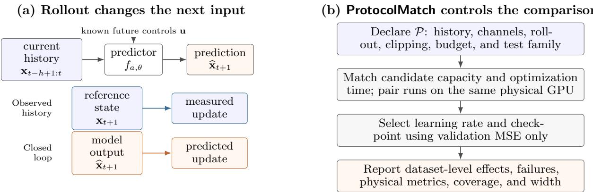
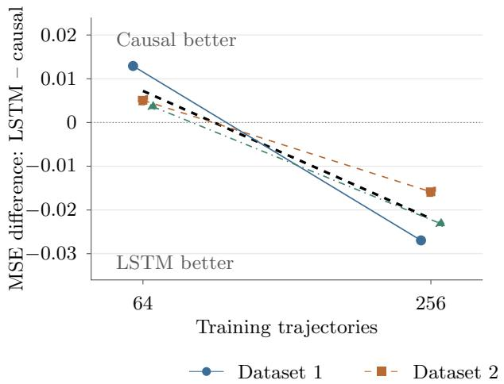
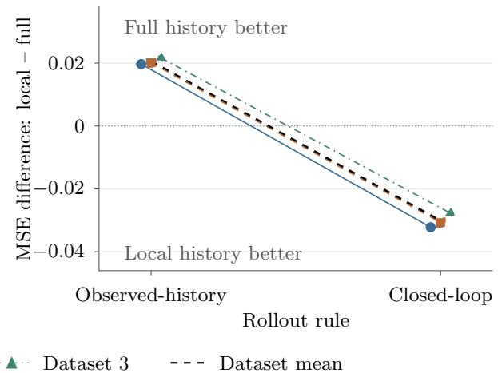
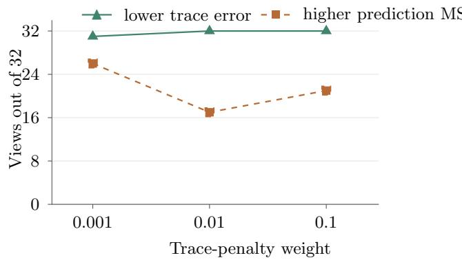
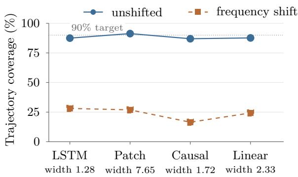
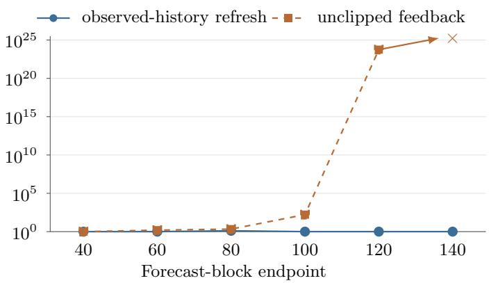

# ProtocolMatch: Protocol-Dependent Model Selection for Scientific Dynamics Forecasting

Lu Wei\* Stony Brook University

Yufeng Wang\* Stony Brook University

Haibin Ling Westlake University

## Abstract

Equal contribution.

Scientific dynamics forecasting is often framed as an architecture choice, although deployment is also determined by observed history, rollout feedback, compute budget, physical objective, and test distribution. We formulate protocol-dependent model selection and introduce ProtocolMatch, a computematched, validation-selected, and failurepreserving evaluation framework. On driven quantum-spin dynamics, we compare recurrent, patched-attention, causal-attention, and low-rank linear predictors across three independently generated datasets. The causalattention–recurrence ordering reverses as the training set grows within a fixed two-spin task, while a linear predictor has the lowest mean error in the six-spin local-observable comparison. Restricting observed history worsens every refreshed-history view but improves every closed-loop view in the four-spin study. A latest-state MLP has lower error than persistence on every dataset under state refresh across all five cells, yet its closed-loop rank varies by system and includes finite explosive errors. Physical penalties improve targeted consistency without reliably improving prediction error, and in-distribution intervals lose most coverage after a driving-frequency shift. Thus scientific model selection should return a predictor with its protocol and report accuracy, physical validity, and shifteddistribution reliability separately.

## 1 INTRODUCTION

Scientific forecasting models compress an observed history into a state representation that can be propagated beyond the data seen during training. Architecture determines one part of that representation. The forecasting protocol determines another: which variables are observed, whether later inputs come from new measurements or previous predictions, how much optimization is allowed, and whether physical constraints compete with data fit. A model rank obtained under one such protocol need not survive another.

Quantum dynamics makes the distinction operational. A driven many-body system evolves causally under a time-dependent Hamiltonian, while measurements expose only a chosen set of observables. In an observedhistory forecast, each new input window is refreshed from the reference trajectory. In a closed-loop forecast, the model’s own output enters the next window. Both protocols use the same known future controls, but they ask diferent questions: local predictive accuracy versus autonomous stability. Recurrent models have forecast quantum observables under random driving and random-circuit evolution (Mohseni et al., 2022, 2024), and attention-based models have produced long-horizon predictions for dissipative dynamics (Herrera Rodr´ıguez and Kananenka, 2024); neither result supplies a protocol-independent ordering.

We therefore study protocol-dependent model selection: the comparison target is an architecture evaluated under an explicitly declared forecasting protocol. Our framework, named ProtocolMatch, holds candidate capacity and optimization time approximately fixed, selects checkpoints and learning rates using validation data only, treats independently generated datasets as the replication unit, and preserves numerical and infrastructure failures in every denominator. It evaluates prediction error, physical consistency, and interval coverage separately.

The empirical testbed contains driven two-, four-, and six-spin systems. Two- and four-spin tasks expose complete Pauli-observable vectors, whereas the bounded sixspin extension exposes local observables. Four model families span recurrent state tracking, patched attention, causal token attention, and a low-rank linear map.

The experiments ask four linked questions: whether architecture ranks change with data and target space, whether the value of observed history changes with rollout, whether physical validity and predictive accuracy move together, and whether in-distribution calibration transfers under frequency shift.

## Our contributions are:

1. We formulate scientific forecasting comparisons around an explicit protocol P, making observation, rollout, clipping, compute, and distributional conditions part of the model-selection estimand.

2. We develop a controlled evaluation design with parameter matching, optimization-time matching, validation-only selection, independent dataset replication, and failure-preserving aggregation.

3. We identify replicated ranking reversals across data regimes and rollout rules, then show that prediction error, physical-constraint satisfaction, and shifteddistribution coverage need not move together.

The result is constructive: the experiments do not yield a universal winner, but they do yield conditional selection rules. The protocol must therefore be declared and varied before an architecture rank can be interpreted.

## 2 RELATED WORK

Learning physical dynamics. Neural ODEs, Hamiltonian neural networks, and graph simulators encode diferent assumptions about continuous-time or interacting systems (Chen et al., 2018; Greydanus et al., 2019; Sanchez-Gonzalez et al., 2020). Physics-informed learning augments empirical risk with residual or validity penalties (Raissi et al., 2019; Karniadakis et al., 2021). For quantum systems, learned representations have been used for state approximation, process prediction, control, and Hamiltonian inference (Carleo and Troyer, 2017; Huang et al., 2023; Norambuena et al., 2024; An et al., 2025). In contrast, our contribution is not a new simulator; it is a model-selection methodology for comparing forecasting biases under controlled deployment conditions.

Sequence priors for forecasting. Long short-term memory networks encode state through gated recurrence (Hochreiter and Schmidhuber, 1997). Transformers instead mix tokens through attention (Vaswani et al., 2017), and forecasting variants use decomposition, frequency structure, or temporal patches (Wu et al., 2021; Zhou et al., 2022; Nie et al., 2023). Simple linear predictors can rival larger forecasters on standard time-series benchmarks (Zeng et al., 2023). These findings motivate a comparison that includes both causal attention and a linear control, rather than treating one patched Transformer as the entire alternative class.

Benchmark reliability and uncertainty. Model ranks can be sensitive to data and optimization variation (Bouthillier et al., 2021). In quantum learning, resource-controlled studies likewise show that stronger model classes need not dominate simpler ones (Zhao et al., 2025). Standard conformal prediction provides finite-sample coverage under exchangeability, while distribution shift motivates adaptive variants (Angelopoulos and Bates, 2023; Gibbs and Cand\`es, 2021). We instead keep identity-distribution calibration fixed and measure its loss of reliability under a prespecified shift, rather than interpreting in-distribution coverage as evidence of shift robustness.

Positioning. Existing benchmark methodology typically treats data splits, hyperparameter search, and random seeds as sources of uncertainty around a single task. Our setting adds a second layer: changing the observation set or rollout rule changes the conditional distribution seen by the predictor. We make that layer explicit and test whether conclusions survive across protocols. This difers from proposing another forecaster and from declaring a winner after aggregating unlike deployment conditions.

## 3 PROTOCOL-DEPENDENT MODEL SELECTION

## 3.1 Forecasting task

Let $\mathbf { x } _ { t } \in \mathbb { R } ^ { d }$ denote the vector of observed physical quantities at discrete time $t ,$ and let $\mathbf { u } _ { t } \in \mathbb { R } ^ { q }$ denote known controls. Given a history of h states and controls through a future horizon of p steps, a forecaster $f _ { a , \theta }$ from architecture family $a \in { \mathcal { A } }$ produces

$$
\widehat { \mathbf { x } } _ { t + 1 : t + p } = f _ { a , \theta } ( \mathbf { x } _ { t - h + 1 : t } , \mathbf { u } _ { t - h + 1 : t + p } ) ,\tag{1}
$$

where θ denotes trainable parameters. The controls are known throughout the forecast; only the state history may be restricted.

A forecasting protocol is the tuple

$$
\mathcal { P } = ( h , S , r , c , B , Q ) ,\tag{2}
$$

where h is available history length, $S \subseteq \{ 1 , \ldots , d \}$ is the set of observed state channels, r is the rollout rule, c specifies output clipping, B is the optimization-time budget, and Q is the evaluation distribution. We consider two rollout rules. Observed-history forecasting refreshes every input window with the reference trajectory. Closed-loop forecasting feeds predictions into later windows. Figure 1(a) makes the changed edge explicit: future controls and the prediction target remain fixed, but the source of the next history window changes. The two protocols therefore measure local block accuracy and autonomous stability, respectively.

  
Figure 1: The forecasting protocol determines both the information available to a predictor and how that predictor is compared. (a) Observed-history and closed-loop evaluation keep the predictor, future controls, and target fixed; only the source of the next state-history window changes. (b) ProtocolMatch pairs that declared task with controlled candidates, validation-only selection, independent-dataset aggregation, and failure-preserving reliability reports.

Let $j$ index forecast blocks; let $\mathbf { H } _ { j } ^ { ( r ) }$ denote the lengthh state-history window under rule r, $\mathbf { U } _ { j }$ the required known controls, and $\mathbf { X } _ { j }$ and $\widehat { \mathbf { X } } _ { j }$ the reference and predicted p-step state blocks. Let ∥ denote concatenation and $\mathrm { t a i l } _ { h }$ retain the most recent h states. Then

$$
\begin{array} { r } { \widehat { \mathbf { X } } _ { j } = f _ { a , \theta } ( \mathbf { H } _ { j } ^ { ( r ) } , \mathbf { U } _ { j } ) , \quad \quad \quad \quad \quad } \\ { \mathbf { H } _ { j + 1 } ^ { ( r ) } = \{ \operatorname { t a i l } _ { h } ( \mathbf { H } _ { j } ^ { ( r ) } \parallel \mathbf { X } _ { j } ) , \quad r = \mathrm { o b s e r v e d } ,  \quad \quad \quad } \\ {  \operatorname { t a i l } _ { h } ( \mathbf { H } _ { j } ^ { ( r ) } \parallel \widehat { \mathbf { X } } _ { j } ) , \quad r = \mathrm { c l o s e d } . \quad \quad \quad } \end{array}\tag{3}
$$

Both rules start from the same history. Equation (3) changes only the conditioning states after the first block: reference states for observed-history evaluation and model outputs for closed-loop evaluation.

For a fixed protocol, the risk of architecture a is

$$
\begin{array} { r } { \mathcal { R } _ { \mathcal { P } } ( a ) = \mathbb { E } _ { \mathcal { D } \sim Q } \left[ \operatorname { M S E } \left( f _ { a , \widehat { \theta } _ { a } } ; \mathcal { D } , \mathcal { P } \right) \right] , } \end{array}\tag{4}
$$

where $\widehat { \theta } _ { a }$ is selected without test data. A ranking reversal occurs when two protocols $\mathcal { P } _ { 1 }$ and $\mathcal { P } _ { 2 }$ satisfy $\mathcal { R } _ { \mathcal { P } _ { 1 } } ( a ) < \mathcal { R } _ { \mathcal { P } _ { 1 } } ( b )$ but $\mathcal { R } _ { \mathcal { P } _ { 2 } } ( a ) > \mathcal { R } _ { \mathcal { P } _ { 2 } } ( b )$

## 3.2 Comparative estimand

For dataset realization $d ,$ optimization seed s, and protocol P, let $e _ { { a } , { d } , { s } , \mathcal { P } }$ be the test error of the validationselected predictor from architecture a. A paired architecture contrast is

$$
\begin{array} { r } { \Delta _ { d , s , \mathcal { P } } ( a , b ) = e _ { a , d , s , \mathcal { P } } - e _ { b , d , s , \mathcal { P } } . } \end{array}\tag{5}
$$

For $n _ { s }$ optimization seeds per dataset and $n _ { d }$ independently generated datasets, the reported contrast is hierarchical:

$$
\begin{array} { l } { \displaystyle \overline { { \Delta } } _ { d , \mathcal { P } } ( a , b ) = \frac { 1 } { n _ { s } } \sum _ { s = 1 } ^ { n _ { s } } \Delta _ { d , s , \mathcal { P } } ( a , b ) , } \\ { \displaystyle \widehat { \Delta } _ { \mathcal { P } } ( a , b ) = \frac { 1 } { n _ { d } } \sum _ { d = 1 } ^ { n _ { d } } \overline { { \Delta } } _ { d , \mathcal { P } } ( a , b ) . } \end{array}\tag{6}
$$

Each dataset-level sign identifies the better model under that protocol, while $\widehat { \Delta } _ { \mathcal { P } }$ summarizes independently regenerated datasets. Optimization seeds share trajectories; dataset seeds regenerate every split and trajectory.

The protocol is not a nuisance covariate to average away. If $\Delta$ changes sign between observed-history and closed-loop rollout, the two risks correspond to diferent deployment behaviors. Our primary object is therefore the map

$$
( a , b , \mathcal { P } ) \longmapsto \mathrm { s i g n } [ \mathbb { E } _ { d } \Delta _ { d , \mathcal { P } } ( a , b ) ] ,\tag{7}
$$

supplemented by efect magnitudes, failure counts, and reliability metrics. Universal architecture claims require this map to remain stable over the relevant protocol set; conditional recommendations do not.

## 3.3 The ProtocolMatch evaluation framework

Figure 1(b) summarizes the comparison workflow. Four controls make the resulting rank interpretable.

Matched candidates. Model widths or ranks are chosen to target 150,000 trainable parameters within 10%. Every architecture–learning-rate pair is trained on the same physical GPU within a comparison block.

Checkpoints are recorded after 30 and 120 seconds of measured optimization time; data preparation, validation, and checkpoint $\mathrm { I } / \mathrm { O }$ are outside this clock.

Validation-only selection. For each architecture, independent dataset, and training seed, the learning rate and checkpoint state are chosen by nonidentityobservable validation MSE. Test outcomes never determine selection or reruns.

Replication hierarchy. Three training seeds share each generated dataset and are averaged first. Three independently generated datasets are then the replication units for the core and history experiments. This prevents optimization seeds from being reported as independent physical datasets.

Failure preservation. Evaluation eligibility is fixed before test outcomes are examined. Nonfinite predictions count as failures; clipping defines a different protocol rather than repairing the original result. An infrastructure failure remains missing instead of being replaced by another seed.

The framework is deliberately failure preserving. A model that becomes nonfinite under one row of Table 1 is reported as such, and a clipped forecast is not used as the outcome of an unclipped condition. This keeps the comparison denominator fixed and prevents test success from becoming an implicit hyperparameter.

Table 1: Protocol factors varied in the evaluation grid.
<table><tr><td>Factor</td><td>Values</td><td>Question</td></tr><tr><td>History</td><td>1, 5, 20</td><td>How much past state is useful?</td></tr><tr><td>Channels</td><td>Full, local</td><td>Which observables are available?</td></tr><tr><td>Rollout</td><td>Refresh, closed loop</td><td>Is feedback autonomous?</td></tr><tr><td>Clipping</td><td>Off, on</td><td>Are bounds imposed at inference?</td></tr><tr><td>Budget</td><td>30 s, 120 s</td><td>Is optimization time matched?</td></tr><tr><td>Test family</td><td>ID, freq., state shifts</td><td>Where must the model generalize?</td></tr></table>

## 4 EXPERIMENTAL DESIGN: QUANTUM DYNAMICS TESTBED

## 4.1 Systems, observations, and shifts

We simulate open chains with $\hbar = 1$ . For n spins, the driven transverse-field Ising Hamiltonian is

$$
H _ { \mathrm { I } } ( t ) = g \sum _ { i = 1 } ^ { n } X _ { i } + B ( t ) \sum _ { i = 1 } ^ { n - 1 } Z _ { i } Z _ { i + 1 } ,\tag{8}
$$

where $X _ { i } , \ Y _ { i } ,$ and $Z _ { i }$ are Pauli operators on site i, $g \in [ 0 . 5 , 2 . 0 ]$ is constant within a trajectory, and $B ( t )$ is the time-varying control. The two-spin anisotropic Heisenberg (XXZ) variant uses

$$
\begin{array} { l } { { \displaystyle H _ { \mathrm { H } } ( t ) = g \sum _ { i } X _ { i } + B ( t ) \sum _ { i } \bigl ( X _ { i } X _ { i + 1 } + Y _ { i } Y _ { i + 1 } } } \\ { { \qquad + 0 . 7 Z _ { i } Z _ { i + 1 } \bigr ) . } } \end{array}\tag{9}
$$

Each trajectory contains 401 points with step $\Delta t =$ 0.02, spanning $t ~ \in ~ [ 0 , 8 ] ;$ supervised targets used for training end at $t \ = \ 4$ Training controls cycle through sine, spline, quench, and Gaussian-process families. The frequency-shift split uses sine frequencies in [1.5, 2.0], outside the training sine range [0.1, 1.0]. Two additional test families replace random product initial states by aligned or entangled states. The identitydistribution test retains the training families with disjoint trajectories.

For two and four spins, xt contains all $4 ^ { n }$ Pauli expectations. The six-spin extension predicts 19 quantities: identity and the three single-site Pauli expectations at each site. It is a local-observable forecasting task, not full-state reconstruction; its absolute error is therefore not directly comparable with the full-Pauli tasks.

## 4.2 Models and optimization

We compare four families: (i) an LSTM forecaster, (ii) a PatchTST-style model with efective LayerNorm, (iii) a causally masked Transformer, and (iv) a rankconstrained linear predictor. Every model consumes the same known controls and predicts a residual relative to the latest visible state. The default history and forecast lengths are both 20 steps. For partial-input experiments, unobserved history entries are set to zero while all target channels remain evaluated.

Two diagnostic baselines test whether learned state history is needed at all. A current-state MLP uses only the latest full observation and the complete known control sequence, passes them through one GELU hidden layer, and predicts a 20-step residual. A parameter-free persistence rule repeats the latest available observation. We analyze these controls separately from the fourfamily comparison because persistence has no fitting stage and the MLP changes the information set as well as the architecture.

Models use AdamW with learning rates $3 \times 1 0 ^ { - 4 }$ or $1 0 ^ { - 3 }$ , weight decay $1 0 ^ { - 4 }$ , batch size 64, dropout 0.1 for neural models, gradient-norm clipping at 1, and no output clipping during training. Each dataset contains 256 training, 64 validation, 64 calibration, and 64 trajectories in each test family; the small-data core cell uses the first 64 training trajectories. Appendix A specifies the full factorial design and selection procedure.

For constraint experiments, the training objective is

$$
\mathcal { L } ( \widehat { \mathbf { x } } , \mathbf { x } ) = \mathrm { M S E } ( \widehat { \mathbf { x } } , \mathbf { x } ) + \lambda \sum _ { v \in V } \mathcal { V } _ { v } ( \widehat { \mathbf { x } } ) ,\tag{10}
$$

where $\lambda \in \{ 0 . 0 0 1 , 0 . 0 1 , 0 . 1 \}$ is the constraint weight and V is a selected subset of trace, positivity, and bound terms. For predicted Pauli coeficients ${ \widehat { \mathbf { x } } } .$ trace violation penalizes $( \widehat { x } _ { I } - 1 ) ^ { 2 }$ . Positivity reconstructs $\widehat { \rho } =$ $2 ^ { - n } \sum _ { P } \hat { \widehat { x } } _ { P } P$ and penalizes squared negative eigenvalue parts. The bound term penalizes squared excess beyond $[ - 1 , 1 ]$ for every observable. All terms are computed on full-Pauli predictions.

## 4.3 Evaluation axes

Prediction error is the mean squared error over nonidentity channels in either the same-time region $t \leq 4$ or the extrapolation region $t > 4$ . Four test families, two rollout rules, clipping on or of, and two time regions yield 32 correlated views per condition. We report descriptive counts across these views and direction agreement across independent datasets; the 32 views are not treated as independent replicates.

Physical penalties target trace normalization, densitymatrix positivity, and Pauli-observable bounds. Their diagnostic metrics are reported separately from prediction MSE. For uncertainty, each model uses 64 independent identity-distribution calibration trajectories. The score for one trajectory is its largest absolute nonidentity-channel error in the reported region. The 59th ordered score defines a symmetric radius targeting 90% whole-trajectory-region coverage.

## 5 RESULTS

We organize the evidence around four prespecified questions. Which predictor is preferred as data amount and target space change? Does the value of an information channel survive a change in rollout? Do physical constraints improve the metric used for model selection? Does held-out calibration remain reliable under a known distribution shift? Each subsection changes one part of the protocol while holding the comparison target fixed; exact baseline and input contrasts appear in Appendices C.1 and C.2.

## 5.1 Data regime reverses the architecture ranking

Does the preferred architecture change when the same forecasting task receives more training data? Figure $2 ( \mathrm { a } )$ compares the LSTM and causal Transformer on two-spin Ising dynamics with 64 or 256 training trajectories; the smaller set is a fixed prefix of the larger one. The target, available history, and evaluation protocol are unchanged. This prespecified high-stress slice uses a 120-second optimization budget, identity-distribution test trajectories, unclipped closed-loop rollout, and extrapolation beyond t = 4.

The LSTM-minus-causal MSE changes from +0.00721 with 64 trajectories to −0.02198 with 256. Each of the three independent dataset contrasts crosses zero in the same direction. Thus the architecture selected for lower error reverses from causal attention to recurrence: additional data changes the ordering, not merely the size of a performance gap.

Table 2 places this comparison alongside the other system and target cells. Each mean averages training seeds within datasets before averaging datasets.

The LSTM also leads on the two-spin XXZ and four-spin full-observable cells. On the six-spin localobservable task, the low-rank linear predictor attains the lowest mean, followed by causal attention. For every displayed LSTM–causal comparison, all three dataset-level means have the same sign. The targetspace comparison complements the within-task reversal in Figure $2 ( \mathrm { a } ) \colon$ diferent observation targets favor diferent model families, while a fixed full-Pauli target already sufices to produce a reversal across data regimes.

The two attention models have distinct outcomes. PatchTST has higher error in every row, whereas causal attention leads in the small-data cell and is near the best model in the four-spin cell. Including both, together with a linear control, makes the model-selection conclusion specific: the preferred sequence prior depends on data amount and the prediction target.

## 5.2 State refresh changes the simple-baseline ranking

Can a predictor that sees only the latest state replace a temporal model? Table 3 compares the currentstate MLP with persistence under the same identitydistribution, 120-second, extrapolation protocol used for the main high-stress comparisons. The forecast difers only in whether it uses a learned latest-state map or an unchanged-state rule; the rollout protocol then determines how the next input state is supplied.

(a) Architecture rank reverses with data  

(b) Input rank reverses with rollout  
  
Figure 2: Replicated ranking reversals under matched optimization time. (a) LSTM-minus-causal error for closed-loop extrapolation changes sign between 64 and 256 training trajectories. (b) Local-minus-full-history error changes sign between observed-history and closed-loop rollout while the full prediction target remains fixed. Colored lines are independent-dataset means over three training seeds; the dashed black line is their average. Both panels use 20-step histories, a 120-second budget, identity-distribution tests, and no output clipping.

Table 2: Nonidentity-observable MSE under unclipped closed-loop extrapolation. Bold marks the lowest mean within each row. Two/four-spin targets are full Pauli vectors; the six-spin target contains local observables only.
<table><tr><td>System and target</td><td>Train traj.</td><td>LSTM</td><td>PatchTST</td><td>Causal Transformer</td><td>Low-rank linear</td></tr><tr><td>Two-spin Ising, full Pauli</td><td>64</td><td>0.09402</td><td>0.65869</td><td>0.08681</td><td>0.19583</td></tr><tr><td>Two-spin Ising, full Pauli</td><td>256</td><td>0.02456</td><td>0.66745</td><td>0.04654</td><td>0.18849</td></tr><tr><td>Four-spin Ising, full Pauli</td><td>256</td><td>0.10608</td><td>0.12416</td><td>0.10902</td><td>0.12220</td></tr><tr><td>Two-spin XXZ, full Pauli</td><td>256</td><td>0.03074</td><td>0.25047</td><td>0.04540</td><td>0.18421</td></tr><tr><td>Six-spin Ising, local Pauli</td><td>256</td><td>0.08833</td><td>0.08835</td><td>0.07878</td><td>0.07668</td></tr></table>

With observed-history refresh, the MLP has lower error on every dataset in all five cells. Under closed-loop feedback, it remains lower in the two-spin 256-trajectory and six-spin local-observable cells, persistence is lower on all three XXZ datasets, and the remaining two cells are mixed. The four-spin mean includes finite explosive predictions rather than replacing them with stable fits. Output clipping changes the comparison again: the MLP is lower on all three datasets in four of five cells, while the four-spin direction remains mixed. A lateststate map can therefore be an accurate refreshed-state predictor without being a stable autonomous simulator. Appendices A.4 and C.1 give the design and individual high-error values.

## 5.3 Rollout reverses the value of nonlocal history

Can restricting the observed state improve a forecast without simplifying its target? The four-spin experiment compares models trained with full history against models trained with only 13 local channels–identity plus all single-site Pauli expectations. Both predict the same full 256-channel vector and receive the same future controls. Nonlocal history entries are masked to zero; target channels are neither removed nor downweighted.

Figure 2(b) defines the input contrast as local-minusfull MSE. For the history-20 LSTM, it is +0.02046 with observed-history refresh and −0.03023 with closed-loop feedback. Each independent dataset shows the same sign change. The benefit of nonlocal history therefore depends on whether those channels are refreshed from observations or populated by preceding predictions.

This reversal extends across the evaluation grid. Localonly input worsens all 16 observed-history views and improves all 16 closed-loop views for each of the three neural architectures, every history length in {1, 5, 20}, and all three datasets. These views cover test families, clipping choices, and time regions; their direction counts summarize shared-model evaluations rather than additional independent replications.

Table 3: Latest-state controls on identity-distribution extrapolation. Entries are nonidentity MSE mean ± sample SD across three independent dataset means; MLP training seeds are averaged within each dataset first. The MLP uses its validation-selected 120-second checkpoint. $^ { 6 6 } 3 / 3 ^ { 9 }$ denotes the same paired direction in all datasets.
<table><tr><td></td><td></td><td colspan="2">Observed-history refresh</td><td colspan="2">Unclipped closed loop</td></tr><tr><td>System and target</td><td></td><td>Train traj. Current-state MLP</td><td>Persistence</td><td>Current-state MLP</td><td>Persistence / direction</td></tr><tr><td>Two-spin Ising, full Pauli</td><td>64</td><td> $0 . 0 0 5 2 4 \pm 0 . 0 0 0 9 4$ </td><td> $0 . 0 9 9 7 9 \pm 0 . 0 0 3 2 3$ </td><td> $0 . 4 9 3 0 7 \pm 0 . 3 1 7 8 2$ </td><td> $0 . 3 4 2 8 5 \pm 0 . 0 0 6 6 1$  /mixed</td></tr><tr><td>Two-spin Ising, full Pauli</td><td>256</td><td> $0 . 0 0 2 0 0 \pm 0 . 0 0 0 3 8$ </td><td> $0 . 0 9 9 7 9 \pm 0 . 0 0 3 2 3$ </td><td> $0 . 2 2 4 3 6 \pm 0 . 0 3 2 4 5$ </td><td> $0 . 3 4 2 8 5 \pm 0 . 0 0 6 6 1$  /MLP 3/3</td></tr><tr><td>Four-spin Ising, full Pauli</td><td>256</td><td> $0 . 0 3 6 7 5 \pm 0 . 0 0 1 5 0$ </td><td> $0 . 0 4 2 3 8 \pm 0 . 0 0 1 5 8$ </td><td> $2 . 7 3 \times 1 0 ^ { 3 5 } \pm 4 . 7 2 \times 1 0 ^ { 3 5 }$ </td><td> $0 . 1 1 2 0 3 \pm 0 . 0 0 1 1 9$  /mixed</td></tr><tr><td>Two-spin XXZ, full Pauli</td><td>256</td><td> $0 . 0 0 6 3 0 \pm 0 . 0 0 3 0 6$ </td><td> $0 . 1 2 9 3 0 \pm 0 . 0 0 8 7 8$ </td><td> $4 . 1 2 9 8 5 \pm 5 . 7 5 5 1 8$ </td><td> $0 . 3 3 5 3 8 \pm 0 . 0 0 8 4 4$  / persistence 3/3</td></tr><tr><td>Six-spin Ising, local Pauli</td><td>256</td><td> $0 . 0 1 3 6 2 \pm 0 . 0 0 1 4 8$ </td><td> $0 . 0 3 2 2 2 \pm 0 . 0 0 2 9 9$ </td><td> $0 . 0 8 7 3 7 \pm 0 . 0 0 1 6 7$ </td><td> $0 . 2 9 3 3 5 \pm 0 . 0 0 5 7 9$  / MLP 3/3</td></tr></table>

History length is conditional as well. With full inputs, LSTM history 5 has lower mean error than history 20 in 27 of 32 two-spin views and 30 of 32 four-spin views. All three dataset-level efects agree on the improvement in 9 and 28 views, respectively (Appendix C.2). More available context does not imply a better forecast.

The operational consequence is direct: an information set should be selected under the rollout used at deployment. Observed-history refresh measures the value of additional reference channels; closed-loop evaluation also measures the consequences of feeding their predictions back. The measured sign reversal establishes this distinction. Error amplification through nonlocal feedback is a mechanistic hypothesis for the interaction, not a prerequisite for the model-selection result.

## 5.4 Physical validity and accuracy are separate objectives

Do constraints improve forecasting accuracy, or only the physical property they encode? On one prespecified dataset, a trace-normalization penalty improves its targeted trace metric in 31/32, 32/32, and 32/32 views at weights 0.001, 0.01, and 0.1 (Figure 3(a)). Prediction MSE simultaneously increases in 26/32, 17/32, and 21/32 views. Combining trace, positivity, and observable-bound penalties increases MSE in all 32 views for both the LSTM and causal Transformer at every tested weight (Appendix C.3).

These are not contradictory outcomes: the loss defines a multi-objective optimization problem. Under a fixed wall-clock budget, constraint computation also consumes optimization time. Physical penalties should therefore be selected using the physical metric they are meant to improve and an explicit accuracy tolerance, rather than being assumed to regularize MSE monotonically.

## 5.5 In-distribution calibration does not transfer to shift

Does held-out calibration protect a forecaster under shift? Figure 3(b) fixes the two-spin Ising, 256- trajectory, full-history condition from Table 2. Coverage requires every nonidentity prediction in the extrapolation region of a trajectory to lie inside the interval. All models are calibrated only on independent identitydistribution trajectories.

Identity-distribution coverage is 87–91%, but frequencyshift coverage falls to 16–28%. PatchTST attains the highest identity coverage only with intervals roughly six times wider than the LSTM’s. Coverage, sharpness, and shifted reliability must therefore be evaluated together; a fixed identity-calibrated radius is not a shift detector. Exact values and the calibration construction appear in Appendix C.4.

## 5.6 Failure-preserving accounting bounds the claim

What changes when unsuccessful evaluations remain visible? The design defines 5,616 protocol–region intervals; 5,608 are available, while eight remain missing because one validation-selected predictor could not initialize on the evaluation device. Unclipped feedback also exposes a nonfinite PatchTST forecast, whereas clipping makes the forecast finite but substantially less accurate. The latest-state baseline retains finite explosive four-spin outcomes and one high-error XXZ seed. None is replaced by a successful run, so testconditioned reruns cannot silently change the estimand (Appendix D).

A paired six-fit PatchTST diagnostic compares Batch-Norm with LayerNorm under shared initialization and matched hardware; the validation diference changes sign across seeds and budgets. Because the primary comparisons use efective LayerNorm, PatchTST underperformance is a result for the evaluated models and protocols, not evidence that one normalization layer or attention as a class is inherently unsuitable.

(a) Validity and accuracy move separately  

(b) Coverage degrades under frequency shift  
  
Figure 3: Accuracy, physical validity, and uncertainty are distinct outcomes. (a) A trace penalty usually lowers trace error but often raises prediction MSE for a two-spin LSTM; the 32 correlated views share fitted models. (b) Intervals calibrated on 64 independent identity-distribution trajectories approach nominal 90% coverage in distribution but lose most coverage after a frequency shift. Widths are full symmetric interval widths.

## 6 DISCUSSION

The selected object is the pair $( a , \mathcal { P } )$ , not an architecture name alone. Recurrence has the lowest error in the data-rich two-spin full-observable cell, causal attention leads in the smaller-data cell, and the linear predictor leads for six-spin local observables. The latest-state MLP is uniformly preferable to persistence when reference states refresh its input, yet its closed-loop ranking is system dependent. This conditional view extends beyond quantum dynamics: weather, control, molecular simulation, and learned surrogates likewise vary in available measurements, rollout feedback, compute, and distribution shift. A benchmark that changes architecture while averaging across these conditions does not identify the predictor appropriate for deployment.

Our evidence comes from exact simulated closed-system spin dynamics, up to four spins with complete Pauli observations and six spins with local observations. It does not estimate rankings for large many-body systems, noisy measurements, or open-system dynamics, and the constraint study uses one independent dataset rather than three.

The reversals motivate testable mechanisms but do not establish them. With complete Pauli inputs, a recurrent hidden state may compress the trajectory efficiently once enough training data are available. Under closed-loop rollout, every predicted channel can re-enter later windows, so nonlocal channels add feedback paths absent from local-only input. The six-spin linear result may instead reflect its local target rather than system size. Pauli-weight noise interventions and multi-site six-spin targets would distinguish these explanations.

The practical recommendation is to declare the protocol grid, pair candidate runs on hardware, select with validation data only, aggregate independently generated datasets, and retain failures. Accuracy, physical validity, and uncertainty should remain separate coordinates. Observed-history validation is insuficient for autonomous deployment, just as identity-distribution coverage is insuficient when shifts are expected. The resulting rule is conditional but actionable: select the predictor with the lowest validated risk under the intended observation, rollout, compute, and distributional conditions.

## 7 CONCLUSION

Scientific dynamics forecasting does not have a contextfree architecture ranking. In controlled quantumdynamics experiments, recurrent, attention-based, and linear predictors exchange advantages across data regimes and target spaces, while both the value of observed history and the stability of a latest-state MLP change with rollout. Physical penalties improve targeted consistency without reliably improving MSE, and identity-calibrated intervals lose coverage under frequency shift. By making protocol part of the modelselection estimand, the proposed ProtocolMatch converts these conditional outcomes into explicit selection and reporting rules for scientific forecasters. More broadly, this protocol-centered view turns architecture comparison from a search for a universal winner into a reproducible procedure for selecting models under the conditions in which they will actually be used.

## AI USE STATEMENT

Generative AI tools were used for language editing, manuscript-structure suggestions, and implementation assistance. The authors take responsibility for the final

content of this work.

## References

An, Z., Wu, J., Lin, Z., Yang, X., Li, K., and Zeng, B. (2025). Dual-capability machine learning models for quantum hamiltonian parameter estimation and dynamics prediction. Physical Review Letters, 134(12):120202.

Angelopoulos, A. N. and Bates, S. (2023). Conformal prediction: A gentle introduction. Foundations and Trends in Machine Learning, 16(4):494–591.

Bouthillier, X., Delaunay, P., Bronzi, M., Trofimov, A., Nichyporuk, B., Szeto, J., Mohammadi Sepahvand, N., Raf, E., Madan, K., Voleti, V., Ebrahimi Kahou, S., Michalski, V., Serdyuk, D., Arbel, T., Pal, C., Varoquaux, G., and Vincent, P. (2021). Accounting for variance in machine learning benchmarks. In Proceedings of Machine Learning and Systems, volume 3.

Carleo, G. and Troyer, M. (2017). Solving the quantum many-body problem with artificial neural networks. Science, 355(6325):602–606.

Chen, R. T. Q., Rubanova, Y., Bettencourt, J., and Duvenaud, D. (2018). Neural ordinary diferential equations. In Advances in Neural Information Processing Systems, volume 31.

Gibbs, I. and Cand\`es, E. J. (2021). Adaptive conformal inference under distribution shift. In Advances in Neural Information Processing Systems, volume 34.

Greydanus, S., Dzamba, M., and Yosinski, J. (2019). Hamiltonian neural networks. In Advances in Neural Information Processing Systems, volume 32.

Herrera Rodr´ıguez, L. E. and Kananenka, A. A. (2024). A short trajectory is all you need: A transformer-based model for long-time dissipative quantum dynamics. The Journal of Chemical Physics, 161(17):171101.

Hochreiter, S. and Schmidhuber, J. (1997). Long shortterm memory. Neural Computation, 9(8):1735–1780.

Huang, H.-Y., Chen, S., and Preskill, J. (2023). Learning to predict arbitrary quantum processes. PRX quantum, 4(4):040337.

Karniadakis, G. E., Kevrekidis, I. G., Lu, L., Perdikaris, P., Wang, S., and Yang, L. (2021). Physics-informed machine learning. Nature Reviews Physics, 3(6):422– 440.

Mohseni, N., F¨osel, T., Guo, L., Navarrete-Benlloch, C., and Marquardt, F. (2022). Deep learning of quantum many-body dynamics via random driving. Quantum, 6:714.

Mohseni, N., Shi, J., Byrnes, T., and Hartmann, M. J. (2024). Deep learning of many-body observables and quantum information scrambling. Quantum, 8:1417.

Nie, Y., Nguyen, N. H., Sinthong, P., and Kalagnanam, J. (2023). A time series is worth 64 words: Longterm forecasting with transformers. In International Conference on Learning Representations.

Norambuena, A., Mattheakis, M., Gonz´alez, F. J., and Coto, R. (2024). Physics-informed neural networks for quantum control. Physical Review Letters, 132(1):010801.

Raissi, M., Perdikaris, P., and Karniadakis, G. E. (2019). Physics-informed neural networks: A deep learning framework for solving forward and inverse problems involving nonlinear partial diferential equations. Journal of Computational physics, 378:686– 707.

Sanchez-Gonzalez, A., Godwin, J., Pfaf, T., Ying, R., Leskovec, J., and Battaglia, P. (2020). Learning to simulate complex physics with graph networks. In Proceedings of the 37th International Conference on Machine Learning, volume 119 of Proceedings of Machine Learning Research, pages 8459–8468.

Vaswani, A., Shazeer, N., Parmar, N., Uszkoreit, J., Jones, L., Gomez, A. N., Kaiser, L., and Polosukhin, I. (2017). Attention is all you need. Advances in neural information processing systems, 30.

Wu, H., Xu, J., Wang, J., and Long, M. (2021). Autoformer: Decomposition transformers with autocorrelation for long-term series forecasting. In Advances in Neural Information Processing Systems, volume 34, pages 22419–22430.

Zeng, A., Chen, M., Zhang, L., and Xu, Q. (2023). Are transformers efective for time series forecasting? In Proceedings of the AAAI Conference on Artificial Intelligence, volume 37, pages 11121–11128.

Zhao, Y., Zhang, C., and Du, Y. (2025). Rethink the role of deep learning towards large-scale quantum systems. arXiv preprint arXiv:2505.13852.

Zhou, T., Ma, Z., Wen, Q., Wang, X., Sun, L., and Jin, R. (2022). Fedformer: Frequency enhanced decomposed transformer for long-term series forecasting. In International conference on machine learning, pages 27268–27286. PMLR.

## CHECKLIST

1. For all models and algorithms presented, check if you include:

(a) A clear description of the mathematical setting, assumptions, algorithm, and/or model. [Yes]

(b) An analysis of the properties and complexity (time, space, sample size) of any algorithm. [Yes]

(c) The estimated hourly wage paid to participants and the total amount spent on participant compensation. [Not Applicable]

(c) (Optional) Anonymized source code, with specification of all dependencies, including external libraries. [No]

2. For any theoretical claim, check if you include:

(a) Statements of the full set of assumptions of all theoretical results. [Not Applicable]

(b) Complete proofs of all theoretical results. [Not Applicable]

(c) Clear explanations of any assumptions. [Yes]

3. For all figures and tables that present empirical results, check if you include:

(a) The code, data, and instructions needed to reproduce the main experimental results (either in the supplemental material or as a URL). [No]

(b) All the training details (e.g., data splits, hyperparameters, how they were chosen). [Yes]

(c) A clear definition of the specific measure or statistics and error bars (e.g., with respect to the random seed after running experiments multiple times). [Yes]

(d) A description of the computing infrastructure used. (e.g., type of GPUs, internal cluster, or cloud provider). [Yes]

4. If you are using existing assets (e.g., code, data, models) or curating/releasing new assets, check if you include:

(a) Citations of the creator If your work uses existing assets. [No]

(b) The license information of the assets, if applicable. [No]

(c) New assets either in the supplemental material or as a URL, if applicable. [No]

(d) Information about consent from data providers/curators. [Not Applicable]

(e) Discussion of sensible content if applicable, e.g., personally identifiable information or offensive content. [Not Applicable]

5. If you used crowdsourcing or conducted research with human subjects, check if you include:

(a) The full text of instructions given to participants and screenshots. [Not Applicable]

(b) Descriptions of potential participant risks, with links to Institutional Review Board (IRB) approvals if applicable. [Not Applicable]

# Protocol-Dependent Model Selection for Scientific Dynamics Forecasting: Appendix

## A COMPLETE EXPERIMENTAL DESIGN

## A.1 Core matrix

The core matrix crosses four architecture families with the following system/data cells: two-spin Ising with 64 or 256 training trajectories, four-spin Ising with 256 trajectories, and two-spin XXZ with 256 trajectories. For each cell, three independently generated dataset suites, three training seeds, two learning rates, and two optimization budgets are evaluated. The bounded six-spin extension repeats the same four architectures with 256 training trajectories and local-observable targets. These groups contain 288 core fits and 72 six-spin fits.

History and partial-input controls add 540 fits across two- and four-spin Ising systems, three neural architectures, available histories of 1, 5, or 20 steps, and full or local input. Constraint controls add 216 fits on a prespecified two-spin dataset across three architectures, four constraint sets, three weights, three training seeds, and two learning rates. The primary evaluation matrix contains 1,116 fitted candidates. A separate baseline study adds 90 current-state MLP fits and 15 deterministic persistence evaluations.

Table 4: Experimental inventory. Counts denote fitted architecture/configuration instances except for the diagnostic row, which includes 90 MLP fits and 15 deterministic persistence evaluations.
<table><tr><td>Group</td><td>Evaluations</td><td>Independent datasets</td><td>Primary purpose</td></tr><tr><td>Core matched comparisons</td><td>288</td><td>3 per system cell</td><td>Architecture and data-regime ranks</td></tr><tr><td>History and input controls</td><td>540</td><td>3 per condition</td><td>Information-rollout interaction</td></tr><tr><td>Constraint terms and weights</td><td>216</td><td>1</td><td>Accuracy-validity trade-off</td></tr><tr><td>Six-spin extension</td><td>72</td><td>3</td><td>Local-observable scaling check</td></tr><tr><td>Primary matrix total</td><td>1,116</td><td></td><td></td></tr><tr><td>Diagnostic baselines (separate)</td><td>105</td><td>3 per system cell</td><td>Latest-state and persistence controls</td></tr></table>

## A.2 Data generation

Each dataset suite uses an independent root seed and disjoint random-number substreams for split, trajectory, state, coupling, driving field, and trajectory identifier. No trajectory is skipped, repaired, clipped, or renormalized. Each suite contains train, validation, calibration, identity test, frequency-shift test, aligned-state test, and entangled-state test splits. Counts are 256/64/64/64 per test family, except that the small-data core condition uses a fixed 64-trajectory prefix of its training split.

Reference evolution uses complex128 propagation with left-endpoint float32 controls. Two- and four-spin systems store the lexicographically ordered full Pauli basis; six-spin systems store identity followed by site-major X, Y, and Z observables. Stored reference expectations are finite, real, normalized on identity, and within Pauli bounds.

## A.3 Training-time matching and selection

The optimization clock includes device transfers, forward and backward passes, optimizer updates, gradient clipping, and finite-value checks. It excludes data loading before training, validation, checkpoint serialization, and result aggregation. A checkpoint is emitted at the first completed update after each target budget. Validation is

performed on all candidate learning-rate/checkpoint pairs, and the lowest nonidentity MSE selects the model before test evaluation.

Within every training-seed comparison block, the four architectures use the same physical GPU. Hardware difers across blocks, so the design supports within-block matched-time comparisons but not a global throughput ranking across GPU models. Experiments use NVIDIA RTX A5000, RTX A6000, RTX 3090, and TITAN RTX devices.

## A.4 Diagnostic baseline design

The current-state MLP concatenates the latest full observation with the known control sequence over the 20-step history and 20-step forecast, applies one GELU hidden layer with dropout 0.1, and predicts a residual from the latest observation. Its width is selected to target 150,000 trainable parameters within 10%. The persistence rule has no trained parameters and repeats the latest available observation for all 20 forecast steps.

The baseline study crosses five system/data cells, three independent datasets, three MLP training seeds, two learning rates, and synchronized 30- and 120-second checkpoints. This produces 90 MLP fits; learning rate is selected separately for each seed and budget using same-time validation MSE only. Persistence is evaluated once for each system/data/dataset cell, producing 15 evaluations. All 105 planned evaluations completed, and no test outcome enters selection.

## B REPORTING AND REPLICATION UNITS

Let $e _ { d , s }$ denote a scalar evaluation for dataset seed d and training seed s. We first compute $\begin{array} { r } { \bar { e } _ { d } = \frac { 1 } { 3 } \sum _ { s } e _ { d , s } } \end{array}$ , then report $\textstyle { \frac { 1 } { 3 } } \sum _ { d } { \bar { e } } _ { d }$ . Architecture diferences are paired within (d, s) on the same physical GPU. Statements that all datasets agree refer to the signs of the three $\bar { e } _ { d }$ diferences. The 32 views within a condition share fitted models and test construction and are not independent replications.

All primary errors exclude the identity observable. The same-time region contains targets at or before the training cutof $t = 4 ;$ the extrapolation region contains targets after that cutof. Observed-history evaluation uses the reference state for every input window. Closed-loop evaluation uses the model’s preceding predictions once the initial context has been consumed. Clipped and unclipped predictions are separate protocols.

## C ADDITIONAL RESULT DETAIL

## C.1 Latest-state and persistence controls

Table 3 reports the primary 120-second comparison. With true-state refresh, every one of the 15 dataset-level pairs favors the current-state MLP. With unclipped closed-loop feedback, the two-spin Ising 256-trajectory and six-spin local-observable cells favor the MLP in all datasets, the two-spin XXZ cell favors persistence in all datasets, and the two-spin Ising 64-trajectory and four-spin cells have mixed signs. With output clipping, four cells favor the MLP in all datasets and the four-spin cell remains mixed.

The four-spin closed-loop mean is dominated by four finite divergences in two of the three independent datasets, with seed-level MSEs of $9 . 9 0 \times 1 0 ^ { 3 2 } , 7 . 2 6 \times 1 0 ^ { 8 } , 2 . 4 3 \times 1 0 ^ { 3 6 }$ , and $2 . 2 6 \times 1 0 ^ { 3 4 }$ . The remaining dataset has mean MSE 0.106. The XXZ study likewise contains one selected seed with MSE 31.3. These outcomes remain in the reported aggregates rather than being filtered after test evaluation.

## C.2 History and observation interventions

The local-input rows aggregate the direction across LSTM, PatchTST, and causal Transformer models and available histories 1, 5, and 20. The target remains full width. The intervention therefore changes only what state history the predictor receives, not what it must predict or which future controls it knows.

## C.3 Constraint directions

For the combined trace, positivity, and bounds objective, prediction MSE increases in all 32 views for both the LSTM and causal Transformer at all three weights. Because constraint calculation is included in the fixed

Table 5: Dataset-level contrasts in Figure 2. Each dataset column averages three training seeds; the final column averages datasets. Positive architecture diferences favor causal attention, and positive input diferences favor full history.
<table><tr><td>Contrast</td><td>Condition</td><td>Dataset 1</td><td>Dataset 2</td><td>Dataset 3</td><td>Mean</td></tr><tr><td>LSTM minus causal</td><td>64 trajectories</td><td>+0.01292</td><td>+0.00508</td><td>+0.00363</td><td>+0.00721</td></tr><tr><td>LSTM minus causal</td><td>256 trajectories</td><td>-0.02696</td><td>-0.01586</td><td>-0.02314</td><td>-0.02198</td></tr><tr><td>Local minus full input</td><td>Observed-history</td><td>+0.01967</td><td>+0.02011</td><td>+0.02162</td><td>+0.02046</td></tr><tr><td>Local minus full input</td><td>Closed-loop</td><td>-0.03221</td><td>-0.03072</td><td>-0.02776</td><td>-0.03023</td></tr></table>

Table 6: Direction summaries across the 32 correlated evaluation views. “All-data agreement” counts views in which the sign is the same for all three independently generated datasets.
<table><tr><td>System</td><td>Comparison</td><td>Lower-error views</td><td>All-data agreement</td></tr><tr><td>Two-spin Ising</td><td>LSTM history 5 vs. 20</td><td>27/32</td><td>9/32</td></tr><tr><td>Four-spin Ising</td><td>LSTM history 5 vs. 20</td><td>30/32</td><td>28/32</td></tr><tr><td>Four-spin Ising</td><td>Local vs. full, observed history</td><td>0/16</td><td>16/16 worse</td></tr><tr><td>Four-spin Ising</td><td>Local vs. full, closed loop</td><td>16/16</td><td>16/16 better</td></tr></table>

optimization clock, this comparison measures the deployed objective under a fixed resource budget rather than a pure regularization efect at an equal number of gradient updates.

## C.4 Calibration construction

For each fixed predictor and region, calibration trajectory j receives score

$$
s _ { j } = \operatorname* { m a x } _ { ( t , k ) \in \mathcal { T } } \left| x _ { t , k } ^ { ( j ) } - \widehat { x } _ { t , k } ^ { ( j ) } \right| ,\tag{11}
$$

where I is the Cartesian product of reported times and nonidentity channels. With 64 calibration trajectories and target miscoverage $\alpha = 0 . 1$ , the radius is the $\left\lceil ( 6 4 + 1 ) ( 1 - \alpha ) \right\rceil = 5 9 \mathrm { - t h }$ ordered score. The interval uses the same radius for every coordinate in the region and is not clipped. ID and shifted tests share this radius; only the test distribution changes.

## D FAILURE-PRESERVING DIAGNOSTICS

For one prespecified PatchTST model–trajectory pair, unclipped feedback becomes nonfinite after five completed forecast blocks. Figure 4 shows the preceding amplification: the maximum absolute output grows from 2.14 to 165 and then to $5 . { \bar { 5 } } 8 \times 1 0 ^ { 2 3 }$ , while observed-history refresh remains near one. Replaying the ofending input in double precision moves the first observed nonfinite value from the input projection to the output projection but does not restore a finite forecast. Output clipping permits completion, with MSE 0.21652 compared with 0.01082 under observed-history refresh. These are distinct protocol outcomes for a single diagnostic case, not an estimated failure rate.

The current-state MLP analysis includes the finite four-spin and XXZ high-error outcomes listed in Appendix C.1. Validation error alone selects their checkpoints and learning rates; stable test behavior is not an eligibility condition.

A paired six-fit diagnostic compares BatchNorm with LayerNorm under shared parameter initialization and matched GPUs on one dataset. BatchNorm-minus-LayerNorm validation errors have mixed signs across seeds and budgets, so the diagnostic does not support a normalization-wide advantage or explain the closed-loop failure. The primary PatchTST comparisons use efective LayerNorm.

One validation-selected predictor cannot initialize on the evaluation device, so its eight protocol–region intervals remain unavailable. No successful training seed is substituted, and summaries requiring complete coverage report the missing value.

Table 7: Two-spin LSTM trace-penalty direction counts on the prespecified constraint dataset.
<table><tr><td>Penalty weight</td><td>Views with lower trace error</td><td>Views with higher prediction MSE</td></tr><tr><td>0.001</td><td>31/32</td><td>26/32</td></tr><tr><td>0.01</td><td>32/32</td><td>17/32</td></tr><tr><td>0.1</td><td>32/32</td><td>21/32</td></tr></table>

Table 8: Nominal 90% whole-trajectory-region interval results for the two-spin Ising, 256-trajectory, full-history condition. Width is the full symmetric interval width.
<table><tr><td>Predictor</td><td>ID coverage</td><td>Shift coverage</td><td>Width</td></tr><tr><td>LSTM</td><td>87.50%</td><td>28.13%</td><td>1.2767</td></tr><tr><td>PatchTST</td><td>91.32%</td><td>26.91%</td><td>7.6545</td></tr><tr><td>Causal Transformer</td><td>86.98%</td><td>16.49%</td><td>1.7195</td></tr><tr><td>Low-rank linear</td><td>87.67%</td><td>24.31%</td><td>2.3278</td></tr></table>

## E IMPLEMENTATION AND REPRODUCIBILITY

Source code, model and training configurations, dataset-generation metadata, checkpoints, and per-evaluation metrics are organized by experimental condition. Each result identifies its model configuration, dataset seed, training seed, optimization budget, validation-selected checkpoint, metric values, and failure status. This structure supports reconstruction of the aggregation hierarchy and the distinction between missing, nonfinite, clipped, and successfully completed outcomes.

The experiment software is implemented in Python with PyTorch, NumPy, and SciPy. Reference quantum propagation uses SciPy matrix exponentiation for two- and four-spin systems and sparse expm multiply fo six-spin systems. Machine-readable environment files record the package versions used for data generation, training, and evaluation.

  
Figure 4: Closed-loop amplification for one prespecified PatchTST model–trajectory pair. Each point is the maximum absolute model output in a successive 20-step block; the vertical axis is logarithmic. Observed-history refresh stays bounded, whereas unclipped feedback reaches $5 . 5 8 \times 1 0 ^ { 2 3 }$ before the next block becomes nonfinite (cross). This numerical diagnostic is not a population failure-rate estimate.