# Q-Learning with Scalar Adjoint Matching

Yonghoon Dong1, Minsung Yoon1,2, Jaehyuk Kim1, Jungwoo Park1, Changyeon Kim1 and Jinwoo Shin1,2

1KAIST, 2RLWRLD

Flow policies capture rich and diverse action distributions, and fine-tuning them with of-policy RL to improve beyond the demonstrations has drawn growing interest. However, fine-tuning a flow policy against a learned value function is not trivial, because the policy generates its action over many flow steps. Adjoint matching ofers a principled way to update the flow model itself by propagating value information from the final action back to each flow step, but it requires a vector–Jacobian product through the policy at every step, a cost that grows with the number of flow steps and the policy size. We observe that the batch-averaged velocity Jacobian of pretrained flow policies concentrates on its diagonal. Motivated by this finding, we derive a closed-form scalar adjoint that scales the value gradient at the final action by the flow time, eliminating the per-step vector–Jacobian products. We further find that controlling the critic’s value at policy-generated actions is particularly important under the scalar adjoint. Based on these findings, we propose Q-learning with Scalar Adjoint Matching (SQAM), which combines the scalar adjoint with a value penalty at those actions. SQAM’s gains concentrate on the four hardest OGBench domains, where its success rate exceeds that of the strongest baseline in each domain by 18 to 35 percentage points. To test whether SQAM extends to large pretrained policies, we also fine-tune a vision-language-action policy on a real bimanual robot. SQAM improves over supervised fine-tuning on all three tasks.

Code: github.com/yonghdong/sqam Blog: yonghdong.github.io/blog/sqam

## 1. Introduction

Flow policies represent rich and multimodal action distributions, and they have become a common policy class for ofline and ofline-to-online RL (Park et al., 2025b; Li and Levine, 2026; Dong et al., 2026c; Chi et al., 2023) as well as the backbone of recent large pretrained robot policies (Intelligence et al., 2025b; Bjorck et al., 2025). Improving such a policy beyond the data it was trained on calls for fine-tuning it with of-policy RL against a learned action-value function (Intelligence et al., 2025a; Wang et al., 2026; Dong et al., 2026a; Xu et al., 2026; Li et al., 2025b; Chen et al., 2025).

However, fine-tunin a flow olic to maximize a learned value function is not a trivial roblem because of its multiple sampling procedure (Park et al., 2025b; Zhang et al., 2026). Most methods therefore freeze the policy and work outside it, adding a separately learned residual to the actions it produces (Dong et al., 2026b; Xiao et al., 2026) or learning with RL which input noise to feed the frozen policy (Wagenmaker et al., 2025), which leaves the pretrained policy intact during training. The improvement then rests on a separately learned component rather than on the generative model itself, so it is either bounded by what the frozen policy can express or forfeits the expressiveness of the flow policy. On the other hand, adjoint matching (Domingo-Enrich et al., 2025; Li and Levine, 2026; Dong et al., 2026c) provides a theoretically grounded alternative for directly updating the flow model with value functions. It propagates value information from the final action back to each flow step to guide the model’s updates. However, this requires a vector–Jacobian product through the policy at every step, so the computational cost grows with the number of flow steps and policy size.

In this work, we observe that the batch-averaged velocity Jacobian of a pretrained flow policy concentrates on its diagonal (Figure 2). This suggests that the vector–Jacobian product adjoint matching pays for at every flow step may not be necessary. Inspired by this finding, we approximate the Jacobian by a scalar multiple of the identity, under which the propagation admits a closed form that scales the value gradient at the final action by the flow time (Proposition 1). We call this the scalar adjoint. It needs a single critic gradient at the sampled action and no vector–Jacobian product through the policy, and Section 4.2 shows that it preserves the qualitative trends of the exact propagation.

We further find that the efectiveness of the scalar adjoint depends on the value-learning scheme. We investigate this dependence and identify the critic’s value at policy-generated actions as particularly important.

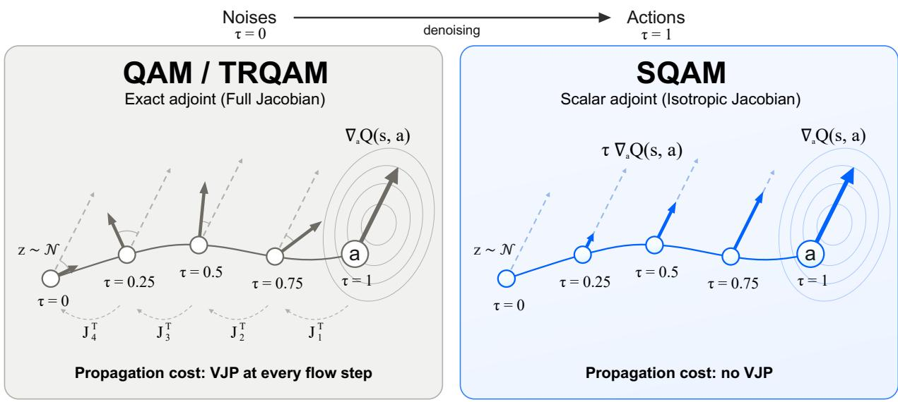  
Figure 1: Adjoint matching propagates the critic’s gradient at the final action back to the flow steps that produced it, and the propagated gradient updates the flow model. Left: QAM and TRQAM integrate the lean adjoint ODE backward along the sampling chain, which takes a vector–Jacobian product $J _ { i } ^ { \top }$ through the policy at every flow step, so the cost grows with the number of flow steps and the policy size. Right: SQAM instead scales the gradient at the final action, $\nabla _ { a } Q ( s , a )$ , by the flow time $\tau ,$ with no vector–Jacobian product at any flow step.

Our regularization ablations isolate this dependency. Methods that regulate the critic at these actions improve performance, while methods that act only on dataset (Kostrikov et al., 2022) or action distance (Tarasov et al., 2023) provide little improvement (Section 4.3). Based on these findings, we propose Q-learning with Scalar Adjoint Matching (SQAM), which combines the scalar adjoint with a value penalty at policy-generated actions.

Through experiments on the 50 OGBench (Park et al., 2025a) tasks, SQAM outperforms prior methods in both ofline RL and ofline-to-online RL, and the gains concentrate where the benchmark is hardest. On the four hardest domains it adds 18 to 35 ercenta e oints of ofline success rate over the best baseline in each, and it reaches 75% against 68% for the strongest baseline overall. To assess whether SQAM extends to large pretrained policies, we apply it to ofline-to-online RL fine-tuning of a vision-language-action model (Kim et al., 2026b) on a real-world bimanual robot (Rainbow Robotics, 2024) equipped with two 20-DoF dexterous hands (Wuji Technology, 2025). We observe that SQAM clearly improves over supervised fine-tuning on all three manipulation tasks, while residual fine-tuning (Dong et al., 2026a) struggles in the same setting.

Contributions. We highlight the key contributions of our paper below:

• We introduce SQAM, an of-policy fine-tuning algorithm for flow policies that reduces the compute cost of adjoint matching by replacing its per-step vector–Jacobian products with the closed-form scalar adjoint.

• We show that the scalar adjoint makes performance depend on the value learning scheme, and we find that what matters is controlling the critic’s value at the actions the current policy generates.

• SQAM’s gains concentrate on the four hardest OGBench domains, where it exceeds the strongest baseline by 18 to 35 percentage points in success rate, and it extends to fine-tuning a pretrained vision-language-action policy on a real robot.

## 2. Background

Flow matching and flow policies. Flow matching trains a velocity field $v _ { \boldsymbol { \theta } } ( x , \tau )$ that transports samples from a source distribution $p _ { 0 }$ to a target distribution $p _ { 1 }$ through d $X _ { \tau } = v _ { \theta } ( X _ { \tau } , \tau )$ d� (Lipman et al., 2023; Albergo et al., 2023; Liu et al., 2023). We consider the commonly used linear interpolation path $X _ { \tau } = ( 1 - \tau ) X _ { 0 } + \tau X _ { 1 }$ for which the training objective is

$$
\begin{array} { r } { \mathcal { L } _ { \mathrm { F M } } ( \theta ) \ = \ \mathbb { E } _ { \tau , X _ { 0 } , X _ { 1 } } \Big [ \big \| v _ { \theta } ( X _ { \tau } , \tau ) - ( X _ { 1 } - X _ { 0 } ) \big \| ^ { 2 } \Big ] . } \end{array}
$$

A flow policy applies this to action generation. Given a state $s ,$ an action is drawn by integrating d $X _ { \tau } =$ $v _ { \theta } ( s , X _ { \tau } , \tau )$ d� from $X _ { 0 } \sim \mathcal { N } ( 0 , I )$ and taking the endpoint $X _ { 1 }$ (Park et al., 2025b).

Reinforcement learnin . We consider a Markov decision rocess (Sutton and Barto, 2018) $( S , \mathcal { A } , P , r , \gamma , \rho _ { 0 } )$ with state space $s ,$ , action space �, transition kernel $P : \mathcal { S } \times \mathcal { A }  \Delta ( \mathcal { S } )$ , reward $r : \mathcal { S } \times \mathcal { A } \to \mathbb { R }$ , ini- tial state distribution $\rho _ { 0 } ~ \in ~ \Delta ( \mathcal { S } )$ , and discount $\gamma \in \ [ 0 , 1 )$ , where $\Delta ( \cdot )$ is the set of probability distribu- tions over a set. The goal is to learn a policy $\pi : { \mathcal { S } } \to \Delta ( { \mathcal { A } } )$ maximising the expected discounted re- turn $\begin{array} { r } { \mathbb { E } _ { \rho _ { 0 } , \pi , P } \Big [ \sum _ { t > 0 } \gamma ^ { t } r \big ( s _ { t } , a _ { t } \big ) \Big ] } \end{array}$ . We follow the actor-critic approach, which learns an action-value function $\begin{array} { r } { Q ^ { \pi } ( s , a ) = \mathbb { E } _ { \pi } \big [ \sum _ { k > 0 } \gamma ^ { k } r ( s _ { t + k } , a _ { t + k } ) | s _ { t } = s , a _ { t } = a \big ] } \end{array}$ , also called the critic, and improves the policy by maxi- mizing it. Our setting is of-policy fine-tuning of a pretrained flow policy. Training draws transitions $( s , a , r , s ^ { \prime } )$ from a replay bufer �, which initially holds a dataset collected by a behavior policy that may be unknown or suboptimal, and on which the flow policy $\pi _ { \mathrm { b a s e } } ( \cdot | s )$ is pretrained by behavior cloning. Fine-tuning first runs ofline on that data alone, and then online, where � grows with the rollouts the fine-tuned policy collects.

Adjoint matching. A flow policy generates its action over many flow steps, and the critic only tells us how good the final action is. To improve the flow policy, each intermediate step also needs to know which direction to push its state so that the final action gets a higher value. Adjoint matching (Domingo-Enrich et al., 2025; Li and Levine, 2026) computes this direction for every step. Starting from the critic’s gradient at the final action, it passes that gradient back through the chain one step at a time by integrating the lean adjoint ODE,

$$
\mathrm { d } \tilde { a } _ { \tau } = - \tilde { a } _ { \tau } ^ { \top } \nabla _ { X _ { \tau } } \left( 2 v ^ { \mathrm { b a s e } } ( X _ { \tau } , \tau ) - \frac { 1 } { \tau } X _ { \tau } \right) \mathrm { d } \tau , \qquad \tilde { a } _ { 1 } = - \nabla _ { X _ { 1 } } Q ^ { \pi } ( s , X _ { 1 } ) ,\tag{1}
$$

and trains the fine-tuned velocity $v _ { \theta } ^ { \mathrm { f t } }$ to match the gradient that Equation (1) delivers to each step,

$$
\mathcal { L } _ { \mathrm { A d j - M a t c h } } ( \theta ) = \mathbb { E } \bigg [ \sum _ { \tau } \Big \lVert \frac { 2 } { \sigma ( \tau ) } \big ( v _ { \theta } ^ { \mathrm { f t } } ( X _ { \tau } , \tau ) - v ^ { \mathrm { b a s e } } ( X _ { \tau } , \tau ) \big ) + \sigma ( \tau ) \tilde { a } _ { \tau } \Big \rVert ^ { 2 } \bigg ] ,\tag{2}
$$

where $\sigma ( \tau )$ is the noise schedule of the sampler. Dong et al. (2026c) stabilize the optimization by constraining the fine-tuned sampler to a path-space KL budget � (Appendix B).

## 3. SQAM: Q-Learning with Scalar Adjoint Matching

## 3.1. A closed-form scalar adjoint under an isotropic velocity Jacobian

Solving the lean adjoint ODE in Equation (1) requires a vector–Jacobian product with the velocity Jacobian $\nabla _ { X _ { \tau } } v ^ { \mathrm { b a s e } } ( X _ { \tau } , \tau )$ at every flow step, so the cost of each update grows with both the number of flow steps and the policy size, which makes adjoint matching dificult to scale as pretrained flow policies grow larger (Intelligence et al., 2025b; Bjorck et al., 2025). We resolve this problem with the empirical finding that the batch-averaged velocity Jacobian $J _ { \tau } : = \nabla _ { X _ { \tau } } v ^ { \mathrm { b a s e } } ( X _ { \tau } , \tau )$ of the pretrained policy concentrates on its diagonal (Figure $^ { 2 , }$ with all ten domains in Appendix $\mathrm { F } . 4 )$ . Following the isotropic approximation of the posterior covariance in Peng et al. (2024), we approximate $J _ { \tau } = c _ { \tau } I$ with a scalar $c _ { \tau } ,$ which solves Equation (1) in closed form.

Proposition 1 (the lean adjoint ODE under an isotropic velocity Jacobian). Assume $J _ { \tau } = c _ { \tau } I$ for a scalar $c _ { \tau } .$ Then the lean adjoint ODE in Equation (1) admits the closed-form solution

$$
\tilde { \boldsymbol { a } } _ { \tau } \ = \ - \tau \exp \Bigl ( 2 \int _ { \tau } ^ { 1 } c _ { s } \ \mathrm { d } s \Bigr ) \nabla _ { X _ { 1 } } Q ^ { \pi } ( s , X _ { 1 } ) ,
$$

which points along the negative of the critic’s action gradient at the final action at every flow time $\tau > 0 .$

Proof. With $J _ { \tau } = c _ { \tau } I ,$ , the Jacobian term in Equation (1) becomes $\begin{array} { r } { \left( \frac { 1 } { \tau } - 2 c _ { \tau } \right) I , } \end{array}$ so the ODE reads $\mathrm { d } \tilde { a } _ { \tau } =$ $\begin{array} { r } { \Big ( \frac { 1 } { \tau } - 2 c _ { \tau } \Big ) \tilde { a } \cdot } \end{array}$ d� and every coordinate is scaled by the same factor. Integrating from � to 1 gives $\begin{array} { r l } { \tilde { a } _ { \tau } } & { { } = } \end{array}$ � exp $\begin{array} { r } { \big ( 2 \int _ { \tau } ^ { 1 } c _ { s } \ \mathrm { d } s \big ) \tilde { a } _ { 1 } } \end{array}$ , and the terminal condition is $\widetilde { \boldsymbol { a } } _ { 1 } = - \nabla _ { X _ { 1 } } Q ^ { \pi } ( \boldsymbol { s } , X _ { 1 } )$ □

At every flow time, the closed-form solution is a scalar multiple of the critic’s action gradient at the final action. In practice, estimating $c _ { \tau }$ would re-introduce the Jacobian we set out to avoid, so we eliminate the

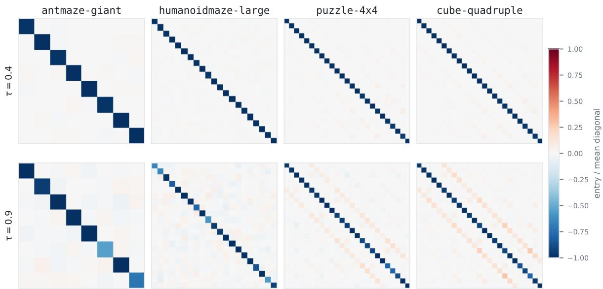  
Figure 2: Velocity Jacobian of the pretrained flow on four domains at two flow times, averaged over a batch of states and normalized per panel by the mean diagonal. The batch-averaged Jacobian is dominated by its diagonal.

exponential factor and keep only

$$
\hat { a } _ { \tau } = - \tau \nabla _ { X _ { 1 } } Q ^ { \pi } ( s , X _ { 1 } ) , \qquad \forall \tau \in [ 0 , 1 ] ,
$$

which we call scalar adjoint. The exponential factor $\begin{array} { r } { \exp \left( 2 \int _ { \tau } ^ { 1 } c _ { s } ~ \mathrm { d } s \right) } \end{array}$ only rescales the closed-form solution, and dropping it is empirically justified by Figure 4 (left), where the norm of $\hat { a } _ { \tau }$ follows the same trend as that of $\tilde { a } _ { \tau }$ across flow times. The scalar adjoint requires a single critic gradient at the sampled action $X _ { 1 }$ , and no vector–Jacobian product through the policy at any flow step.

Moreover, SQAM follows the adjoint matching form of Equation (2), replacing the exact adjoint $\tilde { a } _ { \tau }$ in its target with the scalar adjoint $\hat { a } _ { \tau } ,$ so the path-space trust region of TRQAM (Dong et al., 2026c) can be used or left out. We use it by default for stable training, and Appendix F.3 reports SQAM without it. Appendix F.1 compares the computational cost of the scalar and exact adjoint updates.

## 3.2. Regularizing the critic at the policy’s own actions

Using the scalar adjoint alone does not work well, especially on the manipulation domains (Section 4.3). The exact adjoint passes $\nabla _ { X _ { 1 } } Q ^ { \pi } ( s , X _ { 1 } )$ through the velocity Jacobian at every flow step, so it does not use this gradient as directly as the scalar adjoint does (Figure 1). The scalar adjoint update therefore depends directly on the critic’s gradient at the policy-generated action, and we hypothesize that its failure arises from errors in the critic at that action. To address this, we introduce a value penalty on the critic at the actions the current policy generates, relative to the value at the dataset action,

$$
{ \mathcal { L } } _ { \mathrm { c r i t i c } } \ + = \ c \cdot \left( Q ^ { \pi } ( s , \operatorname { s g } ( a _ { \pi } ) ) - Q ^ { \pi } ( s , a _ { \mathrm { d a t a } } ) \right) .\tag{3}
$$

Equation (3) penalizes the critic at the policy-generated action $a _ { \pi }$ , which is also the action whose critic gradient drives the scalar adjoint update, so the penalty controls the critic exactly where the policy update uses it. We refer to this regularizer as the value penalty. Unlike CQL (Kumar et al., 2020), which penalizes the critic in expectation over a sampling distribution drawn inside the critic loss, the value penalty acts at the single action the actor update has already drawn, so it adds no sampling cost.

Common forms of critic regularization act elsewhere. In-sample maximization (Kostrikov et al., 2022; Garg et al., 2023) fits the critic only on dataset actions, so it never evaluates the critic at $a _ { \pi }$ . Behavioral regularization (Tarasov et al., 2023; Fujimoto and Gu, 2021) penalizes the distance between $a _ { \pi }$ and $a _ { \mathrm { d a t a } } ,$ which constrains the actions rather than the value assigned to them. Neither controls the critic at the action whose gradient the scalar adjoint uses, and the value penalty does. Experiments in Section 4.3 support this.

Algorithm 1 TRQAM (Dong et al., 2026c) Algorithm 2 SQAM (ours)   
Require: $v ^ { \mathrm { b a s e } } , Q _ { \phi } ^ { \pi }$ , KL budget $\varepsilon _ { \mathrm { K L } }$ , training steps � Require: $v ^ { \mathrm { b a s e } } , Q _ { \phi } ^ { \pi }$ , KL budget $\varepsilon _ { \mathrm { K L } _ { \mathrm { i } } }$ , trainin ste s �   
$1 \colon \ v _ { \theta } ^ { \mathrm { f t } }  \ v ^ { \mathrm { b a s e } }$ 1: $v _ { \theta } ^ { \mathrm { f t } }  v ^ { \mathrm { b a s e } }$   
2: for $n = 0 , \ldots , N - 1$ do 2: for $n = 0 , \ldots , N - 1$ do   
3: Sample a trajectory $X _ { 0 } , \ldots , X _ { 1 }$ by $v _ { \theta } ^ { \mathrm { f t } }$ 3: Sample the endpoint $X _ { 1 }$ by $v _ { \theta } ^ { \mathrm { f t } }$   
4: �� ← the states of that trajectory 4: $X _ { \tau } \gets ( 1 - \tau ) \epsilon + \tau X _ { 1 } , \ \epsilon \sim \mathcal { N } ( 0 , I )$   
5: Solve $\begin{array} { r } { \mathrm { d } \tilde { a } _ { \tau } = - \tilde { a } _ { \tau } ^ { \top } \nabla _ { X _ { \tau } } \big ( 2 v ^ { \mathrm { b a s e } } - \frac { 1 } { \tau } X _ { \tau } \big ) \mathrm { d } \tau } \end{array}$ 5: $\widehat { a } _ { \tau }  \joinrel  \tau \nabla _ { X _ { 1 } } Q ^ { \pi } ( s , X _ { 1 } ) , \forall \tau \in [ 0 , 1 ]$   
6: Update � by Equation (2) 6: Update � by Equation (2)   
7: TD update of $\bar { Q } _ { \phi } ^ { \pi }$ 7: TD update of ��� + Equation (3)   
8: Dual update of $\lambda _ { n }$ for trust region 8: Dual update of $\lambda _ { n }$ for trust region   
9: end for 9: end for  
Figure 3: Simplified versions of the TRQAM and SQAM algorithms. The parts SQAM changes are marked in blue, and Appendix A gives the full algorithm.

## 4. Experiments

We evaluate SQAM on of-policy fine-tuning of pretrained flow policies in the ofline and ofline-to-online settings, using the 50 OGBench tasks for the main comparison. The experiments are organized around the following five questions.

• How does SQAM perform against prior methods in ofline and ofline-to-online RL (Section 4.1)?

• How does the scalar adjoint compare with the exact adjoint (Section 4.2)?

• Why does the value penalty work better than other value learning schemes (Section 4.3)?

• How do the value penalty coeficient � and the KL budget �KL afect SQAM (Section 4.4)?

• Does SQAM extend to large pretrained policies (Section 4.5)?

## 4.1. Main Experiments

Setu . OGBench (Park et al., 2025a) is a oal-conditioned RL benchmark, and we use its reward-based single-task variants over 10 domains with 5 tasks per domain, 50 tasks in all. Manipulation domains use action-chunked policies of chunk size 5 (Li et al., 2025a). All methods start from the same flow policy, pretrained with behavior cloning for 300K steps, and are fine-tuned ofline for 1M steps with online runs continuing to 1.5M steps. We report the average success rate (%) over 8 seeds, and the detailed hyperparameters are in Appendix D.2. We compare against seven of-policy fine-tuning methods for flow policies, FQL (Park et al., 2025b), CGQL-L (Dhariwal and Nichol, 2021), DSRL (Wagenmaker et al., 2025), IFQL, QAM and QAM-E (Li and Levine, 2026), and TRQAM (Dong et al., 2026c). The last three belong to the same adjoint matching family as SQAM. See Appendix B for the detailed description of each baseline.

Results. Table 1 reports ofline success rates at 1M steps. SQAM improves most on the four hardest domains, adding 21 points over the best baseline on antmaze-giant, 18 on humanoidmaze-large, 22 on cube-triple, and 35 on cube-quadruple, where the strongest baseline reaches 19 and SQAM reaches 54. Over all fifty tasks it reaches 75% against 68% for TRQAM, the strongest baseline. This trend holds through the online phase as well. The per-task breakdown of all fifty tasks is in Table 8, and their success rate curves are in Appendix G.

## 4.2. Comparison between Adjoints

Figure 4 explains why the scalar adjoint works even though it approximates the exact adjoint. The approximation preserves the two properties the update relies on. In magnitude, both adjoints contract in the same way as the flow time approaches zero, so the regression target in Equation (2) has a similar magnitude at each flow step under either adjoint. In direction, the scalar adjoint stays positively aligned with the exact adjoint at every flow time. These two properties allow the scalar adjoint to stand in for the exact adjoint, but they do not make the two identical. The angle between them is larger on the two manipulation domains than on the two locomotion domains, and these are exactly the domains where the scalar adjoint alone underperforms (Section 3.2). Since the scalar adjoint relies directly on the critic’s gradient, this correspondence led us to examine the role of the value learning scheme in this framework, which Section 4.3 presents.

Table 1: Ofline RL on 50 OGBench (Park et al., 2025a) tasks at 1M training steps (8 seeds). Mean success rate $( \% ) \pm$ one standard deviation. Domain abbreviations are listed in Appendix D.1, and the per-task breakdown across all 50 tasks is in Table 8.
<table><tr><td></td><td></td><td>al 5 tasks</td><td>ag 5 tasks</td><td>hm 5 tasks</td><td>hl 5 tasks</td><td>scene 5 tasks</td><td>p33 5 tasks</td><td>p44 5 tasks</td><td>c2</td><td>c3</td><td>c4</td><td>all</td></tr><tr><td>BACKPROP</td><td>FQL</td><td>38±9</td><td>2±6</td><td>74±5</td><td>2 ±1</td><td>70 ±5</td><td>25 ±10</td><td>9 ±7</td><td>44±4</td><td>7±5</td><td>9 ±5</td><td>28</td></tr><tr><td>GUIDANCE</td><td>CGQL-L 48±7</td><td></td><td>7 ±5</td><td>57±2</td><td>6±3</td><td>58±1</td><td>0±0</td><td>0 ±0</td><td>55±2</td><td>0 ±1</td><td>1 ±1</td><td>23</td></tr><tr><td>PosT PROCESSING</td><td>DSRL</td><td>53±2</td><td>1 ±1</td><td>53 ±10</td><td>1 ±1</td><td>80±0</td><td>100±0 61 ±8 72 ±4 34 ±6 9 ±3</td><td></td><td></td><td></td><td></td><td>46</td></tr><tr><td></td><td>IFQL</td><td>29±8 12±3 93 ±2 30 ±7</td><td></td><td></td><td></td><td>36±1</td><td>64±4 42±4 9±2 24±7 6±3</td><td></td><td></td><td></td><td></td><td>35</td></tr><tr><td>ADJOINT MATCHING</td><td>QAM</td><td>62 ±9 29 ±4 </td><td></td><td>64±7</td><td>4±3</td><td>64±4</td><td>15 ±3</td><td>1 ±1 71 ±2 19 ±6 18 ±3</td><td></td><td></td><td></td><td>35</td></tr><tr><td></td><td>QAM-E</td><td>86±3</td><td></td><td>60±6</td><td>4±5</td><td>63±6</td><td>89±4</td><td></td><td></td><td></td><td></td><td></td></tr><tr><td></td><td>TRQAM</td><td>89±4</td><td>6±8 41 ±4</td><td>84±3</td><td>36±4</td><td>79 ±1</td><td>100±0</td><td>99±1</td><td></td><td>54±8 71 ±3 11 ±4 9 ±3</td><td>19 ±5</td><td>45 68</td></tr><tr><td></td><td></td><td></td><td></td><td></td><td></td><td></td><td></td><td></td><td></td><td>81±3 50 ±5</td><td></td><td></td></tr><tr><td>Ours</td><td>SQAM</td><td>91±3</td><td>62 ±4</td><td>94±2</td><td>54±5</td><td>79±0</td><td>100±0</td><td>85±6</td><td>58±3</td><td>72±4</td><td>54±5</td><td>75</td></tr></table>

## 4.3. Analyses over Value Learning Schemes

To justify the choice of the value penalty, we compare it with three alternative value learning schemes. Two are widely used forms of critic regularization, and the third directly regularizes the critic’s action gradient that the scalar adjoint uses. The first is an in-sam le critic in the st le of IQL (Kostrikov et al. 2022) which fits a state value by expectile regression on dataset actions and trains the critic by TD regression toward it. The second is ReBRAC (Tarasov et al., 2023)’s bootstrap penalty, which subtracts $\| a _ { \pi } - a _ { \mathrm { d a t a } } \| ^ { 2 }$ from the bootstrap target. The third penalizes the norm of the critic’s action gradient, adding $\left| \left| \nabla _ { a } Q ^ { \pi } ( s , \operatorname { s g } ( a _ { \pi } ) ) \right| \right| ^ { 2 }$ to the critic loss. See Appendix C for the detailed description of each scheme.

Figure 5 compares the schemes on cube-triple and cube-quadruple, the two manipulation domains where the scalar adjoint alone underperforms, and Appendix F.6 reports every scheme swept over its coeficient on all ten domains. The value penalty works best on both, while the in-sample critic and ReBRAC stay close to the scalar adjoint without re ularization. This follows from where each scheme acts. The scalar adjoint uses the critic’s gradient at the policy-generated action $a _ { \pi }$ directly at every flow step, so the policy update depends directly on the critic at $a _ { \pi } .$ . On the other hand, the in-sample critic is trained only on dataset actions, so it never evaluates the critic at $a _ { \pi }$ . ReBRAC constrains the distance between $a _ { \pi }$ and $a _ { \mathrm { d a t a } }$ , which controls the action itself rather than the value the critic assigns to it. Only the value penalty acts on the critic’s value at $a _ { \pi }$

The gradient-norm penalty also improves over the unregularized critic, most clearly on cube-quadruple, which is consistent with its close relation to the value penalty. A first-order expansion of the value penalty in Equation (3) around $a _ { \pi }$ gives

$$
\begin{array} { r } { Q ^ { \pi } ( s , a _ { \pi } ) - Q ^ { \pi } ( s , a _ { \mathrm { d a t a } } ) \approx \nabla _ { a _ { \pi } } Q ^ { \pi } ( s , a _ { \pi } ) ^ { \top } ( a _ { \pi } - a _ { \mathrm { d a t a } } ) , } \end{array}
$$

so the two penalties are linked through the critic’s gradient at $a _ { \pi }$

The explanation above rests on the scalar adjoint using the critic’s gradient at $a _ { \pi }$ directly. The exact adjoint instead passes this gradient through the velocity Jacobian at every flow step, so if the explanation holds, the value penalty should help the exact adjoint less. To test this, we also apply the value penalty to TRQAM, which uses the exact adjoint. The value penalty improves TRQAM as well, but far less than it improves SQAM (Appendix F.2).

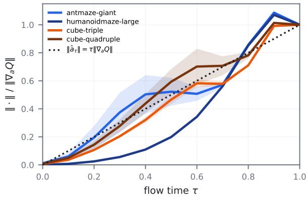

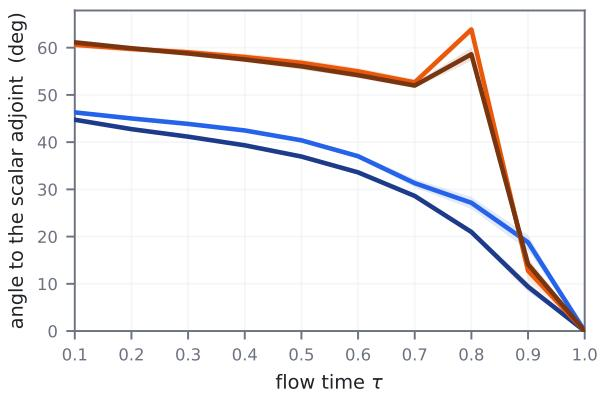

Figure 4: Exact and scalar adjoints computed on the same rollout states. Left: the norm of each adjoint relative to $\| \nabla _ { a } Q \| .$ where the scalar adjoint is the dotted line �. Right: the angle between the two adjoints. The two adjoints contract similarly in norm and stay positively aligned. The angle is larger on the manipulation domains, where the scalar adjoint alone underperforms. Three seeds per domain at 0.3M steps, without the value penalty.  
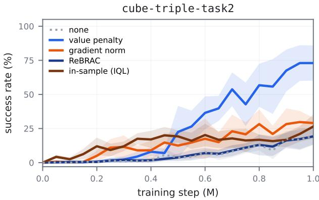

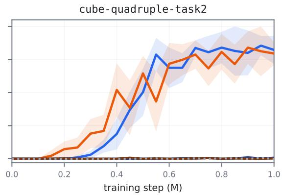  
Figure 5: Value learning schemes compared on the two domains where the scalar adjoint alone fails. Each scheme is shown at its best coeficient on the grid we swept, and the full sweeps on all ten domains are in Appendix F.6. The value penalty lifts both domains and the gradient-norm penalty follows it on cube-quadruple, while ReBRAC and the in-sample critic stay close to the scalar adjoint without regularization. Eight seeds per curve, and bands are one standard deviation.

## 4.4. Ablation Studies

Efect of value penalty �. Figure 6 assesses the value penalty coeficient � on one task from each of four domains. On the two cube manipulation tasks, the success rate rises sharply as � grows, while on the two locomotion tasks the gains are small. These results indicate that the value penalty matters mainly on the domains where the scalar adjoint alone underperforms. We use $c = 0 . 3$ on every domain except cube-double, where the penalty is of because a large � lowers its ofline performance (Appendix F.5).

Efect of KL budget $\epsilon _ { \mathbf { K L } } .$ . The budget directly sets how far the fine-tuned policy may deviate from the pretrained one (Dong et al., 2026c). We sweep it on all ten domains (Appendix F.5), and Figure 7 shows four of them. On most domains, performance stays flat or decreases steadily as the budget widens, so the budget afects performance predictably and a small budget is a reliable default. The exception is puzzle-4x4, which prefers a larger budget, consistent with its larger state space.

## 4.5. Extension to Large Pretrained Policies

To test whether SQAM extends to large pretrained policies, we fine-tune RLDX-1 (Kim et al., 2026b), a pretrained vision-language-action policy, on a real-world bimanual robot (Rainbow Robotics, 2024) equipped with two 20-DoF dexterous hands (Wuji Technology, 2025), with an action chunk of 16 steps. Figure 8 shows the three manipulation tasks. Starting from the pretrained policy, we run supervised fine-tuning on task demonstrations, then SQAM for 15K ofline steps and a further 10K online steps. We compare against EXPO-FT (Dong et al., 2026a), a residual fine-tuning method that freezes the pretrained policy and learns an edit policy that adds corrections to its actions (Appendix B), under the shared protocol of Appendix E. Table 2 reports held-out success over 30 episodes per task, and Figure 10 in Appendix E.4 tracks the training rollouts through the online phase.

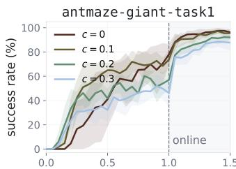  
training step (M)

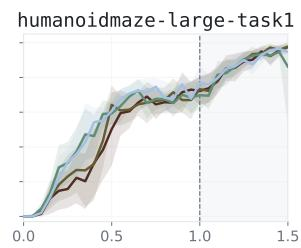  
training step (M)

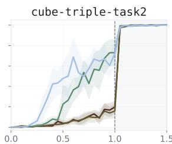  
training step (M)

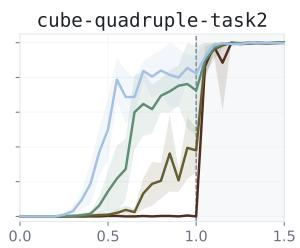  
training step (M)

Figure 6: Sweep over value penalty � on four of the ten swept domains. Eight seeds per curve, and bands are one standard deviation. The full analysis on all ten domains is in Appendix F.5.  
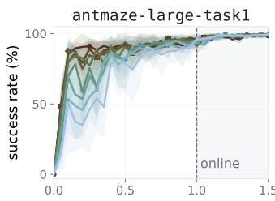  
training step (M)

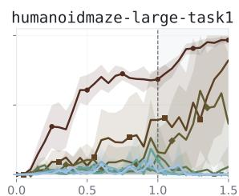  
training step (M)

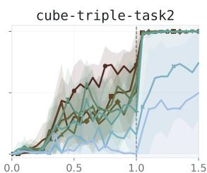  
training step (M)

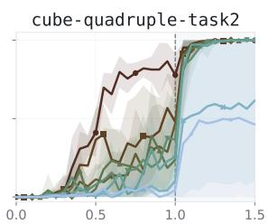  
training step (M)  
Figure 7: Sweep over KL budget �KL on four of the ten swept domains. Eight seeds per curve, and bands are one standard deviation. The full analysis on all ten domains is in Appendix F.5.

SQAM improves over SFT on all three tasks, whereas EXPO-FT does not appear to work well in this setting. Whereas SQAM updates the flow policy directly, EXPO-FT trains a residual edit policy, which must be learned from scratch and cannot directly exploit the expressiveness of the pretrained flow policy. We conjecture that these two diferences account for this.

## 5. Related work

Propagating value to intermediate flow steps. A flow policy generates its action over many flow steps, while the critic evaluates only the final action. Using the critic to steer the flow therefore requires propagating its value to each intermediate step, and existing methods difer mainly in how they do so (Lee et al., 2026). The most common approach evaluates the critic at a Tweedie posterior estimate of the final action, and it is used for guidance at test time (Chung et al., 2023; Kim et al., 2025; Zhou et al., 2026). Another line avoids the approximation and feeds the intermediate action to the critic directly, either by matching the policy’s score to the critic’s action gradient at the intermediate action (Psenka et al., 2024) or by learning a separate value at each noise level (Oberai et al., 2026; Doo et al., 2026). Adjoint matching (Domingo-Enrich et al., 2025; Li and Levine, 2026; Dong et al., 2026c; Bergmeister et al., 2026) gives a theoretically grounded answer, propagating the value gradient back to each flow step through the lean adjoint ODE. For test-time guidance rather than fine-tuning, dropping the Jacobian has also been found to outperform backpropagating through the exact Jacobian (Zhou et al., 2026).

Critic regularization. Many value learning schemes regularize the critic, and they difer in where the regularization acts. CQL penalizes the critic’s value at the actions the policy prefers relative to the data (Kumar et al., 2020), IQL fits a state value by expectile regression and trains the critic by TD regression toward it, using only dataset actions (Kostrikov et al., 2022), and ReBRAC subtracts an action-distance penalty from the bootstrap target (Tarasov et al., 2023). Fisher-BRC penalizes the action gradient of the critic’s ofset from a behavior model (Kostrikov et al., 2021), which is close to the gradient-norm penalty we compare in Section 4.3, and Cal-QL calibrates the critic against a reference policy for ofline-to-online fine-tuning (Nakamoto et al., 2023).

(a) Flip the plastic bag  
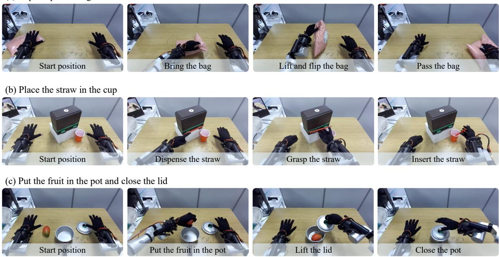  
Figure 8: Overview of the three real-world manipulation tasks. From top to bottom: flipping a plastic bag, placing a straw in a cup, and placing fruit in a pot and closing the lid. Each row illustrates the task progression from left to right.

Table 2: Success rate on three real-robot manipulation tasks with a vision-language-action policy. The ofline rows evaluate the checkpoint after 15K ofline steps, and the ofline-to-online rows the checkpoint after a further 10K online steps. Each cell counts successes over 30 held-out episodes.
<table><tr><td>Method</td><td>Flip plastic bag</td><td>Place the straw</td><td>Put the fruit and close the lid</td></tr><tr><td>SFT</td><td>15/30</td><td>7/30</td><td>4/30</td></tr><tr><td>EXPO-FT (offline)</td><td>8/30</td><td>0/30</td><td>5/30</td></tr><tr><td>EXPO-FT (offline2online)</td><td>15/30</td><td>0/30</td><td>3/30</td></tr><tr><td>SQAM (offline)</td><td>20/30</td><td>13/30</td><td>8/30</td></tr><tr><td>SQAM (offline2online)</td><td>25/30</td><td>15/30</td><td>13/30</td></tr></table>

Ofline-to-online RL. Pretraining a policy and a critic on ofline data and then fine-tuning them online is a standard recipe for sample-eficient RL (Ball et al., 2023; Hester et al., 2018; Hu et al., 2024; Kostrikov et al., 2022; Kumar et al., 2020; Lei et al., 2024; Luo et al., 2024; Nair et al., 2021; Nakamoto et al., 2023; Rajeswaran et al., 2018; Vecerik et al., 2018). A central challenge is the distribution shift at the transition, which destabilizes the value function and can make the policy forget what it learned ofline (Ball et al., 2023; Nakamoto et al., 2023; Wołcz k et al., 2024).

## 6. Conclusion

We introduced SQAM, which fine-tunes flow policies with of-policy RL without a vector–Jacobian product through the policy. Motivated by the diagonal structure of the batch-averaged velocity Jacobian, it replaces the exact adjoint with a closed-form scalar adjoint and pairs it with a value penalty at the policy-generated actions. SQAM improves most on the four hardest OGBench domains and extends to a vision-language-action policy on a real robot.

Our results also suggest a broader point. A rough approximation of the adjoint sufices, while the value learning scheme largely determines how well it performs. The bottleneck of of-policy RL with flow policies may therefore lie less in the policy update than in the critic. We hope this encourages further work on value learning for flow policies.

## Reproducibility statement

Appendix A gives the complete pseudocode of SQAM, and Section 3.1 states and proves the closed form it builds on. Appendix D lists the domains, datasets, and hyperparameters, and Appendix B describes every baseline. The OGBench experiments use the public benchmark (Park et al., 2025a) and the datasets described in Appendix D. Appendix E documents the platform, observation and action spaces, training details, and evaluation protocol of the real-robot experiments. We will release the implementation of SQAM.

## Ethics statement

This work fine-tunes robot policies with reinforcement learning in simulation and on a robot in a controlled laboratory setting. The real-robot experiments involve no human subjects and no personal data, and an operator supervised the robot throughout. As with any method that improves a policy against a learned value function, deployment beyond a supervised setting calls for the usual safeguards.

## AI use statement

We used generative AI tools to assist with writing, editing, and routine coding and plotting. We did not use them to generate research ideas, experimental results, or claims. The authors reviewed all AI-assisted text and code and take full responsibility for the content of this paper.

## References

Michael S. Albergo, Nicholas M. Bofi, and Eric Vanden-Eijnden. Stochastic interpolants: A unifying framework for flows and difusions. arXiv preprint arXiv:2303.08797, 2023.

Philip J. Ball, Laura Smith, Ilya Kostrikov, and Sergey Levine. Eficient online reinforcement learning with ofline data. In International Conference on Machine Learning, 2023.

Andreas Bergmeister, Stefanie Jegelka, Nikolas Nüsken, Carles Domingo-Enrich, and Jakiw Pidstrigach. Re- inforce adjoint matching: Scaling rl post-training of difusion and flow-matching models. In Advances in Neural Information Processing Systems, 2026.

Johan Bjorck, Fernando Castañeda, Nikita Cherniadev, Xingye Da, Runyu Ding, Linxi "Jim" Fan, Yu Fang, Dieter Fox, Fengyuan Hu, Spencer Huang, Joel Jang, Zhenyu Jiang, Jan Kautz, Kaushil Kundalia, Lawrence Lao, Zhiqi Li, Zongyu Lin, Kevin Lin, Guilin Liu, Edith Llontop, Loic Magne, Ajay Mandlekar, Avnish Narayan, Soroush Nasiriany, Scott Reed, You Liang Tan, Guanzhi Wang, Zu Wang, Jing Wang, Qi Wang, Jiannan Xiang, Yuqi Xie, Yinzhen Xu, Zhenjia Xu, Seonghyeon Ye, Zhiding Yu, Ao Zhang, Hao Zhang, Yizhou Zhao, Ruijie Zheng, and Yuke Zhu. Gr00t n1: An open foundation model for generalist humanoid robots. arXiv preprint arXiv:2503.14734, 2025.

Yuhui Chen, Shuai Tian, Shugao Liu, Yingting Zhou, Haoran Li, and Dongbin Zhao. Conrft: A reinforced fine-tuning method for vla models via consistency policy. In Robotics: Science and Systems, 2025.

Cheng Chi, Zhenjia Xu, Siyuan Feng, Eric Cousineau, Yilun Du, Benjamin Burchfiel, Russ Tedrake, and Shuran Song. Difusion policy: Visuomotor policy learning via action difusion. In Robotics: Science and Systems, 2023.

Hyungjin Chung, Jeongsol Kim, Michael T. Mccann, Marc L. Klasky, and Jong Chul Ye. Difusion posterior sampling for general noisy inverse problems. In International Conference on Learning Representations, 2023.

Prafulla Dhariwal and Alex Nichol. Difusion models beat gans on image synthesis. In Advances in Neural Information Processing Systems, 2021.

Carles Domingo-Enrich, Michal Drozdzal, Brian Karrer, and Ricky T. Q. Chen. Adjoint matching: Fine-tuning flow and difusion generative models with memoryless stochastic optimal control. In International Conference on Learning Representations, 2025.

Perry Dong, Kuo-Han Hung, Tian Gao, Dorsa Sadigh, and Chelsea Finn. Expo-ft: Sample-eficient reinforcement learning finetuning for vision-language-action models. arXiv preprint arXiv:2605.25477, 2026a.

Perry Dong, Qiyang Li, Dorsa Sadigh, and Chelsea Finn. Expo: Stable reinforcement learning with expressive policies. In International Conference on Learning Representations, 2026b.

Yonghoon Dong, Kyungmin Lee, Changyeon Kim, Jaehyuk Kim, and Jinwoo Shin. Trust region q adjoint matching. In Advances in Neural Information Processing Systems, 2026c.

JaeHyeok Doo, Byeongguk Jeon, Seonghyeon Ye, Kimin Lee, and Minjoon Seo. Q-flow: Stable and expressive reinforcement learning with flow-based policy. In International Conference on Machine Learning, 2026.

Scott Fujimoto and Shixiang Shane Gu. A minimalist approach to ofline reinforcement learning. In Advances in Neural Information Processing Systems, 2021.

Divyansh Garg, Joey Hejna, Matthieu Geist, and Stefano Ermon. Extreme q-learning: Maxent rl without entropy. In International Conference on Learning Representations, 2023.

Philippe Hansen-Estruch, Ilya Kostrikov, Michael Janner, Jakub Grudzien Kuba, and Sergey Levine. Idql: Implicit q-learning as an actor-critic method with difusion policies. arXiv preprint arXiv:2304.10573, 2023.

Todd Hester, Matej Vecerik, Olivier Pietquin, Marc Lanctot, Tom Schaul, Bilal Piot, Dan Horgan, John Quan, Andrew Sendonaris, Gabriel Dulac-Arnold, Ian Osband, John Agapiou, Joel Z. Leibo, and Audrunas Gruslys. Deep q-learning from demonstrations. In AAAI Conference on Artificial Intelligence, 2018.

Hengyuan Hu, Suvir Mirchandani, and Dorsa Sadigh. Imitation bootstrapped reinforcement learning. In International Conference on Learning Representations, 2024.

Physical Intelligence, Ali Amin, Raichelle Aniceto, Ashwin Balakrishna, Kevin Black, Ken Conley, Grace Connors, James Darpinian, Karan Dhabalia, Jared DiCarlo, Danny Driess, Michael Equi, Adnan Esmail, Yunhao Fang, Chelsea Finn, Catherine Glossop, Thomas Godden, Ivan Goryachev, Lachy Groom, Hunter Hancock, Karol Hausman, Gashon Hussein, Brian Ichter, Szymon Jakubczak, Rowan Jen, Tim Jones, Ben Katz, Liyiming Ke, Chandra Kuchi, Marinda Lamb, Devin LeBlanc, Sergey Levine, Adrian Li-Bell, Yao Lu, Vishnu Mano, Mohith Mothukuri, Suraj Nair, Karl Pertsch, Allen Z. Ren, Charvi Sharma, Lucy Xiaoyang Shi, Laura Smith, Jost Tobias Springenberg, Kyle Stachowicz, Will Stoeckle, Alex Swerdlow, James Tanner, Marcel Torne, Quan Vuong, Anna Walling, Haohuan Wang, Blake Williams, Sukwon Yoo, Lili Yu, Ury Zhilinsky, and Zhiyuan Zhou. $\pi _ { 0 . 6 } ^ { * } \colon$ a vla that learns from experience. arXiv preprint arXiv:2511.14759, 2025a.

Physical Intelligence, Kevin Black, Noah Brown, James Darpinian, Karan Dhabalia, Danny Driess, Adnan Esmail, Michael Equi, Chelsea Finn, Niccolo Fusai, Manuel Y. Galliker, Dibya Ghosh, Lachy Groom, Karol Hausman, Brian Ichter, Szymon Jakubczak, Tim Jones, Liyiming Ke, Devin LeBlanc, Sergey Levine, Adrian Li-Bell, Mohith Mothukuri, Suraj Nair, Karl Pertsch, Allen Z. Ren, Lucy Xiaoyang Shi, Laura Smith, Jost Tobias Springenberg, Kyle Stachowicz, James Tanner, Quan Vuong, Homer Walke, Anna Walling, Haohuan Wang, Lili Yu, and Ury Zhilinsky. $\pi _ { 0 . 5 } { : }$ a vision-language-action model with open-world generalization. In Conference on Robot Learning, 2025b.

Changyeon Kim, Haeone Lee, Younggyo Seo, Kimin Lee, and Yuke Zhu. Deas: Detached value learning with action sequence for scalable ofline rl. In International Conference on Learning Representations, 2026a.

Dongyoung Kim, Huiwon Jang, Myungkyu Koo, Suhyeok Jang, Taeyoung Kim, Beomjun Kim, Byungjun Yoon, Changsung Jang, Daewon Choi, Dongsu Han, Donguk Lee, Heeseung Kwon, Hojin Jeon, Jaehyun Kang, Jaekyoung Bae, Jihyuk Lee, Jimin Lee, John Won, Joonwoo Ahn, Junhyeong Park, Junyoung Sung, Kyungmin Lee, Minseong Han, Minsung Yoon, Sejune Joo, Seonil Son, Seungcheol Park, Seunggeun Cho, Seungjun Moon, Seungku Kim, Yonghoon Dong, Yongjin Cho, Youngchan Kim, Chang Hwan Kim, Dohyeon Kim, Heecheol Kim, Heewon Lee, Hensen Ahn, Hyungkyu Ryu, Hyunsoo Choi, Hyunsoo Shin, Jaeheon Jung, Jaewoo Kim, Jinwook Kim, Joochul Chang, Joonsoo Kim, Junghun Park, Jungwoo Park, Junho Cho, Junhyeok Park, Junwon Lee, Kangwook Lee, Kwanghoon Kim, Kyoungwhan Choe, Manoj Bhadu, Nayoung Oh, Sangjun Kim, Sangwoo Kim, Seunghoon Shim, Seunghyun Kim, Seungjun Lee, Seungyup Ka, Sungryol Yang, Wook Jung, Yashu Shukla, Yeonjae Lee, Yeonwoo Bae, and Jinwoo Shin. Rldx-1 technical report. arXiv preprint arXiv:2605.03269, 2026b.

Jeongsol Kim, Bryan Sangwoo Kim, and Jong Chul Ye. Flowdps: Flow-driven posterior sampling for inverse problems. In IEEE International Conference on Computer Vision, 2025.

Ilya Kostrikov, Jonathan Tompson, Rob Fergus, and Ofir Nachum. Ofline reinforcement learning with fisher divergence critic regularization. In International Conference on Machine Learning, 2021.

Ilya Kostrikov, Ashvin Nair, and Sergey Levine. Ofline reinforcement learning with implicit q-learning. In International Conference on Learning Representations, 2022.

Aviral Kumar, Aurick Zhou, George Tucker, and Sergey Levine. Conservative q-learning for ofline reinforcement learning. In Advances in Neural Information Processing Systems, 2020.

Jeongjae Lee, Jinho Chang, Jeongsol Kim, and Jong Chul Ye. Reward score matching: Unifying reward-based fine-tuning for flow and difusion models. In Advances in Neural Information Processing Systems, 2026.

Kun Lei, Zhengmao He, Chenhao Lu, Kaizhe Hu, Yang Gao, and Huazhe Xu. Uni-o4: Unifying online and ofline deep reinforcement learning with multi-step on-policy optimization. In International Conference on Learning Representations, 2024.

Qiyang Li and Sergey Levine. Q-learning with adjoint matching. In International Conference on Learning Representations, 2026.

Qiyang Li, Zhiyuan Zhou, and Sergey Levine. Reinforcement learning with action chunking. In Advances in Neural Information Processing Systems, 2025a.

Yunfei Li, Xiao Ma, Jiafeng Xu, Yu Cui, Zhongren Cui, Zhigang Han, Liqun Huang, Tao Kong, Yuxiao Liu, Hao Niu, Wanli Peng, Jingchao Qiao, Zeyu Ren, Haixin Shi, Zhi Su, Jiawen Tian, Yuyang Xiao, Shenyu Zhan , Liwei Zhen , Han Li, and Yon hui Wu. Gr-rl: Goin dexterous and recise for lon -horizon robotic manipulation. arXiv preprint arXiv:2512.01801, 2025b.

Yaron Lipman, Ricky TQ Chen, Heli Ben-Hamu, Maximilian Nickel, and Matt Le. Flow matching for generative modeling. In International Conference on Learning Representations, 2023.

Xingchao Liu, Chengyue Gong, and Qiang Liu. Flow straight and fast: Learning to generate and transfer data with rectified flow. In International Conference on Learning Representations, 2023.

Jianlan Luo, Zheyuan Hu, Charles Xu, You Liang Tan, Jacob Berg, Archit Sharma, Stefan Schaal, Chelsea Finn, Abhishek Gupta, and Sergey Levine. Serl: A software suite for sample-eficient robotic reinforcement learnin . In IEEE International Conference on Robotics and Automation 2024.

Vivek Myers, Bill Zheng, Benjamin Eysenbach, and Sergey Levine. Ofline goal-conditioned reinforcement learning with quasimetric representations. In Advances in Neural Information Processing Systems, 2025.

Ashvin Nair, Abhishek Gupta, Murtaza Dalal, and Sergey Levine. Awac: Accelerating online reinforcement learning with ofline datasets. In International Conference on Learning Representations, 2021.

Mitsuhiko Nakamoto, Yuexiang Zhai, Anikait Singh, Max Sobol Mark, Yi Ma, Chelsea Finn, Aviral Kumar, and Sergey Levine. Cal-ql: Calibrated ofline rl pre-training for eficient online fine-tuning. In Advances in Neural Information Processing Systems, 2023.

Aditya Oberai, Seohong Park, and Sergey Levine. Reversal q-learning. arXiv preprint arXiv:2606.17551, 2026.

Seohong Park, Kevin Frans, Benjamin Eysenbach, and Sergey Levine. Ogbench: Benchmarking ofline goalconditioned rl. In International Conference on Learning Representations, 2025a.

Seohong Park, Qiyang Li, and Sergey Levine. Flow q-learning. In International Conference on Machine Learning, 2025b.

Ahmad Parsian and SNUA Kirmani. Estimation under linex loss function. In Handbook of applied econometrics and statistical inference, pages 75–98. CRC Press, 2002.

Xinyu Peng, Ziyang Zheng, Wenrui Dai, Nuoqian Xiao, Chenglin Li, Junni Zou, and Hongkai Xiong. Improving difusion models for inverse problems using optimal posterior covariance. In International Conference on Machine Learning, 2024.

Michael Psenka, Alejandro Escontrela, Pieter Abbeel, and Yi Ma. Learning a difusion model policy from rewards via q-score matching. In International Conference on Machine Learning, 2024.

Rainbow Robotics. RB-Y1: Dual-arm mobile manipulator. https://rainbow-robotics.com/en/ products/rb-y1/, 2024.

Aravind Rajeswaran, Vikash Kumar, Abhishek Gupta, Giulia Vezzani, John Schulman, Emanuel Todorov, and Sergey Levine. Learning complex dexterous manipulation with deep reinforcement learning and demonstrations. In Robotics: Science and Systems, 2018.

Stereolabs. ZED Mini: Stereo camera. https://www.stereolabs.com/store/products/zed-mini, 2018.

Richard S Sutton and Andrew G Barto. Reinforcement learning: An introduction. MIT press, 2018.

Denis Tarasov, Vladislav Kurenkov, Alexander Nikulin, and Sergey Kolesnikov. Revisiting the minimalist approach to ofline reinforcement learning. In Advances in Neural Information Processing Systems, 2023.

Mel Vecerik, Todd Hester, Jonathan Scholz, Fumin Wang, Olivier Pietquin, Bilal Piot, Nicolas Heess, Thomas Rothörl, Thomas Lampe, and Martin Riedmiller. Leveraging demonstrations for deep reinforcement learning on robotics problems with sparse rewards. arXiv preprint arXiv:1707.08817, 2018.

Andrew Wagenmaker, Mitsuhiko Nakamoto, Yunchu Zhang, Seohong Park, Waleed Yagoub, Anusha Nagabandi, Abhishek Gupta, and Sergey Levine. Steering your difusion policy with latent space reinforcement learning. In Conference on Robot Learning, 2025.

Yi Wang, Xinchen Li, Pengwei Xie, Pu Yang, Buqing Nie, Yunuo Cai, Qinglin Zhang, Chendi Qu, Jefrey Wu, Jianheng Song, Xinlin Ren, Jingshun Huang, Mingjie Pan, Siyuan Feng, Zhi Chen, and Jianlan Luo. Learning while deploying: Fleet-scale reinforcement learning for generalist robot policies. In RSS Workshop on Reinforcement Learning for Vision-Language-Action Models (RL4VLA), 2026.

Maciej Wołczyk, Bartłomiej Cupiał, Mateusz Ostaszewski, Michał Bortkiewicz, Michał Zajac, Razvan Pascanu, Łukasz Kuciński, and Piotr Miłoś. Fine-tuning reinforcement learning models is secretly a forgetting mitigation problem. In International Conference on Machine Learning, 2024.

Wuji Technology. Wuji Hand 2: 20-DoF dexterous robotic hand. https://www.wuji.tech/en/hand2, 2025.

Wenli Xiao, Haotian Lin, Andy Peng, Haoru Xue, Tairan He, Yuqi Xie, Fengyuan Hu, Jimmy Wu, Zhengyi Luo, Linxi "Jim" Fan, Guanya Shi, and Yuke Zhu. Self-improving vision-language-action models with data generation via residual rl. In International Conference on Learning Representations, 2026.

Charles Xu, Jost Tobias Springenberg, Michael Equi, Ali Amin, Adnan Esmail, Sergey Levine, and Liyiming Ke. Rl token: Bootstrapping online rl with vision-language-action models. arXiv preprint arXiv:2604.23073, 2026.

Yixian Zhang, Shu’ang Yu, Tonghe Zhang, Mo Guang, Haojia Hui, Kaiwen Long, Yu Wang, Chao Yu, and Wenbo Ding. Sac flow: Sample-eficient reinforcement learning of flow-based policies via velocity-reparameterized sequential modeling. In International Conference on Learning Representations, 2026.

Zhiyuan Zhou, Andy Peng, Charles Xu, Qiyang Li, Tobias Springenberg, Kevin Frans, and Sergey Levine. Test-time gradient guidance of flow policies in reinforcement learning. In Advances in Neural Information Processing Systems, 2026.

## Contents

A Full al orithm 15   
B Baselines 16   
C Value learnin schemes 17   
D Experimental details 18   
D.1 Domains and tasks 18   
D.2 Hyperparameters 19   
E Real-robot experiments: RB-Y1 with Wuji Hand 2 19   
E.1 Platform, observations and actions 20   
E.2 Tasks and evaluation protocol 21   
E.3 Training details 21   
E.4 Additional results . 21   
Additional experiments 25   
F.1 The cost of one update 25   
F.2 The value penalty inside TRQAM 25   
F.3 Without the trust region 25   
F.4 Batch-averaged velocity Jacobian on all domains . 26   
F.5 Ablation studies on all domains 26   
F.6 Value learning schemes on all domains 26   
G Full OGBench results 26   
H Limitations and future work 38

## A. Full algorithm

Algorithm 3 presents the complete pseudocode of SQAM, including the trust region it inherits from TRQAM (Dong et al., 2026c). Blue marks what SQAM changes from TRQAM.

The scalar adjoint also changes which states the policy loss is evaluated on. The exact adjoint integrates the lean adjoint ODE in Equation (1) backward along a sampled trajectory,

$$
\mathrm { d } \tilde { a } _ { \tau } = - \tilde { a } _ { \tau } ^ { \top } \nabla _ { X _ { \tau } } \left( 2 v ^ { \mathrm { b a s e } } ( X _ { \tau } , \tau ) - \frac { 1 } { \tau } X _ { \tau } \right) \mathrm { d } \tau , \qquad \tilde { a } _ { 1 } = - \nabla _ { X _ { 1 } } Q ^ { \pi } ( s , X _ { 1 } ) ,
$$

so the adjoint at each flow time depends on the later ones, and the loss states must be the states of that trajectory. The scalar adjoint removes this coupling, so the loss states can be built from the final action alone. Following Bergmeister et al. (2026), we sample the final action with the ODE sampler instead of a long and numerically unstable stochastic rollout, and re-noise it along the linear interpolation path, $X _ { \tau } = ( 1 - \tau ) \epsilon + \tau a _ { \pi }$ with fresh $\epsilon \sim \mathcal { N } ( 0 , I )$ . We call these the bridge states, which match the rollout-state distribution at the optimum of the stochastic optimal control problem and approximate it elsewhere (Bergmeister et al., 2026). In addition, the trust region is optional, and we use it by default for stable training (Appendix F.3).

Algorithm 3 Q-learning with Scalar Adjoint Matching (SQAM)   
Input: replay bufer $\mathcal { D } ; v ^ { \mathrm { b a s e } } ;$ : pretrained velocity field; $v _ { \theta } ^ { \mathrm { f t } }$ : fine-tuned velocity field; $Q _ { \phi } \colon$ critic function; step   
size $h ;$ KL budget $\varepsilon _ { \mathrm { K L } } ;$ dual step size $\eta _ { \lambda } ; \mathrm { E M A }$ coeficient $\rho ;$ value penalty coeficient $c ;$ fine-tuning iterations   
$N$   
Initialize: $v _ { \theta } ^ { \mathrm { f t } }  v$ base with parameters � $; \lambda _ { 0 } > 0 ; \overline { { { D } } } _ { 0 }  0 .$   
Noise schedule: $\sigma _ { n } ( \tau ) : = g ( \tau ) / \sqrt { \lambda _ { n } } ;$ , where $g ( \tau ) : = \sqrt { 2 ( 1 - \tau ) / \tau }$   
for $n \in \{ 0 , \ldots , N - 1 \}$ do   
Sample a batch $\bar { B = } \{ ( s _ { i } , a _ { i } , r _ { i } , s _ { i } ^ { \prime } ) \}$ from $\mathcal { D }$   
Rollout: For each state $s \in B ,$ , sample the endpoint $X _ { 1 }$ by the flow itself:   
$X _ { \tau + h } = X _ { \tau } + h v _ { \theta } ^ { \mathrm { f t } } ( s , X _ { \tau } , \tau ) , \quad X _ { 0 } \sim \mathcal { N } ( 0 , I ) ,$   
and set �� ← stopgrad $( X _ { 1 } )$   
Bridge states: $X _ { \tau } \gets ( 1 - \tau ) \epsilon + \tau a _ { \pi }$ with fresh $\epsilon \sim \mathcal { N } ( 0 , I )$ , for all $\tau \in \{ h , 2 h , . . . , 1 \}$   
Scalar adjoint: $\hat { a } _ { \tau } \gets - \tau \nabla _ { a } Q _ { \phi } ( s , a _ { \pi } )$ for all $\tau \in \{ h , 2 h , . . . , 1 \}$   
Stop gradient: $X _ { \tau } \gets$ stopgrad $( X _ { \tau } ) , \hat { a } _ { \tau } \gets$ stopgrad $. ( \hat { a } _ { \tau } )$   
Critic update: Optimize $\phi$ w.r.t.   
$\mathcal { L } ( \phi ) = \frac { 1 } { | \mathcal { B } | } \sum _ { ( s , a , r , s ^ { \prime } ) \in \mathcal { B } } \left[ \left( Q _ { \phi } ( s , a ) - r - \gamma Q _ { \bar { \phi } } ( s ^ { \prime } , a ^ { \prime } \sim \pi _ { \theta } ( \cdot \mid s ^ { \prime } ) ) \right) ^ { 2 } + \mathfrak { c } \left( Q _ { \phi } ( s , a _ { \pi } ) - Q _ { \phi } ( s , a ) \right) \right]$   
Policy update: Optimize � w.r.t. the adjoint matching objective:   
$\mathcal { L } _ { \mathrm { A d j - M a t c h } } ( \theta ) = \frac { 1 } { | \mathcal { B } | } \sum _ { s \in \mathcal { B } } \sum _ { \tau } \Big \Vert \frac { 2 } { \sigma _ { n } ( \tau ) } \big ( v _ { \theta } ^ { \mathrm { f t } } ( s , X _ { \tau } , \tau ) - v ^ { \mathrm { b a s e } } ( s , X _ { \tau } , \tau ) \big ) + \sigma _ { n } ( \tau ) \hat { a } _ { \tau } \Big \Vert ^ { 2 }$   
Trust region update:   
Estimate path-space KL surrogate:   
$\widehat { D } _ { n } = \frac { 1 } { | \mathcal { B } | } { \sum _ { s \in \mathcal { B } } } { \sum _ { \tau } } \frac { 2 h } { g ( \tau ) ^ { 2 } } \big \| v _ { \theta } ^ { \mathrm { f t } } ( s , X _ { \tau } , \tau ) - v ^ { \mathrm { b a s e } } ( s , X _ { \tau } , \tau ) \big \| ^ { 2 }$   
EMA smoothing: $\overline { { D } } _ { n } \gets ( 1 - \rho ) \overline { { D } } _ { n - 1 } + \rho \widehat { D } _ { n } .$   
Dual descent: $\lambda _ { n + 1 }  \operatorname* { m a x } \{ 0 , \lambda _ { n } + \eta _ { \lambda } ( \overline { { D } } _ { n } - \varepsilon _ { \mathrm { K L } } ) \}$   
end for   
Output: fine-tuned velocity field $v _ { \theta } ^ { \mathrm { f t } }$ , critic $Q _ { \phi } .$

## B. Baselines

On OGBench, we compare against seven of-policy fine-tuning methods for flow policies, spanning the main fine-tuning paradigms. On the real robot, we compare against EXPO-FT (Section 4.5). All of them read transitions $( s , a , r , s ^ { \prime } )$ uniformly from a replay bufer �, which holds the ofline dataset during ofline training and grows with the collected rollouts online.

FQL (Park et al., 2025b). FQL avoids diferentiating through the sampling chain by distilling the multi-step flow into a one-step policy. The behavior-cloning rollout follows the ODE

$$
\begin{array} { r } { \mathrm { d } X _ { \tau } = v _ { \theta } ( X _ { \tau } , \tau ; s ) \mathrm { ~ d } \tau , \quad X _ { 0 } \sim { \mathcal { N } } ( 0 , I ) , \quad \tau \in [ 0 , 1 ] , } \end{array}
$$

and we denote its terminal value by $\mathrm { O D E } ( v _ { \theta } , s , X _ { 0 } ) : = X _ { 1 }$ . A one-step policy $\pi _ { \omega } ( s , X _ { 0 } )$ trains jointly with $v _ { \theta }$ maximizing the critic while an $\ell _ { 2 }$ term holds it near the rollout,

$$
\begin{array} { r } { \mathcal { L } _ { \mathrm { o n e s t e p } } ( \omega ) = \mathbb { E } _ { X _ { 0 } \sim \mathcal { N } } \Big [ \underbrace { - Q ( s , \pi _ { \omega } ( s , X _ { 0 } ) ) } _ { \mathrm { R L } \mathrm { m a x i m i z a t i o n } } + \underbrace { \alpha \| \pi _ { \omega } ( s , X _ { 0 } ) - \mathrm { O D E } ( v _ { \theta } , s , X _ { 0 } ) \| _ { 2 } ^ { 2 } } _ { \mathrm { B C ~ d i s t i l l a t i o n } } \Big ] . } \end{array}
$$

The coeficient $\alpha$ sets how closely $\pi _ { \omega }$ follows the distillation target, and $\pi _ { \omega }$ is the policy that acts in the environment.

CGQL-L (Dhariwal and Nichol, 2021). CGQL-Linex is the uidance baseline introduced in Li and Levine (2026). It combines the BC velocity field with classifier-free guidance (Dhariwal and Nichol, 2021) from a Q-function. An auxiliary critic $Q _ { \psi } ( s , X _ { \tau } , \tau )$ is trained on intermediate noisy actions and induces the guidance velocity

$$
\hat { v } _ { \psi } ( X _ { \tau } , \tau ; s ) : = \frac { ( 1 - \tau ) \beta \nabla _ { X _ { \tau } } Q _ { \psi } ( s , X _ { \tau } , \tau ) + X _ { \tau } } { \tau } ,
$$

where $X _ { \tau } = ( 1 - \tau ) X _ { 0 } + \tau X _ { 1 }$ with $X _ { 0 } \sim \mathcal { N } ( 0 , I )$ . Sampling runs the combined velocity $v = v ^ { \mathrm { b a s e } } + w \hat { v } _ { \psi }$ with guidance weight �, steering toward the entropy-regularized target $\pi ^ { \star } ( { \bf \cdot } { \bf \nabla } | s ) \propto e ^ { \beta Q _ { \phi } ( { \bf \bar { s } } , { \bf \cdot } ) }$ . The auxiliary critic trains with a Linex regression (Parsian and Kirmani, 2002; Myers et al., 2025),

$$
\mathcal { L } _ { \mathrm { L i n e x } } ( \psi ) = \mathbb { E } _ { \tau , X _ { 0 } } \bigl [ \exp \bigl ( \beta ( Q _ { \phi } ( s , X _ { 1 } ) - Q _ { \psi } ( s , X _ { \tau } , \tau ) ) \bigr ) + \beta Q _ { \psi } ( s , X _ { \tau } , \tau ) \bigr ] ,
$$

and the standard critic $Q _ { \phi }$ trains by TD with target actions sampled from the combined velocity,

$$
\begin{array} { r } { \mathcal { L } _ { \mathrm { T D } } ( \phi ) = \mathbb { E } \Big [ \big ( Q _ { \phi } ( s , a ) - r - \gamma Q _ { \bar { \phi } } ( s ^ { \prime } , \mathrm { O D E } ( v , s ^ { \prime } , X _ { 0 } ) ) \big ) ^ { 2 } \Big ] . } \end{array}
$$

Following Li and Levine (2026), the Linex loss carries a Huber-style stabilization against exponential blow-up.

DSRL (Wagenmaker et al., 2025). DSRL leaves the flow frozen and runs RL in its noise space. A one-step Gaussian noise-space policy $\pi _ { \omega } ( X _ { 0 } \mid s )$ trains with SAC against a noise-space critic $Q _ { \psi } ( s , X _ { 0 } )$ that regresses to the action-space critic,

$$
\mathcal { L } ( \psi ) = \mathbb { E } _ { X _ { 0 } \sim \mathcal { N } } \Big [ \big ( Q _ { \psi } ( s , X _ { 0 } ) - Q _ { \phi } ( s , \mathrm { O D E } ( v _ { \bar { \theta } } , s , X _ { 0 } ) ) \big ) ^ { 2 } \Big ] .
$$

At inference the noise is drawn from the noise-space policy, $X _ { 0 } \sim \pi _ { \omega } ( \cdot \mid s )$ , and pushed through the flow, $a = \mathrm { O D E } ( v _ { \theta } , s , X _ { 0 } )$ . Followin Li and Levine (2026), our DSRL also fine-tunes the BC velocit online, with a target network $v _ { \bar { \theta } }$ for stability, which strengthens its ofline-to-online performance.

IFQL. IFQL is the flow counterpart of implicit difusion Q-learning (Hansen-Estruch et al., 2023), taken as a baseline in Park et al. (2025b). Value learning is IQL-style expectile regression (Kostrikov et al., 2022). A value network $V _ { \xi }$ fits an upper expectile of the critic, and the critic bootstraps through it,

$$
\begin{array} { r l } & { \mathcal { L } _ { V } ( \xi ) = \mathbb { E } \left[ L _ { 2 } ^ { \kappa } \big ( Q _ { \bar { \phi } } ( s , a ) - V _ { \xi } ( s ) \big ) \right] , } \\ & { \mathcal { L } _ { Q } ( \phi ) = \mathbb { E } \left[ \big ( r + \gamma V _ { \xi } ( s ^ { \prime } ) - Q _ { \phi } ( s , a ) \big ) ^ { 2 } \right] , } \end{array}
$$

where $L _ { 2 } ^ { \kappa } ( u ) = | \kappa - { \bf 1 } ( u < 0 ) | u ^ { 2 }$ is the expectile loss with $\kappa \in ( 0 . 5 , 1 )$ . The policy draws � candidate actions from the BC flow, $a ^ { ( i ) } = \mathrm { O D E } ( v _ { \theta } , s , X _ { 0 } ^ { ( i ) } )$ , and acts with the one the critic values highest.

QAM and QAM-E (Li and Levine, 2026). Adjoint matching casts fine-tuning as stochastic optimal control, which adds a control � to the drift � of the sampler,

$$
\mathrm { d } X _ { \tau } ^ { u } = \left( b ( X _ { \tau } ^ { u } , \tau ) + \sigma ( \tau ) u ( X _ { \tau } ^ { u } , \tau ) \right) \mathrm { d } \tau + \sqrt { \lambda } \sigma ( \tau ) \ \mathrm { d } B _ { \tau } ,\tag{4}
$$

with $B _ { \tau } { \sf a }$ Brownian motion and � a scale on the difusion, and the base sampler is Equation (4) at $u = 0$ . QAM solves this control problem at a constant $\lambda ,$ with an inverse temperature $\beta$ on the terminal reward $\beta Q _ { \phi } ( s , X _ { 1 } )$ The fine-tuned velocity trains against the base velocity through the lean adjoint matching loss

$$
\mathcal { L } _ { \mathrm { A M } } ( \theta ) = \mathbb { E } \left[ \int _ { 0 } ^ { 1 } \left\| \frac { 2 \big ( v _ { \theta } ^ { \mathrm { f t } } ( X _ { \tau } , \tau ; s ) - v ^ { \mathrm { b a s e } } ( X _ { \tau } , \tau ; s ) \big ) } { \sigma ( \tau ) } + \sigma ( \tau ) \widetilde { a } _ { \tau } \right\| _ { 2 } ^ { 2 } \mathrm { d } \tau \right] ,
$$

where $\tilde { a } _ { \tau }$ is the lean adjoint with terminal condition $\tilde { a } _ { 1 } = - \beta \nabla _ { X _ { 1 } } Q _ { \phi } ( s , X _ { 1 } )$ and $X _ { \tau }$ follows the sampling dynamics of Equation (4) at that constant $\lambda .$ . Element-wise gradient clipping keeps the update numerically stable. QAM-E adds a residual edit policy $\pi _ { \omega } ( \Delta a \mid s , \tilde { a } )$ on top, perturbing the QAM-generated action �˜ by at most $\sigma _ { a }$ in $L _ { \infty }$ distance through a tanh-squashed Gaussian, trained with entropy-regularized SAC and automatic entropy tuning.

TRQAM (Dong et al., 2026c). TRQAM is the trust-region member of the same family and the strongest baseline. Where QAM holds the temperature fixed, TRQAM reads � in Equation (4) as a trust-region parameter on the sampling dynamics and adapts it over training. Girsanov’s theorem gives the path-space KL between the controlled and the base dynamics in closed form,

$$
D _ { \mathrm { K L } } \big ( \mathbb { P } ^ { u } \mid \mathbb { P } ^ { \mathrm { b a s e } } \big ) = \mathbb { E } _ { { \mathbf { X } } \sim \mathbb { P } ^ { u } } \biggl [ \int _ { 0 } ^ { 1 } \frac { 2 } { \lambda \sigma ( \tau ) ^ { 2 } } \left. v _ { \boldsymbol { \theta } } ^ { \mathrm { f t } } ( X _ { \tau } ^ { u } , \tau ) - v ^ { \mathrm { b a s e } } ( X _ { \tau } ^ { u } , \tau ) \right. ^ { 2 } \mathrm { d } \tau \biggr ] ,\tag{5}
$$

so the deviation can be measured on every rollout at no additional cost. Each update estimates the path-space KL of Equation (5) on its own rollout, smooths the estimate with an EMA ${ \overline { { D } } } _ { n } ,$ and takes the projected dual step

$$
\lambda _ { n + 1 } = \operatorname* { m a x } \{ 0 , \lambda _ { n } + \eta _ { \lambda } ( \overline { { D } } _ { n } - \varepsilon _ { \mathrm { K L } } ) \}
$$

with step size $\eta _ { \lambda }$ . The constraint therefore lives inside the sampling dynamics, held at the prescribed budget $\varepsilon _ { \mathrm { K L } }$ , rather than as a loss-level penalty that a strong critic signal can override.

EXPO and EXPO-FT (Dong et al., 2026b,a). EXPO trains the expressive base policy $\pi _ { \mathrm { b a s e } }$ with a stable imitation objective and never maximizes the value through it. A light-weight Gaussian edit policy $\pi _ { \omega } ( \Delta \mid s , a )$ instead adds a residual to the base actions, $\tilde { a } = a + \beta \Delta$ with edit scale $\beta ,$ and is trained with an entropy- regularized objective to raise $Q _ { \phi } ( s , \tilde { a } )$ . Actions are chosen by an on-the-fly policy that draws � base actions $a _ { 1 : N } \sim \pi _ { \mathrm { b a s e } } ( \cdot \mid s )$ , edits each of them, and takes the candidate with the highest value,

$$
a ^ { \star } = \arg \operatorname* { m a x } _ { a \in \{ a _ { i } , \tilde { a } _ { i } \} _ { i = 1 } ^ { N } } Q _ { \phi } ( s , a ) ,
$$

both for acting and for the bootstrap action in the TD target. EXPO-FT applies this recipe to a pretrained vision-language-action policy (Dong et al., 2026a). We use EXPO-FT as the baseline of Section 4.5, with the settings of Appendix E.3.

## C. Value learning schemes

All schemes compared in Figure 5 run inside the same SQAM implementation and difer only in how the critic is trained. The default critic loss is the temporal-diference loss

$$
\begin{array} { r l r } { \mathcal { L } _ { \mathrm { T D } } ( \phi ) = \mathbb { E } _ { ( s , a , r , s ^ { \prime } ) \sim \mathcal { D } } \Big [ \big ( Q _ { \phi } ^ { \pi } ( s , a ) - r - \gamma Q _ { \bar { \phi } } ^ { \pi } ( s ^ { \prime } , a ^ { \prime } ) \big ) ^ { 2 } \Big ] , } & { } & { a ^ { \prime } \sim \pi _ { \theta } ( \cdot \mid s ^ { \prime } ) , } \end{array}\tag{6}
$$

where � denotes the final action the actor u date has alread drawn from $a _ { \pi }$ $\pi _ { \boldsymbol { \theta } } ( \cdot \mid s )$ . The value penalty and the gradient-norm penalty add a term to Equation (6), ReBRAC modifies its bootstrap target, and the in-sample critic replaces it with a value target fit by expectile regression. We summarize each scheme below.

Value penalty. Adds to Equation (6) the gap between the critic’s value at the policy’s own action and at the dataset action, as in Equation (3),

$$
\mathcal { L } ( \phi ) = \mathcal { L } _ { \mathrm { T D } } ( \phi ) + c \mathbb { E } _ { s \sim \mathcal { D } } \left[ Q _ { \phi } ^ { \pi } ( s , \mathrm { s g } ( a _ { \pi } ) ) - Q _ { \phi } ^ { \pi } ( s , a _ { \mathrm { d a t a } } ) \right] .
$$

The stop-gradient keeps the penalty’s gradient of the policy, and reusing $a _ { \pi }$ means the penalty draws no additional sample (Section 3.2).

Gradient-norm penalty. Constrains the magnitude of the gradient the scalar adjoint uses rather than the value penalty,

$$
\begin{array} { r } { \mathcal { L } ( \phi ) = \mathcal { L } _ { \mathrm { T D } } ( \phi ) + c _ { g } \mathbb { E } _ { s \sim \mathcal { D } } \left[ \left| \left| \nabla _ { a } Q _ { \phi } ^ { \pi } ( s , \mathrm { s g } ( a _ { \pi } ) ) \right| \right| ^ { 2 } \right] . } \end{array}
$$

A first-order expansion of the value penalty relates the two penalties (Section 4.3).

In-sample critic (Kostrikov et al., 2022). Replaces the bootstrap action with a state value fit by expectile re ression, so the critic is never evaluated of the dataset’s actions,

$$
\begin{array} { r l } & { \mathcal { L } _ { V } ( \xi ) = \mathbb { E } _ { ( s , a ) \sim \mathcal { D } } \Big [ L _ { 2 } ^ { \kappa } \big ( Q _ { \phi } ^ { \pi } ( s , a ) - V _ { \xi } ( s ) \big ) \Big ] , } \\ & { \quad \mathcal { L } ( \phi ) = \mathbb { E } _ { ( s , a , r , s ^ { \prime } ) \sim \mathcal { D } } \Big [ \big ( Q _ { \phi } ^ { \pi } ( s , a ) - r - \gamma V _ { \xi } ( s ^ { \prime } ) \big ) ^ { 2 } \Big ] , } \end{array}
$$

with $L _ { 2 } ^ { \kappa } ( u ) = | \kappa - { \bf 1 } ( u < 0 ) | u ^ { 2 }$

ReBRAC’s bootstrap penalty (Tarasov et al., 2023). Subtracts the distance between the policy’s next-state action and the dataset’s from the bootstra tar et so the control acts on the actions rather than on the value the critic assigns them,

$$
\mathcal { L } ( \phi ) = \mathbb { E } _ { ( s , a , r , s ^ { \prime } ) \sim \mathcal { D } } \left[ \left( Q _ { \phi } ^ { \pi } ( s , a ) - r - \gamma \big ( Q _ { \bar { \phi } } ^ { \pi } ( s ^ { \prime } , a ^ { \prime } ) - \beta \| a ^ { \prime } - a _ { \mathrm { d a t a } } ^ { \prime } \| ^ { 2 } \big ) \right) ^ { 2 } \right] ,
$$

with $a ^ { \prime } \sim \pi _ { \theta } ( \cdot \mid s ^ { \prime } )$ and $a _ { \mathrm { { d a t a } } } ^ { \prime }$ the dataset action at $s ^ { \prime } .$

## D. Experimental details

## D.1. Domains and tasks

We evaluate on OGBench (Park et al., 2025a), an ofline goal-conditioned RL benchmark, using its reward-based single-task variants. We use all 10 domains, spanning long-horizon navigation, multi-object manipulation, and combinatorial planning, with 5 tasks per domain and 50 tasks in all. The domains are abbreviated as scene, puzzle-3x3 (p33), puzzle-4x4 (p44), cube-double (c2), cube-triple (c3), cube-quadruple (c4), humanoidmaze-medium (hm), humanoidmaze-large (hl), antmaze-large (al), and antmaze-giant (ag).

The dataset size, episode length, and action dimension of each domain are reported in Table 3. For each method and task we run 8 random seeds. Unless otherwise stated, tables report mean success rate ± one standard deviation across seeds, and plots show the mean with shaded regions denoting the same.

Dataset structure. Unlike teleoperation-style benchmarks where each demonstration solves the target task directly, OGBench’s ofline data is task-agnostic. The navigate datasets capture free maze exploration and the play datasets capture unstructured object manipulation, so the behavior-cloned policy is a behavioural prior rather than a task-specific solution.

Dataset sources. We use the oficial OGBench datasets (Park et al., 2025a) except where noted, and fol-low the dataset choices of Dong et al. (2026c) for the three larger ones. For cube-triple-10M-\* and puzzle-4x4-10M-\* we use a 10M subset of the oficial 100M release, which is split into 100 files of 1M transitions each, taking the first 10 files sorted by name (Kim et al., 2026a; Dong et al., 2026c). For antmaze-giant-10M-\*, OGBench does not release a dataset at this size, so we use the dataset of Dong et al. (2026c), which was generated with the oficial OGBench data-generation pipeline at default settings.

## D.2. Hyperparameters

Most methods share the common h er arameters in Table 4, and the domain-s ecific ones are listed in Table 5. The baseline results are drawn from the exported runs of Dong et al. (2026c), which adopt the per-domain values reported as optimal by Li and Levine (2026) for $\mathrm { F Q L , }$ , DSRL, IFQL, CGQL-L, QAM, and QAM-E, and tune � for TRQAM. SQAM adopts the per-domain KL budgets of TRQAM, including the time-varying schedule on antmaze-giant, � = 0.5 ofline opening to 3.0 at the online transition. We tune the value penalty coeficient following the protocol of Dong et al. (2026c), comparing $c \in \{ 0 , 0 . 3 \}$ on two tuning tasks per domain, task 1 and task 4 for locomotion and task 2 and task 4 for manipulation, with 2 seeds per configuration that difer from the evaluation seeds. On the two domains where TRQAM uses $\varepsilon _ { \mathrm { K L } } = 1 . 0 ;$ , cube-quadruple and antmaze-large, we additionally check $\varepsilon _ { \mathrm { K L } } = 0 . 5$ under the same protocol, and adopt it on cube-quadruple. The selected values are listed in Table $^ { 5 , }$ and all reported results average over 8 evaluation seeds.

Table 3: Domain metadata. Following OGBench, we group the domains into locomotion and manipulation. Action dimensions are per control step, and the manipulation domains use action chunks of size 5.
<table><tr><td>Domain</td><td>Category</td><td>Data</td><td>Horizon</td><td>Act. dim.</td></tr><tr><td>cube-double-*</td><td>Manipulation</td><td>1M</td><td>500</td><td>5</td></tr><tr><td>cube-triple-10M-*</td><td>Manipulation</td><td>10M</td><td>1000</td><td>5</td></tr><tr><td>cube-quadruple-100M-*</td><td>Manipulation</td><td>100M</td><td>1000</td><td>5</td></tr><tr><td>antmaze-large-*</td><td>Locomotion</td><td>1M</td><td>1000</td><td>8</td></tr><tr><td>antmaze-giant-10M-*</td><td>Locomotion</td><td>10M</td><td>1000</td><td>8</td></tr><tr><td>humanoidmaze-medium-*</td><td>Locomotion</td><td>1M</td><td>2000</td><td>21</td></tr><tr><td>humanoidmaze-large-*</td><td>Locomotion</td><td>1M</td><td>2000</td><td>21</td></tr><tr><td>scene-*</td><td>Manipulation</td><td>1M</td><td>750</td><td>5</td></tr><tr><td>puzzle-3x3-*</td><td>Manipulation</td><td>1M</td><td>500</td><td>5</td></tr><tr><td>puzzle-4x4-10M-*</td><td>Manipulation</td><td>10M</td><td>500</td><td>5</td></tr></table>

Table 4: Common hyperparameters.
<table><tr><td>Parameter</td><td>Value</td></tr><tr><td>Batch size</td><td>256</td></tr><tr><td>Discount factor (γ)</td><td>0.995 (default), 0.999 (humanoidmaze)</td></tr><tr><td>Optimizer</td><td>Adam</td></tr><tr><td>Learning rate</td><td> $3 \times 1 0 ^ { - 4 }$ </td></tr><tr><td>Target network update rate</td><td> $5 \times 1 0 ^ { - 3 }$ </td></tr><tr><td>Critic ensemble size (K)</td><td>10</td></tr><tr><td>Critic pessimism coefficient (ρ)</td><td>0.5 (default), 0 (humanoidmaze)</td></tr><tr><td>UTD ratio</td><td>1</td></tr><tr><td>Number of flow steps (T)</td><td>10</td></tr><tr><td>BC training steps</td><td> $0 . 3 \times 1 0 ^ { 6 }$ </td></tr><tr><td>Offline RL steps</td><td> $1 0 ^ { 6 }$ </td></tr><tr><td>Online RL steps</td><td> $0 . 5 \times 1 0 ^ { 6 }$ </td></tr><tr><td>Network width</td><td>512 (default), 1024 (10M/100M data)</td></tr><tr><td>Network depth</td><td>4</td></tr><tr><td>Gradient max-norm clipping</td><td>False (default), 1 (QAM, QAM-E, TRQAM, SQAM)</td></tr><tr><td>Actor layer norm</td><td>False (default), True (10M/100M data)</td></tr><tr><td>Critic layer norm</td><td>True</td></tr></table>

## E. Real-robot experiments: RB-Y1 with Wuji Hand 2

This appendix documents the real-robot experiments on a dual-arm RB-Y1 humanoid (Rainbow Robotics, 2024) equipped with two Wuji Hand 2 dexterous hands (Wuji Technology, 2025). For each of three manipulation tasks we follow the same pipeline: (i) behavior cloning (BC) of a vision-language-action base policy on teleoperated demonstrations, (ii) collection of 30 rollout episodes of the BC policy on the robot, (iii) ofline RL for 15K steps on the demonstrations plus these 30 BC rollout episodes, (iv) online RL for a further 10K steps that continues from the ofline checkpoint while the robot collects new episodes, and (v) a 30-episode evaluation of every checkpoint. The same protocol is run for our method (SQAM) and for the EXPO-FT baseline (Dong et al., 2026a).

Table 5: Domain-specific hyperparameters.
<table><tr><td>Domain</td><td>FQL DSRL IFQL α</td><td> $\sigma _ { z }$ </td><td>κ</td><td>CGQL-L  $( \vartheta , \varrho , \tau )$ </td><td>QAM β</td><td>QAM-E (β, σa)</td><td>TRQAM εKL</td><td>SQAM (εKL, c)</td></tr><tr><td>scene-*</td><td>300</td><td>0.4</td><td>0.9</td><td>(10, 0.1,0.1)</td><td>1</td><td>(1,0)</td><td>0.5</td><td>(0.5,0.3)</td></tr><tr><td>puzzle-3x3-*</td><td>300</td><td>1.0</td><td>0.95</td><td>(10,0.001, 0.1)</td><td>3</td><td>(1,0.1)</td><td>2.0</td><td>(2.0, 0.3)</td></tr><tr><td>puzzle-4x4-10M-*</td><td>1</td><td>1.0</td><td>0.9</td><td>(10, 0.001, 1)</td><td>30</td><td>(0.1,0.9)</td><td>4.0</td><td>(4.0, 0.3)</td></tr><tr><td>cube-double-*</td><td>300</td><td>1.0</td><td>0.9</td><td>(10, 0.001, 0.01)</td><td>1</td><td>(1,0)</td><td>0.5</td><td>(0.5,0)</td></tr><tr><td>cube-triple-10M-*</td><td>30</td><td>1.4</td><td>0.95</td><td>(10, 0.001, 0.1)</td><td>3</td><td>(3,0.1)</td><td>0.5</td><td>(0.5,0.3)</td></tr><tr><td>cube-quadruple-100M-*</td><td>100</td><td>1.4</td><td>0.95</td><td>(10, 0.1, 0.01)</td><td>1</td><td>(3, 0.1)</td><td>1.0</td><td>(0.5,0.3)</td></tr><tr><td>antmaze-large-*</td><td>3</td><td>0.8</td><td>0.9</td><td>(10, 0.001, 0.1)</td><td>10</td><td>(1, 0.1)</td><td>1.0</td><td>(1.0, 0.3)</td></tr><tr><td>antmaze-giant-1OM-*</td><td>3</td><td>1.2</td><td>0.8</td><td>(10, 0.001, 0.1)</td><td>3</td><td>(10,0.1)</td><td></td><td>0.5→3.0 (0.5→3.0, 0.3)</td></tr><tr><td>humanoidmaze-medium-*</td><td>30</td><td>0.6</td><td>0.7</td><td>(10, 0.1,0.1)</td><td>3</td><td>(3,0.1)</td><td>0.5</td><td>(0.5,0.3)</td></tr><tr><td>humanoidmaze-large-*</td><td>30</td><td>0.8</td><td>0.8</td><td>(10, 0.1, 0.1)</td><td>3</td><td>(3,0.1)</td><td>0.5</td><td>(0.5, 0.3)</td></tr></table>

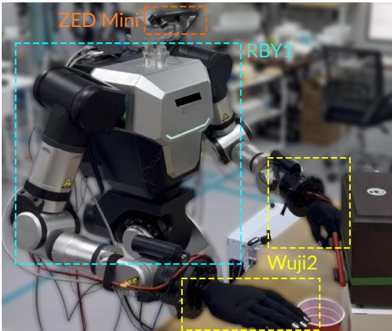  
Figure 9: Hardware setup: RB-Y1 humanoid with a Wuji Hand 2 on each wrist and a head-mounted ZED Mini stereo camera.

## E.1. Platform, observations and actions

Hardware. We use a Rainbow Robotics RB-Y1 (Rainbow Robotics, 2024) dual-arm humanoid with a 20-DoF Wuji Hand 2 (Wuji Technology, 2025) mounted on each wrist. The experiments use 54 of its degrees of freedom, the two 7-DoF arms and the two 20-DoF hands, for bimanual tabletop manipulation. The torso and neck stay at fixed joint positions, and the mobile base is not used. A single Stereolabs ZED Mini stereo camera (Stereolabs, 2018) mounted on the head provides the visual input (Figure 9).

Observation space. At every policy query the observation has three parts. The first is two ego-centric RGB images, the left and right views of the ZED Mini stereo pair, captured at 30 Hz and resized to 192 × 320. The second is a 62-dimensional proprioceptive vector of measured joint positions. The third is the task instruction (Table 6).

Action space. Actions are absolute joint-position targets. The base policy predicts an action chunk of 24 steps, and its first 16 steps are executed. RL acts only on these 16 executed steps and on the 54 arm and hand joints. SQAM optimizes this sub-chunk by updating the action head of the base policy, whereas EXPO-FT keeps the base policy frozen and adds a residual to it through its edit policy.

Control loop. The robot runs at a nominal control rate of 30 Hz and executes the policy synchronously. At each policy query the current observation is sent to the actor and the returned 16 step chunk of joint-position targets is executed step by step. A new observation is taken and the next chunk is requested only after the chunk has been completed.

## E.2. Tasks and evaluation protocol

Table 6 lists the three tasks with their language instructions, demonstration counts, and horizon parameters. All three tasks use a sparse reward, which is 1 when the episode succeeds and 0 otherwise.

Table 6: Task specification. For each task we list the language instruction, the number of teleoperated demonstrations, and the discount factor �.
<table><tr><td>Task</td><td>Language instruction</td><td>Demos</td><td>γ</td></tr><tr><td>flip-plastic-bag</td><td>&quot;flip the plastic bag&quot;</td><td>50</td><td>0.999</td></tr><tr><td>place-straw</td><td>&quot;place the straw in the cup&quot;</td><td>50</td><td>0.999</td></tr><tr><td>put-and-close</td><td>&quot;put the fruit in the pot and close the lid&quot;</td><td>50</td><td>0.999</td></tr></table>

Each task uses a fixed initial configuration for the teleoperated demonstrations, training, and evaluation, identical across methods. Every checkpoint is evaluated over 30 held-out episodes, and success is judged by the operator from the final state of the episode. At serving time SQAM samples one action chunk per query, while EXPO-FT serves the best of six sampled candidates per query.

Diferences from the EXPO-FT recipe. We run EXPO-FT with three changes to its released recipe, so that both methods follow the same protocol. First, neither method uses the corrective actions from a human operator that the EXPO-FT recipe includes. Second, its base policy is kept frozen and is not updated with its original training objective. Third, the critic of both methods reads the same mean-pooled VLM feature in place of the separate ResNet encoder of EXPO-FT, to reduce the compute cost. The remaining settings are shared with SQAM (Table 7), and EXPO-FT uses best-of-� sampling with � = 6 at training and serving time.

## E.3. Training details

Since SQAM updates the pretrained policy itself, its actor learning rate is small. EXPO-FT trains a residual edit policy and a Q head on top of the frozen base policy, with the changes listed in Appendix E.2, and its online run continues from its own 15K ofline checkpoint. Its learning rates are those of EXPO-FT, and its edit scale is the smallest value that work uses. Table 7 lists all hyperparameters.

## E.4. Additional results

Figure 10 tracks the success rate of the training rollouts during the online phase, and the rollout success rate of SQAM tends to increase as training proceeds on all three tasks. Figures 11 to 13 show the final frames of the evaluation episodes and the main failure mode of each method. The diference is clearest on flip-plastic-bag. The superimposed final frames of SFT show many episodes that end in the middle of flipping the bag, and these become visibly fewer under SQAM, consistent with its higher success rate. EXPO-FT instead often drops the bag while flipping it. Figure 14 compares the duration of the successful episodes. SQAM completes flip-plastic-bag and put-and-close faster than SFT and place-straw in a comparable time.

Table 7: Hyperparameters for the real-robot runs. The shared block applies to both methods, and the blocks below give each method’s own values.
<table><tr><td>Parameter</td><td>Value</td></tr><tr><td>Shared</td><td></td></tr><tr><td>Offline RL steps</td><td>15,000</td></tr><tr><td>Online RL steps</td><td>10,000</td></tr><tr><td>Batch size</td><td>128 offline, 192 online</td></tr><tr><td>Policy delay</td><td>5</td></tr><tr><td>UTD ratio</td><td>1</td></tr><tr><td>Action horizon</td><td>16</td></tr><tr><td>Action DoF</td><td>54</td></tr><tr><td>Critic ensemble size (K)</td><td>10</td></tr><tr><td>Network width</td><td>512</td></tr><tr><td>Network depth</td><td>4 hidden layers</td></tr><tr><td>Critic input</td><td>mean-pooled VLM feature, proprioception, action chunk</td></tr><tr><td>SQAM</td><td></td></tr><tr><td>Actor / critic learning rate</td><td> $1 0 ^ { - 5 } / 1 0 ^ { - 4 }$ </td></tr><tr><td>Value penalty coefficient (c)</td><td>0.01</td></tr><tr><td>KL budget (εKL)</td><td>0.5</td></tr><tr><td>EXPO-FT</td><td></td></tr><tr><td>Actor / critic learning rate</td><td> $3 \times 1 0 ^ { - 4 } / 3 \times 1 0 ^ { - 4 }$ </td></tr><tr><td>Best-of-N sampling (training and serving)</td><td></td></tr><tr><td>Edit scale</td><td>0.05</td></tr></table>

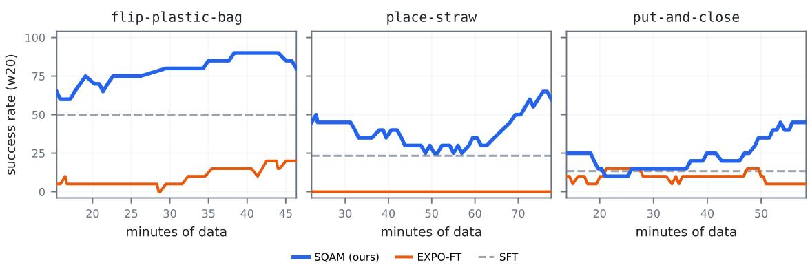  
Figure 10: Success rate of the training rollouts during the online RL phase, over a trailing window of 20 episodes, against minutes of robot data collected. The dashed line is the SFT policy’s held-out success rate. SQAM works at the scale of a vision-language-action policy, improving over SFT on all three tasks.

(a) SFT  
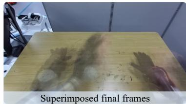  
(b) Expo-FT

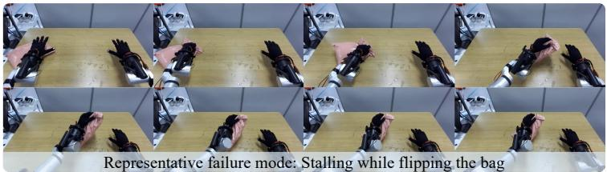

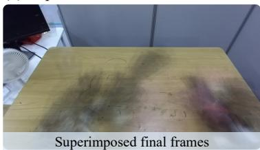  
(c) SQAM

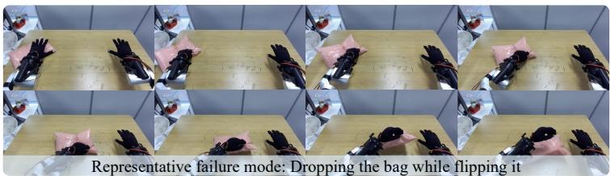

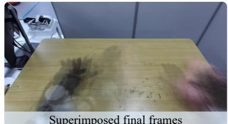

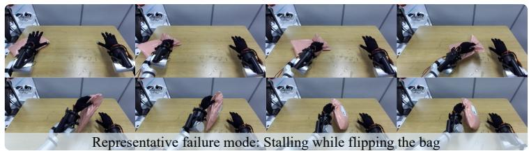  
Figure 11: Evaluation episodes on flip-plastic-bag. Left: superimposed final frames of all episodes. Right: the main failure mode of each method.

(a) SFT  
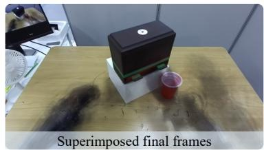

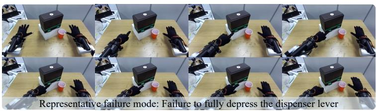

(b) Expo-FT  
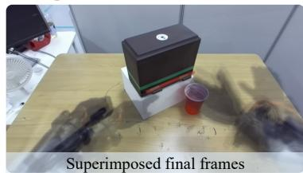

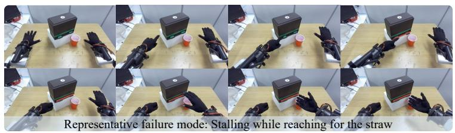

(c) SQAM  
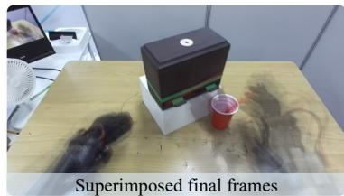

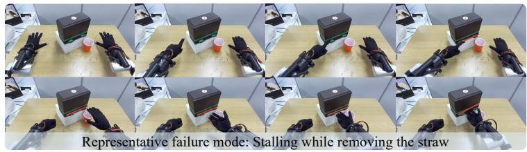  
Figure 12: Evaluation episodes on place-straw. Left: superimposed final frames of all episodes. Right: the main failure mode of each method.

(a) SFT  
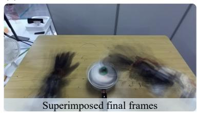  
(b) Expo-FT

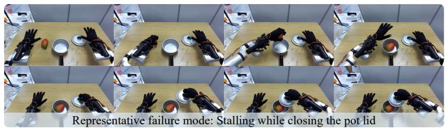

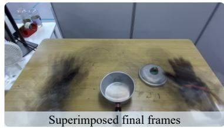

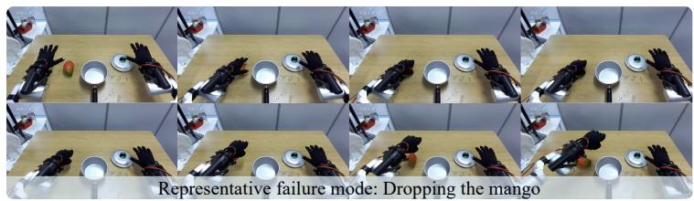

(c) SQAM  
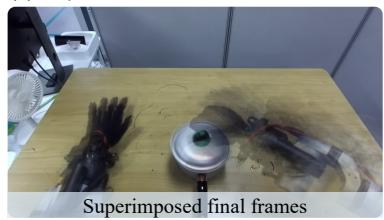

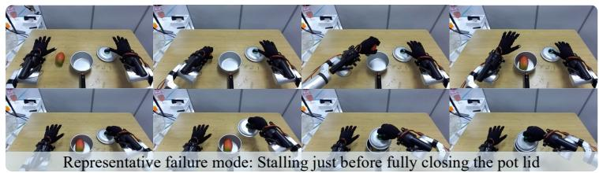  
Figure 13: Evaluation episodes on put-and-close. Left: superimposed final frames of all episodes. Right: the main failure mode of each method.

(a) Flip the plastic bag  
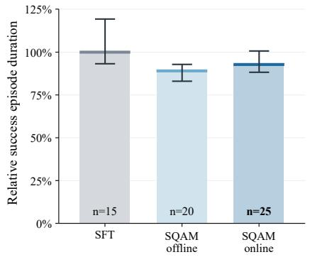

(b) Place the straw in the cup  
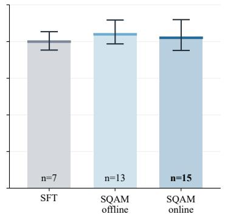

(c) Put the fruit in the pot and close the lid  
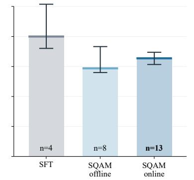  
Figure 14: Success episode durations normalized by each task’s SFT median (100%). Bars show medians, error bars indicate the 25th–75th percentiles, and � denotes the number of success episodes.

## F. Additional experiments

## F.1. The cost of one update

To measure the compute that the scalar adjoint saves, Figure 15 compares the wall-clock time of one SQAM update with that of the same update using the exact adjoint. The exact adjoint takes a vector–Jacobian product through the policy at each of the � flow steps, and the scalar adjoint takes none. The left panel widens the actor with the critic fixed. The exact adjoint remains about half again as slow at every width, so the saving persists on larger policies. The right panel varies the number of flow steps �. The gap grows with $F ,$ since the cost of the exact adjoint grows with the number of vector–Jacobian products while the rest of the update does not.

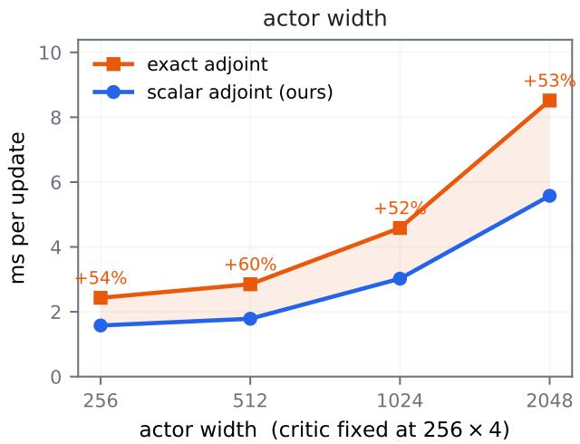

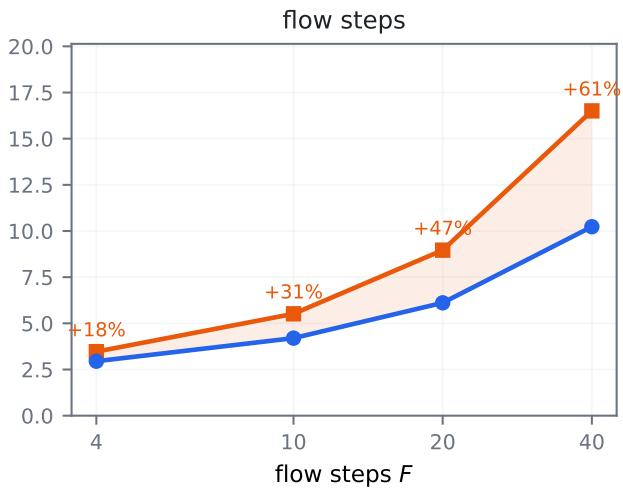  
Figure 15: Wall-clock time of one update with the exact and the scalar adjoint. Left: actor width, with the critic fixed at $2 5 6 \times 4$ . Right: number of flow steps �. Percentages give the extra time of the exact adjoint.

## F.2. The value penalty inside TRQAM

Section 4.3 explains the efect of the value penalty by where the scalar adjoint uses the critic, which is its gradient at the policy-generated action, used directly at every flow step. The exact adjoint instead passes this gradient through the velocity Jacobian at every flow step, so if the explanation holds, the value penalty should help the exact adjoint less. To test this, we switch the penalty on and of in both TRQAM and SQAM on cube-triple and cube-quadruple, the two domains where the scalar adjoint alone underperforms. All four configurations use the same four seeds with the trust region active, and they difer only in the critic loss.

Figure 16 shows that the value penalty improves TRQAM as well, but far less than it improves SQAM. At the ofline endpoint, it raises TRQAM by 18 points on cube-triple and 23 on cube-quadruple, and raises SQAM by 48.5 and 78 points. This matches the prediction above.

## F.3. Without the trust region

Section 3.1 notes that SQAM can be used with or without the path-space trust region of TRQAM. To run it without, we freeze the dual variable, $\eta _ { \lambda } = 0 ,$ , so that � stays at a constant value as in QAM. Figure 17 runs five constants $\lambda \in \{ 0 . 1 , 0 . 3 , 1 , 3 , 1 0 \}$ on one representative task from each of the ten domains, with the other settings, including the value penalty coeficients, as in the main experiments and eight seeds per curve. The dashed line is SQAM with the trust region.

Without the trust region, the efect of � is less predictable across domains. The best constant difers by two orders of magnitude, for example $\lambda = 0 . 1$ is the best value on antmaze-giant but fails on puzzle-3x3, while $\lambda = 1 0$ is the best value on puzzle-3x3 but fails on antmaze-large. With the trust region, the KL budget afects performance more predictably (Section 4.4) and keeps training stable, so we use it by default.

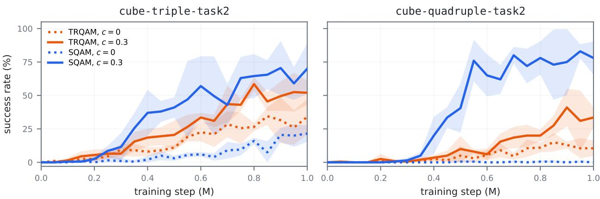  
Figure 16: TRQAM and SQAM with and without the value penalty (� = 0.3 and � = 0) during ofline training on task 2 of cube-triple and cube-quadruple. Four seeds per curve, with the trust region at the KL budget of each method.

## F.4. Batch-averaged velocity Jacobian on all domains

Figures 18 and 19 extend Figure 2 to all ten domains at four flow times. As in Figure 2, the velocity Jacobian of the pretrained flow is averaged over a batch of states sampled from the dataset and normalized by its mean diagonal. On every domain, the batch-averaged Jacobian is dominated by its diagonal.

## F.5. Ablation studies on all domains

Figures 20 and 21 extend the ablations of Section 4.4 to all ten domains, with one representative task per domain and eight seeds per setting, ofline to 1M steps and online to 1.5M. They sweep the KL budget and the value penalty coeficient �. The trends of the main text hold across the ten domains. A small KL budget performs best or equally well on most domains. The exception is puzzle-4x4, which prefers a larger budget, consistent with its larger state space and with the budget that Dong et al. (2026c) report for it. As in Section 4.4, the value enalt matters mainl on the domains where the scalar adjoint alone under erforms, with lar e ains on cube-triple and cube-quadruple and little gain on most other domains. On cube-double, it lowers the ofline success rate at � = 0.3, so the main experiments run this domain without the penalty.

## F.6. Value learning schemes on all domains

Fi ures 22 to 24 extend the com arison of value learnin schemes in Section 4.3 to all ten domains, with the same tasks, seeds, and steps as Appendix F.5. They sweep the gradient-norm penalty, ReBRAC (Tarasov et al., 2023), and the in-sample critic (Kostrikov et al., 2022) over their own coeficients, and the unregularized critic (none) is drawn as a dashed reference. Consistent with Section 4.3, the gradient-norm penalty also helps, most visibly on puzzle-3x3 and cube-quadruple, but degrades several domains at its largest coeficient, ReBRAC stays close to the unregularized critic except at its largest �, and the in-sample critic falls below the unregularized critic on most domains. The value penalty sweep of Figure 21 completes the comparison.

## G. Full OGBench results

Table 8 reports the ofline success rate of every method on all fifty tasks at 1M steps, the per-task breakdown behind Table 1. Figures 25 and 26 show the corresponding success rate curves, 1M ofline steps followed by 0.5M online, with eight seeds per method. SQAM uses the hyperparameters of Appendix D.2 on every task.

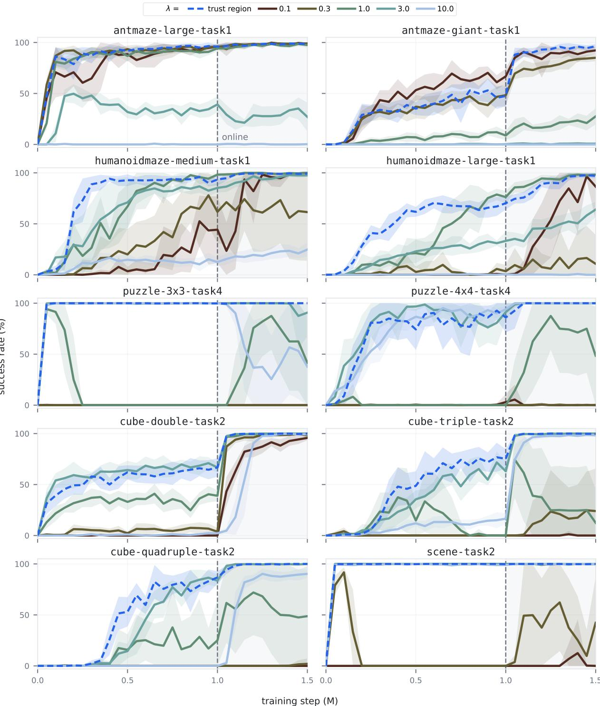  
Figure 17: SQAM with a constant �, for five values, against SQAM with the trust region (dashed) on one representative task from each of the ten domains. Eight seeds per curve, and bands are one standard deviation.

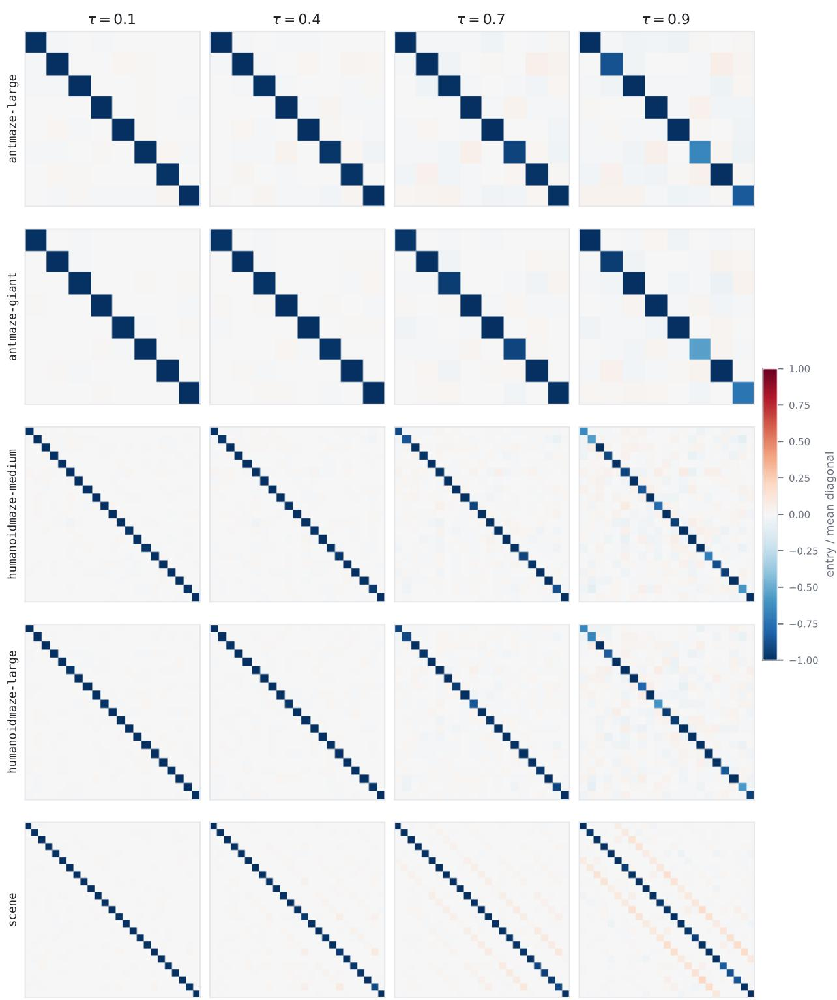  
Figure 18: The batch-averaged velocity Jacobian on the locomotion domains and scene at four flow times, each panel normalized by its mean diagonal.

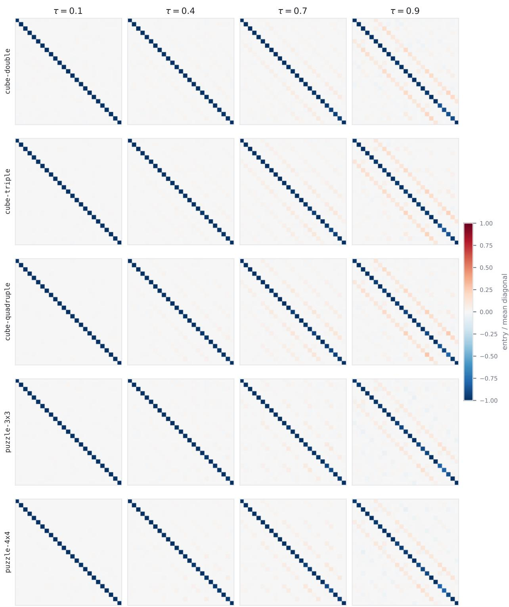  
Figure 19: The batch-averaged velocity Jacobian on the cube and puzzle domains at four flow times, with the same normalization as Figure 18.

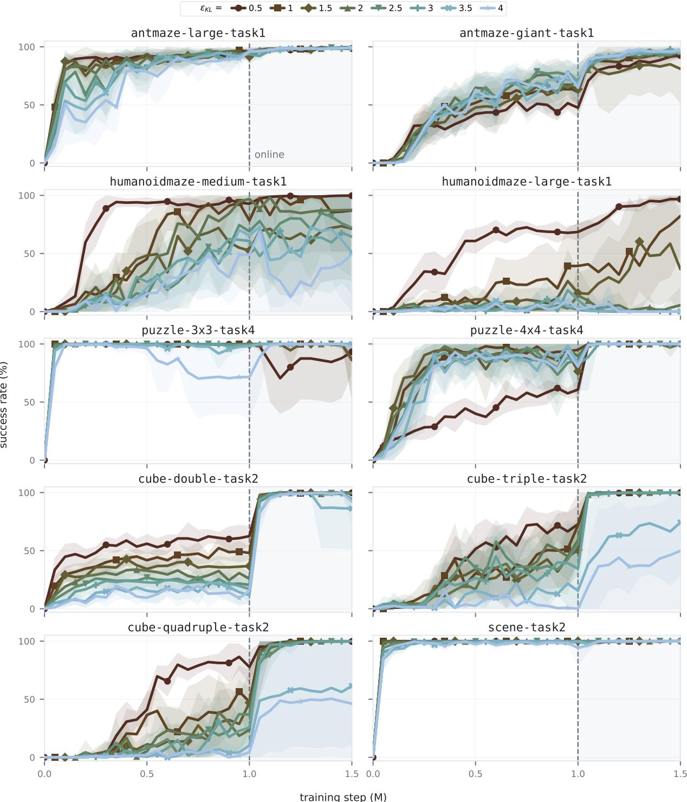  
Figure 20: The KL budget �KL swept from 0.5 to 4 on all ten domains. Eight seeds per budget, and bands are one standard deviation.

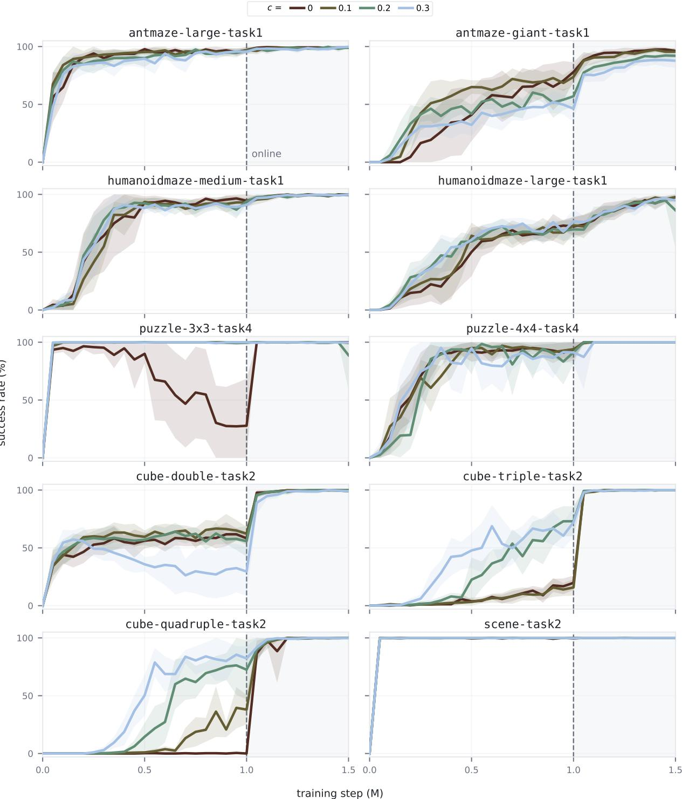  
Figure 21: The value penalty coeficient � swept over {0, 0.1, 0.2, 0.3} on all ten domains. Eight seeds per coeficient, and bands are one standard deviation.

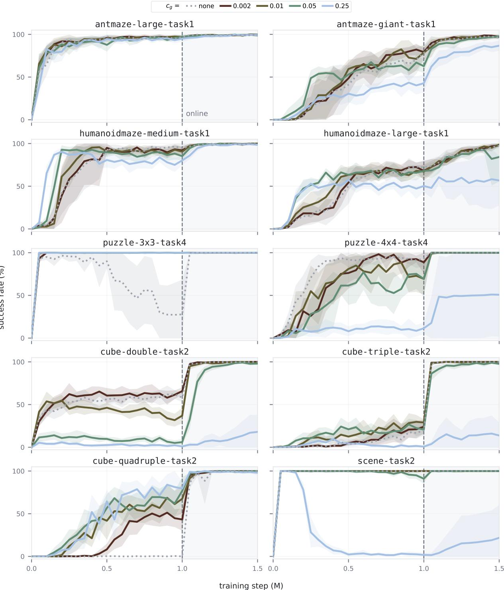  
Figure 22: The gradient-norm penalty coeficient $c _ { g }$ swept over {0.002, 0.01, 0.05, 0.25} on all ten domains, with the unregularized critic (none) as the dashed reference. Eight seeds per coeficient, and bands are one standard deviation.

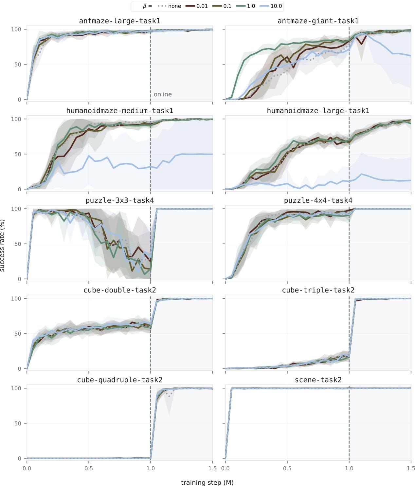  
Figure 23: ReBRAC’s bootstrap penalty swept over $\beta \in \{ 0 . 0 1 , 0 . 1 , 1 , 1 0 \}$ on all ten domains, with the unregularized critic (none) as the dashed reference. Eight seeds per coeficient, and bands are one standard deviation.

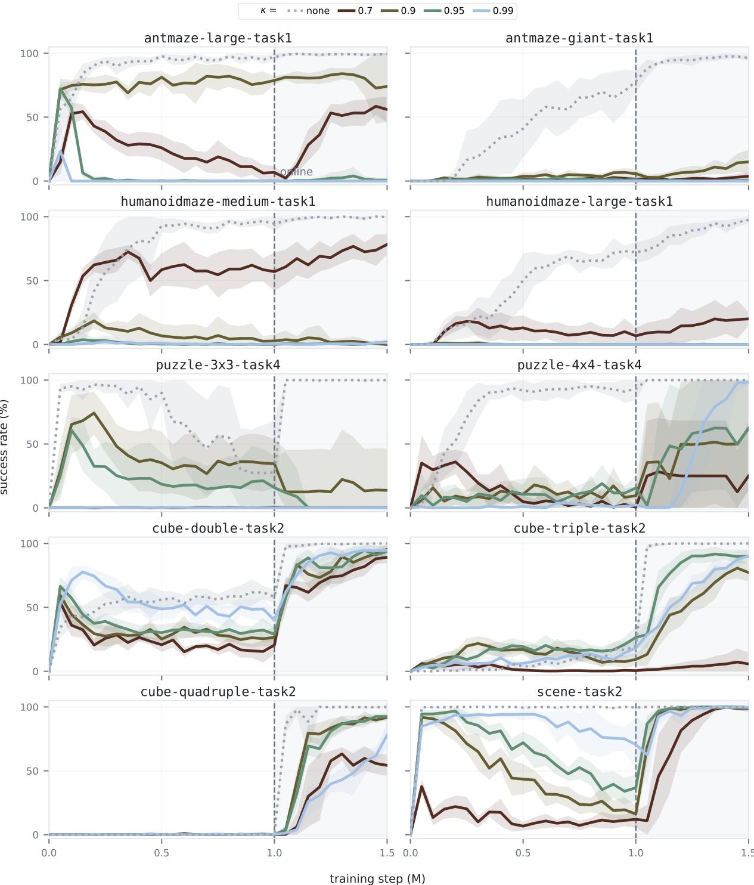  
Figure 24: The in-sample critic swept over the expectile $\kappa \in \{ 0 . 7 , 0 . 9 , 0 . 9 5 , 0 . 9 9 \}$ on all ten domains, with the unregularized critic (none) as the dashed reference. Eight seeds per expectile, and bands are one standard deviation.

Table 8: Full ofline results at 1M training steps (8 seeds). Mean success rate (%) ± one standard deviation.
<table><tr><td rowspan=1 colspan=10>FQL  CGQL-L DSRL  IFQL  QAM  QAM-ETRQAM</td><td rowspan=1 colspan=1>SQAM</td></tr><tr><td rowspan=6 colspan=4>task1                24±44task2                0±0task3               73 ±14antmaze-largetask4                0±0task5                92±4agg. (5 tasks)   38 ±9</td><td rowspan=1 colspan=1>62±38</td><td rowspan=1 colspan=1>45±12</td><td rowspan=1 colspan=1>7±11</td><td rowspan=1 colspan=1>96±3</td><td rowspan=1 colspan=1>93±5</td><td rowspan=1 colspan=1>95±4</td><td rowspan=1 colspan=1>96±2</td></tr><tr><td rowspan=1 colspan=1></td><td rowspan=1 colspan=1>21 ±36</td><td rowspan=1 colspan=1>73 ±7</td><td rowspan=1 colspan=1>9±14</td><td rowspan=1 colspan=1>36±49</td><td rowspan=1 colspan=1>91±4</td><td rowspan=1 colspan=1>87±6</td><td rowspan=1 colspan=1>85±4</td></tr><tr><td rowspan=1 colspan=1></td><td rowspan=1 colspan=1>88±5</td><td rowspan=1 colspan=1>84±5</td><td rowspan=1 colspan=1>62±24</td><td rowspan=1 colspan=1>86±7</td><td rowspan=1 colspan=1>93±3</td><td rowspan=1 colspan=1>93±3</td><td rowspan=1 colspan=1>93±4</td></tr><tr><td rowspan=1 colspan=2>task4</td><td rowspan=1 colspan=1></td><td rowspan=1 colspan=1>0±0</td><td rowspan=1 colspan=1>0±0</td><td rowspan=1 colspan=1>35±22</td><td rowspan=1 colspan=1>0±0</td><td rowspan=1 colspan=1>66±9</td><td rowspan=1 colspan=1>75±17</td><td rowspan=1 colspan=1>88±7</td></tr><tr><td rowspan=1 colspan=2>task5</td><td rowspan=1 colspan=1></td><td rowspan=1 colspan=1>68±42</td><td rowspan=1 colspan=1>63±8</td><td rowspan=1 colspan=1>34±24</td><td rowspan=1 colspan=1>94±3</td><td rowspan=1 colspan=1>89±5</td><td rowspan=1 colspan=1>96±3</td><td rowspan=1 colspan=1>93 ±3</td></tr><tr><td rowspan=1 colspan=1></td><td rowspan=1 colspan=1>48±7</td><td rowspan=1 colspan=1>53 ±2</td><td rowspan=1 colspan=1>29±8</td><td rowspan=1 colspan=1>62±9</td><td rowspan=1 colspan=1>86±3</td><td rowspan=1 colspan=1>89±4</td><td rowspan=1 colspan=1>91 ±3</td></tr><tr><td rowspan=2 colspan=4>task1                1±1task2                0±0</td><td rowspan=1 colspan=1>11±12</td><td rowspan=1 colspan=1>2±3</td><td rowspan=1 colspan=1>0±0</td><td rowspan=1 colspan=1>37±9</td><td rowspan=1 colspan=1>0±0</td><td rowspan=1 colspan=1>48±5</td><td rowspan=1 colspan=1>48±11</td></tr><tr><td rowspan=1 colspan=1></td><td rowspan=1 colspan=1>14±12</td><td rowspan=1 colspan=1>0±0</td><td rowspan=1 colspan=1>43 ±13</td><td rowspan=1 colspan=1>18 ±19</td><td rowspan=1 colspan=1>0±0</td><td rowspan=1 colspan=1>21 ±12</td><td rowspan=1 colspan=1>86±3</td></tr><tr><td rowspan=4 colspan=3>task3antmaze-giant-10Mtask4task5agg.(5 tasks)</td><td rowspan=1 colspan=1>0±0</td><td rowspan=1 colspan=1>0±0</td><td rowspan=1 colspan=1>0±0</td><td rowspan=1 colspan=1>14±8</td><td rowspan=1 colspan=1>2±2</td><td rowspan=1 colspan=1>0±0</td><td rowspan=1 colspan=1>5±5</td><td rowspan=1 colspan=1>30±10</td></tr><tr><td rowspan=1 colspan=2>task4</td><td rowspan=1 colspan=1>0±0</td><td rowspan=1 colspan=1>0±0</td><td rowspan=1 colspan=1>0±0</td><td rowspan=1 colspan=1>1±2</td><td rowspan=1 colspan=1>20±24</td><td rowspan=1 colspan=1>0±0</td><td rowspan=1 colspan=1>58±13</td><td rowspan=1 colspan=1>61±8</td></tr><tr><td rowspan=1 colspan=2>task5</td><td rowspan=1 colspan=1>10±29</td><td rowspan=1 colspan=1>8±23</td><td rowspan=1 colspan=1>2±2</td><td rowspan=1 colspan=1>2±2</td><td rowspan=1 colspan=1>69±8</td><td rowspan=1 colspan=1>28 ±38</td><td rowspan=1 colspan=1>75 ±7</td><td rowspan=1 colspan=1>83±8</td></tr><tr><td rowspan=1 colspan=1>2±6</td><td rowspan=1 colspan=1>7±5</td><td rowspan=1 colspan=1>1±1</td><td rowspan=1 colspan=1>12±3</td><td rowspan=1 colspan=1>29±4</td><td rowspan=1 colspan=1>6±8</td><td rowspan=1 colspan=1>41 ±4</td><td rowspan=1 colspan=1>62±4</td></tr><tr><td rowspan=6 colspan=1>humanoidmaze-medium</td><td rowspan=1 colspan=2>task1</td><td rowspan=1 colspan=1>84±21</td><td rowspan=1 colspan=1>84±9</td><td rowspan=1 colspan=1>24±23</td><td rowspan=1 colspan=1>93±3</td><td rowspan=1 colspan=1>33±34</td><td rowspan=1 colspan=1>28±30</td><td rowspan=1 colspan=1>87±5</td><td rowspan=1 colspan=1>94±6</td></tr><tr><td rowspan=1 colspan=2>task2</td><td rowspan=1 colspan=1>99 ±1</td><td rowspan=1 colspan=1>99±1</td><td rowspan=1 colspan=1>88±6</td><td rowspan=1 colspan=1>94±4</td><td rowspan=1 colspan=1>100±1</td><td rowspan=1 colspan=1>98±2</td><td rowspan=1 colspan=1>89±7</td><td rowspan=1 colspan=1>96±3</td></tr><tr><td rowspan=1 colspan=2>task3</td><td rowspan=1 colspan=1>89±9</td><td rowspan=1 colspan=1>0±0</td><td rowspan=1 colspan=1>64±27</td><td rowspan=1 colspan=1>96±4</td><td rowspan=1 colspan=1>90±8</td><td rowspan=1 colspan=1>74±18</td><td rowspan=1 colspan=1>90±6</td><td rowspan=1 colspan=1>98±2</td></tr><tr><td rowspan=1 colspan=1>task4</td><td rowspan=1 colspan=1></td><td rowspan=1 colspan=1>0±0</td><td rowspan=1 colspan=1>0±0</td><td rowspan=1 colspan=1>0 ±0</td><td rowspan=1 colspan=1>82±8</td><td rowspan=1 colspan=1>0±0</td><td rowspan=1 colspan=1>0±0</td><td rowspan=1 colspan=1>61 ±7</td><td rowspan=1 colspan=1>82±7</td></tr><tr><td rowspan=1 colspan=1>task5</td><td rowspan=1 colspan=1></td><td rowspan=1 colspan=1>99±1</td><td rowspan=1 colspan=1>100±1</td><td rowspan=1 colspan=1>88±5</td><td rowspan=1 colspan=1>99±2</td><td rowspan=1 colspan=1>100±1</td><td rowspan=1 colspan=1>99±1</td><td rowspan=1 colspan=1>95±4</td><td rowspan=1 colspan=1>100±1</td></tr><tr><td rowspan=1 colspan=3>agg.(5 tasks)   74±5</td><td rowspan=1 colspan=1>57±2</td><td rowspan=1 colspan=1>53 ±10</td><td rowspan=1 colspan=1>93±2</td><td rowspan=1 colspan=1>64±7</td><td rowspan=1 colspan=1>60±6</td><td rowspan=1 colspan=1>84±3</td><td rowspan=1 colspan=1>94±2</td></tr><tr><td rowspan=2 colspan=4>task1                1±2task2                0±0</td><td rowspan=1 colspan=1>16±11</td><td rowspan=1 colspan=1>1±1</td><td rowspan=1 colspan=1>32±5</td><td rowspan=1 colspan=1>6±10</td><td rowspan=1 colspan=1>9±14</td><td rowspan=1 colspan=1>45±8</td><td rowspan=1 colspan=1>70±7</td></tr><tr><td rowspan=1 colspan=1></td><td rowspan=1 colspan=1>0±0</td><td rowspan=1 colspan=1>0±0</td><td rowspan=1 colspan=1>6±9</td><td rowspan=1 colspan=1>0±0</td><td rowspan=1 colspan=1>0±0</td><td rowspan=1 colspan=1>10 ±6</td><td rowspan=1 colspan=1>25±13</td></tr><tr><td rowspan=4 colspan=1>humanoidmaze-large</td><td rowspan=1 colspan=2>task3</td><td rowspan=1 colspan=1>7±4</td><td rowspan=1 colspan=1>16±8</td><td rowspan=1 colspan=1>2±3</td><td rowspan=1 colspan=1>76±6</td><td rowspan=1 colspan=1>7±5</td><td rowspan=1 colspan=1>3±4</td><td rowspan=1 colspan=1>34±15</td><td rowspan=1 colspan=1>57 ±17</td></tr><tr><td rowspan=1 colspan=2>task4</td><td rowspan=1 colspan=1>0±0</td><td rowspan=1 colspan=1>0±1</td><td rowspan=1 colspan=1>0±0</td><td rowspan=1 colspan=1>35±26</td><td rowspan=1 colspan=1>0±0</td><td rowspan=1 colspan=1>0±0</td><td rowspan=1 colspan=1>44±13</td><td rowspan=1 colspan=1>60±14</td></tr><tr><td rowspan=1 colspan=2>task5</td><td rowspan=1 colspan=1>0±1</td><td rowspan=1 colspan=1>0±0</td><td rowspan=1 colspan=1>1±1</td><td rowspan=1 colspan=1>0±0</td><td rowspan=1 colspan=1>5±11</td><td rowspan=1 colspan=1>9±18</td><td rowspan=1 colspan=1>45±6</td><td rowspan=1 colspan=1>59±14</td></tr><tr><td rowspan=1 colspan=2>agg. (5 tasks)</td><td rowspan=1 colspan=1>2±1</td><td rowspan=1 colspan=1>6±3</td><td rowspan=1 colspan=1>1±1</td><td rowspan=1 colspan=1>30±7</td><td rowspan=1 colspan=1>4±3</td><td rowspan=1 colspan=1>4±5</td><td rowspan=1 colspan=1>36±4</td><td rowspan=1 colspan=1>54±5</td></tr><tr><td rowspan=2 colspan=1></td><td rowspan=1 colspan=2>task1</td><td rowspan=1 colspan=1>100±0</td><td rowspan=1 colspan=1>100±0</td><td rowspan=1 colspan=1>100±0</td><td rowspan=1 colspan=1>99±1</td><td rowspan=1 colspan=1>100±0</td><td rowspan=1 colspan=1>100±0</td><td rowspan=1 colspan=1>100±0</td><td rowspan=1 colspan=1>100±0</td></tr><tr><td rowspan=1 colspan=2>task2</td><td rowspan=1 colspan=1>100±1</td><td rowspan=1 colspan=1>99±1</td><td rowspan=1 colspan=1>100±0</td><td rowspan=1 colspan=1>2±2</td><td rowspan=1 colspan=1>100±0</td><td rowspan=1 colspan=1>100±0</td><td rowspan=1 colspan=1>100±0</td><td rowspan=1 colspan=1>100</td></tr><tr><td rowspan=4 colspan=1>scene</td><td rowspan=1 colspan=1>task3</td><td rowspan=1 colspan=1></td><td rowspan=1 colspan=1>82±5</td><td rowspan=1 colspan=1>93 ±7</td><td rowspan=1 colspan=1>100±1</td><td rowspan=1 colspan=1>77±7</td><td rowspan=1 colspan=1>94±4</td><td rowspan=1 colspan=1>93±4</td><td rowspan=1 colspan=1>100±1</td><td rowspan=1 colspan=1>99±2</td></tr><tr><td rowspan=1 colspan=1>task4</td><td rowspan=1 colspan=1></td><td rowspan=1 colspan=1>60±22</td><td rowspan=1 colspan=1>0±0</td><td rowspan=1 colspan=1>100±0</td><td rowspan=1 colspan=1>2±2</td><td rowspan=1 colspan=1>26±21</td><td rowspan=1 colspan=1>22±30</td><td rowspan=1 colspan=1>93 ±6</td><td rowspan=1 colspan=1>99±2</td></tr><tr><td rowspan=1 colspan=1>task5</td><td rowspan=1 colspan=1></td><td rowspan=1 colspan=1>8±7</td><td rowspan=1 colspan=1>0±0</td><td rowspan=1 colspan=1>0±0</td><td rowspan=1 colspan=1>0±0</td><td rowspan=1 colspan=1>0±0</td><td rowspan=1 colspan=1>0±0</td><td rowspan=1 colspan=1>0±1</td><td rowspan=1 colspan=1>0±0</td></tr><tr><td rowspan=1 colspan=1>agg.</td><td rowspan=1 colspan=1>(5 tasks)</td><td rowspan=1 colspan=1>70±5</td><td rowspan=1 colspan=1>58±1</td><td rowspan=1 colspan=1>80±0</td><td rowspan=1 colspan=1>36±1</td><td rowspan=1 colspan=1>64±4</td><td rowspan=1 colspan=1>63±6</td><td rowspan=1 colspan=1>79±1</td><td rowspan=1 colspan=1>79±0</td></tr><tr><td rowspan=2 colspan=1></td><td rowspan=1 colspan=2>task1</td><td rowspan=1 colspan=1>87 ±11</td><td rowspan=1 colspan=1>0±0</td><td rowspan=1 colspan=1>100±0</td><td rowspan=1 colspan=1>100±1</td><td rowspan=1 colspan=1>75±15</td><td rowspan=1 colspan=1>99±2</td><td rowspan=1 colspan=1>100±0</td><td rowspan=1 colspan=1>100±0</td></tr><tr><td rowspan=1 colspan=1>task2</td><td rowspan=1 colspan=1></td><td rowspan=1 colspan=1>37±39</td><td rowspan=1 colspan=1>0±0</td><td rowspan=1 colspan=1>100±0</td><td rowspan=1 colspan=1>23 ±7</td><td rowspan=1 colspan=1>0±0</td><td rowspan=1 colspan=1>100±0</td><td rowspan=1 colspan=1>100±0</td><td rowspan=1 colspan=1>100±0</td></tr><tr><td rowspan=2 colspan=1>puzzle-3x3</td><td rowspan=1 colspan=1>task3</td><td rowspan=1 colspan=1></td><td rowspan=1 colspan=1>0±0</td><td rowspan=1 colspan=1>0±0</td><td rowspan=1 colspan=1>100±0</td><td rowspan=1 colspan=1>82 ±11</td><td rowspan=1 colspan=1>0±0</td><td rowspan=1 colspan=1>76±11</td><td rowspan=1 colspan=1>100±0</td><td rowspan=1 colspan=1>100±1</td></tr><tr><td rowspan=1 colspan=1>task4</td><td rowspan=1 colspan=1></td><td rowspan=1 colspan=1>0±0</td><td rowspan=1 colspan=1>0±0</td><td rowspan=1 colspan=1>100±0</td><td rowspan=1 colspan=1>29±8</td><td rowspan=1 colspan=1>0±0</td><td rowspan=1 colspan=1>87 ±6</td><td rowspan=1 colspan=1>100±1</td><td rowspan=1 colspan=1>100±1</td></tr><tr><td rowspan=2 colspan=1></td><td rowspan=1 colspan=2>task5</td><td rowspan=1 colspan=1>3±6</td><td rowspan=1 colspan=1>0±0</td><td rowspan=1 colspan=1>100±0</td><td rowspan=1 colspan=1>86±9</td><td rowspan=1 colspan=1>0±1</td><td rowspan=1 colspan=1>84±20</td><td rowspan=1 colspan=1>100±0</td><td rowspan=1 colspan=1>100±0</td></tr><tr><td rowspan=1 colspan=2>agg. (5 tasks)</td><td rowspan=1 colspan=1>25±10</td><td rowspan=1 colspan=1>0±0</td><td rowspan=1 colspan=1>100±0</td><td rowspan=1 colspan=1>64±4</td><td rowspan=1 colspan=1>15±3</td><td rowspan=1 colspan=1>89±4</td><td rowspan=1 colspan=1>100±0</td><td rowspan=1 colspan=1>100±0</td></tr><tr><td rowspan=2 colspan=1></td><td rowspan=1 colspan=2>task1</td><td rowspan=1 colspan=1>3±3</td><td rowspan=1 colspan=1>1±1</td><td rowspan=1 colspan=1>90±5</td><td rowspan=1 colspan=1>74±11</td><td rowspan=1 colspan=1>3±4</td><td rowspan=1 colspan=1>90 ±10</td><td rowspan=1 colspan=1>100±0</td><td rowspan=1 colspan=1>97±6</td></tr><tr><td rowspan=1 colspan=2>task2</td><td rowspan=1 colspan=1>6±9</td><td rowspan=1 colspan=1>0±0</td><td rowspan=1 colspan=1>9±9</td><td rowspan=1 colspan=1>4±3</td><td rowspan=1 colspan=1>1±1</td><td rowspan=1 colspan=1>43 ±22</td><td rowspan=1 colspan=1>99±1</td><td rowspan=1 colspan=1>73±30</td></tr><tr><td rowspan=2 colspan=1>puzzle-4x4-10M</td><td rowspan=1 colspan=2>task3</td><td rowspan=1 colspan=1>23 ±15</td><td rowspan=1 colspan=1>0±0</td><td rowspan=1 colspan=1>81±20</td><td rowspan=1 colspan=1>84±6</td><td rowspan=1 colspan=1>2±3</td><td rowspan=1 colspan=1>57 ±10</td><td rowspan=1 colspan=1>98±2</td><td rowspan=1 colspan=1>81 ±12</td></tr><tr><td rowspan=1 colspan=2>task4</td><td rowspan=1 colspan=1>7±5</td><td rowspan=1 colspan=1>0±0</td><td rowspan=1 colspan=1>76±28</td><td rowspan=1 colspan=1>46±13</td><td rowspan=1 colspan=1>0±1</td><td rowspan=1 colspan=1>31 ±16</td><td rowspan=1 colspan=1>100±1</td><td rowspan=1 colspan=1>86±16</td></tr><tr><td rowspan=2 colspan=1></td><td rowspan=1 colspan=2>task5</td><td rowspan=1 colspan=1>9±16</td><td rowspan=1 colspan=1>0±0</td><td rowspan=1 colspan=1>49±43</td><td rowspan=1 colspan=1>3±1</td><td rowspan=1 colspan=1>1±1</td><td rowspan=1 colspan=1>50±22</td><td rowspan=1 colspan=1>98±5</td><td rowspan=1 colspan=1>90 ±17</td></tr><tr><td rowspan=1 colspan=2>agg. (5 tasks)</td><td rowspan=1 colspan=1>9±7</td><td rowspan=1 colspan=1>0±0</td><td rowspan=1 colspan=1>61 ±8</td><td rowspan=1 colspan=1>42±4</td><td rowspan=1 colspan=1>1±1</td><td rowspan=1 colspan=1>54±8</td><td rowspan=1 colspan=1>99±1</td><td rowspan=1 colspan=1>85 ±6</td></tr><tr><td rowspan=2 colspan=1></td><td rowspan=1 colspan=2>task1</td><td rowspan=1 colspan=1>75±10</td><td rowspan=1 colspan=1>83±4</td><td rowspan=1 colspan=1>85 ±7</td><td rowspan=1 colspan=1>18 ±7</td><td rowspan=1 colspan=1>96±3</td><td rowspan=1 colspan=1>94±4</td><td rowspan=1 colspan=1>98±2</td><td rowspan=1 colspan=1>94±5</td></tr><tr><td rowspan=1 colspan=2>task2</td><td rowspan=1 colspan=1>59±11</td><td rowspan=1 colspan=1>66±6</td><td rowspan=1 colspan=1>85±5</td><td rowspan=1 colspan=1>9±2</td><td rowspan=1 colspan=1>81 ±6</td><td rowspan=1 colspan=1>82±7</td><td rowspan=1 colspan=1>92±3</td><td rowspan=1 colspan=1>67±10</td></tr><tr><td rowspan=2 colspan=1>cube-double</td><td rowspan=1 colspan=2>task3</td><td rowspan=1 colspan=1>39±8</td><td rowspan=1 colspan=1>72±7</td><td rowspan=1 colspan=1>82±10</td><td rowspan=1 colspan=1>8±4</td><td rowspan=1 colspan=1>75 ±7</td><td rowspan=1 colspan=1>67±8</td><td rowspan=1 colspan=1>80 ±12</td><td rowspan=1 colspan=1>61 ±10</td></tr><tr><td rowspan=1 colspan=2>task4</td><td rowspan=1 colspan=1>6±3</td><td rowspan=1 colspan=1>15 ±5</td><td rowspan=1 colspan=1>35 ±6</td><td rowspan=1 colspan=1>2±2</td><td rowspan=1 colspan=1>24±6</td><td rowspan=1 colspan=1>29±6</td><td rowspan=1 colspan=1>54±8</td><td rowspan=1 colspan=1>9 ±3</td></tr><tr><td rowspan=2 colspan=1></td><td rowspan=1 colspan=2>task5</td><td rowspan=1 colspan=1>44±9</td><td rowspan=1 colspan=1>37±6</td><td rowspan=1 colspan=1>71 ±4</td><td rowspan=1 colspan=1>7±3</td><td rowspan=1 colspan=1>78±6</td><td rowspan=1 colspan=1>82±6</td><td rowspan=1 colspan=1>82±6</td><td rowspan=1 colspan=1>61 ±11</td></tr><tr><td rowspan=1 colspan=2>agg. (5 tasks)</td><td rowspan=1 colspan=1>44±4</td><td rowspan=1 colspan=1>55 ±2</td><td rowspan=1 colspan=1>72±4</td><td rowspan=1 colspan=1>9±2</td><td rowspan=1 colspan=1>71 ±2</td><td rowspan=1 colspan=1>71±3</td><td rowspan=1 colspan=1>81±3</td><td rowspan=1 colspan=1>58±3</td></tr><tr><td rowspan=2 colspan=1></td><td rowspan=1 colspan=2>task1</td><td rowspan=1 colspan=1>26±20</td><td rowspan=1 colspan=1>2±3</td><td rowspan=1 colspan=1>70±18</td><td rowspan=1 colspan=1>51 ±22</td><td rowspan=1 colspan=1>56±22</td><td rowspan=1 colspan=1>26±11</td><td rowspan=1 colspan=1>87±8</td><td rowspan=1 colspan=1>98±4</td></tr><tr><td rowspan=1 colspan=2>task2</td><td rowspan=1 colspan=1>1±1</td><td rowspan=1 colspan=1>0±0</td><td rowspan=1 colspan=1>16±7</td><td rowspan=1 colspan=1>16±3</td><td rowspan=1 colspan=1>15 ±11</td><td rowspan=1 colspan=1>14±9</td><td rowspan=1 colspan=1>42±9</td><td rowspan=1 colspan=1>75±10</td></tr><tr><td rowspan=2 colspan=1>cube-triple-10M</td><td rowspan=1 colspan=2>task3</td><td rowspan=1 colspan=1>8±6</td><td rowspan=1 colspan=1>0±0</td><td rowspan=1 colspan=1>40±8</td><td rowspan=1 colspan=1>28±8</td><td rowspan=1 colspan=1>21 ±11</td><td rowspan=1 colspan=1>9±6</td><td rowspan=1 colspan=1>45±9</td><td rowspan=1 colspan=1>81±11</td></tr><tr><td rowspan=1 colspan=2>task4</td><td rowspan=1 colspan=1>2±3</td><td rowspan=1 colspan=1>0±0</td><td rowspan=1 colspan=1>15 ±5</td><td rowspan=1 colspan=1>1±1</td><td rowspan=1 colspan=1>4±3</td><td rowspan=1 colspan=1>3±3</td><td rowspan=1 colspan=1>30±13</td><td rowspan=1 colspan=1>68±10</td></tr><tr><td rowspan=2 colspan=1></td><td rowspan=1 colspan=2>task5</td><td rowspan=1 colspan=1>1±1</td><td rowspan=1 colspan=1>0±0</td><td rowspan=1 colspan=1>31 ±12</td><td rowspan=1 colspan=1>23 ±8</td><td rowspan=1 colspan=1>1±1</td><td rowspan=1 colspan=1>2±4</td><td rowspan=1 colspan=1>48±17</td><td rowspan=1 colspan=1>37±10</td></tr><tr><td rowspan=1 colspan=2>agg. (5 tasks)</td><td rowspan=1 colspan=1>7±5</td><td rowspan=1 colspan=1>0±1</td><td rowspan=1 colspan=1>34±6</td><td rowspan=1 colspan=1>24±7</td><td rowspan=1 colspan=1>19±6</td><td rowspan=1 colspan=1>11 ±4</td><td rowspan=1 colspan=1>50±5</td><td rowspan=1 colspan=1>72±4</td></tr><tr><td rowspan=2 colspan=1></td><td rowspan=1 colspan=2>task1</td><td rowspan=1 colspan=1>36±25</td><td rowspan=1 colspan=1>7±5</td><td rowspan=1 colspan=1>36±12</td><td rowspan=1 colspan=1>15±11</td><td rowspan=1 colspan=1>70 ±10</td><td rowspan=1 colspan=1>45 ±19</td><td rowspan=1 colspan=1>66±16</td><td rowspan=1 colspan=1>90±6</td></tr><tr><td rowspan=1 colspan=2>task2</td><td rowspan=1 colspan=1>4±5</td><td rowspan=1 colspan=1>0±1</td><td rowspan=1 colspan=1>5±3</td><td rowspan=1 colspan=1>5±7</td><td rowspan=1 colspan=1>2±4</td><td rowspan=1 colspan=1>0±0</td><td rowspan=1 colspan=1>18±11</td><td rowspan=1 colspan=1>87±6</td></tr><tr><td rowspan=4 colspan=1>cube-quadruple-100M</td><td rowspan=1 colspan=1>task3</td><td rowspan=1 colspan=1></td><td rowspan=1 colspan=1>3 ±3</td><td rowspan=1 colspan=1>0±0</td><td rowspan=1 colspan=1>2±2</td><td rowspan=1 colspan=1>6±8</td><td rowspan=1 colspan=1>16±11</td><td rowspan=1 colspan=1>2±4</td><td rowspan=1 colspan=1>11 ±7</td><td rowspan=1 colspan=1>62±8</td></tr><tr><td rowspan=1 colspan=1>task4</td><td rowspan=1 colspan=1></td><td rowspan=1 colspan=1>0±0</td><td rowspan=1 colspan=1>0±0</td><td rowspan=1 colspan=1>0±1</td><td rowspan=1 colspan=1>0±0</td><td rowspan=1 colspan=1>2±2</td><td rowspan=1 colspan=1>0±0</td><td rowspan=1 colspan=1>3±2</td><td rowspan=1 colspan=1>31±17</td></tr><tr><td rowspan=1 colspan=1>task5</td><td rowspan=1 colspan=2>0±0</td><td rowspan=1 colspan=1>0±0</td><td rowspan=1 colspan=1>1±1</td><td rowspan=1 colspan=1>2±3</td><td rowspan=1 colspan=1>0±0</td><td rowspan=1 colspan=1>0±0</td><td rowspan=1 colspan=1>0±0</td><td rowspan=1 colspan=1>0±0</td></tr><tr><td rowspan=1 colspan=3>agg. (5 tasks)   9±5</td><td rowspan=1 colspan=1>1±1</td><td rowspan=1 colspan=1>9±3</td><td rowspan=1 colspan=1>6±3</td><td rowspan=1 colspan=1>18±3</td><td rowspan=1 colspan=1>9±3</td><td rowspan=1 colspan=1>19 ±5</td><td rowspan=1 colspan=1>54±5</td></tr><tr><td rowspan=1 colspan=5>all           agg. (50 tasks)   28     23</td><td rowspan=1 colspan=2>46    35</td><td rowspan=1 colspan=1>35</td><td rowspan=1 colspan=2>45    68</td><td rowspan=1 colspan=1>75</td></tr></table>

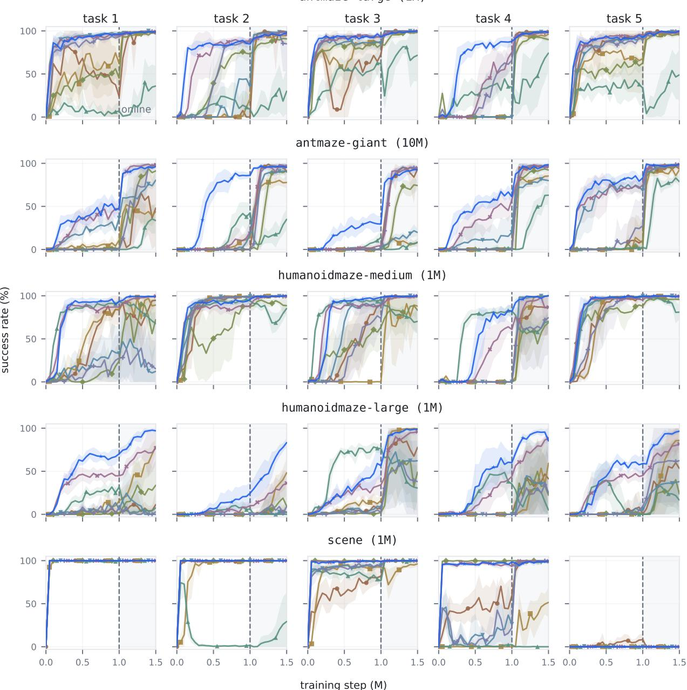  
Fi ure 25: Success rate curves on the locomotion domains and scene, with rows for domains and columns for their five tasks. Ofline training runs to 1M steps and online training to 1.5M, with the dashed line at the transition. Eight seeds per curve, and bands are one standard deviation.

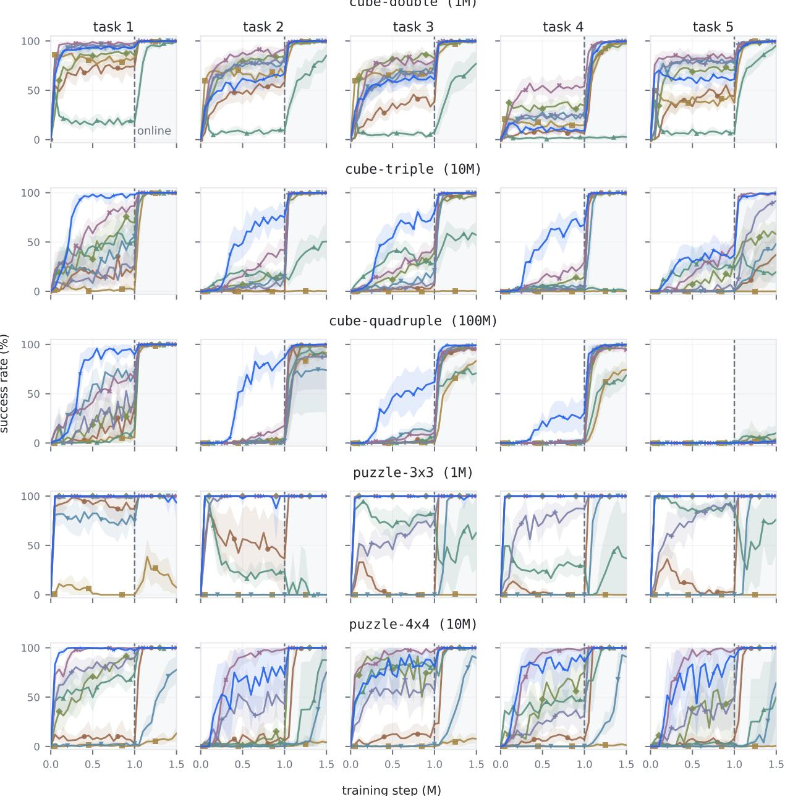  
Figure 26: Success rate curves on the cube and puzzle domains, with rows for domains and columns for their five tasks. Ofline training runs to 1M steps and online training to 1.5M, with the dashed line at the transition. Eight seeds per curve, and bands are one standard deviation.

## H. Limitations and future work

We see three directions that this work leaves open.

Value learning for flow policies. Our results suggest that the value learning scheme largely determines how well the scalar adjoint performs, and SQAM addresses this with a value penalty added to a standard critic. A value learning method designed for flow policies from the ground up may make this dependence more reliable than a penalty on top of an existing critic.

Multi-task fine-tuning. Updating the generative policy itself, rather than a separately learned component, should matter most when a single policy serves many tasks. Our real-robot experiments fine-tune the policy on each task separately. Fine-tuning a single policy across many tasks, as in Wang et al. (2026), would test this benefit more directly.

Why the Jacobian concentrates on its diagonal. We observe that the batch-averaged velocity Jacobian of pretrained flow policies concentrates on its diagonal on every domain we measured, but we do not explain why. A theoretical analysis of when this structure arises would clarify the conditions under which the scalar adjoint applies.