# Reflected Anchored Langevin Algorithms

Changwei Tu 1, Xiaoyu Wang 2, Yingli Wang 3, Xicheng Zhang 4, Lingjiong Zhu 5

October 8, 2026

## Abstract

First order Langevin algorithms for constrained sampling in machine learning, such as projected Langevin Monte Carlo which are based on discretizations of reflected Langevin dynamics, require diferentiable log densities that limits their applicability. This paper introduces reflected anchored Langevin dynamics (RALD), a reflected difusion that converges to non-diferentiable targets on constrained domains. The method uses a smooth anchored reference potential and multiplies the drift and noise covariance of its reflected Langevin dynamics by the same state dependent scaling factor. Its Euler-Maruyama discretization with projection gives reflected anchored Langevin Monte Carlo (RALMC) algorithm. We prove explicit convergence bounds and iteration complexity for RALMC in the 2-Wasserstein distance to the target distribution. Numerical experiments are provided to illustrate the theoretical predictions and the empirical performance of the method.

## 1 Introduction

The problem of sampling a target distribution

$$
\pi ( x ) \propto \exp ( - U ( x ) ) , \qquad x \in \mathbb { R } ^ { d } ,\tag{1.1}
$$

for a function $U : \mathbb { R } ^ { d }  \mathbb { R }$ arises in many applications, including Bayesian statistical inference [GCSR95], Bayesian formulations of inverse problems [Stu10], and Bayesian classification and regression tasks in machine learning [ADFDJ03, TTV16, GGHZ21, GIWZ24, BGK+25, WWZ25]. Langevin algorithms are popular Markov chain Monte Carlo (MCMC) methods that allow one to sample from (1.1), and the most classical one is based on the discretization of overdamped Langevin dynamics (OLD) [Dal17, DM19, DM17, DK19, RRT17]:

$$
d X _ { t } = - \nabla U ( X _ { t } ) d t + \sqrt { 2 } d W _ { t } ,\tag{1.2}
$$

where $B _ { t }$ is a standard d-dimensional Brownian motion. Under some mild assumptions on $U ( \cdot )$ the difusion (1.2) admits a unique stationary distribution (1.1) [CHS87, HKS89].

In recent years, there has been growing interest in sampling a target distribution (1.1), where the potential function $U ( x )$ is non-diferentiable such that the classical OLD (1.2) is not applicable since it requires the existence of the gradient of U everywhere in $\mathbb { R } ^ { d }$ . Several approaches modify the non-diferentiable potential function to enable gradient based sampling. [ZH14] proposed a gradient based adaptive stochastic search method that smooths the original objective by integrating it against a parameterized family of exponential densities, producing a diferentiable surrogate. [DMP18] introduced a proximal MCMC method using the Moreau-Yoshida envelope (MYE) to regularize the nonsmooth component. Inspired by [DMP18], [GSS22] applied the Moreau-Yoshida envelope in both overdamped and underdamped Langevin algorithms and reported empirica success across discrete densities. Similarly, [MFWB22] developed the Metropolis adjusted proximal gradient Langevin dynamics (MAPGLD) with theoretical convergence guarantees. [SR20] introduced Stochastic Proximal Langevin Algorithm (SPLA), which further extends this line of work to nonsmooth convex functions that may take infinite values. For subgradient based approaches, [DMM19] proposed the Stochastic Subgradient Langevin Dynamics (SSGLD), which relaxes the diferentiability requirement by using subdiferentials. [CDJB20] provided further convergence results under similar conditions. Another strategy for handling nonsmoothness is Gaussian smoothing. [NS17] provide guarantees for nonsmooth, Lipschitz, and convex objectives, while [CDJB20] analyze smoothed Langevin dynamics under convexity and subdiferentiability assumptions.

Very recently, [GNZZ25] introduced anchored Langevin dynamics (ALD) from a probabilistic perspective:

$$
d X _ { t } = - \nabla U _ { 0 } ( X _ { t } ) e ^ { ( U - U _ { 0 } ) ( X _ { t } ) } d t + { \sqrt { 2 } } e ^ { { \frac { 1 } { 2 } } ( U - U _ { 0 } ) ( X _ { t } ) } d W _ { t } ,\tag{1.3}
$$

where $U , U _ { 0 } : \mathbb { R } ^ { d }  \mathbb { R }$ are continuous functions, and $W _ { t }$ is a standard Brownian motion in $\mathbb { R } ^ { d }$ In (1.3), $U _ { 0 }$ plays the role of an anchored reference potential. Note that in (1.3), even though we require $U _ { 0 }$ to be diferentiable, U may not be diferentiable. It is proved in [GNZZ25] that under mild conditions, (1.3) admits $\pi \stackrel { \cdot } { \propto } e ^ { - U ( x ) }$ as the unique invariant distribution. Hence (1.3) can be used to sample $\pi \propto e ^ { - U ( x ) }$ where $U ( x )$ is not necessarily diferentiable. It is known that the classical overdamped Langevin dynamics fails to sample heavy tailed distributions with exponential ergodicity. In other words, it does not converge to the target exponentially fast in time, so convergence can be slow even when convergence holds. See e.g. [RT96]. As a remedy, it is shown in [GNZZ25] that the anchored Langevin dynamics (1.3) can sample a heavy tailed Gibbs distribution $\dot { \pi } \propto e ^ { - U \bar { ( } x ) }$ with convergence being exponentially fast in time.

On the other hand, there has also been a growing interest in the machine learning literature to study constrained sampling problem, where the target distribution is supported on a constrained domain:

$$
\pi \propto e ^ { - U ( x ) } , \qquad x \in \mathcal { C } .\tag{1.4}
$$

A standard approach is to discretize reflected Langevin dynamics (RLD), namely an overdamped Langevin difusion with reflected boundary. In the literature, [BEL15, BEL18] studied the projected Langevin Monte Carlo (PLMC) algorithm for constrained sampling that projects the iterates back to the constraint set after applying the Langevin step. Since the seminal works [BEL15, BEL18] where the density π is assumed to be log concave, there have been many studies proposing various Langevin algorithms for constrained sampling. [Lam21] considers the projected stochastic gradient Langevin dynamics in the setting of nonconvex smooth Lipschitz U on a convex body where the gradient noise is assumed to have finite variance with a uniform sub Gaussian structure. See also [ZL22]. Proximal Langevin Monte Carlo is proposed in [BDMP17] for constrained sampling. See also [SR20] for a study on the proximal stochastic gradient Langevin algorithm from a primal dual perspective. Proximal Langevin methods are particularly relevant for nonsmooth composite potentials when the corresponding proximal map is tractable. Our approach is diferent: the anchored construction keeps the constrained reflected dynamics explicit and, in the constant reference case, leads to a projected zeroth order scheme that only requires evaluations of $U ,$ see also [IZ26] for a study in the decentralized setting. Langevin algorithms based on mirror descent (see e.g. [HKRC18, $\mathrm { C L G L ^ { + } 2 0 }$ , ZPFP20, LTVW22, AC21]) can also be used for constrained sampling. This line was initiated by [HKRC18], inspired by classical mirror descent in optimization. More recently, inspired by the penalty method in the optimization literature, penalized Langevin Monte Carlo algorithms are proposed and studied in [GHZ24], where the potential function U can be nonconvex in general. In addition, constrained nonconvex exploration combined with replica exchange Langevin dynamics was proposed and studied in $[ \mathrm { Z D F ^ { + } 2 4 } ]$ Recently, nonreversible Langevin algorithms with skew reflected boundary based on skew reflected nonreversible Langevin dynamics (SRNLD) were proposed and studied in $[ \mathrm { D F T ^ { + } 2 5 } ]$ , where an antisymmetric matrix J is added to the dynamics, that can accelerate the convergence of the (reversible) projected Langevin Monte Carlo. However, how to choose the antisymmetric matrix J in practice is a challenging problem. Very recently, [WTWZ26] showed acceleration for constrained sampling through the lens of large deviations and asymptotic variance for SRNLD under the additional constraint that $J ( x ) \nu ( x ) = 0$ , where $\nu ( x )$ is the outward unit normal vector. For ball constraints, and more generally for constrained domains characterized by sublevel sets that include smoothed $\ell _ { p }$ balls as special cases, [WTWZ26] provided an explicit construction of $J ( x )$ . Under this additional condition, skew reflection becomes regular reflection. Extensive numerical experiments using both synthetic and real data in [WTWZ26] showed improved performance for choices of J satisfying this condition.

In this paper, we study reflected anchored Langevin algorithms for constrained sampling with non-diferentiable targets. In particular, the constant reference construction gives a projected zeroth order scheme that requires no gradient evaluations of the target potential. In addition to handling nonsmooth constrained targets, we also identify mechanisms through which the state dependent scaling factor can improve mixing relative to PLMC, both at the level of Dirichlet forms and through local bottleneck crossing probabilities.

Consider the constrained sampling problem (1.4), where $\mathcal { C } \subsetneq \mathbb { R } ^ { d }$ , and $U ( x )$ is not necessarily diferentiable. In this paper, we propose reflected anchored Langevin dynamics (RALD):

$$
\begin{array} { r } { d X _ { t } = - \nabla U _ { 0 } ( X _ { t } ) e ^ { ( U - U _ { 0 } ) ( X _ { t } ) } d t + \sqrt { 2 } e ^ { \frac { 1 } { 2 } ( U - U _ { 0 } ) ( X _ { t } ) } d W _ { t } - \nu _ { t } L ( d t ) , } \end{array}\tag{1.5}
$$

where $U _ { 0 } : \mathbb { R } ^ { d }  \mathbb { R }$ plays the role as an anchored reference potential, $W _ { t }$ is a standard Brownian motion in $\mathbb { R } ^ { d }$ , and $\nu _ { t }$ is an outward unit normal vector at $X _ { t }$ for $L ( d t )$ almost every t. The term $- \nu _ { t } L ( d t )$ reflects the process at the boundary and ensures $X _ { t } \in \mathcal { C }$ for every t given that $X _ { 0 } \in { \mathcal { C } }$ In particular, $\begin{array} { r } { K _ { t } : = \int _ { 0 } ^ { t } \nu _ { s } L ( d s ) } \end{array}$ is an outward normal bounded variation regulator and the measure $L ( d t )$ is such that $L ( [ 0 , t ] )$ is finite, $L ( d t )$ is supported on $\{ t : X _ { t } \in \partial { \mathcal { C } } \}$ In (1.5), the state dependent scaling factor $\dot { a } ( x ) : = e ^ { U ( x ) - \dot { U } _ { 0 } ( x ) }$ multiplies the reference drift $- \nabla U _ { 0 } ( x )$ by $a ( x )$ and the noise amplitude $\sqrt { 2 }$ by $\sqrt { a ( x ) }$ . Thus the instantaneous noise covariance is $2 a ( x ) I _ { d }$ . We refer to a as the scaling factor below.

To implement (1.5) in practice, based on its discretization, we propose reflected anchored Langevin Monte Carlo (RALMC):

$$
x _ { k + 1 } = { \mathcal { P } } _ { \mathcal { C } } \left( x _ { k } - \eta \nabla U _ { 0 } ( x _ { k } ) e ^ { ( U - U _ { 0 } ) ( x _ { k } ) } + { \sqrt { 2 \eta } } e ^ { { \frac { 1 } { 2 } } \left( U - U _ { 0 } \right) ( x _ { k } ) } \xi _ { k + 1 } \right) ,\tag{1.6}
$$

where $\mathcal { P } _ { \mathcal { C } }$ is the projection onto the set ${ \mathcal { C } } ,$ defined as $\begin{array} { r } { \mathcal { P } _ { \mathcal { C } } ( x ) : = \arg \operatorname* { m i n } _ { y \in \mathcal { C } } \| x - y \| } \end{array}$ for any $\boldsymbol { x } \in \mathbb { R } ^ { d }$ $\eta > 0$ is the stepsize, or learning rate, $\xi _ { k }$ are i.i.d. Gaussian random vectors $\mathcal { N } ( 0 , I _ { d } )$

For ALD (1.3) to sample $\pi \propto e ^ { - U ( x ) }$ on $\mathbb { R } ^ { d }$ , in practice, one needs to choose $U _ { 0 }$ such that the diference $U ( x ) \mathrm { ~ - ~ } U _ { 0 } ( x )$ is bounded so that the term $e ^ { ( U - U _ { 0 } ) ( x ) }$ will not cause instability. Indeed, [GNZZ25] chooses $U _ { 0 } ( x )$ to be the Gaussian smoothing of $U ( x )$ to sample $\pi \propto e ^ { - U ( x ) }$ for non-diferentiable $U ( x )$ . On the other hand, RALD (1.5) is constrained on a compact domain C and the term $e ^ { ( U - U _ { 0 } ) ( x ) }$ is automatically uniformly bounded on ${ \mathcal { C } } ,$ which makes the implementation more desirable. To sample $\pi \propto e ^ { - U ( x ) }$ for non-diferentiable $U ( x )$ on ${ \mathcal { C } } ,$ one may choose $U _ { 0 } ( x ) \equiv 0$ such that (1.5) becomes: 6

$$
d X _ { t } = { \sqrt { 2 } } e ^ { { \frac { 1 } { 2 } } U ( X _ { t } ) } d W _ { t } - \nu _ { t } L ( d t ) ,\tag{1.7}
$$

and (1.6) becomes:

$$
x _ { k + 1 } = { \mathcal { P } } _ { { \mathcal { C } } } \left( x _ { k } + { \sqrt { 2 \eta } } e ^ { { \frac { 1 } { 2 } } U \left( x _ { k } \right) } \xi _ { k + 1 } \right) .\tag{1.8}
$$

The algorithm (1.8) is a simple zeroth order algorithm that can sample $\pi \propto e ^ { - U ( x ) }$ on $\mathcal { C }$ without access to the gradient of $U ( x )$

The main contributions are as follows.

• We introduce reflected anchored Langevin dynamics (RALD), which modifies both the drift and difusion terms of reflected Langevin dynamics (RLD) through an anchored reference potential $U _ { 0 } ( x )$ and gives a state dependent difusion term. The discretization of RALD yields reflected anchored Langevin Monte Carlo (RALMC), a Markov chain Monte Carlo algorithm that can sample a target distribution $\pi \propto \dot { e } ^ { - U ( x ) }$ supported on a constrained domain ${ \mathcal { C } } ,$ where U is not necessarily diferentiable.

• For RALD, a continuous time SDE with reflected boundary, we prove that it preserves the target distribution $\pi \propto e ^ { - U ( x ) } , \ x \in \mathcal { C }$ as an invariant distribution under regularity assumptions on the boundary (Theorem 5). Using reversibility and the associated Dirichlet form established in Proposition 4, we prove an explicit convergence guarantee for RALD to the target distribution in $\chi ^ { 2 }$ divergence when the target distribution satisfies a Poincar´e inequality (Theorem 6) and, as a corollary, in $\mathcal { W } _ { 2 }$ distance (Corollary 7).

• For RALMC, we obtain discretization error bounds in $\mathcal { W } _ { 2 }$ distance under two sets of assumptions on the reference function $U _ { 0 }$ . Theorem 14 treats the dissipative drift setting and gives the explicit iteration bound in Corollary 15. For a constant reference, Theorem 19 combines fixed block projected Euler-Maruyama estimates with long time stability of the continuous semigroup. Its discretization error constant is independent of the total running time. Corollary 20 gives $\widetilde { \mathcal { O } } ( \varepsilon ^ { - 4 } )$ iterations for fixed model parameters, the dependence on heat kernel and geometric quantities remains explicit and is not claimed to be dimension independent.

• Numerical experiments compare RALMC with PLMC on synthetic constrained sampling problems and real data Bayesian inference tasks. For the truncated Laplace distribution and the truncated Gaussian mixture model, RALMC with a constant reference potential converges faster than PLMC in $\mathcal { W } _ { 2 }$ distance. For constrained Bayesian logistic regression with non-diferentiable Laplace, SCAD, and MCP priors, experiments on the MAGIC Gamma Telescope and Breast Cancer Wisconsin datasets show that RALMC with a constant reference improves accuracy at small stepsizes, while RALMC with a Gaussian smoothed reference remains stable at larger stepsizes where the constant reference variant can become unstable.

## Notations

We summarize the notations below.

• For a diferentiable function $f : \mathbb { R } ^ { d } \to \mathbb { R } , \nabla f : = ( \partial _ { 1 } f , \cdot \cdot \cdot , \partial _ { d } f )$

• For a vector $\boldsymbol { x } \in \mathbb { R } ^ { d }$ , let $\| x \| : = { \sqrt { \langle x , x \rangle } }$ be the Euclidean norm.

• For a random variable X, define $\| X \| _ { p } : = ( \mathbb { E } [ | X | ^ { p } ] ) ^ { 1 / p }$ for any $p \geq 1$

• For a matrix $A = ( a _ { i j } ) _ { 1 \leq i , j \leq d } \in \mathbb { R } ^ { d \times d }$ , let $\| A \| _ { \mathrm { F } } : = { \sqrt { \operatorname { t r } ( A A ^ { \top } ) } }$ be the Frobenius norm.

• Let $( \mathcal { M } , d )$ be a metric space that is Polish. For any $\mu , \nu \in \mathscr { P } _ { 2 } ( \mathcal { M } )$ , the space consisting of all probability measures on M with the finite second moment (based on the metric $d )$ the 2-Wasserstein distance $\mathcal { W } _ { 2 }$ (see e.g. [Vil09]) between $\mu$ and $\nu$ is defined as: $\mathcal { W } _ { 2 } ( \mu , \nu ) : =$ $\left( \operatorname { i n f } \mathbb { E } \left[ \left( d ( Y , Z ) \right) ^ { 2 } \right] \right) ^ { 1 / 2 }$ , where the infimum is taken over all joint distributions of the random variables $Y , Z$ with marginal distributions $\mu ,$ ν respectively.

• The total variation (TV) distance between two probability measures $\mu$ and $\nu$ on a sigma algebra $\mathcal { F }$ is defined as $\mathrm { T V } ( \mu , \nu ) : = \| \mu - \nu \| _ { \mathrm { T V } } : = \operatorname* { s u p } _ { A \in \mathcal { F } } | \mu ( A ) - \nu ( A ) |$

• The KL divergence between two probability measures $\mu$ and ν on a measurable space $x ,$ , where $\mu$ is absolutely continuous with respect to $\nu ,$ is defined as: $\begin{array} { r } { \mathrm { K L } ( \mu \| \nu ) : = \int _ { \mathcal { X } } \frac { d \mu } { d \nu } \log \left( \frac { d \mu } { d \nu } \right) d \nu . } \end{array}$

• The $\chi ^ { 2 }$ divergence between two probability measures $\mu$ and ν on a measurable space $\mathcal { X } .$ , where $\mu$ is absolutely continuous with respect to $\nu ,$ is defined as: $\begin{array} { r } { \chi ^ { 2 } ( \mu \| \nu ) = \int _ { \mathcal { X } } \left( \frac { d \mu } { d \nu } - 1 \right) ^ { 2 } d \nu } \end{array}$

## 2 Main Results

The following geometry for the constrained domain is assumed throughout the main results and their proofs, all volume integrals are over the interior.

Assumption 1. The constraint set $\mathcal { C } \subset \mathbb { R } ^ { d }$ is bounded, closed, convex, and has nonempty interior. In addition, we assume $0 \in { \mathcal { C } }$ and ${ \mathcal { C } } \subset B ( 0 , R )$ for some $R > 0$

We use the outward normal cone

$$
N _ { \mathcal { C } } ^ { \mathrm { o u t } } ( x ) : = \left\{ v \in \mathbb { R } ^ { d } : \langle v , y - x \rangle \leq 0 \mathrm { ~ f o r ~ e v e r y ~ } y \in \mathcal { C } \right\} , \qquad x \in \mathcal { C } .\tag{2.1}
$$

The regulator K points outward, so the normal Skorokhod reflection of a driving path Y is written as

$$
X _ { t } = Y _ { t } - K _ { t } , \qquad d K _ { t } \in N _ { \mathcal { C } } ^ { \mathrm { o u t } } ( X _ { t } ) .\tag{2.2}
$$

Here Y may be right continuous with left limits, $X _ { t } \in \mathcal { C }$ , and $K _ { 0 } = 0$ . The regulator has finite variation on each bounded time interval, $d | K |$ is supported on $\{ t : X _ { t } \in \partial { \mathcal { C } } \}$ , and $d K _ { t } = \nu _ { t } d | K | _ { t }$ with $\nu _ { t } \in N _ { \mathcal { C } } ^ { \mathrm { o u t } } ( X _ { t } ) \cap \mathbb { S } ^ { d - 1 }$ for $d | K |$ almost every t, see [Tan79]. We define

$$
b ( x ) : = - \nabla U _ { 0 } ( x ) e ^ { ( U - U _ { 0 } ) ( x ) } , \quad \sigma ( x ) : = e ^ { \frac { 1 } { 2 } ( U - U _ { 0 } ) ( x ) } .\tag{2.3}
$$

Consider the reflected anchored Langevin dynamics, i.e. the continuous time RALD in (1.5), with the notations in (2.3):

$$
d X _ { t } = b ( X _ { t } ) d t + \sqrt { 2 } \sigma ( X _ { t } ) d W _ { t } - d K _ { t } , \qquad d K _ { t } = \nu _ { t } L ( d t ) ,\tag{2.4}
$$

where $W _ { t }$ is a standard Brownian motion in $\mathbb { R } ^ { d }$ $L ( d t ) = d | K | _ { t }$ , and $| K | _ { t }$ denotes the total variation of K on [0, t]. The corresponding driving process satisfies

$$
d Y _ { t } = b ( X _ { t } ) d t + \sqrt { 2 } \sigma ( X _ { t } ) d W _ { t } , \qquad Y _ { 0 } = X _ { 0 } \in \mathcal { C } .
$$

## 2.1 Continuous time analysis

We first state the boundary and potential regularity conditions, establish well posedness, and identify the Neumann form. The resulting heat kernel and energy identities give invariance and convergence.

Assumption 2 (Continuous time regularity). In addition to Assumption $^ { 1 , }$ suppose that $\partial \mathcal { C }$ is $C ^ { 2 }$ $o r { \cal C } ^ { 1 , 1 }$ , that $U - U _ { 0 }$ is continuous on C, and that $U _ { 0 } \in C ^ { 2 } ( \overline { { \mathcal { C } } } )$

Lemma 3 (Well posedness by time change). Under Assumption ${ \mathcal { Q } } ,$ the normally reflected martingale problem with Neumann boundary condition for

$$
\mathcal { L } f = e ^ { U - U _ { 0 } } \big ( \Delta f - \langle \nabla U _ { 0 } , \nabla f \rangle \big )
$$

is well posed for every initial point in C. Write $( P _ { t } ) _ { t \geq 0 }$ for its transition semigroup.

Proof. The proof is given in Appendix A.1.

Lemma 3 constructs RALD and establishes uniqueness in law. The next proposition identifies the analytic structure of its transition semigroup: part (i) records the generator on Neumann test functions, while parts (ii)-(iii) establish the associated symmetric form and heat kernel properties. The uniqueness proved in the lemma is essential for identifying the form semigroup with that of RALD.

We write $H ^ { 1 } ( { \mathcal { C } } )$ for the Sobolev space of functions whose values and first weak derivatives are square integrable on the interior of C with respect to Lebesgue measure, with norm

$$
\| f \| _ { H ^ { 1 } ( \mathcal C ) } ^ { 2 } : = \int _ { \mathcal C } ( | f | ^ { 2 } + \| \nabla f \| ^ { 2 } ) d x .
$$

No boundary condition is imposed on this space. And we get the following proposition.

Proposition 4 (Generator, Neumann form, and heat kernel). Under Assumption 2, let $( P _ { t } ) _ { t \geq 0 }$ be the transition semigroup from Lemma 3, and write $\begin{array} { r l r } { Z } & { { } : = } & { \int _ { \mathcal { C } } e ^ { - U ( x ) } d x } \end{array}$ and $\pi ( d x ) : = Z ^ { - 1 } e ^ { - U ( x ) } \mathbf { 1 } _ { \mathcal { C } } ( x ) d x$ . Then:

(i) For $f \in C ^ { 2 } ( \overline { { \mathcal { C } } } )$ satisfying the Neumann condition

$$
\nabla f \cdot \nu = 0 \quad o n \partial { \mathcal { C } } ,\tag{2.5}
$$

the generator acts as

$$
\mathcal { L } f = e ^ { U - U _ { 0 } } \big ( \Delta f - \langle \nabla U _ { 0 } , \nabla f \rangle \big ) .\tag{2.6}
$$

(ii) The form

$$
\mathcal { E } ( f , g ) : = \frac { 1 } { Z } \int _ { \mathcal { C } } e ^ { - U _ { 0 } ( x ) } \langle \nabla f ( x ) , \nabla g ( x ) \rangle d x , \qquad \mathcal { D } ( \mathcal { E } ) = H ^ { 1 } ( \mathcal { C } ) ,
$$

is a densely defined closed symmetric Markov form on $L ^ { 2 } ( \pi )$ whose semigroup is $P _ { t }$ . Its nonpositive self adjoint generator agrees with L on the Neumann test functions in $( i )$ Moreover, $P _ { t } 1 = 1$ and, for every $f \in L ^ { 2 } ( \pi )$ and $t > 0$

$$
P _ { t } f \in { \mathcal { D } } ( { \mathcal { L } } ) , \qquad { \frac { d } { d t } } \| P _ { t } f \| _ { L ^ { 2 } ( \pi ) } ^ { 2 } = - 2 { \mathcal { E } } \bigl ( P _ { t } f , P _ { t } f \bigr ) .
$$

(iii) The semigroup $P _ { t }$ admits a jointly continuous, strictly positive Neumann heat kernel $\kappa _ { t } ( x , y )$ relative to π on $( 0 , \infty ) \times \mathcal { C } \times \mathcal { C }$ , including boundary points. The Lebesgue transition density $p ( t , x , y ) = \kappa _ { t } ( x , y ) Z ^ { - 1 } e ^ { - U ( y ) }$ has the same continuity and positivity properties. In particular, for every $s > 0$

$$
0 < \operatorname* { m i n } _ { x , y \in \mathcal { C } } \kappa _ { s } ( x , y ) \leq \operatorname* { m a x } _ { x , y \in \mathcal { C } } \kappa _ { s } ( x , y ) < \infty .
$$

Proof. The proof is given in Appendix A.2.

Proposition 4 underpins the convergence analysis. Symmetry and conservativity in part (ii) give invariance and reversibility, and the energy identity yields $\chi ^ { 2 }$ decay when combined with the Poincar´e inequality. The heat kernel bounds in part (iii) ensure uniqueness of the invariant distribution and supply the constants for the long time stability estimate in Lemma 18, which is used in the time uniform discretization bound of Theorem 19. We first identify the invariant distribution in the next theorem.

Theorem 5. Under Assumption ${ \mathit { 2 } } ,$ the Gibbs distribution $\pi ( d x ) \propto e ^ { - U ( x ) } { \bf 1 } _ { \mathcal { C } } ( x )$ dx is the unique invariant distribution of (1.5).

Proof. The proof is given in Appendix A.3.

Let $\mu _ { t } = \operatorname { L a w } ( X _ { t } )$ . Under Assumption 2, π admits a finite Poincar´e constant, as verified in Appendix A.4. The following theorem combines any valid constant $C _ { P }$ with the energy identity in Proposition 4 (ii) to quantify convergence.

Theorem 6. Under Assumption ${ \mathcal { Q } } ,$ assume that $\mu _ { 0 } \ll \pi$ and $\chi ^ { 2 } ( \mu _ { 0 } \| \pi ) < \infty$ . If π satisfies the Poincar´e inequality

$$
\operatorname { V a r } _ { \pi } ( f ) \leq C _ { P } \int _ { \mathcal { C } } \| \nabla f \| ^ { 2 } d \pi
$$

for every $f \in H ^ { 1 } ( { \mathcal { C } } ) , ~ ^ { 7 }$ then

$$
\chi ^ { 2 } ( \mu _ { t } \| \boldsymbol { \pi } ) \leq \chi ^ { 2 } ( \mu _ { 0 } \| \boldsymbol { \pi } ) e ^ { - 2 \alpha _ { 0 } t / C _ { P } } ,\tag{2.7}
$$

provided that $\alpha _ { 0 } : = e ^ { \operatorname* { i n f } _ { x \in \mathcal { C } } \left( U ( x ) - U _ { 0 } ( x ) \right) } > 0$

Proof. The proof is given in Appendix A.4.

Via total variation, the $\chi ^ { 2 }$ estimate on the bounded constraint set converts to the $\mathcal { W } _ { 2 }$ bound in the following corollary.

Corollary 7. Under the assumptions of Theorem $\delta ,$ assume that C is contained in a ball with radius $R > 0$ and centered at zero. Then, we have

$$
\begin{array} { r } { \mathcal { W } _ { 2 } ( \mu _ { t } , \pi ) \le 2 ^ { 3 / 4 } R \left( \chi ^ { 2 } ( \mu _ { 0 } \| \pi ) \right) ^ { 1 / 4 } \cdot e ^ { - \alpha _ { 0 } t / ( 2 C _ { P } ) } , } \end{array}\tag{2.8}
$$

where $\alpha _ { 0 }$ and $C _ { P }$ are defined in Theorem 6.

Proof. The proof is given in Appendix A.5.

In the unconstrained setting, anchored Langevin dynamics admits a random time change interpretation [GNZZ25]. With reflection, the same time change also acts on the boundary local time. The finite time estimates below therefore use a direct coupling of the reflected difusion and the projected Euler-Maruyama scheme.

## 2.2 Discrete time analysis

We compare RALMC with RALD by coupling their driving Brownian motions. We first construct the projected process and its regulator, then state the coeficient assumptions and error bounds.

In order to couple the continuous time RALD (2.4) with the discrete time algorithm (1.6), we follow the Skorokhod problem in Section 2.1 of [BEL15]. We first introduce the discrete dynamics and define the unconstrained iterative updates:

$$
\bar { y } _ { k } : = \bar { y } _ { ( k - 1 ) } + \eta b \left( x _ { k - 1 } \right) + \sqrt { 2 \eta } \sigma \left( x _ { k - 1 } \right) \xi _ { k } , \quad \bar { y } _ { 0 } = x _ { 0 } ,\tag{2.9}
$$

where $\xi _ { k } \sim \mathcal { N } \left( 0 , I _ { d } \right)$ are i.i.d. Gaussian random vectors and $x _ { k }$ are the iterates of RALMC in (1.6). By the definition of RALMC in (1.6), we have

$$
x _ { k } = \mathcal { P } _ { C } \left( x _ { k - 1 } + \bar { y } _ { k } - \bar { y } _ { k - 1 } \right) .\tag{2.10}
$$

Next, we define the piecewise continuous time interpolation of the $\bar { y } _ { k }$ process in (2.9) such that

$$
\begin{array} { r } { \bar { Y } _ { t } : = \bar { y } _ { [ t / \eta ] } , \quad t \geq 0 . } \end{array}
$$

Then $Y _ { t } = \bar { y } _ { k }$ is constant on each interval $[ k \eta , ( k + 1 ) \eta )$ and it satisfies

$$
\bar { Y } _ { k \eta } - \bar { Y } _ { ( k - 1 ) \eta } = \eta b \left( x _ { k - 1 } \right) + \sqrt { 2 \eta } \sigma \left( x _ { k - 1 } \right) \xi _ { k } , \qquad \bar { y } _ { 0 } = x _ { 0 } ,\tag{2.11}
$$

where $\xi _ { k } \sim \mathcal { N } \left( 0 , I _ { d } \right)$ are i.i.d. Gaussian random vectors and $x _ { k }$ are the iterates of RALMC in (1.6). We now construct the outward regulator of the piecewise constant driver Y¯ . Set ${ \bar { X } } _ { 0 } = { \bar { Y } } _ { 0 } = X _ { 0 }$ $\bar { K } _ { 0 } = 0$ , and, for $k \geq 1$ 2

$$
\Delta \bar { Y } _ { k } : = \bar { Y } _ { k \eta } - \bar { Y } _ { ( k - 1 ) \eta } , \qquad z _ { k } : = \bar { X } _ { ( k - 1 ) \eta } + \Delta \bar { Y } _ { k } ,
$$

$$
\Delta \bar { K } _ { k } : = z _ { k } - \mathcal { P } _ { C } ( z _ { k } ) , \qquad \bar { X } _ { k \eta } : = \mathcal { P } _ { \mathcal { C } } ( z _ { k } ) , \qquad \bar { K } _ { t } : = \sum _ { j = 1 } ^ { \lfloor t / \eta \rfloor } \Delta \bar { K } _ { j } , \qquad t \geq 0 .\tag{2.12}
$$

The variational characterization of the orthogonal projection gives

$$
\Delta \bar { K } _ { k } \in N _ { \mathcal { C } } ^ { \mathrm { o u t } } ( \bar { X } _ { k \eta } ) .\tag{2.13}
$$

If $\Delta \bar { K } _ { k } \neq 0$ , write $\Delta \bar { L } _ { k } : = \| \Delta \bar { K } _ { k } \|$ and $\bar { \nu } _ { k } : = \Delta \bar { K } _ { k } / \Delta \bar { L } _ { k }$ . Then $\bar { \nu } _ { k } \in N _ { \mathcal { C } } ^ { \mathrm { o u t } } ( \bar { X } _ { k \eta } ) \cap \mathbb { S } ^ { d - 1 }$ , and

$$
\bar { K } _ { t } = \sum _ { j = 1 } ^ { \lfloor t / \eta \rfloor } \bar { \nu } _ { j } \Delta \bar { L } _ { j } , \qquad | \bar { K } | _ { t } = \sum _ { j = 1 } ^ { \lfloor t / \eta \rfloor } \Delta \bar { L } _ { j } .\tag{2.14}
$$

Here a summand with $\Delta \bar { K } _ { j } = 0$ is set equal to zero.

The identity $\bar { X } = \bar { Y } - \bar { K }$ follows by induction. Indeed, if $\bar { X } _ { ( k - 1 ) \eta } = \bar { Y } _ { ( k - 1 ) \eta } - \bar { K } _ { ( k - 1 ) \eta } ,$ then

$$
\begin{array} { r l } & { \bar { Y } _ { k \eta } - \bar { K } _ { k \eta } = \bar { Y } _ { ( k - 1 ) \eta } + \Delta \bar { Y } _ { k } - \bar { K } _ { ( k - 1 ) \eta } - \Delta \bar { K } _ { k } } \\ & { \qquad = \bar { X } _ { ( k - 1 ) \eta } + \Delta \bar { Y } _ { k } - \Delta \bar { K } _ { k } = z _ { k } - \left( z _ { k } - \mathcal { P } _ { \mathcal { C } } ( z _ { k } ) \right) = \bar { X } _ { k \eta } . } \end{array}\tag{2.15}
$$

Both sides are constant on $[ k \eta , ( k + 1 ) \eta )$ , so $\bar { X } _ { t } ~ = ~ \bar { Y } _ { t } - \bar { K } _ { t }$ for every $t \geq 0$ . Comparing (2.12) with (2.10) under the coupling $\xi _ { k } = ( W _ { k \eta } - W _ { ( k - 1 ) \eta } ) / \sqrt { \eta }$ gives

$$
x _ { k } = { \bar { X } } _ { k \eta } \quad { \mathrm { a l m o s t ~ s u r e l y } } .\tag{2.16}
$$

Replacing $x _ { k }$ by $\bar { X } _ { k \eta }$ therefore gives

$$
\bar { X } _ { t } = X _ { 0 } + \int _ { 0 } ^ { \lfloor \frac { t } { \eta } \rfloor \eta } b \left( \bar { X } _ { \lfloor \frac { s } { \eta } \rfloor \eta } \right) d s + \int _ { 0 } ^ { \lfloor \frac { t } { \eta } \rfloor \eta } \sqrt { 2 } \sigma \left( \bar { X } _ { \lfloor \frac { s } { \eta } \rfloor \eta } \right) d W _ { s } - \bar { K } _ { t } , \qquad t \in [ k \eta , ( k + 1 ) \eta ) .\tag{2.17}
$$

In addition, $\bar { Y } _ { k \eta }$ in (2.11) can be written as

$$
\bar { Y } _ { k \eta } : = \bar { Y } _ { ( k - 1 ) \eta } + \eta b \left( \bar { X } _ { ( k - 1 ) \eta } \right) + \sqrt { 2 \eta } \sigma \left( \bar { X } _ { ( k - 1 ) \eta } \right) \xi _ { k } , \qquad \bar { Y } _ { 0 } = X _ { 0 } ,\tag{2.18}
$$

where $\xi _ { k } \sim \mathcal { N } ( 0 , I _ { d } )$ are i.i.d. Gaussian random vectors.

Then we impose regularity and dissipativity assumptions directly on the efective coeficients b and σ defined in (2.3) in the following assumptions.

Assumption 8. There exists $m > 0$ such that:

$$
\langle b ( x ) - b ( y ) , x - y \rangle \leq - m \| x - y \| ^ { 2 } , \qquad f o r \ a n y \ x , y \in { \mathcal C } .\tag{2.19}
$$

Assumption 9. The drift $b : \mathcal { C }  \mathbb { R } ^ { d }$ and the scalar difusion coeficient $\sigma : \mathcal { C }  ( 0 , \infty )$ are Lipschitz on $\mathcal { C } .$ . Viewing the difusion matrix as $\sigma ( x ) I _ { d }$ , there exist constants $M > 0$ and $\alpha \geq 0$ such that for all $x , y \in { \mathcal { C } }$

$$
\begin{array} { r } { \| b ( x ) - b ( y ) \| \leq M \| x - y \| , \quad \| \sigma ( x ) I _ { d } - \sigma ( y ) I _ { d } \| _ { \mathrm { F } } \leq \sqrt { \alpha } \| x - y \| , } \end{array}\tag{2.20}
$$

Under Assumptions 1 and 9, composing b and $\sigma$ with the projection $\mathcal { P } _ { \mathcal { C } }$ gives globally Lipschitz extensions to $\mathbb { R } ^ { d }$ . Thus [Tan79, Theorem 4.1] ensures that the reflected SDE has a pathwise unique strong solution without additional smoothness assumptions on $\partial \mathcal { C }$ . Moreover, since ${ \mathcal { C } } \subset B ( 0 , R )$ the same Lipschitz bounds imply, for every $x \in { \mathcal { C } }$

$$
\begin{array} { r } { \| b ( \boldsymbol { x } ) \| \leq B _ { b } : = \| b ( \boldsymbol { 0 } ) \| + M R , \qquad \| \sigma ( \boldsymbol { x } ) I _ { d } \| _ { \mathrm { F } } \leq S _ { \sigma } : = \| \sigma ( \boldsymbol { 0 } ) I _ { d } \| _ { \mathrm { F } } + \sqrt { \alpha } R . } \end{array}\tag{2.21}
$$

These regularity and boundedness properties sufice for the regulator and bridge estimates below. The discretization estimate in Theorem 13 additionally uses Assumption 8 with 2m $> 1 + 4 \alpha$ This condition must be checked for the efective drift $b = - e ^ { U - U _ { 0 } } \nabla U _ { 0 }$ , since strong convexity of $U _ { 0 }$ alone does not ensure dissipativity after multiplication by the state dependent factor. The Gaussian smoothing analysis below provides suficient conditions. For a constant reference potential $U _ { 0 } \equiv c _ { 0 }$ the drift vanishes, so the positive dissipativity condition in Assumption $8$ cannot hold. This case therefore requires a separate discretization argument, developed in Theorem 19 and Corollary 20 without a dissipativity assumption.

In order to study the discretization error, we construct all processes using the same Brownian motion and introduce a continuously reflected auxiliary process $\hat { X } _ { t }$ whose coeficients are frozen at the Euler-Maruyama grid values. This auxiliary process yields the decomposition $\| X _ { t } - \bar { X } _ { t } \| \leq$ $\| X _ { t } - \hat { X } _ { t } \| + \| \hat { X } _ { t } - \bar { X } _ { t } \|$ The first term is controlled by the dissipativity of the drift and the Lipschitz continuity of the coeficients, following the mean square comparison method in [LZT21]. The second term measures the error caused by replacing continuous reflection with projection at the grid points. Its control requires simultaneous estimates for the continuous regulator $\hat { K }$ and the projected regulator $\bar { K }$ , using the stability estimates for reflected Euler-Maruyama schemes in [S lo01]. We note that Girsanov’s theorem cannot be used to compare $X _ { t }$ and ${ \bar { X } } _ { t }$ directly because their difusion coeficients are diferent, so the PLMC argument in [BEL18] cannot be used directly.

Defining the auxiliary process $\hat { X } _ { t }$ by

$$
d \hat { X } _ { t } = b \left( \bar { X } _ { \lfloor t / \eta \rfloor \eta } \right) d t + \sqrt { 2 } \sigma \left( \bar { X } _ { \lfloor t / \eta \rfloor \eta } \right) d W _ { t } - d \hat { K } _ { t } , \qquad \hat { X } _ { 0 } = X _ { 0 } ,\tag{2.22}
$$

where $d \hat { K } _ { t } = \hat { \nu } _ { t } \hat { L } ( d t ) , \hat { \nu } _ { t } \in N _ { \mathcal { C } } ^ { \mathrm { o u t } } ( \hat { X } _ { t } ) \cap \mathbb { S } ^ { d - 1 }$ for $\hat { L } ( d t )$ almost every t. Thus $\hat { X } _ { t } = \hat { Y } _ { t } - \hat { K } _ { t } \in \mathcal { C }$ for every t. Then $( \hat { X } _ { t } , \hat { K } _ { t } )$ solves the Skorokhod problem associated with

$$
\hat { Y } _ { t } = X _ { 0 } + \int _ { 0 } ^ { t } b \left( \bar { X } _ { \lfloor \frac { s } { \eta } \rfloor \eta } \right) d s + \int _ { 0 } ^ { t } \sqrt { 2 } \sigma \left( \bar { X } _ { \lfloor \frac { s } { \eta } \rfloor \eta } \right) d W _ { s } .\tag{2.23}
$$

For $t \in [ k \eta , ( k + 1 ) \eta ) , \hat { Y } _ { t }$ evolves with the coeficients frozen at $\bar { X } _ { k \eta }$ , and $\hat { Y } _ { k \eta } = \bar { Y } _ { k \eta }$ . The process $\hat { X }$ serves as a continuous bridge between the projected Euler-Maruyama process $\bar { X }$ and the reflected difusion $X$ . We first prove the following lemmas and then we introduce our main discretization error results. When coupling ${ \bar { X } } _ { t }$ and $\hat { X } _ { t }$ , we use Lemma 2.3 in [BEL18] to have the following supporting lemma.

Lemma 10. There exists a universal constant $C > 0$ such that, for every $T \geq e$ and $0 < \eta \leq 1$

$$
\mathbb { E } \left[ \operatorname* { s u p } _ { \substack { s , t \in [ 0 , T ] , | s - t | \leq \eta } } \Vert W _ { t } - W _ { s } \Vert ^ { 2 } \right] \leq C d \eta \log ( T / \eta ) .\tag{2.24}
$$

Proof. The proof is given in Appendix $\mathrm { A . 6 }$

For a vector valued function K of bounded variation, let $| K | _ { t } : = \operatorname { V a r } _ { [ 0 , t ] } ( K )$ . The outward regulator of the bridge satisfies $d { \hat { K } } _ { t } = { \hat { \nu } } _ { t } { \hat { L } } ( d t )$ , where $\hat { L }$ is supported on $\{ t : \hat { X } _ { t } \in \partial \mathcal { C } \}$ and $\| \hat { \nu } _ { t } \| = 1$ for $\hat { L } ( d t )$ almost every t. Consequently,

$$
| \hat { K } | _ { t } = \int _ { [ 0 , t ] } \| \hat { \nu } _ { s } \| \hat { L } ( d s ) = \hat { L } ( [ 0 , t ] ) .\tag{2.25}
$$

The next lemma $\mathrm { g i }$ ves second moment bounds for the total variations of the continuous regulator $\hat { K }$ and the projected regulator $\bar { K }$ , which are used in the bridge estimate below.

Lemma 11. Under Assumptions 9 and 1, suppose that the initial law is supported in $\mathcal { C } _ { r _ { 0 } } : = \{ x \in$ C : dist $( x , \partial { \mathcal { C } } ) \geq r _ { 0 } \}$ for some $r _ { 0 } > 0$ . Then, for every $t > 0$

$$
\mathbb { E } \left[ | \hat { K } | _ { t } ^ { 2 } \right] \leq A t ^ { 2 } + B t ,\tag{2.26}
$$

where

$$
A : = 3 r _ { 0 } ^ { - 2 } \left( 4 R ^ { 2 } B _ { b } ^ { 2 } + S _ { \sigma } ^ { 4 } \right) , \qquad B : = 2 4 r _ { 0 } ^ { - 2 } R ^ { 2 } S _ { \sigma } ^ { 2 } .\tag{2.27}
$$

For every $T = k \eta$ with $k \in \mathbb N$ and $0 < \eta \leq 1$ , the bound satisfies

$$
\mathbb { E } \left[ | \bar { K } | _ { T } ^ { 2 } \right] \leq \bar { A } T ^ { 2 } + \bar { B } T ,\tag{2.28}
$$

where

$$
\bar { A } : = 3 r _ { 0 } ^ { - 2 } \left( 4 R ^ { 2 } B _ { b } ^ { 2 } + 2 B _ { b } ^ { 4 } + 8 S _ { \sigma } ^ { 4 } \right) , \qquad \bar { B } : = 3 r _ { 0 } ^ { - 2 } \left( 8 R ^ { 2 } S _ { \sigma } ^ { 2 } + 1 6 S _ { \sigma } ^ { 4 } \right) ,\tag{2.29}
$$

with constants $B _ { b }$ and $S _ { \sigma }$ defined in (2.21).

Proof. The proof is given in Appendix A.7.

The next lemma controls the bridge error uniformly over the entire time interval. The bound is necessary because $\bar { Y }$ and $\hat { Y }$ do not agree between grid points.

Lemma 12. Under Assumptions 9 and 1, suppose that the initial law is supported in $\mathcal { C } _ { r _ { 0 } } : = \{ x \in$ $\mathcal { C } : \mathrm { d i s t } ( x , \partial \mathcal { C } ) \geq r _ { 0 } \}$ for some $r _ { 0 } > 0$ . Let $T = k \eta \ge e$ and $0 < \eta \leq 1$ . Set

$$
H _ { K } : = \sqrt { A } + \sqrt { B / e } + \sqrt { \bar { A } } + \sqrt { \bar { B } / e } ,\tag{2.30}
$$

$$
C _ { 0 } : = 2 B _ { b } ^ { 2 } + 4 C d S _ { \sigma } ^ { 2 } + 4 H _ { K } \left( \sqrt { 2 } B _ { b } + 2 \sqrt { C d } S _ { \sigma } \right) ,\tag{2.31}
$$

where $C$ is the universal constant in Lemma $^ { 1 0 , }$ and $A , B , { \bar { A } } , { \bar { B } }$ are defined in Lemma 11. Then,

$$
\mathbb { E } \left[ \operatorname* { s u p } _ { 0 \leq t \leq T } \left. \bar { X } _ { t } - \hat { X } _ { t } \right. ^ { 2 } \right] \leq C _ { 0 } \sqrt { \eta } T \log ( T / \eta ) .\tag{2.32}
$$

Proof. The proof is given in Appendix A.8.

We now prove the main discretization error result in the following theorem by controlling the remaining error term.

Theorem 13. Under Assumptions $\delta , \ : \mathcal { G }$ and 1, moreover, we assume that the common initial law is supported in $\mathcal { C } _ { r _ { 0 } } : = \{ x \in \mathcal { C } : \mathrm { d i s t } ( x , \partial \mathcal { C } ) \geq r _ { 0 } \}$ for some $r _ { 0 } > 0$ . For any $k \in \mathbb { N } , 0 < \eta \leq 1$ , and $T = k \eta \ge e ,$ , we have

$$
\mathcal { W } _ { 2 } ^ { 2 } \left( \mathrm { L a w } ( \bar { X } _ { T } ) , \mathrm { L a w } ( X _ { T } ) \right) \leq \sqrt { \eta } T \log ( T / \eta ) \left( 1 + \sqrt { \frac { M ^ { 2 } + 4 \alpha } { 2 m - 1 - 4 \alpha } } \right) ^ { 2 } C _ { 0 } ,\tag{2.33}
$$

provided 2m $> 1 + 4 \alpha$ , where $C _ { 0 }$ is given in (2.31).

Proof. The proof is given in Appendix A.9.

Combining the continuous time convergence of RALD in Corollary 7 with the discretization error between RALD and RALMC in Theorem 13 gives the following finite time convergence guarantee for RALMC in $\mathcal { W } _ { 2 }$ distance.

Theorem 14. Suppose that Assumptions 8, 9, and 1 hold, and that the hypotheses of Theorem 6 hold. Assume that the common initial law is supported in $\mathcal { C } _ { r _ { 0 } } : = \{ x \in \mathcal { C } : \mathrm { d i s t } ( x , \partial \mathcal { C } ) \geq r _ { 0 } \}$ for some $r _ { 0 } > 0$ , and

$$
2 m > 1 + 4 \alpha .
$$

Define

$$
\bar { C } _ { 0 } : = \left( 1 + \sqrt { \frac { M ^ { 2 } + 4 \alpha } { 2 m - 1 - 4 \alpha } } \right) \sqrt { C _ { 0 } } ,\tag{2.34}
$$

where $C _ { 0 }$ is given in Theorem 13. Then, for every $k \in \mathbb N$ and $0 < \eta \leq 1$ such that kη $\geq e$

$$
\mathcal { W } _ { 2 } ( \mathrm { L a w } ( x _ { k } ) , \pi ) \le 2 ^ { 3 / 4 } R \left( \chi ^ { 2 } ( \mu _ { 0 } \| \pi ) \right) ^ { 1 / 4 } e ^ { - \alpha _ { 0 } k \eta / ( 2 C _ { P } ) } + \bar { C } _ { 0 } \eta ^ { 1 / 4 } ( k \eta ) ^ { 1 / 2 } ( \log k ) ^ { 1 / 2 } ,\tag{2.35}
$$

where $\alpha _ { 0 }$ and $C _ { P }$ are defined in Theorem 6. In the special case $\sigma \equiv 1$ , one has $U = U _ { 0 }$ and RALMC reduces to PLMC for the diferentiable target potential. If $\sigma \equiv 1$ and $B _ { b } , M , m , R , r _ { 0 }$ are independent of $d ,$ then $\bar { C } _ { 0 } = \mathcal { O } ( d )$ and

$$
\begin{array} { r } { \mathcal { W } _ { 2 } ( \mathrm { L a w } ( x _ { k } ) , \pi ) \leq 2 ^ { 3 / 4 } R \left( \chi ^ { 2 } ( \mu _ { 0 } \| \pi ) \right) ^ { 1 / 4 } e ^ { - \alpha _ { 0 } k \eta / ( 2 C _ { P } ) } + \widetilde { \mathcal { O } } \left( d \eta ^ { 1 / 4 } ( k \eta ) ^ { 1 / 2 } \right) . } \end{array}\tag{2.36}
$$

Proof. The proof is given in Appendix A.10.

As a corollary of Theorem 14, we obtain the iteration complexity of RALMC in (1.6).

Corollary 15. Under the assumptions of Theorem $^ { 1 4 , }$ fix $\varepsilon > 0$ and set

$$
A _ { 0 } : = 2 ^ { 3 / 4 } R \left( \chi ^ { 2 } ( \mu _ { 0 } \| \pi ) \right) ^ { 1 / 4 } , \qquad T _ { \varepsilon } : = \operatorname * { m a x } \left\{ e , \frac { 2 C _ { P } } { \alpha _ { 0 } } \log \left( 1 \vee \frac { 2 A _ { 0 } } { \varepsilon } \right) \right\} .
$$

Choose an integer k satisfying

$$
k \geq \operatorname* { m a x } \{ 3 , T _ { \varepsilon } \} , \qquad \frac { k } { ( \log k ) ^ { 2 } } \geq \frac { 1 6 \bar { C } _ { 0 } ^ { 4 } T _ { \varepsilon } ^ { 3 } } { \varepsilon ^ { 4 } } ,\tag{2.37}
$$

and set $\eta : = T _ { \varepsilon } / k$ . Then $0 < \eta \leq 1 , k \eta = T _ { \varepsilon } \geq e _ { \varepsilon }$ , and

$$
\mathcal { W } _ { 2 } ( \mathrm { L a w } ( x _ { k } ) , \pi ) \leq \varepsilon .
$$

In particular,

$$
k = \widetilde { \mathcal { O } } \left( T _ { \varepsilon } + \frac { \bar { C } _ { 0 } ^ { 4 } T _ { \varepsilon } ^ { 3 } } { \varepsilon ^ { 4 } } \right) .
$$

Under the additional scaling assumptions in the second part of Theorem $1 \not \angle +$ and when $A _ { 0 } , C _ { P } , \alpha _ { 0 }$ are dimension independent, this becomes

$$
\eta = \widetilde { \mathcal { O } } \left( \frac { \varepsilon ^ { 4 } } { d ^ { 4 } } \right) , \qquad k = \widetilde { \mathcal { O } } \left( \frac { d ^ { 4 } } { \varepsilon ^ { 4 } } \right) .\tag{2.38}
$$

Proof. The proof is given in Appendix A.11.

## 2.3 The case of constant $U _ { 0 }$

As discussed in the introduction, the boundedness of the constraint set makes a constant reference potential a natural and practically useful choice for RALMC. When $U _ { 0 } \equiv c _ { 0 }$ , the drift coeficient in (2.3) satisfies $b \equiv 0$ , and the target potential enters the dynamics only through the state dependent difusion coeficient $\sigma ( x ) ~ = ~ e ^ { { \frac { 1 } { 2 } } ( U ( x ) - c _ { 0 } ) }$ The resulting algorithm is a zeroth order projected scheme. It only requires evaluations of U and does not require access to ∇U. This feature is useful for constrained sampling with non-diferentiable or nonconvex potentials.

When $b \equiv 0$ , the drift contraction used in the preceding discretization estimate is unavailable. We compare Euler-Maruyama scheme and RALD on a fixed block, then use heat kernel smoothing and the spectral gap to control the propagation of these local errors. The block length is chosen from model parameters, independently of the total running time and desired accuracy. Nondegeneracy alone is not used as a contraction estimate. Throughout the paper, a(x) denotes

$$
a ( x ) : = e ^ { U ( x ) - U _ { 0 } ( x ) } = ( \sigma ( x ) ) ^ { 2 } .\tag{2.39}
$$

Assumption 16 (Uniform ellipticity). There exist constants $0 < \lambda \le \Lambda < \infty$ such that, for every $x \in { \overline { { \mathcal { C } } } } _ { \mathrm { : } }$ ，

$$
\lambda I _ { d } \preceq [ \sigma ( x ) I _ { d } ] [ \sigma ( x ) I _ { d } ] ^ { \top } = a ( x ) I _ { d } \preceq \Lambda I _ { d } .\tag{2.40}
$$

Since $\sigma ( x ) > 0$ , condition (2.40) is equivalent to

$$
\lambda \leq a ( x ) = ( \sigma ( x ) ) ^ { 2 } \leq \Lambda , \qquad x \in \overline { { \mathcal { C } } } ,\tag{2.41}
$$

or, equivalently, $\sqrt { \lambda } \leq \sigma ( x ) \leq \sqrt { \Lambda }$ . The covariance matrix per unit time of the martingale part in (2.42) is therefore $2 a ( x ) I _ { d }$ . With $U _ { 0 } \equiv c _ { 0 }$ , consider the reflected anchored Langevin dynamics

$$
d X _ { t } = { \sqrt { 2 } } \sigma ( X _ { t } ) d W _ { t } - d K _ { t } , \qquad X _ { t } \in { \overline { { \mathscr { C } } } } ,\tag{2.42}
$$

where $\begin{array} { r } { \sigma ( x ) = \exp \left( \frac { 1 } { 2 } ( U ( x ) - c _ { 0 } ) \right) } \end{array}$ and $K _ { t }$ is the outward normal regulator at $\partial \mathcal { C }$ . Equivalently, $d K _ { t } = \nu _ { t } L ( d t )$ with $\nu _ { t } \in N _ { \mathcal { C } } ^ { \mathrm { o u t } } ( \dot { X } _ { t } ) \cap \mathbb { S } ^ { d - 1 }$ for $L ( d t )$ almost every t. At grid times, the discrete dynamics are represented by the piecewise constant Euler-Maruyama scheme

$$
\bar { X } _ { t } = X _ { 0 } + \int _ { 0 } ^ { \left\lfloor \frac { t } { \eta } \right\rfloor \eta } \sqrt { 2 } \sigma \left( \bar { X } _ { \left\lfloor \frac { s } { \eta } \right\rfloor \eta } \right) d W _ { s } - \bar { K } _ { t } , \qquad t \in [ k \eta , ( k + 1 ) \eta ) .\tag{2.43}
$$

Recall that, when $U _ { 0 } \equiv c _ { 0 }$ , the reflected Euler-Maruyama scheme is given by

$$
\begin{array} { r } { \bar { X } _ { ( k + 1 ) \eta } = \mathcal { P } _ { \mathcal { C } } \left( \bar { X } _ { k \eta } + \sqrt { 2 \eta } \sigma \left( \bar { X } _ { k \eta } \right) \xi _ { k + 1 } \right) , } \end{array}\tag{2.44}
$$

where $\xi _ { k } \sim \mathcal { N } \left( 0 , I _ { d } \right)$ are i.i.d. random vectors and $X _ { 0 } = \bar { X } _ { 0 }$

We first compare the projected scheme with the difusion over a fixed interval of length s. The next proposition is uniform over the initial point, including boundary points, so it can be applied again after each block.

Proposition 17 (Fixed block projected Euler-Maruyama approximation). Consider $U _ { 0 } \equiv c _ { 0 }$ Suppose Assumption 1 holds and σ is Lipschitz on C. Write

$$
\Vert [ \sigma ( x ) - \sigma ( y ) ] I _ { d } \Vert _ { \mathrm { F } } \leq \ell _ { \sigma } \Vert x - y \Vert .
$$

For every fixed $s > 0$ , there is a finite constant $I _ { s }$ , given explicitly in (A.57), such that, for every integer $n \geq 1$ and $\eta = s / n$

$$
\operatorname* { s u p } _ { x \in \mathcal { C } } { \left( \mathbb { E } _ { x } \left\| \bar { X } _ { s } - X _ { s } \right\| ^ { 2 } \right) ^ { 1 / 2 } } \leq I _ { s } \left[ \eta \left( 1 + \log \frac { s } { \eta } \right) \right] ^ { 1 / 4 } .\tag{2.45}
$$

The two processes use the same Brownian motion and initial point. The bound is uniform over all initial points in ${ \mathcal { C } } ,$ including its boundary.

Proof. The proof is given in Appendix A.12.

Proposition 17 controls the error produced over one block, but it does not control the accumulation over many blocks. The next lemma controls how the continuous semigroup propagates each block error, the short time estimation applies when the remaining evolution time is less than $2 s$ , while the long time estimate gives exponential decay when it is at least 2s.

Lemma 18 (Long time Wasserstein stability). Suppose $U _ { 0 } \equiv c _ { 0 }$ , Assumptions 1, 2, and 16 hold, and σ is Lipschitz with constant $\ell _ { \sigma }$ as above. Let $C _ { P }$ be the Poincar´e constant in Theorem $\delta ,$ and set $g _ { 0 } = \lambda / C _ { P }$ . Write $\kappa _ { t } ( x , y ) = d P _ { t } ( x , \cdot ) / d \pi ( y )$ for the heat kernel relative to $\pi$ . Proposition $\mathit { 4 } \ : \ : ( i i i )$ ensures that the following extrema are finite and strictly positive. For a fixed $s > 0$ , define

$$
m _ { s } : = \operatorname* { m i n } _ { x , y \in C } \kappa _ { s } ( x , y ) > 0 , \quad M _ { s } : = \operatorname* { m a x } _ { x , y \in C } \kappa _ { s } ( x , y ) < \infty , \quad H _ { s } : = e ^ { \ell _ { \sigma } ^ { 2 } s } \sqrt { \frac { M _ { s } } { 2 e g _ { 0 } s m _ { s } } } .\tag{2.46}
$$

Then, for any probability measures $\mu , \nu$ on $\mathcal { C } _ { i }$

$$
\begin{array} { r } { \mathcal { W } _ { 2 } ( \mu P _ { t } , \nu P _ { t } ) \le e ^ { \ell _ { \sigma } ^ { 2 } t } \mathcal { W } _ { 2 } ( \mu , \nu ) , \qquad 0 \le t < 2 s , } \end{array}\tag{2.47}
$$

$$
\mathcal { W } _ { 2 } ( \mu P _ { t } , \nu P _ { t } ) \leq H _ { s } e ^ { - g _ { 0 } ( t - 2 s ) } \mathcal { W } _ { 2 } ( \mu , \nu ) , \qquad t \geq 2 s .\tag{2.48}
$$

Proof. The proof is given in Appendix A.13.

We now combine the local error in Proposition 17 with the propagation bounds in Lemma 18. In the telescoping comparison, errors followed by evolution times 0 and s use the short time bound, and those followed by times $2 s , 3 s , \ldots$ . are bounded by a geometric series. This gives the factor $B _ { s }$ below independently of the number of blocks. Adding the bound on continuous-time convergence to $\pi$ then gives a bound in the next theorem consisting of mixing and discretization errors.

Theorem 19 (Time uniform discretization bound for constant reference). Under the assumptions of Lemma 18, fix $s > 0$ independently of the total running time and of the desired accuracy. Let

$$
B _ { s } : = 1 + e ^ { \ell _ { \sigma } ^ { 2 } s } + \frac { H _ { s } } { 1 - e ^ { - g _ { 0 } s } } , \qquad F _ { s } : = B _ { s } I _ { s } .\tag{2.49}
$$

For any initial law $\mu _ { 0 }$ on ${ \mathcal { C } } ,$ integers m, $n \geq 1$ , and $\eta = s / n , T = m s$

$$
\mathcal { W } _ { 2 } \left( \mathrm { L a w } ( \bar { X } _ { T } ) , \mu _ { 0 } P _ { T } \right) \leq F _ { s } \left[ \eta \left( 1 + \log \frac { s } { \eta } \right) \right] ^ { 1 / 4 } .\tag{2.50}
$$

If also $\mu _ { 0 } \ll \pi$ and $\chi ^ { 2 } ( \mu _ { 0 } \| \pi ) < \infty$ , denote $A _ { 0 } : = 2 ^ { 3 / 4 } R ( \chi ^ { 2 } ( \mu _ { 0 } \| \pi ) ) ^ { 1 / 4 }$ , then

$$
\mathcal { W } _ { 2 } \left( \mathrm { L a w } ( \bar { X } _ { T } ) , \pi \right) \leq A _ { 0 } e ^ { - g _ { 0 } T / 2 } + F _ { s } \left[ \eta \left( 1 + \log \frac { s } { \eta } \right) \right] ^ { 1 / 4 } .\tag{2.51}
$$

The constant $F _ { s }$ is independent of m, $T$

Proof. The proof is given in Appendix A.14.

Theorem 19 separates the roles of the number of blocks m and the number of steps per block n: increasing m reduces the mixing error, while increasing n reduces the discretization error. The next corollary chooses these two integers so that each term is at most $\varepsilon / 2$ , yielding a total of k = mn iterations.

Corollary 20 (Iteration criterion for constant reference). Under the assumptions of Theorem 19, including its initial $\chi ^ { 2 }$ condition, fix $s > 0$ . Given $\varepsilon > 0$ , choose integers $m , n \geq 1$ satisfying

$$
m \geq \frac { 2 } { g _ { 0 } s } \log \left( 1 + \frac { 2 A _ { 0 } } { \varepsilon } \right) , \qquad \frac { n } { ( 1 + \log n ) } \geq \frac { 1 6 F _ { s } ^ { 4 } s } { \varepsilon ^ { 4 } } .
$$

Then $\eta = s / n$ and $k = m n$ give $\mathcal { W } _ { 2 } ( \mathrm { L a w } ( \bar { X } _ { k \eta } ) , \pi ) \le \varepsilon$ . For fixed model parameters and fixed $s ,$ one can choose $k = \widetilde { \mathcal { O } } ( \varepsilon ^ { - 4 } ) \ a s \ \varepsilon \to 0$ . This order concerns accuracy only, it does not assert polynomial dependence on dimension or all model parameters.

Proof. The proof is given in Appendix A.15.

The preceding iteration criterion holds for any fixed $s > 0$ , but its constant $F _ { s }$ depends on the heat kernel ratio $M _ { s } / m _ { s }$ through $H _ { s }$ from Proposition 17 and Lemma 18. The next corollary chooses s from the spectral gap and a diagonal heat kernel value so that this ratio is at most 3. A separate bound on $\ell _ { \sigma } ^ { 2 } / g _ { 0 }$ then controls the remaining exponential factors in $F _ { s } .$ , without being required for the time uniform result itself.

Corollary 21 (Choice of block length). Under the assumptions of Lemma 18, define

$$
A _ { \mathrm { h k } } : = \operatorname* { s u p } _ { x \in \mathcal { C } } \left\{ \kappa _ { 2 / g _ { 0 } } ( x , x ) - 1 \right\} = \operatorname* { s u p } _ { x \in \mathcal { C } } \chi ^ { 2 } \left( P _ { 1 / g _ { 0 } } ( x , \cdot ) \| \pi \right) < \infty ,
$$

$$
a _ { * } : = 2 + \log \operatorname* { m a x } \left\{ 1 , 2 A _ { \mathrm { h k } } \right\} , \qquad s _ { * } : = a _ { * } / g _ { 0 } .
$$

Then $m _ { s _ { * } } \geq 1 / 2 , M _ { s _ { * } } \leq 3 / 2$ , and

$$
H _ { s _ { * } } \leq \exp \left( \frac { \ell _ { \sigma } ^ { 2 } } { g _ { 0 } } a _ { * } \right) \sqrt { \frac { 3 } { 2 a _ { * } } } .
$$

If, additionally, $\ell _ { \sigma } ^ { 2 } / g _ { 0 } \leq \ell _ { * }$ for a specified constant $\ell _ { * } \geq 0$ , then

$$
F _ { s _ { * } } \le 6 \exp ( 6 \ell _ { * } ) \operatorname* { m a x } \left\{ 1 , 2 A _ { \mathrm { h k } } \right\} ^ { 3 \ell _ { * } } \sqrt { G _ { s _ { * } } } ,\tag{2.52}
$$

where $G _ { s }$ , defined in (A.57), has only dependence on s.

Proof. The proof is given in Appendix A.16.

Only the last quantitative bound uses $\ell _ { \sigma } ^ { 2 } / g _ { 0 } \leq \ell _ { * }$ . The time uniform theorem and the bound $M _ { s _ { * } } / m _ { s _ { * } } ~ \le ~ 3$ require no such restriction. For a Lipschitz potential, a suficient condition is $d C _ { P } \Lambda \ \mathrm { L i p } ( U ) ^ { 2 } / ( 4 \lambda ) \leq \ell _ { * }$ . This permits nonsmooth, nonconvex potentials, but restricts coeficient variation relative to mixing. The remaining quantity $A _ { \mathrm { h k } }$ is kept explicit rather than assumed dimension independent.

## 2.4 Gaussian smoothing reference potential

We now give suficient conditions on a Gaussian smoothed reference for the efective coeficients to satisfy the dissipative assumptions, and then control the error from approximating this reference by Monte Carlo averages. We adapt the Gaussian smoothing construction of Section 5.2 in [GNZZ25] to the constrained setting. Let $U = f + g$ on $\mathbb { R } ^ { d }$ and, for $\mu > 0$ , define

$$
g _ { \mu } ( x ) : = \mathbb { E } [ g ( x + \mu \xi ) ] , \qquad U _ { \mu } ( x ) : = f ( x ) + g _ { \mu } ( x ) , \qquad \xi \sim \mathcal { N } ( 0 , I _ { d } ) .\tag{2.53}
$$

The Gaussian convolution makes $g _ { \mu }$ continuously diferentiable and

$$
\nabla g _ { \mu } ( x ) = \frac { 1 } { \mu } \mathbb { E } [ \xi g ( x + \mu \xi ) ] ,\tag{2.54}
$$

where the identity follows from Gaussian integration by parts. In particular, $\mathbb { E } \xi = 0$ , and $g ( x + \mu \xi )$ can be equivalently replaced by $g ( x + \mu \xi ) - g ( x )$ . If $U _ { 0 } = U _ { \mu }$ is used as the reference potential, then the coeficients of RALMC become

$$
b ( x ) = - \nabla U _ { \mu } ( x ) e ^ { U ( x ) - U _ { \mu } ( x ) } = - ( \nabla f ( x ) + \nabla g _ { \mu } ( x ) ) e ^ { g ( x ) - { g _ { \mu } ( x ) } } ,\tag{2.55}
$$

$$
\sigma ( x ) = e ^ { ( U ( x ) - U _ { \mu } ( x ) ) / 2 } = e ^ { ( g ( x ) - g _ { \mu } ( x ) ) / 2 } .\tag{2.56}
$$

Assumption 22. The function $f : \mathbb { R } ^ { d }  \mathbb { R }$ is continuously diferentiable. There exist $L _ { f } , m _ { f } > 0$ such that, for all $x , y \in { \mathcal { C } }$ 2

$$
\| \nabla f ( x ) - \nabla f ( y ) \| \leq L _ { f } \| x - y \| , \qquad \langle \nabla f ( x ) - \nabla f ( y ) , x - y \rangle \geq m _ { f } \| x - y \| ^ { 2 } .\tag{2.57}
$$

Assumption 23. The function $g : \mathbb { R } ^ { d } $ R is Lipschitz with constant K and weakly convex with parameter $\rho \colon$ for all $x , y \in \mathbb { R } ^ { d }$ and $\lambda \in [ 0 , 1 ]$

$$
| g ( x ) - g ( y ) | \leq K \| x - y \| ,\tag{2.58}
$$

$$
g ( \lambda x + ( 1 - \lambda ) y ) \leq \lambda g ( x ) + ( 1 - \lambda ) g ( y ) + \frac { \rho } { 2 } \lambda ( 1 - \lambda ) \| x - y \| ^ { 2 } .\tag{2.59}
$$

Under these assumptions, the next result (Lemma 24) bounds the diference $U - U _ { \mu }$ , the gradient of $U _ { \mu } ,$ and shows that smoothing preserves the weak convexity parameter of $g .$ These estimates will be used in Lemma 25 to check dissipativity and Lipschitz continuity of the efective coeficients b and σ.

Lemma 24. Suppose Assumptions 1, 22, and 23 hold. Set $h _ { \mu } : = U - U _ { \mu } = g - g _ { \mu }$ . Then

$$
\operatorname* { s u p } _ { x \in \mathcal { C } } \left| h _ { \mu } ( x ) \right| \leq K \mu \sqrt { d } ,\tag{2.60}
$$

$$
\operatorname* { s u p } _ { x , y \in \mathcal C } \frac { \vert h _ { \mu } ( x ) - h _ { \mu } ( y ) \vert } { \Vert x - y \Vert } \leq 2 K ,\tag{2.61}
$$

$$
\operatorname* { s u p } _ { x \in \mathcal { C } } \| \nabla U _ { \mu } ( x ) \| \leq \| \nabla f ( 0 ) \| + L _ { f } R + K .\tag{2.62}
$$

$g _ { \mu }$ is weakly convex with parameter ρ and has Lipschitz gradient with constant $K \sqrt { d } / \mu$ $I f m _ { f } > \rho _ { ; }$ then $U _ { \mu }$ is strongly convex with constant m ${ \bf \nabla } _ { f } - { \bf \nabla } \rho$ on C and has

$$
\mathrm { L i p } ( \nabla U _ { \mu } ) \leq L _ { f } + \frac { K \sqrt { d } } { \mu } .\tag{2.63}
$$

Proof. The proof is given in Appendix A.17.

Lemma 24 controls $U _ { \mu } ,$ but the efective drift is $- e ^ { h _ { \mu } } \nabla U _ { \mu } ,$ not $- \nabla U _ { \mu }$ . We therefore need to control the change in the drift caused by $e ^ { h \mu }$ and the variation of the difusion coeficient $e ^ { h \mu / 2 }$ The next lemma, motivated by Proposition 22 in [GNZZ25], gives a condition under which these changes preserve the dissipativity required by Theorem 13. For fixed $\mu > 0$ , define their Lipschitz bounds by

$$
\varepsilon _ { b , \mu } : = \operatorname* { s u p } _ { x , y \in \mathcal C } \frac { \big \| \nabla U _ { \mu } ( x ) ( e ^ { h _ { \mu } ( x ) } - 1 ) - \nabla U _ { \mu } ( y ) ( e ^ { h _ { \mu } ( y ) } - 1 ) \big \| } { \| x - y \| } ,\tag{2.64}
$$

$$
\varepsilon _ { \sigma , \mu } : = \operatorname* { s u p } _ { \stackrel { x , y \in \mathcal C } { x \neq y } } \frac { | e ^ { h _ { \mu } ( x ) / 2 } - e ^ { h _ { \mu } ( y ) / 2 } | } { \| x - y \| } .\tag{2.65}
$$

Lemma 25 (Gaussian smoothing coeficient condition). Suppose Assumptions 1, 22, and 23 hold with $m _ { f } > \rho$ . If

$$
\varepsilon _ { b , \mu } + 2 d \varepsilon _ { \sigma , \mu } ^ { 2 } < m _ { f } - \rho - \frac { 1 } { 2 } ,\tag{2.66}
$$

then

$$
b ( x ) : = - \nabla U _ { \mu } ( x ) e ^ { h _ { \mu } ( x ) } , \qquad \sigma ( x ) : = e ^ { h _ { \mu } ( x ) / 2 }\tag{2.67}
$$

satisfy Assumptions $\boldsymbol { \delta }$ and 9 with

$$
m _ { \mu } : = m _ { f } - \rho - \varepsilon _ { b , \mu } , \quad \quad M _ { \mu } : = L _ { f } + \frac { K \sqrt { d } } { \mu } + \varepsilon _ { b , \mu } , \quad \quad \alpha _ { \mu } : = d \varepsilon _ { \sigma , \mu } ^ { 2 } .\tag{2.68}
$$

Moreover,

$$
2 m _ { \mu } > 1 + 4 \alpha _ { \mu } ,
$$

and hence the coeficient assumptions of Theorem 13 hold.

Proof. The proof is given in Appendix A.18.

The condition in Lemma 25 can be verified using explicit upper bounds, see Appendix A.19. We denote

$$
H _ { \mu } : = K \mu \sqrt { d } , \qquad L _ { \mu } : = L _ { f } + \frac { K \sqrt { d } } { \mu } , \qquad G : = \| \nabla f ( 0 ) \| + L _ { f } R + K .
$$

The perturbation terms satisfy

$$
\varepsilon _ { \sigma , \mu } \leq K e ^ { H _ { \mu } / 2 } , \qquad \varepsilon _ { b , \mu } \leq L _ { \mu } \left( e ^ { H _ { \mu } } - 1 \right) + 2 K G e ^ { H _ { \mu } } .
$$

Consequently, the computable condition

$$
L _ { \mu } \left( e ^ { H _ { \mu } } - 1 \right) + 2 K G e ^ { H _ { \mu } } + 2 d K ^ { 2 } e ^ { H _ { \mu } } < m _ { f } - \rho - \frac { 1 } { 2 }\tag{2.69}
$$

is suficient for (2.66).

We note that the Lipschitz and weak convexity assumptions on g do not by themselves imply that $\varepsilon _ { b , \mu } \mathrm { o r } \varepsilon _ { \sigma , \mu }$ tends to zero. For example, in one dimension with $g ( x ) = \vert x \vert$ and 0 in the interior of $\mathcal { C } .$ ,

$$
g _ { \mu } ^ { \prime } ( x ) = 2 \Phi ( x / \mu ) - 1 , \qquad h _ { \mu } ( 0 ) = - \mu \sqrt { 2 / \pi } , \qquad \operatorname * { l i m } _ { t \to 0 ^ { + } } \frac { h _ { \mu } ( t ) - h _ { \mu } ( 0 ) } { t } = 1 .
$$

Here $\Phi$ denotes the standard normal distribution function. Hence,

$$
\varepsilon _ { \sigma , \mu } \geq \frac { 1 } { 2 } e ^ { h _ { \mu } ( 0 ) / 2 } = \frac { 1 } { 2 } e ^ { - \mu \sqrt { 2 / \pi } / 2 } ,
$$

which does not tend to zero. Therefore, we will use the finite coeficient margin in (2.66) in Theorem 27. For penalties such as $\ell _ { 1 }$ , SCAD (3.9), or MCP (3.10), this margin must be verified for the chosen $f , g , \mu ,$ , and domain. In Bayesian inference, this construction applies when $f$ is a smooth negative log likelihood and g is a nonsmooth negative log prior. The reference potential $U _ { \mu } = f + g _ { \mu }$ preserves the smooth component and smooths only the non-diferentiable component.

We next replace the two expectations in (2.53) and (2.54) by independent Monte Carlo averages. Fix an integer $N \geq 1$ . At each iteration $k ,$ , let $\{ \xi _ { i , k } \} _ { i = 1 } ^ { N }$ and $\{ \hat { \xi } _ { i , k } \} _ { i = 1 } ^ { N }$ be two independent batches of i.i.d. $\mathcal { N } ( 0 , I _ { d } )$ vectors, independent across k and independent of x0. Define, for $x \in { \mathcal { C } }$

$$
\tilde { U } _ { \mu , k } ( \boldsymbol { x } ) : = f ( \boldsymbol { x } ) + \frac { 1 } { N } \sum _ { i = 1 } ^ { N } g ( \boldsymbol { x } + \mu \xi _ { i , k } ) ,\tag{2.70}
$$

$$
\widetilde { \nabla } { U _ { \mu , k } } ( \boldsymbol { x } ) : = \nabla f ( \boldsymbol { x } ) + \frac { 1 } { \mu N } \sum _ { i = 1 } ^ { N } \hat { \xi } _ { i , k } \left( g \left( \boldsymbol { x } + \mu \boldsymbol { \hat { \xi } } _ { i , k } \right) - g ( \boldsymbol { x } ) \right) .\tag{2.71}
$$

Let $\{ \xi _ { k } \} _ { k \ge 1 }$ be i.i.d. $\mathcal { N } ( 0 , I _ { d } )$ vectors, independent of all Monte Carlo batches and of $x _ { 0 }$ . Starting from $\tilde { x } _ { 0 } ~ = ~ x _ { 0 }$ , we synchronously couple the RALMC algorithms with ideal and approximated Gaussian smoothing reference function by

$$
x _ { k + 1 } = { \mathcal { P } } _ { \ { \mathcal { C } } } \Big ( x _ { k } + \eta b ( x _ { k } ) + \sqrt { 2 \eta } \sigma ( x _ { k } ) \xi _ { k + 1 } \Big ) ,\tag{2.72}
$$

$$
\tilde { x } _ { k + 1 } = \mathcal { P } _ { \mathcal { C } } \Big ( \tilde { x } _ { k } + \eta \tilde { b } _ { k } ( \tilde { x } _ { k } ) + \sqrt { 2 \eta } \tilde { \sigma } _ { k } ( \tilde { x } _ { k } ) \xi _ { k + 1 } \Big ) ,\tag{2.73}
$$

where

$$
\tilde { b } _ { k } ( x ) : = - \tilde { \nabla } U _ { \mu , k } ( x ) e ^ { U ( x ) - \tilde { U } _ { \mu , k } ( x ) } , \qquad \tilde { \sigma } _ { k } ( x ) : = e ^ { ( U ( x ) - \tilde { U } _ { \mu , k } ( x ) ) / 2 } .\tag{2.74}
$$

Denote $\begin{array} { r c l } { \nu _ { k } } & { : = } & { \operatorname { L a w } ( x _ { k } ) } \end{array}$ and $\begin{array} { r c l } { \tilde { \nu } _ { k } } & { : = } & { \mathrm { L a w } ( \tilde { x } _ { k } ) } \end{array}$ The following lemma bounds the Monte Carlo approximation error uniformly in $k ,$ , whose proof uses synchronous coupling and the nonexpansiveness of $\mathcal { P } _ { \mathcal { C } }$

Lemma 26. Suppose Assumptions 1, 22, and 23 hold, condition (2.66) is satisfied, and $m _ { \mu } , M _ { \mu } , \alpha _ { \mu }$ are defined by (2.68). Lemma 25 then gives $2 m _ { \mu } > 1 + 4 \alpha _ { \mu }$ . Define

$$
A _ { \mu , N } : = \frac { K ^ { 2 } d ( d + 2 ) } { N } e ^ { 2 K \mu \sqrt { d } + 2 K ^ { 2 } \mu ^ { 2 } / N } + \left( \| \nabla f ( 0 ) \| + L _ { f } R + K \right) ^ { 2 } e ^ { 2 K \mu \sqrt { d } } \left( e ^ { 2 K ^ { 2 } \mu ^ { 2 } / N } - 1 \right) \in [ 0 , 1 ] ,\tag{2.75}
$$

$$
B _ { \mu , N } : = e ^ { K \mu \sqrt { d } } \left( e ^ { K ^ { 2 } \mu ^ { 2 } / ( 2 N ) } - 1 \right) .\tag{2.76}
$$

Then, for every $k \in \mathbb N$ and

$$
0 < \eta \leq \operatorname * { m i n } \left\{ 1 , \frac { 2 m _ { \mu } - 1 - 4 \alpha _ { \mu } } { 2 \big ( \operatorname * { m a x } \{ 0 , M _ { \mu } ^ { 2 } - 2 m _ { \mu } \} + M _ { \mu } ^ { 2 } \big ) } \right\} ,\tag{2.77}
$$

we have

$$
\mathcal { W } _ { 2 } ^ { 2 } ( \nu _ { k } , \tilde { \nu } _ { k } ) \leq \frac { 2 } { 2 m _ { \mu } - 1 - 4 \alpha _ { \mu } } \left( ( 1 + \eta ) A _ { \mu , N } + 4 d B _ { \mu , N } \right) .\tag{2.78}
$$

Proof. The proof is given in Appendix A.20.

Lemma 26 bounds the distance between the Monte Carlo iterates $\tilde { \nu } _ { k }$ and the exact coeficient iterates $\nu _ { k }$ , uniformly in k. To obtain an error bound relative to the target $\pi _ { \mathrm { : } }$ , we combine it with Theorem 14 through the triangle inequality

$$
\begin{array} { r } { \mathcal { W } _ { 2 } ( \tilde { \nu } _ { k } , \pi ) \le \mathcal { W } _ { 2 } ( \tilde { \nu } _ { k } , \nu _ { k } ) + \mathcal { W } _ { 2 } ( \nu _ { k } , \pi ) . } \end{array}\tag{2.79}
$$

The first term in (2.79) is controlled by Lemma 26, and the second term in (2.79) contains the mixing and discretization errors. This gives the three terms in (2.81) in the following Theorem 27. The coeficient assumptions above do not imply $U _ { \mu } \in C ^ { 2 } ( \overline { { \mathcal { C } } } )$ . The continuous time part of the next theorem therefore retains Assumption 2 as a separate condition. For a smoothing level $\mu$ satisfying (2.66), let $C _ { 0 , \mu }$ denote the constant $C _ { 0 }$ in Theorem 13 evaluated at the coeficients in (2.67), and set

$$
\alpha _ { 0 , \mu } : = \exp \biggl ( \operatorname * { i n f } _ { x \in \mathcal { C } } h _ { \mu } ( x ) \biggr ) \geq e ^ { - K \mu \sqrt { d } } , \quad \bar { C } _ { 0 , \mu } : = \left( 1 + \sqrt { \frac { M _ { \mu } ^ { 2 } + 4 \alpha _ { \mu } } { 2 m _ { \mu } - 1 - 4 \alpha _ { \mu } } } \right) \sqrt { C _ { 0 , \mu } } .\tag{2.80}
$$

The lower bound for $\alpha _ { 0 , \mu }$ follows from Lemma 24.

Theorem 27. Suppose Assumptions 1, 22, and 23 hold. Fix $\mu \in \mathsf { \Gamma } ( 0 , 1 ]$ satisfying (2.66), and suppose Assumption 2 holds with $U _ { 0 } = U _ { \mu }$ . Suppose also that π satisfies the Poincar´e inequality used in Theorem $\delta ,$ that $\nu _ { 0 } = \mu _ { 0 } \ll \pi$ with $\chi ^ { 2 } ( \nu _ { 0 } \| \pi ) < \infty$ , and that the common initial law is supported in $\mathcal { C } _ { r _ { 0 } } : = \{ x \in \mathcal { C }$ : dist $( x , \partial { \mathcal { C } } ) \geq r _ { 0 } \}$ for some $r _ { 0 } > 0$ . Then, for every $N \geq 1 , k \in \mathbb { N }$ with $k \eta \geq e ,$ and every η satisfying (2.77), the law of RALMC iterates in (2.73) satisfies

$$
\begin{array} { l } { { \mathcal W _ { 2 } ( \tilde { \nu } _ { k } , \pi ) \le 2 ^ { 3 / 4 } R \left( \chi ^ { 2 } ( \nu _ { 0 } \| \pi ) \right) ^ { 1 / 4 } e ^ { - \alpha _ { 0 , \mu } k \eta / ( 2 C _ { P } ) } + \eta ^ { 1 / 4 } ( k \eta ) ^ { 1 / 2 } ( \log k ) ^ { 1 / 2 } \bar { C } _ { 0 , \mu } } } \\ { { \qquad + \left( \frac { 2 } { 2 m _ { \mu } - 1 - 4 \alpha _ { \mu } } \left( ( 1 + \eta ) A _ { \mu , N } + 4 d B _ { \mu , N } \right) \right) ^ { 1 / 2 } . } } \end{array}\tag{2.81}
$$

Here $C _ { P }$ is defined in Theorem $6 , A _ { \mu , N }$ and $B _ { \mu , N }$ are defined in $( 2 . 7 5 ) \AA \displaystyle - ( 2 . 7 6 )$ . Consequently, for every fixed $\mu$ satisfying these assumptions and every $\varepsilon > 0$ , there exist $T = k \eta , \eta > 0$ , and $N \geq 1$ such that $\mathcal { W } _ { 2 } ( \tilde { \nu } _ { k } , \pi ) \le \varepsilon$

Proof. The proof is given in Appendix A.21.

The three terms in (2.81) represent mixing, discretization, and Monte Carlo error. Fix any admissible $\mu > 0$ . Choose T to control mixing, then k with $\eta = T / k$ to control discretization, and finally N to control Monte Carlo error. Each term can be made at most $\varepsilon / 3$

## 2.5 Comparison with PLMC

Throughout this section, suppose that C satisfies Assumption 1. We compare RALD and RALMC with projected Langevin dynamics after fixing a common time scale. Define the unnormalized scaling factor, its stationary mean, and the normalized scaling factor by

$$
a _ { 0 } ( x ) : = e ^ { U ( x ) - U _ { 0 } ( x ) } , \qquad { \bar { a } } : = \int _ { \mathcal { C } } a _ { 0 } ( x ) d \pi ( x ) , \qquad a _ { \mathrm { n } } ( x ) : = { \frac { a _ { 0 } ( x ) } { \bar { a } } } .
$$

The normalization is introduced to remove an arbitrary global change of time before comparing RALD with PLD. In particular, Equation (2.6) gives

$$
\mathcal { L } f ( x ) = a _ { 0 } ( x ) \left[ \Delta f ( x ) - \langle \nabla U _ { 0 } ( x ) , \nabla f ( x ) \rangle \right] .
$$

If $a _ { 0 }$ is multiplied by a constant $c > 0 .$ , then the generator, semigroup, and spectral gap satisfy

$$
\mathcal { L } ^ { ( c ) } = c \mathcal { L } , \qquad P _ { t } ^ { ( c ) } = P _ { c t } , \qquad \lambda ^ { ( c ) } = c \lambda .
$$

This multiplication changes only the clock. For example, when U is diferentiable, take $U _ { 0 } =$ $U - \log c$ . Then $\boldsymbol { a } _ { 0 } ( \boldsymbol { x } ) = \boldsymbol { c } , \nabla U _ { 0 } = \nabla U$ , and

$$
\begin{array} { r } { \mathcal { L } f = c \left[ \Delta f - \langle \nabla U , \nabla f \rangle \right] = c \mathcal { L } _ { \mathrm { P L D } } f . } \end{array}
$$

Thus the unnormalized process is exactly PLD run c times faster. Since c is arbitrary, an unnormalized comparison could produce an arbitrary apparent acceleration without changing the dynamics itself. To remove this ambiguity, define the normalized generator directly by

$$
\mathcal { L } _ { \mathrm { n } } f ( \boldsymbol { x } ) : = \frac { 1 } { \bar { a } } \mathcal { L } f ( \boldsymbol { x } ) = a _ { \mathrm { n } } ( \boldsymbol { x } ) \left[ \Delta f ( \boldsymbol { x } ) - \left. \nabla U _ { 0 } ( \boldsymbol { x } ) , \nabla f ( \boldsymbol { x } ) \right. \right] .
$$

Then

$$
\int _ { \mathcal { C } } a _ { \mathrm { n } } d \pi = 1 , \qquad \int _ { \mathcal { C } } \mathrm { t r } \left[ 2 a _ { \mathrm { n } } ( x ) I _ { d } \right] d \pi ( x ) = 2 d ,
$$

so normalized RALD and PLD have the same stationary average of the instantaneous noise covariance. More generally, the shifts $U \mapsto U + c _ { 1 }$ and $U _ { 0 } \mapsto U _ { 0 } + c _ { 0 }$ give

$$
a _ { 0 } \mapsto e ^ { c _ { 1 } - c _ { 0 } } a _ { 0 } , \qquad { \bar { a } } \mapsto e ^ { c _ { 1 } - c _ { 0 } } { \bar { a } } , \qquad a _ { \mathrm { n } } \mapsto a _ { \mathrm { n } } .
$$

Hence the normalized comparison does not depend on the arbitrary additive constants in either potential. At the same time,

$$
{ \frac { a _ { \mathrm { n } } ( x ) } { a _ { \mathrm { n } } ( y ) } } = { \frac { a _ { 0 } ( x ) } { a _ { 0 } ( y ) } } ,
$$

so normalization preserves the ratio of scaling factors between diferent regions. For the Euler-Maruyama scheme (1.6), let $G \sim \mathcal { N } ( 0 , I _ { d } )$ denote the fresh Gaussian vector $\xi _ { k + 1 }$ in a single update, independent of the current iterate. Using the same $G$ on both sides, the normalized RALMC proposal from x with stepsize η satisfies

$$
x - \eta a _ { \mathrm { n } } ( x ) \nabla U _ { 0 } ( x ) + \sqrt { 2 \eta a _ { \mathrm { n } } ( x ) } G = x - \frac { \eta } { \bar { a } } a _ { 0 } ( x ) \nabla U _ { 0 } ( x ) + \sqrt { 2 \frac { \eta } { \bar { a } } a _ { 0 } ( x ) } G .\tag{2.82}
$$

Equation (2.82) identifies this proposal with the unnormalized RALMC proposal in (1.6) with stepsize $\eta / \bar { a }$ . Consequently, every advantage stated below on the normalized time scale comes from the spatial variation of the scaling factor, rather than from increasing variance by the same constant.

A normalized contraction stepsize advantage. We give a parameterized comparison for a quadratic potential with a convex perturbation of large curvature. The reference remains the Gaussian smoothing of that potential. Fix $\kappa , K , R , \mu > 0$ and, for $\delta > 0$ , set

$$
\mathcal { C } : = [ - R , R ] , \quad U _ { \delta } ( x ) : = \frac { \kappa } { 2 } x ^ { 2 } + g _ { \delta } ( x ) , \quad g _ { \delta } ( x ) : = K \sqrt { x ^ { 2 } + \delta ^ { 2 } } , \quad \pi _ { \delta } ( d x ) \propto e ^ { - U _ { \delta } ( x ) } \mathbf { 1 } _ { \mathcal { C } } ( x ) d x .\tag{2.83}
$$

We denote

$$
\begin{array} { r l } & { U _ { \delta , \mu } ( x ) : = \frac { \kappa } { 2 } x ^ { 2 } + \mathbb { E } [ g _ { \delta } ( x + \mu G ) ] , \quad G \sim \mathcal { N } ( 0 , 1 ) , } \\ & { h _ { \delta } : = U _ { \delta } - U _ { \delta , \mu } , \quad a _ { \delta } : = e ^ { h _ { \delta } } , \quad \bar { a } _ { \delta } : = \displaystyle \int _ { \mathcal { C } } a _ { \delta } d \pi _ { \delta } , \quad a _ { \delta } ^ { \mathrm { n } } : = \frac { a _ { \delta } } { \bar { a } _ { \delta } } , \quad b _ { \delta } ^ { \mathrm { n } } : = - a _ { \delta } ^ { \mathrm { n } } U _ { \delta , \mu } ^ { \prime } , \quad \sigma _ { \delta } ^ { \mathrm { n } } : = \sqrt { a _ { \delta } ^ { \mathrm { n } } } . } \end{array}\tag{2.84}
$$

This normalization gives $\textstyle \int _ { \mathcal { C } } a _ { \delta } ^ { \mathrm { n } } d \pi _ { \delta } \ = \ 1$ , so the underlying difusion and PLD have the same stationary mean noise covariance. Using the Euclidean projection $\mathcal { P } _ { \mathcal { C } }$ onto ${ \mathcal C } = [ - R , R ]$ , define the ideal Gaussian reference RALMC and PLMC kernels by

$$
\begin{array} { r l } & { Q _ { \delta , \eta } ^ { \mathrm { R } } ( x , \cdot ) : = \mathrm { L a w } \Big ( \mathcal { P } _ { \mathcal { C } } \left( x + \eta b _ { \delta } ^ { \mathrm { n } } ( x ) + \sqrt { 2 \eta } \sigma _ { \delta } ^ { \mathrm { n } } ( x ) G \right) \Big ) , } \\ & { Q _ { \delta , \eta } ^ { \mathrm { P } } ( x , \cdot ) : = \mathrm { L a w } \Big ( \mathcal { P } _ { \mathcal { C } } \left( x - \eta U _ { \delta } ^ { \prime } ( x ) + \sqrt { 2 \eta } G \right) \Big ) . } \end{array}\tag{2.85}
$$

Lemma 28 (Uniform Gaussian reference coeficient bounds). Suppose that

$$
\kappa > 2 K ( \kappa R + K ) + e ^ { 2 K \mu } K ^ { 2 } .\tag{2.86}
$$

Then, for every $\delta > 0$ and $x , y \in { \mathcal { C } }$

$$
\begin{array} { c } { { ( b _ { \delta } ^ { \mathrm { n } } ( x ) - b _ { \delta } ^ { \mathrm { n } } ( y ) ) ( x - y ) \le - e ^ { - K \mu } \bigl [ \kappa - 2 K ( \kappa R + K ) \bigr ] | x - y | ^ { 2 } , } } \\ { { \vert b _ { \delta } ^ { \mathrm { n } } ( x ) - b _ { \delta } ^ { \mathrm { n } } ( y ) \vert \le e ^ { K \mu } \bigl [ \kappa + K / \mu + 2 K ( \kappa R + K ) \bigr ] \vert x - y \vert , } } \\ { { \vert \sigma _ { \delta } ^ { \mathrm { n } } ( x ) - \sigma _ { \delta } ^ { \mathrm { n } } ( y ) \vert ^ { 2 } \le e ^ { K \mu } K ^ { 2 } \vert x - y \vert ^ { 2 } . } } \end{array}\tag{2.87}
$$

All three bounds are independent of δ. In contrast, $U _ { \delta } ^ { \prime \prime } ( 0 ) = \kappa + K / \delta$ . For any fixed $\kappa , R , \mu > 0$ condition (2.86) holds for all suficiently small $K > 0$ , without restricting δ.

Proof. The proof is given in Appendix A.22.

Lemma 28 shows that Gaussian smoothing keeps the efective coeficient bounds uniform as $\delta  0$ , even though the target curvature diverges. Proposition 29 converts these bounds into a common contraction stepsize interval by coupling two RALMC updates with the same Gaussian noise and using nonexpansiveness of projection. Under (2.86), define the net dissipativity margin and drift Lipschitz bound by

$$
\begin{array} { c } { { \gamma _ { \ast } : = e ^ { - K \mu } \bigl [ \kappa - 2 K ( \kappa R + K ) \bigr ] - e ^ { K \mu } K ^ { 2 } > 0 , } } \\ { { M _ { \ast } : = e ^ { K \mu } \bigl [ \kappa + K / \mu + 2 K ( \kappa R + K ) \bigr ] . } } \end{array}\tag{2.88}
$$

For a stepsize satisfying

$$
0 < \eta < \eta _ { c } : = \frac { 2 \gamma _ { * } } { M _ { * } ^ { 2 } } ,\tag{2.89}
$$

set $q _ { \eta } = [ 1 - 2 \gamma _ { * } \eta + M _ { * } ^ { 2 } \eta ^ { 2 } ] ^ { 1 / 2 }$ . The following proposition establishes contraction for arbitrary initial laws.

Proposition 29 (Global contraction with a uniform stepsize interval). Assume (2.86) and (2.89), with $q _ { \eta }$ defined above. Let ν and ν′ be any two initial probability distributions on C. For a transition kernel Q, write $\textstyle ( \nu Q ) ( A ) : = \int _ { \mathcal { C } } Q ( x , A ) \nu ( d x )$ for every Borel set $A \subseteq { \mathcal { C } }$ , this is the distribution after one update from an initial state with law ν. Then, for every $\delta > 0$

$$
\begin{array} { r } { \mathcal { W } _ { 2 } \left( \nu Q _ { \delta , \eta } ^ { \mathrm { R } } , \nu ^ { \prime } Q _ { \delta , \eta } ^ { \mathrm { R } } \right) \leq q _ { \eta } \mathcal { W } _ { 2 } ( \nu , \nu ^ { \prime } ) , \qquad 0 < q _ { \eta } < 1 . } \end{array}\tag{2.90}
$$

The kernel has a unique invariant probability measure $\pi _ { \delta , \eta } ^ { \mathrm { R } }$ . Starting from $\nu _ { 0 } : = \nu ,$ let $\nu _ { k } : =$ $\nu _ { 0 } ( Q _ { \delta , \eta } ^ { \mathrm { R } } ) ^ { k }$ denote the law after k RALMC updates, where the power denotes k successive applications of the transition kernel. Taking $\nu ^ { \prime } = \pi _ { \delta , \eta } ^ { \mathrm { R } }$ in (2.90) and iterating gives, for every integer $k \geq 0$ 2

$$
\begin{array} { r } { \mathcal { W } _ { 2 } \left( \nu _ { k } , \pi _ { \delta , \eta } ^ { \mathrm { R } } \right) \leq q _ { \eta } ^ { k } \mathcal { W } _ { 2 } ( \nu _ { 0 } , \pi _ { \delta , \eta } ^ { \mathrm { R } } ) . } \end{array}
$$

Both the admissible stepsize interval and the contraction factor are independent of δ.

Proof. The proof is given in Appendix A.23.

Proposition 29 provides a contraction interval for RALMC that remains fixed as $\delta  0$ . To establish a stepsize advantage over PLMC, we next examine the projected PLMC transition law near the point $x = 0$ , where $U _ { \delta } ^ { \prime \prime } ( 0 ) = \kappa { + } K / \delta$ . The following theorem uses the sensitivity of its mean to bound the Wasserstein distance from below. For any fixed stepsize in the RALMC contraction interval, this bound exceeds the distance between the initial points when δ is suficiently small, establishing local expansion of PLMC at the same normalized stepsize.

To specialize Proposition 29 to deterministic starting points, take $\nu = \delta _ { x }$ and $\nu ^ { \prime } = \delta _ { y }$ in (2.90), where $\delta _ { x }$ denotes the point mass at x. Since $\mathcal { W } _ { 2 } ( \delta _ { x } , \delta _ { y } ) = | x - y |$ and $\delta _ { x } Q _ { \delta , \eta } ^ { \mathrm { R } } = Q _ { \delta , \eta } ^ { \mathrm { R } } ( x , \cdot )$ , we obtain

$$
\frac { \mathcal { W } _ { 2 } \big ( Q _ { \delta , \eta } ^ { \mathrm { R } } ( x , \cdot ) , Q _ { \delta , \eta } ^ { \mathrm { R } } ( y , \cdot ) \big ) } { | x - y | } \leq q _ { \eta } < 1 , \qquad x , y \in \mathcal { C } , \quad x \neq y .\tag{2.91}
$$

Taking $y = 0$ in (2.91) gives the RALMC bound to be compared with PLMC in Theorem 30.

Theorem 30 (A normalized contraction stepsize separation from PLMC). Assume (2.86), and let $\eta _ { c }$ be defined by (2.89). Given $\delta > 0$ , choose η such that

$$
0 < \eta < \eta _ { c } , \qquad \eta ( \kappa + K / \delta ) > 1 + p _ { \eta } ^ { - 1 } , \qquad p _ { \eta } : = \mathbb { P } \left( \left| \sqrt { 2 \eta } G \right| < R \right) .\tag{2.92}
$$

With this same η in both kernels in (2.85), normalized RALMC satisfies the ratio bound (2.91), in particular with $y = 0$ , whereas the actual projected PLMC kernel satisfies

$$
\operatorname* { l i m i n f } _ { x \to 0 \atop x \neq 0 } \frac { \mathcal { W } _ { 2 } ( Q _ { \delta , \eta } ^ { \mathrm { P } } ( x , \cdot ) , Q _ { \delta , \eta } ^ { \mathrm { P } } ( 0 , \cdot ) ) } { | x | } \geq [ \eta ( \kappa + K / \delta ) - 1 ] p _ { \eta } > 1 .\tag{2.93}
$$

The comparison range is nonempty for suficiently small δ: every fixed $\eta \in ( 0 , \eta _ { c } )$ satisfies (2.92) whenever

$$
0 < \delta < \frac { \eta K } { 1 + p _ { \eta } ^ { - 1 } } .\tag{2.94}
$$

Moreover, fix any finite $\eta _ { \mathrm { m a x } } > 0 . ~ I f 0 < \eta \leq \eta _ { \mathrm { m a x } }$ and PLMC is globally nonexpansive in $\mathcal { W } _ { 2 }$ , then necessarily

$$
\eta \leq \frac { 1 + p _ { \eta } ^ { - 1 } } { \kappa + K / \delta } \leq \frac { 1 + p _ { \eta _ { \mathrm { m a x } } } ^ { - 1 } } { \kappa + K / \delta } .\tag{2.95}
$$

Thus PLMC nonexpansiveness in any fixed bounded stepsize range requires $\eta = O ( \delta )$ as $\delta  0$ whereas RALMC admits a δ-independent contraction interval under the same stationary noise normalization.

Proof. The proof is given in Appendix A.24.

Theorem 30 compares the two kernels in (2.85) at the same numerical stepsize under the stationary noise normalization in (2.84). Fix $\eta ~ \in ~ ( 0 , \eta _ { c } )$ , with $\eta _ { c }$ from (2.89). For the same starting points x and 0, the RALMC ratio in (2.91) with $y = 0$ is at most $q _ { \eta } < 1$ for every $x \neq 0$ For δ satisfying (2.94), the corresponding PLMC ratio in (2.93) has lower limit strictly greater than one as $x \to 0$ . Both ratios divide the distance between the one step laws by the same initial distance |x|. Thus RALMC reduces this distance globally, while PLMC increases it for suficiently small nonzero $x ,$ even after projection. The factor $p _ { \eta }$ in (2.92) accounts for projection: it is the probability that the proposal from zero lies inside (−R, R).

Equation (2.95) gives the corresponding restriction on PLMC, within any fixed bounded stepsize range, global nonexpansiveness requires $\eta = O ( \delta )$ . This is a necessary condition, not a suficient one. RALMC instead retains the fixed contraction interval (2.89) as $\delta \to 0$ . The advantage established here concerns one step Wasserstein contraction, local expansion does not imply failure of PLMC to converge over multiple steps. Moreover, contraction toward $\pi _ { \delta , \eta } ^ { \mathrm { R } }$ in Proposition 29 does not by itself control the error relative to the target $\pi _ { \delta }$ . Discretization bias and, when the Gaussian expectations in (2.84) are approximated, Monte Carlo error require separate estimates.

Spectral gaps and local crossing probabilities. We now return to a general constraint set $\mathcal { C } \subset \mathbb { R } ^ { d }$ satisfying Assumption 1 and a general target potential U. The one dimensional family and coeficient condition used in Theorem 30 are not assumed below.

A bottleneck is a region of low conductance separating two parts of the state space. It may be caused by a narrow part of the constraint set or by a low density region inside a regular constraint set. For example, a two mode Gaussian mixture on a ball has a low density separator between the modes. The constant reference case makes the conductance explicit. If $U _ { 0 } \equiv c _ { 0 }$ and $\pi ( x ) : = Z ^ { - 1 } e ^ { - U ( x ) }$ denotes the target density, then

$$
\bar { a } = \int _ { \mathcal { C } } e ^ { U ( x ) - c _ { 0 } } \frac { e ^ { - U ( x ) } } { Z } d x = \frac { e ^ { - c _ { 0 } } | \mathcal { C } | } { Z } , \quad a _ { \mathrm { n } } ( x ) = \frac { Z e ^ { U ( x ) } } { | \mathcal { C } | } , \quad a _ { \mathrm { n } } ( x ) \pi ( x ) = \frac { 1 } { | \mathcal { C } | } .\tag{2.96}
$$

Consequently, the Dirichlet forms are

$$
\mathcal { E } _ { \mathrm { R A L D } } ^ { \mathrm { n } } ( f ) = \frac { 1 } { \lvert \mathcal { C } \rvert } \int _ { \mathcal { C } } \Vert \nabla f ( x ) \Vert ^ { 2 } d x , \qquad \mathcal { E } _ { \mathrm { P L D } } ( f ) = \frac { 1 } { Z } \int _ { \mathcal { C } } e ^ { - U ( x ) } \Vert \nabla f ( x ) \Vert ^ { 2 } d x .\tag{2.97}
$$

Thus a low target density suppresses the PLD Dirichlet energy near a density bottleneck, however, $a _ { \mathrm { n } }$ cancels this density factor for normalized constant reference RALD. Proposition 31 gives the corresponding spectral gap comparison. Proposition 32 then gives a separate finite step result, when $a _ { \mathrm { n } } > 1$ on a bottleneck layer, the probability ratio bound implies a larger one step crossing probability for suficiently small stepsizes.

Proposition 31 (Dirichlet form comparison). Suppose that U is continuous on $\overline { { \mathcal { C } } }$ and that $a _ { \mathrm { n } } \ i s$ measurable with the positive finite bounds stated below. On the common form domain $H ^ { 1 } ( { \mathcal { C } } ) ~ \subset$ $L ^ { 2 } ( \pi )$ , define the Neumann Dirichlet forms of PLD and normalized RALD by

$$
\mathcal { E } _ { \mathrm { P L D } } ( f ) : = \int _ { \mathcal { C } } \Vert \nabla f \Vert ^ { 2 } d \pi , \qquad \mathcal { E } _ { \mathrm { R A L D } } ^ { \mathrm { n } } ( f ) : = \int _ { \mathcal { C } } a _ { \mathrm { n } } \Vert \nabla f \Vert ^ { 2 } d \pi .
$$

The bounded positive target density and scaling factor make both form norms equivalent to the usual $H ^ { 1 } ( { \mathcal { C } } )$ norm. These are therefore closed forms with a common domain, their spectral gaps are defined by

$$
\lambda _ { \mathrm { P L D } } : = \operatorname* { i n f } _ { f \in { H ^ { 1 } ( \mathcal { C } ) } : \mathrm { V a r } _ { \pi } ( f ) > 0 } \frac { \mathcal { E } _ { \mathrm { P L D } } ( f ) } { \mathrm { V a r } _ { \pi } ( f ) } , \qquad \lambda _ { \mathrm { R A L D } } ^ { \mathrm { n } } : = \operatorname* { i n f } _ { f \in { H ^ { 1 } ( \mathcal { C } ) } : \mathrm { V a r } _ { \pi } ( f ) > 0 } \frac { \mathcal { E } _ { \mathrm { R A L D } } ^ { \mathrm { n } } ( f ) } { \mathrm { V a r } _ { \pi } ( f ) } .
$$

$$
\begin{array} { r } { I f a _ { \mathrm { n , m i n } } : = \operatorname* { i n f } _ { x \in \mathcal { C } } a _ { \mathrm { n } } ( x ) > 0 , a _ { \mathrm { n , m a x } } : = \operatorname* { s u p } _ { x \in \mathcal { C } } a _ { \mathrm { n } } ( x ) < \infty , t h e n } \end{array}
$$

$$
a _ { \mathrm { n , m i n } } \lambda _ { \mathrm { P L D } } \leq \lambda _ { \mathrm { R A L D } } ^ { \mathrm { n } } \leq a _ { \mathrm { n , m a x } } \lambda _ { \mathrm { P L D } } .\tag{2.98}
$$

Proof. The proof is given in Appendix A.25.

□

The normalization fixes a common time scale for RALD and PLD. Since $\textstyle \int _ { { \mathcal { C } } } a _ { \mathrm { n } } d \pi = 1$ , one has $a _ { \mathrm { n , m i n } } \leq 1 \leq a _ { \mathrm { n , m a x } }$ . Consequently, the comparison (2.98) alone does not determine whether the normalized RALD spectral gap is larger than the PLD spectral gap. It provides baseline bounds, a strict improvement requires information about how the scaling factor is distributed relative to the gradients of the relevant test functions. For every $f \in H ^ { 1 } ( { \mathcal { C } } )$ with $\operatorname { V a r } _ { \pi } ( f ) > 0$ 2

$$
\frac { { \mathscr E } _ { \mathrm { R A L D } } ^ { \mathrm { n } } ( f ) } { \operatorname { V a r } _ { \pi } ( f ) } - \frac { { \mathscr E } _ { \mathrm { P L D } } ( f ) } { \operatorname { V a r } _ { \pi } ( f ) } = \frac { \displaystyle \int _ { \mathcal C } ( a _ { \mathrm { n } } - 1 ) \| \nabla f \| ^ { 2 } d \pi } { \operatorname { V a r } _ { \pi } ( f ) } .\tag{2.99}
$$

For a two well target, a slow mode changes mainly across the low density bottleneck, so $a _ { \mathrm { n } } > 1$ there can make the integral in (2.99) positive. This observation does not by itself prove $\lambda _ { \mathrm { R A L D } } ^ { \mathrm { n } } > \lambda _ { \mathrm { P L D } }$ because the two spectral gaps take infima over all admissible $f .$

The preceding proposition concerns continuous time contraction rates. We now compare one Euler-Maruyama step near a density bottleneck. Let $B \subset { \mathcal { C } }$ be a low conductance layer and let $D _ { + } \subset \operatorname { i n t } ( \mathcal { C } )$ be a measurable region of positive Lebesgue measure on the opposite side of B. For the PLMC comparison, suppose that $U$ is diferentiable on $B .$ . For $x \in B$ and $G \sim \mathcal { N } ( 0 , I _ { d } )$ , define the Gaussian proposals before projection by

$$
Z _ { \mathrm { R } } ( x ) : = x - \eta a _ { \mathrm { n } } ( x ) \nabla U _ { 0 } ( x ) + \sqrt { 2 \eta a _ { \mathrm { n } } ( x ) } G , \qquad Z _ { \mathrm { P } } ( x ) : = x - \eta \nabla U ( x ) + \sqrt { 2 \eta } G .
$$

Here $Z _ { \mathrm { R } }$ is the normalized RALMC proposal and $Z _ { \mathrm { P } }$ is the PLMC proposal. Denote the corresponding projected one step kernels by $\mathbb { P } _ { \eta } ^ { \mathrm { R A L M C } }$ and $\mathbb { P } _ { \eta } ^ { \mathrm { P L M C } }$ . Since $D _ { + } \subset \operatorname { i n t } ( { \mathcal { C } } )$ , projection does not change the event of landing in $D _ { + }$

$$
\mathbb { P } _ { \eta } ^ { \mathrm { R A L M C } } ( x , D _ { + } ) = \mathbb { P } ( Z _ { \mathrm { R } } ( x ) \in D _ { + } ) , \quad \mathbb { P } _ { \eta } ^ { \mathrm { P L M C } } ( x , D _ { + } ) = \mathbb { P } ( Z _ { \mathrm { P } } ( x ) \in D _ { + } ) .
$$

In the constant reference case, Equation (2.96) gives $a _ { \mathrm { n } } ( x ) = 1 / ( | { \mathcal C } | \pi ( x ) )$ . Thus a point whose target density is below the uniform density has $a _ { \mathrm { n } } ( x ) > 1$ . Conditionally on the current state $x ,$ the two proposal covariances therefore satisfy

$$
\operatorname { C o v } ( Z _ { \mathrm { R } } ( x ) \mid x ) = 2 \eta a _ { \mathrm { n } } ( x ) I _ { d } , \qquad \operatorname { C o v } ( Z _ { \mathrm { P } } ( x ) \mid x ) = 2 \eta I _ { d } ,
$$

$$
\operatorname { C o v } ( Z _ { \mathrm { R } } ( x ) \mid x ) - \operatorname { C o v } ( Z _ { \mathrm { P } } ( x ) \mid x ) = 2 \eta ( a _ { \mathrm { n } } ( x ) - 1 ) I _ { d } \succ 0 .
$$

Thus RALMC has a wider local proposal at a low density bottleneck point. Figure 1 shows the geometry of the comparison. The starting point x is fixed in the bottleneck layer $B ,$ and both algorithms are compared on the same landing set $D _ { + }$ . The distance

$$
r _ { x } : = \mathrm { d i s t } ( x , D _ { + } )
$$

is the shortest displacement required to cross into that set. At the $1 / \eta$ scale, the two Gaussian crossing costs are respectively $r _ { x } ^ { 2 } / ( 4 a _ { \mathrm { n } } ( x ) )$ and $r _ { x } ^ { 2 } / 4$ , the drift afects only lower order terms. This is why $a _ { \mathrm { n } } ( x ) > 1$ produces the exponential advantage in the result below.

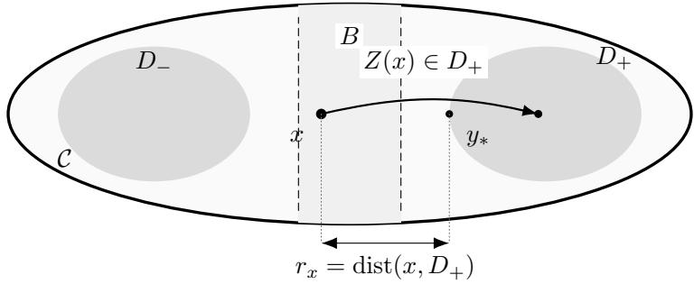  
Figure 1: Conditional one step crossing at a density bottleneck. The layer B separates the two high density regions $D _ { - }$ and $D _ { + }$ . Starting from a fixed $x \in B$ , both algorithms are evaluated on the same event of landing in $D _ { + }$ . The point $y _ { * }$ represents a closest point of $\overline { { D _ { + } } }$ to x (it need not belong to $D _ { + }$ when $D _ { + }$ is open), so the distance is $r _ { x } = \mathrm { d i s t } ( x , D _ { + } )$ . Because $D _ { + } \subset \operatorname { i n t } ( { \mathcal { C } } )$ , projection does not change this landing event.

Proposition 32 quantifies how the larger proposal variance competes with the change in drift at a fixed stepsize. It first compares the crossing probabilities from a given $x \in B ,$ , then gives a bound valid throughout B. Both comparisons use the same starting point, landing set $D _ { + }$ , and normalized stepsize η.

Proposition 32 (Direct one step crossing comparison). Fix $x \in B$ with $a _ { \mathrm { n } } ( x ) > 1$ and $r _ { x } : = { }$ dist $( x , D _ { + } ) > 0$ . Then, for every $\eta > 0$

$$
\begin{array} { r l } & { \frac { \mathbb { P } _ { \eta } ^ { \mathrm { R A L M C } } ( x , D _ { + } ) } { \mathbb { P } _ { \eta } ^ { \mathrm { P L M C } } ( x , D _ { + } ) } } \\ & { \ge a _ { \mathrm { n } } ( x ) ^ { - d / 2 } \exp \left\{ \displaystyle \frac { r _ { x } ^ { 2 } } { 4 \eta } \left( 1 - \frac { 1 } { a _ { \mathrm { n } } ( x ) } \right) - \frac { \mathrm { d i a m } ( \mathcal { C } ) } { 2 } \| \nabla U ( x ) - \nabla U _ { 0 } ( x ) \| - \frac { \eta } { 4 } a _ { \mathrm { n } } ( x ) \| \nabla U _ { 0 } ( x ) \| ^ { 2 } \right\} . } \end{array}\tag{2.100}
$$

For a uniform comparison on B, define

$$
\rho : = \operatorname* { i n f } _ { x \in B } a _ { \mathrm { n } } ( x ) , \qquad A : = \operatorname* { s u p } _ { x \in B } a _ { \mathrm { n } } ( x ) , \qquad r : = \mathrm { d i s t } ( B , D _ { + } ) .
$$

Suppose $1 < \rho \leq A < \infty , r > 0$ , gradients are bounded on B. Then, for every $x \in B$ and $\eta > 0$

$$
\begin{array} { r l } & { \frac { \mathbb { P } _ { \eta } ^ { \mathrm { R A L M C } } ( x , D _ { + } ) } { \mathbb { P } _ { \eta } ^ { \mathrm { P L M C } } ( x , D _ { + } ) } } \\ & { \ge A ^ { - d / 2 } \exp \left\{ \frac { r ^ { 2 } } { 4 \eta } \left( 1 - \frac { 1 } { \rho } \right) - \frac { \dim ( \mathcal { C } ) } { 2 } \underset { z \in B } { \operatorname* { s u p } } \left\| \nabla U ( z ) - \nabla U _ { 0 } ( z ) \right\| - \frac { \eta } { 4 } \underset { z \in B } { \operatorname* { s u p } } a _ { \mathrm { n } } ( z ) \left\| \nabla U _ { 0 } ( z ) \right\| ^ { 2 } \right\} . } \end{array}\tag{2.101}
$$

Proof. The proof is given in Appendix A.26.

In (2.100), the positive term $r _ { x } ^ { 2 } ( 1 - 1 / a _ { \mathrm { n } } ( x ) ) / ( 4 \eta )$ measures the gain from the larger proposal variance, while $a _ { \mathrm { n } } ( x ) ^ { - d / 2 }$ and the drift terms reduce the lower bound. Thus $a _ { \mathrm { n } } ( x ) > 1$ guarantees a crossing advantage for suficiently small $\eta ,$ but this bound need not certify an advantage at every stepsize. Under the uniform assumptions, (2.101) guarantees a larger RALMC crossing probability for every $x \in B$ whenever

$$
\frac { r ^ { 2 } } { 4 \eta } \left( 1 - \frac { 1 } { \rho } \right) > \frac { d } { 2 } \log A + \frac { \mathrm { d i a m } ( \mathcal { C } ) } { 2 } \operatorname* { s u p } _ { z \in B } \| \nabla U ( z ) - \nabla U _ { 0 } ( z ) \| + \frac { \eta } { 4 } \operatorname* { s u p } _ { z \in B } a _ { \mathrm { n } } ( z ) \| \nabla U _ { 0 } ( z ) \| ^ { 2 } .
$$

The proposition therefore supplies a suficient condition at a finite stepsize. Corollary 33 addresses the remaining question: is its leading $1 / \eta$ exponent sharp? For an open landing set, the answer is yes. The corollary determines the exact logarithmic rates of both probabilities and their ratio, unlike the proposition, it does not require $a _ { \mathrm { n } } ( x ) > 1$ to state those rates.

Corollary 33 (Exact exponential crossing advantage). Suppose $D _ { + }$ is a nonempty open subset of int(C). Fix $x \in B$ and assume $r _ { x } = \mathrm { d i s t } ( x , D _ { + } ) > 0$ . Then

$$
\operatorname* { l i m } _ { \eta \to 0 } \eta \log \mathbb { P } _ { \eta } ^ { \mathrm { R A L M C } } ( x , D _ { + } ) = - \frac { r _ { x } ^ { 2 } } { 4 a _ { \mathrm { n } } ( x ) } , \quad \operatorname* { l i m } _ { \eta \to 0 } \eta \log \mathbb { P } _ { \eta } ^ { \mathrm { P L M C } } ( x , D _ { + } ) = - \frac { r _ { x } ^ { 2 } } { 4 } .\tag{2.102}
$$

Consequently,

$$
\operatorname* { l i m } _ { \eta  0 } \eta \log \frac { \mathbb { P } _ { \eta } ^ { \mathrm { R A L M C } } ( x , D _ { + } ) } { \mathbb { P } _ { \eta } ^ { \mathrm { P L M C } } ( x , D _ { + } ) } = \frac { r _ { x } ^ { 2 } } { 4 } ( 1 - \frac { 1 } { a _ { \mathrm { n } } ( x ) } ) .\tag{2.103}
$$

In particular, $a _ { \mathrm { n } } ( x ) > 1$ is both necessary and suficient for a strictly positive exponential rate in this same event comparison. Under the uniform assumptions of Proposition ${ \mathcal { B } } { \mathcal { Q } } ,$ the right hand side of (2.103) is at least

$$
{ \frac { r ^ { 2 } } { 4 } } \left( 1 - { \frac { 1 } { \rho } } \right) > 0 , \qquad x \in B .
$$

Proof. The proof is given in Appendix A.27.

Equation (2.102) shows that both crossing probabilities tend to zero as $\eta  0$ , since the landing set remains a positive distance from x. When $a _ { \mathrm { n } } ( x ) > 1$ , the RALMC probability decays more slowly, and (2.103) gives the precise exponential growth rate of their ratio. When $a _ { \mathrm { n } } ( x ) < 1$ , the ordering is reversed at this scale, when $a _ { \mathrm { n } } ( x ) = 1$ , the exponential rate of the ratio is zero, so lower order terms determine the comparison. Thus the corollary establishes sharpness at the logarithmic scale, without identifying probability prefactors.

Together, Proposition 32 and Corollary 33 quantify a local mechanism: after the chain reaches a point of B with $a _ { \mathrm { n } } ( x ) > 1$ , normalized RALMC is more likely to land in the opposite region in one suficiently small step. A large probability ratio does not imply a large absolute crossing probability. Nor do these conditional estimates account for the time needed to reach B or for subsequent returns, comparisons of global mixing times or mean transition times require additional analysis.

## 3 Numerical Experiments

The preceding sections show that RALMC (1.6) applies to constrained sampling with possibly non-diferentiable densities and can improve over PLMC [BEL18] in the regimes described above. This section compares RALMC with PLMC numerically. Recall that PLMC consists of a Langevin step followed by projection:

$$
\boldsymbol { x } _ { k + 1 } = \mathcal { P } _ { \boldsymbol { \mathcal { C } } } \left( x _ { k } - \eta \nabla U ( \boldsymbol { x } _ { k } ) + \sqrt { 2 \eta } \xi _ { k + 1 } \right) ,\tag{3.1}
$$

where $\nabla U ( x _ { k } )$ may fail to be continuous at some points in C. In the examples below these points form a small exceptional set, and PLMC is used as a numerical benchmark.

We compare the convergence behavior of PLMC and RALMC for several choices of the reference potential $U _ { 0 }$

## 3.1 Truncated Laplace distribution sampling

We first sample from the joint distribution of three independent standard Laplace variables truncated by a ball in $\mathbb { R } ^ { 3 }$

$$
\begin{array} { r } { \pi ( x ) \propto e ^ { - ( | x _ { 1 } | + | x _ { 2 } | + | x _ { 3 } | ) } , \quad x = ( x _ { 1 } , x _ { 2 } , x _ { 3 } ) \in \mathcal { C } : = \left\{ z \in \mathbb { R } ^ { 3 } : \| z \| ^ { 2 } \leq 4 \right\} . } \end{array}\tag{3.2}
$$

Reference samples are generated by rejection sampling. We sample each coordinate independently from the one dimensional standard Laplace distribution and discard points outside the constraint set until the required sample size is reached. For RALMC, we choose the zero reference potential $U _ { 0 } \equiv 0$ . Since

$$
U ( \boldsymbol { x } ) = \| \boldsymbol { x } \| _ { 1 } = | \boldsymbol { x } _ { 1 } | + | \boldsymbol { x } _ { 2 } | + | \boldsymbol { x } _ { 3 } | ,
$$

the difusion coeficient and scaling factor are

$$
\sigma ( x ) = e ^ { \| x \| _ { 1 } / 2 } , \qquad a ( x ) = \sigma ( x ) ^ { 2 } = e ^ { \| x \| _ { 1 } } .
$$

The function $\sigma$ is Lipschitz on C and is bounded above and away from zero there. Hence Assumption 16 and the coeficient regularity required in Theorem 19 hold, so Corollary 20 applies.

For both RALMC and PLMC, we generated $n = 6 0 0$ samples from the same initial point $x _ { 0 } \in { \mathcal { C } } .$ where $x _ { 0 }$ was drawn uniformly from C. Each run used 1000 epochs with stepsize $\eta = 2 \times 1 0 ^ { - 3 }$ , and the experiment was repeated over 100 runs to obtain one standard deviation intervals. Figure 2 illustrates the first two coordinates of the target distribution in the left panel, and kernel density estimates from the RALMC and PLMC samples in the middle and right panels. Both algorithms match the target distribution visually.

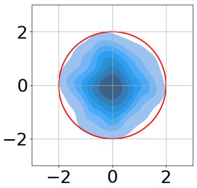  
(a) Target distribution

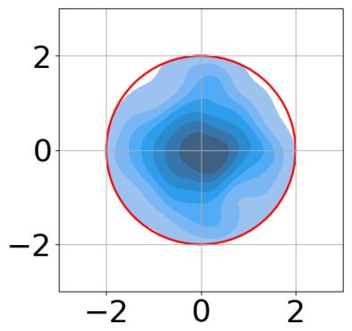  
(b) RALMC

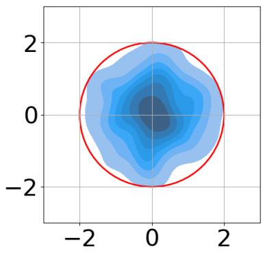  
(c) PLMC  
Figure 2: Visualized final sampled density plots for the first 2 dimensions in ball constraint

Figure 3 reports convergence in $\mathcal { W } _ { 2 }$ distance. The solid line is the mean over 100 independent runs, and the shaded region is the one standard deviation interval. The green curve corresponds to RALMC and the blue curve to PLMC. The initial point is uniform on the ball, so it is typically away from the high density region around the origin. For the unprojected RALMC noise increment at such a point,

$$
\begin{array} { r } { \mathbb { E } \left[ \left. \sqrt { 2 \eta a ( x ) } \xi _ { k + 1 } \right. ^ { 2 } \middle | x _ { k } = x \right] = 2 d \eta a ( x ) = 2 d \eta e ^ { \Vert x \Vert _ { 1 } } . } \end{array}
$$

Thus particles in the low density outer part of the ball receive larger updates, while $a ( x ) \simeq 1$ near the high density center. This adaptive redistribution is consistent with the steep initial decrease of the RALMC $\mathcal { W } _ { 2 }$ curve. In this experiment the relevant bottleneck mechanism is movement through low density outer regions, rather than passage through a geometrically narrow constraint.

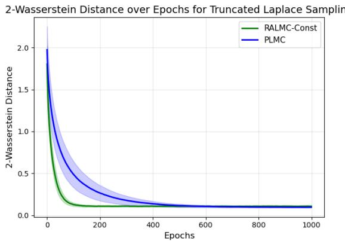  
Figure 3: Convergence of RALMC and PLMC in $\mathcal { W } _ { 2 }$ distance for a truncated Laplace distribution within a ball constraint

## 3.2 Truncated Gaussian Mixture Model

To further empirically illustrate the crossing advantage of RALMC over PLMC in Corollary 33, we use a truncated two component Gaussian mixture model as a synthetic multimodal target

distribution. We follow a similar setup in $\mathrm { | D F T ^ { + } 2 5 | }$ to sample from a truncated two component Gaussian mixture model on $\mathcal { C } : = \{ x \in \mathbb { R } ^ { 3 } : \| x \| \leq 1 \}$ . Consider two Gaussian distributions $\mathcal { N } ( \mu _ { 1 } , \Sigma _ { 1 } )$ and $\mathcal { N } ( \mu _ { 2 } , \Sigma _ { 2 } )$ with

$$
\mu _ { 1 } = [ \mu , 0 , 0 ] ^ { \top } , \qquad \mu _ { 2 } = [ - \mu , 0 , 0 ] ^ { \top } , \qquad \Sigma _ { 1 } = \sigma _ { 1 } ^ { 2 } I _ { 3 } , \qquad \Sigma _ { 2 } = \sigma _ { 2 } ^ { 2 } I _ { 3 } ,
$$

where $\mu , \sigma _ { 1 } , \sigma _ { 2 } > 0$ and $I _ { d }$ denotes the $d { \times } d$ identity matrix. The two components are symmetrically located along the first coordinate and have isotropic covariance matrices. This gives a controlled multimodal target. The unnormalized mixture density is

$$
\tilde { p } ( x ) = w _ { 1 } \varphi ( x ; \mu _ { 1 } , \Sigma _ { 1 } ) + w _ { 2 } \varphi ( x ; \mu _ { 2 } , \Sigma _ { 2 } ) ,\tag{3.3}
$$

where $w _ { 1 } , w _ { 2 } > 0$ are mixture weights that satisfy $w _ { 1 } + w _ { 2 } = 1$ and

$$
\varphi ( x , \mu , \Sigma ) : = { \frac { 1 } { ( 2 \pi ) ^ { \frac { 3 } { 2 } } | \Sigma | ^ { 1 / 2 } } } \exp \left( - { \frac { 1 } { 2 } } ( x - \mu ) ^ { \top } \Sigma ^ { - 1 } ( x - \mu ) \right)
$$

denotes the Gaussian density on $\mathbb { R } ^ { 3 }$ . To study sampling under constrained support, we further truncate the mixture to a constraint set $\mathcal { C } .$ The truncated Gaussian mixture distribution is defined by

$$
p ( x ) = { \frac { 1 } { Z _ { \mathcal { C } } } } { \Big ( } w _ { 1 } \varphi ( x , \mu _ { 1 } , \Sigma _ { 1 } ) + w _ { 2 } \varphi ( x , \mu _ { 2 } , \Sigma _ { 2 } ) { \Big ) } \mathbf { 1 } _ { \mathcal { C } } ( x ) ,
$$

where

$$
Z _ { \mathcal { C } } = \int _ { \mathcal { C } } \Bigl ( w _ { 1 } \varphi ( x , \mu _ { 1 } , \Sigma _ { 1 } ) + w _ { 2 } \varphi ( x , \mu _ { 2 } , \Sigma _ { 2 } ) \Bigr ) d x
$$

is the normalization constant. The potential function defined by

$$
U ( x ) : = - \log p ( x ) , \qquad x \in { \mathcal { C } } ,
$$

has two separated low energy regions associated with the two Gaussian components, located around $\mu _ { 1 }$ and $\mu _ { 2 }$ , with a low density barrier between them. This target is therefore suitable for evaluating whether a sampling algorithm can eficiently move between separated modes rather than remaining trapped in a single local region.

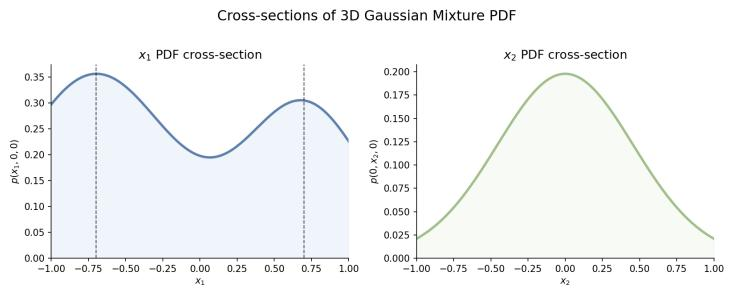  
Figure 4: Cross sections of the target truncated Gaussian mixture model along the first two dimensions

In this experiment, we set $\mu = 0 . 7 , \sigma _ { 1 } = 0 . 4 , \sigma _ { 2 } = 0 . 5$ , and $w _ { 1 } = 0 . 3$ . Figure 4 shows the double well shape of the truncated Gaussian mixture through cross sections along the first two coordinates. We compare PLMC with RALMC using the constant reference function $U _ { 0 } \equiv 0$ . Inside C,

$$
a ( x ) = e ^ { U ( x ) } = { \frac { 1 } { p ( x ) } } .
$$

Let $x _ { \mathrm { m o d e } }$ lie near a mode and let $x _ { \mathrm { v a l } }$ lie in the valley between the modes. Then

$$
\frac { a ( x _ { \mathrm { v a l } } ) } { a ( x _ { \mathrm { m o d e } } ) } = \frac { p ( x _ { \mathrm { m o d e } } ) } { p ( x _ { \mathrm { v a l } } ) } > 1 , \qquad \frac { \sigma ( x _ { \mathrm { v a l } } ) } { \sigma ( x _ { \mathrm { m o d e } } ) } = \sqrt { \frac { p ( x _ { \mathrm { m o d e } } ) } { p ( x _ { \mathrm { v a l } } ) } } > 1 .\tag{3.4}
$$

The first cross section in Figure 4 has modal heights of approximately 0.30-0.35 and a central valley height of approximately 0.20. The corresponding scaling factor ratio is therefore about 1.5-1.8, and the proposal standard deviation in the valley is about 1.2-1.3 times its value near a mode. This larger scaling factor in the valley reduces the time spent in the low density separator once it is reached and promotes movement between the two modal regions. The identity (2.96) gives the associated continuous time conductance interpretation.

To match the local comparison above, we define the low probability valley $B = \{ ( x _ { 1 } , x _ { 2 } , x _ { 3 } ) \in$ ${ \mathcal { C } } : - 0 . 2 5 \leq x _ { 1 } \leq 0 . 2 5 \}$ and the region around the left mode $D ^ { + } : = \{ ( x _ { 1 } , x _ { 2 } , x _ { 3 } ) \in \mathcal { C } : x _ { 1 } < - 0 . 5 \}$ Specifically, RALMC with a constant reference is

$$
x _ { k + 1 } ^ { \mathrm { R A L M C } } = \mathcal { P } _ { \mathcal { C } } \left( x _ { k } ^ { \mathrm { R A L M C } } + \sqrt { 2 \eta a _ { \mathrm { n } } \left( x _ { k } ^ { \mathrm { R A L M C } } \right) } \xi _ { k + 1 } \right) , \qquad \xi _ { k + 1 } \sim \mathcal { N } ( 0 , I _ { d } ) ,
$$

where

$$
a _ { \mathrm { n } } \left( x _ { k } ^ { \mathrm { R A L M C } } \right) = \frac { 3 e ^ { U ( x _ { k } ^ { \mathrm { R A L M C } } ) } } { 4 \pi } ,
$$

because C is the three dimensional unit ball and $p = e ^ { - U }$ is normalized on $\mathcal { C } .$

For each method, this numerical experiment starts with 600 samples from the uniform distribution in B and iterates for a maximal K = 1000 epochs in 100 independent runs. We quantify the crossing advantage of RALMC with a constant reference function through the first entering iteration $\tau _ { D ^ { + } }$ and the transition numbers $N _ { D ^ { + } }$ :

$$
\bar { \tau } _ { D ^ { + } } : = \frac 1 n \sum _ { i = 1 } ^ { n } \tau _ { D ^ { + } } ^ { i } , \quad \mathrm { w h e r e } \quad \tau _ { D ^ { + } } ^ { i } : = \operatorname* { m i n } \left\{ k \in \mathbb N : x _ { k } ^ { ( i ) } \in D ^ { + } \right\} .\tag{3.5}
$$

$$
N _ { D ^ { + } } : = \sum _ { i = 1 } ^ { n } \mathbf { 1 } _ { \left\{ \tau _ { D ^ { + } } ^ { ( i ) } \leq K \right\} } ,\tag{3.6}
$$

where $\boldsymbol { x } _ { k } ^ { ( i ) }$ can be interpret as the i-th sample in the k-th iteration of RALMC or the PLMC.

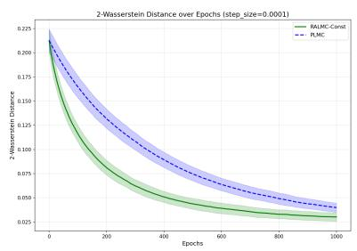  
(a) $\eta = 1 0 ^ { - 4 }$

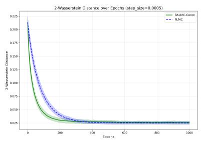  
(b) $\eta = 5 \times 1 0 ^ { - 4 }$

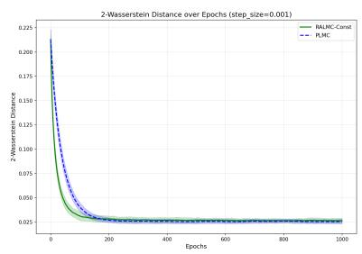  
(c) $\eta = 1 0 ^ { - 3 }$  
Figure 5: Performance of RALMC with a constant potential and PLMC, measured by the $\mathcal { W } _ { 2 }$ distance to the target Gaussian mixture model, for diferent stepsizes η over 1000 epochs.

Figure 5 reports the 2-Wasserstein distance between the algorithms and the target distribution across three stepsizes $\eta \in \{ 1 0 ^ { - 4 } , 5 \times 1 0 ^ { - 4 } , 1 0 ^ { - 3 } \}$ . We can observe that RALMC with a constant reference converges faster than PLMC, which is consistent with the scaling factor ratio in (3.4). An additive shift of U rescales every RALMC proposal by the same constant, so a comparison at the same nominal stepsize also contains a global time rescaling. In contrast, the ratios in (3.4) are invariant under such a shift and isolate the state dependent acceleration across the density valley.

<table><tr><td>Stepsize</td><td>Method</td><td> $\#$  of Entered  $D ^ { + }$ </td><td>Enter epoch</td></tr><tr><td rowspan="2"> $1 \times 1 0 ^ { - 4 }$ </td><td>RALMC-Const</td><td> $2 9 3 . 0 0 \pm 1 2 . 3 6$ </td><td> $7 1 2 . 1 5 \pm 1 4 . 1 3$ </td></tr><tr><td>PLMC</td><td> $2 0 4 . 7 9 \pm 1 1 . 0 6$ </td><td> $8 3 4 . 4 7 \pm 1 0 . 2 9$ </td></tr><tr><td rowspan="2"> $5 \times 1 0 ^ { - 4 }$ </td><td>RALMC-Const</td><td> $5 1 9 . 6 7 \pm 8 . 7 0$ </td><td> $3 6 1 . 2 3 \pm 1 4 . 6 2$ </td></tr><tr><td>PLMC</td><td> $4 2 7 . 9 5 \pm 1 1 . 9 5$ </td><td> $5 0 3 . 6 6 \pm 1 5 . 4 4$ </td></tr><tr><td rowspan="2"> $1 \times 1 0 ^ { - 3 }$ </td><td>RALMC-Const</td><td> $5 8 1 . 7 0 \pm 4 . 2 1$ </td><td> $2 1 9 . 3 2 \pm 1 0 . 6 2$ </td></tr><tr><td>PLMC</td><td> $5 1 0 . 7 9 \pm 8 . 7 7$ </td><td> $3 6 2 . 6 8 \pm 1 5 . 4 9$ </td></tr></table>

Table 1: First enter performance from $B = \{ x \in \mathcal { C } : - 0 . 2 5 \leq x _ { 1 } \leq 0 . 2 5 \}$ to $D ^ { + } = \{ x \in \mathcal { C } : x _ { 1 } <$ $- 0 . 5 \}$ . Results are mean ± standard deviation over independent runs. Paths that do not enter $D ^ { + }$ are censored at the terminal epoch.

Table 1 reports the enter performance across three stepsizes $\eta \in \{ 1 0 ^ { - 4 } , 5 \times 1 0 ^ { - 4 } , 1 0 ^ { - 3 } \}$ for each method. Among all the three choices, we can observe that $\bar { \tau } _ { D ^ { + } } ^ { \mathrm { R A L M C } } < \bar { \tau } _ { D ^ { + } } ^ { \mathrm { P L M C } }$ and $N _ { D ^ { + } } ^ { \mathrm { \tiny { R A L M C } } } >$ $N _ { D ^ { + } } ^ { \mathrm { P L M C } }$ . It demonstrates well that the RALMC with a constant reference can travel across the bottleneck at a higher probability and in a shorter time.

## 3.3 Constrained Bayesian logistic regression on real data

We next evaluate the algorithms on binary classification problems through constrained Bayesian logistic regression. We choose the constraint domain $\mathcal { C } : = \{ \boldsymbol { z } \in \mathbb { R } ^ { d } : \| \boldsymbol { z } \| ^ { 2 } \leq 4 \}$ , so the constrained model corresponds to Bayesian ridge logistic regression.

Suppose we have access to a dataset $Z = \{ z _ { j } \} _ { j = 1 } ^ { n }$ where $z _ { j } = ( X _ { j } , y _ { j } ) , X _ { j } \in \mathbb { R } ^ { d }$ are the features and $y _ { j } \in \{ 0 , 1 \}$ are the labels with the assumption that $X _ { j }$ are independent and the probability

distribution of $y _ { j }$ given $X _ { j }$ and the regression coeficients $\boldsymbol { \beta } \in \mathbb { R } ^ { d }$ are given by

$$
\mathbb { P } \left( y _ { j } = 1 \mid X _ { j } , \beta \right) = \frac { 1 } { 1 + e ^ { - \beta ^ { \top } X _ { j } } } .\tag{3.7}
$$

Then by the Baye’s rule, the goal of the constrained Bayesian logistic regression becomes to sample from the posterior distribution $\pi ( \beta ) \propto e ^ { - U ( \beta ) } \mathbf { 1 } _ { c }$ with:

$$
\begin{array} { r l } & { U ( \beta ) : = - \left( \displaystyle \sum _ { j = 1 } ^ { n } y _ { j } \log p \left( y _ { j } \mid X _ { j } , \beta \right) + ( 1 - y _ { j } ) \log ( 1 - p \left( y _ { j } \mid X _ { j } , \beta \right) ) \right) - \log p ( \beta ) } \\ & { \quad = \left( \displaystyle \sum _ { j = 1 } ^ { n } y _ { j } \log \left( 1 + e ^ { - \beta ^ { \top } X _ { j } } \right) + ( 1 - y _ { j } ) \log \left( 1 + e ^ { \beta ^ { \top } X _ { j } } \right) \right) - \log p ( \beta ) , } \end{array}\tag{3.8}
$$

where log $p ( \beta )$ is denoted as the prior density function, omitting the normalization. In our experiments, we choose three diferent non-diferentiable $p ( \beta )$ as follows:

1. Laplace prior: log $\begin{array} { r } { p ( \beta ) = - \lambda \sum _ { i = 1 } ^ { d } | \beta _ { i } | } \end{array}$

2. Smoothly clipped absolute deviation (SCAD) prior: log $\begin{array} { r } { p ( \beta ) = - \sum _ { i = 1 } ^ { d } g _ { \lambda , a } ( \beta _ { i } ) } \end{array}$ , where $a > 1$ and

$$
g _ { \lambda , a } ( x ) = \left\{ \begin{array} { l l } { \lambda | x | } & { \mathrm { i f ~ } | x | \leq \lambda , } \\ { \displaystyle \frac { 2 a \lambda | x | - x ^ { 2 } - \lambda ^ { 2 } } { 2 ( a - 1 ) } } & { \mathrm { i f ~ } \lambda < | x | \leq a \lambda , } \\ { \displaystyle \frac { \lambda ^ { 2 } ( a + 1 ) } { 2 } } & { \mathrm { o t h e r w i s e } . } \end{array} \right.\tag{3.9}
$$

3. Minimax concave penalty (MCP) prior: log $\begin{array} { r } { p ( \beta ) = - \sum _ { i = 1 } ^ { d } h _ { \lambda , a } ( \beta _ { i } ) } \end{array}$ , where $a > 1$ and

$$
h _ { \lambda , a } ( x ) = { \left\{ \begin{array} { l l } { \lambda | x | - { \frac { x ^ { 2 } } { 2 a } } } & { { \mathrm { i f ~ } } | x | \leq a \lambda , } \\ { { \frac { a \lambda ^ { 2 } } { 2 } } } & { { \mathrm { o t h e r w i s e . } } } \end{array} \right. }\tag{3.10}
$$

Here, the SCAD and MCP priors are adapted from the corresponding regularizers in the literature [Zha10, FL01].

From (3.8), the potential decomposes into the diferentiable log likelihood term

$$
f ( { \boldsymbol { \beta } } ) : = \sum _ { j = 1 } ^ { n } \log \left( 1 + e ^ { - { \boldsymbol { \beta } } ^ { \top } X _ { j } } \right) ,
$$

and the non-diferentiable log prior term log $p ( \beta )$ . We therefore choose the reference only for the non-diferentiable part and keep the diferentiable part unchanged. The experiments use the constant reference $U _ { 0 } ( \beta ) \equiv 0$ and the Gaussian smoothing reference

$$
\tilde { U } _ { \mu } ( \beta ) = \frac { 1 } { N _ { 0 } } \sum _ { i = 1 } ^ { N _ { 0 } } \log p ( \beta + \mu \xi _ { i } ) ,
$$

where the $\xi _ { i }$ are i.i.d. $\mathcal { N } ( 0 , I _ { d } ) , N _ { 0 } = 3 0 0$ , and $\mu = 0 . 5$

We conducted experiments using RALMC with Gaussian smoothing (RALMC-GS), RALMC with constant reference potential (RALMC-Const), and PLMC for the constrained Bayesian logistic regression with three diferent prior distributions on the MAGIC Gamma Telescope dataset 8and the Breast Cancer Wisconsin (Diagnostic) dataset 9. The MAGIC Gamma Telescope dataset is a binary classification benchmark used to distinguish high energy gamma rays from background hadron showers. It comprises $n = 1 9 , 0 2 0$ complete simulated instances, consisting of 12, 332 gamma and 6, 688 hadron samples. Each instance is defined by $d = 1 0$ continuous numeric features. The Breast Cancer Wisconsin (Diagnostic) dataset is a standard benchmark for binary classification, used to distinguish between malignant and benign breast masses. It contains $n = 5 6 9$ complete samples (357 benign, 212 malignant), each defined by $d = 3 0$ continuous features. For each dataset, we split 80% of the whole dataset as the training set and the rest as the test set. To eliminate the influence that features are measured in entirely diferent units, we apply standard normalization to every feature for each dataset before training. Accuracy is the standard metric for evaluating binary classification performance. While a formal theoretical analysis of accuracy convergence is beyond the scope of this work, it still serves as a critical empirical indicator of algorithmic eficacy. To this end, we evaluate and compare the test set accuracy convergence for the three algorithms in the following experiments.

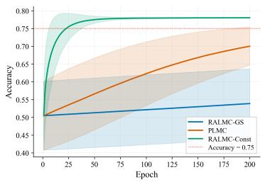  
(a) Laplace prior

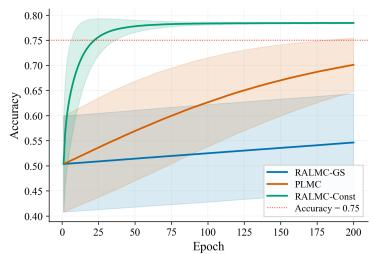  
(b) SCAD prior

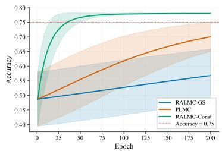  
(c) MCP prior  
Figure 6: Performance on accuracy of constrained Bayesian logistic regression under diferent prior distributions through RALMC with Gaussian smoothing, RALMC with constant potential and PLMC for the test set of the MAGIC Gamma Telescope dataset using the stepsize $\eta = 1 \times 1 0 ^ { - 6 }$ in 200 epochs

For the MAGIC Gamma Telescope dataset, we set $\lambda = 1$ and $a = 1 . 5$ , and evaluate the three algorithms at a larger stepsize $\eta = 5 { \times } 1 0 ^ { - 4 }$ and a smaller stepsize $\eta = 1 \times 1 0 ^ { - 6 }$ . As shown in Figure $6 ,$ RALMC-Const gives the fastest accuracy improvement for all three non-diferentiable priors at the smaller stepsize. Figure 7 shows that RALMC-GS gives the best performance at the larger stepsize. This behavior is consistent with the scaling in RALMC-Const, where positive potential values amplify the efective update size and may cause instability unless the nominal stepsize is small. In contrast, RALMC-GS remains stable for larger stepsizes because the approximation error $U - \hat { U } _ { \mu }$ is controlled through the smoothing parameter $\mu .$ The same pattern appears on the Breast Cancer Wisconsin (Diagnostic) dataset in Figures 8 and 9. For this dataset, we set $\lambda = 0 . 5 ,$ use $\eta = 5 \times 1 0 ^ { - 4 }$ as the smaller stepsize and $\eta = 2 \times 1 0 ^ { - 2 }$ as the larger stepsize, and keep the remaining

parameters unchanged.

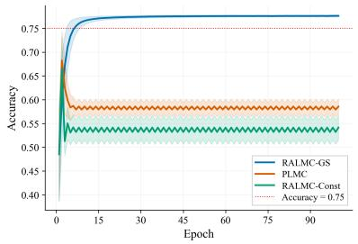  
(a) Laplace prior

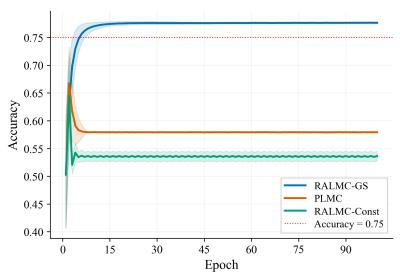  
(b) SCAD prior

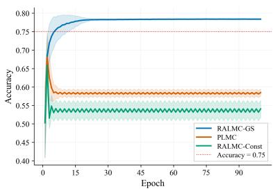  
(c) MCP prior

Figure 7: Performance on accuracy of constrained Bayesian logistic regression under diferent prior distributions through RALMC with Gaussian smoothing, RALMC with constant potential and PLMC for the test set of the MAGIC Gamma Telescope dataset using the stepsize $\eta = 5 \times 1 0 ^ { - 4 }$ in 100 epochs  
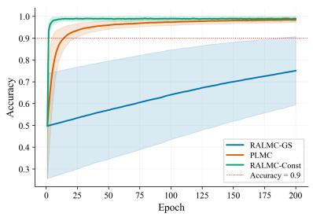  
(a) Laplace prior

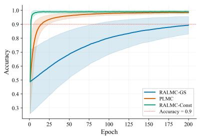  
(b) SCAD prior

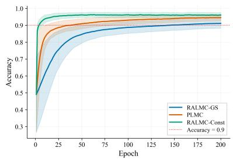  
(c) MCP prior

Figure 8: Performance on accuracy of constrained Bayesian logistic regression under diferent prior distributions through RALMC with Gaussian smoothing, RALMC with constant potential and PLMC for the test set of the Breast Cancer Wisconsin (Diagnostic) dataset using the stepsize $\eta = 1 \times 1 0 ^ { - 4 }$ in 200 epochs  
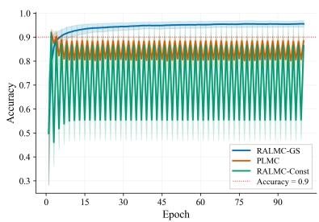  
(a) Laplace prior

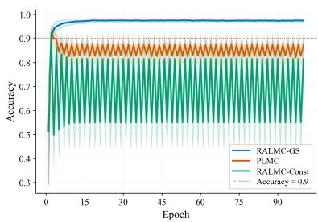  
(b) SCAD prior

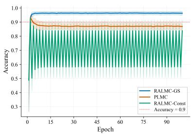  
(c) MCP prior  
Figure 9: Performance on accuracy of constrained Bayesian logistic regression under diferent prior distributions through RALMC with Gaussian smoothing, RALMC with constant potential and PLMC for the test set of the Breast Cancer Wisconsin (Diagnostic) dataset using the stepsize $\eta = 2 \times 1 0 ^ { - 2 }$ in 100 epochs

## 4 Conclusion

For constrained sampling in machine learning, first order Langevin algorithms such as PLMC have become standard tools for large scale problems, yet their reliance on diferentiable log densities limits their applicability. This paper introduced RALD and its discretization RALMC, which use a smooth anchored reference potential and a state dependent scaling factor to handle non-diferentiable constrained targets. The analysis gives explicit convergence guarantees and iteration complexity in 2-Wasserstein distance. The numerical results support the use of RALMC for nonsmooth constrained sampling and illustrate the complementary behavior of constant and Gaussian smoothed references.

## Acknowledgments

The authors would like to thank Qi Feng for helpful discussions. Xiaoyu Wang is supported by the Guangzhou-HKUST(GZ) Joint Funding Program (No.2025A03J3556). Xicheng Zhang is partially supported by NSFC grants of China (No. 12131019).

## References

[AC21] Kwangjun Ahn and Sinho Chewi. Eficient constrained sampling via the mirror-Langevin algorithm. In Advances in Neural Information Processing Systems (NeurIPS), volume 34, pages 28405–28418. Curran Associates, Inc., 2021.

[ADFDJ03] Christophe Andrieu, Nando De Freitas, Arnaud Doucet, and Michael I Jordan. An introduction to MCMC for machine learning. Machine Learning, 50(1):5–43, 2003.

[BB00] Jean-David Benamou and Yann Brenier. A computational fluid mechanics solution to the Monge-Kantorovich mass transfer problem. Numerische Mathematik, 84:375–393, 2000.

[BBCG08] Dominique Bakry, Franck Barthe, Patrick Cattaiux, and Arnaud Guillin. A simple proof of the Poincar´e inequality for a large class of probability measures. Electronic Communications in Probability, 13:60–66, 2008.

[BDMP17] Nicolas Brosse, Alain Durmus, Eric Moulines, and Marcelo Pereyra. Sampling from a ´ log-concave distribution with compact support with proximal Langevin Monte Carlo. In Proceedings of the 2017 Conference on Learning Theory, volume 65, pages 319–342. PMLR, 2017.

[BEL15] Sebastien Bubeck, Ronen Eldan, and Joseph Lehec. Finite-time analysis of projected Langevin Monte Carlo. In Advances in Neural Information Processing Systems, volume 28. Curran Associates, Inc., 2015.

[BEL18] S´ebastien Bubeck, Ronen Eldan, and Joseph Lehec. Sampling from a log-concave distribution with projected Langevin Monte Carlo. Discrete & Computational Geometry, 59(4):757–783, 2018.

[BGK+25] Waheed U. Bajwa, Mert Gurbuzbalaban, Mustafa Ali Kutbay, Lingjiong Zhu, and Muhammad Zulqarnain. DIGing-SGLD: Decentralized and scalable Langevin sampling over time-varying networks. arXiv:2511.12836, 2025.

[BGL13] Dominique Bakry, Ivan Gentil, and Michel Ledoux. Analysis and Geometry of Markov Difusion Operators, volume 348. Springer, Cham, 2013.

[Bre11] Haim Brezis. Functional Analysis, Sobolev Spaces and Partial Diferential Equations. Universitext. Springer, 2011.

[CDJB20] Niladri Chatterji, Jelena Diakonikolas, Michael I. Jordan, and Peter Bartlett. Langevin Monte Carlo without smoothness. In Proceedings of the Twenty Third International Conference on Artificial Intelligence and Statistics, volume 108 of Proceedings of Machine Learning Research, pages 1716–1726, 26–28 Aug 2020.

[CHS87] Tzuu-Shuh Chiang, Chii-Ruey Hwang, and Shuenn Jyi Sheu. Difusion for global optimization in Rn. SIAM Journal on Control and Optimization, 25(3):737–753, 1987.

[CLGL+20] Sinho Chewi, Thibaut Le Gouic, Cheng Lu, Tyler Maunu, Philippe Rigollet, and Austin Stromme. Exponential ergodicity of mirror-Langevin difusions. In Advances in Neural Information Processing Systems (NeurIPS), volume 33, pages 19573–19585. Curran Associates, Inc., 2020.

[Dal17] Arnak S Dalalyan. Theoretical guarantees for approximate sampling from smooth and log-concave densities. Journal of the Royal Statistical Society: Series B (Statistical Methodology), 79(3):651–676, 2017.

[DFT+25] Hengrong Du, Qi Feng, Changwei Tu, Xiaoyu Wang, and Lingjiong Zhu. Non-reversible Langevin algorithms for constrained sampling. arXiv:2501.11743, 2025.

[DK19] Arnak S. Dalalyan and Avetik G. Karagulyan. User-friendly guarantees for the Langevin Monte Carlo with inaccurate gradient. Stochastic Processes and their Applications, 129(12):5278–5311, 2019.

[DM17] Alain Durmus and Eric Moulines. Non-asymptotic convergence analysis for the Unadjusted Langevin Algorithm. Annals ofApplied Probability, 27(3):1551–1587, 2017.

[DM19] Alain Durmus and Eric Moulines. High-dimensional Bayesian inference via the Unadjusted Langevin Algorithm. Bernoulli, 25(4A):2854–2882, 2019.

[DMM19] Alain Durmus, Szymon Majewski, and Blazej Miasojedow. Analysis of Langevin Monte Carlo via convex optimization. Journal of Machine Learning Research, 20(1):2666–2711, 2019.

[DMP18] Alain Durmus, Eric Moulines, and Marcelo Pereyra. Eficient Bayesian computation by ´ proximal Markov Chain Monte Carlo: When Langevin meets Moreau. SIAM Journal on Imaging Sciences, 11(1):473–506, 2018.

[FL01] Jianqing Fan and Runze Li. Variable selection via nonconcave penalized likelihood and its oracle properties. Journal of the American Statistical Association, 96(456):1348–1360, 2001.

[FOT11] Masatoshi Fukushima, Yoichi Oshima, and Masayoshi Takeda. Dirichlet Forms and Symmetric Markov Processes, volume 19 of De Gruyter Studies in Mathematics. Walter de Gruyter, second revised and extended edition, 2011.

[GCSR95] Andrew Gelman, John B Carlin, Hal S Stern, and Donald B Rubin. Bayesian Data Analysis. Chapman & Hall/CRC Press, 1995.

[GGHZ21] Mert G¨urb¨uzbalaban, Xuefeng Gao, Yunhan Hu, and Lingjiong Zhu. Decentralized stochastic gradient Langevin dynamics and Hamiltonian Monte Carlo. Journal of Machine Learning Research, 22(239):1–69, 2021.

[GHZ24] Mert G¨urb¨uzbalaban, Yuanhan Hu, and Lingjiong Zhu. Penalized overdamped and underdamped Langevin Monte Carlo algorithms for constrained sampling. Journal of Machine Learning Research, 25(263):1–67, 2024.

[GIWZ24] Mert G¨urb¨uzbalaban, Mohammad Rafiqul Islam, Xiaoyu Wang, and Lingjiong Zhu. Generalized EXTRA stochastic gradient Langevin dynamics. arXiv preprint arXiv:2412.01993, 2024.

[GNZZ25] Mert G¨urb¨uzbalaban, Hoang M. Nguyen, Xicheng Zhang, and Lingjiong Zhu. Anchored Langevin algorithms. arXiv:2509.19455, 2025.

[GSS22] Jacob Vorstrup Goldman, Torben Sell, and Sumeetpal Sidhu Singh. Gradient-based Markov chain Monte Carlo for Bayesian inference with non-diferentiable priors. Journal of the American Statistical Association, 117(540):2182–2193, 2022.

[HKRC18] Ya-Ping Hsieh, Ali Kavis, Paul Rolland, and Volkan Cevher. Mirrored Langevin dynamics. In Advances in Neural Information Processing Systems, volume 31. Curran Associates, Inc., 2018.

[HKS89] Richard A Holley, Shigeo Kusuoka, and Daniel W Stroock. Asymptotics of the spectral gap with applications to the theory of simulated annealing. Journal of Functional Analysis, 83(2):333–347, 1989.

[IZ26] Mohammad Rafiqul Islam and Lingjiong Zhu. Decentralized proximal stochastic gradient Langevin dynamics. arXiv:2605.00723, 2026.

[Lam21] Andrew Lamperski. Projected stochastic gradient Langevin algorithms for constrained sampling and non-convex learning. In Conference on Learning Theory, volume 134, pages 2891–2937. PMLR, 2021.

[LTVW22] Ruilin Li, Molei Tao, Santosh S. Vempala, and Andre Wibisono. The mirror Langevin algorithm converges with vanishing bias. In Sanjoy Dasgupta and Nika Haghtalab, editors, Proceedings of The 33rd International Conference on Algorithmic Learning Theory, volume 167, pages 718–742. PMLR, 2022.

[LZT21] Ruilin Li, Hongyuan Zha, and Molei Tao. Sqrt(d) dimension dependence of Langevin Monte Carlo. In International Conference on Learning Representations, 2021.

[MFWB22] Wenlong Mou, Nicolas Flammarion, Martin J. Wainwright, and Peter L. Bartlett. An eficient sampling algorithm for non-smooth composite potentials. Journal of Machine Learning Research, 23(233):1–50, 2022.

[NS17] Yurii Nesterov and Vladimir Spokoiny. Random gradient-free minimization of convex functions. Foundations of Computational Mathematics, 17(2):527–566, 2017.

[Pey18] R´emi Peyre. Comparison between $W _ { 2 }$ distance and $\dot { H } ^ { - 1 }$ norm, and localization of Wasserstein distance. ESAIM: Control, Optimisation and Calculus of Variations, 24(4):1489–1501, 2018.

[RRT17] Maxim Raginsky, Alexander Rakhlin, and Matus Telgarsky. Non-convex learning via stochastic gradient Langevin dynamics: a nonasymptotic analysis. In Conference on Learning Theory, volume 65, pages 1674–1703. PMLR, 2017.

[RT96] Gareth O Roberts and Richard L Tweedie. Exponential convergence of Langevin distributions and their discrete approximations. Bernoulli, 2(4):341–363, 1996.

[S lo01] Leszek S lomi´nski. Euler’s approximations of solutions of SDEs with reflecting boundary. Stochastic Processes and their Applications, 94(2):317–337, 2001.

[S lo13] Leszek S lomi´nski. Weak and strong approximations of reflected difusions via penalization methods. Stochastic Processes and their Applications, 123:752–763, 2013.

[SR20] Adil Salim and Peter Richt´arik. Primal dual interpretation of the proximal stochastic gradient Langevin algorithm. In Advances in Neural Information Processing Systems (NeurIPS), volume 33, pages 3786–3796. Curran Associates, Inc., 2020.

[Stu96] Karl-Theodor Sturm. Analysis on local Dirichlet spaces. III. the parabolic Harnack inequality. Journal de Math´ematiques Pures et Appliqu´ees, 75(3):273–297, 1996.

[Stu10] Andrew M Stuart. Inverse problems: A Bayesian perspective. Acta Numerica, 19:451–559, 2010.

[Tan79] Hiroshi Tanaka. Stochastic diferential equations with reflecting boundary condition in convex regions. Hiroshima Mathematical Journal, 9:163–177, 1979.

[TTV16] Yee Whye Teh, Alexandre H Thiery, and Sebastian J Vollmer. Consistency and fluctuations for stochastic gradient Langevin dynamics. The Journal of Machine Learning Research, 17(1):193–225, 2016.

[Vil09] C´edric Villani. Optimal Transport: Old and New. Springer, Berlin, 2009.

[WTWZ26] Yingli Wang, Changwei Tu, Xiaoyu Wang, and Lingjiong Zhu. Accelerated constrained sampling: A large deviations approach. Journal of Machine Learning Research, 27(118):1–61, 2026.

[WWZ25] Xiaoyu Wang, Yingli Wang, and Lingjiong Zhu. Regime-switching Langevin Monte Carlo algorithms. arXiv preprint arXiv:2509.00941, 2025.

[ZDF+24] Haoyang Zheng, Hengrong Du, Qi Feng, Wei Deng, and Guang Lin. Constrained exploration via reflected replica exchange stochastic gradient Langevin dynamics. In Proceedings of the 41st International Conference on Machine Learning, volume 235, pages 61321–61348. PMLR, 2024.

[ZH14] Enlu Zhou and Jiaqiao Hu. Gradient-based adaptive stochastic search for non-diferentiable optimization. IEEE Transactions on Automatic Control, 59(7):1818–1832, 2014.

[Zha10] Cun-Hui Zhang. Nearly unbiased variable selection under minimax concave penalty. The Annals of Statistics, 38(2):894–942, 2010.

[ZL22] Yuping Zheng and Andrew Lamperski. Constrained Langevin algorithms with L-mixing external random variables. In Advances in Neural Information Processing Systems (NeurIPS), volume 35, pages 20511–20521. Curran Associates, Inc., 2022.

[ZPFP20] Kelvin Shuangjian Zhang, Gabriel Peyr´e, Jalal Fadili, and Marcelo Pereyra. Wasserstein control of mirror Langevin Monte Carlo. In Conference on Learning Theory, volume 125, pages 3814–3841. PMLR, 2020.

## A Technical Proofs

## A.1 Proof of Lemma 3

Set $a = e ^ { U - U _ { 0 } }$ and $\mathcal { L } _ { 0 } f = \Delta f - \langle \nabla U _ { 0 } , \nabla f \rangle$ . Compactness and continuity give $0 < a _ { * } \leq a \leq a ^ { * } < \infty$ Since $\nabla U _ { 0 }$ is Lipschitz on the compact convex set C, [Tan79, Theorem 4.1] gives a pathwise unique reflected strong solution

$$
d Y _ { s } = - \nabla U _ { 0 } ( Y _ { s } ) d s + \sqrt { 2 } d B _ { s } - d K _ { s } ^ { 0 } ,
$$

where $K ^ { 0 }$ has the outward normal convention of (2.4). Define

$$
A _ { s } : = \int _ { 0 } ^ { s } ( a ( Y _ { r } ) ) ^ { - 1 } d r , \qquad \tau _ { t } : = A ^ { - 1 } ( t ) , \qquad X _ { t } : = Y _ { \tau _ { t } } .
$$

The bounds on a give $s / a ^ { * } \leq A _ { s } \leq s / a ,$ ∗ and $a _ { * } t \leq \tau _ { t } \leq a ^ { * } t$ . Diferentiating $A _ { \tau _ { t } } ~ = ~ t$ gives $d \tau _ { t } = a ( X _ { t } ) d t$ . Hence,

$$
\int _ { 0 } ^ { \tau _ { t } } \nabla U _ { 0 } ( Y _ { r } ) d r = \int _ { 0 } ^ { t } a ( X _ { u } ) \nabla U _ { 0 } ( X _ { u } ) d u , \qquad \langle B _ { \tau } \rangle _ { t } = \tau _ { t } I _ { d } = \int _ { 0 } ^ { t } a ( X _ { u } ) I _ { d } d u .
$$

Define $\begin{array} { r } { W _ { t } = \int _ { 0 } ^ { t } ( a ( X _ { u } ) ) ^ { - 1 / 2 } d B _ { \tau _ { u } } } \end{array}$ . Its quadratic variation is $t I _ { d } ,$ , so it is Brownian motion in the time changed filtration. With $K _ { t } = K _ { \tau _ { t } } ^ { 0 }$ , the equation becomes

$$
X _ { t } = X _ { 0 } - \int _ { 0 } ^ { t } a ( X _ { u } ) \nabla U _ { 0 } ( X _ { u } ) d u + \sqrt { 2 } \int _ { 0 } ^ { t } \sqrt { a ( X _ { u } ) } d W _ { u } - K _ { t } .
$$

The increasing time change preserves the normal direction and boundary support of the regulator, proving that X solves (2.4). Equivalently, for every Neumann test function $f \in C ^ { 2 } ( \overline { { \mathcal { C } } } )$ , optional time change and substitution in the drift integral show that

$$
f ( X _ { t } ) - f ( X _ { 0 } ) - \int _ { 0 } ^ { t } a ( X _ { r } ) \mathcal { L } _ { 0 } f ( X _ { r } ) d r
$$

is a martingale. Conversely, applying the inverse of $\begin{array} { r } { S _ { t } = \int _ { 0 } ^ { t } a ( X _ { r } ) d r } \end{array}$ to any solution of the normally reflected martingale problem for $a { \mathcal { L } } _ { 0 }$ gives a solution of the base reflected problem for $\mathcal { L } _ { 0 }$ . The two time changes are inverse path transformations, so uniqueness in law of the base problem yields uniqueness in law for X. The proof is complete.

## A.2 Proof of Proposition 4

Proof. (i) For a Neumann test function $f ,$ Lemma 3 gives

$$
{ \frac { P _ { t } f ( x ) - f ( x ) } { t } } = { \frac { 1 } { t } } \mathbb { E } ^ { x } \left[ \int _ { 0 } ^ { t } { \mathcal { L } } f ( X _ { s } ) d s \right] \to { \mathcal { L } } f ( x ) .
$$

The limit follows from continuity of the paths and bounded continuity of $\mathcal { L } f .$ , proving (2.6).

(ii) Set $w = Z ^ { - 1 } e ^ { - U }$ and $q = Z ^ { - 1 } e ^ { - U _ { 0 } }$ . Continuity and compactness give constants $0 < c _ { - } \le$ $c _ { + } < \infty$ bounding both weights. Hence,

$$
c _ { - } \| f \| _ { H ^ { 1 } ( C ) } ^ { 2 } \leq \| f \| _ { L ^ { 2 } ( \pi ) } ^ { 2 } + \mathcal { E } ( f , f ) = \int _ { \mathcal { C } } \left( | f | ^ { 2 } w + \| \nabla f \| ^ { 2 } q \right) d x \leq c _ { + } \| f \| _ { H ^ { 1 } ( C ) } ^ { 2 } .
$$

Completeness and density of $H ^ { 1 } ( { \mathcal { C } } )$ therefore make E closed and densely defined on $L ^ { 2 } ( \pi )$ . For the truncation $\Phi ( r ) = \mathrm { m i n } \{ 1$ , max $\{ 0 , r \} \}$ , the Sobolev chain rule gives $| \nabla \Phi ( f ) | \le | \nabla f |$ almost everywhere, so $\mathcal { E } ( \Phi ( f ) , \Phi ( f ) ) \leq \mathcal { E } ( f , f )$ , which is the Markov property. Smooth restrictions are dense in $H ^ { 1 } ( { \mathcal { C } } )$ by the extension property of the domain, and dense in $C ( \mathcal { C } )$ in the uniform norm, giving regularity. If $f$ is constant on a neighborhood of the support of $^ { g , }$ the gradient integral defining $\mathcal { E } ( f , g )$ vanishes, giving strong locality.

Let $\mathsf { A } \geq 0$ be the associated self adjoint operator and $S _ { t } = e ^ { - t \mathsf { A } }$ . For a Neumann test function $f$ and $g \in H ^ { 1 } ( { \mathcal { C } } )$ , integration by parts gives

$$
\mathcal { E } ( f , g ) = - \frac { 1 } { Z } \int _ { \mathcal { C } } g \nabla \cdot \left( e ^ { - U _ { 0 } } \nabla f \right) d x = - \langle \mathcal { L } f , g \rangle _ { L ^ { 2 } ( \pi ) } .
$$

Thus $- \mathsf { A } f = \mathscr { L } f$ and $\mathsf { A } 1 = 0$ . The associated conservative difusion solves the Neumann martingale problem for π almost every initial point by [FOT11, Theorems 7.2.1, 7.2.2 and 5.2.2, Eq. (5.2.26)], using boundedness and a countable dense family of Neumann tests in the norm $\| f \| _ { \infty } + \| \mathcal { L } f \| _ { \infty }$ Uniqueness in Lemma 3 identifies $S _ { t } = P _ { t }$ on $L ^ { 2 } ( \pi )$ . Hence $P _ { t } 1 = 1$ , and spectral calculus gives $P _ { t } f \in { \mathcal { D } } ( { \mathsf { A } } )$ for $t > 0$ and

$$
\frac { d } { d t } \| P _ { t } f \| _ { L ^ { 2 } ( \pi ) } ^ { 2 } = - 2 \langle P _ { t } f , \mathsf { A } P _ { t } f \rangle _ { L ^ { 2 } ( \pi ) } = - 2 \mathcal { E } ( P _ { t } f , P _ { t } f ) .
$$

(iii) On the closed convex state space ${ \mathcal { C } } ,$ the unweighted Neumann form has the complete Euclidean intrinsic metric. Convexity gives volume doubling and the Poincar´e inequality on $D _ { r } =$ $\mathcal { C } \cap B ( x , r )$

$$
| D _ { 2 r } | \leq 2 ^ { d } | D _ { r } | , \quad f _ { D _ { r } } : = { \frac { 1 } { | D _ { r } | } } \int _ { D _ { r } } f d x , \quad \int _ { D _ { r } } | f - f _ { D _ { r } } | ^ { 2 } d x \leq c _ { d } r ^ { 2 } \int _ { D _ { r } } \| \nabla f \| ^ { 2 } d x .
$$

The bounds on $w , q$ make the weighted measure and form uniformly comparable to the unweighted ones, and their intrinsic metrics equivalent. Thus [Stu96, Theorem 3.5 and Corollary 3.6] gives the

parabolic Harnack inequality, and [Stu96, Proposition 3.1, Theorems 4.1 and 4.8] gives a jointly continuous, strictly positive kernel $\kappa _ { t } ( x , y )$ on $( 0 , \infty ) \times \mathcal { C } ^ { 2 }$ , including the boundary.

To justify continuity in the initial point, couple the base difusions $Y ^ { x _ { n } }$ and $Y ^ { x }$ with the same Brownian motion, where $x _ { n } \ \to \ x$ . Additive noise cancels in their diference, and the convex reflection sign gives

$$
\operatorname* { s u p } _ { 0 \leq u \leq T } \| Y _ { u } ^ { x _ { n } } - Y _ { u } ^ { x } \| \leq e ^ { \mathrm { L i p } ( \nabla U _ { 0 } ) T } \| x _ { n } - x \| .
$$

Since $a ^ { - 1 }$ is uniformly continuous on ${ \mathcal { C } } _ { : }$ the clocks $\begin{array} { r } { A _ { u } ^ { x _ { n } } = \int _ { 0 } ^ { u } a ( Y _ { r } ^ { x _ { n } } ) } \end{array}$ −1dr converge uniformly to $A _ { u } ^ { x }$ on bounded intervals. Their slopes lie between $1 / a ^ { * }$ and $1 / a _ { * }$ , so their inverse clocks also converge uniformly on bounded intervals. Continuity of the base paths now gives $X _ { t } ^ { x _ { n } } = Y _ { \tau _ { \bot } ^ { x _ { n } } } ^ { x _ { n } } \to Y _ { \tau _ { t } ^ { x } } ^ { x } = X _ { t } ^ { x }$ almost surely. For bounded continuous $f ,$ dominated convergence yields $P _ { t } f ( x _ { n } ) \to ^ { \cdot } P _ { t } f ( x )$ , proving the Feller property. For $f \in C ( \mathcal { C } )$ , the identity $\begin{array} { r } { P _ { t } f ( x ) = \int _ { \mathcal { C } } \kappa _ { t } ( x , y ) f ( y ) \pi ( d y ) } \end{array}$ from part (ii) therefore extends from π almost every x to every x by continuity and full support of $\pi$ . The Lebesgue density is $p _ { t } ( x , y ) = \kappa _ { t } ( x , y ) w ( y )$ . For fixed $t > 0$ , both factors are continuous and strictly positive on the compact set $\mathcal { C } ^ { 2 }$ . Consequently,

$$
0 < \operatorname* { m i n } _ { x , y \in \mathcal { C } } p _ { t } ( x , y ) \leq \operatorname* { m a x } _ { x , y \in \mathcal { C } } p _ { t } ( x , y ) < \infty ,
$$

which proves the asserted extrema.

## A.3 Proof of Theorem 5

Proof. By Proposition $4 \ ( \mathrm { i i } ) , \ P _ { t }$ is self adjoint on $L ^ { 2 } ( \pi )$ and satisfies $P _ { t } 1 = 1$ . Hence, for every bounded measurable $f _ { i }$

$$
\int _ { \mathcal { C } } P _ { t } f d \pi = \langle 1 , P _ { t } f \rangle _ { L ^ { 2 } ( \pi ) } = \langle P _ { t } 1 , f \rangle _ { L ^ { 2 } ( \pi ) } = \int _ { \mathcal { C } } f d \pi .
$$

Thus $\pi$ is invariant. To prove uniqueness, fix $t > 0$ . Proposition 4 (iii) gives a jointly continuous, strictly positive transition density on $\mathcal { C } ^ { 2 } .$ . Since $\pi ( d y ) = w ( y ) d y$ with w continuous and strictly positive, the density $\kappa _ { t } ( x , y ) = d P _ { t } ( x , \cdot ) / d \pi ( y )$ has the same properties. Compactness therefore gives min $_ { x , y \in \mathcal { C } } \kappa _ { t } ( x , y ) ~ > ~ 0$ . Set $\begin{array} { r } { \varepsilon _ { t } \ = \ \frac { 1 } { 2 } \operatorname* { m i n } _ { x , y \in \mathcal { C } } \kappa _ { t } ( x , y ) } \end{array}$ . Since $\begin{array} { r } { \int _ { \mathcal { C } } \kappa _ { t } ( x , y ) \pi ( d y ) = 1 } \end{array}$ , we have $0 < \varepsilon _ { t } \le 1 / 2$ . Thus

$$
P _ { t } ( x , d y ) = \varepsilon _ { t } \pi ( d y ) + ( 1 - \varepsilon _ { t } ) \frac { \kappa _ { t } ( x , y ) - \varepsilon _ { t } } { 1 - \varepsilon _ { t } } \pi ( d y ) .
$$

The second fraction defines a Markov kernel, which contracts total variation. If ν is another invariant probability measure, then

$$
\mathrm { T V } ( \nu , \pi ) = \mathrm { T V } ( \nu P _ { t } , \pi P _ { t } ) \leq ( 1 - \varepsilon _ { t } ) \mathrm { T V } ( \nu , \pi ) .
$$

Since $\varepsilon _ { t } > 0$ , this forces $\mathrm { T V } ( \nu , \pi ) = 0$ , proving uniqueness.

## A.4 Proof of Theorem 6

Proof. First, a finite Poincar´e constant exists under the stated assumptions. The density $w =$ $Z ^ { - 1 } e ^ { - U }$ has bounds $0 < w _ { \mathrm { m i n } } \le w \le w _ { \mathrm { m a x } } < \infty$ . Let $C _ { C }$ be a Lebesgue Poincar´e constant on the bounded convex domain and $\begin{array} { r } { f _ { \mathcal { C } } = | \mathcal { C } | ^ { - 1 } \int _ { \mathcal { C } } f d x } \end{array}$ . For $f \in H ^ { 1 } ( { \mathcal { C } } )$

$$
\mathrm { V a r } _ { \pi } ( f ) \leq w _ { \operatorname* { m a x } } \int _ { \mathcal { C } } | f - f _ { \mathcal { C } } | ^ { 2 } d x \leq w _ { \operatorname* { m a x } } C _ { \mathcal { C } } \int _ { \mathcal { C } } \| \nabla f \| ^ { 2 } d x \leq \frac { w _ { \operatorname* { m a x } } } { w _ { \operatorname* { m i n } } } C _ { \mathcal { C } } \int _ { \mathcal { C } } \| \nabla f \| ^ { 2 } d \pi .
$$

Thus $C _ { P } = ( w _ { \mathrm { m a x } } / w _ { \mathrm { m i n } } ) C _ { \mathcal { C } }$ is admissible. The convergence argument below uses any valid $C _ { P }$ , not necessarily this bound. Denote $h _ { 0 } : = d \mu _ { 0 } / d \pi$ . The assumption $\chi ^ { 2 } ( \mu _ { 0 } \| \pi ) < \infty$ gives $h _ { 0 } \in L ^ { 2 } ( \pi )$ Since the semigroup is self adjoint by Proposition $4 \ ( \mathrm { { i i } ) }$ , the density evolves according to

$$
h _ { t } = P _ { t } ^ { * } h _ { 0 } = P _ { t } h _ { 0 } .
$$

For every $t > 0$ , Proposition ${ \mathrm { ~ 4 ~ } } ( { \mathrm { i i } } )$ gives $h _ { t } \in { \mathcal { D } } ( { \mathcal { L } } )$ . Since $P _ { t } 1 = 1$ and $\textstyle \int h _ { 0 } d \pi \ = \ 1$ , one has $\textstyle \int h _ { t } d \pi = 1$ . Therefore

$$
\begin{array} { l } { \displaystyle \frac { d } { d t } \chi ^ { 2 } ( \mu _ { t } \| \pi ) = \frac { d } { d t } \| h _ { t } - 1 \| _ { L ^ { 2 } ( \pi ) } ^ { 2 } = 2 \langle h _ { t } - 1 , \mathcal { L } h _ { t } \rangle _ { L ^ { 2 } ( \pi ) } } \\ { \displaystyle \qquad = 2 \langle h _ { t } , \mathcal { L } h _ { t } \rangle _ { L ^ { 2 } ( \pi ) } = - 2 \mathcal { E } \big ( h _ { t } , h _ { t } \big ) = - 2 \int _ { \mathcal { C } } e ^ { U - U _ { 0 } } \| \nabla h _ { t } \| ^ { 2 } d \pi . } \end{array}
$$

By the definition of $\alpha _ { 0 }$ and the Poincar´e inequality,

$$
\begin{array} { r l } & { \displaystyle \mathcal { E } ( h _ { t } , h _ { t } ) \geq \alpha _ { 0 } \int _ { \mathcal { C } } \| \nabla h _ { t } \| ^ { 2 } d \pi \geq \frac { \alpha _ { 0 } } { C _ { P } } \operatorname { V a r } _ { \pi } ( h _ { t } ) } \\ & { \quad \quad \quad \quad \quad = \frac { \alpha _ { 0 } } { C _ { P } } \| h _ { t } - 1 \| _ { L ^ { 2 } ( \pi ) } ^ { 2 } = \frac { \alpha _ { 0 } } { C _ { P } } \chi ^ { 2 } ( \mu _ { t } \| \pi ) . } \end{array}
$$

Hence, for every $t > 0$

$$
\frac { d } { d t } \chi ^ { 2 } ( \mu _ { t } \| \pi ) \leq - \frac { 2 \alpha _ { 0 } } { C _ { P } } \chi ^ { 2 } ( \mu _ { t } \| \pi ) .
$$

Applying Gr¨onwall’s inequality on $[ s , t ]$ with $0 < s < t$ gives

$$
\chi ^ { 2 } ( \mu _ { t } \| \pi ) \leq e ^ { - 2 \alpha _ { 0 } ( t - s ) / C _ { P } } \chi ^ { 2 } ( \mu _ { s } \| \pi ) .
$$

Strong continuity of $P _ { s }$ on $L ^ { 2 } ( \pi )$ yields $h _ { s }  h _ { 0 }$ in $L ^ { 2 } ( \pi )$ as $s \to 0$ . Letting $s \to 0$ proves

$$
\chi ^ { 2 } ( \mu _ { t } \| \boldsymbol { \pi } ) \leq e ^ { - 2 \alpha _ { 0 } t / C _ { P } } \chi ^ { 2 } ( \mu _ { 0 } \| \boldsymbol { \pi } ) .
$$

This completes the proof.

## A.5 Proof of Corollary 7

Proof. Writing $h _ { t } = d \mu _ { t } / d \pi$ and applying Cauchy-Schwarz inequality gives

$$
\mathrm { T V } ( \mu _ { t } , \pi ) = \frac 1 2 \int _ { \mathcal { C } } \left| h _ { t } - 1 \right| d \pi \leq \frac { 1 } { 2 } \sqrt { \chi ^ { 2 } ( \mu _ { t } \| \pi ) } .
$$

Choose a maximal coupling $( Y , Z )$ of $\mu _ { t }$ and $\pi ,$ , so that $\mathbb { P } ( Y \neq Z ) = { \mathrm { T V } } ( \mu _ { t } , \pi )$ . Since $Y , Z \in { \mathcal { C } } \subset$ $B ( 0 , R )$

$$
\mathcal { W } _ { 2 } ^ { 2 } ( \mu _ { t } , \pi ) \le \mathbb { E } \| Y - Z \| ^ { 2 } \le 4 R ^ { 2 } \mathbb { P } ( Y \neq Z ) = 4 R ^ { 2 } \mathrm { T V } ( \mu _ { t } , \pi ) .
$$

Consequently,

$$
\begin{array} { r } { \mathcal { W } _ { 2 } ( \mu _ { t } , \pi ) \leq \sqrt { 2 } R \chi ^ { 2 } ( \mu _ { t } \| \pi ) ^ { 1 / 4 } \leq 2 ^ { 3 / 4 } R \chi ^ { 2 } ( \mu _ { t } \| \pi ) ^ { 1 / 4 } . } \end{array}
$$

Applying Theorem 6 proves the desired bound.

## A.6 Proof of Lemma 10

Proof. We adapt the proof of Lemma 2.3 in [BEL18]. Let $N : = \lceil T / \eta \rceil$ . For $i = 0 , \ldots , N - 1$ , define

$$
Y _ { i } : = \operatorname* { s u p } _ { \substack { u \in [ i \eta , ( i + 2 ) \eta ] } } \left\| { \cal W } _ { u } - { \cal W } _ { ( i + 1 ) \eta } \right\| .
$$

We first reduce the modulus of continuity to $\mathrm { m a x } _ { 0 \leq i \leq N - 1 } Y _ { i }$ . Fix $s , t \in [ 0 , T ]$ with $| t - s | \leq \eta$ By symmetry, assume $s \leq t .$ . If $s = T$ , then $s = t$ . Otherwise, let $i = \lfloor s / \eta \rfloor \le N - 1$ . Then $s , t \in [ i \eta , ( i + 2 ) \eta ]$ and by the triangle inequality,

$$
\| W _ { t } - W _ { s } \| \leq \left\| W _ { t } - W _ { ( i + 1 ) \eta } \right\| + \left\| W _ { s } - W _ { ( i + 1 ) \eta } \right\| \leq 2 Y _ { i } \leq 2 \operatorname* { m a x } _ { 0 \leq j \leq N - 1 } Y _ { j } .
$$

Taking the supremum over $| t - s | \leq \eta$ yields

$$
\operatorname* { s u p } _ { s , t \in [ 0 , T ] , | t - s | \leq \eta } \| W _ { t } - W _ { s } \| ^ { 2 } \leq 4 \operatorname* { m a x } _ { 0 \leq i \leq N - 1 } Y _ { i } ^ { 2 } .\tag{A.1}
$$

Next, we bound $\mathbb { E } \left[ \operatorname* { m a x } _ { 0 \leq i \leq N - 1 } Y _ { i } ^ { 2 } \right]$ via an Lp maximal inequality. For any $p \geq 1$ , by Jensen’s inequality,

$$
\mathbb { E } \left[ \operatorname* { m a x } _ { 0 \le i \le N - 1 } Y _ { i } ^ { 2 } \right] \le \mathbb { E } \left[ \left( \sum _ { i = 0 } ^ { N - 1 } Y _ { i } ^ { 2 p } \right) ^ { 1 / p } \right] \le \left( \mathbb { E } \left[ \sum _ { i = 0 } ^ { N - 1 } Y _ { i } ^ { 2 p } \right] \right) ^ { 1 / p } \le N ^ { 1 / p } \| Y _ { 0 } ^ { 2 } \| _ { p } = N ^ { 1 / p } \| Y _ { 0 } \| _ { 2 p } ^ { 2 } ,\tag{A.2}
$$

where we used the fact that $( Y _ { i } ) _ { i \geq 0 }$ are identically distributed by stationary increments. We now bound $\| Y _ { 0 } \| _ { 2 p }$ . Note that

$$
Y _ { 0 } = \operatorname* { s u p } _ { u \in [ 0 , 2 \eta ] } \| W _ { u } - W _ { \eta } \| \leq \operatorname* { s u p } _ { v \in [ 0 , \eta ] } \| W _ { \eta + v } - W _ { \eta } \| + \operatorname* { s u p } _ { v \in [ 0 , \eta ] } \| W _ { \eta } - W _ { \eta - v } \| .
$$

By stationary increments and time reversal, both suprema on the right hand side have the same distribution as $\mathrm { s u p } _ { v \in [ 0 , \eta ] } \| W _ { v } \|$ . Hence, by Minkowski’s inequality,

$$
\left\| Y _ { 0 } \right\| _ { 2 p } \leq 2 \left\| \operatorname* { s u p } _ { v \in [ 0 , \eta ] } \left\| W _ { v } \right\| \right\| _ { 2 p } .
$$

Since ∥·∥ is convex and $W _ { u }$ is a martingale, the process $M _ { u } : = \| W _ { u } \|$ is a nonnegative submartingale. Thus, by Doob’s maximal inequality, for $p \geq 1$ ，

$$
\begin{array} { r } { \| Y _ { 0 } \| _ { 2 p } \leq 2 \left\| \displaystyle \operatorname* { s u p } _ { u \in [ 0 , \eta ] } M _ { u } \right\| _ { 2 p } \leq 4 \| M _ { \eta } \| _ { 2 p } = 4 \| \| W _ { \eta } \| \| _ { 2 p } . } \end{array}\tag{A.3}
$$

Since $W _ { \eta } \overset { d } { = } \sqrt { \eta } G$ with $G \sim \mathcal { N } ( 0 , I _ { d } )$ , standard Gaussian moment bounds imply that for $p \geq 2$

$$
\| \| W _ { \eta } \| \| _ { 2 p } ^ { 2 } = \eta \| \| G \| \| _ { 2 p } ^ { 2 } \leq c _ { 1 } \eta d p ,\tag{A.4}
$$

for a universal constant $c _ { 1 } > 0$ . Combining (A.3) and (A.4), we obtain for $p \geq 2$

$$
\| Y _ { 0 } \| _ { 2 p } ^ { 2 } \leq c _ { 2 } \eta d p ,\tag{A.5}
$$

with a universal constant $c _ { 2 } > 0$ . Plugging (A.5) into (A.2) gives

$$
\mathbb { E } \left[ \operatorname* { m a x } _ { 0 \leq i \leq N - 1 } Y _ { i } ^ { 2 } \right] \leq c _ { 2 } N ^ { 1 / p } \eta d p .
$$

Choose $p : = \lceil \log N \rceil$ . Since $T / \eta \geq e ,$ we have $N \geq 3$ and hence $p \geq 2$ . Also $N ^ { 1 / p } \leq e$ . Moreover, $N \leq T / \eta + 1 \leq 2 T / \eta$ and $\log ( T / \eta ) \geq 1$ , so

$$
p \leq \log N + 1 \leq \log ( T / \eta ) + \log 2 + 1 \leq ( 2 + \log 2 ) \log ( T / \eta ) .\tag{A.6}
$$

Thus,

$$
\mathbb { E } \left[ \operatorname* { m a x } _ { 0 \leq i \leq N - 1 } Y _ { i } ^ { 2 } \right] \leq c _ { 3 } \eta d \log ( T / \eta ) ,
$$

for a universal constant $c _ { 3 } > 0$ . Finally, using (A.1),

$$
\mathbb { E } \left[ \operatorname* { s u p } _ { \substack { s , t \in [ 0 , T ] , | t - s | \leq \eta } } \Vert W _ { t } - W _ { s } \Vert ^ { 2 } \right] \leq 4 \mathbb { E } \left[ \operatorname* { m a x } _ { 0 \leq i \leq N - 1 } Y _ { i } ^ { 2 } \right] \leq C d \eta \log ( T / \eta ) ,
$$

where $C : = 4 c _ { 3 }$ is a universal constant. This completes the proof.

## A.7 Proof of Lemma 11

Proof. We first estimate the continuous regulator $\hat { K } .$ . Since dist $\mathbf { \xi } \left( X _ { 0 } , \partial \mathcal { C } \right) \ \geq \ r _ { 0 }$ almost surely, $B ( X _ { 0 } , r _ { 0 } ) \subset \mathcal { C }$ almost surely. For $\hat { L } ( d s )$ almost every s, the point $X _ { 0 } + r _ { 0 } \hat { \nu } _ { s }$ belongs to C. Since $\hat { \nu } _ { s } \in N _ { \mathcal { C } } ^ { \mathrm { o u t } } ( \hat { X } _ { s } )$ , we have $\left. \hat { \nu } _ { s } , X _ { 0 } + r _ { 0 } \hat { \nu } _ { s } - \hat { X } _ { s } \right. \leq 0$ . Hence,

$$
\left. \hat { X } _ { s } - X _ { 0 } , \hat { \nu } _ { s } \right. \geq r _ { 0 } .
$$

And thus, we can get

$$
\int _ { 0 } ^ { t } \left. \hat { X } _ { s } - X _ { 0 } , d \hat { K } _ { s } \right. \geq r _ { 0 } | \hat { K } | _ { t } .\tag{A.7}
$$

Define

$$
\widehat { D } _ { t } : = \int _ { 0 } ^ { t } \Big \langle \hat { X } _ { s } - X _ { 0 } , b \left( \bar { X } _ { \lfloor s / \eta \rfloor \eta } \right) \Big \rangle d s , \qquad \widehat { M } _ { t } : = \int _ { 0 } ^ { t } \Big \langle \hat { X } _ { s } - X _ { 0 } , \sqrt { 2 } \sigma \left( \bar { X } _ { \lfloor s / \eta \rfloor \eta } \right) d W _ { s } \Big \rangle ,
$$

$$
\widehat { Q } _ { t } : = \int _ { 0 } ^ { t } \left\| \sqrt { 2 } \sigma \left( \bar { X } _ { \lfloor s / \eta \rfloor \eta } \right) I _ { d } \right\| _ { \mathrm { F } } ^ { 2 } d s .\tag{A.8}
$$

Since $\hat { K }$ has finite variation, the trace of the quadratic variation of $\hat { X }$ is $\widehat { Q } _ { t }$ . Itˆo’s formula, integrated from 0 to t with ${ \hat { X } } _ { 0 } = X _ { 0 }$ , therefore gives

$$
\Big \| \hat { X } _ { t } - X _ { 0 } \Big \| ^ { 2 } = 2 \widehat { D } _ { t } + 2 \widehat { M } _ { t } - 2 \int _ { 0 } ^ { t } \Big \langle \hat { X } _ { s } - X _ { 0 } , d \hat { K } _ { s } \Big \rangle + \widehat { Q } _ { t } .\tag{A.9}
$$

By (A.7) and (A.9),

$$
2 r _ { 0 } | \hat { K } | _ { t } \leq 2 \widehat { D } _ { t } + 2 \widehat { M } _ { t } + \widehat { Q } _ { t } - \Big \| \hat { X } _ { t } - X _ { 0 } \Big \| ^ { 2 } \leq 2 | \widehat { D } _ { t } | + 2 | \widehat { M } _ { t } | + \widehat { Q } _ { t } .\tag{A.10}
$$

Because $\hat { X } _ { s } , X _ { 0 } \in \mathcal { C } \subset B ( 0 , R )$ , the Cauchy-Schwarz inequality, Itˆo’s isometry, and (2.21) yield

$$
| \widehat { D } _ { t } | ^ { 2 } \leq \left( \int _ { 0 } ^ { t } 2 R B _ { b } d s \right) ^ { 2 } = 4 R ^ { 2 } B _ { b } ^ { 2 } t ^ { 2 } ,\tag{A.11}
$$

$$
\begin{array} { l } { \displaystyle \mathbb { E } | \widehat { M _ { t } } | ^ { 2 } = 2 \mathbb { E } \int _ { 0 } ^ { t } \left\| \sigma \left( \bar { X } _ { \lfloor s / \eta \rfloor \eta } \right) \left( \hat { X } _ { s } - X _ { 0 } \right) \right\| ^ { 2 } d s } \\ { \displaystyle \leq 2 \mathbb { E } \int _ { 0 } ^ { t } \left\| \sigma \left( \bar { X } _ { \lfloor s / \eta \rfloor \eta } \right) I _ { d } \right\| _ { \mathrm { o p } } ^ { 2 } \left\| \hat { X } _ { s } - X _ { 0 } \right\| ^ { 2 } d s \leq 8 R ^ { 2 } S _ { \sigma } ^ { 2 } t , } \end{array}\tag{A.12}
$$

$$
\widehat { Q } _ { t } ^ { 2 } \leq \left( \int _ { 0 } ^ { t } 2 S _ { \sigma } ^ { 2 } d s \right) ^ { 2 } = 4 S _ { \sigma } ^ { 4 } t ^ { 2 } .\tag{A.13}
$$

Using $( a + b + c ) ^ { 2 } \leq 3 ( a ^ { 2 } + b ^ { 2 } + c ^ { 2 } )$ in (A.10), we conclude that

$$
\begin{array} { l } { \displaystyle \mathbb { E } | \hat { K } | _ { t } ^ { 2 } \leq 3 r _ { 0 } ^ { - 2 } \left( \mathbb { E } | \widehat { D } _ { t } | ^ { 2 } + \mathbb { E } | \widehat { M } _ { t } | ^ { 2 } + \frac { 1 } { 4 } \mathbb { E } \widehat { Q } _ { t } ^ { 2 } \right) } \\ { \leq 3 r _ { 0 } ^ { - 2 } \left( 4 R ^ { 2 } B _ { b } ^ { 2 } + S _ { \sigma } ^ { 4 } \right) t ^ { 2 } + 2 4 r _ { 0 } ^ { - 2 } R ^ { 2 } S _ { \sigma } ^ { 2 } t : = A t ^ { 2 } + B t . } \end{array}\tag{A.14}
$$

Now we compute the bound on the discretization grid. Let $t _ { j } = j \eta$ and write

$$
u _ { j } : = \eta b \left( \bar { X } _ { t _ { j - 1 } } \right) + \sqrt { 2 } \sigma \left( \bar { X } _ { t _ { j - 1 } } \right) \Delta W _ { j } , \qquad k _ { j } : = \Delta \bar { K } _ { j } , \qquad \Delta W _ { j } : = W _ { t _ { j } } - W _ { t _ { j - 1 } } .\tag{A.15}
$$

By (2.12),

$$
\begin{array} { r } { \bar { X } _ { t _ { j } } = \bar { X } _ { t _ { j - 1 } } + u _ { j } - k _ { j } , \qquad k _ { j } \in N _ { \mathcal { C } } ^ { \mathrm { o u t } } ( \bar { X } _ { t _ { j } } ) . } \end{array}\tag{A.16}
$$

On $\{ k _ { j } \neq 0 \}$ , the point $X _ { 0 } + r _ { 0 } k _ { j } / \vert \vert k _ { j } \vert \vert$ belongs to $\mathcal { C } .$ . Hence, the definition of the outward normal cone implies

$$
\left. k _ { j } , X _ { 0 } + r _ { 0 } \frac { k _ { j } } { \vert \vert k _ { j } \vert \vert } - \bar { X } _ { t _ { j } } \right. \le 0 , \qquad \left. \bar { X } _ { t _ { j } } - X _ { 0 } , k _ { j } \right. \ge r _ { 0 } \vert \vert k _ { j } \vert \vert .\tag{A.17}
$$

The same inequality is immediate when $k _ { j } = 0$ . Expanding the square in (A.16) gives

$$
\begin{array} { r } { \left\| \bar { X } _ { t _ { j } } - X _ { 0 } \right\| ^ { 2 } = \left\| \bar { X } _ { t _ { j - 1 } } - X _ { 0 } \right\| ^ { 2 } + 2 \left. \bar { X } _ { t _ { j - 1 } } - X _ { 0 } , u _ { j } \right. + \| u _ { j } \| ^ { 2 } - 2 \left. \bar { X } _ { t _ { j } } - X _ { 0 } , k _ { j } \right. - \| k _ { j } \| ^ { 2 } . } \end{array}\tag{A.18}
$$

Summing (A.18) from $j = 1$ to $k .$ , using ${ \bar { X } } _ { 0 } = X _ { 0 }$ , and applying (A.17), we obtain

$$
2 r _ { 0 } \sum _ { j = 1 } ^ { k } \| k _ { j } \| \leq 2 \sum _ { j = 1 } ^ { k } \big \langle \bar { X } _ { t _ { j - 1 } } - X _ { 0 } , u _ { j } \big \rangle + \sum _ { j = 1 } ^ { k } \| u _ { j } \| ^ { 2 } \leq 2 | D _ { T } | + 2 | M _ { T } | + Q _ { T } ,\tag{A.19}
$$

where

$$
D _ { T } : = \sum _ { j = 1 } ^ { k } \eta \left. \bar { X } _ { t _ { j - 1 } } - X _ { 0 } , b \left( \bar { X } _ { t _ { j - 1 } } \right) \right. ,\tag{A.20}
$$

$$
M _ { T } : = \sum _ { j = 1 } ^ { k } \left. \bar { X } _ { t _ { j - 1 } } - X _ { 0 } , \sqrt { 2 } \sigma \left( \bar { X } _ { t _ { j - 1 } } \right) \Delta W _ { j } \right. , \quad Q _ { T } : = \sum _ { j = 1 } ^ { k } \| u _ { j } \| ^ { 2 } .\tag{A.21}
$$

Since $\textstyle | { \bar { K } } | _ { T } = \sum _ { j = 1 } ^ { k } \| k _ { j } \|$ , the drift bound and the discrete Itˆo isometry give

$$
| D _ { T } | ^ { 2 } \leq \left( \sum _ { j = 1 } ^ { k } 2 R B _ { b } \eta \right) ^ { 2 } = 4 R ^ { 2 } B _ { b } ^ { 2 } T ^ { 2 } ,\tag{A.22}
$$

$$
\mathbb { E } | M _ { T } | ^ { 2 } = 2 \sum _ { j = 1 } ^ { k } \eta \mathbb { E } \left[ \sigma \left( \bar { X } _ { t _ { j - 1 } } \right) ^ { 2 } \left. \bar { X } _ { t _ { j - 1 } } - X _ { 0 } \right. ^ { 2 } \right] \leq 8 R ^ { 2 } S _ { \sigma } ^ { 2 } T .\tag{A.23}
$$

For the last term, (2.21) implies

$$
Q _ { T } \leq 2 B _ { b } ^ { 2 } T \eta + \frac { 4 S _ { \sigma } ^ { 2 } } { d } Q _ { W } , \qquad Q _ { W } : = \sum _ { j = 1 } ^ { k } \lVert \Delta W _ { j } \rVert ^ { 2 } .\tag{A.24}
$$

Since $Q _ { W } / \eta$ has the chi squared distribution with kd degrees of freedom,

$$
\begin{array} { r } { \mathbb { E } \left[ Q _ { W } ^ { 2 } \right] = \eta ^ { 2 } \big ( ( k d ) ^ { 2 } + 2 k d \big ) = d ^ { 2 } T ^ { 2 } + 2 d T \eta . } \end{array}\tag{A.25}
$$

Using $( a + b ) ^ { 2 } \leq 2 a ^ { 2 } + 2 b ^ { 2 } , d \geq 1$ , and $0 < \eta \leq 1$ in (A.24) yields

$$
\mathbb { E } \left[ Q _ { T } ^ { 2 } \right] \leq 8 B _ { b } ^ { 4 } T ^ { 2 } \eta ^ { 2 } + \frac { 3 2 S _ { \sigma } ^ { 4 } } { d ^ { 2 } } \mathbb { E } Q _ { W } ^ { 2 } \leq \left( 8 B _ { b } ^ { 4 } + 3 2 S _ { \sigma } ^ { 4 } \right) T ^ { 2 } + 6 4 S _ { \sigma } ^ { 4 } T .\tag{A.26}
$$

Finally, (A.19) and $( a + b + c ) ^ { 2 } \leq 3 ( a ^ { 2 } + b ^ { 2 } + c ^ { 2 } )$ give

$$
\begin{array} { r l } & { \mathbb { E } \left[ | \bar { K } | _ { T } ^ { 2 } \right] \leq 3 r _ { 0 } ^ { - 2 } \left( \mathbb { E } | D _ { T } | ^ { 2 } + \mathbb { E } | M _ { T } | ^ { 2 } + \frac { 1 } { 4 } \mathbb { E } Q _ { T } ^ { 2 } \right) } \\ & { \qquad \leq 3 r _ { 0 } ^ { - 2 } \left( 4 R ^ { 2 } B _ { b } ^ { 2 } + 2 B _ { b } ^ { 4 } + 8 S _ { \sigma } ^ { 4 } \right) T ^ { 2 } + 3 r _ { 0 } ^ { - 2 } \left( 8 R ^ { 2 } S _ { \sigma } ^ { 2 } + 1 6 S _ { \sigma } ^ { 4 } \right) T = \bar { A } T ^ { 2 } + \bar { B } T . } \end{array}\tag{A.27}
$$

This completes the proof.

## A.8 Proof of Lemma 12

Proof. Denote $r ( s ) : = \lfloor s / \eta \rfloor \eta$ . For $0 \leq t \leq T$ , set

$$
\Delta _ { Y } ( t ) : = \operatorname* { s u p } _ { 0 \leq s \leq t } \left\| \bar { Y } _ { s } - \hat { Y } _ { s } \right\| .\tag{A.28}
$$

The convex Skorokhod comparison estimate, with the outward regulator convention $X = Y - K$ gives, for every $t \leq T$

$$
\left\| \bar { X } _ { t } - \hat { X } _ { t } \right\| ^ { 2 } \leq \left\| \bar { Y } _ { t } - \hat { Y } _ { t } \right\| ^ { 2 } - 2 \int _ { 0 } ^ { t } \left. \left( \bar { Y } _ { t } - \hat { Y } _ { t } \right) - \left( \bar { Y } _ { s } - \hat { Y } _ { s } \right) , d \left( \bar { K } _ { s } - \hat { K } _ { s } \right) \right. .\tag{A.29}
$$

This is the convex Skorokhod comparison of [Tan79], used for penalization in [S lo13, Eq. (4.3)]. Denote $D = \bar { Y } - \hat { Y } , { \cal V } = \bar { K } - \hat { K }$ , and $E = D - V = \bar { X } - \hat { X }$ . Since $V _ { 0 } = 0$ , the bounded variation identity with values after each jump gives

$$
\begin{array} { l } { \displaystyle \| E _ { t } \| ^ { 2 } = \| D _ { t } \| ^ { 2 } - 2 \langle D _ { t } , V _ { t } \rangle + \| V _ { t } \| ^ { 2 } } \\ { \displaystyle \quad = \| D _ { t } \| ^ { 2 } - 2 \int _ { 0 } ^ { t } \langle D _ { t } - D _ { s } , d V _ { s } \rangle - 2 \int _ { 0 } ^ { t } \langle E _ { s } , d V _ { s } \rangle - \sum _ { s < t } \| \Delta V _ { s } \| ^ { 2 } . } \end{array}
$$

The normal cone conditions imply $\left. \bar { X } _ { s } - \hat { X } _ { s } , d \bar { K } _ { s } \right. \ \geq \ 0$ and $\left. \bar { X } _ { s } - \hat { X } _ { s } , d \hat { K } _ { s } \right. \ \leq \ 0$ , so that $\begin{array} { r } { \int _ { 0 } ^ { t } \langle E _ { s } , d V _ { s } \rangle \geq 0 } \end{array}$ . Dropping this nonpositive contribution and the negative jump sum proves (A.29). By the definition of $\Delta _ { Y } ( t )$ ,

$$
\begin{array} { r l r } & { } & { 2 \left| \displaystyle \int _ { 0 } ^ { t } \left. \left( \bar { Y } _ { t } - \hat { Y } _ { t } \right) - \left( \bar { Y } _ { s } - \hat { Y } _ { s } \right) , d \left( \bar { K } _ { s } - \hat { K } _ { s } \right) \right. \right| \leq 4 \Delta _ { Y } ( t ) \operatorname { V a r } _ { [ 0 , t ] } \left( \bar { K } - \hat { K } \right) } \\ & { } & { \leq 4 \Delta _ { Y } ( t ) \left( | \bar { K } | _ { t } + | \hat { K } | _ { t } \right) . } \end{array}\tag{A.30}
$$

Taking the supremum in (A.29) and using (A.30) gives

$$
\operatorname* { s u p } _ { 0 < s < t } \left\| \bar { X } _ { s } - \hat { X } _ { s } \right\| ^ { 2 } \leq \Delta _ { Y } ^ { 2 } ( T ) + 4 \Delta _ { Y } ( t ) \left( | \bar { K } | _ { t } + | \hat { K } | _ { t } \right) .\tag{A.31}
$$

The inequality applies to the c\`adl\`ag driver $\bar { Y }$ and the continuous driver $\hat { Y } .$ . In particular, it retains the contribution of $\bar { K }$ . Since $\bar { Y } _ { \lfloor s / \eta \rfloor \eta } = \hat { Y } _ { \lfloor s / \eta \rfloor \eta }$ and the coeficients of $\hat { Y }$ are constant on $[ \lfloor { s } / { \eta } \rfloor \eta , s ]$ ，

$$
\begin{array} { r l } & { \bar { Y } _ { s } - \hat { Y } _ { s } = - \displaystyle \int _ { \lfloor s / \eta \rfloor \eta } ^ { s } b \left( \bar { X } _ { \lfloor s / \eta \rfloor \eta } \right) d u - \displaystyle \int _ { \lfloor s / \eta \rfloor \eta } ^ { s } \sqrt { 2 } \sigma \left( \bar { X } _ { \lfloor s / \eta \rfloor \eta } \right) d W _ { u } } \\ & { \qquad = - \left( s - \lfloor s / \eta \rfloor \eta \right) b \left( \bar { X } _ { \lfloor s / \eta \rfloor \eta } \right) - \sqrt { 2 } \sigma \left( \bar { X } _ { \lfloor s / \eta \rfloor \eta } \right) \left( W _ { s } - W _ { \lfloor s / \eta \rfloor \eta } \right) . } \end{array}\tag{A.32}
$$

Therefore, using $( a + b ) ^ { 2 } \leq 2 a ^ { 2 } + 2 b ^ { 2 }$ and (2.21),

$$
\Delta _ { Y } ^ { 2 } ( T ) \leq 2 B _ { b } ^ { 2 } \eta ^ { 2 } + 4 S _ { \sigma } ^ { 2 } \operatorname* { s u p } _ { 0 \leq s \leq T } \left. W _ { s } - W _ { r ( s ) } \right. ^ { 2 } .\tag{A.33}
$$

Lemma 10 gives

$$
\begin{array} { r } { \mathbb { E } \left[ \Delta _ { Y } ^ { 2 } ( T ) \right] \leq 2 B _ { b } ^ { 2 } \eta ^ { 2 } + 4 C d S _ { \sigma } ^ { 2 } \eta \log ( T / \eta ) . } \end{array}\tag{A.34}
$$

Taking expectations in (A.31) at $t = T$ and applying the Cauchy-Schwarz inequality twice yield

$$
\begin{array} { r l } { \mathbb { E } \left[ \underset { 0 \leq t \leq T } { \operatorname* { s u p } } \left. \bar { X } _ { t } - \hat { X } _ { t } \right. ^ { 2 } \right] \leq \mathbb { E } \left[ \Delta _ { Y } ^ { 2 } ( T ) \right] + 4 \mathbb { E } \left[ \Delta _ { Y } ( T ) | \bar { K } | _ { T } \right] + 4 \mathbb { E } \left[ \Delta _ { Y } ( T ) | \hat { K } | _ { T } \right] } & { } \\ { \leq 2 B _ { b } ^ { 2 } \eta ^ { 2 } + 4 C d S _ { \sigma } ^ { 2 } \eta \log ( T / \eta ) } & { } \\ { + 4 \left( 2 B _ { b } ^ { 2 } \eta ^ { 2 } + 4 C d S _ { \sigma } ^ { 2 } \eta \log ( T / \eta ) \right) ^ { 1 / 2 } \cdot \left( \sqrt { \bar { A } T ^ { 2 } + \bar { B } T } + \sqrt { A T ^ { 2 } + B T } \right) . } \end{array}\tag{A.35}
$$

Since $T \geq e ,$

$$
\begin{array} { r l } & { \sqrt { A T ^ { 2 } + B T } \leq T \left( \sqrt { A } + \sqrt { B / T } \right) \leq T \left( \sqrt { A } + \sqrt { B / e } \right) , } \\ & { \sqrt { \bar { A } T ^ { 2 } + \bar { B } T } \leq T \left( \sqrt { \bar { A } } + \sqrt { \bar { B } / e } \right) . } \end{array}\tag{A.36}
$$

Moreover,

$$
\big ( 2 B _ { b } ^ { 2 } \eta ^ { 2 } + 4 C d S _ { \sigma } ^ { 2 } \eta \log ( T / \eta ) \big ) ^ { 1 / 2 } \leq \sqrt { 2 } B _ { b } \eta + 2 \sqrt { C d } S _ { \sigma } \sqrt { \eta \log ( T / \eta ) } .\tag{A.37}
$$

Substituting (A.36) and (A.37) into (A.35) gives

$$
\begin{array} { r l r } {  { \mathbb { E } [ \operatorname* { s u p } _ { 0 \le t \le T } \| \bar { X } _ { t } - \hat { X } _ { t } \| ^ { 2 } ] \le 2 B _ { b } ^ { 2 } \eta ^ { 2 } + 4 C d S _ { \sigma } ^ { 2 } \eta \log ( T / \eta ) } } \\ & { } & \\ & { } & { \qquad + 4 T H _ { K } ( \sqrt { 2 } B _ { b } \eta + 2 \sqrt { C d } S _ { \sigma } \sqrt { \eta \log ( T / \eta ) } ) . } \end{array}\tag{A.38}
$$

To collect these terms, note that $0 < \eta \leq 1 , T \geq e .$ , and $\log ( T / \eta ) \geq 1$ imply

$$
\begin{array} { r l } & { \eta ^ { 2 } \leq \sqrt { \eta } T \log ( T / \eta ) , \qquad \eta \log ( T / \eta ) \leq \sqrt { \eta } T \log ( T / \eta ) , } \\ & { T \eta \leq \sqrt { \eta } T \log ( T / \eta ) , \qquad T \sqrt { \eta \log ( T / \eta ) } \leq \sqrt { \eta } T \log ( T / \eta ) . } \end{array}
$$

Applying these inequalities term by term in (A.38) gives

$$
\begin{array} { r l } & { \mathbb { E } \left[ \underset { 0 \leq t \leq T } { \operatorname* { s u p } } \left. \bar { X } _ { t } - \hat { X } _ { t } \right. ^ { 2 } \right] \leq \left[ 2 B _ { b } ^ { 2 } + 4 C d S _ { \sigma } ^ { 2 } + 4 H _ { K } \left( \sqrt { 2 } B _ { b } + 2 \sqrt { C d } S _ { \sigma } \right) \right] \sqrt { \eta } T \log ( T / \eta ) } \\ & { \qquad = C _ { 0 } \sqrt { \eta } T \log ( T / \eta ) , } \end{array}
$$

where the last equality is (2.31). This proves (2.32).

## A.9 Proof of Theorem 13

Proof. Recall that K and $\hat { K }$ are outward regulators of bounded variation on every finite time interval in the decompositions $X = Y - K$ and $\hat { X } = \hat { Y } - \hat { K }$ . Let $L ( d t ) : = d | K | _ { t }$ and $\hat { L } ( d t ) : = d | \hat { K } | _ { t }$ be their total variation measures. The polar decomposition of the vector measures $d K$ and $d \hat { K }$ gives measurable vector fields ν and ˆν such that

$$
d K _ { t } = \nu _ { t } L ( d t ) , d \hat { K } _ { t } = \hat { \nu } _ { t } \hat { L } ( d t ) ,\tag{A.39}
$$

with $\| \nu _ { t } \| = 1$ for $L ( d t )$ almost every t and $\| \hat { \nu } _ { t } \| = 1$ for $\hat { L } ( d t )$ almost every t. The defining properties of the two Skorokhod problems further give

$$
\nu _ { t } \in N _ { \mathcal { C } } ^ { \mathrm { o u t } } ( X _ { t } ) \quad L ( d t ) \mathrm { - a l m o s t ~ e v e r y w h e r e } ,
$$

$$
\begin{array} { r } { \hat { \nu } _ { t } \in N _ { \mathcal { C } } ^ { \mathrm { o u t } } ( \hat { X } _ { t } ) \quad \hat { L } ( d t ) \mathrm { - a l m o s t ~ e v e r y w h e r e } , } \end{array}
$$

and L and $\hat { L }$ are supported on the times at which X and $\hat { X }$ lie on $\partial { \mathcal { C } } .$ , respectively. This establishes (A.39) from the defining properties of the two Skorokhod decompositions.

We now verify the sign of each reflection term. For $L ( d t )$ almost every t, one has $\nu _ { t } \in N _ { \mathscr { C } } ^ { \mathrm { o u t } } ( X _ { t } )$ Since $\hat { X } _ { t } \in \mathcal { C }$ , substitute $\boldsymbol y = \hat { X } _ { t }$ into (2.1) to obtain

$$
\left. X _ { t } - { \hat { X } } _ { t } , \nu _ { t } \right. \geq 0 \qquad L ( d t ) { \mathrm { - a l m o s t ~ e v e r y w h e r e } } .\tag{A.40}
$$

For $\hat { L } ( d t )$ almost every $t ,$ one has $\hat { \nu } _ { t } \in N _ { \mathcal { C } } ^ { \mathrm { o u t } } ( \hat { X } _ { t } )$ . Since $X _ { t } \in \mathcal { C }$ , substitute $y = X _ { t }$ into (2.1) to obtain

$$
\left. X _ { t } - { \hat { X } } _ { t } , { \hat { \nu } } _ { t } \right. \leq 0 \qquad { \hat { L } } ( d t ) { \mathrm { - a l m o s t ~ e v e r y w h e r e } } .\tag{A.41}
$$

Combining (A.39)-(A.41) yields

$$
\int _ { 0 } ^ { t } \Big \langle X _ { s } - \hat { X } _ { s } , d \left( K _ { s } - \hat { K } _ { s } \right) \Big \rangle = \int _ { 0 } ^ { t } \Big \langle X _ { s } - \hat { X } _ { s } , \nu _ { s } \Big \rangle L ( d s ) - \int _ { 0 } ^ { t } \Big \langle X _ { s } - \hat { X } _ { s } , \hat { \nu } _ { s } \Big \rangle \hat { L } ( d s ) \ge 0 .\tag{A.42}
$$

By (2.4) and (2.22),

$$
d \hat { X } _ { t } = b \left( \bar { X } _ { \lfloor t / \eta \rfloor \eta } \right) d t + \sqrt { 2 } \sigma \left( \bar { X } _ { \lfloor t / \eta \rfloor \eta } \right) d W _ { t } - d \hat { K } _ { t } , \qquad \hat { X } _ { 0 } = X _ { 0 } ,\tag{A.43}
$$

and

$$
d X _ { t } = b ( X _ { t } ) d t + \sqrt { 2 } \sigma ( X _ { t } ) d W _ { t } - d K _ { t } .\tag{A.44}
$$

Both X and $\hat { X }$ are continuous semimartingales. Set $Z _ { t } : = X _ { t } - { \hat { X } } _ { t }$ t and $r ( t ) : = \lfloor t / \eta \rfloor \eta$ . Then

$$
\begin{array} { r l } & { d Z _ { t } = \Big [ b ( X _ { t } ) - b ( \hat { X } _ { t } ) + b ( \hat { X } _ { t } ) - b \left( \bar { X } _ { r ( t ) } \right) \Big ] d t } \\ & { \qquad + \sqrt { 2 } \left[ \sigma ( X _ { t } ) - \sigma ( \hat { X } _ { t } ) + \sigma ( \hat { X } _ { t } ) - \sigma \left( \bar { X } _ { r ( t ) } \right) \right] d W _ { t } - d \left( K _ { t } - \hat { K } _ { t } \right) . } \end{array}\tag{A.45}
$$

Itˆo’s formula gives

$$
\begin{array} { r l } { d \| Z _ { t } \| ^ { 2 } = 2 \Big \langle Z _ { t } , b ( X _ { t } ) - b ( \dot { X } _ { t } ) + b ( \dot { X } _ { t } ) - b ( \hat { X } _ { t } ( t ) ) \Big \rangle d t } & { } \\ { +  2 \sqrt { 2 }  Z _ { t } , [ \sigma ( X _ { t } ) - \sigma ( \dot { X } _ { t } ) + \sigma ( \dot { X } _ { t } ) - \sigma ( \hat { X } _ { r ( t ) } ) ] d W _ { t }  } & { } \\ { +  2 \| [ \sigma ( X _ { t } ) - \sigma ( \dot { X } _ { t } ) + \sigma ( \dot { X } _ { t } ) - \sigma ( \hat { X } _ { r ( t ) } ) ] I _ { \mathbf { t } } d \| _ { \mathrm { F } } ^ { 2 } d t - 2  Z _ { t } , d ( K _ { t } - \hat { K } _ { t } )  } & { } \\ { \leq 2 \Big \langle Z _ { t } , b ( X _ { t } ) - b ( \dot { X } _ { t } ) \Big \rangle d t + ( \| Z _ { t } \| ^ { 2 } + \| b ( \dot { X } _ { t } ) - b ( \hat { X } _ { r ( t ) } ) \| ^ { 2 } ) d t } & { } \\ { +  2 \sqrt { 2 }  Z _ { t } , [ \sigma ( X _ { t } ) - \sigma ( \hat { X } _ { t } ) + \sigma ( \hat { X } _ { t } ) - \sigma ( \hat { X } _ { r ( t ) } ) ] d W _ { t }  } & { } \\ { +  4 \| [ \sigma ( X _ { t } ) - \sigma ( \hat { X } _ { t } ) ] I _ { \mathbf { t } } d \| _ { \mathrm { F } } ^ { 2 } d t + 4 \| [ \sigma ( \hat { X } _ { t } ) - \sigma ( \hat { X } _ { r ( t ) } ) ] I _ { \mathbf { t } } d \| _ { \mathrm { F } } ^ { 2 } d t , } & { \quad { \scriptstyle ( i ) } } \end \end{array}\tag{A.46}
$$

where (A.42), $2 \langle u , v \rangle \leq \| u \| ^ { 2 } + \| v \| ^ { 2 }$ , and $2 \| A + B \| _ { \mathrm { F } } ^ { 2 } \leq 4 \| A \| _ { \mathrm { F } } ^ { 2 } + 4 \| B \| _ { \mathrm { F } } ^ { 2 }$ were used. Now by assumptions, we can have

$$
2 \left. Z _ { t } , b ( X _ { t } ) - b ( \hat { X } _ { t } ) \right. \leq - 2 m \| Z _ { t } \| ^ { 2 } , \qquad \left\| b ( \hat { X } _ { t } ) - b \left( \bar { X } _ { r ( t ) } \right) \right\| ^ { 2 } \leq M ^ { 2 } \left\| \hat { X } _ { t } - \bar { X } _ { r ( t ) } \right\| ^ { 2 } ,
$$

$$
\ 4 \left\| \left[ \sigma ( X _ { t } ) - \sigma ( \hat { X } _ { t } ) \right] I _ { d } \right\| _ { \mathrm { F } } ^ { 2 } \leq 4 \alpha \| Z _ { t } \| ^ { 2 } , \qquad 4 \left\| \left[ \sigma ( \hat { X } _ { t } ) - \sigma \left( \bar { X } _ { r ( t ) } \right) \right] I _ { d } \right\| _ { \mathrm { F } } ^ { 2 } \leq 4 \alpha \left\| \hat { X } _ { t } - \bar { X } _ { r ( t ) } \right\| ^ { 2 } .\tag{A.47}
$$

Let $q : = 2 m - 1 - 4 \alpha > 0$ and $c : = M ^ { 2 } + 4 \alpha$ . Apply the product formula to $e ^ { q t } \| Z _ { t } \| ^ { 2 }$ in (A.46), using (A.47). The reflection contribution $- 2 e ^ { q t } \langle Z _ { t } , d ( K _ { t } - \hat { K } _ { t } ) \rangle$ is a nonpositive measure by the two pointwise normal cone inequalities above. The stochastic integral is square integrable on every fixed interval $[ 0 , T ]$ , since $Z , \sigma ,$ and $e ^ { q t }$ are bounded there. Integrating, taking expectations, and using $Z _ { 0 } = 0$ gives

$$
e ^ { q T } \mathbb { E } \| Z _ { T } \| ^ { 2 } \leq c \int _ { 0 } ^ { T } e ^ { q s } \mathbb { E } \left\| \hat { X } _ { s } - \bar { X } _ { r ( s ) } \right\| ^ { 2 } d s .\tag{A.48}
$$

Since $\bar { X }$ is constant on $[ r ( t ) , r ( t ) + \eta ) , \bar { X } _ { r ( t ) } = \bar { X } _ { t }$ . Lemma 12 gives

$$
\operatorname* { s u p } _ { 0 \leq t \leq T } \mathbb { E } \left. \bar { X } _ { t } - \hat { X } _ { t } \right. ^ { 2 } \leq \mathbb { E } \left[ \operatorname* { s u p } _ { 0 \leq t \leq T } \left. \bar { X } _ { t } - \hat { X } _ { t } \right. ^ { 2 } \right] \leq C _ { 0 } \sqrt { \eta } T \log ( T / \eta ) ,\tag{A.49}
$$

where $C _ { 0 }$ is defined in (2.31). Dividing (A.48) by $e ^ { q T }$ and using $\begin{array} { r } { \int _ { 0 } ^ { T } e ^ { - q ( T - s ) } d s \leq 1 / q } \end{array}$ gives

$$
\mathbb { E } \Vert Z _ { T } \Vert ^ { 2 } \leq c \int _ { 0 } ^ { T } e ^ { - q ( T - s ) } \mathbb { E } \left. \hat { X } _ { s } - \bar { X } _ { s } \right. ^ { 2 } d s \leq \frac { c } { q } \operatorname* { s u p } _ { 0 \leq s \leq T } \mathbb { E } \left. \hat { X } _ { s } - \bar { X } _ { s } \right. ^ { 2 } .\tag{A.50}
$$

Combining (A.50) with (A.49) yields

$$
\mathbb { E } \left\| X _ { T } - \hat { X } _ { T } \right\| ^ { 2 } \leq \frac { M ^ { 2 } + 4 \alpha } { 2 m - 1 - 4 \alpha } C _ { 0 } \sqrt { \eta } T \log ( T / \eta ) .\tag{A.51}
$$

Finally, Minkowski’s inequality in $L ^ { 2 }$ and (A.49)-(A.51) give

$$
\begin{array} { r l } & { \mathcal { W } _ { 2 } \left( \mathrm { L a w } ( \bar { X } _ { T } ) , \mathrm { L a w } ( X _ { T } ) \right) \leq \left( \mathbb { E } \left. \bar { X } _ { T } - X _ { T } \right. ^ { 2 } \right) ^ { 1 / 2 } } \\ & { \qquad \leq \left( \mathbb { E } \left. \bar { X } _ { T } - \hat { X } _ { T } \right. ^ { 2 } \right) ^ { 1 / 2 } + \left( \mathbb { E } \left. \hat { X } _ { T } - X _ { T } \right. ^ { 2 } \right) ^ { 1 / 2 } } \\ & { \qquad \leq \left( 1 + \sqrt { \frac { M ^ { 2 } + 4 \alpha } { 2 m - 1 - 4 \alpha } } \right) \sqrt { C _ { 0 } T \log ( T / \eta ) } \eta ^ { 1 / 4 } . } \end{array}\tag{A.52}
$$

Squaring this inequality proves the result. The proof is complete.

## A.10 Proof of Theorem 14

Proof. Fix $T = k \eta \ge e .$ . By Corollary 7,

$$
\begin{array} { r } { \mathcal { W } _ { 2 } ( \mathrm { L a w } ( X _ { k \eta } ) , \pi ) \le 2 ^ { 3 / 4 } R \left( \chi ^ { 2 } ( \mu _ { 0 } \| \pi ) \right) ^ { 1 / 4 } \cdot e ^ { - \alpha _ { 0 } k \eta / ( 2 C _ { P } ) } , } \end{array}\tag{A.53}
$$

where $\alpha _ { 0 }$ and $C _ { P }$ are defined in Theorem 6. Since 2m $> 1 + 4 \alpha$ , Theorem 13 gives

$$
\mathcal { W } _ { 2 } \left( \mathrm { L a w } ( \bar { X } _ { k \eta } ) , \mathrm { L a w } ( X _ { k \eta } ) \right) \leq \eta ^ { 1 / 4 } ( k \eta ) ^ { 1 / 2 } \left( \log ( k ) \right) ^ { 1 / 2 } \left( 1 + \sqrt { \frac { M ^ { 2 } + 4 \alpha } { 2 m - 1 - 4 \alpha } } \right) \sqrt { C _ { 0 } } ,\tag{A.54}
$$

where $C _ { 0 }$ is given in Theorem 13. Finally, by using the triangle inequality for $\mathcal { W } _ { 2 }$ distance and the fact that Law $\cdot ( \bar { X } _ { k \eta } ) = \mathrm { L a w } ( x _ { k } )$ , we conclude that

$$
\begin{array} { r l } & { \mathcal { W } _ { 2 } ( \mathrm { L a w } ( x _ { k } ) , \pi ) \leq \mathcal { W } _ { 2 } ( \mathrm { L a w } ( X _ { k \eta } ) , \pi ) + \mathcal { W } _ { 2 } ( \mathrm { L a w } ( x _ { k } ) , \mathrm { L a w } ( X _ { k \eta } ) ) } \\ & { \qquad \leq 2 ^ { 3 / 4 } R \left( \chi ^ { 2 } ( \mu _ { 0 } \| \pi ) \right) ^ { 1 / 4 } \cdot e ^ { - \alpha _ { 0 } k \eta / ( 2 C _ { P } ) } + \eta ^ { 1 / 4 } ( k \eta ) ^ { 1 / 2 } \left( \log ( k ) \right) ^ { 1 / 2 } \bar { C } _ { 0 } , } \end{array}\tag{A.55}
$$

where $\bar { C } _ { 0 }$ is defined in (2.34). This proves (2.35).

Suppose now that $\sigma \equiv 1$ and that $B _ { b } , M , m , R , r _ { 0 }$ are independent of $d .$ Then $\alpha = 0$ and $S _ { \sigma } = \| I _ { d } \| _ { \mathrm { F } } = { \sqrt { d } }$ . The definitions in Lemmas 11 and 12 give

$$
A = \mathcal { O } ( d ^ { 2 } ) , \quad B = \mathcal { O } ( d ) , \quad \bar { A } = \mathcal { O } ( d ^ { 2 } ) , \quad \bar { B } = \mathcal { O } ( d ^ { 2 } ) , \quad H _ { K } = \mathcal { O } ( d ) , \quad C _ { 0 } = \mathcal { O } ( d ^ { 2 } ) .
$$

Since M and m are independent of d, (2.34) yields

$$
\bar { C } _ { 0 } = \left( 1 + \sqrt { \frac { M ^ { 2 } } { 2 m - 1 } } \right) \sqrt { C _ { 0 } } = \mathcal { O } ( d ) .
$$

Substituting this estimate into (2.35) proves (2.36). The proof is complete.

## A.11 Proof of Corollary 15

Proof. Let $A _ { 0 }$ and $T _ { \varepsilon }$ be as in the statement. The definition of $T _ { \varepsilon }$ gives

$$
\frac { \alpha _ { 0 } T _ { \varepsilon } } { 2 C _ { P } } \geq \log \left( 1 \vee \frac { 2 A _ { 0 } } { \varepsilon } \right) .
$$

Consequently,

$$
A _ { 0 } \exp \left( - \frac { \alpha _ { 0 } T _ { \varepsilon } } { 2 C _ { P } } \right) \leq \frac { A _ { 0 } } { \operatorname* { m a x } \left\{ 1 , 2 A _ { 0 } / \varepsilon \right\} } \leq \frac { \varepsilon } { 2 } .
$$

Choose k as in (2.37) and set $\eta = T _ { \varepsilon } / k$ . Then $0 < \eta \leq 1$ and kη $= T _ { \varepsilon } \geq e ,$ , so Theorem 14 applies. The fourth power of its discretization term is

$$
\left( \bar { C } _ { 0 } \eta ^ { 1 / 4 } ( k \eta ) ^ { 1 / 2 } ( \log k ) ^ { 1 / 2 } \right) ^ { 4 } = \bar { C } _ { 0 } ^ { 4 } \frac { T _ { \varepsilon } } { k } T _ { \varepsilon } ^ { 2 } ( \log k ) ^ { 2 } = \frac { \bar { C } _ { 0 } ^ { 4 } T _ { \varepsilon } ^ { 3 } ( \log k ) ^ { 2 } } { k } \leq \frac { \varepsilon ^ { 4 } } { 1 6 } .
$$

Taking fourth roots shows that the discretization term is at most $\varepsilon / 2$ . Therefore

$$
\mathcal { W } _ { 2 } ( \mathrm { L a w } ( x _ { k } ) , \pi ) \leq \frac { \varepsilon } { 2 } + \frac { \varepsilon } { 2 } = \varepsilon .
$$

Finally, the function $k / ( \log k ) ^ { 2 }$ tends to infinity. The smallest integer satisfying (2.37) is bounded, up to logarithmic factors, by

$$
T _ { \varepsilon } + \frac { \bar { C } _ { 0 } ^ { 4 } T _ { \varepsilon } ^ { 3 } } { \varepsilon ^ { 4 } } .
$$

Since $T _ { \varepsilon }$ grows at most logarithmically in $1 / \varepsilon$ when the remaining parameters are fixed, this proves the stated complexity. Under the additional scaling assumptions in Theorem 14, the second part of that theorem gives $\bar { C } _ { 0 } = \mathcal { O } ( d )$ , which yields the $d ^ { 4 }$ dependence in (2.38). This completes the proof. □

## A.12 Proof of Proposition 17

Proof. Fix an interior ball $B ( z , r ) \subset \mathcal { C }$ , and write

$$
D : = \mathrm { d i a m } ( \mathcal { C } ) , \quad S : = \operatorname* { s u p } _ { x \in \mathcal { C } } \| \sigma ( x ) I _ { d } \| _ { \mathrm { F } } .
$$

Use the bridge $\hat { X }$ from (2.22) with $b = 0$ . The regulator estimates in the proof of Lemma 11 use only bounded coeficients and an interior ball. To allow every initial point, expand the squared distance to $z ,$ rather than to $X _ { 0 }$ . The initial squared distance is then at most $D ^ { 2 }$ . The same continuous and discrete energy identities give

$$
\begin{array} { r } { r | \hat { K } | _ { s } \le D ^ { 2 } / 2 + | \hat { M } _ { s } | + S ^ { 2 } s , \qquad r | \bar { K } | _ { s } \le D ^ { 2 } / 2 + | \bar { M } _ { s } | + \frac 1 2 Q _ { s } , } \end{array}
$$

Here, with $\Delta W _ { j + 1 } : = W _ { ( j + 1 ) \eta } - W _ { j \eta }$ , the martingale terms are

$$
\hat { M } _ { s } : = \int _ { 0 } ^ { s } \left. \hat { X } _ { u } - z , \sqrt { 2 } \sigma \left( \bar { X } _ { \lfloor u / \eta \rfloor \eta } \right) d W _ { u } \right. , \quad \bar { M } _ { s } : = \sum _ { j = 0 } ^ { n - 1 } \left. \bar { X } _ { j \eta } - z , \sqrt { 2 } \sigma \left( \bar { X } _ { j \eta } \right) \Delta W _ { j + 1 } \right. ,
$$

and

$$
Q _ { s } : = \sum _ { j = 0 } ^ { n - 1 } \left. \sqrt { 2 } \sigma \left( \bar { X } _ { j \eta } \right) \Delta W _ { j + 1 } \right. ^ { 2 } .
$$

Since the states lie in C and the coeficients are bounded, Itˆo’s isometry and orthogonality of the discrete martingale increments give $\mathbb { E } | \hat { M } _ { s } | ^ { 2 } , \mathbb { E } | \bar { M } _ { s } | ^ { 2 } \leq 2 D ^ { 2 } S ^ { 2 } s$ . Since $\sigma$ is scalar,

$$
Q _ { s } \leq \frac { 2 S ^ { 2 } } { d } \sum _ { j = 0 } ^ { n - 1 } \lVert \Delta W _ { j + 1 } \rVert ^ { 2 } , \qquad \mathbb { E } Q _ { s } ^ { 2 } \leq 4 S ^ { 4 } ( s ^ { 2 } + 2 s \eta / d ) \leq 1 2 S ^ { 4 } s ^ { 2 } .
$$

Consequently,

$$
\begin{array} { r l } & { \mathbb { E } \left[ | \hat { K } | _ { s } ^ { 2 } \right] \leq R _ { \mathrm { c } } ( s ) : = 3 r ^ { - 2 } \left( D ^ { 4 } / 4 + 2 D ^ { 2 } S ^ { 2 } s + S ^ { 4 } s ^ { 2 } \right) , } \\ & { \mathbb { E } \left[ | \bar { K } | _ { s } ^ { 2 } \right] \leq R _ { \mathrm { d } } ( s ) : = 3 r ^ { - 2 } \left( D ^ { 4 } / 4 + 2 D ^ { 2 } S ^ { 2 } s + 3 S ^ { 4 } s ^ { 2 } \right) . } \end{array}\tag{A.56}
$$

These bounds are uniform over $X _ { 0 } \in { \mathcal { C } } .$ , in particular, they do not require the initial law to avoid the boundary. The Brownian maximum argument of Lemma 10, applied on the n grid intervals, yields

$$
\mathbb { E } \left[ \operatorname* { m a x } _ { 0 \le j < n } \operatorname* { s u p } _ { j \eta \le t \le ( j + 1 ) \eta } \| W _ { t } - W _ { j \eta } \| ^ { 2 } \right] \le C _ { \mathrm { B } } d \eta ( 1 + \log n )
$$

for a universal $C _ { \mathrm { B } }$ . Indeed, the one dimensional reflection bound, followed by a union bound over intervals and integration of the tail, gives $C _ { \mathrm { B } } \eta ( 1 + \log n )$ per coordinate. This version holds for every $s > 0$ . Thus,

$$
\mathbb { E } \left[ \operatorname* { s u p } _ { t \leq s } \left\| \bar { Y } _ { t } - \hat { Y } _ { t } \right\| ^ { 2 } \right] \leq \beta \eta ( 1 + \log n ) , \qquad \beta : = 2 C _ { \mathrm { B } } S ^ { 2 } .
$$

The convex Skorokhod comparison (A.31) and Cauchy-Schwarz inequality give

$$
\mathbb { E } \left[ \operatorname* { s u p } _ { t \leq s } \left\| \bar { X } _ { t } - \hat { X } _ { t } \right\| ^ { 2 } \right] \leq \beta \eta ( 1 + \log n ) + 4 \sqrt { \beta \eta ( 1 + \log n ) } V _ { s } , \qquad V _ { s } : = \sqrt { R _ { c } ( s ) } + \sqrt { R _ { \mathrm { d } } ( s ) } .
$$

Since $( 1 + \log n ) \leq n$ , we have $\eta ( 1 + \log n ) \leq n \eta = s$ . Define

$$
G _ { s } : = \beta \sqrt { s } + 4 \sqrt { \beta } V _ { s } , \qquad I _ { s } : = \left( 1 + \sqrt { e ^ { 4 \ell _ { \sigma } ^ { 2 } s } - 1 } \right) \sqrt { G _ { s } } .\tag{A.57}
$$

The bridge error is at most $G _ { s } \sqrt { \eta ( 1 + \log n ) }$ . For $f ( t ) = \mathbb { E } \| X _ { t } - \hat { X } _ { t } \| ^ { 2 }$ , the reflection sign already proved in (A.42), Itˆo’s formula, and coeficient Lipschitz continuity imply

$$
f ( t ) \leq 4 \ell _ { \sigma } ^ { 2 } \int _ { 0 } ^ { t } \left( f ( u ) + G _ { s } { \sqrt { \eta ( 1 + \log n ) } } \right) d u , \qquad t \leq s .
$$

Therefore, Gr¨onwall’s inequlity gives

$$
f ( s ) \leq \left( e ^ { 4 \ell _ { \sigma } ^ { 2 } s } - 1 \right) G _ { s } { \sqrt { \eta ( 1 + \log n ) } } .
$$

This formula also holds when $\ell _ { \sigma } = 0$ , since then $f ( s ) = 0$ . The synchronous construction and the $L ^ { 2 }$ triangle inequality now yield

$$
\begin{array} { r l } & { \mathcal { W } _ { 2 } \left( \mathrm { L a w } ( \bar { X } _ { s } ) , \mathrm { L a w } ( X _ { s } ) \right) \leq \left( \mathbb { E } \left\| \bar { X } _ { s } - \hat { X } _ { s } \right\| ^ { 2 } \right) ^ { 1 / 2 } + ( f ( s ) ) ^ { 1 / 2 } } \\ & { \qquad \leq \left( 1 + \sqrt { e ^ { 4 \ell _ { \sigma } ^ { 2 } s } - 1 } \right) \sqrt { G _ { s } } [ \eta ( 1 + \log n ) ] ^ { 1 / 4 } } \\ & { \qquad : = I _ { s } [ \eta ( 1 + \log ( s / \eta ) ) ] ^ { 1 / 4 } . } \end{array}
$$

The estimates are uniform over the initial point in C. Conditioning on any common initial law and integrating preserves the same bound, proving (2.45). □

## A.13 Proof of Lemma 18

Proof. Synchronous coupling, the convex reflection sign, and Itˆo’s formula give $\mathbb { E } \| X _ { t } ^ { x } - X _ { t } ^ { y } \| ^ { 2 } \leq$ $e ^ { 2 \ell _ { \sigma } ^ { 2 } t } \| x - y \| ^ { 2 }$ . Integrating over a coupling of the initial laws proves (2.47). For smooth u, integration along the segment in C and Cauchy-Schwarz inequality give

$$
| P _ { s } u ( y ) - P _ { s } u ( x ) | \leq \left( \mathbb { E } \| X _ { s } ^ { y } - X _ { s } ^ { x } \| ^ { 2 } \right) ^ { 1 / 2 } \left( \mathbb { E } \int _ { 0 } ^ { 1 } \| \nabla u \left( ( 1 - \theta ) X _ { s } ^ { x } + \theta X _ { s } ^ { y } \right) \| ^ { 2 } d \theta \right) ^ { 1 / 2 } .
$$

The mean square bound gives $X _ { s } ^ { y }  X _ { s } ^ { x }$ in probability as $y  x$ . Dividing by $\lVert y - x \rVert$ and using bounded uniform continuity of ∇u yields

$$
\operatorname* { l i m } _ { y \to x \atop y \in \mathcal { C } , \ y \not = x } \frac { | P _ { s } u ( y ) - P _ { s } u ( x ) | } { \| y - x \| } \leq e ^ { \ell _ { \sigma } ^ { 2 } s } \big [ P _ { s } ( | \nabla u | ^ { 2 } ) ( x ) \big ] ^ { 1 / 2 } .
$$

The kernel bound $\kappa _ { s } \leq M _ { s }$ and integration of local slopes along segments yield

$$
\begin{array} { r } { \mathrm { L i p } ( P _ { s } u ) \leq e ^ { \ell _ { \sigma } ^ { 2 } s } \sqrt { M _ { s } } \| \nabla u \| _ { L ^ { 2 } ( \pi ) } . } \end{array}\tag{A.58}
$$

Smooth approximation in $H ^ { 1 } ( { \mathcal { C } } )$ and $\| P _ { s } v \| _ { \infty } \leq \sqrt { M _ { s } } \| v \| _ { 2 }$ extend (A.58) to $u \in H ^ { 1 } ( \mathcal { C } )$ . Spectral calculus for $- \mathcal { L }$ from Proposition 4 (ii) gives, for $\pi ( f ) = 0$ and $v \geq 0$

$$
\mathcal { E } ( P _ { s + v } f , P _ { s + v } f ) \leq \frac { 1 } { 2 e s } \| P _ { v } f \| _ { 2 } ^ { 2 } \leq \frac { e ^ { - 2 g _ { 0 } v } } { 2 e s } \| f \| _ { 2 } ^ { 2 } ,
$$

because $\mathrm { s u p } _ { z \geq 0 } z e ^ { - 2 s z } = 1 / ( 2 e s )$ and the spectral gap is at least $g _ { 0 }$ . Using $\mathcal { E } ( u , u ) \geq \lambda \| \nabla u \| _ { 2 } ^ { 2 }$ in $\left( \mathrm { A . 5 8 } \right)$ , we obtain

$$
\mathrm { L i p } ( P _ { t } f ) \leq e ^ { \ell _ { \sigma } ^ { 2 } s } \sqrt { \frac { M _ { s } } { 2 e s \lambda } } e ^ { - g _ { 0 } ( t - 2 s ) } \| f \| _ { 2 } , \qquad t \geq 2 s .
$$

To pass from test functions to densities, first note that the heat kernel bound makes $\mu P _ { t }$ and νP have bounded densities for $t \geq s$ . Their diference has zero integral. For any mean zero $f \in L ^ { 2 } ( \pi )$ with $\| f \| _ { 2 } \leq 1$

$$
\left| \int _ { \mathcal { C } } f d ( \mu P _ { t } - \nu P _ { t } ) \right| = \left| \int _ { \mathcal { C } } P _ { t } f d ( \mu - \nu ) \right| \leq \mathrm { L i p } ( P _ { t } f ) \mathcal { W } _ { 1 } ( \mu , \nu ) .
$$

Taking the supremum over these test functions gives the $L ^ { 2 } ( \pi )$ norm of the density diference. Combining the preceding Lipschitz estimate with $\mathcal { W } _ { 1 } ( \mu , \nu ) \leq \mathcal { W } _ { 2 } ( \mu , \nu )$ gives

$$
\left\| \frac { d ( \mu P _ { t } - \nu P _ { t } ) } { d \pi } \right\| _ { 2 } \leq e ^ { \ell _ { \sigma } ^ { 2 } s } \sqrt { \frac { M _ { s } } { 2 e s \lambda } } e ^ { - g _ { 0 } ( t - 2 s ) } \mathcal { W } _ { 2 } ( \mu , \nu ) .\tag{A.59}
$$

For probability densities $a , b \in L ^ { 2 } ( \pi )$ with $a , b \geq m > 0$ , solve the weak Neumann equation

$$
\int _ { \mathcal { C } } \nabla \psi \cdot \nabla v d \pi = \int _ { \mathcal { C } } ( b - a ) v d \pi , \qquad \pi ( \psi ) = 0 .
$$

On the mean zero subspace of $H ^ { 1 } ( { \mathcal { C } } )$ , the Poincar´e inequality makes the gradient form coercive, so Lax-Milgram [Bre11, Corollary 5.8] gives a unique mean zero solution. Taking $v = \psi$ in its weak equation gives

$$
\| \nabla \psi \| _ { 2 } ^ { 2 } = \int _ { \mathcal { C } } ( b - a ) \psi d \pi \leq \| b - a \| _ { 2 } \| \psi \| _ { 2 } \leq \sqrt { C _ { P } } \| b - a \| _ { 2 } \| \nabla \psi \| _ { 2 } .
$$

Dividing when $\| \nabla \psi \| _ { 2 } > 0$ , with the zero case immediate, yields $\lVert \nabla \psi \rVert _ { 2 } ^ { 2 } \leq C _ { P } \lVert a - b \rVert _ { 2 } ^ { 2 }$ . For the density path $a _ { \theta } = ( 1 - \theta ) a + \theta b$ , the flux $( d \pi / d x ) \nabla \psi$ satisfies the weak continuity equation with zero boundary flux. The Benamou-Brenier action bound [BB00] gives

$$
\mathcal { W } _ { 2 } ^ { 2 } ( a \pi , b \pi ) \leq \int _ { 0 } ^ { 1 } \int _ { \mathcal { C } } \frac { | \nabla \psi | ^ { 2 } } { a _ { \theta } } d \pi d \theta \leq \frac { C _ { P } } { m } \| a - b \| _ { 2 } ^ { 2 } .
$$

This weak formulation requires no diferentiability of dπ/dx, see [Pey18, Section $2 ]$ . For $t \geq s$ , the semigroup property gives $m _ { s } \le \kappa _ { t } \le M _ { s }$ , so the densities of $\mu P _ { t } , \nu P _ { t }$ lie in $L ^ { 2 } ( \pi )$ and are bounded below by $m _ { s }$ for arbitrary initial laws. Applying the transport estimate to the densities of $\mu P _ { t }$ and $\nu P _ { t }$ , then using (A.59), gives

$$
\begin{array} { l } { \displaystyle \mathcal { W } _ { 2 } ( \mu P _ { t } , \nu P _ { t } ) \leq \sqrt { \frac { C _ { P } } { m _ { s } } } \left\| \frac { d ( \mu P _ { t } - \nu P _ { t } ) } { d \pi } \right\| _ { 2 } } \\ { \displaystyle \qquad \leq e ^ { \ell _ { \sigma } ^ { 2 } s } \sqrt { \frac { C _ { P } M _ { s } } { 2 e s \lambda m _ { s } } } e ^ { - g _ { 0 } ( t - 2 s ) } \mathcal { W } _ { 2 } ( \mu , \nu ) } \\ { \displaystyle \qquad = H _ { s } e ^ { - g _ { 0 } ( t - 2 s ) } \mathcal { W } _ { 2 } ( \mu , \nu ) , } \end{array}
$$

since $g _ { 0 } = \lambda / C _ { P }$ and $H _ { s }$ is defined in (2.46). This proves (2.48).

## A.14 Proof of Theorem 19

Proof. Let $Q _ { \eta }$ denote one projected Euler-Maruyama step and $Q = Q _ { \eta } ^ { n }$ . Proposition 17, conditioned on the initial state, gives for every probability measure ν on C

$$
\begin{array} { r } { \mathcal { W } _ { 2 } ( \nu Q , \nu P _ { s } ) \leq \delta _ { s } : = I _ { s } [ \eta ( 1 + \log ( s / \eta ) ) ] ^ { 1 / 4 } . } \end{array}
$$

Set $\rho _ { i } : = \mu _ { 0 } Q ^ { i } P _ { ( m - i ) s }$ for $i = 0 , \ldots , m$ , so that $\rho _ { 0 } = \mu _ { 0 } P _ { m s }$ and $\rho _ { m } = \mu _ { 0 } Q ^ { m }$ . For $i = 1 , \ldots , m$ write $\nu _ { i } : = \mu _ { 0 } Q ^ { i \dot { - } 1 }$ and $j = m - i$ . The semigroup property gives

$$
\rho _ { i } = ( \nu _ { i } Q ) P _ { j s } , \qquad \rho _ { i - 1 } = ( \nu _ { i } P _ { s } ) P _ { j s } .
$$

Since $\mathcal { W } _ { 2 } ( \nu _ { i } Q , \nu _ { i } P _ { s } ) \leq \delta _ { s }$ , Lemma 18 yields

$$
\begin{array} { r } { \mathcal { W } _ { 2 } ( \rho _ { i } , \rho _ { i - 1 } ) \le \delta _ { s } \left\{ \begin{array} { l l } { 1 , } & { j = 0 , } \\ { e ^ { \ell _ { \sigma } ^ { 2 } s } , } & { j = 1 , } \\ { H _ { s } e ^ { - g _ { 0 } ( j - 2 ) s } , } & { j \ge 2 . } \end{array} \right. } \end{array}
$$

For $m \geq 3$ , the triangle inequality and the change of index $j = m - i$ give

$$
\begin{array} { l } { \displaystyle \mathcal { W } _ { 2 } \left( \mu _ { 0 } Q ^ { m } , \mu _ { 0 } P _ { m s } \right) \leq \sum _ { i = 1 } ^ { m } \mathcal { W } _ { 2 } ( \rho _ { i } , \rho _ { i - 1 } ) } \\ { \displaystyle \qquad \leq \delta _ { s } \left( 1 + e ^ { \ell _ { s } ^ { 2 s } } + H _ { s } \sum _ { j = 2 } ^ { m - 1 } e ^ { - g _ { 0 } ( j - 2 ) s } \right) } \\ { \displaystyle \qquad \leq \delta _ { s } \left( 1 + e ^ { \ell _ { s } ^ { 2 s } } + H _ { s } \sum _ { j = 2 } ^ { \infty } e ^ { - g _ { 0 } ( j - 2 ) s } \right) } \\ { \displaystyle \qquad = \delta _ { s } \left( 1 + e ^ { \ell _ { s } ^ { 2 s } } + \frac { H _ { s } } { 1 - e ^ { - g _ { 0 } s } } \right) = B _ { s } \delta _ { s } . } \end{array}
$$

For $m = 1$ , only $j = 0$ occurs, while for $m = 2$ only $j = 0 , 1$ 1 occur. The same triangle inequality therefore gives

$$
\begin{array} { r } { \mathcal { W } _ { 2 } \left( \mu _ { 0 } Q , \mu _ { 0 } P _ { s } \right) \leq \delta _ { s } \leq B _ { s } \delta _ { s } , \quad \mathcal { W } _ { 2 } \left( \mu _ { 0 } Q ^ { 2 } , \mu _ { 0 } P _ { 2 s } \right) \leq \delta _ { s } \left( 1 + e ^ { \ell _ { \sigma } ^ { 2 } s } \right) \leq B _ { s } \delta _ { s } . } \end{array}
$$

Thus the estimate holds for every integer m $\geq 1$ . To identify the numerical law, use the one step transition kernel $Q _ { \eta }$ and the initial law Law $( { \bar { X } } _ { 0 } ) = \mu _ { 0 }$ . For every Borel set $A \subseteq { \mathcal { C } }$ and integer $k \geq 0$ , the Markov property gives

$$
\mathbb { P } ( \bar { X } _ { ( k + 1 ) \eta } \in A ) = \int _ { \mathcal { C } } Q _ { \eta } ( x , A ) \operatorname { L a w } ( \bar { X } _ { k \eta } ) ( d x ) .
$$

Induction yields Law $( \bar { X } _ { k \eta } ) = \mu _ { 0 } Q _ { \eta } ^ { k }$ . Since $Q = Q _ { \eta } ^ { n }$ and $n \eta = s .$ ,

$$
\mu _ { 0 } Q ^ { m } = \mu _ { 0 } ( Q _ { \eta } ^ { n } ) ^ { m } = \mu _ { 0 } Q _ { \eta } ^ { n m } = \mathrm { L a w } ( \bar { X } _ { n m \eta } ) = \mathrm { L a w } ( \bar { X } _ { m s } ) .
$$

Substituting this identity, $T = m s$ , the definition of $\delta _ { s } ,$ and $F _ { s } = B _ { s } I _ { s }$ into the preceding estimate gives

$$
\begin{array} { r l } & { \mathcal { W } _ { 2 } \left( \mathrm { L a w } ( \bar { X } _ { T } ) , \mu _ { 0 } P _ { T } \right) = \mathcal { W } _ { 2 } \left( \mu _ { 0 } Q ^ { m } , \mu _ { 0 } P _ { m s } \right) } \\ & { \qquad \leq B _ { s } \delta _ { s } = B _ { s } I _ { s } \left[ \eta \left( 1 + \log \frac { s } { \eta } \right) \right] ^ { 1 / 4 } = F _ { s } \left[ \eta \left( 1 + \log \frac { s } { \eta } \right) \right] ^ { 1 / 4 } , } \end{array}
$$

which proves (2.50). Under the additional initial $\chi ^ { 2 }$ condition, Corollary $7 , \alpha _ { 0 } \geq \lambda$ , and $g _ { 0 } = \lambda / C _ { P }$ give

$$
\mathcal W _ { 2 } ( \mathrm { L a w } ( \bar { X } _ { m s } ) , \pi ) \le \mathcal W _ { 2 } ( \mu _ { 0 } Q ^ { m } , \mu _ { 0 } P _ { m s } ) + \mathcal W _ { 2 } ( \mu _ { 0 } P _ { m s } , \pi ) \le B _ { s } \delta _ { s } + A _ { 0 } e ^ { - g _ { 0 } m s / 2 } .
$$

Substituting $F _ { s } = B _ { s } I _ { s }$ and $T = m s$ proves (2.51).

## A.15 Proof of Corollary 20

Proof. The chosen lower bound on m gives

$$
A _ { 0 } e ^ { - g _ { 0 } m s / 2 } \leq \frac { A _ { 0 } } { 1 + 2 A _ { 0 } / \varepsilon } = \frac { \varepsilon A _ { 0 } } { \varepsilon + 2 A _ { 0 } } \leq \frac { \varepsilon } { 2 } .
$$

Since $\eta = s / n$ , the fourth power of the discretization term is

$$
F _ { s } ^ { 4 } \eta ( 1 + \log ( s / \eta ) ) = F _ { s } ^ { 4 } s \frac { ( 1 + \log n ) } { n } \leq \frac { \varepsilon ^ { 4 } } { 1 6 } .
$$

Thus the two terms in (2.51) sum to at most $\varepsilon .$ For fixed $s ,$ choose $m$ to be the larger of 1 and the ceiling of its stated lower bound, so $m = \mathcal { O } ( 1 + \log ( 1 / \varepsilon ) )$ ). For suficiently small $\varepsilon ,$ the explicit choice $n = \left\lceil 1 6 F _ { s } ^ { 4 } s \varepsilon ^ { - 4 } [ \log ( 1 / \varepsilon ) ] ^ { 2 } \right\rceil$ satisfies the required condition, because log $n = 4 \log ( 1 / \varepsilon ) +$ 2 log log $( 1 / \varepsilon ) + { \mathcal { O } } ( 1 )$ and hence $\frac { n } { ( 1 + \log n ) ( 1 6 F _ { s } ^ { 4 } s \varepsilon ^ { - 4 } ) }  \infty$ . Thus $n = \widetilde { \mathcal { O } } ( \varepsilon ^ { - 4 } )$ and $k = m n = \widetilde { \mathcal { O } } ( \varepsilon ^ { - 4 } )$ □

## A.16 Proof of Corollary 21

Proof. Set $\tau = 1 / g _ { 0 }$ and $u _ { x } = \kappa _ { \tau } ( x , \cdot ) - 1$ . Symmetry and the semigroup identity give, for $v \geq 0$

$$
\pi ( u _ { x } ) = 0 , \qquad \| u _ { x } \| _ { 2 } ^ { 2 } = \kappa _ { 2 \tau } ( x , x ) - 1 , \qquad \kappa _ { 2 \tau + v } ( x , y ) - 1 = \langle u _ { x } , P _ { v } u _ { y } \rangle _ { 2 } .
$$

In particular, the kernel identities follow by expanding $u _ { x } = \kappa _ { \tau } ( x , \cdot ) - 1$ and applying symmetry and the semigroup property:

$$
\begin{array} { c } { { \| u _ { x } \| _ { 2 } ^ { 2 } = \displaystyle \int _ { \cal C } \kappa _ { \tau } ( x , z ) \kappa _ { \tau } ( z , x ) \pi ( d z ) - 1 = \kappa _ { 2 \tau } ( x , x ) - 1 , } } \\ { { \langle u _ { x } , P _ { v } u _ { y } \rangle _ { 2 } = \displaystyle \int _ { \cal C } \displaystyle \int _ { \cal C } \kappa _ { \tau } ( x , z ) \kappa _ { v } ( z , w ) \kappa _ { \tau } ( w , y ) \pi ( d w ) \pi ( d z ) - 1 = \kappa _ { 2 \tau + v } ( x , y ) - 1 , \quad v > 0 . } } \end{array}
$$

For $v = 0$ , the second identity follows directly from $P _ { 0 } = I$ . Since $\pi ( u _ { y } ) = 0$ , the spectral gap gives $\| P _ { v } u _ { y } \| _ { 2 } \leq e ^ { - g _ { 0 } v } \| u _ { y } \| _ { 2 }$ . Consequently,

$$
| \langle u _ { x } , P _ { v } u _ { y } \rangle _ { 2 } | \le e ^ { - g _ { 0 } v } \sqrt { \kappa _ { 2 \tau } ( x , x ) - 1 } \sqrt { \kappa _ { 2 \tau } ( y , y ) - 1 } \le e ^ { - g _ { 0 } v } A _ { \mathrm { h k } } .
$$

Taking the supremum gives

$$
\operatorname* { s u p } _ { x , y } | \kappa _ { 2 \tau + v } ( x , y ) - 1 | \leq \exp ( - g _ { 0 } v ) A _ { \mathrm { h k } } .
$$

At $v = s _ { * } - 2 / g _ { 0 } = g _ { 0 } ^ { - 1 }$ log max $\{ 1 , 2 A _ { \mathrm { h k } } \}$ , the right side is at most $1 / 2$ . Thus $m _ { s _ { * } } \geq 1 / 2$ and $M _ { s _ { * } } \leq 3 / 2$ . Using $s _ { * } = a _ { * } / g _ { 0 }$ in (2.46), we obtain

$$
\begin{array} { l } { { \displaystyle H _ { s _ { * } } = \exp ( \ell _ { \sigma } ^ { 2 } s _ { * } ) \sqrt { \frac { M _ { s _ { * } } } { 2 e g _ { 0 } s _ { * } m _ { s _ { * } } } } \le \exp \left( \frac { \ell _ { \sigma } ^ { 2 } } { g _ { 0 } } a _ { * } \right) \sqrt { \frac { 3 / 2 } { 2 e a _ { * } \left( 1 / 2 \right) } } } } \\ { { \displaystyle ~ = \exp \left( \frac { \ell _ { \sigma } ^ { 2 } } { g _ { 0 } } a _ { * } \right) \sqrt { \frac { 3 } { 2 e a _ { * } } } \le \exp \left( \frac { \ell _ { \sigma } ^ { 2 } } { g _ { 0 } } a _ { * } \right) \sqrt { \frac { 3 } { 2 a _ { * } } } . } } \end{array}
$$

Since $g _ { 0 } s _ { * } = a _ { * } \geq 2$ and $e ^ { \ell _ { \sigma } ^ { 2 } s _ { * } } > 1$ , the definitions in (2.49) and (A.57) give

$$
B _ { s _ { * } } \leq e ^ { \ell _ { \sigma } ^ { 2 } s _ { * } } \left( 2 + \frac { \sqrt { 3 / ( 2 e a _ { * } ) } } { 1 - e ^ { - a _ { * } } } \right) \leq e ^ { \ell _ { \sigma } ^ { 2 } s _ { * } } \left( 2 + \frac { \sqrt { 3 / ( 4 e ) } } { 1 - e ^ { - 2 } } \right) \leq 3 e ^ { \ell _ { \sigma } ^ { 2 } s _ { * } } ,
$$

$$
\begin{array} { r } { I _ { s _ { * } } = \left( 1 + \sqrt { e ^ { 4 \ell _ { \sigma } ^ { 2 } s _ { * } } - 1 } \right) \sqrt { G _ { s _ { * } } } \leq 2 e ^ { 2 \ell _ { \sigma } ^ { 2 } s _ { * } } \sqrt { G _ { s _ { * } } } . } \end{array}
$$

Under $\ell _ { \sigma } ^ { 2 } / g _ { 0 } \leq \ell _ { * }$ , their product satisfies

$$
F _ { s _ { * } } \leq 6 \exp \left( 3 \ell _ { \sigma } ^ { 2 } s _ { * } \right) \sqrt { G _ { s _ { * } } } \leq 6 \exp ( 6 \ell _ { * } ) \operatorname* { m a x } \{ 1 , 2 A _ { \mathrm { h k } } \} ^ { 3 \ell _ { * } } \sqrt { G _ { s _ { * } } } ,
$$

which proves (2.52). Finally, $\mathrm { L i p } ( \sigma ) \leq { \sqrt { \Lambda } } \ \mathrm { L i p } ( U ) / 2$ gives $\ell _ { \sigma } ^ { 2 } \le d \Lambda \ \mathrm { L i p } ( U ) ^ { 2 } / 4$ , proving the stated suficient condition. □

## A.17 Proof of Lemma 24

Proof. For every $\mu > 0 , g _ { \mu }$ is smooth, g has at most linear growth, while every derivative of the Gaussian kernel is integrable against that growth, locally uniformly in x. Diferentiation under the convolution integral is therefore valid. Since $g _ { \mu } ( x ) = \mathbb { E } [ g ( x + \mu \xi ) ]$ and $\xi \sim \mathcal { N } ( 0 , I _ { d } )$ 2

$$
\begin{array} { r l r } & { | h _ { \mu } ( x ) | = | g ( x ) - \mathbb { E } [ g ( x + \mu \xi ) ] | } & \\ & { } & { \qquad \le \mathbb { E } | g ( x ) - g ( x + \mu \xi ) | \le K \mu \mathbb { E } \| \xi \| \le K \mu \left( \mathbb { E } \| \xi \| ^ { 2 } \right) ^ { 1 / 2 } = K \mu \sqrt { d } . } \end{array}
$$

This proves (2.60). For any $x , y \in { \mathcal { C } }$ , the Lipschitz continuity of $g$ with constant K gives the same Lipschitz bound for $g _ { \mu } .$

$$
\begin{array} { r } { | g _ { \mu } ( x ) - g _ { \mu } ( y ) | = | \mathbb { E } [ g ( x + \mu \xi ) - g ( y + \mu \xi ) ] | \le \mathbb { E } [ | g ( x + \mu \xi ) - g ( y + \mu \xi ) | ] \le K \| x - y \| . } \end{array}\tag{A.60}
$$

Hence,

$$
\begin{array} { r } { | h _ { \mu } ( x ) - h _ { \mu } ( y ) | \leq | g ( x ) - g ( y ) | + | g _ { \mu } ( x ) - g _ { \mu } ( y ) | \leq 2 K \| x - y \| , } \end{array}\tag{A.61}
$$

which proves (2.61). Since $g _ { \mu }$ is diferentiable and Lipschitz with constant $K$ , for every unit vector $v \in \mathbb { R } ^ { d }$

$$
| \langle \nabla g _ { \mu } ( x ) , v \rangle | = \operatorname* { l i m } _ { t \to 0 } { \frac { | g _ { \mu } ( x + t v ) - g _ { \mu } ( x ) | } { | t | } } \leq K .\tag{A.62}
$$

Taking the supremum over $\lVert \boldsymbol { v } \rVert = 1$ gives $\| \nabla g _ { \mu } ( x ) \| \leq K$ . Since $0 \in \mathcal { C } \subset B ( 0 , R )$

$$
\begin{array} { r l } & { \| \nabla U _ { \mu } ( x ) \| \leq \| \nabla f ( x ) \| + \| \nabla g _ { \mu } ( x ) \| } \\ & { \qquad \leq \| \nabla f ( 0 ) \| + L _ { f } \| x \| + K \leq \| \nabla f ( 0 ) \| + L _ { f } R + K . } \end{array}\tag{A.63}
$$

Taking the supremum over $x \in { \mathcal { C } }$ proves (2.62).

It remains to verify the weak convexity and smoothness of $g _ { \mu }$ . Fix $x , y \in \mathbb { R } ^ { d }$ and $\lambda \in [ 0 , 1 ]$ Applying the weak convexity inequality with parameter $\rho$ in (2.59) to the two points $x + \mu \xi$ and $y + \mu \xi$ , we obtain, for every $\xi \in \mathbb { R } ^ { d }$

$$
\begin{array} { r l r } {  { g ( \lambda x + ( 1 - \lambda ) y + \mu \xi ) = g ( \lambda ( x + \mu \xi ) + ( 1 - \lambda ) ( y + \mu \xi ) ) } } \\ & { } & { \leq \lambda g ( x + \mu \xi ) + ( 1 - \lambda ) g ( y + \mu \xi ) + \frac { \rho } { 2 } \lambda ( 1 - \lambda ) \| ( x + \mu \xi ) - ( y + \mu \xi ) \| ^ { 2 } } \\ & { } & { = \lambda g ( x + \mu \xi ) + ( 1 - \lambda ) g ( y + \mu \xi ) + \frac { \rho } { 2 } \lambda ( 1 - \lambda ) \| x - y \| ^ { 2 } . \quad \quad \quad ( \mathrm { A } . } \end{array}\tag{64}
$$

Taking expectations with respect to $\xi$ on both sides yields

$$
g _ { \mu } ( \lambda x + ( 1 - \lambda ) y ) \leq \lambda g _ { \mu } ( x ) + ( 1 - \lambda ) g _ { \mu } ( y ) + { \frac { \rho } { 2 } } \lambda ( 1 - \lambda ) \| x - y \| ^ { 2 } .\tag{A.65}
$$

This is precisely the weak convexity inequality with parameter $\rho$ in (2.59). Hence $g _ { \mu }$ is weakly convex with parameter $\rho .$ Diferentiating the Gaussian convolution kernel and using $\mathbb { E } \xi = 0$ gives

$$
\nabla g _ { \mu } ( x ) = \frac { 1 } { \mu } \mathbb { E } \left[ \xi g ( x + \mu \xi ) \right] = \frac { 1 } { \mu } \mathbb { E } \left[ \xi \left( g ( x + \mu \xi ) - g ( x ) \right) \right] .
$$

Consequently,

$$
\| \nabla g _ { \mu } ( x ) - \nabla g _ { \mu } ( y ) \| \leq \frac { 1 } { \mu } \mathbb { E } [ \| \xi \| | g ( x + \mu \xi ) - g ( y + \mu \xi ) | ] \leq \frac { K } { \mu } \mathbb { E } \| \xi \| \| x - y \| \leq \frac { K \sqrt { d } } { \mu } \| x - y \| .\tag{A.66}
$$

Since $g _ { \mu }$ is diferentiable and weakly convex with parameter $\rho ,$ the function

$$
x \mapsto g _ { \mu } ( x ) + \frac { \rho } { 2 } \| x \| ^ { 2 }
$$

is diferentiable and convex. The monotonicity of its gradient gives

$$
0 \leq \langle \nabla g _ { \mu } ( x ) + \rho x - \nabla g _ { \mu } ( y ) - \rho y , x - y \rangle = \langle \nabla g _ { \mu } ( x ) - \nabla g _ { \mu } ( y ) , x - y \rangle + \rho \| x - y \| ^ { 2 } .
$$

Therefore,

$$
\begin{array} { r l } & { \langle \nabla U _ { \mu } ( x ) - \nabla U _ { \mu } ( y ) , x - y \rangle = \langle \nabla f ( x ) - \nabla f ( y ) , x - y \rangle + \langle \nabla g _ { \mu } ( x ) - \nabla g _ { \mu } ( y ) , x - y \rangle } \\ & { \qquad \geq ( m _ { f } - \rho ) \| x - y \| ^ { 2 } . } \end{array}
$$

The two gradient Lipschitz bounds also give

$$
\| \nabla U _ { \mu } ( x ) - \nabla U _ { \mu } ( y ) \| \leq \| \nabla f ( x ) - \nabla f ( y ) \| + \| \nabla g _ { \mu } ( x ) - \nabla g _ { \mu } ( y ) \| \leq \left( L _ { f } + { \frac { K { \sqrt { d } } } { \mu } } \right) \| x - y \| .
$$

The proof is complete.

## A.18 Proof of Lemma 25

Proof. Fix x, $y \in { \mathcal { C } }$ with $x \neq y$ and define

$$
r _ { \mu } ( x ) : = \nabla U _ { \mu } ( x ) ( e ^ { h _ { \mu } ( x ) } - 1 ) .
$$

Then

$$
b ( \boldsymbol { x } ) = - \nabla U _ { \mu } ( \boldsymbol { x } ) - r _ { \mu } ( \boldsymbol { x } ) .\tag{A.67}
$$

By the definition of $\varepsilon _ { b , \mu } ,$

$$
\| r _ { \mu } ( x ) - r _ { \mu } ( y ) \| \leq \varepsilon _ { b , \mu } \| x - y \| .
$$

Since $U _ { \mu }$ is strongly convex with constant $m _ { f } - \rho ,$

$$
\begin{array} { r l r } & { } & { \langle b ( x ) - b ( y ) , x - y \rangle = - \langle \nabla U _ { \mu } ( x ) - \nabla U _ { \mu } ( y ) , x - y \rangle - \langle r _ { \mu } ( x ) - r _ { \mu } ( y ) , x - y \rangle } \\ & { } & { \leq - ( m _ { f } - \rho ) \| x - y \| ^ { 2 } + \varepsilon _ { b , \mu } \| x - y \| ^ { 2 } = - m _ { \mu } \| x - y \| ^ { 2 } . } \end{array}\tag{A.68}
$$

By Lemma 24,

$$
\| \nabla U _ { \mu } ( x ) - \nabla U _ { \mu } ( y ) \| \leq \left( L _ { f } + { \frac { K { \sqrt { d } } } { \mu } } \right) \| x - y \| .
$$

Combining this estimate with (A.67) gives

$$
\begin{array} { l } { \displaystyle \| b ( \boldsymbol { x } ) - b ( \boldsymbol { y } ) \| \le \| \nabla U _ { \mu } ( \boldsymbol { x } ) - \nabla U _ { \mu } ( \boldsymbol { y } ) \| + \| r _ { \mu } ( \boldsymbol { x } ) - r _ { \mu } ( \boldsymbol { y } ) \| } \\ { \displaystyle \le \bigg ( L _ { f } + \frac { K \sqrt { d } } { \mu } + \varepsilon _ { b , \mu } \bigg ) \| \boldsymbol { x } - \boldsymbol { y } \| = M _ { \mu } \| \boldsymbol { x } - \boldsymbol { y } \| . } \end{array}\tag{A.69}
$$

Moreover,

$$
\begin{array} { r } { \| \sigma ( x ) I _ { d } - \sigma ( y ) I _ { d } \| _ { \mathrm { F } } = \sqrt { d } \left| e ^ { h _ { \mu } ( x ) / 2 } - e ^ { h _ { \mu } ( y ) / 2 } \right| \leq \sqrt { d } \varepsilon _ { \sigma , \mu } \| x - y \| = \sqrt { \alpha _ { \mu } } \| x - y \| . } \end{array}\tag{A.70}
$$

It remains to verify the required relations among the constants. From (2.66),

$$
\varepsilon _ { b , \mu } + 2 \alpha _ { \mu } < m _ { f } - \rho - \frac { 1 } { 2 } .
$$

Therefore

$$
m _ { \mu } = m _ { f } - \rho - \varepsilon _ { b , \mu } > \frac { 1 } { 2 } + 2 \alpha _ { \mu } > \alpha _ { \mu } ,
$$

so $m _ { \mu } > 0$ and $0 \leq \alpha _ { \mu } < m _ { \mu }$ . Hence (A.68), (A.69), and (A.70) verify Assumptions 8 and 9. Finally,

$$
2 m _ { \mu } - 1 - 4 \alpha _ { \mu } = 2 \left( m _ { f } - \rho - \frac 1 2 - \varepsilon _ { b , \mu } - 2 \alpha _ { \mu } \right) = 2 \left( m _ { f } - \rho - \frac 1 2 - \varepsilon _ { b , \mu } - 2 d \varepsilon _ { \sigma , \mu } ^ { 2 } \right) > 0 .
$$

Thus, $2 m _ { \mu } > 1 + 4 \alpha _ { \mu }$ , and all coeficient assumptions of Theorem 13 hold.

## A.19 Verification of the explicit Gaussian smoothing criterion

Recall that

$$
H _ { \mu } = K \mu \sqrt { d } , \qquad L _ { \mu } = L _ { f } + \frac { K \sqrt { d } } { \mu } , \qquad G = \| \nabla f ( 0 ) \| + L _ { f } R + K .
$$

Lemma 24 gives

$$
\begin{array} { r l } & { | h _ { \mu } ( x ) | \leq H _ { \mu } , \qquad | h _ { \mu } ( x ) - h _ { \mu } ( y ) | \leq 2 K \| x - y \| , } \\ & { \| \nabla U _ { \mu } ( x ) - \nabla U _ { \mu } ( y ) \| \leq L _ { \mu } \| x - y \| , \qquad \| \nabla U _ { \mu } ( x ) \| \leq G . } \end{array}
$$

The mean value theorem gives

$$
\left| e ^ { h _ { \mu } ( x ) / 2 } - e ^ { h _ { \mu } ( y ) / 2 } \right| \leq \frac { 1 } { 2 } e ^ { H _ { \mu } / 2 } | h _ { \mu } ( x ) - h _ { \mu } ( y ) | \leq K e ^ { H _ { \mu } / 2 } \| x - y \| .
$$

Hence,

$$
\varepsilon _ { \sigma , \mu } \leq K e ^ { H _ { \mu } / 2 } .\tag{A.71}
$$

For $r _ { \mu } ( x ) = \nabla U _ { \mu } ( x ) \left( e ^ { h _ { \mu } ( x ) } - 1 \right)$

$$
\begin{array} { r l } & { \quad \quad \quad \Gamma ^ { \prime \prime } , } \\ & { \quad \quad \quad \| r _ { \mu } ( x ) - r _ { \mu } ( y ) \| \leq \| \nabla U _ { \mu } ( x ) - \nabla U _ { \mu } ( y ) \| \left| e ^ { h _ { \mu } ( x ) } - 1 \right| + \| \nabla U _ { \mu } ( y ) \| \left| e ^ { h _ { \mu } ( x ) } - e ^ { h _ { \mu } ( y ) } \right| } \\ & { \quad \quad \quad \leq L _ { \mu } \left( e ^ { H _ { \mu } } - 1 \right) \| x - y \| + G e ^ { H _ { \mu } } | h _ { \mu } ( x ) - h _ { \mu } ( y ) | } \\ & { \quad \quad \quad \leq \left[ L _ { \mu } \left( e ^ { H _ { \mu } } - 1 \right) + 2 K G e ^ { H _ { \mu } } \right] \| x - y \| . } \end{array}
$$

Therefore,

$$
\varepsilon _ { b , \mu } \leq L _ { \mu } \left( e ^ { H _ { \mu } } - 1 \right) + 2 K G e ^ { H _ { \mu } } .\tag{A.72}
$$

Combining the two bounds yields

$$
\varepsilon _ { b , \mu } + 2 d \varepsilon _ { \sigma , \mu } ^ { 2 } \leq L _ { \mu } \left( e ^ { H _ { \mu } } - 1 \right) + 2 K G e ^ { H _ { \mu } } + 2 d K ^ { 2 } e ^ { H _ { \mu } } .
$$

Thus (2.69) implies (2.66). As an alternative suficient condition, if

$$
\operatorname* { l i m } _ { \mu \to 0 } \operatorname* { s u p } _ { } \left( \varepsilon _ { b , \mu } + 2 d \varepsilon _ { \sigma , \mu } ^ { 2 } \right) < m _ { f } - \rho - \frac 1 2 ,\tag{A.73}
$$

then (2.66) holds for every suficiently small $\mu > 0$

## A.20 Proof of Lemma 26

Proof. Throughout this proof, E denotes expectation with respect to all random variables in the synchronous coupling. For fixed $x \in { \mathcal { C } }$ , let $\mathbb { E } _ { p _ { N } , k }$ denote expectation only over the N samples $\{ \xi _ { i , k } \} _ { i = 1 } ^ { N }$ used to approximate the Gaussian smoothing function at iteration $k ,$ and let $\mathbb { E } _ { g _ { N } , k }$ denote expectation only over the N samples $\{ \hat { \xi } _ { i , k } \} _ { i = 1 } ^ { N }$ used to approximate its gradient. All other quantities are regarded as constants under these two expectations.

Before projection, the diference between the two synchronously coupled algorithms is

$$
\tilde { x } _ { k } - x _ { k } + \eta \big ( \tilde { b } _ { k } ( \tilde { x } _ { k } ) - b ( x _ { k } ) \big ) + \sqrt { 2 \eta } \big ( \tilde { \sigma } _ { k } ( \tilde { x } _ { k } ) - \sigma ( x _ { k } ) \big ) \xi _ { k + 1 } .\tag{A.74}
$$

By the nonexpansiveness of the orthogonal projection onto the convex set ${ \mathcal { C } } .$ we obtain

$$
\begin{array} { r l r } {  { \mathbb { E } \| \tilde { x } _ { k + 1 } - x _ { k + 1 } \| ^ { 2 } \leq \mathbb { E } \Big \| \tilde { x } _ { k } - x _ { k } + \eta \big ( \tilde { b } _ { k } ( \tilde { x } _ { k } ) - b ( x _ { k } ) \big ) + \sqrt { 2 \eta } \big ( \tilde { \sigma } _ { k } ( \tilde { x } _ { k } ) - \sigma ( x _ { k } ) \big ) \xi _ { k + 1 } \Big \| ^ { 2 } } } \\ & { } & { = \mathbb { E } \Big \| \tilde { x } _ { k } - x _ { k } + \eta \big ( b ( \tilde { x } _ { k } ) - b ( x _ { k } ) \big ) + \eta \big ( \tilde { b } _ { k } ( \tilde { x } _ { k } ) - b ( \tilde { x } _ { k } ) \big ) \Big \| ^ { 2 } } \\ & { } & { +  2 \eta d \mathbb { E } [ \Big | \sigma ( \tilde { x } _ { k } ) - \sigma ( x _ { k } ) + \tilde { \sigma } _ { k } ( \tilde { x } _ { k } ) - \sigma ( \tilde { x } _ { k } ) \Big | ^ { 2 } ] } \\ & { } & { \leq ( 1 + \eta ) \mathbb { E } [ \big \| \tilde { x } _ { k } - x _ { k } + \eta \big ( b ( \tilde { x } _ { k } ) - b ( x _ { k } ) \big ) \big \| ^ { 2 } ] + \eta ( 1 + \eta ) \mathbb { E } [ \Big \| \tilde { b } _ { k } ( \tilde { x } _ { k } ) - b ( \tilde { x } _ { k } ) \Big \| ^ { 2 } ] } \\ & { } & { +  4 \eta d \mathbb { E } [ \big | \sigma ( \tilde { x } _ { k } ) - \sigma ( x _ { k } ) \big | ^ { 2 } ] + 4 \eta d \mathbb { E } [ \big | \tilde { \sigma } _ { k } ( \tilde { x } _ { k } ) - \sigma ( \tilde { x } _ { k } ) \big | ^ { 2 } ] , \qquad ( \mathrm { A } . 7 } \end{array}\tag{5}
$$

where the equality uses that $\xi _ { k + 1 }$ is independent of all quantities at iteration $k , \mathbb { E } [ \xi _ { k + 1 } ] = 0$ , and $\mathbb { E } \| \xi _ { k + 1 } \| ^ { 2 } = d$ . The last inequality is obtained by applying $2 \langle a , b \rangle \leq \eta \| a \| ^ { 2 } + \eta ^ { - 1 } \| b \| ^ { 2 }$ to the first term and applying $| a + b | ^ { 2 } \leq 2 | a | ^ { 2 } + 2 | b | ^ { 2 }$ to the second term.

The first term in (A.75) is controlled by the dissipativity and Lipschitz bounds for the ideal drift b in (A.68) and (A.69):

$$
\begin{array} { r l r } { \| \tilde { x } _ { k } - x _ { k } + \eta ( b ( \tilde { x } _ { k } ) - b ( x _ { k } ) ) \| ^ { 2 } = \| \tilde { x } _ { k } - x _ { k } \| ^ { 2 } + 2 \eta \langle \tilde { x } _ { k } - x _ { k } , b ( \tilde { x } _ { k } ) - b ( x _ { k } ) \rangle + \eta ^ { 2 } \| b ( \tilde { x } _ { k } ) - b ( x _ { k } ) \| ^ { 2 } } & \\ { } & { \leq ( 1 - 2 m _ { \mu } \eta + M _ { \mu } ^ { 2 } \eta ^ { 2 } ) \| \tilde { x } _ { k } - x _ { k } \| ^ { 2 } . } & { \qquad ( \mathrm { A } . 7 6 ) } \end{array}
$$

The third term is controlled directly by the coeficient condition for σ:

$$
d | \sigma ( \tilde { x } _ { k } ) - \sigma ( x _ { k } ) | ^ { 2 } = \| \sigma ( \tilde { x } _ { k } ) I _ { d } - \sigma ( x _ { k } ) I _ { d } \| _ { \mathrm { F } } ^ { 2 } \leq \alpha _ { \mu } \| \tilde { x } _ { k } - x _ { k } \| ^ { 2 } .\tag{A.77}
$$

The remaining terms are required to bound the approximation errors from the Monte Carlo simulation. For any fixed $x \in { \mathcal { C } }$ , decompose the drift and difusion errors as

$$
\tilde { b } _ { k } ( x ) - b ( x ) = - \bigl ( \tilde { \nabla } U _ { \mu , k } ( x ) - \nabla U _ { \mu } ( x ) \bigr ) e ^ { h _ { \mu } ( x ) - \bigl ( \tilde { U } _ { \mu , k } ( x ) - U _ { \mu } ( x ) \bigr ) }
$$

$$
- \nabla U _ { \mu } ( x ) e ^ { h _ { \mu } ( x ) } \left( e ^ { - \left( \tilde { U } _ { \mu , k } ( x ) - U _ { \mu } ( x ) \right) } - 1 \right) ,\tag{A.78}
$$

$$
\tilde { \sigma } _ { k } ( x ) - \sigma ( x ) = e ^ { h _ { \mu } ( x ) / 2 } \left( e ^ { - ( \tilde { U } _ { \mu , k } ( x ) - { U } _ { \mu } ( x ) ) / 2 } - 1 \right) .\tag{A.79}
$$

Thus, the first summand in (A.78) requires a second moment bound for the gradient estimator and an exponential moment bound for the function estimator. The second summand in (A.78) and the error in (A.79) require only exponential moment bounds for the function estimator. We derive these bounds in that order. For the gradient estimator, the Gaussian integration by parts identity and $\mathbb { E } _ { g _ { N } , k } [ \hat { \xi } _ { i , k } ] = 0$ give

$$
\begin{array} { l } { \mathbb { E } _ { g _ { N } , k } \left[ \widetilde { \nabla } U _ { \mu , k } ( x ) \right] = \nabla f ( x ) + \displaystyle \frac { 1 } { \mu N } \sum _ { i = 1 } ^ { N } \mathbb { E } _ { g _ { N } , k } \left[ \hat { \xi } _ { i , k } \left( g \left( x + \mu \hat { \xi } _ { i , k } \right) - g ( x ) \right) \right] } \\ { = \nabla f ( x ) + \nabla g _ { \mu } ( x ) = \nabla U _ { \mu } ( x ) . } \end{array}\tag{A.80}
$$

Independence within the simulation therefore gives

$$
\begin{array} { l } { \displaystyle \mathbb { E } _ { g _ { N } , k } \left\| \widetilde \nabla U _ { \mu , k } ( x ) - \nabla U _ { \mu } ( x ) \right\| ^ { 2 } \leq \frac { 1 } { N } \mathbb { E } _ { g _ { N } , k } \left\| \frac { \hat { \xi } _ { 1 , k } } { \mu } \left( g \left( x + \mu \hat { \xi } _ { 1 , k } \right) - g ( x ) \right) \right\| ^ { 2 } } \\ { \displaystyle \leq \frac { K ^ { 2 } } { N } \mathbb { E } _ { g _ { N } , k } \| \hat { \xi } _ { 1 , k } \| ^ { 4 } = \frac { K ^ { 2 } d ( d + 2 ) } { N } . } \end{array}\tag{A.81}
$$

Here the variance of the average of N independent centered vectors is $1 / N$ times the variance of one vector. The Lipschitz bound $| g ( x + \mu \hat { \xi } ) - g ( x ) | \leq K \mu \| \hat { \xi } \|$ and the Gaussian moment $\mathbb { E } \| \hat { \xi } \| ^ { 4 } = d ( d { + } 2 )$ give the remaining steps. For the function estimator, define

$$
F _ { x } ( z _ { 1 } , \dots , z _ { N } ) : = \frac { 1 } { N } \sum _ { i = 1 } ^ { N } g ( x + \mu z _ { i } ) .
$$

For $z = ( z _ { 1 } , \dots , z _ { N } )$ and $z ^ { \prime } = ( z _ { 1 } ^ { \prime } , \dots , z _ { N } ^ { \prime } )$ in $\mathbb { R } ^ { d N }$

$$
| F _ { x } ( z ) - F _ { x } ( z ^ { \prime } ) | \leq \frac { K \mu } { N } \sum _ { i = 1 } ^ { N } \| z _ { i } - z _ { i } ^ { \prime } \| \leq \frac { K \mu } { \sqrt { N } } \left[ \sum _ { i = 1 } ^ { N } \| z _ { i } - z _ { i } ^ { \prime } \| ^ { 2 } \right] ^ { 1 / 2 } .
$$

Thus, $F _ { x }$ is $K \mu / \sqrt { N }$ Lipschitz on $\mathbb { R } ^ { d N }$ . Since $( \xi _ { 1 , k } , \ldots , \xi _ { N , k } )$ is standard Gaussian in $\mathbb { R } ^ { d N }$ and

$$
\tilde { U } _ { \mu , k } ( \boldsymbol { x } ) - U _ { \mu } ( \boldsymbol { x } ) = F _ { x } ( \xi _ { 1 , k } , \ldots , \xi _ { N , k } ) - \mathbb { E } _ { p _ { N } , k } \left[ F _ { x } ( \xi _ { 1 , k } , \ldots , \xi _ { N , k } ) \right] ,
$$

the Gaussian concentration inequality gives

$$
\mathbb { E } _ { p _ { N } , k } \left[ \exp \left( \lambda \left( \tilde { U } _ { \mu , k } ( x ) - U _ { \mu } ( x ) \right) \right) \right] \leq \exp \left( \frac { \lambda ^ { 2 } K ^ { 2 } \mu ^ { 2 } } { 2 N } \right) , \qquad \forall \lambda \in \mathbb { R } .\tag{A.82}
$$

Unbiasedness of the Monte Carlo simulation and Jensen’s inequality give, for every $a > 0$

$$
\mathbb { E } _ { p _ { N } , k } \left[ e ^ { - a ( \tilde { U } _ { \mu , k } ( x ) - U _ { \mu } ( x ) ) } \right] \geq 1 .\tag{A.83}
$$

Combining (A.82) with $\lambda = - 2$ and (A.83) gives

$$
\begin{array} { r l } & { \mathbb { E } _ { p _ { N } , k } \left| e ^ { - ( \tilde { U } _ { \mu , k } ( x ) - U _ { \mu } ( x ) ) } - 1 \right| ^ { 2 } = \mathbb { E } _ { p _ { N } , k } \left[ e ^ { - 2 ( \tilde { U } _ { \mu , k } ( x ) - U _ { \mu } ( x ) ) } \right] - 2 \mathbb { E } _ { p _ { N } , k } \left[ e ^ { - ( \tilde { U } _ { \mu , k } ( x ) - U _ { \mu } ( x ) ) } \right] + 1 } \\ & { \qquad \leq e ^ { 2 K ^ { 2 } \mu ^ { 2 } / N } - 1 , } \end{array}\tag{A.84}
$$

Returning to the expectation of the drift error (A.78), the unbiasedness of the Monte Carlo gradient estimator makes the cross term vanish after taking $\mathbb { E } _ { g _ { N } , k }$ . Taking $\mathbb { E } _ { p _ { N } , k }$ then gives

$$
\begin{array} { r l } & { \mathbb { E } _ { p _ { N } , k } \mathbb { E } _ { g _ { N } , k } \left\| \tilde { b } _ { k } ( x ) - b ( x ) \right\| ^ { 2 } } \\ & { \qquad = e ^ { 2 h _ { \mu } ( x ) } \mathbb { E } _ { g _ { N } , k } \left\| \widetilde { \nabla } U _ { \mu , k } ( x ) - \nabla U _ { \mu } ( x ) \right\| ^ { 2 } \mathbb { E } _ { p _ { N } , k } \left[ e ^ { - 2 ( \tilde { U } _ { \mu , k } ( x ) - U _ { \mu } ( x ) ) } \right] } \\ & { \qquad + \| \nabla U _ { \mu } ( x ) \| ^ { 2 } e ^ { 2 h _ { \mu } ( x ) } \mathbb { E } _ { p _ { N } , k } \left[ \left( e ^ { - ( \tilde { U } _ { \mu , k } ( x ) - U _ { \mu } ( x ) ) } - 1 \right) ^ { 2 } \right] } \\ & { \qquad \leq \frac { K ^ { 2 } d ( d + 2 ) } { N } e ^ { 2 K \mu \sqrt { d } + 2 K ^ { 2 } \mu ^ { 2 } / N } } \\ & { \qquad + \left( \| \nabla f ( 0 ) \| + L _ { f } R + K \right) ^ { 2 } e ^ { 2 K \mu \sqrt { d } } \left( e ^ { 2 K ^ { 2 } \mu ^ { 2 } / N } - 1 \right) = : A _ { \mu , N } . } \end{array}\tag{A.85}
$$

Here in the inequality, the first term uses (2.60), (A.81) and (A.82) with $\lambda = - 2$ . The second term uses (2.62), (A.84), and (2.60). For the difusion error in (A.79), (A.82) with $\lambda = - 1$ and (A.83) with $a = 1 / 2$ give

$$
\begin{array} { r l } & { \mathbb { E } _ { p _ { N } , k } \left[ \left( e ^ { - ( \bar { U } _ { \mu , k } ( x ) - U _ { \mu } ( x ) ) / 2 } - 1 \right) ^ { 2 } \right] = \mathbb { E } _ { p _ { N } , k } \left[ e ^ { - ( \bar { U } _ { \mu , k } ( x ) - U _ { \mu } ( x ) ) } \right] - 2 \mathbb { E } _ { p _ { N } , k } \left[ e ^ { - ( \bar { U } _ { \mu , k } ( x ) - U _ { \mu } ( x ) ) / 2 } \right] + 1 } \\ & { \qquad \leq e ^ { K ^ { 2 } \mu ^ { 2 } / ( 2 N ) } - 1 . } \end{array}
$$

Combining this estimate with (2.60) yields

$$
\begin{array} { r l } & { \mathbb { E } _ { p _ { N } , k } \left[ | \tilde { \sigma } _ { k } ( x ) - \sigma ( x ) | ^ { 2 } \right] = e ^ { h _ { \mu } ( x ) } \mathbb { E } _ { p _ { N } , k } \left[ \left( e ^ { - ( \tilde { U } _ { \mu , k } ( x ) - U _ { \mu } ( x ) ) / 2 } - 1 \right) ^ { 2 } \right] } \\ & { \qquad \leq e ^ { K \mu \sqrt { d } } \left( e ^ { K ^ { 2 } \mu ^ { 2 } / ( 2 N ) } - 1 \right) = B _ { \mu , N } . } \end{array}\tag{A.86}
$$

Since $\tilde { x } _ { k }$ is independent of all the Monte Carlo samples at iteration $k ,$ iterated expectation gives

$$
\begin{array} { r l } & { \mathbb { E } \left\| \tilde { b } _ { k } ( \tilde { x } _ { k } ) - b ( \tilde { x } _ { k } ) \right\| ^ { 2 } = \mathbb { E } \left[ \mathbb { E } _ { p _ { N } , k } \mathbb { E } _ { g _ { N } , k } \| \tilde { b } _ { k } ( x ) - b ( x ) \| ^ { 2 } \middle | x = \tilde { x } _ { k } \right] \leq A _ { \mu , N } , } \\ & { \mathbb { E } \left| \tilde { \sigma } _ { k } ( \tilde { x } _ { k } ) - \sigma ( \tilde { x } _ { k } ) \right| ^ { 2 } = \mathbb { E } \left[ \mathbb { E } _ { p _ { N } , k } | \tilde { \sigma } _ { k } ( x ) - \sigma ( x ) | ^ { 2 } \middle | x = \tilde { x } _ { k } \right] \leq B _ { \mu , N } . } \end{array}\tag{A.87}
$$

Substituting (A.76), (A.77), and (A.87) into (A.75) closes the one step update:

$$
\begin{array} { r l } & { \mathbb { E } \| \tilde { x } _ { k + 1 } - x _ { k + 1 } \| ^ { 2 } \leq \left[ ( 1 + \eta ) \left( 1 - 2 m _ { \mu } \eta + M _ { \mu } ^ { 2 } \eta ^ { 2 } \right) + 4 \alpha _ { \mu } \eta \right] \mathbb { E } \| \tilde { x } _ { k } - x _ { k } \| ^ { 2 } } \\ & { \qquad + \eta \left( ( 1 + \eta ) A _ { \mu , N } + 4 d B _ { \mu , N } \right) . } \end{array}\tag{A.88}
$$

We finally solve the resulting recursion. Under (2.77), the multiplicative coeficient above satisfies

$$
\begin{array} { r l } & { ( 1 + \eta ) ( 1 - 2 m _ { \mu } \eta + M _ { \mu } ^ { 2 } \eta ^ { 2 } ) + 4 \alpha _ { \mu } \eta } \\ & { \qquad = 1 - \left( 2 m _ { \mu } - 1 - 4 \alpha _ { \mu } \right) \eta + \left( M _ { \mu } ^ { 2 } - 2 m _ { \mu } \right) \eta ^ { 2 } + M _ { \mu } ^ { 2 } \eta ^ { 3 } } \\ & { \qquad \le 1 - \left( 2 m _ { \mu } - 1 - 4 \alpha _ { \mu } \right) \eta + \left( \operatorname* { m a x } \left\{ 0 , M _ { \mu } ^ { 2 } - 2 m _ { \mu } \right\} + M _ { \mu } ^ { 2 } \right) \eta ^ { 2 } } \\ & { \qquad \le 1 - \displaystyle \frac { 2 m _ { \mu } - 1 - 4 \alpha _ { \mu } } 2 \eta . } \end{array}\tag{A.89}
$$

Since $m _ { \mu } \leq M _ { \mu }$

$$
1 - 2 m _ { \mu } \eta + M _ { \mu } ^ { 2 } \eta ^ { 2 } = ( 1 - m _ { \mu } \eta ) ^ { 2 } + ( M _ { \mu } ^ { 2 } - m _ { \mu } ^ { 2 } ) \eta ^ { 2 } \geq 0 .\tag{A.90}
$$

We have $1 - ( 2 m _ { \mu } - 1 - 4 \alpha _ { \mu } ) \eta / 2$ lies in $[ 0 , 1 )$ . Starting from $\tilde { x } _ { 0 } = x _ { 0 }$ , iterate (A.88) to obtain

$$
\begin{array} { l } { \displaystyle \mathbb { E } \| \tilde { x } _ { k } - x _ { k } \| ^ { 2 } \leq \eta \big ( ( 1 + \eta ) A _ { \mu , N } + 4 d B _ { \mu , N } \big ) \displaystyle \sum _ { j = 0 } ^ { k - 1 } \bigg ( 1 - \frac { 2 m _ { \mu } - 1 - 4 \alpha _ { \mu } } { 2 } \eta \bigg ) ^ { j } } \\ { = \displaystyle \frac { 2 \big ( ( 1 + \eta ) A _ { \mu , N } + 4 d B _ { \mu , N } \big ) } { 2 m _ { \mu } - 1 - 4 \alpha _ { \mu } } \left[ 1 - \bigg ( 1 - \frac { 2 m _ { \mu } - 1 - 4 \alpha _ { \mu } } { 2 } \eta \bigg ) ^ { k } \right] } \\ { \leq \displaystyle \frac { 2 \big ( ( 1 + \eta ) A _ { \mu , N } + 4 d B _ { \mu , N } \big ) } { 2 m _ { \mu } - 1 - 4 \alpha _ { \mu } } . } \end{array}
$$

For $k ~ = ~ 0$ , the same final bound holds because the error is zero. Finally, the synchronous construction above is itself a coupling of $\nu _ { k } = \operatorname { L a w } ( x _ { k } )$ and $\tilde { \nu } _ { k } = \mathrm { L a w } ( \tilde { x } _ { k } )$ . Hence,

$$
\mathcal { W } _ { 2 } ^ { 2 } ( \nu _ { k } , \tilde { \nu } _ { k } ) \leq \mathbb { E } \Vert x _ { k } - \tilde { x } _ { k } \Vert ^ { 2 } \leq \frac { 2 } { 2 m _ { \mu } - 1 - 4 \alpha _ { \mu } } \left( ( 1 + \eta ) A _ { \mu , N } + 4 d B _ { \mu , N } \right) ,
$$

which is exactly (2.78). The proof is complete.

## A.21 Proof of Theorem 27

Proof. Fix $\mu$ satisfying the hypotheses. By (2.68) and (2.66),

$$
2 m _ { \mu } - 1 - 4 \alpha _ { \mu } = 2 \left( m _ { f } - \rho - \frac 1 2 - \varepsilon _ { b , \mu } - 2 d \varepsilon _ { \sigma , \mu } ^ { 2 } \right) > 0 .
$$

Lemma 25 therefore verifies Assumptions 8 and 9 for the exact coeficients in (2.67), with $( m , M , \alpha ) ~ = ~ ( m _ { \mu } , M _ { \mu } , \alpha _ { \mu } )$ The present theorem supplies the domain regularity, potential regularity, Poincar´e inequality, and initial law assumptions required for continuous time convergence. In particular, Proposition 4 supplies the transition semigroup and heat kernel properties. The common initial law also satisfies the interior support condition in Theorem 14. Finally, (2.77) implies $0 < \eta \leq 1$ , and $k \eta \geq e$ is assumed. Thus Theorem 14 applies to the ideal iterates $x _ { k }$

Now substituting $U _ { 0 } = U _ { \mu }$ and the constants in (2.80) into (2.35) gives

$$
\mathcal { W } _ { 2 } ( \nu _ { k } , \pi ) \le 2 ^ { 3 / 4 } R \left( \chi ^ { 2 } ( \nu _ { 0 } \| \pi ) \right) ^ { 1 / 4 } e ^ { - \alpha _ { 0 , \mu } k \eta / ( 2 C _ { P } ) } + \bar { C } _ { 0 , \mu } \eta ^ { 1 / 4 } ( k \eta ) ^ { 1 / 2 } ( \log k ) ^ { 1 / 2 } .
$$

Here the first term is the continuous time mixing error and the second is the discretization error. For the same initial law and stepsize, Lemma 26 applies to the ideal and Monte Carlo iterates. Taking square roots in (2.78) yields

$$
{ \mathcal W } _ { 2 } ( \tilde { \nu } _ { k } , \nu _ { k } ) \mathop = \left( \frac { 2 \bigl ( ( 1 + \eta ) A _ { \mu , N } + 4 d B _ { \mu , N } \bigr ) } { 2 m _ { \mu } - 1 - 4 \alpha _ { \mu } } \right) ^ { 1 / 2 } .
$$

Consequently, the triangle inequality gives

$$
\begin{array} { r l } & { \mathcal { W } _ { 2 } ( \tilde { \nu } _ { k } , \pi ) \leq \mathcal { W } _ { 2 } ( \tilde { \nu } _ { k } , \nu _ { k } ) + \mathcal { W } _ { 2 } ( \nu _ { k } , \pi ) } \\ & { \qquad \leq 2 ^ { 3 / 4 } R \left( \chi ^ { 2 } ( \nu _ { 0 } \| \pi ) \right) ^ { 1 / 4 } e ^ { - \alpha _ { 0 , \mu } k \eta / ( 2 C _ { P } ) } + \bar { C } _ { 0 , \mu } \eta ^ { 1 / 4 } ( k \eta ) ^ { 1 / 2 } ( \log k ) ^ { 1 / 2 } } \\ & { \qquad + \left( \frac { 2 \left( \left( 1 + \eta \right) A _ { \mu , N } + 4 d B _ { \mu , N } \right) } { 2 m _ { \mu } - 1 - 4 \alpha _ { \mu } } \right) ^ { 1 / 2 } , } \end{array}
$$

which proves (2.81).

Fix $\varepsilon > 0$ and keep $\mu$ fixed. Since $\alpha _ { 0 , \mu } \geq e ^ { - K \mu { \sqrt { d } } } > 0$ by (2.80) and the initial $\chi ^ { 2 }$ divergence is finite, choose a finite $T \geq e$ such that

$$
2 ^ { 3 / 4 } R \left( \chi ^ { 2 } ( \nu _ { 0 } \| \pi ) \right) ^ { 1 / 4 } e ^ { - \alpha _ { 0 , \mu } T / ( 2 C _ { P } ) } \leq \frac { \varepsilon } { 3 } .
$$

For each integer $k ,$ set $\eta = T / k$ . With T fixed, the discretization term becomes

$$
\bar { C } _ { 0 , \mu } \eta ^ { 1 / 4 } ( k \eta ) ^ { 1 / 2 } ( \log k ) ^ { 1 / 2 } = \bar { C } _ { 0 , \mu } T ^ { 3 / 4 } \left( \frac { ( \log k ) ^ { 2 } } { k } \right) ^ { 1 / 4 } \to 0 .\tag{A.91}
$$

The upper bound on η in (2.77) is strictly positive and independent of k and N. Since $T / k \to 0$ one can choose an integer k large enough that this stepsize condition holds and the discretization term in (A.91) is at most $\varepsilon / 3$ . This choice preserves $k \eta = T \geq e$

It remains to choose N with $T , k , \eta$ now fixed. To verify the required decay directly from (2.75) and (2.76), use $\begin{array} { r } { e ^ { t } - 1 = \int _ { 0 } ^ { t } e ^ { s } d s \le t e ^ { t } } \end{array}$ for $t \geq 0$ . Since $N \geq 1$ , this gives

$$
A _ { \mu , N } \leq \frac { e ^ { 2 K \mu \sqrt { d } + 2 K ^ { 2 } \mu ^ { 2 } } } { N } \left[ K ^ { 2 } d ( d + 2 ) + 2 K ^ { 2 } \mu ^ { 2 } \left( \| \nabla f ( 0 ) \| + L _ { f } R + K \right) ^ { 2 } \right] ,
$$

$$
B _ { \mu , N } \leq \frac { K ^ { 2 } \mu ^ { 2 } } { 2 N } e ^ { K \mu \sqrt { d } + K ^ { 2 } \mu ^ { 2 } / 2 } .
$$

Thus both quantities are $\mathcal { O } ( N ^ { - 1 } )$ for the fixed model and smoothing level, and the Monte Carlo error is $\mathcal { O } ( N ^ { - 1 / 2 } )$ . Choose an integer N large enough that

$$
( 1 + \eta ) A _ { \mu , N } + 4 d B _ { \mu , N } \leq \frac { \varepsilon ^ { 2 } } { 1 8 } \left( 2 m _ { \mu } - 1 - 4 \alpha _ { \mu } \right) .
$$

The square root term in (2.81) is then at most $\varepsilon / 3$ . Each of the three errors is at most $\varepsilon / 3$ , so their sum is at most $\varepsilon ,$ the proof is complete. □

## A.22 Proof of Lemma 28

Proof. We first bound the normalized scaling factor, then the derivatives of the drift and difusion coeficients in (2.84). Since $g _ { \delta }$ is convex and K-Lipschitz, Jensen’s inequality and $\mathbb { E } | G | \le 1$ give

$$
- K \mu \leq U _ { \delta } - U _ { \delta , \mu } \leq 0 , \qquad e ^ { - K \mu } \leq a _ { \delta } ^ { \mathbf { n } } ( x ) = \frac { e ^ { U _ { \delta } ( x ) - U _ { \delta , \mu } ( x ) } } { \int _ { \mathcal { C } } e ^ { U _ { \delta } - U _ { \delta , \mu } } d \pi _ { \delta } } \leq e ^ { K \mu } .
$$

The quadratic parts cancel in $U _ { \delta } ^ { \prime } - U _ { \delta , \mu } ^ { \prime } ,$ so

$$
\vert U _ { \delta , \mu } ^ { \prime } \vert \le \kappa R + K , \qquad \vert U _ { \delta } ^ { \prime } - U _ { \delta , \mu } ^ { \prime } \vert \le 2 K , \qquad \kappa \le U _ { \delta , \mu } ^ { \prime \prime } \le \kappa + K / \mu .
$$

The last bound follows from convexity and Gaussian integration by parts: $U _ { \delta , \mu } ^ { \prime \prime } - \kappa = \mu ^ { - 1 } \mathbb { E } [ G g _ { \delta } ^ { \prime } ( x +$ $\mu G ) ]$ , with $| g _ { \delta } ^ { \prime } | \le K$

For the drift, diferentiating $b _ { \delta } ^ { \mathrm { n } } = - a _ { \delta } ^ { \mathrm { n } } U _ { \delta , \mu } ^ { \prime }$ gives

$$
( b _ { \delta } ^ { \mathrm { n } } ) ^ { \prime } = - a _ { \delta } ^ { \mathrm { n } } \bigl [ U _ { \delta , \mu } ^ { \prime \prime } + ( U _ { \delta } ^ { \prime } - U _ { \delta , \mu } ^ { \prime } ) U _ { \delta , \mu } ^ { \prime } \bigr ] .
$$

Since (2.86) implies $\kappa - 2 K ( \kappa R + K ) > 0$ , the preceding bounds yield

$$
( b _ { \delta } ^ { \mathtt { N } } ) ^ { \prime } \le - e ^ { - K \mu } \big [ \kappa - 2 K ( \kappa R + K ) \big ] , \qquad | ( b _ { \delta } ^ { \mathtt { n } } ) ^ { \prime } | \le e ^ { K \mu } \big [ \kappa + K / \mu + 2 K ( \kappa R + K ) \big ] .
$$

For the difusion, diferentiating $\sigma _ { \delta } ^ { \mathrm { n } } = \sqrt { a _ { \delta } ^ { \mathrm { n } } }$ gives directly

$$
\begin{array} { r } { \lvert ( \sigma _ { \delta } ^ { \mathrm { n } } ) ^ { \prime } \rvert ^ { 2 } = \frac { 1 } { 4 } a _ { \delta } ^ { \mathrm { n } } \lvert U _ { \delta } ^ { \prime } - U _ { \delta , \mu } ^ { \prime } \rvert ^ { 2 } \leq e ^ { K \mu } K ^ { 2 } . } \end{array}
$$

The fundamental theorem of calculus gives

$$
( b _ { \delta } ^ { \tt N } ( x ) - b _ { \delta } ^ { \tt N } ( y ) ) ( x - y ) = ( x - y ) ^ { 2 } \int _ { 0 } ^ { 1 } ( b _ { \delta } ^ { \tt N } ) ^ { \prime } ( y + t ( x - y ) ) d t \leq - e ^ { - K \mu } [ \kappa - 2 K ( \kappa R + K ) ] | x - y | ^ { 2 } ,
$$

$$
| b _ { \delta } ^ { \mathtt { n } } ( x ) - b _ { \delta } ^ { \mathtt { n } } ( y ) | \leq | x - y | \int _ { 0 } ^ { 1 } | ( b _ { \delta } ^ { \mathtt { n } } ) ^ { \prime } ( y + t ( x - y ) ) | d t \leq e ^ { K \mu } [ \kappa + K / \mu + 2 K ( \kappa R + K ) ] | x - y | .
$$

Similarly, Cauchy-Schwarz inequality on [0, 1] gives

$$
| \sigma _ { \delta } ^ { \mathtt { n } } ( x ) - \sigma _ { \delta } ^ { \mathtt { n } } ( y ) | ^ { 2 } \leq | x - y | ^ { 2 } \int _ { 0 } ^ { 1 } | ( \sigma _ { \delta } ^ { \mathtt { n } } ) ^ { \prime } ( y + t ( x - y ) ) | ^ { 2 } d t \leq e ^ { K \mu } K ^ { 2 } | x - y | ^ { 2 } .
$$

These are exactly the three estimates in (2.87).

## A.23 Proof of Proposition 29

Proof. Fix $\delta > 0$ and $0 < \eta < \eta _ { c }$ . For deterministic $x , y \in { \mathcal { C } }$ , use the same $G \sim \mathcal { N } ( 0 , 1 )$ to define

$$
X _ { 1 } ^ { x } = \mathcal { P } _ { \mathcal { C } } \Big ( x + \eta b _ { \delta } ^ { \mathbf { n } } ( x ) + \sqrt { 2 \eta } \sigma _ { \delta } ^ { \mathbf { n } } ( x ) G \Big ) , \quad X _ { 1 } ^ { y } = \mathcal { P } _ { \mathcal { C } } \Big ( y + \eta b _ { \delta } ^ { \mathbf { n } } ( y ) + \sqrt { 2 \eta } \sigma _ { \delta } ^ { \mathbf { n } } ( y ) G \Big ) .
$$

These variables have marginal laws $Q _ { \delta , \eta } ^ { \mathrm { R } } ( x , \cdot )$ and $Q _ { \delta , \eta } ^ { \mathrm { R } } ( y , \cdot )$ . Since projection onto $\mathcal { C }$ is nonexpansive, $\mathbb { E } G = 0$ , and $\mathbb { E } G ^ { 2 } = 1$ ，

$$
\begin{array} { r l } & { \mathbb { E } | X _ { 1 } ^ { x } - X _ { 1 } ^ { y } | ^ { 2 } \leq \mathbb { E } \left| x - y + \eta \big ( b _ { \delta } ^ { \mathrm { n } } ( x ) - b _ { \delta } ^ { \mathrm { n } } ( y ) \big ) + \sqrt { 2 \eta } \big ( \sigma _ { \delta } ^ { \mathrm { n } } ( x ) - \sigma _ { \delta } ^ { \mathrm { n } } ( y ) \big ) G \right| ^ { 2 } } \\ & { \qquad = | x - y | ^ { 2 } + 2 \eta ( x - y ) \big ( b _ { \delta } ^ { \mathrm { n } } ( x ) - b _ { \delta } ^ { \mathrm { n } } ( y ) \big ) } \\ & { \qquad + \eta ^ { 2 } | b _ { \delta } ^ { \mathrm { n } } ( x ) - b _ { \delta } ^ { \mathrm { n } } ( y ) | ^ { 2 } + 2 \eta | \sigma _ { \delta } ^ { \mathrm { n } } ( x ) - \sigma _ { \delta } ^ { \mathrm { n } } ( y ) | ^ { 2 } . } \end{array}
$$

The mixed term involving $G$ vanishes because the other factors are deterministic. Substituting the three bounds in (2.87), in the same order, gives

$$
\begin{array} { l } { { \mathbb { E } | X _ { 1 } ^ { x } - X _ { 1 } ^ { y } | ^ { 2 } \leq \Big \{ 1 - 2 \eta e ^ { - K \mu } \big [ \kappa - 2 K ( \kappa R + K ) \big ] + \eta ^ { 2 } M _ { * } ^ { 2 } + 2 \eta e ^ { K \mu } K ^ { 2 } \Big \} | x - y | ^ { 2 } } } \\ { { \qquad = \big ( 1 - 2 \gamma _ { * } \eta + M _ { * } ^ { 2 } \eta ^ { 2 } \big ) | x - y | ^ { 2 } = q _ { \eta } ^ { 2 } | x - y | ^ { 2 } , } } \end{array}
$$

where the equality uses the definition of $\gamma _ { * }$ in (2.88). That definition and (2.86) imply $0 < \gamma _ { * } <$ $e ^ { - K \mu } \kappa < M _ { * }$ . Therefore

$$
q _ { \eta } ^ { 2 } = ( 1 - \gamma _ { * } \eta ) ^ { 2 } + ( M _ { * } ^ { 2 } - \gamma _ { * } ^ { 2 } ) \eta ^ { 2 } > 0 , \qquad q _ { \eta } ^ { 2 } = 1 - \eta ( 2 \gamma _ { * } - M _ { * } ^ { 2 } \eta ) < 1 ,
$$

the last inequality following from $0 < \eta < 2 \gamma _ { * } / M _ { * } ^ { 2 }$

Now let $( X _ { 0 } , Y _ { 0 } )$ be an optimal coupling of ν and $\nu ^ { \prime } ,$ , so that $\mathbb { E } | X _ { 0 } - Y _ { 0 } | ^ { 2 } = \mathcal { W } _ { 2 } ^ { 2 } ( \nu , \nu ^ { \prime } )$ . Take G independent of this pair and apply the two updates above with $x = X _ { 0 }$ and $y = Y _ { 0 }$ . The resulting $( X _ { 1 } , Y _ { 1 } )$ is a coupling of $\nu Q _ { \delta , \eta } ^ { \mathrm { R } }$ and $\nu ^ { \prime } Q _ { \delta , \eta } ^ { \mathrm { R } } .$ . Conditioning on $( X _ { 0 } , Y _ { 0 } )$ and then taking expectation yields

$$
\begin{array} { r } { \mathcal { W } _ { 2 } ^ { 2 } \left( \nu Q _ { \delta , \eta } ^ { \mathrm { R } } , \nu ^ { \prime } Q _ { \delta , \eta } ^ { \mathrm { R } } \right) \leq \mathbb { E } | X _ { 1 } - Y _ { 1 } | ^ { 2 } \leq q _ { \eta } ^ { 2 } \mathbb { E } | X _ { 0 } - Y _ { 0 } | ^ { 2 } = q _ { \eta } ^ { 2 } \mathcal { W } _ { 2 } ^ { 2 } ( \nu , \nu ^ { \prime } ) . } \end{array}
$$

Taking square roots proves (2.90).

Finally, $\mathcal { P } _ { 2 } ( \mathcal { C } )$ is complete in $\mathcal { W } _ { 2 }$ , and compactness of $\mathcal { C }$ ensures that every probability measure on $\mathcal { C }$ has finite second moment. The map $\bar { \nu \mapsto \nu Q _ { \delta , \eta } ^ { \mathrm { R } } }$ sends this space into itself and is a strict contraction with factor $q _ { \eta } < 1$ . The Banach fixed point theorem therefore gives a unique fixed point $\pi _ { \delta , \eta } ^ { \mathrm { R } } ,$ that is, $\pi _ { \delta , \eta } ^ { \mathrm { R } } Q _ { \delta , \eta } ^ { \mathrm { R } } = \pi _ { \delta , \eta } ^ { \mathrm { R } }$ . Using this invariance and writing $\nu _ { k + 1 } = \nu _ { k } Q _ { \delta , \eta } ^ { \mathrm { R } }$ , the one step estimate gives

$$
\begin{array} { r } { \mathcal { W } _ { 2 } \left( \nu _ { k + 1 } , \pi _ { \delta , \eta } ^ { \mathrm { R } } \right) \leq q _ { \eta } \mathcal { W } _ { 2 } \left( \nu _ { k } , \pi _ { \delta , \eta } ^ { \mathrm { R } } \right) . } \end{array}
$$

Induction proves the stated k-step bound. Since $\gamma _ { * }$ and $M _ { * }$ depend only on $\kappa , K , R , \mu ,$ , both $\eta _ { c }$ and $q _ { \eta }$ are independent of δ. □

## A.24 Proof of Theorem 30

Proof. The RALMC assertion follows from (2.90), since the first condition in (2.92) places $\eta$ in the interval (2.89). We prove the PLMC assertions by computing the response of the projected transition mean to a change in the initial point.

Fix $\delta , \eta > 0$ and define

$$
F _ { \delta } ( x ) : = x - \eta U _ { \delta } ^ { \prime } ( x ) , \qquad m _ { \delta } ( x ) : = \int _ { \mathcal { C } } z Q _ { \delta , \eta } ^ { \mathrm { P } } ( x , d z ) = \mathbb { E } \left[ \mathcal { P } _ { \mathcal { C } } \left( F _ { \delta } ( x ) + \sqrt { 2 \eta } G \right) \right] .\tag{A.92}
$$

The last equality follows from (2.85). For the potential in (2.83),

$$
U _ { \delta } ^ { \prime } ( x ) = \kappa x + \frac { K x } { \sqrt { x ^ { 2 } + \delta ^ { 2 } } } , \qquad U _ { \delta } ^ { \prime \prime } ( x ) = \kappa + \frac { K \delta ^ { 2 } } { ( x ^ { 2 } + \delta ^ { 2 } ) ^ { 3 / 2 } } .
$$

Hence $F _ { \delta } ( 0 ) = 0$ and $F _ { \delta } ^ { \prime } ( 0 ) = 1 - \eta ( \kappa + K / \delta )$ . Projection onto $[ - R , R ]$ is the clipping map $\mathcal { P } \boldsymbol { c } ( \boldsymbol { z } ) =$ min $\{ R , \operatorname* { m a x } \{ - R , z \} \}$ , whose derivative is $\mathbf { 1 } _ { ( - R , R ) } ( z )$ away from $z = \pm R$ . Since $\sqrt { 2 \eta } G$ has a continuous density, these two exceptional points have probability zero. Thus, almost surely,

$$
\operatorname* { l i m } _ { x \to 0 } { \frac { { \mathcal { P } } _ { \mathcal { C } } ( F _ { \delta } ( x ) + { \sqrt { 2 \eta } } G ) - { \mathcal { P } } _ { \mathcal { C } } ( { \sqrt { 2 \eta } } G ) } { x } } = F _ { \delta } ^ { \prime } ( 0 ) \mathbf { 1 } _ { \{ | { \sqrt { 2 \eta } } G | < R \} } .
$$

To pass this limit through the expectation in (A.92), choose $0 < \varepsilon < R$ . Nonexpansiveness of projection and the mean value theorem bound the absolute diference quotient by

$$
{ \frac { | F _ { \delta } ( x ) - F _ { \delta } ( 0 ) | } { | x | } } \leq \operatorname* { s u p } _ { | u | \leq \varepsilon } \left| F _ { \delta } ^ { \prime } ( u ) \right| < \infty , \qquad 0 < | x | \leq \varepsilon .
$$

This deterministic bound is integrable for the fixed $\delta , \eta .$ . Dominated convergence therefore yields

$$
m _ { \delta } ^ { \prime } ( 0 ) = F _ { \delta } ^ { \prime } ( 0 ) \mathbb { P } \left( \left| { \sqrt { 2 \eta } } G \right| < R \right) = \left[ 1 - \eta \left( \kappa + { \frac { K } { \delta } } \right) \right] p _ { \eta } .\tag{A.93}
$$

Then for any coupling (Y, Z) of two probability measures $\rho , \rho ^ { \prime }$ with finite second moments, Jensen’s inequality gives $| \mathbb { E } Y - \mathbb { E } Z | ^ { 2 } \leq \mathbb { E } | Y - Z | ^ { 2 }$ . Taking the infimum over couplings yields

$$
{ \mathcal W } _ { 2 } ( \rho , \rho ^ { \prime } ) \geq \left| \int z \rho ( d z ) - \int z \rho ^ { \prime } ( d z ) \right| .
$$

Apply this inequality to $Q _ { \delta , \eta } ^ { \mathrm { P } } ( x , \cdot )$ and $Q _ { \delta , \eta } ^ { \mathrm { P } } ( 0 , \cdot )$ , whose means are defined in (A.92). Dividing by |x| and using (A.93) gives

$$
\operatorname* { l i m i n f } _ { \stackrel { x \to 0 } { x \to 0 } } \frac { \mathcal { W } _ { 2 } ( Q _ { \delta , \eta } ^ { \mathrm { P } } ( x , \cdot ) , Q _ { \delta , \eta } ^ { \mathrm { P } } ( 0 , \cdot ) ) } { | x | } \geq \operatorname* { l i m } _ { x \to 0 } \frac { | m _ { \delta } ( x ) - m _ { \delta } ( 0 ) | } { | x | } = | 1 - \eta ( \kappa + K / \delta ) | p _ { \eta } .\tag{A.94}
$$

Under (2.92), $\eta ( \kappa + K / \delta ) > 1 + p _ { \eta } ^ { - 1 } > 1$ . The absolute value in (A.94) is consequently $\eta ( \kappa + K / \delta ) - 1$ ， and its product with $p _ { \eta }$ is strictly greater than one. This proves (2.93).

Fix any $\eta \in ( 0 , \eta _ { c } )$ , with $\eta _ { c }$ given by (2.89). Since $R , \eta > 0$ , one has $p _ { \eta } > 0$ , so the upper bound in (2.94) is positive. For every δ in that range,

$$
\eta ( \kappa + K / \delta ) > \eta K / \delta > 1 + p _ { \eta } ^ { - 1 } .
$$

Thus both conditions in (2.92) hold. Finally, if PLMC is globally nonexpansive, then the numerator in (A.94) is at most |x| for every $x \in { \mathcal { C } }$ . Therefore, $| 1 - \eta ( \kappa + K / \delta ) | p _ { \eta } \le 1$ gives $\eta ( \kappa + K / \delta ) \le 1 + p _ { \eta } ^ { - 1 }$ For $0 < \eta \leq \eta _ { \mathrm { m a x } }$

$$
p _ { \eta } = \mathbb { P } \Bigg ( \vert G \vert < \frac { R } { \sqrt { 2 \eta } } \Bigg ) \geq \mathbb { P } \Bigg ( \vert G \vert < \frac { R } { \sqrt { 2 \eta _ { \mathrm { m a x } } } } \Bigg ) = p _ { \eta _ { \mathrm { m a x } } } > 0 .
$$

Combining these inequalities proves (2.95). In particular,

$$
\eta \le \frac { 1 + p _ { \eta _ { \operatorname* { m a x } } } ^ { - 1 } } { \kappa + K / \delta } \le \frac { 1 + p _ { \eta _ { \operatorname* { m a x } } } ^ { - 1 } } { K } \delta ,
$$

which establishes the claimed $O ( \delta )$ restriction with a constant independent of $\delta .$

## A.25 Proof of Proposition 31

Proof. Both Rayleigh quotients are taken over the same functions $f \in H ^ { 1 } ( { \mathcal { C } } )$ with $\operatorname { V a r } _ { \pi } ( f ) > 0$ Since $\| \nabla f \| ^ { 2 } \geq 0$ , integrating the bounds $a _ { \mathrm { n , m i n } } \leq a _ { \mathrm { n } } ( x ) \leq a _ { \mathrm { n , m a x } }$ gives

$$
a _ { \mathrm { n , m i n } } \mathcal { E } _ { \mathrm { P L D } } ( f ) \leq \mathcal { E } _ { \mathrm { R A L D } } ^ { \mathrm { n } } ( f ) \leq a _ { \mathrm { n , m a x } } \mathcal { E } _ { \mathrm { P L D } } ( f ) .\tag{A.95}
$$

For the lower bound, divide the left inequality in (A.95) by $\operatorname { V a r } _ { \pi } ( f )$ to obtain

$$
\frac { \mathcal { E } _ { \mathrm { R A L D } } ^ { \mathrm { n } } ( f ) } { \mathrm { V a r } _ { \pi } ( f ) } \geq a _ { \mathrm { n , m i n } } \frac { \mathcal { E } _ { \mathrm { P L D } } ( f ) } { \mathrm { V a r } _ { \pi } ( f ) } \geq a _ { \mathrm { n , m i n } } \lambda _ { \mathrm { P L D } } .
$$

Taking the infimum over all admissible f yields $\lambda _ { \mathrm { R A L D } } ^ { \mathrm { n } } \geq a _ { \mathrm { n , m i n } } \lambda _ { \mathrm { P L D } }$

For the upper bound, fix $\varepsilon > 0$ . By the definition of $\lambda _ { \mathrm { P L D } }$ , there exists $f _ { \varepsilon } \in H ^ { 1 } ( \mathcal { C } )$ with $\mathrm { V a r } _ { \pi } ( f _ { \varepsilon } ) > 0$ such that

$$
\frac { \mathcal { E } _ { \mathrm { P L D } } ( f _ { \varepsilon } ) } { \operatorname { V a r } _ { \pi } ( f _ { \varepsilon } ) } \leq \lambda _ { \mathrm { P L D } } + \varepsilon .
$$

Using $f _ { \varepsilon }$ as a test function for the RALD Rayleigh quotient and applying the right inequality in (A.95), we obtain

$$
\lambda _ { \mathrm { R A L D } } ^ { \mathrm { n } } \leq \frac { \mathcal { E } _ { \mathrm { R A L D } } ^ { \mathrm { n } } ( f _ { \varepsilon } ) } { \operatorname { V a r } _ { \pi } ( f _ { \varepsilon } ) } \leq a _ { \mathrm { n } , \operatorname* { m a x } } \frac { \mathcal { E } _ { \mathrm { P L D } } ( f _ { \varepsilon } ) } { \operatorname { V a r } _ { \pi } ( f _ { \varepsilon } ) } \leq a _ { \mathrm { n } , \operatorname* { m a x } } ( \lambda _ { \mathrm { P L D } } + \varepsilon ) .
$$

Letting $\varepsilon  0$ proves the upper bound in (2.98). This argument does not require either infimum to be attained. □

## A.26 Proof of Proposition 32

Proof. If $u \not \in { \mathcal { C } } .$ , then $\mathcal { P } \boldsymbol { c } ( \boldsymbol { u } ) \in \partial \mathcal { C }$ . Since $D _ { + } \subset$ int(C), it follows that

$$
\{ { \mathcal { P } } _ { \mathcal { C } } ( Z _ { \mathrm { R } } ( x ) ) \in D _ { + } \} = \left\{ Z _ { \mathrm { R } } ( x ) \in D _ { + } \right\} , \quad \left\{ { \mathcal { P } } _ { \mathcal { C } } ( Z _ { \mathrm { P } } ( x ) ) \in D _ { + } \right\} = \left\{ Z _ { \mathrm { P } } ( x ) \in D _ { + } \right\} .
$$

Thus the projected crossing probabilities are integrals of the Gaussian proposal densities over $D _ { + }$ For fixed $x \in B$ , these densities are

$$
p _ { \mathrm { R } } ( x , y ) = ( 4 \pi \eta a _ { \mathrm { n } } ( x ) ) ^ { - d / 2 } \exp \left[ - \frac { \| y - x + \eta a _ { \mathrm { n } } ( x ) \nabla U _ { 0 } ( x ) \| ^ { 2 } } { 4 \eta a _ { \mathrm { n } } ( x ) } \right] ,
$$

$$
p _ { \mathrm { P } } ( x , y ) = ( 4 \pi \eta ) ^ { - d / 2 } \exp \left[ - \frac { \| y - x + \eta \nabla U ( x ) \| ^ { 2 } } { 4 \eta } \right] .
$$

Expanding the squared norms, the quadratic, cross, and drift terms give, respectively,

$$
\begin{array} { l } { \log \displaystyle \frac { p _ { \mathrm { R } } ( x , y ) } { p _ { \mathrm { P } } ( x , y ) } = - \frac { d } { 2 } \log a _ { \mathrm { n } } ( x ) + \frac { 1 - a _ { \mathrm { n } } ( x ) ^ { - 1 } } { 4 \eta } \| y - x \| ^ { 2 } } \\ { \displaystyle \qquad + \frac { 1 } { 2 } \langle y - x , \nabla U ( x ) - \nabla U _ { 0 } ( x ) \rangle + \frac { \eta } { 4 } \left( \| \nabla U ( x ) \| ^ { 2 } - a _ { \mathrm { n } } ( x ) \| \nabla U _ { 0 } ( x ) \| ^ { 2 } \right) . } \end{array}\tag{A.96}
$$

For $y \in D _ { + } , r _ { x } \leq \| y - x \| \leq \mathrm { d i a m } ( \mathcal { C } )$ . Since $a _ { \mathrm { n } } ( x ) > 1$ , the quadratic term is bounded below using $r _ { x } .$ . Cauchy-Schwarz inequality gives

$$
\langle y - x , \nabla U ( x ) - \nabla U _ { 0 } ( x ) \rangle \geq - \dim ( { \mathcal { C } } ) \| \nabla U ( x ) - \nabla U _ { 0 } ( x ) \| .
$$

Dropping the nonnegative term $\eta \| \nabla U ( x ) \| ^ { 2 } / 4$ in (A.96) and exponentiating gives, for every $y \in D _ { + }$ 1

$$
\begin{array} { c } { \displaystyle p _ { \mathrm { R } } ( x , y ) \geq a _ { \mathrm { n } } ( x ) ^ { - d / 2 } \exp \left\{ \displaystyle \frac { r _ { x } ^ { 2 } } { 4 \eta } \left( 1 - \displaystyle \frac { 1 } { a _ { \mathrm { n } } ( x ) } \right) - \displaystyle \frac { \mathrm { d i a m } ( \mathcal { C } ) } { 2 } \| \nabla U ( x ) - \nabla U _ { 0 } ( x ) \| - \displaystyle \frac { \eta } { 4 } a _ { \mathrm { n } } ( x ) \| \nabla U _ { 0 } ( x ) \| ^ { 2 } \right\} } \\ { \displaystyle \qquad \cdot \ \mathrm { p } _ { \mathrm { P } } ( x , y ) . } \end{array}
$$

The factor multiplying $p _ { \mathrm { P } } ( x , y )$ is independent of y. Integrating this inequality over $D _ { + }$ therefore yields

$$
\begin{array} { r l } & { \mathbb { P } _ { \eta } ^ { \mathrm { R A L M C } } ( x , D _ { + } ) = \displaystyle \int _ { D _ { + } } p _ { \mathrm { R } } ( x , y ) d y } \\ & { \quad \ge a _ { \mathrm { n } } ( x ) ^ { - d / 2 } \exp \left\{ \frac { r _ { x } ^ { 2 } } { 4 \eta } \left( 1 - \frac { 1 } { a _ { \mathrm { n } } ( x ) } \right) - \frac { \mathrm { d i a m } ( \mathcal { L } ) } { 2 } \| \nabla U ( x ) - \nabla U _ { 0 } ( x ) \| - \frac { \eta } { 4 } a _ { \mathrm { n } } ( x ) \| \nabla U _ { 0 } ( x ) \| ^ { 2 } \right\} } \\ & { \qquad \quad \cdot \displaystyle \int _ { D _ { + } } p _ { \mathrm { P } } ( x , y ) d y . } \end{array}
$$

Since the Gaussian density is strictly positive and $| D _ { + } | > 0$

$$
\int _ { D _ { + } } p _ { \mathrm { P } } ( x , y ) d y = \mathbb { P } _ { \eta } ^ { \mathrm { P L M C } } ( x , D _ { + } ) > 0 .
$$

Dividing the preceding inequality by this positive quantity cancels the integral on its right hand side and gives

$$
\begin{array} { r l } & { \frac { \mathbb { P } _ { \eta } ^ { \mathrm { R A L M C } } ( x , D _ { + } ) } { \mathbb { P } _ { \eta } ^ { \mathrm { P L M C } } ( x , D _ { + } ) } } \\ & { \ge a _ { \mathrm { n } } ( x ) ^ { - d / 2 } \exp \Bigg \{ \displaystyle \frac { r _ { x } ^ { 2 } } { 4 \eta } \left( 1 - \frac { 1 } { a _ { \mathrm { n } } ( x ) } \right) - \frac { \mathrm { d i a m } ( \mathcal { C } ) } { 2 } \| \nabla U ( x ) - \nabla U _ { 0 } ( x ) \| - \frac { \eta } { 4 } a _ { \mathrm { n } } ( x ) \| \nabla U _ { 0 } ( x ) \| ^ { 2 } \Bigg \} , } \end{array}
$$

which is (2.100). For the uniform estimate, $a _ { \mathrm { n } } ( x ) \leq A$ gives $a _ { \mathrm { n } } ( x ) ^ { - d / 2 } \geq A ^ { - d / 2 }$ . Also, $a _ { \mathrm { n } } ( x ) \geq \rho > 1$ and $r _ { x } \geq r$ imply

$$
r _ { x } ^ { 2 } \left( 1 - { \frac { 1 } { a _ { \mathrm { n } } ( x ) } } \right) \geq r ^ { 2 } \left( 1 - { \frac { 1 } { \rho } } \right) .
$$

Finally, bound each of the two nonnegative drift penalties by its supremum over B. Substitution into (2.100) gives (2.101). □

## A.27 Proof of Corollary 33

Proof. We first compute the logarithmic crossing rate for a Gaussian proposal

$$
Y _ { \eta } = x + \eta b + \sqrt { 2 \eta a } G ,
$$

where $x \in B , a > 0$ , and $b \in \mathbb { R } ^ { d }$ are fixed as $\eta  0$ . Its density is

$$
p _ { \eta } ( y ) = ( 4 \pi \eta a ) ^ { - d / 2 } \exp \left[ - \frac { \| y - x - \eta b \| ^ { 2 } } { 4 \eta a } \right] .
$$

For every $y \in D _ { + }$ , the triangle inequality gives $\| y - x - \eta b \| \geq r _ { x } - \eta \| b \|$ . For suficiently small $\eta ,$ this lower bound is positive. Since $D _ { + } \subset { \mathcal { C } }$

$$
\mathbb { P } ( Y _ { \eta } \in D _ { + } ) \le | { \mathcal C } | ( 4 \pi \eta a ) ^ { - d / 2 } \exp \left[ - \frac { ( r _ { x } - \eta \| b \| ) ^ { 2 } } { 4 \eta a } \right] .
$$

Taking logarithms and multiplying by $\eta ,$ the volume and Gaussian normalization terms tend to zero because η log $\eta  0$ . Hence

$$
\operatorname* { l i m } _ { \eta \to 0 } \operatorname* { s u p } _ { \eta } \log \mathbb { P } ( Y _ { \eta } \in D _ { + } ) \leq - \frac { r _ { x } ^ { 2 } } { 4 a } .
$$

Fix $\varepsilon > 0$ . By the definition of distance, choose $y _ { \varepsilon } \in D _ { + }$ with $\| y _ { \varepsilon } - x \| < r _ { x } + \varepsilon$ . Openness of $D _ { + }$ provides a radius $0 < s _ { \varepsilon } < \varepsilon$ such that the ball $B ( y _ { \varepsilon } , s _ { \varepsilon } )$ lies in $D _ { + }$ . For every point y of this ball,

$$
\| y - x - \eta b \| \leq \| y - y _ { \varepsilon } \| + \| y _ { \varepsilon } - x \| + \eta \| b \| < r _ { x } + 2 \varepsilon + \eta \| b \| .
$$

Integrating the density over this ball therefore yields

$$
\mathbb { P } ( Y _ { \eta } \in D _ { + } ) \geq | \mathcal { B } ( y _ { \varepsilon } , s _ { \varepsilon } ) | ( 4 \pi \eta a ) ^ { - d / 2 } \exp \left[ - \frac { ( r _ { x } + 2 \varepsilon + \eta \| b \| ) ^ { 2 } } { 4 \eta a } \right] .
$$

For fixed $\varepsilon ,$ the ball has positive volume independent of $\eta .$ Taking lim inf after multiplying the logarithm by $\eta$ gives

$$
\operatorname* { l i m } _ { \eta \to 0 } \operatorname* { i n f } \eta \log \mathbb { P } ( Y _ { \eta } \in D _ { + } ) \geq - \frac { ( r _ { x } + 2 \varepsilon ) ^ { 2 } } { 4 a } .
$$

Now let $\varepsilon \to 0$ and combine the two bounds to obtain

$$
\operatorname* { l i m } _ { \eta \to 0 } \eta \log \mathbb { P } ( Y _ { \eta } \in D _ { + } ) = - \frac { r _ { x } ^ { 2 } } { 4 a } .\tag{A.97}
$$

For normalized RALMC, take $a = a _ { \mathrm { n } } ( x )$ and $\boldsymbol { b } = - a _ { \mathrm { n } } ( \boldsymbol { x } ) \nabla U _ { 0 } ( \boldsymbol { x } )$ in Equation (A.97). For PLMC, take $a = 1$ and $b = - \nabla U ( x )$ . The projection identities at the start of the proof of Proposition 32 then give Equation (2.102). Subtracting the two limits gives Equation (2.103). Since $r _ { x } > 0$ , its right hand side is strictly positive if and only if $a _ { \mathrm { n } } ( x ) > 1$ . The final uniform bound follows from $r _ { x } \geq r$ and $a _ { \mathrm { n } } ( x ) \geq \rho .$ □