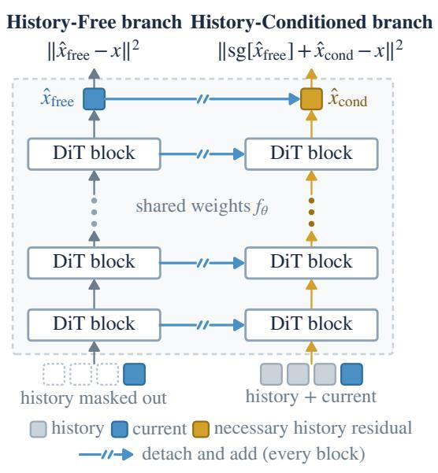
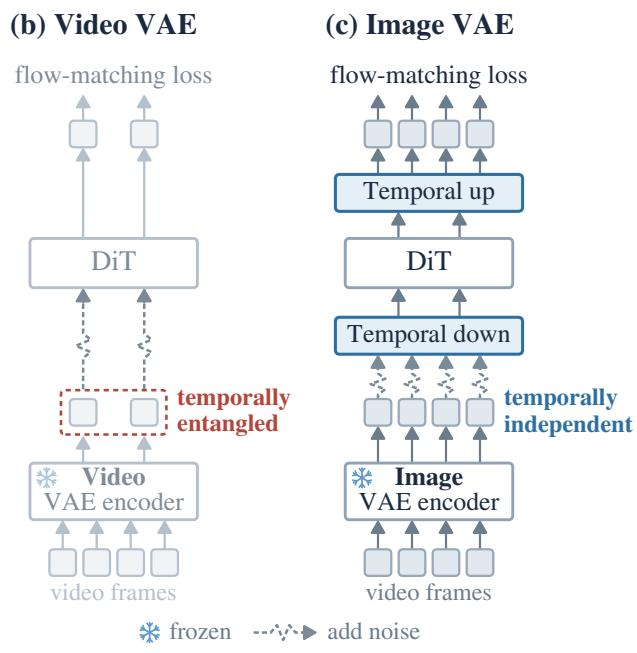
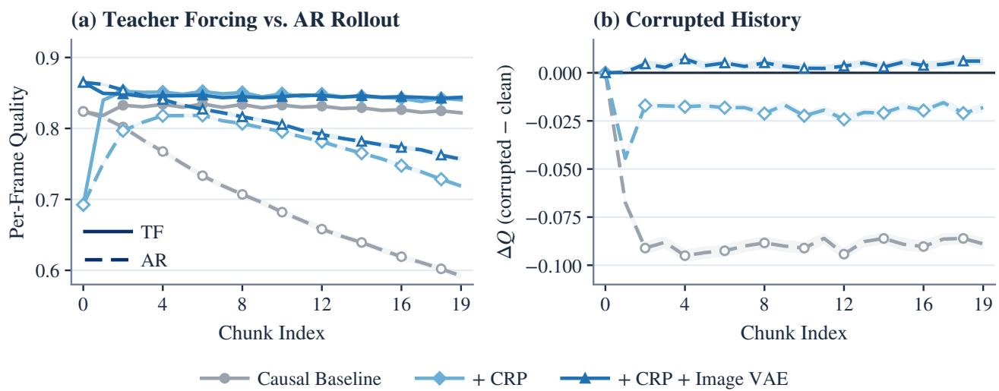
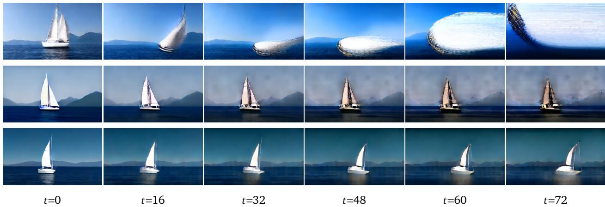
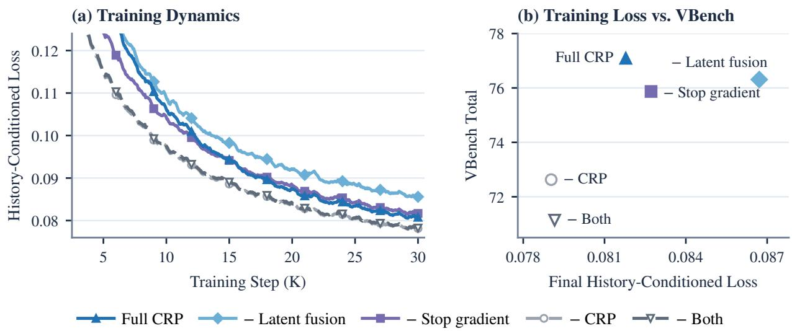
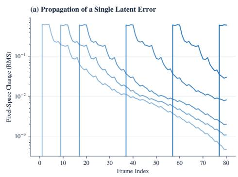
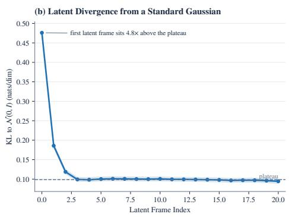
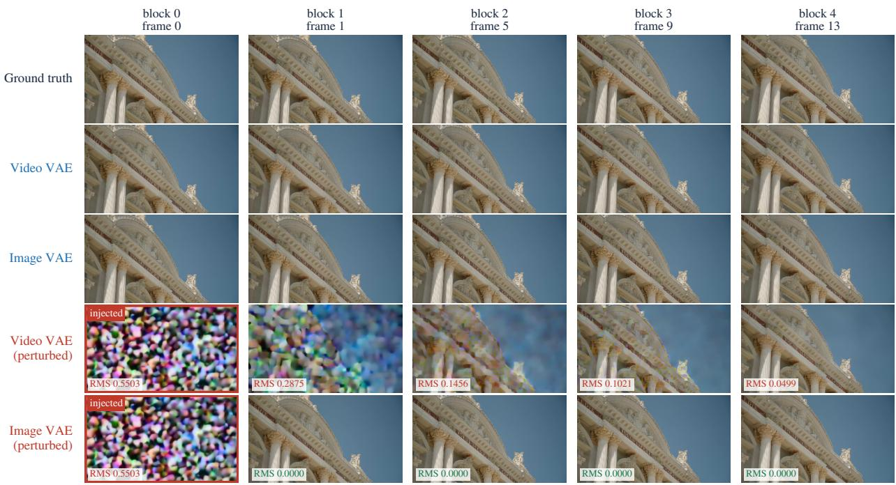

# Conditional Residual Prediction: Improving Autoregressive Video Difusion without a Bidirectional Teacher

Bowen Zheng1, Zhiguang Liu2, Jiarong Ou2, Rui Chen2 and Tianyang Hu1 1The Chinese University of Hong Kong, Shenzhen, 2Tencent Hunyuan

Causal video difusion models generate video autoregressively, which suits streaming, interactive, and long-video generation. Under standard training, however, they often yield lower generation quality than bidirectional models of the same size. Many existing approaches address this gap by initializing from or distilling a pretrained bidirectional teacher. We instead train a causal model from an image-model initialization, with no bidirectional video model at any stage. Because this path requires neither a large bidirectional teacher nor a complex distillation pipeline, it is simpler and more scalable. On this path, we find that a causal model trained on ground-truth history becomes strongly dependent on it, so that at inference errors in its own generated history propagate forward. We hypothesize that much of this dependence is unnecessary, because the current input already determines much of what the history provides. We propose Conditional Residual Prediction (CRP), a simple recipe for reducing a model’s reliance on a condition: the model first predicts the target without the condition, and the condition may only add a residual on top of this prediction. Applied to history, CRP makes the model predict each chunk from the present as far as it can and use the past only for what the present cannot supply. In controlled experiments, CRP nearly closes the 6.14-point gap to a bidirectional model trained under the same setup. Scaling this recipe, we train Optica, a 2B-parameter causal video model that autoregressively generates 5-second 480p videos and reaches 82.78 on VBench with only about 15M training videos.

## 1. Introduction

Many high-quality video difusion systems are fixed-window, non-causal generators: they jointly denoise all latent frames in a clip, and their temporal operators can exchange information in both directions within that window [1–7]. Throughout this paper, “bidirectional” refers specifically to that connectivity, not to the forward and reverse processes of difusion. Fixed-window generation is efective for short clips, but it must complete a window before emitting output and does not expose the temporal KV-cache structure used by streaming causal models [8–11]. By contrast, the autoregressive generation process of causal video models is naturally compatible with long-video and streaming settings [8–13], with direct applications to practical scenarios such as world models and neural renderers [14–17].

Despite these theoretical advantages, causal video models often remain unsatisfactory in practice. More specifically, even for short durations such as 5 seconds, a causal video model produces videos with substantially lower visual quality and semantic fidelity than a bidirectional model with a comparable parameter count.

Recent works have recognized this phenomenon and proposed several solutions. Early methods initialize a causal student from a pretrained bidirectional video model and retain a bidirectional teacher for ODE initialization or score distillation [8, 9]. Later methods still start from a bidirectional base but replace the ODE- or score-providing teacher with a causal one, at initialization or throughout scoring [18–20].

(a) Conditional Residual Prediction  

  
Figure 1 | Overview. (a) Conditional Residual Prediction (CRP) applied to history. The same network $f _ { \theta }$ is evaluated twice on the same input: the History-Free branch masks out the history and predicts ${ \hat { x } } _ { \mathrm { f r e e } } ,$ and the History-Conditioned branch sees the history and predicts only a residual $\hat { x } _ { \mathrm { c o n d } }$ on top of it. The History-Free hidden states are detached and added to the History-Conditioned branch after every block, never the reverse, so the History-Free branch stays free of history. (b) A video VAE encodes the first frame into its own latent and every later four frames into one, with causal temporal convolutions that entangle latents across time. (c) An image VAE encodes every frame independently into the same kind of latent; a temporal down/up layer keeps the cost of the DiT unchanged.

Compared with vanilla causal video models, these methods have achieved clear success, approaching or even surpassing their bidirectional teacher models. Yet their complex training and reliance on a pretrained teacher limit scaling: a stronger causal model first needs a stronger bidirectional one. More importantly, recent work finds that using a causal rather than bidirectional teacher for distillation yields a better causal student [18, 20]: the mismatch between bidirectional and causal models limits post-distillation performance, and a bidirectional teacher can leak future information that the student cannot access at generation time. This line of work further motivates our objective. Directly training a multi-step causal video model without relying on a bidirectional model not only provides a simple and scalable multi-step generator in its own right, but may also enable distillation into a stronger, eficient few-step model.

Our approach centers on one idea: reducing over-reliance on history. We find that a causal model trained on a ground-truth prefix becomes strongly dependent on it, and we hypothesize that much of this dependence is unnecessary: it covers information that the current input already determines (Sec. 3.1). We propose Conditional Residual Prediction (CRP; Fig. 1(a)), which first predicts the target without a condition and lets the condition add only a residual on top of this prediction. Applied to history, CRP splits the forward passes over the same input into a History-Free branch and a History-Conditioned branch and combines them to form the final output. To prevent the History-Conditioned branch from contaminating the History-Free branch, we detach the output of the History-Free branch with a stop-gradient, so that the History-Conditioned loss does not backpropagate through it; the shared parameters are updated by both losses. Under this design, the History-Conditioned branch efectively models the residual of the History-Free prediction. Intuitively, the History-Free branch models as much as possible without relying on history, while the History-Conditioned branch supplies only the signals that necessarily depend on history. In our controlled experiments, CRP, together with the � -prediction it builds on, narrows the VBench Total gap between the causal and bidirectional models from 6.14 to 0.19, with CRP itself accounting for 4.68 points.

CRP acts within the DiT, but the video VAE introduces a second source of history dependence that no change to the DiT can remove: its causal temporal compression couples latent frames. We therefore also use an image VAE rather than a video VAE. On top of CRP, the image VAE further narrows the gap from 0.19 to −0.20. It also suits CRP: encoding every frame independently removes the encoder-induced distinction between single-frame and four-frame latents.

Overall, this paper demonstrates that a causal video model can achieve strong performance without relying on a bidirectional teacher: building on CRP, we train Optica, a 2B-parameter causal video model that reaches 82.78 on VBench. It also demonstrates the efectiveness of reducing history over-reliance and ofers a simple recipe for native, scalable training of causal video models.

## 2. Background

Let the latent sequence of a video be $\boldsymbol { x } = \left( x _ { 1 } , \ldots , x _ { N } \right)$ , where the subscript denotes a position along the temporal dimension. Let � be the text condition and $f _ { \theta }$ the DiT to be trained. We use this notation throughout the paper.

## 2.1. Bidirectional Video Difusion Model

In image difusion, attention is typically bidirectional [21–24]. This carried over naturally to video difusion, where it has been successful [1–3, 25–27] and now dominates the field [4, 6, 28–32]. Such methods draw one noise level � shared across all positions, form the interpolation $x ^ { t } = ( 1 - t ) x + t \epsilon$ with $\epsilon \sim { \cal N } ( 0 , I )$ , and regress the corresponding velocity [33, 34]. Attention is bidirectional along time, so every position attends to every other within the window, and generation integrates the ODE jointly over the whole window from � = 1, producing all positions at once.

## 2.2. Causal Video Difusion Model

Causal video difusion models [12, 13, 16, 35–41] difer from bidirectional models above all in how they treat time, factorizing it by the chain rule: $p ( x \mid y ) = \prod _ { i = 1 } ^ { N } p ( x _ { i } \mid x _ { < i } , y )$ . A matching causal attention mask in the DiT keeps information flowing in one direction only. Some works apply causality at the chunk level [8–10, 13] rather than the frame level [16, 35, 36, 39, 40, 42, 43], which places them between the two extremes; adjusting the chunk size turns such a model into either a bidirectional or a causal one [44]. Throughout this paper we call a model causal when its chunk size is below two seconds and bidirectional when it is above.

Training normally uses teacher forcing [45]: the model is conditioned on the ground-truth prefix and noise is added only to the current position, so the noised query at position � attends to the clean prefix $x _ { < i }$ and to itself: $\begin{array} { r } { \mathcal { L } _ { \mathrm { c a u s a l } } = \mathbb { E } [ \sum _ { i = 1 } ^ { N } \| f _ { \theta } ( x _ { i } ^ { t _ { i } } , x _ { < i } , t _ { i } , y ) - ( \epsilon _ { i } - x _ { i } ) \| ^ { 2 } ] } \end{array}$ . Here, each position has an independent noise level $t _ { i } ,$ while the conditioning prefix $x _ { < i }$ comes from real data. Inference instead proceeds autoregressively, that is, on the model’s own generated frames as history: for $i = 1 , \ldots , N$ the model conditions on the generated prefix $\hat { x } _ { < i }$ and integrates the ODE from $x _ { i } ^ { 1 } \sim { \cal N } ( 0 , I )$ to obtain $\hat { x } _ { i }$ . Under autoregressive inference the generated history may difer from the real history, which introduces a training–inference gap and hence a loss of quality. This is the central problem studied in

  
Figure 2 | Per-frame image quality degradation and comparison. Per-frame no-reference quality is measured with Q-ReAlign Mini [57]. (a) Teacher-forced (TF) generation remains approximately stable, whereas autoregressive (AR) quality decreases with chunk index. (b) Quality change under a corrupted history, $\Delta Q = Q _ { \mathrm { c o r r u p t e d } } - Q _ { \mathrm { c l e a n } } ,$ , with each corruption type triggered independently per history frame with probability 0.3; negative values indicate degradation. Curves show means and shaded regions standard errors across clips. CRP and the image VAE progressively reduce the degradation. In (a), with the video $\mathrm { V A E , + C R P }$ falls below the baseline at chunk 0, which is generated without history; the image VAE removes this drop (Sec. 3.3).

## this paper.

## 2.3. Initialization and Distillation from a Bidirectional Teacher

Many works address the quality degradation of causal video models by exploiting a high-quality bidirectional model: some build on it by initialization or fine-tuning, as short-chunk causal models [46, 47] or clip- and shot-level extenders [48–50], while others distill from it, usually with Dif-Instruct [51] or DMD [52] objectives [8–11, 43, 53–55], or post-train the initialized causal model adversarially [56]. This line of work has been markedly successful, with the causal student approaching or even surpassing its bidirectional teacher.

Recent work further finds that the bidirectional teacher is itself a bottleneck, and that making each stage causal works better. Self Forcing [9] replaces the ground-truth prefix with the model’s own rollout during training. Causal Forcing [18] traces the problem to ODE initialization and uses a teacher-forced multi-step causal model as the ODE teacher. Context-Matched Distillation [20] makes the score-providing teacher causal as well, since a bidirectional one sees future frames the student cannot. Appendix A expands these comparisons.

## 3. Method

## 3.1. The History Over-Reliance Hypothesis

The most important diference between a causal video model and a bidirectional model is the former’s autoregressive generation process: the model first generates the earlier portion and then uses it as the basis for generating later positions. A common source of poor quality during autoregressive generation is exposure bias [58–61]. Errors in early positions are not only carried forward as fixed history and propagated to later positions, but also move the sequence away from the ground-truth history distribution seen during training, thereby degrading model performance. This train–test mismatch has also been observed directly in autoregressive video difusion [9, 62]. We first quantify the mismatch through per-frame image quality, scored with Q-ReAlign Mini1, a modernized version of Q-Align [57], over 1,000 real clips (Appendix D.2). On our causal baseline (Sec. 4.2), quality under a ground-truth prefix is flat across the clip, 0.824 in the first chunk and 0.822 in the twentieth, whereas the same model under an autoregressive rollout falls to 0.592, a mean gap of $0 . 1 3 8 \pm 0 . 0 0 3 ( \mathrm { F i g . ~ 2 ( a ) } )$ . Corrupting the ground-truth history rather than replacing it with generated frames reproduces the efect, costing 0.089 ± 0.001 (Fig. 2(b)). We use these two diagnostics throughout to test whether an intervention reduces history reliance, independently of VBench.

History dependence thus poses an apparent dilemma. The model must rely on the history to generate the current position, yet this reliance lets errors accumulate. Simply weakening or severing its access to the history reduces these errors but also removes useful signals, which hurts performance. We decompose this problem from an information-theoretic perspective. Information provided by history may be redundant with information at later positions; that is, some information can be recovered from the current-position signal alone, without relying on history.

More precisely, let the history be $H = x _ { < i } ,$ the current input be $c = x _ { i } ^ { t } ,$ the target be $x \ = \ x _ { i } ,$ and the text input be $y ,$ where � denotes the temporal position and � the noise level in the difusion or flow-matching formulation. By the chain rule for mutual information [63],

$$
I ( x ; c , H , y ) = I ( x ; c , y ) + I ( x ; H \mid c , y ) .
$$

We call the first term the history-free information, which the current input and text determine on their own, and the second the history-exclusive information, which only the past can supply.

Hypothesis 1 (History Over-Reliance). A causal video model trained on a ground-truth prefix relies on the history for history-free information instead of modeling it from the current input, and thereby acquires history dependence that the task does not require.

Why is this hypothesis plausible, and why would it cause severe exposure bias? During training, the model receives a ground-truth prefix, so relying on the ground-truth prefix for this history-free signal yields a lower error than generating it independently. At inference, however, the history itself contains errors that accumulate during generation, exacerbating exposure bias. If the model generates this component by itself, the training loss may be higher, but at inference time the component no longer depends on history and therefore avoids interacting with its accumulated errors.

We therefore separate history-free and history-exclusive information explicitly: the former is modeled from the current input, and a History-Conditioned branch models only the remaining residual. We formalize this design as Conditional Residual Prediction in Sec. 3.2, and complement it in Sec. 3.3 by removing the history dependence that the video VAE introduces. CRP also difers from two standard techniques: training on corrupted history and on rollout history. Difusion Forcing [36], the bestknown example of the former, injects noise into the history during training. If inference uses a clean history, training and inference become inconsistent; if inference keeps the noise, it discards history information that the current position needs, by an amount set by a hand-crafted noise level that is hard to control. Training with rollout history, or scheduled sampling [58], changes the training objective and can lead to a suboptimal solution [64]. See Appendix A for more discussion.

## 3.2. Conditional Residual Prediction

We first focus on the DiT, where history may only add a residual on top of a History-Free prediction.

Definition 1 (Conditional Residual Prediction). Let a network $f _ { \theta }$ predict a target � from an input � and a condition ℎ. CRP evaluates the same network twice: a condition-free branch ${ \hat { x } } _ { \mathrm { f r e e } } = f _ { \theta } ( c )$ that never accesses ℎ, and a residual branch $\hat { x } _ { \mathrm { c o n d } } = f _ { \theta } ( c , h )$ that may also receive the detached features of the condition-free branch but passes nothing back to it. With a loss $\ell ,$ the two branches are trained with

$$
\mathcal { L } _ { \mathrm { f r e e } } = \ell ( \hat { x } _ { \mathrm { f r e e } } , x ) , \qquad \mathcal { L } _ { \mathrm { c o n d } } = \ell ( s g [ \hat { x } _ { \mathrm { f r e e } } ] + \hat { x } _ { \mathrm { c o n d } } , x ) ,
$$

where the stop-gradient sg[·], which we use throughout, keeps $\mathcal { L } _ { \mathrm { c o n d } }$ from backpropagating through the condition-free branch, and the prediction is $\hat { x } _ { \mathrm { f r e e } } + \hat { x } _ { \mathrm { c o n d } } , 0 \mathrm { r } \hat { x } _ { \mathrm { f r e e } }$ alone when ℎ is unavailable. The condition-free branch thus carries no information about ℎ in its features or output; everything that depends on ℎ is carried by the residual branch, without additional parameters.

In this paper, ℓ is the squared error, and we instantiate Definition 1 with the noisy current chunk and the text as the input, $c = ( x _ { i } ^ { t } , y )$ , the history as the condition, $h = H = x _ { < i } ,$ and the clean chunk as the target, $x = x _ { i }$

Conditional residual branches have conceptual precedents in ControlNet and temporal-residual video difusion [65, 66]. ControlNet, however, injects an additional, separately parameterized condition branch into a frozen base, so that the features and output of the base carry the condition. CRP reverses this direction within a single network and keeps the condition-free branch clean. SCD separates temporal causal reasoning from framewise denoising [43]. Appendix A further discusses History Guidance and remedies for over-reliance on history in imitation learning.

Table 1 | Roadmap of the controlled ablation, trained on 4M videos at 256p and 5s. Each row adds one configuration change on top of the row above, and Δ is the resulting change in Total. The causal baseline is substantially worse than the bidirectional baseline, CRP nearly closes this gap, and the image VAE further brings it on par with the bidirectional model. All scores use the standard VBench prompt set and its fixed seeds; Appendix F compares reconstruction in image and video modes.

<table><tr><td>Configuration</td><td>Total</td><td>Quality</td><td>Semantic</td><td>Δ</td></tr><tr><td>Bidirectional reference</td><td>77.28</td><td>79.64</td><td>67.82</td><td>一</td></tr><tr><td>Causal baseline</td><td>71.14</td><td>75.13</td><td>55.16</td><td></td></tr><tr><td>+ xo-prediction</td><td>72.41</td><td>74.96</td><td>62.22</td><td>+1.27</td></tr><tr><td>+ CRP</td><td>77.09</td><td>78.09</td><td>73.10</td><td>+4.68</td></tr><tr><td>+ Image VAE</td><td>77.48</td><td>78.43</td><td>73.72</td><td>+0.39</td></tr></table>

Specifically, for the same network and the same set of inputs, we compute two forward-pass results simultaneously (Fig. 1(a)): a History-Free branch with past frames masked out and a History-Conditioned residual branch with access to past frames. During sampling, the first chunk, which has no history, uses only ${ \hat { x } } _ { \mathrm { f r e e } }$ . We pass the detached hidden state of the History-Free branch to the History-Conditioned branch after every block, allowing the latter to process History-Free signals in latent space rather than only in output space; we refer to this as latent fusion. Since the residual is most naturally defined on the clean target, CRP uses �0-prediction.

## 3.3. From Video VAE to Image VAE

CRP acts within the DiT, but the latents it models come from the VAE. Like many common video VAEs, the Wan2.1 VAE we adopt [6] is built from causal temporal convolutions: it encodes the first frame into its own latent and every later four frames into one, and each latent depends on the frames before it (Fig. 1(b)). This causes two problems.

First, the VAE introduces history dependence of its own, which no change to the DiT can remove:

it learns to reconstruct later positions partly from preceding signals. We observe that, under the common setting of 5 seconds at 16 fps, an error in an early latent propagates all the way to the last frame (Appendix E). In autoregressive generation, an error in an earlier chunk is thus carried into every later one.

Second, the video VAE produces two types of latent, a single-frame latent for the first frame and a four-frame latent for each later group of four frames, and one model must generate both. The two are also inherently imbalanced: the single-frame latent appears only at the first position and receives a small share of training, which an extra image task can alleviate. In CRP, the imbalance becomes more pronounced: the History-Free branch predicts without history at every position, almost always on four-frame latents. Since the first chunk is generated by this branch alone, it falls below the baseline (Fig. 2(a), chunk 0). Rather than adding an image task, we unify the latent representation.

Motivated by these two issues, we replace the video VAE with an image VAE, which encodes every frame independently into the same kind of latent (Fig. 1(c)). To avoid introducing other changes, we keep the same Wan2.1 VAE but use its image mode instead of its video mode, which loses no fidelity (1.11 dB higher paired PSNR; Appendix F). This removes both problems: a perturbation of one latent no longer spreads to later frames, and the chunk-0 drop disappears.

To keep the DiT’s cost unchanged with four times as many latents, we add a lightweight temporal patch layer that merges every four adjacent latents at the input and splits them at the output (Fig. 1(c); Appendix B.2). Consistent with JiT [67], we observe that �0-prediction performs better than velocity prediction with these higher-dimensional tokens. We refer to this complete configuration as “+ Image VAE.”

## 4. Controlled Ablation Experiments

## 4.1. Setup

Data For the controlled ablation experiments, we use approximately 4M internal video clips at 256p resolution and a duration of 5 seconds. Further details on the data are provided in Appendix C.

Model Our model is initialized from the 1.6B-parameter SANA-1.5 T2I checkpoint [68, 69]. Following SANA-Video [7], we add a temporal convolutional layer to the MLP and adapt kernelized linear attention [70] for RoPE [71]. We replace 25% of the linear-attention layers with softmax attention. For the causal model, all components involving the temporal dimension, including temporal convolution, attention, and RoPE, are made strictly causal. The resulting model contains 2B parameters. We use the Wan2.1 VAE. Since SANA-1.5 is pretrained in the DC-AE latent space [72], we follow DC-VideoGen [73] and adapt its input and output layers to the Wan2.1 latent space before the main training (Appendix B.3).

## 4.2. Bidirectional and Causal Baselines

We first train bidirectional and causal baselines under this setup. For the baseline models, we use the standard velocity loss. For the causal baseline, we use teacher forcing rather than difusion forcing, following prior work [18]. The causal baseline scores 71.14 VBench Total, well below the bidirectional baseline’s 77.28. This is consistent with prior autoregressive video difusion results [8, 9]. Qualitatively, we observe clear exposure bias: as generation proceeds, the causal baseline rapidly departs from the real-image distribution, producing distorted textures, incorrect structures, and artifacts (Fig. 3, first row).

  
Figure 3 | Qualitative efect of reducing history over-reliance over an autoregressive rollout. Rows, top to bottom: causal baseline; + CRP; + CRP + Image VAE. All three are the 4M-video controlled-ablation models under the same sampling parameters, so the diferences between them isolate the efect of each added component. The causal baseline deteriorates rapidly as the temporal index increases. With + CRP, the scene keeps its structure throughout, but later frames darken and develop speckle artifacts; adding the image VAE removes them.

## 4.3. Causal Model with CRP

Starting from the causal baseline, we first add CRP to the DiT, keeping the video VAE. Because CRP predicts a residual on top of an $x _ { 0 }$ prediction, we first switch the causal baseline from velocity prediction to � -prediction, which on its own raises VBench Total from 71.14 to 72.41 (Table 1), and then add CRP (Sec. 3.2).

CRP raises VBench Total from 72.41 to 77.09, close to the bidirectional baseline of 77.28. CRP alone therefore accounts for 4.68 of the 6.14-point gap between the causal and bidirectional baselines. On the two diagnostics in Fig. 2, CRP reduces the quality gap between autoregressive generation and teacher forcing from 0.138 ± 0.003 to $0 . 0 6 6 \pm 0 . 0 0 3$ , and the quality loss caused by corrupted history from $0 . 0 8 9 \pm 0 . 0 0 1$ to $0 . 0 2 0 \pm 0 . 0 0 1$ . In the rollout of Fig. 3, the scene keeps its structure throughout, although later frames darken and develop speckle artifacts.

## 4.4. Causal Model with Image VAE

We then replace the video VAE with the image VAE of Sec. 3.3, together with the temporal patch layer, which adds about 40M parameters, or 2% of the total (Fig. 1(c)).

The image VAE further raises VBench Total from 77.09 to 77.48, matching the bidirectional baseline. Adding the image VAE also reduces the two diagnostics to 0.039 ± 0.002 and $- 0 . 0 0 4 \pm 0 . 0 0 1$ respectively; at this corruption strength, there is no longer any measurable degradation. It also removes the drop of CRP at chunk 0 (Fig. 2(a); Sec. 3.3) and the darkening and speckles in later frames (Fig. 3).

## 4.5. Ablation of CRP Components

To isolate the contribution of each component, we remove them from the + CRP model of Sec. 4.3 (Table 2). Removing latent fusion lowers VBench Total from 77.09 to 76.31, and removing the stop-gradient lowers it to 75.87. Replacing the composed prediction $s g [ \widehat { x } _ { \mathrm { f r e e } } ] + \widehat { x } _ { \mathrm { c o n d } }$ with a direct prediction of the History-Conditioned branch (− CRP) lowers it much further, to 72.63, close to the � causal baseline of 72.41. The model therefore tends to over-rely on history: latent fusion alone still lets it bypass the History-Free signals, and only composing the two branches at the output forces it to model them. CRP trains $\mathcal { L } _ { \mathrm { f r e e } }$ and $\mathcal { L } _ { \mathrm { c o n d } }$ jointly, but the extra History-Free training alone does not account for its gain. Without latent fusion and CRP (− Both), VBench Total falls to 71.14, below the $x _ { 0 }$ causal baseline of 72.41. Without CRP, the History-Free prediction is used only for the first chunk, which has no history; we attribute the drop to the extra History-Free training diluting the share of History-Conditioned training for every later chunk.

Table 2 | Ablation of the CRP components in the controlled setting. Full CRP is the + CRP row of Table 1, and each row below it removes the components marked ×. Extra History-Free training applies $\mathcal { L } _ { \mathrm { f r e e } }$ to every chunk, whereas the causal baseline predicts without history only for the first chunk. Latent fusion passes the detached hidden states of the History-Free branch to the History-Conditioned branch after every block. CRP composes the final prediction as $\mathrm { s g } [ \hat { x } _ { \mathrm { f r e e } } ] + \hat { x } _ { \mathrm { c o n d } } ;$ ; without it, the History-Conditioned branch predicts $x _ { 0 }$ directly. The stop-gradient acts on whichever of these two paths is present and does not apply (–) when neither is.
<table><tr><td></td><td>Extra History-Free Training</td><td>Latent Fusion</td><td>CRP</td><td>Stop Gradient</td><td>Total</td><td>Quality</td><td>Semantic</td></tr><tr><td>Causal baseline  $\left( \boldsymbol { x } _ { 0 } \right)$ </td><td>X</td><td>X</td><td>X</td><td>一</td><td>72.41</td><td>74.96</td><td>62.22</td></tr><tr><td>Full CRP</td><td>√</td><td>√</td><td>√</td><td>√</td><td>77.09</td><td>78.09</td><td>73.10</td></tr><tr><td>– Latent fusion</td><td>√</td><td>X</td><td>√</td><td>√</td><td>76.31</td><td>77.06</td><td>73.32</td></tr><tr><td>- CRP</td><td>√</td><td>√</td><td>X</td><td>√</td><td>72.63</td><td>75.11</td><td>62.74</td></tr><tr><td>- Both</td><td>√</td><td>X</td><td>X</td><td>一</td><td>71.14</td><td>74.08</td><td>59.37</td></tr><tr><td>– Stop gradient</td><td>√</td><td>√</td><td>√</td><td>X</td><td>75.87</td><td>77.39</td><td>69.79</td></tr></table>

Figure 4 shows the History-Conditioned training loss of these variants. Without latent fusion, the History-Conditioned branch cannot obtain History-Free signals in latent space, and both the loss and VBench Total are worse: the loss stays above that of full CRP throughout training and ends at 0.0867, versus 0.0818. Without the stop-gradient, the loss decreases faster at first and stays below that of full CRP until about 16K steps, but $\mathcal { L } _ { \mathrm { c o n d } }$ also updates the History-Free branch, whose loss ends 0.0012 higher; the final loss of 0.0827 and VBench Total are both worse. Without CRP, the model over-relies on history: its loss is lower throughout and ends at 0.0790 (0.0792 for − Both), yet these two variants have the lowest VBench Total. This is the behavior that Hypothesis 1 predicts: under a ground-truth prefix, relying on the history yields a lower training error, whereas at inference the history contains the model’s own errors (Sec. 3.1). Together, these results isolate the contribution of each component of CRP and support the history over-reliance hypothesis.

## 5. Scaling Experiments

Data Building on the controlled experiments, we continue training at 256p and 5 seconds up to 7M videos, and then switch to 480p and train up to 14.5M videos. Finally, we perform supervised fine-tuning (SFT) on 0.5M internal high-quality videos (Appendix C), for 15M videos in total.

Model The scaled-up model continues training from the controlled-experiment checkpoint. All controlled experiments use a chunk size of one latent position; for the scaled-up model, we increase the chunk size to four latent positions and fine-tune directly.

  
Figure 4 | CRP reduces history over-reliance and improves generation. The History-Conditioned loss is the loss of the final prediction on chunks that have history, for the variants of Table 2. (a) Loss during training. (b) Final loss against VBench Total. The variants without CRP (dashed lines, open markers) reach the lowest loss but the lowest VBench Total.

Results Optica achieves VBench Total/Quality/Semantic scores of 82.78/83.02/81.83 (Table 3). It is trained on only approximately 15M internal real video clips, contains 2B parameters, and uses no initialization, ODE sample, or score from a bidirectional teacher.

Among methods that do not rely on any bidirectional video model, Optica achieves the highest VBench Total score: 82.78, exceeding Pyramid Flow, NOVA, and MAGI-1 by 1.06, 2.66, and 3.60 points, respectively. This advantage comes primarily from Semantic: Optica scores 81.83, compared with 69.62, 79.05, and 67.74. Our Quality score remains below that of Pyramid Flow (83.02 vs. 84.74).

We observe a similar pattern when comparing against causal models distilled from bidirectional teachers. Optica’s Semantic score is already comparable to those of the strongest models in this group. For example, Causal Forcing, Causal-rCM, and Self Forcing achieve Semantic scores of 81.84, 81.31, and 81.28, respectively, compared with 81.83 for Optica. On Quality, however, Optica remains 1.0–4.0 points lower. The same holds relative to the bidirectional SANA-Video 5-second checkpoint, the closest published model architecturally: their Semantic scores are nearly identical (81.83 vs. 81.35), and the primary gap lies in Quality (83.02 vs. 84.35).

The remaining gap should be read together with the training budget. Although many distilled causal models contain only 1.3B parameters, they are initialized from or distilled with pretrained Wan video models, commonly at 1.3B and in most cases with 14B teacher supervision [8–10, 43, 55]. The cost of this upstream training is not reflected in their parameter counts. By contrast, Optica uses only about 15M video clips and starts from an image model. More importantly, in our controlled experiments with identical data, model sizes, and evaluation protocols, our causal model already matches the bidirectional reference (Table 1). This points to training budget, rather than the causal architecture, as the main source of the remaining gaps.

Table 3 | Comparison with video generators on VBench. Total, Quality, and Semantic are shortvideo VBench-T2V scores [74]. For our model, we report scores on 480p+5s videos generated autoregressively in 5 chunks. Appendix D.1 lists the sources of the quoted scores.
<table><tr><td>Method</td><td></td><td>Steps #Params</td><td>Bi. source</td><td>Use</td><td>Total</td><td>Quality</td><td>Semantic</td></tr><tr><td colspan="8">Fixed-window, non-causal</td></tr><tr><td>Step-Video [75]</td><td>50</td><td>30B</td><td></td><td></td><td>81.83</td><td>84.46</td><td>71.28</td></tr><tr><td>Open-Sora-2.0 [76]</td><td>50</td><td>11B</td><td></td><td></td><td>84.34</td><td>85.40</td><td>80.12</td></tr><tr><td>HunyuanVideo [5]</td><td>50</td><td>13B</td><td></td><td></td><td>83.24</td><td>85.09</td><td>75.82</td></tr><tr><td>Wan2.1 [6]</td><td>50</td><td>14B</td><td></td><td></td><td>83.69</td><td>85.59</td><td>76.11</td></tr><tr><td>CogVideoX1.5 [4]</td><td>50</td><td>5B</td><td></td><td></td><td>82.17</td><td>82.78</td><td>79.76</td></tr><tr><td>SANA-Video [7]</td><td>50</td><td>2B</td><td></td><td></td><td>83.71</td><td>84.35</td><td>81.35</td></tr><tr><td>LTX-Video [77]</td><td>20</td><td>1.9B</td><td></td><td></td><td>80.00</td><td>82.30</td><td>70.79</td></tr><tr><td>Wan2.1 [6]</td><td>50</td><td>1.3B</td><td></td><td></td><td>84.26</td><td>85.30</td><td>80.09</td></tr><tr><td colspan="8">Causal, distilled from a bidirectional teacher</td></tr><tr><td>CausVid [8]</td><td>4</td><td>1.3B</td><td>Wan-1.3/14B</td><td>init.+dist. 81.20</td><td></td><td>84.05</td><td>69.80</td></tr><tr><td>Self Forcing [9]</td><td>4</td><td>1.3B</td><td>Wan-1.3/14B</td><td>init.+dist.</td><td>84.31</td><td>85.07</td><td>81.28</td></tr><tr><td>LongLive [10]</td><td>4</td><td>1.3B</td><td>Wan-1.3/14B</td><td>init.+dist.</td><td>84.87</td><td>86.97</td><td>76.47</td></tr><tr><td>Rolling Forcing [11]</td><td>5</td><td>1.3B</td><td>Wan-1.3/14B</td><td>init.+dist.</td><td>81.22</td><td>84.08</td><td>69.78</td></tr><tr><td>Context Forcing [54]</td><td>4</td><td>1.3B</td><td>Wan-1.3B</td><td>init.+dist.</td><td>83.44</td><td>84.98</td><td>77.29</td></tr><tr><td>Causal Forcing [18]</td><td>4</td><td>1.3B</td><td>Wan-1.3/14B</td><td>init.+dist.</td><td>84.04</td><td>84.59</td><td>81.84</td></tr><tr><td>Causal-rCM [55]</td><td>2</td><td>1.3B</td><td>Wan-1.3/14B</td><td>init.+dist.</td><td>84.63</td><td>85.46</td><td>81.31</td></tr><tr><td>SCD [43]</td><td>4</td><td>1.6B</td><td>Wan-1.3/14B</td><td>init.+dist.</td><td>84.03</td><td>85.14</td><td>79.60</td></tr><tr><td colspan="8">Causal, bidirectional initialization only</td></tr><tr><td>SkyReels-V2 [12]</td><td>30</td><td>1.3B</td><td>own bi. model init.</td><td></td><td>82.67</td><td>84.70</td><td>74.53</td></tr><tr><td colspan="8">Causal, no bidirectional video model</td></tr><tr><td>NOVA [41]</td><td>25</td><td>0.6B</td><td></td><td></td><td>80.12</td><td>80.39</td><td>79.05</td></tr><tr><td>Pyramid Flow [38]</td><td>20</td><td>2B</td><td></td><td></td><td>81.72</td><td>84.74</td><td>69.62</td></tr><tr><td>MAGI-1 [13]</td><td>64</td><td>4.5B</td><td>一</td><td></td><td>79.18 82.78</td><td>82.04 83.02</td><td>67.74</td></tr><tr><td>Optica (ours)</td><td>50</td><td>2B</td><td>一</td><td></td><td></td><td></td><td>81.83</td></tr></table>

## 6. Conclusion

This paper studies history over-reliance in causal video models: teacher forcing supplies a consistently correct prefix, so the model comes to rely on history for signals it could model from the current position, and this reliance amplifies history errors during autoregressive inference. We address this with Conditional Residual Prediction, which splits the DiT into a History-Free branch and a History-Conditioned branch that predicts only a residual on top of it. We complement it with an image VAE that removes history dependence between latents. In controlled experiments, CRP narrows the 6.14-point VBench Total gap to the bidirectional reference to 0.19, and the image VAE narrows it further to −0.20, while substantially reducing quality degradation under generated and corrupted histories. The scaled 2B-parameter Optica uses no initialization, sample, or score from a bidirectional teacher and achieves 82.78 on VBench.

History remains necessary for modeling motion, identity, and temporal consistency; what CRP removes is the reliance on history for what the current position can model on its own. This also makes Optica complementary to distillation rather than an alternative to it. Recent work finds that a few-step causal model benefits from distilling a multi-step causal teacher rather than a bidirectional one [18], and Optica ofers a way to train such a teacher natively, keeping the causal factorization consistent between the pretrained model and the downstream student.

The same decomposition also suggests a target for compressing long context or memory in causal video models: keep the history-exclusive information, which the current position cannot infer on its own, and discard the rest. This gives an information-theoretic rather than heuristic criterion for which parts of the history are useful, and can guide the design of concrete compression algorithms.

Our experiments have several limitations. All controlled and scaling runs evaluate only 5-second videos, so we have not verified that CRP keeps suppressing error accumulation over longer autoregressive rollouts. We also instantiate CRP only with the history as the condition; other conditions that generative models are known to over-rely on, such as the conditioning image in image-to-video generation [78], are left for future work. This version of Optica also does not yet support image-tovideo generation. The image VAE gives up temporal compression and the History-Free branch adds a forward pass, so the current 50-step model does not demonstrate real-time eficiency, and we have not yet distilled Optica into a few-step model.

## AI Use Statement

LLMs were used for language polishing, coding assistance, reviewing mathematical formulas, and searching for related literature. The core method and research were developed without AI assistance. The authors take full responsibility for the final content of this paper.

## References

[1] Jonathan Ho, Tim Salimans, Alexey Gritsenko, William Chan, Mohammad Norouzi, and David J. Fleet. Video difusion models. In Advances in Neural Information Processing Systems, volume 35, pages 8633– 8646, 2022. URL https://arxiv.org/abs/2204.03458.

[2] Andreas Blattmann, Robin Rombach, Huan Ling, Tim Dockhorn, Seung Wook Kim, Sanja Fidler, and Karsten Kreis. Align your latents: High-resolution video synthesis with latent difusion models. In Proceedings of the IEEE/CVF Conference on Computer Vision and Pattern Recognition, pages 22563–22575, 2023. URL https://arxiv.org/abs/2304.08818.

[3] Andreas Blattmann, Tim Dockhorn, Sumith Kulal, Daniel Mendelevitch, Maciej Kilian, Dominik Lorenz, Yam Levi, Zion English, Vikram Voleti, Adam Letts, Varun Jampani, and Robin Rombach. Stable video difusion: Scaling latent video difusion models to large datasets. arXiv preprint arXiv:2311.15127, 2023. URL https://arxiv.org/abs/2311.15127.

[4] Zhuoyi Yang, Jiayan Teng, Wendi Zheng, Ming Ding, Shiyu Huang, Jiazheng Xu, Yuanming Yang, Wenyi Hong, Xiaohan Zhang, Guanyu Feng, et al. CogVideoX: Text-to-video difusion models with an expert transformer. In International Conference on Learning Representations, 2025. URL https: //arxiv.org/abs/2408.06072.

[5] Weijie Kong, Qi Tian, Zijian Zhang, Rox Min, Zuozhuo Dai, Jin Zhou, Jiangfeng Xiong, Xin Li, Bo Wu, Jianwei Zhang, et al. HunyuanVideo: A systematic framework for large video generative models. arXiv preprint arXiv:2412.03603, 2024. URL https://arxiv.org/abs/2412.03603.

[6] Team Wan, Ang Wang, Baole Ai, Bin Wen, Chaojie Mao, Chen-Wei Xie, Di Chen, Feiwu Yu, Haiming Zhao, Jianxiao Yang, et al. Wan: Open and advanced large-scale video generative models. arXiv preprint arXiv:2503.20314, 2025. URL https://arxiv.org/abs/2503.20314.

[7] Junsong Chen, Yuyang Zhao, Jincheng Yu, Ruihang Chu, Junyu Chen, Shuai Yang, Xianbang Wang, Yicheng Pan, Daquan Zhou, Huan Ling, et al. SANA-Video: Eficient video generation with block linear difusion transformer. In International Conference on Learning Representations, 2026. URL https://arxiv.org/abs/2509.24695.

[8] Tianwei Yin, Qiang Zhang, Richard Zhang, William T. Freeman, Frédo Durand, Eli Shechtman, and Xun Huang. From slow bidirectional to fast autoregressive video difusion models. In Proceedings of the IEEE/CVF Conference on Computer Vision and Pattern Recognition, pages 22963–22974, 2025. URL https://arxiv.org/abs/2412.07772.

[9] Xun Huang, Zhengqi Li, Guande He, Mingyuan Zhou, and Eli Shechtman. Self forcing: Bridging the train-test gap in autoregressive video difusion. In Advances in Neural Information Processing Systems, volume 38, pages 167283–167308, 2025. URL https://arxiv.org/abs/2506.08009.

[10] Shuai Yang, Wei Huang, Ruihang Chu, Yicheng Xiao, Yuyang Zhao, Xianbang Wang, Muyang Li, Enze Xie, Yingcong Chen, Yao Lu, Song Han, and Yukang Chen. LongLive: Real-time interactive long video generation. In International Conference on Learning Representations, 2026. URL https: //arxiv.org/abs/2509.22622.

[11] Kunhao Liu, Wenbo Hu, Jiale Xu, Ying Shan, and Shijian Lu. Rolling forcing: Autoregressive long video difusion in real time. In International Conference on Learning Representations, 2026. URL https://arxiv.org/abs/2509.25161.

[12] Guibin Chen, Dixuan Lin, Jiangping Yang, Chunze Lin, Junchen Zhu, Mingyuan Fan, Hao Zhang, Sheng Chen, Zheng Chen, Chengcheng Ma, et al. SkyReels-V2: Infinite-length film generative model. arXiv preprint arXiv:2504.13074, 2025. URL https://arxiv.org/abs/2504.13074.

[13] Sand.ai, Hansi Teng, Hongyu Jia, Lei Sun, Lingzhi Li, Maolin Li, Mingqiu Tang, Shuai Han, Tianning Zhang, W. Q. Zhang, et al. MAGI-1: Autoregressive video generation at scale. arXiv preprint arXiv:2505.13211, 2025. URL https://arxiv.org/abs/2505.13211.

[14] David Ha and Jürgen Schmidhuber. World models. arXiv preprint arXiv:1803.10122, 2018. URL https://arxiv.org/abs/1803.10122.

[15] Jake Bruce, Michael Dennis, Ashley Edwards, Jack Parker-Holder, Yuge Shi, Edward Hughes, Matthew Lai, Aditi Mavalankar, Richie Steigerwald, Chris Apps, et al. Genie: Generative interactive environments. In Proceedings of the 41st International Conference on Machine Learning, volume 235 of Proceedings of Machine Learning Research, pages 4603–4623. PMLR, 2024. URL https://proceedings.mlr. press/v235/bruce24a.html.

[16] Dani Valevski, Yaniv Leviathan, Moab Arar, and Shlomi Fruchter. Difusion models are real-time game engines. In International Conference on Learning Representations, 2025. URL https://arxiv.org/ abs/2408.14837.

[17] Ruofan Liang, Zan Gojcic, Huan Ling, Jacob Munkberg, Jon Hasselgren, Chih-Hao Lin, Jun Gao, Alexander Keller, Nandita Vijaykumar, Sanja Fidler, and Zian Wang. Difusion renderer: Neural inverse and forward rendering with video difusion models. In Proceedings of the IEEE/CVF Conference on Computer Vision and Pattern Recognition, pages 26069–26080, 2025. URL https://arxiv.org/abs/ 2501.18590.

[18] Hongzhou Zhu, Min Zhao, Guande He, Hang Su, Chongxuan Li, and Jun Zhu. Causal forcing: Autoregressive difusion distillation done right for high-quality real-time interactive video generation. In International Conference on Machine Learning, 2026. URL https://arxiv.org/abs/2602.02214.

[19] Min Zhao, Hongzhou Zhu, Kaiwen Zheng, Zihan Zhou, Bokai Yan, Xinyuan Li, Xiao Yang, Chongxuan Li, and Jun Zhu. Causal forcing++: Scalable few-step autoregressive difusion distillation for real-time interactive video generation. arXiv preprint arXiv:2605.15141, 2026. URL https://arxiv.org/abs/ 2605.15141.

[20] Hmrishav Bandyopadhyay, Xuanchi Ren, Zijian Huang, Jay Zhangjie Wu, Tianshi Cao, Ruilong Li, Bryan Chu, Sanja Fidler, Yi-Zhe Song, and Zian Wang. Context-matched distillation: Teacher causality for autoregressive video distillation. arXiv preprint arXiv:2608.13391, 2026. URL https://arxiv.org/ abs/2608.13391.

[21] Jonathan Ho, Ajay Jain, and Pieter Abbeel. Denoising difusion probabilistic models. In Advances in Neural Information Processing Systems, volume 33, pages 6840–6851, 2020. URL https://arxiv. org/abs/2006.11239.

[22] Yang Song, Jascha Sohl-Dickstein, Diederik P. Kingma, Abhishek Kumar, Stefano Ermon, and Ben Poole. Score-based generative modeling through stochastic diferential equations. In International Conference on Learning Representations, 2021. URL https://arxiv.org/abs/2011.13456.

[23] Robin Rombach, Andreas Blattmann, Dominik Lorenz, Patrick Esser, and Björn Ommer. High-resolution image synthesis with latent difusion models. In Proceedings of the IEEE/CVF Conference on Computer Vision and Pattern Recognition, pages 10684–10695, 2022. URL https://arxiv.org/abs/2112. 10752.

[24] William Peebles and Saining Xie. Scalable difusion models with transformers. In Proceedings of the IEEE/CVF International Conference on Computer Vision, pages 4195–4205, 2023. URL https: //arxiv.org/abs/2212.09748.

[25] Uriel Singer, Adam Polyak, Thomas Hayes, Xi Yin, Jie An, Songyang Zhang, Qiyuan Hu, Harry Yang, Oron Ashual, Oran Gafni, Devi Parikh, Sonal Gupta, and Yaniv Taigman. Make-A-Video: Text-to-video generation without text-video data. In International Conference on Learning Representations, 2023. URL https://arxiv.org/abs/2209.14792.

[26] Jonathan Ho, William Chan, Chitwan Saharia, Jay Whang, Ruiqi Gao, Alexey Gritsenko, Diederik P. Kingma, Ben Poole, Mohammad Norouzi, David J. Fleet, and Tim Salimans. Imagen Video: High definition video generation with difusion models. arXiv preprint arXiv:2210.02303, 2022. URL https://arxiv.org/abs/2210.02303.

[27] Yuwei Guo, Ceyuan Yang, Anyi Rao, Zhengyang Liang, Yaohui Wang, Yu Qiao, Maneesh Agrawala, Dahua Lin, and Bo Dai. AnimateDif: Animate your personalized text-to-image difusion models without specific tuning. In International Conference on Learning Representations, 2024. URL https: //arxiv.org/abs/2307.04725.

[28] Bin Lin, Yunyang Ge, Xinhua Cheng, Zongjian Li, Bin Zhu, Shaodong Wang, Xianyi He, Yang Ye, Shenghai Yuan, Liuhan Chen, et al. Open-Sora Plan: Open-source large video generation model. arXiv preprint arXiv:2412.00131, 2024. URL https://arxiv.org/abs/2412.00131.

[29] Bing Wu, Chang Zou, Changlin Li, Duojun Huang, Fang Yang, Hao Tan, Jack Peng, Jianbing Wu, Jiangfeng Xiong, Jie Jiang, et al. HunyuanVideo 1.5 technical report. arXiv preprint arXiv:2511.18870, 2025. URL https://arxiv.org/abs/2511.18870.

[30] Yoav HaCohen, Benny Brazowski, Nisan Chiprut, Yaki Bitterman, Andrew Kvochko, Avishai Berkowitz, Daniel Shalem, Daphna Lifschitz, Dudu Moshe, Eitan Porat, et al. LTX-2: Eficient joint audio-visual foundation model. arXiv preprint arXiv:2601.03233, 2026. URL https://arxiv.org/abs/2601. 03233.

[31] Team Seedance. Seedance 2.0: Advancing video generation for world complexity. arXiv preprint arXiv:2604.14148, 2026. URL https://arxiv.org/abs/2604.14148.

[32] MiniMax. MiniMax H3: An open model breaking the boundaries between tasks and modalities. MiniMax Research Blog, 2026. URL https://www.minimax.io/blog/minimax-h3.

[33] Yaron Lipman, Ricky T. Q. Chen, Heli Ben-Hamu, Maximilian Nickel, and Matt Le. Flow matching for generative modeling. In International Conference on Learning Representations, 2023. URL https: //arxiv.org/abs/2210.02747.

[34] Xingchao Liu, Chengyue Gong, and Qiang Liu. Flow straight and fast: Learning to generate and transfer data with rectified flow. In International Conference on Learning Representations, 2023. URL https://arxiv.org/abs/2209.03003.

[35] Wenming Weng, Ruoyu Feng, Yanhui Wang, Qi Dai, Chunyu Wang, Dacheng Yin, Zhiyuan Zhao, Kai Qiu, Jianmin Bao, Yuhui Yuan, Chong Luo, Yueyi Zhang, and Zhiwei Xiong. ART•V: Auto-regressive text-to-video generation with difusion models. arXiv preprint arXiv:2311.18834, 2023. URL https: //arxiv.org/abs/2311.18834.

[36] Boyuan Chen, Diego Martí Monsó, Yilun Du, Max Simchowitz, Russ Tedrake, and Vincent Sitzmann. Difusion forcing: Next-token prediction meets full-sequence difusion. In Advances in Neural Information Processing Systems, volume 37, pages 24081–24125, 2024. URL https://arxiv.org/abs/2407. 01392.

[37] David Ruhe, Jonathan Heek, Tim Salimans, and Emiel Hoogeboom. Rolling difusion models. In Proceedings of the 41st International Conference on Machine Learning, volume 235 of Proceedings of Machine Learning Research, pages 42818–42835. PMLR, 2024. URL https://proceedings.mlr. press/v235/ruhe24a.html.

[38] Yang Jin, Zhicheng Sun, Ningyuan Li, Kun Xu, Kun Xu, Hao Jiang, Nan Zhuang, Quzhe Huang, Yang Song, Yadong Mu, and Zhouchen Lin. Pyramidal flow matching for eficient video generative modeling. In International Conference on Learning Representations, 2025. URL https://arxiv.org/abs/2410. 05954.

[39] Mingzhen Sun, Weining Wang, Gen Li, Jiawei Liu, Jiahui Sun, Wanquan Feng, Shanshan Lao, Siyu Zhou, Qian He, and Jing Liu. AR-Difusion: Asynchronous video generation with auto-regressive difusion. In Proceedings of the IEEE/CVF Conference on Computer Vision and Pattern Recognition, pages 7364–7373, 2025. URL https://arxiv.org/abs/2503.07418.

[40] Yuchao Gu, Weijia Mao, and Mike Zheng Shou. Long-context autoregressive video modeling with next-frame prediction. arXiv preprint arXiv:2503.19325, 2025. URL https://arxiv.org/abs/2503. 19325.

[41] Haoge Deng, Ting Pan, Haiwen Diao, Zhengxiong Luo, Yufeng Cui, Huchuan Lu, Shiguang Shan, Yonggang Qi, and Xinlong Wang. Autoregressive video generation without vector quantization. In International Conference on Learning Representations, 2025. URL https://arxiv.org/abs/2412. 14169.

[42] Xinle Cheng, Tianyu He, Jiayi Xu, Junliang Guo, Di He, and Jiang Bian. Playing with transformer at 30+ FPS via next-frame difusion. arXiv preprint arXiv:2506.01380, 2025. URL https://arxiv.org/ abs/2506.01380.

[43] Xingjian Bai, Guande He, Zhengqi Li, Eli Shechtman, Xun Huang, and Zongze Wu. Causality in video difusers is separable from denoising. In Proceedings of the IEEE/CVF Conference on Computer Vision and Pattern Recognition, pages 43373–43384, 2026. URL https://arxiv.org/abs/2602.10095.

[44] Xinyin Ma, Julius Berner, Chao Liu, Arash Vahdat, Weili Nie, and Xinchao Wang. Flex-Forcing: Towards a unified autoregressive and bidirectional video difusion model. In International Conference on Machine Learning, 2026. URL https://arxiv.org/abs/2607.03509.

[45] Ronald J. Williams and David Zipser. A learning algorithm for continually running fully recurrent neural networks. Neural Computation, 1(2):270–280, 1989. doi: 10.1162/neco.1989.1.2.270.

[46] Kaifeng Gao, Jiaxin Shi, Hanwang Zhang, Chunping Wang, Jun Xiao, and Long Chen. Ca2-VDM: Eficient autoregressive video difusion model with causal generation and cache sharing. In International Conference on Machine Learning, pages 18550–18565, 2025. URL https://arxiv.org/abs/2411. 16375.

[47] Lvmin Zhang, Shengqu Cai, Muyang Li, Gordon Wetzstein, and Maneesh Agrawala. Frame context packing and drift prevention in next-frame-prediction video difusion models. In Advances in Neural Information Processing Systems, 2025. URL https://arxiv.org/abs/2504.12626. Spotlight.

[48] Roberto Henschel, Levon Khachatryan, Hayk Poghosyan, Daniil Hayrapetyan, Vahram Tadevosyan, Zhangyang Wang, Shant Navasardyan, and Humphrey Shi. StreamingT2V: Consistent, dynamic, and extendable long video generation from text. In Proceedings of the IEEE/CVF Conference on Computer Vision and Pattern Recognition, pages 2568–2577, 2025. URL https://arxiv.org/abs/2403.14773.

[49] Yuwei Guo, Ceyuan Yang, Ziyan Yang, Zhibei Ma, Zhijie Lin, Zhenheng Yang, Dahua Lin, and Lu Jiang. Long context tuning for video generation. In Proceedings of the IEEE/CVF International Conference on Computer Vision, pages 17281–17291, 2025. URL https://arxiv.org/abs/2503.10589.

[50] Wuyang Li, Wentao Pan, Po-Chien Luan, Yang Gao, and Alexandre Alahi. Stable video infinity: Infinitelength video generation with error recycling. In International Conference on Learning Representations, 2026. URL https://arxiv.org/abs/2510.09212.

[51] Weijian Luo, Tianyang Hu, Shifeng Zhang, Jiacheng Sun, Zhenguo Li, and Zhihua Zhang. Dif-Instruct: A universal approach for transferring knowledge from pre-trained difusion models. In Advances in Neural Information Processing Systems, volume 36, 2023. URL https://arxiv.org/abs/2305.18455.

[52] Tianwei Yin, Michaël Gharbi, Richard Zhang, Eli Shechtman, Frédo Durand, William T. Freeman, and Taesung Park. One-step difusion with distribution matching distillation. In Proceedings of the IEEE/CVF Conference on Computer Vision and Pattern Recognition, pages 6613–6623, 2024. URL https: //arxiv.org/abs/2311.18828.

[53] Jiaxing Cui, Jie Wu, Ming Li, Tao Yang, Xiaojie Li, Rui Wang, Andrew Bai, Yuanhao Ban, and Cho-Jui Hsieh. Self-forcing++: Towards minute-scale high-quality video generation. In International Conference on Learning Representations, 2026. URL https://arxiv.org/abs/2510.02283.

[54] Shuo Chen, Cong Wei, Sun Sun, Tiancheng Shen, Ping Nie, Kai Zou, Ge Zhang, Ming-Hsuan Yang, and Wenhu Chen. Context forcing: Consistent autoregressive video generation with long context. In International Conference on Machine Learning, 2026. URL https://arxiv.org/abs/2602.06028.

[55] Kaiwen Zheng, Guande He, Min Zhao, Jintao Zhang, Huayu Chen, Jianfei Chen, Chen-Hsuan Lin, Ming-Yu Liu, Jun Zhu, and Qianli Ma. Causal-rCM: A unified teacher-forcing and self-forcing open recipe for autoregressive difusion distillation in streaming video generation and interactive world models. arXiv preprint arXiv:2606.25473, 2026. URL https://arxiv.org/abs/2606.25473.

[56] Shanchuan Lin, Ceyuan Yang, Hao He, Jianwen Jiang, Yuxi Ren, Xin Xia, Yang Zhao, Xuefeng Xiao, and Lu Jiang. Autoregressive adversarial post-training for real-time interactive video generation. In Advances in Neural Information Processing Systems, 2025. URL https://arxiv.org/abs/2506.09350.

[57] Haoning Wu, Zicheng Zhang, Weixia Zhang, Chaofeng Chen, Liang Liao, Chunyi Li, Yixuan Gao, Annan Wang, Erli Zhang, Wenxiu Sun, Qiong Yan, Xiongkuo Min, Guangtao Zhai, and Weisi Lin. Q-Align: Teaching LMMs for visual scoring via discrete text-defined levels. In Proceedings of the 41st International Conference on Machine Learning, volume 235 of Proceedings of Machine Learning Research, pages 54015–54029. PMLR, 2024. URL https://proceedings.mlr.press/v235/wu24ah.html.

[58] Samy Bengio, Oriol Vinyals, Navdeep Jaitly, and Noam Shazeer. Scheduled sampling for sequence prediction with recurrent neural networks. In Advances in Neural Information Processing Systems, volume 28, 2015. URL https://arxiv.org/abs/1506.03099.

[59] Alex Lamb, Anirudh Goyal, Ying Zhang, Saizheng Zhang, Aaron Courville, and Yoshua Bengio. Professor forcing: A new algorithm for training recurrent networks. In Advances in Neural Information Processing Systems, volume 29, 2016. URL https://arxiv.org/abs/1610.09038.

[60] Stéphane Ross, Geofrey J. Gordon, and J. Andrew Bagnell. A reduction of imitation learning and structured prediction to no-regret online learning. In Proceedings of the Fourteenth International Conference on Artificial Intelligence and Statistics, volume 15 of Proceedings of Machine Learning Research, pages 627–635. PMLR, 2011. URL https://arxiv.org/abs/1011.0686.

[61] Marc’Aurelio Ranzato, Sumit Chopra, Michael Auli, and Wojciech Zaremba. Sequence level training with recurrent neural networks. In International Conference on Learning Representations, 2016. URL https://arxiv.org/abs/1511.06732.

[62] Yuwei Guo, Ceyuan Yang, Hao He, Yang Zhao, Meng Wei, Zhenheng Yang, Weilin Huang, and Dahua Lin. End-to-end training for autoregressive video difusion via self-resampling. In European Conference on Computer Vision, volume 17021 of Lecture Notes in Computer Science, pages 324–344. Springer, 2026. doi: 10.1007/978-3-032-37574-2\_18. URL https://arxiv.org/abs/2512.15702.

[63] Thomas M. Cover and Joy A. Thomas. Elements of Information Theory. Wiley-Interscience, 2 edition, 2006. ISBN 9780471241959. doi: 10.1002/047174882X. URL https://www.wiley.com/en-us/ Elements+of+Information+Theory%2C+2nd+Edition-p-9780471241959.

[64] Ferenc Huszár. How (not) to train your generative model: Scheduled sampling, likelihood, adversary? arXiv preprint arXiv:1511.05101, 2015. URL https://arxiv.org/abs/1511.05101.

[65] Lvmin Zhang, Anyi Rao, and Maneesh Agrawala. Adding conditional control to text-to-image difusion models. In Proceedings of the IEEE/CVF International Conference on Computer Vision, pages 3836–3847, 2023. URL https://arxiv.org/abs/2302.05543.

[66] Zhongwei Zhang, Fuchen Long, Yingwei Pan, Zhaofan Qiu, Ting Yao, Yang Cao, and Tao Mei. TRIP: Temporal residual learning with image noise prior for image-to-video difusion models. In Proceedings of the IEEE/CVF Conference on Computer Vision and Pattern Recognition, pages 8671–8681, 2024. URL https://arxiv.org/abs/2403.17005.

[67] Tianhong Li and Kaiming He. Back to basics: Let denoising generative models denoise. In Proceedings of the IEEE/CVF Conference on Computer Vision and Pattern Recognition, pages 36115–36125, 2026. URL https://arxiv.org/abs/2511.13720.

[68] Enze Xie, Junsong Chen, Junyu Chen, Han Cai, Haotian Tang, Yujun Lin, Zhekai Zhang, Muyang Li, Ligeng Zhu, Yao Lu, and Song Han. SANA: Eficient high-resolution text-to-image synthesis with linear difusion transformers. In International Conference on Learning Representations, 2025. URL https://arxiv.org/abs/2410.10629.

[69] Enze Xie, Junsong Chen, Yuyang Zhao, Jincheng Yu, Ligeng Zhu, Yujun Lin, Zhekai Zhang, Muyang Li, Junyu Chen, Han Cai, Bingchen Liu, Daquan Zhou, and Song Han. SANA 1.5: Eficient scaling of training-time and inference-time compute in linear difusion transformer. In Proceedings of the 42nd International Conference on Machine Learning, volume 267 of Proceedings of Machine Learning Research, pages 68578–68598. PMLR, 2025. URL https://proceedings.mlr.press/v267/xie25b.html.

[70] Angelos Katharopoulos, Apoorv Vyas, Nikolaos Pappas, and François Fleuret. Transformers are RNNs: Fast autoregressive transformers with linear attention. In International Conference on Machine Learning, volume 119 of Proceedings of Machine Learning Research, pages 5156–5165. PMLR, 2020. URL https: //arxiv.org/abs/2006.16236.

[71] Jianlin Su, Murtadha Ahmed, Yu Lu, Shengfeng Pan, Bo Wen, and Yunfeng Liu. RoFormer: Enhanced transformer with rotary position embedding. Neurocomputing, 568:127063, 2024. doi: 10.1016/j. neucom.2023.127063. URL https://arxiv.org/abs/2104.09864.

[72] Junyu Chen, Han Cai, Junsong Chen, Enze Xie, Shang Yang, Haotian Tang, Muyang Li, and Song Han. Deep compression autoencoder for eficient high-resolution difusion models. In International Conference on Learning Representations, 2025. URL https://arxiv.org/abs/2410.10733.

[73] Junyu Chen, Wenkun He, Yuchao Gu, Yuyang Zhao, Jincheng Yu, Junsong Chen, Dongyun Zou, Yujun Lin, Zhekai Zhang, Muyang Li, Haocheng Xi, Ligeng Zhu, Enze Xie, Song Han, and Han Cai. DC-VideoGen: Eficient video generation with deep compression video autoencoder. arXiv preprint arXiv:2509.25182, 2025. URL https://arxiv.org/abs/2509.25182.

[74] Ziqi Huang, Yinan He, Jiashuo Yu, Fan Zhang, Chenyang Si, Yuming Jiang, Yuanhan Zhang, Tianxing Wu, Qingyang Jin, Nattapol Chanpaisit, Yaohui Wang, Xinyuan Chen, Limin Wang, Dahua Lin, Yu Qiao, and Ziwei Liu. VBench: Comprehensive benchmark suite for video generative models. In Proceedings of the IEEE/CVF Conference on Computer Vision and Pattern Recognition, pages 21807–21818, 2024. doi: 10.1109/CVPR52733.2024.02060. URL https://arxiv.org/abs/2311.17982.

[75] Guoqing Ma, Haoyang Huang, Kun Yan, Liangyu Chen, Nan Duan, Shengming Yin, Changyi Wan, Ranchen Ming, Xiaoniu Song, Xing Chen, et al. Step-Video-T2V technical report: The practice, challenges, and future of video foundation model. arXiv preprint arXiv:2502.10248, 2025. URL https://arxiv. org/abs/2502.10248.

[76] Zangwei Zheng, Xiangyu Peng, Yuxuan Lou, Chenhui Shen, Tom Young, Xinying Guo, Binluo Wang, Hang Xu, Hongxin Liu, Mingyan Jiang, et al. Open-Sora 2.0: Training a commercial-level video generation model in \$200k. arXiv preprint arXiv:2503.09642, 2025. URL https://arxiv.org/abs/ 2503.09642.

[77] Yoav HaCohen, Nisan Chiprut, Benny Brazowski, Daniel Shalem, Dudu Moshe, Eitan Richardson, Eran Levin, Guy Shiran, Nir Zabari, Ori Gordon, Poriya Panet, Sapir Weissbuch, Victor Kulikov, Yaki Bitterman, Zeev Melumian, and Ofir Bibi. LTX-Video: Realtime video latent difusion. arXiv preprint arXiv:2501.00103, 2024. URL https://arxiv.org/abs/2501.00103.

[78] Min Zhao, Hongzhou Zhu, Chendong Xiang, Kaiwen Zheng, Chongxuan Li, and Jun Zhu. Identifying and solving conditional image leakage in image-to-video difusion model. In Advances in Neural Information Processing Systems, volume 37, 2024. URL https://arxiv.org/abs/2406.15735.

[79] Vikram Voleti, Alexia Jolicoeur-Martineau, and Christopher Pal. MCVD: Masked conditional video difusion for prediction, generation, and interpolation. In Advances in Neural Information Processing Systems, volume 35, 2022. URL https://arxiv.org/abs/2205.09853.

[80] William Harvey, Saeid Naderiparizi, Vaden Masrani, Christian Weilbach, and Frank Wood. Flexible difusion modeling of long videos. In Advances in Neural Information Processing Systems, volume 35, 2022. URL https://arxiv.org/abs/2205.11495.

[81] Tobias Höppe, Arash Mehrjou, Stefan Bauer, Didrik Nielsen, and Andrea Dittadi. Difusion models for video prediction and infilling. Transactions on Machine Learning Research, 2022. URL https: //arxiv.org/abs/2206.07696.

[82] Lingxiao Yang, Liu Liu, Moran Li, Han Feng, Wenjian Cao, Jiangning Zhang, and Ye Shi. In-context forcing: Uncovering context efects in autoregressive video difusion. arXiv preprint arXiv:2608.05237, 2026. URL https://arxiv.org/abs/2608.05237.

[83] Kiwhan Song, Boyuan Chen, Max Simchowitz, Yilun Du, Russ Tedrake, and Vincent Sitzmann. Historyguided video difusion. In Proceedings of the 42nd International Conference on Machine Learning, volume 267 of Proceedings of Machine Learning Research, pages 56242–56280. PMLR, 2025. URL https://proceedings.mlr.press/v267/song25b.html.

[84] Pim de Haan, Dinesh Jayaraman, and Sergey Levine. Causal confusion in imitation learning. In Advances in Neural Information Processing Systems, volume 32, 2019. URL https://arxiv.org/abs/1905. 11979.

[85] Chuan Wen, Jierui Lin, Trevor Darrell, Dinesh Jayaraman, and Yang Gao. Fighting copycat agents in behavioral cloning from observation histories. In Advances in Neural Information Processing Systems, volume 33, 2020. URL https://arxiv.org/abs/2010.14876.

[86] Chia-Chi Chuang, Donglin Yang, Chuan Wen, and Yang Gao. Resolving copycat problems in visual imitation learning via residual action prediction. In European Conference on Computer Vision, volume 13699 of Lecture Notes in Computer Science, pages 392–409. Springer, 2022. doi: 10.1007/978-3-031-19842-7\_23. URL https://arxiv.org/abs/2207.09705.

[87] Ilya Loshchilov and Frank Hutter. Decoupled weight decay regularization. In International Conference on Learning Representations, 2019. URL https://arxiv.org/abs/1711.05101.

[88] Dhiraj Kalamkar, Dheevatsa Mudigere, Naveen Mellempudi, Dipankar Das, Kunal Banerjee, Sasikanth Avancha, Dharma Teja Vooturi, Nataraj Jammalamadaka, Jianyu Huang, Hector Yuen, Jiyan Yang, Jongsoo Park, Alexander Heinecke, Evangelos Georganas, Sudarshan Srinivasan, Abhisek Kundu, Misha Smelyanskiy, Bharat Kaul, and Pradeep Dubey. A study of BFLOAT16 for deep learning training. arXiv preprint arXiv:1905.12322, 2019. URL https://arxiv.org/abs/1905.12322.

[89] Paulius Micikevicius, Sharan Narang, Jonah Alben, Gregory Diamos, Erich Elsen, David Garcia, Boris Ginsburg, Michael Houston, Oleksii Kuchaiev, Ganesh Venkatesh, and Hao Wu. Mixed precision training. In International Conference on Learning Representations, 2018. URL https://arxiv.org/abs/1710. 03740.

[90] Jonathan Ho and Tim Salimans. Classifier-free difusion guidance. arXiv preprint arXiv:2207.12598, 2022. URL https://arxiv.org/abs/2207.12598.

[ ] h h h i f i h h i d h l l for guided sampling of difusion probabilistic models. Machine Intelligence Research, 22(4):730–751, 2025. doi: 10.1007/s11633-025-1562-4. URL https://arxiv.org/abs/2211.01095.

[92] Gemma Team, Morgane Riviere, Shreya Pathak, Pier Giuseppe Sessa, Cassidy Hardin, Surya Bhupatiraju, Léonard Hussenot, Thomas Mesnard, Bobak Shahriari, Alexandre Ramé, et al. Gemma 2: Improving open language models at a practical size. arXiv preprint arXiv:2408.00118, 2024. URL https:// arxiv.org/abs/2408.00118.

[93] VBench Team. VBench leaderboard. https://huggingface.co/spaces/Vchitect/VBench\_ Leaderboard, 2026. Accessed September 2026.

[94] Claudio Michaelis, Benjamin Mitzkus, Robert Geirhos, Evgenia Rusak, Oliver Bringmann, Alexander S. Ecker, Matthias Bethge, and Wieland Brendel. Benchmarking robustness in object detection: Autonomous driving when winter is coming. arXiv preprint arXiv:1907.07484, 2019. URL https://arxiv.org/ abs/1907.07484.

[95] Dan Hendrycks and Thomas Dietterich. Benchmarking neural network robustness to common corruptions and perturbations. In International Conference on Learning Representations, 2019. URL https://arxiv. org/abs/1903.12261.

[96] Lijun Yu, Yong Cheng, Kihyuk Sohn, José Lezama, Han Zhang, Huiwen Chang, Alexander G. Hauptmann, Ming-Hsuan Yang, Yuan Hao, Irfan Essa, and Lu Jiang. MAGVIT: Masked generative video transformer. In Proceedings of the IEEE/CVF Conference on Computer Vision and Pattern Recognition, pages 10459–10469, 2023. URL https://arxiv.org/abs/2212.05199.

[97] Lijun Yu, José Lezama, Nitesh B. Gundavarapu, Luca Versari, Kihyuk Sohn, David Minnen, Yong Cheng, Agrim Gupta, Xiuye Gu, et al. Language model beats difusion—tokenizer is key to visual generation. In International Conference on Learning Representations, 2024. URL https://arxiv.org/abs/2310. 05737.

[98] Sijie Zhao, Yong Zhang, Xiaodong Cun, Shaoshu Yang, Muyao Niu, Xiaoyu Li, Wenbo Hu, and Ying Shan. CV-VAE: A compatible video VAE for latent generative video models. In Advances in Neural Information Processing Systems, volume 37, pages 12847–12871, 2024. URL https://arxiv.org/abs/2405. 20279.

[99] Songwei Ge, Thomas Hayes, Harry Yang, Xi Yin, Guan Pang, David Jacobs, Jia-Bin Huang, and Devi Parikh. Long video generation with time-agnostic VQGAN and time-sensitive transformer. In European Conference on Computer Vision, pages 102–118. Springer, 2022. doi: 10.1007/978-3-031-19790-1\_7. URL https://arxiv.org/abs/2204.03638.

[100] Pingyu Wu, Kai Zhu, Yu Liu, Liming Zhao, Wei Zhai, Yang Cao, and Zheng-Jun Zha. Improved video VAE for latent video difusion model. In Proceedings of the IEEE/CVF Conference on Computer Vision and Pattern Recognition, pages 18124–18133, 2025. doi: 10.1109/CVPR52734.2025.01689. URL https://arxiv.org/abs/2411.06449.

[101] Lin Zhang, Sicheng Mo, Zefan Cai, Jinhong Lin, Zihao Lin, Jiuxiang Gu, Krishna Kumar Singh, Yuheng Li, and Yin Li. UniTemp: Unlocking video generation in any temporal order via bidirectional distillation. In European Conference on Computer Vision, 2026. URL https://arxiv.org/abs/2606.18702.

## A. Extended Related Work

Masked-Conditional Video Difusion MCVD [79], FDM [80], and RaMViD [81] can also be rolled out autoregressively by conditioning on previously generated frames, but they are trained to condition on arbitrary frames, including future ones, and are therefore not causal in the sense of Sec. 2.2.

Causal Distillation These works extend the pipeline of Sec. 2.3. Self-Forcing++ [53] re-noises long rollouts to push self-rollout training past the teacher’s window. LongLive [10] adds KV recaching at prompt switches and a frame-level attention sink for real-time interactive streaming. Rolling Forcing [11] jointly denoises a rolling window with bidirectional intra-window attention while emitting frames sequentially. Context Forcing [54] distills from a long-context teacher and restructures the KV cache. Causal-rCM [55] combines teacher-forcing consistency distillation with self-forcing DMD under a forward/reverse divergence view. SCD [43] decouples once-per-frame causal reasoning from frame-wise denoising. Causal Forcing++ [19] inherits Causal Forcing’s teacher-forcing and DMD stages, replaces its causal ODE stage with causal consistency distillation, and extends to frame-wise one- and two-step generation.

Training with Perturbed History Difusion Forcing [36] samples each noise level independently, so that 16 frames with 1000 timesteps each already admit $O ( 1 0 ^ { 4 8 } )$ noise-level combinations [39]. Rolling Difusion [37], AR-Difusion [39], SkyReels-V2 [12] and MAGI-1 [13] restrict the schedule to be non-decreasing toward the future. The clean prefix can also be corrupted on top of a teacher-forced schedule. MAGI-1 injects up to 5% noise into its clean chunks [13]. SkyReels-V2 adds noise to the clean condition at inference to stabilize long rollouts [12]. Pyramid Flow noises the history during training while conditioning on clean frames at inference [38]. GameNGen finds corrupting context frames critical for long-horizon visual stability [16]. In-Context Forcing [82] argues that clean context frames leak local detail and invite shortcuts; it adds more noise to adjacent frames and less to distant ones while leaving the prediction target fixed, partly in service of cross-frame parallel denoising, and studies few-step models downstream of a distillation pipeline. Such corruption is not selective: it weakens the history-exclusive information that the current position needs along with the redundant history-free information. It also leaves a dilemma between training and inference. With noise augmentation as in Difusion Forcing, noise applied only in training leaves inference with a clean history that training rarely provides, whereas noise applied at inference as well discards information by an amount set by the noise level rather than by what the current position needs. Frame-, block-, and patch-level corruption or dropout face the same trade-of. Our runs condition on a clean prefix throughout, following Zhu et al. [18], who report that plain teacher forcing usually outperforms difusion forcing, a finding our internal experiments reproduce.

Training with Rollout History Self Forcing [9] unrolls the student with KV caching inside the training loop and supervises the rollout with a distribution-matching objective; the extensions above [10, 11, 53, 55] keep this structure. A rollout carries no ground-truth target, so all of them draw one from the distillation pipeline, and hence from a teacher. Resampling Forcing [62] does without one and is the closest teacher-free work to ours: it shares our target of exposure bias under teacher forcing, our stop-gradient, and our avoidance of any teacher or discriminator. It autoregressively resamples the history with the online weights, detaches that rollout, and asks the model to predict a clean target from the degraded prefix, so it learns to rectify history errors. Supervising a self-generated history with the ground-truth continuation, as in scheduled sampling [58], is an improper objective in general [64]: once the rollout drifts or collapses, the same generated history is consistent with many real continuations, so the regression target either averages over them or asks the model to recover information that the history no longer contains. Resampling Forcing initializes from pretrained Wan2.1-1.3B weights rather than from an image model, and its history routing targets long-horizon attention cost, which we do not address. Both families change the conditioning signal; CRP changes the prediction target instead, at the price of one extra forward pass.

Controlling the History Dependency History Guidance [83] uses a CFG-style mechanism to inject the history signal at inference time, allowing the strength of the history signal to be controlled. It evaluates a single network with and without history, but trains it to predict the full target in every case and combines the predictions only at sampling time. MAGI-1 [13] sets a CFG guidance coeficient for the history separately from the text one, and schedules it over the denoising steps. SCD [43] separates the history-information extractor from the frame-wise denoiser, making the denoiser depend on a compressed history and thereby providing a bottleneck on the history signal. In imitation learning, policies conditioned on observation histories are known to over-rely on the history. This is addressed with targeted interventions [84], with an adversarial objective that removes information about the previous action [85], or by training a separate history module to predict the change of action and feeding its detached features to a policy that predicts the full action [86]. By contrast, the residual in CRP is added to a detached History-Free prediction of the same network.

Image-Initialized Causal Video Models Pyramid Flow [38] initializes from SD3 Medium, NOVA [41] from its own from-scratch text-to-image model, and GameNGen [16] and ART·V [35] from Stable Difusion. Our setting belongs to this group, and Pyramid Flow is the closest published point of comparison in Table 3.

## B. Implementation Details

Optimization All models are trained with AdamW [87] $( \beta _ { 1 } { = } 0 . 9 , \beta _ { 2 } { = } 0 . 9 9 9 , { \epsilon } { = } 1 0 ^ { - 1 0 }$ , weight decay 0) under a constant learning-rate schedule with a linear warmup of 500 steps per data-parallel replica. The learning rate is $3 . 5 \times 1 0 ^ { - 5 }$ , except for the final SFT stage of the scaled model (Sec. 5), which uses $1 \times 1 0 ^ { - 5 }$ with all other settings unchanged. Gradients are clipped to a norm of 0.5. Training uses bf16 mixed precision [88, 89] on an H20 cluster with a global batch size of 128. We do not use an EMA of the weights.

Objective We use flow matching with a linear schedule [33, 34]. Timesteps are drawn from a logit-normal distribution $( \mu { = } 0 , \sigma { = } 1 )$ and warped by a training shift of 3.0. Each latent position receives an independently sampled timestep and independent noise; when the chunk size exceeds one, a single timestep is shared within a chunk and sampled independently across chunks. Text conditions are dropped with probability 0.1 during training to enable classifier-free guidance at inference [90].

Sampling We sample with a flow-adapted DPM-Solver++ multistep implementation [91], using 50 steps and an inference timestep shift of 7.0 (versus 3.0 during training) in all experiments. Classifierfree guidance uses an empty-string negative prompt and no separate guidance on the history stream; its text scale is 6.5 for all controlled ablations, diagnostics, and visualizations (Secs. 4.1–4.4 and the corresponding appendices), and 9.5 for the scaling experiments (Sec. 5). Videos have 81 frames with the video VAE and 80 frames with the image VAE, all at 16 fps, and are generated at 256p in the controlled experiments and at 480 × 832 in the scaling experiments. Each latent position covers four frames: it holds one latent of the video VAE (except the first, which covers a single frame) or four per-frame latents of the image VAE merged by the temporal down layer. The controlled causal models generate 20 chunks, with an extra first-frame chunk for the video ${ \mathrm { V A E } } ;$ the scaled model generates 5 chunks of four latent positions each.

## B.1. Architecture

The DiT is warm-started from an adapted 1.6B-parameter SANA-1.5 checkpoint [69] and keeps its width and depth: 20 blocks at hidden width 2240, 20 attention heads of dimension 112. The input layer is a 3D patch embedding with patch size (1, 2, 2) over the latent, i.e. no temporal patching at this stage; temporal compression is handled separately (Appendix B.2). Captions are encoded by a frozen Gemma-2-2B-IT decoder [92] at a maximum length of 512 tokens.

Temporal Convolution in the MLP Following SANA-Video [7], each block’s MLP carries a zeroinitialized temporal convolution with kernel size 3 and a shortcut after the spatial GLU path. In our implementation this is a full (not depthwise) Conv2d with kernel (3, 1) over the (�, ��) layout.

Attention Following SANA-Video [7], we apply a ReLU feature map to � and � and only then apply RoPE [71] to the features, making the two compatible. Positions use axis-wise video RoPE; we set $\scriptstyle \theta = 1 0 ^ { 4 }$ along time and $\scriptstyle \theta = 2 \times 1 0 ^ { 3 }$ along height and width. We replace 25% of the blocks with softmax attention; with depth 20 the rule places softmax at blocks {3, 7, 11, 15, 19}, i.e. every fourth block ending at the last.

## B.2. Temporal Patch Layer

With the image VAE every latent frame corresponds to one video frame, so we restore the token budget inside the DiT rather than in the VAE. Immediately after the patch embedding, a down-projection maps each group of �=4 adjacent latent frames to a single token group, and a matching up-projection inverts it before the output layer; the transformer blocks therefore operate on $8 0 / 4 = 2 0 $ temporal positions.

Both projections are implemented as a strided convolution along time with kernel size equal to stride, which is exactly a bias-free linear map on the � concatenated frames. The pair costs 40M parameters, about 2% of the model; Fig. 1(c) shows where they sit.

## B.3. Adapting SANA-1.5 to the Wan VAE Latent Space

SANA-1.5 is pretrained in the DC-AE latent space [72], whose 32× spatial compression and 32 latent channels difer from the Wan2.1 VAE’s 8× and 16, so the pretrained input and output layers cannot be reused as they are. We adapt them in two stages, following the embedding-alignment recipe of DC-VideoGen [73].

The first stage aligns the two embedding spaces. The new input layer is a randomly initialized 3D patch embedding with stride (1, 2, 2) over the Wan latent, and its output tokens are average-pooled 2 × 2 so that the grid matches the one the original SANA-1.5 input layer produces from the DC-AE latent of the same image. With everything else frozen, we train the 146K parameters of this layer to minimize the MSE between the two embeddings. It converges quickly: the cosine similarity between them exceeds 0.4 within 500 steps and then climbs to about 0.7. The second stage freezes the DiT blocks and trains only the input and output layers with the flow-matching loss on Wan VAE latents, under the same prediction parameterization as the run it initializes. This stage is image-only and consumes on the order of 1M samples.

The DC-VideoGen code had not yet been released at the time of writing, so the procedure above is our own reimplementation from the paper’s description. It sped up convergence of the subsequent video training in our runs.

## C. Training Data

Our training data come from an internal video corpus. Raw videos are first split into single-shot clips with a shot-boundary detector, and the starting frame of each clip is chosen for sharpness; the clips are then deduplicated and concept-balanced using video-level embeddings. A cascade of filters discards clips with low aesthetic or technical quality, visual blur, and little or no motion as measured by optical flow. The experiments in this paper use a subset of about 15M clips drawn from the resulting pool. Each clip is 5–6 seconds long, and during training we uniformly sample a 5-second window at 16 fps.

Captions are generated for whole clips by a vision-language model and come in short, medium, and long variants, which are sampled during training with probabilities of 10%, 30%, and 60%, respectively. The controlled experiments and the subsequent 256p/480p scaling experiments use the same dataset and difer only in training resolution. After these stages, the scaled model is further fine-tuned (SFT) on 0.5M internal high-quality videos; the controlled experiments do not include this stage.

## D. Evaluation Protocol

## D.1. VBench

We use the oficial VBench T2V evaluation [74]. For the scaled model, following the evaluation protocol in the oficial VBench repository, we generate videos with the augmented prompts from Huang et al. [9] but compute scores using the original short VBench prompts. The results for Optica are measured at 480 × 832, 80 frames, and 16 fps. We sample for 50 steps with a flow-adapted DPM-Solver++ implementation [91], using a text CFG scale of 9.5 and an inference flow shift of 7.0. The controlled ablations (Table 1) instead generate 256p videos directly from the standard short VBench prompts, with 50 steps, a flow shift of 7.0, and a text CFG scale of 6.5 (Appendix B).

In Table 3, the scores of Step-Video, Open-Sora-2.0, HunyuanVideo, Wan2.1-14B, CogVideoX1.5, and LTX-Video are taken from the public VBench leaderboard [93]; those of Wan2.1-1.3B, SkyReels-V2, MAGI-1, and CausVid from Table 1 of Huang et al. [9], which evaluates CausVid through its oficial Wan2.1-1.3B implementation; and all other rows from their own papers. The Rolling Forcing Total is taken from Chen et al. [54], since Liu et al. [11] reports only Quality and Semantic. Evaluation protocols, including prompt rewriting, resolution, and sampling, difer across rows.

## D.2. Per-Frame Quality and the History-Corruption Diagnostic

To quantify quality degradation during autoregressive rollouts, we compare the per-frame image quality of teacher forcing and autoregressive generation on 1,000 real video clips. The autoregressive setting performs a complete autoregressive rollout. The teacher-forcing setting instead uses real latents as history and generates each chunk sequentially. Both settings use a flow shift of 7.0 and a text CFG scale of 6.5. For the video VAE, 81 frames correspond to 21 latent positions; Fig. 2 reports the first 20 positions (0–19), including the initial position.

We use the public Q-ReAlign Mini checkpoint to evaluate the image quality of every frame. Q-ReAlign reuses the discrete text-defined rating formulation introduced by Q-Align [57]. Specifically, the model predicts probabilities for five ratings (excellent, good, fair, poor, and bad), which are weighted by 1.00, 0.75, 0.50, 0.25, and 0.00, respectively, to obtain the final score. We first average all frames within each chunk, and then use each video clip as the statistical unit when computing the mean and standard error.

To more directly measure model sensitivity to erroneous history, we corrupt only the ground-truth history used as the condition while leaving the current chunk to be generated unchanged. We use five corruption types: brightness, contrast, saturation, elastic transform, and smooth grid warp. The magnitude of each of the first three corruptions is 0.20. Elastic transform uses severity 3 from the imagecorruptions library [94], which implements the corruptions of Hendrycks and Dietterich [95], and the maximum displacement of smooth grid warp is 0.03 times the shorter image side. Each corruption is triggered independently on every frame with probability 0.3, so multiple corruptions may be applied to the same frame, while a frame on which none is triggered remains unchanged. In Fig. 2, Δ� denotes $Q _ { \mathrm { c o r r u p t e d } } - Q _ { \mathrm { c l e a n } }$ for the same video clip and chunk. All curves report the mean and standard error over 1,000 clips.

## D.3. VAE Decoder Perturbation Analysis

To analyze the history dependence introduced by the video VAE, we perform latent-perturbation experiments directly, without involving the DiT. We first encode 1,000 real video clips using the Wan2.1 VAE, then add Gaussian perturbations to one latent frame:

$$
z _ { i } ^ { \prime } = z _ { i } + 3 \epsilon , \qquad \epsilon \sim N ( 0 , I ) ,
$$

while leaving all other latent frames unchanged. We then decode the original and perturbed latents separately and compute the pixel-space RMS for every output frame. This metric first computes the root mean square over the spatial dimensions and then averages over channels. Figure 5(a) reports the mean over all clips, with shading indicating the 95% confidence interval computed by clip-level bootstrap.

For Fig. 5(b), at each latent position we pool all clips and spatial positions, estimate the mean and variance of each channel, and compute $\mathrm { K L } ( q ( z _ { i } ) \parallel N ( 0 , I ) )$ using a moment-matched Gaussian. We finally average over channels to obtain the KL per latent dimension.

## E. History Dependence in the Video VAE

Like many common video VAEs, the Wan2.1 VAE we adopt [6] uses an architecture based on causal temporal convolutions; related temporally compressive representations are used throughout latent video generation [4, 5, 77, 96–99]. Related consequences of this design have been noted before, though not for autoregressive rollouts: IV-VAE [100] shows that causal temporal convolution gives frames unequal information access and unbalanced reconstruction quality, and UniTemp [101] identifies the same temporal bias as an obstacle to generating in reverse temporal order. Neither concerns exposure bias or error accumulation during autoregressive generation, which is the question our analysis targets. We find that, when paired with the VAE training objective, the causal architecture creates dependencies between earlier and later frames. Specifically, perturbing an earlier frame afects the decoded results at later positions. Per-frame latents, which avoid this coupling, have precedent: early latent video difusion models operated on them [2, 3], and FAR [40] adopts an image VAE for frame-level autoregression, though without arguing for the choice.

As shown in Fig. 5(a), an error introduced at one position propagates to subsequent positions. Under the common setting of 5 seconds at 16 fps, an error introduced in an early latent propagates all the way to the last frame. We also examine the KL divergence between per-channel moment-matched Gaussian approximations of the Wan VAE latents and the standard Gaussian prior (Fig. 5(b)).

Under this moment-matched Gaussian approximation, the first latent frame has a substantially larger KL to the prior than later frames. From latent frame 3 onward, the KL stays on a plateau 4.8× below that of the first latent frame. The first latent thus has diferent statistics from the later ones, matching the two latent types of Sec. 3.3. For causal video, the propagation in Fig. 5(a) means that once a signal at an earlier position is generated incorrectly, the VAE continually carries it into all subsequent positions.

  
Figure 5 | The video VAE couples latent frames. (a) Pixel-space RMS change over output-frame index after perturbing a single latent frame and decoding the same sequence, for several perturbation locations; every perturbation produces a persistent tail that reaches the end of the clip. (b) KL between per-channel moment-matched Gaussian approximations and the standard Gaussian prior, averaged over channels at each latent position. The KL is largest at the first latent frame and lower from latent frame 3 onward.

Note that we remove all history dependence from the VAE, not only the unnecessary part, and leave history modeling entirely to the DiT, where CRP handles it. Another possible path is to retain necessary dependence on history in the VAE while removing only unnecessary dependence. This alternative could further compress the signal and reduce the modeling dificulty of the DiT, thereby improving overall performance. We discuss this possibility in the hope of motivating further exploration by the community.

## F. VAE Reconstruction: Image vs. Video Mode

We verify that changing the temporal mode of the VAE does not improve the downstream model by sacrificing reconstruction fidelity. Both settings use the same pretrained Wan2.1 VAE checkpoint; video mode retains its causal temporal convolutions, whereas image mode encodes and decodes every frame independently. We evaluate both modes on the same 1,000 real-video clips, each containing 81 frames at 192 × 336 resolution. For each mode, we encode and immediately decode the clip without involving the DiT.

Table 4 | Reconstruction fidelity of the same Wan2.1 VAE checkpoint under video-mode and imagemode encoding/decoding. Values are mean per-frame PSNR ± standard error over 1,000 paired real-video clips. Encoding latency is the synchronized batch-one mean for an 81-frame clip.
<table><tr><td>VAE mode</td><td>PSNR (dB)</td><td>Encode (ms/clip)</td></tr><tr><td>Video mode (causal temporal)</td><td> $2 7 . 9 3 \pm 0 . 1 3$ </td><td>754</td></tr><tr><td>Image mode (per-frame)</td><td> $2 9 . 0 4 \pm 0 . 1 5$ </td><td>909</td></tr></table>

We clamp both the input and reconstruction to [0, 1], compute PSNR for every frame, average frames within each clip, and finally average over clips. Uncertainty is computed with clips as the statistical unit.

  
Figure 6 | Reconstruction quality is comparable between the two VAE modes, but only the video VAE propagates a latent error across frames. No DiT is involved. Columns are the pixel frames $0 , 1 , 5 , 9$ , 13. Rows 2–3 are ordinary reconstructions. Rows 4–5 repeat them after adding $3 \epsilon , \epsilon \sim { \cal N } ( 0 , I )$ , only to the latent frame that owns pixel frame $0 ;$ the red box marks that injected column, which therefore changes in both modes. Insets give the pixel-space RMS change from the corresponding clean reconstruction. Past the injected column the video VAE still drifts by 0.05–0.29 RMS, while the image VAE is exactly 0.

Image mode improves paired PSNR by $1 . 1 1 \pm 0 . 0 4$ dB. Figure 6 shows the corresponding qualitative comparison, and additionally visualizes in pixel space the latent coupling measured in Fig. 5(a). Clean reconstructions from the two modes are visually close, consistent with the small paired PSNR gap in Table 4. The perturbed rows behave very diferently. Following the protocol of Appendix D.3, we perturb the single latent frame that owns pixel frame 0 and decode the sequence again. In video mode, the corruption remains plainly visible at every subsequent displayed frame. In image mode, the same latent frame owns pixel frame 0 alone, and every later frame is recovered bit-for-bit.