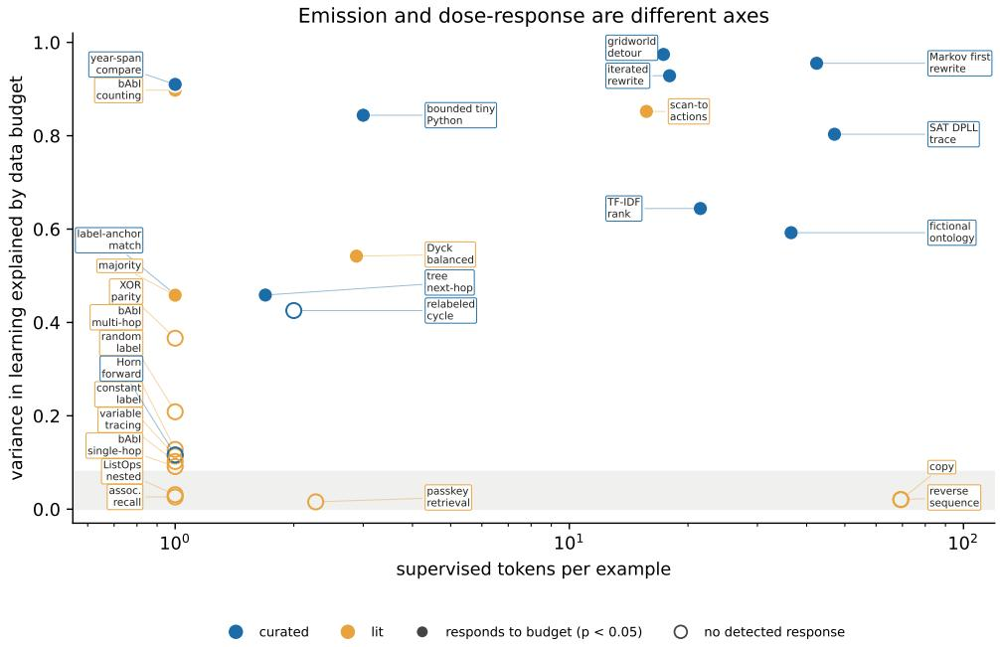
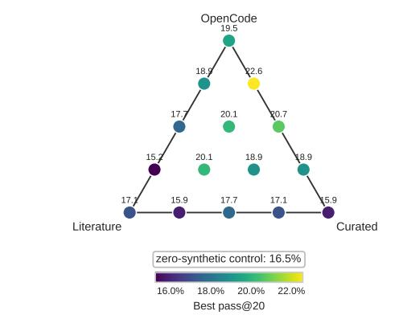
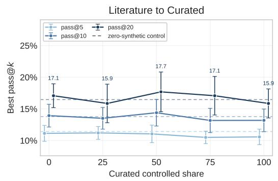
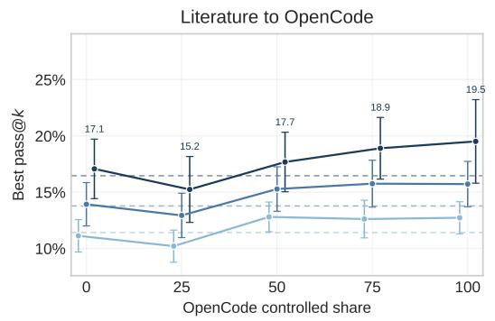
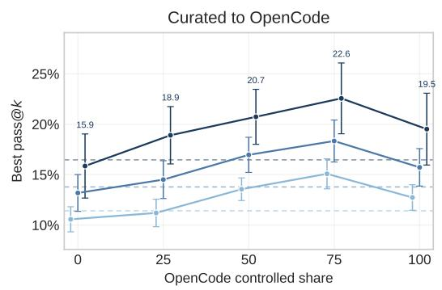
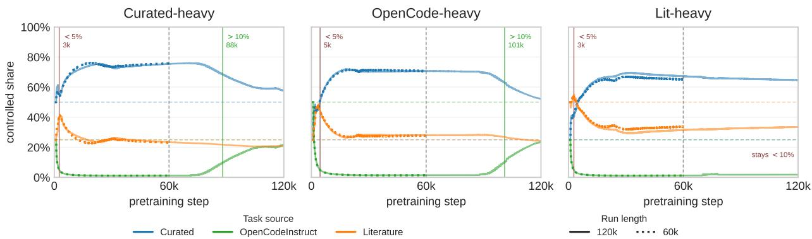

# Conditional Transfer from Controlled Pretraining Mixtures to Code

Ohad Rubin

## Abstract

Synthetic tasks are increasingly used both as probes of language-model capability and as pretraining data. These two uses are usually justified by the same evidence: a task whose loss falls during training is treated as informative, and a task whose loss falls faster when it is sampled more is treated as worth sampling. We separate three signals that this reasoning conflates. A task is diagnostic when its loss tracks global pretraining progress; it is teachable when its loss responds to its own token budget; and a data source transfers when including it improves a downstream target. We study these signals in a controlled pretraining setting in which 70% of the corpus is fixed general Python and the remaining 30% is a simplex over three source families: OpenCodeInstruct, a curated suite of 12 code-adjacent synthetic tasks, and 15 literature-derived probe tasks. Across a task-budget sweep we detect teachability for 14 of 27 tasks, with a sharp asymmetry between the two synthetic families (10/12 curated versus 4/15 literature-derived).

Teachability and downstream transfer give diferent rankings. On the mixture-simplex edge between the curated suite and OpenCodeInstruct, HumanEval pass@20 after a fixed finetuning stage rises from 15.9 at pure curated data to its highest observed value, 22.6, at a mixture that is 75% OpenCodeInstruct, then falls to 19.5 at pure OpenCodeInstruct. Curated synthetic data therefore has conditional value: it contributes as a limited share of a mixture that a target-aligned source still dominates. Finally, a loss-based adaptive scheduler exposes the mismatch between residual loss reducibility and downstream transfer. Across three 60k-step free-ratio runs, Ado drives the OpenCodeInstruct share below 5% within the first 5k steps and to 1.2–1.4% by the end of training, and underperforms its matched fixed-mixture controls by 2.4–11.0 percentage points. Optimizing near-term task-loss reduction moves the mixture away from the region that transfers.

## 1 Introduction

A pretraining corpus is a mixture, and choosing the mixture is now a first-class design problem [3, 5, 7, 16]. Two questions get asked of a candidate source. The first is diagnostic: does performance on it tell us something about the model? The second is economic: does buying more of it make the model better at what we care about? In practice the two questions are often collapsed into a single loss-based notion of data quality.

The answers can diverge. Consider a synthetic task whose loss falls steadily throughout pretraining. This is compatible with at least three distinct situations. The loss may be falling because general competence is rising and the task reads it of; in that case the task is a useful instrument, while the value of added task examples remains unknown. The loss may be falling because the model is being shown the task and is fitting its surface form; in that case the task responds to budget but the response may be entirely local. Or the loss may be falling for both reasons while the source displaces something that the downstream target actually needs; in that case buying more of it is actively harmful.

This paper separates the three signals and measures them in a single controlled setting. We fix 70% of the pretraining corpus to general Python source code and vary only the composition of the remaining 30%, which we call the controlled slice. The slice is a mixture over three families: OpenCodeInstruct [1], an instruction-formatted code corpus that is close to the downstream target distribution; a Curated suite of 12 synthetic tasks generated from a curated paper set to exercise code-adjacent operations such as execution, search, state mutation, logical inference, planning, ranking, and binding; and a Literature suite of 15 synthetic probes based on standard retrieval, state-tracking, composition, and transduction tasks. Holding the base corpus, mode family, training budget, and fine-tuning stage fixed lets us attribute downstream diferences to the slice alone.

Our contributions are as follows.

1. Three separable signals. We give operational definitions of diagnosticity (loss tracks global training progress), teachability (loss responds to the task’s own token budget), and transfer (a source’s share improves the downstream target), together with an exposure-advantage diagnostic that compares task-specific exposure with global pretraining step (§4).

2. Teachability is common and family-dependent. Across a per-task budget sweep we detect teachability for 14 of 27 tasks. The split is sharply asymmetric: 10 of 12 curated tasks are teachable, but only 4 of 15 literature-derived probes are. False-discovery-rate adjustment retains six curated and two literature-derived detections (§5).

3. Transfer depends on mixture context. On the curated–OpenCodeInstruct edge, HumanEval pass@20 is non-monotone in the curated share, peaking at 22.6 when Open-CodeInstruct holds 75% of the slice and falling to 15.9 at pure curated data—below the zero-synthetic baseline. The curated suite is the most teachable family, while its pure-source endpoint falls below the zero-synthetic baseline (§6).

4. Loss-based scheduling follows the wrong signal. Ado [7] allocates budget by predicted remaining loss reduction. In every 60k-step free-ratio run, Ado pushes the OpenCodeInstruct share below 5% within 5k steps and to 1.2–1.4% at the end of training. These runs trail their mixture-matched fixed controls by 2.4–11.0 percentage points of pass@20 (§7).

The practical rule we draw from this is narrow but concrete. When the downstream target is code generation, keep the target-aligned source dominant in the mixture, add curated synthetic data as a bounded share, and choose proportions with a target-referenced signal.

## 2 Related Work

Data mixture optimization. DoReMi [16] learns domain weights with a small proxy model under a group-DRO objective. Mixture selection has also been posed as a prediction problem [8, 17] and as online reweighting driven by generalization estimates or skill structure [3, 5]. Ado [7] fits per-domain scaling laws during training and samples in proportion to predicted remaining loss reduction, making it a direct instantiation of the reducibility signal we isolate. Our contribution is a controlled demonstration that this signal and downstream transfer can point in opposite directions.

Synthetic data for code. Instruction-formatted synthetic corpora are widely used in codemodel training. We use OpenCodeInstruct [1] as aligned instruction data and separate it from abstract synthetic task families. Our curated–OpenCodeInstruct edge makes the distinction visible: both families are generated by language models, while OpenCodeInstruct is closest to the downstream adaptation format.

Synthetic probes. A large literature builds controlled tasks to probe exact transduction, global readout, retrieval, stack state, compositional interpretation, long-context retrieval, and mutable state tracking. When these probes are also used as training data, their diagnostic value leaves the efects of added exposure and downstream transfer unestablished.

Code evaluation. We use HumanEval [2] as the downstream endpoint and report the unbiased pass@k estimator of Chen et al. [2].

## 3 Experimental Setup

## 3.1 Base corpus and controlled slice

Every pretraining run draws 70% of its tokens from a fixed general Python corpus (Base) from CodeParrot and 30% from a controlled slice whose composition is the only manipulated variable. A run is therefore specified by a point $w = ( w _ { O } , w _ { C } , w _ { L } )$ on the 2-simplex $\Delta ^ { 2 }$ , where the slice draws a fraction $w _ { O }$ from OpenCodeInstruct, wC from the curated suite, and $w _ { L }$ from the literature suite. The base fraction remains fixed. The three slice weights sum to one, so increasing one family’s share strictly displaces the others:

$$
P _ { r } ( x ) = 0 . 7 0 P _ { \mathrm { c o d e } } ( x ) + 0 . 3 0 \left[ w _ { r , O } P _ { O } ( x ) + w _ { r , C } \sum _ { t \in \mathcal { T } _ { C } } w _ { t | C } P _ { t } ( x ) + w _ { r , L } \sum _ { t \in \mathcal { T } _ { L } } w _ { t | L } P _ { t } ( x ) \right] .\tag{1}
$$

Within-source task weights sum to one and remain fixed across runs. Each machine-generated task cluster combines its dificulty variants with equal problem weights before source-level aggregation.

## 3.2 Source families

OpenCodeInstruct. We use the pinned refined training split EER6/nvidia-OpenCodeInstructrefined, containing 444,611 examples [1]. This is the target-aligned family: its code-instruction response format matches the fine-tuning bridge and is closest to the HumanEval-style downstream target. Controlled pretraining and fine-tuning draw from this same refined split, so OpenCodeInstruct-heavy pretraining is additional exposure to the aligned instruction distribution.

Curated suite (12 tasks). Procedurally generated tasks inspired by a curated paper set. For each task, we provide scraped paper text to a language model and request a self-contained description of an automatically sampled task family. Each cluster has explicit dificulty axes and deterministic answer generation; the full taxonomy is in Appendix A.

Literature suite (15 tasks). Machine-generated versions of standard probes, including copy, reverse sequence, majority, XOR parity, associative recall, Dyck completion, ListOps, passkey retrieval, variable tracing, SCAN, three bAbI tasks, constant label, and random label. They cover retrieval, state tracking, composition, and transduction.

## 3.3 Model and training

All runs use a sparse-expert decoder-only model whose feed-forward blocks use top-2 expert routing. The model has a 50,304-token vocabulary, 12 layers, 12 attention heads, width 768, and SwiGLU width 2,048. Training uses a context length of 1,024, efective batch size 256, and 262,144 tokens per optimizer step. We train with AdamW at learning rate $1 0 ^ { - 3 } , \beta _ { 1 } = 0 . 9$ , weight decay $1 0 ^ { - 4 }$ , and 500 warmup steps. Runs last 60k or 120k steps, with the decay horizon matched to run length. Full architecture and scheduler settings appear in Appendix C.

The fixed-mixture shadow sweep preserves the $7 0 / 3 0$ split and varies the three controlled sources along every pairwise edge in 25-percentage-point steps. The resulting 15 mixtures define the downstream surface. Each synthetic task appears in nine completed runs, with a median fourfold exposure range inside the task-analysis window. One matched zero-synthetic baseline uses CodeParrot alone.

## 3.4 Downstream evaluation protocol

Pretraining is followed by an identical fine-tuning stage for every run: we fine-tune each available pretrained checkpoint for 1,000 updates on the refined OpenCodeInstruct training split. Examples are shufled and first-fit packed. We use batch size 256, Adam with $\beta _ { 1 } = 0 . 9 , \beta _ { 2 } = 0 . 9 5$ , and $\epsilon = 1 0 ^ { - 6 }$ , weight decay zero, 100 linear warmup steps, cosine decay, and peak learning rate $1 0 ^ { - 5 }$ This common bridge keeps downstream adaptation fixed across pretraining mixtures.

We evaluate the 164-problem HumanEval test split [2] with 20 sampled completions per problem and report pass@k using the unbiased estimator

$$
{ \widehat { \mathrm { p a s s @ } } } k = \mathbb { E } _ { \mathrm { p r o b l e m s } } \left[ 1 - { \frac { \binom { n - c } { k } } { \binom { n } { k } } } \right] ,\tag{2}
$$

where $n = 2 0$ and c is the number of correct samples. The estimate is one when $n - c < k$ For each value of $k ,$ the primary Best over steps endpoint is the highest score among fine-tuning checkpoints 100, 200, . . . , 1000. Every paired bootstrap replicate resamples problems and repeats this checkpoint selection. We report pass@5 and pass@10 alongside pass@20.

## 4 Three Signals

## 4.1 Notation

Let T be the set of 27 synthetic tasks. For task t, run r, and pretraining step s, let $L _ { t , r } ( s )$ be held-out validation loss. Let $E _ { t , r } ( s )$ be cumulative loss-bearing answer tokens assigned to the task. The task-analysis readout window is $s \in [ 5 , 0 0 0 , 5 5 , 0 0 0 ]$ , and task exposure $e _ { t , r }$ is the change in $E _ { t , }$ r between the first and last validation readout in that window. Let $y ( w )$ denote HumanEval pass@20 after fine-tuning for a run with slice composition w.

Two properties of a task, and one property of a source, are distinguished by which quantities they involve. Diagnosticity concerns global step s, teachability concerns task-specific exposure $e _ { t , r } .$ and transfer concerns the downstream endpoint y.

## 4.2 Diagnosticity

Definition 1 (Diagnosticity). Task t is diagnostic when its held-out loss tracks global pretraining progress.

We summarize this signal by regressing logged validation loss on global pretraining step, pooling positive-loss readouts across the task’s nine runs. Its coeficient of determination is denoted $R _ { t , \mathrm { s t e p } } ^ { 2 } .$ This measurement asks how well a task reads out progress; the budget sweep separately measures the role of examples from the task itself.

## 4.3 Teachability

Definition 2 (Teachability). Task t is teachable if its held-out loss responds to its own token budget across runs.

Teachability requires a cross-run comparison. We therefore run a task budget sweep: each task appears in nine fixed-mixture runs whose exposure varies by a median factor of four. For task t in run r, we first fit

$$
\log L _ { t , r } ( s ) = \alpha _ { t , r } + \beta _ { t , r } \log s + \epsilon _ { t , r , s }\tag{3}
$$

over all readouts in the window and evaluate the fitted log-loss fall $\Delta _ { t , r }$ between its endpoints. We then fit

$$
\Delta _ { t , r } = a _ { t } + b _ { t } \log _ { 2 } e _ { t , r } + \varepsilon _ { t , r } .\tag{4}
$$

The slope $b _ { t }$ reports learning per doubling of exposure, and $R _ { t , \mathrm { b u d g e t } } ^ { 2 }$ is the share of across-run variation explained by budget. We shufle exposures across the nine runs 2,000 times and declare a detection when the one-sided permutation p-value is below 0.05. We also report Benjamini– Hochberg-adjusted counts.

Remark 1. Diagnosticity and teachability are logically independent. A task can combine strong progress tracking with weak budget response, strong budget response with weak progress tracking, strength on both signals, or weakness on both. To compare the two explanations, we define the exposure advantage

$$
A _ { t } = R _ { t , \mathrm { e x p o s u r e } } ^ { 2 } - R _ { t , \mathrm { s t e p } } ^ { 2 } ,\tag{5}
$$

where the first term regresses logged validation loss on cumulative exposure. Seven tasks have $A _ { t } > 0$ and five of the six largest values are curated tasks.

## 4.4 Transfer, and why it is conditional

Definition 3 (Transfer). A family f transfers at w relative to $w ^ { \prime }$ when increasing its share from the feasible mixture $w ^ { \prime }$ to w improves the downstream endpoint: $y ( w ) > y ( w ^ { \prime } )$

The definition is deliberately local because the simplex constrains every increase to displace another source. We estimate transfer directly from diferences between completed mixtures on a pairwise edge and across the full mixture surface. Transfer is a property of a source in a mixture context; this is what the title means by conditional.

## 4.5 The proxy-objective gap

Adaptive schedulers optimize a surrogate. Ado [7] fits recent task-level loss curves and assigns greater sampling probability to tasks with more predicted loss reduction remaining. In our configuration it updates every 1,000 steps using a 1,000-step horizon. This is a teachability signal measured online at the task level: it asks how much near-term loss remains reducible. Its objective contains only pretraining loss. Section 7 shows that the scheduler moves away from the region preferred by the downstream surface for most of the 60k-step training horizon.

## 5 Task-Level Results

The fixed-mixture shadow runs make task budget the manipulated quantity. Runs with nonzero curated or literature share contribute that source’s tasks; OpenCodeInstruct-only and zerosynthetic runs omit synthetic tasks. Each machine-generated task therefore appears in nine completed runs, and its exposure inside the readout window varies by a median factor of four.

  
Figure 1: Per-task response to scheduled token budget across fixed-mixture shadow runs. The vertical axis is the share of across-run variation in fitted log-loss fall explained by the task’s own budget; the horizontal axis is emitted tokens per example. Filled markers clear a permutation test against shufled budget, and the shaded band marks fits obtainable from shufled budget alone.

Fourteen of the 27 tasks clear the permutation test: ten of twelve curated tasks and four of fifteen literature-derived tasks. Benjamini–Hochberg adjustment leaves eight detections, split six of twelve curated and two of fifteen literature-derived. The family diference survives adjustment, while the absolute detection count falls from fourteen to eight.

Curated tasks emit a median of 10.2 supervised tokens per example, compared with 1.0 for literature probes, so emitted length could afect detection power. Across all tasks, length is only weakly related to explained variance (Pearson r = 0.34, p = 0.08; Spearman $\rho = 0 . 2 7 , p = 0 . 1 8 )$ The extremes run against a simple length explanation: copy and reverse sequence emit 69.3 tokens per example and have $R ^ { 2 } = 0 . 0 2$ , while the one-token bAbI counting and year-span comparison tasks respond strongly.

The exposure-advantage analysis provides a second view. Seven tasks have $A _ { t } > 0$ , meaning cumulative task exposure explains logged validation loss better than global step. Five of the six largest advantages are curated tasks, whereas seven of the ten lowest are literature-derived. A falling task loss can therefore be a readout of general progress or a response to task-specific exposure.

These associations come from a mixture sweep: a task’s budget moves with the surrounding source composition. Within this run set, curated code-adjacent tasks more often link per-task budget to loss reduction, while several literature-derived probes respond and some curated tasks have weak task-specific evidence.

Table 1: HumanEval pass@20 after fine-tuning, along the curated–OpenCodeInstruct edge of the mixture simplex $( w _ { L } = 0 )$ . Values are Best over steps percentages. The highest observed point has OpenCodeInstruct dominant and a minority curated share; pure curated data falls below the 16.5% zero-synthetic baseline.
<table><tr><td>Slice composition</td><td> $w _ { O }$ </td><td> $w _ { C }$ </td><td>HUMANEVAL pass@20</td></tr><tr><td>Pure curated</td><td>0.00</td><td>1.00</td><td>15.9</td></tr><tr><td>75% curated</td><td>0.25</td><td>0.75</td><td>18.9</td></tr><tr><td>50 /50</td><td>0.50</td><td>0.50</td><td>20.7</td></tr><tr><td>25% curated</td><td>0.75</td><td>0.25</td><td>22.6</td></tr><tr><td>Pure OPENCODEINSTRUCT</td><td>1.00</td><td>0.00</td><td>19.5</td></tr></table>

## 6 Mixture-Level Transfer

Fixed Source-Mixture HumanEval Results  

  
Figure 2: Fixed-source-mixture HumanEval results for the shadow runs. The ternary panel places each completed run by curated, literature, and OpenCodeInstruct shares, with color showing Best over steps pass@20. Edge panels show pass@5, pass@10, and pass@20; annotated values are pass@20. Dashed lines mark matched zero-synthetic baselines. Error bars are 95% within-problem intervals for comparing mixtures.

## 6.1 The curated–OpenCodeInstruct edge

Table 1 contains the paper’s central result. Moving along the edge from pure curated data to pure OpenCodeInstruct, pass@20 rises $1 5 . 9  1 8 . 9  2 0 . 7  2 2 . 6$ and then falls to 19.5. The highest observed point is interior to the edge, at 75% OpenCodeInstruct / 25% curated, and exceeds the pure-OpenCodeInstruct endpoint by 3.1 percentage points.

The two ends of the edge tell opposite stories about the curated suite. At the 25% share it adds 3.1 points relative to pure OpenCodeInstruct. At the 100% share it scores 3.6 points below pure OpenCodeInstruct and 0.6 points below the zero-synthetic baseline. The ranking is consistent at k = 5, 10, 20; at pass@5, the best-observed mixture separates from both the neighboring 50/50 mixture and pure OpenCodeInstruct.

Paired bootstrap intervals resample the 164 problems 50,000 times and repeat Best-over-steps selection inside every replicate. They support an OpenCodeInstruct-dominant region with a limited curated share. A denser grid is required to identify a precise optimum.

## 6.2 Interpretation: capability versus alignment

The pattern is consistent with complementarity between reusable program-like operations and target-aligned instruction data. The curated tasks are teachable (§5) and exercise operations plausibly upstream of program synthesis. OpenCodeInstruct supplies code-instruction surface form close to the fine-tuning bridge and downstream target. A bounded curated share can add those operations while retaining an aligned source as most of the controlled slice.

This mechanism remains a hypothesis consistent with the data. Controlled pretraining and fine-tuning use the same refined OpenCodeInstruct split, so the aligned-source efect includes repeated exposure to that instruction distribution.

## 6.3 Of-edge behavior and interaction structure

Figure 2 reports all 15 completed fixed mixtures. The ternary panel exposes the full surface, while the edge panels make the pairwise tradeofs visible at three values of k. The central claim is scoped to the curated–OpenCodeInstruct edge because its five reported points isolate the exchange between the most teachable synthetic family and the aligned source.

## 6.4 Teachability and transfer rank sources diferently

Putting §5 and this section together: the curated suite has the highest teachability rate (10/12), yet its pure-source endpoint is 15.9%, below both pure OpenCodeInstruct and the zero-synthetic baseline. Teachability therefore fails to order the observed downstream endpoints and is insuficient as the sole mixture objective in this setup.

## 7 Adaptive Scheduling Optimizes Reducibility and Loses Transfer

The fixed sweep establishes that the transfer-favorable region is OpenCodeInstruct-dominant.   
We now ask what an online scheduler does when pointed at the same three families.

Operationally, Ado makes the controlled-data weights in Equation (1) time-dependent. For each controlled domain, it fits a scaling law to recent loss measurements, extrapolates that curve over its planning horizon, and estimates the loss reduction available from additional tokens. Domains with the strongest predicted near-term loss reduction receive greater sampling probability. Under preserved-ratio scheduling these proposals change the within-source task weights; under free-ratio scheduling they also change the source weights $( w _ { O } , w _ { C } , w _ { L } )$ and therefore the location of the run on the mixture simplex.

Realized Controlled-Source Ratios During Adaptive Pretraining  
  
Figure 3: Realized source ratios in adaptive free-ratio pretraining. Every run abandons Open-CodeInstruct within the first 5k steps; recovery occurs only in the 120k branch, beyond the 60k horizon used for downstream comparison. The learned allocation is horizon-dependent.

## 7.1 Setup

We run Ado [7] over the controlled slice. The base 70% remains fixed and unscheduled. Ado begins at step 1,000, ignores the first 500 steps, and updates every 1,000 steps over a 1,000-step horizon. It uses a minimum task probability of 0.01, history coeficient 0.9, final smoothing 0.9, and minimum scaling exponent 0.05. We compare two source-ratio policies:

• Preserved ratio. Source shares remain fixed while Ado reallocates tasks within each source.

• Free ratio. Ado reallocates controlled mass both within and across sources.

Each 60k-step, four-expert profile includes a fixed shadow run, a preserved-ratio adaptive run, and a free-ratio adaptive run. Shadow mode records the scheduler proposal while training on the fixed source mixture. A 120k free-ratio branch tests how the allocation changes beyond the 60k comparison horizon.

## 7.2 The OpenCodeInstruct share collapses

All three 60k free-ratio runs drive the OpenCodeInstruct share below 5% of the controlled slice within the first 5k steps and finish at 1.2–1.4%. They move mass before a downstream signal can appear and retain low OpenCodeInstruct shares through step 60k. In the 120k branches for the OpenCodeInstruct-heavy and curated-heavy profiles, the scheduler begins moving mass back around step 90k.

## 7.3 Results

Table 2: 60k-step, four-expert mixture-profile and scheduler comparison. Preserved ratio keeps source ratios at $5 0 / 2 5 / 2 5$ , while free ratio reweights sources. HumanEval columns report Best over steps pass@k. ∆ shadow compares pass@20 with the same-mixture shadow; final OpenCodeInstruct share is measured within the 30% controlled slice.
<table><tr><td>Run</td><td>pass@5</td><td>pass@10</td><td>pass@20</td><td>∆ shadow</td><td>Final OPENCODEINSTRUCT share</td></tr><tr><td>Zero-synthetic baseline</td><td>11.4%</td><td>13.8%</td><td>16.5%</td><td></td><td></td></tr><tr><td>Curated-heavy shadow</td><td>12.7%</td><td>15.5%</td><td>18.9%</td><td>+0.0 pp</td><td>25.0%</td></tr><tr><td>+ AdO preserved ratio</td><td>11.0%</td><td>13.9%</td><td>17.1%</td><td>-1.8 pp</td><td>25.0%</td></tr><tr><td>+ ADO free ratio</td><td>8.8%</td><td>12.4%</td><td>16.5%</td><td>-2.4 pp</td><td>1.2%</td></tr><tr><td>OPENCODEINSTRUCT-heavy shadow</td><td>13.3%</td><td>16.5%</td><td>20.1%</td><td>+0.0 pp</td><td>50.0%</td></tr><tr><td>+ AdO preserved ratio</td><td>13.3%</td><td>16.0%</td><td>18.9%</td><td>-1.2 pp</td><td>50.0%</td></tr><tr><td>+ ADO free ratio</td><td>3.7%</td><td>6.0%</td><td>9.1%</td><td>-11.0 pp</td><td>1.4%</td></tr><tr><td>Literature-heavy shadow</td><td>13.6%</td><td>16.8%</td><td>20.1%</td><td>+0.0 pp</td><td>25.0%</td></tr><tr><td>+ ADO preserved ratio</td><td>11.0%</td><td>13.7%</td><td>17.1%</td><td>-3.0 pp</td><td>25.0%</td></tr><tr><td>+ ADO free ratio</td><td>10.2%</td><td>12.7%</td><td>15.2%</td><td>-4.9 pp</td><td>1.2%</td></tr></table>

Preserved-ratio Ado keeps source budgets fixed and reaches 17.1–18.9% pass@20. Free-ratio Ado trails its matched shadow in all three profiles, by 2.4, 11.0, and 4.9 percentage points. Its pass@20 endpoints range from 9.1% to 16.5%, all below the 22.6% best-observed fixed mixture.

## 7.4 Reading

The mismatch follows from the scheduler’s objective and time horizon. Ado maximizes predicted near-term loss reduction over its tasks. HumanEval after fine-tuning measures downstream transfer. In this setup, OpenCodeInstruct scores low on the first quantity early in training and high on the second, so the scheduler moves mass away from the source preferred by the fixed-mixture surface.

The 1,000-step fitting horizon also creates temporal myopia. The aligned source abandoned in the first 5k steps becomes attractive under the scheduler’s own criterion only after roughly 88k steps. A transfer-aware scheduler would incorporate a target-referenced marginal-value signal and evaluate policies at several training horizons.

## 8 Discussion

Three questions, three measurements. Diagnosticity asks whether task loss tracks globa progress and is measured by the step-based fit. Teachability asks whether added task-specific exposure predicts greater fitted loss reduction and is measured by the across-run budget regression. Transfer asks whether changing a source share improves the post-fine-tuning endpoint and is measured on the mixture surface. Each question requires its own intervention or comparison.

Curated synthetic data has a bounded dose-response. The curated suite is genuinely useful: at a 25% slice share it is worth 3.1 pass@20 points over pure OpenCodeInstruct. At a 100% share it reaches 15.9%, below the 16.5% zero-synthetic baseline. Its value is bounded and non-monotone, with the observed bound set by how much target-aligned data the curated source displaces.

Standard probes are instruments. Four of fifteen literature-derived probes respond to their own budget, while seven of the ten lowest exposure advantages also come from that family. These tasks can remain useful controlled readouts of retrieval, state tracking, composition, and transduction even when their own training budget has weak evidence of marginal learning value.

## 9 Limitations

• Specific model family and base corpus. The main comparisons use a sparse-expert decoder trained with CodeParrot as the fixed 70% source. Other architectures, scales, and base corpora may produce a diferent mixture surface.

• Joint format and content change. OpenCodeInstruct provides aligned codeinstruction responses, while the two task suites provide abstract machine-generated problems. The experiment estimates source-family value; format-specific and content-specific efects remain entangled.

• One downstream target. The downstream evidence comes from HumanEval. Transfer to other code benchmarks or general reasoning tasks remains unmeasured.

• Coarse simplex resolution. We sample the simplex at 15 points. The point (0.75, 0.25, 0) is the best observed point. Estimating an argmax requires a denser grid.

• One scheduler. We test Ado because its objective directly instantiates reducibility. Other adaptive objectives and longer planning horizons may yield diferent allocation trajectories.

• Mixture-coupled teachability estimate. Each task has nine run points, and its budget changes with the surrounding mixture. The permutation test measures association across the completed grid; a task-isolated intervention remains future work.

• Checkpoint selection. Best over steps is optimistic by 0.2–1.6 percentage points across runs. The bootstrap repeats selection to represent its uncertainty, while the endpoint remains an estimate of attainable performance under checkpoint selection.

## 10 Conclusion

We separated three signals that are usually read of the same loss curve. Under a controlled pretraining setup where only a 30% slice varies, fourteen of twenty-seven tasks respond detectably to their own exposure, and family-level teachability ranks downstream code transfer diferently. The best observed HumanEval pass@20 came from a mixture in which the target-aligned source held 75% of the slice and a highly teachable curated synthetic suite held the remaining 25%; the same suite alone fell below the zero-synthetic baseline. A loss-based adaptive scheduler, given the same three sources, drove the aligned source below 5% within the first 5k steps and finished below all three mixture-matched fixed controls. For code transfer, keep the aligned source dominant, treat curated synthetic data as a bounded share, and choose proportions with a target-referenced signal.

## References

[1] Wasi Uddin Ahmad, Aleksander Ficek, Mehrzad Samadi, Jocelyn Huang, Vahid Noroozi, Somshubra Majumdar, and Boris Ginsburg. Opencodeinstruct: A large-scale instruction tuning dataset for code llms. arXiv preprint arXiv:2504.04030, 2025.

[2] Mark Chen et al. Evaluating large language models trained on code. arXiv preprint arXiv:2107.03374, 2021.

[3] Mayee F. Chen, Nicholas Roberts, Kush Bhatia, Jue Wang, Ce Zhang, Frederic Sala, and Christopher R´e. Skill-it! a data-driven skills framework for understanding and training language models. arXiv preprint arXiv:2307.14430, 2023.

[4] Subhabrata Dutta, Joykirat Singh, Soumen Chakrabarti, and Tanmoy Chakraborty. How to think step-by-step: A mechanistic understanding of chain-of-thought reasoning, 2024. URL https://arxiv.org/abs/2402.18312.

[5] Simin Fan, Matteo Pagliardini, and Martin Jaggi. Doge: Domain reweighting with generalization estimation. arXiv preprint arXiv:2310.15393, 2024.

[6] Michael Hanna, Ollie Liu, and Alexandre Variengien. How does gpt-2 compute greater-than?: Interpreting mathematical abilities in a pre-trained language model, 2023. URL https:// arxiv.org/abs/2305.00586.

[7] Yiding Jiang, Allan Zhou, Zhili Feng, Sadhika Malladi, and J. Zico Kolter. Adaptive data optimization: Dynamic sample selection with scaling laws. arXiv preprint arXiv:2410.11820, 2024.

[8] Qian Liu, Xiaosen Zheng, Niklas Muennighof, Guangtao Zeng, Longxu Dou, Tianyu Pang, Jing Jiang, and Min Lin. Regmix: Data mixture as regression for language model pre-training. arXiv preprint arXiv:2407.01492, 2024.

[9] Bohan Lyu, Siqiao Huang, and Zichen Liang. Surge: On the potential of large language models as general-purpose surrogate code executors, 2026. URL https://arxiv.org/abs/ 2502.11167.

[10] Tianyi Men, Pengfei Cao, Zhuoran Jin, Yubo Chen, Kang Liu, and Jun Zhao. Unlocking the future: Exploring look-ahead planning mechanistic interpretability in large language models, 2024. URL https://arxiv.org/abs/2406.16033.

[11] Leyan Pan, Vijay Ganesh, Jacob Abernethy, Chris Esposo, and Wenke Lee. Can transformers reason logically? a study in sat solving, 2025. URL https://arxiv.org/abs/2410.07432.

[12] Gerard Salton and Christopher Buckley. Term-weighting approaches in automatic text retrieval. Information Processing & Management, 24(5):513–523, 1988.

[13] Abulhair Saparov, Srushti Pawar, Shreyas Pimpalgaonkar, Nitish Joshi, Richard Yuanzhe Pang, Vishakh Padmakumar, Seyed Mehran Kazemi, Najoung Kim, and He He. Transformers struggle to learn to search, 2025. URL https://arxiv.org/abs/2412.04703.

[14] Eric Todd, Jannik Brinkmann, Rohit Gandikota, and David Bau. In-context algebra, 2026. URL https://arxiv.org/abs/2512.16902.

[15] Lean Wang, Lei Li, Damai Dai, Deli Chen, Hao Zhou, Fandong Meng, Jie Zhou, and Xu Sun. Label words are anchors: An information flow perspective for understanding in-context learning, 2023. URL https://arxiv.org/abs/2305.14160.

[16] Sang Michael Xie, Hieu Pham, Xuanyi Dong, Nan Du, Hanxiao Liu, Yifeng Lu, Percy Liang, Quoc V. Le, Tengyu Ma, and Adams Wei Yu. Doremi: Optimizing data mixtures speeds up language model pretraining. Advances in Neural Information Processing Systems, 36, 2023.

[17] Jiasheng Ye, Peiju Liu, Tianxiang Sun, Yunhua Zhou, Jun Zhan, and Xipeng Qiu. Data mixing laws: Optimizing data mixtures by predicting language modeling performance. arXiv preprint arXiv:2403.16952, 2024.

[18] Dylan Zhang, Justin Wang, and Francois Charton. From symbolic tasks to code generation: Diversification yields better task performers, 2024. URL https://arxiv.org/abs/2405.19787.

[19] Yanxiao Zhao, Yaqian Li, Zihao Bo, Rinyoichi Takezoe, Haojia Hui, Mo Guang, Lei Ren, Xiaolin Qin, and Kaiwen Long. Satquest: A verifier for logical reasoning evaluation and reinforcement fine-tuning of llms, 2026. URL https://arxiv.org/abs/2509.00930.

## A Task Suite

The controlled synthetic sources contain 15 literature-derived task clusters and 12 curated task clusters. Each cluster combines its dificulty variants with equal problem weights before sourcelevel aggregation. OpenCodeInstruct enters the controlled mixture as aligned instruction data; the descriptions below cover the machine-generated synthetic clusters.

## A.1 Literature-derived task clusters

The literature-derived suite spans exact transduction, global readout, retrieval, stack state, compositional interpretation, long-context retrieval, and mutable state tracking. Copy and reverse sequence are exact transduction tasks over digit sequences of length 16, 64, and 128; copy returns the input sequence unchanged, and reverse sequence returns it in reverse order. Majority and XOR parity are global readout tasks over binary sequences of length 16, 64, and 128; majority outputs the bit that occurs strictly more often in a tie-free sequence, while XOR parity outputs the parity bit.

Associative recall tests retrieval and binding over 4, 16, or 64 key-value pairs by asking for the value associated with a queried key. Dyck completion tests stack state at depths 2, 4, and 8 with two bracket types by asking the model to complete a valid bracket prefix with the closing brackets in stack order. ListOps tests compositional interpretation at expression depths 2, 4, and 6 by evaluating nested prefix arithmetic expressions over small integer operators. Passkey retrieval tests long-context retrieval at context lengths 128, 512, and 1,024 by asking for a five-digit passkey embedded in distractor context.

Variable tracing tests retrieval and binding with 1, 2, or 4 assignment hops plus distractors by following assignment chains to return the queried value. SCAN command execution tests compositional interpretation on short, medium, and long commands by translating navigation commands into primitive action tokens. The three bAbI clusters test mutable state tracking with 5 or 20 story facts: bAbI single-hop tracks the latest location of a named person, bAbI multihop combines an ownership fact with a movement fact to infer an object’s location, and bAbI counting accumulates object-count changes to return the queried total. Constant label emits a fixed answer for every input, and random label emits a label sampled independently of the input from a two-label set.

## A.2 Curated task clusters

The curated suite emphasizes program-like operations, formal inference, planning, ranking, and in-context binding. Bounded tiny Python execution is a surrogate code-execution task whose dificulty varies by variables, updates, loop depth, loop iterations, and branch rate; the model executes a restricted Python program and predicts the printed values. The task follows the SURGE setting by asking for outputs of small bounded programs from the source text alone [9].

Fictional ontology reasoning is a relational-reasoning task whose dificulty varies by inference hops and distractor facts; the model answers a property query from shufled ontology facts with a canonical reasoning chain. It mirrors the PrOntoQA-style fictional ontology setting, where solving requires selecting relevant facts and composing the support chain [4]. Gridworld detour planning is a lookahead-planning task whose dificulty varies by grid size, path length, branch count, and branch length; the model finds the unique shortest action sequence through a gridded maze with detours. It captures the look-ahead planning setup in a compact fully observed domain where the shortest plan depends on anticipating later states [10].

Horn forward chaining is a logical-forward-chaining task whose dificulty varies by derivation hops and distractor rules; the model applies Horn-style implication rules to decide whether a queried atom follows from the facts. It follows SATQuest’s verifier-centered logical-reasoning setup with objective labels, automatic checking, proof depth, and irrelevant rule distractors [19]. Iterated string replace is a mutable-state-tracking task whose dificulty varies by initial length, replacement steps, alphabet size, and rewrite constraints; the model runs an ordered program of string replacements and returns the final string. It draws from the symbolic string-replacement setting used for Markov-algorithm tasks, using ordered Python global replacements as the sampled program [18]. Label-anchor feature match is an in-context-binding task whose dificulty varies by class count, shots per class, and item length; the model uses in-context examples to map a feature marker to an arbitrary label. It makes demonstration label words the arbitrary anchors that bind sampled feature markers to final predictions, matching the label-token information-flow account of in-context learning [15].

Markov first rewrite is an algorithmic string-rewriting task whose dificulty varies by rule count, input length, rule length, and no-op rate; the model applies the first matching rewrite rule once or leaves the string unchanged. It follows the Markov-algorithm string-replacement setup with fresh ordered rule lists, instruction selection, and exact substring replacement [18]. Relabeled cyclic row completion is an in-context-algebra task whose dificulty varies by cyclic order and distractor facts; the model completes a missing product in a relabeled cyclic operation table. It isolates the in-context variable-token algebra setup, where visible symbols receive fresh per-example meanings and the answer follows from the local cyclic-group row [14]. SAT DPLL trace is a formal-logical-reasoning task whose dificulty varies by variable count, clause count, and maximum trace length; the model produces a deterministic DPLL trace for a small 3-CNF formula. It follows the SAT-solving-with-chain-of-thought setup by requiring the deductive DPLL reasoning path over formula sizes small enough for exact generation [11].

TF-IDF document ranking is a weighted-retrieval-ranking task whose dificulty varies by document count, document length, vocabulary size, and query terms; the model ranks synthetic documents under an explicit term-frequency and rarity scoring rule. It operationalizes classical term-frequency and inverse document-frequency weighting as a replayable synthetic ranking problem with deterministic tie-breaking [12]. Tree next-hop search is a search-and-planning task whose dificulty varies by branching factor and depth; the model returns the next edge on the path from a start node to a goal node in a serialized tree. It is a controlled next-hop search problem that requires identifying the first step on a path from the visible graph, start, and reachable goa [13]. Year-span comparison is a numerical-comparison task whose dificulty varies by minimum and maximum year gap; the model decides whether the end year in a sentence is later than the start year. It turns the year-span greater-than continuation setting into a deterministic binary classification probe with controlled sufix gaps and one unambiguous answer token [6].

## B Task-Level Analysis Details

Readout window. Both task-level diagnostics use pretraining steps 5,000 through 55,000.

Task exposure. Cumulative loss-bearing answer tokens received by a task, diferenced between the first and last validation readouts in the window. The training objective is applied only to answer tokens, making this the exposure on which the task trains.

Fitted log-loss fall. For one task in one run, we fit log L against log s over every validation readout in the window and evaluate the fitted diference between the window endpoints. The fit limits the influence of any single noisy readout.

Per-task budget statistic. For each task, we regress fitted log-loss fall on $\log _ { 2 }$ exposure across its nine runs. The slope is learning per doubling of exposure, and $R ^ { 2 }$ is the share of across-run variation explained by exposure.

Permutation calibration. We shufle exposures across the nine runs within a task, refit the regression, and take the one-sided p-value as the fraction of 2,000 permutations reaching at least the observed $R ^ { 2 }$ . Detection uses unadjusted $p < 0 . 0 5$ ; Benjamini–Hochberg-adjusted counts are reported alongside.

Exposure advantage. For each task, exposure advantage is the $R ^ { 2 }$ of logged validation loss regressed on cumulative task exposure minus the $R ^ { 2 }$ from regression on global pretraining step. Both regressions pool every positive-loss readout across the task’s nine runs.

Emitted-length check. Curated tasks emit a median of 10.2 supervised tokens per example, compared with 1.0 for literature probes. Across all 27 tasks, emitted length and explained variance are weakly related (Pearson $r = 0 . 3 4$ , $p = 0 . 0 8 \mathrm { ; }$ ; Spearman $\rho = 0 . 2 7 , p = 0 . 1 8 )$ . Copy and reverse sequence emit 69.3 tokens per example and have $R ^ { 2 } = 0 . 0 2$ , while bAbI counting and year-span comparison emit one token and respond strongly.

## C Training Hyperparameters

Experimental runs use the $7 0 / 3 0$ split between CodeParrot and controlled data, while matched zerosynthetic baselines use only CodeParrot. CodeParrot uses codeparrot train v2 near dedup safe; OpenCodeInstruct uses EER6/nvidia-OpenCodeInstruct-refined. The pinned refined train split contains 444,611 examples. Controlled-data profiles emphasize curated, OpenCodeInstruct, or literature data with weights $5 0 / 2 5 / 2 5$ . Synthetic examples are grouped by task cluster and sampled with mixture temperature 1.0.

Models use a 50,304-token vocabulary, 12 layers, 12 heads, width 768, and SwiGLU width 2,048. Sparse-expert feed-forward blocks use top-2 routing; the expert cap is disabled. Each token routes to two experts, so expert count changes conditional capacity and routing competition while active route count stays fixed. Training uses context length 1,024, efective batch size 256, and 262,144 tokens per optimizer step. Model parameters are replicated. AdamW uses learning rate $1 0 ^ { - 3 }$ $\beta _ { 1 } = 0 . 9$ , weight decay $1 0 ^ { - 4 }$ , and 500 warmup steps. Runs last 60k or 120k steps, with decay matched to run length.

All runs process 262,144 tokens per update, totaling 15.73B tokens at 60k steps and 31.46B at 120k steps. Across four-, eight-, and sixteen-expert models, the shared backbone remains fixed at 66.947M parameters and top-2 routing activates 113.246M expert parameters per token. Stored parameters increase from 293.476M to 520.005M and 973.064M, while active parameters remain approximately 180M per token.

## D ADO Configuration

Ado is applied only to the 30% controlled slice; the 70% base fraction is fixed. It begins at step 1,000, ignores the first 500 steps, and updates every 1,000 steps over a 1,000-step horizon. It uses a minimum task probability of 0.01, history coeficient 0.9, final smoothing 0.9, and minimum scaling exponent 0.05. The objective uses answer tokens. Preserved-ratio adaptive runs reallocate within each source, and free-ratio runs also reallocate mass across sources.

## E Evaluation Details

Fine-tuning. Each pretrained checkpoint is fine-tuned on the default subset of the refined Open-CodeInstruct training split. Examples are shufled and packed using a first-fit strategy. We use batch size 256 and Adam with $\beta _ { 1 } = 0 . 9 , \beta _ { 2 } = 0 . 9 5$ , and $\epsilon = 1 0 ^ { - 6 }$ . Training lasts 1,000 updates with 100 linear warmup steps followed by cosine decay and peak learning rate 10−5; weight decay is zero.

HumanEval evaluation. The OpenAI HumanEval test split contains 164 problems. For each problem, we sample 20 completions using a 2,048-token evaluation context and at most 512 generated tokens. Decoding uses temperature 1.0, top k=-1, and top p=1.0. Generation stops at an EOS token or the generation limit. Each completion is executed in an isolated Python environment and is correct when it passes the corresponding tests.

Checkpoint aggregation. We evaluate fine-tuning checkpoints from steps 100 through 1,000. The primary endpoint, Best over steps, is the highest observed pass@k across these checkpoints. Selection inflates the endpoint by 0.2–1.6 percentage points depending on the run, and a bootstrap replicate re-selects the observed best checkpoint 32%–73% of the time.

Bootstrap and interval conventions. For the primary mixture edge, paired bootstrap intervals use 50,000 replicates. Each replicate resamples the 164 problems and repeats Best-over-steps checkpoint selection. Problems are drawn once per replicate and shared across runs, keeping the comparison paired.

Figure intervals for mixture comparisons use 95% within-problem intervals with the Morey bias correction. Every mixture is scored on the same 164 problems, so common problem dificulty shifts the panel together. Removing that common component yields intervals suited to comparisons among mixtures.

Reporting conventions. We report pass@k as a percentage rounded to one decimal place and diferences in percentage points.

Table 3: HumanEval Best over steps uncertainty for the primary four-expert shadow-source comparison. Counts are problem-level pass@20 solved indicators over 164 problems. W/L/T gives paired wins, losses, and ties versus the matched zero-synthetic baseline. Intervals are 95% paired bootstrap intervals from 50,000 deterministic resamples.
<table><tr><td>Run</td><td>Solved</td><td>W/L/T</td><td>∆pass@20</td><td></td><td>95% CI</td><td>P(∆ &gt; 0)</td></tr><tr><td>Curated-heavy shadow</td><td>31/164 vs 27/164</td><td>9/5/150</td><td>+2.4 pp</td><td>[-1.8, +6.7] pp</td><td></td><td>82.7%</td></tr><tr><td>OPENCODEINSTRUCT-heavy shadow</td><td>33/164vs 27/164</td><td>10/4/150</td><td>+3.7 pp</td><td>[-0.6, +7.9] pp</td><td></td><td>93.3%</td></tr><tr><td>Literature-heavy shadow</td><td>33/164 vs 27/164</td><td>11/5/148</td><td>+3.7 pp</td><td>[-1.2, +8.5] pp</td><td></td><td>91.9%</td></tr></table>

## F Curated Task Construction Prompt

The curated task clusters were elicited one at a time with the following self-contained prompt:

I need a synthetic task that can be automatically sampled (in the format shown after the paper)   
please suggest one such task.   
answer in prose, in a self contained fashion, in a way someone could implement   
the task based on your description.   
{paper\_text}   
<example>   
\_ALPHABET = ("0", "1")   
@register\_task   
class XorParityTask(SyntheticTask):   
task\_id = "xor\_parity"   
def sample(self, rng: random.Random, split: str, difficulty: dict[str, Any]) -> Example:   
tokens = [rng.choice(\_ALPHABET) for \_ in range(length)]   
parity = 0   
for tok in tokens:   
parity ^= int(tok)   
answer = str(parity)   
sequence = " ".join(tokens)   
prompt = f"<task=xor\_parity>\nInput: {sequence}\nAnswer:"   
target = f" {answer}"   
full\_text = prompt + target   
loss\_mask = build\_loss\_mask(prompt, target)   
return Example(   
task\_id=self.task\_id,   
domain\_id=f"xor\_parity\_len\_{length}",   
prompt=prompt,   
target=target,   
full\_text=full\_text,   
loss\_mask=loss\_mask,   
metadata={   
"task\_id": self.task\_id,   
"macro\_family": "finite\_state\_or\_global\_readout",   
"difficulty": dict(difficulty),   
},   
)   
</example>

## G Provenance of Reported Numbers

The main empirical quantities map to the paper as follows. The five curated–OpenCodeInstruct pass@20 values appear in Table 1, and the full 15-mixture surface and lower-k endpoints appear in Figure 2. Task-budget detections use the definitions in Appendix B and are visualized in Figure 1. The 60k scheduler endpoints and final source shares appear in Table 2; their trajectories appear in Figure 3. Evaluation selection and interval conventions are specified in Appendix E.