# DADP: DYNAMIC ACTIVITY-DEPENDENT PRUNING, A REVERSE HEBBIAN-INSPIRED STRUCTURAL PRUNING METHOD

Bhushan Deshpande Independent Researcher, Pune, India bhushan1729dsp@gmail.com

## ABSTRACT

Modern neural networks are heavily over-parameterized. This redundancy incurs substantial compute and memory overhead during training and inference. Existing pruning methods rely on post-hoc magnitude thresholds or static initialization heuristics. Consequently, they often require manual per-layer sparsity targets or expensive retraining cycles. We propose Dynamic Activity-Dependent Pruning (DADP), a biologically inspired structural plasticity mechanism. During training, DADP measures connection importance via the accumulated product of pre-synaptic activations and post-synaptic error gradients. Using a single global threshold instead of fixed layer budgets, DADP dynamically allocates sparsity across network depth while naturally inducing neuron- and channel-level pruning. Across MLP, VGG-16, ResNet-18, BiLSTM-CRF, and MiniBERT architectures, DADP matches or outperforms Magnitude, SNIP and RigL, retaining 73.67% accuracy (dense baseline: 76.06%) at 99% sparsity on ResNet-18. Finally, matrix-based Shannon entropy and effective rank measurements confirm that DADP preserves latent feature diversity at extreme sparsities without representation collapse.

Code: https://github.com/bhushan1729/hebbian\_learning

## 1 INTRODUCTION

As deep neural network architectures scale in size, their representation power grows. However, this capacity expansion demands massive compute and memory during training and inference (Hoffmann et al., 2022). Network pruning has thus become essential both for efficient deployment (LeCun et al., 1989; Han et al., 2015) and for understanding generalization (Arora et al., 2018) and biological computation (Tanaka et al., 2019).

Existing pruning techniques generally fall into three categories. Post-hoc methods train a full model first, prune low-importance weights, and fine-tune the rest. This requires expensive prune-retrain cycles (Han et al., 2016). Static methods prune connections once at initialisation before training. But their accuracy remains strictly bounded by initial weight sensitivity (Lee et al., 2019; Tanaka et al., 2020). Dynamic sparse training methods prune and regrow weights during training (Evci et al., 2020). But they force rigid, pre-specified sparsity targets onto each layer, preventing the model from finding its natural capacity.

In contrast to artificial networks, biological brains achieve extraordinary computational efficiency through dynamic, highly sparse connectivity. A key driver of biological learning is structural plasticity via activity-dependent synapse elimination (Hebb, 1949; Han et al., 2024). Neurobiological studies show that active pathways are preserved while inactive connections are eliminated (Faust et al., 2021; Mikuni et al., 2013; Yasuda et al., 2021). During early development, the brain grows excess synapses and prunes those that stay idle or fail to support functional circuits (Huttenlocher et al., 1979; Huttenlocher, 2002). Inspired by this process, we propose Dynamic Activity-Dependent Pruning (DADP), a structural plasticity algorithm grounded in a reverse Hebbian mechanism. Rather than evaluating weights by magnitude alone, DADP continuously measures connection importance during training as the expected product of pre-synaptic activation and post-synaptic error gradient: $\begin{array} { r } { I _ { i j } = \mathbb { E } \left[ \left| a _ { i } \cdot \frac { \partial L } { \partial y _ { j } } \right| \right] } \end{array}$ . A connection survives only if its pre-synaptic neuron fires $( a _ { i } \neq 0 )$ and its post-synaptic target is actively reducing error $\begin{array} { r } { ( \frac { \partial L } { \partial y _ { j } } \neq 0 ) } \end{array}$

Our primary contributions are summarized as follows:

• Reverse Hebbian Pruning Metric: We introduce a single-pass structural plasticity criterion $\begin{array} { r } { ( I _ { i j } = \mathbb { E } [ | a _ { i } \cdot \frac { \partial L } { \partial y _ { i } } | ] ) } \end{array}$ that scores connection importance using both forward activation and backpropagated error sensitivity.

• Self-Regulating Capacity Allocation: Using a single global threshold τ instead of manual layer budgets, DADP establishes a self-correcting negative feedback loop (a prune-recovery cycle) that dynamically allocates layer-wise capacity as training progresses.

• Emergent Structural Properties: We show that element-wise activity pruning naturally yields structured channel and neuron elimination, preserves skip connections in residual blocks, and maintains unimodal, zero-centered weight distributions unlike the bimodal cutoffs of magnitude pruning.

• Empirical and Manifold Evaluation: Across vision (VGG-16, ResNet-18) and sequence models (BiLSTM-CRF, MiniBERT), DADP matches or outperforms methods like SNIP and RigL at up to 99% sparsity. Using matrix-based Shannon entropy and effective rank, we confirm that DADP preserves latent feature diversity without representation collapse.

• Hyperparameter and Initialization Robustness: We demonstrate that DADP remains stable across a 50× range of pruning intervals $( \Delta t \in [ 1 0 0 , 5 0 0 0 ] )$ and converges consistently across diverse variance-scaling initializations (Kaiming, Xavier, Orthogonal) without requiring threshold retuning.

## 2 RELATED WORK

Classical Pruning and Saliency. Early pruning works largely fall into penalty-based methods adding $L _ { 0 }$ or $L _ { 1 }$ regularizers (Chauvin, 1989; Weigend et al., 1991) and saliency-based methods estimating parameter importance via loss sensitivity (Reed, 1993). Classical saliency metrics include local weight or neuron sensitivity (Mozer & Smolensky, 1989; Karnin, 1990), second-order Taylor expansions of the loss function, and diagonal or full Hessian matrices (e.g., Optimal Brain Damage (LeCun et al., 1989) and Optimal Brain Surgeon (Hassibi & Stork, 1993)) to remove parameters and update surviving weights. While theoretically grounded, computing and inverting Hessians quickly becomes computationally unaffordable for modern deep networks.

Static, Dynamic, and Post-Hoc Sparsity. To avoid second-order costs, magnitude pruning became the standard post-hoc baseline (Han et al., 2015), laying empirical groundwork for the Lottery Ticket Hypothesis (Frankle & Carbin, 2019). To eliminate expensive train-prune-retrain cycles, static methods prune once at initialization based on gradient sensitivity (SNIP) (Lee et al., 2019), gradient flow preservation (GraSP) (Wang et al., 2020), or synaptic flow conservation (SynFlow) (Tanaka et al., 2020). Dynamic sparse training algorithms update connectivity during optimization (SET (Mocanu et al., 2018); DeepR (Bellec et al., 2018); RigL (Evci et al., 2020)). However, these techniques typically require predefined, rigid layer-wise sparsity schedules, preventing the network from reallocating capacity across depths.

Structured and Activity-Dependent Pruning. Structured pruning removes whole channels or attention heads to achieve hardware speedups without sparse kernels (Sze et al., 2017), using dependency graphs to handle layer coupling (Fang et al., 2023). In large language models, post-training methods like SparseGPT (Frantar & Alistarh, 2023) and Wanda (Sun et al., 2024) leverage weight reconstruction or activation magnitudes for calibration-based compression. Closer to biological mechanisms, activity-dependent heuristics evaluate connection utility via local signal activity (Dekhovich et al., 2023; Bingham et al., 2025). Unlike methods reliant on static pre-training metrics, post-hoc finetuning, or manual layer targets, DADP uses a single global reverse-Hebbian threshold to dynamically distribute layer sparsity during standard single-pass training.

## 3 METHODOLOGY

In this section, we describe the formulation of Dynamic Activity-Dependent Pruning (DADP), explain its biological intuition and mathematical basis, detail how unstructured pruning naturally causes structured neuron and channel death, and outline our experimental setup and evaluation metrics.

## 3.1 SYNAPTIC IMPORTANCE METRIC & REVERSE HEBBIAN INTUITION

DADP evaluates the structural utility of a connection (synapse) $w _ { i j } ^ { l }$ connecting pre-synaptic neuron i in layer $l - 1$ to post-synaptic neuron $j$ in layer l using an expected activation-derivative product:

$$
I _ { i j } ^ { l } = \mathbb { E } \left[ \left| a _ { i } ^ { l - 1 } \cdot \frac { \partial \mathcal { L } } { \partial y _ { j } ^ { l } } \right| \right]\tag{1}
$$

where $a _ { i } ^ { l - 1 }$ is the pre-synaptic activation from layer $l - 1 , y _ { j } ^ { l }$ is the pre-activation sum of neuron $j$ at layer l before non-linear activation, $\mathcal { L }$ is the task loss, and $\mathbb { E } [ \cdot ]$ denotes the expectation over a temporal training window $\Delta T$

$\mathbf { B } \mathbf { y }$ the multivariable chain rule, importance metric $I _ { i j } ^ { l }$ measures the expected weight gradient magnitude accumulated over a temporal window $\Delta T$ (e.g., 100–500 steps) to filter single-batch noise. While classical Hebbian learning preserves co-activating connections (“neurons that fire together, wire together”), DADP implements a reverse principle, eliminating connections if either the pre-synaptic neuron is silent $( a _ { i } ^ { l - 1 } \approx 0 )$ or the post-synaptic target is insensitive to error $\begin{array} { r } { ( \frac { \partial \mathcal { L } } { \partial y _ { j } ^ { l } } \approx 0 ) } \end{array}$

Theorem 1 (First-Order Taylor Loss Sensitivity). The activation-derivative metric $I _ { i j } ^ { l } = \mathbb { E } [ | a _ { i } ^ { l - 1 }$ $\frac { \partial \mathcal { L } } { \partial y _ { j } ^ { l } } \lvert \rvert$ is equivalent to the magnitude ofthefirst-order Taylor expansion ofloss change $\Delta \mathcal { L }$ resulting from setting weight $w _ { i j } ^ { l }$ to zero, normalized per unit weight magnitude. (Proof in Appendix A).

## 3.2 DYNAMIC MASK UPDATES, SELF-CORRECTION, & EMERGENT STRUCTURED DEATH

DADP maintains a binary mask matrix $M ^ { l } \in \{ 0 , 1 \} ^ { | W ^ { l } | }$ for each layer l, initialized to all ones. The masked forward pass is given by $y ^ { l } = ( W ^ { l } \stackrel { \cdot } { \odot } M ^ { l } ) a ^ { l - 1 } + b ^ { l }$ . At step boundaries where $t \equiv 0$ (mod $\Delta T )$ , masks are updated using a single global threshold τ:

$$
M _ { i j } ^ { l } ( t ) = M _ { i j } ^ { l } ( t - \Delta T ) \cdot \mathbb { I } \left( I _ { i j } ^ { l } ( t ) \geq \tau \right)\tag{2}
$$

Pruning in DADP is permanent. Once a connection’s importance score falls below τ, its entry in the binary mask is set to zero $( M _ { i j } ^ { l } = 0 )$ and it is permanently eliminated from the computation graph without regrowth. The complete training and pruning procedure is summarized in Algorithm 1 (Appendix B).

## 3.2.1 EMERGENT STRUCTURED DEATH & PHYSICAL COMPRESSION

While DADP prunes individual connections $( w _ { i j } ^ { l } ) _ { : }$ , neuron and filter deletion emerge naturally during training. For a neuron to remain active, it must have at least one active incoming path and at least one active outgoing path. If all incoming connections to neuron j drop to zero, it receives no forward activation $\mathbf { \bar { \rho } } ( a _ { i } ^ { l } = 0 )$ . Conversely, if all outgoing connections are pruned to zero, no error gradient flows back to neuron j during backpropagation. On the next pruning interval, importance scores for all its incoming connections collapse to zero $( I _ { i j } ^ { l } = 0 )$ , automatically pruning these connections. If a neuron loses its active incoming or outgoing path, it is dead and we remove such neurons. Similarly, when all connections in a convolutional filter drop to zero $\begin{array} { r } { ( \sum _ { j , h , w } M _ { i j h w } ^ { l } = 0 ) } \end{array}$ , the filter is dead. We physically delete the dead filter slice alongside its Batch Normalization parameters, and contract the corresponding input channels in the next layer.

## 3.3 EXPERIMENTAL SETUP

We evaluate DADP across five architectures: Multi-Layer Perceptrons (MLP), VGG-16 (Simonyan & Zisserman, 2014), ResNet-18 (He et al., 2016), BiLSTM-CRF (Lample et al., 2016), and MiniB-ERT (Devlin et al., 2019) on four benchmark datasets: MNIST (LeCun et al., 1998), CIFAR-10(Krizhevsky, 2009), CoNLL-2003(Sang&Meulder, 2003), and SST-2 (Socheret al., 2013). Detailed layer specifications are provided in Appendix C. We compare DADP against four primary baselines: Dense Baseline, Magnitude Pruning (Han et al., 2015), SNIP (Lee et al., 2019), and RigL (Evci et al., 2020). Specific implementation details and training schedule adaptations for these baseline methods are provided in Appendix C.2. All models are trained using the Adam optimizer (Kingma & Ba, 2014) with a batch size of 64 and learning rates of $\eta = 1 \mathrm { e } { - 3 }$ (MLP, VGG-16, ResNet-18, BiLSTM-CRF) and $\eta = 2 \mathrm { e } { - } 5$ (MiniBERT). Models are trained for 20 epochs using Cross-Entropy loss (or CRF loss for sequence labeling). For DADP, default pruning intervals are set to $\Delta T = 5 0 0$ steps across all architectures, with global absolute thresholds swept across $\tau \in [ 1 \mathrm { e } { - } 6 , 1 \mathrm { e } { - } 3 ]$ . DADP statistical sweeps are evaluated across 3 random seeds to report mean ± standard deviation, whereas baseline methods are evaluated across a single seed due to compute constraints. All experiments were executed on free NVIDIA T4 GPU instances on Google Colab and Kaggle platforms. Additionally, we conduct ablation studies evaluating sensitivity to weight initialization schemes (Kaiming (He et al., 2015), Xavier (Glorot & Bengio, 2010), Orthogonal (Saxe et al., 2014)) and pruning intervals (∆T ∈ [100, 5000] steps).

## 3.4 INFORMATION-THEORETIC REPRESENTATION METRICS

Motivated by recent work on layer-wise representation quality analysis (Skean et al., 2025), we evaluate internal feature quality without relying on output label projections. To the best of our knowledge, we are the first to perform layer-wise matrix-based entropy and effective rank analysis on dynamically pruned sparse networks.

Specifically, for an intermediate layer activation matrix $Z \in \mathbb { R } ^ { N \times D }$ , where N denotes the batch size (number of samples) and D is the feature dimension, we compute the centralized Gram Matrix $K = ( Z - \bar { Z } ) ( Z - ^ { \cdot } \bar { Z } ) ^ { \top } \in \mathbb { R } ^ { N \times N }$ , where $\bar { Z }$ is the mean activation matrix across the batch. The normalized eigenvalues $\{ \lambda _ { i } \} _ { i = 1 } ^ { N }$ of $K$ form a probability distribution $\begin{array} { r } { p _ { i } = \lambda _ { i } / \sum _ { j = 1 } ^ { N } \lambda _ { j } } \end{array}$ , representing the fraction of total feature variance captured along each principal component axis. We evaluate two core metrics:

1. Matrix-Based Normalized Shannon Entropy $( S _ { 1 } )$ : Quantifies latent feature diversity and information compression across layer depths:

$$
S _ { \mathrm { n o r m } } ( Z ) = - { \frac { 1 } { \log _ { 2 } ( N ) } } \sum _ { i = 1 } ^ { N } p _ { i } \log _ { 2 } ( p _ { i } + \epsilon )\tag{3}
$$

2. Effective Rank (EffRank): Quantifies the effective geometric dimension of the feature space:

$$
\operatorname { E f f R a n k } ( Z ) = \exp \left( - \sum _ { i = 1 } ^ { N } p _ { i } \ln ( p _ { i } + \epsilon ) \right)\tag{4}
$$

Here, $\log _ { 2 } ( N )$ normalizes the entropy metric between 0 (complete collapse into a single dimension) and 1 (maximum uniform feature spread), and $\epsilon > 0$ is a small constant preventing numerical instability.

## 4 EMPIRICAL EVALUATION & ANALYSIS

In this section, we present detailed empirical evaluations of Dynamic Activity-Dependent Pruning (DADP). We benchmark DADP against dense, static and dynamic pruning baselines, evaluate dynamic optimization mechanics, analyze latent representation quality through information theory, and perform thorough sensitivity and ablation studies.

## 4.1 COMPARATIVE ACCURACY-SPARSITY BENCHMARKS

We evaluate DADP across five architectures (MLP, VGG-16, ResNet-18, BiLSTM-CRF, MiniBERT) on four benchmark datasets (MNIST, CIFAR-10, CoNLL-2003, SST-2). Table 1 summarizes performance comparisons against Dense, Magnitude Pruning (Han et al., 2015), SNIP (Lee et al., 2019), and RigL (Evci et al., 2020). Detailed architecture descriptions are provided in Appendix C.

Because DADP determines structural sparsity organically via a single global threshold $\tau ,$ its final sparsity cannot be manually hardcoded. For fair comparison in Table 1, we compare each DADP configuration with baseline methods evaluated at the closest corresponding target sparsity. The complete, un-truncated benchmark evaluations across all thresholds and sparsities are provided in Appendix D.

Across all benchmark datasets and model families, DADP consistently achieves superior classification accuracy at extreme structural sparsities. For instance, on ResNet-18 on CIFAR-10, DADP maintains 72.28% test accuracy at 99.35% sparsity $( \tau = 5 \mathrm { e } { - } 4 )$ , outperforming SNIP (71.44%), Magnitude Pruning (66.42%), and RigL (63.85%) by significant margins. Similarly, on MiniBERT

Table 1: Performance comparison of DADP against baseline pruning methods at different target sparsities. DADP values report mean ± standard deviation across 3 random seeds (42, 512, 1729) from statistical sweeps. Baselines are evaluated at the closest target sparsity matching DADP’s emergent sparsity. Complete results across all sparsities are in Appendix D.
<table><tr><td>Architecture</td><td>Method</td><td>Sparsity (%)</td><td>Accuracy / F1 (%)</td><td>Acc. Change vs. Dense</td></tr><tr><td rowspan="5">MLP (MNIST)</td><td>Dense Baseline</td><td>0.00%</td><td>98.39%</td><td></td></tr><tr><td>Magnitude</td><td>80.00%</td><td>98.63%</td><td>+0.24%</td></tr><tr><td>SNIP</td><td>80.00%</td><td>97.85%</td><td>-0.54%</td></tr><tr><td>RigL</td><td>80.00%</td><td>97.97%</td><td>-0.42%</td></tr><tr><td>DADP (τ = 1e-6)</td><td> $\mathbf { 8 4 . 9 0 \pm 0 . 5 6 \% }$ </td><td> $\mathbf { 9 7 . 9 1 } \pm \mathbf { 0 . 1 2 \% }$ </td><td> $\mathbf { - 0 . 4 8 \pm 0 . 1 2 \% }$ </td></tr><tr><td rowspan="5">VGG-16 (CIFAR-10)</td><td>Dense Baseline</td><td>0.00%</td><td>85.21%</td><td></td></tr><tr><td>Magnitude</td><td>90.00%</td><td>85.56%</td><td>+0.35%</td></tr><tr><td>SNIP</td><td>90.00%</td><td>84.65%</td><td>-0.56%</td></tr><tr><td>RigL</td><td>90.00%</td><td>82.38%</td><td>-2.83%</td></tr><tr><td>DADP (τ = 6e-6)</td><td> $\mathbf { 9 1 . 6 5 \pm 0 . 6 7 \% }$ </td><td> $\mathbf { 8 2 . 6 5 \pm 0 . 6 5 \% }$ </td><td> $\mathbf { - 2 . 5 6 \pm 0 . 6 5 \% }$ </td></tr><tr><td rowspan="5">ResNet-18 (CIFAR-10)</td><td>Dense Baseline</td><td>0.00%</td><td>76.06%</td><td></td></tr><tr><td>Magnitude</td><td>99.00%</td><td>66.42%</td><td>-9.64%</td></tr><tr><td>SNIP</td><td>99.00%</td><td>71.44%</td><td>-4.62%</td></tr><tr><td>RigL</td><td>99.00%</td><td>63.85%</td><td>-12.21%</td></tr><tr><td>DADP (τ = 5e-4)</td><td>99.35 ± 0.03%</td><td>72.28 ± 0.28%</td><td>-3.78 ± 0.28%</td></tr><tr><td rowspan="5">BiLSTM-CRF (CoNLL-03)</td><td>Dense Baseline</td><td>0.00%</td><td>85.16% (F1)</td><td></td></tr><tr><td>Magnitude</td><td>80.00%</td><td>93.88% (F1)</td><td>+8.72%</td></tr><tr><td>SNIP</td><td>80.00%</td><td>93.37% (F1)</td><td>+8.21%</td></tr><tr><td>RigL</td><td>80.00%</td><td>93.44% (F1)</td><td>+8.28%</td></tr><tr><td> $\mathbf { D } \bar { \mathbf { A } } \mathbf { D } \mathbf { P } \left( \tau = 5 \mathbf { e } { } { } \mathbf { - } 5 \right)$ </td><td>95.00 ± 3.60%</td><td>84.28 ± 1.34% (F1)</td><td>-0.88 ± 1.34%</td></tr><tr><td rowspan="5">MiniBERT (SST-2)</td><td>Dense Baseline</td><td>0.00%</td><td>80.62%</td><td></td></tr><tr><td>Magnitude</td><td>95.00%</td><td>50.92% (Collapsed)</td><td>-29.70%</td></tr><tr><td>SNIP</td><td>95.00%</td><td>81.65%</td><td>+1.03%</td></tr><tr><td>RigL</td><td>95.00%</td><td>81.31%</td><td>+0.69%</td></tr><tr><td> $\mathbf { D } \bar { \mathbf { A } } \mathbf { D } \mathbf { P } \left( \tau = 3 \mathbf { e } { } { } \mathbf { - } 6 \right)$ </td><td> $\mathbf { 9 6 . 0 3 \pm 0 . 7 9 \% }$ </td><td> $\mathbf { 8 0 . 8 5 \pm 1 . 0 6 \% }$ </td><td> $\mathbf { + 0 . 2 3 \pm 1 . 0 6 \% }$ </td></tr></table>

on SST-2, DADP achieves 80.85% test accuracy at 96.03% sparsity $( \tau = 3 \mathrm { e } { - } 6 )$ , outperforming Magnitude Pruning (50.92% with collapse) while remaining competitive with SNIP (81.65%) and RigL (81.31%). As illustrated in Figure 1a, while baseline static and dynamic pruning algorithms undergo severe performance degradation beyond 95% sparsity, $\mathrm { { D A D P } ^ { \prime } { s } }$ self-correcting feedback mechanism preserves representation capacity across critical subnetwork highways.

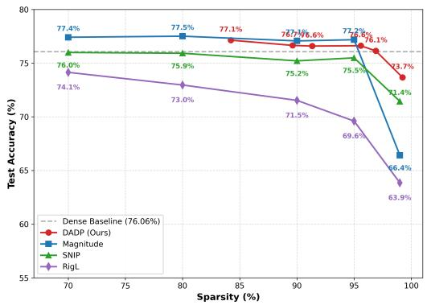  
(a) ResNet-18 Pruning Benchmark

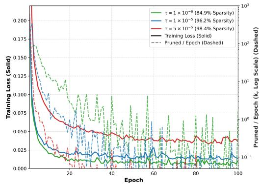  
(b) Negative Feedback Dynamics (100 Epochs)  
Figure 1: (a) Test accuracy versus sparsity for ResNet-18 on CIFAR-10. DADP maintains high accuracy up to 99.23% global sparsity. (b) Self-regulating negative feedback dynamics across three pruning thresholds $( \tau \in \{ 1 \mathrm { e } { - } 6 , 1 \mathrm { e } { - } 5 , 5 \mathrm { e } { - } 5 \}$ ) on MLP (MNIST, 100 epochs), illustrating training loss stabilization alongside decaying parameter pruning rates.

## 4.2 DYNAMIC OPTIMIZATION & SELF-REGULATING FEEDBACK MECHANICS

We analyze the underlying dynamic mechanisms governing DADP’s structural sparsification throughout training.

Self-Regulating Negative Feedback Loop. Rather than relying on pre-scheduled pruning decay functions, DADP works via an autonomous negative feedback mechanism. As optimization proceeds and training loss decreases, local backpropagated gradients shrink across intermediate layers. On subsequent step boundaries, importance scores Il $I _ { i j } ^ { l }$ for redundant connections fall below the global threshold τ, triggering a localized pruning event. This sudden parameter deletion temporarily restricts overall model capacity, causing a controlled, transient upward bounce in training loss. Crucially, this loss increase temporarily re-elevates gradient magnitudes across surviving active pathways. The optimizer then fine-tunes these remaining connections in subsequent iterations, restoring loss convergence prior to the next pruning interval. This self-limiting cycle ensures the network only sheds capacity when current features have stabilized, recovering full classification performance with minimal or zero accuracy loss (formally characterized as a sparsity equilibrium in Theorem 2, Appendix A)

Emergent Structural Protection & Channel Collapse. Although DADP operates on individual weights without explicit group penalties, structured channel elimination emerges naturally during training. In VGG-16 at ∼ 90% global sparsity, early layers (features.0 through features.20) stay fully intact, whereas deeper stages collapse substantially: features.24 shrinks from 512 to 498 channels, and features.40 drops from [512, 512, 3, 3] to [293, 338, 3, 3] (42.8% filter loss), bottlenecking the classification projection (classifier.0) to 103 active neurons. ResNet-18 at ∼ 95% global sparsity displays the same hierarchical behavior, foundational blocks (conv1, layer1, and layer2) retain their full 64 and 128 channel capacities. In contrast, deeper blocks undergo aggressive structural collapse: layer3.1.conv1 drops from 256 to 101 channels (60.5% filter loss), layer4.1.conv1 shrinks from [512, 512, 3, 3] to [69, 256, 3, 3] (86.5% filter loss), and the linear classifier head (fc) contracts from 512 to 145 inputs. Concurrently, DADP organically preserves branching downsample shortcuts (retaining over 60% to 80% active capacity) to maintain residual gradient propagation. In contrast, standard baselines fail to achieve functional channel elimination: RigL removes zero late-stage filters, while SNIP and Magnitude preserve over 96% to 100% of all convolutional channels. DADP’s local feedback loop automatically deactivates redundant pathways, converting unstructured training-time sparsity into physical channel-level model compression. Detailed layer-by-layer structured compression shape comparisons for VGG-16 and ResNet-18 across all pruning methods are provided in Appendix F.

## 4.3 STRUCTURAL MODALITY ADAPTIVITY: VISION VS. SEQUENCE NETWORKS

Unlike RigL, DADP automatically balances layer-wise sparsity for each model and data type without relying on hand-tuned schedules.

Foundational Feature Lock in Vision Architectures. In CNN backbones (VGG-16 and ResNet-18), DADP preserves early visual layers without pruning. As shown in Figure 2a, the initial convolutional stages (Layers 1–3 in ResNet-18) remain entirely dense. Because these early spatial filters process raw pixels to extract low-level features (edges, color, and texture), their gradient-activation products $I _ { i j } ^ { l }$ stay consistently large; pruning them would degrade downstream representations. In contrast, deeper convolutional blocks exhibit substantial redundancy on 10-class tasks like CIFAR-10, allowing DADP to prune deep feature maps up to 98%–99% sparsity without compromising performance.

Inverse Allocation in Sequence and Language Paradigms. In contrast, sequence models exhibit an inverted sparsity distribution, preserving capacity primarily in deeper layers (Figure 2b). In MiniBERT, early embedding layers and intermediate attention projections are pruned aggressively up to 95% sparsity, while recurrent state transitions (fc hh) in BiLSTM-CRF reach 92.5%–94.2% sparsity, reflecting heavy redundancy in early, context-free projections. Conversely, deeper attention blocks, feedforward networks, and final classification logit heads remain dense (75%–85% active parameters). Because gradients originate from the task-specific loss, higher backpropagated sensitivity concentrates in these final decision layers. Rather than enforcing a rigid heuristic across architectures, DADP naturally adapts to the information flow of each domain; retaining early representations in vision networks while preserving late contextual representations in sequence models.

## 4.4 INFORMATION-THEORETIC REPRESENTATION QUALITY

A key risk in extreme network sparsification is representation collapse, where intermediate activations lose diversity and degenerate into low-dimensional subspaces. To measure feature diversity across

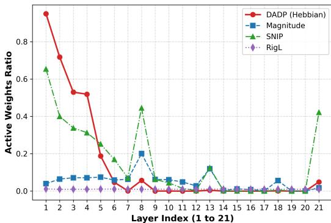

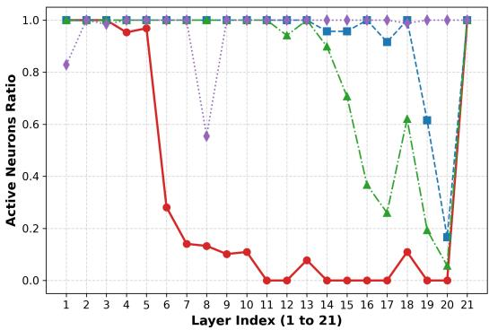

(a) Vision Model (ResNet-18 on CIFAR-10 @ 99% Sparsity): Foundational Feature Lock  
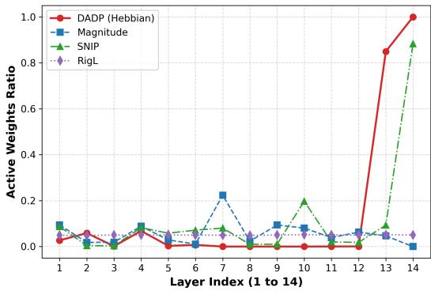

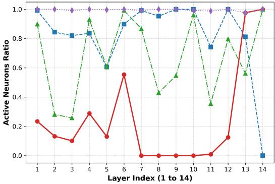  
(b) Language Model (MiniBERT on SST-2 @ 95% Sparsity): Inverse Decision-Head Preservation

Figure 2: Layer-wise sparsity allocation across diverse architectural paradigms. Layer indices on the x-axis $( 1 , 2 , 3 , \ldots , L )$ correspond to sequential layer depths from input to output (full layer name mapping listed in Appendix Table 13). (a) Vision models (ResNet-18) preserve early visual feature extractors (0% sparsity) while compressing deep representations. (b) Sequence & Language models (MiniBERT) exhibit inverse allocation, heavily pruning early token projections while preserving dense capacity in deep attention decision heads. VGG-16 layer-wise sparsity profile is provided in Appendix E.

depths without relying on downstream linear probes, we evaluate latent layer activations using matrix-based Shannon entropy $( S _ { 1 } )$ and Effective Rank (EffRank).

As shown in Figure 3, DADP retains representational fidelity on par with uncompressed dense baselines across all layer depths, even at sparsities exceeding 97% $( S _ { \mathrm { n o r m } } ^ { - } > 0 . 8 5$ throughout ResNet-18). Notably, in mid-depth convolutional blocks, DADP subnetworks yield a higher Effective Rank than the dense baseline. Even at a heavy 99% sparsity with the tighter threshold $( \tau = 0 . 0 0 0 5$ brown curve), where accuracy drops by only 3%, the plots reveal an interesting quirk: the early layers actually show a increased in normalized entropy and effective rank. This happens because DADP naturally gives more importance into the early layers, protecting the residual skip connections from collapsing when the rest of the network gets squeezed. Because the importance metric $I _ { i j } ^ { l }$ combines forward activations with backpropagated error, DADP prioritizes decorrelated pathways while eliminating redundant connections that contribute little to loss reduction. In this sense, activity dependent pruning functions as an implicit regularizer. DADP filters out correlated noise while preserving the geometric rank of the representation space.

## 4.5 MODEL-WIDE ACTIVE WEIGHT DISTRIBUTION SPECTRUM

We analyze active weight distributions in ResNet-18 at 99% sparsity to see how DADP affects parameter values compared to value-based pruning (Figure 4). Magnitude-based methods and RigL remove parameters around zero, splitting surviving weights into two separate modes. In contrast, DADP keeps a continuous, zero-centered bell shape across all layers. Uncompressed weights trained with weight decay naturally follow bell-shaped distributions (Bishop, 2006; Han et al., 2016) and (Banner et al., 2018). Because DADP tracks activity $( I _ { i j } ^ { l } = \mathbb { E } [ | a _ { i } ^ { l } \cdot \frac { \partial L } { \partial y _ { i } ^ { l } } | ] )$ rather than raw weight size, it keeps small weights with high gradients and prunes large weights that stay inactive $( a _ { i } \approx 0 )$ . This allows the sparse network to retain its original weight geometry without an artificial gap at zero.

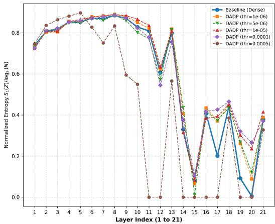

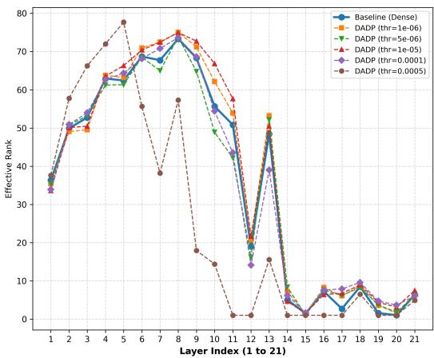  
Figure 3: Information-theoretic representation quality across layer depths for ResNet-18 on CIFAR-10. DADP maintains high normalized entropy $( S _ { \mathrm { n o r m } } > 0 . 8 5 )$ and matches or exceeds dense baseline effective rank, confirming that activity-dependent pruning eliminates correlated parameter noise without collapsing manifold geometry (VGG-16 plot in Appendix E).

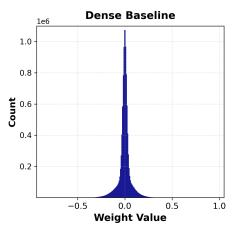

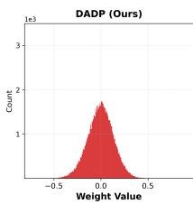

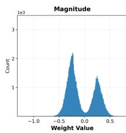

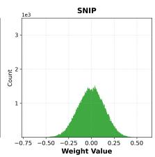

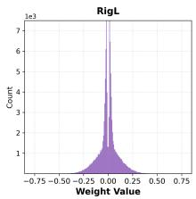  
Figure 4: Global active weight value distributions across all five evaluation methods on ResNet-18 at 99% sparsity displayed in a single row. Classical post-hoc Magnitude Pruning and dynamic regrowth methods (RigL) introduce sharp bimodal exclusion gaps around zero, whereas DADP retains a smooth, continuous Gaussian spectrum.

## 4.6 INITIALIZATION INVARIANCE & SENSITIVITY ABLATION

We evaluate the hyperparameter sensitivity of DADP across seven distinct weight initialization protocols on $\mathrm { V G G } { \cdot } \bar { 1 6 } ( \bar { \tau } = 6 \times 1 0 ^ { - 6 } )$ and ResNet-18 $( \tau = 1 \times 1 0 ^ { - 4 } )$ trained on CIFAR-10. Across all variance-preserving schemes (Table 2), DADP consistently converges to narrow sparsity and accuracy ranges on both ResNet-18 (95.54% ± 0.16% sparsity, $7 6 . 2 9 \% \pm 0 . 7 6 \%$ accuracy) and $\mathrm { V G G } { - } 1 6 ( 8 5 . 9 1 \% \pm 0 . 9 4 \%$ sparsity, $8 5 . 1 9 \% \pm 0 . 3 8 \%$ accuracy). This shows that the accumulated activity score adapts naturally to forward-backward scale changes, so the pruning threshold $\tau$ does not need retuning for standard initializations. However, fixed unscaled initializations reveal key architectural differences. With a small unscaled variance $( \sigma = 0 . 0 2 )$ , VGG-16 completely collapses (100% sparsity, 10% accuracy) because forward activations $a _ { i }$ and gradients $\frac { \partial L } { \partial y _ { j } }$ decay across its 16 sequential layers, dropping every connection below τ at Step 0. ResNet-18 avoids this failure entirely (95.96% sparsity, 77.26% accuracy), as residual skip connections preserve signal propagation and buffer the network against poor initial scaling.

## 4.7 PRUNING INTERVAL & OPTIMIZATION FREQUENCY ABLATION

We evaluate how the pruning interval $\Delta t$ affects DADP by testing update steps $\Delta t \_ { \in }$ {100, 250, 500, 1000, 1500, 2000, 5000} across three models: ResNet-18 $( \tau = 1 \times 1 0 ^ { - 5 } )$ and VGG-16 $( \tau = 5 \times 1 0 ^ { - 6 } )$ on CIFAR-10, and MiniBERT $( \tau = 2 \times 1 0 ^ { - 6 } )$ on SST-2. All runs use fixed thresholds τ and report mean and standard deviation over three random seeds (42, 512, 1729). Table 3 reports the resulting sparsities and test accuracies.

Table 2: Sensitivity ablation across weight initialization protocols under fixed pruning thresholds τ. DADP achieves tight performance and sparsity invariance across all standard variance-preserving schemes.
<table><tr><td rowspan="2">Initialization Scheme</td><td colspan="2">ResNet-18 (CIFAR-10)</td><td colspan="2">VGG-16 (CIFAR-10)</td></tr><tr><td>Sparsity (%)</td><td>Test Acc (%)</td><td>Sparsity (%)</td><td>Test Acc (%)</td></tr><tr><td>Kaiming Normal</td><td>95.41%</td><td>75.10%</td><td>84.86%</td><td>84.80%</td></tr><tr><td>Kaiming Uniform</td><td>95.35%</td><td>76.08%</td><td>85.03%</td><td>85.30%</td></tr><tr><td>Xavier Normal</td><td>95.66%</td><td>77.05%</td><td>86.58%</td><td>84.84%</td></tr><tr><td>Xavier Uniform</td><td>95.54%</td><td>76.72%</td><td>86.73%</td><td>85.38%</td></tr><tr><td>Orthogonal</td><td>95.75%</td><td>76.51%</td><td>86.61%</td><td>85.63%</td></tr><tr><td>Variance-Scaling Mean ± Std</td><td> $9 5 . 5 4 \% \pm 0 . 1 6 \%$ </td><td> $7 6 . 2 9 \% \pm 0 . 7 6 \%$ </td><td> $8 5 . 9 1 \% \pm 0 . 9 4 \%$ </td><td> $8 5 . 1 9 \% \pm 0 . 3 8 \%$ </td></tr><tr><td>Normal (σ = 0.02, Control)</td><td>95.96%</td><td>77.26%</td><td>100.00%</td><td>10.00% (Collapsed)</td></tr><tr><td>Normal (σ = 0.10, Control)</td><td>94.67%</td><td>74.42%</td><td>77.68%</td><td>83.44%</td></tr></table>

Vision models (ResNet-18 and VGG-16) remain stable across the entire 50-fold range (∆t = 100 to 5000). ResNet-18 maintains between 76.12% and 76.92% accuracy while reaching 90.71%–92.11% sparsity. Similarly, VGG-16 stays within 83.36%–84.82% accuracy, with more frequent pruning yielding slightly higher final sparsity (93.30% at ∆t = 100 vs. 88.35% at $\Delta t = 5 0 0 0 )$ . In contrast, MiniBERT is more sensitive to update frequency. Pruning too often $( \Delta t = 1 0 0 $ , over 10 times per epoch) leads to severe degradation (51.91% accuracy, 97.11% sparsity), as attention weights are cut before the network can recover. At moderate intervals $( \Delta t \ge 5 0 0$ , at most 2 prunes per epoch), the model has enough training steps between cuts to stabilize representations, consistently reaching 80.35%–81.19% accuracy. We therefore use $\Delta t = 5 0 0$ as a practical default across modalities.

Table 3: Ablation study on the effect of pruning interval (∆t) across architectures (mean ± std across 3 random seeds). Vision architectures exhibit strong stability across all frequencies, whereas transformer models require moderate intervals $( \Delta t \ge 5 0 0 )$ to prevent rapid capacity collapse.
<table><tr><td></td><td colspan="2">ResNet-18 (CIFAR-10)</td><td colspan="2">VGG-16 (CIFAR-10)</td><td colspan="2">MiniBERT (SST-2)</td></tr><tr><td>Prune Interval (∆t)</td><td>Sparsity (%)</td><td>Test Acc (%)</td><td>Sparsity (%)</td><td>Test Acc (%)</td><td>Sparsity (%)</td><td>Test Acc (%)</td></tr><tr><td>∆t = 100</td><td> $9 2 . 1 1 \pm 0 . 1 5 \%$ </td><td>76.12 ± 0.40%</td><td> $9 3 . 3 0 \pm 0 . 1 8 \%$ </td><td> $8 4 . 8 2 \pm 0 . 2 0 \%$ </td><td> $9 7 . 1 1 \pm 0 . 1 2 \%$ </td><td> $5 1 . 9 1 \pm 1 . 4 1 \%$ </td></tr><tr><td>∆t = 250</td><td>91.64 ± 0.03%</td><td>76.92 ± 0.52%</td><td> $9 1 . 5 8 \pm 0 . 4 6 \%$ </td><td> $8 3 . 3 6 \pm 0 . 6 3 \%$ </td><td> $9 6 . 5 8 \pm 0 . 5 0 \%$ </td><td> $7 2 . 0 6 \pm 1 3 . 4 1 \%$ </td></tr><tr><td>∆t = 500 (Default)</td><td>91.41 ± 0.08%</td><td>76.76 ± 0.16%</td><td> $9 0 . 4 2 \pm 0 . 9 3 \%$ </td><td> $8 4 . 2 0 \pm 0 . 7 3 \%$ </td><td> $9 0 . 0 7 \pm 2 . 9 9 \%$ </td><td> $8 0 . 3 5 \pm 0 . 6 9 \%$ </td></tr><tr><td>∆t = 1000</td><td>91.13 ± 0.04%</td><td>76.21 ± 0.40%</td><td> $8 9 . 6 2 \pm 0 . 7 2 \%$ </td><td> $8 4 . 0 2 \pm 2 . 1 1 \%$ </td><td>85.67 ± 1.01%</td><td> $8 0 . 7 0 \pm 0 . 1 9 \%$ </td></tr><tr><td>∆t = 1500</td><td>90.97 ± 0.05%</td><td>76.84 ± 0.29%</td><td> $8 9 . 3 7 \pm 0 . 8 0 \%$ </td><td> $8 4 . 5 3 \pm 0 . 3 5 \%$ </td><td>84.65 ± 0.73%</td><td> $8 0 . 8 5 \pm 0 . 4 1 \%$ </td></tr><tr><td>∆t = 2000</td><td>90.71 ± 0.01%</td><td>76.80 ± 0.12%</td><td>88.84 ± 0.75%</td><td>84.50 ± 0.87%</td><td>80.77 ± 3.70%</td><td> $8 0 . 7 3 \pm 0 . 2 8 \%$ </td></tr><tr><td> $\Delta t = 5 0 0 0$ </td><td>90.87 ± 0.03%</td><td>76.86 ± 0.40%</td><td>88.35 ± 0.64%</td><td>83.62 ± 0.64%</td><td>74.91 ± 4.41%</td><td> $8 1 . 1 9 \pm 0 . 0 9 \%$ </td></tr></table>

## 5 DISCUSSION

Across five architectures and four benchmarks, DADP matches or exceeds static and dynamic baselines at high sparsities (e.g., 72.28% accuracy at 99.35% sparsity on ResNet-18 and 80.85% accuracy at 96% sparsity on MiniBERT). Rather than enforcing rigid layer budgets, a single global threshold τ allocates parameters according to network information flow. This allows vision models to preserve early convolutional filters while heavily compressing deep layers, whereas sequence models retain late classification heads. Moreover, tracking gradient-activation products maintains unimodal, zero-centered weight distributions and high effective rank, effectively avoiding both the bimodal cutoffs seen in magnitude pruning and latent representation collapse.

Our ablations confirm that DADP remains invariant across standard variance-preserving initializations (Kaiming, Xavier, Orthogonal) and stable across a 50× range of pruning intervals $( \Delta t \in [ 1 0 0 , 5 0 0 0 ] )$ in vision backbones. Still, a practical limitation is identifying a valid threshold τ: setting it too aggressively can trigger network collapse. This is especially true for sequence models like MiniBERT when pruned too frequently (∆t = 100) or for sequential architectures like VGG-16 under unscaled initializations. Tracking $I _ { i j } ^ { l ^ { - } }$ also introduces transient memory overhead during the accumulation win dow. Due to compute limits, our evaluation focused on compact backbones and standard benchmarks (CIFAR-10, SST-2). Scaling DADP to deeper models (ResNet-50, mBERT) on larger datasets like TinyImageNet and developing structured block-pruning for hardware speedups remains an important direction for future work.

## AI USE STATEMENT

In this work, we used generative AI tools for writing assistance, code optimization, formatting LaTeX tables and writing mathematical proofs. We have not used generative AI tools for formulating the underlying scientific hypotheses, conceptualizing the core Hebbian activity-dependent pruning mechanism, or generating synthetic or artificial experimental data. All empirical results reflect actual training runs on standard benchmarks.

We have reviewed and verified all AI-assisted work. Specifically, all code was tested, debugged, and validated against baseline implementations. We take responsibility for the final content of this work, including text, claims, and artifacts produced with the aid of generative AI.

## REPRODUCIBILITY STATEMENT

To ensure complete reproducibility of all theoretical and empirical results, we have organized the relevant documentation across the manuscript, appendix, and supplementary materials:

• Theoretical Proofs: Formal derivations, assumptions, and complete proofs for Theorem 1 and Theorem 2 are provided in Appendix A.

• Architectures and Hyperparameters: Detailed layer specifications, training epochs, learning rates, batch sizes, pruning intervals (∆T), and threshold sweeps (τ ) are detailed in Section 3.3 and summarized in Table 4 (Appendix C).

• Baseline Adaptation Details: Implementation specifics and training schedules for Magnitude Pruning, SNIP, and RigL under matching compute budgets are described in Appendix C.2.

• Statistical Significance: Full empirical benchmark tables reporting mean ± standard deviation across multiple random seeds are provided in Appendix D.

• Code and Implementation: Anonymized source code containing the core DADP pruning algorithm, model architectures, and evaluation scripts is included directly in the supplementary package submitted alongside this manuscript. Furthermore, the complete, clean codebase with end-to-end training and benchmark evaluation pipelines will be open-sourced upon publication.

## ETHICS STATEMENT

This work introduces an algorithmic method for deep neural network compression. All datasets used in this study (MNIST, CIFAR-10, CoNLL-2003, and SST-2) are standard, publicly available academic benchmarks. This research does not involve human subjects, personal data privacy concerns, or potential dual-use biological or security harms. By lowering computational and energy demands during both training and inference, network pruning supports more sustainable and environmentally accessible machine learning.

## ACKNOWLEDGMENTS

We gratefully acknowledge Google Colab and Kaggle for providing free cloud GPU compute resources (NVIDIA T4), which enabled the execution of all training, pruning, and empirical evaluation experiments presented in this work.

## REFERENCES

Sanjeev Arora, Rong Ge, Behnam Neyshabur, and Yi Zhang. Stronger generalization bounds for deep nets via a compression approach. In International Conference on Machine Learning (ICML), pp. 254–263, 2018.

Ron Banner, Yury Nahshan, and Daniel Soudry. Post training 4-bit quantization of convolutional networks for rapid-deployment. In Advances in Neural Information Processing Systems (NeurIPS), 2018.

Guillaume Bellec, David Kappel, Wolfgang Maass, and Robert Legenstein. Deep rewiring: Training very sparse deep networks. In International Conference on Learning Representations (ICLR), 2018.

Joseph Bingham, Shizhen Zhao, and Daniel Alon. Fine-Pruning: A biologically inspired algorithm for personalization of ML models. arXiv preprint arXiv:2502.14886, 2025.

Christopher M. Bishop. Pattern Recognition and Machine Learning. Information Science and Statistics. Springer, 2006. ISBN 978-0-387-31073-2.

Yves Chauvin. A back-propagation algorithm with optimal use of hidden units. In Advances in Neural Information Processing Systems (NeurIPS), 1989.

Aleksandr Dekhovich, David M. J. Tax, Marcel H. F. Sluiter, and Miguel A. Bessa. Neural network relief: a pruning algorithm based on neural activity. arXiv preprint arXiv:2308.02060, 2023.

Jacob Devlin, Ming-Wei Chang, Kenton Lee, and Kristina Toutanova. BERT: Pre-training of deep bidirectional transformers for language understanding. In Proceedings of the North American Chapter ofthe Associationfor Computational Linguistics (NAACL), pp. 4171–4186, 2019.

Utku Evci, Trevor Gale, Jacob Menick, Pablo Samuel Castro, and Erich Elsen. Rigging the lottery: Making all tickets winners. In International Conference on Machine Learning (ICML), pp. 2943– 2952, 2020.

Gongfan Fang, Xinyin Ma, Mingli Song, Michael Bi Mi, and Xinchao Wang. DepGraph: Towards any structural pruning. In Conference on Computer Vision and Pattern Recognition (CVPR), 2023.

Travis E Faust, Georgia Gunner, and Dorothy P Schafer. Mechanisms governing activity-dependent synaptic pruning in the developing mammalian CNS. Nature Reviews Neuroscience, 22(11): 657–673, 2021.

Jonathan Frankle and Michael Carbin. The lottery ticket hypothesis: Finding sparse, trainable neural networks. In International Conference on Learning Representations (ICLR), 2019.

Elias Frantar and Dan Alistarh. SparseGPT: Massive language models can be accurately pruned in one shot. In International Conference on Machine Learning (ICML), 2023.

Xavier Glorot and Yoshua Bengio. Understanding the difficulty of training deep feedforward neural networks. In Proceedings ofthe Thirteenth International Conference on Artificial Intelligence and Statistics (AISTATS), pp. 249–256, 2010.

Dongcheng Han, Tielin Zhang, and Bo Xu. Developmental plasticity-inspired adaptive pruning for deep spiking and artificial neural networks. IEEE Transactions on Pattern Analysis and Machine Intelligence, 46(10):6890–6904, 2024.

Song Han, Jeff Pool, John Tran, and William Dally. Learning both weights and connections for efficient neural network. In Advances in Neural Information Processing Systems (NeurIPS), volume 28, pp. 1135–1143, 2015.

Song Han, Huizi Mao, and William J Dally. Deep compression: Compressing deep neural networks with pruning, trained quantization and Huffman coding. In International Conference on Learning Representations (ICLR), 2016.

Babak Hassibi and David G Stork. Second order derivatives for network pruning: Optimal brain surgeon. In Advances in Neural Information Processing Systems (NeurIPS), pp. 164–171, 1993.

Kaiming He, Xiangyu Zhang, Shaoqing Ren, and Jian Sun. Delving deep into rectifiers: Surpassing human-level performance on ImageNet classification. In Proceedings ofthe IEEE International Conference on Computer Vision (ICCV), pp. 1026–1034, 2015.

Kaiming He, Xiangyu Zhang, Shaoqing Ren, and Jian Sun. Deep residual learning for image recognition. In Proceedings of the IEEE Conference on Computer Vision and Pattern Recognition (CVPR), pp. 770–778, 2016.

Donald Olding Hebb. The Organization ofBehavior: A Neuropsychological Theory. John Wiley & Sons, 1949.

Jordan Hoffmann, Sebastian Borgeaud, Arthur Mensch, et al. Training compute-optimal large language models. arXiv preprint arXiv:2203.15556, 2022.

Peter R Huttenlocher. Neural Plasticity: The Effects of Environment on the Development of the Cerebral Cortex. Harvard University Press, 2002.

Peter R. Huttenlocher, Ch. de Courten, L. J. Garey, and H. Van der Loos. Synaptic density in human frontal cortex–developmental changes and effects of aging. Brain Research, 163(2):195–205, 1979.

Ehud D Karnin. A simple procedure for pruning back-propagation trained neural networks. IEEE Transactions on Neural Networks, 1(2):239–242, 1990.

Diederik P. Kingma and Jimmy Ba. Adam: A method for stochastic optimization. arXiv preprint arXiv:1412.6980, 2014.

Alex Krizhevsky. Learning multiple layers of features from tiny images. Technical report, University of Toronto, 2009.

Guillaume Lample, Miguel Ballesteros, Sandeep Subramanian, Kazuya Kawakami, and Chris Dyer. Neural architectures for named entity recognition. In Proceedings of the North American Chapter ofthe Associationfor Computational Linguistics (NAACL), pp. 260–270, 2016.

Yann LeCun, John Denker, and Sara Solla. Optimal brain damage. Advances in Neural Information Processing Systems (NeurIPS), 2, 1989.

Yann LeCun, Leon Bottou, Yoshua Bengio, and Patrick Haffner. Gradient-based learning applied to´ document recognition. Proceedings ofthe IEEE, 86(11):2278–2324, 1998.

Namhoon Lee, Thalaiyasingam Ajanthan, and Philip H. S. Torr. SNIP: Single-shot network pruning based on connection sensitivity. In International Conference on Learning Representations (ICLR), 2019.

Takayasu Mikuni, Naofumi Uesaka, Hiroyuki Okuno, Hirokazu Hirai, Karl Deisseroth, Haruhiko Bito, and Masanobu Kano. Arc/Arg3.1 is a postsynaptic mediator of activity-dependent synapse elimination in the developing cerebellum. Neuron, 78(6):1024–1035, 2013.

Decebal Constantin Mocanu, Elena Mocanu, Peter Stone, Phuong H Nguyen, Madeleine Gibescu, and Antonio Liotta. Scalable training of artificial neural networks with adaptive sparse connectivity inspired by network science. Nature Communications, 9(1):2383, 2018.

Michael C Mozer and Paul Smolensky. Using relevance to reduce network size automatically. Connection Science, 1(1):3–16, 1989.

Russell Reed. Pruning algorithms-a survey. IEEE Transactions on Neural Networks, 4(5):740–747, 1993.

Erik F. Tjong Kim Sang and Fien De Meulder. Introduction to the CoNLL-2003 shared task: Language-independent named entity recognition. In Proceedings of the Seventh Conference on Natural Language Learning (CoNLL), pp. 142–147, 2003.

Andrew M. Saxe, James L. McClelland, and Surya Ganguli. Exact solutions to the nonlinear dynamics of learning in deep linear neural networks. International Conference on Learning Representations (ICLR), 2014.

Karen Simonyan and Andrew Zisserman. Very deep convolutional networks for large-scale image recognition. arXiv preprint arXiv:1409.1556, 2014.

Oscar Skean, Md Rifat Arefin, Dan Zhao, Niket Patel, Jalal Naghiyev, Yann LeCun, and Ravid Shwartz-Ziv. Layer by layer: Uncovering hidden representations in language models. In International Conference on Machine Learning (ICML), 2025.

Richard Socher, Alex Perelygin, Jean Wu, Jason Chuang, Christopher D. Manning, Andrew Ng, and Christopher Potts. Recursive deep models for semantic compositionality over a sentiment treebank. In Proceedings of the 2011 Conference on Empirical Methods in Natural Language Processing (EMNLP), pp. 1631–1642, 2013.

Mingjie Sun, Zhuang Liu, Anna Bair, and J. Zico Kolter. A simple and effective pruning approach for LLMs. In International Conference on Learning Representations (ICLR), 2024.

Vivienne Sze, Yu-Hsin Chen, Tien-Ju Yang, and Joel S. Emer. Efficient processing of deep neural networks: A tutorial and survey. Proceedings ofthe IEEE, 105(12):2295–2329, 2017.

Hidenori Tanaka, Aran Nayebi, Niru Maheswaranathan, Lane McIntosh, Stephen Baccus, and Surya Ganguli. From deep learning to mechanistic understanding in neuroscience: the structure of retinal prediction. In Advances in Neural Information Processing Systems (NeurIPS), pp. 8535–8545, 2019.

Hidenori Tanaka, Daniel Kunin, Daniel L. Yamins, and Surya Ganguli. Pruning neural networks without any data by iteratively conserving synaptic flow. Advances in Neural Information Processing Systems (NeurIPS), 33:6377–6389, 2020.

Chaoqi Wang, Guodong Zhang, and Roger Grosse. Picking winning tickets before training by preserving gradient flow. In International Conference on Learning Representations (ICLR), 2020.

Andreas S Weigend, David E Rumelhart, and Bernardo A Huberman. Generalization by weightelimination with application to forecasting. In Advances in Neural Information Processing Systems (NeurIPS), 1991.

Masahiro Yasuda, Sivapratha Nagappan-Chettiar, Erin M Johnson-Venkatesh, and Hisashi Umemori. An activity-dependent determinant of synapse elimination in the mammalian brain. Neuron, 109 (8):1333–1349, 2021.

## A MATHEMATICAL PROOFS

In this section, we present the formal derivations and proofs for Theorem 1 and Theorem 2.

## A.1 PROOF OF THEOREM 1: FIRST-ORDER TAYLOR EXPANSION OF LOSS SENSITIVITY

Theorem. The activation-derivative metric $\begin{array} { r } { I _ { i j } ^ { l } = \left| a _ { i } ^ { l - 1 } \cdot \frac { \partial \mathcal { L } } { \partial y _ { j } ^ { l } } \right| } \end{array}$ is equivalent to the magnitude of the first-order Taylor expansion of loss change $\Delta \mathcal { L }$ resulting from setting connection $w _ { i j } ^ { l }$ to zero, normalized per unit weight magnitude.

Proof. Let $\mathcal { L } ( \Theta )$ be a twice-differentiable loss function over parameters Θ. Consider an active connection $w _ { i j } ^ { l } \in \mathbb { R }$ linking input neuron i at layer l − 1 with pre-activation $\begin{array} { r } { y _ { j } ^ { l } = \sum _ { k } w _ { k j } ^ { l } a _ { k } ^ { l - 1 } + b _ { j } ^ { l } } \end{array}$ at layer l.

Pruning weight $w _ { i j } ^ { l }$ to zero corresponds to setting $w _ { i j } ^ { l , \mathrm { p r u n e d } } = 0$ , which induces a weight perturbation $\Delta w _ { i j } ^ { l } = 0 - w _ { i j } ^ { l } \stackrel {  } { = } - w _ { i j } ^ { l }$

Expanding the perturbation of loss $\mathcal { L }$ around the current weight value $w _ { i j } ^ { l }$ using a first-order Taylor series yields:

$$
\Delta \mathcal { L } = \mathcal { L } ( w _ { i j } ^ { l } + \Delta w _ { i j } ^ { l } ) - \mathcal { L } ( w _ { i j } ^ { l } ) \approx \frac { \partial \mathcal { L } } { \partial w _ { i j } ^ { l } } \Delta w _ { i j } ^ { l } = - \frac { \partial \mathcal { L } } { \partial w _ { i j } ^ { l } } w _ { i j } ^ { l }\tag{5}
$$

By the multivariable chain rule, the partial derivative of loss with respect to weight $w _ { i j } ^ { l }$ decomposes as:

$$
\frac { \partial \mathcal { L } } { \partial w _ { i j } ^ { l } } = \frac { \partial \mathcal { L } } { \partial y _ { j } ^ { l } } \cdot \frac { \partial y _ { j } ^ { l } } { \partial w _ { i j } ^ { l } }\tag{6}
$$

Since $\begin{array} { r } { y _ { j } ^ { l } = w _ { i j } ^ { l } a _ { i } ^ { l - 1 } + \sum _ { k \neq i } w _ { k j } ^ { l } a _ { k } ^ { l - 1 } + b _ { j } ^ { l } } \end{array}$ , the local partial derivative is:

$$
\frac { \partial y _ { j } ^ { l } } { \partial w _ { i j } ^ { l } } = a _ { i } ^ { l - 1 }\tag{7}
$$

Substituting Equation equation 7 into Equation equation 6 gives:

$$
\frac { \partial \mathcal { L } } { \partial w _ { i j } ^ { l } } = \frac { \partial \mathcal { L } } { \partial y _ { j } ^ { l } } \cdot a _ { i } ^ { l - 1 }\tag{8}
$$

Substituting Equation equation 8 back into the Taylor expansion in Equation equation 5 produces:

$$
\Delta { \mathcal { L } } \approx - w _ { i j } ^ { l } \left( a _ { i } ^ { l - 1 } \cdot { \frac { \partial { \mathcal { L } } } { \partial y _ { j } ^ { l } } } \right)\tag{9}
$$

Dividing by the absolute magnitude of active weight $| w _ { i j } ^ { l }$ | to obtain the scale-invariant loss sensitivity per unit weight magnitude gives:

$$
\left| \frac { \Delta \mathcal { L } } { w _ { i j } ^ { l } } \right| \approx \left| a _ { i } ^ { l - 1 } \cdot \frac { \partial \mathcal { L } } { \partial y _ { j } ^ { l } } \right| = I _ { i j } ^ { l }\tag{10}
$$

This completes the proof. ■

## A.2 ANALYSIS OF THEOREM 2: TRAINING-DRIVEN SPARSITY EQUILIBRIUM & GENERALIZATION CAPACITY BOUNDARY

Theorem. Given a global threshold τ, DADP importance scores $\begin{array} { r } { I _ { i j } ^ { l } = \mathbb { E } [ | a _ { i } ^ { l - 1 } \cdot \frac { \partial \mathcal { L } _ { t r a i n } } { \partial y _ { \cdot } ^ { l } } | ] } \end{array}$ stabilize surviving pathways above τ, causing the structural pruning rate to asymptote $( \Delta S \stackrel { . } {  } 0 )$ into an organic training sparsity equilibrium $S ^ { * } ( \tau ) < 1 0 0 \%$ . However, because $I _ { i j } ^ { l ^ { - } }$ is computed on training set loss sensitivity, setting τ near the critical capacity boundary $\tau _ { c r i t }$ preserves high training accuracy while causing test loss to increase and test generalization to degrade.

Proof. Let $\mathcal { P } _ { \operatorname { t r a i n } } ^ { * } = \{ ( i , j , l )$ | connection $w _ { i j } ^ { l }$ is essential for training loss minimization} denote the active subnetwork required to fit the training distribution.

Assume for contradiction that as training proceeds $( t \to \infty )$ , global sparsity reaches total structural collapse $S ( t )  1 0 0 \%$ , implying that all connections $( i , j , l ) \in \mathcal { P } _ { \operatorname { t r a i n } } ^ { * }$ are pruned because $I _ { i j } ^ { l } ( t ) < \tau$ If all essential training connections in $\mathcal { P } _ { \mathrm { t r a i n } } ^ { * }$ are pruned, the information flow to output logits collapses, causing training error to spike $( \mathcal { L } _ { \mathrm { t r a i n } } ( t ) \overset { \vartriangle } {  } \infty )$ .

Under standard gradient backpropagation, as training loss $\mathcal { L } _ { \mathrm { t r a i n } } \to \infty$ , the output error gradient $\frac { \partial \mathcal { L } _ { \mathrm { t r a i n } } } { \partial y _ { j } ^ { L } }$ scales proportionally:

$$
\left\| \frac { \partial \mathcal { L } _ { \mathrm { t r a i n } } } { \partial y ^ { L } } \right\| \to \infty\tag{11}
$$

Backpropagating error gradients through surviving active pathways yields:

$$
\frac { \partial \mathcal { L } _ { \mathrm { t r a i n } } } { \partial y _ { j } ^ { l } } = \sum _ { k } \left( \frac { \partial \mathcal { L } _ { \mathrm { t r a i n } } } { \partial y _ { k } ^ { l + 1 } } \cdot w _ { j k } ^ { l + 1 } \cdot \sigma ^ { \prime } ( y _ { j } ^ { l } ) \right)\tag{12}
$$

The gradient magnitude $\left| \frac { \partial \mathcal { L } _ { \mathrm { t r a i n } } } { \partial y _ { j } ^ { l } } \right|$ increases monotonically.

For essential active connections $( i , j , l ) \in \mathcal { P } _ { \operatorname { t r a i r } } ^ { * }$ , the expectation score $I _ { i j } ^ { l } ( t + 1 )$ ) satisfies:

$$
I _ { i j } ^ { l } ( t + 1 ) = \frac { 1 } { \Delta T } \sum _ { k = 0 } ^ { \Delta T - 1 } \left| a _ { i } ^ { l - 1 } \cdot \frac { \partial \mathcal { L } _ { \mathrm { t r a i n } } } { \partial y _ { j } ^ { l } } \right| \geq \tau\tag{13}
$$

Whenever $I _ { i j } ^ { l } ( t + 1 ) \geq \tau$ , the connection remains active: $M _ { i j } ^ { l } ( t + 1 ) = 1$ . This active connection prevents training loss $\mathcal { L } _ { \mathrm { t r a i n } }$ from diverging, stabilizing $I _ { i j } ^ { l }$ at a stationary equilibrium score $I ^ { * } \geq \tau$ and establishing a structural sparsity asymptote $( \Delta S  \tilde { 0 } )$ .

Generalization Capacity Boundary. Importantly, because the importance score $I _ { i j } ^ { l }$ depends on training set gradients $\frac { \partial \mathcal { L } _ { \mathrm { t r a i n } } } { \partial y _ { j } ^ { l } }$ , the structural equilibrium $S ^ { \ast } ( \tau )$ is governed strictly by training set fitting. As the network becomes extremely sparse $\mathrm { ( e . g . , > 9 8 . 0 \% }$ sparsity in 100-epoch limit tests), the surviving active weights fit the training data near perfectly (99.53% train accuracy), keeping $I _ { i j } ^ { l } \ge \tau$ However, the loss of representation capacity causes the network to overfit, leading to an increase in test loss $( 0 . 0 9 4 5  \bar { 0 } . 2 2 7 7 )$ and a slight decay in test accuracy $( 9 7 . 6 9 \% \to 9 6 . { \overset { . } { 9 } } 4 \% )$ . Pushing $\tau \geq \tau _ { \mathrm { c r i t } } ( \mathbf { e . g . , } \tau = 1 \mathbf { e . } 4 )$ forces the model past this capacity boundary into catastrophic classification collapse (77.11%). ■ □

## B DADP ALGORITHMIC PROCEDURE

We provide the complete procedural workflow for Dynamic Activity-Dependent Pruning (DADP) in Algorithm 1. In DADP, synaptic importance accumulators track the elementwise product of forward activations and backpropagated gradients across each mini-batch. At periodic step intervals $\Delta T$ temporal averages are computed and thresholded against τ to permanently prune redundant pathways without regrowth.

Algorithm 1 Dynamic Activity-Dependent Pruning (DADP)   
Require: Training dataset ${ \mathcal { D } } ,$ , initial weights $W = \{ W ^ { l } \} _ { l = 1 } ^ { L }$ , learning rate $\eta ,$ pruning interval $\Delta T$   
global threshold $\tau ,$ total steps $T .$   
Ensure: Sparsified model parameters $W \odot M .$   
1: Initialize masks $M _ { i j } ^ { l } \gets 1$ for all layers l and connections $( i , j )$   
2: Initialize importance accumulators $A _ { i j } ^ { l }  0$   
3: for step $t = \bar { 1 }$ to $T$ do   
4: Sample mini-batch $( X , y ) \sim \mathcal { D }$   
5: Forward pass with masked parameters: $y ^ { l } = ( W ^ { l } \odot M ^ { l } ) a ^ { l - 1 } + b ^ { l }$   
6: Compute loss $\mathcal { L }$ and backpropagate error gradients $\frac { \partial \mathcal { L } } { \partial y _ { i } ^ { l } }$   
7: Accumulate local sensitivity: $\begin{array} { r } { A _ { i j } ^ { l }  A _ { i j } ^ { l } + | a _ { i } ^ { l - 1 } \cdot \frac { \partial \mathcal { L } } { \partial y _ { j } ^ { l } } | } \end{array}$   
8: Update weights with optimizer: $W ^ { l } \gets$ OptimizerStep $( W ^ { l } , \nabla _ { W ^ { l } } \mathcal { L } )$   
9: Enforce mask: $W ^ { l }  \dot { W } ^ { l } \odot M ^ { l }$   
10: $\mathbf i \mathbf f \ t \equiv 0$ (mod $\Delta T )$ then   
11: Compute temporal average: $I _ { i j } ^ { l }  A _ { i j } ^ { l } / \Delta T$   
12: Update masks: $M _ { i j } ^ { l }  M _ { i j } ^ { l } \cdot \bar { \mathbb { I } } ( I _ { i j } ^ { l } \geq \bar { \tau } )$   
13: Permanently prune weights: $W ^ { l } \dot {  } W ^ { l } \odot M ^ { l }$   
14: Reset accumulators: $A _ { i j } ^ { \bar { l } }  0$   
15: end if   
16: end for   
17: return $W \odot M$

## C NETWORK ARCHITECTURES AND TRAINING SETUP

We provide detailed structural specifications and training configurations for all five neural network architectures evaluated in this work

## C.1 ARCHITECTURAL DETAILS

1. MLP (MNIST): A fully connected feedforward network designed for 28 × 28 grayscale digit classification (BaselineMLP / HebbianMLP). It consists of an input flattening layer (784 dimensions), followed by two hidden linear layers of dimension 512 each with ReLU activations (fc1: 784 → 512, fc2: 512 → 512). The final linear classification head (fc3) maps from 512 dimensions to 10 class logits (669, 706 total parameters).

2. VGG-16 (CIFAR-10): A 16-layer convolutional architecture adapted for 32×32× 3 images (BaselineVGG16 / HebbianVGG16). The feature extractor comprises 13 convolutional layers arranged into 5 blocks ([2, 2, 3, 3, 3] conv layers per block with channel depths 64, 128, 256, 512, 512). Each convolution uses a 3 × 3 kernel, stride 1, and padding 1, followed by Batch Normalization and ReLU. Max-pooling (2 × 2, stride 2) is applied after blocks 1, 2, 3, and 4. Spatial feature maps are condensed via AdaptiveAvgPool2d((1, 1)). The classifier consists of three dense layers (512 → 512 → 10) with dropout (p = 0.5), yielding 15, 253, 578 total parameters.

3. ResNet-18 (CIFAR-10): A residual network tailored for CIFAR-10 image classification (NativeResNet18 / get resnet18). It features an initial convolutional layer (64 filters, 7 × 7 kernel, stride 2, padding 3) with Batch Normalization, ReLU, and 3 × 3 maxpooling, followed by 4 residual stages containing 2 BasicBlocks each ([64, 128, 256, 512] feature channels). Residual downsampling shortcuts utilize 1 × 1 convolutions with stride 2 and Batch Normalization. Global Average Pooling condenses spatial maps to 512 dimensions, followed by a linear projection to 10 classes (11, 181, 642 total parameters).

4. BiLSTM-CRF (CoNLL-2003): A sequence tagging model for Named Entity Recognition (BiLSTM CRF). Input tokens are mapped via a trainable 128-dimensional embedding layer (vocabulary size 5, 000), followed by a 1-layer Bidirectional LSTM with hidden state dimension h = 64 per direction (128-dimensional concatenated output per step). A linear projection (hidden2tag) maps hidden states to emission scores across 9 entity classes (128 → 9), followed by a Linear-Chain Conditional Random Field (CRF) layer with a 9 × 9 learnable transition matrix trained via Negative Log-Likelihood (740, 588 total parameters).

5. MiniBERT (SST-2): HuggingFace’s pretrained prajjwal1/bert-tiny architecture fine-tuned for binary sentiment classification. It comprises a vocabulary of 30, 522 tokens (128-dim embeddings), 2 Transformer encoder layers, hidden dimension d = 128, intermediate feedforward dimension $d _ { \mathrm { f f } } = 5 1 2$ , and 2 self-attention heads per layer (maximum sequence length 128). A pooled linear classification head maps representations to 2 sentiment logits (4, 386, 178 total parameters).

Table 4: Hyperparameter configurations and training specifications across all evaluated architectures.
<table><tr><td>Hyperparameter</td><td>MLP</td><td>VGG-16</td><td>ResNet-18</td><td>BiLSTM-CRF</td><td>MiniBERT</td></tr><tr><td>Dataset</td><td>MNIST</td><td>CIFAR-10</td><td>CIFAR-10</td><td>CoNLL-2003</td><td>SST-2</td></tr><tr><td>Task Modality</td><td>Vision (Digits)</td><td>Vision (Objects)</td><td>Vision (Objects)</td><td>Sequence (NER)</td><td>NLP (Sentiment)</td></tr><tr><td>Total Parameters</td><td>667,146</td><td>14,728,266</td><td>11,173,962</td><td>1,514,841</td><td>4,386,178</td></tr><tr><td>Optimizer</td><td>Adam</td><td>Adam</td><td>Adam</td><td>Adam</td><td>Adam</td></tr><tr><td>Learning Rate (η)</td><td>1e-3</td><td>1e-3</td><td>1e-3</td><td>1e-3</td><td>2e-5</td></tr><tr><td>Weight Decay</td><td>1e-4</td><td>1e-4</td><td>1e-4</td><td>1e-4</td><td>1e-2</td></tr><tr><td>Batch Size</td><td>64</td><td>64</td><td>64</td><td>64</td><td>64</td></tr><tr><td>Training Epochs</td><td>20</td><td>20</td><td>20</td><td>20</td><td>20</td></tr><tr><td>Loss Function</td><td>Cross-Entropy</td><td>Cross-Entropy</td><td>Cross-Entropy</td><td>CRF NLL Loss</td><td>Cross-Entropy</td></tr><tr><td>Prune Interval (∆T) Threshold Sweep (τ)</td><td>500 steps</td><td>500 steps</td><td>500 steps</td><td>500 steps</td><td>500 steps</td></tr><tr><td>Precision</td><td>[1e-6, 1e-4] FP16 (AMP)</td><td>[1e-6, 1e-4] FP16 (AMP)</td><td>[1e-6, 5e-4] FP16 (AMP)</td><td>[1e-6, 3e-4]</td><td>[1e-6, 5e-6]</td></tr><tr><td>Hardware Accelerator</td><td>NVIDIA T4</td><td></td><td></td><td>FP32</td><td>FP16 (AMP)</td></tr><tr><td></td><td></td><td>NVIDIA T4</td><td>NVIDIA T4</td><td>NVIDIA T4</td><td>NVIDIA T4</td></tr></table>

## C.2 BASELINE PRUNING IMPLEMENTATION DETAILS

To ensure a fair comparison, all models were trained for a total of 20 epochs under matching computational budgets. We adapted the baseline pruning methods to fit this schedule:

• Magnitude Pruning: We train the model as a dense network for 17 epochs. At epoch 17, we prune the smallest weights to reach the target sparsity. We then fine-tune the sparse model for the remaining 3 epochs.

• SNIP: We calculate the pruning mask at epoch 0 before training begins using a single batch of data. Once the lowest-scoring weights are pruned, the mask stays fixed for all 20 training epochs.

• RigL: We start training from a random sparse mask at epoch 0. Every 100 steps, we drop small weights and regrow connections with large gradients. To keep training fast within our 20-epoch limit, we gradually slow down the regrowth rate over the first 16 epochs using a cosine curve, then freeze the mask for the final 4 epochs for fine-tuning.

## D FULL EMPIRICAL BENCHMARK TABLES

In this section, we provide complete benchmark evaluation tables across all models, datasets, pruning thresholds, target sparsities, and weight initialization strategies. DADP results report mean ± standard deviation across 3 random seeds (42, 512, 1729) from statistical sweeps.

## D.1 MLP ON MNIST

Table 5: Complete empirical evaluation for MLP on MNIST across pruning methods and thresholds (DADP reports mean ± std across 3 random seeds).
<table><tr><td>Method</td><td>Configuration / Threshold</td><td>Final Sparsity (%)</td><td>Final Test Acc (%)</td><td>Peak Test Acc (%)</td></tr><tr><td>Dense Baseline</td><td>Unpruned (0%)</td><td>0.00%</td><td>98.39%</td><td>98.44%</td></tr><tr><td>DADP (Ours)</td><td> $\tau = 1 \mathrm { e } { - } 6$ </td><td> $\mathbf { 8 4 . 9 0 \pm 0 . 5 6 \% }$ </td><td> $\mathbf { 9 7 . 9 1 } \pm \mathbf { 0 . 1 2 \% }$ </td><td> $\mathbf { 9 8 . 1 8 \pm 0 . 0 2 \% }$ </td></tr><tr><td>DADP (Ours)</td><td> $\tau = 5 \mathrm { e } { - } 6$ </td><td> $\mathbf { 9 4 . 6 0 \pm 0 . 1 4 \% }$ </td><td> $\mathbf { 9 7 . 5 5 \pm 0 . 0 9 \% }$ </td><td> $\mathbf { 9 8 . 0 2 \pm 0 . 0 3 \% }$ </td></tr><tr><td>DADP (Ours)</td><td> $\tau = 1 { \mathrm { e } } { \mathrm { - } } 5$ </td><td> ${ \bf 9 6 . 1 9 \pm 0 . 1 1 \% }$ </td><td> $\mathbf { 9 7 . 3 8 \pm 0 . 1 5 \% }$ </td><td> $\mathbf { 9 7 . 9 1 } \pm \mathbf { 0 . 0 8 \% }$ </td></tr><tr><td>DADP (Ours)</td><td> $\tau = 5 \mathrm { e } { \cdot } 5$ </td><td> $\mathbf { 9 8 . 3 5 \pm 0 . 0 4 \% }$ </td><td> $\mathbf { 9 6 . 6 9 \pm 0 . 0 4 \% }$ </td><td> $\mathbf { 9 6 . 9 2 \pm 0 . 0 5 \% }$ </td></tr><tr><td>DADP (Ours)</td><td>τ = 1e-5 (100 Epoch Limit Test)</td><td>98.00%</td><td>96.94%</td><td>97.69%</td></tr><tr><td>DADP (Ours)</td><td>τ = 1e-4 (Over-threshold)</td><td>99.81%</td><td>77.11%</td><td>77.30%</td></tr><tr><td>Magnitude Pruning</td><td>Target 70.0%</td><td>70.00%</td><td>98.58%</td><td>98.58%</td></tr><tr><td>Magnitude Pruning</td><td>Target 80.0%</td><td>80.00%</td><td>98.63%</td><td>98.65%</td></tr><tr><td>Magnitude Pruning</td><td>Target 90.0%</td><td>90.00%</td><td>98.49%</td><td>98.49%</td></tr><tr><td>Magnitude Pruning</td><td>Target 95.0%</td><td>95.00%</td><td>98.05%</td><td>98.38%</td></tr><tr><td>RigL</td><td>Target 70.0%</td><td>70.00%</td><td>98.18%</td><td>98.25%</td></tr><tr><td>RigL</td><td>Target 80.0%</td><td>80.00%</td><td>97.97%</td><td>98.21%</td></tr><tr><td>RigL</td><td>Target 90.0%</td><td>90.00%</td><td>97.81%</td><td>98.00%</td></tr><tr><td>RigL</td><td>Target 95.0%</td><td>95.00%</td><td>97.65%</td><td>97.94%</td></tr><tr><td>SNIP</td><td>Target 70.0%</td><td>70.00%</td><td>98.23%</td><td>98.40%</td></tr><tr><td>SNIP</td><td>Target 80.0%</td><td>80.00%</td><td>97.85%</td><td>98.29%</td></tr><tr><td>SNIP</td><td>Target 90.0%</td><td>90.00%</td><td>97.89%</td><td>98.18%</td></tr><tr><td>SNIP</td><td>Target 95.0%</td><td>95.00%</td><td>97.82%</td><td>97.94%</td></tr></table>

## D.2 RESNET-18 ON CIFAR-10

Table 6: Complete empirical evaluation for ResNet-18 on CIFAR-10 across pruning methods and thresholds (DADP reports mean ± std across 3 random seeds).
<table><tr><td>Method</td><td>Configuration / Threshold</td><td>Final Sparsity (%)</td><td>Final Test Acc (%)</td><td>Peak Test Acc (%)</td></tr><tr><td>Dense Baseline</td><td>Unpruned (0%)</td><td>0.00%</td><td>76.06%</td><td>77.44%</td></tr><tr><td>DADP (Ours)</td><td> $\tau = 1 \mathrm { e } { - } 6$ </td><td> $\mathbf { 8 4 . 6 5 \pm 0 . 2 1 \% }$ </td><td> $7 6 . 7 2 \pm 0 . 2 6 \%$ </td><td> $\mathbf { 7 6 . 9 7 \pm 0 . 2 5 \% }$ </td></tr><tr><td>DADP (Ours)</td><td> $\tau = 5 \mathrm { e } { - } 6$ </td><td> $\mathbf { 8 9 . 6 6 \pm 0 . 1 0 \% }$ </td><td> $\mathbf { 7 6 . 6 4 \pm 0 . 7 5 \% }$ </td><td> $7 7 . 3 6 \pm 0 . 1 7 \%$ </td></tr><tr><td>DADP (Ours)</td><td> $\tau = 1 \mathrm { e } { - } 5$ </td><td> $\mathbf { 9 1 . 4 1 \pm 0 . 0 8 \% }$ </td><td> ${ \bf 7 6 . 7 6 \pm 0 . 1 6 \% }$ </td><td> $7 7 . 2 5 \pm 0 . 2 4 \%$ </td></tr><tr><td>DADP (Ours)</td><td> $\tau = 5 \mathrm { e } { - } 5$ </td><td> $\mathbf { 9 5 . 6 3 \pm 0 . 0 5 \% }$ </td><td> $7 6 . 1 5 \pm 0 . 3 4 \%$ </td><td> $7 7 . 0 8 \pm 0 . 1 6 \%$ </td></tr><tr><td>DADP (Ours)</td><td> $\tau = 1 \mathrm { e } { - } 4$ </td><td> $\mathbf { 9 6 . 9 2 \pm 0 . 0 1 \% }$ </td><td> $\mathbf { 7 6 . 0 3 \pm 0 . 6 1 \% }$ </td><td> $7 6 . 8 0 \pm 0 . 2 1 \%$ </td></tr><tr><td>DADP (Ours)</td><td> $\tau = \mathrm { 5 e - 4 } \ \mathrm { ( H i g h  S p a r s i t y ) }$ </td><td> $\mathbf { 9 9 . 3 5 \pm 0 . 0 3 \% }$ </td><td> $7 2 . 2 8 \pm 0 . 2 8 \%$ </td><td> $7 2 . 9 0 \pm 0 . 2 4 \%$ </td></tr><tr><td>Magnitude Pruning</td><td>Target 70.0%</td><td>70.00%</td><td>77.41%</td><td>77.41%</td></tr><tr><td>Magnitude Pruning</td><td>Target 80.0%</td><td>80.00%</td><td>77.51%</td><td>77.53%</td></tr><tr><td>Magnitude Pruning</td><td>Target 90.0%</td><td>90.00%</td><td>77.07%</td><td>77.32%</td></tr><tr><td>Magnitude Pruning</td><td>Target 95.0%</td><td>95.00%</td><td>77.18%</td><td>77.18%</td></tr><tr><td>Magnitude Pruning</td><td>Target 99.0%</td><td>99.00%</td><td>66.42%</td><td>77.21%</td></tr><tr><td>RigL</td><td>Target 70.0%</td><td>70.00%</td><td>74.14%</td><td>74.76%</td></tr><tr><td>RigL</td><td>Target 80.0%</td><td>80.00%</td><td>72.96%</td><td>74.01%</td></tr><tr><td>RigL</td><td>Target 90.0%</td><td>90.00%</td><td>71.53%</td><td>72.34%</td></tr><tr><td>RigL</td><td>Target 95.0%</td><td>95.00%</td><td>69.60%</td><td>70.45%</td></tr><tr><td>RigL</td><td>Target 99.0%</td><td>99.00%</td><td>63.85%</td><td>64.36%</td></tr><tr><td>SNIP</td><td>Target 70.0%</td><td>70.00%</td><td>75.99%</td><td>76.94%</td></tr><tr><td>SNIP</td><td>Target 80.0%</td><td>80.00%</td><td>75.92%</td><td>76.83%</td></tr><tr><td>SNIP</td><td>Target 90.0%</td><td>90.00%</td><td>75.21%</td><td>76.10%</td></tr><tr><td>SNIP</td><td>Target 95.0%</td><td>95.00%</td><td>75.49%</td><td>75.49%</td></tr><tr><td>SNIP</td><td>Target 99.0%</td><td>99.00%</td><td>71.44%</td><td>72.30%</td></tr></table>

## D.3 BILSTM-CRF ON CONLL-2003

Table 7: Complete empirical evaluation for BiLSTM-CRF on CoNLL-2003 (DADP reports mean ± std across 3 random seeds).
<table><tr><td>Method</td><td>Configuration / Threshold</td><td>Final Sparsity (%)</td><td>Final Test F1 (%)</td><td>Peak Test F1 (%)</td></tr><tr><td>Dense Baseline</td><td>Unpruned (0%)</td><td>0.00%</td><td>85.16%</td><td>85.16%</td></tr><tr><td>DADP (Ours)</td><td> $\tau = 1 \mathrm { e } { - } 6$ </td><td> ${ \bf 1 2 . 1 0 \pm 3 . 1 6 \% }$ </td><td> $9 3 . 7 7 \pm 0 . 1 2 \%$ </td><td> $9 3 . 9 4 \pm 0 . 1 3 \%$ </td></tr><tr><td>DADP (Ours)</td><td> $\tau = 5 \mathrm { e } { - } 6$ </td><td> $2 6 . 1 9 \pm 3 . 8 0 \%$ </td><td> $9 3 . 8 2 \pm 0 . 0 6 \%$ </td><td> $9 3 . 9 6 \pm 0 . 1 5 \%$ </td></tr><tr><td>DADP (Ours)</td><td> $\tau = 1 \mathrm { e } { - } 5$ </td><td> $3 3 . 5 7 \pm 4 . 0 6 \%$ </td><td> $9 3 . 8 2 \pm 0 . 1 4 \%$ </td><td> $\mathbf { 9 3 . 9 5 \pm 0 . 1 3 \% }$ </td></tr><tr><td>DADP (Ours)</td><td> $\tau = 5 \mathrm { e } { - } 5$ </td><td> $9 5 . 0 0 \pm 3 . 6 0 \%$ </td><td> $8 4 . 2 8 \pm 1 . 3 4 \%$ </td><td> $9 3 . 8 2 \pm 0 . 2 3 \%$ </td></tr><tr><td>DADP (Ours)</td><td> $\tau = 1 \mathrm { e } { - } 4$ </td><td> $\mathbf { 9 5 . 0 9 \pm 0 . 9 8 \% }$ </td><td> $\mathbf { 8 7 . 9 9 \pm 1 . 7 3 \% }$ </td><td> $\mathbf { 9 3 . 2 5 \pm 0 . 0 5 \% }$ </td></tr><tr><td>DADP (Ours)</td><td>τ = 3e-4 (Over-threshold)</td><td>100.00%</td><td>82.82%</td><td>92.34%</td></tr><tr><td>Magnitude Pruning</td><td>Target 70.0%</td><td>70.00%</td><td>93.87%</td><td>94.18%</td></tr><tr><td>Magnitude Pruning</td><td>Target 80.0%</td><td>80.00%</td><td>93.88%</td><td>94.47%</td></tr><tr><td>Magnitude Pruning</td><td>Target 90.0%</td><td>90.00%</td><td>94.06%</td><td>94.18%</td></tr><tr><td>Magnitude Pruning</td><td>Target 95.0%</td><td>95.00%</td><td>93.88%</td><td>93.88%</td></tr><tr><td>RigL</td><td>Target 70.0%</td><td>70.00%</td><td>93.26%</td><td>94.06%</td></tr><tr><td>RigL</td><td>Target 80.0%</td><td>80.00%</td><td>93.44%</td><td>94.00%</td></tr><tr><td>RigL</td><td>Target 90.0%</td><td>90.00%</td><td>93.78%</td><td>94.32%</td></tr><tr><td>RigL</td><td>Target 95.0%</td><td>95.00%</td><td>93.64%</td><td>93.78%</td></tr><tr><td>SNIP</td><td>Target 70.0%</td><td>70.00%</td><td>93.50%</td><td>94.28%</td></tr><tr><td>SNIP</td><td>Target 80.0%</td><td>80.00%</td><td>93.37%</td><td>93.77%</td></tr><tr><td>SNIP</td><td>Target 90.0%</td><td>90.00%</td><td>93.19%</td><td>94.24%</td></tr><tr><td>SNIP</td><td>Target 95.0%</td><td>95.00%</td><td>92.60%</td><td>94.02%</td></tr></table>

## D.4 MINIBERT ON SST-2

Table 8: Complete empirical evaluation for MiniBERT on SST-2 across pruning methods and thresholds (DADP reports mean ± std across 3 random seeds).
<table><tr><td>Method</td><td>Configuration / Threshold</td><td>Final Sparsity (%)</td><td>Final Test Acc (%)</td><td>Peak Test Acc (%)</td></tr><tr><td>Dense Baseline</td><td>Unpruned (0%)</td><td>0.00%</td><td>80.62%</td><td>82.68%</td></tr><tr><td>DADP (Ours)</td><td> $\tau = 1 \mathrm { e } { - } 6$ </td><td> $\mathbf { 7 1 . 5 2 \pm 4 . 9 3 \% }$ </td><td> $\mathbf { 7 9 . 0 1 \pm 0 . 5 7 \% }$ </td><td> $\mathbf { 8 2 . 1 9 \pm 0 . 3 9 \% }$ </td></tr><tr><td>DADP (Ours)</td><td> $\tau = 2 \mathrm { e } { - } 6$ </td><td> $\mathbf { 9 1 . 6 9 \pm 2 . 0 3 \% }$ </td><td> $7 8 . 6 7 \pm 0 . 6 6 \%$ </td><td> $\mathbf { 8 1 . 5 7 \pm 0 . 3 0 \% }$ </td></tr><tr><td>DADP (Ours)</td><td> $\tau = 3 \mathrm { e } { - } 6$ </td><td> $\mathbf { 9 6 . 0 3 \pm 0 . 7 9 \% }$ </td><td> $\mathbf { 8 0 . 8 5 \pm 1 . 0 6 \% }$ </td><td> $\mathbf { 8 2 . 1 1 \pm 0 . 3 7 \% }$ </td></tr><tr><td>DADP (Ours)</td><td> $\tau = 4 { \mathrm { e } } { - } 6 ( \mathrm { O v e r } { \mathrm { - } } \mathrm { t h r e s h o l d } )$ </td><td> ${ \bf 9 6 . 8 7 \pm 0 . 1 6 \% }$ </td><td> $6 4 . 1 8 \pm 1 2 . 7 0 \%$ </td><td> $6 4 . 2 2 \pm 1 2 . 7 6 \%$ </td></tr><tr><td>DADP (Ours)</td><td>τ = 5e-6 (Over-threshold)</td><td>96.96%</td><td>50.92%</td><td>50.92%</td></tr><tr><td>Magnitude Pruning</td><td>Target 70.0%</td><td>70.00%</td><td>50.92%</td><td>82.57%</td></tr><tr><td>Magnitude Pruning</td><td>Target 80.0%</td><td>80.00%</td><td>50.92%</td><td>82.34%</td></tr><tr><td>Magnitude Pruning</td><td>Target 90.0%</td><td>90.00%</td><td>50.92%</td><td>83.03%</td></tr><tr><td>Magnitude Pruning</td><td>Target 95.0%</td><td>95.00%</td><td>50.92%</td><td>82.34%</td></tr><tr><td>RigL</td><td>Target 70.0%</td><td>70.00%</td><td>80.62%</td><td>80.62%</td></tr><tr><td>RigL</td><td>Target 80.0%</td><td>80.00%</td><td>80.73%</td><td>81.42%</td></tr><tr><td>RigL</td><td>Target 90.0%</td><td>90.00%</td><td>80.62%</td><td>81.77%</td></tr><tr><td>RigL</td><td>Target 95.0%</td><td>95.00%</td><td>81.31%</td><td>81.31%</td></tr><tr><td>SNIP</td><td>Target 70.0%</td><td>70.00%</td><td>81.54%</td><td>82.22%</td></tr><tr><td>SNIP</td><td>Target 80.0%</td><td>80.00%</td><td>81.54%</td><td>82.00%</td></tr><tr><td>SNIP</td><td>Target 90.0%</td><td>90.00%</td><td>82.68%</td><td>82.80%</td></tr><tr><td>SNIP</td><td>Target 95.0%</td><td>95.00%</td><td>81.65%</td><td>82.22%</td></tr></table>

## E COMPLETE VGG-16 EMPIRICAL EVALUATION & VISUAL PROFILES

To provide a comprehensive examination of DADP’s behavior on large feedforward convolutional networks, this section consolidates all empirical benchmarks, layer-wise sparsity allocations, informationtheoretic representation metrics, and weight distribution spectra for VGG-16 on CIFAR-10.

Table 9: Complete empirical evaluation for VGG-16 on CIFAR-10 across pruning methods and thresholds (DADP reports mean ± std across 3 random seeds).
<table><tr><td>Method</td><td>Configuration / Threshold</td><td>Final Sparsity (%)</td><td>Final Test Acc (%)</td><td>Peak Test Acc (%)</td></tr><tr><td>Dense Baseline</td><td>Unpruned (0%)</td><td>0.00%</td><td>85.21%</td><td>85.21%</td></tr><tr><td>DADP (Ours)</td><td> $\tau = 1 \mathrm { e } { - } 6$ </td><td> $7 4 . 2 6 \pm 1 . 2 5 \%$ </td><td> $\mathbf { 8 5 . 0 9 \pm 0 . 1 7 \% }$ </td><td> $\mathbf { 8 5 . 1 1 \pm 0 . 1 6 \% }$ </td></tr><tr><td>DADP (Ours)</td><td> $\tau = 5 \mathrm { e } { - } 6$ </td><td> $\mathbf { 8 9 . 7 7 \pm 0 . 0 8 \% }$ </td><td> $\mathbf { 8 4 . 7 0 \pm 0 . 1 7 \% }$ </td><td> ${ \pm } 5 . 4 7 \pm 0 . 3 4 \%$ </td></tr><tr><td>DADP (Ours)</td><td> $\tau = 6 \mathrm { e } { - } 6$ </td><td> $\mathbf { 9 1 . 6 5 \pm 0 . 6 7 \% }$ </td><td> $\mathbf { 8 2 . 6 5 \pm 0 . 6 5 \% }$ </td><td> $\mathbf { 8 4 . 2 9 \pm 0 . 5 3 \% }$ </td></tr><tr><td>DADP (Ours)</td><td> $\tau = 6 . 5 \mathrm { e } { - 6 }$ </td><td> $9 1 . 8 6 \pm 0 . 5 4 \%$ </td><td> $\mathbf { 8 3 . 2 2 \pm 0 . 0 0 \% }$ </td><td> $\mathbf { 8 3 . 2 2 \pm 0 . 0 0 \% }$ </td></tr><tr><td>DADP (Ours)</td><td> $\tau = 6 . 7 { \mathrm { e } } { - } 6$ </td><td> $9 2 . 1 6 \pm 0 . 2 8 \%$ </td><td> $\mathbf { 8 3 . 0 6 \pm 2 . 0 1 \% }$ </td><td> $\mathbf { 8 4 . 0 2 \pm 1 . 3 6 \% }$ </td></tr><tr><td>DADP (Ours)</td><td> $\tau = 1 \mathrm { e } { - } 5 ( \mathrm { O v e r } { - } \mathrm { t h r e s h o l d } )$ </td><td>96.50%</td><td>10.00%</td><td>18.84%</td></tr><tr><td>DADP (Ours)</td><td> $\tau = 1 { \mathrm { e } } { \mathrm { - } } 4 ( 0 { \mathrm { v e r - t h r e s h o l d } } )$ </td><td>100.00%</td><td>10.00%</td><td>10.00%</td></tr><tr><td>Magnitude Pruning</td><td>Target 70.0%</td><td>70.00%</td><td>86.03%</td><td>86.22%</td></tr><tr><td>Magnitude Pruning</td><td>Target 80.0%</td><td>80.00%</td><td>85.75%</td><td>85.75%</td></tr><tr><td>Magnitude Pruning</td><td>Target 90.0%</td><td>90.00%</td><td>85.56%</td><td>85.56%</td></tr><tr><td>Magnitude Pruning</td><td>Target 95.0%</td><td>95.00%</td><td>82.83%</td><td>84.49%</td></tr><tr><td>RigL</td><td>Target 70.0%</td><td>70.00%</td><td>83.51%</td><td>84.07%</td></tr><tr><td>RigL</td><td>Target 80.0%</td><td>80.00%</td><td>81.20%</td><td>83.67%</td></tr><tr><td>RigL</td><td>Target 90.0%</td><td>90.00%</td><td>82.38%</td><td>82.38%</td></tr><tr><td>RigL</td><td>Target 95.0%</td><td>95.00%</td><td>80.23%</td><td>80.58%</td></tr><tr><td>SNIP</td><td>Target 70.0%</td><td>70.00%</td><td>85.39%</td><td>85.90%</td></tr><tr><td>SNIP</td><td>Target 80.0%</td><td>80.00%</td><td>84.83%</td><td>85.71%</td></tr><tr><td>SNIP</td><td>Target 90.0%</td><td>90.00%</td><td>84.65%</td><td>85.11%</td></tr><tr><td>SNIP</td><td>Target 95.0%</td><td>95.03%</td><td>14.06%</td><td>23.44%</td></tr></table>

## E.1 VGG-16 NUMERICAL BENCHMARKS

## E.2 VGG-16 VISUAL PROFILES & REPRESENTATIONS

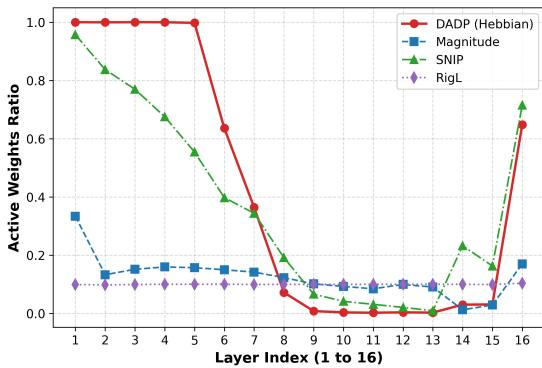

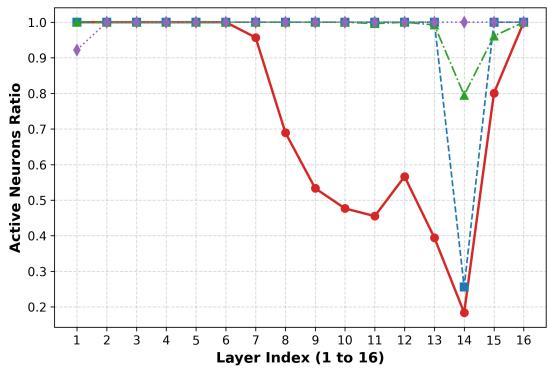

(a) Layer-Wise Sparsity Profile (90% Sparsity)  
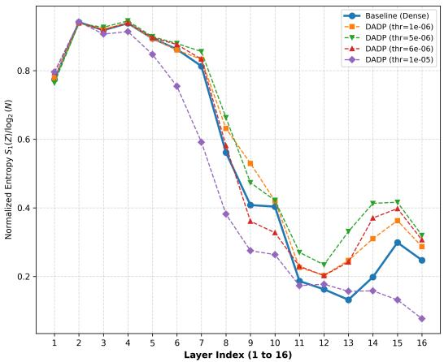

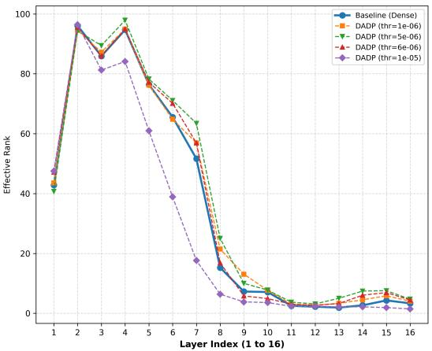  
(b) Information-Theoretic Representation Quality (Matrix Entropy & Effective Rank)

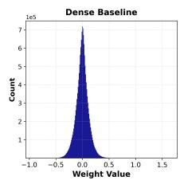

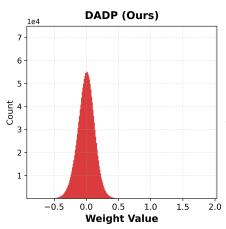

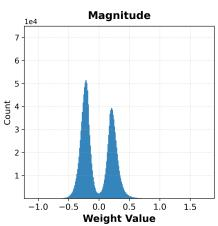

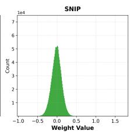  
(c) Global Active Weight Value Distributions across Pruning Methods

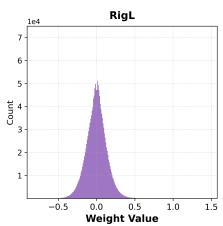

Figure 5: Comprehensive visual evaluation of VGG-16 on CIFAR-10. (a) DADP preserves classification accuracy up to 92.16% global sparsity. (b) Layer-wise profile shows early spatial filter lock alongside heavy compression in deep linear projection layers (classifier.0). (c) Latent representation quality across all 16 layers confirms that DADP maintains normalized Shannon entropy $( \bar { S } _ { \mathrm { n o r m } } \geq 0 . 8 5 )$ on par with dense unpruned features. (d) DADP preserves a smooth, zero-centered parameter distribution, avoiding artificial bimodal gaps around zero.

## F DETAILED CHANNEL-LEVEL STRUCTURED COMPRESSION TABLES

In this section, we present complete layer-by-layer physical structured compression shapes for VGG-16 (at ∼ 90% global sparsity) and ResNet-18 (at ∼ 95% global sparsity) across all evaluated pruning methods (DADP, SNIP, Magnitude, and RigL). Physical structured pruning deletes completely dead channels and neurons (where 100% of constituent weights are inactive), compressing tensor dimensions directly on disk.

## F.1 VGG-16 ON CIFAR-10 (∼ 90% GLOBAL SPARSITY)

Table 10: Layer-by-layer physical structured compression shapes for VGG-16 on CIFAR-10 at ∼ 90% global sparsity across pruning methods, with the number of pruned (dead) channels/neurons in parentheses.
<table><tr><td>Layer Name</td><td>Original Shape</td><td>DADP Compressed Shape</td><td>SNIP Compressed Shape</td><td>Magnitude Compressed Shape</td><td>RigL Compressed Shape</td></tr><tr><td>features.0</td><td>[64, 3, 3, 3]</td><td>[64, 3, 3, 3] (0 dead)</td><td>[64, 3, 3, 3] (0 dead)</td><td>[64, 3, 3, 3] (0 dead)</td><td>[59, 3, 3, 3] (5 dead)</td></tr><tr><td>features.3</td><td>[64, 64, 3, 3]</td><td>[64, 64, 3, 3] (0 dead)</td><td>[64, 64, 3, 3] (0 dead)</td><td>[64, 64, 3, 3] (0 dead)</td><td>[64, 59, 3, 3] (0 dead)</td></tr><tr><td>features.7</td><td>[128, 64, 3, 3]</td><td>[128, 64, 3, 3] (0 dead)</td><td>[128, 64, 3, 3] (0 dead)</td><td>[128, 64, 3, 3] (0 dead)</td><td>[128, 64, 3, 3] (0 dead)</td></tr><tr><td>features.10</td><td>[128,128,3,3]</td><td>[128, 128, 3, 3] (0 dead)</td><td>[128, 128, 3, 3] (0 dead)</td><td>[128, 128, 3, 3] (0 dead)</td><td>[128, 128, 3, 3] (0 dead)</td></tr><tr><td>features.14</td><td>[256,128,3,3]</td><td>[256, 128, 3, 3] (0 dead)</td><td>[256, 128, 3, 3] (0 dead)</td><td>[256,128, 3,3] (0 dead)</td><td>[256, 128, 3, 3] (0 dead)</td></tr><tr><td>features.17</td><td>[256,256,3,3]</td><td>[256, 256, 3, 3] (0 dead)</td><td>[256, 256, 3, 3] (0 dead)</td><td>[256,256,3,3] (0 dead)</td><td>[256,256,3,3] (0 dead)</td></tr><tr><td>features.20</td><td>[256,256, 3, 3]</td><td>[256, 256, 3, 3] (0 dead)</td><td>[256, 256, 3, 3] (0 dead)</td><td>[256,256, 3, 3] (0 dead)</td><td>[256, 256, 3, 3] (0 dead)</td></tr><tr><td>features.24</td><td>[512, 256, 3, 3]</td><td>[498, 256, 3, 3] (14 dead)</td><td>[512, 256, 3, 3] (0 dead)</td><td>[512,256, 3,3] ] (0 dead)</td><td>[512, 256, 3, 3] (0 dead)</td></tr><tr><td>features.27</td><td>[512,512,3,3]</td><td>[444, 498, 3, 3] (68 dead)</td><td>[512,512,3,3] (0 dead)</td><td>[512,512,3,3] (0 dead)</td><td>[512,512,3,3] (0 dead)</td></tr><tr><td>features.30</td><td>[512,512,3,3]</td><td>[399, 444, 3, 3] (113 dead)</td><td>[512, 512, 3, 3] (0 dead)</td><td>[512,512,3,3] (0 dead)</td><td>[512,512,3, 3] (0 dead)</td></tr><tr><td>features.34</td><td>[512,512,3,3]</td><td>[391, 399, 3, 3] (121 dead)</td><td>[510, 512, 3, 3] (2 dead)</td><td>[512, 512, 3, 3] (0 dead)</td><td>[512, 512, 3, 3] (0 dead)</td></tr><tr><td>features.37</td><td>[512,512,3,3]</td><td>[338, 391, 3, 3] (174 dead)</td><td>[512, 510, 3, 3] (0 dead)</td><td>[512, 512, 3, 3] (0 dead)</td><td>[512, 512, 3, 3] (0 dead)</td></tr><tr><td>features.40</td><td>[512,512,3,3]</td><td>[293, 338, 3, 3] (219 dead)</td><td>[508, 512, 3, 3] (4 dead)</td><td>[512, 512, 3, 3] (0 dead)</td><td>[512, 512, 3, 3] (0 dead)</td></tr><tr><td>classifier.0</td><td>[512,512]</td><td>[103, 293] (409 dead)</td><td>[407, 508] (105 dead)</td><td>[131, 512] (381 dead)</td><td>[512, 512] (0 dead)</td></tr><tr><td>classifier.3</td><td>[512, 512]</td><td>[452, 103] (60 dead)</td><td>[492, 407] (20 dead)</td><td>[512, 131] (0 dead)</td><td>[512, 512] (0 dead)</td></tr><tr><td>classifier.6</td><td>[10,512]</td><td>[10, 452] (0 dead)</td><td>[10, 492] (0 dead)</td><td>[10, 512] (0 dead)</td><td>[10, 512] (0 dead)</td></tr></table>

F.2 RESNET-18 ON CIFAR-10 (∼ 95% GLOBAL SPARSITY)

Table 11: Layer-by-layer physical structured compression shapes for ResNet-18 on CIFAR-10 at ∼ 95% global sparsity across pruning methods, with the number of pruned (dead) channels/neurons in parentheses.
<table><tr><td>Layer Name</td><td>Original Shape</td><td>DADP Compressed Shape</td><td>SNIP Compressed Shape</td><td>Magnitude Compressed Shape</td><td>RigL Compressed Shape</td></tr><tr><td>conv1</td><td>[64, 3,3, 3]</td><td>[64, 3, 3, 3] (0 dead)</td><td>[64, 3, 3, 3] (0 dead)</td><td>[64, 3, 3, 3] (0 dead)</td><td>[64, 3, 3, 3] (0 dead)</td></tr><tr><td>layer1.0.convl</td><td>[64, 64, 3, 3]</td><td>[64, 64, 3, 3] (0 dead)</td><td>[64, 64, 3, 3] (0 dead)</td><td>[64, 64, 3, 3] (0 dead)</td><td>[64, 64, 3, 3] (0 dead)</td></tr><tr><td>layer1.0.conv2</td><td>[64, 64, 3, 3]</td><td>[64, 64, 3, 3] (0 dead)</td><td>[64, 64, 3, 3] (0 dead)</td><td>[64, 64, 3, 3] (0 dead)</td><td>[64, 64, 3, 3] (0 dead)</td></tr><tr><td>layerl.1.convl</td><td>[64, 64, 3, 3]</td><td>[64, 64, 3, 3] (0 dead)</td><td>[64, 64, 3, 3] (0 dead)</td><td>[64, 64, 3, 3] (0 dead)</td><td>[64, 64, 3, 3] (0 dead)</td></tr><tr><td>layer1.1.conv2</td><td>[64, 64, 3, 3]</td><td>[64, 64, 3, 3] (0 dead)</td><td>[64, 64, 3, 3] (0 dead)</td><td>[64, 64, 3, 3] (0 dead)</td><td>[64, 64, 3, 3] (0 dead)</td></tr><tr><td>layer2.0.conv1</td><td>[128,64,3, 3]</td><td>[128, 64, 3, 3] (0 dead)</td><td>[128, 64, 3, 3] (0 dead)</td><td>[128, 64, 3, 3] (0 dead)</td><td>[128, 64, 3, 3] (0 dead)</td></tr><tr><td>layer2.0.conv2</td><td>[128, 128, 3, 3]</td><td>[128, 128, 3, 3] (0 dead)</td><td>[128, 128, 3, 3] (0 dead)</td><td>[128, 128, 3, 3] (0 dead)</td><td>[128, 128, 3, 3] (0 dead)</td></tr><tr><td>layer2.0.downsample.0</td><td>[128, 64,1, 1]</td><td>[128, 64,1, 1](0 dead)</td><td>[128, 64, 1, 1](0 dead)</td><td>[128, 64, 1, 1](0 dead)</td><td>[128, 64, 1, 1] (0 dead)</td></tr><tr><td>layer2.1.conv1</td><td>[128,128, 3, 3]</td><td>[128, 128, 3, 3] (0 dead)</td><td>[128, 128, 3, 3] (0 dead)</td><td>[128, 128, 3, 3] (0 dead)</td><td>[128, 128, 3, 3] (0 dead)</td></tr><tr><td>layer2.1.conv2</td><td>[128, 128, 3, 3]</td><td>[128, 128, 3, 3] (0 dead)</td><td>[128, 128, 3, 3] (0 dead)</td><td>[128, 128, 3, 3] (0 dead)</td><td>[128, 128,3, 3] (0 dead)</td></tr><tr><td>layer3.0.convl</td><td>[256,128, 3, 3]</td><td>[191, 128, 3, 3] (65 dead)</td><td>[256,128,3,3] (0 dead)</td><td>[256,128,3,3] (0 dead)</td><td>[256, 128, 3, 3] (0 dead)</td></tr><tr><td>layer3.0.conv2</td><td>[256, 256, 3, 3]</td><td>[164, 191, 3, 3] (92 dead)</td><td>[256, 256, 3, 3] (0 dead)</td><td>[256, 256, 3, 3] (0 dead)</td><td>[256, 256, 3, 3] (0 dead)</td></tr><tr><td>layer3.0.downsample.0</td><td>[256, 128, 1, 1]</td><td>[159, 128, 1, 1] (97 dead)</td><td>[256, 128, 1, 1] (0 dead)</td><td>[256, 128, 1, 1] (0 dead)</td><td>[256, 128, 1, 1] (0 dead)</td></tr><tr><td>layer3.1.convl</td><td>[256, 256, 3, 3]</td><td>[101, 164, 3, 3] (155 dead)</td><td>[256,256, 3,3] (0 dead)</td><td>[256,256,3,3] (0 dead)</td><td>[256, 256, 3, 3] (0 dead)</td></tr><tr><td>layer3.1.conv2</td><td>[256, 256, 3, 3]</td><td>[142,101,3,3] (114 dead)</td><td>[256,256,3,3] (0 dead)</td><td>[256,256,3,3] ] (0 dead)</td><td>256, 256,3,3 (0 dead)</td></tr><tr><td>layer4.0.convl</td><td>[512,256,3,3]</td><td>[138,142,3,3] (374 dead)</td><td>[512,256,3,3] (0 dead)</td><td>[512, 256, 3, 3] (0 dead)</td><td>[512,256, 3,3] (0 dead)</td></tr><tr><td>layer4.0.conv2</td><td>[512,512,3,3]</td><td>256,138,3,3] (256 dead)</td><td>[512,512,3,3] (0 dead)</td><td>[512, 512, 3, 3] (0 dead)</td><td>[512, 512, 3, 3] (0 dead)</td></tr><tr><td>layer4.0.downsample.0</td><td>[512, 256, 1, 1]</td><td>[400, 142, 1, 1] ] (112 dead)</td><td>[512,256, 1,1 (0 dead)</td><td>[512, 256, 1, 1] (0 dead)</td><td>[512, 256, 1, 1] (0 dead)</td></tr><tr><td>layer4.1.conv1</td><td>[512, 512, 3, 3]</td><td>[69, 256, 3, 3] (443 dead)</td><td>[512, 512, 3, 3] (0 dead)</td><td>[505, 512, 3, 3] (7 dead)</td><td>[512, 512, 3, 3] (0 dead)</td></tr><tr><td>layer4.1.conv2</td><td>[512,512,3, 3]</td><td>[145, 69, 3, 3] (367 dead)</td><td>[505, 512, 3, 3] (7 dead)</td><td>[495, 505, 3, 3] (17 dead)</td><td>[512, 512, 3, 3] (0 dead)</td></tr><tr><td>fc</td><td>[10, 512]</td><td>[10, 145] (0 dead)</td><td>[10, 505] (0 dead)</td><td>[10, 495] (0 dead)</td><td>[10, 512] (0 dead)</td></tr></table>

## G INITIALIZATION SENSITIVITY & ARCHITECTURAL LAYER MAPPING

## G.1 INITIALIZATION SENSITIVITY ABLATIONS

Table 12: Weight initialization scheme ablation evaluation for VGG-16 and ResNet-18 on CIFAR-10.
<table><tr><td>Model</td><td>Initialization Scheme</td><td>Pruning Threshold τ</td><td>Final Sparsity (%)</td><td>Final Test Acc (%)</td></tr><tr><td>ResNet-18</td><td>Kaiming Normal</td><td>τ = 5e-5</td><td>95.41%</td><td>75.10%</td></tr><tr><td>ResNet-18</td><td>Kaiming Uniform</td><td>τ = 5e-5</td><td>95.35%</td><td>76.08%</td></tr><tr><td>ResNet-18</td><td>Xavier Normal</td><td>τ = 5e-5</td><td>95.66%</td><td>77.05%</td></tr><tr><td>ResNet-18</td><td>Xavier Uniform</td><td>τ = 5e-5</td><td>95.54%</td><td>76.72%</td></tr><tr><td>ResNet-18</td><td>Orthogonal</td><td>τ = 5e-5</td><td>95.75%</td><td>76.51%</td></tr><tr><td>ResNet-18</td><td>Normal (σ = 0.02)</td><td>τ = 5e-5</td><td>95.96%</td><td>77.26%</td></tr><tr><td>ResNet-18</td><td>Normal (σ = 0.1)</td><td>τ = 5e-5</td><td>94.67%</td><td>74.42%</td></tr><tr><td>VGG-16</td><td>Kaiming Normal</td><td>τ = 5e-6</td><td>84.86%</td><td>84.80%</td></tr><tr><td>VGG-16</td><td>Kaiming Uniform</td><td>τ = 5e-6</td><td>85.03%</td><td>85.30%</td></tr><tr><td>VGG-16</td><td>Xavier Normal</td><td>τ = 5e-6</td><td>86.58%</td><td>84.84%</td></tr><tr><td>VGG-16</td><td>Xavier Uniform</td><td>τ = 5e-6</td><td>86.73%</td><td>85.38%</td></tr><tr><td>VGG-16</td><td>Orthogonal</td><td>τ = 5e-6</td><td>86.61%</td><td>85.63%</td></tr><tr><td>VGG-16</td><td>Normal (σ = 0.02)</td><td>τ = 5e-6</td><td>100.00%</td><td>10.00%</td></tr><tr><td>VGG-16</td><td>Normal (σ = 0.1)</td><td>τ = 5e-6</td><td>77.68%</td><td>83.44%</td></tr></table>

## G.2 LAYER INDEX TO ARCHITECTURAL NAME MAPPING

Table 13: Sequential layer index mapping (1, 2, 3, . . . , L) to full parameter layer names for ResNet-18, VGG-16, and MiniBERT.
<table><tr><td>Layer Index</td><td>ResNet-18 (CIFAR-10)</td><td colspan="2">VGG-16 (CIFAR-10)</td><td>MiniBERT (SST-2)</td></tr><tr><td>1</td><td>conv1</td><td>features.0</td><td>(conv1_1)</td><td>embeddings.word_embeddings</td></tr><tr><td>2</td><td>layer1.0.conv1</td><td>features.3</td><td>(conv1_2)</td><td>embeddings.position_embeddings</td></tr><tr><td>3</td><td>layer1.0.conv2</td><td>features.7</td><td>(conv2_1)</td><td>encoder.layer.0.attention.query</td></tr><tr><td>4</td><td>layer1.1.conv1</td><td>features.10</td><td>(conv2_2)</td><td>encoder.layer.0.attention.key</td></tr><tr><td>5</td><td>layer1.1.conv2</td><td>features.14</td><td>(conv3_1)</td><td>encoder.layer.0.attention.value</td></tr><tr><td>6</td><td>layer2.0.conv1</td><td>features.17</td><td>(conv3_2)</td><td>encoder.layer.0.output.dense</td></tr><tr><td>7</td><td>layer2.0.conv2</td><td>features.20</td><td>(conv3_3)</td><td>encoder.layer.0.intermediate.dense</td></tr><tr><td>8</td><td>layer2.0.downsample.0</td><td>features.24</td><td>(conv4_1)</td><td>encoder.layer.1.attention.query</td></tr><tr><td>9</td><td>layer2.1.conv1</td><td>features.27</td><td>(conv4_2)</td><td>encoder.layer.1.attention.key</td></tr><tr><td>10</td><td>layer2.1.conv2</td><td>features.30</td><td>(conv4_3)</td><td>encoder.layer.1.attention.value</td></tr><tr><td>11</td><td>layer3.0.conv1</td><td>features.34</td><td>(conv5_1)</td><td>encoder.layer.1.output.dense</td></tr><tr><td>12</td><td>layer3.0.conv2</td><td>features.37</td><td>(conv5_2)</td><td>encoder.layer.1.intermediate.dense</td></tr><tr><td>13</td><td>layer3.0.downsample.0</td><td>features.40</td><td>(conv5_3)</td><td>classifier</td></tr><tr><td>14</td><td>layer3.1.conv1</td><td>classifier.0</td><td>(fc1)</td><td></td></tr><tr><td>15</td><td>layer3.1.conv2</td><td>classifier.3</td><td>(fc2)</td><td></td></tr><tr><td>16</td><td>layer4.0.conv1</td><td>classifier.6</td><td>(fc3)</td><td></td></tr><tr><td>17</td><td>layer4.0.conv2</td><td></td><td></td><td></td></tr><tr><td>18</td><td>layer4.0.downsample.0</td><td></td><td></td><td></td></tr><tr><td>19</td><td>layer4.1.conv1</td><td></td><td></td><td></td></tr><tr><td>20</td><td>layer4.1.conv2</td><td></td><td></td><td></td></tr><tr><td>21</td><td>fc</td><td></td><td></td><td></td></tr></table>