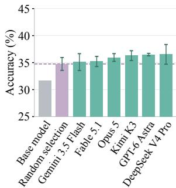
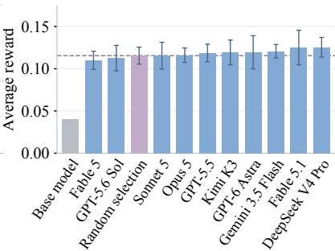
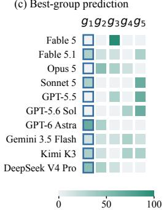
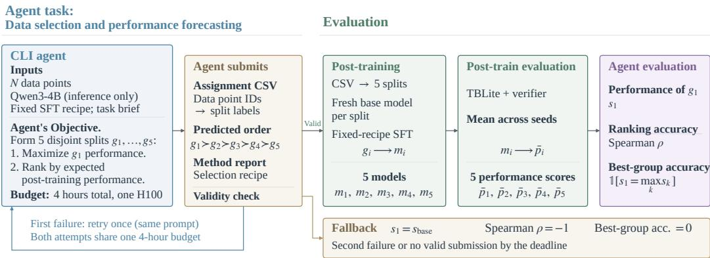
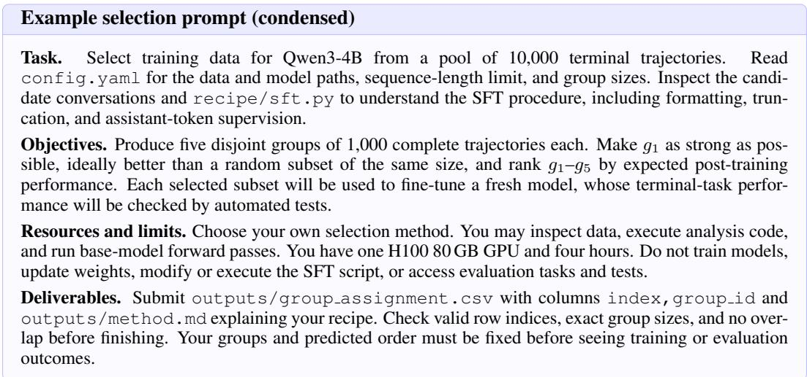
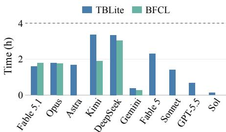

# DATASENSE-BENCH: THE FIRST STEP TOWARD AN AI SCIENTIST

Yudi Zhang<sup>1∗</sup>, Mingyu Cao<sup>2</sup>, Lu Yin<sup>2</sup>, Mykola Pechenizkiy<sup>1</sup>, Shiwei Liu<sup>3,4,5</sup>

<sup>1</sup>Eindhoven University of Technology <sup>2</sup>University of Surrey <sup>3</sup>ELLIS Institute Tubingen¨

<sup>4</sup>Max Planck Institute for Intelligent Systems <sup>5</sup>Tubingen AI Center¨

## ABSTRACT

As claims about recursive self-improvement (RSI) and artificial general intelligence (AGI) proliferate, we ask a simple question: do frontier AI models have a sense of data, i.e., can they reliably select the right data for training? We introduce DataSense-Bench<sup>1</sup> to study this capability through the fundamental problem of data selection and performance forecasting in machine learning. We ask AI agents to select and rank candidate training subsets that can be used to fine-tune a small LLM model. Agents are allowed to inspect the data, write and execute analysis code, and run model forward passes, but can not train the model or access the actual evaluation tasks. We then fine-tune the base model on each selected subset and evaluate its post-training performance under a standardized protocol. We instantiate the benchmark in terminal problem solving and tool use, selecting trajectories from OpenThoughts-Agent and EnvScaler and evaluating on TBLite and BFCL, respectively. We then evaluate the agents along two complementary dimensions: the post-training performance of the top-ranked subset, reflecting the ability to identify high-value training data, and ranking accuracy, reflecting the ability to predict the relative performance of the selected subsets. In our experiments, selection gains over random selection are limited; agents do not reliably rank their selected groups, and ranking ability does not hold consistently across tasks: Astra identifies the best group in all three tool-use runs but in only one of three terminal runs. Analysis of execution traces on both tasks shows that agents often use similar data signals while interpreting their training value differently.

(a) BFCL  


(b) TBLite  


(c) Best-group prediction  
  
Actual best (%)  
Figure 1: Can CLI agents select useful training data and predict its value? (a,b) Qwen3-4B performance after training on the predicted top-ranked group selected by each agent. Panel (a) reports BFCL accuracy; panel (b) reports TBLite reward. Dashed lines denote random selection. Scores are averaged across evaluation seeds within checkpoints, then across three agent runs; error bars show standard deviation across agent runs (across evaluation seeds for random selection). (c) Frequency of each predicted rank yielding the best group, pooling evaluated runs from both tasks with equal weight per run: six runs for agents evaluated on both tasks and three for TBLite-only agents. Tied best groups each count as correct; blue outlines mark $g _ { 1 }$

## 1 INTRODUCTION

Large language models (LLMs) are increasingly used for tasks such as question answering (Brown et al., 2020), code generation (Chen et al., 2021), and data analysis (Majumder et al., 2025). Recent advances in reasoning and tool use have made frontier models capable of tackling complex scientific problems, supporting AI scientists who generate research ideas, conduct experiments, analyze results, and write complete research manuscripts (Lu et al., 2026). Benchmarks increasingly assess scientific programming, discovery, and machine learning experimentation (Chen et al., 2025; Majumder et al., 2025; Huang et al., 2024; Rank et al., 2026). These settings test several abilities together. They leave a more focused question open: can an AI system anticipate the value of an experimental choice before observing its outcome?

Training-data selection provides a concrete setting for this question. Before committing to training, researchers must choose which examples will help a particular model learn (Zhou et al., 2023; Xia et al., 2024). This is a consequential and difficult decision: data selection determines the supervision a model receives, yet observable quality does not directly establish training value. For example, low loss alone need not imply high training value: an example may already be well learned (Mindermann et al., 2022). Likewise, a successful trajectory does not by itself establish how much a particular model will learn from it. Reliable judgment requires connecting properties of the data to what a particular model will learn under a fixed training procedure (Li et al., 2024; Xia et al., 2024).

Our Benchmark. Therefore, we introduce DATASENSE-BENCH to evaluate this judgment capability of the frontier models. A CLI agent receives a candidate training data pool, inference-only access to a base model, and a fixed fine-tuning protocol. It selects disjoint, equal-sized subsets and ranks them by expected value for the post-training performance. The agent may inspect data, execute analysis code, and run forward passes, but cannot train models or access evaluation tasks. Once the submission is fixed, the benchmark fine-tunes a fresh copy of the base model on each subset and measures the resulting performance. This separation makes the submitted ranking a prediction that can be checked against subsequent experimental evidence. As a consequence, the benchmark asks about both Selection quality and Ranking accuracy, which measure whether the first group in the LLM’s predicted ordering produces a useful model and whether the predicted ordering of the subsets agrees with their observed performance, separately. A strong top choice need not imply an accurate ordering; conversely, correctly ordering weak subsets need not produce a useful recommendation. Both are needed to understand whether an agent can turn data analysis into reliable decisions.

Our Findings. We instantiate this protocol in terminal problem solving and multi-turn tool use, using OpenThoughts-Agent and EnvScaler trajectories for training and TBLite and BFCL for downstream evaluation, respectively. Our experiments reveal two limitations: gains over random selection are modest, and agents do not reliably rank their selected groups. Ranking ability also does not hold consistently across tasks. (1) The frontier agents produce plausible, data-specific recipes but do not reliably predict post-training utility. On TBLite, two LLMs select first groups that underperform random selection, with differences across LLMs ranging from -0.55 to +0.99 points, as shown in Table 1. On BFCL, all six agents’ first groups exceed random selection by 0.35–1.78 % points. Astra identifies the best group in all three BFCL runs but in only one of three TBLite runs. None of the six agents evaluated on both tasks identifies the best group in all three runs on each task. (2) Selection recipes vary substantially across three independent runs of the same agent. Astra’s TBLite runs change their quality-assessment procedures, while Kimi’s BFCL runs move from loss-outlier rejection to intermediate-loss and then lower-loss preferences. The selection rule itself changes across runs. (3) Agents draw different conclusions from similar data signals. For example, agents use base-model loss in substantially different ways across runs and tasks. Section 4.3 examines the concrete recipes in detail.

## 2 RELATED WORK

We review benchmarks for CLI agents, training-data selection, and performance forecasting.

Benchmarks for CLI Agents. Command-line interface (CLI) agents use shell commands and scripts to complete tasks in OS environments. Terminal-Bench evaluates realistic terminal tasks with executable verification, while SWE-bench focuses on resolving real GitHub issues through repository modifications (Merrill et al., 2026; Jimenez et al., 2024). Research-oriented benchmarks address scientific programming and reproducibility (Chen et al., 2025; Siegel et al., 2024), as well as machine learning experimentation and research engineering (Huang et al., 2024; Chan et al., 2025; Wijk et al., 2025). Most closely related, PostTrainBench evaluates agents’ choices of data, methods, and hyperparameters for LLM post-training under a compute budget (Rank et al., 2026). These benchmarks measure end-to-end outcomes that depend on both decision quality and execution. DATASENSE-BENCH focuses on data-selection judgment: agents inspect candidate data, construct selection procedures, and submit ranked subsets for a fixed base model and training protocol before receiving any training feedback.

  
Figure 2: From data-selection predictions to post-hoc verification. Illustrated for terminal problem solving, the CLI agent analyzes candidate trajectories with inference-only access to the base model. It delivers a row-to-group assignment CSV and a method report specifying its selection recipe. We validate five disjoint groups of the specified size and freeze their membership and predicted order. Only then does evaluation perform SFT and downstream scoring, testing selection quality, best-group accuracy, and agreement with the full predicted ordering.

Training Data Selection. Existing selection methods differ in the signals they use to identify useful training data. Curation and scoring approaches emphasize the value of small, high-quality instruction sets (Zhou et al., 2023) and use model-based assessments of quality or instruction-following difficulty to select examples (Chen et al., 2024; Li et al., 2024). Other approaches seek to use importance resampling (Xie et al., 2023b) or improve coverage through deduplication and embeddingbased data selection (Tirumala et al., 2023). RHO-LOSS uses a holdout-trained model to prioritize examples expected to reduce generalization loss (Mindermann et al., 2022). More recently, FEEDER assesses the sufficiency and necessity of demonstrations for in-context learning, with an extension to fine-tuning (Jin et al., 2025). Together, these methods motivate the quality, loss, and coverage signals examined in our procedure analysis.

Performance Forecasting. A complementary line estimates how training examples affect model behavior through derivative-based influence approximations (Koh & Liang, 2017; Pruthi et al., 2020; Kwon et al., 2024), marginal contributions to predictive performance (Ghorbani & Zou, 2019), or gradient similarity for targeted instruction tuning (Xia et al., 2024). At the subset or mixture level, datamodels predict model outputs from training-subset membership (Ilyas et al., 2022), while DoReMi learns domain weights with a proxy model and RegMix predicts mixture performance from small training runs (Xie et al., 2023a; Liu et al., 2025). These approaches differ in their use of target examples, gradients, and training feedback. DATASENSE-BENCH provides a standardized protocol for evaluating whether frontier models can select useful subsets and forecast their relative downstream performance. Subsequent training and evaluation measure both top-subset performance and ranking accuracy.

## 3 SETUP OF DATASENSE-BENCH

DATASENSE-BENCH aims to evaluate whether a CLI agent can judge the training value of data before observing training outcomes. We explain how we set up our benchmark in detail as follows.

## 3.1 TASK FOR CLI AGENTS: SELECT USEFUL DATA AND PREDICT ITS VALUE

Let D be a pool of N candidate trajectories, M a base model, and R the fine-tuning procedure used to test a submission. The agent selects K subsets $G = ( g _ { 1 } , \dots , g _ { K } )$ with $g _ { k } \subseteq D , | g _ { k } | = n$ , and $g _ { i } \cap g _ { j } = \emptyset \mathrm { f o r } i \neq j$ . The group labels encode its prediction: training on $g _ { 1 }$ should give the highest downstream score, followed by $^ { g _ { 2 } , }$ through $g _ { K }$ . Figure 3 provides a condensed prompt example used in our benchmark, and the full prompt appears in Appendix C.

Post-training Data. We study two tasks that require learning from multi-step interactions: terminal problem solving and multi-turn tool use. Both expose intermediate actions and feedback, allowing agents to assess which trajectories may provide useful supervision. For each task, agents select five disjoint groups of complete trajectories, and we independently fine-tune Qwen3-4B <sup>2</sup> on each group using supervised fine-tuning (SFT). Whole trajectories are selected before the training procedure converts them into training samples.

Tool usage. The training data come from the EnvScaler SFT pool (Song et al., 2026), with validation trajectories excluded. These trajectories involve selecting functions, supplying arguments, and responding to tool feedback. Each selected group contains 50 complete trajectories. We evaluate the fine-tuned models on BFCL V3<sup>3</sup>, measuring multi-turn tool-use performance.

Terminalproblem solving. The training pool is OpenThoughts-Agent-SFT-10K (Raoof et al., 2026)<sup>4</sup>, which contains trajectories pairing task instructions with terminal interactions, including commands, their outputs, and error recovery. Each selected group contains 1,000 trajectories. We evaluate the fine-tuned models on TBLite (Raoof et al., 2026), where automated task verifiers measure success on terminal tasks.

We will explain BFCL V3 and TBLite later, and the agents are not allowed to access these downstream evaluation tasks.

Agent’s Objectives. We ask agents to select five groups and specify two objectives, as shown in Figure 3:

• to make $g _ { 1 }$ as strong as possible, ideally outperforming random selection at the same size.

• to order the groups by expected post-training performance.

These objectives assess complementary abilities: ranking evaluates the ordering of weak groups, whereas selection evaluates the ability to identify a useful subset.

Resources that the agent can access. The agent receives the task prompt, candidate data, base model, task configuration, and a supervised fine-tuning script. The prompt specifies the downstream task types without revealing evaluation instances, while leaving the choice and combination of selection signals to the agent. Each selection run has inference-only access to the base model and is allocated one H100 80 GB GPU and four hours to analyze the data and submit a selection. Subsequent training and evaluation are performed outside this time budget. Within each task, all agents receive the same fixed training recipe, which is used to fine-tune every selected group. We evaluate ten CLI agents on TBLite and six on BFCL, with three independent selection runs per agent and task. Please refer to Table 3 in Appendix A for more experimental configuration.

Submission Protocol. Each agent is asked to submit a group-assignment CSV and a short method report explaining the selection recipe and its rationale. The CSV assigns valid candidate-pool indices to five disjoint groups: 50 for BFCL and 1,000 complete trajectories per group for TBLite, omitting unselected rows. Group labels $g _ { 1 }$ through $g _ { 5 }$ indicate the predicted ranking by expected post-training performance, from highest to lowest. The agent must write and verify both files within the selection time budget, finalizing group composition and ordering before observing any training or evaluation outcomes; no trained model is submitted.

  
Figure 3: Condensed terminal-task prompt specifying the selection and ranking objectives, permit ted tools, computation budget, and required deliverables. The prompt for BFCL is described in Appendix C.3.

## 3.2 POST-CHECK AND POST-TRAINING EVALUATION

After the agent submits its selection, the benchmark validates the submission and tests its predicted ordering, shown in Figure 2.

Submission validation. We check the assignment against the submission protocol in Section 3.1 and verify that the method report is present. For BFCL, we also cross-check row positions against source trajectory identifiers and exclude validation trajectories. CLI completion and valid deliverables are checked separately. If the first attempt fails to produce a valid submission, the agent may retry once using the same prompt within the remaining four-hour selection budget. The two attempts share this budget. If the second attempt also fails, or no valid submission is produced before the budget expires, we apply the failure scores defined in Section 3.3.

Post-training evaluation. Each group is used to fine-tune a fresh copy of the base model under its task-specific training procedure. Within each task, all resulting models use the same evaluation suite and scoring protocol. Let $s _ { k }$ denote the downstream score (TBLite average reward or BFCL accuracy) for the model trained on g<sub>k</sub>, averaged across evaluation tasks and evaluation seeds. These outcomes are used only to assess the submitted selection and ordering, not to revise them. Section 4.1 describes both downstream evaluation protocols.

## 3.3 EVALUATION METRICS

We want to evaluate two complementary capabilities of the data selection agents: whether the agent selects useful training data, and whether it can anticipate which data choices will be more useful. We therefore evaluate the performance of its first-ranked group and the agreement between its predicted and observed ordering. Selection quality. The score $s _ { 1 }$ measures the utility of the data the agent recommends most strongly. To assess whether this choice improves on an uninformed selection, we also report its gain over random selection, $\Delta _ { \mathrm { r a n d o m } } = s _ { 1 } - s _ { \mathrm { r a n d o m } }$ , using the same group size and training procedure. A positive gain supports the selection objective, but does not establish that the agent can compare its five groups. Ranking accuracy. We test that comparison at two levels. Bestgroup accuracy asks whether the agent’s first choice is actually the best among its selected groups: $A _ { \mathrm { b e s t } } = \mathcal { k } [ s _ { 1 } = \mathrm { m a x } _ { k = 1 , \dots , 5 } s _ { k } ]$ . Spearman correlation (Spearman, 1904) tests the full predicted ordering: $S _ { \mathrm { r a n k } } = \rho _ { \mathrm { S p e a r m a n } } \big ( ( 4 , 3 , 2 , 1 , 0 ) , ( s _ { 1 } , \dots , s _ { 5 } ) \big )$ . These measures distinguish identifying the best group from correctly ordering all alternatives. We reverse the group-index scale so that perfect rank agreement gives +1, whereas a reversed ordering gives −1.

For valid submissions, we compute both ranking metrics within each selection run after evaluating all five groups. Best-group accuracy counts a tie for the highest unrounded score as correct. Spearman correlation uses average ranks for ties and is undefined when all five outcomes are equal. Such runs are excluded only from the mean Spearman correlation; they remain in the averages of selection scores and best-group accuracy. For failed submissions under Section 3.2, we set $s _ { 1 } = s _ { \mathrm { b a s e } } ,$ $S _ { \mathrm { r a n k } } = - 1$ , and $A _ { \mathrm { b e s t } } = 0$ . These are failure penalties, not correlations computed from tied basemodel scores. Failed runs remain in the averages across selection runs; $\Delta _ { \mathrm { { r a n d o m } } }$ uses the fallback $s _ { 1 }$

## 4 EXPERIMENTS

Our experiments ask whether agents select data that improves downstream performance, whether their predicted group order is reliable, and how they construct these judgments. We report outcomes first, then analyze the selection procedures and their resource requirements.

## 4.1 DOWNSTREAM EVALUATION

We evaluate the fine-tuned models on the two downstream tasks introduced in Section 3.1. The data-selection agents do not perform these evaluations or access their test instances during the data selection.

TBLite. OpenThoughts-TBLite contains 100 terminal tasks across nine categories, including software engineering, debugging, data processing, and security (Raoof et al., 2026). We use Harbor’s<sup>5</sup> Terminus-2 scaffold to execute model-generated commands and return terminal outputs. Each attempt starts in a fresh Daytona<sup>6</sup> sandbox and ends when the model finishes or reaches the task’s time limit. Task-supplied verifiers check the resulting environment or artifacts and assign rewards, including fractional credit where supported. We report average reward over 100 tasks with three attempts per task, giving 300 equally weighted scores per checkpoint.

BFCL. For models trained on EnvScaler trajectories, we use BFCL V3: 200 cases each for base interactions, missing functions, missing parameters, and long context. The evaluator checks tooluse outcomes against the required state and execution behavior. Each evaluation seed covers all 800 cases; its overall accuracy averages the four equally sized categories. We use three evaluation seeds per checkpoint.

## 4.2 SELECTION QUALITY AND RANKING ACCURACY

Table 1 separates two questions: whether agents choose useful training data and whether they correctly rank the groups they select.

Selection yields limited gains over random selection on both tasks. On BFCL, all six agents average g accuracies exceed random selection’s 34.75%, but gains range from only 0.35 to 1.78 % points. DeepSeek V4 Pro has the highest average at 36.53%. Its run-3 $g _ { 1 }$ achieves the highest accuracy among agent-selected checkpoints, 38.62%. On TBLite, average $g _ { 1 }$ rewards range from 11.00% to 12.54%, compared with 11.55% for random selection. Two of ten agents underperform this reference, and DeepSeek V4 Pro’s leading score improves on it by only 0.99 points. Thus, elaborate selection recipes yield modest gains on both tasks, with less consistent improvements on TBLite.

Selecting useful data does not imply reliably ranking the selected groups. BFCL reveals a gap between selection quality and ranking accuracy: all six agents improve over Random with $g _ { 1 }$ , yet their average Spearman correlations range from −0.27 to 0.83. GPT-6 Astra identifies the best group in all three runs and achieves a correlation of 0.83. In contrast, Kimi K3 achieves 36.29% average $g _ { 1 }$ accuracy but a correlation of only 0.02, while Gemini’s negative correlation indicates disagreement with the predicted ordering. Conversely, Opus has a correlation of 0.77 but never identifies the best group, illustrating that agreement over all five positions can coexist with an incorrect first choice. The difficulty is more widespread on TBLite, where correlations range from −0.50 to 0.30. Even

Table 1: Selection performance, best-group accuracy, and rank performance on BFCL and TBLite. Agent-group scores (s<sub>1</sub>-s<sub>5</sub>) report the post-training performance, accuracy (%) for $\mathrm { { B F C L , } }$ and reward for TBLite (scale from 0-1 to 0-100). We report the average performance across three evaluation seeds and three data selection runs, standard deviation (subscript), and maximum score among different data selection runs. Shading compares group averages within a row; red outlines mark each task’s largest maximum among agent-selected groups. $g _ { 1 }$ gain $\Delta _ { \mathrm { { r a n d o m } } }$ is relative to random selection. Best-group accuracy $A _ { \mathrm { b e s t } }$ measures how often the agent identifies its best group; rank performance $S _ { \mathrm { r a n k } }$ measures Spearman correlation between predicted and observed group orderings (Section 3.3). More detailed experimental results are in Appendix A.3.
<table><tr><td colspan="11">Rank Agent / reference  $s _ { 1 } \ g _ { 1 } \ \mathbf { g } \mathrm { a i n }$   $s _ { 2 }$   $s _ { 3 }$   $s _ { 4 }$   $s _ { 5 } \ S _ { \mathrm { r a n k } \ A _ { \mathrm { b e s t } } }$ </td></tr><tr><td colspan="11">BFCL accuracy (50 trajectories per group) Base model: 31.67%</td></tr><tr><td>1</td><td>DeepSeek V4 Pro</td><td> $3 6 . 5 3 { \scriptstyle \pm 1 . 8 3 }$   $\boxed { \mathbf { M a x } : 3 8 . 6 2 }$ </td><td>1.78</td><td> $\mathbf { 3 6 . 6 1 } _ { \pm 0 . 7 2 }$   $\mathbf { M a x } \colon 3 7 . 4 2$ </td><td> $3 5 . 7 4 _ { \pm 1 . 1 2 }$   $\mathbf { M a x } \colon \overline { { 3 7 } } . 0 0$ </td><td> $3 6 . 0 8 _ { \pm 1 . 4 4 }$   $\mathrm { M a x } \colon \overline { { 3 7 } } . 7 5$ </td><td> $3 4 . 3 3 { \scriptstyle \pm 1 . 1 6 }$   $\mathbf { M a x } \colon \overline { { 3 5 } } . \dot { 6 7 }$ </td><td>0.65</td><td></td><td>33.33</td></tr><tr><td>2</td><td> $\mathrm { G P T } { \cdot } 6 \mathrm { A s t r a }$ </td><td> $\mathbf { 3 6 . 4 9 } _ { \pm 0 . 2 3 }$  _  $\mathrm { M a x } \colon 3 6 . 7 5$  </td><td>1.74</td><td> $3 5 . 3 1 { \scriptstyle \pm 0 . 9 4 }$  Max: 36.38</td><td> $3 4 . 7 4 { \scriptstyle \pm 1 . 5 0 }$   $\mathrm { M a x } \colon \overline { { 3 6 } } . 2 1$ </td><td> $3 4 . 9 3 _ { \pm 0 . 4 2 }$   $\mathrm { M a x } \colon \overline { { 3 5 } } . 4 2$ </td><td> $3 4 . 5 8 { \scriptstyle \pm 0 . 0 7 }$   $\mathrm { M a x } \colon \overline { { 3 4 } } . 6 2$ </td><td></td><td>0.83</td><td>100.00</td></tr><tr><td>3</td><td>Kimi K3</td><td> $3 6 . 2 9 { \scriptstyle \pm 0 . 9 1 }$   $\mathbf { M a x } \colon \overline { { 3 6 . 9 2 } }$ </td><td>1.54</td><td> $\begin{array} { c } { 3 6 . 2 1 _ { \pm 0 . 6 5 } } \\ { \mathrm { M a x } ; 3 6 . 9 2 } \end{array}$ </td><td> $3 6 . 1 8 { \scriptstyle \pm 1 . 2 2 }$   $\mathrm { M a x } \colon \overline { { 3 7 } } . 5 8$ </td><td> $3 5 . 8 5 { \scriptstyle \pm 1 . 1 4 }$   $\mathrm { M a x } \colon \overline { { 3 6 } } . 6 2$ </td><td> $\begin{array} { r } { 3 6 . 4 6 _ { \pm 1 . 2 7 } } \\ { \mathrm { M a x } ; 3 7 . 7 5 } \end{array}$ </td><td></td><td>0.02</td><td>33.33</td></tr><tr><td>4</td><td>Opus 5</td><td> $3 5 . 9 4 _ { \pm 0 . 7 2 }$   $\mathrm { M a x } \colon \overline { { 3 6 . 7 5 } }$ </td><td>1.19</td><td> $\begin{array} { c } { { \mathbf { 3 6 . 3 5 _ { \pm 1 . 0 9 } } } } \\ { { \mathrm { M a x : } 3 7 . 3 8 } } \end{array}$ </td><td> $3 5 . 3 5 { \scriptstyle \pm 0 . 5 3 }$   $\mathrm { M a x } \colon \overline { { 3 5 } } . 9 6$ </td><td> $3 4 . 2 9 _ { \pm 2 . 2 9 }$   $\mathrm { M a x } \colon \overline { { 3 6 } } . 5 4$ </td><td> $3 1 . 0 8 _ { \pm 3 . 4 5 }$ </td><td> $\mathrm { M a x } \colon \overline { { 3 5 } } . 0 4$ </td><td>0.77</td><td>0.00</td></tr><tr><td>5</td><td>Fable 5.1</td><td> $3 5 . 2 1 { \scriptstyle \pm 0 . 9 4 }$   $\mathbf { M a x } \colon \overline { { 3 6 . 0 0 } } \cdot$ </td><td>0.46</td><td> $\begin{array} { c } { 3 4 . 9 6 _ { \pm 1 . 6 7 } } \\ { \mathrm { M a x } ; 3 6 . 5 8 } \end{array}$ </td><td> $3 4 . 8 7 { \scriptstyle \pm 0 . 0 7 }$   $\mathrm { M a x } \colon \overline { { 3 4 } } . 9 6$ </td><td> $3 4 . 1 0 { \scriptstyle \pm 0 . 2 4 }$   $\mathrm { M a x } \colon \overline { { 3 4 } } . 3 8$ </td><td></td><td> $\mathbf { 3 5 . 5 7 \bot } 1 . 5 3$   $\mathbf { M a x } \colon 3 7 . 1 7$ </td><td>0.23</td><td>33.33</td></tr><tr><td>6</td><td>Gemini 3.5 Flash</td><td> $3 5 . 1 0 { \scriptstyle \pm 1 . 5 6 }$   $\mathrm { M a x } \colon \overline { { 3 6 } } . 4 2$ </td><td>0.35</td><td> $3 4 . 1 8 { \scriptstyle \pm 1 . 1 0 }$   $\mathrm { M a x } \colon \overline { { 3 5 } } . 2 9$ </td><td> $3 3 . 5 7 { \scriptstyle \pm 0 . 4 9 }$   $\mathrm { M a x } \colon \overline { { 3 4 } } . 1 2$ </td><td> $3 3 . 0 7 { \scriptstyle \pm 3 . 3 5 }$   $\mathrm { M a x } \colon 3 5 . 2 1$ </td><td></td><td> $\mathbf { 3 5 . 6 0 _ { \pm 0 . 9 4 } }$   $\mathrm { M a x } \colon 3 6 . 3 3$ </td><td>-0.27</td><td>33.33</td></tr><tr><td colspan="11">Random selection  $3 4 . 7 5 { \scriptstyle \pm 1 . 1 9 }$  0.00</td></tr><tr><td colspan="11">TBLite average reward (1,000 trajectories per group) Base model: 4.05%</td></tr><tr><td>1</td><td>DeepSeek V4 Pro</td><td> $\mathbf { 1 2 . 5 4 { \scriptstyle \pm 1 . 1 7 } }$   $\mathbf { M a x } \colon 1 \overline { { 3 } } . 4 6$   $\mathbf { 1 2 . 5 0 } _ { \pm 2 . 0 5 }$ </td><td>一 0.99</td><td> $1 1 . 7 5 { \scriptstyle \pm 1 . 7 6 }$  Max: 13.26  $1 1 . 2 0 { \scriptstyle \pm 0 . 9 8 }$ </td><td> $1 1 . 6 5 { \scriptstyle \pm 1 . 7 8 }$   $\mathbf { M a x } \colon \overline { { 1 3 } } . 6 9$   $1 2 . 0 1 { \scriptstyle \pm 0 . 9 2 }$ </td><td> $\begin{array} { c } { { 1 2 . 1 9 _ { \pm 0 . 2 5 } } } \\ { { \mathrm { M a x } : 1 2 . 4 7 } } \end{array}$   $1 0 . 2 2 { \scriptstyle \pm 0 . 8 4 }$ </td><td> $1 2 . 1 1 { \scriptstyle \pm 1 . 8 8 }$   $\mathrm { M a x } \colon \overline { { 1 3 } } . 2 1$ </td><td></td><td>0.13</td><td>66.67</td></tr><tr><td>2</td><td>Fable 5.1</td><td> $\mathbf { M a x } \colon 1 \overline { { 4 } } . 8 3$   $1 2 . 0 7 _ { \pm 0 . 7 9 }$ </td><td>0.95</td><td> $\mathrm { M a x } \colon \overline { { 1 2 } } . 2 4$ </td><td> $\mathbf { M a x } \colon \overline { { 1 2 . 8 7 } }$   $1 1 . 8 2 _ { \pm 1 . 5 6 }$ </td><td> $\mathrm { M a x } \colon \overline { { 1 1 } } . 1 \ 8$   $1 2 . 5 8 _ { \pm 0 . 9 8 }$ </td><td></td><td> $1 1 . 6 2 { \scriptstyle \pm 1 . 5 7 }$   $\mathrm { M a x } \colon \overline { { 1 3 } } . 2 2$   $1 0 . 9 6 _ { \pm 2 . 6 9 }$ </td><td>0.30</td><td>33.33</td></tr><tr><td>3</td><td>Gemini 3.5 Flash</td><td> $\operatorname { M a x } \colon \overline { { 1 2 } } . 9 8$   $1 1 . 9 5 { \scriptstyle \pm 1 . 9 6 }$ </td><td>0.52</td><td> $\begin{array} { c } { { \mathbf { 1 3 . 4 2 _ { \pm 0 . 6 6 } } } } \\ { { \mathrm { M a x : 1 3 . 9 3 } } } \end{array}$ </td><td>Max: 13.25  $1 0 . 6 0 { \scriptstyle \pm 0 . 8 1 }$ </td><td> $\mathrm { M a x } \colon \overline { { 1 3 } } . 7 0$   $1 1 . 6 0 { \scriptstyle \pm 1 . 8 8 }$ </td><td></td><td> $\mathrm { M a x } \colon \overline { { 1 3 } } . 5 5$ </td><td>0.30</td><td>0.00</td></tr><tr><td>4</td><td>GPT-6 Astra</td><td> $\mathrm { M a x } \colon \overline { { 1 4 } } . \overline { { 1 8 } }$   $1 1 . 9 4 { \scriptstyle \pm 1 . 4 6 }$ </td><td>0.40</td><td> $\begin{array} { c } { { \mathbf { 1 3 . 3 5 _ { \pm 1 . 8 6 } } } } \\ { { \mathrm { M a x : } ~ 1 4 . 5 2 } } \end{array}$   $1 1 . 0 2 { \scriptstyle \pm 2 . 0 0 }$ </td><td> $\mathbf { M a x } \colon \overline { { 1 1 } } . 3 1$ </td><td> $\mathrm { M a x } \colon \overline { { 1 3 } } . 5 6$ </td><td></td><td> $1 0 . 4 4 { \scriptstyle \pm 2 . 2 9 }$   $\mathrm { M a x } \colon \overline { { 1 2 } } . 1 1$ </td><td>0.17</td><td>33.33</td></tr><tr><td>5</td><td>Kimi K3</td><td> $\mathrm { M a x } \colon \overline { { 1 3 } } . 4 1$   $1 1 . 8 7 _ { \pm 1 . 0 4 }$ </td><td>0.38</td><td> $\mathbf { M a x } \colon \overline { { 1 3 } } . 0 9$ </td><td> $1 1 . 3 4 { \scriptstyle \pm 0 . 6 3 }$   $\mathrm { M a x } \colon \overline { { 1 2 } } . 0 4$ </td><td> $\frac { \mathbf { 1 3 . 0 5 } _ { \pm 2 . 0 9 } } { \left[ \mathbf { M a x } : 1 5 . 1 6 \right] }$ </td><td></td><td> $1 0 . 8 1 { \scriptstyle \pm 0 . 5 7 }$   $\mathrm { M a x } \colon \overline { { 1 1 } } . 4 2$ </td><td>0.07</td><td>33.33</td></tr><tr><td>6</td><td>GPT-5.5</td><td> $\mathbf { M a x } \colon \overline { { 1 2 } } . 8 0$ </td><td>0.31</td><td> $9 . 8 1 _ { \pm 1 . 1 0 }$   $\mathrm { M a x } ; \stackrel {  } { 1 0 . 5 6 }$ </td><td> $1 1 . 7 0 _ { \pm 1 . 3 9 }$   $\mathbf { M a x } \colon \overline { { { 1 3 } } } . 3 1$ </td><td> $\overline { { 1 1 . 5 4 _ { \pm 1 . 4 9 } } }$   $\mathrm { M a x } \colon \overline { { 1 2 } } . 7 \dot { 4 }$ </td><td></td><td> $\mathbf { 1 2 . 4 5 _ { \pm 0 . 2 5 } }$   $\mathbf { M a x } \colon \overline { { 1 2 } } . 6 4$ </td><td>-0.23</td><td>0.00</td></tr><tr><td>7</td><td>Opus 5</td><td> $1 1 . 6 0 { \scriptstyle \pm 0 . 8 5 }$   $\mathbf { M a x } \colon \overline { { 1 2 } } . \dot { 5 } 1$ </td><td>0.05</td><td> $\begin{array} { c } { { \mathbf { 1 2 . 5 0 } _ { \pm 1 . 3 3 } } } \\ { { \mathrm { M a x : } 1 3 . 7 3 } } \end{array}$ </td><td> $\begin{array} { c } { { 1 1 . 9 4 { \scriptstyle \pm 2 . 0 5 } } } \\ { { \mathrm { M a x : } 1 3 . 7 0 } } \end{array}$ </td><td> $1 0 . 9 4 { \scriptstyle \pm 2 . 2 6 }$   $\mathrm { M a x } \colon \overline { { 1 3 } } . 5 3$ </td><td></td><td> $1 0 . 3 5 { \scriptstyle \pm 1 . 9 9 }$   $\mathrm { M a x } \colon \overline { { 1 1 } } . 7 1$ </td><td>0.30</td><td>0.00</td></tr><tr><td>8</td><td>Sonnet 5</td><td> $1 1 . 5 5 { \scriptstyle \pm 1 . 5 7 }$   $\mathrm { M a x } \colon \overline { { 1 3 } } . 0 0$ </td><td>0.00</td><td> $1 1 . 9 5 { \scriptstyle \pm 0 . 7 8 }$   $\mathrm { M a x } \colon \overline { { 1 2 } } . 4 8$ </td><td> $1 0 . 6 7 { \scriptstyle \pm 0 . 7 9 }$   $\mathbf { M a x } \colon 1 1 . 5 7$ </td><td> $1 1 . 8 2 _ { \pm 0 . 5 7 }$   $\mathrm { M a x } \colon \overline { { 1 2 } } . 4 3$ </td><td></td><td> $\mathbf { 1 2 . 9 4 } _ { \pm 1 . 7 7 }$   $\mathbf { M a x } \colon 1 \overline { { 4 } } . 9 2$ </td><td>-0.20</td><td>33.33</td></tr><tr><td></td><td>Random selection</td><td> $1 1 . 5 5 { \scriptstyle \pm 1 . 0 4 }$ </td><td>0.00</td><td></td><td></td><td></td><td></td><td></td><td>一</td><td>一</td></tr><tr><td>9</td><td>GPT-5.6 Sol</td><td> $1 1 . 2 6 _ { \pm 1 . 5 0 }$  Max: 12.96</td><td>-0.29</td><td> $1 1 . 2 2 _ { \pm 0 . 5 0 }$   $\mathrm { M a x } \colon \overline { { 1 1 } } . 7 7$ </td><td>11.39±1.12  $\mathbf { M a x } \colon \overline { { 1 2 } } . 6 3$ </td><td> $\mathbf { 1 2 . 9 0 _ { \pm 0 . 5 0 } }$  Max: 13.29</td><td></td><td> $1 2 . 7 5 { \scriptstyle \pm 2 . 5 0 }$  Max: 14.78</td><td></td><td></td></tr><tr><td>10 Fable 5</td><td></td><td> $1 1 . 0 0 { \scriptstyle \pm 1 . 0 8 }$   $\mathrm { M a x } \colon \overline { { 1 2 } } . 1 \dot { 4 }$ </td><td>-0.55</td><td> $1 0 . 5 3 { \scriptstyle \pm 1 . 8 6 }$   $\mathrm { M a x } \colon \overline { { 1 2 } } . 0 8$ </td><td> $\mathbf { 1 3 . 4 0 _ { \pm 1 . 2 0 } }$   $\mathbf { M a x } \colon \overline { { 1 4 } } . 5 2$ </td><td></td><td> $1 1 . 5 0 { \scriptstyle \pm 1 . 7 4 }$   $\mathbf { M a x } \colon \overline { { 1 3 } } . \dot { 4 } \dot { 4 }$ </td><td> $1 0 . 9 2 { \scriptstyle \pm 1 . 1 4 }$   $\mathrm { M a x } \colon \overline { { 1 2 } } . \overline { { 1 4 } }$ </td><td>-0.50 -0.03</td><td>0.00 0.00</td></tr></table>

DeepSeek V4 Pro, the strongest agent by average $g _ { 1 }$ reward, achieves only 0.13. Kimi K3 places the highest-performing agent-selected subset fourth: its run-3 $g _ { 4 }$ reaches 15.16% average reward. Together, the two tasks show that gains over Random do not establish an ability to compare alternative data choices; no agent identifies the best group in all three runs on both tasks. Astra, for example, does so in three of three BFCL runs but only one of three TBLite runs. Appendix Tables 7 and 8 report the individual selection runs.

## 4.3 HOW AGENTS MAKE SELECTION DECISIONS

We analyze 30 TBLite and 18 BFCL selection procedures and identify three patterns. Common signals, different value judgments. Across TBLite recipes, completion cues appear in 30 procedures, length features in 29, format checks in 28, base-model loss in 23, and diversity controls in 21. Yet agents interpret these signals differently. One DeepSeek V4 Pro recipe rewards higher first-assistantturn loss after penalizing formatting defects: $q _ { \mathrm { D S } } = \ell ( 1 - 0 . 1 0 e - 0 . { \bar { 0 } } 5 w - 0 . 5 0 j ) { \bar { ( 0 . 5 + 0 . 5 c ) } }$ , where

<table><tr><td>Time</td><td>Executed commands and resulting decisions</td></tr><tr><td>00:00:02</td><td>cat config.yaml;cat recipe/sft.py; nvidia-smi.Readtheselection configuration and SFT recipe; inspect available compute.</td></tr><tr><td>00:00:49- 00:03:13</td><td> $\mathsf { p y t h o n } \mathrm { ~ - ~ } < < ^ { \prime } \mathrm { E O F } ^ { \prime }$  : read data/train.parquet, print example turns and task descriptions, and count completion markers, parser warnings, and response</td></tr><tr><td>00:04:04</td><td>formats. Write and run python work/features.py. Extract structural features and token counts into features.parquet; save task descriptions in tasks.parquet.</td></tr><tr><td>00:06:44- 00:08:43</td><td>Write work/score_gpu.py; pilot with timeout 900 python work/score_test.py. Revise scoring priority, then launch python</td></tr><tr><td>00:10:24</td><td>work/score-gpu.py &gt; work/gpu_log.txt  $2 > \& 1 :$  frozen-model assistant-token loss, up to 32,768 tokens. Inline Python computes task duplicates and TF-IDF similarity, fits MiniBatchKMeans (n_clusters=50), and saves</td></tr><tr><td>00:12:01- 00:14:35</td><td>work/features2.parquet. Write and repeatedly run python work/select .py. Inspect the provisional groups; replace fixed cluster caps with pool-relative caps, add an 8% Tezos cap, then</td></tr><tr><td>00:40:43</td><td>add source caps. These changes precede downstream evaluation. Inline Python reads work/gpu_scores. pk1 and checks loss distributions, source-level statistics, correlations, and extreme-loss examples while GPU scoring</td></tr><tr><td>02:04:37</td><td>continues. Rerun python work/select.py; inspect the CSV with head -3 and wc -1. Inline assertions check column names, unique in-range indices, group IDs, and</td></tr><tr><td>02:05:18</td><td>exactly 1,000 rows per group. cat &gt;&gt; outputs/method.md  $< < ^ { \prime } \tt { E O F ^ { \prime } } \vdots$  append final group statistics and compute details; list the delivered files in output s/.</td></tr></table>

Final recipe. Score. Combine completion (+2), usable assistant-token supervision, command substance, and writing/testing cues with soft penalties for format faults, context handoff, truncation, empty or repetitive actions, and narrow domain coverage. Add loss-outlier penalties for both unusually high and low average loss, high-loss token fractions, and extreme last/max-turn loss; loss is not a monotonic preference for harder or easier examples. Construct groups. Sort by composite score. For $^ { g _ { 1 } , }$ greedily take 1,000 rows with one trajectory per task and cap cluster c at max(12, $\left\lceil 0 . 2 0 n _ { c } \right\rceil )$ , where n<sub>c</sub> is its pool size. Repeat on unassigned rows for $^ { g _ { 2 } , }$ using $0 . 2 5 n _ { c } .$ . Both groups cap software-engineering, synthetic, and other sources at 40%, 45%, and 35%, respectively, and Tezos at 8%. Assign the next two highest-scoring blocks to $g _ { 3 }$ and $g _ { 4 }$ without these diversity caps; assign the lowest-scoring remaining 1,000 rows to $g _ { 5 } .$ . Deliver five disjoint groups in group assignment.csv and explain the procedure in method.md.

Figure 4: Fable 5.1’s data-selection workflow, from inspection to final recipe.

$e , w , j$ are extra-text, warning, and invalid-JSON rates, and c indicates completion. Kimi K3 instead favors lower length-normalized loss: $q _ { \mathrm { K i m i } } = - z _ { \mathrm { l e n g t h } } ( \ell ) + 1 . 2 c - 2 t$ , where loss is standardized within length deciles and t indicates truncation. Fable 5.1 uses several loss statistics as anomaly penalties on a structural score, with task coverage and source caps. These are different judgments of training value, although their loss measurements also differ in coverage and normalization. Recipes change across independent runs. The same agent can use different data-selection rules across runs. For example, Astra’s three TBLite runs assess quality through generated correctness audits, separate prompted judgments of demonstration quality, task accomplishment and complexity, and a five-level rating with execution-evidence checks, respectively. The variation also occurs in BFCL: Kimi moves from rejecting loss outliers to preferring intermediate loss and then lower loss. Thus, a single run’s recipe does not fully characterize an agent’s selection strategy. Agents construct the predicted ordering in different ways. The ordering is part of the selection procedure: agents can partition a scored candidate list or apply different selection criteria to different groups. Astra’s third TBLite run combines these approaches, constructing $g _ { 1 }$ with deduplication and skill coverage before drawing the remaining groups from descending score bands. In BFCL, Fable 5.1’s first run places its lowest-scoring candidates in $g _ { 5 }$ , whereas Gemini’s second run explicitly assigns looping and errorheavy trajectories to that group. These procedures encode the agents’ predictions of relative training value; Section 4.2 evaluates how well those predictions match post-training performance.

## 4.4 CASE STUDY

Figure 4 shows Fable 5.1’s data selection for the terminal task, including data inspection and the final recipe. The agent first builds structural features and base-model loss statistics, then revises its grouping rules after inspecting the resulting subsets. Its final recipe uses loss to penalize outliers. It also applies task, cluster, and source constraints to $g _ { 1 }$ and $g _ { 2 } ,$ , while constructing later groups from score bands without those diversity caps. This case shows that the submitted ordering combines example-level scores with group-level coverage choices. In this run, $g _ { 1 }$ achieves 14.83% reward, but $g _ { 2 }$ (11.08%) falls below $g _ { 3 }$ (12.12%). The best first choice therefore coexists with an error in the remaining order. Appendix B.1 and Table 6 provide the remaining recipes.

## 4.5 RESOURCE REQUIREMENTS

The benchmark separates the cost of making a data recommendation from the cost of testing it through SFT and downstream evaluation.

CLI agent cost and time budget. Table 2 summarizes the agent API cost for data selection. Selection estimates use cumulative token ledgers and exclude local inference, training, and evaluation charges. Figure 5 shows time cost against the four-hour time budget, including tool execution and waits. Measurement details and pricing assumptions are in Appendix A.5.

Table 2: Mean selection cost (USD; ranges reflect billing assumptions) and training/evaluation hours per checkpoint (medians; TBLite evaluation estimated).
<table><tr><td>Agent</td><td>TBLite</td><td>BFCL Agent</td><td></td><td>TBLite</td><td>BFCL</td></tr><tr><td>Fable 5.1</td><td>5.98</td><td></td><td>5.35 Opus 5</td><td>3.69</td><td>4.91</td></tr><tr><td>GPT-6 Astra</td><td>11.11</td><td>≥9.35</td><td>Kimi K3</td><td>2.41</td><td>1.38</td></tr><tr><td>DeepSeek</td><td></td><td></td><td>0.28–0.57 0.38–0.78 Gemini</td><td>1.11-1.34 0.84-1.01</td><td></td></tr><tr><td>Fable 5</td><td>5.10</td><td>一</td><td>Sonnet 5 GPT-5.6 Sol</td><td>3.63</td><td></td></tr><tr><td>GPT-5.5</td><td>2.54</td><td></td><td></td><td>0.70</td><td>一</td></tr><tr><td colspan="6">Training / evaluation (h): TBLite 2.04 / ≈3.93; BFCL 0.29 / 3.30.</td></tr></table>

  
Figure 5: Time cost in data selection. The dashed line marks the time budget.

Training and evaluation time. Evaluation is the larger time component on both tasks (Table 2). Each selection requires five trained checkpoints. TBLite evaluation time is a scheduling estimate for 300 attempts with 32 concurrent trials on two H100 GPUs, including model loading; it is not a measured end-to-end runtime. BFCL medians cover 90 training runs and 35 complete checkpoint evaluations, with all three evaluation seeds sharing one model server on one GPU.

## 5 CONCLUSION

Anticipating which changes will improve a model can help recursive self-improvement allocate training resources more effectively. As these systems take on research roles, data sense becomes a concrete part of that challenge: connecting properties of training examples to what a model will learn from them. We introduce DATASENSE-BENCH to evaluate this data sense through selecting useful subsets and predicting their relative post-training performance. Across terminal problem solving and multi-turn tool use, agents construct plausible, data-specific recipes, but selection gains over random selection are limited. Agents do not reliably rank their selected groups, and this ability does not hold consistently across tasks. These results highlight a gap between producing a convincing analysis of data and making reliable decisions about its training value, motivating data sense as a capability to evaluate when assessing progress toward AI scientists and their recursive self-improvement.

Limitations and future work. Our benchmark studies data sense through selecting and ranking existing data for SFT. Future work should extend this scope to reinforcement-learning post-training and the generation of new training data, testing whether agents can anticipate which experiences to collect or create and how those choices will improve learning.

## AI USE STATEMENT

OpenAI Codex assists with drafting data-selection prompts, preparing code snapshots, monitoring experiments, and polishing the manuscript. Frontier models also act as experimental participants, as described in Section 3.1. Numerical results are computed from the recorded selections and down stream evaluations. The authors are responsible for the final text, methods, results, and claims.

## BROADER IMPACT

As AI systems increasingly influence how models are trained, their data choices can shape whose needs and experiences those models serve. DATASENSE-BENCH makes these choices testable, supporting closer scrutiny of claims about autonomous AI research and recursive self-improvement. Better data selection could reduce wasted training compute, but optimizing benchmark performance alone may favor narrow capabilities or amplify biases in the candidate data. Strong results should therefore be considered alongside data provenance, privacy, and representativeness. Repeatedly selecting data for aggregate performance could exclude rare but important cases. Human review of these choices remains necessary, especially when the resulting models are used in settings where errors affect people. We hope this work supports evidence-based oversight of AI research agents.

## REFERENCES

Tom Brown, Benjamin Mann, Nick Ryder, Melanie Subbiah, Jared D Kaplan, Prafulla Dhariwal, Arvind Neelakantan, Pranav Shyam, Girish Sastry, Amanda Askell, Sandhini Agar wal, Ariel Herbert-Voss, Gretchen Krueger, Tom Henighan, Rewon Child, Aditya Ramesh, Daniel Ziegler, Jeffrey Wu, Clemens Winter, Chris Hesse, Mark Chen, Eric Sigler, Mateusz Litwin, Scott Gray, Benjamin Chess, Jack Clark, Christopher Berner, Sam McCandlish, Alec Radford, Ilya Sutskever, and Dario Amodei. Language models are few-shot learners. In H. Larochelle, M. Ranzato, R. Hadsell, M.F. Balcan, and H. Lin (eds.), Advances in Neural Information Processing Systems, volume 33, pp. 1877–1901. Curran Associates, Inc., 2020. URL https://proceedings.neurips.cc/paper\_files/paper/2020/ file/1457c0d6bfcb4967418bfb8ac142f64a-Paper.pdf.

Jun Shern Chan, Neil Chowdhury, Oliver Jaffe, James Aung, Dane Sherburn, Evan Mays, Giulio Starace, Kevin Liu, Leon Maksin, Tejal Patwardhan, Aleksander Madry, and Lilian Weng. Mle-bench: Evaluating machine learning agents on machine learning engineering. In Y. Yue, A. Garg, N. Peng, F. Sha, and R. Yu (eds.), International Conference on Learning Representations, volume 2025, pp. 50466–50494, 2025. URL https://proceedings.iclr.cc/paper\_files/paper/2025/file/ 7e3767db483c942b883eb4f8cfb74e31-Paper-Conference.pdf.

Lichang Chen, Shiyang Li, Jun Yan, Hai Wang, Kalpa Gunaratna, Vikas Yadav, Zheng Tang, Vijay Srinivasan, Tianyi Zhou, Heng Huang, and Hongxia Jin. Alpagasus: Training a better alpaca with fewer data. In B. Kim, Y. Yue, S. Chaudhuri, K. Fragkiadaki, M. Khan, and Y. Sun (eds.), International Conference on Learning Representations, volume 2024, pp. 34767–34797, 2024. URL https://proceedings.iclr.cc/paper\_files/paper/2024/file/ 9543942c237ded1b39b1fd37259ff88e-Paper-Conference.pdf.

Mark Chen, Jerry Tworek, Heewoo Jun, Qiming Yuan, Henrique Ponde, Jared Kaplan, Harrison´ Edwards, Yura Burda, Nicholas Joseph, Greg Brockman, Alex Ray, Raul Puri, Gretchen Krueger, Michael Petrov, Heidy Khlaaf, Girish Sastry, Pamela Mishkin, Brooke Chan, Scott Gray, Nick Ryder, Mikhail Pavlov, Alethea Power, Lukasz Kaiser, Mo Bavarian, Clemens S. Winter, Phil Tillet, Felipe Petroski Such, David W. Cummings, Matthias Plappert, Fotios Chantzis, Eliza beth Barnes, Ariel Herbert-Voss, William Hebgen Guss, Alex Nichol, Igor Babuschkin, Suchir Balaji, Shantanu Jain, Andrew Carr, Jan Leike, Josh Achiam, Vedant Misra, Evan Morikawa, Alec Radford, Matthew M. Knight, Miles Brundage, Mira Murati, Katie Mayer, Peter Welinder, Bob McGrew, Dario Amodei, Sam McCandlish, Ilya Sutskever, and Wojciech Zaremba. Evaluating large language models trained on code. ArXiv, abs/2107.03374, 2021. URL https: //api.semanticscholar.org/CorpusID:235755472.

Ziru Chen, Shijie Chen, Yuting Ning, Qianheng Zhang, Boshi Wang, Botao Yu, Yifei Li, Zeyi Liao, Chen Wei, Zitong Lu, Vishal Dey, Mingyi Xue, Frazier N. Baker, Benjamin Burns, Daniel Adu-Ampratwum, Xuhui Huang, Xia Ning, Song Gao, Yu Su, and Huan Sun. Scienceagentbench: Toward rigorous assessment of language agents for datadriven scientific discovery. In Y. Yue, A. Garg, N. Peng, F. Sha, and R. Yu (eds.), International Conference on Learning Representations, volume 2025, pp. 96934–96990, 2025. URL https://proceedings.iclr.cc/paper\_files/paper/2025/file/ f12b4df26344f3be803c06b555252efe-Paper-Conference.pdf.

Amirata Ghorbani and James Zou. Data shapley: Equitable valuation of data for machine learning. In Kamalika Chaudhuri and Ruslan Salakhutdinov (eds.), Proceedings of the 36th International Conference on Machine Learning, volume 97 of Proceedings ofMachine Learning Research, pp. 2242–2251. PMLR, 09–15 Jun 2019. URL https://proceedings.mlr.press/v97/ ghorbani19c.html.

Qian Huang, Jian Vora, Percy Liang, and Jure Leskovec. MLAgentBench: Evaluating language agents on machine learning experimentation. In Ruslan Salakhutdinov, Zico Kolter, Katherine Heller, Adrian Weller, Nuria Oliver, Jonathan Scarlett, and Felix Berkenkamp (eds.), Proceedings of the 41st International Conference on Machine Learning, volume 235 of Proceedings of Machine Learning Research, pp. 20271–20309. PMLR, 21–27 Jul 2024. URL https: //proceedings.mlr.press/v235/huang24y.html.

Andrew Ilyas, Sung Min Park, Logan Engstrom, Guillaume Leclerc, and Aleksander Madry. Datamodels: Understanding predictions with data and data with predictions. In Kamalika Chaudhuri, Stefanie Jegelka, Le Song, Csaba Szepesvari, Gang Niu, and Sivan Sabato (eds.), Proceedings of the 39th International Conference on Machine Learning, volume 162 of Proceedings of Machine Learning Research, pp. 9525–9587. PMLR, 17–23 Jul 2022. URL https: //proceedings.mlr.press/v162/ilyas22a.html.

Carlos E Jimenez, John Yang, Alexander Wettig, Shunyu Yao, Kexin Pei, Ofir Press, and Karthik Narasimhan. Swe-bench: Can language models resolve real-world github issues? In B. Kim, Y. Yue, S. Chaudhuri, K. Fragkiadaki, M. Khan, and Y. Sun (eds.), International Conference on Learning Representations, volume 2024, pp. 54107–54157, 2024. URL https://proceedings.iclr.cc/paper\_files/paper/2024/file/ edac78c3e300629acfe6cbe9ca88fb84-Paper-Conference.pdf.

Jiarui Jin, Yuwei Wu, Haoxuan Li, Xiaoting He, Weinan Zhang, Yiming Yang, Yong Yu, Jun Wang, and Mengyue Yang. Large language models are demonstration pre-selectors for themselves. In Aarti Singh, Maryam Fazel, Daniel Hsu, Simon Lacoste-Julien, Felix Berkenkamp, Tegan Maharaj, Kiri Wagstaff, and Jerry Zhu (eds.), Proceedings of the 42nd International Conference on Machine Learning, volume 267 of Proceedings of Machine Learning Research, pp. 28157–28186. PMLR, 13–19 Jul 2025. URL https://proceedings.mlr.press/v267/jin25i. html.

Pang Wei Koh and Percy Liang. Understanding black-box predictions via influence functions. In Doina Precup and Yee Whye Teh (eds.), Proceedings of the 34th International Conference on Machine Learning, volume 70 of Proceedings of Machine Learning Research, pp. 1885–1894. PMLR, 06–11 Aug 2017. URL https://proceedings.mlr.press/v70/koh17a. html.

Yongchan Kwon, Eric Wu, Kevin Wu, and James Y Zou. Datainf: Efficiently estimating data influence in lora-tuned llms and diffusion models. In B. Kim, Y. Yue, S. Chaudhuri, K. Fragkiadaki, M. Khan, and Y. Sun (eds.), International Conference on Learning Representations, volume 2024, pp. 21921–21942, 2024. URL https://proceedings.iclr.cc/paper\_files/paper/2024/file/ 5e84a0f233611a1dc8fb794dc52415a3-Paper-Conference.pdf.

Ming Li, Yong Zhang, Zhitao Li, Jiuhai Chen, Lichang Chen, Ning Cheng, Jianzong Wang, Tianyi Zhou, and Jing Xiao. From quantity to quality: Boosting LLM performance with self-guided data selection for instruction tuning. In Kevin Duh, Helena Gomez, and Steven Bethard (eds.), Proceedings of the 2024 Conference of the North American Chapter of the Association for Computational Linguistics: Human Language Technologies (Volume 1: Long Papers), pp. 7602–7635,

Mexico City, Mexico, June 2024. Association for Computational Linguistics. doi: 10.18653/v1/ 2024.naacl-long.421. URL https://aclanthology.org/2024.naacl-long.421/.

Qian Liu, Xiaosen Zheng, Niklas Muennighoff, Guangtao Zeng, Longxu Dou, Tianyu Pang, Jing Jiang, and Min Lin. Regmix: Data mixture as regression for language model pre-training. In The Thirteenth International Conference on Learning Representations, 2025. URL https: //openreview.net/forum?id=5BjQOUXq7i.

Chris Lu, Cong Lu, Robert Tjarko Lange, Yutaro Yamada, Shengran Hu, Jakob Foerster, David Ha, and Jeff Clune. Towards end-to-end automation of AI research. Nature, 651:914–919, 2026. doi: 10.1038/s41586-026-10265-5. URL https://www.nature.com/articles/ s41586-026-10265-5.

Bodhisattwa Prasad Majumder, Harshit Surana, Dhruv Agarwal, Bhavana Dalvi Mishra, Abhijeetsingh Meena, Aryan Prakhar, Tirth Vora, Tushar Khot, Ashish Sabharwal, and Peter Clark. Discoverybench: Towards data-driven discovery with large language models. In Y. Yue, A. Garg, N. Peng, F. Sha, and R. Yu (eds.), International Conference on Learning Representations, volume 2025, pp. 4556–4579, 2025. URL https://proceedings.iclr.cc/paper\_files/paper/2025/file/ 0d70af566e69f1dfb687791ecf955e28-Paper-Conference.pdf.

Mike Merrill, Alexander Shaw, Nicholas Carlini, Boxuan Li, Harsh Raj, Ivan Bercovich, Lin Shi, Jeong Shin, Thomas Walshe, E. Kelly Buchanan, Junhong Shen, Guanghao Ye, Haowei Lin, Jason Poulos, Maoyu Wang, Marianna Nezhurina, Di Lu, Orfeas Menis Mastromichalakis, Zhiwei Xu, Zizhao Chen, Yue Liu, Robert Zhang, Leon Liangyu Chen, Anurag Kashyap, Jan-Lucas Uslu, Jeffrey Li, Jianbo Wu, Minghao Yan, Song Bian, Vedang Sharma, Ke Sun, Steven Dillmann, Akshay Anand, Andrew Lanpouthakoun, Bardia Koopah, Changran Hu, Etash Guha, Gabriel Dreiman, Jiacheng Zhu, Karl Krauth, Li Zhong, Niklas Muennighoff, Robert Amanfu, Shangyin Tan, Shreyas Pimpalgaonkar, Tushar Aggarwal, Xiangning Lin, Xin Lan, Xuandong Zhao, Yiqing Liang, Yuanli Wang, Zilong (Ryan) Wang, Changzhi Zhou, David Heineman, Hange Liu, Harsh Trivedi, John Yang, Junhong Lin, Manish Shetty, Michael Yang, Nabil Omi, Negin Raoof, Shanda Li, Terry Yue Zhuo, Wuwei Lin, Yiwei Dai, Yuxin Wang, Wenhao Chai, Shang Zhou, Dariush Wahdany, Ziyu She, Jiaming Hu, Zhikang Dong, Yuxuan Zhu, Sasha Cui, Ahson Saiyed, Arinbjorn Kolbeinsson, Christopher Rytting, Ryan Marten, Yixin Wang, Jenia Jitsev, Alex Dimakis,¨ Andy Konwinski, and Ludwig Schmidt. Terminal-bench: Benchmarking agents on hard, realistic tasks in command line interfaces. In C. Vondrick, B. Hariharan, C. Raffel, L. Pinto, D. Yang, and A. Faust (eds.), International Conference on Learning Representations, volume 2026, pp. 40903– 40986, 2026. URL https://proceedings.iclr.cc/paper\_files/paper/2026/ file/444a3737adaee10d86ad2ef5f74468e6-Paper-Conference.pdf.

Soren Mindermann, Jan M Brauner, Muhammed T Razzak, Mrinank Sharma, Andreas Kirsch,¨ Winnie Xu, Benedikt Holtgen, Aidan N Gomez, Adrien Morisot, Sebastian Farquhar, and Yarin¨ Gal. Prioritized training on points that are learnable, worth learning, and not yet learnt. In Kamalika Chaudhuri, Stefanie Jegelka, Le Song, Csaba Szepesvari, Gang Niu, and Sivan Sabato (eds.), Proceedings of the 39th International Conference on Machine Learning, volume 162 of Proceedings of Machine Learning Research, pp. 15630–15649. PMLR, 17–23 Jul 2022. URL https://proceedings.mlr.press/v162/mindermann22a.html.

Garima Pruthi, Frederick Liu, Satyen Kale, and Mukund Sundararajan. Estimating training data influence by tracing gradient descent. In H. Larochelle, M. Ranzato, R. Hadsell, M.F. Balcan, and H. Lin (eds.), Advances in Neural Information Processing Systems, volume 33, pp. 19920–19930. Curran Associates, Inc., 2020. URL https://proceedings.neurips.cc/paper\_ files/paper/2020/file/e6385d39ec9394f2f3a354d9d2b88eec-Paper.pdf.

Ben Rank, Hardik Bhatnagar, Ameya Prabhu, Shira Eisenberg, Karina Nguyen, Matthias Bethge, and Maksym Andriushchenko. Posttrainbench: Can LLM agents automate LLM posttraining? In Forty-third International Conference on Machine Learning, 2026. URL https: //openreview.net/forum?id=UnjxMTe57e.

Negin Raoof, Richard Zhuang, Marianna Nezhurina, Etash Guha, Atula Tejaswi, Ryan Marten, Charlie F. Ruan, Tyler Griggs, Alexander Glenn Shaw, Hritik Bansal, E. Kelly Buchanan, Artem

Gazizov, Reinhard Heckel, Chinmay Hegde, Sankalp Jajee, Daanish Khazi, Emmanouil Koukoumidis, Xiangyi Li, Hange Liu, Shlok Natarajan, Harsh Raj, Nicholas Roberts, Ethan Shen, Nishad Singhi, Michael Siu, Ashima Suvarna, Hanwen Xing, Patrick Yubeaton, Robert Zhang, Leon Liangyu Chen, Xiaokun Chen, Steven Dillmann, Saadia Gabriel, Xunyi Jiang, Anurag Kashyap, Boxuan Li, Yein Park, Minh Pham, Sujay Sanghavi, Lin Shi, Ke Sun, Yixin Wang, Zhiwei Xu, Erica Zhang, Siyan Zhao, Wanjia Zhao, Jenia Jitsev, Alex Dimakis, Benjamin Feuer, and Ludwig Schmidt. Openthoughts-agent: Data recipes for agentic models, 2026. URL https://arxiv.org/abs/2606.24855.

Zachary S Siegel, Sayash Kapoor, Nitya Nadgir, Benedikt Stroebl, and Arvind Narayanan. COREbench: Fostering the credibility of published research through a computational reproducibility agent benchmark. Transactions on Machine Learning Research, 2024. ISSN 2835-8856. URL https://openreview.net/forum?id=BsMMc4MEGS.

Xiaoshuai Song, Haofei Chang, Guanting Dong, Yutao Zhu, Ji-Rong Wen, and Zhicheng Dou. EnvScaler: Scaling tool-interactive environments for LLM agent via programmatic synthesis. In Maria Liakata, Viviane P. Moreira, Jiajun Zhang, and David Jurgens (eds.), Findings of the Association for Computational Linguistics: ACL 2026, pp. 8326–8357, San Diego, California, United States, July 2026. Association for Computational Linguistics. ISBN 979-8-89176-395- 1. doi: 10.18653/v1/2026.findings-acl.407. URL https://aclanthology.org/2026. findings-acl.407/.

C. Spearman. The proof and measurement of association between two things. The American Journal of Psychology, 15(1):72–101, 1904. doi: 10.2307/1412159. URL https://www.jstor. org/stable/1412159.

Kushal Tirumala, Daniel Simig, Armen Aghajanyan, and Ari Morcos. D4: Improving llm pretraining via document de-duplication and diversification. In A. Oh, T. Naumann, A. Globerson, K. Saenko, M. Hardt, and S. Levine (eds.), Advances in Neural Information Processing Systems, volume 36, pp. 53983–53995. Curran Associates, Inc., 2023. doi: 10.52202/075280-2348. URL https://proceedings.neurips.cc/paper\_files/paper/2023/file/ a8f8cbd7f7a5fb2c837e578c75e5b615-Paper-Datasets\_and\_Benchmarks. pdf.

Hjalmar Wijk, Tao Roa Lin, Joel Becker, Sami Jawhar, Neev Parikh, Thomas Broadley, Lawrence Chan, Michael Chen, Joshua M Clymer, Jai Dhyani, Elena Ericheva, Katharyn Garcia, Brian Goodrich, Nikola Jurkovic, Megan Kinniment, Aron Lajko, Seraphina Nix, Lucas Jun Koba Sato, William Saunders, Maksym Taran, Ben West, and Elizabeth Barnes. RE-bench: Evaluating frontier AI r&d capabilities of language model agents against human experts. In Aarti Singh, Maryam Fazel, Daniel Hsu, Simon Lacoste-Julien, Felix Berkenkamp, Tegan Maharaj, Kiri Wagstaff, and Jerry Zhu (eds.), Proceedings ofthe 42nd International Conference on Machine Learning, volume 267 of Proceedings of Machine Learning Research, pp. 66772–66832. PMLR, 13–19 Jul 2025. URL https://proceedings.mlr.press/v267/wijk25a.html.

Mengzhou Xia, Sadhika Malladi, Suchin Gururangan, Sanjeev Arora, and Danqi Chen. LESS: Selecting influential data for targeted instruction tuning. In Ruslan Salakhutdinov, Zico Kolter, Katherine Heller, Adrian Weller, Nuria Oliver, Jonathan Scarlett, and Felix Berkenkamp (eds.), Proceedings of the 41st International Conference on Machine Learning, volume 235 of Proceedings of Machine Learning Research, pp. 54104–54132. PMLR, 21–27 Jul 2024. URL https://proceedings.mlr.press/v235/xia24c.html.

Sang Michael Xie, Hieu Pham, Xuanyi Dong, Nan Du, Hanxiao Liu, Yifeng Lu, Percy S Liang, Quoc V Le, Tengyu Ma, and Adams Wei Yu. Doremi: Optimizing data mixtures speeds up language model pretraining. In A. Oh, T. Naumann, A. Globerson, K. Saenko, M. Hardt, and S. Levine (eds.), Advances in Neural Information Processing Systems, volume 36, pp. 69798–69818. Curran Associates, Inc., 2023a. doi: 10.52202/ 075280-3059. URL https://proceedings.neurips.cc/paper\_files/paper/ 2023/file/dcba6be91359358c2355cd920da3fcbd-Paper-Conference.pdf.

Sang Michael Xie, Shibani Santurkar, Tengyu Ma, and Percy S Liang. Data selection for language models via importance resampling. In A. Oh, T. Naumann, A. Globerson,

K. Saenko, M. Hardt, and S. Levine (eds.), Advances in Neural Information Processing Systems, volume 36, pp. 34201–34227. Curran Associates, Inc., 2023b. doi: 10.52202/ 075280-1482. URL https://proceedings.neurips.cc/paper\_files/paper/ 2023/file/6b9aa8f418bde2840d5f4ab7a02f663b-Paper-Conference.pdf.

Chunting Zhou, Pengfei Liu, Puxin Xu, Srinivasan Iyer, Jiao Sun, Yuning Mao, Xuezhe Ma, Avia Efrat, Ping Yu, LILI YU, Susan Zhang, Gargi Ghosh, Mike Lewis, Luke Zettlemoyer, and Omer Levy. Lima: Less is more for alignment. In A. Oh, T. Naumann, A. Globerson, K. Saenko, M. Hardt, and S. Levine (eds.), Advances in Neural Information Processing Systems, volume 36, pp. 55006–55021. Curran Associates, Inc., 2023. doi: 10.52202/ 075280-2400. URL https://proceedings.neurips.cc/paper\_files/paper/ 2023/file/ac662d74829e4407ce1d126477f4a03a-Paper-Conference.pdf.

## A EXPERIMENTAL DETAILS

## A.1 TRAINING CONFIGURATION

Table 3 lists the configurations for both tasks. We use full-parameter SFT with assistant-token supervision; TBLite supervision includes thinking, and its gradient-clipping threshold is $1 0 ^ { - 3 }$ . Selected BFCL trajectories are converted into assistant-supervised examples before training. Within each task, all agent-selected groups share the realized training configuration.

Table 3: Configuration of the two selection-and-ranking tasks. Group sizes count complete trajectories.
<table><tr><td></td><td>Terminal problem solving</td><td>Multi-turn tool use</td></tr><tr><td>Training pool</td><td>OpenThoughts-Agent 10K</td><td>EnvScaler SFT</td></tr><tr><td>Groups × group size</td><td>5 × 1, 000</td><td>5 × 50</td></tr><tr><td>Base model</td><td>Qwen3-4B</td><td>Qwen3-4B</td></tr><tr><td>Selectors / runs per selector</td><td>10 /3</td><td>6/3</td></tr><tr><td>Selection GPU / time budget</td><td>H100 80GB / 4 h</td><td>H100 80GB / 4 h</td></tr><tr><td>Learning rate / epochs</td><td> $4 \times 1 0 ^ { - 5 } / 7$ </td><td> $5 \times 1 0 ^ { - 6 } / 2$ </td></tr><tr><td>Effective batch / training seed</td><td>96 / 42</td><td>32 / 42</td></tr><tr><td>Training token cutoff</td><td>32,768</td><td>16,384</td></tr><tr><td>Downstream evaluation</td><td>TBLite: 100 tasks</td><td>BFCL V3: 800 cases</td></tr><tr><td>Main outcome</td><td>Average reward</td><td>Overall accuracy</td></tr><tr><td>Evaluation seeds</td><td>3</td><td>3</td></tr></table>

## A.2 SELECTION MODELS AND INFERENCE CONFIGURATION

Table 4 maps the names in the results to the model identifiers used by the selection agents. Claude Code session headers record version 2.1.270; the retained deployment packages are Codex CLI 0.146.1 and Gemini CLI 0.60.0.

Table 4: Selection-agent model identifiers.
<table><tr><td>Agent</td><td>Model identifier</td></tr><tr><td>Fable 5.1</td><td>claude-fable-5-1</td></tr><tr><td>Opus 5</td><td>claude-opus-5</td></tr><tr><td>GPT-6 Astra Kimi K3</td><td>gpt-6-astra kimi-k3</td></tr><tr><td>DeepSeek V4 Pro</td><td>deepseek-v4-pro</td></tr><tr><td>Gemini 3.5 Flash</td><td>gemini-3.5-flash</td></tr><tr><td>Fable 5</td><td>claude-fable-5</td></tr><tr><td>Sonnet 5</td><td></td></tr><tr><td></td><td>claude-sonnet-5</td></tr><tr><td>GPT-5.5</td><td>gpt-5.5</td></tr><tr><td>GPT-5.6 Sol</td><td>gpt-5.6-sol</td></tr></table>

All selection CLIs run non-interactively with automatic tool approval. Claude Code uses streaming JSON output and summarized thinking display; Kimi and DeepSeek use their Anthropic-compatible endpoints through the same CLI. Codex enables web search and detailed reasoning summaries. The wrappers do not set a selection temperature, sampling seed, or reasoning-effort override; these use the CLI/provider defaults. Summary-display options affect the recorded trace and do not specify a reasoning-token budget. Gemini uses streaming JSON output; its TBLite token ledgers identify gemini-3.5-flash as the served model and gemini-3-flash-preview as a helper, although the original request used the alias gemini-3.8-flash.

## A.3 DOWNSTREAM EVALUATION AND RESULT AGGREGATION

For TBLite, the model proposes terminal commands at each step; Terminus-2 executes them and returns the terminal output for the model’s next step. Harbor manages the task environment and runs the verifier after the attempt. The conversation retains the model’s reasoning between command executions. A vLLM server runs the evaluated checkpoint. The configured temperature is 0.6, top-p is 0.95, and top-k is 20. The harness model limits are 32,768 input tokens, 40,960 total tokens, and 7,168 output tokens. These are model-call limits, not a total token budget for an entire task. The task-specific agent time limits range from 300 to 3,600 seconds; the agent timeout multiplier is one. Deployments use tensor parallelism 2.

BFCL evaluation uses a 65,536-token context and temperature 0.7. Each of the three evaluation seeds covers the full 800-case BFCL V3 multi-turn suite.

We average evaluation scores within each checkpoint before computing run-level metrics, then average these metrics across independent selection runs. Group-performance standard deviations measure variation across selection runs. TBLite checkpoint scores include all 300 task attempts. Ranking metrics compare all five groups within a valid selection run. Failed submissions receive the fallback scores defined in Section 3.3 and remain in the run-level averages. Random selection uses one fixed subset per task; its repeated evaluations measure variability for that subset. Full selection level results appear in Appendix B.3.

## A.4 SELECTION-TIME CHECKS AND RECIPE INFORMATION

A Python guard disables common training entry points, including Tensor.backward and Trainer.train, while allowing forward passes. Model-file metadata and training-related trace terms support further review. Metadata are not weight-content hashes, and keyword matches can arise from reading recipes; these checks alone do not certify that every access or training restriction was enforced. We retain available CLI/tool traces, analysis scripts, intermediate summaries, final assignments, method reports, and validation outputs. Timestamps, commands, outputs, and exit status establish the execution sequence against which agent-written claims are checked. Appendix B.1 summarizes selection procedures and differences in record coverage.

Within each task, agents receive the same fixed training recipe, and all selected groups are fine-tuned using that recipe. The training procedure does not vary across agents or selection runs.

## A.5 COST AND RUNTIME MEASUREMENT

Selection costs in Table 2 are averaged across three runs per agent and task. The BFCL entries use the recorded model-token ledgers and invocation durations for the 18 selections. Multiple recorded invocations belonging to the same selection are combined before averaging the three runs. Durations include tool execution and waits within those invocations, but exclude gaps between invocations and scheduler queueing. Astra lacks complete duration and usage coverage; its cost is therefore reported as a lower bound and its duration is omitted. Token estimates use the same fixed rate schedule as the TBLite comparison. GPU inference, SFT, and evaluation costs are excluded. DeepSeek ranges vary peak/off-peak rates; Gemini ranges vary the billing treatment of unclassified output tokens. For reproducibility, the fixed USD-per-million-token rates for fresh input, cache reads, cache writes, and output are (10, 0.25, 12.5, 50) for Fable 5.1, (5, 0.5, 6.25, 25) for Opus 5, (10, 1, 12.5, 50) for Astra, and (3, 0.3, 3, 15) for Kimi K3. One-hour Claude cache writes use twice the fresh-input rate. DeepSeek uses (0.66, 0.022, 0, 1.98) to twice those rates. Gemini Flash uses (1.5, 0.15, 0, 9), and its separately logged helper model uses (0.5, 0.05, 0, 3). These are comparison assumptions, not measured charges.

Training times in Table 2 exclude queueing and model loading. The TBLite sample comprises 16 completed four-GPU jobs, with a median of 2.04 h and a range of 1.38–3.30 h. The BFCL sample comprises 90 completed 50-trajectory runs, with a median of 0.29 h and an interquartile range of 0.25–0.38 h. BFCL evaluation timing covers 35 completed single-GPU jobs, each evaluating one checkpoint across all three evaluation seeds through a shared model server. The median is 3.30 h, including model startup and excluding queueing.

## B DETAILED EXPERIMENTAL RESULTS

## B.1 SELECTION PROCEDURES

The TBLite summaries below distinguish signals used in the final method from the rule that allocates groups. Runs 1–3 identify each agent’s three reported selection attempts in order; they are not training seeds. NLL denotes base-model negative log-likelihood on assistant tokens. Completion and verification features are proxies extracted from trajectories, not access to downstream evaluation outcomes. “Consecutive blocks” means partitioning the selected score order into five equal groups; “bands” means selecting separated portions of a ranking. Each row describes one selection attempt, with its signals and final grouping rule. Full execution records and scripts are retained separately from these summaries.

Figure 4 illustrates one Terminal procedure in detail. Each group contains 1,000 trajectories. The descriptions below summarize the executed selection code.

Table 5: TBLite selection methods, with one row per attempt.
<table><tr><td>Agent</td><td>Run</td><td>Signals used</td><td>Final grouping rule</td></tr><tr><td>Fable 5</td><td>1</td><td>Structure, NLL tails and 64 task clusters.</td><td>Cluster-balanced g1; spaced lower score bands.</td></tr><tr><td></td><td>2</td><td>Structure and partial NLL coverage.</td><td>Task deduplication and cluster caps in g1.</td></tr><tr><td></td><td>3</td><td>Structure and 8K-prefix NLL.</td><td>Task-deduplicated g1 without clustering; lower score windows.</td></tr><tr><td>Fable 5.1</td><td>1</td><td>Structural quality with a small JSON-NLL term.</td><td>Task deduplication and cluster/style caps in g1/g2; lower score bands.</td></tr><tr><td></td><td>2</td><td>Structural quality, model loss and a prompted concreteness score.</td><td>Task deduplication and cluster/style caps in g1/g2; lower score bands.</td></tr><tr><td></td><td>3</td><td>Structural quality with soft loss-anomaly penalties.</td><td>Cluster/source caps and an 8% Tezos cap in g1/g2; next-ranked g3/g4 and bottom g5.</td></tr><tr><td>Opus 5</td><td>1</td><td>Completion, protocol and verification features plus model statistics.</td><td>g1 eligibility checks, task deduplication and cluster caps; lower score bands.</td></tr><tr><td></td><td>2</td><td>Quality, NLL and embeddings.</td><td>Diversity-aware greedy g1; lower score bands.</td></tr><tr><td></td><td>3</td><td>Execution evidence and length-adjusted action loss.</td><td>g1 eligibility with soft similarity, cluster and source penalties; lower score bands.</td></tr><tr><td>Sonnet 5</td><td>1</td><td>Completion, format and 4K-prefix loss.</td><td>Top 5,000 split into consecutive groups; no hard task deduplication.</td></tr><tr><td></td><td>2</td><td>Structural quality and preference for median loss.</td><td>Retains one example per task hash, then splits the top 5,000 into consecutive</td></tr><tr><td></td><td>3</td><td>Format, loss and turn efficiency.</td><td>groups. Heap follows global score order; top 5,000 split consecutively without hard task deduplication.</td></tr><tr><td>GPT-5.5</td><td>1</td><td>Structure, candidate NLL and task-term rarity.</td><td>Top 5,000 split consecutively; soft novelty adjustments without hard task</td></tr><tr><td></td><td>2</td><td>Structure and 2K-prefix NLL; domain</td><td>deduplication. Top 5,000 split consecutively; no hard task</td></tr><tr><td></td><td>3</td><td>counts do not affect selection. Structural scoring, then NLL reranking of the top 3,000.</td><td>deduplication. Top 5,000 split consecutively; no hard task deduplication.</td></tr></table>

Continued on next page

Table 5 continued
<table><tr><td>Agent</td><td>Run</td><td>Signals used</td><td>Final grouping rule</td></tr><tr><td rowspan="3">GPT-5.6 Sol</td><td>1</td><td>Completion, action, test/build and supervision features; tokenized lengths, no model loss.</td><td>Top 5,000 split consecutively without hard task deduplication.</td></tr><tr><td>2</td><td>Completion, action, test/build and supervision features; estimated truncation, no model loss.</td><td>Top 5,000 split consecutively without hard task deduplication.</td></tr><tr><td>3</td><td>Completion, action, test/build and supervision features; tokenized lengths, no model loss.</td><td>Top 5,000 split consecutively; ties use test/coding evidence, length and row index. No hard task deduplication.</td></tr><tr><td rowspan="3">GPT-6 Astra</td><td>1</td><td>Prompted quality judgments, execution evidence, sampled NLL and task representations; staged review.</td><td>Diverse g1 with task deduplication and soft redundancy/coverage penalties; separated lower bands.</td></tr><tr><td>2</td><td>Prompted quality judgments, execution evidence, sampled NLL and task representations; three assessments</td><td>Diverse g1 with task deduplication and soft redundancy/coverage penalties; separated lower bands.</td></tr><tr><td>3</td><td>Prompted quality judgments, execution evidence, sampled NLL and task representations; five-level rubric.</td><td>g1 completion/protocol/context eligibility, task deduplication and soft redundancy/coverage penalties; lower</td></tr><tr><td rowspan="3">DeepSeek V4 Pro</td><td>1</td><td>Structural value and embeddings; NLL discarded.</td><td>Similarity-penalized greedy order.</td></tr><tr><td>2</td><td>Loss weighted by cleanliness and completion.</td><td>One example per task hash, then top-5,000 consecutive blocks.</td></tr><tr><td>3</td><td>Structural activity and recovery; no NLL in the final score.</td><td>Completed candidates, TF-IDF similarity filter at 0.92, then consecutive blocks.</td></tr><tr><td rowspan="3">Kimi K3</td><td>1</td><td>Completion, supervision and a small NLL term.</td><td>Task deduplication and g1 cluster rebalancing.</td></tr><tr><td>2</td><td>Preference for moderate length-residual loss.</td><td>Similarity threshold and up to three examples per task in g1.</td></tr><tr><td>3</td><td>Negative length-normalized NLL plus completion/truncation terms.</td><td>Cosine filter at 0.97 with fallback, then score-sorted blocks.</td></tr><tr><td rowspan="3">Gemini 3.5 Flash</td><td>1</td><td>Multiplicative structural score.</td><td>Top 5,000 completed examples, split into consecutive blocks.</td></tr><tr><td>2</td><td>Additive completion/error/length score.</td><td>Top 4,000 for g1-g4; bottom 1,000 for g5.</td></tr><tr><td>3</td><td>NLL and thinking density on a premium candidate pool.</td><td>Premium g1/g2, other completed g3, and stronger/weaker incomplete g4/g5.</td></tr></table>

## B.2 BFCL SELECTION PROCEDURES

We inspect the final method reports together with selection scripts or command traces for the 18 runs using 50-trajectory groups. The descriptions below summarize the rules used to form the submitted groups. Quality, correctness, and difficulty refer to the agents’ selection signals, not independent labels of training utility.

## B.3 RESULTS BY SELECTION

These tables retain the individual selections underlying the averages in the main text. Scores across evaluation seeds are averaged within each checkpoint; ranking metrics are computed within each selection before aggregation.

Table 6: BFCL selection recipes and differences across the three independent runs. Each run produces five disjoint groups of 50 complete trajectories.
<table><tr><td>Agent</td><td>Recipe and cross-run differences</td></tr><tr><td>Fable 5.1</td><td>Run 1 combines schema checks, errors, reasoning length, and length-adjusted loss; it sam- ples descending score bands, ending with low-scoring rows. Run 2 emphasizes reasoning- action consistency and loss outliers. Run 3 separately scores reasoning, actions given reasoning, and actions without reasoning, then combines quality gates with environment</td></tr><tr><td>Opus 5</td><td>coverage. Later groups include increasingly defect-heavy trajectories. Run 1 prioritizes structural quality and uses a small residualized-loss term, with fixed interaction-type and environment coverage across groups. Run 2 adds verbosity- normalized reasoning loss and recovered-error bonuses, placing noncanonical argument formats in the lower groups. Run 3 probes action difficulty without the demonstrated rea-</td></tr><tr><td>GPT-6 Astra</td><td>soning and selects widely separated score bands with distinct environments. All runs combine schema checks, argument grounding, state-changing actions, clarifica- tion, and coverage. Run 1 adds sampled-turn loss over the pool and inspection of top candidates. Run 2 uses a bounded preference for moderate reasoning loss and a fixed 70/30 interaction-type mix. Run 3 scores a quality-filtered shortlist and adds semantic</td></tr><tr><td>Kimi K3</td><td>checks on unsupported actions. Groups occupy separated predicted-value bands. Run 1 uses loss to penalize outliers, normalizes quality within interaction types, and selects successive groups under diversity caps. Run 2 favors intermediate total and tool-call loss. Run 3 instead rewards lower loss alongside successful responses and tool coverage, with environment caps relaxed from one to three across the groups.</td></tr><tr><td>Pro</td><td>DeepSeek V4 Run 1 prioritizes high sampled-turn loss, trajectory length, and final-action loss. Run 2 combines loss with structural richness, including a positive failed-call term, and uses diversity-penalized greedy selection. Run 3 emphasizes tool breadth, penalizes failed-call rate, and adds within-environment loss as a secondary signal.</td></tr><tr><td>Gemini Flash</td><td>3.5 Run 1 separates groups by observed tool success, length, and turn count. Run 2 uses a heuristic score penalizing errors and loops while rewarding reasoning length and interme- diate turn counts. Run 3 adds base-model loss to choose long, error-free trajectories for the top groups; short clean trajectories and error-heavy trajectories occupy lower groups.</td></tr></table>

Table 7: Terminal group-level results on a 0–1 reward scale. Runs use the same 1–3 numbering as the procedure summaries. Each reward averages 100 tasks with three attempts per task. Within each row, shading runs from darkest (best) to lightest (worst), and bold marks the best group. Colors use unrounded means; equal means receive the same shade. ρ compares the predicted $g _ { 1 } { - } g _ { 5 }$ order with observed performance; $g _ { 1 }$ rank is one plus the number of groups scoring strictly higher.
<table><tr><td>Agent</td><td>Run</td><td> $g _ { 1 }$ </td><td>g2</td><td>g3</td><td> $g _ { 4 }$ </td><td> $g _ { 5 }$ </td><td> $\rho$ </td><td> $g _ { 1 }$  rank</td></tr><tr><td>Fable 5</td><td>rl</td><td>0.109</td><td>0.085</td><td>0.145</td><td>0.101</td><td>0.107</td><td>0.10</td><td>2</td></tr><tr><td rowspan="3"></td><td>r2</td><td>0.100</td><td>0.110</td><td>0.121</td><td>0.110</td><td>0.099</td><td>0.30</td><td>4</td></tr><tr><td>r3</td><td>0.121</td><td>0.121</td><td>0.135</td><td>0.134</td><td>0.121</td><td>-0.50</td><td>4</td></tr><tr><td>rl</td><td>0.117</td><td>0.122</td><td>0.129</td><td>0.098</td><td>0.116</td><td>0.50</td><td>3</td></tr><tr><td rowspan="3"></td><td>r2</td><td>0.110</td><td>0.103</td><td>0.110</td><td>0.097</td><td>0.132</td><td>-0.30</td><td>3</td></tr><tr><td>r3</td><td>0.148</td><td>0.111</td><td>0.121</td><td>0.112</td><td>0.101</td><td>0.70</td><td>1</td></tr><tr><td>r1</td><td>0.125</td><td>0.137</td><td>0.137</td><td>0.094</td><td>0.113</td><td>0.60</td><td>3</td></tr><tr><td rowspan="3">Sonnet 5</td><td>r2</td><td>0.115</td><td>0.127</td><td>0.097</td><td>0.135</td><td>0.117</td><td>-0.30</td><td>4</td></tr><tr><td>r3</td><td>0.108</td><td>0.111</td><td>0.124</td><td>0.099</td><td>0.081</td><td>0.60</td><td>3</td></tr><tr><td>rl</td><td>0.099</td><td>0.110</td><td>0.116</td><td>0.124</td><td>0.149</td><td>-1.00</td><td>5</td></tr><tr><td rowspan="3"></td><td>r2</td><td>0.118</td><td>0.123</td><td>0.101</td><td>0.117</td><td>0.124</td><td>-0.20</td><td>3</td></tr><tr><td>r3</td><td>0.130</td><td>0.125</td><td>0.103</td><td>0.113</td><td>0.115</td><td>0.60</td><td>1</td></tr><tr><td>rl</td><td>0.107</td><td>0.086</td><td>0.109</td><td>0.099</td><td>0.126</td><td>-0.50</td><td>3</td></tr><tr><td rowspan="3">GPT-5.6 Sol</td><td>r2</td><td>0.128</td><td>0.103</td><td>0.133</td><td>0.127</td><td>0.122</td><td>0.20</td><td>2</td></tr><tr><td>r3</td><td>0.120</td><td>0.106</td><td>0.109</td><td>0.120</td><td>0.125</td><td>-0.40</td><td>2</td></tr><tr><td>rl</td><td>0.130</td><td>0.111</td><td>0.126</td><td>0.133</td><td>0.148</td><td>-0.70</td><td>3</td></tr><tr><td rowspan="3">GPT-6 Astra</td><td>r2</td><td>0.101</td><td>0.108</td><td>0.105</td><td>0.123</td><td>0.100</td><td>0.10</td><td>4</td></tr><tr><td>r3</td><td>0.107</td><td>0.118</td><td>0.111</td><td>0.131</td><td>0.135</td><td>-0.90</td><td>5</td></tr><tr><td>r1</td><td>0.112</td><td>0.143</td><td>0.113</td><td>0.114</td><td>0.121</td><td>-0.40</td><td>5</td></tr><tr><td rowspan="3"></td><td>r2</td><td>0.105</td><td>0.145</td><td>0.097</td><td>0.136</td><td>0.114</td><td>-0.10</td><td>4</td></tr><tr><td>r3</td><td>0.142</td><td>0.112</td><td>0.108</td><td>0.098</td><td>0.078</td><td>1.00</td><td>1</td></tr><tr><td>r1</td><td>0.129</td><td>0.098</td><td>0.109</td><td>0.125</td><td>0.099</td><td>0.30</td><td>1</td></tr><tr><td rowspan="3">Kimi K3</td><td>DeepSeek V4 Pro r2</td><td>0.135</td><td>0.133</td><td>0.104</td><td>0.120</td><td>0.132</td><td>0.60</td><td>1</td></tr><tr><td>r3</td><td>0.112</td><td>0.122</td><td>0.137</td><td>0.121</td><td>0.132</td><td>-0.50</td><td>5</td></tr><tr><td>rl</td><td>0.134</td><td>0.131</td><td>0.112</td><td>0.130</td><td>0.114</td><td>0.70</td><td>1</td></tr><tr><td rowspan="3"></td><td>r2</td><td>0.105</td><td>0.091</td><td>0.108</td><td>0.110</td><td>0.107</td><td>-0.60</td><td>4</td></tr><tr><td>r3</td><td>0.119</td><td>0.109</td><td>0.120</td><td>0.152</td><td>0.103</td><td>0.10</td><td>3</td></tr><tr><td>rl</td><td>0.115</td><td>0.137</td><td>0.102</td><td>0.137</td><td>0.135</td><td>-0.30</td><td>4</td></tr><tr><td rowspan="3">Gemini 3.5 Flash</td><td>r2</td><td>0.117</td><td>0.127</td><td>0.132</td><td>0.121</td><td>0.112</td><td>0.30</td><td>4</td></tr><tr><td>r3</td><td></td><td></td><td></td><td></td><td></td><td></td><td></td></tr><tr><td></td><td>0.130</td><td>0.139</td><td>0.120</td><td>0.119</td><td>0.082</td><td>0.90</td><td>2</td></tr></table>

Table 8: BFCL accuracy (%) for 50-trajectory groups in each independent selection run. Scores average the 800-case evaluations across evaluation seeds. Shading compares groups within a run; $\rho$ measures full-order agreement; $g _ { 1 }$ rank is one plus the number of groups scoring strictly higher.
<table><tr><td>Agent</td><td>Run</td><td> $g _ { 1 }$ </td><td> $g _ { 2 }$ </td><td> $g _ { 3 }$ </td><td> $g _ { 4 }$ </td><td> $g _ { 5 }$ </td><td> $\rho$ </td><td>rank  $g _ { 1 }$ </td></tr><tr><td>Fable 5.1</td><td>rl</td><td>36.00</td><td>33.25</td><td>34.83</td><td>34.38</td><td>37.17</td><td>-0.30</td><td>2</td></tr><tr><td rowspan="4">Opus 5</td><td>r2</td><td>34.17</td><td>36.58</td><td>34.96</td><td>33.96</td><td>34.12</td><td>0.60</td><td>3</td></tr><tr><td>r3</td><td>35.46</td><td>35.04</td><td>34.83</td><td>33.96</td><td>35.42</td><td>0.40</td><td>1</td></tr><tr><td>rl</td><td>35.71</td><td>36.46</td><td>35.08</td><td>31.96</td><td>28.75</td><td>0.90</td><td>2</td></tr><tr><td>r2</td><td>36.75</td><td>37.38</td><td>35.00</td><td>36.54</td><td>29.46</td><td>0.80</td><td>2</td></tr><tr><td>GPT-6 Astra</td><td>r3</td><td>35.38</td><td>35.21</td><td>35.96</td><td>34.38</td><td>35.04</td><td>0.60</td><td>2</td></tr><tr><td rowspan="3"></td><td>rl</td><td>36.38</td><td>34.58</td><td>33.21</td><td>34.71</td><td>34.50</td><td>0.50</td><td>1</td></tr><tr><td>r2</td><td>36.75</td><td>36.38</td><td>36.21</td><td>35.42</td><td>34.62</td><td>1.00</td><td>1</td></tr><tr><td>r3</td><td>36.33</td><td>34.96</td><td>34.79</td><td>34.67</td><td>34.62</td><td>1.00</td><td>1</td></tr><tr><td>DeepSeek V4 Pro</td><td>r1</td><td>35.29</td><td>37.42</td><td>35.33</td><td>35.29</td><td>33.58</td><td>0.56</td><td>3</td></tr><tr><td></td><td>r2</td><td>35.67</td><td>36.04</td><td>34.88</td><td>35.21</td><td>33.75</td><td>0.80</td><td>2</td></tr><tr><td>Kimi K3</td><td>r3</td><td>38.62</td><td>36.38</td><td>37.00</td><td>37.75</td><td>35.67</td><td>0.60</td><td>1</td></tr><tr><td rowspan="3"></td><td>rl</td><td>35.25</td><td>36.08</td><td>35.42</td><td>34.54</td><td>36.42</td><td>-0.30</td><td>4</td></tr><tr><td>r2</td><td>36.71</td><td>35.62</td><td>37.58</td><td>36.38</td><td>37.75</td><td>-0.50</td><td>3</td></tr><tr><td>r3</td><td>36.92</td><td>36.92</td><td>35.54</td><td>36.62</td><td>35.21</td><td>0.87</td><td>1</td></tr><tr><td rowspan="3">Gemini 3.5 Flash</td><td>rl</td><td>33.38</td><td>34.17</td><td>34.12</td><td>35.21</td><td>34.54</td><td>-0.80</td><td>5</td></tr><tr><td>r2</td><td>35.50</td><td>33.08</td><td>33.21</td><td>34.79</td><td>35.92</td><td>-0.40</td><td>2</td></tr><tr><td>r3</td><td>36.42</td><td>35.29</td><td>33.38</td><td>29.21</td><td>36.33</td><td>0.40</td><td>1</td></tr></table>

base\_model: ./model   
dataset\_path:   
./data/train.parquet   
n\_groups: 5   
group\_size: 1000   
max\_len: 32768

## C SELECTION PROMPTS

## C.1 SELECTION CONFIGURATION EXAMPLES

Each prompt reads a local config.yaml. The examples below show the selection-time settings for both tasks, with dataset paths written relative to the workspace. The BFCL pool contains 8,962 trajectories after excluding the 60-trajectory validation split. The max len field specifies the length limit supplied during selection; realized training settings appear in Appendix A.1.

## Terminal: config.yaml

## BFCL: config.yaml

```yaml
base_model: Qwen/Qwen3-4B
dataset_path:
./data/pool.parquet
n_groups: 5
group_size: 50
max_len: 16384
```

## C.2 TERMINAL DATA SELECTION

All 30 reported terminal selections use the prompt below and the fixed training recipe described in Appendix A.1.

Read config.yaml in the current directory first. It specifies: base model (HF id / path), dataset path (the full SFT candidate dataset, parquet), n groups (=5), group size (=1000), and max len. Use exactly these — do not hardcode other values.

We have that base model and the full SFT candidate dataset. A FIXED training recipe (provided as code at recipe/sft.py, do not modify or run it) will later fine-tune the base model separately on each of n groups data groups, with identical hyper-parameters; the only variable across runs is which data subset goes in.

## Downstream benchmark (what the trained models will be scored on)

Each trained model will act as a TERMINAL AGENT: dropped into a fresh Unix environment with a natural-language task (e.g. build/fix code, process data, configure the system), it interacts over many turns — issuing shell commands and reading their output — and is scored by whether the task’s automated tests pass at the end. You never see the benchmark tasks; you only know the evaluation is of this kind.

## Your goal

This is a SELECTION-AND-RANKING task. Predict, for every sample in the dataset, its expected value for SFT (how much it would improve the downstream benchmark if trained on), and use that prediction to SELECT n groups groups of exactly group size rows each, ordered so that: after training each group with the fixed recipe, benchmark score goes from high to low as the group index goes from 1 to n groups (group 1 best, group n groups worst).

You are FREE to design the valuation however you think works best. You may use a SINGLE signal or COMBINE MULTIPLE complementary signals (e.g. loss/perplexity, trajectory quality, task difficulty, efficiency, diversity/coverage, length effects, ...) into a composite score — your choice. Don’t feel obliged to use just one textbook metric; use whatever you believe will best achieve the objective below.

## Objective (what you are optimizing)

1. PRIMARY — make group 1 as strong as possible. Group 1 should be the single most valuable group size-row subset you can assemble from the whole pool: after training on it alone, its benchmark score should be as HIGH as possible — ideally beating a random subset of the same size and approaching what training on the whole pool would give. Put real effort into getting the very top group right; that is the headline result.

2. ORDERING — rank the groups. Score should decrease from group 1 to group n groups (Spearman between group index and post-trained score -> -1). Place the most valuable samples in the lowest-numbered groups and the least valuable of your selection in the highest.

## Deliverable (the ONLY thing you produce)

Write outputs/group assignment.csv with columns: index,group id

• index = the row index into the dataset (config.dataset path) (0-based)

• group id = an integer in 1..n groups

• The file contains ONLY the selected rows: exactly n groups x group size lines (plus header), each selected index exactly once, exactly group size rows per group id. Unselected rows must NOT appear in the file.

Also write outputs/method.md briefly explaining your method and why. Do NOT produce a trained model. Do NOT run the training recipe.

## Hard constraints

1. INFERENCE-ONLY. You may only run forward passes of the base model (hidden states / logits are accessible). NO gradients, NO optimizer steps, NO training of any model (not even a small proxy). Gradient/optimizer calls are disabled in this sandbox and will raise.

2. The base model (config.base model) is READ-ONLY. Use it as-is; do not fine-tune or overwrite it.

3. Do NOT access any benchmark/test set. Only use the dataset at config.dataset path.

4. The n groups groups must be mutually disjoint and each contain exactly group size rows. They need NOT cover the dataset: rows outside your selection are left unused.

5. Work only in the current directory. Internet is available for packages if needed (transformers/datasets/torch/pyarrow are pre-installed).

## Data format

The dataset at config.dataset path has a messages column: a Python list of role/content dicts in chat format; each row is one multi-turn terminal-agent trajectory. The recipe trains on this messages column via the model chat template (tokenizer.apply chat template), truncating at max len, with the non-assistant parts masked so loss is on assistant tokens only. To match it, build inputs with the chat template rather than concatenating raw strings.

## Environment

• A single H100 GPU (80 GB) is available. The dataset (config.dataset path), the base model (config.base model), and recipe/sft.py (read-only reference) are in the current directory.

• TIME BUDGET: complete the task within 4 hours. Plan your computation to fit — the deliverable must be written and verified before the budget runs out.

• You operate fully autonomously; never ask for feedback. Just produce outputs/group assignment.csv.

## Execution model (IMPORTANT — single headless turn)

You run as ONE non-interactive, single-shot invocation. There is NO async re-invocation: the moment you end your turn, the process exits and ANY background work you started is KILLED. Therefore:

• Run every computation SYNCHRONOUSLY in the FOREGROUND and BLOCK until it finishes (e.g. run python score.py directly and wait for it to return — do NOT use nohup ... &, & backgrounding, disown, or detached processes).

• Do NOT use ScheduleWakeup, completion-waiters, sleep-then-yield, or any ”I’ll resume when notified” pattern — you will NOT be resumed.

• Long foreground commands are fine within the time budget. Only end your turn AFTER outputs/group assignment.csv is written and verified on disk.

## C.3 MULTI-TURN TOOL-USE SELECTION

Read config.yaml in the current directory first. It specifies: base model (HF id / path), dataset path (the full SFT candidate dataset, parquet), n groups (=5), group size (=50), and max len. Use exactly these — do not hardcode other values.

We have that base model and the full SFT candidate dataset. A FIXED training recipe (documented in recipe/README.md, recipe/sft.yaml and recipe/expand.py; read them, do not modify or run them) will later fine-tune the base model separately on each of n groups data groups, with identical hyper-parameters; the only variable across runs is which data subset goes in.

## Downstream benchmark (what the trained models will be scored on)

Each trained model will act as a TOOL-USE AGENT in a stateful environment: given a set of function definitions and a user request, it must decide over several turns which functions to call and with what arguments, read the returned results, and continue until the request is fulfilled — including cases where a needed function is missing, a required argument was never given, or the context is very long. It is scored by whether the environment ends in the correct state. You never see the benchmark tasks; you only know the evaluation is of this kind.

## Your goal

This is a SELECTION-AND-RANKING task. Predict, for every trajectory in the dataset, its expected value for SFT (how much it would improve the downstream benchmark if trained on), and use that prediction to SELECT n groups groups of exactly group size rows each, ordered so that: after training each group with the fixed recipe, benchmark score goes from high to low as the group index goes from 1 to n groups (group 1 best, group n groups worst).

You are FREE to design the valuation however you think works best. You may use a SINGLE signal or COMBINE MULTIPLE complementary signals (e.g. loss/perplexity, trajectory quality, task difficulty, tool-call correctness, efficiency, diversity/coverage of environments and tools, length effects, ...) into a composite score — your choice. Don’t feel obliged to use just one textbook metric; use whatever you believe will best achieve the objective below.

## Objective (what you are optimizing)

1. PRIMARY — make group 1 as strong as possible. Group 1 should be the single most valuable group size-row subset you can assemble from the whole pool: after training on it alone, its benchmark score should be as HIGH as possible — ideally beating a random subset of the same size. Put real effort into getting the very top group right; that is the headline result.

2. ORDERING — rank the groups. Score should decrease from group 1 to group n groups (Spearman between group index and post-trained score -> -1). Place the most valuable trajectories in the lowest-numbered groups and the least valuable of your selection in the highest.

## Deliverable (the ONLY thing you produce)

Write outputs/group assignment.csv with columns: index,meta index,group id

• index = the 0-based ROW POSITION of the trajectory in the dataset file (config.dataset path): 0 for the first row, n rows-1 for the last.

meta index = the value of the meta index COLUMN of that same row. It is an identifier, NOT the row position, and differs from index for most rows. Write both: they are checked against each other and the file is rejected if any pair disagrees, so a mix-up surfaces immediately instead of silently selecting other trajectories.

• group id = an integer in 1..n groups

• The file contains ONLY the selected rows: exactly n groups x group size lines (plus header), each selected index exactly once, exactly group size rows per group id. Unselected rows must NOT appear in the file.

Also write outputs/method.md briefly explaining your method and why. Do NOT produce a trained model. Do NOT run the training recipe.

## index and meta index are DIFFERENT numbers — read this before writing the file

index is WHERE a trajectory sits in the file. meta index is an ID stored INSIDE the row, carried over from the corpus this pool was filtered out of. Because some trajectories were removed when the pool was built, the two drift apart: they agree for the first rows and then differ for about 96% of the file, by up to 60. Concretely, the row at position 379 carries meta index 380.

In pandas terms: index is the position you would pass to .iloc[]; meta index is the column df["meta index"]. Reading the column when you need the position (or the reverse) selects DIFFERENT trajectories than the ones you scored, and most of those wrong values are themselves in range, so nothing would look broken.

For each selected trajectory write the pair exactly as the dataset has it: index = its row position, meta index = df["meta index"].iloc[index].

## Hard constraints

1. INFERENCE-ONLY. You may only run forward passes of the base model (hidden states / logits are accessible). NO gradients, NO optimizer steps, NO training of any model (not even a small proxy). Gradient/optimizer calls are disabled in this sandbox and will raise.

2. The base model (config.base model) is READ-ONLY. Use it as-is; do not fine-tune or overwrite it.

3. Do NOT access any benchmark/test set. Only use the dataset at config.dataset path.

4. The n groups groups must be mutually disjoint and each contain exactly group size rows. They need NOT cover the dataset: rows outside your selection are left unused.

5. Work only in the current directory. Internet is available for packages if needed (transformers/datasets/torch/pyarrow are pre-installed).

## Data format

Each row of the dataset is ONE multi-turn tool-use trajectory. Columns: meta index (an identifier carried over from the source corpus – NOT the row position), env id (the simulated environment the trajectory was collected in), task id, traj type (”conversation” or ”non conversation”), steps (number of assistant turns) and messages, a list of role/content dicts:

• messages[0] is the system message; it contains the environment instructions AND the function definitions available in that trajectory (Qwen3 <tools> format).

Then user and assistant messages alternate. A user message is either the user’s request or one or more <tool response>...</tool response> blocks returning what the previously called functions produced.

• EVERY assistant message starts with its reasoning in <think>...</think>, followed by text and/or <tool call>{"name": ..., "arguments": {...}}</tool call> blocks.

The recipe does NOT train on a row as one sequence: it expands a row with steps assistant turns into steps samples, each supervising one assistant turn (with its <think>) given the preceding turns with their <think> blocks removed — see recipe/expand.py, and use it (or match it exactly) when you compute anything per sample with the model chat template (tokenizer.apply chat template), truncating at max len.

## Environment

• A single H100 GPU (80 GB) is available. The dataset (config.dataset path), the base model (config.base model), and recipe/ (read-only reference) are in the current directory.

• Scale: about 9k trajectories averaging ˜18 turns and ˜6.5k tokens each when rendered; a full forward pass over the whole pool is feasible on this GPU but not free — plan it.

• TIME BUDGET: complete the task within 4 hours. Plan your computation to fit — the deliverable must be written and verified before the budget runs out.

• You operate fully autonomously; never ask for feedback. Just produce outputs/group assignment.csv.

## Execution model (IMPORTANT — single headless turn)

You run as ONE non-interactive, single-shot invocation. There is NO async re-invocation: the moment you end your turn, the process exits and ANY background work you started is KILLED. Therefore:

Run every computation SYNCHRONOUSLY in the FOREGROUND and BLOCK until it finishes (e.g. run python score.py directly and wait for it to return — do NOT use nohup ... &, & backgrounding, disown, or detached processes).

• Do NOT use ScheduleWakeup, completion-waiters, sleep-then-yield, or any ”I’ll resume when notified” pattern — you will NOT be resumed.

• Long foreground commands are fine within the time budget. Only end your turn AFTER outputs/group assignment.csv is written and verified on disk.