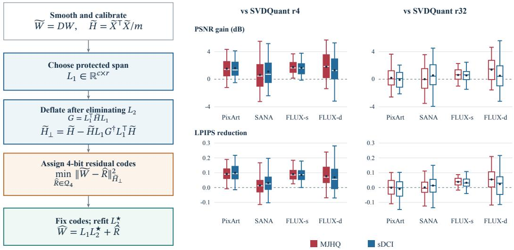
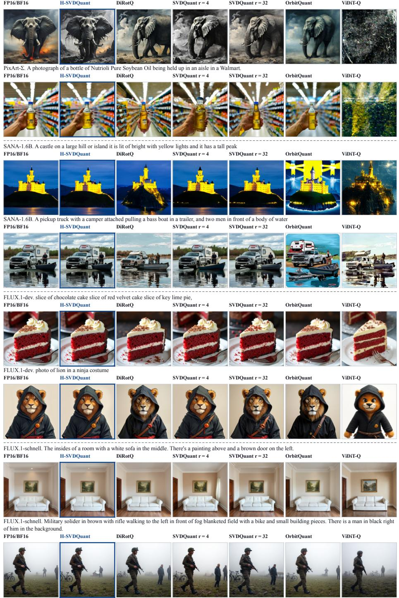
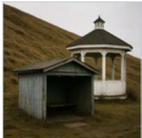
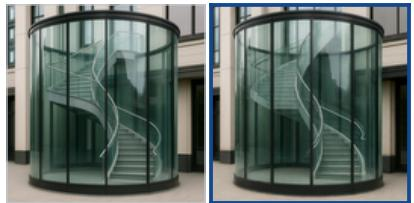
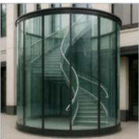
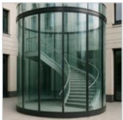
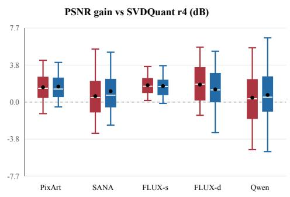
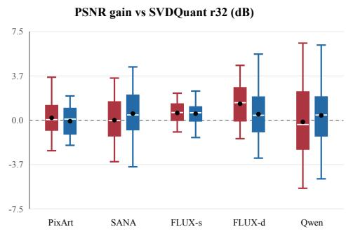
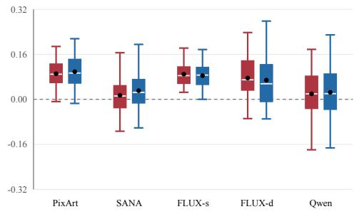
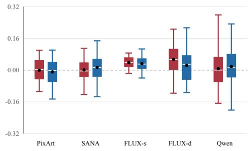

# DEFLATING THE HESSIAN: RANK-4 W4A4 QUANTIZA-TION FOR MULTIMODAL DIFFUSION TRANSFORMERS

Shiwen Wang1 Pengxiang Zhao2 Xiaoming Yuan1,∗

1The University of Hong Kong 2Huawei Technologies Co., Ltd.

∗Correspondence to: xmyuan@hku.hk

## ABSTRACT

In diffusion transformers, low-rank branches can mitigate 4-bit weight–activation (W4A4) post-training quantization (PTQ) loss by decomposing each weight into a low-bit residual and a high-precision low-rank component. Existing low-rank PTQ approaches, however, either optimize low-rank compensation and residual quantization separately, often requiring higher ranks, or rely on second-order weight updates without explicitly modeling activation quantization error, which becomes particularly pronounced under 4-bit quantization. To address these limitations, we present H-SVDQuant, a unified framework modeling low-rank-assisted W4A4 PTQ as a coupled calibration problem and deriving optimization-based solvers from the joint objective. Eliminating the output-side low-rank factor yields a deflated Hessian that discounts residual errors already captured by the low-rank component, while an activation-noise surrogate is incorporated to suppress activation quantization error. Across five diffusion backbones, rank-4 H-SVDQuant consistently outperforms rank-4 SVDQuant in PSNR and LPIPS. It further surpasses rank-32 SVDQuant on SANA-1.6B, FLUX.1-schnell, and FLUX.1-dev with an 8× smaller rank and up to 6.25× faster quantization. Furthermore, on the Qwen3-8B LLM, rank-4 H-SVDQuant improves MMLU accuracy from 61.50% to 68.17% over rank-32 SVDQuant. Overall, H-SVDQuant achieves better W4A4 performance with substantially lower rank and quantization cost.

## 1 INTRODUCTION

Diffusion transformers (DiTs) (Peebles & Xie, 2023) repeatedly apply large linear transformations along the denoising trajectory, making low-precision inference an attractive route to reducing memory traffic and arithmetic cost. Weight–activation 4-bit post-training quantization (W4A4 PTQ) reduces both weights and activations to low precision without retraining, but the resulting errors can accumulate across layers and amplify over denoising steps.

SVDQuant (Li et al., 2025) first extracts a truncated-SVD branch and then quantizes the remaining residual. LRC (Scetbon & Hensman, 2024) jointly optimizes a quantized weights and low-rank correction. LoRaQ (Bouquet et al., 2026) directly optimizes a low-rank perturbation to compensate for weight quantization error. GPTQ-intrinsic LoRA (Zhang & Saab, 2026) also incorporates lowrank correction into second-order quantization. Despite these advances, existing methods do not explicitly formulate a multivariable coupled optimization problem, nor derive an efficient algorithm that jointly captures weight- and activation-side quantization under a small rank budget. This leads to our research question: how can we jointly model the variables governing low-rank-assisted W4A4 PTQ and solve the resulting problem efficiently to maximize the effectiveness of low-rank branches?

We present H-SVDQuant, a unified framework for low-rank W4A4 PTQ that formulates a joint reconstruction objective, derives optimization-based solvers, and instantiates them in a practical calibration algorithm. In Figure 1(a), a smoothed weight matrix $\widetilde { { \pmb W } } = { \pmb L } _ { 1 } { \pmb L } _ { 2 } + { \pmb R } .$ , where $\mathbf { { L } } _ { 1 } , \mathbf { { L } } _ { 2 }$ denote the low-rank component and ${ \widehat { R } } = Q ( R )$ is the quantized residual. $\mathbf { L } _ { 1 }$ specifies the protected input subspace with calibration-weighted initialization. Analytically eliminating $\mathbf { L } _ { 2 }$ yields

$$
\begin{array} { r } { { \pmb { H } } _ { \perp } = { \pmb { H } } - { \pmb { H } } { \pmb { L } } _ { 1 } \left( { \pmb { L } } _ { 1 } ^ { \top } { \pmb { H } } { \pmb { L } } _ { 1 } \right) ^ { \dagger } { \pmb { L } } _ { 1 } ^ { \top } { \pmb { H } } , \qquad { \pmb { H } } _ { \perp } { \pmb { L } } _ { 1 } = 0 , } \end{array}\tag{1}
$$

  
(a) Hessian deflation metric.  
(b) Paired rank efficiency gains over SVDQuant.  
Figure 1: (a) Residual quantization with Hessian deflation: For a fixed protected subspace $\mathbf { L } _ { 1 }$ Hessian deflation $( \widetilde { \pmb { H } } _ { \bot } \pmb { L } _ { 1 } = 0 )$ focuses residual quantization strictly on errors outside the low-rank subspace. (b) Paired rank efficiency: The paired distributions show consistent gains over rank-4 SVDQuant, and show model-dependent comparisons with rank-32 SVDQuant, with the strongest rank-efficiency gains on SANA and the FLUX variants.

where H is the calibration activation Gram matrix and $( \cdot ) ^ { \dagger }$ denotes the Moore–Penrose pseudoinverse. We refer to this reduced geometry as Hessian deflation: Since $H _ { \perp } { \cal L } _ { 1 } = 0 $ , errors that lie in the protected input subspace can be compensated by the low-rank component. $\widehat { R }$ therefore only needs to account for the remaining errors measured by ${ \pmb { H } } _ { \bot }$ . Then $\mathbf { L } _ { 2 }$ is refitted using a closedform solution $\pmb { L } _ { 2 } ^ { \star }$ . We optimize activation quantization through the diagonal smoothing and the activation-quantization surrogate. Specifically, we incorporate a smoothing matrix D and derive its $\ell _ { p }$ -relaxed initialization with geometric programming, leaving the smoothed weights $\widetilde { W } = D W$ for subsequent quantization, avoiding costly grid searches or online rotation overhead while accelerating calibration. Furthermore, our algorithm accommodates an activation-noise surrogate $\lambda _ { A }$ to suppress the amplification of activation quantization error during residual quantization, specified in Section 3.

We evaluate H-SVDQuant against PTQ baselines for DiTs: SVDQuant (Li et al., 2025), DiRotQ (Sharify et al., 2026), OrbitQuant (Lee et al., 2026), and ViDiT-Q (Zhao et al., 2025). Our backbones include diffusion transformers ranging from 0.6B to 20B parameters: PixArt-Σ (Chen et al., 2024), SANA-1.6B (Xie et al., 2025), FLUX.1-schnell (Black Forest Labs, 2024), FLUX.1-dev (Black Forest Labs, 2024), and Qwen-Image (Wu et al., 2025) (including its variant with 4-step Lightning LoRA). Under W4A4, H-SVDQuant consistently improves reconstruction fidelity across all backbones (up to +1.61 dB PSNR on PixArt-Σ) and rivals or surpasses the 8×-larger rank-32 SVDQuant baseline on SANA-1.6B and FLUX models (Figure 1(b)). Evaluation on Qwen3-8B (Yang et al., 2025) also confirms that rank-4 H-SVDQuant achieves 10.44 WikiText-2 perplexity (PPL) and 68.17% MMLU accuracy (outperforming rank-32 SVDQuant at 11.21 PPL and 61.50% MMLU), suggesting that the proposed formulation also transfers to large language transformers (LLMs).

## Our contributions are threefold:

• Unified low-rank-assisted W4A4 PTQ problem. We formulate a joint calibration objective for low-rank-assisted W4A4 PTQ that accounts for both weight- and activation-side quantization, seamlessly integrating an activation quantization surrogate objective.

• Efficient optimization-based solvers. We derive the optimization-based solvers for our framework, integrating calibration-weighted low-rank initialization, diagonal smoothing, second-order residual quantization, and closed-form low-rank refitting.

• Extensive empirical validation under small-rank budgets. We evaluate rank-4 H-SVDQuant across five diffusion backbones and Qwen3-8B, surpassing rank-32 SVDQuant on SANA and the FLUX variants while accelerating offline PTQ calibration by up to 6.25×.

## 2 RELATED WORK

Quantization of Diffusion Models. Early post-training quantization methods for diffusion models focused on the temporal non-stationarity induced by iterative denoising. Q-Diffusion addresses timestep-dependent activation distributions through timestep-aware calibration and split shortcut quantization, while PTQD explicitly models and corrects the accumulation of quantization noise along the denoising trajectory (Li et al., 2023; He et al., 2023). As transformer-based backbones became increasingly prominent in diffusion models, subsequent work identified additional challenges arising from activation outliers, timestep-dependent distributions, and heterogeneous layer sensitivity. ViDiT-Q (Zhao et al., 2025) introduces DiT-specific quantization schemes together with sensitivityaware mixed-precision allocation. DiRotQ (Sharify et al., 2026) employs rotation-aware activation quantization to separate dominant activation directions from the low-bit subspace, whereas OrbitQuant (Lee et al., 2026) quantizes weights and activations in a normalized rotated representation using a shared non-uniform codebook.

Low-Rank-Assisted Quantization. Low-rank correction provides a complementary strategy for aggressive quantization by reserving a small auxiliary branch for structured error that is difficult to represent with low-bit codes. SVDQuant establishes this paradigm for diffusion models by concentrating weight outliers into a high-precision SVD branch and quantizing the remaining residual weights and activations to 4 bits (Li et al., 2025). Recent low-rank PTQ methods optimize different parts of this calibration problem. In language models, LRC jointly optimizes quantized weights with full-precision low-rank corrections acting on unquantized activations (Scetbon & Hensman, 2024). LoRaQ directly optimizes a low-rank approximation to quantization error, allowing the auxiliary branch to operate below 16-bit precision (Bouquet et al., 2026). GPTQ-intrinsic LoRA incorporates low-rank correction into an augmented-Hessian quantization pass (Zhang & Saab, 2026).

Activation-aware calibration PTQ. A separate line of work exploits calibration statistics to reshape the quantization problem. GPTQ uses approximate second-order information to minimize weightquantization error under input-dependent curvature (Frantar et al., 2023), while AWQ identifies salient weights using activation statistics and protects them through channel-wise scaling (Lin et al., 2024). SmoothQuant migrates activation outliers into weights through an equivalent diagonal rescaling (Xiao et al., 2023). Rotation-based methods such as QuaRot and SpinQuant instead exploit orthogonal invariances to suppress activation outliers before low-bit quantization (Ashkboos et al., 2024; Liu et al., 2025).

Our work shares the use of low-rank compensation and activation-aware second-order information, but focuses on their coupled W4A4 formulation and studies this coupling under small auxiliary rank budgets for efficient PTQ in diffusion transformers.

## 3 METHOD

## 3.1 PROBLEM MODELING

For a linear layer $Y = X W$ with calibration input $\ b X \in \mathbb { R } ^ { m \times c }$ and weight matrix $W \in \mathbb { R } ^ { c \times n } , r \ll$ min $( c , n )$ denotes the protected rank budget. We apply an equivalent diagonal reparameterization

$$
\begin{array} { r } { \widetilde { X } = X D ^ { - 1 } , \qquad \widetilde { W } = D W , } \end{array}\tag{2}
$$

where $D = \arg ( d )$ with $d _ { i } > 0$ is the diagonal smoothing matrix. This transform redistributes channel ranges between activations and weights while preserving $X W = { \widetilde { X } } { \widetilde { W } }$ , where ${ \widetilde { X } } , { \widetilde { W } }$ are the smoothed activations and weights.

Low-rank-assisted operator. We adopt a low-rank-assisted operator with a rank-r high-precision branch, keeping $\widetilde { X } L _ { 1 } L _ { 2 }$ separate from the low-bit path. The resulting operator is

$$
\widehat { Y } = \widetilde { X } L _ { 1 } L _ { 2 } + Q _ { A } ( \widetilde { X } ) \widehat { R } ,\tag{3}
$$

where $L _ { 1 } \in \mathbb { R } ^ { c \times r }$ and $L _ { 2 } \in \mathbb { R } ^ { r \times n }$ are the input- and output-side low-rank factors, respectively, and $\widehat { R }$ denotes the quantized residual. We then derive the reconstruction objective given by this low-rank-assisted operator.

Reconstruction objective. Defining remaining weight error $C = \widetilde { W } - L _ { 1 } L _ { 2 } - \widehat { R }$ and activation error $E _ { A } = Q _ { A } ( { \widetilde { X } } ) - { \widetilde { X } }$ , Equation (3) gives exact layer-output error

$$
Y - { \widehat { Y } } = { \widetilde { X } } C - E _ { A } { \widehat { R } } .\tag{4}
$$

Let $\smash { \widetilde { H } = \frac { 1 } { m } \widetilde { X } ^ { \top } \widetilde { X } }$ and $\begin{array} { r } { \Sigma _ { A } = \frac { 1 } { m } E _ { A } ^ { \top } E _ { A } } \end{array}$ , with $\| B \| _ { M } ^ { 2 } \triangleq \mathrm { t r } ( B ^ { \top } M B )$ for PSD matrix M. Expanding Equation (4) yields

$$
\frac { 1 } { m } \| \boldsymbol { Y } - \widehat { \boldsymbol { Y } } \| _ { F } ^ { 2 } = \| \boldsymbol { C } \| _ { \widetilde { H } } ^ { 2 } + \| \widehat { R } \| _ { \Sigma _ { A } } ^ { 2 } - \frac { 2 } { m } \operatorname { t r } \left( \boldsymbol { C } ^ { \top } \widetilde { \boldsymbol { X } } ^ { \top } \boldsymbol { E } _ { A } \widehat { R } \right) .\tag{5}
$$

Under standard conditional zero-mean uniform rounding assumptions, the cross term vanishes in expectation $( \mathbb { E } [ \mathrm { t r } ( C ^ { \top } \widetilde { X } ^ { \top } E _ { A } \widehat { R } ) ] = 0 )$ , yielding $\begin{array} { r } { \frac { 1 } { m } \| Y - \widehat { Y } \| _ { F } ^ { 2 } \approx \| C \| _ { \widetilde H } ^ { 2 } + \| \widehat { R } \| _ { \Sigma _ { A } } ^ { 2 } } \end{array}$ . For a $b _ { A }$ -bit symmetric quantizer with $\kappa _ { A } = 2 ^ { b _ { A } - 1 } - 1$ and activation group $\mathcal { G } ( i )$ for channel i, we model activation-noise covariance via the block-constant diagonal surrogate:

$$
\overline { { \Sigma } } _ { A } = \mathrm { D i a g } ( s _ { A } ) , \qquad ( s _ { A } ) _ { i } = \frac { 1 } { 1 2 \kappa _ { A } ^ { 2 } } \mathbb { E } _ { t } \left[ \operatorname* { m a x } _ { j \in \mathcal { G } ( i ) } \widetilde { X } _ { t j } ^ { 2 } \right] .\tag{6}
$$

Introducing weighting parameter $\lambda _ { A } \geq 0$ , the joint calibration objective is

$$
\mathcal { L } ( L _ { 1 } , L _ { 2 } , \widehat { R } ) = \frac { 1 } { 2 } \left. \widetilde { W } - L _ { 1 } L _ { 2 } - \widehat { R } \right. _ { \widetilde { H } } ^ { 2 } + \frac { 1 } { 2 } \lambda _ { A } \left. \widehat { R } \right. _ { \overline { { \Sigma } } _ { A } } ^ { 2 } .\tag{7}
$$

Equation (7) unifies low-rank compensation and activation-noise suppression under a shared calibration framework where the first term minimizes weight error, while the second suppresses activation-error amplification through ${ \widehat { R } } .$ We use Equation (7) as the common objective underlying the derivations in Section $3 . 2 ; \lambda _ { A } = 0$ gives its weight-centric specialization, while $\lambda _ { A } > 0$ enables activation-aware code optimization when activation-quantization error is propagated during calibration.

## 3.2 H-SVDQUANT

We now derive tractable updates for the coupled objective in Equation (7). The derivation proceeds by analytically eliminating the refittable factor $L _ { 2 } ,$ reducing residual-code optimization to a second-order metric-and-target problem, while deriving calibration-aware updates for the protected subspace and smoothing transform.

Hessian deflation. For fixed $D , L _ { 1 }$ , and ${ \widehat { R } } ,$ minimizing over $L _ { 2 }$ yields the closed-form weighted least-squares solution:

$$
\begin{array} { r } { L _ { 2 } ^ { \star } = \left( L _ { 1 } ^ { \top } \widetilde { H } L _ { 1 } \right) ^ { \dagger } L _ { 1 } ^ { \top } \widetilde { H } \left( \widetilde { W } - \widehat { R } \right) , } \end{array}\tag{8}
$$

where $( \cdot ) ^ { \dagger }$ denotes the Moore–Penrose pseudoinverse.

Proposition 1 (Hessian deflation). Substituting $L _ { 2 } ^ { \star }$ into Equation (7) replaces $\widetilde { H }$ with the deflated Hessian

$$
\widetilde { H } _ { \perp } = \widetilde { H } - \widetilde { H } L _ { 1 } \left( L _ { 1 } ^ { \top } \widetilde { H } L _ { 1 } \right) ^ { \dagger } L _ { 1 } ^ { \top } \widetilde { H } , \qquad \mathrm { s a t i s f y i n g } \quad \widetilde { H } _ { \perp } L _ { 1 } = 0 .\tag{9}
$$

The derivation of $L _ { 2 } ^ { \star }$ and proof are provided in Appendix B. The identity $\widetilde { H } _ { \perp } L _ { 1 } = 0$ shows that errors compensable by the protected low-rank component are eliminated from the residual objective; residual quantization thus targets only the remaining reconstruction error.

Residual-code optimization. After eliminating $L _ { 2 } .$ , the code-dependent objective becomes

$$
\mathcal { L } _ { \mathrm { c o d e } } = \frac { 1 } { 2 } \left\| \widetilde { W } - \widehat { R } \right\| _ { \widetilde { H } _ { \bot } } ^ { 2 } + \frac { 1 } { 2 } \lambda _ { A } \left\| \widehat { R } \right\| _ { { \overline { { \Sigma } } _ { A } } } ^ { 2 } = \frac { 1 } { 2 } \left\| \widehat { R } - T _ { Q } \right\| _ { M _ { Q } } ^ { 2 } + \mathrm { c o n s t } ,\tag{10}
$$

where

$$
M _ { Q } = \widetilde { H } _ { \perp } + \lambda _ { A } \overline { { { \Sigma } } } _ { A } , \qquad T _ { Q } = M _ { Q } ^ { \dagger } \widetilde { H } _ { \perp } \widetilde { W } .\tag{11}
$$

We use Equation (6) as the activation-noise surrogate: $M _ { Q }$ reshapes the metric geometry, while $T _ { Q }$ adjusts the effective approximation target.

Low-rank initialization. Rather than initializing the protected branch with ordinary truncated SVD, we solve a calibration-weighted rank-r approximation min $\begin{array} { r } { \operatorname { l } _ { \operatorname { r a n k } ( L ) \leq r } \frac { 1 } { 2 } \| \widetilde { H } _ { \mathrm { r e g } } ^ { 1 / 2 } ( \widetilde { W } - L ) \| _ { F } ^ { 2 } } \end{array}$ , whose exact solution is , where $\widetilde { H } _ { \mathrm { r e g } } = \widetilde { H } + \tau I$ with $\tau > 0$ is a positive-definite regularization of the calibration Gram matrix. The exact solution to this regularized approximation problem is

$$
L ^ { \star } = \widetilde { H } _ { \mathrm { r e g } } ^ { - 1 / 2 } \left[ \widetilde { H } _ { \mathrm { r e g } } ^ { 1 / 2 } \widetilde { W } \right] _ { r } ,\tag{12}
$$

where [·]r denotes rank-r truncated SVD. We initialize $L _ { 1 }$ with the resulting input-side span under an ${ \widetilde { H } } _ { \mathrm { r e g } }$ -orthonormal gauge, preserving $L _ { 1 } L _ { 2 }$ while improving numerical conditioning. Details are in Appendix C.

Diagonal smoothing. The diagonal reparameterization in Equation (2) redistributes channel ranges without changing the full-precision linear map. Given residual weight $P$ and diagonal curvature $h _ { i } ,$ a closed-form $\ell _ { p }$ relaxation of the grouped geometric-program objective yields

$$
\begin{array} { r } { d _ { i } \propto \left( h _ { i } \Big / \sum _ { j } | P _ { i j } | ^ { p } \right) ^ { 1 / ( p + 2 ) } . } \end{array}\tag{13}
$$

We normalize the resulting scales by their geometric mean and optionally refine them in log space using the grouped objective; Appendix D gives the exact GP formulation and the derivation of the closed-form relaxation.

## 3.3 IMPLEMENTED ALGORITHM

Based on the core derivations and formulas, we compose the conditional updates into the overall calibration algorithm and describe its numerical treatment and deployed operator.

Algorithm workflow. As summarized in Appendix Algorithm 1, the unsmoothed calibration matrix $H _ { 0 } ^ { \sim } = X ^ { \top } X / m$ is accumulated once. At each outer iteration, we update smoothing matrix D, obtain $\widetilde H = D ^ { - 1 } H _ { 0 } D ^ { - 1 }$ , initialize $L _ { 1 } ,$ construct the deflated Hessian $\smash { \widetilde { H } _ { \perp } }$ , quantize residual ${ \widehat { R } } ,$ and refit $L _ { 2 }$ in closed form. With cached activations, candidate states are compared using empirical W4A4 output MSE with the dynamic quantizer. For activation-aware W4A4 calibration, we use a GPTQ-style solver with $M _ { Q }$ and $T _ { Q }$ replacing the conventional curvature matrix and weight target. When $\lambda _ { A } = 0$ the solver reduces to weight-only residual quantization under $\smash { \widetilde { H } _ { \perp } }$ , followed by the same closed-form refit of $L _ { 2 }$ . The two settings optimize the same underlying low-rank-assisted operator but differ in whether activation-noise amplification is included in residual-code selection.

Numerical stability and damping. The identities in Eqs. (9)–(10) describe the undamped formulation. Since $\smash { \widetilde { H } _ { \perp } }$ and $M _ { Q }$ can be singular, practical solves use small diagonal damping $( M _ { Q } + \epsilon I )$ before Cholesky factorization or inversion when computing $T _ { Q }$ , which slightly perturbs $\widetilde { H } _ { \perp } L _ { 1 } = 0$ while ensuring stability.

## 4 EXPERIMENTAL SETUP

Models. We benchmark H-SVDQuant across: PixArt-Σ (0.6B) (Chen et al., 2024), SANA-1.6B (Xie et al., 2025), FLUX.1-dev (12B) (Black Forest Labs, 2024), and the Qwen-Image (20B) (Wu et al., 2025) (50-step base model). Accelerated few-step variants (the 4-step FLUX.1-schnell and 4-step Qwen-Image Lightning) are evaluated in Appendix Table 8, and visual generation comparisons for both base and Lightning models are detailed in Appendix G. Additionally, we evaluate Qwen3- 8B (Yang et al., 2025) as a controlled testbed for rank efficiency in large language models.

Implementation details. All diffusion backbones operate in the W4A4 post-training quantization regime with group size 64 and an auxiliary protected rank r = 4 (FP16/BF16). Activations are quantized using per-token, per-group 4-bit quantization. In our primary DiT experiments, we use reference activations across transformer blocks with $\lambda _ { A } = 0$ (except for PixArt-Σ at $\lambda _ { A } = 0 . 0 5$ due to its different activation geometry) in Table 1. We sequentially replay activations within each block as module groups are quantized and replaced. These can be found in our Algorithm 1. We analyze the effect and strength of $\lambda _ { A }$ in Section 6, and compare different strategies for propagating quantized activations and accumulating quantization error in Appendix I.

Datasets. Following SVDQuant (Li et al., 2025), we evaluate the generation fidelity and quality of quantized diffusion models on the category-balanced MJHQ-30K (Li et al., 2024) and the diverse sDCI (Urbanek et al., 2024) benchmarks. For each diffusion backbone, evaluation is performed on fixed MJHQ-5K and sDCI-1K subsets. Each prompt is paired with the output of the corresponding native high-precision teacher model using identical random seeds, initial latents, image resolution (1024 × 1024), and scheduler steps. For diffusion-model calibration, we use the same set of 128 prompts released in the official SVDQuant repository. For Qwen3-8B calibration, we sample 128 sequences of 512 tokens each from the WikiText-2 training split. We report WikiText-2 (Merity et al., 2017) perplexity together with zero-shot accuracy on five standard benchmarks: MMLU (Hendrycks et al., 2021), ARC-Easy and ARC-Challenge (Clark et al., 2018), HellaSwag (Zellers et al., 2019), and PIQA (Bisk et al., 2020).

Baselines. We compare H-SVDQuant against representative post-training quantization (PTQ) baselines. SVDQuant (Li et al., 2025): we use rank-4 SVDQuant as the primary matched-capacity baseline and additionally include rank-32 SVDQuant, which uses an 8× larger protected-rank budget, as a higher-capacity reference. DiRotQ (Sharify et al., 2026): we evaluate its W4A4 variant while matching the fraction of high-precision values to that of our method. OrbitQuant (Lee et al., 2026) and ViDiT-Q (Zhao et al., 2025): we adapt both methods to the same W4A4 setting with group size 64 and per-token activation quantization for a controlled comparison.

Metrics. Following previous works (Li et al., 2025), we assess generation fidelity and quality using four standard metrics: Peak Signal-to-Noise Ratio (PSNR, ↑) measures pixel-level numerical reconstruction fidelity with respect to the 16-bit teacher model; Learned Perceptual Image Patch Similarity (LPIPS, ↓; (Zhang et al., 2018)) evaluates perceptual similarity against prompt-paired teacher outputs; CLIP Score (CLIP, ↑) (Hessel et al., 2021) measures text–image semantic alignment with the input prompts; and ImageReward (IR, ↑) (Xu et al., 2023) approximates human visual preference for generated images. For language modeling on Qwen3-8B, we report WikiText-2 Perplexity (PPL, ↓) and zero-shot accuracy. For the PixArt-Σ ablation in Table 5a, we additionally report Structural Similarity (SSIM, ↑) (Wang et al., 2004).

## 5 MAIN RESULTS ON DIFFUSION TRANSFORMERS

We report quantitative W4A4 results in Table 1 across DiT backbones, and show corresponding qualitative visual comparisons in Figure 2. Note that PSNR and LPIPS measure teacher fidelity, while CLIP and IR measure standalone generation quality. They measure different properties; thus the method with the best PSNR need not have the highest CLIP or ImageReward score.

Quantitative Comparison. As shown in Table 1, under W4A4 H-SVDQuant consistently improves teacher fidelity over SVDQuant on both MJHQ and sDCI, achieving higher PSNR and lower LPIPS on every evaluated backbone. On PixArt-Σ, H-SVDQuant improves over rank-4 SVDQuant by +1.53 dB PSNR and −0.092 LPIPS on MJHQ, and by +1.61 dB and −0.099 LPIPS on sDCI. Its teacher-fidelity results are close to rank-32 SVDQuant and DiRotQ, while CLIP and ImageReward vary across methods. On SANA-1.6B, H-SVDQuant reaches 20.25/0.161 PSNR/LPIPS on MJHQ and 18.25/0.185 on sDCI, improving substantially over rank-4 SVDQuant and matching or exceeding rank-32 SVDQuant in teacher-fidelity metrics. On FLUX.1-dev, H-SVDQuant improves rank-4 SVDQuant by +1.81 dB PSNR and −0.076 LPIPS on MJHQ, and by +1.32 dB and −0.069 LPIPS on sDCI. It also exceeds rank-32 SVDQuant in PSNR and LPIPS on both subsets. On Qwen-Image, H-SVDQuant improves teacher fidelity over rank-4 SVDQuant on both subsets. Relative to rank-32 SVDQuant, the comparison is mixed on MJHQ—H-SVDQuant obtains lower LPIPS but slightly lower PSNR—while it improves both PSNR and LPIPS on sDCI. Extended quantitative comparisons on accelerated variants are provided in Appendix Table 8.

Qualitative Comparison. Figure 2 provides visual comparisons across representative prompts under identical random seeds. OrbitQuant and ViDiT-Q struggle under 4-bit activations, exhibiting pervasive noise, structural distortion, and contrast loss (e.g., distorted geometry on PixArt-Σ and noisy surfaces on SANA-1.6B and FLUX.1-dev). While DiRotQ and rank-32 SVDQuant achieve better visual quality, they lose fidelity in a few cases (e.g., different elephant direction and hill space, over-detailed lion). In contrast, H-SVDQuant consistently preserves sharp object boundaries and

PixArt-Σ. Wandering where it will, the elephant of mind, Will bring us down to torment in the hell of Unrelenting Pain. No worldly beast, however wild and crazed, Could bring upon us such calamities,  
  
Figure 2: W4A4 reconstructions across diffusion transformers. Each row compares dense FP16/BF16 against quantized methods under identical prompt and seed. Blue boxes highlight H-SVDQuant (r = 4). Across all backbones, H-SVDQuant preserves textures, fine structures, and prompt alignment faithful to the 16-bit reference.

Table 1: W4A4 fidelity and generation quality across modern diffusion transformer backbones. Bold and underline denote the best and second-best results, respectively. All evaluated methods use 4-bit weights and 4-bit activations (W4A4) with group-64.
<table><tr><td rowspan="2">Method</td><td colspan="4">MJHQ</td><td colspan="4">sDCI</td></tr><tr><td>PSNR↑</td><td>LPIPS↓</td><td>CLIP↑</td><td>IR↑</td><td>PSNR↑</td><td>LPIPS↓</td><td>CLIP↑</td><td>IR↑</td></tr><tr><td>PixArt-∑</td><td></td><td></td><td></td><td></td><td></td><td></td><td></td><td></td></tr><tr><td>H-SVDQuant r = 4</td><td>16.47</td><td>0.386</td><td>25.995</td><td>0.8852</td><td>15.36</td><td>0.422</td><td>26.203</td><td>0.9816</td></tr><tr><td>SVDQuant r = 4</td><td>14.94</td><td>0.478</td><td>25.832</td><td>0.7489</td><td>13.75</td><td>0.521</td><td>25.604</td><td>0.8514</td></tr><tr><td>SVDQuant r = 32</td><td>16.27</td><td>0.385</td><td>25.962</td><td>0.8950</td><td>15.45</td><td>0.413</td><td>25.718</td><td>0.9002</td></tr><tr><td>DiRotQ</td><td>16.36</td><td>0.389</td><td>26.047</td><td>0.9165</td><td>15.39</td><td>0.416</td><td>26.239</td><td>1.0417</td></tr><tr><td>OrbitQuant</td><td>14.88</td><td>0.488</td><td>25.703</td><td>0.7711</td><td>14.00</td><td>0.528</td><td>26.441</td><td>0.8695</td></tr><tr><td>SANA-1.6B</td><td></td><td></td><td></td><td></td><td></td><td></td><td></td><td></td></tr><tr><td>H-SVDQuant r = 4</td><td>20.25</td><td>0.161</td><td>25.996</td><td>1.1053</td><td>18.25</td><td>0.185</td><td>26.259</td><td>1.0724</td></tr><tr><td>SVDQuant r = 4</td><td>19.64</td><td>0.176</td><td>25.956</td><td>1.1213</td><td>17.13</td><td>0.216</td><td>26.336</td><td>1.0750</td></tr><tr><td>SVDQuant r = 32</td><td>20.24</td><td>0.162</td><td>25.931</td><td>1.0994</td><td>17.69</td><td>0.199</td><td>26.330</td><td>1.1102</td></tr><tr><td>DiRotQ</td><td>19.83</td><td>0.173</td><td>26.051</td><td>1.1064</td><td>17.61</td><td>0.209</td><td>26.274</td><td>1.1059</td></tr><tr><td>OrbitQuant</td><td>14.48</td><td>0.415</td><td>26.124</td><td>1.0465</td><td>12.10</td><td>0.495</td><td>26.701</td><td>1.0809</td></tr><tr><td>ViDiT-Q</td><td>13.38</td><td>0.444</td><td>25.721</td><td>0.9871</td><td>11.44</td><td>0.483</td><td>25.783</td><td>0.8971</td></tr><tr><td>FLUX.1-dev</td><td></td><td></td><td></td><td></td><td></td><td></td><td></td><td></td></tr><tr><td>H-SVDQuant r = 4</td><td>20.58</td><td>0.227</td><td>23.078</td><td>0.9917</td><td>18.93</td><td>0.250</td><td>24.586</td><td>1.0205</td></tr><tr><td>SVDQuant r = 4</td><td>18.77</td><td>0.303</td><td>23.156</td><td>0.9771</td><td>17.61</td><td>0.319</td><td>24.675</td><td>1.0630</td></tr><tr><td>SVDQuant r = 32</td><td>19.19</td><td>0.282</td><td>23.107</td><td>0.9782</td><td>18.42</td><td>0.274</td><td>24.730</td><td>1.0594</td></tr><tr><td>DiRotQ</td><td>20.95</td><td>0.224</td><td>23.534</td><td>0.9864</td><td>19.92</td><td>0.218</td><td>24.471</td><td>1.0181</td></tr><tr><td>OrbitQuant</td><td>19.44</td><td>0.279</td><td>22.877</td><td>0.9637</td><td>18.25</td><td>0.284</td><td>24.496</td><td>1.0476</td></tr><tr><td>ViDiT-Q</td><td>15.68</td><td>0.518</td><td>22.122</td><td>0.6232</td><td>14.49</td><td>0.539</td><td>24.140</td><td>0.7236</td></tr><tr><td>Qwen-Image (50 steps)</td><td></td><td></td><td></td><td></td><td></td><td></td><td></td><td></td></tr><tr><td>H-SVDQuant r = 4</td><td>19.23</td><td>0.236</td><td>29.669</td><td>1.5775</td><td>18.44</td><td>0.254</td><td>25.817</td><td>1.2027</td></tr><tr><td>SVDQuant r = 4</td><td>18.78</td><td>0.256</td><td>29.714</td><td>1.5540</td><td>17.70</td><td>0.279</td><td>25.755</td><td>1.2191</td></tr><tr><td>SVDQuant r = 32</td><td>19.37</td><td>0.243</td><td>29.734</td><td>1.5665</td><td>18.03</td><td>0.272</td><td>25.681</td><td>1.2095</td></tr><tr><td>DiRotQ</td><td>19.63</td><td>0.218</td><td>29.769</td><td>1.5404</td><td>18.39</td><td>0.257</td><td>25.642</td><td>1.2080</td></tr></table>

Table 2: Recorded rank-4 PTQ cost on NVIDIA H20. Time is each checkpoint’s complete launcher wall interval; peak memory is the recorded CUDA allocation.
<table><tr><td>Model</td><td>Method</td><td>Minutes</td><td>Speedup vs. SVDQuant r=4</td><td>Peak GiB</td></tr><tr><td rowspan="2">SANA-1.6B</td><td>H-SVDQuant</td><td>4.8</td><td>6.25×</td><td>9.9</td></tr><tr><td>SVDQuant</td><td>30.0</td><td></td><td>11.7</td></tr><tr><td rowspan="2">FLUX-schnell</td><td>H-SVDQuant</td><td>282.4</td><td>1.81×</td><td>52.0</td></tr><tr><td>SVDQuant</td><td>511.1</td><td></td><td>50.7</td></tr><tr><td rowspan="2">FLUX-dev</td><td>H-SVDQuant</td><td>285.6</td><td>1.85×</td><td>52.0</td></tr><tr><td>SVDQuant</td><td>527.4</td><td></td><td>51.3</td></tr></table>

subtle textures faithful to the 16-bit reference teacher. Extended visual comparisons on both base and Lightning Qwen-Image models are provided in Appendix G.

Rank Efficiency and Calibration Cost. The rank advantage is clearest on SANA and the FLUX backbones. Besides the mean values, we also provide the paired distributions in Figure 1(b) and Appendix Figure 5 for a clearer comparison. As shown in Table 2, H-SVDQuant reduces offline PTQ calibration cost in the recorded base runs. On SANA-1.6B, the measured wall time decreases from 30.0 to 4.8 minutes, while the FLUX.1-schnell and FLUX.1-dev base runs show 1.81× and 1.85× speedups, respectively.

## 6 ANALYSIS AND ABLATION STUDIES

In this section, we conduct in-depth diagnostics and ablation studies using PixArt-Σ (for vision generation) and Qwen3-8B (for language modeling). Unless stated, our optional cached iteration of D is 20 and the outer iteration is set to be 2. In Qwen analysis, we disable the optional cached optimization and set outer iteration as 1 in Table 4(a), 5(b), 6 and set outer iteration as 2 in Table 7.

Table 3: Qwen3-8B zero-shot evaluation (W4A4, group-128). Mean denotes the unweighted average across all five downstream tasks. SVDQuant refers to the local language-model adaptation; FP16 serves as dense reference.
<table><tr><td>Method</td><td>MMLU</td><td>ARC-C</td><td>ARC-E</td><td>HellaSwag</td><td>PIQA</td><td>Mean</td></tr><tr><td>FP16</td><td>72.95</td><td>56.40</td><td>83.54</td><td>74.97</td><td>76.88</td><td>72.95</td></tr><tr><td>SVDQuant adaptation  $r = 4$ </td><td>61.34</td><td>45.31</td><td>73.02</td><td>67.83</td><td>71.76</td><td>63.85</td></tr><tr><td>SVDQuant adaptation  $r = 3 2$ </td><td>61.50</td><td>48.89</td><td>74.83</td><td>67.84</td><td>72.20</td><td>65.05</td></tr><tr><td>H-SVDQuant  $r = 4$ </td><td>68.17</td><td>49.83</td><td>78.54</td><td>70.30</td><td>73.34</td><td>68.04</td></tr></table>

Table 4: Rank efficiency and activation-error propagation on Qwen3-8B (W4A4, group-128, $\lambda _ { A } = 0 . 2 5 )$ . (a) WikiText-2 perplexity across different protected ranks. (b) Relative activation MSE averaged over 36 transformer blocks using eight 512-token sequences (measured against 16-bit reference activations). Local MSE measures per-block quantization error under reference inputs, while propagated MSE additionally captures errors accumulated from preceding quantized blocks.

(a) Perplexity across protected ranks  
(b) Local vs. propagated activation error
<table><tr><td>Method</td><td>Rank PPL↓</td></tr><tr><td>SVDQuant adapt.</td><td>4 11.93</td></tr><tr><td>SVDQuant adapt.</td><td>32 11.21</td></tr><tr><td>H-SVDQuant</td><td>0 10.72</td></tr><tr><td>H-SVDQuant</td><td>2 10.48</td></tr><tr><td> $H { - } S V D Q u a n t$ </td><td>4 10.44</td></tr></table>

<table><tr><td>Method</td><td>Local MSE ↓ Prop. MSE ↓</td><td></td></tr><tr><td>SVDQuant adapt.  $r = 4$ </td><td>0.00215</td><td>0.02068</td></tr><tr><td>SVDQuant adapt.  $r = 3 2$ </td><td>0.00199</td><td>0.01715</td></tr><tr><td> $H - S V D Q u a n t \ : r = 4$ </td><td>0.00150</td><td>0.01194</td></tr><tr><td> $R e d u c t i o n \nu s . \ r = 4$ </td><td>-30.2%</td><td>-42.3%</td></tr><tr><td> $R e d u c t i o n \nu s . \ r = 3 2$ </td><td>-24.6%</td><td>-30.4%</td></tr></table>

We explore the effect of rank r and $\lambda _ { A }$ , and demonstrate the advantages of our three optimization components: $H _ { \perp } , L _ { 1 } , D$

Rank Sweep Ablation. We first examine the protected low-rank budget r. As detailed in Table 4(a), rank-0 H-SVDQuant already achieves 10.72 perplexity, substantially outperforming rank-32 SVDQuant (11.21). Introducing a small protected branch provides an additional improvement, reducing perplexity to 10.44 (10.438). As shown in Table 4(b), the rank-4 configuration also exhibits substantially lower local and propagated activation error than the SVDQuant baselines. Together, these results show that H-SVDQuant remains effective under very small protected-rank budgets, characterizing the complete H-SVDQuant recipe rather than attributing the gain to a single component.

Activation-Noise Sensitivity. We ablate the activation-noise weighting parameter in Equation (7) across both PixArt-Σ and Qwen3-8B (Table 5), with $\lambda _ { A } \in \{ 0 , 0 . 0 5 , 0 . 1 \bar { 0 } , \bar { 0 } . 2 5 , 0 . 5 0 \}$ . On PixArt-Σ (Table 5(a)), $\lambda _ { A }$ has a modest effect. A small activation-noise weight improves all three metrics at once: they attain their best values at $\lambda _ { A } = 0 . 0 5$ (15.99 dB PSNR, 0.583 SSIM, and 0.414 LPIPS), a +0.29 dB PSNR gain over $\lambda _ { A } = 0$ . Raising $\lambda _ { A }$ further gives this gain back, and $\lambda _ { A } = 0 . 5 0$ falls slightly below the unweighted baseline (15.37 dB PSNR, 0.554 SSIM, 0.472 LPIPS). On Qwen3- 8B (Table 5(b)), WikiText-2 perplexity remains highly stable across small weighting coefficients $( \lambda _ { A } \leq 0 . 2 5 )$ , reaching its lowest value of 10.433 at $\lambda _ { A } = 0 . 0 5$ and ranking second at $\lambda _ { A } = 0 . 2 5$ (10.438). Empirical results demonstrate that moderate activation-aware weighting $( \lambda _ { A } \in [ 0 . 0 5 , 0 . 2 5 ] )$ provides the most effective balance, whereas excessive weighting $( \lambda _ { A } = 0 . 5 0 )$ leads to performance regression. The benefit of activation-aware weighting is therefore regime- and model-dependent.

Hessian Deflation and Protected-Subspace Initialization. Table 6 presents a controlled $2 \times 2$ ablation on Qwen3-8B $( \lambda _ { A } = 0 )$ . We fix D, r, the quantizer, GPTQ settings, calibration data, and $\mathbf { L } _ { 2 }$ refitting, varying only the $\mathbf { L } _ { 1 }$ initialization (plain SVD vs. calibration-weighted, Equation (12)) and the GPTQ metric (Hf vs. $\bar { \pmb { H } } _ { \perp }$ , Equation (9)). For each fixed $\mathbf { L } _ { 1 }$ , both metrics share the same initial residual. Holding $\mathbf { L } _ { 1 }$ fixed, Hessian deflation reduces PPL by 0.020 (plain SVD) and 0.006 (weighted SVD). Holding the GPTQ metric fixed, weighted initialization reduces PPL by 0.067 (Hf) and 0.053 $( \widetilde { H } _ { \perp } )$ . Their combination achieves the lowest PPL (10.486, reducing baseline PPL by 0.073), supporting their complementary roles: weighted initialization selects protected directions, while deflation excludes them from residual-code optimization.

Table 5: Activation-noise-weight sensitivity on PixArt-Σ (group-64), and Qwen3-8B (group-128). $( \mathbf { W 4 A 4 } , r = 4 )$ . We evaluating sensitivity to activation-noise weighting parameter $\lambda _ { A }$ across vision generation (PixArt-Σ) and language modeling (Qwen3-8B). Bold denotes best value in each backbone. In Qwen, we disable the optional cached iteration and the outer iteration, the result of $\lambda _ { A } = 0$ matches Table 6.
<table><tr><td colspan="4">(a) PixArt-Σ</td></tr><tr><td> $\lambda _ { A }$ </td><td>PSNR↑ SSIM ↑</td><td>LPIPS↓</td><td></td></tr><tr><td>0</td><td>15.70</td><td>0.557 0.467</td><td></td><td>10.486</td></tr><tr><td>0.05</td><td>15.99</td><td>0.583</td><td>0.414</td><td>10.433</td></tr><tr><td>0.10</td><td>15.97</td><td>0.574</td><td>0.441</td><td>10.454</td></tr><tr><td>0.25</td><td>15.73</td><td>0.580</td><td>0.433</td><td>10.438</td></tr><tr><td>0.50</td><td>15.37</td><td>0.554</td><td>0.472</td><td>10.640</td></tr></table>

Table 6: Controlled ablation of protected-subspace initialization (in Equation (12).) and Hessian deflation on Qwen3-8B (W4A4, group-128, $\lambda _ { A } = 0 )$ . We keep all other calibration settings fixed. Each row of $\widetilde { H } / \widetilde { H } _ { \perp }$ runs shares the same initialized $\mathbf { L } _ { 1 }$ and residual. Lower WikiText-2 PPL is better.
<table><tr><td> $\mathbf { L } _ { 1 }$  initialization</td><td>Original  $\widetilde { \pmb { H } }$ </td><td>Deflated  $\widetilde { \pmb { H } } _ { \perp }$ </td></tr><tr><td>Plain SVD</td><td>10.559</td><td>10.539</td></tr><tr><td>Calibration-weighted</td><td>10.492</td><td>10.486</td></tr></table>

Table 7: Effect of our closed-form smoothing solution on Qwen3-8B (W4A4/W4A16, group-128, $\lambda _ { A } = 0 . 2 5 )$ . We keep the H-SVDQuant pipeline fixed and replace the SVDQuant grid-searched D with our closed-form solution in Equation (13). We disable the optional cached optimization of D and only use its initialization. Avg. denotes the mean accuracy over MMLU, ARC-Challenge, ARC-Easy, HellaSwag, and PIQA. Lower PPL and higher accuracies are better.
<table><tr><td>D construction</td><td>Quant.</td><td>PPL↓</td><td>MMLU↑</td><td>ARC-C ↑</td><td>ARC-E↑</td><td>Hella. ↑</td><td>PIQA↑</td><td>Avg. ↑</td></tr><tr><td>Grid-search D (SVDQuant)</td><td>W4A4</td><td>10.895</td><td>66.59</td><td>51.11</td><td>79.21</td><td>68.26</td><td>74.05</td><td>67.84</td></tr><tr><td>Closed-form D (Ours)</td><td>W4A4</td><td>10.469</td><td>67.23</td><td>50.77</td><td>78.16</td><td>70.77</td><td>75.24</td><td>68.44</td></tr><tr><td>Grid-search D (SVDQuant)</td><td>W4A16</td><td>10.078</td><td>70.83</td><td>53.75</td><td>82.03</td><td>73.80</td><td>76.82</td><td>71.45</td></tr><tr><td>Closed-form D (Ours)</td><td>W4A16</td><td>9.976</td><td>70.94</td><td>54.18</td><td>82.37</td><td>73.47</td><td>77.09</td><td>71.61</td></tr></table>

Closed-Form Diagonal Smoothing. We isolate the effect of our smoothing solver by keeping the H-SVDQuant pipeline fixed and changing only how D is obtained. Specifically, we compare (i) SVDQuant-style grid-searched D, and (ii) our analytical solution in Equation (13). As shown in Table 7, the closed-form solution improves the overall result under both quantization settings: for W4A4, it reduces PPL from 10.895 to 10.469 and improves the average accuracy from 67.84 to 68.44; for W4A16, it reduces PPL from 10.078 to 9.976 and improves the average accuracy from 71.45 to 71.61. The gains are particularly clear on HellaSwag and PIQA under W4A4, with improvements of +2.51 and +1.19 points, respectively, while W4A16 also improves ARC-Challenge and ARC-Easy by +0.43 and +0.34. This controlled comparison provides empirical support for Equation (13): the analytically derived D provides a better overall calibration point than SVDQuant-style grid search while eliminating the associated search overhead.

## 7 CONCLUSION

In this paper, we presented H-SVDQuant, a unified framework for low-rank-assisted W4A4 PTQ. By jointly modeling low-rank compensation, residual quantization, and activation noise, we derive a deflated Hessian through analytical elimination of the output-side low-rank factor, together with an activation-aware extension. Our efficient calibration algorithm combines weighted low-rank initialization, GP-derived smoothing, GPTQ-style quantization, and closed-form refitting. Across diffusion transformers, rank-4 H-SVDQuant consistently improves PSNR and LPIPS over rank-4 SVDQuant, matching or outperforming rank-32 SVDQuant on SANA-1.6B and FLUX variants with an 8× smaller rank. It also reduces offline calibration time by up to 6.25×. Results on Qwen3- 8B further demonstrate improved perplexity and downstream accuracy over rank-32 SVDQuant, suggesting broader applicability beyond diffusion transformers.

## ACKNOWLEDGMENTS

The authors would like to thank Jian Yang from Renmin University of China for his insightful discussions and general help.

## REFERENCES

Saleh Ashkboos, Amirkeivan Mohtashami, Maximilian L. Croci, Bo Li, Pashmina Cameron, Martin Jaggi, Dan Alistarh, Torsten Hoefler, and James Hensman. QuaRot: Outlier-free 4-bit inference in rotated LLMs. In Advances in Neural Information Processing Systems (NeurIPS), volume 37, 2024.

Yonatan Bisk, Rowan Zellers, Ronan Le Bras, Jianfeng Gao, and Yejin Choi. PIQA: Reasoning about physical commonsense in natural language. In Proceedings of the AAAI Conference on Artificial Intelligence (AAAI), volume 34(05), pp. 7432–7439, 2020.

Black Forest Labs. FLUX.1: Text-to-image generation with flow transformers. https:// blackforestlabs.ai, 2024.

Yann Bouquet, Alireza Khodamoradi, Sophie Yang Shen, Kristof Denolf, and Mathieu Salzmann.´ LoRaQ: Optimized low rank approximation for 4-bit quantization, 2026. URL https://arxiv. org/abs/2604.18117.

Junsong Chen, Chongjian Ge, Enze Xie, Yue Wu, Lewei Yao, Xiaozhe Ren, Zhongdao Wang, Ping Luo, Huchuan Lu, and Zhenguo Li. PixArt-Σ: Weak-to-strong training of diffusion transformer for 4k text-to-image generation. In Computer Vision – ECCV 2024, pp. 74–91, 2024.

Peter Clark, Isaac Cowhey, Oren Etzioni, Tushar Khot, Ashish Sabharwal, Carissa Schoenick, and Oyvind Tafjord. Think you have solved question answering? try ARC, the AI2 reasoning challenge. arXiv preprint arXiv:1803.05457, 2018.

Elias Frantar, Saleh Ashkboos, Torsten Hoefler, and Dan Alistarh. GPTQ: Accurate post-training quantization for generative pre-trained transformers. In International Conference on Learning Representations (ICLR), 2023.

Yefei He, Luping Liu, Jing Liu, Weijia Wu, Hong Zhou, and Bohan Zhuang. PTQD: Accurate post-training quantization for diffusion models. In Advances in Neural Information Processing Systems, volume 36, 2023. doi: 10.52202/075280-0580.

Dan Hendrycks, Collin Burns, Steven Basart, Andy Zou, Mantas Mazeika, Dawn Song, and Jacob Steinhardt. Measuring massive multitask language understanding. In International Conference on Learning Representations (ICLR), 2021.

Jack Hessel, Ari Holtzman, Maxwell Forbes, Ronan Le Bras, and Yejin Choi. CLIPScore: A reference-free evaluation metric for image captioning. In Marie-Francine Moens, Xuanjing Huang, Lucia Specia, and Scott Wen-tau Yih (eds.), Proceedings of the 2021 Conference on Empirical Methods in Natural Language Processing, pp. 7514–7528, Online and Punta Cana, Dominican Republic, November 2021. Association for Computational Linguistics. doi: 10.18653/v1/2021. emnlp-main.595. URL https://aclanthology.org/2021.emnlp-main.595/.

Donghyun Lee, Jitesh Chavan, Duy Nguyen, Sam Huang, Liming Jiang, Priyadarshini Panda, Timo Mertens, and Saurabh Shukla. OrbitQuant: Data-agnostic quantization for image and video diffusion transformers, 2026. URL https://arxiv.org/abs/2607.02461.

Daiqing Li, Aleks Kamko, Ehsan Akhgari, Ali Sabet, Linmiao Xu, and Suhail Doshi. Playground v2.5: Three insights towards enhancing aesthetic quality in text-to-image generation. arXiv preprint arXiv:2402.17245, 2024.

Muyang Li, Yujun Lin, Zhekai Zhang, Tianle Cai, Xiuyu Li, Junxian Guo, Enze Xie, Chenlin Meng, Jun-Yan Zhu, and Song Han. SVDQuant: Absorbing outliers by low-rank components for 4-bit diffusion models. In International Conference on Learning Representations (ICLR), 2025.

Xiuyu Li, Yijiang Liu, Long Lian, Huanrui Yang, Zhen Dong, Daniel Kang, Shanghang Zhang, and Kurt Keutzer. Q-Diffusion: Quantizing diffusion models. In Proceedings of the IEEE/CVF International Conference on Computer Vision (ICCV), pp. 17535–17545, 2023.

Ji Lin, Jiaming Tang, Haotian Tang, Shang Yang, Wei-Ming Chen, Wei-Chen Wang, Guangxuan Xiao, Xingyu Dang, Chuang Gan, and Song Han. AWQ: Activation-aware weight quantization for on-device LLM compression and acceleration. In Proceedings ofMachine Learning and Systems, volume 6, pp. 87–100, 2024.

Zechun Liu, Changsheng Zhao, Igor Fedorov, Bilge Soran, Dhruv Choudhary, Raghuraman Krishnamoorthi, Vikas Chandra, Yuandong Tian, and Tijmen Blankevoort. SpinQuant: LLM quantization with learned rotations. In International Conference on Learning Representations, 2025.

Stephen Merity, Caiming Xiong, James Bradbury, and Richard Socher. Pointer sentinel mixture models. In International Conference on Learning Representations (ICLR), 2017.

William Peebles and Saining Xie. Scalable diffusion models with transformers. In Proceedings of the IEEE/CVF International Conference on Computer Vision (ICCV), pp. 4195–4205, 2023.

Meyer Scetbon and James Hensman. Low-Rank Correction for Quantized LLMs. arXiv preprint arXiv:2412.07902, 2024.

Sayeh Sharify, Mahsa Salmani, and Hesham Mostafa. DiRotQ: Rotation-aware quantization for 4-bit diffusion transformers, 2026. URL https://arxiv.org/abs/2605.16732.

Jack Urbanek, Florian Bordes, Pietro Astolfi, Mary Williamson, Vasu Sharma, and Adriana Romero-Soriano. A picture is worth more than 77 text tokens: Evaluating CLIP-style models on dense captions. In Proceedings ofthe IEEE/CVF Conference on Computer Vision and Pattern Recognition (CVPR), pp. 26700–26709, 2024.

Zhou Wang, Alan C. Bovik, Hamid R. Sheikh, and Eero P. Simoncelli. Image quality assessment: From error visibility to structural similarity. IEEE Transactions on Image Processing, 13(4): 600–612, 2004. doi: 10.1109/TIP.2003.819861.

Chenfei Wu, Jiahao Li, Jingren Zhou, Junyang Lin, Kaiyuan Gao, Kun Yan, Sheng ming Yin, Shuai Bai, Xiao Xu, Yilei Chen, Yuxiang Chen, Zecheng Tang, Zekai Zhang, Zhengyi Wang, An Yang, Bowen Yu, Chen Cheng, Dayiheng Liu, Deqing Li, Hang Zhang, Hao Meng, Hu Wei, Jingyuan Ni, Kai Chen, Kuan Cao, Liang Peng, Lin Qu, Minggang Wu, Peng Wang, Shuting Yu, Tingkun Wen, Wensen Feng, Xiaoxiao Xu, Yi Wang, Yichang Zhang, Yongqiang Zhu, Yujia Wu, Yuxuan Cai, and Zenan Liu. Qwen-image technical report, 2025. URL https://arxiv.org/abs/2508. 02324.

Guangxuan Xiao, Ji Lin, Mickael Seznec, Hao Wu, Julien Demouth, and Song Han. SmoothQuant: Accurate and efficient post-training quantization for large language models. In International Conference on Machine Learning (ICML), 2023.

Enze Xie, Junsong Chen, Junyu Chen, Han Cai, Haotian Tang, Yujun Lin, Zhekai Zhang, Muyang Li, Ligeng Zhu, Yao Lu, and Song Han. SANA: Efficient high-resolution image synthesis with linear diffusion transformers. In International Conference on Learning Representations (ICLR), 2025.

Jiazheng Xu, Xiao Liu, Yuchen Wu, Yuxuan Tong, Qinkai Li, Ming Ding, Jie Tang, and Yuxiao Dong. ImageReward: learning and evaluating human preferences for text-to-image generation. In Advances in Neural Information Processing Systems (NeurIPS), Red Hook, NY, USA, 2023. Curran Associates Inc.

An Yang, Anfeng Li, Baosong Yang, Beichen Zhang, Binyuan Hui, Bo Zheng, Bowen Yu, Chang Gao, Chengen Huang, Chenxu Lv, Chujie Zheng, Dayiheng Liu, Fan Zhou, Fei Huang, Feng Hu, Hao Ge, Haoran Wei, Huan Lin, Jialong Tang, Jian Yang, Jianhong Tu, Jianwei Zhang, Jianxin Yang, Jiaxi Yang, Jing Zhou, Jingren Zhou, Junyang Lin, Kai Dang, Keqin Bao, Kexin Yang, Le Yu, Lianghao Deng, Mei Li, Mingfeng Xue, Mingze Li, Pei Zhang, Peng Wang, Qin Zhu, Rui Men, Ruize Gao, Shixuan Liu, Shuang Luo, Tianhao Li, Tianyi Tang, Wenbiao Yin, Xingzhang Ren, Xinyu Wang, Xinyu Zhang, Xuancheng Ren, Yang Fan, Yang Su, Yichang Zhang, Yinger Zhang, Yu Wan, Yuqiong Liu, Zekun Wang, Zeyu Cui, Zhenru Zhang, Zhipeng Zhou, and Zihan Qiu. Qwen3 technical report, 2025. URL https://arxiv.org/abs/2505.09388.

Rowan Zellers, Ari Holtzman, Yonatan Bisk, Ali Farhadi, and Yejin Choi. HellaSwag: Can a machine really finish your sentence? In Proceedings of the 57th Annual Meeting of the Association for Computational Linguistics (ACL), pp. 4791–4800, 2019.

Richard Zhang, Phillip Isola, Alexei A. Efros, Eli Shechtman, and Oliver Wang. The unreasonable effectiveness of deep features as a perceptual metric. 2018 IEEE/CVF Conference on Computer Vision and Pattern Recognition, pp. 586–595, 2018. URL https://api.semanticscholar. org/CorpusID:4766599.

Shihao Zhang and Rayan Saab. GPTQ-intrinsic LoRA: A near-optimal algorithm for low-precision quantization with low-rank adaptation, 2026. URL https://arxiv.org/abs/2606. 01412.

Tianchen Zhao, Tongcheng Fang, Haofeng Huang, Rui Wan, Widyadewi Soedarmadji, Enshu Liu, Shiyao Li, Zinan Lin, Guohao Dai, Shengen Yan, Huazhong Yang, Xuefei Ning, and Yu Wang. ViDiT-Q: Efficient and accurate quantization of diffusion transformers for image and video generation. In International Conference on Learning Representations, 2025.

## Appendix

## A PROBLEM REFORMULATION AND ERROR DECOMPOSITION

This section uses unnormalized Gram matrices and summed reconstruction losses; dividing both weight and activation terms by the calibration sample count recovers the main-text convention. The provisional-residual expansion below motivates the smoothing surrogate. Once codes are selected, the residual matrix is held fixed while $L _ { 2 }$ is refitted, as in Eq. (8).

Consider a linear layer

$$
Y = X W , \qquad X \in \mathbb { R } ^ { m \times c } , \qquad W \in \mathbb { R } ^ { c \times n } .
$$

## A.1 SMOOTHING AND LOW-RANK DECOMPOSITION

Let

and define

$$
D = \operatorname { d i a g } ( d _ { 1 } , \ldots , d _ { c } ) , \qquad d _ { i } > 0 ,
$$

Then

$$
\begin{array} { r } { \widetilde { X } = X D ^ { - 1 } , \qquad \widetilde { W } = D W . } \end{array}
$$

$$
Y = X W = { \widetilde { X } } { \widetilde { W } } .
$$

Define

$$
H = X ^ { \top } X , \qquad \widetilde { H } = \widetilde { X } ^ { \top } \widetilde { X } = D ^ { - 1 } H D ^ { - 1 } .
$$

We decompose the smoothed weight as

$$
\begin{array} { r } { \boxed { \widetilde { W } = L _ { 1 } L _ { 2 } + R , } \qquad R = \widetilde { W } - L _ { 1 } L _ { 2 } , } \end{array}
$$

where

$$
L _ { 1 } \in \mathbb { R } ^ { c \times r } , \qquad L _ { 2 } \in \mathbb { R } ^ { r \times n } .
$$

The quantized forward pass is

$$
\Bigl | \widehat { Y } = \widetilde { X } L _ { 1 } L _ { 2 } + Q _ { A } ( \widetilde { X } ) Q _ { W } ( R ) . \Bigr |
$$

## A.2 ERROR DECOMPOSITION

Define the activation and weight quantization errors as

$$
E _ { A } = Q _ { A } ( \widetilde { X } ) - \widetilde { X } , \qquad \Delta _ { W } = R - Q _ { W } ( R ) .
$$

Hence

$$
Q _ { \cal A } ( \widetilde { X } ) = \widetilde { X } + E _ { \cal A } , \qquad Q _ { W } ( R ) = R - \Delta _ { W } .
$$

Substituting these expressions into the quantized forward pass gives

$$
\begin{array} { r l } & { \widehat { Y } = \widetilde { X } L _ { 1 } L _ { 2 } + ( \widetilde { X } + E _ { A } ) ( R - \Delta _ { W } ) } \\ & { \quad = Y - \widetilde { X } \Delta _ { W } + E _ { A } R - E _ { A } \Delta _ { W } . } \end{array}\tag{14}
$$

Therefore,

$$
Y - \widehat { Y } = \widetilde { X } \Delta _ { W } - E _ { A } R + E _ { A } \Delta _ { W } .
$$

Neglecting the second-order term $E _ { A } \Delta _ { W }$

$$
\boxed { Y - \widehat { Y } \approx \widetilde { X } \Delta _ { W } - E _ { A } R . }\tag{15}
$$

Under the additive-noise assumption, the cross term vanishes in expectation, yielding

$$
\boxed { \mathcal { L } \approx F _ { W } + F _ { A } , }\tag{16}
$$

where

$$
\begin{array} { r } { \boxed { F _ { W } = \mathrm { t r } \left( \Delta _ { W } ^ { \top } \widetilde { H } \Delta _ { W } \right) , } } \end{array}\tag{17}
$$

and

$$
\boxed { F _ { A } = \mathrm { t r } \left( R ^ { \top } \Sigma _ { A } R \right) , \qquad \Sigma _ { A } = \mathbb { E } [ E _ { A } ^ { \top } E _ { A } ] . }\tag{18}
$$

Thus,

$$
\begin{array} { r } { \Big \vert \mathscr { L } \approx \mathrm { t r } \left( \Delta _ { W } ^ { \top } \widetilde { H } \Delta _ { W } \right) + \mathrm { t r } \left( R ^ { \top } \Sigma _ { A } R \right) . } \end{array}\tag{19}
$$

## B ELIMINATION OF $L _ { 2 }$ AND HESSIAN DEFLATION

The inverse formulas below assume a nonsingular protected Gram matrix. For the general positivesemidefinite case, replace the inverse with its Moore–Penrose pseudoinverse: the residual is the orthogonal projection onto the complement of $\mathrm { r a n g e } ( \widetilde { H } ^ { 1 / 2 } L _ { 1 } )$ . Consequently the same minimized metric and annihilation identity hold.

Fix $D , L _ { 1 }$ , and the quantized residual $Q _ { W } ( R )$ . For output column $j ,$ define

$$
\begin{array} { r } { \widetilde { w } _ { j } = \widetilde { W } _ { : , j } , \qquad \widehat { w } _ { j } = Q _ { W } ( R ) _ { : , j } , \qquad \ell _ { j } = ( L _ { 2 } ) _ { : , j } , } \end{array}
$$

and let

$$
u _ { j } = \widetilde { w } _ { j } - \widehat { w } _ { j } .
$$

The reconstruction problem associated with column $j$ is

$$
\operatorname* { m i n } _ { \ell _ { j } \in \mathbb { R } ^ { r } } \frac { 1 } { 2 } \left\| \widetilde { X } \left( u _ { j } - L _ { 1 } \ell _ { j } \right) \right\| _ { 2 } ^ { 2 } .\tag{20}
$$

Using

this is equivalently

$$
\widetilde { H } = \widetilde { X } ^ { \top } \widetilde { X } ,
$$

$$
\operatorname* { m i n } _ { \ell _ { j } \in \mathbb { R } ^ { r } } \frac { 1 } { 2 } \left( u _ { j } - L _ { 1 } \ell _ { j } \right) ^ { \top } \widetilde { H } \left( u _ { j } - L _ { 1 } \ell _ { j } \right) .
$$

Define

$$
M = L _ { 1 } ^ { \top } \widetilde { H } L _ { 1 } .
$$

Expanding the objective gives

$$
f ( \ell _ { j } ) = \frac { 1 } { 2 } u _ { j } ^ { \top } \widetilde { H } u _ { j } - \ell _ { j } ^ { \top } L _ { 1 } ^ { \top } \widetilde { H } u _ { j } + \frac { 1 } { 2 } \ell _ { j } ^ { \top } M \ell _ { j } .
$$

The first-order optimality condition is

$$
- L _ { 1 } ^ { \top } \widetilde { H } u _ { j } + M \ell _ { j } = 0 ,
$$

hence

$$
\boxed { \ell _ { j } ^ { \star } = M ^ { - 1 } L _ { 1 } ^ { \top } \widetilde { H } u _ { j } . }\tag{21}
$$

Substituting $\ell _ { j } ^ { \star }$ back into the objective yields

$$
\begin{array} { r l r } & { } & { f ( \ell _ { j } ^ { \star } ) = \displaystyle \frac { 1 } { 2 } u _ { j } ^ { \top } \widetilde { H } u _ { j } - \frac { 1 } { 2 } u _ { j } ^ { \top } \widetilde { H } L _ { 1 } M ^ { - 1 } L _ { 1 } ^ { \top } \widetilde { H } u _ { j } } \\ & { } & { ~ = \displaystyle \frac { 1 } { 2 } u _ { j } ^ { \top } \left[ \widetilde { H } - \widetilde { H } L _ { 1 } M ^ { - 1 } L _ { 1 } ^ { \top } \widetilde { H } \right] u _ { j } . } \end{array}\tag{22}
$$

This motivates the deflated Hessian

$$
\begin{array} { r } { \boxed { \widetilde { H } _ { \perp } = \widetilde { H } - \widetilde { H } L _ { 1 } \left( L _ { 1 } ^ { \top } \widetilde { H } L _ { 1 } \right) ^ { - 1 } L _ { 1 } ^ { \top } \widetilde { H } . } } \end{array}\tag{23}
$$

Hence,

$$
\begin{array} { r } { \boxed { \displaystyle \operatorname* { m i n } _ { \ell _ { j } } \frac { 1 } { 2 } \left( u _ { j } - L _ { 1 } \ell _ { j } \right) ^ { \top } \widetilde { H } \left( u _ { j } - L _ { 1 } \ell _ { j } \right) = \frac { 1 } { 2 } u _ { j } ^ { \top } \widetilde { H } _ { \perp } u _ { j } . } } \end{array}\tag{24}
$$

Moreover,

because

$$
\widetilde { \cal H } _ { \perp } { \cal L } _ { 1 } = 0 ,
$$

$$
\begin{array} { r l } & { \widetilde { H } _ { \perp } L _ { 1 } = \widetilde { H } L _ { 1 } - \widetilde { H } L _ { 1 } \left( L _ { 1 } ^ { \top } \widetilde { H } L _ { 1 } \right) ^ { - 1 } L _ { 1 } ^ { \top } \widetilde { H } L _ { 1 } } \\ & { ~ } \\ & { ~ = 0 . } \end{array}\tag{25}
$$

Thus, the rank-r subspace spanned by $L _ { 1 }$ lies in the null space of the residual quantization metric.   
Quantization errors along these directions can be absorbed by the high-precision low-rank branch.

Under the $\widetilde { H }$ -orthogonal gauge

$$
L _ { 1 } ^ { \top } \widetilde { H } L _ { 1 } = I ,
$$

the expressions simplify to

$$
\begin{array} { r l r } { \bigg \vert \ell _ { j } ^ { \star } = L _ { 1 } ^ { \top } \widetilde { H } u _ { j } , \bigg \vert } & { { } } & { \bigg \vert \widetilde { H } _ { \perp } = \widetilde { H } - \widetilde { H } L _ { 1 } L _ { 1 } ^ { \top } \widetilde { H } . } \end{array}
$$

## C PROTECTED-SUBSPACE ALLOCATION

The low-rank branch is not only a low-rank approximation of the weight matrix. Its input-side factor also determines a rank-r subspace in which quantization error can be absorbed by the high-precision branch. Let

$$
\begin{array} { r } { \widetilde { X } = X D ^ { - 1 } , \qquad \widetilde { W } = D W , \qquad \widetilde { H } = \widetilde { X } ^ { \top } \widetilde { X } , } \end{array}
$$

and write

$$
\widetilde { W } = L _ { 1 } L _ { 2 } + R , \qquad L _ { 1 } \in \mathbb { R } ^ { c \times r } , \qquad L _ { 2 } \in \mathbb { R } ^ { r \times n } .
$$

The protected subspace is

$$
S : = { \mathrm { r a n g e } } ( L _ { 1 } ) \subseteq \mathbb { R } ^ { c } .
$$

For a fixed quantized residual column $\widehat { w } _ { j }$ , eliminating the corresponding column $\ell _ { j }$ of $L _ { 2 }$ gives

$$
\operatorname* { m i n } _ { \ell _ { j } \in \mathbb { R } ^ { r } } \frac { 1 } { 2 } \left\| \widetilde { X } \left( \widetilde { w } _ { j } - L _ { 1 } \ell _ { j } - \widehat { w } _ { j } \right) \right\| _ { 2 } ^ { 2 } = \frac { 1 } { 2 } \left\| \widetilde { w } _ { j } - \widehat { w } _ { j } \right\| _ { \widetilde { H } _ { \bot } } ^ { 2 } ,
$$

where

$$
\widetilde { H } _ { \perp } = \widetilde { H } - \widetilde { H } L _ { 1 } \left( L _ { 1 } ^ { \top } \widetilde { H } L _ { 1 } \right) ^ { - 1 } L _ { 1 } ^ { \top } \widetilde { H } .
$$

In particular,

$$
\widetilde { H } _ { \perp } L _ { 1 } = 0 .
$$

Hence directions inside $s$ are removed from the effective Hessian seen by the quantizer: errors along these directions are compensated by the high-precision low-rank branch. The rank budget r therefore determines how many directions can be protected, and the central question is how to allocate this budget.

## C.1 WEIGHTED RANK-r APPROXIMATION

A natural starting point is to choose a rank-r matrix

$$
L = L _ { 1 } L _ { 2 }
$$

that approximates $\widetilde { W }$ . Ordinary truncated SVD solves

$$
\operatorname* { m i n } _ { \mathrm { \Gamma } ^ { \mathrm { a n k } ( L ) } \leq r } \frac { 1 } { 2 } \left\| \widetilde { W } - L \right\| _ { F } ^ { 2 } ,
$$

which treats errors in all input directions equally. For layer reconstruction, however, the relevant quantity is the output perturbation

$$
\widetilde { X } ( \widetilde { W } - L ) .
$$

This leads to the weighted problem

$$
\operatorname* { m i n } _ { \operatorname { r a n k } ( L ) \leq r } \frac { 1 } { 2 } \left\| \widetilde { X } ( \widetilde { W } - L ) \right\| _ { F } ^ { 2 } .
$$

Using

$$
\widetilde { H } = \widetilde { X } ^ { \top } \widetilde { X } ,
$$

the objective can be written as

$$
\frac { 1 } { 2 } \left\| \widetilde { X } ( \widetilde { W } - L ) \right\| _ { F } ^ { 2 } = \frac { 1 } { 2 } \mathrm { t r } \left( ( \widetilde { W } - L ) ^ { \top } \widetilde { H } ( \widetilde { W } - L ) \right) = \frac { 1 } { 2 } \left\| \widetilde { H } ^ { 1 / 2 } ( \widetilde { W } - L ) \right\| _ { F } ^ { 2 } .
$$

Therefore, after the change of variable

$$
M = \widetilde { H } ^ { 1 / 2 } L ,
$$

the problem becomes an ordinary best rank-r approximation:

$$
\operatorname* { m i n } _ { \operatorname { r a n k } ( M ) \leq r } \frac { 1 } { 2 } \left. \widetilde { H } ^ { 1 / 2 } \widetilde { W } - M \right. _ { F } ^ { 2 } .
$$

By the Eckart–Young theorem,

$$
M ^ { \star } = \left[ \widetilde { H } ^ { 1 / 2 } \widetilde { W } \right] _ { r } ,
$$

and hence

$$
\boxed { L ^ { \star } = \widetilde { H } ^ { - 1 / 2 } \left[ \widetilde { H } ^ { 1 / 2 } \widetilde { W } \right] _ { r } . }
$$

Thus the weighted approximation protects directions that are simultaneously important in the weight matrix and strongly excited by the calibration activations.

## C.2 HESSIAN EIGENSPACE LIMIT

The weighted approximation above is still a low-rank approximation problem. A second view is obtained by directly minimizing the expected quantization distortion after the protected subspace has been removed.

For output column $j ,$ let the weight quantization error be

$$
\Delta w _ { j } = w _ { j } - \widehat { w } _ { j } .
$$

Under an isotropic within-column quantization-noise model,

$$
\mathbb { E } \left[ \Delta w _ { j } \Delta w _ { j } ^ { \top } \right] = \frac { \delta _ { j } ^ { 2 } } { 1 2 } I _ { c } .
$$

After eliminating $L _ { 2 }$ , the expected distortion becomes

$$
\mathbb { E } \left[ \Delta w _ { j } ^ { \top } \widetilde { H } _ { \perp } \Delta w _ { j } \right] = \frac { \delta _ { j } ^ { 2 } } { 1 2 } \mathrm { t r } \left( \widetilde { H } _ { \perp } \right) .
$$

Summing over output columns gives

$$
F _ { W } \propto \mathrm { t r } \left( \widetilde { \cal H } _ { \perp } \right) .
$$

Let

$$
\widetilde { \cal H } = V \Lambda V ^ { \top } , \qquad \Lambda = \mathrm { d i a g } ( \lambda _ { 1 } , \ldots , \lambda _ { c } ) , \qquad \lambda _ { 1 } \geq \cdots \geq \lambda _ { c } > 0 .
$$

The rank-r protected subspace that minimizes tr $( \smash { \widetilde { H } _ { \perp } } )$ is the dominant eigenspace

$$
\boxed { S ^ { \star } = \operatorname { s p a n } \{ v _ { 1 } , \ldots , v _ { r } \} . }
$$

Under the He-orthogonal gauge

$$
L _ { 1 } ^ { \top } \widetilde { H } L _ { 1 } = I _ { r } ,
$$

one convenient representative is

$$
\boxed { L _ { 1 } ^ { \star } = V _ { r } \Lambda _ { r } ^ { - 1 / 2 } , }
$$

where $V _ { r } = [ v _ { 1 } , \ldots , v _ { r } ]$ and $\Lambda _ { r } = \mathrm { d i a g } ( \lambda _ { 1 } , \ldots , \lambda _ { r } )$

This result gives a different interpretation from ordinary SVD. Plain SVD protects directions with large weight energy, whereas Hessian deflation protects directions in which a perturbation causes the largest layer-output distortion. When the rank budget is small, protecting these stiff directions can be more valuable than minimizing the unweighted residual norm.

## C.3 BETA-FAMILY

The dynamic-range role of plain SVD and the sensitivity role of Hessian deflation can be interpolated by a one-parameter family. For $\beta \geq 0$ , define

$$
\boxed { L ^ { ( \beta ) } = \widetilde { H } ^ { - \beta } \left[ \widetilde { H } ^ { \beta } \widetilde { W } \right] _ { r } . }
$$

If

$$
\widetilde { H } ^ { \beta } \widetilde { W } = U ^ { ( \beta ) } \Sigma ^ { ( \beta ) } V ^ { ( \beta ) \top } ,
$$

then an associated input-side factor is

$$
L _ { 1 } ^ { ( \beta ) } = { \widetilde { \cal H } } ^ { - \beta } U _ { r } ^ { ( \beta ) } ,
$$

followed, if desired, by rescaling to satisfy

$$
L _ { 1 } ^ { ( \beta ) \top } \widetilde { H } L _ { 1 } ^ { ( \beta ) } = I _ { r } .
$$

The family includes two useful regimes, of which the main recipe uses $\beta = 1 / 2$

For $\beta = 0 ,$

$$
L ^ { ( 0 ) } = [ \widetilde { W } ] _ { r } ,
$$

which is the ordinary truncated-SVD branch. This endpoint retains the leading weight singular components.

For $\begin{array} { r } { \beta = \frac { 1 } { 2 } . } \end{array}$

$$
L ^ { ( 1 / 2 ) } = { \widetilde H } ^ { - 1 / 2 } \left[ { \widetilde H } ^ { 1 / 2 } { \widetilde W } \right] _ { r } ,
$$

which is exactly the weighted rank-r minimizer of

$$
\operatorname* { m i n } _ { \operatorname { r a n k } ( L ) \leq r } \frac { 1 } { 2 } \left\| \widetilde { X } ( \widetilde { W } - L ) \right\| _ { F } ^ { 2 } .
$$

The weight-aware family should not be identified with the Hessian-only trace-minimization problem above. In particular, the inverse factor ${ \widetilde { H } } ^ { - \beta }$ means that increasing $\beta$ does not generally make the protected span converge to the leading Hessian eigenspace. The reported experiments fix $\beta = 1 / 2$ and do not use an adaptive activation-rank split or a global rank allocator.

## D SMOOTHING OPTIMIZATION

The smoothing variables must be optimized while the low-rank branch is held in the original input coordinates. Write

$$
L _ { 1 } = D A , \qquad B = A L _ { 2 } , \qquad P = W - B .
$$

When A and B are fixed, the smoothed residual is

$$
R = \widetilde { W } - L _ { 1 } L _ { 2 } = D ( W - B ) = D P .
$$

Moreover, the deflated Hessian in these coordinates satisfies

$$
\Big | \widetilde { H } _ { \perp } = D ^ { - 1 } H _ { \perp } D ^ { - 1 } , \qquad H _ { \perp } = H - H A ( A ^ { \top } H A ) ^ { - 1 } A ^ { \top } H . \Big |\tag{26}
$$

Thus $H _ { \perp }$ and $P$ remain fixed throughout the D-update. This coordinate choice also reflects the forward pass: the high-precision branch evaluates $\tilde { X } L _ { 1 } L _ { 2 } \ = \ X A L _ { 2 }$ and does not itself need smoothing.

## D.1 GROUPED ACTIVATION-NOISE MODEL

Partition the c input channels into activation-quantization groups ${ \mathcal { G } } _ { A } .$ . For calibration token t and group $G \in { \mathcal { G } } _ { A }$ , consider a symmetric $b _ { A } – \mathbf { b i t }$ quantizer with $\bar { \kappa } _ { A } \bar { = } 2 ^ { b _ { A } - 1 } - 1$ and step size

$$
\delta _ { A , t , G } ( d ) = \frac { 1 } { \kappa _ { A } } \operatorname* { m a x } _ { i \in G } \frac { | X _ { t i } | } { d _ { i } } .
$$

Under the independent uniform-noise approximation, each channel in $G$ has error variance $\delta _ { A , t , G } ^ { 2 } / 1 2$ at token t. Consequently, the grouped diagonal activation-noise covariance has entries

$$
\boxed { ( \Sigma _ { A } ) _ { i i } = \sigma _ { G ( i ) } ^ { 2 } ( d ) , \qquad \sigma _ { G } ^ { 2 } ( d ) = \frac { 1 } { 1 2 \kappa _ { A } ^ { 2 } } \sum _ { t = 1 } ^ { m } \operatorname* { m a x } _ { k \in G } \frac { X _ { t k } ^ { 2 } } { d _ { k } ^ { 2 } } . }\tag{27}
$$

Using $R = D P$ , the pre-quantization activation-noise surrogate becomes

$$
\left| F _ { A } ^ { \mathrm { g r p } } ( d ) = \frac { 1 } { 1 2 \kappa _ { A } ^ { 2 } } \sum _ { G \in \mathcal { G } _ { A } } \left( \sum _ { t = 1 } ^ { m } \operatorname* { m a x } _ { k \in G } \frac { X _ { t k } ^ { 2 } } { d _ { k } ^ { 2 } } \right) \left( \sum _ { i \in G } d _ { i } ^ { 2 } \Vert P _ { i , : } \Vert _ { 2 } ^ { 2 } \right) . \right|\tag{28}
$$

The first factor measures the activation range seen by a group; the second measures how much residual weight that group carries. Their product explains why reducing an activation outlier is useful only insofar as the corresponding weight rescaling does not offset the gain.

For a singleton group $G = \{ i \} , d _ { i } ^ { - 2 }$ in the first factor cancels $d _ { i } ^ { 2 }$ in the second, so that group’s contribution is independent of $d _ { i }$ . For groups containing multiple channels, the maximum can switch between channels while the residual energy changes continuously; smoothing then has a genuine within-group effect. The limiting case $G = \left\{ 1 , \ldots , c \right\}$ gives one activation scale per token.

The weight-noise channel has a parallel grouped model. Let $\mathcal { G } _ { W }$ be the weight-quantization groups along the input dimension, and let $\kappa _ { W } = 2 ^ { b _ { W } - 1 } - 1$ . For output column $j ,$ define

$$
\delta _ { W , j , G } ( d ) = \frac { 1 } { \kappa _ { W } } \operatorname* { m a x } _ { k \in G } d _ { k } | P _ { k j } | , \qquad G \in \mathcal { G } _ { W } .
$$

With $h _ { i } = ( H _ { \perp } ) _ { i i } .$ , the uniform-noise surrogate after eliminating $L _ { 2 }$ is

$$
\boxed { F _ { W } ^ { \mathrm { g r p } } ( d ) = \frac { 1 } { 1 2 } \sum _ { j = 1 } ^ { n } \sum _ { G \in \mathcal { G } _ { W } } \delta _ { W , j , G } ^ { 2 } ( d ) \sum _ { i \in G } \frac { h _ { i } } { d _ { i } ^ { 2 } } . }\tag{29}
$$

Only the diagonal of $H _ { - }$ ⊥ appears here because the assumed weight errors are uncorrelated within a group. The off-diagonal entries remain relevant to the actual GPTQ solve below.

## D.2 GEOMETRIC-PROGRAM FORMULATION

For fixed A and $B ,$ minimize the modeled two-channel objective

$$
\operatorname* { m i n } _ { d _ { i } > 0 } F _ { W } ^ { \mathrm { g r p } } ( d ) + \lambda _ { A } F _ { A } ^ { \mathrm { g r p } } ( d ) , \qquad \lambda _ { A } \geq 0 .
$$

Introduce positive epigraph variables $t _ { j , G }$ for weight steps and $s _ { t , G }$ for activation steps. An equivalent geometric program is

$$
\begin{array} { r l } { \displaystyle \operatorname* { m i n } _ { d , t , s > 0 } } & { \displaystyle \frac { 1 } { 1 2 } \sum _ { j = 1 } ^ { n } \sum _ { G \in \mathcal { G } _ { W } } t _ { j , G } ^ { 2 } \sum _ { i \in \mathcal { G } } { \sum _ { i } { d _ { i } } } { { d _ { i } } _ { i } } ^ { { { d _ { i } } } ^ { { - 2 } } } } \\ &  \displaystyle + \frac { \sum _ { A = 1 } ^ { n } \sum _ { G \in \mathcal { G } _ { A } } \left( \sum _ { t = 1 } ^ { m } s _ { i , G } ^ { 2 } \right) \left( \sum _ { i \in G } { d _ { i } ^ { 2 } } | | P _ { i , i } | | _ { 2 } ^ { 2 } \right) } \\ { \mathrm { s u b j e c t ~ t o } } & { \displaystyle \frac { d _ { i } | P _ { i j } | } { K W _ { i j , G } } \leq 1 } \\ & { \displaystyle \frac { | X _ { t = 1 } } { n _ { A } d _ { i } } s _ { i , G } ^ { 2 } s _ { i , G } ^ { 2 } \leq 1 } \\ & { \displaystyle \prod _ { i = 1 } ^ { n } d _ { i } = 1 . } \end{array}\tag{30}
$$

(i ∈ G),

(i ∈ G),

The first constraint applies to every output j and weight group $G \in { \mathcal { G } } _ { W }$ ; the second applies to every token t and activation group $G \in { \mathcal { G } } _ { A }$ . At an optimum, each epigraph variable can be reduced to its corresponding maximum, recovering (28) and (29). All objective terms are posynomials with nonnegative coefficients, the inequalities are monomial bounds, and the normalization is a monomial equality. Hence the change of variables

$$
u _ { i } = \log d _ { i } , \qquad \tau _ { j , G } = \log t _ { j , G } , \qquad \xi _ { t , G } = \log s _ { t , G }
$$

turns the constraints into affine inequalities and the logarithm of the objective into a convex log-sumexp function. The idealized fixed-branch D-subproblem therefore has a global optimum, subject to the stated noise model and any imposed bounds on d.

The normalization removes an otherwise arbitrary common scaling: replacing every $d _ { i }$ by adi leaves both modeled error terms unchanged. Equivalently, one may impose $\begin{array} { r } { \sum _ { i } ^ { - } u _ { i } = 0 } \end{array}$ . If a practical implementation clips the smoothing range, bounds $- \log d _ { \operatorname* { m a x } } \leq u _ { i } \ \overline { { \leq } } \ \log d _ { \operatorname* { m a x } }$ can be added without losing convexity. A finite number of gradient steps in log space is an approximate solver for this geometric program; the global-optimum claim applies to a converged solution of the modeled subproblem, not automatically to a finite-step implementation or to the measured quantized-layer error.

## D.3 CLOSED-FORM RELAXATION

A simpler initialization follows by replacing grouped maxima with an ungrouped $\ell _ { p }$ range surrogate. Define

$$
\omega _ { i } ^ { p } = \sum _ { j = 1 } ^ { n } | P _ { i j } | ^ { p } , \qquad h _ { i } = ( H _ { \perp } ) _ { i i } , \qquad p \ge 1 ,
$$

and consider

$$
\widehat { F } _ { W } ( d ) = C \left( \sum _ { i = 1 } ^ { c } \omega _ { i } ^ { p } d _ { i } ^ { p } \right) ^ { 2 / p } \left( \sum _ { i = 1 } ^ { c } h _ { i } d _ { i } ^ { - 2 } \right) ,\tag{31}
$$

where $C > 0$ does not affect the minimizer. Assuming $h _ { i } > 0$ and $\omega _ { i } > 0$ , differentiation of log $\widehat { F } _ { W }$ with respect to $u _ { i } = \log d _ { i }$ gives

$$
\frac { 2 \omega _ { i } ^ { p } d _ { i } ^ { p } } { \sum _ { k } \omega _ { k } ^ { p } d _ { k } ^ { p } } - \frac { 2 h _ { i } d _ { i } ^ { - 2 } } { \sum _ { k } h _ { k } d _ { k } ^ { - 2 } } = 0 .
$$

The ratio of the two denominators is common to every channel. Therefore, up to an overall scale,

$$
\boxed { d _ { i } ^ { \star } \propto \left( \frac { h _ { i } } { \omega _ { i } ^ { p } } \right) ^ { 1 / ( p + 2 ) } . }\tag{32}
$$

Because the logarithm of (31) is convex in u, this stationary point is a global minimizer of the relaxation. Normalize its geometric mean to one before refinement.

For $p = 2 .$

$$
d _ { i } ^ { \star } \propto \frac { h _ { i } ^ { 1 / 4 } } { \left. P _ { i , : } \right. _ { 2 } ^ { 1 / 2 } } .
$$

If the low-rank branch is absent, then $h _ { i } = H _ { i i } = \| X _ { : , i } \| _ { 2 } ^ { 2 }$ and $P = W$ , yielding

$$
d _ { i } ^ { \star } \propto \left( \frac { \| X _ { : , i } \| _ { 2 } } { \| W _ { i , : } \| _ { 2 } } \right) ^ { 1 / 2 } .
$$

The square-root rule is thus exact for this relaxation, while the grouped maxima and activation-noise term motivate the subsequent refinement.

## D.4 THE ACTIVATION-AWARE METRIC AND TARGET

For fixed $D , L _ { 1 }$ , the modeled activation penalty depends on $\widehat { R }$ but not $L _ { 2 }$ . Eliminating $L _ { 2 }$ therefore gives

$$
J ( \widehat { R } ) = \frac { 1 } { 2 } \| \widetilde { W } - \widehat { R } \| _ { H _ { \bot } } ^ { 2 } + \frac { 1 } { 2 } \lambda _ { A } \| \widehat { R } \| _ { { \overline { { \Sigma } } _ { A } } } ^ { 2 } .
$$

Define $M = H _ { \bot } + \lambda _ { A } \overline { { \Sigma } } _ { A }$ . Both summands are positive semidefinite, implying $\mathrm { n u l l } ( M ) \subseteq \mathrm { n u l l } ( H _ { \perp } )$ Consequently $H _ { \bot } \tilde { W } \in \mathrm { r a n g e } ( M )$ and $T = M ^ { \dagger } H _ { \bot } \widetilde { W }$ satisfies $M T = H _ { \perp } \widetilde { W }$ . Expanding the square yields

$$
J ( \widehat { R } ) = \frac 1 2 \| \widehat { R } - T \| _ { M } ^ { 2 } + \frac 1 2 \| \widetilde { W } \| _ { H _ { \bot } } ^ { 2 } - \frac 1 2 \| T \| _ { M } ^ { 2 } .
$$

Thus both the target and metric change when activation noise is included. At $\lambda _ { A } = 0 .$ , the metric is generally singular: an ordinary inverse cannot replace the pseudoinverse without regularization.

What regularization changes. With a common loaded metric $M _ { \epsilon } = M + \epsilon I$ and target $T _ { \epsilon } =$ $M _ { \epsilon } ^ { - 1 } H _ { \bot } \widetilde { W }$ , the corresponding objective is $J ( \widehat { R } ) + \frac { 1 } { 2 } \epsilon \| \widehat { R } \| _ { F } ^ { 2 }$ , up to a code-independent constant. The weight-error path instead quantizes an initialized residual $R _ { 0 } = \widetilde { W } - L _ { 1 } L _ { 2 , 0 }$ under a stabilized $H _ { \perp }$ Its added penalty is centered at $R _ { 0 }$ . In addition, group scales are constructed from the chosen target. Consequently, equal continuous undamped losses need not produce equal grids, greedy updates, or codes.

Exact activation error versus its surrogate. The exact error is $\widetilde { X } C - E _ { A } \widehat { R }$ and includes the cross term in Eq. (5). Replacing deterministic activation rounding with a zero-mean conditional noise model is the step that removes this cross term in expectation. The deployed activation error multiplies ${ \widehat { R } } ,$ not the unquantized provisional residual. Our post-code objective preserves that distinction. The diagonal range-based covariance does not estimate off-diagonal correlations and is not an exact model of four-bit rounding.

## E ALGORITHM

Algorithm 1 Detailed layerwise calibration of H-SVDQuant   
Require: Weight W, calibration activations $X ,$ protected rank $^ { r , }$ symmetric INT4 weight quantizer $Q _ { W }$   
per-token group-wise INT4 activation quantizer $Q _ { A } ,$ code mode, activation weight $\lambda _ { A }$   
Ensure: $D , L _ { 1 } , L _ { 2 } , \widehat { R }$   
1: $H _ { 0 } \gets \bar { X } ^ { \top } \bar { X } / \bar { m }$   
2: Initialize best candidate state   
3: $A _ { \mathrm { p r e v } }  \infty , L _ { \mathrm { 2 , p r e v } }  \emptyset$   
4: for $k = 1 , 2$ do   
5: if $k = 1$ then   
6: $H _ { \mathrm { { \perp , p r e v } } }  H _ { 0 }$   
7: $P _ { \mathrm { p r e v } }  W$   
8: else   
9: $H _ { \perp , \mathrm { p r e v } }  H _ { 0 } - H _ { 0 } A _ { \mathrm { p r e v } } ( A _ { \mathrm { p r e v } } ^ { \top } H _ { 0 } A _ { \mathrm { p r e v } } ) ^ { \dagger } A _ { \mathrm { p r e v } } ^ { \top } H _ { 0 }$   
10: $P _ { \mathrm { p r e v } }  W - A _ { \mathrm { p r e v } } L _ { \mathrm { 2 , p r e v } }$   
11: end if   
12: Update D from $( H _ { \bot , \mathrm { p r e v } } , P _ { \mathrm { p r e v } } , X )$ using Equation (13) and optional cached refinement   
13: $\widetilde { X } \gets X \underline { { { D } } } ^ { - 1 } , \widetilde { W } \gets D W , \widetilde { H } \gets D ^ { - 1 } H _ { 0 } D ^ { - 1 }$   
14: Estimate $\overline { { \Sigma } } _ { A }$ using Equation (6)   
15: Initialize $\left( L _ { 1 } , L _ { 2 , 0 } \right)$ by the weighted rank-r fit in Equation (12)   
16: Form the deflated metric $\smash { \widetilde { H } _ { \perp } }$ using Equation (9)   
17: if activation-aware code optimization is enabled then   
18: Form $( M _ { Q } , T _ { Q } )$ using Equation (11)   
19: Construct Rb by GPTQ on target $T _ { Q }$ with metric $M _ { Q }$ using $Q _ { W }$   
20: else   
21: $R _ { 0 } \gets \widetilde { W } - L _ { 1 } L _ { 2 , 0 }$   
22: Construct $\widehat { R }$ by GPTQ on target $R _ { 0 }$ with metric $\smash { \widetilde { H } _ { \perp } }$ using $Q _ { W }$   
23: end if   
24: Refit $L _ { 2 }$ using Equation (8)   
25: Evaluate the W4A4 output MSE on cached calibration inputs in FP32 and retain the best visited state   
26: $A _ { \mathrm { p r e v } }  D ^ { - 1 } L _ { 1 } , L _ { \mathrm { 2 , p r e v } }  L _ { 2 }$   
27: end for   
28: return best $( D , L _ { 1 } , L _ { 2 } , \widehat { R } )$

## F EVALUATION ON ACCELERATED DIFFUSION BACKBONES

Table 8 reports quantitative W4A4 results on accelerated few-step diffusion backbones: the 4-step FLUX.1-schnell and 4-step Qwen-Image Lightning variants, complementing the standard base model evaluations in Table 1. Teacher fidelity and standalone quality measure different properties: the method with the best PSNR need not have the highest CLIP or ImageReward score. Thus these evaluations capture distinct trade-offs between teacher fidelity and generation metrics across few-step regimes.

Table 8: W4A4 fidelity and generation quality on accelerated diffusion backbones (FLUX.1- schnell and Qwen-Image Lightning). Both models use 4-step sampling on the predescribed dataset. CLIP and ImageReward (IR) are absolute scorer means, not teacher-relative differences; neither measures teacher fidelity. Bold and underline mark the best and second-best unrounded means per subset and metric. H-SVDQuant use group-64 residuals and the stated protected rank; DiRotQ uses matched A4/group-64.
<table><tr><td></td><td colspan="4">MJHQ</td><td colspan="4">sDCI</td></tr><tr><td>Method</td><td>PSNR↑</td><td>LPIPS↓</td><td>CLIP↑</td><td>IR↑</td><td>PSNR↑</td><td>LPIPS↓</td><td>CLIP↑</td><td>IR↑</td></tr><tr><td colspan="9">FLUX.1-schnell (4 steps)</td></tr><tr><td>H-SVDQuant r = 4</td><td>17.93</td><td>0.260</td><td>25.238</td><td>0.9029</td><td>16.79</td><td>0.278</td><td>25.838</td><td>1.0761</td></tr><tr><td>SVDQuant r = 4</td><td>16.18</td><td>0.350</td><td>25.394</td><td>0.8951</td><td>15.12</td><td>0.363</td><td>25.791</td><td>1.0844</td></tr><tr><td>SVDQuant r = 32</td><td>17.31</td><td>0.298</td><td>25.223</td><td>0.9394</td><td>16.23</td><td>0.311</td><td>25.712</td><td>1.0947</td></tr><tr><td>DiRotQ</td><td>18.56</td><td>0.241</td><td>24.994</td><td>0.9089</td><td>17.41</td><td>0.257</td><td>25.588</td><td>1.0951</td></tr><tr><td>OrbitQuant</td><td>17.21</td><td>0.297</td><td>25.144</td><td>0.9007</td><td>16.23</td><td>0.306</td><td>25.836</td><td>1.0413</td></tr><tr><td>ViDiT-Q</td><td>14.74</td><td>0.467</td><td>24.758</td><td>0.7872</td><td>13.85</td><td>0.489</td><td>26.142</td><td>1.0235</td></tr><tr><td colspan="9">Qwen-Image Lightning (4 steps)</td></tr><tr><td>H-SVDQuant r = 4</td><td>15.33</td><td>0.328</td><td>29.422</td><td>1.6268</td><td>13.33</td><td>0.391</td><td>25.541</td><td>1.2425</td></tr><tr><td>SVDQuant r = 4</td><td>14.31</td><td>0.382</td><td>29.639</td><td>1.5958</td><td>12.84</td><td>0.437</td><td>25.508</td><td>1.2173</td></tr><tr><td>SVDQuant r = 32</td><td>15.09</td><td>0.339</td><td>29.580</td><td>1.6063</td><td>13.30</td><td>0.406</td><td>25.602</td><td>1.2372</td></tr><tr><td>DiRotQ</td><td>15.18</td><td>0.327</td><td>29.597</td><td>1.6160</td><td>13.50</td><td>0.383</td><td>25.543</td><td>1.2400</td></tr></table>

## G QUALITATIVE RESULTS OF QWEN-IMAGE

Figures 3 and 4 show representative qualitative reconstructions for the 50-step base model and four-step Lightning variant, respectively, evaluated under identical seeds and prompts against DiRotQ and both SVDQuant ranks.

Qwen-Image. A group of children are sitting in the back of a convertible car. There are buildings and vehicles in the background.

FP16/BF16  
  
H-SVDQuant  
Qwen-Image. black mamba up close FP16/BF16 H-SVDQuant

DiRotQ  

SVDQuant r = 4  

SVDQuant r = 32  

DiRotQ  

SVDQuant r = 4  
  
SVDQuant r = 32

  
Qwen-Image. This shows a somewhat dilapidated looking shelter in front of a white gazebo. There is a sloped hill in the background.

FP16/BF16  

H-SVDQuant  

DiRotQ  

SVDQuant r = 4  

SVDQuant r = 32  
  
Qwen-Image. A curved staircase encased in glass is outside of a building. FP16/BF16 H-SVDQuant DiRotQ SVDQuant r = 4

  
SVDQuant r = 32

  
Figure 3: Qwen-Image base-model reconstructions. The first column is the high-precision reference; the blue outline identifies H-SVDQuant. All methods share the displayed prompt within each row. These qualitative examples complement the complete-subset results in Table 1.

Qwen-Image Lightning. Design a photorealistic village night landscape set in Bangladesh in 1970s, inspired by Bangladeshi artist S.M.Sultan .The image should feature bright and colorful full moon night , FP16/BF16 H-SVDQuant DiRotQ SVDQuant r = 4 SVDQuant r =

SVDQuant r = 32

Qwen-Image Lightning. An anthropomorphic lion face. The face is a mix of a human and a lion face. Award winning photography. Closeup

H-SVDQuant  
FP16/BF16  

H-SVDQuant  

DiRotQ  

SVDQuant r = 4  

  
Qwen-Image Lightning. There is a bronze statue of a middle aged man dressed as an ancient warrior who has a sword at his side as well as a large shield. The sky and trees are visible in the background. FP16/BF16 H-SVDQuant DiRotQ SVDQuant r = 4 SVDQuant r = 32

  
Qwen-Image Lightning. A passenger airplane is captured just as it is taking off. On the side of the airplane is written the company name in lowercase: "indonesian airways". The airplane's front wheel is in the air, and its back wheels are jus FP16/BF16 H-SVDQuant DiRotQ SVDQuant r = 4 SVDQuant r = 32

  
Qwen-Image Lightning. A long, huge brown roof made of tiles with four chimneys on its top. To the left of the roof is ocean with a seagull flying above.

FP16/BF16  

DiRotQ  

SVDQuant r = 4  

  
Figure 4: Four-step Qwen-Image Lightning reconstructions. Column order follows Figure 3. The accelerated quantitative comparison appears in Table 8.

## H FULL PAIRED PROMPT DISTRIBUTIONS

  
LPIPS reduction vs SVDQuant r32

LPIPS reduction vs SVDQuant r4  

  
Figure 5: Paired teacher-fidelity differences across five diffusion backbones. This expanded version of Figure 1 adds Qwen-Image and compares rank-4 H-SVDQuant against SVDQuant ranks 4 and 32 on identical prompts and seeds. Columns separate baseline rank; rows show PSNR gain and LPIPS reduction. Boxes show the interquartile range, white bars the medians, whiskers the 5th–95th percentiles, and black dots the means. Red denotes MJHQ and blue sDCI; positive values favor H-SVDQuant. The compared checkpoints retain their respective activation quantizers and are complete-recipe comparisons. Qwen-Image images are paired by index under identical prompt, seed, and teacher protocols.

## I BETWEEN-BLOCK AND WITHIN-BLOCK PROPAGATION PILOT

Table 9: Three-way calibration replay pilot. All rows use rank 4, W4A4/group-64, $\lambda _ { A } = 0 .$ , and the weight-error code path. Within each model, evaluation uses the same 16 MJHQ prompts and image identifiers. These pilot checkpoints are not substituted into Table 1.
<table><tr><td>Model</td><td>Between blocks</td><td>Within block</td><td>PSNR</td><td>LPIPS</td></tr><tr><td>PixArt-Σ</td><td>quantized</td><td>sequential</td><td>15.523</td><td>0.4834</td></tr><tr><td></td><td>reference</td><td>sequential</td><td>15.701</td><td>0.4675</td></tr><tr><td></td><td>reference</td><td>independent</td><td>15.833</td><td>0.4662</td></tr><tr><td>FLUX-schnell</td><td>quantized</td><td>sequential</td><td>17.471</td><td>0.3003</td></tr><tr><td></td><td>reference</td><td>sequential</td><td>17.703</td><td>0.2961</td></tr><tr><td></td><td>reference</td><td>independent</td><td>17.059</td><td>0.3151</td></tr></table>

Relative to reference/sequential, the two PixArt PSNR differences are −0.177 dB (95% paired interval $[ - 0 . 8 3 9 , 0 . 4 1 2 ] )$ and +0.133 dB ([−0.239, 0.529]). This pilot does not establish a ranking. For FLUX-schnell, the corresponding differences are −0.232 dB $\mathsf { \bar { ( [ - 0 . 5 0 0 , 0 . 0 1 6 ] ) } }$ and −0.644 dB $( [ - 1 . 3 9 5 , - 0 . 0 0 3 ] )$ ; both LPIPS intervals include zero. Despite worse image fidelity in the independent FLUX run, its largest local module MSE is slightly smaller. Local errors are measured on each route’s own calibration activations and are not paired errors on a shared held-out activation set. The pilot therefore illustrates a limitation of local MSE as a predictor of full-image behavior.