# DEX: DIGIT-LEVEL EARLY EXIT FOR ENERGY-EFFICIENT MSDF NEURAL NETWORK INFERENCE

Yousef Sadegheih1, Dorit Merhof1, and Muhammad Usman\*1

1Faculty of Informatics and Data Science, University of Regensburg, 93053 Regensburg, Germany, {yousef.sadegheih,dorit.merhof,muhammad.usman}@ur.de

## ABSTRACT

U-Net inference for brain-tumor segmentation requires billions of multiply-accumulate operations, motivating hardware that can reduce computation dynamically rather than relying only on fixed precision or static model compression. Most-significant-digit-first (MSDF) arithmetic exposes the leading digits of a result during computation, enabling output-dependent decisions before the full value is generated. This paper presents an MSDF accelerator for quantized U-Net segmentation with a two-stage grouped processing element supporting signed INT8 operands and in-stream bias accumulation. Four runtime mechanisms operate directly on the output digit stream: exact early negative detection (END) in ReLU layers, exact sign-only decision making in the segmentation head, calibrated low-order-digit skipping, and calibrated pruning. The two approximate mechanisms are selected offline under an accuracy constraint, while execution requires only lightweight control and does not modify the stored weights. On a residual U-Net trained with nnU-Net for BraTS, the proposed mechanisms reduce digit cycles by 38.38% while achieving a mean Dice score of 80.58% on 73 held-out cases, compared with 81.20% for the floating-point model; the exact mechanisms alone reduce cycles by 18.79% without altering the quantized output. Synthesized in 45 nm, the processing element operates at 500 MHz, occupies 0.858 mm2, and consumes 0.726 mJ per 192 × 192 patch under switching-activity-annotated power analysis. A projected eight-output accelerator with shared activation delivery achieves 16.6 ms latency and 1.67 mJ per patch.

Keywords Biomedical image segmentation, brain tumor, digit-serial arithmetic, early negative detection, early termination, energy-efficient accelerator, hardware accelerator, most-significant-digit-first arithmetic, online arithmetic, post-training quantization, U-Net.

## 1 Introduction

Brain-tumor delineation in multi-parametric MRI informs diagnosis, treatment planning, and follow-up, and U-Netstyle encoder-decoder networks are now the prevailing approach to this task [1–3]. One inference involves billions of multiply-accumulate operations and substantial data movement, so deployment beside the scanner or on a powerlimited device is usually limited by energy rather than by throughput [4, 5].

Quantization and pruning reduce this cost before inference, but they are fixed in advance and cannot react to an individual output while it is being computed. A conventional multiply-accumulate unit completes every sum, even when the subsequent operation discards part of it. In a U-Net, this occurs at three points: ReLU maps every negative pre-activation to zero, requantization removes the low-order accumulator bits, and a binary segmentation decision depends only on the sign of the logit. In each case, the output can be terminated early, provided that the hardware can observe the result as it forms.

Most-significant-digit-first (MSDF), or online, arithmetic [6–8] makes the partial result visible. It consumes operands and produces result digits from the most significant end after a fixed online delay, so the leading digits of a dot product are available well before the last one. Its use in segmentation networks, however, faces three obstacles: the activation are signed, an early sign is meaningful only once the bias has entered the accumulated sum, and some dot products reach several thousand operands.

Our earlier FPGA design [9] introduced a merged multiply-add unit that evaluates a U-Net convolution as a single MSDF recurrence. That design improved energy efficiency, but it operated on unsigned activations, added the bias only after the digit stream had been produced, and reduced all products in one flat tree whose depth grew with the number of input channels. None of the early decisions outlined above was possible with it, and every output was generated to its last digit.

This paper presents an MSDF accelerator for quantized U-Net segmentation without these limitations. Its processing element (PE) accepts signed INT8 activations and symmetric INT8 weights, folds the bias into the operand stream, and reduces long dot products in a two-stage grouped structure whose active width adapts to each layer. Four early termination policies monitor the leading digits of each output and end its digit stream once the remaining digits are no longer needed: exact early negative detection (END) of ReLU pre-activations, an exact sign-only head decision, calibrated pruning of near-zero outputs, and calibrated skip calculation of low-order digits.

The design is evaluated on a lightweight residual U-Net trained with nnU-Net [2] for the brain-tumor task of the Medical Segmentation Decathlon [10–12]. The network is quantized to 8 bits after training and scored on 73 evaluation cases by the Dice score for whole tumor, tumor core, and enhancing tumor.

The contributions are as follows:

1. A grouped two-stage MSDF PE for signed INT8 convolution that carries the bias inside the digit stream and therefore supports exact decisions on partially generated outputs.

2. Four early-termination policies that reduce digit cycles without changing the stored model; the exact policies leave the quantized output unchanged, and the calibrated policies keep the accuracy loss within a constraint enforced during offline calibration.

3. An end-to-end evaluation on quantized U-Net segmentation in which the policies reduce digit cycles by 38.38% and PE energy by 38.43% at a mean Dice score of 80.58%.

4. A system-level projection of an eight-output accelerator with shared activation delivery, with a latency of   
16.6 ms and an energy of 1.67 mJ per 192 × 192 patch, the latter including modeled memory and I/O energy.

Sections 2–6 cover the background, the model, the PE, the network mapping, and early termination; Sections 7–10 present the methodology, the results, the system projection, and the comparison with prior hardware. Section 11 discusses the results and their limitations, and Section 12 concludes.

## 2 Background

## 2.1 Most-Significant-Digit-First (MSDF) Arithmetic

MSDF, or online, arithmetic consumes operands and produces results serially, starting from the most significant digit. A redundant signed-digit representation allows a result digit to be committed before all operand digits have arrived, at the cost of a fixed online delay δ. From then on, the operator emits one result digit per cycle, so operators can be cascaded at the digit level without assembling intermediate words [7, 8, 13].

Two properties of the signed-digit stream underlie the early-termination policies of Section 6. The first nonzero digit determines the sign of the number, because its weight exceeds the combined weight of all subsequent digits; the sign of a result is therefore known exactly as soon as that digit appears. In addition, once enough leading digits have been produced, the remaining ones may no longer change the quantized value of the output. Both properties allow a controller to act on the digit stream before the accumulation is complete.

Earlier MSDF dot-product units cascade online multipliers into online adder trees [14], so that the online delay accumulates along the reduction path. The merged multiply-add (MMA) architecture [9] instead folds multiplication and reduction into a single recurrence whose online delay is fixed and independent of the dot-product length. An output generation function (OGF) converts the recurrence state into a signed-digit stream, and a redundant digit encoding keeps sign handling inexpensive.

## 2.2 Bit-Serial and MSDF Accelerators

Bit-serial accelerators decompose each multiplication into bit-level steps and adapt precision or activity to the operands, trading throughput for flexibility. Stripes [15], Loom [16], Bit-Pragmatic [17], and UNPU [18] exploit variable precision or bit-level sparsity in this manner. These designs either follow a fixed precision schedule or process the least significant bits first; in either case, a partial result bounds neither the sign nor the magnitude of the final result.

MSDF accelerators, in contrast, expose the leading digits of each result first. On-CNN [19], ECHO [20], RNPE [21], and USEFUSE [22] apply online arithmetic to neural-network inference and use these digits for power adaptation, fused-layer execution, or early termination. All four nevertheless rely on the cascaded multiplier-and-adder-tree organization described above. Early termination of MSDF multiply-accumulate operations has been studied in isolation [23]. In an affine layer, however, the relevant sign is that of the dot product plus bias; if the bias is added after the digit stream, a sign decision taken on the stream is no longer exact (Section 4.7).

## 2.3 U-Net Hardware

Hardware for U-Net and other encoder-decoder segmentation networks has concentrated on dataflow, memory reuse, and model compression. FPGA designs optimize the convolution and deconvolution dataflow and the handling of skip connections [24–26]; others apply structured pruning or target low-power medical segmentation [27, 28]; coarsegrained reconfigurable arrays and dedicated ASICs have also been proposed [29–31]. In all of these designs, every individual output is still computed to completion with conventional arithmetic. Section 10 compares the accelerator presented here quantitatively with existing segmentation accelerators.

## 3 Segmentation Model, Training, and Quantization

## 3.1 Task and Data

The evaluation uses the brain-tumor task of the Medical Segmentation Decathlon (MSD) [10], which comprises 484 labeled multi-parametric MRI volumes from the BraTS 2016/2017 challenges [11,12]. Each volume provides four coregistered modalities (FLAIR, T1, T1-gd, and T2) and voxel labels for peritumoral edema, tumor core, and enhancing tumor. Following the BraTS protocol, Dice scores are reported for the whole tumor (WT), tumor core (TC), and enhancing tumor (ET). After nnU-Net preprocessing, 73 cases with 10,079 axial slices are reserved for evaluation; the remaining cases serve for training and validation.

## 3.2 Network Architecture

The network is a lightweight residual U-Net that we previously applied to brain-lesion segmentation across databases [32–34]. Its 2-D form has 18 convolutional layers and 2.96×106 parameters. Convolution, BatchNorm, and ReLU are kept as fused blocks, so that post-training quantization and the hardware mapping each see a single integer layer. Fig. 1 shows the topology with all tensor sizes.

The encoder has five stages with 16, 32, 64, 128, and 256 channels. Each stage consists of two 3 × 3 convolution-BatchNorm-ReLU blocks enclosed by a residual connection; in stages 0–3 the first convolution has stride 2, which reduces the spatial resolution. Together with the channel widths, this turns a 4 × 192 × 192 input into a $2 5 6 \times 1 2 \times 1 2$ bottleneck. Each of the four decoder stages concatenates the decoder feature with the matching encoder feature and upsamples the result bilinearly. The first three stages then apply two convolution-BatchNorm-ReLU blocks and the last stage applies one, followed by the final 1 × 1 head convolution (conv8\_1) that produces three logits, one each for WT, TC, and ET.

The workload is concentrated in the decoder. One $4 \times 1 9 2 \times 1 9 2$ input requires 2,162,294,784 multiply-accumulate operations (MACs), of which conv5\_0 accounts for 35.3% and conv6\_0 and conv7\_0 together for a further 31.4%.

## 3.3 Training

Training uses nnU-Net v2 [2] on PyTorch [35]. The residual U-Net of Fig. 1 replaces the default network, while preprocessing, augmentation, and all other settings remain at the framework defaults; inputs are cropped to the nonzero region and normalized per modality. The 2-D configuration uses 192×192 patches, a batch size of 105, stochastic gradient descent with Nesterov momentum, polynomial learning-rate decay, and a combined Dice and binary crossentropy loss over the three outputs. The model was trained in single precision for 1000 epochs on one NVIDIA RTX A5000.

Inference uses the nnU-Net sliding-window predictor with non-overlapping 192 × 192 windows. Gaussian weighting and test-time mirroring are disabled, so that every output logit originates from exactly one window. Under this protocol the 32-bit floating-point (FP32) reference reaches a mean Dice of 81.20% on the 73 evaluation cases (90.45% WT, 76.04% TC, 77.10% ET).

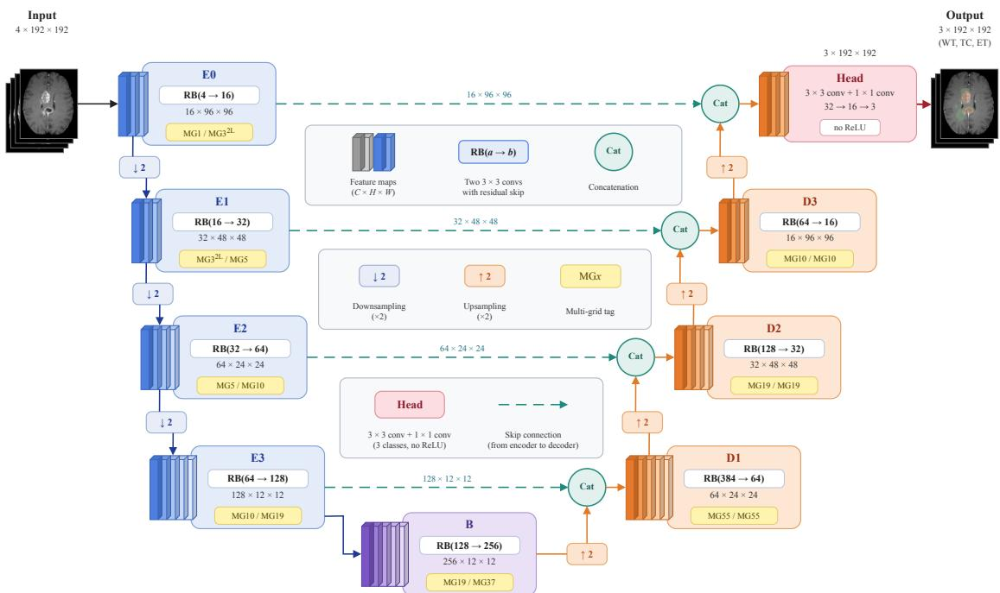  
Figure 1: Evaluated residual U-Net, drawn by spatial resolution: the encoder descends on the left, the bottleneck (same resolution as $e _ { 3 } )$ sits at the bottom, and the decoder ascends on the right. Each box lists its two convolutions (kernel, channels) and its output tensor; the violet tag marks the parameter-free residual connection of the stage; the yellow tags give the number of Stage-1 groups of the processing element that each convolution enables (Section 5). Each concatenation node receives the encoder feature at the lower resolution, and the concatenated tensor is upsampled by two (orange) before the next pair of convolutions.

## 3.4 Post-Training Quantization

The network is quantized to 8 bits with PyTorch eager-mode post-training quantization (PTQ) and the QNNPACK backend [35, 36]. Fusing the convolution-BatchNorm-ReLU blocks first folds the BatchNorm parameters into the convolution weights and bias. Weights are per-tensor symmetric qint8 with min-max PTQ calibration, so w ∈ [−127, 127] and the code −128 never occurs. Activations are per-tensor symmetric qint8 with zero point $z _ { x } = 0 ,$ , and their scales are set by histogram PTQ calibration on training slices. All inference computations operate on quantized tensors. The resulting INT8 model reaches 81.00% mean Dice (90.31% WT, 76.00% TC, 76.68% ET), 0.20 points below the FP32 reference.

## 3.5 Integer Formulation

After fusion, every convolution layer operates on signed INT8 activations and weights. For output channel o at position (h, w) the integer accumulator is

$$
a _ { o } = \sum _ { i = 1 } ^ { N } x _ { i } w _ { o , i } + b _ { o } ,\tag{1}
$$

where $N = K _ { h } K _ { w } C _ { \mathrm { i n } }$ and $b _ { o }$ is the BatchNorm-folded bias, expressed in accumulator units. The quantized output is

$$
y _ { o } = \mathrm { s a t } _ { 8 } \left( \mathrm { r o u n d } \left( a _ { o } \frac { s _ { x } s _ { w } } { s _ { y } } \right) \right) ,\tag{2}
$$

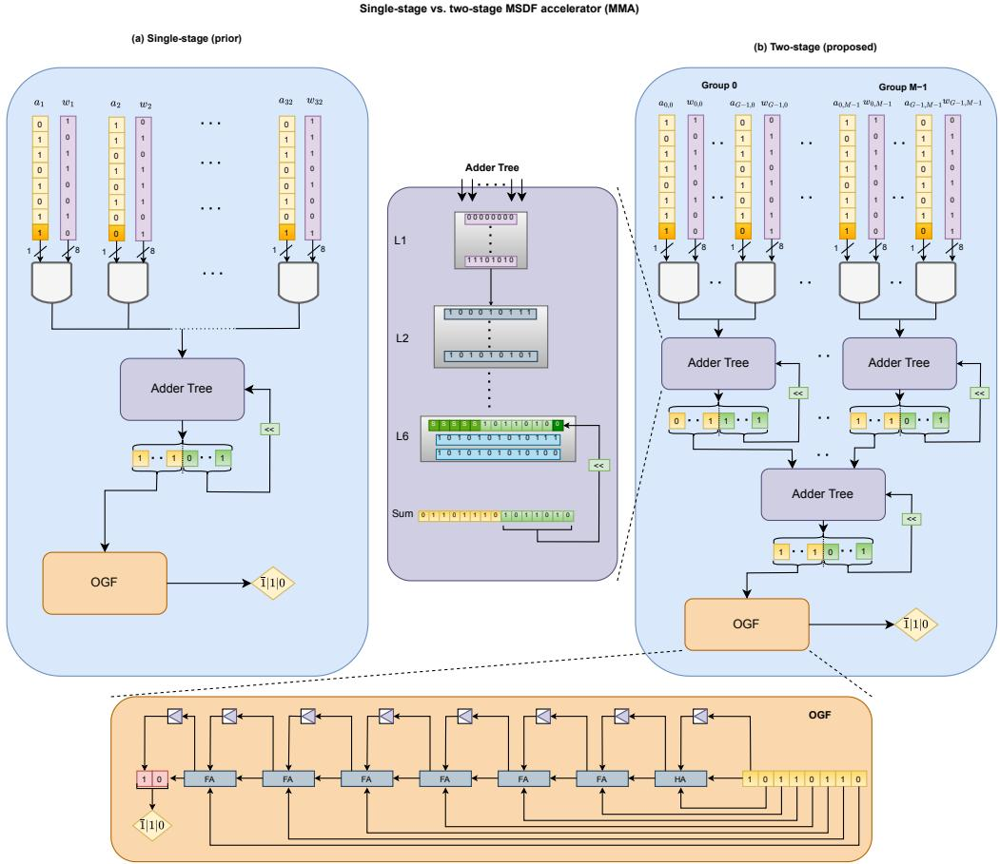  
Figure 2: Processing element architecture. (a) Single-stage MMA organization from [9], where the reduction depth increases with the number of lanes. (b) Proposed two-stage grouped MSDF PE with local group reductions, second stage accumulation, and OGF-based signed-digit generation.

with $s _ { x } , s _ { w } ,$ and $s _ { y }$ the activation, weight, and output scales. Because activations and weights are both quantized symmetrically $( z _ { x } \overset { \cdot } { = } z _ { w } = 0 )$ , (1) contains no zero-point correction term: $a _ { o }$ is the complete integer pre-activation, bias included, so its sign is the sign of the ReLU input or head logit, which the exact early-termination policies of Section 6 rely on.

## 4 Two-Stage MSDF Processing Element

## 4.1 Grouped Reduction Architecture

The MMA [9] consumes the activations one bit plane per cycle, most significant plane first. In each cycle every lane selects its weight or zero according to its current activation bit, the selected partial products are summed with the residual of the previous cycle, and the OGF extracts one signed digit from the top of this sum and returns the remainder as the new residual.

In the single-stage MMA the entire reduction tree lies inside this recurrence, and its depth grows with the number of lanes (Fig. 2(a)), so for long dot products the tree limits the clock frequency. The PE presented here splits the reduction into two stages (Fig. 2(b)). Lanes are organized in groups: Stage 1 reduces the lanes of each group and keeps a local residual, and Stage 2 combines the group outputs through its own residual path before the OGF. The digit-level pipeline is unchanged, but the logic depth inside each recurrence is bounded.

The PE provides $N _ { \mathrm { m a x } } = G _ { \mathrm { m a x } } M _ { \mathrm { m a x } } = 6 4 \times 6 4 = 4 { , } 0 9 6$ lane positions in $G _ { \mathrm { m a x } } = 6 4$ groups of $M _ { \mathrm { m a x } } = 6 4$ lanes. Both stages operate on offset words rather than on separate digit streams, so grouping introduces no second digit-generation step.

## 4.2 Signed Partial-Product Selection

The PE processes signed INT8 activations and symmetric INT8 weights directly in the MSDF datapath. Weights satisfy $w _ { i } \in [ - 1 2 7$ , 127] (Section 3); activations use the full INT8 range, −128 included. For a $B = 8 – 6 \mathrm { i t }$ activation the planes are streamed as

$$
a _ { i , j } = x _ { i } [ B - 1 - j ] , \qquad j = 0 , \ldots , B - 1 ,\tag{3}
$$

where $j = 0$ is the sign plane. The two’s-complement product then splits into

$$
x _ { i } w _ { i } = - a _ { i , 0 } 2 ^ { B - 1 } w _ { i } + \sum _ { j = 1 } ^ { B - 1 } a _ { i , j } 2 ^ { B - 1 - j } w _ { i } .\tag{4}
$$

Only the sign plane contributes the negated weight. Instead of converting to sign-magnitude form or spending an extra cycle, the selector emits $- w _ { i }$ on that plane; this value is always representable because no weight equals −128.

Fig. 3(a) shows the selector of one lane. From the activation bit, the valid signal, and the lane enable, it produces a neutral value, $+ w _ { i } , \mathrm { o r } - w _ { i }$ in the B-bit offset (negabit) form on which the reduction tree operates:

$$
\mathrm { N B } _ { B } ( v ) = 2 ^ { B - 1 } + v \mathrm { ~ m o d ~ } 2 ^ { B } .\tag{5}
$$

For example, $\mathrm { N B } _ { 8 } ( 0 ) = 1 0 0 0 0 0 0 0 _ { 2 } , \mathrm { N B } _ { 8 } ( + 5 ) = 1 0 0 0 0 1 0 1 _ { 2 } .$ , and $\mathrm { N B } _ { 8 } ( - 5 ) = 0 1 1 1 1 0 1 1 _ { 2 }$ . The lane output is

$$
p p _ { i } ^ { ( j ) } = \left\{ \begin{array} { l l } { \mathrm { N B } _ { B } ( 0 ) , } & { \lnot v \lor \lnot e _ { i } \lor a _ { i , j } = 0 , } \\ { \mathrm { N B } _ { B } ( - w _ { i } ) , } & { a _ { i , j } = 1 , q = 1 , j = 0 , } \\ { \mathrm { N B } _ { B } ( + w _ { i } ) , } & { \mathrm { o t h e r w i s e } , } \end{array} \right.\tag{6}
$$

with v the valid signal, $e _ { i }$ the lane enable, and $q$ the signed-activation mode.

A sign-plane flag travels with the activation planes and keeps the negation aligned with its plane. The recurrence $R _ { 0 } = s _ { 0 } , R _ { j } = 2 R _ { j - 1 } + s _ { j }$ , in which each step doubles the running value and adds the contribution selected on the current plane, completes the exact signed product after the eighth plane. With $q = 0$ the selector reduces to the unsigned selector of [9].

## 4.3 Stage-1 and Stage-2 Recurrent Reduction

Stage 1 reduces the 64 lane words of a group in a balanced tree:

$$
\begin{array} { r } { 6 4 \times 8  3 2 \times 9  1 6 \times 1 0  8 \times 1 1 } \\ {  4 \times 1 2  2 \times 1 3  1 \times 1 4 . } \end{array}\tag{7}
$$

Adding the group residual yields the 15-bit word $S _ { 1 }$ . Its upper bits $S _ { 1 } [ 1 4 : 7 ]$ pass to Stage 2, and the lower bits remain as the residual for the next digit cycle; this is the recurrence of the single-stage MMA, applied per group. In the RTL the six logical tree levels are cut into three registered partitions, which bounds the register-to-register path. Stage 2 reduces one 8-bit word from every active group with the same tree-plus-residual scheme and passes the result to the OGF.

## 4.4 Output Generation Function

The OGF, shown in the lower inset of Fig. 2, converts the Stage-2 offset word into one redundant signed digit per cycle. It is a carry-generation network with a small state register and emits each digit on two wires $( z _ { p } , z _ { n } ) \colon$

$$
1 1 \to + 1 , \qquad 0 0 \to - 1 , \qquad 1 0 \mathrm { o r } 0 1 \to 0 .\tag{8}
$$

The negative wire is a negabit in the same inverted encoding, so the reduction datapath can treat the redundant digits as a weighted two-wire number [37]. Inside Stage 1 and Stage 2 the values remain offset words, which keeps the recurrent reduction inexpensive. Only the OGF output is an MSDF digit stream, and this stream is the input of the controller in Fig. 3(c) (Section 6).

(a) lane \(i\): per-plane partial-product selection  
(b) operand stream of one output transaction  
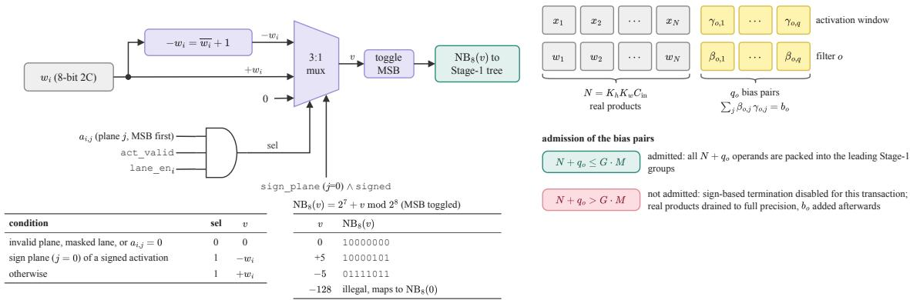

(c) priority stop controller (one per output lane)  
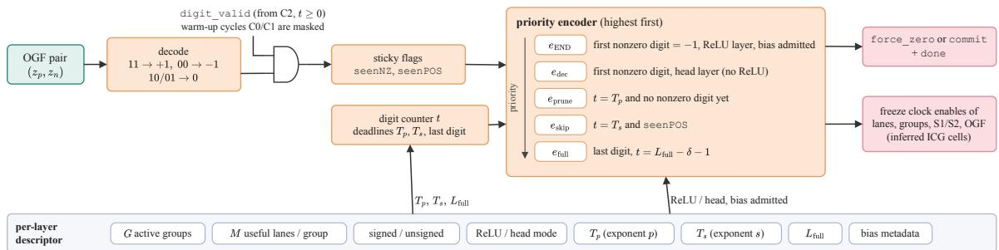  
Figure 3: Lane datapath, operand stream, and runtime control of the PE. (a) Signed partial-product selection for each activation plane. (b) Convolution transaction including $N = K _ { h } K _ { w } C _ { i n }$ products and bias pseudo-products. (c) Priority controller for early termination.

## 4.5 Digit-Level Timing

One output transaction proceeds through the MSDF recurrence and the registered OGF as follows. A launch cycle loads the descriptor and clears the residual registers. In compute cycle C0 the sign plane enters the tree, and both stages advance on the same plane with offset-word residuals. With the chosen register placement the first usable digi d appears at C2, so the online delay is δ = 2 cycles. Pipeline registers inserted to close timing lengthen only this start-up phase; once the pipeline is full, the OGF delivers one valid signed digit per clock regardless of grouping.

After all B operand planes have entered, zero planes continue through the residual hierarchy until the last result digit leaves the OGF. A dot product of N 8-bit operands has $2 B + \lceil \log _ { 2 } ^ { \rceil } N \rceil$ significant result bits, so with M lanes pe group and a power-of-two Stage-2 width $G _ { 2 } \geq G$ the length of a full transaction is

$$
L _ { \mathrm { f u l l } } = 2 B + \log _ { 2 } M + \log _ { 2 } G _ { 2 } + \delta .\tag{9}
$$

This gives 24 cycles for a single 64-lane group and 30 cycles for all 64 groups (Table 1). The early-termination policies of Section 6 shorten a transaction by omitting the trailing digit cycles that are not needed.

Compared with a flat 13-level tree over 4,097 inputs (the 4,096 lane words and the residual), the registered two-stage recurrence is only seven levels deep, which enables the 500 MHz clock reported in Section 8.

## 4.6 Runtime Configuration and Clock Gating

A layer descriptor drives every convolution transaction. It specifies the number of active groups and of active lanes per group, the activation signedness, ReLU or head mode, the early-termination enables and thresholds, the weight and window sources, the bias information, and the output coordinates.

The descriptor governs activity as well as arithmetic. The PE is synthesized once at full capacity, and a layer enables only the G groups its dot product requires (Section 5). Groups that are not needed are clock-gated, and Stage 2 receives the neutral code $\mathrm { N B } _ { 8 } ( 0 )$ in their place; lanes that are not needed inside an active group are masked by $e _ { i }$ in (6). A narrow layer thus runs on the same silicon as a wide one, with only the required part active. Two low-channel layers, for instance, use 32 of the 64 lanes in each enabled group, a lane-utilization mode rather than a different architecture. Configurations are written MGG-ML, with G active groups and M active lanes per group; MG55-64L and MG5-32L are two examples.

## 4.7 Exact Bias Folding

The folded bias $b _ { o }$ of (1) must be part of the digit stream. Added after the OGF, it could reverse the sign of a provisional result, and a sign decision taken on the dot product alone would then be wrong. The bias is therefore decomposed offline into pseudo-products:

$$
b _ { o } = \sum _ { j = 0 } ^ { q _ { o } - 1 } \beta _ { o , j } \gamma _ { o , j } , \qquad | \beta _ { o , j } | \le 1 2 7 , \quad 0 \le \gamma _ { o , j } \le X _ { \mathrm { m a x } } ,\tag{10}
$$

with $X _ { \mathrm { m a x } } = 1 2 7$ for signed INT8 activations. The decomposition is greedy, repeatedly selecting a legal product that reduces the remaining bias magnitude, and it is exact in integer arithmetic.

The pseudo-products are appended to the operand stream of their output channel (Fig. 3(b)) and pass through the same selector, reduction stages, and OGF as the real products. This requires spare lane capacity:

$$
N + q _ { o } \leq G \cdot M .\tag{11}
$$

If (11) is violated, the controller disables END and the sign-only head decision and adds the bias after accumulation. The evaluated network never requires this fallback. Most output channels need two or three pseudo-products, and over a patch the 5,625,936 bias terms amount to 0.26% of the convolution products.

## 5 Mapping Quantized U-Net Inference onto the MSDF Processing Element

## 5.1 Convolution-to-PE Mapping

Table 1: Exact Mapping of the Quantized Network onto the 64-Group PE $( B = 8 )$
<table><tr><td>Layer</td><td>Input  $( C \times H \times W )$ </td><td>Output</td><td>Kernel</td><td> $C _ { i n }$ </td><td> $C _ { o u t }$ </td><td>N</td><td>M</td><td> $G / G _ { 2 }$ </td><td>Packing (%)</td><td>Transactions</td><td> $L _ { \mathrm { f u l l } }$ </td></tr><tr><td>conv0_0</td><td> $4 \times 1 9 2 ^ { 2 }$ </td><td> $1 6 \times 9 6 ^ { 2 }$ </td><td>3×3</td><td>4</td><td>16</td><td>36</td><td>64</td><td>1/1</td><td>58.8</td><td>147,456</td><td>24</td></tr><tr><td>conv0_1</td><td> $1 6 \times 9 6 ^ { 2 }$ </td><td> $1 6 \times 9 6 ^ { 2 }$ </td><td>3×3</td><td>16</td><td>16</td><td>144</td><td>32</td><td>5/8</td><td>91.3</td><td>147,456</td><td>26</td></tr><tr><td>conv1_0</td><td> $1 6 \times 9 6 ^ { 2 }$ </td><td> $3 2 \times 4 8 ^ { 2 }$ </td><td>3×3</td><td>16</td><td>32</td><td>144</td><td>32</td><td>5/8</td><td>91.2</td><td>73,728</td><td>26</td></tr><tr><td>conv1_1</td><td> $3 2 \times 4 8 ^ { 2 }$ </td><td> $3 2 \times 4 8 ^ { 2 }$ </td><td>3×3</td><td>32</td><td>32</td><td>288</td><td>64</td><td>5/8</td><td>90.6</td><td>73,728</td><td>27</td></tr><tr><td>conv2_0</td><td> $3 2 \times 4 8 ^ { 2 }$ </td><td> $6 4 \times 2 4 ^ { 2 }$ </td><td>3×3</td><td>32</td><td>64</td><td>288</td><td>64</td><td>5/8</td><td>90.6</td><td>36,864</td><td>27</td></tr><tr><td>conv2_1</td><td> $6 4 \times 2 4 ^ { 2 }$ </td><td> $6 4 \times 2 4 ^ { 2 }$ </td><td>3×3</td><td>64</td><td>64</td><td>576</td><td>64</td><td>10/ 16</td><td>90.3</td><td>36,864</td><td>28</td></tr><tr><td>conv3_0</td><td> $6 4 \times 2 4 ^ { 2 }$ </td><td> $1 2 8 \times 1 2 ^ { 2 }$ </td><td>3×3</td><td>64</td><td>128</td><td>576</td><td>64</td><td>10 /16</td><td>90.3</td><td>18,432</td><td>28</td></tr><tr><td>conv3_1</td><td> $1 2 8 \times 1 2 ^ { 2 }$ </td><td> $1 2 8 \times 1 2 ^ { 2 }$ </td><td>3×3</td><td>128</td><td>128</td><td>1,152</td><td>64</td><td>19/32</td><td>94.9</td><td>18,432</td><td>29</td></tr><tr><td>conv4_0</td><td> $1 2 8 \times 1 2 ^ { 2 }$ </td><td> $2 5 6 \times 1 2 ^ { 2 }$ </td><td>3×3</td><td>128</td><td>256</td><td>1,152</td><td>64</td><td>19/32</td><td>94.9</td><td>36,864</td><td>29</td></tr><tr><td>conv4_1</td><td> $2 5 6 \times 1 2 ^ { 2 }$ </td><td> $2 5 6 \times 1 2 ^ { 2 }$ </td><td>3×3</td><td>256</td><td>256</td><td>2,304</td><td>64</td><td>37/64</td><td>97.4</td><td>36,864</td><td>30</td></tr><tr><td>conv5_0</td><td> $3 8 4 \times 2 4 ^ { 2 }$ </td><td> $3 8 4 \times 2 4 ^ { 2 }$ </td><td>3×3</td><td>384</td><td>384</td><td>3,456</td><td>64</td><td>55 /64</td><td>98.3</td><td>221,184</td><td>30</td></tr><tr><td>conv5_1</td><td> $3 8 4 \times 2 4 ^ { 2 }$ </td><td> $6 4 \times 2 4 ^ { 2 }$ </td><td>3×3</td><td>384</td><td>64</td><td>3,456</td><td>64</td><td>55 /64</td><td>98.3</td><td>36,864</td><td>30</td></tr><tr><td>conv6_0</td><td> $1 2 8 \times 4 8 ^ { 2 }$ </td><td> $1 2 8 \times 4 8 ^ { 2 }$ </td><td>3×3</td><td>128</td><td>128</td><td>1,152</td><td>64</td><td>19/32</td><td>94.9</td><td>294,912</td><td>29</td></tr><tr><td>conv6_1</td><td> $1 2 8 \times 4 8 ^ { 2 }$ </td><td> $3 2 \times 4 8 ^ { 2 }$ </td><td>3×3</td><td>128</td><td>32</td><td>1,152</td><td>64</td><td>19/32</td><td>94.9</td><td>73,728</td><td>29</td></tr><tr><td>conv7_0</td><td> $6 4 \times 9 6 ^ { 2 }$ </td><td> $6 4 \times 9 6 ^ { 2 }$ </td><td>3×3</td><td>64</td><td>64</td><td>576</td><td>64</td><td>10 /16</td><td>90.3</td><td>589,824</td><td>28</td></tr><tr><td>conv7_1</td><td> $6 4 \times 9 6 ^ { 2 }$ </td><td> $1 6 \times 9 6 ^ { 2 }$ </td><td>3×3</td><td>64</td><td>16</td><td>576</td><td>64</td><td>10 /16</td><td>90.4</td><td>147,456</td><td>28</td></tr><tr><td>conv8_0</td><td> $3 2 \times 1 9 2 ^ { 2 }$ </td><td> $1 6 \times 1 9 2 ^ { 2 }$ </td><td>3×3</td><td>32</td><td>16</td><td>288</td><td>64</td><td>5/8</td><td>90.6</td><td>589,824</td><td>27</td></tr><tr><td>conv8_1</td><td> $1 6 \times 1 9 2 ^ { 2 }$ </td><td> $3 \times 1 9 2 ^ { 2 }$ </td><td>1×1</td><td>16</td><td>3</td><td>16</td><td>64</td><td>1/1</td><td>28.1</td><td>110,592</td><td>24</td></tr><tr><td colspan="10">Total per 192 × 192 patch: 2,162,294,784 real products, 5,625,936 bias pseudo-products</td></tr></table>

$N = K _ { h } K _ { w } C _ { i n }$ real operands; layers whose output resolution halves use stride 2; M useful lanes per group; $G$ active groups, $G _ { 2 }$ power-of-two Stage-2 width; packing $= ( N + q _ { o } ) \dot { } /$ (GM) averaged over the output channels of the layer; $L _ { \mathrm { f u l l } }$ from (9). The decoder inputs of conv5\_0, conv6\_0, conv7\_0, and conv8\_0 are the upsampled concatenations of Fig. 1.

A PE transaction computes one output value: output channel o of one convolution layer at one spatial location. For a $K _ { h } \times K _ { w }$ kernel the dot product has

$$
N = K _ { h } K _ { w } C _ { i n }\tag{12}
$$

real products, to which the $q _ { o }$ bias pseudo-products of Section 4.7 are added, for $N + q _ { o }$ operands in total. The operands are flattened and packed into the leading groups, M consecutive operands per group, so that kernel taps and input channels form a single dot product instead of separate kernel passes.

Transactions are issued over all spatial positions and output channels. In the single-PE evaluation of Sections 7 and 8, the output channel is the outer loop: the weights and pseudo-products of one filter stay resident while the activation windows are streamed through the PE. The multi-output projection of Section 9 keeps this order and shares each activation stream among several output channels.

Table 1 lists the configuration of all 18 convolution layers: the active lanes per group M, the number of active groups $G = \lceil ( N + q _ { o } ) / M \rceil$ , the power-of-two Stage-2 width $G _ { 2 } ,$ and the transaction length from (9). The group count follows the fan-in: the two widest layers, conv5\_0 and conv5\_1, enable 55 of the 64 groups, whereas the first convolution and the segmentation head need a single group. The transaction count instead follows the number of output values, that ${ \mathrm { i s } } ,$ output pixels times output channels, and is therefore dominated by the high-resolution decoder layers. The PE is thus provisioned for the widest layer: weighted by transactions, only 21.1% of the groups are active on average, whereas the packing within the enabled groups reaches 94.5%.

## 5.2 Skip Connections, Upsampling, and Residual Additions

Skip connections need no dedicated datapath in the PE. At each decoder stage, the decoder feature and the matching encoder feature are requantized to a common concatenation scale and stacked along the channel axis:

$$
\mathbf { x } _ { \mathrm { c a t } } ( h , w ) = \left[ Q _ { d } ( \mathbf { x } _ { \mathrm { d e c } } ( h , w ) ) ; Q _ { s } ( \mathbf { x } _ { \mathrm { e n c } } ( h , w ) ) \right] .\tag{13}
$$

After upsampling (Fig. 1), this tensor feeds the next convolution, so a skip connection only widens its input. The 256 bottleneck channels and the 128 channels of encoder stage $e _ { 3 } ,$ , for example, form the 384-channel input of conv5\_0, which accounts for its 55 active groups (MG55-64L); the other decoder stages map to MG19-64L, MG10-64L, and MG5-64L.

Requantization, concatenation, and upsampling run on a small integer front end that processes one eight-channel vector per clock once its pipeline is full. Descriptor-programmed multipliers and shifts bring the decoder and encoder tensors to the common scale, the result is written to an activation buffer, and a raster generator supplies the interpolation neighborhood that the next convolution needs. With align\_corners=False the four bilinear phases reduce to shift and-add operations on the four neighbors $( a , b , c , d ) = ( p _ { 0 0 } , p _ { 0 1 } , p _ { 1 0 } , p _ { 1 1 } )$

$$
\begin{array} { r } { n _ { 0 0 } = { a } + 3 { b } + 3 { c } + 9 d , } \\ { n _ { 1 0 } = 3 { a } + 9 { b } + { c } + 3 d , } \end{array}
$$

$$
\begin{array} { r } { n _ { 0 1 } = 3 a + b + 9 c + 3 d , } \\ { n _ { 1 1 } = 9 a + 3 b + 3 c + d , } \end{array}\tag{14}
$$

followed by

$$
y = \mathrm { s a t } _ { 8 } ( \mathrm { R N E } ( n / 1 6 ) ) .\tag{15}
$$

The interpolator therefore needs neither multipliers nor dividers. Over the four decoder stages the front end take 357,136 cycles, or 0.714 ms at 500 MHz.

Residual connections are element-wise INT8 additions on activation tensors. They involve no multiply-accumulate and run outside the PE on the activation buffers. Together with the front end, they are counted among the non-convolution operations of the system model in Section 9.

## 6 Digit-Level Early Termination

An output transaction terminates early when its digit stream ends before all $L _ { \mathrm { f u l l } }$ cycles have run. The controller of Fig. 3(c) applies four early-termination policies to every output transaction (Fig. 4). Two of them, END for ReLU preactivations and the sign-only head decision, are exact: they follow from properties of the MSDF prefix and leave the quantized output of the INT8 model unchanged. The other two, calibrated pruning of near-zero outputs and calibrated skip calculation of low-order digits, cap the number of digits generated and are configured offline under an accuracy constraint. None of the four modifies the stored weights or any other network parameter.

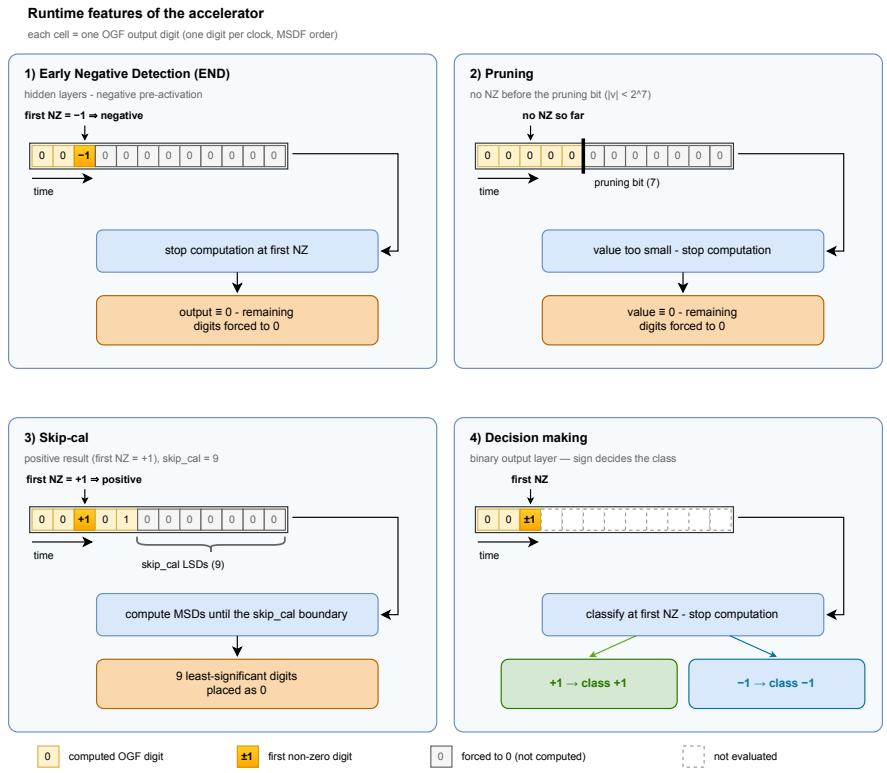  
Figure 4: Early-termination policies operating on the MSDF digit stream. (1) Exact early negative detection (END) of ReLU pre-activations. (2) Calibrated pruning of near-zero outputs. (3) Calibrated skipping of low-order digits. (4) Exact sign-based decision making in the segmentation head.

## 6.1 Exact Early Negative Detection (END)

By the first-nonzero-digit property of Section 2, and because the bias pseudo-products of Section 4.7 are in the same stream, the first nonzero digit gives the sign of the complete pre-activation $a _ { o }$ in (1). In a fused-ReLU layer, a first nonzero digit of −1 therefore certifies that the activation is exactly zero. The controller commits zero, asserts done, and terminates the transaction; the remaining magnitude digits are never generated. END is enabled only when the bias satisfies the bias-capacity condition (11). A first nonzero digit of +1 establishes only that the output is positive, so such a transaction runs to completion unless calibrated skip calculation stops it.

## 6.2 Sign-Only Head Decision

The 1 × 1 head has no ReLU. Its three outputs are thresholded at a sigmoid probability of 0.5, that is, at a zero logit, so each label depends only on the sign of $a _ { o }$ . The controller stops the digit stream at the first nonzero digit and assigns the label. The decision is exact for the same reason as END, and it is the only policy active in the head.

## 6.3 Calibrated Pruning

In this paper, pruning denotes a stopping rule on the output digit stream, not the removal of weights. A pruning exponent p sets a decision point $T _ { p }$ at the digit of weight 2p. If no nonzero digit has appeared by then, the preactivation satisfies $| a _ { o } | < 2 ^ { p }$ in accumulator units, and the controller commits zero and terminates the transaction. Unlike END, this is an approximation: every value in the pruning interval $- 2 ^ { p } < a _ { o } < 2 ^ { p }$ becomes zero, including small positive pre-activations that would have produced a nonzero quantized output.

## 6.4 Calibrated Skip Calculation

A skip exponent s sets a decision point $T _ { s }$ at the digit of weight 2s. Once the first nonzero digit has been +1 (seenPOS), the transaction continues to $T _ { s } ,$ commits the digit prefix generated so far, and clears the remaining s loworder accumulator bits before requantization. The value passed on is thus the pre-activation truncated to a multiple of

2s. The policy targets positive outputs whose discarded low-order digits would not survive requantization to INT8 in any case.

Within the pruning interval, the two policies treat small positive values differently: skip calculation keeps their prefix, whereas pruning zeroes them. For $p \leq s$ the pruning interval lies entirely below the skip threshold, and the truncation already removes every value that pruning would zero, so the combination behaves like skip calculation alone; the sweep in Section 8 reflects this.

## 6.5 Priority and Control

Let $z _ { t } \in \{ - 1 , 0 , + 1 \}$ be the decoded OGF digit at index t, with t = 0 at C2. The controller keeps two sticky flags, seenNZ and seenPOS, and takes the enables $q _ { \mathrm { R e L U } }$ , qhead, $q _ { p } ,$ and $q _ { s }$ from the descriptor. On every valid digit cycle it evaluates

$$
\begin{array} { r l } & { e _ { \mathrm { E N D } } ( t ) = q _ { \mathrm { R e L U } } \neg \sec \tt N Z [ { z } _ { t } = - 1 ] , } \\ & { ~ e _ { \mathrm { d e c } } ( t ) = q _ { \mathrm { h e a d } } \neg \tt s e e n N Z [ { z } _ { t } \neq 0 ] , } \\ & { e _ { \mathrm { p r u n e } } ( t ) = q _ { p } \left[ t = T _ { p } \right] \neg \tt s e e n N Z , } \\ & { ~ e _ { \mathrm { s k i p } } ( t ) = q _ { s } \left[ t = T _ { s } \right] \tt s e e n P 0 \tt S , } \\ & { ~ e _ { \mathrm { f u l l } } ( t ) = [ t = L _ { \mathrm { f u l l } } - \delta - 1 ] . } \end{array}\tag{16}
$$

The priority order is

$$
e _ { \mathrm { E N D } } , e _ { \mathrm { d e c } } > e _ { \mathrm { p r u n e } } > e _ { \mathrm { s k i p } } > e _ { \mathrm { f u l l } } .
$$

All events are gated by digit\_valid, so none can fire during the OGF warm-up cycles. The winning event issues force\_zero or commit, asserts done, and ends the transaction. The termination signals reach the lane, group, reduction, and OGF clock domains through inferred integrated clock-gating (ICG) cells; a cycle saved in the cycle model therefore corresponds to a clock edge suppressed in hardware. The complete controller consists of a two-bit digit decoder, two sticky flags, one digit counter, three comparators, and a priority encoder.

## 6.6 Offline Calibration

The exponents p and s are the only tunable parameters, and a single pair is chosen once per network. The inference simulator of Section 7 evaluates every pair $( s , p )$ in $\{ \mathrm { o f f , 6 , \ldots , 1 1 } \} ^ { 2 }$ on the 73 evaluation cases; no separate calibration split is used. Pairs whose WT, TC, or ET Dice falls more than two points below the FP32 reference are discarded, and among the remaining pairs the one with the largest cycle reduction is written into the layer descriptors.

END and the sign-only head decision are enabled in every configuration, and the simulator applies them, so every INT8 Dice score reported in this paper includes them. At run time no search takes place: the hardware only compares the digit counter with the two descriptor thresholds.

## 7 Evaluation Methodology

A software flow produces the integer model, records each output’s early-termination decision, counts the realized digit cycles, and scores the segmentation; a hardware flow synthesizes the PE and estimates the power of each group mode. The flows meet at the patch level, where each realized cycle is charged the per-cycle energy of its group mode.

The reported numbers differ in scope. PE results (Section 8) are pre-layout, switching-activity-annotated estimates for the convolution datapath, including the OGF, clock-gating logic, and leakage but excluding SRAM, external memory, decoder front end, residual additions, I/O, clock tree, and routing parasitics. Schedule quantities such as $L _ { \mathrm { f u l l } }$ and the group modes follow deterministically from the layer shapes; realized cycle counts come from the simulator traces. The system projection of Section 9 adds modeled memory, broadcast, control, I/O, and non-convolution terms, the last covering the decoder front end and residual additions; it is an estimate, not synthesized hardware.

## 7.1 Cycle-Level Simulation

The quantized PyTorch model runs with instrumented convolution operators implementing (1) on integer tensors. For each output, the operator flattens the window, appends the output channel’s bias pseudo-products, generates the digit stream, and applies the early-termination policies and commit semantics of Section 6 to the 32-bit pre-activation. The tensors passed to the next layer are therefore exactly those the PE would produce.

Realized cycle counts are averaged over the 10,079 evaluation slices and compared with $L _ { \mathrm { f u l l } }$ of (9). Savings are attributed in the order END, calibrated pruning, then calibrated skip calculation together with the sign-only head decision, so the per-policy contributions sum to the total.

## 7.2 RTL Synthesis and Switching-Activity-Based Power Analysis

The PE is described in SystemVerilog and synthesized with Synopsys Design Compiler on the Nangate 45 nm Open Cell Library [38] at the typical corner (1.1 V) under a 2.00 ns clock constraint. Only the full-capacity netlist of 64 groups of 64 lanes is synthesized; every group mode of Table 1 is a run-time configuration of it (Section 4.6).

Power is estimated per group mode. A testbench configures the netlist, drives it with representative activation and weight activity, and records switching activity in a VCD file, which vcd2saif converts to the switching activity interchange format (SAIF) for back-annotation in Design Compiler; the tool then reports total and dynamic power. At f = 500 MHz the energy per cycle and per layer are

$$
E _ { \mathrm { c y c l e } } ( m ) = \frac { P _ { \mathrm { t o t a l } } ( m ) } { f } , \qquad E _ { \ell } = C _ { \ell } E _ { \mathrm { c y c l e } } ( m _ { \ell } ) ,\tag{17}
$$

where $C _ { \ell }$ is the realized cycle count and $m _ { \ell }$ the group mode of layer ℓ. The PE energy of a patch is $\textstyle \sum _ { \ell } E _ { \ell }$ , with each layer charged at the power of its own group mode, not a layer average.

## 7.3 Verification

A Python integer reference verifies signed partial-product generation by rebuilding the product of every signed INT8 activation with every legal weight from the plane contributions of (4), including the corner cases $x \in \{ 0 , 1 \bar { 2 } 7 , - 1 2 8 \}$ and $w \in \{ 0 , \pm 1 2 7 \}$ . An independently generated vector set drives the synthesizable selector in Icarus Verilog over all weight codes and all combinations of activation bit, signedness mode, sign-plane flag, lane enable, and valid flag, asserting the negabit codes of (5) and the rejection of $w = - 1 2 8$ . Randomized control tests exercise the bias-admitted and bias-fallback paths, and a directed timing trace confirms that no early-termination event fires during the two OGF warm-up cycles (Section 4.5). These checks cover 65,280 signed products, 522,240 plane contributions, 8,192 RTL selector vectors, and 20,000 randomized bias and control cases.

The decoder front end is checked against F.interpolate (scale factor 2, bilinear mode, align\_corners=False) followed by rounding and INT8 saturation on 389,376 scalars and 510 directed vectors. These tests span all four interpolation phases, all 256 constant input values, directed tie and saturation cases, random neighborhoods, degenerate and odd-sized tensors, and image borders, and they also exercise the integrated address generator. No check produced a mismatch.

## 8 Results

## 8.1 Accuracy–Cycle Trade-off of Early Termination

Table 2 and Fig. 5 summarize the $7 \times 7$ sweep over s and p on the 73 evaluation cases. The exact policies alone (row off/off) remove 18.79% of the digit cycles without changing the quantized output. Skip calculation is the more effective calibrated policy: alone, it removes 33.4% of the cycles at $s = 6$ and 39.5% at $s = 9 ,$ , with the mean Dice within 1.07 points of the INT8 model. Larger exponents cost 8.17 points of mean Dice at $s = 1 0$ and 55.36 points at $s = 1 1$ . Pruning alone saves less, 19.4% to 23.6% for $p \leq 9$ , and loses accuracy quickly beyond $p = 9$ (Table 2).

The 49 configurations yield only 28 distinct accuracy values, because for $p \leq s$ the combination behaves like skip calculation alone (Section 6). Twenty of the 49 configurations satisfy the accuracy constraint of the offline calibration. Among these, $s = 8 , p = 9$ saves the most cycles, 38.38%, at a mean Dice of 80.58%, which is 0.42 points below the INT8 model. The largest per-region loss, 1.26 points, occurs in ET, the smallest of the three regions. Relaxing the constraint to 2.5 points would admit a configuration with s = 9 at 39.86%. Unless stated otherwise, the hardware results that follow use the s = 8, p = 9 operating point.

## 8.2 Qualitative Segmentation Analysis

Fig. 6 shows two evaluation cases under the different configurations. The FP32 reference, the INT8 model, and the selected operating point produce closely matching delineations whose case-level Dice values differ by a few tenths of a point. Beyond the accuracy constraint, the degradation depends on the region. $\mathbf { A } \mathbf { t } \ s = 9$ the edema boundary begins to fragment while tumor core and enhancing tumor remain largely intact, consistent with Table 2, where WT falls 2.30 points below the INT8 model while TC and ET lose at most 0.58 point. $\mathrm { { A t } } \ s = 1 0$ the edema is clearly under-segmented, whereas the tumor core is still delineated. $\mathbf { A t } \ s = 1 1$ the prediction breaks up into fragments, with false positives along the skull.

Table 2: Accuracy and Digit-Cycle Reduction of the Calibration Sweep
<table><tr><td> $s / p$ </td><td>Mean WT</td><td>TC</td><td>ET</td><td> ${ \mathrm { C y c . } }$  saved</td></tr><tr><td>FP32 ref. off / off</td><td>81.20 90.45 81.00 90.31</td><td>76.04 76.00</td><td>77.10 76.68</td><td>18.79%</td></tr><tr><td colspan="5">skip calculation only 6 / off 80.74 90.28 76.12 75.82 33.44%</td></tr><tr><td>9 / off 10 / off 11 / off pruning only</td><td>79.93 88.01 72.83 75.81 25.64 23.60</td><td>75.69 71.20 20.62</td><td>76.10 71.48 32.71</td><td>39.47% 42.04% 44.11%</td></tr><tr><td>off / 6 off / 9 off / 10</td><td>81.02 80.90 75.40</td><td>90.29 76.05 90.32 76.62 82.62 74.28</td><td>76.72 75.75 69.29</td><td>19.42% 23.59% 29.82%</td></tr><tr><td>both</td><td></td><td></td><td></td><td></td></tr><tr><td>7/7</td><td>81.22 90.33</td><td>76.29</td><td>77.04</td><td></td></tr><tr><td>8/9</td><td>80.58</td><td></td><td>75.42</td><td>38.38%</td></tr><tr><td></td><td></td><td></td><td></td><td></td></tr><tr><td></td><td></td><td></td><td></td><td>35.48%</td></tr><tr><td></td><td></td><td></td><td></td><td></td></tr><tr><td></td><td></td><td></td><td></td><td></td></tr><tr><td></td><td></td><td></td><td></td><td></td></tr><tr><td></td><td></td><td></td><td></td><td></td></tr><tr><td></td><td></td><td></td><td></td><td></td></tr><tr><td></td><td></td><td></td><td></td><td></td></tr><tr><td></td><td></td><td>89.88 76.45</td><td></td><td></td></tr><tr><td></td><td></td><td></td><td></td><td></td></tr><tr><td></td><td></td><td></td><td></td><td></td></tr><tr><td></td><td></td><td></td><td></td><td></td></tr><tr><td></td><td></td><td></td><td></td><td></td></tr><tr><td></td><td></td><td></td><td></td><td></td></tr><tr><td></td><td></td><td></td><td></td><td></td></tr><tr><td></td><td></td><td></td><td></td><td></td></tr><tr><td></td><td></td><td></td><td></td><td></td></tr><tr><td></td><td></td><td></td><td></td><td></td></tr><tr><td></td><td></td><td></td><td></td><td></td></tr><tr><td></td><td></td><td></td><td></td><td></td></tr><tr><td></td><td></td><td></td><td></td><td></td></tr><tr><td></td><td></td><td></td><td></td><td></td></tr><tr><td></td><td></td><td></td><td></td><td></td></tr><tr><td></td><td></td><td></td><td></td><td></td></tr><tr><td></td><td></td><td></td><td></td><td></td></tr><tr><td></td><td></td><td></td><td></td><td></td></tr><tr><td></td><td></td><td></td><td></td><td></td></tr><tr><td></td><td></td><td></td><td></td><td></td></tr><tr><td></td><td></td><td></td><td></td><td></td></tr><tr><td></td><td></td><td></td><td></td><td></td></tr><tr><td></td><td></td><td></td><td></td><td></td></tr></table>

Dice in %. END and the head decision are active in every INT8 row; the table shows a representative subset of the $7 \times 7$ sweep, the full sweep is in Fig. $5 , \ { } ^ { \mathrm { " } } { \mathrm { C y c } } .$ . saved” is relative to full-precision execution (74.19 M cycles per patch). Bold: selected operating point. FP32 ref.: 32-bit floating-point reference model

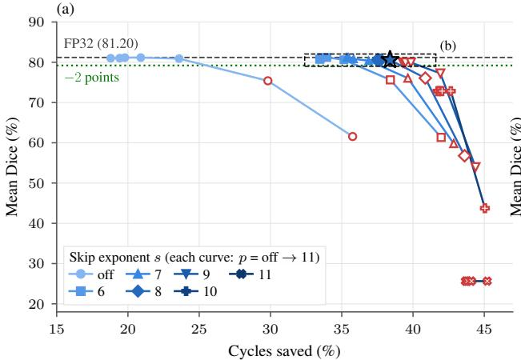

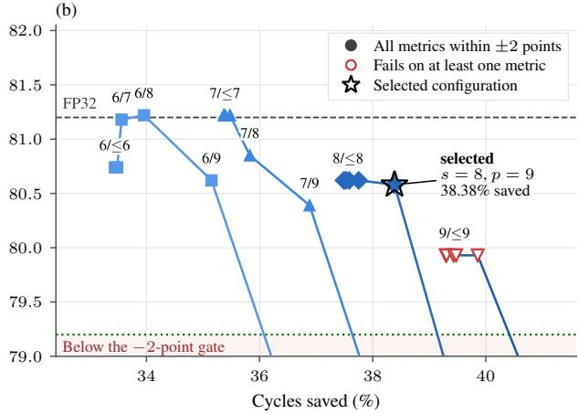  
Figure 5: Calibration sweep of the skip exponent s and the pruning exponent $p .$ (a) Mean Dice versus cycles saved for all 49 configurations; each curve steps through the pruning settings of one skip exponent. (b) Zoom on the operating region with the ±2-point gate; the star marks the selected $s = 8 , p = 9$

## 8.3 Cycle Reduction per Early-Termination Policy

With the attribution order of Section 7, the 38.38% decomposes into 16.48 percentage points from END, 15.38 from calibrated skip calculation, 4.39 from calibrated pruning, and 2.14 from the sign-only head decision. A sequential view applies the policies in the order exact, pruning, skip calculation: the exact policies remove 18.79% of the cycles, pruning with $p = 9$ then removes 5.91% of the remaining cycles, and skip calculation with $s = 8 \mathrm { ~ a ~ }$ further 19.36% of what is left. Each step is relative to the cycles left by the previous one, and the head decision falls in the first step rather than with skip calculation, so these shares are not additive and differ from the attribution above.

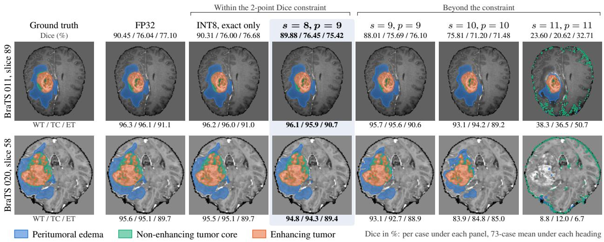  
Figure 6: Segmentation outputs of two held-out cases (axial T1-gd slices) for the ground truth, the floating-point model, the INT8 model with exact policies only, the selected operating point $( s = 8 , p = 9$ , shaded), and three configurations beyond the accuracy constraint. Numbers under each panel are the case-level WT / TC / ET Dice scores in %; numbers under the column headings are the means over the 73 evaluation cases.

Table 3: SAIF-Annotated PE Modes at 500 MHz (Nangate 45 nm, Typical Corner)
<table><tr><td>Mode</td><td>Groups</td><td>Lanes</td><td>Power (mW)</td><td>pJ/cycle</td></tr><tr><td>MG1-64L</td><td>1</td><td>64</td><td>7.48</td><td>14.97</td></tr><tr><td>MG5-32L</td><td>5</td><td>32</td><td>7.36</td><td>14.73</td></tr><tr><td>MG5-64L</td><td>5</td><td>64</td><td>7.62</td><td>15.24</td></tr><tr><td>MG10-64L</td><td>10</td><td>64</td><td>7.80</td><td>15.60</td></tr><tr><td>MG19-64L</td><td>19</td><td>64</td><td>8.14</td><td>16.29</td></tr><tr><td>MG37-64L</td><td>37</td><td>64</td><td>8.87</td><td>17.73</td></tr><tr><td>MG55-64L</td><td>55</td><td>64</td><td>9.55</td><td>19.10</td></tr></table>

END and skip calculation dominate at different depths of the network. In the shallow, high-resolution layers most pre-activations are positive, so skip calculation contributes most (conv0\_1: 29.6 percentage points, against 5.2 from END). In the deep layers with small feature maps the order is reversed (conv4\_0: 32.7 percentage points from END, against 7.7 from skip calculation). Per fused convolution layer the reduction lies between 35% and 42%, so the savings are spread across the network rather than concentrated in a few layers. In the head, the sign-only decision saves 59.9%, because the sign of most logits is resolved within fewer than ten of the 24 cycles of a head transaction $( L _ { \mathrm { f u l l } }$ in Table 1).

## 8.4 Processing Element Implementation Results

The synthesized PE comprises 373,032 leaf cells, among them 327 inferred ICG cells that control 77,853 registers, and occupies 0.858 mm2 of cell area. Its critical path of 1.85 ns meets the 2.00 ns constraint with 0.15 ns of slack. Table 3 lists the SAIF-annotated power and energy per cycle of the modes the network uses. Dynamic power rises from 0.70 mW with one group enabled to 2.67 mW with all 64, so the group-level clock gating scales switching activity with the active fraction of the PE. Total power, in contrast, varies only from 7.36 mW (MG5-32L) to 9.55 mW (MG55- 64L), because the static power of the fully provisioned 4,096-lane structure is present in every mode. Removing it would require power gating of idle groups, which is not implemented.

## 8.5 PE Energy Reduction at Selected Operating Points

Applying (17) per layer gives the PE energy per 192 × 192 patch. Full-digit INT8 execution takes 74.19 M cycles (148.4 ms at 500 MHz) and 1.179 mJ. The selected operating point reduces this to 45.71 M cycles (91.4 ms) and 0.726 mJ, that is, 38.38% fewer cycles and 38.43% less energy. The two percentages differ slightly because the layers that save the most cycles do not all run in the same mode. The more conservative $s = 7 , p = 7$ point (Table 2) requires 47.87 M cycles and 0.760 mJ.

Layer energy follows the realized cycle count, and hence the number of transactions, rather than the MAC count. The high-resolution decoder layers conv $7 \_ 0$ and conv8\_0 account for 22.5% and 21.6% of the PE energy, and conv6\_0 for 12.2%. Conv5\_0, which has the widest fan-in and 35.3% of the MACs (Section 3), contributes only 10.3%, because it executes just 221,184 transactions.

## 9 Projection of an Eight-Output Accelerator

The results of Section 8 refer to a single PE, which computes one output channel at a time. This section projects a design that replicates the PE across output channels, combining quantities that follow exactly from the schedule, such as tile sizes, buffer sizes, and memory traffic, with architectural models for the replicated compute, the data movement, and the system overheads.

## 9.1 Output Tiling with Shared Activation Delivery

At a given spatial position all $C _ { o u t }$ filters read the same activation window and differ only in their weights. An output tile of $T _ { o }$ output lanes, each a replica of the PE, therefore computes $T _ { o }$ output channels in parallel from one activation digit stream. A registered broadcaster distributes the activation planes to the active output lanes, and a partitioned weight buffer supplies each output lane with its filter and bias pairs. Recurrence residuals, OGF state, and stop control remain private to each output lane.

Because output lanes terminate independently, a tile completes only when its slowest output lane does; the factor $g _ { D }$ of the projection model accounts for this divergence. Weight storage does not grow, since each filter is stored once and assigned to one output lane. When $C _ { o u t }$ is not a multiple of $T _ { o } ,$ a lane-valid mask disables the unused output lanes of the last tile without affecting the arithmetic or the outputs.

With $T _ { o } = 8 .$ , 17 of the 18 convolution layers occupy all output lanes, and only the three-channel head leaves some idle. The effective parallelism

$$
P _ { \mathrm { e f f } } ( T _ { o } ) = \frac { \sum _ { \ell } C _ { \ell } } { \sum _ { \ell } C _ { \ell } / \bar { L } _ { \ell } } , \qquad \bar { L } _ { \ell } = \frac { C _ { o u t , \ell } } { \lceil C _ { o u t , \ell } / T _ { o } \rceil } ,\tag{18}
$$

is 1.99, 3.97, and 7.70 for $T _ { o } = 2 , 4$ , and 8.

Sharing the activation stream reduces activation reads from 242.4 MiB to 30.7 MiB per patch at $T _ { o } = 8 .$ a reuse factor of $7 . 9 1 \times$ , whereas output writes (5.1 MiB), weight and bias reads (2.8 MiB), and external traffic (3.08 MiB) are independent of the tile size. The schedule requires 3.289 MiB of SRAM, dominated by the conv5\_0 weight buffer (1.267 MiB) and the conv8\_0 input activation buffer (1.125 MiB).

## 9.2 System-Level Projection Model

The model combines the synthesized PE with the execution schedule of the quantized network to estimate latency, area, and energy at the accelerator level. Its PE-level inputs are the synthesized area, the SAIF-annotated energy, the simulated cycle count, and the clock frequency. SRAM capacity and traffic follow from the mapping and the buffer sizing. SRAM access energy, leakage, and density, including peripheral overhead, are taken from CACTI-based 45 nm models [39] and enter only the memory share of the projection. Overhead factors cover interconnect, banking, and integration.

Let $\phi = ( T _ { o } - 1 ) / 7$ be the normalized tile scale, with $\phi = 0$ for one PE and $\phi = 1$ for eight outputs, and let $C _ { \mathrm { m e a s } }$ and $E _ { \mathrm { P E } }$ be the simulated cycle count and the PE energy at the selected operating point. Latency, area, and energy per patch are then

$$
\begin{array} { l } { \displaystyle T ( T _ { o } ) = \frac { C _ { \mathrm { m e a s } } g _ { D } ( T _ { o } ) / P _ { \mathrm { e f f } } ( T _ { o } ) + N _ { \mathrm { t i l e } } ( T _ { o } ) } { f } } \\ { \displaystyle + T _ { \mathrm { n o n c o n v } } + \frac { B _ { \mathrm { e x t } } } { R _ { \mathrm { e x t } } } , } \\ { \displaystyle A ( T _ { o } ) = g _ { A } \big [ T _ { o } A _ { \mathrm { P E } } ( 1 + o _ { A , \mathrm { l a n e } } \phi ) } \end{array}\tag{19}
$$

Table 4: Parameters Used in the System-Level Projection
<table><tr><td>Parameter</td><td>Meaning</td><td>Value</td><td>Source/Basis</td></tr><tr><td> $A _ { \mathrm { P E } }$ </td><td>PE cell area</td><td>0.858 mm 2</td><td>Synth.</td></tr><tr><td> $E _ { \mathrm { P E } }$ </td><td>PE energy/patch</td><td>0.7262 mJ</td><td>SAIF</td></tr><tr><td> $C _ { \mathrm { m e a s } }$ </td><td>Cycles/patch</td><td>45.712 M</td><td>Sim.</td></tr><tr><td>f</td><td>Ciock frequency</td><td>500 MHz</td><td>Timing</td></tr><tr><td> $M _ { \mathrm { S R A M } }$ </td><td>SRAM capacity</td><td>3.289 MiB</td><td>Buffer</td></tr><tr><td> $B _ { \mathrm { r d / w r / e x t } }$ </td><td>Traffic volumes</td><td>30.7/5.1/3.1 MiB</td><td>Schedule</td></tr><tr><td> $g _ { D }$ </td><td>Lane divergence</td><td>8%</td><td>Trace</td></tr><tr><td> $g _ { A }$ </td><td>Area overhead</td><td>1.08</td><td>ASIC model</td></tr><tr><td> $o _ { A , l }$ </td><td>Lane distribution</td><td>5%</td><td>Interconnect</td></tr><tr><td> ${ } ^ { O A , b }$ </td><td>SRAM banking</td><td>9%</td><td>SRAM model</td></tr><tr><td> $\rho _ { M }$ </td><td>SRAM density</td><td>3.3  $\mathrm { m m ^ { 2 } / M i B }$ </td><td>CACTI</td></tr><tr><td> $A _ { \mathrm { o t h } }$ </td><td>Other area</td><td> $0 . 3 0 \mathrm { m m ^ { 2 } }$ </td><td>Model</td></tr><tr><td> $g _ { E }$ </td><td>Energy margin</td><td>1.10</td><td>Model</td></tr><tr><td> $_ { O _ { E } , l }$ </td><td>Lane energy</td><td>5%</td><td>Interconnect</td></tr><tr><td> $_ { O E , b }$ </td><td>SRAM energy</td><td>8%</td><td>CACTI</td></tr><tr><td> $e _ { \mathbf { r } / \mathbf { w } }$ </td><td>SRAM R/W energy</td><td>5.0/6.5 pJ/B</td><td>CACTI</td></tr><tr><td>Pleak</td><td>SRAM leakage</td><td>2.0 mW/MiB</td><td>CACTI</td></tr><tr><td> $e _ { \mathrm { c t r l } }$ </td><td>Control energy</td><td>60 pJ</td><td>Model</td></tr><tr><td>Tnonconv</td><td>Non-conv. latency</td><td>2.0 ms</td><td>Schedule</td></tr><tr><td> $R _ { \mathrm { e x t } }$ </td><td>External bandwidth</td><td>3.2 GB/s</td><td>Spec.</td></tr><tr><td>eI/O</td><td>I/O energy</td><td>10 pJ/bit</td><td>Model</td></tr></table>

$$
+ \rho _ { M } M _ { \mathrm { S R A M } } ( 1 + o _ { A , \mathrm { b a n k } } \phi ) + A _ { \mathrm { o t h } } ] ,\tag{20}
$$

$$
\begin{array} { r l } & { E ( T _ { o } ) = g _ { E } E _ { \mathrm { P E } } g _ { D } ( T _ { o } ) ( 1 + o _ { E , \mathrm { l a n e } } \phi ) } \\ & { ~ + E _ { \mathrm { S R A M } } ( T _ { o } ) + E _ { \mathrm { c t r l } } + E _ { \mathrm { I / O } } , } \end{array}\tag{21}
$$

where $g _ { D } ( T _ { o } )$ is the divergence factor introduced above, $N _ { \mathrm { t i l e } } ( T _ { o } )$ the tile launch overhead, and $T _ { \mathrm { n o n c o n v } }$ the time for non-convolution work and orchestration, including the 0.714 ms of the decoder front end (Section 5.2). The external transfer time follows from the scheduled traffic $B _ { \mathrm { e x t } }$ and the external bandwidth $R _ { \mathrm { e x t } }$

The divergence overhead is modeled as

$$
g _ { D } ( T _ { o } ) = 1 + 0 . 0 8 \phi ,\tag{22}
$$

which reaches 8% at eight outputs. SRAM energy covers the byte-level accesses that remain after activation reuse, together with bank decoding and leakage:

$$
\begin{array} { r } { E _ { \mathrm { S R A M } } = ( 1 + o _ { E , \mathrm { b a n k } } ) ( e _ { \mathrm { r d } } B _ { \mathrm { r d } } + e _ { \mathrm { w r } } B _ { \mathrm { w r } } ) } \\ { + p _ { \mathrm { l e a k } } M _ { \mathrm { S R A M } } ( 1 + o _ { A , \mathrm { b a n k } } \phi ) T . } \end{array}\tag{23}
$$

$E _ { \mathrm { c t r l } }$ is the controller energy per patch, accumulated from the control energy per output transaction, and $E _ { \mathrm { I / O } }$ the energy of external data movement, accumulated from the I/O energy per bit. Table 4 lists every parameter and its origin.

## 9.3 Output-Tiled Accelerator Projection

Table 5 reports the projection for one, two, four, and eight output lanes. Relative to the configuration with a single output lane, the eight-lane configuration delivers 6.0× the throughput and 49% lower energy per patch for 61% more area (20.9 versus $\bar { 1 3 . 0 \mathrm { m m } ^ { 2 } ) }$ . In the latency decomposition of Fig. 7, the convolution digit-stream term falls from 91.4 to 12.8 ms as the effective parallelism rises (Table 5), and the activation-delivery and SRAM-access term falls from 5.4 to 0.8 ms owing to the 7.9× reuse. The non-convolution allowance (2.0 ms) and the external transfer term (1.0 ms) remain constant, because the decoder front end, the residual connections, and the off-chip traffic are independent of the tile size.

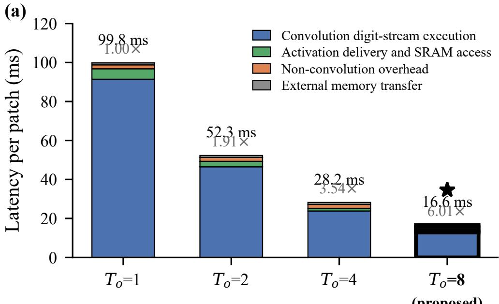

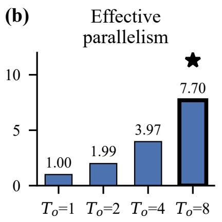

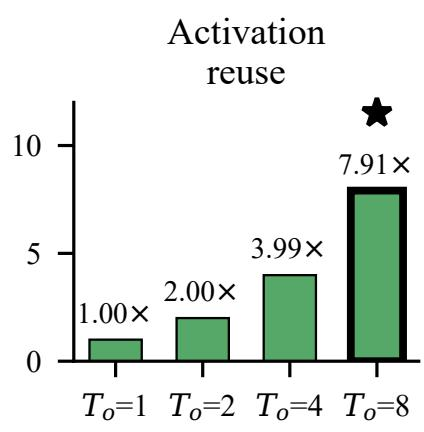

)(c)  
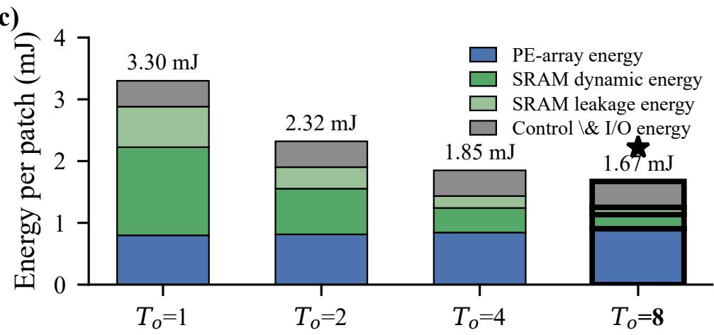  
Figure 7: Scaling behavior of the projected output-tiled accelerator. (a) Latency decomposition showing the reduction of convolution digit-stream execution and activation delivery overhead with increasing output tile size. (b) Effective parallelism and activation reuse achieved by output tiling. (c) Energy breakdown showing that reduced execution time and memory movement dominate the additional compute resources.

Table 5: Projected Output-Tile Sweep at the Selected Operating Point
<table><tr><td>Output lanes  $T _ { o }$ </td><td>1</td><td>2</td><td>4</td><td>8</td></tr><tr><td> $P _ { \mathrm { e f f } }$ </td><td>1.00</td><td>1.99</td><td>3.97</td><td>7.70</td></tr><tr><td>Activation reuse</td><td>1.00×</td><td>2.00×</td><td>3.99×</td><td>7.91×</td></tr><tr><td> $\mathrm { { A r e a } ( m m ^ { 2 } ) }$ </td><td>13.0</td><td>14.1</td><td>16.3</td><td>20.9</td></tr><tr><td>Latency (ms)</td><td>99.8</td><td>52.3</td><td>28.2</td><td>16.6</td></tr><tr><td>Patches/s</td><td>10.0</td><td>19.1</td><td>35.5</td><td>60.4</td></tr><tr><td>Energy (mJ)</td><td>3.30</td><td>2.32</td><td>1.85</td><td>1.67</td></tr><tr><td>Patches/J</td><td>303</td><td>430</td><td>539</td><td>598</td></tr><tr><td>Power (mW)</td><td>33.1</td><td>44.4</td><td>65.8</td><td>101.0</td></tr><tr><td>GOPS</td><td>43.4</td><td>82.9</td><td>153.8</td><td>262.0</td></tr><tr><td>TOPS/W</td><td>1.31</td><td>1.87</td><td>2.34</td><td>2.59</td></tr><tr><td>Op/byte</td><td>16.5</td><td>31.9</td><td>60.2</td><td>107.1</td></tr></table>

The energy panel of Fig. 7 shows why energy per patch decreases although a larger tile draws more power. The PE-array share grows only from 0.80 to 0.91 mJ, since every output still requires the same digit-stream computation. Dynamic SRAM energy falls from 1.43 to 0.23 mJ through activation reuse, and leakage energy from 0.66 to 0.12 mJ through the shorter run. The higher instantaneous power of the replicated PEs (Table 5) is therefore more than offset by the shorter execution and the reduced data movement.

Operational intensity grows with the tile size as well (Table 5). $\mathrm { A t } T _ { o } = 8$ the on-chip bandwidth demand is 2.45 GB/s, below the 3.2 GB/s assumed for the external interface (Table 4), and the projected throughput reaches 69% of the 379 GOPS peak of eight copies of the synthesized PE. We limit the tile to eight output lanes: the narrowest fused layer has only 16 output channels, so wider tiles would add replicated compute and interface overhead with little gain in utilization.

Three questions can only be settled by a physical implementation: whether the eight-bank weight interface sustains one filter stream per active output lane, whether the registered broadcaster closes timing at 500 MHz alongside the PE, and how the front end and the compiled SRAM macros place and route together with the PE array. None of them affects the mapping, the early-termination policies, or the segmentation accuracy.

## 10 Comparison With Prior Hardware

Table 6 compares the run-time computation reduction of this work with that of bit-serial and digit-serial accelerators, and Table 7 compares latency, energy, and efficiency figures with U-Net and other segmentation hardware. Values for other work are taken from the cited publications or derived from reported measurements.

In Table 6, the bit-serial designs reduce work through precision set at compile time or through run-time prediction, based on partial sums in BitSET [40] and on learned bit ordering and thresholds in BitFair [41]. The MSDF designs other than DSLR-CNN [14], which has no run-time mechanism, act on the leading digits instead (Section 2), for power-mode adaptation or output termination. Every prior entry is evaluated on classification or recognition, whereas this work applies run-time early termination within a complete U-Net segmentation pipeline.

The rows of Table 7 differ in task, technology, and reporting boundary, so their energy and efficiency columns are not directly comparable. The prior-work rows are FPGA board measurements or implementations, a synthesis projection, or a post-place-and-route PE, whereas the PE row of this work is a pre-layout, SAIF-annotated estimate of the convolution datapath alone (Section 7); the projection row adds the modeled memory, control, and I/O energy and the tile and integration overheads of Section 9, which together account for its lower GOPS/W relative to the PE row.

For BraTS, Xiong et al. [42] run INT8 inference on an Alveo U280, and Modiboyina et al. [43] lower the weight precision to W4/A8. Outside the table, Song et al. [31] reach very low energy with a binary/INT4 segmentation ASIC. These designs differ in platform and bit width, whereas this work retains W8/A8 precision and removes digit cycles at run time.

## 11 Discussion

The results show that one MSDF datapath supports two kinds of early decision. When the sign alone settles the output, as for a negative ReLU pre-activation or a head logit, the first nonzero digit certifies it exactly. The calibrated policies instead accept a bounded error: pruning commits zero for pre-activations below $2 ^ { p }$ in magnitude, and skip calculation discards the digits below 2s, both in accumulator units. They thereby trade digit cycles for Dice, and the offline sweep over s and p selects the operating point of this trade.

Table 6: Comparison of Digit- and Bit-Serial Accelerators With Runtime Computation Reduction
<table><tr><td>Work</td><td>Computation style</td><td>Runtime reduction</td><td>Technology</td><td>Application</td><td>Reported result</td></tr><tr><td>Stripes [15]</td><td>Bit-serial precision scaling</td><td>Compile-time n/r</td><td></td><td>CNN classification</td><td>Precision adaptation</td></tr><tr><td>UNPU [18]</td><td>Bit-serial variable precision</td><td>Compile-time 65 nm</td><td></td><td>CNN classification</td><td>Silicon prototype</td></tr><tr><td>BitSET [40]</td><td>Bit-serial partial-sum prediction</td><td>Runtime prediction</td><td>45 nm</td><td>CNN classification</td><td>1.5× speedup; 1.4× energy improvement</td></tr><tr><td>BitFair [41]</td><td>Learned bit ordering and thresholding</td><td>Runtime prediction</td><td></td><td>12 nm FinFET Event-based recognition</td><td>Up to 234 BTOPS/W</td></tr><tr><td>DSLR-CNN [14] MSDF digit-serial</td><td>computation</td><td>None</td><td>45 nm</td><td>CNN classification</td><td>3.57 TOPS/W peak</td></tr><tr><td>On-CNN [19]</td><td>MSDF online arithmetic</td><td>Runtime power mode</td><td>n/r</td><td>CNN classification</td><td>Up to 33.8% power reduction</td></tr><tr><td>ECHO [20]</td><td>MSDF with negative-output termination</td><td>Runtime termination</td><td>FPGA</td><td>CNN classification</td><td>2.39-2.6× speedup</td></tr><tr><td>RNPE [21]</td><td>MSDF redundant accumulation</td><td>Runtime termination</td><td>28 nm</td><td>DNN classification</td><td>Up to 97% response-time reduction</td></tr><tr><td>USEFUSE [22]</td><td>MSDF fused-layer computation</td><td>Runtime termination</td><td>FPGA</td><td>CNN classification</td><td>1.43-1.87× speedup</td></tr><tr><td>This work</td><td>MSDF signed INT8 with in-stream bias</td><td>Exact and calibrated early termination</td><td>45 nm</td><td>U-Net BraTS segmentation 38.38% cycle</td><td>reduction; 5.97 TOPS/W PE</td></tr></table>

Early termination lowers PE energy only by removing cycles. Eq. (17) charges each realized cycle at the energy per cycle of its mode, so the PE energy reduction tracks the cycle reduction (Section 8). This energy per cycle grows only moderately with the number of active groups, because static power dominates every mode and no power gating is implemented. Because the PE is provisioned for the widest layer and only a small transaction-weighted fraction of its groups is active (Section 5), most groups stay powered without contributing. Adaptive provisioning and power gating of idle groups would address this overhead.

Four limitations apply. First, s and p were selected on the same 73 evaluation cases on which accuracy is reported, so the mean Dice of the selected operating point is not an independent estimate. Second, the evaluation covers a single dataset and a 2-D network. Third, the PE figures are pre-layout estimates, and the eight-output accelerator is a model, not an implemented design (Sections 7 and 9). Finally, the sign-only decision assumes an independent binary decision per region; a multi-class head would require a comparison between logits, which the present controller lacks.

## 12 Conclusion

This paper presented an MSDF accelerator for quantized U-Net segmentation with per-output early termination. Its grouped two-stage processing element accepts signed INT8 operands and carries the folded bias inside the digit stream, so the leading digits determine the sign of the complete pre-activation. On the 73 BraTS evaluation cases, the exact policies cut 18.79% of the digit cycles without changing the quantized output, and the calibrated policies raise the reduction to 38.38% at a mean Dice of 80.58%. At this operating point the PE consumes 0.726 mJ per patch, and the projected eight-output accelerator completes a patch in 16.6 ms. Future work comprises the physical implementation of the eight-output accelerator with compiled memories and an evaluation on further segmentation datasets with a calibration split disjoint from the evaluation cases.

Table 7: Comparison With U-Net and Segmentation Hardware Accelerators. Reported energy and efficiency values are calculated from the reported power and throughput when not directly provided.
<table><tr><td>Work / task</td><td>Platform / implementation</td><td></td><td>Power Latency (ms)</td><td>Energy/frame (mJ)</td><td>GOPS/W</td><td>Accuracy</td></tr><tr><td>Liu et al. [24] / Cityscapes 5122</td><td>Zynq ZC706, 16-bit fixed; board measurement</td><td>9.60 W</td><td>58.8</td><td>564.7</td><td></td><td>11.1 60.8% pixel acc.</td></tr><tr><td>Zheng et al. [27] / DRIVE vessel segmentation</td><td>VCU128, INT16; FPGA implementation</td><td>16.708 W</td><td>26.3</td><td>439.4</td><td></td><td>67.4 64.97% mIoU</td></tr><tr><td>Sang et al. [29] / 2-D U-Net</td><td>CGLA, 28-nm synthesis projection</td><td>2.61 W</td><td>121</td><td>315.8</td><td>18.68 n/r</td><td></td></tr><tr><td>Wang [28] / Medical segmentation 2562</td><td>Zynq-7000, INT8; FPGA evaluation</td><td>9.587 W</td><td>6.8</td><td>65.2</td><td>7.3 n/r</td><td></td></tr><tr><td>Usman et al. [9] / U-Net convolution layers</td><td>Zynq-7020, INT8, 100 MHz; board measurement</td><td>3.50 W</td><td>53.25</td><td>186.2</td><td>15.14 n/r</td><td></td></tr><tr><td>Xiong et al. [42] / BraTS tumor segmentation</td><td>Alveo U280, INT8; board measurement</td><td>45 W</td><td>150</td><td>6750</td><td></td><td>n/r 0.871/0.882 DSC</td></tr><tr><td>Modiboyina et al. [43] / Zynq-7000, W4/A8; BraTS and EM segmentation</td><td>post-P&amp;R PE</td><td>0.192 W</td><td>n/r</td><td>n/r</td><td></td><td>n/r 94.1/90.5% IoU</td></tr><tr><td colspan="7">This work</td></tr><tr><td>PE / BraTS segmentation</td><td>45-nm synthesis, W8/A8; SAIF-annotated</td><td>7.94 mW</td><td>91.4</td><td>0.726</td><td></td><td>5971 80.58% Dice</td></tr><tr><td>8-lane projection / BraTS segmentation</td><td>45 nm; projected system model</td><td>101 mW</td><td>16.6</td><td>1.67</td><td></td><td>2595 80.58% Dice</td></tr></table>

## References

[1] O. Ronneberger, P. Fischer, and T. Brox, “U-Net: Convolutional networks for biomedical image segmentation,” in Proc. Med. Image Comput. Comput.-Assist. Intervent. (MICCAI), ser. LNCS, vol. 9351. Springer, 2015, pp. 234–241.

[2] F. Isensee, P. F. Jaeger, S. A. A. Kohl, J. Petersen, and K. H. Maier-Hein, “nnU-Net: A self-configuring method for deep learning-based biomedical image segmentation,” Nature Methods, vol. 18, no. 2, pp. 203–211, Feb. 2021.

[3] R. Azad, E. K. Aghdam, A. Rauland, Y. Jia, A. H. Avval, A. Bozorgpour, S. Karimijafarbigloo, J. P. Cohen, E. Adeli, and D. Merhof, “Medical image segmentation review: The success of U-Net,” IEEE Trans. Pattern Anal. Mach. Intell., vol. 46, no. 12, pp. 10 076–10 095, Dec. 2024.

[4] M. Horowitz, “1.1 computing’s energy problem (and what we can do about it),” in IEEE Int. Solid-State Circuits Conf. (ISSCC) Dig. Tech. Papers, San Francisco, CA, USA, Feb. 2014, pp. 10–14.

[5] V. Sze, Y.-H. Chen, T.-J. Yang, and J. S. Emer, “Efficient processing of deep neural networks: A tutorial and survey,” Proc. IEEE, vol. 105, no. 12, pp. 2295–2329, Dec. 2017.

[6] K. S. Trivedi and M. D. Ercegovac, “On-line algorithms for division and multiplication,” IEEE Trans. Comput., vol. C-26, no. 7, pp. 681–687, Jul. 1977.

[7] M. D. Ercegovac, “On-line arithmetic: An overview,” in Proc. SPIE Real-Time Signal Process. VII, vol. 495, 1984, pp. 86–93.

[8] M. D. Ercegovac and T. Lang, Digital Arithmetic. San Francisco, CA, USA: Morgan Kaufmann, 2004.

[9] M. Usman, Y. Sadegheih, and D. Merhof, “Energy-efficient CNN acceleration with MSDF digit-serial arithmetic on FPGA,” in Proc. 32nd IEEE Int. Conf. Electron., Circuits Syst. (ICECS), Marrakech, Morocco, Nov. 2025, pp. 1–4.

[10] M. Antonelli, A. Reinke, S. Bakas, K. Farahani, A. Kopp-Schneider, B. A. Landman, G. Litjens, B. Menze, O. Ronneberger, R. M. Summers et al., “The Medical Segmentation Decathlon,” Nature Commun., vol. 13, p. 4128, Jul. 2022.

[11] B. H. Menze, A. Jakab, S. Bauer, J. Kalpathy-Cramer, K. Farahani, J. Kirby et al., “The multimodal brain tumor image segmentation benchmark (BRATS),” IEEE Trans. Med. Imag., vol. 34, no. 10, pp. 1993–2024, Oct. 2015.

[12] S. Bakas, H. Akbari, A. Sotiras, M. Bilello, M. Rozycki, J. S. Kirby, J. B. Freymann, K. Farahani, and C. Davatzikos, “Advancing The Cancer Genome Atlas glioma MRI collections with expert segmentation labels and radiomic features,” Sci. Data, vol. 4, p. 170117, Sep. 2017.

[13] M. Usman, M. D. Ercegovac, and J.-A. Lee, “Low-latency online multiplier with reduced activities and mini mized interconnect for inner product arrays,” J. Signal Process. Syst., vol. 95, no. 7, pp. 777–796, Jul. 2023.

[14] M. Z. Nisar, M. S. Ibrahim, S. Gorgin, M. Usman, and J.-A. Lee, “Dslr-cnn: Efficient cnn acceleration using digit-serial left-to-right arithmetic,” IEEE Access, vol. 12, pp. 174 608–174 622, 2024.

[15] P. Judd, J. Albericio, T. Hetherington, T. M. Aamodt, and A. Moshovos, “Stripes: Bit-serial deep neural network computing,” in Proc. 49th Annu. IEEE/ACM Int. Symp. Microarchitecture (MICRO), Taipei, Taiwan, Oct. 2016, pp. 1–12.

[16] S. Sharify, A. Delmas Lascorz, K. Siu, P. Judd, and A. Moshovos, “Loom: Exploiting weight and activation precisions to accelerate convolutional neural networks,” in Proc. 55th ACM/ESDA/IEEE Design Autom. Conf. (DAC), San Francisco, CA, USA, Jun. 2018, pp. 1–6.

[17] J. Albericio, A. Delmás, P. Judd, S. Sharify, G. O’Leary, R. Genov, and A. Moshovos, “Bit-pragmatic deep neural network computing,” in Proc. 50th Annu. IEEE/ACM Int. Symp. Microarchitecture (MICRO), Cambridge, MA, USA, Oct. 2017, pp. 382–394.

[18] J. Lee, C. Kim, S. Kang, D. Shin, S. Kim, and H.-J. Yoo, “UNPU: An energy-efficient deep neural network accelerator with fully variable weight bit precision,” IEEE J. Solid-State Circuits, vol. 54, no. 1, pp. 173–185, Jan. 2019.

[19] M. A. Shafique and J.-A. Lee, “On-CNN: Low latency and high throughput online arithmetic-based convolutional neural network accelerator,” IEEE Access, vol. 12, pp. 175 698–175 714, 2024.

[20] M. S. Ibrahim, M. Usman, and J.-A. Lee, “ECHO: Energy-efficient computation harnessing online arithmetic— an MSDF-based accelerator for DNN inference,” Electronics, vol. 13, no. 10, p. 1893, 2024.

[21] I. Moghaddasi, G. Jaberipur, D. Javaheri, and B.-G. Nam, “RNPE: An MSDF and redundant number systembased DNN accelerator engine,” IEEE Access, vol. 12, pp. 96 552–96 564, 2024.

[22] M. S. Ibrahim, M. Usman, and J.-A. Lee, “USEFUSE: Uniform stride for enhanced performance in fused layer architecture of deep neural networks,” J. Syst. Archit., vol. 166, p. 103459, 2025.

[23] S. Moradi Cherati, M. Barzegar, and L. Sousa, “Early termination of the MSDF computations towards efficient inference in neural networks,” in Proc. IEEE Int. Symp. Circuits Syst. (ISCAS), London, U.K., May 2025, pp. 1–5.

[24] S. Liu, H. Fan, X. Niu, H.-C. Ng, Y. Chu, and W. Luk, “Optimizing CNN-based segmentation with deeply customized convolutional and deconvolutional architectures on FPGA,” ACM Trans. Reconfigurable Technol. Syst., vol. 11, no. 3, pp. 19:1–19:22, Dec. 2018.

[25] Y. Jiang, Z. Li, Z. Zhang, H. Wang, and S. Chang, “PEDSA: High-throughput pipeline-based FPGA accelerator for convolutional encoder-decoder segmentation networks,” IEEE Trans. Comput.-Aided Design Integr. Circuits Syst., vol. 44, no. 4, pp. 1326–1339, Apr. 2025.

[26] U. L. Udeji and M. Margala, “SegmentAI: A neural net framework for optimized multiclass image segmentation via FPGA,” in Proc. IEEE Comput. Soc. Annu. Symp. VLSI (ISVLSI), Knoxville, TN, USA, Jul. 2024, pp. 421– 426.

[27] R. Zheng, F. Ge, and F. Zhou, “FPGA-based high-efficiency accelerator for UNET with symmetric pruning strategy,” in Proc. IEEE 14th Int. Conf. Commun., Circuits Syst. (ICCCAS), Wuhan, China, May 2025, pp. 51– 56.

[28] Q. Wang, “Low-power FPGA-based accelerator for medical image segmentation: A hardware-oriented simulation study,” in Proc. Int. Conf. Appl. Electron. (AE), Pilsen, Czech Republic, Sep. 2025, pp. 1–6.

[29] D. T. Sang, R. Imamura, T. Akabe, and Y. Nakashima, “Energy consumption optimization of multi-dimensiona U-Nets on CGLA,” IEEE Access, vol. 13, pp. 29 476–29 492, 2025.

[30] X. Duan, Y. Chen, M. Li, Y. Rong, R. Xie, and J. Han, “UArch: A super-resolution processor with heterogeneous triple-core architecture for workloads of U-Net networks,” IEEE Trans. Biomed. Circuits Syst., vol. 17, no. 3, pp. 633–647, Jun. 2023.

[31] Z. Song, U. Guler, and A. Chandrakasan, “A 23-µj-per-frame all-on-chip tinyml u-net processor for real-time autonomous image segmentation in miniaturized ultrasound devices,” IEEE Transactions on Biomedical Circuits and Systems, 2026.

[32] W. Xu, M. Moffat, T. Seale, Z. Liang, F. Wagner, D. Whitehouse, D. Menon, V. Newcombe, N. Voets, A. Banerjee, and K. Kamnitsas, “Feasibility and benefits of joint learning from MRI databases with different brain diseases and modalities for segmentation,” in Proc. 7th Int. Conf. Med. Imag. Deep Learn. (MIDL), ser. Proc. Mach. Learn. Res., vol. 250. Paris, France: PMLR, Jul. 2024, pp. 1771–1784.

[33] Y. Sadegheih, P. Kumari, and D. Merhof, “Modality-agnostic brain lesion segmentation with privacy-aware continual learning,” in Predictive Intelligence in Medicine (PRIME 2025, held with MICCAI 2025), ser. LNCS, vol. 16164. Cham, Switzerland: Springer, 2026, pp. 1–13.

[34] Y. Sadegheih, D. Merhof, and P. Kumari, “Towards modality-agnostic continual domain-incremental brain lesion segmentation,” in Proc. 9th Int. Conf. Med. Imag. Deep Learn. (MIDL), ser. Proc. Mach. Learn. Res., vol. 315. Taipei, Taiwan: PMLR, Jul. 2026, pp. 2447–2460.

[35] A. Paszke, S. Gross, F. Massa, A. Lerer, J. Bradbury, G. Chanan, T. Killeen, Z. Lin, N. Gimelshein, L. Antiga et al., “PyTorch: An imperative style, high-performance deep learning library,” in Adv. Neural Inf. Process. Syst. (NeurIPS), vol. 32, Vancouver, BC, Canada, Dec. 2019, pp. 8024–8035.

[36] M. Dukhan, Y. Wu, and H. Lu, “QNNPACK: Open source library for optimized mobile deep learning,” Engineering at Meta, https://engineering.fb.com/2018/10/29/ml-applications/qnnpack/, Oct. 2018, accessed: Aug. 20, 2026.

[37] G. Jaberipur and B. Parhami, “Constant-time addition with hybrid-redundant numbers: Theory and implementations,” Integration, vol. 41, no. 1, pp. 49–64, Jan. 2008.

[38] NanGate Inc., “NanGate FreePDK45 open cell library,” Silicon Integration Initiative (Si2), https://si2.org/ open-cell-library/, 2008, release v1.3. Accessed: Aug. 21, 2026.

[39] D. Tarjan, S. Thoziyoor, and N. P. Jouppi, “Cacti 6.0: A tool to model large caches,” HP Laboratories, 2006.

[40] Y. Pan, J. Yu, A. Lukefahr, R. Das, and S. Mahlke, “Bitset: Bit-serial early termination for computation reduction in convolutional neural networks,” ACM Transactions on Embedded Computing Systems, vol. 22, no. 5s, pp. 1– 24, 2023.

[41] A. Li and C. Gao, “Bitfair: A 12nm bit-serial cnn accelerator with learnable early termination and adaptive bit ordering for ultra-low-power xr vision,” arXiv preprint arXiv:2607.05445, 2026.

[42] S. Xiong, G. Wu, X. Fan, X. Feng, Z. Huang, W. Cao, X. Zhou, S. Ding, J. Yu, L. Wang et al., “Mri-based brain tumor segmentation using fpga-accelerated neural network,” BMC bioinformatics, vol. 22, no. 1, p. 421, 2021.

[43] C. Modiboyina, I. Chakrabarti, and S. K. Ghosh, “Lightweight low-power u-net architecture for semantic segmentation,” Circuits, Systems, and Signal Processing, vol. 44, no. 4, pp. 2527–2561, 2025.