# DaCe-DT: Data-Centric Offline Multi-Task Reinforcement Learning via Adaptive Prompts and Trajectory Correction for Heterogeneous Tasks

Shudong Wang Xinfei Wang

Chenhao Zhang

Shanchen Pang Wenhao Li

Haiyuan Gui

Meng Han

Xiaojian Liao

## Abstract

Offline multi-task reinforcement learning (Offline MTRL) heavily depends on the quality and distribution of pre-collected data. However, existing methods mainly focus on algorithmic optimization, with less emphasis on data-level improvements to enhance learning ability and generalization performance. This paper, from a data perspective, reveals three key bottlenecks that limit Offline MTRL performance: (i) ineffective utilization of prompts length under diverse task complexities, and (ii) semantic irrelevance of randomly sampled prompt segments, (iii) misleading supervision induced by fragmented and discontinuous trajectories. To address these challenges, we propose DaCe-DT, a robust offline MTRL framework designed to be insensitive to heterogeneous task complexities and data quality, featuring length-gated prompt masking (LGPM), retrieval-augmented prompt construction (RAPC), and value-adaptive return calibration (VARC). Together, these mechanisms enable DaCe-DT to deliver data-centric prompt adaptation and trajectory refinement, resulting in robust multi-task generalization and stable policy learning amid heterogeneous offline data and tasks. Experimental results on Meta-World show that DaCe-DT consistently outperforms state-of-the-art methods, achieving an average improvement of 11.73% on optimal datasets and an improvement of 13.34% on suboptimal datasets, demonstrating its effectiveness in learning stably from imperfect data and improving overall multi-task performance.

## 1 Introduction

Offline reinforcement learning (RL) [17] enables agents to learn effective policies from static, pre-collected datasets without any active environment interactions. This property offers significant advantages in safety-critical or data-intensive domains such as robotics [15], autonomous driving [19], and healthcare [6] by reducing exploration risks and data collection costs. However, traditional offline RL methods typically learn each task in isolation and struggle to generalize their learned knowledge to new tasks. When faced with a novel task [23], a standard offline RL policy must be retrained from scratch, limiting its scalability in complex multi-task environments. On the other hand, multitask reinforcement learning (MTRL) addresses cross-task generalization by training a single model on multiple tasks jointly, encouraging the reuse of learned skills and improving data efficiency. Combining these two paradigms, offline multi-task reinforcement learning (Offline MTRL) leverages diverse offline datasets for knowledge transfer without additional interaction, and has attracted growing attention for learning a single versatile policy across tasks.

Recent advances in sequence modeling provide a promising pathway for offline RL[21, 28, 27]. In particular, the Decision Transformer (DT) [2] formulates offline RL as return-conditioned conditional sequence generation over trajectories, achieving impressive results in single-task settings. Building on this idea, prompt-based Decision Transformers[25] extend DT to multi-task settings by prepending task-specific context prompt (e.g., example transitions or a task descriptor) to the input sequence, enabling task inference and task-conditioned behavior. A growing body of work has explored promptbased DT variants for offline MTRL. These methods address multi-task challenges from different angles: Prompt-DT[25] and Prompt-tuning DT[12] enrich task-relevant context and background evidence through prompt construction; HarmoDT [11] mitigates cross-task gradient conflicts via mask-/subnetwork-based designs; and M3DT [13] improves capacity and scalability by leveraging a Mixture-of-Experts (MoE) mechanism to support a larger number of tasks. Despite their successes, most existing efforts predominantly emphasize architectural or algorithmic modifications, while largely overlooking a fundamental data-centric challenge: how to exploit static offline data under pronounced heterogeneity across (and within) tasks. By revisiting these representative works through a data-centric lens, we identify three key bottlenecks that constrain learnability and generalization, motivating our three core observations.

First, data quality is highly heterogeneous across tasks and even across training mini-batches, and the uniform prompt length limits the model’s generalization and learning efficiency. For example, the default length of the current work is 5. On Coffee-Push task, using an empirically tuned “optimal” fixed length (30) improves the single-task success rate by 60% over the state-of-the-art baseline. Further, with our adaptive prompting strategy, the success rate on Coffee-push further increases to 100%; meanwhile, across all 50 tasks, our approach improves the overall average success rate by 9.60% over the state of the art. (see Observation I, §3.1)

Second, randomly sampled prompt segments disregard their semantic relevance to the current decision state, limiting effective utilization of heterogeneous offline data. As shown in Fig. 1(c)–(d), RAPC improves the final success rate by 8.4% over random selection and 9.6% over fixed selection, while increasing the mean prompt-trajectory similarity from 0.462 and 0.361 to 0.741, respectively. These results show that a static, context-agnostic prompt cannot capture the behavioral evidence most aligned with the current policy state, leaving informative high-quality trajectory segments in the offline dataset underexploited. (see Observation II, §3.2)

Third, existing return-conditioned sequence modeling methods for offline MTRL still lack reliable trajectory stitching capability. Although value learning has been effective for stitching in single-task offline RL [26], extending it to offline MTRL is non-trivial. For example, MTIQL [8] relies on task-specific value functions and stitching modules, introducing considerable overhead and making it difficult to directly apply to prompt-based sequence models without explicit task IDs. Moreover, direct value-based correction under heterogeneous task data may induce biased reachable-return estimates, causing OOD conditioning and false stitching points. (see Observation III, §3.3)

To address these data-centric bottlenecks in Offline MTRL, we propose DaCe-DT, a unified framework that explicitly adapts context construction and trajectory composition to heterogeneous offline data. DaCe-DT integrates three key mechanisms: (1) Length-Gated Prompt Masking (LGPM), which learns a task-specific effective prompt length via a differentiable gating parameter, adaptively suppressing redundant or insufficient context for each task; (2) Retrieval-Augmented Prompt Construction (RAPC), which replaces the static prompt at each step with the most semantically relevant high-return trajectory segment, retrieved via the model’s own GPT-2 embedding layer; and (3) Value-Adaptive Return Calibration (VARC), which trains a task-conditioned value function with per-task adaptive expectile parameters to calibrate achievable returns at inference, enabling reliable trajectory stitching while avoiding OOD conditioning.

Beyond RTG calibration, VARC also provides return-level guidance for prompt retrieval by identifying high-quality trajectory segments consistent with the current return target. In DaCe-DT, RAPC retrieves semantically relevant high-return segments, VARC filters them according to achievablereturn consistency, and LGPM trims the retrieved prompt to the task-specific effective length. This coordinated design unifies adaptive context construction and reliable trajectory stitching. On the Meta-World benchmark [29], DaCe-DT improves over the state-of-the-art HarmoDT [11] by 11.73% on the optimal dataset and by 13.34% on the suboptimal dataset.

In summary, our contributions are as follows:

• We identify, from a data-centric perspective, three key bottlenecks constraining Offline MTRL performance: prompt length mismatch, semantic irrelevance of randomly sampled prompts, and trajectory fragmentation.

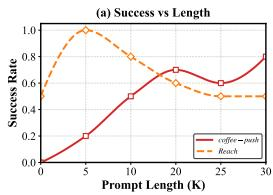

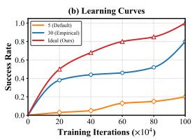

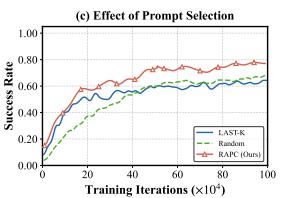

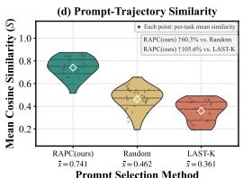  
Prompt Selection Method  
Figure 1: (a) Fixed-length prompt sweep on Reach and Coffee-Push (MT50) shows each task’s "optimal" K. (b) On Coffee-Push, dynamic prompting outperforms fixed K=5 and empirically tuned K=30. (c) Comparison of different prompt selection mechanisms in PromptDT on MT30 (curves are smoothed). (d) Cosine similarity between selected prompts and the current inference trajectory under different prompt selection methods.

• We propose three data-centric mechanisms—LGPM, RAPC, and VARC—to address prompt length mismatch, semantic irrelevance, and trajectory fragmentation, respectively.

• We conduct extensive experiments on multiple task combinations of the Meta-World benchmark, demonstrating consistent improvements over state-of-the-art methods across datasets of varying quality.

## 2 Preliminary

## 2.1 Decision Transformer (DT)

Decision Transformer (DT) [2] reformulates reinforcement learning as a conditional sequence modeling problem. Instead of learning value functions or computing policy gradients, DT trains a causally masked Transformer [24] to directly predict actions from offline trajectories. Concretely, each trajectory is tokenized as an interleaved sequence of return-to-go, states, and actions, $\tau =$ $( \widehat { R } _ { 1 } , s _ { 1 } , a _ { 1 } , \widehat { R } _ { 2 } , s _ { 2 } , a _ { 2 } , \ldots , \widehat { R } _ { T } , s _ { T } , a _ { T } )$ , where the return-to-go is defined as $\begin{array} { r } { R _ { t } = \sum _ { t ^ { \prime } = t } ^ { T } r _ { t ^ { \prime } } } \end{array}$ . With autoregressive modeling, the policy predicts $a _ { t }$ conditioned on the prefix $\tau _ { 1 : t }$ . DT is trained using a standard behavior cloning loss:

$$
\mathcal { L } _ { D T } = \mathbb { E } _ { \tau \sim \mathcal { D } } \left[ \sum _ { { t = 1 } } ^ { T } \| \pi _ { \theta } ( \tau _ { 1 : t } ) - a _ { t } \| _ { 2 } ^ { 2 } \right] .\tag{1}
$$

The return-to-go token acts as a goal-conditioning signal, enabling goal-directed behavior at test time.

## 2.2 Prompt as Task Evidence in Offline MTRL

Prompt-based Decision Transformers extend DT to multi-task settings by prepending task-specific context prompts, enabling task inference and task-conditioned behavior. We follow this paradigm and further improve prompt utilization under multi-task heterogeneity.

As illustrated in Fig. 8, a prompt serves as an explicit task descriptor in the trajectory space, fulfilling three key functions: ① task identification—enabling a shared Transformer to infer task identity from context alone; ② prior knowledge injection—encoding task-dependent reward/dynamics patterns and behavioral priors; and ③ return conditioning—specifying goal information to steer the generated trajectory toward desired outcomes.

## 3 Rethinking Offline MTRL: A Data-Centric Perspective

## 3.1 Prompt Length Mismatch

Observation I: Offline MTRL exhibits pervasive data heterogeneity both across tasks and within training mini-batches (different task combinations, see Appendix C.4 and Table 11) . Fixed prompt lengths fail to accommodate the divergent contextual requirements of heterogeneous tasks, causing critical under- or over-provisioning ofcontext across different task complexities.

As shown in Fig. 1(a), different tasks exhibit markedly different optimal prompt lengths. For near-Markovian simple tasks (e.g., Reach), a short prompt with K=5 already achieves a 100% success rate, while longer prompts introduce redundancy and dilute attention. Conversely, for multi-stage complex tasks $( { \mathrm { e . g . , } } C o f f e e { \mathrm { - } } P u s h )$ , a longer prompt with K=30 is required to reach an 80% success rate, as shorter prompts omit critical historical cues and lead to decision degradation. Consequently, no fixed prompt length can simultaneously satisfy the requirements of all tasks. Furthermore, Fig. 1(b) demonstrates that even within a single task, a fixed “optimal” length fails to accommodate the varying evidence requirements of different trajectory segments during training: prompt lengths that are globally too long or too short at the batch level still induce segment-level mismatches, and adaptive length adjustment yields an additional 20% improvement over the best fixed baseline (red curve). The attention heatmaps in Fig. 2 provide a mechanistic explanation: prompts that are too short deprive the model of critical historical information, while prompts that are too long cause attention dilution and cumulative statistical bias. It is worth emphasizing that “adaptive” here does not refer to searching for a fixed optimal length per task via hyperparameter tuning. Subsequent experiments demonstrate that the optimal prompt length for the same task varies substantially across different task combinations and dataset qualities—a dynamic property that fundamentally precludes any fixed-length search strategy, further underscoring the necessity of a truly adaptive mechanism.

## 3.2 Semantic Irrelevance of Prompts

Observation II: Last-K prompt sampling disregard their semantic relevance to the current decision state, severely limiting the exploitation ofinformative offline data.

Even when prompt length is properly addressed, existing methods still suffer from a second, deeper deficiency: they typically first select the highest-return trajectory for each task and then use its last-K segments as prompts [25, 11, 13]. Thus, prompt selection is driven by trajectory-level return and temporal recency, rather than semantic relevance to the current decision state. We further test a random prompt sampling strategy, and the results show that both position-based and

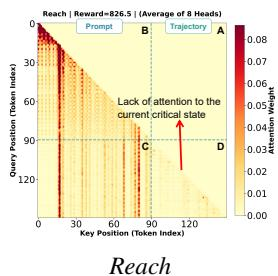

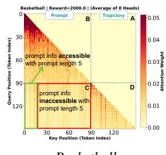  
Basketball  
Figure 2: Task-dependent attention under long prompts (K=30, L=20; average over 8 heads). Reach (left) shows attention concentrated on recent tokens; Basketball relies on broader prompt history.

random prompt selection ignore the semantic alignment between the prompt and the current decision context.

As shown in Fig. 1(d), the mean cosine similarity between the prompt and the current trajectory is only 0.361 for fixed prompts and 0.462 for random prompts, whereas our RAPC raises this to 0.741—a relative improvement of 105.6% and 60.3%, respectively. This gap directly translates to training performance: as shown in Fig. 1(c), both fixed and random prompt selection noticeably suppress model performance throughout training, while RAPC—by providing semantically aligned prompts—more effectively exploits the informative structure of the offline dataset and achieves faster convergence with consistently higher success rates. These results demonstrate that semantically irrelevant prompt segments are effectively equivalent to noise injection; conversely, retrieving a segment that is semantically aligned with the current state provides the model with precise, stagelevel behavioral evidence, substantially improving decision quality.

This motivates the design of RAPC, which leverages the model’s own embedding layer to perform semantically-aware prompt retrieval, jointly optimized with LGPM for adaptive context length. As shown in our experiments, introducing RAPC alone yields an improvement of 9.6% over Prompt-DT.

## 3.3 Sub-Trajectory Fragmentation

Observation III: Offline data usually only provides partial high-quality sub-trajectories. The existing Offline MTRL methods lack the ability to stitch trajectories, and value-based methods are difficult to be simply applied to offline MTRL scenarios.

Offline datasets often contain complementary locally optimal segments rather than complete globally optimal trajectories, making stitching essential for synthesizing better behaviors. As shown in Fig. 3,

Trajectory A provides a high-quality prefix but fails later, while Trajectory B starts suboptimally but ends successfully; ideally, the policy should stitch A’s prefix with B’s suffix to form a better trajectory. However, return-conditioned DTs are constrained by the empirical support of (s, RTG) pairs: at the stitching state A2, switching to B’s successful continuation requires conditioning on a higher target return that is poorly supported in the dataset. Such unsupported RTG conditioning can induce OOD generalization, causing DT to follow the lower-return path and limiting trajectory recombination.

In single-task offline RL[26], value learning has been shown effective for trajectory stitching, and the authors of HarmoDT attempted to extend value correction to IQL for offline MTRL (MTIQL).[8] However, MTIQL relies on task-specific value functions and stitching modules, introducing considerable overhead and weakening the unified modeling advantage of multi-task learning. Moreover, return-conditioned sequence modeling methods usually infer task information from context prompts without explicit task IDs, making such task-specific designs difficult to directly apply. Directly applying value-based correction to these models is also non-trivial: task heterogeneity, uneven data coverage, and different return scales can lead to biased reachable-return estimates, as also observed in our preliminary attempts, causing severe OOD conditioning, unattainable high-return targets, and false stitching points.

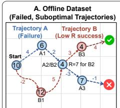  
10 Target return for the current state

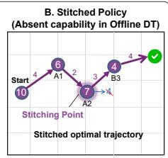  
4 Reward at the current step  
Figure 3: Trajectory stitching and a DT limitation. Left: Complementary suboptimal trajectories: A succeeds early but fails later; B is the opposite. Right: Optimal stitching $( A _ { 1 } {  } A _ { 2 } {  } B _ { 3 } )$ is blocked by returnconditioned DTs that cannot adjust RTG at the junction.

## 4 Methodology

In this section, we present DaCe-DT, comprising three core mechanisms: I. Length-Gated Prompt Masking (LGPM, §4.1), II. Retrieval-Augmented Prompt Construction (RAPC, §4.2), and III. Task-Adaptive Value Function Learning (VARC, §4.3). The framework is shown in Fig. 4.

## 4.1 Length-Gated Prompt Masking (LGPM)

To address the issues of context redundancy and information deficiency caused by fixed prompt lengths in heterogeneous tasks, we propose a length-gated prompt masking mechanism. For each task $T _ { i } ,$ a learnable scalar $\lambda _ { i } \in \mathbb { R }$ is mapped to a discrete effective length:

$$
L _ { i } = \operatorname { r o u n d } ( \sigma ( \lambda _ { i } ) \cdot K _ { \operatorname* { m a x } } ) , \quad L _ { i } \in \{ 0 , 1 , \ldots , K _ { \operatorname* { m a x } } \} .\tag{2}
$$

A task-specific attention mask Mi is injected into each Transformer self-attention layer, blocking prompt tokens older than $L _ { i }$ steps while preserving causal order:

$$
\mathbf { M } _ { i } [ j , k ] = \left\{ \begin{array} { l l } { - \infty , } & { k \in \mathbb { Z } _ { \mathrm { p r o m p t } } \mathrm { a n d } k < ( | \mathbb { Z } _ { \mathrm { p r o m p t } } | - L _ { i } ) , } \\ { - \infty , } & { k > j , } \\ { 0 , } & { \mathrm { o t h e r w i s e } . } \end{array} \right.\tag{3}
$$

Since round(·) is non-differentiable, gradients are passed through it via the Straight-Through Estimator (STE). A sparsity regularization term $\begin{array} { r } { \mathcal { L } _ { \mathrm { s p a r s e } } = \beta \sum _ { i } \sigma \bar { ( \lambda _ { i } ) } } \end{array}$ prevents degeneration to the maximum length, driving each task toward its Minimal Sufficient Context.

## 4.2 Retrieval-Augmented Prompt Construction (RAPC)

Standard Prompt-DT uniformly samples a fixed demonstration sub-trajectory as the prompt, whose content quality depends on sampling chance with no semantic alignment to the current decision state. We leverage the model’s own GPT-2 embedding layer to build a similarity-based retrieval mechanism, so that at each step the prompt is dynamically retrieved based on the current context.

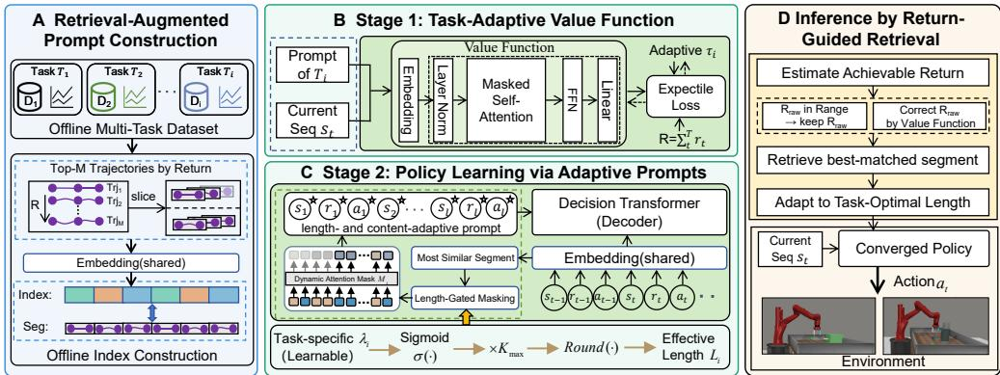  
Figure 4: Overview of DaCe-DT. (A) RAPC constructs a per-task offline index from top-M highreturn trajectory slices via the shared GPT-2 embedding. (B) Stage 1 trains a task-conditioned value function with per-task adaptive expectile regression. (C) Stage 2 jointly trains the policy with adaptive prompt length controlled by a dynamic attention mask. (D) At inference, the value function corrects the return target, which guides retrieval and prompt assembly before the policy outputs $a _ { t }$

Offline Index Construction. For each task $T _ { i } ,$ , we select the top-M trajectories by episodic return from the offline dataset $\mathcal { D } _ { i }$ (we use $M { = } 2 0 )$ . A sliding window of length $K _ { q }$ steps with stride 1 is applied to yield candidate slices $\{ \xi _ { i } ^ { ( j ) } \}$ . Using only the GPT-2 embedding projection shared with the main policy (without passing through Transformer layers), each step of slice $\xi _ { i } ^ { ( j ) }$ is encoded by summing the return-to-go embedding $\phi _ { R }$ , state embedding $\phi _ { s } ,$ , action embedding $\phi _ { a }$ , and timestep embedding $\phi _ { \mathrm { t i m e } }$ . The $3 K _ { q }$ resulting token vectors are averaged and L2-normalized to obtain the index vector:

$$
{ \bf e } _ { i } ^ { ( j ) } = \mathrm { N o r m } \left( \frac { 1 } { 3 K _ { q } } \sum _ { t = 1 } ^ { K _ { q } } \Bigl [ \phi _ { R } \Bigl ( \hat { R } _ { t } ^ { ( j ) } \Bigr ) + \phi _ { s } \Bigl ( s _ { t } ^ { ( j ) } \Bigr ) + \phi _ { a } \Bigl ( a _ { t } ^ { ( j ) } \Bigr ) + \phi _ { \mathrm { t i m e } } ( t ) \Bigr ] \right) ,\tag{4}
$$

where $\operatorname { N o r m } ( { \mathord { \cdot } } )$ denotes L2 normalization. All slice vectors, together with source trajectory pointers and slice start indices, are stored in a per-task index $\mathcal { F } _ { i }$

Online Query and Retrieval. At decision step t, the query vector $\mathbf { q } _ { t }$ is constructed from the current valid history context using the same encoding procedure as Eq. (4). The most similar slice is retrieved via maximum inner product search (equivalent to cosine similarity under L2 normalization):

$$
\boldsymbol j ^ { * } = \arg \operatorname* { m a x } _ { \boldsymbol j : \mathrm { r e t } ( \boldsymbol \xi _ { i } ^ { ( j ) } ) \geq \hat { R } _ { t } } \mathbf q _ { t } ^ { \top } \mathbf e _ { i } ^ { ( \boldsymbol j ) } ,\tag{5}
$$

where $\mathrm { r e t } ( \xi _ { i } ^ { ( j ) } )$ denotes the episodic return of the source trajectory of slice $\xi _ { i } ^ { ( j ) }$ . This return filter ensures the retrieved segment provides behavioral evidence consistent with the current return target, preventing low-quality demonstrations from interfering with stitching decisions.

Since the embedding layer is randomly initialized at the start of training, retrieved similarity carries little semantic meaning early on. We therefore adopt a progressive retrieval strategy: static prompts are used for the first $\bar { T _ { \mathrm { w a r m } } }$ steps; once embeddings have stabilized, the index is refreshed every $\Delta$ steps and retrieval-based prompts are used thereafter.

## 4.3 Value-Adaptive Return Calibration (VARC)

To enable return calibration at inference time, we train a value function that shares the same GPT-2 architecture as the main policy. Its input format is identical to the policy: the prompt $\mathcal { P } _ { i }$ and the current trajectory history are concatenated and fed into the Transformer, and the model outputs a scalar estimate ofthe achievable return from the current context.

To accommodate heterogeneous data distributions across tasks, for each task $T _ { i }$ we introduce a learnable scalar $\eta _ { i } \in \mathbb { R }$ that parameterizes a task-specific expectile:

$$
\tau _ { i } = 0 . 5 + 0 . 5 \cdot \sigma ( \eta _ { i } ) , \quad \tau _ { i } \in ( 0 . 5 , 1 ) .\tag{6}
$$

Tasks with high data noise converge toward conservative quantiles $( \tau _ { i }  0 . 5 )$ , while low-noise tasks adopt more aggressive ones $( \tau _ { i } \to 1 )$ . We jointly optimize the shared value parameters $\phi$ and all $\lbrace \eta _ { i } \rbrace _ { i = } ^ { N }$ by minimizing the expectile regression loss across all tasks:

$$
\operatorname* { m i n } _ { \phi , \{ \eta _ { i } \} } \sum _ { i = 1 } ^ { N } \mathbb { E } _ { ( \mathcal { H } _ { t } , r , \mathcal { H } _ { t + 1 } ) \sim \mathcal { D } _ { i } } \left[ \left| \tau _ { i } - \mathbf { 1 } ( \delta _ { i } < 0 ) \right| \cdot \delta _ { i } ^ { 2 } \right] ,\tag{7}
$$

where $\delta _ { i } = r + \gamma V _ { \phi } ( \mathcal { H } _ { t + 1 } , \mathcal { P } _ { i } ) - V _ { \phi } ( \mathcal { H } _ { t } , \mathcal { P } _ { i } )$ is the TD error. After convergence, $V _ { \phi ^ { * } }$ and $\{ \tau _ { i } ^ { * } \}$ are frozen and used solely at inference time.

Policy Training. With the value function frozen, we jointly train the policy $\pi _ { \theta }$ and the task-specific prompt-length parameters $\{ \lambda _ { i } \}$ (introduced in $\ S 4 . 1 )$ by minimizing the action prediction loss with sparsity regularization:

$$
\operatorname* { m i n } _ { \theta , \{ \lambda _ { i } \} } \sum _ { i = 1 } ^ { N } \mathbb { E } _ { \xi \sim \mathcal { D } _ { i } , t } \Big [ - \log \pi _ { \theta } ( a _ { t } \mid \mathcal { H } _ { t , i } ) \Big ] + \mathcal { L } _ { \mathrm { s p a r s e } } ,
$$

$$
\mathcal { H } _ { t , i } = \big ( \mathbf { s } _ { \leq t } , \mathbf { a } _ { < t } , \mathrm { R T G } _ { t } , \mathcal { P } _ { i } , \mathbf { M } _ { i } \big ) , \quad \mathcal { L } _ { \mathrm { s p a r s e } } = \beta \sum _ { i = 1 } ^ { N } \sigma ( \lambda _ { i } ) .\tag{8}
$$

The value function is not applied during training; it is used exclusively at inference time to handle out-of-distribution return conditions.

## 4.4 Inference: Return Correction, Retrieval, and Length-Adaptive Prompt Assembly

At inference time, the three mechanisms operate in sequence at every decision step.

Step 1: Return Correction. The frozen value function $V _ { \phi ^ { * } }$ ∗ checks whether the current raw return target lies within the achievable range. For task $T _ { i }$ , given the current trajectory sequence $\mathcal { H } _ { t } =$ $\left( \mathbf { s } _ { \leq t } , \mathbf { a } _ { < t } , \mathrm { R T G } _ { t } \right)$

$$
\begin{array} { r } { \hat { R } _ { t } = \left\{ \begin{array} { l l } { V _ { \phi ^ { * } } ( \mathcal { H } _ { t } , \mathcal { P } _ { i , t - 1 } ) , } & { | R _ { t } ^ { \mathrm { r a w } } - V _ { \phi ^ { * } } ( \mathcal { H } _ { t } , \mathcal { P } _ { i , t - 1 } ) | > \varepsilon , } \\ { R _ { t } ^ { \mathrm { r a w } } , } & { \mathrm { o t h e r w i s e } , } \end{array} \right. } \end{array}\tag{9}
$$

where $R _ { t } ^ { \operatorname { r a w } }$ is initialized as $V _ { \phi ^ { * } } ( \mathcal { H } _ { 0 } , \mathcal { P } _ { i , 0 } )$ and updated as $R _ { t } ^ { \mathrm { r a w } } = \hat { R } _ { t - 1 } - r _ { t - 1 }$ , and $\varepsilon$ is a tolerance threshold that prevents over-correction. When the value function detects a higher achievable return from the current sequence $\mathcal { H } _ { t } .$ , the corrected $\hat { R } _ { t }$ is raised, directing the policy toward superior continuations and enabling cross-trajectory stitching.

Step 2: Retrieval. Using the corrected return $\hat { R } _ { t }$ and the current trajectory history as the query, similarity-based retrieval is performed per Eq. (5) to obtain the optimal slice $\xi _ { i } ^ { ( j ^ { * } ) }$ of length $K _ { q }$ steps.

Step 3: Length-Adaptive Prompt Assembly. The retrieved slice is cropped or extended according to the task-optimal length $L _ { i } ^ { * }$ learned by LGPM (§4.1):

$$
\mathcal { P } _ { i , t } ^ { * } = \left\{ { \xi } _ { i } ^ { ( j ^ { * } ) } [ K _ { q } - L _ { i } ^ { * } + 1 \ : \ K _ { q } ] , \right. \ \left. L _ { i } ^ { * } \leq K _ { q } , \right.\tag{10}
$$

where ∥ denotes sequence concatenation and $\xi _ { i } ^ { ( j ^ { * } ) , \mathrm { e x t } }$ is the extension from the continuation of the same source trajectory. When $L _ { i } ^ { * } \le K _ { q } .$ , the last $L _ { i } ^ { * }$ steps of the retrieved slice are retained (temporally closest to the current state); when $L _ { i } ^ { * } > K _ { q } ,$ , the full $K _ { q } { \mathrm { - s t e p } }$ slice is appended with $L _ { i } ^ { * } - K _ { q }$ subsequent steps. The assembled prompt $\mathcal { P } _ { i , t } ^ { * }$ fully replaces the current prompt tokens fed to the Transformer, ensuring the policy simultaneously receives a calibrated return condition and a contextually aligned behavioral reference at every step.

## 5 Experiments

In this section, we conduct comprehensive experiments on the Meta-World [29] benchmark (covering MT5, MT30, and MT50 configurations) to answer the following key research questions: RQ1 (Comparative Performance): Does our proposed DaCe-DT outperform state-of-the-art multi-task offline RL baselines across datasets with varying qualities (e.g., near-optimal vs. sub-optimal)?

Table 1: Performance comparison on Meta-World with 5, 30, and 50 randomly sampled tasks under near-optimal and sub-optimal datasets. Each result is averaged over three random seeds. To ensure fair comparison, we adopt the same random seeds as those used in the previous baseline methods.
<table><tr><td rowspan="2">Method</td><td colspan="2">Meta-World 5 Tasks</td><td colspan="2">Meta-World 30 Tasks</td><td colspan="2">Meta-World 50 Tasks</td></tr><tr><td>Near-optimal</td><td>Sub-optimal</td><td>Near-optimal</td><td>Sub-optimal</td><td>Near-optimal</td><td>Sub-optimal</td></tr><tr><td>MTDIFF</td><td> ${ \bf 1 0 0 . 0 \pm 0 . 0 }$ </td><td> $6 6 . 3 0 \pm 2 . 3 1$ </td><td> $6 7 . 5 2 \pm 0 . 3 5$ </td><td> $5 4 . 2 1 \pm 1 . 1 0$ </td><td> $6 1 . 3 2 \pm 0 . 8 9$ </td><td> $4 8 . 9 4 \pm 0 . 9 5$ </td></tr><tr><td>MTDT</td><td> ${ \bf 1 0 0 . 0 \pm 0 . 0 }$ </td><td> $6 4 . 6 7 \pm 5 . 2 5$ </td><td> $7 1 . 8 9 \pm 0 . 9 5$ </td><td> $4 9 . 3 3 \pm 2 . 0 5$ </td><td> $6 5 . 8 0 \pm 1 . 0 2$ </td><td> $4 2 . 3 3 \pm 1 . 8 9$ </td></tr><tr><td>Prompt-DT*</td><td> ${ \bf 1 0 0 . 0 \pm 0 . 0 }$ </td><td> $6 7 . 0 0 \pm 2 . 3 3$ </td><td> $7 1 . 3 0 \pm 0 . 6 7$ </td><td> $5 4 . 3 3 \pm 0 . 7 8$ </td><td> $7 1 . 6 0 \pm 1 . 4 0$ </td><td> $5 1 . 4 0 \pm 0 . 3 5$ </td></tr><tr><td>HarmoDT-R*</td><td> ${ \bf 1 0 0 . 0 \pm 0 . 0 }$ </td><td> $6 8 . 0 0 \pm 2 . 3 3 $ </td><td> $8 0 . 1 0 \pm 3 . 1 2$ </td><td> $5 9 . 0 0 \pm 3 . 6 6$ </td><td> $7 4 . 2 4 \pm 2 . 6 6$ </td><td> $5 2 . 4 5 \pm 1 . 1 7$ </td></tr><tr><td>HarmoDT-M*</td><td> ${ \bf 1 0 0 . 0 \pm 0 . 0 }$ </td><td> $7 2 . 1 2 \pm 3 . 4 8$ </td><td> $7 9 . 6 7 \pm 1 . 4 6$ </td><td> ${ \bf 6 2 . 3 3 \pm 0 . 6 6 }$ </td><td> ${ \bf 7 8 . 8 0 \pm 0 . 6 7 }$ </td><td> $5 6 . 2 0 \pm 0 . 5 6$ </td></tr><tr><td>HarmoDT-F*</td><td> ${ \bf 1 0 0 . 0 \pm 0 . 0 }$ </td><td> ${ \bf 7 5 . 0 4 \pm 2 . 3 3 }$ </td><td> ${ \bf 8 1 . 6 0 \pm 0 . 7 8 }$ </td><td> $6 0 . 6 0 \pm 1 . 1 2$ </td><td> $7 7 . 8 0 \pm 0 . 6 6$ </td><td> ${ \pm 7 . 5 0 \pm 0 . 4 8 }$ </td></tr><tr><td>DaCe-DT(Ours)</td><td> ${ \bf 1 0 0 . 0 \pm 0 . 0 }$ </td><td> ${ \bf 8 8 . 0 0 \pm 2 . 5 6 }$ </td><td> ${ \pm 1 . 6 3 3 \pm 1 . 6 7 }$ </td><td> ${ 7 5 . 6 7 \pm 1 . 3 3 }$ </td><td> ${ \bf 8 8 . 4 0 \pm 2 . 6 7 }$ </td><td> ${ \bf 6 4 . 0 0 \pm 3 . 4 5 }$ </td></tr></table>

RQ2 (Generalization & Robustness): How does DaCe-DT generalize to unseen tasks, and how robust is it in sparse-reward environments? RQ3 (Ablation Study): What are the individual contributions of key design components, such as our LGPM, RAPC and VARC, to the overall performance?

## 5.1 Environment and Baselines

Environment. We evaluate on the Meta-World multi-task robotic manipulation benchmark, which consists of 50 manipulation tasks sharing the same robot dynamics but differing in objects and interaction modes. Following prior work [11, 8], we use random-goal evaluation to measure generalization across tasks. Performance is reported as the average success rate over all tasks.

Offline datasets. We consider two offline training regimes. (i) Near-optimal: a high-quality dataset generated by SAC-Replay [7] that mixes expert and random trajectories. (ii) Sub-optimal:

Table 2: Average success rate across 3 seeds on MT50 with random goals (MT50-rand) under both near-optimal and sub-optimal cases.
<table><tr><td>Method</td><td>Near-opt.</td><td>Sub-opt.</td></tr><tr><td>CARE (online) PaCo (online) Soft-M (online) D2R (online) MOORE (online) ARS-LoRA (online)</td><td> $4 6 . 1 2 { \scriptstyle \pm 1 . 3 0 }$   $5 4 . 3 1 { \scriptstyle \pm 1 . 3 2 }$   $5 3 . 4 1 _ { \pm 0 . 7 2 }$   $6 3 . 5 3 { \scriptstyle \pm 1 . 2 2 }$   $7 2 . 9 0 { \scriptstyle \pm 3 . 3 0 }$   $\mathbf { 8 3 . 2 0 } _ { \pm 1 . 8 0 }$ </td><td></td></tr><tr><td>MTBC MTIQL MTDIFF-P MTDIFF-P-ONEHOT MTDT Prompt-DT* HarmoDT-R* HarmoDT-M* HarmoDT-F*</td><td> $6 0 . 3 9 { \scriptstyle \pm 0 . 8 6 }$   $5 6 . 2 1 { \scriptstyle \pm 1 . 3 9 }$   $5 9 . 5 3 { \scriptstyle \pm 1 . 1 2 }$   $6 1 . 3 2 _ { \pm 0 . 8 9 }$   $6 5 . 8 0 { \scriptstyle \pm 1 . 0 2 }$   $7 1 . 6 0 { \scriptstyle \pm 1 . 4 0 }$   $7 4 . 2 4 { \scriptstyle \pm 2 . 6 6 }$   ${ \bf 7 8 . 8 0 _ { \pm 0 . 6 7 } }$   $7 7 . 8 0 { \scriptstyle \pm 0 . 6 6 }$ </td><td> $3 4 . 5 3 { \scriptstyle \pm 1 . 2 5 }$   $4 3 . 2 8 _ { \pm 0 . 9 0 }$   $4 8 . 6 7 _ { \pm 1 . 3 2 }$   $4 8 . 9 4 _ { \pm 0 . 9 5 }$   $4 2 . 3 3 { \scriptstyle \pm 1 . 8 9 }$   $5 1 . 4 0 { \scriptstyle \pm 0 . 3 5 }$   $5 2 . 4 5 _ { \pm 1 . 1 7 }$   $5 6 . 2 0 { \scriptstyle \pm 0 . 5 6 }$   ${ \bar { 5 } } 7 . 5 \mathbf { 0 } _ { \pm 0 . 4 8 }$ </td></tr><tr><td>DaCe-DT(ours)</td><td> $\mathbf { 8 8 . 4 0 } \pm 1 . 6 7$ </td><td> ${ \bf 6 4 . 0 0 } _ { \pm 3 . 4 5 }$ </td></tr></table>

a more challenging dataset constructed from early-stage trajectories while retaining only 50% of expert demonstrations, mimicking realistic imperfect logging.

Baselines. We compare our method against several representative multi-task offline RL baselines: (1) MTBC [8]: Multi-task Behavior Cloning with task ID conditioning. (2) MTIQL: Multi-task IQL [14] with multi-head critic and task-conditioned policy network. (3) MTDIFF-P [8]: A diffusion-based policy learning method with prompting and transformer modules. (4) MTDT [8]: Decision Transformer adapted for multi-task learning with task ID embedding. (5) Prompt-DT [25]: Decision Transformer with trajectory prompt, as discussed in § D.3. (6) HarmoDT [11]:

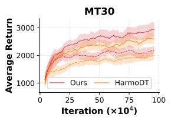

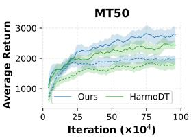  
Figure 5: Comparison of training reward trajectories between DaCe-DT and HarmoDT (current offline MTRL state-of-the-art) across MT30 and MT50 configurations of Meta-World.

Prompt-DT extended with task-specific harmony subspace masks to mitigate cross-task gradient conflicts. (7) CARE [20]: Uses meta-data and encoder mixing for task representation. (8) PaCo [21]: Adopts parameter composition for task-specific parameter reassembly. (9) Soft-M [27]: Uses routing networks for modular soft composition. (10) D2R [9]: Employs diverse routing paths for different tasks. (11) MOORE [10]: Online MTRL method using mixture of orthogonal experts to maintain diverse shared representations. (12) ARS-LoRA [3]: Online MTRL method with adaptive reward scaling and LoRA-based parameter-efficient task adaptation. We use results from [8] for most baselines. \* indicates baselines of our own implementation.

## 5.2 Performance Comparison

We report performance comparisons with mainstream baselines on the MT5, MT30, and MT50 benchmarks. As shown in Tables 1, 2 and Fig 5, our method demonstrates consistent improvements. Specifically, on the near-optimal MT5 dataset, it achieves a success rate of 100%, and on the sub-optimal dataset, it yields a performance gain of 12.96%. For MT30, our method achieves improvements of 11.73% and 13.34% on the near-optimal and sub-

Table 3: Generalization to unseen tasks. Methods trained on a task subset and evaluated without finetuning.
<table><tr><td>Setting</td><td>MTDT</td><td>Prompt-DT</td><td>HarmoDT-F</td><td>Ours</td></tr><tr><td>Cheetah-dir</td><td> $6 6 2 . 4 { \scriptstyle \pm 1 . 3 }$ </td><td> $9 3 5 . 3 _ { \pm 2 . 6 }$ </td><td> $9 5 8 . 5 { \scriptstyle \pm 1 . 5 }$ </td><td> $\mathbf { 9 6 6 . 9 _ { \pm 2 . 2 } }$ </td></tr><tr><td>Cheetah-vel</td><td> $- 1 7 0 . 1 { \scriptstyle \pm 5 . 7 }$ </td><td> $- 1 2 7 . 7 { \scriptstyle \pm 9 . 9 }$ </td><td> $- 6 6 . 5 { \scriptstyle \pm 1 . 2 }$ </td><td> $\mathbf { - 2 2 . 0 { \pm } 1 . 2 }$ </td></tr><tr><td>Ant-dir</td><td> $1 6 5 . 3 { \scriptstyle \pm 0 . 4 }$ </td><td> $2 7 8 . 7 { \scriptstyle \pm 3 8 . 7 }$ </td><td> $2 9 8 . 3 _ { \pm 1 . 0 }$ </td><td> $\mathbf { 3 5 5 . 9 2 1 . 7 }$ </td></tr><tr><td>Average</td><td>219.2</td><td>362.1</td><td>396.8</td><td> $4 3 3 . 6 _ { 9 . 2 7 \% \uparrow }$ </td></tr></table>

optimal datasets, respectively. For MT50, the improvements are 9.60% and 6.50%, respectively.

## 5.3 More Analysis

Generalization to Unseen Tasks. To evaluate zero-shot generalization, we test DaCe-DT on three unseen continuous-control environments (CHEETAH-DIR, CHEETAH-VEL, ANT-DIR) following HarmoDT’s protocol. The retrieval index is built from a small set of expert segments using frozen embeddings, with prompt length set to the average $L _ { i } ^ { * }$ from training tasks. As shown in Table 3, DaCe-DT outperforms all baselines by 9.27%, demonstrating that the retrieval index generalizes to unseen tasks at zero training cost.

Robustness under Sparse Reward. To isolate the contribution of RAPC and LGPM, we disable the value function and evaluate on eight custom MAZE2D layouts with entirely sparse rewards. As shown in Table 8, our method achieves an average score of 36.9 vs. 18.2 for Prompt-DT, demonstrating that embedding-based retrieval alone substantially improves prompt quality without any return calibration.

## 5.4 Ablation Study

Component Ablation. We evaluate the average success rate of model variants by ablating or replacing key components under the MT30: (1) With LGPM only: The dynamic attention mask is retained to learn task-adaptive prompt lengths, but retrieval-augmented prompt construction (RAPC) and return calibration (VARC) are both disabled. (2) With RAPC only: Retrievalaugmented prompt construction is enabled, but task-adaptive prompt length (LGPM) and return calibration (VARC) are both disabled. (3) With VARC only: Return calibration is applied at

Table 4: Ablation on MT30. Impact of LGPM, RAPC and VARC on Success Rate and Return.
<table><tr><td colspan="3">Components</td><td colspan="2">MT30</td></tr><tr><td>LGPM</td><td>RAPC</td><td>VARC</td><td>Succ.</td><td>Return</td></tr><tr><td>x</td><td>x</td><td>X</td><td>71.3</td><td>2436.8</td></tr><tr><td>√</td><td>x</td><td>x</td><td>83.7</td><td>2864.5</td></tr><tr><td>x</td><td>√</td><td>x</td><td>85.3</td><td>2961.4</td></tr><tr><td>x</td><td>x</td><td>√</td><td>82.6</td><td>2735.6</td></tr><tr><td>√</td><td>√</td><td>√</td><td>93.3</td><td>3185.5</td></tr></table>

inference, but prompts fall back to the fixed sub-trajectory baseline. Results are shown in Table 4.

## 6 Conclusion

In summary, we identify three data-centric bottlenecks limiting learnability and generalization in Offline MTRL: (i) prompt length mismatch under heterogeneous task complexities, (ii) semantic irrelevance of randomly sampled prompts, and (iii) misleading supervision from fragmented trajectories. We address them with DaCe-DT, which integrates length-gated prompt masking (LGPM) for adaptive context selection, retrieval-augmented prompt construction (RAPC) for semantically aligned behavioral evidence, and value-adaptive return calibration (VARC) for reliable trajectory stitching at inference. Extensive experiments on Meta-World demonstrate consistent and significant improvements over state-of-the-art methods across datasets of varying quality.

## References

[1] Rich Caruana. Multitask learning. Machine learning, 28(1):41–75, 1997.

[2] Lili Chen, Kevin Lu, Aravind Rajeswaran, Kimin Lee, Aditya Grover, Misha Laskin, Pieter Abbeel, Aravind Srinivas, and Igor Mordatch. Decision transformer: Reinforcement learning via sequence modeling. Advances in neural information processing systems, 34:15084–15097, 2021.

[3] Myungsik Cho, Jongeui Park, Jeonghye Kim, and Youngchul Sung. Ars: Adaptive reward scaling for multi-task reinforcement learning. In Forty-second International Conference on Machine Learning, 2025.

[4] Carlo D’Eramo, Davide Tateo, Andrea Bonarini, Marcello Restelli, and Jan Peters. Sharing knowledge in multi-task deep reinforcement learning. arXiv preprint arXiv:2401.09561, 2024.

[5] Justin Fu, Aviral Kumar, Ofir Nachum, George Tucker, and Sergey Levine. D4rl: Datasets for deep data-driven reinforcement learning. arXiv preprint arXiv:2004.07219, 2020.

[6] Peyman Ghasemi, Matthew Greenberg, Danielle A Southern, Bing Li, James A White, and Joon Lee. Personalized decision making for coronary artery disease treatment using offline reinforcement learning. npj Digital Medicine, 8(1):99, 2025.

[7] Tuomas Haarnoja, Aurick Zhou, Pieter Abbeel, and Sergey Levine. Soft actor-critic: Offpolicy maximum entropy deep reinforcement learning with a stochastic actor. In International conference on machine learning, pages 1861–1870. Pmlr, 2018.

[8] Haoran He, Chenjia Bai, Kang Xu, Zhuoran Yang, Weinan Zhang, Dong Wang, Bin Zhao, and Xuelong Li. Diffusion model is an effective planner and data synthesizer for multi-task reinforcement learning. Advances in neural information processing systems, 36:64896–64917, 2023.

[9] Jinmin He, Kai Li, Yifan Zang, Haobo Fu, Qiang Fu, Junliang Xing, and Jian Cheng. Not all tasks are equally difficult: Multi-task deep reinforcement learning with dynamic depth routing. In Proceedings of the AAAI Conference on Artificial Intelligence, volume 38, pages 12376–12384, 2024.

[10] Ahmed Hendawy, Jan Peters, and Carlo D’Eramo. Multi-task reinforcement learning with mixture of orthogonal experts. arXiv preprint arXiv:2311.11385, 2023.

[11] Shengchao Hu, Ziqing Fan, Li Shen, Ya Zhang, Yanfeng Wang, and Dacheng Tao. Harmodt: Harmony multi-task decision transformer for offline reinforcement learning. arXiv preprint arXiv:2405.18080, 2024.

[12] Shengchao Hu, Li Shen, Ya Zhang, and Dacheng Tao. Prompt-tuning decision transformer with preference ranking. arXiv preprint arXiv:2305.09648, 2023.

[13] Yilun Kong, Guozheng Ma, Qi Zhao, Haoyu Wang, Li Shen, Xueqian Wang, and Dacheng Tao. Mastering massive multi-task reinforcement learning via mixture-of-expert decision transformer. arXiv preprint arXiv:2505.24378, 2025.

[14] Ilya Kostrikov, Ashvin Nair, and Sergey Levine. Offline reinforcement learning with implicit q-learning. arXiv preprint arXiv:2110.06169, 2021.

[15] Aviral Kumar, Anikait Singh, Stephen Tian, Chelsea Finn, and Sergey Levine. A workflow for offline model-free robotic reinforcement learning. arXiv preprint arXiv:2109.10813, 2021.

[16] Kuang-Huei Lee, Ofir Nachum, Mengjiao Sherry Yang, Lisa Lee, Daniel Freeman, Sergio Guadarrama, Ian Fischer, Winnie Xu, Eric Jang, Henryk Michalewski, et al. Multi-game decision transformers. Advances in neural information processing systems, 35:27921–27936, 2022.

[17] Sergey Levine, Aviral Kumar, George Tucker, and Justin Fu. Offline reinforcement learning: Tutorial, review, and perspectives on open problems. arXiv preprint arXiv:2005.01643, 2020.

[18] Guangyuan Shi, Qimai Li, Wenlong Zhang, Jiaxin Chen, and Xiao-Ming Wu. Recon: Reducing conflicting gradients from the root for multi-task learning. arXiv preprint arXiv:2302.11289, 2023.

[19] Tianyu Shi, Dong Chen, Kaian Chen, and Zhaojian Li. Offline reinforcement learning for autonomous driving with safety and exploration enhancement. arXiv preprint arXiv:2110.07067, 2021.

[20] Shagun Sodhani, Amy Zhang, and Joelle Pineau. Multi-task reinforcement learning with contextbased representations. In International conference on machine learning, pages 9767–9779. PMLR, 2021.

[21] Lingfeng Sun, Haichao Zhang, Wei Xu, and Masayoshi Tomizuka. Paco: Parametercompositional multi-task reinforcement learning. Advances in Neural Information Processing Systems, 35:21495–21507, 2022.

[22] Anke Tang, Li Shen, Yong Luo, Liang Ding, Han Hu, Bo Du, and Dacheng Tao. Concrete subspace learning based interference elimination for multi-task model fusion. arXiv preprint arXiv:2312.06173, 2023.

[23] Yee Teh, Victor Bapst, Wojciech M Czarnecki, John Quan, James Kirkpatrick, Raia Hadsell, Nicolas Heess, and Razvan Pascanu. Distral: Robust multitask reinforcement learning. Advances in neural information processing systems, 30, 2017.

[24] Ashish Vaswani, Noam Shazeer, Niki Parmar, Jakob Uszkoreit, Llion Jones, Aidan N Gomez, Łukasz Kaiser, and Illia Polosukhin. Attention is all you need. Advances in neural information processing systems, 30, 2017.

[25] Mengdi Xu, Yikang Shen, Shun Zhang, Yuchen Lu, Ding Zhao, Joshua Tenenbaum, and Chuang Gan. Prompting decision transformer for few-shot policy generalization. In international conference on machine learning, pages 24631–24645. PMLR, 2022.

[26] Taku Yamagata, Ahmed Khalil, and Raul Santos-Rodriguez. Q-learning decision transformer: Leveraging dynamic programming for conditional sequence modelling in offline rl. In Interna tional Conference on Machine Learning, pages 38989–39007. PMLR, 2023.

[27] Ruihan Yang, Huazhe Xu, Yi Wu, and Xiaolong Wang. Multi-task reinforcement learning with soft modularization. Advances in Neural Information Processing Systems, 33:4767–4777, 2020.

[28] Tianhe Yu, Saurabh Kumar, Abhishek Gupta, Sergey Levine, Karol Hausman, and Chelsea Finn. Gradient surgery for multi-task learning. Advances in neural information processing systems, 33:5824–5836, 2020.

[29] Tianhe Yu, Deirdre Quillen, Zhanpeng He, Ryan Julian, Karol Hausman, Chelsea Finn, and Sergey Levine. Meta-world: A benchmark and evaluation for multi-task and meta reinforcement learning. In Conference on robot learning, pages 1094–1100. PMLR, 2020.

[30] Yayu Zhang, Yuhua Qian, Guoshuai Ma, Keyin Zheng, Guoqing Liu, and Qingfu Zhang. Learning multi-task sparse representation based on fisher information. In Proceedings ofthe AAAI Conference on Artificial Intelligence, volume 38, pages 16899–16907, 2024.

## A Detailed Environment and Baselines

The Meta-World benchmark [29] comprises 50 diverse manipulation tasks that share a common set of dynamics. These tasks require a Sawyer robotic arm to interact with a variety of objects, each characterized by distinct geometric shapes, joint structures, and physical constraints. The challenge of this benchmark arises from the heterogeneity in state representations and reward functions across tasks, as the robot must achieve different objectives using task-specific interactions. The control input at each timestep is a 4-dimensional continuous action vector that governs the 3D position of the end-effector as well as the opening and closing of the gripper. We illustrate the simulation environments of selected tasks from Meta-World in Fig. 6.

In the default Meta-World setup, goal positions are fixed, which can limit the realism and generalizability of learned policies. To better reflect more dynamic robotic scenarios, we adapt all tasks to a random-goal setting, denoted as MT50-rand. Evaluation is conducted using the average success rate across all 50 tasks, offering a holistic measure of policy generalization and performance in diverse conditions.

To construct our offline datasets, we adopt the procedure introduced by, where individual SAC agents are trained per task until convergence. We collect 1 million transitions per task from each agent’s replay buffer, capturing the full trajectory of learning from random exploration to final convergence. This yields a large and varied dataset from which we derive two distinct versions:

• Near-optimal dataset: Aggregates the entire SAC training data (100M transitions in total), including both suboptimal and expert-level behaviors.

• Sub-optimal dataset: Extracted as the first 50% of each task’s SAC replay buffer (50M transitions total), representing primarily non-expert performance with reduced task mastery.

## A.1 Baselines

We benchmark our proposed method, DaCe-DT, against a diverse suite of both offline and online multi-task learning baselines. The following provides a detailed description of the baselines used in this work:

## Offline Multi-Task Baselines.

1. MTBC [11]. This variant scales Behavior Cloning (BC) to the multi-task domain by introducing a task-ID conditioned policy network.

2. MTIQL. Built upon the Implicit Q-Learning (IQL) [14] framework, MTIQL employs a multi-head critic structure and integrates task identity conditioning in the actor, offering a strong TD-based baseline to contrast against generative modeling approaches.

3. MTDIFF-P [8]. A generative diffusion-based policy that leverages Transformer architectures and prompt-driven conditioning to perform multi-task offline planning and data modeling.

4. MTDT. A multi-task adaptation of the Decision Transformer [2], where each task is encoded via a latent embedding z concatenated with state inputs. At test time, the Transformer receives both reward-to-go and task embedding as inputs to produce tailored action predictions.

5. Prompt-DT [25]. Based on the DT framework, Prompt-DT introduces trajectory prompt conditioning to enable better generalization across tasks and improve policy robustness to unseen task distributions.

6. HarmoDT [11]. Building upon the Prompt-DT framework, HarmoDT introduces a taskspecific masking mechanism to mitigate gradient conflicts among tasks. HarmoDT comes in three variants: HarmoDT-R, which applies a random masking strategy for each task. HarmoDT-M, which measures parameter importance using the absolute value of gradients. and HarmoDT-F, which uses the squared value of gradients to quantify parameter importance [30].

Online Multi-Task Baselines. In addition to the offline counterparts, we also include comparisons with representative online learning methods to provide a broader perspective on our approach’s effectiveness:

1. CARE [20]. This approach leverages auxiliary metadata and multiple encoders to construct expressive task representations, supporting better transfer and generalization in multi-task learning.

2. PaCO [21]. Introduces a compositional parameter-sharing mechanism where task-specific parameters are dynamically recombined, promoting flexibility and efficiency across task distributions.

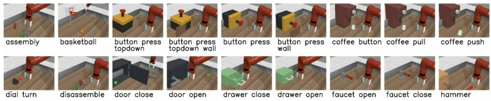  
Figure 6: Meta-World task visualizations. Representative snapshots of the manipulation tasks used in our experiments (e.g., Assembly, Basketball, Button-Press variants, Coffee variants, Door variants, Drawer variants, Faucet variants, Hammer, etc.), illustrating the diverse objects and interaction dynamics in the Meta-World benchmark.

3. Soft-M [27]. Utilizes a modular routing network to softly blend multiple functional modules, enabling adaptive skill reuse across a range of tasks.

4. D2R [9]. Implements a dynamic routing strategy that selects different subsets of modules per task, thereby offering scalable and fine-grained control over model capacity based on task complexity.

5. MOORE [10]. Maintains a shared representation space across tasks using a Mixture of Orthogonal Experts, where orthogonality is enforced via a Gram-Schmidt process. This promotes diversity among expert representations and mitigates task interference, achieving state-of-the-art performance on Meta-World.

6. ARS-LoRA [3]. Introduces an adaptive reward scaling strategy that dynamically normalizes per-task reward magnitudes based on historical statistics, combined with a periodic network reset mechanism to prevent plasticity loss. ARS-LoRA further integrates Low-Rank Adaptation (LoRA) to enable parameter-efficient task-specific fine-tuning within the multi-task policy.

## B Hyper-parameters and Resources

## B.1 Hyper-parameters

This section outlines the detailed experimental configurations used in our study. The policy model is built upon a Transformer architecture and implemented based on the open-source project minGPT. All experiments are conducted on the MetaWorld benchmark with a fixed random seed to ensure reproducibility. The model architecture and training hyperparameters are summarized in Table 5.

Table 5: DaCe-DT training hyperparameters
<table><tr><td colspan="2">Parameter Value</td></tr><tr><td>Number of Layers</td><td>6</td></tr><tr><td>Number of Attention Heads</td><td>8</td></tr><tr><td>Embedding Dimension</td><td>256</td></tr><tr><td>Nonlinearity Function</td><td>RELU</td></tr><tr><td>Context Length K</td><td>20</td></tr><tr><td>Dropout</td><td>0.1</td></tr><tr><td>Max Iterations</td><td>100,000</td></tr><tr><td>Batch Size</td><td>16</td></tr></table>

In addition, Tables 6 and 7 provide the hyperparameter settings specific to each baseline method.

In our experiments, all stochastic components are controlled using fixed random seeds to ensure reproducibility. It is worth noting that the performance of the same method can vary across different randomly sampled environment combinations. As mentioned in the experimental section, we evaluate the method under three different random seeds: 123, 234, and 345, each corresponding to a distinct set of task combinations.

Table 6: HarmoDT training hyperparameters
<table><tr><td>Parameter</td><td>Value</td></tr><tr><td>Sparsity</td><td>0.2</td></tr><tr><td>Batch Šize</td><td>8</td></tr><tr><td>Mask Changing Interval</td><td>5000</td></tr><tr><td>Minimum of Mask Changingηmin</td><td>0</td></tr><tr><td>Maximum of Mask Changingηmax</td><td>100</td></tr><tr><td>Maximum Threshold in Mask</td><td>25</td></tr></table>

Table 7: Prompt-DT training hyperparameters
<table><tr><td>Parameter</td><td>Value</td></tr><tr><td>K (length of context τ)</td><td>20</td></tr><tr><td>Batch Size</td><td>8</td></tr><tr><td>Number of Evaluation Episodes for Each Task</td><td>20</td></tr><tr><td>Learning Rate</td><td>1e-4</td></tr><tr><td>Learning Rate Decay Weight</td><td>1e-4</td></tr><tr><td>Number of Layers</td><td>6</td></tr><tr><td>Number of Attention Heads</td><td>8</td></tr><tr><td>Embedding Dimension</td><td>128</td></tr><tr><td>Activation</td><td>RELU</td></tr></table>

## B.2 Computational Resources

All experiments are conducted using NVIDIA 4090 GPUs. For each environment configuration—MT5, MT30, and MT50—we train the models for 1 million steps. On the near-optimal dataset, the training time is approximately 16 hours for MT5, 76 hours for MT30, and 112 hours for MT50. In contrast, on the suboptimal dataset, which contains fewer trajectories, the corresponding training times are reduced to 10 hours, 54 hours, and 84 hours, respectively. Each environment needs to be trained three times with different seeds.

## C Additional Experimental Analysis

## C.1 Maze2D Multi-Task Experiments

Maze2D [5] is a sparse-reward navigation environment in which an agent must reach a goal position within a 2D maze. Unlike Meta-World, Maze2D provides no dense reward shaping, making it a challenging testbed for evaluating prompt quality and retrieval effectiveness without value-function calibration.

Multi-Task Extension. To construct a multi-task Maze2D benchmark, we create 8 distinct maze layouts by modifying the environment configuration files, as illustrated in Fig. 7. Each layout constitutes a separate task with its own pre-collected offline dataset. Since VARC relies on dense reward signals, it is disabled in this experiment; only RAPC and LGPM are evaluated.

Results. As shown in Table 8, DaCe-DT achieves an average score of 36.9 compared to 18.2 for Prompt-DT, demonstrating that embedding-based retrieval and adaptive prompt length substantially improve performance even under entirely sparse rewards.

## C.2 Per-Task Results on MetaWorld MT30

Table 9 reports the per-task episodic return and success rate of DaCe-DT on MetaWorld MT30 (near-optimal dataset, seed 123). The overall mean return is 3185.45 and mean success rate is 0.933.

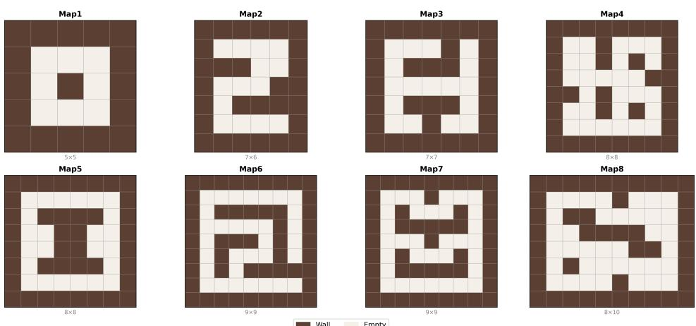  
Figure 7: The 8 maze layouts used in our multi-task MAZE2D benchmark. Layouts range from 5×5 to 8×10 grids and vary in wall topology, yielding 8 navigation tasks with distinct structural complexity.

Table 8: Performance on sparse-reward MAZE2D with 8 custom maze layouts. VARC is disabled; only RAPC and LGPM are used. Score is cumulative reward per episode.
<table><tr><td>Task</td><td>Ours</td><td>Prompt-DT</td></tr><tr><td>maze2d-1</td><td>106.5</td><td>48.0</td></tr><tr><td>maze2d-2</td><td>95.1</td><td>22.0</td></tr><tr><td>maze2d-3</td><td>0.0</td><td>12.0</td></tr><tr><td>maze2d-4</td><td>32.9</td><td>7.5</td></tr><tr><td>maze2d-5</td><td>4.5</td><td>41.1</td></tr><tr><td>maze2d-6</td><td>22.6</td><td>14.9</td></tr><tr><td>maze2d-7</td><td>33.2</td><td>0.0</td></tr><tr><td>maze2d-8</td><td>0.0</td><td>0.0</td></tr><tr><td>Average</td><td>36.9</td><td>18.2</td></tr></table>

## C.3 Per-Task Results on MetaWorld MT50

Table 10 reports the per-task episodic return and success rate of DaCe-DT on MetaWorld MT50 (near-optimal dataset, seed 123). The overall mean return is 2983.47 and mean success rate is 0.884.

## C.4 Learned Prompt Lengths (LGPM)

Table 11 reports the prompt lengths learned by LGPM for representative tasks across different environment configurations. Notably, the same task may converge to different prompt lengths under different task combinations, reflecting how co-trained task complexity influences the optimal context window for each individual task.

## D Related Work

## D.1 Offline Reinforcement Learning

Offline RL [17] aims to learn effective decision-making policies solely from pre-collected static datasets, without the need for further interaction with the environment. This setting is particularly valuable in high-stakes or resource-constrained domains [15, 19, 6], where data collection is costly, risky, or impractical. A central challenge in this domain arises from the discrepancy between the distribution of the training data and the learned policy—commonly referred to as distributional shift—which can severely degrade performance. To address this issue, various approaches have

Mean: Return = 2983.47 Success = 0.8840

Table 9: Per-task episodic return and success rate of DaCe-DT on MetaWorld MT30 (near-optimal, seed 123). Mean return: 3185.45; mean success: 0.933.
<table><tr><td>Task</td><td>Return</td><td>Succ.</td><td>Task</td><td>Return</td><td>Succ.</td><td>Task</td><td>Return</td><td>Succ.</td></tr><tr><td>basketball-v2</td><td>2198.46</td><td>1.0</td><td>door-close-v2</td><td>4389.19</td><td>1.0</td><td>handle-press-v2</td><td>4359.66</td><td>1.0</td></tr><tr><td>bin-picking-v2</td><td>4350.81</td><td>1.0</td><td>door-lock-v2</td><td>3152.24</td><td>0.9</td><td>handle-pull-side-v2</td><td>3646.42</td><td>1.0</td></tr><tr><td>button-press-topdown-v2</td><td>3669.39</td><td>1.0</td><td>door-open-v2</td><td>3715.46</td><td>1.0</td><td>handle-pull-v2</td><td>4264.39</td><td>1.0</td></tr><tr><td>button-press-v2</td><td>2608.85</td><td>1.0</td><td>door-unlock-v2</td><td>3840.95</td><td>1.0</td><td>lever-pull-v2</td><td>1880.16</td><td>1.0</td></tr><tr><td>button-press-wall-v2</td><td>2304.72</td><td>1.0</td><td>hand-insert-v2</td><td>3591.48</td><td>1.0</td><td>peg-insert-side-v2</td><td>4506.66</td><td>1.0</td></tr><tr><td>coffee-button-v2</td><td>1658.16</td><td>1.0</td><td>drawer-close-v2</td><td>4831.95</td><td>1.0</td><td>pick-place-wall-v2</td><td>3032.87</td><td>0.9</td></tr><tr><td>coffee-pull-v2</td><td>1299.40</td><td>1.0</td><td>drawer-open-v2</td><td>3837.06</td><td>1.0</td><td>pick-out-of-hole-v2</td><td>3382.60</td><td>0.8</td></tr><tr><td>coffee-push-v2</td><td>2789.15</td><td>1.0</td><td>faucet-open-v2</td><td>4571.72</td><td>1.0</td><td>reach-v2</td><td>2222.18</td><td>0.9</td></tr><tr><td>dial-turn-v2</td><td>3141.51</td><td>0.5</td><td>faucet-close-v2</td><td>3706.75</td><td>1.0</td><td>push-back-v2</td><td>2099.79</td><td>1.0</td></tr><tr><td>disassemble-v2</td><td>696.19</td><td>0.7</td><td>handle-press-side-v2</td><td>4712.93</td><td>1.0</td><td>push-v2</td><td>1102.48</td><td>0.3</td></tr><tr><td colspan="9">Mean: Return = 3185.45 Success = 0.9333</td></tr></table>

Table 10: Per-task episodic return and success rate of DaCe-DT on MetaWorld MT50 (near-optimal, seed 123). Mean return: 2983.47; mean success: 0.884.
<table><tr><td>Task</td><td>Return</td><td>Succ.</td><td>Task</td><td>Return</td><td>Succ.</td><td>Task</td><td>Return</td><td>Succ.</td></tr><tr><td>basketball-v2</td><td>2337.14</td><td>1.0</td><td>faucet-open-v2</td><td>4574.86</td><td>1.0</td><td>plate-slide-back-side-v2</td><td>652.54</td><td>1.0</td></tr><tr><td>bin-picking-v2</td><td>3958.31</td><td>1.0</td><td>faucet-close-v2</td><td>4663.15</td><td>1.0</td><td>soccer-v2</td><td>1043.56</td><td>0.3</td></tr><tr><td>button-press-topdown-v2</td><td>3482.01</td><td>0.9</td><td>handle-press-side-v2</td><td>4731.69</td><td>1.0</td><td>push-wall-v2</td><td>3789.07</td><td>0.8</td></tr><tr><td>button-press-v2</td><td>2396.76</td><td>1.0</td><td>handle-press-v2</td><td>4315.96</td><td>0.9</td><td>shelf-place-v2</td><td>1633.87</td><td>0.9</td></tr><tr><td>button-press-wall-v2</td><td>2155.54</td><td>1.0</td><td>handle-pull-side-v2</td><td>3092.48</td><td>1.0</td><td>sweep-into-v2</td><td>4176.40</td><td>0.9</td></tr><tr><td>coffee-button-v2</td><td>1695.16</td><td>0.9</td><td>handle-pull-v2</td><td>4424.69</td><td>1.0</td><td>sweep-v2</td><td>2449.86</td><td>0.7</td></tr><tr><td>coffee-pull-v2</td><td>1231.68</td><td>0.8</td><td>lever-pull-v2</td><td>1336.97</td><td>1.0</td><td>window-open-v2</td><td>1347.92</td><td>1.0</td></tr><tr><td>coffee-push-v2</td><td>1001.34</td><td>0.5</td><td>peg-insert-side-v2</td><td>3855.10</td><td>1.0</td><td>window-close-v2</td><td>1612.94</td><td>1.0</td></tr><tr><td>dial-turn-v2</td><td>3031.78</td><td>0.4</td><td>pick-place-wall-v2</td><td>1973.96</td><td>0.9</td><td>assembly-v2</td><td>3318.62</td><td>1.0</td></tr><tr><td>disassemble-v2</td><td>325.36</td><td>0.4</td><td>pick-out-of-hole-v2</td><td>3037.74</td><td>1.0</td><td>button-press-topdown-wall-v2</td><td>3070.91</td><td>1.0</td></tr><tr><td>door-close-v2</td><td>4385.56</td><td>1.0</td><td>reach-v2</td><td>2998.81</td><td>0.9</td><td>hammer-v2</td><td>4298.86</td><td>1.0</td></tr><tr><td>door-lock-v2</td><td>3293.90</td><td>0.8</td><td>push-back-v2</td><td>4149.67</td><td>1.0</td><td>peg-unplug-side-v2</td><td>2150.17</td><td>1.0</td></tr><tr><td>door-open-v2</td><td>3182.73</td><td>1.0</td><td>push-v2</td><td>1880.48</td><td>0.5</td><td>reach-wall-v2</td><td>3004.80</td><td>0.7</td></tr><tr><td>door-unlock-v2</td><td>3851.01</td><td>1.0</td><td>pick-place-v2</td><td>2405.79</td><td>0.9</td><td>stick-push-v2</td><td>3352.03</td><td>1.0</td></tr><tr><td>hand-insert-v2</td><td>3438.67</td><td>0.9</td><td>plate-slide-v2</td><td>4592.15</td><td>1.0</td><td>stick-pull-v2</td><td>3589.41</td><td>0.2</td></tr><tr><td>drawer-close-v2</td><td>4826.31</td><td>1.0</td><td>plate-slide-side-v2</td><td>3300.93</td><td>1.0</td><td>box-close-v2</td><td>3786.98</td><td>1.0</td></tr><tr><td>drawer-open-v2</td><td>3757.75</td><td>1.0</td><td>plate-slide-back-v2</td><td>2210.22</td><td>1.0</td><td></td><td></td><td></td></tr></table>

proposed conservative policy updates or regularization techniques that keep the learned policy close to the behavior policy [14]. A promising line of work in offline RL leverages conditional sequence modeling [2], where the agent is trained to predict future actions conditioned on historical trajectories composed of state-action-reward sequences. These methods reformulate policy learning as a sequence prediction task, aligning naturally with supervised learning frameworks and implicitly constraining the learned behavior to remain within the support of the dataset. This class of methods includes the popular Decision Transformer and its extensions, which have demonstrated strong performance across various benchmarks.

In parallel, recent advances have explored the use of diffusion models for offline RL, inspired by their success in generative modeling. These approaches model either the policy or environment dynamics via iterative denoising processes, enabling more expressive action distributions. Methods such as Diffuser and its variants have shown impressive results across a range of tasks.

## D.2 Multi-task Reinforcement Learning

Multi-task reinforcement learning (MTRL) focuses on training a unified policy that can generalize across a range of distinct tasks. Numerous approaches have been proposed in recent years to address this challenge [27, 20]. A common formulation treats the multi-task problem as a conditional learning problem, where task identifiers or goals are provided as context inputs, following the design pattern of goal-conditioned RL [8, 25]. Another line of research focuses on identifying optimal parameter subspaces for each task, utilizing routing mechanisms or weight-sharing strategies to compute task-specific weighted combinations of network layers [11, 21].

Building upon these foundations, offline multi-task reinforcement learning (offline MTRL) combines the principles of offline reinforcement learning and multi-task learning, leveraging task-mixed datasets to enable knowledge transfer without environment interaction. This approach is particularly valuable in scenarios where online data collection is expensive or risky, allowing agents to learn from pre-collected datasets spanning multiple tasks.

Table 11: Prompt lengths learned by LGPM per task under different configurations. The same task converges to different lengths depending on the task combination, reflecting LGPM’s adaptivity to task heterogeneity.
<table><tr><td>Task</td><td>MT5</td><td>MT30 (near-opt.)</td><td>MT30 (sub-opt.)</td></tr><tr><td>basketball-v2</td><td>18</td><td>24</td><td>36</td></tr><tr><td>reach-v2</td><td>8</td><td>6</td><td>10</td></tr><tr><td>button-press-topdown-v2</td><td>10</td><td>20</td><td>26</td></tr><tr><td>button-press-v2</td><td>20</td><td>10</td><td>19</td></tr><tr><td>button-press-wall-v2</td><td>10</td><td>21</td><td>27</td></tr></table>

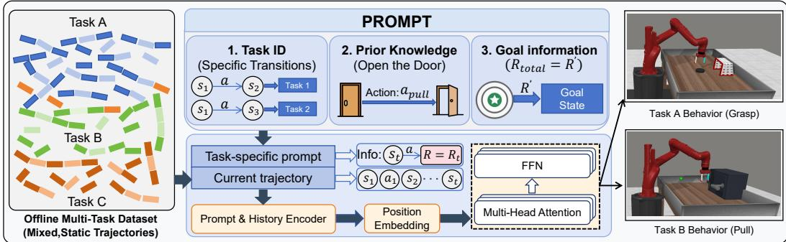  
Figure 8: Overview of prompt-based offline multi-task learning. The prompt disambiguates mixed offline trajectories by encoding task identity, behavioral priors, and goal/return targets, guiding the Transformer to produce task-specific behaviors (e.g., Grasp vs. Pull).

However, a persistent challenge in both online and offline MTRL is the presence of conflicting gradients among tasks, often referred to as negative transfer or gradient interference [18, 22, 4, 16, 1]. This problem arises when task and data heterogeneity induce gradient conflicts that hinder effective parameter sharing, particularly in offline settings where data distribution varies significantly across tasks.

To address these gradient conflicts in offline MTRL, existing approaches [11, 21, 8] employ routing mechanisms or masking mechanisms to mitigate the adverse effects of gradient interference. Parameter-level methods adopt task-specific binary mask matrices to determine optimal subspaces within shared parameters, while routing-based approaches dynamically allocate network capacity across different tasks. Although these methods have demonstrated some success, gradient interference continues to be a fundamental challenge that requires resolution in offline multi-task reinforcement learning.

## D.3 Prompt-DT

Although DT is effective in single-task offline RL, directly applying it to multi-task datasets is non-trivial because trajectories from different tasks are often heterogeneous in dynamics, reward scales, and optimal behaviors. Prompt-DT [25] extends DT to multi-task learning by introducing a prompting mechanism that provides task-specific context. For each task $T _ { i } ,$ Prompt-DT samples a short K-step demonstration subtrajectory (a prompt) from the target task and prepends it to the current rollout, yielding

$$
\begin{array} { r l } & { \tau _ { i , t } ^ { \mathrm { i n p u t } } = ( \widehat { R } _ { i , 1 } ^ { * } , s _ { i , 1 } ^ { * } , a _ { i , 1 } ^ { * } , \ldots , \widehat { R } _ { i , K } ^ { * } , s _ { i , K } ^ { * } , a _ { i , K } ^ { * } , } \\ & { \qquad \widehat { R } _ { i , t - K + 1 } , s _ { i , t - K + 1 } , a _ { i , t - K + 1 } , \ldots , \widehat { R } _ { i , t } , s _ { i , t } , a _ { i , t } ) . } \end{array}\tag{11}
$$

## E Limitations

DaCe-DT addresses key data-centric challenges in offline multi-task reinforcement learning, yet several broader limitations warrant discussion. First, as an offline method, DaCe-DT is fundamentally bounded by the quality and diversity of the pre-collected dataset; it cannot actively explore the environment to recover from distributional gaps, which may hinder performance in domains where high-quality offline data is scarce or difficult to obtain. Second, our evaluation is confined to simulation benchmarks with well-defined task boundaries and reward signals. Deploying DaCe-DT in open-world or real-robot settings, where observations are noisy, tasks are ambiguous, and reward feedback is sparse or absent, remains an important open challenge.

## NeurIPS Paper Checklist

The checklist is designed to encourage best practices for responsible machine learning research, addressing issues of reproducibility, transparency, research ethics, and societal impact. Do not remove the checklist: The papers not including the checklist will be desk rejected. The checklist should follow the references and follow the (optional) supplemental material. The checklist does NOT count towards the page limit.

Please read the checklist guidelines carefully for information on how to answer these questions. For each question in the checklist:

• You should answer [Yes], [No], or [N/A].

• [N/A] means either that the question is Not Applicable for that particular paper or the relevant information is Not Available.

• Please provide a short (1–2 sentence) justification right after your answer (even for [N/A]).

The checklist answers are an integral part of your paper submission. They are visible to the reviewers, area chairs, senior area chairs, and ethics reviewers. You will also be asked to include it (after eventual revisions) with the final version of your paper, and its final version will be published with the paper.

The reviewers of your paper will be asked to use the checklist as one of the factors in their evaluation. While [Yes] is generally preferable to [No], it is perfectly acceptable to answer [No] provided a proper justification is given (e.g., error bars are not reported because it would be too computationally expensive” or “we were unable to find the license for the dataset we used”). In general, answering [No] or [N/A] is not grounds for rejection. While the questions are phrased in a binary way, we acknowledge that the true answer is often more nuanced, so please just use your best judgment and write a justification to elaborate. All supporting evidence can appear either in the main paper or the supplemental material, provided in appendix. If you answer [Yes] to a question, in the justification please point to the section(s) where related material for the question can be found.

IMPORTANT, please:

• Delete this instruction block, but keep the section heading “NeurIPS Paper Checklist",

• Keep the checklist subsection headings, questions/answers and guidelines below.

• Do not modify the questions and only use the provided macros for your answers.

## 1. Claims

Question: Do the main claims made in the abstract and introduction accurately reflect the paper’s contributions and scope?

Answer: [Yes]

Justification: The abstract and introduction clearly state the three data-centric bottlenecks and the corresponding mechanisms (LGPM, RAPC, VARC), which are validated by experimental results in §5.

Guidelines:

• The answer [N/A] means that the abstract and introduction do not include the claims made in the paper.

• The abstract and/or introduction should clearly state the claims made, including the contributions made in the paper and important assumptions and limitations. A [No] or [N/A] answer to this question will not be perceived well by the reviewers.

• The claims made should match theoretical and experimental results, and reflect how much the results can be expected to generalize to other settings.

• It is fine to include aspirational goals as motivation as long as it is clear that these goals are not attained by the paper.

## 2. Limitations

Question: Does the paper discuss the limitations of the work performed by the authors?

Answer: [Yes]

Justification: We discuss limitations in a dedicated paragraph in the appendix, covering the dependence on offline data quality and the sim-to-real generalization gap.

## Guidelines:

• The answer [N/A] means that the paper has no limitation while the answer [No] means that the paper has limitations, but those are not discussed in the paper.

• The authors are encouraged to create a separate “Limitations” section in their paper.

• The paper should point out any strong assumptions and how robust the results are to violations of these assumptions (e.g., independence assumptions, noiseless settings, model well-specification, asymptotic approximations only holding locally). The authors should reflect on how these assumptions might be violated in practice and what the implications would be.

• The authors should reflect on the scope of the claims made, e.g., if the approach was only tested on a few datasets or with a few runs. In general, empirical results often depend on implicit assumptions, which should be articulated.

• The authors should reflect on the factors that influence the performance of the approach. For example, a facial recognition algorithm may perform poorly when image resolution is low or images are taken in low lighting. Or a speech-to-text system might not be used reliably to provide closed captions for online lectures because it fails to handle technical jargon.

• The authors should discuss the computational efficiency of the proposed algorithms and how they scale with dataset size.

• If applicable, the authors should discuss possible limitations of their approach to address problems of privacy and fairness.

• While the authors might fear that complete honesty about limitations might be used by reviewers as grounds for rejection, a worse outcome might be that reviewers discover limitations that aren’t acknowledged in the paper. The authors should use their best judgment and recognize that individual actions in favor of transparency play an important role in developing norms that preserve the integrity of the community. Reviewers will be specifically instructed to not penalize honesty concerning limitations.

## 3. Theory assumptions and proofs

Question: For each theoretical result, does the paper provide the full set of assumptions and a complete (and correct) proof?

Answer: [N/A]

Justification: This paper does not include formal theorems or proofs; all contributions are empirical.

Guidelines:

• The answer [N/A] means that the paper does not include theoretical results.

• All the theorems, formulas, and proofs in the paper should be numbered and crossreferenced.

• All assumptions should be clearly stated or referenced in the statement of any theorems.

• The proofs can either appear in the main paper or the supplemental material, but if they appear in the supplemental material, the authors are encouraged to provide a short proof sketch to provide intuition.

• Inversely, any informal proof provided in the core of the paper should be complemented by formal proofs provided in appendix or supplemental material.

• Theorems and Lemmas that the proof relies upon should be properly referenced.

## 4. Experimental result reproducibility

Question: Does the paper fully disclose all the information needed to reproduce the main experimental results of the paper to the extent that it affects the main claims and/or conclusions of the paper (regardless of whether the code and data are provided or not)?

## Answer: [Yes]

Justification: Appendix B provides full hyperparameter settings and compute details. Experiments use fixed random seeds (123, 234, 345) on publicly available benchmarks (Meta-World, D4RL).

## Guidelines:

• The answer [N/A] means that the paper does not include experiments.

• If the paper includes experiments, a [No] answer to this question will not be perceived well by the reviewers: Making the paper reproducible is important, regardless of whether the code and data are provided or not.

• If the contribution is a dataset and/or model, the authors should describe the steps taken to make their results reproducible or verifiable.

• Depending on the contribution, reproducibility can be accomplished in various ways. For example, if the contribution is a novel architecture, describing the architecture fully might suffice, or if the contribution is a specific model and empirical evaluation, it may be necessary to either make it possible for others to replicate the model with the same dataset, or provide access to the model. In general. releasing code and data is often one good way to accomplish this, but reproducibility can also be provided via detailed instructions for how to replicate the results, access to a hosted model (e.g., in the case of a large language model), releasing of a model checkpoint, or other means that are appropriate to the research performed.

• While NeurIPS does not require releasing code, the conference does require all submissions to provide some reasonable avenue for reproducibility, which may depend on the nature of the contribution. For example

(a) If the contribution is primarily a new algorithm, the paper should make it clear how to reproduce that algorithm.

(b) If the contribution is primarily a new model architecture, the paper should describe the architecture clearly and fully.

(c) If the contribution is a new model (e.g., a large language model), then there should either be a way to access this model for reproducing the results or a way to reproduce the model (e.g., with an open-source dataset or instructions for how to construct the dataset).

(d) We recognize that reproducibility may be tricky in some cases, in which case authors are welcome to describe the particular way they provide for reproducibility. In the case of closed-source models, it may be that access to the model is limited in some way (e.g., to registered users), but it should be possible for other researchers to have some path to reproducing or verifying the results.

## 5. Open access to data and code

Question: Does the paper provide open access to the data and code, with sufficient instructions to faithfully reproduce the main experimental results, as described in supplemental material?

Answer: [No]

Justification: Code will be released upon paper acceptance. At submission time, the repository is withheld to preserve double-blind anonymity.

Guidelines:

• The answer [N/A] means that paper does not include experiments requiring code.

• Please see the NeurIPS code and data submission guidelines (https://neurips.cc/ public/guides/CodeSubmissionPolicy) for more details.

• While we encourage the release of code and data, we understand that this might not be possible, so [No] is an acceptable answer. Papers cannot be rejected simply for not including code, unless this is central to the contribution (e.g., for a new open-source benchmark).

• The instructions should contain the exact command and environment needed to run to reproduce the results. See the NeurIPS code and data submission guidelines (https: //neurips.cc/public/guides/CodeSubmissionPolicy) for more details.

• The authors should provide instructions on data access and preparation, including how to access the raw data, preprocessed data, intermediate data, and generated data, etc.

• The authors should provide scripts to reproduce all experimental results for the new proposed method and baselines. If only a subset of experiments are reproducible, they should state which ones are omitted from the script and why.

• At submission time, to preserve anonymity, the authors should release anonymized versions (if applicable).

• Providing as much information as possible in supplemental material (appended to the paper) is recommended, but including URLs to data and code is permitted.

## 6. Experimental setting/details

Question: Does the paper specify all the training and test details (e.g., data splits, hyperparameters, how they were chosen, type of optimizer) necessary to understand the results?

Answer: [Yes]

Justification: Dataset construction, evaluation protocol, hyperparameters, and optimizer details are described in §5 and Appendix B.

Guidelines:

• The answer [N/A] means that the paper does not include experiments.

• The experimental setting should be presented in the core of the paper to a level of detail that is necessary to appreciate the results and make sense of them.

• The full details can be provided either with the code, in appendix, or as supplemental material.

## 7. Experiment statistical significance

Question: Does the paper report error bars suitably and correctly defined or other appropriate information about the statistical significance of the experiments?

Answer: [Yes]

Justification: All main results are averaged over three random seeds; standard deviations are reported in all tables (Tables 1 and 2).

Guidelines:

• The answer [N/A] means that the paper does not include experiments.

• The authors should answer [Yes] if the results are accompanied by error bars, confidence intervals, or statistical significance tests, at least for the experiments that support the main claims of the paper.

• The factors of variability that the error bars are capturing should be clearly stated (for example, train/test split, initialization, random drawing of some parameter, or overall run with given experimental conditions).

• The method for calculating the error bars should be explained (closed form formula, call to a library function, bootstrap, etc.)

• The assumptions made should be given (e.g., Normally distributed errors).

• It should be clear whether the error bar is the standard deviation or the standard error of the mean.

• It is OK to report 1-sigma error bars, but one should state it. The authors should preferably report a 2-sigma error bar than state that they have a 96% CI, if the hypothesis of Normality of errors is not verified.

• For asymmetric distributions, the authors should be careful not to show in tables or figures symmetric error bars that would yield results that are out of range (e.g., negative error rates).

• If error bars are reported in tables or plots, the authors should explain in the text how they were calculated and reference the corresponding figures or tables in the text.

## 8. Experiments compute resources

Question: For each experiment, does the paper provide sufficient information on the computer resources (type of compute workers, memory, time of execution) needed to reproduce the experiments?

Answer: [Yes]

Justification: Appendix B reports that all experiments are run on NVIDIA 4090 GPUs, with training times of approximately 16h (MT5), 76h (MT30), and 112h (MT50) on the near-optimal dataset.

Guidelines:

• The answer [N/A] means that the paper does not include experiments.

• The paper should indicate the type of compute workers CPU or GPU, internal cluster, or cloud provider, including relevant memory and storage.

• The paper should provide the amount of compute required for each of the individual experimental runs as well as estimate the total compute.

• The paper should disclose whether the full research project required more compute than the experiments reported in the paper (e.g., preliminary or failed experiments that didn’t make it into the paper).

## 9. Code of ethics

Question: Does the research conducted in the paper conform, in every respect, with the NeurIPS Code of Ethics https://neurips.cc/public/EthicsGuidelines?

Answer: [Yes]

Justification: This research uses publicly available offline RL benchmarks and does not involve human subjects, sensitive data, or harmful applications.

Guidelines:

• The answer [N/A] means that the authors have not reviewed the NeurIPS Code of Ethics.

• If the authors answer [No], they should explain the special circumstances that require a deviation from the Code of Ethics.

• The authors should make sure to preserve anonymity (e.g., if there is a special consideration due to laws or regulations in their jurisdiction).

## 10. Broader impacts

Question: Does the paper discuss both potential positive societal impacts and negative societal impacts of the work performed?

Answer: [N/A]

Justification: This work focuses on foundational offline multi-task RL methodology applied to robotic manipulation benchmarks. We do not foresee direct negative societal impacts.

Guidelines:

• The answer [N/A] means that there is no societal impact of the work performed.

• If the authors answer [N/A] or [No], they should explain why their work has no societal impact or why the paper does not address societal impact.

• Examples of negative societal impacts include potential malicious or unintended uses (e.g., disinformation, generating fake profiles, surveillance), fairness considerations (e.g., deployment of technologies that could make decisions that unfairly impact specific groups), privacy considerations, and security considerations.

• The conference expects that many papers will be foundational research and not tied to particular applications, let alone deployments. However, if there is a direct path to any negative applications, the authors should point it out. For example, it is legitimate to point out that an improvement in the quality of generative models could be used to generate Deepfakes for disinformation. On the other hand, it is not needed to point out that a generic algorithm for optimizing neural networks could enable people to train models that generate Deepfakes faster.

• The authors should consider possible harms that could arise when the technology is being used as intended and functioning correctly, harms that could arise when the technology is being used as intended but gives incorrect results, and harms following from (intentional or unintentional) misuse of the technology.

• If there are negative societal impacts, the authors could also discuss possible mitigation strategies (e.g., gated release of models, providing defenses in addition to attacks, mechanisms for monitoring misuse, mechanisms to monitor how a system learns from feedback over time, improving the efficiency and accessibility of ML).

## 11. Safeguards

Question: Does the paper describe safeguards that have been put in place for responsible release of data or models that have a high risk for misuse (e.g., pre-trained language models, image generators, or scraped datasets)?

Answer: [N/A]

Justification: This paper does not release pre-trained language models, image generators, or internet-scraped datasets, and thus poses no such risks.

Guidelines:

• The answer [N/A] means that the paper poses no such risks.

• Released models that have a high risk for misuse or dual-use should be released with necessary safeguards to allow for controlled use of the model, for example by requiring that users adhere to usage guidelines or restrictions to access the model or implementing safety filters.

• Datasets that have been scraped from the Internet could pose safety risks. The authors should describe how they avoided releasing unsafe images.

• We recognize that providing effective safeguards is challenging, and many papers do not require this, but we encourage authors to take this into account and make a best faith effort.

## 12. Licenses for existing assets

Question: Are the creators or original owners of assets (e.g., code, data, models), used in the paper, properly credited and are the license and terms of use explicitly mentioned and properly respected?

Answer: [Yes]

Justification: All benchmarks and code packages used (Meta-World, D4RL, Decision Transformer, HarmoDT) are properly cited. These are publicly available research artifacts. Guidelines:

• The answer [N/A] means that the paper does not use existing assets.

• The authors should cite the original paper that produced the code package or dataset.

• The authors should state which version of the asset is used and, if possible, include a URL.

• The name of the license (e.g., CC-BY 4.0) should be included for each asset.

• For scraped data from a particular source (e.g., website), the copyright and terms of service of that source should be provided.

• If assets are released, the license, copyright information, and terms of use in the package should be provided. For popular datasets, paperswithcode.com/datasets has curated licenses for some datasets. Their licensing guide can help determine the license of a dataset.

• For existing datasets that are re-packaged, both the original license and the license of the derived asset (if it has changed) should be provided.

• If this information is not available online, the authors are encouraged to reach out to the asset’s creators.

## 13. New assets

Question: Are new assets introduced in the paper well documented and is the documentation provided alongside the assets?

Answer: [N/A]

Justification: This paper does not release new datasets or model checkpoints as standalone assets.

Guidelines:

• The answer [N/A] means that the paper does not release new assets.

• Researchers should communicate the details of the dataset/code/model as part of their submissions via structured templates. This includes details about training, license, limitations, etc.

• The paper should discuss whether and how consent was obtained from people whose asset is used.

• At submission time, remember to anonymize your assets (if applicable). You can either create an anonymized URL or include an anonymized zip file.

## 14. Crowdsourcing and research with human subjects

Question: For crowdsourcing experiments and research with human subjects, does the paper include the full text of instructions given to participants and screenshots, if applicable, as well as details about compensation (if any)?

Answer: [N/A]

Justification: This paper does not involve crowdsourcing or research with human subjects. Guidelines:

• The answer [N/A] means that the paper does not involve crowdsourcing nor research with human subjects.

• Including this information in the supplemental material is fine, but if the main contribution of the paper involves human subjects, then as much detail as possible should be included in the main paper.

• According to the NeurIPS Code of Ethics, workers involved in data collection, curation, or other labor should be paid at least the minimum wage in the country of the data collector.

## 15. Institutional review board (IRB) approvals or equivalent for research with human subjects

Question: Does the paper describe potential risks incurred by study participants, whether such risks were disclosed to the subjects, and whether Institutional Review Board (IRB) approvals (or an equivalent approval/review based on the requirements of your country or institution) were obtained?

Answer: [N/A]

Justification: No human subjects are involved in this research; IRB approval is not required. Guidelines:

• The answer [N/A] means that the paper does not involve crowdsourcing nor research with human subjects.

• Depending on the country in which research is conducted, IRB approval (or equivalent) may be required for any human subjects research. If you obtained IRB approval, you should clearly state this in the paper.

• We recognize that the procedures for this may vary significantly between institutions and locations, and we expect authors to adhere to the NeurIPS Code of Ethics and the guidelines for their institution.

• For initial submissions, do not include any information that would break anonymity (if applicable), such as the institution conducting the review.

## 16. Declaration of LLM usage

Question: Does the paper describe the usage of LLMs if it is an important, original, or non-standard component of the core methods in this research? Note that if the LLM is used only for writing, editing, or formatting purposes and does not impact the core methodology, scientific rigor, or originality of the research, declaration is not required.

Answer: [N/A]

Justification: LLMs are not a core component of the proposed method. Any LLM use was limited to writing assistance and does not affect the scientific methodology.

Guidelines:

• The answer [N/A] means that the core method development in this research does not involve LLMs as any important, original, or non-standard components.

• Please refer to our LLM policy in the NeurIPS handbook for what should or should not be described.