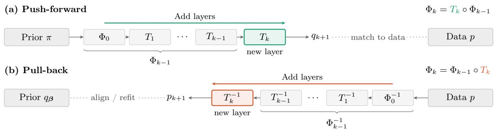
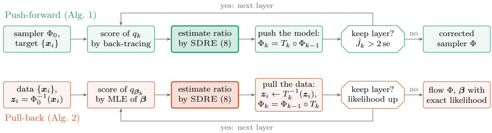

# Density Ratio Estimation with Stein Displacement Fields

Song Liu

University of Bristol

## Abstract

Density ratios quantify distribution shift from a probability-mass point of view, whereas displacement fields describe, from a dynamical point of view, how one distribution is transported onto another. Although both ofer complementary insights, they are usually estimated separately, and converting one into the other requires post-processing. In this paper, we estimate the density ratio between a target and a base distribution by parametrizing it through a displacement field acting on the base: the log-ratio is modeled as minus the Stein operator of the base applied to the field, up to a normalizing constant. This gives both statistical and dynamical descriptions of the distribution shift through a single convex optimization problem. Iterating this estimate-andmove step gives two inference algorithms: push-forward moves the model and corrects a pretrained sampler without retraining it, whereas pull-back moves the data closer to the base and fits a transformation model one layer at a time. Applications to distribution shift in simulation-based inference and to nonlinear independent component analysis illustrate the benefits and limitations of the approach.

## 1 INTRODUCTION

Many machine learning problems come down to comparing two distributions. Broadly speaking, there are two diferent ways to do so. The first is informationtheoretic: a divergence, such as the Kullback–Leibler (KL) divergence or another f-divergence, measures how two distributions spread their probability mass diferently. These divergences serve as training objectives for generative adversarial networks [25, 58], and their gradient flows move one distribution towards the other [39, 47, 53, 55]. An f-divergence is an expectation of a function of the density ratio $r = p / q$ [57, 78, 50]. Density ratio estimation (DRE) has therefore become a building block of this approach, as well as a tool in its own right for importance weighting, two-sample testing and likelihood-free inference [72, 18, 30]. However, ratio estimation is often fragile. When p and q are far apart, samples from one say little about the other, a problem known as the “density chasm” [64], and adversarial training is notoriously unstable [5].

The second approach compares distributions through transport. Rather than comparing densities, it learns how to move one distribution onto the other with a displacement field or a flow map. This view underlies optimal-transport domain adaptation [17] and flow-based generative modeling, where flow matching, rectified flows and stochastic interpolants fit the velocity of a prescribed path by least-squares regression [46, 51, 1]. These methods fit the velocity by regression, avoiding adversarial ratio estimation. Their prescribed paths, however, need not follow the gradient flow of a specified divergence.

Can we learn a divergence and, at the same time, a displacement field along which moving one distribution decreases that divergence? We show that this is feasible when the score of the base distribution $q$ can be evaluated and the target distribution p is observed through samples. Stein’s method connects the two views [70, 4]. The Langevin–Stein operator $A _ { q }$ of the base maps a vector field $\pmb { v } : \mathbb { R } ^ { d }  \mathbb { R } ^ { \bar { d } }$ to a scalar function $A _ { q } { \boldsymbol { v } }$ that has zero mean under q and depends on q only through its score $\boldsymbol { s } _ { q } = \nabla$ log q (Section 2.2). We model the log-ratio as $- { \cal A } _ { q } { \pmb v }$ , up to a constant. This modelling choice has two consequences. First, a convex optimization problem derived from the Donsker– Varadhan (DV) lower bound estimates both $p / q$ and a lower bound on $\mathrm { K L } ( q \parallel p )$ using only samples of $p$ and the score of $q .$ Similar Stein-parametrized ratio models have been used to fit intractable statistical models [49]. Second, moving q along the same field, $\pmb { x } \mapsto \pmb { x } + \eta \pmb { v } ( \pmb { x } )$ with a small step size $\eta > 0$ , changes its log-density by $- \eta A _ { q } \pmb { v }$ to first order. At a population optimum attaining the DV bound, this is equivalent, up to normalization and to first order, to multiplying q by $r ^ { \eta }$ The field that exactly represents the log-ratio therefore also gives a displacement towards $p .$ Its infinitesimal density change agrees with the Fisher– Rao gradient flow of $\operatorname { K L } ( q \parallel p )$ , realized through transport.

This infinitesimal interpretation motivates repeating the refinement step, and there are two natural approaches. If q is a pretrained generative model with a tractable density (e.g., flow models), we can move the model by appending displacement layers to the model, which correct the model without retraining it. If instead q belongs to a simple parametric family that we want to fit, we can move the data, pulling them back towards the family through each displacement. We call the two algorithms push-forward and pull-back and show that they are naturally suited to model updating and latent independent source recovery tasks respectively.

In this paper, we first propose Stein displacement ratio estimation (SDRE), a convex density ratio estimator that estimates not only the ratio $p / q$ but also a displacement field. When the population DV bound is attained, this field induces, to first order, a density update along the Fisher–Rao gradient flow of $\mathrm { K L } ( q \parallel p )$ (Section 3). This result motivates the two inference algorithms of Section 4. Push-forward appends displacement layers to a pretrained sampler to fit the data while keeping its model frozen, and pullback transforms the data through an invertible flow towards a prior from a simple parametric family. Finally, we apply both algorithms to two problems (Section 5). Push-forward adapts a pretrained difusion posterior sampler to a new posterior target, performing on par with discriminator guidance while keeping an exact density. Pull-back refines pretrained ICA models and gives strong signal identification in synthetic and speech settings. We also discuss the limitations of the approach (Section 6).

## 2 BACKGROUND

Our estimator combines two ingredients: density ratio estimation from samples (Section 2.1) and Stein’s method (Section 2.2).

## 2.1 Density ratio estimation

We first recall how a density ratio is estimated when samples of both distributions are available; our estimator in Section 3 modifies this construction. Suppose we have samples from two distributions,

$$
\{ \pmb { x } _ { i } \} _ { i = 1 } ^ { n } \sim p , \qquad \{ \tilde { \pmb { x } } _ { j } \} _ { j = 1 } ^ { \tilde { n } } \sim q .
$$

The KL importance estimation procedure [KLIEP; 71] models the ratio $p / q$ by $r _ { \pmb { \alpha } } ( \pmb { x } ) = \pmb { \alpha } ^ { \top } \phi ( \pmb { x } )$ with nonnegative basis functions and solves the constrained convex problem

$$
\operatorname* { m a x } _ { \alpha } \frac { 1 } { n } \sum _ { i } \log r _ { \alpha } ( x _ { i } ) , \mathrm { s . t . } \alpha \ge 0 , \frac { 1 } { \tilde { n } } \sum _ { j } r _ { \alpha } ( \tilde { x } _ { j } ) = 1 .\tag{1}
$$

The log-linear variant $\begin{array} { r } { r _ { \alpha } = \frac { \exp ( \alpha ^ { \top } \phi ) } { \frac { 1 } { \tilde { n } } \sum _ { j } \exp ( \alpha ^ { \top } \phi ( \tilde { x } _ { j } ) ) } } \end{array}$ removes the constraints and gives the unconstrained convex problem [76]

$$
\operatorname* { m a x } _ { \alpha } \ \frac { 1 } { n } \sum _ { i = 1 } ^ { n } \alpha ^ { \top } \phi ( { \pmb x } _ { i } ) \ - \ \log \frac { 1 } { \tilde { n } } \sum _ { j = 1 } ^ { \tilde { n } } e ^ { \alpha ^ { \top } \phi ( { \tilde { \pmb x } } _ { j } ) } .\tag{2}
$$

This log-linear KLIEP closely resembles the Donsker– Varadhan (DV) representation of the KL divergence [20],

$$
\begin{array} { r } { \mathrm { K L } ( p \| q ) \ = \ \underset { f } { \operatorname* { s u p } } \ \mathbb { E } _ { p } [ f ] - \log \mathbb { E } _ { q } \left[ e ^ { f } \right] . } \end{array}\tag{3}
$$

Restricting f to a log-ratio model that is linear in its parameters and replacing expectations with sample averages gives the log-linear KLIEP above.

When p and q are far apart, the samples of one say little about the other [the “density chasm”; 64]; recent methods bridge the gap with classifiers over intermediate or auxiliary distributions [64, 69], time score matching along a continuous path [14, 79], or a shared invertible feature map [13]. All of these methods, like (2) and (3), need samples from both distributions.

## 2.2 Stein’s method

Stein’s method characterizes a distribution by an operator whose expectation under that distribution vanishes [70, 4]. For a smooth, positive density q on $\mathbb { R } ^ { d }$ with score $s _ { q } = \nabla$ log q, the Langevin–Stein operator acts on a vector field $v : \mathbb { R } ^ { d }  \mathbb { R } ^ { d }$ as

$$
{ \mathcal { A } } _ { q } { \pmb v } = { \pmb s } _ { q } ^ { \top } { \pmb v } + \nabla \cdot { \pmb v } = \frac { \nabla \cdot ( q { \pmb v } ) } { q } .\tag{4}
$$

By the second form and the divergence theorem,

$$
\mathbb { E } _ { q } [ \mathcal { A } _ { q } \pmb { v } ] = \int \nabla \cdot ( q \pmb { v } ) \mathrm { d } \pmb { x } = 0\tag{5}
$$

whenever qv vanishes suficiently fast at infinity and $A _ { q } { \boldsymbol { v } }$ is integrable; such fields form the Stein class of $q ,$ and (5) is Stein’s identity. The operator depends on q only through its score, so it can be evaluated when the normalizing constant of q is unknown.

Optimizing the expectation of $\boldsymbol { A } _ { \boldsymbol { q } } \boldsymbol { v }$ under a data distribution over a class of fields gives Stein discrepancies [26], used for goodness-of-fit tests through the closedform kernelized Stein discrepancy (KSD) [48, 15]. Stein variational gradient descent [SVGD; 47] moves particles from a distribution $\rho$ towards a target with known score $s _ { q } . \mathrm { ~ }$ under the map $\pmb { x } \mapsto \pmb { x } + \epsilon \pmb { v } ( \pmb { x } )$ , the derivative of ${ \mathrm { K L } } ( \rho \| q )$ at $\epsilon = 0 \ \mathrm { i s } \ - \mathbb { E } _ { \rho } [ \mathcal { A } _ { q } \pmb { v } ]$ , so maximizing $\mathbb { E } _ { \rho } [ \mathcal { A } _ { q } { \pmb v } ]$ over the kernel ball gives the steepest descent direction within that class.

In these uses, the scalar function $\boldsymbol { A } _ { \boldsymbol { q } } \boldsymbol { v }$ measures a discrepancy through its expectation or enters the directional derivative of the KL divergence. The vector field v, selected by maximizing $\mathbb { E } _ { \rho } [ \mathcal { A } _ { q } { \pmb v } ]$ over the kernel ball, provides the particle descent direction in SVGD.

## 2.3 Stein density ratio estimation

Estimating the ratio between a data distribution and an unnormalized model is useful in statistical inference, and the Stein operator can help in this setting. Liu et al. [49] estimate $r = p / q$ where $q$ is an unnormalized model with a known score and $p$ is observed through samples. They take b stacked scalar feature functions $f : \mathbb { R } ^ { d }  \mathbb { R } ^ { b }$ , apply the Stein operator to their gradient fields, and use the linear ratio model $\boldsymbol { r } _ { \delta } = 1 + \delta ^ { \top } \mathcal { A } _ { q } \nabla f$ , where $\mathbf { \mathcal { A } } _ { q } \nabla f$ collects $\boldsymbol { \mathcal { A } } _ { q } \nabla f _ { k }$ for $k = 1 , \ldots , b .$ . By Stein’s identity, $\mathbb { E } _ { q } [ r _ { \delta } ] = 1$ for every $\delta ,$ so the normalization constraint of KLIEP holds automatically at the population level. The normalization constraint no longer requires samples from $q ,$ leaving the objective

$$
\operatorname* { m a x } _ { \pmb { \delta } } \ \frac { 1 } { n } \sum _ { i = 1 } ^ { n } \log \big ( 1 + \pmb { \delta } ^ { \top } ( \pmb { A } _ { q } \nabla \pmb { f } ) ( \pmb { x } _ { i } ) \big ) .\tag{6}
$$

The logarithms restrict the domain to positive fitted ratios at the samples. The optimized value serves as an estimate of $\mathrm { K L } ( p \| q )$ . Liu et al. [49] minimize this estimate over the parameters of q to fit intractable models. The linear model is not guaranteed to be positive away from the samples, which limits its use for out-of-sample ratio evaluation.

## 3 STEIN DISPLACEMENT RATIO ESTIMATION

Let q be a base distribution on $\mathbb { R } ^ { d }$ , for example a prior or a pretrained generative model, and let $p$ be a target. We can evaluate the score of the base, $s _ { q } = \nabla$ log $q ,$ which does not require its normalizing constant, and we observe the target only through samples $\pmb { x } _ { 1 } , \ldots , \pmb { x } _ { n }$ Our goal is to estimate the density ratio $r = p / q$ . Like the density ratio estimator in Section 2.3, our estimator uses no samples from q. Throughout, q is smooth and positive, and every vector field $v : \mathbb { R } ^ { \bar { d } }  \mathbb { R } ^ { d }$ below belongs to the Stein class of q (Section 2.2), so that Stein’s identity (5) holds.

Consider the population objective of the log-linear KLIEP for the reciprocal ratio $q / p ,$ i.e., (3) with $p$ and q exchanged

$$
\mathrm { K L } ( q \| p ) \ : = \ : \operatorname* { s u p } _ { f } \ : \mathbb { E } _ { q } [ f ] - \log \mathbb { E } _ { p } \big [ e ^ { f } \big ] .
$$

The density q now enters through a plain expectation. Choosing $f = A _ { q } v$ makes this expectation vanish by (5), and we obtain the lower bound

$$
\begin{array} { r } { \mathrm { K L } ( q \parallel p ) \geq \mathcal { L } ( \pmb { v } ) : = - \log \mathbb { E } _ { p } \big [ e ^ { ( A _ { q } \pmb { v } ) ( \pmb { x } ) } \big ] . } \end{array}\tag{7}
$$

The right-hand side depends on an expectation under p and the score of $q .$ The inequality (7) is tight when $- { \cal A } _ { q } { \bf v }$ equals log r up to a constant.

Maximizing the right-hand side of (7) over v gives an estimate log $\boldsymbol { r } \approx - \mathcal { A } _ { \boldsymbol { q } } \boldsymbol { \hat { v } } + \boldsymbol { C }$ , where $C$ is a constant. We next define a finite-sample estimator and explain its statistical and dynamical interpretations.

## 3.1 The regularized estimator

Let V be a class of vector fields with a norm $\| \cdot \| _ { \nu }$ . We estimate the field by minimizing the empirical version of $- \mathcal { L } ( v )$ with a ridge penalty,

$$
\hat { \pmb { v } } \in \arg \operatorname* { m i n } _ { \pmb { v } \in \mathcal { V } } \ \log \frac { 1 } { n } \sum _ { i = 1 } ^ { n } e ^ { ( { \mathcal A } _ { q } \pmb { v } ) ( { \pmb x } _ { i } ) } + \frac { \lambda } { 2 } \| \pmb { v } \| _ { \mathcal { V } } ^ { 2 } .\tag{8}
$$

The ridge level $\lambda > 0$ is a hyperparameter and is chosen using validation samples. Since $( \boldsymbol { \mathcal { A } } _ { q } \pmb { v } ) ( \pmb { x } _ { i } )$ is linear in v, the objective is a log-sum-exp of linear functions of v plus a convex squared-norm penalty. It is therefore convex whenever V is a linear space, e.g., the span of finitely many fields or a reproducing kernel Hilbert space. For the finite basis and quadratic coeficient penalty used in our experiments, we solve this convex problem with Newton or quasi-Newton methods (Appendix F).

The lower bound (7) at vˆ, approximated using validation samples $\pmb { x } _ { 1 } ^ { \mathrm { v a } } , \ldots , \pmb { x } _ { n _ { \mathrm { v a } } } ^ { \mathrm { v a } } \sim p$ held out from (8),

$$
\hat { J } : = - \log \frac { 1 } { n _ { \mathrm { v a } } } \sum _ { i = 1 } ^ { n _ { \mathrm { v a } } } e ^ { ( A _ { q } \hat { v } ) ( x _ { i } ^ { \mathrm { v a } } ) } \approx \mathcal { L } ( \hat { v } ) \leq \mathrm { K L } ( q \| p ) ,\tag{9}
$$

can be used as a validation diagnostic: a $\hat { J }$ well above its standard error suggests that q and $p$ difer. The empirical $\hat { J }$ is not itself a guaranteed lower bound. Finally, the log ratio estimate is

$$
\log \hat { r } ( \pmb { x } ) = - ( \mathcal { A } _ { q } \hat { \pmb { v } } ) ( \pmb { x } ) - \hat { J } ,\tag{10}
$$

where subtracting $\hat { J }$ normalizes the estimate so that $\begin{array} { r } { \frac { 1 } { n _ { \mathrm { v a } } } \sum _ { i } 1 / \hat { r } ( \pmb { x } _ { i } ^ { \mathrm { v a } } ) = 1 } \end{array}$

Compared with Stein-parametrized linear ratio models used by Liu et al. [49], in SDRE, the Stein operator models a log ratio, not the ratio itself, and the field also defines a displacement of $q ,$ as we show next.

## 3.2 One estimate, two perspectives on distribution shift

We now show how the field connects ratio estimation with sample transport. The first result identifies the log ratio when the population bound is tight; the second describes how moving q along the field changes its log-density.

Proposition 1. Let $\mathrm { K L } ( q \| p ) < \infty$ . Then $\begin{array} { r } { L ( v ) \leq } \end{array}$ $\operatorname { K L } ( q \parallel p )$ , with equality if and only $i f - ( \mathcal { A } _ { q } { \pmb v } ) ( { \pmb x } ) =$ log $r ( \pmb { x } ) + \mathrm { K L } ( q \| p )$ for p-almost every x.

When the population bound is attained, $- \mathcal { A } _ { q } \pmb { v }$ is the log-ratio shifted by the divergence $\mathrm { K L } ( q \parallel p )$ . This also justifies subtracting $\hat { J }$ in (10). The proof is in $\mathrm { A p - }$ pendix A.

The field v also has a dynamical reading. Move every point of q along the field, $T _ { \eta } ( \pmb { x } ) = \pmb { x } + \eta \pmb { v } ( \pmb { x } )$ , where $\eta > 0$ is a step size, and write $( T _ { \eta } ) _ { \# } q$ for the distribution of $T _ { \eta } ( \pmb { x } )$ with $x \sim q$ . The next result says how this displacement changes q.

Proposition 2. Let $\textbf { \em v } \in \ C ^ { 2 }$ with bounded first and second derivatives. For η small enough, $T _ { \eta }$ is a difeomorphism and, for every $\mathbf { x } ^ { \prime }$

$$
\log { ( T _ { \eta } ) _ { \# } q ( x ^ { \prime } ) } = \log { q ( x ^ { \prime } ) } - \eta ( A _ { q } { v } ) ( x ^ { \prime } ) + O ( \eta ^ { 2 } ) .\tag{11}
$$

See Appendix A for the proof. In words, moving q by v changes its log-density by $- \eta A _ { q } \pmb { v }$ , the same quantity that models log r in (10). This change-of-variables argument also underlies the KL derivative used in SVGD [47].

Combining both propositions leads to an interesting interpretation of the optimal displacement v. To state this, recall that the Fisher–Rao gradient flow of $\mathrm { K L } ( \rho \| p )$ is $\partial _ { t }$ log $\begin{array} { r } { \rho _ { t } = - \big ( \log \frac { \rho _ { t } } { p } - \mathrm { K L } ( \rho _ { t } \| p ) \big ) } \end{array}$ : instead of moving mass, it reweights a density pointwise towards p by the ratio $\frac { p } { \rho _ { t } }$ . The exact solution of this gradient flow is the geometric interpolation $\rho _ { t } \propto \rho _ { 0 } ^ { e ^ { - \stackrel { \triangledown } { t } } } p ^ { 1 - e ^ { - t } }$

Corollary 1. Let v satisfy the assumptions of Proposition 2 and attain equality in Proposition 1. Then log $\cdot ( T _ { \eta } ) _ { \# } q = \log q + \eta \log r + \eta \operatorname { K L } ( q \| p ) + O ( \eta ^ { 2 } )$ pointwise for p-almost every x. This agrees with an explicit Euler step of the Fisher–Rao gradient flow started at $\rho _ { 0 } = q _ { : }$ , up to $O ( \eta ^ { 2 } )$ . The normalized geometric interpolation $q ^ { 1 - \eta } p ^ { \eta }$ has the same first-order log-density change.

The proof follows directly from Propositions 1 and 2; we give it in Appendix A. Simply speaking, at the optimum, moving every sample from q along the field v moves the base q closer to the target p along the Fisher–Rao gradient flow. This interpretation distinguishes our displacement field v from the “feature function” used by Liu et al. [49]. The field v is not only the function that best explains the density ratio r, but also a legitimate vector field whose displacement multiplies q by a small power of the ratio, thus moving q towards p.

A single convex problem therefore provides two interpretations of the shift: a statistical one (the ratio rˆ and the diagnostic $\hat { J } )$ and a dynamical one (the displacement $T _ { \eta } )$ . Hence the name “Stein displacement ratio estimation”. The Fisher–Rao flow is usually simulated by reweighting or by birth–death of particles [53], or by a kernel-based transport that requires pointwise evaluation of the unnormalized target-to-reference density ratio [55]. Each $T _ { \eta }$ moves existing mass through an invertible map. Restricted fields and small steps can limit how much mass is moved between separated modes; we return to this limitation in Section 6.

Proposition 2 also ofers a principled way to incorporate dynamical prior knowledge into density ratio estimation: if we know that the distribution shift arises from a specific dynamical process, such as linear or low-rank transformations, we can restrict V to the corresponding family of fields. Therefore, a structured class encodes prior knowledge of the distribution shift. We use these restricted classes of transformations in our experiments, and they are explained in Appendix F.

Corollary 1 only describes a single Euler step $T _ { \eta } .$ . In applications where we would like the base model to approximate the target p, we might want to perform such a step repeatedly. In the next section, we study two diferent algorithms that perform such tasks.

## 4 INFERENCE ALGORITHMS

The first-order Fisher–Rao interpretation motivates alternating ratio estimation and displacement to bring a starting base model closer to the target samples. At iteration $k ,$ we evaluate the score of the current base, solve (8) for a field $\hat { v } _ { k }$ , estimate $\hat { r } _ { k }$ by (10), and construct a candidate layer $T _ { k } = \mathrm { i d } + \eta _ { k } \hat { \pmb { v } } _ { k }$ . If the layer passes a validation criterion, we update the distributions and repeat; otherwise we stop.

We can carry out this estimation-and-transport loop from two diferent directions (Figure 1). Either move the model towards the data, which we call pushforward, or pull the data back towards a simple, interpretable base distribution, which we call pull-back.

## 4.1 Push-forward algorithm

Suppose our starting base model is a pretrained generative model and we want to adapt it so that it agrees with the target data. Let $\Phi _ { 0 }$ be a pretrained invertible generator with a simple input distribution π, such as $\mathcal { N } ( \mathbf { 0 } , I )$ . We correct it by appending displacement layers to its output. After $k - 1$ layers, the current base distribution is

$$
q _ { k } = ( \Phi _ { k - 1 } ) _ { \# } \pi , \qquad \Phi _ { k - 1 } = T _ { k - 1 } \circ \cdot \cdot \cdot \circ T _ { 1 } \circ \Phi _ { 0 } ,\tag{12}
$$

with $q _ { 1 } = ( \Phi _ { 0 } ) _ { \# } \pi$ . At iteration $k ,$ we fit SDRE using the new base $q _ { k }$ and the target samples ${ \mathbf { } } x _ { i } .$ , then append the new layer at the output: $\Phi _ { k } = T _ { k } \circ \Phi _ { k - 1 }$

Under the conditions of Corollary 1, with $\hat { v } _ { k }$ attaining equality in Proposition 1, this iteration performs the update $q _ { k + 1 } \propto q _ { k } \hat { r } _ { k } ^ { \eta _ { k } }$ to first order in $\eta _ { k }$ and the subsequent updates discretize the Fisher–Rao flow towards $p .$ The pretrained generator remains fixed, and the accepted layers provide the correction.

At each iteration, the new estimate needs the score of the current model $q _ { k }$ . When the sampler consists of invertible steps with tractable Jacobians, we obtain log $q _ { k }$ by inverting those steps and accumulating their log-determinants, then compute its score by an adjoint recursion (Appendix D). This back-traced score includes all corrections so far.

We keep a layer only when the validation criterion detects a discrepancy between p and $q _ { k }$ . We check for $\hat { J } _ { k } > 2 \sec ( \hat { J } _ { k } )$ , where s $\mathfrak { z } \big ( \hat { J } _ { k } \big ) = \mathrm { s d } \big ( 1 / \hat { r } _ { k } ( \pmb { x } ) \big ) / \sqrt { n _ { \mathrm { v a } } }$ is the delta-method estimate over the validation samples. Finally, the procedure returns a corrected sampler whose density is available by change of variables. The pseudocode is given in Algorithm 1; Appendix C.1 gives further details.

Algorithm 1 Push-forward, $\Phi  \mathrm { P u s H } ( \Phi _ { 0 } , \{ { \bf x } _ { i } \} )$   
Require: pretrained invertible sampler $\Phi _ { 0 }$ with la  
tent distribution $\pi ;$ target samples $\{ x _ { i } \}$ , split into   
training and validation samples; maximum num  
ber of layers $K$   
1: for $k = 1 , \ldots , K$ do   
2: Compute $s _ { q _ { k } } ( \pmb { x } _ { i } )$ by back-tracing $\Phi _ { k - 1 }$   
3: vˆk ← solve (8) with $q = q _ { k }$ on training samples.   
4: $T _ { k } \gets \mathrm { i d } + \eta _ { k } \hat { v } _ { k }$ ▷ App. C.1   
5: if $\hat { J } _ { k } \leq 2 \sec ( \hat { J } _ { k } )$ on the validation samples then   
return $\Phi _ { k - 1 }$   
6: end if   
7: $\Phi _ { k } \gets T _ { k } \circ \Phi _ { k - 1 }$   
8: end for   
9: return $\Phi _ { K }$

## 4.2 Pull-back algorithm

Suppose our goal is to find a latent representation of our data. The latent structure can be described by a simple, interpretable parametric prior q whose logdensity and score are known in closed form.

Before layer $k ,$ the current latent samples are $z _ { i } =$ $\Phi _ { k - 1 } ^ { - 1 } ( \pmb { x } _ { i } )$ , with distribution $p _ { k } = ( \Phi _ { k - 1 } ^ { - 1 } ) _ { \# } p$ . We fit a field in this latent space and compose the resulting layer with the current map: $\Phi _ { k } = \Phi _ { k - 1 } \circ T _ { k }$ . The updated representation is therefore $\Phi _ { k } ^ { - 1 } ( { \pmb x } _ { i } ) = T _ { k } ^ { - 1 } ( z _ { i } )$

If the prior $q _ { \beta }$ has unknown parameters, we also need to align the prior and the current representation at every iteration. First, we fit $\beta _ { k }$ on the current latent samples $z _ { i } .$ We then solve (8) with base $q _ { \beta _ { k } }$ and $z _ { i } ,$ and pull the data back through the resulting layer: $z _ { i } \gets T _ { k } ^ { - 1 } ( z _ { i } )$ and update the forward map $\Phi _ { k } = \Phi _ { k - 1 } \circ T _ { k }$ . Under the conditions of Corollary 1, with $\beta _ { k }$ held fixed, the forward move of the base is $( T _ { k } ) _ { \# } q _ { \beta _ { k } } \propto q _ { \beta _ { k } } \hat { r } _ { k } ^ { \eta _ { k } }$ to first order, where $\hat { r } _ { k }$ estimates $p _ { k } / q _ { \beta _ { k } }$ . Thus the same Fisher–Rao step is used in the latent space, interleaved with the prior update. The score needed for (8) is evaluated directly from $q _ { \beta _ { k } }$ without back-tracing the full map.

We accept or reject layer k, chosen among several candidates (Appendix C.2), by the validation likelihood of the transformation model with $\beta = \beta _ { k }$

$$
\log \hat { p } ( \pmb { x } ) = \log q _ { \beta } \big ( \Phi _ { k } ^ { - 1 } ( \pmb { x } ) \big ) + \log \big | \operatorname* { d e t } \nabla \Phi _ { k } ^ { - 1 } ( \pmb { x } ) \big | .\tag{13}
$$

Algorithm 2 summarizes the procedure. Identifiability requires restricting the transformation: a suficiently flexible Φ can match the prior without recovering the intended latent structure (Appendix C.2).

Algorithm 2 Pull-back, $( \Phi , \beta ) \gets \mathrm { P U L L } ( \Phi _ { 0 } , \{ \pmb { x } _ { i } \} )$   
Require: starting map $\Phi _ { 0 } ;$ target samples $\{ { \pmb x } _ { i } \}$ , split   
into training and validation samples; base family   
$q _ { \beta } ;$ maximum number of layers $K$   
1: $\dot { z _ { i } } \gets \Phi _ { 0 } ^ { - 1 } ( { \pmb x } _ { i } )$ for all target samples   
2: for $k = 1 , \ldots , K$ do   
3: $\begin{array} { r } { \beta _ { k } \gets \arg \operatorname* { m a x } _ { \beta } \sum _ { \mathrm { t r a i n } } \log q _ { \beta } ( z _ { i } ) } \end{array}$   
4: Solve (8) with $q = q _ { \beta _ { k } }$ on training $z _ { i }$   
5: $T _ { k } \gets \mathrm { i d } + \eta _ { k } \hat { v } _ { k }$ ▷ App. C.2   
6: if $T _ { k }$ does not increase the validation likelihood   
(13) then return $\left( \Phi _ { k - 1 } , \beta _ { k } \right)$   
$7 { : }$ end if   
8: $z _ { i } \gets T _ { k } ^ { - 1 } ( z _ { i } )$ for all latent samples   
9: $\Phi _ { k } \gets \Phi _ { k - 1 } \circ T _ { k }$   
10: end for   
11: $\begin{array} { r } { \beta \gets \arg \operatorname* { m a x } _ { \beta } \sum _ { \mathrm { t r a i n } } \log q _ { \beta } ( z _ { i } ) } \end{array}$   
12: return $( \Phi _ { K } , \beta )$

  
Figure 1: Layer construction in the push-forward and pull-back algorithms. Push-forward appends $T _ { k }$ to the model output; pull-back applies $T _ { k } ^ { - 1 }$ to the current latent samples and refits the base between layers. In both panels, $\Phi _ { k }$ maps the latent base to data.

## 4.3 Choosing between push-forward and pull-back

The choice depends on the objective of inference. Push-forward corrects a model to match the data. Pull-back transforms the data to fit an interpretable prior. Their acceptance rules reflect these goals: pushforward changes the model when the criterion detects a discrepancy, whereas pull-back keeps a layer when it improves the validation likelihood.

Their computational costs also difer. Push-forward recomputes the score through the full sampler, includ ing all previous layers. Pull-back evaluates the prior score directly, carrying forward the latent samples and accumulated log-determinants. In the next section, we use push-forward for guidance of a pretrained posterior sampler in simulation-based inference, and pull-back for source recovery in nonlinear ICA.

## 5 APPLICATIONS

In this section, we examine the proposed algorithms (Push, Pull) on simulation-based inference and nonlinear ICA tasks. Specifically, we use push-forward to correct a posterior sampler and pull-back to recover independent sources, from scratch or by refining pretrained models.

We use conditional variants of Push and Pull. We apply (8) to joint target samples, with the Stein operator acting only on the transported variable $( \mathrm { A p - }$ pendix B). In the experiments, SDRE denotes our methods.

## 5.1 Correcting a posterior sampler in simulation-based inference

In simulation-based inference, a parameter θ is drawn from a prior $q ( \pmb \theta )$ and passed through a simulator $q ( \pmb { y } \vert \pmb { \theta } )$ to produce an observation y. An amortized posterior sampler trained on these pairs can then generate samples for unseen observations. If the prior changes to $p ( \pmb \theta )$ or the simulator difers from the target process $p ( \pmb { y } | \pmb { \theta } )$ , the pretrained model now targets the wrong posterior. We want to adapt our pretrained model $q ( \pmb \theta | \pmb y )$ to $p ( \pmb \theta | \pmb y )$ using target pairs $( \pmb \theta _ { i } , \pmb y _ { i } ) \sim \mathnormal { p }$ while keeping the pretrained network parameters fixed.

We consider the pretrained sampler $q$ to be a difusion sampler [67, 65]. Since difusion sampling is a multi-level procedure, we apply Push to correct its deterministic predictor steps at all noise levels, with a conditional field ${ \pmb v } ( { \pmb \theta } , { \pmb y } )$ . At noise level $t ,$ the current sampler is compared with the target noised to the same level: the target parameters become $a _ { t } \pmb { \theta } _ { i } + \sigma _ { t } \pmb { \xi } _ { i }$ where $a _ { t }$ and $\sigma _ { t }$ are the signal and noise scales and $\pmb { \xi } _ { i } \sim \mathcal { N } ( \mathbf { 0 } , I )$ ; the observations are unchanged. The score is back-traced through the predictor steps and all accepted corrections. The result is a sampler corrected for the target prior and simulator with a density avail able by change of variables at all steps. Appendix G gives the full procedure.

We use a neural posterior score estimator (NPSE) as the starting base model and adapt it on two sbibm tasks [54]: gaussian\_linear and bernoulli\_glm (GLM), under three shifts (Table 1). Prior change: the prior of gaussian\_linear is shifted or replaced by a bimodal mixture; the GLM prior has a shifted bias and smoother filter. Target pairs are resampled from existing simulations with weights proportional to $p ( \pmb \theta ) / q ( \pmb \theta )$ , without new simulations. Simulator change: target pairs are generated by a GLM with a steeper spiking nonlinearity. Partial coverage: $1 0 ^ { 3 }$ target pairs from this modified simulator cover only negative-bias neurons; we evaluate on both covered and uncovered regions. We measure posterior accuracy by the classifier two-sample test (C2ST) against reference samples (0.5 means indistinguishable). Retraining on $1 0 ^ { 5 }$ new target simulations provides a reference.

Table 1: Posterior correction in simulation-based inference: C2ST against reference posteriors (0.5 = indistinguishable; ${ \mathrm { m e a n } } \pm { \mathrm { s t d } } )$ . Best per column in bold, second best underlined (reference rows excluded). ∗No tractable density. †Hyperparameters selected by test C2ST. ×: not applicable; –: not evaluated. The last row reports retraining on new target simulations as a reference. Experimental details are in Appendix I.
<table><tr><td></td><td colspan="3">Prior change</td><td colspan="2">Simulator change</td><td colspan="2">Partial coverage</td></tr><tr><td>Method</td><td>unimodal</td><td>bimodal</td><td>GLM</td><td> $n _ { \mathrm { r e a l } } { = } 5 0 0$ </td><td> $n _ { \mathrm { r e a l } } { = } 2 0 0 0$ </td><td>covered</td><td>uncovered</td></tr><tr><td>Frozen NPSE</td><td>0.724±.001</td><td> $0 . 7 6 0 { \scriptstyle \pm . 0 0 1 }$ </td><td>0.619±.002</td><td>0.619±.004</td><td>0.619±.004</td><td>0.632±.001</td><td>0.638±.003</td></tr><tr><td>PriorGuide, ODE</td><td>0.638±.028</td><td>0.634±.017</td><td>0.665±.014</td><td>X</td><td>X</td><td>X</td><td>X</td></tr><tr><td>PriorGuide  $+ \ \mathrm { L a n g e v i n ^ { * \dagger } }$ </td><td>0.511±.002</td><td>0.512±.001</td><td>0.543±.020</td><td>X</td><td>X</td><td>X</td><td>X</td></tr><tr><td>Classifier  $\mathrm { D R E } + \mathrm { S I R } ^ { \ast }$ </td><td>0.816±.005</td><td>0.862±.003</td><td>0.717±.005</td><td>0.722±.009</td><td>0.721±.007</td><td>0.727±.004</td><td>0.759±.007</td></tr><tr><td>DG + Langevin*</td><td>0.531±.005</td><td>0.555±.002</td><td>0.559±.005</td><td>0.589±.002</td><td>0.575±.004</td><td>0.607±.009</td><td>0.859±.036</td></tr><tr><td>Fine-tuned NPSE</td><td>0.582±.007</td><td>0.629±.024</td><td>0.564±.006</td><td>0.620±.004</td><td>0.596±.003</td><td>0.615±.009</td><td>0.630±.008</td></tr><tr><td>Fine-tuned, sim. + real</td><td>X</td><td>X</td><td>X</td><td></td><td></td><td>0.612±.007</td><td>0.633±.002</td></tr><tr><td>Frozen  $\mathrm { N P S E + S D R E }$ </td><td>0.523±.004</td><td>0.573±.005</td><td>0.552±.004</td><td>0.583±.006</td><td>0.577±.003</td><td>0.590±.006</td><td>0.598±.007</td></tr><tr><td>Retrained on  $\mathrm { 1 0 ^ { 5 } }$  target sim.</td><td>0.511±.001</td><td>0.510±.002</td><td>0.531±.001</td><td> $0 . 5 5 8 { \scriptstyle \pm . 0 0 3 }$ </td><td>0.558±.003</td><td>0.561±.004</td><td>0.571±.003</td></tr></table>

We compare with PriorGuide, with and without Langevin refinement [77], classifier-based DRE with sampling–importance resampling (SIR) [8], discriminator guidance with Langevin refinement [42], and fine-tuning on target pairs, alone or mixed with simulations. PriorGuide applies only to prior changes; methods marked ∗ in Table 1 have no tractable density. A tractable density can be useful in downstream SBI applications. Appendix I gives the experimental setup, baseline implementations and evaluation protocol.

For a unimodal prior change, the correction reduces C2ST from 0.724 to 0.523, close to retraining on new target simulations (0.511), while using only the existing simulations. PriorGuide with Langevin refinement achieves lower mean C2ST in all three priorchange settings, although its advantage over SDRE is statistically significant only in the bimodal setting. PriorGuide with Langevin refinement uses hyperparameters selected by test C2ST and does not retain a tractable density. Under simulator misspecification, $n _ { \mathrm { r e a l } } ~ \in ~ \{ 5 0 0 , 2 0 0 0 \}$ target pairs improve the frozen sampler, with accuracy comparable to discriminator guidance and better than fine-tuning. With partial coverage, the correction improves accuracy in both the covered and uncovered regions. Table 1 gives the comparison; the experimental setup and statistical tests are in Appendix I.

## 5.2 Recovering sources in nonlinear ICA

In independent component analysis (ICA), observations are $\scriptstyle { \boldsymbol { x } } \ = \ f ( z )$ for an invertible mixing f and latent sources $\boldsymbol { z } = \left( z _ { 1 } , \ldots , z _ { d } \right)$ . We want to recover z from observations x. In auxiliary variable ICA, we assume that the sources are independent given a time segment $\begin{array} { r } { \pmb { c } , p ( \pmb { z } | \pmb { c } ) = \prod _ { j } p _ { j } ( z _ { j } | \pmb { c } ) } \end{array}$ . Under suitable regularity conditions across segments, the inverse mixing is identifiable up to a permutation and componentwise invertible transformations [34, 37, 41]. The goal is to recover these sources from the observations and segment labels.

Since the latent signals are conditionally independent, we use a factorized conditional base $q _ { \beta } ( z | \boldsymbol { c } )$ . Its parameters vary across segments, while the field and hence the learned transformation are shared across segments. The sources are read of as $\Phi ^ { - 1 } ( { \pmb x } )$ We use Gaussian or smooth super-Gaussian bases and restrict the fields to structured classes that are linear in their parameters (Appendix F). Each candidate field is therefore fitted by a convex problem, and the restrictions express assumptions about the mixing. We also test two diferent starting configurations: starting from $\Phi _ { 0 } =$ id learns the model from scratch; start ing from a pretrained model performs refinement by appending layers to its existing transformation.

Our experiments use synthetic Gaussian sources and real speech recordings from CMU ARCTIC [43] and LibriSpeech [60], all mixed by a random invertible nonlinear network (Appendix H). The two synthetic settings use $n _ { c } \in \{ 2 0 0 , 1 0 0 0 \}$ samples per segment. We measure recovery by the mean correlation coeficient (MCC) between estimated and true sources after optimal matching.

We compare with three estimators trained end to end by maximum likelihood or its bound. iVAE [41] is a variational autoencoder whose prior on the latent variables is conditioned on the segment label; its exact likelihood is intractable. GIN [68] is a volumepreserving normalizing flow with a conditional Gaussian base. The oracle-structured flow (OSF) uses oracle knowledge of the mixing structure, which is not available in practice (Appendix H). We refine GIN and

Table 2: Nonlinear ICA: validation MCC $( \mathrm { m e a n } \pm \mathrm { s t d } )$ . Top: standalone estimators; bottom: pretrained models refined by SDRE. Best per column within each block is bold, excluding the starred standalone row. ∗Uses oracle knowledge of the mixing architecture. Experimental details are in Appendix H.
<table><tr><td rowspan="2">Method</td><td colspan="2">Synthetic (d=5)</td><td colspan="2">CMU ARCTIC</td><td colspan="2">LibriSpeech</td></tr><tr><td> $n _ { c } { = } 2 0 0$ </td><td> $n _ { c } { = } 1 0 0 0$ </td><td>d=3</td><td>d=5</td><td>d=3</td><td>d=5</td></tr><tr><td>iVAE</td><td> $0 . 4 8 4 { \scriptstyle \pm 0 . 0 4 5 }$ </td><td> $0 . 4 9 2 { \scriptstyle \pm 0 . 0 6 7 }$ </td><td> $0 . 5 3 8 { \scriptstyle \pm 0 . 0 9 0 }$ </td><td> $0 . 3 8 3 { \scriptstyle \pm 0 . 0 3 4 }$ </td><td> $0 . 5 7 8 { \scriptstyle \pm 0 . 1 3 1 }$ </td><td> $0 . 4 6 1 { \scriptstyle \pm 0 . 0 6 9 }$ </td></tr><tr><td>GIN</td><td>0.602±0.087</td><td> $0 . 6 3 5 { \scriptstyle \pm 0 . 0 5 5 }$ </td><td>0.645±0.084</td><td> $0 . 4 4 0 { \scriptstyle \pm 0 . 0 3 7 }$ </td><td> $0 . 5 7 5 { \scriptstyle \pm 0 . 0 7 7 }$ </td><td>0.438±0.037</td></tr><tr><td>SDRE (from scratch)</td><td> $\mathbf { 0 . 6 8 9 \bot 0 . 0 6 1 }$ </td><td> $\mathbf { 0 . 6 7 3 { \scriptstyle \pm 0 . 0 6 2 } }$ </td><td> $0 . 6 2 1 { \scriptstyle \pm 0 . 1 5 0 }$ </td><td> $\mathbf { 0 . 5 1 8 { \scriptstyle \pm 0 . 0 4 7 } }$ </td><td> $\mathbf { 0 . 7 7 0 { \scriptstyle \pm 0 . 0 6 8 } }$ </td><td>0.537±0.026</td></tr><tr><td>OSF*</td><td> $0 . 7 9 5 { \scriptstyle \pm 0 . 0 6 8 }$ </td><td> $0 . 7 6 2 { \scriptstyle \pm 0 . 0 8 4 }$ </td><td> $0 . 8 5 4 { \scriptstyle \pm 0 . 0 2 4 }$ </td><td> $0 . 7 4 7 { \scriptstyle \pm 0 . 0 4 6 }$ </td><td> $0 . 8 5 0 { \scriptstyle \pm 0 . 0 1 4 }$ </td><td> $0 . 7 3 6 { \scriptstyle \pm 0 . 0 4 6 }$ </td></tr><tr><td>GIN + SDRE</td><td> $0 . 6 6 0 { \scriptstyle \pm 0 . 1 0 4 }$ </td><td> $0 . 6 8 7 { \scriptstyle \pm 0 . 0 6 6 }$ </td><td> $0 . 7 4 7 { \scriptstyle \pm 0 . 0 9 0 }$ </td><td> $0 . 5 8 7 { \scriptstyle \pm 0 . 0 8 1 }$ </td><td> $0 . 5 8 8 { \scriptstyle \pm 0 . 0 5 6 }$ </td><td> $0 . 4 6 7 { \scriptstyle \pm 0 . 0 4 3 }$ </td></tr><tr><td> $\mathrm { O S F ^ { * } + S D R E }$ </td><td> $\mathbf { 0 . 8 6 6 { \scriptstyle \pm 0 . 0 6 8 } }$ </td><td> $\mathbf { 0 . 8 8 7 \pm 0 . 0 4 9 }$ </td><td> $\mathbf { 0 . 8 8 3 \pm 0 . 0 0 7 }$ </td><td> $\mathbf { 0 . 8 0 5 { \scriptstyle \pm 0 . 0 3 1 } }$ </td><td> $\mathbf { 0 . 9 0 7 { \scriptstyle \pm 0 . 0 1 0 } }$ </td><td> $\mathbf { 0 . 8 1 1 { \scriptstyle \pm 0 . 0 1 9 } }$ </td></tr></table>

Table 3: Refinement versus extended training: validation MCC (seed means). Extended training uses $4 \times$ the original training steps; “wins” counts seeds on which refinement beats extended training. Best per column within each model is bold. Experimental details are in Appendix H.
<table><tr><td></td><td colspan="2">Synthetic</td><td colspan="2">ARCTIC</td><td colspan="2">LibriSpeech</td><td></td></tr><tr><td></td><td> $n _ { c } { = } 2 0 0$ </td><td> $n _ { c } { = } 1 0 0 0$ </td><td> $d { = } 3$ </td><td> $d { = } 5$ </td><td> $d { = } 3$ </td><td> $d { = } 5$ </td><td>wins</td></tr><tr><td>GIN</td><td>0.602</td><td>0.635</td><td>0.645</td><td>0.440</td><td>0.575</td><td>0.438</td><td></td></tr><tr><td>Extended training</td><td>0.619</td><td>0.658</td><td>0.623</td><td>0.433</td><td>0.587</td><td>0.445</td><td></td></tr><tr><td>+ SDRE</td><td>0.660</td><td>0.687</td><td>0.747</td><td>0.587</td><td>0.588</td><td>0.467</td><td>19/22</td></tr><tr><td>OSF</td><td>0.795</td><td>0.762</td><td>0.854</td><td>0.747</td><td>0.850</td><td>0.736</td><td></td></tr><tr><td>Extended training</td><td>0.837</td><td>0.856</td><td>0.858</td><td>0.771</td><td>0.833</td><td>0.790</td><td></td></tr><tr><td>+ SDRE</td><td>0.866</td><td>0.887</td><td>0.883</td><td>0.805</td><td>0.907</td><td>0.811</td><td>20/22</td></tr></table>

OSF, both with tractable exact likelihoods.

As Table 2 shows, refinement with SDRE improves the mean MCC of every pretrained model in all six settings. For example, OSF improves from 0.762 to 0.887 on the synthetic benchmark $( n _ { c } = 1 0 0 0 )$ . To check whether this gain merely reflects additional training, we also train each model for four times the original number of steps (extended training). Table 3 shows that refinement with SDRE gives higher MCC in 39 of 44 paired runs. These comparisons support using pull-back to improve pretrained representations.

Trained from scratch, SDRE achieves the highest mean MCC among the evaluated estimators without oracle knowledge in five of the six settings. OSF, which has access to the mixing architecture, achieves higher mean MCC in all six settings. Appendix H gives the data, models and detailed comparisons; Appendix H.4 examines stopping rules, selection among refined models and further datasets.

the ratio and a KL lower bound. When the population bound is attained, the estimated field gives a first-order Fisher–Rao update. Repeating the fit-andupdate step yields push-forward and pull-back inference algorithms, which we evaluate on posterior correction in SBI and source recovery in nonlinear ICA.

Our method has theoretical and computational limitations. Moving mass between separated modes may require complex displacement fields. Restricting V can limit such transport, whereas highly flexible, unregularized fields can make ratio estimation numerically unstable in high dimensions. Push-forward also requires back-tracing the score through all previous corrections, so its cost grows with the number of layers.

Due to space constraints, we defer a detailed discussion of related work to Section J. There, we compare SDRE with existing density ratio estimators, discuss its transport-based approximation of Fisher–Rao dynamics in relation to kernel-based approaches, and contrast greedy, layer-wise pull-back estimation with end-to-end nonlinear ICA methods such as GIN [68].

## 6 CONCLUSION AND LIMITATIONS

We propose SDRE, which models the log density ratio as minus the Stein operator applied to a displacement field, up to a normalizing constant. This connects two views of distribution shift. A convex fit estimates both

## References

[1] Michael S. Albergo and Eric Vanden-Eijnden. Building normalizing flows with stochastic interpolants. In International Conference on Learning Representations, 2023.

[2] Shun-ichi Amari, Andrzej Cichocki, and Howard Hua Yang. A new learning algorithm for blind signal separation. In Advances in Neural Information Processing Systems 8, 1996.

[3] Shun-ichi Amari, Tian-Ping Chen, and Andrzej Cichocki. Stability analysis of learning algorithms for blind source separation. Neural Networks, 10 (8):1345–1351, 1997.

[4] Andreas Anastasiou, Alessandro Barp, François-Xavier Briol, Bruno Ebner, Robert E. Gaunt, Fatemeh Ghaderinezhad, Jackson Gorham, Arthur Gretton, Christophe Ley, Qiang Liu, Lester Mackey, Chris J. Oates, Gesine Reinert, and Yvik Swan. Stein’s method meets computational statistics: A review of some recent developments. Statistical Science, 38(1):120–139, 2023.

[5] Martin Arjovsky and Léon Bottou. Towards principled methods for training generative adversarial networks. In International Conference on Learning Representations, 2017.

[6] Mohamed Ishmael Belghazi, Aristide Baratin, Sai Rajeswar, Sherjil Ozair, Yoshua Bengio, Aaron Courville, and R. Devon Hjelm. Mutual information neural estimation. In Proceedings of the 35th International Conference on Machine Learning (ICML), 2018.

[7] Anthony J. Bell and Terrence J. Sejnowski. An information-maximization approach to blind separation and blind deconvolution. Neural Computation, 7(6):1129–1159, 1995.

[8] Stefen Bickel, Michael Brückner, and Tobias Schefer. Discriminative learning under covariate shift. Journal of Machine Learning Research, 10: 2137–2155, 2009.

[9] Jean-François Cardoso. Infomax and maximum likelihood for blind source separation. IEEE Signal Processing Letters, 4(4):112–114, 1997.

[10] Jean-François Cardoso and Beate Hvam Laheld. Equivariant adaptive source separation. IEEE Transactions on Signal Processing, 44(12):3017– 3030, 1996.

[11] Scott Shaobing Chen and Ramesh A. Gopinath. Gaussianization. In Advances in Neural Information Processing Systems 13, 2001.

[12] Lénaïc Chizat, Gabriel Peyré, Bernhard Schmitzer, and François-Xavier Vialard. An

interpolating distance between optimal transport and Fisher–Rao metrics. Foundations of Computational Mathematics, 18:1–44, 2018.

[13] Kristy Choi, Madeline Liao, and Stefano Ermon. Featurized density ratio estimation. In Proceedings of the 37th Conference on Uncertainty in Artificial Intelligence (UAI), 2021.

[14] Kristy Choi, Chenlin Meng, Yang Song, and Stefano Ermon. Density ratio estimation via infinitesimal classification. In Proceedings of the 25th International Conference on Artificial Intelligence and Statistics (AISTATS), 2022.

[15] Kacper Chwialkowski, Heiko Strathmann, and Arthur Gretton. A kernel test of goodness of fit. In Proceedings of the 33rd International Conference on Machine Learning (ICML), 2016.

[16] Pierre Comon. Independent component analysis, a new concept? Signal Processing, 36(3):287–314, 1994.

[17] Nicolas Courty, Rémi Flamary, Devis Tuia, and Alain Rakotomamonjy. Optimal transport for domain adaptation. IEEE Transactions on Pattern Analysis and Machine Intelligence, 39(9):1853– 1865, 2017.

[18] Kyle Cranmer, Johann Brehmer, and Gilles Louppe. The frontier of simulation-based inference. Proceedings of the National Academy of Sciences, 117(48):30055–30062, 2020.

[19] Biwei Dai and Uroš Seljak. Sliced iterative normalizing flows. In Proceedings of the 38th International Conference on Machine Learning (ICML), 2021.

[20] Monroe D. Donsker and S. R. Srinivasa Varadhan. Asymptotic evaluation of certain Markov process expectations for large time. IV. Communications on Pure and Applied Mathematics, 36(2):183–212, 1983.

[21] Jerome H. Friedman. Exploratory projection pursuit. Journal of the American Statistical Association, 82(397):249–266, 1987.

[22] Juan L. Gamella, Simon Bing, and Jakob Runge. Sanity checking causal representation learning on a simple real-world system. In Proceedings of the 42nd International Conference on Machine Learning (ICML), volume 267 of Proceedings of Machine Learning Research, pages 18143–18169, 2025.

[23] Juan L. Gamella, Jonas Peters, and Peter Bühlmann. Causal chambers as a real-world physical testbed for AI methodology. Nature Machine Intelligence, 2025.

[24] Robert Giaquinto and Arindam Banerjee. Gradient boosted normalizing flows. In Advances in Neural Information Processing Systems 33, 2020.

[25] Ian J. Goodfellow, Jean Pouget-Abadie, Mehdi Mirza, Bing Xu, David Warde-Farley, Sherjil Ozair, Aaron Courville, and Yoshua Bengio. Generative adversarial nets. In Advances in Neural Information Processing Systems 27, 2014.

[26] Jackson Gorham and Lester Mackey. Measuring sample quality with Stein’s method. In Advances in Neural Information Processing Systems 28, 2015.

[27] Luigi Gresele, Julius von Kügelgen, Vincent Stimper, Bernhard Schölkopf, and Michel Besserve. Independent mechanism analysis, a new concept? In Advances in Neural Information Processing Systems 34, 2021.

[28] Michael Gutmann and Aapo Hyvärinen. Noisecontrastive estimation: A new estimation principle for unnormalized statistical models. In Proceedings of the 13th International Conference on Artificial Intelligence and Statistics (AISTATS), 2010.

[29] Hermanni Hälvä and Aapo Hyvärinen. Hidden Markov nonlinear ICA: Unsupervised learning from nonstationary time series. In Proceedings of the 36th Conference on Uncertainty in Artificial Intelligence (UAI), 2020.

[30] Joeri Hermans, Volodimir Begy, and Gilles Louppe. Likelihood-free MCMC with amortized approximate ratio estimators. In Proceedings of the 37th International Conference on Machine Learning (ICML), 2020.

[31] Jiayuan Huang, Arthur Gretton, Karsten M. Borgwardt, Bernhard Schölkopf, and Alexander J. Smola. Correcting sample selection bias by unlabeled data. In Advances in Neural Information Processing Systems 19, 2007.

[32] Aapo Hyvärinen. Fast and robust fixed-point algorithms for independent component analysis. IEEE Transactions on Neural Networks, 10(3): 626–634, 1999.

[33] Aapo Hyvärinen. Estimation of non-normalized statistical models by score matching. Journal of Machine Learning Research, 6:695–709, 2005.

[34] Aapo Hyvärinen and Hiroshi Morioka. Unsupervised feature extraction by time-contrastive learning and nonlinear ICA. In Advances in Neural Information Processing Systems 29, 2016.

[35] Aapo Hyvärinen and Hiroshi Morioka. Nonlinear ICA of temporally dependent stationary sources.

In Proceedings of the 20th International Conference on Artificial Intelligence and Statistics (AIS-TATS), 2017.

[36] Aapo Hyvärinen and Petteri Pajunen. Nonlinear independent component analysis: Existence and uniqueness results. Neural Networks, 12(3):429– 439, 1999.

[37] Aapo Hyvärinen, Hiroaki Sasaki, and Richard E. Turner. Nonlinear ICA using auxiliary variables and generalized contrastive learning. In Proceedings of the 22nd International Conference on Artificial Intelligence and Statistics (AISTATS), 2019.

[38] David I. Inouye and Pradeep Ravikumar. Deep density destructors. In Proceedings of the 35th International Conference on Machine Learning (ICML), 2018.

[39] Richard Jordan, David Kinderlehrer, and Felix Otto. The variational formulation of the Fokker– Planck equation. SIAM Journal on Mathematical Analysis, 29(1):1–17, 1998.

[40] Takafumi Kanamori, Shohei Hido, and Masashi Sugiyama. A least-squares approach to direct importance estimation. Journal of Machine Learning Research, 10:1391–1445, 2009.

[41] Ilyes Khemakhem, Diederik P. Kingma, Ricardo Pio Monti, and Aapo Hyvärinen. Variational autoencoders and nonlinear ICA: A unifying framework. In Proceedings of the 23rd International Conference on Artificial Intelligence and Statistics (AISTATS), 2020.

[42] Dongjun Kim, Yeongmin Kim, Se Jung Kwon, Wanmo Kang, and Il-Chul Moon. Refining generative process with discriminator guidance in score-based difusion models. In Proceedings ofthe 40th International Conference on Machine Learning, 2023.

[43] John Kominek and Alan W. Black. The CMU Arctic speech databases. In Fifth ISCA Workshop on Speech Synthesis, 2004.

[44] Valero Laparra, Gustavo Camps-Valls, and Jesús Malo. Iterative Gaussianization: From ICA to random rotations. IEEE Transactions on Neural Networks, 22(4):537–549, 2011.

[45] Matthias Liero, Alexander Mielke, and Giuseppe Savaré. Optimal entropy-transport problems and a new Hellinger–Kantorovich distance between positive measures. Inventiones Mathematicae, 211:969–1117, 2018.

[46] Yaron Lipman, Ricky T. Q. Chen, Heli Ben-Hamu, Maximilian Nickel, and Matt Le. Flow

matching for generative modeling. In International Conference on Learning Representations, 2023.

[47] Qiang Liu and Dilin Wang. Stein variational gradient descent: A general purpose Bayesian inference algorithm. In Advances in Neural Information Processing Systems 29, 2016.

[48] Qiang Liu, Jason Lee, and Michael Jordan. A kernelized Stein discrepancy for goodness-of-fit tests. In Proceedings of the 33rd International Conference on Machine Learning (ICML), 2016.

[49] Song Liu, Takafumi Kanamori, Wittawat Jitkrittum, and Yu Chen. Fisher eficient inference of intractable models. In Advances in Neural Information Processing Systems 32, pages 8790–8800, 2019.

[50] Song Liu, Jiahao Yu, Jack Simons, Mingxuan Yi, and Mark Beaumont. Minimizing f-divergences by interpolating velocity fields. In Proceedings of the 41st International Conference on Machine Learning (ICML), 2024.

[51] Xingchao Liu, Chengyue Gong, and Qiang Liu. Flow straight and fast: Learning to generate and transfer data with rectified flow. In International Conference on Learning Representations, 2023.

[52] David Lopez-Paz and Maxime Oquab. Revisiting classifier two-sample tests. In International Conference on Learning Representations, 2017.

[53] Yulong Lu, Jianfeng Lu, and James Nolen. Accelerating Langevin sampling with birth-death. arXiv preprint arXiv:1905.09863, 2019.

[54] Jan-Matthis Lueckmann, Jan Boelts, David S. Greenberg, Pedro J. Gonçalves, and Jakob H. Macke. Benchmarking simulation-based inference. In Proceedings of the 24th International Conference on Artificial Intelligence and Statistics, pages 343–351, 2021.

[55] Aimee Maurais and Youssef Marzouk. Sampling in unit time with kernel Fisher–Rao flow. In Proceedings of the 41st International Conference on Machine Learning (ICML), 2024.

[56] Chenlin Meng, Yang Song, Jiaming Song, and Stefano Ermon. Gaussianization flows. In Proceedings of the 23rd International Conference on Artificial Intelligence and Statistics (AISTATS), 2020.

[57] XuanLong Nguyen, Martin J. Wainwright, and Michael I. Jordan. Estimating divergence functionals and the likelihood ratio by convex risk minimization. IEEE Transactions on Information Theory, 56(11):5847–5861, 2010.

[58] Sebastian Nowozin, Botond Cseke, and Ryota Tomioka. f-GAN: Training generative neural samplers using variational divergence minimization. In Advances in Neural Information Processing Systems 29, 2016.

[59] Nikolas Nüsken. Stein transport for Bayesian inference. arXiv preprint arXiv:2409.01464, 2024.

[60] Vassil Panayotov, Guoguo Chen, Daniel Povey, and Sanjeev Khudanpur. Librispeech: An ASR corpus based on public domain audio books. In IEEE International Conference on Acoustics, Speech and Signal Processing (ICASSP), 2015.

[61] George Papamakarios, Eric Nalisnick, Danilo Jimenez Rezende, Shakir Mohamed, and Balaji Lakshminarayanan. Normalizing flows for probabilistic modeling and inference. Journal of Machine Learning Research, 22(57): 1–64, 2021.

[62] Dinh Tuan Pham and Philippe Garat. Blind separation of mixture of independent sources through a quasi-maximum likelihood approach. IEEE Transactions on Signal Processing, 45(7):1712– 1725, 1997.

[63] Danilo Rezende and Shakir Mohamed. Variational inference with normalizing flows. In Proceedings of the 32nd International Conference on Machine Learning (ICML), 2015.

[64] Benjamin Rhodes, Kai Xu, and Michael U. Gutmann. Telescoping density-ratio estimation. In Advances in Neural Information Processing Systems 33, 2020.

[65] Louis Sharrock, Jack Simons, Song Liu, and Mark Beaumont. Sequential neural score estimation: Likelihood-free inference with conditional score based difusion models. In Proceedings of the 41st International Conference on Machine Learning, 2024.

[66] Jiaming Song, Chenlin Meng, and Stefano Ermon. Denoising difusion implicit models. In International Conference on Learning Representations, 2021.

[67] Yang Song, Jascha Sohl-Dickstein, Diederik P. Kingma, Abhishek Kumar, Stefano Ermon, and Ben Poole. Score-based generative modeling through stochastic diferential equations. In International Conference on Learning Representations, 2021.

[68] Peter Sorrenson, Carsten Rother, and Ullrich Köthe. Disentanglement by nonlinear ICA with general incompressible-flow networks (GIN). In International Conference on Learning Representations (ICLR), 2020.

[69] Akash Srivastava, Seungwook Han, Kai Xu, Benjamin Rhodes, and Michael U. Gutmann. Estimating the density ratio between distributions with high discrepancy using multinomial logistic regression. Transactions on Machine Learning Research, 2023.

[70] Charles Stein. A bound for the error in the normal approximation to the distribution of a sum of dependent random variables. In Proceedings of the Sixth Berkeley Symposium on Mathematical Statistics and Probability, volume 2, pages 583– 602, 1972.

[71] Masashi Sugiyama, Shinichi Nakajima, Hisashi Kashima, Paul von Bünau, and Motoaki Kawan abe. Direct importance estimation with model selection and its application to covariate shift adaptation. In Advances in Neural Information Processing Systems 20, 2008.

[72] Masashi Sugiyama, Taiji Suzuki, and Takafumi Kanamori. Density Ratio Estimation in Machine Learning. Cambridge University Press, 2012.

[73] Esteban G. Tabak and Cristina V. Turner. A family of nonparametric density estimation algorithms. Communications on Pure and Applied Mathematics, 66(2):145–164, 2013.

[74] Esteban G. Tabak and Eric Vanden-Eijnden. Density estimation by dual ascent of the loglikelihood. Communications in Mathematical Sciences, 8(1):217–233, 2010.

[75] Anisse Taleb and Christian Jutten. Source separation in post-nonlinear mixtures. IEEE Transactions on Signal Processing, 47(10):2807–2820, 1999.

[76] Yuta Tsuboi, Hisashi Kashima, Shohei Hido, Steffen Bickel, and Masashi Sugiyama. Direct density ratio estimation for large-scale covariate shift adaptation. Journal of Information Processing, 17:138–155, 2009.

[77] Yang Yang, Severi Rissanen, Paul E. Chang, Nasrulloh Loka, Daolang Huang, Arno Solin, Markus Heinonen, and Luigi Acerbi. PriorGuide: Testtime prior adaptation for simulation-based inference. In International Conference on Learning Representations (ICLR), 2026.

[78] Mingxuan Yi, Zhanxing Zhu, and Song Liu. MonoFlow: Rethinking divergence GANs via the perspective of Wasserstein gradient flows. In Proceedings of the 40th International Conference on Machine Learning (ICML), 2023.

[79] Hanlin Yu, Arto Klami, Aapo Hyvärinen, Anna Korba, and Omar Chehab. Density ratio estimation with conditional probability paths. In Proceedings of the 42nd International Conference on

Machine Learning (ICML), volume 267 of Proceedings of Machine Learning Research, pages 73146–73174, 2025.

[80] Roland S. Zimmermann, Yash Sharma, Stefen Schneider, Matthias Bethge, and Wieland Brendel. Contrastive learning inverts the data generating process. In Proceedings of the 38th International Conference on Machine Learning (ICML), 2021.

# Density Ratio Estimation with Stein Displacement Fields: Supplementary Materials

## A PROOFS

Proof of Proposition 1. Write $f = \mathcal { A } _ { q } v$ and $Z = \mathbb { E } _ { p } [ e ^ { f } ]$ . If $Z = \infty$ , then $\mathcal { L } ( \pmb { v } ) = - \infty$ and the inequality is immediate. Otherwise, $0 < Z < \infty$ and the tilted density $p _ { v } = p e ^ { f } / Z$ is well defined. Stein’s identity gives

$$
\begin{array} { r l } & { \mathrm { K L } ( q \parallel p _ { v } ) = \mathbb { E } _ { q } \left[ \log \displaystyle \frac { q } { p } - f + \log Z \right] } \\ & { \quad \quad \quad = \mathrm { K L } ( q \parallel p ) + \log Z = \mathrm { K L } ( q \parallel p ) - \mathcal { L } ( { \pmb v } ) \ge 0 . } \end{array}
$$

Equality holds exactly when $p _ { v } = q$ almost everywhere, or equivalently $f = \log ( q / p ) + \log Z$ for p-almost every x. Taking the q-expectation yields $0 = \mathrm { K L } ( q \| p ) + \log Z$ . Thus equality is equivalent $\mathrm { t o } - \mathcal { A } _ { q } \pmb { v } = \log r + \mathrm { K L } ( q \| p )$ 2 as claimed. 口

Proof of Proposition 2. Let $L = \operatorname* { s u p } _ { \pmb { x } } \| \nabla \pmb { v } ( \pmb { x } ) \| _ { \mathrm { o p } } < \infty$ and take $\eta > 0$ with $\mathit { 1 L } < 1$ . For each $\mathbf { x } ^ { \prime }$ , the map $\pmb { x } \mapsto \pmb { x } ^ { \prime } - \eta \pmb { v } ( \pmb { x } )$ is a contraction on $\mathbb { R } ^ { d }$ , so it has a unique fixed point $T _ { \eta } ^ { - 1 } ( { \pmb x } ^ { \prime } )$ . The Jacobian $I + \eta \nabla v$ is nonsingular and has positive determinant, since it varies continuously from I without becoming singular. The inverse function theorem therefore makes $T _ { \eta }$ a difeomorphism.

Fix $\mathbf { x } ^ { \prime }$ and put $\pmb { x } = T _ { \eta } ^ { - 1 } ( \pmb { x } ^ { \prime } )$ . The inverse equation and the Lipschitz bound give $\| \pmb { x } - \pmb { x } ^ { \prime } \| \leq \eta \| \pmb { v } ( \pmb { x } ^ { \prime } ) \| / ( 1 - \eta L ) =$ ${ \cal { O } } ( \eta )$ , and hence

$$
\pmb { x } = \pmb { x } ^ { \prime } - \eta \pmb { v } ( \pmb { x } ) = \pmb { x } ^ { \prime } - \eta \pmb { v } ( \pmb { x } ^ { \prime } ) + O ( \eta ^ { 2 } ) .
$$

Expanding the log-density and log-determinant separately gives

$$
\begin{array} { c } { \log q ( { \pmb x } ) = \log q ( { \pmb x } ^ { \prime } ) - \eta s _ { q } ( { \pmb x } ^ { \prime } ) ^ { \top } { \pmb v } ( { \pmb x } ^ { \prime } ) + O ( \eta ^ { 2 } ) , } \\ { \log \operatorname* { d e t } ( I + \eta \nabla { \pmb v } ( { \pmb x } ) ) = \eta \nabla \cdot { \pmb v } ( { \pmb x } ^ { \prime } ) + O ( \eta ^ { 2 } ) . } \end{array}
$$

Subtracting these expressions in the change-of-variables formula yields

$$
\log ( T _ { \eta } ) _ { \# } q ( \pmb { x } ^ { \prime } ) = \log q ( \pmb { x } ^ { \prime } ) - \eta ( \mathcal { A } _ { q } \pmb { v } ) ( \pmb { x } ^ { \prime } ) + O ( \eta ^ { 2 } ) .
$$

All remainders are pointwise in $\mathbf { } x ^ { \prime } ;$ their constants may depend on $\mathbf { x } ^ { \prime }$

Proof of Corollary 1. Combining Propositions 1 and 2 gives

$$
\log ( T _ { \eta } ) _ { \# } q = \log q + \eta \big [ \log r + \mathrm { K L } ( q \| p ) \big ] + O ( \eta ^ { 2 } ) .
$$

At $\rho _ { 0 } = q .$ , the Fisher–Rao log-density velocity is

$$
\partial _ { t } \log \rho _ { t } \big | _ { t = 0 } = - \log ( q / p ) + \operatorname { K L } ( q \parallel p ) = \log r + \operatorname { K L } ( q \parallel p ) .
$$

Thus the displacement agrees with an explicit Euler step for this velocity up to $O ( \eta ^ { 2 } )$

The geometric interpolation has the same first-order change after normalization. To see this, write $\widetilde { q } _ { \eta } = q r ^ { \eta } / Z _ { \eta } ,$ where $Z _ { \eta } = \mathbb { E } _ { q } [ r ^ { \eta } ]$ and $Z _ { 0 } = 1$ . Multiplying by $r ^ { \eta }$ adds η log r to the log-density; we only need to account for the normalizing constant. Its change at $\eta = 0$ is

$$
\left. \frac { d } { d \eta } \log Z _ { \eta } \right| _ { \eta = 0 ^ { + } } = \mathbb { E } _ { q } [ \log r ] = - \mathrm { K L } ( q \parallel p ) .
$$

This derivative is well defined under the finite-KL assumption: $\mathbb { E } _ { q } | \log r | < \infty .$ , since log $r \leq r$ when $r \geq 1$ Also, for $0 \leq \eta \leq 1 / 2$ , |rη log r| is bounded by a constant times $r + | \log r |$ , so we may diferentiate inside the expectation.

Thus log $Z _ { \eta } = - \eta \mathrm { K L } ( q \| p ) + o ( \eta )$ , and normalizing gives

$$
\begin{array} { r } { \log \widetilde { q } _ { \eta } = \log q + \eta \big [ \log r + \mathrm { K L } ( q \| p ) \big ] + o ( \eta ) . } \end{array}
$$

The coeficient of η is exactly the Fisher–Rao velocity above.

## B CONDITIONAL DISTRIBUTIONS

Both applications in Section 5 are conditional. Let c be a conditioning variable with distribution $p ( \pmb { c } )$ , and let $q ( \cdot | c )$ and $p ( \cdot | c )$ be a base and a target distribution for every c. The Stein operator acts on the transported variable for each fixed $^ { c , }$

$$
( \mathcal { A } _ { q } \pmb { v } ) ( \pmb { x } , \pmb { c } ) = s _ { q } ( \pmb { x } | \pmb { c } ) ^ { \top } \pmb { v } ( \pmb { x } , \pmb { c } ) + \nabla _ { \pmb { x } } \cdot \pmb { v } ( \pmb { x } , \pmb { c } ) , \qquad \pmb { s } _ { q } ( \pmb { x } | \pmb { c } ) = \nabla _ { \pmb { x } } \log q ( \pmb { x } | \pmb { c } ) ,
$$

and Stein’s identity $\mathbb { E } _ { q ( \cdot | c ) } [ ( \mathcal { A } _ { q } \pmb { v } ) ( \pmb { x } , \pmb { c } ) ] = 0$ holds for every c. Given joint target samples $( { \pmb x } _ { i } , { \pmb c } _ { i } ) \sim p ( { \pmb c } ) p ( { \pmb x } | { \pmb c } )$ the estimator (8) is applied with $( \mathcal { A } _ { q } \pmb { v } ) ( \pmb { x } _ { i } , \pmb { c } _ { i } )$ in place of $( \boldsymbol { \mathcal { A } } _ { q } \pmb { v } ) ( \pmb { x } _ { i } )$ , and the population Stein–DV objective lower-bounds the expected divergence,

$$
- \log \mathbb { E } _ { p ( \pmb { x } , \pmb { c } ) } \left[ e ^ { ( \mathcal { A } _ { q } \pmb { v } ) ( \pmb { x } , \pmb { c } ) } \right] \le \mathbb { E } _ { p ( \pmb { c } ) } \mathrm { K L } \big ( q ( \cdot | \pmb { c } ) \| p ( \cdot | \pmb { c } ) \big ) .\tag{14}
$$

Indeed, (7) applied for each c gives $\mathbb { E } _ { p ( \pmb { x } | c ) } [ e ^ { ( \mathcal { A } _ { q } \pmb { v } ) ( \pmb { x } , \pmb { c } ) } ] \geq e ^ { - \mathrm { K L } _ { c } }$ with ${ \mathrm { K L } } _ { c } = { \mathrm { K L } } ( q ( \cdot | c ) | | p ( \cdot | c ) )$ , and averaging over $p ( \pmb { c } )$ and applying Jensen’s inequality, log $\begin{array} { r } { \mathbb { E } _ { p ( c ) } e ^ { - \mathrm { K L } _ { c } } \geq - \mathbb { E } _ { p ( c ) } \mathrm { K L } _ { c } . } \end{array}$ gives (14). A single target sample per conditioning value therefore sufices to form the empirical objective, and no samples from the base are needed. Under the assumptions of Proposition 2, its expansion holds at each fixed c. The Fisher–Rao conclusion of Corollary 1 additionally requires equality in the conditional DV bound at that c. A restricted field shared across conditions need not attain these equalities. Since a single Jˆ is shared across conditions, (10) provides a pooled normalization; condition-specific constants remain. In simulation-based inference the transported variable is the parameter θ, the conditioning variable is the observation y, and the field depends on both; in nonlinear ICA only the base depends on the segment label $^ { c , }$ and the field is shared across segments.

## C DETAILS OF THE INFERENCE ALGORITHMS

This appendix collects the details of the two algorithms of Section 4. Each layer is $T _ { k } = \mathrm { i d } + \eta _ { k } \hat { \pmb { v } } _ { k }$ , where $\hat { v } _ { k }$ solves (8) for the current pair of distributions. When the population bound is attained, Corollary 1 identifies the layer with a first-order Fisher–Rao update. The step size must also keep $T _ { k }$ invertible, which $\eta _ { k }$ sup $\| \nabla \hat { \pmb { v } } _ { k } \| < 1$ guarantees.

## Figure 2 summarizes the iteration loops.

  
Figure 2: Iteration loops for the two inference algorithms of Section 4.

## C.1 Push-forward

Step size and acceptance. The step size is $\eta _ { k } = \operatorname* { m i n } \{ 1 , 1 / ( 2 \operatorname* { m a x } _ { i } \| \nabla \hat { { \boldsymbol v } } _ { k } ( { \boldsymbol x } _ { i } ) \| ) \}$ , with the maximum over the target samples. This sample-based rule does not by itself guarantee global invertibility. The ridge level λ is chosen from a set Λ by the validation value of ${ \hat { J } } _ { k } .$ , and $\hat { J } _ { k }$ and $\mathrm { s e } ( \hat { J } _ { k } )$ are then computed on the same validation samples (Appendix I gives the values used in our experiments). Because the validation samples also choose $\lambda ,$ the test $\hat { J } _ { k } > 2 \sec ( \hat { J } _ { k } )$ is somewhat optimistic.

## C.2 Pull-back

Candidate layers. Every layer is selected by likelihood. For each candidate field class in a set $\mathcal { F } \left( \mathrm { A p p e n d i x } \mathrm { F } \right)$ ridge level in a set Λ and step size in a set H, we pull the validation samples back through the candidate layer and evaluate their likelihood (13) with $\beta = \beta _ { k }$ (Appendix E). Nonlinear candidates whose Jacobian determinant falls below a small threshold at a training sample are discarded. This checks local nonsingularity at the sampled points; it does not establish global injectivity. A linear layer is globally invertible whenever det $\left( I + \eta A \right) \neq 0$ . We keep the candidate with the highest validation likelihood, and we stop when no candidate increases it. After the last layer, $\beta$ is refitted by maximum likelihood on the final $z _ { i }$ . The sets ${ \mathcal { F } } _ { : }$ Λ and H used for nonlinear ICA are listed in Appendix H.

Restricted transports. Pull-back fits the transformation model by maximum likelihood in a greedy way: every layer is proposed by SDRE and selected by validation likelihood. However, this is only informative for a restricted class of transports. For an unconditional base, a suficiently flexible map can compensate for changes in $\beta ,$ producing the same data density from diferent latent representations. The data likelihood alone then cannot identify the base parameters or the sources. Conditional structure and restrictions on the shared map can resolve this ambiguity under additional identifiability assumptions. The field classes in ${ \mathcal { F } } ,$ , the number of layers and the selection by validation likelihood restrict the transport, and they form part of our model assumption. Push-forward does not have this problem, because the target is to fit a model to the target data points.

Relation to known constructions. First, the model is assembled from small ratio estimates between consecutive intermediate distributions, in the spirit of telescoping density ratio estimation [64], but the bridges are produced by transport rather than fixed in advance. Second, at the population level, the first-order term in v of the objective corresponding to (8) at layer k is $\mathbb { E } _ { p _ { k } } [ A _ { q _ { \beta _ { k } } } { \pmb v } ]$ . With the base held at $q _ { \beta _ { k } }$ , composing the layer $T = \mathrm { i d } + \eta \pmb { v }$ changes the average log-likelihood (13) of the data by $- \eta \mathbb { E } _ { p _ { k } } [ A _ { { q _ { \beta _ { k } } } } v ]$ to first order (the score term comes from $q _ { \beta _ { k } }$ and the divergence term from the log-determinant), so minimizing the objective follows the ascent direction of the likelihood-based normalizing flows of Tabak and Vanden-Eijnden [74]. The log-moment objective also captures higher-order variation beyond this linear term. We also fit a field using a restricted family and use (9) as an empirical estimate of the population lower bound on the remaining divergence, rather than a guaranteed finite-sample bound

## D BACK-TRACED SCORE

Let the sampler be a composition of invertible residual maps, $\Phi = G _ { N } \circ \cdot \cdot \cdot \circ G _ { 1 }$ with $G _ { j } = \mathrm { i d } + h _ { j } ,$ , applied to a latent variable z with latent distribution $\pi ,$ and let $q = \Phi _ { \# } \pi$ . The maps $G _ { j }$ are the predictor steps of the pretrained sampler and the layers appended so far. Given $^ { x , }$ invert the maps one at a time, ${ \pmb x } ^ { ( N ) } = { \pmb x }$ and $\pmb { x } ^ { ( j - 1 ) } = G _ { j } ^ { - 1 } ( \pmb { x } ^ { ( j ) } )$ , so that $\mathbf { z } = \mathbf { x } ^ { ( 0 ) }$ ; then

$$
\log q ( \pmb { x } ) = \log \pi ( \pmb { x } ^ { ( 0 ) } ) - \sum _ { j = 1 } ^ { N } \log \big | \operatorname* { d e t } \big ( I + \nabla \pmb { h } _ { j } ( \pmb { x } ^ { ( j - 1 ) } ) \big ) \big | .\tag{15}
$$

Diferentiating (15) through the inverses gives the adjoint recursion

$$
\begin{array} { r } { \zeta _ { 0 } = \nabla \log \pi ( { x ^ { ( 0 ) } } ) , \qquad \zeta _ { j } = \left( I + \nabla h _ { j } ( { x ^ { ( j - 1 ) } } ) \right) ^ { - \top } \Big [ \zeta _ { j - 1 } - \nabla \log \big | \operatorname* { d e t } ( I + \nabla h _ { j } ) \big | ( { x ^ { ( j - 1 ) } } ) \Big ] , \qquad s _ { q } ( x ) = \zeta _ { N } , } \end{array}
$$

with $\zeta _ { 0 } = - \pmb { x } ^ { ( 0 ) }$ for ${ \boldsymbol \pi } = { \mathcal { N } } ( \mathbf { 0 } , I )$ ; the recursion keeps one Jacobian in memory at a time. Each $G _ { j } ^ { - 1 }$ is computed by a damped Newton iteration. Target samples at which the inversion does not converge (residual of the recovered $\pmb { x } ^ { ( 0 ) }$ above $1 0 ^ { - 7 } )$ are treated as outside the sampler’s image and are dropped before the field is fitted.

## E PULL-BACK: LIKELIHOOD AND INVERSES

At step k of Algorithm 2, each sample carries its current latent value ${ \mathbf { } } z _ { i } = \Phi _ { k - 1 } ^ { - 1 } ( { \mathbf { } } { \mathbf { } } x _ { i } )$ and the accumulated log-determinant $D _ { i } \ = \ \log$ | det $\nabla \Phi _ { k - 1 } ^ { - 1 } ( { \pmb x } _ { i } ) |$ , initialized at $\Phi _ { 0 }$ and updated after an accepted layer as $D _ { i } \ \gets$ $D _ { i } - \log \mid \operatorname* { d e t } \nabla T _ { k } \big ( z _ { i } ^ { \mathrm { n e w } } \big ) \mid$ | with $z _ { i } ^ { \mathrm { n e w } } = T _ { k } ^ { - 1 } ( z _ { i } )$ . For a candidate layer $T = \operatorname { i d } + \eta \hat { \mathbf { v } }$ , the validation likelihood after the pull-back is

$$
\frac { 1 } { n _ { \mathrm { v a } } } \sum _ { i \in \mathrm { v a } } \Big [ \log q _ { \beta _ { k } } \big ( T ^ { - 1 } ( z _ { i } ) \big ) - \log \big | \operatorname* { d e t } \nabla T \big ( T ^ { - 1 } ( z _ { i } ) \big ) \big | + D _ { i } \Big ] ,
$$

and adding no layer corresponds to $T = \mathrm { i d }$ . A nonlinear candidate is discarded if ∇T is close to singular at a training sample (determinant or, for the coordinatewise class, a diagonal entry below a threshold δ; Appendix H); a linear candidate is invertible whenever det $\left( I + \eta A \right) \neq 0$ . The inverse $T ^ { - 1 } ( z )$ is computed by the fixed-point iteration $z ^ { \prime } \gets z - \eta \hat { v } ( z ^ { \prime } )$ , which is one-dimensional for the rank-one class of Appendix F, and by Newton’s method for the rank-d class.

## F FIELD CLASSES

Finite bases. With m basis fields collected in $\pmb { \Psi } ( \pmb { x } ) \in \mathbb { R } ^ { d \times m }$ , a field is ${ \pmb v } ( { \pmb x } ) = { \pmb \Psi } ( { \pmb x } ) { \pmb \alpha }$ with coeficients $\pmb { \alpha } \in \mathbb { R } ^ { m }$ and the Stein operator is linear in $\alpha .$

$$
( \mathcal { A } _ { q } \pmb { v } ) ( \pmb { x } ) = \phi ( \pmb { x } ) ^ { \top } \pmb { \alpha } , \qquad \phi ( \pmb { x } ) = \Psi ( \pmb { x } ) ^ { \top } \pmb { s } _ { q } ( \pmb { x } ) + \nabla \cdot \Psi ( \pmb { x } ) ,\tag{16}
$$

where ∇· Ψ is the column-wise divergence. We call ϕ the Stein features, following the tradition of Liu et al. [49]. With $\| \pmb { v } \| _ { \mathcal { V } } = \| \pmb { \alpha } \| , ( 8 )$ becomes minα log $\begin{array} { r } { \frac { 1 } { n } \sum _ { i } e ^ { \phi ( \pmb { x } _ { i } ) ^ { \top } \pmb { \alpha } } + \frac { \lambda } { 2 } \| \pmb { \alpha } \| ^ { 2 } } \end{array}$ , a log-sum-exp of linear functions plus a quadratic, which is strictly convex and solved by L-BFGS or damped Newton. It is the log-linear KLIEP problem (2) with the roles of p and q exchanged, in which the linear term, an average over samples of $q ,$ is replaced by its expectation, which is zero by Stein’s identity.

Classes for pull-back. With a Gaussian radial basis function $\operatorname { k } ( t , \gamma ) = \exp \big ( - ( t - \gamma ) ^ { 2 } / ( 2 \omega ^ { 2 } ) \big )$ with bandwidth ω on L fixed centers $\gamma _ { 1 } , \dots , \gamma _ { L } .$ , we use five classes, each linear in its parameters. In pull-back they act on the latent variable $\pmb { z } = ( z _ { 1 } , \dots , z _ { d } )$ ; we index its coordinates, and the random directions, by $l = 1 , \ldots , d \colon$

• linear $( d ^ { 2 }$ parameters): $\pmb { v } ( z ) = A z$ , with Stein features $\phi ( z ) = \mathrm { v e c } \big ( s _ { q } ( z ) z ^ { \top } + I \big )$ ;

• coordinatewise $\begin{array} { r } { ( d L ) \colon v _ { l } ( z ) = \sum _ { i } \alpha _ { l j } \mathrm { k } ( z _ { l } , \gamma _ { j } ) } \end{array}$ with $\alpha _ { l j } \in \mathbb { R } ;$ diagonal Jacobian, reshapes the marginals;

• joint $( d ^ { 2 } + d L )$ : linear plus coordinatewise, with separate parameters A and $\alpha _ { l j }$

• rank-one $\begin{array} { r } { ( d L ) \colon \pmb { v } ( z ) \ = \ \sum _ { i } \pmb { \alpha } _ { j } \mathrm { k } ( \pmb { u } ^ { \top } \pmb { z } , \gamma _ { j } ) , \ \pmb { \alpha } _ { j } \ \in \ \mathbb { R } ^ { d } } \end{array}$ , a planar-flow-like layer [63] with det $\nabla T ~ = ~ 1 +$ $\begin{array} { r } { \eta \pmb { u } ^ { \top } \sum _ { i } \pmb { \alpha } _ { j } \mathrm { k } ^ { \prime } ( \pmb { u } ^ { \top } \pmb { z } , \gamma _ { j } ) } \end{array}$ , where $\mathrm { k ^ { \prime } }$ is the derivative in the first argument; the problem is convex for a fixed direction u, which is chosen among random candidates by the value of (8);

• rank-d $\begin{array} { r } { ( d ^ { 2 } L ) \colon \pmb { v } ( z ) = \sum _ { l = 1 } ^ { d } \sum _ { j } \pmb { \alpha } _ { l j } \mathrm { k } ( \pmb { u } _ { l } ^ { \top } \pmb { z } , \gamma _ { j } ) } \end{array}$ for a random orthogonal $U = [ \pmb { u } _ { 1 } , \dotsc , \pmb { u } _ { d } ]$ , a nonlinearity in a rotated coordinate system with a full-rank Jacobian.

The linear class has no translation term; translations are absorbed by the segment-wise means of the base.

Relation to maximum-likelihood ICA. Holding the base q fixed, for the linear field $\pmb { v } ( z ) = A z$

$$
\begin{array} { r } { \nabla _ { A } \mathcal { L } ( 0 ) = - \mathbb { E } \big [ \pmb { s } _ { q } ( z ) z ^ { \top } + I \big ] , } \end{array}
$$

where the expectation is over the current pulled-back samples. A gradient-ascent step from $A = 0$ therefore gives $A = - \alpha \mathbb { E } [ s _ { q } ( z ) z ^ { \top } + I ]$ . In the linear ICA setting $z = W x$ , pulling back through $T = \operatorname { i d } + \eta \pmb { v }$ updates the unmixing matrix as

$$
W _ { \mathrm { n e w } } = ( I + \eta A ) ^ { - 1 } W = \bigl ( I + \epsilon \mathbb { E } [ I + s _ { q } ( z ) z ^ { \top } ] \bigr ) W + O ( \epsilon ^ { 2 } ) , \qquad \epsilon = \eta \alpha .
$$

Thus, to first order, this recovers the relative-gradient update for maximum-likelihood ICA with source score $s _ { q } ~ [ 2 , 1 0 ]$ . In practice, SDRE solves the regularized optimization problem (8) to obtain the optimal refinement field, rather than taking a single gradient step from $A = 0$

Gated conditional field for push-forward. For a conditional sampler (Appendix B) we use an afine part in $( \pmb \theta , \pmb y )$ plus a local residual,

$$
v ( \theta , y ) = A \theta + B y + b + g ( y ) \sum _ { j } \alpha _ { j } \mathrm { k } \big ( ( \theta , y ) , \gamma _ { j } \big ) , \qquad g ( y ) = \mathrm { m i n } \{ 1 , \hat { p } _ { \mathrm { k d e } } ( y ) / \tau \} ,\tag{17}
$$

with the Gaussian kernel $\mathrm { k } \big ( ( \theta , y ) , ( \theta ^ { \prime } , y ^ { \prime } ) \big ) = \mathrm { e x p } \big ( - \| \theta - \theta ^ { \prime } \| ^ { 2 } / ( 2 \omega _ { \theta } ^ { 2 } ) - \| y - y ^ { \prime } \| ^ { 2 } / ( 2 \omega _ { y } ^ { 2 } ) \big )$ centered at target pairs $\gamma _ { j }$ , a kernel density estimate $\hat { p } _ { \mathrm { k d e } }$ of the target observations, and τ a low quantile of $\hat { p } _ { \mathrm { k d e } }$ on them. The field is linear in $( A , B , b , \alpha )$ , so (8) stays convex, and because the gate depends on y only, the derivatives of the local part in θ are simply scaled by $g .$ The afine part carries a global correction to observations with few or no target samples; the local part is suppressed there.

## G PUSH-FORWARD ON A DIFFUSION SAMPLER

Algorithm 3 interleaves the predictor steps of a pretrained deterministic difusion sampler with calls to Push (Algorithm 1). At noise level t, the sampler should match the target noised to the same level, whose samples $\pmb \theta _ { t , i } = a _ { t } \pmb \theta _ { i } + \sigma _ { t } \pmb \xi _ { i } , \pmb \xi _ { i } \sim \mathcal { N } ( \mathbf 0 , I )$ , come for free. The level $t _ { 0 }$ represents the starting base distribution $\pi .$

Algorithm 3 Push-forward on a difusion sampler   
Require: invertible predictor steps $\overline { { P _ { 1 } , \ldots , P _ { S } } }$ of a pretrained sampler, $P _ { s }$ from noise level $t _ { s - 1 }$ to $t _ { s }$ , with the   
starting base distribution $\pi ;$ target pairs $\left\{ ( \pmb \theta _ { i } , \pmb y _ { i } ) \right\}$ ; at most K correction layers per noise level   
1: Φ ← id   
2: for $s = 1 , \ldots , S$ do   
3: $\Phi  P _ { s } \circ \Phi$ ▷ predictor step   
4: $\Phi \gets \mathrm { P u s H } \big ( \Phi , \{ ( a _ { t _ { s } } \pmb { \theta } _ { i } + \sigma _ { t _ { s } } \pmb { \xi } _ { i } , \pmb { y } _ { i } ) \} _ { i } \big )$ with at most K layers   
5: end for   
6: return Φ; the model $\Phi _ { \# } \pi$ has the exact log-density (15)

## H NONLINEAR ICA: EXPERIMENTS AND ADDITIONAL RESULTS

This appendix gives the experimental details and comparisons for Section 5.2. In the tables, $\^ { 6 } { + } \mathrm { S D R E } ^ { 3 }$ denotes pull-back refinement of the pretrained model, and “SDRE from scratch” starts from $\Phi _ { 0 } = \mathrm { i d }$

## H.1 Data and evaluation

In our experiments, sources are mixed by a random 4-layer leaky-ReLU network (slope 0.2, square weight matrices with condition number below 5), and each observed coordinate is standardized. The label is one of 20 segments, and 80% of the samples are used for training and 20% for validation, on which all numbers are reported. The synthetic benchmark has $d = 5$ Gaussian sources with segment-wise means $\mu \sim U [ - 3 , 3 ]$ and standard deviations $\sigma \sim U [ 0 . 1 , 3 ] , n _ { c } \in \{ 2 0 0 , 1 0 0 0 \}$ samples per segment, and 5 mixing seeds. The speech benchmarks use real recordings as sources, resampled to 2 kHz, 5 s $( \bar { 1 } 0 ^ { 4 }$ samples) per source, segments of 0.25 s, $d \in \{ 3 , 5 \}$ and 3 mixing seeds: five speakers of CMU ARCTIC [43] and five utterances of one LibriSpeech dev-clean speaker [60]. Speech sources are heavy-tailed and only approximately segment-wise Gaussian, so the conditional Gaussian model is misspecified there. Identification is measured by the mean correlation coeficient (MCC) after optima matching of estimated and true sources.

Recordings and licenses. CMU ARCTIC speakers bdl, slt, awb, clb, rms (utterances a0001–a0002 concatenated; $d = 3$ uses the first three); LibriSpeech dev-clean speaker 1272, utterances 128104-0004, 135031-0024, 141231-0002, 128104-0009, 135031-0002. Audio is resampled from 16 kHz to 2 kHz with an anti-aliasing filter and the first 5 s are used. Licenses: LibriSpeech and the Causal Chambers data (lt\_walks\_v1) are released under CC BY 4.0; the CMU ARCTIC databases are distributed under a permissive free license. The sbibm task definitions are re-implemented from the sbibm benchmark, and the iVAE baseline is a JAX port of the oficial implementation; both are released under the MIT license. Our code is submitted with the paper as supplementary material.

## H.2 Models and estimation

Conditional base. We call Pull with a conditional base $q _ { \beta } ( z | \boldsymbol { c } )$ and share the field across segments. The base is either the Gaussian family $\begin{array} { r l r } {  { \prod _ { j } \mathcal { N } \big ( z _ { j } ; \mu _ { j } ( \pmb { c } ) , \sigma _ { j } ^ { 2 } ( \pmb { c } ) \big ) } } \end{array}$ , whose parameters $\beta = \{ \mu _ { j } ( \pmb { c } ) , \sigma _ { j } ( \pmb { c } ) \}$ } are segment-wise means and standard deviations, or a smooth super-Gaussian log-cosh family. For the log-cosh family, $\beta$ instead collects segment-wise locations $\mu _ { j } ( \pmb { c } )$ and positive scales $\sigma _ { j } ( \pmb { c } )$ , with density and score

$$
q _ { \beta } ( z \mid c ) = \prod _ { j = 1 } ^ { d } { \frac { 1 } { \pi \sigma _ { j } ( c ) \cosh \bigl ( ( z _ { j } - \mu _ { j } ( c ) ) / \sigma _ { j } ( c ) \bigr ) } } , \qquad [ s _ { q _ { \beta } } ( z \mid c ) ] _ { j } = - { \frac { 1 } { \sigma _ { j } ( c ) } } \operatorname { t a n h } \left( { \frac { z _ { j } - \mu _ { j } ( c ) } { \sigma _ { j } ( c ) } } \right) .
$$

Here $\sigma _ { j } ( \pmb { c } )$ is a scale parameter, not the standard deviation. Both location and scale are fitted by maximum likelihood separately for each coordinate and segment. The fitted map Φ estimates the mixing $f ,$ up to the indeterminacy described in Section 5.2, and the sources are read of as $\Phi ^ { - 1 } ( { \pmb x } )$ . The model class is that of GIN-type flows with a conditional base [68]; what difers is the estimator, a sequence of convex problems instead of end-to-end stochastic gradient descent.

Restricted fields. We restrict the transport, as Section 4.2 requires, to fields that are linear in their parameters and of a few structured kinds: linear fields $\pmb { v } ( z ) = A z$ , coordinatewise nonlinearities of single coordinates, their sum (joint), and nonlinearities along one (rank-one) or d (rank-d) random directions (Appendix F). With linear fields, the first-order version of one step of (8) is the relative (natural) gradient update of maximum-likelihood ICA with source score $s _ { q _ { \beta } } \ [ 2$ , 10]; solving (8) exactly instead gives a convex Fisher-scoring-type update (Appendix F).

Estimators. We compare five standalone estimators. The first is iVAE [41], using our JAX port of the oficial implementation (MLPs with two hidden layers of 200 units each and an output layer, $6 \cdot 1 0 ^ { 3 }$ training steps). The second is GIN [68], with 8 volume-preserving afine coupling blocks, a conditional Gaussian base, and $1 0 ^ { 4 }$ Adam steps. The next two are structured flows with the inverse architecture of the generating network, $W _ { 1 } \chi ( W _ { 2 } \chi ( W _ { 3 } \chi ( W _ { 4 } { \pmb x } ) ) )$ ), where $\chi$ is an elementwise invertible activation. Both have an exact log-determinant and a conditional Gaussian base, and are trained end to end by maximum likelihood using Adam $( 5 \cdot 1 0 ^ { 3 }$ steps; the best of four learning-rate/initialization configurations is selected by validation likelihood). The true-architecture flow uses leaky ReLU with a learnable slope, matching the activation family of the generating network. The tanh flow uses the smooth activation $\chi = \mathrm { i d } + \nu$ tanh, $\nu > - 1$ . The main text reports the tanh flow as the oracle-structured flow (OSF), since its architecture uses knowledge of the generating network. Results for the true-architecture flow are reported in Table 4.

The fifth estimator is SDRE trained from scratch. We run Pull from $\Phi _ { 0 } = \mathrm { i d }$ with at most $K = 4 0$ layers. At each iteration, the candidate field classes are linear, coordinatewise, joint, and rank-one; rank-d is not used in this configuration. The base family is conditional Gaussian for synthetic data and conditional log-cosh for speech.

We also use SDRE to refine GIN and the two structured flows, all of which have tractable exact likelihoods. For each model, Pull starts from its pretrained transformation $\Phi _ { 0 }$ and selects candidate layers from all five field classes: linear, coordinatewise, joint, rank-one, and rank-d. Across all datasets, including speech, refinement uses the conditional Gaussian base family used to train these models. Thus, refinement difers from training SDRE from scratch in its initialization, candidate field classes, and, for speech, base family. We allow at most $K = 4 0$ refinement layers, except for speech with $d = 5 \AA$ , where $K = 1 0 0$ . In both configurations, the base-family parameters $\beta$ are re-estimated by maximum likelihood on the current pulled-back training samples before fitting each new layer. Refinement starting from iVAE is discussed in Section H.4.

SDRE layers. The RBF classes of Appendix F use $L = 1 2$ centers equally spaced on [−5, 5] with bandwidth $\omega = 1 . 2 5$ (data are standardized). Ridge levels $\lambda \in \{ 1 0 ^ { - 1 } , 1 0 ^ { - 2 } , 1 0 ^ { - 3 } \} \cdot \overline { { | | \phi | | ^ { 2 } } }$ (mean squared norm of the Stein features); rank-one layers draw 15 random unit directions, keep the 3 best by the value of (8) and refit them at two ridge levels; rank-d layers draw 8 random orthogonal matrices and keep the best 2. Step sizes $\eta \in \{ 2 , 1 , 0 . 5 , 0 . 2 5 , 0 . 1 \}$ ; a nonlinear candidate is rejected ${ \mathrm { i f } } ,$ at some training point, det $\nabla T < \delta = 0 . 0 5$ (joint, rank-one, rank-d) or a diagonal entry of $\nabla T$ is below δ (coordinatewise); linear candidates are not screened. Inverses: fixed-point iteration for the coordinatewise, joint and rank-one classes (one-dimensional for rank-one), Newton’s method for rank-d. The base family is re-estimated before every layer: segment-wise means and standard deviations (Gaussian) or one-dimensional maximum likelihood (log-cosh). From scratch on speech, up to three retries with fresh random directions are allowed before stopping. Convex problems are solved by L-BFGS $( \mathrm { N u m P y / S c i P y } )$ or damped Newton (JAX); both implementations give the same layer sequence on most runs and the same table entries within 0.004.

Optimization of the baselines. iVAE: encoder/decoder MLPs with two hidden layers of 200 units each and an output layer, learning rate $1 0 ^ { - 2 }$ with plateau decay, $6 \cdot 1 0 ^ { 3 }$ steps, ELBO objective. GIN: 8 afine coupling blocks with mean-zero log-scales (volume preserving), 2 hidden layers of 64 units, Adam with learning rate $1 0 ^ { - 3 }$ , batch 500, $1 0 ^ { 4 }$ steps. Structured flows: Adam with cosine schedule, batch 500, $5 \cdot 1 0 ^ { 3 }$ steps, learning rate $\in \{ 1 0 ^ { - 2 } , 1 0 ^ { - 3 } \}$ and initialization $\in$ {identity+noise, random orthogonal}, the configuration with the best validation likelihood is reported. Extended training uses the same configuration with $4 \times$ the original number of steps.

Compute. The reported SDRE estimates used the $\mathrm { N u m P y / S c i P y }$ implementation on a laptop CPU (AMD Ryzen AI MAX+ 395, 16 cores, one core per run). The iVAE, GIN and structured-flow baselines use JAX. The run times quoted for the JAX implementation of SDRE were measured on a single NVIDIA RTX 4090. Each layer solves a few dozen convex problems (field classes × ridge levels × random directions) with at most $d ^ { 2 } L$ parameters on n points, where $L = 1 2$ is the number of radial basis functions per direction (Appendix $\mathrm { F } ) { \mathrm { ; } }$ ; with $d \leq 5$ this takes a fraction of a second per layer on a GPU. A full refinement of 40–100 layers runs in 6–29 s on one RTX 4090 with our JAX implementation, or 1.5–6 min on one CPU core.

## H.3 Main results and training controls

Table 2 gives the main comparison, and Table 4 adds the true-architecture flow. As a standalone estimator, SDRE is second only to the tanh flow on synthetic data and above the true-architecture flow on LibriSpeech with $d = 3 ,$ , but it falls behind both structured flows in the other speech settings. Used as a refiner, it improves the mean MCC of every pretrained model in every column, and refining the tanh flow gives the best result in all six settings, with a smaller seed-to-seed spread than the pretrained model in every speech column. Interestingly, the true-architecture flow is not the best pretrained model to refine: extended training changes its mean MCC by at most 0.06 (Table 4), whereas refinement adds 0.02–0.18.

Table 4: The true-architecture structured flow (leaky-ReLU activation), complementing Tables 2 and 3: validation MCC (mean ± std over mixing seeds). Last column: seeds on which refinement beats extended training.
<table><tr><td></td><td colspan="2">Synthetic</td><td colspan="2">ARCTIC</td><td colspan="2">LibriSpeech</td><td></td></tr><tr><td></td><td> $n _ { c } { = } 2 0 0$ </td><td> $n _ { c } { = } 1 0 0 0$ </td><td>d=3</td><td> $d { = } 5$ </td><td> $d { = } 3$ </td><td> $d { = } 5$ </td><td>wins</td></tr><tr><td>Structured flow (true arch.)</td><td> $0 . 5 9 1 { \scriptstyle \pm 0 . 0 7 1 }$ </td><td> $0 . 5 7 4 { \scriptstyle \pm 0 . 0 6 1 }$ </td><td> $0 . 7 6 7 { \scriptstyle \pm 0 . 1 4 4 }$ </td><td> $0 . 6 1 4 { \scriptstyle \pm 0 . 0 1 3 }$ </td><td> $0 . 7 5 0 { \scriptstyle \pm 0 . 1 3 9 }$ </td><td> $0 . 6 5 1 { \scriptstyle \pm 0 . 0 7 5 }$ </td><td></td></tr><tr><td>Extended training</td><td> $0 . 6 0 4 { \scriptstyle \pm 0 . 0 7 4 }$ </td><td> $0 . 5 9 5 { \scriptstyle \pm 0 . 0 7 2 }$ </td><td> $0 . 7 5 9 { \scriptstyle \pm 0 . 1 3 4 }$ </td><td> $0 . 6 7 0 { \scriptstyle \pm 0 . 0 9 5 }$ </td><td> $0 . 7 5 6 { \scriptstyle \pm 0 . 1 4 3 }$ </td><td> $0 . 6 7 3 { \scriptstyle \pm 0 . 0 6 5 }$ </td><td></td></tr><tr><td>+ SDRE</td><td> $\mathbf { 0 . 7 6 8 { \scriptstyle \pm 0 . 0 7 6 } }$ </td><td> $\mathbf { 0 . 7 3 4 { \scriptstyle \pm 0 . 0 7 3 } }$ </td><td> $\mathbf { 0 . 7 8 3 \bot 0 . 1 6 6 }$ </td><td> $\mathbf { 0 . 7 0 4 } \pm 0 . 0 7 4$ </td><td> $\mathbf { 0 . 7 9 2 { \scriptstyle \pm 0 . 1 6 0 } }$ </td><td> $\mathbf { 0 . 7 1 2 { \scriptstyle \pm 0 . 1 2 3 } }$ </td><td>19/22</td></tr></table>

Refinement adds further training, so a natural objection is that the pretrained model was merely under-trained. To test this, we use extended training for every pretrained model (Tables 3 and 4). Extended training changes the mean MCC by −0.022 to +0.094; even its largest gain (0.762 → 0.856 for the tanh flow on synthetic $n _ { c } = 1 0 0 0 )$ stays below refinement (0.887). Overall, refinement is better on 58 of 66 seeds over the three pretrained models (39 of 44 in Table 3, 19 of 22 for the true-architecture flow), and on speech extended training can even reduce MCC (4 of the 12 speech entries).

## H.4 Additional analyses

Starting from iVAE. Starting from the encoder mean of iVAE, which is neither invertible nor equipped with a log-determinant, changes MCC by at most 0.025 on the synthetic benchmark $( 0 . 4 8 4  0 . 5 0 9$ and $0 . 4 9 2  0 . 4 9 8 )$ and by −0.028 to +0.048 on speech (ARCTIC 0.538 → 0.586 and 0.383 → 0.367, LibriSpeech $0 . 5 7 8 \to 0 . 5 6 0$ and $0 . 4 6 1  0 . 4 3 2$ for $d = 3 , 5 )$ . It improves 12 of the 22 seeds, so there is no systematic gain.

Stopping by the discrepancy. Can we use $\hat { J }$ to decide when to stop? The value $\hat { J }$ of each accepted layer estimates a lower bound on the remaining divergence. Computed on the samples used to fit the layer, it is about $m / ( 2 n )$ for a layer with m parameters even when the pulled-back samples already follow the base, which suggests stopping once $\hat { J } < \kappa m / ( 2 n )$ for a constant $\kappa \geq 1 .$ On 42 traced refinements (Table 5), this rule is counter-productive: running all 40 layers gives mean MCC 0.770, stopping with $\kappa = 1$ or 4 gives 0.736 or 0.717, and even an oracle that stops at the best layer only reaches 0.777. Later layers still help although each is individually insignificant. This does not argue against the test in push-forward algorithm: there the pretrained model is trusted and every change must be justified by a detected discrepancy, whereas here the pretrained model is known to be imperfect.

Table 5: Stopping refinement by $\hat { J } ~ < ~ \kappa m / ( 2 n )$ , post hoc on 42 traced 40-layer refinements (ARCTIC and LibriSpeech d = 3, ARCTIC 20 s $d = 3 ,$ synthetic $n _ { c } = 2 0 0 )$ . Mean validation MCC at the stopping layer (mean number of accepted layers).
<table><tr><td>Pretrained model</td><td>no refinement</td><td>all 40 layers</td><td>oracle layer</td><td> $\kappa = 1$ </td><td></td><td> $\kappa = 4$ </td><td></td><td> $\kappa = 1 6$ </td></tr><tr><td>all</td><td>0.706</td><td>0.770</td><td>0.777</td><td>0.736</td><td>(15.2)</td><td>0.717 </td><td>(5.2)</td><td>0.705 (1.4)</td></tr><tr><td>GIN</td><td>0.589</td><td>0.662</td><td>0.664</td><td>0.630 (8.6)</td><td></td><td>0.617</td><td>(3.4)</td><td>0.595 (0.4)</td></tr><tr><td>Structured (true)</td><td>0.706</td><td>0.769</td><td>0.788</td><td>0.726 (23.7)</td><td></td><td>0.694 (7.4)</td><td></td><td>0.691 (2.4)</td></tr><tr><td>Structured (tanh)</td><td>0.824</td><td>0.878</td><td>0.879</td><td>0.851 (13.4)</td><td></td><td>0.841 (4.9)</td><td></td><td>0.829 (1.3)</td></tr></table>

Selecting among refined pretrained models. In the following experiments, final validation likelihood is efective for choosing among refined pretrained models. Over the 22 seeds of Table 2 and the six seeds of the 20 s ARCTIC setting below, refining every pretrained model and keeping the one with the highest final validation likelihood gives mean MCC 0.857, against 0.855 for always refining the tanh flow, and is never worse than the latter on any seed. Selecting the pretrained model by its likelihood before refinement instead picks the flexible GIN in 7 of 28 cases and drops to 0.810

Longer recordings and a failure of refinement. More data do not always help, and refinement can fail. With 20 s instead of 5 s per source (seven ARCTIC speakers, with speaker subsets varying across seeds), MCC does not improve systematically (Table 6): only iVAE and the unrefined true-architecture flow gain in both dimensions, and the comparison is confounded by the change of speakers. The refined tanh flow remains best (0.865 and 0.791 for $d = 3 , 5 )$ and beats extended training on all 6 seeds. Refining the true-architecture flow, however, beats the control on only 2 of 6 seeds, and on one seed MCC collapses from 0.698 to 0.502 while the validation likelihood rises from −1.34 to +0.90. From a poor pretrained model, the likelihood itself can lead away from the sources, which no likelihood-based signal, including Jˆ, can detect. This is the caveat of Section 4.2 in practice: the likelihood of a transformation model does not by itself say which transformation recovers the sources.

Table 6: ARCTIC with 5 s versus 20 s per source (validation MCC, mean ± std over 3 seeds). The 20 s setting uses seven speakers with a diferent speaker subset per seed. †One iVAE run diverged; mean over 2 seeds.
<table><tr><td rowspan="2">Method</td><td colspan="2"> $d = 3$ </td><td colspan="2"> $d = 5$ </td></tr><tr><td>5s</td><td>20 s</td><td>5s</td><td>20 s</td></tr><tr><td>iVAE</td><td> $0 . 5 3 8 { \scriptstyle \pm 0 . 0 9 0 }$ </td><td> $0 . 5 7 3 { \scriptstyle \pm 0 . 0 3 3 } ^ { \dagger }$ </td><td> $0 . 3 8 3 { \scriptstyle \pm 0 . 0 3 4 }$ </td><td> $0 . 4 9 4 { \scriptstyle \pm 0 . 0 1 4 }$ </td></tr><tr><td>GIN</td><td> $0 . 6 4 5 { \scriptstyle \pm 0 . 0 8 4 }$ </td><td> $0 . 5 2 5 { \scriptstyle \pm 0 . 0 5 7 }$ </td><td> $0 . 4 4 0 { \scriptstyle \pm 0 . 0 3 7 }$ </td><td> $0 . 4 3 2 { \scriptstyle \pm 0 . 0 1 9 }$ </td></tr><tr><td>Structured flow (true arch.)</td><td> $0 . 7 6 7 { \scriptstyle \pm 0 . 1 4 4 }$ </td><td> $0 . 7 9 2 { \scriptstyle \pm 0 . 0 7 3 }$ </td><td> $0 . 6 1 4 { \scriptstyle \pm 0 . 0 1 3 }$ </td><td> $0 . 6 2 7 { \scriptstyle \pm 0 . 0 5 8 }$ </td></tr><tr><td>Structured flow (tanh)</td><td> $0 . 8 5 4 { \scriptstyle \pm 0 . 0 2 4 }$ </td><td> $0 . 8 1 6 { \scriptstyle \pm 0 . 0 1 7 }$ </td><td> $0 . 7 4 7 { \scriptstyle \pm 0 . 0 4 6 }$ </td><td> $0 . 7 1 1 { \scriptstyle \pm 0 . 0 6 2 }$ </td></tr><tr><td>SDRE (from scratch)</td><td> $0 . 6 2 1 { \scriptstyle \pm 0 . 1 5 0 }$ </td><td> $0 . 5 9 8 { \scriptstyle \pm 0 . 0 5 7 }$ </td><td> $0 . 5 1 8 { \scriptstyle \pm 0 . 0 4 7 }$ </td><td> $0 . 4 8 0 { \scriptstyle \pm 0 . 0 0 7 }$ </td></tr><tr><td> $\mathrm { G I N } + \mathrm { S D R E }$ </td><td> $0 . 7 4 7 { \scriptstyle \pm 0 . 0 9 0 }$ </td><td> $0 . 6 5 5 { \scriptstyle \pm 0 . 1 0 4 }$ </td><td> $0 . 5 8 7 { \scriptstyle \pm 0 . 0 8 1 }$ </td><td> $0 . 5 9 4 { \scriptstyle \pm 0 . 0 8 3 }$ </td></tr><tr><td>Structured  $( \mathrm { t r u e } ) + \mathrm { S D R E }$ </td><td> $0 . 7 8 3 { \scriptstyle \pm 0 . 1 6 6 }$ </td><td> $0 . 7 3 6 { \scriptstyle \pm 0 . 1 6 7 }$ </td><td> $0 . 7 0 4 { \scriptstyle \pm 0 . 0 7 4 }$ </td><td> $0 . 6 8 0 { \scriptstyle \pm 0 . 0 0 7 }$ </td></tr><tr><td>Structured  $( \mathrm { t a n h } ) + \mathrm { S D R E }$ </td><td> $\mathbf { 0 . 8 8 3 \pm 0 . 0 0 7 }$ </td><td> $\mathbf { 0 . 8 6 5 { \scriptstyle \pm 0 . 0 0 8 } }$ </td><td> $\mathbf { 0 . 8 0 5 { \scriptstyle \pm 0 . 0 3 1 } }$ </td><td> $\mathbf { 0 . 7 9 1 { \scriptstyle \pm 0 . 0 3 1 } }$ </td></tr></table>

Physical mixing. Real physical mixing remains hard. On the light tunnel of the Causal Chambers [23], the actuators (LED intensities and a polarizer angle) are mixed by physics and recorded by photodiodes. All nonlinear methods, including ours, stay below linear FastICA [32] (MCC 0.878 and 0.815 on two experiments, against at most 0.798 and 0.623; Table 7), in line with Gamella et al. [22]. The sources are strongly sub-Gaussian within segments (excess kurtosis ≈ −1.2) and their distribution changes little across segments, so the Gaussian and super-Gaussian base families are misspecified in the direction that matters for ICA [3]; a base family that can be sub-Gaussian is needed here.

Table 7: Causal Chambers light tunnel (lt\_walks\_v1): photodiode readings projected on their top three principal components (the six sensors come in near-duplicate pairs), 20 time segments, validation MCC against the recoverable actuators, mean ± std over 3 train/validation splits. Targets: red, blue and $\cos ^ { 2 }$ of the polarizer angle (smooth\_polarizers); red, green, blue (color\_mix). The supervised bound regresses each target on the inputs with random Fourier features.
<table><tr><td>Method</td><td>smooth_polarizers</td><td>color_mix</td></tr><tr><td>Supervised bound</td><td> $0 . 9 4 6 { \scriptstyle \pm 0 . 0 0 2 }$ </td><td>0.949±0.008</td></tr><tr><td rowspan="2">Principal components (no unmixing) FastICA (linear)</td><td> $0 . 7 5 4 { \scriptstyle \pm 0 . 0 0 2 }$ </td><td>0.582±0.013</td></tr><tr><td> $\mathbf { 0 . 8 7 8 { \scriptstyle \pm 0 . 0 0 1 } }$ </td><td>0.815±0.006</td></tr><tr><td>iVAE</td><td> $0 . 7 9 8 { \scriptstyle \pm 0 . 0 3 4 }$ </td><td>0.583±0.016</td></tr><tr><td>GIN</td><td> $0 . 6 3 8 { \scriptstyle \pm 0 . 0 0 1 }$ </td><td>0.533±0.026</td></tr><tr><td>Structured flow (true arch.)</td><td> $0 . 6 6 5 { \scriptstyle \pm 0 . 0 0 4 }$ </td><td> $0 . 6 1 5 { \scriptstyle \pm 0 . 0 0 6 }$ </td></tr><tr><td>Structured flow (tanh)</td><td> $0 . 6 4 9 { \scriptstyle \pm 0 . 0 1 6 }$ </td><td> $0 . 6 2 3 { \scriptstyle \pm 0 . 0 1 2 }$ </td></tr><tr><td>SDRE from scratch (Gaussian / log-cosh)</td><td> $0 . 7 7 2 \mathrm { ~ / ~ } 0 . 6 7 7$ </td><td>0.553 / 0.546</td></tr><tr><td>GIN / true / tanh + SDRE</td><td> $0 . 6 4 2 \mathrm { ~ / ~ } 0 . 6 4 9 \mathrm { ~ / ~ } 0 . 6 4 7$ </td><td> $0 . 5 2 2 \mathrm { ~ / ~ } 0 . 5 8 3 \mathrm { ~ / ~ } 0 . 5 9 8$ </td></tr></table>

Stock returns. We use the MSFT, IBM, SBUX, AAPL and S&P 500 price series in Plotly’s public stockdata.csv.1 We take first diferences of the log prices as supplied, with no additional price adjustment, and discard the final incomplete quarter. This leaves 2,265 daily returns from 4 January 2007 to 31 December 2015, grouped into 36 calendar-quarter segments. Each return series is standardized, and the observations are randomly split into 80% training and 20% validation data. With a log-cosh base family, 23 SDRE layers reached a validation log-likelihood of −4.83 per day, compared with −4.92 and −4.98 for four-layer structured flows with a tanh and a leaky-ReLU activation (best of four learning-rate and initialization configurations by validation likelihood), −6.27 for GIN (which overfits: −4.43 on the training data) and −6.31 for independent marginals. The recovered components are one market factor (correlation 0.99 with the S&P 500) and four idiosyncratic ones, each correlated with one stock (0.69–0.79) and almost uncorrelated with the index (≤ 0.09).

## I SIMULATION-BASED INFERENCE: EXPERIMENTS AND COMPARISONS

In Table 1, “+ SDRE” denotes push-forward correction of the frozen posterior sampler.

## I.1 Tasks and target samples

Tasks and references. Both sbibm tasks [54] have 10-dimensional parameters and observations. gaussian\_linear: $\pmb { \theta } \sim \mathcal { N } ( \mathbf { 0 } , 0 . 1 I _ { 1 0 } ) , \ y = \pmb { \theta } + \mathcal { N } ( \mathbf { 0 } , 0 . 1 I _ { 1 0 } ) ,$ ; all posteriors (including those under mixture priors) are analytic. bernoulli\_glm: bias and nine filter weights, a fixed white-noise stimulus of 100 time bins, Bernoulli spikes with logit $\psi _ { j } = b + \pmb { w } ^ { \top } \pmb { u } _ { j }$ in time bin $j ,$ summary statistics the spike count and the spike-triggered sum; prior as in sbibm. In the modified target simulator used for the simulator-change and partial-coverage experiments, the spike probability is sigmoid(1.3 ψj) instead of $\mathrm { s i g m o i d } ( \psi _ { j } )$ . Reference posteriors are drawn by Hamiltonian Monte Carlo preconditioned with the Hessian at the MAP (64 chains, 10 leapfrog steps, 2000 warm-up iterations, thinning 5; acceptance 0.99); two independent runs give C2ST 0.49. The suficient-statistic likelihood was checked against the raw Bernoulli likelihood. New priors: N(0.15 · 1, 0.05I) and the mixture $^ { \frac { 1 } { 2 } } \mathcal { N } ( \pm 0 . 2 \cdot { \bf 1 } , 0 . 0 5 I )$ (gaussian\_linear); bias $\mathcal { N } ( - 1 , 1 )$ and the filter precision doubled (bernoulli\_glm).

For prior changes, target pairs are resampled with replacement from the existing $1 0 ^ { 5 }$ simulations, with probabilities proportional to the prior ratio, without new simulations. For simulator change, we generate $n _ { \mathrm { r e a l } } \in \{ 5 0 0 , 2 0 0 0 \}$ target pairs from the modified simulator. For partial coverage, we generate $1 0 ^ { 3 }$ pairs from that simulator restricted to neurons with negative bias; evaluation covers both negative-bias (covered) and positive-bias (uncovered) neurons.

All evaluated corrections use the same target pairs as SDRE; Table 1 specifies which settings are evaluated for each baseline.

## I.2 Sampler and corrections

Pretrained sampler. On each task, we train NPSE [67, 65] on $1 0 ^ { 5 }$ simulations and freeze its network during correction. We use $\mathrm { V P }$ difusion (linear noise schedule from 0.1 to 20) with a noise-prediction MLP (4 hidden layers of 512 SiLU units, sinusoidal time embedding, skip term $\sigma _ { t } \pmb { \theta } _ { t }$ for the noised parameter $\theta _ { t } )$ on standardized parameters and observations; denoising score matching for $t \in [ 1 0 ^ { - 3 } , 1 ] , 3 \cdot 1 0 ^ { 4 }$ Adam steps with batch 1024, exponential moving average 0.999 and early stopping on validation simulations. Sampling uses 25 deterministic DDIM steps [66] on the grid $t _ { s } = 1 0 ^ { - 3 } + ( 1 - 1 0 ^ { - 3 } ) ( 1 - s / 2 5 ) ^ { 2 } , s = 0 , \ldots , 2 5 .$ , so that $t _ { 0 } = 1$ is the level of the latent distribution. Training is deterministic given the seed.

SDRE layers. We use the gated field (17) and the acceptance rule of Algorithm 1, with hyperparameters selected on validation target samples. The field has 300 centers $\gamma _ { j }$ drawn from the noised target pairs, one bandwidth pair $\omega _ { \theta } \in \{ 1 , 2 \} , \omega _ { y } \in \{ 1 . 5 , 3 \}$ (standardized units), and τ the 5% quantile of $\hat { p } _ { \mathrm { k d e } }$ on the target observations. Unlike in (8), the penalty is $\textstyle \lambda \cdot { \frac { 1 } { n } } \sum _ { i } \| { \boldsymbol { v } } ( \theta _ { i } , y _ { i } ) \| ^ { 2 }$ (no factor $\textstyle { \frac { 1 } { 2 } } \int$ , and the bandwidth pair and $\lambda \in \{ 1 0 ^ { - 3 } , 1 0 ^ { - 4 } \}$ are chosen jointly by the validation Jˆ at every layer (all $4 \times 2$ combinations are fitted). L-BFGS is stopped at the best validation value of the objective: with about $3 { \cdot } 1 0 ^ { 3 }$ coeficients and these small $\lambda ,$ the empirical objective keeps decreasing long after the validation one starts to increase. Step $\eta _ { k } = \operatorname* { m i n } \{ 1 , 1 / ( 2 \operatorname* { m a x } _ { i } \| \nabla \hat { \pmb v } _ { k } \| _ { 2 } ) \}$ with the spectral norm and the maximum over the target samples; up to $K = 6$ layers per noise level; 80% of the target samples fit the field and 20% decide acceptance. Target sample sizes: 3000 simulations drawn with replacement with probabilities proportional to the prior ratio (prior change), and the training part of the $n _ { \mathrm { r e a l } }$ target pairs, each noised several times to about 3000 points per level (simulator change and partial coverage).

## I.3 Evaluation and baselines

We measure accuracy by the classifier two-sample test [C2ST; 52]: the accuracy of a classifier trained to separate $5 \cdot 1 0 ^ { 3 }$ samples of the sampler from reference samples, with chance accuracy 0.5 and lower values indicating a closer match. It is averaged over 10 observations drawn from the target (20 for partial coverage, 10 in each half), with three seeds for the network, the target samples and the push-forward layers.

Baselines. PriorGuide [77] is evaluated only for prior changes. The prior ratio is one Gaussian (unimodal and bernoulli\_glm) or a two-component mixture, so its mixture representation is exact; reverse kernel $\mathcal { N } ( \hat { \pmb { \theta } } , \sigma _ { t } ^ { 2 } / ( a _ { t } ^ { 2 } +$ $\sigma _ { t } ^ { 2 } ) I )$ with the Tweedie estimate $\hat { \pmb { \theta } }$ of the clean parameter; the gradient of the guidance term is computed exactly through $\begin{array} { r } { \hat { \pmb \theta } , } \end{array}$ so the guided ODE is an invertible sampler with a tractable density. Langevin refinement: {2, 5, 10} steps per level, signal-to-noise ratio {0.08, 0.16}, best by the test C2ST. DG [42]: 25 discriminators (4 hidden layers of 512 units, $8 \cdot 1 0 ^ { 3 }$ Adam steps, learning rate $3 \cdot 1 0 ^ { - 4 }$ , fresh forward noise every 25 steps) between noised target pairs and noised model pairs with the same observations, model samples from a 100-step DDIM sampler; guidance adds the discriminator-logit gradient to the score with weight 1, followed by Langevin refinement on the same grid, selected by the maximum mean discrepancy on validation pairs (selection by the test C2ST changes the numbers by at most 0.006). Classifier $\mathrm { D R E } + \mathrm { S I R }$ [8]: MLPs with $2 \times 2 5 6$ and $3 \times 5 1 2$ units between the target pairs and as many simulated pairs, the one with the lowest validation log-loss; SIR on $5 \cdot 1 0 ^ { 3 }$ samples of the frozen sampler. The simulated pairs are a uniform subsample of the existing simulations under a prior change, so that no new simulation is run, fresh simulations under a simulator change, and fresh simulations from the same half of the prior (negative bias) under partial coverage, so that the classifier estimates the change o likelihood on the covered half. Fine-tuning on the target pairs: $4 \cdot 1 0 ^ { 3 }$ Adam steps at learning rate $3 \cdot 1 0 ^ { - 4 } $ from the pretrained weights with early stopping on validation pairs; the sim. + real variant is evaluated only under partial coverage, as a rehearsal baseline for the uncovered region. It mixes $2 \cdot 1 0 ^ { 4 }$ original simulations with oversampled target pairs in equal proportion. The retrained reference uses the same architecture, trained from scratch on $1 0 ^ { 5 }$ new target simulations, beyond the correction budget; under partial coverage, it is the network retrained for the simulator change, evaluated on the partial-coverage observations.

## I.4 Statistical comparisons and limitations

For Table 1, paired t-tests over seeds compare SDRE with PriorGuide + Langevin under prior change $( p = 0 . 0 9 2 { \mathrm { . } }$ 0.003 and 0.56 for unimodal, bimodal and GLM, respectively). PriorGuide + Langevin has lower mean C2ST in all three settings, with a statistically significant diference only for the bimodal prior; its hyperparameters are selected by test C2ST. Under simulator change, the comparisons with DG give $p = 0 . 4 2$ and 0.43, while SDRE outperforms fine-tuning with $p = 0 . 0 0 4$ and 0.009 for $n _ { \mathrm { r e a l } } = 5 0 0$ and 2000, respectively. Under partial coverage, SDRE outperforms fine-tuning on both the covered and uncovered regions $( p = 0 . 0 2 0$ and 0.024, respectively).

Separated modes. Push-forward only transports the samples that the sampler already produces. When the target needs mass moved between separated modes, as for the bimodal prior in Table 1 or for a pretrained sampler that misses a mode altogether, each layer can only make a small, invertible, locally Lipschitz move. The per-layer discrepancy then quickly falls below the detection threshold, and push-forward stops short (C2ST 0.573 against 0.510 for retraining); a stochastic correction that is not limited to small invertible moves, such as the Langevin refinement of PriorGuide, is better suited to this case.

Compute. Between two and eleven correction layers were accepted per task. One GH200. Per run: SDRE 3–4 min, DG 9–13 min (dominated by the discriminators), PriorGuide with Langevin 4–7 min, fine-tuning under 1 min, retraining 2 min.

## J RELATED WORK

Direct density ratio estimation fits the ratio without modeling either density: moment matching in an RKHS [31], KLIEP and its log-linear form [71, 76], least-squares importance fitting [40], convex risk minimization for f-divergences [57], and probabilistic classification [8, 28]; see Sugiyama et al. [72] for a monograph. Neural variational bounds [6] use the same DV representation as (7). When the two distributions are far apart, telescoping DRE chains classifiers along fixed bridging distributions [64], Choi et al. [14] take the infinitesimal limit of such bridges, and featurized DRE estimates the ratio in the latent space of a shared flow [13]. The pull-back estimator is also a product of small ratios, but the intermediate distributions are produced by transport and adapted to the data, and the final map is itself a flow, as in featurized DRE. All of these methods need samples from both distributions; we need samples from one and the score of the other. Stein-parametrized ratio models were introduced for fitting intractable models [49]; we add the displacement interpretation, the connection to the Fisher–Rao flow, and the push-forward and pull-back algorithms. Score-based alternatives such as score matching [33] and Stein discrepancies [26, 48, 15] compare a model with data through the model score, but return a discrepancy

rather than a ratio or a transport.

Among gradient flows, Wasserstein gradient flows of the KL divergence [39], and their particle approximation SVGD [47], need the score of the target. Fisher–Rao and Wasserstein–Fisher–Rao flows [12, 45] are simulated by birth–death dynamics [53] or by kernel-based transport [55, 59], which we compare with next.

The closest works to SDRE are kernel Fisher–Rao flow [55] and Stein transport [59]. Both move particles along a tempered path from a reference $\pi _ { 0 }$ to a target $\pi _ { 1 } , \ \pi _ { t } \ \propto \ \pi _ { 0 } ^ { 1 - t } \pi _ { 1 } ^ { t }$ , with a velocity field that solves the same equation as our optimal field: the continuity equation $- \nabla \cdot \left( \pi _ { t } \pmb { v } _ { t } \right) = \pi _ { t } \big ( \log \ell - \mathbb { E } _ { \pi _ { t } } [ \log \ell ] \big )$ with $\ell = \pi _ { 1 } / \pi _ { 0 }$ , which in Stein form reads $- \mathcal { A } _ { \pi _ { t } } \pmb { v } _ { t } = \log \ell - \mathbb { E } _ { \pi _ { t } } [ \log \ell ]$ (compare Proposition 1). Kernel Fisher–Rao flow takes the solution of minimal kinetic energy, a gradient field obtained from a Poisson equation in an RKHS, and needs only evaluations of $\ell ;$ Stein transport fits the Stein equation by kernel ridge regression and also uses the scores along the path. In both, the log-ratio log ℓ is known (in Bayesian inference, it is the log-likelihood) and serves as the right-hand side of the equation. In our setting the target is observed only through samples, so the log-ratio is unknown: SDRE estimates it together with the field. Moreover, both methods traverse a prescribed path in unit time, whereas push-forward and pull-back take one estimated step at a time and re-estimate the ratio after each.

Pulling the data back, one simple map at a time, until they look like a simple base distribution is a classic idea. Projection pursuit removes structure along one direction at a time by Gaussianizing the projection [21]; it is the counterpart of our rank-one class. Gaussianization alternates linear ICA with marginal Gaussianization [11], the counterpart of our linear and coordinatewise classes, and RBIG replaces the ICA step by random rotations and shows convergence [44], the counterpart of our rank-d class. Tabak and Vanden-Eijnden [74] and Tabak and Turner [73], whose work introduced the term normalizing flow, compose simple maps that each increase the likelihood of the pulled-back samples under a standard normal base. As shown in Appendix C.2, their ascent direction is the linear Stein functional of which (7) is the log-moment counterpart. Density destructors [38], sliced iterative normalizing flows [19] and gradient-boosted flows [24] develop the greedy construction further, and Gaussianization flows make iterative Gaussianization trainable end to end [56]. Our construction difers in three ways: each layer is the solution of a convex problem whose value estimates a lower bound on the remaining divergence; the base is a parametric family re-estimated at every step and may be conditional on an auxiliary variable; and every step is at the same time a density ratio estimate. See Papamakarios et al. [61] for normalizing flows in general.

In independent component analysis, linear ICA [16] is identified by non-Gaussianity; maximum-likelihood and infomax estimators [7, 9, 62] are optimized by the relative gradient [2], whose stability depends on matching the sign of the source kurtosis [3]; FastICA [32] adapts to this sign. Nonlinear ICA is not identifiable without further assumptions [36]; post-nonlinear mixtures [75] are a classical exception. Auxiliary variables restore identifiability: time-contrastive learning [34], temporal dependence [35], generalized contrastive learning [37], iVAE [41], GIN [68] and hidden-Markov variants [29]; other routes constrain the mixing [27] or use contrastive objectives [80]. We use the same model class as GIN—a conditional base and an exact-likelihood flow—but replace end-to-end training by convex layer-wise estimation, and use it to refine end-to-end estimators. Real-world checks of these methods remain sobering [22], as our light-tunnel results confirm.