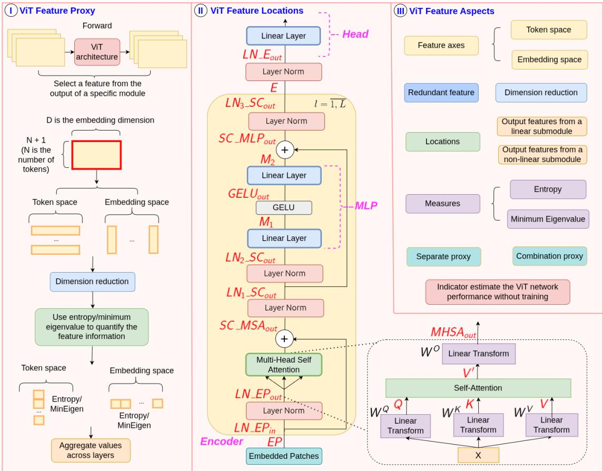
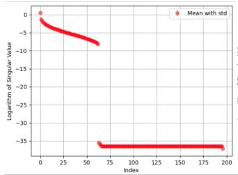
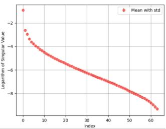

# Dissecting Representation Structure in Vision Transformers: A Rigorous Architectural Study

Kim-Cuc Nguyen

Temasek Laboratories

Singapore University of Technology and Design

Singapore

kimcucnguyen.cs@gmail.com

Ngai-Man Cheung

Temasek Laboratories

Singapore University of Technology and Design

Singapore

ngaiman cheung@sutd.edu.sg

Abstract—Representation structure is crucial for understanding Vision Transformer (ViT) architectures and their generalization behavior. However, prior studies neither isolate nor analyze module-level features nor investigate how their interactions contribute to performance estimation. In this work, we conduct the first rigorous analysis of feature information across diverse architectural scales, empirically uncover the relationship between ViT representation and generalization behavior, and leverage these insights to guide efficient ViT design. Our contributions are fivefold: Across diverse architectural scales, 1) We identify feature collapse at initialization, which leads to redundancy, and propose a reduction scheme to mitigate this issue. 2) We quantify feature information using entropy and the minimum eigenvalue, demonstrating that these metrics serve as reliable indicators for generalization prediction. 3) We show that feature in the token space provides a more faithful representation than those in embedding space. 4) We discover an unexpected finding: features produced by linear submodules within ViT layers are critical for the prediction of generalization performance. 5) Our proposed proxy improves the correlation ranking by 18-48% over prior baselines and can effectively identify ViT architectures that achieve higher accuracy at lower or comparable computational cost.

Index Terms—Representation, Vision Transformer, Feature

## I. INTRODUCTION

The Vision Transformer (ViT) [1] has achieved promising performance in visual tasks [2]–[4]. The critical components of ViT have been considered to be multi-head self-attention and the multi-layer perceptron (MLP). These specific modules enable the ViT architecture to achieve superior performance, but also result in less interpretable representations. By understanding the specific feature information in ViT, we can design more flexible architectures with stronger generalization ability.

Generalization potential refers to a model’s inherent capacity to generalize prior to training, providing a way to estimate its expected performance without optimization. Although it remains a conundrum, it is a valuable concept for effectively designing ViT architectures. Moreover, to facilitate the adaptation and application of ViT, Neural Architecture Search (NAS) [5]–[13] has been introduced to automatically discover optimal ViT architectures within a predefined search space, aiming to achieve the best possible accuracy under computational constraints. However, existing ViT NAS methods demand extensive computational resources, as they require training a large Supernet, evaluating numerous sub-architectures, and selecting the optimal one. To mitigate this cost, training-free performance proxies [14]–[16] can be used to estimate the performance of ViT architectures without exhaustively training all candidates in the search space.

Research gap. Existing studies primarily focus on overall architectural design rather than analyzing the specific roles of individual modules. While several proxy-based methods have been proposed to predict network performance, most are adapted from CNN proxies [9], [17]–[19], which do not generalize well to ViT architectures due to their distinct structural properties. Current ViT proxies [14]–[16], [20] typically operate in the weight space or treat the entire architecture as a single entity, overlooking the contribution of individual modules or features. Moreover, the high dimensionality and depth of ViT features make it challenging to quantify their information effectively.

In this paper, we address existing research gaps by proposing a framework and conducting the first analytical study of different types of feature information across various aspects of ViT architectural scales. To mitigate feature collapse, we introduce a reduction scheme that effectively compresses highdimensional features and streamlines computation. Furthermore, we quantitatively characterize feature information using entropy and the minimum eigenvalue, and show that the outputs of linear submodules are both critical and ubiquitous for generalization prediction.

## II. RELATED WORK

Feature collapse. [21] is among the first works to explore its features in detail, explaining them through the concept of word representations. Importantly, the authors demonstrate that words belonging to the same concept receive identical representations, a phenomenon they define as feature collapse. Using ranking of embedding to represent the information without the join of label [22] has been used in self-supervised learning. [23] introduce the concept of entropy collapse. In our work, we observe the feature collapse at the initialization of the ViT.

  
Fig. 1. Overview of our proposed framework for rigorous ViT representation analysis. (I) Procedure for computing feature proxies from specific modules (Sec. IV). (II) Visualization of feature locations across ViT modules, with red text indicating feature types and extraction points. (III) Analysis of various feature aspects (Sec. V). We observe feature collapse at initialization (Sec. V-A) and propose a reduction scheme to mitigate redundancy. In Tab. I, we demonstrate that entropy and the minimum eigenvalue effectively capture feature informativeness, with features output of linear submodule showing strong correlation with test accuracy, particularly in the token space. The proposed optimal feature proxies predict ViT performance without training improving correlation ranking and achieving higher accuracy with lower computational cost (Sec. V-B, VI.)

Feature selection in ViT. Feature selection in ViTs involves identifying the most informative components of the features extracted by the model. Effective feature selection can reduce computational cost, improve generalization, and enhance model interpretability. [24] proposed a method to prune redundant tokens based on the input by the design prediction module to identify the important token from current features. [25] introduced to use an adaptive token mechanism to reduce the number of token processed in ViT. [26] proposed removing uninformative patches by identifying the most effective patches in the final layer and using this information for patch selection in earlier layers.

Proxy for ViT. [14] proposed measuring the estimated performance of ViT architecture via synaptic diversity and synaptic saliency. [15] proposed a method to search for a ViT proxy that is generalizable for various domains and datasets. [27] proposed ViT proxy search for tiny datasets with knowledge distillation.

## III. PRELIMINARIES

Definition 1 (Shannon Entropy). The entropy H(X) of a discrete random variable X with possible outcomes $x _ { 1 } , x _ { 2 } , \ldots , x _ { n }$ and probability function $P ( X )$ is defined as:

$$
H ( X ) = - \sum _ { i = 1 } ^ { n } P ( x _ { i } ) \log P ( x _ { i } )\tag{1}
$$

Definition 2 (Pearson Correlation Matrix). Let $\mathbf { X } \in \mathbb { R } ^ { N \times D }$ be a feature matrix, where each column $X _ { i }$ represents one feature vector. The Pearson correlation matrix $\bar { \mathbf { P } } \in \mathbb { R } ^ { D \times D }$ is defined as:

$$
P _ { i j } = \frac { \mathbb { E } [ ( X _ { i } - \mathbb { E } [ X _ { i } ] ) ( X _ { j } - \mathbb { E } [ X _ { j } ] ) ] } { \sigma _ { X _ { i } } \sigma _ { X _ { j } } }\tag{2}
$$

where $\sigma _ { X _ { i } }$ is the standard deviation of $X _ { i }$

## IV. VISION TRANSFORMER FEATURE PROXIES

In our analysis, we investigate which types of feature and their combinations are the most suitable as indicators for predicting ViT performance. To address this, we first define the core concepts and introduce our proposed methods as follows:

Feature Compatibility. It refers to how features are jointly connected and how their combinations work without conflict. While previous ViT studies assume the whole network, skip connection, or later layers contain more information, table I show that this assumption does not hold for ViT generalization.

Feature axes. Given an input image $\boldsymbol { X } ~ \in ~ \mathbb { R } ^ { C \times H \times W }$ it is divided into non-overlapping patches, each flattened and linearly projected into a D dimensional embedding. A positional embedding and a learnable class token are then added, forming $X \in \mathbb { R } ^ { t _ { \dim } \times e _ { \dim } }$ , where $t _ { \mathrm { d i m } } = N + 1$ is the token dimension and $e _ { \mathrm { d i m } } = D$ is the embedding dimension. For feature analysis, we treat rows as variables in the token space and columns as variables in the embedding space.

ViT Feature. ViT architecture consists of an Encoder, Patches, and MLP head, illustrated in Fig. 1. For each module type, we extract one representative feature from its output during a forward pass on a batch of data. Starting from the input, $E P$ denotes the feature after patch embedding. In the Encoder, repeated over L layers, we obtain features from all layers within each module. $L N _ { - } E P _ { i n }$ and $L N \_ E P _ { o u t }$ represent features before and after the first LayerNorm, respectively. The query, key, and value features, denoted as $Q ,$ $K ,$ , and $V ,$ , are concatenated into $Q K V ~ = ~ X W ^ { Q K V }$ for efficiency. $V ^ { \prime }$ denotes the feature after self-attention, while $M H S A _ { o u t }$ is the multi-head attention output. $S C _ { - } M S A _ { o u t }$ represents the feature after the skip connection following multi-head self-attention. Next, $L N _ { 1 \_ S C _ { o u t } }$ and $L N _ { 2 \_ S C _ { o u t } }$ represent the features after the first and second LayerNorm operations following the skip connection, respectively. Within the MLP, $M _ { 1 }$ and $M _ { 2 }$ denote features from the first and second linear layers, and $G E L U _ { o u t }$ is the activation output. $S C _ { - } M L P _ { o u t }$ is the feature after the skip connection following the MLP module, and $L N _ { 3 - } S C _ { o u t }$ denotes the feature after the subsequent LayerNorm operation. Finally, E represents the encoder output, and $L N _ { - } E _ { o u t }$ is the feature before the ViT head. Feature combinations are denoted using the plus operator $( \mathbf { e . g . } , M _ { 1 } + M _ { 2 } )$

Feature dimension reduction. Representation information measures are computed on $X ^ { \prime }$ , and the results are scaled by $\frac { t _ { \mathrm { d i m } } } { u }$ in the token space or $\frac { e _ { \mathrm { d i m } } ^ { l } } { u }$ in the embedding space to maintain consistency with the original dimensionality. This weighting compensates for dimensionality reduction and ensures that the final information metric reflects the contribution of the entire feature space.

Entropy Proxy. Let $H ( x _ { i } )$ denote the entropy of a feature vector $x _ { i }$ . For each row or column of the feature matrix $X$ we compute $H ( x _ { i } )$ and select the u vectors with the lowest entropy to form a reduced representation $X ^ { \prime }$

X′ = Select u vectors from X with lowest $H ( x _ { i } )$

(3)

The entropy proxy function $F _ { \mathcal { T } }$ is then computed from the reduced matrix $X ^ { \prime }$

$$
F _ { \mathcal { T } } ( X ^ { \prime } ) = \sum _ { i = 1 } ^ { u } H ( x _ { i } )\tag{4}
$$

Minimum Eigenvalue Proxy. We compute the Pearson correlation matrix $P ( X ) \left( \operatorname { E q . } 2 \right)$ to measure the linear correlation between feature vector variables $x _ { i }$ and $x _ { j }$ . We define the rowwise correlation score $s _ { i } ,$ which sum the absolute correlations in each row of $P ( X )$

## Algorithm 1 Compute ViT Feature Proxy Algorithm 1 Compute ViT Feature Proxy

Require: Feature type $f ;$ feature map $\boldsymbol { X } ~ \in ~ \mathbb { R } ^ { t _ { d i m } \times e _ { d i m } ^ { l } }$ cor  
responding to a single sample in the batch, extracted from   
module $f$ at layer $l ;$ reduction dimension u; proxy indicator   
$\mathcal { T } \in$ {Entropy, MinEigen}   
1: prox $\iota  0$   
2: for $l  0$ to $L$ do   
3: if dim is token then   
4: $X = \{ \boldsymbol { x } _ { 1 } , . . . , \boldsymbol { x } _ { t _ { d i m } } \} , \boldsymbol { x } _ { i } \in \mathbf { R } ^ { e _ { d i m } ^ { l } }$   
5: $\alpha _ { l } \gets \frac { t _ { d i m } } { u }$   
6: else   
7: $X = \{ x _ { 1 } , . . . , x _ { e _ { d i m } ^ { l } } \} , x _ { i } \in \mathbf { R } ^ { t _ { d i m } }$   
8: $\alpha _ { l } \gets \frac { e _ { d i m } ^ { l } } { u }$   
9: end if   
10: $X ^ { \prime } \gets \mathrm { R e d u c e } ( X , u , \mathcal { T } )$ {select u elements using $\mathcal { T } \cdot$ -specific   
rule} (see Eqs. ${ \overset { \cdot } { ( 3 ) } } , ( 6 ) { \overset { \cdot } { ) } }$   
11: $p _ { l } \gets \alpha _ { l } \cdot \mathcal { F } _ { \mathcal { Z } } ( X ^ { \prime } )$ (see Eqs. (4), (7))   
12: prox $y  p r o x y + p \iota$   
13: end for   
14: return proxy

$$
s _ { i } = \sum \lvert P ( X ) _ { i j } \rvert
$$

$$
X ^ { \prime } = \operatorname { S e l e c t } \ u \ { \mathrm { vdot { E } c t o r s } } \ { \mathrm { w i t h ~ l o w e s t } } \ s _ { i }\tag{5}
$$

(6)

$$
F _ { \mathcal { T } } ( X ^ { \prime } ) = \lambda _ { \operatorname* { m i n } } { \big ( } P ( X ^ { \prime } ) { \big ) }\tag{7}
$$

$\lambda _ { \operatorname* { m i n } } ( P )$ is proportional to the degree of feature diversity and independence, where higher diversity correlates with better classification accuracy, stronger generalization, and more stable training in ViTs.

## V. DISCOVERING THE IMPACT OF FEATURE INFORMATION ON VIT GENERALIZATION PREDICTORS

Procedure. Our framework and analysis components are illustrated in Fig. 1. We meticulously designed the experimental testbed across different architectural scales. Specifically, we sampled 1,000 ViT architectures within the 5–7 million parameter range from AutoFormer-Tiny [5], extracted their architectural information, and stored it as an API. Additionally, we collected the test accuracy of these 1,000 architectures using pretrained weights on the ImageNet-1K dataset [28]. The test accuracy of subnets inheriting weights from the supernet achieves comparable results to those trained independently [5], [29]–[31]. We propose a unified framework for computing ViT feature proxies, as illustrated in Algorithm 1, and introduce two measures: the Entropy Proxy and the Minimum Eigenvalue $P r o x y$

Metrics. We computed the Spearman [32] and Kendall [33] correlations between proxy values and test accuracy to evaluate the effectiveness of representation information in capturing ViT generalization performance.

## A. Investigating Feature Collapse at Initialization and Feature Information for ViT Generalization Prediction

## B. Comparison with State-of-the-Art Methods

We compare the top three Token-Entropy proxies with reduced dimension $u = 1 \colon M _ { 1 } + M _ { 2 } , M H S A _ { o u t } + M _ { 1 } + M _ { 2 }$

  
Fig. 2. Logarithm of the singular value spectrum of the feature Q in the token space (left) and embedding space (right). The x-axis denotes variable indices, and the y-axis shows the mean and standard deviation of the logarithmic singular values across all layers. Most singular values are near zero, indicating a low-rank structure and feature collapse.

## TABLE I

SPEARMAN’S ρ AND KENDALL’S τ CORRELATIONS BETWEEN TEST   
ACCURACY AND EACH OF THE ENTROPY AND MINIMUM EIGENVALUE   
PROXIES ARE COMPUTED FOR 1,000 VIT ARCHITECTURES (5–7M   
PARAMETERS) ACROSS 26 FEATURE TYPES. THESE PROXIES ARE   
CALCULATED IN BOTH TOKEN AND EMBEDDING SPACES FOR INDIVIDUAL   
AND COMBINED FEATURES, WITH DIMENSION REDUCTIONS u = 1. BOLD   
VALUES INDICATE CORRELATIONS HIGHER THAN THOSE OF PREVIOUS   
PROXIES IN TABLE II. THE ENTROPY AND MINIMUM EIGENVALUE   
PROXIES EFFECTIVELY QUANTIFY FEATURE INFORMATION AS   
INDICATORS OF VIT GENERALIZATION. FEATURES OUTPUT BY   
LINEAR SUBMODULES $( Q , K , V , V ^ { \prime } , M H S A _ { o u t } , M _ { 1 } , M _ { 2 } )$ AND THEIR   
COMBINATIONS SHOW STRONG CORRELATIONS WITH TEST   
ACCURACY, WHEREAS FEATURES OUTPUT BY NON-LINEAR   
SUBMODULES EXHIBIT SIGNIFICANTLY WEAKER CORRELATIONS.   
PROXIES COMPUTED IN THE TOKEN SPACE ACHIEVE HIGHER   
CORRELATIONS THAN THOSE IN THE EMBEDDING SPACE.

<table><tr><td rowspan="3" colspan="2">Proxy</td><td colspan="4">Entropy</td><td colspan="4">Minimum Eigenvalue</td></tr><tr><td colspan="2">Token</td><td colspan="2">Embedding</td><td colspan="2">Token</td><td colspan="2">Embedding</td></tr><tr><td>ρ</td><td>T</td><td>ρ 0.732</td><td>T</td><td>ρ</td><td>T 0.636</td><td>ρ 0.794</td><td>T 0.633</td></tr><tr><td rowspan="10">Encoder</td><td>K</td><td>0.745 0.733</td><td>0.509 0.485</td><td>0.738</td><td>0.480 0.495</td><td>0.796 0.792</td><td>0.630</td><td>0.797</td><td>0.637</td></tr><tr><td></td><td></td><td></td><td></td><td></td><td></td><td>0.637</td><td>0.796</td><td>0.637</td></tr><tr><td>V</td><td>0.744</td><td>0.503</td><td>0.718</td><td>0.468</td><td>0.797</td><td></td><td></td><td></td></tr><tr><td>V′</td><td>0.787</td><td>0.578</td><td>0.666</td><td>0.453</td><td>0.792</td><td>0.628</td><td>0.699</td><td>0.540 0.541</td></tr><tr><td> $M H S A _ { o u t }$ </td><td>0.790</td><td>0.585</td><td>0.657</td><td>0.439</td><td>0.794</td><td>0.633</td><td>0.701</td><td></td></tr><tr><td>M1</td><td>0.844</td><td>0.660</td><td>0.762</td><td>0.571</td><td>0.795</td><td>0.633</td><td>0.761</td><td>0.585</td></tr><tr><td> $\dot { M _ { 2 } }$ </td><td>0.809</td><td>0.599</td><td>0.676</td><td>0.463</td><td>0.761</td><td>0.589</td><td>0.698</td><td>0.537</td></tr><tr><td> $\_ E E L U _ { o u t }$ </td><td>0.137</td><td>0.104</td><td>0.131 -0.056</td><td>0.100</td><td>0.016</td><td>0.013</td><td>0.129</td><td>0.104</td></tr><tr><td> $S C _ { - } M S A _ { o u t }$ </td><td>-0.039</td><td>-0.023</td><td>-0.043</td><td>-0.038 -0.029</td><td>0.008</td><td>0.007</td><td>-0.138</td><td>-0.109</td></tr><tr><td> $\tilde { S C _ { - } M L P _ { o u t } }$   $\underbrace { \phantom { S _ { 1 } ^ { \prime } } \overline { { N } } _ { - } E P _ { i n } } _ { = \ " }$ </td><td>-0.023</td><td>-0.014</td><td>-0.050</td><td>-0.033</td><td>0.042</td><td>0.034 0.017</td><td>-0.138 -0.138</td><td>-0.109</td></tr><tr><td rowspan="9"></td><td></td><td>-0.024</td><td>-0.014</td><td></td><td></td><td>0.021</td><td></td><td>-0.142</td><td>-0.109 -0.113</td></tr><tr><td> $L N _ { - } \overline { { E } } P _ { o u t }$ </td><td>-0.031</td><td>-0.019</td><td>-0.071</td><td>-0.047</td><td>0.052</td><td>0.042</td><td></td><td>-0.109</td></tr><tr><td> $L N _ { 1 , - } S C _ { o u t }$ </td><td>-0.039</td><td>-0.023</td><td>-0.056</td><td>-0.038</td><td>0.008</td><td>0.007</td><td>-0.138</td><td></td></tr><tr><td> $L N _ { 2 - } S C _ { o u t }$ </td><td>-0.029</td><td>-0.017</td><td>-0.055</td><td>-0.038</td><td>0.037</td><td>0.029</td><td>-0.139</td><td>-0.110</td></tr><tr><td> $L N _ { 3 - } S C _ { o u t }$ </td><td>-0.023</td><td>-0.014</td><td>-0.043</td><td>-0.028</td><td>0.042</td><td>0.034</td><td>-0.138</td><td>-0.109</td></tr><tr><td>EP</td><td>-0.192</td><td>-0.158</td><td>-0.192</td><td>-0.157</td><td>NA</td><td>NA</td><td>-0.192</td><td>-0.157</td></tr><tr><td>E</td><td>-0.055</td><td>-0.034</td><td>-0.088</td><td>-0.059</td><td>0.076</td><td>0.061</td><td>-0.126</td><td>-0.096</td></tr><tr><td> $L N _ { - } E _ { o u t }$ </td><td>-0.011</td><td>-0.006</td><td>0.216</td><td>0.133</td><td>0.091</td><td>0.074</td><td>-0.086</td><td>-0.067</td></tr><tr><td>QKV</td><td>0.773</td><td>0.544</td><td>0.720</td><td>0.496</td><td>0.795</td><td>0.634</td><td>0.734</td><td>0.529</td></tr><tr><td colspan="2"> $\boldsymbol { M _ { 1 } ^ { \check { \mathbf { \delta } } } } + \boldsymbol { M _ { 2 } ^ { \check { \mathbf { \delta } } } }$ </td><td>0.849</td><td>0.665</td><td>0.752</td><td>0.562</td><td>0.797</td><td>0.639</td><td>0.752</td><td>0.576</td></tr><tr><td colspan="2"> $Q K V + M _ { 1 } \bar { + } M _ { 2 }$ </td><td>0.838</td><td>0.652</td><td>0.837</td><td>0.649</td><td>0.798</td><td>0.640</td><td>0.836</td><td>0.654</td></tr><tr><td colspan="2"> $\dot { Q K V } + M \dot { H } S { A _ { o u t } }$ </td><td>0.805</td><td>0.604</td><td>0.773</td><td>0.553</td><td>0.798</td><td>0.639</td><td>0.771</td><td>0.567</td></tr><tr><td colspan="2"> $M H S A _ { o u t } + M _ { 1 } + M _ { 2 }$ </td><td>0.851</td><td>0.669</td><td>0.744</td><td>0.556</td><td>0.798</td><td>0.640</td><td>0.745</td><td>0.570</td></tr><tr><td colspan="2"> $Q K V + M H S A _ { o u t } + M _ { 1 } + M _ { 2 }$ </td><td>0.856</td><td>0.676</td><td>0.759</td><td>0.574</td><td>0.798</td><td>0.640</td><td>0.831</td><td>0.650</td></tr><tr><td colspan="2">Q + K + V</td><td>0.740</td><td>0.499</td><td>0.728</td><td>0.477</td><td>0.798</td><td>0.640</td><td>0.798</td><td>0.639</td></tr><tr><td colspan="2"> $S C _ { - } M S \dot { A _ { o u t } } + \bar { S C } _ { - } M L P _ { o u t }$ </td><td>-0.040</td><td>-0.024</td><td>-0.056</td><td>-0.037</td><td>0.027</td><td>0.022</td><td>-0.143</td><td>-0.114</td></tr></table>

and $Q K V + M H S A _ { o u t } + M _ { 1 } + M _ { 2 }$ , against the baselines across 3,000 ViT architectures: Tiny (5-7M), Small (15-19M), and Base (45-47M), with 1,000 architectures in each parameter range. As shown in Table II, our proxies improve correlation rankings by 18%, 25%, and 48% for the 5–7M, 15–19M, and 45–47M ranges, respectively.

## VI. EFFICIENT VIT ARCHITECTURE DESIGN

We use the previous proxies and our Token-Entropy proxies with reduced dimension u = 1 to search for the optimal subnet on the same set of 1,000 ViT architectures within 5-7 parameter ranges. As shown in the table III, our proposed proxies successfully identify the optimal subnet, improving accuracy by 0.11%-0.17% compared to previous proxies across the 1,000

## TABLE II

SPEARMAN’S ρ AND KENDALL’S τ CORRELATION RANKINGS FOR THREE SETS OF 1,000 VIT ARCHITECTURES WITH PARAMETER RANGES OF 5–7M, 15–19M, AND 45–47M, COMPARING THE TOP-3 TOKEN-ENTROPY PROXIES (u = 1) WITH BASELINES. OUR PROPOSED PROXIES SIGNIFICANTLY IMPROVE THE CORRELATION RANKINGS, DEMONSTRATING THAT THEY ARE STRONG INDICATORS OF VIT PERFORMANCE.
<table><tr><td rowspan="2">Proxy</td><td colspan="2">5-7M</td><td colspan="2">15-19M</td><td colspan="2">45-47M</td></tr><tr><td>ρ</td><td>T</td><td>ρ</td><td>T</td><td>ρ</td><td>T</td></tr><tr><td>SNIP [17]</td><td>0.313</td><td>0.207</td><td>0.280</td><td>0.190</td><td>0.056</td><td>0.037</td></tr><tr><td>GraSP [19]</td><td>-0.101</td><td>-0.066</td><td>-0.064</td><td>-0.043</td><td>0.023</td><td>0.015</td></tr><tr><td>TE-score [34]</td><td>-0.319</td><td>-0.219</td><td>-0.084</td><td>-0.057</td><td>-0.106</td><td>-0.072</td></tr><tr><td>NASWOT [20]</td><td>0.382</td><td>0.278</td><td>0.232</td><td>0.162</td><td>0.243</td><td>0.171</td></tr><tr><td>DSS [14]</td><td>0.622</td><td>0.439</td><td>0.468</td><td>0.315</td><td>-0.119</td><td>-0.079</td></tr><tr><td>AutoProxA [15]</td><td>0.675</td><td>0.477</td><td>0.446</td><td>0.299</td><td>-0.126</td><td>-0.084</td></tr><tr><td> $\mathrm { D S S } { + } + \mathrm { [ 1 6 ] }$ </td><td>0.638</td><td>0.448</td><td>0.450</td><td>0.302</td><td>-0.140</td><td>-0.094</td></tr><tr><td> $M _ { 1 } + M _ { 2 }$ </td><td>0.849</td><td>0.665</td><td>0.718</td><td>0.529</td><td>0.368</td><td>0.251</td></tr><tr><td> $M H S A _ { o u t } + M _ { 1 } + M _ { 2 }$ </td><td>0.851</td><td>0.669</td><td>0.717</td><td>0.529</td><td>0.360</td><td>0.246</td></tr><tr><td> $Q K V + M H S A _ { o u t } + M _ { 1 } + M _ { 2 }$ </td><td>0.856</td><td>0.676</td><td>0.720</td><td>0.533</td><td>0.350</td><td>0.239</td></tr></table>

ViT architectures in the 5–7M ranges, respectively. Moreover, our proxies achieve an 87.5%–98.6% reduction in computation time when searching over 1,000 ViT architectures, requiring only 0.06 hours compared to 0.48 – 4.3 hours for previous proxies in the 5–7M range.

TABLE III  
RESULTS ON IMAGENET USING DIFFERENT PROXIES TO SEARCH FOR THE OPTIMAL ARCHITECTURE AMONG 1,000 VIT ARCHITECTURES, WITH THE 5–7M PARAMETER RANGES
<table><tr><td>Proxy</td><td>Param(M) ↓</td><td>FLOPs(B) ↓</td><td>Top-1 ↑</td><td>Time(h) ↓</td></tr><tr><td>SNIP [17]</td><td>6.9</td><td>1.7</td><td>74.89</td><td>1.00</td></tr><tr><td>GraSP [19]</td><td>5.7</td><td>1.4</td><td>74.47</td><td>1.38</td></tr><tr><td>TE-score [34]</td><td>5.9</td><td>1.5</td><td>74.60</td><td>4.30</td></tr><tr><td>NASWOT [20]</td><td>6.9</td><td>1.7</td><td>74.94</td><td>0.82</td></tr><tr><td>DSS [14]</td><td>6.9</td><td>1.6</td><td>75.29</td><td>0.60</td></tr><tr><td>AutoProxA [15]</td><td>6.9</td><td>1.5</td><td>75.32</td><td>0.48</td></tr><tr><td> $\mathrm { D S S } { + } + \mathrm { [ 1 6 ] }$ </td><td>6.9</td><td>1.6</td><td>75.30</td><td>0.80</td></tr><tr><td> $M _ { 1 } + M _ { 2 }$ </td><td>6.9</td><td>1.5</td><td>75.41</td><td>0.05</td></tr><tr><td> $\dot { M } \dot { H } \dot { S } \dot { A } _ { o u t } + \dot { M } _ { 1 } + M _ { 2 }$ </td><td>6.9</td><td>1.5</td><td>75.43</td><td>0.06</td></tr><tr><td> $Q K V + \overline { { { M } } } H S \bar { A _ { o u t } } + \overline { { { M _ { 1 } } } } + M _ { 2 }$ </td><td>6.9</td><td>1.5</td><td>75.38</td><td>0.08</td></tr></table>

## VII. CONCLUSION

In this work, we provide a rigorous analysis of how feature representations relate to ViT generalization, considering feature information, axes, dimensions, and locations. Our proposed feature proxies improve correlation ranking by 18–48% over baselines across parameter ranges. For efficient ViT architecture design, our method achieves higher accuracy across architectures while significantly reducing training, search, and proxy computation costs. Extensive experiments across different ViT architectural scale confirm the effectiveness and broad applicability of our approach, establishing a principled framework for understanding ViT features, predicting generalization, and enabling efficient ViT design. Future work applies the findings to design compact models for different tasks [35]– [37].

## ACKNOWLEDGMENT

This research is supported by Temasek Laboratories, Singapore University of Technology and Design; the National Research Foundation, Singapore under its AI Singapore Programmes (AISG Award No.: AISG2-TC-2022-007); the Agency for Science, Technology and

Research (A\*STAR) under its MTC Programmatic Funds (Grant No. M23L7b0021); the National Research Foundation, Singapore and Infocomm Media Development Authority under its Trust Tech Funding Initiative. Any opinions, findings and conclusions or recommendations expressed in this material are those of the author(s) and do not reflect the views of National Research Foundation, Singapore and Infocomm Media Development Authority.

## REFERENCES

[1] A. Dosovitskiy, L. Beyer, A. Kolesnikov, D. Weissenborn, X. Zhai, T. Unterthiner, M. Dehghani, M. Minderer, G. Heigold, S. Gelly et al., “An image is worth 16x16 words: Transformers for image recognition at scale,” arXiv preprint arXiv:2010.11929, 2020.

[2] Z. Tu, H. Talebi, H. Zhang, F. Yang, P. Milanfar, A. Bovik, and Y. Li, “Maxvit: Multi-axis vision transformer,” in European conference on computer vision. Springer, 2022, pp. 459–479.

[3] A. Ali, H. Touvron, M. Caron, P. Bojanowski, M. Douze, A. Joulin, I. Laptev, N. Neverova, G. Synnaeve, J. Verbeek et al., “Xcit: Crosscovariance image transformers,” Advances in neural information processing systems, vol. 34, pp. 20 014–20 027, 2021.

[4] X. Dong, J. Bao, D. Chen, W. Zhang, N. Yu, L. Yuan, D. Chen, and B. Guo, “Cswin transformer: A general vision transformer backbone with cross-shaped windows,” in Proceedings of the IEEE/CVF conference on computer vision and pattern recognition, 2022, pp. 12 124– 12 134.

[5] M. Chen, H. Peng, J. Fu, and H. Ling, “Autoformer: Searching transformers for visual recognition,” in Proceedings of the IEEE/CVF international conference on computer vision, 2021, pp. 12 270–12 280.

[6] X. Su, S. You, J. Xie, M. Zheng, F. Wang, C. Qian, C. Zhang, X. Wang, and C. Xu, “Vitas: Vision transformer architecture search,” in European Conference on Computer Vision. Springer, 2022, pp. 139–157.

[7] C. Gong and D. Wang, “Nasvit: Neural architecture search for efficient vision transformers with gradient conflict-aware supernet training,” ICLR Proceedings 2022, 2022.

[8] C. Yan, X. Chang, Z. Li, L. Yao, M. Luo, and Q. Zheng, “Masked distillation advances self-supervised transformer architecture search,” in The Twelfth International Conference on Learning Representations, 2024. [Online]. Available: https://openreview.net/forum?id=LUpC8KTvdV

[9] H. Wang, C. Ge, H. Chen, and X. Sun, “Prenas: Preferred one-shot learning towards efficient neural architecture search,” in International conference on machine learning. PMLR, 2023, pp. 35 642–35 654.

[10] M. Chen, K. Wu, B. Ni, H. Peng, B. Liu, J. Fu, H. Chao, and H. Ling, “Searching the search space of vision transformer,” Advances in Neural Information Processing Systems, vol. 34, pp. 8714–8726, 2021.

[11] J. Liu, X. Huang, G. Song, H. Li, and Y. Liu, “Uninet: Unified architecture search with convolution, transformer, and mlp,” in European Conference on computer vision. Springer, 2022, pp. 33–49.

[12] M. Ding, X. Lian, L. Yang, P. Wang, X. Jin, Z. Lu, and P. Luo, “Hr-nas: Searching efficient high-resolution neural architectures with lightweight transformers,” in Proceedings of the IEEE/CVF conference on computer vision and pattern recognition, 2021, pp. 2982–2992.

[13] C. Tang, L. L. Zhang, H. Jiang, J. Xu, T. Cao, Q. Zhang, Y. Yang, Z. Wang, and M. Yang, “Elasticvit: Conflict-aware supernet training for deploying fast vision transformer on diverse mobile devices,” in Proceedings of the IEEE/CVF international conference on computer vision, 2023, pp. 5829–5840.

[14] Q. Zhou, K. Sheng, X. Zheng, K. Li, X. Sun, Y. Tian, J. Chen, and R. Ji, “Training-free transformer architecture search,” in Proceedings of the IEEE/CVF Conference on Computer Vision and Pattern Recognition, 2022, pp. 10 894–10 903.

[15] Z. Wei, P. Dong, Z. Hui, A. Li, L. Li, M. Lu, H. Pan, and D. Li, “Autoprox: Training-free vision transformer architecture search via automatic proxy discovery,” in Proceedings of the AAAI Conference on Artificial Intelligence, vol. 38, no. 14, 2024, pp. 15 814–15 822.

[16] Q. Zhou, K. Sheng, X. Zheng, K. Li, Y. Tian, J. Chen, and R. Ji, “Training-free transformer architecture search with zero-cost proxy guided evolution,” IEEE Transactions on Pattern Analysis and Machine Intelligence, 2024.

[17] N. Lee, T. Ajanthan, and P. H. Torr, “Snip: Single-shot network pruning based on connection sensitivity,” arXiv preprint arXiv:1810.02340, 2018.

[18] G. Li, Y. Yang, K. Bhardwaj, and R. Marculescu, “Zico: Zero-shot nas via inverse coefficient of variation on gradients,” arXiv preprint arXiv:2301.11300, 2023.

[19] C. Wang, G. Zhang, and R. Grosse, “Picking winning tickets before training by preserving gradient flow,” arXiv preprint arXiv:2002.07376, 2020.

[20] J. Mellor, J. Turner, A. Storkey, and E. J. Crowley, “Neural architecture search without training,” in International conference on machine learning. PMLR, 2021, pp. 7588–7598.

[21] T. Laurent, J. H. von Brecht, and X. Bresson, “Feature collapse,” arXiv preprint arXiv:2305.16162, 2023.

[22] Q. Garrido, R. Balestriero, L. Najman, and Y. Lecun, “Rankme: Assessing the downstream performance of pretrained self-supervised representations by their rank,” in International conference on machine learning. PMLR, 2023, pp. 10 929–10 974.

[23] S. Zhai, T. Likhomanenko, E. Littwin, D. Busbridge, J. Ramapuram, Y. Zhang, J. Gu, and J. M. Susskind, “Stabilizing transformer training by preventing attention entropy collapse,” in International Conference on Machine Learning. PMLR, 2023, pp. 40 770–40 803.

[24] Y. Rao, W. Zhao, B. Liu, J. Lu, J. Zhou, and C.-J. Hsieh, “Dynamicvit: Efficient vision transformers with dynamic token sparsification,” Advances in neural information processing systems, vol. 34, pp. 13 937– 13 949, 2021.

[25] H. Yin, A. Vahdat, J. M. Alvarez, A. Mallya, J. Kautz, and P. Molchanov, “A-vit: Adaptive tokens for efficient vision transformer,” in Proceedings ofthe IEEE/CVF conference on computer vision and pattern recognition, 2022, pp. 10 809–10 818.

[26] Y. Tang, K. Han, Y. Wang, C. Xu, J. Guo, C. Xu, and D. Tao, “Patch slimming for efficient vision transformers,” in Proceedings of the IEEE/CVF Conference on Computer Vision and Pattern Recognition, 2022, pp. 12 165–12 174.

[27] Z. Wei, H. Pan, L. Li, P. Dong, Z. Tian, X. Niu, and D. Li, “Tvt: Training-free vision transformer search on tiny datasets,” arXiv preprint arXiv:2311.14337, 2023.

[28] O. Russakovsky, J. Deng, H. Su, J. Krause, S. Satheesh, S. Ma, Z. Huang, A. Karpathy, A. Khosla, M. Bernstein et al., “Imagenet large scale visual recognition challenge,” International journal of computer vision, vol. 115, no. 3, pp. 211–252, 2015.

[29] J. Yu, P. Jin, H. Liu, G. Bender, P.-J. Kindermans, M. Tan, T. Huang, X. Song, R. Pang, and Q. Le, “Bignas: Scaling up neural architecture search with big single-stage models,” in European Conference on Computer Vision. Springer, 2020, pp. 702–717.

[30] D. Wang, C. Gong, M. Li, Q. Liu, and V. Chandra, “Alphanet: Improved training of supernets with alpha-divergence,” in International Conference on Machine Learning. PMLR, 2021, pp. 10 760–10 771.

[31] D. Wang, M. Li, C. Gong, and V. Chandra, “Attentivenas: Improving neural architecture search via attentive sampling,” in Proceedings of the IEEE/CVF conference on computer vision and pattern recognition, 2021, pp. 6418–6427.

[32] Z. JH, “Spearman rank correlation. encyclopedia of biostatistics,” John Wiley & Sons, Ltd.(eds) vol (7). Online ISBN: 9780470011812— DOI, vol. 10, p. 0470011815, 2005.

[33] H. Abdi, “The kendall rank correlation coefficient,” Encyclopedia of measurement and statistics, vol. 2, pp. 508–510, 2007.

[34] W. Chen, X. Gong, and Z. Wang, “Neural architecture search on imagenet in four gpu hours: A theoretically inspired perspective,” arXiv preprint arXiv:2102.11535, 2021.

[35] S. Song, N.-M. Cheung, V. Chandrasekhar, B. Mandal, and J. Lin, “Egocentric activity recognition with multimodal fisher vector,” in 2016 IEEE International Conference on Acoustics, Speech and Signal Processing (ICASSP). IEEE, 2016.

[36] K. Min and J. J. Corso, “Integrating human gaze into attention for egocentric activity recognition,” in Proceedings of the IEEE/CVF Winter Conference on Applications of Computer Vision (WACV), 2021, pp. 1069–1078.

[37] K. Chandrasegaran, N.-T. Tran, A. Binder, and N.-M. Cheung, “Discovering transferable forensic features for cnn-generated images detection,” in European Conference on Computer Vision (ECCV). Springer, 2022, pp. 671–689.