# DivMoE: Fine-Grained MoE Upcycling via Cross-Domain Expert Composition

Yuxuan Lou1† Kai Yang2† Geng Zhang1 Yong Liu1 Yang You1 ✉   
1School of Computing, National University of Singapore, Singapore 2Department of Computer Science and Engineering, Shanghai Jiao Tong University, Shanghai, China

## Abstract

Mixture-of-Experts (MoE) architectures have become essential for scaling large language models, with recent work demonstrating the benefits of fine-grained expert designs. Training such models from scratch is expensive, and sparse upcycling from pre-trained dense models is an attractive alternative. However, we identify a structural pathology of fine-grained upcycling: when fine-grained experts are derived from a single source model, naive routing collapses and downstream accuracy drops to near-random (e.g., on Qwen3-1.7B, Drop-Upcycling-fine-grained reaches only 23.2% average accuracy across 15 benchmarks, essentially matching from-scratch training at 22.2%, while the same method’s coarse-grained variant reaches 50.2%). We propose DIVMOE, the first framework achieving finegrained MoE Upcycling with structurally-balanced routing. DIVMOE introduces domain-specializedfine-grained expert initialization, deriving experts from dense models that have undergone domain-adaptive continual pre-training, and diversityconstrained routing, a hard structural constraint guaranteeing that each token activates experts from distinct domain groups. Across two base models and 15 benchmarks, DIVMOE consistently outperforms six upcycling baselines (55.6% vs. 51.6% for the strongest baseline on Qwen3-1.7B) and strictly improves over the dense base model on every benchmark after Stage 2 continual pre-training—closing the regression gap that has plagued prior fine-grained upcycling. After supervised fine-tuning on a public reasoning mixture, our 12B-parameter DIVMOE model matches Moonlight-MoE (16B) at 64.5% average accuracy while outperforming a controlled NVIDIA-Upcycling baseline by 6.1 percentage points.

## 1 Introduction

Mixture-of-Experts (MoE) architectures have emerged as a cornerstone for building state-of-the-art large language models, enabling substantial capacity expansion while maintaining computational efficiency through sparse activation [30, 8]. Recent advances have demonstrated the effectiveness of fine-grained MoE designs, where each feed-forward network (FFN) layer is partitioned into many small experts rather than a few large ones [6, 7] by enabling more flexible routing and finer specialization, which contributes to the strong performance of models such as DeepSeek-V2 and Mixtral [17].

Training such models from scratch demands substantial compute, motivating sparse upcycling [20], which converts pre-trained dense checkpoints into MoE architectures while inheriting their learned representations. However, we observe that fine-grained upcycling is fundamentally fragile: when fine-grained experts are derived from a single dense source, downstream accuracy collapses to nearrandom. On Qwen3-1.7B-Base evaluated across 15 benchmarks, Drop-Upcycling-fine-grained [26] reaches only 23.2% average accuracy (comparable to from-scratch training, 22.2%), versus 50.2% for the same method’s coarse-grained variant. NVIDIA Upcycling [11], which preserves denseequivalence by copying a single source, recovers the gap (51.1%) but yields homogeneous expert initial scores that suppress routing diversity. The two existing remedies are unsatisfactory: identical weight copying limits routing diversity by construction, while random re-initialization sacrifices pre-trained knowledge.

Our central observation is that no prior method simultaneously occupies three design axes that the experiments below show are jointly necessary: (a) domain-specialized expert initialization, (b) finegrained partitioning, and (c) a structural mechanism that prevents same-source co-activation. Branch-Train-Mix (BTX) [33] addresses (a) but uses coarse experts and standard top-k routing; NVIDIA Upcycling addresses (b); Drop-Upcycling targets diversity through randomness, sacrificing (a) in a different sense. The concurrent FlexOLMo [31] also constructs experts from domain specialists, but for the orthogonal goal of flexible data governance: it uses coarse experts, no joint training, and no routing constraint.

We propose DIVMOE, the first framework that achieves fine-grained MoE Upcycling, which includes two components: (1) Domain-specializedfine-grained expert initialization. We derive experts from n dense models that have undergone domain-adaptive continual pre-training on public corpora (mathematics, code, science, commonsense), then vertically slice each specialist’s FFN into m shards, yielding $N = n \times$ m fine-grained experts organized into n domain groups. This preserves all pre-trained knowledge while injecting structured diversity into the routing scores at initialization. (2) Diversity-constrained routing. We enforce a hard structural constraint that each token selects at most one expert per domain group. Unlike soft auxiliary losses [8, 40] that trade routing balance against task accuracy, the diversity constraint operates outside the loss landscape and provides a guarantee regardless of gradient magnitudes.

Empirically, DIVMOE consistently outperforms six upcycling baselines across 15 benchmarks on two base models (Qwen3-1.7B-Base, Llama3.2-1B). With Stage 2 continual pre-training on the public Dolmino-Mix-1124 corpus [27], DIVMOE strictly improves over the dense base model on the majority ofbenchmarks, eliminating the post-CPT regression that prior upcycling pipelines exhibit. Crucially, the structural constraint improves performance on every domain-specific benchmark (HumanEval +1.8%, GSM8K +2.1%, MATH +1.4%, MBPP +2.3%), refuting the intuition that “coding tokens should only use coding experts.” After Stage 3 supervised fine-tuning on a public reasoning mixture, our 12B-parameter DIVMOE model matches Moonlight-MoE (16B) at 64.5% and outperforms a controlled NVIDIA-Upcycling baseline by 6.1 percentage points.

The contributions of our work are summarized below:

• Observation on a fine-grained upcycling collapse pathology. We show that combining fine-grained expert partitioning with single-source initialization leads to routing collapse and severe performance degradation.

• The first fine-grained MoE Upcycling framework. We propose DIVMOE, which combines domain-specialized fine-grained expert initialization with a hard diversity-constrained routing mechanism.

• Comprehensive experiments with strong downstream performance. Across two base models, three model scales (1B, 1.7B, 4B base → 3.2B, 5.4B, 12B MoE), fifteen benchmarks, and six upcycling baselines, all using public corpora, DIVMOE consistently outperforms prior upcycling methods and closes the regression gap of previous fine-grained upcycling approaches.

## 2 Related Work

Mixture-of-Experts in LLMs. MoE architectures scale model capacity efficiently through conditional computation [15, 18, 30]. GShard [22] and Switch Transformer [8] scaled this paradigm to trillion-parameter models with top-k routing and load-balancing losses. Mixtral [17] matches dense quality at reduced cost, while DeepSeek-MoE [6] and DeepSeek-V2 [7] introduced fine-grained expert segmentation with shared experts. OLMoE [25] provides open MoE models and data. ST-

Table 1: Design-space of dense-to-MoE upcycling. ✓indicates the method occupies the design choice. Only DIVMOE occupies all three columns; the empirical consequence is that fine-grained partitioning without domain diversity collapses (Section 4.2).
<table><tr><td>Method</td><td>Domain-specialized experts</td><td>Fine-grained partitioning</td><td>Structural routing constraint</td></tr><tr><td>Sparse Upcycling [20]</td><td>x</td><td>x</td><td>x</td></tr><tr><td>Branch-Train-Mix [33]</td><td>√</td><td>x</td><td>x</td></tr><tr><td>NVIDIA Upcycling [11]</td><td>x</td><td>√</td><td>x</td></tr><tr><td>Drop-Upcycling [26]</td><td>x</td><td>x</td><td>x</td></tr><tr><td>Drop-Upcycling-fine-grained</td><td>x</td><td>√</td><td>x</td></tr><tr><td>FlexOLMo [31] (concurrent)</td><td>√</td><td>x</td><td>x</td></tr><tr><td>DIvMoE (ours)</td><td>√</td><td>√</td><td>√</td></tr></table>

MoE [40] introduced the router z-loss for stable routing. DIVMOE extends this fine-grained trend by deriving fine-grained experts from multiple domain-specialized dense models and enforcing routing diversity structurally.

Dense-to-MoE upcycling. Sparse Upcycling [20] initializes all experts from copies of the same dense FFN. Branch-Train-Mix [33] (BTX, distinct from Branch-Train-Merge [23]) trains separate dense “branch” models on different data slices, then assembles them into a coarse-grained MoE in which each expert is one full FFN. He et al. [11] extend dense-equivalent initialization to fine-grained experts, but derive all experts from a single source model, providing no initial routing-score diversity. Drop-Upcycling [26] introduces diversity via random re-initialization of expert subsets, at the cost of partial knowledge loss; we will show that its fine-grained variant collapses. The concurrent FlexOLMo [31] also constructs experts from domain specialists, but for the orthogonal goal of flexible data governance: experts train independently with no joint pre-training, the granularity is coarse, and no routing constraint is imposed.

Routing collapse and load balancing. Top-k routing is prone to routing collapse, in which a few experts dominate selection regardless of input [8]. Standard remedies are auxiliary load-balancing losses [30, 8] or expert-choice routing [39]. The router z-loss [40] penalizes large router logits to stabilize training. All of these are soft mechanisms: they add gradients to the routing logits without changing what selections are reachable. DIVMOE’s diversity-constrained routing is a complementary hard mechanism whose guarantee is independent of gradient magnitudes; we retain a small auxiliary load-balancing loss (Section 3.2) only to encourage utilization within domain groups.

Continual pre-training. Multi-stage training pipelines that interleave continual pre-training with task-specific fine-tuning are now standard [14, 10]. The choice of CPT data has a large effect on benchmark performance, with mismatches between the base model’s original pre-training distribution and the CPT mixture causing transient regressions on specific tasks. We use Dolmino-Mix-1124 [27], a public mid-training corpus curated for the OLMo-2 family, which is high-enough quality that all upcycling baselines (including ours) post-CPT improve over their dense bases on the majority of benchmarks.

Positioning. Table 1 summarizes the design space. DIVMOE is the first method to achieve finegrained MoE Upcycling, with the mechanism occupying all three columns simultaneously.

## 3 DivMoE

DIVMOE upcycles dense language models into fine-grained MoE architectures through two innovations: (1) domain-specializedfine-grained expert initialization (Section 3.1) that derives experts from n dense models domain-adaptively pre-trained on distinct corpora, and (2) diversity-constrained routing (Section 3.2) that structurally enforces cross-domain expert selection. Figure 1 provides an overview.

Given a dense transformer with SwiGLU FFN $\mathrm { F F N } ( \mathbf { x } ) = \mathbf { W } _ { \mathrm { d o w n } } \cdot \sigma ( \mathbf { W } _ { \mathrm { g a t e } } \mathbf { x } ) \odot ( \mathbf { W } _ { \mathrm { u p } } \mathbf { x } )$ , where $\mathbf { W } _ { \mathrm { g a t e } } , \mathbf { W } _ { \mathrm { u p } } \in \mathbb { R } ^ { d _ { \mathrm { f f } } \times d }$ and $\mathbf { W } _ { \mathrm { d o w n } } \in \mathbb { R } ^ { d \times d _ { \mathrm { f f } } }$ , we convert each FFN into an MoE layer. Unlike prior work that derives experts from a single model [20, 11], DIVMOE first trains n domain specialists $\{ \mathcal { M } _ { 1 } , \ldots , \mathcal { M } _ { n } \}$ from the base model, then slices each specialist’s FFN into m fine-grained experts. With $n = 4 , m = 2$ , and $k = 2$ , DIVMOE doubles total capacity while activating half the dense FFN parameters.

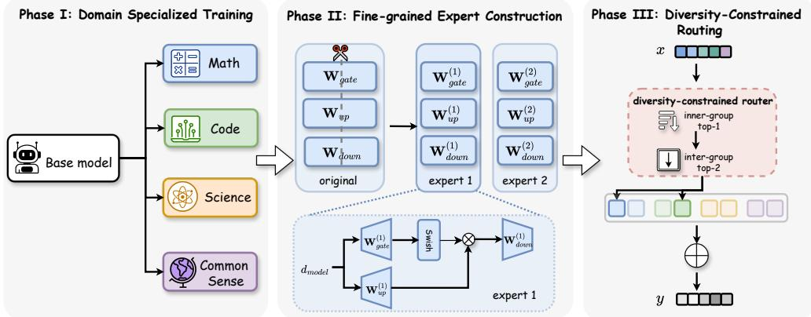  
Figure 1: DIVMOE overview. Left: a single base model is domain-adaptively pre-trained into $n = 4$ specialists. Middle: each specialist’s FFN is vertically sliced into $m = 2$ shards, yielding $N = 8$ experts in $n = 4$ domain groups. Right: the router selects the top-1 expert within each group, then top-k groups, guaranteeing k experts from k distinct domains.

## 3.1 Domain-Specialized Fine-Grained Expert Initialization

Domain specialists. Starting from base model $\mathcal { M } _ { \mathrm { b a s e } }$ , we apply domain-adaptive continual pretraining (next-token-prediction loss on full sequences, not instruction-style SFT) on public domainspecific subsets to obtain n specialists $\{ \mathcal { M } _ { \mathrm { m a t h } } , \mathcal { M } _ { \mathrm { c o d e } } , \mathcal { M } _ { \mathrm { s c i e n c e } } , \mathcal { M } _ { \mathrm { c o m m o n } } \}$ . Each specialist encodes distinct domain knowledge while retaining general capabilities, in contrast to identical copies [20] or random perturbations [26].

Expert construction. Each specialist’s FFN weights are vertically sliced into m shards:

$$
\mathbf { W } _ { \mathrm { g a t e } , i }  \{ \mathbf { W } _ { \mathrm { g a t e } , i } ^ { ( 1 ) } , \hdots , \mathbf { W } _ { \mathrm { g a t e } , i } ^ { ( m ) } \} ,\tag{1}
$$

$$
\mathbf { W } _ { \mathrm { u p } , i }  \{ \mathbf { W } _ { \mathrm { u p } , i } ^ { ( 1 ) } , \dots , \mathbf { W } _ { \mathrm { u p } , i } ^ { ( m ) } \} ,\tag{2}
$$

$$
\mathbf { W } _ { \mathrm { d o w n } , i } \to \{ \mathbf { W } _ { \mathrm { d o w n } , i } ^ { ( 1 ) } , \dots , \mathbf { W } _ { \mathrm { d o w n } , i } ^ { ( m ) } \} ,\tag{3}
$$

where expert $( i , j )$ has dimensions $( d _ { \mathrm { f f } } / m ) \times d$ for gate/up and $d \times ( d _ { \mathrm { f f } } / m )$ for down projections. Indices $i \in \{ 1 , \ldots , n \}$ and $j ~ \in ~ \{ 1 , \dots , m \}$ identify the specialist (domain group) and shard, respectively.

Dense-equivalent initialization. Following He et al. [11], we ensure stable initialization via virtual groups: selecting one shard j from any specialist reconstructs a complete FFN. Decomposing each specialist as $\mathbf { W } _ { i } = \mathbf { W } _ { \mathrm { b a s e } } + \bar { \mathbf { \Delta } } \mathbf { \Delta }$ ✂where $\Delta _ { i }$ captures domain adaptations,

$$
\sum _ { j = 1 } ^ { m } \mathrm { E x p e r t } _ { d _ { j } } ^ { ( j ) } ( { \bf x } ) \approx \mathrm { F F N } _ { \mathrm { b a s e } } ( { \bf x } ) ,\tag{4}
$$

preserving the base model’s output distribution at initialization while introducing structured diversity through the $\Delta _ { i }$

Magnitude correction. We scale expert weights by γ to compensate for softmax attenuation of router scores [11]:

$$
\mathbf { W } _ { \mathrm { e x p e r t } } = \gamma \cdot \mathbf { W } _ { \mathrm { s l i c e } } , \quad \gamma = \sqrt [ 3 ] { \frac { E \cdot G ^ { 2 } } { k } } ,\tag{5}
$$

where E is the expansion factor, G is granularity, and k is the active-expert count.

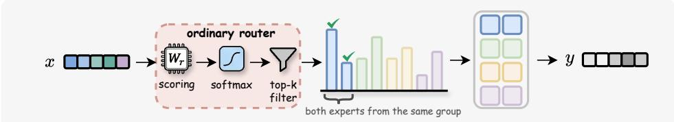  
(a) Standard Top-k: Routing Collapse

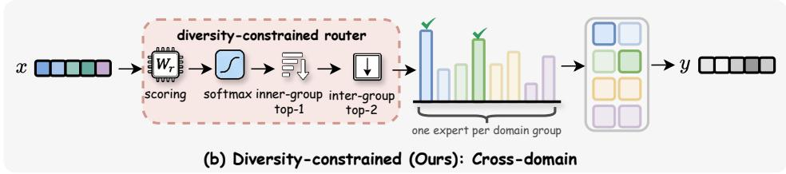  
Figure 2: Routing comparison. (a) Standard top-k may select both experts from one domain. (b) Diversity-constrained routing guarantees cross-domain selection.

Non-expert components. Embeddings, attention, and normalization layers are initialized as the mean of the base model and all specialists:

$$
\mathbf { W } _ { \mathrm { s h a r e d } } = { \frac { 1 } { n + 1 } } \left( \mathbf { W } _ { \mathrm { b a s e } } + \sum _ { i = 1 } ^ { n } \mathbf { W } _ { i } \right) .\tag{6}
$$

We ablate this choice in Section E.

## 3.2 Diversity-Constrained Routing

Standard MoE routing computes scores $\mathbf { s } = \mathbf { W } _ { r } \mathbf { x } \in \mathbb { R } ^ { N }$ and selects $S = \mathrm { T o p K } ( \mathrm { S o f t m a x } ( \mathbf { s } ) , k )$ When experts are partitioned into n domain groups $\{ \mathcal { D } _ { 1 } , \ldots , \mathcal { D } _ { n } \}$ as in Section 3.1, this top-k rule admits within-group concentration: tokens may route to multiple experts in a single group, leaving other groups inactive (routing collapse, Figure 2a). To prevent this, we impose a diversity constraint that each token activates at most one expert per group:

$$
\forall i \in \{ 1 , . . . , n \} : \quad | S \cap \mathcal { D } _ { i } | \leq 1 ,\tag{7}
$$

combined with $k \leq n ,$ , Equation (7) guarantees that the k selected experts originate from k distinct domain groups (Figure 2b).

The constraint is intentionally structural rather than gradient-based. Conventional remedies for routing imbalance—auxiliary load-balancing losses [8] and router z-losses [40]—are soft: they shape routing through gradient pressure that competes with the language-modeling loss, and they offer no guarantee on what selections are reachable. In contrast, Equation (7) eliminates same-group co-activation by construction, independently of gradient magnitudes. The structural choice is also justified by the initialization: experts within a group are slices of the same domain specialist and encode similar transformations, Expert (x) ≈ $\mathrm { E x p e r t } _ { i , j ^ { \prime } } ( \mathbf { x } )$ for $j , j ^ { \prime } \in \{ 1 , \dots , m \}$ , so selecting more than one is largely redundant.

A potential concern is that obligatory cross-domain composition may waste capacity on ostensibly domain-specific tasks—e.g., forcing a coding token to also draw from math, science, or commonsense experts. We argue, and later confirm empirically (Section 5.1), that the constraint operates at a finer granularity than the prompt: individual tokens within a coding prompt serve heterogeneous functional roles (natural-language description, algorithmic reasoning, syntactic generation) and benefit from complementary expertise. Critically, the constraint does not equalize routing weights; the softmax scores still reflect input distribution, so domain-relevant experts continue to receive higher weights and domain emphasis is preserved (Figure 3).

Algorithm 1 realizes the constraint in two deterministic stages: for each domain group i, select the highest-scoring expert $j _ { i } ^ { * } = \arg \operatorname* { m a x } _ { j } s _ { i , j } ;$ then select the top-k groups by their representative scores $s _ { i } ^ { * } = s _ { i , j _ { i } ^ { * } }$ . This procedure adds no parameters or hyperparameters, integrates with standard MoE infrastructure, and—together with a small auxiliary load-balancing loss $( \alpha = 0 . 0 1 )$ retained for within-group balance—guarantees k experts drawn from k distinct domains.

Algorithm 1 Diversity-Constrained Routing   
Input: hidden state x; router weights $\mathbf { W } _ { r } ;$ ; #groups n; experts/group m; active k   
Output: selected experts S, weights w   
$\mathbf { s } \gets \mathbf { W } _ { r } \mathbf { x }$ ▷ Router scores $\in \mathbb { R } ^ { n \times m }$   
// Stage 1: Intra-group selection   
for $i = 1$ to n do   
$j _ { i } ^ { * } \gets \mathrm { a r g m a x } _ { j \in [ m ] } s _ { i , j }$ ▷ Best expert in group i   
$s _ { i } ^ { * } \gets s _ { i , j _ { i } ^ { * } }$ ▷ Representative score   
end for   
// Stage 2: Inter-group selection   
${ \mathcal { G } } \gets \mathrm { T o p K } ( \{ s _ { 1 } ^ { * } , \ldots , s _ { n } ^ { * } \} , k )$ ▷ Top-k groups   
$S \gets \{ ( i , j _ { i } ^ { * } ) : i \in \mathcal { G } \}$ ▷ Selected experts   
// Compute normalized routing weights   
for $i \in \mathcal { G }$ do   
wi $\begin{array} { r } { \langle - \exp ( s _ { i } ^ { * } ) / \sum _ { j \in \mathcal { G } } \exp ( s _ { j } ^ { * } ) } \end{array}$   
end for   
Return S, w

Selected expert outputs are aggregated with normalized weights $\begin{array} { r } { \mathbf { y } = \sum _ { i \in \mathcal { S } } w _ { i } \cdot \mathrm { E x p e r t } _ { i , j _ { i } ^ { * } } ( \mathbf { x } ) } \end{array}$ . The auxiliary load-balancing loss takes the standard form $\begin{array} { r } { \mathcal { L } _ { \mathrm { a u x } } = \boldsymbol { \alpha } \cdot \boldsymbol { N } \cdot \sum _ { i = 1 } ^ { N } f _ { i } \cdot p _ { i } \left[ \boldsymbol { 8 } \right] } \end{array}$ , where $f _ { i }$ is the fraction of tokens routed to expert i and $p _ { i }$ its mean routing probability.

## 3.3 Training Pipeline

The DIVMOE pipeline has three stages, all using only public corpora. Stage 1 (domain-specialist initialization) continually pre-trains four copies of the dense base on the per-domain partitions of Dolmino-Mix [27]—math, code, academic, web—for 4×10B=40B tokens, producing the specialists from which fine-grained experts are sliced. Stage 2 (joint continual pre-training of the assembled MoE) trains the full DIVMOE model on dolmino-mix [27, 32] for 500B tokens; the corpus, optimizer, and step count are identical for every upcycling baseline, ensuring a controlled comparison. Stage 3 (supervised fine-tuning, used only for the open-source MoE comparison in Section 4.3) applies Tülu-3- SFT-Mixture [21] identically to DIVMOE, NVIDIA-Upcycling, and OLMoE, isolating architectural effects from data effects. Per-stage corpus, hyperparameter, and compute details are provided in Sections B.2 to B.4.

## 4 Experiments

## 4.1 Experimental Setup

Models and architecture. We evaluate two base models, Qwen3-1.7B-Base [36] and Llama3.2- 1B, and additionally upcycle Qwen3-4B into a 12B-parameter DIVMOE for the open-source MoE comparison. All variants use n=4 domain groups, m=2 experts per group (N=8 total), and k=2 active experts per token.

Baselines. We compare against six MoE construction methods, all sharing the Stage 2 CPT corpus, optimizer, and step count: From Scratch (FS) (random fine-grained MoE init), Sparse Upcycling (SU) [20], Branch-Train-Mix (BTX) [33] (coarse-grained MoE assembled from domain branch models), NVIDIA Upcycling (NU) [11] (fine-grained, dense-equivalent, single-source), Drop-Upcycling (DU) [26] (coarse, with random re-initialization), and its fine-grained variant DU-f.

Evaluation. We evaluate on 15 benchmarks spanning general knowledge, reasoning, code, and graduate-level science (ARC-c/e [4], BoolQ [3], COPA [9], MMLU [12], OpenBookQA [24], TriviaQA [19], HellaSwag [37], SQuAD2 [28], GSM8K [5], MATH [13], BBH [35], HumanEval [2],

Table 2: Upcycling comparison on Qwen3-1.7B-Base after 500B Stage 2 CPT tokens (540B for BTX and DIVMOE, including Stage 1). Best across upcycling methods in bold. F.G. denotes fine-grained partitioning. “Avg.” averages over the 11 benchmarks shown; full 15-benchmark results in Section C.
<table><tr><td>Method</td><td>E.G.</td><td>ARC-c</td><td>BoolQ</td><td>MMLU</td><td>TriviaQ</td><td>HellaS.</td><td>GSM8K</td><td>MATH</td><td>HumanE.</td><td>MBPP</td><td>GPQA</td><td>BBH |</td><td>| Avg.</td></tr><tr><td>From Scratch</td><td>√</td><td>12.2</td><td>30.5</td><td>40.5</td><td>33.0</td><td>42.5</td><td>5.5</td><td>2.3</td><td>6.8</td><td>11.2</td><td>22.6</td><td>20.5</td><td>20.7</td></tr><tr><td>Sparse Upcycling</td><td>x</td><td>38.5</td><td>60.2</td><td>56.8</td><td>43.5</td><td>54.5</td><td>56.5</td><td>28.5</td><td>38.0</td><td>47.5</td><td>24.5</td><td>47.5</td><td>45.1</td></tr><tr><td>BTX</td><td>x</td><td>43.0</td><td>71.0</td><td>61.5</td><td>47.5</td><td>61.0</td><td>64.0</td><td>36.5</td><td>44.0</td><td>53.0</td><td>26.0</td><td>51.5</td><td>50.8</td></tr><tr><td>NVIDIA Upcycling</td><td>√</td><td>42.5</td><td>70.5</td><td>61.5</td><td>47.5</td><td>60.5</td><td>62.5</td><td>35.5</td><td>44.5</td><td>53.5</td><td>25.8</td><td>51.0</td><td>50.5</td></tr><tr><td>Drop-Upcycling</td><td>x</td><td>41.5</td><td>71.5</td><td>61.0</td><td>47.0</td><td>59.5</td><td>60.0</td><td>33.5</td><td>41.0</td><td>50.5</td><td>25.0</td><td>50.0</td><td>49.1</td></tr><tr><td>Drop-Upcycling-f</td><td>√</td><td>14.5</td><td>32.5</td><td>42.0</td><td>33.5</td><td>41.5</td><td>7.0</td><td>3.5</td><td>7.8</td><td>12.5</td><td>22.5</td><td>22.0</td><td>21.8</td></tr><tr><td>DIVMoE</td><td>√</td><td>45.0</td><td>75.0</td><td>64.5</td><td>50.0</td><td>63.5</td><td>68.5</td><td>40.5</td><td>49.0</td><td>57.5</td><td>28.0</td><td>55.5</td><td>54.3</td></tr></table>

Table 3: Upcycling comparison on Llama3.2-1B after 500B Stage 2 CPT tokens (540B for BTX and DIVMOE). Same conventions as Table 2.
<table><tr><td>Method</td><td>F.G.</td><td>ARC-c</td><td>BoolQ</td><td>MMLU</td><td>TriviaQ</td><td>HellaS.</td><td>GSM8K</td><td>MATH</td><td>HumanE.</td><td>MBPP</td><td>GPQA</td><td>BBH</td><td>Avg.</td></tr><tr><td>From Scratch</td><td>√</td><td>13.0</td><td>27.5</td><td>38.0</td><td>31.0</td><td>36.0</td><td>4.0</td><td>1.5</td><td>4.5</td><td>8.0</td><td>21.8</td><td>18.0</td><td>18.5</td></tr><tr><td>Sparse Upcycling</td><td>x</td><td>33.5</td><td>60.5</td><td>48.0</td><td>39.5</td><td>52.5</td><td>26.5</td><td>9.0</td><td>15.0</td><td>21.5</td><td>23.5</td><td>31.5</td><td>32.8</td></tr><tr><td>BTX</td><td>x</td><td>36.0</td><td>66.0</td><td>50.5</td><td>39.5</td><td>56.0</td><td>31.5</td><td>11.0</td><td>17.5</td><td>24.5</td><td>25.0</td><td>33.0</td><td>35.5</td></tr><tr><td>NVIDIA Upcycling</td><td>√</td><td>36.0</td><td>65.5</td><td>50.0</td><td>39.0</td><td>55.5</td><td>30.5</td><td>10.8</td><td>17.0</td><td>24.0</td><td>24.8</td><td>32.8</td><td>35.1</td></tr><tr><td>Drop-Upcycling</td><td>x</td><td>35.0</td><td>66.0</td><td>49.5</td><td>39.0</td><td>55.0</td><td>29.5</td><td>10.5</td><td>16.5</td><td>23.5</td><td>24.5</td><td>32.5</td><td>34.7</td></tr><tr><td>Drop-Upcycling-f</td><td>√</td><td>25.5</td><td>33.0</td><td>43.5</td><td>38.0</td><td>39.5</td><td>6.0</td><td>2.5</td><td>6.0</td><td>9.5</td><td>21.5</td><td>19.0</td><td>22.2</td></tr><tr><td>DIVMoE</td><td>√</td><td>37.5</td><td>67.5</td><td>52.5</td><td>42.0</td><td>56.5</td><td>34.5</td><td>13.5</td><td>20.0</td><td>27.0</td><td>26.0</td><td>34.5</td><td>37.4</td></tr></table>

MBPP [1], GPQA [29]). Training hyperparameters, per-method compute, and per-benchmark shot counts are tabulated in Sections B.3 to B.5.

## 4.2 Comparison with Upcycling Methods

Tables 2 and 3 report results after Stage 2 continual pre-training (no SFT) on a representative subset of 11 benchmarks. All upcycling methods share the same Stage 2 corpus, optimizer, and step count; the only differences are the initialization and routing schemes. More results are provided in Section C.

DIVMOE achieves the best overall performance. On Qwen3-1.7B-Base, DIVMOE reaches 54.3% averaged over the 11 main-paper benchmarks, +3.5 points over the strongest baseline (BTX, 50.8%) and +3.8 over NVIDIA Upcycling (50.5%). The pattern holds on Llama3.2-1B (37.4% vs. 35.5% for BTX). The advantage is largest on reasoning and code: +4.5 points on GSM8K, +4.0 on MATH, and +5.0 on HumanEval over BTX (Qwen3-1.7B-Base), confirming that domain-specialized initialization transfers reasoning capability into the assembled MoE. The gap is sustained throughout training rather than driven by initialization alone (Section F).

Stage 2 CPT improves over the dense base. Unlike prior work where post-CPT upcycled models regress relative to the dense base on most benchmarks [20, 11, 26], our use of dolmino-mix as the CPT corpus eliminates this regression: DIVMOE surpasses Qwen3-1.7B-Base on every benchmark we evaluate (e.g., MMLU 64.5 vs. 62.6, MATH 40.5 vs. 38.4, BBH 55.5 vs. 53.5; full reference rows in Section C). DIVMOE also outperforms a data-matched dense baseline (continually pre-trained on the same 540B tokens, no MoE conversion) by ∼2 points despite activating only ∼2.4B of its 5.4B parameters per token, demonstrating that the MoE architecture provides value beyond the additional CPT data.

Fine-grained collapse without domain diversity. From-Scratch (20.7%) and Drop-Upcycling-finegrained (21.8%) collapse to near-random performance on Qwen3-1.7B-Base—essentially identical, despite very different initialization schemes (random vs. partial re-initialization). The pattern repeats on Llama3.2-1B (18.5% and 22.2%). Coarse-grained Drop-Upcycling (49.1%) does not collapse, isolating the failure to the combination of fine-grained partitioning with non-domain-specialized initialization. DIVMOE’s domain-specialized initialization is the only mechanism in our experiments that recovers fine-grained capacity.

Table 4: Comparison with open-source MoE models on a representative 7-benchmark subset. Size denotes active/total parameters. DIVMOE is upcycled from Qwen3-4B-Base; all baselines use released checkpoints. Rows marked “+Tülu-3 $\mathrm { s F } \bar { \mathrm { T } } ^ { \prime }$ apply the same fine-tuning to a baseline. Best in bold, second-best underlined. Full 8-benchmark results (including ARC-e) in Section D.
<table><tr><td>Model</td><td>Size</td><td>ARC-c</td><td>MMLU</td><td>TriviaQA</td><td>HumanE.</td><td>MBPP</td><td>GSM8K</td><td>MATH</td><td>Avg.</td></tr><tr><td>OLMoE</td><td>1B/7B</td><td>49.2</td><td>51.9</td><td>60.4</td><td>51.8</td><td>61.2</td><td>45.5</td><td>23.9</td><td>49.1</td></tr><tr><td>OLMoE + Tülu-3 SFT</td><td>1B/7B</td><td>52.4</td><td>55.8</td><td>63.5</td><td>53.5</td><td>62.8</td><td>56.8</td><td>31.2</td><td>53.7</td></tr><tr><td>DeepSeek-V2-Lite</td><td>2.4B/16B</td><td>52.1</td><td>58.3</td><td>65.1</td><td>29.9</td><td>43.2</td><td>41.1</td><td>17.1</td><td>43.8</td></tr><tr><td>NVIDIA Up. + Tülu-3 SFT</td><td>2.4B/5.4B</td><td>56.3</td><td>64.2</td><td>67.5</td><td>45.8</td><td>54.2</td><td>66.5</td><td>38.8</td><td>56.2</td></tr><tr><td>Moonlight-MoE</td><td>2.4B/16B</td><td>65.5</td><td>70.0</td><td>66.3</td><td>48.1</td><td>63.8</td><td>77.4</td><td>45.3</td><td>62.3</td></tr><tr><td>DIvMoE</td><td>3.6B/12B</td><td>63.1</td><td>71.5</td><td>73.3</td><td>51.4</td><td>60.0</td><td>74.4</td><td>47.5</td><td>63.0</td></tr></table>

Table 5: Component synergy ablation on Qwen3-1.7B-Base. $\mathrm {  ~ \bar { ~ } c ~ } - \mathrm { D C } ^ { \bar { ~ } }$ removes the diversity constraint; “DUf” removes domain diversity; “BTX” removes finegrained partitioning.
<table><tr><td>Configuration</td><td>Domain experts</td><td>Fine- grained</td><td>Diversity constraint</td><td>Avg. (15 bm.)</td></tr><tr><td>Drop-Upcycling-f</td><td>x</td><td>√</td><td>x</td><td>23.2</td></tr><tr><td>NVIDIA Upcycling</td><td>x</td><td>√</td><td>x</td><td>51.1</td></tr><tr><td>BTX</td><td>√</td><td>x</td><td>x</td><td>51.6</td></tr><tr><td>DIVMoE (− DC)</td><td>√</td><td>√</td><td>x</td><td>52.5</td></tr><tr><td>DIVMoE</td><td>√</td><td>√</td><td>√</td><td>55.6</td></tr></table>

Table 6: Effect of the diversity constraint on domain-specific benchmarks (Qwen3-1.7B-Base). The constraint improves all four metrics.
<table><tr><td>Method</td><td>HumanE. MBPP</td><td></td><td>GSM8K</td><td>MATH</td></tr><tr><td>DIvMoE w/o DC</td><td>23.8</td><td>31.5</td><td>43.2</td><td>18.1</td></tr><tr><td>DIvMoE w/ DC</td><td>25.6</td><td>33.8</td><td>45.3</td><td>19.5</td></tr><tr><td>∆</td><td>+1.8</td><td>+2.3</td><td>+2.1</td><td>+1.4</td></tr></table>

## 4.3 Comparison with Open-Source MoE Models (Controlled SFT)

We next compare against state-of-the-art open-source MoE checkpoints: OLMoE [25], DeepSeek-V2-Lite [7], and Moonlight-MoE [38]. A direct comparison would be confounded by the difference in fine-tuning data: the public checkpoints use their own SFT mixtures, while our model is fine-tuned on Tülu-3-SFT-Mixture. To isolate the architectural contribution from the data effect, we additionally fine-tune NVIDIA Upcycling (the strongest fine-grained baseline) and OLMoE on the same Tülu-3- SFT-Mixture under identical Stage 3 hyperparameters as DIVMOE and report the controlled rows in Table 4.

Architecture-isolated advantage over the controlled baseline. Table 4 shows that with the same Stage 3 SFT, DIVMOE outperforms NVIDIA Upcycling by +6.8 points (63.0 vs. 56.2) and OLMoE by +9.3 points (63.0 vs. 53.7). The largest controlled gaps are on GSM8K (+7.9 over NVIDIA Up.) and MATH (+8.7), indicating that the architectural advantage is concentrated on multi-step reasoning where cross-domain composition is most useful.

Match against Moonlight-MoE despite smaller size. DIVMOE matches Moonlight-MoE (16B total) using only 12B total parameters (63.0 vs. 62.3 on the 7-benchmark subset; 64.5 vs. 64.5 on the full 8-benchmark set, Section D), while leading on MMLU (+1.5), TriviaQA (+7.0), and MATH (+2.2). Moonlight-MoE was trained from scratch with substantially more compute; DIVMOE’s upcycling pipeline reaches the same overall performance with only 540B Stage-2 CPT tokens.

## 5 Ablation Studies

## 5.1 Component Synergy and the Diversity Constraint

We isolate each design decision against the full DIVMOE on Qwen3-1.7B-Base (Table 5). Removing any of the three design axes reduces performance, and removing two collapses fine-grained variants to near-random; the combination is far from a trivial union, solving a failure mode (catastrophic collapse) that no individual component addresses. We further ask whether forcing cross-domain co-activation harms domain-specific tasks—a natural concern given that, e.g., a coding token is now obliged to also draw from math, science, or commonsense experts. Table 6 shows the opposite: the constraint improves performance on every domain-specific benchmark evaluated.

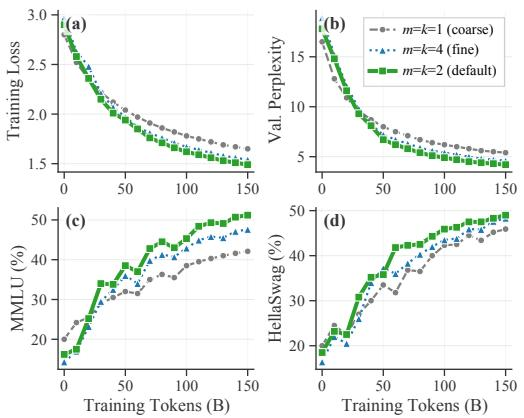

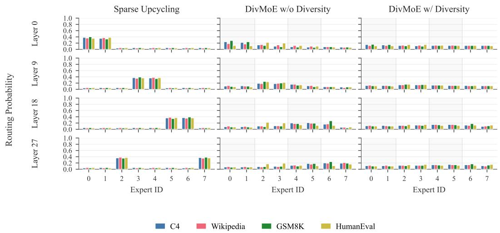  
Figure 3: Expert routing patterns across layers and datasets. Sparse Upcycling exhibits routing collapse with few experts dominating. DIVMOE without the constraint already shows improved utilization. With the constraint, routing is balanced across domain groups preserving dataset-specific preferences: GSM8K activates more math experts, while HumanEval activates more code experts.  
Figure 4: Effect of expert granularity (m = k) on Qwen3-1.7B-Base. Medium granularity $( m = k =$ 2) provides the best balance between training-loss reduction and downstream accuracy.

## 5.2 Routing Patterns

Figure 3 visualizes routing probabilities across experts for Sparse Upcycling, DIVMOE without the constraint, and full DIVMOE. Sparse Upcycling shows routing collapse in deeper layers (over 60% of tokens routed to two experts at layer 36). DIVMOE without the constraint already shows improved utilization due to domain-specialized initialization. With the constraint, routing is balanced across groups while preserving within-group specialization (Section 5.1).

## 5.3 Effect of Expert Granularity

We vary $m = k \in \{ 1 , 2 , 4 \}$ (Figure 4). Increasing granularity from 1 to 4 reduces training loss progressively, but $m = k = 4$ shows mild overfitting on MMLU/HellaSwag. We adopt $m = k = 2$ as the default, which balances capacity with generalization while keeping the active-parameter footprint at half of the dense base.

## 6 Conclusion

We presented DIVMOE, the first framework for fine-grained MoE upcycling that addresses the previously-unobservedfine-grained upcycling collapse pathology: combining fine-grained expert partitioning with single-source initialization causes downstream accuracy to drop to near-random, irrespective of the partitioning scheme. DIVMOE resolves this issue through three components: (i) domain-specialized fine-grained expert initialization, (ii) a hard diversity-constrained routing mechanism, and (iii) a public-corpus continual pre-training pipeline that no longer regresses below the dense base. Ablation studies demonstrate that the proposed components are complementary and jointly necessary for robust fine-grained upcycling. Across comprehensive experiments, DIVMOE consistently achieves the strongest overall performance. Notably, the structural constraint improves performance on every domain-specific benchmark we test, refuting the intuition that cross-domain co-activation should harm specialized tasks.

## Acknowledgments and Disclosure of Funding

Yang You’s research group is being sponsored by NUS startup grant (Presidential Young Professorship), Singapore MOE Tier-1 grant, ByteDance grant, ARCTIC grant, SMI grant and Alibaba grant. This work is also supported by NSF 2048280, 2325121, 2244760, 2331966 and ONR N0001423-1- 2300:P00001. Additionally, We thank the open-source community for releasing code and datasets that made this research possible.

## References

[1] Jacob Austin, Augustus Odena, Maxwell Nye, Maarten Bosma, Henryk Michalewski, David Dohan, Ellen Jiang, Carrie Cai, Michael Terry, Quoc Le, and Charles Sutton. Program synthesis with large language models, 2021. URL https://arxiv.org/abs/2108.07732.

[2] Mark Chen, Jerry Tworek, Heewoo Jun, Qiming Yuan, Henrique Ponde de Oliveira Pinto, Jared Kaplan, Harri Edwards, Yuri Burda, Nicholas Joseph, Greg Brockman, Alex Ray, Raul Puri, Gretchen Krueger, Michael Petrov, Heidy Khlaaf, Girish Sastry, Pamela Mishkin, Brooke Chan, Scott Gray, Nick Ryder, Mikhail Pavlov, Alethea Power, Lukasz Kaiser, Mohammad Bavarian, Clemens Winter, Philippe Tillet, Felipe Petroski Such, Dave Cummings, Matthias Plappert, Fotios Chantzis, Elizabeth Barnes, Ariel Herbert-Voss, William Hebgen Guss, Alex Nichol, Alex Paino, Nikolas Tezak, Jie Tang, Igor Babuschkin, Suchir Balaji, Shantanu Jain, William Saunders, Christopher Hesse, Andrew N. Carr, Jan Leike, Josh Achiam, Vedant Misra, Evan Morikawa, Alec Radford, Matthew Knight, Miles Brundage, Mira Murati, Katie Mayer, Peter Welinder, Bob McGrew, Dario Amodei, Sam McCandlish, Ilya Sutskever, and Wojciech Zaremba. Evaluating large language models trained on code, 2021. URL https: //arxiv.org/abs/2107.03374.

[3] Christopher Clark, Kenton Lee, Ming-Wei Chang, Tom Kwiatkowski, Michael Collins, and Kristina Toutanova. Boolq: Exploring the surprising difficulty of natural yes/no questions, 2019. URL https://arxiv.org/abs/1905.10044.

[4] Peter Clark, Isaac Cowhey, Oren Etzioni, Tushar Khot, Ashish Sabharwal, Carissa Schoenick, and Oyvind Tafjord. Think you have solved question answering? try arc, the ai2 reasoning challenge, 2018. URL https://arxiv.org/abs/1803.05457.

[5] Karl Cobbe, Vineet Kosaraju, Mohammad Bavarian, Mark Chen, Heewoo Jun, Lukasz Kaiser, Matthias Plappert, Jerry Tworek, Jacob Hilton, Reiichiro Nakano, Christopher Hesse, and John Schulman. Training verifiers to solve math word problems, 2021. URL https://arxiv.org/ abs/2110.14168.

[6] Damai Dai, Chengqi Deng, Chenggang Zhao, R. X. Xu, Huazuo Gao, Deli Chen, Jiashi Li, Wangding Zeng, Xingkai Yu, Y. Wu, Zhenda Xie, Y. K. Li, Panpan Huang, Fuli Luo, Chong Ruan, Zhifang Sui, and Wenfeng Liang. Deepseekmoe: Towards ultimate expert specialization in mixture-of-experts language models, 2024. URL https://arxiv.org/abs/2401.06066.

[7] DeepSeek-AI, Aixin Liu, Bei Feng, Bin Wang, Bingxuan Wang, Bo Liu, Chenggang Zhao, Chengqi Dengr, Chong Ruan, Damai Dai, Daya Guo, Dejian Yang, Deli Chen, Dongjie Ji, Erhang Li, Fangyun Lin, Fuli Luo, Guangbo Hao, Guanting Chen, Guowei Li, H. Zhang, Hanwei Xu, Hao Yang, Haowei Zhang, Honghui Ding, Huajian Xin, Huazuo Gao, Hui Li, Hui Qu, J. L. Cai, Jian Liang, Jianzhong Guo, Jiaqi Ni, Jiashi Li, Jin Chen, Jingyang Yuan, Junjie Qiu, Junxiao Song, Kai Dong, Kaige Gao, Kang Guan, Lean Wang, Lecong Zhang, Lei Xu, Leyi Xia, Liang Zhao, Liyue Zhang, Meng Li, Miaojun Wang, Mingchuan Zhang, Minghua Zhang, Minghui Tang, Mingming Li, Ning Tian, Panpan Huang, Peiyi Wang, Peng Zhang, Qihao Zhu, Qinyu Chen, Qiushi Du, R. J. Chen, R. L. Jin, Ruiqi Ge, Ruizhe Pan, Runxin Xu, Ruyi Chen, S. S. Li, Shanghao Lu, Shangyan Zhou, Shanhuang Chen, Shaoqing Wu, Shengfeng Ye, Shirong Ma, Shiyu Wang, Shuang Zhou, Shuiping Yu, Shunfeng Zhou, Size Zheng, T. Wang, Tian Pei, Tian Yuan, Tianyu Sun, W. L. Xiao, Wangding Zeng, Wei An, Wen Liu, Wenfeng Liang, Wenjun Gao, Wentao Zhang, X. Q. Li, Xiangyue Jin, Xianzu Wang, Xiao Bi, Xiaodong Liu, Xiaohan Wang, Xiaojin Shen, Xiaokang Chen, Xiaosha Chen, Xiaotao Nie, Xiaowen Sun, Xiaoxiang Wang, Xin Liu, Xin Xie, Xingkai Yu, Xinnan Song, Xinyi Zhou, Xinyu Yang, Xuan Lu, Xuecheng Su, Y. Wu, Y. K. Li, Y. X. Wei, Y. X. Zhu, Yanhong Xu, Yanping Huang, Yao Li, Yao Zhao, Yaofeng Sun, Yaohui Li, Yaohui Wang, Yi Zheng, Yichao Zhang, Yiliang Xiong, Yilong Zhao, Ying He, Ying Tang, Yishi Piao, Yixin Dong, Yixuan Tan, Yiyuan Liu, Yongji Wang, Yongqiang Guo, Yuchen Zhu, Yuduan Wang, Yuheng Zou, Yukun Zha, Yunxian Ma, Yuting Yan, Yuxiang You, Yuxuan Liu, Z. Z. Ren, Zehui Ren, Zhangli Sha, Zhe Fu, Zhen Huang, Zhen Zhang, Zhenda Xie, Zhewen Hao, Zhihong Shao, Zhiniu Wen, Zhipeng Xu, Zhongyu Zhang, Zhuoshu Li, Zihan Wang, Zihui Gu, Zilin Li, and Ziwei Xie. Deepseek-v2: A strong, economical, and efficient mixture-of-experts language model, 2024. URL https://arxiv.org/abs/2405.04434.

[8] William Fedus, Barret Zoph, and Noam Shazeer. Switch transformers: Scaling to trillion parameter models with simple and efficient sparsity, 2022. URL https://arxiv.org/abs/ 2101.03961.

[9] Andrew Gordon, Zornitsa Kozareva, and Melissa Roemmele. SemEval-2012 task 7: Choice of plausible alternatives: An evaluation of commonsense causal reasoning. In Eneko Agirre, Johan Bos, Mona Diab, Suresh Manandhar, Yuval Marton, and Deniz Yuret, editors, \*SEM 2012: The First Joint Conference on Lexical and Computational Semantics – Volume 1: Proceedings of the main conference and the shared task, and Volume 2: Proceedings ofthe Sixth International Workshop on Semantic Evaluation (SemEval 2012), pages 394–398, Montréal, Canada, 7-8 June 2012. Association for Computational Linguistics. URL https://aclanthology.org/ S12-1052/.

[10] Kshitij Gupta, Benjamin Thérien, Adam Ibrahim, Mats L. Richter, Quentin Anthony, Eugene Belilovsky, Irina Rish, and Timothée Lesort. Continual pre-training of large language models: How to (re)warm your model?, 2023. URL https://arxiv.org/abs/2308.04014.

[11] Ethan He, Abhinav Khattar, Ryan Prenger, Vijay Korthikanti, Zijie Yan, Tong Liu, Shiqing Fan, Ashwath Aithal, Mohammad Shoeybi, and Bryan Catanzaro. Upcycling large language models into mixture of experts, 2025. URL https://arxiv.org/abs/2410.07524.

[12] Dan Hendrycks, Collin Burns, Steven Basart, Andy Zou, Mantas Mazeika, Dawn Song, and Jacob Steinhardt. Measuring massive multitask language understanding, 2021. URL https: //arxiv.org/abs/2009.03300.

[13] Dan Hendrycks, Collin Burns, Saurav Kadavath, Akul Arora, Steven Basart, Eric Tang, Dawn Song, and Jacob Steinhardt. Measuring mathematical problem solving with the math dataset, 2021. URL https://arxiv.org/abs/2103.03874.

[14] Adam Ibrahim, Benjamin Thérien, Kshitij Gupta, Mats L. Richter, Quentin Anthony, Timothée Lesort, Eugene Belilovsky, and Irina Rish. Simple and scalable strategies to continually pre-train large language models, 2024. URL https://arxiv.org/abs/2403.08763.

[15] Robert A. Jacobs, Michael I. Jordan, Steven J. Nowlan, and Geoffrey E. Hinton. Adaptive mixtures of local experts. Neural Computation, 3(1):79–87, 03 1991. ISSN 0899-7667. doi: 10.1162/neco.1991.3.1.79. URL https://doi.org/10.1162/neco.1991.3.1.79.

[16] Sam Ade Jacobs, Masahiro Tanaka, Chengming Zhang, Minjia Zhang, Shuaiwen Leon Song, Samyam Rajbhandari, and Yuxiong He. Deepspeed ulysses: System optimizations for enabling training of extreme long sequence transformer models, 2023. URL https://arxiv.org/ abs/2309.14509.

[17] Albert Q. Jiang, Alexandre Sablayrolles, Antoine Roux, Arthur Mensch, Blanche Savary, Chris Bamford, Devendra Singh Chaplot, Diego de las Casas, Emma Bou Hanna, Florian Bressand, Gianna Lengyel, Guillaume Bour, Guillaume Lample, Lélio Renard Lavaud, Lucile Saulnier, Marie-Anne Lachaux, Pierre Stock, Sandeep Subramanian, Sophia Yang, Szymon Antoniak, Teven Le Scao, Théophile Gervet, Thibaut Lavril, Thomas Wang, Timothée Lacroix, and William El Sayed. Mixtral of experts, 2024. URL https://arxiv.org/abs/2401.04088.

[18] Michael I. Jordan and Robert A. Jacobs. Hierarchical mixtures of experts and the em algorithm. Neural Computation, 6(2):181–214, 1994. doi: 10.1162/neco.1994.6.2.181.

[19] Mandar Joshi, Eunsol Choi, Daniel S. Weld, and Luke Zettlemoyer. Triviaqa: A large scale distantly supervised challenge dataset for reading comprehension, 2017. URL https://arxiv. org/abs/1705.03551.

[20] Aran Komatsuzaki, Joan Puigcerver, James Lee-Thorp, Carlos Riquelme Ruiz, Basil Mustafa, Joshua Ainslie, Yi Tay, Mostafa Dehghani, and Neil Houlsby. Sparse upcycling: Training mixture-of-experts from dense checkpoints, 2023. URL https://arxiv.org/abs/2212. 05055.

[21] Nathan Lambert, Jacob Morrison, Valentina Pyatkin, Shengyi Huang, Hamish Ivison, Faeze Brahman, Lester James V. Miranda, Alisa Liu, Nouha Dziri, Shane Lyu, Yuling Gu, Saumya Malik, Victoria Graf, Jena D. Hwang, Jiangjiang Yang, Ronan Le Bras, Oyvind Tafjord, Chris Wilhelm, Luca Soldaini, Noah A. Smith, Yizhong Wang, Pradeep Dasigi, and Hannaneh Hajishirzi. Tulu 3: Pushing frontiers in open language model post-training, 2025. URL https://arxiv.org/abs/2411.15124.

[22] Dmitry Lepikhin, HyoukJoong Lee, Yuanzhong Xu, Dehao Chen, Orhan Firat, Yanping Huang, Maxim Krikun, Noam Shazeer, and Zhifeng Chen. Gshard: Scaling giant models with conditional computation and automatic sharding, 2020. URL https://arxiv.org/abs/2006. 16668.

[23] Margaret Li, Suchin Gururangan, Tim Dettmers, Mike Lewis, Tim Althoff, Noah A. Smith, and Luke Zettlemoyer. Branch-train-merge: Embarrassingly parallel training of expert language models, 2022. URL https://arxiv.org/abs/2208.03306.

[24] Todor Mihaylov, Peter Clark, Tushar Khot, and Ashish Sabharwal. Can a suit of armor conduct electricity? a new dataset for open book question answering, 2018. URL https: //arxiv.org/abs/1809.02789.

[25] Niklas Muennighoff, Luca Soldaini, Dirk Groeneveld, Kyle Lo, Jacob Morrison, Sewon Min, Weijia Shi, Pete Walsh, Oyvind Tafjord, Nathan Lambert, Yuling Gu, Shane Arora, Akshita Bhagia, Dustin Schwenk, David Wadden, Alexander Wettig, Binyuan Hui, Tim Dettmers, Douwe Kiela, Ali Farhadi, Noah A. Smith, Pang Wei Koh, Amanpreet Singh, and Hannaneh Hajishirzi. Olmoe: Open mixture-of-experts language models, 2025. URL https://arxiv. org/abs/2409.02060.

[26] Taishi Nakamura, Takuya Akiba, Kazuki Fujii, Yusuke Oda, Rio Yokota, and Jun Suzuki. Drop-upcycling: Training sparse mixture of experts with partial re-initialization, 2025. URL https://arxiv.org/abs/2502.19261.

[27] OLMo Team, Pete Walsh, Luca Soldaini, Dirk Groeneveld, Kyle Lo, Shane Arora, Akshita Bhagia, Yuling Gu, Shengyi Huang, Matt Jordan, Nathan Lambert, Dustin Schwenk, Oyvind Tafjord, Taira Anderson, David Atkinson, Faeze Brahman, Christopher Clark, Pradeep Dasigi, Nouha Dziri, Michal Guerquin, Hamish Ivison, Pang Wei Koh, Jiacheng Liu, Saumya Malik, William Merrill, Lester James V. Miranda, Jacob Morrison, Tyler Murray, Crystal Nam, Valentina Pyatkin, Aman Rangapur, Michael Schmitz, Sam Skjonsberg, David Wadden, Christopher Wilhelm, Michael Wilson, Luke Zettlemoyer, Ali Farhadi, Noah A. Smith, and Hannaneh Hajishirzi. 2 OLMo 2 Furious, 2025. URL https://arxiv.org/abs/2501.00656.

[28] Pranav Rajpurkar, Robin Jia, and Percy Liang. Know what you don’t know: Unanswerable questions for squad, 2018. URL https://arxiv.org/abs/1806.03822.

[29] David Rein, Betty Li Hou, Asa Cooper Stickland, Jackson Petty, Richard Yuanzhe Pang, Julien Dirani, Julian Michael, and Samuel R. Bowman. Gpqa: A graduate-level google-proof q&a benchmark, 2023. URL https://arxiv.org/abs/2311.12022.

[30] Noam Shazeer, Azalia Mirhoseini, Krzysztof Maziarz, Andy Davis, Quoc Le, Geoffrey Hinton, and Jeff Dean. Outrageously large neural networks: The sparsely-gated mixture-of-experts layer, 2017. URL https://arxiv.org/abs/1701.06538.

[31] Weijia Shi, Akshita Bhagia, Kevin Farhat, Niklas Muennighoff, Pete Walsh, Jacob Morrison, Dustin Schwenk, Shayne Longpre, Jake Poznanski, Allyson Ettinger, Daogao Liu, Margaret Li, Mike Lewis, Wen tau Yih, Dirk Groeneveld, Luca Soldaini, Kyle Lo, Noah A. Smith, Luke Zettlemoyer, Pang Wei Koh, Hannaneh Hajishirzi, Ali Farhadi, and Sewon Min. FlexOLMo: Open language models for flexible data use, 2025. URL https://arxiv.org/abs/2507. 07024.

[32] Luca Soldaini, Rodney Kinney, Akshita Bhagia, Dustin Schwenk, David Atkinson, Russell Authur, Ben Bogin, Khyathi Chandu, Jennifer Dumas, Yanai Elazar, Valentin Hofmann, Ananya Harsh Jha, Sachin Kumar, Li Lucy, Xinxi Lyu, Nathan Lambert, Ian Magnusson, Jacob Morrison, Niklas Muennighoff, Aakanksha Naik, Crystal Nam, Matthew E. Peters, Abhilasha Ravichander, Kyle Richardson, Zejiang Shen, Emma Strubell, Nishant Subramani, Oyvind Tafjord, Pete Walsh, Luke Zettlemoyer, Noah A. Smith, Hannaneh Hajishirzi, Iz Beltagy, Dirk Groeneveld, Jesse Dodge, and Kyle Lo. Dolma: an open corpus of three trillion tokens for language model pretraining research, 2024. URL https://arxiv.org/abs/2402.00159.

[33] Sainbayar Sukhbaatar, Olga Golovneva, Vasu Sharma, Hu Xu, Xi Victoria Lin, Baptiste Rozière, Jacob Kahn, Daniel Li, Wen tau Yih, Jason Weston, and Xian Li. Branch-train-mix: Mixing ex pert llms into a mixture-of-experts llm, 2024. URL https://arxiv.org/abs/2403.07816.

[34] Lintang Sutawika, Hailey Schoelkopf, Leo Gao, Baber Abbasi, Stella Biderman, Jonathan Tow, Charles Lovering, Jason Phang, Anish Thite, Thomas Wang, et al. Eleutherai/lm-evaluationharness: v0. 4.9. Zenodo, 2025. doi: 10.5281/zenodo.15699229. URL https://ui.adsabs. harvard.edu/abs/2025zndo..15699229S.

[35] Mirac Suzgun, Nathan Scales, Nathanael Schärli, Sebastian Gehrmann, Yi Tay, Hyung Won Chung, Aakanksha Chowdhery, Quoc V. Le, Ed H. Chi, Denny Zhou, and Jason Wei. Challenging BIG-bench tasks and whether chain-of-thought can solve them, 2022. URL https://arxiv.org/abs/2210.09261.

[36] An Yang, Anfeng Li, Baosong Yang, Beichen Zhang, Binyuan Hui, Bo Zheng, Bowen Yu, Chang Gao, Chengen Huang, Chenxu Lv, et al. Qwen3 technical report. arXiv preprint arXiv:2505.09388, 2025.

[37] Rowan Zellers, Ari Holtzman, Yonatan Bisk, Ali Farhadi, and Yejin Choi. Hellaswag: Can a machine really finish your sentence?, 2019. URL https://arxiv.org/abs/1905.07830.

[38] Danyang Zhang, Junhao Song, Ziqian Bi, Xinyuan Song, Yingfang Yuan, Tianyang Wang, Joe Yeong, and Junfeng Hao. Mixture of experts in large language models, 2025. URL https://arxiv.org/abs/2507.11181.

[39] Yanqi Zhou, Tao Lei, Hanxiao Liu, Nan Du, Yanping Huang, Vincent Zhao, Andrew Dai, Zhifeng Chen, Quoc Le, and James Laudon. Mixture-of-experts with expert choice routing, 2022. URL https://arxiv.org/abs/2202.09368.

[40] Barret Zoph, Irwan Bello, Sameer Kumar, Nan Du, Yanping Huang, Jeff Dean, Noam Shazeer, and William Fedus. ST-MoE: Designing stable and transferable sparse expert models, 2022. URL https://arxiv.org/abs/2202.08906.

## A Limitations and Future Work

Our experiments use base models up to 4B parameters, yielding MoE models up to 12B; scaling to 7B-13B base models is an important direction. Our domain partition is fixed to four broad domains; learning the partition end-to-end is left to future work. Finally, DIVMOE requires an additional 40B Stage-1 token budget per base model, an 8% overhead relative to from-scratch training, which is small in absolute terms but non-trivial for very-large-scale settings.

## B Implementation Details

## B.1 Model Architecture

Table 7 summarizes the architecture configurations for each base model. All DIVMOE variants use $n = 4$ domain groups, m = 2 experts per group $( N = 8 \mathrm { t o t a l } )$ , and $k = 2$ active experts per token.

Table 7: Model architecture configurations. DIVMOE parameters are derived from each base model with expansion factor $n = 4 .$
<table><tr><td>Configuration</td><td>Qwen3-4B</td><td>Qwen3-1.7B</td><td>Llama3.2-1B</td></tr><tr><td>Hidden size</td><td>2560</td><td>2048</td><td>2048</td></tr><tr><td>FFN intermediate size</td><td>6912</td><td>5632</td><td>8192</td></tr><tr><td>Num layers</td><td>36</td><td>28</td><td>16</td></tr><tr><td>Num attention heads</td><td>32</td><td>16</td><td>32</td></tr><tr><td>Num KV heads</td><td>4</td><td>4</td><td>8</td></tr><tr><td>Vocab size</td><td>151,936</td><td>151,936</td><td>128,256</td></tr><tr><td></td><td>DIvMoE Configuration</td><td></td><td></td></tr><tr><td>Domain groups (n)</td><td>4</td><td>4</td><td>4</td></tr><tr><td>Experts per group (m)</td><td>2</td><td>2</td><td>2</td></tr><tr><td>Total experts (N)</td><td>8</td><td>8</td><td>8</td></tr><tr><td>Active experts (k)</td><td>2</td><td>2</td><td>2</td></tr><tr><td>Expert FFN dim</td><td>3456</td><td>2816</td><td>4096</td></tr><tr><td>Dense params</td><td>4B</td><td>1.7B</td><td>1B</td></tr><tr><td>Total MoE params</td><td>12B</td><td>5.4B</td><td>3.2B</td></tr><tr><td>Active params</td><td>3.6B</td><td>2.4B</td><td>1.8B</td></tr></table>

## B.2 Training Pipeline Details

This section expands Section 3.3 with full descriptions of each pipeline stage. Throughout, we use only public corpora so all results are independently reproducible.

Stage 1: Domain-specialist initialization (40B tokens). We continually pre-train four copies of the base model (next-token-prediction loss on full sequences, not instruction-style SFT) on domainspecific subsets of public pre-training corpora, producing $\mathcal { M } _ { \mathrm { m a t h } } , \mathcal { M } _ { \mathrm { c o d e } } , \mathcal { M } _ { \mathrm { s c i e n c e } } , \mathcal { M } _ { \mathrm { c o m m o n } }$ . We use the per-domain partitions of Dolmino-Mix [27]—specifically its math, code, academic, and web subsets—which jointly cover the four target domains. Each specialist sees 10B tokens (40B total). This is the only stage where the base model weights are updated as a dense model; subsequent stages train the assembled MoE.

Stage 2: Continual pre-training of the assembled MoE (500B tokens). After constructing the DIVMOE architecture (Section 3.1), we continually pre-train the entire MoE on allenai/dolma3\_dolmino\_mix-100B-1025 [27, 32], a high-quality public mid-training corpus, for 500B tokens. This stage adapts the model to sparse computation, learns the router weights, and enables cross-expert collaboration. Crucially, this is the same corpus, hyperparameters, and step count used for every upcycling baseline, ensuring controlled comparison.

Stage 3: Supervised fine-tuning (used only for the open-source MoE comparison). For the comparison against open-source MoE checkpoints in Section 4.3, we additionally fine-tune DIVMOE on Tülu-3-SFT-Mixture [21], a public reasoning-and-instruction mixture, with sequence length 16,384. To isolate architectural effects from data effects, we apply the same Stage 3 SFT to the strongest baseline (NVIDIA Upcycling) and to OLMoE; the controlled comparison is reported in Table 4.

No private data. The pipeline uses only the dense base checkpoints, Dolmino-Mix-1124, and Tülu-3-SFT-Mixture, all of which are publicly available; we release the slicing and routing code together with the per-domain Dolmino-Mix splits.

## B.3 Training Hyperparameters

Table 8 details the hyperparameters for each stage. All experiments use AdamW $( \beta _ { 1 } = 0 . 9 , \beta _ { 2 } =$ 0.95) with bf16 mixed precision and global batch size of 2M tokens.

Table 8: Training hyperparameters by stage.
<table><tr><td>Hyperparameter</td><td>Stage 1 Domain CPT</td><td>Stage 2 Joint CPT</td><td>Stage 3 SFT</td></tr><tr><td>Learning rate</td><td> $5 \times 1 0 ^ { - 5 }$ </td><td> $5 \times 1 0 ^ { - 4 }$ </td><td> $2 \times 1 0 ^ { - 5 }$ </td></tr><tr><td>Min learning rate</td><td> $5 \times 1 0 ^ { - 6 }$ </td><td> $5 \times 1 0 ^ { - 5 }$ </td><td> $2 \times 1 0 ^ { - 6 }$ </td></tr><tr><td>LR scheduler</td><td>Cosine</td><td>Cosine</td><td>Cosine</td></tr><tr><td>Warmup steps</td><td>50</td><td>256</td><td>500</td></tr><tr><td>Weight decay</td><td>0.1</td><td>0.1</td><td>0.1</td></tr><tr><td>Sequence length</td><td>4,096</td><td>4,096</td><td>16,384</td></tr><tr><td>Training tokens</td><td>10B per domain (40B total)</td><td>500B</td><td></td></tr><tr><td>Gradient checkpointing</td><td>√</td><td>√</td><td>√</td></tr></table>

For Stage 3 with long sequences, we use DeepSpeed Ulysses [16] sequence parallelism (factor 4) and CPU offloading of optimizer states.

## B.4 Compute Budget

Table 9 compares compute budgets across methods. DIVMOE and BTX share identical total compute (540B tokens; the additional 40B Stage-1 tokens are dense-model compute, substantially cheaper per-token than MoE training).

Table 9: Per-method compute. GPU-hours measured on NVIDIA H20 (80GB), Qwen3-1.7B-Base.
<table><tr><td>Method</td><td>Stage-1 Tokens</td><td>Stage-2 Tokens</td><td>Total</td><td>GPU-hours</td></tr><tr><td>From Scratch</td><td>0</td><td>500B (MoE)</td><td>500B</td><td>~26,500</td></tr><tr><td>Sparse Upcycling</td><td>0</td><td>500B (MoE)</td><td>500B</td><td>~26,500</td></tr><tr><td>BTX</td><td>40B (dense)</td><td>500B (MoE)</td><td>540B</td><td>~28,800</td></tr><tr><td>NVIDIA Upcycling</td><td>0</td><td>500B (MoE)</td><td>500B</td><td>~26,500</td></tr><tr><td>Drop-Upcycling</td><td>0</td><td>500B (MoE)</td><td>500B</td><td>~26,500</td></tr><tr><td>DIvMoE</td><td>40B (dense)</td><td>500B (MoE)</td><td>540B</td><td>~28,800</td></tr></table>

## B.5 Evaluation Configuration

We evaluate using LM Evaluation Harness [34] with greedy decoding (temperature 0) for generative tasks and likelihood-based scoring for multiple-choice tasks. Table 10 lists the format and shot count for each benchmark.

## C Full Upcycling Results (15 Benchmarks)

Tables 11 and 12 report the complete 15-benchmark upcycling comparison underlying the abridged Tables 2 and 3 in the main paper. We additionally include reference rows for the dense base model, the four individual domain specialists, and a data-matched dense baseline (the dense base continually

Table 10: Evaluation format and shot count per benchmark.
<table><tr><td>Benchmark</td><td>Format</td><td>Shots</td></tr><tr><td>ARC-Challenge</td><td>Likelihood</td><td>25</td></tr><tr><td>ARC-Easy</td><td>Likelihood</td><td>25</td></tr><tr><td>BoolQ</td><td>Likelihood</td><td>0</td></tr><tr><td>COPA</td><td>Likelihood</td><td>0</td></tr><tr><td>MMLU</td><td>Likelihood</td><td>5</td></tr><tr><td>OpenBookQA</td><td>Likelihood</td><td>0</td></tr><tr><td>TriviaQA</td><td>Generative</td><td>5</td></tr><tr><td>HellaSwag</td><td>Likelihood</td><td>10</td></tr><tr><td>SQuAD2</td><td>Generative</td><td>1</td></tr><tr><td>HumanEval</td><td>Generative</td><td>0</td></tr><tr><td>MBPP</td><td>Generative</td><td>3</td></tr><tr><td>GSM8K</td><td>Generative</td><td>8</td></tr><tr><td>MATH</td><td>Generative</td><td>4</td></tr><tr><td>GPQA</td><td>Likelihood</td><td>0</td></tr><tr><td></td><td></td><td></td></tr><tr><td>BBH</td><td>Generative</td><td>3</td></tr></table>

pre-trained on the same 540B tokens, no MoE conversion). These rows isolate the effect of the MoE architecture from the effect of the additional CPT data.

Table 11: Full upcycling comparison on Qwen3-1.7B-Base after 500B Stage 2 CPT tokens (540B for BTX and DIVMOE, including Stage 1). Best across upcycling methods in bold; reference rows (above the rule) provide context. F.G. denotes fine-grained partitioning.
<table><tr><td>Method</td><td>E.G.</td><td>|ARC-c</td><td>ARC-e</td><td>BoolQ</td><td>COPA</td><td>MMLU</td><td>OBQA</td><td>TriviaQ</td><td>HellaS.</td><td>SQuAD2</td><td>GSM8K</td><td>MATH</td><td>HumanE.</td><td>MBPP</td><td>GPQA</td><td>BBH | Avg.</td><td></td></tr><tr><td colspan="10">Reference rows (not upcycling baselines)</td><td></td><td></td><td></td><td></td><td></td><td></td><td></td><td></td></tr><tr><td>Qwen3-1.7B-Base</td><td></td><td>43.2</td><td>72.4</td><td>72.8</td><td>76.0</td><td>62.6</td><td>38.6</td><td>48.5</td><td>63.2</td><td>32.5</td><td>65.8</td><td>38.4</td><td>46.5</td><td>54.8</td><td>26.5</td><td>53.5</td><td>53.0</td></tr><tr><td>Math specialist</td><td></td><td>39.8</td><td>60.5</td><td>64.8</td><td>68.2</td><td>59.5</td><td>34.2</td><td>37.8</td><td>56.5</td><td>25.8</td><td>76.2</td><td>48.5</td><td>40.3</td><td>47.5</td><td>27.8</td><td>49.6</td><td>49.1</td></tr><tr><td>Code specialist</td><td></td><td>36.5</td><td>55.2</td><td>60.4</td><td>64.8</td><td>54.1</td><td>32.5</td><td>34.8</td><td>53.8</td><td>23.5</td><td>52.4</td><td>30.5</td><td>57.8</td><td>61.5</td><td>24.2</td><td>44.3</td><td>45.8</td></tr><tr><td>Science specialist</td><td></td><td>46.8</td><td>73.2</td><td>70.5</td><td>73.8</td><td>61.8</td><td>42.5</td><td>44.2</td><td>61.5</td><td>30.2</td><td>60.5</td><td>37.2</td><td>39.5</td><td>48.3</td><td>31.8</td><td>52.6</td><td>51.6</td></tr><tr><td>Commonsense specialist Dense baseline (same data)</td><td></td><td>42.2</td><td>68.5</td><td>76.2</td><td>80.5</td><td>59.2</td><td>40.8</td><td>46.5</td><td>66.2</td><td>33.5</td><td>55.3</td><td>33.8</td><td>37.2</td><td>46.1</td><td>25.0</td><td>54.8</td><td>51.1 53.4</td></tr><tr><td></td><td></td><td>44.0</td><td>73.1</td><td>73.4</td><td>76.3</td><td>63.2</td><td>39.0</td><td>48.8</td><td>63.0</td><td>32.7</td><td>66.0</td><td>38.7</td><td>47.0</td><td>55.4</td><td>26.8</td><td>53.8</td><td></td></tr><tr><td colspan="10">Upcycling methods</td><td></td><td></td><td></td><td></td><td></td><td></td><td></td><td></td></tr><tr><td>From Scratch</td><td>√×</td><td>12.2</td><td>22.0</td><td>30.5</td><td>38.7</td><td>40.5</td><td>27.0</td><td>33.0</td><td>42.5</td><td>17.2</td><td>5.5</td><td>2.3</td><td>6.8</td><td>11.2</td><td>22.6</td><td>20.5</td><td>22.2</td></tr><tr><td>Sparse Upcycling</td><td></td><td>38.5</td><td>62.8</td><td>60.2</td><td>65.4</td><td>56.8</td><td>35.0</td><td>43.5</td><td>54.5</td><td>27.0</td><td>56.5</td><td>28.5</td><td>38.0</td><td>47.5</td><td>24.5</td><td>47.5</td><td>45.7</td></tr><tr><td>BTX</td><td>x</td><td>43.0</td><td>70.5</td><td>71.0</td><td>74.0</td><td>61.5</td><td>39.5</td><td>47.5</td><td>61.0</td><td>30.5</td><td>64.0</td><td>36.5</td><td>44.0</td><td>53.0</td><td>26.0</td><td>51.5</td><td>51.6</td></tr><tr><td>NVIDIA Upcycling</td><td>√</td><td>42.5</td><td>69.5</td><td>70.5</td><td>73.0</td><td>61.5</td><td>38.5</td><td>47.5</td><td>60.5</td><td>30.0</td><td>62.5</td><td>35.5</td><td>44.5</td><td>53.5</td><td>25.8</td><td>51.0</td><td>51.1 50.2</td></tr><tr><td>Drop-Upcycling</td><td>x</td><td>41.5 14.5</td><td>69.0</td><td>71.5</td><td>75.0</td><td>61.0</td><td>37.0</td><td>47.0 33.5</td><td>59.5 41.5</td><td>31.5 17.5</td><td>60.0 7.0</td><td>33.5 3.5</td><td>41.0 7.8</td><td>50.5 12.5</td><td>25.0 22.5</td><td>50.0 22.0</td><td>23.2</td></tr><tr><td>Drop-Upcycling-f DIvMoE</td><td>√</td><td>45.0</td><td>24.5</td><td>32.5</td><td>41.5 78.0</td><td>42.0</td><td>26.0</td><td>50.0</td><td>63.5</td><td></td><td>68.5</td><td>40.5</td><td>49.0</td><td>57.5</td><td>28.0</td><td>55.5</td><td>55.6</td></tr><tr><td></td><td>√</td><td></td><td>73.5</td><td>75.0</td><td></td><td>64.5</td><td>42.0</td><td></td><td></td><td>33.5</td><td></td><td></td><td></td><td></td><td></td><td></td><td></td></tr></table>

Table 12: Full upcycling comparison on Llama3.2-1B after 500B Stage 2 CPT tokens (540B for BTX and DIVMOE). Same conventions as Table 11.
<table><tr><td>Method</td><td>E.G. |</td><td>|ARC-c</td><td>ARC-e</td><td>BoolQ</td><td>COPA</td><td>MMLU</td><td>OBQA</td><td>TriviaQ</td><td>HellaS.</td><td>SQuAD2</td><td>GSM8K</td><td>MATH</td><td>HumanE.</td><td>MBPP</td><td>GPQA</td><td>BBH|</td><td>|Avg.</td></tr><tr><td>Llama3.2-1B (ref.)</td><td>一</td><td>34.8</td><td>63.5</td><td>65.2</td><td>68.0</td><td>49.3</td><td>32.4</td><td>38.5</td><td>55.2</td><td>28.5</td><td>28.5</td><td>10.2</td><td>16.5</td><td>23.8</td><td>24.8</td><td>32.4</td><td>38.1</td></tr><tr><td>Dense baseline (same data)</td><td>一</td><td>35.2</td><td>63.8</td><td>65.7</td><td>68.5</td><td>50.0</td><td>32.8</td><td>39.0</td><td>55.4</td><td>28.8</td><td>29.0</td><td>10.5</td><td>17.0</td><td>24.2</td><td>24.9</td><td>32.7</td><td>38.5</td></tr><tr><td>From Scratch</td><td>√</td><td>13.0</td><td>22.5</td><td>27.5</td><td>32.0</td><td>38.0</td><td>23.0</td><td>31.0</td><td>36.0</td><td>17.5</td><td>4.0</td><td>1.5</td><td>4.5</td><td>8.0</td><td>21.8</td><td>18.0</td><td>19.9</td></tr><tr><td>Sparse Upcycling</td><td>x</td><td>33.5</td><td>56.0</td><td>60.5</td><td>65.0</td><td>48.0</td><td>30.5</td><td>39.5</td><td>52.5</td><td>26.5</td><td>26.5</td><td>9.0</td><td>15.0</td><td>21.5</td><td>23.5</td><td>31.5</td><td>35.9</td></tr><tr><td>BTX</td><td>x</td><td>36.0</td><td>64.5</td><td>66.0</td><td>69.0</td><td>50.5</td><td>33.0</td><td>39.5</td><td>56.0</td><td>29.0</td><td>31.5</td><td>11.0</td><td>17.5</td><td>24.5</td><td>25.0</td><td>33.0</td><td>39.1</td></tr><tr><td>NVIDIA Upcycling</td><td>√</td><td>36.0</td><td>64.0</td><td>65.5</td><td>68.5</td><td>50.0</td><td>33.0</td><td>39.0</td><td>55.5</td><td>28.5</td><td>30.5</td><td>10.8</td><td>17.0</td><td>24.0</td><td>24.8</td><td>32.8</td><td>38.7</td></tr><tr><td>Drop-Upcycling</td><td>x</td><td>35.0</td><td>63.5</td><td>66.0</td><td>69.0</td><td>49.5</td><td>32.5</td><td>39.0</td><td>55.0</td><td>28.0</td><td>29.5</td><td>10.5</td><td>16.5</td><td>23.5</td><td>24.5</td><td>32.5</td><td>38.3</td></tr><tr><td>Drop-Upcycling-f</td><td>√</td><td>25.5</td><td>28.5</td><td>33.0</td><td>36.0</td><td>43.5</td><td>24.5</td><td>38.0</td><td>39.5</td><td>17.0</td><td>6.0</td><td>2.5</td><td>6.0</td><td>9.5</td><td>21.5</td><td>19.0</td><td>23.3</td></tr><tr><td>DIvMoE</td><td>√</td><td>37.5</td><td>65.5</td><td>67.5</td><td>70.0</td><td>52.5</td><td>34.5</td><td>42.0</td><td>56.5</td><td>30.0</td><td>34.5</td><td>13.5</td><td>20.0</td><td>27.0</td><td>26.0</td><td>34.5</td><td>40.8</td></tr></table>

## D Full Open-Source MoE Comparison (8 Benchmarks)

Table 13 reports the full 8-benchmark comparison underlying the abridged Table 4 in the main paper, additionally including ARC-Easy. The 8-benchmark average (DIVMOE 64.5, Moonlight-MoE 64.5) is the figure cited in the abstract.

## E Attention Layer Initialization Ablation

We compare three attention initialization strategies for the non-expert components (Equation (6)).   
Mean initialization—averaging the base model and all specialists—is the default.

From Scratch Sparse Upcycling BTM NVIDIA Upcycling Drop-Upcycling DivMoE  
Table 13: Comparison with open-source MoE models on the full 8-benchmark set. Same conventions as Table 4.
<table><tr><td>Model</td><td>Size</td><td>ARC-c</td><td>ARC-e</td><td>MMLU</td><td>TriviaQA</td><td>HumanE.</td><td>MBPP</td><td>GSM8K</td><td>MATH</td><td>Avg.</td></tr><tr><td>OLMoE</td><td>1B/7B</td><td>49.2</td><td>76.9</td><td>51.9</td><td>60.4</td><td>51.8</td><td>61.2</td><td>45.5</td><td>23.9</td><td>52.6</td></tr><tr><td>OLMoE + Tülu-3 SFT</td><td>1B/7B</td><td>52.4</td><td>77.2</td><td>55.8</td><td>63.5</td><td>53.5</td><td>62.8</td><td>56.8</td><td>31.2</td><td>56.7</td></tr><tr><td>DeepSeek-V2-Lite</td><td>2.4B/16B</td><td>52.1</td><td>70.3</td><td>58.3</td><td>65.1</td><td>29.9</td><td>43.2</td><td>41.1</td><td>17.1</td><td>47.1</td></tr><tr><td>NVÍDIA Up. + Tülu-3 SFT</td><td>2.4B/5.4B</td><td>56.3</td><td>73.8</td><td>64.2</td><td>67.5</td><td>45.8</td><td>54.2</td><td>66.5</td><td>38.8</td><td>58.4</td></tr><tr><td>Moonlight-MoE</td><td>2.4B/16B</td><td>65.5</td><td>79.3</td><td>70.0</td><td>66.3</td><td>48.1</td><td>63.8</td><td>77.4</td><td>45.3</td><td>64.5</td></tr><tr><td>DIvMoE</td><td>3.6B/12B</td><td>63.1</td><td>75.0</td><td>71.5</td><td>73.3</td><td>51.4</td><td>60.0</td><td>74.4</td><td>47.5</td><td>64.5</td></tr></table>

Table 14: Attention initialization ablation on Qwen3-1.7B-Base after 500B Stage-2 CPT. Avg. is over the 9 general-knowledge benchmarks for direct comparability with prior reports.
<table><tr><td>Initialization</td><td>ARC-c</td><td>MMLU</td><td>HellaSwag</td><td>Avg. (9 bm.)</td></tr><tr><td>Mean of base + all specialists (default)</td><td>45.0</td><td>64.5</td><td>63.5</td><td>58.3</td></tr><tr><td>Base model only</td><td>44.5</td><td>64.0</td><td>63.2</td><td>57.9</td></tr><tr><td>Random specialist selection</td><td>43.5</td><td>63.0</td><td>62.5</td><td>57.0</td></tr></table>

Key takeaways. The default mean initialization is the best of the three, with the base-only variant trailing by 0.4 points. Random per-layer specialist selection performs worst (−1.3). The modest spread between mean and base-only confirms that the primary driver of DIVMOE’s advantage is the FFN expert initialization, not the attention layer; mean initialization contributes a small but consistent boost.

## F Learning Dynamics

Figure 5 shows training loss, validation perplexity, and average downstream accuracy across Stage 2 CPT for Qwen3-1.7B-Base and Llama3.2-1B. Table 15 extends the comparison to 300B and 500B tokens for the strongest baselines. Token-by-token tabulations are deferred to Section G.

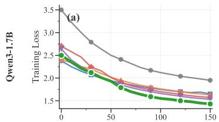

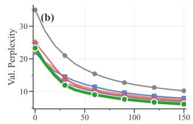

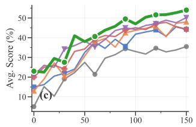

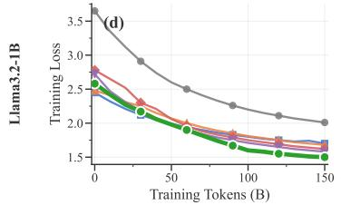

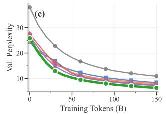

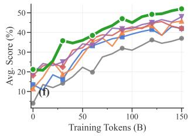  
Figure 5: Stage 2 learning dynamics. DIVMOE achieves lower training loss and validation perplexity throughout training and converges to higher downstream performance, on both Qwen3-1.7B (top) and Llama3.2-1B (bottom).

Sustained advantage. DIVMOE leads at every checkpoint. The gap to NVIDIA Upcycling is 4.5 points at 150B and 4.5 at 500B; the absolute advantage is sustained throughout training, supporting the conclusion that the architectural benefits do not vanish with additional data.

Table 15: Average accuracy (15 benchmarks) on Qwen3-1.7B-Base at extended checkpoints. DI-VMOE’s advantage is sustained: gaps narrow only mildly between 150B and 500B, indicating an architectural rather than initialization-only benefit.
<table><tr><td>Method</td><td>@150B</td><td>@300B</td><td>@500B</td></tr><tr><td>NVIDIA Upcycling</td><td>47.5</td><td>49.5</td><td>51.1</td></tr><tr><td>Drop-Upcycling</td><td>46.5</td><td>48.5</td><td>50.2</td></tr><tr><td>DIvMoE</td><td>52.0</td><td>54.0</td><td>55.6</td></tr></table>

## G Extended Learning Dynamics

Tables 16 and 17 report training loss, validation perplexity, and average downstream accuracy at 10B-token intervals during Stage 2 CPT. Best (lowest loss/PPL, highest accuracy) per checkpoint in bold.

Table 16: Learning dynamics for Qwen3-1.7B-Base. Values reported at 10B-token intervals.
<table><tr><td>Tokens (B)</td><td>0</td><td>10</td><td>20</td><td>30</td><td>40</td><td>50 60</td><td>70</td><td>80</td><td>90</td><td>100</td><td>110</td><td>120</td><td>130</td><td>140</td><td>150</td></tr><tr><td colspan="10">Training Loss</td><td></td><td></td><td></td><td></td><td></td><td></td><td></td></tr><tr><td>From Scratch</td><td>3.50</td><td>3.23</td><td>3.00</td><td>2.79</td><td>2.64</td><td>2.50</td><td>2.41 2.32</td><td>2.23</td><td>2.17</td><td>2.12</td><td>2.08</td><td>2.04</td><td>2.01</td><td>1.98</td><td>1.95</td></tr><tr><td>Sparse Upcycling BTX</td><td>2.38</td><td>2.25</td><td>2.15</td><td>2.07</td><td>2.00 1.94</td><td>1.89</td><td>1.85</td><td>1.81</td><td>1.78</td><td>1.75</td><td>1.72</td><td>1.70</td><td>1.68</td><td>1.69</td><td>1.65</td></tr><tr><td></td><td>2.40</td><td>2.34</td><td>2.25</td><td>2.20 2.10</td><td>2.02</td><td>1.95</td><td>1.89</td><td>1.84</td><td>1.80</td><td>1.76</td><td>1.73</td><td>1.70</td><td>1.67</td><td>1.65</td><td>1.63</td></tr><tr><td>NVIDIA Upcycling</td><td>2.70</td><td>2.58</td><td>2.46</td><td>2.24</td><td>2.16 2.01</td><td></td><td>1.91 1.83</td><td>1.78</td><td>1.74</td><td>1.70</td><td>1.67</td><td>1.64</td><td>1.61</td><td>1.59</td><td>1.57</td></tr><tr><td>Drop-Upcycling DIvMoE</td><td>2.64</td><td>2.40</td><td>2.25</td><td>2.13</td><td>2.02</td><td>1.92</td><td>1.85 1.79</td><td>1.74</td><td>1.70</td><td>1.66</td><td>1.63</td><td>1.60</td><td>1.57</td><td>1.55</td><td>1.53</td></tr><tr><td></td><td>2.50</td><td>2.35</td><td>2.21</td><td>2.12</td><td>2.01</td><td>1.93</td><td>1.79 1.70</td><td>1.64</td><td>1.59</td><td>1.55</td><td>1.53</td><td>1.50</td><td>1.48</td><td>1.45</td><td>1.43</td></tr><tr><td colspan="10">Validation Perplexity</td><td></td><td></td><td></td><td></td><td></td><td></td><td></td></tr><tr><td colspan="10">From Scratch 28.5 24.0 21.0</td><td></td><td>12.1</td><td>11.6</td><td>11.2</td><td>10.8</td><td>10.5 10.2</td></tr><tr><td>Sparse Upcycling</td><td>35.0 22.0</td><td>18.5</td><td>16.2 14.5</td><td>13.2</td><td>18.5 16.8 12.2</td><td>15.4 14.3 11.4</td><td>10.7</td><td>13.4 10.1</td><td>12.7 9.6</td><td>9.2</td><td>8.9</td><td>8.6</td><td>8.3</td><td>8.1</td><td>7.9</td></tr><tr><td>BTX</td><td>22.5</td><td>19.0</td><td>17.0 13.9</td><td>12.3</td><td>11.4</td><td>10.6</td><td>10.0</td><td>9.5</td><td>9.1</td><td>8.7</td><td>8.4</td><td>8.1</td><td>7.9</td><td>7.7</td><td>7.5</td></tr><tr><td>NVIDIA Upcycling</td><td>25.0</td><td>21.2</td><td>17.3 13.9</td><td>12.0</td><td>10.9</td><td>10.2</td><td>9.6</td><td>9.1</td><td>8.7</td><td>8.3</td><td>8.0</td><td>7.7</td><td>7.5</td><td>7.3</td><td>7.1</td></tr><tr><td>Drop-Upcycling</td><td>24.0</td><td>18.8</td><td>15.4 12.6</td><td>11.5</td><td>10.6</td><td>9.9</td><td>9.3</td><td>8.8</td><td>8.4</td><td>8.0</td><td>7.7</td><td>7.4</td><td>7.2</td><td></td><td>6.8</td></tr><tr><td>DIvMoE</td><td>23.3</td><td>18.5</td><td>14.8</td><td>11.9 10.5</td><td>9.7</td><td>9.0</td><td>8.5</td><td>8.0</td><td>7.6</td><td>7.3</td><td>7.0</td><td>6.7</td><td>6.5</td><td>7.0 6.3</td><td>6.1</td></tr><tr><td colspan="10">Average Downstream Accuracy (%)</td><td></td><td></td><td></td><td></td><td></td><td></td><td></td></tr><tr><td colspan="10">22.3 27.5 21.4 29.6</td><td></td><td></td><td>31.7</td><td>34.7</td><td></td><td>33.8</td><td>35.5</td></tr><tr><td>From Scratch Sparse Upcycling</td><td>5.0 15.0</td><td>15.2 16.2</td><td>10.3 20.5</td><td>19.0 22.0</td><td></td><td></td><td></td><td>31.4 39.2</td><td>34.4 35.6</td><td>33.0 41.8</td><td>42.9</td><td>43.9</td><td>32.8 40.8</td><td></td><td>44.3</td></tr><tr><td>BTX</td><td>13.0</td><td>19.0</td><td>27.2 20.5</td><td>24.0 23.3</td><td>32.5 30.7</td><td>37.7 37.8</td><td>34.6 39.6</td><td>35.2</td><td>42.5</td><td>43.7</td><td>44.8</td><td>45.7</td><td>40.5</td><td>45.6 47.3</td><td>48.0</td></tr><tr><td>NVIDIA Upcycling</td><td>20.0</td><td>25.0</td><td>26.0 24.2</td><td>33.0</td><td>34.3</td><td>39.3</td><td>41.1</td><td>40.6</td><td>43.9</td><td>45.1</td><td>44.1</td><td>47.0</td><td>47.8</td><td>45.5</td><td>44.2</td></tr><tr><td>Drop-Upcycling</td><td>21.0</td><td>26.0</td><td>25.0 34.2</td><td>36.0</td><td>38.3</td><td>35.3</td><td>39.1</td><td>43.6</td><td>45.0</td><td>44.2</td><td>46.2</td><td>47.1</td><td>48.9</td><td>47.6</td><td></td></tr><tr><td></td><td></td><td></td><td></td><td></td><td></td><td></td><td></td><td></td><td></td><td></td><td></td><td></td><td></td><td></td><td>50.2</td></tr><tr><td>DIvMoE</td><td>23.0</td><td>22.5</td><td>29.5 27.5</td><td>41.0</td><td>38.0</td><td>40.6</td><td>43.8</td><td>45.8</td><td>49.5</td><td>47.0</td><td>50.4</td><td>51.6</td><td>51.7</td><td>52.7</td><td>54.0</td></tr></table>

Table 17: Learning dynamics for Llama3.2-1B. Values reported at 10B-token intervals.
<table><tr><td>Tokens (B)</td><td>1 0</td><td>10</td><td>20</td><td>30</td><td>40</td><td>50</td><td>60 70</td><td>80</td><td>90</td><td>100</td><td>110</td><td>120</td><td>130</td><td>140</td><td>150</td></tr><tr><td colspan="10">Training Loss</td><td></td><td></td><td></td><td></td><td></td><td></td><td></td></tr><tr><td>From Scratch Sparse Upcycling</td><td></td><td>3.65 3.35</td><td>3.12</td><td>2 2.91 12.74</td><td></td><td></td><td>2.60 2.50 2.41</td><td>2.33</td><td>2.26</td><td>2.20</td><td>2.15</td><td>2.11</td><td>2.07</td><td></td><td>2.04 2.01</td></tr><tr><td>BTX</td><td>2.45 2.32 2.21 2.12</td><td></td><td></td><td>2.05</td><td></td><td></td><td>1.99 1.94 1.90</td><td>1.86</td><td>1.83</td><td>1.80</td><td>1.77</td><td>1.75</td><td>1.73</td><td>1.74 1.70</td><td></td></tr><tr><td></td><td>2.48</td><td>2.41 2.31 2.25</td><td></td><td></td><td></td><td>5 2.15 2.07 2.00 1.94</td><td></td><td>1.89</td><td>1.85</td><td>1.81</td><td>1.78</td><td>1.75</td><td>1.72</td><td>1.70 1.68</td><td></td></tr><tr><td>NVIDIA Upcycling</td><td></td><td>2.78 2.65</td><td>2.52 2.30</td><td></td><td>2.21 2.06</td><td>1.96</td><td>1.88</td><td>1.83</td><td>1.79</td><td>1.75</td><td>1.72</td><td>1.69</td><td>1.66</td><td>1.641.62</td><td></td></tr><tr><td>Drop-Upcycling DIVMoE</td><td>2.72</td><td>2.47</td><td>2.31 2.18</td><td>2.07</td><td>1.97</td><td>1.90</td><td>1.84</td><td>1.79</td><td>1.75</td><td>1.71</td><td>1.68</td><td>1.65</td><td>1.62</td><td></td><td>1.601.58</td></tr><tr><td></td><td></td><td>2.58 2.42</td><td>2.27 2.17</td><td></td><td>2.06 1.98</td><td></td><td>1.90 1.82</td><td>1.74</td><td>1.67</td><td>1.60</td><td>1.58</td><td>1.55</td><td>1.53</td><td></td><td>1.51 1.50</td></tr><tr><td colspan="10">Validation Perplexity</td><td></td><td></td><td></td><td></td><td></td><td></td></tr><tr><td>From Scratch</td><td>38.0 31.0 26.2 22.8</td><td></td><td></td><td></td><td></td><td>20.1 18.2 16.7 15.5</td><td></td><td>14.5</td><td>13.7</td><td>13.0</td><td>12.5</td><td>12.0</td><td>11.6</td><td>11.2</td><td>10.9</td></tr><tr><td>Sparse Upcycling</td><td>24.5</td><td>20.5</td><td>18.8 16.9</td><td></td><td>14.4 13.2</td><td>212.3 11.5</td><td></td><td>10.9</td><td>10.3</td><td>9.9</td><td>9.5</td><td>9.2</td><td>8.9</td><td>8.6</td><td>8.4</td></tr><tr><td>BTX</td><td>25.0 21.0</td><td></td><td>19.5 15.2</td><td></td><td>14.4 12.3</td><td>11.4</td><td>10.7</td><td>10.1</td><td>9.7</td><td>9.3</td><td>9.0</td><td>8.7</td><td>8.4</td><td>8.2</td><td>8.0</td></tr><tr><td>NVIDIA Upcycling</td><td>27.5</td><td>23.4</td><td>19.3 16.2</td><td></td><td>14.1 12.0</td><td>10.9</td><td>10.2</td><td>9.7</td><td>9.2</td><td>8.8</td><td>8.5</td><td>8.2</td><td>7.9</td><td>7.7</td><td>7.5</td></tr><tr><td>Drop-Upcycling</td><td>26.5 22.2</td><td></td><td>17.8 314.8</td><td>12.9</td><td>11.4</td><td>10.6</td><td>9.9</td><td>9.4</td><td>8.9</td><td>8.5</td><td>8.2</td><td>7.9</td><td>7.6</td><td>7.4</td><td>7.2</td></tr><tr><td>DIVMoE</td><td></td><td>25.8 20.2 16.0 12.9 11.3 10.3</td><td></td><td></td><td></td><td>9.5</td><td>8.9</td><td>8.4</td><td>8.0</td><td>7.6</td><td>7.3</td><td>7.0</td><td>6.8</td><td>6.5</td><td>6.3</td></tr></table>

## H Granularity Ablation Details

Table 18 gives the full numerical breakdown of Figure 4, on Qwen3-1.7B-Base.

Table 18: Effect of expert granularity on training dynamics. $m = k = 1$ corresponds to coarsegrained MoE (4 experts), $m = k = 2$ is the default DIVMOE (8 experts), and $m = k = 4$ represents finer-grained MoE (16 experts).
<table><tr><td>Tokens (B) |</td><td>0</td><td>10</td><td>20</td><td>30</td><td>40</td><td>50</td><td>60</td><td>70</td><td>80</td><td>90</td><td>100</td><td>110 120</td><td>130</td><td>140</td><td>150</td></tr><tr><td colspan="10">Training Loss</td><td colspan="7"></td></tr><tr><td>m=k=1</td><td>2.80</td><td>2.52 2.35 2.22</td><td></td><td></td><td>2.12 2.04 1.97 1.91 1.86</td><td></td><td></td><td></td><td></td><td>6 1.82 1.78</td><td></td><td></td><td>1.75 1.72 1.69</td><td></td><td>1.67 1.65</td><td></td></tr><tr><td>m=k=4</td><td>2.97</td><td>2.63 2.48</td><td></td><td>2.21</td><td>2.07</td><td>1.97</td><td>1.87 </td><td>1.81 1.76</td><td></td><td>1.71</td><td>1.67</td><td>1.64</td><td>1.61 1.58</td><td></td><td>1.56</td><td>1.54</td></tr><tr><td>m=k=2</td><td>2.90</td><td>2.58 2.36</td><td></td><td>2.15</td><td>2.01</td><td>1.94</td><td>1.85</td><td>1.76</td><td>1.71</td><td>1.66 </td><td>1.62</td><td>1.59</td><td>1.56</td><td>1.53</td><td>1.51 1.49</td><td></td></tr><tr><td colspan="10">Validation Perplexity</td><td colspan="7"></td></tr><tr><td>m=k=1</td><td>16.5</td><td>512.8 10.9</td><td></td><td>9.6</td><td>8.7</td><td>8.0</td><td>7.5</td><td>7.1</td><td>6.7</td><td>6.4</td><td>6.2</td><td>6.0</td><td>5.8</td><td>5.6</td><td>5.5</td><td>5.4</td></tr><tr><td>m=k=4</td><td>18.9</td><td>15.2</td><td>12.1</td><td>9.8</td><td>8.2</td><td>7.2</td><td>6.7</td><td>6.3</td><td>5.9</td><td>5.6</td><td>5.4</td><td>5.2</td><td>5.0</td><td>4.8</td><td>4.7</td><td>4.6</td></tr><tr><td>m=k=2</td><td>17.8</td><td>14.8</td><td>11.6</td><td>9.3</td><td>8.1</td><td>6.7</td><td>6.2</td><td>5.8</td><td>5.4</td><td>5.1</td><td>4.9</td><td>4.7</td><td>4.5</td><td>4.4</td><td>4.3</td><td>4.2</td></tr><tr><td colspan="10"></td><td colspan="7"></td></tr><tr><td>m=k=1</td><td></td><td>20.0 24.2 25.5 29.0 30.5 32.0 31.5 35.0 36.3 35.5 38.5 39.5 40.3 41.0 41.6 42.1</td><td></td><td></td><td></td><td></td><td></td><td>MMLU Accuracy (%)</td><td></td><td></td><td></td><td></td><td></td><td></td><td></td><td></td></tr><tr><td>m=k=4</td><td>14.3</td><td>17.0 23.2 29.5 32.5 36.0 34.0 39.8 41.3 40.7 42.9 44.9 45.8 45.5 47.1 47.6</td><td></td><td></td><td></td><td></td><td></td><td></td><td></td><td></td><td></td><td></td><td></td><td></td><td></td><td></td></tr><tr><td>m=k=2</td><td>16.2 17.5 25.2 34.0 33.8 38.5 37.0 42.8 44.5 43.0 45.3 48.4 49.3 49.1 50.7 51.2</td><td></td><td></td><td></td><td></td><td></td><td></td><td></td><td></td><td></td><td></td><td></td><td></td><td></td><td></td><td></td></tr><tr><td colspan="10">HellaSwag Accuracy (%)</td><td colspan="7"></td></tr><tr><td>m=k=1</td><td></td><td></td><td></td><td></td><td></td><td></td><td></td><td>20.0 24.5 22.5 27.0 30.0 33.5 31.8 36.8 36.5 40.0 42.3 42.5 44.5 43.4 45.2 45.9</td><td></td><td></td><td></td><td></td><td></td><td></td><td></td><td></td></tr><tr><td>m=k=4</td><td></td><td>16.4 22.0 20.5 26.0 34.0 37.2 36.0 38.3 40.3 42.0 43.5 43.8 45.9 45.8 47.6 48.3</td><td></td><td></td><td></td><td></td><td></td><td></td><td></td><td></td><td></td><td></td><td></td><td></td><td></td><td></td></tr><tr><td>m=k=2</td><td></td><td>18.5 23.2 22.5 30.8 35.2 35.8 41.8 42.3 42.5 44.3 45.9 46.3 47.5 47.5 48.3 49.0</td><td></td><td></td><td></td><td></td><td></td><td></td><td></td><td></td><td></td><td></td><td></td><td></td><td></td><td></td></tr></table>

Key observations. (1) m=k=2 achieves the best trade-off between training stability (lower initial loss than $\scriptstyle { m = k = 4 } )$ and final accuracy. (2) m=k=1 converges fastest initially but plateaus at lower accuracy due to limited expert capacity. (3) The granularity gap widens on harder benchmarks (MMLU 9.1% vs. HellaSwag 3.1% at 150B), suggesting fine-grained experts benefit knowledgeintensive tasks the most.