# Do LLMs Learn from Rewards in Context? : Rethinking the role of reward in In-Context Reinforcement Learning

Minchan Kwon Seunghee Koh Sunghyun Baek Minsung Bae Junmo Kim Korea Advanced Institute of Science and Technology (KAIST) {kmc0207,seunghee1215,baeksh,ms021230,junmo.kim}@kaist.ac.kr

## Abstract

LLM agents increasingly improve at inference time by accumulating experience in context rather than by updating parameters. This process is often described as in-context reinforcement learning (ICRL). Whether in-context learning (ICL) can actually play the role of RL, however, has not been tested. We study this question in its simplest form, direct ICRL, where the model conditions directly on raw trajectory–reward pairs, and ask whether the reward acts as a learning signal. Through controlled experiments on four benchmarks across six models, we find that the reward is read, but its effect is small: flipping, randomizing, or removing the reward leaves the improvement curve almost unchanged, and this holds even under meta-prompts that explicitly instruct the model to explore, exploit, or reason over rewards. Trajectories drive improvement, but not through their semantic content: shuffled or corrupted trajectories work as well as real ones. These patterns closely mirror those known in ICL, suggesting that direct ICRL is better understood as a special case of ICL than as inference-time RL. This reframing has implications for agent memory design: ICL factors such as input distribution and demonstrations may matter more than RL elements such as reward shaping and exploration.

## 1 Introduction

Recently, agent-based AI systems have demonstrated remarkable performance in many areas by learning from experience without changing their parameters [18, 29, 22, 24, 27]. This involves the agent performing an action, receiving feedback, storing the results in memory, and then acting based on that memory in the next attempt. The terminology surrounding these systems is borrowed from reinforcement learning (RL), and the performance improvements they demonstrate are often accepted as evidence of in-context reinforcement learning (ICRL) [19, 3, 18]. However, in-context learning (ICL) is known to operate quite differently from gradient-based learning [11, 28]. ICL is sensitive to input distributions and surface forms, yet surprisingly insensitive to label content [11]. This raises a fundamental question. When an LLM improves through experience-reward pairs in a context, is it performing reinforcement learning, or is it performing ICL?

To answer this question, we conduct research in the simplest controllable ICRL setting. We define “Direct In-Context Reinforcement Learning (Direct ICRL).” In this setting, the model is given only raw trajectory–reward pairs. This is a simple setting that excludes various additional elements such as memory storage, selection, and summarization methods [18, 29, 27]. Recent research reports that even in this setting alone, LLMs can function as in-context RL learners [19, 3]. We conduct various controlled experiments in direct ICRL to analyze how direct ICRL works.

(RQ1) The role ofreward. Does the reward text act as a signal that induces an RL-like shift in the policy distribution, boosting high-reward trajectories and suppressing low-reward ones?

(RQ2) The role oftrajectory. Which features of the trajectory drive improvement — its semantic content, its surface form, or its relevance to the task?

To answer these questions, we design three controlled experiments. The first asks whether the improvement depends on the reward. We keep the trajectories fixed and replace the true rewards with flipped or random values, or remove them entirely (Section 4). The second asks how strongly a reward changes the model’s tendency to reproduce a trajectory. We measure the probability of regenerating each trajectory in memory and how often the model actually replays it (Section 5). The third asks which properties of a trajectory make it useful. We compare memories built from different sources and perturb trajectories so that their surface form is preserved while their content is corrupted (Section 6). The experiments are conducted across three benchmarks—coding environments (HumanEval+ [2], MBPP+ [1]) and the agentic environment (ScienceWorld [23])—using six models (Qwen-3-4B-Instruct [20], Qwen-3.5-9B [16], Llama-3.1-8B [5], Gemini-3.1-Flash-Lite [4], GPT-5-nano [14], GPT-5-mini [13]) spanning both open-source and proprietary models.

Our findings indicate that direct ICRL is driven more by trajectory imitation than by reward semantics. The reward works, but its effect is weak. Changes in reward levels have a negligible impact on policy probabilities compared to the influence of trajectories. According to our regeneration-probability analysis, the reward’s impact is only about 14% of the trajectory’s. Furthermore, the model uses trajectories without depending on their semantic correctness. Even shuffled or corrupted trajectories perform comparably to real ones. The only factor that degrades performance is task relevance. These findings closely mirror the patterns observed in ICL by Min et al. [11].

Therefore, we argue that direct ICRL should be reframed as a special case of ICL rather than as inference-time RL. This raises questions for agentic memory design, which has so far been guided by RL-style ideas such as reward-based filtering [3], exploration [19], and reward shaping. The factors that matter may shift toward those identified in ICL, such as input distribution and demonstrations [11]. For example, if failures are accumulated in memory, this may induce replay rather than exploration. Relatedly, this implies that the success condition for direct ICRL is bounded by the model’s prior. We discuss these topics in Section 7.

## 2 Related Work

In-Context Reinforcement Learning. In-context reinforcement learning (ICRL) addresses reinforcement learning (RL) problems by adjusting the context. ICRL methods can be broadly grouped into three categories. First, some methods require extra training [8, 9, 6, 10]. These methods introduce additional training methods to acquire ICRL capabilities. They train models to adapt quickly in specific environments or improve pattern-matching abilities. Second, abstraction-based methods [18, 29, 27] use additional LLM forward passes or other functions to transform trajectory–reward pairs into natural-language instructions. Reflexion [18] uses a method of writing reflective sentences, while Expel [29] constructs them in insight form. Finally, some methods allow the model to find better trajectories by stacking trajectory–reward pairs [19, 3]. We refer to this category as direct ICRL. These methods improve performance by adding a search phase or optimizing the memory allocation. In this paper, we focus on direct ICRL as the variant that most closely resembles RL and examine its underlying mechanisms.

In-Context Learning. In-context learning (ICL) refers to the phenomenon in which a model solves problems based on the context, without requiring additional training. It is one of the core capabilities of large language models (LLMs) and provides a foundation for chain-of-thought [25], self-correction [7], and even Agentic AI [18, 29]. How ICL works has been a major focus of academic interest, and extensive research has been conducted on the topic. Min et al. [11] demonstrated that the key factors in ICL are not labels, but rather the input distribution and surface form. Subsequent work has examined ICL from several perspectives, including attention-level studies [12] and task-level studies [28]. Recently, counterarguments have been reported suggesting that ICL performs well when models are large and have ample memory. [26] ICRL is closely related to ICL, but few studies analyze the two together. To our knowledge, this is the first study to analyze ICRL within the ICL framework, bridging these two lines of work.

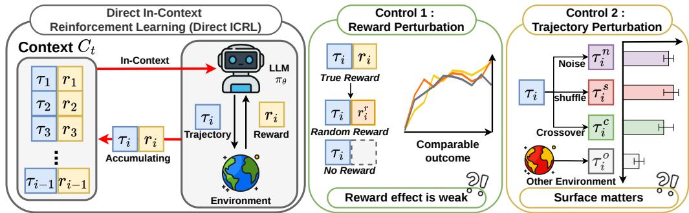  
Figure 1: Direct ICRL overview (left) and controlled interventions for probing its mechanism: reward (middle) and trajectory perturbations (right).

## 3 Preliminaries

## 3.1 Reinforcement Learning

We consider a Markov Decision Process (MDP) $( S , { \mathcal { A } } , P , R , \gamma )$ , where an agent follows a policy $\pi _ { \boldsymbol { \theta } } ( \boldsymbol { a } \mid \boldsymbol { s } )$ to produce a trajectory ${ \boldsymbol \tau } = ( s _ { 0 } , a _ { 0 } , s _ { 1 } , \dots )$ with return $\begin{array} { r } { R ( \tau ) = \sum _ { t } \gamma ^ { t } r _ { t } } \end{array}$ . RL maximizes the expected return

$$
J ( \theta ) = \mathbb { E } _ { \tau \sim \pi _ { \theta } } [ R ( \tau ) ]\tag{1}
$$

by updating parameters θ. In this formulation, S and A denote the state and action spaces, respectively. The transition kernel $P ( s ^ { \prime } \mid s , a )$ defines the probability of reaching state $s ^ { \prime }$ after taking action a in state s, and R denotes the reward function that provides the scalar reward $r _ { t }$ at time step t. The discount factor $\gamma \in [ 0 , 1 ]$ determines the contribution of future rewards to the return. The policy $\pi _ { \boldsymbol { \theta } } ( \boldsymbol { a } \mid \boldsymbol { s } )$ is a parameterized mapping from states to action probabilities, where θ denotes the policy parameters. A trajectory τ is generated by repeatedly sampling actions from $\pi _ { \theta }$ and states from the transition dynamics $P .$ The objective $J ( \theta )$ is the expected discounted return, and RL seeks to find parameters θ that maximize this objective.

## 3.2 In-Context Reinforcement Learning

In-context reinforcement learning (ICRL) extends ICL to RL problems by adapting a policy through contextual experience rather than parameter updates. Given a task description q and a frozen language model $\pi _ { \theta }$ , the model’s behavior is shaped by a context $C _ { t }$ for episode t that accumulates information from past interactions:

$$
C _ { t } = \big ( \phi ( \tau _ { 1 } , r _ { 1 } ) , \ \phi ( \tau _ { 2 } , r _ { 2 } ) , \ldots , \phi ( \tau _ { t - 1 } , r _ { t - 1 } ) \big ) ,\tag{2}
$$

where each past trajectory $\tau _ { i }$ and its reward $r _ { i }$ are encoded by a rendering function ϕ into a segment of the context. The induced policy $\pi _ { \theta } ( \cdot \mid q , C _ { t } )$ thus changes with t even though θ is fixed. Different instantiations of ICRL differ primarily in the choice of $\phi -$ what information is retained from each interaction and in what form.

Direct ICRL. We focus on cases where ϕ represents each trajectory–reward pair directly, without any additional abstraction or summarization. Specifically, $\phi ( \tau _ { i } , r _ { i } )$ serializes $\tau _ { i }$ and $r _ { i }$ into text using a fixed template (e.g., Trajectory: [τ<sub>i</sub>]\nReward: $: \quad [ r _ { i } ] )$ . The resulting $C _ { t }$ is a concatenation of the raw trajectory–reward pairs. We refer to this case as direct ICRL. We focus our analysis on direct ICRL; unless otherwise specified, ICRL refers to direct ICRL for convenience. A visual overview is provided in Figure 1.

## 3.3 Tasks

We evaluate direct ICRL in two regimes. Coding tasks treat each task as a single-action MDP, a format common in LLM-based RL and preference-optimization settings such as DPO [17]. This setting lets us intervene precisely on reward signals while holding trajectory content fixed, reducing confounds from self-bootstrapping and making similarity-based behavior easier to inspect. Agentic tasks involve multi-step interaction, where reward decomposes across sub-goals, and credit assignment across actions is structurally meaningful. As a closer analogue of standard RL settings, this regime tests whether direct ICRL can handle sequential decision-making and action-level credit assignment.

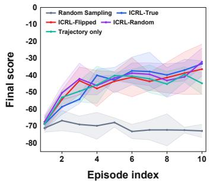  
(a) ScienceWorld

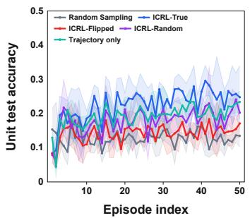  
(b) MBPP+

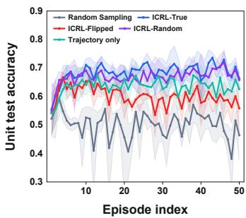  
(c) HumanEval+  
Figure 2: Episode-level performance under different reward conditions on three benchmarks.

Coding. MBPP+ [1] and HumanEval+ [2] are instantiated as single-action MDPs: the task description q is the initial state, the action $a _ { 0 }$ is a complete program emitted by $\pi _ { \theta } .$ , the episode terminates upon emission, and the reward $R ( \tau ) \in [ 0 , 1 ]$ is the unit-test pass rate. A trajectory reduces to ${ \boldsymbol { \tau } } = \left( q , a _ { 0 } \right)$ . Where $q$ is the task description.

Agentic. ScienceWorld [23] is a text-based environment simulating an elementary science curriculum, in which an agent interacts with the environment over multiple steps by issuing high-level text actions (e.g., move to kitchen, focus on metal fork) until the episode terminates. At each step, the agent observes the current textual state, selects an action according to $\pi _ { \theta }$ , and receives a reward from the environment. Consequently, each ScienceWorld episode corresponds to a multi-step trajectory $\tau = ( s _ { 0 } , a _ { 0 } , s _ { 1 } , a _ { 1 } , \dots , s _ { T } )$ , rather than the single-action trajectory used for coding tasks. Where $s _ { t } , a _ { t }$ are the state and action at time t. We sample 40 ScienceWorld tasks uniformly across environment types. Details of the reward and score settings are provided in Section B.2.2.

## 4 Reward Semantics Do Not Drive Improvement

This section addresses RQ1: Does the reward field act as an RL-aligned signal? To answer this question, we intervene in the reward field while holding trajectory content fixed: true rewards are replaced with flipped, randomized, or removed values, with trajectories left unchanged. We track this in the episode-over-episode trajectory of improvement (Section 4.1) and in a memory-fixed control that removes the trajectory-composition confound (Section 4.2). Two complementary analyses reached the same conclusion: while direct ICRL outperforms the random sampling baseline, this performance improvement is largely unaffected by the content of the reward.

## 4.1 Effect of Reward in the Memory Accumulation Setting

## 4.1.1 Setup

Each task begins with an empty memory $C _ { 0 } = \varnothing$ . At each episode t, the model generates a trajectory $\tau _ { t }$ conditioned on $\left( q , C _ { t - 1 } \right)$ and receives a reward $r _ { t }$ . The trajectory–reward pair $\left( \tau _ { t } , r _ { t } \right)$ is appended to the memory sequence as ${ \cal { C } } _ { t } = { \cal { C } } _ { t - 1 } \oplus \left( \tau _ { t } , r _ { t } \right)$ where ⊕ denotes sequence concatenation. We compare four reward conditions, identical in trajectory content but differing only in the reward field: ICRL-True $( r _ { t } = R ( \tau _ { t } ) )$ , ICRL-Flipped $( r _ { t } = r _ { \operatorname* { m a x } } - R ( \tau _ { t } ) + r _ { m i n } )$ , ICRL-Random $( r _ { t } \sim \mathrm { U n i f } ( \mathcal { R } )$ , sampled from the empirical reward distribution $\mathcal { R } ) _ { { \mathrm { : ~ } } }$ , and Trajectory Only (the reward field is omitted). For non-ICRL baseline, we use Random Sampling (RS), which generates without any context $( C = \varnothing )$ , serves as the no-context baseline. We run for 10 episodes on ScienceWorld and 50 episodes on HumanEval+ and MBPP+, all with 3 seeds. When |C<sub>t</sub>| exceeds the prompt budget of 10, prompts are sampled uniformly at random from $C _ { t }$ . We select 40 random tasks from each benchmark. We use Qwen-3.5-9B as the policy model.

Table 1: Comparison of improvement types across models on HumanEval+ and MBPP+. Each entry reports the number of problems and the percentage within each model-benchmark setting.  
(a) HumanEval+
<table><tr><td>Model</td><td>No Imp.</td><td>Reward-Agnostic</td><td>Reward-Sensitive</td><td>Total</td></tr><tr><td>Qwen-3-4B-Instruct</td><td>25 (83.3%)</td><td>4 (13.3%)</td><td>1 (3.3%)</td><td>30</td></tr><tr><td>Llama-3.1-8B-Instruct</td><td>27 (90.0%)</td><td>2 (6.7%)</td><td>1 (3.3%)</td><td>30</td></tr><tr><td>Qwen-3.5-9B</td><td>19 (63.3%)</td><td>10 (33.3%)</td><td>1 (3.3%)</td><td>30</td></tr><tr><td>GPT-5-nano</td><td>11 (36.7%)</td><td>19 (63.3%)</td><td>0 (0.0%)</td><td>30</td></tr><tr><td>GPT-5-mini</td><td>7 (23.3%)</td><td>22 (73.3%)</td><td>1 (3.3%)</td><td>30</td></tr><tr><td>Gemini-3.1-Flash-Lite</td><td>12 (40.0%)</td><td>16 (53.3%)</td><td>2 (6.7%)</td><td>30</td></tr><tr><td>Total</td><td>101 (56.1%)</td><td>73 (40.6%)</td><td>6 (3.3%)</td><td>180</td></tr><tr><td colspan="5">(b) MBPP+</td></tr><tr><td>Model</td><td>No Imp.</td><td>Reward-Agnostic</td><td>Reward-Sensitive</td><td>Total</td></tr><tr><td>Qwen-3-4B-Instruct</td><td>25 (83.3%)</td><td>4 (13.3%)</td><td>1 (3.3%)</td><td>30</td></tr><tr><td>Llama-3.1-8B-Instruct</td><td>23 (76.7%)</td><td>6 (20.0%)</td><td>1 (3.3%)</td><td>30</td></tr><tr><td>Qwen-3.5-9B</td><td>22 (73.3%)</td><td>7 (23.3%)</td><td>1 (3.3%)</td><td>30</td></tr><tr><td>GPT-5-nano</td><td>12 (40.0%)</td><td>16 (53.3%)</td><td>2 (6.7%)</td><td>30</td></tr><tr><td>GPT-5-mini</td><td>14 (46.7%)</td><td>15 (50.0%)</td><td>1 (3.3%)</td><td>30</td></tr><tr><td>Gemini-3.1-Flash-Lite</td><td>16 (53.3%)</td><td>12 (40.0%)</td><td>2 (6.7%)</td><td>30</td></tr><tr><td>Total</td><td>112 (62.2%)</td><td>60 (33.3%)</td><td>8 (4.4%)</td><td>180</td></tr></table>

## 4.1.2 Results

Direct ICRL improves over Random Sampling. Figure 2 shows the mean and standard deviation of episode reward across the three benchmarks. ICRL-True improves over RS by a clear margin on every benchmark. This reproduces the standard direct ICRL gain and fixes the effect we want to explain.

Even wrong rewards do not break direct ICRL. ICRL-Flipped is the strongest intervention in this section: it inverts the reward signal entirely, so that high-reward trajectories are labeled as low-reward, and vice versa. Under an RL view, performance should collapse to or below RS. However, ICRL-Flipped remains well above RS on every benchmark, and its curve is closer to ICRL-True than to RS. The reward is read (Flipped does sit slightly below True on HumanEval and MBPP), but the gap is small. Even a full sign flip is not enough to change the direction of direct ICRL.

Random or omitted rewards remain competitive with true rewards. ICRL-Random matches ICRL-True within seed variance on every benchmark. Trajectory Only, which removes the reward field entirely, also tracks ICRL-True closely on every benchmark and produces the same episodeover-episode improvement. Replacing real reward with random values, or dropping the reward field altogether, leaves the improvement curve essentially unchanged — the gain from direct ICRL requires neither correctly valued rewards nor a reward field at all. In summary, while the rewards have an effect, they do not significantly alter the shape of the curve. This demonstrates that the behavior of direct ICRL differs from that expected in RL, providing motivation for further analysis.

## 4.2 Effect of Reward in the Fixed Memory Setting

We next use a fixed-memory control to isolate the effect of reward. In Section 4.1, memory accumulates across episodes, so the trajectories in memory differ across reward conditions. Here, memory is not accumulated, and all reward conditions share the same trajectories, differing only in the reward field.

## 4.2.1 Setup

We fix the memory $C$ across all conditions. For each task, we draw five trajectories via random sampling and use them as the fixed prompt across all reward conditions. We average five evaluation samples for each task and memory ${ \dot { C } } ,$ and then average the result over three seeds to obtain the final per-task score. We use the same baselines in Section 4.1. We use the three improvement categories:

• No Improvement (No Imp.): ICRL-True $< \mathbf { R } \mathbf { S } ,$ . No improvement occurs.

• Reward-Agnostic Improvement (Reward-Agnostic): ICRL-True ≤ (ICRL-Random or ICRL-Flipped) and ICRL-True $> \mathrm { R } S$

• Reward-Sensitive Improvement (Reward-Sensitive): ICRL-True > (ICRL-Random and ICRL-Flipped) and ICRL-True > RS.

We evaluate six models spanning open-weights and proprietary families: Qwen-3-4B-Instruct [20], Qwen-3.5-9B [16], Llama-3.1-8B [5], Gemini-3.1-Flash-Lite [4], GPT-5-nano [14], and GPT-5- mini [13]. Experiments are run on HumanEval and MBPP. Detailed hyperparameters by model are provided in Appendix B.1.

## 4.2.2 Results

Table 1 shows the results. Of the 360 task-model pairs, only 14 (3.9%) were classified as rewardsensitive, 133 (36.9%) were reward-agnostic, and the remaining 213 (59.2%) showed no improvement in performance over random sampling. The number of reward-sensitive tasks per model remained between 0 and 2 out of 30 across all six models, spanning open-source 4B–9B systems and proprietary mid-range systems. In other words, when memory is fixed, the direct influence of reward content is small.

## 5 Trajectory Exposure, Not Reward, Drives Replay in Direct ICRL

Section 4 shows that reward content has little effect on task performance. This section asks which part of memory is important by examining what the model does with each trajectory in its memory. The two views of direct ICRL make different predictions. If direct ICRL works like ${ \mathrm { R L } } .$ , the reward attached to a trajectory should control how likely the model is to produce that trajectory again: high-reward trajectories should be replayed more often, and low-reward trajectories less often. If it works like $\begin{array} { r } { \mathrm { I } \bar { \mathrm { C L } } . } \end{array}$ , showing a trajectory should make it more likely to be replayed, whatever its reward. We test these predictions with three questions: whether showing a trajectory increases its replay (Section 5.2), whether the reward changes that replay (Section 5.3), and what else changes it (Section 5.4).

## 5.1 Setup

Memory and targets. For each task, we build a fixed memory $\mathcal { M } = \{ ( \tau _ { i } , r _ { i } ) \} _ { i = } ^ { N }$ <sub>=1</sub> of $N =$ 10 trajectory–reward pairs by random sampling on HumanEval and MBPP. We track two target trajectories $\tau ^ { * } \in \mathcal { M }$ per task: $\tau ^ { - }$ , the lowest-reward entry, and $\tau ^ { + }$ , the highest-reward entry. We use Qwen-3.5-9B as the policy model.

Metrics. We measure replay at the probability level and at the behavior level. At the probability level, we use the leave-one-out difference

$$
\Delta \mathrm { L O O } ( \tau ^ { * } ) = \log \pi _ { \boldsymbol { \theta } } ( \tau ^ { * } \mid q , m , \mathcal { M } ) - \log \pi _ { \boldsymbol { \theta } } ( \tau ^ { * } \mid q , m , \mathcal { M } \setminus \{ \tau ^ { * } \} ) ,\tag{3}
$$

which measures how much more likely $\tau ^ { * }$ becomes simply because it is present in the memory. Here m is the meta-prompt (Appendix B.2.1), and all log-probabilities are averaged per token.

At the behavior level, we sample 500 generations per condition. Target Replay Rate is the fraction of samples whose normalized abstract syntax tree (AST) matches $\tau ^ { * }$ . Memory Replay Rate is the fraction matching any trajectory in $\mathcal { M }$

Each question below changes one aspect of the memory, and we introduce the corresponding conditions where they are used.

Table 2: Effect of showing trajectories, without any reward. Replay rates are in $\%$ . ∆LOO is undefined for Problem-only because no memory is shown.
<table><tr><td></td><td colspan="2">∆LOO</td><td colspan="2">Target Replay Rate</td><td>Memory Replay Rate</td></tr><tr><td>Condition</td><td> $\tau ^ { - }$ </td><td> $\tau ^ { + }$ </td><td> $\tau ^ { - }$ </td><td> $\tau ^ { + }$ </td><td></td></tr><tr><td>Problem-only</td><td></td><td></td><td>0.7</td><td>1.1</td><td>16.3</td></tr><tr><td>Trajectory-only</td><td>0.416</td><td>0.162</td><td>3.1</td><td>1.8</td><td>34.3</td></tr></table>

Table 3: Effect of the reward field on the replay of the target trajectory. Trajectories are identical across rows; only the reward field differs. Target Replay Rate is in $\%$
<table><tr><td></td><td colspan="2">∆LOO</td><td colspan="2">Target Replay Rate</td></tr><tr><td>Condition</td><td>τ⁻</td><td> $\tau ^ { + }$ </td><td>T⁻</td><td> $\tau ^ { + }$ </td></tr><tr><td>Trajectory-only (no reward)</td><td>0.416</td><td>0.162</td><td>3.1</td><td>1.8</td></tr><tr><td>ICRL (true reward)</td><td>0.360</td><td>0.173</td><td>2.5</td><td>3.0</td></tr><tr><td>Specific-flip</td><td>0.474</td><td>0.145</td><td>3.0</td><td>1.6</td></tr></table>

## 5.2 Showing a Trajectory Makes the Model Replay It

We first compare two conditions. Problem-only gives the model only the task description $q ,$ with no memory. Trajectory-only adds the trajectories in M, without the reward field.

Table 2 shows the result. Under Problem-only, 16.3% of generations happen to match a trajectory in $\mathcal { M } ;$ this is the rate at which the model produces these outputs on its own. Showing the trajectories raises the Memory Replay Rate to 34.3%, more than twice that level. The same holds for individual targets: the Target Replay Rate rises from 0.7% to 3.1% for $\tau ^ { - }$ and from 1.1% to 1.8% for $\tau ^ { + }$ , and ∆LOO is positive for both (0.416 and 0.162). The increase is larger for the lowest-reward trajectory than for the highest-reward one, even though no reward is shown. Exposure alone is therefore enough to induce replay, and it does not favor good trajectories. We use the $\tau ^ { - }$ value of 0.416 as the reference size of this trajectory-presence effect.

## 5.3 Reward Shifts Replay in the RL Direction, but Only Slightly

We next add the reward field to the same memory. ICRL attaches the true reward to every trajectory. Specific-flip is identical to ICRL except that the reward of the target trajectory is flipped $( r _ { \operatorname* { m a x } } - r ^ { * } +$ $r _ { \mathrm { m i n } } ) .$ , so that $\tau ^ { - }$ is labeled as the best trajectory and $\tau ^ { + }$ as the worst. The RL view predicts that true rewards lower the replay of $\tau ^ { - }$ and raise that of $\tau ^ { + }$ , and that flipping the target’s reward reverses both.

The direction matches RL. Table 3 shows that every shift goes in the predicted direction. With true rewards, ∆LOO falls for $\tau ^ { - }$ and rises for $\tau ^ { + }$ , and the Target Replay Rate moves the same way (−0.6 pp for $\tau ^ { - }$ and +1.2 pp for $\tau ^ { + }$ ). Flipping the target’s reward reverses both: relative to ICRL, ∆LOO rises for $\tau ^ { - }$ and falls for $\tau ^ { + }$ , and the Target Replay Rate changes by +0.5 pp and −1.4 pp. The model therefore reads the reward and responds to it as RL would.

The size is small. Relative to Trajectory-only, attaching a reward changes ∆LOO by at most 0.058 (τ<sup>−</sup> under Specific-flip). This is about 14% of the 0.416 trajectory-presence effect from Section 5.2. The behavior-level result agrees: even with its true low reward shown, $\tau ^ { - }$ is replayed in 2.5% of generations, well above the 0.7% under Problem-only. A low reward reduces the replay of a failed trajectory, but it does not undo the replay caused by showing that trajectory.

## 5.4 Position and Raw Trajectories Change Replay; Reward Labels and Instructions Do Not

If reward has only a small effect, what does change replay? Starting from ICRL, we apply three kinds of changes. (i) Position: Order-first and Order-last move the target pair to the beginning or the end of the memory, leaving its content and reward unchanged. (ii) Discouraging replay: All Failure sets every reward in the memory to 0, and Anti Prompt adds an explicit instruction not to repeat the shown trajectories (Appendix B.2.1). (iii) Removing same-task raw trajectories: Cross-task fills the memory with trajectories from a different task, and Reflexion [18] replaces the trajectory–reward pairs with natural-language summaries.

Table 4: Effect of changes other than the target’s reward. All replay rates are in $\%$ . The $\tau ^ { - }$ and $\tau ^ { + }$ columns report runs in which the target is the lowest- and the highest-reward trajectory, respectively. Problem-only is the level without any memory.
<table><tr><td rowspan="2"></td><td rowspan="2">Condition</td><td colspan="2">Target Replay Rate</td><td colspan="2">Memory Replay Rate</td></tr><tr><td> $\tau ^ { - }$ </td><td> $\tau ^ { + }$ </td><td> $\tau ^ { - }$ </td><td> $\tau ^ { + }$ </td></tr><tr><td rowspan="2">Change Reference</td><td>Problem-only</td><td>0.7</td><td>1.1</td><td>16.3</td><td>16.3</td></tr><tr><td>ICRL</td><td>2.5</td><td>3.0</td><td>30.5</td><td>30.5</td></tr><tr><td rowspan="2">Position</td><td>Order-first</td><td>2.4</td><td>5.5</td><td>29.3</td><td>30.0</td></tr><tr><td>Order-last</td><td>3.2</td><td>13.2</td><td>29.4</td><td>41.9</td></tr><tr><td rowspan="2">Discouraging replay</td><td>All Failure</td><td>2.3</td><td>1.7</td><td>27.6</td><td>27.3</td></tr><tr><td>Anti Prompt</td><td>2.4</td><td>2.3</td><td>30.2</td><td>30.0</td></tr><tr><td rowspan="2">No same-task raw trajectory</td><td>Cross-task</td><td>4.7</td><td>0.0</td><td>13.4</td><td>13.3</td></tr><tr><td>Reflexion</td><td>0.5</td><td>1.9</td><td>11.4</td><td>11.7</td></tr></table>

Position has a larger effect than reward. Moving the target to the end of the memory raises the $\tau ^ { + }$ Target Replay Rate from 3.0% to 13.2%, and moving it to the beginning raises it to 5.5% (Table 4). The trajectory and its reward are unchanged; only the position differs. The largest reward-induced change in Section 5.3 was 1.4 pp, so position alone moves replay several times more than the reward does. Placing $\tau ^ { + }$ last also raises the Memory Replay Rate from 30.5% to 41.9%. This effect is concentrated on $\tau ^ { + } ;$ : the $\tau ^ { - }$ rate stays within one point of ICRL under both orderings.

Zero rewards and explicit instructions barely reduce replay. Labeling every trajectory as a failure lowers the Memory Replay Rate only from 30.5% to about 27%. Instructing the model to try a different direction leaves it at about 30%. Both remain far above the 16.3% of Problem-only. The lowest-reward target shows the same pattern: τ<sup>−</sup> is replayed at 2.3% under All Failure and 2.4% under Anti Prompt, against 2.5% under ICRL. Neither the reward signal nor a direct instruction i enough to pull the model away from the trajectories it has been shown.

Removing same-task raw trajectories removes the replay. Under Cross-task and Reflexion, the Memory Replay Rate falls to about 13% and 12%, below the Problem-only level. Replay is thus tied to the presence of raw trajectories from the same task, not to the reward information: Reflexion still conveys which attempts failed, yet it does not induce replay.

Summary. Showing a trajectory increases its replay, the reward changes this by a small amount in the RL-aligned direction, and position and raw-trajectory presence change it far more. This matches the pattern known from ICL, where the presence and arrangement of demonstrations matter more than the content of their labels [11].

## 6 What Drives Improvement: Surface Form and Task Relevance

Section 5 established that direct ICRL improves through trajectory imitation, with reward modulation playing at most a marginal role. This sharpens RQ2: if imitation is the operative mechanism, which features of the trajectory make it a useful imitation target — its content, its surface form, or its relevance to the task? We conduct a controlled memory-composition analysis that varies memory contents while keeping the imitation mechanism fixed, tracing the gain to two properties—taskrelevant distribution and surfaceform. We use Qwen-3.5-9B as the policy model.

Table 5: Mean reward across MBPP and ScienceWorld. Standard deviations are reported in Table 9.
<table><tr><td>Memory Setting</td><td>MBPP</td><td>ScienceWorld</td></tr><tr><td>RSM</td><td>0.250</td><td>-32.479</td></tr><tr><td>Cross-Task</td><td>0.122</td><td>-43.000</td></tr><tr><td>Random Valid Action</td><td>0.102</td><td>-68.208</td></tr><tr><td>ICRL History</td><td>0.245</td><td>-42.238</td></tr><tr><td>Trajectory Perturbation</td><td></td><td></td></tr><tr><td>Shuffle</td><td>0.243</td><td>-38.588</td></tr><tr><td>Crossover</td><td>0.251</td><td>-39.701</td></tr><tr><td>Insert token</td><td>0.242</td><td></td></tr></table>

## 6.1 Setup

We construct memories of varying composition and measure the resulting episode reward at fixed model and decoding settings, the same as in Section 4.2. The only difference is that we set the memory size to $N = 1 0$ trajectories. We report the mean reward and standard deviation over five random samples. We compare eight memory configurations under two categories: source variations and trajectory perturbations.

Source variations.

• RSM (Random Sampling Memory): trajectories sampled from $\pi _ { \theta }$ on the same task $q .$

• ICRL History: trajectories from the final memory of a full ICRL run (Section 4).

• Cross-Task: trajectories sampled from a different task $q ^ { \prime } \neq q .$

• Random Valid Action: arbitrary valid actions; random code-path tokens in MBPP.

Trajectory perturbations. These perturbations are applied to the ICRL History.

• Shuffle: trajectories with reordered its middle parts.

• Crossover: trajectories alternating segments from different tasks.

• Insert Token (MBPP only): trajectories with a random token inserted to induce a syntax error.

## 6.2 Results

Self-bootstrapping does not help. Table 5 shows the results of fixed-memory settings in Science-World and MBPP. In both settings, ICRL history performs similarly to or worse than RSM. This suggests that the self-bootstrapping occurring during the ICRL process does not significantly affect performance. This contradicts the standard expectation in RL that reward signals guide exploration toward more useful trajectories than random sampling.

Surface form is more important than correctness. Trajectory perturbation techniques target the semantic content of a trajectory while preserving its surface form. Shuffle and Crossover destroy ordering (lines in MBPP, action-state pair in ScienceWorld), and Insert Token additionally breaks compilation. If the model relied on this semantic content, all three perturbations should degrade performance. However, performance under perturbed trajectories is comparable to ICRL History. We interpret this as the model relying on the surface form of the trajectory, not its semantic content. This trend is most clearly observed in ScienceWorld. In sequential decision-making, shuffling the order of actions should be fatal, as it breaks the causal chain linking one state to the next. Nevertheless, the fact that performance is maintained suggests that the model does not track trajectories step-by-step but gains an advantage by simply recognizing the correct action, regardless of its order.

Task relevance is essential The improvement requires trajectories that are actual attempts at the target task; neither task identity nor surface form alone is enough. Cross-Task and Random Valid Action both degrade performance. Cross-Task uses real attempts on a different task: its failure shows that matching surface form is not enough — the trajectory must be on the target task. (The drop is steeper on MBPP than on ScienceWorld because MBPP code shares little structure across tasks, while ScienceWorld actions and states are largely shared.) Random Valid Action uses the target task environment but replaces real attempts with random valid actions or tokens: its dramatic drop shows that being on the right task is also not enough. Combined with the perturbation results, the picture is consistent: trajectories need not be structurally correct, but they must be (i) on the target task and (ii) actual attempts at solving it.

## 7 Discussion

Direct ICRL is ICL rather than RL. The patterns we observed are similar to those identified in ICL. Min et al. [11] demonstrated that ICL remains effective even when the label region is randomized, indicating that form and distribution are more important than content. Our results extend this perspective to the reward field: direct ICRL rewards operate similarly to ICL labels, and their benefits are driven by the distribution and shape of the trajectories. From this perspective, direct ICRL is not a parameter-free RL system, but rather a form of in-context learning that incorporates a reward field. This suggests that the RL lens through which ICRL has been studied (filtering, self-bootstrapping, reward-based design) needs to be reconsidered. ICRL memory design may need to emphasize factors that ICL has identified as central, such as input distribution and surface form.

Failure trajectories provide weak avoidance signals. In our experiment, we observed that the negative credit assignment had a negligible effect. Even in the ICRL-Anti Prompt setting described in Table 4, where the prompt explicitly encouraged the model to “take a different action,” the reduction in replay rate was limited. These results indicate that changing the reward signal alone is insufficient to alter the model’s behavior. Unlike in policy-gradient learning, where repeated failures can indirectly promote exploration in different directions, failed trajectories in direct ICRL may not reliably serve as exploration-inducing signals. These findings suggest that the common practice of accumulating failed trajectories to drive exploration may not directly apply to direct ICRL. Abstraction-based approaches that do not rely directly on raw trajectories, such as Reflexion [18] or Expel [29], may offer an alternative. However, stabilizing such methods remains challenging due to their reliance on text gradients [15]. Developing stable abstraction-based update methods remains a promising direction for future research.

Direct ICRL is bounded by pretrained priors. The limited effect of reward semantics on performance suggests two possible interpretations: either the model cannot read the reward content, or it can read it but ignores the reward based on its own preferences regarding which trajectory to mimic. Although our experiment did not distinguish between these mechanisms, both point to the same limitation. The contextual reward semantics did not effectively override the model’s preference for which trajectory to imitate. Reported successes of direct ICRL are concentrated in environments where high-reward trajectories align with outcomes that a capable baseline model can already generate. When the target behavior conflicts with the model’s prior knowledge—such as in new domains, adversarial environments, or exploration-intensive tasks—reward labels alone cannot easily replace explicit memory design or training. This aligns with previous research findings that negation is difficult in ICL [21]. These findings raise questions about the scope of ICRL’s applicability and, more broadly, whether context alone is enough to adapt to all tasks.

## 8 Limitation

Our experiments are designed to isolate the mechanisms underlying direct ICRL, leaving several boundary conditions outside the scope of our claims. First, our analysis targets direct ICRL, where raw trajectory–reward pairs are exposed to the model; this setting isolates the roles of trajectory and reward fields but excludes abstraction-based variants such as reflections, skill libraries, or extracted insights. Second, our results are reported under standard meta-prompts across six models and three benchmarks; we do not rule out prompt formats or model families that elicit stronger rewardaware behavior, including models trained specifically for ICRL, such as the Decision Transformer family [6]. Third, our manipulations probe reward semantics within the studied environments but do not fully characterize counterfactual regimes where reward semantics conflict with the model’s prior preferences.

## References

[1] Jacob Austin, Augustus Odena, Maxwell Nye, Maarten Bosma, Henryk Michalewski, David Dohan, Ellen Jiang, Carrie Cai, Michael Terry, Quoc Le, et al. Program synthesis with large language models. arXiv preprint arXiv:2108.07732, 2021.

[2] Mark Chen, Jerry Tworek, Heewoo Jun, Qiming Yuan, Henrique Ponde De Oliveira Pinto, Jared Kaplan, Harri Edwards, Yuri Burda, Nicholas Joseph, Greg Brockman, et al. Evaluating large language models trained on code. arXiv preprint arXiv:2107.03374, 2021.

[3] Weiqin Chen, Xinjie Zhang, Dharmashankar Subramanian, and Santiago Paternain. Filtering learning histories enhances in-context reinforcement learning. arXiv preprint arXiv:2505.15143, 2025.

[4] Google. Gemini 3.1 Flash-Lite. https://docs.cloud.google.com/vertex-ai/ generative-ai/docs/models/gemini/3-1-flash-lite, 2026. Large language model; accessed 4 May 2026.

[5] Aaron Grattafiori, Abhimanyu Dubey, Abhinav Jauhri, Abhinav Pandey, Abhishek Kadian, Ahmad Al-Dahle, Aiesha Letman, Akhil Mathur, Alan Schelten, Alex Vaughan, et al. The llama 3 herd of models. arXiv preprint arXiv:2407.21783, 2024.

[6] Sili Huang, Jifeng Hu, Hechang Chen, Lichao Sun, and Bo Yang. In-context decision transformer: Reinforcement learning via hierarchical chain-of-thought. arXiv preprint arXiv:2405.20692, 2024.

[7] Aviral Kumar, Vincent Zhuang, Rishabh Agarwal, Yi Su, John D Co-Reyes, Avi Singh, Kate Baumli, Shariq Iqbal, Colton Bishop, Rebecca Roelofs, et al. Training language models to self-correct via reinforcement learning. arXiv preprint arXiv:2409.12917, 2024.

[8] Michael Laskin, Luyu Wang, Junhyuk Oh, Emilio Parisotto, Stephen Spencer, Richie Steigerwald, DJ Strouse, Steven Hansen, Angelos Filos, Ethan Brooks, et al. In-context reinforcement learning with algorithm distillation. arXiv preprint arXiv:2210.14215, 2022.

[9] Jonathan Lee, Annie Xie, Aldo Pacchiano, Yash Chandak, Chelsea Finn, Ofir Nachum, and Emma Brunskill. Supervised pretraining can learn in-context reinforcement learning. Advances in Neural Information Processing Systems, 36:43057–43083, 2023.

[10] Fernando Martinez-Lopez, Tao Li, Yingdong Lu, and Juntao Chen. In-context reinforcement learning via communicative world models. arXiv preprint arXiv:2508.06659, 2025.

[11] Sewon Min, Xinxi Lyu, Ari Holtzman, Mikel Artetxe, Mike Lewis, Hannaneh Hajishirzi, and Luke Zettlemoyer. Rethinking the role of demonstrations: What makes in-context learning work? In Proceedings of the 2022 conference on empirical methods in natural language processing, pages 11048–11064, 2022.

[12] Catherine Olsson, Nelson Elhage, Neel Nanda, Nicholas Joseph, Nova DasSarma, Tom Henighan, Ben Mann, Amanda Askell, Yuntao Bai, Anna Chen, et al. In-context learning and induction heads. arXiv preprint arXiv:2209.11895, 2022.

[13] OpenAI. GPT-5 mini. https://developers.openai.com/api/docs/models/ gpt-5-mini, 2026. Large language model; accessed 4 May 2026.

[14] OpenAI. GPT-5 nano. https://developers.openai.com/api/docs/models/ gpt-5-nano, 2026. Large language model; accessed 4 May 2026.

[15] Reid Pryzant, Dan Iter, Jerry Li, Yin Lee, Chenguang Zhu, and Michael Zeng. Automatic prompt optimization with “gradient descent” and beam search. In Proceedings of the 2023 conference on empirical methods in natural language processing, pages 7957–7968, 2023.

[16] Qwen Team. Qwen3.5: Towards native multimodal agents, February 2026. URL https: //qwen.ai/blog?id=qwen3.5.

[17] Rafael Rafailov, Archit Sharma, Eric Mitchell, Christopher D Manning, Stefano Ermon, and Chelsea Finn. Direct preference optimization: Your language model is secretly a reward model. Advances in neural information processing systems, 36:53728–53741, 2023.

[18] Noah Shinn, Federico Cassano, Ashwin Gopinath, Karthik Narasimhan, and Shunyu Yao. Reflexion: Language agents with verbal reinforcement learning. Advances in neural information processing systems, 36:8634–8652, 2023.

[19] Kefan Song, Amir Moeini, Peng Wang, Lei Gong, Rohan Chandra, Shangtong Zhang, and Yanjun Qi. Reward is enough: Llms are in-context reinforcement learners. arXiv preprint arXiv:2506.06303, 2025.

[20] Qwen Team. Qwen3 technical report, 2025. URL https://arxiv.org/abs/2505.09388.

[21] Tereza Vrabcová, Marek Kadlcík, Petr Sojka, Michal Štefánik, and Michal Spiegel. Negation:ˇ A pink elephant in the large language models’ room? arXiv preprint arXiv:2503.22395, 2025.

[22] Guanzhi Wang, Yuqi Xie, Yunfan Jiang, Ajay Mandlekar, Chaowei Xiao, Yuke Zhu, Linxi Fan, and Anima Anandkumar. Voyager: An open-ended embodied agent with large language models. arXiv preprint arXiv:2305.16291, 2023.

[23] Ruoyao Wang, Peter Jansen, Marc-Alexandre Côté, and Prithviraj Ammanabrolu. Scienceworld: Is your agent smarter than a 5th grader? In Proceedings ofthe 2022 Conference on Empirical Methods in Natural Language Processing, pages 11279–11298, 2022.

[24] Zora Zhiruo Wang, Jiayuan Mao, Daniel Fried, and Graham Neubig. Agent workflow memory. arXiv preprint arXiv:2409.07429, 2024.

[25] Jason Wei, Xuezhi Wang, Dale Schuurmans, Maarten Bosma, Fei Xia, Ed Chi, Quoc V Le, Denny Zhou, et al. Chain-of-thought prompting elicits reasoning in large language models. Advances in neural information processing systems, 35:24824–24837, 2022.

[26] Jerry Wei, Jason Wei, Yi Tay, Dustin Tran, Albert Webson, Yifeng Lu, Xinyun Chen, Hanxiao Liu, Da Huang, Denny Zhou, et al. Larger language models do in-context learning differently. arXiv preprint arXiv:2303.03846, 2023.

[27] Siyu Xia, Zekun Xu, Jiajun Chai, Wentian Fan, Yan Song, Xiaohan Wang, Guojun Yin, Wei Lin, Haifeng Zhang, and Jun Wang. From experience to strategy: Empowering llm agents with trainable graph memory. arXiv preprint arXiv:2511.07800, 2025.

[28] Sang Michael Xie, Aditi Raghunathan, Percy Liang, and Tengyu Ma. An explanation of in-context learning as implicit bayesian inference. In International Conference on Learning Representations (ICLR), 2022.

[29] Andrew Zhao, Daniel Huang, Quentin Xu, Matthieu Lin, Yong-Jin Liu, and Gao Huang. Expel: Llm agents are experiential learners. In Proceedings of the AAAI Conference on Artificial Intelligence, volume 38, pages 19632–19642, 2024.

## A Extended Discussion of Limitations

Our experiments focus on isolating the mechanisms underlying direct ICRL, rather than exhaustively characterizing all variants and boundary conditions. This focus leaves several questions outside the scope of our claims, which we discuss here in more detail.

Scope: direct ICRL only. Our analysis is limited to direct ICRL, where raw trajectory–reward pairs are presented to the model as context. This setting matches our primary concern of isolating the roles of the trajectory and reward fields when both are directly exposed to the model. Some variants transform past experience through abstraction layers, such as natural-language reflections, skill libraries, or extracted insights. We exclude them because these transformations introduce additional degrees of freedom that are difficult to control within the same experimental framework. Whether our findings extend to such abstraction-based methods remains an open question.

Prompt formats and model families. We observe consistent reward-insensitivity across six models and three benchmarks, but we report results only under standard meta-prompts. We do not rule out the existence of prompt formats that elicit stronger reward-aware behavior. Furthermore, we do not claim that this phenomenon generalizes to all model families. Models trained specifically for ICRL — such as the Decision Transformer family [6] — are out of scope and may behave differently, since they are explicitly optimized to read reward signals as control inputs. Also, our models span 4B–9B open-weights and proprietary mid-range systems; very large (>100B) models remain untested.

Counterfactual reward regimes. Our experiments test reward manipulations within the studied environments, but do not fully characterize counterfactual reward regimes where reward semantics conflict with the model’s prior preferences. As discussed in Section 7, the boundary at which reward signals begin to override pretrained preferences likely depends on the gap between the target behavior and what the base model already prefers. Mapping out this boundary — across domains, task types, and reward scales — remains an important direction for future work on direct ICRL.

## B Experimental Details

## B.1 Model Setting

We used a temperature of 0.8 for all models except GPT and Gemini. We set the max new tokens to 32 for Scienceworld and to 1024 for MBPP+ and HumanEval+. We used a thinking intensity of medium for both GPT-5-nano and Mini. For Gemini, we used a thinking effort of low.

## B.2 ICRL Setting

## B.2.1 Meta-prompt for each experiment

Meta-prompt of HumanEval+ and MBPP+ " You are solving the same programming task again. Below are previous trajectories and their unit test success rates. Return only the Python code completion for the task prompt that follows.

Meta-prompt of ScienceWorld. "You are acting in a ScienceWorld task again. Below are completed previous episodes for this same task and their cumulative returns. Use those trajectory-andreward memories to avoid repeating low-return behavior and to imitate higher-return behavior. When choosing the next action, reflect on which earlier episodes made real progress on the task. Respond with exactly one valid action and no explanation."

Instruction of Anti-Prompt. " You are revisiting this coding problem after several previous attempts. Below is a shared memory of earlier trajectories and their rewards. Do not imitate the repeated failures. Try a meaningfully different direction from the shown history. Return only Python code. "

Instruction of Reflexion. "You are analyzing previous attempts for one coding problem." "Task: {task\_id}" "Summarize what is going wrong across the attempts and what a better next attempt should change." "Write a concise reflection note in bullet-free prose." "[Problem Prompt]", prompt.rstrip()

## B.2.2 Experiments Details

Memory Settings. In MBPP+ and HumanEval+, all memories are stored in a memory pool, and 10 are randomly selected from it. In Top-k and Bottom-k, the top or bottom k samples are retrieved from the memory pool. In the case of ScienceWorld, all stored memories are used, so there is no memory sampling.

Computational Cost. We used one Nvidia A100 80GB for the experiment. In Figure 2, Science-World takes about 5 hours for 10 episodes, while HumanEval and MBPP take about 3 hours.

ScienceWorld reward rules. ScienceWorld provides deterministic, environment-defined rewards based on task-specific goal progress. The simulator maintains a structured world state, updates it through predefined action and science-domain rules, and evaluates progress using task-specific goal monitors. The Python API reports the simulator score on a 0–100 scale and defines the step reward as the change in score from the previous step. While most rewards are dense progress signals, catastrophic or task-invalid behavior can drive the score below zero; the API then produces a large penalty such as −100.

## C Additional Experiments

## C.1 Statistical Analysis of Section 4.1

Setup. We complement Figure 2 with paired t-tests on final episode scores. For each benchmark, we use 40 tasks and 3 seeds per condition. We pair at the task level: for each task, we average across seeds to obtain one score per condition, yielding 40 paired observations. We prefer this over pairing by seed $( n = 3 )$ . Seed-level pairing first averages across all tasks, which hides the spread between tasks and produces misleadingly narrow confidence intervals; task-level pairing exposes the actual task-to-task variation.

Table 6: Task-level paired t-tests on final episode scores (n = 40 tasks per benchmark, paired across 3 seeds). All six confidence intervals include zero, and no comparison reaches $p < 0 . 0 5$ . ScienceWorld final scores span roughly 80 points; coding scores are unit-test accuracy in [0, 1].
<table><tr><td>Benchmark</td><td>Comparison</td><td>Mean ∆</td><td>95% CI</td><td>p</td></tr><tr><td>ScienceWorld</td><td>True vs. Random True vs. No Reward</td><td>-0.76 +1.96</td><td>[-9.40, 7.86] [−6.73, 10.64]</td><td>0.86 0.65</td></tr><tr><td>MBPP+</td><td>True vs. Random True vs. No Reward</td><td>+0.028 +0.014</td><td>[−0.042, 0.098] [-0.064, 0.091]</td><td>0.43 0.72</td></tr><tr><td>HumanEval+</td><td>True vs. Random True vs. No Reward</td><td>+0.005 +0.037</td><td>[-0.064, 0.075] [-0.056, 0.130]</td><td>0.88 0.42</td></tr></table>

Results. Table 6 reports mean differences, 95% confidence intervals, and p-values for two comparisons: ICRL-True against ICRL-Random and ICRL-True against Trajectory Only. Across all three benchmarks, all six confidence intervals include zero and all p-values exceed 0.4. Mean differences stay below 4% of each benchmark’s score range.

We read this as a soft indistinguishable rather than proof of zero effect. The intervals do not exclude small positive effects of reward content, but they bound the size of any such effect: even at the upper end of each interval, the gap remains a small fraction of the total improvement ICRL achieves over Random Sampling. This is consistent with the per-trajectory analysis in Section 5, which finds a small but RL-aligned reward effect that is dominated by the trajectory-presence force.

Per-task tests. We also run t-tests within each task $( n = 3 { \mathrm { s e e d s } } )$ . With this sample size the tests have very low power, and we do not treat them as primary evidence. One task (HumanEval/106) reached uncorrected $p < 0 . 0 5$ in the True vs. No Reward comparison; we treat this as expected sampling noise across the 240 individual tests.

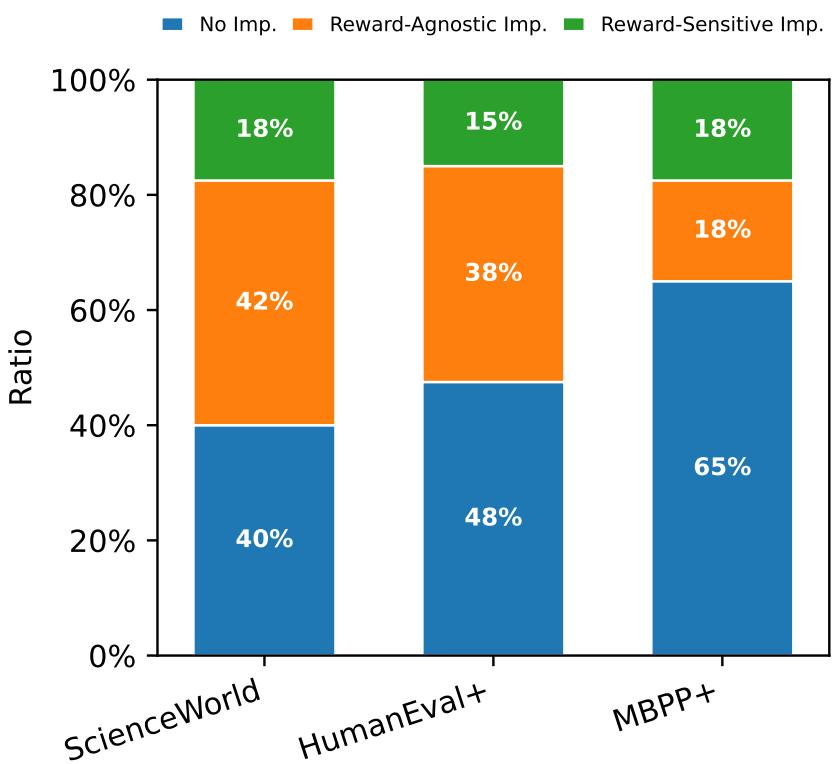  
Figure 3: Improvement category for accumulated memory settings.

Robustness. Wilcoxon signed-rank tests on the same paired data yield qualitatively identical conclusions (all $p > 0 . 4 )$ . We also examined episode-level tests on ScienceWorld: one episode (episode 3) shows uncorrected $p = 0 . 0 4 0$ for ICRL-True vs. ICRL-Random, but this does not survive Holm correction across the ten episodes.

## C.2 Per-Task Analysis of Section 4.1

Setup. To analyze what occurred in each individual task—rather than focusing on the average across the benchmark—we conduct a per-task analysis. We use the same category in section 4.2. We perform category classification using the average of the 3 seeds.

Results. Figure 3 reports the distribution. Surprisingly, “Reward-Agnostic Improvement” accounts for a significant proportion of the improvements across all tasks. Even MBPP+, which shows the greatest reward-sensitive improvement, accounts for only 50% of the total improvement. Scienceworld, which achieves a 42% reward-agnostic improvement, also exhibits a reward-independent curve in Figure 2. This demonstrates that the results from Section 4.1 hold true at the task level as well. While rewards do have an effect, most of the improvement occurs independently of rewards.

## C.3 Ablation of Section 4.1

Model Ablation. We replicated the Scienceworld experiment described in Section 4.1 using llama-3.1-8B-Instruct. The experimental results are similar to those discussed in Section 4.1. True, Flipped, and Random are subject to seed variance. These results demonstrate that our findings are not specific to Qwen3.5-9B alone.

ScienceWorld Reflexion. We applied Reflexion to the Scienceworld experiment in Section 4.1 of table 1. The results achieved performance comparable to ICRL-True. This demonstrates the potential of Reflexion. Since Reflexion does not use direct trajectories, it is free from the attraction problem. However, text gradient methods, including Reflexion, are notorious for high variance. Methods to address this and advance ICRL are left as future work.

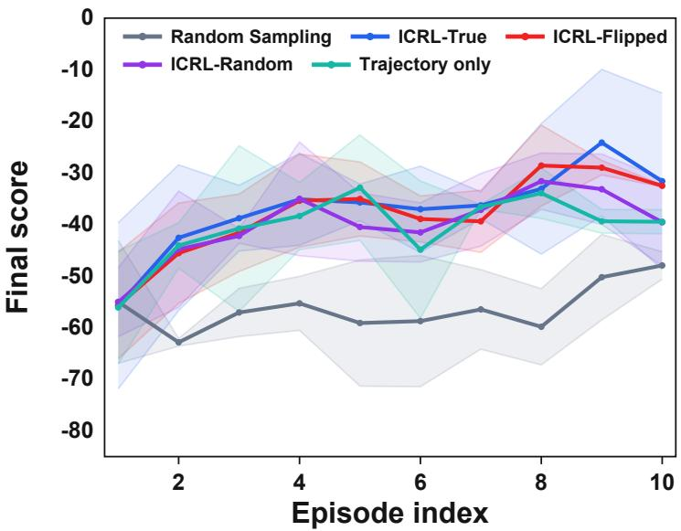  
Figure 4: ScienceWorld ICRL experiment using Llama-3.1-8B-Instruct as a policy network.

ScienceWorld Verbal Reward. We conduct the Scienceworld experiment described in Section 4.1 using verbal rewards. In the verbal reward system, reward scores are divided into four equal parts and categorized into four groups: “failure,” “partial failure,” “partial success,” and “success.” Verbal rewards also demonstrate performance similar to numerical rewards. It is worth noting that Flip’s performance is significantly lower than that of numerical rewards. While Flip and True were indistinguishable in the numerical reward setting, Flip performed worse than True in the verbal reward setting. This suggests that reward reading ability can be improved through sentence-level enhancements. However, Flip’s performance does not decline monotonically, supporting our claim that the reward effect is masked by attraction.

Memory selection In Figure 7, we compare groups that use Top-k selection, Bottom-k selection, and random selection as their memory policies. The experimental results show that Top-k selection performs better than Bottom-k. Random selection performs worse than Top-k selection under seed variance.

## C.4 Full Results of Section 5

## C.4.1 Setup

We test how each piece of the in-context memory affects the model’s output. The memory holds $N { = } 1 0$ trajectories by default. Each trajectory contains a problem, a solution, and a reward. We change one part of the memory at a time and check how ∆LOO and the model’s behavior change. All results are split by $\tau ^ { - }$ (the target is a failure trajectory) and $\tau ^ { + }$ (the target is a success trajectory).

ICRL variants. We compare thirteen ways of building the memory.

• True Reward. The default setting. Each trajectory keeps its real reward.

• All Failure. Every reward in the memory is set to 0.

• Specific failure. Only the target trajectory’s reward is set to 0; the other rewards stay the same.

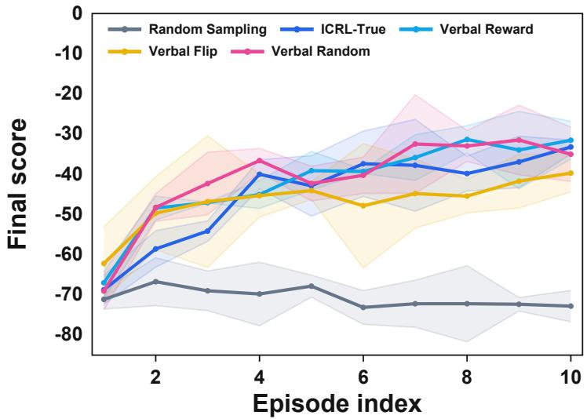  
Figure 5: ScienceWorld ICRL experiment with verbal reward.

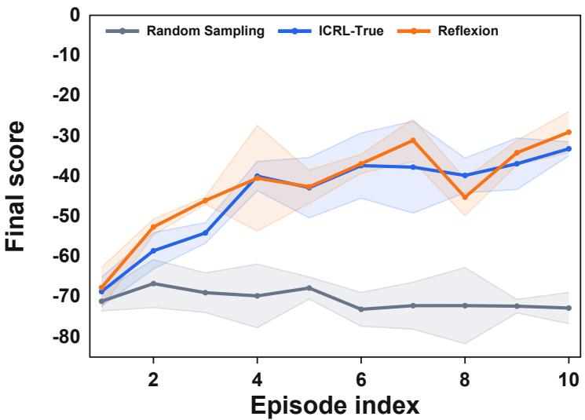  
Figure 6: ScienceWorld ICRL experiment with Reflexion.

• Flipped Reward. Every reward in the memory is flipped $( r \gets 1 - r )$

• Specific flipped. Only the target trajectory’s reward is flipped.

• Random Reward. Every reward is replaced with a random value.

• Verbal Reward. Each reward becomes one of four words —failure, partialfailure, partial success, or success — using four equal bins over the reward range.

• Anti prompt. We add an instruction that tells the model to produce something different from what the memory shows.

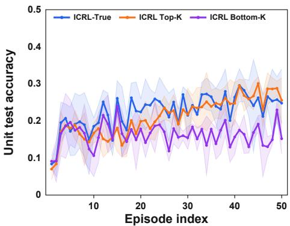  
(a) The topk and bottom k results of MBPP

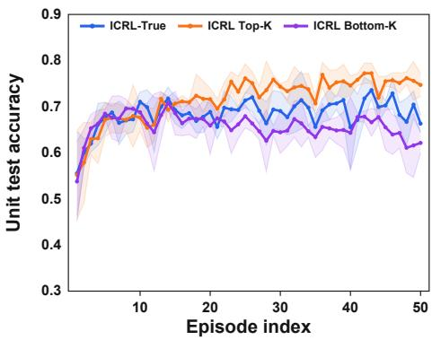  
(b) The topk and bottom k results of HumanEval  
Figure 7: Top-k and Bottom-k memory selection on MBPP+ and HumanEval+.

• CoT. The model first reads the memory and writes a short thought, and then produces its final answer.

• Order First / Order Last. The target trajectory is placed at the start or at the end of the memory.

• Duplicate. We add five copies of the target trajectory, raising the memory size to $N { = } 1 5$

• Cross-Task. The memory is filled with trajectories from a different task. We list it for completeness and do not analyze it because the trajectories share no structure with the target.

Reflexion variants. Reflexion Only shows the model only the abstract reflection text, without the raw trajectory. Reflexion + Trajectory shows both the reflection text and the trajectory.

Trajectory Only. The memory contains the trajectory but no reward.

Metrics. ∆LOO is the leave-one-out effect on the score: we remove the target trajectory from the memory and measure how much the score drops. Target rate is the rate at which the model’s output matches the target trajectory exactly. Memory rate is the rate at which the model’s output matches any trajectory in the memory. Problem Only in Table 8 is a baseline that gives the model only the problem and no memory; its Memory Replay Rate (16.3%) acts as a chance level for matching a held-out memory pool.

## C.4.2 Analysis

Reward content has only a weak effect. Across reward variants, ∆LOO moves by a small and inconsistent amount. True Reward gives 0.36/0.17 (τ<sup>−</sup>/τ<sup>+</sup>). Flipped Reward gives 0.47/0.15, All Failure gives 0.41/0.15, Random Reward gives 0.42/0.15, and Verbal Reward gives 0.40/0.15. The numbers shift a little, but not in one clear direction. Memory rate in Table 8 tells the same story: it stays close to 30% for every reward variant. We read this as weak evidence that the model uses the reward field, but the trend is not clean.

Target-only changes track the same pattern. Changing only the target trajectory’s reward (Specific failure, Specific flipped) gives $\Delta _ { \mathrm { L O O } }$ and behavior values close to the all-trajectory versions. The model does not react more strongly when the reward change is focused on the target.

Position and frequency matter more than reward. Order Last gives a τ<sup>−</sup> Target Replay Rate of 14.9%, far above True Reward at 3.0%. Duplicate is the highest at 22.8%. Both also push the $\tau ^ { - }$ Memory Replay Rate above 40%. The same effects are much weaker for τ<sup>+</sup>. Where and how often a trajectory appears in the memory has a larger effect than the reward attached to it.

<table><tr><td rowspan="2">Method Type</td><td colspan="2">∆LOO</td></tr><tr><td>τ⁻</td><td>τ+</td></tr><tr><td>ICRL</td><td>True Reward</td><td>0.3601 0.1734</td></tr><tr><td>All Failure</td><td>0.4066</td><td>0.1468</td></tr><tr><td>Anti prompt</td><td>0.3322</td><td>0.1632</td></tr><tr><td>CoT Duplicate</td><td>0.4339</td><td>0.1615</td></tr><tr><td></td><td>0.4327</td><td>0.2504</td></tr><tr><td></td><td>Spêcific flipped 0.4742</td><td>0.1459</td></tr><tr><td>Order First</td><td>0.4823</td><td>0.2030</td></tr><tr><td>Order Last</td><td>0.4656</td><td>0.2385</td></tr><tr><td>Random Reward</td><td>0.4165</td><td>0.1528</td></tr><tr><td>Specific failure</td><td>0.3601</td><td>0.1382</td></tr><tr><td>Flipped Reward</td><td>0.4936</td><td>0.1512</td></tr><tr><td>Verbal Reward</td><td>0.4037</td><td>0.1506</td></tr><tr><td>Reflexion</td><td>Reflexion Only</td><td>-0.0057</td><td>0.0051</td></tr><tr><td></td><td>Reflexion + Trajectory</td><td>0.4445</td><td>0.1426</td></tr><tr><td>Trajectory Only</td><td>Trajectory Only</td><td>0.4159</td><td>0.1621</td></tr></table>

Table 7: Full results of ∆LOO

Anti-prompt does not move behavior. Adding an instruction that asks the model to do something different from the memory does not change ∆LOO (0.33/0.16) or Memory Replay Rate (30.0/30.2%). The numbers stay close to True Reward. The instruction is not enough to pull the model away from the memory content.

Reflexion Only has a near-zero LOO effect. Reflexion Only gives ∆LOO close to 0 (−0.006/0.005), and its Memory Replay Rate (∼ 11.7%) is below the Problem Only baseline. Without the trajectory in the memory, removing the target makes no real difference. Once the trajectory is added back (Reflexion + Trajectory: 0.44/0.14), the numbers look like the other ICRL variants. Most of the LOO effect seems to come from the trajectory itself, not from the reflection.

Trajectory Only is close to ICRL. Trajectory Only (no reward at all) gives ∆LOO = 0.42/0.16 and Memory Replay Rate around 33%. This is very close to True Reward and to most ICRL variants. Dropping the reward field does not change the picture much, which lines up with the weak reward effects above.

Summary. Reward changes give small and inconsistent effects, while changes to the trajectory itself — its position, its count, or whether it is shown at all — give larger effects. We read this as weak evidence that the model uses rewards in memory, but the dominant signal seems to be the trajectory content rather than the reward.

## C.5 Full Results of Section 6

We present the complete results of the Table 5 experiment, including the std, in Table 9.

## D Qualitative Results

## D.1 visualization of Crossover

We show an actual crossover sample in Figure 8. Between 1 and 3 lines are selected at random, and there is a 50% chance of determining which parent they will inherit from. In practice, most of the code does not compile and results in syntax errors.

Table 8: Full replay-rate results across memory conditions.
<table><tr><td rowspan="2">Type</td><td rowspan="2">Detail</td><td colspan="2">Target Replay Rate (%)</td><td colspan="2">Memory Replay Rate (%)</td></tr><tr><td> $\tau ^ { + }$ </td><td> $\tau ^ { - }$ </td><td> $\tau ^ { + }$ </td><td> $\tau ^ { - }$ </td></tr><tr><td>Problem Only</td><td>Problem Only</td><td>1.1</td><td>0.7</td><td>16.3</td><td>16.3</td></tr><tr><td rowspan="13">ICRL</td><td>True Reward</td><td>3.0</td><td>2.5</td><td>30.5</td><td>30.5</td></tr><tr><td>All Failure</td><td>1.7</td><td>2.3</td><td>27.3</td><td>27.6</td></tr><tr><td>Specific Failure</td><td>1.7</td><td>2.2</td><td>30.6</td><td>30.5</td></tr><tr><td>Anti Prompt</td><td>2.3</td><td>2.4</td><td>30.0</td><td>30.2</td></tr><tr><td>Cross-Task</td><td>0.0</td><td>4.7</td><td>13.3</td><td>13.4</td></tr><tr><td>Flipped Reward</td><td>1.1</td><td>3.1</td><td>29.4</td><td>29.6</td></tr><tr><td>Specific Flipped</td><td>2.4</td><td>3.6</td><td>30.5</td><td>32.4</td></tr><tr><td>Random Reward</td><td>1.0</td><td>3.6</td><td>30.7</td><td>30.5</td></tr><tr><td>Verbal Reward</td><td>2.1</td><td></td><td>2.9 32.4</td><td>31.8</td></tr><tr><td>Order First</td><td>5.5</td><td>2.4</td><td>30.0</td><td>29.3</td></tr><tr><td>Order Last</td><td>14.9</td><td>3.2</td><td>41.9</td><td>29.4</td></tr><tr><td>Duplicate</td><td>22.8</td><td>3.5</td><td>45.4</td><td>32.1</td></tr><tr><td>CoT</td><td>5.7</td><td>1.3</td><td>28.6</td><td>28.2</td></tr><tr><td rowspan="2">Reflexion</td><td>Reflexion Only</td><td>1.9</td><td>0.5</td><td>11.7</td><td>11.4</td></tr><tr><td>Reflexion + Trajectory</td><td>3.0</td><td>1.4</td><td>18.1</td><td>18.2</td></tr><tr><td>Trajectory Only</td><td>Trajectory Only</td><td>1.8</td><td>3.1</td><td>34.3</td><td>32.7</td></tr></table>

Table 9: Mean reward comparison across MBPP and ScienceWorld with standard deviations.
<table><tr><td>Memory Setting</td><td>MBPP</td><td>ScienceWorld</td></tr><tr><td>RSM</td><td> $0 . 2 5 0 \pm 0 . 0 2 1$ </td><td> $- 3 2 . 4 7 9 \pm 4 . 5 2 0$ </td></tr><tr><td>Cross-Task</td><td> $0 . 1 2 2 \pm 0 . 0 1 7$ </td><td> $- 4 3 . 0 0 0 \pm 4 . 1 0 0$ </td></tr><tr><td>Random Valid Action</td><td> $0 . 1 0 2 \pm 0 . 0 1 2$ </td><td> $- 6 8 . 2 0 8 \pm 3 . 8 8 0$ </td></tr><tr><td>ICRL History</td><td> $0 . 2 4 5 \pm 0 . 0 3 2$ </td><td> $- 4 2 . 2 3 8 \pm 2 . 8 6 0$ </td></tr><tr><td>Trajectory Perturbation</td><td></td><td></td></tr><tr><td>Shufle</td><td> $0 . 2 4 3 \pm 0 . 0 2 3$ </td><td> $- 3 8 . 5 8 8 \pm 6 . 0 9 0$ </td></tr><tr><td>Crossover</td><td> $0 . 2 5 1 \pm 0 . 0 2 5$ </td><td> $- 3 9 . 7 0 1 \pm 5 . 8 7 0$ </td></tr><tr><td>Insert random token</td><td> $0 . 2 4 2 \pm 0 . 0 2 1$ </td><td></td></tr></table>

## D.2 Visualization of Shuffle

We show an actual Shuffle sample in Figure 9. The first and last actions are kept fixed, and the middle steps are randomly reordered. Although the resulting trajectory is no longer a coherent plan — the agent repeats the same focus action or attempts to move an object without focusing on it first — using such trajectories as in-context memory yields performance comparable to using the original trajectories (Section 6). This supports our claim in Section 6 that the model benefits from the surface form of the trajectory rather than its causal or semantic content.

```python
def bell_Number(n):
"""Calculate the nth Bell number."""
if n < 0:
raise ValueError("...")
if n == 0:
return 1
triangle = []
triangle.append([1])
for i in range(1, n + 1):
prev_row = triangle[i - 1]
current_row = [prev_row[-1]]
for j in range(1, i + 1):
current_row.append(
current_row[j-1] + prev_row[j-1])
triangle.append(current_row)
return triangle[n][0]
(a) Parent A
```

```python
def bell_Number(n):
"""Calculate the nth Bell number.
Args:
n (int): The index.
Returns:
int: The nth Bell number.
"I I I
if not isinstance(n, int) or n < 0:
raise ValueError("...")
if n == 0:
return 1
bell_triangle = [[0]*(n+1)
for _ in range(n+1)]
bell_triangle[0][0] = 1
for i in range(1, n + 1):
bell_triangle[i][0] = (
bell_triangle[i-1][i-1])
for j in range(1, i + 1):
bell_triangle[i][j] = (
bell_triangle[i][j-1]
+ bell_triangle[i-1][j-1])
return bell_triangle[n][0]
(b) Parent B
```

```python
Args:
n (int): The index of the Bell number to calculate.
Returns:
int: The nth Bell number.
I u I
if not isinstance(n, int) or n < 0:
raise ValueError("Input must be a non-negative integer.")
if n == 0:
return 1
# We need rows 0 to n. Each row i has i+1 elements.
bell_triangle[0][0] = 1
triangle = []
# Fill the triangle
# Row 0
bell_triangle[i][0] = bell_triangle[i - 1][i - 1]
bell_triangle[i][j] = bell_triangle[i][j - 1] + bell_triangle[i - 1][j - 1]
for i in range(1, n + 1):
return bell_triangle[n][0]
prev_row = triangle[i - 1]
current_row = [prev_row[-1]]
# Fill the rest of the row
for j in range(1, i + 1):
# Element is sum of left and above
current_row.append(current_row[j - 1] + prev_row[j - 1])
triangle.append(current_row)
# The nth Bell number is the first element of the nth row
return triangle[n][0]
```

(c) Child: lines from Parent A and Parent B are alternated. This code does not run: bell\_triangle is referenced before being defined, and the body of the outer for loop is split across the return statement. Indentation is preserved exactly as produced.

Figure 8: Example of the Crossover perturbation on an MBPP+ task. Two parent trajectories (a, b), each a valid solution sampled by the model, are mixed line-by-line into a structurally broken child (c). Even though the child code does not compile, using such perturbed trajectories as in-context memory yields performance comparable to using real ICRL trajectories ( Section 6, Table 9).

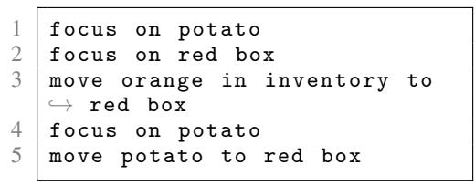  
(a) Original trajectory

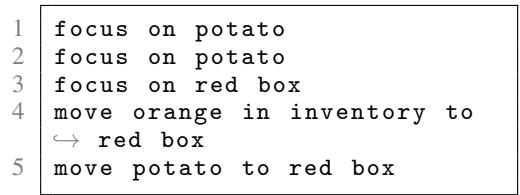  
(b) Shuffled trajectory  
Figure 9: Example of the Shuffle perturbation on a ScienceWorld task. The first and last actions are kept fixed; the middle three steps are randomly reordered. The shuffled version is no longer a sensible plan — focus on potato is repeated immediately at step 2, and the agent moves the potato to the red box at step 5 without re-focusing on it — yet using such trajectories as in-context memory yields performance comparable to using the original trajectories (Section 6).

## NeurIPS Paper Checklist

The checklist is designed to encourage best practices for responsible machine learning research, addressing issues of reproducibility, transparency, research ethics, and societal impact. Do not remove the checklist: The papers not including the checklist will be desk rejected. The checklist should follow the references and follow the (optional) supplemental material. The checklist does NOT count towards the page limit.

Please read the checklist guidelines carefully for information on how to answer these questions. For each question in the checklist:

• You should answer [Yes], [No], or [N/A].

• [N/A] means either that the question is Not Applicable for that particular paper or the relevant information is Not Available.

• Please provide a short (1–2 sentence) justification right after your answer (even for [N/A]).

The checklist answers are an integral part of your paper submission. They are visible to the reviewers, area chairs, senior area chairs, and ethics reviewers. You will also be asked to include it (after eventual revisions) with the final version of your paper, and its final version will be published with the paper.

The reviewers of your paper will be asked to use the checklist as one of the factors in their evaluation. While [Yes] is generally preferable to [No], it is perfectly acceptable to answer [No] provided a proper justification is given (e.g., error bars are not reported because it would be too computationally expensive” or “we were unable to find the license for the dataset we used”). In general, answering [No] or [N/A] is not grounds for rejection. While the questions are phrased in a binary way, we acknowledge that the true answer is often more nuanced, so please just use your best judgment and write a justification to elaborate. All supporting evidence can appear either in the main paper or the supplemental material, provided in appendix. If you answer [Yes] to a question, in the justification please point to the section(s) where related material for the question can be found.

IMPORTANT, please:

• Delete this instruction block, but keep the section heading “NeurIPS Paper Checklist",

• Keep the checklist subsection headings, questions/answers and guidelines below.

• Do not modify the questions and only use the provided macros for your answers.

## 1. Claims

Question: Do the main claims made in the abstract and introduction accurately reflect the paper’s contributions and scope?

Answer: [Yes]

Justification: Yes.

Guidelines:

• The answer [N/A] means that the abstract and introduction do not include the claims made in the paper.

• The abstract and/or introduction should clearly state the claims made, including the contributions made in the paper and important assumptions and limitations. A [No] or [N/A] answer to this question will not be perceived well by the reviewers.

• The claims made should match theoretical and experimental results, and reflect how much the results can be expected to generalize to other settings.

• It is fine to include aspirational goals as motivation as long as it is clear that these goals are not attained by the paper.

## 2. Limitations

Question: Does the paper discuss the limitations of the work performed by the authors?

Answer: [Yes]

Justification: Yes, we have a limitation section.

## Guidelines:

• The answer [N/A] means that the paper has no limitation while the answer [No] means that the paper has limitations, but those are not discussed in the paper.

• The authors are encouraged to create a separate “Limitations” section in their paper.

• The paper should point out any strong assumptions and how robust the results are to violations of these assumptions (e.g., independence assumptions, noiseless settings, model well-specification, asymptotic approximations only holding locally). The authors should reflect on how these assumptions might be violated in practice and what the implications would be.

• The authors should reflect on the scope of the claims made, e.g., if the approach was only tested on a few datasets or with a few runs. In general, empirical results often depend on implicit assumptions, which should be articulated.

• The authors should reflect on the factors that influence the performance of the approach. For example, a facial recognition algorithm may perform poorly when image resolution is low or images are taken in low lighting. Or a speech-to-text system might not be used reliably to provide closed captions for online lectures because it fails to handle technical jargon.

• The authors should discuss the computational efficiency of the proposed algorithms and how they scale with dataset size.

• If applicable, the authors should discuss possible limitations of their approach to address problems of privacy and fairness.

• While the authors might fear that complete honesty about limitations might be used by reviewers as grounds for rejection, a worse outcome might be that reviewers discover limitations that aren’t acknowledged in the paper. The authors should use their best judgment and recognize that individual actions in favor of transparency play an important role in developing norms that preserve the integrity of the community. Reviewers will be specifically instructed to not penalize honesty concerning limitations.

## 3. Theory assumptions and proofs

Question: For each theoretical result, does the paper provide the full set of assumptions and a complete (and correct) proof?

Answer: [N/A]

Justification: We don’t include any theoretical results.

Guidelines:

• The answer [N/A] means that the paper does not include theoretical results.

• All the theorems, formulas, and proofs in the paper should be numbered and crossreferenced.

• All assumptions should be clearly stated or referenced in the statement of any theorems.

• The proofs can either appear in the main paper or the supplemental material, but if they appear in the supplemental material, the authors are encouraged to provide a short proof sketch to provide intuition.

• Inversely, any informal proof provided in the core of the paper should be complemented by formal proofs provided in appendix or supplemental material.

• Theorems and Lemmas that the proof relies upon should be properly referenced.

## 4. Experimental result reproducibility

Question: Does the paper fully disclose all the information needed to reproduce the main experimental results of the paper to the extent that it affects the main claims and/or conclusions of the paper (regardless of whether the code and data are provided or not)?

Answer: [Yes]

Justification: We have experiments detail section in the appendix.

Guidelines:

• The answer [N/A] means that the paper does not include experiments.

• If the paper includes experiments, a [No] answer to this question will not be perceived well by the reviewers: Making the paper reproducible is important, regardless of whether the code and data are provided or not.

• If the contribution is a dataset and/or model, the authors should describe the steps taken to make their results reproducible or verifiable.

• Depending on the contribution, reproducibility can be accomplished in various ways. For example, if the contribution is a novel architecture, describing the architecture fully might suffice, or if the contribution is a specific model and empirical evaluation, it may be necessary to either make it possible for others to replicate the model with the same dataset, or provide access to the model. In general. releasing code and data is often one good way to accomplish this, but reproducibility can also be provided via detailed instructions for how to replicate the results, access to a hosted model (e.g., in the case of a large language model), releasing of a model checkpoint, or other means that are appropriate to the research performed.

• While NeurIPS does not require releasing code, the conference does require all submissions to provide some reasonable avenue for reproducibility, which may depend on the nature of the contribution. For example

(a) If the contribution is primarily a new algorithm, the paper should make it clear how to reproduce that algorithm.

(b) If the contribution is primarily a new model architecture, the paper should describe the architecture clearly and fully.

(c) If the contribution is a new model (e.g., a large language model), then there should either be a way to access this model for reproducing the results or a way to reproduce the model (e.g., with an open-source dataset or instructions for how to construct the dataset).

(d) We recognize that reproducibility may be tricky in some cases, in which case authors are welcome to describe the particular way they provide for reproducibility. In the case of closed-source models, it may be that access to the model is limited in some way (e.g., to registered users), but it should be possible for other researchers to have some path to reproducing or verifying the results.

## 5. Open access to data and code

Question: Does the paper provide open access to the data and code, with sufficient instructions to faithfully reproduce the main experimental results, as described in supplemental material?

Answer: [Yes]

Justification: All experiments did in open-source manner.

Guidelines:

• The answer [N/A] means that paper does not include experiments requiring code.

• Please see the NeurIPS code and data submission guidelines (https://neurips.cc/ public/guides/CodeSubmissionPolicy) for more details.

• While we encourage the release of code and data, we understand that this might not be possible, so [No] is an acceptable answer. Papers cannot be rejected simply for not including code, unless this is central to the contribution (e.g., for a new open-source benchmark).

• The instructions should contain the exact command and environment needed to run to reproduce the results. See the NeurIPS code and data submission guidelines (https: //neurips.cc/public/guides/CodeSubmissionPolicy) for more details.

• The authors should provide instructions on data access and preparation, including how to access the raw data, preprocessed data, intermediate data, and generated data, etc.

• The authors should provide scripts to reproduce all experimental results for the new proposed method and baselines. If only a subset of experiments are reproducible, they should state which ones are omitted from the script and why.

• At submission time, to preserve anonymity, the authors should release anonymized versions (if applicable).

• Providing as much information as possible in supplemental material (appended to the paper) is recommended, but including URLs to data and code is permitted.

## 6. Experimental setting/details

Question: Does the paper specify all the training and test details (e.g., data splits, hyperparameters, how they were chosen, type of optimizer) necessary to understand the results?

Answer: [Yes]

Justification: Details in experimental detail sections.

Guidelines:

• The answer [N/A] means that the paper does not include experiments.

• The experimental setting should be presented in the core of the paper to a level of detail that is necessary to appreciate the results and make sense of them.

• The full details can be provided either with the code, in appendix, or as supplemental material.

## 7. Experiment statistical significance

Question: Does the paper report error bars suitably and correctly defined or other appropriate information about the statistical significance of the experiments?

Answer: [Yes]

Justification: We have statistical analysis section.

Guidelines:

• The answer [N/A] means that the paper does not include experiments.

• The authors should answer [Yes] if the results are accompanied by error bars, confidence intervals, or statistical significance tests, at least for the experiments that support the main claims of the paper.

• The factors of variability that the error bars are capturing should be clearly stated (for example, train/test split, initialization, random drawing of some parameter, or overall run with given experimental conditions).

• The method for calculating the error bars should be explained (closed form formula, call to a library function, bootstrap, etc.)

• The assumptions made should be given (e.g., Normally distributed errors).

• It should be clear whether the error bar is the standard deviation or the standard error of the mean.

• It is OK to report 1-sigma error bars, but one should state it. The authors should preferably report a 2-sigma error bar than state that they have a 96% CI, if the hypothesis of Normality of errors is not verified.

• For asymmetric distributions, the authors should be careful not to show in tables or figures symmetric error bars that would yield results that are out of range (e.g., negative error rates).

• If error bars are reported in tables or plots, the authors should explain in the text how they were calculated and reference the corresponding figures or tables in the text.

## 8. Experiments compute resources

Question: For each experiment, does the paper provide sufficient information on the computer resources (type of compute workers, memory, time of execution) needed to reproduce the experiments?

Answer: [Yes]

Justification: We have computational cost sections in appendix.

Guidelines:

• The answer [N/A] means that the paper does not include experiments.

• The paper should indicate the type of compute workers CPU or GPU, internal cluster, or cloud provider, including relevant memory and storage.

• The paper should provide the amount of compute required for each of the individual experimental runs as well as estimate the total compute.

• The paper should disclose whether the full research project required more compute than the experiments reported in the paper (e.g., preliminary or failed experiments that didn’t make it into the paper).

## 9. Code of ethics

Question: Does the research conducted in the paper conform, in every respect, with the NeurIPS Code of Ethics https://neurips.cc/public/EthicsGuidelines?

Answer: [Yes]

Justification: Yes.

Guidelines:

• The answer [N/A] means that the authors have not reviewed the NeurIPS Code of Ethics.

• If the authors answer [No], they should explain the special circumstances that require a deviation from the Code of Ethics.

• The authors should make sure to preserve anonymity (e.g., if there is a special consideration due to laws or regulations in their jurisdiction).

## 10. Broader impacts

Question: Does the paper discuss both potential positive societal impacts and negative societal impacts of the work performed?

Answer: [N/A]

Justification: Our paper doesn’t have societal impact.

Guidelines:

• The answer [N/A] means that there is no societal impact of the work performed.

• If the authors answer [N/A] or [No], they should explain why their work has no societal impact or why the paper does not address societal impact.

• Examples of negative societal impacts include potential malicious or unintended uses (e.g., disinformation, generating fake profiles, surveillance), fairness considerations (e.g., deployment of technologies that could make decisions that unfairly impact specific groups), privacy considerations, and security considerations.

• The conference expects that many papers will be foundational research and not tied to particular applications, let alone deployments. However, if there is a direct path to any negative applications, the authors should point it out. For example, it is legitimate to point out that an improvement in the quality of generative models could be used to generate Deepfakes for disinformation. On the other hand, it is not needed to point out that a generic algorithm for optimizing neural networks could enable people to train models that generate Deepfakes faster.

• The authors should consider possible harms that could arise when the technology is being used as intended and functioning correctly, harms that could arise when the technology is being used as intended but gives incorrect results, and harms following from (intentional or unintentional) misuse of the technology.

• If there are negative societal impacts, the authors could also discuss possible mitigation strategies (e.g., gated release of models, providing defenses in addition to attacks, mechanisms for monitoring misuse, mechanisms to monitor how a system learns from feedback over time, improving the efficiency and accessibility of ML).

## 11. Safeguards

Question: Does the paper describe safeguards that have been put in place for responsible release of data or models that have a high risk for misuse (e.g., pre-trained language models, image generators, or scraped datasets)?

Answer: [N/A]

Justification: Our paper poses no such risks.

Guidelines:

• The answer [N/A] means that the paper poses no such risks.

• Released models that have a high risk for misuse or dual-use should be released with necessary safeguards to allow for controlled use of the model, for example by requiring that users adhere to usage guidelines or restrictions to access the model or implementing safety filters.

• Datasets that have been scraped from the Internet could pose safety risks. The authors should describe how they avoided releasing unsafe images.

• We recognize that providing effective safeguards is challenging, and many papers do not require this, but we encourage authors to take this into account and make a best faith effort.

## 12. Licenses for existing assets

Question: Are the creators or original owners of assets (e.g., code, data, models), used in the paper, properly credited and are the license and terms of use explicitly mentioned and properly respected?

Answer: [Yes]

Justification: Yes.

Guidelines:

• The answer [N/A] means that the paper does not use existing assets.

• The authors should cite the original paper that produced the code package or dataset.

• The authors should state which version of the asset is used and, if possible, include a URL.

• The name of the license (e.g., CC-BY 4.0) should be included for each asset.

• For scraped data from a particular source (e.g., website), the copyright and terms of service of that source should be provided.

• If assets are released, the license, copyright information, and terms of use in the package should be provided. For popular datasets, paperswithcode.com/datasets has curated licenses for some datasets. Their licensing guide can help determine the license of a dataset.

• For existing datasets that are re-packaged, both the original license and the license of the derived asset (if it has changed) should be provided.

• If this information is not available online, the authors are encouraged to reach out to the asset’s creators.

## 13. New assets

Question: Are new assets introduced in the paper well documented and is the documentation provided alongside the assets?

Answer: [N/A]

Justification: We don’t have any new assets.

Guidelines:

• The answer [N/A] means that the paper does not release new assets.

• Researchers should communicate the details of the dataset/code/model as part of their submissions via structured templates. This includes details about training, license, limitations, etc.

• The paper should discuss whether and how consent was obtained from people whose asset is used.

• At submission time, remember to anonymize your assets (if applicable). You can either create an anonymized URL or include an anonymized zip file.

## 14. Crowdsourcing and research with human subjects

Question: For crowdsourcing experiments and research with human subjects, does the paper include the full text of instructions given to participants and screenshots, if applicable, as well as details about compensation (if any)?

Answer: [N/A]

Justification: We don’t use crowdsourcing or human subjects.

Guidelines:

• The answer [N/A] means that the paper does not involve crowdsourcing nor research with human subjects.

• Including this information in the supplemental material is fine, but if the main contribution of the paper involves human subjects, then as much detail as possible should be included in the main paper.

• According to the NeurIPS Code of Ethics, workers involved in data collection, curation, or other labor should be paid at least the minimum wage in the country of the data collector.

## 15. Institutional review board (IRB) approvals or equivalent for research with human subjects

Question: Does the paper describe potential risks incurred by study participants, whether such risks were disclosed to the subjects, and whether Institutional Review Board (IRB) approvals (or an equivalent approval/review based on the requirements of your country or institution) were obtained?

Answer: [N/A]

Justification: We don’t have human subjects.

Guidelines:

• The answer [N/A] means that the paper does not involve crowdsourcing nor research with human subjects.

• Depending on the country in which research is conducted, IRB approval (or equivalent) may be required for any human subjects research. If you obtained IRB approval, you should clearly state this in the paper.

• We recognize that the procedures for this may vary significantly between institutions and locations, and we expect authors to adhere to the NeurIPS Code of Ethics and the guidelines for their institution.

• For initial submissions, do not include any information that would break anonymity (if applicable), such as the institution conducting the review.

## 16. Declaration of LLM usage

Question: Does the paper describe the usage of LLMs if it is an important, original, or non-standard component of the core methods in this research? Note that if the LLM is used only for writing, editing, or formatting purposes and does not impact the core methodology, scientific rigor, or originality of the research, declaration is not required.

Answer: [N/A]

Justification: We do not use LLMs for important things.

Guidelines:

• The answer [N/A] means that the core method development in this research does not involve LLMs as any important, original, or non-standard components.

• Please refer to our LLM policy in the NeurIPS handbook for what should or should not be described.