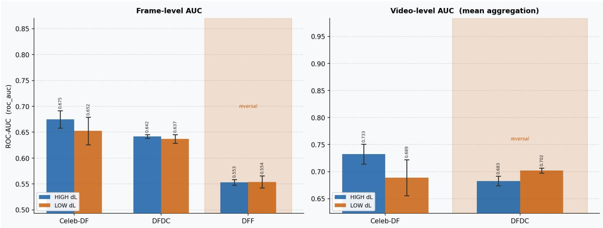
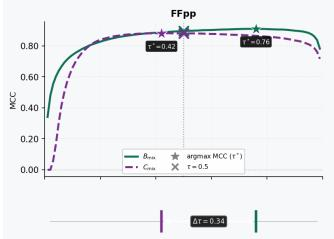
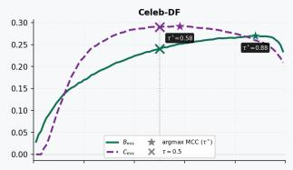
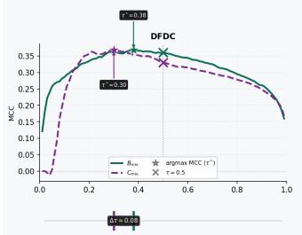
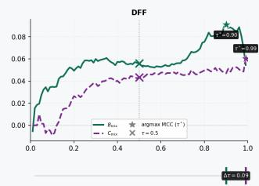
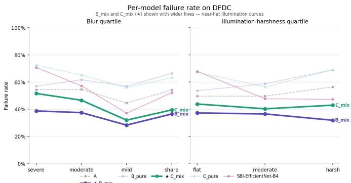

# Does an Illumination Prior Help Face-Swap Detection? A Controlled Study of Temporal Self-Blended Images

Danil Davydov∗, Bader Rasheed†, Dmitriy Vatolin†

∗Innopolis University, Innopolis, Russia

†Laboratory of Innovative Technologies for Processing Video Content, Innopolis University, Innopolis, Russia {d.davydov, b.rasheed, d.vatolin}@innopolis.university

Abstract—Self-blending is the dominant training-data prior in face-swap detection, but it supervises only the blending boundary. We ask whether adding a photometric prior at the same locus helps: Temporal Self-Blended Images (T-SBI) transfer the illumination statistics of one frame onto a self-blended copy of another frame from the same video, gated on a controlled luminance delta ∆L in LAB space, so that illumination inconsistency becomes a learnable training signal. We evaluate T-SBI as a controlled probe rather than as a proposed improvement. A five-regime ablation factorizes supervised, self-blended, and temporally selfblended training; a three-seed ∆L-quartile experiment isolates the illumination delta itself by training on the upper versus lower quartile of accepted pairs. The result is a consistent null on the targeted mechanism: frame-level AUC differences between high-∆L and low-∆L training lie within the combined seed standard deviation on all four evaluation corpora, and a failure taxonomy over 506,328 attribute-binned rows finds no preferential failurerate reduction on harsh-illumination bins. What T-SBI does do is shift the score distribution: the optimal decision threshold moves down by ≈0.34 on FF++ and ≈0.30 on Celeb-DF, which reverses the apparent verdict when models are compared at the conventional threshold of 0.5. The one robust benefit lies elsewhere than intended: under heavy JPEG compression the T-SBI variant retains frame AUC 0.780 on DFDC against 0.696 for its counterpart, consistent with a shift toward low-frequency cues rather than illumination-specific robustness. We report the operating-point analysis that resolves the threshold contradiction, show that F1 is degenerate under cross-dataset imbalance, and argue that photometric training priors must be validated against the attribute they target rather than against aggregate accuracy.

Index Terms—deepfake detection, media forensics, self-blended images, illumination prior, calibration, operating point, failure analysis.

## I. INTRODUCTION

Face-swap detectors that learn generator-specific texture artefacts transfer poorly to unseen manipulations [1], [7]. The most effective known remedy is a training-data prior rather than an architectural one: Face X-Ray [3] and Self-Blended Images (SBI) [2] synthesize fakes by blending an image with a perturbed copy of itself, forcing the classifier onto the blending boundary—a cue common to all compositing pipelines—and achieving strong cross-dataset transfer without labelled fakes.

The blending boundary is not, however, the only physical trace a face swap leaves. The photometric-forensics literature holds that compositing two faces recorded under different illumination produces inconsistencies that physical scene constraints would forbid [4], [5]. This suggests an obvious extension: build the self-blended training pair from two frames of the same video chosen to differ in illumination, so that the synthetic fake carries a photometric inconsistency in addition to a blending boundary. We call this Temporal Self-Blended Images (T-SBI).

The contribution of this paper is not the generator but the measurement. It is easy to add such a prior and report an aggregate accuracy delta; it is much harder to show that any observed change is caused by the mechanism the prior was designed around. We therefore treat T-SBI as a controlled probe and ask three separable questions: does the temporalillumination component change detection performance at all; is the illumination delta of the training pairs the active ingredient; and does the model become preferentially more robust on the image attribute—illumination—that the prior targets? Our contributions are:

• A T-SBI generator with explicit pair-level illumination gating in LAB space, and a seven-variant shortcut ablation verifying that no class-asymmetric pipeline artefact confounds the comparison against classic SBI.

• A three-seed ∆L-quartile experiment isolating the training-pair illumination delta. High-∆L and low-∆L training differ by less than the combined seed standard deviation on every corpus; a video-level direction reversal on DFDC is shown to be a calibration-mediated aggregation artefact.

• A failure taxonomy over 506,328 attribute-binned rows (nine models, four datasets, nine attribute axes) showing that T-SBI produces no preferential failure-rate reduction on harsh-illumination bins—the targeted mechanism is unsupported—and an operating-point analysis identifying a ≈0.30 downward shift in optimal threshold, plus a compression-robustness gain of +0.084 AUC on DFDC, as the effects that are actually present.

## II. RELATED WORK

Blending priors. Face X-Ray [3] localizes forgeries by detecting blending boundaries; SBI [2] removes the dependence on labelled fakes by self-blending a single source image and remains the reference cross-dataset baseline, which we adopt.

Photometric forensics. Illumination direction and shadow geometry constrain plausible image formation, and mismatches indicate manipulation [4], [5]; automated lightinginconsistency detectors follow this line [6]. These methods are typically applied at inference. T-SBI instead injects the photometric constraint at training time, which is where the blending prior already lives.

Evaluation under imbalance. Cross-dataset benchmarks are heavily imbalanced, and threshold-0.5 metrics conflate calibration with capability [7], [8]; we therefore report imbalancerobust threshold sweeps [9], which prove decisive here.

## III. METHOD

## A. Temporal self-blended image generation

Each T-SBI pair is built from two frames of the same source video at distinct time positions. MediaPipe FaceMesh [11] landmarks define a feathered convex-hull mask over the target face (fallback: axis-aligned ellipse). The source frame’s illumination statistics—L-channel mean, L-channel standard deviation, and a low-frequency luminance term inside the mask—are transferred onto a self-blended copy of the target frame, preserving the target’s geometry, identity, expression, and pose so that the training signal is differential illumination rather than incidental geometric inconsistency. We use luminance-only histogram matching with percentile trimming and envelope-based fitting, which suppresses three observed failure modes (flat unicolour faces, blowouts, band artefacts). Pairs are rejected if the source and target boxes differ by >1.3× in scale or >35% in centre offset.

## B. Pair-level illumination gating

Because the hypothesis is that the illumination delta is the active ingredient, each candidate pair is gated explicitly. Let M denote the pixels inside the face box and $L _ { I } ( p )$ the CIELAB lightness of frame I at pixel $p ,$ with within-box moments

$$
\begin{array} { l } { \displaystyle \mu _ { L } ( I ) = \frac { 1 } { | \mathcal { M } | } \sum _ { p \in \mathcal { M } } L _ { I } ( p ) , } \\ { \displaystyle \sigma _ { L } ^ { 2 } ( I ) = \frac { 1 } { | \mathcal { M } | } \sum _ { p \in \mathcal { M } } \big ( L _ { I } ( p ) - \mu _ { L } ( I ) \big ) ^ { 2 } . } \end{array}\tag{1}
$$

The pair-level deltas between source frame $I _ { s }$ and target frame $I _ { t }$ are

$$
\begin{array} { r l } { \Delta L _ { \mathrm { m e a n } } = \left| \mu _ { L } ( I _ { s } ) - \mu _ { L } ( I _ { t } ) \right| , } & { } \\ { \Delta L _ { \mathrm { s t d } } = \left| \sigma _ { L } ( I _ { s } ) - \sigma _ { L } ( I _ { t } ) \right| , } & { } \end{array}\tag{2}
$$

so $\Delta L _ { \mathrm { s t d } }$ is the difference of the two per-frame standard deviations—a change in how spread out the shading is—not the standard deviation of a difference image. Statistics are taken over the detector’s face box, and lightness is on the 8- bit OpenCV LAB scale $L \in [ 0 , 2 5 5 ]$ , so the thresholds below correspond to roughly 2.4 and 1.2 units of CIE L∗. A pair is accepted if

$$
\Delta L _ { \mathrm { m e a n } } \geq 6 \quad \mathrm { o r } \quad \Delta L _ { \mathrm { s t d } } \geq 3 .\tag{3}
$$

The dual criterion covers a global luminance offset and a regional illumination redistribution respectively. To avoid silently discarding evenly-lit videos, a relax fallback accepts the most-different available pair when no pair from a source video clears Eq. (3). Every row records $\Delta L _ { \mathrm { m e a n } } , \Delta L _ { \mathrm { s t d } }$ , and a relax flag, enabling the quartile decomposition below.

The realized pool is itself informative: across 7,320 accepted pairs the median $\Delta L _ { \mathrm { m e a n } }$ is 5.62—below the design threshold—and 22.3% of pairs entered only via the relax fallback. This is not a property of the source material: over the 732 contributing videos the median per-video maximum $\Delta L _ { \mathrm { m e a n } }$ is 10.13 and 89% contain at least one pair clearing the gate. The sampler, not the corpus, is the binding constraint.

## C. Five-regime ablation

Five training regimes factorize the supervised, self-blended, and temporally self-blended components: A (real + FF++ supervised fakes); B pure (real + classic SBI fakes); B mix (A + SBI); C pure (real + SBI + T-SBI); C mix (A + SBI + T-SBI). The clean contrast for the temporal-illumination signal is B mix vs C mix (and B pure vs C pure): identical recipe, hyperparameters, real-class data, and SBI fakes, differing only by the addition of T-SBI pairs. All regimes share an EfficientNet-B4 backbone [12], AdamW with cosine warmup, 380 × 380 input, twenty epochs, and class-balanced batch sampling. Per-image JPEG quality is randomized over [75, 98] for all real and synthetic samples in all regimes, eliminating compression history as a class-asymmetric shortcut.

## D. Shortcut ablation

To verify that any B-vs-C difference reflects training data rather than a pipeline artefact, the T-SBI pipeline is decomposed into seven null variants (N0–N6) in which the active step is replaced by an identity operation, with a parallel suite (P0–P5) for classic SBI. A one-epoch classifier is trained on (real, null-output) and separability measured two-sided as |AUC − 0.5|; ≤0.05 indicates no class-asymmetric signal. The photometric-transfer variants driving the headline contrast (N3–N6) all fall inside the band. Two sit outside: N0 (JPEG round-trip, 0.428), present identically in both B and C regimes and therefore cancelling in the contrast, and N2 (adjacentframe pairing, 0.431), unique to T-SBI and reported as a caveat.

## E. Decisive diagnostic: the ∆L-quartile experiment

The ablation above changes whether T-SBI pairs are present; it does not isolate the illumination delta. We therefore split the accepted pool at its quartiles and build two C mix-recipe training sets that are byte-identical except for the T-SBI portion: HIGHDL (upper quartile, 1,830 pairs, mean $\Delta L _ { \mathrm { m e a n } } = 1 2 . 4 3 )$ and LOWDL (lower quartile, 1,830 pairs, mean 1.57). Real frames, supervised fakes, and classic SBI fakes (24,676 rows) are held identical. Each variant is trained for twenty epochs across three seeds (42, 123, 235) and evaluated on FF++ (indistribution) and Celeb-DF [13], DFDC [14], and DFF [15] (cross-dataset). If the illumination delta is the active ingredient, HIGHDL should separate from LOWDL by more than seed noise.

TABLE I  
FIVE-REGIME CROSS-DATASET AUC (VIDEO-LEVEL MEAN AGGREGATION; DFF FRAME-LEVEL) AND FRAME-LEVEL ECE. THE C-VS-B CONTRAST ISOLATING T-SBI HAS NO CONSISTENT SIGN. SINGLE-SEED; SEE LIMITATIONS.
<table><tr><td></td><td colspan="4">AUC</td><td colspan="2">ECE</td></tr><tr><td>Regime</td><td>FF++</td><td>C-DF</td><td>DFDC</td><td>DFF</td><td>C-DF</td><td>DFDC</td></tr><tr><td>A (supervised)</td><td>0.991</td><td>0.883</td><td>0.824</td><td>0.540</td><td>0.382</td><td>0.482</td></tr><tr><td>B_pure</td><td>0.771</td><td>0.622</td><td>0.691</td><td>0.566</td><td>0.072</td><td>0.298</td></tr><tr><td>B_mix</td><td>0.993</td><td>0.825</td><td>0.869</td><td>0.566</td><td>0.041</td><td>0.281</td></tr><tr><td>C_pure</td><td>0.732</td><td>0.605</td><td>0.625</td><td>0.546</td><td>0.080</td><td>0.300</td></tr><tr><td>C_mix</td><td>0.990</td><td>0.839</td><td>0.866</td><td>0.543</td><td>0.030</td><td>0.305</td></tr><tr><td>SBI (ref.)</td><td>0.879</td><td>0.907</td><td>0.884</td><td>0.614</td><td>一</td><td>一</td></tr></table>

## F. Failure taxonomy

For every crop in every evaluation set we compute nine image attributes (blur, illumination flatness, illumination harshness, yaw, pitch, eye state, gaze deviation, crop tightness, frame-edge contact), binned by within-dataset quantiles, yielding 506,328 rows over nine models and four datasets. For each (model, dataset, axis) we build a contingency table of failure status against attribute bin, apply Pearson’s $\chi ^ { 2 } ,$ and report Cramer’s´ V as the effect size—the meaningful summary, since at these sample sizes negligible effects are still highly significant. We adopt Cohen’s conventions $( V < 0 . 1$ negligible) [10].

## IV. RESULTS

## A. Five-regime ablation: no consistent T-SBI direction

Table I reports cross-dataset AUC and calibration. Three observations follow. First, mixed regimes beat the supervised baseline on DFDC by $\approx + 0 . 0 4$ while A retains the Celeb-DF AUC lead—the canonical SBI-family profile. Second, pure self-blend regimes collapse by 0.13–0.24 AUC, and their indistribution FF++ AUC (0.771/0.732) with ECE ≈0.43–0.48 shows the failure is global, not cross-distributional: mixed supervision is necessary for these recipes to produce a deployable detector at all. Third, and central here, the C-vs-B contrast that isolates T-SBI has no consistent direction: C mix exceeds B mix by +0.014 on Celeb-DF but trails by −0.003 on DFDC, and C pure trails B pure on both. The ablation licenses no universal claim about T-SBI.

Calibration tells a cleaner story than AUC: baseline A is severely miscalibrated despite its Celeb-DF AUC lead (frame ECE 0.382 vs 0.030 for C mix, for 0.044 AUC).

All regimes sit near chance on DFF (0.54–0.57): SBI and T-SBI supervise blending boundaries and illumination differences across them, neither of which exists in fully generated diffusion faces, so our claims are scoped to the face-swap family.

TABLE II  
THREE-SEED ∆L-QUARTILE DIAGNOSTIC, FRAME-LEVEL AUC (MEAN ± SAMPLE STD OVER SEEDS 42/123/235). ALL DIFFERENCES LIE WITHIN THE COMBINED SEED STANDARD DEVIATION.
<table><tr><td>Dataset</td><td>HIGHDL</td><td>LOWDL</td><td>∆</td><td> $| \Delta | / \sigma$ </td></tr><tr><td>Celeb-DF</td><td> $0 . 6 7 5 \pm 0 . 0 1 7$ </td><td> $0 . 6 5 2 \pm 0 . 0 2 7$ </td><td>+0.022</td><td>0.71</td></tr><tr><td>DFDC</td><td> $0 . 6 4 2 \pm 0 . 0 0 4$ </td><td> $0 . 6 3 7 \pm 0 . 0 0 8$ </td><td>+0.005</td><td>0.54</td></tr><tr><td>DFF</td><td> $0 . 5 5 3 \pm 0 . 0 0 5$ </td><td> $0 . 5 5 4 \pm 0 . 0 1 2$ </td><td>-0.001</td><td>0.08</td></tr><tr><td>FF++</td><td> $0 . 7 8 4 \pm 0 . 0 4 6$ </td><td> $0 . 7 9 0 \pm 0 . 0 1 5$ </td><td>-0.006</td><td>0.12</td></tr></table>

TABLE III

THREE-SEED ∆L-QUARTILE DIAGNOSTIC, VIDEO-LEVEL AUC BYAGGREGATION STRATEGY. CELEB-DF FAVOURS HIGHDL UNDER ALLTHREE STRATEGIES AND DFDC FAVOURS LOWDL; THE DFDC GAP ISLARGEST FOR THE TWO DISTRIBUTION-DEPENDENT AGGREGATORS(MEAN, VOTE) AND COLLAPSES FOR MAX, WHICH IS THE CLOSEST TO ARANK-BASED AGGREGATOR.
<table><tr><td>Dataset</td><td>Aggr.</td><td>HIGHDL</td><td>LOWDL</td><td>∆</td><td> $| \Delta | / \sigma$ </td></tr><tr><td rowspan="3"> $_ \mathrm { C e l e b - D F }$ </td><td>max</td><td> $0 . 7 2 7 \pm 0 . 0 8 7$ </td><td> $0 . 7 0 8 \pm 0 . 0 8 7$ </td><td>+0.019</td><td>0.15</td></tr><tr><td>mean</td><td> $0 . 7 3 3 \pm 0 . 0 1 8$ </td><td> $0 . 6 8 9 \pm 0 . 0 3 3$ </td><td>+0.044</td><td>1.15</td></tr><tr><td>vote</td><td> $0 . 6 6 1 \pm 0 . 0 6 1$ </td><td> $0 . 6 3 3 \pm 0 . 0 3 1$ </td><td>+0.028</td><td>0.41</td></tr><tr><td rowspan="3">DFDC</td><td>max</td><td> $0 . 6 6 8 \pm 0 . 0 1 4$ </td><td> $0 . 6 9 1 \pm 0 . 0 3 6$ </td><td>-0.023</td><td>0.60</td></tr><tr><td>mean</td><td> $0 . 6 8 3 \pm 0 . 0 0 9$ </td><td> $0 . 7 0 2 \pm 0 . 0 0 5$ </td><td>-0.019</td><td>1.92</td></tr><tr><td>vote</td><td> $0 . 6 6 7 \pm 0 . 0 0 9$ </td><td> $0 . 7 0 4 \pm 0 . 0 1 5$ </td><td>-0.037</td><td>2.09</td></tr><tr><td rowspan="3"> $\mathrm { F F } { + } { + }$ </td><td>max</td><td> $0 . 9 1 8 \pm 0 . 0 1 5$ </td><td> $0 . 9 1 7 \pm 0 . 0 2 1$ </td><td>+0.001</td><td>0.05</td></tr><tr><td>mean</td><td> $0 . 9 0 3 \pm 0 . 0 2 4$ </td><td> $0 . 8 9 8 \pm 0 . 0 1 9$ </td><td>+0.005</td><td>0.17</td></tr><tr><td>vote</td><td> $0 . 9 0 3 \pm 0 . 0 2 2$ </td><td> $0 . 8 9 7 \pm 0 . 0 3 2$ </td><td>+0.006</td><td>0.16</td></tr></table>

## B. The illumination delta is not the active ingredient

Table II reports the three-seed ∆L-quartile result. Every frame-level difference lies inside the combined seed standard deviation: the ratio $| \Delta | / \mathrm { s t d } _ { \mathrm { c o m b } }$ is 0.71 (Celeb-DF), 0.54 (DFDC), 0.08 (DFF), and 0.12 (FF++), none approaching a defensible threshold of ≈2. The nominal sign favours HIGHDL on the two face-swap OOD corpora and is essentially zero elsewhere, but no cell supports a claim of difference. Training on pairs with an order-of-magnitude larger illumination delta (12.43 vs 1.57) does not measurably change frame-level detection.

Video-level aggregation appears to contradict this: HIGHDL wins all three strategies (max/mean/vote) on Celeb-DF, LOWDL wins all three on DFDC, with the DFDC mean and vote cells reaching ratios of 1.92 and 2.09—the study’s strongest signal, pointing against HIGHDL. The mechanism is calibration, not discrimination. Both variants are severely miscalibrated on DFDC (frame ECE 0.419 and 0.430, with large seed variance), and mean and vote aggregation depend on the per-frame score distribution, so calibration differences compound across frames. Max—using only the top-scoring frame, the closest to a rank-based aggregator—shrinks the gap to 0.60, matching the frame-level near-tie. The reversal is thus a miscalibration-mediated aggregation artefact, not evidence that $_ { \mathrm { 1 o w - } \Delta L }$ training yields better features (Fig. 1). Table III gives the video-level numbers behind this argument.

  
Fig. 1. HIGHDL vs LOWDL AUC with three-seed error bars. Left: frame level, four datasets—HIGHDL is at or above LOWDL on every OOD corpus, but all margins are small relative to seed variance and both variants discriminate only weakly (0.55–0.67). Right: video level (mean aggregation), three datasets—th DFDC comparison reverses, coinciding with severe frame-level miscalibration on that corpus (ECE ≈0.42 for both).

## C. A dataset-level illumination control

A natural alternative explanation for the Celeb-DF/DFDC asymmetry is that Celeb-DF is illumination-static, leaving a within-clip illumination feature nothing to act on. Measured on real crops this is false: Celeb-DF has the largest median within-video $\Delta L _ { \mathrm { m e a n } }$ p90 (9.97, vs 8.91 FF++ and 9.76 DFDC) and the smallest static-clip fraction (0.15, vs 0.29 and 0.21). DFDC differs instead on orthogonal axes: shadowstructure variation $( \Delta L _ { \mathrm { s t d } } ~ \mathrm { p } 9 0 = 6 . 5 $ vs ≈4.2) and betweenvideo diversity (p95–p05 of per-video mean L: 119.4 vs 76–82). The variable T-SBI targets does not separate these corpora, ruling out within-video illumination distribution as the mediator.

## D. The mechanism is a threshold shift, not illumination robustness

Comparing B mix and C mix at threshold 0.5 suggests T-SBI hurts: failure rate rises from 12.8% to 15.9% (Celeb-DF), 35.1% to 42.3% (DFDC), 28.0% to 34.3% (DFF). Bootstrapped AUC says the opposite on Celeb-DF, with nonoverlapping 95% CIs (0.736–0.742 vs 0.751–0.756). A full threshold sweep resolves the contradiction, and the resolution is the paper’s methodological point.

First, F1 is unusable here. At 86%/14% (Celeb-DF), 80%/20% (DFDC), and 72%/28% (DFF) imbalance, a degenerate all-real classifier scores F1 ≈0.92 on Celeb-DF; empirically, argmax-F1 thresholds collapsed to the grid floor (0.01) for 23 of 31 (model, dataset) pairs. We therefore use balanced accuracy, MCC, and Youden’s J over 99 thresholds in [0.01, 0.99].

Second, T-SBI moves the operating point. B mix’s argmax-MCC threshold on Celeb-DF is 0.88 while C mix’s is 0.58— a shift of ≈0.30; on FF++ the shift is $0 . 7 6 ~  ~ 0 . 4 2 .$ , i.e. ≈0.34 (Table IV, Fig. 2). The shift attenuates to ≈0.08–0.09 with inconsistent sign on DFDC and DFF. Where the shift is large, evaluating at 0.5 systematically penalizes B mix (whose optimum is far above 0.5) and flatters C mix (whose optimum sits near it). The confusion decomposition makes this concrete: on Celeb-DF at 0.5, B mix has a 0.9% false-positive and 80% false-negative rate, C mix 7.9% and 58%. T-SBI trades real-precision for fake-recall; it does not uniformly degrade or improve capability.

TABLE IV  
THRESHOLD-SWEEP OPTIMA (FRAME LEVEL). “@THR” IS THETHRESHOLD ATTAINING THE OPTIMUM. T-SBI (C MIX) LOWERS THEOPTIMAL OPERATING POINT SUBSTANTIALLY ON FF++ AND CELEB-DF,MARGINALLY ELSEWHERE.
<table><tr><td>Dataset</td><td>Model</td><td>bal-acc</td><td>MCC</td><td>@thr</td><td>J</td></tr><tr><td rowspan="2">FF++</td><td>B_mix</td><td>0.968</td><td>0.910</td><td>0.76</td><td>0.935</td></tr><tr><td>C_mix</td><td>0.961</td><td>0.881</td><td>0.42</td><td>0.922</td></tr><tr><td rowspan="2">Celeb-DF</td><td>B_mix</td><td>0.664</td><td>0.270</td><td>0.88</td><td>0.327</td></tr><tr><td>C_mix</td><td>0.678</td><td>0.292</td><td>0.58</td><td>0.355</td></tr><tr><td rowspan="2">DFDC</td><td>B_mix</td><td>0.727</td><td>0.368</td><td>0.38</td><td>0.455</td></tr><tr><td>C_mix</td><td>0.728</td><td>0.368</td><td>0.30</td><td>0.456</td></tr><tr><td rowspan="2">DFF</td><td>B_mix</td><td>0.551</td><td>0.091</td><td>0.90</td><td>0.103</td></tr><tr><td> $\operatorname { C } \operatorname { m i x }$ </td><td>0.531</td><td>0.060</td><td>0.99</td><td>0.061</td></tr></table>

## E. Robustness: one condition where T-SBI helps

Restricting attention to clean-image AUC would understate T-SBI. Under the image-level perturbation grid (JPEG $q ~ \in ~ \{ 9 5 , 7 5 , 5 5 , 4 0 \}$ , Gaussian blur $\sigma ~ \in ~ \{ 0 . 5 , 1 , 2 , 3 \}$ , denoise/sharpen, gamma, resize), the mixed T-SBI variant is the more compression-robust model, and the effect is largest exactly where compression is heaviest (Table V). On DFDC at q40, C mix retains frame AUC 0.780 against B mix’s 0.696— a margin of +0.084, the largest single-condition gap in the study and an order of magnitude larger than any clean-image difference. C mix also degrades more gracefully under heavy blur on all three face-swap corpora $( + 0 . 0 2 { - } 0 . 0 3 \mathrm { \ a t \ } \sigma = 3 )$

  
Fig. 2. MCC versus decision threshold for B mix and C mix, per dataset. Stars mark each model’s argmax; crosses mark threshold 0.5. The T-SBI variant’s optimum sits ≈0.30–0.34 lower on FF++ and Celeb-DF, which is what makes threshold-0.5 comparisons misleading.

TABLE V  
FRAME-LEVEL AUC UNDER JPEG COMPRESSION AND GAUSSIAN BLUR. C MIX (T-SBI) IS MARKEDLY MORE ROBUST TO HEAVY COMPRESSION ON DFDC AND DEGRADES MORE GRACEFULLY UNDER BLUR ON THE FACE-SWAP CORPORA. SINGLE-SEED.
<table><tr><td>Dataset</td><td>Model</td><td> $q 9 5$ </td><td> $q 4 0$ </td><td> $\sigma { = } 0 . 5$ </td><td> $\sigma { = } 3$ </td></tr><tr><td rowspan="3">FF++</td><td>A</td><td>0.991</td><td>0.984</td><td>0.990</td><td>0.925</td></tr><tr><td> $\mathbf { B } \_ { \mathrm { m i x } }$ </td><td>0.993</td><td>0.977</td><td>0.993</td><td>0.843</td></tr><tr><td> $\mathbf { C } \_ { \mathrm { m i x } }$ </td><td>0.990</td><td>0.980</td><td>0.990</td><td>0.875</td></tr><tr><td rowspan="3">Celeb-DF</td><td>A</td><td>0.824</td><td>0.793</td><td>0.822</td><td>0.705</td></tr><tr><td>B_mix</td><td>0.747</td><td>0.757</td><td>0.745</td><td>0.608</td></tr><tr><td>C_mix</td><td>0.758</td><td>0.760</td><td>0.762</td><td>0.627</td></tr><tr><td rowspan="3">DFDC</td><td>A</td><td>0.752</td><td>0.730</td><td>0.748</td><td>0.610</td></tr><tr><td> $\mathbf { B } \_ { \mathrm { m i x } }$ </td><td>0.785</td><td>0.696</td><td>0.796</td><td>0.575</td></tr><tr><td> $\mathbf { C } \_ { \mathrm { m i x } }$ </td><td>0.793</td><td>0.780</td><td>0.800</td><td>0.606</td></tr></table>

This is consistent with the score-distribution account rather than in tension with it. Illumination-varied training pairs push the model toward low-frequency global cues, which are precisely the cues that survive aggressive quantisation, whereas blending-boundary evidence is high-frequency and is destroyed first. T-SBI therefore changes which evidence the model weights, which shows up as compression robustness rather than as clean-image accuracy or as illumination-specific robustness. We note that these runs share the single-seed limitation of the headline ablation.

## F. The targeted attribute shows no effect

If T-SBI worked through illumination robustness, C mix should show either stronger illumination structure in its failures than B mix, or a reduced failure rate on harshillumination bins. Neither occurs. Across the taxonomy, C mix’s illumination-harshness Cramer’s´ V is lower than B mix’s on every dataset (Celeb-DF 0.035 vs 0.060; DFDC 0.031 vs 0.050; FF++ 0.017 vs 0.019), all below 0.05— negligible—with per-bin failure-rate spreads of only 1–5 percentage points and no monotonic ordering (Fig. 3).

  
Fig. 3. Per-model failure rate on DFDC by blur quartile (left) and illumination-harshness bin (right). B mix and C mix—the T-SBI contrast— are near-flat on the illumination axis, with no preferential reduction on the harsh bin.

The wider taxonomy corroborates this. Of 216 (model, dataset, axis) triples, only 23 reach $V \geq 0 . 1 0 .$ , just 2 exceed 0.20, and none exceed 0.30: there are no medium or large effects anywhere. The strongest illumination-related sensitivity belongs not to any T-SBI variant but to the off-the-shelf SBI reference on DFDC $( V \ : = \ : 0 . 1 9 2 )$ , and it peaks on the $f l a t -$ illumination bin—the opposite of the T-SBI hypothesis. The only clean monotonic effect in the predicted direction on any axis is head pose on FF++ (frontal 3.4–3.8% vs profile 15.2– 16.7%).

Failure-set overlap agrees: the B mix↔C mix Jaccard is 0.29 on FF++ and 0.46–0.64 on OOD corpora, so T-SBI changes which samples fail at nearly unchanged failure counts.

## V. DISCUSSION

Our three questions resolve negatively. The C-vs-B contrast changes sign across corpora; an eightfold difference in training-pair $\Delta L$ produces frame-level differences within seed noise on all four corpora; and the taxonomy shows no preferential harsh-illumination improvement, with the T-SBI variant’s illumination effect sizes uniformly smaller than its counterpart’s.

What T-SBI reliably does is shift the score distribution, lowering the optimal decision threshold by ≈0.30 where its effect is largest, and—relatedly—reweight the evidence toward low-frequency cues, which is visible as a substantial compression-robustness gain on DFDC. Both are real effects; neither is the illumination mechanism the prior was designed around. This is not nothing: it changes the false-positive/falsenegative balance in a direction that favours fake-recall, which some deployments want. But it is a calibration-level effect, and it would have been easy to mistake for a capability gain—or, read at threshold 0.5, for a capability loss. Both readings appear in our own data, and only the threshold sweep distinguishes them.

The generalizable lesson concerns validation practice. A prior motivated by a physical attribute should be validated against that attribute, not against aggregate accuracy. An attribute-binned failure taxonomy costs one inference pass over data already collected and would have falsified the illumination mechanism immediately, whereas the aggregate AUC deltas—+0.014 here, −0.003 there—invited overinterpretation in both directions. The sampler diagnostic makes a related point: our gate admitted a median pair below its own threshold while the corpus held far larger deltas, so a prior can be much weaker in the realized training data than its design implies—reporting the realized distribution of the gated quantity should be routine.

Limitations. The five-regime ablation is single-seed; only the ∆L-quartile diagnostic is repeated over three seeds, and small cross-regime AUC deltas should be read with that in mind. The HIGHDL pool over-represents DeepFakeDetection content while LOWDL over-represents FF++ YouTube footage, so pair $\Delta L$ is partially confounded with source style. Our illumination descriptor collapses spatial structure to two scalars and cannot distinguish side-lit from front-lit faces at equal mean luminance—though it is the same descriptor the gate uses, so the analysis is internally consistent. Finally, the taxonomy is computed at threshold 0.5; the operating-point analysis mitigates but does not remove this.

## VI. CONCLUSION

We built a temporal self-blending generator injecting a photometric prior into face-swap detector training, then tried hard to detect its effect. Across a five-regime ablation, a threeseed illumination-delta experiment, a dataset-level illumination control, and a 506,328-row failure taxonomy, the targeted mechanism is unsupported: training-pair illumination delta does not measurably change frame-level detection, and no preferential robustness appears on harsh-illumination bins. The effects that are present are a ≈0.30 downward shift in the optimal decision threshold—which inverts the apparent verdict depending on whether models are compared at 0.5 or at their own optima—and improved robustness to heavy compression, neither of which is the mechanism the prior targeted. We therefore report T-SBI as a controlled probe rather than an improvement, and offer its diagnostics—realized-gate reporting, imbalance-robust threshold sweeps, and attribute-binned failure taxonomies—as reusable instruments for evaluating any physically motivated training prior.

## APPENDIX A

## TRAINING AND EVALUATION PROTOCOL

Table VI consolidates the configuration shared by all five regimes and both ∆L-quartile variants, for reproducibility.

## REFERENCES

[1] A. Rossler, D. Cozzolino, L. Verdoliva, C. Riess, J. Thies, and M.¨ Nießner, “FaceForensics++: Learning to detect manipulated facial images,” in Proc. IEEE/CVF ICCV, 2019.

TABLE VI  
T-SBI PIPELINE, TRAINING, AND EVALUATION CONFIGURATION. ALL REGIMES SHARE THE BACKBONE, SCHEDULE, AND AUGMENTATION; REGIMES DIFFER ONLY IN THE COMPOSITION OF THE FAKE CLASS.
<table><tr><td>Item</td><td>Setting</td></tr><tr><td>T-SBI generation</td><td></td></tr><tr><td>Landmarks</td><td>MediaPipe FaceMesh (ellipse fallback)</td></tr><tr><td>Mask</td><td>Feathered convex hull over target face</td></tr><tr><td>Transfer</td><td>Luminance-only histogram matching</td></tr><tr><td>Pair rejection</td><td> ${ > } 1 . 3 \times$  scale or  ${ > } 3 5 \%$  centre offset</td></tr><tr><td>Gate</td><td> $\Delta L _ { \mathrm { m e a n } } \ge 6$  or  $\Delta L _ { \mathrm { s t d } } \ge 3 ,$  relax fallback</td></tr><tr><td>Accepted pairs</td><td>7,320 from 732 source videos</td></tr><tr><td>Training</td><td></td></tr><tr><td>Backbone</td><td>EfficientNet-B4</td></tr><tr><td>Optimizer</td><td>AdamW, cosine warmup</td></tr><tr><td>Input resolution</td><td> $3 8 0 \times 3 8 0$ </td></tr><tr><td>Epochs / batch</td><td>20 / 32</td></tr><tr><td>Sampling</td><td>Class-balanced within batch</td></tr><tr><td>JPEG randomization</td><td> $q \in [ 7 5 , 9 8 ] .$  all classes, all regimes</td></tr><tr><td>Seeds</td><td>42 (headline); 42/123/235 (∆L quartile)</td></tr><tr><td>Evaluation</td><td></td></tr><tr><td>Corpora</td><td>FF++ (in-dist.); Celeb-DF, DFDC, DFF (OOD)</td></tr><tr><td>Metrics</td><td>AUC, ECE, balanced acc., MCC, Youden&#x27;s J</td></tr><tr><td>Threshold sweep</td><td>99 points in [0.01, 0.99]</td></tr><tr><td>Aggregation</td><td>Frame; video max / mean / vote</td></tr><tr><td>Taxonomy</td><td>9 attributes, within-dataset quantile bins</td></tr></table>

[2] K. Shiohara and T. Yamasaki, “Detecting deepfakes with self-blended images,” in Proc. IEEE/CVF CVPR, 2022.

[3] L. Li, J. Bao, T. Zhang, H. Yang, D. Chen, F. Wen, and B. Guo, “Face Xray for more general face forgery detection,” in Proc. IEEE/CVF CVPR, 2020.

[4] M. K. Johnson and H. Farid, “Exposing digital forgeries in complex lighting environments,” IEEE Trans. Inf. Forensics Security, vol. 2, no. 3, pp. 450–461, 2007.

[5] E. Kee, J. F. O’Brien, and H. Farid, “Exposing photo manipulation with inconsistent shadows,” ACM Trans. Graphics, vol. 32, no. 3, pp. 28:1– 28:12, 2013.

[6] W. Wu, W. Zhou, W. Zhang, H. Fang, and N. Yu, “Capturing the lighting inconsistency for deepfake detection,” in Artificial Intelligence and Security (ICAIS), LNCS vol. 13339. Springer, 2022, pp. 637–647.

[7] A. V. Nadimpalli and A. Rattani, “On improving cross-dataset generalization of deepfake detectors,” in Proc. IEEE/CVF CVPR Workshops, 2022, pp. 91–99.

[8] C. Guo, G. Pleiss, Y. Sun, and K. Q. Weinberger, “On calibration of modern neural networks,” in Proc. ICML, 2017.

[9] B. W. Matthews, “Comparison of the predicted and observed secondary structure of T4 phage lysozyme,” Biochim. Biophys. Acta, vol. 405, no. 2, pp. 442–451, 1975.

[10] J. Cohen, Statistical Power Analysis for the Behavioral Sciences, 2nd ed. Lawrence Erlbaum, 1988.

[11] C. Lugaresi et al., “MediaPipe: A framework for building perception pipelines,” arXiv:1906.08172, 2019.

[12] M. Tan and Q. V. Le, “EfficientNet: Rethinking model scaling for convolutional neural networks,” in Proc. ICML, 2019.

[13] Y. Li, X. Yang, P. Sun, H. Qi, and S. Lyu, “Celeb-DF: A large-scale challenging dataset for DeepFake forensics,” in Proc. IEEE/CVF CVPR, 2020.

[14] B. Dolhansky, J. Bitton, B. Pflaum, J. Lu, R. Howes, M. Wang, and C. C. Ferrer, “The DeepFake Detection Challenge (DFDC) dataset,” arXiv:2006.07397, 2020.

[15] H. Song, S. Huang, Y. Dong, and W.-W. Tu, “Robustness and generalizability of deepfake detection: A study with diffusion models,” arXiv:2309.02218, 2023.