# EMERGENT INVERSE-DEPTH SCALING FROM NONLIN-EARITY IN ATTENTION

Zirui Peng1∗, Yizhou Liu2, Ziming Liu3, Jeff Gore2,†

1Department of Physics, Peking University

2Department of Physics, Massachusetts Institute of Technology, Cambridge, MA

3College of AI, Tsinghua University

†Corresponding author: gore@mit.edu

## ABSTRACT

Scaling laws describe power-law improvements in model performance with dataset size and parameter count, yet their underlying mechanisms are not fully understood. To explain the parameter count scaling, existing theory posits power-law scaling with model depth. In linear-attention models,1 this scaling is tied to a powerlaw data spectrum: unable to selectively attend to relevant tokens, these models learn according to global spectral strength, with stronger directions learned before weaker ones. Large language models, however, can be strongly nonlinear. Here, we show that nonlinear attention yields inverse-depth decay of loss across all tested data spectra. Nonlinearity enables attention to focus selectively on relevant tokens, allowing strong and weak spectral directions to be learned in parallel. Similar focusing across layers motivates a connection to the central limit theorem: shared error across layers sets the loss plateau, while aggregation turns layer-specific differences into continued gains with depth. Our findings suggest that depth scaling may arise from nonlinearity in attention, which allows large language models to focus locally and may make the global covariance structure less relevant.

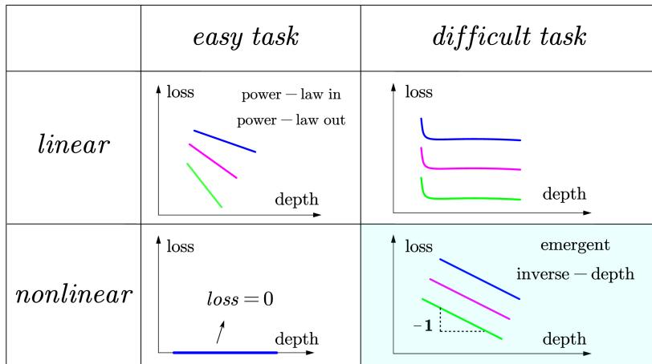  
Figure 1: The nonlinear-attention model can yield inverse-depth scaling across all tested data spectra. This overview compares depth-dependent performance across models and tasks. Colors distinguish data spectra, and all panels are plotted on a log-log scale.

## 1 INTRODUCTION

Neural scaling laws describe how model loss decreases with the size of the dataset and the model, providing a practical basis for predicting performance and allocating computational resources (Hestness et al., 2017; Kaplan et al., 2020; Hoffmann et al., 2022). Despite their predictive success, these laws remain largely empirical, and the mechanisms underlying their behavior are not fully understood. Clarifying their origins could help establish the scope of these laws and reveal how scaling can be made more efficient.

Recent theoretical work has begun to examine model-size scaling more closely by separating the roles of width and depth (Bahri et al., 2024; Liu et al., 2025; Bordelon et al., 2026). Increasing width provides more representational capacity within each layer, whereas increasing depth adds successive processing steps; the two can therefore improve performance through different mechanisms. Here, we focus on how models use additional layers and how this gives rise to scaling with depth. Previous work on linear-attention models ties power-law depth scaling to a power-law data spectrum (Bordelon et al., 2026). Yet it does not account for nonlinear attention in practical large language models. In contrast, empirical work on these models suggests that inverse-depth scaling can arise through an ensemble of layers with similar behavior (Liu et al., 2026a), without explaining the underlying reason for this layerwise similarity. We therefore ask:

## Our research question:

How does nonlinearity in attention affect depth scaling and its underlying mechanisms?

We study this question in the common setting of in-context learning (ICL), where a model uses examples in its context to make predictions for a new query. Our tasks model the second half of an induction head’s computation: retrieving the token that matches the query and copying its associated value (Elhage et al., 2021; Olsson et al., 2022; Lv et al., 2025). To isolate the role of nonlinearity, we compare controlled Transformers with linear or nonlinear attention across independently varied data spectra.

Figure 1 summarizes the resulting picture. In an easy task, the linear-attention model follows a spectrum-dependent power law, while a single-layer nonlinear-attention model is enough to solve the task. In a difficult task, the linear-attention model quickly plateaus, whereas the nonlinear-attention model exhibits inverse-depth loss scaling. Unlike the linear-attention model, which cannot selectively focus on relevant tokens, the nonlinear-attention model can attend to them directly, allowing strong and weak spectral directions to be learned in parallel and enabling better utilization of depth. Further analysis decomposes the loss into cross-layer and within-layer terms and connects this decomposition to the central limit theorem. The asymptotic behavior of these terms explains the origins of the loss plateau and the reducible loss.

Finally, we relax several simplifying assumptions of the controlled setup to move closer to standard Transformers and observe similar signs of inverse-depth scaling. These results suggest that nonlinearity in attention can be a plausible source of depth scaling in real models and may make scaling less dependent on the global covariance structure of the data.

## Our contributions are the following:

• We discover that nonlinearity in attention can qualitatively affect depth scaling, enabling emergent inverse-depth loss scaling across all tested spectra.

• We explain how nonlinear attention enables parallel learning of strong and weak spectral directions, in contrast to the sequential learning behavior of linear-attention models.

• We connect inverse-depth scaling to the central limit theorem through a loss decomposition that identifies the origins of the loss plateau and the gains from depth.

## 2 PROBLEM SETUP

## 2.1 TASK SETUP

In-context learning is a common setting in which predictions rely on interactions among context tokens. These interactions expose the structure of the data, providing a useful setting for studying the origins of depth scaling. We consider a controlled ICL problem in which each context contains $P$ inputs $\pmb { x } _ { i } \in \bar { \mathbb { R } } ^ { d }$ with labels generated by a teacher vector $\beta \in \mathbb { R } ^ { d }$

$$
y _ { i } = \beta ^ { \top } { \pmb x } _ { i } , \qquad i = 1 , \ldots , P .\tag{1}
$$

Let $\lambda _ { k }$ and $\omega _ { k }$ denote the eigenvalues of the input and teacher covariances, respectively. To control input and task structure independently, we vary these spectra as

$$
\lambda _ { k } \propto k ^ { - a } , \qquad \omega _ { k } \propto k ^ { - b } , \qquad k = 1 , \dots , d .\tag{2}
$$

Here, $a , b \geq 0$ are the input-spectrum and teacher-spectrum exponents, respectively. They independently control how rapidly the corresponding variances decay across feature directions. Setting either exponent to zero gives an isotropic covariance for the corresponding distribution.

In natural language, different contexts may share similar features but express them along different directions. Following Bordelon et al. $( 2 0 2 6 )$ , we model this variation by independently sampling an orthogonal rotation matrix $O \in \mathbb { R } ^ { d \times d }$ for each context. Conditioned on O, the input and teacher covariances are

$$
\begin{array} { r l } & { \Sigma = \operatorname { C o v } ( \pmb { x } _ { i } \mid O ) = O \operatorname { d i a g } ( \lambda _ { 1 } , \dots , \lambda _ { d } ) O ^ { \top } , } \\ & { \Omega = \operatorname { C o v } ( \beta \mid O ) = O \operatorname { d i a g } ( \omega _ { 1 } , \dots , \omega _ { d } ) O ^ { \top } . } \end{array}\tag{3}
$$

Conditioned on $O ,$ we sample the teacher vector independently of the context and test inputs, which are drawn i.i.d.:

$$
\begin{array} { c } { \beta \sim \mathcal { N } ( \mathbf { 0 } , \boldsymbol { \Omega } ) , } \\ { x _ { 1 } , \dots , x _ { P } , x _ { \mathrm { t e s t } } \overset { \mathrm { i . i . d . } } { \sim } \mathcal { N } ( \mathbf { 0 } , \boldsymbol { \Sigma } ) . } \end{array}\tag{4}
$$

The model must therefore infer the relevant directions from each context rather than rely on fixed directions across contexts.

We first construct an easy task using a widely studied ICL setting (Garg et al., 2022; von Oswald et al., 2023; Ahn et al., 2023; Bordelon et al., 2026). Given context inputs and their teacher-generated labels, the model must predict the label assigned to a test input by the same teacher. Following Bordelon et al. (2026), we consider the infinite-context limit $P  \infty$ , in which a context token can be found arbitrarily close to the test token. The task can therefore be approximated by retrieving the closest context token and copying its label. This retrieval-and-copying operation corresponds to the second half of an inductionhead circuit identified in language models (Elhage et al., 2021; Olsson et al., 2022; Lv et al.,

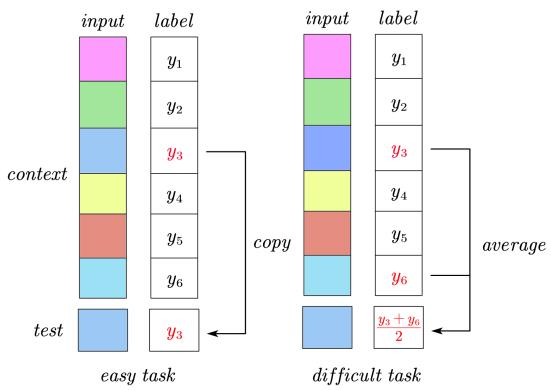  
Figure 2: Both tasks model the second half of an induction head: the easy task copies the most relevant token’s label, while the difficult task averages the labels of the top-k relevant tokens.

2025). The task can thus be viewed, in an idealized sense, as an exact-match problem:

$$
\begin{array} { r } { x _ { \mathrm { { t e s t } } } = x _ { j } , \qquad y _ { \mathrm { { t e s t } } } ^ { \ast } = y _ { j } , \qquad j \in \{ 1 , \dots , P \} , \quad P \to \infty . } \end{array}\tag{5}
$$

However, in practical ICL and language settings, prediction often requires combining information from multiple context tokens rather than retrieving a single one. Motivated by this need, we construct a difficult task that extends this induction-head-inspired operation from top-1 retrieval to top-k

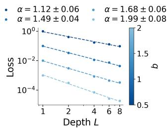  
(a) Fixed a = 2

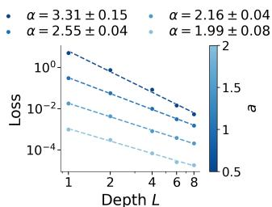  
(b) Fixed b = 2

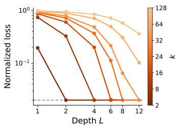  
(c) Normalized mode-wise loss  
Figure 3: On the easy task, the linear-attention model exhibits spectrum-dependent depth scaling and learns spectral modes sequentially. (a) Varying b at fixed $a = 2$ . (b) Varying a at fixed $b = 2$ Dashed curves show power-law fits, with the corresponding exponents indicated. (c) Normalized loss of representative spectral modes. Values below 2% are displayed at the threshold marked by the dashed line.

aggregation. We measure relevance by cosine similarity and average the selected labels. The selected index set and target are defined by

$$
\begin{array} { r l r } {  { S _ { k } ( { \pmb x } _ { \mathrm { t e s t } } ) = \mathrm { T o p K } _ { i \in \{ 1 , \dots , P \} } \frac { { \pmb x } _ { i } ^ { \top } { \pmb x } _ { \mathrm { t e s t } } } { \| { \pmb x } _ { i } \| \| { \pmb x } _ { \mathrm { t e s t } } \| } , } } \\ & { } & { \qquad y _ { \mathrm { t e s t } } ^ { * } = \displaystyle \frac { 1 } { k } \sum _ { i \in S _ { k } ( { \pmb x } _ { \mathrm { t e s t } } ) } y _ { i } . } \end{array}\tag{6}
$$

Here, TopK returns the indices of the k largest scores. Figure 2 summarizes these induction-headinspired top-1 copying and top-k aggregation tasks.

## 2.2 MODEL SETUP

Large language models combine positional encodings, multiple attention heads, MLP blocks, normalization, and task-specific readouts. While important in practice, these components make it difficult to isolate the mechanisms underlying depth scaling. Building on Bordelon et al. (2026), we therefore use a simplified architecture that retains the components needed for context-dependent retrieval and label propagation, allowing a controlled comparison between linear and nonlinear attention.

Embeddings. Each context provides P input–label pairs $( { \pmb x } _ { i } , y _ { i } )$ , where the teacher vector $\beta$ generates $y _ { i }$ from $\mathbf { \Delta } _ { \mathbf { \mathcal { X } } _ { i } }$ according to equation 1. The model has access to all context input–label pairs and the test input, but cannot access the test label. The corresponding entry at the test position is initialized to zero. We collect the token inputs and the observed labels into

$$
X = [ \pmb { x } _ { 1 } , \dots , \pmb { x } _ { P } , \pmb { x } _ { \mathrm { t e s t } } ] \in \mathbb { R } ^ { d \times ( P + 1 ) } , \qquad \pmb { y } ^ { \mathrm { i n } } = ( y _ { 1 } , \dots , y _ { P } , 0 ) \in \mathbb { R } ^ { 1 \times ( P + 1 ) } .\tag{7}
$$

Let $N \geq d$ denote the hidden dimension, avoiding a representational bottleneck. Each token state lies in $\mathbb { R } ^ { N }$ . With encoder matrices $W _ { x } \in \mathbb { R } ^ { N \times d }$ and $\breve { W } _ { y } \in \breve { \mathbb { R } } ^ { N \times 1 }$ 1, we encode input and label information into separate streams:

$$
H _ { x } = W _ { x } \boldsymbol { X } \in \mathbb { R } ^ { N \times ( P + 1 ) } , \qquad H _ { y } ^ { 0 } = W _ { y } \boldsymbol { y } ^ { \mathrm { i n } } \in \mathbb { R } ^ { N \times ( P + 1 ) } .\tag{8}
$$

This encoding separates the input features used for token matching from the labels to be propagated. The input features determine which context tokens are relevant to the query, and attention passes their label information to the test token.

The model has $L$ residual layers, indexed by $\ell \in \{ 1 , \ldots , L \}$ . At each layer, attention uses the input features to determine how label information is propagated. For simplicity, we first keep $H _ { x }$ fixed across layers, while $H _ { y } ^ { \ell }$ is updated as label information is passed among tokens. We use layer-specific query and key matrices $W _ { q } ^ { \ell } , W _ { k } ^ { \ell } \in \mathbb { R } ^ { N \times N }$ and a shared value matrix $W _ { v } \in \mathbb { R } ^ { N \times N }$ . Thus, each layer can select relevant tokens differently while using a common transformation to propagate label information.

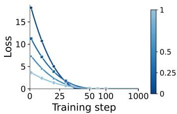  
(a) Fixed b = 0

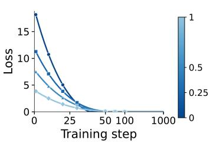  
(b) Fixed a = 0

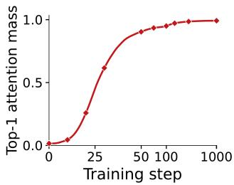  
(c) Top-1 attention mass, (1, 0)  
Figure 4: A single nonlinear-attention layer solves the easy task by focusing on the matching token. (a) Varying a at fixed $b = 0$ . (b) Varying b at fixed $a = 0 ,$ . (c) Top-1 attention mass approaches one during training.

Nonlinear attention. We first define the model with nonlinear attention. We apply pre-norm to the input-stream hidden state for better training stability and alignment with practical models, and denote the normalized state by $\widehat { H } _ { x }$ . At layer ℓ, the query, key, and value representations are

$$
Q ^ { \ell } = W _ { q } ^ { \ell } \widehat { H } _ { x } , \qquad K ^ { \ell } = W _ { k } ^ { \ell } \widehat { H } _ { x } , \qquad V ^ { \ell } = W _ { v } H _ { y } ^ { \ell - 1 } , \qquad Q ^ { \ell } , K ^ { \ell } , V ^ { \ell } \in \mathbb { R } ^ { N \times ( P + 1 ) } .\tag{9}
$$

Let M denote the attention-mask matrix. The attention matrix and residual update are

$$
A ^ { \ell } = \mathsf { M } \odot \mathsf { s o f t m a x } \big ( ( Q ^ { \ell } ) ^ { \top } K ^ { \ell } \big ) \in \mathbb { R } ^ { ( P + 1 ) \times ( P + 1 ) } ,
$$

$$
H _ { y } ^ { \ell } = H _ { y } ^ { \ell - 1 } + \frac { 1 } { L } V ^ { \ell } ( A ^ { \ell } ) ^ { \top } \in \mathbb { R } ^ { N \times ( P + 1 ) } .\tag{10}
$$

Linear attention. The linear-attention model removes nonlinearities and retains the raw bilinear attention scores. Its attention matrix and residual update are

$$
\begin{array} { r l } & { \boldsymbol { A } ^ { \ell } = \displaystyle \frac { 1 } { P N } { \sf M } \odot \left( ( \boldsymbol { Q } ^ { \ell } ) ^ { \top } \boldsymbol { K } ^ { \ell } \right) \in \mathbb { R } ^ { ( P + 1 ) \times ( P + 1 ) } , } \\ & { \boldsymbol { H } _ { y } ^ { \ell } = \boldsymbol { H } _ { y } ^ { \ell - 1 } + \displaystyle \frac { 1 } { L } \boldsymbol { V } ^ { \ell } ( \boldsymbol { A } ^ { \ell } ) ^ { \top } \in \mathbb { R } ^ { N \times ( P + 1 ) } . } \end{array}\tag{11}
$$

Attention masks. As in large language models, we use attention masks to control information flow between tokens. For the linear-attention model, we adopt the masking scheme of Bordelon et al. (2026), allowing successive layers to extract and propagate information at different levels of granularity. For the nonlinear-attention model, we initially disable context updates to focus on how different layers retrieve information from a fixed context. In both models, the test token can attend to all context tokens to access their label information. Note that in the nonlinear-attention model, softmax is computed only over tokens that can be attended to, so disabled positions do not affect the distribution. Further details on the masks and context updates are given in Appendix C.3.

Output and loss. We obtain the prediction by applying a linear readout $W _ { o } \in \mathbb { R } ^ { 1 \times N }$ to the final test-token state $h _ { y , \mathrm { t e s t } } ^ { L }$ . The model is trained to minimize the mean squared error over independently sampled contexts:

$$
\widehat { y } _ { L } = W _ { o } h _ { y , \mathrm { t e s t } } ^ { L } , \qquad \mathcal { R } _ { L } = \mathbb { E } _ { \mathrm { c o n t e x t } } \left[ ( \widehat { y } _ { L } - y ^ { * } ) ^ { 2 } \right] .\tag{12}
$$

Throughout, $\mathcal { R } _ { L }$ denotes the evaluation mean squared error of a depth-L model; we write $\mathcal { R } _ { L } ( a , b )$ when making its dependence on the data-spectrum exponents explicit.

All models are trained until the loss has converged. In Appendix C, we relax several simplifying assumptions to better reflect the architectures of standard Transformers and large language models, and extend our experiments and analyses to these settings.

## 3 EASY TASK ANALYSIS

## 3.1 LINEAR-ATTENTION MODEL

Figure 3(a,b) shows that the linear-attention model’s loss on the easy task decreases with depth according to a power law across all tested settings, with an exponent that depends on the data spectra.

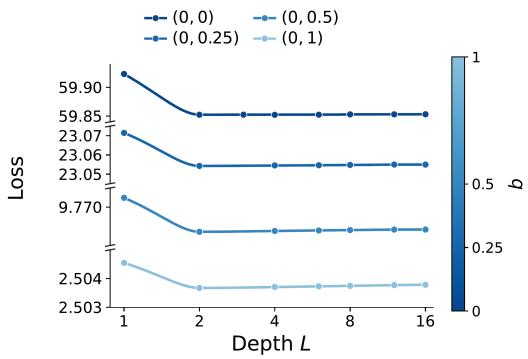  
(a) Fixed a = 0

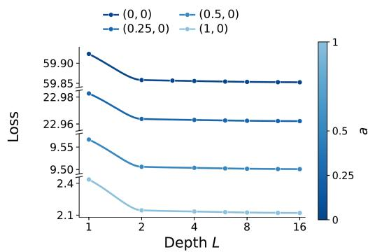  
(b) Fixed b = 0  
Figure 5: On the difficult task, linear attention rapidly reaches a spectrum-dependent loss plateau with little benefit from further depth. (a) Varying b at fixed $a = 0 ,$ . (b) Varying a at fixed $b = 0$

Heuristically, we can interpret the depth-L linear-attention model’s output as a polynomial in the data covariance:

$$
\widehat { y } _ { L } = \beta ^ { \top } p _ { L } ( \Sigma ) \pmb { x } _ { \mathrm { t e s t } } , \qquad p _ { L } ( \Sigma ) = \sum _ { r = 1 } ^ { L } a _ { r } \Sigma ^ { r } .\tag{13}
$$

The target is

$$
y ^ { * } = \beta ^ { \top } x _ { \mathrm { t e s t } } .\tag{14}
$$

Therefore, the model needs to approximate the identity map with $p _ { L } ( \Sigma )$ ; Appendix A.1 derives this covariance-polynomial representation. Greater depth allows the model to use higher powers of the covariance, incorporating information at different levels of granularity to improve the approximation. The asymptotic behavior of this approximation gives rise to power-law depth scaling. Different data spectra change the covariance Σ in the polynomial, leading to different convergence rates with depth. This produces spectrum-dependent depth scaling.

This mechanism also has a feature-learning interpretation. We decompose the power-law input covariance into individual spectral modes and normalize each mode’s loss, which allows us to compare how fully each mode has been learned. Small k indexes stronger features with large eigenvalues, whereas large k indexes weaker features with small eigenvalues. Figure 3(c) reveals a clear separation in their learning dynamics: stronger modes are learned almost perfectly within a few layers, while weaker modes require substantially greater depth. Appendix A.4 further shows that individual modes can converge exponentially at different characteristic depths, with their superposition yielding spectrum-dependent power-law scaling.

## 3.2 NONLINEAR-ATTENTION MODEL

We next evaluate the nonlinear-attention model on the easy task. Figure 4(a,b) shows that a singlelayer nonlinear-attention model achieves zero loss on the easy task across all tested data spectra. Unlike the spectrum-dependent improvement of the linear-attention model, its performance does not improve further with depth.

The key distinction is that nonlinear attention can selectively focus on the relevant token in each context, whereas linear attention cannot fully exclude contributions from irrelevant tokens. During training, the queries and keys attain large norms, amplifying differences between attention logits and placing softmax in an effectively low-temperature regime. Almost all attention is then assigned to the matching token, allowing its label to be copied in a single layer. Figure 4(c) supports this explanation: during training, attention shifts from a nearly uniform distribution toward the top-1 token, whose attention mass approaches one. The same qualitative behavior holds across the tested spectra.

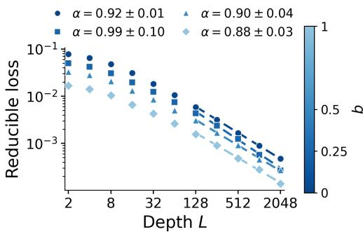  
(a) Fixed a = 0

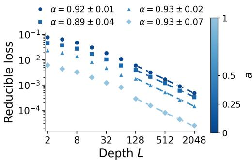  
(b) Fixed b = 0

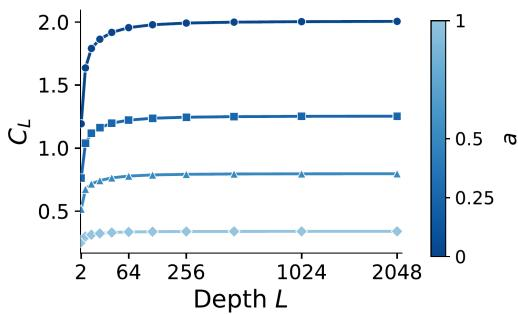  
(c) Shared-error term $C _ { L }$ at fixed $b = 0$

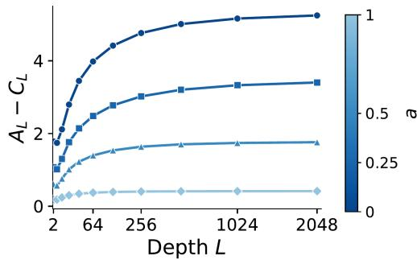  
(d) Disagreement term $A _ { L } - C _ { L }$ at fixed $b = 0$  
Figure 6: On the difficult task, nonlinear attention yields inverse-depth decay across all tested data spectra. (a) Varying b at fixed $a = 0$ . (b) Varying a at fixed $b = 0 . \ ( \mathrm { c , d } ) \ C _ { L }$ and $A _ { L } - C _ { L }$ converge to spectrum-dependent constants.

## 4 DIFFICULT TASK ANALYSIS

## 4.1 LINEAR-ATTENTION MODEL

We next evaluate the linear-attention model on the difficult task. Here, we choose $k = 2$ as a representative case of top-k aggregation. Figure 5(a,b) shows that the loss reaches a spectrumdependent plateau within one or two layers. Unlike the continued improvement on the easy task, additional depth provides little further benefit.

Intuitively, the selected tokens vary across contexts, so their average fluctuates around a shared mean. The target therefore contains a predictable component and a context-specific deviation. Linear attention can capture the shared component, but lacks the context-specific token selection needed to fully recover the deviation. This leaves an irreducible loss that sets the plateau.

We analyze the reducible part using the covariance-polynomial formulation in Section 3.1. The prediction retains the same form, while the predictable target has the leading-order form

$$
\begin{array} { r } { \widehat { y } _ { L } = \beta ^ { \top } p _ { L } ( \Sigma ) x _ { \mathrm { t e s t } } , \qquad \overline { { y } } ^ { * } \propto \beta ^ { \top } \Sigma x _ { \mathrm { t e s t } } , } \end{array}\tag{15}
$$

Unlike the identity map in the easy task, this leading target can already be represented by a degreeone polynomial. Additional depth therefore provides little further reduction in loss. Appendix A.3 provides the geometric illustration, detailed derivation, and comparison between predicted and measured loss floors.

## 4.2 NONLINEAR-ATTENTION MODEL

We next evaluate the nonlinear-attention model on the same difficult task with $k = 2$ . Figure $^ { 6 ( \mathrm { a } , \mathrm { b } ) }$ shows that additional depth continues to reduce the loss, in contrast to the rapid saturation of the linear-attention model.

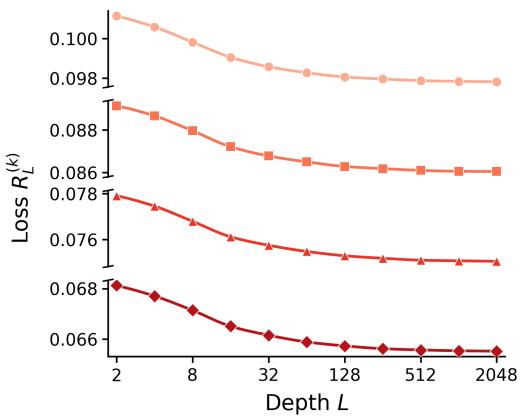  
(a) Mode-wise raw loss

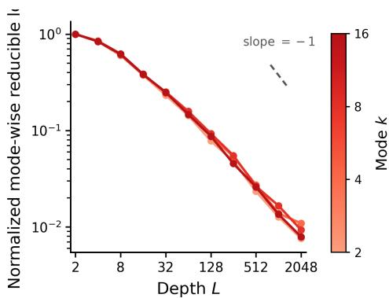  
(b) Normalized mode-wise reducible loss  
Figure 7: With nonlinear attention, strong and weak spectral modes are learned in parallel. (a) Different modes are learned at similar rates. (b) Normalized mode-wise reducible losses nearly collapse onto a common curve, indicating parallel learning across modes.

To quantify this depth dependence, we fit the evaluation loss to

$$
\mathcal { R } _ { L } ( a , b ) = L _ { 0 } ( a , b ) + c ( a , b ) L ^ { - \alpha ( a , b ) } ,\tag{16}
$$

by minimizing squared residuals between the logarithms of the observed and modeled losses. The fitted exponents shown in Figure 6(a,b) are close to one across the tested data spectra, indicating emergent inverse-depth scaling in the deep regime.

With input and label information carried in separate streams and context states fixed across layers, our model admits an equivalent parallel representation: each layer forms a prediction from the same context, and the final output averages these predictions. Increasing depth therefore increases the number of predictors in the ensemble, suggesting an analogy with the central limit theorem, where averaging layer-specific fluctuations can yield a $\bar { 1 / L }$ decay in squared error. To distinguish the error reduced by ensembling from the error that remains, we derive the exact loss decomposition

$$
\mathcal { R } _ { L } ( a , b ) = C _ { L } ( a , b ) + \frac { A _ { L } ( a , b ) - C _ { L } ( a , b ) } { L } .\tag{17}
$$

Here, $C _ { L }$ measures error shared across predictors, whereas $A _ { L } - C _ { L }$ measures pairwise differences between their errors. A detailed derivation is provided in Appendix B. Figure 6(c,d) tracks these two terms across different data spectra. As depth increases, both converge to spectrum-dependent constants:

$$
C _ { L } ( a , b ) \longrightarrow C _ { \infty } ( a , b ) , \qquad A _ { L } ( a , b ) - C _ { L } ( a , b ) \longrightarrow \Delta _ { \infty } ( a , b ) , \qquad L  \infty .\tag{18}
$$

The loss plateau and the depth-dependent improvement have different origins. The error shared across predictors cannot be canceled by ensembling and sets the irreducible loss within this ensemble. For the top-2 task, this shared error reflects the mismatch between smooth softmax attention and the sharp target distribution $( 1 / 2 , 1 / 2 , 0 , \ldots , 0 )$ , which is difficult to match consistently across contexts.

In contrast, $A _ { L } - C _ { L }$ quantifies error variation across predictors. Ensembling allows these errors to partially cancel, reducing their contribution by a factor of $1 / L$ and enabling continued improvement with depth. Detailed derivations and attention-mass diagnostics are provided in Appendices B and D.2, respectively.

We again examine individual spectral modes and normalize their excess losses to compare relative learning progress. Figure 7(a) shows similar improvement rates across modes, and the normalized curves in panel (b) nearly collapse. In contrast to the linear-attention model’s sequential learning, nonlinear attention can focus directly on relevant tokens in each context and improve strong and weak features in parallel, even without context updates that expose progressively finer-grained information.

Building on our analysis of the differences between linear and nonlinear attention, we further compare their irreducible losses on the difficult task. Table 1 shows that the nonlinear-attention model achieves a substantially lower loss floor, clearly outperforming the linear-attention model.

Table 1: Nonlinear-attention models achieve substantially lower irreducible loss than linear-attention models on the difficult task.
<table><tr><td> $( a , b )$ </td><td>(0,0)</td><td>(0,0.25)</td><td>(0,0.5)</td><td>(0,1)</td><td>(0.25,0)</td><td>(0.5,0)</td><td>(1,0)</td></tr><tr><td>Nonlinear  $L _ { 0 }$  Linear  $L _ { 0 }$ </td><td>2.007 59.853</td><td>1.268 23.055</td><td>0.836 9.766</td><td>0.424 2.504</td><td>1.255 22.962</td><td>0.798 9.501</td><td>0.341 2.120</td></tr></table>

We extend our setup toward standard Transformers by encoding inputs and labels in a shared space, untying the value matrix, and updating context states across layers. We observe similar signs of inverse-depth scaling (Appendix C). These results suggest that this mechanism may also contribute to depth scaling in realistic models with nonlinear attention, where data structure need not be the dominant factor.

## 5 RELATED WORK

Empirical neural scaling laws relate loss to model size and dataset size, supporting performance prediction and resource allocation (Hestness et al., 2017; Kaplan et al., 2020; Hoffmann et al., 2022). Theoretical explanations have related them to data geometry and covariance spectra (Sharma & Kaplan, 2022; Bahri et al., 2024). More recent work identifies mechanisms arising from representation superposition and the dynamics of learning peaked distributions (Liu et al., 2025; 2026b; Kuhn et al.¨ , 2026). Despite these advances, much of the literature treats model size as an aggregate quantity rather than resolving the different contributions of width and depth.

As a key component of model-size scaling, depth has been studied through several complementary accounts of how networks utilize layers. Compositional learning builds complex representations by successively combining simpler features, making hierarchical structure more efficiently learnable (Bengio et al., 2013; LeCun et al., 2015; Poggio et al., 2017; Cagnetta et al., 2024). The dynamicalsystems perspective treats residual layers as discrete steps of an ordinary differential equation (E, 2017; Haber & Ruthotto, 2018; Chen et al., 2018; Sander et al., 2022; Chizat, 2025). The ensembleaveraging perspective views depth as the aggregation of related predictors (Veit et al., 2016; Lu et al., 2020; Liu et al., 2026a). These perspectives explain how networks use depth but do not fully explain the origins of depth scaling. We examine how nonlinearity in attention shapes its underlying mechanisms and resulting scaling laws.

More directly, Bordelon et al. (2026) build on the established ICL regression setting (Garg et al., 2022; von Oswald et al., 2023) to derive spectrum-dependent depth scaling for deep linear-attention models. A line of theoretical work has largely focused on analytically tractable linear models (Ahn et al., 2023; Zhang et al., 2024; Lu et al., 2025), leaving the mechanisms through which nonlinear attention affects depth scaling unresolved. Liu et al. (2026a) report inverse-depth scaling in LLMs and connect it to ensemble averaging, without explaining why this ensemble-like behavior emerges. Liu & Gore (2026) further argue that generic mechanisms may determine scaling exponents, while data and architecture affect the coefficients. Our work complements these studies by explaining how nonlinear attention enables ensemble-like behavior across layers and gives rise to inverse-depth scaling.

## 6 DISCUSSION

Our results identify nonlinearity in attention as a source of depth scaling beyond power-law data spectra. Nonlinear attention can focus directly on relevant tokens in each context, allowing strong and weak spectral directions to be learned in parallel. Linear attention lacks this selective ability, tying its learning dynamics to global spectral strength. Similar focusing across layers supports an ensemble interpretation: aggregation reduces layer-specific errors while leaving a shared loss floor, connecting inverse-depth improvement to the central limit theorem. These findings suggest that practical depth scaling can originate from attention nonlinearity rather than data structure alone.

Our study has many limitations. Our simplified architecture omits components of full LLMs, so the identified mechanism is not guaranteed to operate in those models. Although architectural extensions show similar scaling signals, a clear theoretical account of their mechanisms is still lacking. Our experiments are restricted to ICL tasks, leaving generalization to real-world datasets and broader task classes untested. The identified mechanism need not be universal or dominant, and other processes may produce different scaling or interact with it. Our analysis also does not address how depth scaling couples to model width and dataset size.

Aggregation also raises a question about how efficiently depth is used. If a few layers perform the essential computation while others mainly average residual errors, separate parameters at every layer may be wasteful. Looped Transformers reuse parameters across depth (Dehghani et al., 2019; Geiping et al., 2025) and may retain aggregation benefits with fewer parameters. Testing this possibility could guide more parameter-efficient use of depth in future language models.

## AI USE STATEMENT

We used generative AI tools to support brainstorming, articulate candidate mathematical claims, generate code under explicit human instructions, and assist with language editing. We did not use generative AI to generate synthetic datasets, conduct data analysis, or write mathematical proofs. All AI-assisted ideas and writing were critically reviewed by the authors, and all AI-generated code was independently inspected and verified. The authors performed the data analysis and mathematical proofs and take full responsibility for the final content of this work.

## REFERENCES

Kwangjun Ahn, Xiang Cheng, Hadi Daneshmand, and Suvrit Sra. Transformers learn to implement preconditioned gradient descent for in-context learning. In Advances in Neural Information Processing Systems, volume 36, pp. 45614–45650, 2023. doi: 10.52202/075280-1977.

Yasaman Bahri, Ethan Dyer, Jared Kaplan, Jaehoon Lee, and Utkarsh Sharma. Explaining neural scaling laws. Proceedings of the National Academy of Sciences, 121(27):e2311878121, 2024. doi: 10.1073/pnas.2311878121.

Yoshua Bengio, Aaron Courville, and Pascal Vincent. Representation learning: A review and new perspectives. IEEE Transactions on Pattern Analysis and Machine Intelligence, 35(8):1798–1828, 2013. doi: 10.1109/TPAMI.2013.50.

Blake Bordelon, Mary Letey, and Cengiz Pehlevan. Theory of scaling laws for in-context regression: Depth, width, context and time. In International Conference on Learning Representations, 2026.

Francesco Cagnetta, Leonardo Petrini, Umberto M. Tomasini, Alessandro Favero, and Matthieu Wyart. How deep neural networks learn compositional data: The random hierarchy model. Physical Review X, 14(3):031001, 2024. doi: 10.1103/PhysRevX.14.031001.

Ricky T. Q. Chen, Yulia Rubanova, Jesse Bettencourt, and David Duvenaud. Neural ordinary differential equations. In Advances in Neural Information Processing Systems, volume 31, pp. 6571–6583, 2018.

Lena ´ ¨ıc Chizat. The hidden width of deep ResNets: Tight error bounds and phase diagram. arXiv preprint arXiv:2509.10167, 2025.

Lena´ ¨ıc Chizat and Francis Bach. On the global convergence of gradient descent for over-parameterized models using optimal transport. In Advances in Neural Information Processing Systems, volume 31, pp. 3040–3050, 2018.

Mostafa Dehghani, Stephan Gouws, Oriol Vinyals, Jakob Uszkoreit, and Łukasz Kaiser. Universal transformers. In International Conference on Learning Representations, 2019.

Weinan E. A proposal on machine learning via dynamical systems. Communications in Mathematics and Statistics, 5:1–11, 2017. doi: 10.1007/s40304-017-0103-z.

Nelson Elhage, Neel Nanda, Catherine Olsson, Tom Henighan, Nicholas Joseph, Ben Mann, Amanda Askell, Yuntao Bai, Anna Chen, Tom Conerly, Nova DasSarma, Dawn Drain, Deep Ganguli, Zac Hatfield-Dodds, Danny Hernandez, Andy Jones, Jackson Kernion, Liane Lovitt, Kamal Ndousse, Dario Amodei, Tom Brown, Jack Clark, Jared Kaplan, Sam McCandlish, and Chris Olah. A

mathematical framework for transformer circuits. Transformer Circuits Thread, 2021. URL https://transformer-circuits.pub/2021/framework/index.html.

Shivam Garg, Dimitris Tsipras, Percy Liang, and Gregory Valiant. What can transformers learn in-context? a case study of simple function classes. In Advances in Neural Information Processing Systems, volume 35, pp. 30583–30598, 2022. doi: 10.52202/068431-2217.

Jonas Geiping, Sean McLeish, Neel Jain, John Kirchenbauer, Siddharth Singh, Brian R. Bartoldson, Bhavya Kailkhura, Abhinav Bhatele, and Tom Goldstein. Scaling up test-time compute with latent reasoning: A recurrent depth approach. In Advances in Neural Information Processing Systems, volume 38, pp. 46242–46293, 2025. doi: 10.52202/085713-1380.

Eldad Haber and Lars Ruthotto. Stable architectures for deep neural networks. Inverse Problems, 34 (1):014004, 2018. doi: 10.1088/1361-6420/aa9a90.

Joel Hestness, Sharan Narang, Newsha Ardalani, Gregory Diamos, Heewoo Jun, Hassan Kianinejad, Md. Mostofa Ali Patwary, Yang Yang, and Yanqi Zhou. Deep learning scaling is predictable, empirically. arXiv preprint arXiv:1712.00409, 2017.

Jordan Hoffmann, Sebastian Borgeaud, Arthur Mensch, Elena Buchatskaya, Trevor Cai, Eliza Rutherford, Diego de Las Casas, Lisa Anne Hendricks, Johannes Welbl, Aidan Clark, Thomas Hennigan, Eric Noland, Katherine Millican, George van den Driessche, Bogdan Damoc, Aurelia Guy, Simon Osindero, Karen Simonyan, Erich Elsen, Oriol Vinyals, Jack Rae, and Laurent Sifre.´ An empirical analysis of compute-optimal large language model training. In Advances in Neural Information Processing Systems, volume 35, pp. 30016–30030, 2022. doi: 10.52202/068431-2176.

Jared Kaplan, Sam McCandlish, Tom Henighan, Tom B. Brown, Benjamin Chess, Rewon Child, Scott Gray, Alec Radford, Jeffrey Wu, and Dario Amodei. Scaling laws for neural language models. arXiv preprint arXiv:2001.08361, 2020.

Marcel Kuhn, Yoon Thelge, and Bernd Rosenow. A boundary-layer mechanism for one-third scaling¨ in online softmax classification. arXiv preprint arXiv:2605.22341, 2026.

Yann LeCun, Yoshua Bengio, and Geoffrey Hinton. Deep learning. Nature, 521:436–444, 2015. doi: 10.1038/nature14539.

Yizhou Liu and Jeff Gore. Neural scaling universality: If exponents are fixed, time to understand coefficients. arXiv preprint arXiv:2606.25008, 2026.

Yizhou Liu, Ziming Liu, and Jeff Gore. Superposition yields robust neural scaling. In Advances in Neural Information Processing Systems, volume 38, pp. 176757–176793, 2025. doi: 10.52202/ 085713-5320.

Yizhou Liu, Sara Kangaslahti, Ziming Liu, and Jeff Gore. Inverse depth scaling from most layers being similar. In Proceedings ofthe 43rd International Conference on Machine Learning, volume 306, pp. 77093–77118, 2026a. URL https://proceedings.mlr.press/v306/liu26bt. html.

Yizhou Liu, Ziming Liu, Cengiz Pehlevan, and Jeff Gore. Universal one-third time scaling in learning peaked distributions. In Proceedings of the 43rd International Conference on Machine Learning, volume 306, pp. 77529–77558, 2026b. URL https://proceedings.mlr.press/v306/ liu26cl.html.

Yiping Lu, Chao Ma, Yulong Lu, Jianfeng Lu, and Lexing Ying. A mean-field analysis of deep ResNet and beyond: Towards provable optimization via overparameterization from depth. In Proceedings ofthe 37th International Conference on Machine Learning, volume 119, pp. 6426–6436, 2020. URL https://proceedings.mlr.press/v119/lu20b.html.

Yue M. Lu, Mary Letey, Jacob A. Zavatone-Veth, Anindita Maiti, and Cengiz Pehlevan. Asymptotic theory of in-context learning by linear attention. Proceedings ofthe National Academy ofSciences, 122(28):e2502599122, 2025. doi: 10.1073/pnas.2502599122.

Ang Lv, Ruobing Xie, Xingwu Sun, Zhanhui Kang, and Rui Yan. Language models “grok” to copy. In Proceedings of the 2025 Conference of the Nations of the Americas Chapter of the Association for Computational Linguistics: Human Language Technologies (Volume 2: Short Papers), pp. 735–741, 2025. doi: 10.18653/v1/2025.naacl-short.61.

Song Mei, Andrea Montanari, and Phan-Minh Nguyen. A mean field view of the landscape of twolayer neural networks. Proceedings ofthe National Academy ofSciences, 115(33):E7665–E7671, 2018. doi: 10.1073/pnas.1806579115.

Catherine Olsson, Nelson Elhage, Neel Nanda, Nicholas Joseph, Nova DasSarma, Tom Henighan, Ben Mann, Amanda Askell, Yuntao Bai, Anna Chen, Tom Conerly, Dawn Drain, Deep Ganguli, Zac Hatfield-Dodds, Danny Hernandez, Scott Johnston, Andy Jones, Jackson Kernion, Liane Lovitt, Kamal Ndousse, Dario Amodei, Tom Brown, Jack Clark, Jared Kaplan, Sam McCandlish, and Chris Olah. In-context learning and induction heads. arXiv preprint arXiv:2209.11895, 2022.

Tomaso Poggio, Hrushikesh Mhaskar, Lorenzo Rosasco, Brando Miranda, and Qianli Liao. Why and when can deep—but not shallow—networks avoid the curse of dimensionality: A review. International Journal of Automation and Computing, 14(5):503–519, 2017. doi: 10.1007/s11633-017-1054-2.

Grant M. Rotskoff and Eric Vanden-Eijnden. Parameters as interacting particles: Long time convergence and asymptotic error scaling of neural networks. In Advances in Neural Information Processing Systems, volume 31, pp. 7146–7155, 2018.

Michael E. Sander, Pierre Ablin, and Gabriel Peyre. Do residual neural networks discretize neural´ ordinary differential equations? In Advances in Neural Information Processing Systems, volume 35, pp. 36520–36532, 2022. doi: 10.52202/068431-2646.

Utkarsh Sharma and Jared Kaplan. Scaling laws from the data manifold dimension. Journal of Machine Learning Research, 23(9):1–34, 2022.

Andreas Veit, Michael J. Wilber, and Serge Belongie. Residual networks behave like ensembles of relatively shallow networks. In Advances in Neural Information Processing Systems, volume 29, pp. 550–558, 2016.

Johannes von Oswald, Eyvind Niklasson, Ettore Randazzo, Joao Sacramento, Alexander Mordvintsev, Andrey Zhmoginov, and Max Vladymyrov. Transformers learn in-context by gradient descent. In Proceedings of the 40th International Conference on Machine Learning, volume 202, pp. 35151–35174, 2023. URL https://proceedings.mlr.press/v202/ von-oswald23a.html.

Ruiqi Zhang, Spencer Frei, and Peter L. Bartlett. Trained transformers learn linear models in-context. Journal of Machine Learning Research, 25(49):1–55, 2024.

## A LINEAR-ATTENTION MODEL THEORY

## A.1 COVARIANCE POLYNOMIALS IN THE LINEAR-ATTENTION MODEL

We first derive the theory of the linear-attention model on the easy task. In general, its output is an ordered matrix polynomial of degree at most $L$ in the data covariance. The isotropic setting analyzed by Bordelon et al. (2026) then follows as a special case of our theory.

Let U collect the context inputs, $q$ denote the query, and S be the empirical input covariance:

$$
\begin{array} { c } { \displaystyle { U = [ \pmb { x } _ { 1 } , \dots , \pmb { x } _ { P } ] \in \mathbb { R } ^ { d \times P } , \qquad q = \pmb { x } _ { \mathrm { t e s t } } \in \mathbb { R } ^ { d } , } } \\ { \displaystyle { y = U ^ { \top } \pmb { \beta } , \qquad S = \frac { 1 } { P } U U ^ { \top } . } } \end{array}\tag{19}
$$

The input and teacher covariances are

$$
\begin{array} { r } { \Sigma = O \mathrm { d i a g } ( \lambda _ { 1 } , \ldots , \lambda _ { d } ) O ^ { \top } , } \\ { \Omega = O \mathrm { d i a g } ( \omega _ { 1 } , \ldots , \omega _ { d } ) O ^ { \top } , } \end{array}
$$

where the random orthogonal rotation O is fixed within a context and sampled independently across contexts. Contexts therefore share the same spectra but express their features in different directions. Within each context, conditioning on $O ,$ , the context inputs and test token are sampled identically and independently, while the teacher vector is sampled independently from its corresponding distribution:

$$
\begin{array} { r } { \pmb { x } _ { 1 } , \ldots , \pmb { x } _ { P } , \pmb { x } _ { \mathrm { t e s t } } \overset { \mathrm { i . i . d . } } { \sim } \mathcal { N } ( 0 , \Sigma ) , \qquad \beta \sim \mathcal { N } ( 0 , \Omega ) . } \end{array}
$$

Define the effective query–key matrix

$$
B _ { \ell } = \frac { 1 } { N } { W _ { x } ^ { \top } ( W _ { k } ^ { \ell } ) ^ { \top } W _ { q } ^ { \ell } W _ { x } } , \qquad \ell = 1 , \dots , L ,\tag{20}
$$

where N is the hidden-state dimension. Before masking, token i assigns context token $j$ the weight

$$
\frac { ( W _ { q } ^ { \ell } W _ { x } \pmb { x } _ { i } ) ^ { \top } ( W _ { k } ^ { \ell } W _ { x } \pmb { x } _ { j } ) } { N P } = \frac { \pmb { x } _ { j } ^ { \top } B _ { \ell } \pmb { x } _ { i } } { P } .
$$

Separate the context and test label states as

$$
H _ { y } ^ { \ell } = [ Z _ { \ell } , h _ { \ell } ] , \qquad Z _ { \ell } \in \mathbb { R } ^ { N \times P } , \quad h _ { \ell } \in \mathbb { R } ^ { N } .
$$

The linear-attention mask defined in Section 2.2 gives

$$
\begin{array} { r l } & { Z _ { 0 } = W _ { y } \beta ^ { \top } \boldsymbol { U } , \qquad h _ { 0 } = 0 , } \\ & { Z _ { \ell } = Z _ { \ell - 1 } - \displaystyle \frac { 1 } { L P } W _ { v } Z _ { \ell - 1 } \boldsymbol { U } ^ { \top } \boldsymbol { B } _ { \ell } \boldsymbol { U } , } \\ & { h _ { \ell } = h _ { \ell - 1 } + \displaystyle \frac { 1 } { L P } W _ { v } Z _ { \ell - 1 } \boldsymbol { U } ^ { \top } \boldsymbol { B } _ { \ell } q . } \end{array}\tag{21}
$$

Write $Z _ { \ell } = F _ { \ell } U$ , where $F _ { \ell }$ maps inputs to context label states. Substituting $U U ^ { \top } / P = S$ yields

$$
\begin{array} { c } { F _ { 0 } = W _ { y } \beta ^ { \top } , \qquad F _ { \ell } \in \mathbb { R } ^ { N \times d } , } \\ { F _ { \ell } = F _ { \ell - 1 } - \displaystyle \frac { 1 } { L } W _ { v } F _ { \ell - 1 } S B _ { \ell } , } \\ { h _ { \ell } - h _ { \ell - 1 } = ( F _ { \ell - 1 } - F _ { \ell } ) q . } \end{array}\tag{22}
$$

Therefore, the output is

$$
{ \widehat { y } } _ { L } = W _ { o } \sum _ { \ell = 1 } ^ { L } ( F _ { \ell - 1 } - F _ { \ell } ) q = W _ { o } ( F _ { 0 } - F _ { L } ) q .\tag{23}
$$

The first two steps show how the polynomial is built:

$$
\begin{array} { r l } & { F _ { 1 } = W _ { y } \beta ^ { \top } - \cfrac { 1 } { L } W _ { v } W _ { y } \beta ^ { \top } S B _ { 1 } , } \\ & { F _ { 2 } = W _ { y } \beta ^ { \top } - \cfrac { 1 } { L } W _ { v } W _ { y } \beta ^ { \top } ( S B _ { 1 } + S B _ { 2 } ) } \\ & { \qquad + \cfrac { 1 } { L ^ { 2 } } W _ { v } ^ { 2 } W _ { y } \beta ^ { \top } S B _ { 1 } S B _ { 2 } . } \end{array}
$$

With readout coefficients

$$
m _ { r } = W _ { o } W _ { v } ^ { r } W _ { y } , \qquad r = 1 , \ldots , L ,
$$

substitution into the output gives

$$
\mathcal { P } _ { L } ( S ) = \sum _ { r = 1 } ^ { L } \frac { ( - 1 ) ^ { r - 1 } m _ { r } } { L ^ { r } } \sum _ { 1 \le \ell _ { 1 } < \cdots < \ell _ { r } \le L } S B _ { \ell _ { 1 } } \cdot \cdot \cdot S B _ { \ell _ { r } } .\tag{24}
$$

The prediction and easy-task target are

$$
\widehat { \boldsymbol { y } } _ { L } = \beta ^ { \top } \mathcal { P } _ { L } ( \boldsymbol { S } ) \boldsymbol { q } , \qquad \boldsymbol { y } ^ { * } = \beta ^ { \top } \boldsymbol { q } .\tag{25}
$$

Thus learning the easy task amounts to approximating the identity on the relevant input directions. Define

$$
{ \mathcal { D } } _ { L } ( S ) = I _ { d } - { \mathcal { P } } _ { L } ( S ) .
$$

Averaging over the teacher at fixed inputs gives

$$
\begin{array} { r l } & { \mathbb { E } _ { \beta } [ ( \widehat { y } _ { L } - y ^ { * } ) ^ { 2 } \mid U , q , O ] = \mathbb { E } _ { \beta } [ ( \beta ^ { \top } { \mathcal { D } } _ { L } ( S ) q ) ^ { 2 } \mid U , q , O ] } \\ & { \quad \quad \quad = q ^ { \top } { \mathcal { D } } _ { L } ( S ) ^ { \top } \mathbb { E } [ \beta \beta ^ { \top } \mid U , q , O ] { \mathcal { D } } _ { L } ( S ) q } \\ & { \quad \quad \quad = q ^ { \top } { \mathcal { D } } _ { L } ( S ) ^ { \top } \Omega { \mathcal { D } } _ { L } ( S ) q . } \end{array}
$$

The evaluation loss $\mathcal { R } _ { L }$ defined in equation 12 is therefore

$$
\begin{array} { r l } & { \mathcal { R } _ { L } = \mathbb { E } [ ( \widehat { y } _ { L } - y ^ { * } ) ^ { 2 } ] } \\ & { \quad \quad = \mathbb { E } _ { U , q , O } [ q ^ { \top } \mathcal { D } _ { L } ( S ) ^ { \top } \Omega \mathcal { D } _ { L } ( S ) q ] . } \end{array}\tag{26}
$$

## A.2 CONSTRAINED AND FREE POLYNOMIAL DEPTH SCALING

Repeated updates. Following the repeated-update construction of Bordelon et al. (2026), we impose isotropic matching and align the shared value map with the label embedding:

$$
B _ { \ell } = \kappa I _ { d } \quad ( \ell = 1 , \ldots , L ) , \qquad W _ { v } W _ { y } = v W _ { y } .\tag{27}
$$

Each degree-r product in equation 24 then equals $\kappa ^ { r } S ^ { r }$ , and there are $\binom { L } { r }$ choices of r layers. Hence

$$
\mathcal { P } _ { L } ( S ) = \sum _ { r = 1 } ^ { L } \frac { ( - 1 ) ^ { r - 1 } m _ { r } } { L ^ { r } } \binom { L } { r } \kappa ^ { r } S ^ { r } = p _ { L } ( S ) ,
$$

$$
p _ { L } ( \lambda ) = \sum _ { r = 1 } ^ { L } a _ { r } \lambda ^ { r } , \qquad a _ { r } = ( - 1 ) ^ { r - 1 } \binom { L } { r } ( \kappa / L ) ^ { r } m _ { r } .\tag{28}
$$

In the infinite-context limit $P \to \infty ,$ we use S ≈ $\Sigma .$ Thus

$$
I _ { d } - p _ { L } ( \Sigma ) = { O } \mathrm { d i a g } \big ( 1 - p _ { L } ( \lambda _ { 1 } ) , \dots , 1 - p _ { L } ( \lambda _ { d } ) \big ) { O } ^ { \top } .
$$

Using $\mathbb { E } [ q q ^ { \top } \mid O ] = \Sigma$ in equation 26 gives the population-covariance approximation $\mathcal { R } _ { L } ^ { \mathrm { p o p } }$ to $\mathcal { R } _ { L }$

$$
\begin{array} { r l } & { \mathcal { R } _ { L } ^ { \mathrm { p o p } } = \mathbb { E } _ { O } \mathrm { t r } \big [ \mathcal { D } _ { L } ( \Sigma ) ^ { \top } \Omega \mathcal { D } _ { L } ( \Sigma ) \Sigma \big ] } \\ & { \quad \quad \quad = \mathbb { E } _ { O } \mathrm { t r } \Big [ O \mathrm { d i a g } \big ( \lambda _ { k } \omega _ { k } [ 1 - p _ { L } ( \lambda _ { k } ) ] ^ { 2 } \big ) _ { k = 1 } ^ { d } O ^ { \top } \Big ] } \\ & { \quad \quad \quad = \displaystyle \sum _ { k = 1 } ^ { d } \lambda _ { k } \omega _ { k } [ 1 - p _ { L } ( \lambda _ { k } ) ] ^ { 2 } . } \end{array}\tag{29}
$$

Define $r _ { L } ( \lambda ) = 1 - p _ { L } ( \lambda )$ . Since $p _ { L } ( 0 ) = 0$ , we have $r _ { L } ( 0 ) = 1$ , and therefore

$$
\deg r _ { L } \leq L , \qquad r _ { L } ( 0 ) = 1 , \qquad \mathcal { R } _ { L } ^ { \mathrm { p o p } } = \sum _ { k = 1 } ^ { d } \lambda _ { k } \omega _ { k } r _ { L } ( \lambda _ { k } ) ^ { 2 } .\tag{30}
$$

For a specific data spectrum, write

$$
\begin{array} { c c } { { } } & { { \lambda _ { k } = c _ { \lambda } k ^ { - a } , \qquad \omega _ { k } = c _ { \omega } k ^ { - b } , } } \\ { { } } & { { } } \\ { { a \geq 0 , \qquad b \geq 0 , \qquad \zeta = \displaystyle \frac { a + b - 1 } { a } \quad ( a > 0 ) . } } \end{array}
$$

where $c _ { \lambda } , c _ { \omega } > 0$ and $\lambda _ { 1 } = c _ { \lambda }$ . For $a > 0$ , the change of variables from feature index to eigenvalue is

$$
k = ( c _ { \lambda } / \lambda ) ^ { 1 / a } , \left| \frac { d k } { d \lambda } \right| = \frac { c _ { \lambda } ^ { 1 / a } } { a } \lambda ^ { - 1 - 1 / a } .
$$

Substituting into equation 30 and replacing the sum by its continuum integral gives

$$
\begin{array} { l } { { \displaystyle \mathcal { R } _ { L } ^ { \mathrm { p o p } } = c _ { \lambda } c _ { \omega } \sum _ { k = 1 } ^ { d } k ^ { - ( a + b ) } r _ { L } ( c _ { \lambda } k ^ { - a } ) ^ { 2 } } } \\ { { \displaystyle ~ \approx c _ { \lambda } c _ { \omega } \int _ { 1 } ^ { d } k ^ { - ( a + b ) } r _ { L } ( c _ { \lambda } k ^ { - a } ) ^ { 2 } d k } } \\ { { \displaystyle ~ = \frac { c _ { \omega } c _ { \lambda } ^ { 1 - \zeta } } { a } \int _ { \lambda _ { d } } ^ { \lambda _ { 1 } } \lambda ^ { \zeta - 1 } r _ { L } ( \lambda ) ^ { 2 } d \lambda . } } \end{array}\tag{31}
$$

For $a + b > 1$ , we have $\zeta > 0 .$ , which makes the continuum weight integrable at zero. When d is sufficiently large, $\lambda _ { d }$ is close to zero and the finite-dimensional cutoff does not yet affect the loss. We may then approximate the dense spectrum by a measure on $[ 0 , \lambda _ { 1 } ]$ . This gives

$$
\mathcal { R } _ { L } ^ { \mathrm { p o p } } \propto \int _ { 0 } ^ { \lambda _ { 1 } } \lambda ^ { \zeta - 1 } r _ { L } ( \lambda ) ^ { 2 } d \lambda .\tag{32}
$$

Because $W _ { v }$ is shared across layers,

$$
m _ { r } = W _ { o } W _ { v } ^ { r } W _ { y } \propto v ^ { r } , \qquad \gamma = \kappa v .
$$

Optimizing $W _ { o } W _ { y }$ to 1 allows the repeated-update construction to solve the easy task in the largedepth limit. Substituting into equation 28 gives

$$
\begin{array} { c } { { p _ { L } ( \lambda ) = \displaystyle \sum _ { r = 1 } ^ { L } ( - 1 ) ^ { r - 1 } \binom { L } { r } ( \gamma \lambda / L ) ^ { r } = 1 - ( 1 - \gamma \lambda / L ) ^ { L } , } } \\ { { r _ { L } ( \lambda ) = ( 1 - \gamma \lambda / L ) ^ { L } . } } \end{array}\tag{33}
$$

For the residual to vanish as $L \to \infty$ , the scalar updates must contract rather than amplify positiveeigenvalue directions. At the largest eigenvalue this requires

$$
| 1 - \gamma \lambda _ { 1 } / L | < 1 \quad \Longleftrightarrow \quad 0 < \gamma < \frac { 2 L } { \lambda _ { 1 } } .
$$

Using the optimal-scale estimate of Bordelon et al. (2026),

$$
\gamma ^ { * } \approx \frac { L } { \lambda _ { 1 } } , \qquad \frac { \gamma ^ { * } } { L } \approx \frac { 1 } { \lambda _ { 1 } } ,
$$

the continuum loss becomes, with $u = 2 L \lambda / \lambda _ { 1 }$

$$
\begin{array} { r l r } {  { \mathcal { R } _ { L } ^ { \mathrm { c o n } } \approx \frac { c _ { \omega } c _ { \lambda } ^ { 1 - \zeta } } { a } \int _ { 0 } ^ { \lambda _ { 1 } } \lambda ^ { \zeta - 1 } ( 1 - \lambda / \lambda _ { 1 } ) ^ { 2 L } d \lambda } } \\ & { } & { \sim \frac { c _ { \omega } c _ { \lambda } ^ { 1 - \zeta } } { a } ( \frac { \lambda _ { 1 } } { 2 L } ) ^ { \zeta } \int _ { 0 } ^ { \infty } u ^ { \zeta - 1 } e ^ { - u } d u } \\ & { } & { \propto L ^ { - \zeta } . } \end{array}\tag{34}
$$

Here, $\mathcal { R } _ { L } ^ { \mathrm { c o n } }$ denotes the loss of the repeated-update reference within the population approximation.   
This exponent is consistent with the result of Bordelon et al. (2026).

Free polynomials. We then derive the depth-scaling exponent when the polynomial coefficients are free by removing the repeated-update conditions in equation 27. We assume only that the depth-L predictor is an arbitrary polynomial in Σ of degree at most $L .$ Substitution into equation 26 gives the freely optimized population-polynomial reference $\mathcal { R } _ { L } ^ { \mathrm { f r e e } }$

$$
\begin{array} { r l r } { \mathcal { P } _ { L } ( \Sigma ) = p _ { L } ( \Sigma ) , \quad } & { \deg p _ { L } \leq L , \quad } & { p _ { L } ( 0 ) = 0 , \quad } & { S \approx \Sigma , } \\ { \mathcal { R } _ { L } ^ { \mathrm { p o p } } = \displaystyle \sum _ { k = 1 } ^ { d } \lambda _ { k } \omega _ { k } [ 1 - p _ { L } ( \lambda _ { k } ) ] ^ { 2 } , \quad } & \\ { \mathcal { R } _ { L } ^ { \mathrm { f r e e } } \propto \displaystyle \operatorname* { m i n } _ { \deg r \leq L } \int _ { 0 } ^ { \lambda _ { 1 } } \lambda ^ { \zeta - 1 } r ( \lambda ) ^ { 2 } d \lambda , \quad } & { r = 1 - p _ { L } . } \end{array}\tag{35}
$$

Let $\phi _ { n }$ be a degree-n polynomial orthonormal under this weight:

$$
\int _ { 0 } ^ { \lambda _ { 1 } } \lambda ^ { \zeta - 1 } \phi _ { n } ( \lambda ) \phi _ { m } ( \lambda ) d \lambda = \delta _ { n m } ,
$$

where $\delta _ { n m }$ equals one for $n = m$ and zero otherwise. Expanding the residual and using $r ( 0 ) = 1$ gives

$$
\begin{array} { c } { { r ( \lambda ) = \displaystyle \sum _ { n = 0 } ^ { L } d _ { n } \phi _ { n } ( \lambda ) , \qquad \displaystyle \sum _ { n = 0 } ^ { L } d _ { n } \phi _ { n } ( 0 ) = 1 , } } \\ { { \displaystyle \int _ { 0 } ^ { \lambda _ { 1 } } \lambda ^ { \zeta - 1 } r ( \lambda ) ^ { 2 } d \lambda = \displaystyle \sum _ { n = 0 } ^ { L } d _ { n } ^ { 2 } . } } \end{array}
$$

Cauchy–Schwarz now gives the minimum directly:

$$
\begin{array} { r l } { \displaystyle } & { \displaystyle 1 = \left( \sum _ { n = 0 } ^ { L } d _ { n } \phi _ { n } ( 0 ) \right) ^ { 2 } } \\ & { \displaystyle \le \left( \sum _ { n = 0 } ^ { L } d _ { n } ^ { 2 } \right) \left( \sum _ { n = 0 } ^ { L } \phi _ { n } ( 0 ) ^ { 2 } \right) . } \end{array}\tag{36}
$$

Equality is attained by coefficients proportional to the endpoint values:

$$
d _ { n } ^ { * } = \frac { \phi _ { n } ( 0 ) } { \sum _ { m = 0 } ^ { L } \phi _ { m } ( 0 ) ^ { 2 } } , \qquad \mathcal { R } _ { L } ^ { \mathrm { f r e e } } \propto \left[ \sum _ { n = 0 } ^ { L } \phi _ { n } ( 0 ) ^ { 2 } \right] ^ { - 1 } .\tag{37}
$$

For this weight, the basis consists of shifted Jacobi polynomials:

$$
\phi _ { n } ( \lambda ) = \sqrt { \frac { 2 n + \zeta } { \lambda _ { 1 } ^ { \zeta } } } P _ { n } ^ { ( \zeta - 1 , 0 ) } ( 1 - 2 \lambda / \lambda _ { 1 } ) ,\tag{38}
$$

where $P _ { n } ^ { ( \zeta - 1 , 0 ) }$ is the degree-n Jacobi polynomial. Using its value at 1 gives

$$
\begin{array} { l } { { \displaystyle \phi _ { n } ( 0 ) ^ { 2 } = \frac { 2 n + \zeta } { \lambda _ { 1 } ^ { \zeta } } \left[ \frac { \Gamma ( n + \zeta ) } { \Gamma ( \zeta ) \Gamma ( n + 1 ) } \right] ^ { 2 } } } \\ { { \displaystyle \sim \frac { 2 } { \lambda _ { 1 } ^ { \zeta } \Gamma ( \zeta ) ^ { 2 } } n ^ { 2 \zeta - 1 } } . } \end{array}
$$

Consequently,

$$
\begin{array} { l } { \displaystyle \sum _ { n = 0 } ^ { L } \phi _ { n } ( 0 ) ^ { 2 } \sim \frac { 2 } { \lambda _ { 1 } ^ { \zeta } \Gamma ( \zeta ) ^ { 2 } } \int _ { 0 } ^ { L } n ^ { 2 \zeta - 1 } d n } \\ { \displaystyle \qquad = \frac { L ^ { 2 \zeta } } { \zeta \lambda _ { 1 } ^ { \zeta } \Gamma ( \zeta ) ^ { 2 } } . } \end{array}\tag{39}
$$

Table 2: Measured depth-scaling exponents of the linear-attention model on the easy task lie between two reference values.
<table><tr><td> $( a , b )$ </td><td>Constrained ζ</td><td>Measured α</td><td>Free  $2 \zeta$ </td></tr><tr><td>(2,0.5)</td><td>0.750</td><td>1.121</td><td>1.500</td></tr><tr><td>(2, 1)</td><td>1.000</td><td>1.485</td><td>2.000</td></tr><tr><td>(2, 1.5)</td><td>1.250</td><td>1.684</td><td>2.500</td></tr><tr><td>(2,2)</td><td>1.500</td><td>1.987</td><td>3.000</td></tr><tr><td>(0.5, 2)</td><td>3.000</td><td>3.310</td><td>6.000</td></tr><tr><td>(1, 2)</td><td>2.000</td><td>2.552</td><td>4.000</td></tr><tr><td>(1.5, 2)</td><td>1.667</td><td>2.163</td><td>3.333</td></tr></table>

The two polynomial families therefore give

$$
\mathcal { R } _ { L } ^ { \mathrm { c o n } } \propto L ^ { - \zeta } , \qquad \mathcal { R } _ { L } ^ { \mathrm { f r e e } } \propto L ^ { - 2 \zeta } , \qquad \zeta = \frac { a + b - 1 } { a } .\tag{40}
$$

Table 2 compares these reference exponents with the measured values.

The actual model is less constrained than the repeated-update construction of Bordelon et al. (2026), which relies on the two conditions in equation 27, but it is not as unconstrained as the idealized free polynomial, whose coefficients are optimized independently. It is therefore reasonable for the measured exponents to lie between these two reference values.

Note that this theoretical analysis has several requirements, including the population-covariance approximation $S \approx \Sigma$ , corresponding to $P \to \infty ;$ a dense spectrum with $\zeta > 0 ;$ and a sufficiently large spectral range $\lambda _ { 1 } / \lambda _ { d }$ . At the evaluated depths, repeated updates require $1 \ll L \ll \lambda _ { 1 } / \lambda _ { d } .$ whereas free polynomials require $1 \ll L \ll \sqrt { \lambda _ { 1 } / \lambda _ { d } }$

## A.3 PREDICTING THE LINEAR-MODEL LOSS FLOOR

In this subsection, we characterize the predictable component of the difficult-task target and the resulting irreducible loss floor for the linear-attention model. We further validate these theoretical predictions using Monte Carlo estimates.

For a test token q sampled independently of the context inputs, the difficult-task target is

$$
\begin{array} { c } { \displaystyle S _ { k } ( \boldsymbol { q } ) = \mathrm { T o p K } _ { 1 \leq i \leq P } \frac { \boldsymbol { q } ^ { \top } \boldsymbol { x } _ { i } } { \| \boldsymbol { q } \| \| \boldsymbol { x } _ { i } \| } , } \\ { \displaystyle t = \frac { 1 } { k } \sum _ { i \in S _ { k } ( \boldsymbol { q } ) } \boldsymbol { x } _ { i } \in \mathbb { R } ^ { d } , \qquad \boldsymbol { y } ^ { * } = \boldsymbol { \beta } ^ { \top } t . } \end{array}\tag{41}
$$

From Appendix A.1, assuming S ≈ $\Sigma$

$$
\widehat { y } _ { L } = \beta ^ { \top } p _ { L } ( \Sigma ) q , \quad \quad p _ { L } ( \Sigma ) = \sum _ { r = 1 } ^ { L } a _ { r } \Sigma ^ { r } .\tag{42}
$$

Write $u _ { L } ( q ) = p _ { L } ( \Sigma ) q$ . Since $\widehat { y } _ { L } - y ^ { * } = \beta ^ { \top } ( u _ { L } - t )$ , averaging first over the independent teacher gives

$$
\begin{array} { r l } & { \mathbb { E } _ { \beta } [ ( \widehat { y } _ { L } - y ^ { * } ) ^ { 2 } \mid U , q , O ] = ( t - u _ { L } ) ^ { \top } \mathbb { E } [ \beta \beta ^ { \top } \mid O ] ( t - u _ { L } ) } \\ & { \qquad = ( t - u _ { L } ) ^ { \top } \Omega ( t - u _ { L } ) . } \end{array}
$$

Thus $\mathcal { R } _ { L } ^ { \mathrm { p o p } } = \mathbb { E } \Vert t - u _ { L } \Vert _ { \Omega } ^ { 2 } .$ , where $\| z \| _ { \Omega } ^ { 2 } = z ^ { \top } \Omega z$ . At fixed $q , O ;$ , the selected target t varies across contexts, whereas $u _ { L }$ does not. Separate its conditional mean from this variation:

$$
\begin{array} { r } { \bar { t } = \mathbb { E } [ t \mid q , O ] , \qquad \delta = t - \bar { t } , } \\ { \mathbb { E } [ \delta \mid q , O ] = 0 . } \end{array}
$$

Substituting $t - u _ { L } = \delta + ( \bar { t } - u _ { L } )$ and expanding gives

$$
\| t - u _ { L } \| _ { \Omega } ^ { 2 } = \| \delta \| _ { \Omega } ^ { 2 } + \| \bar { t } - u _ { L } \| _ { \Omega } ^ { 2 } + 2 \delta ^ { \top } \Omega ( \bar { t } - u _ { L } ) .
$$

The cross term vanishes after conditioning because Ω and $\bar { t } - u _ { L }$ are fixed given $q , O ;$

$$
\begin{array} { r l } & { \mathbb { E } \big [ \delta ^ { \top } \Omega \big ( \bar { t } - p _ { L } ( \Sigma ) q \big ) \big ] = \mathbb { E } \big [ \mathbb { E } [ \delta \mid q , O ] ^ { \top } \Omega \big ( \bar { t } - p _ { L } ( \Sigma ) q \big ) \big ] } \\ & { \quad \quad \quad = 0 . } \end{array}
$$

Hence the population risk separates into

$$
\begin{array} { r l } & { \mathcal { R } _ { L } ^ { \mathrm { p o p } } = \mathbb { E } \| t - p _ { L } ( \Sigma ) q \| _ { \Omega } ^ { 2 } } \\ & { \quad \quad = \underbrace { { \mathbb { E } } \| \delta \| _ { \Omega } ^ { 2 } } _ { \mathrm { c o n t e x t - s p e c i f i c ~ v a r i a t i o n } } + \underbrace { { \mathbb { E } } \| \bar { t } - p _ { L } ( \Sigma ) q \| _ { \Omega } ^ { 2 } } _ { \mathrm { p o l y n o m i a l ~ a p p r o x i m a t i o n ~ e r r o r ~ } } . } \end{array}\tag{43}
$$

We denote the first term by $\mathcal { R } _ { \mathrm { i r r } } .$ . It is independent of the polynomial degree, whereas increasing the degree can reduce only the second term.

Predictable component of the difficult-task target. Section 4.1 states that the predictable component is approximately proportional to $\Sigma q .$ . We now derive this result by approximating cosinesimilarity ranking with the inner-product scores $s _ { i } = \boldsymbol { q } ^ { \intercal } \mathbf { x } _ { i }$ . Conditional on $q , O ;$ , the pair $( { \pmb x } _ { i } , s _ { i } )$ is jointly Gaussian, with

$$
\begin{array} { r } { \mathbb E [ s _ { i } \mid q , O ] = 0 , \qquad \mathrm { V a r } ( s _ { i } \mid q , O ) = q ^ { \top } \Sigma q = : V ( q ) , \qquad \mathrm { C o v } ( { x _ { i } , s _ { i } \mid q , O } ) = \Sigma q . } \end{array}
$$

The Gaussian conditioning formula therefore gives

$$
\mathbb { E } [ { \pmb x } _ { i } \mid s _ { i } , q , O ] = \frac { \mathrm { C o v } ( { \pmb x } _ { i } , s _ { i } \mid q , O ) } { \mathrm { V a r } ( s _ { i } \mid q , O ) } s _ { i } = \frac { \Sigma q } { V ( q ) } s _ { i } .\tag{44}
$$

Let $s _ { ( 1 ) } \geq \cdot \cdot \cdot \geq s _ { ( P ) }$ be the ordered scores, and let $\pmb { x } _ { ( j ) }$ denote the input attaining $s _ { ( j ) }$ . Since $z _ { i } = s _ { i } / \sqrt { V ( q ) }$ are independent standard normal variables, define

$$
\gamma _ { P , k } = \mathbb { E } \left[ \frac { 1 } { k } \sum _ { j = 1 } ^ { k } z _ { ( j ) } \right] .
$$

Applying equation 44 to the k selected inputs and averaging over their ordered scores gives

$$
\begin{array} { l } { \displaystyle \bar { t } ( { \boldsymbol { q } } ) = \mathbb { E } [ \frac { 1 } { k } \sum _ { j = 1 } ^ { k } \pmb { x } _ { ( j ) } | ~ { \boldsymbol { q } } , { \boldsymbol { O } } ] } \\ { \displaystyle = \frac { \sum _ { { \boldsymbol { q } } } } { V ( { \boldsymbol { q } } ) } \mathbb { E } [ \frac { 1 } { k } \sum _ { j = 1 } ^ { k } s _ { ( j ) } | ~ { \boldsymbol { q } } , { \boldsymbol { O } } ] = \gamma _ { P , k } \frac { \sum _ { { \boldsymbol { q } } } } { \sqrt { { \boldsymbol { q } } ^ { \top } \Sigma { \boldsymbol { q } } } } . } \end{array}\tag{45}
$$

To remove the remaining query-dependent denominator, note that for $q \sim \mathcal { N } ( 0 , \Sigma )$ ,

$$
\operatorname { \mathbb { E } } [ V ( q ) \mid O ] = \operatorname { t r } ( \Sigma ^ { 2 } ) , \qquad \operatorname { V a r } ( V ( q ) \mid O ) = 2 \operatorname { t r } ( \Sigma ^ { 4 } ) .
$$

When $2 \mathrm { t r } ( \Sigma ^ { 4 } ) / \mathrm { t r } ( \Sigma ^ { 2 } ) ^ { 2 } \ll 1$ , we can replace $V ( q )$ by its mean. Combining this with the cosine-toscore approximation yields

$$
\begin{array} { r } { \bar { t } ( q ) \approx c \Sigma q , \qquad c = \frac { \gamma _ { P , k } } { \sqrt { \mathrm { t r } ( \Sigma ^ { 2 } ) } } . } \end{array}
$$

Since the teacher is independent of the selected inputs given $q , O$

$$
\mathbb { E } [ y ^ { * } \mid q , \beta , O ] = \beta ^ { \top } \mathbb { E } [ t \mid q , O ] \approx c \beta ^ { \top } \Sigma q .\tag{46}
$$

Thus, the predictable component is proportional to $\Sigma q$ and can already be represented by the degreeone polynomial $p _ { 1 } ( \Sigma ) = \bar { c } \bar { \Sigma }$ . Higher polynomial degrees cannot remove the context-specific variation in equation 43, explaining both the rapid saturation and the nonzero loss floor of the linear-attention model.

Table 3: The theoretically predicted irreducible loss closely matches the actual loss plateau of the linear-attention model.
<table><tr><td> $( a , b )$ </td><td>Theory-predicted loss</td><td>Measured loss</td><td>Difference</td></tr><tr><td> $k = 2$ </td><td></td><td></td><td></td></tr><tr><td>(0,0)</td><td> $5 9 . 3 7 1 4 \pm 0 . 0 2 1 3$ </td><td>59.8502</td><td>0.80%</td></tr><tr><td>(0.25,0.25)</td><td> $9 . 7 0 0 4 \pm 0 . 0 0 4 9$ </td><td>9.7387</td><td>0.39%</td></tr><tr><td>(0.5,0.5)</td><td> $2 . 2 7 1 5 \pm 0 . 0 0 6 1$ </td><td>2.3274</td><td>2.40%</td></tr><tr><td>(1, 0.25)</td><td> $1 . 2 2 4 6 \pm 0 . 0 1 0 6$ </td><td>1.2259</td><td>0.11%</td></tr><tr><td>(1, 1)</td><td> $0 . 4 9 7 5 \pm 0 . 0 1 0 2$ </td><td>0.5036</td><td>1.22%</td></tr><tr><td> $k = 1 6$ </td><td></td><td></td><td></td></tr><tr><td>(0.5, 0.5)</td><td> $0 . 3 2 1 8 \pm 0 . 0 0 4 2$ </td><td>0.3083</td><td>4.38%</td></tr><tr><td>(1,0)</td><td> $0 . 4 4 8 1 \pm 0 . 0 0 8 6$ </td><td>0.4452</td><td>0.67%</td></tr><tr><td>(1, 0.25)</td><td> $0 . 3 1 8 6 \pm 0 . 0 0 8 5$ </td><td>0.3222</td><td>1.11%</td></tr><tr><td>(1.25,0)</td><td> $0 . 3 5 9 5 \pm 0 . 0 0 9 0$ </td><td>0.3659</td><td>1.75%</td></tr></table>

An explicit expression for the irreducible loss. Let $\mathbf { a } = ( a _ { 1 } , \ldots , a _ { L } ) ^ { \top }$ collect the polynomial coefficients and define

$$
\Phi _ { L } ( q ) = [ \Sigma q , \dots , \Sigma ^ { L } q ] , \qquad p _ { L } ( \Sigma ) q = \Phi _ { L } ( q ) \mathbf { a } .\tag{47}
$$

The corresponding population loss expands as

$$
\begin{array} { r l } & { \mathcal { R } _ { L } ^ { \mathrm { p o p } } ( \mathbf { a } ) = \mathbb { E } \Vert t - \Phi _ { L } ( q ) \mathbf { a } \Vert _ { \Omega } ^ { 2 } } \\ & { \qquad = \mathbb { E } [ t ^ { \top } \Omega t ] - 2 \mathbf { a } ^ { \top } \mathbb { E } [ \Phi _ { L } ( q ) ^ { \top } \Omega t ] } \\ & { \qquad + \mathbf { a } ^ { \top } \mathbb { E } [ \Phi _ { L } ( q ) ^ { \top } \Omega \Phi _ { L } ( q ) ] \mathbf { a } } \\ & { \qquad = T - 2 \mathbf { a } ^ { \top } h + \mathbf { a } ^ { \top } G \mathbf { a } , } \end{array}\tag{48}
$$

where

$$
\begin{array} { r } { T = \mathbb { E } [ t ^ { \top } \Omega t ] , \qquad h = \mathbb { E } [ \Phi _ { L } ( q ) ^ { \top } \Omega t ] , \qquad G = \mathbb { E } [ \Phi _ { L } ( q ) ^ { \top } \Omega \Phi _ { L } ( q ) ] . } \end{array}\tag{49}
$$

In particular, the entries of the Gram matrix are determined by the spectra:

$$
G _ { r s } = \mathbb { E } [ ( \Sigma ^ { r } q ) ^ { \top } \Omega ( \Sigma ^ { s } q ) ] = \mathrm { t r } ( \Omega \Sigma ^ { r + s + 1 } ) , \qquad 1 \leq r , s \leq L .\tag{50}
$$

Differentiating equation 48 with respect to a gives the normal equations $G \mathbf { a } = h$ . Hence

$$
\mathbf { a } _ { * } = G ^ { \dagger } h , \qquad \mathcal { R } _ { L , * } ^ { \mathrm { p o p } } = T - h ^ { \top } G ^ { \dagger } h .\tag{51}
$$

The decomposition in equation $^ { 4 3 }$ also gives

$$
\operatorname* { m i n } _ { \mathbf { a } } \mathcal { R } _ { L } ^ { \mathrm { p o p } } ( \mathbf { a } ) = \mathcal { R } _ { \mathrm { i r r } } + \operatorname* { m i n } _ { \mathbf { a } } \mathbb { E } \| \bar { t } - \Phi _ { L } ( q ) \mathbf { a } \| _ { \Omega } ^ { 2 } .\tag{52}
$$

Under the degree-one approximation $\bar { t } \approx c \Sigma q$ in equation $^ { 4 6 , }$ the second term is negligible. Combining equation 51 and equation 52 therefore gives the explicit prediction

$$
\mathcal { R } _ { \mathrm { i r r } } \approx T - h ^ { \top } G ^ { \dagger } h .\tag{53}
$$

We evaluate this prediction by Monte Carlo sampling in the original cosine task. We independently sample n query–rotation–context triples. For sample $i , t _ { i }$ is the resulting cosine-selected target and $\Omega _ { i } \stackrel { - } { = } O _ { i } \bar { \mathrm { d i a g } ( } \omega _ { 1 } , \ldots , \omega _ { d } ) O _ { i } ^ { \top }$ . The hats below denote empirical estimates computed from these samples:

$$
\widehat { T } = \frac { 1 } { n } \sum _ { i = 1 } ^ { n } t _ { i } ^ { \top } \Omega _ { i } t _ { i } , \qquad \widehat { h } = \frac { 1 } { n } \sum _ { i = 1 } ^ { n } \Phi _ { L } ( q _ { i } ) ^ { \top } \Omega _ { i } t _ { i } ,\tag{54}
$$

$$
\widehat { G } = \frac { 1 } { n } \sum _ { i = 1 } ^ { n } \Phi _ { L } ( q _ { i } ) ^ { \top } \Omega _ { i } \Phi _ { L } ( q _ { i } ) , \qquad \widehat { \mathcal { R } } _ { \mathrm { i r r } } = \widehat { T } - \widehat { h } ^ { \top } \widehat { G } ^ { \dagger } \widehat { h } .
$$

Table 3 compares this Monte Carlo prediction of equation 53 with the actual loss plateau of the trained model. Their close agreement validates the predicted irreducible floor.

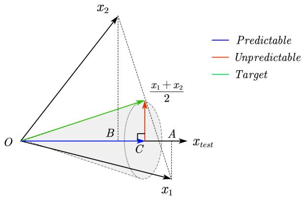  
Figure 8: The linear-attention model captures only the average predictable component of the difficulttask target. The green target is the average of the two selected inputs. Blue shows the best predictable component ${ \overrightarrow { O C } } ;$ red shows the context-specific residual.

Geometric interpretation. We now provide a heuristic geometric picture of the predictable component and irreducible loss, using the top-2 task as an example. In Figure 8, the horizontal ray represents the query $x _ { \mathrm { t e s t } }$ . The black vectors $\overrightarrow { O x _ { 1 } }$ and $\overrightarrow { O x _ { 2 } }$ are the two selected context inputs, and their average is the green target $\overrightarrow { O t } = ( x _ { 1 } + x _ { 2 } ) / 2$ . The blue vector $\overrightarrow { O C }$ represents the conditional mean $\bar { t } ,$ whereas the red vector $\overrightarrow { C t } = t - \bar { t }$ is the context-specific residual. Linear attention can approximate the predictable blue component through the population covariance, but it lacks the context-specific selection required to follow the red residual for each realized context. This residual therefore produces the irreducible loss floor.

## A.4 POWER LAWS FROM MODE-WISE EXPONENTIAL DECAY

As a heuristic model of Figure $3 ( \mathrm { c } )$ , we show how exponential decay at different rates can combine into a power law. Let feature k have initial loss weight $w _ { k } \geq 0$ and characteristic depth $\tau _ { k } > 0$

$$
\mathcal { R } _ { k } ( L ) = w _ { k } e ^ { - L / \tau _ { k } } , \qquad \mathcal { R } _ { L } = \sum _ { k } w _ { k } e ^ { - L / \tau _ { k } } .
$$

Assume the loss-weighted distribution of characteristic depths follows a power law, $\rho ( \tau ) = C \tau ^ { - \beta }$ for $\tau \geq \tau _ { 0 } > 0 .$ , with $C > 0$ and $\beta > 1$ . The aggregate loss is

$$
\mathcal { R } _ { L } \approx \int _ { \tau _ { 0 } } ^ { \infty } \rho ( \tau ) e ^ { - L / \tau } d \tau .\tag{55}
$$

With $x = L / \tau$ and $d \tau = - L x ^ { - 2 }$ dx, this becomes

$$
\begin{array} { c } { { \displaystyle \mathcal { R } _ { L } \approx C L ^ { 1 - \beta } \int _ { 0 } ^ { L / \tau _ { 0 } } x ^ { \beta - 2 } e ^ { - x } d x } } \\ { { \displaystyle ~ \sim C \Gamma ( \beta - 1 ) L ^ { - ( \beta - 1 ) } , ~ L \gg \tau _ { 0 } . } } \end{array}\tag{56}
$$

Thus exponential convergence of individual features produces power-law depth scaling when their characteristic depths have a broad power-law distribution. Stronger features converge first, while weaker features continue to contribute as depth increases.

## B NONLINEAR-ATTENTION MODEL THEORY

In this section, we derive the loss decomposition for the nonlinear-attention model on the difficult task studied in Section 4.2.

We first introduce the notation. Throughout this section, E denotes an expectation over contexts. Let L be the number of layers and P the number of context tokens. We use $\mathbf { \bar { \boldsymbol { \ell } } } = 1 , \dots , L$ for layers and

$i = 1 , \ldots , P$ for tokens. Write k for the number of labels selected by the top-k task. We measure the relevance of each context token to the test token using cosine similarity:

$$
\begin{array} { c } { \displaystyle \boldsymbol { s } _ { i } = \frac { \boldsymbol { x } _ { \mathrm { t e s t } } ^ { \top } \boldsymbol { x } _ { i } } { \| \boldsymbol { x } _ { \mathrm { t e s t } } \| _ { 2 } \| \boldsymbol { x } _ { i } \| _ { 2 } } , } \\ { \displaystyle s _ { i _ { ( 1 ) } } \geq \cdot \cdot \cdot \geq s _ { i _ { ( P ) } } , \qquad S _ { k } = \{ i _ { ( 1 ) } , \dots , i _ { ( k ) } \} . } \end{array}\tag{57}
$$

Thus $S _ { k }$ contains the k context indices closest to the test token. For the label column $y =$ $( y _ { 1 } , \dotsc , y _ { P } ) ^ { \intercal }$ , define the target row $t _ { k } = ( t _ { k , 1 } , \ldots , t _ { k , P } )$ by

$$
\begin{array} { r l r } & { } & { t _ { k , i } = \left\{ \begin{array} { l l } { \displaystyle 1 / k , \quad i \in S _ { k } , } \\ { \displaystyle 0 , \quad \quad i \notin S _ { k } , } \end{array} \right. } \\ & { } & { y ^ { * } = t _ { k } y = \displaystyle \frac { 1 } { k } \sum _ { i \in S _ { k } } y _ { i } . } \end{array}\tag{58}
$$

Let $p _ { \ell i }$ be the attention weight from the test token to context token i at layer $\ell ,$ with softmax normalized over the $P$ context sources since the test token does not attend to itself:

$$
p _ { \ell } = ( p _ { \ell 1 } , \ldots , p _ { \ell P } ) , \qquad \sum _ { i = 1 } ^ { P } p _ { \ell i } = 1 .\tag{59}
$$

With fixed context states, each layer reads the same label column $y .$ . The common scalar gain $g _ { L }$ includes the value map and readout:

$$
\begin{array} { c } { { \displaystyle \widehat { y } _ { L } = \frac { 1 } { L } \sum _ { \ell = 1 } ^ { L } f _ { \ell } , } } \\ { { \displaystyle f _ { \ell } = g _ { L } p _ { \ell } y = g _ { L } \sum _ { i = 1 } ^ { P } p _ { \ell i } y _ { i } , } } \\ { { \displaystyle g _ { L } = W _ { o } W _ { v } W _ { y } . } } \end{array}\tag{60}
$$

Define the layer error relative to the same target as $e _ { \ell } = f _ { \ell } - y ^ { * }$ . For $L > 1$ , assuming finite expected squared errors, let

$$
\begin{array} { c } { { \displaystyle { A _ { L } = \frac { 1 } { L } \sum _ { \ell = 1 } ^ { L } \mathbb { E } [ e _ { \ell } ^ { 2 } ] } , } } \\ { { \displaystyle { C _ { L } = \frac { 1 } { L ( L - 1 ) } \sum _ { \ell \neq m } \mathbb { E } [ e _ { \ell } e _ { m } ] } . } } \end{array}\tag{61}
$$

The second sum is over ordered distinct pairs. Since $\begin{array} { r } { \widehat { y } _ { L } - y ^ { * } = L ^ { - 1 } \sum _ { \ell } e _ { \ell } } \end{array}$ , expanding the square gives

$$
\begin{array} { r l } & { { \mathcal R } _ { L } = \mathbb { E } [ ( \widehat { y } _ { L } - y ^ { * } ) ^ { 2 } ] } \\ & { \quad = \frac { 1 } { L ^ { 2 } } \left[ \displaystyle \sum _ { \ell } \mathbb { E } [ e _ { \ell } ^ { 2 } ] + \displaystyle \sum _ { \ell \neq m } \mathbb { E } [ e _ { \ell } e _ { m } ] \right] } \\ & { \quad = \frac { A _ { L } } { L } + \frac { L - 1 } { L } C _ { L } } \\ & { \quad = C _ { L } + \frac { A _ { L } - C _ { L } } { L } . } \end{array}\tag{62}
$$

Expanding pairwise differences and using equation 61,

$$
\begin{array} { l } { { \displaystyle \sum _ { \ell \neq m } \mathbb { E } [ ( e _ { \ell } - e _ { m } ) ^ { 2 } ] = 2 ( L - 1 ) \sum _ { \ell } \mathbb { E } [ e _ { \ell } ^ { 2 } ] - 2 \sum _ { \ell \neq m } \mathbb { E } [ e _ { \ell } e _ { m } ] } } \\ { ~ } \\ { { = 2 L ( L - 1 ) ( A _ { L } - C _ { L } ) . } } \end{array}
$$

Dividing by $2 L ( L - 1 )$ gives

$$
A _ { L } - C _ { L } = \frac { 1 } { 2 L ( L - 1 ) } \sum _ { \ell \neq m } \mathbb { E } [ ( e _ { \ell } - e _ { m } ) ^ { 2 } ] \geq 0 .\tag{63}
$$

$C _ { L }$ captures the error shared across layers, whereas $A _ { L } - C _ { L }$ measures their disagreement. Averaging reduces the latter contribution to $( A _ { L } - C _ { L } ) / L$ . The shared component cannot be removed through aggregation and therefore gives rise to the irreducible loss, while differences among layer errors can partially cancel and produce the reducible loss.

Importantly, this decomposition does not by itself imply inverse-depth scaling. We first establish the emergence of inverse-depth scaling empirically through systematic experiments and rigorous power-law fitting, and then use the decomposition to identify the components and mechanisms underlying this behavior.

This decomposition relies on the parallel interpretation of our controlled model: the layers act as independently parameterized predictors whose aggregate forms the final output. A layerwise decomposition is therefore natural in this setting. In the generalized settings considered below, however, it is neither the only possible decomposition nor necessarily the most natural one. For example, when inputs and labels share a single stream, the model becomes cascaded and each layer depends on the preceding layers. A mean-field treatment (Mei et al., 2018; Chizat & Bach, 2018; Rotskoff & Vanden-Eijnden, 2018) may then be more appropriate, separating each layer’s output into a mean component coupled to the other layers and a layer-specific fluctuation. Developing a rigorous decomposition for more complex systems, including large language models, remains an important direction for understanding the role of depth in realistic models.

## C GENERALIZED MODEL EXPERIMENTS AND ANALYSIS

We now relax some design choices from the controlled model in Section 2.2 to move the architecture closer to standard Transformers and LLMs. First, the original two-stream encoding separates token matching from label propagation: queries and keys interact only with the input stream, whereas values and the output map interact only with the label stream. Second, all layers share a value matrix, which improves training stability and keeps the model concise. Third, the nonlinear-attention model initially keeps the context states fixed, isolating the process by which different layers retrieve relevant information from the context. In the following subsections, we relax these assumptions one at a time and conduct analogous experiments and analyses for each extension.

## C.1 ENCODING INPUT AND LABEL INFORMATION INTO ONE SPACE

Section 2.2 initializes separate input and label streams, $H _ { x } = W _ { x } X$ and $H _ { u } ^ { 0 } = W _ { y } { \bf { \dot { y } } ^ { \mathrm { i n } } }$ . In standard LLMs, token and label information are commonly encoded in a shared representation space. We therefore embed both sources of information in a shared token state:

$$
H ^ { 0 } = W _ { x } X + W _ { y } { \pmb y } ^ { \mathrm { i n } } \in \mathbb { R } ^ { N \times ( P + 1 ) } .\tag{64}
$$

Queries, keys, and values are now all computed from the same evolving state:

$$
Q ^ { \ell } = W _ { q } ^ { \ell } H ^ { \ell - 1 } , \qquad K ^ { \ell } = W _ { k } ^ { \ell } H ^ { \ell - 1 } , \qquad V ^ { \ell } = W _ { v } H ^ { \ell - 1 } .\tag{65}
$$

For nonlinear attention, the shared state is updated as

$$
\begin{array} { r l } & { \boldsymbol { A } ^ { \ell } = \mathsf { M } \odot \mathrm { s o f t m a x } \big ( ( \boldsymbol { Q } ^ { \ell } ) ^ { \top } \boldsymbol { K } ^ { \ell } \big ) , } \\ & { \boldsymbol { H } ^ { \ell } = \boldsymbol { H } ^ { \ell - 1 } + \displaystyle \frac { 1 } { L } \boldsymbol { V } ^ { \ell } ( \boldsymbol { A } ^ { \ell } ) ^ { \top } . } \end{array}\tag{66}
$$

Thus token matching, information propagation, and residual updates all act within a common representation space, and each layer operates on the state produced by the preceding layers.

To define the two decomposition terms in this cascaded model, let $z _ { \ell } = W _ { o } h _ { \mathrm { t e s t } } ^ { \ell }$ denote the test-token readout after layer ℓ. Define the base readout and layer increments as

$$
b _ { L } = z _ { 0 } , \qquad d _ { \ell } = z _ { \ell } - z _ { \ell - 1 } , \qquad \widehat { y } _ { L } = b _ { L } + \sum _ { \ell = 1 } ^ { L } d _ { \ell } .\tag{67}
$$

We can express the final prediction as an average of effective layerwise predictors by setting

$$
f _ { \ell } = b _ { L } + L d _ { \ell } , \qquad e _ { \ell } = f _ { \ell } - y ^ { * } , \qquad \widehat { y } _ { L } - y ^ { * } = \frac { 1 } { L } \sum _ { \ell = 1 } ^ { L } e _ { \ell } .\tag{68}
$$

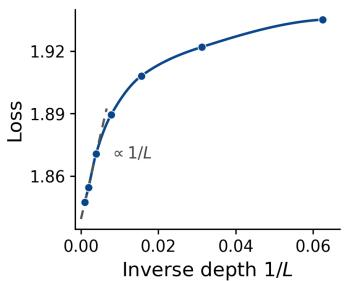  
(a)

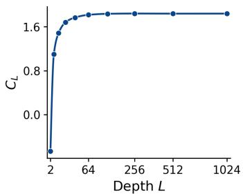  
(b)

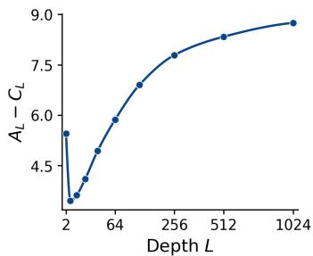  
(c)  
Figure 9: The single-stream nonlinear-attention model exhibits a similar inverse-depth scaling signal. (a) The model is evaluated under isotropic data spectra. $^ { ( \mathrm { b } , \mathrm { c } ) }$ The shared-error term $C _ { L }$ and disagreement term $A _ { L } - C _ { L }$ both approach finite constants with depth.

For $L > 1$ , the shared-error and disagreement terms are then defined as

$$
\begin{array} { c } { { C _ { L } = \displaystyle \frac { 1 } { L ( L - 1 ) } \sum _ { \ell \neq m } \mathbb { E } [ e _ { \ell } e _ { m } ] , } } \\ { { { } } } \\ { { A _ { L } - C _ { L } = \displaystyle \frac { 1 } { 2 L ( L - 1 ) } \sum _ { \ell \neq m } \mathbb { E } [ ( e _ { \ell } - e _ { m } ) ^ { 2 } ] } } \\ { { { } } } \\ { { { } = \displaystyle \frac { 1 } { L - 1 } \sum _ { \ell = 1 } ^ { L } \mathbb { E } [ ( f _ { \ell } - \widehat { y } _ { L } ) ^ { 2 } ] . } } \end{array}\tag{69}
$$

With these definitions, the loss retains the exact identity

$$
\mathcal { R } _ { L } = C _ { L } + \frac { A _ { L } - C _ { L } } { L } .\tag{70}
$$

We evaluate this generalized model on the difficult task. Figure 9 shows that $C _ { L }$ and $A _ { L } - C _ { L }$ continue to approach finite constants, while the loss exhibits an approximate inverse-depth trend beyond moderate depth.

## C.2 LAYER-DECOUPLED VALUE MATRICES

In standard LLMs, value matrices are typically parameterized independently across layers. We therefore replace the value matrix $W _ { v }$ shared in Section 2.2 with independently parameterized matrices $W _ { v } ^ { \ell } ,$ , giving

$$
Q ^ { \ell } = W _ { q } ^ { \ell } H _ { x } , \qquad K ^ { \ell } = W _ { k } ^ { \ell } H _ { x } , \qquad V ^ { \ell } = W _ { v } ^ { \ell } H _ { y } ^ { \ell - 1 } .\tag{71}
$$

This modification allows each layer to apply a distinct transformation to the retrieved label information.

Let $p _ { \ell }$ denote the attention weights from the test token to the context tokens, and let y collect their labels. The corresponding layerwise predictor and error are

$$
g _ { \ell } = W _ { o } W _ { v } ^ { \ell } W _ { y } , \qquad f _ { \ell } = g _ { \ell } p _ { \ell } y , \qquad e _ { \ell } = f _ { \ell } - y ^ { * } , \qquad { \widehat { y } } _ { L } = { \frac { 1 } { L } } \sum _ { \ell = 1 } ^ { L } f _ { \ell } .\tag{72}
$$

For $L > 1$ , the shared-error and disagreement terms are

$$
C _ { L } = \frac { 1 } { L ( L - 1 ) } \sum _ { \ell \neq m } \mathbb { E } [ e _ { \ell } e _ { m } ] ,
$$

$$
\begin{array} { l } { \displaystyle { A _ { L } - C _ { L } = \frac { 1 } { 2 L ( L - 1 ) } \sum _ { \ell \neq m } \mathbb { E } [ ( e _ { \ell } - e _ { m } ) ^ { 2 } ] } } \\ { \displaystyle { = \frac { 1 } { 2 L ( L - 1 ) } \sum _ { \ell \neq m } \mathbb { E } \Big [ \big ( ( g _ { \ell } p _ { \ell } - g _ { m } p _ { m } ) y \big ) ^ { 2 } \Big ] . } } \end{array}\tag{73}
$$

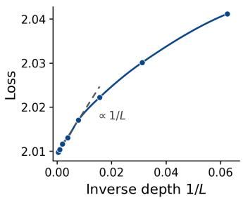  
(a)

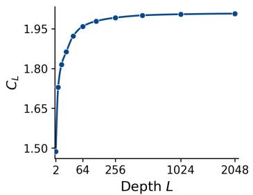  
(b)

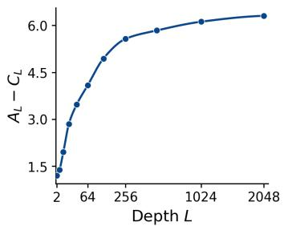  
(c)  
Figure 10: The nonlinear-attention model with layer-specific value matrices exhibits a similar inversedepth scaling signal. (a) The model is evaluated under isotropic data spectra. (b,c) The shared-error term $C _ { L }$ and disagreement term $A _ { L } - C _ { L }$ both approach finite constants with depth.

The loss therefore retains the exact identity

$$
\mathcal { R } _ { L } = C _ { L } + \frac { A _ { L } - C _ { L } } { L } .\tag{74}
$$

We evaluate this generalized model on the difficult task. Figure 10 shows that $C _ { L }$ and $A _ { L } - C _ { L }$ continue to approach finite constants, while the loss displays an approximate inverse-depth trend beyond moderate depth. Thus, the same inverse-depth scaling signal remains visible after relaxing the shared-value assumption.

## C.3 ALLOWING CONTEXT UPDATES IN THE NONLINEAR-ATTENTION MODEL

Our linear-attention model in Section 2.2 follows Bordelon et al. (2026), including their attentionmasking scheme. Let $\mathbf { 1 } _ { P } \in \mathbb { R } ^ { P }$ denote the all-ones vector. For a single test token, their mask can be written as

$$
\begin{array} { r } { \mathsf { \mathbf { M } } = \left( \begin{array} { c c } { - \mathbf { 1 } _ { P } \mathbf { 1 } _ { P } ^ { \top } } & { \mathbf { 0 } _ { P \times 1 } } \\ { \mathbf { 1 } _ { P } ^ { \top } } & { 0 } \end{array} \right) , } \end{array}\tag{75}
$$

where the upper-left block governs context-to-context updates, while the lower-left block allows the test token to attend to the context tokens. Intuitively, this sign structure lets linear attention extract data structure at progressively finer spectral resolutions. The negative context-to-context block preferentially subtracts components shared by highly similar context tokens from their label states. Dominant spectral features produce larger similarity-weighted updates and are therefore resolved earlier, whereas weaker features persist until greater depth and can be learned in deeper layers. This behavior is consistent with the sequential mode learning in Figure 3(c). By contrast, the positive test-to-context block allows retrieved information to accumulate in the test token’s label state, which is initialized at zero and updated across layers.

To isolate how the test token retrieves and aggregates information from the context, the controlled nonlinear-attention model in Section 2.2 initially disables context updates by setting the upper-left block to zero:

$$
\begin{array} { r } { \mathsf { M } ( 0 ) = \left( \begin{array} { c c } { \mathbf { 0 } _ { P \times P } } & { \mathbf { 0 } _ { P \times 1 } } \\ { \mathbf { 1 } _ { P } ^ { \top } } & { 0 } \end{array} \right) . } \end{array}\tag{76}
$$

Standard Transformers, however, update context representations across layers. To examine how these updates affect the nonlinear-attention model, we parameterize the previously zero context-to-context block by a trainable scalar m. Specifically, we use

$$
\begin{array} { r } { \mathsf { M } ( m ) = \left( \begin{array} { c c } { m \mathbf { 1 } _ { P } \mathbf { 1 } _ { P } ^ { \top } } & { \mathbf { 0 } _ { P \times 1 } } \\ { \mathbf { 1 } _ { P } ^ { \top } } & { 0 } \end{array} \right) , } \end{array}\tag{77}
$$

where the scalar m is shared across all layers and learned jointly with the other model parameters.

We evaluate this generalized model on the difficult task with isotropic data spectra, using top-2 and top-16 targets. Figure 11(a,b) shows qualitatively different depth dependence. For top-2, the loss continues to decrease substantially with depth and exhibits a signal consistent with inverse-depth scaling. For top-16, by contrast, increasing depth does not improve the loss.

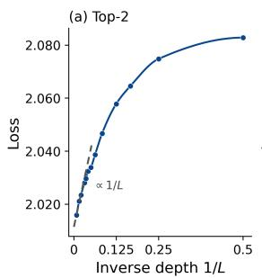

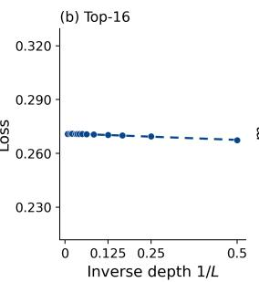

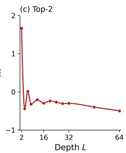

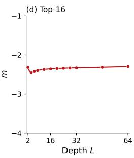  
Figure 11: Enabling context updates preserves an inverse-depth scaling signal on the top-2 task but not on the top-16 task. Under isotropic data spectra, (a) the top-2 loss exhibits an inverse-depth scaling signal, whereas (b) the top-16 loss quickly saturates. (c,d) The learned context-update scalar m varies with depth for top-2 but stabilizes for top-16.

The learned context-update scalar m provides an additional diagnostic. Figure $^ { 1 1 ( \mathrm { c } , \mathrm { d } ) }$ shows that the learned scalar m varies substantially with depth for top-2, whereas for top-16 it remains near the stable negative value −2.3.

To interpret this task-dependent behavior, we first derive its exact effect in a two-layer model. Write the label state as $H _ { y } ^ { \ell } = \mathsf { \bar { [ } } Z _ { \ell } , h _ { \ell } ]$ , where $\dot { Z } _ { \ell } \in \mathbb { R } ^ { N \times P }$ contains the context states and $h _ { \ell } \in \mathbb { R } ^ { N }$ is the test-token state. Let $y = ( y _ { 1 } , \dotsc , y _ { P } ) ^ { \intercal }$ , so that $Z _ { 0 } = W _ { y } y ^ { \top }$ and $h _ { 0 } = 0$ . Without changing the mechanism of interest we take $W _ { v } = I _ { N }$ for simplicity. Let $p _ { \ell } \in \mathbb { R } ^ { 1 \times P }$ denote the test-to-context attention row at layer $\ell ,$ and let $\check { A } _ { 1 } \in \overset { \vartriangle } { \mathbb { R } } ^ { P \times P }$ denote the first layer’s context-to-context attention matrix.

Applying equation 10 with the mask in equation 77 gives

$$
\begin{array} { l } { { \displaystyle Z _ { 1 } = Z _ { 0 } + \frac { m } { 2 } Z _ { 0 } A _ { 1 } ^ { \top } , } } \\ { { \displaystyle h _ { 1 } = \frac { 1 } { 2 } Z _ { 0 } p _ { 1 } ^ { \top } , } } \\ { { \displaystyle h _ { 2 } = h _ { 1 } + \frac { 1 } { 2 } Z _ { 1 } p _ { 2 } ^ { \top } . } } \end{array}\tag{78}
$$

Substituting $Z _ { 0 } = W _ { y } y ^ { \top }$ gives

$$
h _ { 2 } = W _ { y } \left[ \frac { 1 } { 2 } ( p _ { 1 } + p _ { 2 } ) y + \frac { m } { 4 } p _ { 2 } A _ { 1 } y \right] .\tag{79}
$$

Defining the scalar readout gain $g = W _ { o } W _ { y }$ , the prediction is

$$
\widehat { y } _ { 2 } = \frac { g } { 2 } ( p _ { 1 } + p _ { 2 } ) y + \frac { g m } { 4 } p _ { 2 } A _ { 1 } y .\tag{80}
$$

The first term reads the original context labels directly. The second reads them after $A _ { 1 }$ has mixed information across context tokens.

For arbitrary depth, the corresponding recursion is

$$
\begin{array} { l } { { \displaystyle Z _ { \ell } = Z _ { \ell - 1 } \left( I _ { P } + \frac { m } { L } A _ { \ell } ^ { \top } \right) , } } \\ { { \displaystyle h _ { \ell } = h _ { \ell - 1 } + \frac { 1 } { L } Z _ { \ell - 1 } p _ { \ell } ^ { \top } . } } \end{array}\tag{81}
$$

Consequently,

$$
\widehat { y } _ { L } = \frac { g } { L } \left[ p _ { 1 } y + \sum _ { \ell = 2 } ^ { L } p _ { \ell } \left( I _ { P } + \frac { m } { L } A _ { \ell - 1 } \right) \cdots \left( I _ { P } + \frac { m } { L } A _ { 1 } \right) y \right] .\tag{82}
$$

Thus, context updates affect prediction through operators $I _ { P } + ( m / L ) A _ { \ell }$ . Whether and how they improve depth utilization depends on the spectral structure of $A _ { \ell } .$

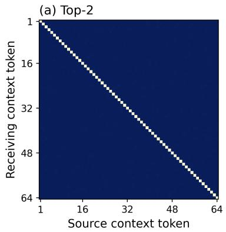

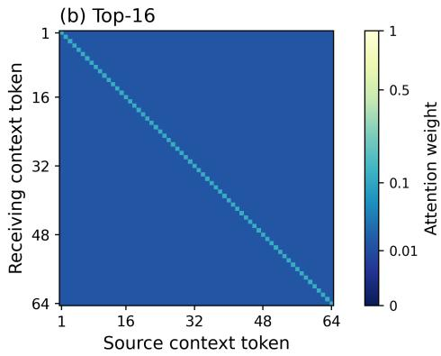  
Figure 12: The learned context-attention structure depends strongly on the aggregation target. The context-attention matrix $A _ { 1 }$ is (a) sharply concentrated on the diagonal for top-2 task, but (b) distributed broadly across context tokens for top-16 task.

Figure 12 visualizes the two context attention structures. For the top-2 task, the measured $A _ { 1 }$ is nearly the identity. For the top-16 task, the measured $A _ { 1 }$ is broader and flatter. This contrast is induced by the sharpness of the target distribution. The sharp top-2 target requires the model to preserve the identities of a few selected tokens, favoring well-separated embeddings and a nearly identity attention map. The flatter top-16 target instead favors stronger coupling across embeddings and therefore produces a broader attention map.

To quantify this contrast, we model each measured attention matrix by an identity component $I _ { P }$ and a uniform mixing component $J _ { P }$ . Specifically, for $k \in \{ 2 , 1 6 \}$ , we fit $\rho _ { k }$ by least squares in

$$
A _ { 1 } ^ { ( k ) } \approx \rho _ { k } I _ { P } + ( 1 - \rho _ { k } ) J _ { P } , \qquad J _ { P } : = \frac { \mathbf { 1 } _ { P } \mathbf { 1 } _ { P } ^ { \top } } { P } .\tag{83}
$$

The identity term preserves each context embedding separately, whereas $J _ { P }$ replaces every embedding by their common average. The fitted results are

$$
\begin{array} { r } { \rho _ { 2 } = 0 . 9 9 9 9 , \quad R _ { \mathrm { t o p - 2 } } ^ { 2 } > 0 . 9 9 9 9 , } \\ { \rho _ { 1 6 } = 0 . 0 9 8 9 , \quad R _ { \mathrm { t o p - 1 6 } } ^ { 2 } = 0 . 9 9 9 9 6 . } \end{array}\tag{84}
$$

This model therefore confirms that the top-2 matrix is almost exactly the identity, while the top-16 matrix is dominated by uniform cross-token mixing.

For top-2, the near-identity structure gives p ${ \bf \nabla } , A _ { 1 } \approx p _ { 2 }$ , and

$$
\widehat { y } _ { 2 } \approx \frac { g } { 2 } p _ { 1 } y + \frac { g } { 2 } ( 1 + m / 2 ) p _ { 2 } y .\tag{85}
$$

The context update therefore introduces no independent token-weighting direction: the prediction remains an aggregation of $p _ { 1 }$ and $p _ { 2 }$ . Accordingly, its loss remains close to that of the fixed-context model and still exhibits approximate inverse-depth scaling over the observed depth range.

For top-16, let $u = \mathbf { 1 } _ { P } ^ { \top } / P$ . Since $p _ { 2 } \mathbf { 1 } _ { P } = 1$ , we have $p _ { 2 } J _ { P } = u$ and hence

$$
p _ { 2 } A _ { 1 } \approx \rho _ { 1 6 } p _ { 2 } + ( 1 - \rho _ { 1 6 } ) u ,\tag{86}
$$

Equation 86 shows that the context update adds the uniform token-weighting direction u, beyond the direct rows $p _ { 1 }$ and $p _ { 2 }$ . Defining $\bar { p } = ( p _ { 1 } + p _ { 2 } ) / 2$ , the exact two-layer prediction is

$$
{ \widehat { y } } _ { 2 } = g \left( \bar { p } + { \frac { m } { 4 } } p _ { 2 } A _ { 1 } \right) y .\tag{87}
$$

A negative m therefore produces a global shift that subtracts the common attention floor, rather than merely combining more direct attention rows. This additional degree of freedom allows the model to achieve low loss with few layers, explaining its early saturation. The same argument extends to models with more than two layers.

This distinction is also relevant to language modeling. Many language tasks require focusing on only a few relevant tokens and learning a sparse and peaked distribution. In such regimes, context interactions may primarily reweight information that has already been selected. Depth utilization can therefore remain governed by selective retrieval and cross-layer aggregation, making the inverse-depth mechanism relevant even when context representations are not fixed.

Overall, these generalized models exhibit inverse-depth scaling signals that are qualitatively consistent with the controlled-model analysis over the accessible depth ranges. Training these models at much greater depths is substantially more computationally expensive, preventing experiments on the same scale as those conducted for the controlled model. We therefore interpret these results as evidence of similar scaling signals, rather than as a definitive guarantee of asymptotic inverse-depth scaling. Their appearance under more realistic architectural choices nevertheless suggests that the mechanism may remain relevant to practical models.

## D MORE EXPERIMENTS AND FITTING DETAILS

This section supplements the controlled-model results with additional experiments and provides the fitting procedures used to quantify the observed depth-scaling laws. We report fits for both the easy and difficult tasks, analyze context-dependent token selection, test broader targets and data spectra, and examine the convergence of the shared-error term.

## D.1 POWER-LAW FITTING PROCEDURES

We use a common log-space fitting procedure to quantify the depth-scaling laws in Sections 3.1 and 4.2. Each spectrum is fitted independently using

$$
\begin{array} { r } { \mathcal { R } _ { L } = L _ { 0 } + c L ^ { - \alpha } , \qquad c > 0 , \quad \alpha > 0 , } \end{array}\tag{88}
$$

where $L _ { 0 }$ is the asymptotic loss floor and α is the decay exponent.

For observations at depths $\{ L _ { i } \}$ , we minimize the squared residuals between the logarithms of the observed and modeled losses:

$$
\big ( \widehat { L } _ { 0 } , \widehat { c } , \widehat { \alpha } \big ) = \underset { L _ { 0 } , c , \alpha } { \arg \operatorname* { m i n } } \sum _ { i } \left[ \log \mathcal { R } _ { L _ { i } } - \log \big ( L _ { 0 } + c L _ { i } ^ { - \alpha } \big ) \right] ^ { 2 } .\tag{89}
$$

For the easy task, we set $L _ { 0 } = 0$ . As shown in Appendix A.1, given sufficient depth, width, dataset size, context length, and training time, the linear-attention model can solve this task exactly by using a covariance polynomial to approximate the identity map. For the difficult task, the decomposition in Appendix B contains an error component shared across layers, so we estimate $L _ { 0 }$ jointly with c and α.

## D.2 COMPLEMENTARY TOKEN SELECTION ACROSS CONTEXTS

We further compare how nonlinear-attention models of different depths perform on the difficult task. We train an $L = 1$ model and an $L = 2 5 6$ model on the difficult task with $k = 2$ under identical conditions. We then sample 10,240 fresh contexts independently from the data distribution and evaluate both models on the same set.

For each context, we order the tokens by their similarity to the test token. Under the parallel interpretation developed in Appendix B, the final output aggregates the contributions of the individual layers. We therefore summarize their collective token selection by the aggregated attention distribution and compare it with the target distribution over the ordered tokens. Formally,

$$
\begin{array} { c } { { \displaystyle \bar { p } _ { L } ( c ) = \frac { 1 } { L } \sum _ { \ell = 1 } ^ { L } p _ { \ell } ( c ) , \qquad p ^ { \ast } = ( 1 / 2 , 1 / 2 , 0 , \dots , 0 ) , } } \\ { { \displaystyle E _ { L } ( c ) = \| \bar { p } _ { L } ( c ) - p ^ { \ast } \| _ { 2 } ^ { 2 } . } } \end{array}\tag{90}
$$

Lower values indicate more accurate identification and weighting of the two target tokens. For each model separately, we sort the sampled contexts by $E _ { L } ( c )$ and denote the qth percentile by $Q _ { L } ( q )$ Thus, small q corresponds to contexts on which a model most closely matches the target distribution, whereas large q probes its high-error tail.

(a) Attention vs. top-2 target  
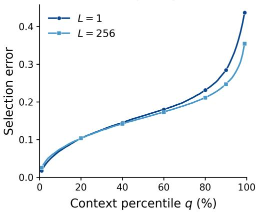

(b) Difference at each percentile  
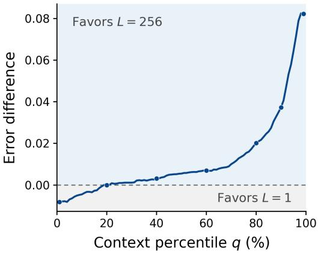  
Figure 13: Greater depth makes token selection more reliable across contexts. (a) Selection-loss percentiles for $L = 1$ and $L = 2 5 6$ . (b) Their difference $\Delta Q ( q ) = Q _ { 1 } ( q ) - Q _ { 2 5 6 } ( q )$ ; positive values favor $L = 2 5 6$

Figure 13(a) compares the resulting error distributions. Panel (b) reports

$$
\Delta Q ( q ) = Q _ { 1 } ( q ) - Q _ { 2 5 6 } ( q ) ,\tag{91}
$$

Positive $\Delta Q ( q )$ therefore indicates that the deeper model has lower selection loss at percentile q. The one-layer model is slightly more accurate on the contexts in its lowest-error tail, but its error grows much more rapidly across harder contexts. The 256-layer model instead markedly reduces the upper tail, indicating more reliable token selection across the context distribution.

This pattern follows from the fact that each query–key parameterization must serve the entire context distribution. With only one layer, a single selection rule may fit some contexts particularly well but cannot identify the correct top-2 tokens uniformly. Greater depth supplies multiple independently parameterized rules whose errors can be complementary across contexts. Their aggregation improves coverage: for a context that is difficult for one rule, other layers may still identify the relevant tokens, thereby reducing the high-error tail.

The slight advantage of the one-layer model at the lowest percentiles suggests a possible tradeoff between specialization and coverage. A single selection rule may become highly accurate on a limited subset of contexts, whereas complementary rules across layers can cover a broader range. This observation suggests a testable hypothesis for settings with finitely many or clustered context types: different layers may specialize in different context classes, and their aggregation may combine these specialized behaviors. If this hypothesis holds, it would suggest that current architectures use depth inefficiently, as not every layer makes an indispensable contribution. Further exploring designs that exploit such layerwise specialization may help LLMs utilize depth better.

## D.3 BROADER TARGETS AND DATA SPECTRA

The main-text experiments with the nonlinear-attention model on the difficult task use top-2 aggregation and vary one spectral parameter while fixing the other at zero. We now test whether the observed depth scaling depends on either restriction. First, we retain the top-2 target but consider jointly structured input and task spectra, with both a and b nonzero. Second, we replace top-2 aggregation with top-16 aggregation, yielding a flatter target distribution, and evaluate several spectral settings. For each configuration, we fit the evaluation loss using the model and log-space objective defined in Appendix D.1.

Figure 14 shows approximately inverse-depth loss decay across both extensions, and Table 4 quantifies the corresponding exponents. For the jointly nonzero top-2 settings, panels (c,d) further show that both decomposition terms approach spectrum-dependent finite values, matching the convergence pattern observed in the main text. With jointly nonzero spectra, the top-2 exponents remain close to one. Note that the top-16 exponents deviate relatively more from one at the depths considered, suggesting that the top-16 task may enter the asymptotic inverse-depth regime only at greater depths. This contrast also suggests that inverse-depth scaling from cross-layer aggregation may be more pronounced for

(0.25, 0.25): α = 0.97 ± 0.01 (0.25, 0.5): α = 0.93 ± 0.06 A (0.5, 0.5): α = 0.97 ± 0.01

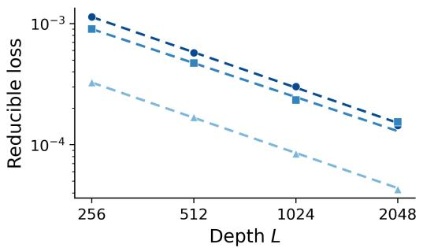  
(a) Top-2 aggregation  
(0, 0.25):α = 0.79 ± 0.02 (0, 0.5): α = 0.88 ± 0.03 A (0.25, 0.25): α = 0.81 ± 0.02 (0.25, 0.5): α = 0.81 ± 0.04

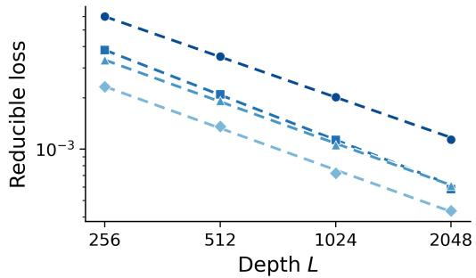  
(b) Top-16 aggregation

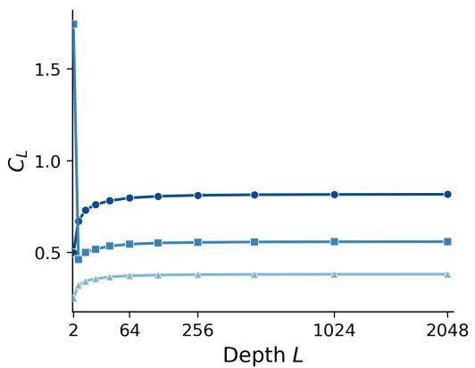  
(c) Shared error

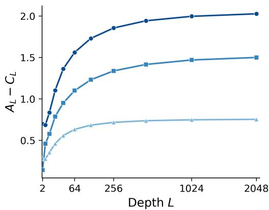  
(d) Error disagreement  
Figure 14: Emergent inverse-depth scaling in the deep regime generalizes across broader targets and data spectra. (a) Performance on the top-2 task with both spectral parameters nonzero. (b) Performance on top-16 aggregation across representative spectra. (c) $C _ { L }$ and (d) $A _ { L } - C _ { L }$ converge to finite constants with depth for the three top-2 spectra.

Table 4: Fitted depth-scaling exponents remain close to one across broader targets and data spectra.
<table><tr><td>Target</td><td> $( a , b )$ </td><td> $L _ { 0 }$ </td><td> $\alpha \pm \mathrm { S E }$ </td><td> $R ^ { 2 }$ </td></tr><tr><td>Top-2</td><td>(0.25,0.25)</td><td>0.818068</td><td> $0 . 9 7 \pm 0 . 0 1$ </td><td>0.9998</td></tr><tr><td></td><td>(0.25, 0.5)</td><td>0.559694</td><td> $0 . 9 3 \pm 0 . 0 6$ </td><td>0.9984</td></tr><tr><td></td><td>(0.5,0.5)</td><td>0.382188</td><td> $0 . 9 7 \pm 0 . 0 1$ </td><td>0.9999</td></tr><tr><td>Top-16</td><td>(0,0.25)</td><td>0.173237</td><td> $0 . 7 9 \pm 0 . 0 2$ </td><td>0.9999</td></tr><tr><td></td><td>(0,0.5)</td><td>0.114436</td><td> $0 . 8 8 \pm 0 . 0 3$ </td><td>0.9998</td></tr><tr><td></td><td>(0.25,0.25)</td><td>0.115248</td><td> $0 . 8 1 \pm 0 . 0 2$ </td><td>0.9998</td></tr><tr><td></td><td>(0.25, 0.5)</td><td>0.079785</td><td> $0 . 8 1 \pm 0 . 0 4$ </td><td>0.9994</td></tr></table>

sparse, sharply concentrated target distributions. These results show that the inverse-depth scaling behavior is not restricted to specific spectra or target distributions.

## D.4 CONVERGENCE OF THE SHARED-ERROR TERM

The direct loss fits in Section 4.2 provide empirical evidence for approximate inverse-depth scaling over the tested depth range. As a consistency check on the decomposition in Appendix B, we examine how its shared-error term $C _ { L }$ approaches the fitted loss floor. For each spectrum, we fix $L _ { 0 }$ to the corresponding estimate in Table 1 and model the gap as

$$
L _ { 0 } - C _ { L } = c L ^ { - \alpha } , \qquad c > 0 , \quad \alpha > 0 .\tag{92}
$$

Following the log-space procedure in Appendix D.1, we estimate the two parameters by least squares:

$$
( \widehat { c } , \widehat { \alpha } ) = \underset { c > 0 , \alpha > 0 } { \arg \operatorname* { m i n } } \sum _ { i } \left[ \log ( L _ { 0 } - C _ { L _ { i } } ) - \log \left( c L _ { i } ^ { - \alpha } \right) \right] ^ { 2 } .\tag{93}
$$

Table 5: The gap $L _ { 0 } - C _ { L }$ decays approximately inversely with depth over the fitted range.
<table><tr><td>(a, b)</td><td> $\alpha \pm \mathrm { S E }$ </td><td> $R ^ { 2 }$ </td></tr><tr><td>(0,0)</td><td> $0 . 9 8 0 \pm 0 . 0 0 7$ </td><td>0.99981</td></tr><tr><td>(0,0.25)</td><td> $0 . 9 8 3 \pm 0 . 0 3 8$ </td><td>0.99396</td></tr><tr><td>(0, 0.5)</td><td> $0 . 9 7 7 \pm 0 . 0 1 4$ </td><td>0.99923</td></tr><tr><td>(0, 1)</td><td> $0 . 9 8 2 \pm 0 . 0 1 1$ </td><td>0.99946</td></tr><tr><td>(0.25,0)</td><td> $0 . 9 9 0 \pm 0 . 0 1 5$ </td><td>0.99904</td></tr><tr><td>(0.5,0)</td><td> $0 . 9 8 6 \pm 0 . 0 0 5$ </td><td>0.99988</td></tr><tr><td>(1,0)</td><td> $0 . 9 9 4 \pm 0 . 0 0 5$ </td><td>0.99992</td></tr><tr><td></td><td></td><td></td></tr></table>

With $L _ { 0 }$ fixed by the direct loss fits, the high $R ^ { 2 }$ values and small fitting uncertainties show that $L _ { 0 } - C _ { L }$ is well described by a power law over the tested depths. Its fitted decay exponents are close to one, consistent with the inverse-depth trend observed in the loss.