# ESTIMATING GREAT EXPECTATIONS UNDER AUTORE-GRESSIVE LANGUAGE MODELS WITH POTENTIALS

Francesco Ignazio Re1 Shubhangi Ghosh2 Tim Vieira1 Ryan Cotterell1

1ETH Zurich¨ 2Columbia University

francesco.re@inf.ethz.ch sg4156@columbia.edu

tim.vieira@gmail.com ryan.cotterell@inf.ethz.ch

## ABSTRACT

Many applications of language models hinge not on individual samples but on the expectation of a test functional under the model. Estimating such expectations reliably can be computationally expensive. In this paper, we show how to make estimation more efficient by exploiting the next-token conditional probabilities which are available as a by-product of sampling. We do so through potentials: real-valued functions on prefixes that decompose the test functional additively. We construct an estimator whose variance depends on the chosen potential, and derive conditions under which a potential reduces this variance. We then develop practical potentials for several estimands and applications, and demonstrate substantial variance reductions across several estimands at comparable computational cost.

§ Code Repository

## 1 INTRODUCTION

A language model is a probability distribution over strings. The most common application of such a model is to generate free-form text from a prompt (Radford et al., 2019; Brown et al., 2020). However, for some applications, the quantity of interest is not the sample itself but rather the expectation of a test functional under the model. For instance,

• In reinforcement learning from human feedback, proximal policy optimization (PPO; Schulman et al., 2017) regularizes the policy by penalizing its Kullback–Leibler divergence from a reference model (Christiano et al., 2017; Stiennon et al., 2020; Ouyang et al., 2022), a divergence that is itself an expectation under the policy.

• In AI safety, one is often interested in the probability that a model emits a harmful or otherwise undesirable output (Jones et al., 2025; Angell et al., 2026).

• In distillation, one fits a simpler surrogate, such as an n-gram model, to a large language model by matching expectations such as the cross-entropy under the teacher (Hinton et al., 2015; Agarwal et al., 2024).

• In language-model watermarking, one may be interested in the probability that a generated text is detected as watermarked; that can be viewed as an expectation under the model’s distribution (Kirchenbauer et al., 2023).

• In interpretability, distributional functionals quantify how much a given context shifts a model’s predictions (Pezeshkpour, 2023; Du et al., 2024; Stoehr et al., 2024).

More precisely, given a language model p and a test function f, we wish to compute the expectation of f under p. Unless p and f exhibit exploitable structure1, this expectation must be approximated. Monte Carlo methods offer a well known approach: sample strings, evaluate f on them, and average the results. Drawing independent strings directly from p yields the standard Monte Carlo estimator; drawing instead from a proposal distribution and reweighting by the corresponding likelihood ratio yields importance sampling. These estimators are unbiased but can have high variance, so achieving a desired level of precision may require generating many samples at substantial computational cost.

In this paper, we introduce a variance-reduction framework that exploits the next-token distributions computed as a by-product of sampling. The idea is to write $f$ as an additive decomposition of token-level increments along the string and to replace each increment with its conditional expectation given the prefix, taken over the next token. Applied to an existing unbiased estimator, this procedure always preserves unbiasedness while making the variance depend on the decomposition. The choice of decomposition is thus the central design choice in the framework.

For a given $f ,$ we parametrize the family of its additive decompositions using potentials: real-valued functions on prefixes. We borrow this construction from potential-based reward shaping in reinforcement learning, where potentials redistribute rewards along a trajectory to facilitate learning (Ng et al., 1999). Here, we repurpose potentials to redistribute the function value over marginalizable token level increments and refer to the resulting estimator as the potential estimator.

We first show that there exists an oracle potential yielding a zero-variance estimator. Since it is generally intractable, we derive an exact criterion for when an arbitrary potential reduces variance. We then use the oracle potential to guide potential design: when $f$ has known additive structure, we use components of the oracle potential that can be computed directly from $f ;$ for arbitrary functions over strings, we approximate the oracle potential by learning it from samples. In general, given a set of candidate potentials, we introduce a potential-selection procedure that preserves unbiasedness while using the full sample.

Our experiments demonstrate substantial gains in statistical efficiency across four applications and several estimands. For losses and divergences, simple potentials reduce variance in all tested configu rations, yielding up to $1 7 \times$ the effective sample size of Monte Carlo. Their gradient counterparts also improve on Monte Carlo in every evaluated comparison, with variance reductions of up to 89%. For expected n-gram counts and frequencies, our estimator produces even larger gains: about 99% lower variance than Monte Carlo after accounting for computational cost (median over targets with lower es timation uncertainty). For non-additive event probabilities, approximations to the oracle potential are also effective: our estimator reduces the variance of watermark-detection estimates by a median 36%, while learned potentials selected through nested cross-fitting reduce the variance of the importancesampling estimator introduced by (Dorman et al., 2026) by a median 12%. In the latter experiment, this corresponds to approximately 900,000 additional baseline generations. Overall, our results establish potential design as a practical strategy for improving expectation estimates after sampling, across both direct Monte Carlo and importance sampling. We discuss related work in App. A.

## 2 EXPECTATIONS UNDER AUTOREGRESSIVE LANGUAGE MODELS

## 2.1 LANGUAGE MODELS

Let Σ be a finite, non-empty set of symbols, and let EOS $\not \in \Sigma$ be a distinguished terminal symbol. A string is a finite sequence of symbols from Σ. Let $\Sigma ^ { * }$ denote the (countably infinite) set of all such strings. For $\boldsymbol { y } , \boldsymbol { y } ^ { \prime } \in \Sigma ^ { * }$ , we write ${ \pmb y } \succeq { \pmb y } ^ { \prime }$ when $\mathbf { \Delta } _ { \mathbf { \boldsymbol { y } } ^ { \prime } }$ is a prefix of $\mathbf { { \pmb { y } } } _ { \mathrm { { \pmb { \cdot } } } }$ , and $y ^ { \prime } \prec y$ when $\mathbf { \Delta } _ { \mathbf { \boldsymbol { y } } ^ { \prime } }$ is a strict prefix of $\textbf {  { y } }$ .

A language model $p$ is a probability distribution over complete strings taking values in $\Sigma ^ { * }$ , i.e., $p \in \bar { \triangle ( \Sigma ^ { * } ) }$ , where $\triangle ( \mathcal { X } )$ denotes the set of all probability distributions over a countable set $\mathcal { X }$ . We write $\dot { Y } \sim p$ for a random string drawn from $p ,$ so that $\mathbf { \nabla } \mathbf { Y } \succeq \mathbf { y }$ is the event that $\mathbf { Y }$ extends $\mathbf { \nabla } _ { \mathbf { \mu } _ { y . } }$ For any distribution $p ,$ we use the following notation for the prefix probability of a string $\ b { y } \in \Sigma ^ { * }$ , which gives the marginal probability that a string sampled from $p$ extends ${ \mathbf { \nabla } } _ { \mathbf { \boldsymbol { y } } } \mathrm { { : } }$

$$
{ \vec { p } } ( { \pmb y } ) \stackrel { \mathrm { d e f } } { = } \mathrm { P r } [ { \pmb Y } \succeq { \pmb y } ] = \sum _ { { \pmb z } \in \Sigma ^ { * } } p ( { \pmb y } { \pmb z } ) .\tag{1}
$$

The conditional prefix probability is then ${ \vec { p } } ( z \mid y ) { \stackrel { \mathrm { d e f } } { = } } \operatorname* { P r } [ Y \succeq y z \mid Y \succeq y ] = { \vec { p } } ( y z ) / { \vec { p } } ( y )$ , and we extend ${ \vec { p } } ( \cdot \mid \mathbf { \sigma } _ { \boldsymbol { y } } )$ to the terminal symbol EOS by ⃗p(EOS $\mid \pmb { y } ) \stackrel { \mathrm { d e f } } { = } p ( \pmb { y } ) / \vec { p } ( \pmb { y } )$ . Whenever $\begin{array} { r } { \vec { p } ( \pmb { y } ) = 0 } \end{array}$ we use the convention that ${ \vec { p } } ( z \mid \mathbf { y } ) \ { \stackrel { \mathrm { d e f } } { = } } \ 0$ for every $z \in \Sigma$ and ${ \vec { p } } ( \operatorname { E O S } \mid \pmb { y } ) \ { \stackrel { \mathrm { d e f } } { = } } \ 1$ , so that $\vec { p } ( \cdot \mid \boldsymbol { y } )$ remains a valid conditional distribution over $\Sigma \cup \{ \mathrm { E O S } \}$ . Using the conditional prefix probabilities, the probability of any string $\pmb { y } = y _ { 1 } \cdots y _ { | \pmb { y } | } \in \Sigma ^ { * }$ under a language model admits a left-to-right

autoregressive factorization:

$$
p ( \pmb { y } ) = \vec { p } \big ( \mathrm { E O S } \mid \pmb { y } \big ) \prod _ { n = 1 } ^ { | \pmb { y } | } \vec { p } ( y _ { n } \mid \pmb { y } _ { < n } ) ,\tag{2}
$$

where $y _ { < n } \overset { \mathrm { d e f } } { = } y _ { 1 } \cdots y _ { n - 1 }$ . Each $\vec { p } ( \cdot \mid \pmb { y } _ { < n } )$ in Eq. (2) is a probability distribution over $\Sigma \cup \{ \mathrm { { E O S } } \}$

## 2.2 PROBLEM STATEMENT

Let $p \in \triangle ( \Sigma ^ { * } )$ be a language model and let $f \colon \Sigma ^ { * } $ R be a real-valued test function. We study the problem of estimating

$$
\theta \stackrel { \mathrm { d e f } } { = } \mathbb { E } _ { \pmb { Y } \sim p } [ f ( \pmb { Y } ) ] = \sum _ { \pmb { y } \in \Sigma ^ { * } } p ( \pmb { y } ) f ( \pmb { y } ) ,\tag{3}
$$

assuming throughout that θ is finite. For modern language models, this expectation is rarely available in closed form. The string space $\Sigma ^ { * }$ is countably infinite, and summing exactly over all strings is generally infeasible. A standard solution is to approximate such expectations using Monte Carlo methods. We review the canonical Monte Carlo estimator and importance sampling in the remainder of this section. In the next section, we introduce potential-based estimation, an additional estimation stage that can reduce the variance of these estimators after generation by reusing the sampled strings and the model’s next-token distributions retained at sampling time.

## 2.3 MONTE CARLO ESTIMATION

The most direct estimator of θ is an empirical average over sampled strings. We assume throughout the paper that ${ \mathbb E } _ { p } \big [ f ( Y ) ^ { 2 } \big ] < \infty$ and let ${ \cal Y } ^ { ( 1 ) } , \ldots , { \cal Y } ^ { ( M ) } \stackrel { \mathrm { i . i . d . } } { \sim } p$ . The Monte Carlo estimator and its variance are

$$
\widehat { \theta } _ { \mathrm { M C } } \stackrel { \mathrm { d e f } } { = } \frac { 1 } { M } \sum _ { m = 1 } ^ { M } f ( \boldsymbol { Y } ^ { ( m ) } ) , \qquad \operatorname { V a r } _ { p } ( \widehat { \theta } _ { \mathrm { M C } } ) = \frac { 1 } { M } \left( \mathbb { E } _ { p } \big [ f ( \boldsymbol { Y } ) ^ { 2 } \big ] - \theta ^ { 2 } \right) .\tag{4}
$$

Because the samples are drawn i.i.d. from $p$ and θ is finite, $\widehat { \theta } _ { \mathrm { M C } }$ is unbiased, $\mathbb { E } [ \widehat { \theta } _ { \mathrm { M C } } ] = \theta$ . Moreover, the strong law of large numbers guarantees that $\widehat { \theta } _ { \mathrm { M C } }$ is strongly consistent: it converges almost surely to θ as $M \to \infty$ (Owen, 2013; Robert & Casella, 2004).

## 2.4 IMPORTANCE SAMPLING

Importance sampling estimates an expectation under p using samples from a proposal distribution q. Assume that $q ( \pmb { y } ) > 0$ whenever $p ( \pmb { y } ) | f ( \pmb { y } ) | > 0$ . For $\pmb { y } \in \Sigma ^ { * }$ , define $f _ { q } ( { \pmb y } ) \overset { \mathrm { d e f } } { = } p ( { \pmb y } ) f ( { \pmb y } ) / q ( { \pmb y } )$ when $q ( \pmb { y } ) > 0$ , and $f _ { q } ( \pmb { y } ) \overset { \mathrm { d e f } } { = } 0$ otherwise. Then $\theta = \mathbb { E } \pmb { Y } { \sim } p [ f ( \pmb { Y } ) ] = \mathbb { E } \pmb { Y } { \sim } q [ f _ { q } ( \pmb { Y } ) ]$

Thus, for M independent samples ${ \cal Y } ^ { ( 1 ) } , \ldots , { \cal Y } ^ { ( M ) } \stackrel { \mathrm { i . i . d . } } { \sim } q$ , the importance-sampling estimator is simply the Monte Carlo estimator of $f _ { q }$ under $q ,$ such that

$$
{ \widehat { \theta } } _ { \mathrm { I S } } { \stackrel { \mathrm { d e f } } { = } } { \frac { 1 } { M } } \sum _ { m = 1 } ^ { M } { \frac { p ( \mathbf { Y } ^ { ( m ) } ) } { q ( \mathbf { Y } ^ { ( m ) } ) } } f ( \mathbf { Y } ^ { ( m ) } ) , \qquad \operatorname { V a r } _ { q } ( { \widehat { \theta } } _ { \mathrm { I S } } ) = { \frac { 1 } { M } } { \big ( } \mathbb { E } _ { q } [ f _ { q } ( \mathbf { Y } ) ^ { 2 } ] - \theta ^ { 2 } { \big ) } .\tag{5}
$$

This estimator is unbiased for every such proposal distribution $q ,$ but its variance may be lower or higher than that of $\widehat { \theta } _ { \mathrm { M C } }$ in Eq. (4) (Robert & Casella, 2004; Owen, 2013). Its variance is small when the weighted contribution ${ \frac { p ( { \pmb Y } ) } { q ( { \pmb Y } ) } } f ( { \pmb Y } )$ varies little under $q .$ . When $\mathbb { E } _ { p } [ | f ( \pmb { Y } ) | ] > 0$ , the varianceminimizing proposal is $q ^ { \star } ( { \pmb y } ) \stackrel { \mathrm { d e f } } { \propto } p ( { \pmb y } ) | f ( { \pmb y } )$ , which assigns probability in proportion to each string’s absolute contribution to the expectation and makes the magnitude of the weighted contribution constant. Proposition 3 makes this precise.

## 3 ESTIMATING EXPECTATIONS WITH POTENTIALS

We seek to construct a lower-variance estimator by exploiting the target model’s next-token distributions along sampled strings, which are already computed when sampling from p or evaluating $p ( \mathbf { \boldsymbol { Y } } )$ for importance weighting under a proposal q. For notational simplicity, we assume $q = p$ throughout this section; the general case $q \neq p$ is given in App. B.5 (Potentials under a Proposal).

## 3.1 ADDITIVE DECOMPOSITIONS OVER PREFIXES: POTENTIALS

Our construction begins with a potential, a prefix-level function $\vec { \phi } \colon \Sigma ^ { * }  \mathbb { R }$ assigning a real value to each prefix. We use its increments over successive prefixes to define token-level contributions along each sampled string. Specifically, for the fixed test function $f ,$ , we define the increment operator $\Delta$ which maps a potential $\vec { \phi }$ to its increment function $\Delta \vec { \phi } ,$ given by

$$
\Delta \vec { \phi } ( a \mid y ) \stackrel { \mathrm { d e f } } { = } \vec { \phi } ( y a ) - \vec { \phi } ( y ) \quad ( a \in \Sigma ) , \qquad \Delta \vec { \phi } ( \mathrm { E o s } \mid y ) \stackrel { \mathrm { d e f } } { = } f ( y ) - \vec { \phi } ( y ) .\tag{6}
$$

For notational ease, we write $\Delta \vec { \phi } ( a \mid y )$ for $[ \Delta \vec { \phi } ] ( a \mid y )$ , and use the same convention whenever an operator acts on a function. Using this notation, given the random string $Y \sim p$ and its length $| Y |$ we can rewrite $f ( \mathbf { Y } )$ as

$$
f ( { \pmb Y } ) = \vec { \phi } ( \varepsilon ) + \sum _ { t = 1 } ^ { | { \pmb Y } | } \Delta \vec { \phi } ( Y _ { t } \mid { \pmb Y } _ { < t } ) + \Delta \vec { \phi } ( \mathrm { E o s } \mid { \pmb Y } ) .\tag{7}
$$

This representation expresses $f ( \mathbf { Y } )$ as a sum of random token-level increments $\Delta \vec { \phi } ( Y _ { t } \mid Y _ { < t } )$ along the sampled string Y. At each realized prefix $\scriptstyle { \boldsymbol { \mathbf { \mathit { y } } } } _ { < t }$ , we already have the next-token distribution $\vec { p } ( \cdot \mid \mathbf { \nabla } \mathbf { y } _ { < t } )$ , which provides the probabilities needed to compute the next increment’s conditional expectation by averaging over possible next tokens. In the next subsection, we show how such expected value can be used for variance reduction.

## 3.2 THE POTENTIAL ESTIMATOR

We use the Bellman operator to map a potential to its expected value over the next token:

$$
\mathbf { B } { \vec { \phi } } ( { \pmb y } ) \overset { \mathrm { d e f } } { = } \sum _ { a \in \Sigma } { \vec { p } } ( a \mid { \pmb y } ) { \vec { \phi } } ( { \pmb y } a ) + { \vec { p } } ( \mathrm { E O S } \mid { \pmb y } ) f ( { \pmb y } ) .\tag{8}
$$

The expected potential increment at prefix $\textbf {  { y } }$ is then

$$
{ \bf B } \Delta \vec { \phi } ( y ) \stackrel { \mathrm { d e f } } { = } \mathbb { E } _ { A \sim \vec { p } ( \cdot | y ) } \big [ \Delta \vec { \phi } ( A \mid y ) \big ] = { \bf B } \vec { \phi } ( y ) - \vec { \phi } ( y ) .\tag{9}
$$

Substituting these expectations in Eq. (7) gives the following estimator.

Definition 1 (Potential estimator). Let ${ \cal Y } ^ { ( 1 ) } , \ldots , { \cal Y } ^ { ( M ) } \stackrel { i . i . d . } { \sim } p .$ . Given a potential $\vec { \phi , }$ define

$$
\widehat { \theta } ( \vec { \phi } ) \stackrel { \mathrm { d e f } } { = } \vec { \phi } ( \varepsilon ) + \frac { 1 } { M } \sum _ { m = 1 } ^ { M } \sum _ { t = 1 } ^ { | Y ^ { ( m ) } | + 1 } \mathbf { B } \Delta \vec { \phi } ( Y _ { < t } ^ { ( m ) } ) , \qquad \operatorname { V a r } _ { p } ( \widehat { \theta } ( \vec { \phi } ) ) = \frac { 1 } { M } \operatorname { V a r } _ { p } \left( \sum _ { t = 1 } ^ { | Y | + 1 } \mathbf { B } \Delta \vec { \phi } ( Y _ { < t } ) \right) .\tag{10}
$$

The inner sum includes the final prefix $\mathbf { \nabla } _ { \mathbf { Y } } ( m )$ , at which EOS is drawn.

We assume that the sum of potential increments along a sampled string has finite second moment. Under this condition, the estimator is unbiased (Proposition 4), while its variance depends on the choice of potential. This raises the natural question of when a potential reduces variance, and how much reduction is possible. We answer this question in the next proposition, which identifies a zerovariance potential, which we call the oracle potential, and characterizes exactly when an arbitrary potential improves on the unbiased baseline.

Proposition 1 (Oracle potential and variance comparison). The oracle potential, defined on prefixes of positive probability, satisfies

$$
{ \vec { \phi } } ^ { \star } ( \pmb { y } ) = \mathbb { E } _ { p } [ f ( \pmb { Y } ) \mid \pmb { Y } \succeq \pmb { y } ] \quad \Longrightarrow \quad { \widehat { \theta } } ( { \vec { \phi } } ^ { \star } ) = \theta , \qquad \operatorname { V a r } _ { p } \left( { \widehat { \theta } } ( { \vec { \phi } } ^ { \star } ) \right) = 0 .
$$

Let $\widehat { \theta } _ { * }$ be any unbiased baseline estimator under p. For everyfixed potential $\vec { \phi , }$

$$
\operatorname { V a r } _ { p } \big ( \widehat \theta ( \vec { \phi } ) \big ) \leq \operatorname { V a r } _ { p } \big ( \widehat \theta _ { * } \big ) \iff \operatorname { C o v } _ { p } \big ( \widehat \theta _ { * } , \widehat \theta _ { * } - \widehat \theta ( \vec { \phi } ) \big ) \geq \frac { 1 } { 2 } \operatorname { V a r } _ { p } \big ( \widehat \theta _ { * } - \widehat \theta ( \vec { \phi } ) \big ) .
$$

Despite the above condition need not hold for a chosen potential, we can exploit the unbiasdness of $\widehat { \theta } _ { * }$ and $\widehat { \theta } ( \vec { \phi } )$ to build a control-variate estimator with variance equal or lower than $\widehat { \theta } _ { * }$

Definition 2 (Potential control-variate estimator). Given a potential $\vec { \phi }$ and an unbiased baseline estimator $\widehat { \theta } _ { * }$ , define

$$
{ \widehat { \theta } } ( { \vec { \phi } } , \alpha ) \ { \stackrel { \mathrm { d e f } } { = } } \ { \widehat { \theta } } _ { * } - \alpha \big ( { \widehat { \theta } } _ { * } - { \widehat { \theta } } ( { \vec { \phi } } ) \big ) , \qquad \alpha \in \mathbb { R } .\tag{11}
$$

The coefficient α controls the contribution of the correction. Setting $\alpha = 0$ recovers the baseline estimator, while $\alpha = 1$ recovers the potential estimator. As is standard for control variates, we choose this coefficient to minimize variance. The next proposition gives the optimal choice.

Proposition 2 (Unbiasedness and optimal coefficient). For everyfixedpotential $\vec { \phi }$ andfixed coefficient $\alpha ,$ the estimator is unbiased: $\mathbb { E } _ { p } [ \widehat { \theta } ( \vec { \phi } , \alpha ) ] = \theta .$ . Ifboth $\widehat { \theta } _ { * }$ and $\widehat { \theta } ( \vec { \phi } )$ havefinite second moments and $\begin{array} { r } { \mathrm { V a r } _ { p } \big ( \widehat { \theta } _ { * } - \widehat { \theta } ( \vec { \phi } ) \big ) > 0 , } \end{array}$ , the variance-minimizing coefficient satisfies

$$
\alpha ^ { \star } = \frac { \mathrm { C o v } _ { p } \bigl ( \widehat { \theta } _ { * } , \widehat { \theta } _ { * } - \widehat { \theta } ( \vec { \phi } ) \bigr ) } { \mathrm { V a r } _ { p } \bigl ( \widehat { \theta } _ { * } - \widehat { \theta } ( \vec { \phi } ) \bigr ) } \quad \Longrightarrow \quad \mathrm { V a r } _ { p } \bigl ( \widehat { \theta } ( \vec { \phi } , \alpha ^ { \star } ) \bigr ) \leq \mathrm { V a r } _ { p } ( \widehat { \theta } _ { * } ) .\tag{12}
$$

If the difference has zero variance, the two estimators agree almost surely, and the choice of coefficient has no effect.

Having characterized the role of the potential and the optimal coefficient, we next turn to their practical construction and estimation. In the next section, we describe how to design and select potentials and estimate parameters such as $\alpha ^ { * }$ from the same samples, without sacrificing unbiasedness.

## 4 POTENTIAL DESIGN IN PRACTICE: APPLICATIONS AND EXPERIMENTS

In this section, we show how to construct potentials across several estimands and applications, and ask whether the resulting potential estimators achieve lower variance at comparable computational cost. Depending on the structure of $f ,$ we follow one of two complementary approaches: we either exploit known additive structure to derive a potential analytically, or learn a potential from data. We present three applications in the main text and a fourth in $\mathrm { A p p . C . 1 }$ (Analysis of Watermark Detection).

## 4.1 ESTIMATING PROPER LOSSES, DIVERGENCES, AND GRADIENTS

We estimate seven losses frequently used in language model training and evaluation along with their gradients: entropy (Dai et al., 2018; Braverman et al., 2020), KL divergence (Schulman et al., 2017; Ouyang et al., 2022), Brier loss and power-score regrets (Shao et al., 2024) with exponents $\beta \in \{ 1 . { \overset { - } { 2 } } 5 , 1 . 5 , 1 . 7 5 , 2 \}$

## Defining a potential analytically using the function value at the observed prefix.

The above losses and their gradients have a natural additive structure over prefixes; for any such

<table><tr><td rowspan=1 colspan=1>TABLE 1: ENTROPY</td></tr><tr><td rowspan=1 colspan=1> $f ( Y ) = - \log p ( Y )$ </td></tr><tr><td rowspan=1 colspan=1> $\vec { \phi } ^ { \star } ( { \pmb x } ) = - \log \vec { p } ( { \pmb x } )$ p(Y) Y ≥ xp(x)+ Ep - log</td></tr><tr><td rowspan=1 colspan=1> $\vec { \phi } ( { \pmb x } ) = - \log \vec { p } ( { \pmb x } )$ </td></tr><tr><td rowspan=1 colspan=1> $\Delta \vec { \phi } ( a \mid \pmb { x } ) = - \log \vec { p ( a \mid } \pmb { x } )$ </td></tr><tr><td rowspan=1 colspan=1> $\Delta \vec { \phi } ( \operatorname { E O S } \mid \pmb { x } ) = - \log \vec { p ( } \operatorname { E O S } \mid \pmb { x } )$ </td></tr></table>

function, the value of the function at each observed prefix yields a potential. Tab. 1 illustrates this for entropy. For a complete string ${ \pmb y } \succeq { \pmb x }$ , the chain rule splits $- \log p ( \pmb { y } )$ into a prefix term $- \log { \vec { p } } ( { \pmb x } )$ and a continuation term $- \log ( p ( { \pmb y } ) / \vec { p } ( { \pmb x } ) )$ ), which includes termination. The oracle potential adds the expected continuation term to the prefix term; keeping only the prefix term thus approximates the oracle potential by its observed component. Here the increments are the per-token surprisals $- \log { \vec { p } } ( a \mid { \bf { \bar { x } } } )$ (with a final increment at EOS), which are computed during sampling anyway, so the potential is free. We define the potentials for the other quantities and their gradients in the appendix:

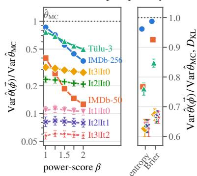

App. C.2.1 gives those for KL divergence, the Brier loss and the power-score regrets (Tab. 7 to 9), and App. C.3.1 those for the gradients (Tab. 14).

For KL, our potential estimator coincides with that of Amini et al. (2025); we reproduce their experiment in App. C.2.4 (Reproducing Amini et al. (2025)). We still include KL in our evaluation because their claimed variance ordering relative to Monte Carlo does not hold in general, as shown by Proposition 1 and the counterexample in App. C.2.4. Across all quantities and gradients, we therefore test how consistently the estimator reduces variance and whether fitting the control-variate coefficient provides additional gains.

## 4.1.1 EXPERIMENTS AND RESULTS

(a) variance ratio per quantity  
(b) $D _ { \mathrm { K L } }$ ratio vs. estimated $D _ { \mathrm { K L } }$  
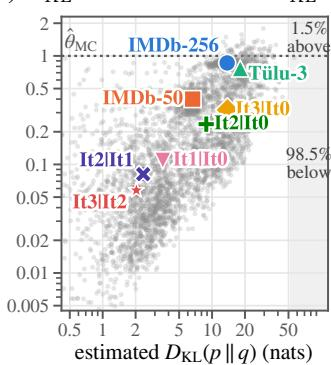

(c) cross-fitted control variate  
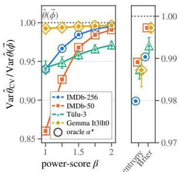  
Figure 1: Variance reduction in the proper-loss experiment (lower is better). (a) Variance ratio of the potential estimator to Monte Carlo across power scores $( \beta \to$ 1 gives $D _ { \mathrm { K L } } ) _ { \ }$ ; entropy and Brier are shown on the right. Each series is one policy–reference pair (see Tab. 10): solid lines are the four main policy–reference pairs and dashed lines are consecutive Gemma-2 SPPO pairs. (b) For $D _ { \mathrm { K L } }$ , variance ratio against the estimated $D _ { \mathrm { K L } } ( p | | q )$ , with one colored marker per pair and grey markers for individual prompts from all pairs. The shaded regions indicate prompts below and above the Monte Carlo variance. (c) Variance ratio of the cross-fitted control-variate estimator to the potential estimator; hollow markers use the full-sample oracle coefficient.

The potential estimator reduces variance in every configuration, by up to $1 7 \times$ in effective sample size. We evaluate the estimator on eight configurations from three post-training families (full details in App. C.2.2, Experimental setup). Across all 56 pair–quantity combinations, the potential reduces variance relative to Monte Carlo (Fig. 1a), with ratios between 0.058 and 0.987 and every bootstrap upper bound below one. These correspond to effective sample-size multipliers of $1 . 0 1 \mathrm { \dot { \times } } \mathrm { - } 1 7 . 3 \times$

The gains are largest when the policy and reference are close. The variation across policy– reference pairs is larger than across estimands. For KL at horizon 256, the variance ratio is 0.86 on GPT-2 IMDb, 0.77 on Tulu-3, and¨ 0.32 on Gemma-2, dropping to 0.06–0.11 between consecutive Gemma SPPO iterations (equivalent to $9 . 1 { \times } { - } 1 6 . 7 { \times }$ the Monte Carlo sample size). The same pattern appears across prompts: smaller KL is associated with larger variance reductions (Fig. 1b).

Variance reduction holds for the vast majority of prompts, but not all of them: Monte Carlo has lower variance on 1.5% of all 4,096 prompts, including 12.3% of Tulu-3 prompts (95% interval¨ 9.6%– 15.2%). This provides empirical evidence that the general KL variance ordering of Amini et al. (2025) does not hold universally; Fitting the control-variate coefficient yields ratios of 0.86–1.00 relative to the untuned potential estimator (Fig. 1c); among KL prompts where the potential estimator increases variance, fitting α lowers the median variance ratio relative to Monte Carlo from 1.134 to 0.974.

App. C.3 repeats the comparison for the gradient of each estimand with respect to the policy parameters along a DPO trajectory of the GPT-2 sentiment policy: early in training, the potential removes most of the gradient variance; when it helps little on its own, fitting the control-variate coefficient recovers substantial gains.

## 4.2 ESTIMATING EXPECTED COUNTS AND FREQUENCIES OF N-GRAMS

We next study expected counts and frequencies of word n-grams, i.e., contiguous sequences of n words. These statistics arise in applications such as model distillation (Suresh et al., 2021; Krishnan et al., 2023) and computational psycholinguistics (Opedal et al., 2024; Kiegeland et al., 2026). More broadly, n-gram counts are one instance of a general class of functions $f ( \mathbf { Y } )$ $\# \cdot$ {occurrences of substring w in $Y \}$ , encompassing quantities such as the number of forbidden keywords in a string, unsafe API calls, or other keyword-based patterns emitted by a model.

Designing potentials that marginalize over multiple future tokens. We start by observing that, for any target substring $\pmb { w } \in \Sigma ^ { * }$ , the count function $f$ admits two natural decompositions:

$$
f ( \boldsymbol { Y } ) = \sum _ { t } Z _ { w , t } ^ { \mathrm { e n d } } = \sum _ { t } Z _ { w , t } ^ { \mathrm { s t a r t } } , \qquad Z _ { w , t } ^ { \mathrm { e n d } } = \boldsymbol { 1 } \{ w \mathrm { ~ e n d s ~ a t ~ } t \} , \qquad Z _ { w , t } ^ { \mathrm { s t a r t } } = \boldsymbol { 1 } \{ w \mathrm { ~ s t a r t s ~ a t ~ } t \} .
$$

The $Z _ { w } ^ { \mathrm { e n d } }$ decomposition yields a potential that is completely determined by evaluating $f$ at prefix $x .$ . Its expected increment, however, is nonzero only at prefixes that already match the substring up to its final token, so marginalization is useful only at those few prefixes.

<table><tr><td rowspan=1 colspan=3>TABLE 2: SUBSTRING COUNTS, LOOKAHEAD OCCURRENCE POTENTIAL</td></tr><tr><td rowspan=1 colspan=3> $f ( Y ) = \# \{ \mathrm { o c c u r r e n c e s ~ o f ~ } w \mathrm { ~ i n ~ } Y \}$ </td></tr><tr><td rowspan=1 colspan=3> $\begin{array} { r } { \overline { { f ( \boldsymbol { Y } ) } } = \sum _ { t } Z _ { w , t } ^ { \mathrm { s t a r t } } , \ Z _ { w , t } ^ { \mathrm { s t a r t } } = Z _ { w , t } ^ { \mathrm { c a n } } + Z _ { w , t } ^ { \mathrm { n o n c a n } } } \end{array}$ </td></tr><tr><td rowspan=1 colspan=1> $\begin{array} { r } { \vec { \phi } ^ { \star } ( { \pmb x } ) = \mathbb { E } _ { p } \left[ \sum _ { t = 1 } ^ { | { \pmb Y } | } Z _ { { \pmb w } , t } ^ { \mathrm { s t a r t } } \ \Big | \ { \</td><td rowspan=1 colspan=1>pmb Y } \succeq { \pmb x } \right] } \end{array}$ </td><td rowspan=1 colspan=1></td></tr><tr><td rowspan=1 colspan=3> $\begin{array} { r } { \vec { \phi } ( \pmb { x } ) = \sum _ { t \leq | \pmb { x } | } \mathbb { E } _ { P } \big [ Z _ { \pmb { w } , t } ^ { \mathrm { c a n } } \ | \ \pmb { Y } _ { \leq t } = \pmb { x } _ { \leq t } \big ] } \end{array}$ </td></tr><tr><td rowspan=1 colspan=2> $\begin{array} { r } { \Delta \vec { \phi } ( a \mid x ) = \mathbb { E } _ { p } \big [ Z _ { w , t } ^ { \mathrm { c a n } } \mid Y _ { \l</td><td rowspan=1 colspan=1>eq t } = x a \big ] , t = | x | + 1 } \end{array}$ </td></tr><tr><td rowspan=1 colspan=3> $\begin{array} { r } { \Delta \tilde { \phi } ( \mathrm { E O S } \mid \boldsymbol { x } ) = \sum _ { t \leq \mid \boldsymbol { x } \mid } \left( Z _ { \boldsymbol { w } , t } ^ { \mathrm { c a n } } - \mathbb { E } _ { p } [ Z _ { \boldsymbol { w } , t } ^ { \mathrm { c a n } } \mid \boldsymbol { Y } _ { \leq t } ] \right) + \sum _ { t } Z _ { \boldsymbol { w } , t } ^ { \mathrm { n o n c a n } } } \end{array}$ </td></tr></table>

By contrast, $Z _ { w } ^ { \mathrm { s t a r t } }$ is generally

still unobserved at the current prefix. We therefore replace it by its full conditional expectation—the probability that the occurrence starting at that position is eventually completed—and take the cumulative expected count over starting positions as the potential. In practice, we marginalize over the canonical tokenization $\pmb { w } = ( w _ { 1 } , \dots , w _ { L } )$ with $w _ { i } \in \Sigma$ and $L \stackrel { \mathrm { d e f } } { = } | \boldsymbol { w } |$ . At each sampled prefix, this requires L additional token evaluations: the remaining target tokens after the next token, plus the word boundary. Thus, if C denotes the cost of generating one sample from model $p ,$ the additional marginalization cost is $O ( L C )$ . Including generation gives a total per-target token-evaluation cost proxy of $( L + 1 ) C$

Tab. 2 gives the mathematical definition of the potential using $Z _ { w } ^ { \mathrm { s t a r t } }$ and its increments. This example illustrates the flexibility of the telescoping construction in Eq. $( 7 ) \colon$ the potential may marginalize only a selected component of f—here, occurrences under the canonical tokenization—while the terminal increment recovers the remainder, so the decomposition still equals f exactly at termination.2

## 4.2.1 EXPERIMENTS & RESULTS

Setup. We construct 7,647 word n-gram targets $( n = 1 , \ldots , 6 )$ from the English texts of MECO (Siegelman et al., 2022), with canonical tokenization lengths ranging from 1 to 10 tokens. We ask whether the potential estimator that uses the potential defined in Tab. 2 reduces variance at comparable computational cost with MC, and how the gains vary with target rarity;

For each target, we estimate its expected count and frequency (the ratio estimator of Eq. (29), App. C.4.1) from 4,000 GPT-2 samples using the potential estimator. We estimate the Monte Carlo variance from an independent $4 \times 1 \mathrm { { 0 ^ { 6 } } }$ -sample bank drawn from the same model. We then report the cost-adjusted variance ratio $\widehat { \rho } _ { c } ( w ) ( \mathrm { E q . ~ } ( 3 0 ) , \mathrm { A p p . ~ C . } 4 . 2 )$ , scaling the potential-estimator variance by the per-target cost proxy $L _ { w } + 1$ and the Monte Carlo variance to 4,000 samples. Thus, $\widehat { \rho } _ { c } ( w ) < 1$ indicates lower variance at equal cost under this proxy.

To measure target rarity independently, we estimate each target’s frequency from a separate $2 \times 1 0 ^ { 6 }$ sample bank. We report frequency results here because they are easier to interpret, and defer count results to App. C.4; both show the largest gains for rare targets. The appendix also reports results for the simpler observed-prefix potential (§4.1), which provides virtually no variance reduction.

(a) $\widehat { \rho } _ { c } ( w )$ with log-ratio 95% CI  
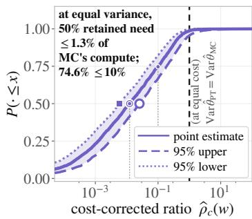

(b) ρbc(w) against target rarity  
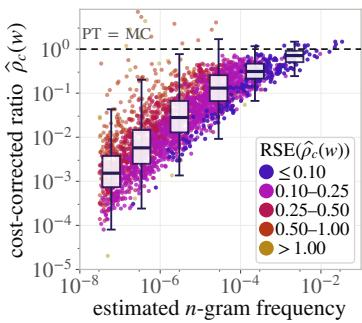

(c) resolved by token length  
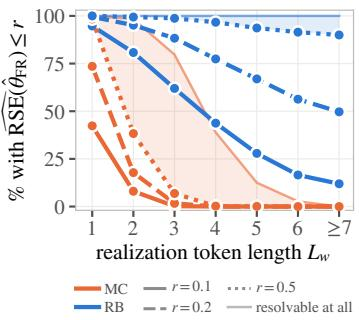  
Figure 2: Cost-adjusted variance ratio $\widehat { \rho } _ { c } ( w )$ for n-gram frequency estimation. (a) Empirical cumulative distribution over 3,700 targets with bootstrap RSE at most 2, with approximate 95% log-ratio confidence bounds. (b) Variance reduction versus estimated frequency for the 2,831 targets with at least $2 5$ expected occurrences in the independent frequency bank. (c) Fraction of targets whose frequency estimate reaches each RSE threshold, grouped by token length, at the same sample size $\bar { M } = 4 { , } 0 0 0$ for both estimators. Dashed parity lines in (a–b) mark equal variance at equal cost under the proxy; in (c), line styles distinguish RSE thresholds.

Half the retained targets reach equal variance on at most 1.3% of the Monte Carlo compute. Panel Fig. 2a reports the cost-adjusted variance ratio $\widehat { \rho } _ { c }$ for the 3,700 of 7,647 targets estimated with relative standard error at most 2, with bootstrap 95% confidence intervals. The median ratio is 1.24%, and 74.7% of targets require at most 10% of the Monte Carlo compute. Using the upper confidence bound instead gives a median of 2.56%, with 95.6% of targets still below parity. This shows that the efficiency gains remain substantial even under a conservative treatment of uncertainty.

At the same sample size $( M = 4 , 0 0 0 )$ , the potential estimator yields substantially more precise frequency estimates, with 79.7% of targets reaching $\mathrm { R S E } \leq 2 0 \%$ and 96.5% reaching $\mathrm { R S E } \leq 5 0 \%$ compared with 11.4% and 19.0% for Monte Carlo (see Fig. 2c). The gap grows with token length: for targets of length 4 or more, Monte Carlo almost never reaches RSE ≤ 50%, whereas the potential estimator does so for at least 90% of targets in every length group. For $L _ { w } \ge 7 .$ , Monte Carlo does not observe any target even in the $4 \times 1 0 ^ { \overline { { 6 } } }$ -sample reference bank, while the potential estimator gives a finite estimate for all of them.

## 4.3 EVENT ANALYSIS WITH LANGUAGE MODELS

Dorman et al. (2026) introduce a framework for estimating event probabilities over any function using an importance-sampling estimator: they sample from distributions tilted toward different function values and reweight the resulting trajectories to estimate probabilities under the original language model. Given a function f on strings, they partition its range into intervals $D _ { j }$ and estimate the probability that $f ( \mathbf { Y } )$ falls in each interval. The corresponding event indicators are $f _ { j } ( Y ) = \mathbf { 1 } \{ \bar { f } ( Y ) \in \dot { D _ { j } } \}$ }. We augment their estimator of $\mathbb { E } _ { p } [ f _ { j } ( Y ) ]$ ] with potentials for $f _ { j }$

Learning potentials from samples. We note that these indicators need not admit a useful additive decomposition over prefixes. A simple baseline is the terminal potential, which assigns zero to unfinished prefixes and the indicator value $f _ { j } ( Y )$ at the string termination. To exploit information from earlier prefixes, we instead learn an approximation to the oracle potential: the conditional probability that $f _ { j } ( Y ) = 1$ given the observed prefix. Each sampled prefix $\mathbf { \Delta } _ { \pmb { x } _ { i } , i } = 1 , \dots , B$ , is paired with its trajectory’s outcome $f _ { j } ( { \pmb y } _ { i } ) , { \pmb y } _ { i } \succeq { \pmb x } _ { i }$ . Using prefix features $\pmb { \xi } ( \pmb { x } ) \in \mathbb { R } ^ { d }$ , we fit a predictor3 $g _ { j } ( \cdot ; \pmb { \eta } ) \colon \mathbb { R } ^ { d }  [ 0 , 1 ]$ with parameters $\pmb { \eta } \in \mathbb { R } ^ { m }$ . We can define the potential

$$
\vec { \phi } _ { j } ( \pmb { x } ; \pmb { \eta } ) = g _ { j } ( \pmb { \xi } ( \pmb { x } ) ; \pmb { \eta } ) \approx \vec { \phi } _ { j } ^ { \star } ( \pmb { x } ) = \operatorname* { P r } _ { p } [ f _ { j } ( \pmb { Y } ) = 1 \mid \pmb { Y } \succeq \pmb { x } ] .\tag{13}
$$

Unbiased estimation with learned potentials. Fitting and evaluating potentials on the same samples can introduce bias. We avoid this through K-fold cross-fitting (Chernozhukov et al., 2018):

each potential is trained on the other folds and evaluated on the held-out fold. Averaging the foldspecific estimates preserves unbiasedness under independent sampling and exact importance weights (when needed), while using all samples.

Potential selection with nested cross-fitting. Different potentials may achieve different variance reductions, motivating data-driven selection. However, selecting a potential on the same samples used for estimation can introduce bias (Varma & Simon, 2006). We therefore use nested cross-fitting (Cawley & Talbot, 2010): for each held-out fold, we select the potential through inner cross-validation on the remaining data, then apply it to the held-out fold. We detail this procedure in Alg. 1.

## 4.3.1 EXPERIMENTS & RESULTS

Setup. We replicate the main experiment of Dorman et al. (2026), estimating the distribution of the Automated Readability Index (ARI; Eq. (31)), a sequence-level readability score, over texts generated by TinyStories-8M. Here $f = \operatorname { A R I }$ . During sampling, we additionally retain the next-token distributions for subsequent potential fitting and evaluation. We consider three candidate potentials: the terminal potential, which marginalizes over the final token, and two learned potentials based on a simple logistic regression and a mixture model, respectively. We defer their details to App. C.5.2 (Potential definitions). We also include a control-variate variant of the terminal potential with a learned coefficient $\alpha ,$ giving four candidates, among which we select using nested cross-fitting with $K = 5$ outer folds. Throughout, we refer to the original estimator of Dorman et al. (2026) by the acronym MBAR. MBAR uses estimated weights and is asymptotically unbiased under its regularity assumptions (Shirts & Chodera, 2008); we do not claim exact finite-sample unbiasedness for this experiment.

Learned potentials reduce variance by ∼12%, equivalent to ${ \sim } 0 . 9 \times 1 0 ^ { 6 }$ additional MBAR samples.

Tab. 3 summarizes the variance ratio of each potential estimator relative to MBAR; lower values indicate a more efficient estimator. The learned potentials give the largest reductions: the logistic and mixture-model potentials attain median variance ratios of 0.90 and 0.87, respectively, and nested selection attains 0.88, closely matching the best individual candidate. The terminal potential gives a smaller but still consistent reduction, with a median ratio of 0.92. It exploits cases where membership in a bin $D _ { j }$ is determined only at the final token.

<table><tr><td>Estimator</td><td>Var. ratio vs. MBAR [95% CI]</td></tr><tr><td>Fitted selection</td><td>0.88 [0.86, 0.91]</td></tr><tr><td>Terminal</td><td>0.92 [0.90, 0.94]</td></tr><tr><td>Terminal, α</td><td>0.92 [0.90, 0.95]</td></tr><tr><td>Logistic</td><td>0.90 [0.86, 0.91]</td></tr><tr><td>Mixture model</td><td>0.87 [0.84, 0.90]</td></tr></table>

Table 3: variance relative to MBAR, median over the 64 populated ARI bins; 95% intervals from 1,000 paired bootstrap replicas. Full version in Tab. 19.

The experiment uses $N = 6 . 6 8 \times 1 0 ^ { 6 }$ generations, matching the original experiments. Assuming variance scales inversely with sample size, the median ratio of 0.88 corresponds to an MBAR budget requiring $0 . 9 \times 1 0 ^ { 6 }$ more generations than our potential estimator. We used only CPUs for potential estimation, as detailed in App. C.5.4 (Compute costs and additional results).

## 5 CONCLUSION

We introduced a general framework for reducing the variance of expectation estimates under autoregressive language models using next-token distributions available as a by-product of sampling. By repurposing potentials from reinforcement learning, we construct an unbiased estimator whose variance depends on the chosen potential. Across several estimands and applications, we showed how practical potentials can improve statistical efficiency at comparable computational cost. More broadly, our results establish potential design as a general strategy for constructing lower-variance estimators under language models.

## AI USE STATEMENT

In this work, we used generative AI tools to provide feedback on research methodology and experimental design, assist with the interpretation of experimental results, and help check and refine mathematical statements and derivations. Additionally, we used generative AI tools to assist with software development, and drafting and editing portions of the manuscript for clarity, structure, and readability. AI-assisted text and code were reviewed and verified by the authors. We take responsibility for the final content of this work, including text, claims, and artifacts produced with the aid of generative AI.

## REFERENCES

Rishabh Agarwal, Nino Vieillard, Yongchao Zhou, Piotr Stanczyk, Sabela Ramos Garea, Matthieu Geist, and Olivier Bachem. On-policy distillation of language models: Learning from selfgenerated mistakes. In International Conference on Learning Representations, volume 2024, pp. 21246–21263, 2024.

Afra Amini, Tim Vieira, and Ryan Cotterell. Better estimation of the Kullback–Leibler divergence between language models. In Advances in Neural Information Processing Systems (NeurIPS), 2025. URL https://proceedings.neurips.cc/paper files/paper/2025/hash/ a2e9be3d64bcc196731d0a4e0e2c33ae-Abstract-Conference.html.

Rico Angell, Raghav Singhal, Zachary Horvitz, Zhou Yu, Rajesh Ranganath, Kathleen McKeown, and He He. Estimating tail risks in language model output distributions. arXiv preprint arXiv:2604.22167, 2026.

Taylor L Booth and Richard A Thompson. Applying probability measures to abstract languages. IEEE transactions on Computers, 100(5):442–450, 1973.

Alex Boyd, Samuel Showalter, Stephan Mandt, and Padhraic Smyth. Predictive querying for autoregressive neural sequence models. Advances in Neural Information Processing Systems, 35: 23751–23764, 2022.

Mark Braverman, Xinyi Chen, Sham Kakade, Karthik Narasimhan, Cyril Zhang, and Yi Zhang. Calibration, entropy rates, and memory in language models. In International Conference on Machine Learning, pp. 1089–1099. PMLR, 2020.

Tom Brown, Benjamin Mann, Nick Ryder, Melanie Subbiah, Jared D Kaplan, Prafulla Dhariwal, Arvind Neelakantan, Pranav Shyam, Girish Sastry, Amanda Askell, et al. Language models are few-shot learners. Advances in neural information processing systems, 33:1877–1901, 2020.

Gavin C Cawley and Nicola LC Talbot. On over-fitting in model selection and subsequent selection bias in performance evaluation. The Journal ofMachine Learning Research, 11:2079–2107, 2010.

Victor Chernozhukov, Denis Chetverikov, Mert Demirer, Esther Duflo, Christian Hansen, Whitney Newey, and James Robins. Double/debiased machine learning for treatment and structural parameters, 2018.

Paul F Christiano, Jan Leike, Tom Brown, Miljan Martic, Shane Legg, and Dario Amodei. Deep reinforcement learning from human preferences. In I. Guyon, U. Von Luxburg, S. Bengio, H. Wallach, R. Fergus, S. Vishwanathan, and R. Garnett (eds.), Advances in Neural Information Processing Systems, volume 30. Curran Associates, Inc., 2017. URL https://proceedings.neurips.cc/ paper files/paper/2017/file/d5e2c0adad503c91f91df240d0cd4e49-Paper.pdf.

William G. Cochran. Sampling Techniques. John Wiley & Sons, New York, 3 edition, 1977.

Zihang Dai, Qizhe Xie, and Eduard Hovy. From credit assignment to entropy regularization: Two new algorithms for neural sequence prediction. In Proceedings ofthe 56th Annual Meeting ofthe Associationfor Computational Linguistics (Volume 1: Long Papers), pp. 1672–1682, 2018.

Pierre Del Moral. Feynman-Kac Formulae: Genealogical and Interacting Particle Systems with Applications. 2004. URL https://doi.org/10.1007/978-1-4684-9393-1.

Jake McAllister Dorman, Edward Gillman, Dominic C Rose, Jamie F Mair, and Juan P Garrahan. Rare event analysis of large language models. arXiv preprint arXiv:2602.06791, 2026.

Kevin Du, Vesteinn Snæbjarnarson, Niklas Stoehr, Jennifer White, Aaron Schein, and Ryan Cotterell.´ Context versus prior knowledge in language models. In Proceedings ofthe 62nd Annual Meeting of the Association for Computational Linguistics (Volume 1: Long Papers), pp. 13211–13235, 2024.

Jason Eisner. Parameter estimation for probabilistic finite-state transducers. In Proceedings ofthe 40th Annual Meeting ofthe Associationfor Computational Linguistics, pp. 1–8, 2002.

J. M. Hammersley. Conditional Monte Carlo. Journal of the ACM, 3(2), 1956. URL https: //doi.org/10.1145/320825.320827.

Geoffrey Hinton, Oriol Vinyals, and Jeff Dean. Distilling the knowledge in a neural network. arXiv preprint arXiv:1503.02531, 2015.

Erik Jones, Meg Tong, Jesse Mu, Mohammed Mahfoud, Jan Leike, Roger Grosse, Jared Kaplan, William Fithian, Ethan Perez, and Mrinank Sharma. Forecasting rare language model behaviors. arXiv preprint arXiv:2502.16797, 2025.

Samuel Kiegeland, Vesteinn Snæbjarnarson, Tim Vieira, and Ryan Cotterell. On the proper treatment ´ of units in surprisal theory. In Proceedings of the 64th Annual Meeting of the Association for Computational Linguistics (Volume 1: Long Papers), pp. 32202–32224, 2026.

John Kirchenbauer, Jonas Geiping, Yuxin Wen, Jonathan Katz, Ian Miers, and Tom Goldstein. A watermark for large language models. In International conference on machine learning, pp. 17061–17084. PMLR, 2023.

Aravind Krishnan, Jesujoba Alabi, and Dietrich Klakow. On the n-gram approximation of pre-trained language models. arXiv preprint arXiv:2306.06892, 2023.

Alexander K. Lew, Tan Zhi-Xuan, Gabriel Grand, and Vikash K. Mansinghka. Sequential Monte Carlo steering of large language models using probabilistic programs. In ICML Workshop on Sampling and Optimization in Discrete Space (SODS), 2023. URL https://openreview.net/ forum?id=Ul2K0qXxXy.

Zhifei Li and Jason Eisner. First-and second-order expectation semirings with applications to minimum-risk training on translation forests. In Proceedings of the 2009 Conference on Empirical Methods in Natural Language Processing, pp. 40–51, 2009.

Zixuan Liu, Fangzheng Wu, Brian Summa, and Zizhan Zheng. Adaptive multilevel twisted sequential Monte Carlo for rare events estimation in language models, 2026. URL https://arxiv.org/ abs/2608.21736.

Joao Loula, Benjamin LeBrun, Li Du, Ben Lipkin, Clemente Pasti, Gabriel Grand, Tianyu Liu, Yahya˜ Emara, Marjorie Freedman, Jason Eisner, Ryan Cotterell, Vikash Mansinghka, Alexander K. Lew, Tim Vieira, and Timothy J. O’Donnell. Syntactic and semantic control of large language models via sequential Monte Carlo. In International Conference on Learning Representations (ICLR), 2025. URL https://openreview.net/forum?id=xoXn62FzD0.

Andrew Y Ng, Daishi Harada, and Stuart Russell. Policy invariance under reward transformations: Theory and application to reward shaping. In Icml, volume 99, pp. 278–287. Citeseer, 1999.

Andreas Opedal, Eleanor Chodroff, Ryan Cotterell, and Ethan Wilcox. On the role of context in reading time prediction. In Yaser Al-Onaizan, Mohit Bansal, and Yun-Nung Chen (eds.), Proceedings of the 2024 Conference on Empirical Methods in Natural Language Processing, pp. 3042–3058, Miami, Florida, USA, November 2024. Association for Computational Linguistics. doi: 10.18653/v1/2024.emnlp-main.179. URL https://aclanthology.org/2024.emnlp-main. 179/.

Long Ouyang, Jeffrey Wu, Xu Jiang, Diogo Almeida, Carroll Wainwright, Pamela Mishkin, Chong Zhang, Sandhini Agarwal, Katarina Slama, Alex Ray, et al. Training language models to follow instructions with human feedback. Advances in neural information processing systems, 35:27730– 27744, 2022.

Art B. Owen. Monte Carlo theory, methods and examples. https://artowen.su.domains/mc/, 2013.

Pouya Pezeshkpour. Measuring and modifying factual knowledge in large language models. In 2023 international conference on machine learning and applications (ICMLA), pp. 831–838. IEEE, 2023.

Michael O Rabin. Probabilistic automata. Information and control, 6(3):230–245, 1963.

Alec Radford, Jeffrey Wu, Rewon Child, David Luan, Dario Amodei, Ilya Sutskever, et al. Language models are unsupervised multitask learners. OpenAI blog, 1(8):9, 2019.

Helmut Rieder. Robust Asymptotic Statistics: Volume I, volume 1. Springer Science & Business Media, 2012.

Christian P. Robert and George Casella. Monte Carlo Statistical Methods. 2nd edition, 2004. URL https://doi.org/10.1007/978-1-4757-4145-2.

John Schulman, Philipp Moritz, Sergey Levine, Michael Jordan, and Pieter Abbeel. High-dimensional continuous control using generalized advantage estimation. arXiv preprint arXiv:1506.02438, 2015.

John Schulman, Filip Wolski, Prafulla Dhariwal, Alec Radford, and Oleg Klimov. Proximal policy optimization algorithms. arXiv preprint arXiv:1707.06347, 2017.

Chenze Shao, Fandong Meng, Yijin Liu, and Jie Zhou. Language generation with strictly proper scoring rules. arXiv preprint arXiv:2405.18906, 2024.

Michael R. Shirts and John D. Chodera. Statistically optimal analysis of samples from multiple equilibrium states. The Journal of Chemical Physics, 129(12):124105, 2008. doi: 10.1063/1. 2978177.

Noam Siegelman, Sascha Schroeder, Cengiz Acarturk, Hee-Don Ahn, Svetlana Alexeeva, Simona¨ Amenta, Raymond Bertram, Rolando Bonandrini, Marc Brysbaert, Daria Chernova, et al. Expanding horizons of cross-linguistic research on reading: The multilingual eye-movement corpus (meco). Behavior research methods, 54(6):2843–2863, 2022.

Nisan Stiennon, Long Ouyang, Jeffrey Wu, Daniel Ziegler, Ryan Lowe, Chelsea Voss, Alec Radford, Dario Amodei, and Paul F Christiano. Learning to summarize with human feedback. Advances in neural information processing systems, 33:3008–3021, 2020.

Niklas Stoehr, Kevin Du, Vesteinn Snæbjarnarson, Robert West, Ryan Cotterell, and Aaron Schein.´ Activation scaling for steering and interpreting language models. In Findings of the Association for Computational Linguistics: EMNLP 2024, pp. 8189–8200, 2024.

Ananda Theertha Suresh, Brian Roark, Michael Riley, and Vlad Schogol. Approximating probabilistic models as weighted finite automata. Computational Linguistics, 47(2):221–254, 2021.

Sudhir Varma and Richard Simon. Bias in error estimation when using cross-validation for model selection. BMC bioinformatics, 7(1):91, 2006.

Nick Whiteley and Anthony Lee. Twisted particle filters. The Annals ofStatistics, 42(1), 2014. URL https://doi.org/10.1214/13-AOS1167.

Eric Wiewiora. Potential-based shaping and Q-Value initialization are equivalent. Journal ofArtificial Intelligence Research, 19, 2003. URL https://doi.org/10.1613/jair.1190.

Stephen Zhao, Rob Brekelmans, Alireza Makhzani, and Roger Baker Grosse. Probabilistic inference in language models via twisted sequential Monte Carlo. In Proceedings of the International Conference on Machine Learning (ICML), 2024. URL https://proceedings.mlr.press/ v235/zhao24c.html.

Ran Zmigrod, Tim Vieira, and Ryan Cotterell. Efficient computation of expectations under spanning tree distributions. Transactions ofthe Associationfor Computational Linguistics, 9:675–690, 2021.

## APPENDIX CONTENTS

A Related Work 15   
B Additional Propositions and Proofs 16   
B.1 Importance Sampling and the Optimal Proposal 16   
B.2 Unbiasedness of the Potential Estimator 16   
B.3 Proof of Proposition 1 17   
B.4 Proof of Proposition 2 17   
B.5 Potentials under a Proposal 18   
C Additional Analysis and Experimental Details 19   
C.1 Analysis of Watermark Detection . 19   
C.1.1 Estimands and potential definitions 19   
C.1.2 Experiments and results 20   
C.2 Losses and Divergences: Details and Further Results 21   
C.2.1 Potential definitions 21   
C.2.2 Experimental setup 22   
C.2.3 Additional results 23   
C.2.4 Reproducing Amini et al. (2025) 24   
C.3 Gradients of Losses and Divergences 25   
C.3.1 Potential definitions 25   
C.3.2 Control-variate coefficient for vector-valued functions 25   
C.3.3 Experiments and results 26   
C.4 n-gram Counts and Frequencies 26   
C.4.1 Definition of frequency estimator 26   
C.4.2 Definition of cost-adjusted variance ratio 27   
C.4.3 Observed-prefix potential 27   
C.4.4 Results for expected counts 28   
C.4.5 Additional diagnostics 28   
C.5 Event Analysis of Dorman et al. (2026) 31   
C.5.1 The Automated Readability Index 31   
C.5.2 Potential definitions 31   
C.5.3 Potential selection algorithm 32   
C.5.4 Compute costs and additional results 33

## LIMITATIONS

Our framework has several limitations. First, variance reduction depends on the choice of potential. Although the oracle potential yields zero variance under direct sampling, practical potentials only approximate it and are not guaranteed to improve over the baseline for every individual prompt. The control-variate formulation provides a safeguard against poorly chosen potentials, although estimating its coefficient or selecting among learned potentials requires cross-fitting to preserve unbiasedness. Thus, the strong performance of the potentials studied here should not be interpreted as implying that arbitrary potentials will yield similar gains.

Second, the computational advantage depends on the cost of evaluating the potential. In several of our applications, the required quantities are already available during sampling or can be computed relatively cheaply, whereas more elaborate potentials may require additional model evaluations or fitting. At the same time, this tradeoff suggests a natural direction for future work: designing potentials that achieve stronger variance reduction while remaining computationally inexpensive.

Third, our approach requires access to the model’s next-token probability distribution along sampled prefixes. It therefore applies directly when logits or token probabilities are available, but not to black-box generation APIs that expose only sampled outputs. Finally, our empirical conclusions are necessarily limited to the estimands, models, and experimental configurations considered here; the magnitude of the variance reductions may differ in other settings.

## A RELATED WORK

Importance sampling and sequential Monte Carlo for language models. Several methods reduce variance by modifying the sampling distribution to favor events of interest and correcting through importance weighting (Angell et al., 2026; Dorman et al., 2026). For example, Boyd et al. (2022) combine query-specific importance sampling with beam search to estimate probabilities of sequence events. Sequential Monte Carlo (Del Moral, 2004) and its twisted variants (Whiteley & Lee, 2014) have also been applied to controlled generation (Lew et al., 2023; Zhao et al., 2024; Loula et al., 2025) and rare-event estimation (Liu et al., 2026). In such methods, a twist assigns a nonnegative weight to each prefix, guiding sampling and resampling toward prefixes judged more likely to produce the desired outcome. For event-probability estimation, the optimal twist weights each prefix according to the probability that completing it under the original language model will satisfy the event. It is therefore proportional to our oracle potential $\vec { \phi ^ { \star } }$ , which represents the same conditional probability (Zhao et al., 2024). Our framework uses prefix potentials to construct additive, zero-mean corrections that enable variance reduction after sampling, exploiting the next-token distribution created at generation. We demonstrate its complementarity with importance sampling by augmenting the importance sampling estimator of Dorman et al. (2026), who sample from exponentially tilted sequence distributions using Markov chain Monte Carlo.

Conditional Monte Carlo, Rao–Blackwellization, and control variates. Replacing a finitevariance estimator by its conditional expectation cannot increase its variance, the principle underlying conditional Monte Carlo (Hammersley, 1956) and Rao–Blackwellization (Robert & Casella, 2004; Owen, 2013). For KL estimation under language models, Amini et al. (2025) replace each sampled token log-likelihood ratio by the exact KL divergence between the next-token distributions at the sampled prefix, and derive an analogous gradient estimator. Although their KL estimator is unbiased, the variance-reduction guarantee in their Theorem 2 does not hold in general: averaging individual token contributions can alter their covariances and increase the variance of the sum. Our framework recovers their KL estimator as a particular choice of potential and extends the construction to arbitrary test functions, explicitly distinguishing unbiasedness from variance reduction. The difference between a potential estimator and any unbiased baseline defines a zero-mean control variate (Owen, 2013). This correction preserves unbiasedness for any fixed coefficient, while the population-optimal coefficient yields variance no greater than that of the baseline.

Potentials and reward shaping in reinforcement learning. Potential-based reward shaping in reinforcement learning uses changes in a function of the state to redistribute rewards while preserving optimal policies (Ng et al., 1999; Wiewiora, 2003). Value functions, which predict future rewards, provide natural potentials: the resulting shaped rewards measure prediction errors and are used in generalized advantage estimation (Schulman et al., 2015). Our construction uses the same telescoping principle, with text prefixes as states and the test function’s value as the terminal reward. We then average the potential increments over the next-token distribution to construct unbiased expectation estimates after sampling. The ideal potential predicts the expected terminal reward given each prefix; its averaged increments vanish, yielding our zero-variance oracle (Proposition 1).

## B ADDITIONAL PROPOSITIONS AND PROOFS

Throughout, $Y \sim p$ denotes a single sampled string, |Y| its length excluding EOS, and $\mathbf { Y } _ { < t }$ its prefix of length $t - 1$ , so that $\mathbf { Y } _ { < 1 } = \varepsilon$ and $\bar { Y _ { < | Y | + 1 } } = \bar { Y }$ . All expectations are assumed finite.

## B.1 IMPORTANCE SAMPLING AND THE OPTIMAL PROPOSAL

Proposition 3 (Importance-sampling variance and optimal proposal). Let q be a proposal satisfying $q ( \pmb { y } ) > 0$ whenever $p ( \pmb { y } ) | f ( \pmb { y } ) | > 0$ , and let $\widehat { \theta } _ { \mathrm { I S } }$ be the importance-sampling estimator of Eq. (5). Then $\mathbb { E } _ { q } [ \widehat { \theta } _ { \mathrm { I S } } ] = \theta$ and

$$
\mathrm { V a r } _ { q } ( \widehat { \theta } _ { \mathrm { I S } } ) = \frac { 1 } { M } \left( \sum _ { y \in \Sigma ^ { * } } \frac { p ( y ) ^ { 2 } f ( y ) ^ { 2 } } { q ( y ) } - \theta ^ { 2 } \right) .\tag{14}
$$

Terms with $q ( \pmb { y } ) = 0$ are read as zero. $I f \mathbb { E } _ { p } \left. f ( \pmb { Y } ) \right. > 0 ,$ , the variance is minimized uniquely by

$$
q ^ { \star } ( \pmb { y } ) = \frac { p ( \pmb { y } ) | f ( \pmb { y } ) | } { \mathbb { E } _ { p } | f ( \pmb { Y } ) | } , \qquad \mathrm { V a r } _ { q ^ { \star } } ( \widehat { \theta } _ { \mathrm { I S } } ) = \frac { 1 } { M } \Big ( \big ( \mathbb { E } _ { p } | f ( \pmb { Y } ) | \big ) ^ { 2 } - \theta ^ { 2 } \Big ) ,\tag{15}
$$

and the minimum is zero if and only if f has constant sign on the support of p.

Proof. The summands of $\widehat { \theta } _ { \mathrm { I S } }$ are i.i.d., so it suffices to treat $M = 1$ . Using the support assumption,

$$
\mathbb { E } _ { q } \left[ \frac { p ( \mathbf { Y } ) } { q ( \mathbf { Y } ) } f ( \mathbf { Y } ) \right] = \sum _ { y : q ( y ) > 0 } q ( \boldsymbol { y } ) \frac { p ( \boldsymbol { y } ) } { q ( \boldsymbol { y } ) } f ( \boldsymbol { y } ) = \sum _ { \boldsymbol { y } \in \Sigma ^ { * } } p ( \boldsymbol { y } ) f ( \boldsymbol { y } ) = \boldsymbol { \theta } ,
$$

where the middle equality uses that $p ( \pmb { y } ) f ( \pmb { y } ) = 0$ whenever $q ( \pmb { y } ) = 0$ . The same computation for the second moment gives $\begin{array} { r } { \mathbb { E } _ { q } [ ( p ( \pmb { Y } ) \hat { f } ( \pmb { Y } ) / q ( \pmb { Y } ) ) ^ { 2 } ] = \sum _ { \pmb { y } } p ( \pmb { \hat { y } } ) ^ { 2 } \hat { f } ( \pmb { y } ) ^ { 2 } / q ( \pmb { y } ) } \end{array}$ , which yields Eq. (14).

For the optimal proposal, write $\begin{array} { r } { c \stackrel { \mathrm { d e f } } { = } \mathbb { E } _ { p } | f ( \pmb { Y } ) | = \sum _ { \pmb { y } } p ( \pmb { y } ) | f ( \pmb { y } ) | } \end{array}$ |. By the Cauchy–Schwarz inequality applied to the vectors $\left( p ( \pmb { y } ) | f ( \pmb { y } ) | / \sqrt { q ( \pmb { y } ) } \right) _ { \pmb { y } }$ and $\left( \sqrt { \boldsymbol { q } ( \boldsymbol { \pmb { y } } ) } \right) _ { \pmb { y } }$ over the support of $q ,$

$$
c ^ { 2 } = \Big ( \sum _ { y } \frac { p ( y ) | f ( y ) | } { \sqrt { q ( y ) } } \sqrt { q ( y ) } \Big ) ^ { 2 } \leq \sum _ { y } \frac { p ( y ) ^ { 2 } f ( y ) ^ { 2 } } { q ( y ) } \sum _ { y } q ( y ) = \sum _ { y } \frac { p ( y ) ^ { 2 } f ( y ) ^ { 2 } } { q ( y ) } .
$$

Hence $\operatorname { V a r } _ { q } ( \widehat { \theta } _ { \mathrm { I S } } ) \geq ( c ^ { 2 } - \theta ^ { 2 } ) / M$ for every admissible q, with equality if and only if the two vectors are proportional, that is, $q ( \dot { \pmb { y } } ) = p ( \pmb { y } ) | \dot { f } ( \pmb { y } ) | / c = q ^ { \star } \bar { \bf ( y ) }$ on the support of q; since $q ^ { \star }$ sums to one, equality forces $q = q ^ { \star }$ . Substituting $q ^ { \star }$ into Eq. (14) confirms the value in Eq. (15). Finally, $c ^ { 2 } - \theta ^ { \hat { 2 } } = ( \stackrel { . } { c } + | \theta | ) ( \stackrel { . } { c } - | \hat { \theta } | ) \geq 0$ because $\hat { c } = \mathbb { E } _ { p } | \hat { f ( } Y ) | \ge | \mathbb { E } _ { p } f ( Y ) | = | \theta |$ , with equality if and only if $f ( Y )$ has almost surely constant sign under $p .$ □

## B.2 UNBIASEDNESS OF THE POTENTIAL ESTIMATOR

Proposition 4 (Unbiasedness and Variance). Let ϕ⃗ be any potential whose increments are absolutely summable in expectation, $\begin{array} { r } { \mathbb { E } _ { p } \left[ \sum _ { t = 1 } ^ { | { Y } | + 1 } | \Delta \vec { \phi } ( Y _ { t } ~ | ~ { Y } _ { < t } ) | \right] < \infty } \end{array}$ . Then the potential estimator of Eq. (10) is unbiased: $\mathbb { E } _ { p } [ \widehat { \theta } ( \vec { \phi } ) ] = \theta$

Proof. It suffices to treat $M = 1$ . Write $T \stackrel { \mathrm { d e f } } { = } \lvert Y \rvert + 1$ for the index of the EOS step, so that the event $\{ t \leq T \}$ is determined by $Y _ { < t } \colon$ it holds exactly when $\mathbf { Y } _ { < t }$ has not yet been terminated. For each $t ,$ conditioning on $\mathbf { Y } _ { < t }$ and using that $Y _ { t } \sim \vec { p } ( \cdot \vert \dot { \mathbf { Y } } _ { < t } )$ on this event,

$$
\mathbb { E } _ { p } \big [ { \bf 1 } \{ t \leq T \} \Delta \vec { \phi } ( Y _ { t } \mid Y _ { < t } ) \big ] = \mathbb { E } _ { p } \big [ { \bf 1 } \{ t \leq T \} \mathbb { E } [ \Delta \vec { \phi } ( Y _ { t } \mid Y _ { < t } ) \mid Y _ { < t } ] \big ] = \mathbb { E } _ { p } \big [ { \bf 1 } \{ t \leq T \} { \bf B } \Delta \vec { \phi } ( Y _ { < t } ) \big ] ,
$$

by Eq. (9). Absolute summability lets us sum over t inside the expectation on both sides, giving

$$
\mathbb { E } _ { p } \left[ \sum _ { t = 1 } ^ { T } \Delta \vec { \phi } ( Y _ { t } | Y _ { < t } ) \right] = \mathbb { E } _ { p } \left[ \sum _ { t = 1 } ^ { T } \mathbf { B } \Delta \vec { \phi } ( Y _ { < t } ) \right] = \mathbb { E } _ { p } [ \widehat { \theta } ( \vec { \phi } ) ] - \vec { \phi } ( \varepsilon ) .
$$

The left-hand side equals $\mathbb { E } _ { p } [ f ( \pmb { Y } ) ] - \vec { \phi } ( \varepsilon ) = \theta - \vec { \phi } ( \varepsilon )$ by the telescoping identity Eq. (7), which proves the claim.

## B.3 PROOF OF PROPOSITION 1

Proof of Proposition 1. Oracle potential. For a prefix y with $\vec { p } ( \pmb { y } ) > 0$ , the oracle potential is the continuation value

$$
\vec { \phi } ^ { \star } ( y ) = \mathbb { E } _ { p } [ f ( Y ) \mid Y \succeq y ] = \frac { 1 } { \vec { p } ( y ) } \sum _ { z \in \Sigma ^ { * } } p ( y z ) f ( y z ) ,
$$

which is finite whenever ${ \mathbb E } _ { p } \mathinner { | { f ( { \pmb Y } ) } | } < \infty$ . In particular $\vec { \phi } ^ { \star } ( \varepsilon ) = \theta$ . Splitting the continuation z according to its first symbol gives the one-step recursion

$$
\vec { \phi ^ { \star } } ( y ) = \sum _ { a \in \Sigma } \vec { p } ( a \mid y ) \vec { \phi ^ { \star } } ( y a ) + \vec { p } ( \operatorname { E O S } \mid y ) f ( y ) ,\tag{16}
$$

where terms with ${ \vec { p } } ( a \mid { \pmb y } ) = 0$ are read as zero. The right-hand side is precisely $\mathbf { B } \vec { \phi } ^ { \star } ( \pmb { y } )$ , so the expected increment of Eq. (9) vanishes at every prefix of positive probability:

$$
\begin{array} { r } { { \bf B } \Delta \vec { \phi } ^ { \star } ( { \pmb y } ) = { \bf B } \vec { \phi } ^ { \star } ( { \pmb y } ) - \vec { \phi } ^ { \star } ( { \pmb y } ) = 0 . } \end{array}
$$

Every prefix $\pmb { Y } _ { < t } ^ { ( m ) }$ visited by a sampled string has positive probability, so all inner sums in Eq. (10) vanish and

$$
\widehat { \theta } ( \vec { \phi } ^ { \star } ) = \vec { \phi } ^ { \star } ( \varepsilon ) + \frac { 1 } { M } \sum _ { m = 1 } ^ { M } \sum _ { t = 1 } ^ { | \pmb { Y } ^ { ( m ) } | + 1 } 0 = \theta
$$

pathwise. A constant has zero variance, which proves the first claim.

Variance comparison. Writing $\widehat { \theta } ( \vec { \phi } ) = \widehat { \theta } _ { * } - \big ( \widehat { \theta } _ { * } - \widehat { \theta } ( \vec { \phi } ) \big )$ and expanding,

$$
\operatorname { V a r } _ { p } \big ( \widehat \theta ( \vec { \phi } ) \big ) = \operatorname { V a r } _ { p } ( \widehat \theta _ { * } ) + \operatorname { V a r } _ { p } \big ( \widehat \theta _ { * } - \widehat \theta ( \vec { \phi } ) \big ) - 2 \operatorname { C o v } _ { p } \big ( \widehat \theta _ { * } , \widehat \theta _ { * } - \widehat \theta ( \vec { \phi } ) \big ) .
$$

Therefore $\mathrm { V a r } _ { p } ( \widehat { \theta } ( \vec { \phi } ) ) \leq \mathrm { V a r } _ { p } ( \widehat { \theta } _ { * } )$ holds if and only if $\operatorname { V a r } _ { p } ( \widehat { \theta } _ { * } - \widehat { \theta } ( \vec { \phi } ) ) \leq 2 \operatorname { C o v } _ { p } ( \widehat { \theta } _ { * } , \widehat { \theta } _ { * } - \widehat { \theta } ( \vec { \phi } ) )$ which is the stated condition. □

## B.4 PROOF OF PROPOSITION 2

Proof of Proposition 2. Unbiasedness. By linearity,

$$
\begin{array} { r } { \mathbb { E } _ { p } [ \widehat { \theta } ( \vec { \phi } , \alpha ) ] = \mathbb { E } _ { p } [ \widehat { \theta } _ { * } ] - \alpha \big ( \mathbb { E } _ { p } [ \widehat { \theta } _ { * } ] - \mathbb { E } _ { p } [ \widehat { \theta } ( \vec { \phi } ) ] \big ) = \theta - \alpha ( \theta - \theta ) = \theta , } \end{array}
$$

using that $\widehat { \theta } _ { * }$ is unbiased by assumption and $\widehat { \theta } ( \vec { \phi } )$ is unbiased by Proposition 4.

Optimal coefficient. Write $\begin{array} { r } { D \stackrel { \mathrm { d e f } } { = } \widehat { \theta } _ { * } - \widehat { \theta } ( \vec { \phi } ) } \end{array}$ . Since both estimators have finite second moments,

$$
\operatorname { V a r } _ { p } \bigl ( \widehat \theta ( \vec { \phi } , \alpha ) \bigr ) = \operatorname { V a r } _ { p } ( \widehat \theta _ { * } - \alpha D ) = \operatorname { V a r } _ { p } ( \widehat \theta _ { * } ) - 2 \alpha \operatorname { C o v } _ { p } ( \widehat \theta _ { * } , D ) + \alpha ^ { 2 } \operatorname { V a r } _ { p } ( D ) .\tag{17}
$$

When $\begin{array} { r } { \mathrm { V a r } _ { p } ( D ) > 0 . } \end{array}$ , this is a strictly convex quadratic in α, minimized where its derivative vanishes, $\alpha \operatorname { V a r } _ { p } ( D ) = \operatorname { C o v } _ { p } ( \widehat { \theta } _ { * } , D )$ , that is, at $\alpha ^ { \star } = \mathrm { C o v } _ { p } ( \widehat { \theta } _ { * } , D ) / \mathrm { V a r } _ { p } ( D )$ as in Eq. (12). Substituting $\alpha ^ { \star }$ into Eq. (17),

$$
\operatorname { V a r } _ { p } \big ( \widehat \theta ( \vec { \phi } , \alpha ^ { \star } ) \big ) = \operatorname { V a r } _ { p } ( \widehat \theta _ { * } ) - \frac { \operatorname { C o v } _ { p } ( \widehat \theta _ { * } , D ) ^ { 2 } } { \operatorname { V a r } _ { p } ( D ) } \leq \operatorname { V a r } _ { p } ( \widehat \theta _ { * } ) .
$$

When $\mathrm { V a r } _ { p } ( D ) = 0 .$ , D is almost surely equal to its mean, which is zero by unbiasedness, so $\widehat { \theta } ( \vec { \phi } , \alpha ) = \widehat { \widehat { \theta } } ,$ ∗ almost surely for every α. □

## B.5 POTENTIALS UNDER A PROPOSAL

We now drop the assumption $q = p$ of $\ S 3$ . Let q be a proposal with respect to which $p$ is absolutely continuous, so that $q ( \pmb { y } ) = 0$ implies $p ( \pmb { y } ) = 0 ,$ and let ${ \cal Y } ^ { ( 1 ) } , \ldots , { \cal Y } ^ { ( M ) } \stackrel { \mathrm { i . i . d . } } { \sim } q .$ The potential construction remains unchanged: given a potential $\vec { \phi } ,$ we first form the corresponding single-sample potential estimator under the target distribution $p ,$ and then apply the usual importance weight to account for sampling from $q .$

Definition 3 (Importance-weighted potential estimator). Let $Y ^ { ( 1 ) } , \dots , Y ^ { ( M ) } \overset { i . i . d . } { \sim } q .$ Given a potential $\vec { \phi } ,$ define

$$
\widehat { \theta } _ { \mathrm { I S } } ( \vec { \phi } ) \stackrel { \mathrm { d e f } } { = } \frac { 1 } { M } \sum _ { m = 1 } ^ { M } \frac { p ( \pmb { Y } ^ { ( m ) } ) } { q ( \pmb { Y } ^ { ( m ) } ) } \left[ \vec { \phi } ( \varepsilon ) + \sum _ { t = 1 } ^ { | \pmb { Y } ^ { ( m ) } | + 1 } \mathbf { B } \Delta \vec { \phi } ( \pmb { Y } _ { < t } ^ { ( m ) } ) \right] .\tag{18}
$$

The next proposition is the counterpart of Proposition 1 under a proposal.

Proposition 5 (Unbiasedness and variance under a proposal). Let $\vec { \phi }$ satisfy the summability condition ofProposition $^ { 4 , }$ and assume that $\widehat { \theta } _ { \mathrm { I S } } ( \vec { \phi } )$ has afinite second moment. Assume that $\widehat { \theta } _ { \mathrm { I S } } ( \vec { \phi } )$ has afinite second moment. Then $\mathbb { E } _ { q } [ \widehat { \theta } _ { \mathrm { I S } } ( \vec { \phi } ) ] = \theta .$ . Moreover,for the oracle potential,

$$
\mathrm { V a r } _ { q } \big ( \widehat { \theta } _ { \mathrm { I S } } ( \vec { \phi } ^ { \star } ) \big ) = \frac { \theta ^ { 2 } } { M } \left( \sum _ { y \in \Sigma ^ { * } } \frac { p ( y ) ^ { 2 } } { q ( y ) } - 1 \right) .
$$

In particular, $i f \theta \ne 0 ,$ , the oracle potential yields zero variance ifand only $i f q = p$

Proof. Unbiasedness. It suffices to treat $M = 1$ . By a change of measure,

$$
\begin{array} { r l } & { \mathbb { E } _ { q } \big [ \widehat { \theta } _ { \mathrm { I S } } ( \vec { \phi } ) \big ] = \mathbb { E } _ { q } \left[ \frac { p ( \pmb { Y } ) } { q ( \pmb { Y } ) } \left( \vec { \phi } ( \varepsilon ) + \sum _ { t = 1 } ^ { | \pmb { Y } | + 1 } \mathbf { B } \Delta \vec { \phi } ( \pmb { Y } _ { < t } ) \right) \right] } \\ & { \qquad = \mathbb { E } _ { p } \left[ \vec { \phi } ( \varepsilon ) + \sum _ { t = 1 } ^ { | \pmb { Y } | + 1 } \mathbf { B } \Delta \vec { \phi } ( \pmb { Y } _ { < t } ) \right] = \theta , } \end{array}
$$

where the last equality follows from Proposition 4.

Variance. By Proposition 1,

$$
\vec { \phi } ^ { \star } ( \varepsilon ) + \sum _ { t = 1 } ^ { | Y | + 1 } { \bf B } \Delta \vec { \phi } ^ { \star } ( Y _ { < t } ) = \theta
$$

almost surely under p. Hence,

$$
\begin{array} { r l } {  { M \mathrm { V a r } _ { q } \big ( \widehat { \theta } _ { \mathrm { I S } } ( \vec { \phi } ^ { \star } ) \big ) = \mathrm { V a r } _ { q } ( \frac { p ( \pmb { Y } ) } { q ( \pmb { Y } ) } \theta ) } \ ~ } & { } \\ & { = \theta ^ { 2 } ( \mathbb { E } _ { q } [ \frac { p ( \pmb { Y } ) ^ { 2 } } { q ( \pmb { Y } ) ^ { 2 } } ] - 1 ) } \\ & { = \theta ^ { 2 } ( \sum _ { y \in \Sigma ^ { \ast } } \frac { p ( y ) ^ { 2 } } { q ( y ) } - 1 ) . } \end{array}
$$

Finally,

$$
\sum _ { y \in \Sigma ^ { * } } \frac { p ( y ) ^ { 2 } } { q ( y ) } \geq \left( \sum _ { y \in \Sigma ^ { * } } p ( y ) \right) ^ { 2 } = 1 ,
$$

with equality if and only if $q = p .$ . Thus, when $\theta \neq 0 .$ , the variance is zero if and only if $q = p$ □

The control-variate estimator of Def. 2 is formed with the baseline $\widehat { \theta } _ { \ast } = \widehat { \theta } _ { \mathrm { I S } }$ and $\widehat { \theta } ( \vec { \phi } )$ replaced by $\widehat { \theta } _ { \mathrm { I S } } ( \vec { \phi } )$

$$
\widehat { \theta } _ { \mathrm { I S } } ( \vec { \phi } , \alpha ) \stackrel { \mathrm { d e f } } { = } \widehat { \theta } _ { \mathrm { I S } } - \alpha \big ( \widehat { \theta } _ { \mathrm { I S } } - \widehat { \theta } _ { \mathrm { I S } } ( \vec { \phi } ) \big ) , \qquad \alpha \in \mathbb { R } .\tag{19}
$$

The proof of Proposition 2 uses only the unbiasedness and finite second moments of the two estimators, so it applies verbatim: $\widehat { \theta } _ { \mathrm { I S } } ( \vec { \phi } , \alpha )$ is unbiased for every $\alpha ,$ and at $\alpha ^ { \star }$ its variance is at most that of $\widehat { \theta } _ { \mathrm { I S } }$

## C ADDITIONAL ANALYSIS AND EXPERIMENTAL DETAILS

This appendix collects the setup behind the experiments of §4: the models and prompt banks, the target-construction protocols, the generation configurations, and the supporting figures and tables. One subsection per application, in the order of $\ S 4$

## C.1 ANALYSIS OF WATERMARK DETECTION

A language model watermark embeds a statistical signal in generated text while preserving the model’s intended task. Watermark detection then aims to reliably assess whether a text of a given length was generated by a watermarked model. We use the scheme of Kirchenbauer et al. (2023): at each generation step, a pseudorandom green list $G ( { \pmb x } ) \subseteq \Sigma$ is determined from the prompt and generated prefix x, and the logits of tokens in this set are increased by a bias δ. Let γ denote the fraction of the vocabulary assigned to the green list, m the generation length, and $\sigma { \stackrel { \mathrm { d e f } } { = } } \sqrt { m \gamma ( 1 - \gamma ) }$ Detection then counts the number of generated tokens that fall in their respective green lists and standardizes this count,

$$
{ \frac { | { \pmb Y } | _ { G } - \gamma m } { \sigma } } , \qquad | { \pmb Y } | _ { G } \overset { \mathrm { d e f } } { = } \# \{ t : Y _ { t } \in G ( { \pmb Y } _ { < t } ) \} ,\tag{20}
$$

declaring the string watermarked when this exceeds a prescribed threshold τ , equivalently when $| Y | _ { G } \geq \gamma m + \tau \sigma$

## C.1.1 ESTIMANDS AND POTENTIAL DEFINITIONS

<table><tr><td rowspan=1 colspan=1>TABLE 4: EXPECTED WATERMARK SCORE</td><td rowspan=1 colspan=1>TABLE 5: PROBABILITY OF WATERMARK DETECTION</td></tr><tr><td rowspan=1 colspan=1> $\overline { { f ( \boldsymbol { Y } ) = \big ( | \boldsymbol { Y } | _ { G } - \gamma m \big ) / \sigma } }$ </td><td rowspan=1 colspan=1> $\overline { { f ( \boldsymbol { Y } ) = 1 \{ | \boldsymbol { Y } | _ { G } \geq \gamma m + \tau \sigma \} } }$ </td></tr><tr><td rowspan=1 colspan=1> $| { \pmb x } { \pmb z } | _ { G } = | { \pmb x } | _ { G } + | { \pmb z } | _ { G }$ </td><td rowspan=1 colspan=1>not additive in the prefix</td></tr><tr><td rowspan=1 colspan=1> $\vec { \phi } ^ { \star } ( \pmb { x } ) = \bigl ( | \pmb { x } | _ { G } + \mathbb { E } _ { p } [ | \pmb { Z } | _ { G } \ | \ \pmb { Z } \succeq \pmb { x } ] - \gamma m \bigr ) / \sigma$ </td><td rowspan=1 colspan=1> $\begin{array} { r } { \vec { \phi } ^ { \star } ( { \pmb x } ) = \mathrm { P r } _ { p } \big [ | { \pmb Y } | _ { G } \ge \gamma m + \tau \sigma ~ | ~ { \pmb Y } \succeq { \pmb x } \big ] } \end{array}$ </td></tr><tr><td rowspan=1 colspan=1> $\vec { \phi } ( \mathbf { x } ) = \bigl ( | \mathbf { x } | _ { G } - \gamma m \bigr ) / \sigma$ </td><td rowspan=1 colspan=1> $\vec { \phi } ( \mathbf { x } , q ) = \mathrm { P r } \left[ \mathrm { B i n } ( m - | \mathbf { x } | , q ) \geq k ( \pmb { x } ) \right]$ </td></tr><tr><td rowspan=1 colspan=1> $\Delta \vec { \phi } ( a \mid x ) = 1 \{ a \in G ( x ) \} / \sigma$ </td><td rowspan=1 colspan=1> $\Delta \vec { \phi } ( a \mid \mathbf { x } , q ) = \vec { \phi } ( \mathbf { x } a , q ) - \vec { \phi } ( \mathbf { x } , q )$ </td></tr><tr><td rowspan=1 colspan=1> $\Delta \vec { \phi } ( \mathrm { { E O S } \mid \pmb x } ) = 0$ </td><td rowspan=1 colspan=1> $\Delta \vec { \phi } ( \boldsymbol { \mathrm { E O S } } \mid \boldsymbol { x } , \boldsymbol { q } ) = \boldsymbol { 0 }$ </td></tr></table>

At a fixed prompt and generation length, two expectations characterize the detector. The expected score $\mathbb { E } _ { p } \big [ \bar { ( } \vert \pmb { Y } \vert _ { G } - \gamma m \bar { ) } / \sigma \big ]$ measures how strongly the watermark registers on average; the detection probability $\operatorname* { P r } _ { p } [ | \boldsymbol { Y } | _ { G } \ge \bar { \gamma } m + \tau \sigma ]$ is the detector’s true-positive rate, and is the quantity a deployment actually cares about. The two behave differently under our framework. The score has an additive structure over prefixes (Tab. 4) so the value of the function at the observed prefix is itself a potential, exactly as for the losses of §4.1. The detection indicator is not additive in the prefix, so it admits no such decomposition and must instead be approached by approximating the oracle potential, as in the event analysis of §4.3. Here that oracle potential is the conditional probability that the detector will eventually fire.

Detection probability: analytical approximation of the oracle potential. For the detection probability a natural analytical approximation of the oracle potential is available. Write $k ( { \pmb x } ) =$ $\gamma m + \tau \sigma - | \pmb { x } | _ { G }$ for the number of green tokens still needed at the prefix x. If the remaining $m - | { \pmb x } |$ tokens were green independently with a common rate $q ,$ the detector would fire with probability $\mathrm { P r } [ \mathrm { B i n } ( m \bar { - } | { \pmb x } | , q ) \geq \bar { k } ( { \pmb x } )$ ], which is the potential of Tab. 5. It depends on the single parameter q, which we fit globally for each length m by cross-fitting on 10 folds of the continuations:

(a) binomial potential and green-count paths  
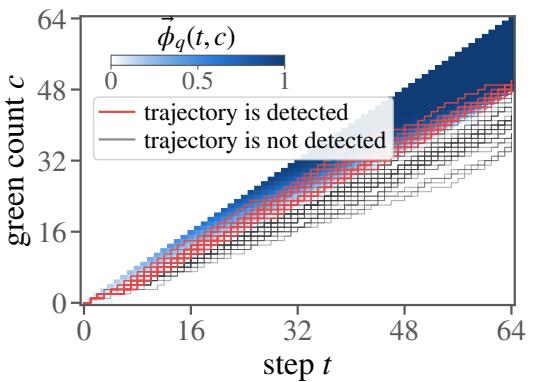

(b) variance ratio across regimes  
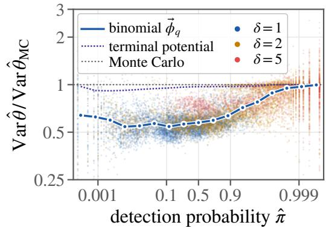  
Figure 3: Panel (a) shows how sampled trajectories update the green-token count over 64 generation steps. Red trajectories are those whose final green-token count exceeds the detection threshold, while black trajectories remain below it. The background encodes the potential’s assigned probability of eventual detection at each step and green-count state, with white indicating probability zero. Red trajectories tend to pass through higherprobability regions, whereas black trajectories concentrate in low- or zero-probability regions. Panel (b) shows the variance reduction at different detection probabilities

the q applied to one fold is the average green-list mass of the other nine, pooled over prompts. Computing this potential requires no additional model evaluations, as it uses only the green-list mass $\textstyle \sum _ { a \in G ( { \pmb x } ) } { \bar { p } } ( a \mid { \bar { \pmb x } } )$ from the already-computed next-token distribution.

## C.1.2 EXPERIMENTS AND RESULTS

Setup. We use the same setup of Kirchenbauer et al. (2023), with green-list fraction $\gamma = 0 . 5$ and logit biases $\delta \in \{ 1 , 2 , 5 \}$ . For each configuration, we generate 4,000 continuations per prompt from OPT-1.3B for 512 prompts from C4 RealNewsLike, using temperature 0.7. We evaluate continuation lengths m ∈ {32, 64, 128, 200} and detector thresholds $z _ { 0 } \in \{ 3 , \bar { 4 } , 5 \}$

<table><tr><td rowspan=1 colspan=3>δ  m median    $[ p _ { 1 0 } , \ p _ { 9 0 } ]$    worst prompt</td></tr><tr><td rowspan=1 colspan=2>1 32  0.471 [0.413, 0.564]64 0.513 [0.460, 0.597]128 0.561  [0.508, 0.677]200 0.612 [0.544, 0.748]</td><td rowspan=1 colspan=1>0.9070.8940.9310.965</td></tr><tr><td rowspan=1 colspan=1>2 32 0.538</td><td rowspan=1 colspan=1>[0.471, 0.631]</td><td rowspan=1 colspan=1>0.836</td></tr><tr><td rowspan=2 colspan=1>64 0.584128 0.644200 0.699</td><td rowspan=1 colspan=1>[0.520, 0.671]</td><td rowspan=1 colspan=1>0.876</td></tr><tr><td rowspan=1 colspan=1>[0.583, 0.748][0.629, 0.818]</td><td rowspan=1 colspan=1>0.9250.962</td></tr><tr><td rowspan=1 colspan=1>5 32 0.722</td><td rowspan=1 colspan=1>[0.608, 0.807]</td><td rowspan=1 colspan=1>0.922</td></tr><tr><td rowspan=1 colspan=1>64 0.743</td><td rowspan=1 colspan=1>[0.665, 0.817]</td><td rowspan=1 colspan=1>0.960</td></tr><tr><td rowspan=1 colspan=1>128 0.790</td><td rowspan=1 colspan=1>[0.725, 0.867]</td><td rowspan=1 colspan=1>0.993</td></tr><tr><td rowspan=1 colspan=1>200 0.837</td><td rowspan=1 colspan=1>[0.776, 0.910]</td><td rowspan=1 colspan=1>0.996</td></tr></table>

For each of the two estimands, we compare the associated potentials against Monte Carlo. For the watermark-detection probability, we also include the baseline terminal potential, i.e., the corresponding observed-prefix potential for non-additive functions: zero at every nonterminal prefix and equal to the function value at the terminal prefix.

Table 6: Per-prompt variance of $\widehat { \theta } ( \vec { \phi } )$ against Monte Carlo, 512 prompts.

Detection probability: the binomial potential removes about 44% of the Monte Carlo variance when detection is uncertain, but little once it saturates. Fig. 3(b) shows the variance ratio between the potential estimator and MC for each prompt and configuration $( \delta , m , z _ { 0 } )$ . Across the 14,366 pairs for which detection is not deterministic, the median ratio is 0.64, corresponding to a 36% reduction in variance. Since variance scales inversely with the number of samples, this is equivalent to reaching the precision of 4,000 Monte Carlo samples with about 2,560 samples, without additional model evaluations. The gain is largest when detection is uncertain: for $0 . 0 0 1 \overset { \cdot } { \leq } \widehat { \pi } < 0 . 5$ , the median ratio is 0.56, corresponding to a 44% reduction. It decreases as detection saturates, reaching a median ratio of 0.97 for $\widehat { \pi } \overset { \cdot } { \geq } 0 . 9 9$ . Overall, 92.7% of pairs improve over Monte Carlo, with similar behavior across $\delta , m ,$ and $z _ { \mathrm { 0 } }$ . The terminal potential, by contrast, remains close to Monte Carlo, with a median ratio of 0.973.

Fig. 3(a) gives intuition for the variance reduction. From early in generation, trajectories that are eventually detected overlap with regions of positive potential, whereas undetected trajectories lie mostly in the white region where the potential is zero. Thus, the potential already contains information about the final detection outcome long before the trajectory ends.

Expected score: every prompt improves, by 16–53% depending on $\delta$ and $m _ { \bullet }$ . Tab. 6 gives the per-prompt variance relative to Monte Carlo over the 512 prompts. The median ratio rises from 0.471 at $\delta = 1 , m = 3 2 \mathrm { t o } 0 . 8 3 7 \mathrm { a t } \delta = 5 , m = 2 0 0 \mathrm { . }$ the marginalization helps most when the watermark is weak and the continuation is short, the regime in which a single green indicator carries the most conditional variance. The spread over prompts is narrow, the $p _ { 1 0 } { - } p _ { 9 0 }$ width never exceeding 0.21, and every one of the 512 prompts lies below Monte Carlo in all twelve cells, the worst single prompt reaching 0.996. We also cross-fit a control-variate coefficient on top of but observe that it buys almost nothing here: across the twelve cells the variance against $\widehat { \theta } ( \vec { \phi } )$ stays within 0.991–0.998 and the median prompt within 0.994–1.000.

## C.2 LOSSES AND DIVERGENCES: DETAILS AND FURTHER RESULTS

## C.2.1 POTENTIAL DEFINITIONS

Below we give the potential tables for the losses and divergences of §4.1; the corresponding gradients are in App. C.3. Continuation sums include termination, with $Y _ { | \mathbf { Y } | + 1 } = z _ { | \boldsymbol { z } | + 1 } = \mathrm { E O S }$

$$
\begin{array} { r l } & { \frac { \mathrm { T a s t . e : } \tau \mathrm { . K L N e n e a c e } } { f ( Y ) } } \\ & { \frac { \mathrm { P ( \overline { { Y } } ) = \log \frac { p ( \overline { { Y } } ) } { q ( \overline { { Y } } ) } } } { \frac { \mathrm { P ( \overline { { g } } ) } } { \mathrm { P ( \overline { { x } } ) } } = \log \frac { p ( \overline { { Y } } ) q ( \overline { { x } } ) } { q ( \overline { { x } } ) } + \mathrm { E _ { p } [ \log \frac { p ( \overline { { Y } } ) q ( \overline { { x } } ) } { q ( \overline { { Y } } ) \sqrt { \overline { { y } } ( \overline { { x } } ) } } \ ] \Gamma \ \sum \kappa } } \Bigg | \ | \begin{array} { r } { \mathrm { I ~ 7 ~ e s t r ~ f o u N C T I o s } } \\ { \mathrm { P ~ } } \\ { \frac { \overline { { \tilde { \phi } } } ( x ) = \log \frac { p ( \overline { { Y } } ) } { q ( \overline { { x } } ) } } { \overline { { \tilde { q } } } ( \overline { { x } } ) } + \mathrm { E _ { p } [ \log \frac { p ( \overline { { Y } } ) q ( \overline { { x } } ) } { q ( \overline { { Y } } ) \sqrt { \overline { { y } } ( \overline { { x } } ) } } ] \Gamma \ \sum \kappa } \Bigg | } \end{array} | }  | \begin{array} { r }  \mathrm { O R C R U } \mathrm { I } \mathrm { I } \mathrm { I } \mathrm { I } \mathrm { I } \mathrm { I } \mathrm { I } \mathrm { I } \mathrm { I } \mathrm { I } \mathrm { I } \mathrm { I } \mathrm { I } \mathrm { I } \mathrm { I } \mathrm { I } \mathrm { I } \mathrm { I } \mathrm { I } \mathrm { I } \mathrm { I } \mathrm { I } \mathrm { I } \mathrm { I } \mathrm { I } \mathrm { I } \mathrm { I } \mathrm { I } \mathrm { I } \mathrm { I } \mathrm { I } \mathrm { I } \ \end{array} \end{array}
$$

$$
\begin{array} { r l } & { \frac { \mathrm { T h a l . E 8 : B h t R 1 . O y S } } { | \frac { f ( Y ) } { \Delta \tilde { \phi } ( a ) } = \sum _ { k \in \mathrm { L i f t o s } } ( \tilde { p } ( b \mid Y _ { < t } ) - \mathbf { 1 } \{ b = Y _ { t } \} ) ^ { 2 }  } } \\ & {  \frac { \Delta \tilde { \phi } ( a \mid x ) = \sum _ { b \in \mathrm { L i f t o s } } ( \tilde { p } ( b \mid x ) - \mathbf { 1 } \{ b = a \} ) ^ { 2 } = 1 - 2 \tilde { p } ( a \mid x ) + \sum _ { b \in \mathrm { \mathbb { Z U } \{ \log \mid x \} } } \tilde { p } ( b \mid x ) ^ { 2 } } { | \frac { f ( x ) } { \tilde { \phi } ( a ) } + \sum _ { t = 1 } ^ { \mathrm { \infty } } | \frac { f ( b \mid x ) } { \tilde { \phi } ( a ) ( x ) ( x ) ( x ) | ^ { 2 } } }  } \\ & {  \frac { f ( x z ) = \tilde { \phi } ( x ) + \sum _ { t = 1 } ^ { \mathrm { \infty } } | \sum _ { t = 1 } ^ { \mathrm { \infty } } | \mathcal { D } \tilde { \phi } ( z _ { t } \mid x z )   } { | \tilde { \phi } ^ { * } ( x ) |     \frac { \tilde { \phi } ( x ) } { | \tilde { \phi } ( x ) | ^ { 2 } }   } } \\ &   \frac { \tilde { \phi } ( x ) = \tilde { \phi } ( x ) + \mathbb { E } _ { p } [ \sum _ { t = \mid x | + 1 } ^ { \mathrm { \infty } } \Delta \tilde { \phi } ( Y _ { t } \mid Y _ { \leq t } )   Y \succeq x | }  | \frac { \partial \tilde { \phi } ( x ) }  \partial \tilde { \phi } ( \mathrm { E q s } \mid x ) ( x  \end{array}
$$

$$
{ \frac { \overbrace { f ( Y ) } ^ { \mathrm { T } } > \operatorname { P o u r e s . c o n E e . F e c t o R e t , g . N e n o n t P } ( P \cdot } ) - ( \beta - 1 ) \sum _ { b \in \Sigma \cup \{ \log \} } ( \vec { p } ( b \mid Y _ { < t } ) ^ { \beta } - \vec { q } ( b \mid Y _ { < t } ) ^ { \beta } ) ] } { \frac { \partial \vec { f } ( a \mid x ) } { \partial \vec { \phi } ( a \mid x ) - \beta ( \theta ( p ( b \mid x ) ^ { \beta } - 1 } - \vec { q } ( a \mid x ) ^ { \beta - 1 } ) - ( \beta - 1 ) \sum _ { b \in \Sigma \cup \{ \log \} } ( \vec { p } ( b \mid x ) ^ { \beta } - \vec { q } ( b \mid x ) ^ { \beta } ) }  \\  \frac { \partial \vec { f } ( a \mid x ) = \vec { \phi } ( x ) + \sum _ { t = 1 } ^ { \{ \{ \tau \} \} } ( \sum _ { t = 1 } ^ {   ( \tau  x ^ { \beta } ( z \mid x ^ { \beta - 1 } ) - ( \beta - 1 ) \sum _ { b \in \Sigma \cup \{ \log \} } ( \vec { p } ( b \mid x ) ^ { \beta } - \vec { q } ( b \mid x ) ^ { \beta } ) } { \frac { \partial \vec { f } ( b \mid x ) ^ { \beta } } { \partial \tau } } } \\  \frac  \vec { f } ( x \ z ) = \vec { \phi } ( x ) + \sum _ { t = 1 } ^ { \{ \tau \} } [ \sum _ { t = 1 } ^ {  \tau \} } ( \sum _ { t = 1 } ^ {   )    \Delta \vec { \phi } ( Y _ { t } \mid Y _ { < t } )    ] } \\  \frac { \vec { \phi } ( x ) = \sum _ { t \leq \{ \tau \} } [ \partial \vec { \phi } ( x \mid x ) \partial \vec { \phi } ( x \mid x ) }  \frac { \partial \vec { f } ( x ) }  \partial \vec  
$$

Entropy is the same construction with $\Delta \vec { \phi } ( a \mid \pmb { x } ) = - \log \vec { p ( a \mid x ) }$ , shown in Tab. 1. The four power-score regrets use $\beta \in \{ 1 . 2 5 , 1 . 5 , 1 . 7 5 , 2 \}$ ; as $\beta  1$ the per-token term, divided by $\beta - 1$ tends to the KL term of Tab. 7.

## C.2.2 EXPERIMENTAL SETUP

We evaluate the losses and divergences on eight configurations, each defined by a sampling policy, a reference model, and a generation horizon (Tab. 10). These cover seven distinct policy–reference pairs: the GPT-2 sentiment pair is evaluated at two horizons, one of 50 tokens that reuses the setting of Amini et al. (2025) for reproducibility, and one of 256 tokens to match the longer window used for all other models. Model repositories are listed in Tab. 11.

Shared sampling protocol. Each configuration uses 512 prompts and B responses per prompt, with B specified in Tab. 10. Responses are drawn by ancestral sampling at temperature 1, without top-k or top-p filtering, using fp32 precision. Generation stops at EOS or the specified horizon.

Table 10: Policy–reference banks of the proper-loss experiment. Labels are those used in the figures; p is the sampling policy and q the reference; model names are resolved in Tab. 11. All banks have 512 prompts and B responses per prompt.
<table><tr><td>bank</td><td>prompts</td><td>sampling policy p</td><td>reference q</td><td>horizon</td><td>B</td></tr><tr><td>IMDb-256</td><td>IMDb prefixes</td><td>gpt2-imdb + DPO</td><td>gpt2-imdb</td><td>256</td><td>4000</td></tr><tr><td>IMDb-50</td><td>IMDb prefixes</td><td>same policy</td><td>gpt2-imdb</td><td>50</td><td>4000</td></tr><tr><td>Tülu-3</td><td>AlpacaEval 2</td><td>Tulu-3-8B-DPO</td><td>Tulu-3-8B-SFT</td><td>256</td><td>100</td></tr><tr><td>Gemma It3 vs It0 AlpacaEval 2</td><td></td><td>SPPO-Iter3</td><td>gemma-2-9b-it</td><td>256</td><td>100</td></tr><tr><td>Gemma It1 vs It0 AlpacaEval 2</td><td></td><td>SPPO-Iter1</td><td>gemma-2-9b-it</td><td>256</td><td>100</td></tr><tr><td>Gemma It2 vs It0 AlpacaEval 2</td><td></td><td>SPPO-Iter2</td><td>gemma-2-9b-it</td><td>256</td><td>100</td></tr><tr><td>Gemma It2 vs It1 AlpacaEval 2</td><td></td><td>SPPO-Iter2</td><td>SPPO-Iter1</td><td>256</td><td>100</td></tr><tr><td>Gemma It3 vs It2 AlpacaEval 2</td><td></td><td>SPPO-Iter3</td><td>SPPO-Iter2</td><td>256</td><td>100</td></tr></table>

GPT-2-imbd + DPO: policy training. We train the policy p ourself, following the setting of Amini et al. (2025). The reference q is gpt2-imdb; we obtain the policy p by fine-tuning it for positive sentiment with direct preference optimization (DPO) on 5,000 IMDb training reviews. Training prompts are 2–8-token prefixes. Four sampled responses per prompt form six response pairs, with preferences determined by distilbert-imdb. We train for one epoch (938 steps), using $\beta _ { \mathrm { D P O } } = 0 . 1$ and a learning rate of $3 \dot { \times } 1 0 ^ { - 6 }$

GPT-2 sentiment: evaluation prompts. We select 512 reviews from the IMDb test split using a fixed seed. For each review, we draw a prefix length uniformly from $\{ 2 , \ldots , 8 \}$ and retain the corresponding GPT-2 token IDs as the prompt. We draw 4,000 responses per prompt at a primary horizon of 256 tokens and a control horizon of 50 tokens, using the same policy and reference in both configurations.

Chat models: policy–reference comparisons. For Tulu-3, we compare the published DPO policy¨ with its SFT reference. For Gemma-2, we use the three published SPPO iterations, denoting the initial instruction model by iteration 0. Comparing iterations 1, 2, and 3 with iteration 0 measures accumulated drift. We additionally compare iteration 2 with 1 and iteration 3 with 2 to examine local drift between successive updates.

Chat models: evaluation prompts. The chat-model configurations use 512 instructions from the 805-instruction AlpacaEval 2 set. Instructions are rendered with the corresponding model’s chat template; within each policy–reference pair, both models receive identical token IDs. Each prompt receives 100 responses, with a horizon of 256 tokens.

Table 11: Model repositories (Hugging Face) for the names used in Tab. 10.
<table><tr><td>model</td><td>repository</td></tr><tr><td>gpt2-imdb</td><td>1vwerra/gpt2-imdb</td></tr><tr><td>gpt2-imdb + DPO</td><td>trained by us from 1vwerra/gpt2-imdb (recipe above)</td></tr><tr><td>distilbert-imdb (DPO preference judge)</td><td>lvwerra/distilbert-imdb</td></tr><tr><td>Tulu-3-8B-SFT</td><td>allenai/Llama-3.1-Tulu-3-8B-SFT</td></tr><tr><td>Tulu-3-8B-DPO</td><td>allenai/Llama-3.1-Tulu-3-8B-DPO</td></tr><tr><td>gemma-2-9b-it (SPPO Iter0)</td><td>google/gemma-2-9b-it</td></tr><tr><td>SPPO-Iter1</td><td>UCLA-AGI/Gemma-2-9B-It-SPPO-Iter1</td></tr><tr><td>SPPO-Iter2</td><td>UCLA-AGI/Gemma-2-9B-It-SPPO-Iter2</td></tr><tr><td>SPPO-Iter3</td><td>UCLA-AGI/Gemma-2-9B-It-SPPO-Iter3</td></tr></table>

## C.2.3 ADDITIONAL RESULTS

Variance reduction across quantities. Fig. 4 extends the magnitude–variance comparison of Fig. 1(b) to all seven quantities. For each quantity, it relates the variance ratio to the estimated magnitude of the quantity, showing both configuration-level aggregates and individual prompts.

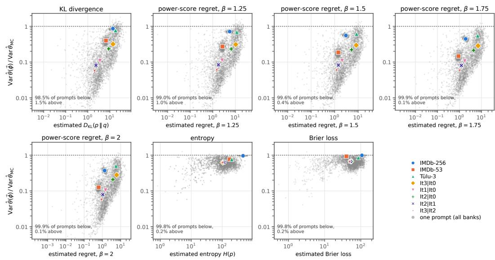  
Figure 4: Variance reduction as a function of quantity magnitude for all losses and divergences in the proper-loss experiment. Each panel shows the variance ratio $\mathrm { V a r } _ { p } ( \widehat { \theta } ( \vec { \phi } ) ) / \mathrm { V a r } _ { p } ( \widehat { \theta } _ { \mathrm { M C } } )$ against the estimated magnitude of the quantity, with one colored marker per policy–reference bank and grey points for individual prompts. For KL and the power-score regrets, variance reduction becomes stronger as the policy–reference divergence decreases, with this dependence becoming more pronounced for larger $\beta .$ Entropy and Brier loss instead remain comparatively close to the Monte Carlo baseline across banks.

Prompt-level behavior and control variates. Tab. 12 summarizes the per-prompt variance ratios of the potential estimator and its cross-fitted control-variate variant relative to Monte Carlo. It also reports separately the prompts on which the potential alone increases variance, showing how fitting the control-variate coefficient changes their ratios and how often it brings them below one.

<table><tr><td rowspan="3">quantity</td><td colspan="2"> $\widehat { \theta } ( \vec { \phi } )$  VS.  $\widehat { \theta } _ { \mathrm { M C } }$ </td><td colspan="2"> $\widehat { \theta } \big ( \vec { \phi } , \alpha ^ { \star } \big ) \mathrm { v s . } \widehat { \theta } _ { \mathrm { M C } }$ </td><td colspan="5">prompts with  $\mathrm { V a r } _ { p } ( \widehat { \theta } ( \vec { \phi } ) ) > \mathrm { V a r } _ { p } ( \widehat { \theta } _ { \mathrm { M C } } )$ </td></tr><tr><td>median [IQR]</td><td> $\% < 1$ </td><td>median [IQR]</td><td> $\% < 1$ </td><td>n</td><td>med.  $\widehat { \theta } ( \vec { \phi } )$ </td><td> $\begin{array} { r } { \mathrm { m e d . } \widehat { \theta } ( \vec { \phi } , \alpha ^ { \star } ) } \\ { \left[ 9 5 \% \mathrm { C I } \right] } \end{array}$ </td><td></td><td> $\% < 1$ </td></tr><tr><td> $D _ { \mathrm { K L } }$ </td><td>0.204 [0.061, 0.503]</td><td>98.5</td><td>0.204 [0.061, 0.482]</td><td>99.5</td><td>63</td><td>1.134</td><td></td><td>0.974 [0.945, 0.990]</td><td>65.1</td></tr><tr><td>regret  $\beta { = } 1 . 2 5$ </td><td>0.202 [0.063, 0.441]</td><td>99.0</td><td>0.193 [0.063, 0.436]</td><td>99.8</td><td></td><td>40 1.083</td><td></td><td>0.951 [0.932, 0.973]</td><td>77.5</td></tr><tr><td>regret  $\beta { = } 1 . 5$ </td><td>0.164 [0.063, 0.400]</td><td>99.6</td><td>0.160 [0.063, 0.396]</td><td>99.9</td><td></td><td>151.058</td><td></td><td>0.935 [0.891, 1.044]</td><td>66.7</td></tr><tr><td>regret β=1.75</td><td>0.142 [0.062, 0.365]</td><td>99.9</td><td>0.141 [0.061, 0.363]</td><td>99.9</td><td></td><td>4 1.190</td><td></td><td>1.080 [0.925, 1.102]</td><td>25.0</td></tr><tr><td>regret β=2</td><td>0.131 [0.060, 0.330]</td><td>99.9</td><td>0.129 [0.060, 0.329]</td><td>99.9</td><td></td><td>3 1.125</td><td></td><td>1.040 [1.009, 1.043]</td><td>0.0</td></tr><tr><td>entropy</td><td>0.633 [0.509, 0.796]</td><td>99.8</td><td>0.630 [0.498, 0.792]</td><td>99.5</td><td>10</td><td>1.047</td><td></td><td>1.090 [1.050, 1.096]</td><td>0.0</td></tr><tr><td>Brier loss</td><td>0.694 [0.545, 0.903]</td><td>99.8</td><td>0.698 [0.543, 0.903]</td><td>99.5</td><td></td><td>9 1.040</td><td></td><td>1.059 [1.024, 1.080]</td><td>0.0</td></tr></table>

Table 12: Per-prompt variance ratios for the losses and divergences experiments, pooling all eight model pairs. We compare the potential estimator $\widehat { \theta } ( \vec { \phi } )$ and its cross-fitted control-variate variant $\widehat { \theta } ( \vec { \phi } , \alpha ^ { \star } )$ against Monte Carlo. The rightmost columns restrict attention to prompts for which $\widehat { \theta } ( \vec { \phi } )$ has higher variance than Monte Carlo and show how often the control variate reduces the ratio below one.

## C.2.4 REPRODUCING AMINI ET AL. (2025)

We first reproduce the KL-estimation experiment of Amini et al. (2025) using our sentiment-tuned policy and compare against the estimators considered in their paper. Their term-wise Rao–Blackwellized estimator is recovered as $\widehat { \theta } ( \vec { \phi } )$ , corresponding to a unit coefficient on the associated zero-mean correction. We reproduce its variance reduction over Monte Carlo (Tab. 13). Fitting the control-variate coefficient reduces variance further: at $M = 1$ , the standard deviation decreases from 2.05 to 1.90. Thus, the unit coefficient is not in general variance-optimal.

<table><tr><td></td><td colspan="4">std. dev.</td></tr><tr><td>estimator</td><td>mean</td><td>M=1</td><td> $M { = } 5$ </td><td> $M { = } 1 0$ </td></tr><tr><td> $\widehat { \theta } _ { \mathrm { M C } }$ </td><td>6.69</td><td>3.32</td><td>1.49</td><td>1.05</td></tr><tr><td>HT</td><td>6.69</td><td>3.32</td><td>1.49</td><td>1.05</td></tr><tr><td>Schulman  $\mathrm { C V } , \alpha = 1$ </td><td>6.47</td><td>35.67</td><td>15.95</td><td>11.28</td></tr><tr><td>Schulman CV, fitted α</td><td>6.36</td><td>11.44</td><td>5.11</td><td>3.61</td></tr><tr><td> $\widehat { \theta } ( \vec { \phi } )$ </td><td>6.69</td><td>2.05</td><td>0.92</td><td>0.65</td></tr><tr><td> $\widehat { \theta } ( \vec { \phi } , \alpha ^ { \star } )$ </td><td>6.69</td><td>1.90</td><td>0.85</td><td>0.60</td></tr></table>

Table 13: Reproduction of the KL-estimation experiment of Amini et al. (2025): mean estimate and empirical standard deviation (nats) at sample sizes $M = 1 , 5 , 1 0$ , over 512 prompts with 4,000 samples each. The mean does not depend on M. Lowest standard deviation per column in bold.

Counterexample to the variance guarantee of Amini et al. (2025). Theorem 2 of Amini et al. (2025) claims that their term-wise Rao–Blackwellized estimator never has larger variance than Monte Carlo. Consider language models p and q supported on length-two strings, with

$$
\begin{array} { r } { p ( a x ) = p ( b x ) = \frac { 1 } { 2 } , \qquad q ( a x ) = q ( b x ) = \frac { 1 } { 4 } , \qquad q ( b z ) = \frac { 1 } { 2 } , } \end{array}
$$

and zero probability elsewhere. Under p, log ${ \frac { p ( Y ) } { q ( Y ) } } = \log 2$ for both possible strings, so $\mathrm { V a r } _ { p } ( \widehat { \theta } _ { \mathrm { M C } } ) =$ 0. Their estimator, corresponding to $\widehat { \theta } ( \vec { \phi } )$ in our notation, instead equals $\textstyle { \frac { 1 } { 2 } } \log { \frac { 4 } { 3 } } \ o \mathbf { r } { \frac { 1 } { 2 } } \log { \frac { 4 } { 3 } } + \log 3$ with equal probability. It remains unbiased, but

$$
\begin{array} { r } { \mathrm { V a r } _ { p } \big ( \widehat { \theta } ( \vec { \phi } ) \big ) = \frac { 1 } { 4 } ( \log 3 ) ^ { 2 } > 0 = \mathrm { V a r } _ { p } ( \widehat { \theta } _ { \mathrm { M C } } ) . } \end{array}
$$

This also follows directly from Proposition 1: since $\widehat { \theta } _ { \mathrm { M C } }$ is constant, $\begin{array} { r l } { \mathrm { C o v } _ { p } ( \widehat { \theta } _ { \mathrm { M C } } , \widehat { \theta } _ { \mathrm { M C } } - \widehat { \theta } ( \vec { \phi } ) ) = } & { { } } \end{array}$ $\begin{array} { r } { 0 < \frac { 1 } { 2 } \mathrm { V a r } _ { p } ( \widehat { \theta } _ { \mathrm { M C } } - \widehat { \theta } ( \vec { \phi } ) ) } \end{array}$ ), so the condition for variance reduction fails. Accordingly, Proposition 2 gives $\alpha ^ { \star } = 0$ , whereas the estimator of Amini et al. (2025) corresponds to $\alpha = 1$

## C.3 GRADIENTS OF LOSSES AND DIVERGENCES

## C.3.1 POTENTIAL DEFINITIONS

Let $\mathbf { w } \in \mathbb { R } ^ { d }$ denote the parameters of $p ,$ and write $\nabla \ { \stackrel { \mathrm { d e f } } { = } } \ \nabla _ { \mathbf { w } }$ , holding q fixed. The original test function f is scalar-valued, whereas its gradient with respect to w is d-dimensional. This gives the vector-valued test function

$$
\begin{array} { r } { \pmb { f } _ { \nabla } ( \pmb { Y } ) \stackrel { \mathrm { d e f } } { = } \nabla f ( \pmb { Y } ) + f ( \pmb { Y } ) \nabla \log p ( \pmb { Y } ) \in \mathbb { R } ^ { d } . } \end{array}\tag{21}
$$

The first term differentiates the function value for a fixed string, while the second accounts for the change in its sampling probability. Under standard regularity conditions,

$$
\nabla ~ \mathbb { E } _ { p } [ f ( \boldsymbol { Y } ) ] = \mathbb { E } _ { p } [ f _ { \nabla } ( \boldsymbol { Y } ) ] .\tag{22}
$$

Gradient estimation therefore fits our framework by applying the potential estimator to $f _ { \nabla }$ coordinatewise. Given a scalar potential $\vec { \phi }$ for $f ,$ we define the corresponding vector-valued gradient potential

$$
\vec { \phi } _ { \nabla } ( \pmb { x } ) \stackrel { \mathrm { d e f } } { = } \nabla \vec { \phi } ( \pmb { x } ) + \vec { \phi } ( \pmb { x } ) \nabla \log \vec { p } ( \pmb { x } ) \in \mathbb { R } ^ { d } .\tag{23}
$$

Replacing $\vec { \phi }$ by $\vec { \phi ^ { \star } }$ gives the corresponding oracle gradient potential.

Because the next-token probabilities in B also depend on $\mathbf { w } ,$ the expected gradient increment satisfies

$$
\mathbf { B } \Delta \vec { \phi } _ { \nabla } ( \pmb { x } ) = \nabla \mathbf { B } \Delta \vec { \phi } ( \pmb { x } ) + \mathbf { B } \Delta \vec { \phi } ( \pmb { x } ) \nabla \log \vec { p } ( \pmb { x } ) .\tag{24}
$$

We extend the operators $\Delta$ and B to vector-valued potentials coordinatewise. Tab. 14 gives the resulting constructions for the losses in Tab. 1 and 7 to 9. For KL, $\mathbf { B } \Delta \vec { \phi } ( \pmb { x } )$ is the KL divergence between the next-token distributions, recovering the local gradient expression of Amini et al. (2025).

$$
\begin{array} { r l } & { \frac { \mathrm { T a s t s ~ I 4 4 8 n o n v o r ~ e x a t o r 5 8 n e : ~ F o r / f o r 1 } } { f ( Y ) } } \\ & { \frac { \mathrm { T e ( Y ) - ~ V o f ~ ( Y ) ~ + ~ / ( Y ) ~ V o p ~ ( Y ) } } { \Delta \tilde { \phi } _ { \nabla } ( a \mid x ) } } \\ & { \frac { \mathrm { S i . e } ( a \mid x ) - \mathrm { V a . } \tilde { \phi } ( a \mid x ) + \Delta \tilde { \phi } ( a \mid x ) \quad \mathrm { V i g o ~ \mathcal { P } ( x a ) } } { 2 \tilde { \phi } _ { \nabla } ( a \mid x ) } [ \begin{array} { l } { \mathrm { T ~ t s e x t e n c y ~ i n e z e } } \\ { \mathrm { I w o s t e n c y ~ i f ~ a e \leq 2 ~ / y ~ } } \\ { \mathrm { F o r ~ ( z e x \mid ~ - v ) ~ F o p ~ ( \phi ~ x \mid ~ x ) } } \end{array} ] } \\ & { + \frac { \tilde { \phi } ( x ) \mathrm { ~ V a r g ~ ( \phi ~ x \mid ~ x ) } } { 2 \tilde { \phi } _ { \nabla } ( a \in \mathcal { X } ) } } \\ & { \qquad + \nabla [ f ( x \leq - \tilde { \phi } ( x ) ] + [ f ( x \leq \tilde { \phi } ( x ) ] \quad \mathrm { V i g ~ \mathcal { P } ( x \mid x ) } } \\ { \qquad \quad + \frac { \tilde { \phi } ( x ) \mathrm { ~ V o p ~ ( y \leq ~ x ) } } { 2 \tilde { \phi } _ { \nabla } ( a \in \mathcal { X } ) } } \\ { \frac { \mathrm { S i . e } ( x ) } { 2 \tilde { \phi } _ { \nabla } ( x ) } - \frac { \mathrm { V a . } \tilde { \phi } ( x ) + \mathrm { ~ \phi } ( x ) \mathrm { ~ V o p ~ ( y \leq ~ y ~ \exp ~ ( ~ 1 ) ~ } } { 2 \tilde { \phi } _ { \nabla } ( x ) } } \end{array} ] \quad \mathrm { J e r o s t z e ~ }  \\ &  \frac { \mathrm { D e t s ~ I c o s t ~ s u r e } }  2 \tilde { \phi } _ { \nabla } ( a \mid x ) + \mathrm { ~ \phi ~ } ( x ) \mathrm { ~ V o p ~ } \tilde { \psi } ( x 
$$

C.3.2 CONTROL-VARIATE COEFFICIENT FOR VECTOR-VALUED FUNCTIONS

For the gradient we need to fit a global control-variate coefficient when the function value lies in $\mathbb { R } ^ { d }$ We describe the construction for a general vector-valued test function $\pmb { f } \colon \Sigma ^ { * }  \mathbb { R } ^ { d }$ with a potential $\vec { \phi } \colon \Sigma ^ { * }  \mathbb { R } ^ { d }$ , both read coordinatewise. Let $\widehat { \pmb { \theta } } _ { \mathrm { M C } } , \widehat { \pmb { \theta } } ( \overrightarrow { \pmb { \phi } } ) \in \mathbb { R } ^ { d }$ denote the Monte Carlo and potential estimators for one trajectory, and define the zero-mean correction

$$
\begin{array} { r } { D \stackrel { \mathrm { d e f } } { = } \widehat { \pmb { \theta } } _ { \mathrm { M C } } - \widehat { \pmb { \theta } } ( \overrightarrow { \phi } ) . } \end{array}\tag{25}
$$

As in Proposition 2, we use a single scalar coefficient, here shared across all d coordinates:

$$
\widehat { \pmb { \theta } } ( \vec { \phi } , \alpha ) \stackrel { \mathrm { d e f } } { = } \widehat { \pmb { \theta } } _ { \mathrm { M C } } - \alpha { \pmb { D } } .\tag{26}
$$

Thus, $\alpha = 0$ recovers Monte Carlo and $\alpha = 1$ the potential estimator. We choose α to minimize the total variance tr $\mathrm { V a r } _ { p } \big ( \widehat { \pmb { \theta } } ( \overrightarrow { \phi } , \alpha ) \big )$ , giving

$$
\alpha ^ { \star } = \frac { \mathrm { t r } \mathrm { C o v } _ { p } \bigl ( \widehat { \theta } _ { \mathrm { M C } } , D \bigr ) } { \mathrm { t r } \mathrm { V a r } _ { p } ( D ) } = \frac { \mathbb { E } _ { p } \Bigl [ \Bigl \langle \widehat { \theta } _ { \mathrm { M C } } - \mathbb { E } _ { p } [ \widehat { \theta } _ { \mathrm { M C } } ] , D - \mathbb { E } _ { p } [ D ] \Bigr \rangle \Bigr ] } { \mathbb { E } _ { p } [ \| D - \mathbb { E } _ { p } [ D ] \| _ { 2 } ^ { 2 } ] } .\tag{27}
$$

Given sampled trajectories indexed by prompt i and response $j ,$ we estimate this globally as

$$
\widehat { \alpha } = \frac { \sum _ { i , j } \left. \widehat { \pmb { \theta } } _ { \mathrm { M C } } ^ { ( i j ) } - \bar { \hat { \theta } } _ { \mathrm { M C } } , \ D ^ { ( i j ) } - \bar { D } \right. } { \sum _ { i , j } \| D ^ { ( i j ) } - \bar { D } \| _ { 2 } ^ { 2 } } ,\tag{28}
$$

where the bars denote means over all trajectories. The coefficient is therefore shared across prompts and coordinates. For the gradient experiments we take $f = f _ { \nabla }$ and $\vec { \phi } = \vec { \phi } _ { \nabla }$ from App. C.3.1, with d the number of policy parameters.

## C.3.3 EXPERIMENTS AND RESULTS

Marginalization reduces gradient variance across all 135 defined quantity–checkpoint comparisons. We repeat the comparison for the gradient of each quantity with respect to the policy parameters along a DPO training trajectory of the GPT-2 sentiment model (Fig. 5). We evaluate 20 checkpoints using 512 prompts and 20 responses per prompt, and measure the variance of a gradient estimator $\widehat { \pmb { \theta } }$ by $\operatorname { t r } { \mathrm { V a r } _ { p } ( \widehat { \pmb { \theta } } ) }$ . Across all 135 quantity–checkpoint comparisons, the potential estimator $\widehat { \theta } ( \vec { \phi } _ { \nabla } )$ reduces variance relative to the centered Monte Carlo gradient $\widehat { \theta } _ { \mathrm { M C } }$ , with variance ratio tr $\mathrm { V a r } _ { p } ( \widehat { \pmb { \theta } } ( \vec { \phi } _ { \nabla } ) ) / \mathrm { t r } \mathrm { V a r } _ { p } ( \widehat { \pmb { \theta } } _ { \mathrm { M C } } )$ between 0.11 and 0.98.

The gains are largest early in training. The gains are largest early in training and generally decrease as training progresses. For example, the KL gradient retains 35% of the Monte Carlo variance at step 50 and 92% at step 938, while the $\beta = 2$ regret retains 11% and 65%, respectively. Among the power-score regrets, larger $\beta$ consistently yields larger reductions at every checkpoint.

Fitting $\alpha ^ { \star }$ further improves gradients for entropy and Brier score. For some gradients, the control-variate estimator $\widehat { \pmb { \theta } } ( \vec { \phi } _ { \nabla } , \alpha ^ { \star } )$ provides an additional gain over $\widehat { \theta } ( \vec { \phi } _ { \nabla } )$ . The unit-coefficient estimator $\widehat { \theta } ( \vec { \phi } _ { \nabla } )$ alone barely improves the entropy and Brier gradients, with variance ratios of 0.97–0.98. Their fitted coefficients are substantially larger, $\alpha ^ { \star }$ ≈ 5 for entropy and $\alpha ^ { \star } \approx 1 1$ for Brier, reducing the ratios to 0.91 and 0.86. For the power-score regrets, by contrast, $\alpha ^ { \star }$ remains close to one (0.66–0.99), and fitting it provides at most about a further 3% reduction.

(a) gradient variance ratio  
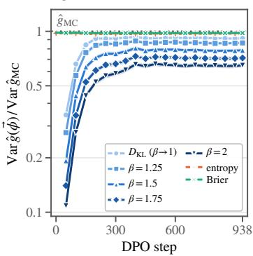

(b) cross-fitted control variate  
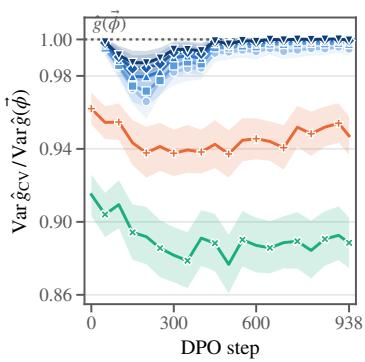

(c) fitted coefficient α⋆  
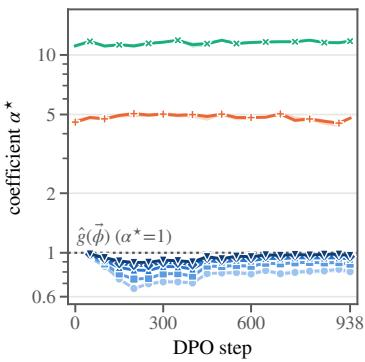  
Figure 5: Gradient estimation along a DPO trajectory of the GPT-2 sentiment policy (checkpoints every 50 steps; the variance of an estimator ${ \widehat { \pmb { \theta } } } \operatorname { i s } \operatorname { t r } \operatorname { V a r } _ { p } ( { \widehat { \pmb { \theta } } } )$ over the $5 1 2 \times 2 0$ responses). (a) Variance of $\widehat { \theta } ( \vec { \phi } _ { \nabla } )$ relative to the centered Monte Carlo gradient $\widehat { \pmb { \theta } } _ { \mathrm { M C } } .$ , one series per quantity (regrets darker for larger $\beta ;$ undefined at step 0). (b) Variance of the cross-fitted control-variate estimator $\widehat { \pmb { \theta } } ( \vec { \phi } _ { \nabla } , \alpha ^ { \star } )$ relative to $\widehat { \pmb { \theta } } ( \vec { \phi } _ { \nabla } )$ . (c) The cross-fitted coefficient, mean over 8 prompt folds with the range as band; $\alpha ^ { \star } = 1$ recovers $\widehat { \theta } ( \vec { \phi } _ { \nabla } )$ . Bands in (a) and (b) are 95% prompt-cluster bootstrap intervals; one training run and one seed.

## C.4 n-GRAM COUNTS AND FREQUENCIES

## C.4.1 DEFINITION OF FREQUENCY ESTIMATOR

For n-gram statistics one is often interested in the frequency of a target rather than solely its expected count. Let $f ( \mathbf { Y } ) = \#$ {occurrences of w in Y} be the count, the test function of Tab. 2, and ${ \bar { N } } _ { n } ( Y )$

the number of word n-gram slots in Y, i.e., the number of positions in the decoded text of $\mathbf { Y }$ at which n consecutive words occur $( \mathrm { f o r } n = 1$ , the number of words). Here a word is a maximal run of ASCII letters, and consecutive words must be separated by a single space, so punctuation ends an n-gram. The frequency of a substring w made of n such words is $\theta _ { \mathrm { F R } } \stackrel { \mathrm { d e f } } { = } \mathbb { E } [ f ( \pmb { Y } ) ] / \mathbb { E } [ N _ { n } ( \pmb { Y } ) ]$ Since every slot holds exactly one n-gram, the counts of all word n-grams of order n sum to $N _ { n } ( { Y } )$ so, as a function of w, θ is the marginal distribution over word n-grams of order n. We estimate it with the ratio estimators

$$
{ \widehat { \theta } } _ { \mathrm { F R } } \overset { \mathrm { d e f } } { = } \frac { { \widehat { \theta } } _ { \mathrm { M C } } } { \frac { 1 } { M } \sum _ { m = 1 } ^ { M } N _ { n } \left( { \pmb { Y } } ^ { ( m ) } \right) } , \qquad { \widehat { \theta } } _ { \mathrm { F R } } ( { \vec { \phi } } ) \overset { \mathrm { d e f } } { = } \frac { { \widehat { \theta } } ( { \vec { \phi } } ) } { \frac { 1 } { M } \sum _ { m = 1 } ^ { M } N _ { n } \left( { \pmb { Y } } ^ { ( m ) } \right) } ,\tag{29}
$$

where $\widehat { \theta } _ { \mathrm { M C } }$ and $\widehat { \theta } ( \vec { \phi } )$ are the Monte Carlo and potential estimators of $\mathbb { E } [ f ( \mathbf { Y } ) ]$ built from Tab. 2, and the denominator is the Monte Carlo estimate of $\mathbb { E } [ N _ { n } ( \pmb { Y } ) ]$ over the same M generations. Ratio estimators are biased at finite sample size, but the bias vanishes asymptotically under standard regularity conditions (Cochran, 1977).

## C.4.2 DEFINITION OF COST-ADJUSTED VARIANCE RATIO

For each target w, we compare the potential estimator against Monte Carlo at equal sample size and equal compute. For either the expected count or frequency, we define

$$
{ \widehat { \rho } } ( w ) = { \frac { { \widehat { \mathrm { V a r } } } { \big ( } { \mathrm { p o t e n t i a l ~ e s t i m a t o r ~ a t ~ } } M = 4 , 0 0 0 { \big ) } } { 1 0 0 0 { \widehat { \mathrm { V a r } } } { \big ( } { \mathrm { M o n t e ~ C a r l o ~ e s t i m a t o r ~ a t ~ } } M = 4 \times 1 0 ^ { 6 } { \big ) } } } , \qquad { \widehat { \rho } } _ { c } ( w ) = \left( L _ { w } + 1 \right) { \widehat { \rho } } ( w ) .\tag{30}
$$

The factor 1000 rescales the Monte Carlo variance from $4 \times 1 0 ^ { 6 }$ to 4,000 samples. This rescaling is exact for expected counts, whose estimator is a sample mean. For frequencies, which are ratios of sample means, the same $1 / M$ variance scaling holds asymptotically by the multivariate delta method (Rieder, 2012, §1.3).

The per-target token-evaluation cost proxy is $c _ { w } = 1 + ( L _ { w } - 1 ) + 1 = L _ { w } + 1 \colon$ : one generation position supplies the first-token probability, $\bar { L } _ { w } - 1$ positions supply the remaining target-token probabilities, and one position supplies the closing-boundary probability. A single-token target therefore has cost multiplier 2. Under this proxy and the $1 / M$ variance scaling above, $\widehat { \rho } _ { c } ( w )$ estimates the fraction of Monte Carlo compute needed to attain the same variance. For frequency ratios, this comparison does not establish equal mean squared error because finite-sample bias is not included.

## C.4.3 OBSERVED-PREFIX POTENTIAL

The $Z ^ { \mathrm { e n d } }$ decomposition gives the observed-prefix potential $\vec { \phi } ( { \pmb x } ) = f ( { \pmb x } )$ of Tab. 15. Its expected increment is nonzero only at prefixes that already match the substring up to its final token, so the estimator averages over that token alone. Tab. 16 reports the median variance of the resulting estimator relative to Monte Carlo at equal sample size $( \bar { M } = 4 , 0 0 0 )$ for the unigram targets of GPT-2, banded by their occurrences in the 4,000 samples (very rare 1–9, rare 10–99, moderate 100–999, frequent $\dot { \geq } 1 , 0 0 0 )$ .

<table><tr><td rowspan=1 colspan=3>TABLE 15: SUBSTRING COUNTS, OBSERVED-PREFIX POTENTIAL</td></tr><tr><td rowspan=1 colspan=3> $f ( \mathbf { Y } ) = \#$ {occurrences of w in $Y \}$ </td></tr><tr><td rowspan=1 colspan=3> $\begin{array} { r } { \pmb { f } ( \pmb { Y } ) = \sum _ { t } Z _ { \pmb { w } , t } ^ { \mathrm { e n d } } , ~ Z _ { \pmb { w } , t } ^ { \mathrm { e n d } } = \pmb { 1 } \{ \pmb { w } \mathrm { e n d s } \mathrm { a t } t \} } \end{array}$ </td></tr><tr><td rowspan=1 colspan=1> $\begin{array} { r } { \vec { \phi } ^ { \star } ( \pmb { x } ) = \mathbb { E } _ { p } \sqrt { \sum _ { t = 1 } ^ { | \pmb { Y } | } Z _ { \pmb { w } , t } ^ { \mathrm { e n d } } } } \end{array}$ </td><td rowspan=1 colspan=1> $\pmb { Y } \succeq \pmb { x } \vert$ </td><td rowspan=1 colspan=1></td></tr><tr><td rowspan=1 colspan=3> $\begin{array} { r } { \vec { \phi } ( { \pmb x } ) = { f } ( { \pmb x } ) = \sum _ { t \le | { \pmb x } | } Z _ { { \pmb w } , t } ^ { \mathrm { e n d } } } \end{array}$ </td></tr><tr><td rowspan=1 colspan=3> $\Delta \vec { \phi } ( a \mid x ) = 1$ {w ends at |x| + 1 in xa}</td></tr><tr><td rowspan=1 colspan=3> $\Delta \vec { \phi } ( \mathrm { { E O S } \mid \pmb x } ) = 0$ </td></tr><tr><td rowspan=1 colspan=2> $\overrightarrow { \mathbf { B } \Delta \phi } ( \mathbf { x } ) = \mathrm { P r } _ { p }$ [w ends at $| { \pmb x } | + 1 \mid { \pmb Y } \succeq { \pmb x } ]$ </td><td rowspan=1 colspan=1></td></tr></table>

Table 16: Variance of the observed-prefix estimator relative to Monte Carlo at equal sample size $( M = 4 , 0 0 0 )$ : median over the unigram targets of GPT-2, banded by their occurrence count in the 4,000 samples (columns).
<table><tr><td colspan="2">model 1-9 10-99 100-999 ≥ 1,000</td></tr><tr><td>GPT-2 (854) 0.997 0.996</td><td>0.993 0.997</td></tr></table>

## C.4.4 RESULTS FOR EXPECTED COUNTS

Results for expected counts. Fig. 6 repeats Fig. 2 for the expected count $\theta _ { w } = \mathbb { E } [ C _ { w } ]$ instead of the frequency; the results again show the largest gains for rare targets, with some common targets costing more than Monte Carlo at equal variance.

Half the retained targets reach equal variance on at most 0.80% of the Monte Carlo compute. Fig. 6a shows the cost-adjusted variance ratio $\widehat { \rho } _ { c }$ for the 4,149 of 7,647 targets whose ratio can be estimated with relative standard error at most 2 (3,700 for frequencies), together with approximate per-target 95% log-ratio confidence intervals. Under the per-target cost proxy, the median ratio is 0.79% of the Monte Carlo budget, and approximately 76.8% of the retained targets require at most 10%. Replacing each ratio by the upper bound of its 95% interval gives a median of 1.78% of the Monte Carlo budget; approximately 77.2% of the retained targets have upper bounds at most 20%, and 95.4% remain below parity with Monte Carlo.

The gains are largest for rare targets. We restrict to the same 2,831 targets as for frequencies, those whose count estimates have nominal RSE at most 20% under a Poisson approximation, equivalently at least 25 expected occurrences in the independent $2 \times 1 0 ^ { 6 }$ -sample frequency bank. The compute ratio increases strongly with the expected count per document (Spearman $r _ { s } = 0 . 8 7 )$ , with its median rising from $2 . 3 \times 1 0 ^ { - 3 }$ in the rarest populated decade to 1.24 among targets with one to ten expected occurrences per document (Fig. 6b). For the latter group, the median exceeds parity with Monte Carlo under the cost proxy.

At the same sample size $( M = 4 , 0 0 0 )$ , the potential estimator yields substantially more precise count estimates, with 79.7% of targets reaching $\mathrm { R S E } \leq 2 0 \%$ and 96.5% reaching $\mathrm { R S E } \leq 5 0 \%$ compared with 11.4% and 19.0% for Monte Carlo (Fig. 6c). The gap grows with token length: for targets of length 4 or more, Monte Carlo almost never reaches $\mathrm { R S E } \leq 5 0 \%$ , whereas the potential estimator does so for at least 90% of targets in every length group. For $L _ { w } \ge 7 .$ , Monte Carlo does not observe any target even in the $4 \times 1 0 ^ { \overline { { 6 } } }$ -sample reference bank, while the potential estimator gives a finite estimate for all of them. Every share agrees with the corresponding share for frequencies to within 0.14 percentage points.

(a) $\widehat { \rho } _ { c } ( w )$ with log-ratio 95% CI  
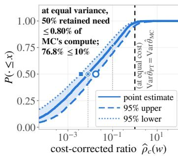

(b) ρbc(w) against expected count  
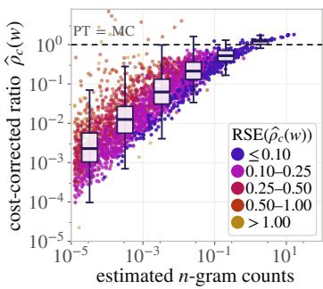

(c) resolved by token length  
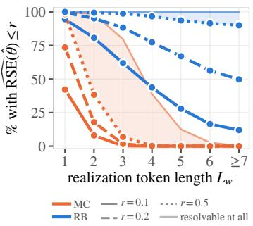  
Figure 6: Fig. 2 for expected counts. Cost-adjusted variance ratio $\widehat { \rho } _ { c } ( w )$ for n-gram count estimation under the per-target cost proxy $L _ { w } + 1$ . (a) Empirical cumulative distribution over 4,149 targets with bootstrap RSE at most 2, with approximate 95% log-ratio confidence bounds. (b) Ratio versus estimated expected count per document for the 2,831 targets with at least 25 expected occurrences in the independent frequency bank. (c) Fraction of targets whose count estimate reaches each RSE threshold, grouped by token length, at the same sample size $M = 4 { , } 0 0 0$ for both estimators. Dashed parity lines in (a–b) mark equal variance at equal cost under the proxy; in (c), line styles distinguish RSE thresholds.

## C.4.5 ADDITIONAL DIAGNOSTICS

The variance ratios of Fig. 2 are point estimates, so we also ask how many targets are separated from parity once their own estimation error is taken into account. Tab. 18 reports this across cumulative relative-standard-error subsets.

(a) targets and token lengths per order n
<table><tr><td>n</td><td>N</td><td>min</td><td>max</td><td>mean</td><td>med</td></tr><tr><td>1</td><td>869</td><td>1</td><td></td><td>41.110</td><td>1</td></tr><tr><td>2</td><td>1584</td><td>2</td><td></td><td>52.128</td><td>2</td></tr><tr><td>3</td><td>1568</td><td>3</td><td></td><td>63.174</td><td>3</td></tr><tr><td>4</td><td>1391</td><td>4</td><td>8</td><td>4.219</td><td>4</td></tr><tr><td>5</td><td>1206</td><td>5</td><td></td><td>95.266</td><td>5</td></tr><tr><td>6</td><td>1029</td><td>6</td><td>10</td><td>6.320</td><td>6</td></tr><tr><td>all</td><td>7647</td><td>一</td><td>一</td><td>一</td><td>一</td></tr></table>

(b) share of targets at each $\boldsymbol { L } _ { w } , \mathsf { p e r }$ order  
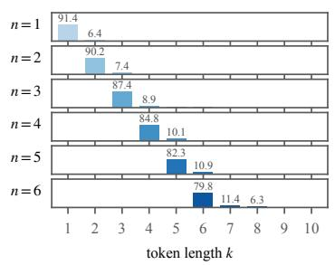

(c) same, log scale: tails thin alike across n  
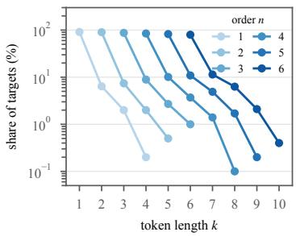  
Figure 7: n-gram target inventory and token-length distribution. The n-gram task provides a controlled way to study targets of different lengths and, consequently, different marginalization costs, which scale with the number of GPT-2 tokens $L _ { w }$ in the target. (a) Number of targets at each order n, together with the minimum, maximum, mean, and median $L _ { w }$ of their canonical realizations. The inventory contains 7,647 targets in total. (b) Distribution of token lengths within each order. Increasing n shifts the inventory toward longer targets, while GPT-2 tokenization also induces within-order variation in $L _ { w } .$ . (c) The same distributions on a log scale, showing that each order additionally contains a progressively thinning tail of targets requiring more tokens, and therefore more costly marginalization.

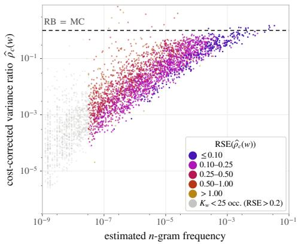

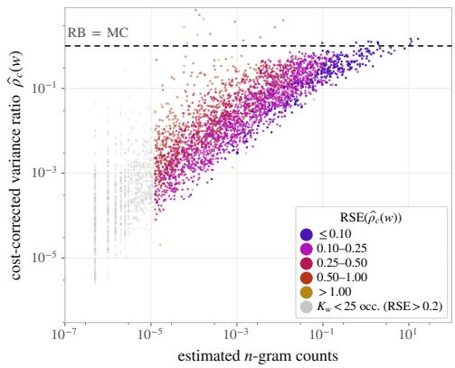  
Figure 8: Cost-adjusted variance ratio against target rarity before the occurrence filter. Both panels show the frequency-estimator variance ratio, against estimated n-gram frequency (left) and expected count per document (right), before applying the occurrence filter to the independently estimated x-axis quantity. In the main figure, we retain only targets whose independent frequency estimate has RSE at most 20%, corresponding to at least 25 expected occurrences in the estimation sample, to restrict the analysis to more reliable estimates. Here, we show all 3,835 targets with positive estimated frequency and a finite positive variance ratio; this remains a subset of the 7,647-target inventory.

Table 17: Variance reduction is strongest for rare targets, even within fixed n-gram order and token length. The 2,831 targets of Fig. 2b are grouped by their independently estimated frequency $\widehat { \theta } _ { \mathrm { F R } }$ . Each entry reports the median cost-adjusted variance ratio $1 0 ^ { 3 } \widehat { \rho } _ { c }$ within that frequency bin; lower values indicate larger gains over Monte Carlo. (a) The trend across all targets. (b–c) The same comparison within fixed n-gram order and canonical token length $L _ { w } .$ , showing that the rarity trend persists after controlling for target length and marginalization cost. The bottom rows give the number of targets in each column and Spearman’s correlation $r _ { s }$ between $\widehat { \theta } _ { \mathrm { F R } }$ and $\widehat { \rho } _ { c }$ . Cells with fewer than 8 targets are omitted.
<table><tr><td></td><td colspan="2">(a) all targets</td><td colspan="4">(b) n-gram order</td><td colspan="4">(c) token length  $L _ { w }$ </td></tr><tr><td>frequency  $\widehat { \theta } _ { \mathrm { F R } }$ </td><td># targets</td><td> $1 0 ^ { 3 } \widehat { \rho } _ { c }$ </td><td>1</td><td>2</td><td>3</td><td>4</td><td>1</td><td>2</td><td>3</td><td>4</td></tr><tr><td> $[ 1 0 ^ { - 8 } , 1 0 ^ { - 7 } )$ </td><td>354</td><td>1.5</td><td>2.0</td><td>1.5</td><td>1.5</td><td>1.3</td><td>一</td><td>1.6</td><td>1.5</td><td>1.3</td></tr><tr><td> $\mathrm { \dot { 7 } 1 0 ^ { - 7 } , 1 0 ^ { - 6 } ) }$ </td><td>701</td><td>5.8</td><td>6.5</td><td>6.6</td><td>5.3</td><td>5.1</td><td>一</td><td>6.6</td><td>5.4</td><td>5.1</td></tr><tr><td> $\mathrm { \bar { [ 1 0 ^ { - 6 } , 1 0 ^ { - 5 } ) } }$ </td><td>725</td><td>28</td><td>35</td><td>28</td><td>25</td><td>17</td><td>42</td><td>26</td><td>25</td><td>17</td></tr><tr><td> $\mathrm { \dot { 7 } 1 0 ^ { - 5 } , 1 0 ^ { - 4 } \dot { ) } }$ </td><td>684</td><td>130</td><td>160</td><td>110</td><td>85</td><td>一</td><td>160</td><td>110</td><td>85</td><td>一</td></tr><tr><td> $[ 1 0 ^ { - 4 } , 1 0 ^ { - 3 } )$ </td><td>299</td><td>310</td><td>330</td><td>260</td><td>一</td><td>一</td><td>330</td><td>260</td><td>一</td><td>一</td></tr><tr><td> $[ 1 0 ^ { - 3 } , 1 0 ^ { - 1 } )$ </td><td>68</td><td>710</td><td>740</td><td>530</td><td></td><td></td><td>740</td><td>530</td><td></td><td>一</td></tr><tr><td>targets</td><td>2,831</td><td>一</td><td>865</td><td>1,295</td><td>537</td><td>115</td><td>794</td><td>1,307</td><td>587</td><td>124</td></tr><tr><td>Spearman  $r _ { s }$ </td><td>一</td><td>0.85</td><td>0.72</td><td>0.80</td><td>0.73</td><td>0.69</td><td>0.67</td><td>0.78</td><td>0.74</td><td>0.69</td></tr></table>

Table 18: A majority of targets in each precision subset retain a variance advantage under the cost proxy. Among targets with positive estimated frequency and a finite positive variance ratio, each row retains those with bootstrap RSE below the indicated cutoff s. We report the number of retained targets and the percentage satisfying $\widehat { \rho } _ { c } < 1 / ( 1 + 1 . 9 6 s )$ , a sufficient condition for the approximate normal interval $\widehat { \rho } _ { c } [ 1 \pm \bar { 1 } . 9 6 \mathrm { R S E } ]$ to lie below parity. These are conservative shares for the normal interval, rather than the log-ratio intervals in Figs. 2 and 6.
<table><tr><td rowspan="2">Max. RSE</td><td colspan="2">Expected count</td><td colspan="2">Frequency</td></tr><tr><td># targets</td><td>95% CI below 1</td><td># targets</td><td>95% CI below 1</td></tr><tr><td>5%</td><td>84</td><td>61.9%</td><td>41</td><td>70.7%</td></tr><tr><td>10%</td><td>317</td><td>84.2%</td><td>240</td><td>89.6%</td></tr><tr><td>20%</td><td>1,048</td><td>92.2%</td><td>953</td><td>95.2%</td></tr><tr><td>50%</td><td>2,661</td><td>93.0%</td><td>2,583</td><td>94.7%</td></tr></table>

## C.5 EVENT ANALYSIS OF DORMAN ET AL. (2026)

## C.5.1 THE AUTOMATED READABILITY INDEX

We extend the experiments of (Dorman et al., 2026) that estimate the Automated Readability Index. For a string Y with $c ( \mathbf { Y } )$ characters, $w ( Y )$ words, and $s ( \boldsymbol { Y } )$ sentences,

$$
\operatorname { A R I } ( \pmb { Y } ) = 4 . 7 1 \frac { c ( \pmb { Y } ) } { w ( \pmb { Y } ) } + 0 . 5 \frac { w ( \pmb { Y } ) } { s ( \pmb { Y } ) } - 2 1 . 4 3 ,\tag{31}
$$

a score calibrated so that its value roughly matches the US school grade needed to read the text. The events $D _ { j }$ are bins of this score, and the test functions are the indicators $\mathbf { 1 } \{ \mathrm { A R I } ( Y ) \in D _ { j } \}$

Experimental setup. The experiments follow the authors’ setup. The model TinyStories-8M continues a fixed prompt for 100 tokens, and the target is the probability that the completion’s ARI falls in each of 80 bins of width 0.29 spanning [−8, 15]. The model is tilted by $\exp ( - \lambda \mathrm { A R I } )$ at 19 values of $\lambda ;$ each tilt is sampled by transition-path sampling (200 chains of 32,400 retained states) and complemented by 200,000 direct samples, and the resulting $6 . 6 8 \times 1 0 ^ { 6 }$ states are combined with MBAR weights, which we retain unchanged. Folds are whole chains, stratified by tilting schedule.

## C.5.2 POTENTIAL DEFINITIONS

The events are the $J = 8 0$ readability bins $D _ { j }$ of App. C.5.1. For each bin we learn a potential $\vec { \phi _ { j } } ( \pmb { x } ; \pmb { \eta } ) = g _ { j } ( \pmb { \xi } ( \pmb { x } ) ; \pmb { \eta } )$ of the form of Eq. (13), approximating the oracle $\operatorname* { P r } _ { p } [ \mathrm { A R I } ( Y ) \in D _ { j }$ $\mathbf { \delta } _ { Y } \succeq x \vert$ . The prefix features ${ \pmb \xi } ( { \pmb x } )$ collect the character, word, and sentence counts of x together with its position in the generation window. We consider two models, a logistic model that predicts bin probabilities directly and a mixture model that forecasts the counts underlying the ARI; both are fitted by the cross-fitting scheme introduced in §4.3, with potential parameters fitted on the training folds using the globally estimated MBAR weights.

Logistic potential. The logistic model predicts bin probabilities from the prefix features directly,

$$
\vec { \phi } _ { j } ^ { \mathrm { l o g } } ( \pmb { x } ; \pmb { \eta } ) = \frac { \widehat { p } _ { j } \exp \bigl ( \beta _ { j } ^ { \top } \pmb { \xi } ( \pmb { x } ) \bigr ) } { \sum _ { j ^ { \prime } = 1 } ^ { J } \widehat { p } _ { j ^ { \prime } } \exp \Bigl ( \beta _ { j ^ { \prime } } ^ { \top } \pmb { \xi } ( \pmb { x } ) \Bigr ) } , \qquad \pmb { \eta } = ( \beta _ { 1 } , \ldots , \beta _ { J } ) ,\tag{32}
$$

where $\widehat { p } _ { j }$ is the marginal probability of bin $D _ { j }$ estimated from the training data. The feature vector ${ \pmb \xi } ( { \pmb x } )$ here comprises 11 features: an intercept, the normalized prefix position and its square, the inverse remaining length and its inverse square root, the character, word, and sentence counts, and the interactions between each count and the normalized position, so that the counts can play different roles at different stages of generation. We fit η by minimizing MBAR-weighted cross-entropy.

Mixture-model potential. At each prefix, we linearly extrapolate the character and word counts in ξ(x) to the terminal length. We separately model the number k of additional sentence endings, since a single further sentence break can change the ARI substantially. Each value of k gives a predicted ARI $\mu _ { k } ( { \pmb x } )$ , around which we place a Gaussian with standard deviation $\sigma _ { k } ( { \pmb x } )$ . Combining these components with their predicted probabilities $\pi _ { k } ( { \pmb x } )$ gives a Gaussian mixture law for the terminal ARI(Y) of the completed string, and the potential is the mass this law assigns to the bin $D _ { j } = \left[ l _ { j } , u _ { j } \right)$ , available in closed form through the standard normal distribution function Φ:

$$
\begin{array} { l } { \displaystyle q _ { \mathrm { m i x } } ( \cdot  { | }  { \boldsymbol { \mathbf { x } } } ) = \sum _ { k } \pi _ { k } (  { \boldsymbol { \mathbf { x } } } ) \mathcal { N } \big ( \mu _ { k } (  { \boldsymbol { \mathbf { x } } } ) , \sigma _ { k } ^ { 2 } (  { \boldsymbol { \mathbf { x } } } ) \big ) , } \\ { \displaystyle \vec { \phi } _ { j } ^ { \mathrm { m i x } } (  { \boldsymbol { \mathbf { x } } } ; \eta ) = q _ { \mathrm { m i x } } ( D _ { j } \mid  { \boldsymbol { \mathbf { x } } } ) = \sum _ { k } \pi _ { k } (  { \boldsymbol { \mathbf { x } } } ) \left[ \Phi \left( \frac { u _ { j } - \mu _ { k } (  { \boldsymbol { \mathbf { x } } } ) } { \sigma _ { k } (  { \boldsymbol { \mathbf { x } } } ) } \right) - \Phi \left( \frac { l _ { j } - \mu _ { k } (  { \boldsymbol { \mathbf { x } } } ) } { \sigma _ { k } (  { \boldsymbol { \mathbf { x } } } ) } \right) \right] . } \end{array}\tag{33}
$$

Here η collects the extrapolation rates, mixture weights, and Gaussian widths. We fit these parameters on the combined direct and transition-path samples, giving each retained sample equal weight. To recover target-model bin probabilities, we multiply the fitted mixture density by the MBAR weight as a function of terminal ARI, integrate the resulting weighted density over each bin using fine-grid quadrature, and normalize once across the full mixture. We cap the number of additional sentence endings at 14, a heuristic upper bound for the 100-token completions used in our experiments.

## C.5.3 POTENTIAL SELECTION ALGORITHM

For each potential $\vec { \phi } ,$ we use the control-variate estimator of Eq. (19). The coefficient α may either be fixed a priori or estimated from data to minimize variance. In particular, $\alpha = 1$ yields the potential estimator, while $\alpha = 0$ recovers the baseline estimator regardless of the potential. Alg. 1 gives the nested cross-fitting procedure used in $\ S 4 . 3$ to select both the potential and, when learned, its coefficient using held-out folds.

Algorithm 1 Potential selection by nested cross-fitting   
Input: Sampled strings D with stored next-token distributions; target function $f .$   
Input: P candidate potentials, each fixed or learned, with fitting procedures for learned parameters.   
Input: For each candidate, a fixed coefficient α (default: 1) or a coefficient-fitting procedure.   
Input: Outer and inner fold counts K and $L .$   
Output: Estimate $\widehat { \theta }$ of $\mathbb { E } _ { p } [ f ( Y ) ] .$   
1: Split D into $K$ equal-sized outer folds $\mathcal { D } _ { 1 } , \dots , \mathcal { D } _ { K } .$   
2: for $k = 1 , \dots , K$ do   
3: $\mathcal { T }  \mathcal { D } \setminus \mathcal { D } _ { k }$ ▷ Outer training data   
4: Split T into L equal-sized inner folds $\mathcal { V } _ { 1 } , \dots , \mathcal { V } _ { L }$   
5: for $j = 1 , \dots , P$ do   
6: for $\ell = 1 , \ldots , L$ do   
7: $A  T \backslash \mathcal { V } _ { \ell }$   
8: Fit candidate $j ^ { \flat } \mathbf { s }$ potential on ${ \mathcal { A } } ,$ if needed, to obtain $\phi .$   
9: Set α to its fixed value, or fit it on A.   
10: Evaluate $\widehat { \theta } ( y _ { i } ; \phi , \alpha )$ for every $y _ { i } \in \mathcal { V } _ { \ell }$   
11: $v _ { j \ell } $ sample variance of these estimates.   
12: $\begin{array} { r } { s _ { j } \gets \frac { 1 } { L } \sum _ { \ell = 1 } ^ { L } v _ { j \ell } } \end{array}$ ▷ Validation score   
13: $\bar { j } ^ { \star } $ arg min $\mid _ { j = 1 , \ldots , P } s _ { j }$   
14: Refit the selected potential on $\tau ,$ if needed, to obtain $\phi _ { k }$   
15: Set $\alpha _ { k }$ to the selected candidate’s fixed value, or refit it on $\tau .$   
16: $\widehat { \theta } _ { k } \gets \frac { 1 } { | \mathcal { D } _ { k } | } \sum _ { y _ { i } \in \mathcal { D } _ { k } } \widehat { \theta } ( y _ { i } ; \phi _ { k } , \alpha _ { k } )$ ▷ Held-out estimate   
17: return $\widehat { \theta } = \frac { 1 } { K } \sum _ { k = 1 } ^ { K } \widehat { \theta } _ { k }$

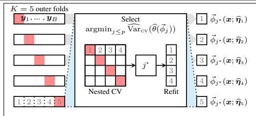  
Figure 9: Nested cross-fitting, our in-sample selection among p candidate potentials (Alg. 1). Each of $K = 5$ outer folds is held out in turn (red); on the remaining folds the candidates are compared by inner cross-validation, the winner $j ^ { \star }$ is refitted on all remaining data and applied to the held-out fold.

## C.5.4 COMPUTE COSTS AND ADDITIONAL RESULTS

Compute. All potential fitting, scoring, and selection run on CPUs, with no GPU computation beyond sampling. The logistic potential has 880 coefficients (11 features across 80 bins), while the mixture model stores empirical rates, mixture weights, and residual widths. We use five outer folds, with the four remaining folds serving as the inner folds. Each inner fit uses three folds: exchanging the outer held-out fold and the inner validation fold leaves the training set unchanged. Thus, the $5 \times 4 = 2 0$ inner evaluations require only ${ \binom { 5 } { 2 } } = 1 0$ distinct fits, which we reuse across outer splits. Together with 5 outer refits and 1 full-data fit, this gives 16 parameter sets per model. Fitting these takes 14 minutes for logistic regression and 4 minutes for the mixture model on a single 32-core node. Scoring both potentials using the stored next-token distributions requires ten parallel jobs, each using 32 cores for 50–95 minutes.

Additional results. Fig. 9 sketches the selection procedure and Fig. 10 shows the variance of the selected estimator over the bins on which MBAR’s own variance is well measured, Fig. 11 the same view for each single candidate, Fig. 12 extends the comparison to all 64 populated bins with the accompanying diagnostics, and Tab. 19 lists the chain-level variance, sample-size efficiency, and MBAR-equivalent sample size of every estimator.

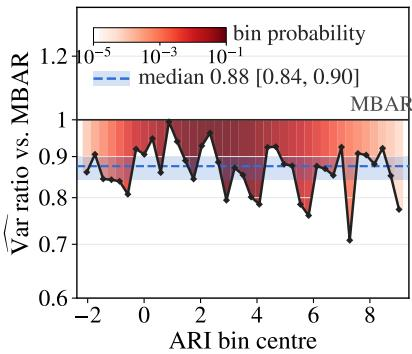  
Figure 10: Variance ratio of the selected potential on the event-analysis experiment: chain-level variance of the cross-fitted estimator relative to MBAR, per ARI bin, over the 39 bins 20–58: the 38 bins on which MBAR’s own variance is itself measured to within 20%, plus bin 57 (at 25%), kept so that the range is contiguous; shading gives the bin probability, the dashed line the median (0.88) and the band its 95% interval. All 64 populated bins are in Fig. 12.

<table><tr><td>Estimator</td><td>Var. ratio vs. MBAR [95% CI]</td><td>Sample-size eff. [95% CI]</td><td>MBAR-equiv. samples  $( \times 1 0 ^ { 6 } )$  [95% CI]</td></tr><tr><td>Nested selection</td><td>0.88 [0.86, 0.91]</td><td>1.14 [1.10, 1.17]</td><td>7.58 [7.34, 7.80]</td></tr><tr><td>Terminal</td><td>0.92 [0.90, 0.94]</td><td>1.09 [1.06, 1.11]</td><td>7.29 [7.09, 7.40]</td></tr><tr><td>Terminal, α</td><td>0.92 [0.90, 0.95]</td><td>1.09 [1.06, 1.11]</td><td>7.27 [7.05, 7.40]</td></tr><tr><td>Logistic</td><td>0.90 [0.86, 0.91]</td><td>1.12 [1.09, 1.16]</td><td>7.46 [7.31, 7.75]</td></tr><tr><td>Mixture model</td><td>0.87 [0.84, 0.90]</td><td>1.15 [1.11, 1.19]</td><td>7.69 [7.43, 7.92]</td></tr></table>

Table 19: Event analysis: chain-level variance of each estimator relative to MBAR, median over all 64 populated ARI bins, with 95% intervals from 1,000 paired chain-bootstrap replicas (fitted potentials, selections, and coefficients held fixed). Sample-size efficiency: median over bins of $\dot { \mathrm { { V a r } ( \mathrm { { M B A R } ) / \mathrm { { V a r } ( \mathrm { { e s t i m a t o r } ) } } } } }$ ; MBAR-equivalent samples: that factor times the actual sample size $N = 6 . 6 8 \times \mathrm { ^ { - } i 0 ^ { 6 } }$ states.

(a) terminal potential  
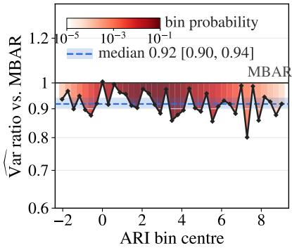  
(c) logistic model

(b) terminal potential with α  
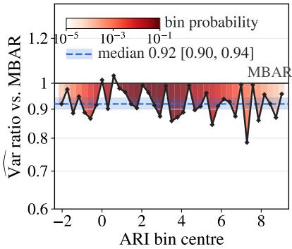  
(d) mixture model

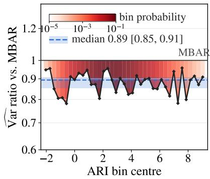

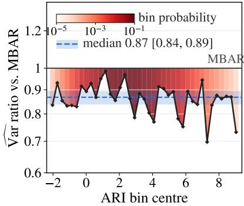  
Figure 11: The same view as Fig. 10 for each single candidate, each refitted without the held-out fold and applied to every bin: chain-level variance relative to MBAR per ARI bin over the same 39 bins (38 by the 20% rule plus bin 57), with the bin probability as shading and the candidate’s own median over these bins with its 95% interval. The terminal potential and its calibrated version remove 8%, the logistic model $1 1 \% ,$ and the mixture model 13%, against 12% for the selection, which picks the mixture model in four folds and the logistic model in one.

RSE of the chain-level Var(MBAR) [%]

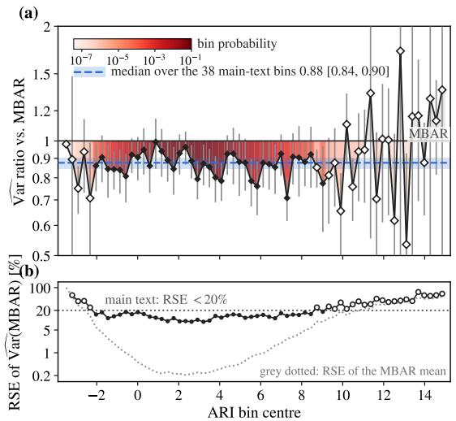

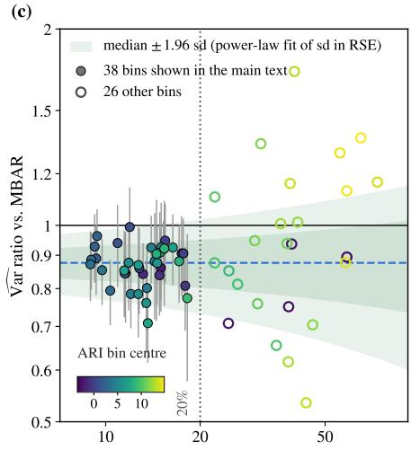  
Figure 12: Variance reduction across ARI bins. (a) variance of the cross-fitted estimator relative to MBAR for all 64 populated bins. Filled markers denote the 38 bins for which the MBAR variance is estimated with RSE below 20%; over these bins, the median variance ratio is 0.88 with a 95% bootstrap interval of [0.84, 0.90], and over all 64 populated bins it is 0.88 with interval [0.86, 0.91]. Ratios in the remaining tail bins are much noisier because the MBAR variance itself is poorly estimated. Whiskers show ±1.96 bootstrap standard deviations from 1,000 paired chain-bootstrap replicates. (b) RSE of the MBAR variance and mean estimates across bins, showing that uncertainty in the variance estimate grows sharply in the tails. (c) Variance ratios against the RSE of the MBAR variance estimate. Among the 38 reliable bins, the ratio shows no systematic dependence on baseline uncertainty (Spearman $\rho = 0 . 0 5 , p = 0 . 7 8 )$ ), indicating that the observed reduction is not driven by noise in the MBAR variance estimate.