# Eficient quadratic entropy with distance sketches

Steve Huntsman steve.huntsman@cynnovative.com

## Abstract

We detail scalable methods for approximating the quadratic entropy $p ^ { T } d p$ for arbitrary distributions p and common distances d of negative type. We focus on the Euclidean and spherical geodesic cases, which both use random feature embeddings and projections to dramatically improve computational complexity within a simple framework. Amortization of a single large matrix multiplication and control variates further enable computation at large scale with low memory and runtime in situations where d is held constant while p varies. We demonstrate this with a comparison against direct pair sampling and bibliometric/scientometric examples on Open Graph Benchmark datasets, revealing papers, fields, and institutions with both particularly narrow and broad interdisciplinary reach from their citations and text features alone.

## 1 INTRODUCTION

We give scalable unbiased Monte Carlo estimators for the quadratic entropy [34]

$$
Q : = p ^ { T } d p = \mathbb { E } _ { x , x ^ { \prime } \sim p } d ( x , x ^ { \prime } )\tag{1}
$$

for common distances d of negative type. We target the regime of millions of arbitrary distributions p on the same n points represented in $\mathbb { R } ^ { m }$ (hence the same d) for m in the hundreds or more and n in the hundreds of thousands or more. This regime makes explicitly forming d prohibitive, but it also encourages amortization of calculations.

## 1.1 Context

The context we are primarily concerned with is that of a Markov chain with transition matrix P whose rows $p ^ { T }$ we treat as distributions to compare in light of an underlying distance d (perhaps not a metric per se, as with squared Euclidean or cosine distance) of negative type (see §2). 1 Directed graphs with node features (e.g., the node property Open Graph Benchmark examples [20]) naturally fit into this context by viewing the uniform random walk as a Markov chain. We produce examples along these lines in §5 that illustrate how quadratic entropy captures semantic dispersion of citations.

## 1.2 Related work

The quadratic entropy (1) is a self-interaction functional that is related to two-sample maximum mean discrepancy and energy distance comparison functionals of the form $( p ^ { \prime } - p ) ^ { T } d ( p ^ { \prime } - p )$ [15, 40, 38, 25]. Quadratic entropy is also a particularly important case of more general notions of diversity [24, 27, 23, 21]; this framing motivates our constructions, but the relevant literature is largely unconcerned with computation at scale. The simplest approach to approximating (1) is accumulating entries of d sampled from $p \times p .$ The resulting variance converges at the same $O ( 1 / N )$ rate, but with a much worse constant when p is spread out, because it does not aggregate information across en tries of d within a sample (see the right panel of Figure 3). While it can give better results for suficiently concentrated data (as in the left panel of Figure 3), it cannot amortize across diferent distributions p, and does not express Q through a functional linear in p, so it cannot be efectively deployed at scale such as in §5.

Random Fourier features [33, 45] require a shiftinvariant positive definite kernel to compute quantities like (1), which precludes applications to Euclidean distance by Bochner’s theorem and non-integrability (cf. [17]). On the other hand, slicing does apply: our treatment of the Euclidean case in §3.3 is included mainly for the sake of a joint framework with the spherical geodesic case in §3.4, but the Euclidean capability per se is largely covered by the slicing and fast summation literature [3, 22, 16, 17, 18], including use of an unweighted form in [18] of the classical Gini identity Proposition 3.2. This gives one-dimensional negative distance kernel sums in $O ( n \log n )$ , and slicing extends to any radial kernel with an analytic basis function [16], albeit via fast Fourier summation instead of sorting. Meanwhile, quasi-Monte Carlo directions can improve slicing performance but not in our regime, due to nonsmoothness [17] and high dimension.

The work closest to §3.3 is [5], which establishes a sliced identity for the negative Euclidean distance kernel with a Bernstein-type error bound, and which yields our estimator straightforwardly. Our treatment of the Euclidean case is nevertheless distinguished from existing work by a relative error bound on Q (Theorem 3.3), and by a squared-Euclidean control variate with mean computable in O(mn) (§4.2).

By comparison, §3.4 reduces the spherical geodesic quadratic entropy to a single scalar per random direction, while remaining connected with the Euclidean case. The natural kernel is the zeroth-order arccosine kernel of [9]: i.e., the afine transformation $\kappa _ { 0 } = 1 - \theta / \pi$ of the geodesic distance θ. This kernel’s random features are the signs of random projections rather than Fourier features of the sort in [33]: these signs realize the afine transformation $2 \kappa _ { 0 } - 1 =$ $1 - 2 \theta / \pi$ [14] familiar from locality-sensitive hashing [8]. Positive definiteness is not an obstruction here: the kernel of [9] is positive definite on $S ^ { m - 1 }$ by Schoenberg’s characterization [36], as well as by the Gram matrix representation in §3.4. The obstructions are instead the unavailability of a spectral measure that is easy to sample from, and that the spherical harmonics involved are infeasible to work with in high dimension. A deterministic alternative uses Corollary 3.6 to compute Q using an entrywise expansion in powers of the Gram matrix, but the resulting matrix rank grows prohibitively [37]. Instead, the applicable tool is the Goemans-Williamson representation (13) of spherical geodesic distance, which through a sketch given by the product $U ^ { T } X$ of IID $\mathcal { N } ( 0 , I _ { m } )$ random variables in U and data points in X, enables the amortized calculation of $s ( u ) = p ^ { T } \mathrm { s g n } ( X ^ { T } u )$ that underlies our devel opment. Slicing on the sphere has been used for optimal transport [2, 32], but those constructions project onto great circles to compare measures, rather than linearizing the geodesic distance.

A single cached sketch $U ^ { T } X$ is the key to computing (1) for both Euclidean and spherical geodesic cases while amortizing over instances of $p .$ Structured accelerations of the arc-cosine family use a similar matrix product [44, 10, 26, 28] but do not bear on our results: [26, 28] tie the feature budget N to the ambient dimension m and supply no finite-sample guarantee for $N \ll m ,$ and the orthogonal random feature constructions of [44, 10] confer limited to no advantage at our scale, where near-orthogonality is practically free. A benefit of our estimators is error bounds on quadratic entropy that are independent of ambient dimension m. These improve on direction counts that scale linearly in m in [28, 5]. Part of this gap is attributable to normalization, since directions drawn uniformly from the sphere carry a factor $\sqrt { \pi } \Gamma ( \textstyle { \frac { m + 1 } { 2 } } ) / \Gamma ( \textstyle { \frac { m } { 2 } } ) \sim \sqrt { \pi m / 2 }$ absent for Gaussian u; the qualitative independence from m is nonetheless not shared by any bound we compare against. Meanwhile, Nystr¨om methods [42, 43] apply to Euclidean and spherical geodesic distances, but these methods are biased and have unreliable spectral norm error [11, 13].

Finally, the methods here can be used to scale the optimization of quadratic entropy, which is useful in its own right [21]. This will be reported elsewhere.

## 1.3 Paper organization

The remainder of this paper is as follows. In §2 we discuss negative type distances and feature embeddings; §3 discusses eficient estimators for quadratic entropy; §4 details scaling techniques, and §5 describes experiments on real data. Appendix A contains proofs. The LaTeX comments of the source file on arXiv contain code necessary for exact reproduction of our results.

## 2 NEGATIVE TYPE DISTANCES AND FEATURE EMBEDDINGS

Let the columns of $\ b X \in \mathbb { R } ^ { m \times n }$ represent n points $x ^ { ( j ) }$ in $\mathbb { R } ^ { m }$ for $j \in [ n ]$ $\begin{array} { r } { \mathrm { i . e . , } \ x _ { i } ^ { ( j ) } : = X _ { i j } . } \end{array}$ Recall that a symmetric nonnegative matrix $\ b { d } \in \mathbb { R } ^ { n \times n }$ with zero diagonal is called negative type if $a ^ { T } d a \ \leq \ 0$ for all $a \in \mathbb { R } ^ { n }$ with $1 ^ { T } a = 0 ;$ d is called strict negative type if the strict inequality $a ^ { T } d a < 0$ holds for $a \neq 0 .$ . As indicated above, the distances we shall consider are all of the form $d _ { j k } \equiv d ( x ^ { ( j ) } , x ^ { ( k ) } )$ , and they are all negative type, although squared Euclidean distance and cosine distance (the latter a special case of the former) are not metrics per se; meanwhile, Euclidean distance matrices are always strict negative type, and spherical geodesic distance matrices are strict negative type as long as no two points are antipodal [19].

In the finite setting, a classical result of Schoenberg [35] is that d is negative type if there exist “feature” vectors $\boldsymbol { \psi } ^ { ( j ) } \in \mathbb { R } ^ { n }$ such that $d _ { j k } = \| \psi ^ { ( j ) } - \psi ^ { ( k ) } \| ^ { 2 }$ identically. This works as follows: let ${ \ddot { J } } : = I - { \textstyle \frac { 1 } { n } } \mathrm { { 1 1 } } ^ { T }$ and set $G : = - { \textstyle \frac { 1 } { 2 } } J ^ { T } d J$ . When d is negative type (respectively, strict negative type) G is positive semidefinite (respectively, positive definite), since $b ^ { T } G b = - \textstyle { \frac { 1 } { 2 } } a ^ { T } d a$ with $a = J b$ automatically satisfying $1 ^ { T } a = 0$ for all $b ,$ so that $b ^ { T } G b \geq 0$ (respectively, $b ^ { T } G b > 0$ for $b \neq 0 )$ A line or two of algebra gives

$$
G _ { j j } + G _ { k k } - 2 G _ { j k } = d _ { j k }\tag{2}
$$

and the Cholesky factorization $G = \Psi ^ { T } \Psi$ is such that the columns $\psi ^ { ( j ) }$ of Ψ are the desired feature vectors, so $G _ { j k } = \psi ^ { ( j ) T } \psi ^ { ( k ) }$ . Inserting this into (2) yields (with $1 ^ { T } p = 1$ here and throughout the rest of the paper)

$$
p ^ { T } d p = 2 \left( \sum _ { j } p _ { j } \| \psi ^ { ( j ) } \| ^ { 2 } - \left\| \sum _ { j } p _ { j } \psi ^ { ( j ) } \right\| ^ { 2 } \right) .\tag{3}
$$

The right side of (3) is cheaper to compute than the left side’s form suggests. For the other direction, start from $d _ { j k } = \| \psi ^ { ( j ) } - \psi ^ { ( k ) } \| ^ { 2 }$ : then if $1 ^ { T } a = 0$ , it follows that $\begin{array} { r } { \sum _ { j , k } a _ { j } a _ { k } \| \psi ^ { ( j ) } - \dot { \psi ^ { ( k ) } } \| ^ { 2 } = - 2 \| \sum _ { j } a _ { j } \psi ^ { ( j ) } \| ^ { 2 } \leq 0 } \end{array}$ so that d is in fact negative type.

## 3 EFFICIENT QUADRATIC ENTROPY COMPUTATIONS FOR COMMON DISTANCES OF NEGATIVE TYPE

Squared Euclidean (§3.1) and cosine (§3.2) distances yield trivially eficient computations of quadratic entropy. For ordinary Euclidean (§3.3) and spherical geodesic (§3.4) metrics, more finesse is required, but we can still do better than a naive evaluation of (1).

## 3.1 Squared Euclidean distance

This is trivial, with $\psi ^ { ( j ) } \equiv x ^ { ( j ) } \colon \mathrm { i f ~ } d ( x , y ) = \| x - y \| ^ { 2 }$

$$
p ^ { T } d p = 2 \sum _ { j } p _ { j } \Vert x ^ { ( j ) } \Vert ^ { 2 } - 2 \left. \sum _ { j } p _ { j } x ^ { ( j ) } \right. ^ { 2 } .\tag{4}
$$

## 3.2 Cosine distance on $S ^ { m - 1 }$

This is actually a special case of squared Euclidean distance, since $\begin{array} { r } { \frac { 1 } { 2 } ( \hat { x } - \hat { y } ) ^ { T } ( \hat { x } - \hat { y } ) = 1 - \hat { x } ^ { T } \hat { y } } \end{array}$ yˆ:

$$
d ( x , y ) = 1 - \hat { x } ^ { T } \hat { y } \Rightarrow p ^ { T } d p = 1 - \left\| \sum _ { j } p _ { j } \hat { x } ^ { ( j ) } \right\| ^ { 2 } .\tag{5}
$$

## 3.3 Euclidean distance

Proposition 3.1. For $u \sim \mathcal { N } ( 0 , I _ { m } )$ and $x \in \mathbb { R } ^ { m }$

$$
\| x \| = \sqrt { \frac { \pi } { 2 } } \cdot \mathbb { E } _ { u } | u ^ { T } x | ;\tag{6}
$$

and for $d _ { j k } \equiv \| x ^ { ( j ) } - x ^ { ( k ) } \|$ ,

$$
\boldsymbol { p } ^ { T } d \boldsymbol { p } = \sqrt { \frac { \pi } { 2 } } \cdot \mathbb { E } _ { \boldsymbol { u } } \sum _ { j , k } p _ { j } p _ { k } | \boldsymbol { u } ^ { T } \boldsymbol { x } ^ { ( j ) } - \boldsymbol { u } ^ { T } \boldsymbol { x } ^ { ( k ) } | .\tag{7}
$$

The representation (6) underlies slicing [3], but our application difers. We produce an unbiased estimator of the exact quadratic entropy instead of a proxy distance between distributions.

A simple trick allows us to evaluate the mean absolute diference on the right side of (7) more eficiently:

Proposition 3.2 (Gini). If $w \in \mathbb { R } ^ { n }$ and $v _ { 1 } \leq \cdots \leq$ $v _ { n }$ , then $\begin{array} { r } { \sum _ { j , k } w _ { j } w _ { k } | v _ { j } - v _ { k } | } \end{array}$ equals

$$
2 \sum _ { j } w _ { j } v _ { j } \left( 2 \left[ \sum _ { i = 1 } ^ { j - 1 } w _ { i } \right] + w _ { j } - \sum _ { i = 1 } ^ { n } w _ { i } \right) .\tag{8}
$$

Since sorting has computational complexity $O ( n \log n )$ the right hand side of (8) inherits this computational complexity instead of the naive $O ( n ^ { 2 } )$ With Proposition 3.1, this yields a very eficient algorithm for estimating $p ^ { T } d p \colon$ sample N IID vectors $u \sim \mathcal { N } ( 0 , I _ { m } )$ and compute the corresponding sample mean estimating the right hand side of (7).

Writing here

$$
\begin{array} { l } { \displaystyle q ^ { \mathrm { e u c } } ( u ) \equiv q ^ { \mathrm { e u c } } ( u ; X , p ) } \\ { \displaystyle \qquad : = \sqrt { \frac \pi 2 } \sum _ { j , k } p _ { j } p _ { k } \vert u ^ { T } x ^ { ( j ) } - u ^ { T } x ^ { ( k ) } \vert , } \end{array}
$$

the question now is how the estimator

$$
\bar { Q } _ { N } ^ { \mathrm { e u c } } : = \frac { 1 } { N } \sum _ { i = 1 } ^ { N } q ^ { \mathrm { e u c } } ( u ^ { ( i ) } )\tag{9}
$$

behaves relative to $Q = p ^ { T } d p$ . The following theorem provides an answer.

Theorem 3.3. With IID $\mathcal { N } ( 0 , I _ { m } )$ inputs, $\bar { Q } _ { N } ^ { \mathrm { e u c } }$ is an unbiased estimator of Q, and

$$
\begin{array} { r } { \mathbb { P } \left( \left| \displaystyle \frac { \bar { Q } _ { N } ^ { \mathrm { e u c } } } { Q } - 1 \right| \geq \varepsilon \right) \leq 2 \exp ( - N \varepsilon ^ { 2 } / \pi ) , } \end{array}\tag{10}
$$

$$
\mathrm { V a r } ( \bar { Q } _ { N } ^ { \mathrm { e u c } } ) \leq \left( \frac { \pi } { 2 } - 1 \right) \frac { Q ^ { 2 } } { N } .\tag{11}
$$

By Theorem 3.3, a relative error ε can be achieved with probability $1 - \delta$ if

$$
\frac { \pi } { \varepsilon ^ { 2 } } \log \frac { 2 } { \delta } \leq N .\tag{12}
$$

For example, $\delta \ : = \ : 1 0 ^ { - 6 }$ and $\begin{array} { r } { \varepsilon = \frac { 1 } { 2 } } \end{array}$ gives $N \ge 1 8 3 $ while $\delta = 1 0 ^ { - 3 }$ and $\begin{array} { r } { \varepsilon = \frac { 1 } { 1 0 } } \end{array}$ gives $\bar { N } \geq 2 3 8 8$ . Figure 1 and the variance bound (11) both suggest that the exponential tail bound is quite loose in practice, and that small N sufices for meaningful estimates.

Meanwhile, the bound (11) is tight, saturating for $n =$ 2 points with p uniform.

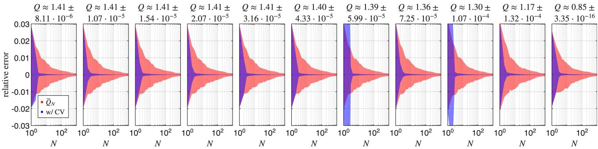  
Figure 1: From left to right: for $\ell = 0 , \ldots , 1 0$ , relative errors over 100 trials for estimates of Euclidean quadratic entropies ${ \bar { Q } } _ { N } ^ { \mathrm { e u c } } ( p )$ with p dense, given by normalizing n IID $\mathcal { U } ( [ 0 , 1 ] )$ random variables, and d given by taking 10000 IID uniform points on $S ^ { m - 1 }$ for $m = 2 ^ { 1 0 }$ and forcing $2 ^ { \ell }$ coordinates (chosen uniformly without replacement) to be positive. Error for $\bar { Q } _ { N } ^ { \mathrm { e u c } }$ is shown in red, while error using the Euclidean control variate described in §4.2 is shown in blue. Note that relative errors are virtually independent of the concentration parameter ℓ.

## 3.4 Geodesic distance on $S ^ { m - 1 }$

Instead of projecting and transporting, the spherical geodesic distance θ is linearized through random sign features that yield (15) below. Write $s _ { j } ( u ) : =$ $\mathrm { s g n } ( u ^ { T } x ^ { ( j ) } )$ . The key technical element we need is Lemma 3.2 of [14] (also Lemma 1.4.1 of [12]; cf. [8]), restated here:

Lemma 3.4 (Goemans-Williamson). If $u / \Vert u \Vert \sim$ $\mathscr { U } ( S ^ { m - 1 } ) ~ ( e . g . , u \sim \mathcal { N } ( 0 , I _ { m } ) )$ , then

$$
\pi \cdot \mathbb { P } \left( s _ { j } ( u ) \neq s _ { k } ( u ) \right) = \operatorname { a r c c o s } ( \hat { x } ^ { ( j ) T } \hat { x } ^ { ( k ) } ) = : \theta _ { j k } .\tag{13}
$$

Taking expectations of $\begin{array} { r } { 1 - \delta _ { j k } = \frac { 1 } { 2 } ( 1 - s _ { j } ( u ) s _ { k } ( u ) ) } \end{array}$ ) now gives that

$$
\theta _ { j k } = \frac { \pi } { 2 } \mathbb { E } _ { u } ( 1 - s _ { j } ( u ) s _ { k } ( u ) ) .\tag{14}
$$

Let $\psi ^ { ( j ) } : = \sqrt { \pi } s _ { j } ( \hat { u } ) / 2$ for $\hat { u } \in S ^ { m - 1 }$

Proposition 3.5. $\| \psi ^ { ( j ) } - \psi ^ { ( k ) } \| _ { L ^ { 2 } ( S ^ { m - 1 } ) } ^ { 2 } = \theta _ { j k } .$

Corollary 3.6 (Grothendieck2). $\begin{array} { r l } { { \mathbb E } _ { u } ( s _ { j } s _ { k } ) \ } & { { } = } \end{array}$ $\begin{array} { r } { \frac { 2 } { \pi } \arcsin ( \hat { x } ^ { ( j ) T } \hat { x } ^ { ( k ) } ) } \end{array}$

Now define $\begin{array} { r } { s ( u ) : = \sum _ { j } p _ { j } s _ { j } ( u ) \in [ - 1 , 1 ] } \end{array}$

Theorem 3.7. For d a geodesic distance matrix on $S ^ { m - 1 }$ and $u \sim \mathcal { N } ( 0 , I _ { m } )$

$$
p ^ { T } d p = \frac { \pi } { 2 } \left( 1 - \mathbb { E } _ { u } [ s ^ { 2 } ] \right) .\tag{15}
$$

Note that this result expresses the geodesic quadratic entropy very succinctly, through the scalar s evaluated over random directions. This scalar can be eficiently amortized as discussed in §4.1 when d is reused. Meanwhile, as in §3.3, we obtain a very eficient algorithm for estimating $p ^ { T } d p \colon$ sample N IID vectors u $, \sim \mathcal { N } ( 0 , I _ { m } )$ and compute the corresponding sample mean estimating the right hand side of (15). Figure 2 shows an example using the algorithm.

Also as in §3.3, if we write here

$$
q ^ { \mathrm { g e o } } ( u ) \equiv q ^ { \mathrm { g e o } } ( u ; X , p ) : = \frac { \pi } { 2 } \left( 1 - s ( u ) ^ { 2 } \right) ,
$$

the question now is how the estimator

$$
\bar { Q } _ { N } ^ { \mathrm { g e o } } : = \frac { 1 } { N } \sum _ { i = 1 } ^ { N } q ^ { \mathrm { g e o } } ( u ^ { ( i ) } )\tag{16}
$$

behaves relative to $Q : = p ^ { T } d p$ . The following theorem provides an answer.

Theorem 3.8. For d a geodesic distance matrix on $S ^ { m - 1 }$ and with IID $\mathcal { N } ( 0 , I _ { m } )$ inputs, $\bar { Q } _ { N } ^ { \mathrm { g e o } }$ is an unbiased estimator of Q with

$$
\begin{array} { r } { \mathbb { P } \left( \left| \bar { Q } _ { N } ^ { \mathrm { g e o } } - Q \right| \ge \varepsilon \right) \le 2 \exp ( - 8 N \varepsilon ^ { 2 } / \pi ^ { 2 } ) } \end{array}\tag{17}
$$

and

$$
\mathrm { V a r } ( { \bar { Q } } _ { N } ^ { \mathrm { g e o } } ) \leq \frac { \pi ^ { 2 } } { 1 6 N } .\tag{18}
$$

By Theorem 3.8, an absolute error ε can be achieved with probability 1 − δ if

$$
\frac { \pi ^ { 2 } } { 8 \varepsilon ^ { 2 } } \log \frac { 2 } { \delta } \leq N .\tag{19}
$$

For example, $\delta = 1 0 ^ { - 6 }$ and $\begin{array} { r } { \varepsilon = \frac { 1 } { 2 } } \end{array}$ gives $N \geq 7 2 ;$ while $\delta = 1 0 ^ { - 3 }$ and $\textstyle { \varepsilon = { \frac { 1 } { 1 0 } } }$ gives $N \geq 9 3 8$ . As before, Figure 2 and the variance bound (18) both suggest that the exponential tail bound is quite loose in practice, and that taking N small sufices for meaningful estimates.

## 3.4.1 A relative bound

We can also get a relative bound on Q in the geodesic case, starting with a tightened variance bound. We first collect building blocks.

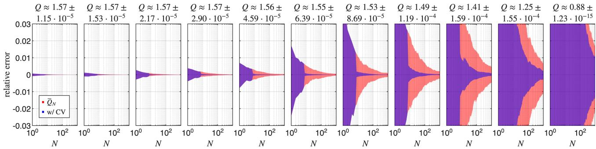  
Figure 2: As in Figure 1, but for spherical geodesic (versus Euclidean) distance d. Note that as concentration increases (because the number $2 ^ { \ell }$ of fixed signs on the sphere increases) from left (ℓ = 0) to right (ℓ = 10), the relative errors rapidly increase.

Proposition 3.9. Under the same assumptions as Theorem 3.8,

$$
\mathrm { V a r } \bigl ( \bar { Q } _ { N } ^ { \mathrm { g e o } } \bigr ) \ \leq \ \frac { 1 } { N } \left( \frac { \pi Q } { 2 } - Q ^ { 2 } \right) \ \leq \ \frac { \pi ^ { 2 } } { 1 6 N } .\tag{20}
$$

The bound (20) is tight. To see this, take $n = 2$ points at geodesic distance θ with p uniform: then $s = { \textstyle \frac { 1 } { 2 } } ( s _ { 1 } +$ $s _ { 2 } ) \in \{ 0 , \pm 1 \}$ , so $s ^ { 2 }$ is Bernoulli with $\mathbb { P } ( s ^ { 2 } = \overline { { 1 } } ) =$ $\mathbb { P } ( s _ { 1 } = s _ { 2 } ) = 1 - \theta / \pi$ by Lemma 3.4. Since $Q = \theta / 2$ here, $\mathrm { V a r } ( s ^ { 2 } ) = ( 1 - 2 Q / \pi ) \cdot 2 Q / \pi ,$ , and the inequalities in the proof become equalities. For $Q \ll 1$ , the bound (20) is also much sharper than (18).

Theorem 3.10 (Bernstein; adapted from Theorem 2.10 of [4]). Let $\zeta _ { 1 } , \ldots , \zeta _ { N }$ be IID real random variables with $\mathbb { E } \zeta _ { i } = 0$ , and suppose $\nu , c > 0$ satisfy

$$
N \mathbb { E } \left[ \zeta _ { i } ^ { 2 } \right] \leq \nu\tag{21}
$$

and

$$
N \mathbb { E } \left[ \left( \zeta _ { i } \right) _ { + } ^ { \ell } \right] \leq \frac { \ell ! } { 2 } \nu c ^ { \ell - 2 } ,\tag{22}
$$

for every integer $\ell \geq 3$ , where $( \cdot ) _ { + } : = \operatorname* { m a x } \{ \cdot , 0 \}$ . Then   
for all $\tau > 0$ 2

$$
\mathbb { P } \left( \sum _ { i = 1 } ^ { N } \zeta _ { i } \geq \sqrt { 2 \nu \tau } + c \tau \right) \leq e ^ { - \tau } .\tag{23}
$$

Lemma 3.11. Let $\zeta _ { 1 } , \ldots , \zeta _ { N }$ be IID real random variables with $\mathbb { E } \zeta _ { i } = 0$ and $| \zeta _ { i } | \le R$ , and let $\sigma ^ { 2 } > 0$ satisfy $\mathbb { E } [ \zeta _ { i } ^ { 2 } ] \le \sigma ^ { 2 }$ . Then for every $r > 0$

$$
\begin{array} { r } { \mathbb { P } \left( \left| \frac { 1 } { N } \sum _ { i = 1 } ^ { N } \zeta _ { i } \right| \geq r \right) \leq 2 \exp \left( \frac { - N r ^ { 2 } } { 2 \sigma ^ { 2 } + 2 r R / 3 } \right) . } \end{array}\tag{24}
$$

We are now ready to use Proposition 3.9 and Lemma 3.11 for a relative bound.

Theorem 3.12. Under the assumptions of Theorem 3.8 with $Q \in ( 0 , \pi / 2 )$ 2

$$
\mathbb { P } \left( \left| \frac { \bar { Q } _ { N } ^ { \mathrm { g e o } } } { Q } - 1 \right| \geq \varepsilon \right) ~ \leq ~ 2 \exp \left( \frac { - N \varepsilon ^ { 2 } Q } { \pi \left( 1 + \varepsilon / 3 \right) } \right) .\tag{25}
$$

By Theorem 3.12, a relative error ε is achieved with probability 1 − δ once

$$
N \geq \frac { \pi \left( 1 + \varepsilon / 3 \right) } { \varepsilon ^ { 2 } Q } \log \frac { 2 } { \delta } .\tag{26}
$$

## 3.4.2 Comparison with a pair-sampling baseline

Figure 3 compares $q ^ { \mathrm { g e o } }$ against pair sampling along two axes: the geometry concentration, as in Figure 2; and the support size of a uniform p. As the concentration ℓ increases, the ratio falls quickly: the sketch variance increases towards the bound in Proposition 3.9, while the pair variance, which measures the spread of individual distances, is agnostic to concentration. As |supp(p)| increases, the ratio rises quickly but is always above 1 here. In short, concentrating the geometry or (the support of) p erodes the advantage of sketching, but only the former reverses it at a useful scale.

## 4 SCALING

The runtimes of the squared Euclidean, cosine distance, Euclidean, and spherical geodesic cases above are respectively O(mn), O(mn), $O ( ( m + \log n ) n N )$ , and $O ( m n N )$ ), each of which improves over the naive $O ( m n ^ { 2 } )$ when as intended $N \ \ll \ n$ However, further speedups are achievable: amortization and a (Euclidean) control variate provide real advantage.

## 4.1 Amortization

Both Euclidean and geodesic distance estimators can (and should) reuse a single product $U ^ { T }$ X across different p, provided only that X and d are preserved. Similarly, the sort required for the Euclidean distance estimator can be done once and cached.

A naive approach requires a single $O ( m n ^ { 2 } )$ efort to form d, followed by $O ( n ^ { 2 } )$ efort for each Q, whereas our approach requires a single $O ( m n N )$ efort to form $U ^ { T } X$ followed by $O ( n N )$ for each $Q . ^ { 3 }$

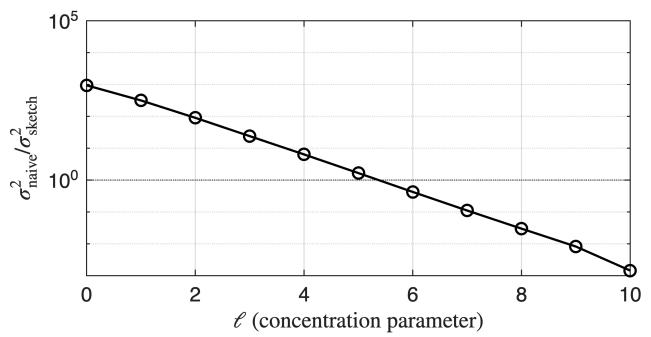

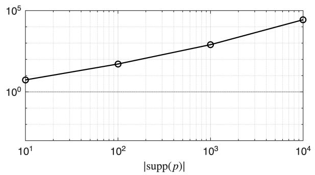  
Figure 3: Both panels show the same ratio, of the per-pair variance $\sigma _ { \mathrm { n a i v e } } ^ { 2 } = p ^ { T } d ^ { \circ 2 } p - Q ^ { 2 }$ (where we use the Hadamard product notation $( d ^ { \circ 2 } ) _ { j k } = d _ { j k } ^ { 2 } )$ of the pair-sampling estimator of §1.2 to the measured per-direction variance $\begin{array} { r } { \sigma _ { \mathrm { s k e t c h } } ^ { 2 } = \mathrm { V a r } ( q ^ { \mathrm { g e o } } ) = \frac { \pi ^ { 2 } } { 4 } \mathrm { V a r } ( s ^ { 2 } ) } \end{array}$ , for $n = 1 0 0 0 0$ points on $S ^ { m - 1 }$ for $m = 2 ^ { 1 0 }$ . Left: p dense and random, with the geometry concentrated by forcing $2 ^ { \ell }$ coordinates positive as in Figure 2. Right: taking geometry and p uniform $\mathrm { o n } \le n$ points. The panels do not agree at their common corner $( \ell = 0$ versus $| \mathrm { s u p p } ( p ) | = 1 0 0 0 0 )$ because p is dense random on the left and exactly uniform on the right.

In the amortized setting, we can obtain uniform bounds on Q.

Lemma 4.1. Let d be the Euclidean metric on n distinct fixed points $\boldsymbol { x } ^ { ( j ) } ~ \in ~ \mathbb { R } ^ { m }$ and $( \bar { d } _ { N } ) _ { j k } : =$ $\begin{array} { r } { \sqrt { \frac \pi 2 } \frac { 1 } { N } \sum _ { i = 1 } ^ { N } \left| u ^ { ( i ) T } ( x ^ { ( j ) } - x ^ { ( k ) } ) \right| } \end{array}$ for $u ^ { ( i ) } \sim \mathcal { N } ( 0 , I _ { m } )$ and $i \in [ N ]$ . For

$$
N \geq \frac { \pi } { \varepsilon ^ { 2 } } \log \frac { 2 { \binom { n } { 2 } } } { \delta } ,
$$

we have $\left| ( \bar { d } _ { N } ) _ { j k } - d _ { j k } \right| \leq \varepsilon d _ { j k }$ for all j, k with probability at least $1 - \delta ;$ consequently, $| \bar { Q } _ { N } ^ { \mathrm { e u c } } ( p ) / Q ( p ) - 1 | \leq \varepsilon$ with probability at least $1 - \delta$ , independently of p.

A similar result for spherical geodesic distance is easier, but weaker:

Lemma 4.2. Let θ be the spherical geodesic metric on n distinct fixed points in $S ^ { m - 1 }$ , satisfying $\theta _ { j k } = $ $\begin{array} { r } { \frac { \pi } { 2 } \mathbb { E } _ { u } ( 1 - s _ { j } ( u ) s _ { k } ( u ) ) } \end{array}$ for u $\sim \mathcal { N } ( 0 , I )$ . For

$$
N \geq \frac { \pi ^ { 2 } } { 2 \varepsilon ^ { 2 } } \log \frac { 2 { \binom { n } { 2 } } } { \delta } ,
$$

$\begin{array} { r } { \left| \bar { Q } _ { N _ { \cdot } } ^ { \mathrm { g e o } } ( p ) - Q ( p ) \right| \le \varepsilon \cdot ( 1 - \| p \| ^ { 2 } ) \le \varepsilon } \end{array}$ with probability 1 − δ.

## 4.2 Control variates

Recall the idea of a control variate [1]. Here, this means a random variable W that is strongly correlated with $\bar { Q } _ { N } ^ { \bullet }$ (here • is a placeholder indicating the Euclidean or spherical geodesic cases) and has a known mean $W _ { * } .$ . In this context, consider the estimator $\bar { Q } _ { N } ^ { \bullet } + \alpha ( \bar { W } - W _ { * } )$ , where W¯ is the sample mean of W. This estimator is also an unbiased estimator of $Q ,$ and its variance is $\mathrm { V a r } ( \bar { Q } _ { N } ^ { \bullet } ) + \alpha ^ { 2 } \cdot \mathrm { V a r } ( \bar { W } ) +$ $2 \alpha \cdot \mathrm { C o v } ( \bar { Q } _ { N } ^ { \bullet } , \bar { W } )$ This variance is minimized for $\alpha = - \mathrm { C o v } ( \bar { Q } _ { N } ^ { \bullet } , \bar { W } ) / \mathrm { V a r } ( \bar { W } )$ ), with minimum

$$
\mathrm { V a r } ( \bar { Q } _ { N } ^ { \bullet } ) \cdot \left( 1 - \frac { \mathrm { C o v } ( \bar { Q } _ { N } ^ { \bullet } , \bar { W } ) ^ { 2 } } { \mathrm { V a r } ( \bar { Q } _ { N } ^ { \bullet } ) \mathrm { V a r } ( \bar { W } ) } \right) .
$$

The optimal α is estimated by sample (co)variances; leave-one-out cross-validation avoids a $O ( 1 / N )$ bias that could be otherwise inherited from dependence on W¯ and manifests in analogues of Figures 1 and 2 for large ℓ (not shown).

A useful control variate for the Euclidean distance quadratic entropy is

$$
\begin{array} { r l } & { w ^ { \mathrm { e u c } } ( u ) : = \displaystyle \sum _ { j , k } p _ { j } p _ { k } ( u ^ { T } x ^ { ( j ) } - u ^ { T } x ^ { ( k ) } ) ^ { 2 } } \\ & { \qquad = 2 \displaystyle \sum _ { j } p _ { j } ( u ^ { T } x ^ { ( j ) } ) ^ { 2 } - 2 \left( u ^ { T } \sum _ { j } p _ { j } x ^ { ( j ) } \right) ^ { 2 } . } \end{array}
$$

To see this, note that

$$
\mathbb { E } _ { u } ( [ u ^ { T } x ] ^ { 2 } ) = \mathbb { E } _ { u } ( x ^ { T } u u ^ { T } x ) = x ^ { T } \mathbb { E } _ { u } ( u u ^ { T } ) x = \| x \| ^ { 2 }
$$

and

$$
\mathbb { E } _ { u } \left( \left[ u ^ { T } \sum _ { j } p _ { j } x ^ { ( j ) } \right] ^ { 2 } \right) = \left. \sum _ { j } p _ { j } x ^ { ( j ) } \right. ^ { 2 } ,
$$

so that $\mathbb { E } _ { u } w ^ { \mathrm { e u c } }$ is given by the squared Euclidean quadratic entropy (4), which is computable in $O ( m n )$ versus O(mnN). Figure 1 shows its application in blue.

A control variate for the geodesic distance case is $\begin{array} { r } { w ^ { \mathrm { g e o } } ( u ) : = ( \hat { u } ^ { T } \sum _ { j } p _ { j } x ^ { ( j ) } ) ^ { \smile } } \end{array}$ , which has $\begin{array} { r l } { \mathbb { E } _ { u } w ^ { \mathrm { g e o } } } & { { } = } \end{array}$ $\begin{array} { r } { \frac { 1 } { m } \| \sum _ { j } p _ { j } x ^ { ( j ) } \| ^ { 2 } } \end{array}$ . However, this is less efective for concentrated data than in the Euclidean case, because in that regime working with signs alone throws away too much information. Figure 2 shows its application in blue.

## 5 EXAMPLES AT SCALE

As a demonstration/experiment of the sort familiar at smaller scales in the bibliometric and scientometric literature [39, 30, 7, 29], we compute quadratic entropies for a Markov chain corresponding to a uniform random walk of citations on ogbn-arxiv, a citation digraph of $n = 1 6 9 3 4 3$ arXiv papers with 1166243 arcs, $m = 1 2 8$ skip-gram title/abstract features per node, and a label for the arXiv subject class [20]. We write $p _ { ( 1 ) } ^ { ( j ) }$ for the one-step distribution of the jth paper, treated as a column vector; we place unit mass on $j$ for any papers without citations. We also consider the spherical geodesic metric on (normalized) features. If $\chi _ { j }$ papers cite $j$ uniformly across subject classes, then the corresponding Shannon entropy is $H = \log \chi _ { j }$ , whereas $Q = ( 1 - 1 / \chi _ { j } ) \bar { \theta } _ { j }$ , where $\bar { \theta } _ { j }$ is the average distance between distinct citing papers: this measures dispersion, and not just cardinality. This also suggests a normal ization that controls for citation counts and focuses on geometry.

Figure 5 is the result of applying this normalization to the data in Figure 4. In both figures, we stratify the citation count χ into the bands $\chi \in [ 1 0 , 2 0 ) , [ 2 0 , 5 0 )$ [50, 100), and [100, 500), so that the Shannon entropy H is approximately constant within each band while we allow the quadratic entropy to vary. Meanwhile, we consider other proxies for the dispersion of papers readership: the number of distinct arXiv subject areas represented among citing papers (the left panels of Figures 4 and $5 )$ and the Shannon entropy of the citing papers (the right panels of the same figures). We discard cells with fewer than 30 papers. The figures show that the feature-based quadratic entropy does capture a ground-truth (defined by arXiv subject area) semantic dispersion of citing papers, while controlling for the citation count $\chi .$ Finally, Table 1 shows some specific papers with particularly wide or narrow reach.

Storing the $n \times n$ distance matrix for $n = 1 6 9 3 4 3$ requires roughly 57 GB even in half precision, so the dense evaluation of $Q$ is impractical at this scale. By comparison, a bit-packed sign sketch requires roughly a thousand times less storage for $N = 2 5 0 0$ . Using the approach of §3.4 with $N = 2 5 0 0$ random directions took just 3.76 seconds for the one-time sketch construction on a MacBook Pro (M3 Max), while all n entropies were computed in 18.6 seconds (this was fast because of sparsity). By comparison, just load ing the dataset took 1.82 seconds. (Virtually identical results were obtained even faster for N = 100.)

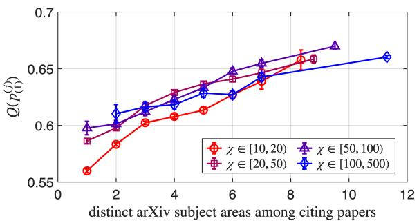

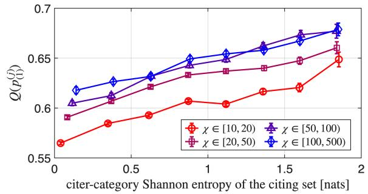  
Figure 4: Top: (estimated) quadratic entropies of the (one-step) distribution $p _ { ( 1 ) } ^ { ( j ) }$ of citing papers for various bands of citation count $\chi$ and as a function of distinct subject areas of citing papers. Bottom: the same quadratic entropies, but as functions of Shannon entropy for the arXiv class distribution. Note that d is agnostic to the arXiv class data and only depends on the skip-gram feature vectors for titles and abstracts.

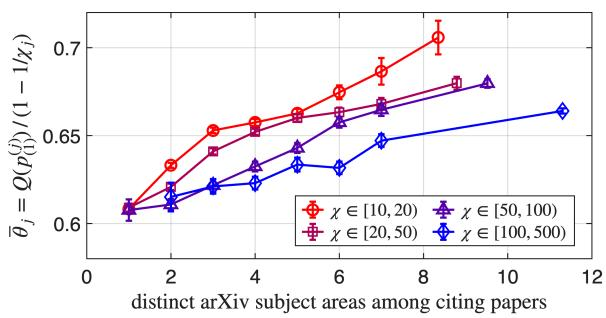

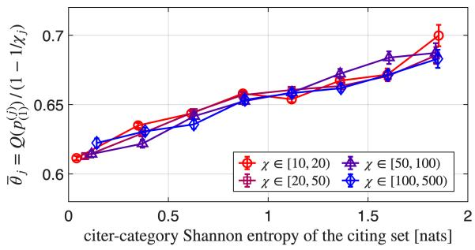  
Figure 5: As in Figure 4, but normalized.

Table 1: Narrow- and broad-reach exemplars at three target degrees. For each of two papers in the three target bands [18, 22), [38, 42), and [75, 85), we show the paper’s degree $\chi ,$ the number $\#$ of distinct arXiv categories of citing papers, the cross-field fraction $f _ { \times }$ , the quadratic entropy $Q$ , the primary class, arXiv identifier, and the beginning of the title. The broad-reach papers are respectively a survey, a tutorial, and a design document for the popular scikit-learn library.
<table><tr><td> $\chi$ </td><td> $\#$ </td><td> $f _ { \times }$ </td><td>Q</td><td>class</td><td></td><td>arXiv ID</td><td>title start</td></tr><tr><td>20</td><td>1</td><td>0.00</td><td>0.40</td><td></td><td>cs.IT</td><td>1705.06350</td><td>Wireless Information and Power Transfer over an AWGN channel.. .</td></tr><tr><td>21</td><td>11</td><td>0.86</td><td>0.65</td><td></td><td>cs.LG</td><td>cs/0011033</td><td>Web Mining Research: A Survey</td></tr><tr><td>41</td><td>1</td><td>0.00</td><td>0.45</td><td></td><td>cs.IT</td><td>0905.3109</td><td>Interference Channels with Source Cooperation</td></tr><tr><td>38</td><td>14</td><td>0.76</td><td>0.65</td><td></td><td>cs.LG</td><td>1404.1100</td><td>A Tutorial on Principal Component Analysis</td></tr><tr><td>78</td><td>1</td><td>0.00</td><td></td><td>0.56</td><td>cs.CV</td><td>1803.09786</td><td>Transferable Joint Attribute-Identity Deep Learning for Unsupervised...</td></tr><tr><td>78</td><td>18</td><td>0.55</td><td>0.72</td><td></td><td>cs.LG</td><td>1309.0238</td><td>API design for machine learning software: experiences from the scikit-...</td></tr></table>

## 5.1 A larger-scale example

A second example on the ogbn-mag dataset of $n =$ 736389 papers [20] exhibits dispersion across multiple levels in Figure 6 and extremely concentrated and dispersed fields and institutions in Figure 7. Dispersion across multiple levels of aggregation (e.g., papers, authors, coauthors, fields, and institutions) in Figure 6 is computed very economically from a single sketch by placing uniform distributions on the relevant supports. The single large matrix multiplication involved took under two seconds.

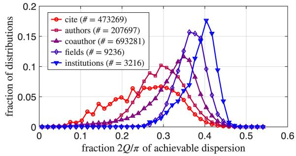  
Figure 6: Quadratic entropy/dispersion increases with the level of aggregation.

## AI use statement

In this work, I used generative AI tools (specifically, Claude Opus 5) to help develop conceptual frameworks, formulate mathematical claims, provide critical ingredients for proving mathematical claims, assist in the writing of proofs, propose or refine hypotheses, design or provide feedback on research methodology or experiments, implement methods, support qualitative and thematic data analysis, and interpret results.

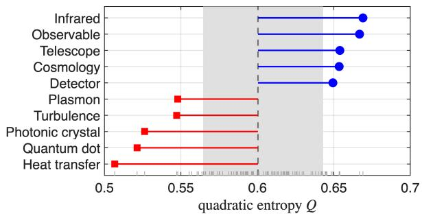

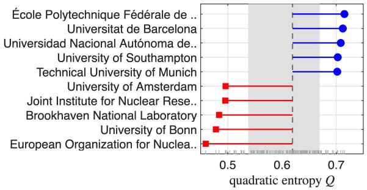  
Figure 7: Extremes of concentration (red) and dispersion (blue) among (top) fields at MAG concept hierarchy level 2 and (bottom) institutions, both with 5000 or more papers, with labels provided by OpenAlex [31]. Concentration appears to be correlated with specialization (at least at extremes).

I have not used generative AI tools to generate synthetic data sets, assist with translation, or clean and reformat datasets.

Additionally, I used generative AI tools to create or modify scientific figures or images, suggest experimental parameters, create or edit software code, draft parts of a research paper, summarize or analyse existing literature, discover research topics or identify gaps, brainstorming, sourcing/searching for information, identify relevant literature, and format references.

I have reviewed all AI-assisted work, by rewriting proofs from scratch, introspecting and plotting Python code outputs in MATLAB, verifying other feedback and products at time of production, and performing independent analyses of data and results.

In particular, all of the writing and responsibility is mine.

## References

[1] Søren Asmussen and Peter W Glynn. Stochastic Simulation: Algorithms and Analysis. Springer, 2007.

[2] Cl´ement Bonet, Paul Berg, Nicolas Courty, Fran¸cois Septier, Lucas Drumetz, and Minh Tan Pham. Spherical sliced-Wasserstein. In International Conference on Learning Representations, 2023.

[3] Nicolas Bonneel, Julien Rabin, Gabriel Peyr´e, and Hanspeter Pfister. Sliced and Radon-Wasserstein barycenters of measures. Journal of Mathematical Imaging and Vision, 51(1):22–45, 2015.

[4] St´ephane Boucheron, G´abor Lugosi, and Pascal Massart. Concentration Inequalities: A Nonasymptotic Theory of Independence. Oxford, 2013.

[5] Siwan Boufadene, Fran¸cois-Xavier Vialard, and Jean Feydy. Fast large deformation matching with the energy distance kernel. arXiv preprint arXiv:2505.03342, 2025.

[6] Jop Bri¨et, Fernando M´ario de Oliveira Filho, and Frank Vallentin. Grothendieck inequalities for semidefinite programs with rank constraint. arXiv preprint arXiv:1011.1754, 2010.

[7] Lorenzo Cassi, River Champeimont, Wilfriedo Mescheba, and Elisabeth De Turckheim. Analysing institutions interdisciplinarity by extensive use of Rao-Stirling diversity index. PLoS One, 12(1):e0170296, 2017.

[8] Moses S Charikar. Similarity estimation techniques from rounding algorithms. In ACM Symposium on Theory of Computing, 2002.

[9] Youngmin Cho and Lawrence Saul. Kernel methods for deep learning. In Advances in Neural Information Processing Systems, 2009.

[10] Krzysztof M Choromanski, Mark Rowland, and Adrian Weller. The unreasonable efectiveness of structured random orthogonal embeddings. In Advances in Neural Information Processing Systems, 2017.

[11] Petros Drineas, Michael W Mahoney, and Nello Cristianini. On the Nystr¨om method for approximating a Gram matrix for improved kernel-based learning. Journal of Machine Learning Research, 6(12), 2005.

[12] Bernd G¨artner and Jiri Matousek. Approximation Algorithms and Semidefinite Programming. Springer, 2012.

[13] Alex Gittens and Michael Mahoney. Revisiting the Nystr¨om method for improved large-scale machine learning. In International Conference on Machine Learning, 2013.

[14] Michel X Goemans and David P Williamson. Improved approximation algorithms for maximum cut and satisfiability problems using semidefinite programming. Journal of the ACM (JACM), 42(6):1115–1145, 1995.

[15] Arthur Gretton, Karsten M Borgwardt, Malte J Rasch, Bernhard Sch¨olkopf, and Alexander Smola. A kernel two-sample test. Journal of Machine Learning Research, 13(1):723–773, 2012.

[16] Johannes Hertrich. Fast kernel summation in high dimensions via slicing and Fourier transforms. SIAM Journal on Mathematics of Data Science, 6(4):1109–1137, 2024.

[17] Johannes Hertrich, Tim Jahn, and Michael Quellmalz. Fast summation of radial kernels via QMC slicing. In International Conference on Learning Representations, 2025.

[18] Johannes Hertrich, Christian Wald, Fabian Altekr¨uger, and Paul Hagemann. Generative sliced MMD flows with Riesz kernels. In International Conference on Learning Representations, 2024.

[19] Poul Hjorth, Petr Lison˘ek, Steen Markvorsen, and Carsten Thomassen. Finite metric spaces of strictly negative type. Linear Algebra and its Applications, 270(1-3):255–273, 1998.

[20] Weihua Hu, Matthias Fey, Marinka Zitnik, Yux iao Dong, Hongyu Ren, Bowen Liu, Michele Catasta, and Jure Leskovec. Open graph benchmark: datasets for machine learning on graphs. In Advances in Neural Information Processing Systems, 2020.

[21] Steve Huntsman. Peeling metric spaces of strict negative type. In Topology, Algebra, and Geometry in Data Science, 2025.

[22] Soheil Kolouri, Kimia Nadjahi, Umut Simsekli, and Shahin Shahrampour. Generalized sliced distances for probability distributions. arXiv preprint arXiv:2002.12537, 2020.

[23] Tom Leinster. Entropy and Diversity. Cambridge, 2021.

[24] Tom Leinster and Christina A Cobbold. Measuring diversity: the importance of species similarity. Ecology, 93(3):477–489, 2012.

[25] Russell Lyons. Distance covariance in metric spaces. The Annals of Probability, pages 3284– 3305, 2013.

[26] Yueming Lyu. Spherical structured feature maps for kernel approximation. In International Conference on Machine Learning, 2017.

[27] Mark W Meckes. Positive definite metric spaces. Positivity, 17(3):733–757, 2013.

[28] Marina Munkhoeva, Yermek Kapushev, Evgeny Burnaev, and Ivan Oseledets. Quadrature-based features for kernel approximation. In Advances in Neural Information Processing Systems, 2018.

[29] Minsu Park, Suman Kalyan Maity, Stefan Wuchty, and Dashun Wang. Interdisciplinary papers supported by disciplinary grants garner deep and broad scientific impact. PNAS Nexus, 5(3):pgag057, 2026.

[30] Alan L Porter and Ismael Rafols. Is science becoming more interdisciplinary? measuring and mapping six research fields over time. Scientometrics, 81(3):719–745, 2009.

[31] Jason Priem, Heather Piwowar, and Richard Orr. Openalex: A fully-open index of scholarly works, authors, venues, institutions, and concepts. arXiv preprint arXiv:2205.01833, 2022.

[32] Michael Quellmalz, Robert Beinert, and Gabriele Steidl. Sliced optimal transport on the sphere. Inverse Problems, 39(10):105005, 2023.

[33] Ali Rahimi and Benjamin Recht. Random features for large-scale kernel machines. In Advances in Neural Information Processing Systems, 2007.

[34] C Radhakrishna Rao. Convexity properties of entropy functions and analysis of diversity. In Inequalities in Statistics and Probability, volume 5, pages 68–78. Institute of Mathematical Statistics, 1984.

[35] Isaac J Schoenberg. Metric spaces and positive definite functions. Transactions of the American Mathematical Society, 44(3):522–536, 1938.

[36] Isaac J Schoenberg. Positive definite functions on spheres. Duke Mathematical Journal, 9:96–108, 1942.

[37] Bernhard Sch¨olkopf and Alexander J Smola. Learning With Kernels: Support Vector Machines, Regularization, Optimization, and Beyond. MIT, 2002.

[38] Dino Sejdinovic, Bharath Sriperumbudur, Arthur Gretton, and Kenji Fukumizu. Equivalence of distance-based and RKHS-based statistics in hypothesis testing. The Annals of Statistics, 41(5):2263–2291, 2013.

[39] Andy Stirling. A general framework for analysing diversity in science, technology and society. Journal of the Royal Society Interface, 4(15):707, 2007.

[40] G´abor J Sz´ekely and Maria L Rizzo. Energy statistics: A class of statistics based on distances. Journal of Statistical Planning and Inference, 143(8):1249–1272, 2013.

[41] Larry Wasserman. All of Statistics: A Concise Course in Statistical Inference. Springer, 2004.

[42] Christopher Williams and Matthias Seeger. Using the Nystr¨om method to speed up kernel machines. In Advances in Neural Information Processing Systems, 2000.

[43] Tianbao Yang, Yu-Feng Li, Mehrdad Mahdavi, Rong Jin, and Zhi-Hua Zhou. Nystr¨om method vs random Fourier features: A theoretical and empirical comparison. In Advances in Neural Information Processing Systems, 2012.

[44] Felix Xinnan X Yu, Ananda Theertha Suresh, Krzysztof M Choromanski, Daniel N Holtmann-Rice, and Sanjiv Kumar. Orthogonal random features. In Advances in Neural Information Processing Systems, 2016.

[45] Ji Zhao and Deyu Meng. FastMMD: ensemble of circular discrepancy for eficient two-sample test. Neural Computation, 27(6):1345–1372, 2015.

## CHECKLIST

1. For all models and algorithms presented, check if you include:

(a) A clear description of the mathematical setting, assumptions, algorithm, and/or model. [Yes; this is the backbone of the paper]

(b) An analysis of the properties and complexity (time, space, sample size) of any algorithm. [Yes; ibid.]

(c) (Optional) Anonymized source code, with specification of all dependencies, including external libraries. [Yes: Python and MAT-LAB, the latter just for checking and plotting results]

2. For any theoretical claim, check if you include:

(a) Statements of the full set of assumptions of all theoretical results. [Yes]

(b) Complete proofs of all theoretical results. [Yes]

(c) Clear explanations of any assumptions. [Yes]

3. For all figures and tables that present empirical results, check if you include:

(a) The code, data, and instructions needed to reproduce the main experimental results (either in the supplemental material or as a URL). [Yes, the actual code to produce the figure, even if redundant]

(b) All the training details (e.g., data splits, hyperparameters, how they were chosen). [Not Applicable]

(c) A clear definition of the specific measure or statistics and error bars (e.g., with respect to the random seed after running experiments multiple times). [Yes]

(d) A description of the computing infrastructure used. (e.g., type of GPUs, internal cluster, or cloud provider). [Yes, a MacBook Pro (M3 Max), mentioned in the text]

4. If you are using existing assets (e.g., code, data, models) or curating/releasing new assets, check if you include:

(a) Citations of the creator If your work uses existing assets. [Yes, for OGBN]

(b) The license information of the assets, if applicable. [Not Applicable]

(c) New assets either in the supplemental material or as a URL, if applicable. [Not Applicable]

(d) Information about consent from data providers/curators. [Not Applicable]

(e) Discussion of sensible content if applicable, e.g., personally identifiable information or offensive content. [Not Applicable: arXiv paper information does not plausibly fall under this]

5. If you used crowdsourcing or conducted research with human subjects, check if you include:

(a) The full text of instructions given to participants and screenshots. [Not Applicable]

(b) Descriptions of potential participant risks, with links to Institutional Review Board (IRB) approvals if applicable. [Not Applicable]

(c) The estimated hourly wage paid to participants and the total amount spent on participant compensation. [Not Applicable]

# Eficient quadratic entropy with distance sketches: Supplementary Materials

## A PROOFS

## A.1 Proof of Proposition 3.1

Proof. By standard algebra of Gaussian random variables (see, e.g., §14.3 of [41]), $u ^ { T } x \sim { \mathcal { N } } ( 0 , \| x \| ^ { 2 } )$ . Using the substitution $t = z ^ { 2 } / 2 \| \bar { x } \| ^ { 2 }$ , we have

$$
\begin{array} { r l } & { \mathbb { E } _ { u } | u ^ { T } x | = \displaystyle \frac { 2 } { \sqrt { 2 \pi \| x \| ^ { 2 } } } \int _ { 0 } ^ { \infty } z e ^ { - z ^ { 2 } / 2 \| x \| ^ { 2 } } \ d z } \\ & { \quad \quad = \displaystyle \frac { 2 \| x \| ^ { 2 } } { \sqrt { 2 \pi \| x \| ^ { 2 } } } \int _ { 0 } ^ { \infty } e ^ { - t } \ d t = \sqrt { \displaystyle \frac { 2 } { \pi } } \cdot \| x \| , } \end{array}
$$

which establishes (6). It follows that

$$
\begin{array} { r l } & { \boldsymbol { p } ^ { T } d \boldsymbol { p } = \sum _ { j , k } p _ { j } p _ { k } \| \boldsymbol { x } ^ { ( j ) } - \boldsymbol { x } ^ { ( k ) } \| } \\ & { \qquad = \sqrt { \frac { \pi } { 2 } } \cdot \mathbb { E } _ { u } \sum _ { j , k } p _ { j } p _ { k } | \boldsymbol { u } ^ { T } \boldsymbol { x } ^ { ( j ) } - \boldsymbol { u } ^ { T } \boldsymbol { x } ^ { ( k ) } | , } \end{array}
$$

which is precisely (7).

## A.2 Proof of Proposition 3.2

Proof. Because the $v _ { j }$ are sorted,

$$
\begin{array} { r l } & { \sum _ { j , k } w _ { j } w _ { k } | v _ { j } - v _ { k } | = 2 \sum _ { j < k } w _ { j } w _ { k } \big ( v _ { k } - v _ { j } \big ) } \\ & { = 2 \sum _ { j < k } w _ { j } w _ { k } v _ { k } - 2 \sum _ { j < k } w _ { j } w _ { k } v _ { j } } \\ & { = 2 \sum _ { k } w _ { k } v _ { k } \sum _ { j = 1 } ^ { k - 1 } w _ { j } - 2 \sum _ { j } w _ { j } v _ { j } \sum _ { k = j + 1 } ^ { n } w _ { k } } \\ & { = 2 \sum _ { j } w _ { j } v _ { j } \left( \sum _ { k = 1 } ^ { j - 1 } w _ { k } - \sum _ { k = j + 1 } ^ { n } w _ { k } \right) } \\ & { = 2 \sum _ { j } w _ { j } v _ { j } \left( 2 \left[ \sum _ { k = 1 } ^ { j - 1 } w _ { k } \right] + w _ { j } - \sum _ { i = 1 } ^ { n } w _ { i } \right) } \end{array}
$$

where the last equality follows from $\begin{array} { r } { \sum _ { k = j + 1 } ^ { n } w _ { k } = ( \sum _ { k = 1 } ^ { n } w _ { k } ) - w _ { j } - \sum _ { k = 1 } ^ { j - 1 } w _ { k } } \end{array}$

## A.3 Proof of Theorem 3.3

Proof. To start, write $x ^ { ( j k ) } : = x ^ { ( j ) } - x ^ { ( k ) }$ : now

$$
\begin{array} { r l } & { \| q ^ { \mathrm { e u c } } ( u ) - q ^ { \mathrm { e u c } } ( u ^ { \prime } ) \| } \\ & { = \sqrt { \frac { \pi } { 2 } } \left| \displaystyle \sum _ { j , k } p _ { j } p _ { k } \left( \left| u ^ { T } ( x ^ { ( j k ) } ) \right| - \left| u ^ { \prime T } ( x ^ { ( j k ) } ) \right| \right) \right| } \\ & { \le \sqrt { \frac { \pi } { 2 } } \displaystyle \sum _ { j , k } p _ { j } p _ { k } \left| \left| u ^ { T } ( x ^ { ( j k ) } ) \right| - \left| u ^ { \prime T } ( x ^ { ( j k ) } ) \right| \right| } \\ & { \le \sqrt { \frac { \pi } { 2 } } \displaystyle \sum _ { j , k } p _ { j } p _ { k } \left| \left( u - u ^ { \prime } \right) ^ { T } ( x ^ { ( j k ) } ) \right| } \\ & { \le \| u - u ^ { \prime } \| \cdot \sqrt { \frac { \pi } { 2 } } \displaystyle \sum _ { j , k } p _ { j } p _ { k } \left\| x ^ { ( j k ) } \right\| } \\ & { = \| u - u ^ { \prime } \| \cdot \sqrt { \frac { \pi } { 2 } } \cdot Q . } \end{array}
$$

where the second inequality is from the reverse triangle inequality $\left| \left\| a \right\| - \left\| b \right\| \right| \leq \left\| a - b \right\|$ and the third is Cauchy-Schwarz. So $q ^ { \mathrm { e u c } }$ is Lipschitz with constant $\leq \sqrt { \frac { \pi } { 2 } } \cdot Q$

The Lipschitz property lifts to $\begin{array} { r } { \bar { Q } _ { N } ^ { \mathrm { e u c } } ( u ^ { ( 1 ) } , \dots u ^ { ( N ) } ) : = \frac { 1 } { N } \sum _ { i = 1 } ^ { N } q ^ { \mathrm { e u c } } ( u ^ { ( i ) } ) \colon } \end{array}$

$$
\left| \bar { Q } _ { N } ^ { \mathrm { e u c } } ( u ^ { ( 1 ) } , \ldots u ^ { ( N ) } ) - \bar { Q } _ { N } ^ { \mathrm { e u c } } ( u ^ { \prime ( 1 ) } , \ldots u ^ { \prime ( N ) } ) \right|
$$

$$
\leq \frac { 1 } { N } \sum _ { i = 1 } ^ { N } \left| q ^ { \mathrm { e u c } } ( u ^ { ( i ) } ) - q ^ { \mathrm { e u c } } ( u ^ { \prime ( i ) } ) \right|
$$

$$
\leq \frac { Q } { N } \sqrt { \frac { \pi } { 2 } } \sum _ { i = 1 } ^ { N } \Big \| u ^ { ( i ) } - u ^ { \prime ( i ) } \Big \|
$$

$$
\leq Q { \sqrt { \frac { \pi } { 2 N } } } \left( \sum _ { i = 1 } ^ { N } \left\| u ^ { ( i ) } - u ^ { \prime ( i ) } \right\| ^ { 2 } \right) ^ { 1 / 2 }
$$

where the last inequality is Cauchy-Schwarz. We abbreviate this as

$$
\bigl | \bar { Q } _ { N } ^ { \mathrm { e u c } } ( U ) - \bar { Q } _ { N } ^ { \mathrm { e u c } } ( U ^ { \prime } ) \bigr | \leq Q \sqrt { \frac { \pi } { 2 N } } \cdot \| U - U ^ { \prime } \|
$$

where we can regard $U \sim \mathcal { N } ( 0 , I _ { N m } )$ . Since $\mathbb { E } _ { U } \bar { Q } _ { N } ^ { \mathrm { e u c } } = Q$ , the Gaussian concentration inequality (Theorem 5.6 of [4]) now yields

$$
\begin{array} { r } { \mathbb { P } \left( \left| \bar { Q } _ { N } ^ { \mathrm { e u c } } - Q \right| \ge t \right) \le 2 \exp ( - N t ^ { 2 } / \pi Q ^ { 2 } ) . } \end{array}
$$

Substituting $\varepsilon : = t / Q$ yields (10).

Meanwhile, for $v \in \mathbb { R } ^ { m }$ and $u \sim \mathcal { N } ( 0 , I _ { m } )$ we have $\boldsymbol { u } ^ { T } \boldsymbol { v } \sim \mathcal { N } ( 0 , \lVert \boldsymbol { v } \rVert ^ { 2 } )$ , so $\mathbb { E } | u ^ { T } v | = { \sqrt { 2 / \pi } } \cdot \| v \|$ by (6) while $\mathbb { E } [ ( u ^ { T } v ) ^ { 2 } ] = \| v \| ^ { 2 }$ . This gives $\mathrm { V a r } ( | u ^ { T } v | ) = ( 1 - 2 / \pi ) \| v \| ^ { 2 }$ . Since Var $\begin{array} { r } { \cdot ( \sum _ { j } \beta _ { j } Y ^ { ( j ) } ) \leq \left( \sum _ { j } | \beta _ { j } | \sqrt { \operatorname { V a r } ( Y ^ { ( j ) } ) } \right) ^ { 2 } } \end{array}$ by Minkowski’s $L ^ { 2 }$ inequality,

$$
\begin{array} { r l } {  { \mathrm { V a r } ( q ^ { \alpha ( \alpha ) } ) = \mathrm { V a r } ( \sqrt { \frac { \pi } { 2 } } \cdot \sum _ { j , k } p _ { j } p _ { k } | u ^ { T } ( x ^ { ( j ) } - x ^ { ( k ) } ) | ) } } \\ & { \leq \frac { \pi } { 2 } ( \sum _ { j , k } p _ { j } p _ { k } \sqrt { \mathrm { V a r } | u ^ { T } ( x ^ { ( j ) } - x ^ { ( k ) } ) | } ) ^ { 2 } } \\ & { = \frac { \pi } { 2 } ( \sum _ { j , k } p _ { j } p _ { k } d _ { j k } \sqrt { 1 - \frac { 2 } { \pi } } ) ^ { 2 } } \\ & { = ( \frac { \pi } { 2 } - 1 ) Q ^ { 2 } } \end{array}
$$

and $\mathrm { V a r } ( \bar { Q } _ { N } ^ { \mathrm { e u c } } ) = \mathrm { V a r } ( q ^ { \mathrm { e u c } } ) / N$

## A.4 Proof of Proposition 3.5

Proof. $\begin{array} { r } { s _ { j } \in \{ \pm 1 \} , \ s _ { j } ^ { 2 } = 1 \mathrm { a n d } ( s _ { j } - s _ { k } ) ^ { 2 } = 2 ( 1 - s _ { j } s _ { k } ) , \ s \circ \| \psi ( j ) - \psi ^ { ( k ) } \| _ { L ^ { 2 } ( S ^ { m - 1 } ) } ^ { 2 } = \frac { \pi } { 4 } \mathbb { E } _ { u } \left( [ s _ { j } - s _ { k } ] ^ { 2 } \right) = \frac { \pi } { 2 } ( 1 - s _ { j } ) ^ { 2 } , } \end{array}$ $\mathbb { E } _ { u } [ s _ { j } s _ { k } ] ) = \theta _ { j k }$ , where the last equality is (14). □

## A.5 Proof of Theorem 3.7

Proof. 4

$$
\begin{array} { r l } & { \boldsymbol { p } ^ { T } d \boldsymbol { p } = \displaystyle \sum _ { j , k } p _ { j } p _ { k } \theta _ { j k } } \\ & { \quad \quad = \frac { \pi } { 2 } \sum _ { j , k } p _ { j } p _ { k } \big ( 1 - \mathbb { E } _ { u } \big [ s _ { j } s _ { k } \big ] \big ) } \\ & { \quad \quad = \displaystyle \frac { \pi } { 2 } \big ( 1 - \mathbb { E } _ { u } \big [ \sum _ { j , k } p _ { j } p _ { k } s _ { j } s _ { k } \big ] \big ) } \\ & { \quad \quad = \displaystyle \frac { \pi } { 2 } \big ( 1 - \mathbb { E } _ { u } \big [ s ^ { 2 } \big ] \big ) . } \end{array}
$$

## A.6 Proof of Theorem 3.8

Proof. $q ^ { \mathrm { g e o } } \in [ 0 , \pi / 2 ]$ , so Hoefding’s inequality (Theorem 2.8 of [4]) immediately gives (17) and also $\mathrm { V a r } ( q ^ { \mathrm { g e o } } ) \leq$ $\pi ^ { 2 } / 1 6$ . Meanwhile,

$$
\mathrm { V a r } ( \bar { Q } _ { N } ^ { \mathrm { g e o } } ) = \frac { 1 } { N ^ { 2 } } \mathrm { V a r } \left( \sum _ { i = 1 } ^ { N } q ^ { \mathrm { g e o } } ( u ^ { ( i ) } ) \right) = \frac { 1 } { N } \mathrm { V a r } ( q ^ { \mathrm { g e o } } ) .
$$

Combining this with Va $\cdot ( q ^ { \mathrm { g e o } } ) \leq \pi ^ { 2 } / 1 6$ yields (18).

## A.7 Proof of Proposition 3.9

Proof. Since $s _ { j } ( u ) \in \{ \pm 1 \}$ , the convex combination $s ( u ) \in [ - 1 , 1 ]$ , so $s ^ { 2 } \in [ 0 , 1 ]$ and therefore $\mathbb { E } _ { u } ( s ^ { 4 } ) \le \mathbb { E } _ { u } ( s ^ { 2 } )$ It follows that

$$
\operatorname { V a r } ( s ^ { 2 } ) = \operatorname { \mathbb { E } } _ { u } ( s ^ { 4 } ) - [ \mathbb { E } _ { u } ( s ^ { 2 } ) ] ^ { 2 } \leq \operatorname { \mathbb { E } } _ { u } ( s ^ { 2 } ) \cdot [ 1 - \operatorname { \mathbb { E } } _ { u } ( s ^ { 2 } ) ] .
$$

Meanwhile, $\mathbb { E } _ { u } ( s ^ { 2 } ) = 1 - 2 Q / \pi$ by Theorem 3.7, so

$$
\mathrm { V a r } ( s ^ { 2 } ) \le ( 1 - 2 Q / \pi ) \cdot 2 Q / \pi .
$$

Since $\begin{array} { r } { q ^ { \mathrm { g e o } } ( u ) = \frac { \pi } { 2 } ( 1 - s ( u ) ^ { 2 } ) } \end{array}$ , we have

$$
\operatorname { V a r } ( q ^ { \mathrm { g e o } } ) = { \frac { \pi ^ { 2 } } { 4 } } \mathrm { V a r } ( s ^ { 2 } ) \leq { \frac { \pi } { 2 } } Q - Q ^ { 2 } .
$$

The second inequality in the proposition follows because $\mu ( 1 - \mu ) \leq 1 / 4$ for $\mu \in [ 0 , 1 ]$ . (Alternatively, note that $\textstyle { \frac { \pi } { 2 } } Q - Q ^ { 2 }$ is maximized over $Q \in [ 0 , \pi / 2 ]$ at $Q = \pi / 4$ , where it equals $\pi ^ { 2 } / 1 6 . )$ □

## A.8 Proof of Lemma 3.11

Proof. The overarching idea is to apply Theorem 3.10 with $\nu : = N \sigma ^ { 2 }$ and $c : = R / 3$ . Now (21) is satisfied. To see that (22) is satisfied, fix an integer $\ell \geq 3$ . Now $( \zeta _ { i } ) _ { + } ^ { \ell } \leq R ^ { \ell - 2 } \zeta _ { i } ^ { 2 }$ since $\ell - 2 \geq 1$ and $0 \leq ( \zeta _ { i } ) _ { + } \leq R$ . Taking expectations and applying (21) gives that NE $\begin{array} { r } { \left\lceil ( \zeta _ { i } ) _ { + } ^ { \ell } \right\rceil \leq R ^ { \ell - 2 } \nu , } \end{array}$ so (22) follows once $\begin{array} { r } { R ^ { \ell - 2 } \nu \leq \frac { \ell ! } { 2 } \nu \left( R / 3 \right) ^ { \ell - 2 } , } \end{array}$ Equivalently, (22) follows once $2 \cdot 3 ^ { \ell - 2 } \leq \ell !$ . This inequality holds for $\ell \geq 3$ , with equality at $\ell = 3$ (which is where the constant term in $c = R / 3$ comes from).

It now remains to pick a good value of τ and produce a two-sided bound. Towards the first of these goals, Theorem 3.10 controls $\textstyle S : = \sum _ { i = 1 } ^ { N } \zeta _ { i }$ at the τ-dependent level $\sqrt { 2 \nu \tau } + c \tau$ . To control it at the prescribed level $N r ,$ set

$$
\tau ^ { * } : = \frac { N r ^ { 2 } } { 2 \sigma ^ { 2 } + \frac { 2 R } { 3 } r } = \frac { ( N r ) ^ { 2 } } { 2 \left( \nu + c N r \right) } ;
$$

$$
\vartheta : = \frac { \nu } { \nu + c N r } = \frac { \sigma ^ { 2 } } { \sigma ^ { 2 } + \frac { R } { 3 } r } \in ( 0 , 1 ] ,
$$

so that $c N r / ( \nu + c N r ) = 1 - \vartheta$ , and hence $\sqrt { 2 \nu \tau ^ { * } } = N r \sqrt { \vartheta }$ and $\begin{array} { r } { c \tau ^ { * } = \frac { N r } { 2 } \left( 1 - \vartheta \right) } \end{array}$ . Completing the square,

$$
\begin{array} { l } { \displaystyle \sqrt { 2 \nu \tau ^ { * } } + c \tau ^ { * } = N r \left( \sqrt { \vartheta } + \displaystyle \frac { 1 - \vartheta } { 2 } \right) } \\ { \displaystyle = N r \left( 1 - \displaystyle \frac { ( \sqrt { \vartheta } - 1 ) ^ { 2 } } { 2 } \right) \leq N r . } \end{array}
$$

Thus $S \geq N r \Rightarrow S \geq \sqrt { 2 \nu \tau ^ { * } } + c \tau ^ { * }$ , so (23) applies at $\tau = \tau ^ { * }$ . The result follows by a union bound and sign symmetry of the hypothesis $| \zeta _ { i } | \le R$ □

## A.9 Proof of Theorem 3.12

Proof. Set $\zeta _ { i } : = q ^ { \mathrm { g e o } } ( u ^ { ( i ) } ) - Q$ , so the $\zeta _ { i }$ are IID and centered with $\begin{array} { r } { \frac { 1 } { N } \sum _ { i = 1 } ^ { N } \zeta _ { i } = \bar { Q } _ { N } ^ { \mathrm { g e o } } - Q } \end{array}$ . We supply the two inputs R and $\sigma ^ { 2 }$ that Lemma 3.11 requires. Since $s _ { j } ( u ) \in \{ \pm 1 \}$ , the convex combination $\begin{array} { r } { s ( u ) = \sum _ { i } p _ { j } s _ { j } ( u ) } \end{array}$ is in $[ - 1 , 1 ] , \mathrm { s o } | s ( u ) | \leq 1$ and $\begin{array} { r } { q ^ { \mathrm { g e o } } ( u ) = \frac { \pi } { 2 } \left( 1 - s ( u ) ^ { 2 } \right) \in [ 0 , \pi / 2 ] } \end{array}$ . Similarly, $Q = \mathbb { E } _ { u } q ^ { \mathrm { g e o } } \in [ 0 , \pi / 2 ]$ , so $| \zeta _ { i } | \le \pi / 2 = : R$ Meanwhile, Proposition 3.9 gives $\mathbb { E } [ \tilde { \zeta } _ { i } ^ { 2 } ] = \mathrm { V a r } ( q ^ { \mathrm { g e o } } ) \le \pi Q / 2 - Q ^ { 2 } = : \sigma ^ { 2 }$

Now with $r = \varepsilon Q$

$$
\begin{array} { c } { { \displaystyle \frac { N r ^ { 2 } } { 2 \sigma ^ { 2 } + 2 r R / 3 } = \frac { N \varepsilon ^ { 2 } Q ^ { 2 } } { 2 \left( \pi Q / 2 - Q ^ { 2 } \right) + \pi \varepsilon Q / 3 } } } \\ { { = \displaystyle \frac { N \varepsilon ^ { 2 } Q } { \pi - 2 Q + \pi \varepsilon / 3 } \geq \frac { N \varepsilon ^ { 2 } Q } { \pi \left( 1 + \varepsilon / 3 \right) } . } } \end{array}
$$

Meanwhile, $\begin{array} { r } { | \frac { 1 } { N } \sum _ { i = 1 } ^ { N } \zeta _ { i } | \geq r } \end{array}$ is the same as $\left| \bar { Q } _ { N } ^ { \mathrm { g e o } } / Q - 1 \right| \geq \varepsilon$ . These yield (25).

## A.10 Proof of Lemma 4.1

Proof. Write $g _ { i } : = u ^ { ( i ) T } ( x ^ { ( j ) } - x ^ { ( k ) } ) / d _ { j k }$ , so that $( g _ { 1 } , \ldots , g _ { N } ) \sim \mathcal { N } ( 0 , I _ { N } )$ are IID. Since by Proposition 3.1, $d _ { j k } = \sqrt { \textstyle { \frac { \pi } { 2 } } } \cdot \mathbb { E } _ { u } | u ^ { T } ( x ^ { ( j ) } - \dot { x } ^ { ( k ) } ) |$ for $u \sim \mathcal { N } ( 0 , I _ { m } )$ , we have

$$
\begin{array} { l } { ( \bar { d } _ { N } ) _ { j k } = \sqrt { \displaystyle \frac { \pi } { 2 } } \frac { 1 } { N } \sum _ { i = 1 } ^ { N } \left| u ^ { ( i ) T } ( x ^ { ( j ) } - x ^ { ( k ) } ) \right| } \\ { = \sqrt { \displaystyle \frac { \pi } { 2 } } d _ { j k } \cdot \frac { 1 } { N } \sum _ { i = 1 } ^ { N } | g _ { i } | \to d _ { j k } . } \end{array}
$$

Further writing here $\begin{array} { r } { F ( g ) \equiv F _ { N } ( g _ { 1 } , \dots , g _ { N } ) : = \frac { 1 } { N } \sum _ { i = 1 } ^ { N } | g _ { i } | } \end{array}$ , we have that

$$
| F ( g ) - F ( g ^ { \prime } ) | \leq \frac { 1 } { N } \sum _ { i = 1 } ^ { N } | g _ { i } - g _ { i } ^ { \prime } | \leq \frac { 1 } { \sqrt { N } } \| g - g ^ { \prime } \| ,
$$

where the second inequality is from Cauchy-Schwarz. The Gaussian concentration inequality (Theorem 5.6 of [4]) now yields $\begin{array} { r } { \mathbb { P } ( | F - \mathbb { E } F | \ge t ) \le 2 \exp ( - N t ^ { 2 } / 2 ) } \end{array}$ . Setting $\varepsilon : = t \cdot \sqrt { \pi / 2 }$ and using $( \bar { d } _ { N } ) _ { j k } / d _ { j k } = \sqrt { \pi / 2 } \cdot F  1$ we get in turn

$$
\mathbb { P } \left( \left| \frac { ( \bar { d } _ { N } ) _ { j k } } { d _ { j k } } - 1 \right| \geq \varepsilon \right) \leq 2 \exp \left( - \frac { N \varepsilon ^ { 2 } } { \pi } \right) .
$$

Now a union bound over the n unordered pairs (j, k) gives that

$$
\mathbb { P } \left( \operatorname* { m a x } _ { j , k } \left. \frac { ( \bar { d } _ { N } ) _ { j k } } { d _ { j k } } - 1 \right. \geq \varepsilon \right) \leq 2 { \binom { n } { 2 } } \cdot \exp \left( - \frac { N \varepsilon ^ { 2 } } { \pi } \right) ,
$$

which also implies that

$$
\begin{array} { r l } & { \left| \bar { Q } _ { N } ^ { \mathrm { e u c } } ( p ) - Q ( p ) \right| = \displaystyle \left| \sum _ { j , k } p _ { j } p _ { k } \left[ ( \bar { d } _ { N } ) _ { j k } - d _ { j k } \right] \right| } \\ & { ~ \leq \varepsilon \displaystyle \sum _ { j , k } p _ { j } p _ { k } d _ { j k } = \varepsilon Q ( p ) , } \end{array}
$$

so

$$
\mathbb { P } \left( \left| \frac { \bar { Q } _ { N } ^ { \mathrm { e u c } } ( p ) } { Q ( p ) } - 1 \right| \geq \varepsilon \right) \leq 2 { \binom { n } { 2 } } \cdot \exp \left( - \frac { N \varepsilon ^ { 2 } } { \pi } \right) .
$$

The result follows by solving for $N$

## A.11 Proof of Lemma 4.2

Proof. The random variable $\begin{array} { r } { \frac { \pi } { 2 } ( 1 - s _ { j } ( u ) s _ { k } ( u ) ) } \end{array}$ takes values in $\{ 0 , \pi \}$ with mean $\theta _ { j k }$ . Using notation along the lines of the preceding proof, Hoefding’s inequality yields $\begin{array} { r } { \mathbb { P } ( | ( \bar { \theta } _ { N } ) _ { j k } - \theta _ { j k } | \ge \varepsilon ) \stackrel {  } { \le } 2 \exp ( - 2 N \varepsilon ^ { 2 } / \pi ^ { 2 } ) } \end{array}$ . A union bound gives in turn

$$
\mathbb { P } \left( \operatorname* { m a x } _ { j , k } \left| ( \bar { \theta } _ { N } ) _ { j k } - \theta _ { j k } \right| \geq \varepsilon \right) \leq 2 { \binom { n } { 2 } } \cdot \exp \left( - \frac { 2 N \varepsilon ^ { 2 } } { \pi ^ { 2 } } \right)
$$

which is bounded above by δ. Finally, $\begin{array} { r } { \left| \bar { Q } _ { N } ^ { \mathrm { g e o } } - Q \right| \le \sum _ { j , k } p _ { j } p _ { k } \left| ( \bar { \theta } _ { N } ) _ { j k } - \theta _ { j k } \right| } \end{array}$ , so if max $\begin{array} { r } { \mathfrak { c } _ { j \neq k } \left| ( \bar { \theta } _ { N } ) _ { j k } - \theta _ { j k } \right| \leq \varepsilon , } \end{array}$ then $\begin{array} { r } { \left| \bar { Q } _ { N } ^ { \mathrm { g e o } } - Q \right| \le \varepsilon \sum _ { j \neq k } p _ { j } p _ { k } = \varepsilon \cdot ( 1 - \| p \| ^ { 2 } ) \le \varepsilon } \end{array}$ □