# Embedding-Bias in Conditional Independence Testing

Nikolaj Thams   
Department of Mathematical Sciences   
University of Copenhagen   
Copenhagen, Denmark

thams@math.ku.dk

Anton Rask Lundborg Department of Mathematical Sciences University of Copenhagen Copenhagen, Denmark

arl@math.ku.dk

## Abstract

To test conditional independence of X and Y given a text or an image Z, one conditions on an embedding ψ(Z) in place of Z. The embedded test is valid if Z is independent of X or of Y given ψ(Z), which cannot be confirmed from data, and when this fails, the rejection probability under the null hypothesis can tend to one. We study this failure, and show that focusing on a specific form of dependence relaxes what the embedding must retain. For a residual correlation test inspired by the Generalised Covariance Measure, validity only requires that the parts of E[X | Z] and E[Y | Z] missed by $\mathbb { E } [ X \mid \psi ( Z ) ]$ and $\mathbb { E } [ Y \mid \psi ( Z ) ]$ are uncorrelated. Otherwise, we treat the discarded information as an omitted variable. Under the null hypothesis, the bias equals the absolute correlation of the missed parts times the geometric mean of two partial $R ^ { 2 }$ values. This identity yields a robust test valid under a declared tolerance for the geometric mean, which, like a sensitivity parameter, is not identified from the data. On synthetic data and text embeddings, the robust test holds its level approximately. On text generated by a language model, under an exact null hypothesis, every embedding, even the generator’s own states, biases the embedded test. Keywords: conditional independence testing, sensitivity analysis, embeddings, text data, generalised covariance measure

## 1 Introduction

Tests of conditional independence (CI) are a basic tool of statistics (Shah and Peters, 2020). They underpin tests of variable significance (Lundborg et al., 2024), the evaluation of predictors for fairness (Hardt et al., 2016) and robustness (Peters et al., 2016), and constraint-based causal discovery (Spirtes et al., 2000). In many current applications, the tested variables are text, images, or other unstructured objects, and the test is run on embeddings of those objects instead (Veitch et al., 2020; Kook and Lundborg, 2024; Simnacher et al., ${ 2 0 2 6 } \mathrm { b } , \mathrm { a } )$ testing $H _ { 0 } : X \perp \perp Y \mid Z$ by testing the surrogate hypothesis $H _ { 0 } ^ { \psi } : \psi _ { X } ( X ) \perp \perp \psi _ { Y } ( Y ) \mid \psi _ { Z } ( Z )$ for embeddings ψ<sub>X</sub>, ψ<sub>Y</sub> and $\psi _ { Z }$

Even a perfect test of $H _ { 0 } ^ { \psi }$ may not result in a valid test of $H _ { 0 }$ . The problem lies not with embedding X or $Y ;$ testing $H _ { 0 }$ via a test of $\psi _ { X } ( X )$ ⊥⊥ $\psi _ { Y } ( Y ) ~ | ~ Z ~$ is valid, though possibly less powerful than a direct test of $H _ { 0 }$ . Embedding the conditioning variable $Z ,$ however, does not generally preserve conditional independence. In this paper, we formalize and quantify this potential loss of validity. Only the embedding of $Z$ matters for validity, so we absorb $\psi _ { X }$ and $\psi _ { Y }$ into X and Y and write $H _ { 0 } ^ { \psi }$ for $X \perp \perp Y \mid \psi ( Z )$ , with $\psi : = \psi _ { Z }$

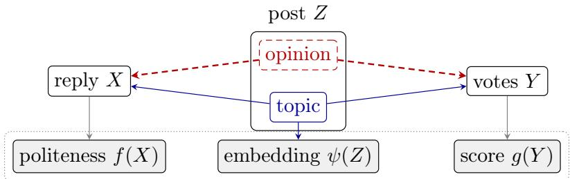  
Figure 1: The conceptual example: the topic and the opinion of a post Z both influence its reply X and its reception Y, and the embedded test uses $f ( X ) , g ( Y )$ , and $\psi ( Z )$ Since $\psi ( Z )$ represents the topic but not the opinion, the dashed path through the opinion stays open and X and Y are dependent given $\psi ( Z )$ although X ⊥⊥ $Y \mid Z $

Example 1.1. Consider an observational study of online discussions. Let Z be an original post, X be a reply, and Y the votes the reply receives. Whether the style of a reply is unassociated with its reception other than through the content of the post is the hypothesis $X \perp \perp Y \mid Z$ . To test it, one reduces the reply to a summary such as its politeness f(X) and the votes to a score $g ( Y )$ , and replaces the post by an embedding $\psi ( Z )$ from a pretrained encoder (Figure 1). Suppose that the encoder represents the topic of a post well but its opinion poorly, and that the opinion influences both the politeness of the replies and their votes. Then the parts of $f ( X )$ and $g ( Y )$ that are not explained by ψ(Z) are correlated even if $X \perp \perp Y \mid Z h o l d s ,$ , and every consistent test on the embedded variables rejects with probability tending to one.

Existing embedded tests apply a standard CI test to the embedded variables and rely on the embedding being suficient. Simnacher et al. (2026a) show that this is valid if X ⊥⊥ $Z \mid$ $\psi ( Z )$ or $Y \perp \perp Z \mid \psi ( Z )$ (their Theorem 3) or, for tests of conditional mean independence of Y , ${ \mathrm { i f ~ } } \mathbb { E } [ Y \mid Z ] = \mathbb { E } [ Y \mid \psi ( Z ) ]$ (their Theorem 14). A pretrained encoder, trained for a generic objective, has no reason to retain what Z says about X or Y, and Simnacher et al. (2026a, Section 3.2) themselves consider even the mean condition implausible for learned embeddings and assess it by simulation. Nor can suficiency be checked from the data. It is itself a conditional (mean) independence hypothesis given $\psi ( Z )$ , for which no test is uniformly valid with nontrivial power (Shah and Peters, 2020; Neykov et al., 2021; Lundborg et al., 2024); a richer model of $Z$ can only show that $\psi ( Z )$ misses part of $\mathbb { E } [ X \mid Z ]$

We examine how embedded tests fail without strict suficiency, and how far the failure can be contained, in two steps. First, we choose a target that requires less of the embedding. In particular, we consider a family of conditional association measures that includes the targets of commonly used CI tests. Each measure is the largest absolute correlation between residuals of transformations of X and of Y after adjusting for the conditioning variable, and the classes of transformations determine which departures from $H _ { 0 }$ it captures. For the absolute correlation $\rho _ { \psi }$ of the residuals of X and Y after adjusting for $\psi ( Z )$ , it sufices that the parts of $\mathbb { E } [ X \mid Z ]$ and $\mathbb { E } [ Y \mid Z ]$ that $\psi ( Z )$ misses are uncorrelated, for instance because $\psi ( Z )$ retains one of the two. However the test has no power against dependence that leaves the residuals given $Z$ uncorrelated.

Second, as in sensitivity analysis for unmeasured confounding (Rosenbaum, 2002; Imbens, 2003; Cinelli and Hazlett, 2020; Chernozhukov et al., 2022), we treat the information that ψ discards as an omitted variable and quantify its efect. Under $H _ { 0 } , \rho _ { \psi } =$ $\vert \lambda \vert \sqrt { R _ { \psi } ^ { 2 } ( X ) R _ { \psi } ^ { 2 } ( Y ) }$ , where $R _ { \psi } ^ { 2 } ( X )$ is the share of the residual variance of X given $\psi ( Z )$ that Z would explain and λ is the correlation of the two missed parts. This yields a test that is valid, whatever the correlation of the discarded parts, under a declared bound on $\sqrt { R _ { \psi } ^ { 2 } ( X ) R _ { \psi } ^ { 2 } ( Y ) }$ . Because the discarded information is part of the observed $Z ,$ one can use data and any richer embedding to lower-bound $R _ { \psi } ^ { 2 } ( X )$ and $R _ { \psi } ^ { 2 } ( Y )$

Our contributions are as follows. In Section 2, we define a family of measures of conditional dependence and bound how embedding Z changes them. In Section 3, we treat the discarded information as an omitted variable and derive a test that remains valid under a declared bound on the resulting bias. In Section 4, we evaluate the bias on synthetic and real data. On text generated by a language model under an exact null hypothesis, every embedding we tried biases the plain embedded test.

## 1.1 Related work

CI testing and embeddings. Besides covariance measures (Shah and Peters, 2020; Scheidegger et al., 2022; Lundborg et al., 2024; Kook and Lundborg, 2024), CI tests use kernel mean embeddings (Zhang et al., 2011; Bergen et al., 2026), the conditional law of X given Z (Candès et al., 2018; Berrett et al., 2020; Tansey et al., 2022), local permutations (Kim et al., 2022), or generative models (Zhang et al., 2024; Ren et al., 2025).

Simnacher et al. (2026a), discussed above, develop CI tests for embedded text. A number of works (Keith et al., 2020; Feder et al., 2022; Egami et al., 2022) treat suficiency as an untestable assumption, to be argued from domain knowledge and examined by sensitivity analysis or simulation. In our work, we quantify how a lack of suficiency invalidates the test.

Sensitivity analysis. Sensitivity analysis bounds the bias that an unobserved confounder can cause (Rosenbaum, 2002; Imbens, 2003). Cinelli and Hazlett (2020) parametrize it by partial $R ^ { 2 }$ values in linear regression, Chernozhukov et al. (2022) extend the bounds to linear functionals of a nonparametric regression, and Veitch and Zaveri (2020) apply them post hoc; Appendix B.1 compares our identity with these bounds. Conditioning on $\psi ( Z )$ is conditioning on a coarsening of the confounder, for which Ogburn and VanderWeele (2012, 2013) give bias-attenuation results.

## 1.2 Notation

Let $( X , Y , Z ) \sim P .$ , where X, Y, and Z take values in measurable spaces $x , y ,$ , and ${ \mathcal { Z } } ,$ for example spaces of texts. We observe n independent copies $( X _ { i } , Y _ { i } , Z _ { i } )$ . We write E, Var, and Cov for moments under $P , \mathbb { E } [ U \mid T ]$ for the conditional expectation of $U$ given $T ,$ , and U ⊥⊥ $T \mid S$ for conditional independence of $U$ and $T$ given S. Equalities between random variables hold almost surely.

The hypothesis of interest is $H _ { 0 } \colon X \ \bot \ Y \ | \ Z$ . An embedding $\psi \colon \mathcal { Z }  \mathcal { V } _ { : }$ , with $\nu$ a measurable space such as $\mathbb { R } ^ { d }$ , is a fixed measurable map, pretrained on external data or fitted on a split of the sample that is not used for testing, and id denotes the identity on

Z. Every quantity below is indexed by the transformation of $Z$ that is conditioned on. For a real-valued, square-integrable function $f$ of $( X , Z )$ and a measurable $\psi _ { ; }$ , including $\psi = \mathrm { i d }$ ， let

$$
\sigma _ { \psi } ^ { 2 } ( f ) : = \operatorname { \mathbb { E } } \left[ ( f - \operatorname { \mathbb { E } } [ f \mid \psi ( Z ) ] ) ^ { 2 } \right] = \operatorname { \mathbb { E } } [ \operatorname { V a r } ( f \mid \psi ( Z ) ) ]
$$

be the residual variance of $f = f ( \boldsymbol { X } , \boldsymbol { Z } )$ after adjusting for $\psi ( Z )$ . When X is real-valued and $f ( x , z ) = x$ , we write X in place of $f ,$ , as in $\sigma _ { \psi } ^ { 2 } ( X )$ . Throughout, when a definition or result is symmetric in $( X , f )$ and $( Y , g )$ , we state it for X and f only. All proofs are in Appendix A.

## 2 Measures of conditional dependence

## 2.1 Definition and examples

In general, neither $H _ { 0 }$ nor $H _ { 0 } ^ { \psi }$ implies the other. Rather than comparing the two hypotheses, we compare measures of conditional dependence given $Z$ and given $\psi ( Z )$ , which vanish under $H _ { 0 }$ and under $H _ { 0 } ^ { \psi }$ , respectively. Write $P _ { X , Z }$ and $P _ { Y , Z }$ for the distributions of $( X , Z )$ and of $( Y , Z )$ , and let $\bar { \mathcal { F } } \subseteq L ^ { 2 } ( P _ { X , Z } )$ and $\mathcal { G } \subseteq L ^ { 2 } ( P _ { Y , Z } )$ be classes of real-valued transformations of $( X , Z )$ and of $( Y , Z )$ ; we write f for $f ( X , Z )$ . A test that conditions on $\psi ( Z )$ can only use transformations that depend on $Z$ through $\psi ( Z )$ . We therefore let $\mathcal { F } _ { \psi }$ be the $f \in { \mathcal { F } }$ for which there exists an h such that $f ( x , z ) = h ( x , \psi ( z ) )$ , and $\mathcal { G } _ { \psi }$ likewise. We remark that ${ \mathcal { F } } _ { \mathrm { i d } } = { \mathcal { F } }$ . If $\mathcal { F }$ is a class of functions of x alone, such as $\{ ( x , z ) \mapsto x \}$ , then $\mathcal { F } _ { \psi } = \mathcal { F }$

Definition 2.1 (Measure of conditional dependence). For $f \in \mathcal { F } _ { \psi }$ and $g \in { \mathcal { G } } _ { \psi }$ , let

$$
\rho _ { \psi } ( f , g ) : = \frac { | \mathbb { E } [ \operatorname { C o v } ( f , g \mid \psi ( Z ) ) ] | } { \sigma _ { \psi } ( f ) \sigma _ { \psi } ( g ) } ,
$$

with ρ<sub>ψ</sub>(f, g) := 0 if $\sigma _ { \psi } ( f ) = 0$ or $\sigma _ { \psi } ( g ) = 0$ , and let $\begin{array} { r } { \rho _ { \psi } ( \mathcal { F } , \mathcal { G } ) : = \operatorname* { s u p } _ { f \in \mathcal { F } _ { \psi } , g \in \mathcal { G } _ { \psi } } \rho _ { \psi } ( f , g ) } \end{array}$ with $\rho _ { \psi } ( \mathcal { F } , \mathcal { G } ) : = 0$ if $\mathcal { F } _ { \psi }$ or $\mathcal { G } _ { \psi }$ is empty.

The measure $\rho _ { \psi } ( f , g )$ is the absolute correlation of the residuals $f \mathrm { ~ - ~ } \mathbb { E } [ \ : f \mid \psi ( \boldsymbol { Z } ) ]$ and $g \mathrm { ~ - ~ } \mathbb { E } [ g \mathrm { ~ } | \mathrm { ~ } \psi ( Z ) ]$ . Under $H _ { 0 } ^ { \psi } , \ f \ \bot \ l \ p \ | \ \psi ( Z )$ for $f \in \mathcal { F } _ { \psi }$ and $g \in { \mathcal { G } } _ { \psi }$ , since f is a function of $( X , \psi ( Z ) )$ and $g$ one of $( Y , \psi ( Z ) )$ , so $\rho _ { \psi } ( f , g ) = 0$ for all f and g, and $\rho _ { \psi } ( \mathcal { F } , \mathcal { G } ) = 0$ for every choice of classes. The classes determine which forms of conditional dependence the measure captures, and larger classes capture more.

Example 2.2. $( a ) \ I f \ { \mathcal { F } } = L ^ { 2 } ( P _ { X , Z } )$ and $\mathcal { G } = L ^ { 2 } ( P _ { Y , Z } )$ , then $\rho _ { \psi } ( \mathcal { F } , \mathcal { G } ) = 0$ if and only if $X \perp \perp Y \mid \psi ( Z )$

(b) $I f Y$ is real-valued with $\mathbb { E } [ Y ^ { 2 } ] < \infty , \mathcal { F } = L ^ { 2 } ( P _ { X , Z } )$ , and ${ \mathcal { G } } = \{ ( y , z ) \mapsto y \}$ , then $\rho _ { \psi } ( \mathcal { F } , \mathcal { G } ) = 0$ if and only $i f \operatorname { \mathbb { E } } [ Y \mid X , \psi ( Z ) ] = \operatorname { \mathbb { E } } [ Y \mid \psi ( Z ) ]$

(c) If X and Y are real-valued with max $\{ \mathbb { E } [ X ^ { 2 } ] , \mathbb { E } [ Y ^ { 2 } ] \} < \infty , \ \mathcal { F } = \{ ( x , z ) \mapsto x \}$ , and $\mathcal { G } = \{ ( y , z ) \mapsto y \}$ , then $\rho _ { \psi } ( \mathcal { F } , \mathcal { G } ) = | \mathbb { E } [ \operatorname { C o v } ( X , Y \mid \psi ( Z ) ) ] | / ( \sigma _ { \psi } ( X ) \sigma _ { \psi } ( Y ) )$ , the absolute correlation of the residuals $X - \mathbb { E } [ X \mid \psi ( Z ) ]$ and $Y - \mathbb { E } [ Y \mid \psi ( Z ) ]$

In particular, if the measure in (a) vanishes, so does that in (b), and if that in (b) vanishes, so does that in (c). Reducing a text-valued or vector-valued tested variable to a real-valued summary $f ( X )$ , such as a coordinate of an embedding, is the choice ${ \mathcal { F } } = \{ ( x , z ) \mapsto f ( x ) \}$ This choice will be our main focus in applications, but we develop our theory for general ${ \mathcal { F } } , { \mathcal { G } }$

## 2.2 Coarsening the conditioning variable

For $f \in \mathcal { F } _ { \psi }$ , let $\Delta _ { \psi } ( f ) : = \mathbb { E } [ f \mid Z ] - \mathbb { E } [ f \mid \psi ( Z ) ]$ be the part of the regression of $f$ on Z that the embedding does not represent. Since $f - \mathbb { E } [ f \mid \psi ( Z ) ] = ( f - \mathbb { E } [ f \mid Z ] ) + \Delta _ { \psi } ( f )$ with uncorrelated summands, $\sigma _ { \psi } ^ { 2 } ( f ) = \sigma _ { \mathrm { i d } } ^ { 2 } ( f ) + \mathbb { E } [ \Delta _ { \psi } ( f ) ^ { 2 } ]$ . Define

$$
R _ { \psi } ^ { 2 } ( f ) : = \frac { \mathbb { E } [ \Delta _ { \psi } ( f ) ^ { 2 } ] } { \sigma _ { \psi } ^ { 2 } ( f ) } = 1 - \frac { \sigma _ { \mathrm { i d } } ^ { 2 } ( f ) } { \sigma _ { \psi } ^ { 2 } ( f ) } \in [ 0 , 1 ] ,
$$

the partial $R ^ { 2 }$ of $f$ with respect to $\psi ( Z ) . \mathrm { ~ I f ~ } \sigma _ { \psi } ( f ) = 0 .$ , then $f = \mathbb { E } [ f \mid \psi ( Z ) ]$ , so $\Delta _ { \psi } ( f ) = 0$ 2 and we set $R _ { \psi } ^ { 2 } ( f ) : = 0$ . Let $\lambda _ { \psi } ( f , g ) : = \mathrm { C o r r } ( \Delta _ { \psi } ( f ) , \Delta _ { \psi } ( g ) )$ , with $\lambda _ { \psi } ( f , g ) : = 0$ under degeneracy. The following result relates $\rho _ { \psi }$ to $\rho _ { \mathrm { i d } }$

Theorem 2.3 (Bias bound). For all $f \in \mathcal { F } _ { \psi }$ and $g \in { \mathcal { G } } _ { \psi }$

$$
\left. \rho _ { \psi } ( f , g ) - \sqrt { ( 1 - R _ { \psi } ^ { 2 } ( f ) ) ( 1 - R _ { \psi } ^ { 2 } ( g ) ) } \rho _ { \mathrm { i d } } ( f , g ) \right. \leq | \lambda _ { \psi } ( f , g ) | \sqrt { R _ { \psi } ^ { 2 } ( f ) R _ { \psi } ^ { 2 } ( g ) } .
$$

Under $H _ { 0 } , \rho _ { \psi } ( f , g ) = | \lambda _ { \psi } ( f , g ) | \sqrt { R _ { \psi } ^ { 2 } ( f ) R _ { \psi } ^ { 2 } ( g ) } .$

The factor $\sqrt { ( 1 - R _ { \psi } ^ { 2 } ( f ) ) ( 1 - R _ { \psi } ^ { 2 } ( g ) ) }$ shrinks $\rho _ { \mathrm { i d } } ( f , g )$ since the residuals given $\psi ( Z )$ have larger variance than those given $Z .$ The right-hand side of the inequality in Theorem 2.3 is the absolute correlation of the discarded parts times the geometric mean of the two partial $R ^ { 2 }$ values. It vanishes if the embedding discards nothing about $f$ or about $^ { g , }$ or if the discarded parts are uncorrelated. Taking suprema over the classes yields the following corollary.

Corollary 2.4 (Bias bound for classes). Let $R _ { \psi } ^ { 2 } ( { \mathcal { F } } ) : = \operatorname* { s u p } _ { f \in { \mathcal { F } } _ { \psi } } R _ { \psi } ^ { 2 } ( f )$ , with $R _ { \psi } ^ { 2 } ( { \mathcal { F } } ) : = 0$ if $\mathcal { F } _ { \psi }$ is empty.

(i) $\rho _ { \psi } ( \mathcal { F } , \mathcal { G } ) \leq \rho _ { \mathrm { i d } } ( \mathcal { F } , \mathcal { G } ) + \sqrt { R _ { \psi } ^ { 2 } ( \mathcal { F } ) R _ { \psi } ^ { 2 } ( \mathcal { G } ) } .$

(ii) Under $H _ { 0 } ,$

$$
\rho _ { \psi } ( \mathcal { F } , \mathcal { G } ) = \operatorname* { s u p } _ { f \in \mathcal { F } _ { \psi } , g \in \mathcal { G } _ { \psi } } | \lambda _ { \psi } ( f , g ) | \sqrt { R _ { \psi } ^ { 2 } ( f ) R _ { \psi } ^ { 2 } ( g ) } ,
$$

so $\rho _ { \psi } ( \mathcal { F } , \mathcal { G } ) = 0$ if and only if $\lambda _ { \psi } ( f , g ) = 0$ for all $f \in \mathcal { F } _ { \psi }$ and $g \in { \mathcal { G } } _ { \psi }$

By (i), whether or not $H _ { 0 }$ holds, an embedded measure exceeding $\sqrt { R _ { \psi } ^ { 2 } ( \mathcal { F } ) R _ { \psi } ^ { 2 } ( \mathcal { G } ) }$ implies dependence given $Z$ of at least the excess. By (ii), under $H _ { 0 }$ the embedding creates no dependence exactly when the discarded parts are uncorrelated for all pairs, which a vanishing partial $R ^ { 2 }$ ensures but does not require.

Example 2.2 (continued). Under $H _ { 0 }$ , Corollary $\it { 2 . 4 ( i ) }$ gives $\rho _ { \psi } ( \mathcal { F } , \mathcal { G } ) \leq \sqrt { R _ { \psi } ^ { 2 } ( \mathcal { F } ) R _ { \psi } ^ { 2 } ( \mathcal { G } ) }$ Since $R _ { \psi } ^ { 2 } ( { \mathcal { F } } )$ is a supremum, this bound tightens from (a) to $( c )$ , which orders the three measures by what they require of the embedding. By Lemma A.1, $R _ { \psi } ^ { 2 } ( L ^ { 2 } ( P _ { X , Z } ) ) = 0$ if and only if X ⊥⊥ $Z \mid \psi ( Z )$ , and $R _ { \psi } ^ { 2 } ( \{ ( x , z ) \mapsto x \} ) = 0$ if and only if ψ is mean-suficient for $X$ , that is, $\mathbb { E } [ X \mid Z ] = \mathbb { E } [ X \mid \overset { \prime } { \psi } ( Z ) ]$ . Under $H _ { 0 }$ , the measure in $( a )$ therefore vanishes if $X \perp \perp Z \mid \psi ( Z )$ or $Y \perp \perp Z \mid \psi ( Z )$ , the condition of Simnacher et al. (2026a, Theorem 3); that in (b) if X ⊥⊥ $Z \mid \psi ( Z )$ or ψ is mean-suficient for $Y _ { i }$ , the latter being the condition of Simnacher et al. (2026a, Theorem $I 4 ) ,$ ; and that in $( c ) \ i f \ \psi$ is mean-suficient for X or for Y. By Corollary $\it { 2 . 4 } ( i i )$ , these conditions are suficient but not necessary.

The gap between these conditions can be strict, as the following example shows for the measures in Example 2.2(a) and (c).

Example 2.5 (Discarded parts and their correlation). Let $Z = ( Z _ { 1 } , \ldots , Z _ { 4 } )$ have independent standard normal coordinates, $\psi ( Z ) = Z _ { 1 }$ , and

$$
\begin{array} { l } { { X = Z _ { 1 } + a Z _ { 2 } + Z _ { 4 } \varepsilon _ { X } , } } \\ { { \nonumber } } \\ { { Y = Z _ { 1 } + b \big ( \lambda Z _ { 2 } + \sqrt { 1 - \lambda ^ { 2 } } Z _ { 3 } \big ) + Z _ { 4 } \varepsilon _ { Y } , } } \end{array}
$$

with $a , b \geq 0 , \lambda \in [ - 1 , 1 ]$ , and independent standard normal noise, so that $H _ { 0 }$ holds. Given $Z _ { 1 }$ , X and Y share the scale $Z _ { 4 }$ , so $\operatorname { C o v } ( ( X - Z _ { 1 } ) ^ { 2 } , ( Y - Z _ { 1 } ) ^ { 2 } \mid Z _ { 1 } ) = 2 ( 1 + a ^ { 2 } b ^ { 2 } \lambda ^ { 2 } ) > 0$ ; hence $H _ { 0 } ^ { \psi }$ fails and the measure in Example ${ \mathcal { Q } } . { \mathcal { Q } } ( a )$ is positive, for all $a , b ,$ and λ. $F o r a = b = 0$ , ψ is mean-suficient for X and Y although not suficient, and the measure in Example ${ \it 2 . 2 ( c ) }$ is zero. For $a , b > 0$ , ψ is not even mean-suficient: $R _ { \psi } ^ { 2 } ( X ) = a ^ { 2 } / ( 1 { + } a ^ { 2 } ) , R _ { \psi } ^ { 2 } ( Y ) = b ^ { 2 } / ( 1 { + } b ^ { 2 } )$ , and the discarded parts $\Delta _ { \psi } ( X ) = a Z _ { 2 }$ and $\Delta _ { \psi } ( Y ) = b ( \lambda Z _ { 2 } + \sqrt { 1 - \lambda ^ { 2 } } Z _ { 3 } )$ have correlation λ. $B y$ Theorem 2.3, the measure in Example ${ \mathcal { Q } } . { \mathcal { Q } } ( c )$ equals $\vert \lambda \vert \sqrt { R _ { \psi } ^ { 2 } ( X ) R _ { \psi } ^ { 2 } ( Y ) }$ . It is zero at $\lambda = 0$ , where the embedding misses two unrelated aspects of $Z ,$ , one relevant for X and one for Y, and largest at $| \lambda | = 1$ , where it misses the same aspect for both.

From now on, we consider X and Y that are real-valued and square integrable, possibly after reduction to summaries, and we focus on the measure in Example $2 . 2 ( \mathrm { c } ) , \rho _ { \psi } : =$ $\rho _ { \psi } ( X , Y )$ . Its classes are the smallest of the three, so it requires the least of the embedding: by Corollary $2 . 4 , \rho _ { \psi }$ vanishes under $H _ { 0 }$ exactly when the discarded parts $\Delta _ { \psi } ( X )$ and $\Delta _ { \psi } ( Y )$ are uncorrelated, which includes the case where $\psi$ is mean-suficient for X or for $Y ,$ and is otherwise bounded by $\sqrt { R _ { \psi } ^ { 2 } ( X ) R _ { \psi } ^ { 2 } ( Y ) }$ , the smallest of the bounds in Corollary 2.4(i). The disadvantage of using this measure is that it captures the fewest forms of conditiona dependence: $\rho _ { \mathrm { i d } }$ can vanish although $H _ { 0 }$ fails.

## 3 Testing with an insuficient embedding

## 3.1 Treating discarded information as an omitted variable

A sensitivity analysis expresses the bias caused by an omitted variable through a few interpretable sensitivity parameters and asks how large they would have to be to change a conclusion (Rosenbaum, 2002; Imbens, 2003; Cinelli and Hazlett, 2020). The information in $Z$ that ψ discards acts as an omitted confounder of X and Y given $\psi ( Z )$ . It enters X and $Y$ through the discarded parts $\Delta _ { \psi } ( X )$ and $\Delta _ { \psi } ( Y )$ . Let $\lambda : = \lambda _ { \psi } ( X , Y )$ be the correlation of the discarded parts. Conditioning on $\psi ( Z )$ instead of $Z$ adds the covariance of the discarded parts,

$$
\mathbb { E } [ \operatorname { C o v } ( X , Y \mid \psi ( Z ) ) ] = \mathbb { E } [ \operatorname { C o v } ( X , Y \mid Z ) ] + \lambda \sqrt { R _ { \psi } ^ { 2 } ( X ) R _ { \psi } ^ { 2 } ( Y ) } ~ \sigma _ { \psi } ( X ) ~ \sigma _ { \psi } ( Y ) ,\tag{1}
$$

which is the signed identity behind Theorem 2.3. The partial $R ^ { 2 }$ values and λ are thus sensitivity parameters, and the bound $\sqrt { R _ { \psi } ^ { 2 } ( X ) R _ { \psi } ^ { 2 } ( Y ) }$ on the bias under $H _ { 0 }$ has the product form that is familiar from omitted variable bias in linear regression (Appendix B.1).

Whether the discarded parts are uncorrelated (Corollary 2.4(ii)) cannot be checked without estimating $\mathbb { E } [ X \mid Z ]$ and $\mathbb { E } [ Y \mid Z ]$ , which may be infeasible when only embedded variables are available.

## 3.2 Testing with uncorrelated discarded parts

We test $H _ { 0 }$ through $\rho _ { \psi }$ . Our starting point is to apply the GCM test of Shah and Peters (2020) with $\psi ( Z )$ as the conditioning variable. To perform the test, we regress X and Y on $\psi ( Z )$ and reject $H _ { 0 }$ when the products of the residuals have a mean far from zero. By Theorem 2.3, $\rho _ { \psi } = 0$ under $H _ { 0 }$ whenever $\lambda = 0$ , so a valid test of $\rho _ { \psi } = 0$ is then valid for $H _ { 0 }$ . The test we use, which we call the residual correlation test, difers from the GCM test in two ways.

First, we use cross-fitting for the regressions; the sample is split into K folds, and for each observation $i , \hat { m } _ { X } ( \psi ( Z _ { i } ) )$ and $\hat { m } _ { Y } ( \psi ( Z _ { i } ) )$ are predictions of $\mathbb { E } [ X \mid \psi ( Z ) ]$ and $\mathbb { E } [ Y \mid \psi ( Z ) ]$ from regressions fitted without the fold containing i. With the residuals $\hat { r } _ { X , i } : = X _ { i } -$ $\hat { m } _ { X } ( \psi ( Z _ { i } ) )$ and ${ \hat { r } } _ { Y , i } : = Y _ { i } - { \hat { m } } _ { Y } ( \psi ( Z _ { i } ) )$ and $R _ { i } : = \hat { r } _ { X , i } \hat { r } _ { Y , i }$ , the GCM statistic is

$$
T : = \frac { n ^ { - 1 / 2 } \sum _ { i = 1 } ^ { n } R _ { i } } { \hat { s } _ { R } } ,
$$

where $\hat { s } _ { R } ^ { 2 }$ is the sample variance of the $R _ { i }$ . Cross-fitting increases computational cost, but in exchange, the asymptotic behaviour of the statistic can be controlled even when $H _ { 0 } ^ { \psi }$ fails, which happens under $H _ { 0 }$ whenever the discarded parts are correlated.

Second, instead of T we use the sample version of the signed residual correlation $\rho _ { \psi } ^ { \pm } : =$ $\mathbb { E } [ \operatorname { C o v } ( X , Y \mid \psi ( Z ) ) ] / ( \sigma _ { \psi } ( X ) \sigma _ { \psi } ( Y ) )$ , whose absolute value is $\rho _ { \psi }$

$$
\hat { \rho } _ { \psi } ^ { \pm } : = \frac { \hat { s } _ { R } } { \sqrt { n } \hat { \sigma } _ { \psi } ( X ) \hat { \sigma } _ { \psi } ( Y ) } T = \frac { \frac { 1 } { n } \sum _ { i = 1 } ^ { n } R _ { i } } { \hat { \sigma } _ { \psi } ( X ) \hat { \sigma } _ { \psi } ( Y ) } .\tag{2}
$$

Here $\begin{array} { r } { \hat { \sigma } _ { \psi } ^ { 2 } ( X ) : = \frac { 1 } { n } \sum _ { i } \hat { r } _ { X , i } ^ { 2 } } \end{array}$ and $\begin{array} { r } { \hat { \sigma } _ { \psi } ^ { 2 } ( Y ) : = \frac { 1 } { n } \sum _ { i } \hat { r } _ { Y , i } ^ { 2 } } \end{array}$ are the sample residual variances. We write $\hat { \rho } _ { \psi } : = | \hat { \rho } _ { \psi } ^ { \pm } |$ | for the sample version of $\rho _ { \psi }$

By studying the correlation, we can do the sensitivity analysis in terms of the partial $R ^ { 2 }$ values, and the tolerance in Section 3.3 below can be interpreted in terms of prediction accuracy. However, this adds the requirement that $\sigma _ { \psi } ( X )$ and $\sigma _ { \psi } ( Y )$ be estimated. When $\rho _ { \psi } ^ { \pm } \neq 0$ , their estimation errors enter at first order, which is why Assumption 3.1 asks for each mean squared error to be $o _ { P } ( n ^ { - 1 / 2 } )$ rather than only their product to be $o _ { P } ( n ^ { - 1 } )$ , as for the GCM (Shah and Peters, 2020).

Assumption 3.1. Both cross-fitted regressions have mean squared error $o _ { P } ( n ^ { - 1 / 2 } )$ , that $\begin{array} { r } { i s , \frac { 1 } { n } \sum _ { i = 1 } ^ { n } \left( \hat { m } _ { X } ( \psi ( Z _ { i } ) ) - \mathbb { E } [ X _ { i } \mid \psi ( Z _ { i } ) ] \right) ^ { 2 } = o _ { P } ( n ^ { - 1 / 2 } ) } \end{array}$ , and likewise for $Y$ . The residuals $X - \mathbb { E } [ X \mid \psi ( Z ) ]$ and $Y - \mathbb { E } [ Y \mid \psi ( Z ) ]$ have finite fourth moments and positive variances.

The assumption concerns estimation error, which vanishes as n grows. Define $\xi _ { X } : =$ $( X - \mathbb { E } [ X \mid \psi ( Z ) ] ) / \sigma _ { \psi } ( X )$ and $\xi _ { Y }$ similarly, and let

$$
v _ { \psi } ^ { 2 } : = \mathrm { V a r } \Big ( \xi _ { X } \xi _ { Y } - \frac { \rho _ { \psi } ^ { \pm } } { 2 } ( \xi _ { X } ^ { 2 } + \xi _ { Y } ^ { 2 } ) \Big ) ,
$$

with sample version $\hat { v } _ { \psi } ^ { 2 }$ (see (A.3) in Appendix A.3).

Proposition 3.2 (Asymptotic normality). Suppose that Assumption 3.1 holds and that $v _ { \psi } ^ { 2 } > 0$ . Then

$$
\frac { \sqrt { n } ( \hat { \rho } _ { \psi } ^ { \pm } - \rho _ { \psi } ^ { \pm } ) } { \hat { v } _ { \psi } }  N ( 0 , 1 )
$$

in distribution, and $\hat { v } _ { \psi } ^ { 2 } \to v _ { \psi } ^ { 2 }$ in probability.

The residual correlation test has the p-value $p _ { 0 } : = 2 \big ( 1 - \Phi ( \sqrt { n } \hat { \rho } _ { \psi } / \hat { v } _ { \psi } ) \big )$ and rejects $H _ { 0 }$ at level α when $p _ { 0 } < \alpha$ . When $\rho _ { \psi } = 0$ , it is asymptotically equivalent to the GCM test. Under $H _ { 0 }$ , it has asymptotic level α if the discarded parts are uncorrelated and rejects with probability tending to one if they are correlated (Example 2.5).

## 3.3 Testing under an insuficiency tolerance

If an analyst is willing to assume, before testing, that $\sqrt { R _ { \psi } ^ { 2 } ( X ) R _ { \psi } ^ { 2 } ( Y ) } \leq B$ for some $B \geq 0$ then $\rho _ { \psi } \le B$ under $H _ { 0 }$ by Corollary 2.4(ii). We call B an insuficiency tolerance, and call it valid if this bound holds. Like a sensitivity parameter, its validity cannot be verified from the data, but it can be phrased in terms of prediction accuracy.

Example 3.3 (An insuficiency tolerance). Suppose the analyst is willing to assume that the best prediction of X from the embedding, $\mathbb { E } [ X \mid \psi ( Z ) ]$ , has a mean squared error (MSE) at most 10% larger than that of the best prediction from the text itself, $\mathbb { E } [ X \mid Z ]$ , that $i s ,$ $\sigma _ { \psi } ^ { 2 } ( X ) \leq 1 . 1 \sigma _ { \mathrm { i d } } ^ { 2 } ( X )$ , and likewise for Y. Since $R _ { \psi } ^ { 2 } ( X ) = 1 - \sigma _ { \mathrm { i d } } ^ { 2 } ( X ) / \sigma _ { \psi } ^ { 2 } ( X )$ , this bounds $R _ { \psi } ^ { 2 } ( X )$ and $R _ { \psi } ^ { 2 } ( Y )$ by $B = 1 - 1 / 1 . 1 \approx 0 . 0 9 1$ . More generally, MSEs inflated by the factors $1 + \delta _ { X }$ and $1 + \delta _ { Y }$ give the tolerance $B = \sqrt { \delta _ { X } \delta _ { Y } / ( ( 1 + \delta _ { X } ) ( 1 + \delta _ { Y } ) ) }$

By Proposition 3.2, $\hat { \rho } _ { \psi } ^ { \pm }$ is approximately $N ( \rho _ { \psi } ^ { \pm } , v _ { \psi } ^ { 2 } / n )$ . For every $r \geq 0$ , the probability that $\hat { \rho } _ { \psi }$ exceeds r increases with $\rho _ { \psi }$ (Appendix $\mathrm { A . 4 } )$ , so we can construct a robust test by computing the $p \textmd { - }$ value at the least favourable point $\rho _ { \psi } = B$

$$
p _ { B } : = 2 - \Phi \Big ( \frac { \sqrt { n } \left( \hat { \rho } _ { \psi } - B \right) } { \hat { v } _ { \psi } } \Big ) - \Phi \Big ( \frac { \sqrt { n } \left( \hat { \rho } _ { \psi } + B \right) } { \hat { v } _ { \psi } } \Big ) ,\tag{3}
$$

the probability of exceeding $\hat { \rho } _ { \psi }$ in absolute value at that point, with $v _ { \psi }$ estimated by $\hat { v } _ { \psi }$ The robust test rejects $H _ { 0 }$ when $p _ { B } < \alpha ;$ at $B = 0 .$ , it is the residual correlation test.

Proposition 3.4 (Asymptotic validity under the tolerance). Under the conditions of Proposition 3.2 and $H _ { 0 }$ , if B is a valid tolerance, then lim $\begin{array} { r } { \operatorname* { s u p } _ { n \to \infty } P ( p _ { B } < \alpha ) \le \alpha } \end{array}$ for every $\alpha \in ( 0 , 1 )$ , with equality if $\rho _ { \psi } = B$

If the bias due to the embedding is treated as an unknown bias bounded by B, the robust test is the bias-aware test of Armstrong and Kolesár (2018, 2021), with the least favourable calibration used for partially identified parameters (Imbens and Manski, 2004; Stoye, 2009). It detects every alternative with $\sqrt { ( 1 - R _ { \psi } ^ { 2 } ( X ) ) ( 1 - R _ { \psi } ^ { 2 } ( Y ) ) } \rho _ { \mathrm { i d } } > B + \sqrt { R _ { \psi } ^ { 2 } ( X ) R _ { \psi } ^ { 2 } ( Y ) }$ whatever λ (Corollary A.3 in Appendix A.5).

Inverting the robust test gives a robustness value, a term we take from Cinelli and Hazlett (2020): $\mathrm { R V } _ { \alpha }$ , the smallest tolerance at which the robust test no longer rejects, is the tolerance at which $p _ { B } = \alpha$ (Appendix B.2).

Example 3.5 (Example 3.3, continued). Suppose the analyst observes $\hat { \rho } _ { \psi } = 0 . 1 2$ with standard error $\hat { v } _ { \psi } / \sqrt { n } = 0 . 0 2$ . The residual correlation test has $p _ { 0 } = 2 ( 1 - \Phi ( 6 ) ) < 1 0 ^ { - 8 }$ and rejects. With $B \approx 0 . 0 9 1$ , the robust test has $p _ { B } = 2 - \Phi ( 1 . 4 5 ) - \Phi ( 1 0 . 5 5 ) \approx 0 . 0 7$ and does not reject at level 0.05; it stops rejecting once the tolerance exceeds $\mathrm { R V } _ { \alpha } \approx 0 . 0 8 7$

## 3.4 Benchmarking with richer embeddings

Because $Z$ is observed, the partial $R ^ { 2 }$ values have lower bounds that can be estimated from the data, without the assumption on the relative strength of observed and omitted variables that benchmarks for unmeasured confounding require (Cinelli and Hazlett, 2020). For a second embedding $\psi ^ { \prime }$ , let $R _ { \psi \to \psi ^ { \prime } } ^ { 2 } ( X )$ be the share of the residual variance of X given $\psi ( Z )$ that $\psi ^ { \prime } ( Z )$ explains, and call $\rho _ { \psi \to \psi ^ { \prime } } : = \sqrt { R _ { \psi \to \psi ^ { \prime } } ^ { 2 } ( X ) R _ { \psi \to \psi ^ { \prime } } ^ { 2 } ( Y ) }$ the insuficiency of $\psi$ demonstrated by $\psi ^ { \prime }$

Proposition 3.6 (Benchmark lower bound). Suppose that $\sigma _ { \psi } ( X ) , \sigma _ { \psi } ( Y ) > 0$ . For every measurable ψ<sup>′</sup>, $\rho _ { \psi \to \psi ^ { \prime } } \leq \sqrt { R _ { \psi } ^ { 2 } ( X ) R _ { \psi } ^ { 2 } ( Y ) }$ , with equality if $\mathbb { E } [ X \mid Z ]$ and $\mathbb { E } [ Y \mid Z ]$ are functions of $( \psi ( Z ) , \psi ^ { \prime } ( Z ) )$

Every valid tolerance is therefore at least $\rho _ { \psi  \psi ^ { \prime } }$ . Since the robust test with tolerance B rejects if and only if $B < \mathrm { R V } _ { \alpha }$ (Appendix B.2), a rejection with $\mathrm { R V } _ { \alpha } \le \rho _ { \psi  \psi ^ { \prime } }$ could be explained by insuficiency that is demonstrably present, and a rejection with $\mathrm { R V } _ { \alpha } > \rho _ { \psi }$ →ψ<sup>′</sup> is robust to the demonstrated insuficiency. By Proposition 3.6, accurate predictions of $X$ and of $Y$ from $Z$ demonstrate all of the insuficiency. We can therefore take $\psi ^ { \prime } ( Z )$ to be such predictions, known as prognostic scores (Hansen, 2008), fitted on a split of the sample that is not used for testing (Veitch et al., 2020). Because they are one-dimensional, their demonstrated insuficiency is estimated reliably at moderate $n ,$ unlike that of a richer embedding with hundreds of coordinates (Appendix C.3). In practice, $\rho _ { \psi  \psi ^ { \prime } }$ is replaced by its estimate $\hat { \rho } _ { \psi \to \psi ^ { \prime } } , \mathrm { o r }$ , for a strict version of the rule, by a lower confidence bound.

## 4 Experiments

We evaluate the sensitivity analysis in four settings of increasing realism: fully synthetic, semi-synthetic, LLM-generated, and real data. We fit conditional means by OLS when $n \leq \dim ( \psi ( Z )$ , and by ridge regression otherwise.

## 4.1 Gaussian data

Design. We draw $Z \sim N ( 0 , I _ { p } )$ with $p = 2 0$ and set $X = \theta _ { X } ^ { \top } Z + \varepsilon _ { X }$ and $Y = \theta _ { Y } ^ { \top } Z + \varepsilon _ { Y }$ with independent standard normal noise, so that $H _ { 0 }$ holds. Of the embeddings $\psi _ { q } ( Z ) = $ $( Z _ { 1 } , \ldots , Z _ { q } ) , \psi _ { p }$ is suficient and $\psi _ { 5 }$ is not. The coeficients of the dropped coordinates set $R _ { \psi _ { q } } ^ { 2 } ( X ) = R _ { \psi _ { q } } ^ { 2 } ( Y ) = 0 . 1$ , so the true insuficiency is $\sqrt { R _ { \psi _ { q } } ^ { 2 } ( X ) R _ { \psi _ { q } } ^ { 2 } ( Y ) } = 0 . 1$ The correlation λ of the discarded parts is the cosine of the angle between the entries of $\theta _ { X }$ and of $\theta _ { Y }$ on the dropped coordinates. We take them orthogonal $( \lambda = 0 )$ or parallel $( \lambda = 1 )$ We record the rejection rate at varying n under $H _ { 0 }$ of the residual correlation test with the suficient embedding and with the insuficient embedding for both $\lambda ,$ and of the robust test at $\lambda = 1$ with the tolerance equal to the true insuficiency and to half of it, the tolerance of an analyst who wrongly assumes $\lambda \leq 1 / 2$

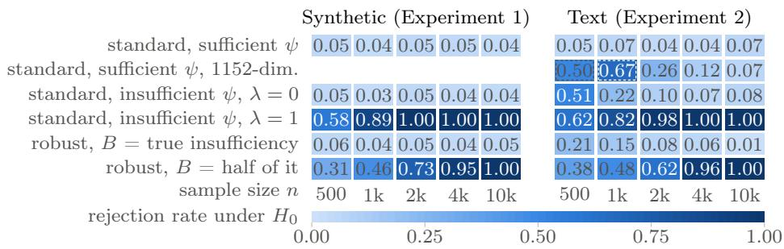  
Figure 2: Rejection rate under $H _ { 0 }$ against n in Experiment 1 (left, $\psi = \psi _ { 5 } )$ and Experiment 2 (right, $\psi = E _ { 1 } )$ for the residual correlation test (standard) and the robust test, run at $\lambda = 1$ , with the embeddings and tolerances named in the rows. Dashed cells are fitted by ridge regression, since n is below the dimension of $\psi ( Z )$

Results. Figure 2 (left) shows the rejection rates. With the suficient embedding, and with the insuficient embedding at $\lambda = 0$ , the residual correlation test is approximately valid for every $n ;$ at $\lambda = 1$ its rejection rate rises to one. The robust test holds its level when the tolerance is set to the true insuficiency, but its rejection rate is inflated when the tolerance is set to only half of the true insuficiency. Figures D.1 and D.2 in Appendix D add the tightness of the bound, power, and the distribution of $\hat { \rho } _ { \psi }$ and $\mathrm { R V } _ { \alpha }$

## 4.2 Real text with synthetic outcomes

Design. We repeat the Gaussian experiment with a real Z: 15,521 posts from the 20 Newsgroups corpus (Lang, 1995), encoded by two sentence encoders from the Sentence-BERT family (Reimers and Gurevych, 2019), $E _ { 1 }$ with $d \ = \ 3 8 4$ and $E _ { 2 }$ with $d \ = \ 7 6 8$ We generate Gaussian X and $Y$ from the embeddings of $Z$ so that $E _ { 1 }$ is insuficient with $\sqrt { R _ { E _ { 1 } } ^ { 2 } ( X ) R _ { E _ { 1 } } ^ { 2 } ( Y ) } = 0 . 1 0 9$ and a correlation λ of the discarded parts set by design, while the four generating features and the 1152-dimensional $[ E _ { 1 } , E _ { 2 } ]$ are suficient (Appendix C.6).

Results. Figure 2 (right) shows the rejection rates under $H _ { 0 }$ for n from 500 to 10,000. They match Experiment 1: with $\psi = E _ { 1 }$ , the residual correlation test stays close to its level at $\lambda = 0$ and rejects with certainty at $\lambda = 1$ , where $\hat { \rho } _ { \psi }$ sits at the true insuficiency, and the robust test holds its level with the true insuficiency as its tolerance and not with half of it. The suficient sets stay close to their level. Figures D.3 and D.4 in Appendix D report $\hat { \rho } _ { \psi }$ and $\mathrm { R V } _ { \alpha }$ , and the power at $n = 2 0 0 0$

## 4.3 Text generated by a local model with accessible states

Design. Using a language model, we generate text from real Z. We take 3000 posts $Z _ { i }$ from the corpus of Section 4.2 and, in independent calls to Qwen3-1.7B (Qwen Team, 2025), a 1.7-billion-parameter open model, generate a reader’s comment $\tilde { X }$ on the post, written from a randomly assigned persona that acts as independent noise, and a newsletter summary $\tilde { Y }$ of the post (prompts in Appendix E), so that $H _ { 0 }$ holds exactly. The comment ends with a line labelling its own sentiment as positive, neutral or negative, which is removed before the comment is used. The tested variable X is a sentiment score of the comment, namely the cross-fitted prediction of its label from the $E _ { 1 }$ embedding of the comment, and Y applies the same fitted direction to the embedding of the summary. We compare ψ equal to $E _ { 1 }$ and to $E _ { 2 }$ , the two encoders of Section 4.2, with the generator’s internal states. From its forward pass over the post we keep the mean of the hidden states over the prompt tokens at the last of its 28 layers. For a d-dimensional embedding, we take the first d principal components of this mean, and we compare it with $E _ { 1 }$ and $E _ { 2 }$ at the same dimension.

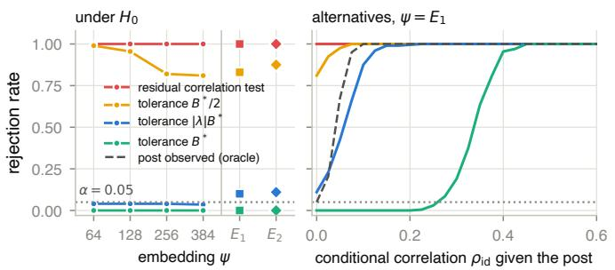

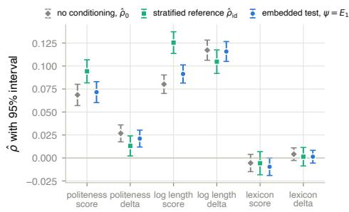  
Figure 3: $( L e f t )$ : Experiment 3, rejection rate under $H _ { 0 }$ over 200 null datasets drawn from the replicates, for the residual correlation test and for the robust test with the tolerance equal to half the true insuficiency, to the true bias $\vert \lambda \vert \sqrt { R _ { \psi } ^ { 2 } ( X ) R _ { \psi } ^ { 2 } ( Y ) }$ and to the true insuficiency $( B ^ { * }$ in the legend); $\psi ( Z )$ is 64 to 384 principal components of the generator’s mean hidden state over the prompt tokens at its last layer, $E _ { 1 }$ or $E _ { 2 }$ . (Middle): The same tests with $\psi = E _ { 1 }$ against a range of alternatives. We plot a reference test (dashed) that conditions on the post through the unused draws. $( R i g h t )$ : Reddit data application. For each pair of X (politeness rating, log length, politeness lexicon) and $Y$ (signed log score, delta indicator) we plot the unconditional correlation $\hat { \rho } _ { 0 }$ (diamonds), $\hat { \rho } _ { \mathrm { i d } }$ from the baseline, which conditions on the comment being replied to (squares), and $\hat { \rho } _ { \psi }$ from the embedded test with $\psi = E _ { 1 }$ (circles), all with 95% intervals.

Since we have access to the generating model, we can get ground-truth values of the sensitivity parameters. For every post we draw the comment and the summary 20 more times from the same model, prompts and sampling settings, with the persona redrawn each time. By Proposition B.2, these draws identify $R _ { \psi } ^ { 2 } ( X ) , R _ { \psi } ^ { 2 } ( Y )$ and λ for every embedding, hence the ground-truth insuficiency $\sqrt { R _ { \psi } ^ { 2 } ( X ) R _ { \psi } ^ { 2 } ( Y ) }$ and the bias $\vert \lambda \vert \sqrt { R _ { \psi } ^ { 2 } ( X ) R _ { \psi } ^ { 2 } ( Y ) }$ of Theorem 2.3. Taking one draw of each text per post gives an exact null dataset; on 200 such datasets we record the rejection rates of the residual correlation test and of the robust test with the tolerance equal to the ground-truth insuficiency, to half of it, and to the groundtruth bias. We can also use the replicates to evaluate power under the alternative: within each post we pair the comment draw, with probability $\pi ,$ with the summary draw of the same sentiment rank, and otherwise with an independent draw. The probability π controls the conditional correlation $\rho _ { \mathrm { i d } }$ of X and Y given the post. Details are in Appendix C.7.

Results. Under $H _ { 0 }$ , the residual correlation test (red in Figure 3, left) rejects with every embedding. Against an unadjusted correlation of 0.516, the encoders leave $\hat { \rho } _ { \psi } = 0 . 2 1 5$ with $E _ { 1 }$ and 0.232 with $E _ { 2 }$ . The generating model’s own states do not remove the bias either: at every dimension, from 64 to 768 principal components, they leave a residual correlation of the same size (Figure D.5 in Appendix D). Two explanations are consistent with this: the aggregated states are less informative than attention to every token, or the regressions do not recover $\mathbb { E } [ X \mid \psi ( Z ) ]$ at this n.

The discarded parts are correlated, with λ between 0.64 and 0.72 across embeddings. Figure 3 (left) shows the rejection rates under the null. Using a tolerance equal to the true bias (blue) gives a robust test that approximately holds the level $\alpha = 0 . 0 5$ . If we use the true insuficiency and assume $\lambda = 1$ , the robust test (green) is conservative and never rejects. With half the true insuficiency (orange) it rejects almost as often as the residual correlation test. The encoders $E _ { 1 }$ and $E _ { 2 }$ behave similarly to the generator’s own states. Figure 3 (middle) shows the corresponding power. Using the replicates, we plot a reference test that does not use an embedding but conditions on the post itself (dashed). The residual correlation test and the robust test with tolerance $B ^ { * } / 2$ reject throughout, but since they do not hold their level, their power means nothing. The robust test with the true bias as tolerance detects almost the same alternatives as the reference test, while the conservative test using the true insuficiency as tolerance only starts rejecting at the strongest alternatives. In conclusion, this experiment shows that a plain residual correlation test can be biased by an insuficient embedding, while the robust test with correct tolerance approximately holds its level and has power, but underestimating the tolerance leads to a biased test and overestimating it to a loss of power.

## 4.4 Application: style and success of replies in online discussions

Design. We return to the conceptual example of Section 1 with the ChangeMyView corpus (Tan et al., 2016; Chang et al., 2020): 3,051 posts with their discussion threads, the Reddit score of every comment, and the ‘deltas’ that the original poster awards to comments that changed their view. Every observation is a reply to a comment, and $Z$ is the comment being replied to, with 49,050 replies to 18,743 comments (Appendix C.8). X is either the politeness of the reply, rated by a model on a five-point scale, or its log length. Y is the signed log score of the reply or its delta indicator. Because several replies share a $Z ,$ we can construct a baseline test that conditions on $Z$ without a representation of it: under $H _ { 0 }$ , the values of X among the replies to a comment carry no information about their values of $Y$ so the covariance of X and $Y$ after demeaning within comments estimates $\mathbb { E } [ \operatorname { C o v } ( X , Y \mid Z ) ]$ and permuting X among the replies to a comment gives an exact test under exchangeability. We compare the baseline to a test that conditions on an embedding $E _ { 1 } ( Z )$ of the comment, and also plot the unconditional correlation $\hat { \rho } _ { 0 }$

Results. The embedded $\hat { \rho } _ { \psi }$ stays close to the unconditional value, because the embeddings do not fully recover the efect of the comment (Figure 3, right, and Figure D.8 in Appendix D). The replies to a comment are replicates in the sense of Proposition B.2, so we can recover the sensitivity parameters from variance components: the comment-level components of X and $Y$ are correlated in the politeness and length pairs, with $\hat { \lambda }$ between −0.32 and 0.23.

## 5 Discussion

We have highlighted the bias arising in CI tests from using embeddings of the conditioning variable. The bias of such a test is described by both the insuficiency of the embedding and the correlation of the discarded parts. We propose a robust test that controls the level if the insuficiency tolerance is correctly specified.

Our results are largely negative about testing conditional independence given an embedding. The bias bound is worst-case in λ, and the tolerance is in general not identified from the data. In our experiments, richer embeddings demonstrated almost none of the insuficiency, in part because the estimated benchmark loses the excess estimation error of the richer regression (Appendix C.3). Even the generator’s own states were insuficient, and only replicates identified the sensitivity parameters. Without a tolerance justified by domain knowledge, a rejection is therefore hard to distinguish from an artifact of the embedding. Future work could investigate how to adapt the embeddings to retain more information about the tested variables, to ensure the validity of the tests, or how to construct better benchmarks for the insuficiency.

## AI use statement

Generative AI tools were used for drafting and editing text and proofs and for writing and testing the experiment code. In Experiment 3 (Section 4.3), we used a language model to generate the synthetic texts that constitute the data; we used a decision model in the application (Section 4.4) to rate the politeness of the replies, and a language model to rate a subset of the replies as a check (Appendix C.8); the prompts are reported in Appendix E and Appendix C.8. We have reviewed all AI-assisted work, and all mathematical statements and proofs were checked by the authors, who take responsibility for the content of this work.

## Acknowledgments and Disclosure of Funding

Nikolaj Thams is supported by the Novo Nordisk Foundation (grant NNF26OC0114284). The regenerated texts of Experiment 3 were computed on the Gefion AI supercomputer, operated by the Danish Centre for AI Innovation (DCAI).

## References

Anthropic. Claude Haiku 4.5 system card. https://www.anthropic.com/system-cards, 2025. Model claude-haiku-4-5 through the Anthropic API.

Timothy B. Armstrong and Michal Kolesár. Optimal inference in a class of regression models. Econometrica, 86(2):655–683, 2018.

Timothy B. Armstrong and Michal Kolesár. Sensitivity analysis using approximate moment condition models. Quantitative Economics, 12(1):77–108, 2021.

Luca Bergen, Dino Sejdinovic, and Vanessa Didelez. The generalised kernel covariance measure. arXiv preprint arXiv:2604.03721, 2026.

Thomas B. Berrett, Yi Wang, Rina Foygel Barber, and Richard J. Samworth. The conditional permutation test for independence while controlling for confounders. Journal of the Royal Statistical Society: Series B, 82(1):175–197, 2020.

Emmanuel Candès, Yingying Fan, Lucas Janson, and Jinchi Lv. Panning for gold: ‘model-X knockofs for high dimensional controlled variable selection. Journal ofthe Royal Statistical Society: Series B, 80(3):551–577, 2018.

Jonathan P. Chang, Caleb Chiam, Liye Fu, Andrew Z. Wang, Justine Zhang, and Cristian Danescu-Niculescu-Mizil. ConvoKit: A toolkit for the analysis of conversations. In Proceedings of the 21st Annual Meeting of the Special Interest Group on Discourse and Dialogue, pages 57–60, 2020.

Victor Chernozhukov, Carlos Cinelli, Whitney Newey, Amit Sharma, and Vasilis Syrgkanis. Long story short: omitted variable bias in causal machine learning. arXiv preprint arXiv:2112.13398, 2022.

Carlos Cinelli and Chad Hazlett. Making sense of sensitivity: extending omitted variable bias. Journal of the Royal Statistical Society: Series B, 82(1):39–67, 2020.

Naoki Egami, Christian J. Fong, Justin Grimmer, Margaret E. Roberts, and Brandon M. Stewart. How to make causal inferences using texts. Science Advances, 8(42):eabg2652, 2022.

Amir Feder, Katherine A. Keith, Emaad Manzoor, Reid Pryzant, Dhanya Sridhar, Zach Wood-Doughty, Jacob Eisenstein, Justin Grimmer, Roi Reichart, Margaret E. Roberts, Brandon M. Stewart, Victor Veitch, and Diyi Yang. Causal inference in natural language processing: estimation, prediction, interpretation and beyond. Transactions of the Association for Computational Linguistics, 10:1138–1158, 2022.

Ben B. Hansen. The prognostic analogue of the propensity score. Biometrika, 95(2):481–488, 2008.

Moritz Hardt, Eric Price, and Nati Srebro. Equality of opportunity in supervised learning. In Advances in Neural Information Processing Systems, volume 29, pages 3315–3323. Curran Associates, Inc., 2016. URL https://proceedings.neurips.cc/paper\_files/ paper/2016/file/6a9659feb1216f14f7384ba499518b38-Paper.pdf.

Guido W. Imbens. Sensitivity to exogeneity assumptions in program evaluation. American Economic Review, 93(2):126–132, 2003.

Guido W. Imbens and Charles F. Manski. Confidence intervals for partially identified parameters. Econometrica, 72(6):1845–1857, 2004.

Katherine A. Keith, David Jensen, and Brendan O’Connor. Text and causal inference: a review of using text to remove confounding from causal estimates. In Proceedings of the 58th Annual Meeting of the Association for Computational Linguistics, pages 5332–5344, 2020.

Ilmun Kim, Matey Neykov, Sivaraman Balakrishnan, and Larry Wasserman. Local permutation tests for conditional independence. The Annals of Statistics, 50(6):3388–3414, 2022.

Lucas Kook and Anton Rask Lundborg. Algorithm-agnostic significance testing in supervised learning with multimodal data. Briefings in Bioinformatics, 25(6):bbae475, 2024.

Ken Lang. NewsWeeder: learning to filter netnews. In Proceedings of the 12th International Conference on Machine Learning, pages 331–339, 1995.

Anton Rask Lundborg, Ilmun Kim, Rajen D. Shah, and Richard J. Samworth. The projected covariance measure for assumption-lean variable significance testing. The Annals of Statistics, 52(6):2851–2878, 2024.

Matey Neykov, Sivaraman Balakrishnan, and Larry Wasserman. Minimax optimal conditional independence testing. The Annals of Statistics, 49(4):2151–2177, 2021.

Elizabeth L. Ogburn and Tyler J. VanderWeele. On the nondiferential misclassification of a binary confounder. Epidemiology, 23(3):433–439, 2012.

Elizabeth L. Ogburn and Tyler J. VanderWeele. Bias attenuation results for nondiferentially mismeasured ordinal and coarsened confounders. Biometrika, 100(1):241–248, 2013.

Jonas Peters, Peter Bühlmann, and Nicolai Meinshausen. Causal inference by using invariant prediction: identification and confidence intervals. Journal of the Royal Statistical Society Series B: Statistical Methodology, 78(5):947–1012, 2016. doi: 10.1111/rssb.12167.

Qwen Team. Qwen3 technical report. arXiv preprint arXiv:2505.09388, 2025.

Nils Reimers and Iryna Gurevych. Sentence-BERT: sentence embeddings using Siamese BERT-networks. In Proceedings of the 2019 Conference on Empirical Methods in Natural Language Processing, pages 3982–3992, 2019.

Yixin Ren, Chenghou Jin, Yewei Xia, Li Ke, Longtao Huang, Hui Xue, Hao Zhang, Jihong Guan, and Shuigeng Zhou. Score-based generative modeling for conditional independence testing. In Proceedings of the 31st ACM SIGKDD Conference on Knowledge Discovery and Data Mining, 2025.

Paul R. Rosenbaum. Observational Studies. Springer, New York, 2nd edition, 2002.

Cyrill Scheidegger, Julia Hörrmann, and Peter Bühlmann. The weighted generalised covariance measure. Journal of Machine Learning Research, 23:1–68, 2022.

Rajen D. Shah and Jonas Peters. The hardness of conditional independence testing and the generalised covariance measure. The Annals of Statistics, 48(3):1514–1538, 2020.

Marco Simnacher, Georg Keilbar, Benjamin König, Christoph Lippert, and Sonja Greven. Embedded conditional independence tests for large language model generated text with an application to German parliament speeches. arXiv preprint arXiv:2609.00946, 2026a.

Marco Simnacher, Xiangnan Xu, Hani Park, Christoph Lippert, and Sonja Greven. Deep nonparametric conditional independence tests for images. Journal of Machine Learning Research, 27(96):1–62, 2026b.

Peter Spirtes, Clark Glymour, and Richard Scheines. Causation, Prediction, and Search. Adaptive Computation and Machine Learning. MIT Press, Cambridge, MA, 2nd edition, 2000. ISBN 0-262-19440-6. doi: 10.7551/mitpress/1754.001.0001.

Jörg Stoye. More on confidence intervals for partially identified parameters. Econometrica, 77(4):1299–1315, 2009.

Chenhao Tan, Vlad Niculae, Cristian Danescu-Niculescu-Mizil, and Lillian Lee. Winning arguments: Interaction dynamics and persuasion strategies in good-faith online discussions. In Proceedings of the 25th International Conference on World Wide Web, pages 613–624, 2016.

Wesley Tansey, Victor Veitch, Haoran Zhang, Raul Rabadan, and David M. Blei. The holdout randomization test for feature selection in black box models. Journal ofComputational and Graphical Statistics, 31(1):151–162, 2022.

TypeSafe AI. Jev: a System One decision model. https://typesafe.ai, 2026. Model jev-latest through the TypeSafe API, accessed 30 September 2026.

Victor Veitch and Anisha Zaveri. Sense and sensitivity analysis: simple post-hoc analysis of bias due to unobserved confounding. In Advances in Neural Information Processing Systems, volume 33, 2020.

Victor Veitch, Dhanya Sridhar, and David M. Blei. Adapting text embeddings for causal inference. In Proceedings of the 36th Conference on Uncertainty in Artificial Intelligence, pages 919–928, 2020.

Kun Zhang, Jonas Peters, Dominik Janzing, and Bernhard Schölkopf. Kernel-based conditional independence test and application in causal discovery. In Proceedings of the 27th Conference on Uncertainty in Artificial Intelligence, pages 804–813, 2011.

Yi Zhang, Linjun Huang, Yun Yang, and Xiaofeng Shao. Doubly robust conditional independence testing with generative neural networks. arXiv preprint arXiv:2407.17694, 2024.

## Appendix A. Proofs

In this section, write $V : = \psi ( Z )$ , which takes values in V.

## A.1 Proofs for Section 2

Since $\psi$ is measurable, $\sigma ( V ) \subseteq \sigma ( Z )$ , and $\mathcal { F } _ { \psi }$ consists of the $f \in { \mathcal { F } }$ for which $f ( X , Z )$ is a function of $( X , V )$ . If $\sigma _ { \psi } ( f ) = 0$ , then $f = \operatorname { \mathbb { E } } [ f \mid V ]$ almost surely, so $\operatorname { \mathbb { E } } [ \operatorname { C o v } ( f , g \mid V ) ] = 0$ for every g and $\Delta _ { \psi } ( f ) = 0$ . The conventions $\rho _ { \psi } ( f , g ) : = 0$ and $R _ { \psi } ^ { 2 } ( f ) : = \mathrm { { 0 } }$ thus replace $0 / 0$ by 0, and every pair satisfies E $[ \operatorname { C o v } ( f , g \mid V ) ] = 0$ whenever $\rho _ { \psi } ( f , g ) = 0$

Proof of the claims in Example 2.2. (a) Here $\mathcal { F } _ { \psi }$ and $\mathcal { G } _ { \psi }$ consist of all $f \in L ^ { 2 } ( P _ { X , Z } )$ for which $f ( X , Z )$ is a function of $( X , V )$ and all $g \in L ^ { 2 } ( P _ { Y , Z } )$ for which $g ( Y , Z )$ is a function of $( Y , V )$ . If $X \perp \perp Y \mid V$ , then $( X , V ) \downarrow \downarrow ( Y , V ) \mid V$ , so $\operatorname { \mathbb { E } } [ f g \mid V ] = \operatorname { \mathbb { E } } [ f \mid V ] \operatorname { \mathbb { E } } [ g \mid V ]$ for all $f \in \mathcal { F } _ { \psi }$ and $g \in { \mathcal { G } } _ { \psi }$ , every $\rho _ { \psi } ( f , g )$ is zero, and so is the supremum. Conversely, if $\rho _ { \psi } ( \mathcal { F } , \mathcal { G } ) = 0$ , then every $\rho _ { \psi } ( f , g )$ is zero, so $\operatorname { \mathbb { E } } [ \operatorname { C o v } ( f , g \mid V ) ] = 0$ for all $f \in \mathcal { F } _ { \psi }$ and $g \in { \mathcal { G } } _ { \psi }$ . For measurable sets A, B, and C, take $f = 1 _ { A } ( \boldsymbol { X } )$ and $g = 1 _ { B } ( Y ) 1 _ { C } ( V )$ . Then $0 = \operatorname { \mathbb { E } } [ \operatorname { C o v } ( f , g \mid V ) ] = \operatorname { \mathbb { E } } \left[ 1 _ { C } ( V ) \operatorname { C o v } ( 1 _ { A } ( X ) , 1 _ { B } ( Y ) \mid V ) \right]$ for all $C ,$ so $\mathrm { C o v } ( 1 _ { A } ( X ) , 1 _ { B } ( Y ) \mid$ $V ) = 0$ almost surely, that is, $P ( X \in A , Y \in B \mid V ) = \bar { P ( X \in A \mid V ) } P ( Y \in B \mid V )$ almost surely for all A and B. This is $X \perp \perp Y \mid V$

(b) Let $f \in \mathcal { F } _ { \psi }$ . Since $f - \mathbb { E } [ f \mid V ]$ is a function of $( X , V )$ , we have by the tower property and the Cauchy–Schwarz inequality that

$$
\begin{array} { r l } & { \mathbb { E } [ \mathrm { C o v } ( f , Y \mid V ) ] ^ { 2 } = \mathbb { E } [ ( f - \mathbb { E } [ f \mid V ] ) ( Y - \mathbb { E } [ Y \mid V ] ) ] ^ { 2 } } \\ & { \qquad = \mathbb { E } [ ( f - \mathbb { E } [ f \mid V ] ) ( \mathbb { E } [ Y \mid X , V ] - \mathbb { E } [ Y \mid V ] ) ] ^ { 2 } } \\ & { \qquad \le \sigma _ { \psi } ^ { 2 } ( f ) \mathbb { E } \left[ ( \mathbb { E } [ Y \mid X , V ] - \mathbb { E } [ Y \mid V ] ) ^ { 2 } \right] . } \end{array}
$$

Therefore, for any $f \in \mathcal { F } _ { \psi }$ , we have

$$
\rho _ { \psi } ( f , ( y , z ) \mapsto y ) \leq { \frac { \operatorname { \mathbb { E } } \left[ ( \operatorname { \mathbb { E } } [ Y \mid X , V ] - \operatorname { \mathbb { E } } [ Y \mid V ] ) ^ { 2 } \right] ^ { 1 / 2 } } { \sigma _ { \psi } ( Y ) } } .
$$

The function $f ( x , z ) = \mathbb { E } [ Y \mid X = x , V = \psi ( z ) ]$ is a square-integrable function of $( x , \psi ( z ) )$ so it lies in $\mathcal { F } _ { \psi }$ , and it attains the upper bound, which is therefore the value of $\rho _ { \psi } ( \mathcal { F } , \mathcal { G } )$ From this, we see that $\rho _ { \psi } ( \mathcal { F } , \mathcal { G } ) = 0$ if and only if $\cdot \mathbb { E } [ Y \mid X , V ] = \mathbb { E } [ Y \mid V ]$ . The argument assumes $\sigma _ { \psi } ( Y ) > 0$ . If $\sigma _ { \psi } ( Y ) = 0$ , then $Y = \mathbb { E } [ Y \mid V ]$ , so $\mathbb { E } [ Y \mid X , V ] = \mathbb { E } [ Y \mid V ]$ , and the measure is zero by convention.

(c) The classes are singletons, and their elements do not depend on z, so $\mathcal { F } _ { \psi } = \mathcal { F }$ and $\mathcal { G } _ { \psi } = \mathcal { G }$ □

Proof of Theorem 2.3. If $\sigma _ { \psi } ( f ) = 0$ or $\sigma _ { \psi } ( g ) = 0$ , both sides of the bound are zero by convention, so let $\sigma _ { \psi } ( f ) , \sigma _ { \psi } ( g ) > 0$ . We have $f - \mathbb { E } [ f \mid V ] = ( f - \mathbb { E } [ f \mid Z ] ) + \Delta _ { \psi } ( f )$ , and likewise for $g .$ Since $f - \mathbb { E } [ f \mid Z ]$ has conditional mean zero given Z and $\Delta _ { \psi } ( g )$ is a function of $Z ,$ , the cross terms have expectation zero, so

$$
\operatorname { \mathbb { E } } [ \operatorname { C o v } ( f , g \mid V ) ] = \operatorname { \mathbb { E } } [ \operatorname { C o v } ( f , g \mid Z ) ] + \operatorname { \mathbb { E } } [ \Delta _ { \psi } ( f ) \Delta _ { \psi } ( g ) ] .\tag{A.1}
$$

Since the discarded parts have mean zero,

$$
\begin{array} { r } { \mathbb { E } [ \Delta _ { \psi } ( f ) \Delta _ { \psi } ( g ) ] = \lambda _ { \psi } ( f , g ) \sqrt { R _ { \psi } ^ { 2 } ( f ) R _ { \psi } ^ { 2 } ( g ) } \sigma _ { \psi } ( f ) \sigma _ { \psi } ( g ) . } \end{array}
$$

Dividing by $\sigma _ { \psi } ( f ) \sigma _ { \psi } ( g )$ and using $\sigma _ { \mathrm { i d } } ^ { 2 } ( f ) = \left( 1 - R _ { \psi } ^ { 2 } ( f ) \right) \sigma _ { \psi } ^ { 2 } ( f )$ , and likewise for g, we have

$$
\frac { \mathbb { E } [ \mathrm { C o v } ( f , g \mid V ) ] } { \sigma _ { \psi } ( f ) \sigma _ { \psi } ( g ) } = \sqrt { ( 1 - R _ { \psi } ^ { 2 } ( f ) ) ( 1 - R _ { \psi } ^ { 2 } ( g ) ) } \frac { \mathbb { E } [ \mathrm { C o v } ( f , g \mid Z ) ] } { \sigma _ { \mathrm { i d } } ( f ) \sigma _ { \mathrm { i d } } ( g ) } + \lambda _ { \psi } ( f , g ) \sqrt { R _ { \psi } ^ { 2 } ( f ) R _ { \psi } ^ { 2 } ( g ) } ,
$$

where the second fraction is read as zero if $\sigma _ { \mathrm { i d } } ( f ) \sigma _ { \mathrm { i d } } ( g ) = 0$ , in which case $\mathbb { E } [ \operatorname { C o v } ( f , g \mid$ $Z ) ] \ = \ 0$ . The two fractions have absolute values $\rho _ { \psi } ( f , g )$ and $\rho _ { \mathrm { i d } } ( f , g )$ , so the reverse triangle inequality gives the bound. Under $H _ { 0 } , ~ \mathbb { E } [ \operatorname { C o v } ( f , g ~ \mid ~ Z ) ] ~ = ~ 0$ , so $\rho _ { \psi } ( f , g ) =$ $\vert \lambda _ { \psi } ( f , g ) \vert \sqrt { R _ { \psi } ^ { 2 } ( f ) R _ { \psi } ^ { 2 } ( g ) }$ □

Proof of Corollary $\it { 2 . 4 } .$ If $\mathcal { F } _ { \psi }$ or $\mathcal { G } _ { \psi }$ is empty, all quantities are zero, so let both be nonempty. (i) Let $f \in { \mathcal { F } } _ { \psi }$ and $g \in { \mathcal { G } } _ { \psi }$ . Since the factor multiplying $\rho _ { \mathrm { i d } } ( f , g )$ in Theorem 2.3 is at most one, we have

$$
\begin{array} { r } { \rho _ { \psi } ( f , g ) \leq \rho _ { \mathrm { i d } } ( f , g ) + | \lambda _ { \psi } ( f , g ) | \sqrt { R _ { \psi } ^ { 2 } ( f ) R _ { \psi } ^ { 2 } ( g ) } \leq \rho _ { \mathrm { i d } } ( \mathcal { F } , \mathcal { G } ) + \sqrt { R _ { \psi } ^ { 2 } ( \mathcal { F } ) R _ { \psi } ^ { 2 } ( \mathcal { G } ) } , } \end{array}
$$

where the second inequality uses $| \lambda _ { \psi } ( f , g ) | \le 1 , R _ { \psi } ^ { 2 } ( f ) \le R _ { \psi } ^ { 2 } ( { \mathcal F } ) , R _ { \psi } ^ { 2 } ( g ) \le R _ { \psi } ^ { 2 } ( { \mathcal G } )$ , and that $( f , g ) \in { \mathcal { F } } \times { \mathcal { G } }$ , because $\mathcal { F } _ { \psi } \subseteq \mathcal { F }$ and $\mathcal { G } _ { \psi } \subseteq \mathcal { G }$ . Taking the supremum over $f$ and g gives (i).

(ii) Under $H _ { 0 }$ , Theorem 2.3 gives $\rho _ { \psi } ( f , g ) = | \lambda _ { \psi } ( f , g ) | \sqrt { R _ { \psi } ^ { 2 } ( f ) R _ { \psi } ^ { 2 } ( g ) }$ for all $f \in \mathcal { F } _ { \psi }$ and $g \in { \mathcal { G } } _ { \psi }$ , and taking the supremum gives the equality in (ii). The supremum is zero if and only if every term is zero. If $R _ { \psi } ^ { 2 } ( f ) = 0 \mathrm { o r } R _ { \psi } ^ { 2 } ( g ) = 0$ , the corresponding discarded part vanishes, and $\lambda _ { \psi } ( f , g ) = 0$ by convention. Hence every term is zero if and only if $\lambda _ { \psi } ( f , g ) = 0$ for all $f$ and $g .$ □

Lemma A.1 (Zero partial $R ^ { 2 } )$ . (i) $R _ { \psi } ^ { 2 } ( L ^ { 2 } ( P _ { X , Z } ) ) = 0$ if and only if $X \perp \perp Z \mid \psi ( Z )$

(ii) For real-valued, square-integrable X, $R _ { \psi } ^ { 2 } ( \{ ( x , z ) \mapsto x \} ) = 0$ if and only $i f \operatorname { \mathbb { E } } [ X \mid Z ] =$ $\mathbb { E } [ X \mid \psi ( Z ) ]$

Proof. For $f \in \mathcal { F } _ { \psi } , R _ { \psi } ^ { 2 } ( f ) = 0$ if and only if $\Delta _ { \psi } ( f ) = 0$ , that is, $\mathbb { E } [ f \mid Z ] = \mathbb { E } [ f \mid V ]$ ; this holds by definition if $\sigma _ { \psi } ( f ) > 0$ and by convention otherwise. (i) For $\mathcal { F } = L ^ { 2 } ( P _ { X , Z } ) , \mathcal { F } _ { \psi }$ consists of the $f \in L ^ { 2 } ( { \dot { P } } _ { X , Z } )$ for which $f ( X , Z )$ is a function of $( X , V )$ . If $X \perp \perp Z \mid V$ , then $( X , V )$ ⊥⊥ Z | V because V is a function of $Z ,$ so $\mathbb { E } [ f \mid Z ] = \mathbb { E } [ f \mid V ]$ for every bounded $f \in \mathcal { F } _ { \psi }$ , and by truncation for every square-integrable one. Conversely, if $R _ { \psi } ^ { 2 } ( \mathcal { F } ) = 0$ taking $f = 1 _ { A } ( \boldsymbol { X } )$ gives $P ( X \in A \mid Z ) = P ( X \in A \mid V )$ for every measurable ${ \dot { A } } .$ , which is $X \perp \perp Z \mid V . \mathrm { ( i i ) }$ For $\mathcal { F } = \{ ( x , z ) \mapsto x \}$ , the condition is $\mathbb { E } [ X \mid Z ] = \mathbb { E } [ X \mid V ]$ □

Computations for Example 2.5. Given $Z , X$ and Y are independent with means $Z _ { 1 } + a Z _ { 2 }$ and $Z _ { 1 } + b ( \lambda Z _ { 2 } + \sqrt { 1 - \lambda ^ { 2 } } Z _ { 3 } )$ and common variance $Z _ { 4 } ^ { 2 } .$ so $H _ { 0 }$ holds, while given $Z _ { 1 }$ both have mean $Z _ { 1 }$ . Hence $\Delta _ { \psi } ( X ) = a Z _ { 2 } , \Delta _ { \psi } ( Y ) = b ( \lambda Z _ { 2 } + \sqrt { 1 - \lambda ^ { 2 } } Z _ { 3 } ) , \sigma _ { \psi } ^ { 2 } ( X ) = a ^ { 2 } + 1$ , and $R _ { \psi } ^ { 2 } ( X ) = a ^ { 2 } / ( 1 + a ^ { 2 } )$ , and likewise for $Y .$ . For $a , b > 0$ , the discarded parts have correlation $\lambda ,$ and Theorem 2.3 gives the measure in Example 2.2(c) under $H _ { 0 }$ . For the second moments, write $\tilde { X } : = X - Z _ { 1 } = a Z _ { 2 } + Z _ { 4 } \varepsilon _ { X }$ and $\tilde { Y } : = Y - Z _ { 1 } = b ( \lambda Z _ { 2 } + \sqrt { 1 - \lambda ^ { 2 } } Z _ { 3 } ) + Z _ { 4 } \varepsilon _ { Y }$ , which are independent of $Z _ { 1 }$ . Expanding $\tilde { X } ^ { 2 } \tilde { Y } ^ { 2 }$ , every term with a single factor $\varepsilon _ { X } \mathrm { o r } \varepsilon _ { Y }$ has mean zero, so

$$
\begin{array} { r l } & { \mathbb { E } [ \tilde { X } ^ { 2 } \tilde { Y } ^ { 2 } ] = a ^ { 2 } b ^ { 2 } \mathbb { E } \big [ Z _ { 2 } ^ { 2 } ( \lambda Z _ { 2 } + \sqrt { 1 - \lambda ^ { 2 } } Z _ { 3 } ) ^ { 2 } \big ] + a ^ { 2 } + b ^ { 2 } + \mathbb { E } [ Z _ { 4 } ^ { 4 } ] } \\ & { \qquad = a ^ { 2 } b ^ { 2 } ( 1 + 2 \lambda ^ { 2 } ) + a ^ { 2 } + b ^ { 2 } + 3 , } \end{array}
$$

while $\mathbb { E } [ \tilde { X } ^ { 2 } ] \mathbb { E } [ \tilde { Y } ^ { 2 } ] = ( a ^ { 2 } + 1 ) ( b ^ { 2 } + 1 )$ . Hence Cov $( ( X - Z _ { 1 } ) ^ { 2 } , ( Y - Z _ { 1 } ) ^ { 2 } \mid Z _ { 1 } ) = \operatorname { C o v } ( \tilde { X } ^ { 2 } , \tilde { Y } ^ { 2 } ) =$ $2 ( 1 + a ^ { 2 } b ^ { 2 } \lambda ^ { 2 } )$ . Thus $f ( x , z ) = ( x { - } z _ { 1 } ) ^ { 2 }$ and $g ( y , z ) = ( y - z _ { 1 } ) ^ { 2 }$ , which are functions of $( x , \psi ( z ) )$ and of $( y , \psi ( z ) )$ , have $\rho _ { \psi } ( f , g ) > 0$ , and $H _ { 0 } ^ { \psi }$ fails by Example $2 . 2 ( \mathrm { a } )$ □

## A.2 Coarsening under alternatives

For $f \in \mathcal { F } _ { \psi }$ and $g \in { \mathcal { G } } _ { \psi }$ , the law of total covariance gives

$$
\operatorname { C o v } ( f , g \mid V ) = \operatorname { \mathbb { E } } { \big [ } \operatorname { C o v } ( f , g \mid Z ) { \big | } V { \big ] } + \operatorname { \mathbb { E } } { \big [ } \Delta _ { \psi } ( f ) \Delta _ { \psi } ( g ) { \big | } V { \big ] } ,\tag{A.2}
$$

since $\mathbb { E } [ f \mid Z ] - \mathbb { E } [ f \mid V ] = \Delta _ { \psi } ( f )$ has conditional mean zero given $V .$ . The second term is created by the discarded information, and the first is the dependence given $Z ,$ averaged over the values of $Z$ that $\psi$ maps to the same point. For classes of functions of x and of $y$ alone, such as those of Example $2 . 2 ( \mathrm { c } )$ , only the overall average of this dependence enters the measure, and coarsening preserves it. Classes whose transformations depend on z weight the dependence given $Z .$ . After coarsening, they can only weight its averages over the merged values, and they lose dependence that changes sign within them.

Example A.2 (An embedding that misses an efect modifier). Let $Z ~ = ~ ( Z _ { 1 } , Z _ { 2 } )$ have independent coordinates, $Z _ { 1 }$ standard normal and $Z _ { 2 }$ uniform on $\{ - 1 , 1 \}$ , let $\psi ( Z ) = Z _ { 1 }$ ， and let

$$
X = Z _ { 1 } + \varepsilon _ { X } , \qquad Y = Z _ { 1 } + Z _ { 2 } \varepsilon _ { X } + \varepsilon _ { Y }
$$

with independent standard normal noise. Given $Z ,$ the residual of X enters Y with slope $Z _ { 2 }$ so $\operatorname { C o v } ( X , Y \mid Z ) = Z _ { 2 }$ changes sign with $Z _ { 2 }$ . The measure of Example ${ \it 2 . 2 ( c ) }$ averages it out and is zero, whereas the measure of Example ${ \mathcal { Q . Q } } ( b ) i s 1 / { \sqrt { 2 } }$ , attained by $f ( x , z ) = z _ { 2 } ( x - z _ { 1 } )$ Given $\psi ( Z )$ , the slope averages to zero, so $\mathbb { E } [ Y \mid X , \psi ( Z ) ] = \mathbb { E } [ Y \mid \psi ( Z ) ]$ and both measures vanish, although $H _ { 0 } ^ { \psi }$ fails. For the classes of $( b ) , R _ { \psi } ^ { 2 } ( { \mathcal { F } } ) = R _ { \psi } ^ { 2 } ( { \mathcal { G } } ) = 0$ : the measure of $( b )$ loses the alternative only because $\psi$ merges the values of $Z _ { 2 }$ that reverse the dependence, whereas the measure of $( c )$ had nothing to lose.

Computations for Example A.2. Given $Z ,$ the residuals are $\varepsilon _ { X }$ and $Z _ { 2 } \varepsilon _ { X } + \varepsilon _ { Y }$ , with covariance $Z _ { 2 }$ and variances 1 and $^ { 2 , }$ so the measure of Example $2 . 2 ( \mathrm { c } )$ is $| \mathbb { E } [ Z _ { 2 } ] | / \sqrt { 2 } = 0$ For $f \in L ^ { 2 } ( P _ { X , Z } )$ $\operatorname { \mathbb { E } } [ \operatorname { C o v } ( f , Y \mid Z ) ] \ = \ \operatorname { \mathbb { E } } [ ( f - \operatorname { \mathbb { E } } [ f \mid Z ] ) Z _ { 2 } \varepsilon _ { X } ]$ because $\varepsilon _ { Y }$ is independent of $( X , Z )$ , so by the Cauchy–Schwarz inequality the measure of Example $2 . 2 ( \mathrm { b } )$ is $\mathbb { E } [ ( Z _ { 2 } \varepsilon _ { X } ) ^ { 2 } ] ^ { 1 / 2 } / \sigma _ { \mathrm { i d } } ( Y ) = 1 / \sqrt { 2 }$ , attained by $f ( x , z ) = z _ { 2 } ( x - z _ { 1 } )$ . Since $Z _ { 2 }$ is independent of $( Z _ { 1 } , \varepsilon _ { X } , \varepsilon _ { Y } ) , \mathbb { E } [ Y \mid X , Z _ { 1 } ] = Z _ { 1 } + \mathbb { E } [ Z _ { 2 } ] \varepsilon _ { X } = Z _ { 1 } = \mathbb { E } [ Y \mid Z _ { 1 } ]$ , so $\mathbb { E } [ \mathrm { C o v } ( f , Y \mid Z _ { 1 } ) ] = 0$ for every $f$ that is a function of $( X , Z _ { 1 } )$ , and both measures given $\psi ( Z )$ vanish. On the other hand, $\operatorname { V a r } ( Y \mid X , Z _ { 1 } ) = ( X - Z _ { 1 } ) ^ { 2 } + 1$ depends on $X$ , so $H _ { 0 } ^ { \psi }$ fails. Finally, $( X , Z _ { 1 } )$ is independent of $Z _ { 2 }$ , so $\mathbb { E } [ f \mid Z ] = \mathbb { E } [ f \mid Z _ { 1 } ]$ for every such $f ,$ and $\operatorname { \mathbb { E } } [ Y \mid Z ] = Z _ { 1 } = \operatorname { \mathbb { E } } [ Y \mid Z _ { 1 } ]$ 2 so $R _ { \psi } ^ { 2 } ( { \mathcal F } ) = R _ { \psi } ^ { 2 } ( { \mathcal G } ) = 0$ □

Even the measure of Example $2 . 2 ( \mathrm { a } )$ can lose all dependence. Let X and Z be independent fair bits, $Y : = X \oplus Z$ (exclusive or), and ψ constant. Again $R _ { \psi } ^ { 2 } ( { \mathcal F } ) = R _ { \psi } ^ { 2 } ( { \mathcal G } ) = 0$ , since X ⊥⊥ Z and Y ⊥⊥ Z, and $\rho _ { \psi } ( \mathcal { F } , \mathcal { G } ) = 0$ because X ⊥⊥ Y. Yet $\rho _ { \mathrm { i d } } ( \mathcal { F } , \mathcal { G } ) = \mathrm { i }$ , attained by $f ( x , z ) = x$ and $g ( y , z ) = y ( 1 - 2 z )$ , which have the same residual $X - 1 / 2$ given $Z .$

## A.3 Proof of Proposition 3.2

The sample version of the asymptotic variance $v _ { \psi } ^ { 2 }$ of Section 3.2 replaces $\xi _ { X }$ and $\xi _ { Y }$ by $\hat { \xi } _ { X , i } : = \hat { r } _ { X , i } / \hat { \sigma } _ { \psi } ( X )$ and $\hat { \xi } _ { Y , i } : = \hat { r } _ { Y , i } / \hat { \sigma } _ { \psi } ( Y ) , \rho _ { \psi } ^ { \pm }$ by $\hat { \rho } _ { \psi } ^ { \pm }$ , and the variance by an average,

$$
\hat { v } _ { \psi } ^ { 2 } : = \frac { 1 } { n } \sum _ { i = 1 } ^ { n } \Big ( \hat { \xi } _ { X , i } \hat { \xi } _ { Y , i } - \frac { \hat { \rho } _ { \psi } ^ { \pm } } { 2 } \big ( \hat { \xi } _ { X , i } ^ { 2 } + \hat { \xi } _ { Y , i } ^ { 2 } \big ) \Big ) ^ { 2 } ;\tag{A.3}
$$

the summands have average zero, since $\begin{array} { r } { \frac { 1 } { n } \sum _ { i } \hat { \xi } _ { X , i } \hat { \xi } _ { Y , i } = \hat { \rho } _ { \psi } ^ { \pm } } \end{array}$ and $\begin{array} { r } { \frac { 1 } { n } \sum _ { i } \hat { \xi } _ { X , i } ^ { 2 } = \frac { 1 } { n } \sum _ { i } \hat { \xi } _ { Y , i } ^ { 2 } = 1 } \end{array}$

Proof. The number of folds K is fixed, and $I _ { k }$ denotes the set of indices in fold $k ;$ for $i \in I _ { k }$ e $\hat { m } _ { X } ( \psi ( Z _ { i } ) )$ is the prediction at $\psi ( Z _ { i } )$ of a regression fitted on the observations outside fold $k ,$ and likewise for Y. Write

$$
r _ { X , i } : = X _ { i } - \mathbb { E } [ X _ { i } \mid \psi ( Z _ { i } ) ] , \qquad e _ { X , i } : = \hat { m } _ { X } ( \psi ( Z _ { i } ) ) - \mathbb { E } [ X _ { i } \mid \psi ( Z _ { i } ) ] , \qquad M _ { X } : = \frac 1 n \sum _ { i = 1 } ^ { n } e _ { X , i } ^ { 2 } ,
$$

so that $\hat { r } _ { X , i } = r _ { X , i } - e _ { X , i }$ and, by Assumption 3.1, $M _ { X } = o _ { P } ( n ^ { - 1 / 2 } )$ ; define $r _ { Y , i } , e _ { Y , i } .$ , and $M _ { Y }$ likewise. Then $\xi _ { X , i } = r _ { X , i } / \sigma _ { \psi } ( X )$ and $\xi _ { Y , i } = r _ { Y , i } / \sigma _ { \psi } ( Y )$ are the standardized residuals of observation i, $\sigma _ { \psi } ^ { 2 } ( X ) = \mathbb { E } [ r _ { X , i } ^ { 2 } ]$ , and $\kappa _ { \psi } : = \mathbb { E } [ \operatorname { C o v } ( X , Y \mid \psi ( Z ) ) ] = \mathbb { E } [ r _ { X , i } r _ { Y , i } ]$ , so that $\rho _ { \psi } ^ { \pm } = \kappa _ { \psi } / ( \sigma _ { \psi } ( X ) \sigma _ { \psi } ( Y ) )$ . By $( 2 ) , \hat { \rho } _ { \psi } ^ { \pm } = \hat { \kappa } _ { \psi } / ( \hat { \sigma } _ { \psi } ( X ) \hat { \sigma } _ { \psi } ( Y ) )$ with $\begin{array} { r } { \hat { \kappa } _ { \psi } : = \frac { 1 } { n } \sum _ { i } R _ { i } } \end{array}$

We first show two bounds on the estimation errors. Since $\textstyle \sum _ { i } a _ { i } ^ { 2 } \leq ( \sum _ { i } a _ { i } ) ^ { 2 }$ for $a _ { i } \geq 0$

$$
\frac { 1 } { n } \sum _ { i = 1 } ^ { n } e _ { X , i } ^ { 4 } \leq n M _ { X } ^ { 2 } = o _ { \cal P } ( 1 ) ,\tag{A.4}
$$

and likewise for Y. Next, we show that

$$
{ \frac { 1 } { \sqrt { n } } } \sum _ { i = 1 } ^ { n } r _ { X , i } e _ { Y , i } = o _ { P } ( 1 ) ,\tag{A.5}
$$

and that the same holds with $r _ { Y , i } e _ { X , i } , r _ { X , i } e _ { X , i } ,$ , or $r _ { Y , i } e _ { Y , i }$ in place of $r _ { X , i } e _ { Y , i } ;$ the four proofs are identical. Fix k, let $\begin{array} { r } { S _ { k } : = n ^ { - 1 / 2 } \sum _ { i \in I _ { k } } r _ { X , i } e _ { Y , i } , } \end{array}$ and let $\mathcal { G } _ { k }$ be the σ-algebra generated by the observations outside fold k and by $\psi ( Z _ { i } ) , ~ i ~ \in ~ I _ { k }$ Each $e _ { Y , i }$ with $i \in I _ { k }$ is $\mathcal { G } _ { k ^ { - } }$ measurable, and since the observations are independent, the $r _ { X , i }$ with $i \in I _ { k }$ are conditionally independent given $\mathcal { G } _ { k } .$ with $\operatorname { \mathbb { E } } [ r _ { X , i } \mid { \mathcal { G } } _ { k } ] = \operatorname { \mathbb { E } } [ r _ { X , i } \mid \psi ( Z _ { i } ) ] = 0$ . Hence $\mathbb { E } [ S _ { k } \mid { \mathcal G } _ { k } ] = 0$ and, by the Cauchy–Schwarz inequality,

$$
\mathbb { E } [ S _ { k } ^ { 2 } \mid \mathcal { G } _ { k } ] = \frac { 1 } { n } \sum _ { i \in I _ { k } } \mathbb { E } [ r _ { X , i } ^ { 2 } \mid \psi ( Z _ { i } ) ] e _ { Y , i } ^ { 2 } \le \Big ( \frac { 1 } { n } \sum _ { i = 1 } ^ { n } \big ( \mathbb { E } [ r _ { X , i } ^ { 2 } \mid \psi ( Z _ { i } ) ] \big ) ^ { 2 } \Big ) ^ { 1 / 2 } \Big ( \frac { 1 } { n } \sum _ { i = 1 } ^ { n } e _ { Y , i } ^ { 4 } \Big ) ^ { 1 / 2 } .
$$

The first factor is bounded in probability by Markov’s inequality, since $\mathbb { E } \big [ ( \mathbb { E } [ r _ { X , i } ^ { 2 } \mid$ $\psi ( Z _ { i } ) ] ) ^ { 2 } ] \ \leq \mathbb { E } [ r _ { X , i } ^ { 4 } ] < \infty$ by Jensen’s inequality, and the second is $o _ { P } ( 1 )$ by $\left( \mathrm { { A . 4 } } \right)$ . For $\epsilon > 0$ , Chebyshev’s inequality conditionally on $\mathcal { G } _ { k }$ gives $P ( | S _ { k } | > \epsilon ) \le \mathbb { E } |$ min $\{ 1 , \epsilon ^ { - 2 } \mathbb { E } [ S _ { k } ^ { 2 } \mid$ $\mathcal { G } _ { k } ] \} \big | \to 0$ by bounded convergence, and summing over the K folds gives (A.5). This is the argument of Shah and Peters (2020) for the GCM, with conditioning on the other folds in place of $H _ { 0 }$

Next, we linearize $\hat { \rho } _ { \psi } ^ { \pm }$ . Expanding ${ \hat { r } } _ { X , i } { \hat { r } } _ { Y , i } = r _ { X , i } r _ { Y , i } - r _ { X , i } e _ { Y , i } - r _ { Y , i } e _ { X , i } + e _ { X , i } e _ { Y , i }$ gives

$$
\hat { \kappa } _ { \psi } = \frac { 1 } { n } \sum _ { i = 1 } ^ { n } r _ { X , i } r _ { Y , i } + o _ { P } ( n ^ { - 1 / 2 } ) ,
$$

because $\begin{array} { r } { \frac { 1 } { n } \sum _ { i } r _ { X , i } e _ { Y , i } } \end{array}$ and $\begin{array} { r } { \frac { 1 } { n } \sum _ { i } r _ { Y , i } e _ { X , i } } \end{array}$ are $o _ { P } ( n ^ { - 1 / 2 } )$ by (A.5) and, as for the GCM (Shah and Peters, 2020), $\begin{array} { r } { \left| \frac { 1 } { n } \sum _ { i } e _ { X , i } e _ { Y , i } \right| \le ( M _ { X } M _ { Y } ) ^ { 1 / 2 } = o _ { P } ( n ^ { - 1 / 2 } ) } \end{array}$ by the Cauchy–Schwarz in equality. Similarly, expanding $\hat { r } _ { X , i } ^ { 2 } = r _ { X , i } ^ { 2 } - 2 r _ { X , i } e _ { X , i } + e _ { X , i } ^ { 2 }$ gives

$$
\hat { \sigma } _ { \psi } ^ { 2 } ( X ) = \frac { 1 } { n } \sum _ { i = 1 } ^ { n } r _ { X , i } ^ { 2 } - \frac { 2 } { n } \sum _ { i = 1 } ^ { n } r _ { X , i } e _ { X , i } + M _ { X } = \frac { 1 } { n } \sum _ { i = 1 } ^ { n } r _ { X , i } ^ { 2 } + o _ { P } ( n ^ { - 1 / 2 } ) ,
$$

since the middle term is $o _ { P } ( n ^ { - 1 / 2 } )$ by (A.5) and $M _ { X } = o _ { P } ( n ^ { - 1 / 2 } )$ , and likewise for $Y$ The vectors $( r _ { X , i } r _ { Y , i } , r _ { X , i } ^ { 2 } , r _ { Y , i } ^ { 2 } )$ are independent and identically distributed with mean $\theta : = ( \kappa _ { \psi } , \sigma _ { \psi } ^ { 2 } ( X ) , \sigma _ { \psi } ^ { 2 } ( Y ) )$ and, by the fourth moments in Assumption 3.1, a finite covariance matrix. By the central limit theorem, $\sqrt { n } \left( ( \hat { \kappa } _ { \psi } , \hat { \sigma } _ { \psi } ^ { 2 } ( X ) , \hat { \sigma } _ { \psi } ^ { 2 } ( Y ) ) - \theta \right)$ therefore converges in distribution to a normal distribution with mean zero and the covariance matrix of these vectors; in particular, the three estimates are consistent, and $\hat { \sigma } _ { \psi } ( X )$ and $\hat { \sigma } _ { \psi } ( Y )$ are positive with probability tending to one. The map $g ( a , b , c ) : = a / { \sqrt { b c } }$ is continuously diferentiable at $\theta ,$ since the variances are positive, with gradient $\nabla g ( \theta ) \ = \ \big ( 1 / ( \sigma _ { \psi } ( X ) \sigma _ { \psi } ( Y ) ) , - \rho _ { \psi } ^ { \pm } / ( 2 \sigma _ { \psi } ^ { 2 } ( X ) ) , - \rho _ { \psi } ^ { \pm } / ( 2 \sigma _ { \psi } ^ { 2 } ( Y ) ) \big ) , \ \hat { \rho } _ { \psi } ^ { \pm } \ = \ g ( \hat { \kappa } _ { \psi } , \hat { \sigma } _ { \psi } ^ { 2 } ( X ) , \hat { \sigma } _ { \psi } ^ { 2 } ( Y ) )$ and $\rho _ { \psi } ^ { \pm } = g ( \theta )$ . The delta method gives

$$
\sqrt { n } ( \hat { \rho } _ { \psi } ^ { \pm } - \rho _ { \psi } ^ { \pm } )  N \Big ( 0 , \mathrm { V a r } ( \nabla g ( \theta ) ^ { \top } ( r _ { X , i } r _ { Y , i } , r _ { X , i } ^ { 2 } , r _ { Y , i } ^ { 2 } ) ) \Big ) = N ( 0 , v _ { \psi } ^ { 2 } )
$$

in distribution, since $\begin{array} { r } { \nabla g ( \theta ) ^ { \top } ( r _ { X , i } r _ { Y , i } , r _ { X , i } ^ { 2 } , r _ { Y , i } ^ { 2 } ) = \xi _ { X , i } \xi _ { Y , i } - \frac { \rho _ { \psi } ^ { \pm } } { 2 } ( \xi _ { X , i } ^ { 2 } + \xi _ { Y , i } ^ { 2 } ) . } \end{array}$

It remains to show that $\hat { v } _ { \psi } ^ { 2 } \to v _ { \psi } ^ { 2 }$ in probability. Let

$$
\eta _ { i } : = \xi _ { X , i } \xi _ { Y , i } - \frac { \rho _ { \psi } ^ { \pm } } { 2 } \big ( \xi _ { X , i } ^ { 2 } + \xi _ { Y , i } ^ { 2 } \big ) , \qquad \hat { \eta } _ { i } : = \hat { \xi } _ { X , i } \hat { \xi } _ { Y , i } - \frac { \hat { \rho } _ { \psi } ^ { \pm } } { 2 } \big ( \hat { \xi } _ { X , i } ^ { 2 } + \hat { \xi } _ { Y , i } ^ { 2 } \big ) ,
$$

so that $\begin{array} { r } { \hat { v } _ { \psi } ^ { 2 } = \frac { 1 } { n } \sum _ { i } \hat { \eta } _ { i } ^ { 2 } } \end{array}$ by (A.3). Since $\mathbb { E } [ \xi _ { X , i } \xi _ { Y , i } ] = \rho _ { \psi } ^ { \pm }$ and $\mathbb { E } [ \xi _ { X , i } ^ { 2 } ] = \mathbb { E } [ \xi _ { Y , i } ^ { 2 } ] = 1 , \eta _ { i }$ has mean zero, and its variance is $v _ { \psi } ^ { 2 }$ by definition, so $\begin{array} { r } { \frac { 1 } { n } \sum _ { i } \eta _ { i } ^ { 2 } \to v _ { \psi } ^ { 2 } } \end{array}$ in probability by the law of large numbers. By the reverse triangle inequality, $\begin{array} { r } { \left| \hat { v } _ { \psi } - ( \frac { 1 } { n } \sum _ { i } \eta _ { i } ^ { 2 } ) ^ { 1 / 2 } \right| \leq ( \frac { 1 } { n } \sum _ { i } ( \hat { \eta } _ { i } - \eta _ { i } ) ^ { 2 } ) ^ { 1 / 2 } } \end{array}$ , so it sufices to show that $\begin{array} { r } { \frac { 1 } { n } \sum _ { i } ( \hat { \eta } _ { i } - \eta _ { i } ) ^ { 2 } = o _ { \cal P } ( \dot { 1 } ) } \end{array}$ . Let $\delta _ { X , i } : = \hat { \xi } _ { X , i } - \xi _ { X , i } = r _ { X , i } \big ( 1 / \hat { \sigma } _ { \psi } ( X ) -$ $1 / \sigma _ { \psi } ( X ) ) - e _ { X , i } / \hat { \sigma } _ { \psi } ( X )$ . Since ${ \hat { \sigma } } _ { \psi } ( X ) \to \sigma _ { \psi } ( X ) > 0$ in probability and $\begin{array} { r } { \frac { 1 } { n } \sum _ { i } r _ { X , i } ^ { 4 } } \end{array}$ is bounded in probability, (A.4) gives

$$
\frac { 1 } { n } \sum _ { i = 1 } ^ { n } \delta _ { X , i } ^ { 4 } \leq 8 \Big ( \frac { 1 } { \hat { \sigma } _ { \psi } ( X ) } - \frac { 1 } { \sigma _ { \psi } ( X ) } \Big ) ^ { 4 } \frac { 1 } { n } \sum _ { i = 1 } ^ { n } r _ { X , i } ^ { 4 } + \frac { 8 } { \hat { \sigma } _ { \psi } ^ { 4 } ( X ) } \frac { 1 } { n } \sum _ { i = 1 } ^ { n } e _ { X , i } ^ { 4 } = o _ { P } ( 1 ) ,
$$

and likewise for $\delta _ { Y , i } : = \hat { \xi } _ { Y , i } - \xi _ { Y , i }$ . Now

$$
\hat { \eta } _ { i } - \eta _ { i } = \delta _ { X , i } \xi _ { Y , i } + \xi _ { X , i } \delta _ { Y , i } + \delta _ { X , i } \delta _ { Y , i } - \frac { \hat { \rho } _ { \psi } ^ { \pm } } { 2 } \big ( 2 \xi _ { X , i } \delta _ { X , i } + \delta _ { X , i } ^ { 2 } + 2 \xi _ { Y , i } \delta _ { Y , i } + \delta _ { Y , i } ^ { 2 } \big )
$$

Since $\begin{array} { r } { ( \sum _ { j = 1 } ^ { m } a _ { j } ) ^ { 2 } \leq m \sum _ { j = 1 } ^ { m } a _ { j } ^ { 2 } } \end{array}$ , it sufices that the average of the square of each term is $o _ { P } ( 1 )$ . For the terms with $\mathrm { ~ a ~ } \delta .$ , this follows from the Cauchy–Schwarz inequality, for instance $\begin{array} { r } { \frac { 1 } { n } \sum _ { i } \delta _ { X , i } ^ { 2 } \xi _ { Y , i } ^ { 2 } \leq ( \frac { 1 } { n } \sum _ { i } \delta _ { X , i } ^ { 4 } ) ^ { 1 / 2 } ( \frac { 1 } { n } \sum _ { i } \xi _ { Y , i } ^ { 4 } ) ^ { 1 / 2 } } \end{array}$ , since $\textstyle { \frac { 1 } { n } } \sum _ { i } \xi _ { X , i } ^ { 4 }$ and $\textstyle { \frac { 1 } { n } } \sum _ { i } \xi _ { Y , i } ^ { 4 }$ are bounded in probability and $\hat { \rho } _ { \psi } ^ { \pm }$ is consistent. For the last term, it follows from $\hat { \rho } _ { \psi } ^ { \pm } - \rho _ { \psi } ^ { \pm } = o _ { P } ( 1 )$ . Hence $\hat { v } _ { \psi } ^ { 2 } \to v _ { \psi } ^ { 2 }$ in probability.

Finally, since $v _ { \psi } ^ { 2 } > 0$ , Slutsky’s lemma gives $\sqrt { n } ( \hat { \rho } _ { \psi } ^ { \pm } - \rho _ { \psi } ^ { \pm } ) / \hat { v } _ { \psi } \to N ( 0 , 1 )$ in distribution.

## A.4 Proof of Proposition 3.4

The construction of $p _ { B }$ in Section 3.3 rests on the following fact. If $W \sim N ( \mu , 1 )$ , then for every $r \geq 0$

$$
P ( | W | > r ) = 2 - \Phi ( r - \mu ) - \Phi ( r + \mu ) ,
$$

which is even in $\mu$ and nondecreasing in $| \mu | \colon$ for $\mu \geq 0$ , its derivative with respect to $\mu$ is $\varphi ( r - \mu ) - \varphi ( r + \mu ) \geq 0$ , where $\varphi$ is the standard normal density, because $| r - \mu | \leq r + \mu ,$ with strict inequality if $r , \mu > 0$ . With $r = \sqrt { n } \hat { \rho } _ { \psi } / \hat { v } _ { \psi }$ and $\mu = \sqrt { n } B / \hat { v } _ { \psi }$ , it equals $p _ { B }$ in (3).

Proof. By Proposition 3.2, $T _ { n } : = \sqrt { n } ( \hat { \rho } _ { \psi } ^ { \pm } - \rho _ { \psi } ^ { \pm } ) / \hat { v } _ { \psi }$ converges in distribution to a standard normal random variable, and $\hat { v } _ { \psi }  v _ { \psi } > 0$ in probability; hence $\hat { \rho } _ { \psi } ^ { \pm }  \rho _ { \psi } ^ { \pm }$ and $\hat { \rho } _ { \psi }  \rho _ { \psi }$ in probability. Under $H _ { 0 }$ and a valid tolerance, $\rho _ { \psi } \leq B$ by Corollary $2 . 4 ( \mathrm { \ddot { i } \mathrm { \dot { i } } ) }$ . We consider three cases.

If $\rho _ { \psi } < B$ , then $( \hat { \rho } _ { \psi } - B ) / \hat { v } _ { \psi }  ( \rho _ { \psi } - B ) / v _ { \psi } < 0$ in probability, so $\sqrt { n } ( \hat { \rho } _ { \psi } - B ) / \hat { v } _ { \psi } \to - \infty$ in probability. Since $p _ { B } \ge 1 - \Phi \big ( \sqrt { n } \big ( \hat { \rho } _ { \psi } - B \big ) / \hat { v } _ { \psi } \big ) , p _ { B }  1$ in probability, and $P ( p _ { B } <$ $\alpha )  0$

If $\rho _ { \psi } = B = 0$ , then $\sqrt { n } \hat { \rho } _ { \psi } / \hat { v } _ { \psi } = | T _ { n } |$ , so $p _ { B } = p _ { 0 } = 2 \big ( 1 - \Phi ( | T _ { n } | ) \big )$ is the two-sided normal p-value of $T _ { n }$ . By the continuous mapping theorem, p<sub>0</sub> converges in distribution to the uniform distribution on (0, 1), and $P ( p _ { B } < \alpha )  \alpha$

If $\rho _ { \psi } = B > 0$ , we may take $\rho _ { \psi } ^ { \pm } = B$ , since replacing X by −X changes the signs of $\rho _ { \psi } ^ { \pm }$ and $\hat { \rho } _ { \psi } ^ { \pm }$ but leaves $\hat { \rho } _ { \psi } , \hat { v } _ { \psi }$ , and $p _ { B }$ unchanged. On the event $\hat { \rho } _ { \psi } ^ { \pm } > 0$ , whose probability tends to one, $\hat { \rho } _ { \psi } = \hat { \rho } _ { \psi } ^ { \pm }$ , and (3) reads

$$
p _ { B } = 1 - \Phi ( T _ { n } ) + 1 - \Phi \Big ( \frac { \sqrt { n } \left( \hat { \rho } _ { \psi } ^ { \pm } + B \right) } { \hat { v } _ { \psi } } \Big ) .
$$

The second term tends to zero in probability, because $( \hat { \rho } _ { \eta } ^ { \pm } + B ) / \hat { v } _ { \psi }  2 B / v _ { \psi } > 0$ in probability. The first term is the one-sided normal p-value of $T _ { n } , { \mathrm { s o } } .$ , by the continuous mapping theorem and Slutsky’s lemma, $p _ { B }$ converges in distribution to the uniform distribution on (0, 1), and $P ( p _ { B } < \alpha )  \alpha$

In each case, $P ( p _ { B } < \alpha )$ converges to a limit that is at most α, with equality if and only if $\rho _ { \psi } = B$ □

## A.5 Consistency of the robust test

Corollary A.3 (Consistency of the robust test). Suppose that Assumption 3.1 holds and that $v _ { \psi } ^ { 2 } > 0 . \ I f$

$$
\sqrt { ( 1 - R _ { \psi } ^ { 2 } ( X ) ) ( 1 - R _ { \psi } ^ { 2 } ( Y ) ) } \rho _ { \mathrm { i d } } > B + \sqrt { R _ { \psi } ^ { 2 } ( X ) R _ { \psi } ^ { 2 } ( Y ) } ,
$$

then $P ( p _ { B } < \alpha )  1$ for every $\alpha \in ( 0 , 1 )$

Proof. By Theorem 2.3 and $| \lambda | \le 1$

$$
\rho _ { \psi } \geq \sqrt { ( 1 - R _ { \psi } ^ { 2 } ( X ) ) ( 1 - R _ { \psi } ^ { 2 } ( Y ) ) } \rho _ { \mathrm { i d } } - \sqrt { R _ { \psi } ^ { 2 } ( X ) R _ { \psi } ^ { 2 } ( Y ) } > B .
$$

By Proposition 3.2, $\hat { \rho } _ { \psi }  \rho _ { \psi }$ and $\hat { v } _ { \psi }  v _ { \psi } > 0$ in probability, so $( \hat { \rho } _ { \psi } - B ) / \hat { v } _ { \psi } \to ( \rho _ { \psi } -$ $B ) / v _ { \psi } > 0$ in probability and $\sqrt { n } ( \hat { \rho } _ { \psi } - B ) / \hat { v } _ { \psi }  \infty$ in probability. Since $p _ { B } \leq 2 ( 1 - $ $\Phi ( \sqrt { n } \left( \hat { \rho } _ { \psi } - B \right) / \hat { v } _ { \psi } ) \big )$ , it follows that $P ( p _ { B } < \alpha )  1$ □

## A.6 Proof of Proposition 3.6

Proof. Write $\sigma _ { ( \psi , \psi ^ { \prime } ) } ^ { 2 } ( X )$ for the residual variance of X given the embedding $( \psi , \psi ^ { \prime } )$ , so that $R _ { \psi \to \psi ^ { \prime } } ^ { 2 } ( X ) = 1 - \sigma _ { ( \psi , \psi ^ { \prime } ) } ^ { 2 } ( X ) / \sigma _ { \psi } ^ { 2 } ( X )$ . Since $\mathbb { E } [ X \mid \psi ( Z ) , \psi ^ { \prime } ( Z ) ]$ minimizes the mean squared error among square-integrable functions of $( \psi ( Z ) , \psi ^ { \prime } ( Z ) )$ , which include $\mathbb { E } [ X \mid \psi ( Z ) ]$ , we have $\sigma _ { ( \psi , \psi ^ { \prime } ) } ^ { 2 } ( X ) \leq \sigma _ { \psi } ^ { 2 } ( X )$ , and likewise $\sigma _ { \mathrm { i d } } ^ { 2 } ( X ) \le \sigma _ { ( \psi , \psi ^ { \prime } ) } ^ { 2 } ( X ) $ Dividing by $\sigma _ { \psi } ^ { 2 } ( X )$ gives $0 \leq R _ { \psi  \psi ^ { \prime } } ^ { 2 } ( X ) \leq 1 - \sigma _ { \mathrm { i d } } ^ { 2 } ( X ) / \sigma _ { \psi } ^ { 2 } ( X ) = R _ { \psi } ^ { 2 } ( X )$ , and likewise for $Y ;$ multiplying the two bounds gives $\rho _ { \psi \to \psi ^ { \prime } } \leq \sqrt { R _ { \psi } ^ { 2 } ( X ) R _ { \psi } ^ { 2 } ( Y ) }$ . If $\mathbb { E } [ X \mid Z ]$ is a function of $( \psi ( Z ) , \psi ^ { \prime } ( Z ) )$ , then $\begin{array} { r } { \mathbb { E } [ X \mid \psi ( Z ) , \psi ^ { \prime } ( Z ) ] = \mathbb { E } \big [ \mathbb { E } [ X \mid Z ] \big | \psi ( Z ) , \psi ^ { \prime } ( Z ) \big ] = \mathbb { E } [ X \mid Z ] , \mathrm { s o } \sigma _ { ( \psi , \psi ^ { \prime } ) } ^ { 2 } ( X ) = \sigma _ { \mathrm { i d } } ^ { 2 } ( X ) } \end{array}$ and $R _ { \psi \to \psi ^ { \prime } } ^ { 2 } ( X ) = R _ { \psi } ^ { 2 } ( X )$ . If the same holds for $Y .$ , the bound is an equality. □

## Appendix B. Sensitivity parameters and extensions

## B.1 Relation to omitted variable bias

Cinelli and Hazlett (2020) write the omitted variable bias of a regression coeficient in a linear model as the geometric mean of two partial $R ^ { 2 }$ values times a scale factor, and build robustness values and benchmarks on it. The bound of Theorem 2.3 has the same product form, but it concerns the residual correlation $\rho _ { \psi }$ , so it is scale-free, and it assumes no linear model: $R _ { \psi } ^ { 2 } ( X )$ and $R _ { \psi } ^ { 2 } ( Y )$ compare residual variances around conditional expectations, and (1) holds for every distribution.

Chernozhukov et al. (2022) bound the omitted variable bias of linear functionals of a regression function. Their Theorem 1 writes the bias as $\mathbb { E } [ ( g _ { s } - g ) ( \alpha _ { s } - \alpha ) ]$ , the covariance of the errors in the regression and in its Riesz representer when the omitted variables are dropped, and their Corollary 1 bounds it through nonparametric partial $R ^ { 2 }$ values. The expected conditional covariance $\operatorname { \mathbb { E } } [ \operatorname { C o v } ( X , Y \mid \psi ( Z ) ) ] = \operatorname { \mathbb { E } } [ ( X - \operatorname { \mathbb { E } } [ X \mid \psi ( Z ) ] ) Y ]$ is a linear functional of the regression $\mathbb { E } [ Y \mid X , \psi ( Z ) ]$ with representer $X - \mathbb { E } [ X \mid \psi ( Z ) ]$ . The long versions condition on $Z ,$ so the representer error is $\Delta _ { \psi } ( X )$ , and under $H _ { 0 }$ the long functional is zero and the regression error is $\mathbb { E } [ Y \mid X , \psi ( Z ) ] - \mathbb { E } [ Y \mid Z ]$ Their identity and (1) thus describe the same bias, but (1) splits it symmetrically into $\Delta _ { \psi } ( X )$ and $\Delta _ { \psi } ( Y )$ , and the $Y _ { - }$ side term does not involve X. This is what makes $R _ { \psi } ^ { 2 } ( X )$ and $\cdot R _ { \psi } ^ { 2 } ( Y )$ the natural sensitivity parameters; each is a correlation ratio, the kind of nonparametric partial $R ^ { 2 }$ used in their Corollary 1.

## B.2 Robustness values

Definition B.1 (Robustness value). For a level $\alpha , \mathrm { R V } _ { \alpha }$ is the smallest tolerance $B \geq 0$ at which the robust test does not reject. That is, $\mathrm { R V } _ { \alpha } : = 0 \ i f p _ { 0 } \geq \alpha$ , and otherwise $\mathrm { R V } _ { \alpha }$ is the unique B with $p _ { B } = \alpha$

By the fact at the start of Appendix $\mathrm { A . 4 } .$ , with $\mu = \sqrt { n } B / \hat { v } _ { \psi }$ , p<sub>B</sub> is nondecreasing in $B _ { ; }$ , and strictly increasing if $\hat { \rho } _ { \psi } > 0$ . It is also continuous in $B$ and tends to 1 as $B  \infty$ If $p _ { 0 } < \alpha$ , then $\hat { \rho } _ { \psi } > 0$ , so exactly one B has $p _ { B } = \alpha$ . In both cases, the robust test with tolerance B rejects if and only if $B < \mathrm { R V } _ { \alpha }$

## B.3 Identification with replicates

The sensitivity parameters involve $\mathbb { E } [ X \mid Z ]$ and $\mathbb { E } [ Y \mid Z ]$ , which cannot be estimated directly from a text-valued $Z ,$ but they are identified when conditionally independent replicates are available, as in the application, where several replies share a $Z ,$ and in Experiment 3, where the generating model can be sampled. 20 regenerated comments and summaries per post identify the three parameters for every embedding (Section 4.3).

Proposition B.2 (Identification with replicates). Let $X ^ { \prime }$ be square integrable and conditionally independent of $( X , Y )$ given $Z ,$ , with the same conditional law given Z as $X$ Then Cov $( X , X ^ { \prime } ) \ = \ \operatorname { V a r } ( \mathbb { E } [ X \ | \ Z ] )$ , so that $\sigma _ { \mathrm { i d } } ^ { 2 } ( X ) ~ = ~ \mathrm { V a r } ( X ) - \mathrm { C o v } ( X , X ^ { \prime } )$ 2 $\mathbb { E } [ \Delta _ { \psi } ( X ) ^ { 2 } ] ~ = ~ \operatorname { C o v } ( X , X ^ { \prime } ) ~ - ~ \operatorname { V a r } ( \mathbb { E } [ X ~ | ~ \psi ( Z ) ] )$ , and $R _ { \psi } ^ { 2 } ( X )$ are identified from the joint law $o f \ ( X , X ^ { \prime } , \psi ( Z ) )$ $I f ~ Y ^ { \prime }$ is such a replicate of Y , conditionally independent of X given Z, then $\operatorname { C o v } ( X , Y ^ { \prime } ) = \operatorname { C o v } ( \mathbb { E } [ X \mid Z ] , \mathbb { E } [ Y \mid Z ] )$ , so that $\operatorname { C o v } ( \Delta _ { \psi } ( X ) , \Delta _ { \psi } ( Y ) ) =$ $\operatorname { C o v } ( X , Y ^ { \prime } ) - \operatorname { C o v } ( \mathbb { E } [ X \mid \psi ( Z ) ] , \mathbb { E } [ Y \mid \psi ( Z ) ] )$ and λ are identified.

Proof. $\operatorname { \mathbb { E } } [ X X ^ { \prime } ] = \operatorname { \mathbb { E } } [ \operatorname { \mathbb { E } } [ X \mid Z ] \operatorname { \mathbb { E } } [ X ^ { \prime } \mid Z ] ] = \operatorname { \mathbb { E } } [ ( \operatorname { \mathbb { E } } [ X \mid Z ] ) ^ { 2 } ]$ by conditional independence and equality of the conditional laws; subtracting $\mathbb { E } [ X ] \mathbb { E } [ X ^ { \prime } ] = ( \mathbb { E } [ X ] ) ^ { 2 }$ gives the first claim. Since $\mathbb { E } [ X \mid Z ] = \mathbb { E } [ X \mid \psi ( Z ) ] + \Delta _ { \psi } ( X )$ with $\mathbb { E } [ \Delta _ { \psi } ( X ) \mid \psi ( Z ) ] = 0 , \mathrm { V a r } ( \mathbb { E } [ X \mid Z ] ) = \mathrm { V a r } ( \mathbb { E } [ X$ $\psi ( Z ) ] ) + \mathbb { E } [ \Delta _ { \psi } ( X ) ^ { 2 } ]$ , and $\operatorname { V a r } ( X ) = \sigma _ { \mathrm { i d } } ^ { 2 } ( X ) + \operatorname { V a r } ( \mathbb { E } [ X \mid Z ] )$ . For $Y ^ { \prime } , \mathbb { E } [ X Y ^ { \prime } ] = \mathbb { E } \lceil \mathbb { E } [ X$ $Z ] \operatorname { \mathbb { E } } [ Y \mid Z ] ]$ , and the same decomposition gives $\operatorname { C o v } ( \mathbb { E } [ X \mid Z ] , \mathbb { E } [ Y \mid Z ] ) = \operatorname { C o v } ( \mathbb { E } [ X$ $\psi ( Z ) ] , \mathbb { E } [ Y | \mathcal { \psi } ( Z ) ] ) + \mathrm { C o v } ( \Delta _ { \psi } ( X ) , \Delta _ { \psi } ( Y ) )$ □

Second embeddings $\psi ^ { \prime }$ that depend on Z and on independent noise $U _ { : }$ , such as a replicate $X ^ { \prime }$ or the mean of several, are covered by Proposition 3.6 after replacing $Z$ by $( Z , U )$ . Since U is independent of $( X , Y , Z )$ , the hypothesis $H _ { 0 }$ , the conditional means given $Z _ { i }$ and hence $\Delta _ { \psi } ( X ) , \Delta _ { \psi } ( Y ) , R _ { \psi } ^ { 2 } ( X )$ , and $R _ { \psi } ^ { 2 } ( Y )$ are unchanged.

## Appendix C. Implementation details

Algorithm 1 summarizes the procedure of Section 3. The rest of this appendix describes the regressions and the details of each experiment.

```latex
Algorithm 1 Sensitivity analysis for an embedded conditional independence test
Require: Observations $( X _ { i } , Y _ { i } ) _ { i \leq n } .$ , embeddings $\psi ( Z _ { i } )$ and $\overline { { \psi ^ { \prime } ( Z _ { i } ) } }$ , number of folds K, level
α, optional tolerance B.
1: Cross-fit regressions of X and $Y$ on $\psi ( Z ) ;$ form residuals ${ \hat { r } } _ { X , i } , { \hat { r } } _ { Y , i }$
2: Compute $\hat { \rho } _ { \psi } ^ { \pm }$ by (2) and $\hat { \rho } _ { \psi } = | \hat { \rho } _ { \psi } ^ { \pm } |$ , vˆ<sub>ψ</sub> by $\left( \mathrm { { A . 3 } } \right)$ , the p-value $p _ { 0 }$ of Section 3.2, and $\mathrm { R V } _ { \alpha }$
of Definition B.1.
3: Cross-fit regressions of X and $Y$ on $( \psi ( Z ) , \psi ^ { \prime } ( Z ) )$ ; compute $\hat { R } _ { \psi  \psi ^ { \prime } } ^ { 2 } ( X ) , \hat { R } _ { \psi  \psi ^ { \prime } } ^ { 2 } ( Y )$ and
$\hat { \rho } _ { \psi  \psi ^ { \prime } }$ (Section 3.4).
4: If a tolerance B is given, reject $H _ { 0 }$ if $p _ { B } < \alpha ,$ with $p _ { B }$ from (3).
Ensure: $p _ { 0 } , \mathrm { R V } _ { \alpha } , \hat { \rho } _ { \psi  \psi ^ { \prime } }$ , and the robust decision.
```

## C.1 Regressions and cross-fitting

All conditional means are estimated with $K = 5$ folds. The regressions on $\psi ( Z )$ and on $( \psi ( Z ) , \psi ^ { \prime } ( Z ) )$ use the same folds, and inputs are standardized on the training folds. In Experiments 1 and 2, we use least squares when every training fold has at least as many rows as the conditioning set has coordinates, which on the grids of both experiments is the condition $n \geq d ,$ and ridge regression with the penalty chosen by leave-one-out crossvalidation otherwise; the two regressions of a benchmark use the procedure of the richer set. In Experiment 1 every regression is therefore least squares, and in Experiment 2 only the 1152-dimensional set at $n < 2 , 0 0 0$ is fitted by ridge regression. In Experiment 3 and in the application, every regression is least squares, and we report an embedding only if every training fold has at least 2.5 times as many rows as the embedding has coordinates.

Each procedure has a drawback. The estimation variance of least squares near $n = d ,$ of order $d / ( n _ { \mathrm { t r a i n } } - d )$ , is not captured by the standard error of Proposition 3.2, and the residual correlation test then loses its level even when the discarded parts are uncorrelated. With $\psi = E _ { 1 }$ and $\lambda = 0$ in Experiment 2, the rejection rate under $H _ { 0 }$ is 0.51 at $n = 5 0 0$ , where the training folds hold 400 rows for 384 coordinates, and 0.22 at $n = 1 0 0 0$ , against 0.07 to 0.10 from $n = 2 0 0 0 \mathrm { { o n } }$ . Ridge regression has no such variance, but a penalty chosen for prediction shrinks the fitted means and can leave correlated parts of the discarded information in both residuals. On the suficient 1152-dimensional set of Experiment 2 it rejects at rate 0.73 at $n = 1 0 , 0 0 0$ , where $\hat { \rho } _ { \psi } = 0 . 0 2 6$ , which is why we use least squares wherever $n \geq d .$ . The sentiment direction of Experiment 3 and the prognostic score of the application are ridge predictions; they define variables and are not regressions of the test.

## C.2 Standard errors and p-values

The standard error of $\hat { \rho } _ { \psi } ^ { \pm }$ is ${ \hat { v } } _ { \psi } / { \sqrt { n } } ,$ with $\hat { v } _ { \psi } ^ { 2 }$ from (A.3). Where rows are clustered, as in the application, the estimated influence function is summed within clusters. The p-values $p _ { 0 }$ and $p _ { B }$ of Sections 3.2 and 3.3 use this standard error, and $\mathrm { R V } _ { \alpha }$ is computed by bisection.

## C.3 Demonstrated insuficiency

We estimate $R _ { \psi \to \psi ^ { \prime } } ^ { 2 } ( X )$ by one minus the ratio of the cross-fitted mean squared error of the regression on $( \psi ( Z ) , \psi ^ { \prime } ( Z ) )$ to that of the regression on $\psi ( Z )$ , truncated at zero, with the same folds for both regressions. Each cross-fitted mean squared error is the residual variance plus the mean squared estimation error of its regression. To leading order, the estimate is therefore $R _ { \psi \to \psi ^ { \prime } } ^ { 2 } ( X )$ minus the excess estimation error of the richer regression over the base regression, relative to $\sigma _ { \psi } ^ { 2 } ( X )$ , and the truncated estimate is zero unless $R _ { \psi \to \psi ^ { \prime } } ^ { 2 } ( X )$ exceeds this excess, which is of order $d ^ { \prime } / n$ for least squares with $d ^ { \prime }$ added coordinates. A one-dimensional prognostic score adds almost no estimation error, which is why it demonstrates insuficiency more reliably than a richer embedding (Section 3.4). In Experiment 2, the 768 coordinates of $E _ { 2 }$ demonstrate none of an insuficiency that they explain in full (Appendix D).

## C.4 Corpus and encoders

The 20 Newsgroups posts have headers, footers and quoted text removed. We drop posts with fewer than 30 words and cut longer posts at 300 words, leaving 15,521 posts. $E _ { 1 }$ is all-MiniL $\lambda { \mathrm { M } } { \mathrm { - } } { \mathrm { L } } 6 { \mathrm { - v } } 2 \ ( d = 3 8 4 )$ and $E _ { 2 }$ is all-mpnet-base-v2 $( d = 7 6 8 )$ , both used through the sentence-transformers library (Reimers and Gurevych, 2019) with default pooling and a window of 256 word pieces.

## C.5 Experiment 1

Let $\theta _ { X , q : p }$ and $\theta _ { Y , q : p }$ be the coeficients of the dropped coordinates $Z _ { q : p } .$ . Then $\Delta _ { \psi _ { q } } ( X ) =$ $\theta _ { X , q : p } ^ { \top } \bar { Z _ { q : p } } , \ R _ { \psi _ { q } } ^ { 2 } ( \dot { X } ) \ \stackrel { , } { = } \ \| \theta _ { X , q : p } \| ^ { 2 } / ( \| \theta _ { X , q : p } \| ^ { 2 } + 1 )$ , and λ is the cosine of the angle between $\theta _ { X , q : p }$ and $\theta _ { Y , q : p }$ . We set $R _ { \psi _ { q } } ^ { 2 } ( X ) = R _ { \psi _ { q } } ^ { 2 } ( Y ) = 0 . 1$ , so that $\sqrt { R _ { \psi _ { q } } ^ { 2 } ( X ) R _ { \psi _ { q } } ^ { 2 } ( Y ) } = 0 . 1$ , and repeat every configuration 500 times. The power experiment uses $n = 1 0 0 0$ , the suficient embedding and the alternative $Y = \theta _ { Y } ^ { \top } Z + \gamma X + \varepsilon _ { Y }$

## C.6 Experiment 2

The outcomes are

$$
X = h _ { X } + c g _ { 1 } + \varepsilon _ { X } , \qquad Y = h _ { Y } + c \bigl ( \lambda g _ { 1 } + \sqrt { 1 - \lambda ^ { 2 } } g _ { 2 } \bigr ) + \varepsilon _ { Y } ,
$$

with independent standard normal $\varepsilon _ { X } , \varepsilon _ { Y }$ . Here $h _ { X }$ and $h _ { Y }$ are the standardized first two principal components of $E _ { 1 } ( Z )$ , which $E _ { 1 }$ captures fully. The features $g _ { 1 }$ and $g _ { 2 }$ are standardized projections on two random directions of the residual of the standardized $E _ { 2 } ( Z )$ after a least squares regression on $E _ { 1 } ( Z )$ over the corpus, with $g _ { 2 }$ orthogonalized against $g _ { 1 }$ . Both are linear functions of $[ E _ { 1 } ( Z ) , E _ { 2 } ( Z ) ]$ and uncorrelated with $E _ { 1 } ( Z )$ , so $E _ { 1 }$ captures none of them and $E _ { 2 }$ demonstrates all of the insuficiency of $E _ { 1 }$ . The constant $c = \sqrt { r ^ { 2 } / ( 1 - r ^ { 2 } ) }$ with $r ^ { 2 } = 0 . 1$ sets $R _ { E _ { 1 } } ^ { 2 } ( X ) \approx R _ { E _ { 1 } } ^ { 2 } ( Y ) \approx 0 . 1 0 9$ and $\rho _ { E _ { 1 } } \approx 0 . 1 0 9$ at $\lambda = 1$ . Under the alternative, Y receives an additional term $\gamma X$ . The population values of $R _ { E _ { 1 } } ^ { 2 } ( X ) , R _ { E _ { 1 } } ^ { 2 } ( Y ) , \rho _ { E _ { 1 } }$ and the benchmark are computed by cross-fitted least squares on 8000 posts; the partial $R ^ { 2 }$ is 0.109 rather than 0.1 because the cross-fitted regression on the 384 coordinates of $E _ { 1 } ( Z )$ leaves an estimation error of order $d / n$ in the residual. The oracle tolerance of the robust test in Figure 2 is this cross-fitted value, so it includes the estimation error of a least squares regression at $n = 8 0 0 0 \colon$ the design value under the exact linear projection is 0.1. The population benchmark of $E _ { 2 }$ is 0.109, the full insuficiency, because $\mathbb { E } [ X \mid Z ]$ and $\mathbb { E } [ Y \mid Z ]$ are linear in $[ E _ { 1 } ( Z ) , E _ { 2 } ( Z ) ] ;$ ; its estimate uses the 1152-dimensional set and follows that set’s regression rule. The rejection rates under $H _ { 0 }$ use 500 (200 for the high-dimensional encoder) draws of the outcomes per configuration, the sensitivity analysis 100 draws, and the power curves, at $n = 2 0 0 0$ , 100 draws. Kernel ridge regression with a Gaussian kernel in place of least squares gives the same picture for $\psi = E _ { 1 }$ (population $R _ { E _ { 1 } } ^ { 2 } ( X ) = 0 . 0 9 5$ , benchmark 0.092) and inflates the level of the 1152-dimensional set, as ridge regression does.

Remark C.1 (The null hypothesis for generated text). Suppose the comment $C _ { i } = g _ { W } ( Z _ { i } , U _ { i } )$ is generated by a language model with weights W from the post $Z _ { i }$ and fresh sampling noise $U _ { i } .$ , and that $X _ { i }$ is a function of $C _ { i }$ . Then $P ( X _ { i } \in \cdot \mid Z _ { i } , Y _ { i } , W ) = P ( X _ { i } \in \cdot \mid Z _ { i } , W )$ for every W, however the weights were obtained, so conditional on the model, $X \perp \perp Y \mid Z$ holds by construction. A dependence can only arise if W is treated as random and dependent on the sample, for instance through memorization (Simnacher et al., 2026a); this is a single shared realization for which the i.i.d. calibration of a test is not obviously appropriate. Text generated from real Z by a fixed model is therefore a benchmark in which the null hypothesis is exact, and a rejection on such data is a type I error, caused by insuficiency of ψ or by miscalibration.

## C.7 Experiment 3

The generator is Qwen3-1.7B (Qwen Team, 2025) (bfloat16, Hugging Face transformers on a laptop GPU) with the system prompt and the two instructions of Appendix E, the persona drawn per post with a fixed seed, sampling at temperature 1 with nucleus probability 0.95 and at most 160 new tokens, and the model’s thinking mode disabled. The comment ends with a line in which it labels its own sentiment as positive, neutral or negative (coded $+ 1 , 0 , - 1 )$ , which we parse and remove before the comment is used; all but one of the 3000 comments carried a label, and that one is dropped. The label is the target of a cross-fitted ridge regression on the $E _ { 1 }$ embedding of the comment, and its out-of-fold predictions on the $E _ { 1 }$ embeddings of the comment and of the summary are X and Y . The direction is cross-fitted with the same five folds as the residual regressions, so the comments of a fold enter, through the direction, the values of X and Y in the other folds; for a ridge direction at $n = 3 0 0 0$ this leakage is small. Both encoders read the first 256 word pieces of a post, and only 2.9% of the posts are longer.

The hidden states come from a forward pass over the summary prompt, which contains the post and a fixed instruction and nothing else, in batches of ten posts in a fixed order, since left padding changes the states slightly. The four embeddings are the mean over the prompt tokens and the state at the last prompt token, each at the output of the last layer and of layer 14 of 28; principal components are fitted on the 3000 posts. By the rule above, every embedding of at most 960 coordinates is reported, and the 1152- and 2048-dimensional ones are not.

We drew the replicates with vLLM, with the same bfloat16 weights, prompts, sampling settings and label parsing, and the persona redrawn per draw: 20 comments and 20 summaries for each of the 3000 posts, 120,000 texts in all. 2,997 posts have all draws complete and a labelled observed comment. The regenerated comments match the observed ones in length, label frequencies and the share written in the first person, so the two runs sample the same law. The analysis follows Proposition B.2. $\operatorname { V a r } ( \mathbb { E } [ X \mid Z ] )$ and $\operatorname { C o v } ( \mathbb { E } [ X \mid Z ] , \mathbb { E } [ Y \mid Z ] )$ are the between-post components of a balanced one-way analysis of variance over the draws. $\operatorname { V a r } ( \mathbb { E } [ X \mid \psi ( Z ) ] )$ is estimated by the sample covariance of the cross-fitted prediction $\hat { m } _ { X } ( \psi ( Z _ { i } ) )$ with $X _ { i }$ , which, unlike the cross-fitted mean squared error, is not inflated by the estimation error of the regression, and $\operatorname { C o v } ( \mathbb { E } [ X \mid \psi ( Z ) ] , \mathbb { E } [ Y \mid \psi ( Z ) ] )$ by the average of the two cross covariances of a prediction with the other variable. Then $\sigma _ { \psi } ^ { 2 } ( X ) = \operatorname { V a r } ( X ) - \operatorname { V a r } ( \mathbb { E } [ X \mid \psi ( Z ) ] )$ gives $R _ { \psi } ^ { 2 } ( X ) , R _ { \psi } ^ { 2 } ( Y )$ , λ and the true insuficiency, with 95% percentile intervals from 200 bootstrap samples of posts. Each null dataset takes one comment draw and one summary draw per post, independently, is scored with the sentiment direction of the observed data, and is tested exactly like the observed data. Figure D.6 in Appendix D compares $\hat { \rho } _ { \psi }$ on these datasets with the prediction and the bound of Theorem 2.3 for every embedding.

The alternatives re-pair the draws within each post. With probability π, a comment draw is paired with the summary draw whose rank among the 20 summary draws of the post equals its own rank among the comment draws, and otherwise with an independent draw. Only the pairing changes, so every quantity identified above is unchanged, and the conditional covariance given the post is π times that of the sorted draws. Hence π sets $\rho _ { \mathrm { i d } }$ exactly, up to 0.84 at $\pi = 1$ , and the induced dependence is positive, the direction of the bias here. By Theorem 2.3, the residual correlation with $E _ { 1 }$ $0 . 4 7 \rho _ { \mathrm { i d } } + 0 . 2 1 8$ , and the mean of $\hat { \rho } _ { \psi }$ over the 200 datasets per value follows this line to within 0.01. The reference test residualizes X and Y on the means of the draws of the post that the dataset does not use. Under $H _ { 0 }$ these means are independent of the dataset given the post, and their error enters the residual variances, so the reference approximates the test with the post observed. Figure D.7 in Appendix D shows the rejection rates for $E _ { 1 } , E _ { 2 }$ and the generator’s state.

## C.8 Application

From the 3,051 conversations of the ChangeMyView corpus we keep every reply whose parent is a comment rather than the post, written by neither the original poster, a bot, nor the author of the parent, not deleted, of at least twenty words and with a score; the parent must not be deleted and must have at least five words. We keep the earliest reply per user and parent, at most 8 replies per parent (sampled at random with a fixed seed), and parents with at least two such replies. This gives 49,050 rows under 18,743 parent comments in 2,653 posts, 2.6 rows per parent on average. Z is the parent comment, of median length 78 words; 16% of the parents are top-level replies to the post and the rest lie deeper in the thread. Scores are Reddit scores at collection time, and $Y = \mathrm { s i g n } ( s ) \log ( 1 + | s | )$ for a score s. The delta indicator marks the comment that a delta was awarded to, the ancestor of the DeltaBot confirmation written by the awarded user (1.4% of the rows). Besides the politeness rating and the log length, we use as X a lexicon score, politeness markers minus hostile markers per hundred words.

Politeness is rated by Jev (TypeSafe AI, 2026), a decision model that answers a rubric question with a probability-weighted score instead of generating text. The reply is passed as the state, the instruction is “Rate the politeness of this online comment. Judge tone and courtesy only, not the opinion expressed.”, and the five levels of the rubric are rude or hostile, somewhat impolite or curt, neutral, polite, and very polite and courteous, coded 1 to 5, so that the score is continuous (median 2.57, standard deviation 0.76). All 49,050 replies were rated in twelve minutes at a cost of 1.0 USD. As a check, 4,728 of the replies were also rated by Claude Haiku 4.5 (Anthropic, 2025) at temperature 0, with the system prompt “You rate the politeness of online comments for a research dataset. Judge tone and courtesy only, not the opinion expressed. Answer with a single digit.” and the user prompt “Comment: <<<[reply]>>> Rate the politeness of this comment from 1 (rude or hostile) to 5 (very polite and courteous). Answer with a single digit.” The two ratings have correlation 0.80 (rank correlation 0.79). The rounded score agrees exactly in 45% of the cases and within one point in 97%, and its mean rises from 1.21 to 4.21 across the five levels of the other rating, so the two scales difer by a shift of about half a point and not in order.

The embeddings of Z are $E _ { 1 }$ and $E _ { 2 }$ of the parent comment, which fits into the 256 wordpiece window for 84% of the parents; its surface statistics S (length, sentence count, character classes, mean word length and presence of a URL) and 300 TF-IDF singular directions $L ;$ its metadata M (log length, signed log score, whether the original poster wrote it, depth, log number of replies, whether it quotes its parent, presence of a URL); the $E _ { 1 }$ embedding $P$ of the post it belongs to; combinations of these with $E _ { 1 }$ ; and the prognostic score, the cross-fitted ridge predictions of X and of Y from $[ L , S , M ]$ . Folds are grouped by post, and standard errors sum the influence function within posts. The baseline demeans and permutes X within parents. The variance components are unbiased analysis-of-variance estimates for unbalanced groups with parents as groups, and λ<sup>ˆ</sup> is the between-parent covariance of the two variables divided by the product of their between-parent standard deviations.

## C.9 Computation

Experiments 1 and 2 run on a laptop, in minutes and in about one hour, respectively. The generation of Experiment 3 took about 3.4 hours on the laptop’s GPU and the hidden states ten minutes; the replicates took five minutes on one H100 GPU.

## C.10 Licenses

Qwen3-1.7B and the two sentence encoders are released under the Apache 2.0 license. The 20 Newsgroups corpus and the ChangeMyView corpus of ConvoKit are distributed by their creators for research use without a stated license. The ratings by Jev and Claude Haiku 4.5 were obtained through the providers’ commercial APIs under their terms of use.

## Appendix D. Additional figures and results

Experiment 1. Figure D.1 plots $\hat { \rho } _ { \psi }$ under $H _ { 0 }$ against $\sqrt { R _ { \psi } ^ { 2 } ( X ) R _ { \psi } ^ { 2 } ( Y ) }$ for five values of λ. The points lie on the lines $\lambda \sqrt { R _ { \psi } ^ { 2 } ( X ) R _ { \psi } ^ { 2 } ( Y ) }$ of (1), and the bound is attained at $\lambda = 1$ Figure D.2 (left) shows the power at $n = 1 0 0 0$ with the suficient embedding. The power curve of the robust test is that of the residual correlation test shifted to the right by roughly $B ,$ as Corollary A.3 predicts: at $\gamma = 0 . 1$ , the residual correlation test has power 0.90 and the robust test with $B = 0 . 1$ has power 0.04. Figure D.2 (right) shows $\hat { \rho } _ { \psi }$ and $\mathrm { R V } _ { \alpha }$ under

$H _ { 0 }$ with the insuficient embedding at $\lambda = 1$ . The statistic $\hat { \rho } _ { \psi }$ is centred at $\rho _ { \psi _ { q } } = 0 . 1$ , and $\mathrm { R V } _ { \alpha }$ lies below this population value in 95% of the runs.

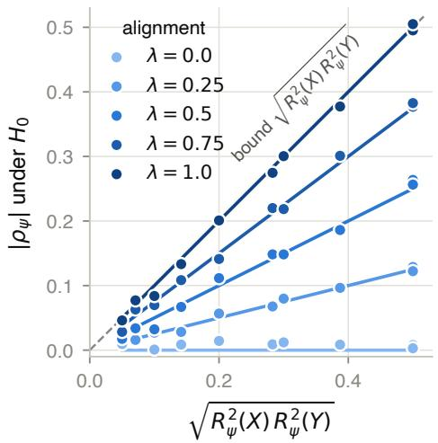  
Figure D.1: Experiment 1, $\hat { \rho } _ { \psi }$ under $H _ { 0 }$ against $\sqrt { R _ { \psi } ^ { 2 } ( X ) R _ { \psi } ^ { 2 } ( Y ) }$ for five values of λ. Solid lines are $\lambda \sqrt { R _ { \psi } ^ { 2 } ( X ) R _ { \psi } ^ { 2 } ( Y ) }$ , the value under $H _ { 0 }$ by (1); the dashed line is the bound.

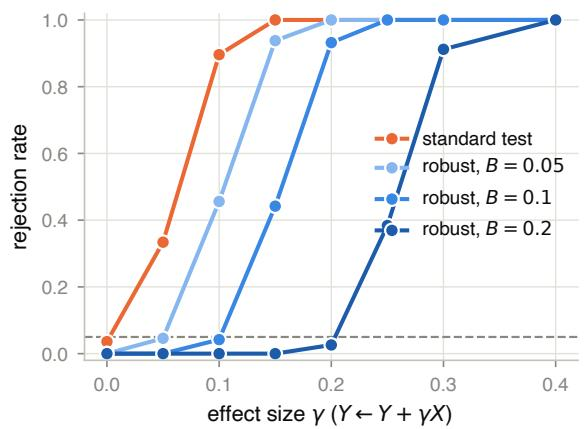

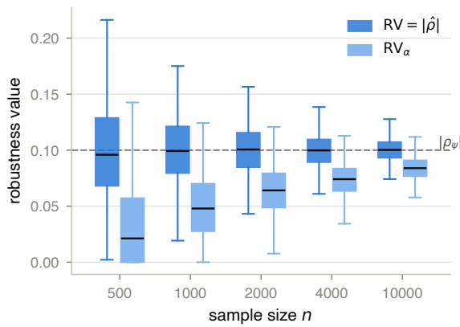  
Figure D.2: Experiment 1. Left: power at $n = 1 0 0 0$ against the efect size $\gamma$ of the alternative $Y = \theta _ { Y } ^ { \top } Z + \gamma X + \varepsilon _ { Y }$ , with the suficient embedding, for the residual correlation test and for the robust test with tolerances $B \in \{ 0 . 0 5 , 0 . 1 , 0 . 2 \}$ Right: $\hat { \rho } _ { \psi }$ (labelled $\mathrm { R V } = | \hat { \rho } |$ in the legend, the robustness value of the point estimate) and $\mathrm { R V } _ { \alpha }$ against n under $H _ { 0 }$ with the insuficient embedding at $\lambda = 1$ the dashed line is the population value $\rho _ { \psi _ { q } } = 0 . 1$

Experiment 2. Figure D.3 shows the sensitivity analysis with $\psi = E _ { 1 }$ and $\lambda = 1$ . The median of $\hat { \rho } _ { \psi }$ is 0.118 at $n = 5 0 0$ and 0.103 at $n = 1 0 { , } 0 0 0$ , against the oracle bound 0.109, and the median $\mathrm { R V } _ { \alpha }$ rises from 0.039 to 0.087. The insuficiency of $E _ { 1 }$ demonstrated by $E _ { 2 }$ has population value 0.109, all of the truth, but its estimate has median 0.000 at every n: the excess estimation variance of the 768 added coordinates dominates the increment (Appendix C.3). Figure D.4 shows the power at $n = 2 0 0 0$ . At λ = 1, the robust test with the oracle tolerance approximately holds its level (0.08 against 0.96 for the residual correlation test) and loses power at small efects.

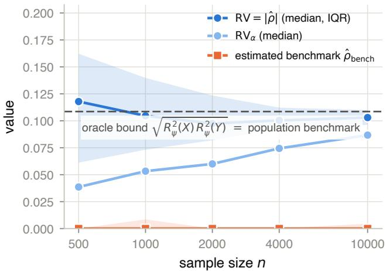  
Figure D.3: Experiment 2, $\hat { \rho } _ { \psi }$ (median and interquartile range; labelled $\mathrm { R V } = | \hat { \rho } |$ in the legend), median $\mathrm { R V } _ { \alpha }$ , and the estimated benchmark $\hat { \rho } _ { E _ { 1 }  E _ { 2 } }$ against n with $\psi = E _ { 1 }$ and $\lambda = 1$ . The dashed line is the oracle bound, which equals the population benchmark.

Experiment 3. Figure D.5 shows $\hat { \rho } _ { \psi }$ under $H _ { 0 }$ for the four embeddings of the generator’s state against their dimension, together with the true insuficiency of each, and the rejection rates of the tests for the mean and the last-token state at the last layer. Figure D.6 checks the identity of Theorem 2.3. For every embedding, the mean of $\hat { \rho } _ { \psi }$ over the 200 null datasets lies within 0.006 of the prediction $\vert \lambda \vert \sqrt { R _ { \psi } ^ { 2 } ( X ) R _ { \psi } ^ { 2 } ( Y ) }$ identified from the replicates, and below the bound $\sqrt { R _ { \psi } ^ { 2 } ( X ) R _ { \psi } ^ { 2 } ( Y ) }$ , since λ lies between 0.64 and 0.72. Figure D.7 shows the rejection rates against the coupled alternatives for $E _ { 1 } , E _ { 2 }$ and 384 principal components of the mean state at the last layer; the three embeddings give the same picture.

Application. Figure D.8 shows politeness and log length against score under every embedding of the comment being replied to. In both pairs, every embedded $\hat { \rho } _ { \psi }$ lies between the unconditional correlation and the baseline, and closer to the former; for politeness, the embedded values range from 0.062 to 0.072 against a baseline of 0.094. The insuficiency of $E _ { 1 }$ that any other embedding demonstrates is at most 0.024 over the six pairs. The baseline estimates $\rho _ { \mathrm { i d } }$ directly, so the gap to it is the bias of the embedded test. For $E _ { 1 }$ , the identity (1) with $\rho _ { \mathrm { i d } }$ from the baseline and $R _ { E _ { 1 } } ^ { 2 } ( X ) , R _ { E _ { 1 } } ^ { 2 } ( Y )$ and $\lambda$ from the variance components predicts $\rho _ { E _ { 1 } } = 0 . 0 7 2$ for politeness and 0.093 for log length, against measured values of 0.072 and 0.091.

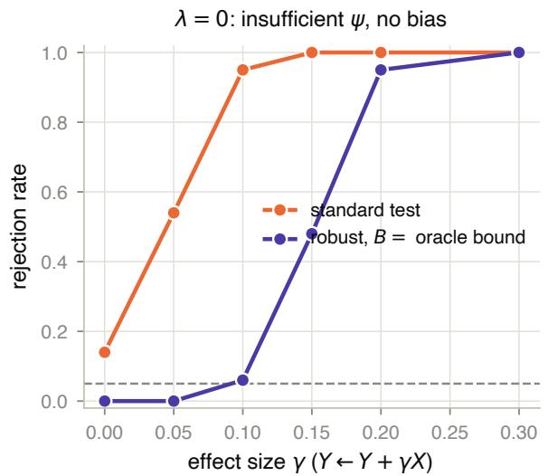

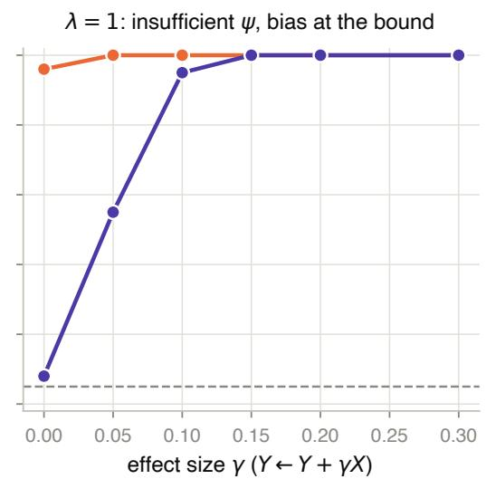  
Figure D.4: Experiment $2 ,$ power at $n = 2 0 0 0$ against the efect size $\gamma$ with $\psi = E _ { 1 }$ , for the residual correlation test and for the robust test with tolerance equal to the oracle bound. Left: $\lambda = 0$ , where $E _ { 1 }$ is insuficient but the residual correlation test is unbiased. Right: $\lambda = 1$ , where the residual correlation test rejects at rate 0.96 under $H _ { 0 }$

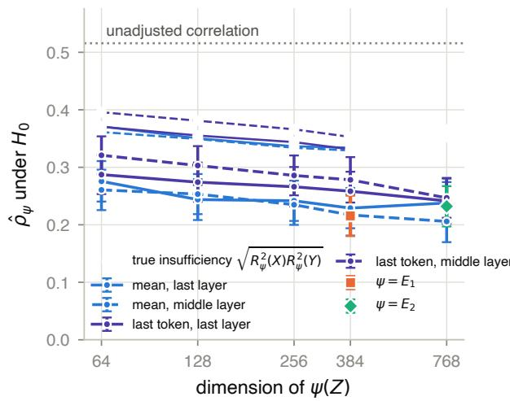

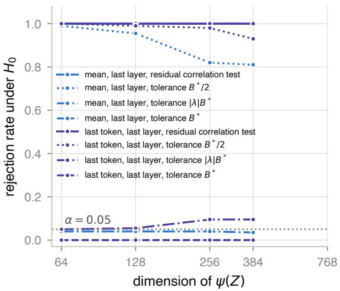  
Figure D.5: Experiment 3, the four embeddings of the generator’s state. Left: $\hat { \rho } _ { \psi }$ under $H _ { 0 }$ with 95% intervals against the dimension of $\psi ( Z )$ , for the principal components of the generator’s states (mean over the prompt tokens and last prompt token, at the last and the middle layer), for $E _ { 1 }$ and $E _ { 2 }$ , and the unadjusted correlation (dotted); hollow markers are the true insuficiency $\sqrt { R _ { \psi } ^ { 2 } ( X ) R _ { \psi } ^ { 2 } ( Y ) }$ of each embedding, identified from the replicates. Right: rejection rate under $H _ { 0 }$ over 200 null datasets drawn from the replicates, for the residual correlation test and for the robust test with the tolerance equal to half the true insuficiency, to the true bias $\vert \lambda \vert \sqrt { R _ { \psi } ^ { 2 } ( X ) R _ { \psi } ^ { 2 } ( Y ) }$ and to the true insuficiency $( B ^ { * }$ in the legend), for the mean and the last-token state at the last layer. All regressions are least squares.

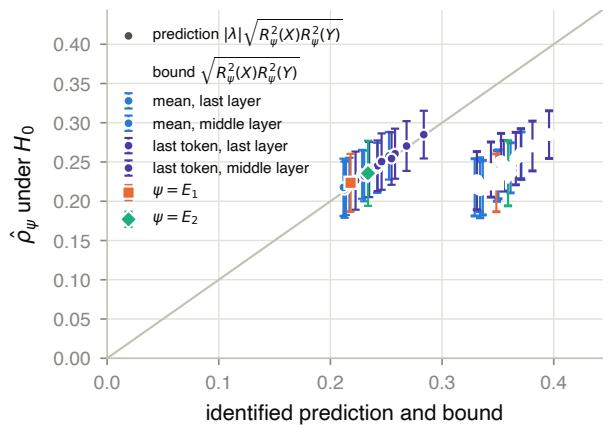  
Figure D.6: Experiment 3, identification check. For every embedding ψ, $\hat { \rho } _ { \psi }$ under $H _ { 0 }$ (mean over the 200 null datasets, with twice its standard deviation) against the prediction $\vert \lambda \vert \sqrt { R _ { \psi } ^ { 2 } ( X ) R _ { \psi } ^ { 2 } ( Y ) }$ of Theorem 2.3 (filled) and the bound $\sqrt { R _ { \psi } ^ { 2 } ( X ) R _ { \psi } ^ { 2 } ( Y ) }$ (hollow), both identified from the replicates; the line is the diagonal. Every filled marker lies on the diagonal, to within 0.006, and every hollow marker to its right.

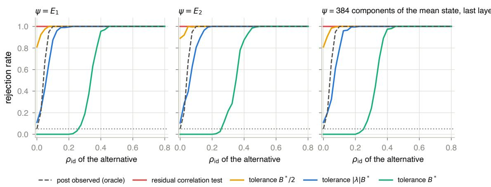  
Figure D.7: Experiment 3, rejection rates against the coupled alternatives for $\psi = E _ { 1 } , E _ { 2 }$ and 384 principal components of the generator’s mean state at the last layer, by the conditional correlation $\rho _ { \mathrm { i d } }$ of comment and summary given the post, over 200 datasets per value: the residual correlation test, the robust test with the tolerance equal to half the true insuficiency, to the true bias and to the true insuficiency $( B ^ { * }$ in the legend), and the reference test that conditions on the post through the unused draws (Appendix C.7).

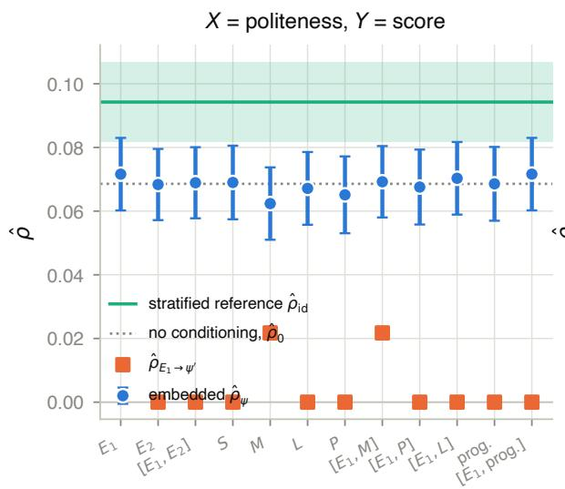

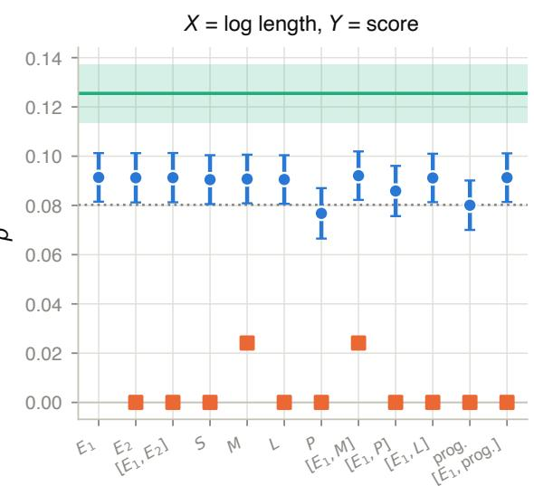  
Figure D.8: Application, politeness against score (left) and log length against score (right) under every embedding of the comment being replied to: $\begin{array} { r } { E _ { 1 } , \ E _ { 2 } , \ \left[ E _ { 1 } , E _ { 2 } \right] } \end{array}$ the surface statistics $S ,$ the metadata M, the TF-IDF directions $L ,$ the post embedding $P ,$ combinations with $E _ { 1 }$ , and the prognostic score. Circles: $\hat { \rho } _ { \psi }$ with 95% intervals; squares: the insuficiency of $E _ { 1 }$ demonstrated by the added embedding, $\hat { \rho } _ { E _ { 1 }  \psi ^ { \prime } } ;$ line and band: the baseline with its 95% interval; dotted: the unconditional correlation.

## Appendix E. Language model prompts

Every call in Experiment 3 uses the system prompt below and one of the two instructions, with the post inserted in place of {Z}. The comment instruction inserts one of three personas, drawn uniformly at random per post: “who tends to be critical and skeptical”, “who tends to be appreciative and enthusiastic”, or “who is matter-of-fact and reserved”. The two calls for a post share nothing but the model weights, so $X _ { i } \perp \perp Y _ { i } \mid Z _ { i }$ holds conditional on the model (Remark C.1). The sampling settings are in Appendix C.7.

System prompt. You write short pieces of text for a research dataset on online discussions. Follow the instructions exactly. Write in natural, varied English. Output plain text only: no preamble, no headings, no quotation marks around the whole answer.

Comment. Below is a post from an online discussion forum. POST: $< < < \{ Z \}$ >>> Write a reader comment of 2-3 sentences reacting to this post, as a forum member {PERSONA} would. Then, on a new final line, write exactly one of the words POSITIVE, NEGATIVE or NEUTRAL to label the overall sentiment of your comment.

Summary. Below is a post from an online discussion forum. POST: $< < < \{ Z \}$ >>> Write a 2-3 sentence summary of this post for a newsletter that digests forum discussions. Output only the summary.

The label line is removed from the comment before embedding. Of the 2,999 comments with a label, 1815 report a positive, 1140 a negative and 44 a neutral sentiment.