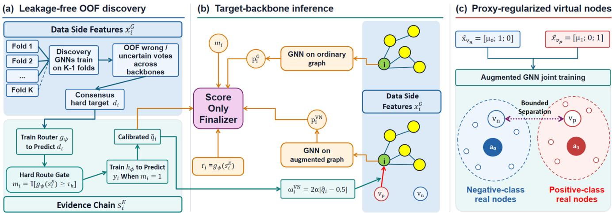
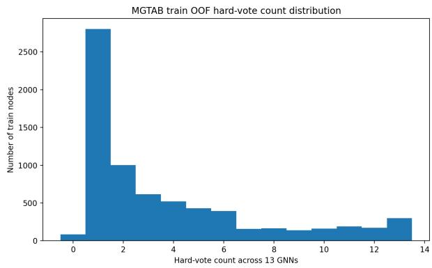
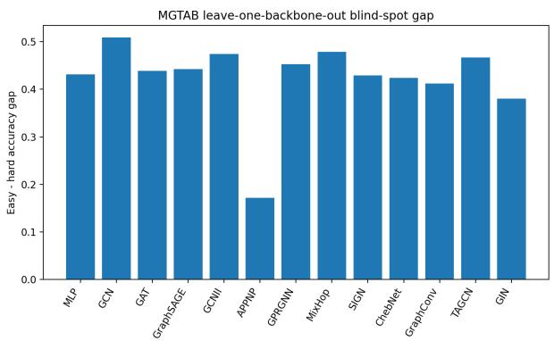
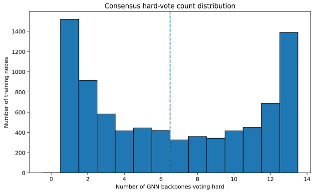
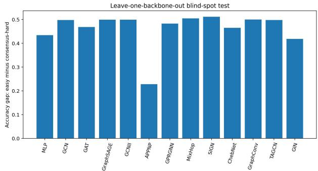
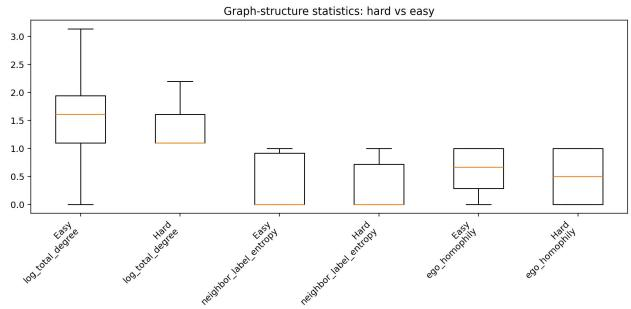

# Evi-VN: Hard Region Guided Virtual Node Evidence Injection for GNN-Based Fraud Detection

Jiran Tao, Yifan Wu, Binyan Jiang

The Hong Kong Polytechnic University {22117758r, yat-fan.wu}@connect.polyu.hk, by.jiang@polyu.edu.hk

## Abstract

Online platforms contain growing numbers of bots, decep- tive reviewers, and scam accounts that imitate legitimate users. Such camouflage blurs graph neighborhoods and behav- ioral attributes, making it dificult for graph neural networks (GNNs) to distinguish both well-disguised fraudsters and le-gitimate users. Across diverse GNNs, we observe overlapping errors on a shared hard region, suggesting the presence of la- tent fraud evidence that graph topologies and standard features fail to capture. Fraud-specific GNNs can mitigate particular graph pathologies, yet they still make limited use of heteroge- neous evidence such as structured records, text, images, and audio; uniform multimodal fusion may also disturb nodes al- ready handled reliably by the graph. We propose Evi-VN to learn and correct these shared blind spots rather than build another fraud detector. To our knowledge, Evi-VN is the first graph fraud detection framework to use feature isolated ev- idence chains to correct hard regions shared across GNNs. Its evidence chains connect behavior, content, and context across structured, textual, visual, and acoustic sources, help- ing expose camouflage that graph neighborhoods may miss. Crucially, Evi-VN selectively applies this evidence only to likely hard samples via virtual class nodes, preserving both the reliable predictions and the input design of existing GNNs. Shared hard regions also let Evi-VN enhance generic, fraud- specific, and unseen GNNs even with imperfect evidence mod- els. Experiments across bot, fake-review, refund-evidence, and telecom-fraud tasks validate these advantages.

## Introduction

Graph-based fraud detection methods use relations among accounts, reviews, products, claims, and activities to cap- ture coordinated behavior (Motie and Raahemi 2024; Cheng et al. 2025). However, camouflaged fraudsters can imitate benign connections and attributes, while atypical benign users may appear suspicious, leaving some nodes dificult for structurally driven models. Fraud datasets also contain complementary behavioral records, text, images, and audio that standard GNN inputs may not fully exploit. Uniformly fusing such evidence into every node may also disturb predic- tions already handled reliably by the graph. Across diverse backbones, we observe substantially overlapping out-of-fold (OOF) errors and uncertain predictions, which we define as a GNN-common hard region. Consequently, the fundamental question is not how to fuse every available feature into every node, but how to identify these intrinsically hard nodes and leverage information from other modalities to resolve these systematic failures of GNNs.

We propose Evi-VN, a novel plug-and-play enhancement framework for existin GNN-based fraud detectors. It or- ganizes complementary behavioral, content, and contextual cues into feature isolated evidence chains and applies them only to likely hard nodes, avoiding perturbation of confi- dent GNN predictions. This framework consists of three key components: a router that identifies likely hard nodes, a replaceable evidence processor that produces a calibrated class prior, and a pair of virtual class nodes, with only the prior-selected class node injecting a source-only message into each routed hard node to form the augmented graph. The evidence processor communicates with the graph learner only through a fixed scalar prior interface; evidence features are never appended to the original node feature matrix, and the backbone sampling and aggregation mechanisms remain unchanged. This design allows Evi-VN to augment diverse generic and fraud-specific GNN backbones without redesign- ing their original input schema.

We evaluate Evi-VN on bot detection, fake-review detec- tion, refund-evidence fraud, and telecom-fraud tasks with structured, textual, visual, and acoustic evidence. Across these settings, Evi-VN consistently improves the matched backbone-only baselines, and the gains extend to both generic and fraud-specific GNNs, including held-out architectures not used for hard-region discovery. Additional experiments show that the framework remains efective under alternative router and prior-generator families.

Our contributions are (1) we identify and quantify GNN-common hard regions using multi-backbone out-of-fold pre- dictions; (2) we propose a plug-and-play, feature-isolated enhancement framework that routes likely hard nodes and injects calibrated evidence through virtual class nodes; and (3) we demonstrate consistent gains across multiple fraud domains, evidence modalities, and both seen and held-out GNN backbones.

## Related Work

Graph-based fraud detection methods capture coordinated fraudulent behavior that is invisible in isolated records. CARE-GNN mitigates camouflage through relation-aware neighbor selection (Dou et al. 2020), PC-GNN addresses class imbalance through label-balanced sampling (Liu et al. 2021), and $\mathrm { H } ^ { 2 } .$ -FDetector separately models homophilic and heterophilic connections (Shi et al. 2022). Social-bot bench-marks such as TwiBot-20, TwiBot-22, Cresci-2015, and MGTAB emphasize account relations and behavioral at- tributes (Feng et al. 2021, 2022; Cresci et al. 2015; Shi et al. 2023), while collective review detection similarly ex-ploits reviewer–product structure and metadata (Rayana and Akoglu 2015). These methods improve graph learning under specific structural pathologies but leave non-graph evidence largely unused.

In particular, recent fraud datasets extend beyond graph relations and tabular attributes to include heterogeneous ev- idence such as text, images, and behavioral records. Fraud- Bench introduces image–text evidence for fraudulent refund claims (Yan et al. 2026), building on textual and behavioral information already present in social-bot and review bench- marks (Feng et al. 2021; Rayana and Akoglu 2015). Stagebased fusion taxonomies traditionally distinguish early, late, and hybrid fusion (Jiao et al. 2024), though recent surveys argue that these stage-based categories no longer capture modern deep multimodal architectures (Zhao, Zhang, and Geng 2024). For the GNN setting, the two endpoints of this spectrum already expose the design tension: early fusion cou- ples GNN inputs to modality encoders, whereas late fusion preserves the backbone but cannot influence message passing (Jiao et al. 2024). To resolve this, Evi-VN instead injects evidence structurally via virtual nodes. By selectively targeting on nodes that GNNs struggle to classify, our approach allows multimodal evidence to efectively guide message passing, improving detection accuracy on dificult cases without dis- rupting already reliable predictions.

Virtual nodes ofer a structural channel that can avoid this dichotomy, but they are typically studied as global struc- tural augmentations. A message-passing neural network with a virtual node can approximate graph-transformer attention (Cai et al. 2023), yet the standard virtual node assigns uniform node importance (Southern et al. 2025), prompting learnable rewiring (Qian et al. 2024) or clustered multiple virtual nodes (Hwang et al. 2022). These designs still treat the virtual node as an unsupervised aggregator of node fea- tures. LLM-guided virtual-node edge prediction also con- verts propagation-path semantics into graph structure for rumor detection (Tao, Wang, and Jiang 2026). Less attention has been paid to virtual nodes as a conditioned channel that injects sample-specific external evidence only into a routed subset of real nodes. Evi-VN closes this gap by using class- specific virtual nodes whose fixed prototype features and source-only edges deliver a calibrated prior only at routed hard nodes.

## Method

We introduce Evi-VN to incorporate external evidence into graph representation learning only for nodes estimated to be insuficiently resolved by the graph. A router identifies graph- hard nodes, a replaceable evidence processor estimates cali- brated class priors, and two class-specific virtual nodes inject these priors while being regularized as bounded class prox- ies.

Let $G = ( \nu , \mathcal { E } )$ be a graph with $n = | \nu |$ real nodes. Each node $i ~ \in ~ \mathcal { V }$ has graph features $\mathbf { x } _ { i } ^ { G } \in \mathbb { R } ^ { d _ { G } }$ and a binary label $y _ { i } \in \{ 0 , 1 \}$ . Training, development, and test splits are denoted by $\tau , \mathcal { D } _ { \mathrm { d e v } } ,$ , and $\mathcal { D } _ { \mathrm { t e s t } }$ . Each GNN fit median-imputes and standardizes graph-side features using only its fitting nodes: $\mathcal { T } \backslash \mathcal { T } _ { k }$ for an OOF model and all of $\bar { \tau }$ for a full refit. The fitted transformation is then ap- plied unchanged to held-out, development, and test nodes. Throughout, $\mathbf { \bar { x } } _ { i } ^ { G }$ denotes the corresponding processed vector and $\mathbf { X } ^ { \mathsf { \bar { G } } } = [ \mathbf { x } _ { 1 } ^ { \dot { G } } , \dots , \mathbf { x } _ { n } ^ { G } ] ^ { \top }$

The graph learner takes $( G , \mathbf { X } ^ { G } )$ as input. External evi- dence $\mathbf { s } _ { i } ^ { \bar { E } }$ is used exclusively for routing and prior estimation. It is never concatenated with GNN inputs or passed to the final classifier. Its construction is dataset-specific and may involve structured, textual, visual, or acoustic modalities; Supplementary Section S4.2 gives the extraction details and leakage controls.

This framework consists of three key components: a router that identifies likely hard nodes, a replaceable evidence pro- cessor that produces a calibrated class prior, and a pair of virtual class nodes. For each routed node, the prior selects one class virtual node and creates a source-only edge, where the virtual node is the message source and the real node is the target, with no reverse edge. These directed prior edges form the augmented graph.

$$
\begin{array} { r l } & { f _ { \theta } : ( G , \mathbf { X } ^ { G } ) \mapsto ( \mathbf { Z } ^ { G } , \mathbf { H } ^ { G } ) , } \\ & { g _ { \psi } : \mathbf { s } _ { i } ^ { E } \mapsto r _ { i } \in [ 0 , 1 ] , } \\ & { h _ { \phi } : \mathbf { s } _ { i } ^ { E } \mapsto q _ { i } \in [ 0 , 1 ] . } \end{array}
$$

Here $f _ { \theta }$ is the target graph learner, which outputs the raw prediction scores $\mathbf { \bar { Z } } ^ { G } \in \mathbf { \bar { \mathbb { R } } } ^ { n \times 2 }$ and the corresponding node embeddings $\mathbf { H } ^ { G } , r _ { i }$ estimates graph hardness, and $q _ { i }$ is an evidence-derived class prior. Non-routed nodes keep a neu- tral prior; routed nodes use the prior from $h _ { \phi }$ . The evidence branch communicates with the graph learner only through the scalar pair $( r _ { i } , q _ { i } )$ , so the modality-specific encoder can be replaced without altering the GNN feature schema.

During training, out-of-fold predictions from multiple dis- covery backbones provide supervision for the router. The learned routing scores and calibrated priors determine the source-only edges from two class-specific virtual nodes to the real nodes. The augmented graph is then optimized with the task loss and our proposed proxy regularization (ProxyReg). The discovery backbones serve only to construct routing tar- gets and are discarded afterwards; inference requires only the target graph learner, the router, and the prior generator for routed nodes.

## Hard Gated Leakage Free Evidence Priors

The router and the prior generator form a coupled, hard gated prior pipeline. The multi-backbone hard region diagnosis is used to obtain $g _ { \psi } ;$ it is not the direct training target of the prior generator. Let B be the set of discovery backbones and let $p _ { i b } ^ { \check { G } , \mathrm { O O F } }$ be the out-of-fold positive class probability of backbone b on training node i. Define $\hat { y } _ { i b } ^ { \mathrm { O O F } } = \mathbb { I } [ p _ { i b } ^ { G , \mathrm { O O F } } \geq$ $0 . 5 ] , e _ { i b } = \mathbb { I } [ \hat { y } _ { i b } ^ { \mathrm { O O F } } \neq y _ { i } ] ,$ , and $u _ { i b } = \mathbb { I } [ | p _ { i b } ^ { G , \mathrm { O O F } } - 0 . 5 | \leq \delta ]$ A training node is marked consensus hard when enough discovery backbones are wrong or uncertain:

  
Figure 1: Overview of Evi-VN. (a) Discovery-GNN OOF errors define consensus-hard targets; the evidence router gates prior generation and calibration. (b) Original and augmented versions of one target backbone run in parallel. A calibrated prior select and wei hts a source-onl virtual ed e, where $v _ { p }$ and $v _ { n }$ denote the ositive- and ne ative-class virtual nodes, res ectivel . The finalizer combines fold-held-out graph, prior, and routing scalars. (c) Fixed class-prototype inputs become hidden virtual-node proxies under proxy alignment, bounded separation, and stop-gradient anchors $( a _ { 0 }$ and $a _ { 1 } )$ . Discovery backbones are training only, and evidence-chain features never enter the GNN input.

$$
\begin{array} { r l } & { d _ { i } = \mathbb { I } \Big [ \sum _ { b \in \mathcal { B } } e _ { i b } \sum \kappa _ { \mathrm { e r r } } } \\ & { ~ \vee ~ \sum _ { b \in \mathcal { B } } \operatorname* { m a x } ( e _ { i b } , u _ { i b } ) \geq \kappa _ { \mathrm { h a r d } } \Big ] , \quad i \in \mathcal { T } . } \end{array}
$$

This uses only training OOF predictions and labels; setting $u _ { i b } = 0$ disables uncertainty votes.

The hard/easy router $g _ { \psi }$ is then trained to predict $d _ { i }$ from the evidence chain feature vector $\mathbf { s } _ { i } ^ { E }$ . To keep the down- stream prior leakage free on training nodes, router scores on $\tau$ are also produced out of fold. For a stratified partition $\{ \mathcal { T } _ { 1 } , \ldots , \mathcal { T } _ { K } \}$ of $\tau$ ,

$$
r _ { i } ^ { \mathrm { O O F } } = g _ { \psi } ^ { ( - k ) } ( \mathbf { s } _ { i } ^ { E } ) , \qquad i \in \mathcal { T } _ { k } ,
$$

where $g _ { \nu \nu } ^ { ( - k ) }$ is trained on $\mathcal { T } \backslash \mathcal { T } _ { k }$

A node is routed to the evidence chain prior generator only if

$$
m _ { i } = \mathbb { I } [ r _ { i } \geq \tau _ { h } ] = 1 ,
$$

where $\tau _ { h }$ is selected by development final-prediction accu- racy over a fixed uniform grid, then fixed before test evalua- tion. Nodes with $m _ { i } = 0$ bypass the prior generator, receive $\hat { q } _ { i } = 0 . 5$ , and have no virtual edge.

The router need not solve fraud detection itself: it only es- timates whether graph evidence is likely insuficient. Mathe- matically, the indicator $d _ { i }$ flags nodes where GNN backbones are incorrect or highly uncertain, directly implying that the graph structure alone is insuficient for fraud detection. The router is trained to predict this target using strictly the ex- ternal evidence chain $\mathbf { s } _ { i } ^ { E }$ as input, outputting a routing score $r _ { i }$ . Thus $r _ { i }$ acts as an independent, evidence-based estimate of graph failure. By thresholding this estimate, the indica- tor $m _ { i }$ acts as a gating mechanism, ensuring that structural intervention from the external evidence is injected only into nodes that actually need it.

Nodes with $m _ { i } = 1$ enter the second stage model, whose prior generator is trained on the routed subset to predict $y _ { i } .$ This separates hard-region recognition $( d _ { i } )$ from $( y _ { i } )$ and allows the two stages to use diferent model families. Its training-node scores are cross-fitted:

$$
q _ { i } ^ { \mathrm { O O F } } = h _ { \phi } ^ { ( - k ) } ( \mathbf { s } _ { i } ^ { E } ) , \qquad i \in \mathcal { T } _ { k } , m _ { i } = 1 .
$$

For development/test nodes, the prior generator predicts

$$
q _ { i } ^ { \mathrm { r a w } } = h _ { \phi } ^ { ( T _ { h } ) } ( \mathbf { s } _ { i } ^ { E } ) , \qquad i \in \mathcal { D } _ { \mathrm { d e v } } \cup \mathcal { D } _ { \mathrm { t e s t } } , m _ { i } = 1 ,
$$

where $\mathcal { T } _ { h } = \{ i \in \mathcal { T } : m _ { i } = 1 \}$ . Thus the split-aware raw prior is

$$
q _ { i } = \left\{ \begin{array} { l l } { q _ { i } ^ { \mathrm { O O F } } , } & { i \in \mathcal { T } , m _ { i } = 1 , } \\ { q _ { i } ^ { \mathrm { r a w } } , } & { i \in \mathcal { D } _ { \mathrm { d e v } } \cup \mathcal { D } _ { \mathrm { t e s t } } , m _ { i } = 1 , } \\ { 0 . 5 , } & { m _ { i } = 0 . } \end{array} \right.
$$

The prior is calibrated by a one-dimensional calibration func- tion fitted only on training OOF predictions and labels:

$$
\boldsymbol { \hat { q } _ { i } } = \left\{ \begin{array} { l l } { \boldsymbol { C } ( q _ { i } ) , } & { m _ { i } = 1 , } \\ { 0 . 5 , } & { m _ { i } = 0 , } \end{array} \right. \quad \boldsymbol { C } ( q ) = \sigma ( \alpha _ { C } \log \mathrm { i t } ( q ) + \beta _ { C } ) .
$$

Only $\hat { q } _ { i }$ enters graph injection and finalization. Component families are selected by downstream Evi-VN performance rather than standalone router/prior accuracy: a prior may be imperfect globally yet useful on routed graph failures. The evidence vector ${ \bf s } _ { i } ^ { E }$ is never appended to $\mathbf { \bar { X } } ^ { G }$

## Virtual Node Construction and Graph Augmentation

To convert the calibrated prior into graph messages, we in- troduce a negative-class virtual node $v _ { n }$ and a positive class virtual node $v _ { p } .$ . For $c \in \{ 0 , 1 \}$ , define ${ \mathcal { T } } ^ { ( c ) } = \{ i \in { \mathcal { T } }$ $y _ { i } = c \}$ as the class-c subset of the full training split. In the kth OOF fit, every prototype and loss below instead uses $( { \mathcal { T } } \setminus { \mathcal { T } } _ { k } ) ^ { ( c ) } = \{ i \in { \mathcal { T } } \setminus { \mathcal { T } } _ { k } : y _ { i } = c \}$ , so held-out nodes do not enter feature construction. For the full refit, let $\begin{array} { r } { \pmb { \mu _ { c } } = | \mathcal { T } ^ { ( c ) } | ^ { - 1 } \sum _ { i \in \mathcal { T } ^ { ( c ) } } \mathbf { x } _ { i } ^ { G } } \end{array}$ . The nodes inputs are

$$
\tilde { \mathbf { x } } _ { i } ^ { G } = [ \mathbf { x } _ { i } ^ { G } ; 0 ; 0 ] , \quad \tilde { \mathbf { x } } _ { v _ { n } } ^ { G } = [ \pmb { \mu } _ { 0 } ; 1 ; 0 ] , \quad \tilde { \mathbf { x } } _ { v _ { p } } ^ { G } = [ \pmb { \mu } _ { 1 } ; 0 ; 1 ] .
$$

Let $\tilde { \mathbf { X } } ^ { G }$ stack these inputs over $\mathcal { V } ^ { + } = \mathcal { V } \cup \{ v _ { n } , v _ { p } \}$ . The class means provide fixed input prototypes rather than free embeddings; their hidden representations are learned through the shared augmented GNN parameters.

Before message passing, $\hat { q } _ { i }$ selects the virtual node source and edge strength. For thresholds $\tau _ { 1 } > 0 . 5$ and $\tau _ { 0 } < 0 . 5 .$ define

$$
\xi _ { i } = 2 | \hat { q } _ { i } - 0 . 5 | \in [ 0 , 1 ] .
$$

The source index is

$$
\chi _ { i } = \left\{ \begin{array} { l l } { p , } & { m _ { i } = 1 \mathrm { a n d } \hat { q } _ { i } \geq \tau _ { 1 } , } \\ { n , } & { m _ { i } = 1 \mathrm { a n d } \hat { q } _ { i } \leq \tau _ { 0 } , } \\ { \emptyset , } & { \mathrm { o t h e r w i s e } . } \end{array} \right.
$$

Here $p$ represents the positive virtual node $v _ { p } ,$ n represents the negative virtual node $v _ { n } .$ , and $\mathcal { D }$ indicates no injected edge. The calibrated prior thus augments the original graph by constructing the source-only edge set $\mathcal { E } _ { \mathrm { V N } }$ . Each prior- induced edge has weight $w _ { i } ^ { \mathrm { V N } } = \alpha \check { \xi } _ { i } ;$ ; layers without scalar edge weights represent its strength using repeated edges. Combining these prior-induced edges with the original graph gives $G ^ { + } = ( \nu ^ { + } , \mathcal { E } ^ { + } , \tilde { \mathbf { X } } ^ { G } )$ , where $\mathcal { E } ^ { + } = \mathcal { E } \cup \mathcal { E } _ { \mathrm { V N } }$ . The target backbone then operates on the augmented graph $G ^ { + }$ to output the augmented prediction logit $\mathbf { \bar { z } } _ { i } ^ { \mathrm { V N } } \in \mathbb { R } ^ { \breve { 2 } }$ for node $i ,$ yielding $p _ { i } ^ { \mathrm { V N } } = \operatorname { s o f t m a x } ( \mathbf { z } _ { i } ^ { \mathrm { V N } } ) _ { 1 }$ . Here, the subscript 1 selects the component associated with class label $y _ { i } = 1$ which denotes the fraud class.

This construction prevents real node messages from rewriting the class prototypes and then broadcasting graph noise globally. The confidence weighting $w _ { i } ^ { \mathrm { V N } }$ further quan- tifies the prior strength, ensuring that uncertain evidence produces weak or no structural intervention.

## Real Node Classification Loss

Virtual nodes are unlabeled and excluded from all data masks. Supervision uses real training nodes only:

$$
\begin{array} { c } { \displaystyle \mathcal { L } _ { \mathrm { C E } } = - \frac { 1 } { | \mathcal { T } | } \sum _ { i \in \mathcal { T } } \omega _ { y _ { i } } \log \mathrm { s o f t m a x } ( \mathbf { z } _ { i } ^ { \mathrm { V N } } ) _ { y _ { i } } , } \\ { \displaystyle \omega _ { c } = \frac { | \mathcal { T } | } { 2 \operatorname* { m a x } ( | \mathcal { T } ^ { ( c ) } | , 1 ) } . } \end{array}
$$

## Virtual Node Proxy Regularization

To ensure the virtual nodes efectively represent their respec- tive classes, we introduce ProxyReg to encourage the virtual nodes to serve as class proxies in the hidden space. Notably, their input features are set to be the fixed class-feature pro- totypes introduced in the virtual node construction section, rather than freely trainable node embeddings. During the training of the augmented GNN $( \mathrm { i . e . }$ , the GNN operating on the augmented graph), their hidden representations are recomputed through the shared message passing layers and evolve with the backbone parameters. They are not directly assigned the mean hidden representation of either class.

Without this constraint, virtual nodes can act as ordinary hubs whose semantics are only implied by their initial fea- tures. Proxy classification aligns their learned hidden repre- sentations with real classes, while bounded separation and anchoring avoid unrestricted prototype drift or collapse.

Let ${ \bf u } _ { j } = { \bf h } _ { j } / ( \| { \bf h } _ { j } \| _ { 2 } + \epsilon )$ denote the normalized aug- mented GNN hidden representation of either a real or virtual node $j ,$ and let $\pi ( 0 ) = n , \pi ( 1 ) = p .$ . The similarity of real node i to class proxy c is $s _ { i , c } = \mathbf { u } _ { i } ^ { \top } \mathbf { u } _ { v _ { \pi ( c ) } } / \tau _ { p }$ . The proxy classification loss is

$$
\mathcal { L } _ { \mathrm { p r o x y } } = - \frac { 1 } { \vert \mathcal { T } \vert } \sum _ { i \in \mathcal { T } } \omega _ { y _ { i } } \log \frac { \exp ( s _ { i , y _ { i } } ) } { \exp ( s _ { i , 0 } ) + \exp ( s _ { i , 1 } ) } .
$$

We use bounded separation

$$
\mathcal { L } _ { \mathrm { s e p } } = \left[ \mathbf { u } _ { v _ { n } } ^ { \top } \mathbf { u } _ { v _ { p } } - \gamma _ { \mathrm { s e p } } \right] _ { + } ^ { 2 } ,
$$

where $\gamma _ { \mathrm { s e p } } \in [ - 1 , 1 ]$ is the maximum allowed cosine simi- larity between the two virtual node proxies. The loss is zero when their similarity is at most $\gamma _ { \mathrm { s e p } }$ and penalizes only ex- cess similarity, preventing proxy collapse without forcing unbounded separation.

For each class, let $\begin{array} { r } { \bar { \mathbf { u } } _ { c } = | \mathcal { T } ^ { ( c ) } | ^ { - 1 } \sum _ { i \in \mathcal { T } ^ { ( c ) } } \mathbf { u } _ { i } } \end{array}$ . be its cur-rent real-node center and define the corresponding anchor as $\mathbf { a } _ { c } = \mathrm { s g } ( \bar { \mathbf { u } } _ { c } )$ . The anchor loss is

$$
\mathcal { L } _ { \mathrm { a n c h o r } } = \sum _ { c \in \{ 0 , 1 \} } \Big [ \big \| \mathbf { u } _ { v _ { \pi ( c ) } } - \mathbf { a } _ { c } \big \| _ { 2 } - \rho _ { \mathrm { a n c } } \Big ] _ { + } ^ { 2 } .
$$

Here $\rho _ { \mathrm { a n c } } \in [ 0 , 2 ]$ is the allowed radius around the stop- gradient class anchor. The anchor $\mathbf { a } _ { c } = \mathrm { s g } ( \bar { \mathbf { u } } _ { c } )$ is recom- puted from the current real node representations but receives no gradient. The loss is zero while the corresponding virtual proxy remains within $\rho _ { \mathrm { a n c } }$ of its class anchor and penalizes only the excess distance. It therefore limits proxy drift with- out assigning the class center directly to the virtual node or moving real nodes through the anchor.

## Proxy Regularized GNN Training Objective

The augmented GNN is trained with the objective in Eq. (1):

$$
\begin{array} { r } { \mathcal { L } = \mathcal { L } _ { \mathrm { C E } } + \eta _ { t } \left( \lambda _ { \mathrm { p r o x y } } \mathcal { L } _ { \mathrm { p r o x y } } + \lambda _ { \mathrm { s e p } } \mathcal { L } _ { \mathrm { s e p } } \right. } \\ { \left. + \lambda _ { \mathrm { a n c h o r } } \mathcal { L } _ { \mathrm { a n c h o r } } \right) , \qquad } \end{array}\tag{1}
$$

where $\eta _ { t } = \operatorname* { m i n } ( 1 , t / T _ { \mathrm { w a r m } } )$ . Hyperparameters and compo- nent checks are reported in Supplementary Section S3.

## Score Only Finalizer

Let $p _ { i } ^ { G }$ and $p _ { i } ^ { \mathrm { V N } }$ be the original- and augmented-graph prob- abilities. The finalizer uses the five scalars in Eq. (2):

$$
\mathbf { s } _ { i } ^ { F } = [ \ell _ { i } ^ { \mathrm { V N } } ; \ell _ { i } ^ { q } ; \ell _ { i } ^ { G } ; r _ { i } ; m _ { i } ] ,\tag{2}
$$

where

$$
\begin{array} { r c l } { { } } & { { } } & { { \displaystyle \ell _ { i } ^ { \mathrm { V N } } = \log \frac { p _ { i } ^ { \mathrm { V N } } } { 1 - p _ { i } ^ { \mathrm { V N } } } , } } \\ { { } } & { { } } & { { } } \\ { { } } & { { } } & { { \displaystyle \ell _ { i } ^ { G } = \log \frac { p _ { i } ^ { G } } { 1 - p _ { i } ^ { G } } , } } \\ { { } } & { { } } & { { \displaystyle \ell _ { i } ^ { q } = \mathrm { c l i p } \left( \log \frac { \hat { q } _ { i } } { 1 - \hat { q } _ { i } } , - B , B \right) . } } \end{array}
$$

For easy nodes, $m _ { i } = 0 , \hat { q } _ { i } = 0 . 5$ , and $\ell _ { i } ^ { q } = 0$ . Every training component is cross-fitted. For $i \in \mathcal { T } _ { k } , p _ { i } ^ { G }$ and $p _ { i } ^ { \mathrm { V N } }$ come from original and augmented GNNs trained only on $\mathcal { T } \backslash \mathcal { T } _ { k } ;$ ; the matching $r _ { i }$ and $\hat { q } _ { i }$ are also OOF. Development/test compo- nents come from models refit on all of $\tau$ . Thus the finalizer sees fold-held-out base-score distributions during training, rather than the overconfident predictions of GNNs evalu- ated on their own training nodes. This is stacking control, not merely label isolation: without it, a leakage-free test set could still face a train–test confidence shift at the finalizer.

The final probability is produced by the development- selected score-only classifier in Eq. (3):

$$
\begin{array} { r } { \hat { p } _ { i } ^ { \mathrm { f i n a l } } = \rho _ { \omega } ( \mathbf { s } _ { i } ^ { F } ) , } \end{array}\tag{3}
$$

where $\rho _ { \omega }$ is a development-selected lightweight classifier trained with class-weighted supervision. Restricting it to scalar scores keeps the multimodal claim attributable to the prior and virtual-edge path rather than a second hidden mul- timodal classifier. It never consumes $\mathbf { s } _ { i } ^ { E }$ or ${ \bf h } _ { i } ^ { \mathrm { V N } }$ ; all config- urations and thresholds are fixed before test evaluation.

## Experimental Setup

## Datasets

We evaluate six public benchmarks spanning social bots, deceptive reviews, refund evidence, and telecom fraud: MGTAB (Shi et al. 2023), TwiBot-20 (Feng et al. 2021), Cresci-2015 (Cresci et al. 2015), YelpZip (Rayana and Akoglu 2015), FraudBench (Yan et al. 2026), and TeleAntiFraud-28k (Ma et al. 2025). MGTAB is the primary setting, with 10,199 labeled accounts and a 7,139/1,530/1,530 train/dev/test split; the others test trans- fer across structured, textual, visual, and acoustic evidence.

All six datasets are publicly accessible and download- able from their cited releases, so we do not upload or re- distribute raw copies. Supplementary Section S4.2 reports dataset statistics, splits, graph construction, retained evi- dence, and excluded shortcut fields; Sections S5–S7 give the extended YelpZip, FraudBench, and TeleAntiFraud pro- tocols.

## Backbones and Prior Generators

MGTAB uses 13 discovery backbones: MLP, GCN (Kipf and Welling 2017), GAT (Velićković et al. 2018), Graph-SAGE (Hamilton, Ying, and Leskovec 2017), GCNII (Chen et al. 2020), APPNP (Gasteiger, Bojchevski, and Günnemann 2019), GPRGNN (Chien et al. 2021), MixHop (Abu-El-Haija et al. 2019), SIGN (Frasca et al. 2020), ChebNet (Deferrard, Bresson, and Vandergheynst 2016), GraphConv (Morris et al.

2019), TAGCN (Du et al. 2018), and GIN (Xu et al. 2019). Its XGBoost (Chen and Guestrin 2016) router and prior gen-erator use OOF consensus labels and routed samples, respec- tively, with OOF Platt calibration (Platt 1999). Development-only router selection is reported in Supplementary Table S14. Held-out tests include CARE-GNN (Dou et al. 2020) and PC-GNN (Liu et al. 2021); Supplementary Section S3.3 varies the discovery-set size.

TwiBot-20 uses the same discovery set and an XGBoost prior; Cresci-2015 uses 13-backbone discovery, an XGBoost router, and logistic prior. Supplementary Section S1 reports their full results with YelpZip.

## Baselines

Because Evi-VN augments rather than replaces a detector, our primary unit of comparison is a matched GNN back- bone with identical graph inputs. This includes strong fraud- oriented backbones in the unseen-transfer study. The remain- ing controls hold the routed prior fixed and ask whether gains come from ensembling, output fusion, score learning, or structural injection; they are more diagnostic than comparing unrelated leaderboard numbers obtained with diferent features and splits.

Accordingly, Table 1 measures average improvement over a broad discovery family, while Table 6 tests transfer to held- out architectures, including CARE-GNN and PC-GNN. This paired protocol complements rather than avoids SOTA com- parison: it asks whether those detectors themselves become stronger under the same data split. A leaderboard comparison against methods using diferent relations, features, or label access would not isolate that contribution.

The main paper compares Evi-VN with:

• Backbone only: the first-stage graph learner trained on the original graph.

• GNN probability ensemble: an output level ensemble of the 13 first stage GNN backbones.

• Weighted probability fusion: $( 1 - \lambda ) p _ { i } ^ { G } + \lambda \hat { q } _ { i }$

• Weighted logit fusion: $\sigma ( ( 1 - \lambda ) \log \mathrm { i t } ( p _ { i } ^ { G } ) + \lambda \log \mathrm { i t } ( \hat { q } _ { i } ) )$

Ensemble weights and all model configurations are selected on development data; prior-based baselines share $\hat { q } _ { i }$

## Evaluation Metrics

We report Accuracy, positive class F1, and AUC. The pos- itive class is bot for TwiBot-20, Cresci-2015, and MGTAB, fake/spam review for YelpZip, fake-damaged evidence for FraudBench, and fraudulent call for TeleAntiFraud-28k. All router, prior, calibration, route, fusion, and finalizer choices are fixed using training OOF or development data. Test la- bels are used only once for reporting. Training-node inputs to the finalizer are cross-fitted for every base score, whereas development/test scores come from models refit on the full training split. To support reproducibility and practical use, our submission includes the Evi-VN implementation and Evi-VN Studio, a configurable application for applying the framework to real world fraud detection tasks.

<table><tr><td>Method</td><td>Acc.</td><td> $\mathrm { F 1 _ { + } }$ </td><td>AUC</td></tr><tr><td>Backbone only</td><td>0.8606</td><td>0.7649</td><td>0.9207</td></tr><tr><td>GNN ensemble</td><td>0.9072</td><td>0.8325</td><td>0.9660</td></tr><tr><td>Prob. fusion</td><td>0.9171</td><td>0.8579</td><td>0.9692</td></tr><tr><td>Logit fusion</td><td>0.9172</td><td>0.8580</td><td>0.9695</td></tr><tr><td>EvI-VN</td><td>0.9283</td><td>0.8707</td><td>0.9769</td></tr></table>

Table 1: MGTAB test performance averaged over 13 GNN backbones. Metrics are Accuracy, positive class F1, and AUC.

<table><tr><td>Control</td><td>Metric  $\Delta \left( \mathsf { p p } \right)$ </td><td>95% CI (pp)</td><td> $\mathrm { S F } p$ </td></tr><tr><td>Logit fus. Acc.</td><td>+1.10</td><td>[0.36,1.90]</td><td>0.0106</td></tr><tr><td>Logit fus. F1+</td><td>+1.27</td><td>[0.23,2.38]</td><td>0.0216</td></tr><tr><td>Logit fus. AUC</td><td>+0.74</td><td>[0.05,1.64]</td><td>0.0398</td></tr><tr><td>Prob. fus. Acc.</td><td>+1.11</td><td>[0.33,1.96]</td><td>0.0133</td></tr><tr><td>Prob. fus. F1+</td><td>+1.27</td><td>[0.18,2.45]</td><td>0.0284</td></tr><tr><td>Prob. fus. AUC</td><td>+0.77</td><td>[0.08,1.68]</td><td>0.0304</td></tr><tr><td>Backbone Acc.</td><td>+6.77</td><td>[4.00,9.91]</td><td> $1 . 2 2 \times 1 0 ^ { - 4 }$ </td></tr><tr><td>Backbone F1+</td><td>+10.58</td><td>[6.80,14.60]</td><td> $1 . 2 2 \times 1 0 ^ { - 4 }$ </td></tr><tr><td>Backbone AUC</td><td>+5.61</td><td>[3.05,8.56]</td><td> $1 . 2 2 \times 1 0 ^ { - 4 }$ </td></tr></table>

Table 2: MGTAB paired backbone tests. Diferences are per- centage points (pp). CI: bootstrap over backbones; SF: one-sided sign-flip test for Evi-VN superiority.

## Results and Analysis

## MGTAB Main Results

Table 1 averages the 13 MGTAB discovery backbones under the configuration above. Reporting the mean paired backbone efect is central to our goal: Evi-VN should improve a fam- ily of graph learners rather than win through one favorable architecture.

Evi-VN improves mean Accuracy/F1/AUC over Backbone only by 6.77/10.58/5.61 percentage points (pp), and still ex-ceeds logit fusion by 1.10/1.27/0.74 pp. The ensemble tests whether GNN diversity is suficient, while probability/logit fusion expose the same routed prior only after message pass- ing. Their remaining gap supports converting evidence into graph structure.

To verify that our gains are consistent across architec- tures, Table 2 matches each Evi-VN model directly against its corresponding baseline. Specifically, for a given metric such as AUC, we calculate the exact performance diference between Evi-VN and the baseline for each of the 13 individ- ual GNN architectures. We then apply bootstrapping to these 13 diference scores to construct 95% confidence intervals, and use a one-sided sign-flip test to assess statistical signifi- cance. Notably, these tests confirm that Evi-VN significantly outperforms all baselines. This consistent superiority proves that selectively injecting evidence into the graph structure via virtual nodes is fundamentally more powerful than standard post-hoc score blending, regardless of the underlying GNN architecture. Supplementary Section S1.2 reports additional baseline comparisons on the other three real datasets.

<table><tr><td>Hard subset</td><td>Base Evi-VN ∆ Acc.</td></tr><tr><td>LOO consensus 52.97</td><td>66.79 +13.82</td></tr></table>

Table 3: MGTAB correction on target-excluded LOO consensus-hard nodes, averaged over 13 backbones. Accu- racy is in percent.
<table><tr><td>Router Prior</td><td></td><td>Routed</td><td>∆ over backbone</td></tr><tr><td>XGB</td><td>XGB</td><td></td><td>.8920/.8666/.9625+.0673/+.1056/+.0557</td></tr><tr><td>XGB</td><td>LGBM</td><td></td><td>.8929/.8682/.9622 +.0660/+.1035/+.0545</td></tr><tr><td>XGB</td><td></td><td></td><td>TabICL v2.8957/.8714/.9625 +.0643/+.1015/+.0547</td></tr><tr><td>LGBM XGB</td><td></td><td></td><td>.8919/.8639/.9638+.0622/+.0973/+.0532</td></tr><tr><td></td><td>LGBM LGBM</td><td></td><td>.8955/.8679/.9630 +.0635/+.1000/+.0537</td></tr><tr><td>RF</td><td>XGB</td><td></td><td>.8947/.8695/.9632 +.0637/+.0997/+.0537</td></tr></table>

Table 4: MGTAB router/prior replacement using XGBoost (Chen and Guestrin 2016), LightGBM (Ke et al. 2017), random forest, and TabICLv2 (Qu et al. 2026). Each triplet reports Accuracy/F1/AUC; gains are over the matched 13- backbone Backbone only mean.

## Hard-node correction.

Table 3 evaluates target-excluded consensus-hard nodes: for each target, the other 12 backbones mark nodes hard when wrong or uncertain, preventing the evaluated model from selecting its own errors. On these hard nodes, Evi-VN raises Accuracy by 13.82 pp.

## Router/prior replacement.

Table 4 tests six plug-in pairings. Every pairing improves all metrics with modest variation, supporting component re- placeability.

## Cross-Dataset Results

Table 5 summarizes the additional tasks. TwiBot-20 and Cresci-2015 use structured evidence, YelpZip uses an LLM, FraudBench uses ima e–text evidence, and TeleAntiFraud- 28k uses audio–text evidence. Results are paired with the backbone-only model under the same split and graph inputs.

Accuracy gains range from 3.45 pp on Cresci-2015 to 35.47 pp on TeleAntiFraud; AUC rises by 15.36 pp on Fraud- Bench and 9.36 pp on TeleAntiFraud. These results show that Evi-VN can construct evidence chains from diferent feature sources and use their complementary information to improve fraud detection. Full details are provided in Supplementary Sections S5–S7.

## Transfer to Unseen Backbones

Table 6 reuses the discovery router/prior on held-out generic and fraud-specific backbones. None contributes to hard- region discovery, so this experiment separates transferable evidence from co-adaptation to the discovery set.

Evi-VN improves every held-out backbone on all met- rics, raising mean Accuracy/F1/AUC by 5.18/7.62/3.27 pp. The set spans graph filtering (Wu et al. 2019), attentionbased propagation (Dwivedi and Bresson 2021), feature-wise modulation (Brockschmidt 2020), gated convolution (Bresson and Laurent 2017), CARE-GNN (Dou et al. 2020), and PC-GNN (Liu et al. 2021). Accuracy also rises by 1.96 pp on CARE-GNN and 3.27 pp on PC-GNN, supporting the en- hancer positioning rather than a claim to replace these detec- tors. Detailed results for the matched routed-fusion controls are provided in Supplementary Section S1.1.

<table><tr><td>Dataset</td><td>Method</td><td>Acc.</td><td>F1+</td><td>AUC</td></tr><tr><td>TwiBot-20</td><td>Backbone</td><td>0.7891</td><td>0.8078 0.8666</td><td></td></tr><tr><td rowspan="2">Cresci-15</td><td>EvI-VN</td><td></td><td>0.8438 0.8659 0.9196</td><td></td></tr><tr><td>Backbone 0.8690 0.8883 0.9719</td><td></td><td></td><td></td></tr><tr><td rowspan="2">YelpZip</td><td>EvI-VN</td><td></td><td>0.9035 0.9195 0.9752</td><td></td></tr><tr><td>Backbone 0.8182 0.5526 0.8689</td><td></td><td></td><td></td></tr><tr><td rowspan="2">FraudBench</td><td>EvI-VN</td><td></td><td>0.9373 0.7422 0.9354</td><td></td></tr><tr><td>Backbone0.82750.81920.8438</td><td></td><td></td><td></td></tr><tr><td rowspan="2">TeleAntiFraud Backbone 0.5806 0.7173 0.9000</td><td>EvI-VN</td><td></td><td>0.9780 0.9800 0.9974</td><td></td></tr><tr><td>EvI-VN</td><td>0.9353 0.9425 0.9936</td><td></td><td></td></tr></table>

Table 5: Cross-dataset paired results. TwiBot-20, Cresci- 2015, and TeleAntiFraud average 13 backbones; YelpZip uses DeepSeek-V4-Pro; FraudBench averages six graphs.
<table><tr><td rowspan="2">Backbone</td><td colspan="2">Backbone only</td><td colspan="2">EvI-VN</td></tr><tr><td>Acc.</td><td>F1+ AUC</td><td>Acc.</td><td>F1+ AUC</td></tr><tr><td>SGC</td><td></td><td>0.8105 0.7140 0.9109 0.9176 0.8612 0.9783</td><td></td><td></td></tr><tr><td>GraphTrans.</td><td></td><td>0.8928 0.8202 0.9569 0.9294 0.87640.9782</td><td></td><td></td></tr><tr><td>FiLM</td><td></td><td>0.8948 0.8193 0.9570 0.9301 0.8772 0.9786</td><td></td><td></td></tr><tr><td></td><td></td><td>ResGatedGCN 0.8484 0.7588 0.92340.9275 0.8686 0.9798</td><td></td><td></td></tr><tr><td>CARE-GNN</td><td></td><td>0.9059 0.8393 0.9637 0.9255 0.8713 0.9779</td><td></td><td></td></tr><tr><td>PC-GNN</td><td></td><td>0.8974 0.8242 0.9600 0.9301 0.87850.9784</td><td></td><td></td></tr><tr><td>Mean</td><td></td><td>0.8749 0.7960 0.94530.9267 0.8722 0.9780</td><td></td><td></td></tr></table>

Table 6: MGTAB transfer to unseen GNN backbones.

## GNN-Common Hard Regions

Table 7 uses 13-backbone training OOF predictions except YelpZip, whose diagnosis is post-hoc. Each target backbone is excluded from its induced hard/easy split.

<table><tr><td>Dataset</td><td>Diag. hard rate</td><td>Acc. gap</td><td>AUC gap</td></tr><tr><td>TwiBot-20</td><td>48.0%</td><td>0.462</td><td>0.519</td></tr><tr><td>MGTAB</td><td>18.0%</td><td>0.424</td><td>0.445</td></tr><tr><td>Cresci-2015</td><td>2.7%</td><td>0.171</td><td>0.111</td></tr><tr><td>YelpZip</td><td>28.6%</td><td>0.245</td><td>0.184</td></tr><tr><td>FraudBench</td><td>37.2%</td><td>0.559</td><td>0.781</td></tr><tr><td>TeleAntiFraud</td><td>24.0%</td><td>0.632</td><td>0.770</td></tr></table>

Table 7: Cross-dataset GNN common hard-region diagnosis. The diagnostic hard rate is the fraction of nodes marked consensus hard in the leave-one-backbone-out diagnosis.

All six datasets show positive easy–hard gaps, averaging 0.416 in Accuracy and 0.468 in AUC. This supports a shared rather than backbone-specific failure region, while the dif- ferent hard rates argue against one universal error heuristic: the virtual-node interface is fixed, but routing and evidence models remain replaceable. Supplementary Sections S2, S6, and S7 give task-level diagnostics.

## Feature Isolation and Final Input Controls

Table 8 compares structural injection with matched score-only inputs. Stacking w/o VN receives the same backbone, prior, router, and mask information but removes virtual-node message passing and the augmented GNN score, isolating structure from post-hoc combination.

<table><tr><td>Final input / control</td><td>Acc.</td><td>F1+</td><td>AUC</td></tr><tr><td>EvI-VN</td><td></td><td>0.9283 0.8710 0.9767</td><td></td></tr><tr><td>Stacking w/o VN</td><td></td><td>0.9175 0.86000.9755</td><td></td></tr><tr><td>w/o augmented score</td><td></td><td>0.9166 0.8572 0.9731</td><td></td></tr><tr><td>w/o router score/mask 0.9164 0.8560 0.9724</td><td></td><td></td><td></td></tr><tr><td>w/o backbone score</td><td></td><td>0.91500.8552 0.9728</td><td></td></tr><tr><td>w/o prior score</td><td></td><td>0.9122 0.85080.9706</td><td></td></tr></table>

Table 8: MGTAB final input ablation and no-VN stacking control.

All removals reduce performance. Evi-VN exceeds matched stacking without virtual nodes by 1.08 pp in Ac- curacy and 1.10 pp in F1; removing the prior score produces larger drops of 1.61 and 2.02 pp. Thus, learned score combi- nation explains part, but not all, of the gain.

## Limitations

MGTAB has paired tests and a five-seed finalizer check, but full pipeline multi-seed reruns remain expensive. Our evidence processors are replaceable, but current experiments cover selected tabular, language, vision, and audio encoders rather than every model family. FraudBench retains highly separable generated text, while TeleAntiFraud is synthetic and transcript-dominated.

## Conclusion

We presented Evi-VN, a model-agnostic enhancer that learns hard regions shared across GNNs and injects featureisolated, multimodal evidence through source-only virtual class nodes. Across bot, review, refund, and telecom fraud tasks, it consistently strengthens generic, fraud-specific, and unseen GNNs, with particularly clear gains on shared hard nodes and over matched fusion and no-VN stacking controls. These results show that structured, textual, visual, and acous- tic evidence can strengthen existing graph detectors without changing their input interface. Ultimately, Evi-VN serves as a powerful, plug-and-play framework that translates diverse multimodal evidence into targeted structural interventions, directly resolving the blind spots of existing graph detectors.

## Supplementary Material

This supplementary material is organized as an evidence trail for the main paper. All experiments follow the same strict fea- ture isolation rule as the main paper: GNN backbones receive only data-side node features and graph structure, while ev- idence chain features are used only by the hard/easy router and the routed prior generator.

Reader’s map. Section S1 reports the MGTAB unseenbackbone controls and the additional TwiBot-20, Cresci- 2015, and YelpZip results cited by the main paper. Sec- tion S2 gives the MGTAB and TwiBot-20 hard-region di- agnostics. Section S3 contains the MGTAB stability and sensitivity analyses. Section S4 specifies leakage controls, evidence-chain construction, implementation settings, run counts, and the release plan. Section S5 records the YelpZip LLM prompt, and Sections S6–S7 report the image–text and audio–text experiments.

## S1 Detailed Model-Agnostic Results

The main paper places the MGTAB 13-backbone result and the MGTAB unseen backbone transfer table in the body be- cause MGTAB is our primary evaluation setting. This section first adds baseline controls for the MGTAB unseen-backbone transfer experiment, and then reports the additional dataset- level result tables that are cited from the main paper.

## S1.1 MGTAB Unseen Backbone Baseline Controls

Table S1 extends the main-paper MGTAB (Shi et al. 2023) unseen-backbone transfer table by adding routed fusion and score-only stacking controls for the same held-out back- bones: SGC (Wu et al. 2019), Graph Transformer (Dwivedi and Bresson 2021), GNN-FiLM (Brockschmidt 2020), Res-GatedGCN (Bresson and Laurent 2017), CARE-GNN (Dou et al. 2020), and PC-GNN (Liu et al. 2021).

<table><tr><td>Backbone</td><td>Method</td><td>Acc.</td><td>F1+ AUC</td></tr><tr><td>SGC</td><td>Backbone only</td><td>0.8105</td><td>0.7140 0.9109</td></tr><tr><td>SGC</td><td>Prob. fusion</td><td>0.90200.8355 0.9706</td><td></td></tr><tr><td>SGC</td><td>Logit fusion</td><td>0.9033 0.8363 0.9700</td><td></td></tr><tr><td>SGC</td><td>Stacking w/o VN 0.9170 0.8603 0.9712</td><td></td><td></td></tr><tr><td>SGC</td><td>EvI-VN</td><td>0.9176 0.8612 0.9783</td><td></td></tr><tr><td>GraphTransformer Backbone only</td><td></td><td>0.8928 0.8202 0.9569</td><td></td></tr><tr><td>GraphTransformer Prob. fusion</td><td></td><td>0.92550.87100.9762</td><td></td></tr><tr><td>GraphTransformer Logit fusion</td><td></td><td>0.92480.86980.9778</td><td></td></tr><tr><td></td><td>GraphTransformer Stacking w/o VN 0.9176 0.8597 0.9719</td><td></td><td></td></tr><tr><td>GraphTransformer Ev1-VN</td><td></td><td>0.9294 0.8764 0.9782</td><td></td></tr><tr><td>FiLM</td><td>Backbone only</td><td>0.89480.8193 0.9570</td><td></td></tr><tr><td>FiLM</td><td>Prob. fusion</td><td>0.92880.87540.9775</td><td></td></tr><tr><td>FiLM</td><td>Logit fusion</td><td>0.9261 0.87000.9783</td><td></td></tr><tr><td>FiLM</td><td>Stacking w/o VN 0.9131 0.8477 0.9659</td><td></td><td></td></tr><tr><td>FiLM</td><td>EvI-VN</td><td>0.9301 0.8772 0.9786</td><td></td></tr><tr><td>ResGatedGCN</td><td>Backbone only</td><td>0.84840.75880.9234</td><td></td></tr><tr><td>ResGatedGCN</td><td>Prob. fusion</td><td>0.92350.86750.9756</td><td></td></tr><tr><td>ResGatedGCN</td><td>Logit fusion</td><td>0.9229 0.8662 0.9755</td><td></td></tr><tr><td>ResGatedGCN</td><td>Stacking w/o VN 0.9163 0.8593 0.9773</td><td></td><td></td></tr><tr><td>ResGatedGCN</td><td>EvI-VN</td><td>0.9275</td><td>0.8686 0.9798</td></tr><tr><td>CARE-GNN</td><td>Backbone only</td><td>0.9059 0.8393 0.9637</td><td></td></tr><tr><td>CARE-GNN</td><td>Prob. fusion</td><td>0.9155 0.8607 0.9684</td><td></td></tr><tr><td>CARE-GNN</td><td>Logit fusion</td><td>0.9175 0.8637 0.9694</td><td></td></tr><tr><td>CARE-GNN</td><td>Stacking w/o VN 0.9150 0.8533 0.9710</td><td></td><td></td></tr><tr><td>CARE-GNN</td><td>EvI-VN</td><td>0.9255</td><td>0.8713 0.9779</td></tr><tr><td>PC-GNN</td><td></td><td></td><td></td></tr><tr><td>PC-GNN</td><td>Backbone only Prob. fusion</td><td>0.8974 0.8242 0.9600 0.9281 0.87440.9779</td><td></td></tr><tr><td>PC-GNN</td><td></td><td></td><td></td></tr><tr><td>PC-GNN</td><td>Logit fusion</td><td>0.92810.87470.9784</td><td></td></tr><tr><td>PC-GNN</td><td>Stacking w/o VN 0.91440.85330.9731 EvI-VN</td><td>0.9301 0.8785 0.9784</td><td></td></tr><tr><td>Mean</td><td></td><td></td><td></td></tr><tr><td>Mean</td><td>Backbone only</td><td>0.87490.79600.9453</td><td></td></tr><tr><td></td><td>Prob. fusion</td><td>0.9222 0.8658 0.9760</td><td></td></tr><tr><td>Mean Mean</td><td>Logit fusion</td><td>0.9221 0.8651 0.9766 Stacking w/o VN 0.91560.8556 0.9729</td><td></td></tr><tr><td></td><td></td><td></td><td></td></tr><tr><td>Mean</td><td>EvI-VN</td><td>0.9267 0.8722 0.9780</td><td></td></tr></table>

Table S1: MGTAB unseen-backbone baseline controls. The router and routed prior are trained from the 13 discovery backbones and reused for held-out general GNN and fraud- detector backbones. Fusion and stacking baselines are inten- tionally coarse, lightweight controls; they do not construct virtual nodes or train an augmented GNN.

The results show that the transferred evidence prior is strong enough to improve simple routed fusion, but Evi-VN gives the best mean performance across all three metrics. The comparison against score only stacking without virtual nodes is especially important: it uses the same backbone score, routed prior score, router score, and hard route indicator, yet removing virtual node injection lowers the mean accuracy, $\mathrm { F } 1 _ { + } .$ , and AUC. This supports the claim that the virtual node augmented GNN contributes beyond post-hoc score stacking.

## S1.2 Additional Dataset-Level Results

<table><tr><td>Method</td><td>Accuracy F1+</td><td>AUC</td></tr><tr><td>Backbone only</td><td>0.7891</td><td>0.8078 0.8666</td></tr><tr><td>GNN probability ensemble</td><td>0.8233</td><td>0.8439 0.9063</td></tr><tr><td>Weighted probability fusion</td><td>0.8399</td><td>0.8577 0.9174</td></tr><tr><td>Weighted logit fusion</td><td>0.8399</td><td>0.8577 0.9176</td></tr><tr><td>EvI-VN</td><td>0.8438</td><td>0.8659 0.9196</td></tr></table>

Table S2: TwiBot-20 test performance averaged over 13 GNN backbones.
<table><tr><td>Method</td><td>Accuracy</td><td>F1+</td><td>AUC</td></tr><tr><td>Backbone only</td><td>0.8690</td><td>0.8883</td><td>0.9719</td></tr><tr><td>GNN probability ensemble</td><td>0.8737</td><td>0.8928</td><td>0.9599</td></tr><tr><td>Weighted probability fusion</td><td>0.8704</td><td>0.8896</td><td>0.9718</td></tr><tr><td>Weighted logit fusion</td><td>0.8690</td><td></td><td>0.8883 0.9711</td></tr><tr><td>EvI-VN</td><td>0.9035</td><td>0.9195 0.9752</td><td></td></tr></table>

Table S3: Cresci-2015 test performance averaged over 13 GNN backbones.

The YelpZip (Rayana and Akoglu 2015) experiment is not intended to show that an LLM prior alone is a strong stan- dalone detector. Instead, it tests whether natural-language evidence chains can instantiate the routed prior generator in Evi-VN. The routed LLM is either Qwen-Plus (Alibaba Cloud 2026) or DeepSeek-V4-Pro (DeepSeek-AI 2026). The prior only rows are diagnostic: easy route reviews receive the neutral score 0.5, and the raw LLM scores on routed hard reviews are noisy. Even under this weak prior setting, Evi- VN extracts useful aligned evidence and improves the final prediction over backbone only and routed fusion. Compared with score-only stacking without virtual nodes, the main im- provement is in AUC, while accuracy changes only slightly; this suggests that virtual-node injection improves hard review ranking/calibration rather than merely shifting the operating point.

<table><tr><td>Prior</td><td>Method</td><td> $\operatorname { A c c } .$   $\mathrm { F 1 _ { + } }$ </td><td>AUC</td></tr><tr><td></td><td>Backbone only</td><td>0.8182 0.5526</td><td>0.8689</td></tr><tr><td>DeepSeek</td><td>Prior only</td><td>0.3096 0.2368</td><td>0.5246</td></tr><tr><td></td><td>DeepSeek Weighted prob. fusion</td><td>0.8892 0.7190</td><td>0.8948</td></tr><tr><td></td><td>DeepSeek Weighted logit fusion</td><td>0.8889 0.7191</td><td>0.8920</td></tr><tr><td></td><td>DeepSeek Stacking w/o VN</td><td>0.9357 0.7223</td><td>0.8937</td></tr><tr><td>DeepSeek Evi-VN</td><td></td><td>0.9373 0.7422</td><td>0.9354</td></tr><tr><td>Qwen</td><td>Prior only</td><td>0.2543 0.2294</td><td>0.4883</td></tr><tr><td>Qwen</td><td>Weighted prob. fusion</td><td>0.8473 0.6311</td><td>0.8902</td></tr><tr><td>Qwen</td><td>Weighted logit fusion</td><td>0.8458 0.6259</td><td>0.8884</td></tr><tr><td>Qwen</td><td>Stacking w/o VN</td><td>0.9341</td><td>0.71800.8964</td></tr><tr><td>Qwen</td><td>Evi-VN</td><td>0.9354 0.7349 0.9288</td><td></td></tr></table>

Table S4: YelpZip LLM prior comparison.

The shufled control separates evidence alignment from the marginal score distribution. Real DeepSeek priors im- prove Evi-VN over shufled priors by 0.0060 accuracy, 0.0203 F1+, and 0.0135 AUC; real Qwen priors improve it by 0.0054 accuracy, 0.0239 F1+, and 0.0159 AUC. These drops under shufled priors show that the true LLM prior is not ignored by the pipeline. Thus the YelpZip result should be read as evidence that Evi-VN can use weak natural language

priors through hard routing and source-only virtual-node in- jection, not as evidence that the LLM prior alone solves YelpZip.
<table><tr><td>Prior source</td><td>Method</td><td>Acc.</td><td> $\mathrm { F 1 _ { + } }$ </td><td>AUC</td></tr><tr><td>Real DeepSeek</td><td>Evi-VN</td><td>0.9373</td><td>0.7422</td><td>0.9354</td></tr><tr><td>Shuffled DeepSeek</td><td>Evi-VN</td><td>0.9313</td><td>0.7219</td><td>0.9219</td></tr><tr><td>Real Qwen</td><td>Evi-VN</td><td>0.9354</td><td>0.7349</td><td>0.9288</td></tr><tr><td>Shuffled Qwen</td><td></td><td></td><td>Evi-VN 0.9300 0.7110 0.9129</td><td></td></tr></table>

Table S5: YelpZip full-pipeline shufled-prior control. The shufled control keeps the same routed hard nodes and the same LLM score distribution, but permutes scores before virtual-edge construction and score finalization.
<table><tr><td rowspan="2">Backbone</td><td colspan="3">Backbone only</td><td colspan="3">Evi-VN</td></tr><tr><td>Acc.</td><td>F1+</td><td>AUC</td><td>Acc.</td><td> $\mathrm { F 1 _ { + } }$ </td><td>AUC</td></tr><tr><td>MLP</td><td></td><td></td><td></td><td></td><td>0.7278 0.3966 0.7928 0.8989 0.6001 0.8390</td><td></td></tr><tr><td>GCN</td><td></td><td></td><td></td><td></td><td>0.8934 0.5997 0.9078 0.9469 0.7809 0.9587</td><td></td></tr><tr><td>GAT</td><td></td><td></td><td></td><td></td><td>0.8784 0.58690.9011 0.94490.77100.9629</td><td></td></tr><tr><td>GraphSAGE0.89730.62560.91880.94150.75270.9302</td><td></td><td></td><td></td><td></td><td></td><td></td></tr><tr><td>GCNII</td><td></td><td></td><td></td><td></td><td>0.87760.57200.89360.93740.74490.9336</td><td></td></tr><tr><td>APPNP</td><td></td><td></td><td></td><td></td><td>0.1297 0.2297 0.51060.8921 0.54360.8311</td><td></td></tr><tr><td>GPRGNN</td><td></td><td></td><td></td><td></td><td>0.8641 0.50990.86780.93190.71860.9498</td><td></td></tr><tr><td>MixHop</td><td></td><td></td><td></td><td></td><td>0.8849 0.5807 0.9018 0.9465 0.7829 0.9629</td><td></td></tr><tr><td>SIGN</td><td></td><td></td><td></td><td></td><td>0.9011 0.5976 0.9027 0.9383 0.7435 0.9426</td><td></td></tr><tr><td>ChebNet</td><td></td><td></td><td></td><td></td><td>0.9038 0.6346 0.9297 0.9523 0.8032 0.9456</td><td></td></tr><tr><td>GraphConv</td><td></td><td></td><td></td><td></td><td>0.87260.55050.89410.95070.79680.9731</td><td></td></tr><tr><td>TAGCN</td><td></td><td></td><td></td><td></td><td>0.8992 0.6466 0.93300.9543 0.8121 0.9715</td><td></td></tr><tr><td>GIN</td><td>0.9061</td><td>0.6529</td><td>0.9414</td><td></td><td>0.94940.7977</td><td>0.9599</td></tr><tr><td>Mean</td><td>0.81820.55260.8689</td><td></td><td></td><td></td><td>0.9373 0.7422 0.9354</td><td></td></tr></table>

Table S6: YelpZip per-backbone results using DeepSeek-V4- Pro as the routed prior generator.
<table><tr><td rowspan="2">Backbone</td><td colspan="3">Backbone only</td><td colspan="3">Evi-VN</td></tr><tr><td>Acc.</td><td> $\mathrm { F 1 _ { + } }$ </td><td>AUC</td><td>Acc.</td><td> $\mathrm { F 1 _ { + } }$ </td><td>AUC</td></tr><tr><td>MLP</td><td></td><td></td><td></td><td></td><td>0.7278 0.39660.7928 0.89800.6001 0.8423</td><td></td></tr><tr><td>GCN</td><td></td><td></td><td></td><td></td><td>0.89340.5997 0.9078 0.9417 0.7580 0.9484</td><td></td></tr><tr><td>GAT</td><td></td><td></td><td></td><td></td><td>0.87840.58690.9011 0.94980.7833 0.9492</td><td></td></tr><tr><td>GraphSAGE 0.8973 0.6256 0.9188 0.9432 0.76080.9322</td><td></td><td></td><td></td><td></td><td></td><td></td></tr><tr><td>GCNII</td><td></td><td></td><td></td><td></td><td>0.87760.57200.89360.93900.7381 0.9238</td><td></td></tr><tr><td>APPNP</td><td></td><td></td><td></td><td></td><td>0.1297 0.22970.51060.89440.56190.8174</td><td></td></tr><tr><td>GPRGNN</td><td></td><td></td><td></td><td></td><td>0.8641 0.50990.8678 0.9311 0.7145 0.9391</td><td></td></tr><tr><td>MixHop</td><td></td><td></td><td></td><td></td><td>0.88490.5807 0.90180.9403 0.75760.9537</td><td></td></tr><tr><td>SIGN</td><td></td><td></td><td></td><td></td><td>0.9011 0.5976 0.9027 0.93560.7329 0.9346</td><td></td></tr><tr><td>ChebNet</td><td></td><td></td><td></td><td></td><td>0.9038 0.6346 0.9297 0.9524 0.7999 0.9472</td><td></td></tr><tr><td>GraphConv</td><td></td><td></td><td></td><td></td><td>0.87260.55050.8941 0.93360.74160.9587</td><td></td></tr><tr><td>TAGCN</td><td></td><td></td><td></td><td></td><td>0.8992 0.6466 0.9330 0.9519 0.8029 0.9675</td><td></td></tr><tr><td>GIN</td><td></td><td></td><td></td><td></td><td>0.9061 0.6529 0.9414 0.9493 0.8015 0.9602</td><td></td></tr><tr><td>Mean</td><td>0.81820.55260.86890.93540.73490.9288</td><td></td><td></td><td></td><td></td><td></td></tr></table>

Table S7: YelpZip per-backbone results using Qwen-Plus as the routed prior generator.

## S2 Consensus Hard Region Diagnostics

This section expands the cross dataset hard-region summary in the main paper. For MGTAB and TwiBot-20, hard/easy labels are computed from training node OOF predictions of the discovery backbones. A node receives a hard vote from a backbone if the OOF prediction is wrong or close to the decision boundary, $| p _ { i } ^ { G , \mathrm { { O O F } } } - 0 . 5 | \leq 0 . \dot { 2 } 0$ . Leave- one-backbone-out diagnostics exclude the evaluated target backbone from hard region discovery, so the resulting easy– hard gap measures transfer of the blind-spot definition rather than memorization of one model’s errors.

## S2.1 MGTAB Diagnostics

<table><tr><td>Backbone</td><td>H-Acc. E-Acc.</td><td></td><td>Gap H-F1</td><td>E-F1</td><td>AUC gap</td></tr><tr><td>MLP</td><td>0.547</td><td>0.978</td><td>0.431 0.459</td><td>0.957</td><td>0.413</td></tr><tr><td>GCN</td><td>0.407</td><td>0.916</td><td>0.509 0.355</td><td>0.850</td><td>0.579</td></tr><tr><td>GAT</td><td>0.422</td><td>0.860</td><td>0.439 0.368</td><td>0.766</td><td>0.542</td></tr><tr><td>GraphSAGE</td><td>0.549</td><td>0.992</td><td>0.442 0.447</td><td>0.983</td><td>0.428</td></tr><tr><td>GCNII</td><td>0.518</td><td>0.992</td><td>0.474 0.468</td><td>0.985</td><td>0.449</td></tr><tr><td>APPNP</td><td>0.450</td><td>0.622</td><td>0.172 0.432</td><td>0.497</td><td>0.226</td></tr><tr><td>GPRGNN</td><td>0.533</td><td>0.986</td><td>0.453 0.453</td><td>0.972</td><td>0.445</td></tr><tr><td>MixHop</td><td>0.437</td><td>0.915</td><td>0.479 0.374</td><td>0.846</td><td>0.550</td></tr><tr><td>SIGN</td><td>0.560</td><td>0.990</td><td>0.429 0.459</td><td>0.979</td><td>0.424</td></tr><tr><td>ChebNet</td><td>0.559</td><td>0.983</td><td>0.424 0.461</td><td>0.967</td><td>0.414</td></tr><tr><td>GraphConv</td><td>0.447</td><td>0.859</td><td>0.412 0.343</td><td>0.748</td><td>0.433</td></tr><tr><td>TAĠCN</td><td>0.526</td><td>0.993</td><td>0.467 0.474</td><td>0.986</td><td>0.431</td></tr><tr><td>GIN</td><td>0.461</td><td>0.841</td><td>0.3800.321</td><td>0.702</td><td>0.456</td></tr></table>

Table S8: MGTAB leave-one-backbone-out blind-spot test. Hard nodes are defined using the other 12 backbones, and the held out target backbone is evaluated on the resulting hard/easy split.
<table><tr><td>Detector</td><td>Accuracy</td><td>F1</td><td>AUC</td></tr><tr><td>Logistic Regression</td><td>0.733</td><td>0.492</td><td>0.800</td></tr><tr><td>Random Forest</td><td>0.801</td><td>0.519</td><td>0.849</td></tr><tr><td>ExtraTrees</td><td>0.739</td><td>0.512</td><td>0.835</td></tr></table>

Table S9: MGTAB hard/easy separability using simple de- tectors trained on node features and graph statistics. The positive class is consensus hard.

The MGTAB appendix supports the main diagnosis: every target backbone performs worse on the leave-one-backbone- out hard region, with mean accuracy and AUC gaps of 0.424 and 0.445. This region is also structurally meaningful, as a Random Forest predicts consensus-hard membership with 0.849 AUC.

## S2.2 TwiBot-20 Diagnostics

The TwiBot-20 diagnostics mirror the MGTAB protocol: each held out backbone is excluded from discovery before the induced hard/easy split is evaluated on that target model.

<table><tr><td>Unseen</td><td>H-Acc.</td><td>E-Acc.</td><td>Gap</td><td>H-AUC E-AUC</td><td>Acc.</td></tr><tr><td>SGC</td><td>0.427</td><td>0.927</td><td>0.500</td><td>0.385 0.975</td><td>0.442</td></tr><tr><td>GATv2</td><td>0.438</td><td>0.929</td><td>0.491</td><td>0.395 0.978</td><td>0.451</td></tr></table>

Table S10: TwiBot-20 unseen diagnostic backbones.

  
Figure S1: MGTAB distribution of hard vote counts over the 13 GNN backbones.

  
Fi ure S2: MGTAB leave-one-backbone-out eas -hard accu- racy gap. The target backbone is excluded from hard region discovery.

<table><tr><td>Backbone</td><td>H-Acc. E-Acc.</td><td></td><td>Gap</td><td>H-AUC E-AUC</td></tr><tr><td>MLP</td><td>0.509</td><td>0.943</td><td>0.434</td><td>0.515 0.988</td></tr><tr><td>GCN</td><td>0.452</td><td>0.950</td><td>0.498 0.415</td><td>0.989</td></tr><tr><td>GAT</td><td>0.458</td><td>0.927</td><td>0.468 0.416</td><td>0.979</td></tr><tr><td>GraphSAGE</td><td>0.489</td><td>0.988</td><td>0.499</td><td>0.465 0.998</td></tr><tr><td>GCÑII</td><td>0.472</td><td>0.972</td><td>0.499 0.449</td><td>0.996</td></tr><tr><td>APPNP</td><td>0.458</td><td>0.686</td><td>0.228</td><td>0.459 0.819</td></tr><tr><td>GPRGNN</td><td>0.503</td><td>0.986</td><td>0.483 0.483</td><td>0.998</td></tr><tr><td>MixHop</td><td>0.453</td><td>0.958</td><td>0.505</td><td>0.426 0.991</td></tr><tr><td>SIGN</td><td>0.477</td><td>0.989</td><td>0.511 0.452</td><td>0.999</td></tr><tr><td>ChebNet</td><td>0.506</td><td>0.970</td><td>0.465 0.479</td><td>0.995</td></tr><tr><td>GraphConv</td><td>0.487</td><td>0.987</td><td>0.500</td><td>0.461 0.998</td></tr><tr><td>TAĠCN</td><td>0.495</td><td>0.993</td><td>0.498 0.473</td><td>0.998</td></tr><tr><td>GIN</td><td>0.466</td><td>0.884</td><td>0.418</td><td>0.458 0.951</td></tr></table>

Table S11: TwiBot-20 leave-one-backbone-out blind spot test. Hard nodes are defined using the other 12 backbones, and the held out target backbone is evaluated on the resulting hard/easy split.

  
Figure S3: TwiBot-20 distribution of hard vote counts over the 13 GNN backbones.

  
Figure S4: TwiBot-20 leave-one-backbone-out easy-hard ac- curacy gap. The target backbone is excluded from hard region discovery.

<table><tr><td>Detector</td><td>Accuracy</td><td>F1</td><td>AUC</td></tr><tr><td>Logistic</td><td>0.689</td><td>0.684</td><td>0.768</td></tr><tr><td>Random Forest</td><td>0.686</td><td>0.650</td><td>0.772</td></tr><tr><td>ExtraTrees</td><td>0.658</td><td>0.548</td><td>0.754</td></tr></table>

Table S12: TwiBot-20 hard/easy separability from node and graph statistics.

## S3 MGTAB Stability and Sensitivity

This section varies the finalizer seed, router threshold, and discovery-backbone count under the current Evi-VN pro- tocol. The matched no-VN stacking control and final-input ablation remain in the main paper because they directly test structural injection.

## S3.1 Finalizer Seed Stability

Table S13 varies only the random seed of the score only fi- nalizer while keeping the selected GNN, virtual node, router, and prior caches fixed.

  
Figure S5: TwiBot-20 structural diferences between consen- sus hard and easy nodes.

<table><tr><td>Finalizer seed</td><td>Acc.</td><td> $\mathrm { F 1 _ { + } }$ </td><td>AUC</td></tr><tr><td>1</td><td>0.9265</td><td>0.8682</td><td>0.9757</td></tr><tr><td>7</td><td>0.9268</td><td>0.8688</td><td>0.9756</td></tr><tr><td>13</td><td>0.9271</td><td>0.8696</td><td>0.9760</td></tr><tr><td>21</td><td>0.9253</td><td>0.8661</td><td>0.9744</td></tr><tr><td>42</td><td>0.9285</td><td>0.8711</td><td>0.9765</td></tr><tr><td>Mean ± std</td><td>0.9269±0.0011</td><td>0.8687±0.0019</td><td>0.9756±0.0008</td></tr></table>

Table S13: MGTAB score only finalizer seed stability. GNN, virtual node, router, and prior caches are fixed.

## S3.2 Router Threshold Selection

Table S14 selects $\tau _ { h }$ by final development Accuracy averaged over the 13 MGTAB backbones. The selected threshold is fixed before test evaluation.

<table><tr><td colspan="3">Threshold selection</td></tr><tr><td>Router  $\tau _ { h }$  0.01 Dev Acc. (%) 93.11</td><td>0.02 0.03 93.32 93.37</td><td>0.04 0.05 93.33 93.31</td></tr><tr><td>Router  $\tau _ { h }$  0.06 Dev Acc. (%) 93.44 93.47</td><td>0.07 0.08 93.31</td><td>0.09 0.10 93.38 93.31</td></tr></table>

Table S14: MGTAB router-threshold selection.

## S3.3 Discovery Backbone Count Sensitivity

Table S15 tests whether the hard-region discovery step re- quires all 13 backbones. We rerun the routed XGBoost prior and source-only virtual-node pipeline with 3, 5, 8, or 13 dis- covery backbones, while evaluating the same representative GCN/GAT/GIN target backbones. All runs reuse leakage- free OOF discovery caches, retrain the router/prior, and re- train the augmented GNN under the same compact VN grid.

<table><tr><td>Disc. B Cons. hard Test route</td></tr><tr><td>Backbone Acc./F1/AUC</td></tr><tr><td>3 32.2% 71.3% .788/.675/.862 5 18.4% 70.6% .788/.675/.862</td></tr><tr><td>8 30.7% 71.2% .788/.675/.862</td></tr><tr><td>13 18.0% 70.8% .788/.675/.862</td></tr><tr><td>Disc. B EvI-VN Acc./F1/AUC ∆ Acc./F1/AUC</td></tr><tr><td>3 .911/.840/.963  $+ . 1 2 3 / + . 1 6 5 / + . 1 0 1$ </td></tr><tr><td>5 .897/.821/.949  $+ . 1 0 9 / + . 1 4 6 / + . 0 8 7$ </td></tr><tr><td>8 .912/.846/.963  $+ . 1 2 4 / + . 1 7 2 / + . 1 0 1$  13 .901/.827/.950  $+ . 1 1 3 / + . 1 5 2 / + . 0 8 8$ </td></tr></table>

Table S15: MGTAB discovery-backbone-count sensitivity on representative GCN/GAT/GIN target backbones. “Cons. hard” is the training consensus-hard rate induced by the dis- covery set; “Test route” is the learned hard-route rate on the test split.

The gains remain positive for every discovery-set size, so 13 backbones are not a hard requirement. We use 13 in the main experiment because it is the largest and most diverse discovery set available in our completed OOF cache, giving the most conservative shared-hard-region definition for the full-backbone main run.

## S4 Algorithm and Implementation Details S4.1 Leakage Free Training Checklist

Input. The framework receives graph $G = ( \nu , \mathcal { E } )$ , data side GNN node features $\mathbf { X } ^ { G }$ , evidence chain features $\mathbf { S } ^ { E }$ train/dev/test splits, real node labels on T , graph learner family F, router family G, and prior generator family H.

Router and prior generation. Consensus hard labels are constructed from leakage free multi backbone GNN OOF predictions on the training split. The hard/easy router $g _ { \psi }$ estimates these labels from $\mathbf { s } _ { i } ^ { \bar { E } }$ . Training node router scores are produced out of fold and calibrated on training data only; development and test scores are produced by the full training router and the same calibration map. The route mask $m _ { i }$ determines whether node i enters the prior generator. Easy route nodes bypass $h _ { \phi }$ and receive $\hat { q } _ { i } = 0 . 5$ . Conditional on this route mask, $h _ { \phi }$ is trained on routed hard training samples to predict the task label $y _ { i } ,$ not the hard/easy label.

Virtual nodes and edges. Imputation and standardization are fitted only on training real node data-side features. Two fixed virtual node features are constructed from train- ing set class prototypes with appended identity dimensions. Evidence-chain features are never appended to the GNN node feature matrix. A routed hard node receives a source-only edge from the positive virtual class node if $\hat { q } _ { i }$ is above the positive threshold and from the negative virtual class node if $\hat { q } _ { i }$ is below the negative threshold. Priors near 0.5 produce weak or no structural injection.

Augmented GNN and finalizer. The GNN is trained on the augmented graph with supervised losses computed only on real training nodes. ProxyReg uses the two virtual nodes as representation level class proxies during GNN training. The finalizer consumes only scalar scores: the backbone probability, augmented GNN probability, calibrated prior, router score, and route mask. It never consumes raw evi- dence chain features or augmented GNN hidden vectors.

## S4.2 Dataset-Specific Evidence Chains

All six datasets are publicly accessible and downloadable from their cited releases; we therefore do not upload or re- distribute raw dataset copies. The original data remain under their source licenses. Below, we report dataset statistics and splits together with the retained evidence features and the label, split, model-output, and shortcut fields excluded to prevent leakage. In this paper, an evidence chain is a dataset- specific non-graph evidence record $\mathbf { s } _ { i } ^ { E }$ consumed only by the hard/easy router and routed prior generator. It need not be an LLM rationale: in tabular account datasets it is a structured statistical vector, while in YelpZip it is a compact natural- language evidence record read b an LLM. The GNN input $\mathbf { x } _ { i } ^ { G }$ is kept separate from $\mathbf { s } _ { i } ^ { E }$ throughout training and infer- ence.

MGTAB. MGTAB contains 10,199 labeled Twitter ac-counts, 788-dimensional account features, and seven relation types. We use a stratified 7,139/1,530/1,530 train/dev/test split. The GNN input is the imputed and standardized re- leased account feature tensor, with relation types collapsed to a homogeneous graph. The evidence chain is account-level tabular/statistical evidence from the same released source and is consumed by the XGBoost router/prior. This is a same- source but feature-isolated setting: the evidence branch may exploit tabular signals, but raw evidence is not appended to the GNN feature matrix or the finalizer. Labels, splits, GNN votes, and hard-region annotations are excluded from $\mathbf { s } _ { i } ^ { E }$

TwiBot-20. TwiBot-20 is a Twitter bot benchmark with user features and social relations, evaluated with its oficial split. The GNN uses the prepared data-side account features and graph relations. The evidence chain contains structured bot-evidence descriptors summarizing profile/account meta- data, behavior/activity statistics, and local social-context cues for the router and XGBoost prior. Bot labels, split in- dicators, target GNN outputs, and discovery hard labels are not included as evidence features.

Cresci-2015. Cresci-2015 contains human and bot/fakefollower accounts. Our graph has 5,301 nodes, 39 GNN features, and a 2,990/997/1,314 train/dev/test split. The GNN uses the prepared account-level feature vector and fol- lower/following graph. The evidence chain contains struc- tured account and behavior statistics, including profile, ac- tivity, timing, ratio, and local graph-summary cues for the routed prior. Bot-campaign labels and train/dev/test mem- bership are not used as features; hard labels supervise only the router on training OOF diagnostics.

YelpZip. YelpZip contains 608,458 reviews and uses a 60/20/20 train/dev/test split. The GNN uses 25 non-LLM review/user/product statistics and the review graph. The evi- dence chain for routed hard reviews contains review text, star rating, product-month context, reviewer history, burst behav- ior, and graph-neighbor summaries. Qwen-Plus/DeepSeek-V4-Pro output calibrated fake-review priors and short evi- dence codes. Prompts explicitly exclude labels, splits, GNN votes, and hard-region annotations. YelpZip is evaluated as a transductive review-graph task: context may use observed graph evidence, but never gold labels.

FraudBench. FraudBench is not released with a canonical graph. We construct claim nodes and shared user/item/location edges; the GNN receives only the three corresponding degree features. The evidence chain is a 238- dimensional image–text vector containing a frozen visual embedding, decoded-pixel statistics, and review text features. Review/product ratings, platform/category identity, file-level metadata, labels, splits, and GNN diagnostics are excluded from this vector.

TeleAntiFraud-28k. We construct one call node and its utterance nodes from each dialogue, with call–utterance and consecutive-utterance edges. The GNN receives 19 struc- tural and timing features. The evidence chain contains 96- dimensional frozen XLSR-53 audio (Conneau et al. 2021) and 128-dimensional multilingual MiniLM transcript repre- sentations (Wang et al. 2020; Reimers and Gurevych 2019); source identities, labels, splits, and GNN diagnostics are ex- cluded.

## S4.3 Experimental Reproducibility

Splits and model selection. All imputers, scalers, calibrators, thresholds, and learned evidence transforms are fitted on training data only. Hyperparameters and operating thresh- olds are selected on development data; test labels are used only for final reporting. The primary MGTAB pipeline uses five stratified OOF folds for discovery, routing, and routed- prior training. Training-node inputs to the finalizer are cross- fitted, while development and test predictions are produced by models refitted on the complete training split.

Primary configuration. Table S16 lists the locked MGTAB settings used for the main comparison. The pri- mary router and prior generator use XGBoost (Chen and Guestrin 2016), and OOF probabilities use Platt calibration (Platt 1999). Backbone-specific propagation operators retain their standard definitions; the shared optimization settings below keep the comparison controlled.

<table><tr><td>Component</td><td>Locked setting</td></tr><tr><td>Split and seed</td><td>Stratified 70/15/15; seed 42</td></tr><tr><td>OOF protocol</td><td>5 folds; stratified; train-only preprocessing GNN optimiza- Hidden 128; dropout 0.35; Adam; lr 10−3; wd</td></tr><tr><td>tion Early stopping</td><td> $1 0 ^ { - 4 }$  350 epochs, patience 45; OOF 220, patience</td></tr><tr><td></td><td>30  $| p _ { i } ^ { G , \mathrm { O O F } } - 0 . 5 | \leq 0 . 2 0 ; 5 0 \%$ </td></tr><tr><td>Hard target</td><td>Error or con- sensus</td></tr><tr><td>Router/prior</td><td>XGBoost, 500 trees each; OOF Platt calibra- tion</td></tr><tr><td>Routing</td><td>Dev-selected  $\tau _ { h }$  on  $\{ 0 . 0 1 , 0 . 0 2 , \ldots , 0 . 1 0 \}$  2 easy nodes use  $\hat { q } _ { i } = 0 . 5$ </td></tr><tr><td></td><td>Virtual injection Two class nodes; source-only confidence- weighted edges</td></tr><tr><td>Proxy regular- ization</td><td> $( \bar { \lambda _ { p } } , \bar { \lambda _ { s } } , \bar { \lambda _ { a } } ) \bar { = } \left( 0 . 1 0 , 0 . 0 1 , 0 . 0 0 3 \right)$ </td></tr><tr><td>Proxy geometry</td><td> $\tau _ { p } = 0 . 2 0 , \gamma _ { \mathrm { s e p } } = 0 , \rho _ { \mathrm { a n c } } = 0 . 7 5 ,$  warm-up</td></tr><tr><td></td><td>30 epochs Final prediction Score-only finalizer; no residual prior-logit</td></tr><tr><td></td><td>bias Selection and re- Development selection; fixed 0.5 test thresh-</td></tr><tr><td>porting</td><td>old</td></tr></table>

Table S16: Locked configuration for the primary MGTAB experiment.

Seeds, repetitions, and uncertainty. Unless a table states otherwise, each backbone/prior configuration is one locked run with seed 42; a mean over 13 backbones is therefore an ar- chitecture average, not a 13-seed average. Table S13 changes only the finalizer seed over five values while holding all up- stream caches fixed. The main-paper MGTAB confidence intervals and sign-flip tests treat the 13 backbones as paired units because their predictions share the same test nodes. FraudBench uses one split and one seed over six generator- specific graphs; its across-generator deviations are descrip- tive. TeleAntiFraud-28k uses one source-disjoint split and one locked run per backbone.

Computing environment. The reported local experiments were executed on Windows 11 with an Intel Core i7- 14650HX CPU, 32 GB RAM, and an NVIDIA GeForce RTX 5070 Ti Laptop GPU with 12 GB VRAM. The princi- pal graph environment used Python 3.10.16, PyTorch 2.8.0 development build with CUDA 12.8, PyTorch Geometric 2.6.1, NumPy 1.26.4, pandas 2.2.3, scikit-learn 1.6.1, XG- Boost 3.1.0, LightGBM 4.6.0, and CatBoost 1.2.8. TabICL v2 is run from its separate released environment and ex- changes only train/dev/test prior-score files with the graph pipeline.

## S4.4 Artifact Availability

Upon publication, we will release preprocessing, training, evaluation, and paired-test scripts; configuration manifests; and redistributable split indices or predictions. Original datasets remain under their source licenses.

## S5 YelpZip LLM Evidence Prior

For YelpZip, the routed prior generator is instantiated by an LLM over compact evidence chains containing review text, rating, product-month context, reviewer history, burst behav- ior, and graph-neighbor summaries. These chains are con- sumed only by the router and LLM-prior branch for routed hard reviews; GNNs still receive only data-side features. The guarded prompt excludes labels, splits, GNN votes, and hard- region annotations. We use Qwen-Plus (Alibaba Cloud 2026) and DeepSeek-V4-Pro (DeepSeek-AI 2026) prior files over 608,458 review IDs.

System prompt (compact guarded). You are a calibrated Yelp fake-review auditor. Estimate fake probability only for listed target reviews from leakage-free evidence: text, rating, product-month context, user history, burst behavior, and graph-neighbor summaries. Never use labels, tags, splits, GNN votes, or hard-region annotations. High risk requires combined coordination, template/duplicate behavior, user burst/repetition, or low-information text with contextual support; single weak cues are insuficient. Map ordinary/weak/moderate/clear/near-certain evidence to $0 . 0 5 { - } 0 . 2 5 / 0 . 2 5 { - } 0 . 4 5 / 0 . 4 5 { - } 0 . 6 5 / 0 . 6 5 { - } 0 . 9 0 / > 0 . 9 0 .$ . Return JSON with continuous p\_fraud and evidence codes; avoid repeated values.

## S6 Multimodal FraudBench Evaluation

## S6.1 Dataset and Protocol

FraudBench (Yan et al. 2026) covers 29 product/service cat-egories and contains 802 real-damaged claims and 988 fake- damaged claims from each of six image generators. Because it has no oficial graph, we build one graph per generator by linking claims that share a released user, item, or lo- cation identity. Joint entity grouping yields 1,056/363/371 train/development/test nodes with no cross-split entity edges. Separate generator graphs avoid connecting multiple edits of the same source image.

## S6.2 Feature Isolation and Pipeline Components

Graph branch. The GNNs receive only log user, item, and location degrees and the constructed graph. Images, text, rat- ings, platform/category fields, product metadata, and gener- ator identity are excluded.

Multimodal evidence branch. The 238-dimensional evidence vector combines a 96-dimensional frozen EficientNet- B0 image embedding (Tan and Le 2019), 14 decoded-pixel statistics, and 128 review-text dimensions. Learned trans- forms use training data only. Decision-related fields and file- level shortcuts, including ratings, dimensions, file size, and EXIF counts, are excluded.

## S6.3 Results

The backbone-only control is the first-stage GCN used by Evi-VN; the GNN ensemble combines the five downstream discovery models. Probability fusion combines the backbone and routed prior, while stacking w/o VN uses the backbone, prior, router, and route mask without structural injection. Table S17 reports means over six generator-specific graphs.

<table><tr><td>Method</td><td> $\operatorname { A c c . }$ </td><td> $\mathrm { F 1 _ { + } }$ </td><td>AUC</td></tr><tr><td>Backbone only GNN ensemble</td><td>0.8275</td><td>0.8192</td><td>0.8438</td></tr><tr><td>Prob. fusion</td><td>0.8275 0.9533</td><td>0.8192 0.9585</td><td>0.8440 0.9870</td></tr><tr><td>Stacking w/o VN</td><td></td><td></td><td></td></tr><tr><td>EvI-VN</td><td>0.9573 0.9780</td><td>0.9620 0.9800 </td><td>0.9963 0.9974</td></tr></table>

Table S17: FraudBench macro means over six generator- specific graphs.
<table><tr><td>Generator</td><td> $\operatorname { A c c } .$ </td><td> $\mathrm { F 1 _ { + } }$ </td><td> $\mathrm { A U C }$ </td></tr><tr><td>GPT Image 2</td><td>0.9811</td><td>0.9828 0.9950</td><td></td></tr><tr><td>Grok Imagine</td><td></td><td>0.9838 0.9855 0.9987</td><td></td></tr><tr><td>Nano Banana 2</td><td></td><td>0.9596 0.9624 0.9951</td><td></td></tr><tr><td>Qwen Image 2.0 Pro</td><td></td><td>0.9704 0.9737 0.9983</td><td></td></tr><tr><td>Qwen Image Edit Max Wan 2.7 Image Pro</td><td></td><td>0.9865 0.9880 0.9981 0.9865 0.9878 0.9994</td><td></td></tr></table>

Table S18: Per-generator Evi-VN test results on FraudBench.

Evi-VN improves accuracy and $\mathrm { F } 1 _ { + }$ over no-VN stacking on five of six generators and AUC on three. The six graphs share the real claims, so they are not independent replications.

## S6.4 Modality and Shortcut Audit

Table S19 audits retained evidence after removing decision and file-level shortcuts. Text supplies most ranking signal, while image features improve all three metrics.

<table><tr><td>Evidence input</td><td> $\operatorname { A c c . }$ </td><td> $\mathrm { F 1 _ { + } }$ </td><td>AUC</td></tr><tr><td>Visual embedding</td><td>0.7633</td><td>0.8093</td><td>0.8570</td></tr><tr><td>Decoded-pixel statistics</td><td>0.5678</td><td>0.7081</td><td>0.5554</td></tr><tr><td>All image features</td><td>0.7579</td><td>0.8106</td><td>0.8589</td></tr><tr><td>Text</td><td>0.9218</td><td>0.9258</td><td>0.9934</td></tr><tr><td>Image + text</td><td>0.9623</td><td>0.9644</td><td>0.9971</td></tr></table>

Table S19: FraudBench modality audit after removing deci- sion and file-level shortcuts.

Generated reviews remain highly separable from real com- plaints, so the near-saturated AUC reflects dataset construc- tion rather than broad multimodal generalization. Results use one split and seed, and the six generator graphs share real claims; the small AUC gain over stacking is therefore not statistically established.

## S7 Audio–Text TeleAntiFraud-28k Evaluation

## S7.1 Dataset and Feature Isolation

TeleAntiFraud-28k (Ma et al. 2025) is evaluated under source-disjoint splits.

The legacy release yields 15,393 canonical calls with valid audio after invalid and duplicate records are quar- antined. Complete source groups define 9,095/2,387/3,911 train/development/test calls. Each call forms a disconnected dialogue graph with one target call node, utterance nodes, bidirectional call–utterance edges, and consecutive-utterance edges. The resulting graphs contain 158,201 nodes and 540,446 directed edges, with no cross-split edges.

Graph branch. GNNs receive 19 node-type, speaker-role, turn-position, duration, pause, and call-level timing features. Transcripts, audio embeddings, source identities, collection metadata, and labels are excluded.

Evidence branch. Frozen XLSR-53 audio representations (Conneau et al. 2021) are window-pooled and reduced to 96 dimensions; multilingual MiniLM utterance representa- tions (Wang et al. 2020; Reimers and Gurevych 2019) are call-pooled and reduced to 128 dimensions. Preprocessing is fitted on training call nodes only, and auxiliary utterance nodes receive zero evidence features.

## S7.2 Results

Table S20 reports macro means over 13 matched target back- bones
<table><tr><td>Method</td><td>Acc.</td><td>F1+</td><td>AUC</td></tr><tr><td>Backbone only</td><td>0.5806</td><td>0.7173</td><td>0.9000</td></tr><tr><td>GNN ensemble</td><td>0.5763</td><td>0.7151</td><td>0.9496</td></tr><tr><td>Logit fusion</td><td>0.8995</td><td>0.9141</td><td>0.9926</td></tr><tr><td>Stacking w/o VN</td><td>0.8841</td><td>0.9026</td><td>0.9935</td></tr><tr><td>EvI-VN</td><td>0.9353</td><td>0.9425</td><td>0.9936</td></tr></table>

Table S20: TeleAntiFraud-28k results under source-disjoint splits. Matched methods are macro means over 13 target backbones.
<table><tr><td rowspan="2">Backbone</td><td colspan="3">Backbone only</td><td colspan="3">EvI-VN</td></tr><tr><td>Acc.</td><td>F1+</td><td>AUC</td><td>Acc.</td><td>F1+</td><td>AUC</td></tr><tr><td>MLP</td><td></td><td>0.60910.7311 0.92860.93680.94370.9953</td><td></td><td></td><td></td><td></td></tr><tr><td>GCN</td><td></td><td>0.59600.72470.93140.93610.94310.9948</td><td></td><td></td><td></td><td></td></tr><tr><td>GAT</td><td></td><td>0.58090.71740.92910.93150.93930.9925</td><td></td><td></td><td></td><td></td></tr><tr><td>GraphSAGE 0.56990.7122 0.9091 0.9335 0.9410 0.9944</td><td></td><td></td><td></td><td></td><td></td><td></td></tr><tr><td>GCNII</td><td></td><td>0.57940.71650.93790.93330.94070.9953</td><td></td><td></td><td></td><td></td></tr><tr><td>APPNP</td><td></td><td>0.53980.6982 0.66670.95470.95890.9827</td><td></td><td></td><td></td><td></td></tr><tr><td>GPRGNN</td><td></td><td></td><td>0.57100.71250.94990.93330.94070.9953</td><td></td><td></td><td></td></tr><tr><td>MixHop</td><td></td><td></td><td>0.56530.70990.9252 0.9330 0.9405 0.9950</td><td></td><td></td><td></td></tr><tr><td>SIGN</td><td></td><td>0.59520.72450.94300.93660.94350.9957</td><td></td><td></td><td></td><td></td></tr><tr><td>ChebNet</td><td></td><td>0.5796 0.7168 0.8975 0.9320 0.9397 0.9950</td><td></td><td></td><td></td><td></td></tr><tr><td>GraphConv</td><td></td><td>0.5761 0.71500.9562 0.93380.9412 0.9950</td><td></td><td></td><td></td><td></td></tr><tr><td>TAGCN</td><td></td><td>0.58660.72010.9202 0.93170.93950.9949</td><td></td><td></td><td></td><td></td></tr><tr><td>GIN</td><td></td><td>0.59880.72610.80440.93280.94030.9916</td><td></td><td></td><td></td><td></td></tr><tr><td>Mean</td><td></td><td>0.58060.71730.90000.93530.94250.9936</td><td></td><td></td><td></td><td></td></tr></table>

Table S21: TeleAntiFraud-28k matched results for all 13 tar- get backbones.  
Evi-VN improves all three metrics for every target back- bone in Table S21.

Abu-El-Haija, S.; Perozzi, B.; Kapoor, A.; Alipourfard, N.; Lerman, K.; Harutyunyan, H.; Steeg, G. V.; and Galstyan, A. 2019. MixHop: Higher-Order Graph Convolutional Ar- chitectures via Sparsified Neighborhood Mixing. In Proceedings of the 36th International Conference on Machine Learning (ICML), volume 97 of Proceedings of Machine Learning Research, 21–29. PMLR.

Alibaba Cloud. 2026. Qwen-Plus Model Documentation. Alibaba Cloud Model Studio documentation. Accessed 2026-07-28, https://www.alibabacloud.com/help/en/model- studio/models.

Bresson, X.; and Laurent, T. 2017. Residual Gated Graph ConvNets. arXiv:1711.07553.

Brockschmidt, M. 2020. GNN-FiLM: Graph Neural Net- works with Feature-wise Linear Modulation. In Proceedings of the 37th International Conference on Machine Learning (ICML), volume 119 of Proceedings of Machine Learning Research, 1144–1152. PMLR.

Cai, C.; Hy, T. S.; Yu, R.; and Wang, Y. 2023. On the Con- nection Between MPNN and Graph Transformer. In International Conference on Machine Learning (ICML), volume 202 of Proceedings ofMachine Learning Research, 3408–3430. PMLR.

Chen, M.; Wei, Z.; Huang, Z.; Ding, B.; and Li, Y. 2020. Simple and Deep Graph Convolutional Networks. In Proceedings ofthe 26thACMSIGKDD International Conference on Knowledge Discovery and Data Mining (KDD).

Chen, T.; and Guestrin, C. 2016. XGBoost: A Scalable Tree Boosting System. In Proceedings ofthe 22ndACM SIGKDD International Conference on Knowledge Discovery and Data Mining (KDD), 785–794.

Cheng, D.; Zou, Y.; Xiang, S.; and Jiang, C. 2025. Graph Neural Networks for Financial Fraud Detection: A Review. Frontiers of Computer Science, 19(9).

Chien, E.; Peng, J.; Li, P.; and Milenkovic, O. 2021. Adap- tive Universal Generalized PageRank Graph Neural Network. In International Conference on Learning Representations (ICLR).

Conneau, A.; Baevski, A.; Collobert, R.; Mohamed, A.; and Auli, M. 2021. Unsupervised Cross-Lingual Representation Learning for Speech Recognition. In Proceedings of Interspeech, 2426–2430.

Cresci, S.; Pietro, R. D.; Petrocchi, M.; Spognardi, A.; and Tesconi, M. 2015. Fame for Sale: Eficient Detection of Fake Twitter Followers. Decision Support Systems, 80: 56–71.

DeepSeek-AI. 2026. DeepSeek-V4: V4-Pro and V4-Flash. DeepSeek API documentation. Accessed 2026-07-28, https: //api-docs.deepseek.com/updates/.

Deferrard, M.; Bresson, X.; and Vandergheynst, P. 2016. Convolutional Neural Networks on Graphs with Fast Local- ized Spectral Filtering. In Advances in Neural Information Processing Systems (NeurIPS), volume 29, 3844–3852.

Dou, Y.; Liu, Z.; Sun, L.; Deng, Y.; Peng, H.; and Yu, P. S. 2020. Enhancing Graph Neural Network-based Fraud De- tectors against Camouflaged Fraudsters. In Proceedings of

the 29th ACM International Conference on Information and Knowledge Management (CIKM), 315–324.

Du, J.; Zhang, S.; Wu, G.; Moura, J. M. F.; and Kar, S. 2018. Topology Adaptive Graph Convolutional Networks. In Proceedings of the 24th International Conference on Pattern Recognition (ICPR).

Dwivedi, V. P.; and Bresson, X. 2021. A Generalization of Transformer Networks to Graphs. In ICLR 2021 Workshop on Geometrical and Topological Representation Learning.

Feng, S.; Tan, Z.; Wan, H.; Wang, N.; Chen, Z.; Zhang, B.;Zheng, Q.; Zhang, W.; Lei, Z.; Yang, S.; Feng, X.; Zhang,Q.; Wang, H.; Liu, Y.; Bai, Y.; Wang, H.; Cai, Z.; Wang, Y.;Zheng, L.; Ma, Z.; Li, J.; and Luo, M. 2022. TwiBot-22:Towards Graph-Based Twitter Bot Detection. In Advances inNeural Information Processing Systems (NeurIPS) Datasetsand Benchmarks Track.

Feng, S.; Wan, H.; Wang, N.; Li, J.; and Luo, M. 2021. TwiBot-20: A Comprehensive Twitter Bot Detection Bench- mark. In Proceedings ofthe 30th ACM International Confer ence on Information and Knowledge Management (CIKM), 4485–4494.

Frasca, F.; Rossi, E.; Eynard, D.; Chamberlain, B.; Bron- stein, M. M.; and Monti, F. 2020. SIGN: Scalable Inception Graph Neural Networks. In ICML 2020 Workshop on Graph Representation Learning and Beyond (GRL+).

Gasteiger, J.; Bojchevski, A.; and Günnemann, S. 2019. Predict then Propagate: Graph Neural Networks Meet Person- alized PageRank. In International Conference on Learning Representations (ICLR).

Hamilton, W. L.; Ying, R.; and Leskovec, J. 2017. Induc- tive Representation Learning on Large Graphs. In Advances in Neural Information Processing Systems (NeurIPS), vol-ume 30, 1024–1034.

Hwang, E.; Thost, V.; Dasgupta, S. S.; and Ma, T. 2022. An Analysis of Virtual Nodes in Graph Neural Networks for Link Prediction (Extended Abstract). In Learning on Graphs (LoG). Oral presentation.

Jiao, T.; Guo, C.; Feng, X.; Chen, Y.; and Song, J. 2024. A Comprehensive Survey on Deep Learning Multi-Modal Fu- sion: Methods, Technologies and Applications. Computers, Materials & Continua (CMC), 80(1): 1–35.

Ke, G.; Meng, Q.; Finley, T.; Wang, T.; Chen, W.; Ma, W.; Ye, Q.; and Liu, T.-Y. 2017. LightGBM: A Highly Eficient Gradient Boosting Decision Tree. In Advances in Neural Information Processing Systems, volume 30.

Kipf, T. N.; and Welling, M. 2017. Semi-Supervised Classifi- cation with Graph Convolutional Networks. In International Conference on Learning Representations (ICLR).

Liu, Y.; Ao, X.; Qin, Z.; Chi, J.; Feng, J.; Yang, H.; and He, Q. 2021. Pick and Choose: A GNN-based Imbalanced Learning Approach for Fraud Detection. In Proceedings of the Web Conference (WWW), 3168–3177.

Ma, Z.; Wang, P.; Huang, M.; Wang, J.; Wu, K.; Lv, X.; Pang, Y.; Yang, Y.; Tang, W.; and Kang, Y. 2025. TeleAntiFraud- 28k: An Audio-Text Slow-Thinking Dataset for Telecom Fraud Detection. arXiv:2503.24115.

Morris, C.; Ritzert, M.; Fey, M.; Hamilton, W. L.; Lenssen, J. E.; Rattan, G.; and Grohe, M. 2019. Weisfeiler and Leman Go Neural: Higher-Order Graph Neural Networks. In Proceedings of the AAAI Conference on Artificial Intelligence, volume 33, 4602–4609.

Motie, S.; and Raahemi, B. 2024. Financial Fraud Detection Using Graph Neural Networks: A Systematic Review. Expert Systems with Applications, 240: 122156.

Platt, J. C. 1999. Probabilistic Outputs for Support Vec- tor Machines and Comparisons to Regularized Likelihood Methods. In Smola, A. J.; Bartlett, P. L.; Schölkopf, B.; and Schuurmans, D., eds., Advances in Large Margin Classifiers, 61–74. MIT Press.

Qian, C.; Manolache, A.; Morris, C.; and Niepert, M. 2024. Probabilistic Graph Rewiring via Virtual Nodes. In Advances in Neural Information Processing Systems (NeurIPS).

Qu, J.; Holzmüller, D.; Varoquaux, G.; and Morvan, M. L. 2026. TabICLv2: A Better, Faster, Scalable, and Open Tab- ular Foundation Model. arXiv:2602.11139.

Rayana, S.; and Akoglu, L. 2015. Collective Opinion Spam Detection: Bridging Review Networks and Metadata. In Proceedings ofthe 21thACMSIGKDD International Conference on Knowledge Discovery and Data Mining (KDD), 985–994.

Reimers, N.; and Gurevych, I. 2019. Sentence-BERT: Sen- tence Embeddings Using Siamese BERT-Networks. In Proceedings of the 2019 Conference on Empirical Methods in Natural Language Processing and the 9th International Joint Conference on Natural Language Processing, 3982–3992.

Shi, F.; Cao, Y.; Shang, Y.; Zhou, Y.; Zhou, C.; and Wu, J. 2022. H2-FDetector: A GNN-based Fraud Detector with Homophilic and Heterophilic Connections. In Proceedings of the ACM Web Conference (WWW), 1486–1494.

Shi, S.; Qiao, K.; Chen, J.; Yang, S.; Yang, J.; Song, B.; Wang, L.; and Yan, B. 2023. MGTAB: A Multi- Relational Graph-Based Twitter Account Detection Bench- mark. arXiv:2301.01123.

Southern, J.; Di Giovanni, F.; Bronstein, M. M.; and Lutzeyer, J. F. 2025. Understanding Virtual Nodes: Oversquashing and Node Heterogeneity. In International Conference on Learning Representations (ICLR).

Tan, M.; and Le, Q. V. 2019. EficientNet: Rethinking Model Scaling for Convolutional Neural Networks. In Proceedings of the 36th International Conference on Machine Learning (ICML), volume 97 of Proceedings of Machine Learning Research, 6105–6114. PMLR.

Tao, J.; Wang, C.; and Jiang, B. 2026. LLM-Enhanced Ru- mor Detection via Virtual Node Induced Edge Prediction. arXiv:2602.13279.

Velićković, P.; Cucurull, G.; Casanova, A.; Romero, A.; Liò, P.; and Bengio, Y. 2018. Graph Attention Networks. In International Conference on Learning Representations (ICLR).

Wang, W.; Wei, F.; Dong, L.; Bao, H.; Yang, N.; and Zhou, M. 2020. MiniLM: Deep Self-Attention Distillation for Task-Agnostic Compression of Pre-Trained Transformers. In Advances in Neural Information Processing Systems, vol-ume 33, 5776–5788.

Wu, F.; Souza, A.; Zhang, T.; Fifty, C.; Yu, T.; and Wein- ber er, K. Q. 2019. Sim lif in Gra h Convolutional Networks. In Proceedings of the 36th International Conference on Machine Learning (ICML), volume 97 of Proceedings of Machine Learning Research, 6861–6871. PMLR.

Xu, K.; Hu, W.; Leskovec, J.; and Jegelka, S. 2019. How Powerful Are Graph Neural Networks? In International Conference on Learning Representations (ICLR).

Yan, X.; Chen, B.; Zhang, J.; Wu, T.; Tae, H. X.; He, Y.; Wang, T.; Mi, Y.; Hao, Y.; Zhao, Y.; Xiao, L.; Huang, L.; Xie, P.; Liu, W.; and Lim, W. Y. B. 2026. FraudBench: A Multimodal Benchmark for Detecting AI-Generated Fraud- ulent Refund Evidence. arXiv:2605.08820.

Zhao, F.; Zhang, C.; and Geng, B. 2024. Deep Multimodal Data Fusion. ACM Computing Surveys, 56(9): 1–36.