# Example-driven Parametrisations for Bayesian Shape Optimisation

Gabriel Diaz-Aylwin Lancaster University g.diaz-aylwin@lancaster.ac.uk

Joseph Neighbour Lancaster University j.neighbour@lancaster.ac.uk

Abiel Malkani Talwar Lancaster University a.m.talwar@lancaster.ac.uk

Rui-Yang Zhang Lancaster University r.zhang26@lancaster.ac.uk

Henry B. Moss Lancaster University henry.moss@lancaster.ac.uk

## Abstract

Bayesian optimisation is the natural tool for shape design when objectives are expensive and non-diferentiable, but it needs a compact yet expressive parameterisation of the search space. Hand-crafting one is a complex endeavour requiring domain expertise, and often yields implicit infeasible regions, artificial bounds, and coupled, unordered coordinates. We instead learn the parameterisation from a collection of existing designs, applying principal component analysis to the deformations between shapes. The result is a linear, interpretable search space in which the number of components explicitly trades expressivity against dimensionality. Across aerofoils, wings, and radio-frequency cavities, spanning 2D geometry to 3D aerodynamics and electromagnetics, we show improved sample eficiency and the ability to explore beyond the confines of hand-crafted baselines.

## 1 INTRODUCTION

Bayesian optimisation (BO) is a principled, sampleeficient strategy for the global optimisation of expensive, black-box objectives (Garnett, 2023). By maintaining a probabilistic surrogate of the objective and sequentially querying points that maximise an acquisition function, BO routinely succeeds where gradients are unavailable, and evaluations are limited, with applications ranging from hyperparameter tuning (Snoek et al., 2012) to chemical synthesis (Shields et al., 2021) and materials design (Frazier and Wang, 2015).

Shape design is a natural candidate for BO. Wherever geometry determines performance, from aerofoils and wings to the radio-frequency (RF) cavities in particle accelerators, evaluating a candidate shape requires a costly simulation or physical experiment, and gradients are frequently unavailable from black-box solvers. Yet BO cannot be applied to shapes directly: it needs a compact Euclidean search space, whereas a mesh describing a realistic geometry may contain 105–106 vertices. The success of BO for shapes therefore hinges almost entirely on the choice of parametrisation.

This parametrisation choice typically falls to the practitioner. Expert parametrisations, such as CAD feature parameters or free-form deformation lattices, require substantial domain expertise and rarely transfer between problems. They also make awkward search spaces: bounds must be chosen artificially, large regions of the resulting box are infeasible or selfintersecting, and coordinates cannot be ordered by im portance. Generic alternatives apply principal component analysis (PCA) (Jollife, 2002) to characteristic or signed distance functions on a grid (Gaudrie et al., 2020), but linear combinations of these need not produce valid shapes, requiring ad-hoc projection. Deep generative models require large training sets (Durasov et al., 2021; Chen et al., 2025) and produce nonlinear, uninterpretable latent spaces (Bodin et al., 2025), while gradient-based shape optimisation requires adjoint solvers and many iterations (Wu, 2023).

Designers, however, rarely start from scratch. A public aerofoil database, previously optimised wings or past engineered geometries are usually available, and a coherent family of shapes plausibly lies near a low-dimensional region of shape space. We propose Bayesian Optimisation by Local Deformation (BOLD), which learns such a search space directly from previous examples (Fig. 1a) using ideas from statistical shape analysis (Dryden and Mardia, 2016).

BOLD represents each shape by its displacement from a template and applies PCA to these displacements. The result is a linear search space whose coordinates are ordered by explained variance, with the number of components trading expressivity against dimensionality, and linear no-fold constraints keep decoded shapes valid. We search it with a TuRBO-style trust region (Eriksson et al., 2019) centred on the best design so far (Fig. 1b) and never clipped to a global box, so each step stays near a shape that has already been evaluated, but over many iterations the search can move far from the training data (Fig. 1c). In experiments on 2D aerofoils, 3D wings and particle-accelerator cavities, BOLD is more sample-eficient than BO over hand-crafted parametrisations and finds designs outside their support. On the RF-Dipole cavity, to our knowledge the first application of BO to this design, our data-driven BOLD provides significant improvements over a carefully hand-crafted baseline.

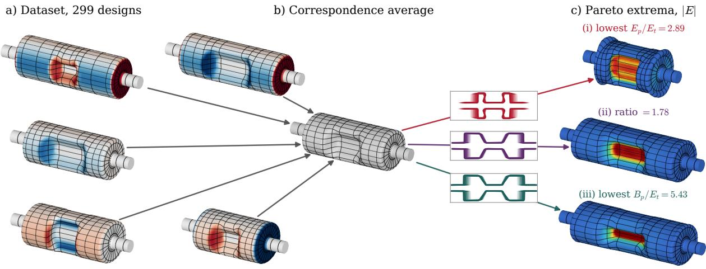  
Figure 1: BOLD’s RF cavity designs, read left to right. (a) Some example cavities from our dataset, shaded by their normal displacement field from the correspondence mean (red outwards, blue inwards). These, in essence, are the fields we run PCA on. (b) The correspondence mean of the dataset (grey). We further draw $y = 0$ crosssections along the straight line in shape coordinates interpolating from the mean to three designs on BOLD’s Pareto front. (c) The Pareto designs with their surface |E|: the two ends of the front, which minimise (i) $E _ { p } / E _ { t }$ (objective 1) and (iii) $B _ { p } / E _ { t }$ (objective 2), and (ii) the design whose ratio $B _ { p } / E _ { p }$ matches a target specification.

## 2 BACKGROUND

## 2.1 Bayesian Optimisation

Bayesian optimisation (BO) (Mockus, 1994; Garnett, 2023) optimises expensive black-box objectives $f :$ Θ → R over $\Theta \subseteq \mathbb { R } ^ { p }$ by sequentially evaluating points that maximise an acquisition function computed from a probabilistic surrogate.

Gaussian processes. The surrogate is typically a Gaussian process (GP) (Rasmussen and Williams, 2006). Conditioning on $\begin{array} { c c l } { \mathcal D _ { n } } & { = } & { \{ ( \theta _ { i } , y _ { i } ) \} _ { i = 1 } ^ { n } } \end{array}$ , with $y _ { i } \sim \mathcal { N } ( f ( \theta _ { i } ) , \sigma ^ { 2 } )$ , GP renders a closed-form posterior whose behaviour is determined by its kernel; e.g. Mat´ern for Euclidean domains. Kernels can also be defined directly on meshes, such as the Sliced Wasserstein Weisfeiler–Lehman (SWWL) kernel (Perez et al., 2024), which compares mesh embeddings.

Acquisition functions. Given data $\mathcal { D } _ { n } .$ the next evaluation point is chosen as $\theta _ { n + 1 } \quad =$ arg ${ \mathrm { m a x } } _ { \theta \in \Theta } \alpha ( \theta ; { \mathcal { D } } _ { n } )$ for some acquisition function $\alpha .$ A common α choice is the expected improvement (EI) (Jones et al., $1 9 9 8 ) , \alpha _ { \mathrm { E I } } ( \theta ; \mathcal { D } _ { n } ) = \mathbb { E } _ { f ( \theta ) \mid \mathcal { D } _ { n } } [ \operatorname* { m a x } ( f ( \theta ) -$ $f ^ { * } , 0 ) ]$ , with $f ^ { * } = \operatorname* { m a x } _ { i \leq n } y _ { i }$ EI has a closed form under a GP, but maximising it is non-convex and typically requires multi-start gradient ascent over a bounded Θ. Efective search therefore needs Θ to be low-dimensional and bounded, with every point corresponding to a valid design, which we will see in Section 3 is hard to achieve for shape optimisations.

BO extensions. In high dimensions, trust-region methods such as TuRBO (Eriksson et al., 2019) and TREGO (Diouane et al., 2023) restrict acquisition maximisation to a box around the incumbent that expands or contracts depending on the recent query’s evaluation. Multi-objective BO (MOBO) (Daulton et al., 2022) targets improvements in the Pareto front, e.g. through expected hypervolume improvement (EHVI) (Emmerich et al., 2006). Constrained BO models expensive black-box constraints with additional GPs and weights the acquisition function by the probability of feasibility (Gelbart et al., 2014). Cheap constraints are imposed directly during acquisition.

## 2.2 Shape Representations

Choosing how to represent shapes is the central problem of statistical shape analysis (Dryden and Mardia, 2016). We now review the three representation families that are most relevant to shape optimisation.

User-defined parametrisations. These describe shapes by parameters chosen by an expert, often taken from a CAD model or a domain-specific family. For aerofoils, a common choice is the class-shape transformation (CST) of Kulfan (2008), which writes each surface as a fixed class function, giving the round leading edge and sharp trailing edge, multiplied by a weighted sum of Bernstein polynomials. They are compact and directly optimisable, but are problem-specific and difficult to construct; thus they do not provide a path towards general-purpose shape optimisation.

Implicit field representations. A shape $\Omega \subset \mathbb { R } ^ { d }$ can be encoded by its characteristic function (CF) $\phi _ { \mathrm { C F } } ( x ) = \mathbf { 1 } _ { \{ x \in \Omega \} }$ , or by its signed distance function (SDF) ϕSDF, equal $\mathrm { t o } - d ( x , \partial \Omega )$ inside Ω and $d ( x , \partial \Omega )$ outside, where $d ( x , \partial \Omega ) \ = \ \operatorname* { i n f } _ { y \in \partial \Omega } \| x - y \|$ Both are discretised on a fixed grid in practice. SDFs are smoother than CFs, but neither is closed under linear combination: an average of two SDFs need not be an SDF, nor describe a shape of the intended topology.

Deformation-based representations. A third family represents each shape by the transformation that maps a shared template onto it. Given point wise correspondences, the simplest choice is the displacement of each point from the template, and doing PCA on these displacements gives the classical point distribution model (Cootes et al., 1995). Diffeomorphic frameworks, such as large deformation diffeomorphic metric mapping (Beg et al., 2005) and stationary velocity fields (SVFs, Arsigny et al. (2006)), instead parametrise deformations by smooth velocity fields with invertible flows, so deformed shapes inherit the template’s topology; PCA can then be applied to the velocity fields (Vaillant et al., 2004). These parametrisations are well established in medical imaging (Heimann and Meinzer, 2009) but, to our knowledge, have not been considered for BO.

## 2.3 Bayesian Optimisation over Structures

Most applications of BO to shape design optimise over a box in a user-defined parametrisation (Chhantyal et al., 2025; Ghosh et al., 2021; Kuszczak et al., 2023). Gaudrie et al. (2020) instead apply PCA to CFs or SDFs and run BO in the resulting eigenbasis. Others run BO in the latent space of a deep generative model (G´omez-Bombarelli et al., 2018; Moss et al., 2025; Fan et al., 2026); these need large training sets, and their nonlinear latent spaces give distances no direct geometric meaning and can produce invalid shapes (Bodin et al., 2025). BOLD instead learns a linear search space from modest numbers of examples.

## 2.4 Radio-Frequency Cavity Design

The main application in this paper is the RF-Dipole (RFD) design, a superconducting crabbing cavity used to increase collision rates in particle colliders such as the Large Hadron Collider. Following standard practice (De Silva, 2014), we minimise the peak surface electric and magnetic fields, each normalised by the transverse field the cavity provides, subject to the cavity resonating at 394 MHz. RFD design is particularly challenging for BO: existing BO methods for cavities optimise a 2D profile and sweep it into a rotationally symmetric shape (Wang et al., 2026), but the RFD has no rotational symmetry; hand-crafted CAD parametrisations fail for some parameter combinations, leaving infeasible regions in the search space and restricting designs to what the CAD construction can express; implicit field representations would need a fine 3D grid to resolve the features that govern the peak fields, and ofer no guarantee of valid shapes. Each evaluation requires a 3D electromagnetic simulation; existing methods for RF cavity optimisation can take ∼ 50, 000 eval uations (Wang et al., 2026), with full fidelity solves taking an hour of compute. To our knowledge, BO has not previously been applied to the RFD.

## 3 THE PERILS OF SHAPE PARAMETRISATIONS

Shape optimisation seeks the best shape within a family of designs sharing a common topology, such as aerofoils, wings or cavities. We restrict to families within a common deformation class, that is, to shapes obtainable by smoothly deforming a template shape $\Omega _ { 0 } \subset \mathbb { R } ^ { d }$ . Each design is parametrised by $\theta \in \Theta \subset \mathbb { R } ^ { p } ,$ specifying a deformation ϕθ of $\Omega _ { 0 }$ which yields the shape $\Omega ( \theta ) = \phi _ { \theta } ( \Omega _ { 0 } )$ . We thus wish to solve

$$
\theta ^ { * } \in \arg \operatorname* { m a x } _ { \theta \in \Theta } f \big ( \Omega ( \theta ) \big ) ,
$$

where $f$ is an expensive black-box objective function.

Data-driven approaches to this problem encode each shape as a high-dimensional vector $e ( \Omega ) \in \mathbb { R } ^ { D }$ , such as a discretised CF or SDF, and reduce dimension with PCA (Gaudrie et al., 2020). Given encodings of N example shapes, with mean ¯e and leading p eigenpairs $( U _ { p } , \Lambda _ { p } )$ of their covariance, each shape is represented by its whitened coordinates $r ( \Omega ) = \Lambda _ { p } ^ { - 1 / 2 } U _ { p } ^ { \top } ( e ( \Omega ) -$ $\bar { e } ) \in \mathbb { R } ^ { p }$ . Whitening gives the examples unit variance in every direction, so a unit step means one standard deviation of variation along any coordinate. BO is run over a box $[ - c , c ] ^ { p }$ , and each candidate z is decoded to $d ( z ) = \bar { e } + U _ { p } \Lambda _ { p } ^ { 1 / 2 } z$ and from there to a shape.

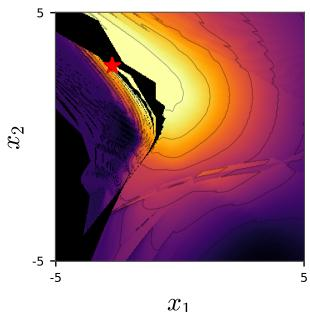  
(a) Signed Distance Func.

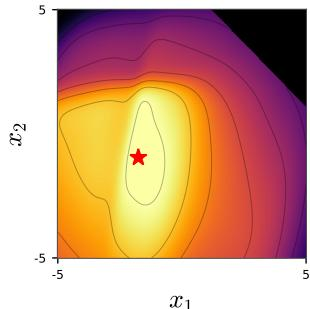  
(b) CST

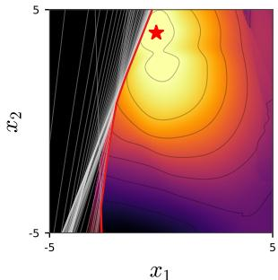

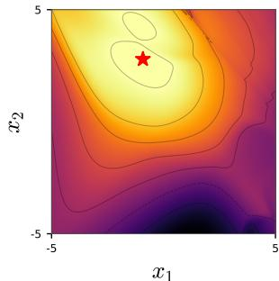  
(c) DF + no-fold  
(d) Vector Field  
Figure 2: We plot an objective function landscape (lift-todrag ratio) across the leading components for a variety of shape representations. In black, we denote the region in which decoding linear combinations of the leading modes yields an invalid aerofoil. Note that the landscape is jagged for the SDFs (a), has clear infeasible regions (black) for the expert-designed CST parametrisation (b) and DFs (c), but is well-behaved for the SVFs (d), since these preserve injectivity by construction. In (c), we further plot DF with our no-fold constraints (white lines), which approximate the infeasible region by linear inequalities and the DFs’ infeasible boundary (red).

In the remainder of this section, we identify two pathological issues with this pipeline that we argue are the fundamental obstacles for efective BO over shapes.

## 3.1 Representations Can Generate Invalid Shapes and Non-smooth Objectives

Decoding a point in the search space returns a new encoding, but these encodings are not guaranteed to yield a valid shape. The average of two SDFs is not an SDF, for instance, and its zero level set may be disconnected. Hand-crafted parametrisations have the same issue when the CAD model self-intersects or fails to build (Figure 2).

Implicit representations also make the objective harder to model. Drag and similar objectives usually change smoothly with geometry, but in an implicit representation z controls a field, and the shape is defined only by that field’s zero level set. For an aerofoil, a small move in z can remove a trailing edge and cause a sharp change in drag that a GP will struggle to model.

BOLD instead represents shapes as deformations of the current best shape, so small steps in z give small changes in shape, and imposes linear constraints so that every feasible point decodes to a valid shape.

## 3.2 Search Spaces Need Bounds

Acquisition optimisation needs a bounded domain. For hand-crafted parametrisations, bounds are set by expert judgement and directly limit the designs that can be found. Whitened PCA coordinates seem to offer a principled choice, but the box size c remains a problem. The whitened examples have mean squared norm p, while a point drawn uniformly from $[ - c , c ] ^ { p }$ has expected squared norm $p c ^ { 2 } / 3$ Any box wide enough to contain most of the examples $( \operatorname { s a y } c = 3 )$ therefore has most of its volume well outside, where the learnt representation has no reason to produce sensible geometry, while a smaller box excludes potentially good designs. In practice, results are sensitive to this choice (Appendix C).

BOLD avoids fixing a global box. Instead, we focus on an adaptively-sized box around the best shape found so far: the search stays close to shapes the representation describes well, while remaining free to move beyond the examples over successive iterations.

## 4 BO BY LOCAL DEFORMATIONS

We now present our main contribution, Bayesian Optimisation by Local Deformation (BOLD). BOLD represents each shape by its displacement from a template shape, applies PCA to these displacements to get a low-dimensional linear search space, and adds linear no-fold constraints to keep decoded shapes valid (Section 4.1). We search this space with a trust region centred on the best shape found so far, which removes the need for global bounds (Section 4.2). See Algorithm 1 for a high-level overview of BOLD. Our proposed data-driven parametrisation relies on correspondences between shapes, and Section 4.3 describes their construction for the shapes studied in Section 5.

## 4.1 A Search Space of Deformations

Ideally, every point in the search space would decode to a valid shape, and nearby points would decode to similar shapes. CFs and SDFs manage neither (Section 3.1). Deforming a valid template is one way to get valid shapes, because an injective deformation keeps the template’s topology1. The difeomorphic methods of Section 2.2 are injective by construction (Figure 9a), but each shape’s velocity field has to be found by non-convex optimisation, and this must be repeated whenever the template changes and becomes too expensive for detailed 3D geometries such as RF cavities. We therefore work with displacement fields, which are cheap to compute, trivial to recentre, and handle validity separately through linear constraints.

Algorithm 1 BOLD: Bayesian Optimisation by Lo  
cal Deformation (examples $\begin{array} { r } { \{ \Omega _ { i } \} _ { i = 1 } ^ { N } , } \end{array}$ initial data $\mathcal { D } _ { 0 } .$   
budget T, initial trust-region size L)   
1: for $n = 0 , \ldots , T - 1$ do   
2: $\Omega _ { 0 } \gets \arg \operatorname* { m a x } _ { ( \Omega , y ) \in \mathcal { D } _ { n } } y$   
3: Re-centre displacement field around $\Omega _ { 0 }$   
4: Fit GP to the encoded data   
5: $\begin{array} { r } { z _ { n + 1 } \gets \arg \operatorname* { m a x } _ { z \in [ - L , L ] ^ { p } , ~ A z \geq b } \alpha _ { \mathrm { E I } } ( z ; \mathcal { D } _ { n } ) } \end{array}$   
6: $\Omega _ { n + 1 }  \Omega ( z _ { n + 1 } )$   
7: $y _ { n + 1 }  f ( \Omega _ { n + 1 } ) + \epsilon _ { n + 1 }$   
8: $\mathcal { D } _ { n + 1 }  \mathcal { D } _ { n } \cup \{ ( \Omega _ { n + 1 } , y _ { n + 1 } ) \}$   
9: Update trust-region size L   
10: end for   
11: return best design in $\mathcal { D } _ { T }$   
(a) Stationary velocity field (b) Displacement field  
Figure 3: Two representations of the deformation between a pair of aerofoils. Points of the same colour correspond. (a) A stationary velocity field (grey arrows), defined over the whole plane, whose flow carries one aerofoil onto the other. (b) A displacement field, which moves each point directly to its corresponding point (lines).

Displacement fields. Suppose each shape is represented by P points $X \in \overset { \cdot \cdot \cdot } { \mathbb { R } } ^ { P \times d }$ in correspondence, so that the j-th point marks the same geometric feature, such as the leading edge of an aerofoil, on every shape. We encode a shape by its displacement from a template shape $X _ { * } , e ( X ) = \mathrm { v e c } ( X - X _ { * } )$ , which moves every point directly to its counterpart (Figure 3b), and then apply the PCA pipeline of Section 3 with the template in place of the mean ¯e. Decoding is afine, vec $X ( z ) = \sec X _ { * } + U _ { p } \Lambda _ { p } ^ { 1 / 2 } z$ Coordinates are ordered by explained variance, and p trades expressivity against dimensionality. Note that updating X∗ corresponds to a simple translation in the encoded space.

No-fold constraints. Unlike SVFs, linear combinations of displacement fields can result in a folded shape. We prevent this locally by requiring that each edge e of the correspondence grid keeps its orientation on the template, $\Delta _ { e } ( 0 ) \cdot \Delta _ { e } ( z ) \geq \delta _ { }$ where $\Delta _ { e } ( z ) = X _ { k } ( z ) - X _ { j } ( z )$ is the edge vector of the decoded shape and $\delta > 0$ is a margin. Since decoding is afine, these reduce to linear inequalities $A z \geq b ,$ imposed directly during acquisition optimisation (Figure 2c). The margin δ (initialised at 0.2mm) can be increased adaptively in the loop if we are getting mesh failures despite the constraints holding. For example, adding no-fold conditions to the edges between corresponding upper and lower surface points stop aerofoil surfaces from crossing, and to edges along and between rings stop RF cavity grid lines from reversing order.

## 4.2 Bound-free Search by Re-centring

We want the search to explore freely, including well beyond the examples, while only ever proposing shapes the representation describes well. A fixed box cannot do both (Section 3.2), so we instead build on TuRBO (Eriksson et al., 2019) and take the incumbent (the best evaluated design so far) as the template X∗. The trust region is then simply $[ - L , L ] ^ { p }$ around $z = 0$ , and L is doubled after 3 consecutive improvements and halved after 5 consecutive failures . How far the search should move from the examples depends on the problem, so clipping the trust region to a global box is optional. A global box keeps proposals near the data, which suits objectives that are unreliable away from it, such as neural-network proxy objective functions (Sec. 5.1,5.2). Leaving the trust region unclipped lets the search travel arbitrarily far, which we found to suit trusted numerical simulators, such as in our RF cavity design (Sec. 5.3).

## 4.3 Constructing Correspondences

In general, correspondence is an ill-defined problem: two surfaces with the same topology admit infinitely many bijections. For PCA to be meaningful, the correspondence should match genuinely equivalent features, so that displacement fields reflect diferences in geom etry rather than in sampling. In practice, many shape design tasks have structure that makes this straightforward: landmarks such as leading and trailing edges, a known topology, or a natural direction along the shape. We give two examples.

Aerofoils and wings. We locate the leading and trailing edges of each aerofoil (Selig, 2026), split the contour into upper and lower surfaces, and sample each surface uniformly in arc length with a fixed number of points. Wings (Diniz and Fuge, 2025) are sampled at a common set of spanwise locations, and each section is treated as an aerofoil (Figure 4a).

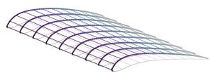

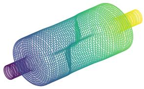  
(a) Wing  
(b) RF cavity  
Figure 4: Structured grids used to build correspondences. (a) A wing sampled at common spanwise sections, each sampled uniformly in arc length. (b) An RF cavity gridded by level sets of the harmonic coordinate h (rings, coloured by h) and arc length along each ring. In both cases, points with the same grid index correspond across all shapes in the dataset.

RF cavities. A cavity wall is topologically a tube between the two beam-pipe openings. For a longitudinal coordinate, we compute the harmonic func tion $h : S  [ 0 , 1 ]$ equal to 0 at one opening and 1 at the other, which minimises the Dirichlet energy $\begin{array} { r } { \int _ { S } \| \nabla _ { S } h \| ^ { 2 } \mathrm { d } A } \end{array}$ (Floater and Hormann, 2005) and so solves the Laplace–Beltrami equation $\Delta _ { S } h \ = \ 0$ (Pinkall and Polthier, 1993); discretising $\Delta _ { S }$ with the cotangent Laplacian gives a sparse linear system. The level sets of h are smooth rings around the cavity, along which we place points uniformly in arc length. To align prominent features such as the ends of the central barrel across the dataset, we fix the values of h at which they occur and sample uniformly between them, giving each segment a number of rings proportional to its mean length over the dataset (Figure 4b).

## 5 EXPERIMENTAL RESULTS

We evaluate BOLD on three problems of increasing dificulty: 2D aerofoils, 3D wings and 3D RF cavities. On the aerofoils and wings, we compare BOLD using displacement fields (DP-PCA) and SVFs (VF-PCA) against hand-crafted CST parametrisations of the same dimension, and on the aerofoils also against PCA on SDFs (following Gaudrie et al. (2020)). On the RF cavity, we compare against BO over the CAD parameters that generated the dataset, as it was computationally prohibitive to calculate accurate SVFs for the fine meshes required for reliable evaluations. Unless stated otherwise, the surrogate is a GP with an ARD Mat´ern-5/2 kernel on each method’s coordinates. For 3D problems, when computational resources allowed, we also used SWWL kernels (Perez et al., 2024), which compare the decoded meshes directly and so remove any dependence of the surrogate on the parametrisation choice. Within each problem, all methods share the same initial designs, evaluation budget,acquisition function and trust region logic, and we report the best objective found against the number of evaluations over 30 seeds. Full experimental details are in Appendix B, with ablations on global box bounds and number of PCA components in Appendices C and D.

## 5.1 2D Aerofoils

Our first experiment (Figure 5a) tests whether BOLD, learning its search space purely from data, can match a strong hand-crafted parametrisation. We use aerofoil design, where the Kulfan (CST) parametrisation (Kulfan, 2008) is the established choice. We build data-driven representations using the UIUC coordinate database (Selig, 2026) of 1657 airfoils. Our objective is the lift-to-drag ratio at $\alpha = 4 ^ { \circ } , R e = 1 0 ^ { 6 }$ . Since we rely on this example to investigate a large number of ablations, we compute this with NeuralFoil (Sharpe and Hansman, 2025), a neural-network proxy for liftto-drag. To account for the objective’s limitations, we multiply the objective by the surrogate’s confidence.

## 5.2 3D Wings

Our second experiment (Figure 5c) moves to 3D wing design, a higher-dimensional problem where handcrafted parametrisations become less flexible, and are comfortably outperformed by BOLD. We initialise data-driven representations using the OptiWing3D dataset (Diniz and Fuge, 2025) containing 776 wings, each the result of a lift-constrained drag minimisa tion. We then seek to maximise the lift-to-drag ratio of the full wing at Mach 0.59, $R e \mathrm { ~ = ~ } 5 . 6 \times 1 0 ^ { 6 }$ (the dataset medians) and $\alpha = 4 ^ { \circ }$ . We compute this with AeroBuildup, a module of the AeroSandbox package (Sharpe, 2024b,a), which couples NeuralFoil (Sharpe and Hansman, 2025) with a lifting-line induced-drag model. We compare against the hand-crafted parameterisation of a sectional Kulfan parameterisation using 3 2d parameterisation of aerofoils at root, mid and tip sections with interpolation between (3×5 parameters).

## 5.3 RF Cavities

Our final experiment is the design of a 3D RF-dipole cavity, considering both single- and multi-objective shape design. We build the BOLD search space from 299 cavities generated from a carefully hand-designed nine-parameter CAD model (Figure 7), evaluated in the proprietary solver CST Microwave Studio Dassault

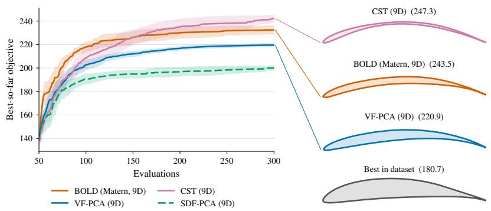  
(a)  
(b)

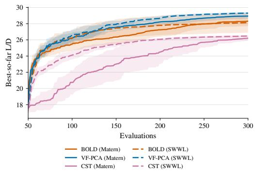  
(c)  
Figure 5: Aerodynamic shape optimisation.(a) For 2D aerofoils, BOLD recovers most of the performance of the best hand-tuned parametrisation. (b) BOLD comes close to the best CST airfoil without needing a hand-crafted design. (c) 3D wing optimisation: VF-PCA and BOLD (first 15 modes) and a hand-designed sectional CST parameterisation. BOLD and VF-PCA are statistically indistinguishable and outperform CST, which is also sensitive to the choice of Mat´ern kernel or SWWL surrogate. BOLD shows little dependence on the kernel.

Syst\`emes (2025) on an 8-core CPU with 32 GB of RAM. To avoid confusion with the Class Shape Transformation introduced in Section 5.1, this solver is hereafter referred to as the CAD solver. This problem is too expensive for the other representations in our study. Registering SVFs to every cavity is impractical for detailed 3D geometry, and SDFs would need a fine 3D grid to resolve the features that control the peak fields. We therefore compare BOLD only with standard BO over the CAD parameters. For the multiobjective runs, we replace EI with expected hypervolume improvement (EHVI) (Emmerich et al., 2006). Since there is no single incumbent, we centre trust regions on the Pareto-optimal design with the largest hypervolume contribution, i.e. the one whose removal maximally reduces hypervolume.

For each design, we solve the source-free, lossless Maxwell eigenproblem for the electric field ${ \bf E } ( { \bf x } ) e ^ { i \omega t }$ in the vacuum Ω enclosed by the cavity wall Γ,

$$
\nabla \times \left( \mu _ { 0 } ^ { - 1 } \nabla \times \mathbf { E } \right) = \omega ^ { 2 } \varepsilon _ { 0 } \mathbf { E } \quad \mathrm { i n ~ } \Omega , \quad \mathbf { n } \times \mathbf { E } = 0 \quad \mathrm { o n ~ } \Gamma ,
$$

treating the wall as a perfect conductor, as in superconducting operation. From the solution we extract the peak surface fields $E _ { p } =$ maxΓ |E|, $B _ { p } =$ maxΓ |B|, and the deflecting field $E _ { t }$ . We minimise $E _ { p } / E _ { t }$ and $B _ { p } / E _ { t }$ subject to the deflecting mode lying within $3 9 4 \pm 1 ~ \mathrm { M H z }$ For both methods, this frequency is modelled by a GP and the acquisition function is multiplied by the resulting probability of lying in band.

Even this carefully designed CAD space contains parameter combinations that fail to mesh, so the baseline needs an extra GP classifier, whose probability of feasibility multiplies the acquisition function. BOLD needs no such classifier, because its no-fold constraints keep proposals valid. The baseline must use the CAD solver, and licensing limits how many runs we can do.

BOLD needs no CAD model, so we evaluate its designs with the open-source finite-element solver Palace (Grimberg et al., 2023) (with performance verified in Fig. 17).

Results. Figure 6 compares BOLD with constrained BO over the nine CAD parameters (CAD BO), both starting from the same 299 cavities. To isolate the effect of leaving the initial data, we also run BOLD with its trust region clipped to a global box of ±6σ, the smallest that contains the dataset. BOLD clearly outperforms CAD BO: even its worst of 30 seeds beats the CAD run on both the single- and multi-objective problems. The clipped variant recovers much of this gain, so most of the improvement comes from the learned shape space, but removing the box gives a further, consistent improvement, exploiting BOLD’s ability to leave the distribution of the generating parametrisation while still proposing valid designs. Figure 6b projects the dataset and the single-objective optima onto their leading principal components. The dataset forms a tight cluster, while the optima lie far outside it, with the unclipped optima the most extreme. Every design on the pooled Pareto front has at least one coordinate outside the range of the dataset (Figure 16).

Discovering new important geometry. BOLD’s optima are physically sensible (see Figure 1(c)) and several rely on features that our hand-crafted parametrisation could not express. $E _ { p }$ peaks on the pole tips and $B _ { p }$ at the pole–body junction, so reducing them calls for smooth curvature and more surface area in these regions, while the frequency constraint limits the transverse size of the cavity. The cavity shown in Figure 1(c)(i) has a wider pole in y, which spreads the field over a larger surface and also increases $E _ { t }$ . Its pole tips bulge outwards, adding surface area without reducing the aperture, a shape the CAD model cannot produce. Its end-caps are lobed, which adds volume near the ends and lets the frequency be tuned without changing the poles. This design improves $E _ { p } / E _ { t }$ by 13.8% over the best baseline. A design that trades of both objectives (Figure 1(c)(ii)) improves mainly through smoother pole shapes and larger cavity length. Single objective optimisations were free to explore more extreme regions of the shape space; the cavity shown in Figure 8 features a re-entrant end-cap and a pronounced pole–can junction which increases $E _ { t }$ and the surface area of the poles, respectively. BOLD has identified key geometric changes, which will guide future CAD parametrisations of RF cavities.

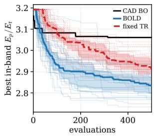  
(a)

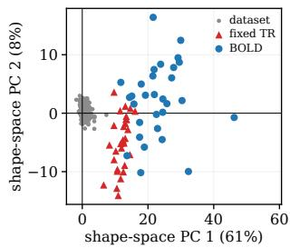  
(b)

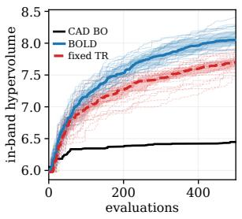  
(c)

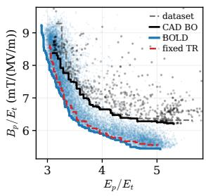  
(d)

Figure 6: RF cavity optimisation. (a) Best in-band $E _ { p } / E _ { t }$ (lower is better) and (c) in-band hypervolume against evaluations, showing medians, quartiles and the 30 seeds. BOLD outperforms CAD BO in every seed. (b) The dataset and the single-objective optima projected onto their two leading principal components. BOLD is able to explore far beyond the initial shapes. (d) Pooled in-band Pareto fronts, with the dataset for reference. The front found by BOLD using EHVI dominates both baselines.  
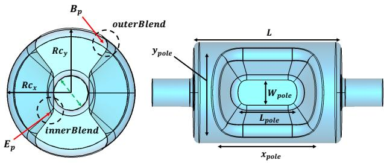  
Figure 7: The nine-parameter CAD model of the RFdipole cavity used to generate the initial shape dataset and BO baselines. Cavity length $L ,$ the pole width $W _ { \mathrm { p o l e } }$ and length $L _ { \mathrm { p o l e } } .$ , the transverse radii $R c _ { x }$ and $R c _ { y } ,$ , and the inner and outer blend radii are labelled. Red arrows mark where the peak surface fields occur: $E _ { p }$ on the pole tips and $B _ { p }$ at the pole–body junction. The green dashed line marks the 100 mm aperture, which must be preserved by all designs.

$$
E _ { p } / E _ { t } = 2 . 7 3
$$

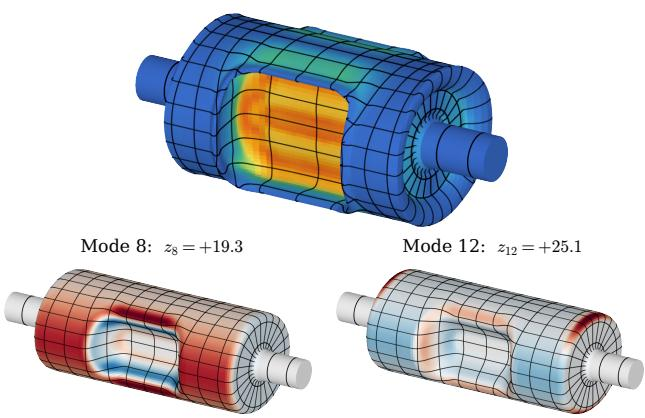  
Figure 8: The lowest- $E _ { p } / E _ { t }$ design of the singleobjective sweep $( E _ { p } / E _ { t }$ 2.73, $B _ { p } / E _ { t }$ 13.65). As in Figure 1, we overlay its |E| field. Below, we add its two most outlying shape coordinates, shaded by their normal displacement field from the correspondence mean (red outwards, blue inwards).

## 6 DISCUSSION

We have shown that a search space for BO can be learned from a modest number of existing designs, by applying PCA to the displacements between shapes in correspondence. The resulting space is linear and lowdimensional, and simple linear constraints can help keep the decoded shapes valid. We search it with a trust region around the best design so far, and the user can choose whether to clip this to a global box depend ing on how far they want to move from the initial data. BOLD matched the custom CST parametrisation for aerofoils and beat it for wings. For the RF-dipole cavity, it beat BO over a hand-designed CAD model, did not need a classifier to avoid failed designs, and produced features the CAD model cannot represent.

There are several limitations. The topology is fixed by the template, and the search can only leave the dataset along modes that appear in the examples. Correspondences have to be built for each shape family, although this was simple for the families we considered. Our nofold constraints only act on neighbouring points, so they cannot rule out global self-intersection, although this did not occur in our experiments. Constraints that guarantee injectivity, and ways of choosing the global box automatically, are left for future work.

## References

Abdul Khalek, R., Accardi, A., Adam, J., Adamiak, D., Akers, W., Albaladejo, M., Al-Bataineh, A., Alexeev, M., Ameli, F., Antonioli, P., et al. (2022). Science requirements and detector concepts for the electron-ion collider: Eic yellow report. Nuclear Physics A, 1026:1–902.

Arsigny, V., Commowick, O., Pennec, X., and Ayache, N. (2006). A Log-Euclidean Framework for Statistics on Difeomorphisms. In Medical Image Computing and Computer-Assisted Intervention – MICCAI 2006, volume 4190 of Lecture Notes in Computer Science, pages 924–931. Springer.

Beg, M. F., Miller, M. I., Trouv´e, A., and Younes, L. (2005). Computing large deformation metric mappings via geodesic flows of difeomorphisms. Interna tional Journal of Computer Vision, 61(2):139–157.

Bendsoe, M. P. and Sigmund, O. (2013). Topology Optimization: Theory, Methods, and Applications. Springer Science & Business Media.

Bodin, E., Stere, A., Margineantu, D., Ek, C., and Moss, H. (2025). Linear combinations of latents in generative models: Subspaces and beyond. In International Conference on Learning Representations, volume 2025, pages 8014–8043.

Chen, R., Zhang, J., Liang, Y., Luo, G., Li, W., Liu, J., Li, X., Long, X., Feng, J., and Tan, P. (2025). Dora: Sampling and benchmarking for 3D shape variational auto-encoders. In 2025 IEEE/CVF Conference on Computer Vision and Pattern Recognition (CVPR), pages 16251–16261. IEEE.

Chhantyal, B., Khanal, S., and Maharjan, S. (2025). Comparison of particle swarm optimization and Bayesian optimization algorithms for the shape optimization of the star crash box. Proceedings of the Institution of Mechanical Engineers, Part D: Journal of Automobile Engineering, 239(10-11):4595–4607.

Cootes, T. F., Taylor, C. J., Cooper, D. H., and Graham, J. (1995). Active shape models-their training and application. Computer Vision and Image Understanding, 61(1):38–59.

Dassault Syst\`emes (2025). CST Studio Suite. https://www.3ds.com/products/simulia/cst-studiosuite.

Daulton, S., Eriksson, D., Balandat, M., and Bakshy, E. (2022). Multi-objective Bayesian optimization

over high-dimensional search spaces. In Uncertainty in Artificial Intelligence, pages 507–517. PMLR.

De Silva, S. U. (2014). Investigation and optimization of a new compact superconducting cavity for deflecting and crabbing applications. Old Dominion University.

Diniz, C. and Fuge, M. D. (2025). OptiWing3D: A Diverse Dataset of Optimized Wing Designs. arXiv preprint arXiv:2512.12867.

Diouane, Y., Picheny, V., Riche, R. L., and Perrotolo, A. S. D. (2023). TREGO: a trust-region framework for eficient global optimization. Journal of Global Optimization.

Dryden, I. L. and Mardia, K. V. (2016). Statistical Shape Analysis: with Applications in R. John Wiley & Sons.

Durasov, N., Lukoyanov, A., Donier, J., and Fua, P. (2021). DEBOSH: Deep Bayesian shape optimization. arXiv preprint arXiv:2109.13337.

Emmerich, M. T., Giannakoglou, K. C., and Naujoks, B. (2006). Single-and multiobjective evolutionary optimization assisted by Gaussian random field metamodels. IEEE Transactions on Evolutionary Computation, 10(4):421–439.

Eriksson, D., Pearce, M., Gardner, J., Turner, R. D., and Poloczek, M. (2019). Scalable global optimization via local Bayesian optimization. Advances in Neural Information Processing Systems.

Fan, D., Doumont, C., Kalisz, A., Duckworth, P., Gardner, J. R., Moss, H., and Pleiss, G. (2026). Search at the Cost of Sampling: Nearly-Instant Latent Space Bayesian Optimization. arXiv preprint arXiv:2609.19476.

Floater, M. S. and Hormann, K. (2005). Surface Parameterization: A Tutorial and Survey. In Dodgson, N. A., Floater, M. S., and Sabin, M. A., editors, Advances in Multiresolution for Geometric Modelling, pages 157–186. Springer.

Frazier, P. I. and Wang, J. (2015). Bayesian optimization for materials design. In Information Science for Materials Discovery and Design, pages 45–75. Springer.

Garnett, R. (2023). Bayesian Optimization. Cambridge University Press.

Gaudrie, D., Le Riche, R., Picheny, V., Enaux, B., and Herbert, V. (2020). Modeling and optimization with Gaussian processes in reduced eigenbases. Structural and Multidisciplinary Optimization.

Gelbart, M. A., Snoek, J., and Adams, R. P. (2014). Bayesian optimization with unknown constraints. arXiv preprint arXiv:1403.5607.

Ghosh, S., Mondal, S., Fernandez, E., Kapat, J. S., and Roy, A. (2021). Parametric shape optimization of pin-fin arrays using a surrogate model-based Bayesian method. Journal of Thermophysics and Heat Transfer, 35(2):245–255.

G´omez-Bombarelli, R., Wei, J. N., Duvenaud, D., Hern´andez-Lobato, J. M., S´anchez-Lengeling, B., Sheberla, D., Aguilera-Iparraguirre, J., Hirzel, T. D., Adams, R. P., and Aspuru-Guzik, A. (2018). Automatic chemical design using a data-driven continuous representation of molecules. ACS Central Science, 4(2):268.

Grimberg, S., Carson, H., and Keller, A. (2023). Palace: 3D Finite Element Solver for Computational Electromagnetics. Version 0.x, Apache-2.0 licence.

Heimann, T. and Meinzer, H.-P. (2009). Statistical shape models for 3d medical image segmentation: a review. Medical Image Analysis, 13(4):543–563.

Jollife, I. T. (2002). Principal Component Analysis. Springer, 2 edition.

Jones, D. R., Schonlau, M., and Welch, W. J. (1998). Eficient global optimization of expensive black-box functions. Journal of Global Optimization.

Kulfan, B. M. (2008). Universal parametric geometry representation method. Journal of Aircraft, 45(1):142–158.

Kuszczak, I., Azam, F. I., Bessa, M., Tan, P., and Bosi, F. (2023). Bayesian optimisation of hexagonal honeycomb metamaterial. Extreme Mechanics Letters, 64:102078.

Mockus, J. (1994). Application of Bayesian approach to numerical methods of global and stochastic optimization. Journal of Global Optimization.

Moss, H., Ober, S. W., and Diethe, T. (2025). Return of the Latent Space COWBOYS: Re-thinking the use of VAEs for Bayesian Optimisation of Structured Spaces. In International Conference on Machine Learning, pages 44956–44970. PMLR.

Perez, R. C., Da Veiga, S., Garnier, J., and Staber, B. (2024). Gaussian process regression with sliced Wasserstein Weisfeiler-Lehman graph kernels. In International Conference on Artificial Intelligence and Statistics.

Pinkall, U. and Polthier, K. (1993). Computing Discrete Minimal Surfaces and Their Conjugates. Experimental Mathematics, 2(1):15–36.

Rasmussen, C. E. and Williams, C. K. (2006). Gaussian Processes for Machine Learning. MIT Press.

Selig, M. S. (2026). UIUC Airfoil Coordinates Database.

Sharpe, P. (2024a). AeroSandbox: A diferentiable framework for aircraft design optimization. https://github.com/peterdsharpe/AeroSandbox. Version 4.2.9.

Sharpe, P. and Hansman, R. J. (2025). Neuralfoil: An airfoil aerodynamics analysis tool using physics-informed machine learning. arXiv preprint arXiv:2503.16323.

Sharpe, P. D. (2024b). Accelerating Practical Engineering Design Optimization with Computational Graph Transformations. PhD thesis, Massachusetts Institute of Technology. Available at https://dspace.mit.edu/handle/1721.1/157809.

Shields, B. J., Stevens, J., Li, J., Parasram, M., Damani, F., Alvarado, J. I. M., Janey, J. M., Adams, R. P., and Doyle, A. G. (2021). Bayesian reaction optimization as a tool for chemical synthesis. Nature, 590(7844):89–96.

Snoek, J., Larochelle, H., and Adams, R. (2012). Practical Bayesian optimization of machine learning algorithms. Advances in Neural Information Processing Systems, 25.

Vaillant, M., Miller, M. I., Younes, L., and Trouv´e, A. (2004). Statistics on difeomorphisms via tangent space representations. NeuroImage, 23:S161–S169.

Wang, Y., Tang, Y., Wu, C.-F., and Feng, G. (2026). Multiobjective Bayesian optimization for the shape design of RF cavity in particle accelerators. Physical Review Accelerators and Beams, 29(3):034601.

Wu, G. (2023). A framework for structural shape optimization based on automatic diferentiation, the adjoint method and accelerated linear algebra. Structural and Multidisciplinary Optimization, 66(7):151.

## Appendix

## A SHAPE DEFORMATIONS VIA STATIONARY VECTOR FIELDS

This appendix gives the details of the SVF registration used in Section 4.1. Computing an SVF requires three choices: a finite-dimensional parametrisation of the velocity field, a data term measuring agreement between the deformed template and the target, and a regulariser.

## A.1 Velocity field parametrisation

We represent the velocity field by tensor-product cubic B-splines on a regular control lattice covering a domain $\mathcal { X } \subset \mathbb { R } ^ { d }$ that contains all shapes. In two dimensions,

$$
v ( x , y ) = \sum _ { m , n = 1 } ^ { S } c _ { m , n } B _ { m } ( x ) B _ { n } ( y ) , \qquad c _ { m , n } \in \mathbb { R } ^ { 2 } ,
$$

where $B _ { m } ( x ) = B ( ( x - x _ { m } ) / \Delta x )$ is the cubic cardinal B-spline centred at control point $x _ { m }$ with spacing $\Delta x ,$ and

$$
B ( x ) = \left\{ \begin{array} { l l } { 2 / 3 - | x | ^ { 2 } + | x | ^ { 3 } / 2 } & { | x | < 1 , } \\ { ( 2 - | x | ) ^ { 3 } / 6 } & { 1 \le | x | < 2 , } \\ { 0 } & { \mathrm { o t h e r w i s e , } } \end{array} \right.
$$

and likewise for $B _ { n } ( y )$ . The extension to d dimensions is immediate, giving $d S ^ { d }$ coeficients in total, which we collect into a vector $c .$ . Each basis function has compact support, so the velocity at any point depends on only $4 ^ { d }$ coeficients.

## A.2 Registration objective

Given a template represented by points $\{ x _ { 0 } ^ { i } \} _ { i = 1 } ^ { P }$ and a target $\Omega _ { t }$ , the deformed template is obtained by integrating

$$
\frac { \mathrm { d } } { \mathrm { d } t } \varphi _ { t } ( x ) = v _ { c } \bigl ( \varphi _ { t } ( x ) \bigr ) , \qquad \varphi _ { 0 } ( x ) = x ,
$$

over $t \in [ 0 , 1 ]$ with $Q$ steps of a fourth-order Runge–Kutta scheme, and evaluating $\varphi _ { 1 } ( x _ { 0 } ^ { i } )$ . We minimise

$$
\mathcal { L } ( \boldsymbol { c } ) = D \big ( \{ \varphi _ { 1 } ( x _ { 0 } ^ { i } ) \} _ { i } , \Omega _ { t } \big ) + \lambda \| \boldsymbol { v } _ { c } \| _ { \mathrm { S o b } } ^ { 2 } .
$$

Data term. When a pointwise correspondence $x _ { 0 } ^ { i }  x _ { t } ^ { i }$ is available, we use the sum of squared distances between corresponding points, $\begin{array} { r } { D = \sum _ { i } \| \varphi _ { 1 } ( x _ { 0 } ^ { i } ) - x _ { t } ^ { \bar { i } } \| _ { 2 } ^ { 2 } } \end{array}$ . Otherwise, we sample both boundaries approximately uniformly and use the symmetric Chamfer distance,

$$
d _ { C } ( A , B ) = \sum _ { a \in A } \operatorname* { m i n } _ { b \in B } \| a - b \| _ { 2 } ^ { 2 } + \sum _ { b \in B } \operatorname* { m i n } _ { a \in A } \| a - b \| _ { 2 } ^ { 2 } .
$$

Regulariser. The inverse problem is not unique, so we favour smooth velocity fields by penalising the discrete Sobolev semi-norm of the coeficients,

$$
\| v _ { c } \| _ { \mathrm { S o b } } ^ { 2 } = \sum _ { m = 1 } ^ { S - 1 } \sum _ { n = 1 } ^ { S } \| c _ { m + 1 , n } - c _ { m , n } \| _ { 2 } ^ { 2 } + \sum _ { m = 1 } ^ { S } \sum _ { n = 1 } ^ { S - 1 } \| c _ { m , n + 1 } - c _ { m , n } \| _ { 2 } ^ { 2 } ,
$$

a finite-diference approximation to the Dirichlet energy $\textstyle \int _ { \mathcal { X } } \| \nabla v ( x ) \| _ { F } ^ { 2 }$ dx.

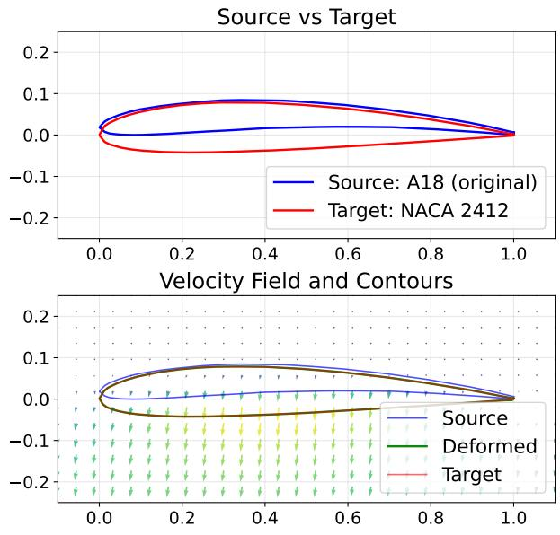

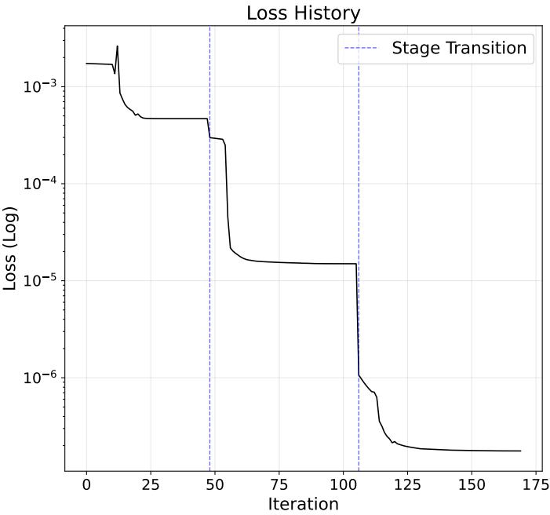  
Figure 9: SVF registration between two aerofoils. Top left: source and target after chord normalisation and arc-length resampling. Bottom left: the learnt velocity field with the source, target and deformed source. Right: the loss on a log scale, with dashed lines marking transitions between coarse-to-fine stages.

## A.3 Optimisation

Optimising directly on a fine lattice is dificult, since the objective is highly non-convex and the field has many degrees of freedom. We therefore use a coarse-to-fine schedule. Optimisation begins on a coarse lattice with few boundary samples and a large λ, which favours smooth, global deformations. The resulting field is projected onto a finer B-spline basis and used to initialise the next stage, which uses a denser lattice, more boundary samples and a smaller λ. Early stages thus capture large-scale diferences between the shapes, and later stages refine local detail. At each stage we run Adam followed by L-BFGS. In our experience, this gives more stable optimisation and tighter registrations than optimising at the finest resolution directly.

## A.4 Computational cost

Each evaluation of L integrates the flow for all P points, which requires 4Q velocity evaluations per point. With compactly supported B-splines, each velocity evaluation costs $\mathcal { O } ( 4 ^ { d } d )$ , so the flow costs $O ( Q P 4 ^ { d } d )$ . The Chamfer distance costs $\mathcal { O } ( P \log P )$ with KD-trees, or $\mathcal { O } ( P ^ { 2 } )$ by brute force, and the regulariser $\mathcal { O } ( d S ^ { d } )$ . Gradients by automatic diferentiation add a constant factor. The total cost of a registration is this per-evaluation cost multiplied by the number of Adam iterations and L-BFGS function evaluations, summed over stages.

## A.5 Aerofoil example

Figure 9 shows a registration between two aerofoils from the UIUC database (Selig, 2026), normalised to unit chord and resampled uniformly in arc length. The velocity field is defined on $\mathcal { X } = [ - 0 . 1 0 , 1 . 1 0 ] \times [ - 0 . 2 5 , 0 . 2 5 ]$ and integrated with $Q = 1 0$ Runge–Kutta steps. We use three stages with control lattices $8 \times 8 , 1 6 \times 1 6$ and $3 2 \times 3 2$ , boundary resolutions $P = 1 0 0 , 3 0 0 , 5 0 0$ , and regularisation weights $\lambda = 5 \times 1 0 ^ { - 2 } , 1 0 ^ { - 3 } , 1 0 ^ { - 5 }$ . The full registration takes around 170 optimiser iterations, reaching a loss below $1 0 ^ { - 6 }$

The same machinery can be used to compute a mean shape. Minimising the total Chamfer distance to all N examples directly over P free points is a high-dimensional problem, so we instead take the pointwise mean of the examples and register it to the whole dataset, minimising $\begin{array} { r } { \sum _ { k = 1 } ^ { N } d _ { C } ( \{ \varphi _ { 1 } ( x _ { R } ^ { i } ) \} _ { i } , A _ { k } ) + \lambda \| v _ { c } \| _ { \mathrm { S o b } } ^ { 2 } } \end{array}$ , where $x _ { R } ^ { i } = N ^ { - 1 } \bar { \sum _ { k } } x _ { k } ^ { i }$ and $A _ { k }$ is the k-th example. Figure 10 shows the result for 100 aerofoils.

All 100 Shapes and their Karcher Mean  
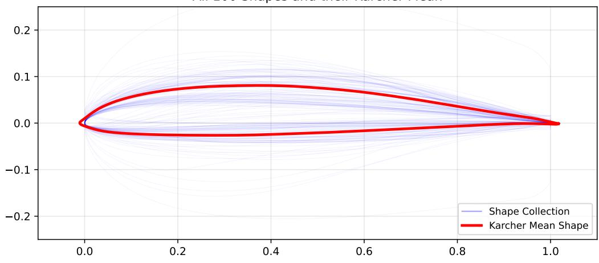  
Figure 10: Mean shape of 100 normalised aerofoils (red), computed by registering the pointwise mean to the dataset, with the individual aerofoils in blue.

## B EXPERIMENTAL DETAILS

Datasets and solvers. 2D aerofoils. We use the UIUC aerofoil database, excluding multi-element entries (names containing flap, slat, main-flap or 30p-30n) and files that fail basic checks on point count, chord length and thickness. This leaves 1657 aerofoils. Each is chord-normalised, resampled to 400 points with the trailing and leading edges pinned, and registered to the mean contour with a smooth velocity field (30×30 B-spline lattice, RK4 flow) to give pointwise correspondences. Aerodynamics are computed with NeuralFoil (medium model) at $\alpha = 4 ^ { \circ }$ and $R e = 1 0 ^ { 6 }$ . The objective is $L / D \times$ analysis confidence, which down-weights shapes where the surrogate is outside its training regime. Invalid geometries (failed thickness or leading-edge checks) and failed or non-finite evaluations score zero. 3D wings. We use the 776 OptiWing3D wings, each a lift-constrained drag minimisation, stored as 9 spanwise sections of 192 points. We resample each section to TE/LE-pinned points and loft the span from 9 to 27 stations with PCHIP. No wings are discarded. All wings share one frame and registration lattice (36³). Wings are evaluated with AeroBuildup (medium NeuralFoil section polars plus analytical induced and wave drag models) at Mach 0.594, $R e = 5 . 5 8 \times 1 0 ^ { 6 }$ (dataset medians) and fixed $\alpha = 4 ^ { \circ }$ The objective is $L / D$ of the full wing. Wings failing topological checks (monotonic span, section thickness, leading-edge location, plausible chord) or returning non-finite aerodynamics score zero.

Bayesian optimisation loop. Every method is run for $T = 3 0 0$ evaluations, which is $n _ { 0 } = 5 0 $ initial designs plus 250 BO iterations. For each seed, the initial designs are drawn without replacement from dataset designs lying inside the search box, so no extra evaluations are spent on random shapes. For wings, all spaces share the same 50 initial wings per seed. Each shape space is searched in $\mathrm { a \pm 3 \sigma }$ box mapped to $[ 0 , 1 ] ^ { d }$ . The default surrogate is a GP with an ARD $\mathrm { M a t e r n { - } 5 / 2 }$ kernel (scale-kernel prefactor, standardised targets), refit every iteration, with analytic LogEI. LogEI is evaluated on a scrambled-Sobol candidate pool of 1024 points (2D) or 2048 (3D), and the maximiser is selected. In SWWL runs, the kernel acts on the decoded geometry. Each candidate shape is embedded with a sliced-Wasserstein Weisfeiler–Lehman embedding (2 WL iterations, 32 projections, 64 quantiles, 200 arc points per aerofoil or a 9×64 ring/section graph per wing), followed by an RBF kernel with a learned bandwidth, 300 training steps and refitting every second evaluation, over a pool of 512 candidates. This makes the surrogate independent of the parametrisation. All runs use a single TuRBO trust region centred on the incumbent, with initial side length 0.8 (maximum 1.6, minimum $2 ^ { - 7 } )$ and per-dimension scaling by the ARD lengthscales (normalised to unit geometric mean), clipped to the search box. The length doubles after 3 consecutive successes (an improvement of at least $1 0 ^ { - 6 } )$ and halves after 5 consecutive failures in 2D $( \operatorname* { m a x } ( 4 , d ) = 1 5$ in 3D). If it falls below $2 ^ { - 7 }$ , it resets to 0.8 around the current incumbent. The Sobo baseline uses scrambled Sobol sequences over the same CST box.

## C SENSITIVITY TO BOX SIZE

Efect of the search range. In this section we explore the impact of changing the size of our search space when using bounded methods to find optimal aerofoils. Figure 11 reports the final best objective as the box half-width grows from ±1σ to ±5σ, and shows that a wider box lets BO reach better optima up to about ±3σ, after which performance saturates. Figure 12 then examines TuRBO with an unbounded trust region: panel (a) shows best-so-far curves for DP-PCA, which are largely insensitive to the box size, and panel (b) shows how often the best solution lies outside the box, indicating how much a tight box constrains the search. Finally, Figure 13 compares the best aerofoils found under ±1σ, ±2σ and ±5σ, illustrating that the higher objective values come from shapes far from the typical dataset aerofoil.

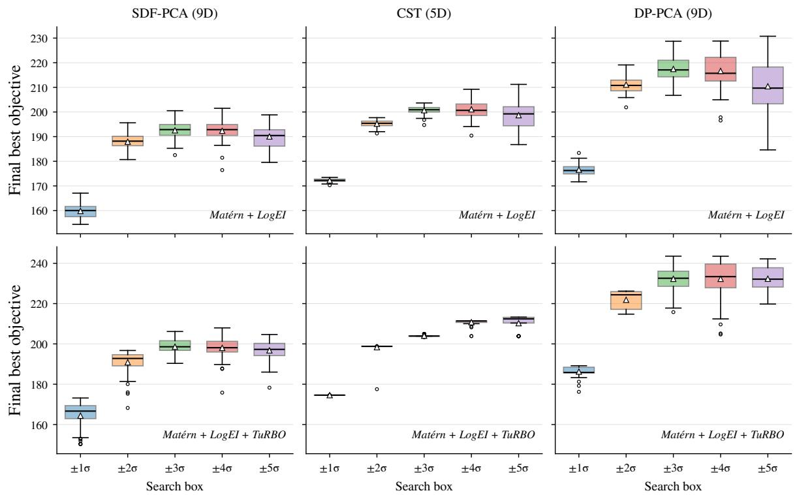  
Figure 11: Final best objective after T = 300 evaluations as the search box grows from ±1σ to ±5σ. Widening the box from ±1σ to ±3σ markedly improves the final objective in every space and with both optimisers, since larger ranges admit more extreme shapes that lie outside the bulk of the dataset. Beyond ±3σ the gains saturate: the PCA spaces show no further improvement, with a slightly lower mean and larger spread at ±5σ as the search volume grows, whereas CST with TuRBO continues to improve up to ±5σ.

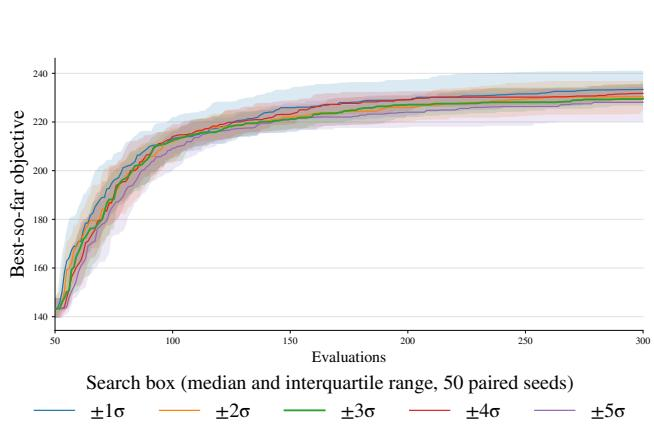  
(a) Performance of unbounded TurBO

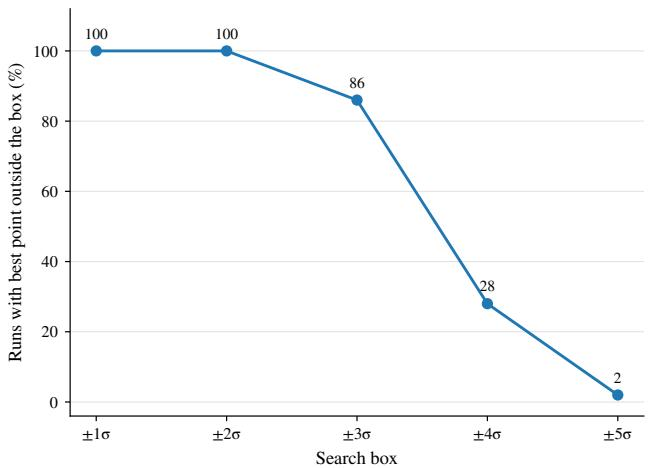  
(b) Best solutions are in distant regions of the search space  
Figure 12: Left: Best-so-far objective against the number of evaluations for Mat´ern + LogEI with an unbounded (may leave the box) TuRBO trust region on 9D DP-PCA, for search boxes of half-width ±1σ to ±5σ. Lines show the median over 50 seeds and shaded bands the interquartile range; each run uses 50 shared initial aerofoils and 300 evaluations in total. As expected, unbounded TuRBO is largely agnostic to the box size as its trust region is not clipped to the box, so the box serves mainly to set the coordinate scale and starting domain and does not limit where the search can go. Right: Share of runs whose best solution lies outside the search box, as a function of the box half-width. Runs use Mat´ern + LogEI with an unbounded TuRBO trust region on 9D DP-PCA, with 50 seeds, 50 initial and 300 total evaluations per run. We see that a tight box excludes better solutions and constrains the search.

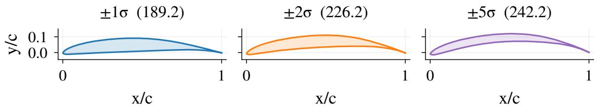  
Figure 13: Best aerofoils found by Mat´ern+TuRBO under search boxes of ±1σ, ±2σ and ±5σ. The best objective value is given in parentheses above each panel. Widening the box improves the best objective (189.2 → 226.2 → 242.2) - the winning shapes are far from the typical atlas aerofoil. As in the earlier ablations, the best foils once again require quite extreme, large coordinates in the latent space, often far from the centre of the box, so the achievable objective depends strongly on how large a region we allow.

## D SENSITIVITY TO NUMBER OF PCA COMPONENTS

In this section we look at how the number of retained dimensions afects optimisation in each shape space. Figure 14 shows the final best objective as the dimension varies, with performance peaking at an intermediate dimension (around 9 for DP-PCA) rather than increasing with dimension.

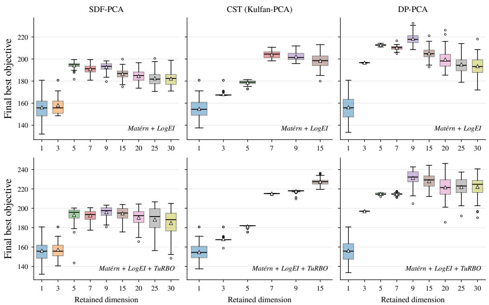  
Figure 14: Final best objective after T = 300 evaluations as a function of the number of retained dimensions, al in a ±3σ box. Boxes show the median and interquartile range over 50 seeds, whiskers the range of non-outlying values, triangles the mean and circles outliers. Very low-dimensional spaces (1–3 modes) cannot represent good aerofoils and perform worst in every space. Performance then rises sharply and peaks at intermediate dimensions (5–9 modes for SDF-PCA and DP-PCA), after which it declines slowly as the larger search space becomes harder to optimise, while DP-PCA remains the strongest space at its optimum. CST-PCA gains up to 7–9 dimensions and, with TuRBO, continues to improve up to 15. TuRBO improves the final objective in most settings, most visibly at higher dimensions, where it limits the loss of performance seen with global Mat´ern + LogEI.

## E RF CAVITY DETAILS

In this section we include supplementary details and context to the RF cavity application.  
In table 1, we detail an external design specification (Abdul Khalek et al., 2022) for our RF cavities.
<table><tr><td>Parameter</td><td>Value/Unit</td></tr><tr><td>Frequency  $f _ { 0 }$ </td><td>394MHz</td></tr><tr><td>Transverse voltage  $V _ { t }$ </td><td>3.5MV</td></tr><tr><td> $E _ { p } / E _ { t }$ </td><td>4.895</td></tr><tr><td> $B _ { p } / E _ { t }$ </td><td>8.702 mT/(MV/m)</td></tr><tr><td>Aperture diameter</td><td>100 mm</td></tr></table>

Table 1: Design specification for the 394 MHz RFD cavity (Abdul Khalek et al., 2022)

In Figure 15, we plot the first 20 eigenmodes arising from the principal component analysis of our intial dataset.

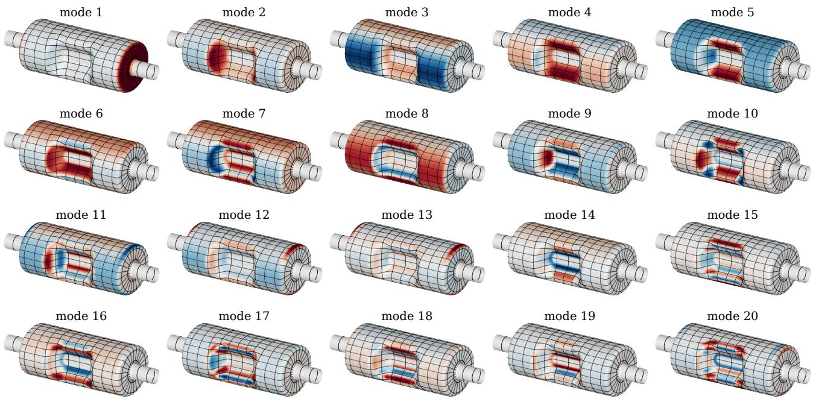

Figure 15: The 20 shape modes of the cavity dataset, each drawn as the wall displacement it produces on the mean design per one dataset standard deviation, normal to the wall (red outwards, blue inwards; each panel on its own colour scale), with the correspondence grid.  
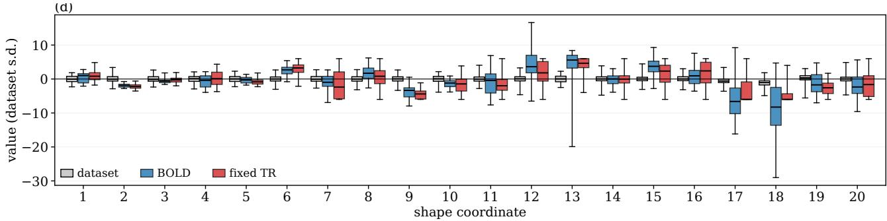  
Figure 16: Shape coordinates of the dataset and of the pooled Pareto fronts of BOLD and the fixed-TR ablation.

Here, only the normal component of their displacement field is plotted. We see that the leading modes account for interpretable, bulk motion of the mean cavity while the trailing modes refine increasing subtle features.

In Figure 16, we make a box-and-whisker plot of 1) our initial dataset, 2) our BOLD multi-objective pooled Pareto front and 3) the multi-objective pooled Pareto front from our fixed bounds ablation in Section 5.3, al in the above shape coordinates. We can clearly see that both fronts draw from a significantly larger coordinate space. The ablation remains capped at 6σ, while BOLD’s ranges are even more extreme – exceeding 25σ for mode 18.

To confirm the fidelity of the open-source PALACE solver, designs were passed to the CAD solver (CST Microwave Studio) for evaluation. See Fig. 17. Agreement is excellent for $E _ { p } / E _ { t }$ and Frequency, with mean absolute percentage errors below 3 %. The discrepancy at larger $B _ { p } / E _ { t }$ (Fig. 17(b)) is attributed to small diferences in the mesh between the two solvers. Geometries with high $B _ { p } / E _ { t }$ exhibit tight curvatures which require a very fine mesh to resolve such features. Importantly, these designs do not yield favourable objective values and are therefore excluded from subsequent analysis. The conclusions drawn from the optimisations results are unafected by this local discrepancy.

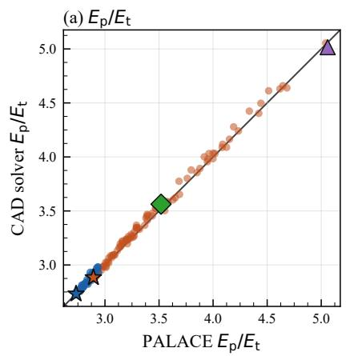

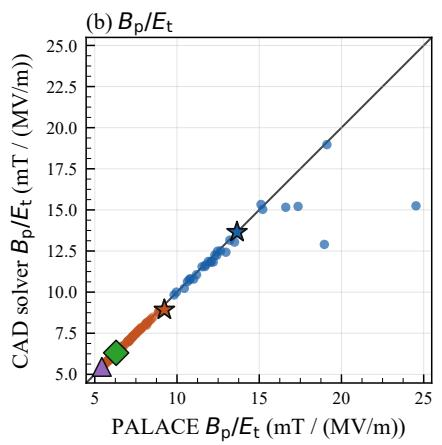

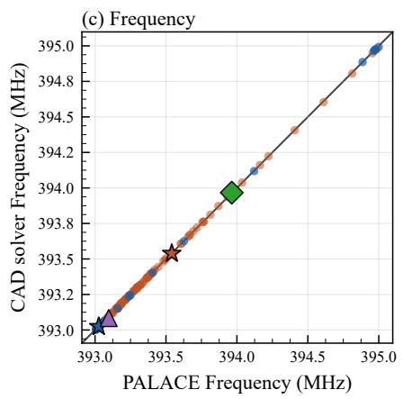  
BO optima Pareto front Parity BO best min Ep/Et (Pareto) $B _ { p } / E _ { p } = 1 . 7 8$ min Bp/Et (Pareto)  
Figure 17: Comparison of PALACE finite-element solver with CAD solver (CST Microwave Studio) for a total of 130 solves. Optima from the single objective optimisation runs minimising $E _ { p } / E _ { t }$ are shown in blue while Pareto-optimal solutions from the multiobjective runs are shown in orange.