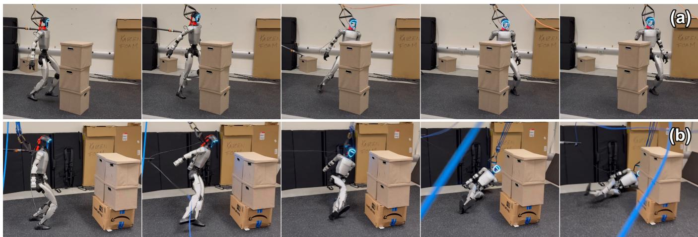
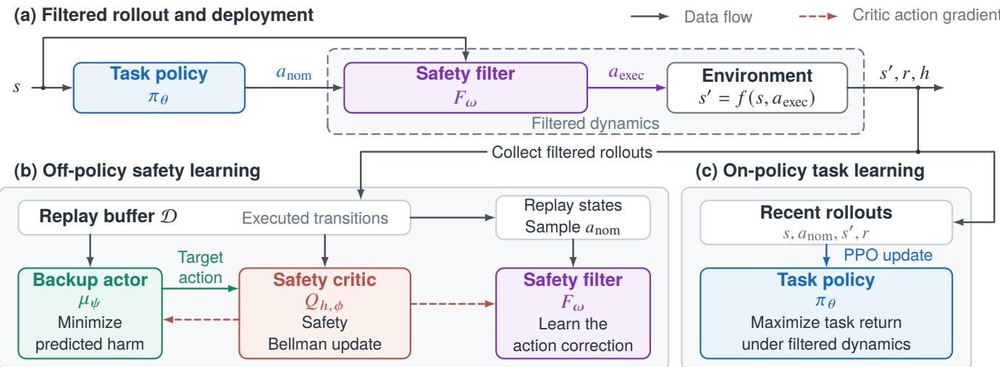
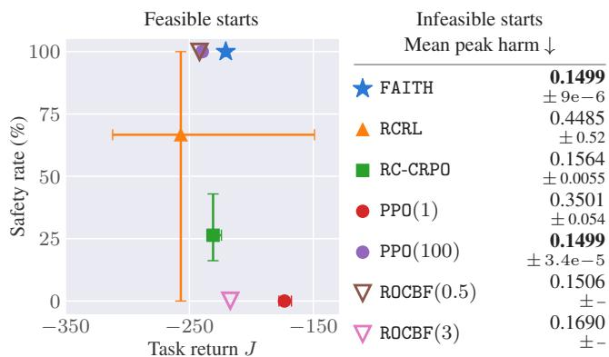
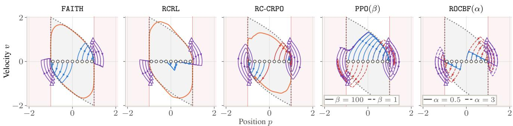
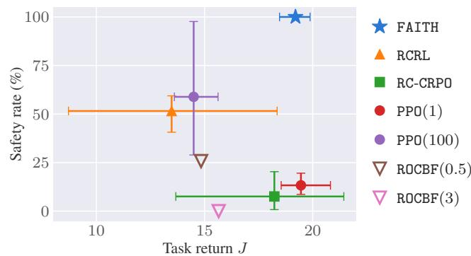
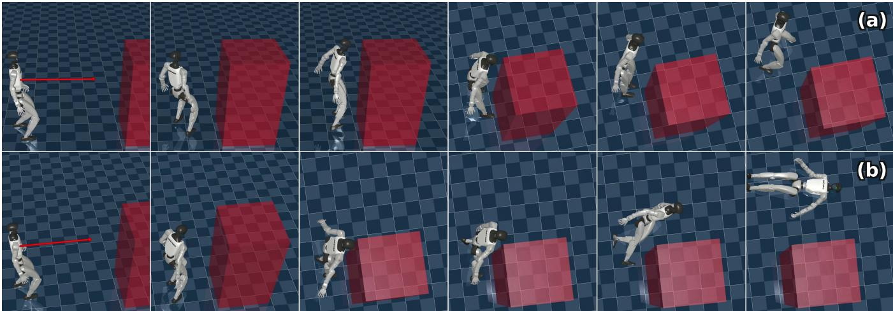
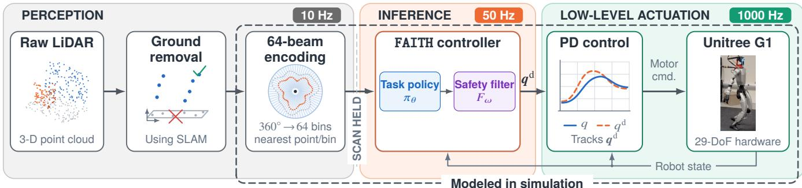

# FAITH: Feasibility-Aware Safety-Filtered RL for High-Dimensional Systems

Songyuan Zhang1,2,∗, Baljeet Singh2, Sarthak Ranjeet Kaingade2, Chuchu Fan1, and Bryan Trinh2 1Massachusetts Institute of Technology 2Amazon

  
Fig. 1. FAITH on a 29-DoF humanoid under a push, keeping clear of a person represented by the boxes. (a) Under a light push, the robot stabilizes while staying clear of the human. (b) Under a strong push, the robot sacrifices balance, falls away from the human, and protects the head and hands.

Abstract— Safe reinforcement learning commonly places safety and task performance in the same policy objective, where they can introduce competing updates. Safety filters separate them at action execution, but classical designs require an analytic safety function and dynamics model, and standard minimal-intervention filters are myopic to long-horizon task return because they minimize only instantaneous action deviation. Hard projections are also undefined when no safe action exists. We present FAITH, a feasibility-aware, model-free framework that approximates the optimal state-action safety value and amortizes minimal-intervention filtering with a feedforward network. The task policy optimizes the task return through the filtered dynamics, which recovers the feasible constrained problem without a competing safety term in the task-policy update. When no action satisfies the learned safety condition, the same filter approaches the action with minimum predicted peak harm. On a double integrator example and a Safety Gym environment, FAITH achieves the highest return among methods with no feasible-start violations and matches the lowest harm from infeasible starts. On a 29-DoF humanoid, it reaches a 99.95% safety rate while retaining 97% of the unfiltered return in Walking-Avoid, and obtains the highest measured safety rate in Push-Avoid by learning to sacrifice balancing and fall away from the protected region. The same policies are also demonstrated on a real-world Unitree G1 humanoid.

## I. INTRODUCTION

Reinforcement learning (RL) has enabled agile behaviors for high-dimensional legged and humanoid robots [1], [2], [3]. Deploying these behaviors around people or equipment, however, requires keeping every robot link outside protected regions. This requirement is difficult for contact-rich, underactuated systems because safety depends not only on the current geometry, but also on whether future actions can prevent a violation eventually. A strong disturbance can also make violation unavoidable, and therefore, a controller should maximize task return safely when safety is feasible and only minimize harm otherwise.

Feasibility-aware RL uses reachability-based safety values to estimate whether a safe future trajectory exists [4], [5], and guides policy optimization toward harm reduction when safety is infeasible, and return maximization otherwise [6], [7], [8]. Safety requirements are often enforced within policy optimization through a penalty, a multiplier, or a constraint reduction update [9], [10]. However, task and safety signals act on the policy itself in all cases. When return improvement and harm reduction favor different actions, their policy updates can oppose one another. For weighted penalty methods, a small safety weight can permit violations, whereas a large weight can make the policy conservative. Primal-dual methods adapt the weight, but replace manual tuning with an unstable saddle-point problem [10]. Thus, even when the formulation distinguishes the feasibility of states, safety competes with performance inside policy optimization.

Safety filters offer a natural separation by correcting a nominal action generated by a task policy before it reaches the system [11], [12]. Classical filters typically require an analytic safety function and a dynamics model, then solve an optimization problem at every control step. Learning-based methods can remove the explicit model, but they usually retain online action sampling or optimization [13], [14], which becomes difficult as the action dimension grows. In addition, a fixed task policy cannot adapt to the effect of safety interventions on long-horizon return. Some methods address this limitation by training the task policy through the filter, allowing it to adapt to safety interventions [15], [16], [17]. A separate difficulty arises when no admissible action exists: hard projection is then undefined and does not by itself specify how to minimize harm.

Considering these challenges, we propose Feasibility-Aware safety-fIlTered RL for High-dimensional systems (FAITH), a model-free framework that combines learned safety value functions, feedforward action filtering, and taskpolicy training through the filter. FAITH approximates the optimal state-action safety value using a safety critic and a backup actor, which guides a feedforward filter to approximate the minimal action correction. The task policy is trained through the filter using the unmodified task reward. Safety therefore changes the dynamics experienced by the policy but does not appear as a competing term in its objective. When no action satisfies the learned acceptance condition, the same filter prioritizes the action with minimum peak harm, without a feasibility classifier, a mode switch, or a separate recovery controller. At deployment, control requires only forward passes through the task policy and safety filter. To summarize our contributions,

• We introduce FAITH, which approximates the optimal safety critic and trains the task policy through a learned feedforward safety filter. Under a perfect filter and global policy optimization, FAITH recovers the constrained optimum on feasible states, without a competing safety term in the task-policy objective.

• In infeasible states, the same controller approaches the action with minimum predicted peak harm, without a mode switch or fallback policy.

• Experiments on a double integrator, Safety Gym, and a 29-DoF humanoid demonstrate high task performance and safety in feasible settings, and reduced harm in infeasible settings. Qualitative demonstrations also show the learned controller operating on a physical humanoid.

## II. PROBLEM SETTING AND PRELIMINARIES

## A. Feasibility-Aware Safe Reinforcement Learning

We consider a discrete-time system $s ^ { k + 1 } ~ = ~ f ( s ^ { k } , a ^ { k } )$ with state $s \in S .$ , action $a \in A .$ and unknown deterministic dynamics $f . \mathrm { A }$ reward $r : \mathcal { S } \times \mathcal { A } $ R specifies the task. For a policy $\pi : { \mathcal { S } }  A ,$ define its discounted return $\mathrm { a s } ^ { 1 }$

$$
V _ { r } ^ { \pi } ( s ) = \sum _ { k = 0 } ^ { \infty } \gamma ^ { k } r ( s ^ { k } , \pi ( s ^ { k } ) ) , \qquad s ^ { 0 } = s ,\tag{1}
$$

where $\gamma \in [ 0 , 1 )$ and the return is assumed finite. The task objective for a parameterized policy $\pi _ { \theta }$ is then

$$
J ( \theta ) : = \mathbb { E } _ { s ^ { 0 } \sim \rho _ { 0 } } \big [ V _ { r } ^ { \pi _ { \theta } } ( s ^ { 0 } ) \big ] ,\tag{2}
$$

where $\rho _ { 0 }$ is the initial-state distribution.

Safety is specified by a signed harm function $h : S $ R. The unsafe set is then defined as $S _ { u } = \{ s \in { \mathcal { S } } : h ( s ) >$ 0}, with positive values measuring violation severity. For trajectories starting at s, define the policy’s peak harm and the optimal safety value [4] as

$$
V _ { h } ^ { \pi } ( s ) : = \operatorname* { s u p } _ { k \geq 0 } h ( s ^ { k } ) , \quad \quad V _ { h } ^ { \star } ( s ) = \operatorname* { m i n } _ { \pi } V _ { h } ^ { \pi } ( s ) .\tag{3}
$$

We define the feasible set accordingly as ${ \mathcal { F } } = \{ s \in { \mathcal { S } } \ :$ $V _ { h } ^ { \star } ( s ) \leq 0 \}$ . Thus, $s \in \mathcal { F }$ when some policy avoids $ { \boldsymbol { S } } _ { u }$ indefinitely. Note that because of the dynamics and actuation limits, $h ( s ) \leq 0$ alone does not imply $s \in { \mathcal { F } }$

Following [6], [8], the ideal feasibility-aware problem distinguishes two regimes for each initial state $s ^ { 0 } { \mathrm { : } }$

$$
\operatorname* { m a x } _ { \pi } V _ { r } ^ { \pi } ( s ^ { 0 } ) \quad \mathrm { s . t . } V _ { h } ^ { \pi } ( s ^ { 0 } ) \leq 0 , \mathrm { i f } s ^ { 0 } \in \mathcal { F } ,\tag{4a}
$$

$$
\operatorname* { m i n } _ { \pi } V _ { h } ^ { \pi } ( s ^ { 0 } ) , \qquad \mathrm { i f } ~ s ^ { 0 } \notin \mathcal { F } .\tag{4b}
$$

Inside ${ \mathcal F } ,$ we maximize return subject to safety. Outside it, violation is unavoidable, so we minimize peak harm.

## B. Enforcing Safety in the Objective

To relate existing methods to (4), we distinguish whether they enforce safety within task-policy optimization or on the executed action. Objective-based methods incorporate constraint satisfaction into policy optimization. Penalty methods replace the reward by $r _ { \beta } ( s , a ) \ : = \ : r ( s , a ) \ : - \ : \beta [ h ( s ) ] _ { + }$ for $\beta ~ > ~ 0$ and $[ \cdot ] _ { + } : = \operatorname* { m a x } \{ \cdot , 0 \}$ . Primal-dual methods [6] introduce Lagrange multipliers λ and jointly optimize λ with the policy, introducing the saddle-point problem mi $1 \lambda { \ge } 0$ maxθ $\mathbb { E } _ { s \sim \rho _ { 0 } } \left[ V _ { r } ^ { \pi _ { \theta } } ( s ) - \lambda ( s ) V _ { h } ^ { \pi _ { \theta } } ( s ) \right]$ . For infeasible states, this formulation recovers (4) as $\lambda \  \ \infty$ . Primal methods [10] instead alternate between reward improvement and constraint reduction.

In all three approaches, safety and performance compete within task-policy optimization. Penalty and primaldual methods weight reward improvement against constraint reduction, while primal methods alternate policy updates between them. When the two objectives favor opposing update directions, improving safety can counteract task progress.

## C. Enforcing Safety on the Action

A safety filter instead enforces safety on executed actions, leaving the task objective unchanged [12]. Let $B : S \times \mathcal { A } $ R encode the safety with $B ( s , a ) \leq 0$ defining admissible actions. Given a nominal action $a _ { \mathrm { n o m } } = \pi _ { \mathrm { t a s k } } ( s )$ proposed by a task policy, the minimal-intervention filter selects

$$
F ( s , a _ { \mathrm { n o m } } ) \in \mathop { \mathrm { a r g } } _ { a \in \mathcal { A } } \operatorname* { m i n } _ { \left\| a - a _ { \mathrm { n o m } } \right\| ^ { 2 } } \mathrm { s . t . } \ B ( s , a ) \leq 0 .\tag{5}
$$

A valid B ensures that starting from $s ^ { 0 } \in { \mathcal { F } } ,$ , repeatedly applying admissible actions keeps the system in $\mathcal { F }$

A common approach constructs B from a control barrier function (CBF) and a known continuous-time control-affine model, so (5) becomes a CBF-based quadratic program [11]. While constructing a valid CBF is nontrivial, subsequent work learns CBFs [18] or constructs them from reducedorder models [19], [16]. Learned state-action safety values also enable filtering without an explicit dynamics model [13].

However, this separation leaves three issues. First, minimizing instantaneous action deviation does not optimize task return. A fixed nominal policy can therefore be suboptimal after filtering. Second, a learned nonlinear B can make online optimization or sampling costly in high-dimensional action spaces [13]. Third, if no action satisfies the constraint, the projection does not define a least-harm action.

## III. METHOD

To address these limitations, we propose FAITH. FAITH approximates the optimal safety critic with a backup actor supplying low-harm actions for the Bellman target. A learned filter uses this critic to approximate the solution to (5) when the learned safety condition is feasible and to prioritize lower harm otherwise. The task policy is trained from filtered rollouts using only reward, so safety does not appear as a competing objective in policy updates. FAITH requires neither known dynamics nor a given barrier, and deployment uses only the task policy and filter. We summarize FAITH in Fig. 2 and elaborate its components below.

## A. Safety Q-Function

A state value identifies feasible states but cannot evaluate candidate actions without accessing the dynamics. We therefore consider the optimal safety critic [13]

$$
Q _ { h } ^ { \star } ( s , a ) = \operatorname* { m i n } _ { \pi } \operatorname* { s u p } _ { k \geq 0 } h ( s ^ { k } ) , \qquad s ^ { 0 } = s , \ a ^ { 0 } = a ,\tag{6}
$$

where $a ^ { k } \ = \ \pi ( s ^ { k } )$ for $k \geq 1$ . An action a admits a persistently safe trajectory from s if $Q _ { h } ^ { \star } ( s , a ) \ \leq \ 0$ , and $\begin{array} { r } { V _ { h } ^ { \star } ( s ) = \operatorname* { m i n } _ { a \in \mathcal { A } } Q _ { h } ^ { \star } ( s , a ) } \end{array}$ recovers the optimal safety value in (3). The optimal safety critic satisfies the Bellman equation

$$
Q _ { h } ^ { \star } ( s , a ) = \operatorname* { m a x } \biggl \{ h ( s ) , \operatorname* { m i n } _ { a ^ { \prime } \in \mathcal { A } } Q _ { h } ^ { \star } ( f ( s , a ) , a ^ { \prime } ) \biggr \} .\tag{7}
$$

Let $Q _ { h , \phi }$ be its neural approximation. We approximate the min $1 _ { a ^ { \prime } \in \mathcal { A } }$ with a backup actor $\mu _ { \psi } : { \mathcal { S } }  A$ , trained by

$$
\mathcal { L } _ { \mu } ( \psi ) = \mathbb { E } _ { s \sim \mathcal { D } } \left[ Q _ { h , \phi } \big ( s , \mu _ { \psi } ( s ) \big ) \right] ,\tag{8}
$$

with samples from the replay buffer D. The backup actor supplies the target action and the critic is fitted with

$$
y = ( 1 - \gamma _ { h } ) h ( s ) + \gamma _ { h } \operatorname* { m a x } \bigl \{ h ( s ) , Q _ { h , \bar { \phi } } \bigl ( s ^ { \prime } , \mu _ { \psi } ( s ^ { \prime } ) \bigr ) \bigr \}\tag{9}
$$

$$
\mathcal { L } _ { Q } ( \phi ) = \mathbb { E } _ { \mathcal { D } } \left[ \left( Q _ { h , \phi } ( s , a ) - y \right) ^ { 2 } \right] ,\tag{10}
$$

where $\gamma _ { h } \in [ 0 , 1 )$ is the safety discount and $Q _ { h , \bar { \phi } }$ is a target critic updated by Polyak averaging. This update targets the discounted safety Bellman fixed point [4], [5], which can differ from $Q _ { h } ^ { \star }$ when $\gamma _ { h } \ < \ 1$ . Consequently, together with approximation errors, this makes $Q _ { h , \phi } ( s , a ) \leq 0$ a learned practical safety estimate instead of a formal certificate. Practically, we can use ensembles [20] and target policy smoothing [21] to improve the accuracy of $Q _ { h , \phi } .$ We sample from a large replay buffer D to retain unsafe and nearboundary transitions as the task policy changes,2 and will show its construction in Section III-C.

## B. Feedforward Safety Filter

The learned critic defines the action-acceptance condition $Q _ { h , \phi } ( s , a ) + \delta \leq 0 .$ , where $\delta \geq 0$ is a margin. However, solving the corresponding nonlinear projection online can be expensive in a high-dimensional action space. We instead amortize the projection with a feedforward residual network,

$$
a _ { \mathrm { e x e c } } = F _ { \omega } ( s , a _ { \mathrm { n o m } } ) = \mathrm { c l i p } _ { A } ( a _ { \mathrm { n o m } } + \Delta _ { \omega } ( s , a _ { \mathrm { n o m } } ) ) .\tag{11}
$$

where $a _ { \mathrm { n o m } }$ is a proposed action and $a _ { \mathrm { e x e c } }$ is applied to the system. Let ν denote the training distribution formed from replay states and a mixture of replayed and randomly sampled nominal actions. We train the filter with

$$
\mathcal { L } _ { F } ( \omega ) = \mathbb { E } _ { \nu } \left[ \| a _ { \mathrm { e x e c } } - a _ { \mathrm { n o m } } \| ^ { 2 } + \lambda [ Q _ { h , \phi } ( s , a _ { \mathrm { e x e c } } ) + \delta ] _ { + } \right] ,\tag{12}
$$

where $( s , a _ { \mathrm { n o m } } ) \sim \nu .$ . We initialize $F _ { \omega }$ near the identity and increase λ during training up to $\lambda _ { \operatorname* { m a x } } \gg 1$ , so the filter prioritizes safety as training proceeds. Let ${ \mathcal { K } } _ { \delta } ( s ) \ : = \ : \{ a \in $ $\mathcal { A } : Q _ { h , \phi } ( s , a ) + \delta \leq 0 \}$ be the learned admissible-action set. Eq. (12) is a penalty relaxation of projection onto ${ \ K } _ { \delta } ( s )$ If $a _ { \mathrm { n o m } } ~ \in ~ \mathcal { K } _ { \delta } ( s )$ , the ideal filter preserves it. Otherwise, $F$ prioritizes satisfaction of the learned constraint, while the deviation term selects a minimally modified action. The parameterized filter approximates this objective over ν.

Eq. (12) also defines the filter when its learned acceptance condition is infeasible. If $Q _ { h , \phi } ( s , a ) \ : + \ : \delta \ : > \ : 0$ for all $a \in A .$ , the hinge is active throughout A, and Eq. (12) reduces to $\| a - a _ { \mathrm { n o m } } \| ^ { 2 } + \lambda Q _ { h , \phi } ( s , a )$ . Increasing λ therefore prioritizes lower predicted peak harm without switching to a separate recovery controller. More precisely, assume that A is compact, $Q _ { h , \phi } ( s , \cdot )$ is continuous, and the per-input loss is minimized globally. If $a _ { \lambda }$ minimizes Eq. (12) and $a _ { Q } \in \arg \operatorname* { m i n } _ { a \in \mathcal { A } } Q _ { h , \phi } ( s , a )$ , then

$$
0 \leq Q _ { h , \phi } ( s , a _ { \lambda } ) - Q _ { h , \phi } ( s , a _ { Q } ) \leq \mathrm { d i a m } ( A ) ^ { 2 } / \lambda .\tag{13}
$$

The bound shows that a global per-input minimizer approaches the minimum of $Q _ { h , \phi } ( s , \cdot )$ at rate $\mathcal { O } ( 1 / \lambda )$ . For the learned filter, it holds up to learning errors. In this way, Eq. (12) remains well-defined regardless of feasibility.

## C. Task Policy and Training Loop

The last component of FAITH is the task policy $\pi _ { \theta } ,$ which proposes $a _ { \mathrm { n o m } } ~ \sim ~ \pi _ { \theta } ( \cdot | s )$ , and the filter returns $\begin{array} { r l } { a _ { \mathrm { e x e c } } } & { { } = } \end{array}$ $F _ { \omega } ( s , a _ { \mathrm { n o m } } )$ . For a fixed filter, these maps define the filtered dynamics and reward

$$
\begin{array} { r l } & { \tilde { f } _ { \omega } ( s , a _ { \mathrm { n o m } } ) = f \big ( s , F _ { \omega } ( s , a _ { \mathrm { n o m } } ) \big ) , } \\ & { \tilde { r } _ { \omega } ( s , a _ { \mathrm { n o m } } ) = r \big ( s , F _ { \omega } ( s , a _ { \mathrm { n o m } } ) \big ) . } \end{array}\tag{14}
$$

The task policy maximizes return in this filtered system,

$$
J _ { \omega } ( \theta ) = \mathbb { E } _ { \rho _ { 0 } , \pi _ { \theta } , \tilde { f } _ { \omega } } \left[ \sum _ { k = 0 } ^ { \infty } \gamma ^ { k } \tilde { r } _ { \omega } ( s ^ { k } , a _ { \mathrm { n o m } } ^ { k } ) \right] .\tag{15}
$$

We optimize (15) with PPO [23], holding ω fixed during each policy update. Safety affects the trajectory through the filter, but no safety term is added to the task reward.

Lemma 1 (Equivalence under a perfect filter): Let $V _ { r , F } ^ { \pi }$ be the return under (14). Suppose F is perfect on ${ \mathcal { F } } ,$ meaning

  
Fig. 2. FAITH separates safety learning from task-return optimization. (a) The task policy proposes a nominal action, and the safety filter produces the executed action. The dashed box denotes the filtered dynamics seen by the task policy. (b) The safety critic, backup actor, and safety filter learn from replay. The backup actor supplies actions for the safety critic’s Bellman target, while critic gradients guide the backup actor and safety filter. (c) PPO updates the task policy using nominal-action likelihood ratios and filtered-rollout returns. Only the task policy and safety filter are evaluated for deployment.

$f ( s , F ( s , a ) ) \in \mathcal { F }$ for all $( s , a ) \in \mathcal { F } \times \mathcal { A } ,$ and $F ( s , a ) = a$ whenever $f ( s , a ) \in \mathcal { F }$ . Under the conditions of [17, Thm. 1],

$$
\operatorname* { s u p } _ { \pi } V _ { r , F } ^ { \pi } ( s ) = \operatorname* { s u p } _ { \pi : V _ { h } ^ { \pi } ( s ) \leq 0 } V _ { r } ^ { \pi } ( s ) , \qquad \forall s \in \mathcal { F } .\tag{16}
$$

Hence, globally optimizing (15) over a policy class containing an optimizer recovers (4a).

Proof. This is a direct application of [17, Thm. 1] to (14). □

Remark 1: Exact projection onto $\{ a ~ : ~ Q _ { h } ^ { \star } ( s , a ) ~ \leq ~ 0 \}$ yields a perfect filter. Our learned filter only approximates it, so Lemma 1 is not a guarantee for the deployed controller.

The task policy is updated from on-policy rollouts, while the safety critic, backup actor, and filter are trained off-policy from the replay buffer D. Retaining earlier unsafe and nearboundary transitions preserves safety-relevant coverage as the task policy changes and mitigates catastrophic forgetting [24]. We also execute the backup policy $\mu _ { \psi }$ with some probability on some trajectories to avoid out-of-distribution (OOD) $Q _ { h , \phi }$ values. These trajectories are only stored in the replay buffer and never used for the PPO update.

Remark 2: FAITH is structurally different from objectivebased safe RL methods. Those methods optimize return and safety with the same policy, so policy updates must reconcile their competing directions. FAITH optimizes safety and task return in different modules: (12) updates $F _ { \omega }$ for safety, while PPO updates $\pi _ { \theta }$ for return (15). Thus, no safety term competes with return in the task-policy objective, and training through the filter lets the policy adapt to interventions.

## IV. RELATED WORK

Feasibility-aware safe RL. Hamilton-Jacobi reachability characterizes states from which future violations can be avoided [4], [12]. Neural reachability solvers approximate the underlying dynamic program, while RL formulations estimate its value from sampled transitions [25], [26], [4], [5]. Subsequent work extends these formulations to stabilize-avoid objectives and unknown feasibility [27], [28]. Feasibility-aware safe RL then incorporates the learned value into task-policy optimization through multipliers, reachability-dependent objectives, or feasibility-guided generation [6], [7], [8]. We adopt the same two-regime problem but enforce safety on actions through a correction network. The task policy optimizes only return under filtered dynamics, without a competing safety objective in its update.

Safety filters. Safety filters decouple task control from safety enforcement by correcting nominal actions before actuation [11], [12]. To construct a valid filter, learningbased methods either learn the filter function B and retain online filtering [29], [18], [30], [31], [32], [13], [14], or learn the correction directly or train the task policy under filtered dynamics [33], [15], [16], [34]. FAITH combines these directions by approximating the optimal state-action peakharm value, amortizing minimal-intervention correction, and training the task policy on filtered rollouts. Its feedforward filter requires neither a dynamics model nor an online solve at deployment, and the same loss prioritizes lower predicted harm when its learned acceptance set is empty.

Safe control for legged and humanoid robots. Safety filters for legged robots range from reduced-order barrier controllers to full-order methods [19], [35], with recent humanoid work addressing joint, actuation, and link-level constraints [2], [3], [36], [37]. Complementing direct action correction, learned reachability supports safe-set estimation and recovery-policy switching [1], [38], while protectivefalling policies mitigate robot damage [39], [40]. FAITH addresses both avoidance and harm reduction through one model-free filter, with safety specified by any harm function. When safety is feasible, the task policy learns under the filtered dynamics to target the long-horizon constrained RL problem. Otherwise, the same filter prioritizes lower harm. This unified architecture allows protected-region clearance to take precedence over balance without a fall-away specific reward, a mode switch, or a separate recovery controller.

  
Fig. 3. Double integrator results: safety rate and task return of feasible starts, and mean peak harm of infeasible starts. Left: For feasible starts, FAITH achieves a 100% safety rate, and the highest return among all safe methods (error bars show min-max ranges). Right: For infeasible starts, FAITH achieves the lowest peak harm ( shows the standard deviation).

## V. SIMULATION EXPERIMENTS

We conduct experiments to answer three research questions. (Q1): Starting from feasible states, how much task return can FAITH retain while respecting the safety constraint? (Q2): When harm is unavoidable, can FAITH minimize the harm? (Q3): Does FAITH scale to a high-dimensional system with whole-body constraints? We compare against four representative ways of enforcing safety in the literature:

• RCRL [6], a primal-dual feasibility-aware method that enforces a policy-conditioned safety value in the objective.

• RC-CRPO, our feasibility-aware adaptation of the primal method CRPO [10], using the safety value.

• PPO(β) [23], which subtracts $\beta \left[ h \right] _ { + }$ from the task reward as in Section II-B.

• ROCBF(α) [19], [16], applying a CBF to a reducedorder single-integrator model tracked by the full system.

## A. One-dimensional Double Integrator

We first consider a double integrator (DI) with state $s =$ $( p , v )$ , where $p \in \mathbb { R }$ is position and $v \in \mathbb { R }$ is velocity, with acceleration control $a \ \in \ [ - 1 , 1 ]$ . The harm function $h ( s ) \ = \ | p | - 1$ defines the safe states $| p | ~ \leq ~ 1$ , while the reward $r ( s ) \ = \ - \operatorname * { m i n } \{ \left| p - 2 \right| , \left| p + 2 \right| \}$ is maximized outside that set. Safety and performance therefore conflict. Maximum braking gives the continuous-time optimal $V _ { h } ^ { \star }$ and Fig. 4 shows the set $V _ { h } ^ { \star } ~ \leq ~ 0$ in grey. We sample initial states with $p , v \sim \mathcal { U } [ - 1 , 1 ]$ to include both feasible and infeasible states. For each method, we train 3 seeds for 2000 iterations, and select the safest checkpoint among iterations 1800, 1900, and 2000 for evaluation with 4096 episodes, breaking ties by higher return. The validation set is independent of the evaluation set. The results are shown in Fig. 3, with representative trajectories plotted in Fig. 4.

(Q1): Starting from feasible states, FAITH maintains 100% safety and achieves the highest return among all safe methods. Fig. 4 illustrates that FAITH achieves this by learning a feasibility boundary close to the analytical feasible set along the visited states, and braking near that boundary. RCRL exhibits unstable performance with a large variance between different seeds, potentially caused by the unstable saddle-point problem. RC-CRPO crosses the boundary potentially because of the competing policy updates between safety and performance. PPO exhibits the expected safety-performance trade-off. ROCBF generates suboptimal trajectories because it ignores the acceleration limit.

(Q2): Starting from infeasible states, FAITH attains the lowest peak harm. 350 states are infeasible in the sampled resets. Fig. 3 (right) shows that FAITH and PPO(100) both attain the lowest mean peak harm. Fig. 4 shows that FAITH achieves this by braking immediately from these starts.

## B. Safety Gym

To test FAITH on a commonly used benchmark, we perform experiments on the SafetyCarCircle1-v0 task in Safety Gym. We train each method for 3 seeds, select the checkpoints following the same process as Section V-A, and report the results in Fig. 5. With all initial states being feasible, FAITH achieves a 100% safety rate and high mean return, whereas all evaluated baselines incur violations.

## C. 29-DoF Humanoid Near Protected Regions

To test whether FAITH scales to high-dimensional systems, we consider a 29-DoF Unitree G1 humanoid in Isaac Lab [41], actuated by joint-position targets. We mark planar regions with infinite height as protected, representing, for example, the space occupied by humans3. We represent the robot’s 31 links by mesh-inflated points and define $h ( s )$ as the largest signed penetration of any point into the protected region. The robot observes the protected region boundaries by an analytical 64-beam 360◦ planar LiDAR scan.

We design two tasks. Walking-Avoid: Track a given velocity command by walking while avoiding protected regions. The robot begins at rest outside the protected regions, so the initial states are feasible by remaining stationary. Push-Avoid: On top of Walking-Avoid, the robot is pushed at the start of each episode. Because the ground truth feasible set is unknown here, we evaluate overall safety and separately analyze a common failure subset, i.e., initial states where all evaluated methods violate safety, without labeling it physically infeasible. Both tasks use a reward comprising velocity tracking, foot-slip penalties, and related locomotion terms. We additionally penalize contact forces on the robot, with larger weights on the head and hands and smaller on the torso, to encourage it to protect its most fragile parts when falling [39]. Over 4096 trajectories, we report the safety rate, i.e., the fraction of safe trajectories, together with the return, and also the peak penetration on the common failure subset.

We consider two baselines. No Filter is a pure PPO locomotion policy trained for velocity tracking and push recovery, without safety terms. ROCBF(α) uses No $\operatorname { E i l t e r }$ as a nominal policy but filters its planar velocity command with the reduced-order CBF, which models the base dynamics as a single integrator. We set the body-inflation radius to $r = 0 . 4 0$ m and sweep the CBF gain $\alpha \in \{ 0 , 0 . 1 , 1 , 5 \} ^ { 4 }$

  
Analytical feasible set Learned feasible set Feasible start Infeasible start Feasible: safe Feasible: violation Infeasible  
Fig. 4. Trajectories in the double integrator environment. FAITH matches the feasible set closely in visited states. From feasible starts ( ), FAITH rides the feasibility boundary to achieve the highest return and stays safe. When infeasible ( ), FAITH applies maximum braking to minimize peak harm.

  
Fig. 5. Car-Circle Results. With all initial states being feasible, FAITH has 100% safety and high task return (error bars show min-max ranges).

TABLE I. Walking-Avoid.  denotes episode-level standard deviation.
<table><tr><td>Method</td><td>Safety % ↑</td><td>Return ↑</td></tr><tr><td>No Filter</td><td>80.37</td><td> $2 4 2 8 \pm 2 8 8$ </td></tr><tr><td>ROCBF (0)</td><td>99.95</td><td> $2 0 9 4 \pm 3 4 2$ </td></tr><tr><td>ROCBF (0.1)</td><td>99.95</td><td> $2 1 8 2 \pm 3 3 0$ </td></tr><tr><td>ROCBF (1)</td><td>99.71</td><td> $2 3 6 2 \pm 3 0 7$ </td></tr><tr><td>ROCBF (5)</td><td>94.80</td><td> $2 3 7 3 \pm 3 0 3$ </td></tr><tr><td>FAITH</td><td>99.95</td><td> $2 3 6 5 \pm 3 4 5$ </td></tr></table>

(Q1, Q3): FAITH matches the highest safety rate in Walking-Avoid while retaining 97% of unfiltered return, and achieves the highest safety rate in Push-Avoid. At matched safety in Walking-Avoid, FAITH yields higher return than ROCBF(0) and ROCBF(0.1) (Table I). In Push-Avoid, FAITH’s higher safety comes with lower return as it sacrifices balance to preserve clearance because it does not trade safety for higher return (Table II and Fig. 6).

(Q2, Q3): In the common failure Push-Avoid episodes, FAITH obtains the lowest harm. The same task-policy and filter pair of FAITH limits full-body penetration without a fallback controller or explicit mode switch (Table II).

## D. Ablation Studies

We conduct ablations to study the design choices in the DI (Table III) and the Car-Circle environments (Table IV).

The learned filter approaches the analytical reference. We introduce 3 more baselines in DI: Oracle applies the analytical optimal controller; PPO+GTCBF trains PPO through a ground-truth CBF; PPO+ROCBF(α) trains PPO through a ROCBF. We observe that FAITH closely follows the analytical optimal solution produced by Oracle and PPO+GTCBF, outperforming training PPO through ROCBF.

TABLE II. Push-Avoid. Peak harm is evaluated on common failure episodes. denotes episode-level standard deviation.
<table><tr><td>Method</td><td>|Safety % ↑</td><td>Return ↑</td><td>E maxk h (common failure) ↓</td></tr><tr><td>No Filter</td><td>21.53</td><td> $1 2 3 . 2 \pm 9 6 . 0$ </td><td> $0 . 2 5 3 \pm 0 . 1 4 9$ </td></tr><tr><td>ROCBF (0)</td><td>84.52</td><td> $1 1 5 . 5 \pm 6 4 . 3$ </td><td> $0 . 1 7 2 \pm 0 . 1 4 6$ </td></tr><tr><td>ROCBF (0.1)</td><td>83.35</td><td> $1 1 6 . 3 \pm 4 1 . 3$ </td><td> $0 . 1 7 5 \pm 0 . 1 4 0$ </td></tr><tr><td>ROCBF (1)</td><td>78.56</td><td> $1 1 7 . 1 \pm 8 7 . 0$ </td><td> $0 . 1 6 5 \pm 0 . 1 4 0$ </td></tr><tr><td>ROCBF (5)</td><td>60.11</td><td> $1 1 5 . 5 \pm 9 6 . 6$ </td><td> $0 . 1 6 6 \pm 0 . 1 3 3$ </td></tr><tr><td>FAITH</td><td>85.45</td><td> $8 0 . 0 \pm 1 0 4 . 9$ </td><td> $\mathbf { 0 . 1 5 3 \pm 0 . 1 8 4 }$ </td></tr></table>

TABLE III. Double Integrator ablations. denotes standard deviation.
<table><tr><td>Controller</td><td>Return J ↑ Safety (%) ↑</td><td></td><td>E maxk h ↓</td></tr><tr><td>Oracle</td><td>-219.37</td><td>100.00</td><td>0.1499</td></tr><tr><td>FAITH</td><td>-220.64±0.23</td><td>100.00</td><td>0.1499±9e-6</td></tr><tr><td>PPO+GTCBF</td><td>-219.40±0.01</td><td>100.00</td><td>0.1500</td></tr><tr><td>PPO+ROCBF (0.5)</td><td>-241.39±0.01</td><td>99.95</td><td>0.1506</td></tr><tr><td>PPO+ROCBF (3)</td><td>-187.46±0.04</td><td></td><td>0.00 1.3501±1.7e−4</td></tr><tr><td>PPO+FAITH filter (fixed)</td><td>-221.09±0.22</td><td>99.98±0.04</td><td>0.1499±9e−⁶</td></tr><tr><td>FAITH w/o filtered dyn.</td><td>-230.45±1.71</td><td>97.52±2.74</td><td>0.1660±0.02</td></tr><tr><td>FAITH w/o backup replay</td><td>-221.63±2.9883.87±27.92</td><td></td><td>0.1505±0.001</td></tr><tr><td>FAITH w/ numerical search</td><td>-220.65±0.10</td><td>100.00</td><td>0.1500±1e-4</td></tr><tr><td> $\mathrm { F A I T H } \ ( 0 . 2 5 \lambda _ { \mathrm { m a x } } )$ </td><td>-208.23±10.46</td><td>0.01±0.01</td><td>0.3313±0.11</td></tr><tr><td> $\mathrm { F A I T H } \ ( 0 . 5 \lambda _ { \mathrm { m a x } } )$ </td><td>-220.45±0.22</td><td>99.99±0.01</td><td>0.1609±0.019</td></tr><tr><td> $\mathrm { F A I T H } \ ( 2 \lambda _ { \mathrm { m a x } } )$ </td><td>-221.42±0.44</td><td></td><td>100.00 0.1499±7.7e−6</td></tr></table>

The learned filter is transferable. Fixing the filter of FAITH and training PPO through it (PPO+FAITH filter (fixed)) performs similarly to FAITH in both environments.

Filtered-dynamics training improves the performance. We remove training through the filter dynamics described in Section III-C (FAITH w/o filtered dyn.), and observe that task return degrades because PPO does not adapt to the filter. It also slightly degrades safety potentially because the policy tends to output more unsafe actions that fill the replay buffer, making it more difficult to learn a good filter.

Backup-generated replay improves safety. Replacing backup rollouts with filtered task-policy rollouts (FAITH w/o backup replay) lowers safety, potentially because $Q _ { h , \phi }$ can be OOD without the backup replay (Section III-C).

The learned filter outperforms numerical search. With the policy and critic fixed, FAITH w/ numerical search retains $a _ { \mathrm { n o m } }$ if $Q _ { h , \phi } ( s , a _ { \mathrm { n o m } } ) \leq - \delta .$ , and otherwise samples 1025 actions and chooses the closest to $a _ { \mathrm { n o m } }$ with $Q _ { h , \phi } <$ −δ. If none qualifies, it selects the sample minimizing $Q _ { h , \phi } .$ It performs similarly to FAITH in DI but worse in Car-Circle, and is 18× slower in both environments.

  
Fig. 6. Push-Avoid simulation. The red box marks the protected region and the arrow denotes the push. (a) The robot remains upright while staying outside the region. (b) When the push is too hard, the robot sacrifices balance and falls away while protecting its head and hands.

  
Fig. 7. Hardware control pipeline. SLAM-based ground removal and angular binning produce a 64-beam LiDAR observation. FAITH generates joint targets tracked by PD control. The dashed box marks simulated components, including G1 dynamics and analytically generated beam inputs.

TABLE IV. Car-Circle ablations. denotes standard deviation.
<table><tr><td>Controller</td><td>Return J ↑</td><td>Safety (%) ↑</td></tr><tr><td>FAITH</td><td>19.20±0.71</td><td>100.00</td></tr><tr><td>PPO+FAITH filter (fixed)</td><td>18.46±1.39</td><td>100.00</td></tr><tr><td>FAITH w/o filtered dyn.</td><td>8.96±5.21</td><td>98.44±2.07</td></tr><tr><td>FAITH w/o backup replay</td><td>18.17±1.29</td><td>97.66±3.41</td></tr><tr><td>FAITH w/ numerical search</td><td>18.84±0.37</td><td>96.88±2.07</td></tr><tr><td>FAITH  $( 0 . 2 5 \lambda _ { \operatorname* { m a x } } )$ </td><td>18.98±0.93</td><td>95.31±5.63</td></tr><tr><td>FAITH  $\left( 0 . 5 \lambda _ { \mathrm { m a x } } \right)$ </td><td> $1 8 . 5 0 { \scriptstyle \pm 1 . 5 5 }$ </td><td>99.48±0.90</td></tr><tr><td>FAITH  $( 2 \lambda _ { \operatorname* { m a x } } )$ </td><td> $1 7 . 9 2 { \scriptstyle \pm 0 . 8 8 }$ </td><td>100.00</td></tr></table>

Safety requires a sufficiently large $\lambda _ { \operatorname* { m a x } } .$ . Reducing the maximum penalty $\left( \mathrm { F \mathbb { A } \mathrm { T \mathrm { T H } \ ( 0 . 2 5 \lambda _ { \operatorname* { m a x } } ) } } \right)$ degrades safety and increases peak harm. Increasing it $\left( \mathrm { F A I T H } \left( 2 \lambda _ { \operatorname* { m a x } } \right) \right)$ matches the safety rate, but yields slightly lower return. The results remain robust to moderate changes $\left( \mathrm { F A I T H } \ ( 0 . 5 \lambda _ { \operatorname* { m a x } } ) \right)$ .

## VI. HARDWARE EXPERIMENTS

We conduct qualitative hardware demonstrations on a 29-DoF Unitree G1, with boxes representing the protected region (Fig. 1). In the pipeline (Fig. 7), 10 Hz LiDAR scans undergo SLAM-based ground removal [42]. We retain the nearest point in each of 64 equal-width azimuth bins covering 360◦, matching the simulation observation format. At 50 Hz, FAITH combines this observation (held between scans) with the current robot state to generate joint-position targets. A 1000 Hz PD controller then tracks these targets.

The same controller supports upright recovery and falling away from the protected region. Under a lighter push, the robot recovers balance while avoiding the boxes (Fig. 1(a)). Under a stronger push, it falls away onto its legs and torso (Fig. 1(b)), consistent with the head and hand contact penalties used in training (Section V-C).

## VII. CONCLUSIONS

We introduced FAITH, a feasibility-aware, model-free framework that separates safety enforcement from taskpolicy optimization. FAITH approximates the optimal safety critic and trains PPO through a learned filter with only task reward. Safety and return therefore do not compete. Under stated assumptions, filtering preserves the constrained optimum. When the learned feasible set is empty, the filter approaches minimum predicted peak harm. Simulations demonstrate safety, performance, and harm reduction, while experiments on a humanoid demonstrate hardware execution.

Limitations. Discounting, finite λ, and learning errors leave the learned controller without formal safety or optimality guarantees. Evaluation is limited to planar protected regions and excludes impact severity and human injury. Hardware demonstrations are qualitative, without safety or harm statistics or quantified effects of LiDAR noise, control latency, and communication delay.

## ACKNOWLEDGMENTS

We thank Nicholas Morozovsky, Yinai Fan, and Shravan Tangudu for proposing the humanoid test cases, and Zeyuan Feng and Nick Cerone for help with hardware experiments.

## REFERENCES

[1] T. He, C. Zhang, W. Xiao, G. He, C. Liu, and G. Shi, “Agile but safe: Learning collision-free high-speed legged locomotion,” in Robotics: Science and Systems (RSS), 2024.

[2] L. Yang, B. Werner, R. K. Cosner, D. Fridovich-Keil, P. Culbertson, and A. D. Ames, “Shield: Safety on humanoids via CBFs in expectation on learned dynamics,” in 2025 IEEE/RSJ International Conference on Intelligent Robots and Systems (IROS). IEEE, 2025, pp. 203–210.

[3] R. Chen, Y. Sun, and C. Liu, “Dexterous safe control for humanoids in cluttered environments via projected safe set algorithm,” arXiv preprint arXiv:2502.02858, 2025.

[4] J. F. Fisac, N. F. Lugovoy, V. Rubies-Royo, S. Ghosh, and C. J. Tomlin, “Bridging Hamilton-Jacobi safety analysis and reinforcement learning,” in 2019 International Conference on Robotics and Automation (ICRA), 2019, pp. 8550–8556.

[5] K.-C. Hsu, V. Rubies-Royo, C. Tomlin, and J. F. Fisac, “Safety and liveness guarantees through reach-avoid reinforcement learning,” in Proceedings of Robotics: Science and Systems, 2021.

[6] D. Yu, H. Ma, S. Li, and J. Chen, “Reachability constrained reinforcement learning,” in International conference on machine learning. PMLR, 2022, pp. 25 636–25 655.

[7] M. Ganai, Z. Gong, C. Yu, S. Herbert, and S. Gao, “Iterative reachability estimation for safe reinforcement learning,” in Advances in Neural Information Processing Systems, vol. 36, 2023.

[8] Y. Zheng, J. Li, D. Yu, Y. Yang, S. Li, X. Zhan, and J. Liu, “Safe offline reinforcement learning with feasibility-guided diffusion model,” in International Conference on Learning Representations, 2024.

[9] A. Ray, J. Achiam, and D. Amodei, “Benchmarking safe exploration in deep reinforcement learning,” 2019.

[10] T. Xu, Y. Liang, and G. Lan, “CRPO: A new approach for safe reinforcement learning with convergence guarantee,” in International Conference on Machine Learning. PMLR, 2021, pp. 11 480–11 491.

[11] A. D. Ames, X. Xu, J. W. Grizzle, and P. Tabuada, “Control barrier function based quadratic programs for safety critical systems,” IEEE transactions on automatic control, vol. 62, no. 8, pp. 3861–3876, 2017.

[12] K. P. Wabersich et al., “Data-driven safety filters: Hamilton-Jacobi reachability, control barrier functions, and predictive methods for uncertain systems,” IEEE Control Systems Magazine, vol. 43, no. 5, pp. 137–177, 2023.

[13] D. D. Oh et al., “Safety with agency: Human-centered safety filter with application to AI-assisted motorsports,” in Proceedings of Robotics: Science and Systems, 2025.

[14] B. Kim and H. J. Kim, “Deep QP safety filter: Model-free learning for reachability-based safety filter,” arXiv preprint arXiv:2601.21297, 2026.

[15] F. P. Bejarano, L. Brunke, and A. P. Schoellig, “Safety filtering while training: Improving the performance and sample efficiency of reinforcement learning agents,” IEEE Robotics and Automation Letters, vol. 10, no. 1, pp. 788–795, 2025.

[16] L. Yang, B. Werner, M. de Sa, and A. D. Ames, “CBF-RL: Safety filtering reinforcement learning in training with control barrier functions,” arXiv preprint arXiv:2510.14959, 2025.

[17] D. D. Oh, D. P. Nguyen, H. Hu, and J. F. Fisac, “Provably optimal reinforcement learning under safety filtering,” in Proceedings of IASEAI Conference, vol. 2, no. 1, 2026, pp. 488–500.

[18] O. So et al., “How to train your neural control barrier function: Learning safety filters for complex input-constrained systems,” in 2024 IEEE International Conference on Robotics and Automation (ICRA). IEEE, 2024, pp. 11 532–11 539.

[19] M. H. Cohen, T. G. Molnar, and A. D. Ames, “Safety-critical control for autonomous systems: Control barrier functions via reduced-order models,” Annual Reviews in Control, vol. 57, p. 100947, 2024.

[20] K. Ghasemipour, S. S. Gu, and O. Nachum, “Why so pessimistic? estimating uncertainties for offline RL through ensembles, and why their independence matters,” Advances in Neural Information Processing Systems, vol. 35, pp. 18 267–18 281, 2022.

[21] S. Fujimoto, H. van Hoof, and D. Meger, “Addressing function approximation error in actor-critic methods,” in International conference on machine learning. PMLR, 2018, pp. 1587–1596.

[22] S. Levine, A. Kumar, G. Tucker, and J. Fu, “Offline reinforcement learning: Tutorial, review, and perspectives on open problems,” arXiv preprint arXiv:2005.01643, 2020.

[23] J. Schulman, F. Wolski, P. Dhariwal, A. Radford, and O. Klimov, “Proximal policy optimization algorithms,” arXiv preprint arXiv:1707.06347, 2017.

[24] S. Zhang, O. So, M. Black, and C. Fan, “Discrete GCBF proximal policy optimization for multi-agent safe optimal control,” in International Conference on Learning Representations, 2025.

[25] S. Bansal and C. J. Tomlin, “Deepreach: A deep learning approach to high-dimensional reachability,” in 2021 IEEE International Conference on Robotics and Automation (ICRA). IEEE, 2021.

[26] Z. Feng, L. Qiu, and S. Bansal, “Bridging Model Predictive Control and Deep Learning for Scalable Reachability Analysis,” in Proceedings of Robotics: Science and Systems, 2025.

[27] O. So and C. Fan, “Solving stabilize-avoid optimal control via epigraph form and deep reinforcement learning,” in Proceedings of Robotics: Science and Systems, 2023.

[28] O. So, E. Yu, S. Zhang, M. Cleaveland, M. Black, and C. Fan, “Solving parameter-robust avoid problems with unknown feasibilit using reinforcement learning,” in International Conference on Learning Representations, 2026.

[29] A. Robey et al., “Learning control barrier functions from expert demonstrations,” in 2020 59th IEEE Conference on Decision and Control (CDC). IEEE, 2020, pp. 3717–3724.

[30] D. D. Oh, D. P. Nguyen, H. Hu, and J. F. Fisac, “Synthesis and deployment of maximal robust control barrier functions through adversarial reinforcement learning,” arXiv preprint arXiv:2604.13192, 2026.

[31] B. Thananjeyan et al., “Recovery RL: Safe reinforcement learning with learned recovery zones,” IEEE Robotics and Automation Letters, vol. 6, no. 3, 2021.

[32] K.-C. Hsu, D. P. Nguyen, and J. F. Fisac, “Isaacs: Iterative soft adversarial actor-critic for safety,” in Learning for Dynamics and Control Conference. PMLR, 2023, pp. 90–103.

[33] H. Yu, W. Xu, and H. Zhang, “Towards safe reinforcement learning with a safety editor policy,” Advances in Neural Information Processing Systems, vol. 35, pp. 2608–2621, 2022.

[34] K. S. Yun, Z. Li, and N. Azizan, “Provably safe, yet scalable reinforcement learning,” arXiv preprint arXiv:2606.14536, 2026.

[35] D. P. Nguyen, K.-C. Hsu, W. Yu, J. Tan, and J. F. Fisac, “Gameplay filters: Robust zero-shot safety through adversarial imagination,” in Proceedings of The 8th Conference on Robot Learning, vol. 270. PMLR, 2025, pp. 387–407.

[36] B. Muraccioli et al., “Safe execution of RL policies via accelerationbased CBF-QP constraint enforcement for real-world robotic deployments,” arXiv preprint arXiv:2607.14488, 2026.

[37] L. Yang, J. Li, and A. D. Ames, “Pac-man: Perception-aware CBF-RL for whole-body safety in humanoid dodgeball,” arXiv preprint arXiv:2607.28623, 2026.

[38] R. Chen, S. Li, Y. Sun, and C. Liu, “λ-reachability: Geometrichorizon safety Bellman equations for humanoid safety,” arXiv preprint arXiv:2606.16022, 2026.

[39] Z. Meng, T. Liu, L. Ma, Y. Wu, R. Song, W. Zhang, and S. Huang, “Safefall: Learning protective control for humanoid robots,” arXiv preprint arXiv:2511.18509, 2025.

[40] Z. Xu, Y. Li, K.-y. Lin, and S. X. Yu, “Unified humanoid fall-safety policy from a few demonstrations,” arXiv preprint arXiv:2511.07407, 2025.

[41] M. Mittal et al., “Isaac Lab: A GPU-accelerated simulation framework for multi-modal robot learning,” arXiv preprint arXiv:2511.04831, 2025.

[42] K. Chen, R. Nemiroff, and B. T. Lopez, “Direct LiDAR-inertial odometry: Lightweight LIO with continuous-time motion correction,” in IEEE International Conference on Robotics and Automation (ICRA), 2023.