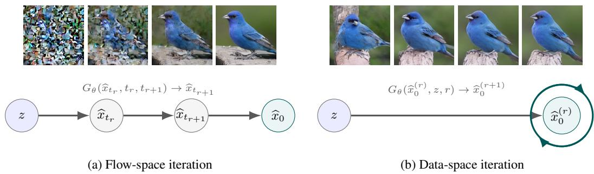
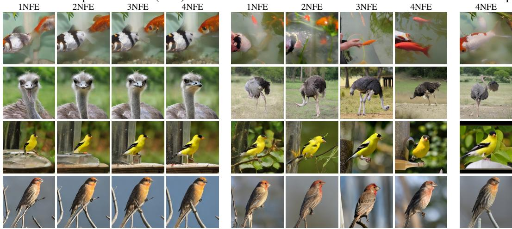
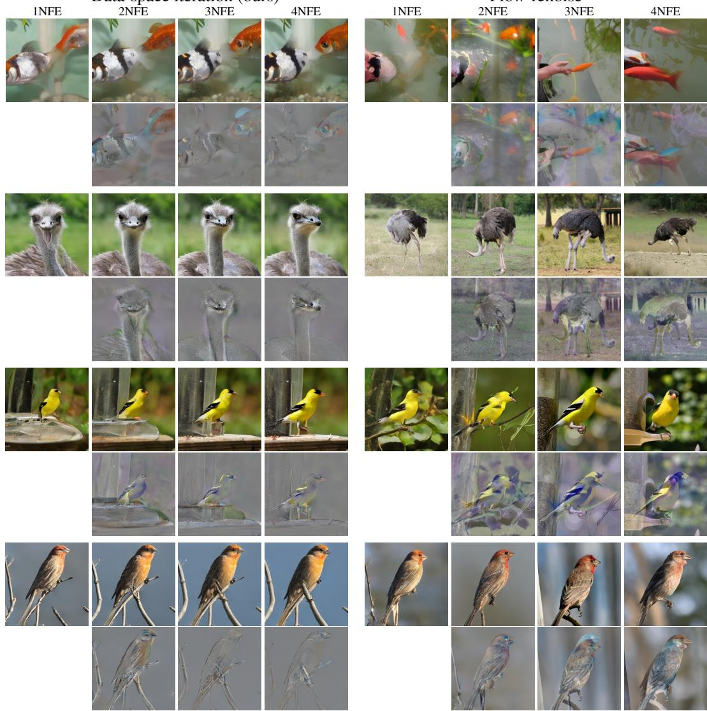
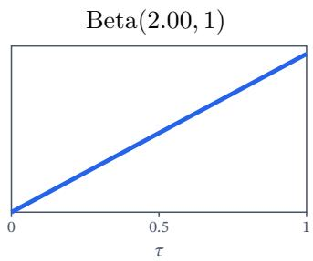
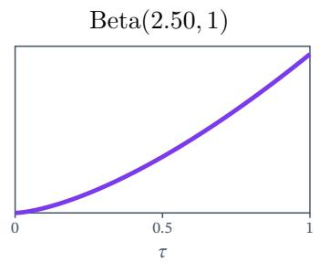
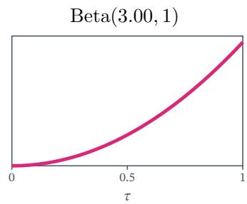

# FEW-STEP GENERATION VIA DATA-SPACE ITERATION

Shanchuan Lin<sup>†</sup> Yansong Peng Fu-Yun Wang Haoqi Fan   
ByteDance Seed   
peterlin@bytedance.com<sup>†</sup>

## ABSTRACT

Flow matching has emerged as a scalable paradigm for training high-quality generative models, but sampling from the learned probability flow requires many network evaluations. Distillation can reduce this cost to one or a few evaluations; however, one-step generation often sacrifices quality, making few-step generation the practical operating regime. Existing few-step methods perform their iterative computation along the probability flow and therefore require a fixed, manually chosen timestep discretization. This discretization is often chosen heuristically and is expensive to tune; it may also be restrictive when refinement difficulty differs across samples or spatial locations. We introduce data-space iteration, a few-step generation framework that removes flow discretization altogether. Starting from noise, a shared generator directly refines its prediction in data space, with every iteration trained to produce the best sample permitted by its capacity. Our formulation integrates with distribution matching distillation (DMD) with minimal changes, enabling a controlled comparison between iteration methods under matched training settings. On class-conditional ImageNet 256 × 256, data-space iteration outperforms standard discretization baselines and matches or improves upon variants selected through schedule search, without requiring schedule-specific training. These results show that data-space iteration provides a simple and effective alternative to discretized flow-space iteration for fast generation.

  
Figure 1: (a) Existing few-step generators perform iterative sampling in probability-flow space, requiring a predefined timestep discretization that can be suboptimal. (b) Our method carries out all refinements in data space, removing the discretization bottleneck and yielding better performance.

## 1 INTRODUCTION

Flow matching (Lipman et al., 2023) has become a scalable pretraining paradigm for modern generative models. By learning a continuous probability flow between simple noise and the data distribution, it provides a stable and flexible foundation for high-capacity image and video generators (Seawead et al., 2025; Seedance et al., 2025; 2026). However, this strength comes with an inference-time cost: producing a high-quality sample requires numerically integrating the learned flow, often with many network evaluations. This cost has motivated a broad line of distillation methods that convert a pretrained flow-matching model into a generator that can sample in one or only a few steps (Sali mans & Ho, 2022; Song et al., 2023; Frans et al., 2025; Geng et al., 2025).

In principle, distillation can aim for one-step generation. In practice, however, a single network evaluation provides limited effective computational depth, and aggressive one-step distillation often leads to visible quality degradation (Lin et al., 2025a). Few-step generation has therefore become the more practical operating point, trading a small number of additional evaluations for substantially improved sample quality. This is also the regime most relevant to deployed high-resolution generative systems, where four-step sampling is commonly used as a favorable balance between latency and fidelity (Zheng et al., 2026b).

Despite this progress, existing few-step generators still perform their iterative computation in probability-flow space. Whether the method denoises and then renoises to the next noise level, or directly learns maps between intermediate flow marginals, generation is organized around a man ually chosen discretization of the flow-time interval. This discretization is usually treated as a fixed design choice rather than a learned component of the generator.

The fixed discretization is especially limiting for modern distillation procedures based on self-rollout backward distillation (Yin et al., 2024a; Kohler et al., 2024). In these methods, each generator update is trained on states produced by the generator’s own preceding rollout steps. The rollout schedule must therefore be defined during training, not merely selected at inference time. In applications such as causal streaming video generation, self-rollout is even more central because the model must learn to refine its own generated history (Lin et al., 2025b; Huang et al., 2025; Zheng et al., 2026a). Yet the timestep discretization used for rollout is typically chosen heuristically (Hoogeboom et al., 2023; Esser et al., 2024). Searching over alternative schedules is expensive because each candidate schedule can require training a different distilled generator.

One intuition motivating our formulation is that there may not be a universal best timestep discretization. The difficulty of a denoising transition could depend on the sample being generated: different prompts or classes can induce samples with different semantic and spectral complexity and might therefore favor different effective step sizes. Likewise, spatial regions with different frequency content might benefit from different forms of refinement. A single global flow timestep nevertheless advances every sample and location through the same denoising schedule. This observation motivates investigating whether refinement can be organized without a fixed probability-flow discretization.

We propose data-space iteration for few-step generation. Instead of repeatedly moving along a discretized probability-flow path, our generator performs all refinement directly in data space. Starting from an initial noise sample, the generator repeatedly updates the current data-space prediction. Every refinement step is trained to output the best sample it can, given the current estimate and the original noise. This formulation removes the timestep-discretization hyperparameter from the generator’s iterative sampling process and lets the model spend all of its computation on directly improving the sample.

Our method can be trained with almost no modification to the widely used distribution matching distillation (DMD) framework (Yin et al., 2024b;a). The real and fake flow models, the DMD objec tive, and the self-rollout training structure are retained; only the generator rollout is changed from probability-flow iteration to data-space iteration. This makes the comparison especially controlled: the training recipe is held fixed while the iterative sampling space is changed.

We evaluate on class-conditional ImageNet 256 × 256 generation (Russakovsky et al., 2015), using a pretrained SiT-XL/2 (Ma et al., 2024) flow-matching teacher backbone. Across matched DMD training settings, data-space iteration outperforms standard discretization baselines and matches or improves upon variants selected through schedule search. These results suggest that removing manually specified flow-time discretization can retain or improve generation quality while eliminating the need to train schedule-specific generators.

## 2 METHOD

## 2.1 FLOW MATCHING BACKGROUND

Let $x _ { 0 } \sim p _ { \mathrm { d a t a } }$ be a data sample and $x _ { 1 } \sim p _ { \mathrm { n o i s e } }$ be an independent noise sample. Flow matching connects the two distributions through a continuous flow. A common choice is linear interpolation,

$$
x _ { t } = ( 1 - t ) x _ { 0 } + t x _ { 1 } , \qquad t \in [ 0 , 1 ] .\tag{1}
$$

A neural network $v _ { \phi }$ is trained to predict the velocity of this flow,

$$
\frac { d x _ { t } } { d t } = v _ { \phi } ( x _ { t } , t ) .\tag{2}
$$

To generate a sample, we draw $x _ { 1 } \ \sim \ p _ { \mathrm { n o i s e } }$ and solve this ordinary differential equation (ODE) backward from $t = 1 \mathrm { t o } t = 0$ . An accurate numerical solution often requires tens or hundreds of network evaluations. Distillation replaces this costly process with a generator that produces a sample in only a few evaluations.

## 2.2 EXISTING FEW-STEP GENERATION PARADIGMS

Existing few-step methods perform iterations in the probability-flow space. We group them into two paradigms.

Flow-renoise iteration. Given a noisy state at schedule point $t _ { r } ,$ the generator predicts the data endpoint,

$$
\widehat { x } _ { 0 } = G _ { \theta } ( x _ { t _ { r } } , t _ { r } ) .\tag{3}
$$

To continue iteration, this prediction is mixed with noise at the next schedule point $t _ { r + 1 } < t _ { r } ,$

$$
\widehat { x } _ { t _ { r + 1 } } = ( 1 - t _ { r + 1 } ) \widehat { x } _ { 0 } + t _ { r + 1 } \varepsilon , \qquad \varepsilon \sim p _ { \mathrm { n o i s e } } .\tag{4}
$$

The resulting noisy state is passed back to the generator, and the predict–renoise process is repeated. The original DMD method (Yin et al., 2024b;a), consistency models (Song et al., 2023; Song & Dhariwal, 2024; Lu & Song, 2025; Luo et al., 2023a; Wang et al., 2024b), and various other methods (Lin et al., 2025a; Ren et al., 2024; Sauer et al., 2024b;a) are representatives of this paradigm.

Flow-map iteration. Instead of predicting the data endpoint at every step, flow-map methods learn a direct transition between consecutive schedule points,

$$
\widehat { x } _ { t _ { r + 1 } } = G _ { \theta } ( x _ { t _ { r } } , t _ { r } , t _ { r + 1 } ) .\tag{5}
$$

Generation composes these maps over consecutive time intervals until it reaches $t _ { R } = 0$ . Phased DMD (Fan et al., 2026), MeanFlow (Geng et al., 2025; 2026; Zhou et al., 2026; Zhang et al., 2026; Peng et al., 2026), and many other methods (Salimans & Ho, 2022; Wang et al., 2024a; Yan et al., 2024; Lin et al., 2024b; Lin & Yang, 2024; Lin et al., 2026a; Frans et al., 2025) are examples of this paradigm.

Dependence on flow-time discretization. Existing methods use flow time to define progress during generation. They must therefore choose a schedule such as $1 = t _ { 0 } > t _ { 1 } > \cdot \cdot \cdot > t _ { R } = 0$ . For self-rollout distillation, this schedule determines the states seen during training and must be fixed before training begins. Testing another schedule generally requires training another model. A global schedule is also shared by all samples and spatial locations, which motivates considering a schedulefree alternative. Data-space iteration removes the flow-time schedule by passing a data prediction, rather than a flow state, between steps.

## 2.3 FEW-STEP GENERATION VIA DATA-SPACE ITERATION

Given noise $z \sim p _ { \mathrm { n o i s e } }$ , we initialize a data-space estimate with zeros,

$$
\widehat { \boldsymbol { x } } _ { 0 } ^ { ( 0 ) } = \mathbf { 0 } ,\tag{6}
$$

and refine it by repeatedly applying a shared generator,

$$
\begin{array} { r l r } { \widehat { x } _ { 0 } ^ { ( r + 1 ) } = G _ { \theta } \left( \widehat { x } _ { 0 } ^ { ( r ) } , z , r \right) , } & { { } } & { r = 0 , \ldots , R - 1 . } \end{array}\tag{7}
$$

Here, r is the refinement index and R is the maximum number of network evaluations. The same source noise z is provided at every step, while conditioning on r allows the shared generator to use a different update at each stage.

Every generator output is a prediction in data space. Unlike flow-renoise, our method does not add noise between predictions. Unlike flow-map, it does not construct states at intermediate flow times. Each step is trained to produce a valid sample and can use the previous prediction to improve its output. Sampling therefore does not require a flow-time schedule.

## 2.4 TRAINING VIA DISTRIBUTION MATCHING DISTILLATION

Data-space iteration requires only a small change to standard DMD training. We retain the frozen pretrained flow model $v _ { \mathrm { r e a l } } = v _ { \phi }$ and an auxiliary fake flow model $v _ { \mathrm { f a k e } } = v _ { \psi }$ . The fake model is initialized from the pretrained model, $\psi  \phi ,$ , and is additionally conditioned on the refinement index: $v _ { \mathrm { f a k e } } ( x _ { \tau } , \tau , r )$ . It is trained to track the generator distribution at each refinement step.

Generator update. We sample a refinement index $r \in \{ 0 , \ldots , R - 1 \}$ and noise $z \sim p _ { \mathrm { n o i s e } }$ . We first run r refinement steps without tracking gradients to obtain $\widehat { x } _ { 0 } ^ { ( r ) }$ <sup>)</sup>. We then take one step with gradients,

$$
\begin{array} { r } { \widehat { x } _ { 0 } ^ { ( r + 1 ) } = G _ { \theta } \Big ( \widehat { x } _ { 0 } ^ { ( r ) } , z , r \Big ) . } \end{array}\tag{8}
$$

Next, we sample an independent noise sample $\varepsilon \sim p _ { \mathrm { n o i s e } }$ and a DMD noising time τ , and add noise to the new prediction,

$$
\begin{array} { r } { \widehat { x } _ { \tau } ^ { ( r + 1 ) } = ( 1 - \tau ) \widehat { x } _ { 0 } ^ { ( r + 1 ) } + \tau \varepsilon . } \end{array}\tag{9}
$$

The generator is trained with the DMD loss

$$
\begin{array} { r } { \mathcal { L } _ { \mathrm { d m d } } ( \theta ) = \mathbb { E } _ { z , r , \tau , \varepsilon } \left[ w ( \tau ) \operatorname { s g } \left[ v _ { \mathrm { r e a l } } \left( \widehat { x } _ { \tau } ^ { ( r + 1 ) } , \tau \right) - v _ { \mathrm { f a k e } } \left( \widehat { x } _ { \tau } ^ { ( r + 1 ) } , \tau , r \right) \right] ^ { \top } \widehat { x } _ { 0 } ^ { ( r + 1 ) } \right] , } \end{array}\tag{10}
$$

where $\mathrm { s g } [ \cdot ]$ denotes stop-gradient and $w ( \tau )$ is a weighting function. The difference between the real and fake flow predictions therefore provides a fixed update direction that moves the generator distribution toward the data distribution.

Fake-model update. Alternating with generator updates, we train the fake flow model on noisy generator samples. For the linear path above, its target velocity is $\varepsilon - \widehat { x } _ { 0 } ^ { ( r + 1 ) }$ , giving

$$
\begin{array} { r } { \mathcal { L } _ { \mathrm { f a k e } } ( \psi ) = \mathbb { E } _ { z , r , \tau , \varepsilon } \left[ \left\| v _ { \mathrm { f a k e } } \left( \widehat { x } _ { \tau } ^ { ( r + 1 ) } , \tau , r \right) - \left( \varepsilon - \widehat { x } _ { 0 } ^ { ( r + 1 ) } \right) \right\| _ { 2 } ^ { 2 } \right] . } \end{array}\tag{11}
$$

Note that this self-rollout strategy is already standard in DMD-based few-step generators. We change only the rollout process: existing methods iterate along the probability flow, whereas our method iterates in data space. The core DMD formulation remains unchanged, so our method adds no additional computation or memory relative to a matched DMD baseline.

Scope of the training objective. Some prior DMD-based methods add auxiliary adversarial (GAN) losses (Goodfellow et al., 2014) or rectified-flow objectives (Liu et al., 2023). We omit these components because they introduce extra loss weights and design choices, expanding the search space and making it harder to isolate the effect of the iteration method. Our goal is not to combine every available technique in pursuit of state-of-the-art performance, but to provide a simple, controlled, and reproducible setting for comparing iterative sampling methods.

## 2.5 GENERATOR IMPLEMENTATION

We build the generator by minimally modifying the pretrained velocity network $v _ { \phi } ( x _ { t } , t )$ . Let $g _ { \theta }$ denote the modified network, initialized with the pretrained parameters $\theta  \phi$ . The source noise z uses the original input projection. We add a separate projection for the current estimate $\widehat { x } _ { 0 } ^ { ( r ) }$ and sum the two projected inputs. We also add an embedding for r to the existing timestep-conditioning pathway. The original flow-time input is fixed to $t = 1$ for every generator evaluation.

The generator output is

$$
\begin{array} { r } { \widehat { x } _ { 0 } ^ { ( r + 1 ) } = G _ { \theta } \left( \widehat { x } _ { 0 } ^ { ( r ) } , z , r \right) : = z - g _ { \theta } \left( \widehat { x } _ { 0 } ^ { ( r ) } , z , r , t = 1 \right) . } \end{array}\tag{12}
$$

For the linear path, the target velocity is $x _ { 1 } - x _ { 0 }$ . At the noise endpoint, setting $x _ { 1 } = z { \mathrm { ~ g i v e s } }$ the corresponding data prediction $x _ { 0 } = z - v$ . This motivates subtracting the predicted velocity from $z .$ The construction preserves the pretrained parameterization while adding only the inputs needed for data-space refinement.

The added parameters are often negligible, and the timestep projection MLP can be replaced with a constant $t = 1$ embedding, so the size of the model actually decreases, as detailed in the appendix.

## 2.6 CONNECTION TO FIXED-POINT MODELS

Repeatedly applying a shared generator resembles a fixed-point model (Bai et al., 2019), whose output is defined by an equilibrium

$$
x ^ { * } = G _ { \theta } ( x ^ { * } , z ) .\tag{13}
$$

Our formulation differs in two ways. First, our generator is conditioned on $r ,$ so its update can change across refinement steps. Second, we apply the distribution-matching objective at every step rather than only after convergence. Thus, every prefix of the rollout, up to the trained maximum $\begin{array} { r } { \bar { R } , } \end{array}$ is encouraged to produce a valid sample.

We also do not require the iteration to converge to a fixed point. Matching the marginal output distribution at every step does not force different steps to implement the same mapping from noise to data. To test whether a more consistent mapping is beneficial, we consider adding an optional optimal transport regularizer (Lin et al., 2026a; Rakitin et al., 2026)

$$
\begin{array} { r } { \mathcal { L } _ { \mathrm { o t } } ( \theta ) = \lambda _ { \mathrm { o t } } \mathbb { E } _ { z , r } \left[ \left\| G _ { \theta } \left( \widehat { x } _ { 0 } ^ { ( r ) } , z , r \right) - z \right\| _ { 2 } ^ { 2 } \right] . } \end{array}\tag{14}
$$

Combined with distribution matching, this regularization objective biases each step toward learning the same Wasserstein-2 optimal transport of z to the data distribution, which may encourage successive predictions to stabilize. However, as shown in our later experiments, it does not lead to any improvement.

## 3 EXPERIMENTS

## 3.1 EXPERIMENTAL SETUP

Following prior work on few-step generation, we evaluate on the ImageNet $2 5 6 \times 2 5 6$ classconditional generation benchmark in the latent space (Rombach et al., 2022)<sup>1</sup>. All methods use the transformer architecture, specifically DiT-XL/2 (Peebles & Xie, 2023). We report Frechet In-´ ception Distance (FID) (Heusel et al., 2017) over 50k class-balanced generated samples against the ImageNet training set, where lower values indicate better quality. We measure sampling cost by the number of function evaluations (NFE). For the pretrained flow-matching backbone, we directly adopt the SiT-XL/2 checkpoint (Ma et al., 2024).

For DMD training, we set $R = 4$ so that the trained generator supports generation with up to four steps; as shown in our later experiments, using additional steps does not further improve FID. We optimize with Adam (Kingma & Ba, 2015), using a learning rate of $1 \times 1 0 ^ { - 4 }$ and a batch size of 256 throughout all experiments. We perform four optimization updates of $v _ { \mathrm { f a k e } }$ for each update of $G _ { \theta }$ . All models are trained for 40 epochs.

## 3.2 ABLATION STUDY ON DATA-SPACE ITERATION GENERATION

DMD weighting. As shown in Table 1a, the DMD timestep weighting can influence the resulting FID. We first search over loss-weighting functions $w ( \tau )$ under uniform timestep sampling and find that performance is best when training places greater emphasis on high-noise timesteps. We then replace loss weighting with importance sampling over τ. Under equivalent settings, importance sampling consistently outperforms loss weighting. We attribute this improvement to its more efficient use of each minibatch: rather than assigning low weights to part of a uniformly sampled batch, it allocates more samples to the timesteps that contribute most to the objective. Importance sampling also aligns the timestep distribution used to train $G _ { \theta }$ with that used to train $v _ { \mathrm { f a k e } }$

Generator conditioning on r. As shown in Table 1b, conditioning the generator on the refinement step r consistently improves performance. This conditioning informs the shared generator of its current stage in the refinement process, allowing it to apply a stage-appropriate correction rather than using the same update rule at every step.

Table 1: Ablation studies of the data-space iteration generator. FID lower is better.  
(a) DMD timestep weighting (see the appendix for details).
<table><tr><td>T</td><td>| w(τ)</td><td colspan="6">1NFE2NFE3NFE4NFENote</td></tr><tr><td rowspan="9">Uniform(0,1)</td><td> $( 1 - \tau ) ^ { 2 } / \tau$   $( 1 - \tau ) / \tau$ </td><td></td><td>Explodes Explodes</td><td></td><td rowspan="9"></td><td rowspan="9">Equivalent to the score formulation w/o weighting.</td></tr><tr><td></td><td>8.24 6.91</td><td>6.05</td><td>5.66</td></tr><tr><td> $1 - \tau$ </td><td></td><td>3.57</td><td>Equivalent to applying the gradient to</td></tr><tr><td></td><td>4.32 3.67 3.94</td><td>3.61</td></tr><tr><td></td><td>2.99</td><td>2.78 2.87</td></tr><tr><td> $\dot { \tau } ^ { 2 }$ </td><td>5.31 3.45</td><td>3.13 2.99</td></tr><tr><td> $( 1 - \tau ) \tau$ </td><td>4.32 3.45</td><td>3.44 3.43</td></tr><tr><td> $\begin{array} { r l } {  { \bigl ( 1 - \tau \bigr ) \tau \frac { C S } { \| \hat { x } - x \| _ { 1 } } } } \end{array}$ </td><td>4.24 3.24</td><td>3.22 3.22</td></tr><tr><td></td><td></td><td></td></tr><tr><td>Beta(2.00, 1)|</td><td></td><td>3.77</td><td>2.72 2.58</td><td>2.55</td><td rowspan="2" colspan="3">Equivalent to  $w ( \tau ) = \tau$  under uniform sampling.</td></tr><tr><td>Beta(2.50, 1)</td><td>1</td><td>3.85 4.63</td><td>2.68 2.47 2.98</td><td>2.46 2.73 2.64</td></tr><tr><td>Beta(3.00, 1)</td><td></td><td></td><td></td><td></td><td>Equivalent to  $w ( \tau ) = \tau ^ { 2 }$  under uniform sampling.</td></tr><tr><td>(b) Conditioning the generator on r. Generator</td><td>1NFE2NFE3NFE4NFE</td><td></td><td>Betas</td><td>(c) Adam optimizer betas.</td><td>(d) Optimal transport regularizer. 1NFE2NFE3NFE4NFE  $\lambda _ { \mathrm { o t } }$ </td><td></td><td>1NFE2NFE3NFE4NFE</td></tr><tr><td> $G ( \widehat { x } _ { 0 } , z )$ </td><td>62.73</td><td>2.63</td><td></td><td>3.99 2.90</td><td>2.73 2.66 0</td><td></td><td>3.85 2.68 2.47 2.46</td></tr><tr><td> $G ( \widehat { x } _ { 0 } , z , r )$ </td><td>3.91 3.06 3.85 2.68 2.47</td><td>2.46</td><td>(0.9, 0.95) (0.0, 0.95)</td><td>3.85 2.68</td><td>2.47 2.46</td><td>1e-6</td><td>3.90 2.74 2.54 2.47</td></tr></table>

Adam optimizer betas. As shown in Table 1c, we find that setting $\beta _ { 1 } = 0 . 0$ consistently improves performance. This result suggests that removing first-moment momentum is beneficial for DMD training in our setting. We use this setting for all remaining experiments.

Optimal transport regularizer. As shown in Table 1d, the optimal-transport regularizer does not improve performance in our setting. Instead, adding the squared $\ell _ { 2 }$ regularization term slightly degrades FID relative to the unregularized model. We therefore do not use this regularizer in our final method.

## 3.3 ABLATION STUDY ACROSS DIFFERENT SAMPLING METHODS

In this section, we conduct ablation studies across data-space iteration, flow-renoise iteration, and flow-map iteration trained using phased DMD (Fan et al., 2026). All methods use the same selfrollout training procedure with $R = 4 .$ . Flow-renoise produces valid samples at its intermediate steps, allowing us to report FID at every NFE. In contrast, the flow-map model is trained only for four-step generation, so we report its FID only at 4NFE.

DMD weighting across methods. Table 2a reports the DMD weighting search for each sampling method. Data-space iteration outperforms the flow-renoise method under every compared weighting setting. Both methods exhibit the same trend: FID improves when the DMD objective places greater emphasis on high-noise timesteps. Because phased DMD trains the mapping from t to $t _ { r + 1 }$ by sampling only $\bar { \tau } \in [ t _ { r + 1 } , 1 ]$ , we also train our data-space method using the exact same setting for a matched comparison. Data-space iteration also outperforms the flow-map method under compared weighting setting.

CFG hyperparameter search. Table 2b summarizes our classifier-free guidance (CFG) (Ho & Salimans, 2021) search. Data-space iteration consistently outperforms both flow-renoise and flowmap under all comparable CFG configurations. We first apply standard CFG over the full timestep of τ and find that it worsens performance. We then restrict CFG to limited ranges of τ (Kynka¨anniemi¨ et al., 2024). Interestingly, CFG degrades the performance of the flow-map method. When enabling CFG, a scale of 1.1 only over $\tau \in [ 0 . 0 , 0 . 6 ]$ yields the best overall performance across all methods.

Timestep discretization search. Thus far, both flow-renoise and flow-map have used a uniform trailing flow-time discretization of [1.0, 0.75, 0.5, 0.25] as the baseline (Lin et al., 2024a). We use this as our default because it has been adopted by prior few-step generation methods under the same architecture and has yielded state-of-the-art performance on the ImageNet 256×256 setting (Frans et al., 2025; Zhang et al., 2026; Wang et al., 2026; Zhou et al., 2026; Lin et al., 2026a). Following prior work (Esser et al., 2024), we experiment with different timestep discretizations obtained by applying the following shift function to the uniform discretization:

Table 2: Ablation studies across sampling methods. FID lower is better.  
(a) DMD timestep weighting.
<table><tr><td>T</td><td></td><td colspan="5">Data-space iteration (Ours)</td><td colspan="3">Flow-renoise</td><td>Flow-map</td></tr><tr><td></td><td>w(τ)</td><td></td><td>1NFE 2NFE 3NFE</td><td></td><td>4NFE</td><td>1NFE</td><td></td><td>2NFE 3NFE</td><td>4NFE</td><td>4NFE</td></tr><tr><td>Uniform(0, 1)</td><td>1</td><td>4.32</td><td>3.67</td><td>3.57</td><td>3.61</td><td>5.07</td><td>4.41</td><td>4.29</td><td>4.08</td><td></td></tr><tr><td>Uniform(0, 1)</td><td>T</td><td>3.94</td><td>2.99</td><td>2.78</td><td>2.87</td><td>4.64</td><td>3.82</td><td>3.47</td><td>3.42</td><td></td></tr><tr><td>Beta(2.50, 1)</td><td>1</td><td>3.85</td><td>2.68</td><td>2.47</td><td>2.46</td><td>4.45</td><td>3.22</td><td>2.67</td><td>2.75</td><td></td></tr><tr><td>Uniform(tr+1, 1)</td><td>1</td><td>44.91</td><td>4.08</td><td>2.24</td><td>2.51</td><td></td><td></td><td></td><td></td><td>2.55</td></tr><tr><td>Uniform(tr+1, 1)</td><td>T</td><td>44.20</td><td>4.86</td><td>2.53</td><td>2.49</td><td></td><td></td><td></td><td></td><td>2.57</td></tr></table>

(b) Classifier-free guidance (CFG).
<table><tr><td rowspan="2">CFG scale</td><td rowspan="2">Timestep range</td><td colspan="4">Data-space iteration (Ours)</td><td colspan="4">Flow-renoise</td><td rowspan="2">| Flow-map 4NFE</td></tr><tr><td></td><td>1NFE 2NFE 3NFE 4NFE</td><td></td><td></td><td>1NFE</td><td>2NFE 3NFE</td><td></td><td>4NFE</td></tr><tr><td>1.0 (disable)</td><td>-</td><td>3.85</td><td>2.68</td><td>2.47</td><td>2.46</td><td>4.45</td><td>3.22</td><td>2.67</td><td>2.75</td><td>2.55</td></tr><tr><td>1.1 1.2</td><td>[0.0, 1.0]</td><td>3.06 3.28</td><td>2.61 3.23</td><td>2.60 3.26</td><td>2.59 3.27</td><td>3.63 3.52</td><td>2.80 3.21</td><td>2.74 3.71</td><td>2.97 4.15</td><td>2.96 3.78</td></tr><tr><td rowspan="3">1.1</td><td>[0.0, 0.7]</td><td>3.22</td><td>2.47</td><td>2.37</td><td>2.35</td><td>3.61</td><td>2.70</td><td>2.55</td><td>2.74</td><td>2.93</td></tr><tr><td>[0.0, 0.6]</td><td>3.31</td><td>2.47</td><td>2.33</td><td>2.29</td><td>4.02</td><td>2.89</td><td>2.51</td><td>2.61</td><td>2.86</td></tr><tr><td>[0.0, 0.5]</td><td>3.53</td><td>2.50</td><td>2.33</td><td>2.35</td><td>4.05</td><td>2.92</td><td>2.51</td><td>2.66</td><td>2.90</td></tr></table>

(c) Sampling timestep discretization.
<table><tr><td rowspan=1 colspan=1>Shift factor γ</td><td rowspan=1 colspan=1>Discretization</td><td rowspan=1 colspan=1>CFG</td><td rowspan=1 colspan=1>Flow-renoise1NFE2NFE 3NFE4NFE</td><td rowspan=1 colspan=1>Flow-map4NFE</td></tr><tr><td rowspan=2 colspan=1>0.51.0 (uniform)2.0</td><td rowspan=2 colspan=1>[1.00, 0.60, 0.33, 0.14][1.00, 0.75, 0.50, 0.25][1.00, 0.86, 0.67, 0.40]</td><td rowspan=2 colspan=1>No</td><td rowspan=1 colspan=1>4.47  2.84  2.67  2.844.45 3.22 2.67  2.75</td><td rowspan=1 colspan=1>2.522.55</td></tr><tr><td rowspan=1 colspan=1>4.20 3.44  2.88  2.72</td><td rowspan=1 colspan=1>2.48</td></tr><tr><td rowspan=3 colspan=1>0.51.0 (uniform)2.0</td><td rowspan=3 colspan=1>[1.00, 0.60, 0.33, 0.14][1.00, 0.75, 0.50, 0.25][1.00, 0.86, 0.67, 0.40]</td><td rowspan=3 colspan=1>Yes</td><td rowspan=1 colspan=1>3.74 2.78  2.54  2.71</td><td rowspan=1 colspan=1>2.52</td></tr><tr><td rowspan=1 colspan=1>4.02  2.89  2.51  2.61</td><td rowspan=1 colspan=1>2.86</td></tr><tr><td rowspan=1 colspan=1>3.71  2.80  2.56  2.69</td><td rowspan=1 colspan=1>2.37</td></tr></table>

$$
{ \mathrm { s h i f t } } ( t ; \gamma ) = { \frac { \gamma t } { 1 + ( \gamma - 1 ) t } } ,\tag{15}
$$

where $\gamma$ is the shift factor. Table 2c shows that changing the discretization significantly influences the intermediate-step FID of flow-renoise and substantially changes the CFG FID of flow-map. Interestingly, the shift parameter does not exhibit a predictable correlation with final performance across methods or CFG settings, highlighting the difficulty of predicting an optimal timestep discretization.

## 3.4 MAIN COMPARISONS

Table 3 reports the main results and addresses two distinct comparisons. Our primary comparison uses the uniform discretization adopted by prior few-step methods. This represents the standard setting in which a practitioner selects a reasonable schedule without training multiple schedule-specific generators. We additionally report the best result from our discretization search as an oracle-style comparison. In the self-rollout setting, obtaining this result requires training a separate generator for every candidate schedule.

Under the standard uniform discretization, data-space iteration consistently outperforms both flowrenoise and flow-map across all reported NFE settings. Even when allowing an oracle selection of the best of three discretizations, flow-map only narrows the gap and remains slightly behind, while flow-renoise continues to lag substantially. Thus, data-space iteration achieves stronger performance without schedule search or schedule-specific training. Additional metrics are provided in the appendix.

Table 3: Main results. FID lower is better.
<table><tr><td>Method</td><td>Paradigm</td><td>Discretization</td><td>CFG</td><td>|250NFE</td><td></td><td></td><td>1NFE 2NFE 3NFE 4NFE</td><td></td></tr><tr><td>Flow Matching</td><td>flow-ODE</td><td>uniform</td><td rowspan="3">No</td><td>8.26</td><td></td><td></td><td></td><td></td></tr><tr><td>DMD</td><td>flow-renoise</td><td>uniform oracle (best of 3)</td><td></td><td>4.45 4.20</td><td>3.22 3.44</td><td>2.67 2.88</td><td>2.75 2.72</td></tr><tr><td rowspan="2">Phased DMD</td><td rowspan="2">flow-map</td><td rowspan="2">uniform oracle (best of 3)</td><td rowspan="2"></td><td></td><td></td><td></td><td>2.55</td></tr><tr><td></td><td></td><td></td><td>2.48</td></tr><tr><td>Data-space DMD data-space</td><td></td><td>none</td><td></td><td></td><td>3.85</td><td>2.68</td><td>2.47</td><td>2.46</td></tr><tr><td>Flow Matching</td><td>flow-ODE</td><td>uniform uniform</td><td rowspan="3"></td><td rowspan="3">2.06</td><td></td><td></td><td></td><td></td></tr><tr><td>DMD</td><td>flow-renoise</td><td>oracle (best of 3)</td><td>4.02</td><td>2.89</td><td>2.51 2.61</td></tr><tr><td></td><td></td><td>Yes</td><td>4.02</td><td>2.89 2.51</td><td>2.61</td></tr><tr><td rowspan="2">Phased DMD</td><td rowspan="2">flow-map</td><td>uniform</td><td colspan="2"></td><td></td><td></td><td></td><td>2.86</td></tr><tr><td>oracle (best of 3)</td><td></td><td></td><td></td><td></td><td></td><td>2.37</td></tr><tr><td>Data-space DMD data-space</td><td></td><td>none</td><td colspan="2"></td><td>3.31</td><td>2.47</td><td>2.33</td><td>2.29</td></tr></table>

Data-space iteration (ours)  
Flow-renoise  
  
Figure 2: Visualization of iterative generation trajectories. Each row uses the same initial noise and class condition. Flow-based methods use the uniform discretization.

Interestingly, in the unguided setting, all DMD-distilled models substantially outperform the flowmatching teacher. We hypothesize that this improvement arises from the mode-seeking behavior of the reverse-KL objective used by DMD, as discussed in prior research (Karras et al., 2024; Zheng et al., 2025; Lin et al., 2026b).

## 3.5 VISUALIZATION

Figure 2 visualizes the intermediate generation states of data-space iteration and flow-renoise, together with the final outputs of flow-map.

Despite being trained without the optimal-transport regularizer or any other explicit loss constraint on its refinement trajectory, the data-space iteration generator learns to refine structures and details from its previous prediction. In contrast, flow-renoise exhibits large content changes across iterations: regions that are already satisfactory can be discarded by the renoising process and regenerated with different content, wasting model capacity. Quantitative measurements are provided in the appendix.

## 4 RELATED WORK

Few-step distillation. ODE-based distillation methods compress the flow trajectory by matching teacher transitions, velocities, or consistency targets (Salimans & Ho, 2022; Geng et al., 2025; Frans et al., 2025; Song et al., 2023). However, pointwise regression objectives often produce blurry samples. Recent work shows that distribution-level objectives can substantially improve such distilled generators (Lin et al., 2025a; Zheng et al., 2026b). Distribution matching distillation (DMD) (Yin et al., 2024b;a), building on variational score-distillation (Wang et al., 2023; Luo et al., 2023b), has become a widely adopted approach. Orthogonal work improves the scaling, parameterization, and score estimation of DMD (Ge et al., 2026; Cheng et al., 2026; Zhou et al., 2025; Chen et al., 2026; Lu et al., 2025); these advances are complementary to our focus on the generator’s iteration space.

Optimizing timestep discretization. Prior work has optimized inference-time discretizations for flow models, but uses a single schedule shared across samples (Xue et al., 2024; Park et al., 2025). Recent methods instead train a separate predictor, conditioned on the same input as the flow model, to produce sample-specific discretizations (Tong et al., 2025; Yuan et al., 2026). This approach is not directly compatible with self-rollout distillation, where the timestep schedule must be specified during distillation training.

Self-conditioning. The closest connection to our method is self-conditioning (Chen et al., 2023; Strudel et al., 2022; Dieleman et al., 2022). Existing self-conditioning methods use predictions from previous evaluations to refine the model’s velocity field, while generation still proceeds by integrating that field along an ODE. Our method instead treats the data prediction itself as the iterative state, so the data-space refinements directly constitute the few-step generation process.

Deep equilibrium models. Our formulation also resembles deep equilibrium models; Section 2.6 details the key conceptual differences. Recent work applies this paradigm to generative distillation (Geng et al., 2023), solving for a fixed point in an internal hidden representation before decoding it into an image. This approach requires an equilibrium-specific architecture and solver. In contrast, our method requires minimal architectural changes and is therefore more suitable for distilling existing pretrained generative models.

Looped architectures. Looped transformers scale effective depth by repeatedly applying shared transformer blocks (Jeddi et al., 2026; Goyal et al., 2026). Recent work has explored this idea fo generative modeling by training a looped transformer end to end with a distribution-matching objective (Lin et al., 2026a). However, this approach backpropagates through the full unrolled loop. The resulting computational and memory costs during training can be a hurdle in practice. Data-space iteration is instead a lightweight, drop-in modification to existing distillation training pipelines.

## 5 CONCLUSION

We introduced data-space iteration for few-step generation. By directly refining data predictions, our method removes the need for a fixed flow-time discretization and integrates into DMD with minimal changes. On class-conditional ImageNet 256 × 256, it outperforms standard uniform-discretization baselines and matches or improves upon schedule-searched variants without requiring schedulespecific training. These results demonstrate that data-space refinement is a simple and effective approach to fast generation.

Limitations. Data-space iteration requires self-rollout training. This incurs no additional cost when self-rollout is already required but is a disadvantage otherwise. If ODE-based distillation objectives are preferred over distributional objectives, data-space iteration can be trained with paired data and noise samples, but more efficient training approaches remain to be explored.

Additional contents and future work. Following prior few-step generation research, we focus on ImageNet 256 × 256 generation for the main paper. We additionally provide CIFAR-10 results on a UNet architecture in the appendix. We provide the details of hyperparameters, architectures, and code in the appendix. Scaling data-space iteration to text-to-image generation and other modalities is left for future work.

## AI USE STATEMENT

In this work, we used generative AI tools to assist with drafting and improving the text of the paper, organizing tables and figures, and implementing and double-checking our code. We did not use generative AI tools to run the actual training jobs or curate citations. We have reviewed all AIassisted work to ensure that the text, code, tables, and figures accurately reflect our intent. We take responsibility for the final content of this work, including text, claims or artifacts produced with the aid of generative AI.

## ACKNOWLEDGMENTS

We sincerely thank Wei Tang for his valuable guidance, insightful discussions, and continued support throughout the development of this project.

## REFERENCES

Shaojie Bai, J. Zico Kolter, and Vladlen Koltun. Deep equilibrium models. In H. Wallach, H. Larochelle, A. Beygelzimer, F. d'Alche-Buc, E. Fox, and R. Garnett (eds.),´ Advances in Neural Information Processing Systems, volume 32. Curran Associates, Inc., 2019.

Siyi Chen, Shaowei Liu, Yixuan Jia, Zian Wang, Huan Ling, Qing Qu, and Jun Gao. Data-forcing distillation: Restoring diversity and fidelity in few-step video generation. In ICML 2026 Workshop on Foundations of Deep Generative Models: Understanding Memorization, Generalization, and Reasoning, 2026.

Ting Chen, Ruixiang Zhang, and Geoffrey Hinton. Analog bits: Generating discrete data using diffusion models with self-conditioning. In The Eleventh International Conference on Learning Representations, 2023.

Zhenglin Cheng, Peng Sun, Jianguo Li, and Tao Lin. Twinflow: Realizing one-step generation on large models with self-adversarial flows. In The Fourteenth International Conference on Learning Representations, 2026.

Prafulla Dhariwal and Alexander Quinn Nichol. Diffusion models beat GANs on image synthesis. In A. Beygelzimer, Y. Dauphin, P. Liang, and J. Wortman Vaughan (eds.), Advances in Neural Information Processing Systems, 2021.

Sander Dieleman, Laurent Sartran, Arman Roshannai, Nikolay Savinov, Yaroslav Ganin, Pierre H. Richemond, A. Doucet, Robin Strudel, Chris Dyer, Conor Durkan, Curtis Hawthorne, Remi´ Leblond, Will Grathwohl, and Jonas Adler. Continuous diffusion for categorical data. ArXiv, abs/2211.15089, 2022.

Patrick Esser, Sumith Kulal, Andreas Blattmann, Rahim Entezari, Jonas Muller, Harry Saini, Yam¨ Levi, Dominik Lorenz, Axel Sauer, Frederic Boesel, Dustin Podell, Tim Dockhorn, Zion English, and Robin Rombach. Scaling rectified flow transformers for high-resolution image synthesis. In Forty-first International Conference on Machine Learning, 2024.

Xiangyu Fan, Zesong Qiu, Zhuguanyu Wu, Fanzhou Wang, Zhiqian Lin, Tianxiang Ren, Dahua Lin, Ruihao Gong, and Lei Yang. Phased dmd: Few-step distribution matching distillation via score matching within subintervals. In Proceedings of the IEEE/CVF Conference on Computer Vision and Pattern Recognition (CVPR), pp. 41667–41676, June 2026.

Kevin Frans, Danijar Hafner, Sergey Levine, and Pieter Abbeel. One step diffusion via shortcut models. In The Thirteenth International Conference on Learning Representations, 2025.

Xingtong Ge, Xin Zhang, Tongda Xu, Yi Zhang, Xinjie Zhang, Yan Wang, and Jun Zhang. Senseflow: Scaling distribution matching for flow-based text-to-image distillation. In The Fourteenth International Conference on Learning Representations, 2026.

Zhengyang Geng, Ashwini Pokle, and J Zico Kolter. One-step diffusion distillation via deep equi librium models. In Thirty-seventh Conference on Neural Information Processing Systems, 2023.

Zhengyang Geng, Mingyang Deng, Xingjian Bai, J Zico Kolter, and Kaiming He. Mean flows for one-step generative modeling. In The Thirty-ninth Annual Conference on Neural Information Processing Systems, 2025.

Zhengyang Geng, Yiyang Lu, Zongze Wu, Eli Shechtman, J. Zico Kolter, and Kaiming He. Improved mean flows: On the challenges of fastforward generative models. In Proceedings of the IEEE/CVF Conference on Computer Vision and Pattern Recognition (CVPR), pp. 30467–30476, June 2026.

Ian J Goodfellow, Jean Pouget-Abadie, Mehdi Mirza, Bing Xu, David Warde-Farley, Sherjil Ozair, Aaron Courville, and Yoshua Bengio. Generative adversarial nets. Advances in Neural Information Processing Systems, 27, 2014.

Sahil Goyal, Swayam Agrawal, Gautham Govind Anil, Prateek Jain, Sujoy Paul, and Aditya Kusupati. Elt: Elastic looped transformers for visual generation. arXiv preprint arXiv:2604.09168, 2026.

Martin Heusel, Hubert Ramsauer, Thomas Unterthiner, Bernhard Nessler, and Sepp Hochreiter. Gans trained by a two time-scale update rule converge to a local nash equilibrium. Advances in Neural Information Processing Systems, 30, 2017.

Jonathan Ho and Tim Salimans. Classifier-free diffusion guidance. In NeurIPS 2021 Workshop on Deep Generative Models and Downstream Applications, 2021.

Emiel Hoogeboom, Jonathan Heek, and Tim Salimans. Simple diffusion: end-to-end diffusion for high resolution images. In Proceedings of the 40th International Conference on Machine Learning, ICML’23. JMLR.org, 2023.

Xun Huang, Zhengqi Li, Guande He, Mingyuan Zhou, and Eli Shechtman. Self forcing: Bridging the train-test gap in autoregressive video diffusion. In The Thirty-ninth Annual Conference on Neural Information Processing Systems, 2025.

Ahmadreza Jeddi, Marco Ciccone, and Babak Taati. Loopformer: Elastic-depth looped transformers for latent reasoning via shortcut modulation. In The Fourteenth International Conference on Learning Representations, 2026.

Tero Karras, Miika Aittala, Timo Aila, and Samuli Laine. Elucidating the design space of diffusionbased generative models. In Alice H. Oh, Alekh Agarwal, Danielle Belgrave, and Kyunghyun Cho (eds.), Advances in Neural Information Processing Systems, 2022.

Tero Karras, Miika Aittala, Tuomas Kynka¨anniemi, Jaakko Lehtinen, Timo Aila, and Samuli Laine.¨ Guiding a diffusion model with a bad version of itself. In The Thirty-eighth Annual Conference on Neural Information Processing Systems, 2024.

Diederik P. Kingma and Jimmy Ba. Adam: A method for stochastic optimization. In International Conference on Learning Representations (ICLR), 2015.

Jonas Kohler, Albert Pumarola, Edgar Schonfeld, Artsiom Sanakoyeu, Roshan Sumbaly, Peter Va-¨ jda, and Ali Thabet. Imagine flash: Accelerating emu diffusion models with backward distillation. arXiv preprint arXiv:2405.05224, 2024.

Alex Krizhevsky. Learning multiple layers of features from tiny images, 2009. URL https: //cave.cs.toronto.edu/kriz/learning-features-2009-TR.pdf.

Tuomas Kynka¨anniemi, Miika Aittala, Tero Karras, Samuli Laine, Timo Aila, and Jaakko Lehtinen.¨ Applying guidance in a limited interval improves sample and distribution quality in diffusion models. In The Thirty-eighth Annual Conference on Neural Information Processing Systems, 2024.

Shanchuan Lin and Xiao Yang. Animatediff-lightning: Cross-model diffusion distillation. arXiv preprint arXiv:2403.12706, 2024.

Shanchuan Lin, Bingchen Liu, Jiashi Li, and Xiao Yang. Common diffusion noise schedules and sample steps are flawed. In 2024 IEEE/CVF Winter Conference on Applications of Computer Vision (WACV), pp. 5392–5399. IEEE, 2024a.

Shanchuan Lin, Anran Wang, and Xiao Yang. Sdxl-lightning: Progressive adversarial diffusion distillation. arXiv preprint arXiv:2402.13929, 2024b.

Shanchuan Lin, Xin Xia, Yuxi Ren, Ceyuan Yang, Xuefeng Xiao, and Lu Jiang. Diffusion adversarial post-training for one-step video generation. In Forty-second International Conference on Machine Learning, 2025a.

Shanchuan Lin, Ceyuan Yang, Hao He, Jianwen Jiang, Yuxi Ren, Xin Xia, Yang Zhao, Xuefeng Xiao, and Lu Jiang. Autoregressive adversarial post-training for real-time interactive video generation. In The Thirty-ninth Annual Conference on Neural Information Processing Systems, 2025b.

Shanchuan Lin, Ceyuan Yang, Zhijie Lin, Hao Chen, and Haoqi Fan. Adversarial flow models. In Forty-third International Conference on Machine Learning, 2026a.

Shanchuan Lin, Ceyuan Yang, Zhijie Lin, Hao Chen, and Haoqi Fan. Continuous adversarial flow models. In European Conference on Computer Vision, pp. 645–663. Springer, 2026b.

Yaron Lipman, Ricky T. Q. Chen, Heli Ben-Hamu, Maximilian Nickel, and Matthew Le. Flow matching for generative modeling. In The Eleventh International Conference on Learning Representations, 2023.

Xingchao Liu, Chengyue Gong, and Qiang Liu. Flow straight and fast: Learning to generate and transfer data with rectified flow. In The Eleventh International Conference on Learning Representations, 2023.

Cheng Lu and Yang Song. Simplifying, stabilizing and scaling continuous-time consistency models. In The Thirteenth International Conference on Learning Representations, 2025.

Yanzuo Lu, Yuxi Ren, Xin Xia, Shanchuan Lin, Xing Wang, Xuefeng Xiao, Andy J Ma, Xiaohua Xie, and Jian-Huang Lai. Adversarial distribution matching for diffusion distillation towards efficient image and video synthesis. In 2025 IEEE/CVF International Conference on Computer Vision (ICCV), pp. 16818–16829. IEEE, 2025.

Simian Luo, Yiqin Tan, Longbo Huang, Jian Li, and Hang Zhao. Latent consistency models: Synthesizing high-resolution images with few-step inference. arXiv preprint arXiv:2310.04378, 2023a.

Weijian Luo, Tianyang Hu, Shifeng Zhang, Jiacheng Sun, Zhenguo Li, and Zhihua Zhang. Diffinstruct: A universal approach for transferring knowledge from pre-trained diffusion models. In Thirty-seventh Conference on Neural Information Processing Systems, 2023b.

Nanye Ma, Mark Goldstein, Michael S Albergo, Nicholas M Boffi, Eric Vanden-Eijnden, and Saining Xie. Sit: Exploring flow and diffusion-based generative models with scalable interpolant transformers. In European Conference on Computer Vision, pp. 23–40. Springer, 2024.

Yong-Hyun Park, Chieh-Hsin Lai, Satoshi Hayakawa, Yuhta Takida, and Yuki Mitsufuji. Jump your steps: Optimizing sampling schedule of discrete diffusion models. In International Conference on Learning Representations, volume 2025, pp. 96272–96300, 2025.

William Peebles and Saining Xie. Scalable diffusion models with transformers. In Proceedings of the IEEE/CVF international conference on computer vision, pp. 4195–4205, 2023.

Yansong Peng, Kai Zhu, Yu Liu, Pingyu Wu, Hebei Li, Xiaoyan Sun, and Feng Wu. FACM: Flowanchored consistency models. In The Fourteenth International Conference on Learning Representations, 2026.

Denis Rakitin, Ivan Shchekotov, Viacheslav Meshchaninov, and Dmitry Vetrov. One-step optimal transport via regularized distribution matching distillation. In Forty-third International Conference on Machine Learning, 2026.

Yuxi Ren, Xin Xia, Yanzuo Lu, Jiacheng Zhang, Jie Wu, Pan Xie, Xing Wang, and Xuefeng Xiao. Hyper-sd: Trajectory segmented consistency model for efficient image synthesis. Advances in Neural Information Processing Systems, 37:117340–117362, 2024.

Robin Rombach, Andreas Blattmann, Dominik Lorenz, Patrick Esser, and Bjorn Ommer. High-¨ resolution image synthesis with latent diffusion models. In Proceedings ofthe IEEE/CVF conference on computer vision and pattern recognition, pp. 10684–10695, 2022.

Olga Russakovsky, Jia Deng, Hao Su, Jonathan Krause, Sanjeev Satheesh, Sean Ma, Zhiheng Huang, Andrej Karpathy, Aditya Khosla, Michael Bernstein, et al. Imagenet large scale visual recognition challenge. International Journal of Computer Vision, 115(3):211–252, 2015.

Tim Salimans and Jonathan Ho. Progressive distillation for fast sampling of diffusion models. In International Conference on Learning Representations, 2022.

Axel Sauer, Frederic Boesel, Tim Dockhorn, Andreas Blattmann, Patrick Esser, and Robin Rombach. Fast high-resolution image synthesis with latent adversarial diffusion distillation. In SIG-GRAPH Asia 2024 Conference Papers, pp. 1–11, 2024a.

Axel Sauer, Dominik Lorenz, Andreas Blattmann, and Robin Rombach. Adversarial diffusion dis tillation. In European Conference on Computer Vision, pp. 87–103. Springer, 2024b.

Team Seawead, Ceyuan Yang, Zhijie Lin, Yang Zhao, Shanchuan Lin, Zhibei Ma, Haoyuan Guo, Hao Chen, Lu Qi, Sen Wang, et al. Seaweed-7b: Cost-effective training of video generation foundation model. arXiv preprint arXiv:2504.08685, 2025.

Team Seedance, Heyi Chen, Siyan Chen, Xin Chen, Yanfei Chen, Ying Chen, Zhuo Chen, Feng Cheng, Tianheng Cheng, Xinqi Cheng, et al. Seedance 1.5 pro: A native audio-visual joint generation foundation model. arXiv preprint arXiv:2512.13507, 2025.

Team Seedance, De Chen, Liyang Chen, Xin Chen, Ying Chen, Zhuo Chen, Zhuowei Chen, Feng Cheng, Tianheng Cheng, Yufeng Cheng, et al. Seedance 2.0: Advancing video generation for world complexity. arXiv preprint arXiv:2604.14148, 2026.

Yang Song and Prafulla Dhariwal. Improved techniques for training consistency models. In The Twelfth International Conference on Learning Representations, 2024.

Yang Song, Prafulla Dhariwal, Mark Chen, and Ilya Sutskever. Consistency models. In Proceedings of the 40th International Conference on Machine Learning, volume 202 of Proceedings of Machine Learning Research, pp. 32211–32252. PMLR, 23–29 Jul 2023.

Robin Strudel, Corentin Tallec, Florent Altch’e, Yilun Du, Yaroslav Ganin, Arthur Mensch, Will Grathwohl, Nikolay Savinov, Sander Dieleman, L. Sifre, and Remi Leblond. Self-conditioned´ embedding diffusion for text generation. ArXiv, abs/2211.04236, 2022.

Vinh Tong, Trung-Dung Hoang, Anji Liu, Guy Van den Broeck, and Mathias Niepert. Learning to discretize denoising diffusion odes. In International Conference on Learning Representations, volume 2025, pp. 47244–47282, 2025.

Fu-Yun Wang, Zhaoyang Huang, Alexander Bergman, Dazhong Shen, Peng Gao, Michael Lingelbach, Keqiang Sun, Weikang Bian, Guanglu Song, Yu Liu, et al. Phased consistency models. Advances in Neural Information Processing Systems, 37:83951–84009, 2024a.

Fu-Yun Wang, Zhaoyang Huang, Weikang Bian, Xiaoyu Shi, Keqiang Sun, Guanglu Song, Yu Liu, and Hongsheng Li. Animatelcm: Computation-efficient personalized style video generation without personalized video data. In SIGGRAPH Asia 2024 Technical Communications, SA ’24, New York, NY, USA, 2024b. Association for Computing Machinery. ISBN 9798400711404. doi: 10.1145/3681758.3698013.

Zhengyi Wang, Cheng Lu, Yikai Wang, Fan Bao, Chongxuan Li, Hang Su, and Jun Zhu. Prolificdreamer: High-fidelity and diverse text-to-3d generation with variational score distillation. In Thirty-seventh Conference on Neural Information Processing Systems, 2023.

Zidong Wang, Yiyuan Zhang, Xiaoyu Yue, Xiangyu Yue, Yangguang Li, Wanli Ouyang, and Lei Bai. Transition models: Rethinking the generative learning objective. In Proceedings of the IEEE/CVF Conference on Computer Vision and Pattern Recognition (CVPR), pp. 29178–29189, June 2026.

Shuchen Xue, Zhaoqiang Liu, Fei Chen, Shifeng Zhang, Tianyang Hu, Enze Xie, and Zhenguo Li. Accelerating diffusion sampling with optimized time steps. In 2024 IEEE/CVF Conference on Computer Vision and Pattern Recognition (CVPR), pp. 8292–8301. IEEE, 2024.

Hanshu Yan, Xingchao Liu, Jiachun Pan, Jun Hao Liew, Qiang Liu, and Jiashi Feng. Perflow: Piecewise rectified flow as universal plug-and-play accelerator. Advances in Neural Information Processing Systems, 37:78630–78652, 2024.

Tianwei Yin, Michael Gharbi, Taesung Park, Richard Zhang, Eli Shechtman, Fredo Durand, and¨ William T. Freeman. Improved distribution matching distillation for fast image synthesis. In The Thirty-eighth Annual Conference on Neural Information Processing Systems, 2024a.

Tianwei Yin, Michael Gharbi, Richard Zhang, Eli Shechtman, Fr ¨ edo Durand, William T. Freeman,´ and Taesung Park. One-step diffusion with distribution matching distillation. In Proceedings of the IEEE/CVF Conference on Computer Vision and Pattern Recognition (CVPR), pp. 6613–6623, June 2024b.

Liangyu Yuan, Ruoyu Wang, Tong Zhao, Dingwen Fu, Mingkun Lei, Beier Zhu, and Chi Zhang. Few-step diffusion sampling through instance-aware discretizations. In Conference on Computer Vision and Pattern Recognition 2026, 2026.

Huijie Zhang, Aliaksandr Siarohin, Willi Menapace, Michael Vasilkovsky, Sergey Tulyakov, Qing Qu, and Ivan Skorokhodov. Alphaflow: Understanding and improving meanflow models. In The Fourteenth International Conference on Learning Representations, 2026.

Kaiwen Zheng, Yongxin Chen, Huayu Chen, Guande He, Ming-Yu Liu, Jun Zhu, and Qinsheng Zhang. Direct discriminative optimization: Your likelihood-based visual generative model is secretly a GAN discriminator. In Forty-second International Conference on Machine Learning, 2025.

Kaiwen Zheng, Guande He, Min Zhao, Jintao Zhang, Hua-Yu Chen, Jianfei Chen, Chen-Hsuan Lin, Mingying Liu, Jun Zhu, and Qianli Ma. Causal-rcm: A unified teacher-forcing and self-forcing open recipe for autoregressive diffusion distillation in streaming video generation and interactive world models. ArXiv, abs/2606.25473, 2026a.

Kaiwen Zheng, Yuji Wang, Qianli Ma, Huayu Chen, Jintao Zhang, Yogesh Balaji, Jianfei Chen, Ming-Yu Liu, Jun Zhu, and Qinsheng Zhang. Large scale diffusion distillation via scoreregularized continuous-time consistency. In The Fourteenth International Conference on Learning Representations, 2026b.

Linqi Zhou, Mathias Parger, Ayaan Haque, and Jiaming Song. Terminal velocity matching. In The Fourteenth International Conference on Learning Representations, 2026.

Mingyuan Zhou, Yi Gu, Huangjie Zheng, Liangchen Song, Guande He, Yizhe Zhang, Wenze Hu, and Yinfei Yang. Score distillation of flow matching models. ArXiv, abs/2509.25127, 2025.

## A IMPLEMENTATION DETAILS

Table 4: Final architecture and training settings used to train the data-space iteration generator.
<table><tr><td>Configuration</td><td>Value</td></tr><tr><td>Model architecture (DiT-XL/2) Parameters</td><td>674M</td></tr><tr><td>FLOPs</td><td>119G</td></tr><tr><td>Depth</td><td>28</td></tr><tr><td>Hidden dimension</td><td>1152</td></tr><tr><td>Attention heads</td><td>16</td></tr><tr><td>Patch size</td><td> $2 \times 2$ </td></tr><tr><td>Data</td><td></td></tr><tr><td>Image shape</td><td> $3 \times 2 5 6 \times 2 5 6$ </td></tr><tr><td>Latent shape</td><td> $4 \times 3 2 \times 3 2$ </td></tr><tr><td>Optimization</td><td></td></tr><tr><td>Training epochs</td><td>40</td></tr><tr><td>Global batch size</td><td>256</td></tr><tr><td>Optimizer</td><td>Adam</td></tr><tr><td></td><td></td></tr><tr><td>Learning-rate schedule</td><td>Constant</td></tr><tr><td>Generator learning rate</td><td> $1 \times 1 0 ^ { - 4 }$ </td></tr><tr><td>Fake-model learning rate</td><td> $1 \times 1 0 ^ { - 4 }$ </td></tr><tr><td>Adam  $( \beta _ { 1 } , \beta _ { 2 } )$ </td><td>(0.0, 0.95)</td></tr><tr><td>Weight decay</td><td>0.0</td></tr><tr><td>Gradient clipping</td><td>No</td></tr><tr><td>Fake-model updates per generator update</td><td>4</td></tr><tr><td></td><td> $\tau \sim \mathrm { B e t a } ( 2 . 5 , 1 )$ </td></tr><tr><td>DMD timestep distribution</td><td></td></tr><tr><td>DMD weighting function</td><td> $w ( \tau ) = 1$ </td></tr><tr><td>EMA decay</td><td>0.9999</td></tr><tr><td>Numerical precision</td><td>TF32</td></tr><tr><td>Classifier-free guidance</td><td></td></tr><tr><td>CFG scale</td><td>1.1</td></tr><tr><td>CFG teacher-timestep range</td><td>[0.0, 0.6]</td></tr><tr><td>Fake-model warmup</td><td>100 iterations</td></tr></table>

Table 4 summarizes the architecture and training hyperparameters used in our experiments. We use the XL/2 configuration of the pretrained SiT backbone for both the generator and the fake flow model. The generator and fake model are optimized with the same constant learning rate, and we perform four fake-model updates for every generator update. We do not use weight decay or gradient clipping. For the DMD objective, the teacher timestep is sampled as $\tau \sim$ Beta(2.5, 1) and we use the constant weighting function $w ( \tau ) = 1$ . We maintain an exponential moving average of the generator parameters with a decay of 0.9999 and use the averaged parameters for evaluation. All training is performed in TF32 precision.

The added projection for $x _ { 0 } ^ { ( r ) }$ is initialized following the original SiT initialization and uses no bias. The added r embedding is initialized from $\mathcal { N } ( 0 , 0 . 0 2 )$ for both the generator and the fake velocity network. The fake velocity network receives the refinement index r and is kept identical across all iteration-method comparisons. During training, we sample the refinement index simply as r = i mod R, where i is the current training iteration.

The original SiT-XL/2 model has 675,129,632 parameters. The additional $x _ { 0 } ^ { ( r ) }$ input projection and a r embedding adds 24,192 parameters. However, we can remove the timestep projection MLP and replace it with a constant t = 1 embedding, which decreases the parameter by 1,626,624. Therefore, our final model has 673,527,200 parameters, which is even less than the original model.

For the classifier-free-guided results, we use a guidance scale of 1.1 and apply guidance only over the teacher timestep interval [0.0, 0.6]. When training with CFG, we warm up the fake model for 100 iterations, which prevents training from diverging when CFG is enabled.

## B REPRODUCIBILITY

Results for all models can be reproduced within one day on a GPU server equipped with eight GPUs, each with 80 GB of HBM3 memory, and a high-bandwidth GPU interconnect. Because the final FIDs of data-space iteration and flow-map are close, we run three training runs and use separate evaluation seed. We report the mean FID in the table. The standard deviation is below 0.05 for both methods.

## C FULL METRICS

Table 5 reports our full evaluation results with and without classifier-free guidance. Following ADM (Dhariwal & Nichol, 2021), we use its provided evaluation code and report spatial FID (sFID), Inception Score (IS), precision, and recall in addition to FID. We include these additional metrics for reference, while retaining FID as our primary evaluation metric in accordance with prior work (Geng et al., 2025; 2026; Frans et al., 2025; Song et al., 2023; Song & Dhariwal, 2024; Lu & Song, 2025). FID and all other metrics are evaluated on 50,000 class-balanced generated samples.

Table 5: Full metrics.  
(a) Without guidance.
<table><tr><td>Method</td><td>NFE</td><td>FID↓</td><td>sFID↓</td><td>IS↑</td><td>Prec.↑</td><td>Rec.↑</td></tr><tr><td>Flow Matching (SiT) (Ma et al., 2024)</td><td>250</td><td>8.26</td><td>6.32</td><td>131.65</td><td>0.68</td><td>0.67</td></tr><tr><td rowspan="4">DMD (Yin et al., 2024b;a)</td><td>1</td><td>4.45</td><td>5.98</td><td>192.52</td><td>0.76</td><td>0.58</td></tr><tr><td>2</td><td>3.22</td><td>4.67</td><td>209.88</td><td>0.79</td><td>0.57</td></tr><tr><td>3</td><td>2.67</td><td>4.40</td><td>223.88</td><td>0.82</td><td>0.56</td></tr><tr><td>4</td><td>2.75</td><td>4.62</td><td>224.94</td><td>0.84</td><td>0.55</td></tr><tr><td>Phased DMD (Fan et al., 2026)</td><td>4</td><td>2.55</td><td>5.05</td><td>245.76</td><td>0.83</td><td>0.56</td></tr><tr><td rowspan="4">Data-space DMD (Ours)</td><td>1</td><td>3.85</td><td>5.32</td><td>196.55</td><td>0.78</td><td>0.59</td></tr><tr><td>2</td><td>2.68</td><td>4.59</td><td>221.69</td><td>0.81</td><td>0.58</td></tr><tr><td>3</td><td>2.47</td><td>4.49</td><td>228.00</td><td>0.81</td><td>0.58</td></tr><tr><td>4</td><td>2.46</td><td>4.48</td><td>228.59</td><td>0.81</td><td>0.59</td></tr><tr><td colspan="7">(b) With guidance.</td></tr><tr><td>Method</td><td>NFE</td><td>FID↓</td><td>sFID↓</td><td>IS↑</td><td>Prec.↑</td><td>Rec.↑</td></tr><tr><td>Flow Matching (SiT) (Ma et al., 2024)</td><td>250×2</td><td>2.06</td><td>4.49</td><td>277.50</td><td>0.83</td><td>0.59</td></tr><tr><td rowspan="4">DMD (Yin et al., 2024b;a)</td><td>1</td><td>4.02</td><td></td><td></td><td></td><td></td></tr><tr><td>2</td><td>2.89</td><td>6.11</td><td>209.10</td><td>0.78</td><td>0.56</td></tr><tr><td>3</td><td>2.51</td><td>4.72 4.40</td><td>225.05</td><td>0.81</td><td>0.56</td></tr><tr><td>4</td><td>2.61</td><td>4.54</td><td>241.14 243.98</td><td>0.84 0.85</td><td>0.55 0.54</td></tr><tr><td>Phased DMD (Fan et al., 2026)</td><td>4</td><td>2.86</td><td>5.18</td><td>271.99</td><td>0.85</td><td>0.53</td></tr><tr><td rowspan="4">Data-space DMD (Ours)</td><td>1</td><td></td><td></td><td></td><td></td><td></td></tr><tr><td>2</td><td>3.31 2.47</td><td>5.19 4.44</td><td>213.21 238.99</td><td>0.79 0.81</td><td>0.58 0.57</td></tr><tr><td>3</td><td>2.33</td><td>4.42</td><td>243.31</td><td>0.82</td><td>0.58</td></tr><tr><td>4</td><td>2.29</td><td>4.42</td><td>242.71</td><td>0.82</td><td>0.58</td></tr></table>

## D MORE VISUALIZATIONS

Figure 3 visualizes the differences between consecutive refinement steps.

Flow-renoise  
  
Figure 3: Visualization of iterative generation trajectories and their stepwise differences. For each sample, the first row shows the generated images and the second row shows the signed difference between consecutive steps, aligned beneath the later step. Zero difference is mapped to mid-gray using the same fixed normalization for all images.

Table 6 quantifies the change between consecutive rollout steps. Specifically, for each step r, we compute the average L2 difference $\mathbb { E } \| x _ { 0 } ^ { ( r ) } - x _ { 0 } ^ { ( r + 1 ) } \| _ { 2 }$ over 50k class-balanced generated samples. The difference is measured after VAE decoding in RGB pixel space, with pixel values normalized to [0, 1].

Table 6: Average L2 difference between rollout steps measured over 50k samples.
<table><tr><td rowspan=1 colspan=1>Method</td><td rowspan=1 colspan=1>|r = 1</td><td rowspan=1 colspan=1>| $r = 2$ </td><td rowspan=1 colspan=1> $r = 3$ </td></tr><tr><td rowspan=2 colspan=1>Flow-renoiseData-space</td><td rowspan=1 colspan=1>82.72</td><td rowspan=1 colspan=1>51.18</td><td rowspan=1 colspan=1>29.91</td></tr><tr><td rowspan=1 colspan=1>59.65</td><td rowspan=1 colspan=1>44.25</td><td rowspan=1 colspan=1>35.98</td></tr></table>

## E CODE

Algorithm 1 gives the core PyTorch implementation. The two rollout functions expose the only dif ference between data-space iteration and flow-renoise iteration; dmd step implements their shared DMD objective. The sampled index $r \in \{ 0 , \ldots , R - 1 \}$ identifies the refinement step being optimized: steps $0 , \ldots , r - 1$ are evaluated without gradient tracking, followed by the gradient-tracked step r that produces $\hat { x } _ { 0 } ^ { ( r + 1 ) }$ . Here, data contains a latent batch and its class labels, while gen step selects the alternating generator or fake-model update. Distributed training, optimizer steps, and EMA updates are omitted for clarity.

Algorithm 1 Core DMD training step with data-space and flow-renoise rollouts.   
def rollout\_data\_space(gen, z, c, r, track\_grad):   
x\_hat = torch.zeros\_like(z)   
for i in range(r + 1):   
with torch.set\_grad\_enabled(track\_grad and i == r):   
x\_hat = z - gen(x\_hat, z, c, i)   
return x\_hat   
def rollout\_flow\_renoise(gen, z, c, r, track\_grad, R=4):   
x\_hat = torch.zeros\_like(z)   
for i, t\_r in enumerate(torch.arange(R, 0, -1, device=z.device)[:r + 1] / R):   
t\_r = t\_r.expand(z.shape[0])   
t\_r4 = t\_r[:, None, None, None]   
eps = z if i == 0 else torch.randn\_like(z)   
x\_tr = (1.0 - t\_r4) <sub>\*</sub> x\_hat + t\_r4 <sub>\*</sub> eps   
with torch.set\_grad\_enabled(track\_grad and i == r):   
x\_hat = x\_tr - t\_r4 <sub>\*</sub> gen(x\_tr, t\_r, c)   
return x\_hat   
def dmd\_step(gen, v\_real, v\_fake, data, r, rollout\_fn, gen\_step=True, use\_cfg=False):   
x, c = data   
B = x.shape[0]   
z, eps = torch.randn\_like(x), torch.randn\_like(x)   
tau = torch.distributions.Beta(2.5, 1.0).sample((B,)).to(x.device)   
tau4 = tau[:, None, None, None]   
x\_hat = rollout\_fn(gen, z, c, r, track\_grad=gen\_step)   
x\_tau = (1.0 - tau4) <sub>\*</sub> x\_hat + tau4 <sub>\*</sub> eps   
if not gen\_step:   
return F.mse\_loss(v\_fake(x\_tau, tau, c, r), eps - x\_hat)   
with torch.no\_grad():   
v\_pos = v\_real(x\_tau, tau, c)   
if use\_cfg:   
c\_null = torch.full\_like(c, 1000)   
v\_null = v\_real(x\_tau, tau, c\_null)   
v\_cfg = v\_null + 1.1 (v\_pos - v\_null)   
v\_pos = torch.where(tau4 <= 0.6, v\_cfg, v\_pos)   
direction = v\_pos - v\_fake(x\_tau, tau, c, r)   
return (x\_hat direction).mean()

Algorithm 2 shows the corresponding Phased DMD baseline. After rolling out to the endpoint t<sub>r+1</sub> of phase r, it samples a DMD noising time τ from the valid interval of that phase and re-noises the intermediate flow state before applying the DMD objective.

Algorithm 2 Core Phased DMD training step.

```prolog
def rollout_flow_map(gen, z, c, r, track_grad, R=4):
x_tr = z
dt = 1.0 / R
for i in range(r + 1):
t_r = torch.full((z.shape[0],), 1.0 - i dt, device=z.device)
with torch.set_grad_enabled(track_grad and i == r):
x_tr = x_tr - dt <sub>*</sub> gen(x_tr, t_r, c)
return x_tr
def phased_dmd_step(gen, v_real, v_fake, data, r, gen_step=True, use_cfg=False, R=4):
x, c = data
B = x.shape[0]
z, eps = torch.randn_like(x), torch.randn_like(x)
x_next = rollout_flow_map(gen, z, c, r, track_grad=gen_step, R=R)
t_next = torch.full((B,), 1.0 - (r + 1) / R, device=x.device)
u = 0.02 + 0.98 <sub>*</sub> torch.rand(B, device=x.device) # Uniform(0.02, 1)
tau = t_next + (1.0 - t_next) <sub>*</sub> u
t_next4, tau4 = t_next[:, None, None, None], tau[:, None, None, None]
a = (1.0 - tau4) / (1.0 - t_next4)
b = (tau4 2 - (t_next4 a) 2) 0.5
x_tau = a <sub>*</sub> x_next + b <sub>*</sub> eps
if not gen_step:
target = (
((1.0 - t_next4) 2 tau4 + (1.0 - tau4) t_next4 2)
/ ((1.0 - t_next4)<sub>**</sub>2 <sub>*</sub> b) <sub>*</sub> eps
- x_next / (1.0 - t_next4)
)
return F.mse_loss(v_fake(x_tau, tau, c, r), target)
with torch.no_grad():
v_pos = v_real(x_tau, tau, c)
if use_cfg:
c_null = torch.full_like(c, 1000)
v_null = v_real(x_tau, tau, c_null)
v_cfg = v_null + 1.1 <sub>*</sub> (v_pos - v_null)
v_pos = torch.where(tau4 <= 0.6, v_cfg, v_pos)
direction = v_pos - v_fake(x_tau, tau, c, r)
return (x_next direction).mean()
```

## F DMD WEIGHTING FUNCTIONS AND THEIR CONNECTIONS

$w ( \tau ) = ( 1 - \tau ) ^ { 2 } / \tau$ . The original DMD generator update can be written as the stop-gradient surrogate

$$
\begin{array} { r } { \mathcal { L } _ { \mathrm { s c o r e } } = - \mathbb { E } \left[ \mathrm { s g } \left[ s _ { \mathrm { r e a l } } ( x _ { \tau } , \tau ) - s _ { \mathrm { f a k e } } ( x _ { \tau } , \tau ) \right] ^ { \top } x _ { \tau } \right] , } \end{array}\tag{16}
$$

where $s _ { \mathrm { r e a l } }$ and $s _ { \mathrm { f a k e } }$ denote the real and fake scores, respectively. For the linear path $x _ { \tau } = ( 1 -$ $\tau ) x _ { 0 } + \tau x _ { 1 } .$ , with $x _ { 1 }$ distributed as standard Gaussian noise, a velocity predictor and its corresponding score satisfy

$$
s ( x _ { \tau } , \tau ) = - \frac { \mathbb { E } [ x _ { 1 } \mid x _ { \tau } ] } { \tau } = - \frac { x _ { \tau } } { \tau } - \frac { 1 - \tau } { \tau } v ( x _ { \tau } , \tau ) ,\tag{17}
$$

because $\mathbb { E } [ x _ { 1 } \mid x _ { \tau } ] = x _ { \tau } + ( 1 - \tau ) v ( x _ { \tau } , \tau )$ . The term $- x _ { \tau } / \tau$ cancels between the real and fake models, and hence

$$
- \left( s _ { \mathrm { r e a l } } ( x _ { \tau } , \tau ) - s _ { \mathrm { f a k e } } ( x _ { \tau } , \tau ) \right) ^ { \top } x _ { \tau } = \frac { 1 - \tau } { \tau } \left( v _ { \mathrm { r e a l } } ( x _ { \tau } , \tau ) - v _ { \mathrm { f a k e } } ( x _ { \tau } , \tau ) \right) ^ { \top } x _ { \tau } .\tag{18}
$$

Converting the score difference to a velocity difference therefore contributes a factor of $( 1 - \tau ) / \tau$ When this update is applied to the clean generator prediction $\widehat { x } _ { 0 }$ through the re-noising operation, there is an additional factor of $1 - \tau _ { \ast }$ , since

$$
x _ { \tau } = ( 1 - \tau ) \widehat { x } _ { 0 } + \tau \varepsilon , \qquad \frac { \partial x _ { \tau } } { \partial \widehat { x } _ { 0 } } = 1 - \tau .\tag{19}
$$

More precisely,

$$
\nabla _ { \theta } \mathcal { L } _ { \mathrm { s c o r e } } = - \mathbb { E } \bigg [ ( 1 - \tau ) \mathrm { s g } \big [ s _ { \mathrm { r e a l } } ( x _ { \tau } , \tau ) - s _ { \mathrm { f a k e } } ( x _ { \tau } , \tau ) \big ] ^ { \top } \frac { \partial { \widehat x _ { 0 } } } { \partial \theta } \bigg ]\tag{20}
$$

$$
= \mathbb { E } \left[ \frac { ( 1 - \tau ) ^ { 2 } } { \tau } \operatorname { s g } [ v _ { \mathrm { r e a l } } ( x _ { \tau } , \tau ) - v _ { \mathrm { f a k e } } ( x _ { \tau } , \tau ) ] ^ { \top } \frac { \partial \widehat { x } _ { 0 } } { \partial \theta } \right] .\tag{21}
$$

Therefore, an unweighted score-based DMD update backpropagated through $x _ { \tau }$ is equivalent to using $w ( \tau ) = ( 1 - \bar { \tau ) ^ { 2 } } / \tau$ in our velocity-based objective on $\widehat { x } _ { 0 }$

$w ( \tau ) = ( 1 - \tau ) / \tau$ . Alternatively, consider applying the original score difference directly to $\widehat { x } _ { 0 }$ with the stop-gradient surrogate

$$
\mathcal { L } _ { \mathrm { s c o r e } , x _ { 0 } } = - \mathbb { E } \Big [ \mathrm { s g } \big [ s _ { \mathrm { r e a l } } ( x _ { \tau } , \tau ) - s _ { \mathrm { f a k e } } ( x _ { \tau } , \tau ) \big ] ^ { \top } \widehat { x } _ { 0 } \Big ] .\tag{22}
$$

In this case, there is no additional Jacobian factor from re-noising. Using the score–velocity relation above gives

$$
\nabla _ { \theta } \mathcal { L } _ { \mathrm { s c o r e } , x _ { 0 } } = \mathbb { E } \left[ \frac { 1 - \tau } { \tau } \mathrm { s g } [ v _ { \mathrm { r e a l } } ( x _ { \tau } , \tau ) - v _ { \mathrm { f a k e } } ( x _ { \tau } , \tau ) ] ^ { \top } \frac { \partial \widehat { x } _ { 0 } } { \partial \theta } \right] .\tag{23}
$$

Thus, $w ( \tau ) = ( 1 - \tau ) / \tau$ is equivalent to the original score-difference formulation applied directly to $\widehat { x } _ { 0 }$ . Both weightings diverge as $\tau  0$ . Following the original DMD setup (Yin et al., 2024b), we therefore restrict the sampled timesteps to $\tau \geq \tau _ { \mathrm { m i n } } = 0 . 0 2$ for these ablations; nevertheless, both runs still diverge in our experiments.

${ \pmb w } ( \tau ) = { \bf 1 } - \tau$ . This weighting is equivalent to applying the velocity difference directly to $\widehat { x } _ { \tau }$ since backpropagating through $\widehat { x } _ { \tau } ^ { - } = ( 1 - \tau ) \widehat { x } _ { 0 } + \tau \varepsilon$ contributes the factor $1 - \tau$

$\pmb { w } ( \tau ) = \mathbf { 1 }$ . This weighting is equivalent to applying the velocity difference directly to $\widehat { x } _ { 0 }$

$\pmb { w } ( \tau ) = \tau$ and $w ( \tau ) = \tau ^ { 2 }$ . These weightings have no direct theoretical connection. We use them to place increasing emphasis on high-noise timesteps, which empirically improves FID.

$w ( \tau ) = ( 1 - \tau ) \tau$ . The original DMD update (Yin et al., 2024b) uses the adaptive weight

$$
\widetilde { w } _ { \tau } = \frac { \sigma _ { \tau } ^ { 2 } } { \alpha _ { \tau } } \frac { C S } { \| \mu _ { \mathrm { b a s e } } ( x _ { \tau } , \tau ) - \widehat { x } _ { 0 } \| _ { 1 } }\tag{24}
$$

on $\alpha _ { \tau } ( s _ { \mathrm { f a k e } } - s _ { \mathrm { r e a l } } )$ . Since

$$
s _ { \mathrm { f a k e } } - s _ { \mathrm { r e a l } } = \frac { \alpha _ { \tau } } { \sigma _ { \tau } ^ { 2 } } ( \mu _ { \mathrm { f a k e } } - \mu _ { \mathrm { r e a l } } ) ,\tag{25}
$$

the noise-schedule factors reduce to $\alpha _ { \tau }$ on the denoised-prediction difference. For the linear path, $\alpha _ { \tau } = 1 - \tau , \sigma _ { \tau } = \tau$ , and $\mu = x _ { \tau } - \tau v .$ , so

$$
\mu _ { \mathrm { f a k e } } - \mu _ { \mathrm { r e a l } } = \tau ( v _ { \mathrm { r e a l } } - v _ { \mathrm { f a k e } } ) .\tag{26}
$$

Thus, after omitting the adaptive normalization, the effective velocity weighting is $\alpha _ { \tau } \tau = ( 1 - \tau ) \cdot \tau .$

$\begin{array} { r } { \pmb { w } ( \tau ) = ( \mathbf { 1 } - \tau ) \tau \frac { C S } { \| \widehat { \pmb { x } } - \pmb { x } \| _ { 1 } } } \end{array}$ . This retains the adaptive gradient normalization of the original DMD update, where C is the number of channels and S is the number of spatial locations.

Beta distributions. Table 7 shows the three probability density functions. Since $\mathrm { B e t a } ( a , 1 )$ has density $p ( \tau ) = a \tau ^ { a - 1 }$ , Beta(2.00, 1) is equivalent to $w ( \tau ) = \tau$ and Beta(3.00, 1) to $w ( \tau ) \stackrel { \cdot } { = } \tau ^ { 2 }$ each up to a constant scaling factor; Beta(2.50, 1) interpolates between them.





  
Table 7: Probability density functions of the three Beta distributions.

## G CIFAR-10 EXPERIMENT

Following the convention of prior work (Geng et al., 2025), we additionally conduct experiments on unconditional CIFAR-10 generation (Krizhevsky, 2009) (32×32) using the SongUNet architecture provided by EDM (Karras et al., 2022) (55M). For simplicity, we do not conduct additional hyperparameter ablations or use auxiliary techniques such as data augmentation. We first train the teacher using the standard flow-matching objective with a linear schedule. The resulting flow-matching teacher achieves an FID-50k of 3.54 at 250 NFE. We then use the same experimental setup as in the main text to train DMD, phased DMD, and our proposed data-space DMD. The resulting FIDs are reported in Table 8.

Table 8: CIFAR-10 results.
<table><tr><td>Method</td><td>1NFE</td><td>2NFE</td><td>3NFE</td><td>4NFE</td></tr><tr><td>DMD</td><td>11.21</td><td>11.14</td><td>9.93</td><td>10.03</td></tr><tr><td>Phased DMD</td><td></td><td></td><td></td><td>11.72</td></tr><tr><td>Data-space DMD</td><td>12.20</td><td>8.28</td><td>8.32</td><td>8.62</td></tr></table>

For one-step generation, data-space iteration and flow-renoise reduce to essentially the same formulation; therefore, we do not expect either method to have an inherent advantage over the other. At 1 NFE, data-space iteration outperforms flow-renoise on ImageNet, as reported in the main text, but performs slightly worse on CIFAR-10. We attribute this discrepancy to differences in optimization dynamics. Our analysis therefore focuses primarily on performance at $\mathrm { N F E } > 1$ , where we attribute the observed differences to the distinct iteration strategies.