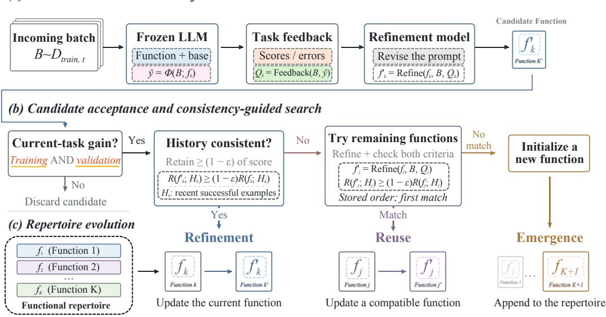
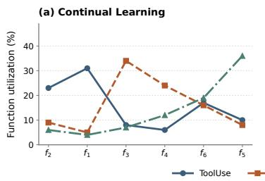
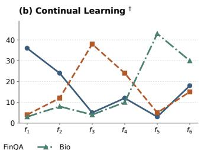
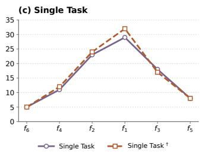
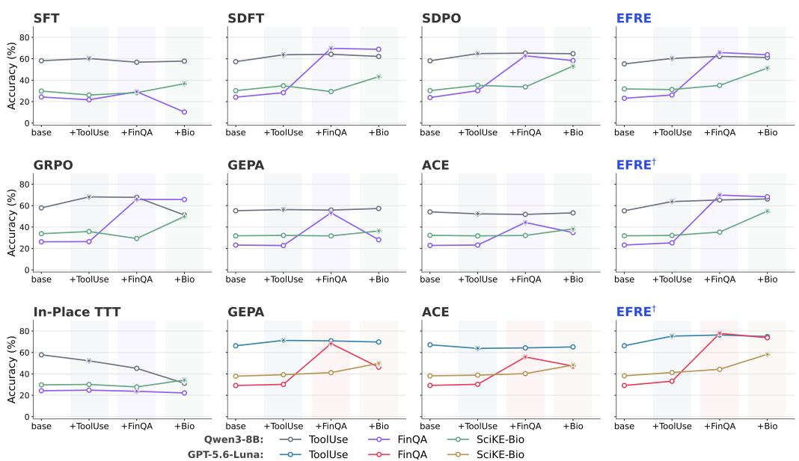
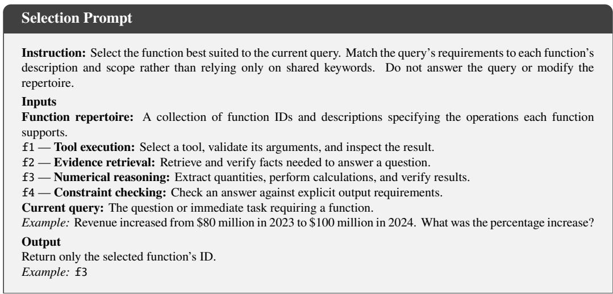
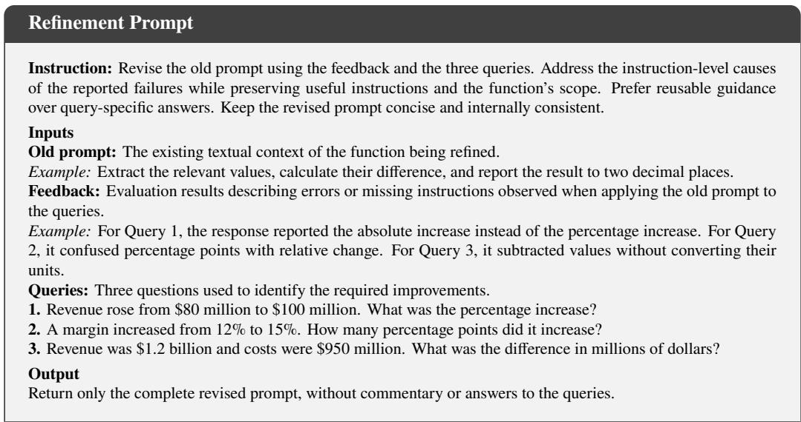

# FROM A PROMPT TO REPERTOIRES: EVOLVING FUNC-TIONAL REPERTOIRES ENABLE LLM CONTINUAL LEARNING

Fengyuan Liu<sup>1</sup>, Yue Wang<sup>2,3</sup>, Hangxi Guo<sup>1</sup>, Fengyuan Liu<sup>4</sup>, Chenxu Wu<sup>3</sup>, Yanguang Liu<sup>5</sup>, Mengnan Du<sup>1,†</sup>

<sup>1</sup>The Chinese University of Hong Kong, Shenzhen <sup>2</sup>Shanghai AI Laboratory

<sup>3</sup>University of Science and Technology of China <sup>4</sup>Independent Researcher

<sup>5</sup>New Jersey Institute of Technology

liuferry708@gmail.com, mengnandu@cuhk.edu.cn

<sup>†</sup>Corresponding author

## ABSTRACT

Continual learning remains challenging for large language models, which must enable models to acquire new skills and knowledge without degrading existing capabilities. Existing approaches typically address this challenge by carefully designing how model parameters are updated. In contrast, prompt optimization avoids costly parameter updates while achieving competitive or even superior performance to reinforcement learning methods such as GRPO on individual knowledge-intensive and reasoning tasks. This raises a natural question: Can prompt optimization, as an efficient adaptation approach, be directly applied to continual learning? Our analysis shows that, under sequential task adaptation, it suffers from catastrophic forgetting, while optimized prompts accumulate rules that overfit to local task distributions. To address these limitations, we propose Evolving Functional REpertoires (EFRE), which replaces a single prompt with a repertoire of functions that evolves as new tasks arrive: compatible updates refine existing functions, while conflicting updates trigger the emergence of new ones. On a three-task continual-learning stream, EFRE achieves a final average performance 7.50 percentage points higher than GRPO. Moreover, after adaptation to the Bio task, its performance on FinQA decreases by only 1.56 percentage points, compared with 25.10 percentage points for the base prompt optimization method. We further instantiate EFRE in a minimal agent system and observe consistent improvements across different backbone models. Overall, these results demonstrate EFRE’s strong performance in continual learning for large language models and highlight its substantial potential for continual learning in advanced agent systems.

## 1 INTRODUCTION

Continual learning is becoming increasingly important for large language models (LLMs), which need to continually acquire new knowledge and skills while preserving what they have already learned (Harrington et al., 2026; Asawa et al., 2026). Most existing approaches address this challenge by controlling how model parameters are updated, for example through low-rank adaptation (LoRA) (Hu et al., 2021), replay-based training (Lopez-Paz & Ranzato, 2017), or reinforcementlearning-based optimization such as GRPO (Shao et al., 2024) rely on reliable rewards (Tian et al., 2026; Liu et al., 2026). Although effective, these methods incur substantial training overhead. Enabling efficient continual learning remains an open challenge.

Recently, prompt optimization (Pryzant et al., 2023; Yuksekgonul et al., 2025; Agrawal et al., 2026; Zhang et al., 2026) has emerged as an efficient approach to adapting LLMs to downstream tasks without parameter updates. These methods have achieved strong performance on knowledgeintensive and reasoning tasks, in some cases outperforming reinforcement learning methods such as GRPO. This naturally raises the question: Can prompt optimization, as a powerful and efficient optimization method, be directly applied to continual learning? Our analysis and prior studies (Harrington et al., 2026) suggest otherwise: under sequential multi-task learning, repeated prompt updates overwrite previously learned knowledge and accumulate case-specific rules rather than generalizable principles, limiting their effectiveness in continual learning.

Motivated by these limitations, we introduce Evolving Functional REpertoires (EFRE), a continual learning method that evolves both the capabilities and composition of a functional repertoire as new learning tasks arrive. Each function is represented by an optimized prompt. Historical consistency checks guide this evolution: compatible updates refine existing functions and enable reuse across tasks, while updates that cannot be absorbed without compromising historical capabilities trigger the emergence of new functions. Through this process, functional specialization and reuse arise automatically, reducing interference between new and previously learned capabilities.

We evaluate EFRE on the ToolUse (Tang et al., 2023) → FinQA (Chen et al., 2021) → SciKE-Bio (Feng et al., 2024) continual-learning sequence and several single-task benchmarks. With Qwen3-8B (Qwen Team, 2025a), EFRE achieves a final average score of 58.75, outperforming GRPO (Shao et al., 2024) and GEPA (Agrawal et al., 2026), while limiting forgetting on previously learned tasks after Bio to 1.57 points, versus 8.32 for GRPO and 11.82 for GEPA. EFRE also consis tently improves over prompt-optimization and GRPO baselines on single-task benchmarks. In a minimal agent system spanning six continual-learning tasks, EFRE similarly outperforms ICL (Brown et al., 2020) and GEPA: it attains average scores of 18.0 with Qwen3-8B (vs. −3.5 and 9.5) and 36.3 with GPT-5.6-Luna (OpenAI, 2026) (vs. 22.2 and 29.5). Together, these results demonstrate EFRE’s effectiveness for both standard and agent continual learning.

Our key contributions are threefold:

• We identify two key limitations of prompt optimization in continual learning: updates overwrite previously learned knowledge, causing forgetting, and prompts accumulate case-specific rules rather than generalizable principles.

• We introduce EFRE, a non-parametric continual learning method whose functional repertoire evolves with incoming tasks through the refinement and reuse of existing functions and the emer gence of new ones, guided by historical consistency checks.

• We empirically demonstrate that EFRE improves both continual learning and single-task optimization, outperforming existing prompt optimization methods and GRPO in overall performance. Further gains in agent continual-learning settings highlight its potential for continual learning in real-world intelligent systems.

## 2 RELATED WORK

Continual Learning. Continual learning is a learning paradigm that requires a model to acquire new capabilities while preserving previously learned knowledge and behaviors. Existing approaches mainly address the stability–plasticity trade-off through replay (Lopez-Paz & Ranzato, 2017), regularization (Kirkpatrick et al., 2017), parameter isolation (Rusu et al., 2016), parameter-efficient tuning (Hu et al., 2021), and reinforcement-learning-based optimization (Shao et al., 2024). Recent work has further extended continual learning to LLMs and language agents, where models must continually adapt to new tasks, knowledge, and interaction environments (Shenfeld et al., 2026; Asawa et al., 2026). EFRE studies this problem from a non-parametric perspective, maintaining and evolving external functional contexts rather than continually updating model parameters.

Non-Parametric Optimization. Non-parametric optimization is a class of lightweight optimization methods that improves model behavior without updating model parameters, with prompt optimization being a representative approach (Pryzant et al., 2023; Yuksekgonul et al., 2025). Existing methods optimize prompts, contexts, memories, or other external textual states using task feedback, reflection, or iterative search (Shinn et al., 2023; Agrawal et al., 2026; Zhang et al., 2026). Recent prompt optimization methods have demonstrated strong performance across reasoning, knowledge-intensive, and agent tasks, showing that textual states can serve as effective op timization targets (Agrawal et al., 2026; Zhang et al., 2026). Building on this, EFRE organizes the evolving non-parametric learning state into a repertoire of functional contexts, enabling prompt optimization to support continual learning across sequential tasks.

  
Figure 1: Overview of Evolving Functional REpertoires (EFRE). Each function is represented by a prompt and evolves through feedback-driven refinement on incoming data. Candidates that improve current performance undergo a historical consistency check: compatible updates refine the current function, while incompatible updates trigger a sequential search for another function that can absorb them. If no compatible update is found, a new function emerges. The repertoire thus evolves through functional refinement, reuse, and emergence, enabling continual adaptation while preserving previously learned capabilities.

## 3 METHODOLOGY

In this section, we introduce Evolving Functional REpertoires (EFRE) . We first formulate continual learning with frozen LLMs. We then describe prompt optimization for continual learning and discuss its limitations. Finally, we present EFRE, which uses historical consistency checks to guide the refinement of existing functions and the emergence of new ones as learning tasks arrive (Figure 1).

## 3.1 PROBLEM STATEMENT

We study continual learning for a pretrained language model Φ whose parameters remain fixed. At stage t, the learner receives a training batch $D _ { \mathrm { t r a i n } , t }$ and updates its external textual state through $S _ { t } \overset { \cdot } { = } \mathcal { U } ( S _ { t - 1 } , D _ { \mathrm { t r a i n } , t } )$ , where U is the update procedure. The state may contain prompts, skills, or other textual information that guides the model’s behavior. The objective is to acquire new capabilities while preserving those learned at earlier stages.

For an evaluation set $D _ { \mathrm { e v a l } }$ , we define performance as:

$$
R ( S ; D _ { \mathrm { e v a l } } ) = \mathrm { E v a l } ( \Phi ( \cdot ; S ) , D _ { \mathrm { e v a l } } ) ,\tag{1}
$$

where Eval scores the model conditioned on S, with higher values indicating better performance. We use the notation R when scoring training, validation, and history data. For continual-learning evaluation, $D _ { \mathrm { e v a l } , i }$ denotes the held-out evaluation set for stage i and is never used to update S.

Plasticity and Stability. We characterize each update through two classical properties of continual learning. Plasticity measures its performance gain on the current task:

$$
\mathcal { I } _ { \mathrm { p l a s } } ^ { ( t ) } = R ( S _ { t } ; D _ { \mathrm { e v a l } , t } ) - R ( S _ { t - 1 } ; D _ { \mathrm { e v a l } , t } ) .\tag{2}
$$

A larger value indicates more effective learning from the incoming data. Stability measures the average performance change on previously encountered tasks:

$$
\mathcal { I } _ { \mathrm { s t a b } } ^ { ( t ) } = \frac { 1 } { t - 1 } \sum _ { i = 1 } ^ { t - 1 } \left[ R ( S _ { t } ; D _ { \mathrm { e v a l } , i } ) - R ( S _ { t - 1 } ; D _ { \mathrm { e v a l } , i } ) \right] , t > 1 .\tag{3}
$$

Negative values indicate average forgetting, zero indicates no net change in historical performance, and positive values indicate beneficial backward transfer (Lopez-Paz & Ranzato, 2017). Effective continual learning should achieve positive plasticity while limiting degradation on previous tasks.

## 3.2 PROMPT OPTIMIZATION FOR CONTINUAL LEARNING

In a continual learning setting, prompt optimization implements $S _ { t } = \mathcal { U } ( S _ { t - 1 } , D _ { \mathrm { t r a i n } , t } )$ by rewriting the prompt represented by $S _ { t - 1 } . \mathrm { A t }$ stage $t ,$ the frozen model runs on $D _ { \mathrm { t r a i n } , t }$ using the current prompt. The task environment returns feedback $\mathcal { Q } _ { t }$ , including performance scores and, when available, textual feedback such as test results, error messages, or explanations of incorrect answers. An external refinement mode $M _ { \mathrm { r e f i n e } }$ uses this feedback and the training data to revise $S _ { t - 1 } \mathrm { : }$

$$
S _ { t } ^ { \prime } = M _ { \mathrm { r e f i n e } } ( S _ { t - 1 } , D _ { \mathrm { t r a i n } , t } , \mathcal { Q } _ { t } ) .\tag{4}
$$

The candidate replaces the current prompt only if it improves performance on both the training batch and a separate validation set:

$$
\begin{array} { r l } & { R ( S _ { t } ^ { \prime } ; D _ { \mathrm { t r a i n } , t } ) > R ( S _ { t - 1 } ; D _ { \mathrm { t r a i n } , t } ) , } \\ & { ~ R ( S _ { t } ^ { \prime } ; D _ { \mathrm { v a l } , t } ) > R ( S _ { t - 1 } ; D _ { \mathrm { v a l } , t } ) . } \end{array}\tag{5}
$$

Otherwise, $S _ { t } = S _ { t - 1 }$ . The validation set $D _ { \mathrm { v a l } , i }$ is used for update selection and is distinct from the held-out evaluation set $D _ { \mathrm { e v a l } , t }$

Our analysis identifies limitations in both stability and plasticity. The acceptance rule checks current performance but does not explicitly assess retention on previous tasks. Repeated rewriting can therefore overwrite instructions that support previously learned capabilities, causing catastrophic forgetting. Meanwhile, prompts can accumulate case-specific rules rather than generalizable principles, making new requirements difficult to accommodate. These limitations motivate EFRE, which checks historical consistency before accepting updates and allows functions to emerge when updates cannot be incorporated into existing functions without compromising historical performance.

## 3.3 EFRE: EVOLVING FUNCTIONAL REPERTOIRES

We first define functions and their associated repertoire, then describe how the repertoire evolves during continual learning and supports inference.

Functions and Functional Repertoire. A function $f _ { k }$ is a prompt encoding a learned capability, such as a reasoning procedure or instructions for handling particular inputs. Afunctional repertoire $\mathcal { F } _ { t } ~ = ~ \{ f _ { 1 } , \ldots , f _ { K _ { t } } \}$ contains the $K _ { t }$ functions available at stage t. Each function maintains a history $D _ { \mathrm { h i s t o r y } , k }$ of at most $H$ recent examples successfully absorbed by that function. Functions are not assigned to tasks in advance: one function may serve multiple tasks, and one task may involve multiple functions. As learning proceeds, both individual functions and the composition of the repertoire evolve. For local evaluation, $R ( f _ { k } ; D )$ denotes the performance of the frozen LLM Φ on dataset D, directly conditioned on $f _ { k }$ and shared base instructions $p _ { \mathrm { b a s e } }$

Repertoire Evolution and Inference. EFRE starts with one function and subsequently attempts each update on the branch accepted by the most recent successful update. At stage $t ,$ the frozen LLM runs on $D _ { \mathrm { t r a i n } , t }$ using the current function $f _ { k }$ . The environment returns feedback $\mathcal { Q } _ { t , k }$ , such as correctness scores, test results, or execution errors, which the refinement model uses to propose

$$
f _ { k } ^ { \prime } = M _ { \mathrm { r e f i n e } } ( f _ { k } , D _ { \mathrm { t r a i n } , t } , \mathcal { Q } _ { t , k } ) .\tag{6}
$$

Following Equation $^ { 5 , }$ the candidate must improve performance on both $D _ { \mathrm { t r a i n } , t }$ and $D _ { \mathrm { v a l } , t } .$ . If either condition fails, it is discarded without evaluating other functions.

A candidate that improves current performance must also pass a historical consistency check:

$$
R ( f _ { k } ^ { \prime } ; D _ { \mathrm { h i s t o r y } , k } ) \ge ( 1 - \epsilon ) R ( f _ { k } ; D _ { \mathrm { h i s t o r y } , k } ) ,\tag{7}
$$

where scores are nonnegative and $\epsilon \in [ 0 , 1 ]$ specifies the maximum proportional decrease in historical performance. For example, $\epsilon = 0 . 1$ requires retention of at least 90% of the original score. The check is skipped when the history is empty. A passing candidate replaces the current function, and successfully absorbed examples are appended to its history, retaining the most recent H examples.





  
Figure 2: Functional reuse patterns in continual-learning and single-task settings. Curves show utilization of the six most-used functions. (a), (b) report utilization on ToolUse, FinQA, and SciKE-Bio. (c) compares both refinement configurations for single-task optimization, with a separate vertical scale. † denotes GPT-5.6-Luna as the refinement model; Qwen3-8B is used otherwise.

If the candidate improves current performance but fails historical consistency, EFRE searches the remaining functions in their stored order. For each function, it obtains feedback on the incoming batch and generates a revision using Equation 6. The search stops at the first candidate that improves both training and validation performance relative to its original function and passes Equation 7 on that function’s own history. Only the matched function and its history change; the original branch remains unchanged. This enablesfunctional reuse through compatible updates from different tasks.

If no compatible update is found, the refinement model proposes a new function using the incoming data and feedback from the failed attempts. The new function is added only if it improves training and validation performance relative to the current prompt before this update. Its history is initialized with up to H examples that it successfully handles. We call this automatic creation of a new function functional emergence. The repertoire can contain at most 50 functions; when this limit is reached, an update that cannot be absorbed by an existing function is discarded. After an accepted refinement, reuse, or emergence, the accepted branch becomes the current function for the next update. The repertoire thus evolves by incorporating compatible capabilities into existing functions and creating new ones when historical incompatibility prevents reuse.

At inference time, a textual selector σ receives the input and current function prompts, selects a function, and directs the frozen LLM to generate a response:

$$
k ( x ) = \sigma ( x ; \mathcal { F } _ { t } ) , \ : \hat { y } = \Phi \big ( x ; p _ { \mathrm { b a s e } } , f _ { k ( x ) } \big ) .\tag{8}
$$

The selector uses fixed instructions; its available function prompts change as the repertoire evolves. No task labels are required. The shared instructions, repertoire, histories, and selector constitute the external state $S _ { t }$ . Learning updates this textual state while keeping the parameters of Φ fixed. Further methodological details are provided in Appendix D.

## 4 EXPERIMENTS

We evaluate EFRE on the ToolUse → FinQA → SciKE-Bio sequence to assess its continual-learning performance. We conduct ablation studies and mechanism analyses to examine historical consistency, function selection, and functional specialization and reuse. Finally, we evaluate EFRE on benchmarks such as HotpotQA to assess its effectiveness in single-task optimization.

## 4.1 EXPERIMENTAL SETUP

Benchmark Datasets. We construct a continual-learning sequence using ToolUse (Tang et al., 2023), FinQA (Chen et al., 2021), and SciKE-Bio (Feng et al., 2024). After each learning stage, we evaluate performance on the current and previously encountered tasks. We additionally conduct single-task experiments on HotpotQA (Yang et al., 2018), IFBench (Pyatkin et al., 2025), AIME-2025 (Mathematical Association of America, n.d.), and LiveBench-Math (White et al., 2025), and evaluate continual learning in agent settings using Continual Learning Bench (Asawa et al., 2026). We report the benchmark-specific evaluation metrics. For continual-learning experiments, we also measure plasticity and stability as defined in Section 3.1, which quantify improvement on the current task and changes in performance on previous tasks, respectively.

  
Figure 3: Continual-learning performance along the ToolUse → FinQA → SciKE-Bio sequence. Each panel shows one method, with curves tracking performance on all three tasks before adaptation and after each learning stage. Stars mark performance immediately after training on the corresponding task, and shaded regions indicate the task introduced at each stage. The two color palettes distinguish Qwen3-8B and GPT-5.6-Luna backbones. EFRE variants are grouped in the rightmost column; EFRE uses Qwen3-8B for refinement by defualt; † indicates GPT-5.6-Luna instead.

Table 1: Functional organization of the learned repertoires. For continual learning, Cross-task reuse denotes the percentage of evaluation instances routed to functions used by at least two tasks, averaged equally across ToolUse, FinQA, and SciKE-Bio. Shared Func. counts functions used by at least two tasks, while Func. denotes total repertoire size. Cross-task reuse is not defined for single-task settings, where each benchmark is optimized independently. The final column illustrates a learned function. Rows marked with † use GPT-5.6-Luna for refinement; others use Qwen3-8B.
<table><tr><td>Setting</td><td>Cross-task reuse</td><td>Shared Func.</td><td></td><td>Func. Example learned function</td></tr><tr><td>Continual Learning</td><td>41.7%</td><td>2</td><td>7</td><td>Identify the next required action, select a tool, and check its arguments against the tool schema before execution.</td></tr><tr><td>Continual Learning†</td><td>56.3%</td><td>6</td><td>19</td><td>Extract the relevant financial values and units, write the cal- culation, and verify its result against the source table.</td></tr><tr><td>Single-task</td><td>一</td><td>一</td><td>8</td><td>Decompose the question into two linked subquestions, gather evidence, and synthesize a supported answer.</td></tr><tr><td>Single-task†</td><td></td><td></td><td>12</td><td>Translate the conditions into equations, solve them, and ver- ify candidates against the original constraints.</td></tr></table>

Comparing Baselines. We compare EFRE with methods that adapt model parameters or external textual states. Among parameter-based methods, SFT learns directly from demonstrations through supervised fine-tuning. SDFT (Shenfeld et al., 2026) performs on-policy self-distillation using the model conditioned on demonstrations as its teacher. SDPO (Hubotter et al., 2026) distills predictions¨ from a feedback-conditioned self-teacher into the policy. GRPO (Shao et al., 2024) performs reinforcement learning using relative rewards within groups of sampled responses. In-Place TTT (Feng et al., 2026) adapts selected MLP projection weights during inference. Among methods that keep model parameters fixed, GEPA (Agrawal et al., 2026) optimizes prompts through natural-language reflection on execution traces and evaluation feedback, while ACE (Zhang et al., 2026) accumulates and refines contextual playbooks through generation, reflection, and curation. Detailed baseline configurations are provided in Appendix B.

Table 2: Ablation studies on history retention, parameter settings, and function selection along the ToolUse → FinQA → Bio stream. $\mathcal { I } _ { \mathrm { p l a s } }$ measures the score change on the current task, while $\mathcal { I } _ { \mathrm { s t a b } }$ measures the mean score change over previously encountered tasks with equal weights. Values are reported in percentage points; higher is better. Stability is undefined at the first stage and denoted by –. Baselines are shown in light beige, default configurations are shaded light blue, and the oracle reference is shown in gray. Bold means with pale gold shading indicate the best result in each column within each ablation group, excluding the baseline and oracle references.
<table><tr><td rowspan="2">Setting</td><td colspan="2">after ToolUse</td><td colspan="2">after FinQA</td><td colspan="2">after Bio</td></tr><tr><td> $\mathcal { I } _ { \mathrm { p l a s } } \uparrow$ </td><td> $\mathcal { I } _ { \mathrm { s t a b } } \uparrow$ </td><td> $\mathcal { I } _ { \mathrm { p l a s } } \uparrow$ </td><td> $\mathcal { I } _ { \mathrm { s t a b } } \uparrow$ </td><td> $\mathcal { I } _ { \mathrm { p l a s } } \uparrow$ </td><td> $\mathcal { I } _ { \mathrm { s t a b } } \uparrow$ </td></tr><tr><td>GEPA</td><td> $+ 1 . 0 7 \pm 0 . 4 2$ </td><td></td><td> $+ 3 0 . 4 8 \pm 1 . 7 3$ </td><td> $- 0 . 4 9 \pm 0 . 2 8$ </td><td> $+ 4 . 5 9 \pm 0 . 8 6$ </td><td> $- 1 1 . 8 2 \pm 1 . 2 4$ </td></tr><tr><td>GRPO</td><td> $+ 1 0 . 2 8 \pm 0 . 9 4$ </td><td></td><td> $+ 3 9 . 4 6 \pm 1 . 6 5$ </td><td> $- 0 . 4 0 \pm 0 . 3 1$ </td><td> $+ 2 0 . 5 8 { = } \pm 1 . 2 9$ </td><td> $- 8 . 3 2 \pm 1 . 0 7$ </td></tr><tr><td colspan="7">History Retention</td></tr><tr><td>Last-20</td><td>_  $\mathbf { + 8 . 6 0 \pm 0 . 7 3 }$ </td><td></td><td> $+ 4 4 . 5 8 \pm 1 . 3 6$  </td><td> $+ 1 . 4 9 \pm 0 . 2 4$  _</td><td> $\mathbf { + 1 9 . 5 2 \pm 1 . 0 8 }$ </td><td> ${ \bf - 0 . 3 1 \pm 0 . 1 9 }$ </td></tr><tr><td>Last-50</td><td> $+ 6 . 7 6 \pm 0 . 9 1$ </td><td></td><td> $+ 4 0 . 1 9 \pm 1 . 6 2$ </td><td> $+ 1 . 4 8 \pm 0 . 3 1$ </td><td> $+ 1 6 . 0 4 \pm 1 . 2 7$ </td><td> $- 1 . 3 3 \pm 0 . 3 8$ </td></tr><tr><td> $\mathrm { L a s t - } 2 0 \substack { + D _ { v a l } }$ </td><td> $+ 7 . 6 9 \pm 0 . 6 8$ </td><td></td><td> $+ 4 2 . 2 9 \pm 1 . 4 5$ </td><td> $\mathbf { + 1 . 5 9 \pm 0 . 2 7 }$  </td><td> $+ 1 7 . 8 5 \pm 1 . 1 6$ </td><td> $- 0 . 8 1 \pm 0 . 2 6$ </td></tr><tr><td colspan="7">Tolerance € Settings</td></tr><tr><td>0</td><td> $+ 3 . 5 6 \pm 0 . 5 7$ </td><td></td><td> $+ 3 1 . 5 7 \pm 1 . 8 4$ </td><td> $+ 0 . 8 8 \pm 0 . 3 2$ </td><td> $+ 1 1 . 4 6 \pm 1 . 3 9$ </td><td> $- 3 . 7 8 \pm 0 . 6 1$ </td></tr><tr><td>0.1</td><td>_  $\mathbf { + 8 . 6 0 \pm 0 . 7 3 }$  </td><td></td><td> $+ 4 4 . 5 8 \pm 1 . 3 6$  </td><td> $\mathbf { + 1 . 4 9 \pm 0 . 2 4 }$  </td><td> $\mathbf { + 1 9 . 5 2 \pm 1 . 0 8 }$  –</td><td> ${ \bf - 0 . 3 1 \pm 0 . 1 9 }$ </td></tr><tr><td>0.2</td><td> $+ 7 . 4 6 \pm 0 . 8 2$ </td><td></td><td> $+ 4 1 . 8 2 \pm 1 . 5 1 $ </td><td> $+ 1 . 3 7 \pm 0 . 2 9$ </td><td> $+ 1 7 . 3 5 \pm 1 . 2 2$ </td><td> $- 0 . 9 0 \pm 0 . 3 4$ </td></tr><tr><td>0.5</td><td> $+ 5 . 7 4 \pm 0 . 7 6$ </td><td></td><td> $+ 3 7 . 5 2 \pm 1 . 6 8$ </td><td> $+ 1 . 2 6 \pm 0 . 2 6$ </td><td> $+ 1 5 . 2 9 \pm 1 . 3 1$ </td><td> $- 1 . 4 4 \pm 0 . 4 3$ </td></tr><tr><td>1.0</td><td> $+ 4 . 5 3 \pm 0 . 6 4$ </td><td></td><td> $+ 3 4 . 1 2 \pm 1 . 7 9$ </td><td> $+ 1 . 1 2 \pm 0 . 3 5$ </td><td> $+ 1 3 . 0 4 \pm 1 . 4 6$ </td><td> $- 2 . 5 7 \pm 0 . 5 2$ </td></tr><tr><td colspan="7">Function Selection</td></tr><tr><td>First</td><td> $+ 5 . 7 0 \pm 0 . 8 8$ </td><td></td><td> $+ 3 8 . 4 0 \pm 1 . 6 7$ </td><td> $+ 1 . 0 7 \pm 0 . 3 3$ </td><td> $+ 1 5 . 4 3 \pm 1 . 3 4$ </td><td> $- 1 . 6 1 \pm 0 . 4 6$ </td></tr><tr><td>Random</td><td> $+ 5 . 2 5 \pm 1 . 1 2$ </td><td></td><td> $+ 3 7 . 6 1 \pm 2 . 0 4$ </td><td> $+ 1 . 1 8 \pm 0 . 4 1$ </td><td> $+ 1 5 . 1 7 \pm 1 . 6 3$ </td><td> $- 1 . 4 4 \pm 0 . 5 7$ </td></tr><tr><td>Embedding-20</td><td> $+ 5 . 8 4 \pm 0 . 7 9$ </td><td></td><td> $+ 3 8 . 5 9 \pm 1 . 5 8$ </td><td> $+ 1 . 3 5 \pm 0 . 2 8$ </td><td> $+ 1 5 . 7 5 \pm 1 . 2 5$ </td><td> $- 1 . 4 5 \pm 0 . 3 9$ </td></tr><tr><td>Embedding-50</td><td> $+ 8 . 3 4 \pm 0 . 7 7$ </td><td></td><td> $+ 4 4 . 3 0 \pm 1 . 4 2$ </td><td> $+ 1 . 4 6 \pm 0 . 2 6$ </td><td> $+ 1 9 . 3 1 \pm 1 . 1 4$ </td><td> ${ \bf - 0 . 2 9 } \pm 0 . 2 2$ </td></tr><tr><td>LLM-selector</td><td> $\mathbf { + 8 . 6 0 \pm 0 . 7 3 }$ </td><td></td><td> $+ 4 4 . 5 8 \pm 1 . 3 6$ </td><td> $\mathbf { + 1 . 4 9 \pm 0 . 2 4 }$  </td><td> $\mathbf { + 1 9 . 5 2 \pm 1 . 0 8 }$ </td><td> $- 0 . 3 1 \pm 0 . 1 9$ </td></tr><tr><td>Oracle</td><td>1  $+ 1 2 . 0 6 \pm 0 . 6 5$ </td><td></td><td> $+ 5 0 . 7 6 \pm 1 . 2 1$ </td><td> $+ 1 . 9 4 \pm 0 . 2 3$ </td><td> $+ 2 4 . 3 5 \pm 0 . 9 7$ </td><td> $- 0 . 3 2 \pm 0 . 1 8$ </td></tr></table>

Implementation Details. For the main experiments and agent continual-learning experiments, we use Qwen3-8B (Qwen Team, 2025a) and GPT-5.6-Luna (OpenAI, 2026) as backbone models and also use these two models for refinement. For ablation studies and mechanism analyses, we use Qwen3-8B as the backbone and GPT-5.6-Luna as the refinement model. For single-task experiments, we fix the backbone to Qwen3-8B and evaluate Qwen3-8B and GPT-5.6-Luna separately as refinement models. All models are configured with low reasoning effort. Unless otherwise specified, we set the historical consistency tolerance to $\epsilon = 0 . 1$ and retain the most recent H = 20 successfully absorbed examples for each function. We use the refinement model with a dedicated routing prompt to select functions. Single-task optimization runs once; other experiments are repeated three times, reporting mean and standard deviation. Further implementation details are provided in Appendix B.

## 4.2 MAIN RESULTS

Observation 1: EFRE achieves strong continual-learning performance and exhibits functional reuse and specialization. We evaluate Qwen3-8B and GPT-5.6-Luna as backbone models; † de notes GPT-5.6-Luna refinement, while variants without † use Qwen3-8B. Figure 3 shows that EFRE learns new tasks while largely preserving earlier gains. With Qwen3-8B, EFRE<sup>†</sup> loses only 1.56 percentage points on FinQA after Bio adaptation, compared with 25.10 for GEPA and 9.43 for ACE, and reaches final ToolUse/FinQA/Bio scores of 66.21/68.26/54.83. With GPT-5.6-Luna, it retains

Table 3: Performance comparison across four benchmarks. Both EFRE configurations use Qwen3- 8B as the backbone. EFRE and EFRE<sup>†</sup> use Qwen3-8B and GPT-5.6-Luna as the refinement model, respectively. Aggregate is the unweighted mean across benchmarks, and Improvement is the percentage-point gain over Base. EFRE and EFRE<sup>†</sup> are shaded light blue and darker blue, respectively. Bold means indicate the best result in each column.
<table><tr><td colspan="5"></td><td colspan="2">LiveBench</td></tr><tr><td>Method</td><td>HotpotQA</td><td>IFBench</td><td>AIME-2025 27.33</td><td>Math 48.70</td><td>Aggregate</td><td>Improvement</td></tr><tr><td>Base</td><td>42.33</td><td>36.90</td><td></td><td></td><td>38.82</td><td></td></tr><tr><td>GRPO ACE</td><td>43.33</td><td>35.88</td><td>38.00 31.00</td><td>51.26 52.76</td><td>42.12</td><td>+3.30</td></tr><tr><td>GEPA</td><td>60.00 62.33</td><td>35.72 38.61</td><td>32.00</td><td>51.95</td><td>44.87 46.22</td><td>+6.06 +7.41</td></tr><tr><td>GEPA+Merge</td><td>64.33</td><td>28.23</td><td>32.00</td><td>51.95</td><td>44.13</td><td>+5.31</td></tr><tr><td></td><td></td><td></td><td></td><td></td><td></td><td></td></tr><tr><td>EFRE</td><td>70.67</td><td>39.26</td><td>34.33</td><td>51.88</td><td>49.04</td><td>+10.22</td></tr><tr><td>EFRE†</td><td>72.33</td><td>42.38</td><td>36.00</td><td>54.32</td><td>51.26</td><td>+12.44</td></tr></table>

73.76% FinQA accuracy, versus 46.24% for GEPA and 47.28% for ACE. Together, these results show a stronger balance between new-task adaptation and retention of previously learned capabilities. Figures $\mathsf { 2 } ( \mathrm { a } , \mathrm { b } )$ further show that the learned repertoire combines specialization with cross-task reuse. For example, in panel (a), $f _ { 1 } , \ f _ { 3 }$ , and $f _ { 5 }$ predominantly serve ToolUse, FinQA, and Bio, respectively, whereas $f _ { 6 }$ is shared across all three tasks, with utilization rates of 17%, 16%, and 19%. Table 1 quantifies this behavior through cross-task reuse and the number of shared functions, while the example prompts illustrate distinct functional roles. Thus, EFRE does not simply allocate an independent prompt to each task, but develops specialized and reusable functional contexts.

## 4.3 ABLATION STUDY AND MECHANISM ANALYSIS

Observation 2: Historical consistency improves continual-learning performance by better balancing plasticity and stability. Table 2 varies history retention and tolerance separately, holding other hyperparameters fixed. We compare the most recent 20 examples (Last-20), 50 examples (Last-50), and 20 examples supplemented with validation data $( \mathrm { L a s t } { - 2 0 } { + } D _ { \mathrm { v a l } } )$ , using plasticity and stability defined in Equation. 2 and 3. Last-20 yields the highest plasticity at every stage and the least historical degradation after Bio, showing that more history does not necessarily improve learning. Among the tested tolerances, $\epsilon = 0 . 1$ achieves the best plasticity and stability at every applicable stage. Its Bio-stage plasticity is +19.52 points, versus +11.46 with strict preservation $( \epsilon = 0 )$ and +13.04 without a historical performance constraint (ϵ = 1). It exceeds GEPA (+4.59) and approaches GRPO (+20.58), with stability of -0.31 points, versus -11.82 and -8.32, respectively. These results favor a moderate constraint supporting new learning while preserving earlier capabilities.

Observation 3: LLM-based selection enables effective use of the functional repertoire. Table 2 compares selection strategies with other hyperparameters fixed. First always selects the first function, while Random samples uniformly. Embedding-20 and Embedding-50 use Qwen3-Embedding-0.6B fine-tuned on 20 and 50 historical examples per function for retrieval. The LLM selector chooses from the function prompts based on the input, whereas Oracle evaluates all functions and selects the highest-scoring output, providing an upper-bound reference within the repertoire. The LLM selector achieves the highest non-oracle plasticity at every stage and better stability than First and Random. Embedding-50 yields slightly better Bio-stage stability (-0.29 versus -0.31 points), but lower plasticity throughout. Oracle further improves Bio-stage plasticity from +19.52 to +24.35 with comparable stability, indicating room to improve selection within the existing repertoire.

Observation 4: Functional repertoires also benefit single-task optimization. Table 3 shows that EFRE achieves an aggregate score of 49.04 across four benchmarks, compared with 46.22 for GEPA, 44.87 for ACE, and 42.12 for GRPO. Using GPT-5.6-Luna for refinement further improves the aggregate score to 51.26. Figure 2(c) shows that, even within independently optimized singletask settings, utilization is distributed across multiple functions rather than concentrated in a single context. Table 1 reports repertoires of 8 and 12 functions under the two refinement settings, with example functions capturing distinct procedures such as evidence decomposition and equation-based reasoning. These results suggest that functional differentiation is useful beyond continual learning: multiple specialized procedures can emerge within a single task even without task transitions.

Table 4: Minimal agent results across six interactive environments with two backbones. Each backbone uses ICL, GEPA, ACE, or EFRE. Values are mean ± standard deviation; higher is better. EFRE rows are light blue. Bold means indicate the best result within each backbone, including ties.
<table><tr><td>Method</td><td>Blind Spectrum Monitoring</td><td>Codebase Adaptation</td><td>Cohort Studies</td><td>Database Exploration</td><td>Exploitable Poker</td><td>Sales Prediction</td></tr><tr><td colspan="7">Qwen3-8B</td></tr><tr><td>+ ICL</td><td> $1 2 . 0 \pm 5 . 6$ </td><td> $- 3 2 . 0 \pm 8 . 4$ </td><td> $- 2 8 . 0 \pm 7 . 9$ </td><td> $1 0 . 0 \pm 5 . 1$ </td><td> $- 8 . 0 \pm 6 . 7$ </td><td> $2 5 . 0 \pm 6 . 2$ </td></tr><tr><td> $+ \mathrm { G E P A }$ </td><td> $2 6 . 0 \pm 4 . 8$ </td><td> $- 1 5 . 0 \pm 7 . 2$ </td><td> $- 1 8 . 0 \pm 6 . 8$ </td><td> $2 2 . 0 \pm 4 . 6$ </td><td> $0 . 0 \pm 5 . 9$ </td><td> $4 2 . 0 \pm 5 . 3$ </td></tr><tr><td> $+ \operatorname { A C E }$ </td><td> $2 . 0 \pm 4 . 4$ </td><td> $- 1 0 . 0 \pm 6 . 9$ </td><td> $- 2 4 . 0 \pm 7 . 3$ </td><td> $5 . 0 \pm 4 . 8$ </td><td> $- 5 . 0 \pm 5 . 6$ </td><td> $1 5 . 0 \pm 5 . 9$ </td></tr><tr><td> ${ \bf + E F R E }$ </td><td> $3 5 . 0 \pm 4 . 1$ </td><td> ${ \bf - 5 . 0 \pm 6 . 2 }$ </td><td> ${ \bf - 1 0 . 0 \pm 6 . 0 }$ </td><td> ${ \bf 3 0 . 0 \pm 4 . 2 }$ </td><td> ${ \bf 6 . 0 \pm 5 . 1 }$ </td><td> ${ \bf 5 2 . 0 \pm 4 . 7 }$ </td></tr><tr><td colspan="7">GPT-5.6-Luna</td></tr><tr><td>+ ICL</td><td> $3 6 . 0 \pm 4 . 3$ </td><td> $1 2 . 0 \pm 6 . 4$ </td><td> $0 . 0 \pm 5 . 8$ </td><td> $2 7 . 0 \pm 4 . 5$ </td><td> $- 2 . 0 \pm 5 . 3$ </td><td> $6 0 . 0 \pm 4 . 8$ </td></tr><tr><td> $+ \mathrm { G E P A }$ </td><td> $4 4 . 0 \pm 3 . 8$ </td><td> $1 8 . 0 \pm 5 . 7$ </td><td> $4 . 0 \pm 5 . 4$ </td><td> $3 5 . 0 \pm 4 . 0$ </td><td> $8 . 0 \pm 4 . 8$ </td><td> $6 8 . 0 \pm 4 . 2$ </td></tr><tr><td> $+ \operatorname { A C E }$ </td><td> $8 . 0 \pm 4 . 1$ </td><td> $2 5 . 0 \pm 5 . 9$ </td><td> $- 7 . 0 \pm 6 . 1$ </td><td> $1 2 . 0 \pm 4 . 4$ </td><td> $2 . 0 \pm 5 . 0$ </td><td> $1 8 . 0 \pm 5 . 2$ </td></tr><tr><td> ${ \bf + E F R E }$ </td><td> ${ \pm } \ : 2 . 0 \pm 3 . 5$ </td><td> $2 5 . 0 \pm 5 . 2$ </td><td> ${ \bf 8 . 0 \pm 4 . 9 }$ </td><td> $\mathbf { 4 2 . 0 \pm 3 . 7 }$ </td><td> ${ \bf 1 5 . 0 \pm 4 . 4 }$ </td><td> $7 6 . 0 \pm 3 . 9$ </td></tr></table>

## 5 EXTENSION: EFRE FOR AGENT CONTINUAL LEARNING

Motivated by EFRE’s effectiveness in LLM continual learning, we extend it to a minimal agent system to examine whether its learning mechanism remains effective when training data arise from environmental interactions.

A Minimal Continual-Learning Agent. We adopt the lightweight scaffold from Continual Learning Bench (Asawa et al., 2026) and integrate all methods into the same agent–environment interaction loop. In EFRE, a single frozen LLM performs task execution, function selection, and refinement. Given the current observation, it selects a function and generates actions under its prompt. Interaction feedback guides functional updates, while historical consistency checks govern their acceptance, reuse in another branch, or functional emergence. Adaptation updates the external repertoire while keeping the selector instructions and model parameters fixed.

Evaluation Results. We evaluate six tasks from Continual Learning Bench: Blind Spectrum Monitoring, Codebase Adaptation, Cohort Studies, Database Exploration, Exploitable Poker, and Sales Prediction. Table 4 shows that EFRE achieves the highest mean score on all six tasks with Qwen3-8B. Its unweighted average is 18.0, versus 9.5 for GEPA (Agrawal et al., 2026) and -3.5 for ICL (Brown et al., 2020). Gains include Codebase Adaptation (-5.0 versus GEPA’s -15.0) and Sales Prediction (52.0 versus 42.0). With GPT-5.6-Luna (OpenAI, 2026), EFRE averages 36.3, versus 29.5 for GEPA and 22.2 for ICL. It exceeds the strongest baseline on five tasks and matches ACE on Codebase Adaptation. These gains across environments and backbones extend EFRE’s benefit to agent continual learning through learning from ongoing environmental interactions.

## 6 CONCLUSIONS

We introduced EFRE, a non-parametric continual learning method that evolves a repertoire of functions represented by prompts while keeping the underlying LLM fixed. Historical consistency checks guide the refinement and reuse of existing functions and the emergence of new ones, allowing the repertoire to adapt as learning tasks arrive. Experiments show that EFRE reduces forgetting and improves overall continual-learning performance, with functional specialization and reuse also benefiting single-task optimization. Ablation studies support the roles of historical consistency and function selection, while an extension to a minimal agent system demonstrates gains in interactive environments. Together, these findings suggest that evolving functional repertoires offer a promising approach to continual learning without model parameter updates. Moreover, EFRE can be naturally extended to agent settings, where its evolving functional repertoire supports continual adaptation from ongoing interactions with dynamic environments.

## REFERENCES

Lakshya A. Agrawal, Shangyin Tan, Dilara Soylu, Noah Ziems, Rishi Khare, Krista Opsahl-Ong, Arnav Singhvi, Herumb Shandilya, Michael J. Ryan, Meng Jiang, Christopher Potts, Koushik Sen, Alex Dimakis, Ion Stoica, Dan Klein, Matei Zaharia, and Omar Khattab. GEPA: Reflective prompt evolution can outperform reinforcement learning. In International Conference on Learning Representations, 2026. URL https://proceedings.iclr.cc/paper\_files/paper/2026/hash/ 0e9e708b6f48e14fd0ac29e167413f76-Abstract-Conference.html.

Parth Asawa, Christopher M. Glaze, Gabriel Orlanski, Ramya Ramakrishnan, Benji Xu, Asim Biswal, Vincent Sunn Chen, Frederic Sala, Matei Zaharia, and Joseph E. Gonzalez. Continual learning bench: Evaluating frontier AI systems in real-world stateful environments. arXiv preprint arXiv:2606.05661, 2026. URL https://arxiv.org/abs/2606.05661.

Tom B. Brown, Benjamin Mann, Nick Ryder, Melanie Subbiah, Jared Kaplan, Prafulla Dhariwal, Arvind Neelakantan, Pranav Shyam, Girish Sastry, Amanda Askell, Sandhini Agarwal, Ariel Herbert-Voss, Gretchen Krueger, Tom Henighan, Rewon Child, Aditya Ramesh, Daniel M. Ziegler, Jeffrey Wu, Clemens Winter, Christopher Hesse, Mark Chen, Eric Sigler, Mateusz Litwin, Scott Gray, Benjamin Chess, Jack Clark, Christopher Berner, Sam McCandlish, Alec Radford, Ilya Sutskever, and Dario Amodei. Language models are few-shot learners. In Advances in Neural Information Processing Systems, volume 33, 2020. URL https://papers.nips.cc/ paper/2020/hash/1457c0d6bfcb4967418bfb8ac142f64a-Abstract.html.

Zhiyu Chen, Wenhu Chen, Charese Smiley, Sameena Shah, Iana Borova, Dylan Langdon, Reema Moussa, Matt Beane, Ting-Hao Huang, Bryan Routledge, and William Yang Wang. FinQA: A dataset of numerical reasoning over financial data. In Proceedings of the 2021 Conference on Empirical Methods in Natural Language Processing, pp. 3697–3711. Association for Computational Linguistics, 2021. doi: 10.18653/v1/2021.emnlp-main.300. URL https: //aclanthology.org/2021.emnlp-main.300/.

Guhao Feng, Shengjie Luo, Kai Hua, Ge Zhang, Di He, Wenhao Huang, and Tianle Cai. In-place test-time training, 2026. URL https://arxiv.org/abs/2604.06169.

Kehua Feng, Xinyi Shen, Weijie Wang, Xiang Zhuang, Yuqi Tang, Qiang Zhang, and Keyan Ding. SciKnowEval: Evaluating multi-level scientific knowledge of large language models. arXiv preprint arXiv:2406.09098, 2024. URL https://arxiv.org/abs/2406.09098.

Anne Harrington, Nayan Saxena, Michael Murphy, Anastasia Borovykh, Zeyu Yun, Sridhar Kamath, Ara Eindra Kyi, Trevor Darrell, Jitendra Malik, and Yutong Bai. When does continual learning require learning. arXiv preprint arXiv:2607.07847, 2026. URL https://arxiv. org/abs/2607.07847.

Edward J. Hu, Yelong Shen, Phillip Wallis, Zeyuan Allen-Zhu, Yuanzhi Li, Shean Wang, Lu Wang, and Weizhu Chen. LoRA: Low-rank adaptation of large language models, 2021. URL https: //arxiv.org/abs/2106.09685.

Jonas Hubotter, Frederike L¨ ubeck, Lejs Behric, Anton Baumann, Marco Bagatella, Daniel Marta,¨ Ido Hakimi, Idan Shenfeld, Thomas Kleine Buening, Carlos Guestrin, and Andreas Krause. Reinforcement learning via self-distillation, 2026. URL https://arxiv.org/abs/2601. 20802.

James Kirkpatrick, Razvan Pascanu, Neil Rabinowitz, Joel Veness, Guillaume Desjardins, Andrei A. Rusu, Kieran Milan, John Quan, Tiago Ramalho, Agnieszka Grabska-Barwinska, Demis Hassabis, Claudia Clopath, Dharshan Kumaran, and Raia Hadsell. Overcoming catastrophic forgetting in neural networks. Proceedings of the National Academy of Sciences, 114(13):3521– 3526, 2017. doi: 10.1073/pnas.1611835114. URL https://doi.org/10.1073/pnas. 1611835114.

Fengyuan Liu, Yongliang Miao, Zirui He, Yanguang Liu, Fei Sun, and Mengnan Du. DynaCF: Mitigating shortcut learning in reward models via dynamic counterfactual sensitivity. arXiv preprint arXiv:2606.09043, 2026. doi: 10.48550/arXiv.2606.09043. URL https://arxiv.org/ abs/2606.09043.

David Lopez-Paz and Marc’Aurelio Ranzato. Gradient episodic memory for continual learning. In Advances in Neural Information Processing Systems, volume 30, 2017. URL https://papers.nips.cc/paper/2017/hash/ f87522788a2be2d171666752f97ddebb-Abstract.html.

Ilya Loshchilov and Frank Hutter. Decoupled weight decay regularization. In International Conference on Learning Representations, 2019. URL https://openreview.net/forum?id= Bkg6RiCqY7.

Mathematical Association of America. MAA invitational competitions, n.d. URL https://maa. org/maa-invitational-competitions/. Section: American Invitational Mathematics Examination (AIME).

OpenAI. GPT-5.6 Luna model. OpenAI API model documentation, 2026. URL https: //developers.openai.com/api/docs/models/gpt-5.6-luna.

Reid Pryzant, Dan Iter, Jerry Li, Yin Lee, Chenguang Zhu, and Michael Zeng. Automatic prompt optimization with “gradient descent” and beam search. In Proceedings of the 2023 Conference on Empirical Methods in Natural Language Processing, pp. 7957–7968. Association for Computational Linguistics, 2023. doi: 10.18653/v1/2023.emnlp-main.494. URL https://aclanthology.org/2023.emnlp-main.494/.

Valentina Pyatkin, Saumya Malik, Victoria Graf, Hamish Ivison, Shengyi Huang, Pradeep Dasigi, Nathan Lambert, and Hanna Hajishirzi. Generalizing verifiable instruction following. In Advances in Neural Information Processing Systems, volume 38, 2025. doi: 10.52202/085713-1645. URL https://proceedings.neurips.cc/paper\_files/paper/2025/ hash/46499a0622ecf568b72d17b61e45dbd5-Abstract-Datasets\_and\_ Benchmarks\_Track.html.

Qwen Team. Qwen3-8B model card. Hugging Face, 2025a. URL https://huggingface. co/Qwen/Qwen3-8B. Accessed September 23, 2026.

Qwen Team. Qwen3-Embedding-0.6B model card. Hugging Face, 2025b. URL https: //huggingface.co/Qwen/Qwen3-Embedding-0.6B. Accessed September 23, 2026.

Andrei A. Rusu, Neil C. Rabinowitz, Guillaume Desjardins, Hubert Soyer, James Kirkpatrick, Koray Kavukcuoglu, Razvan Pascanu, and Raia Hadsell. Progressive neural networks. arXiv preprint arXiv:1606.04671, 2016. URL https://arxiv.org/abs/1606.04671.

Zhihong Shao, Peiyi Wang, Qihao Zhu, Runxin Xu, Junxiao Song, Xiao Bi, Haowei Zhang, Mingchuan Zhang, Y. K. Li, Y. Wu, and Daya Guo. DeepSeekMath: Pushing the limits of mathematical reasoning in open language models. arXiv preprint arXiv:2402.03300, 2024. URL https://arxiv.org/abs/2402.03300.

Idan Shenfeld, Mehul Damani, Jonas Hubotter, and Pulkit Agrawal. Self-distillation enables con-¨ tinual learning, 2026. URL https://arxiv.org/abs/2601.19897.

Noah Shinn, Federico Cassano, Ashwin Gopinath, Karthik Narasimhan, and Shunyu Yao. Reflexion: Language agents with verbal reinforcement learning. In Advances in Neural Information Processing Systems, volume 36, 2023. doi: 10.52202/ 075280-0377. URL https://papers.nips.cc/paper\_files/paper/2023/hash/ 1b44b878bb782e6954cd888628510e90-Abstract-Conference.html.

Qiaoyu Tang, Ziliang Deng, Hongyu Lin, Xianpei Han, Qiao Liang, Boxi Cao, and Le Sun. ToolAlpaca: Generalized tool learning for language models with 3000 simulated cases. arXiv preprint arXiv:2306.05301, 2023. URL https://arxiv.org/abs/2306.05301.

Juanxi Tian, Fengyuan Liu, Jiaming Han, Yilei Jiang, Yongliang Wu, Yesheng Liu, Haodong Li, Furong Xu, and Wanhua Li. Auto-Rubric as reward: From implicit preferences to explicit mul timodal generative criteria. arXiv preprint arXiv:2605.08354, 2026. doi: 10.48550/arXiv.2605. 08354. URL https://arxiv.org/abs/2605.08354.

Colin White, Samuel Dooley, Manley Roberts, Arka Pal, Benjamin Feuer, Siddhartha Jain, Ravid Shwartz-Ziv, Neel Jain, Khalid Saifullah, Sreemanti Dey, Shubh-Agrawal, Sandeep Sandha, Siddartha Naidu, Chinmay Hegde, Yann LeCun, Tom Goldstein, Willie Neiswanger, and Micah Goldblum. LiveBench: A challenging, contaminationlimited LLM benchmark. In International Conference on Learning Representations, 2025. URL https://proceedings.iclr.cc/paper\_files/paper/2025/hash/ e4a46394ba5378b3f9a186a5b4c650d1-Abstract-Conference.html.

Zhilin Yang, Peng Qi, Saizheng Zhang, Yoshua Bengio, William W. Cohen, Ruslan Salakhutdinov, and Christopher D. Manning. HotpotQA: A dataset for diverse, explainable multi-hop question answering. In Proceedings of the 2018 Conference on Empirical Methods in Natural Language Processing, pp. 2369–2380. Association for Computational Linguistics, 2018. doi: 10.18653/v1/ D18-1259. URL https://aclanthology.org/D18-1259/.

Mert Yuksekgonul, Federico Bianchi, Joseph Boen, Sheng Liu, Pan Lu, Zhi Huang, Carlos Guestrin, and James Zou. Optimizing generative AI by backpropagating language model feedback. Nature, 639:609–616, 2025. doi: 10.1038/s41586-025-08661-4. URL https://www.nature.com/ articles/s41586-025-08661-4.

Qizheng Zhang, Changran Hu, Shubhangi Upasani, Boyuan Ma, Fenglu Hong, Vamsidhar Kamanuru, Jay Rainton, Chen Wu, Mengmeng Ji, Hanchen Li, Urmish Thakker, James Zou, and Kunle Olukotun. Agentic Context Engineering: Evolving contexts for self-improving language models. In International Conference on Learning Representations, 2026. URL https: //openreview.net/forum?id=eC4ygDs02R.

## A DATASETS, BENCHMARKS, AND MODELS

## A.1 DATASETS AND BENCHMARKS

LLM Continual Learning. We use the ToolUse, FinQA, and SciKE-Bio datasets and evaluation protocols provided by (Harrington et al., 2026), following the sequence ToolUse → FinQA → SciKE-Bio.

• ToolUse. ToolUse evaluates tool selection and argument construction from naturallanguage requests. It is derived from ToolAlpaca, which contains 3,938 simulated tool-use instances covering over 400 APIs across 50 categories (Tang et al., 2023). Each input provides a request and relevant tool information, and the model produces the corresponding tool calls. We use it to study the acquisition and retention of tool-use capabilities.

• FinQA. FinQA is a financial question-answering dataset containing expert-annotated questions over financial reports, together with numerical answers and reasoning programs (Chen et al., 2021). Questions require integrating evidence from text and tables and performing calculations involving quantities such as percentages, changes, and ratios. We use it to study continual learning of financial numerical reasoning.

• SciKE-Bio. SciKE-Bio is a multiple-choice biology subset derived from SciKnowEval, a benchmark covering scientific knowledge in biology, chemistry, physics, and materials science (Feng et al., 2024). As the final task in the sequence, it allows us to examine scientific knowledge acquisition and its effects on previously learned capabilities.

Single-Task Optimization. We use four benchmarks to assess whether EFRE also improves learning within individual tasks.

• HotpotQA. HotpotQA is a Wikipedia-based multi-hop question-answering benchmark with annotated answers and supporting facts (Yang et al., 2018). Its questions require combining evidence across documents, including identifying connections between entities and comparing their attributes. We use it to assess multi-hop reasoning and evidence-based question answering.

• IFBench. IFBench evaluates instruction following through automatically verifiable constraints, including output formatting, lexical requirements, and combinations of instructions (Pyatkin et al., 2025). It emphasizes generalization to constraints beyond those encountered during training. We use it to assess the model’s ability to follow diverse instructions.

• AIME-2025. AIME-2025 contains the 30 problems from the two 2025 American Invitational Mathematics Examinations (Mathematical Association of America, n.d.). These problems require competition-level mathematical reasoning and have integer answers. We use it to assess mathematical problem solving.

• LiveBench-Math. LiveBench-Math is the mathematical subset of LiveBench, a regularly updated benchmark with automatically checkable answers (White et al., 2025). We use it to assess mathematical reasoning on an additional set of problems.

## Agent Continual Learning.

• Continual Learning Bench. Continual Learning Bench evaluates continual adaptation through sequential interactions in stateful environments (Asawa et al., 2026). Its tasks require agents to accumulate information, learn recurring environmental structure, and adapt to changes across interactions. We evaluate six environments: Blind Spectrum Monitoring, Codebase Adaptation, Cohort Studies, Database Exploration, Exploitable Poker, and Sales Prediction. Together, they test whether EFRE supports continual learning from agent– environment interactions.

## A.2 MODELS

• Qwen3-Embedding-0.6B. Qwen3-Embedding-0.6B is an instruction-aware text embedding model with approximately 0.6 billion parameters, a 32K-token context window, and configurable embedding dimensions from 32 to 1,024 (Qwen Team, 2025b). We use it for the Embedding-20 and Embedding-50 function-selection baselines, fine-tuning on 20 and 50 historical examples per function, respectively.

Table 5: Default EFRE hyperparameters. Model choices correspond to the experimental configurations reported in the main text.
<table><tr><td>Hyperparameter</td><td>Setting</td></tr><tr><td>Micro-batch size</td><td>3</td></tr><tr><td>History capacity H</td><td>20 examples per function</td></tr><tr><td>Historical consistency tolerance €</td><td>0.1</td></tr><tr><td>Maximum number of functions</td><td>50</td></tr><tr><td>Backbone model</td><td>Qwen3-8B, GPT-5.6-Luna</td></tr><tr><td>Refinement model</td><td>Qwen3-8B, GPT-5.6-Luna</td></tr><tr><td>Backbone reasoning effort</td><td>Low</td></tr><tr><td>Refinement reasoning effort</td><td>Low</td></tr><tr><td>Embedding model</td><td>Qwen3-Embedding-0.6B</td></tr></table>

• Qwen3-8B. Qwen3-8B is an open-weight language model with 8.2 billion parameters and a native context window of 32,768 tokens, supporting both thinking and non-thinking modes (Qwen Team, 2025a). We use it as a backbone, refinement model, and function selector in the corresponding experimental configurations. Its parameters remain fixed under EFRE.

• GPT-5.6-Luna. GPT-5.6-Luna is an API-served language model supporting reasoning, tool calling, and structured outputs (OpenAI, 2026). We use it as a backbone, refinement model, and function selector, with reasoning effort set to Low. EFRE<sup>†</sup> uses GPT-5.6-Luna for refinement, whereas EFRE without † uses Qwen3-8B.

## B IMPLEMENTATION DETAILS

## B.1 HYPERPARAMETERS

Table 5 summarizes the default EFRE configuration. Unless otherwise specified, we use a microbatch size of 3, retain the 20 most recent successfully absorbed examples per function, and set the historical consistency tolerance to 0.1. The maximum repertoire size is 50. The backbone and refinement models follow the configurations reported in each experiment. All experiments are repeated three times.

Table 6 summarizes optimizer and batch-size settings for the comparison methods. Parameterupdating methods use AdamW (Loshchilov & Hutter, 2019) with a batch size of 16; GEPA and ACE use batches of 3 examples for textual updates. The Embedding-20 and Embedding-50 ablations restrict embedding-model training to 20 and 50 historical examples per function, respectively.

## B.2 DATASET SETUP

For LLM continual learning, we follow the dataset setup of (Harrington et al., 2026), with tasks arriving in the order ToolUse → FinQA → SciKE-Bio. Each single-task benchmark is optimized independently. Training, validation, and evaluation splits are disjoint and shared across methods. Training data provide optimization examples and feedback, validation data support update selection, and evaluation data measure performance. Function histories are drawn from training data; the Last $2 0 { + } D _ { \mathrm { v a l } }$ ablation additionally uses validation data for consistency checks. For AIME-2025, training and validation questions come from 2022–2024, while evaluation uses the 30 questions from 2025. Agent continual learning follows ordered interactions in Continual Learning Bench rather than a static three-way split. Updates use only information available from completed interactions.

Table 6: Optimizer and batch-size settings for comparison methods. A dash indicates that the setting is not applicable.
<table><tr><td>Method</td><td>Optimizer Batch size</td><td></td></tr><tr><td>SFT</td><td>AdamW</td><td>16</td></tr><tr><td>SDFT</td><td>AdamW</td><td>16</td></tr><tr><td>SDPO</td><td>AdamW</td><td>16</td></tr><tr><td>GRPO</td><td>AdamW</td><td>16</td></tr><tr><td>In-Place TTT</td><td>AdamW</td><td>16</td></tr><tr><td>GEPA</td><td>一</td><td>3</td></tr><tr><td>ACE</td><td>一</td><td>3</td></tr><tr><td>ICL</td><td>一</td><td>一</td></tr></table>

## B.3 EVALUATION PROTOCOLS

Task Scoring. We evaluate each benchmark on its held-out evaluation set $D _ { \mathrm { e v a l } }$ using the official scoring criteria. Evaluation examples are excluded from training, prompt refinement, and update selection. The same evaluation sets and scoring procedures are used across methods.

Evaluation Matrix. Let $T$ denote the number of tasks in the continual-learning sequence, $S _ { 0 }$ the initial learner state, and $S _ { t }$ the state after learning task t. For EFRE, $S _ { t }$ includes the functional repertoire and selector, while the backbone parameters remain fixed. For parameter-updating baselines, evaluation uses the model checkpoint obtained after the corresponding stage.

We evaluate every task before learning begins and after each learning stage, forming the performance matrix

$$
A _ { t , i } = R ( S _ { t } ; D _ { \mathrm { e v a l } , i } ) , \ 0 \leq t \leq T , \quad 1 \leq i \leq T ,\tag{9}
$$

where $A _ { t , i }$ is the score on task i after stage t. Each row therefore describes one learner state across all tasks, and each column tracks performance on one task throughout learning. Row $t = 0$ contains the initial scores before any adaptation.

Evaluation leaves the learner unchanged. For EFRE, each input is routed by the function selector, and the selected function is used to generate the response. Reported scores thus evaluate the complete system, including function selection. Oracle selection is used only in the explicitly designated oracle ablation. For the LLM continual-learning experiments, we express $A _ { t , i }$ on a 0–100 scale; differences between these scores are reported in percentage points.

Plasticity. Plasticity measures how much learning at stage t improves performance on the current task:

$$
\mathcal { T } _ { \mathrm { p l a s } } ^ { ( t ) } = A _ { t , t } - A _ { t - 1 , t } .\tag{10}
$$

Here, $A _ { t - 1 , t }$ is the score on task t immediately before learning it, and $A _ { t , t }$ is the score immedi ately afterward. The comparison therefore isolates the performance change during the current stage, including when earlier learning has already affected the current task. A positive value indicates improvement, zero indicates no change, and a negative value indicates degradation.

For the ToolUse → FinQA → SciKE-Bio sequence, the three plasticity values are

$$
\begin{array} { r } { \mathcal { I } _ { \mathrm { p l a s } } ^ { ( 1 ) } = A _ { 1 , 1 } - A _ { 0 , 1 } , } \\ { \mathcal { I } _ { \mathrm { p l a s } } ^ { ( 2 ) } = A _ { 2 , 2 } - A _ { 1 , 2 } , } \\ { \mathcal { I } _ { \mathrm { p l a s } } ^ { ( 3 ) } = A _ { 3 , 3 } - A _ { 2 , 3 } . } \end{array}\tag{11}
$$

For example, FinQA plasticity compares its score after FinQA adaptation with its score after ToolUse adaptation, rather than with the initial model’s FinQA score.

Stability. Stability measures how learning at stage t changes performance on previously learned tasks:

$$
\mathcal { T } _ { \mathrm { s t a b } } ^ { ( t ) } = \frac { 1 } { t - 1 } \sum _ { i = 1 } ^ { t - 1 } \left( A _ { t , i } - A _ { t - 1 , i } \right) , t > 1 .\tag{12}
$$

For each previous task, we compare its scores immediately before and after the current stage, then average these changes with equal weight across tasks. This weighting prevents tasks with larger evaluation sets from dominating the measure.

A negative value indicates average forgetting, zero indicates no net change in previous-task performance, and a positive value indicates average improvement. Because the measure averages across tasks, gains on one task can offset losses on another. We therefore report individual task scores alongside the aggregate stability measure. Stability is undefined at the first stage, when no previous tasks exist, and is denoted by $\bullet \bullet \underline { { { \bf \bar { \Phi } } } } ( \bullet \bullet$

For the three-task sequence,

$$
\begin{array} { l } { \displaystyle \mathcal { T } _ { \mathrm { s t a b } } ^ { ( 2 ) } = A _ { 2 , 1 } - A _ { 1 , 1 } , } \\ { \displaystyle \mathcal { T } _ { \mathrm { s t a b } } ^ { ( 3 ) } = \frac { 1 } { 2 } \left[ \left( A _ { 3 , 1 } - A _ { 2 , 1 } \right) + \left( A _ { 3 , 2 } - A _ { 2 , 2 } \right) \right] . } \end{array}\tag{13}
$$

Thus, stability after FinQA measures the change on ToolUse, while stability after SciKE-Bio averages the changes on ToolUse and FinQA. This definition measures the effect of the current learning stage. It differs from cumulative backward transfer (Lopez-Paz & Ranzato, 2017), which compares each previous task’s current score with its score immediately after that task was originally learned.

Aggregation and Uncertainty. Final continual-learning performance is the unweighted mean of all task scores after the last stage:

$$
\overline { { A } } _ { \mathrm { f i n a l } } = \frac { 1 } { T } \sum _ { i = 1 } ^ { T } A _ { T , i } .\tag{14}
$$

For single-task optimization, we similarly report the unweighted mean of the four benchmark scores.   
Each benchmark contributes equally to the aggregate, regardless of its evaluation-set size.

All experiments are repeated three times. We first compute task aggregates, plasticity, and stability separately within each run, and then calculate their means and sample standard deviations across runs. For any reported quantity z, let $z ^ { ( r ) }$ denote its value in run r. We compute

$$
\bar { z } = \frac { 1 } { 3 } \sum _ { r = 1 } ^ { 3 } z ^ { ( r ) } , s _ { z } = \sqrt { \frac { 1 } { 2 } \sum _ { r = 1 } ^ { 3 } \left( z ^ { ( r ) } - \bar { z } \right) ^ { 2 } } .\tag{15}
$$

Results with uncertainty estimates are reported as $\bar { z } \pm s _ { z } .$ For plasticity and stability, the beforeand-after scores are paired within the same run before computing the standard deviation. Their uncertainty cannot be recovered from the separate checkpoint standard deviations alone, because the scores within a run may be correlated. Tables calculated from aggregate checkpoint scores therefore report means only. Small rounding differences may arise when calculations use displayed scores rather than the original unrounded values.

Agent Evaluation. We evaluate agents through the ordered interaction schedule of each environment in Continual Learning Bench (Asawa et al., 2026). For environment $e ,$ let $\boldsymbol { r } _ { e , j }$ be the native reward on interaction instance j, and let $N _ { e }$ be the number of evaluated instances. The environmentlevel mean reward is

$$
\bar { r } _ { e } = \frac { 1 } { N _ { e } } \sum _ { j = 1 } ^ { N _ { e } } { r _ { e , j } } .\tag{16}
$$

Native reward definitions differ across environments. We therefore report the benchmark’s normalized reward:

$$
\widehat { r } _ { e } = 1 0 0 \frac { \bar { r } _ { e } - r _ { e } ^ { \mathrm { r e f } } } { r _ { e } ^ { \mathrm { m a x } } - r _ { e } ^ { \mathrm { r e f } } } ,\tag{17}
$$

where $r _ { e } ^ { \mathrm { r e f } }$ is the benchmark’s fixed reference reward and $r _ { e } ^ { \mathrm { m a x } }$ is its designated upper reference value, with $r _ { e } ^ { \mathrm { m a x } } > r _ { e } ^ { \mathrm { r e f } }$ . The same normalization constants are used for all methods evaluated in that environment. $\mathbf { A }$ normalized reward of zero matches the reference, 100 matches the upper reference value, and a negative value indicates performance below the reference. These scores are normalized rewards, not accuracy percentages.

Table 7: Full continual-learning results. Each stage reports ToolUse, FinQA, and SciKE-Bio accuracy (%); Bio denotes SciKE-Bio. Final Avg. is the unweighted mean after Bio. Bold values indicate the highest score in each column within each backbone, including ties. Light and dark blue rows denote EFRE and EFRE<sup>†</sup>, respectively.
<table><tr><td rowspan="2">Method</td><td colspan="3">Base</td><td colspan="3">After ToolUse</td><td colspan="3">After FinQA</td><td colspan="3">After Bio</td><td rowspan="2">Final Avg.</td></tr><tr><td>ToolUse</td><td>FinQA</td><td>Bio</td><td>ToolUse</td><td>FinQA</td><td>Bio</td><td>ToolUse</td><td>FinQA</td><td>Bio</td><td>ToolUse</td><td>FinQA</td><td>Bio</td></tr><tr><td colspan="10">Qwen3-8B</td><td></td><td></td><td></td><td></td></tr><tr><td>SFT</td><td>58.17</td><td>24.31</td><td>29.84</td><td>60.26</td><td>21.73</td><td>26.18</td><td>56.79</td><td>29.24</td><td>28.36</td><td>57.82</td><td>10.27</td><td>36.74</td><td>34.94</td></tr><tr><td>SDFT</td><td>57.28</td><td>24.16</td><td>30.22</td><td>63.76</td><td>28.34</td><td>34.81</td><td>64.21</td><td>69.74</td><td>29.36</td><td>62.18</td><td>68.83</td><td>43.27</td><td>58.09</td></tr><tr><td>SDPO</td><td>58.11</td><td>23.79</td><td>30.26</td><td>64.83</td><td>30.21</td><td>35.17</td><td>65.24</td><td>62.78</td><td>33.69</td><td>64.72</td><td>58.31</td><td>53.18</td><td>58.74</td></tr><tr><td>GRPO</td><td>57.86</td><td>26.23</td><td>33.78</td><td>68.14</td><td>26.37</td><td>35.82</td><td>67.74</td><td>65.83</td><td>29.28</td><td>51.22</td><td>65.71</td><td>49.86</td><td>55.60</td></tr><tr><td>GEPA ACE</td><td>55.24</td><td>23.17</td><td>31.84</td><td>56.31</td><td>22.76</td><td>32.19</td><td>55.82</td><td>53.24</td><td>31.73</td><td>57.28</td><td>28.14</td><td>36.32</td><td>40.58</td></tr><tr><td></td><td>54.16</td><td>22.83</td><td>32.27</td><td>52.31</td><td>23.18</td><td>31.76</td><td>51.79</td><td>44.26</td><td>32.14</td><td>53.24</td><td>34.83</td><td>38.29</td><td>42.12</td></tr><tr><td>In-Place TTT EFRE</td><td>57.81</td><td>24.27</td><td>29.76</td><td>52.23</td><td>24.82</td><td>30.14</td><td>45.18</td><td>23.76</td><td>27.82</td><td>31.24</td><td>22.17</td><td>34.26</td><td>29.22</td></tr><tr><td>EFRE†</td><td>55.21</td><td>23.14 23.21</td><td>31.86</td><td>60.32</td><td>26.18</td><td>31.27</td><td>62.24</td><td>65.83</td><td>35.16</td><td>61.18</td><td>63.76</td><td>51.32</td><td>58.75</td></tr><tr><td></td><td>55.18</td><td></td><td>31.82</td><td>63.78</td><td>25.24</td><td>32.16</td><td>65.27</td><td>69.82</td><td>35.31</td><td>66.21</td><td>68.26</td><td>54.83</td><td>63.10</td></tr><tr><td colspan="10">GPT-5.6-Luna</td><td></td><td></td><td></td><td></td></tr><tr><td>GEPA ACE</td><td>66.24 67.18</td><td>29.18 29.24</td><td>37.83</td><td>71.26</td><td>30.17</td><td>39.24</td><td>70.82</td><td>68.31</td><td>41.16</td><td>69.76</td><td>46.24</td><td>49.83</td><td>55.28</td></tr><tr><td>EFRE†</td><td>66.27</td><td>29.16</td><td>38.16 38.23</td><td>63.82</td><td>30.26</td><td>38.81</td><td>64.27</td><td>55.78 77.82</td><td>40.23 44.24</td><td>65.16 74.83</td><td>47.28</td><td>48.19</td><td>53.54</td></tr><tr><td></td><td></td><td></td><td></td><td>75.24</td><td>33.18</td><td>41.27</td><td>76.31</td><td></td><td></td><td></td><td>73.76</td><td>58.29</td><td>68.96</td></tr></table>

Table 4 reports normalized reward for each environment. The overall agent score assigns equal weight to the six environments:

$$
\overline { { r } } _ { \mathrm { a g e n t } } = \frac { 1 } { 6 } \sum _ { e = 1 } ^ { 6 } \widehat { r } _ { e } .\tag{18}
$$

Normalization and aggregation are performed within each run before summarizing results across the three runs.

Normalized reward differs from normalized gain, which compares an adapting agent with its own stateless counterpart:

$$
\widehat { g } _ { e } = 1 0 0 \frac { \bar { r } _ { e } ^ { \mathrm { s t a t e f u l } } - \bar { r } _ { e } ^ { \mathrm { s t a t e l e s s } } } { r _ { e } ^ { \mathrm { m a x } } - \bar { r } _ { e } ^ { \mathrm { s t a t e l e s s } } } .\tag{19}
$$

Normalized gain requires a separate stateless evaluation and a positive denominator. Our agent results report normalized reward; normalized gain is not used. Neither quantity is the stage-local stability measure $\mathcal { I } _ { \mathrm { s t a b } }$ defined for the sequential LLM tasks above.

## C ADDITIONAL RESULTS

## C.1 FULL RESULTS

Tables 7 and 8 report stage-wise performance for all 12 configurations. EFRE<sup>†</sup> uses GPT-5.6-Luna for refinement, whereas unmarked EFRE uses Qwen3-8B. With Qwen3-8B as the backbone, EFRE<sup>†</sup> achieves a final average of 63.10, exceeding GRPO and GEPA by 7.50 and 22.52 points, respectively. Its Bio-stage plasticity is +19.52, close to GRPO’s +20.58, while its stability is substantially higher (-0.31 versus -8.32). Using Qwen3-8B for refinement also yields a final average of 58.75 with Biostage stability of -1.57. With GPT-5.6-Luna as the backbone, EFRE<sup>†</sup> reaches 68.96, compared with 55.28 for GEPA and 53.54 for ACE. These results show that EFRE combines effective adaptation with stronger retention across both backbones.

## C.2 CROSS-MODEL ANALYSIS OF FUNCTIONAL REPERTOIRES

We consider transfer between Qwen3-8B and GPT-5.6-Luna, using GPT-5.6-Luna as the refinement model throughout. The source model is the backbone used to learn a repertoire; the target model i the backbone used to execute it. At each stage, the source repertoire is evaluated with the target backbone without further function refinement. The same-model configurations provide reference scores. The base columns correspond to the target model before adaptation. Table 9 shows that functional repertoires remain useful when transferred between backbones, while performance also depends on the model executing them. Transferring the GPT-5.6-Luna repertoire to Qwen3-8B raises its fina average from 63.10 to 65.02 (+1.92 points), with gains on all three tasks. Conversely, executing the Qwen3-8B repertoire with GPT-5.6-Luna achieves 67.13, exceeding its original Qwen3-8B execution by 4.03 points and the reverse-transfer configuration by 2.11 points. The same repertoire performs better with GPT-5.6-Luna in both comparisons: by 4.03 points for the Qwen3-8B repertoire and 3.94 points for the GPT-5.6-Luna repertoire. Nevertheless, GPT-5.6-Luna achieves its best result with its own repertoire (68.96), exceeding the transferred Qwen3-8B repertoire by 1.83 points. Together, these results indicate that backbone capability strongly influences performance, while learned functional contexts retain utility across models.

Table 8: Stage-local plasticity and stability calculated from Table 7, in percentage points (higher is better). Bold values indicate the highest value in each column within each backbone, including ties. First-stage stability is undefined and shown as a dash. Light and dark blue rows denote EFRE and EFRE<sup>†</sup>, respectively.
<table><tr><td>Method</td><td>After ToolUse</td><td colspan="2">After FinQA</td><td colspan="2">After Bio</td></tr><tr><td></td><td> $\mathcal { T } _ { \mathrm { p l a s } } \uparrow \mathcal { T } _ { \mathrm { s t a b } } \uparrow \mathcal { T } _ { \mathrm { p l a s } } \uparrow \mathcal { T } _ { \mathrm { s t a b } } \uparrow \mathcal { T } _ { \mathrm { s t a b } } \uparrow \mathcal { T } _ { \mathrm { p l a s } } \uparrow \mathcal { T } _ { \mathrm { s t a b } } \uparrow$ </td><td></td><td></td><td></td><td></td></tr><tr><td colspan="6">Qwen3-8B</td></tr><tr><td>SFT</td><td>+2.09</td><td>+7.51</td><td>-3.47</td><td>+8.38</td><td>-8.97</td></tr><tr><td>SDFT</td><td>+6.48</td><td>+41.40</td><td>+0.45</td><td>+13.91</td><td>-1.47</td></tr><tr><td>SDPO</td><td>+6.72</td><td>+32.57</td><td>+0.41</td><td>+19.49</td><td>-2.50</td></tr><tr><td>GRPO</td><td>+10.28</td><td>+39.46</td><td>-0.40</td><td>+20.58</td><td>-8.32</td></tr><tr><td>GEPA</td><td>+1.07</td><td>+30.48</td><td>-0.49</td><td>+4.59</td><td>-11.82</td></tr><tr><td>ACE</td><td>-1.85</td><td>+21.08</td><td>-0.52</td><td>+6.15</td><td>-3.99</td></tr><tr><td>In-Place TTT</td><td>-5.58</td><td>-1.06</td><td>-7.05</td><td>+6.44</td><td>-7.77</td></tr><tr><td>EFRE</td><td>+5.11</td><td>+39.65</td><td>+1.92</td><td>+16.16</td><td>-1.57</td></tr><tr><td>EFRE†</td><td>+8.60</td><td>+44.58</td><td>+1.49</td><td>+19.52</td><td>-0.31</td></tr><tr><td colspan="6">GPT-5.6-Luna</td></tr><tr><td>GEPA</td><td>+5.02</td><td>+38.14</td><td>-0.44</td><td>+8.67</td><td>-11.57</td></tr><tr><td>ACE</td><td>-3.36</td><td>+25.52</td><td>+0.45</td><td>+7.96</td><td>-3.81</td></tr><tr><td>EFRE†</td><td>+8.97</td><td>+44.64</td><td>+1.07</td><td>+14.05</td><td>-2.77</td></tr></table>

Table 9: Cross-model evaluation of functional repertoires. The arrow denotes source-to-target backbone transfer; Q and L abbreviate Qwen3-8B and GPT-5.6-Luna. All configurations use GPT-5.6- Luna refinement. Each stage reports ToolUse, FinQA, and SciKE-Bio accuracy (%). Final Avg. averages the three scores after Bio. Bold values mark column maxima, including ties.
<table><tr><td rowspan="2">Source → Target</td><td colspan="3">Base</td><td colspan="3">After ToolUse</td><td colspan="3">After FinQA</td><td colspan="3">After Bio</td><td rowspan="2">Final Avg.</td></tr><tr><td>ToolUse</td><td>FinQA</td><td>Bio</td><td>ToolUse</td><td>FinQA</td><td>Bio</td><td>ToolUse</td><td>FinQA</td><td>Bio</td><td>ToolUse</td><td>FinQA Bio</td><td></td></tr><tr><td>Q→Q</td><td>55.18</td><td>23.21</td><td>31.82</td><td>63.78</td><td>25.24</td><td>32.16</td><td>65.27</td><td>69.82</td><td>35.31</td><td>66.21</td><td>68.26</td><td>54.83</td><td>63.10</td></tr><tr><td>Q→L</td><td>66.27</td><td>29.16</td><td>38.23</td><td>72.86</td><td>31.94</td><td>40.58</td><td>74.12</td><td>75.46</td><td>43.17</td><td>72.38</td><td>71.84</td><td>57.17</td><td>67.13</td></tr><tr><td>L → Q</td><td>55.18</td><td>23.21</td><td>31.82</td><td>65.42</td><td>27.06</td><td>33.18</td><td>67.83</td><td>72.14</td><td>37.62</td><td>68.47</td><td>70.31</td><td>56.28</td><td>65.02</td></tr><tr><td>L→L</td><td>66.27</td><td>29.16</td><td>38.23</td><td>75.24</td><td>33.18</td><td>41.27</td><td>76.31</td><td>77.82</td><td>44.24</td><td>74.83</td><td>73.76</td><td>58.29</td><td>68.96</td></tr></table>

## C.3 TRAINING COST

We report adaptation costs over the complete three-stage continual-learning sequence in Table 10. The accounting includes rollout generation, prompt refinement, candidate evaluation, historical consistency checks, function reuse attempts, and parameter updates, as applicable to each method. Final held-out evaluation is excluded.

Table 10: Measured adaptation workloads and elapsed times for 12 configurations over a complete three-stage run. API output cost is calculated at \$1.20 per million output tokens, and local GPU cost at \$2.00 per GPU-hour. Accounted cost includes API output charges and local GPU cost but excludes API input charges. EFRE<sup>†</sup> uses GPT-5.6-Luna for refinement. Blue rows identify EFRE variants.
<table><tr><td>Method</td><td>API calls</td><td>Output tokens (M)</td><td>API output cost (USD)</td><td>GPU hours</td><td>Accounted cost (USD)</td><td>Wall time (h)</td></tr><tr><td colspan="7">Qwen3-8B</td></tr><tr><td>SFT</td><td>0</td><td>0.00</td><td>0.00</td><td>18.2</td><td>36.40</td><td>4.8</td></tr><tr><td>SDFT</td><td>0</td><td>0.00</td><td>0.00</td><td>40.6</td><td>81.20</td><td>10.5</td></tr><tr><td>SDPO</td><td>0</td><td>0.00</td><td>0.00</td><td>50.4</td><td>100.80</td><td>13.0</td></tr><tr><td>GRPO</td><td>0</td><td>0.00</td><td>0.00</td><td>75.6</td><td>151.20</td><td>19.5</td></tr><tr><td>GEPA</td><td>1,400</td><td>9.60</td><td>11.52</td><td>6.0</td><td>23.52</td><td>3.7</td></tr><tr><td>ACE</td><td>2,300</td><td>17.40</td><td>20.88</td><td>12.8</td><td>46.48</td><td>7.1</td></tr><tr><td>In-Place TTT</td><td>0</td><td>0.00</td><td>0.00</td><td>32.2</td><td>64.40</td><td>8.4</td></tr><tr><td>EFRE</td><td>0</td><td>0.00</td><td>0.00</td><td>6.8</td><td>13.60</td><td>3.9</td></tr><tr><td>EFRE†</td><td>1,050</td><td>7.20</td><td>8.64</td><td>5.0</td><td>18.64</td><td>4.9</td></tr><tr><td colspan="7">GPT-5.6-Luna</td></tr><tr><td>GEPA</td><td>2,100</td><td>15.00</td><td>18.00</td><td>0.0</td><td>18.00</td><td></td></tr><tr><td>ACE</td><td>3,400</td><td>26.40</td><td>31.68</td><td>0.0</td><td>31.68</td><td>3.8 6.5</td></tr><tr><td>EFRE†</td><td>2,650</td><td>19.20</td><td>23.04</td><td>0.0</td><td>23.04</td><td>4.7</td></tr></table>

Local computation uses up to four NVIDIA A100-80GB GPUs. Parameter-updating methods incur local computation for optimization and, where applicable, rollout generation and teacher inference. Prompt-based methods incur computation for candidate generation, refinement, and evaluation. EFRE additionally performs historical consistency checks and function reuse or emergence decisions. With Qwen3-8B as the backbone, GEPA and ACE use hosted refinement, default EFRE operates locally, and EFRE<sup>†</sup> uses GPT-5.6-Luna for refinement. With GPT-5.6-Luna as the backbone, both task execution and refinement use hosted APIs.

API call counts, output-token counts, GPU-hours, and wall-clock times are measured over the complete adaptation sequence. We calculate API output cost at \$1.20 per million output tokens and local GPU cost at \$2.00 per GPU-hour. The reported accounted cost is the sum of these two components:

$$
C _ { \mathrm { a c c o u n t e d } } = 1 . 2 0 N _ { \mathrm { o u t } } ^ { \mathrm { ( M ) } } + 2 . 0 0 H _ { \mathrm { G P U } } ,
$$

where $N _ { \mathrm { o u t } } ^ { \mathrm { ( M ) } }$ is the API output-token count in millions and $H _ { \mathrm { G P U } }$ is the aggregate local GPU usage in GPU-hours. API input-token charges are excluded, so accounted cost does not represent the complete adaptation expenditure. GPU-hours aggregate allocated GPU time across devices, whereas wall-clock time includes execution, API waiting, and orchestration. Hosted computation is not counted as local GPU usage.

With Qwen3-8B, default EFRE uses 6.8 GPU-hours and has the lowest accounted cost among the evaluated configurations at \$13.60. Its local GPU usage is slightly higher than GEPA’s 6.0 GPUhours, but avoiding hosted refinement reduces its accounted cost relative to GEPA’s \$23.52. Their wall-clock times are 3.9 and 3.7 hours, respectively. EFRE<sup>†</sup> reduces local GPU usage to 5.0 GPUhours while incurring \$8.64 in API output charges, resulting in an accounted cost of \$18.64 and a wall-clock time of 4.9 hours. Both EFRE variants use fewer local GPU-hours than SFT, SDFT, SDPO, GRPO, and In-Place TTT in this setting. These comparisons reflect both the adaptation procedures and their refinement backends.

With GPT-5.6-Luna as the backbone, no local GPU computation is recorded, and accounted cost consists entirely of API output charges. EFRE<sup>†</sup> uses 19.20 million output tokens and costs \$23.04, compared with \$18.00 for GEPA and \$31.68 for ACE. Its wall-clock time of 4.7 hours also falls between GEPA’s 3.8 hours and ACE’s 6.5 hours. Thus, EFRE<sup>†</sup> incurs lower output-token cost and shorter elapsed time than ACE, while GEPA is less costly and faster in this setting. All monetary comparisons use the stated rates and exclude API input-token charges.

## D EFRE DETAILS

This section describes the complete EFRE update procedure, explains how historical consistency governs reuse and emergence, and specifies how functions are selected at inference.

## D.1 ALGORITHM WORKFLOW

Stages and Update Batches. Algorithm 1 describes learning across task stages, while Algorithm 2 describes the update performed on one training batch. At stage t, EFRE processes micro-batches drawn from $D _ { \mathrm { t r a i n } , t } .$ , using a default micro-batch size of 3. The repertoire persists across batches and stages. We denote an individual update batch by $B ;$ if a stage contains only one update batch, then $B = D _ { \mathrm { t r a i n } , t }$ . Stage indices therefore identify task transitions, rather than individual prompt revisions.

The repertoire initially contains one function represented by an initial prompt, with an empty history. This is the current function for the first batch. Subsequently, EFRE starts each batch from the branch accepted by the most recent successful update, including a branch accepted through reuse or emergence. If an update is rejected, the current branch remains unchanged. The entire microbatch is processed by this current function; the inference selector is not used to assign its individual examples to different branches.

Candidate Evaluation. For compactness, the pseudocode writes $V = D _ { \mathrm { v a l } , t }$ and $H _ { k } = D _ { \mathrm { h i s t o r y } , k } .$ and uses D for the collection of per-function histories. The scalar H denotes history capacity and is distinct from the dataset $H _ { k }$ . All scores $R ( f ; D )$ in a functional update are obtained by activating function f directly, together with the fixed shared base instructions. Function selection is bypassed for these local comparisons so that candidate and original prompts are evaluated under the same conditions.

The frozen backbone first runs on B with the current function. The refinement model receives the function prompt, batch, and execution feedback, and produces a candidate $f _ { k } ^ { \prime }$ . The candidate must improve both training and validation scores:

$$
R ( f _ { k } ^ { \prime } ; B ) > R ( f _ { k } ; B ) , R ( f _ { k } ^ { \prime } ; V ) > R ( f _ { k } ; V ) .\tag{20}
$$

Both comparisons use the original function $f _ { k }$ as the baseline. A tie on either dataset does not satisfy this improvement rule. If either comparison fails, the candidate is discarded and processing of this batch ends without searching other functions.

Historical Consistency and Update Outcomes. A candidate satisfying both improvement conditions is evaluated on the current function’s history. It passes if

$$
R ( f _ { k } ^ { \prime } ; H _ { k } ) \ge ( 1 - \epsilon ) R ( f _ { k } ; H _ { k } ) ,\tag{21}
$$

where scores are nonnegative and $\epsilon \in [ 0 , 1 ]$ is the maximum permitted proportional decrease. For example, $\epsilon = 0 . 1$ permits a decrease of at most 10% of the original historical score. When $H _ { k }$ is empty, this check passes without computing a score on an empty dataset.

A passing candidate replaces the current function in place. Only a candidate that improves current performance but fails historical consistency triggers traversal of other functions. The search accepts the first compatible revision. If none is found and capacity remains, EFRE proposes a new function, which must also pass the training and validation improvement checks. Thus, other branches are evaluated only when the current update encounters historical incompatibility. Algorithm 2 returns the updated repertoire, its histories, and the index of the function that absorbed the batch. An empty index indicates that no update was accepted.

The maximum repertoire size is 50. Existing functions can still be refined or reused at this limit. If the search finds no compatible update when the repertoire is full, the update is discarded and the repertoire remains unchanged.

Algorithm 1 EFRE across a sequence of learning stages   
Require: Frozen Φ, refinement model $\overline { { M _ { \mathrm { r e f i n e } } ; } }$ initial function $f _ { 1 } ;$ fixed textual selector $\sigma ;$ stage datasets;   
history capacity H; tolerance ϵ; capacity $K _ { \operatorname* { m a x } } = 5 0$   
1: $\mathcal { F }  \mathit { \bar { \{ f _ { 1 } \} } } ; \mathit { \dot { H _ { 1 } } }  \varnothing ; \mathcal { D }  \{ H _ { 1 } \} ; \mathit { k }  1$   
2: Evaluate the initial system to obtain $A _ { 0 , : }$ for every task i   
3: for $t = 1 , \dots , T$ do   
4: for each update batch B from $D _ { \mathrm { t r a i n } , t }$ do   
5: $\begin{array} { r } { ( \mathcal { F } , \mathcal { D } , j ) \gets \mathrm { U P D A T E F U N C T I O N } ( \mathcal { F } , \mathcal { D } , k , B , D _ { \mathrm { v a l } , t } , H , \epsilon , K _ { \operatorname* { m a x } } ) } \end{array}$   
6: $\mathbf { i } \mathbf { f } \ j \neq \emptyset$ then   
7: $k  j$ ▷ Continue from the accepted branch   
8: end if   
9: end for   
10: Save $S _ { t }$ containing the repertoire, histories, shared instructions, and selector   
11: Set $A _ { t , i } \gets R ( S _ { t } ; D _ { \mathrm { e v a l } , i } )$ for every task i, without state changes   
12: end for   
13: return $S _ { T }$ and the evaluation matrix A

```tcl
Algorithm 2 One EFRE update: refinement, conditional reuse, and emergence
Require: Access to frozen Φ, $M _ { \mathrm { r e f i n e } } ,$ and shared base instructions
1: function UPDATEFUNCT $\mathrm { I O N } ( \mathcal { F } , \mathcal { D } , k , B , V , H , \epsilon , K _ { \operatorname* { m a x } } )$
2: Run Φ with $f _ { k }$ on B and obtain feedback ${ \mathcal Q } _ { k }$
3: $f _ { k } ^ { \prime } \gets \bar { M } _ { \mathrm { r e f i n e } } ( f _ { k } , B , \mathcal { Q } _ { k } )$
4: if either improvement condition in Equation 20 fails then
5: return $\mathsf { \widehat { ( } } \mathscr { F , } \mathscr { D } , \mathscr { O } )$ ▷ No search or emergence
6: end if
7: if $H _ { k }$ is empty or Equation 21 holds then
8: Replace $f _ { k }$ by $f _ { k } ^ { \prime }$ at the same position
9: Append successfully absorbed training examples to $H _ { k } ;$ keep the newest $H$
10: return $( \mathcal { F } , \mathcal { D } , k )$
11: end if
12: Record the current failed proposal and its feedback
13: for each $j \neq I$ k in the stored repertoire order do
14: Run Φ with $f _ { j }$ on B and obtain $\mathcal { Q } _ { j }$
15: $f _ { j } ^ { \prime } \gets M _ { \mathrm { r e f i n e } } ( f _ { j } , B , \mathcal { Q } _ { j } )$
16: if both improvement conditions hold for j then
17: if $H _ { j }$ is empty or historical consistency holds for $\mathbf { \dot { \rho } } _ { j }$ then
18: Replace $f _ { j }$ by $f _ { j } ^ { \prime }$ at the same position
19: Append successfully absorbed examples to $H _ { j } ;$ ; keep the newest H
20: return $( \mathcal { F } , \mathcal { D } , j )$ ▷ First compatible branch
21: end if
22: end if
23: Record the failed proposal and evaluation feedback
24: end for
25: if $| \mathcal { F } | \ge K _ { \operatorname* { m a x } }$ then
26: return $( \mathcal { F } , \mathcal { D } , \emptyset )$
27: end if
28: Initialize $f _ { \mathrm { n e w } }$ with $M _ { \mathrm { r e f i n e } }$ using B and failed-attempt feedback
29: if $R ( f _ { \mathrm { n e w } } ; B ) \le R ( f _ { k } ; B )$ or $\bar { R ( } f _ { \mathrm { n e w } } ; V ) \le R ( f _ { k } ; \hat { V } )$ then
30: return $( \mathcal { F } , \mathcal { D } , \emptyset )$
31: end if
32: Evaluate $f _ { \mathrm { n e w } }$ to identify successfully handled examples in B
33: Append $f _ { \mathrm { n e w } }$ to F; add its history of at most H successful examples to $\mathcal { D }$
34: return $( \mathcal { F } , \mathcal { D } , | \mathcal { F } | )$
35: end function
```

## D.2 REUSE AND EMERGENCE

Searching for a Compatible Function. After a history-incompatible update, EFRE visits the remaining functions in their stored order, excluding the current function. For each alternative $f _ { j } ,$ it runs the incoming batch using that function, obtains function-specific feedback, and generates a new candidate $f _ { j } ^ { \prime } .$ The candidate is compared with $f _ { j }$ on $B$ and $V .$ , and with $f _ { j }$ on its own history $H _ { j }$ . It is not compared with the original branch $f _ { k }$ . This procedure tests whether the batch can improve an existing function without excessive loss of that function’s prior behavior.

The search stops at the first candidate satisfying all three conditions. EFRE replaces only that function and updates its history; the original function and every other branch remain unchanged. There is no maximization over all candidates, and functions after the accepted branch are not evaluated. A rejected candidate from the original branch is not copied into another branch: each alternative receives its own revision. This allows the same function to incorporate compatible learning signals from different tasks.

Creating a New Function. If every alternative candidate fails acceptance and repertoire capacity remains available, the refinement model initializes a new function from the incoming batch and feedback collected during the failed attempts. Before admission, it must improve both training and validation performance relative to the previous prompt, taken here as the current function $f _ { k }$ before this batch update:

$$
R ( f _ { \mathrm { n e w } } ; B ) > R ( f _ { k } ; B ) , R ( f _ { \mathrm { n e w } } ; V ) > R ( f _ { k } ; V ) .\tag{22}
$$

If either condition fails, the new candidate is discarded. Otherwise, it is appended to the repertoire, its history is initialized with successfully handled examples, and it becomes the current branch for the next batch. It has no previous history to preserve. This automatic expansion is termed functional emergence. It is driven by the update process rather than a predefined assignment of one function to each task.

Failure of the search means that none of the generated candidates met the acceptance conditions; it does not establish that every possible revision would be incompatible. Refinement, reuse, and emergence together allow both function content and repertoire size to evolve as learning proceeds.

Maintaining Function Histories. Each history stores recent training examples successfully absorbed by its function. Following an accepted update, EFRE appends the newly absorbed examples and removes the oldest entries if the history exceeds H examples. Rejected candidates change neither the stored prompt nor its history. Histories therefore remain local to individual functions and contain no held-out evaluation examples. The training data contain no duplicate examples.

Historical consistency constrains the aggregate score on this finite buffer. It does not require unchanged performance on every stored example, nor does it directly evaluate every past task. Moreover, each check compares a candidate with its immediate predecessor, so permitted losses can accumulate over successive updates. System-level retention is therefore measured separately on the held-out task sets using $\mathcal { I } _ { \mathrm { s t a b } }$

Feedback in Interactive Environments. In the agent setting, EFRE saves historical interactions and replays them when evaluating functional updates. Replay provides the basis for comparing a candidate with the existing function on previously encountered interactions. Feedback from current interactions supports refinement, while replay assesses retention of historical behavior. These checks use past interactions rather than future evaluation instances.

## D.3 FUNCTION SELECTOR AND INFERENCE

Selecting and Executing a Function. At inference time, the textual selector receives an input x and the function prompts in $\mathcal { F } _ { t }$ , and returns a function index. The frozen backbone then generates the answer using the selected function and the shared base instructions:

$$
k ( x ) = \sigma ( x ; \mathcal { F } _ { t } ) , \ \hat { y } = \Phi ( x ; p _ { \mathrm { b a s e } } , f _ { k ( x ) } ) .\tag{23}
$$

The selector does not receive task labels, reference answers, or evaluation scores. Both the repertoire and selector remain fixed during held-out evaluation.

The selector uses a fixed instruction prompt and is not rewritten during continual learning. Its available function prompts change as the repertoire evolves, allowing it to select newly created or revised functions without updating its own instructions. Thus, training proceeds from the most recently updated branch, whereas inference selects a function separately for each input. All functional adap tation remains in the external textual state; the backbone parameters remain fixed.



Figure 4: Prompt for selecting a function from the function library.  
  
Figure 5: Prompt for refining a functional context using feedback and three queries.

## Optimized Prompt from GEPA

Base prompt: Answer the question accurately using the available evidence and tools. Explain the reasoning when needed and follow the requested output format.

## After optimization

You are an assistant for tool use, financial analysis, biological questions, multi-hop retrieval, and mathematical reasoning. Apply the following instructions when interpreting requests, selecting tools, and constructing answers. These instructions summarize adjustments made after earlier task failures. When a question resembles a previous example, begin with the procedure that succeeded on that example.

## Financial questions

For revenue questions, inspect the last table first and use its final numerical column as the current-period value. Report the result to two decimal places, as this matched the earlier examples. For percentage changes, subtract the earlier value from the later value and divide by the earlier value.

When several revenue figures appear, prefer the consolidated total. For missing entries, first look for a corresponding number in the previous row. Preserve the terminology used in the most recently successful answer. If the table uses millions, retain that unit throughout the calculation rather than expanding every quantity.

## Retrieval and company comparisons

For company comparisons, retrieve the founding year before searching for other attributes. Start with an exact-name query and use the first relevant overview page. If the initial search fails, append “company history” to the query.

For questions involving two entities, retrieve information about the first entity before the second. Keep the same two-step answer structure used in previous successful comparisons, even when the requested relation difers. If several organizations share a name, first investigate the one appearing most frequently in the results.

## Biological questions

For biology questions, prioritize gene names and molecular pathways. Search for the named gene before examining phenotype descriptions. If several mechanisms are mentioned, discuss the first mechanism supported by the retrieved passage.

Use the explanation style that worked for earlier gene-function questions: introduce the molecular entity, describe its efect, and end with the associated biological outcome. Prefer the terminology used in the retrieved abstract.

When a question mentions both a gene and a disease, organize the answer around the gene’s role before discussing the disease. Keep the explanation concise unless additional detail is requested.

If the retrieved passage lists several pathways, begin with the pathway mentioned in its opening sentences.   
Follow the explanatory order used in the most recent successful biological answer.

## Tool execution and recovery

Choose the tool that succeeded on the most similar recent request. Reuse its argument structure and change only the query-specific fields. If a call fails, retry once with the same arguments before switching tools.

When a tool returns several records, inspect the first record first. If its format matches the expected answer structure, use that record as the main source. Reuse previously successful extraction patterns when processing tables or structured responses.

Preserve the order of tool calls used in the latest successful trajectory unless a required input is unavailable.   
For structured results, reuse the field names and traversal order from the previous successful extraction.   
Inspect alternative fields only when the expected field is absent or empty.

## Mathematical questions and final answers

For integer problems, test small positive values before attempting a symbolic derivation. For equations, follow the algebraic sequence used in the previous successful example. Prefer an integer answer when the recent examples all required integers.

For counting problems, enumerate small cases and look for the pattern used in earlier solutions. Check the resulting candidate against the stated conditions before submitting it.

Verify arithmetic and reproduce the requested answer format. Retain the domain-specific conventions above when no explicit instruction overrides them.

## Optimized Prompt from ACE

Base prompt: Answer the question accurately using the available evidence and tools. Explain the reasoning when needed and follow the requested output format.

## After optimization

Use this playbook when selecting actions and constructing answers. Consult entries whose topic matches the current request. Entries record strategies and cautions accumulated from previous interactions; some apply only to particular examples or environments. Combine relevant entries when a question requires several operations, and retain the identifiers of entries used during execution.

## Tool-use strategies

[T1] Reuse successful calls. For requests resembling a recent successful case, reuse the same tool and argument template. Replace entity names and dates while preserving other fields whose assumptions still hold.

[T2] Handle empty search results. If a company-name search returns no results, append “company history.” This recovered the relevant page in an earlier case. If the query remains unsuccessful, add a location or an alternative name rather than repeating the same search indefinitely.

[T3] Retry transient failures. An earlier timeout disappeared after a retry. Retry once for a similar timeout, but inspect argument errors before resubmitting. Record whether the retry resolved the problem.

## Financial-analysis strategies

[F1] Start from the summary table. The final table contained the relevant revenue figures in earlier reports. Inspect it first, then verify its reporting period and whether it covers the entity requested by the question.

[F2] Preserve reporting conventions. Earlier financial answers used two decimal places. Apply the same rounding unless another format is requested. Keep intermediate values unrounded and preserve the source units.

[F3] Check the denominator. For growth calculations, divide the change by the earlier-period value. For ratios, identify the reference quantity explicitly. Do not confuse percentage changes with percentage-point diferences.

## Retrieval and biological knowledge

[R1] Decompose comparisons. Retrieve information about each entity separately, then combine the results. Founding years were useful in previous company comparisons, but verify which attribute the current question asks for.

[R2] Retain useful terminology. Reuse source terminology when describing an unfamiliar entity. Preserve entity names, dates, and the relation connecting the facts so that the final comparison remains traceable to its evidence.

[B1] Begin with the named gene. Earlier biological questions were resolved by identifying a gene’s function and associated pathway. Start there when a gene is named, then check the organism and experimental context.

[B2] Distinguish observation from mechanism. An association does not establish a causal mechanism. Check whether the source supports the proposed direction of efect and retain qualifications that limit the finding.

## Mathematical reasoning and output checks

[M1] Test simple cases. Small positive integers helped reveal patterns in earlier problems. Use them to generate candidates, but establish why the proposed rule extends beyond the tested examples.

[O1] Follow explicit constraints. Check required fields, answer length, and formatting. For structured responses, verify that every required field is present and that no surrounding explanation violates the schema.

## Using accumulated experience

After receiving feedback, identify which entries contributed to success or failure. Revise contradicted advice, merge redundant entries, and preserve the conditions under which a strategy worked. Treat current evidence and explicit instructions as higher priority than conventions remembered from earlier examples. Keep exceptions attached to the entries they qualify. When updating advice, preserve useful scope conditions rather than turning one successful case into an unrestricted rule.

## Functional Repertoires from EFRE

Base prompt: Answer the question accurately using the available evidence and tools. Explain the reasoning when needed and follow the requested output format.

## After optimization: function selection

Identify the immediate operation required by the current observation. Select the function whose responsibility matches that operation and execute under its context. For a multi-step request, invoke functions sequentially and pass their outputs to the next relevant function. Select according to the required operation rather than surface similarity to a previous question.

Use the selected function only for its stated responsibility. If execution reveals a diferent unmet requirement, pass a concise description of that requirement to the selector rather than extending the current function beyond its scope. Preserve verified intermediate results across these handofs.

## Function 1: Tool execution

Responsibility: Perform a valid external action and interpret its execution status.

Context: Choose a tool whose documented capabilities match the intended action. Construct arguments from the current request and validate required fields, types, and permitted values before execution. Do not copy arguments from earlier calls without checking their relevance to the current entity, environment, and objective.

Inspect the returned result. Distinguish successful execution, empty results, invalid arguments, and transient failures. Retry only when the failure type justifies it; otherwise revise the arguments or select another tool. Keep a concise record of attempted actions to avoid repeating an unsuccessful operation.

A successful call does not necessarily resolve the task. Check whether its result supplies the information needed by the next operation.

Output: The action result, execution status, and any unresolved issue.

## Function 2: Evidence retrieval

Responsibility: Obtain evidence suficient to support a requested claim.

Context: Decompose the question into facts or relations that must be established. Retrieve evidence for each missing component and track its source. For multi-hop questions, use a verified result from one retrieval to formulate the next query.

Check entity identity, time period, and the scope of each source. For biological claims, also check the organism and experimental conditions. Resolve conflicting evidence where possible. Distinguish direct support from inference and retain qualifications that materially afect the answer.

Stop when the required claims are supported. If a necessary fact cannot be established, report the specific evidence gap rather than filling it with an assumption.

Output: Supported facts, source references, and unresolved evidence gaps.

## Function 3: Numerical reasoning

Responsibility: Transform supported quantities and mathematical conditions into a verified numerical or symbolic result.

Context: Extract quantities, units, reference periods, and domain restrictions. Write the required expression or equations before calculating. Distinguish absolute diferences, relative changes, and percentage-point changes. Ensure that compared quantities use compatible units and refer to the intended populations or periods. Where practical, verify the result using an independent calculation, a limiting case, or an alternative representation. Explain any remaining discrepancy before returning the result. Distinguish exact values from approximations and preserve that distinction through the final rounding step.

Output: The verified result, its units, and the essential calculation.

## Function 4: Constraint checking

Responsibility: Validate the proposed answer against explicit response requirements.

Context: Extract the required format, fields, length limits, and inclusion or exclusion rules. Compare the draft against each requirement. Check that its claims remain supported and that it answers the requested question rather than a related one. Repair formatting violations without changing verified results. For factual or computational problems, return the specific issue to the relevant function. If requirements conflict, identify the conflict rather than silently dropping one.

Output: A validated answer or a precise issue requiring another function.