# Feature Space Adaptation for Efortless Gaussian Process Flows

Thomas Cowperthwaite University of Cambridge tc656@cam.ac.uk

Louis Sharrock University College London

Lachlan Astfalck University of New South Wales

Henry Moss Lancaster University

## Abstract

Outside the linear-Gaussian regime, conditional sampling from Gaussian processes (GPs) is challenging. Recent methods such as FlowGP (Moss et al., 2026) can condition on arbitrary non-linear and non-Gaussian statements, but at considerable cost: an expensive iterative and high-dimensional difusion that requires hand-specified kernel hyperparameters. In this paper, we alleviate two significant drawbacks of FlowGP by (1) introducing kernel approximations that enable scaling to high-resolution domains and (2) proposing a way to obtain the marginal likelihood by measuring the work needed to steer the diffusion towards conditioning statements. We enable, for the first time, hyperparameter optimisation within FlowGP and demonstrate our approach on probabilistic downscaling from areal summary statistics, PDE solution inference on irregular domains, and recovery of sea level anomaly fields from non-Gaussian satellite observations.

## 1 INTRODUCTION

Gaussian processes (GPs) provide flexible probabilistic models over unknown functions, with calibrated uncertainty and a natural means of incorporating prior knowledge (Rasmussen and Williams, 2006). Conditioning on data is analytically tractable for linear observations with Gaussian noise. However, scientific information often takes more complex forms, including non-linear diferential equations, integral measurements, inequalities, and boundary constraints. Existing solutions typically rely on posterior approximations (Rue and Martino, 2007; Cseke and Heskes, 2011; Hensman et al., 2013), or specialised kernels and inference schemes derived for particular classes of constraints (Hamelijnck et al., 2024; Long et al., 2022; Steinert et al., 2025). Recently, Moss et al. (2026) introduced FlowGP, a general framework for conditioning GPs on non-linear and non-Gaussian statements, without the need for bespoke inference schemes.

Despite their promise, however, GP flows have several important limitations. First, the flow operates over a fixed discretisation of the function’s domain, and thus the computational requirements grow with the number of evaluation points N, including an initial O(N3) matrix factorisation and an N-dimensional ODE solve. This becomes restrictive when the number of evaluation points is large, such as for fine spatial or spatio-temporal grids. Large computational cost further makes repeated computation across, and thus optimisation of, kernel hyperparameters prohibitively expensive. Finally, known structure such as boundary conditions must be represented via conditioning statements, which makes the sampling difusion challenging to solve (Moss et al., 2026).

In this work, we introduce FeatureFlow, which extends GP flows to operate on the weights of a finitefeature GP approximation instead of function values. The resulting flow has dimension R ≪ N, where R denotes the (tunable) number of features, and decouples the cost of the flow from the resolution at which its function samples are evaluated. This makes kernel hyperparameter optimisation practical and the feature representation also provides access to analytic derivatives which may be further exploited. We evaluate the resulting method through wall-time scaling and numerical accuracy, across two important problem classes: probabilistic downscaling (Perezhogin et al., 2023; Schmidt et al., 2025) and inference of PDE solutions on irregular domains, as shown in Fig. 1 (Khara et al., 2022; Zhao et al., 2025). We also demonstrate the real-world utility of scalable flow-based inference by applying FeatureFlow to a well-studied, challenging non-linear inverse problem in oceanography (Fu and Cazenave, 2001; Passaro and Juhl, 2023).

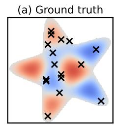

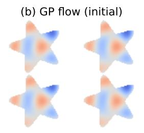

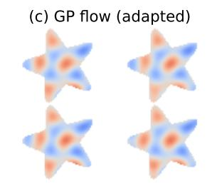

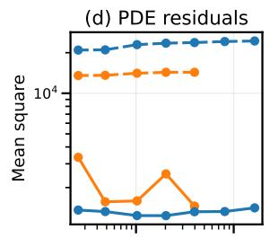

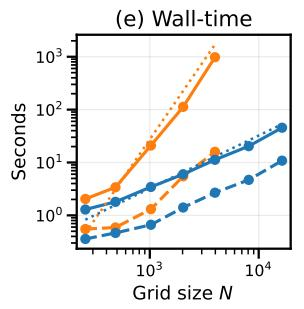

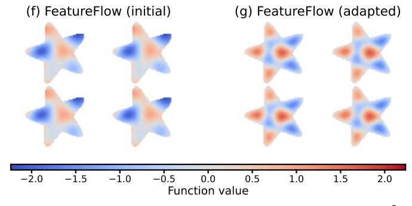

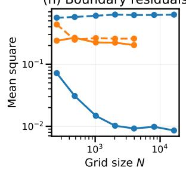  
Figure 1: Gaussian process samples, conditioned on non-conjugate information, i.e., satisfying a non-linear PDE. (a) The PDE domain, equipped with a homogeneous Dirichlet boundary condition, and noisy Gaussian observations. Samples drawn from a GP flow (b, c) and FeatureFlow, first using deliberately misspecified kernel hyperparameters (b, f), and secondly using the adaptive scheme (c, g). FeatureFlow obtains higher-quality samples, as measured by condition residual (d, h), and with more than an order of magnitude speed-up (e).

## 1.1 Related Work

Scalable GP representations. The computational cost of exact Gaussian process inference has motivated a large literature on scalable approximations, including inducing-point methods (Titsias, 2009), structured kernel approximations (Saatci, 2011), and finitedimensional feature representations. Examples of finite-feature respresentations include Fourier features adapted to bounded domains (Hensman et al., 2018), Laplacian eigenfunctions that incorporate domain geometry and boundary conditions (Solin and Kok, 2019), and spherical harmonics for functions defined on spherical domains (Dutordoir et al., 2020). Beyond scalability, each basis imposes constraints on encoded functions— many of which are common in scientific problems.

Non-conjugate GP inference. Outside of linear-Gaussian conditioning, exact GP posterior inference is generally intractable and is commonly addressed using general approximations such as the Laplace approximation (Rue and Martino, 2007), expectation propagation (Cseke and Heskes, 2011), and variational inference (Hensman et al., 2018). A complementary line of work develops specialised inference procedures or kernel constructions for particular forms of information, including inequality and shape constraints (Riihimäki and Vehtari, 2010; López-Lopera et al., 2018), diferential equations and physical constraints (Hamelijnck et al.,

2024; Long et al., 2022), and non-Gaussian likelihoods (Nickisch et al., 2018). More recently, flow-based approaches have provided a general mechanism for conditioning GPs on arbitrary diferentiable, non-linear and non-Gaussian information (Moss et al., 2026; Sharrock et al., 2026).

Hyperparameter optimisation. Kernel hyperparameters in standard GP regression are commonly learned by maximising the marginal likelihood (Rasmussen and Williams, 2006), and analogous approximate objectives exist for non-conjugate likelihoods (Li et al., 2023). When conditioning information is specified through general constraints rather than a conventional pointwise likelihood, standard marginallikelihood hyperparameter learning is no longer directly applicable, motivating constraint-specific likelihoods or inference procedures (López-Lopera et al., 2018). While versatile, the GP flows introduced by Moss et al. (2026) are computationally expensive and aford no practical way to optimise kernel hyperparameters.

## 2 GAUSSIAN PROCESSES AND SAMPLING

Let f : X → R be a random function over $\boldsymbol { \mathcal { X } } \subseteq \mathbb { R } ^ { D }$ Assume f has a GP prior, written $f \sim \mathcal { G P } ( \mu , k _ { \theta } )$ ， specified by a mean function $\mu \colon \mathcal { X }  \mathbb { R }$ and a positive semidefinite kernel $k _ { \pmb \theta } \colon \mathcal { X } \times \mathcal { X }  \mathbb { R }$ with hyperparameters θ. By definition, for every finite collection of inputs $X ~ = ~ ( x _ { 1 } , \ldots , x _ { N } )$ , the vector of GP function evaluations $\mathbf { f } : = [ f ( x _ { 1 } ) , ~ . ~ . ~ . ~ , ~ f ( x _ { N } ) ] ^ { \top }$ is multivariate Gaussian distributed $\mathbf { f } \sim \mathcal { N } ( \mathbf { m } , \mathbf { K } ( \pmb { \theta } ) )$ with elements $\mathbf { m } _ { i } = \mu ( x _ { i } )$ and ${ \bf K } _ { i j } ( \pmb \theta ) = k _ { \pmb \theta } ( x _ { i } , x _ { j } )$ ) for $i , j ~ \in ~ \{ 1 , \ldots , N \}$ Commonly, we sample from $\mathbf { f } \equiv f ( X )$ by the mean-scale transformation $\mathbf { f } = \mathbf { m } + \mathbf { L } \mathbf { z }$ where $\mathbf { L } \mathbf { L } ^ { \top } = \mathbf { K }$ and white noise $\mathbf { z } \sim \mathcal { N } ( \mathbf { 0 } , \mathbf { I } _ { N } )$ . In general, constructing L costs $\mathcal { O } ( N ^ { 3 } )$ time and $\mathcal { O } ( N ^ { 2 } )$ memory, and the subsequent sample costs $\mathcal { O } ( N ^ { 2 } )$

When the covariance function is stationary, there are well-studied solutions to scalable sampling of GPs. Through application of Bochner’s theorem, a number of finite-feature kernel approximations have been proposed, including random Fourier features (Rahimi and Recht, 2007) and Laplacian eigenfunctions (Solin and Kok, 2019; Solin and Särkkä, 2020). In each case, the full kernel matrix is replaced with a low-rank approximation, defined by the number of features used $R ,$ and samples are drawn by projecting standard normal samples in the coeficient space back into the function space. These methods result in a sampling time complexity of $\mathcal O ( N R )$ , with R serving as a tunable parameter that determines approximation quality.

When $k _ { \theta }$ is stationary, we approximate the kernel using R basis functions $\{ \psi _ { \pmb \theta } ^ { r } \} _ { r = 1 } ^ { R }$ with feature vector $\psi _ { \theta } ( x ) =$ $[ \psi _ { \pmb \theta } ^ { 1 } ( x ) , \ \dots , \ \psi _ { \pmb \theta } ^ { R } ( \acute { x } ) ] ^ { \top }$ and matrix $\Psi _ { \pmb { \theta } } = \psi _ { \pmb { \theta } } ( X ) ^ { \top } \in$ $\dot { \mathbb { R } } ^ { \check { N } \times \check { R } } .$ . For a suitable choice of basis representation (cf. $\operatorname { A p p } .$ . A for examples), the kernel approximation takes the form $k _ { \pmb { \theta } } ( x , x ^ { \prime } ) \approx \psi _ { \pmb { \theta } } ( x ) ^ { \top } \psi _ { \pmb { \theta } } ( x ^ { \prime } )$ , so that ${ \bf K } ( \pmb \theta ) \approx$ $\widetilde { \mathbf { K } } ( \pmb { \theta } ) = \Psi _ { \pmb { \theta } } \Psi _ { \pmb { \theta } } ^ { \top }$ . Equivalently, the approximate GP may be represented directly in weight space using the decoder function $g _ { \pmb { \theta } } .$ , namely,

$$
g _ { \pmb \theta } ( \pmb \xi ) : = \widetilde f _ { \pmb \theta } = \mu + \psi _ { \pmb \theta } ^ { \top } \pmb \xi , \qquad \pmb \xi \sim \mathcal { N } ( \mathbf 0 , \mathbf { I } _ { R } ) .\tag{1}
$$

A functional sample can be evaluated at arbitrary locations, incurring only an O(NR) cost (Rahimi and Recht, 2007; Solin and Kok, 2019; Solin and Särkkä, 2020). Here, $\pmb { \xi } \in \mathbb { R } ^ { R }$ with $R \ll N ,$ , and (1) provides the primary mechanism by which we reduce computation in the developments to come. Using a finite-feature representation is useful beyond scalability; by intelligently selecting a basis in which to approximate the kernel, problem-specific structure may be enforced exactly.

When $k _ { \theta }$ is non-stationary, scalable sampling is more dificult as the basis decomposition in (1) does not hold. This can arise, for instance, when kθ corresponds to the kernel of a conditioned GP. Wilson et al. (2020) describe a decoupled basis that provides exact pathwise corrections to approximate prior samples, thus approximating the GP posterior. In Section 3.3, we will adapt this framework to pre-condition linear-Gaussian information into the GP flows.

## 2.1 Non-linear and Non-Gaussian Conditioning

Finite-feature representations do not resolve the dificulties of non-conjugacy. Recent flow-based methods, introduced for GPs by Moss et al. (2026) and since extended to arbitrary stochastic processes by Sharrock et al. (2026), provide a general framework for this task, by reframing conditional sampling as a transport problem. Consider the interpolation

$$
\mathbf { f } _ { t } = \alpha ( t ) \mathbf { f } _ { 0 } + \sqrt { 1 - \alpha ( t ) ^ { 2 } } \mathbf { z } , \qquad \mathbf { z } \sim \mathcal { N } ( \mathbf { 0 } , \mathbf { I } _ { N } ) ,\tag{2}
$$

where $\begin{array} { r } { \alpha ( t ) = \exp ( - \frac { 1 } { 2 } \int _ { 0 } ^ { t } \beta ( s ) \mathrm { d } s ) } \end{array}$ for a typical noise schedule $\beta ( t )$ . As t increases, this progressively corrupts the sample $\mathbf { f } _ { 0 }$ towards Gaussian noise. Since $\mathbf { f } _ { 0 } \sim \mathcal { N } ( \mathbf { m } , \mathbf { K } ( \pmb { \theta } ) )$ , the marginals of this interpolation are given in closed form,

$$
p _ { t } ( \mathbf { f } _ { t } ) = \mathcal { N } \big ( \boldsymbol { \alpha } ( t ) \mathbf { m } , \boldsymbol { \alpha } ( t ) ^ { 2 } \mathbf { K } ( \pmb { \theta } ) + \big ( 1 - \boldsymbol { \alpha } ( t ) ^ { 2 } \big ) \mathbf { I } _ { N } \big )\tag{3}
$$

defining a path, continuous in t, from the GP distribution to a standard Gaussian reference. Equivalently, by transporting samples along the path given by the reverse-time stochastic diferential equation (SDE)

$$
\begin{array} { r } { \mathrm { d } \mathbf { f } _ { t } = - \beta ( t ) \left[ \frac { 1 } { 2 } \mathbf { f } _ { t } + \nabla _ { \mathbf { f } _ { t } } \log p _ { t } ( \mathbf { f } _ { t } ) \right] \mathrm { d } t + \sqrt { \beta ( t ) } \mathrm { d } \overline { { \mathbf { W } } } _ { t } , } \end{array}\tag{4}
$$

where $t : 1  0$ and $\overline { { \mathbf { W } } } _ { t }$ is a reverse-time Wiener process (Anderson, 1982), we preserve the time-t marginals in (3). Because $p _ { t }$ is Gaussian, the unconditional score $\nabla _ { \mathbf { f } _ { t } }$ log $p _ { t } ( \mathbf { f } _ { t } )$ is available analytically. Conditioning can now be incorporated by augmenting Eq. (4) with a likelihood-dependent guidance term; for information C and by Bayes’ rule

$$
\begin{array} { r } { \nabla _ { \mathbf { f } _ { t } } \log p _ { t } ( \mathbf { f } _ { t } \mid \mathcal { C } ) = \underbrace { \nabla _ { \mathbf { f } _ { t } } \log p _ { t } ( \mathbf { f } _ { t } ) } _ { \mathrm { c l o s e d - f o r m } } + \underbrace { \nabla _ { \mathbf { f } _ { t } } \log p _ { t } ( \mathcal { C } \mid \mathbf { f } _ { t } ) } _ { \mathrm { c o n d i t i o n a l ~ g u i d a n c e } } . } \end{array}
$$

The second term is calculated using samples from $p ( \mathbf { f } _ { 0 } \mid$ $\mathbf { f } _ { t } )$ , available in closed-form, and computing pointwise evaluation of the likelihood $p ( \mathcal { C } \mid \mathbf { f } _ { 0 } )$ . This allows the sampler to accommodate non-linear and non-Gaussian observations and conditioning statements.

The cubic scaling of GP flows restricts utility, making repeated sampling infeasible for many important large-scale problems, limiting the ability to tune kernel hyperparameters, which, we demonstrate, is crucial for generating high-quality samples. Some problem classes, including sampling PDE solutions, are currently more challenging than necessary, due to the error resulting from finite-diference approximations of derivatives. Introducing a scalable kernel approximation addresses both of these problems directly.

## 3 FEATUREFLOW

We now re-derive the generating SDE in (4) in the coeficient space of a finite GP expansion described in (1). This separates the dimension of the sampling dynamics from the resolution of the evaluation grid, making repeated computation possible. In turn, this enables scalable estimation of kernel hyperparameters. Gaussian observations are incorporated exactly through a Matheron-corrected decoder (Wilson et al., 2020), simplifying the path-dynamics of the generative flow. Finally, we introduce methodology to adapt the kernel hyperparameters during integration of (4) using the same conditional information that guides the flow, resulting in a parsimonious framework for joint estimation of the process f and its hyperparameters.

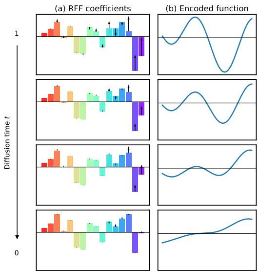  
Figure 2: Schematic of FeatureFlow with fixed hyperparameters. RFF coeficients (a) and the functions they encode (b) for a single sampling trajectory backwards in difusion time, for a monotone increasing condition.

## 3.1 Conditional Flow in Weight Space

Assume, here, the kernel hyperparameters θ are fixed; their adaptation is introduced in Sec. 3.4. Assuming an appropriate kernel decomposition as in (1), such that $f \approx g _ { \boldsymbol { \theta } } ( \pmb { \xi } )$ , we apply the same distributional interpolation as in (2) directly to the weight vector

$$
\pmb { \xi } _ { t } = \alpha ( t ) \pmb { \xi } _ { 0 } + \sqrt { 1 - \alpha ( t ) ^ { 2 } } \mathbf { z } , \quad \pmb { \xi } _ { 0 } , \mathbf { z } \sim \mathcal { N } ( \mathbf { 0 } , \mathbf { I } _ { R } ) .\tag{5}
$$

See Fig. $2 ( \mathrm { a } )$ for a schematic. For fixed θ, define the decoded likelihood by $L _ { \pmb \theta } ( \pmb \xi ) : = p ( \mathcal { C } | g _ { \pmb \theta } ( \pmb \xi ) )$ . In the weight-space, the target posterior is given by

$$
\pi _ { \pmb { \theta } } ( \pmb { \xi } _ { 0 } \mid \mathcal { C } ) = \frac { \mathcal { N } ( \pmb { \xi } _ { 0 } ; \mathbf { 0 } , \mathbf { I } _ { R } ) L _ { \pmb { \theta } } ( \pmb { \xi } _ { 0 } ) } { Z _ { \pmb { \theta } } } ,\tag{6}
$$

with $Z _ { \pmb \theta } = \mathbb { E } _ { \pmb \xi \sim \mathcal { N } ( \mathbf 0 , \mathbf I _ { R } ) } \left[ L _ { \pmb \theta } ( \pmb \xi ) \right]$ . A posterior draw from $\widetilde { f } _ { \theta }$ is obtained by propagating a draw of $\xi _ { 0 }$ from (6) through (1). Thus an exact conditional score and exact integration recover the posterior induced by the chosen finite-feature GP. As both $\xi _ { 0 }$ and the noising variable are standard normal, the distribution of $\pmb { \xi } _ { t }$ in (5) is $\mathcal { N } ( \mathbf { 0 } , \mathbf { I } _ { R } )$ for all t.

Following (4), the reverse-time SDE that corresponds to (5) is

$$
\mathrm { d } \pmb { \xi } _ { t } = - \beta ( t ) \left[ \frac { 1 } { 2 } \pmb { \xi } _ { t } + \nabla _ { \pmb { \xi } _ { t } } \log p _ { t } ( \pmb { \xi } _ { t } ) \right] \mathrm { d } t + \sqrt { \beta ( t ) } \mathrm { d } \overline { { \mathbf { W } } } _ { t }
$$

with dimension $R \ll N$ . Define the smoothed likelihood

$$
\overline { { L } } _ { t , \theta } ( \pmb { \xi } _ { t } ) : = \mathbb { E } _ { \pmb { \xi } _ { 0 } \sim p ( \pmb { \xi } _ { 0 } | \pmb { \xi } _ { t } ) } [ L _ { \pmb { \theta } } ( \pmb { \xi } _ { 0 } ) ] .\tag{7}
$$

The conditional score then decomposes as

$$
\begin{array} { r } { \nabla _ { \xi _ { t } } \log p _ { t } ( \xi _ { t } \mid \mathcal { C } ) = - \xi _ { t } + \underbrace { \nabla _ { \xi _ { t } } \log \overline { { L } } _ { t , \theta } ( \xi _ { t } ) } _ { \mathbf { h } _ { t , \theta } ( \xi _ { t } ) } . } \end{array}\tag{8}
$$

The unconditional score is therefore trivial in weight space, and all problem-specific computation is confined to the guidance term $\mathbf { h } _ { t , \theta }$ such that we need only solve the reverse SDE

$$
\begin{array} { r } { \mathrm { d } \pmb { \xi } _ { t } = \beta ( t ) \left[ \frac { 1 } { 2 } \pmb { \xi } _ { t } - h _ { t , \theta } ( \pmb { \xi } _ { t } ) \right] \mathrm { d } t + \sqrt { \beta ( t ) } \mathrm { d } \overline { { \mathbf { W } } } _ { t } . } \end{array}
$$

## 3.2 Computing Weight-space Guidance

With the score decomposed as in Eq. (8), all that remains is the guidance ${ \bf h } _ { t , \theta } ( \pmb { \xi } _ { t } ) \ = \ \nabla _ { { \pmb \xi } _ { t } } \log \overline { { L } } _ { t , \theta } ( { \pmb \xi } _ { t } )$ This is the gradient of an R-dimensional integral of the decoded likelihood, which is intractable for nonlinear conditions and, despite the reduced dimension, far too large for quadrature. We therefore estimate it by Monte Carlo, using S bridge samples. Let

$$
\ell _ { s } = \log L _ { \pmb \theta } ( { \pmb \xi } _ { 0 } ^ { ( s ) } ) , \qquad \overline { { w } } _ { s } = \frac { \exp ( \ell _ { s } ) } { \sum _ { r = 1 } ^ { S } \exp ( \ell _ { r } ) } .
$$

Diferentiating through Eq. (7) gives

$$
\widehat { \mathbf { h } } _ { t , \theta } ( \pmb { \xi } _ { t } ) = \alpha ( t ) \sum _ { s = 1 } ^ { S } \overline { { w } } _ { s } \nabla _ { \pmb { \xi } _ { 0 } ^ { ( s ) } } \log L _ { \theta } ( \pmb { \xi } _ { 0 } ^ { ( s ) } ) .\tag{9}
$$

Automatic diferentiation provides the likelihood gradient through both the condition and, where needed, the decoder. Equation (9) is the Monte Carlo guidance estimator used in the experiments that follow.

Guidance is evaluated in weight space: for a condition C, its likelihood is computed after applying the diferentiable decoder in $\operatorname { E q . }$ . (1), as shown in Fig. 2. For some problems, conditions may be naturally expressed in weight-space (e.g. band-limited signals), rendering the decoder step unnecessary and yielding even greater cost reductions. This highly scalable flow over approximate GPs via their weight-space representation is a special case of a tilt given in Sharrock et al. (2026). Function values are formed on the full output grid only when required by a condition or when returning the final sample. A condition may instead be evaluated at a smaller set of collocation points, making its cost independent of the resolution used for downstream tasks.

As the flow is performed in weight space, where the unconditional covariance structure is the identity, the major cost of sampling, $\mathcal { O } ( N ^ { 3 } )$ from the kernel factorisation, is eliminated entirely. Evaluating the decoder on $N _ { c }$ locations therefore costs $\mathcal { O } ( R N _ { c } )$ . With linear-Gaussian data, the remaining dense factorisation is only dependent on the number of observed data (cf. App. B). The cost of adaptive hyperparameter selection is thus governed by the number of features and the number of observations, rather than by the resolution of the output grid.

## 3.3 Exact Conjugate Updates by Matheron

Suppose the conditioning information splits into a conjugate part $\mathcal { D } = \{ X _ { y } , \mathbf { y } \}$ , with $\mathbf { y } = \mathbf { f } ( X _ { y } ) + \sigma _ { y } \varepsilon .$ , and a non-conjugate remainder C. In this case, the weightspace target factorises as

$$
\pi ( \pmb { \xi } _ { 0 } \mid \mathcal { C } , \mathcal { D } ) \propto \mathcal { N } ( \pmb { \xi } _ { 0 } ; \mathbf { 0 } , \mathbf { I } _ { R } ) L _ { \pmb { \theta } } ( \pmb { \xi } _ { 0 } ) p \big ( \mathcal { D } \mid g _ { \pmb { \theta } } ( \pmb { \xi } _ { 0 } ) \big ) .\tag{10}
$$

One could incorporate D as an additional guidance term, but the resulting drift becomes numerically unstable as $t ~  ~ 0 .$ with spectral radius growing as $\beta ( t ) \lambda _ { \mathrm { m a x } } / \sigma _ { y } ^ { 2 } ~ ( \mathrm { A p p . ~ B . 2 } )$ ; for small observation noise, explicit solvers then need thousands of steps. Instead, we absorb D analytically into the decoder, leaving the flow to account only for C. This resembles the whitened form of Moss et al. (2026), which runs the flow relative to the GP posterior given D. However, neither version of the existing whitenings suit our setting: in function space it requires an $\mathcal { O } ( N ^ { 3 } )$ factorisation of the posterior covariance, and in weight space it would make the reference non-isotropic.

In FeatureFlow, we instead augment the latent with $| X _ { y } |$ observation-noise variables, so that conditioning on D is carried entirely by an afine decoder via Matheron’s rule (Wilson et al., 2020). Here, we turn a prior sample into a posterior sample by adding a correction that depends on how far the sample is from the data. With the finite-feature prior $g _ { \theta } ( \xi ) = \mu + \psi _ { \theta } ^ { \top } \xi .$ set $\Phi = \Psi _ { \theta }$ and $\Phi _ { y } = \psi _ { \theta } ( X _ { y } ) ^ { \top }$ denoting the prior features at the evaluation locations, a sample from the posterior given D is

$$
\begin{array} { r } { g _ { \theta } ^ { | \mathbf { y } } ( \hat { \pmb { \xi } } ) = \underbrace { g _ { \theta } ( \pmb { \xi } ) } _ { \mathrm { p r i o r ~ s a m p l e } } + \underbrace { \Phi \Phi _ { y } ^ { \top } \mathbf { A } _ { \theta } \big ( \mathbf { y } - g _ { \theta } ( \pmb { \xi } ) ( X _ { y } ) - \sigma _ { y } \pmb { \varepsilon } \big ) } _ { \mathrm { c o n j u g a t e ~ u p d a t e ~ t e r m } } , } \end{array}
$$

where $\hat { \pmb { \xi } } = ( \pmb { \xi } , \pmb { \varepsilon } ) \sim \mathcal { N } ( \mathbf { 0 } , \mathbf { I } _ { R + | X _ { y } | } )$ and $\mathbf { A } _ { \pmb { \theta } } = ( \Phi _ { y } \Phi _ { y } ^ { \top } +$ $\sigma _ { y } ^ { 2 } \mathbf { I } ) ^ { - 1 }$ . In App. B.1, we show that $g _ { \pmb { \theta } } ^ { | \mathbf { y } } ( \hat { \pmb { \xi } } )$ is distributed according to the exact posterior of the finite-feature GP given D. We can then apply the flow of Sec. 3.1 unchanged to this afine decoder, with the latent enlarged by one dimension per observation.

## 3.4 Hyperparameter Optimisation

Existing implementations of GP flows (Moss et al., 2026) assume known kernel hyperparameters, or else tune those parameters manually, an approach which is rarely applicable in practice. Hyperparameter tuning via maximum likelihood estimation is typical for standard GP regression (Rasmussen and Williams, 2006); however, no equivalent procedure has been proposed for the broader class of tasks targeted by GP flows.

In our more general setting, the natural quantity to optimise is the marginal likelihood, or evidence, of the condition. In particular, we target the logarithm

$$
\begin{array} { r l r } & { } & { J ( \pmb { \theta } ) = \log Z _ { \pmb { \theta } } = \log \mathbb { E } _ { \pmb { \xi } \sim \mathcal { N } ( \mathbf { 0 } , \mathbf { I } _ { R } ) } \left[ L _ { \pmb { \theta } } ( \pmb { \xi } ) \right] } \\ & { } & { = \log \mathbb { E } _ { \pmb { \xi } _ { t } \sim \mathcal { N } ( \mathbf { 0 } , \mathbf { I } _ { R } ) } \left[ \overline { { L } } _ { t , \pmb { \theta } } ( \pmb { \xi } _ { t } ) \right] , \quad \quad } \end{array}\tag{11}
$$

where the second line follows from the law of total expectation under the stationary Gaussian reference. If the conditioning information also contains a conjugate linear-Gaussian component D, its marginal loglikelihood can be evaluated analytically and added to this objective; see App. C.1.

The objective in (11) balances condition satisfaction against the relative-entropy cost of deforming the underlying GP law into the conditioned law; see App. C.3. This relative-entropy cost is, up to a boundary term, precisely the energy of the guidance drift. Thus, equivalently, the objective penalises the amount of guidance required to realise the conditioned law; see App. C.4.

A principled approach to optimising Eq. (11) is to use an outer-loop scheme. Fix an initial value $\pmb { \theta } ^ { ( 0 ) }$ . Then, at outer iteration m, run the conditional flow with $\pmb { \theta } ^ { ( m ) }$ fixed, construct an estimate ${ \widehat G } ( \pmb \theta ^ { ( m ) } )$ of the evidence gradient, and update

$$
\pmb { \theta } ^ { ( m + 1 ) } = \pmb { \theta } ^ { ( m ) } + \eta _ { m } \widehat { G } ( \pmb { \theta } ^ { ( m ) } ) ,
$$

where $\eta _ { m } > 0$ is a step size. In practice, this update can instead be performed using a general-purpose optimiser such as Adam.

For a flow solve with the parameter fixed, the terminal particles provide a direct estimator of the evidence gradient. Indeed, at $t = 0$ , Fisher’s identity gives

$$
\nabla _ { \pmb { \theta } } J ( \pmb { \theta } ) = \mathbb { E } _ { \pmb { \xi } _ { 0 } \sim \pi _ { \pmb { \theta } , R } ( \cdot | \mathcal { C } ) } \left[ \nabla _ { \pmb { \theta } } \log L _ { \pmb { \theta } } ( \pmb { \xi } _ { 0 } ) \right] .
$$

Thus, for terminal particles $\{ \pmb { \xi } _ { 0 } ^ { ( b ) } \} _ { b = 1 } ^ { B }$ , we can estimate

$$
\begin{array} { r } { \widehat { G } _ { 0 } ( \pmb { \theta } ) = \frac { 1 } { B } \sum _ { b = 1 } ^ { B } \nabla _ { \pmb { \theta } } \log L _ { \pmb { \theta } } ( \pmb { \xi } _ { 0 } ^ { ( b ) } ) \approx \nabla _ { \pmb { \theta } } J ( \pmb { \theta } ) . } \end{array}
$$

In fact, the same gradient can also be estimated at intermediate noising times using quantities already evaluated during sampling. For any $t \in [ 0 , 1 ]$ , Fisher’s identity gives

$$
\nabla _ { \pmb \theta } J ( \pmb \theta ) = \mathbb { E } _ { \pmb \xi _ { t } \sim p _ { t , \pmb \theta } ( \pmb \xi _ { t } | \mathcal { C } ) } \big [ \underbrace { \nabla _ { \pmb \theta } \log \overline { { L } } _ { t , \pmb \theta } ( \pmb \xi _ { t } ) } _ { \mathbf { a } _ { t , \pmb \theta } ( \pmb \xi _ { t } ) } \big ] .\tag{12}
$$

Thus, similar to the guidance $\mathbf { h } _ { t , \theta } ,$ parameter estimation requires a logarithmic derivative of the smoothed likelihood. Using the same bridge construction and normalised likelihood weights as in Sec. 3.1, the corresponding Monte Carlo estimate for particle b is

$$
\begin{array} { r } { \widehat { \mathbf { a } } _ { t , \theta } ( \xi _ { t } ^ { ( b ) } ) = \sum _ { s = 1 } ^ { S } \overline { { w } } _ { b , s } \nabla _ { \theta } \log L _ { \theta } ( \xi _ { 0 } ^ { ( b , s ) } ) , } \end{array}
$$

where $\overline { { w } } _ { b , s }$ denotes the normalised likelihood weight associated with the s-th bridge sample for particle b. Averaging over the particles gives

$$
\begin{array} { r } { \widehat G _ { t } ( \pmb { \theta } ) = \frac { 1 } { B } \sum _ { b = 1 } ^ { B } \widehat { \mathbf { a } } _ { t , \pmb { \theta } } ( \pmb { \xi } _ { t } ^ { ( b ) } ) \approx \nabla _ { \pmb { \theta } } J ( \pmb { \theta } ) . } \end{array}\tag{13}
$$

In practice, the outer-loop scheme can be expensive, since the conditional flow must be rerun after each parameter update. We thus also consider a faster online scheme, in which parameter updates using the estimate in Eq. (13) are interleaved with a single conditional solve. Since changing the parameters also changes the target conditional distribution and the corresponding guidance, now the current particles need not follow the instantaneous marginal $p _ { t , \theta } ( \pmb { \xi } _ { t } \mid \mathcal { C } )$ in Eq. (12), introducing an additional path-dependent approximation. In this case, after online optimisation, the conditional flow should be rerun with the fitted value of the parameter to obtain samples from the corresponding fitted conditional model; see App. C for further details.

## 4 EMPIRICAL EVALUATION

## 4.1 Probabilistic Downscaling

Probabilistic downscaling of spatial fields is an increasingly important use case for generative modelling (Peleg et al., 2017; Deshon et al., 2020; Perezhogin et al., 2023; Hess et al., 2025). The fundamental task is to produce probable, high-resolution fields, given some summary statistic measured on a coarser grid, often alongside direct measurements or prior knowledge (e.g. imposed non-linear physics).

We first generate a high-resolution ground-truth field by sampling an approximate posterior GP with a large number of random Fourier features (RFFs) $( R = 4 0 9 6 )$ This field is then coarse-grained into a pair of $8 \times 8$ grids using the (non-linear) areal min and max summary statistics, and 32 random locations in the domain are queried to define an additional conjugate condition. We use an RFF basis $( R = 1 0 2 4 )$ to approximate the RBF prior, augmented with an additional Matheron’s rule block to exactly correct for the Gaussian observations, for a total latent dimension of 1056. We then generate conditional samples using a GP flow and FeatureFlow, under a fixed computational budget (proxied here by a maximum wall-time of 0.5 s).

In Figs. 3(b, c), we show one sample from the GP flow and FeatureFlow. Under the same computational constraint, FeatureFlow is able to produce samples of comparable quality (cf. Supplementary Fig. 5) at >10× as many evaluation points as the dense method. This translates to a wall-time speed-up of more than two orders of magnitude at high resolutions (Fig. 3(d)). Memory requirements are also far more limited, with the vanilla GP flow estimated to require ∼34 GB to build the GP Gram matrix alone, compared to the equivalent FeatureFlow requirement of ∼500 MB to store the basis design matrix, at the largest resolution considered. Further details are found in App. D.1.

## 4.2 Allen-Cahn Solution Fields

PDE solutions are commonly subject to boundary conditions (BCs), whose type and suficiency determine the uniqueness of a solution (Evans, 2010). In the dense GP flow framework, BCs can only be imposed inelegantly by conditioning on additional artificial noiseless data, resulting in a soft enforcement of the condition. Here, we leverage the work of Solin and Kok (2019) to use the Laplacian eigenfunction basis to enforce homogeneous Dirichlet BCs by construction, beyond the linear-Gaussian regime they demonstrate.

We draw samples from both a GP flow and Feature-Flow, conditioned such that they solve the Allen-Cahn equation:

$$
\begin{array} { r } { \left\{ { f = 0 . 2 f ^ { 3 } - ( 2 \times 1 0 ^ { - 3 } ) \Delta f } , ~ \mathrm { o n } ~ \Omega , \right. } \\ { { f = 0 } , ~ { \mathrm { o n } } ~ \partial \Omega , } \end{array}
$$

where $\Omega \subseteq \mathbb { R } ^ { 2 }$ is some irregular domain and ∆ is the 2-D Laplacian operator. The condition is formulated by providing a diferentiable relaxation to the condition that the PDE residual should vanish everywhere. Here, we exploit that for a stationary prior encoded by a diferentiable basis, derivatives of samples may be computed analytically without the need for a finite-diference scheme as ${ \partial _ { x _ { d } } } \widetilde { f } ( \boldsymbol { x } ) = { \partial _ { x _ { d } } } \mu ( \boldsymbol { x } ) + ( { \partial _ { x _ { d } } } \psi ( \boldsymbol { x } ) ) ^ { \top } \boldsymbol { \xi }$ The Allen-Cahn residuals can therefore be evaluated analytically in O(RN) time in FeatureFlow. We impose the Dirichlet boundary condition using artificial data for the GP flow, and via an appropriate Laplacian basis for the weight-space flow (App. A.2).

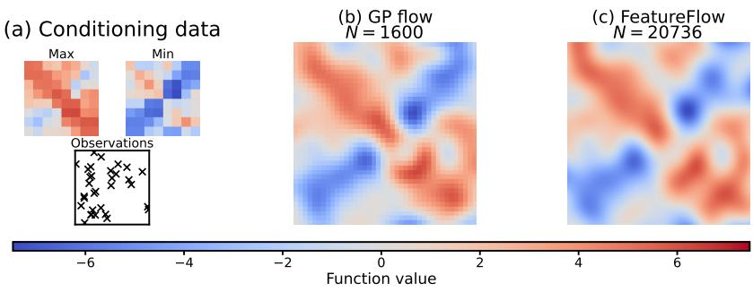

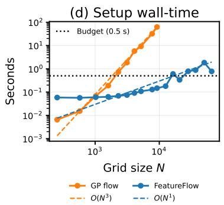  
Figure 3: A non-linear downscaling task. (a) Non-conjugate $\mathrm { ( m a x / m i n ) }$ and conjugate (Gaussian observations) conditioning data. Single samples drawn from each of (b) the GP flow and (c) FeatureFlow under a fixed compute constraint. Both methods achieve mean absolute condition residuals $\sim 1 0 ^ { - 3 }$ . (d) Comparison of the two methods, showing the increase in the dominant setup wall-time with grid size N. The fixed time/compute budget used for $( \mathbf { b } , \mathbf { c } )$ is indicated.

In Fig. 1, we show results of our online adaptive sampling scheme applied to both sampling methods. A ground truth solution of the PDE with the given boundary conditions was computed using a numerical scheme (damped Newton iterations using exact sparse Jacobian), providing the 16 noisy $( \sigma _ { n } = 1 0 ^ { - 2 } )$ Gaussian observations shown across the irregular domain in Fig. 1(a). We show samples drawn from both samplers, where in each case, we first use deliberately misspecified kernel hyperparameters (Figs. 1(b, f)), and then use the adaptive scheme (Figs. 1(c, g)). We obtain higher-quality samples than those resulting from the GP flow, as measured by condition residuals (Figs. 1(d, h)), while benefiting from more than an order of magnitude speed-up at the highest resolutions (Figs. 1(e)). In particular, the boundary conditions are adhered to much more closely using the Laplacian eigenfunction features, and the PDE residuals are generally reduced using the adaptive sampling scheme in feature space.

We hypothesise that the improved PDE consistency is due to the removal of finite-diference discretisation error when evaluating the pointwise likelihood. Hyperparameter estimation is also more stable using FeatureFlow in this experiment; in Supplementary Fig. $6 ,$ we see substantial disagreement between runs with diferent resolutions with the vanilla GP flow, which is minimal using our stable weight-space formulation. Further experimental details are provided in App. D.2.

## 4.3 Sea Level Anomaly Estimation

We now use FeatureFlow in a real-data example to recover sea-level anomaly (SLA) fields from observational satellite data. Accurate SLA estimates are crucial for understanding large-scale ocean surface currents, impacting transport and navigation, as well as environmental mapping (Yu et al., 2026). We assume a ground-truth SLA field from the Integrated Marine

Observing System, Australia, which is computed using a numerical model (IMOS, 2026), to generate a synthetic Level 0 dataset: completely raw data at instrument resolution. Specifically, let $f : \mathcal { X } \to \mathbb { R }$ be a field representing the SLA over some irregular domain $\mathcal { X } \subset \mathbb { R } ^ { 2 }$ Here, X corresponds to the ocean region of the southeastern Australian coast. Our aim is to generate probable samples of f given sparse, noisy, non-Gaussian and non-linear measurements from satellite observations (cf. Figs. 4(a, e)).

Raw satellite measurements are dependent on the true SLA through a probabilistic forward model, which additionally depends on four physical variables—significant wave height SWH, surface wind speed $U _ { 1 0 }$ , surface skewness λ, and reflectivity bias β—which we will treat as known in this work. Typically a satellite will observe at ∼20 Hz a radar echo comprising ∼100 observations of range gates $\left( \mathrm { F i g . 4 ( e ) } \right)$ . The expected waveform at each range gate location k is given by a five-parameter Brown’s function (see App. D.3.6 for definition) denoted $m _ { j k }$ for the jth observation:

$$
\{ f ( \mathbf { x } _ { j } ) , \mathrm { S W H } _ { j } , U _ { 1 0 , j } , \lambda _ { j } , \beta _ { j } \} \mapsto \{ m _ { j k } \}
$$

shown in Fig. 4(e) by the black line. The observation noise surrounding $m _ { j k }$ is Gamma-distributed as

$$
Y _ { j k } \mid m _ { j k } \sim \mathrm { { G a m m a } } \left( N _ { l } , \frac { m _ { j k } } { N _ { l } } \right) , \quad N _ { l } = 9 0 .
$$

See Tourain et al. (2021), for more details. A commonlyused approach to estimating SLA is Maximum Likelihood Estimator 3 (MLE3; Brown, 1977; Rodríguez, 1988). Figure 4(a) shows a single day’s worth of satellite observation tracks over southeastern Australia; in total there were 63,458 radar echoes, each comprising 104 range gates.

Let $j = 1 , \dots , J$ index the $J = 6 3 , 4 5 8$ radar echoes, each at location $\mathbf { x } _ { j } \in { \mathcal { X } } .$ , and $k = 1 , \ldots , K$ index the

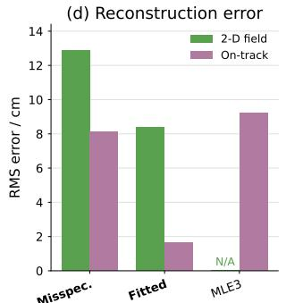

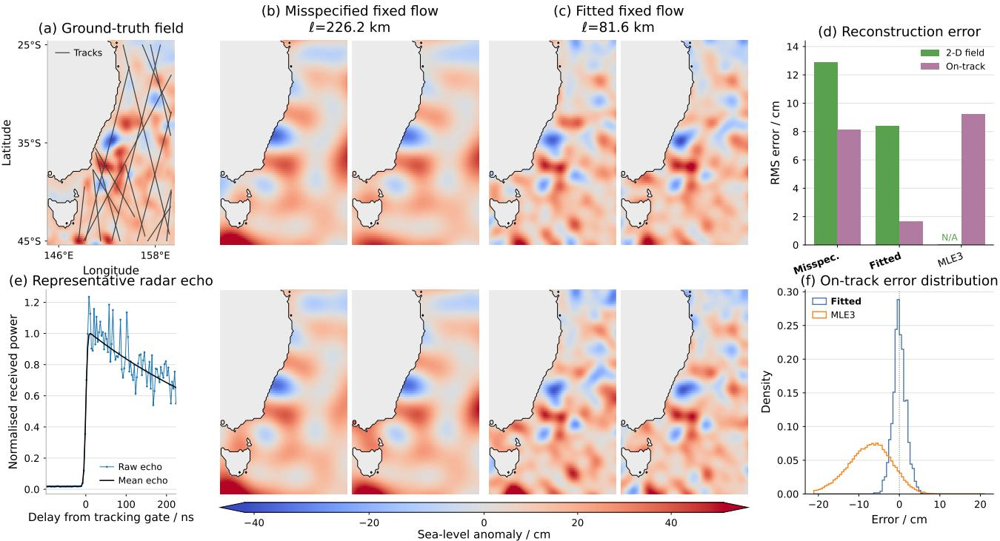

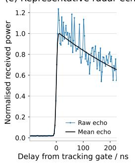

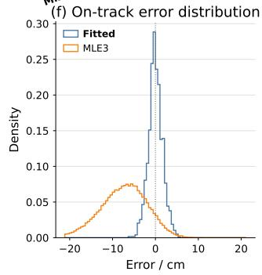  
Figure 4: Inference of a sea-level anomaly field. (a) The ground-truth field, with satellite tracks overlaid. Samples using FeatureFlow with (b) misspecified and (c) fitted kernel length scales ℓ. (d) The reconstruction error compared between FeatureFlow and the baseline. MLE3 only provides pointwise estimates and so cannot be compared across the 2-D field. (e) A representative radar echo, taken at 20 Hz along the satellite tracks. (f) Comparison of on-track reconstruction error between the deterministic baseline and scalable flow-based inference.

K = 104 range gates. The complete observation is $\{ Y _ { j k } \} _ { j = 1 : J , k = 1 : K } \in \mathbb { R } ^ { 6 3 , 4 5 8 \times 1 0 4 }$ . We aim to draw SLA field samples consistent with the noisy radar data, as well as enforcing an approximate RBF prior on the field through an RFF kernel approximation. In the following results, we use R = 512 RFFs and 100 steps in the flow time discretisation. The entire evaluation domain is 69,081 points, a scale which is computationally infeasible using a GP flow. We consider the adaptive setting, where the length scale is unknown a priori and must therefore be learned from the non-Gaussian condition. In Fig. 4(a, b), we display the ground truth SLA field, as well as samples drawn from FeatureFlow with a misspecified kernel length scale. Figure 4(c) shows the result of adaptive hyperparameter estimation on this real-world problem, where the complex non-Gaussian observations prove highly informative and result in visually higher-quality samples of the entire 2-D field.

Measurements of on-track and whole-field RMSE (Fig. 4(d)) confirm that making joint predictions of SLA across all points in the domain, given all satellite measurements, provides a meaningful advantage in pointwise accuracy. Figure 4(f) compares the on-track error distributions between the fitted FeatureFlow and deterministic pointwise baseline, MLE3. We note that our estimates of SLA are substantially less biased than MLE3. As previous work has aimed to reduce MLE3- related bias (Gómez-Enri et al., 2007; Passaro et al., 2018), in Supplementary Fig. 9, we show that even with post hoc debiasing using the ground truth field, FeatureFlow performs better in pointwise accuracy. Further experimental details are located in App. D.3.

## 5 CONCLUSION

We have introduced FeatureFlow, which runs GP flows in the weight space of a finite-feature approximation. This decouples the cost of the flow from the evaluation resolution and absorbs conjugate data exactly via Matheron’s rule. Because the bridge is independent of the kernel hyperparameters, the guidance samples also yield evidence gradients, enabling the first hyperparameter optimisation for GP flows. Feature-Flow gives one to two orders of magnitude speed-up over function-space GP flows and scales to a 69,081- point sea-level field inferred from over six million radar observations. Limitations include the reliance on a largely stationary prior with an accurate finite basis and the bias of the online adaptation scheme. Future work includes jointly estimating the altimetry nuisance fields and characterising this bias.

## AI Use Statement

In this work, we used generative AI tools for providing feedback on research methodology or experiments, implementing methods, and generating synthetic data sets. We have not used generative AI tools for helping to develop theoretical models or conceptual frameworks; formulating mathematical claims; providing critical ingredients for proving mathematical claims; assisting in the writing of proofs; proposing or refining hypotheses; assisting with translation; cleaning and reformatting datasets; supporting qualitative and thematic data analysis; interpreting results. Additionally, we used generative AI tools for creating scientific figures, creating or editing software code, brainstorming, and sourcing/searching for information. We have reviewed all AI-assisted work. LLM-generated code was verified and tested for correctness. We take responsibility for the final content of this work, including text, claims, or artifacts produced with the aid of generative AI.

## References

Brian D. O. Anderson. Reverse-time difusion equation models. Stochastic Processes and their Applications, 12(3):313–326, 1982.

Dominique Bakry, Ivan Gentil, and Michel Ledoux. Analysis and Geometry of Markov Difusion Operators, volume 348 of Grundlehren der mathematischen Wissenschaften. Springer, 2014. doi: 10.1007/978-3-319-00227-9.

Michelle Boué and Paul Dupuis. A variational representation for certain functionals of Brownian motion. The Annals of Probability, 26(4):1641–1659, 1998. doi: 10.1214/aop/1022855876.

G. Brown. The average impulse response of a rough surface and its applications. IEEE Transactions on Antennas and Propagation, 25(1):67–74, January 1977. ISSN 1558-2221. doi: 10.1109/TAP.1977. 1141536. URL https://ieeexplore.ieee.org/ document/1141536.

Botond Cseke and Tom Heskes. Approximate marginals in latent Gaussian models. Journal ofMachine Learning Research, 12:417–454, 2011.

Jordan P. Deshon, Jefrey D. Niemann, Timothy R. Green, Andrew S. Jones, and Peter J. Grazaitis. Stochastic analysis and probabilistic downscaling of soil moisture in small catchments. Journal of Hydrology, 585:124711, June 2020. ISSN 0022-1694. doi: 10.1016/j.jhydrol.2020.124711. URL https://www.sciencedirect.com/science/ article/pii/S0022169420301712.

Joseph L. Doob. Conditional brownian motion and the boundary limits of harmonic functions. Bulletin

de la Société Mathématique de France, 85:431–458, 1957. doi: 10.24033/bsmf.1494.

Vincent Dutordoir, Nicolas Durrande, and James Hensman. Sparse Gaussian Processes with Spherical Harmonic Features. In Proceedings of the 37th International Conference on Machine Learning, pages 2793–2802. PMLR, November 2020. URL https://proceedings.mlr.press/ v119/dutordoir20a.html.

Lawrence C. Evans. Partial diferential equations. American Mathematical Society, Providence, R.I., 2010. ISBN 9780821849743 0821849743.

Lee-Leung Fu and Anny Cazenave. Satellite Altimetry and Earth Sciences: A Handbook of Techniques and Applications. Academic Press, 2001. ISBN 978-0-12- 269545-2.

Jacob R Gardner, Geof Pleiss, David Bindel, Kilian Q Weinberger, and Andrew Gordon Wilson. GPyTorch: Blackbox matrix-matrix Gaussian process inference with GPU acceleration. In Advances in Neural Information Processing Systems, 2018.

Igor V. Girsanov. On transforming a certain class of stochastic processes by absolutely continuous substitution of measures. Theory of Probability and Its Applications, 5(3):285–301, 1960. doi: 10.1137/1105027.

Leonard Gross. Logarithmic Sobolev inequalities. American Journal of Mathematics, 97(4):1061–1083, 1975. doi: 10.2307/2373688.

J. Gómez-Enri, C. P. Gommenginger, M. A. Srokosz, P. G. Challenor, and J. Benveniste. Measuring Global Ocean Wave Skewness by Retracking RA-2 Envisat Waveforms. Journal of Atmospheric and Oceanic Technology, 24(6):1102–1116, June 2007. ISSN 0739-0572, 1520-0426. doi: 10.1175/JTECH2014. 1. URL https://journals.ametsoc.org/view/ journals/atot/24/6/jtech2014\_1.xml.

Oliver Hamelijnck, Arno Solin, and Theodoros Damoulas. Physics-informed variational state-space Gaussian processes. Advances in Neural Information Processing Systems, 37:98505–98536, 2024.

James Hensman, Nicolo Fusi, and Neil D Lawrence. Gaussian processes for big data. arXiv preprint arXiv:1309.6835, 2013.

James Hensman, Nicolas Durrande, and Arno Solin. Variational Fourier Features for Gaussian Processes. Journal of Machine Learning Research, 18(151):1– 52, 2018. ISSN 1533-7928. URL http://jmlr.org/ papers/v18/16-579.html.

Philipp Hess, Michael Aich, Baoxiang Pan, and Niklas Boers. Fast, scale-adaptive and uncertainty-aware downscaling of Earth system model fields with generative machine learning. Nature Machine Intelligence, 7(3):363–373, March 2025. ISSN 2522-5839.

doi: 10.1038/s42256-025-00980-5. URL https:// www.nature.com/articles/s42256-025-00980-5.

IMOS. OceanCurrent - Gridded sea level anomaly - Near real time. https:// catalogue-imos.aodn.org.au/geonetwork/ srv/eng/catalog.search#/metadata/ 0c9eb39c-9cbe-4c6a-8a10-5867087e703a, 2026. Accessed: 2026-08-29.

Biswajit Khara, Ethan Herron, Zhanhong Jiang, Aditya Balu, Chih-Hsuan Yang, Kumar Saurabh, Anushrut Jignasu, Soumik Sarkar, Chinmay Hegde, Adarsh Krishnamurthy, and Baskar Ganapathysubramanian. Neural PDE Solvers for Irregular Domains, November 2022. URL http://arxiv.org/abs/ 2211.03241. arXiv:2211.03241 [cs.LG].

Diederik P. Kingma and Jimmy Ba. Adam: A Method for Stochastic Optimization. In International Conference on Learning Representations (ICLR), 2015. URL https://arxiv.org/abs/1412.6980.

Rui Li, S. T. John, and Arno Solin. Improving Hyperparameter Learning under Approximate Inference in Gaussian Process Models. In Proceedings of the 40th International Conference on Machine Learning, pages 19595–19615. PMLR, July 2023. URL https: //proceedings.mlr.press/v202/li23m.html.

Da Long, Zheng Wang, Aditi Krishnapriyan, Robert Kirby, Shandian Zhe, and Michael Mahoney. AutoIP: A United Framework to Integrate Physics into Gaussian Processes. In Proceedings of the 39th International Conference on Machine Learning, pages 14210–14222. PMLR, June 2022. URL https: //proceedings.mlr.press/v162/long22a.html.

Andrés F. López-Lopera, François Bachoc, Nicolas Durrande, and Olivier Roustant. Finite-Dimensional Gaussian Approximation with Linear Inequality Constraints. SIAM/ASA Journal on Uncertainty Quantification, 6(3), 2018. URL https://epubs.siam. org/doi/10.1137/17M1153157.

Henry Moss, Lachlan Astfalck, Thomas Cowperthwaite, Colin Doumont, Sam Willis, Philipp Hennig, Christopher Nemeth, and Andrew Zammit-Mangion. Conditioning Gaussian Processes on Almost Anything, May 2026. URL http://arxiv.org/abs/ 2605.21041. arXiv:2605.21041 [stat.ML].

Hannes Nickisch, Arno Solin, and Alexander Grigorevskiy. State Space Gaussian Processes with Non-Gaussian Likelihood. In Proceedings of the 35th International Conference on Machine Learning, pages 3789–3798. PMLR, July 2018. URL https:// proceedings.mlr.press/v80/nickisch18a.html.

Bernt Øksendal. Stochastic Diferential Equations: An Introduction with Applications. Universitext.

Springer, Berlin, Heidelberg, 6th edition, 2003. doi: 10.1007/978-3-642-14394-6.

Marcello Passaro and Marie-Christin Juhl. On the potential of mapping sea level anomalies from satellite altimetry with Random Forest Regression. Ocean Dynamics, 73(2):107–116, February 2023. ISSN 1616-7228. doi: 10.1007/s10236-023-01540-4. URL https://doi.org/10.1007/s10236-023-01540-4.

Marcello Passaro, Zulfikar Adlan Nadzir, and Graham D. Quartly. Improving the precision of sea level data from satellite altimetry with high-frequency and regional sea state bias corrections. Remote Sensing of Environment, 218:245–254, December 2018. ISSN 0034-4257. doi: 10.1016/j.rse.2018.09.007. URL https://www.sciencedirect.com/science/ article/pii/S0034425718304188.

Adam Paszke, Sam Gross, Francisco Massa, Adam Lerer, James Bradbury, Gregory Chanan, Trevor Killeen, Zeming Lin, Natalia Gimelshein, Luca Antiga, Alban Desmaison, Andreas Köpf, Edward Yang, Zach DeVito, Martin Raison, Alykhan Tejani, Sasank Chilamkurthy, Benoit Steiner, Lu Fang, Junjie Bai, and Soumith Chintala. PyTorch: An Imperative Style, High-Performance Deep Learning Library, December 2019. URL http://arxiv.org/ abs/1912.01703. arXiv:1912.01703 [cs.LG].

Nadav Peleg, Simone Fatichi, Athanasios Paschalis, Peter Molnar, and Paolo Burlando. An advanced stochastic weather generator for simulating 2-D high-resolution climate variables. Journal of Advances in Modeling Earth Systems, 9(3): 1595–1627, 2017. ISSN 1942-2466. doi: 10.1002/ 2016MS000854. URL https://onlinelibrary. wiley.com/doi/abs/10.1002/2016MS000854.

Pavel Perezhogin, Laure Zanna, and Carlos Fernandez-Granda. Generative Data-Driven Approaches for Stochastic Subgrid Parameterizations in an Idealized Ocean Model. Journal ofAdvances in Modeling Earth Systems, 15(10), 2023. ISSN 1942-2466.

Ali Rahimi and Benjamin Recht. Random Features for Large-Scale Kernel Machines. In Advances in Neural Information Processing Systems, volume 20. Curran Associates, Inc., 2007. URL https:// papers.nips.cc/paper\_files/paper/2007/hash/ 013a006f03dbc5392effeb8f18fda755-Abstract. html.

Carl Edward Rasmussen and Christopher K. I. Williams. Gaussian processes for machine learning. Adaptive computation and machine learning. MIT Press, Cambridge, Mass, 2006. ISBN 978-0-262- 18253-9. OCLC: ocm61285753.

Jaakko Riihimäki and Aki Vehtari. Gaussian processes with monotonicity information. In Pro-

ceedings of the Thirteenth International Conference on Artificial Intelligence and Statistics, pages 645–652. JMLR Workshop and Conference Proceedings, March 2010. URL https://proceedings.mlr. press/v9/riihimaki10a.html.

Ernesto Rodríguez. Altimetry for non-Gaussian oceans: Height biases and estimation of parameters. Journal of Geophysical Research: Oceans, 93(C11):14107– 14120, 1988. ISSN 2156-2202. doi: 10.1029/ JC093iC11p14107. URL https://onlinelibrary. wiley.com/doi/abs/10.1029/JC093iC11p14107.

Håvard Rue and Sara Martino. Approximate Bayesian inference for hierarchical Gaussian Markov random field models. Journal of Statistical Planning and Inference, 137(10):3177–3192, 2007.

Yunus Saatci. Scalable Inference for Structured Gaussian Process Models. PhD, University of Cambridge, Cambridge, December 2011. URL https: //mlg.eng.cam.ac.uk/pub/pdf/Saa11.pdf.

Jonathan Schmidt, Luca Schmidt, Felix M. Strnad, Nicole Ludwig, and Philipp Hennig. A Generative Framework for Probabilistic, Spatiotemporally Coherent Downscaling of Climate Simulation. npj Climate and Atmospheric Science, 8(1): 270, July 2025. ISSN 2397-3722. doi: 10.1038/ s41612-025-01157-y. URL https://www.nature. com/articles/s41612-025-01157-y.

Louis Sharrock, Lachlan Astfalck, and Henry Moss. LatentFlow: A General Framework for Conditioning Stochastic Processes, July 2026. URL http://arxiv. org/abs/2607.12922. arXiv:2607.12922 [stat.ML].

Arno Solin and Manon Kok. Know Your Boundaries: Constraining Gaussian Processes by Variational Harmonic Features. In Proceedings of the Twenty-Second International Conference on Artificial Intelligence and Statistics, pages 2193–2202. PMLR, April 2019. URL https://proceedings. mlr.press/v89/solin19a.html.

Arno Solin and Simo Särkkä. Hilbert space methods for reduced-rank Gaussian process regression. Statistics and Computing, 30(2):419–446, March 2020. ISSN 1573-1375. doi: 10.1007/s11222-019-09886-w. URL https://doi.org/10.1007/s11222-019-09886-w.

Tim Steinert, David Ginsbourger, August Lykke-Møller, Ove Christiansen, and Henry Moss. Integration-free Kernels for Equivariant Gaussian Process Modelling. June 2025. URL https:// openreview.net/forum?id=hYxZJycvrz.

Michalis Titsias. Variational Learning of Inducing Variables in Sparse Gaussian Processes. In Proceedings of the Twelfth International Conference on Artificial Intelligence and Statistics, pages 567–574. PMLR, April

2009. URL https://proceedings.mlr.press/v5/ titsias09a.html.

Cédric Tourain, Fanny Piras, Annabelle Ollivier, Danièle Hauser, J. C. Poisson, F. Boy, P. Thibaut, L. Hermozo, and C. Tison. Benefits of the Adaptive Algorithm for Retracking Altimeter Nadir Echoes: Results From Simulations and CFOSAT/SWIM Observations. IEEE Transactions on Geoscience and Remote Sensing, 59(12):9927–9940, December 2021. ISSN 1558-0644. doi: 10.1109/TGRS.2021. 3064236. URL https://ieeexplore.ieee.org/ document/9385074/.

James T Wilson, Viacheslav Borovitskiy, Alexander Terenin, Peter Mostowsky, and Marc Peter Deisenroth. Eficiently Sampling Functions from Gaussian Process Posteriors. In Proceedings of the 37th International Conference on Machine Learning, volume 119, August 2020. URL https://arxiv.org/abs/ 2002.09309.

Fangjie Yu, Zetao Hu, Mengke Ren, Ruotong Li, Junwu Tang, Xinglong Zhang, and Ge Chen. Prediction of sea level anomaly from satellite data based on the AVMD-LSTM hybrid model. Ocean Modelling, 201:102705, April 2026. ISSN 1463-5003. doi: 10.1016/j.ocemod.2026.102705. URL https://www.sciencedirect.com/science/ article/pii/S1463500326000296.

Zhiwei Zhao, Changqing Liu, Yingguang Li, Zhibin Chen, and Xu Liu. Difeomorphism neural operator for various domains and parameters of partial diferential equations. Communications Physics, 8(1):15, January 2025. ISSN 2399-3650. doi: 10.1038/s42005-024-01911-3. URL https://www. nature.com/articles/s42005-024-01911-3.

# Feature Space Adaptation for Efortless Gaussian Process Flows: Supplementary Materials

## A BASIS DECOMPOSITIONS

## A.1 Random Fourier features

Random Fourier features (RFFs) provide a finite-dimensional approximation to stationary kernels (Rahimi and Recht, 2007). By Bochner’s theorem, a stationary kernel $k _ { \pmb \theta } ( x , x ^ { \prime } ) = k _ { \pmb \theta } ( x - x ^ { \prime } )$ can be written as an expectation over its spectral density $p _ { \theta } ( \omega )$ . Drawing frequencies $\omega _ { r } \sim p _ { \theta }$ and phases $b _ { r } \sim \mathrm { U n i f o r m } ( 0 , 2 \pi )$ , we define

$$
\psi _ { \pmb \theta } ^ { ( r ) } ( { \pmb x } ) = \sqrt { \frac { 2 \sigma _ { f } ^ { 2 } } { R } } \cos \left( \omega _ { r } x + b _ { r } \right) , \qquad r = 1 , \dots , R
$$

with R defined as the number of features used to approximate the kernel. The resulting feature vector satisfies

$$
\begin{array} { r } { k _ { \pmb \theta } ( x , x ^ { \prime } ) \approx \psi _ { \pmb \theta } ( x ) ^ { \top } \psi _ { \pmb \theta } ( x ^ { \prime } ) , } \end{array}
$$

and an approximate GP prior draw is

$$
\widetilde { f } _ { \pmb { \theta } } ( \pmb { x } ) = \mu ( \pmb { x } ) + \psi _ { \pmb { \theta } } ( \pmb { x } ) ^ { \top } \pmb { \xi } , \qquad \pmb { \xi } \sim \mathcal { N } ( \mathbf { 0 } , \mathbf { I } _ { R } ) .
$$

For the RBF kernel with length scale matrix $\Lambda _ { \theta }$ , the spectral density is Gaussian,

$$
\omega _ { r } \sim \mathcal { N } \left( \mathbf { 0 } , \mathbf { A } _ { \theta } ^ { - 1 } \right) .
$$

Fixing the underlying standard-normal frequency draws while varying θ gives a diferentiable parameterisation of the features. Spatial derivatives are also available analytically by diferentiating the trigonometric basis. Although RFFs directly approximate only the stationary prior kernel, they can be combined with exact kernel evaluations in the decoupled posterior construction of Section B.

## A.2 Laplacian eigenfunction basis

Laplacian eigenfunctions provide a deterministic low-rank approximation to stationary kernels while allowing boundary conditions to be imposed on a bounded domain $\Omega \subset \mathbb { R } ^ { d }$ (Solin and Kok, 2019). For homogeneous Dirichlet boundary conditions, the basis functions are obtained from the eigenvalue problem

$$
- \Delta \varphi _ { j } ( x ) = \lambda _ { j } ^ { 2 } \varphi _ { j } ( x ) , \qquad x \in \Omega , \qquad \varphi _ { j } ( x ) = 0 , \qquad x \in \partial \Omega ,
$$

where the eigenfunctions are orthonormal in $L ^ { 2 } ( \Omega )$ and ordered by increasing eigenvalue.

Let $s _ { \theta } ( \omega )$ denote the spectral density of the stationary kernel. For an isotropic kernel, its value depends only on the radial frequency, and the covariance function can be approximated using the first R eigenfunctions as

$$
k _ { \pmb \theta } ( x , x ^ { \prime } ) \approx \sum _ { j = 1 } ^ { R _ { f } } s _ { \pmb \theta } ( \lambda _ { j } ) \varphi _ { j } ( x ) \varphi _ { j } ( x ^ { \prime } ) .
$$

Defining the weighted features

$$
\psi _ { \pmb \theta } ^ { ( j ) } ( x ) = \sqrt { s _ { \pmb \theta } ( \lambda _ { j } ) } \varphi _ { j } ( x ) , \qquad j = 1 , \ldots , R ,
$$

gives

$$
\begin{array} { r } { k _ { \pmb \theta } ( x , x ^ { \prime } ) \approx \psi _ { \pmb \theta } ( x ) ^ { \top } \psi _ { \pmb \theta } ( x ^ { \prime } ) , } \end{array}
$$

and the corresponding approximate prior draw is

$$
\widetilde { f } _ { \pmb { \theta } } ( \pmb { x } ) = \mu ( \pmb { x } ) + \psi _ { \pmb { \theta } } ( \pmb { x } ) ^ { \top } \pmb { \xi } , \qquad \pmb { \xi } \sim \mathcal { N } ( \mathbf { 0 } , \mathbf { I } _ { R _ { f } } ) .
$$

For simple domains, such as intervals and rectangles, the eigenpairs are available analytically. For irregular domains, they can instead be computed once by discretising the Laplacian operator on a grid and solving the resulting sparse eigenvalue problem. Restricting the discretisation to points inside Ω naturally imposes the boundary condition and ensures that every approximate prior draw vanishes on ∂Ω. Other conditions, including homogeneous Neumann conditions, can be incorporated by changing the boundary condition in the eigenvalue problem.

The eigenfunctions and eigenvalues depend only on the domain and can therefore be held fixed while varying $\theta ;$ the kernel hyperparameters enter only through the spectral weights $s _ { \theta } ( \lambda _ { j } )$ . This gives a diferentiable parameterisation with respect to the kernel hyperparameters, while replacing dense kernel operations by computations involving R basis functions.

## B CONDITIONING ON CONJUGATE DATA BY MATHERON’S RULE

Throughout this section, the conjugate data are $\mathcal { D } = \{ X _ { y } , \mathbf { y } \}$ with $\mathbf { y } = f ( X _ { y } ) + \sigma _ { y } \varepsilon$ and $\varepsilon \sim \mathcal { N } ( \mathbf { 0 } , \mathbf { I } _ { | X _ { y } | } )$ . We write $\Phi = \psi _ { \pmb { \theta } } ( X ) ^ { \top } \in \mathbb { R } ^ { N \times R }$ and $\pmb { \Phi } _ { y } = \psi _ { \pmb { \theta } } ( X _ { y } ) ^ { \top } \in \mathbb { R } ^ { | X _ { y } | \times R }$ for the prior features at the evaluation and observation locations, and $\mu _ { y } = \mu ( X _ { y } )$ . Under the finite-feature prior, $\mathbf { f } = \mu + \Phi \boldsymbol { \xi }$ and $\mathbf { y } = \pmb { \mu _ { y } } + \pmb { \Phi _ { y } } \pmb { \xi } + \sigma _ { y } \pmb { \varepsilon }$ with ${ \pmb \xi } \sim \mathcal { N } ( { \bf 0 } , { \bf I } _ { R } )$ Finally, define

$$
\mathbf { A } _ { \theta } = \left( \Phi _ { y } \Phi _ { y } ^ { \top } + \sigma _ { y } ^ { 2 } \mathbf { I } \right) ^ { - 1 } , \qquad \mathbf { P } = \boldsymbol { \Phi } _ { y } ^ { \top } \mathbf { A } _ { \theta } \boldsymbol { \Phi } _ { y } .
$$

## B.1 Matheron’s rule targets the posterior

Let $\hat { \pmb { \xi } } = ( \pmb { \xi } , \pmb { \varepsilon } ) \in \mathbb { R } ^ { R + | X _ { y } | }$ , denoting the total latent dimension. Expanding the decoder in Sec. 3.3 using $g _ { \pmb { \theta } } ( \pmb { \xi } ) ( X _ { y } ) = \pmb { \mu } _ { y } + \pmb { \Phi } _ { y } \pmb { \xi }$ shows that it is afine in $\hat { \pmb { \xi } } \mathrm { : }$

$$
\begin{array} { r } { g _ { \theta } ^ { | \mathbf { y } } ( \hat { \pmb { \xi } } ) = \mu + \pmb { \Phi } \pmb { \xi } + \pmb { \Phi } \pmb { \Phi } _ { y } ^ { \top } \mathbf { A } _ { \theta } \left( \mathbf { y } - \pmb { \mu } _ { y } - \pmb { \Phi } _ { y } \pmb { \xi } - \sigma _ { y } \pmb { \varepsilon } \right) = \mathbf { m } _ { | \mathbf { y } } + \pmb { \Psi } _ { | \mathbf { y } } \hat { \pmb { \xi } } , } \end{array}
$$

where

$$
\mathbf { m } _ { | \mathbf { y } } = { \boldsymbol { \mu } } + \Phi \Phi _ { y } ^ { \mathsf { T } } \mathbf { A } _ { \theta } ( \mathbf { y } - { \boldsymbol { \mu } } _ { y } ) , \qquad \Psi _ { | \mathbf { y } } = { \big [ } \Phi ( \mathbf { I } - \mathbf { P } ) , \mathbf { \Lambda } - \sigma _ { y } \Phi \Phi _ { y } ^ { \mathsf { T } } \mathbf { A } _ { \theta } { \big ] } \in \mathbb { R } ^ { N \times ( R + | X _ { y } | ) } .
$$

Proposition B.1. Assume $\mathcal { C }$ and $\mathcal { D }$ are conditionally independent given $f . ~ I f \hat { \pmb { \xi } } \sim \mathcal { N } ( \mathbf { 0 } , \mathbf { I } _ { R + | X _ { y } | } )$ , then $g _ { \pmb { \theta } } ^ { | \mathbf { y } } ( \hat { \pmb { \xi } } )$ is distributed according to the exact posterior of the finite-feature $G P$ given $\mathcal { D }$ . Consequently, the latent target

$$
\pi ^ { | \mathbf { y } } ( \hat { \pmb { \xi } } _ { 0 } \mid \mathcal { C } ) \propto \mathcal { N } ( \hat { \pmb { \xi } } _ { 0 } ; \mathbf { 0 } , \mathbf { I } _ { R + | X _ { y } | } ) p \big ( \mathcal { C } \mid g _ { \pmb { \theta } } ^ { | \mathbf { y } } ( \hat { \pmb { \xi } } _ { 0 } ) \big )\tag{14}
$$

pushes forward under $g _ { \pmb { \theta } } ^ { | \mathbf { y } }$ to the same law over functions as $E q .$ (10) does under $g _ { \pmb { \theta } }$

Proof. Posterior. Since $g _ { \pmb { \theta } } ^ { | \mathbf { y } }$ is afine, $g _ { \pmb { \theta } } ^ { | \mathbf { y } } ( \hat { \pmb { \xi } } )$ is Gaussian with mean $\mathbf { m } _ { | \mathbf { y } }$ and covariance $\Psi _ { | \mathbf { y } } \Psi _ { | \mathbf { y } } ^ { \top } ;$ ; it sufices to match these to the finite-feature posterior. Writing $\widetilde { \mathbf K } = \boldsymbol \Phi \boldsymbol \Phi ^ { \intercal } , \widetilde { \mathbf K } . _ { y } = \boldsymbol \Phi \boldsymbol \Phi _ { y } ^ { \intercal }$ and $\widetilde { \mathbf { K } } _ { y y } = \Phi _ { y } \tilde { \mathbf { \Phi } } _ { y } ^ { \top }$ , the mean is n $\begin{array} { r } { \boldsymbol { \mathfrak { n } } _ { | \mathbf { y } } = \pmb { \mu } + \widetilde { \mathbf { K } } . _ { y } ( \widetilde { \mathbf { K } } _ { y y } + \sigma _ { y } ^ { 2 } \mathbf { I } ) ^ { - 1 } ( \mathbf { y } - \pmb { \mu } _ { y } ) } \end{array}$ , the posterior mean. For the covariance, the identity $\boldsymbol \Phi _ { y } \boldsymbol \Phi _ { y } ^ { \intercal } = \mathbf A _ { \pmb { \theta } } ^ { - 1 } - \sigma _ { y } ^ { 2 } \mathbf I$ gives

$$
\mathbf { P } ^ { 2 } = \Phi _ { y } ^ { \top } \mathbf { A } _ { \theta } \big ( \mathbf { A } _ { \theta } ^ { - 1 } - \sigma _ { y } ^ { 2 } \mathbf { I } \big ) \mathbf { A } _ { \theta } \Phi _ { y } = \mathbf { P } - \sigma _ { y } ^ { 2 } \Phi _ { y } ^ { \top } \mathbf { A } _ { \theta } ^ { 2 } \Phi _ { y } ,
$$

so that $( \mathbf { I } - \mathbf { P } ) ^ { 2 } + \sigma _ { y } ^ { 2 } \boldsymbol { \Phi } _ { y } ^ { \top } \mathbf { A } _ { \theta } ^ { 2 } \boldsymbol { \Phi } _ { y } = \mathbf { I } - \mathbf { P }$ . Hence

$$
\Psi _ { | \mathbf { y } } \Psi _ { | \mathbf { y } } ^ { \top } = \Phi \left[ ( \mathbf { I } - \mathbf { P } ) ^ { 2 } + \sigma _ { y } ^ { 2 } \Phi _ { y } ^ { \top } \mathbf { A } _ { \theta } ^ { 2 } \Phi _ { y } \right] \Phi ^ { \top } = \Phi ( \mathbf { I } - \mathbf { P } ) \Phi ^ { \top } = \widetilde { \mathbf { K } } - \widetilde { \mathbf { K } } _ { \mathcal { y } } \left( \widetilde { \mathbf { K } } _ { y y } + \sigma _ { y } ^ { 2 } \mathbf { I } \right) ^ { - 1 } \widetilde { \mathbf { K } } _ { y } ,
$$

which is the posterior covariance.

Pushforward. Let ${ \boldsymbol \nu } = \mathcal { N } ( \mathbf { 0 } , \mathbf { I } )$ and let $\varphi$ be any bounded measurable test function. Under Eq. (10), and using the conditional independence of C and $\mathcal { D }$ given $f ,$

$$
\begin{array} { r } { \mathbb { E } \big [ \varphi ( g _ { \theta } ( \pmb { \xi } _ { 0 } ) ) \big ] \ \propto \ \mathbb { E } _ { \mathbf { f } \sim p _ { \theta } } \big [ \varphi ( \mathbf { f } ) p ( \mathcal { D } \mid \mathbf { f } ) p ( \mathcal { C } \mid \mathbf { f } ) \big ] \ \propto \ \mathbb { E } _ { \mathbf { f } \sim p _ { \theta } ( \cdot \vert \mathcal { D } ) } \big [ \varphi ( \mathbf { f } ) p ( \mathcal { C } \mid \mathbf { f } ) \big ] . } \end{array}
$$

Under Eq. (14), by the first part,

$$
\begin{array} { r } { \mathbb { E } \big [ \varphi ( g _ { \pmb { \theta } } ^ { | \mathbf { y } } ( \hat { \pmb { \xi } } _ { 0 } ) ) \big ] \ \propto \ \mathbb { E } _ { \hat { \pmb { \xi } } \sim \nu } \big [ \varphi ( g _ { \pmb { \theta } } ^ { | \mathbf { y } } ( \hat { \pmb { \xi } } ) ) p ( \mathcal { C } \mid g _ { \pmb { \theta } } ^ { | \mathbf { y } } ( \hat { \pmb { \xi } } ) ) \big ] = \mathbb { E } _ { \mathbf { f } \sim p \ ( \cdot | \mathcal { D } ) } \big [ \varphi ( \mathbf { f } ) p ( \mathcal { C } \mid \mathbf { f } ) \big ] . } \end{array}
$$

Both expressions are proportional to the same functional of $\varphi ,$ and both are normalised, so the two laws coincide. □

## B.2 Difusing under conjugacy is stif

Suppose that we instead choose to treat D as an additional guidance term. Then the smoothed data likelihood $\nabla _ { \pmb { \xi } _ { t } } \log p _ { t } ( \mathbf { y } \mid \pmb { \xi } _ { t } )$ is therefore Gaussian,

$$
p _ { t } ( \mathbf { y } \mid \boldsymbol { \xi } _ { t } ) = \mathcal { N } \big ( \mathbf { y } ; \mu _ { y } + \alpha \Phi _ { y } \boldsymbol { \xi } _ { t } , \mathrm { \normalfont ~ M } _ { t } \big ) , \qquad \mathbf { M } _ { t } = ( 1 - \alpha ^ { 2 } ) \boldsymbol { \Phi } _ { y } \boldsymbol { \Phi } _ { y } ^ { \top } + \sigma _ { y } ^ { 2 } \mathbf { I } ,
$$

and its score is available in closed form, with Hessian

$$
\mathbf { H } _ { t } = \nabla _ { \boldsymbol { \xi } _ { t } } ^ { 2 } \log p _ { t } ( \mathbf { y } \mid \boldsymbol { \xi } _ { t } ) = - \alpha ^ { 2 } \boldsymbol { \Phi } _ { y } ^ { \top } \mathbf { M } _ { t } ^ { - 1 } \boldsymbol { \Phi } _ { y } ,
$$

which does not depend on $\xi _ { t }$ . Let $\lambda _ { 1 } \geq \lambda _ { 2 } \geq . .$ . denote the eigenvalues of $\Phi _ { y } \Phi _ { y } ^ { \top }$ , which are also the nonzero eigenvalues of $\Phi _ { y } ^ { \top } \Phi _ { y }$ . Since $\mathbf { M } _ { t }$ shares eigenvectors with $\Phi _ { y } \Phi _ { y } ^ { \top }$ , the nonzero eigenvalues of $\mathbf { H } _ { t }$ are

$$
- \frac { \alpha ^ { 2 } \lambda _ { i } } { ( 1 - \alpha ^ { 2 } ) \lambda _ { i } + \sigma _ { y } ^ { 2 } } \longrightarrow - \frac { \lambda _ { i } } { \sigma _ { y } ^ { 2 } } \qquad \mathrm { a s } t  0 .
$$

Step-size restriction. Written in forward integration time, the reverse-time drift is $- \frac { 1 } { 2 } \beta ( t ) \pmb { \xi } _ { t } + \beta ( t ) \mathbf { h } _ { t }$ , whose Jacobian is $\begin{array} { r } { \beta ( t ) \big ( { \bf H } _ { t } - \frac { 1 } { 2 } { \bf I } \big ) } \end{array}$ . Along the ith data direction, the drift therefore contracts at rate

$$
\kappa _ { i } ( t ) = \beta ( t ) \left( \frac { 1 } { 2 } + \frac { \alpha ^ { 2 } \lambda _ { i } } { ( 1 - \alpha ^ { 2 } ) \lambda _ { i } + \sigma _ { y } ^ { 2 } } \right) \approx \frac { \beta ( t ) \lambda _ { i } } { \sigma _ { y } ^ { 2 } } \qquad \mathrm { n e a r } t = 0 .
$$

An explicit solver such as Euler–Maruyama is stable on a linear contraction of rate κ only if $\Delta t < 2 / \kappa$ , which near t = 0 requires

$$
\Delta t \lesssim \frac { 2 \sigma _ { y } ^ { 2 } } { \beta ( t ) \lambda _ { 1 } } .
$$

## C HYPERPARAMETER OPTIMISATION

## C.1 Evidence Decomposition with Conjugate Information

In Sec. 3, we note that when the conditioning statement $\mathcal { C }$ contains some linear-Gaussian component, we can extract this part of the likelihood and compute it analytically. Let D denote the conjugate conditioning information (e.g. noisy point observations with Gaussian likelihood), and let $\mathcal { C }$ denote the remaining non-conjugate condition. The exact GP evidence decomposes as

$$
\log p _ { \theta } ( \mathcal { C } , \mathcal { D } ) = \log p _ { \theta } ( \mathcal { C } \mid \mathcal { D } ) + \log p _ { \theta } ( \mathcal { D } ) .
$$

Let $g _ { \theta } ^ { | y }$ denote the decoder obtained after conditioning on $\mathcal { D } _ { : }$ , and define the corresponding finite-feature conditional evidence by

$$
Z _ { \pmb { \theta } , R } ^ { \mathcal { D } } = \mathbb { E } _ { \hat { \pmb { \xi } } _ { 0 } \sim \mathcal { N } ( \mathbf { 0 } , \mathbf { I } _ { R + | X _ { y } | } ) } \left[ p \Big ( \mathcal { C } \mid g _ { \pmb { \theta } } ^ { | y } ( \hat { \pmb { \xi } } _ { 0 } ) \Big ) \right] .
$$

When $g _ { \pmb { \theta } } ^ { | y }$ generates the exact conditional GP, $Z _ { \pmb { \theta } , R } ^ { \mathcal { D } } = p _ { \pmb { \theta } } ( \mathcal { C } \mid \mathcal { D } )$ ; for the finite-feature construction, it is the corresponding approximation. We therefore optimise

$$
\begin{array} { r } { J _ { \mathcal { D } } ( \pmb { \theta } ) = \log Z _ { \pmb { \theta } , R } ^ { \mathcal { D } } + \log p _ { \pmb { \theta } } ( \mathcal { D } ) . } \end{array}\tag{15}
$$

For a fixed value of $\theta _ { \mathrm { { ; } } }$ the gradient of the first term in Eq. (15) can be estimated using the same bridge construction used to guide the conditional flow. In particular,

$$
\begin{array} { r } { \nabla _ { \theta } J _ { \mathcal { D } } ( \theta ) = \mathbb { E } _ { \hat { \xi } _ { t } \sim p _ { t } , \theta ( \hat { \xi } _ { t } | \mathcal { C } , \mathcal { D } ) } \left[ \nabla _ { \theta } \log \mathbb { E } _ { \hat { \xi } _ { 0 } \sim p ( \hat { \xi } _ { 0 } | \hat { \xi } _ { t } ) } \left[ p \Big ( \mathcal { C } \mid g _ { \theta } ^ { | y } ( \hat { \xi } _ { 0 } ) \Big ) \right] \right] + \nabla _ { \theta } \log p _ { \theta } ( \mathcal { D } ) . } \end{array}
$$

For outer particles $\hat { \pmb { \xi } } _ { t } ^ { ( b ) }$ and bridge samples $\hat { \pmb { \xi } } _ { 0 } ^ { ( b , s ) }$ constructed as in Eq. (5), we therefore compute

$$
\widehat { G } _ { t } ^ { \mathcal { D } } ( \pmb { \theta } ) = \frac { 1 } { B } \sum _ { b = 1 } ^ { B } \nabla _ { \theta } \log \left[ \frac { 1 } { S } \sum _ { s = 1 } ^ { S } p \Big ( \mathcal { C } \mid g _ { \theta } ^ { \mathcal { D } } ( \xi _ { 0 } ^ { ( b , s ) } ) \Big ) \right] + \nabla _ { \theta } \log p _ { \theta } ( \mathcal { D } ) = \widehat { G } _ { t } ( \pmb { \theta } ) + \nabla _ { \theta } \log p _ { \theta } ( \mathcal { D } )\tag{16}
$$

where $\widehat { G } _ { t } ( \pmb { \theta } )$ denotes the Monte Carlo estimate of the non-conjugate contribution, as defined in Sec. 3.4. For the particular case in which $\mathcal { D } = \{ X _ { y } , \mathbf { y } \}$ consists of pointwise observations with independent Gaussian noise,

$$
y _ { i } = f ( x _ { i } ) + \varepsilon _ { i } , \qquad \varepsilon _ { i } \sim { \mathcal { N } } ( 0 , \sigma _ { y } ^ { 2 } ) ,
$$

the observations have the marginal distribution

$$
\mathbf { y } \mid \pmb \theta \sim \mathcal { N } \left( \pmb { \mu } _ { y } , \mathbf { K } ( \pmb \theta ) + \sigma _ { y } ^ { 2 } \mathbf { I } \right) ,
$$

where

$$
[ { \pmb { \mu } } _ { y } ] _ { i } = { \pmb { \mu } } ( { \pmb x } _ { i } ) , \qquad [ { \bf K } ( { \pmb \theta } ) ] _ { i j } = k _ { \pmb { \theta } } ( { \pmb x } _ { i } , { \pmb x } _ { j } ) , \qquad { \pmb x } _ { i } , { \pmb x } _ { j } \in X _ { y } .
$$

The corresponding marginal log-likelihood is therefore

$$
\begin{array} { c } { { \displaystyle \log p _ { \pmb { \theta } } ( \mathcal { D } ) = - \frac { 1 } { 2 } ( \mathbf { y } - { \pmb \mu } _ { y } ) ^ { \top } \left( \mathbf { K } ( \pmb { \theta } ) + \sigma _ { y } ^ { 2 } \mathbf { I } \right) ^ { - 1 } ( \mathbf { y } - { \pmb \mu } _ { y } ) } } \\ { { \displaystyle ~ - \frac { 1 } { 2 } \log \operatorname* { d e t } \left( \mathbf { K } ( \pmb { \theta } ) + \sigma _ { y } ^ { 2 } \mathbf { I } \right) - \frac { | X _ { y } | } { 2 } \log ( 2 \pi ) . } } \end{array}\tag{17}
$$

Consequently, this contribution can be evaluated exactly and diferentiated with respect to the kernel hyperparameters without introducing additional MC error.

Looking at Eq. (17), we note that the Cholesky decomposition of $\mathbf { K } ( \pmb { \theta } ) + \sigma _ { y } ^ { 2 } \mathbf { I }$ is already required by the canonicalkernel decoupled posterior construction, so the log-determinant is easily calculable. This evidence term is important because the non-conjugate conditional term alone often admits degenerate solutions, such as reducing the output variance until a residual is small without explaining the observed data.

## C.2 Algorithm

A schematic algorithm is given in Algorithm 1. We use the same underlying standard-normal bridge draws across updates, providing common random numbers and reducing additional MC variation in the hyperparameter updates. Each update first constructs S terminal weights from the current whitened flow state, before rebuilding the quantities required to diferentiate with respect to θ, including the posterior Cholesky factors. The gradient in Eq. (16) is then computed, using MC samples for the non-conjugate contribution and the exact marginal-likelihood gradient for the conjugate contribution. The flow state and bridge samples are treated as fixed when taking this derivative, so gradients are not propagated through the preceding flow trajectory. After the optimiser step, quantities depending on θ are recomputed without retaining the computational graph. In basis space this refreshes the feature matrix and posterior mean, preventing subsequent SDE steps from using a decoder or likelihood built at stale hyperparameters. After obtaining ${ \widehat { \pmb \theta } } ,$ we rerun the conditional flow with $\widehat { \pmb { \theta } }$ fixed to obtain samples from the corresponding fitted conditional model.

## C.3 A Static Interpretation

We now relate our hyperparameter objective to the standard free-energy interpretation of the log normalising constant. Specialising this identity to our latent GP representation provides a useful interpretation of the quantities balanced by evidence maximisation.

For simplicity, we here return to the generic evidence objective in Eq. (11), regarding C as the complete conditioning statement. Let $Z _ { \pmb \theta } : = Z _ { \pmb \theta , R } = p _ { \pmb \theta } ( \mathcal { C } )$ and $J ( \theta ) = \log Z _ { \theta }$ . Further, as in Eq. (1), let $r ( \pmb { \xi } ) = \mathcal { N } ( \pmb { \xi } ; \mathbf { 0 } , \mathbf { I } _ { R } )$ denote

Algorithm 1 Weight-space kernel hyperparameter optimisation   
Require: Non-conjugate condition C, Gaussian observations $\overline { { \mathcal { D } = \{ X _ { y } , \mathbf { y } \} } }$ , initial hyperparameters $\theta ,$ particles   
B, bridge draws S, update interval q, number of steps K, prior-feature count $R$   
1: Set a decreasing time grid $1 = t _ { 0 } > t _ { 1 } > \cdot \cdot \cdot > t _ { K } = 0$   
2: Sample initial flow states $\hat { \pmb { \xi } } _ { t _ { 0 } } ^ { ( b ) } \sim \mathcal { N } ( \mathbf { 0 } , \mathbf { I } _ { R + | X _ { y } | } ) , b = 1 , \ldots , B$   
3: Draw and fix bridge-sampling noise $\epsilon ^ { ( b , s ) } \sim \mathcal { N } ( \mathbf { 0 } , \mathbf { I } _ { R + | X _ { y } | } )$   
4: Initialise the basis, decoder, and guidance condition at the current θ   
5: for $k = 0 , \ldots , K - 1$ do   
6: Advance $\hat { \pmb { \xi } } _ { t _ { k } } ^ { ( 1 : B ) } \mathrm { t o } \hat { \pmb { \xi } } _ { t _ { k + 1 } } ^ { ( 1 : B ) }$ using the guided flow   
7: if $( k + 1 )$ mod $q = 0$ then   
8: Construct detached bridge samples using the fixed noise:   
$\hat { \xi } _ { 0 } ^ { ( b , s ) } = \alpha ( t _ { k + 1 } ) \mathrm { s t o p g r a d } \big ( \hat { \xi } _ { t _ { k + 1 } } ^ { ( b ) } \big ) + \sqrt { 1 - \alpha ( t _ { k + 1 } ) ^ { 2 } } \epsilon ^ { ( b , s ) } , \qquad b = 1 : B , \ s = 1 : S .$   
9: Rebuild the diferentiable basis quantities at the current θ   
10: Compute   
$\widehat { G } _ { t _ { k + 1 } } ^ { D } ( \pmb \theta ) = \frac { 1 } { B } \sum _ { b = 1 } ^ { B } \nabla _ { \pmb \theta } \log \left[ \frac { 1 } { S } \sum _ { s = 1 } ^ { S } p \Big ( \mathcal { C } \mid g _ { \pmb \theta } ^ { \mid y } ( \hat { \pmb \xi } _ { 0 } ^ { ( b , s ) } ) \Big ) \right] + \nabla _ { \pmb \theta } \log p _ { \pmb \theta } ( \mathcal { D } )$   
11: Apply an Adam ascent step to θ using $\widehat { G } _ { t _ { k + 1 } } ^ { \mathcal { D } } ( \pmb { \theta } )$   
12: Refresh the basis, decoder, and guidance condition   
13: end if   
14: end for   
15: Return $\widehat { \pmb { \theta } }  \pmb { \theta }$

the standard latent Gaussian density, and let $p _ { \pmb { \theta } }$ denote the law induced by $\widetilde { f } _ { \pmb { \theta } } = g _ { \pmb { \theta } } ( \pmb { \xi } _ { 0 } )$ when $\xi _ { 0 } \sim r .$ The corresponding latent target is

$$
\rho _ { \theta } ( \pmb { \xi } _ { 0 } \mid \mathcal { C } ) = \frac { p ( \mathcal { C } \mid g _ { \theta } ( \pmb { \xi } _ { 0 } ) ) r ( \pmb { \xi } _ { 0 } ) } { Z _ { \theta } } .\tag{18}
$$

By the standard Gibbs variational identity, evaluated at the conditioned law, the evidence balances satisfaction of the condition against the relative-entropy cost of deforming the Gaussian latent prior. In our setting, whenever the relevant quantities are finite,

$$
\begin{array} { r } { \log Z _ { \theta } = \mathbb { E } _ { \xi _ { 0 } \sim \rho _ { \theta } ( \cdot \vert \mathcal { C } ) } \big [ \log p \big ( \mathcal { C } \mid g _ { \theta } ( \xi _ { 0 } ) \big ) \big ] - \mathrm { K L } \big ( \rho _ { \theta } ( \cdot \vert \mathcal { C } ) \| r \big ) . } \end{array}\tag{19}
$$

This follows from the identity $\begin{array} { r } { \frac { \rho _ { \theta } ( \pmb { \xi } _ { 0 } | \mathcal { C } ) } { r ( \pmb { \xi } _ { 0 } ) } = \frac { p ( \mathcal { C } | g _ { \theta } ( \pmb { \xi } _ { 0 } ) ) } { Z _ { \theta } } } \end{array}$ , taking logarithms, and taking expectations with respect to $\rho _ { \pmb { \theta } } ( \cdot | \mathcal { C } )$ . There is an equivalent interpretation directly in the GP output space. Let $\pi _ { \theta } ( \cdot \mid \mathcal { C } )$ denote the corresponding conditioned law of $\widetilde { f } _ { \pmb { \theta } } = g _ { \pmb { \theta } } ( \pmb { \xi } _ { 0 } )$ . We then have

$$
\begin{array} { r } { \log Z _ { \theta } = \mathbb { E } _ { \widetilde { f } \sim \pi _ { \theta } ( \cdot \vert \mathcal { C } ) } \big [ \log p ( \mathcal { C } \mid \widetilde { f } ) \big ] - \mathrm { K L } \big ( \pi _ { \theta } ( \cdot \vert \mathcal { C } ) \| p _ { \theta } \big ) . } \end{array}\tag{20}
$$

Thus, the log-evidence represents a balance between satisfaction of C and the relative-entropy cost of deforming the GP prior $p _ { \theta }$ into the conditioned GP law $\pi _ { \boldsymbol { \theta } } ( \cdot \mid \boldsymbol { \mathcal { C } } )$

Hard Constraints. Suppose that the additional condition C is the event that the approximate GP sample lies in a feasible set A, so that $p ( \mathcal { C } \mid \widetilde { f } ) = \mathbf { 1 } _ { A } ( \widetilde { f } ) . \operatorname { I f } p _ { \pmb { \theta } } ( A ) > 0 ,$ , then $Z _ { \pmb { \theta } } = p _ { \pmb { \theta } } ( A )$ and $\pi _ { \pmb { \theta } } ( \cdot \mid \mathcal { C } ) = p _ { \pmb { \theta } } ( \cdot \mid A )$ . Since $\mathrm { d } p _ { \pmb { \theta } } ( \cdot \mid A ) / \mathrm { d } p _ { \pmb { \theta } } = \mathbf { 1 } _ { A } / p _ { \pmb { \theta } } ( A )$ , we obtain

$$
\log Z _ { \pmb \theta } = - \operatorname { K L } \bigl ( p _ { \pmb \theta } ( \cdot \mid A ) \| p _ { \pmb \theta } \bigr ) .
$$

Thus, for a positive-probability hard constraint, evidence maximisation admits the particularly simple interpretation of minimising the KL deformation from the unconditioned GP law to the constrained GP law.

Soft Constraints. Similarly, suppose that the additional condition is encoded by a likelihood of the form $p ( \mathcal { C } \mid$ $\widetilde { f } ) = a \exp \{ - \Phi _ { \cal C } ( \widetilde { f } ) \}$ , where $\Phi _ { \mathcal { C } } ( \tilde { f } ) \geq 0$ and $a > 0$ is independent of θ. Substituting $\log p ( \mathcal { C } \mid \tilde { f } ) = \log a - \Phi _ { \mathcal { C } } ( \tilde { f } )$ into Eq. (20) gives, up to additive constants independent of $\theta ,$

$$
- \log Z _ { \theta } \stackrel { + c } { = } \mathrm { K L } \big ( \pi _ { \theta } ( \cdot \mid \mathcal { C } ) \| p _ { \theta } \big ) + \mathbb { E } _ { \widetilde { f } \sim \pi _ { \theta } ( \cdot \mid \mathcal { C } ) } \big [ \Phi _ { \mathcal { C } } ( \widetilde { f } ) \big ] .\tag{21}
$$

Thus, for soft conditions, evidence maximisation admits the familiar free-energy interpretation of balancing condition satisfaction against the KL deformation of the unconditioned GP law.

## C.4 A Dynamic Interpretation

The static free-energy identity above expresses evidence maximisation in terms of condition satisfaction and a KL deformation cost. A standard stochastic-control interpretation of relative entropy, based on Doob transforms and Girsanov’s theorem, relates this deformation cost to the quadratic energy of the corresponding controlled drift (Doob, 1957; Girsanov, 1960; Øksendal, 2003; Boué and Dupuis, 1998). We now specialise this construction to the latent Ornstein–Uhlenbeck flow underlying FeatureFlow.

Recall from Eq. (18) that the latent target is $\begin{array} { r } { \rho _ { \pmb { \theta } } ( \pmb { \xi } | \mathcal { C } ) = \frac { p ( \mathcal { C } | g _ { \pmb { \theta } } ( \pmb { \xi } ) ) r ( \pmb { \xi } ) } { Z _ { \pmb { \theta } } } } \end{array}$ . Rather than tilting the static latent law r by $p ( \mathcal { C } \mid g _ { \boldsymbol { \theta } } ( \boldsymbol { \xi } ) )$ , one can consider a stationary reference difusion in latent space, and tilt its path law by the likelihood of its terminal endpoint. We work on a finite generation horizon, rescaled to [0, 1]. Let P denote the path law of the stationary latent Ornstein–Uhlenbeck process

$$
\mathrm { d } U _ { s } = - \frac { 1 } { 2 } \bar { \beta } ( s ) U _ { s } \mathrm { d } s + \sqrt { \bar { \beta } ( s ) } \mathrm { d } B _ { s } , \qquad U _ { 0 } \sim r , \qquad 0 \leq s \leq 1 ,
$$

where $\bar { \beta } \in L ^ { 1 } ( [ 0 , 1 ] )$ is nonnegative. Since the process is stationary, $U _ { s } \sim r$ for every s. Define the terminally tilted path law $\mathsf Q _ { \theta }$ by

$$
{ \frac { \mathrm { d } \mathsf { Q } _ { \theta } } { \mathrm { d } \mathsf { P } } } = { \frac { p ( { \boldsymbol { \mathcal { C } } } \mid g _ { \theta } ( { \boldsymbol { U } } _ { 1 } ) ) } { Z _ { \theta } } } .
$$

Its terminal marginal is $\rho _ { \pmb { \theta } } ( \cdot \vert \mathcal { C } )$ . The corresponding Doob potential is $h _ { \pmb \theta } ( s , { \pmb u } ) = \mathbb { E } _ { \mathsf { P } } [ p ( \mathcal { C } \mid g _ { \pmb \theta } ( { \pmb U } _ { 1 } ) ) \mid { \pmb U } _ { s } = { \pmb u } ]$ This is the generation-time counterpart of the smoothed likelihood used for guidance. Under standard regularity conditions for the Doob transform and Girsanov’s theorem, the dynamics under $\mathsf Q _ { \theta }$ are

$$
\mathrm { d } U _ { s } = \left( - \frac { 1 } { 2 } \bar { \beta } ( s ) U _ { s } + \bar { \beta } ( s ) \nabla _ { u } \log h _ { \theta } ( s , U _ { s } ) \right) \mathrm { d } s + \sqrt { \bar { \beta } ( s ) } \mathrm { d } B _ { s } ^ { \ Q _ { \theta } } .
$$

Thus $\nabla _ { \boldsymbol { u } }$ log $h _ { \theta }$ is the generation-time counterpart of the guidance term used in the conditional flow. The standard Girsanov relative-entropy identity then gives (e.g., Girsanov, 1960; Øksendal, 2003)

$$
\frac 1 2 \mathbb { E } _ { \mathbb { Q } _ { \theta } } \left[ \int _ { 0 } ^ { 1 } \bar { \beta } ( s ) \left. \nabla _ { u } \log h _ { \theta } ( s , U _ { s } ) \right. ^ { 2 } \mathrm { d } s \right] = \mathrm { K L } \big ( \rho _ { \theta } ( \cdot \vert \mathcal { C } ) \| r \big ) - \mathrm { K L } \big ( ( \mathbb { Q } _ { \theta } ) _ { 0 } \| \mathrm { P } _ { 0 } \big ) .\tag{22}
$$

Suppose now that we define the guidance energy by

$$
\mathcal { E } _ { \mathrm { g u i d e } } ( \theta ) = \frac { 1 } { 2 } \mathbb { E } _ { \mathbb { Q } _ { \theta } } \left[ \int _ { 0 } ^ { 1 } \bar { \beta } ( s ) \left. \nabla _ { u } \log h _ { \theta } ( s , U _ { s } ) \right. ^ { 2 } \mathrm { d } s \right] .
$$

Gaussian entropy contraction for the Ornstein–Uhlenbeck semigroup gives (Gross, 1975; Bakry et al., 2014) $\begin{array} { r } { \mathrm { K L } ( ( \mathsf { Q } _ { \theta } ) _ { 0 } \| \mathsf { P } _ { 0 } ) \leq \exp \{ - \int _ { 0 } ^ { 1 } \bar { \beta } ( s ) \mathrm { d } s \} \mathrm { K L } ( \rho _ { \theta } ( \cdot  { | } \mathcal { C } ) \| r ) } \end{array}$ . Hence, whenever $\mathrm { K L } ( \rho _ { \pmb { \theta } } ( \cdot \mid \mathcal { C } ) \| r ) < \infty$ , the boundary term vanishes in the complete-noising limit $\begin{array} { r } { \int _ { 0 } ^ { 1 } \bar { \beta } ( s ) \mathrm { d } s  \infty } \end{array}$ . In this case, Eq. (22) then yields

$$
\mathcal { E } _ { \mathrm { g u i d e } } ( \pmb { \theta } ) = \mathrm { K L } \big ( \rho _ { \pmb { \theta } } ( \cdot \mid \mathcal { C } ) \| r \big ) .
$$

Thus, combining this with Eq. (19), we have that

$$
\log Z _ { \pmb \theta } = \mathbb { E } _ { \pmb \xi _ { 0 } \sim \rho _ { \pmb \theta } ( \cdot | \mathcal { C } ) } \left[ \log p ( \mathcal { C } \mid g _ { \pmb \theta } ( \pmb \xi _ { 0 } ) ) \right] - \mathcal { E } _ { \mathrm { g u i d e } } ( \pmb \theta ) .
$$

It follows, applying the standard control-energy representation to our latent flow, that log-evidence maximisation can be interpreted dynamically as balancing condition satisfaction against the guidance energy required to deform the reference process. For positive-probability hard constraints, the log-likelihood contribution vanishes on the constrained support, so, in the complete-noising limit, evidence maximisation reduces to minimising the guidance energy. For soft constraints, the objective also includes the expected residual loss in Eq. (21).

## D EXPERIMENTAL DETAILS & ADDITIONAL RESULTS

All reported experiments use the CPU on an Apple M5 Pro with 24 GB memory, using Python 3.12.13, PyTorch 2.13.0 (Paszke et al., 2019), and GPyTorch 1.15.2 (Gardner et al., 2018). Runtime values are therefore hardwaredependent.

## D.1 Probabilistic Downscaling

This experiment compares a dense function-space GP flow with FeatureFlow, with increasing spatial resolution. Both methods use the same fitted kernel, observations, non-linear constraints, difusion schedule, and sampling budget; only the sampling representation difers.

## D.1.1 Ground Truth and Observations

The spatial domain is $[ 0 , 1 ] ^ { 2 }$ . Each $H \times H$ evaluation grid contains $N = H ^ { 2 }$ equally spaced points, including the domain boundary. We use a zero-mean GP with an RBF kernel (Rasmussen and Williams, 2006):

$$
k ( x , x ^ { \prime } ) = \sigma _ { f } ^ { 2 } \exp \biggl ( - \frac { \| x - x ^ { \prime } \| ^ { 2 } } { 2 \ell ^ { 2 } } \biggr ) .
$$

The kernel is fitted once to 17 anchor observations and then frozen. Nine anchors have value $+ 5$ at $( a , a )$ for $a \in A = \{ 0 . 1 , 0 . 2 , \ldots , 0 . 9 \}$ , while eight have value −5 at $( a , 1 - a ) \ \forall \ a \in \ A \backslash \{ 0 . 5 \}$ . The observation-noise variance is $1 0 ^ { - 4 }$ . Starting from $\ell = 0 . 3$ and $\sigma _ { f } ^ { 2 } = 1$ , the hyperparameters are optimised conventionally by exact marginal likelihood for 500 Adam iterations with learning rate 0.1, while the zero mean and noise variance remain fixed. The fitted values are $\ell = 0 . 0 9 6$ and $\sigma _ { f } ^ { 2 } = 2 . 4 8 6$

The ground truth $f ^ { \star }$ is one fixed draw from a scalable approximation to the anchor-conditioned posterior. The posterior is represented using 4,096 RFFs and the 17 additional observation-noise features required by the exact Matheron’s rule correction (Rahimi and Recht, 2007; Wilson et al., 2020). We then sample 32 locations $\lbrace x _ { m } \rbrace _ { m = 1 } ^ { 3 2 }$ uniformly from $[ 0 , 1 ] ^ { 2 }$ and observe $y _ { m } = f ^ { \star } ( x _ { m } )$ without adding further noise. Both methods target the same $\mathrm { G P }$ posterior conditioned on these 32 pairs, using a Gaussian observation model with variance $1 0 ^ { - 4 }$

The GP flow evaluates the exact posterior mean and covariance on each grid and samples an N-dimensional whitened representation. Its covariance square root is computed by eigendecomposition with jitter $1 0 ^ { - 1 2 }$ FeatureFlow instead uses 1,024 random Fourier features and 32 observation-noise features, giving a fixed latent width of 1,056.

## D.1.2 Non-linear Conditions

Each grid is divided into a regular $8 \times 8$ partition. For region $A _ { q }$ of the coarse grid, the conditioning targets are the discrete maximum and minimum of the ground truth in that grid cell:

$$
y _ { q } ^ { \operatorname* { m a x } } = \operatorname* { m a x } _ { x _ { i } \in A _ { q } } f ^ { \star } ( x _ { i } ) , \qquad y _ { q } ^ { \operatorname* { m i n } } = \operatorname* { m i n } _ { x _ { i } \in A _ { q } } f ^ { \star } ( x _ { i } ) .
$$

The targets are recomputed at each resolution. The condition likelihood is

$$
\log p ( \mathcal { C } \mid f ) = - \frac { 1 } { 2 \sigma _ { \mathcal { C } } ^ { 2 } } \sum _ { q = 1 } ^ { 6 4 } \biggl [ \left( \underset { x _ { i } \in A _ { q } } { \operatorname* { m a x } } f ( x _ { i } ) - y _ { q } ^ { \operatorname* { m a x } } \right) ^ { 2 }
$$

with $\sigma _ { } c = 1 0 ^ { - 3 }$ . Thus each sample is guided by 64 maximum and 64 minimum residuals. The guidance for a GP flow diferentiates this condition with respect to the whitened grid values; FeatureFlow diferentiates the same condition through the feature map with respect to its weights.

## D.1.3 Sampling and resolution sweep

Both methods use the same linear variance-preserving difusion schedule. For each method and resolution, we generate 50 samples using 1,000 stochastic Euler–Maruyama steps on a log-SNR time grid from $t = 1$ to $t = 1 0 ^ { - 1 0 }$

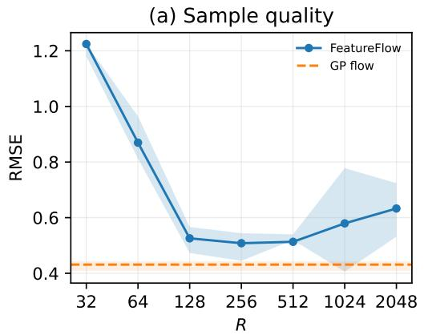

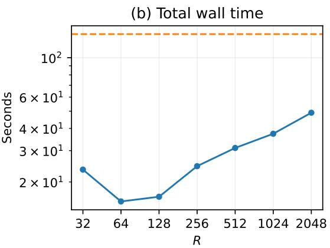  
Figure 5: (a) Comparison of sample quality between the GP flow and FeatureFlow, as a function of the number of features R. (b) Total wall time of sampling using each method; on this problem FeatureFlow trades of a small decrease in sample quality for large computational speed-up.

Guidance uses one Monte Carlo terminal draw, with its norm smoothly clipped to 200. All experiments use a fixed seed for reproducibility.

For display in Fig. 3, the function-space side lengths are $H \in \{ 1 6 , 2 4 , 3 2 , 4 0 , 4 8 , 5 6 , 6 4 , 7 2 , 8 8 , 9 6 \}$ . FeatureFlow additionally uses H ∈ {112, 128, 144, 168, 192, 224, 256}.

## D.1.4 Timing and Evaluation

Setup time for the GP flow includes evaluating the posterior mean and dense $N \times N$ covariance and computing its eigendecomposition. FeatureFlow setup involves constructing the fixed-width weight-space flow, evaluating the basis on the grid, and constructing the two condition objects. Kernel fitting, generation of the ground truth and point observations, and construction of the regional targets are excluded from timing.

For sample b, field accuracy is measured by

$$
\mathrm { R M S E } _ { b } = \left[ \frac { 1 } { N } \sum _ { i = 1 } ^ { N } \bigl ( f _ { b } ( x _ { i } ) - f ^ { \star } ( x _ { i } ) \bigr ) ^ { 2 } \right] ^ { 1 / 2 } .
$$

In Fig. 5, we report the mean RMSE over the 50 samples, measured across a range of diferent numbers of features R, with all other parameters held fixed $( H = W = 9 6 , N = 9 2 1 6 )$

In Fig. 3, we show the measured setup times together with reference slopes $O ( N ^ { 3 } )$ for the dense GP flow and $O ( N )$ for FeatureFlow. These are fixed reference exponents rather than fitted slopes. For the 0.5-second setup-budget comparison, the highest measured resolution within budget is $4 0 \times 4 0$ for function space and 144×144 for FeatureFlow.

## D.2 PDE Solutions

The spatial domain Ω is the interior of a discrete star-shaped mask, embedded in the unit square $[ 0 , 1 ] ^ { 2 }$ (shape $H \times W = H ^ { 2 } )$ . The mask was retrieved from the code accompanying Solin and Kok (2019), which is licensed under Apache 2.0.

We consider the stationary Allen–Cahn equation

$$
\begin{array} { r } { a f ( x ) - b f ( x ) ^ { 3 } - c \Delta f ( x ) = 0 } \\ { f ( x ) = 0 } \end{array}
$$

$$
\begin{array} { l } { x \in \Omega , } \\ { x \in \partial \Omega , } \end{array}\tag{23}
$$

with $( a , b , c ) = ( - 1 , - 0 . 2 , 2 \times 1 0 ^ { - 3 } )$ . Equivalently, the physical residual is $r _ { \mathrm { P D E } } ( f ) = - f + 0 . 2 \times f ^ { 3 } - ( 2 \times 1 0 ^ { - 3 } ) \Delta f$

Reference field. The observation-generating field was generated via a numerical solve using a nine-point Laplacian on a $6 4 \times 6 4$ grid. With $h = 1 / 6 3$ , the nine-point Laplacian is

$$
\begin{array} { l } { { ( \Delta _ { h } f ) _ { i j } = \displaystyle \frac { 1 } { 6 h ^ { 2 } } \biggl [ 4 \sum _ { ( p , q ) \in \mathcal { A } } f _ { i + p , j + q } } } \\ { { + \sum _ { ( p , q ) \in \mathcal { B } } f _ { i + p , j + q } - 2 0 f _ { i j } \biggr ] , } } \end{array}\tag{24}
$$

where $\mathcal { A } = \left\{ ( - 1 , 0 ) , ( 1 , 0 ) , ( 0 , - 1 ) , ( 0 , 1 ) \right\}$ and $\mathcal { B } = \{ ( - 1 , - 1 ) , ( - 1 , 1 ) , ( 1 , - 1 ) , ( 1 , 1 ) \}$

The eighth smallest Dirichlet eigenmode of $- c \Delta _ { h }$ was used to initialise the non-linear solve, in order to converge to a high-frequency solution. A damped Newton method then solves Eq. (23). The RMS-residual tolerance is $1 0 ^ { - 1 0 }$ , the maximum number of Newton updates is 80, and the smallest permitted line-search step is $2 ^ { - 2 4 }$ . The resulting $6 4 \times 6 4$ array is used for observations.

## D.2.1 Observations and GP posterior

We draw $M = 1 6$ distinct observation locations $X _ { y } = \{ \mathbf { x } _ { m } \} _ { m = 1 } ^ { M }$ uniformly without replacement from the array of the numerical solve, which we treat as the ground truth. Measurements obey

$$
y _ { m } = f _ { \star } ( \mathbf { x } _ { m } ) + \epsilon _ { m } , \qquad \epsilon _ { m } \overset { \mathrm { i i d } } { \sim } \mathcal { N } ( 0 , 0 . 0 1 ^ { 2 } ) .
$$

The zero-mean GP prior has an isotropic scaled radial-basis-function kernel

$$
k _ { \pmb \theta } ( x , x ^ { \prime } ) = \sigma _ { f } ^ { 2 } \exp \left( - \frac { \| x - x ^ { \prime } \| ^ { 2 } } { 2 \ell ^ { 2 } } \right) ,
$$

The observation noise variance is fixed at $1 0 ^ { - 4 }$ . At every value of $\ell ,$ the prior is conditioned analytically on the M observations:

$$
\begin{array} { c } { C _ { \pmb { \theta } } = K _ { \pmb { \theta } } ( X _ { y } , X _ { y } ) + 1 0 ^ { - 4 } \mathbf { I } , } \\ { m _ { \pmb { \theta } } ( x ) = k _ { \pmb { \theta } } ( x , X _ { y } ) C _ { \pmb { \theta } } ^ { - 1 } y , } \\ { k _ { \pmb { \theta } } ^ { \mathrm { p o s t } } ( x , x ^ { \prime } ) = k _ { \pmb { \theta } } ( x , x ^ { \prime } ) - k _ { \pmb { \theta } } ( x , X _ { y } ) C _ { \pmb { \theta } } ^ { - 1 } k _ { \pmb { \theta } } ( X _ { y } , x ^ { \prime } ) . } \end{array}
$$

Every run starts from $\ell = 0 . 3$ . The output scale is frozen at $\sigma _ { f } ^ { 2 } = 1 . 0$ during adaptation, so the length scale is the only optimized kernel parameter.

## D.2.2 Function-space and Feature-space Representations

GP flow. At a grid of $N = H ^ { 2 }$ points, the dense method evaluates the posterior mean and covariance, computes a symmetric eigendecomposition $K _ { \theta } ^ { \mathrm { p o s t } } = U _ { \theta } \Lambda _ { \theta } U _ { \theta } ^ { \top }$ , and uses $L = U _ { \theta } \Lambda _ { \theta } ^ { \mathrm { ( 1 / 2 } }$ to map a whitened state $z \in \mathbb { R } ^ { N }$ to $f _ { \pmb { \theta } } = m + L _ { \pmb { \theta } } z$ . A diagonal jitter of $1 0 ^ { - 1 2 }$ is added before the eigendecomposition and eigenvalues are lower-clamped at $1 0 ^ { - 1 2 }$ . During adaptation this dense decoder is recomputed after each length scale update.

FeatureFlow. The feature-space method uses the kernel approximation defined by

$$
f _ { \pmb \theta } ( x ) = m ( x ) + \Psi _ { \pmb \theta } ^ { | y } ( x ) ^ { \top } \hat { \pmb \xi } , \qquad \hat { \pmb \xi } \sim \mathcal { N } ( 0 , { \bf I } _ { R + M } ) .
$$

The first $R = 2 5 6$ features are Dirichlet Laplacian eigenfunctions on the star domain. The remaining $| X _ { y } | = M = 1 6$ features implement the observation-noise block in a Matheron correction (Wilson et al., 2020); thus, the total difusion dimension is $R = 2 7 2$

The eigenbasis is constructed numerically once on a fine $2 5 6 \times 2 5 6$ star mask, according to Solin and Kok (2019). The exact RBF kernel supplies the rank-16 pathwise conditioning correction and posterior mean. Both the spectral amplitudes and conditioning correction are refreshed after every adaptive update.

## D.2.3 PDE and Boundary Likelihoods

There are two conditions, $\mathcal { C } \in \{ \mathrm { P D E } , \partial \Omega \}$ : the PDE condition and the boundary condition. Each has log likelihood

$$
\ell _ { \mathcal { C } } = \log p ( \mathcal { C } \mid f _ { \pmb { \theta } } ) = - \frac { 1 } { 2 A _ { \mathcal { C } } } \sum _ { j = 1 } ^ { A _ { \mathcal { C } } } \left( \frac { r _ { \mathcal { C } , j } \left( f _ { \pmb { \theta } } \right) } { \sigma _ { \mathcal { C } } } \right) ^ { 2 } .
$$

Here, $A _ { \mathcal { C } }$ is the number of residual components, and $\sigma _ { C }$ is the dimensionless constant that defines the “sharpness” of the condition. The total constraint log likelihood is $\ell _ { \mathrm { c o n d } } = \ell _ { \mathrm { P D E } } + \ell _ { \partial \Omega }$

For the PDE residual, $\sigma _ { \mathrm { P D E } } = 1 0 ^ { - 3 }$ , and for the boundary residual, $\sigma _ { \partial \Omega } = 1 0 ^ { - 1 }$ . Setting $\sigma _ { \mathrm {  { \partial \Omega } } }$ to larger values for the GP flow leads to very poor PDE residuals. The boundary is the one-pixel exterior ring whose pixels have at least one four-connected neighbour in Ω, and its target value is zero, in keeping with the boundary condition in Eq. (23).

The dense GP flow evaluates the PDE residual at interior stencil centres using Eq. (24), with $h = 1 / ( H - 1 )$ The sampled field is defined on the whole square; consequently, stencil neighbours outside Ω take their sampled values, while the separate exterior-ring likelihood steers the adjacent values toward zero. FeatureFlow instead evaluates

$$
r _ { \mathrm { P D E } } ( f _ { \pmb \theta } ; x ) = a f _ { \pmb \theta } ( x ) - b f _ { \pmb \theta } ( x ) ^ { 3 } - c \Delta f _ { \pmb \theta } ( x )
$$

at every interior grid point, using the eigenvalues and analytic Laplacian of the pathwise RBF correction. In Fig. 1, the two plotted PDE MSEs therefore use the same physical equation but method-specific operators (nine-point finite diference for the GP flow and analytic for FeatureFlow).

## D.2.4 Guided Sampling

Every run uses num\_steps=1000. The sampler constructs 1,001 scheduled times at equal increments of log signal-to-noise ratio between t = 1 and $t = 1 0 ^ { - 1 0 }$ . It uses a linear variance-preserving schedule and stochastic Euler–Maruyama integration.

Likelihood guidance uses $S = 5$ terminal Monte Carlo draws per particle and step. The Monte Carlo noise is drawn once and held fixed along each trajectory. For stability, the guidance vector is smoothly norm-limited using a tanh function. The maximum norm is 200 for the function-space GP flow and 100 for the weight-space FeatureFlow.

Every fixed-prior run generates 50 particles in one batch. The adaptive runs use only 5 particles. In summary, the common sampling configuration is: float64 CPU calculation; num\_steps=1000; equal log-SNR spacing on $t \in [ 1 0 ^ { - 1 0 } , 1 ] ;$ ; a linear variance-preserving schedule; stochastic Euler–Maruyama integration with final denoising; 50 particles per fixed-prior ensemble; five particles during adaptation; five guidance terminal draws; and guidance norm limits of 200 for the GP flow and 100 for FeatureFlow.

## D.2.5 Online Hyperparameter Adaptation

Adaptive runs start from $\ell = 0 . 3$ and update the lengthscale every 10 integration steps using Adam with learning rate 0.05. Hence, the 999 integrated steps produce 99 parameter updates. A separate set of $S = 5$ frozen terminal draws is used in the adaptation objective. At an update time, one update step is taken according to App. C, in order to maximise the objective. Hyperparameter trajectories during the adaptive sampling run are shown in Fig. 6, for both the GP flow and FeatureFlow. We note that the optimisation dynamics in FeatureFlow appear more stable than those in the vanilla GP flow.

Table 1 gives the realised final values. The output scale is 1.0 in each case.

## D.2.6 Resolution Ablation, Metrics, and Timing

We consider side lengths $H \in \{ 1 6 , 2 2 , 3 2 , 4 5 , 6 3 , 9 0 , 1 2 8 \}$ . FeatureFlow is run at all seven resolutions; the dense GP flow is restricted to $H \leq 6 4$ . The same 16 observations are used at every resolution.

PDE error is the mean of the squared, unscaled physical residual over all 50 samples and all PDE evaluation points. Boundary error is the corresponding mean of $f ^ { 2 }$ on the exterior ring.

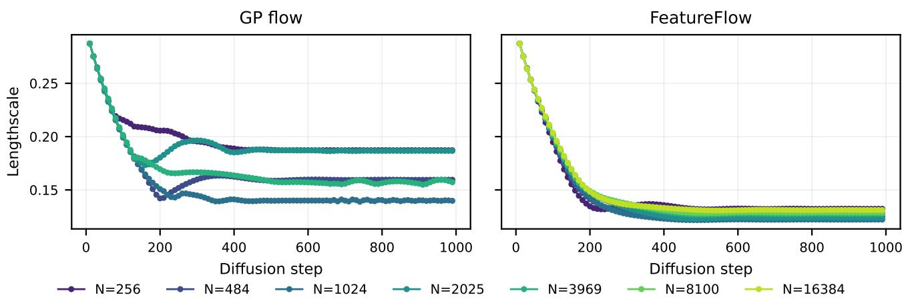  
Figure 6: Hyperparameter adaptation histories in both function (left) and weight space (right) for the PDE problem.

Table 1: Final fitted lengthscales. A dash denotes a GP flow resolution that was not run because of its dense covariance cost.
<table><tr><td>H = W</td><td>N</td><td>GP flow</td><td>FEATUREFLOW</td></tr><tr><td>16</td><td>256</td><td>0.1872</td><td>0.1322</td></tr><tr><td>22</td><td>484</td><td>0.1595</td><td>0.1248</td></tr><tr><td>32</td><td>1024</td><td>0.13978</td><td>0.1222</td></tr><tr><td>45</td><td>2025</td><td>0.1866</td><td>0.1240</td></tr><tr><td>63</td><td>3969</td><td>0.1572</td><td>0.1275</td></tr><tr><td>90</td><td>8100</td><td></td><td>0.1288</td></tr><tr><td>128</td><td>16384</td><td></td><td>0.1311</td></tr></table>

Wall time is measured with perf\_counter. For an initial run, total time is fixed-run setup plus fixed-run sampling. For an adapted result it is the setup and sampling time of the fresh final fixed run plus the complete adaptive run, including adaptive setup and all 99 updates. The dotted reference curves do not estimate their exponent: the exponents are fixed to three for GP flow and one for FeatureFlow, with only a multiplicative constant fitted by matching the geometric mean of measured and reference times in log space.

## D.3 Sea Level Anomaly Estimation

## D.3.1 Data and Synthetic Observations

Truth field and sampling geometry. The target field has shape 105 × 80 and is taken from the IMOS OceanCurrent gridded sea-level anomaly (GSLA) analysis for 29 August 2026 in the southeast-Australia domain, provided under a Creative Commons Attribution 4.0 International License (IMOS, 2026). In Fig. 7, we show a visualisation of the GSLA analysis—which we treat as a high-quality reference field because it assimilates additional observational sources unavailable to our inversion. We use the tracks of 16 real, distinct satellite passes (IMOS, 2026), with simulated shots taken at 0.288 km intervals. The GSLA field is sampled at these locations by bilinear interpolation of the gridded product. This produces 63,458 shots spanning approximately 18,276 km of satellite track length.

Nuisance fields and waveform generation. The sea-surface height at each shot is taken from the interpolated GSLA field. The significant wave height (SWH), 10-m wind speed $U _ { 1 0 }$ , and skewness λ are synthetic nuisance fields treated as known in the experiment. The reflectivity-tilt parameter is constant, $\beta = 0 . 1 2$

The forward model produces one 104-gate mean waveform per shot. Conditional on that mean, independent Gamma speckle is generated with 90 looks, resulting in $6 3 , 4 5 8 \times 1 0 4$ observations.

Information supplied to the inversion. The inversion observes the raw 104-gate waveform from every shot. It treats the four nuisance quantities (SWH, $U _ { 1 0 } , \lambda ,$ , and β) as known. Thus the only unknown field in this experiment was sea-surface height. The exact joint Gamma log-likelihood is evaluated over all 6,599,632 waveform gates. Shots are divided into chunks of 256 solely to limit memory use; chunk log-likelihoods are summed before guidance is calculated, so this introduces no likelihood factorisation or approximation.

## D.3.2 Spatial Prior and Basis Representation

Longitude ζ and latitude φ are mapped to a local planar coordinate system before applying the RBF kernel. With $\left( \zeta _ { 0 } , \varphi _ { 0 } \right) = \left( 1 5 2 . 5 ^ { \circ } , - 3 5 ^ { \circ } \right)$ 2

$$
\boldsymbol { x } = ( \zeta - \zeta _ { 0 } ) \times 9 1 . 1 9 , y = ( \varphi - \varphi _ { 0 } ) \times 1 1 1 . 3 2 \mathbf { x } = ( x , y ) ^ { \top } .
$$

The prior is

$$
f ( \mathbf { x } ) \sim \mathcal { G P } \left( \mu , \ \sigma _ { f } ^ { 2 } \exp \left[ - \frac { \| \mathbf { x } - \mathbf { x } ^ { \prime } \| ^ { 2 } } { 2 \ell ^ { 2 } } \right] \right) .
$$

For the oracle prior, $\mu , \sigma _ { f } ^ { 2 } .$ , and ℓ are fitted to the complete truth field before conditioning on waveforms. The adaptive experiment retains the oracle mean and variance and treated only the length scale as unknown.

A total of $R = 5 1 2 ~ \mathrm { R F F s }$ (256 sampled frequencies) parameterises the field as in A.1.

The same weight vector is evaluated both on the 105 × 80 display grid and at all shot coordinates. The RFF run therefore has 512 latent variables regardless of the number of observations. The full rectangular field is sampled, but land cells are masked when computing field metrics. Future work could investigate appropriate physics-informed boundary conditions, especially near coastlines, that would inform the samples drawn from FeatureFlow beyond the non-Gaussian measurements considered here.

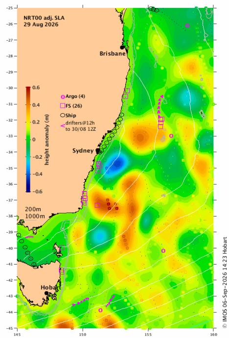  
Figure 7: Visualisation of the GSLA analysis provided by IMOS (2026). This ground truth SLA field is obtained using a range of observational data as shown, beyond satellite altimetry.

## D.3.3 Guided Sampling

Every run uses num\_steps=100. The sampler constructs 101 scheduled times at equal increments of log signal-to-noise ratio between $t = 1$ and $t = 1 0 ^ { - 1 0 }$

Likelihood guidance uses $S = 1$ terminal Monte Carlo draw per particle and step. For stability, the guidance vector is smoothly norm-limited to a maximum norm of 1000 using a tanh function.

The fixed-prior runs each generate 50 particles in one batch. In summary, the common sampling configuration is: RFF basis with $R = 5 1 2 ;$ float64 CPU calculation; num\_steps=100; equal log-SNR spacing on $t \in [ 1 0 ^ { - 1 0 } , 1 ]$ stochastic Euler–Maruyama integration; 50 particles per fixed-prior ensemble; one guidance terminal draw; guidance norm limit 1000; and likelihood chunks of 256 shots.

## D.3.4 Adaptive Length Scale Experiment

The adaptive comparison consists of the following three stages (samples from each shown in Fig. 8).

1. Misspecified fixed prior. The initial length scale is set to three times the oracle value, $\ell _ { \mathrm { m i s } } = 3 \ell _ { \mathrm { o r a c l e } } =$   
226.25 km. With this value fixed, 50 posterior draws are produced using the sampling configuration above.

2. Adaptive path. A single guided trajectory is initialised at the same misspecified length scale. The kernel output variance is frozen at $\sigma _ { f } ^ { 2 } = 0 . 0 1 4 ~ \mathrm { m ^ { 2 } }$ , the mean is fixed at 0.097 m, and only the isotropic RBF length scale is trainable. After every five integration steps, one Adam update (Kingma and Ba, 2015) is applied to the length scale.

(b) Oracle fixed flow ℓ=75.4 km  
(c) Misspecified fixed flow ℓ=226.2 km  
(d) Fitted fixed flow ℓ=81.6 km  
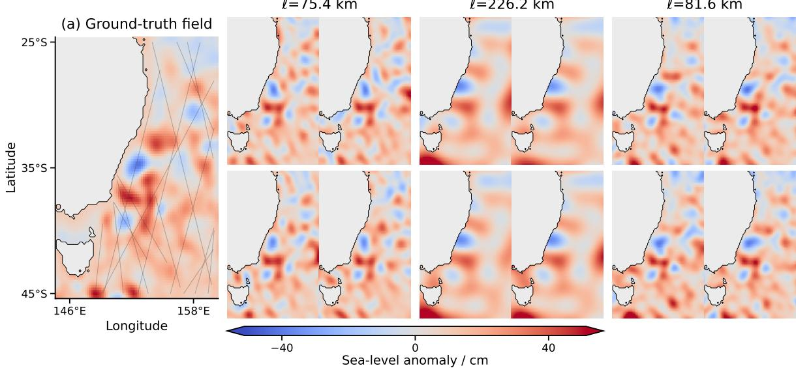  
Figure 8: (a) The ground-truth field, with satellite tracks overlaid. Samples using FeatureFlow with (b) oracle, (c) misspecified and (d) fitted kernel length scales ℓ. The oracle fixed flow represents the best possible performance of FeatureFlow with respect to the adaptive scheme.

The learning rate is rescaled from 0.07 to $0 . 0 7 \times 2 2 6 = 1 5 . 8 2$ using the initial length scale to encourage convergence in a reasonable number of steps. Both guidance and kernel fitting use only one terminal Monte Carlo draw; the kernel-fitting draw noise remains fixed between updates. The final fitted length scale obtained is 81.55 km.

3. Fitted fixed prior. The fitted value 81.55 km is frozen and a fresh 50-draw guided ensemble was generated. This is the adaptive method’s final posterior ensemble, used to report results.

The separate oracle fixed run uses a fixed random seed for both its basis construction and sampler. Its length scale is 75.42 km and it also contains 50 draws.

All experiments use a fixed seed for reproducibility.

## D.3.5 Baselines and evaluation

The classical baseline is MLE3 retracking applied independently to every noisy waveform (Brown, 1977; Rodríguez, 1988; Tourain et al., 2021). Its three fitted quantities are epoch, SWH, and backscatter; sea-surface height is then obtained from the fitted epoch. The retracker converged for all 63,458 waveforms. We report the uncorrected MLE3 baseline as the primary comparison. A post-hoc debiased diagnostic subtracts the MLE3 bias measured on these same evaluation shots (−7.408 cm); because this correction uses the truth, it is not a deployable estimator and is only to be used for comparison.

For an ensemble $\{ f ^ { ( m ) } ( \mathbf { x } ) \} _ { m = 1 } ^ { M }$ , the point estimate is its sample mean. Field RMSE is

$$
\mathrm { R M S E } _ { \mathrm { f i e l d } } = 1 0 0 \times \sqrt { \frac { 1 } { | \mathcal { O } | } \sum _ { i \in \mathcal { O } } ( \overline { { f } } ( \mathbf { x } _ { i } ) - f ^ { \star } ( \mathbf { x } _ { i } ) ) ^ { 2 } } ,
$$

where O is the interior of the finite-ocean mask, $\overline { { f } }$ is the mean field, taken over posterior samples, and $f ^ { \star }$ is the ground truth field. On-track RMSE uses the analogous average over all 63,458 shots after evaluating each draw’s shared RFF weights at the exact shot coordinates. MLE3 has no two-dimensional field estimate, so only its on-track error is reported. The values provided in Table 2 are reflected in Fig. 4(d), and a comparison with the post hoc debiased MLE3 estimate is provided in Fig. 9.

Table 2: Observed reconstruction errors. The adaptive-path row is the single changing-prior trajectory used for fitting, not the final ensemble.
<table><tr><td>Method</td><td>Draws</td><td>Field RMSE cm</td><td>On-track RMSE cm</td></tr><tr><td>Misspecified fixed  $( \ell = 2 2 6 . 2 5 ~ \mathrm { k m } )$ </td><td>50</td><td>12.605</td><td>8.185</td></tr><tr><td>Adaptive path  $( 2 2 6 . 2 5 \to 8 1 . 5 5 ~ \mathrm { k m } )$ </td><td>1</td><td>14.024</td><td>12.449</td></tr><tr><td>Fitted fixed  $( \ell = 8 1 . 5 5 ~ \mathrm { k m } )$ </td><td>50</td><td>8.173</td><td>1.651</td></tr><tr><td>Oracle fixed  $( \ell = 7 5 . 4 2 \ \mathrm { k m } )$ </td><td>50</td><td>7.635</td><td>1.830</td></tr><tr><td>MLE3</td><td></td><td></td><td>9.202</td></tr><tr><td>Post hoc debiased MLE3</td><td></td><td></td><td>5.458</td></tr></table>

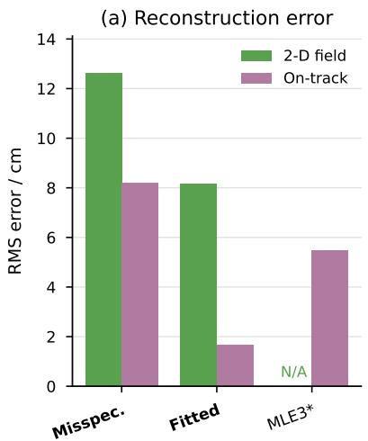

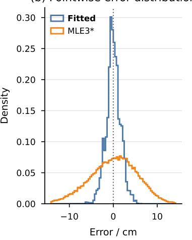  
Figure 9: Equivalent results to those shown in Fig. 4(d, f), only using post hoc debiased MLE3 results. FeatureFlow exhibits smaller RMS error even against this more challenging baseline.

## D.3.6 Forward Model

The forward model used to generate synthetic radar echoes given a ground-truth SLA field is detailed here. The model has two parts: a deterministic mapping from the SLA field and the nuisance fields to the mean waveform, followed by a non-Gaussian observation model.

For an observation at location $\mathbf { x } _ { j } ( \zeta _ { j } , \varphi _ { j } )$ , the sea-surface height $f ( \mathbf { x } _ { j } )$ determines the two-way delay relative to the tracker reference height H:

$$
\tau _ { j } = \frac { 2 } { c } \left[ H - f ( \mathbf { x } _ { j } ) \right] ,
$$

where $c$ is the speed of light. The delay associated with range gate k is

$$
t _ { k } = ( k - G _ { \mathrm { r e f } } ) \Delta t , \qquad k = 1 , \dots , K ,
$$

where $\Delta t = 3 . 1 2 5$ ns (temporal spacing between adjacent range gates) and $G _ { \mathrm { r e f } } = 3 2 . 5$ (the range gate index associated with an SLA $f ( \mathbf { x } _ { j } ) = 0 )$ . The significant wave height (SWH) determines the temporal width of the scattering surface and its convolution with the radar point-target response:

$$
\sigma _ { s , j } = \frac { \mathrm { S W H } _ { j } } { 2 c } , \qquad \sigma _ { c , j } ^ { 2 } = \sigma _ { p } ^ { 2 } + \sigma _ { s , j } ^ { 2 } ,
$$

where $\sigma _ { p }$ is the width of the point-target response and $\sigma _ { c , j } ^ { 2 }$ is the composite waveform width obtained by convolving the scattering-surface distribution with the point-target response. Wind speed near the surface $\left( U _ { 1 0 } \right)$ determines the backscatter coeficient $\sigma _ { j } ^ { 0 }$ using empirical coeficients $\Sigma _ { A }$ and $\Sigma _ { B }$ , and waveform amplitude $A _ { j } { \mathrm { : } }$

$$
\sigma _ { j } ^ { 0 } = \Sigma _ { A } - \Sigma _ { B } \log _ { 1 0 } ( \operatorname* { m a x } \{ U _ { 1 0 , j } , 1 \} ) , \quad A _ { j } = P _ { \mathrm { r e f } } 1 0 ^ { ( \sigma _ { j } ^ { 0 } - \sigma _ { \mathrm { r e f } } ^ { 0 } ) / 1 0 } .
$$

For a Gaussian sea surface at exact nadir, the Brown mean waveform is

$$
B _ { j } ( x ) = A _ { j } \exp \left( \frac { \alpha ^ { 2 } \sigma _ { c , j } ^ { 2 } } { 2 } - \alpha x \right) \Phi \left( \frac { x } { \sigma _ { c , j } } - \alpha \sigma _ { c , j } \right) ,
$$

where $x = t _ { k } - \tau _ { j }$ , α is the trailing-edge decay rate, and Φ is the standard Gaussian cumulative distribution function. Surface skewness $\lambda _ { j }$ and electromagnetic reflectivity-tilt parameter $\beta _ { j }$ are incorporated through the Hermite coeficients

$$
\left( q _ { 0 , j } , q _ { 1 , j } , q _ { 2 , j } , q _ { 3 , j } , q _ { 4 , j } \right) = \left( 1 , \beta _ { j } , - \frac { \lambda _ { j } \beta _ { j } } { 2 } , - \frac { \lambda _ { j } } { 6 } , - \frac { \lambda _ { j } \beta _ { j } } { 6 } \right) .
$$

The expected power in gate k of echo j is then

$$
m _ { j k } = P _ { \mathrm { t h e r m a l } } + \sum _ { n = 0 } ^ { 4 } q _ { n , j } ( - 1 ) ^ { n } \sigma _ { s , j } ^ { n } \frac { \mathrm { d } ^ { n } B _ { j } ( x ) } { \mathrm { d } x ^ { n } } \Bigg \vert _ { x = t _ { k } - \tau _ { j } }
$$

where $P _ { \mathrm { t h e r m a l } }$ is the minimum power observed due to the thermal floor. Finally, we model the observed gate powers to follow an exact speckle-noise model using 90 looks

$$
Y _ { j k } \mid m _ { j k } \sim \mathrm { G a m m a } \left( N _ { l } , \frac { m _ { j k } } { N _ { l } } \right) , \quad N _ { l } = 9 0 ,
$$

independently across echoes and range gates; we use the shape-scale convention for the Gamma distribution here. This parameterisation gives

$$
\mathbb { E } \big [ Y _ { j k } \mid m _ { j k } \big ] = m _ { j k } , \quad \mathrm { V a r } \big [ Y _ { j k } \mid m _ { j k } \big ] = \frac { m _ { j k } ^ { 2 } } { N _ { l } } .
$$

Thus, the forward model maps the SLA and nuisance fields to all 6,599,632 observed powers:

$$
\{ f ( \mathbf { x } _ { j } ) , \mathrm { S W H } _ { j } , U _ { 1 0 , j } , \lambda _ { j } , \beta _ { j } \} _ { j = 1 } ^ { 6 3 , 4 5 8 } \mapsto \{ m _ { j k } \} \mapsto \{ Y _ { j k } \}
$$

where the first map is deterministic and a function of all nuisance variables, and the second map is a stochastic draw from the Gamma observation model.