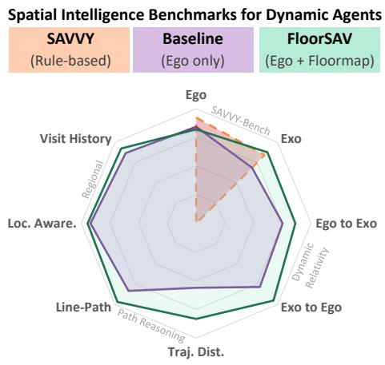

# FloorSAV: Elucidating Spatial Audio-Visual Context with 2D Floormap for AV-LLMs

Kyeong-Rae Kim<sup>1</sup>, Sungnyun Kim<sup>1,†</sup>, and Tae-Hyun Oh<sup>1,†</sup>

<sup>1</sup>Korea Advanced Institute of Science and Technology <sup>†</sup>Corresponding authors

<sup>#</sup> {kimkyeongrae, ksn4397, taehyun.oh}@kaist.ac.kr

<sup>€</sup> https://byulharang.github.io/FloorSAV/

While 3D spatial reasoning in dynamic egocentric environments is crucial for embodied intelligence, audio-visual large language models (AV-LLMs) lack explicit mechanisms to process and internalize global geometry directly from raw sensory streams. Existing approaches either require costly fine-tuning or underutilize the model’s cross-modal reasoning capacities. In this paper, we propose FloorSAV, a novel framework that explicitly grounds spatial audio-visual context by rendering a dynamic 2D floormap. By integrating 3D point clouds, camera trajectories, spatial audio cues, and semantically grounded object landmarks, we inject this floormap into the AV-LLM as a synchronized stream with an egocentric video. AV-LLMs utilize their multi-modal capabilities to jointly reason over visual, auditory, and geometric cues in a single inference with floormap interpretation guidance. We further introduce SAVED-Bench (Spatial Audio-Visual Egocentric Benchmark with Dynamic Agents), constructing essential tasks of spatial capability in real-world scenarios: dynamic relativity, regional, and path reasoning QAs. FloorSAV improves AV-LLMs’ spatial reasoning on various tasks from both SAVED-Bench and SAVVY-Bench. Studies with ground-truth floormaps demonstrate the substantial potential of FloorSAV with accurate spatial information.

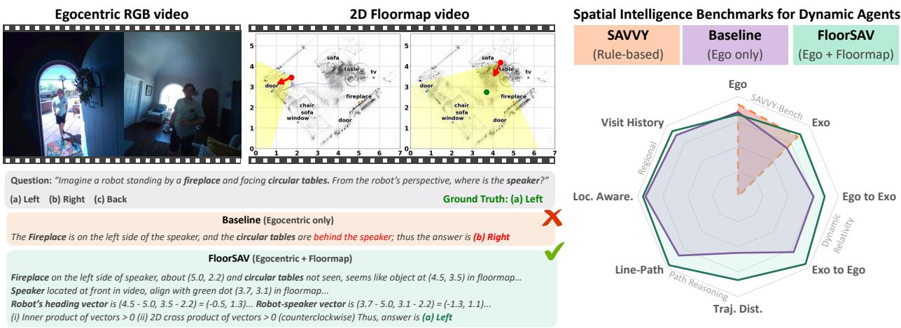  
Figure 1: FloorSAV improves spatial reasoning, and our SAVED-Bench widely complements SAVVY-Bench. (Left) FloorSAV enables MLLMs to jointly reason over the egocentric and 2D floormap videos to resolve various spatial tasks. (Right) On the comprehensive evaluation including SAVED-Bench, which comprises cross-agent, region-aware, and environmentaware tasks, FloorSAV improves the egocentric video-only baselines, with Gemini series (Comanici et al., 2025; Google, 2026), for most of the spatial QA tasks.

## 1. Introduction

Egocentric audio-visual understanding (Grauman et al., 2022; Huang et al., 2023a; Seth et al., 2026; Zhu et al., 2026) is central to embodied intelligence. Systems operating from a first-person perspective must jointly process visual and acoustic data alongside motion to answer complex spatial questions, such as identifying the direction of a speaker or estimating distances of sound sources (Li et al., 2022; Yang et al., 2022; Yun et al., 2021). However, comprehensive 3D spatial reasoning (Zheng et al., 2025b), the cognitive ability to navigate changing environments by tracking dynamic objects and transforming first-person observations into consistent global representations, remains largely unsolved. As demonstrated by recent benchmarks like SAVVY-Bench (Chen et al., 2025), even the most advanced audio-visual large language models (AV-LLMs) (Cheng et al., 2024; Geng et al., 2025; Ye et al., 2025) fall significantly below human-level performance on fine-grained spatial tasks.

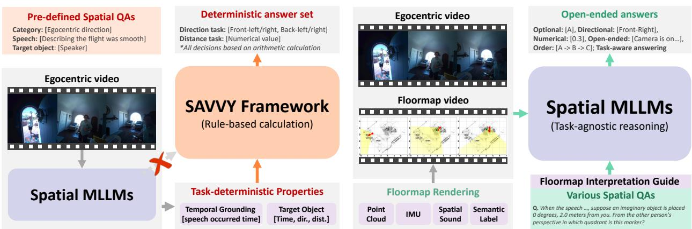  
Figure 2: Comparison of SAVVY and FloorSAV frameworks. SAVVY underutilizes MLLMs as a submodule, relying on pre-defined QA tasks and computing answers by a deterministic process. In contrast, FloorSAV integrates geometry, agents, sound estimates, and key objects into a floormap, then injects it with synchronized egocentric video to the MLLM, where it jointly reasons over both streams to answer various spatial tasks.

This performance gap stems from the inherent limitations of relying on raw egocentric streams. Visual reasoning sufers from severe spatial bias due to the continuously moving, narrow field-of-view (FoV) of wearable cameras, making it exceptionally dificult for models to internalize global 3D geometry from video alone (Yang et al., 2025). Spatial audio further compounds this dificulty; tracking transient sound sources from moving microphones is inherently noisy (Dementyev et al., 2026; Diaz-Guerra et al., 2020; Sridhar et al., 2025), and current AV-LLMs typically process downmixed monaural audio that discards critical spatial attributes (Chu et al., 2023; Gong et al., 2024; Sun et al., 2024; Xu et al., 2025). Consequently, models struggle to ground dynamic audio-visual events into a coherent physical space.

Recent eforts to address these challenges generally fall into two categories, both facing significant hurdles. Training-based methods (Biswas et al., 2025; Liu et al., 2026; Zheng et al., 2024) attach fine-tuned spatial encoders to AV-LLMs, which requires access to proprietary model weights and expensive domain-specific 3D supervision. Conversely, training-free pipelines, as exemplified by SAVVY (Chen et al., 2025), avoid architectural modifications by extracting spatial information externally. However, these approaches relegate the AV-LLM to simple preliminary sub-tasks like temporal localization, while fine-grained spatial tracking and global map construction are executed by ofline, rule-based modules. Hence, the AV-LLMs do not jointly process the spatial audio-visual context, limiting its capability for addressing diverse open-ended tasks and leaving its powerful cross-modal reasoning capacity underutilized.

A top-down map suits this setting. It compresses a long, narrow-FoV video into a single metric reference frame whose coordinates the model can read of directly. In language models, the map has been shown as a form of external visualization to aid spatial reasoning (Wu et al., 2024), although current models remain well below human accuracy on top-view tasks (Li et al., 2024). Rendering the map per frame also keeps it synchronized with the video, so a moving camera and moving sound sources appear as visual motion rather than as text the model has to integrate.

Inspired by this, we introduce FloorSAV, a task-agnostic training-free framework that elucidates spatial context for AV-LLMs through an explicit visual representation (Figure 1). Using the Aria Everyday Activities (AEA) dataset (Lv et al., 2024), we construct a per-frame 2D floormap dynamically annotated with camera trajectories and estimated sound source positions. By feeding this floormap as a second synchronized video stream alongside the egocentric view, the model can jointly reason over visual appearance, auditory cues, and global scene geometry in a single inference on spatial tasks.

We further introduce SAVED-Bench (Spatial Audio-Visual Egocentric Benchmark with Dynamic Agents), which broadly evaluates spatial intelligence for dynamic agents in the real world. While recent egocentric spatial benchmarks (Du et al., 2024; Yang et al., 2025) evaluate broad spatial tasks, they lack a crucial element: dynamic agents moving through the scene. Although SAVVY-Bench (Chen et al., 2025) incorporates dynamic agents, its evaluation is limited to direction and distance estimation within a given reference frame. SAVED-Bench introduces broader spatial reasoning tasks relevant to dynamic agents’ everyday interactions through three complementary categories: dynamic relativity, regional, and path reasoning QAs. These assess crossagent, semantic region-aware, and path-aware cognition abilities, respectively. Evaluations on SAVED-Bench demonstrate that our FloorSAV strategy improves spatial reasoning by jointly utilizing multi-sensory data and generalizes to various spatial tasks that are inherently intractable for SAVVY (Figure 1). Our main contributions are as follows:

• Floormap rendering and guidance. FloorSAV integrates multi-sensory data and key objects onto 2D floormaps as explicit representations. The floormap guide helps AV-LLMs jointly reason over both egocentric and 2D floormap videos.

• Broader spatial reasoning benchmark. SAVED-Bench, which comprises dynamic relativity, regional, and path reasoning QAs, comprehensively spans cross-agent, region-aware, and path-aware tasks to evaluate essential spatial capabilities for dynamic agents in real-world scenarios.

• FloorSAV improves spatial intelligence across benchmarks. FloorSAV shows benefits on both SAVED-Bench and SAVVY-Bench. Compared to the egocentric view-only baseline (i.e., Gemini), FloorSAV improves the overall score, from 58.3% to 65.3% on SAVED-Bench, and from 50.9% to 54.7% on SAVVY-Bench. Further studies with ground-truth agent positions and objects show the potential of FloorSAV with an overall score of 71.3% on SAVED-Bench.

## 2. Related Work

## 2.1. Spatial Understanding in MLLMs

To endow MLLMs with 3D spatial reasoning for embodied AI (Deng et al., 2025; Hong et al., 2023; Huang et al., 2024; Yu-Ji et al., 2026; Zheng et al., 2025a), early vision-based approaches have focused on spatial QA and visual grounding (Chen et al., 2024, 2023; Peng et al., 2024). However, they inherently sufer from visual bias and frequently hallucinate in occluded or out-of-view regions (Li et al., 2023; Yang et al., 2025; Yu et al., 2024). To mitigate this, audio-based MLLMs (Chu et al., 2023; Gong et al., 2024) utilize acoustic cues via multimicrophone arrays for estimating distance and direction (You et al., 2026; Zheng et al., 2024), often enhanced by Chain-of-Thought (CoT) reasoning (Biswas et al., 2025) or microphone-agnostic encoders (Dementyev et al., 2026). Nevertheless, these audio-centric approaches discard rich visual semantics and heavily rely on simulated data, leaving their real-world applicability unexplored. Consequently, to exploit cross-modal complementarity, unified AV-LLMs have emerged (Cheng et al., 2024; Ye et al., 2025, 2024; Zhang et al., 2023; Zhong et al., 2026). Progress here, however, is largely measured on audio-visual QA benchmarks that ask what and when rather than where (Li et al., 2022; Yang et al., 2022), with spatial grounding appearing only in restricted settings such as 360<sup>∘</sup> video (Yun et al., 2021). For instance, recent works jointly fine-tune audio-visual projectors and LLMs to solve spatial QA tasks (Hyeonggon et al., 2026). However, despite first-person perception being a fundamental prerequisite for dynamic, embodied intelligence, there remains a critical lack of research explicitly leveraging AV-LLMs for egocentric spatial reasoning.

## 2.2. Egocentric Audio-Visual Spatial Reasoning

Egocentric vision is crucial for embodied intelligence but sufers from restricted FoV, driving the need for audio-visual integration and multi-sensory benchmarks (Grauman et al., 2022; Mangalam et al., 2023; Plizzari et al., 2025; Seth et al., 2026; Zhu et al., 2026). To enhance spatial awareness, JAEGER (Liu et al., 2026) fine-tunes audio-visual encoders, but faces a sim-to-real gap and incompatibility with proprietary LLMs. Alternatively, SAVVY (Chen et al., 2025) introduces a training-free pipeline using a real-world dataset (Lv et al., 2024), whose synchronized point clouds, 6-DoF poses, and multi-channel audio also underpin recent egocentric 3D benchmarks (Straub et al., 2024). However, it underutilizes the MLLM’s powerful cross-modal capabilities, and SAVVY-Bench only scopes narrow spatial relations within a single dynamic agent’s viewpoint. In contrast, FloorSAV endows MLLMs with explicit spatial reasoning by incorporating a multi-sensory integrated 2D floormap. We further suggest a comprehensive benchmark that evaluates essential spatial capabilities. This aligns with a growing consensus in vision-language models that providing explicit spatial abstractions (Gu et al., 2024; Jatavallabhula et al., 2023; Jun-Seong et al., 2025), whether through native 3D coordinate grounding (Wang et al., 2025c), mental scene simulations for exocentric (allocentric) perspective shifts (Lee et al., 2025), or 2D maps for navigation and top-view reasoning (Chen et al., 2026; Huang et al., 2023b; Li et al., 2024; Wang et al., 2023), is essential to unlock advanced spatial reasoning capabilities (Wu et al., 2024).

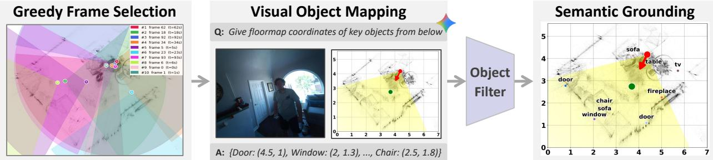  
Figure 3: Semantic grounding process. Semantically enriched floormap is generated by a pipeline of keyframe selection, mapping visual objects via VLMs, and filtering, providing semantic context for better reasoning.

## 3. Method: FloorSAV

Spatial reasoning in dynamic 3D environments is fundamentally challenging for AV-LLMs when relying solely on egocentric sensory streams, as a narrow FoV obscures global geometry and transient audio events are dificult to track. To address this limitation, FloorSAV elucidates the spatial audio-visual context through an explicit 2D floormap. Unlike SAVVY (Chen et al., 2025), which relegates the AV-LLM to preliminary sub-tasks followed by ofline rule-based mapping, FloorSAV renders the global map and injects it alongside the corresponding egocentric video into the AV-LLM, thus unlocking its cross-modal reasoning capacity (Figure 2).

## 3.1. Floormap Rendering via Explicit Spatial Grounding

We render a compact top-down 2D floormap from the spatial audio-visual signals in the AEA dataset (Lv et al., 2024) in three steps (details in Appendix A.1).

Step 1: Base map and acoustic tracking. We first project 3D point clouds into a 2D metric grid with one-meter ticks to establish the static room layout and boundaries. The camera wearer’s pose (position and orientation) is taken from the dataset, and the distance and direction-of-arrival (DoA) of sound sources are estimated from the multi-channel audio (Diaz-Guerra et al., 2020; DiBiase, 2000; Schwarz and Kellermann, 2015), all projected onto the base map.

Step 2: Visual grounding via spatial markers. To make the map intuitive for the model, we draw these estimates with explicit visual markers: a red dot/arrow and a yellow wedge for the camera’s current position/- heading and FoV, a green dot for the estimated sound source, and a continuous blue polyline for the camera’s historical trajectory.

Step 3: Semantic grounding via VLM. However, the markers do not have information of spatial relations with the environment, so we enrich the floormap with key object landmarks (Figure 3) following this pipeline: (1) keyframes are selected by greedy maximum coverage of the map, (2) an of-the-shelf VLM (e.g., Gemini (Comanici et al., 2025)) detects static objects in each keyframe and extracts their spatial coordinates, and (3) the detections are normalized, filtered, and merged across frames into labels overlaid on the map as text.

## 3.2. Floormap-Aware Inference

Once the 2D floormap frames are constructed, we assemble them into a video synchronized with the egocentric footage. Both egocentric and floormap videos are given to the AV-LLM via a dual-stream video injection strategy with a brief interpretation guide.

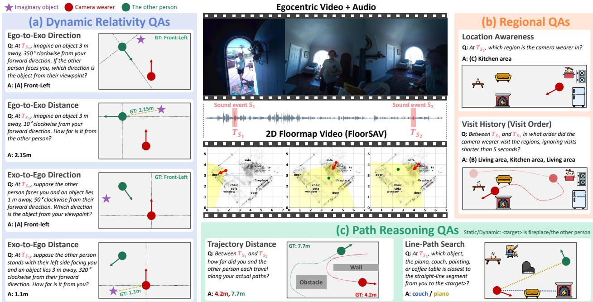  
Figure 4: SAVED-Bench at a glance. Illustrative question-answer pairs cover (a) dynamic relativity, (b) regional, and (c) path reasoning tasks. Sound events (� ) identify the relevant moments (� ) or intervals, while synchronized egocentric and floormap views provide spatial context.

Dual-stream injection. We feed the egocentric and floormap videos as two separate, synchronized streams sampled at the same frame rate, rather than as a single side-by-side video (Chen et al., 2026) or a static map image. We empirically found that the side-by-side concatenation introduces severe prediction biases toward the side of the frame that the egocentric view occupies (Appendix C.1), while a static image loses the motion of the camera and the sound source. The dual-stream video injection preserves the original geometric layout intact.

Floormap guide. We construct a guide that explains the rendered marks in the floormap: colored dots for the observer’s position and detected sound sources, camera FoV cues, camera trajectories, and text labels for key objects. It helps the model use the egocentric view as the primary reference and refer to the floormap when spatial details are uncertain (full prompts in Appendix E).

## 4. Spatial Reasoning Benchmarks

## 4.1. SAVVY-Bench

SAVVY-Bench (Chen et al., 2025) is the first benchmark for 3D spatial reasoning in audio-visual egocentric scenes, sourced from the AEA dataset (Lv et al., 2024) which records daily-life scenarios. Its tasks are separated by reference viewpoint and ask about direction or distance at the moment when the target sound occurred. Egocentric (Ego) utilizes the viewpoint of the recorded video (camera wearer), and Exocentric (Exo) assumes a hypothetical observer (e.g., robot) specified in the question.

## 4.2. SAVED-Bench: Towards Dynamic Agents in Real-World Scenarios

Although SAVVY-Bench provides spatial reasoning tasks involving interactive agents, each question is evaluated from a single fixed viewpoint at the moment of a target speech event and is limited in scope to the direction/distance estimation. However, spatial intelligence for agents in real-world scenarios requires broader aspects of spatial reasoning (Wang et al., 2025b; Yang et al., 2025). Therefore, we introduce SAVED-Bench to evaluate spatial reasoning involving dynamic agents in real-world scenarios. The benchmark comprises three complementary categories that target cross-agent, region-aware, and path-aware reasoning. Figure 4 summarizes the design overview of these QA categories.

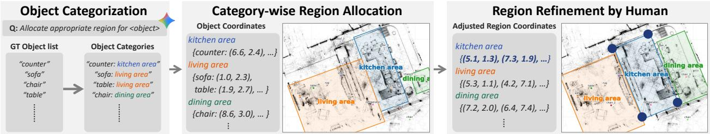  
Figure 5: Region annotation process. (Left) For each scene, we prompt an LLM to assign a region category to every ground-truth object. (Middle) We group objects by category and use their coordinates to automatically compute the smallest enclosing rectangle for each group, with its sides parallel to the walls. (Right) Human annotators cross-check the egocentric video and 2D floormap and refine these initial rectangles by adjusting their vertices to obtain region polygons. These are only used for the QA synthesis, not provided to the model.

• Dynamic Relativity QAs: An agent should understand and reason from another agent’s viewpoint (reference frame) to communicate spatial information efectively. This requires cross-agent viewpoint transformations to determine a target’s direction and distance relative to either agent.

• Regional QAs: Common places are often described in terms of semantic regions, such as kitchens and living rooms, which the agent should recognize to interact with other agents. As agents move through these regions, they require jointly reasoning about both regions and dynamics over time.

• Path Reasoning QAs: The physical environment, such as walls and furniture, provides spatial context for an agent’s movement. The dynamic agent should understand its physical surroundings and reason about actual or hypothetical paths in relation to nearby objects or agents.

To evaluate spatial intelligence across these categories, we construct multiple tasks within each category, providing complementary assessments of spatial reasoning involving both the egocentric agent (camera wearer) and the other agent. We will release SAVED-Bench, including the annotation pipeline and assets for the benchmark generation and evaluation.

## 4.2.1. Dynamic Relativity QA Synthesis

Understanding other agents’ viewpoints is essential in everyday interactions. For example, an object to one person’s right may lie to another’s left when they face each other. To assess this capability, we construct tasks that require models to infer the direction or distance of an imaginary object specified in one agent’s reference frame relative to the other agent, requiring a viewpoint transformation (Figure 4(a)).

The task involves two agents: Ego, the camera wearer, and Exo, the other person in the same scene. We utilize a sound event to specify the query time, as in SAVVY-Bench (Chen et al., 2025), and assume an imaginary object at a specific angle and radial distance in one agent’s viewpoint. The task asks for this object’s direction/distance from the other agent’s viewpoint. This is subdivided into Ego-to-Exo, which describes an imaginary object from Ego’s perspective and asks about Exo’s viewpoint, and Exo-to-Ego in the inverse manner. Due to blurred faces in the given dataset, we specify a hypothetical facing direction of Exo in each question.

## 4.2.2. Regional QA Synthesis

Humans often refer to semantic regions, such as living rooms and bedrooms, rather than precise coordinates when communicating spatial information. Therefore, an agent must understand these regional terms and relate them to the positions of agents. We construct region-aware tasks that require joint reasoning about semantic regions and agents’ movements over time. To evaluate these requirements, we first annotate regions by considering the arrangement of key objects and their semantics, utilizing an of-the-shelf model and human refinement (Figure 5), and then construct region-based tasks with temporal variants, as presented in Figure 4(b). Location Awareness asks for the region where an agent is located at the sound event moment, and Visit History asks for the order of visited regions or the unvisited region for a dynamic agent during the time interval between two sound events.

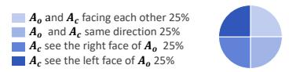  
Other person ��, and camera wearer �� Imagine an object � m away, �° clockwise from �� / ��  
Sound event time ��� and ���, duration: | ��� − ���| Region categories: Living room, Kitchen room, …

## Dynamic Relativity QAs

## Regional QAs

  
Position of camera wearer (��), object (����), other person (��) Sound event time ��� and ���, duration: | ��� − ���|

## Path Reasoning QAs

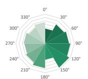

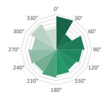

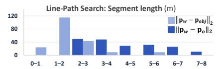

  
Exo-to-Ego direction �

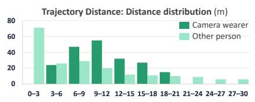

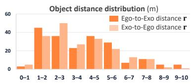

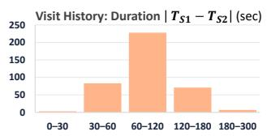

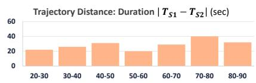  
Figure 6: SAVED-Bench configurations and distributions. Unlike SAVVY-Bench, whose answers are heavily focused on front-side $( - 9 0 ^ { \circ } \sim 9 0 ^ { \circ } )$ and short distances (< 1m), SAVED-Bench is constructed with a broader range of answer cases, covering various spatial configurations and temporal intervals.

## 4.2.3. Path Reasoning QA Synthesis

Moving through real-world environments requires understanding surrounding objects, walls, and other moving agents. We construct path reasoning QAs to assess spatial reasoning about agents’ movement paths and their relations to the surrounding environment. We consider two estimation settings (Figure 4(c)), reasoning about physical objects along a hypothetical finite straight path, and estimating the length of an observed agent’s trajectory, which is constrained by physical surroundings. Line-Path Search asks for the closest object to the straight-line segment from the camera wearer to the given target. This is also divided into static and dynamic variants, whether the target is a specific object or the other agent, respectively. Trajectory Distance requires a pair of distances traveled by both the camera wearer and the other agent during the sound interval.

## 5. Experiments and Results

## 5.1. Setup

Benchmark and metrics. We evaluate FloorSAV on SAVVY-Bench (Chen et al., 2025) and our SAVED-Bench, which are both derived from the AEA dataset (Lv et al., 2024). SAVVY-Bench comprises over 1,500 QA pairs and SAVED-Bench contains 1,988 QA pairs drawn from 55 indoor daily-life recordings. Specifically, SAVED-Bench comprises 800 dynamic relativity, 592 regional, and 596 path reasoning questions. Statistical details can be found in Figure 6. All tasks except distance estimation are formulated as multiple-choice problems (MCPs) and evaluated using exact-match accuracy. Distance tasks ask for a numerical value in meters and utilize absolute mean relative accuracy (AbsMRA), with thresholds from 0.1 m to 1.0 m.

Baselines and models. For evaluation, we compare FloorSAV and the egocentric-video-only strategy with an identical AV-LLM. On SAVVY-Bench, we utilize both open-source and proprietary state-of-the-art models, specifically the Qwen3-Omni model (Xu et al., 2025) and Gemini-2.5-Flash/Pro (Comanici et al., 2025), where the Pro model was also used in the SAVVY framework and its results were reported. SAVED-Bench tests with Gemini-3.6-Flash as the AV-LLM, which is an of-the-shelf model with strengths in video understanding and spatial reasoning, considering the complexity and variety of the contained tasks. All models are evaluated in a zero-shot manner without any fine-tuning.

Table 1: SAVED-Bench results with Gemini-3.6-Flash. FloorSAV improves over the baseline in all categories. Subscripts indicate the diference from Baseline. \*Pooled Visit Order and Unvisited questions. <sup>†</sup>Ground-truth position of the sound source onto the map. <sup>‡</sup>Partial GT plus the ground-truth object names on the map.
<table><tr><td>Task</td><td>Baseline</td><td>FloorSAV</td><td>Partial GT Map†</td><td>Full GT Map‡</td></tr><tr><td colspan="5">Dynamic Relativity</td></tr><tr><td>Ego-to-Exo Direction</td><td>56.0</td><td> ${ \bf 6 5 . 0 _ { + 9 . 0 } }$ </td><td> $7 6 . 5 \substack { + 2 0 . 5 }$ </td><td> $7 2 . 0 _ { + 1 6 . 0 }$ </td></tr><tr><td>Ego-to-Exo Distance (AbsMRA)</td><td>34.3</td><td> $3 4 . 6 _ { + 0 . 3 }$ </td><td> $4 7 . 9 _ { + 1 3 . 6 }$ </td><td> $4 5 . 9 _ { + 1 1 . 6 }$ </td></tr><tr><td>Exo-to-Ego Direction</td><td>32.0</td><td> ${ 5 0 . 5 } _ {  { \mathrm { ~ \scriptsize + 1 8 . 5 } } }$ </td><td> $5 0 . 5 \substack { + 1 8 . 5 }$ </td><td> $5 3 . 5 _ { + 2 1 . 5 }$ </td></tr><tr><td>Exo-to-Ego Distance (AbsMRA)</td><td>46.4</td><td> $4 4 . 7 _ { - 1 . 7 }$ </td><td> $5 7 . 5 _ { + 1 1 . 1 }$ </td><td> $5 5 . 0 _ { + 8 . 6 }$ </td></tr><tr><td>4-task average Regional</td><td>42.2</td><td> $4 8 . 7 \substack { + 6 . 5 }$ </td><td> $5 8 . 1 _ { + 1 5 . 9 }$ </td><td> $5 6 . 6 _ { + 1 4 . 4 }$ </td></tr><tr><td colspan="5"></td></tr><tr><td>Location Awareness</td><td>92.0</td><td> $9 4 . 5 \textrm { } _ { + 2 . 5 }$ </td><td> $9 6 . 0 _ { + 4 . 0 }$ </td><td> $9 6 . 5 \substack { + 4 . 5 }$ </td></tr><tr><td>Visit History*</td><td>86.7</td><td> $9 2 . 3 _ { + 5 . 6 }$ </td><td> $8 9 . 8 _ { + 3 . 1 }$ </td><td> $9 7 . 2 _ { + 1 0 . 5 }$ </td></tr><tr><td>2-task average</td><td>89.4</td><td> $9 3 . 4 \substack { + 4 . 0 }$ </td><td> $9 2 . 9 _ { + 3 . 5 }$ </td><td> $9 6 . 8 _ { \ + 7 . 4 }$ </td></tr><tr><td colspan="5">Path Reasoning</td></tr><tr><td>Line-Path Search (static)</td><td>60.2</td><td> $7 7 . 0 _ { + 1 6 . 8 }$ </td><td> $7 8 . 1 \substack { + 1 7 . 9 }$ </td><td> $7 7 . 6 \substack { + 1 7 . 4 }$ </td></tr><tr><td>Line-Path Search (dynamic)</td><td>73.0</td><td> $7 8 . 0 \substack { + 5 . 0 }$ </td><td> $8 7 . 5 \substack { + 1 4 . 5 }$ </td><td> $9 1 . 0 _ { + 1 8 . 0 }$ </td></tr><tr><td>Trajectory Distance (AbsMRA)</td><td>16.9</td><td> $2 5 . 0 _ { + 8 . 1 }$ </td><td> $2 5 . 0 _ { + 8 . 1 }$ </td><td> $2 8 . 2 _ { + 1 1 . 3 }$ </td></tr><tr><td>3-task average</td><td>50.0</td><td> ${ \bf 6 0 . 0 _ { \mathrm { + 1 0 . 0 } } }$ </td><td> $6 3 . 5 _ { \textrm { + 1 3 . 5 } }$ </td><td> $6 5 . 6 \AA _ { + 1 5 . 6 }$ </td></tr><tr><td>Overall (QA-weighted)</td><td>58.3</td><td> $6 5 . 3 \textrm { \textmu } _ { + 7 . 0 }$ </td><td> $6 9 . 8 _ { + 1 1 . 5 }$ </td><td> $7 1 . 3 \substack { + 1 3 . 0 }$ </td></tr></table>

## 5.2. Results on SAVED-Bench

FloorSAV improves all three category averages on SAVED-Bench (Table 1), raising the overall score from 58.3% to 65.3%. The gains span cross-agent direction, region-aware, and path-related spatial reasoning.

## 5.2.1. Dynamic Relativity: Cross-Agent Reasoning

We analyze dynamic relativity QAs using the benchmark’s FoV-in/out annotations, which indicate the other agent’s visibility at the sound-event query time (Figure 7).

Relative direction reasoning. FloorSAV improves all direction tasks under all visibility conditions. The overall direction gain is larger in FoV-out (+15.0 vs. +12.5) where the other agent does not exist in the egocentric view at the querying moment. While FloorSAV improves the baseline, we find that both strategies show lower performance on Exo-to-Ego than on Ego-to-Exo, although both tasks require the same information: the two agents’ poses and headings. This suggests that the direction of cross-agent viewpoint transformation may afect the dificulty of spatial reasoning for AV-LLMs.

Metric distance reasoning. Results on the distances are less consistent, since they are directly afected by errors in the sound-based estimation of the other agent’s position. Improvements with accurate other-person position (Section 5.4) support localization noise as a main bottleneck for distance tasks.

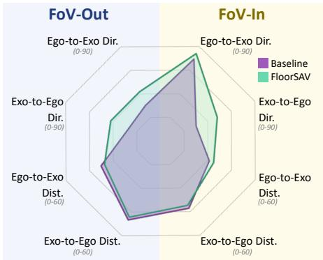  
Figure 7: Dynamic relativity by visibility. FloorSAV helps more on FoV-out (i.e., other agent invisible at the queried moment). Both strategies are weaker on Exoto-Ego direction tasks.

## 5.2.2. Regional: Bridge Semantic Region with Dynamic Agents

Both the baseline and FloorSAV demonstrate fair performance on regional QAs, where dialogue may provide clues to infer the current region at an audio timestamp (Table 2). Nevertheless, FloorSAV improves Location Awareness to 94.5% and the regional average from 89.4% to 93.4%. The improvement is more pronounced on Visit History, reaching 92.3% (+5.6) across ordered and unvisited tasks, which require retaining and ordering visits over the temporal axis. This result supports the efectiveness of the floormap for integrating agents’ positions, key objects, and the map as an explicit representation.

Table 2: Audio-only regional QA accuracy (%) suggests that the audio contains regional context that the AV-LLM can utilize.
<table><tr><td>Input</td><td></td><td>Random Audio-only Baseline</td><td></td><td>FloorSAV</td></tr><tr><td>Location Awareness</td><td>25.0</td><td>72.0</td><td>92.0</td><td>94.5</td></tr><tr><td>Visit History</td><td>25.0</td><td>62.2</td><td>86.7</td><td>92.3</td></tr></table>

Table 3: Historical camera wearer path ablation on Trajectory Distance (AbsMRA).
<table><tr><td>Historical path</td><td>AbsMRA↑</td></tr><tr><td>Without</td><td>22.0</td></tr><tr><td>With (about 300 frames)</td><td>25.0</td></tr></table>

Table 4: SAVVY-Bench results. For FloorSAV, Gemini also supplies semantic grounding. SAVVY scores are from Chen et al. (2025). Direction uses accuracy, and distance uses AbsMRA. Avg. is the four-task mean.
<table><tr><td rowspan="2">Task</td><td colspan="2">Qwen3-Omni-30B</td><td colspan="2">Gemini-2.5-Flash</td><td colspan="5">Gemini-2.5-Pro</td></tr><tr><td>Base</td><td>FloorSAV</td><td>Base</td><td>FloorSAV</td><td>Base</td><td>SAVVY</td><td>FloorSAV</td><td>Partial†</td><td>Full‡</td></tr><tr><td>Ego Direction</td><td>71.7</td><td>72.8</td><td>74.2</td><td>71.3</td><td>75.2</td><td>84.7</td><td>75.8</td><td>70.2</td><td>68.3</td></tr><tr><td>Ego Distance</td><td>59.4</td><td>61.8</td><td>49.7</td><td>55.4</td><td>59.6</td><td>62.9</td><td>55.4</td><td>59.0</td><td>61.0</td></tr><tr><td>Exo Direction</td><td>29.4</td><td>32.9</td><td>29.8</td><td>44.5</td><td>31.7</td><td>44.0</td><td>52.8</td><td>52.3</td><td>69.9</td></tr><tr><td>Exo Distance</td><td>31.8</td><td>31.0</td><td>29.0</td><td>32.2</td><td>37.0</td><td>40.2</td><td>34.9</td><td>37.9</td><td>52.2</td></tr><tr><td>Avg.</td><td>48.1</td><td>49.6</td><td>45.7</td><td>50.9</td><td>50.9</td><td>58.0</td><td>54.7</td><td>54.9</td><td>62.8</td></tr></table>

## 5.2.3. Path Reasoning: Spatial Awareness on Physical Environment

FloorSAV demonstrates gains on all path reasoning tasks as shown in Table 1. Specifically, improvements on both Line-Path Search tasks support the advantages of rendered key objects as a consequence of semantic grounding. Trajectory Distance improves from 16.9 to 25.0 AbsMRA; however, sparse and inaccurate sound localization magnifies the discrepancy between the derived and true distances. Moreover, historical path rendering improves the Trajectory Distance performance (Table 3), showing the benefit of explicit motion history.

## 5.3. Results on SAVVY-Bench

FloorSAV improves performance across AV-LLMs. Table 4 shows that FloorSAV improves overall scores on SAVVY-Bench for all AV-LLMs, Qwen3-Omni-30B, Gemini-2.5-Flash, and Pro with semantic grounding. Especially large gains are shown in the exocentric direction, a noted challenge for AV-LLMs (Chen et al., 2025). All baselines fall below the random-chance level (32.1%), whereas FloorSAV achieves 52.8% with Gemini-2.5-Pro. While slightly degraded on distance tasks, studies with ground-truth agents’ positions and object list (Section 5.4) suggest inaccurate acoustic estimates and unaligned object labels may degrade performance.

Performance is also inherently limited by AV-LLMs’ temporal localization of target sound events, biases in relative-position reasoning that ignore video cues, and lack of cognitive capability to fully interpret geometric 2D floormaps. Appendix D and Appendix F detail these failure cases and limitations, respectively.

## 5.4. Studies with Ground-Truth 2D Floormap

Although we demonstrate the benefits of FloorSAV across the spatial benchmarks, errors in acoustic estimates and object mapping may restrict the potential of FloorSAV. Therefore, we conduct studies with two versions of GT 2D floormap, partial GT map andfull GT map. Both floormaps replace acoustic estimates with the GT position of the other agent, while full GT map additionally renders ground-truth objects. These studies show the potential of FloorSAV with accurate components.

Ground-truth position of the other agent. Both partial GT map and full GT map considerably improve distance-based tasks (Tables 1 and 4), Line-Path Search (dynamic), and path reasoning overall (Table 1). Improvement of these agent-position-based tasks implies the potential of FloorSAV with accurate agent positions.

Ground-truth object list. Full GT map rendered with GT objects improves performance on all regional QAs (Table 1) which inherently depend on accurate region recognition. This suggests that when accurate object labels are provided, FloorSAV efectively associates their spatial locations with semantic regions.

## 6. Conclusion

We introduce FloorSAV, a task-agnostic, training-free framework that supports spatial reasoning in AV-LLMs through synchronized 2D floormaps integrating camera tracking, spatial audio, and object grounding. We also introduce SAVED-Bench, an egocentric spatial audio-visual benchmark with dynamic agents, spanning complementary capabilities essential to real-world agent interactions. Evaluations on SAVVY-Bench and SAVED-Bench demonstrate the benefits of FloorSAV across single-viewpoint reasoning, cross-agent viewpoint transformation, regional reasoning over agents’ movements, and path-aware reasoning grounded in physical surroundings. Studies on GT floormaps further demonstrate the framework’s potential with accurate data. The benefits of floormaps may extend beyond the training-free regime to incorporate them into model training, enabling models to internalize them and potentially achieve more general and capable spatial intelligence.

## References

Shariq Farooq Bhat, Reiner Birkl, Diana Wofk, Peter Wonka, and Matthias Müller. Zoedepth: Zero-shot transfer by combining relative and metric depth. arXiv preprint arXiv:2302.12288, 2023.

Subrata Biswas, Mohammad Nur Hossain Khan, and Bashima Islam. Owl: Geometry-aware spatial reasoning for audio large language models. arXiv preprint arXiv:2509.26140, 2025.

Boyuan Chen, Zhuo Xu, Sean Kirmani, Brain Ichter, Dorsa Sadigh, Leonidas Guibas, and Fei Xia. Spatialvlm: Endowing vision-language models with spatial reasoning capabilities. In Proceedings of the IEEE/CVF Conference on Computer Vision and Pattern Recognition, pages 14455–14465, 2024.

Kehan Chen, Yan Huang, Dong An, Jiawei He, Yifei Su, Jing Liu, Nianfeng Liu, and Liang Wang. Floorplan-vln: A new paradigm for floor plan guided vision-language navigation. arXiv preprint arXiv:2603.17437, 2026.

Keqin Chen, Zhao Zhang, Weili Zeng, Richong Zhang, Feng Zhu, and Rui Zhao. Shikra: Unleashing multimodal llm’s referential dialogue magic. arXiv preprint arXiv:2306.15195, 2023.

Mingfei Chen, Zijun Cui, Xiulong Liu, Jinlin Xiang, Yang Zheng, Jingyuan Li, and Eli Shlizerman. Savvy: Spatial awareness via audio-visual llms through seeing and hearing. Advances in Neural Information Processing Systems, 38:118999–119038, 2025.

Zesen Cheng, Sicong Leng, Hang Zhang, Yifei Xin, Xin Li, Guanzheng Chen, Yongxin Zhu, Wenqi Zhang, Ziyang Luo, Deli Zhao, et al. Videollama 2: Advancing spatial-temporal modeling and audio understanding in video-llms. arXiv preprint arXiv:2406.07476, 2024.

Yunfei Chu, Jin Xu, Xiaohuan Zhou, Qian Yang, Shiliang Zhang, Zhijie Yan, Chang Zhou, and Jingren Zhou. Qwen-audio: Advancing universal audio understanding via unified large-scale audio-language models. arXiv preprint arXiv:2311.07919, 2023.

Gheorghe Comanici, Eric Bieber, Mike Schaekermann, Ice Pasupat, Noveen Sachdeva, Inderjit Dhillon, Marcel Blistein, Ori Ram, Dan Zhang, Evan Rosen, et al. Gemini 2.5: Pushing the frontier with advanced reasoning, multimodality, long context, and next generation agentic capabilities. arXiv preprint arXiv:2507.06261, 2025.

Artem Dementyev, Wazeer Zulfikar, Sinan Hersek, Pascal Getreuer, Anurag Kumar, and Vivek Kumar. Phasecoder: Microphone geometry-agnostic spatial audio understanding for multimodal llms. arXiv preprint arXiv:2601.21124, 2026.

Jiajun Deng, Tianyu He, Li Jiang, Tianyu Wang, Feras Dayoub, and Ian Reid. 3d-llava: Towards generalist 3d lmms with omni superpoint transformer. In 2025 IEEE/CVF Conference on Computer Vision and Pattern Recognition (CVPR), pages 3772–3782. IEEE, 2025.

David Diaz-Guerra, Antonio Miguel, and Jose R Beltran. Robust sound source tracking using srp-phat and 3d convolutional neural networks. IEEE/ACM Transactions on Audio, Speech, and Language Processing, 29: 300–311, 2020.

Joseph Hector DiBiase. A high-accuracy, low-latency technique for talker localization in reverberant environments using microphone arrays. Brown University, 2000.

Mengfei Du, Binhao Wu, Zejun Li, Xuan-Jing Huang, and Zhongyu Wei. Embspatial-bench: Benchmarking spatial understanding for embodied tasks with large vision-language models. In Proceedings of the 62nd Annual Meeting of the Association for Computational Linguistics (Volume 2: Short Papers), pages 346–355, 2024.

Tiantian Geng, Jinrui Zhang, Qingni Wang, Teng Wang, Jinming Duan, and Feng Zheng. Longvale: Visionaudio-language-event benchmark towards time-aware omni-modal perception of long videos. In Proceedings of the Computer Vision and Pattern Recognition Conference, pages 18959–18969, 2025.

Yuan Gong, Hongyin Luo, Alexander Liu, Leonid Karlinsky, and James R Glass. Listen, think, and understand. In International Conference on Learning Representations, volume 2024, pages 18516–18545, 2024.

Google. Gemini 3.6 flash. https://ai.google.dev/gemini-api/docs/models/gemini-3.6-flash, 2026.

Kristen Grauman, Andrew Westbury, Eugene Byrne, Zachary Chavis, Antonino Furnari, Rohit Girdhar, Jackson Hamburger, Hao Jiang, Miao Liu, Xingyu Liu, et al. Ego4d: Around the world in 3,000 hours of egocentric video. In Proceedings of the IEEE/CVF conference on computer vision and pattern recognition, pages 18995– 19012, 2022.

Qiao Gu, Ali Kuwajerwala, Sacha Morin, Krishna Murthy Jatavallabhula, Bipasha Sen, Aditya Agarwal, Corban Rivera, William Paul, Kirsty Ellis, Rama Chellappa, et al. Conceptgraphs: Open-vocabulary 3d scene graphs for perception and planning. In 2024 IEEE International Conference on Robotics and Automation (ICRA), pages 5021–5028. IEEE, 2024.

Yining Hong, Haoyu Zhen, Peihao Chen, Shuhong Zheng, Yilun Du, Zhenfang Chen, and Chuang Gan. 3d-llm: Injecting the 3d world into large language models. Advances in Neural Information Processing Systems, 36: 20482–20494, 2023.

Chao Huang, Yapeng Tian, Anurag Kumar, and Chenliang Xu. Egocentric audio-visual object localization. In Proceedings of the IEEE/CVF conference on computer vision and pattern recognition, pages 22910–22921, 2023a.

Chenguang Huang, Oier Mees, Andy Zeng, and Wolfram Burgard. Visual language maps for robot navigation. In 2023 IEEE International Conference on Robotics and Automation (ICRA), pages 10608–10615. IEEE, 2023b.

Jiangyong Huang, Silong Yong, Xiaojian Ma, Xiongkun Linghu, Puhao Li, Yan Wang, Qing Li, Song-Chun Zhu, Baoxiong Jia, and Siyuan Huang. An embodied generalist agent in 3d world. In Proceedings of the International Conference on Machine Learning (ICML), 2024.

Ryu Hyeonggon, Chung Joon Son, and Harwath David. Hear you are: Teaching llms spatial reasoning with vision and spatial sound. In Proceedings ofthe IEEE/CVF Conference on Computer Vision and Pattern Recognition, 2026.

Krishna Murthy Jatavallabhula, Alihusein Kuwajerwala, Qiao Gu, Mohd Omama, Tao Chen, Alaa Maalouf, Shuang Li, Ganesh Iyer, Soroush Saryazdi, Nikhil Keetha, et al. Conceptfusion: Open-set multimodal 3d mapping. arXiv preprint arXiv:2302.07241, 2023.

Kim Jun-Seong, GeonU Kim, Kim Yu-Ji, Yu-Chiang Frank Wang, Jaesung Choe, and Tae-Hyun Oh. Dr. splat: Directly referring 3d gaussian splatting via direct language embedding registration. In IEEE/CVF Conference on Computer Vision and Pattern Recognition (CVPR), pages 14137–14146, 2025.

Kamran Khan, Saif Ur Rehman, Kamran Aziz, Simon Fong, and Sababady Sarasvady. Dbscan: Past, present and future. In The fifth international conference on the applications of digital information and web technologies (ICADIWT 2014), pages 232–238. IEEE, 2014.

Phillip Y Lee, Jihyeon Je, Chanho Park, Mikaela Angelina Uy, Leonidas Guibas, and Minhyuk Sung. Perspectiveaware reasoning in vision-language models via mental imagery simulation. In Proceedings of the IEEE/CVF International Conference on Computer Vision, pages 9241–9251, 2025.

Chengzu Li, Caiqi Zhang, Han Zhou, Nigel Collier, Anna Korhonen, and Ivan Vulić. Topviewrs: Vision-language models as top-view spatial reasoners. In Proceedings of the 2024 Conference on Empirical Methods in Natural Language Processing, pages 1786–1807, 2024.

Guangyao Li, Yake Wei, Yapeng Tian, Chenliang Xu, Ji-Rong Wen, and Di Hu. Learning to answer questions in dynamic audio-visual scenarios. In 2022 IEEE/CVF Conference on Computer Vision and Pattern Recognition (CVPR), pages 19086–19096. IEEE, 2022.

Yifan Li, Yifan Du, Kun Zhou, Jinpeng Wang, Xin Zhao, and Ji-Rong Wen. Evaluating object hallucination in large vision-language models. In Proceedings of the 2023 conference on empirical methods in natural language processing, pages 292–305, 2023.

Zhan Liu, Changli Tang, Yuxin Wang, Zhiyuan Zhu, Youjun Chen, Yiwen Shao, Tianzi Wang, Lei Ke, Zengrui Jin, and Chao Zhang. Jaeger: Joint 3d audio-visual grounding and reasoning in simulated physical environments. arXiv preprint arXiv:2602.18527, 2026.

Timo Lüddecke and Alexander Ecker. Image segmentation using text and image prompts. In 2022 IEEE/CVF Conference on Computer Vision and Pattern Recognition (CVPR), pages 7076–7086. IEEE, 2022.

Zhaoyang Lv, Nicholas Charron, Pierre Moulon, Alexander Gamino, Cheng Peng, Chris Sweeney, Edward Miller, Huixuan Tang, Jef Meissner, Jing Dong, et al. Aria everyday activities dataset. arXiv preprint arXiv:2402.13349, 2024.

Karttikeya Mangalam, Raiymbek Akshulakov, and Jitendra Malik. Egoschema: A diagnostic benchmark for very long-form video language understanding. Advances in Neural Information Processing Systems, 36: 46212–46244, 2023.

Zhiliang Peng, Wenhui Wang, Li Dong, Yaru Hao, Shaohan Huang, Shuming Ma, Qixiang Ye, and Furu Wei. Grounding multimodal large language models to the world. In International Conference on Learning Representations, volume 2024, pages 51575–51598, 2024.

Chiara Plizzari, Alessio Tonioni, Yongqin Xian, Achin Kulshrestha, and Federico Tombari. Omnia de egotempo: Benchmarking temporal understanding of multi-modal llms in egocentric videos. In Proceedings of the Computer Vision and Pattern Recognition Conference, pages 24129–24138, 2025.

Nikhila Ravi, Valentin Gabeur, Yuan-Ting Hu, Ronghang Hu, Chaitanya Ryali, Tengyu Ma, Haitham Khedr, Roman Rädle, Chloe Rolland, Laura Gustafson, et al. Sam 2: Segment anything in images and videos. In International Conference on Learning Representations, volume 2025, pages 28085–28128, 2025.

Andreas Schwarz and Walter Kellermann. Coherent-to-difuse power ratio estimation for dereverberation. IEEE/ACM Transactions on Audio, Speech, and Language Processing, 23(6):1006–1018, 2015.

Ashish Seth, Xinhao Mei, Changsheng Zhao, Varun Nagaraja, Ernie Chang, Gregory P Meyer, Gael Le Lan, Yunyang Xiong, Vikas Chandra, Yangyang Shi, et al. Egoavu: Egocentric audio-visual understanding. arXiv preprint arXiv:2602.06139, 2026.

Yan Shu, Zheng Liu, Peitian Zhang, Minghao Qin, Junjie Zhou, Zhengyang Liang, Tiejun Huang, and Bo Zhao. Video-xl: Extra-long vision language model for hour-scale video understanding. In Proceedings ofthe Computer Vision and Pattern Recognition Conference, pages 26160–26169, 2025.

Arvind Krishna Sridhar, Yinyi Guo, and Erik Visser. Spatial audio motion understanding and reasoning. arXiv preprint arXiv:2509.14666, 2025.

Julian Straub, Daniel DeTone, Tianwei Shen, Nan Yang, Chris Sweeney, and Richard Newcombe. Efm3d: A benchmark for measuring progress towards 3d egocentric foundation models. arXiv preprint arXiv:2406.10224, 2024.

Guangzhi Sun, Wenyi Yu, Changli Tang, Xianzhao Chen, Tian Tan, Wei Li, Lu Lu, Zejun Ma, Yuxuan Wang, and Chao Zhang. video-salmonn: speech-enhanced audio-visual large language models. In Proceedings of the 41st International Conference on Machine Learning, pages 47198–47217, 2024.

Weihan Wang, Zehai He, Wenyi Hong, Yean Cheng, Xiaohan Zhang, Ji Qi, Ming Ding, Xiaotao Gu, Shiyu Huang, Bin Xu, et al. Lvbench: An extreme long video understanding benchmark. In Proceedings of the IEEE/CVF International Conference on Computer Vision, pages 22958–22967, 2025a.

Wenqi Wang, Reuben Tan, Pengyue Zhu, Jianwei Yang, Zhengyuan Yang, Lijuan Wang, Andrey Kolobov, Jianfeng Gao, and Boqing Gong. Site: towards spatial intelligence thorough evaluation. In 2025 IEEE/CVF International Conference on Computer Vision (ICCV), pages 9058–9069. IEEE, 2025b.

Yuxin Wang, Lei Ke, Boqiang Zhang, Tianyuan Qu, Hanxun Yu, Zhenpeng Huang, Meng Yu, Dan Xu, and Dong Yu. N3d-vlm: Native 3d grounding enables accurate spatial reasoning in vision-language models. arXiv preprint arXiv:2512.16561, 2025c.

Zihan Wang, Xiangyang Li, Jiahao Yang, Yeqi Liu, and Shuqiang Jiang. Gridmm: Grid memory map for vision-and-language navigation. In 2023 IEEE/CVF International Conference on Computer Vision (ICCV), pages 15579–15590. IEEE, 2023.

Yuetian Weng, Mingfei Han, Haoyu He, Xiaojun Chang, and Bohan Zhuang. Longvlm: Eficient long video understanding via large language models. In European Conference on Computer Vision, pages 453–470. Springer, 2024.

Chao-Yuan Wu and Philipp Krahenbuhl. Towards long-form video understanding. In Proceedings of the IEEE/CVF conference on computer vision and pattern recognition, pages 1884–1894, 2021.

Wenshan Wu, Shaoguang Mao, Yadong Zhang, Yan Xia, Li Dong, Lei Cui, and Furu Wei. Mind’s eye of llms: visualization-of-thought elicits spatial reasoning in large language models. Advances in Neural Information Processing Systems, 37:90277–90317, 2024.

Jin Xu, Zhifang Guo, Hangrui Hu, Yunfei Chu, Xiong Wang, Jinzheng He, Yuxuan Wang, Xian Shi, Ting He, Xinfa Zhu, et al. Qwen3-omni technical report. arXiv preprint arXiv:2509.17765, 2025.

Jihan Yang, Shusheng Yang, Anjali W Gupta, Rilyn Han, Li Fei-Fei, and Saining Xie. Thinking in space: How multimodal large language models see, remember, and recall spaces. In Proceedings of the Computer Vision and Pattern Recognition Conference, pages 10632–10643, 2025.

Pinci Yang, Xin Wang, Xuguang Duan, Hong Chen, Runze Hou, Cong Jin, and Wenwu Zhu. Avqa: A dataset for audio-visual question answering on videos. In Proceedings of the 30th ACM international conference on multimedia, pages 3480–3491, 2022.

Hanrong Ye, Chao-Han Huck Yang, Arushi Goel, Wei Huang, Ligeng Zhu, Yuanhang Su, Sean Lin, An-Chieh Cheng, Zhen Wan, Jinchuan Tian, et al. Omnivinci: Enhancing architecture and data for omni-modal understanding llm. arXiv preprint arXiv:2510.15870, 2025.

Qilang Ye, Zitong Yu, Rui Shao, Xinyu Xie, Philip Torr, and Xiaochun Cao. Cat: Enhancing multimodal large language model to answer questions in dynamic audio-visual scenarios. In European Conference on Computer Vision, pages 146–164. Springer, 2024.

Yuhuan You, Lai Wei, Xihong Wu, and Tianshu Qu. The world is not mono: Enabling spatial understanding in large audio-language models. arXiv preprint arXiv:2601.02954, 2026.

Weihao Yu, Zhengyuan Yang, Linjie Li, Jianfeng Wang, Kevin Lin, Zicheng Liu, Xinchao Wang, and Lijuan Wang. Mm-vet: Evaluating large multimodal models for integrated capabilities. In Proceedings of the International Conference on Machine Learning (ICML), 2024.

Kim Yu-Ji, Dahye Lee, Kim Jun-Seong, Nam Hyeon-Woo, GeonU Kim, Yongjin Kwon, Yu-Chiang Frank Wang, Jaesung Choe, and Tae-Hyun Oh. Splatreasoner: Enhancing embodied reasoning and grounding by novel view synthesis. In European Conference on Computer Vision, pages 133–151. Springer, 2026.

Heeseung Yun, Youngjae Yu, Wonsuk Yang, Kangil Lee, and Gunhee Kim. Pano-avqa: Grounded audio-visual question answering on 360 videos. In 2021 IEEE/CVF International Conference on Computer Vision (ICCV), pages 2011–2021. IEEE, 2021.

Hang Zhang, Xin Li, and Lidong Bing. Video-llama: An instruction-tuned audio-visual language model for video understanding. In Proceedings of the 2023 conference on empirical methods in natural language processing: system demonstrations, pages 543–553, 2023.

Duo Zheng, Shijia Huang, and Liwei Wang. Video-3d llm: Learning position-aware video representation for 3d scene understanding. In 2025 IEEE/CVF Conference on Computer Vision and Pattern Recognition (CVPR), pages 8995–9006. IEEE, 2025a.

Xu Zheng, Zihao Dongfang, Lutao Jiang, Boyuan Zheng, Yulong Guo, Zhenquan Zhang, Giuliano Albanese, Runyi Yang, Mengjiao Ma, Zixin Zhang, et al. Multimodal spatial reasoning in the large model era: A survey and benchmarks. arXiv preprint arXiv:2510.25760, 2025b.

Zhisheng Zheng, Puyuan Peng, Ziyang Ma, Xie Chen, Eunsol Choi, and David Harwath. Bat: learning to reason about spatial sounds with large language models. In Proceedings of the 41st International Conference on Machine Learning, pages 61454–61469, 2024.

Hao Zhong, Muzhi Zhu, Zongze Du, Zheng Huang, Canyu Zhao, Mingyu Liu, Wen Wang, Hao Chen, and Chunhua Shen. Omni-r1: Reinforcement learning for omnimodal reasoning via two-system collaboration. Advances in Neural Information Processing Systems, 38:45266–45297, 2026.

Bingwen Zhu, Yuqian Fu, Qiaole Dong, Guolei Sun, Tianwen Qian, Yuzheng Wu, Danda Pani Paudel, Xiangyang Xue, and Yanwei Fu. Egosound: Benchmarking sound understanding in egocentric videos. arXiv preprint arXiv:2602.14122, 2026.

## A. Implementation Details

## A.1. Floormap Rendering Configuration

Base map construction. To construct the global base layout, we process the raw 3D point clouds provided by the AEA dataset (Lv et al., 2024) and apply a sequence of spatial filters to remove structural outliers. (1) First, we bound the vertical height to the 10th–99th percentile with a 5 cm inset margin to discard floor and ceiling artifacts. The XY bounds span the 1st–99th percentiles expanded outward by 0.5 m. To ensure geometric reliability, we retain only points with reconstruction uncertainty dist\_std below 0.02 when this field is available. (2) Some regions contain dense point accumulations, for example where a person remains in place during recording. To reduce visual clutter, we divide the XY plane into 0.05 m grid cells and identify cells containing at least 500 points as potential dynamic accumulations. These dense regions are rendered as a Gaussian-blurred gray heatmap over a sparse black scatter plot of the filtered point cloud, which represents the room structure and object boundaries. (3) Each floormap frame is generated at a high resolution on a white background to preserve fine geometric details when injected into the model. To provide an absolute spatial reference, the coordinate axes are configured with metric units, featuring a 1 m grid and integer tick labels anchored to the scene’s minimum bounds.

Camera state. To explicitly visualize the observer’s spatial state, we render the current camera position as a distinct red dot, accompanied by a prominent red directional arrow indicating the heading. We further approximate the camera’s visual coverage by projecting a yellow wedge that spans a $\pm 5 0 ^ { \circ }$ FoV. For temporal navigation context, the observer’s historical motion is smoothed and plotted as a blue continuous polyline representing the most recent 300 camera frames (approximately 15 seconds).

Acoustic tracking and spatial cues. To integrate dynamic sound sources, we follow the acoustic tracking pipeline from SAVVY (Chen et al., 2025), where each sound source position is defined by an egocentric angle estimated with SRP-PHAT (DiBiase, 2000) and a distance estimated from the coherent-to-difuse ratio (CDR) (Schwarz and Kellermann, 2015). Spatial localization uses four Aria microphone channels among seven (Chen et al., 2025) at 48 kHz before monaural conversion for AV-LLM input. Non-overlapping 0.25 s chunks yield four observations per second, timestamped at midpoints of each interval. These estimates serve as explicit spatial context for the AV-LLM rather than directly determining the final answer.

SRP-PHAT direction estimation. For microphone signals with Fourier transforms $X _ { m } ( f )$ and $X _ { n } ( f )$ , the phase-normalized cross-correlation is

$$
R _ { m n } [ \ell ] = \mathrm { R e } \left\{ \mathcal { F } ^ { - 1 } \left[ \frac { X _ { m } ( f ) X _ { n } ( f ) ^ { * } } { | X _ { m } ( f ) X _ { n } ( f ) ^ { * } | + \epsilon } \right] \left[ \ell \right] \right\} ,\tag{1}
$$

where � prevents division by zero. Given microphone coordinates $\mathbf { m } _ { m } , \mathbf { m } _ { n }$ and candidate direction $\mathbf { u } ( \phi )$ , the expected delay is $\tau _ { m n } ( \phi ) = ( \mathbf { m } _ { n } - \mathbf { m } _ { m } ) ^ { \top } \mathbf { u } ( \phi ) / c ,$ with $c = 3 4 3 \mathrm { m } / \mathrm { s } .$ . SRP-PHAT selects the azimuth maximizing the summed pairwise response:

$$
\hat { \phi } = \arg \operatorname* { m a x } _ { \phi } \sum _ { m < n } R _ { m n } \big [ \mathrm { r o u n d } \big ( f _ { s } \tau _ { m n } ( \phi ) \big ) \big ] .\tag{2}
$$

Here $f _ { s }$ is the sampling rate. The implementation searches $- 1 8 0 ^ { \circ }$ to $1 8 0 ^ { \circ }$ at $1 ^ { \circ }$ increments and restricts cross-correlation lags to ±1 ms.

CDR-based distance estimation. Source distance is estimated from the approximate acoustic relation $D _ { t } ^ { 2 } \mathrm { C D R } _ { t } \approx K$ . For visual distance estimates $D _ { t }$ at calibration times retained after outlier filtering, $t \in \mathcal { Z } _ { i }$ SAVVY (Chen et al., 2025) provides the calibration and distance conversion as

$$
\hat { K } = \arg \operatorname* { m i n } _ { K } \sum _ { t \in \mathcal { T } } \bigl ( D _ { t } ^ { 2 } \operatorname { C D R } _ { t } - K \bigr ) ^ { 2 } , \qquad \hat { d } _ { t } = \sqrt { \frac { \hat { K } } { \operatorname { C D R } _ { t } } } .\tag{3}
$$

For each recording, we take the median of the positive calibration constants (K) pre-calculated by SAVVY, which are utilized to convert CDR values into sound-source distances for all downstream tasks.

Projection and sound-marker aggregation. Each observation is aligned with its nearest camera pose. Let $\mathbf { c } _ { t }$ be the camera’s XY position, f its normalized XY forward vector, and $\mathbf { r } _ { t } = ( f _ { t , y } , - f _ { t , x } ) ^ { \top }$ its rightward vector. The exported camera-relative angle $\alpha _ { t }$ , positive clockwise, gives the global coordinates estimate

$$
\hat { \mathbf { s } } _ { t } = \mathbf { c } _ { t } + \hat { d } _ { t } \left( \cos \alpha _ { t } \mathbf { f } _ { t } + \sin \alpha _ { t } \mathbf { r } _ { t } \right) .\tag{4}
$$

We discard predictions within the extreme frontal $( | \alpha _ { t } | \le 8 ^ { \circ } )$ or rear $( | \alpha _ { t } | \geq 1 7 2 ^ { \circ } )$ ranges. We calculate a circular mean of global frame bearings and an arithmetic mean of distances within ±1 s of the output frame’s timestamp. The green dot is placed at the resulting bearing and radial distance from the rendered camera position on the floormap. The marker is omitted when no valid observation is available.

To construct the synchronized video input, we uniformly sample $N = 1 2 8$ frames across the entire duration of both the egocentric RGB footage and the 2D floormap sequence. Each frame corresponds to an equalduration temporal bin, with the camera’s position and heading taken from the nearest pose to its midpoint. The representative sound marker is obtained by averaging acoustic estimates within $\mathbf { a } \pm 1 \boldsymbol { s }$ window around the bin midpoint rather than over the full bin.

Semantic grounding via object mapping. To bridge the AV-LLM’s semantic and spatial awareness, we implement a multi-stage pipeline that merges semantic labels into the floormap, as described in Figure 3.

(1) Frame selection: For each scene in the AEA dataset, we select a total of 30 keyframes through three rounds of greedy maximum-coverage selection, with 10 frames selected per round from video sampled at 1 FPS. At each selection step within a round, we choose the frame that maximizes the newly covered floormap area under a circular-sector FoV defined by $- 5 0 ^ { \circ } \leq \theta \leq 5 0 ^ { \circ }$ and $0 \le r \le 5$ meters. The covered area is reinitialized at the beginning of each round, whereas frames selected in previous rounds are excluded from the candidate set. This procedure yields three distinct sets of 10 frames.

(2) Object visual mapping: We leverage the VLM’s visual grounding capabilities to detect representative objects and project them onto the 2D floormap. For each selected frame, we provide dual image inputs: the egocentric view and the corresponding floormap view, which is rotated so that the camera heading aligns with the upward $( + y )$ direction, simplifying directional alignment during coordinate mapping. We design the prompt as presented in Figure 8 to utilize the VLM’s spatial priors and to retain multiple observations for the subsequent object filtering step, including repeated detections of the same instance across frames and distinct instances that share a semantic label.

(3) Object filtering: Because VLM detections may contain inconsistent names and geometrically implausible coordinates, we consolidate the observations in three stages. (i) We first normalize class names by lowercasing and standardizing separators, plurals, and common synonyms $( e . g .$ , television to tv and couch to sofa). We then transform each prediction from its heading-aligned local floormap coordinates into the global coordinate system. Predictions outside the point-cloud bounds with a 0.5-meter bufer are discarded, as are predictions supported by fewer than 100 point-cloud points within a 0.5-meter radius. (ii) For each normalized class, we construct a graph that connects detections separated by at most 2 meters and obtain spatial groups as its connected components. This procedure merges repeated observations of the same object while preserving spatially separated instances that share a class name. (iii) We retain only components supported by at least three detections and use the mean of their global coordinates as the final object location.

(4) Floormap Semantic Grounding: Consequently, the consolidated instances and their corresponding semantic labels are mapped onto the final floormap, with spatially distinct instances of the same class retained separately. This semantically grounded floormap enhances the AV-LLM’s spatial reasoning performance within our FloorSAV framework.

## A.2. Evaluation Details

During inference, we employ deterministic greedy decoding with a temperature of 0.0 to ensure consistent evaluations. FloorSAV involves no training of any kind. The proprietary Gemini models are queried through their public API, and the open-source model, Qwen3-Omni-30B, is run for inference only on four NVIDIA RTX A6000 GPUs. To accommodate our dual-stream FloorSAV framework (see Appendix C.1), the input prompt for the Qwen-Omni models is explicitly structured to integrate multiple synchronized modalities. Specifically, we sequentially construct the prompt by feeding the egocentric RGB footage and the rendered 2D floormap as two independent video inputs, following the extracted monaural audio track, as illustrated in Figure 21. For details, please refer to the full instruction prompt provided in Appendix E. These multiple streams are strictly synchronized, ensuring the model can temporally align the first-person visual appearance directly with the dynamic geometric layout of the top-down map as well as the audio track.

```yaml
image 1: # Egocentric
<|vision_token|>
image 2: # Floormap
<|vision_token|>
Task Instructions:
1. Estimate the direction and distance of all objects in the egocentric image.
2. Utilizing the results from Step 1 alongside the objects visible in the floormap, estimate the
exact position of all objects on the floormap.
Context:
- Red Dot & Arrow: Expresses the position and heading direction of the egocentric view; the
length of the red arrow is strictly 1 meter.
- Yellow Area: Represents the camera field of view (FoV) of the egocentric view (egocentric
angle range: -50 to 50 degrees, maximum distance: 5 meters).
- Crucial Step: Matching the environment context of the egocentric view to the shapes of objects
and the overall structure of the floormap within the FoV is a key phase; do not ignore it.
- Object Density: Only consider representative and high-confidence estimations (at most 5
objects). Focus heavily on major structures such as furniture, doors, and windows, excluding
minor or trivial items.
- Naming Convention: Name objects using generic, concise nouns; avoid specific brand/proper
names and excessively long descriptions.
Output Formatting (STRICTLY FOLLOW):
Print out only a list of JSON objects formatted as follows:
[
{"object", direction", "distance", "coordinates"}}, ...
]
```  
Figure 8: Pseudo prompt for object visual mapping stage. The prompt is designed to leverage the VLM’s visual grounding prior on egocentric view images, enabling accurate coordinate mapping, the extraction of representative visual landmarks, and the simplification of semantic labels.

For comparison with prior work, we utilize the QA configuration of SAVVY-Bench (Chen et al., 2025), which encompasses four distinct task types: egocentric direction, egocentric distance, exocentric direction, and exocentric distance. Egocentric tasks evaluate spatial relations directly from the camera wearer’s first-person perspective, whereas exocentric tasks require the model to deduce relationships from a hypothetical third-person viewpoint anchored to specific static objects within the scene.

• Egocentric QA: The spatial reference frame is anchored to the camera wearer. The origin is the camera’s current position, and the forward axis aligns with the camera’s heading direction. The model must localize the sounding target relative to the observer’s perspective.

• Exocentric QA: The spatial reference frame is anchored to static objects in the environment. A hypothetical observer (i.e., robot) is positioned at a specific reference object (e.g., fireplace) and faces a facing object (e.g., TV). This establishes a new third-person coordinate system where the model must mentally transform its perspective to estimate the target’s location.

Directional tasks are posed as multiple-choice questions with either three options (i.e., left, right, back) for simple layouts or four options (i.e., front-left, front-right, back-left, back-right) for harder layouts (Figure 9), whereas distance tasks require a direct numerical estimate in meters.

In the original benchmark design, the question prompts are heavily supplemented with explicit textual spatial rules, such as defining 120-degree turning sectors for simple choices or detailing Cartesian quadrants and XY-axes for hard choices. However, we empirically found that providing these verbose mathematical definitions often confuses the AV-LLMs, as the models struggle to mentally align the strict text-based geometric rules with the provided visual cues. Therefore, we deliberately strip away or simplify these textual coordinate instructions from the base questions for both the egocentric baseline and FloorSAV. This intentional simplification encourages the model itself to intuitively deduce spatial relationships and orientations directly from the visual geometry of the provided video inputs without being distracted by redundant textual constraints.

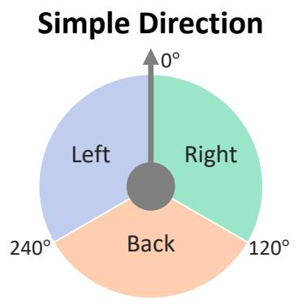

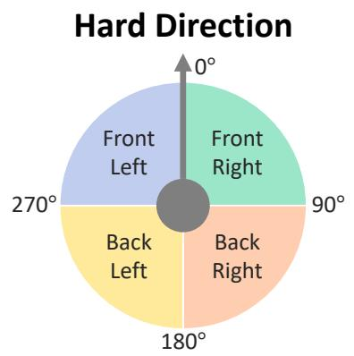  
Figure 9: Simple and hard direction configurations. Relative to the target agent, simple direction utilizes three options (left, right, back), and hard direction utilizes four (front-left, front-right, back-left, back-right).

## A.3. SAVED-Bench Configuration

Benchmark overview. SAVED-Bench evaluates broad axes of spatial intelligence required for an egocentric agent in real-world scenarios. The benchmark comprises 1,988 QAs across three complementary categories: Dynamic Relativity (800), Regional (592), and Path Reasoning (596), with each category consisting of multiple tasks. These tasks evaluate the spatial capabilities required by each category: Dynamic Relativity evaluates cross-agent viewpoint transformations, Regional evaluates joint reasoning about regions and dynamic agents, and Path Reasoning evaluates the spatial awareness of dynamic agents in physical environments. Queries are grounded at a sound-event moment or within the temporal interval between two distinct sound events and ask task-specific questions about the audio-visual scene with dynamic agents.

Task grouping and metric details. Visit History pools Visit Order and Unvisited questions together, with 194 and 198 QAs, respectively. Direction tasks in dynamic relativity QAs, regional QAs, and Line-Path Search tasks use multiple-choice answers evaluated by exact-match accuracy as binary scores, i.e., zero or one. Distance-wise tasks ask for numerical values in meters and are evaluated using AbsMRA, as defined below. Category scores are averages with equal weight per task, with Visit History treated as one pooled task. The overall score is weighted by the number of QAs in each task.

Distance metrics: AbsMRA and RelMRA. AbsMRA averages accuracies over ten absolute-error thresholds, $\mathcal { T } _ { \mathrm { a b s } } = \{ 0 . 1 , 0 . 2 , \dots , 1 . 0 \}$ m, giving partial credit to predictions that satisfy more thresholds. RelMRA instead uses ten relative-error thresholds, $\mathcal { T } _ { \mathrm { r e l } } = \{ 0 . 0 5 , 0 . 1 0 , \dots , 0 . 5 0 \}$ , measuring error relative to the ground-truth distance. For � distance predictions $\hat { d } _ { i }$ and ground-truth values $d _ { i ; }$ , let $e _ { i } = | \hat { d } _ { i } - d _ { i } |$ . The percentage scores are

$$
\begin{array} { r l } & { \mathrm { A b s M R A } = \displaystyle \frac { 1 0 0 } { 1 0 N } \sum _ { i = 1 } ^ { N } \sum _ { \tau \in { \mathcal T } _ { \mathrm { a b s } } } \mathbf { 1 } [ e _ { i } \leq \tau ] , } \\ & { \mathrm { R e l M R A } = \displaystyle \frac { 1 0 0 } { 1 0 N } \sum _ { i = 1 } ^ { N } \sum _ { \rho \in { \mathcal T } _ { \mathrm { r e l } } } \mathbf { 1 } \left[ \frac { e _ { i } } { \operatorname* { m a x } \left( d _ { i } , \epsilon \right) } \leq \rho \right] , } \end{array}\tag{5}
$$

where 1[·] is the indicator function and $\epsilon = 1 0 ^ { - 9 }$ prevents division by zero. Numerical tolerances are applied at threshold boundaries in the implementation. AbsMRA imposes the same sensitivity regardless of the target distance, whereas RelMRA allows proportionally larger absolute errors for longer target distances. For example, a 0.5 m error corresponds to a 50% relative error at 1 m but only 5% at 10 m. We use AbsMRA as the primary distance metric in the reported tables; RelMRA provides a complementary measure.

Exception cases. Although we strongly restrict the output format, some responses disobey the instruction and answer without following the output format. For those cases, we attempt to recover an answer from the full response. However, responses in which the model fails to provide any answer to the question are marked as unparsed and receive zero credit. The following subsections describe the construction and ground-truth definitions for each category.

Temporal alignment and evaluation. The benchmark contains 1,988 QAs with temporally aligned otheragent GT. The other agent’s trajectory is queried at camera wearer time with the ofset between guest and wearer start times from the speech metadata. All evaluated settings use the same QA IDs. Studies with partial/full GT maps utilize synchronized 6-DoF data for both agents.

## A.4. Dynamic Relativity QAs Details

Task construction. We construct the dynamic relativity QAs from 50 AEA scenes, using a sound event to identify the query moment in each egocentric video, following the SAVVY-Bench schema. Each question describes an imaginary (hypothetical) object by an angle and a radial distance from one of two moving agents: the camera wearer or the other person.

Object placement and reference frames. Task formulation consists of transformation between agents’ viewpoints. Let $\mathbf { p } _ { a }$ and ${ \bf f } _ { a }$ be agent $\boldsymbol { a ^ { \prime } s }$ global position and unit forward vector at the query time, for $a \in \{ w , o \}$ where $w$ denotes the camera wearer (Ego) and � the other person (Exo). Let $R _ { \mathrm { c w } } ( \theta )$ denote a clockwise planar rotation by $\theta .$ Given a source agent $s ,$ a target agent � $\neq s ,$ , and a question-specified angular ofset � and radial distance $r ,$ the imaginary object’s global position is

$$
\mathbf { p } _ { o b j } = \mathbf { p } _ { s } + r R _ { \mathrm { c w } } ( \theta ) \mathbf { f } _ { s } ,\tag{6}
$$

The question asks for the direction or distance of $\mathbf { p } _ { o b j }$ in the target frame defined by $\mathbf { p } _ { t }$ and $\mathbf { f } _ { t }$ . Agent positions and the camera wearer’s heading are obtained from the synchronized 6-DoF data in global coordinates. Because faces are blurred in AEA, we explicitly describe the hypothetical facing direction of the other agent $\mathbf { f } _ { o }$ in the question.

• Ego-to-Exo. We set $( s , t ) = ( w , o )$ . The object is described by � and � relative to the camera wearer’s position and heading. The model must transform this description into the other person’s reference frame and infer the object’s direction relative to the described hypothetical facing direction in question, or its distance from the other person. Here, $\mathbf { f } _ { o }$ defines the target frame for relative direction reasoning.

• Exo-to-Ego. We set $( s , t ) = ( o , w )$ . The object is described by � and � relative to the other person’s position and hypothetical facing direction. The model must transform this spatial information into the camera wearer’s reference frame and infer the object’s direction relative to the camera heading, or its distance from the camera wearer. Here, $\mathbf { f } _ { o }$ defines the source frame used to place the imaginary object.

Ground-truth answers. For both transformations, we construct multiple-choice answers, specifically four quadrants (front-left, front-right, back-left, back-right) relative to the target agent’s heading direction (Figure 9), whereas the distance is derived from the Euclidean distance $\| \mathbf { p } _ { o b j } - \mathbf { p } _ { t } \| _ { 2 }$ in meters. Ground-truth positions are computed from agents’ trajectory data provided in the AEA dataset. AV-LLMs receive the question and the egocentric video with its audio track for the baseline, and additionally the rendered 2D floormap video and its guide prompts for FloorSAV.

Dataset statistics. The dynamic relativity set contains 800 QAs, with 200 per task and 100 per FoV-in/out subset according to the benchmark annotations (Figure 7). FoV-in/out annotations describe the other agent’s visibility at the sound-event query time. The overall dynamic relativity score is the average of these four task scores (Table 1).

## A.5. Regional QAs Details

Task construction. Regional QAs require joint spatial reasoning about dynamic agents and semantic regions. The model should recognize regions and align them with agents’ positions. We construct tasks along the temporal axis: the moment of a queried sound event or a time interval between two distinct sound events, as Location Awareness and Visit History, respectively. Location Awareness is balanced between the camera wearer (Ego) and the other agent (Exo), with 100 QAs each. Visit History contains 200 camera-wearer and 192 other-agent QAs.

• Location Awareness. The answer is the name of the region where the target agent, Ego or Exo, is at the sound event moment described in the question.

• Visit History. The question asks about the order of regions visited by the target agent or which regions remain unvisited within the temporal interval between two queried sound events.

Region GT annotation pipeline. The AEA dataset does not provide region-level semantic annotation. Therefore, we introduce a region GT annotation pipeline that combines an of-the-shelf model and human annotators (Figure 5).

• Step 1: Object-wise region categorization. For each scene, we obtain the ground-truth object labels and positions, then provide the object labels to Gemini 3.6 Flash, asking for a single region category for each object in a strict output format that outputs the region label only. We do not provide a list of regions, in an open-vocabulary manner, to preserve flexibility and scalability.

• Step 2: Primitive region boundaries. For each group of objects assigned to the identical region, we draw the smallest rectangle enclosing all object positions, with its edges constrained to be parallel to the surrounding walls in the scene.

• Step 3: Human refinement. We render all region rectangles on the 2D floormap, and human annotators check both the floormap and the egocentric video to refine the rectangles into polygons so that the region annotations align more accurately with the physical environment of the scene. All finalized polygon edges are constrained to be parallel to the scene walls.

The resulting regions serve as ground-truth for regional QAs construction. Region boundaries and category labels are not rendered on the maps provided to FloorSAV, including in the GT map studies. This setting prevents a visual-grounding shortcut in which the model could directly match an agent’s position to a rendered region label instead of reasoning about the region from the available scene context, including key objects.

Dataset statistics. The evaluated regional category contains 592 QAs: 392 Visit History questions (194 asking about visit order and 198 asking which regions remain unvisited between two sound events) and 200 Location Awareness questions. All regional questions use multiple-choice exact-match accuracy. The Regional score averages the Visit History and Location Awareness task scores (Table 1).

## A.6. Path reasoning QAs Details

Task construction. Path reasoning QAs evaluate whether the model is aware of its physical surroundings during spatial reasoning. Line-Path Search asks about the spatial relation between candidate objects and the finite line segment based on a question at a queried sound event moment, and Trajectory Distance asks about the observed trajectories of agents, Ego or Exo, over a temporal interval between two sound events, respectively (Figure 4).

• Line-Path Search (static). The question asks which candidate object is closest to the straight-line segment connecting the camera wearer to a destination static object explicitly mentioned in the question at a sound event moment.

• Line-Path Search (dynamic). The question asks which candidate object is closest to the straight-line segment connecting the camera wearer to the other dynamic agent’s position at a sound event moment.

• Trajectory Distance. The question asks how far both the camera wearer and the other agent actually travel between two sound events, where the trajectories are afected by physical obstacles rather than reflecting the displacement between the start and end positions.

Ground-truth geometry calculation. Line-Path Search compares the candidate object positions listed in the question with the finite segment between camera wearer and target destination. For endpoints a and b and a candidate object position o, its distance to the segment is

$$
d ( \mathbf { o } , [ \mathbf { a } , \mathbf { b } ] ) = \operatorname* { m i n } _ { \lambda \in [ 0 , 1 ] } \left\| \mathbf { o } - \left( \mathbf { a } + \lambda ( \mathbf { b } - \mathbf { a } ) \right) \right\| _ { 2 } .\tag{7}
$$

In both Line-Path Search tasks, a is the camera wearer’s position $( \mathbf { p } _ { w } )$ at the sound event query time. For the static, b is the position of the destination object $( \mathbf { p } _ { o b j } )$ described in the question. For the dynamic, b is the other agent’s position $\left( \mathbf { p } _ { o } \right)$ at the same query time. The answer is the candidate object with the smallest distance to this segment, which need not lie exactly on the hypothetical segment.

For Trajectory Distance, the ground truth is a pair of macro-scale path lengths for the camera wearer and the other agent within the interval between the two queried sound events. To reduce error accumulation from localization jitter and small body movements, we apply a 0.75 s moving average to the trajectory within the interval, followed by Ramer–Douglas–Peucker (RDP) polyline simplification with a tolerance of 0.5 m, chosen to reduce the efect of small local movements, such as taking a step forward and back, while retaining the macro-scale route. The ground-truth distance is the sum of segment lengths along this smoothed and simplified path. Let $\mathbf { q } _ { a , 0 } , \ldots , \mathbf { q } _ { a , K _ { a } }$ denote the $K _ { a } + 1$ retained vertices for agent $a \in \{ \mathrm { e g o } , \mathrm { o t h e r } \}$ . Then

$$
L _ { a } = \sum _ { k = 1 } ^ { K _ { a } } \left\| \mathbf { q } _ { a , k } - \mathbf { q } _ { a , k - 1 } \right\| _ { 2 } , \qquad \mathbf { y } _ { \mathrm { G T } } = ( L _ { \mathrm { e g o } } , L _ { \mathrm { o t h e r } } ) .\tag{8}
$$

The model predicts both distances in meters, ordered as the camera wearer first and the other agent second. The task score is the average of the two agents’ AbsMRA scores.

Dataset statistics. The path reasoning category contains 596 QAs: 196 Line-Path Search (static), 200 Line-Path Search (dynamic), and 200 Trajectory Distance questions. Both Line-Path Search variants use multiple-choice answers evaluated by exact-match accuracy. Trajectory Distance requires a numerical answer in meters and uses AbsMRA. The overall path reasoning score is the average of these three task scores (Table 1).

## B. Comparison with the SAVVY Framework

SAVVY (Chen et al., 2025) introduces a pioneering training-free framework for 3D spatial reasoning in dynamic audio-visual environments, but it has several conceptual and structural limitations by strictly decoupling spatial computations from the foundation model. To overcome these inherent bottlenecks, FloorSAV explicitly injects global spatial geometry directly into the AV-LLM via a synchronized 2D floormap as a visual input. In the following, we compare the two frameworks from multiple perspectives (Figure 2) to describe their design diferences and highlight the benefits of FloorSAV for multimodal spatial reasoning.

## B.1. Utilization of AV-LLMs

• SAVVY: Underutilizing multimodal reasoning capacity. The SAVVY framework strictly utilizes the AV-LLM as an initial preprocessing tool rather than a core reasoner. The model is queried to generate “snapshot descriptors” that identify when the target event occurred, what relevant objects are present, and spatial estimates from snapshots. All subsequent actual spatial processing, including distance and direction calculation procedures, is delegated to external, rule-based ofline modules. These ofline modules derive the final answer by mathematically computing the audio DoA via the SRP-PHAT algorithm (DiBiase, 2000), performing visual segmentation, and applying rigid coordinate transformations. Consequently, the final spatial answer is determined entirely by mathematical operations outside the model.

• FloorSAV: Maximizing multimodal reasoning capacity. In contrast, our framework proposes a fundamental reversal of the SAVVY paradigm. Instead of calculating spatial answers after the AV-LLM, we explicitly render critical spatial information, including the camera pose, acoustic DoA, and 3D point cloud boundaries, into a 2D floormap that serves as a direct visual prompt to the model. By feeding this integrated top-down map into the AV-LLM alongside the egocentric audio-visual streams, we let the model fully use its cross-modal intelligence.

## B.2. Information Processing Pipeline

• SAVVY: Multi-stage pipeline. SAVVY relies on a multi-stage architecture that extracts visual and acoustic spatial cues through separate modules. After generating an initial text-based scene summary, these textual descriptions then guide external vision models (i.e., CLIPSeg (Lüddecke and Ecker, 2022), SAM2 (Ravi et al., 2025), and a monocular metric depth estimator (Bhat et al., 2023)) and discrete acoustic algorithms (i.e., CDR (Schwarz and Kellermann, 2015), SRP-PHAT (DiBiase, 2000)) to independently extract spatial cues. Finally, these disjointed signals are clustered (Khan et al., 2014) and fused via a Kalman filter and ofline mathematical operations to compute the ultimate spatial answer.

• FloorSAV: Single inference. We synchronize the pre-rendered 2D floormap video with the standard egocentric RGB footage and directly inject them into the model as dual-stream videos, alongside the audio track and a text prompt including the question and floormap guide. After the semantic grounding is ready for the scene, the AV-LLM performs complex cross-modal reasoning for any spatial-aware task with a single inference.

## B.3. Future Scalability

• SAVVY: Marginal benefit from model advancements. In SAVVY, the AV-LLM is relegated to performing simple, auxiliary sub-tasks, such as temporal grounding and bounding box detection. Because the core solving procedure, including geometric transformations, is entirely ofloaded to external, rule-based mathematical modules, the SAVVY pipeline still relies on the AV-LLM’s grounding capabilities from the egocentric view, even as the spatial intelligence of future AV-LLMs improves.

• FloorSAV: Scaling with model evolution. Our framework treats the AV-LLM as the central spatial reasoner, directly feeding it the 2D floormap to deduce geometric relationships. While the map reading and spatial reasoning capabilities of current models are not yet at an ideal level, our direct-injection approach ensures that the system’s overall performance is directly coupled with the model’s own capabilities. As the intrinsic spatial intelligence of foundation models continues to evolve, FloorSAV can benefit directly from these advances.

## B.4. Task Flexibility and Broad Applicability

• SAVVY: Task-specific rigidity. Due to its strict algorithmic design, SAVVY requires a highly specific question structure to function properly. It strictly requires the precise occurrence of a distinct sound event and the explicit presence of target objects to execute its snapshot description. This rigidity limits the flexibility of the framework for broader spatial questions that lack these exact geometric anchors.

• FloorSAV: Task flexibility. By contrast, our framework leverages the generalized visual reasoning capabilities of MLLMs, making it structurally flexible. Because FloorSAV fundamentally provides a rich spatial hint via the top-down floormap, it is not restricted to rigid, template-based question formats. Beyond SAVVY-Bench, SAVED-Bench spans various tasks associated with cross-agent, semantic region, and physical object concepts, which FloorSAV can address but SAVVY is inherently restricted from.

## C. Additional Results

## C.1. Floormap Prompting Strategies

To determine the most efective way to inject the rendered 2D floormap into AV-LLMs, we evaluate four diferent prompting strategies, as shown in Figure 10. The four strategies are: (1) RGB-only, the baseline using only the egocentric video; (2) + Floormap (Image), which adds a single static 2D map without temporal trajectories or dynamic sound information; (3) + Floormap (Single-stream), which concatenates the egocentric and floormap videos side-by-side into a single dense video; and (4) + Floormap (Dual-stream), which feeds the two videos as separate, synchronized inputs.

Table 5 reports the per-task breakdown of these prompting strategies. Our final FloorSAV framework adopts the dual-stream strategy, which reaches the highest overall performance (49.6%) by letting the model cross-reference the egocentric appearance against the dynamic map geometry without visual interference.

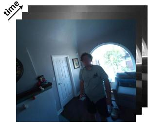  
(a)

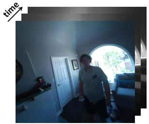

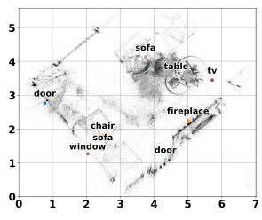  
(b)

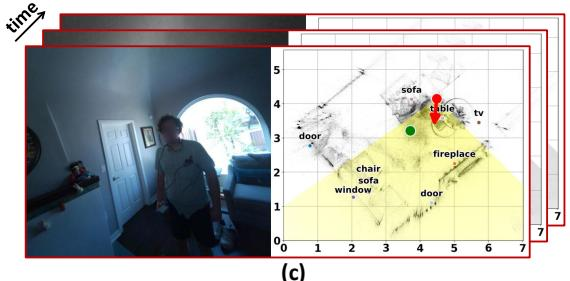  
(c)

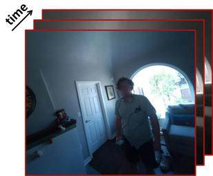

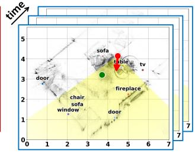  
(d)  
Figure 10: Comparison of visual input formats for floormap prompting. The strategies include (a) the RGB-only baseline, (b) adding a static floormap image, (c) merging both views into a single-stream side-by-side video, and (d) our proposed dual-stream injection using separate synchronized videos.

Table 5: Comparison of floormap prompting methods for FloorSAV. All experiments are evaluated using the Qwen3- Omni-30B model. Dual-stream denotes providing the egocentric RGB footage and the rendered 2D floormap as two separate, synchronized video inputs to the AV-LLM. For each input configuration, refer to Figure 10.
<table><tr><td rowspan="2">Method</td><td rowspan="2"></td><td colspan="3">Egocentric</td><td colspan="3">Exocentric</td><td rowspan="2">Overall</td></tr><tr><td>Configuration</td><td>|Dir (Simple) Dir (Hard)</td><td>Dist</td><td>Dir (Simple) Dir (Hard)</td><td></td><td>Dist</td></tr><tr><td>RGB-only</td><td>Figure 10(a)</td><td>72.7</td><td>70.7</td><td>59.4</td><td>34.1</td><td>24.1</td><td>31.8</td><td>48.1</td></tr><tr><td>+ Floormap (Image)</td><td>Figure 10(b)</td><td>76.1</td><td>71.6</td><td>57.7</td><td>28.8</td><td>26.6</td><td>30.1</td><td>47.3</td></tr><tr><td>+ Floormap (Single-stream)</td><td>Figure 10(c)</td><td>68.1</td><td>58.2</td><td>57.5</td><td>27.8</td><td>31.6</td><td>25.6</td><td>44.0</td></tr><tr><td>+ Floormap (Dual-stream)</td><td>Figure 10(d)</td><td>74.4</td><td>71.1</td><td>61.8</td><td>31.6</td><td>34.4</td><td>31.0</td><td>49.6</td></tr></table>

Floormap and prompting ablations. Floormap injection methodology matters more than whether it is present. With Qwen3-Omni-30B, a static floormap image gives no benefit over RGB-only (47.3% vs. 48.1%), since it carries neither the wearer’s motion nor the moving sound source. Side-by-side concatenation into one video is worse (44.0%): the egocentric half always occupies the left of the frame, and the model becomes biased toward answering “left”. The dual-stream form reaches 49.6% on identical information, a +5.6% gap from layout alone. Semantic grounding adds a further +4.3% on Gemini-2.5-Flash and +5.1% on Pro (Appendix C.3), concentrated in the exocentric direction task.

Moreover, current MLLMs and AV-LLMs often struggle with processing excessively long or visually dense video inputs (Geng et al., 2025; Mangalam et al., 2023; Shu et al., 2025; Wang et al., 2025a; Weng et al., 2024; Wu and Krahenbuhl, 2021), the same context length issue we further discuss in Appendix D.4. Because of this limitation, feeding both videos overwhelms the model and can degrade the overall performance in simple tasks. On the other hand, the static floormap image avoids this heavy video burden and performs surprisingly well on a relatively simpler task, egocentric direction (76.1% on Simple, 71.6% on Hard). However, because the static image lacks temporal changes and dynamic sound source localization, it fails to generalize to harder tasks like distance estimation and exocentric reasoning.

## C.2. Number of Video Frames

Table 6 presents results depending on the number of sampled video frames used in our dual-stream injection. We observe that utilizing 32 frames achieves the highest overall accuracy (50.1%), particularly excelling in egocentric tasks with 73.9% in direction and 63.9% in distance. This finding directly aligns with the context length bottleneck of current AV-LLMs discussed earlier. Nonetheless, we adopt 128 frames as our default configuration to prioritize complex exocentric tasks, which require tracking dynamic sound sources and relating them to reference objects over time.

Table 6: Ablation study on input video frame counts. The frame count indicates the number of uniformly sampled frames from each input video stream, an egocentric view and a floormap.
<table><tr><td rowspan="2"># of Frames</td><td colspan="2">Egocentric</td><td colspan="2">Exocentric</td><td rowspan="2">Overall</td></tr><tr><td>Direction</td><td>Distance</td><td>Direction</td><td>Distance</td></tr><tr><td>32</td><td>73.9</td><td>63.9</td><td>31.6</td><td>31.0</td><td>50.1</td></tr><tr><td>64</td><td>70.6</td><td>62.8</td><td>31.9</td><td>28.9</td><td>48.6</td></tr><tr><td>128</td><td>72.8</td><td>61.8</td><td>32.9</td><td>31.0</td><td>49.6</td></tr></table>

Table 7: Ablation study on semantic grounding with Gemini-2.5-Flash and Pro on SAVVY-Bench. The (–) Semantic Grounding setting evaluates our FloorSAV framework without explicit object labels overlaid on the rendered 2D floormap on SAVVY-Bench.
<table><tr><td rowspan="2">Method</td><td colspan="2">Egocentric</td><td colspan="2">Exocentric</td><td rowspan="2">Overall</td></tr><tr><td>Direction</td><td>Distance</td><td>Direction</td><td>Distance</td></tr><tr><td>Gemini-2.5-Flash (Comanici et al., 2025)</td><td>74.2</td><td>49.7</td><td>29.8</td><td>29.0</td><td>45.7</td></tr><tr><td>Gemini-2.5-Flash-FloorSAV</td><td>71.3</td><td>55.4</td><td>44.5</td><td>32.2</td><td>50.9</td></tr><tr><td>(−) Semantic Grounding</td><td>63.3</td><td>58.0</td><td>34.4</td><td>30.8</td><td>46.6</td></tr><tr><td>Gemini-2.5-Pro (Comanici et al., 2025)</td><td>75.2</td><td>59.6</td><td>31.7</td><td>37.0</td><td>50.9</td></tr><tr><td>Gemini-2.5-Pro-FloorSAV</td><td>75.8</td><td>55.4</td><td>52.8</td><td>34.9</td><td>54.7</td></tr><tr><td>(-) Semantic Grounding</td><td>77.6</td><td>56.0</td><td>35.6</td><td>29.4</td><td>49.6</td></tr></table>

## C.3. Semantic Grounding Efect

Tables 7 and 8 show an ablation study on the role of semantic grounding. In our default FloorSAV framework, the respective base models autonomously generate explicit object labels overlaid on the 2D map. Because this process relies on the model’s own visual reasoning capabilities, we observe distinct behaviors between the Gemini-2.5-Pro and Flash models on SAVVY-Bench, and Gemini-3.6-flash on SAVED-Bench.

Omitting the semantic grounding process degrades overall performance for all cases, which highlights the role of accurate object labels for spatial reasoning. Especially for tasks that require explicit environmental context, Exocentric direction (Table 7) and Line-Path Search (static) (Table 8), the decline in performance is substantial without semantic grounding.

## D. Qualitative Examples

In this section, we qualitatively evaluate the spatial reasoning capabilities of our FloorSAV framework using the Gemini series. We first present successful cases where the injected 2D floormap efectively guides the model to solve complex tasks. Following this, we categorize and analyze common failure modes into three distinct parts to provide deeper insights into the remaining cognitive bottlenecks of current foundation models.

## D.1. Successful Examples on SAVVY-Bench

We demonstrate the efectiveness of FloorSAV through two challenging exocentric scenarios: direction and distance estimation. In the direction case, the model must deduce the sound source’s location relative to a hypothetical robot’s viewpoint. We utilize Gemini-2.5-Flash as the AV-LLM, following the evaluation protocol for SAVVY-Bench (Section 5).

How the AV-LLM reads the floormap. Figure 11 traces one exocentric direction question through both models. A robot stands at the window facing the round sink, and the question asks where the speaker is at the moment a given word is spoken. The baseline has to imagine a viewpoint it never sees. It puts the sink on the far right of the kitchen island, concludes that the speaker falls left of that line of sight, and answers “left”. FloorSAV reads coordinates instead. It places the robot near (4.0, 2.0) and the sink near (2.0, 3.5), derives a north-northwest heading, and finds the green sound-source marker at (3.5, 3.5) to the robot’s right. The exocentric gains in Table 4 follow from this shift from visual imagination to arithmetic on an explicit frame.

Table 8: Ablation study on semantic grounding with Gemini-3.6-Flash on SAVED-Bench. The (–) Semantic Grounding setting evaluates FloorSAV framework without explicit object labels overlaid on the rendered 2D floormap on SAVED-Bench. <sup>\*</sup>Pooled Visit Order and Unvisited questions.
<table><tr><td>Task</td><td>Gemini-3.6-Flash</td><td>Gemini-3.6-Flash- FloorSAV</td><td>(−) Semantic Grounding</td></tr><tr><td colspan="4">Dynamic Relativity</td></tr><tr><td>Ego-to-Exo Direction</td><td>56.0</td><td>65.0</td><td>59.5-5.5</td></tr><tr><td>Ego-to-Exo Distance (AbsMRA)</td><td>34.3</td><td>34.6</td><td>32.1-2.5</td></tr><tr><td>Exo-to-Ego Direction</td><td>32.0</td><td>50.5</td><td>47.5-3.0</td></tr><tr><td>Exo-to-Ego Distance (AbsMRA)</td><td>46.4</td><td>44.7</td><td>41.1-3.6</td></tr><tr><td>4-task average</td><td>42.2</td><td>48.7</td><td>45.0-3.7</td></tr><tr><td colspan="4">Regional</td></tr><tr><td>Location Awareness</td><td>92.0</td><td>94.5</td><td>92.5-2.0</td></tr><tr><td>Visit History*</td><td>86.7</td><td>92.3</td><td>91.8-0.5</td></tr><tr><td>2-task average</td><td>89.4</td><td>93.4</td><td>92.2-1.2</td></tr><tr><td colspan="4">Path Reasoning</td></tr><tr><td>Line-Path Search (static)</td><td>60.2</td><td>77.0</td><td>55.1-21.9</td></tr><tr><td>Line-Path Search (dynamic)</td><td>73.0</td><td>78.0</td><td>77.5-0.5</td></tr><tr><td>Trajectory Distance (AbsMRA)</td><td>16.9</td><td>25.0</td><td>25.4+0.4</td></tr><tr><td>3-task average</td><td>50.0</td><td>60.0</td><td>52.7-7.3</td></tr><tr><td>Overall (QA-weighted)</td><td>58.3</td><td>65.3</td><td>61.3-4.0</td></tr></table>

Similarly, in the exocentric distance task, estimating exact metric distances between two physical locations is exceptionally dificult when relying only on egocentric visual perspectives. Consequently, in Figure 12, the baseline model significantly overestimates the distance, resulting in an error of approximately 1.5 meters. However, by utilizing the synchronized floormap, FloorSAV accurately extracts the specific grid coordinates for both the sound source (4.2, 4) and the target dining table (6.2, 2.5) at the queried timestamp. By computing the Euclidean distance directly with these map coordinates, the model reduces the geometric error, arriving at a more accurate measurement of 2.5 meters. These examples clearly illustrate how explicitly injecting the global map geometry empowers the model to perform precise mathematical and spatial reasoning.

Figure 13 shows how the semantic labels help. The AV-LLM reads the coordinates of the task-related objects from the labels, the refrigerator (5.5, 4) (slightly of) and kitchen hob (4.5, 6.5), locates the speaker at (4, 7.2), and answers the exocentric direction question correctly. Errors from the object visual mapping stage carry over to the floormap, but the model still reasons through them to the right answer.

## D.2. Successful Examples on SAVED-Bench

We further demonstrate the benefits of FloorSAV on SAVED-Bench through one qualitative example for each category: dynamic relativity, regional, and path reasoning QAs, which highlight cross-agent viewpoint transformation, semantic region recognition, and path-aware reasoning about physical surroundings, respectively. We utilize Gemini-3.6-Flash as the AV-LLM, following the evaluation protocol for SAVED-Bench (Section 5).

Figure 14 shows an Exo-to-Ego direction example in which the other agent is invisible to the camera at the querying moment (FoV-out). The baseline primarily constructs a hypothetical reference frame centered on the camera wearer; however, the model incorrectly grounds the other agent’s position in its frame, which leads to a wrong answer. In contrast, FloorSAV uses floormap coordinates as a shared reference frame. Within this frame, the model estimates the other agent’s position, computes the imaginary object’s location, and finally determines its relative direction from the camera wearer’s viewpoint. This example illustrates how explicit representation in a unified global frame supports the cross-agent viewpoint transformation.

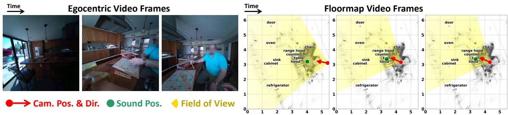  
Q.“Imagine you are a robot standing by the window with a pool view and facing the round sink with a tap, when the speech topic: "announcing playing the word "juke"" comes up, relative to where you are facing, where is the speaker: A (left), B (right), or C (back)?" Ground Truth: B (right)

## Baseline (Egocentric only)

Response: "1. Locate the robot: The camera's initial position (0:00) is by the window, which is on the left side of the kitchen area, looking into the kitchen. We will assume the robot is at this position. 2. Determine the robot's orientation: The robot is facing the round sink with a tap. Looking at the video, the round sink is located on the far rightside of the kitchen island. Therefore, the robot is looking across the kitchen island towards the right. 3. Locate the speaker: The speaker (the person in the blue shirt) is sitting at the kitchen island. At the moment the word "juke" is spoken (around 1:56), the speaker is sitting at the island, to the right of the camera's initial view, and is actively engaged with the Scrabble board. 4. Determine the speaker's position relative to the robot: If the robot is at the window, looking towards the round sink on the far right of the island, the speaker is sitting at the island, closer to the robot than the sink, and slightly to the left of the robot's direct line of sight towards the sink. Therefore, the speaker is to the robot's left. The final answer is A (left)"

Wrong

## FloorSAV (Egocentric + Floormap)

Response: “From Video 1, ..., the robot is positioned on the side of the counter where the person in the blue shirt is, but further back towards the window. The robot is facing towards the left side of the kitchen, where the sink is located At 01:55, the audio indicates ... "juke". From Video 2, the green dot (sound source) is located at approximately (3.5, 3.5). ... Video 1, the camera wearer is on the right side of the wooden counter. Let's estimate the robot's position and orientation on the map (Video 2): The window with the pool view ... behind the person in the blue shirt ... around (4.0, 2.0) on the map. The round sink is on the left side of the kitchen counter, around (2, 3.5) on the map. So, the robot is at approximately (4.0, 2.0) and facing towards (2, 3.5). This means the robot is looking roughly North-Northwest. Now, let's locate the speaker relative to the robot:... From the robot's position (4.0, 2.0) and orientation (facing North-Northwest), the speaker at (3.5, 3.5) is to the robot's right. To face the speaker, the robot would need to turn right by an angle less than 120 degrees. The final answer is B (right)” Correct

Figure 11: Qualitative example of an exocentric direction question. The baseline sees only the egocentric video and has to imagine the robot’s viewpoint, answering “left”. FloorSAV reads the robot, the facing object, and the green sound-source marker of the floormap grid and answers “right”.

For the regional QAs, specifically in Location Awareness tasks (Figure 15), the baseline heavily relies on an earlier frame showing the other agent near the dining table and assumes the other agent stays near the table. However, FloorSAV utilizes adjacent frames to infer the other agent’s movement in relation to the physical surroundings represented on the floormap. It then identifies the region (kitchen area) based on key objects close to the other agent’s estimated position. Through joint reasoning on the other agent’s dynamics and the spatial arrangement of objects, FloorSAV successfully links the agent’s estimated position to the correct semantic region.

In the Line-Path Search (static) example from the path reasoning QAs (Figure 16), the baseline focuses on the window visible in nearby frames and judges distances of remaining objects by their proximity to an inferred walking route, not from a finite line segment. This fails to present spatial reasoning on finite line segment and objects. By comparison, FloorSAV utilizes floormap coordinates to ground both the segment from the camera wearer’s position to the target object and the candidate objects. Then the model computes the minimum distance from each candidate object to the segment in this shared global frame. This example efectively demonstrates how the 2D floormap provides shared spatial reference for physical objects and hypothetical paths, including objects outside the camera’s current FoV.

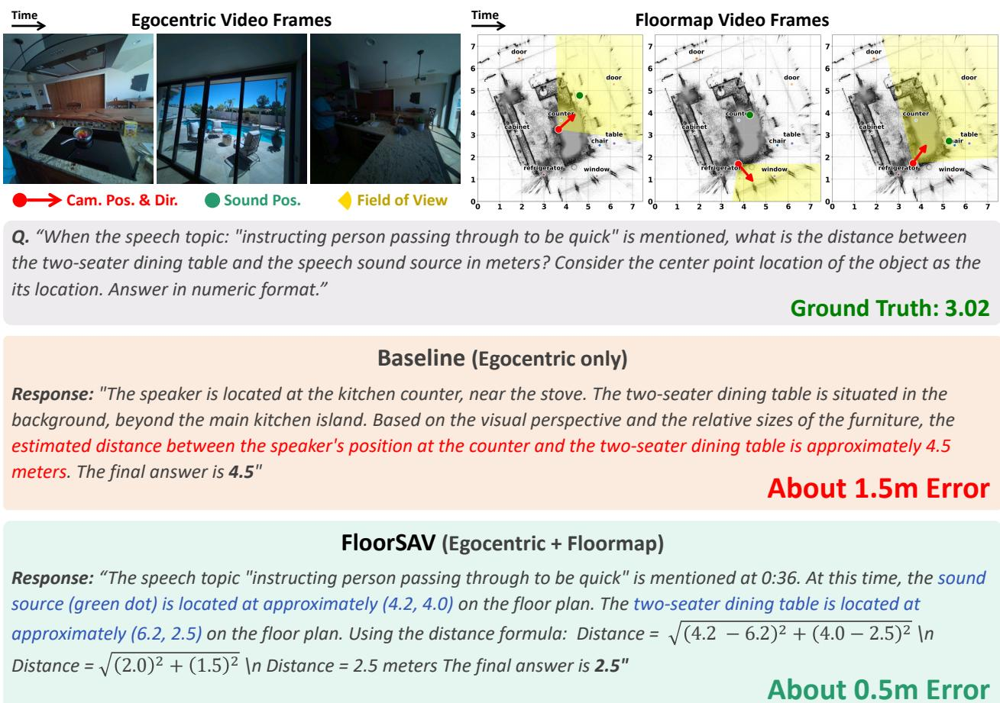  
Figure 12: Qualitative example of the exocentric distance task. The baseline model sufers from severe depth distortion inherent in monocular egocentric vision, overestimating the metric distance by approximately 1.5 meters. In contrast, FloorSAV extracts precise metric coordinates from the top-down floormap to compute the Euclidean distance, significantly reducing the measurement error to about 0.5 meters.

## D.3. Failure Analysis 1: Temporal Localization Error

The first common failure mode stems from the foundation model’s inability to accurately pinpoint the precise time span of a queried audio-visual event. In highly dynamic environments, objects and camera wearers are constantly in motion. If the model anchors its reasoning to an incorrect timestamp, it inevitably retrieves the scene’s spatial geometry from an irrelevant video frame. Consequently, even if FloorSAV successfully reads the map and processes the geometric calculations for that specific moment, the final prediction will be fundamentally flawed due to the incorrect temporal premise.

For instance, as illustrated in Figure 17, the query asks for the relative direction of the speaker when the speech topic “acknowledging the watermelon” occurs. Instead of grounding this event to the correct ground-truth timestamp (02:19), the model mistakenly anchors it to an earlier, semantically similar conversation at 01:53 (“Want some watermelon?”). Because the relative positions of the camera wearer and the speaker at 01:53 difer entirely from their positions at 02:19, the model confidently but incorrectly predicts “front-right” rather than the true answer, “front-left”. This highlights that robust spatial reasoning in FloorSAV remains strictly bottlenecked by the base model’s temporal localization capabilities.

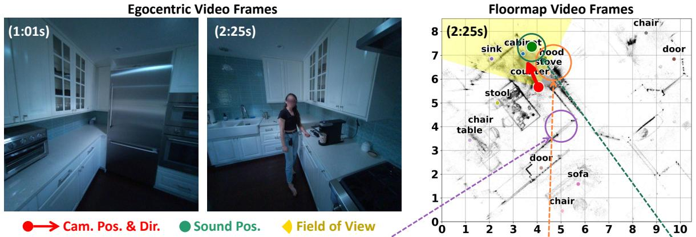

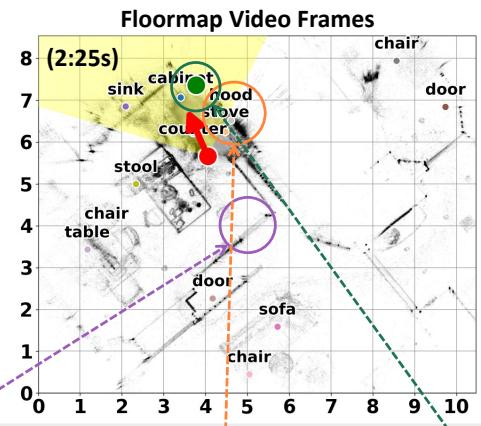  
Q. “"Imagine you are a robot standing by the stainless steel refrigerator and facing the kitchen hob, when the speech topic: \"expressing doubt about needing two cups\" comes up, relative to where you are facing, where is the speaker: A (left), B (right), or C (back)?”

Ground Truth: A (left)

## FloorSAV (Egocentric + Floormap)

Response: "Step 1: Identify the relevant time. The user asks about the moment when the speech topic is "expressing doubt about needing two cups". Listening to the audio, this occurs around \`02:25\` when the speaker says, "I don't think we need to do that though," ... Step 2: Determine the hypothetical robot's position and orientation. The robot is "standing by the stainless steel refrigerator". On the floomap, the \`refrigerator\` is located at approximately (5.5, 4.0). Orientation: The robot is "facing the kitchen hob" (stove). The \`stove\` is located at approximately (4.5, 6.5). So, the robot is at (5.5, 4.0) looking towards (4.5, 6.5). Step 3: Determine the speaker's position at the specified time. At \`02:25\`, the floormap shows the green dot (speaker) at approximately (4, 7.2), which corresponds to the person standing by the counter near the sink and coffee maker. Step 4: Compare the speaker's position to the robot's perspective. ... From the robot's viewpoint, the speaker's position is to the left of its line of sight towards the stove. Since the speaker is to the left of the direction the robot is facing, the correct answer is A (left).”

## (Visually Ground) Correct

Figure 13: Qualitative example of the semantically grounded floormap. Our semantically grounded floormap, constructed through the proposed pipeline with Gemini, ofers semantic labels as visually grounded cues that enhance the model’s spatial reasoning.

## D.4. Failure Analysis 2: Long-Context Understanding

The second major failure mode stems from the inherent context length limitations of current foundation models when processing long-form videos. Intuitively, one might assume that providing a higher frame rate would yield richer visual details and consequently improve spatial reasoning. However, our qualitative analysis reveals the opposite. As demonstrated in Figure 18, feeding the baseline model a dense 270-frame video (at 1 FPS) actually degrades its predictive capabilities, causing it to fail on a relatively simple egocentric direction task. Conversely, reducing the input to a sparser 128 frames (approximately 0.5 FPS) significantly reduces the cognitive load, allowing the model to correctly identify the target. This confirms that excessively long video token sequences overwhelm the model’s visual processing capacity, directly aligning with the findings from our frame count ablation study (Table 6).

This context length bottleneck becomes particularly critical when deploying our FloorSAV framework. Because FloorSAV injects the 2D floormap as an additional, synchronized video stream, it approximately doubles the total number of visual tokens fed into the base model. While this dual-stream approach provides essential geometric hints, it can overload the model that lacks robust long-context understanding. As shown in Figure 19, the failure in FloorSAV does not arise from the model misunderstanding the floormap geometry. Rather, it shows a fundamental breakdown in basic visual perception. The model misreads the RGB view itself, incorrectly predicting that the person is on the “right”, although the individual is clearly seated on the left side of the screen for the vast majority of the timeline. This highlights that the successful application of FloorSAV heavily depends on the base model’s capacity to handle massive multi-modal context without sufering from visual hallucination.

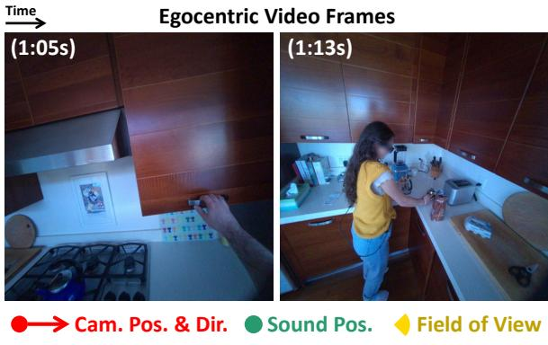

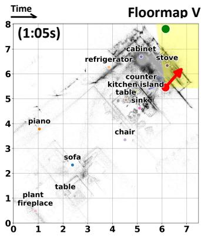

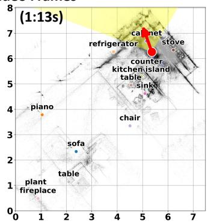  
Q. " Imagine you are the camera wearer, when the speech "We have this thing." comes up, suppose an imaginary object is placed 70 degrees clockwise from the other person's facing direction, at a horizontal distance of 3 meters from the other person. Suppose the other person is facing DIRECTLY TOWARDS YOU at that same moment. Relative to your facing direction, where is this object: A (front-left), B (front-right), C (back-left), or D (back-right)?"

Ground Truth: C (back-left)

Response: "I need to determine the imaginary object’s direction relative to my facing direction when “We have this thing” is spoken, around 01:05–01:06. I define my position as (0, 0), with forward along +Y and right along +X. Approximating her position as directly ahead at (0, D), her hypothetical facing direction is −Y, or 180°. The object is placed 3 meters away from her, 70° clockwise from that direction. Its bearing is therefore 250°, giving a displacement of approximately: X = 3 sin(250°) = −2.82 m Y = 3 cos(250°) = −1.03 m Relative to me, the object is consequently at (−2.82, D − 1.03). Its negative Xcoordinate places it to my left. Whether it is ahead or behind depends on the distance D. From the video, the woman appears to be across the kitchen island, approximately 1.5–2.5 meters ahead. Under this estimate, D − 1.03 remain positive, placing the object in front of me. Thus, assuming she is approximately directly ahead and more than 1.03 meters away, the object is front-left. The final answer is A (front-left).“ Wrong

Wrong

Response: “I need to locate the imaginary object relative to my facing direction when “We have this thing” is spoken, around 01:05–01:06. On the map, my position is approximately (6.25, 5.25), and my facing arrow points towards (7.0, 6.1). This gives a facing vector of (0.75, 0.85), or approximately 45° in global coordinates. The other person is at approximately (4.80, 7.25). Under the hypothetical condition that she faces directly towards me, her facing vector is (1.45, −2.0), about −50°. The object lies 3 meters from her, 70° clockwise from this direction. Placing the object at approximately (4.5, 4.75). The vector from me to the object is therefore (−1.75, −0.5), with a global bearing of 210°. Relative to my facing, its angle is 210° − 45° = 165° counter-clockwise. The object is back-left relative to my gaze. The final answer is C (back-left).” Correct

Figure 14: Qualitative example of dynamic relativity QA. In this FoV-out Exo-to-Ego direction example, both methods correctly identify the sound event time. However, the baseline incorrectly assumes that the other agent is directly ahead (+�) of the camera wearer. FloorSAV estimates the other agent’s position from adjacent frames and utilizes the floormap as a shared global coordinate frame for viewpoint transformation.

## D.5. Failure Analysis 3: Metric Map Misinterpretation

The final major failure mode highlights a fundamental cognitive limitation of current foundation models, that they cannot reliably interpret abstract 2D metric grids. Even when the model successfully localizes the correct temporal window of an event, it often fails to extract precise Cartesian coordinates from the injected floormap. As illustrated in Figure 20, while FloorSAV accurately grounds the event time (0:50-0:51), it completely hallucinates the map coordinates during its reasoning process. It mistakenly reads the green sound source dot at (5.5, 4.5) instead of its actual location near (1, 4.5), and similarly misplaces the double wall oven while only roughly guessing the countertop oven’s location. Artificially increasing the size of the visual markers on the map does not resolve this issue. This indicates that current MLLMs lack human-level proficiency in reading geometric grids and maps, likely due to a severe scarcity of top-down metric representations and coordinate-based spatial reasoning tasks in their training corpora. Consequently, explicit map reading remains a primary bottleneck for the FloorSAV framework.

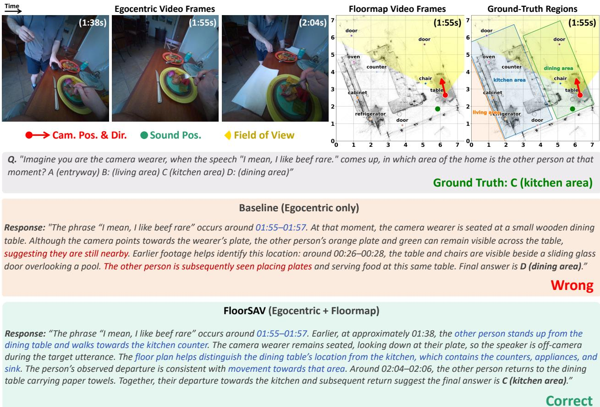  
Figure 15: Qualitative example of regional QA. For the Location Awareness task, both methods correctly identify the sound event time. However, the baseline incorrectly assumes that the other agent remains near the dining table. FloorSAV jointly reasons about the other agent’s movement from nearby frame cues and physical layout on the floormap, identifies the region (kitchen area) from key objects in the floormap to answer correctly.

Egocentric Video Frames  
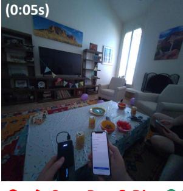

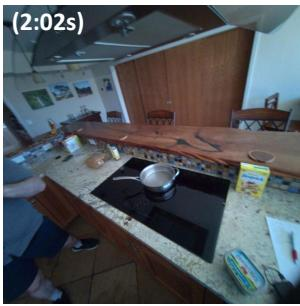

Floormap Video Frames  
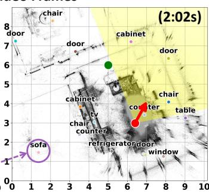

Q. "Imagine you are the camera wearer, when the speech "Let's ... we got the kebabs so." comes up, suppose you walk in a straight line from your current position to the couch. Among the following objects, which one would you pass by most closely? A (wall-mounted TV) B (dining table) C: (fireplace) D: (pool window)

Ground Truth: A (wall-mounted TV)

## Baseline (Egocentric only)

Response: "The phrase “Let’s ... we got the kebabs so” occurs around 02:02–02:05. At that moment, I appear to be standing by the kitchen island, close to the “pool window,” described as the large sliding glass doors leading outside. I need to compare the distances from the straight-line segment to four objects: the wall-mounted TV, dining table, fireplace, and pool window. Based on my interpretation of the layout, the pool window is immediately beside my starting position, while the other objects appear farther from the route. The final answer is D (pool window).”

Wrong

## FloorSAV (Egocentric + Floormap)

Response: “The phrase “Let’s ... we got the kebabs so” occurs around 02:02–02:05. At approximately 02:03, the wearer’s map position is S = [6.2, 2.9], and the couch is at E = [1.2, 1.5]. The route is the straight-line segment connecting these points. Using the mapped object coordinates, I calculate each object’s minimum distance. TV, at [4.1, 2.9]: approximately 0.57 m, with its closest point inside the segment. Dining table, at [8.8, 3.6]: approximately 2.5 m. Pool window, at [8.3, 1.6]: approximately 2.3m. Fireplace: not explicitly labeled on the map still not on the segment based on past observation. The final answer is A (wall-mounted TV)

Figure 16: Qualitative example of path reasoning QA. In this Line-Path Search (static) example, both methods correctly identify the sound event time. The baseline focuses on the nearby window and fails to relate a finite line segment to other candidates, which results in an inappropriate approach and answer. FloorSAV utilizes a 2D floormap as a reference frame and explicitly grounds the finite line segment and objects. With subsequent arithmetic calculations, FloorSAV determines the closest object to the finite line segment.


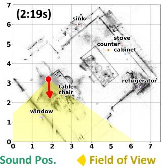

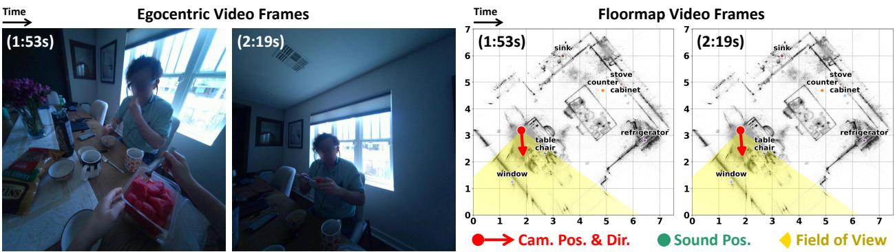  
Q. "Imagine you are the camera wearer, when the speech topic "acknowledging the watermelon" comes up, relative to where you are facing, where is the other person: A (front-left), B (front-right), C (back-left), or D (back-right)?"

## Ground Truth: A (front-left)

## FloorSAV (Egocentric + Floormap)

Response: ''At 01 :53, the camera wearer asks, "Want some watermelon?" while holding a container of watermelon. The camera wearer is standing at the dining table, and the other person is sitting directly across from them. The camera wearer's head is turned to face the other person, who is visible in the center of the frame, slightly to the right. Therefore, relative to where the camera wearer is facing, the other person is in the front-right direction. The final answer is B (front-right).

Figure 17: Failure case analysis: Temporal localization error. The model incorrectly points out the queried speech event (“acknowledging the watermelon”, occurred at 02:19) to an earlier, incorrect timestamp (01:53). Consequently, it retrieves the spatial geometry from the wrong video frame, leading to a flawed directional prediction despite having access to the correct mapping mechanism.

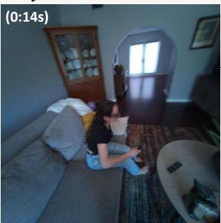

Egocentric Video (Identical scene and QA)  
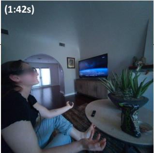

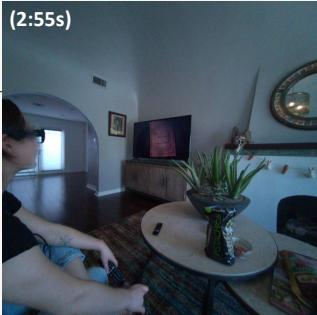

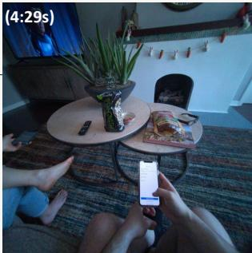  
Q. “Imagine you are the camera wearer, when the speech topic "predicting judgment for watching shrek" comes up, relative to where you are facing, where is the other person: A (left), B (right), or (C) back?”

Ground Truth: A (left)

## High frames (Egocentric only - 270 frame, 1 FPS)

Response: "The other person is to the right of the camera wearer. This is evident from the frames around 0:12-0:16 where ”the person sits on the couch to the right, and at 1:42 when the relevant speech occurs, the camera wearer turns slightly to the right to look at the person. The final answer is B (right)."

## (Temporal & Visual) Wrong

## Low frames (Egocentric only - 128 frame, 0.47 FPS)

Response: Step 1: Locate the relevant audio cue. The speech topic "predicting judgment for watching Shrek" comes up at approximately 02:55 when the other person says, "They're going to see us watching Shrek and be like, oh my god.” Step 2: Observe the camera wearer's orientation at that moment. At 02:55, the camera wearer is looking straight ahead at the television screen, which is displaying the opening sequence of Shrek 2. Step 3: Observe the other person's position relative to the camera wearer. In the frames leading up to and immediately following 02:55 (e.g., 02:56), the other person is visible sitting on the couch to the left of the camera wearer. Both individuals appear to be facing the television. Step 4: Determine the turning angle required to face the other person. Since the camera wearer is looking straight at the TV and the other person is to their left, turning to face the other person would involve turning less than 120 degrees to the left. Step 5: Conclude the relative position. Based on the visual evidence, the other person is to the left of the camera wearer. The final answer is A (left).” IT

## (Temporal & Visual) Correct

Figure 18: Failure case analysis: Context length issue in the base model. We compare high-density (270 frames, 1 FPS) and low-density (128 frames, 0.5 FPS) egocentric inputs. Contrary to the expectation that more frames provide better visual cues, the excessively long 270-frame input overwhelms the model and leads to an incorrect prediction, whereas the shorter 128-frame context successfully guides the model to the correct answer.

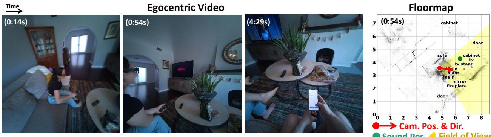

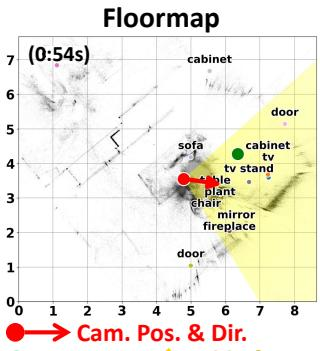  
Sound Pos. Field of View

Q. “Imagine you are the camera wearer, when the speech topic "describing a past failed all-day upload attempt" comes up, relative to where you are facing, where is the other person : A (left), B (right), or C (back)?”

## Ground Truth: A (left)

## FloorSAV (Egocentric + Floormap - each 128 frame, 0.47 FPS)

Response: "The speech topic "describing a past failed all-day upload attempt" occurs around the 0:54 mark. At this time, the camera wearer is looking straight ahead at the TV. The other person is sitting to the right of the camera wearer, also facing the TV. Therefore, the other person is to the right of the camera wearer. The final answer is B (right)."

## (Visual) Wrong

## Low frames (Egocentric only - 128 frame, 0.47 FPS)

Response: The speech topic “describing a past failed all-day upload attempt” occurs around the 0:54 mark in the video. At this point, the camera wearer is sitting on the couch, looking towards the TV. The other person is also sitting on the couch, to the left of the camera wearer, and is facing the TV. To face the other person, the camera wearer would need to turn their head to the left. This position is generally to the left and would require turning less than 120 degrees. The final answer is A (left).”

(Visual) Correct

Figure 19: Failure case analysis: Context length issue in the FloorSAV framework. As FloorSAV doubles the input video tokens by incorporating the floormap stream, the model fails to process the basic RGB view correctly, inexplicably hallucinating the other person’s location as “right” despite them sitting on the left for almost the entire timeline.

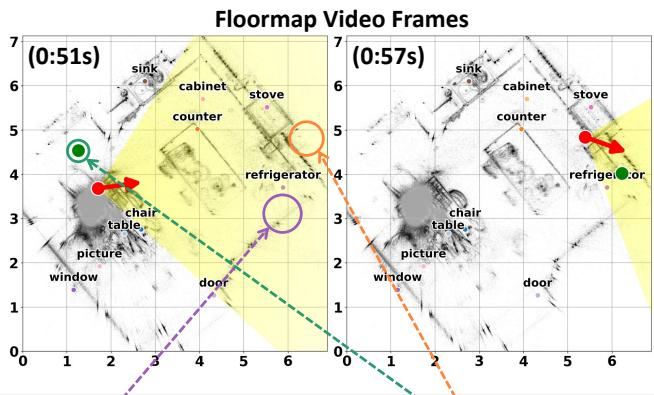

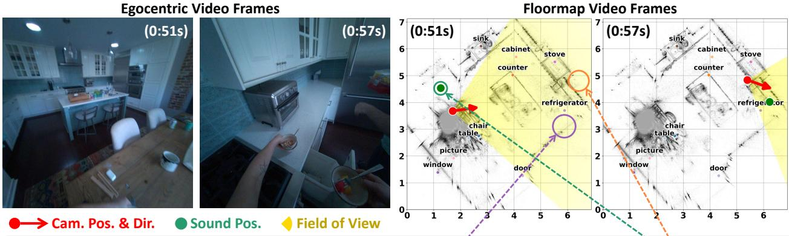  
Q. “Imagine you are a robot standing by the stainless steel double wall oven and facing the countertop oven, when the speech topic: "volunteering to put away the food" comes up, relative to where you are facing, where is the speaker: A (front-left), B (front-right), C (back-left), or D (back-right)?” Ground Truth: C (back-lef

Ground Truth: C (back-left)

## FloorSAV (Egocentric + Floormap)

Response: "The robot is standing by the stainless steel double wall oven and facing the countertop oven. Robot's Position and Orientation: From Video 1 at 0:57-1:00, the stainless steel double wall oven is on the right wall of the kitchen. The countertop oven is on the counter to its left. In Video 2, the double wall oven is located around (5, 6) on the map. The countertop oven is around (4, 5.5). Therefore, the robot's approximate position is (5, 6) and it is facing towards (4, 5.5). This means the robot is facing generally southwest. 2. Speaker's Position: The speech "I'll put the food away" occurs at approximately 0:50-0:51. At this time, the green dot is located at approximately (5.5, 4.5). This corresponds to the person at the dining table. 3. Relative Position Calculation: Robot's facing direction vector (F): From (5, 6) to (4, 5.5) is \`(-1, -0.5)\`. Vector from robot to speaker (RS): (5.5 - 5, 4.5 - 6) = \`(0.5, -1.5)\`. To determine direction, we can use vector operations: Front/Back: Calculate the dot product of F and RS. F . RS = (-1)(0.5) + (-0.5)(-1.5) = -0.5 + 0.75 = 0.25 Since the dot product is positive, the speaker is ... front of the robot. Left/Right: Calculate the cross product of F and RS. F x RS = (-1)(-1.5) - (- 0.5)(0.5) = 1.5 - (-0.25) = 1.5 + 0.25 = 1.75\` A positive cross product indicates that the second vector (RS) is to the left of the first vector (F). Combining these results, the speaker is in the front-left. The final answer is A (front-left).”

## (Visually Ground) Wrong

Figure 20: Failure case analysis: Metric map misinterpretation. Although FloorSAV accurately localizes the temporal window of the queried event, it misreads the 2D coordinate grid. It incorrectly specifies the locations of the sound source and reference objects, leading to wrong spatial calculation.

<|im\_start|>system   
{system prompt}<|im\_end|>   
<|im\_start|>user   
Audio:   
<|audio\_start|><|audio\_pad|><|audio\_end|>   
Video 1: # Egocentric   
<|vision\_start|><|video\_pad|><|vision\_end|>   
Video 2: # Floormap   
<|vision\_start|><|video\_pad|><|vision\_end|>   
You are an expert AI assistant analyzing two temporally synchronized videos and   
audio. {ego/exo perspective}   
The videos show two concurrent views:   
- Video 1: Camera wearer’s view   
- Video 2: Top-down floormap   
- Grid axes: Distance in meters (1 unit = 1m)   
- Named objects/landmarks placed at their estimated positions   
- Red dot/arrow: Camera position/heading   
- Yellow area: Camera FOV   
- Green dot: Sound source   
Answering Strategy:   
1. Identify the audio event time.   
2. Check Video 1 at that time as your primary reference. Use this view as a main   
perspective for answering.   
3. If spatial details are uncertain, read the grid coordinates on Video 2 to   
estimate distances and relative directions between relevant markers.   
Question:   
{question}   
{options, if any}   
{answer formatting}<|im\_end|>   
<|im\_start|>assistant  
Figure 21: Instruction prompt of our FloorSAV framework for Qwen-Omni models. Gemini models use similar prompt with their own system prompt and multimodal token sequence.

## E. Floormap Guide Prompts

Figure 21 shows how the instruction prompt of the open-source model Qwen3-Omni-30B is assembled into the model’s multimodal token sequence. Similarly, we construct two guide prompts for each video modality (egocentric and 2D floormap), which are provided to the Gemini series model. Exp1 explains Video 1, while Exp2 explains Video 2 in the dual-stream FloorSAV setting. The question and options are inserted immediately before the answer instruction. The egocentric-only baseline uses only Exp1, whereas FloorSAV uses both Exp1 and Exp2.

Video 1: Egocentric view (Exp1). This explanation identifies the camera wearer’s first-person view and its synchronized audio, clarifies the reference perspective, and directs the model to locate the queried sound event and relevant visual evidence.

Exp1:   
Video 1: [Your / The camera wearer’s] egocentric view.   
- This first-person video, with synchronized scene audio, shows what the camera wearer sees and   
hears.   
- For an exocentric task, the robot in the question and the camera wearer are distinct entities;   
answer from the robot’s perspective.   
- Use Video 1 to pinpoint the target sound, check direct visibility, and identify visually   
described objects.

Video 2: Floormap view (Exp2). For FloorSAV, we additionally provide an explicit description of the rendering context to guide interpretation of the proposed 2D floormap. This explains the metric grid, camera position and heading, field of view, object landmarks, and estimated sound-source markers. These definitions clarify how to interpret the rendered spatial information and help align it with the corresponding egocentric observations at the same time, allowing the model to jointly use visual evidence and map geometry.

Exp2:   
Video 2: Top-down floormap synchronized with Video 1.   
- Grid axes show distance in meters (1 cell = 1 m).   
- Red dot and arrow: the camera wearer’s position and heading. Yellow wedge: camera field of   
view.   
- Small colored dots mark detected object positions; displaced bold labels name the objects.   
- Green dot: an approximate active sound-source estimate, smoothed over ±1 s; it can be   
inaccurate or absent.   
- The floormap does not show the other person’s facing direction. A clearly visible target is   
best judged from Video 1.

The templates above describe the shared video context; minor guidance variants account for each task’s reference perspective and reasoning requirements.

## F. Limitations and Future Work

Dependency on high-fidelity sensor data. The geometric fidelity of our rendered 2D floormaps is inherently bounded by the high-quality sensor suite used in the AEA dataset. Specifically, the construction of our accurate spatial prompts relies heavily on clean 3D point clouds, sub-centimeter camera poses, and multi-channel spatial audio. While our pipeline efectively localizes sound sources, acoustic direction and distance estimation remains inherently noisy in highly reverberant environments or scenes with overlapping audio sources. This indicates that as foundational datasets like AEA expand and wearable sensor technologies continue to improve, the precision of our rendered spatial hints will naturally increase, providing substantial room for further performance advancements within our framework.

Lack of cognitive abilities for plot/grid style. Current foundation AV-LLMs are predominantly trained on vast corpora of natural images and standard video formats. Therefore, explicitly injecting top-down metric maps, characterized by grid lines and abstract geometric plots, introduces a severe out-of-distribution visual input challenge. As observed in Appendix D, the models often struggle to accurately read and identify precise metric coordinates, or cognitively relate the global coordinate frame back to the first-person egocentric perspective. Although optionally incorporating semantic grounding with explicit object labels partially mitigates this issue, this core representational mismatch between natural visual data and abstract geometric maps remains a fundamental cognitive bottleneck for current architectures. We also believe that our framework can scale with the model’s intrinsic map reading capabilities.

Temporal localization dependency. Answering spatial queries in SAVVY-Bench (Chen et al., 2025) and SAVED-Bench requires precise temporal grounding of sound events within continuous video streams. Errors in identifying the query moment or interval can lead the model to reason over the wrong spatial context, even when its geometric reasoning is otherwise correct. Performance therefore reflects both temporal localization and spatial reasoning, making it dificult to isolate the latter. Beyond this evaluation dependency, requiring temporal grounding in the audio track as a prerequisite inherently restricts task design. Future evaluation should both disentangle temporal localization errors from downstream spatial reasoning errors and extend task formulations beyond sound event based temporal grounding.

Integrated reasoning across categories. SAVED-Bench broadens spatial evaluation through three complementary categories: dynamic relativity, regional, and path reasoning QAs. However, the current tasks assess reasoning within each category independently rather than requiring models to integrate capabilities across categories. Real-world interactions may demand such integration, combining cross-agent viewpoint transformation, semantic region understanding, and recognition of physical surroundings within a single task. Since SAVED-Bench does not explicitly evaluate these complex scenarios, extending it with tasks that require integrated reasoning across categories could bring spatial evaluation into closer alignment with real-world agent interactions.