# From Geometry to Generalization: Why Row Normalization Can Beat Adam and Muon

Jihwan Kim1,2 Dogyoon Song3 Chulhee Yun4,2

1Seoul National University 2KAIST InnoCORE LLM 3University of California, Davis 4KAIST

aqua4689@snu.ac.kr dgsong@ucdavis.edu chulhee.yun@kaist.ac.kr

## Abstract

Diferent optimizers can fit the same training data while selecting classifiers with substantially diferent geometries, but whether this diference provably afects population performance remains unclear. We show that row-wise normalization can achieve strictly higher population accuracy than full-batch Adam, a proxy for random-reshufling Adam, and exact-SVD Muon in high-dimensional multiclass classification. Under an isotropic Gaussian-cloud data model, this advantage arises because row normalization’s classwise Euclidean geometry asymptotically preserves the population decision-boundary directions, whereas Adam’s coordinate-wise geometry and Muon’s spectral geometry introduce nonvanishing distortions. Beyond isotropy, the advantage persists for full-batch training on class means with independently oriented class-mean and test-noise covariances. It holds for power-law spectra with class-mean exponent below one, even under heavily anisotropic test noise. When both covariances are diagonal and suficiently close, the advantage over Adam can reverse, while applying the same random rotation to both restores it by changing only their alignment with Adam’s coordinate axes. Synthetic and last-layer language-model experiments support the predicted advantage.

## 1 Introduction

Row-wise normalization has recently emerged as a simple and efective ingredient in optimizers for large language model training.1 Scale (Glentis et al., 2026) uses row-normalized SGD as its base method and adds momentum only to the final layer, reporting performance comparable to or better than Adam (Kingma and Ba, 2015) and Muon (Jordan et al., 2024) while using substantially less optimizer-state memory.2 Related row-level normalization operations also appear in recent methods such as SinkGD, NorMuon, RMNP, and MOGA (Scetbon et al., 2025; Li et al., 2026b; Deng et al., 2026; Xu et al., 2026). Together, these results provide growing empirical evidence that normalizing updates separately across output units can be beneficial for large-scale optimization. Yet what drives the strong empirical performance of row-normalized methods remains poorly understood.

A natural hypothesis is that this behavior is tied to the geometry induced by the optimizer. Recent implicit-bias results make this connection concrete: normalized steepest-descent methods can converge toward max-margin classifiers associated with their underlying norm geometry (Soudry et al., 2018; Gunasekar et al., 2018a; Fan et al., 2025; Li et al., 2026a; Baek et al., 2026). Under the implicit-bias characterizations used in this work, row-normalized methods are associated with the row norm3, Muon with the spectral norm, and full-batch Adam with the entrywise max-norm. These distinct geometries can therefore lead the methods toward classifiers with substantially diferent decision boundaries, even when they all fit the training data well. What remains unclear is whether these geometric diferences translate into systematic diferences in population performance. This motivates our central question: can row-wise normalization provably achieve

Row Normalization Preserves Class-Mean Geometry Better

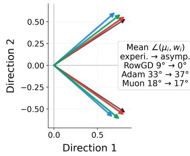

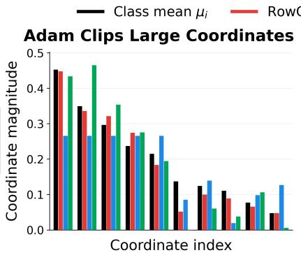

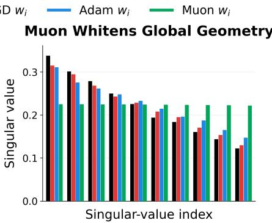  
Figure 1: Geometry of the learned classifiers. Class means are compared with classifier rows learned by row-normalized GD, Adam, and Muon for 60 classes in 20 dimensions: a 2D projection of two classes, with mean angles over all classes and their proportional-limit predictions from Proposition 3.2 (left); coordinate magnitudes at ranks $1 , 3 , \ldots , 1 9$ after sorting by class-mean magnitude (middle); and singular values at indices $1 , 3 , \ldots , 1 9$ of the full matrices (right).

higher population accuracy than competing optimizers, and if so, what geometric mechanism explains the advantage?

Existing theory does not answer this question. The closest results analyze row-normalized methods through nonconvex convergence or width-scaling properties, but do not establish that they select statistically better solutions than competing optimizers (Deng et al., 2026; Xu et al., 2026).

To the best of our knowledge, we provide the first such result. We analyze the statistical quality of the limiting classifiers selected by diferent optimizer geometries and establish a strict population-accuracy advantage for row-wise normalization in high-dimensional Gaussian data models. Our analysis also identifies the geometric mechanism behind this advantage: the class-wise Euclidean geometry of row-wise normalization better preserves the population decision-boundary directions, whereas coordinate-wise and spectral geometries introduce systematic directional distortions.

## 1.1 Our Contributions

We study how optimizer geometry afects population accuracy in high-dimensional multiclass classification.   
Our main contributions are the following.

• Population-accuracy ordering under an isotropic Gaussian-cloud data model. We first establish a strict population-accuracy advantage of row-normalized optimizers over representative spectral, coordinatewise, and adaptive alternatives under our isotropic Gaussian-cloud data model. As an ingredient, we extend existing normalized steepest-descent implicit-bias analyses (Fan et al., 2025; Li et al., 2026a) to the row norm. Specifically, we show the advantage in three settings as follows.

– Deterministic full-batch setting. Row-normalized GD and row-normalized GD with momentum outperform Adam, SignGD, Signum, exact-SVD Muon, and Spectral-GD (Theorem 3.1).

– Stochastic random-reshufling setting. Under random reshufling, row-normalized SGD with momentum outperforms stochastic Signum and stochastic exact-SVD Muon (Proposition 3.4).

– Random-reshufling Adam via AdamProxy. We extend the AdamProxy framework of Baek et al. (2026) from incremental Adam to random-reshufling mini-batch Adam. We prove that the resulting proxy approximates the one-epoch displacement of random-reshufling Adam in the $\beta _ { 1 } , \beta _ { 2 }  1$ regime (Proposition 3.5) and show that row-normalized SGD with momentum achieves strictly higher population accuracy than AdamProxy (Proposition 3.6).

• Extension beyond isotropy. We show that the advantage of row-normalized methods is not limited to isotropic data distributions. For deterministic full-batch training on the class means, we consider class-mean and test-noise covariances with independent random eigenbases and power-law spectra, allowing any class-mean exponent below one and any test-noise exponent. Under these conditions, we prove that the row-normalized methods continue to outperform Adam and Muon (Theorem 4.2). We further exhibit a coordinate-aligned anisotropic regime in which row-normalized methods are worse than Adam, and show that jointly rotating the class means and test-noise covariance by an independently sampled Haar matrix restores the advantage with high probability (Proposition 4.5).

## 1.2 Related Work

Here we discuss only the works most directly related to our problem formulation and proof strategy; additional related work is deferred to Appendix A.

Row-normalized optimizers in practice. Recent LLM optimizers use output-wise row normalization as a principal matrix update in Scale, RMNP, and MOGA; as one step of alternating row–column normalization in SinkGD; and as row-wise adaptive rescaling after Muon orthogonalization in NorMuon (Glentis et al., 2026; Scetbon et al., 2025; Li et al., 2026b; Deng et al., 2026; Xu et al., 2026). These works establish row normalization as a practical optimizer component, whereas we theoretically compare the quality of the solutions it selects against competing optimizer geometries.

Theoretical comparisons involving row normalization. RMNP proves nonconvex convergence guarantees for row-normalized momentum methods that match existing guarantees for Muon (Deng et al., 2026). MOGA compares the width dependence of smoothness and learning-rate transfer across matrix geometries, showing favorable scaling for row-normalized methods (Xu et al., 2026).

Implicit bias and optimizer-selected solutions. Prior work characterizes the norm-induced max-margin directions of full-batch SignGD, Spectral-GD, Muon, and Adam in separable multiclass linear classification (Fan et al., 2025). This framework has been extended to random-reshufling stochastic optimization, where batch size and momentum govern approximation to the full-batch margin (Li et al., 2026a). Separately, Baek et al. (2026) show that incremental Adam can have a distinct stochastic implicit bias and introduce an AdamProxy characterized by a data-dependent Mahalanobis margin problem. We add the row norm and extend AdamProxy to multiclass random reshufling.

## 2 Preliminaries

Notation. For $k \geq 2$ , let $[ k ] : = \{ 1 , \ldots , k \}$ and $e _ { 1 } , \ldots , e _ { k }$ be the standard basis of $\mathbb { R } ^ { k }$ . For positive integers $b , N$ , we write $b \mid N$ if N is divisible by b. For matrices, $\begin{array} { r } { \langle A , B \rangle : = \operatorname { t r } ( A ^ { \top } B ) , \| A \| _ { \operatorname* { m a x } } : = \operatorname* { m a x } _ { r , j } | A _ { r , j } | } \end{array}$ , and $\begin{array} { r } { \| \boldsymbol { A } \| _ { \mathrm { s u m } } : = \sum _ { r , j } | \boldsymbol { A } _ { r , j } | , } \end{array}$ ; we use $\| A \| _ { \mathrm { o p } }$ and $\| A \| _ { \mathrm { F } }$ for the spectral and Frobenius norms. For $W \in \mathbb { R } ^ { k \times d }$ with rows $w _ { r } ^ { \top }$ , define $\begin{array} { r } { \| W \| _ { \mathrm { r o w } } : = \| W \| _ { 2 , \infty } : = \operatorname* { m a x } _ { r \in [ k ] } \| w _ { r } \| _ { 2 } } \end{array}$ as a row norm. For $a \in \mathbb { R } ^ { k }$ and $c \in [ k ]$ , define $\begin{array} { r } { \mathbb { S } _ { c } ( a ) : = e ^ { a _ { c } } / \sum _ { \ell = 1 } ^ { k } e ^ { a _ { \ell } } } \end{array}$ , the c-th component of the softmax map. We write $A ^ { \odot p }$ for entrywise powers and $\oslash$ for entrywise division, with $0 / 0 : = 0$ . For nonzero vectors $u , v .$ , let $\angle ( u , v ) \in [ 0 , \pi ]$ denote the angle between u and v. Write $\widehat { v } : = v / \| v \| _ { 2 }$ for v $\neq \mathbf { 0 }$ . For random quantities indexed by $d , o _ { \mathbb { P } } ( 1 )$ denotes a term that converges to zero in probability as $d \to \infty$

Data model. We collect the structural assumptions on the data distribution in the following Gaussian-cloud data model; asymptotic and optimization conditions appear separately below. Let d be the input dimension, k the number of classes, and $n _ { i }$ the class-i sample size, $\textstyle N : = \sum _ { i = 1 } ^ { k } n _ { i }$ and $n _ { \mathrm { m i n } } : = \operatorname* { m i n } _ { i } n _ { i }$

Assumption 2.1 (Isotropic Gaussian-cloud data model). The training dataset consists of $( x _ { i , s } , i )$ for $i \in [ k ]$ and $s \in [ n _ { i } ]$ such that

$$
x _ { i , s } : = \mu _ { i } + r z _ { i , s } , \qquad w h e r e \qquad \mu _ { i } \stackrel { \mathrm { i i d } } { \sim } \mathcal { N } ( \mathbf { 0 } , I _ { d } ) , \qquad z _ { i , s } \stackrel { \mathrm { i i d } } { \sim } \mathcal { N } ( \mathbf { 0 } , I _ { d } ) .\tag{1}
$$

A test example $X ^ { \mathrm { t e } }$ with label Y is

$$
X ^ { \mathrm { t e } } : = \mu _ { Y } + r _ { \mathrm { t e } } z ^ { \mathrm { t e } } , \qquad \mathbb { P } ( Y = i ) = \pi _ { i , d } , \qquad z ^ { \mathrm { t e } } \sim \mathcal { N } ( \mathbf { 0 } , I _ { d } ) ,
$$

where $( \mu _ { i } ) _ { i = 1 } ^ { k } , ( z _ { i , s } ) _ { i , s } , Y$ , and $z ^ { \mathrm { t e } }$ are mutually independent. Here, $r = r ( d ) \geq 0 , r _ { \mathrm { t e } } = r _ { \mathrm { t e } } ( d ) > 0 , \pi _ { i , d } > 0 ,$ and $\textstyle \sum _ { i = 1 } ^ { k } \pi _ { i , d } = 1$

We also use the flattened notation $\{ ( x _ { n } , y _ { n } ) \} _ { n = 1 } ^ { N }$ for the same training set, where $x _ { n } = x _ { i , s }$ and $y _ { n } = i$ under some fixed bijection between $\{ ( i , s ) : i \in [ k ] , s \in [ n _ { i } ] \}$ and [N].

Assumption 2.2 (High-dimensional scaling). Along a sequence of models indexed by $d ,$ with $k = k ( d )$ 2 $n _ { i } = n _ { i } ( d )$ , and $\pi _ { \operatorname* { m i n } , d } : = \operatorname* { m i n } _ { i } \pi _ { i , d } .$

$$
k / d  \alpha \in ( 0 , \infty ) , \qquad n _ { \operatorname* { m i n } }  \infty , \qquad \log N = o ( d ) , \qquad \log ( 1 / \pi _ { \operatorname* { m i n } , d } ) = o ( d ) .\tag{2}
$$

Furthermore, $r _ { 0 } : = \operatorname* { s u p } _ { d } r ( d ) < \infty$ and $r _ { \mathrm { t e } , 0 } : = \operatorname* { s u p } _ { d } r _ { \mathrm { t e } } ( d ) < \infty$

We focus on a proportional regime in which k and d remain on the same scale, excluding settings where one asymptotically dominates the other; this is qualitatively compatible with language-model last layers. The condition log $N = o ( d )$ rules out datasets exponential in $d ,$ so that the geometry is not dominated by rare deviations accumulated over exponentially many samples. Meanwhile, $\log ( 1 / \pi _ { \operatorname* { m i n } , d } ) = o ( d )$ allows class frequencies following Zipf’s law, as observed in language data.

Classifier and loss. A linear multiclass classifier is $W \in \mathbb { R } ^ { k \times d }$ , with score vector W x at $x \in \mathbb { R } ^ { d }$ . We train with multiclass cross-entropy

$$
L ( W ) : = - \frac { 1 } { N } \sum _ { i = 1 } ^ { k } \sum _ { s = 1 } ^ { n _ { i } } \log \mathbb { S } _ { i } ( W x _ { i , s } ) .
$$

This standard setting (Fan et al., 2025; Li et al., 2026a) abstracts a language model’s final linear layer.

Population accuracy. We measure population performance by the probability that the true class attains the strictly largest linear score on a test example:

$$
\operatorname { A c c } _ { \pi , d } ( W ) : = \sum _ { i = 1 } ^ { k } \pi _ { i , d } \mathbb { P } \big ( w _ { i } ^ { \top } X ^ { \operatorname { t e } } > w _ { j } ^ { \top } X ^ { \operatorname { t e } } ~ \mathrm { f o r ~ a l l } ~ j \in [ k ] \setminus \{ i \} ~ | ~ Y = i \big ) .
$$

Norm-based update maps. We use three norm-based update maps. For the row norm $\psi _ { \mathrm { r o w } } : = \| \cdot \| _ { \mathrm { r o w } }$ set $( \Delta _ { \mathrm { r o w } } ( G ) ) _ { r , : } : = G _ { r , : } / \| G _ { r , : } \| _ { 2 }$ when $G _ { r , : } \neq \mathbf { 0 }$ , and $( \Delta _ { \mathrm { r o w } } ( G ) ) _ { r , : } : = \mathbf { 0 }$ otherwise. For the entrywise max-norm $\psi _ { \mathrm { m a x } } : = \| \cdot \| _ { \mathrm { m a x } } .$ let $\Delta _ { \mathrm { m a x } } ( G ) : = \mathrm { s i g n } ( G )$ entrywise, with $\mathrm { s i g n } ( 0 ) : = 0$ . For the spectral norm $\psi _ { \mathrm { s p } } : = \| \cdot \| _ { \mathrm { o p } } ,$ if $G \neq \mathbf { 0 } ,$ , let $G = U \Sigma V ^ { \top }$ be a compact SVD and define $\Delta _ { \mathrm { s p } } ( G ) : = U V ^ { \top }$ ; set $\Delta _ { \mathrm { s p } } ( \mathbf { 0 } ) : = \mathbf { 0 }$ . For each $g \in \{ \mathrm { r o w } , \mathrm { s p } , \mathrm { m a x } \}$ , these choices satisfy $\Delta _ { g } ( G ) \in \arg \operatorname* { m a x } _ { \psi _ { q } ( \Delta ) \leq 1 } \langle G , \Delta \rangle$ , although the maximizer need not be unique.

Full-batch and random-reshufling optimizers. For random reshufling (RR), assume $b \ | \ N$ , set $m : = N / b$ , and independently permute and partition the data into m mini-batches of size b each epoch. Let $B _ { t }$ be the batch at step t, define $\begin{array} { r } { L _ { B _ { t } } ( W ) : = | B _ { t } | ^ { - 1 } \sum _ { ( i , s ) \in B _ { t } } - \log \mathbb { S } _ { i } ( W x _ { i , s } ) } \end{array}$ , and set $G _ { t } : = \nabla L ( W _ { t } )$ under full-batch training and $G _ { t } : = \nabla L _ { B _ { t } } ( W _ { t } )$ under RR. For $g \in \{ \mathrm { r o w } , \mathrm { s p } , \mathrm { m a x } \}$ $\beta \in [ 0 , 1 )$ , and $M _ { 0 } = \mathbf { 0 }$ , we write

$$
M _ { t + 1 } = \beta M _ { t } + ( 1 - \beta ) G _ { t } , \qquad W _ { t + 1 } = W _ { t } - \eta _ { t } \Delta _ { g } ( M _ { t + 1 } ) .
$$

Under full-batch training, $\beta = 0$ gives row-normalized gradient descent (RowGD), spectral gradient descent (SpecGD), and sign gradient descent (SignGD) for $g = \mathrm { r o w } , \mathrm { s p } , \mathrm { m a x }$ , respectively; with $\beta \in ( 0 , 1 )$ , the corresponding methods are row-normalized gradient descent with momentum (RowGDM), exact-SVD Muon (Muon),4 and Signum. Under RR, we denote the momentum counterparts by RR-RowSGDM, RR-Muon, and

RR-Signum. Thus, throughout the theory, Muon and RR-Muon refer to the exact-SVD variants. Throughout, $W _ { t } ^ { \mathrm { o p t } }$ denotes the parameter iterate of optimizer opt at step t.

Assumption 2.3 (Bounded number of mini-batches). Under random-reshufling training with batch size $b = b _ { d }$ , the number of mini-batches per epoch, $m _ { d } : = N ( d ) / b _ { d }$ , satisfies $m _ { 0 } : = \operatorname* { s u p } _ { d } m _ { d } < \infty$

Adam optimizer. We consider Adam without bias correction or a numerical-stability constant, with $0 < \beta _ { 1 } \le \beta _ { 2 } < 1$ , using $G _ { t }$ from the corresponding full-batch or random-reshufling setting:

$$
M _ { t + 1 } = \beta _ { 1 } M _ { t } + ( 1 - \beta _ { 1 } ) G _ { t } , V _ { t + 1 } = \beta _ { 2 } V _ { t } + ( 1 - \beta _ { 2 } ) G _ { t } ^ { \odot 2 } , W _ { t + 1 } = W _ { t } - \eta _ { t } M _ { t + 1 } \odot V _ { t + 1 } ^ { \odot 1 / 2 } .\tag{3}
$$

We initialize $M _ { 0 } = V _ { 0 } = \mathbf { 0 }$ , and refer to the full-batch and random-reshufling versions as Adam and RR-Adam, respectively. The following condition holds almost surely at $W _ { 0 } = 0$

Assumption 2.4 (Full-batch Adam initialization). For full-batch Adam, every entry of $\nabla L ( W _ { 0 } )$ is nonzero.

Learning-rate schedule. We use the following learning-rate conditions.

Assumption 2.5 (Base learning-rate condition). The sequence $\{ \eta _ { t } \} _ { t \ge 0 }$ is positive and nonincreasing, with $\begin{array} { r } { \eta _ { t }  0 ~ a n d \sum _ { t = 0 } ^ { \infty } \eta _ { t } = \infty } \end{array}$

Assumption 2.6 (Momentum learning rate). For every $\beta \in ( 0 , 1 )$ and $c _ { 1 } > 0$ , there exist $t _ { 0 } \in \mathbb { N }$ and $c _ { 2 } > 0$ such that $\begin{array} { r } { \sum _ { s = 0 } ^ { t } \beta ^ { s } \bigl ( \exp ( c _ { 1 } \sum _ { \tau = 1 } ^ { s } \eta _ { t - \tau } ) - 1 \bigr ) \le c _ { 2 } \eta _ { t } } \end{array}$ t for all $t \geq t _ { 0 }$

Non-momentum methods require only Assumption 2.5; momentum methods additionally require Assumption 2.6. Both hold for $\eta _ { t } = c ( t + 1 ) ^ { - a } , c > 0 , a \in ( 0 , 1 ]$

## 3 Main Results

Section 3.1 establishes the deterministic optimizer population-accuracy ordering and identifies its limiting geometries. Section 3.2 studies robustness to random-reshufling stochastic training, while Section 4 extends the analysis beyond the isotropic Gaussian-cloud data model.

## 3.1 Comparison of Optimizers in the Deterministic Setting

We first compare the full-batch optimizers defined in Section 2. Our first main result shows that RowGD and RowGDM achieve strictly higher population accuracy than SpecGD, Muon, SignGD, Signum, and Adam.

Theorem 3.1 (Deterministic optimizer accuracy ordering). Define the full-batch optimizer groups

$$
\mathcal { O } _ { \mathrm { r o w } } : = \{ \mathrm { R o w G D } , \mathrm { R o w G D M } \} , \quad \mathcal { O } _ { \mathrm { c o m p } } : = \{ \mathrm { S p e c G D } , \mathrm { M u o n } , \mathrm { S i g n G D } , \mathrm { S i g n u m } , \mathrm { A d a m } \} .\tag{4}
$$

Suppose Assumptions $2 . 1 , \ 2 . 2 , \ 2 . 4 , \ 2 . 5 ,$ and 2.6 hold. Then, for every suficiently large d, with probability at least $1 - e ^ { - { \sqrt { d } } }$ over the training data, the following holds for all momentum parameters $\beta \in ( 0 , 1 )$ of RowGDM, Muon, and Signum:

$$
\operatorname* { m i n } _ { \mathrm { o p t } \in \mathcal { O } _ { \mathrm { r o w } } } \operatorname* { l i m } _ { t \to \infty } \operatorname { A c c } _ { \pi , d } \bigl ( W _ { t } ^ { \mathrm { o p t } } \bigr ) > \operatorname* { m a x } _ { \mathrm { o p t } \in \mathcal { O } _ { \mathrm { c o m p } } } \operatorname* { l i m } _ { t \to \infty } \operatorname { A c c } _ { \pi , d } \bigl ( W _ { t } ^ { \mathrm { o p t } } \bigr ) .\tag{5}
$$

Proof idea. The proof proceeds through the implicit biases of the optimizers. RowGD and RowGDM approach row-norm margin solutions, SpecGD and Muon approach spectral-norm margin solutions, and SignGD, Signum, and Adam approach max-norm margin solutions. Here, a ψ-norm margin solution minimizes $\psi ( W )$ among classifiers with training margin at least one; the formal solution sets are defined in Appendix C. Under the Gaussian-cloud model, these three solution sets have the distinct asymptotic classifier structures summarized in Proposition 3.2, and Gaussian pairwise-error bounds convert this geometric separation into the population-accuracy ordering. Because Theorem 3.1 is proven through a uniform comparison over all norm-induced margin solutions approached by the optimizers, it does not require directional convergence of optimizers.

Proposition 3.2 (Limiting classifier geometry). Let $W _ { t } ^ { \mathrm { o p t } }$ have rows $( w _ { i , t } ^ { \mathrm { o p t } } ) ^ { \top }$ , and let $\begin{array} { r } { \Theta _ { t } ^ { \mathrm { o p t } } : = k ^ { - 1 } \sum _ { i = 1 } ^ { k } \angle ( w _ { i , t } ^ { \mathrm { o p t } } , \mu _ { i } ) } \end{array}$ denote the average angle between the class mean and classifier row. Let $M _ { \mu } \in \mathbb { R } ^ { k \times d }$ have rows $\mu _ { i } ^ { \top } , \ l e t$ $P : = I _ { k } - k ^ { - 1 } \mathbf { 1 } \mathbf { 1 } ^ { \top }$ and $r _ { d } : = \operatorname* { m i n } \{ k - 1 , d \}$ , and let $C _ { \mu } : = P M _ { \mu }$ have compact SVD $U _ { \mu } \Sigma _ { \mu } V _ { \mu } ^ { \top }$ and polar factor $Q _ { \mu } : = U _ { \mu } V _ { \mu } ^ { \top }$ . Suppose Assumptions 2.1, 2.2, 2.4, 2.5, and 2.6 hold. Then

$$
\begin{array} { r l } { \mathrm { R o w G D / R o w G D M : } } & { \underset { t  \infty } { \operatorname* { l i m } \operatorname* { s u p } } \underset { i } { \operatorname* { m a x } } \Big \| \widehat { w } _ { i , t } ^ { \mathrm { o p t } } - \widehat { \mu } _ { i } \Big \| _ { 2 } = o _ { \mathbb { P } } ( 1 ) , } \\ { \mathrm { S i g n G D / S i g n u m / A d a m : } } & { \underset { t  \infty } { \operatorname* { l i m } \operatorname* { s u p } } \underset { i } { \operatorname* { m a x } } \Bigg \| \widehat { w } _ { i , t } ^ { \mathrm { o p t } } - \frac { \mathrm { s i g n } ( \mu _ { i } ) } { \sqrt { d } } \Bigg \| _ { 2 } = o _ { \mathbb { P } } ( 1 ) , } \\ { \mathrm { S p e c G D / M u o n : } } & { \underset { t  \infty } { \operatorname* { l i m } \operatorname* { s u p } } \frac { 1 } { r _ { d } } \| \frac { P W _ { t } ^ { \mathrm { o p t } } } { \| P W _ { t } ^ { \mathrm { o p t } } \| _ { \mathrm { o p } } } - Q _ { \mu } \| _ { \mathrm { F } } ^ { 2 } = o _ { \mathbb { P } } ( 1 ) . } \end{array}
$$

Moreover, lim $\begin{array} { r } { \operatorname* { s u p } _ { t \to \infty } | \Theta _ { t } ^ { \mathrm { o p t } } - \theta | = o _ { \mathbb { P } } ( 1 ) } \end{array}$ , where $\theta = 0 ~ f o r$ RowGD/RowGDM and $\theta = \operatorname { a r c c o s } { \sqrt { 2 / \pi } } \ f o r$ $S i g n G D / S i g n u m / A d a m$ . If the aspect ratio $\alpha > 1$ , then $\theta \ = \ \operatorname { a r c c o s } \kappa _ { \mathrm { s p } } ( \alpha )$ for SpecGD/Muon, where $\kappa _ { \mathrm { s p } } : ( 0 , \infty ) \to ( 0 , 1 )$ is a positive constant depending only on α.5

Underlying mechanism. Proposition 3.2 makes the source of the accuracy gap explicit. RowGD and RowGDM preserve each class-mean direction, driving wi toward a positive multiple of $\mu _ { i } .$ In contrast, SignGD, Signum, and Adam approach the coordinate-wise sign direction of each class mean, efectively equalizing coordinate magnitudes. SpecGD and Muon approach the polar factor of the centered class-mean matrix, efectively equalizing its singular values. Both transformations introduce nonvanishing directional distortion relative to the original class-mean geometry. Under isotropic Gaussian test noise, preserving the class-mean geometry leads to better separation of unseen examples, while the distortions induced by the other methods degrade this separation. This yields the population-accuracy advantage of the row-normalized methods in Theorem 3.1.

Corollary 3.3 (Population-error exponents). Let $\mathcal { E } _ { t , d } ^ { \mathrm { o p t } } : = 1 - \operatorname { A c c } _ { \pi , d } ( W _ { t } ^ { \mathrm { o p t } } )$ . Suppose Assumptions $\it { 2 . 1 , ~ 2 . 2 , }$ $\it { 2 . 4 } , \ 2 . 5 ,$ and 2.6 hold. Then

$$
\operatorname* { l i m s u p } _ { t \to \infty } \left| \frac { r _ { \mathrm { t e } } ^ { 2 } } { d } \log \frac { \mathcal { E } _ { t , d } ^ { \mathrm { A d a m } } } { \mathcal { E } _ { t , d } ^ { \mathrm { R o w G D M } } } - \frac { \pi - 2 } { 4 \pi } \right| = o _ { \mathbb { P } } ( 1 ) , \quad \operatorname* { l i m i n f } _ { t \to \infty } \frac { r _ { \mathrm { t e } } ^ { 2 } } { d } \log \frac { \mathcal { E } _ { t , d } ^ { \mathrm { M u o n } } } { \mathcal { E } _ { t , d } ^ { \mathrm { R o w G D M } } } \geq \frac { 1 - \kappa _ { \mathrm { s p } } ( \alpha ) ^ { 2 } } { 4 } - o _ { \mathbb { P } } ( 1 ) ,
$$

where $\kappa _ { \mathrm { s p } }$ is the constant as in Proposition 3.2. The same conclusion holds with RowGDM replaced by RowGD, Adam by SignGD or Signum, and Muon by SpecGD.

Corollary 3.3 follows from Proposition C.27 in Appendix C. While Theorem 3.1 establishes a strict ordering of the limiting population accuracies, Corollary 3.3 quantifies the separation. Although all three population errors vanish as $d \to \infty$ , RowGDM has exponentially smaller population error than Adam and Muon. This separation is captured by the logarithms of the error ratios on the scale $d / r _ { \mathrm { t e } } ^ { 2 }$

## 3.2 Robustness to Stochastic Training

Mini-batch updates can alter the implicit bias of an optimizer, so the full-batch ordering does not automatically extend to stochastic training. Under RR, however, suficiently large momentum keeps RR-RowSGDM, RR-Muon, and RR-Signum close to their respective row-, spectral-, and max-norm margin solutions (Li et al., 2026a). We show that this approximate preservation is enough for the strict population-accuracy ordering to persist.

Proposition 3.4 (Stochastic optimizer accuracy ordering). Suppose Assumptions 2.1, 2.2, 2.3, 2.5, and $\it 2 . 6$ hold. Then there exists $\beta _ { 0 } = \beta _ { 0 } ( \alpha , r _ { 0 } , m _ { 0 } ) \in [ 0 , 1 )$ such that, for every suficiently large d, with probability at least $1 - e ^ { - { \sqrt { d } } }$ over the training data, the following holds for all momentum parameters $\beta \in [ \beta _ { 0 } , 1 )$ of RR-RowSGDM, RR-Muon, and RR-Signum, and for every realization of the reshufling:

$$
\operatorname* { l i m i n f } _ { t \to \infty } \mathrm { A c c } _ { \pi , d } \big ( W _ { t } ^ { \mathrm { R R \mathrm { - } R o w S G D M } } \big ) > \operatorname* { m a x } _ { \mathrm { o p t } \in \{ \mathrm { R R \mathrm { - } M u o n , R R \mathrm { - } S i g n u m } \} } \operatorname* { l i m s u p } _ { t \to \infty } \mathrm { A c c } _ { \pi , d } \big ( W _ { t } ^ { \mathrm { o p t } } \big ) .\tag{6}
$$

The condition $m _ { d } \leq m _ { 0 }$ in Assumption 2.3 means that each mini-batch contains at least a $1 / m _ { 0 }$ fraction of the training set. For $m _ { 0 } \geq 2$ , the suficient momentum threshold used in the proof has $1 - \beta _ { 0 }$ proportional to $1 / [ m _ { 0 } ( m _ { 0 } ^ { 2 } - 1 ) ]$

Approximating Adam via AdamProxy. Adam requires separate treatment under RR because averaging squared mini-batch gradients generally difers from squaring the averaged gradient, so its full-batch max-norm margin characterization need not persist (Baek et al., 2026). To address this, we develop a deterministic proxy for RR-Adam in the multiclass setting with general mini-batch size, extending the binary incrementa AdamProxy construction of Baek et al. (2026). Using the flattened indexing $\{ ( x _ { n } , y _ { n } ) \} _ { n = 1 } ^ { N } ,$ let $g _ { n } ( W ) : =$ $- ( e _ { y _ { n } } - \mathbb { S } ( W x _ { n } ) ) x _ { n } ^ { \top }$ denote the gradient of the cross-entropy loss for sample $( x _ { n } , y _ { n } )$ . For each batch $B \subset [ N ]$ of size $b ,$ set $\begin{array} { r } { G _ { B } ( \dot { W } ) : = b ^ { - 1 } \sum _ { n \in B } g _ { n } ( W ) = \nabla L _ { B } ( W ) } \end{array}$ . Thus, under RR, $G _ { t } = G _ { B _ { t } } ( W _ { t } )$ in (3).

Drawing B uniformly from the b-subsets of [N], define the AdamProxy direction

$$
\Phi _ { N , b } ( W ) : = \mathbb { E } _ { B } [ G _ { B } ( W ) ] \oslash \mathbb { E } _ { B } \big [ G _ { B } ( W ) ^ { \odot 2 } \big ] ^ { \odot 1 / 2 } .
$$

Equivalently, letting $\begin{array} { r } { S ( W ) : = \sum _ { n = 1 } ^ { N } g _ { n } ( W ) , Q ( W ) : = \sum _ { n = 1 } ^ { N } g _ { n } ( W ) ^ { \odot 2 } , } \end{array}$

$$
\Phi _ { N , b } ( W ) = \sqrt { \frac { b ( N - 1 ) } { N } } S ( W ) \oslash \left( ( b - 1 ) S ( W ) ^ { \odot 2 } + ( N - b ) Q ( W ) \right) ^ { \odot 1 / 2 } .\tag{7}
$$

Proposition 3.5 shows that, in the $\beta _ { 1 } , \beta _ { 2 }  1$ regime, this deterministic direction approximates the normalized one-epoch displacement of RR-Adam.

Proposition 3.5 (One-epoch $\beta _ { 1 } , \beta _ { 2 } \to 1$ RR-Adam approximation). For each epoch $r = 0 , 1 , 2 , . . . ,$ let $\tau _ { r } : = m r$ denote the index of its first update and $\begin{array} { r } { \gamma _ { r } : = \sum _ { s = 0 } ^ { m - 1 } \eta _ { \tau _ { r } + s } } \end{array}$ its total learning rate. Fix a training set with $x _ { n } [ a ] \neq 0$ for all $n \in [ N ]$ and $a \in [ d ]$ . Suppose that $b < N$ and that Assumptions 2.5 and 2.6 hold. Then, for every $\varepsilon > 0$ , RR-Adam in (3) satisfies

$$
\operatorname* { l i m } _ { ( \beta _ { 1 } , \beta _ { 2 } ) \to ( 1 , 1 ) } \operatorname* { l i m s u p } _ { r \to \infty } \mathbb { P } \left( \left. \frac { W _ { \tau _ { r + 1 } } ^ { \mathrm { R R - A d a m } } - W _ { \tau _ { r } } ^ { \mathrm { R R - A d a m } } } { \gamma _ { r } } + \Phi _ { N , b } \big ( W _ { \tau _ { r } } ^ { \mathrm { R R - A d a m } } \big ) \ \right. _ { \operatorname* { m a x } } > \varepsilon \right) = 0 ,\tag{8}
$$

where the probability is over the random reshufling.

Proposition 3.5 is a one-epoch $\beta _ { 1 } , \beta _ { 2 }  1$ approximation at fixed data and dimension. It does not establish long-horizon agreement between the RR-Adam and AdamProxy trajectories.

Motivated by Proposition 3.5, let $\begin{array} { r } { \gamma _ { t } : = \sum _ { s = 0 } ^ { m - 1 } \eta _ { m t + s } } \end{array}$ and consider the AdamProxy dynamics

$$
W _ { t + 1 } ^ { \mathrm { A P } } = W _ { t } ^ { \mathrm { A P } } - \gamma _ { t } \Phi _ { N , b } \big ( W _ { t } ^ { \mathrm { A P } } \big ) .\tag{9}
$$

Comparison of AdamProxy and RR-RowSGDM. Although AdamProxy need not approach the exact sign geometry of full-batch Adam, it retains a weaker coordinate-wise saturation efect. Once the classifier is scaled to have unit minimum training margin, every coordinate eventually stays within a constant multiple of the typical coordinate size (Proposition E.8). This forces a nonvanishing distortion from the class-mean geometry, whereas high-momentum RR-RowSGDM remains close to the class-mean geometry, yielding the population-accuracy ordering below.

Proposition 3.6 (RR-RowSGDM versus AdamProxy accuracy ordering). Suppose Assumptions 2.1, 2.2, 2.3, 2.5, and 2.6 hold. Then there exists $\beta _ { 1 } = \beta _ { 1 } ( \alpha , r _ { 0 } , m _ { 0 } ) \in [ 0 , 1 )$ such that, for every suficiently large $d ,$ with probability at least $1 - e ^ { - { \sqrt { d } } }$ over the training data, the following holds for all momentum parameters $\beta \in [ \beta _ { 1 } , 1 )$ of RR-RowSGDM and for every realization of the reshufling:

$$
\operatorname* { l i m i n f } _ { t \to \infty } \mathrm { A c c } _ { \pi , d } \big ( W _ { t } ^ { \mathrm { R R - R o w S G D M } } \big ) > \operatorname* { l i m s u p } _ { t \to \infty } \mathrm { A c c } _ { \pi , d } \big ( W _ { t } ^ { \mathrm { A P } } \big ) .
$$

## 4 Extensions to Anisotropic Gaussian Models

In Section 3, we studied an isotropic Gaussian-cloud data model in which both the class means and the within-class noise are isotropic. In this section, we examine when the advantage of row-normalized methods persists or reverses beyond isotropy. Motivated by the nontrivial covariance structure that can arise in language-model representations, we extend the analysis to anisotropic Gaussian distributions.

To simplify the analysis and cover a broader range of anisotropy, we consider clean training, with no within-class noise in the training data, under the following common data model.

Assumption 4.1 (Anisotropic clean Gaussian model). Let $\Gamma , \Sigma _ { 1 } , \dots , \Sigma _ { k }$ be positive-definite covariance matrices with tr $\Gamma = \mathrm { t r } \Sigma _ { i } = d$ for every $i \in [ k ] . ^ { 6 }$ Training uses the clean class signals $\{ ( \mu _ { i } , i ) \} _ { i = 1 } ^ { k } . \ A$ test example with label Y is $X ^ { \mathrm { t e } } : = \mu _ { Y } + r _ { \mathrm { t e } } z ^ { \mathrm { t e } }$ , where, conditionally on the covariance matrices, $( Y , z ^ { \mathrm { t e } } )$ is independent of $( \mu _ { i } ) _ { i = 1 } ^ { k }$ and

$$
\mu _ { i } \stackrel { \mathrm { i i d } } { \sim } { \mathcal { N } } ( \mathbf { 0 } , { \Gamma } ) , \qquad { \mathbb { P } } ( { \cal Y } = i ) = \pi _ { i , d } > 0 , \qquad z ^ { \mathrm { t e } } | { \cal Y } \sim { \mathcal { N } } ( \mathbf { 0 } , { \Sigma } _ { \cal Y } ) .
$$

Along the sequence indexed by $d , k / d \to \alpha \in ( 0 , \infty )$ and $r _ { \mathrm { t e } } > 0$ satisfies $r _ { \mathrm { t e } , 0 } : = \operatorname* { s u p } _ { d } r _ { \mathrm { t e } } ( d ) < \infty$

## 4.1 Persistence of Row-Norm Advantage under Independent Orientations

We first specialize Assumption 4.1 to trace-normalized power-law covariances with independent Haar eigenbases. Suppressing dimension subscripts, define $\textstyle T _ { \vartheta } : = \sum _ { a = 1 } ^ { d } a ^ { - \vartheta }$ and $D _ { \vartheta } : = \mathrm { d i a g } ( 1 , 2 ^ { - \vartheta } , \ldots , d ^ { - \vartheta } )$ . For $s _ { \mu } , s _ { \Sigma } \geq 0$ set

$$
\Gamma : = \frac { d } { T _ { s _ { \mu } } } U _ { \mu } D _ { s _ { \mu } } U _ { \mu } ^ { \top } , \qquad \Sigma _ { i } : = \frac { d } { T _ { s _ { \Sigma } } } O _ { i } D _ { s _ { \Sigma } } O _ { i } ^ { \top } .\tag{10}
$$

Here $U _ { \mu } , O _ { 1 } , \dots , O _ { k }$ are mutually independent Haar matrices on ${ \mathsf { O } } ( d ) ;$ ; the class-mean draws are independent of $( O _ { i } ) _ { i = 1 } ^ { k }$ , and the optimizer initializations are fixed and do not depend on $( O _ { i } ) _ { i = 1 } ^ { k }$

Theorem 4.2 (Accuracy ordering under anisotropy with independent orientations). Let $\mathcal { O } _ { \mathrm { r o w } }$ and ${ \mathcal { O } } _ { \mathrm { c o m p } }$ be as in (4), with fixed $\beta \in ( 0 , 1 )$ for RowGDM, Muon, and Signum. Suppose Assumptions $\it 4 . 1 , \ 2 . 4 , \ 2 . 5 ,$ and 2.6 hold, with the covariances in (10) for $0 \leq s _ { \mu } < 1$ and $s _ { \Sigma } \geq 0$ . Assume that log $( 1 / \pi _ { \operatorname* { m i n } , d } ) = o ( d / \log d )$ and that $W _ { t } ^ { \mathrm { o p t } } / \| W _ { t } ^ { \mathrm { o p t } } \| _ { \mathrm { F } }$ converges almost surely as $t $ ∞ for every opt $\in \mathcal { O } _ { \mathrm { r o w } } \cup \mathcal { O } _ { \mathrm { c o m p } }$ . Then there exist constants $c , C > 0$ , independent of d, such that, for every suficiently large d, with probability at least $1 - C d ^ { - c }$ over $U _ { \mu } , O _ { 1 } , \dots , O _ { k }$ , and the class means,

$$
\operatorname* { m i n } _ { \mathrm { o p t } \in \mathcal { O } _ { \mathrm { r o w } } } \operatorname* { l i m } _ { t \to \infty } \operatorname { A c c } _ { \pi , d } \bigl ( W _ { t } ^ { \mathrm { o p t } } \bigr ) > \operatorname* { m a x } _ { \mathrm { o p t } \in \mathcal { O } _ { \mathrm { c o m p } } } \operatorname* { l i m } _ { t \to \infty } \operatorname* { l i m } _ { \mathrm { A c c } _ { \pi , d } \bigl ( W _ { t } ^ { \mathrm { o p t } } \bigr ) } .\tag{11}
$$

Here $c , C$ can be chosen independently of $s _ { \mu }$ and $s _ { \Sigma } .$ , although the suficiently-large-d threshold may depend on them. In particular, under independent test-noise orientations, the advantage of row-normalized methods persists for arbitrary test-noise anisotropy $s _ { \Sigma } \geq 0$

Remark 4.3 (Role of directional convergence). Unlike the accuracy comparisons in Section 3, which hold uniformly over all classifier families that the normalized iterates approach and therefore do not require directional convergence, Theorem $4 . 2$ assumes directional convergence for each optimizer. Related directionalconvergence assumptions are common in the implicit-bias literature (Gunasekar et al., 2018b; Nacson et al., 2019a; Chizat and Bach, 2020; Baek et al., 2026). Under clean training, conditional on the training data, the limit of $W _ { t } ^ { \mathrm { o p t } } / \| W _ { t } ^ { \mathrm { o p t } } \| _ { \mathrm { F } }$ is fixed and independent of the test-noise eigenbases, which enter only at test time. Hence, the concentration bounds over the Haar-random test-noise eigenbases apply to the fixed limiting direction.

Structural intuition: efective signal dimension. The condition $s _ { \mu } < 1$ keeps the class-distinguishing signal suficiently spread across dimensions, so diferent class means have weak pairwise overlap. This allows the row-norm margin solutions to remain close to the corresponding class-mean directions, while satisfying the multiclass margin constraints. If the signal is instead concentrated in only a few directions, some class means can have small pairwise angles, and margin constraints can push the row-norm margin solutions away from the class-signal-preserving geometry.

Remark 4.4 (Connection to language-model representations). We find that the fitted class-mean spectral exponents can be smaller than one $( s _ { \mu } < 1 )$ in language-model representations; see Appendix H.3. This provides a possible connection between the anisotropic regime covered by Theorem 4.2 and representation geometry in language models.

## 4.2 Coordinate-aligned Reversal and Recovery under Haar Rotation

We next show that the advantage of row-normalized methods can reverse when the class-mean and test-noise covariances are diagonal and suficiently close, but is restored after applying the same independently sampled Haar rotation to the class means and test-noise covariance.

The underlying issue is the interaction between signal and test-noise geometry. With a common test-noise covariance Σ, the normal of the Bayes boundary between classes i and $j$ is proportional to $\Sigma ^ { - 1 } ( \mu _ { i } - \mu _ { j } )$ . Thus, if directions that strongly separate the class means also have large test variance, the Bayes boundary can difer substantially from the raw class-mean diference that the row-norm margin solution tends to preserve. The construction below places this signal–noise alignment along the coordinate axes used by Adam’s entrywise normalization, where Adam’s tendency to equalize coordinate magnitudes can reduce the influence of such high-variance coordinates.

Let the class-mean covariance be diagonal and let the common test-noise covariance interpolate between isotropic noise and the same covariance profile:

$$
\Gamma _ { d } : = \mathrm { d i a g } ( \gamma _ { 1 , d } , \ldots , \gamma _ { d , d } ) , \qquad \Sigma _ { \lambda , d } : = ( 1 - \lambda ) I _ { d } + \lambda \Gamma _ { d } , \qquad \lambda \in [ 0 , 1 ] .\tag{12}
$$

Thus, $\Sigma _ { \lambda , d }$ interpolates between isotropic test noise at $\lambda = 0$ and the class-mean covariance at $\lambda = 1$

Proposition 4.5 (Coordinate dependence of the RowGDM–Adam ordering). Let $\lambda \in [ 0 , 1 ]$ . Suppose that Assumptions $\it 4 . 1 , \ 2 . 4 , \ 2 . 5 ,$ and 2.6 hold with $\Gamma = \Gamma _ { d }$ and $\Sigma _ { 1 } = \cdot \cdot \cdot = \Sigma _ { k } = \Sigma _ { \lambda , d }$ as in (12). Suppose also that $\begin{array} { r } { \log ( 1 / { \pi } _ { \operatorname* { m i n } , d } ) = o ( d ) , 0 < \operatorname* { i n f } _ { a , d } { \gamma _ { a , d } } \leq \operatorname* { s u p } _ { a , d } { \gamma _ { a , d } } < \infty . } \end{array}$ , and the limits $\begin{array} { r } { \bar { \gamma } _ { q } : = \operatorname* { l i m } _ { d \to \infty } d ^ { - 1 } \sum _ { a = 1 } ^ { d } \gamma _ { a , d } ^ { q } } \end{array}$ exist $\forall q \in \{ 1 / 2 , 2 \}$ and satisfy $2 \bar { \gamma } _ { 1 / 2 } ^ { 2 } \bar { \gamma } _ { 2 } > \pi . ^ { 7 }$ Then $\lambda _ { c } : = ( \pi / ( 2 \bar { \gamma } _ { 1 / 2 } ^ { 2 } ) - 1 ) / ( \bar { \gamma } _ { 2 } - 1 )$ lies in $( 0 , 1 )$ , and the following hold.8

(i) Diagonal covariance. For every $\lambda \in [ 0 , 1 ] \setminus \{ \lambda _ { c } \}$ , there exist $c _ { \lambda } , C _ { \lambda } > 0$ such that, for every suficiently large $d ,$ with probability at least $1 - C _ { \lambda } e ^ { - c _ { \lambda } d }$ over the class means, for all $\beta \in ( 0 , 1 )$ ，

$$
\begin{array} { r l r } & { } & { \underset { t \to \infty } { \operatorname* { l i m } \operatorname* { i n f } } \mathrm { A c c } _ { \pi , d } \big ( W _ { t } ^ { \mathrm { R o w G D M } } \big ) > \underset { t \to \infty } { \operatorname* { l i m } \operatorname* { s u p } } \mathrm { A c c } _ { \pi , d } \big ( W _ { t } ^ { \mathrm { A d a m } } \big ) \quad \quad i f \lambda < \lambda _ { c } , } \\ & { } & { \underset { t \to \infty } { \operatorname* { l i m } \operatorname* { i n f } } \mathrm { A c c } _ { \pi , d } \big ( W _ { t } ^ { \mathrm { A d a m } } \big ) > \underset { t \to \infty } { \operatorname* { l i m } \operatorname* { s u p } } \mathrm { A c c } _ { \pi , d } \big ( W _ { t } ^ { \mathrm { R o w G D M } } \big ) \quad i f \lambda > \lambda _ { c } . } \end{array}
$$

(ii) Recovery under Haar rotation. Let Q be Haar-uniformly random on ${ \mathsf { S O } } ( d )$ and independent of the class means, and replace every training and test input x by Qx. There exist $c _ { \mathrm { r o t } } , C _ { \mathrm { r o t } } > 0$ such that, for every fixed $\lambda \in [ 0 , 1 ]$ and every suficiently large d, with probability at least $1 - C _ { \mathrm { r o t } } e ^ { - c _ { \mathrm { r o t } } d }$ over the class means and Q, the RowGDM-over-Adam ordering holds.

Implication. Theorem 4.2 shows that anisotropy alone does not eliminate the advantage of row-normalized methods under independent orientations. Proposition 4.5 identifies a structured failure mode. The RowGDMover-Adam ordering can reverse when the high-variance class-mean and test-noise directions align with each other and with Adam’s normalization coordinates. However, this reversal is coordinate-specific. Applying the same Haar rotation to the class means and test-noise covariance preserves the covariance spectra and their relative alignment while randomizing their orientation relative to the coordinate axes. This restores the RowGDM-over-Adam ordering. Hence, class-mean–test-noise alignment alone is not suficient; the reversal additionally relies on its alignment with Adam’s coordinate axes.

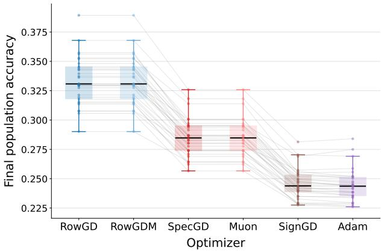

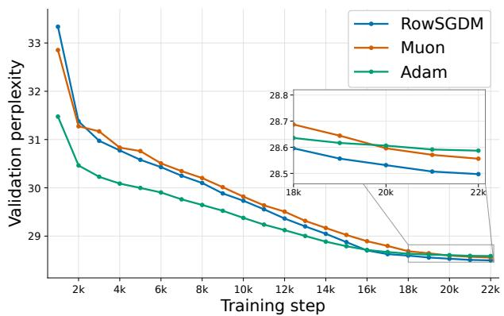  
Figure 2: Synthetic and language-model experiments. Left: Final evaluation accuracy of six deterministic optimizers on 30 draws of Gaussian-cloud data. Right: Validation perplexity during last-layer-only LLaMA training with RowSGDM, Muon, and Adam. Lower perplexity is better.

## 5 Experiments

Synthetic experiment. On isotropic Gaussian-cloud data with k = 60, d = 20, RowGD and RowGDM outperform SpecGD, Muon, SignGD, and Adam on all 30 paired seeds (Figure 2, left), consistent with Theorem 3.1. Additional comparisons and details are given in Appendix H.1.

Language model experiment. We freeze a trained LLaMA-60M model, zero-initialize its output head, and train only this layer with practical implementations of RowSGDM, Muon, or Adam. Figure 2 (right) shows that RowSGDM attains the lowest final validation perplexity, consistent with the qualitative ordering our theory predicts. Multi-seed results and details are given in Appendix H.2.

## 6 Conclusion

Implications. We connect optimizer-induced implicit-bias geometry to population accuracy in highdimensional multiclass classification, beyond prior work on optimizer-selected implicit biases (Fan et al., 2025; Li et al., 2026a; Baek et al., 2026). For linear classification abstracting the language model’s last layer, row-normalized methods achieve strictly higher population accuracy than spectral and coordinate-wise alternatives in both full-batch and random-reshufling settings by better preserving class-mean geometry. These results complement empirical evidence of competitive performance by row-normalized methods in language model training (Glentis et al., 2026; Deng et al., 2026).

Limitations and outlook. Our analysis is limited to a linear classification model that can be viewed as a last-layer readout, together with a stylized data model with Gaussian class means and within-class noise. Although the data model shares some high-dimensional geometric properties with linguistic collapse (Wu and Papyan, 2024), modern language-model representations are substantially more complex. This motivates extensions to richer representation models and multilayer training. Our anisotropic independent-orientation analysis assumes directional convergence, while our Adam results assume a zero numerical-stability constant and treat RR-Adam only via AdamProxy.

## AI use statement

In this work, we used generative AI tools to assist with improving English writing and readability, identifying potentially relevant related work that we might have overlooked, and drafting proof sections of the appendix by converting lengthy mathematical proofs and derivations into clean and readable LaTeX. We additionally used generative AI tools to assist with debugging experimental code and improving the visual presentation of figures and tables. All AI-assisted outputs were reviewed by the authors, who take responsibility for the fina content of this work.

## Reproducibility statement

We state the assumptions and settings for our theoretical results in Sections 2 and 4, and provide complete proofs and supporting technical results in Appendices B–G. For the empirical results, Appendix H provides the experimental setups and information needed for reproduction, with synthetic experiments in Appendix H.1, the language-model experiment in Appendix H.2, and the representation analysis in Appendix H.3.

## References

Beomhan Baek, Minhak Song, and Chulhee Yun. Implicit bias of per-sample Adam on separable data: Departure from the full-batch regime. In International Conference on Learning Representations, pages 120180–120229, 2026.

Lukas Balles and Philipp Hennig. Dissecting Adam: The sign, magnitude and variance of stochastic gradients. In International Conference on Machine Learning, pages 404–413. PMLR, 2018.

Jeremy Bernstein and Laker Newhouse. Modular duality in deep learning. In International Conference on Machine Learning, pages 3920–3930. PMLR, 2025.

Jeremy Bernstein, Yu-Xiang Wang, Kamyar Azizzadenesheli, and Animashree Anandkumar. SignSGD: Compressed optimisation for non-convex problems. In International Conference on Machine Learning, pages 560–569. PMLR, 2018.

Yuan Cao, Quanquan Gu, and Mikhail Belkin. Risk bounds for over-parameterized maximum margin classification on sub-Gaussian mixtures. Advances in Neural Information Processing Systems, 34:8407–8418, 2021.

Da Chang, Qiankun Shi, Lvgang Zhang, Yu Li, Ruijie Zhang, Yao Lu, Yongxiang Liu, and Ganzhao Yuan. MuonEq: Balancing before orthogonalization with lightweight equilibration. arXiv preprint arXiv:2603.28254, 2026.

Lenaic Chizat and Francis Bach. Implicit bias of gradient descent for wide two-layer neural networks trained with the logistic loss. In Conference on Learning Theory, pages 1305–1338. PMLR, 2020.

Shenyang Deng, Zhuoli Ouyang, Tianyu Pang, Zihang Liu, Ruochen Jin, Shuhua Yu, and Yaoqing Yang. RMNP: Row-momentum normalized preconditioning for scalable matrix-based optimization. In International Conference on Machine Learning, pages 24191–24239. PMLR, 2026.

Alec Dewulf, Dhruv Pai, Li Yang, Ashley Zhang, and Ben Keigwin. Aurora: A leverage-aware spectral optimizer. arXiv preprint arXiv:2606.27715, 2026.

Chen Fan, Mark Schmidt, and Christos Thrampoulidis. Implicit bias of spectral descent and Muon on multiclass separable data. Advances in Neural Information Processing Systems, 38:39622–39669, 2025.

Athanasios Glentis, Jiaxiang Li, Andi Han, and Mingyi Hong. Memory-eficient LLM pretraining via minimalist optimizer design. In International Conference on Machine Learning, pages 35197–35226. PMLR, 2026.

Eitan Gronich and Gal Vardi. The implicit bias of Adam and Muon on smooth homogeneous neural networks. In International Conference on Machine Learning, pages 36767–36811. PMLR, 2026.

Suriya Gunasekar, Jason Lee, Daniel Soudry, and Nathan Srebro. Characterizing implicit bias in terms of optimization geometry. In International Conference on Machine Learning, pages 1832–1841. PMLR, 2018a.

Suriya Gunasekar, Jason D Lee, Daniel Soudry, and Nati Srebro. Implicit bias of gradient descent on linear convolutional networks. Advances in Neural Information Processing Systems, 31, 2018b.

Vineet Gupta, Tomer Koren, and Yoram Singer. Shampoo: Preconditioned stochastic tensor optimization. In International Conference on Machine Learning, pages 1842–1850. PMLR, 2018.

Jiachen Jiang, Jinxin Zhou, Peng Wang, Qing Qu, Dustin G. Mixon, Chong You, and Zhihui Zhu. Generalized neural collapse for a large number of classes. In International Conference on Machine Learning, pages 22010–22041. PMLR, 2024.

Keller Jordan, Yuchen Jin, Vlado Boza, Jiacheng You, Franz Cesista, Laker Newhouse, and Jeremy Bernstein. Muon: An optimizer for hidden layers in neural networks, 2024. URL https://kellerjordan.github. io/posts/muon/.

Jihwan Kim, Dogyoon Song, and Chulhee Yun. Scaling laws of signSGD in linear regression: When does it outperform SGD? In International Conference on Learning Representations, pages 67140–67228, 2026a.

Jueun Kim, Baekrok Shin, Jihun Yun, Beomhan Baek, Minhak Song, and Chulhee Yun. AMUSE: Anytime Muon with stable gradient evaluation. arXiv preprint arXiv:2605.22432, 2026b.

Diederik P Kingma and Jimmy Ba. Adam: A method for stochastic optimization. In International Conference on Learning Representations, 2015.

Frederik Kunstner, Jacques Chen, Jonathan Wilder Lavington, and Mark Schmidt. Noise is not the main factor behind the gap between SGD and Adam on transformers, but sign descent might be. In International Conference on Learning Representations, 2023.

Jichu Li, Xuan Tang, and Difan Zou. The implicit bias of steepest descent with mini-batch stochastic gradient. In International Conference on Machine Learning, pages 70353–70413. PMLR, 2026a.

Zichong Li, Liming Liu, Chen Liang, Weizhu Chen, and Tuo Zhao. NorMuon: Making Muon more eficient and scalable. In International Conference on Machine Learning, pages 68514–68533. PMLR, 2026b.

Ilya Loshchilov and Frank Hutter. Decoupled weight decay regularization. In International Conference on Learning Representations, 2019.

Chao Ma, Wenbo Gong, Meyer Scetbon, and Edward Meeds. SWAN: SGD with normalization and whitening enables stateless LLM training. In International Conference on Machine Learning, pages 41907–41942. PMLR, 2025.

Francesca Mignacco, Florent Krzakala, Yue Lu, Pierfrancesco Urbani, and Lenka Zdeborova. The role of regularization in classification of high-dimensional noisy Gaussian mixture. In International Conference on Machine Learning, pages 6874–6883. PMLR, 2020.

Niklas Muennighof, Luca Soldaini, Dirk Groeneveld, Kyle Lo, Jacob Morrison, Sewon Min, Weijia Shi, Pete Walsh, Oyvind Tafjord, Nathan Lambert, et al. OLMoE: Open mixture-of-experts language models. In International Conference on Learning Representations, pages 62061–62121, 2025.

Mor Shpigel Nacson, Jason Lee, Suriya Gunasekar, Pedro Henrique Pamplona Savarese, Nathan Srebro, and Daniel Soudry. Convergence of gradient descent on separable data. In The 22nd International Conference on Artificial Intelligence and Statistics, pages 3420–3428. PMLR, 2019a.

Mor Shpigel Nacson, Nathan Srebro, and Daniel Soudry. Stochastic gradient descent on separable data: Exact convergence with a fixed learning rate. In The 22nd International Conference on Artificial Intelligence and Statistics, pages 3051–3059. PMLR, 2019b.

Vardan Papyan, Xiao Y Han, and David L Donoho. Prevalence of neural collapse during the terminal phase of deep learning training. Proceedings of the National Academy of Sciences, 117(40):24652–24663, 2020.

Thomas Pethick, Wanyun Xie, Kimon Antonakopoulos, Zhenyu Zhu, Antonio Silveti-Falls, and Volkan Cevher. Training deep learning models with norm-constrained LMOs. In International Conference on Machine Learning, pages 49069–49104. PMLR, 2025.

Qian Qian and Xiaoyuan Qian. The implicit bias of AdaGrad on separable data. Advances in Neural Information Processing Systems, 32, 2019.

Hrithik Ravi, Clayton Scott, Daniel Soudry, and Yutong Wang. The implicit bias of gradient descent on separable multiclass data. Advances in Neural Information Processing Systems, 37:81324–81359, 2024.

Meyer Scetbon, Chao Ma, Wenbo Gong, and Ted Meeds. Gradient multi-normalization for eficient LLM training. Advances in Neural Information Processing Systems, 38:43001–43030, 2025.

Daniel Soudry, Elad Hofer, Mor Shpigel Nacson, Suriya Gunasekar, and Nathan Srebro. The implicit bias of gradient descent on separable data. Journal of Machine Learning Research, 19(70):1–57, 2018.

Vignesh Subramanian, Rahul Arya, and Anant Sahai. Generalization for multiclass classification with overparameterized linear models. Advances in Neural Information Processing Systems, 35:23479–23494, 2022.

Nikolaos Tsilivis, Eitan Gronich, Julia Kempe, and Gal Vardi. Flavors of margin: Implicit bias of steepest descent in homogeneous neural networks. Journal of Machine Learning Research, 27(104):1–37, 2026.

Sharan Vaswani, Reza Babanezhad, Jose Gallego-Posada, Aaron Mishkin, Simon Lacoste-Julien, and Nicolas Le Roux. To each optimizer a norm, to each norm its generalization. arXiv preprint arXiv:2006.06821, 2020.

Roman Vershynin. Introduction to the non-asymptotic analysis of random matrices. In Compressed Sensing: Theory and Applications, pages 210–268. Cambridge University Press, 2012.

Nikhil Vyas, Depen Morwani, Rosie Zhao, Itai Shapira, David Brandfonbrener, Lucas Janson, and Sham Kakade. SOAP: Improving and stabilizing Shampoo using Adam for language modeling. In International Conference on Learning Representations, pages 93423–93444, 2025.

Bohan Wang, Qi Meng, Wei Chen, and Tie-Yan Liu. The implicit bias for adaptive optimization algorithms on homogeneous neural networks. In International Conference on Machine Learning, pages 10849–10858. PMLR, 2021a.

Bohan Wang, Qi Meng, Huishuai Zhang, Ruoyu Sun, Wei Chen, Zhi-Ming Ma, and Tie-Yan Liu. Does momentum change the implicit regularization on separable data? Advances in Neural Information Processing Systems, 35:26764–26776, 2022.

Ke Wang, Vidya Muthukumar, and Christos Thrampoulidis. Benign overfitting in multiclass classification: All roads lead to interpolation. Advances in Neural Information Processing Systems, 34:24164–24179, 2021b.

Ashia C Wilson, Rebecca Roelofs, Mitchell Stern, Nati Srebro, and Benjamin Recht. The marginal value of adaptive gradient methods in machine learning. Advances in Neural Information Processing Systems, 30, 2017.

Robert Wu and Vardan Papyan. Linguistic collapse: Neural collapse in (large) language models. Advances in Neural Information Processing Systems, 37:137432–137473, 2024.

Shuo Xie and Zhiyuan Li. Implicit bias of AdamW: ℓ∞-norm constrained optimization. In International Conference on Machine Learning, pages 54488–54510. PMLR, 2024.

Ruihan Xu, Jiajin Li, and Yiping Lu. On the width scaling of neural optimizers under matrix operator norms I: Row/column normalization and hyperparameter transfer. arXiv preprint arXiv:2603.09952, 2026.

An Yang, Anfeng Li, Baosong Yang, Beichen Zhang, Binyuan Hui, Bo Zheng, Bowen Yu, Chang Gao, Chengen Huang, Chenxu Lv, et al. Qwen3 technical report. arXiv preprint arXiv:2505.09388, 2025.

Jinghui Yuan, Jiaxuan Zou, Shuo Wang, Yong Liu, and Feiping Nie. Nora: Normalized orthogonal row alignment for scalable matrix optimizer. arXiv preprint arXiv:2605.03769, 2026.

Chenyang Zhang, Difan Zou, and Yuan Cao. The implicit bias of Adam on separable data. Advances in Neural Information Processing Systems, 37:23988–24021, 2024.

## Appendix

A Additional Related Work 16   
B Implicit Bias of Row-Normalized Methods: Full-Batch and Random Reshufling 18   
B.1 Common setup and auxiliary lemmas . 18   
B.2 Full-batch max–sum dominated norms 20   
B.3 Geometry-adapted random-reshufling momentum 21   
B.4 Specialization to row normalization 25   
C Proofs for Deterministic Optimizers 26   
C.1 Reduction from Direction Sets to Minimum-norm Representatives 28   
C.2 A Quantitative Common Gaussian-cloud Event . . 28   
C.3 Row-norm Representatives Align with the Population Mean Diferences 29   
C.4 Max-norm Representatives Have a Positive Angle Gap 31   
C.5 Spectral Polar Geometry . 37   
C.6 From Direction-set Geometry to Population Accuracy 42   
C.7 Proof of the Deterministic Optimizer Accuracy Ordering 44   
C.8 Proof of the Limiting Classifier Geometry 44   
C.9 Quantitative Population-error Exponents for Deterministic Geometries 47   
D Proofs for Stochastic Optimizers 50   
D.1 Near-margin directions and near-minimum-norm representatives 51   
D.2 Quantitative stability of near minimizers . 51   
D.3 A dimension-independent momentum threshold . 52   
D.4 Proof of the stochastic optimizer accuracy ordering 53   
E Analysis of AdamProxy for Random-reshufling Mini-batch Adam 54   
E.1 One-epoch β , β → 1 RR Adam approximation . 55   
E.2 RR-RowSGDM versus AdamProxy population accuracy 57   
E.3 AdamProxy margin characterization 63   
F Extension to Anisotropic Gaussian with Independent Orientations 66   
G Coordinate-Specific RowGDM–Adam Reversal 74   
H Additional Experiments and Experimental Details 82   
H.1 Synthetic Experiments: Setup and Additional Results 82   
H.2 Language Model Experiment 88   
H.3 Spectral Exponents for Language Model Representation 89

## Overview of the Appendix

The appendix is organized around the proof architecture of the paper. Appendix A provides additional related work, and Appendix B develops the optimizer-side margin and implicit-bias machinery for full-batch and random-reshufling training. Appendices C–E combine this machinery with high-dimensional geometry to prove the deterministic, stochastic, and AdamProxy population-accuracy results. Appendix F extends the analysis to anisotropic Gaussian models with independently oriented test-noise covariances, Appendix G identifies a coordinate-specific RowGDM–Adam reversal and its recovery under a common Haar rotation, and Appendix H provides the experimental details and additional empirical evidence.

(1) In Appendix A, we provide additional related work on implicit bias in separable classification, adaptive and sign-based optimization, optimizer geometry and population performance, matrix-aware optimization geometry, row normalization and row–spectral hybrids, high-dimensional classification under mixture models, and last-layer geometry and neural collapse.

(2) In Appendix B, we establish the optimizer-side margin-convergence results used throughout the paper. We extend full-batch normalized steepest-descent and momentum arguments to max–sum dominated matrix norms and establish the max-norm maximum-margin characterization of full-batch Adam under our learning-rate assumptions. For random-reshufling momentum methods, we develop a geometry-adapted analysis through the primal–dual atom radius $R _ { \psi } ( X )$ ), which applies directly to the Row, Spectral, and Max geometries. Specializing these results to row normalization yields the exact full-batch RowGD and RowGDM direction-set convergence in Proposition B.14 and the RR-RowSGDM near-margin guarantee in Proposition B.15.

(3) In Appendix C, we prove the deterministic population-accuracy ordering in Theorem 3.1 uniformly over the complete Row, Spectral, and Max maximum-margin direction sets. The proof establishes the all-aspect-ratio geometry of these three families: Row representatives align uniformly with the population mean diferences, Max representatives exhibit a nonvanishing clipped-coordinate angular gap, and Spectral representatives are controlled through the reduced polar geometry of the centered empirical mean matrix, including the hard-edge regime at α = 1. We then develop a geometry-to-population-error transfer and derive quantitative population-error exponents for the three geometries. The same exponent analysis also yields the full-batch Muon–Adam comparison in Corollary C.28.

(4) In Appendix D, we prove the random-reshufling stochastic ordering in Proposition 3.4. The geometryadapted momentum result from Appendix B places RR-RowSGDM, RR-Muon, and RR-Signum in near-maximum-margin direction sets for the Row, Spectral, and Max geometries. We reduce these near-margin directions to near-minimum-norm representatives, prove quantitative stability of the three near-minimizer families, and obtain a dimension-independent momentum threshold under which the deterministic geometric separation persists. The population-error transfer from Appendix C then gives the claimed stochastic accuracy ordering.

(5) In Appendix E, we analyze RR-Adam and AdamProxy. We first prove the one-epoch $\beta _ { 1 } , \beta _ { 2 } $ 1 RR-Adam approximation in Proposition 3.5; this result connects RR-Adam to the deterministic proxy over one epoch and does not assert long-horizon agreement of their trajectories. For AdamProxy itself, we establish positive margin growth and a trajectory-level coordinate cap, use the resulting coordinate saturation to obtain a nonvanishing boundary-direction gap, and combine this gap with the high-momentum RR-RowSGDM geometry and the population-error transfer from Appendix C to prove Proposition 3.6 without directional convergence. Separately, Proposition E.10 characterizes the limiting AdamProxy classifier through a self-consistent semidefinite quadratic margin problem when the normalized proxy direction converges.

(6) In Appendix F, we prove the anisotropic accuracy ordering in Theorem 4.2 under its directional-convergence assumption. Because training is clean, each optimizer-selected limiting direction depends only on the class means and is independent of the Haar eigenbases of the test-noise covariances. We characterize the selected Row, Spectral, and Max directions, expose the independent test-noise orientations, and compare their standardized Gaussian test signals. This establishes the Row advantage throughout $0 \leq s _ { \mu } < 1$ and $s _ { \Sigma } \geq 0$ , including arbitrarily strong test-noise anisotropy.

(7) In Appendix G, we prove the coordinate-specific RowGDM–Adam reversal in Proposition 4.5. Working uniformly over the complete Row and Max maximum-margin solution sets, we derive an explicit transition point $\lambda _ { c }$ for diagonal class-mean covariance with aligned anisotropic test noise, below which Row dominates and above which the ordering reverses. We then show that applying a common independent Haar rotation to the same class-mean and test-noise geometry restores the Row-over-Max, and hence RowGDM-over-Adam, ordering while preserving the rotation-invariant geometry. We also give a suficient spectral-dispersion condition under which the transition regime is nonvacuous.

(8) In Appendix H, we provide the full experimental setup and additional empirical evidence. This includes expanded deterministic and random-reshufling synthetic optimizer comparisons, auxiliary optimizer geometries, robustness studies across data and noise settings, synthetic experiments for the anisotropic independent-orientation and coordinate-aligned predictions, controlled last-layer language-model experiments with RowSGDM, Muon, and Adam, and measurements of class-mean and within-class covariance spectral exponents in language-model representations.

## A Additional Related Work

Implicit bias in separable classification. The modern implicit-bias literature begins with the observation that, on linearly separable data, gradient descent on unregularized logistic or cross-entropy loss diverges in norm while converging in direction to a hard-margin classifier (Soudry et al., 2018). More generally, the geometry of the update rule can determine the norm with respect to which the limiting margin is maximized, as formalized for steepest-descent and mirror-descent methods by Gunasekar et al. (2018a). For Euclidean methods, this picture has been extended from gradient descent to fixed-step stochastic gradient descent and momentum methods (Nacson et al., 2019b; Wang et al., 2022), and recent work gives multiclass convergence results for broad families of exponentially tailed losses (Ravi et al., 2024). In homogeneous neural networks, norm-dependent steepest-descent dynamics generally converge to first-order stationary points of the corresponding margin problem rather than necessarily to its global optimum (Tsilivis et al., 2026), and a recent extension treats normalized and momentum variants of SignGD, Muon, and Adam (Gronich and Vardi, 2026). The results closest to ours characterize the max-margin directions selected by entrywise and Schatten geometries in multiclass linear models, their approximation under random reshufling, and the data-dependent direction selected by incremental Adam (Fan et al., 2025; Li et al., 2026a; Baek et al., 2026). Our analysis complements these directional results by adding the row norm and by comparing the population accuracy of entire optimizer-selected margin faces rather than only identifying a limiting direction.

Adaptive and sign-based optimization. Adam combines momentum with coordinate-wise secondmoment normalization (Kingma and Ba, 2015), whereas signSGD and Signum retain only coordinate-wise gradient signs, with or without momentum (Bernstein et al., 2018). This relationship is not merely cosmetic: Adam can be decomposed into a sign direction and a variance-dependent magnitude, which helps explain both its robustness and its sensitivity to the coordinate system (Balles and Hennig, 2018); signSGD can also exhibit distinct compute-optimal scaling behavior from SGD (Kim et al., 2026a). The asymptotic classifier also depends on algorithmic details that are often suppressed in informal comparisons. For example, AdaGrad can converge to a margin solution determined by its path-dependent diagonal conditioner (Qian and Qian, 2019), adaptive methods with a positive stability constant can become asymptotically Euclidean in homogeneous models (Wang et al., 2021a), and Adam without a stability constant selects an $\ell _ { \infty } { \mathrm { - m a x - m a r g i n } }$ direction in binary linear classification (Zhang et al., 2024). Decoupled weight decay changes the problem again: the implicit regularization of AdamW is related to an $\ell _ { \infty } .$ -constrained objective rather than to the unregularized margin limit (Loshchilov and Hutter, 2019; Xie and Li, 2024). Accordingly, our full-batch Adam statement concerns the zero-stability-constant, no-weight-decay dynamics used in our theoretical model, while our AdamProxy analysis isolates the additional data dependence created by incremental or mini-batch updates under random reshufling (Baek et al., 2026).

Optimizer geometry and population performance. Implicit-bias results do not by themselves imply that one optimizer generalizes better than another. Constructed separable problems show that Euclidean gradient methods and adaptive coordinate-wise methods can interpolate the same training data yet have sharply diferent test errors (Wilson et al., 2017), and norm-based analyses relate such diferences to the interaction between an optimizer’s geometry and the geometry of the data (Vaswani et al., 2020). Experiments on transformers further suggest that the sign-like component of Adam, rather than stochastic noise alone, can account for part of its diference from SGD (Kunstner et al., 2023). Our contribution is a distribution-specific, high-probability ordering of row, spectral, and entrywise geometries in a multiclass model, uniform over the corresponding complete margin faces.

Matrix-aware optimization geometry. Several optimizer families exploit matrix or tensor structure without implementing the normalized steepest maps studied here. Shampoo uses Kronecker-factored, mode wise preconditioners for tensor parameters (Gupta et al., 2018), while SOAP applies Adam in an evolving Shampoo eigenbasis (Vyas et al., 2025). The modular-duality framework instead assigns layerwise operator norms from the semantics of a module and derives corresponding duality maps (Bernstein and Newhouse, 2025), and norm-constrained linear minimization oracles provide a related route to architecture-aware updates (Pethick et al., 2025). Muon can be viewed as the matrix duality map obtained from the polar factor, commonly approximated by Newton–Schulz iterations (Jordan et al., 2024; Bernstein and Newhouse, 2025). By contrast, our spectral comparator is the exact polar update $U V ^ { \dagger }$ for a gradient with compact singular value decomposition $U { \boldsymbol { \Sigma } } V ^ { \top }$ ; our theorems do not automatically transfer to preconditioned methods such as Shampoo or SOAP, or to finite-iteration approximations of the polar factor.

Row normalization and row–spectral hybrids. The row-structured methods summarized in Section 1.2 are algorithmically distinct even when they contain a superficially similar normalization step. In particular, SinkGD alternates row and column normalization, NorMuon performs neuron-wise adaptation after Muon orthogonalization, RMNP analyzes row-normalized momentum through nonconvex convergence guarantees, and MOGA studies width scaling and hyperparameter transfer for the corresponding operator geometry (Scetbon et al., 2025; Li et al., 2026b; Deng et al., 2026; Xu et al., 2026). Recent hybrid proposals further modify the polar update by projecting momentum before row alignment, equilibrating rows before orthogonalization, or imposing leverage-aware row uniformity while retaining spectral structure (Yuan et al., 2026; Chang et al., 2026; Dewulf et al., 2026). SWAN is also a relevant stateless optimizer that combines column normalization with whitening (Ma et al., 2025). These methods strengthen the practical motivation for studying row geometry, but the extra projection, whitening, equilibration, or orthogonalization steps make them diferent dynamical systems. Our results should therefore be read as an analysis of exact row-normalized steepest descent and momentum, and as a controlled comparison that isolates the row normalization component rather than as an implicit-bias theorem for every row–spectral hybrid.

High-dimensional classification under mixture models. Gaussian and sub-Gaussian mixture models have been used to obtain sharp asymptotic formulas or risk bounds for regularized convex classifiers and binary max-margin classifiers (Mignacco et al., 2020; Cao et al., 2021). In the multiclass setting, prior work relates the hard-margin multiclass SVM to minimum-norm interpolation and studies benign overfitting under Gaussian designs (Wang et al., 2021b), including regimes in which the number of classes grows with dimension (Subramanian et al., 2022). These works primarily fix an estimator geometry, usually Euclidean, and characterize when its interpolation or maximum-margin bias generalizes. We instead hold the data model fixed and compare the distinct margin geometries selected by several optimizers in the proportional regime $k / d \to \alpha \in ( 0 , \infty )$ . The uniform statements over complete margin faces are important in this regime because a norm-specific margin problem need not have a unique optimizer, so identifying one convenient solution would not establish an optimizer-level population comparison.

Last-layer geometry and neural collapse. The class-conditional mean geometry in our model is also related to neural collapse, where terminal-phase representations approach within-class concentration, centered class means form a simplex-like frame, and classifier weights align with those means (Papyan et al., 2020). Generalized neural-collapse formulations extend this viewpoint to settings with many more classes than feature dimensions by replacing the simplex equiangular tight frame with a one-versus-rest margin criterion (Jiang et al., 2024). Related geometric regularities have been reported for the unembedding representations of language models under the name linguistic collapse (Wu and Papyan, 2024). Our model does not attempt to explain the feature-learning dynamics that create such configurations. Instead, it conditions on a fixed last-layer representation with random Gaussian class centers and isotropic or anisotropic residual variation, and asks which optimizer-induced norm produces the most accurate of-sample decision regions once that representation has been formed.

## B Implicit Bias of Row-Normalized Methods: Full-Batch and Random Reshufling

This appendix collects the optimizer-side implicit-bias results used throughout the paper. For full-batch normalized steepest descent, we extend the analysis of Fan et al. (2025) from entrywise and Schatten norms to every max–sum dominated matrix norm. For random-reshufling momentum methods, we extend the analysis of Li et al. (2026a) and use a sharper geometry-adapted analysis based on the primal–dual atom radius $R _ { \psi } ( X )$ which avoids the common entrywise $\ell _ { 1 }$ feature bound and applies directly to the Row, Spectral, and Max geometries. We then specialize these general results to row normalization, thereby proving Proposition B.14 and the RR-RowSGDM margin result used in the stochastic accuracy theorem.

## B.1 Common setup and auxiliary lemmas

Let $X = \{ ( x _ { n } , y _ { n } ) \} _ { n = 1 } ^ { N }$ be a fixed linearly separable multiclass dataset with $x _ { n } \in \mathbb { R } ^ { d }$ and $y _ { n } \in [ k ]$ . A linear classifier is $W \in \mathbb { R } ^ { k \times d }$ , and the cross-entropy loss is

$$
L ( W ) : = { \frac { 1 } { N } } \sum _ { n = 1 } ^ { N } \ell _ { n } ( W ) , \qquad \ell _ { n } ( W ) : = - \log \mathbb { S } ( W x _ { n } ) _ { y _ { n } } .
$$

Define

$$
\operatorname* { m a r } _ { X } ( W ) : = \operatorname* { m i n } _ { n \in [ N ] } \operatorname* { m i n } _ { c \neq y _ { n } } ( w _ { y _ { n } } - w _ { c } ) ^ { \top } x _ { n } , \qquad \gamma _ { \psi } ( X ) : = \operatorname* { m a x } _ { \psi ( W ) \leq 1 } \operatorname* { m a r } _ { X } ( W )
$$

for any matrix norm $\psi$ , and define the standard cross-entropy proxy

$$
\mathcal G ( W ) : = \frac { 1 } { N } \sum _ { n = 1 } ^ { N } \bigl ( 1 - \mathbb S ( W x _ { n } ) _ { y _ { n } } \bigr ) .
$$

For $0 \leq \varepsilon < \gamma _ { \psi } ( X )$ , define the near-max-margin direction set

$$
\mathcal { U } _ { \psi , \varepsilon } ^ { X } : = \left\{ W \neq \mathbf { 0 } : \frac { \operatorname* { m a r } _ { X } ( W ) } { \psi ( W ) } \geq \gamma _ { \psi } ( X ) - \varepsilon \right\} , \qquad \mathcal { U } _ { \psi } ^ { X } : = \mathcal { U } _ { \psi , 0 } ^ { X } .
$$

For a nonzero matrix A and a nonempty set $S \subset \mathbb { R } ^ { k \times d } \setminus \{ \mathbf { 0 } \}$ , let

$$
d _ { \mathrm { c o s } } ( A , \mathcal { S } ) : = 1 - \operatorname* { s u p } _ { V \in \mathcal { S } } \frac { \langle A , V \rangle } { \| A \| _ { \mathrm { F } } \| V \| _ { \mathrm { F } } } .
$$

Lemma B.1 (Efective margin implies direction-set convergence). Suppose $W _ { t } \neq \mathbf { 0 }$ eventually and, for some $0 \leq \varepsilon < \gamma _ { \psi } ( X )$ ，

$$
\operatorname* { l i m } _ { t \to \infty } \operatorname* { i n f } _ { \psi ( W _ { t } ) } \geq \gamma _ { \psi } ( X ) - \varepsilon .\tag{13}
$$

Then

$$
d _ { \cos } ( W _ { t } , \mathcal { U } _ { \psi , \varepsilon } ^ { X } ) \longrightarrow 0 .
$$

Proof. By scale invariance of $d _ { \mathrm { c o s } }$ , consider $W _ { t } / \psi ( W _ { t } )$ , which lies on the compact ψ-unit sphere. If the conclusion failed, a subsequence whose cosine discrepancy from $\mathcal { U } _ { \psi , \varepsilon } ^ { X }$ is bounded below by a positive constant would have a further subsequence converging to some $U _ { \infty }$ . Continuity of the margin and (13) give mar $\phantom { } _ { X } ( U _ { \infty } ) \geq$ $\gamma _ { \psi } ( X ) - \varepsilon _ { : }$ , so $U _ { \infty } \in \mathcal { U } _ { \psi , \varepsilon } ^ { X }$ , contradicting continuity of the cosine discrepancy. □

Lemma B.2 (Exact margin implies direction-set convergence). $I f$

$$
\frac { \operatorname* { m a r } _ { X } ( W _ { t } ) } { \psi ( W _ { t } ) } \longrightarrow \gamma _ { \psi } ( X ) ,
$$

then

$$
d _ { \cos } ( W _ { t } , \mathcal { U } _ { \psi } ^ { X } ) \longrightarrow 0 .
$$

Proof. Apply Lemma B.1 with $\varepsilon = 0 .$

For a learning-rate sequence, write $\begin{array} { r } { S _ { t } : = \sum _ { s = 0 } ^ { t - 1 } \eta _ { s } } \end{array}$

Lemma B.3 (Cumulative remainders for general learning rates). Suppose Assumption 2.5 holds. Then $S _ { t } \to \infty$ , and for every $q > 1 , c > 0$ , and fixed $t _ { 0 } \in \mathbb { N }$

$$
\frac { \sum _ { s = 0 } ^ { t - 1 } \eta _ { s } ^ { q } } { S _ { t } } \longrightarrow 0 , \qquad \sum _ { s = t _ { 0 } } ^ { t - 1 } \eta _ { s } \exp \left( - c \sum _ { \tau = t _ { 0 } } ^ { s - 1 } \eta _ { \tau } \right) = O ( 1 ) .
$$

Proof. Fix $\varepsilon > 0$ and choose T so that $\eta _ { s } ^ { q - 1 } \leq \varepsilon$ for all $s \geq T$ . Then

$$
\frac { \sum _ { s = 0 } ^ { t - 1 } \eta _ { s } ^ { q } } { S _ { t } } \leq \frac { \sum _ { s = 0 } ^ { T - 1 } \eta _ { s } ^ { q } } { S _ { t } } + \varepsilon ,
$$

which proves the first limit. For the second assertion, enlarge $T \geq t _ { 0 }$ so that $c \eta _ { s } \leq 1$ for $s \geq T .$ , and set $\begin{array} { r } { A _ { s } : = \sum _ { \tau = t _ { 0 } } ^ { s - 1 } \eta _ { \tau } } \end{array}$ . Since $1 - e ^ { - x } \ge x / 2$ for $x \in [ 0 , 1 ]$

$$
e ^ { - c A _ { s } } - e ^ { - c A _ { s + 1 } } \geq \frac { c } { 2 } \eta _ { s } e ^ { - c A _ { s } } .
$$

The tail therefore telescopes to a bounded quantity, while the finite prefix is harmless.

Lemma B.4 (Normalization of a cumulative margin bound). Let $\mathfrak { m } : \mathbb { R } ^ { k \times d }  \mathbb { R }$ be continuous and positively homogeneous, let $\Gamma _ { * } : = \operatorname* { m a x } _ { \psi ( W ) \leq 1 } \mathfrak { m } ( W ) > 0$ , and suppose $0 < \Gamma \leq \Gamma _ { * }$ . Assume $S _ { t } \to \infty$ . If

$$
\mathfrak { m } ( W _ { t } ) \geq \Gamma S _ { t } - r _ { t } , \qquad \psi ( W _ { t } ) \leq C _ { 0 } + S _ { t } , \qquad r _ { t } = o ( S _ { t } ) ,
$$

then

$$
\operatorname* { l i m } _ { t \to \infty } \operatorname* { m } _ { \psi ( W _ { t } ) } \geq \Gamma .
$$

$I f \Gamma = \Gamma _ { \ast }$ ∗, then $\mathfrak { m } ( W _ { t } ) / \psi ( W _ { t } ) \to \Gamma _ { * }$ , and every accumulation point of $W _ { t } / \psi ( W _ { t } )$ maximizes m over the ψ-unit ball.

Proof. Since $r _ { t } = o ( S _ { t } )$ and $S _ { t }  \infty$ , the lower bound $\Gamma S _ { t } - r _ { t }$ is positive for all suficiently large t. In particular, $W _ { t } \neq 0$ eventually. For such t,

$$
\frac { \mathfrak { m } ( W _ { t } ) } { \psi ( W _ { t } ) } \geq \frac { \Gamma S _ { t } - r _ { t } } { C _ { 0 } + S _ { t } } \longrightarrow \Gamma .
$$

This proves the liminf statement without imposing a sign condition on $r _ { t }$ . When $\Gamma = \Gamma _ { * }$ , positive homogeneity gives m $\iota ( W _ { t } ) / \psi ( W _ { t } ) \leq \Gamma ,$ ∗, proving convergence. Compactness of the ψ-unit sphere and continuity of m give the accumulation-point statement. □

## B.2 Full-batch max–sum dominated norms

For a matrix A, write

$$
\| A \| _ { \operatorname* { m a x } } : = \operatorname* { m a x } _ { r , j } | A _ { r , j } | , \qquad \| A \| _ { \operatorname { s u m } } : = \sum _ { r , j } | A _ { r , j } | .
$$

We call a matrix norm $\psi$ max–sum dominated if

$$
\begin{array} { r } { \| A \| _ { \operatorname* { m a x } } \leq \psi ( A ) \leq \| A \| _ { \mathrm { s u m } } \qquad \mathrm { f o r ~ e v e r y ~ } A . } \end{array}\tag{14}
$$

Let $R _ { 1 } ( X ) : = \operatorname* { m a x } _ { n \in [ N ] } \| x _ { n } \| _ { 1 } < \infty .$

Lemma B.5 (Consequences of max–sum domination). Let ψ satisfy (14), and let $\psi ^ { * }$ be its dual norm. Then, $f o r$ every matrix $G ,$ every h with $\| h \| _ { 1 } \leq R _ { 1 } ( X )$ , and every $A \in \mathbb { R } ^ { k \times d }$ ，

$$
\psi ^ { * } ( G ) \leq \| G \| _ { \mathrm { s u m } } , \qquad \| A h \| _ { \infty } \leq R _ { 1 } ( X ) \psi ( A ) .
$$

Moreover, $i f s \in \mathbb { R } ^ { k }$ is a probability vector and $\begin{array} { r } { H ( s ) : = \mathrm { d i a g } ( s ) - s s ^ { \intercal } } \end{array}$ , then for every $c \in [ k ]$

$$
\begin{array} { r } { { h ^ { \top } A ^ { \top } H ( s ) A h \leq 4 R _ { 1 } ( X ) ^ { 2 } ( 1 - s _ { c } ) \psi ( A ) ^ { 2 } } . } \end{array}\tag{15}
$$

Proof. Since the ψ-unit ball is contained in the entrywise max-norm unit ball,

$$
\psi ^ { * } ( G ) = \operatorname* { m a x } _ { \psi ( A ) \leq 1 } \langle G , A \rangle \leq \operatorname* { m a x } _ { \| A \| _ { \operatorname* { m a x } } \leq 1 } \langle G , A \rangle = \| G \| _ { \operatorname* { s u m } } .
$$

Also, $\| A h \| _ { \infty } \leq \| A \| _ { \operatorname* { m a x } } \| h \| _ { 1 } \leq R _ { 1 } ( X ) \psi ( A )$ . For $v = A h$ , the softmax covariance bound gives $v ^ { \top } H ( s ) v \leq$ $4 ( 1 - s _ { c } ) \| v \| _ { \infty } ^ { 2 }$ , which proves (15). □

Theorem B.6 (Full-batch max–sum dominated margin convergence). Let $\psi$ be max–sum dominated. Under Assumption $2 . 5 ,$ normalized steepest descent

$$
\Delta _ { t } \in \underset { \psi ( \Delta ) \leq 1 } { \arg \operatorname* { m a x } } \langle \nabla L ( W _ { t } ) , \Delta \rangle , \qquad W _ { t + 1 } = W _ { t } - \eta _ { t } \Delta _ { t }
$$

satisfies

$$
\frac { \operatorname* { m a r } _ { X } ( W _ { t } ) } { \psi ( W _ { t } ) } \longrightarrow \gamma _ { \psi } ( X ) .
$$

Under Assumptions 2.5 and ${ \it 2 . 6 , }$ the same conclusion holds for every fixed $\beta \in ( 0 , 1 )$ under normalized momentum descent with $M _ { 0 } = \mathbf { 0 } $

$$
M _ { t + 1 } = \beta M _ { t } + ( 1 - \beta ) \nabla L ( W _ { t } ) , \qquad \Delta _ { t } \in \underset { \psi ( \Delta ) \leq 1 } { \arg \operatorname* { m a x } } \langle M _ { t + 1 } , \Delta \rangle , \qquad W _ { t + 1 } = W _ { t } - \eta _ { t } \Delta _ { t } ,
$$

In either case, every accumulation point of $W _ { t } / \psi ( W _ { t } )$ is a ψ-maximum-margin solution.

Proof. The geometry-dependent steps in the normalized steepest-descent and momentum proofs of Fan et al. (2025, Appendices D and E) use only norm duality, the lower bound $\psi ^ { * } ( \nabla L ( W ) ) \geq \gamma _ { \psi } ( X ) \mathcal { G } ( W )$ , the upper bound $\psi ^ { * } ( \nabla L ( W ) ) \leq 2 R _ { 1 } ( X ) \mathcal { G } ( W )$ , and the logit and Hessian controls in Lemma B.5. Substituting these bounds into their pre-rate scalar argument gives

$$
\begin{array} { r } { \operatorname* { m a r } _ { X } ( W _ { t } ) \ge \gamma _ { \psi } ( X ) S _ { t } - r _ { t } , \qquad \psi ( W _ { t } ) \le \psi ( W _ { 0 } ) + S _ { t } , } \end{array}
$$

where $r _ { t }$ is a finite-prefix term plus sums of the forms $\textstyle \sum _ { s } \eta _ { s } ^ { 2 }$ and $\begin{array} { r } { \sum _ { s } \eta _ { s } \exp ( - c \sum _ { \tau < s } \eta _ { \tau } ) } \end{array}$ ; in the momentum case, Assumption 2.6 controls the additional geometric-memory term. Lemma B.3 gives $r _ { t } = o ( S _ { t } )$ , and Lemma B.4 with m = mar and $\Gamma = \Gamma _ { \ast } = \gamma _ { \psi } ( X )$ proves the result. □

The full-batch Adam characterization used in Theorem 3.1 also extends to the learning-rate assumptions of the present paper.

Theorem B.7 (Full-batch Adam under the present learning-rate assumptions). Consider full-batch Adam without bias correction or a numerical-stability constant, initialized by $M _ { 0 } = V _ { 0 } = \mathbf { 0 }$

$$
\begin{array} { r l } & { M _ { t + 1 } = \beta _ { 1 } M _ { t } + ( 1 - \beta _ { 1 } ) \nabla L ( W _ { t } ) , } \\ & { V _ { t + 1 } = \beta _ { 2 } V _ { t } + ( 1 - \beta _ { 2 } ) \nabla L ( W _ { t } ) ^ { \odot 2 } , } \\ & { W _ { t + 1 } = W _ { t } - \eta _ { t } M _ { t + 1 } \oslash V _ { t + 1 } ^ { \odot 1 / 2 } . } \end{array}
$$

Assume $0 < \beta _ { 1 } \le \beta _ { 2 } < 1$ , Assumptions 2.5 and ${ \it 2 . 6 , }$ and $\begin{array} { r } { \operatorname* { m i n } _ { c \in [ k ] , j \in [ d ] } | \nabla L ( W _ { 0 } ) [ c , j ] | ^ { 2 } \geq \omega } \end{array}$ for some $\omega > 0$ Then, with

$$
\gamma _ { \operatorname* { m a x } } ( X ) : = \operatorname* { m a x } _ { \| W \| \operatorname* { m a x } \leq 1 } \operatorname* { m a r } _ { X } ( W ) ,
$$

one has

$$
\frac { \operatorname* { m a r } _ { X } ( W _ { t } ) } { \| W _ { t } \| _ { \operatorname* { m a x } } } \longrightarrow \gamma _ { \operatorname* { m a x } } ( X ) ,\tag{16}
$$

and every accumulation point of $W _ { t } / \| W _ { t } \| _ { \operatorname* { m a x } }$ is a max-norm maximum-margin solution.

Proof. The pre-rate part of Fan et al. (2025, Appendix G) gives

$$
\operatorname* { m a r } _ { X } ( W _ { t } ) \geq \gamma _ { \operatorname* { m a x } } ( X ) S _ { t } - r _ { t } , \qquad \| W _ { t } \| _ { \operatorname* { m a x } } \leq C _ { 0 } + S _ { t } ,
$$

where $r _ { t }$ consists of a finite prefix, $\sum _ { s } \eta _ { s } ^ { 3 / 2 }$ , and an exponentially weighted remainder. Lemma B.3 gives $r _ { t } = o ( S _ { t } )$ , and Lemma B.4 proves (16) and the accumulation-point conclusion. □

## B.3 Geometry-adapted random-reshufling momentum

The full-batch max–sum argument above is suficient for deterministic optimization, but using the same common feature radius ma $\tau _ { n } \parallel { x } _ { n } \parallel _ { 1 }$ in the stochastic analysis is unnecessarily coarse when comparing diferent geometries. We therefore work directly with the primal–dual pair $( \psi , \psi ^ { * } )$ and define the atom radius

$$
R _ { \psi } ( X ) : = \operatorname* { m a x } _ { n \in [ N ] } \operatorname* { m a x } _ { c \in [ k ] } \psi ^ { * } ( e _ { c } x _ { n } ^ { \top } ) .\tag{17}
$$

The stochastic results below hold for an arbitrary matrix norm ψ; max–sum domination is not required. Assume $b \mid N$ , set $m : = N / b .$ , and for every mini-batch $B \subset [ N ]$ of size b define $\begin{array} { r } { L _ { B } ( W ) : = b ^ { - 1 } \sum _ { n \in B } \bar { \ell } _ { n } ( W ) } \end{array}$

Lemma B.8 (Geometry-adapted cross-entropy bounds). For every matrix norm $\psi ,$ , every sample $x _ { n }$ , every matrix A, and all classes $a , c \in [ k ]$ ,

$$
\| A x _ { n } \| _ { \infty } \leq R _ { \psi } ( X ) \psi ( A ) , \qquad \psi ^ { * } ( ( e _ { a } - e _ { c } ) x _ { n } ^ { \top } ) \leq 2 R _ { \psi } ( X ) .\tag{18}
$$

For every W, $W _ { ☉ }$

$$
\gamma _ { \psi } ( X ) \mathcal { G } ( W ) \leq \psi ^ { * } ( \nabla L ( W ) ) \leq 2 R _ { \psi } ( X ) \mathcal { G } ( W ) .\tag{19}
$$

For every sample n, every W, and every perturbation A,

$$
D ^ { 2 } \ell _ { n } ( W ) [ A , A ] \leq 4 R _ { \psi } ( X ) ^ { 2 } \bigl ( 1 - \mathbb { S } ( W x _ { n } ) _ { y _ { n } } \bigr ) \psi ( A ) ^ { 2 } .\tag{20}
$$

Moreover, for all $U , W$

$$
| L ( U ) - L ( W ) | \leq 2 R _ { \psi } ( X ) \psi ( U - W ) .\tag{21}
$$

Proof. For every $c \in [ k ]$ , norm duality gives

$$
\begin{array} { r } { | e _ { c } ^ { \top } A x _ { n } | = | \langle A , e _ { c } x _ { n } ^ { \top } \rangle | \leq \psi ( A ) \psi ^ { * } ( e _ { c } x _ { n } ^ { \top } ) \leq R _ { \psi } ( X ) \psi ( A ) , } \end{array}
$$

which proves the first bound in (18); the second follows from the triangle inequality. Writing $p _ { n } ( W ) : = \mathbb { S } ( W x _ { n } )$ the sample gradient has the decomposition

$$
\nabla \ell _ { n } ( W ) = \sum _ { c \neq y _ { n } } p _ { n , c } ( W ) ( e _ { c } - e _ { y _ { n } } ) x _ { n } ^ { \top } ,
$$

$$
\psi ^ { * } ( \nabla \ell _ { n } ( W ) ) \leq 2 R _ { \psi } ( X ) { \big ( } 1 - p _ { n , y _ { n } } ( W ) { \big ) } .
$$

Averaging proves the upper bound in (19). For the lower bound, choose $A _ { \star }$ with $\psi ( A _ { \star } ) \leq 1$ and margin $\gamma _ { \psi } ( X )$ ; then

$$
- \boldsymbol { \nabla } L ( \boldsymbol { W } ) = \frac { 1 } { N } \sum _ { n = 1 } ^ { N } \sum _ { c \neq y _ { n } } p _ { n , c } ( \boldsymbol { W } ) ( e _ { y _ { n } } - e _ { c } ) \boldsymbol { x } _ { n } ^ { \intercal }
$$

gives $\psi ^ { * } ( \nabla L ( W ) ) \geq \langle A _ { \star } , - \nabla L ( W ) \rangle \geq \gamma _ { \psi } ( X ) \mathcal { G } ( W )$ . For the Hessian bound, set $v : = A x _ { n }$ and let C be categorical with law $p _ { n } ( W )$ . Then

$$
D ^ { 2 } \ell _ { n } ( W ) [ A , A ] = \operatorname { V a r } ( v _ { C } ) \leq \mathbb { E } [ ( v _ { C } - v _ { y _ { n } } ) ^ { 2 } ] \leq 4 ( 1 - p _ { n , y _ { n } } ( W ) ) \| v \| _ { \infty } ^ { 2 } ,
$$

which proves (20). Finally, convexity and the upper gradient bound, together with $\mathcal { G } \leq 1$ , yield $L ( U ) - L ( W ) \leq$ $2 R _ { \psi } ( X ) \psi ( U - W )$ ; exchanging $U , W$ proves (21). □

Lemma B.9 (Geometry-adapted softmax and gradient stability). For U, $W \in \mathbb { R } ^ { k \times d }$ , define $h : = R _ { \psi } ( X ) \psi ( U -$ W). Then, for every sample n and class $c ,$

$$
e ^ { - 2 h } \leq \frac { p _ { n , c } ( U ) } { p _ { n , c } ( W ) } \leq e ^ { 2 h } , \qquad e ^ { - 2 h } \leq \frac { 1 - p _ { n , y _ { n } } ( U ) } { 1 - p _ { n , y _ { n } } ( W ) } \leq e ^ { 2 h } .
$$

Consequently,

$$
\mathcal { G } ( U ) \leq e ^ { 2 R _ { \psi } ( X ) \psi ( U - W ) } \mathcal { G } ( W ) ,\tag{22}
$$

$$
\psi ^ { * } ( \nabla L ( U ) - \nabla L ( W ) ) \leq 2 R _ { \psi } ( X ) \Bigl ( e ^ { 2 R _ { \psi } ( X ) \psi ( U - W ) } - 1 \Bigr ) \mathcal { G } ( W ) ,\tag{23}
$$

and, for every mini-batch $B$

$$
\psi ^ { * } ( \nabla L _ { B } ( U ) - \nabla L _ { B } ( W ) ) \leq 2 m R _ { \psi } ( X ) \Bigl ( e ^ { 2 R _ { \psi } ( X ) \psi ( U - W ) } - 1 \Bigr ) \mathcal { G } ( W ) .\tag{24}
$$

Proof. Set $\delta _ { n } : = ( U - W ) x _ { n }$ . Lemma B.8 gives $\| \delta _ { n } \| _ { \infty } \leq h ,$ and the softmax formula gives

$$
\frac { p _ { n , c } ( U ) } { p _ { n , c } ( W ) } = e ^ { \delta _ { n , c } } \frac { \sum _ { a = 1 } ^ { k } e ^ { e _ { a } ^ { \top } W x _ { n } } } { \sum _ { a = 1 } ^ { k } e ^ { e _ { a } ^ { \top } W x _ { n } + \delta _ { n , a } } } \in [ e ^ { - 2 h } , e ^ { 2 h } ] .
$$

Summing over $c \neq y _ { n }$ proves the second ratio and (22). If $p : = p _ { n } ( W )$ and $q : = p _ { n } ( U )$ , the ratio bounds imply

$$
\sum _ { c \neq y _ { n } } | q _ { c } - p _ { c } | \leq ( e ^ { 2 h } - 1 ) ( 1 - p _ { y _ { n } } ) , \qquad | q _ { y _ { n } } - p _ { y _ { n } } | \leq ( e ^ { 2 h } - 1 ) ( 1 - p _ { y _ { n } } ) .
$$

Since $\nabla \ell _ { n } ( U ) - \nabla \ell _ { n } ( W ) = ( q - p ) x _ { n } ^ { \top }$

$$
\psi ^ { * } ( ( q - p ) x _ { n } ^ { \top } ) \leq \sum _ { c = 1 } ^ { k } | q _ { c } - p _ { c } | \psi ^ { * } ( e _ { c } x _ { n } ^ { \top } ) \leq 2 R _ { \psi } ( X ) ( e ^ { 2 h } - 1 ) ( 1 - p _ { y _ { n } } ) .
$$

Averaging over all samples proves (23); averaging over $B ,$ , enlarging the resulting nonnegative sample sum to [N], and using $N / b = m$ proves (24). □

Lemma B.10 (Random-reshufling noise and cancellation). For a mini-batch B of size $b ,$ define $\Xi _ { B } ( W ) : =$ $\nabla L _ { B } ( W ) - \nabla L ( W )$ . Then

$$
\psi ^ { * } ( \Xi _ { B } ( W ) ) \leq 2 ( m - 1 ) R _ { \psi } ( X ) \mathcal { G } ( W ) .
$$

Moreover, let $\{ B _ { t } \} _ { t \ge 0 }$ be any random-reshufling sequence, so that $B _ { q m } , \ldots , B _ { q m + m - 1 }$ partition [N] for every epoch $q ,$ and define

$$
E _ { t } ( W ) : = ( 1 - \beta ) \sum _ { \tau = 0 } ^ { t } \beta ^ { \tau } \big ( \nabla L _ { B _ { t - \tau } } ( W ) - \nabla L ( W ) \big ) .
$$

Then, deterministically for every reshufling realization,

$$
\psi ^ { * } ( E _ { t } ( W ) ) \leq ( 1 - \beta ) m ( m ^ { 2 } - 1 ) R _ { \psi } ( X ) \mathcal { G } ( W ) .
$$

Proof. When $m \geq 2 .$ , let $B ^ { c } = [ N ] \backslash B$ . The finite-population identity

$$
\Xi _ { B } ( W ) = \frac { m - 1 } { m } \bigl ( \nabla L _ { B } ( W ) - \nabla L _ { B ^ { c } } ( W ) \bigr )
$$

and the single-sample bound in the proof of Lemma B.8 give

$$
\psi ^ { * } ( \Xi _ { B } ( W ) ) \leq \frac { m - 1 } { N } \sum _ { n = 1 } ^ { N } \psi ^ { * } ( \nabla \ell _ { n } ( W ) ) \leq 2 ( m - 1 ) R _ { \psi } ( X ) \mathcal { G } ( W ) ,
$$

while $m = 1$ is immediate.

For the second assertion, write $\Xi _ { t } ( W ) : = \nabla L _ { B _ { t } } ( W ) { - \nabla L } ( W )$ . Every complete epoch satisfies $\begin{array} { r } { \sum _ { r = 0 } ^ { m - 1 } \Xi _ { q m + r } ( W ) = } \end{array}$ 0. Put $K _ { \Xi } ( W ) : = 2 ( m - 1 ) R _ { \psi } ( X ) { \mathcal { G } } ( W )$ . For a complete epoch contained in $\{ 0 , \ldots , t \}$ , subtracting the constant coeficient $\beta ^ { t - q m }$ and using $1 - \beta ^ { r } \leq r ( 1 - \beta )$ gives

$$
\psi ^ { * } \left( \sum _ { r = 0 } ^ { m - 1 } \beta ^ { t - q m - r } \Xi _ { q m + r } ( W ) \right) \leq K _ { \Xi } ( W ) \beta ^ { t - ( q + 1 ) m } ( 1 - \beta ) \frac { m ( m - 1 ) } { 2 } .
$$

Summing over complete epochs and using $( 1 - \beta ) / ( 1 - \beta ^ { m } ) \leq 1$ , then adding the at most m terms in the current incomplete epoch, gives

$$
\psi ^ { * } ( E _ { t } ( W ) ) \leq ( 1 - \beta ) \frac { m ( m + 1 ) } { 2 } K _ { \Xi } ( W ) = ( 1 - \beta ) m ( m ^ { 2 } - 1 ) R _ { \psi } ( X ) \mathcal { G } ( W ) .
$$

Consider now the moving-weight random-reshufling momentum process

$$
M _ { t + 1 } = \beta M _ { t } + ( 1 - \beta ) \nabla L _ { B _ { t } } ( W _ { t } ) , \qquad \Delta _ { t } \in \underset { \psi ( \Delta ) \leq 1 } { \arg \operatorname* { m a x } } \langle M _ { t + 1 } , \Delta \rangle , \qquad W _ { t + 1 } = W _ { t } - \eta _ { t } \Delta _ { t } ,
$$

with $M _ { 0 } = \mathbf { 0 }$ . Since $\psi ( \Delta _ { t } ) \leq 1$

$$
\psi ( W _ { t } - W _ { t - \tau } ) \leq \sum _ { q = 1 } ^ { \tau } \eta _ { t - q } .\tag{25}
$$

Proposition B.11 (Geometry-adapted random-reshufling momentum control). Assume Assumptions 2.5 and 2.6. For every fixed finite dataset, fixed matrix norm ψ, and fixed $\beta \in ( 0 , 1 )$ , there exist $t _ { 0 , \psi , \beta } < \infty$ and $c _ { \psi , \beta } < \infty$ such that, for all $t \geq t _ { 0 , \psi , \beta }$

$$
\psi ^ { * } ( M _ { t + 1 } - \nabla L ( W _ { t } ) ) \leq \left[ 2 m ( 1 - \beta ) R _ { \psi } ( X ) c _ { \psi , \beta } \eta _ { t } + ( 1 - \beta ) m ( m ^ { 2 } - 1 ) R _ { \psi } ( X ) \right] \leqq _ { 0 } .
$$

$$
+ 2 R _ { \psi } ( X ) \beta ^ { t + 1 } \ ] \mathcal { G } ( W _ { t } ) .\tag{26}
$$

Define

$$
\rho _ { \psi , \beta , b } ( X ) : = \gamma _ { \psi } ( X ) - 2 ( 1 - \beta ) m ( m ^ { 2 } - 1 ) R _ { \psi } ( X ) ,\tag{27}
$$

$$
C _ { \psi , \beta , b } : = 4 m ( 1 - \beta ) R _ { \psi } ( X ) c _ { \psi , \beta } + 2 R _ { \psi } ( X ) ^ { 2 } e ^ { 2 R _ { \psi } ( X ) \eta _ { 0 } } , \qquad D _ { \psi } : = 4 R _ { \psi } ( X ) .
$$

Then, for all suficiently large t,

$$
L ( W _ { t + 1 } ) \leq L ( W _ { t } ) - \eta _ { t } \Big ( \rho _ { \psi , \beta , b } ( X ) - C _ { \psi , \beta , b } \eta _ { t } - D _ { \psi } \beta ^ { t / 2 } \Big ) \mathcal { G } ( W _ { t } ) .\tag{28}
$$

Proof. Unrolling the momentum recursion and adding and subtracting frozen batch gradients at $W _ { t }$ gives

$$
\begin{array} { r l } & { M _ { t + 1 } - \nabla L ( W _ { t } ) = ( 1 - \beta ) \displaystyle \sum _ { \tau = 0 } ^ { t } \beta ^ { \tau } \Big ( \nabla L _ { B _ { t - \tau } } ( W _ { t - \tau } ) - \nabla L _ { B _ { t - \tau } } ( W _ { t } ) \Big ) } \\ & { \qquad + \left( 1 - \beta \right) \displaystyle \sum _ { \tau = 0 } ^ { t } \beta ^ { \tau } \Big ( \nabla L _ { B _ { t - \tau } } ( W _ { t } ) - \nabla L ( W _ { t } ) \Big ) - \beta ^ { t + 1 } \nabla L ( W _ { t } ) . } \end{array}
$$

Lemma B.9 and (25) bound the first term by

$$
2 m ( 1 - \beta ) R _ { \psi } ( X ) \mathcal { G } ( W _ { t } ) \sum _ { \tau = 0 } ^ { t } \beta ^ { \tau } \left( \exp \left( 2 R _ { \psi } ( X ) \sum _ { q = 1 } ^ { \tau } \eta _ { t - q } \right) - 1 \right) .
$$

Assumption $2 . 6 ,$ applied with $c _ { 1 } = 2 R _ { \psi } ( X )$ , bounds the final sum by $c _ { \psi , \beta } \eta _ { t }$ for all suficiently large t.   
Lemma B.10 controls the second term, and the upper gradient bound in (19) controls the last, proving (26).

For the descent recurrence, the steepest-descent property and norm duality give

$$
\langle \nabla L ( W _ { t } ) , \Delta _ { t } \rangle \ge \psi ^ { * } ( \nabla L ( W _ { t } ) ) - 2 \psi ^ { * } ( M _ { t + 1 } - \nabla L ( W _ { t } ) ) .\tag{29}
$$

The mean-value Taylor formula, (20), and $\psi ( \Delta _ { t } ) \leq 1$ bound the quadratic remainder in $L ( W _ { t } - \eta _ { t } \Delta _ { t } )$ by

$$
2 \eta _ { t } ^ { 2 } R _ { \psi } ( X ) ^ { 2 } \operatorname* { s u p } _ { 0 \leq s \leq 1 } \mathcal { G } ( W _ { t } - s \eta _ { t } \Delta _ { t } ) .
$$

Lemma B.9 bounds the supremum by $e ^ { 2 R _ { \psi } ( X ) \eta _ { 0 } } \mathcal { G } ( W _ { t } )$ . Substituting (19) and (26) into (29), adding the quadratic remainder, and using $\beta ^ { t + 1 } \leq \beta ^ { t / 2 }$ proves (28). □

Corollary B.12 (Geometry-adapted random-reshufling momentum margin). Under Assumptions 2.5 and 2. $\cdot 6 ,$ suppose $\rho _ { \psi , \beta , b } ( \boldsymbol { X } ) > 0$ . Then

$$
\operatorname* { l i m } _ { t \to \infty } \operatorname* { i n f } _ { \# ( W _ { t } ) } \geq \rho _ { \psi , \beta , b } ( X ) .\tag{30}
$$

Consequently, with

$$
\varepsilon _ { \psi , \beta , b } ( X ) : = 2 ( 1 - \beta ) m ( m ^ { 2 } - 1 ) R _ { \psi } ( X ) ,
$$

one has

$$
d _ { \cos } \Big ( W _ { t } , \mathcal { U } _ { \psi , \varepsilon _ { \psi , \beta , b } ( X ) } ^ { X } \Big ) \longrightarrow 0 .\tag{31}
$$

More quantitatively, there exist a finite $t _ { 2 }$ and $C _ { \mathrm { g a } } < \infty$ such that

$$
\rho _ { \psi , \beta , b } ( X ) - \frac { \operatorname* { m a r } _ { X } ( W _ { t } ) } { \psi ( W _ { t } ) } \leq C _ { \mathrm { g a } } \frac { \mathcal { R } _ { t } ^ { \psi , \beta , b } } { S _ { t } } ,\tag{32}
$$

where

$$
\begin{array} { r } { \mathcal { R } _ { t } ^ { \psi , \beta , b } : = 1 + \displaystyle \sum _ { s = 0 } ^ { t _ { 2 } - 1 } \eta _ { s } + C _ { \psi , \beta , b } \displaystyle \sum _ { s = t _ { 2 } } ^ { t - 1 } \eta _ { s } ^ { 2 } + \frac { D _ { \psi } \eta _ { 0 } } { 1 - \sqrt { \beta } } } \\ { + \displaystyle \sum _ { s = t _ { 2 } } ^ { t - 1 } \eta _ { s } \exp \left( - \frac { \rho _ { \psi , \beta , b } ( X ) } { 4 } \sum _ { \tau = t _ { 2 } } ^ { s - 1 } \eta _ { \tau } \right) . } \end{array}
$$

Proof. Write $\rho : = \rho _ { \psi , \beta , b } ( \boldsymbol { X } ) > 0$ . Since $\eta _ { t }  0$ and $\beta ^ { t / 2 } \to 0 .$ , Proposition B.11 gives a finite $t _ { 1 }$ after which the coeficient of $\eta _ { t } \mathcal { G } ( W _ { t } )$ is at least $\rho / 2$ . The loss Lipschitz bound (21), the divergence $S _ { t } \to \infty ,$ , and the standard low-loss entrance argument give a finite $t _ { 2 } \geq t _ { 1 }$ after which all empirical margins are nonnegative. The usual cross-entropy loss-to-margin conversion then yields

$$
\operatorname* { m a r } _ { X } ( W _ { t } ) \geq \rho \sum _ { s = t _ { 2 } } ^ { t - 1 } \eta _ { s } \frac { \mathcal { G } ( W _ { s } ) } { L ( W _ { s } ) } - C _ { \psi , \beta , b } \sum _ { s = t _ { 2 } } ^ { t - 1 } \eta _ { s } ^ { 2 } - \frac { D _ { \psi } \eta _ { 0 } } { 1 - \sqrt { \beta } } - C _ { 0 } ,
$$

where $C _ { 0 } < \infty$ absorbs the finite prefix. The post-entrance descent recurrence and the standard cross-entropy proxy inequalities give

$$
\frac { \mathcal { G } ( W _ { s } ) } { L ( W _ { s } ) } \geq 1 - \exp \left( - \frac { \rho } { 4 } \sum _ { \tau = t _ { 2 } } ^ { s - 1 } \eta _ { \tau } \right) .
$$

Hence marX $\left( W _ { t } \right) \geq \rho S _ { t } - C _ { 1 } \mathcal { R } _ { t } ^ { \psi , \beta , b }$ for some $C _ { 1 } < \infty$ . Lemma B.3 gives $\mathcal { R } _ { t } ^ { \psi , \beta , b } = o ( S _ { t } )$ , while $\psi ( W _ { t } ) \leq$ $\psi ( W _ { 0 } ) + S _ { t }$ follows directly from the normalized update. Lemma B.4 proves (32) and (30), and Lemma B.1 gives (31). □

For the three geometries used in the main text, the atom radius is explicit:

$$
R _ { \mathrm { r o w } } ( X ) = \operatorname* { m a x } _ { n } \| x _ { n } \| _ { 2 } , \qquad R _ { \mathrm { s p } } ( X ) = \operatorname* { m a x } _ { n } \| x _ { n } \| _ { 2 } , \qquad R _ { \mathrm { m a x } } ( X ) = \operatorname* { m a x } _ { n } \| x _ { n } \| _ { 1 } .\tag{33}
$$

Indeed, the duals of the row, spectral, and entrywise max norms are the sum-of-row-Euclidean, nuclear, and entrywise sum norms, respectively, while $e _ { c } x _ { n } ^ { \top }$ has one nonzero row and rank one.

## B.4 Specialization to row normalization

Define

$$
\| A \| _ { \mathrm { r o w } } : = \operatorname* { m a x } _ { r \in [ k ] } \| A _ { r , : } \| _ { 2 } .
$$

For a matrix G, define its row-wise normalization by

$$
\left( N _ { \mathrm { r o w } } ( G ) \right) _ { r , : } : = \left\{ \begin{array} { l l } { G _ { r , : } / \| G _ { r , : } \| _ { 2 } , } & { G _ { r , : } \neq \mathbf { 0 } , } \\ { \mathbf { 0 } , } & { G _ { r , : } = \mathbf { 0 } . } \end{array} \right.
$$

Proposition B.13 (Row normalization is row-norm steepest descent). For every $A , G \in \mathbb { R } ^ { k \times d }$

$$
\| A \| _ { \operatorname* { m a x } } \leq \| A \| _ { \operatorname { r o w } } \leq \| A \| _ { \operatorname { s u m } } ,\tag{34}
$$

and

$$
N _ { \mathrm { r o w } } ( G ) \in \mathop { \operatorname { a r g m a x } } _ { \| \Delta \| _ { \mathrm { r o w } } \leq 1 } \langle G , \Delta \rangle , \qquad \operatorname* { m a x } _ { \| \Delta \| _ { \mathrm { r o w } } \leq 1 } \langle G , \Delta \rangle = \sum _ { r = 1 } ^ { k } \| G _ { r , : } \| _ { 2 } .
$$

Thus row-wise normalized gradient methods are normalized steepest-descent methods for the row norm.

Proof. Every entry is bounded by the Euclidean norm of its row, while ma $\begin{array} { r } { \mathrm { x } _ { r } \| A _ { r , : } \| _ { 2 } \leq \sum _ { r } \| A _ { r , : } \| _ { 1 } = \| A \| _ { \mathrm { s u m } } } \end{array}$ proving (34). The constraint $\| \Delta \| _ { \mathrm { r o w } } \leq 1$ is equivalent to $\| \Delta _ { r , : } \| _ { 2 } \leq 1$ for every row $r ,$ so

$$
\operatorname* { m a x } _ { \| \Delta \| _ { \mathrm { r o w } } \leq 1 } \langle G , \Delta \rangle = \sum _ { r = 1 } ^ { k } \operatorname* { m a x } _ { \| u \| _ { 2 } \leq 1 } \langle G _ { r , : } , u \rangle = \sum _ { r = 1 } ^ { k } \| G _ { r , : } \| _ { 2 } ,
$$

and $N _ { \mathrm { r o w } } ( G )$ attains the maximum.

Proposition B.14 (Row-normalized full-batch margin convergence). Consider any fixed linearly separable multiclass dataset with bounded features. Under Assumption $2 . 5 ,$ row-wise normalized GD satisfies

$$
\frac { \operatorname* { m a r } _ { X } ( W _ { t } ) } { \| W _ { t } \| _ { \mathrm { r o w } } } \longrightarrow \gamma _ { \mathrm { r o w } } ( X ) , \qquad \operatorname* { i n f } _ { V \in \mathcal { U } _ { \mathrm { r o w } } ^ { X } } \left\| \frac { W _ { t } } { \| W _ { t } \| _ { \mathrm { F } } } - \frac { V } { \| V \| _ { \mathrm { F } } } \right\| _ { \mathrm { F } } \longrightarrow 0 .
$$

If Assumption 2.6 also holds, the same two conclusions hold for row-wise normalized GD with every fixed momentum parameter $\beta \in ( 0 , 1 )$

Proof. Proposition B.13 shows that the row norm is max–sum dominated and that row normalization is its exact steepest direction. Theorem B.6 therefore gives normalized-margin convergence, and Lemma B.2 gives $d _ { \mathrm { c o s } } ( W _ { t } , \bar { \mathcal { U } } _ { \mathrm { r o w } } ^ { X } ) \to 0$ . Since

$$
\operatorname* { i n f } _ { V \in \mathcal { U } _ { \mathrm { r o w } } ^ { X } } \left\| \frac { W _ { t } } { \| W _ { t } \| _ { \mathrm { F } } } - \frac { V } { \| V \| _ { \mathrm { F } } } \right\| _ { \mathrm { F } } ^ { 2 } = 2 d _ { \mathrm { c o s } } ( W _ { t } , \mathcal { U } _ { \mathrm { r o w } } ^ { X } ) ,
$$

the Frobenius direction-set convergence follows.

The stochastic counterpart follows from the geometry-adapted random-reshufling result above and is stated separately because the approximation gap depends on the batch size and momentum.

Proposition B.15 (Random-reshufling row-wise normalized SGDM margin convergence). Consider any fixed linearly separable multiclass dataset with bounded features. Run random-reshufling row-wise normalized SGDM with $b \mid N , m : = N / b$ , and fixed $\beta \in ( 0 , 1 )$ . Define

$$
R _ { \mathrm { r o w } } ( X ) : = \operatorname* { m a x } _ { n \in [ N ] } \| x _ { n } \| _ { 2 } , \qquad \varepsilon _ { \mathrm { r o w } , \beta , b } ( X ) : = 2 ( 1 - \beta ) m ( m ^ { 2 } - 1 ) R _ { \mathrm { r o w } } ( X ) .
$$

Under Assumptions 2.5 and 2.6, if $\varepsilon _ { \mathrm { r o w } , \beta , b } ( X ) < \gamma _ { \mathrm { r o w } } ( X )$ , then

$$
\operatorname* { l i m } _ { t \to \infty } \operatorname* { i n f } _ { \| W _ { t } \| _ { \mathrm { r o w } } } \geq \gamma _ { \mathrm { r o w } } ( X ) - \varepsilon _ { \mathrm { r o w } , \beta , b } ( X ) ,\tag{35}
$$

and

$$
d _ { \mathrm { c o s } } \Big ( W _ { t } , \mathcal { U } _ { \mathrm { r o w } , \varepsilon _ { \mathrm { r o w } , \beta , b } ( X ) } ^ { X } \Big ) \longrightarrow 0 .\tag{36}
$$

Proof. Apply Corollary B.12 with $\psi = \| \cdot \| _ { \mathrm { r o w } }$ . Equation (33) gives $R _ { \psi } ( X ) = R _ { \mathrm { r o w } } ( X )$ , so (27) becomes $\gamma _ { \mathrm { r o w } } ( X ) - \varepsilon _ { \mathrm { r o w } , \beta , b } ( X )$ , yielding (35). Equation (36) follows from (31). □

## C Proofs for Deterministic Optimizers

This appendix proves Theorem 3.1 from optimizer-selected margin geometry to population accuracy. We first establish the all-aspect-ratio Row-versus-Spectral and Row-versus-Max geometry: Row representatives align uniformly with the population mean diferences, Max representatives have a nonvanishing clipped-coordinate angular gap, and Spectral representatives are controlled through the reduced polar factor of the centered empirical mean matrix, with hard-edge truncation at $\alpha = 1$ . We then convert these geometric statements into ordinary multiclass population-error bounds and prove the optimizer-level accuracy ordering. We also derive deterministic population-error exponents that quantify the separation between the three geometries.

For any matrix norm $\psi ,$ define the unit-margin feasible set and the corresponding minimum-norm representative set by

$$
\mathcal F _ { X } : = \left\{ W \in \mathbb R ^ { k \times d } : \operatorname* { m a r } _ { \mathbf { \mu } } ( W ) \geq 1 \right\} , \qquad \mathcal { M } _ { \psi } ^ { X } : = \underset { W \in \mathcal F _ { X } } { \arg \operatorname* { m i n } } \psi ( W ) .
$$

Whenever $X$ is linearly separable, ${ \mathcal { F } } _ { X }$ is nonempty, the minimum is attained, and we define

$$
r _ { \psi } ^ { * } ( X ) : = \operatorname* { m i n } _ { W \in \mathcal { F } _ { X } } \psi ( W ) = \frac { 1 } { \gamma _ { \psi } ( X ) } , \mathcal { U } _ { \psi } ^ { X } = \left\{ a W : a > 0 , W \in \mathcal { M } _ { \psi } ^ { X } \right\} .\tag{37}
$$

For $q \in \{ \mathrm { r o w } , \mathrm { s p } , \mathrm { m a x } \}$ , we abbreviate $\mathcal { M } _ { q } ^ { X } : = \mathcal { M } _ { \psi _ { q } } ^ { X }$ and $r _ { q } ^ { * } ( X ) : = r _ { \psi _ { q } } ^ { * } ( X )$ . For every feasible classifier and every ordered pair $i \neq j$ , define

$$
u _ { i j } ^ { W } : = \frac { w _ { i } - w _ { j } } { \| w _ { i } - w _ { j } \| _ { 2 } } , \qquad u _ { i j } ^ { \mu } : = \frac { \mu _ { i } - \mu _ { j } } { \| \mu _ { i } - \mu _ { j } \| _ { 2 } } , \qquad D _ { \mathrm { a v g - b d r y } } ( W ) : = \frac { 1 } { k ( k - 1 ) } \sum _ { i \neq j } \| u _ { i j } ^ { W } - u _ { i j } ^ { \mu } \| _ { 2 } .
$$

These quantities are invariant under positive rescaling of $W$ and under common row shifts.

Lemma C.1 (Exact invariance under common feature rescaling). Let $c > 0$ , let $c X : = \{ ( c x _ { n } , y _ { n } ) \} _ { n = 1 } ^ { N }$ , and let $\psi$ be any matrix norm. Then

$$
\mathcal { F } _ { c X } = c ^ { - 1 } \mathcal { F } _ { X } , \qquad \mathcal { M } _ { \psi } ^ { c X } = c ^ { - 1 } \mathcal { M } _ { \psi } ^ { X } , \qquad \mathcal { U } _ { \psi } ^ { c X } = \mathcal { U } _ { \psi } ^ { X } .
$$

The normalized pairwise row directions and $D _ { \mathrm { a v g - b d r y } }$ are unchanged. If the test inputs are also multiplied by $c ,$ then $\operatorname { A c c } _ { \pi , d } ( c ^ { - 1 } W ; c X ^ { \mathrm { t e } } ) = \operatorname { A c c } _ { \pi , d } ( W ; X ^ { \mathrm { t e } } )$

Proof. The constraint $( w _ { y _ { n } } - w _ { j } ) ^ { \top } ( c x _ { n } ) \ge 1$ is equivalent, after writing $W = c ^ { - 1 } V$ , to $( v _ { y _ { n } } - v _ { j } ) ^ { \top } x _ { n } \ge 1$ Positive homogeneity of ψ proves the identities for the feasible and minimum-norm sets, and the ray identity follows from (37). Finally, $\begin{array} { r } { \dot { ( } c ^ { - 1 } w _ { j } ) ^ { \top } ( c x ) = w _ { j } ^ { \top } x , } \end{array}$ , so all predictions agree. □

Apply Lemma C.1 with $c = d ^ { - 1 / 2 }$ . Thus, throughout the geometric and accuracy appendices, we work with

$$
\widetilde { \mu } _ { i } : = \frac { \mu _ { i } } { \sqrt { d } } , \qquad \widetilde { z } _ { i , s } : = \frac { z _ { i , s } } { \sqrt { d } } , \qquad \widetilde { x } _ { i , s } : = \frac { x _ { i , s } } { \sqrt { d } } ,\tag{38}
$$

and suppress tildes. Under this convention, $\mu _ { i } , z _ { i , s } \stackrel { \mathrm { i i d } } { \sim } \mathcal { N } ( \mathbf { 0 } , I _ { d } / d )$ and $X ^ { \mathrm { t e } } \mid ( Y = i ) \sim \mathcal { N } ( \mu _ { i } , r _ { \mathrm { t e } } ^ { 2 } I _ { d } / d )$ . This is only a proof normalization: the direction sets, accuracy values, and radius-to-margin ratios used in the optimizer theorems are identical to those in the unnormalized model of Assumption 2.1.

Let $G \sim \mathcal { N } ( 0 , 1 )$ , and define

$$
A _ { \operatorname* { m a x } } ( \tau ) : = \mathbb { E } [ | G | \operatorname* { m i n } \{ \tau | G | , 1 \} ] , \qquad B _ { \operatorname* { m a x } } ( \tau ) : = \mathbb { E } \left[ \operatorname* { m i n } \{ \tau ^ { 2 } G ^ { 2 } , 1 \} \right] .\tag{39}
$$

Let $\tau _ { * } \in ( 0 , 1 )$ be the unique solution of $A _ { \mathrm { m a x } } ( \tau _ { * } ) = 1 / \sqrt { \pi }$ , and define

$$
C _ { \operatorname* { m a x } } : = \bigl ( 2 \pi B _ { \operatorname* { m a x } } ( \tau _ { * } ) \bigr ) ^ { - 1 / 2 } , \qquad \kappa _ { \operatorname* { m a x } } : = \sqrt { 2 } C _ { \operatorname* { m a x } } < 1 , \qquad \delta _ { \operatorname* { m a x } } : = \sqrt { 2 - 2 \kappa _ { \operatorname* { m a x } } } > 0 .\tag{40}
$$

For $\alpha > 0 .$ , let $\nu _ { \alpha }$ be the mean-one Marchenko–Pastur law with parameter $1 / \alpha$ , including its zero atom when $\alpha < 1 :$

$$
\begin{array} { l } { { \nu _ { \alpha } = ( 1 - \alpha ) _ { + } \delta _ { 0 } + \displaystyle \frac { \alpha } { 2 \pi x } \sqrt { ( b _ { \alpha } - x ) ( x - a _ { \alpha } ) } { \bf 1 } _ { [ a _ { \alpha } , b _ { \alpha } ] } ( x ) d x , } } \\ { { a _ { \alpha } = ( 1 - \alpha ^ { - 1 / 2 } ) ^ { 2 } , \qquad b _ { \alpha } = ( 1 + \alpha ^ { - 1 / 2 } ) ^ { 2 } . } } \end{array}
$$

Set

$$
\rho _ { \alpha } : = \alpha \wedge 1 , \qquad m _ { 1 / 2 } ( \alpha ) : = \int \sqrt { x } d \nu _ { \alpha } ( x ) , \qquad s _ { \alpha } : = \frac { m _ { 1 / 2 } ( \alpha ) } { \sqrt { \alpha } } , \qquad \kappa _ { \mathrm { s p } } ( \alpha ) : = \frac { m _ { 1 / 2 } ( \alpha ) } { \sqrt { \rho _ { \alpha } } } ,\tag{41}
$$

and

$$
\delta _ { \mathrm { s p } } ( \alpha ) : = \sqrt { 2 - 2 \kappa _ { \mathrm { s p } } ( \alpha ) } > 0 .
$$

Strict positivity follows from strict Cauchy–Schwarz on the positive part of $\nu _ { \alpha } \colon m _ { 1 / 2 } ( \alpha ) ^ { 2 } < \rho _ { \alpha } \int x d \nu _ { \alpha } ( x ) = \rho _ { \alpha }$ ${ \mathrm { A t ~ } } \alpha = 1 , m _ { 1 / 2 } ( 1 ) = 8 / ( 3 \pi ) , \mathrm { s o ~ } \delta _ { \mathrm { s p } } ( 1 ) = { \sqrt { 2 - 1 6 / ( 3 \pi ) } }$

Theorem C.2 (All-aspect deterministic margin geometry). Under Assumptions 2.1 and 2.2, there are deterministic $\omega _ { d } \downarrow 0$ and events $\mathcal { G } _ { d } ^ { \mathrm { d e t } }$ such that, for every suficiently large $d ,$

$$
\begin{array} { r } { \mathbb { P } ( \mathcal { G } _ { d } ^ { \mathrm { d e t } } ) \geq 1 - e ^ { - \sqrt { d } } , } \end{array}
$$

and, on $\mathcal { G } _ { d } ^ { \mathrm { d e t } } , \mathcal { F } _ { X } \neq \emptyset$ and

$$
\operatorname* { s u p } _ { U \in \mathcal { U } _ { \mathrm { r o w } } ^ { X } } \operatorname* { m a x } _ { i \neq j } \| u _ { i j } ^ { U } - u _ { i j } ^ { \mu } \| _ { 2 } \leq \omega _ { d } ,\tag{42}
$$

$$
\operatorname* { s u p } _ { U \in \mathcal { U } _ { \mathrm { r o w } } ^ { X } } D _ { \mathrm { a v g - b d r y } } ( U ) \leq \omega _ { d } ,\tag{43}
$$

$$
\operatorname* { i n f } _ { U \in \mathcal { U } _ { \mathrm { s p } } ^ { X } } D _ { \mathrm { a v g - b d r y } } ( U ) \geq \delta _ { \mathrm { s p } } ( \alpha ) - \omega _ { d } ,\tag{44}
$$

$$
\operatorname* { i n f } _ { U \in \mathcal { U } _ { \operatorname* { m a x } } ^ { X } } D _ { \mathrm { a v g - b d r y } } ( U ) \geq \delta _ { \operatorname* { m a x } } - \omega _ { d } .\tag{45}
$$

Consequently, for every suficiently large d on $\mathcal { G } _ { d } ^ { \mathrm { d e t } }$ ，

$$
\operatorname* { s u p } _ { U \in \mathcal { U } _ { \mathrm { r o w } } ^ { X } } D _ { \mathrm { a v g - b d r y } } ( U ) < \operatorname* { m i n } \left\{ \operatorname* { i n f } _ { V \in \mathcal { U } _ { \mathrm { s p } } ^ { X } } D _ { \mathrm { a v g - b d r y } } ( V ) , \operatorname* { i n f } _ { V \in \mathcal { U } _ { \mathrm { m a x } } ^ { X } } D _ { \mathrm { a v g - b d r y } } ( V ) \right\} .\tag{46}
$$

## C.1 Reduction from Direction Sets to Minimum-norm Representatives

For every feasible matrix, all pairwise row diferences are nonzero. Indeed, if $w _ { i } = w _ { j }$ for some $i \neq j$ , then the constraint $( w _ { i } - w _ { j } ) ^ { \top } x _ { i , s } \geq 1$ fails. Thus $D _ { \mathrm { a v g - b d r y } }$ is well defined on ${ \mathcal { F } } _ { X }$ and on all three minimum-norm solution sets.

Lemma C.3 (Scale-invariant reduction). For every $\psi \in \{ \psi _ { \mathrm { r o w } } , \psi _ { \mathrm { s p } } , \psi _ { \mathrm { m a x } } \}$ ,

$$
\operatorname* { s u p } _ { U \in \mathcal { U } _ { \psi } ^ { X } } D _ { \mathrm { a v g - b d r y } } ( U ) = \operatorname* { s u p } _ { W \in \mathcal { M } _ { \psi } ^ { X } } D _ { \mathrm { a v g - b d r y } } ( W ) ,
$$

$$
\operatorname* { i n f } _ { U \in \mathcal { U } _ { \psi } ^ { X } } D _ { \mathrm { a v g - b d r y } } ( U ) = \operatorname* { i n f } _ { W \in \mathcal { M } _ { \psi } ^ { X } } D _ { \mathrm { a v g - b d r y } } ( W ) .
$$

Proof. By (37), $\mathcal { U } _ { \psi } ^ { X } = \{ a W : a > 0 , W \in \mathcal { M } _ { \psi } ^ { X } \}$ . The conclusion follows from the positive scale invariance of $D _ { \mathrm { a v g - b d r y } } .$ □

We will therefore work with the minimum-norm representatives $\mathcal { M } _ { \mathrm { r o w } } ^ { X } , \mathcal { M } _ { \mathrm { s p } } ^ { X }$ , and $\mathcal { M } _ { \mathrm { m a x } } ^ { X }$ , and invoke Lemma C.3 only at the end. The max-norm constants are those in (40).

## C.2 A Quantitative Common Gaussian-cloud Event

For each class, define

$$
\bar { z } _ { i } : = \frac { 1 } { n _ { i } } \sum _ { s = 1 } ^ { n _ { i } } z _ { i , s } , \qquad m _ { i } : = \frac { 1 } { n _ { i } } \sum _ { s = 1 } ^ { n _ { i } } x _ { i , s } = \mu _ { i } + r \bar { z } _ { i } , \qquad e _ { i , s } : = x _ { i , s } - m _ { i } = r ( z _ { i , s } - \bar { z } _ { i } ) .\tag{47}
$$

Then $\begin{array} { r } { \boldsymbol { x } _ { i , s } = m _ { i } + \boldsymbol { e } _ { i , s } , \sum _ { s } \boldsymbol { e } _ { i , s } = \mathbf { 0 } } \end{array}$ , and $m _ { i }$ is independent of the centered residual family $( e _ { i , 1 } , \ldots , e _ { i , n _ { i } } )$ Moreover,

$$
\mathrm { C o v } ( e _ { i , s } ) = r ^ { 2 } \left( 1 - \frac { 1 } { n _ { i } } \right) \frac { I _ { d } } { d } .
$$

For $i \neq j$ , write $u _ { i j } ^ { m } : = ( m _ { i } - m _ { j } ) / \| m _ { i } - m _ { j } \| .$ 2. For $u \in \mathbb { S } ^ { d - 1 }$ , set

$$
H _ { u } ( \tau ) : = \frac { 1 } { d } \sum _ { \ell = 1 } ^ { d } \sqrt { d } | u _ { \ell } | \operatorname* { m i n } \{ \tau \sqrt { d } | u _ { \ell } | , 1 \} , \qquad J _ { u } ( \tau ) : = \frac { 1 } { d } \sum _ { \ell = 1 } ^ { d } \operatorname* { m i n } \{ \tau ^ { 2 } d u _ { \ell } ^ { 2 } , 1 \} .\tag{48}
$$

Proposition C.4 (Stretched-exponential common input). Under Assumptions 2.1 and 2.2, there are deterministic $\varepsilon _ { d } \downarrow 0$ , universal $C < \infty$ , a constant $c = c ( r _ { 0 } ) > 0$ , and events $\mathcal { E } _ { d } ^ { \mathrm { d e t } }$ such that

$$
\mathbb { P } \big ( ( \mathcal { E } _ { d } ^ { \mathrm { d e t } } ) ^ { c } \big ) \leq C \exp \left[ - c \sqrt { d \log ( 2 N ( d ) ( d + 1 ) ) } \right]\tag{49}
$$

and the following statements hold simultaneously on $\mathcal { E } _ { d } ^ { \mathrm { d e t } }$

(H1) $\operatorname* { m a x } _ { i } \| m _ { i } - \mu _ { i } \| _ { 2 } \leq \varepsilon _ { d } .$

(H2) m $\mathrm { a x } _ { i } \| | m _ { i } \| _ { 2 } - 1 | \leq \varepsilon _ { d }$ and ma $\tau _ { i \neq j } | m _ { i } ^ { \top } m _ { j } | \leq \varepsilon _ { d }$

(H3) m $\begin{array} { r } { \operatorname * { l a x } _ { i , j , s } \left| m _ { j } ^ { \top } e _ { i , s } \right| \leq \varepsilon _ { d } } \end{array}$

(H4) m $\begin{array} { r } { \mathfrak { u } _ { i \neq j } \| u _ { i j } ^ { m } - u _ { i j } ^ { \mu } \| _ { 2 } \leq \varepsilon _ { d } . } \end{array}$

(H5) The max-norm optimum is finite and satisfies

$$
2 \sqrt { d } r _ { \operatorname* { m a x } } ^ { * } ( X ) \leq \sqrt { 2 \pi } + \varepsilon _ { d } .
$$

(H6) Uniformly over ordered pairs,

$$
\operatorname* { s u p } _ { 0 \leq \tau \leq 1 } | H _ { u _ { i j } ^ { m } } ( \tau ) - A _ { \operatorname* { m a x } } ( \tau ) | + \operatorname* { s u p } _ { 0 \leq \tau \leq 1 } | J _ { u _ { i j } ^ { m } } ( \tau ) - B _ { \operatorname* { m a x } } ( \tau ) | \leq \varepsilon _ { d } .\tag{50}
$$

Proof. Put $L _ { d } : = \log ( 2 N ( d ) ( d + 1 ) )$ and $a _ { d } : = ( L _ { d } / d ) ^ { 1 / 4 }$ . The assumptions log $N = o ( d )$ and $n _ { \mathrm { m i n } }  \infty$ imply $a _ { d } \to 0$ . All normalized Gaussian vectors below obey the shell bound

$$
\mathbb { P } \bigg ( \bigg | \frac { \| g \| _ { 2 } } { \sqrt { d } } - 1 \bigg | > t \bigg ) \le 2 e ^ { - c d t ^ { 2 } } , \qquad 0 < t < 1 ,\tag{51}
$$

and every centered Gaussian scalar with variance at most $C / d$ obeys $\mathbb { P } ( | Z | > t ) \le 2 e ^ { - c d t ^ { 2 } / C }$

Since $\bar { z } _ { i } \overset { \mathrm { d } } { = } g _ { i } / \sqrt { n _ { i } d }$ , the event max $\bar { \mathbf { \zeta } } _ { i } \| \bar { z } _ { i } \| _ { 2 } \leq 2 / \sqrt { n _ { \operatorname* { m i n } } }$ fails with probability at most $2 N e ^ { - c d }$ . Thus

$$
\operatorname* { m a x } _ { i } \| m _ { i } - \mu _ { i } \| _ { 2 } \leq \frac { 2 r _ { 0 } } { \sqrt { n _ { \operatorname* { m i n } } } } = o ( 1 )\tag{52}
$$

on an event whose failure probability is smaller than the right-hand side of (49). Applying (51) to $\mu _ { i } \sim$ $\mathcal { N } ( \mathbf { 0 } , I _ { d } / d )$ , with threshold $C a _ { d } .$ , and taking a union bound proves max $_ i \parallel \mu _ { i } \parallel _ { 2 } - 1 ] \leq C a _ { d } .$ . Conditionally on $\mu _ { i } ,$ the variable $\mu _ { i } ^ { \top } \mu _ { j }$ is centered Gaussian with variance $\| \mu _ { i } \| _ { 2 } ^ { 2 } / d .$ . Another union bound over at most $N ^ { 2 }$ ordered pairs gives max $ _ { i \neq j } \vert \mu _ { i } ^ { \top } \mu _ { j } \vert \le C a _ { d }$ . Combining these estimates with (52) proves (H1) and (H2).

Conditionally on all empirical means, $m _ { j } ^ { \top } e _ { i , s }$ is centered Gaussian with variance at most $r _ { 0 } ^ { 2 } \| m _ { j } \| _ { 2 } ^ { 2 } / d .$ On the event maxj $\| m _ { j } \| _ { 2 } \leq 2 .$ a union bound over at most $N ^ { 2 }$ triples gives max $_ { i , j , s } \left| m _ { j } ^ { \top } e _ { i , s } \right| \leq C a _ { d }$ with the required failure probability. This proves (H3). Items (H1)–(H2) imply $\mathrm { i n f } _ { i \neq j } \| m _ { i } - m _ { j } \| _ { 2 } \geq 1$ and $\mathrm { i n f } _ { i \neq j } \| \mu _ { i } - \mu _ { j } \| _ { 2 } \geq 1$ for all suficiently large d. The normalization map is Lipschitz on vectors with norm at least one, so (H1) gives (H4).

For (H5), let $s _ { i } : = \mathrm { s i g n } ( m _ { i } ) \in \{ - 1 , 1 \} ^ { d }$ . Because each $m _ { i }$ is isotropic Gaussian, $s _ { i }$ is a uniform sign vector, and it is independent of every residual in its own class. Bernstein’s inequality for $\| m _ { i } \| _ { 1 }$ , Gaussian tails for $s _ { j } ^ { \top } m _ { i }$ when $i \neq j$ , conditional Gaussian tails for $s _ { j } ^ { \top } e _ { i , s }$ , and a union bound give

$$
\operatorname* { m i n } _ { i } \| m _ { i } \| _ { 1 } \geq \left( \sqrt { \frac { 2 } { \pi } } - o ( 1 ) \right) \sqrt { d } , \qquad \operatorname* { m a x } _ { i \neq j } | s _ { j } ^ { \top } m _ { i } | + \operatorname* { m a x } _ { i , j , s } | s _ { j } ^ { \top } e _ { i , s } | = o ( \sqrt { d } )\tag{53}
$$

outside an event bounded as in (49). The matrix with rows $w _ { i } = t _ { d } s _ { i }$ , where $t _ { d }$ is the reciprocal of the minimum bracket in

$$
( s _ { i } - s _ { j } ) ^ { \top } x _ { i , s } \geq \| m _ { i } \| _ { 1 } - | s _ { j } ^ { \top } m _ { i } | - 2 \operatorname* { m a x } _ { \ell } | s _ { \ell } ^ { \top } e _ { i , s } | ,
$$

is feasible. Equation (53) gives $t _ { d } \leq ( \sqrt { \pi / 2 } + o ( 1 ) ) / \sqrt { d } ,$ , which is exactly (H5).

For (H6), each diference $m _ { i } - m _ { j }$ is a centered isotropic Gaussian vector, even when $n _ { i } \neq n _ { j }$ , so $u _ { i j } ^ { m }$ is exactly uniform on $\mathbb { S } ^ { d - 1 }$ . For one uniform direction, the two coordinate empirical processes in (48) concentrate about $A _ { \mathrm { m a x } }$ and $B _ { \mathrm { m a x } }$ at rate $e ^ { - c d \eta ^ { 2 } }$ for any fixed τ. On the event $\begin{array} { r } { d ^ { - 1 } \sum _ { \ell } d u _ { \ell } ^ { 2 } = 1 } \end{array}$ , both processes are uniformly Lipschitz in $\tau . \mathrm { ~ A ~ }$ mesh of [0, 1] with spacing $a _ { d }$ , followed by a union bound over the mesh and at most $N ^ { 2 }$ ordered pairs, yields (50) with error $C a _ { d }$ and failure probability bounded by (49). Taking $\varepsilon _ { d }$ to dominate $C a _ { d } , 2 r _ { 0 } / \sqrt { n _ { \mathrm { m i n } } }$ , and the deterministic vanishing envelopes in (53) completes the proof. □

Lemma C.5 (Normalization stability). Let $x , y \in \mathbb { R } ^ { d }$ with $y \neq \mathbf { 0 } . \ I f \ \lVert x - y \rVert _ { 2 } \leq \lVert y \rVert _ { 2 } / 2$ , then

$$
\left. { \frac { x } { \| x \| _ { 2 } } } - { \frac { y } { \| y \| _ { 2 } } } \right. _ { 2 } \leq { \frac { 4 \| x - y \| _ { 2 } } { \| y \| _ { 2 } } } .
$$

Proof. The reverse triangle inequality gives $\| x \| _ { 2 } \geq \| y \| _ { 2 } / 2$ . Adding and subtracting $y / \lVert x \rVert _ { 2 }$ and applying the reverse triangle inequality once more gives the displayed bound. □

## C.3 Row-norm Representatives Align with the Population Mean Diferences

The row-norm part is deterministic once the empirical means and residuals satisfy the small-error conditions in Proposition C.4.

Proposition C.6 (Deterministic row-norm rigidity). Fix deterministic samples $x _ { i , s } = m _ { i } + e _ { i , s }$ with $\textstyle \sum _ { s } e _ { i , s } = \mathbf { 0 }$ for every i. Suppose that, for some $0 < h < 1 / 2 0$

$$
\operatorname* { m a x } _ { i } \lvert \| m _ { i } \| _ { 2 } - 1 \rvert \leq h , \qquad \operatorname* { m a x } _ { i \neq j } | m _ { i } ^ { \top } m _ { j } | \leq h , \qquad \operatorname* { m a x } _ { i , j , s } | m _ { j } ^ { \top } e _ { i , s } | \leq h .
$$

Then ${ \mathcal { F } } _ { X }$ is nonempty, and every $W \in \mathcal { M } _ { \mathrm { r o w } } ^ { X }$ satisfies

$$
\operatorname* { m a x } _ { i } \| w _ { i } - m _ { i } \| _ { 2 } \leq C \left( h + \frac { 1 } { k } \right) ^ { 1 / 4 }\tag{54}
$$

for a universal constant C.

Proof. For $i \neq j$ and $s \leq n _ { i }$

$$
\begin{array} { r l r } {  { ( m _ { i } - m _ { j } ) ^ { \top } x _ { i , s } = \| m _ { i } \| _ { 2 } ^ { 2 } - m _ { j } ^ { \top } m _ { i } + ( m _ { i } - m _ { j } ) ^ { \top } e _ { i , s } } } \\ & { } & { \geq ( 1 - h ) ^ { 2 } - h - 2 h \geq 1 - 5 h . } \end{array}
$$

Hence the matrix with rows $\widetilde { w } _ { i } = m _ { i } / ( 1 - 5 h )$ is feasible. If $R ^ { * } : = \operatorname* { m a x } _ { i } \| w _ { i } \| _ { 2 }$ is the optimal row radius, then

$$
R ^ { * } \leq \frac { 1 + h } { 1 - 5 h } \leq 1 + C h .\tag{55}
$$

Let $\begin{array} { r } { \bar { w } : = k ^ { - 1 } \sum _ { r = 1 } ^ { k } w _ { r } } \end{array}$ . For any feasible W, averaging the constraints over $s = 1 , \ldots , n _ { i }$ and summing over $j \neq i$ gives

$$
\sum _ { j \neq i } ( w _ { i } - w _ { j } ) ^ { \top } m _ { i } \geq k - 1 .
$$

Since $\begin{array} { r } { \sum _ { j \neq i } w _ { j } = k \bar { w } - w _ { i } } \end{array}$ , this is equivalent to

$$
\left( w _ { i } - \bar { w } \right) ^ { \top } m _ { i } \geq 1 - \frac { 1 } { k } .\tag{56}
$$

Consequently,

$$
\| w _ { i } - \bar { w } \| _ { 2 } \geq L : = \frac { 1 - 1 / k } { 1 + h } .
$$

For a row-norm minimizer, the variance identity yields

$$
L ^ { 2 } \leq \frac { 1 } { k } \sum _ { i = 1 } ^ { k } \| w _ { i } - \bar { w } \| _ { 2 } ^ { 2 } = \frac { 1 } { k } \sum _ { i = 1 } ^ { k } \| w _ { i } \| _ { 2 } ^ { 2 } - \| \bar { w } \| _ { 2 } ^ { 2 } \leq ( R ^ { * } ) ^ { 2 } - \| \bar { w } \| _ { 2 } ^ { 2 } .
$$

Combining this with (55) gives

$$
\| \bar { w } \| _ { 2 } ^ { 2 } \leq C \left( h + \frac { 1 } { k } \right) .
$$

Using (56) once more,

$$
w _ { i } ^ { \top } m _ { i } \geq 1 - \frac { 1 } { k } + \bar { w } ^ { \top } m _ { i } \geq 1 - C \left( h + \frac { 1 } { k } \right) ^ { 1 / 2 } .
$$

Together with $\| w _ { i } \| _ { 2 } \leq 1 + C h$ and $\| m _ { i } \| _ { 2 } \leq 1 + h$ , this implies

$$
| | w _ { i } - m _ { i } | | _ { 2 } ^ { 2 } = | | w _ { i } | | _ { 2 } ^ { 2 } + | | m _ { i } | | _ { 2 } ^ { 2 } - 2 w _ { i } ^ { \top } m _ { i } \leq C \left( h + \frac { 1 } { k } \right) ^ { 1 / 2 } .
$$

Taking square roots proves (54).

Proposition C.7 (Uniform row-norm alignment). Under (1)–(2),

$$
\operatorname* { s u p } _ { W \in \mathcal { M } _ { \mathrm { r o w } } ^ { X } } D _ { \mathrm { a v g \mathrm { - } b d r y } } ( W ) = o _ { \mathbb { P } } ( 1 ) .\tag{57}
$$

In fact, the stronger uniform pairwise statement

$$
\operatorname* { s u p } _ { W \in \mathcal { M } _ { \mathrm { r o w } } ^ { X } } \operatorname* { m a x } _ { i \neq j } \| u _ { i j } ^ { W } - u _ { i j } ^ { \mu } \| _ { 2 } = o _ { \mathbb { P } } ( 1 )\tag{58}
$$

holds.

Proof. Work on $\mathcal { E } _ { d } ^ { \mathrm { d e t } }$ from Proposition C.4. Apply Proposition C.6 with $h = \varepsilon _ { d }$ . Since $k / d \to \alpha \in ( 0 , \infty )$ , we have $k \to \infty$ , and therefore, uniformly over all row-norm minimizers,

Combining this with (H1) gives

$$
\Delta _ { d } ^ { \mathrm { r o w } } : = \operatorname* { s u p } _ { W \in \mathcal { M } _ { \mathrm { r o w } } ^ { X } } \operatorname* { m a x } _ { i } \| w _ { i } - \mu _ { i } \| _ { 2 } = o ( 1 )
$$

on $\mathcal { E } _ { d } ^ { \mathrm { d e t } }$ . Moreover, in $\mathrm { f } _ { i \neq j } \| \mu _ { i } - \mu _ { j } \| _ { 2 }$ is bounded below by a positive constant on the same event. Hence

$$
\| ( w _ { i } - w _ { j } ) - ( \mu _ { i } - \mu _ { j } ) \| _ { 2 } \leq 2 \Delta _ { d } ^ { \mathrm { r o w } }
$$

uniformly over $i \neq j$ and $W \in \mathcal { M } _ { \mathrm { r o w } } ^ { X }$ . Applying Lemma C.5 proves (58), and averaging over ordered pairs gives (57). □

## C.4 Max-norm Representatives Have a Positive Angle Gap

The max-norm proof has two ingredients. First, optimality imposes a coordinate cap of order $d ^ { - 1 / 2 }$ on every pairwise row diference. Second, feasibility forces every such diference to have a large projection onto the empirical mean-pair direction. The clipped minimum-energy problem below shows that these two requirements are incompatible with near-perfect angular alignment.

## C.4.1 The Clipped Minimum-energy Problem

Proposition C.8 (Exact clipped problem). Fix $u \in \mathbb { S } ^ { d - 1 }$ and $a , b > 0$ . Define

$$
\mathfrak { m } _ { d } ( u ; a , b ) ^ { 2 } : = \operatorname* { m i n } \left\{ \| x \| _ { 2 } ^ { 2 } : x ^ { \top } u \geq b , \ \| x \| _ { \infty } \leq \frac { a } { \sqrt { d } } \right\} .\tag{59}
$$

Let $z _ { \ell } : = \sqrt { d } \left| u _ { \ell } \right| . \ I f$

$$
0 < b < a \frac { 1 } { d } \sum _ { \ell = 1 } ^ { d } z _ { \ell } ,\tag{60}
$$

then the minimizer is unique and has coordinates

$$
x _ { \ell } = { \frac { a } { \sqrt { d } } } \operatorname { s i g n } ( u _ { \ell } ) \operatorname* { m i n } \{ \tau z _ { \ell } , 1 \} , \qquad \ell = 1 , \ldots , d ,\tag{61}
$$

where $\mathrm { s i g n } ( 0 ) : = 0$ and $\tau > 0$ is the unique solution of

$$
H _ { u } ( \tau ) = \frac { b } { a } .
$$

Moreover,

$$
{ \mathfrak { m } } _ { d } ( u ; a , b ) ^ { 2 } = a ^ { 2 } J _ { u } ( \tau ) .\tag{62}
$$

Proof. We first verify that the feasible set is nonempty. Define the coordinate-saturated vector $\widehat { x } \in \mathbb R ^ { d }$ by

$$
{ \widehat { x } } _ { \ell } : = { \frac { a } { \sqrt { d } } } \operatorname { s i g n } ( u _ { \ell } ) .
$$

Its projection onto u is

$$
\widehat { x } ^ { \top } u = \frac { a } { \sqrt { d } } \sum _ { \ell = 1 } ^ { d } \left| u _ { \ell } \right| = \frac { a } { d } \sum _ { \ell = 1 } ^ { d } z _ { \ell } > b ,
$$

where the strict inequality follows from (60). Choose c such that $b / ( \widehat { x } ^ { \top } u ) < c < 1$ . Then $c \widehat { x }$ satisfies the projection constraint strictly and lies strictly inside the coordinate box. The feasible set is thus nonempty. It is also closed and bounded, so a minimizer exists. Since the objective $x \mapsto \| x \| _ { 2 } ^ { 2 }$ is strictly convex and the feasible set is convex, this minimizer is unique.

Let $x ^ { \star }$ denote the unique minimizer. We next show that every nonzero coordinate of $x ^ { \star }$ has the same sign as the corresponding coordinate of $u .$ Given any feasible $x ,$ define $x ^ { \sharp }$ by

$$
x _ { \ell } ^ { \sharp } : = { \left\{ \begin{array} { l l } { \operatorname { s i g n } ( u _ { \ell } ) | x _ { \ell } | , } & { u _ { \ell } \neq 0 , } \\ { 0 , } & { u _ { \ell } = 0 . } \end{array} \right. }
$$

Then $\| x ^ { \sharp } \| _ { \infty } \leq \| x \| _ { \infty } , \| x ^ { \sharp } \| _ { 2 } \leq \| x \| _ { 2 }$ , and

$$
( x ^ { \sharp } ) ^ { \top } u = \sum _ { \ell = 1 } ^ { d } | x _ { \ell } | | u _ { \ell } | \geq \sum _ { \ell = 1 } ^ { d } x _ { \ell } u _ { \ell } = x ^ { \top } u .
$$

Applying this construction to $x ^ { \star }$ shows that $x ^ { \sharp }$ is feasible and has objective value no larger than that of $x ^ { \star }$ By optimality and uniqueness, $x ^ { \star } = x ^ { \sharp }$ . Hence $\ v x _ { \ell } ^ { \star }$ has the sign of $u _ { \ell }$ when $u _ { \ell } \neq 0$ , and $x _ { \ell } ^ { \star } = 0$ when $u _ { \ell } = 0$

The projection constraint must be active at the minimizer. Indeed, if $( x ^ { \star } ) ^ { \top } u > b$ , then

$$
c : = \frac { b } { ( x ^ { \star } ) ^ { \top } u }
$$

satisfies $0 < c < 1$ . The vector $c x ^ { \star }$ obeys $\| c x ^ { \star } \| _ { \infty } \leq a / \sqrt { d }$ and $( c x ^ { \star } ) ^ { \top } u = b .$ , while

$$
\| c x ^ { \star } \| _ { 2 } ^ { 2 } = c ^ { 2 } \| x ^ { \star } \| _ { 2 } ^ { 2 } < \| x ^ { \star } \| _ { 2 } ^ { 2 } ,
$$

contradicting the optimality of $x ^ { \star }$ . Therefore,

$$
\left( x ^ { \star } \right) ^ { \top } u = b .
$$

Because of the sign alignment, write

$$
y _ { \ell } : = \frac { \sqrt { d } } { a } | x _ { \ell } ^ { \star } | , \qquad 0 \leq y _ { \ell } \leq 1 .
$$

Using $| { u } _ { \ell } | = z _ { \ell } / { \sqrt { d } } .$ , the active projection constraint becomes

$$
b = \sum _ { \ell = 1 } ^ { d } | x _ { \ell } ^ { \star } | | u _ { \ell } | = \frac { a } { d } \sum _ { \ell = 1 } ^ { d } z _ { \ell } y _ { \ell } ,
$$

or equivalently,

$$
\sum _ { \ell = 1 } ^ { d } z _ { \ell } y _ { \ell } = \frac { d b } { a } .
$$

Moreover,

$$
\| x ^ { \star } \| _ { 2 } ^ { 2 } = \frac { a ^ { 2 } } { d } \sum _ { \ell = 1 } ^ { d } y _ { \ell } ^ { 2 } .
$$

Therefore, finding $x ^ { \star }$ is equivalent to solving the convex optimization problem

$$
\operatorname* { m i n } _ { 0 \leq y \ell \leq 1 } \frac { 1 } { 2 } \sum _ { \ell = 1 } ^ { d } y _ { \ell } ^ { 2 } \qquad \mathrm { s u b j e c t ~ t o } \qquad \sum _ { \ell = 1 } ^ { d } z _ { \ell } y _ { \ell } \geq \frac { d b } { a } .\tag{63}
$$

The strict inequality in (60) implies that the right-hand side of the constraint is strictly smaller than $\textstyle \sum _ { \ell } z _ { \ell }$ so the reduced problem has a strictly feasible point. Hence the KKT conditions are necessary and suficient.

Let $\tau \geq 0$ be the multiplier associated with the constraint in (63). For fixed $\tau ,$ the Lagrangian minimization over the box $[ 0 , 1 ] ^ { d }$ separates across coordinates:

$$
y _ { \ell } \in \mathop { \arg \operatorname* { m i n } } _ { 0 \leq y \leq 1 } \left\{ { \frac { 1 } { 2 } } y ^ { 2 } - \tau z _ { \ell } y \right\} .\tag{64}
$$

The unconstrained minimizer of the scalar objective is $y = \tau z _ { \ell }$ . Projecting this value onto [0, 1] gives

$$
y _ { \ell } = \operatorname* { m i n } \{ \tau z _ { \ell } , 1 \} .\tag{65}
$$

The multiplier must satisfy $\tau > 0$ . If $\tau = 0$ , then (64) gives $y _ { \ell } = 0$ for every ℓ, which violates the constraint because $b > 0$ . Since $\tau > 0$ , complementary slackness implies that the projection constraint is active:

$$
\sum _ { \ell = 1 } ^ { d } z _ { \ell } \operatorname* { m i n } \{ \tau z _ { \ell } , 1 \} = \frac { d b } { a } .
$$

After dividing by $d ,$ this is exactly

$$
H _ { u } ( \tau ) = \frac { 1 } { d } \sum _ { \ell = 1 } ^ { d } z _ { \ell } \operatorname* { m i n } \{ \tau z _ { \ell } , 1 \} = \frac { b } { a } .
$$

It remains to verify that this equation has a unique solution. The function $H _ { u }$ is continuous and nondecreasing on $[ 0 , \infty )$ , with

$$
H _ { u } ( 0 ) = 0 , \qquad \operatorname* { l i m } _ { \tau \to \infty } H _ { u } ( \tau ) = { \frac { 1 } { d } } \sum _ { \ell = 1 } ^ { d } z _ { \ell } .
$$

The condition (60) places $b / a$ strictly between these two values, so existence follows from continuity. To prove uniqueness, take $0 \leq \tau _ { 1 } < \tau _ { 2 }$ and suppose that

$$
H _ { u } ( \tau _ { 1 } ) < \frac { 1 } { d } \sum _ { \ell = 1 } ^ { d } z _ { \ell } .
$$

Then at least one coordinate with $z _ { \ell } > 0$ is not saturated at $\tau _ { 1 }$ , meaning $\tau _ { 1 } z _ { \ell } < 1$ . For that coordinate,

$$
\operatorname* { m i n } \{ \tau _ { 2 } z _ { \ell } , 1 \} > \operatorname* { m i n } \{ \tau _ { 1 } z _ { \ell } , 1 \} ,
$$

while every other coordinate contributes a nondecreasing term. Thus $H _ { u } ( \tau _ { 2 } ) > H _ { u } ( \tau _ { 1 } )$ . Hence $H _ { u }$ is strictly increasing before reaching its limiting value, and the equation $H _ { u } ( \tau ) = b / a$ has a unique solution.

Substituting (65) into the sign-aligned representation of $x ^ { \star }$ gives

$$
x _ { \ell } ^ { \star } = \frac { a } { \sqrt { d } } \operatorname { s i g n } ( u _ { \ell } ) \operatorname* { m i n } \{ \tau z _ { \ell } , 1 \} ,
$$

which proves (61). Finally,

$$
\begin{array} { l } { { \displaystyle \mathfrak { m } _ { d } ( u ; a , b ) ^ { 2 } = \| x ^ { \star } \| _ { 2 } ^ { 2 } } } \\ { { \displaystyle \quad = \frac { a ^ { 2 } } { d } \sum _ { \ell = 1 } ^ { d } \operatorname* { m i n } \{ \tau z _ { \ell } , 1 \} ^ { 2 } } } \\ { { \displaystyle \quad = a ^ { 2 } \frac { 1 } { d } \sum _ { \ell = 1 } ^ { d } \operatorname* { m i n } \{ \tau ^ { 2 } z _ { \ell } ^ { 2 } , 1 \} } } \\ { { \displaystyle \quad = a ^ { 2 } J _ { u } ( \tau ) , } } \end{array}
$$

which proves (62).

Lemma C.9 (Uniform asymptotics of the clipped problem). There exist constants $\delta _ { 0 } , C _ { 0 } > 0$ such that the following holds. Suppose $\bar { u } \in \bar { \mathbb { S } } ^ { d - 1 }$ satisfies

$$
\operatorname* { s u p } _ { 0 \leq \tau \leq 1 } | H _ { u } ( \tau ) - A _ { \operatorname* { m a x } } ( \tau ) | + \operatorname* { s u p } _ { 0 \leq \tau \leq 1 } | J _ { u } ( \tau ) - B _ { \operatorname* { m a x } } ( \tau ) | \leq \delta\tag{66}
$$

with $0 < \delta \leq \delta _ { 0 }$ , and suppose

$$
| a - \sqrt { 2 \pi } | + | b - \sqrt { 2 } | \leq \delta .\tag{67}
$$

Then (60) holds, the solution in Proposition C.8 satisfies $\tau \in ( 0 , 1 )$ , and

$$
\frac { 1 } { \mathfrak { m } _ { d } ( u ; a , b ) } \le C _ { \mathrm { m a x } } + C _ { 0 } \delta ,\tag{68}
$$

$$
\frac { b } { \mathfrak { m } _ { d } ( u ; a , b ) } \le \kappa _ { \mathrm { m a x } } + C _ { 0 } \delta .\tag{69}
$$

Proof. Throughout the proof, $C > 0$ denotes a constant independent of $d , u , a , b$ , and $\delta ,$ and its value may change from line to line. Recall that $\tau _ { * } > 0$ is defined by

$$
A _ { \operatorname* { m a x } } ( \tau _ { * } ) = \frac { 1 } { \sqrt { \pi } } .\tag{70}
$$

We first compare the required normalized projection $b / a$ with this reference value. By taking $\delta _ { 0 }$ small enough, (67) ensures that $a \geq { \sqrt { 2 \pi } } / 2$ . Hence

$$
\begin{array} { r l r } {  {  \frac { b } { a } - \frac { 1 } { \sqrt { \pi } }  =  \frac { b } { a } - \frac { \sqrt { 2 } } { \sqrt { 2 \pi } }  } } \\ & { } & { \leq \frac {  b - \sqrt { 2 }  } { a } + \sqrt { 2 }  \frac { 1 } { a } - \frac { 1 } { \sqrt { 2 \pi } }  } \\ & { } & { = \frac {  b - \sqrt { 2 }  } { a } + \frac { \sqrt { 2 }  a - \sqrt { 2 \pi }  } { a \sqrt { 2 \pi } } \leq C \delta . } \end{array}\tag{71}
$$

Thus the right-hand side of the equation $H _ { u } ( \tau ) = b / a$ is within $O ( \delta )$ of $A _ { \mathrm { m a x } } ( \tau _ { * } )$

We next show that the clipped problem is feasible and that its multiplier satisfies $\tau < 1$ . Since $\tau _ { * } < 1$ and $A _ { \mathrm { m a x } }$ is strictly increasing, the constant

$$
g _ { * } : = A _ { \operatorname* { m a x } } ( 1 ) - A _ { \operatorname* { m a x } } ( \tau _ { * } ) = A _ { \operatorname* { m a x } } ( 1 ) - \frac { 1 } { \sqrt { \pi } }
$$

is strictly positive. By (66),

$$
H _ { u } ( 1 ) \geq A _ { \operatorname* { m a x } } ( 1 ) - \delta = \frac { 1 } { \sqrt { \pi } } + g _ { * } - \delta .
$$

On the other hand, (71) gives

$$
\frac { b } { a } \leq \frac { 1 } { \sqrt { \pi } } + C \delta .
$$

After decreasing $\delta _ { 0 }$ if necessary, these two bounds imply

$$
0 < \frac { b } { a } < H _ { u } ( 1 ) .
$$

Because

$$
H _ { u } ( 1 ) = { \frac { 1 } { d } } \sum _ { \ell = 1 } ^ { d } z _ { \ell } \operatorname* { m i n } \{ z _ { \ell } , 1 \} \leq { \frac { 1 } { d } } \sum _ { \ell = 1 } ^ { d } z _ { \ell } ,
$$

we obtain

$$
0 < b < a \frac { 1 } { d } \sum _ { \ell = 1 } ^ { d } z _ { \ell } .
$$

This is exactly (60). Moreover, $H _ { u } ( 0 ) = 0$ and $H _ { u } ( 1 ) > b / a$ , so Proposition C.8 gives a unique solution $\tau \in ( 0 , 1 )$ of

$$
H _ { u } ( \tau ) = \frac { b } { a } .\tag{72}
$$

We now show that this solution is close to $\tau _ { * }$ . Using (72), (66), (71), and (70), we obtain

$$
\begin{array} { r l r } {  { \vert A _ { \mathrm { m a x } } ( \tau ) - A _ { \mathrm { m a x } } ( \tau _ { * } ) \vert \le \vert A _ { \mathrm { m a x } } ( \tau ) - H _ { u } ( \tau ) \vert + \vert H _ { u } ( \tau ) - A _ { \mathrm { m a x } } ( \tau _ { * } ) \vert } } \\ & { } & \\ & { } & { = \vert A _ { \mathrm { m a x } } ( \tau ) - H _ { u } ( \tau ) \vert +  \frac { b } { a } - \frac { 1 } { \sqrt { \pi } }  \le C \delta . } \end{array}\tag{73}
$$

For $s \in ( 0 , 1 ]$ , diferentiation under the expectation gives

$$
A _ { \operatorname* { m a x } } ^ { \prime } ( s ) = \mathbb { E } \left[ G ^ { 2 } \mathbf { 1 } _ { \{ s | G | \leq 1 \} } \right] .
$$

Since $s \leq 1$ , the event $\{ | G | \leq 1 \}$ is contained in $\{ s | G | \leq 1 \}$ . Therefore

$$
A _ { \operatorname* { m a x } } ^ { \prime } ( s ) \geq c _ { A } , \qquad c _ { A } : = \mathbb { E } \left[ G ^ { 2 } \mathbf { 1 } _ { \{ | G | \leq 1 \} } \right] > 0 .
$$

The mean value theorem and (73) now give

$$
c _ { A } | \tau - \tau _ { * } | \leq | A _ { \operatorname* { m a x } } ( \tau ) - A _ { \operatorname* { m a x } } ( \tau _ { * } ) | \leq C \delta ,
$$

and hence

$$
\left| \tau - \tau _ { * } \right| \leq C \delta .\tag{74}
$$

We next lower-bound $J _ { u } ( \tau )$ . The first assumption of the lemma gives

$$
J _ { u } ( \tau ) \geq B _ { \mathrm { m a x } } ( \tau ) - \delta .
$$

The function $B _ { \mathrm { m a x } }$ is Lipschitz on [0, 1]. Indeed, for $s , t \in [ 0 , 1 ]$ ，

$$
\begin{array} { r l } & { | B _ { \operatorname* { m a x } } ( s ) - B _ { \operatorname* { m a x } } ( t ) | \leq \mathbb { E } \left[ \left| \operatorname* { m i n } \{ s ^ { 2 } G ^ { 2 } , 1 \} - \operatorname* { m i n } \{ t ^ { 2 } G ^ { 2 } , 1 \} \right| \right] } \\ & { \qquad \leq | s ^ { 2 } - t ^ { 2 } | \mathbb { E } [ G ^ { 2 } ] \leq 2 | s - t | . } \end{array}
$$

Combining this bound with (74) gives

$$
B _ { \operatorname* { m a x } } ( \tau ) \geq B _ { \operatorname* { m a x } } ( \tau _ { * } ) - C \delta .
$$

Therefore,

$$
J _ { u } ( \tau ) \geq B _ { \mathrm { m a x } } ( \tau _ { * } ) - C \delta .\tag{75}
$$

The assumption on a also gives

$$
a ^ { 2 } \geq \left( { \sqrt { 2 \pi } } - \delta \right) ^ { 2 } \geq 2 \pi - C \delta .\tag{76}
$$

Using the exact identity from Proposition C.8,

$$
{ \mathfrak { m } } _ { d } ( u ; a , b ) ^ { 2 } = a ^ { 2 } J _ { u } ( \tau ) ,
$$

together with (75) and (76), we obtain

$$
\begin{array} { r l } & { \mathfrak { m } _ { d } ( u ; a , b ) ^ { 2 } \geq \left( 2 \pi - C \delta \right) \left( B _ { \operatorname* { m a x } } ( \tau _ { * } ) - C \delta \right) } \\ & { \qquad \geq 2 \pi B _ { \operatorname* { m a x } } ( \tau _ { * } ) - C \delta . } \end{array}\tag{77}
$$

Set

$$
M _ { * } : = 2 \pi B _ { \mathrm { m a x } } ( \tau _ { * } ) > 0 .
$$

By taking $\delta _ { 0 }$ smaller if necessary, (77) implies

$$
\mathfrak { m } _ { d } ( u ; a , b ) ^ { 2 } \geq M _ { * } - C \delta \geq \frac { M _ { * } } { 2 } .
$$

Consequently,

$$
\begin{array} { r } { \frac { 1 } { \mathfrak { m } _ { d } ( u ; a , b ) } \le \frac { 1 } { \sqrt { M _ { * } - C \delta } } } \\ { \le \frac { 1 } { \sqrt { M _ { * } } } + C \delta } \\ { = C _ { \operatorname* { m a x } } + C \delta , } \end{array}
$$

where the last equality follows from

$$
C _ { \mathrm { m a x } } = \left( 2 \pi B _ { \mathrm { m a x } } ( \tau _ { * } ) \right) ^ { - 1 / 2 } .
$$

After enlarging the constant, this proves (68).

Finally, (67) gives $b \leq { \sqrt { 2 } } + \delta$ . Therefore,

$$
\begin{array} { r l r } {  { \frac { b } { \mathfrak { m } _ { d } ( u ; a , b ) } \le ( \sqrt { 2 } + \delta ) ( C _ { \mathrm { m a x } } + C _ { 0 } \delta ) } } \\ & { } & { \le \sqrt { 2 } C _ { \mathrm { m a x } } + C \delta } \\ & { } & { = \kappa _ { \mathrm { m a x } } + C \delta , } \end{array}
$$

because $\kappa _ { \operatorname* { m a x } } = { \sqrt { 2 } } C _ { \operatorname* { m a x } }$ . Enlarging $C _ { 0 }$ once more proves (69).

## C.4.2 Application to Max-norm Minimizers

Proposition C.10 (Max-norm boundary separation). Under (1)–(2),

$$
\operatorname* { i n f } _ { W \in { \mathcal { M } } _ { \operatorname* { m a x } } ^ { X } } D _ { \operatorname { a v g - b d r y } } ( W ) \geq \delta _ { \operatorname* { m a x } } - o _ { \mathbb { P } } ( 1 ) .\tag{78}
$$

In fact, on the same high-probability event, every ordered pair of every max-norm minimizer has boundarynormal distance at least $\delta _ { \operatorname* { m a x } } - o ( 1 )$ .

Proof. Work on $\mathcal { E } _ { d } ^ { \mathrm { d e t } }$ from Proposition C.4. Fix $W \in \mathcal { M } _ { \operatorname* { m a x } } ^ { X }$ and set $v _ { i j } : = w _ { i } - w _ { j }$ . By (H5),

$$
\| v _ { i j } \| _ { \infty } \leq 2 r _ { \operatorname* { m a x } } ^ { * } ( X ) \leq \frac { a _ { d } } { \sqrt { d } } , \qquad a _ { d } : = \sqrt { 2 \pi } + \varepsilon _ { d } .\tag{79}
$$

Averaging the constraints $( w _ { i } - w _ { j } ) ^ { \top } x _ { i , s } \geq 1$ over class i gives $v _ { i j } ^ { \top } m _ { i } \geq 1$ . Applying the reverse constraints for class j gives $v _ { i j } ^ { \top } m _ { j } \leq - 1$ . Therefore

$$
v _ { i j } ^ { \top } ( m _ { i } - m _ { j } ) \geq 2 .
$$

By (H2), uniformly over $i \neq j$

$$
\begin{array} { r } { \| m _ { i } - m _ { j } \| _ { 2 } ^ { 2 } = \| m _ { i } \| _ { 2 } ^ { 2 } + \| m _ { j } \| _ { 2 } ^ { 2 } - 2 m _ { i } ^ { \top } m _ { j } \leq 2 + o ( 1 ) . } \end{array}
$$

Hence

$$
v _ { i j } ^ { \top } u _ { i j } ^ { m } \geq \frac { 2 } { \| m _ { i } - m _ { j } \| _ { 2 } } \geq b _ { d } , \qquad b _ { d } : = \sqrt { 2 } - o ( 1 ) ,
$$

where the error is deterministic on $\mathcal { E } _ { d } ^ { \mathrm { d e t } }$ and uniform over all pairs.

Fix $i \neq j$ , and abbreviate $u = u _ { i j } ^ { m } , v = v _ { i j } , a = a _ { d }$ , and $b = b _ { d }$ . Since $v ^ { \top } u \geq b > 0$ , define

$$
y : = \frac { b } { v ^ { \top } u } v .
$$

Then $y ^ { \top } u = b ;$ , and because $b / ( v ^ { \top } u ) \leq 1$ , (79) gives $\| y \| _ { \infty } \leq a / { \sqrt { d } } .$ Thus y is feasible for (59), and

$$
\mathfrak { m } _ { d } ( u ; a , b ) \leq \| y \| _ { 2 } = \frac { b \| v \| _ { 2 } } { v ^ { \top } u } .
$$

Equivalently,

$$
{ \frac { { \boldsymbol { v } } ^ { \top } { \boldsymbol { u } } } { \| { \boldsymbol { v } } \| _ { 2 } } } \leq { \frac { b } { \mathfrak { m } _ { d } ( { \boldsymbol { u } } ; { \boldsymbol { a } } , { \boldsymbol { b } } ) } } .
$$

By (H6) and Lemma C.9, the right-hand side is at most $\kappa _ { \operatorname* { m a x } } + o ( 1 )$ , uniformly over all ordered pairs. Since $\kappa _ { \operatorname* { m a x } } < 1$ ，

$$
\left\| \frac { v _ { i j } } { \| v _ { i j } \| _ { 2 } } - u _ { i j } ^ { m } \right\| _ { 2 } = \sqrt { 2 - 2 } \frac { v _ { i j } ^ { \top } u _ { i j } ^ { m } } { \| v _ { i j } \| _ { 2 } } \geq \delta _ { \operatorname* { m a x } } - o ( 1 ) .
$$

Finally, (H4) and the reverse triangle inequality imply

$$
\left\| \frac { v _ { i j } } { \| v _ { i j } \| _ { 2 } } - u _ { i j } ^ { \mu } \right\| _ { 2 } \geq \delta _ { \operatorname* { m a x } } - o ( 1 ) ,
$$

uniformly over all pairs and all max-norm minimizers. Averaging proves (78).

## C.5 Spectral Polar Geometry

Let

$$
\begin{array} { r } { P : = I _ { k } - \displaystyle \frac 1 k \mathbf { 1 } \mathbf { 1 } ^ { \top } , \qquad M _ { m } : = \displaystyle \left[ \begin{array} { l } { m _ { 1 } ^ { \top } } \\ { \vdots } \\ { m _ { k } ^ { \top } } \end{array} \right] , \qquad C _ { m } : = P M _ { m } , \qquad r _ { d } : = \operatorname* { m i n } \{ k - 1 , d \} . } \end{array}
$$

On the full reduced-rank event, write

$$
\begin{array} { r } { C _ { m } = U _ { m } \Sigma _ { m } V _ { m } ^ { \top } , \qquad U _ { m } \in \mathbb { R } ^ { k \times r _ { d } } , \quad V _ { m } \in \mathbb { R } ^ { d \times r _ { d } } , } \end{array}
$$

and define the reduced polar factor and its positive-semidefinite companion by

$$
\begin{array} { r } { Q _ { m } : = U _ { m } V _ { m } ^ { \top } = C _ { m } ( C _ { m } ^ { \top } C _ { m } ) ^ { \dagger 1 / 2 } , \qquad S _ { m } : = Q _ { m } C _ { m } ^ { \top } = ( C _ { m } C _ { m } ^ { \top } ) ^ { 1 / 2 } . } \end{array}
$$

Write $q _ { i } ^ { \top }$ for the i-th row of $Q _ { m }$

Lemma C.11 (Quantitative Gaussian hard-edge count at the square aspect ratio). Let $p = p ( d )$ satisfy $p / d \to 1$ , let $H _ { d } \in \mathbb { R } ^ { p \times d }$ have independent $\mathcal { N } ( 0 , 1 )$ entries, and set $A _ { d } : = H _ { d } / \sqrt { d }$ and $n _ { d } : = \operatorname* { m i n } \{ p , d \}$ . There are universal constants $T , c , C > 0$ such that, for all suficiently large d and every $2 / n _ { d } \leq u \leq T$ , an event $\mathcal { H } _ { d } ( u )$ satisfies

$$
\begin{array} { r } { \mathbb { P } \big ( \mathcal { H } _ { d } ( u ) ^ { c } \big ) \leq C \big ( 1 + \log ( T / u ) \big ) e ^ { - c d u ^ { 2 } } , } \end{array}
$$

and, on this event,

$$
\frac { 1 } { n _ { d } } \# \{ \ell : \sigma _ { \ell } ( A _ { d } ) \leq t \} \leq 8 t , \qquad u \leq t \leq T .
$$

Moreover, $A _ { d }$ has rank $n _ { d }$ almost surely.

Proof. Write $n : = n _ { d }$ and take $T = 1 / 1 6$ . Since $n / d  1$ , for all suficiently large d we have $n / d \geq 9 / 1 0$ . Let B be a fixed $n \times n$ coordinate submatrix of $H _ { d } ,$ obtained by retaining a fixed set of n rows when $p \geq d$ and a fixed set of n columns when $p < d . { \mathrm { ~ I f ~ } } p \geq d .$ then $H _ { d } ^ { \top } H _ { d } = B ^ { \top } B + \bar { R } ^ { \top } R \succeq B ^ { \top } B$ for the matrix R of deleted rows, while if $p < d .$ then $H _ { d } H _ { d } ^ { \top } = B B ^ { \top } + R R ^ { \top } \succeq B B ^ { \top }$ for the matrix R of deleted columns. Hence, by monotonicity of eigenvalues under the positive-semidefinite order,

$$
\sigma _ { j } ( H _ { d } ) \geq \sigma _ { j } ( B ) , \qquad 1 \leq j \leq n .
$$

Fix $t \in [ 1 / n , T ]$ and put $\ell : = \lceil 3 n t \rceil$ . For all suficiently large $n ,$ the choice $T = 1 / 1 6$ ensures $\ell < n .$ . Let F be the $n \times ( n - \ell )$ matrix obtained by retaining a fixed set of $n - \ell$ columns of B. Apply Vershynin

(2012, Corollary 5.35) to $F$ with row dimension $N = n ,$ column dimension $n - \ell ,$ and deviation parameter $s : = t \sqrt { n } / 4$ . Then, except with probability at most

$$
2 e ^ { - s ^ { 2 } / 2 } = 2 e ^ { - n t ^ { 2 } / 3 2 } ,
$$

we have

$$
\sigma _ { \operatorname* { m i n } } ( F ) \geq { \sqrt { n } } - { \sqrt { n - \ell } } - s = { \sqrt { n } } - { \sqrt { n - \ell } } - { \frac { t { \sqrt { n } } } { 4 } } .
$$

Using

$$
\sqrt { n } - \sqrt { n - \ell } = \frac { \ell } { \sqrt { n } + \sqrt { n - \ell } } \geq \frac { \ell } { 2 \sqrt { n } } \geq \frac { 3 } { 2 } t \sqrt { n } ,
$$

we obtain

$$
\sigma _ { \operatorname* { m i n } } ( F ) \geq \frac { 5 } { 4 } t \sqrt { n } > t \sqrt { d } ,
$$

where the last inequality holds for all suficiently large d because $n / d  1$

Writing $B = [ F ~ R _ { F } ]$ , we have $B B ^ { \top } = F F ^ { \top } + R _ { F } R _ { F } ^ { \top } \succeq F F ^ { \top }$ . Therefore the largest $n - \ell$ eigenvalues of $B B ^ { \top }$ are at least the $n - \ell$ positive eigenvalues of $F F ^ { \top }$ , and hence

$$
\sigma _ { j } ( B ) > t \sqrt { d } , \qquad 1 \leq j \leq n - \ell .
$$

Together with $\sigma _ { j } ( H _ { d } ) \geq \sigma _ { j } ( B )$ , this gives

$$
{ \frac { 1 } { n } } \# \{ j : \sigma _ { j } ( A _ { d } ) \leq t \} \leq { \frac { \ell } { n } } \leq 3 t + { \frac { 1 } { n } } \leq 4 t .
$$

Now fix $u \in [ 2 / n , T ]$ and take the dyadic grid $t _ { j } = 2 ^ { - j } T$ down to the first grid point lying in $[ u / 2 , u ]$ Every such grid point is at least $u / 2 \geq 1 / n _ { ; }$ and the number of grid points is at most $C ( 1 + \log ( T / u ) )$ Applying the preceding fixed-threshold estimate at every grid point and taking a union bound, the probability that any of these estimates fails is at mos

$$
C \big ( 1 + \log ( T / u ) \big ) e ^ { - c d u ^ { 2 } } ,
$$

because the smallest grid point is at least $u / 2$ and $n / d  1$ . On the complementary event, for every $t \in [ u , T ]$ choose a dyadic grid point $t _ { j } \in [ t , 2 t ]$ ; monotonicity of the counting function gives

$$
\frac { 1 } { n } \# \{ \ell : \sigma _ { \ell } ( A _ { d } ) \leq t \} \leq \frac { 1 } { n } \# \{ \ell : \sigma _ { \ell } ( A _ { d } ) \leq t _ { j } \} \leq 4 t _ { j } \leq 8 t .
$$

Finally, $A _ { d }$ has rank n almost surely because the rank-deficient matrices form a Lebesgue-null algebraic set. □

Proposition C.12 (All-aspect spectral input). There are deterministic $\eta _ { d } \downarrow 0 _ { ; }$ , constants $c , C > 0$ , and events $\mathcal { E } _ { d } ^ { \mathrm { s p } }$ such that

$$
\mathbb { P } ( ( \mathscr { E } _ { d } ^ { \mathrm { s p } } ) ^ { c } ) \leq C \exp \left[ - c \sqrt { d \log ( 2 N ( d ) ( d + 1 ) ) } \right]\tag{80}
$$

and the following statements hold on $\mathcal { E } _ { d } ^ { \mathrm { s p } }$ :

(S1) $C _ { m }$ has rank $r _ { d } , P Q _ { m } = Q _ { m } , \lVert Q _ { m } \rVert _ { \mathrm { o p } } = 1$ , and

$$
\left| \frac { \| C _ { m } \| _ { * } } { k } - s _ { \alpha } \right| \leq \eta _ { d } , \qquad \operatorname* { i n f } _ { i \neq j } \| q _ { i } - q _ { j } \| _ { 2 } \geq c _ { \alpha } > 0 .
$$

(S2) Uniformly over $i \neq j$

$$
\operatorname* { m a x } _ { i } \| m _ { i } - \mu _ { i } \| _ { 2 } + \| \bar { m } \| _ { 2 } \leq \eta _ { d } , \qquad \bar { m } : = \frac { 1 } { k } \sum _ { i } m _ { i } ,
$$

$$
\operatorname* { m a x } _ { i } | S _ { m } [ i , i ] - s _ { \alpha } | + \operatorname* { m a x } _ { i \neq j } | S _ { m } [ i , j ] | \leq \eta _ { d } , \qquad \operatorname* { m a x } _ { i \neq j , s } | ( q _ { i } - q _ { j } ) ^ { \top } e _ { i , s } | \leq \eta _ { d } .
$$

(S3) The reduced polar margin

$$
\rho _ { X } : = \operatorname* { m i n } _ { i \neq j , s } ( q _ { i } - q _ { j } ) ^ { \top } x _ { i , s }
$$

satisfies

$$
| \rho _ { X } - s _ { \alpha } | \leq C \eta _ { d } , \qquad \rho _ { X } > 0 .
$$

(S4) The reduced polar geometry satisfies

$$
| D _ { \mathrm { a v g - b d r y } } ( Q _ { m } ) - \delta _ { \mathrm { s p } } ( \alpha ) | \leq \eta _ { d } .\tag{81}
$$

(S5) $I f \alpha \neq 1$ , all positive singular values of $C _ { m }$ lie in a deterministic compact interval bounded away from zero:

$$
c _ { \alpha } \leq \sigma _ { r _ { d } } ( C _ { m } ) \leq \sigma _ { 1 } ( C _ { m } ) \leq C _ { \alpha } .\tag{82}
$$

If $\alpha = 1$ , there are $t _ { 0 } , C _ { 0 } > 0$ such that

$$
\frac { 1 } { r _ { d } } \# \{ \ell : \sigma _ { \ell } ( C _ { m } ) \leq t \} \leq C _ { 0 } ( t + \eta _ { d } ) , \qquad \eta _ { d } \leq t \leq t _ { 0 } .\tag{83}
$$

Proof. Because $m _ { i } = \mu _ { i } + r \bar { z } _ { i }$ is Gaussian with covariance $( 1 + r ^ { 2 } / n _ { i } ) I _ { d } / d$ , the rows are independent and admit the exact representation

$$
M _ { m } = D _ { d } G / \sqrt { d } , \qquad D _ { d } : = \mathrm { d i a g } \biggl ( \sqrt { 1 + r ^ { 2 } / n _ { 1 } } , \ldots , \sqrt { 1 + r ^ { 2 } / n _ { k } } \biggr ) ,
$$

where $G$ has independent standard Gaussian entries. Since $\| D _ { d } - I _ { k } \| _ { \mathrm { o p } } \leq C r _ { 0 } ^ { 2 } / n _ { \mathrm { m i n } } = o ( 1 )$ and $\| G / { \sqrt { d } } \| _ { \mathrm { o p } } =$ $O ( 1 )$ with exponentially high probability, the comparator $C _ { 0 } : = P G / \sqrt { d }$ obeys

$$
\| C _ { m } - C _ { 0 } \| _ { \mathrm { o p } } \leq \zeta _ { d } , \qquad \zeta _ { d } \downarrow 0 .\tag{84}
$$

After a fixed orthogonal change of basis on $\mathbb { R } ^ { k }$ , the positive singular values of $C _ { 0 }$ have the same law as those of a $\left( k - 1 \right)$ × d standard Gaussian matrix divided by $\sqrt { d }$ . Marchenko–Pastur convergence therefore gives $\| C _ { 0 } \| _ { * } / k \to s _ { \alpha }$ . The normalized nuclear norm is $O ( d ^ { - 1 } ) -$ Lipschitz in the Gaussian entries, so Gaussian concentration and the deterministic expectation bias place this convergence under a deterministic envelope with failure probability bounded as in (80). The rank assertion is almost sure, and Weyl’s inequality yields (82) when $\alpha \neq 1$

At $\alpha = 1$ , put $L _ { d } : = \log ( 2 N ( d ) ( d + 1 ) )$ and $u _ { d } : = ( L _ { d } / d ) ^ { 1 / 4 }$ . Then $u _ { d } \to 0 , u _ { d } \geq 2 / r _ { d }$ eventually, and Lemma C.11 gives failure at most $C \exp ( - c \sqrt { d L _ { d } } )$ after absorbing its logarithmic prefactor. Weyl’s inequality and (84) transfer the count from $C _ { 0 }$ to $C _ { m }$ by replacing t with $t + \zeta _ { d }$ . Enlarge the common envelope so that $\eta _ { d } \geq$ max $\{ u _ { d } , \zeta _ { d } \}$ and take $t _ { 0 } < T / 2$ ; then (83) follows with precisely the probability scale in (80).

Let $S _ { 0 } : = ( \bar { C _ { 0 } } \bar { C _ { 0 } ^ { \top } } ) ^ { 1 / 2 }$ . Conditionally on its singular values, the left singular frame of $C _ { 0 }$ is Haar in $\mathbf { 1 } ^ { \perp }$ and independent of those singular values. Haar concentration for the quadratic forms defining $S _ { 0 } [ i , j ]$ , followed by a union bound over $k ^ { 2 }$ entries, gives

$$
\operatorname* { m a x } _ { i } \left| S _ { 0 } [ i , i ] - \frac { \| C _ { 0 } \| _ { * } } { k } \right| + \operatorname* { m a x } _ { i \neq j } | S _ { 0 } [ i , j ] | \leq \chi _ { d } , \qquad \chi _ { d } \downarrow 0 .
$$

The gap-free square-root inequality for positive semidefinite matrices gives

$$
\| S _ { m } - S _ { 0 } \| _ { \mathrm { o p } } \leq \| C _ { m } C _ { m } ^ { \top } - C _ { 0 } C _ { 0 } ^ { \top } \| _ { \mathrm { o p } } ^ { 1 / 2 } \leq C \zeta _ { d } ^ { 1 / 2 } .
$$

This proves the entrywise bounds in (S2) without dividing by the smallest singular value. The empirical-mean bound is part of Proposition C.4, and the Gaussian average $\begin{array} { r } { k ^ { - 1 } \sum _ { i } m _ { i } \mathrm { ~ g i v e s ~ } \| \bar { m } \| _ { 2 } = o ( 1 ) } \end{array}$ under the same probability envelope.

Conditionally on the empirical means, $Q _ { m }$ is deterministic and the residuals are centered Gaussian. Since $\| q _ { i } - q _ { j } \| _ { 2 } \leq \sqrt { 2 }$ , Gaussian tails and a union bound over at most $N ^ { 2 }$ indices give the residual bound in (S2). Using that row i of $C _ { m }$ is $( m _ { i } - { \bar { m } } ) ^ { \top }$ , we obtain

$$
( q _ { i } - q _ { j } ) ^ { \top } m _ { i } = S _ { m } [ i , i ] - S _ { m } [ j , i ] + ( q _ { i } - q _ { j } ) ^ { \top } \bar { m } = s _ { \alpha } + O ( \eta _ { d } ) .
$$

Adding the residual bound proves (S3). The same identity and max $_ { i , s } \parallel x _ { i , s } \parallel _ { 2 } = O ( 1 )$ give the uniform lower bound on $\| q _ { i } - q _ { j } \| _ { 2 }$ .

It remains to identify the angular constant. The centering identities $\mathbf { 1 } ^ { \top } Q _ { m } = \mathbf { 0 }$ and $\| Q _ { m } \| _ { \mathrm { F } } ^ { 2 } = r _ { d }$ give

$$
\frac { 1 } { k ( k - 1 ) } \sum _ { i \neq j } \| q _ { i } - q _ { j } \| _ { 2 } ^ { 2 } = \frac { 2 r _ { d } } { k - 1 } \longrightarrow \frac { 2 \rho _ { \alpha } } { \alpha } .\tag{85}
$$

If $\alpha < 1$ , then $r _ { d } = k - 1$ and $Q _ { m } Q _ { m } ^ { \top } = P$ , so every pair norm is exactly ${ \sqrt { 2 } } .$ For $\alpha > 1$ , let $Q _ { 0 }$ be the reduced polar factor of $C _ { 0 }$ and put $\Pi _ { m } : = Q _ { m } Q _ { m } ^ { \top }$ and $\bar { \Pi _ { 0 } } : = Q _ { 0 } Q _ { 0 } ^ { \top }$ . The left singular frame of $C _ { 0 }$ , but not in general that of $C _ { m } = P D _ { d } G / \sqrt { d }$ , is Haar in $\mathbf { 1 } ^ { \perp }$ when the class counts difer. The positive singular-value lower bounds and (84) give

$$
\begin{array} { r } { \| ( I - \Pi _ { 0 } ) \Pi _ { m } \| _ { \mathrm { o p } } \leq \| C _ { m } - C _ { 0 } \| _ { \mathrm { o p } } \| C _ { m } ^ { \dagger } \| _ { \mathrm { o p } } \leq C _ { \alpha } \zeta _ { d } , } \end{array}
$$

and the analogous estimate with 0 and m exchanged. Consequently, $\| \Pi _ { m } - \Pi _ { 0 } \| _ { \mathrm { o p } } \leq C _ { \alpha } \zeta _ { d }$ . Haar-projector concentration applies to $\Pi _ { 0 }$ and yields $( e _ { i } - e _ { j } ) ^ { \top } \Pi _ { 0 } ( e _ { i } - e _ { j } ) = 2 / \alpha + o ( 1 )$ uniformly over pairs on the same probability scale. Since each such quadratic form changes by at most $2 \| \Pi _ { m } - \Pi _ { 0 } \| _ { \mathrm { o p } } ,$ we obtain $\| q _ { i } - q _ { j } \| _ { 2 } = \sqrt { 2 / \alpha } + o ( 1 )$ uniformly. $\mathrm { A t } ~ \alpha = 1$ , no perturbation of the polar factor at the hard edge is needed for this step. The deterministic bounds $\| q _ { i } - q _ { j } \| _ { 2 } \leq \sqrt { 2 }$ and (85) give

$$
\frac { 1 } { k ( k - 1 ) } \sum _ { i \neq j } \left| \| q _ { i } - q _ { j } \| _ { 2 } - \sqrt { 2 } \right| \leq \frac { 1 } { \sqrt { 2 } } \left( 2 - \frac { 2 r _ { d } } { k - 1 } \right) \longrightarrow 0 .
$$

Thus the required pair-norm convergence holds in averaged $L ^ { 1 }$ at $\alpha = 1$

Furthermore,

$$
( q _ { i } - q _ { j } ) ^ { \top } ( \mu _ { i } - \mu _ { j } ) = S _ { m } [ i , i ] + S _ { m } [ j , j ] - S _ { m } [ i , j ] - S _ { m } [ j , i ] + o ( 1 ) = 2 s _ { \alpha } + o ( 1 ) ,
$$

while $\| \mu _ { i } - \mu _ { j } \| _ { 2 } = \sqrt { 2 } + o ( 1 )$ uniformly. Consequently, the pairwise cosine converges in averaged $L ^ { 1 }$ to

$$
\frac { 2 s _ { \alpha } } { \sqrt { 2 \rho _ { \alpha } / \alpha } \sqrt { 2 } } = \frac { m _ { 1 / 2 } ( \alpha ) } { \sqrt { \rho _ { \alpha } } } = \kappa _ { \mathrm { s p } } ( \alpha ) .
$$

Uniform continuity of $x \mapsto { \sqrt { 2 - 2 x } }$ on $[ - 1 , 1 ]$ proves (S4). Collecting the deterministic envelopes proves the proposition. □

Lemma C.13 (Weighted trace gap and hard-edge truncation). Let $\boldsymbol { C } = \boldsymbol { U \Sigma V } ^ { \top }$ have rank r, let $Q = U V ^ { \top }$ and let B satisfy $\| B \| _ { \mathrm { o p } } \leq 1$ and rank $( B ) \leq r$ . Put $g _ { \ell } : = u _ { \ell } ^ { \top }$ Bv and $a _ { \ell } : = 1 - g _ { \ell } \in [ 0 , 2 ]$ . Then

$$
\begin{array} { l } { \displaystyle \| B - Q \| _ { \mathrm { F } } ^ { 2 } \leq 2 \sum _ { \ell = 1 } ^ { r } a _ { \ell } , } \\ { \displaystyle \frac { 1 } { r } \sum _ { \ell = 1 } ^ { r } a _ { \ell } \leq 2 \frac { \# \{ \ell : \sigma _ { \ell } \leq \tau \} } { r } + \frac { 1 } { \tau r } \sum _ { \ell = 1 } ^ { r } \sigma _ { \ell } a _ { \ell } , \qquad \tau > 0 . } \end{array}\tag{86}
$$

Proof. The rank and operator-norm bounds give $\| B \| _ { \mathrm { F } } ^ { 2 } \leq r ,$ so expanding $\| B - Q \| _ { \mathrm { F } } ^ { 2 }$ proves the first inequality. For the second inequality, use $a _ { \ell } \leq 2$ when $\sigma _ { \ell } \le \tau$ and $a _ { \ell } \leq \sigma _ { \ell } a _ { \ell } / \tau$ otherwise. □

Lemma C.14 (Average normalization transfer). Let $B , Q \in \mathbb { R } ^ { k \times d }$ have rows $b _ { i } , q _ { i }$ , suppose $b _ { i } - b _ { j } \neq \mathbf { 0 }$ for $i \neq j$ , and assume $\begin{array} { r } { \operatorname* { i n f } _ { i \neq j } \| q _ { i } - q _ { j } \| _ { 2 } \geq c _ { 0 } > 0 } \end{array}$ . If

$$
E _ { 2 } : = \frac { 1 } { k ( k - 1 ) } \sum _ { i \neq j } \| ( b _ { i } - b _ { j } ) - ( q _ { i } - q _ { j } ) \| _ { 2 } ^ { 2 } ,
$$

then

$$
\frac { 1 } { k ( k - 1 ) } \sum _ { i \neq j } \left\| \frac { b _ { i } - b _ { j } } { \| b _ { i } - b _ { j } \| _ { 2 } } - \frac { q _ { i } - q _ { j } } { \| q _ { i } - q _ { j } \| _ { 2 } } \right\| _ { 2 } \leq \frac { 4 } { c _ { 0 } } E _ { 2 } ^ { 1 / 2 } + \frac { 8 } { c _ { 0 } ^ { 2 } } E _ { 2 } .
$$

Proof. For a pairwise diference error $e _ { i j } \le c _ { 0 } / 2$ , the normalization map gives an error at most $4 e _ { i j } / c _ { 0 }$ For the remaining pairs, use the trivial bound two and ${ \bf 1 } _ { \{ e _ { i j } > c _ { 0 } / 2 \} } \leq 4 e _ { i j } ^ { 2 } / c _ { 0 } ^ { 2 }$ , then average and apply Cauchy–Schwarz. □

Proposition C.15 (Exact and near spectral minimizers). On the events of Proposition C.12, let $W \in { \mathcal { F } } _ { X }$ satisfy

$$
\| W \| _ { \mathrm { o p } } \leq ( 1 + \xi ) r _ { \mathrm { s p } } ^ { * } ( X ) , \qquad 0 \leq \xi \leq 1 .
$$

Then

$$
D _ { \mathrm { a v g - b d r y } } ( W ) \geq \delta _ { \mathrm { s p } } ( \alpha ) - \left\{ C _ { \alpha } ( \eta _ { d } + \xi ) ^ { 1 / 2 } , \quad \alpha \neq 1 , \right.\tag{87}
$$

In particular, every exact minimizer satisfies

$$
\frac { 1 } { r _ { d } } \left\| \frac { P W } { \| P W \| _ { \mathrm { o p } } } - Q _ { m } \right\| _ { \mathrm { F } } ^ { 2 } \leq \left\{ C _ { \alpha } \eta _ { d } , \quad \alpha \neq 1 , \right.\tag{88}
$$

uniformly over $W \in \mathcal { M } _ { \mathrm { s p } } ^ { X }$

Proof. The polar witness $Q _ { m } / \rho _ { X }$ is feasible, so

$$
r _ { \mathrm { s p } } ^ { * } ( X ) \leq \rho _ { X } ^ { - 1 } .\tag{89}
$$

For every feasible W, summing the class-averaged constraints over ordered pairs gives

$$
\langle P W , C _ { m } \rangle \geq k - 1 .\tag{90}
$$

Set $A : = P W , a : = \| A \| _ { \mathrm { o p } } > 0 .$ , and $B : = A / a$ . Centering is an operator-norm contraction and preserves all row diferences, while rank $. ( B ) \leq r _ { d }$ . Equations (89), (90), and Proposition C.12 give

$$
\frac { 1 } { r _ { d } } \sum _ { \ell = 1 } ^ { r _ { d } } \sigma _ { \ell } ( C _ { m } ) \left( 1 - u _ { \ell } ^ { \top } B v _ { \ell } \right) \leq C ( \eta _ { d } + \xi ) .
$$

If $\alpha \neq 1$ , the positive edge in (82) and Lemma C.13 yield $r _ { d } ^ { - 1 } \| B - Q _ { m } \| _ { \mathrm { F } } ^ { 2 } \leq C _ { \alpha } ( \eta _ { d } + \xi )$ . If $\alpha = 1$ , set $q : = \eta _ { d } + \xi$ and use $\tau = { \sqrt { q } }$ in (86) together with (83); the result is

$$
\frac { 1 } { r _ { d } } \| B - Q _ { m } \| _ { \mathrm { F } } ^ { 2 } \leq C q ^ { 1 / 2 } .
$$

The case of non-small q follows by increasing C and using the trivial bound. Taking $\xi = 0$ proves (88). Because both B and $Q _ { m }$ are centered,

$$
\frac { 1 } { k ( k - 1 ) } \sum _ { i \neq j } \| ( b _ { i } - b _ { j } ) - ( q _ { i } - q _ { j } ) \| _ { 2 } ^ { 2 } = \frac { 2 } { k - 1 } \| B - Q _ { m } \| _ { \mathrm { F } } ^ { 2 } .
$$

Feasibility ensures $b _ { i } - b _ { j } \neq \mathbf { 0 }$ , and Proposition C.12 supplies a uniform lower bound on the polar pair norms. Lemma C.14, followed by the reverse triangle inequality and (81), proves (87). □

Proposition C.16 (Spectral-norm boundary separation). Under Assumptions 2.1 and 2.2,

$$
\operatorname* { i n f } _ { W \in { \mathcal { M } } _ { \mathrm { s p } } ^ { X } } D _ { \mathrm { a v g - b d r y } } ( W ) \geq \delta _ { \mathrm { s p } } ( \alpha ) - o _ { \mathbb { P } } ( 1 ) .
$$

The bound holds on the events in Proposition C.12 with the deterministic error in (87) at $\xi = 0$

Proof. Apply Proposition C.15 with $\xi = 0$ and take the infimum over the exact minimizer set. □

## Proof of the deterministic geometry theorem

Proof of Theorem C.2. Let $\mathcal { G } _ { d } ^ { \mathrm { d e t } }$ be the intersection of $\mathcal { E } _ { d } ^ { \mathrm { d e t } }$ from Proposition C.4 and $\mathcal { E } _ { d } ^ { \mathrm { s p } }$ from Proposition C.12. Both complements satisfy a bound of the form

$$
C \exp \left[ - c \sqrt { d \log ( 2 N ( d ) ( d + 1 ) ) } \right] .\tag{91}
$$

Since log $( 2 N ( d ) ( d + 1 ) ) \to \infty$ , the quantity in (91) is at most $e ^ { - { \sqrt { d } } }$ for every suficiently large $d ,$ after increasing the deterministic threshold. The sign construction in Proposition C.4 gives $\mathcal { F } _ { X } \neq \emptyset$ on this event, and compactness gives nonempty minimum-norm sets.

The proof of Proposition C.7 is deterministic on $\mathcal { E } _ { d } ^ { \mathrm { d e t } }$ and gives the maximum-pair statement (42) under a deterministic vanishing envelope. Lemma C.3 then gives (43). Proposition C.10 and Lemma C.3 give (45). Proposition C.16 gives (44) for every fixed $\alpha > 0$ , using the reduced polar factor when $\alpha < 1$ and the hard-edge truncation when $\alpha = 1$ . Choose one deterministic $\omega _ { d } \downarrow 0$ dominating all three errors. Because $\delta _ { \mathrm { s p } } ( \alpha ) > 0$ and $\delta _ { \mathrm { m a x } } > 0$ , (46) follows for every suficiently large d. □

## C.6 From Direction-set Geometry to Population Accuracy

We now convert the geometric separation above into ordinary multiclass population accuracy. The lemmas in this subsection are stated for general classifier families so that the same transfer can be reused in the stochastic and AdamProxy analyses.

For every classifier with nonzero pairwise row diferences, define

$$
\begin{array} { r } { \mathcal { E } _ { \pi , d } ( W ) : = 1 - \operatorname { A c c } _ { \pi , d } ( W ) , \qquad p _ { i \to j } ( W ) : = \mathbb { P } \big ( w _ { j } ^ { \top } X ^ { \mathsf { t e } } \ge w _ { i } ^ { \top } X ^ { \mathsf { t e } } \mid Y = i \big ) . } \end{array}
$$

Under the normalized convention in (38), set $\sigma _ { d } : = r _ { \mathrm { t e } } / \sqrt { d } .$ and for $i \neq j$ write

$$
d _ { i j } ( W ) : = \| u _ { i j } ^ { W } - u _ { i j } ^ { \mu } \| _ { 2 } , \qquad s _ { i j } : = \| \mu _ { i } - \mu _ { j } \| _ { 2 } , \qquad m _ { i j } : = \frac { \mu _ { i } + \mu _ { j } } { 2 } .
$$

Lemma C.17 (Pairwise Gaussian error bounds). For every $i < j$ , let $e _ { i j } ( W ) : = \{ p _ { i \to j } ( W ) + p _ { j \to i } ( W ) \} / 2$ Then

$$
\operatorname* { m a x } _ { i < j } \{ \pi _ { i , d } p _ { i \to j } ( W ) + \pi _ { j , d } p _ { j \to i } ( W ) \} \le \mathcal { E } _ { \pi , d } ( W ) \le \sum _ { i < j } \{ \pi _ { i , d } p _ { i \to j } ( W ) + \pi _ { j , d } p _ { j \to i } ( W ) \} ,\tag{92}
$$

and hence $\begin{array} { r } { \mathcal { E } _ { \pi , d } ( W ) \geq 2 \pi \mathrm { m i n } , d \mathrm { m a x } _ { i < j } e _ { i j } ( W ) } \end{array}$ . Moreover, with $c _ { i j } ( W ) : = 1 - d _ { i j } ( W ) ^ { 2 } / 2$

$$
e _ { i j } ( W ) = \frac { 1 } { 2 } \left[ \mp \left( \frac { s _ { i j } c _ { i j } ( W ) / 2 + \langle u _ { i j } ^ { W } , m _ { i j } \rangle } { \sigma _ { d } } \right) + \mp \left( \frac { s _ { i j } c _ { i j } ( W ) / 2 - \langle u _ { i j } ^ { W } , m _ { i j } \rangle } { \sigma _ { d } } \right) \right] \geq \mp \frac { \mp } { 2 \sigma } \left( \frac { s _ { i j } ( c _ { i j } ( W ) ) + } { 2 \sigma _ { d } } \right) ,\tag{93}
$$

where $\begin{array} { r } { \overline { { \Phi } } ( a ) = { \mathbb P } ( Z \geq a ) ~ f o r ~ Z \sim { \mathcal N } ( 0 , 1 ) } \end{array}$

Proof. Conditionally on $Y = i .$ , the multiclass error event is the union of the events $\{ w _ { j } ^ { \top } X ^ { \mathrm { t e } } \geq w _ { i } ^ { \top } X ^ { \mathrm { t e } } \}$ , up to Gaussian-null ties. The union bound gives the upper half of (92), while any fixed unordered pair gives the lower half. For $u = u _ { i j } ^ { W } , v = u _ { i j } ^ { \mu } , m = m _ { i j }$ , and $s = s _ { i j }$ , the identities $\mu _ { i } = m + ( s / 2 )$ v and $\mu _ { j } = m - ( s / 2 ) v$ give

$$
p _ { i \to j } ( W ) = \overline { { \Phi } } \bigg ( \frac { u ^ { \top } \mu _ { i } } { \sigma _ { d } } \bigg ) , \qquad p _ { j \to i } ( W ) = \overline { { \Phi } } \bigg ( \frac { - u ^ { \top } \mu _ { j } } { \sigma _ { d } } \bigg ) ,
$$

which proves the equality in (93). For $q \geq 0$ , the even function $z \mapsto [ \overline { { \Phi } } ( q + z ) + \overline { { \Phi } } ( q - z ) ] / 2$ is minimized at zero, while for $q < 0$ the same average is at least $1 / 2 .$ . Since $u ^ { \top } v = 1 - d _ { i j } ( W ) ^ { 2 } / 2$ , the final inequality follows. □

Define

$$
\tau _ { d } : = \operatorname* { m a x } _ { i } \big | \| \mu _ { i } \| _ { 2 } ^ { 2 } - 1 \big | , \qquad \rho _ { d } : = \operatorname* { m a x } _ { i \neq j } | \mu _ { i } ^ { \top } \mu _ { j } | .\tag{94}
$$

Lemma C.18 (Quantitative Gaussian radial event). There are deterministic $\eta _ { d } \downarrow 0$ and events $\mathcal { R } _ { d }$ , depending only on the class means, such that, for every suficiently large $d ,$

$$
\mathbb { P } ( \mathcal { R } _ { d } ^ { c } ) \le \frac { 1 } { 4 } e ^ { - \sqrt { d } } , \qquad \tau _ { d } + \rho _ { d } \le \eta _ { d } \quad o n \ \mathcal { R } _ { d } .\tag{95}
$$

Proof. Under the normalized convention, $d \lVert \mu _ { i } \rVert _ { 2 } ^ { 2 }$ is chi-square with d degrees of freedom, while conditionally on $\mu _ { i } .$ , the inner product $\mu _ { i } ^ { \top } \mu _ { j }$ is Gaussian with variance $\| \mu _ { i } \| _ { 2 } ^ { 2 } / d$ . Taking a suficiently large constant $C _ { \alpha }$ and $\eta _ { d } = C _ { \alpha } d ^ { - 1 / 4 }$ , standard chi-square and Gaussian tails followed by a union bound over $O ( d ^ { 2 } )$ indices give (95). □

For nonempty classifier families $\mathcal { R } _ { d } ^ { \mathrm { c l f } }$ and $\mathcal { C } _ { d } ^ { \mathrm { c l f } }$ , put

$$
h _ { d } : = \operatorname* { s u p } _ { W \in \mathcal { R } _ { d } ^ { \mathrm { c l f } } } \operatorname* { m a x } _ { i \neq j } d _ { i j } ( W ) , \qquad \Delta _ { d } : = \operatorname* { i n f } _ { W \in \mathcal { C } _ { d } ^ { \mathrm { c l f } } } D _ { \mathrm { a v g - b d r y } } ( W ) ,
$$

and, whenever $\tau _ { d } + \rho _ { d } < 1$ , define

$$
A _ { d } : = \frac { 1 - \tau _ { d } - \rho _ { d } } { \sqrt { 2 ( 1 + \tau _ { d } + \rho _ { d } ) } } - h _ { d } \sqrt { 1 + \tau _ { d } } ,\tag{96}
$$

$$
B _ { d } : = \sqrt { \frac { 1 + \tau _ { d } + \rho _ { d } } { 2 } } \left( 1 - \frac { \Delta _ { d } ^ { 2 } } { 2 } \right) _ { + } .\tag{97}
$$

Proposition C.19 (Finite-dimensional geometry-to-error transfer). If $A _ { d } > 0$ , then

$$
\operatorname* { s u p } _ { W \in \mathcal { R } _ { d } ^ { \mathrm { c l f } } } \mathcal { E } _ { \pi , d } ( W ) \leq ( k - 1 ) \overline { { \Phi } } \left( \frac { A _ { d } } { \sigma _ { d } } \right) , \qquad \operatorname* { i n f } _ { W \in \mathcal { C } _ { d } ^ { \mathrm { c l f } } } \mathcal { E } _ { \pi , d } ( W ) \geq 2 \pi _ { \operatorname* { m i n } , d } \overline { { \Phi } } \left( \frac { B _ { d } } { \sigma _ { d } } \right) .
$$

Proof. For $v = u _ { i j } ^ { \mu }$ , radial control gives

$$
v ^ { \top } \mu _ { i } \geq \frac { 1 - \tau _ { d } - \rho _ { d } } { \sqrt { 2 ( 1 + \tau _ { d } + \rho _ { d } ) } } , \qquad - v ^ { \top } \mu _ { j } \geq \frac { 1 - \tau _ { d } - \rho _ { d } } { \sqrt { 2 ( 1 + \tau _ { d } + \rho _ { d } ) } } .
$$

If $W \in \mathcal { R } _ { d } ^ { \mathrm { c l f } }$ , then $\| u _ { i j } ^ { W } - v \| _ { 2 } \leq h _ { d } ,$ so both directed population margins are at least $A _ { d }$ . The upper bound follows from the union bound in Lemma C.17. If $W \in { \mathcal { C } } _ { d } ^ { \mathrm { c l f } }$ , some pair has $d _ { i j } ( W ) \geq \Delta _ { d }$ , while $s _ { i j } / 2 \le \sqrt { ( 1 + \tau _ { d } + \rho _ { d } ) / 2 }$ . The midpoint-free lower bound in Lemma C.17 then gives the second inequality.

Define

$$
{ \sf a } ( h ) : = \frac { 1 } { \sqrt { 2 } } - h , \qquad { \sf b } ( \delta ) : = \frac { 1 } { \sqrt { 2 } } \left( 1 - \frac { \delta ^ { 2 } } { 2 } \right) _ { + } .\tag{98}
$$

Theorem C.20 (Geometry-to-accuracy transfer). Suppose $\tau _ { d } + \rho _ { d } \to 0$ , lim $\operatorname* { s u p } _ { d } h _ { d } \leq \overline { { h } }$ , and lim inf $_ { d } \Delta _ { d } \ge$ $\underline { { \delta } } > 0 . \ I f \mathsf { a } ( \overline { { h } } ) > \mathsf { b } ( \underline { { \delta } } )$ , then under Assumption 2.2,

$$
\frac { \operatorname* { s u p } _ { W \in { \mathcal { R } } _ { d } ^ { \mathrm { c l f } } } { \mathcal { E } } _ { \pi , d } ( W ) } { \operatorname* { i n f } _ { W \in { \mathcal { C } } _ { d } ^ { \mathrm { c l f } } } { \mathcal { E } } _ { \pi , d } ( W ) } \longrightarrow 0 ,
$$

and therefore, for every suficiently large $d ,$

$$
\operatorname* { i n f } _ { W \in { \mathcal { R } } _ { d } ^ { \mathrm { c l f } } } { \mathrm { A c c } } _ { \pi , d } ( W ) > \operatorname* { s u p } _ { W \in { \mathcal { C } } _ { d } ^ { \mathrm { c l f } } } { \mathrm { A c c } } _ { \pi , d } ( W ) .
$$

Proof. Choose constants $0 < b < a$ such that $\mathtt { b } ( \underline { { \delta } } ) < b < a < \mathsf { a } ( \overline { { h } } )$ . Proposition C.19 gives, for all suficiently large $d ,$

$$
\frac { \operatorname* { s u p } _ { \mathcal { R } _ { d } ^ { \mathrm { c l f } } } \mathcal { E } _ { \pi , d } } { \operatorname* { i n f } _ { \mathcal { C } _ { d } ^ { \mathrm { c l f } } } \mathcal { E } _ { \pi , d } } \leq \frac { k - 1 } { 2 \pi _ { \operatorname* { m i n } , d } } \frac { \overline { { \Phi } } ( a / \sigma _ { d } ) } { \overline { { \Phi } } ( b / \sigma _ { d } ) } .
$$

The standard Mills bounds imply that the right-hand side is at most $C k \pi _ { \operatorname* { m i n } , d } ^ { - 1 } e ^ { - c d }$ for constants $C , c > 0 .$ because $r _ { \mathrm { t e } } \leq r _ { \mathrm { t e , 0 } }$ . Assumption 2.2 makes this quantity vanish. □

Lemma C.21 (Population-error continuity along a direction set). Fix $d ,$ a linearly separable training set X containing at least one sample from every class in [k], a matrix norm ψ, and $0 \le \varepsilon < \gamma _ { \psi } ( X )$ . If $d _ { \cos } ( W _ { t } , \mathcal { U } _ { \psi , \varepsilon } ^ { X } )  0$ , then

$$
\operatorname* { l i m s u p } _ { t \to \infty } { \mathcal E } _ { \pi , d } ( W _ { t } ) \leq \operatorname* { s u p } _ { U \in \mathcal { U } _ { \psi , \varepsilon } ^ { X } } { \mathcal E } _ { \pi , d } ( U ) , \qquad \operatorname* { l i m i n f } _ { t \to \infty } { \mathcal E } _ { \pi , d } ( W _ { t } ) \geq \operatorname* { i n f } _ { U \in \mathcal { U } _ { \psi , \varepsilon } ^ { X } } { \mathcal E } _ { \pi , d } ( U ) .
$$

Proof. The norm-normalized section of $\mathcal { U } _ { \psi , \varepsilon } ^ { X }$ is compact, and its strictly positive empirical margin keeps every pairwise row diference uniformly away from zero. Population error is invariant under positive scaling and continuous on this section because the Gaussian test law gives zero mass to score-tie hyperplanes. Uniform continuity on a compact neighborhood proves the claim. □

Lemma C.22 (Boundary metric under direction-set convergence). Under the fixed-data assumptions of Lemma C.21, if $d _ { \cos } ( W _ { t } , \mathcal { U } _ { \psi , \varepsilon } ^ { X } )  0$ with $0 \leq \varepsilon < \gamma _ { \psi } ( X )$ , then

$$
\operatorname* { l i m } _ { t \to \infty } D _ { \mathrm { a v g - b d r y } } ( W _ { t } ) \leq \operatorname* { s u p } _ { U \in \mathcal { U } _ { \psi , \ast } ^ { X } } D _ { \mathrm { a v g - b d r y } } ( U ) , \qquad \operatorname* { l i m i n f } _ { t \to \infty } D _ { \mathrm { a v g - b d r y } } ( W _ { t } ) \geq \operatorname* { i n f } _ { U \in \mathcal { U } _ { \psi , \ast } ^ { X } } D _ { \mathrm { a v g - b d r y } } ( U ) .
$$

Proof. The same compactness argument as in Lemma C.21 applies because $D _ { \mathrm { a v g - b d r y } }$ is scale invariant and continuous whenever all pairwise row diferences are nonzero. □

## C.7 Proof of the Deterministic Optimizer Accuracy Ordering

Proof of Theorem 3.1. Work on the event $\mathcal { G } _ { d } ^ { \mathrm { d e t } }$ from Theorem C.2. Proposition C.4, items (H1)–(H2) imply $\tau _ { d } + \rho _ { d } = o ( 1 )$ on this event. Take $\mathcal { R } _ { d } ^ { \mathrm { c l f } } = \mathcal { U } _ { \mathrm { r o w } } ^ { X }$ . Equation (42) gives $h _ { d } = o ( 1 )$ . For $\psi \in \{ \mathrm { s p } $ , max}, take $\mathcal { C } _ { d } ^ { \mathrm { c l f } } = \mathcal { U } _ { \psi } ^ { X }$ . Equations (44) and (45) give lim in $\mathrm { ~ f ~ } _ { d } \Delta _ { d } \ge \delta _ { \psi } > 0$ , where $\delta _ { \mathrm { s p } } = \delta _ { \mathrm { s p } } ( \alpha )$ and $\delta _ { \mathrm { m a x } }$ is defined in (40). Since

$$
\mathsf { a } ( 0 ) = \frac { 1 } { \sqrt { 2 } } > \frac { 1 } { \sqrt { 2 } } \left( 1 - \frac { \delta _ { \psi } ^ { 2 } } { 2 } \right) _ { + } = \mathsf { b } ( \delta _ { \psi } ) ,
$$

Theorem C.20 gives, for every suficiently large d on $\mathcal { G } _ { d } ^ { \mathrm { d e t } }$

$$
\operatorname* { s u p } _ { U \in \mathcal { U } _ { \mathrm { r o w } } ^ { X } } \mathcal { E } _ { \pi , d } ( U ) < \operatorname* { m i n } _ { \psi \in \{ \mathrm { s p } , \operatorname* { m a x } \} } \operatorname* { i n f } _ { V \in \mathcal { U } _ { \psi } ^ { X } } \mathcal { E } _ { \pi , d } ( V ) .\tag{99}
$$

The full-batch implicit-bias results in Appendix ${ \mathrm { B } } ,$ together with Lemma B.2, give direction-set convergence to $\mathcal { U } _ { \mathrm { r o w } } ^ { X }$ for RowGD and RowGDM, to $\mathcal { U } _ { \mathrm { s p } } ^ { X }$ for Spectral-GD and exact-SVD Muon, and to $\mathcal { U } _ { \mathrm { m a x } } ^ { X }$ for SignGD, Signum, and full-batch Adam under the stated Adam assumptions. Lemma C.21 transfers (99) to all seven trajectories. Since $\mathbb { P } ( \mathcal { G } _ { d } ^ { \mathrm { d e t } } ) \geq 1 - e ^ { - \sqrt { d } }$ , replacing error by one minus accuracy proves (5) with the claimed probability. □

## C.8 Proof of the Limiting Classifier Geometry

We prove Proposition 3.2 under the normalized convention (38), under which $\mu _ { i } , z _ { i , s } \stackrel { \mathrm { i i d } } { \sim } \mathcal { N } ( \mathbf { 0 } , I _ { d } / d )$ . Since all statements below are invariant under the common rescaling used in (38), they transfer directly to the original normalization.

Let $M _ { \mu } \in \mathbb { R } ^ { k \times d }$ have rows $\mu _ { i } ^ { \top }$ , let $C _ { \mu } : = P M _ { \mu } .$ , and write a compact SVD $C _ { \mu } = U _ { \mu } \Sigma _ { \mu } V _ { \mu } ^ { \intercal }$ . Define $Q _ { \mu } : = U _ { \mu } V _ { \mu } ^ { \top }$ , and write $q _ { i } ^ { \top }$ for its i-th row. Recall from (41) that

$$
\kappa _ { \mathrm { s p } } ( \alpha ) = \frac { m _ { 1 / 2 } ( \alpha ) } { \sqrt { \alpha \wedge 1 } } \in ( 0 , 1 ) .
$$

In particular, when $\alpha > 1 , \kappa _ { \mathrm { s p } } ( \alpha ) = m _ { 1 / 2 } ( \alpha )$

Lemma C.23 (Empirical-to-population polar transfer). Under Assumptions 2.1 and 2.2,

$$
\frac { 1 } { r _ { d } } \Vert Q _ { m } - Q _ { \mu } \Vert _ { \mathrm { F } } ^ { 2 } \overset { \mathbb { P } } {  } 0 .\tag{100}
$$

Proof. By (47), the i-th row of $M _ { m } - M _ { \mu }$ is $r \bar { z } _ { i } ^ { \top }$ , and the rows are independent centered Gaussian vectors with covariance $r ^ { 2 } I _ { d } / ( n _ { i } d )$ . Hence $M _ { m } - M _ { \mu } = D _ { d } ^ { \mathrm { e } } H / \sqrt { d }$ for a standard Gaussian matrix H and a diagonal matrix satisfying $\| D _ { d } ^ { \mathrm { e } } \| _ { \mathrm { o p } } \leq r _ { 0 } / \sqrt { n _ { \mathrm { m i n } } }$ . Since $k / d \to \alpha$ and $n _ { \mathrm { m i n } } \to \infty$

$$
\delta _ { d } : = \| C _ { m } - C _ { \mu } \| _ { \mathrm { o p } } \leq \| M _ { m } - M _ { \mu } \| _ { \mathrm { o p } } = o _ { \mathbb { P } } ( 1 ) .
$$

On the full reduced-rank event, $\| Q _ { \mu } \| _ { \mathrm { o p } } = 1$ $\operatorname { r a n k } ( Q _ { \mu } ) = r _ { d } .$ , and $\langle Q _ { \mu } , C _ { \mu } \rangle = \| C _ { \mu } \| ,$ ∗. Therefore

$$
\begin{array} { r l } & { 0 \leq \| C _ { m } \| _ { * } - \langle Q _ { \mu } , C _ { m } \rangle } \\ & { \quad \leq \left| \| C _ { m } \| _ { * } - \| C _ { \mu } \| _ { * } \right| + \left| \langle Q _ { \mu } , C _ { m } - C _ { \mu } \rangle \right| \leq 2 r _ { d } \delta _ { d } . } \end{array}\tag{101}
$$

Write $\begin{array} { r } { C _ { m } = U _ { m } \Sigma _ { m } V _ { m } ^ { \top } } \end{array}$ , and set $a _ { \ell } : = 1 - u _ { m , \ell } ^ { \top } Q _ { \mu } v _ { m , \ell }$ . Then (101) gives

$$
\frac { 1 } { r _ { d } } \sum _ { \ell = 1 } ^ { r _ { d } } \sigma _ { \ell } ( C _ { m } ) a _ { \ell } \leq 2 \delta _ { d } .\tag{102}
$$

If $\alpha \neq 1$ , Proposition $\mathrm { C . 1 2 }$ , item (S5), bounds every positive singular value of $C _ { m }$ away from zero, so Lemma C.13 and (102) yield $r _ { d } ^ { - 1 } \lVert Q _ { m } - Q _ { \mu } \rVert _ { \mathrm { F } } ^ { 2 } = o _ { \mathbb { P } } ( 1 )$

Suppose $\alpha = 1$ . Choose a deterministic sequence $\bar { \delta } _ { d } \downarrow 0$ such that $\delta _ { d } \leq \bar { \delta } _ { d }$ with probability tending to one, and set $\tau _ { d } : = \operatorname* { m a x } \{ \eta _ { d } , \sqrt { \bar { \delta } _ { d } } \}$ , where $\eta _ { d }$ is the envelope in Proposition C.12. For all suficiently large d, $\tau _ { d } \leq t _ { 0 }$ , and item (S5) together with Lemma C.13 gives

$$
\frac { 1 } { r _ { d } } \| Q _ { m } - Q _ { \mu } \| _ { \mathrm { F } } ^ { 2 } \leq 4 C _ { 0 } ( \tau _ { d } + \eta _ { d } ) + \frac { 4 \delta _ { d } } { \tau _ { d } } = o _ { \mathbb { P } } ( 1 ) .
$$

This proves (100).

Proof of Proposition 3.2. We first establish the claimed geometry uniformly over the corresponding exact maximum-margin faces.

For the Row geometry, Proposition C.6 and Proposition C.4, item (H1), give

$$
\operatorname* { s u p } _ { W \in \mathcal { M } _ { \mathrm { r o w } } ^ { X } } \operatorname* { m a x } _ { i } \| w _ { i } - \mu _ { i } \| _ { 2 } = o _ { \mathbb { P } } ( 1 ) .
$$

Since mini $\| \mu _ { i } \| _ { 2 } = 1 - o _ { \mathbb { P } } ( 1 )$ , Lemma C.5 yields

$$
\operatorname* { s u p } _ { W \in \mathcal { M } _ { \mathrm { r o w } } ^ { X } } \operatorname* { m a x } _ { i } \| \widehat { w } _ { i } - \widehat { \mu } _ { i } \| _ { 2 } = o _ { \mathbb { P } } ( 1 ) .\tag{103}
$$

For the Max geometry, put $g : = \sqrt { 2 / \pi }$ , let $T _ { i } : = \mathrm { s i g n } ( \mu _ { i } )$ , and write $t _ { \mathrm { m a x } } : = r _ { \mathrm { m a x } } ^ { \ast } ( X )$ . For $W \in \mathcal { M } _ { \operatorname* { m a x } } ^ { X } .$ set $A : = W / t _ { \mathrm { m a x } }$ . The sharp radius estimate (114) and the global sign rigidity (119) imply

$$
t _ { \operatorname* { m a x } } = \frac { 1 + o _ { \mathbb { P } } ( 1 ) } { g \sqrt { d } } , \qquad \operatorname* { s u p } _ { W \in \mathcal { M } _ { \operatorname* { m a x } } ^ { X } } \frac { \| A - T \| _ { \mathrm { F } } ^ { 2 } } { k d } = o _ { \mathbb { P } } ( 1 ) ,\tag{104}
$$

where T has rows $T _ { i } ^ { \top }$ . Let ${ \bar { A } } : = k ^ { - 1 } \textstyle \sum _ { i } A _ { i }$ and ${ \bar { T } } : = k ^ { - 1 } \sum _ { i } T _ { i }$ . Jensen’s inequality, (104), and $\mathbb { E } \Vert \bar { T } \Vert _ { 2 } ^ { 2 } =$ $d / k = O ( 1 )$ give supW $\lVert \bar { A } \rVert _ { 2 } / \sqrt { d } = o _ { \mathbb { P } } ( 1 )$ . The class-averaged feasibility constraint (56) then gives, uniformly over i and $W \in \mathcal { M } _ { \operatorname* { m a x } } ^ { X } .$

$$
A _ { i } ^ { \top } \mu _ { i } \geq g \sqrt { d } - o _ { \mathbb { P } } ( \sqrt { d } ) .
$$

Together with maxi $| \| \mu _ { i } \| _ { 1 } / \sqrt { d } - g | = o _ { \mathbb { P } } ( 1 )$ from (117), this implies $D _ { i } : = \| \mu _ { i } \| _ { 1 } - A _ { i } ^ { \top } \mu _ { i } = o _ { \mathbb { P } } ( \sqrt { d } )$ uniformly. Substituting this bound into (120) and using the uniform Gaussian small-ball estimate (118) yields

$$
\operatorname* { s u p } _ { W \in \mathcal { M } _ { \operatorname* { m a x } } ^ { X } } \operatorname* { m a x } _ { i } \frac { 1 } { d } \| A _ { i } - T _ { i } \| _ { 2 } ^ { 2 } = o _ { \mathbb { P } } ( 1 ) .
$$

Since $\| T _ { i } \| _ { 2 } = { \sqrt { d } } .$ normalization stability gives

$$
\operatorname* { s u p } _ { W \in \mathcal { M } _ { \operatorname* { m a x } } ^ { X } } \operatorname* { m a x } _ { i } \left\| \widehat { w } _ { i } - \frac { \mathrm { s i g n } ( \mu _ { i } ) } { \sqrt { d } } \right\| _ { 2 } = o _ { \mathbb { P } } ( 1 ) .\tag{105}
$$

For the Spectral geometry, let $B : = P W / \| P W \| _ { \mathrm { o p } }$ . Combining (88) with Lemma C.23 gives

$$
\operatorname* { s u p } _ { W \in \mathcal { M } _ { \mathrm { s p } } ^ { X } } \frac { 1 } { r _ { d } } \| B - Q _ { \mu } \| _ { \mathrm { F } } ^ { 2 } = o _ { \mathbb { P } } ( 1 ) .\tag{106}
$$

This proves the population-mean version of the spectral geometry claimed in the proposition.

It remains to identify the mean angles when α $> 1$ . For Row, (103) immediately gives a limiting angle of zero. For Max, (105), maxi $\vert \vert \mu _ { i } \vert \vert _ { 2 } - 1 \vert = o _ { \mathbb { P } } ( 1 )$ , and (117) give

$$
\operatorname* { s u p } _ { W \in \mathcal { M } _ { \operatorname* { m a x } } ^ { X } } \operatorname* { m a x } _ { i } \left| \frac { w _ { i } ^ { \top } \mu _ { i } } { \| w _ { i } \| _ { 2 } \| \mu _ { i } \| _ { 2 } } - \sqrt { \frac 2 \pi } \right| = o _ { \mathbb { P } } ( 1 ) .
$$

For Spectral, $\alpha > 1$ implies $r _ { d } = d .$ . Since $C _ { \mu }$ is a centered Gaussian matrix, the left singular frame $U _ { \mu }$ is Haar in ${ \bf 1 } ^ { \perp }$ and independent of its singular values. Haar-projector concentration and the Marchenko–Pastur limit therefore give

$$
\operatorname* { m a x } _ { i } \left| \| q _ { i } \| _ { 2 } ^ { 2 } - \frac { 1 } { \alpha } \right| = o _ { \mathbb { P } } ( 1 ) , \qquad \operatorname* { m a x } _ { i } \left| q _ { i } ^ { \top } \mu _ { i } - s _ { \alpha } \right| = o _ { \mathbb { P } } ( 1 ) .\tag{107}
$$

Indeed, if $S _ { \mu } : = Q _ { \mu } C _ { \mu } ^ { \top } = U _ { \mu } \Sigma _ { \mu } U _ { \mu } ^ { \top }$ , conditional Haar concentration gives ma $\mathrm { \Large ~ x } _ { i } | S _ { \mu } [ i , i ] - \| C _ { \mu } \| _ { * } / k | = o _ { \mathbb { P } } ( 1 )$ while $\| C _ { \mu } \| _ { * } / k \to s _ { \alpha }$ and $q _ { i } ^ { \top } ( \mu _ { i } - \bar { \mu } ) = S _ { \mu } [ i , i ]$ with $\| \bar { \mu } \| _ { 2 } = o _ { \mathbb { P } } ( 1 )$ . Since $s _ { \alpha } = m _ { 1 / 2 } ( \alpha ) / \sqrt { \alpha }$ and $\kappa _ { \mathrm { s p } } ( \alpha ) =$ $m _ { 1 / 2 } ( \alpha )$ for $\alpha > 1$ , (107) yields

$$
\operatorname* { m a x } _ { i } \left| \frac { q _ { i } ^ { \top } \mu _ { i } } { \| q _ { i } \| _ { 2 } \| \mu _ { i } \| _ { 2 } } - \kappa _ { \mathrm { s p } } ( \alpha ) \right| = o _ { \mathbb { P } } ( 1 ) .\tag{108}
$$

We now transfer (108) from $Q _ { \mu }$ to arbitrary exact Spectral minimizers. Fix $W \in \mathcal { M } _ { \mathrm { s p } } ^ { X }$ , set $a : = \| W \| _ { \mathrm { o p } } ,$ and let $\bar { w } : = k ^ { - 1 } \sum _ { i }$ wi and $h : = \bar { w } / a$ . Centering preserves every margin and cannot increase the operator norm, so exact optimality gives $\| P W \| _ { \mathrm { o p } } = \| W \| _ { \mathrm { o p } } = a$ . Hence, with $B : = P W / a$

$$
\frac { W } { a } = B + { \bf 1 } h ^ { \top } , \qquad { \bf 1 } ^ { \top } B = { \bf 0 } ^ { \top } .\tag{109}
$$

Because $\| Q _ { \mu } \| _ { \mathrm { F } } ^ { 2 } = d ,$ , (106) gives $\| B \| _ { \mathrm { F } } ^ { 2 } = d - o _ { \mathbb { P } } ( d )$ uniformly over $\mathcal { M } _ { \mathrm { s p } } ^ { X }$ . The two terms in (109) are Frobenius-orthogonal, while $\| W / a \| _ { \mathrm { o p } } = 1$ implies $\| W / a \| _ { \mathrm { F } } ^ { 2 } \leq d$ . Therefore

$$
d \geq \left. { \frac { W } { a } } \right. _ { \mathrm { F } } ^ { 2 } = \Vert B \Vert _ { \mathrm { F } } ^ { 2 } + k \Vert h \Vert _ { 2 } ^ { 2 } ,
$$

and hence

$$
\operatorname* { s u p } _ { W \in \mathcal { M } _ { \mathrm { s p } } ^ { X } } \| h \| _ { 2 } = o _ { \mathbb { P } } ( 1 ) .\tag{110}
$$

Consequently,

$$
\operatorname* { s u p } _ { W \in \mathcal { M } _ { \mathrm { s p } } ^ { X } } \frac { 1 } { k } \sum _ { i = 1 } ^ { k } \Big \| \frac { w _ { i } } { a } - q _ { i } \Big \| _ { 2 } ^ { 2 } = \operatorname* { s u p } _ { W \in \mathcal { M } _ { \mathrm { s p } } ^ { X } } \bigg \{ \frac { 1 } { k } \| B - Q _ { \mu } \| _ { \mathrm { F } } ^ { 2 } + \| h \| _ { 2 } ^ { 2 } \bigg \} = o _ { \mathbb { P } } ( 1 ) .\tag{111}
$$

Moreover, every spectral row is nonzero with probability tending to one: if $w _ { i } = \textbf { 0 }$ , then (56) gives $- a h ^ { \top } m _ { i } \geq 1 - 1 / k$ , contradicting $a = O _ { \mathbb { P } } ( 1 )$ , (110), and max $\| m _ { i } \| _ { 2 } = O _ { \mathbb { P } } ( 1 )$ . Since (107) bounds min $\| q _ { i } \| _ { 2 }$ away from zero, (111) and normalization stability imply that, for every fixed $\varepsilon > 0$

$$
\operatorname* { s u p } _ { W \in \mathcal { M } _ { \mathrm { s p } } ^ { x } } \frac { 1 } { k } \# \left\{ i : \left| \operatorname { a r c c o s } \left( \frac { w _ { i } ^ { \top } \mu _ { i } } { \| w _ { i } \| _ { 2 } \| \mu _ { i } \| _ { 2 } } \right) - \operatorname { a r c c o s } \kappa _ { \mathrm { s p } } ( \alpha ) \right| > \varepsilon \right\} \xrightarrow { \mathbb { P } } 0 .\tag{112}
$$

Because every angle lies in [0, π], (112) implies

$$
\operatorname* { s u p } _ { W \in \mathcal { M } _ { \mathrm { s p } } ^ { X } } \left| \frac { 1 } { k } \sum _ { i = 1 } ^ { k } \operatorname { a r c c o s } \left( \frac { w _ { i } ^ { \top } \mu _ { i } } { \| w _ { i } \| _ { 2 } \| \mu _ { i } \| _ { 2 } } \right) - \operatorname { a r c c o s } \kappa _ { \mathrm { s p } } ( \alpha ) \right| \xrightarrow { \mathbb { P } } 0 .
$$

Finally, (37) identifies each maximum-margin direction set with the positive rays through the corresponding exact minimum-norm face. The full-batch implicit-bias results used in Theorem 3.1, together with Lemma B.2, give direction-set convergence to $\mathcal { U } _ { \mathrm { r o w } } ^ { X }$ for RowGD and RowGDM, to $\mathcal { U } _ { \mathrm { s p } } ^ { X }$ for SpecGD and Muon, and to $\mathcal { U } _ { \operatorname* { m a x } } ^ { X }$ for SignGD, Signum, and Adam. At each fixed $d ,$ the normalized row directions, the centered spectral representative $P W / \| P W \| _ { \mathrm { o p } } ,$ and the mean class–row angle are continuous on the corresponding compact direction sets on the high-probability events established above. Taking $t  \infty$ first and then $d \to \infty$ therefore transfers (103), (105), (106), and the three angle limits to the optimizer trajectories, proving Proposition 3.2. □

## C.9 Quantitative Population-error Exponents for Deterministic Geometries

Because all three accuracies may converge to one, a strict accuracy ordering can still correspond to an exponentially large separation in population error. To quantify this separation, define the directed-pair exponent and normalized log error by

$$
\mathsf { E } _ { d } ( W ) : = \operatorname* { m i n } _ { i \neq j } \bigl [ \bigl ( u _ { i j } ^ { W } \bigr ) ^ { \top } \mu _ { i } \bigr ] _ { + } ^ { 2 } , \qquad \mathsf { F } _ { d } ( W ) : = - \frac { 2 r _ { \mathrm { t e } } ^ { 2 } } { d } \log \mathcal { E } _ { \pi , d } ( W ) .
$$

Both are invariant under positive rescaling and common row shifts.

Lemma C.24 (Directed-pair exponent controls multiclass error). For every classifier with nonzero pairwise row diferences, set $I _ { d } ( W ) : = d \mathsf E _ { d } ( W ) / ( 2 r _ { \mathrm { t e } } ^ { 2 } )$ and $\begin{array} { r } { C _ { 0 } : = 3 / 2 + \frac { 1 } { 2 } \log ( 2 \pi ) } \end{array}$ . Then

$$
\begin{array} { r } { \operatorname* { m a x } \{ 0 , I _ { d } ( W ) - \log ( k - 1 ) \} \leq - \log \mathcal { E } _ { \pi , d } ( W ) \leq I _ { d } ( W ) + \log ( 1 / \pi _ { \operatorname* { m i n } , d } ) + \log ( 1 + \sqrt { 2 I _ { d } ( W ) } ) + C _ { 0 } . } \end{array}\tag{113}
$$

Consequently, uniformly over any classifier family on which $\mathsf E _ { d } ( W ) = O ( 1 )$ , one has $\mathsf { F } _ { d } ( W ) = \mathsf { E } _ { d } ( W ) + o ( 1 )$ under Assumption 2.2.

Proof. For a directed pair, the exact error is $\overline { { \Phi } } ( \sqrt { d } ( u _ { i j } ^ { W } ) ^ { \top } \mu _ { i } / r _ { \mathrm { t e } } )$ . Let $t = \sqrt { 2 I _ { d } ( W ) }$ . The Gaussian tail bounds

$$
\frac { e ^ { - C _ { 0 } } } { 1 + t } e ^ { - t ^ { 2 } / 2 } \leq \overline { \Phi } ( t ) \leq \frac { 1 } { 2 } e ^ { - t ^ { 2 } / 2 }
$$

show that one directed pair contributes at least $\pi _ { \operatorname* { m i n } , d } e ^ { - C _ { 0 } - I _ { d } ( W ) } / ( 1 + \sqrt { 2 I _ { d } ( W ) } )$ to the multiclass error, while a classwise union bound gives $\mathcal { E } _ { \pi , d } ( W ) \leq ( k - 1 ) e ^ { - I _ { d } ( W ) }$ when all directed population margins are nonnegative; if one is negative then $I _ { d } ( W ) = 0$ , and the same logarithmic lower bound is trivial. This proves (113). Multiplying by $2 \bar { r } _ { \mathrm { t e } } ^ { 2 } / d$ and using $k = O ( d )$ , lo $\smash { \zeta ( 1 / \pi \mathrm { m i n } , d ) = o ( d ) }$ , and $r _ { \mathrm { t e } } \leq r _ { \mathrm { t e , 0 } }$ proves the uniform o(1) reduction. □

Let $g : = \sqrt { 2 / \pi }$ . The following sharpening is needed only for the quantitative statement; the qualitative accuracy theorem above already follows from the angular gaps in Theorem C.2.

Proposition C.25 (Sharp directed signals on the Max and Spectral faces). Under Assumptions 2.1 and 2.2, in probability,

$$
r _ { \mathrm { m a x } } ^ { * } ( X ) = \frac { 1 + o ( 1 ) } { g \sqrt { d } } , \qquad r _ { \mathrm { s p } } ^ { * } ( X ) = \frac { 1 + o ( 1 ) } { s _ { \alpha } } .\tag{114}
$$

Moreover, uniformly over the complete exact faces,

$$
\operatorname* { s u p } _ { W \in \mathcal { M } _ { \operatorname* { m a x } } ^ { X } } \operatorname* { m a x } _ { i \neq j } \left| ( u _ { i j } ^ { W } ) ^ { \top } \mu _ { i } - \frac { 1 } { \sqrt { \pi } } \right| = o _ { \mathbb { P } } ( 1 ) ,\tag{115}
$$

$$
\operatorname* { i n f } _ { W \in \mathcal { M } _ { \mathrm { s p } } ^ { X } } \operatorname* { m i n } _ { i \neq j } ( u _ { i j } ^ { W } ) ^ { \top } \mu _ { i } \ge \frac { s _ { \alpha } } { \sqrt { 2 } } - o _ { \mathbb { P } } ( 1 ) .\tag{116}
$$

Proof. Let $M _ { \mu }$ have rows $\mu _ { i } ^ { \top }$ , let $C _ { \mu } : = P M _ { \mu }$ , and let $T : = \mathrm { s i g n } ( M _ { \mu } )$ . Standard Gaussian concentration, uniformly over the $k = \Theta ( d )$ classes, gives

$$
\frac { \| C _ { \mu } \| _ { \mathrm { s u m } } } { k \sqrt { d } } = g + o _ { \mathbb { P } } ( 1 ) , \qquad \operatorname* { m a x } _ { i } \left| \frac { \| \mu _ { i } \| _ { 1 } } { \sqrt { d } } - g \right| = o _ { \mathbb { P } } ( 1 ) , \qquad \operatorname* { m a x } _ { i \neq j } \frac { | T _ { j } ^ { \top } \mu _ { i } | } { \sqrt { d } } = o _ { \mathbb { P } } ( 1 ) ,\tag{117}
$$

and, for every fixed $a > 0$

$$
\frac { 1 } { k d } \# \{ ( i , \ell ) : \sqrt { d } | C _ { \mu } [ i , \ell ] | \leq a \} \stackrel { \mathbb { P } } { \to } \mathbb { P } ( | G | \leq a ) , \qquad \operatorname* { m a x } _ { i } \frac { 1 } { d } \# \{ \ell : \sqrt { d } | \mu _ { i } [ \ell ] | \leq a \} \leq \mathbb { P } ( | G | \leq a ) + o _ { \mathbb { P } } ( 1 ) .\tag{118}
$$

Also $\| C _ { m } - C _ { \mu } \| _ { \mathrm { s u m } } = o _ { \mathbb { P } } ( k \sqrt { d } )$ by Proposition C.4. Every feasible W satisfies the averaged exposure inequality $\langle W , C _ { m } \rangle \geq k - 1$ . Max–sum duality and (117) therefore give $r _ { \mathrm { m a x } } ^ { * } ( X ) \geq ( 1 + o _ { \mathbb { P } } ( 1 ) ) / ( g \sqrt { d } )$ while Proposition C.4, item (H5) gives the matching upper bound. Similarly, operator–nuclear duality and Proposition C.12, item (S1) give $r _ { \mathrm { s p } } ^ { \ast } ( X ) \geq ( 1 + o _ { \mathbb { P } } ( 1 ) ) / s _ { \alpha ; }$ , while the polar witness $Q _ { m } / \rho _ { X }$ and Proposition C.12, item (S3) give the matching upper bound. This proves (114).

Fix $W \in \mathcal { M } _ { \operatorname* { m a x } } ^ { X }$ and set $A : = W / r _ { \mathrm { m a x } } ^ { * } ( X )$ , so $\| A \| _ { \operatorname* { m a x } } = 1$ . The exposure inequality and the exact Max radius imply

$$
\langle A , C _ { \mu } \rangle \geq \| C _ { \mu } \| _ { \mathrm { s u m } } - o _ { \mathbb { P } } ( k \sqrt { d } )
$$

uniformly over the complete Max face. Put $S : = \mathrm { s i g n } ( C _ { \mu } )$ and $\Delta _ { i \ell } : = 1 - A [ i , \ell ] S [ i , \ell ] \in [ 0 , 2 ]$ . Since $( A [ i , \ell ] - S [ i , \ell ] ) ^ { 2 } = \Delta _ { i \ell } ^ { 2 } \leq 2 \Delta _ { i \ell }$ , for every fixed $a > 0$

$$
\frac { \| A - S \| _ { \mathrm { F } } ^ { 2 } } { k d } \leq \frac { 2 \sqrt { d } } { a k d } \left( \| C _ { \mu } \| _ { \mathrm { s u m } } - \langle A , C _ { \mu } \rangle \right) + \frac { 4 } { k d } \# \{ ( i , \ell ) : \sqrt { d } \left| C _ { \mu } [ i , \ell ] \right| \leq a \} .
$$

First sending $d \to \infty$ and then $a \downarrow 0$ gives $\operatorname* { s u p } _ { W } \| A - S \| _ { \mathrm { F } } ^ { 2 } / ( k d ) = o _ { \mathbb { P } } ( 1 )$ . Since $C _ { \mu } [ i , \ell ] = \mu _ { i } \lbrack \ell ] - \bar { \mu } \lbrack \ell ]$ , where $\bar { \mu } = k ^ { - 1 } \sum _ { i } \mu _ { i }$ and $\| \bar { \mu } \| _ { 2 } = o _ { \mathbb { P } } ( 1 )$ , the same small-ball argument transfers $S$ to $T _ { \mathrm { : } }$ , yielding

$$
\operatorname* { s u p } _ { W \in \mathcal { M } _ { \operatorname* { m a x } } ^ { X } } \frac { \| A - T \| _ { \mathrm { F } } ^ { 2 } } { k d } = o _ { \mathbb { P } } ( 1 ) .\tag{119}
$$

Let $\begin{array} { r } { \bar { A } = k ^ { - 1 } \sum _ { i } A _ { i } } \end{array}$ and ${ \bar { T } } = k ^ { - 1 } \sum _ { i } T _ { i }$ . Jensen’s inequality and (119), together with $\mathbb { E } \| \bar { T } \| _ { 2 } ^ { 2 } = d / k = O ( 1 )$ imply supW $\lVert \bar { A } \rVert _ { 2 } / \sqrt { d } = o _ { \mathbb { P } } ( 1 )$ . Averaging the class-i constraints over its samples and over all competitors gives

$$
( A _ { i } - \bar { A } ) ^ { \top } m _ { i } \geq \frac { k - 1 } { k r _ { \operatorname* { m a x } } ^ { * } ( X ) } = g \sqrt { d } - o _ { \mathbb { P } } ( \sqrt { d } ) .
$$

Proposition C.4, item (H1), the bound $\Vert A _ { i } - \bar { A } \Vert _ { 2 } \leq 2 \sqrt { d } .$ , and the preceding control of $\bar { A }$ therefore imply $A _ { i } ^ { \top } \mu _ { i } \geq g \sqrt { d } - o _ { \mathbb { P } } ( \sqrt { d } )$ uniformly over i and the complete face. The nonnegative deficiency $D _ { i } : = \| \mu _ { i } \| _ { 1 } - A _ { i } ^ { \top } \bar { \mu _ { i } }$ is thus $o _ { \mathbb { P } } ( { \sqrt { d } } )$ uniformly. For every fixed $a > 0$

$$
\frac { 1 } { d } \| A _ { i } - T _ { i } \| _ { 2 } ^ { 2 } \leq \frac { 2 D _ { i } } { a \sqrt { d } } + \frac { 4 } { d } \# \{ \ell : \sqrt { d } | \mu _ { i } [ \ell ] | \leq a \} .\tag{120}
$$

Using (118) and then sending $a \downarrow 0$ proves sup maxi $\| A _ { i } - T _ { i } \| _ { 2 } / \sqrt { d } = o _ { \mathbb { P } } ( 1 )$ . Finally, uniformly over $i \neq j$ $( T _ { i } - T _ { j } ) ^ { \top } \mu _ { i } = g \sqrt { d } + o _ { \mathbb { P } } ( \sqrt { d } )$ and $\| T _ { i } - T _ { j } \| _ { 2 } = \sqrt { 2 d } + o _ { \mathbb { P } } ( \sqrt { d } )$ , which proves (115).

For Spectral, class-average feasibility gives $( w _ { i } - w _ { j } ) ^ { \top } m _ { i } \geq 1$ , while $\| w _ { i } - w _ { j } \| _ { 2 } \leq \sqrt { 2 } \| W \| _ { \mathrm { o p } } = \sqrt { 2 } r _ { \mathrm { s p } } ^ { * } ( X )$ Proposition C.4, item (H1) and (114) therefore give $( u _ { i j } ^ { W } ) ^ { \top } \mu _ { i } \geq s _ { \alpha } / \sqrt { 2 } - o _ { \mathbb { P } } ( 1 )$ uniformly, proving (116).

Proposition C.26 (Deterministic population-error exponents). Under Assumptions 2.1 and 2.2, uniformly over the indicated complete maximum-margin direction sets,

$$
\operatorname* { s u p } _ { R \in \mathcal { U } _ { \mathrm { r o w } } ^ { X } } \bigg | \mathsf { F } _ { d } ( R ) - \frac { 1 } { 2 } \bigg | = o _ { \mathbb { P } } ( 1 ) ,
$$

$$
\operatorname* { s u p } _ { M \in \mathcal { U } _ { \operatorname* { m a x } } ^ { X } } \left. \mathsf { F } _ { d } ( M ) - \frac { 1 } { \pi } \right. = o _ { \mathbb { P } } ( 1 ) ,
$$

$$
\frac { s _ { \alpha } ^ { 2 } } { 2 } - o _ { \mathbb { P } } ( 1 ) \le \mathsf { F } _ { d } ( S ) \le \frac { \kappa _ { \mathrm { s p } } ( \alpha ) ^ { 2 } } { 2 } + o _ { \mathbb { P } } ( 1 ) , \qquad S \in \mathcal { U } _ { \mathrm { s p } } ^ { X } .
$$

Consequently, for $0 < \alpha \leq 1$ , the spectral interval collapses to $\kappa _ { \mathrm { s p } } ( \alpha ) ^ { 2 } / 2 ;$ at $\alpha = 1$ , this value is $3 2 / ( 9 \pi ^ { 2 } )$ . Uniformly over $R \in \mathcal { U } _ { \mathrm { r o w } } ^ { X } , M \in \mathcal { U } _ { \mathrm { m a x } } ^ { X } ;$ , and $S \in \mathcal { U } _ { \mathrm { s p } } ^ { X }$

$$
\log \frac { \mathcal { E } _ { \pi , d } ( M ) } { \mathcal { E } _ { \pi , d } ( R ) } = \left( \frac { \pi - 2 } { 4 \pi } + o _ { \mathbb { P } } ( 1 ) \right) \frac { d } { r _ { \mathrm { t e } } ^ { 2 } } ,\tag{121}
$$

$$
\frac { 1 - \kappa _ { \mathrm { s p } } ( \alpha ) ^ { 2 } } { 2 } - o _ { \mathbb { P } } ( 1 ) \leq \frac { 2 r _ { \mathrm { t e } } ^ { 2 } } { d } \log \frac { \mathcal { E } _ { \pi , d } ( S ) } { \mathcal { E } _ { \pi , d } ( R ) } \leq \frac { 1 - s _ { \alpha } ^ { 2 } } { 2 } + o _ { \mathbb { P } } ( 1 ) .\tag{122}
$$

The Row–Spectral gain is exact when $\alpha \leq 1$

Proof. For Row, Proposition C.7 and the Gaussian mean shell imply $( u _ { i j } ^ { R } ) ^ { \top } \mu _ { i } = 1 / \sqrt { 2 } + o _ { \mathbb { P } } ( 1 )$ uniformly over all directed pairs and the complete Row face. Proposition C.25 gives the corresponding uniform Max signal $1 / \sqrt { \pi } + o _ { \mathbb { P } } ( 1 )$ . Hence $\mathsf E _ { d } ( R ) = 1 / 2 + o _ { \mathbb P } ( 1 )$ and $\mathsf E _ { d } ( M ) = 1 / \pi + o _ { \mathbb P } ( 1 )$ uniformly.

For Spectral, Proposition C.25 gives $\mathsf { E } _ { d } ( S ) \geq s _ { \alpha } ^ { 2 } / 2 - o _ { \mathbb { P } } ( 1 )$ uniformly. Theorem C.2 implies that every spectral direction has an ordered pair with $d _ { i j } ( S ) \geq \delta _ { \mathrm { s p } } ( \alpha ) - o _ { \mathbb { P } } ( 1 )$ , and hence $( u _ { i j } ^ { S } ) ^ { \top } u _ { i j } ^ { \mu } \le \kappa _ { \mathrm { s p } } ( \alpha ) + o _ { \mathbb { P } } ( 1 )$ For that unordered pair,

$$
\begin{array} { r } { ( u _ { i j } ^ { S } ) ^ { \top } \mu _ { i } + ( u _ { j i } ^ { S } ) ^ { \top } \mu _ { j } = ( u _ { i j } ^ { S } ) ^ { \top } ( \mu _ { i } - \mu _ { j } ) \le \sqrt { 2 } \kappa _ { \mathrm { s p } } ( \alpha ) + o _ { \mathbb { P } } ( 1 ) . } \end{array}
$$

Both directed signals are positive by the preceding lower bound, so at least one is at most $\kappa _ { \mathrm { s p } } ( \alpha ) / \sqrt { 2 } + o _ { \mathbb { P } } ( 1 )$ This proves the upper endpoint for $\mathsf E _ { d } ( S )$ . Lemma C.24 transfers all three statements from $\mathsf { E } _ { d }$ to $\mathsf { F } _ { d }$ . Finally, $s _ { \alpha } = \kappa _ { \mathrm { s p } } ( \alpha )$ for $\alpha \leq 1$ , while subtraction of the exponents gives (121)–(122). □

Proposition C.27 (Population-error exponents of deterministic optimizers). Under the assumptions and optimizer conventions of Theorem 3.1, the deterministic full-batch optimizer trajectories satisfy, in probability,

$$
\begin{array} { r } { \underset { t  \infty } { \operatorname* { l i m } \operatorname* { s u p } } | \mathsf { F } _ { d } \big ( W _ { t } ^ { \mathrm { R o w G D M } } \big ) - \frac { 1 } { 2 } | = o _ { \mathbb { P } } ( 1 ) , } \\ { \underset { t  \infty } { \operatorname* { l i m } \operatorname* { s u p } } | \mathsf { F } _ { d } \big ( W _ { t } ^ { \mathrm { A d a m } } \big ) - \frac { 1 } { \pi } | = o _ { \mathbb { P } } ( 1 ) . } \end{array}\tag{123}
$$

Exact-SVD Muon satisfies

$$
\frac { s _ { \alpha } ^ { 2 } } { 2 } - o _ { \mathbb { P } } ( 1 ) \le \operatorname* { l i m i n f } _ { t  \infty } \mathsf { F } _ { d } \big ( W _ { t } ^ { \mathrm { M u o n } } \big ) \le \operatorname* { l i m s u p } _ { t  \infty } \mathsf { F } _ { d } \big ( W _ { t } ^ { \mathrm { M u o n } } \big ) \le \frac { \kappa _ { \mathrm { s p } } ( \alpha ) ^ { 2 } } { 2 } + o _ { \mathbb { P } } ( 1 ) .\tag{124}
$$

Define the Row–Spectral exponent-gap constant

$$
\Delta _ { \mathrm { e x p } } ( \alpha ) : = \frac { 1 - \kappa _ { \mathrm { s p } } ( \alpha ) ^ { 2 } } { 4 } = \frac { 1 } { 4 } \left( 1 - \frac { m _ { 1 / 2 } ( \alpha ) ^ { 2 } } { \alpha \wedge 1 } \right) > 0 , \qquad m _ { 1 / 2 } ( \alpha ) : = \frac { \alpha } { 2 \pi } \int _ { a _ { \alpha } } ^ { b _ { \alpha } } \frac { \sqrt { ( b _ { \alpha } - x ) ( x - a _ { \alpha } ) } } { \sqrt { x } } d x ,\tag{125}
$$

where

$$
a _ { \alpha } = ( 1 - \alpha ^ { - 1 / 2 } ) ^ { 2 } , \qquad b _ { \alpha } = ( 1 + \alpha ^ { - 1 / 2 } ) ^ { 2 } .
$$

Equivalently,

$$
\Delta _ { \mathrm { e x p } } ( \alpha ) = { \frac { 1 } { 4 } } \left[ 1 - { \frac { \alpha ^ { 2 } } { 4 \pi ^ { 2 } ( \alpha \wedge 1 ) } } \left( \int _ { a _ { \alpha } } ^ { b _ { \alpha } } { \frac { \sqrt { ( b _ { \alpha } - x ) ( x - a _ { \alpha } ) } } { \sqrt { x } } } d x \right) ^ { 2 } \right] .
$$

For example,

$$
\Delta _ { \mathrm { e x p } } ( 1 ) = \frac { 1 } { 4 } \left( 1 - \frac { 6 4 } { 9 \pi ^ { 2 } } \right) \approx 0 . 0 6 9 8 7 , \qquad \Delta _ { \mathrm { e x p } } ( 2 ) \approx 0 . 0 3 2 4 7 , \qquad \Delta _ { \mathrm { e x p } } ( 3 ) \approx 0 . 0 2 1 3 3 .
$$

Consequently,

$$
\operatorname* { l i m } _ { t \to \infty } \operatorname* { s u p } _ { \mathbb { \deg } } \frac { \mathcal { E } _ { \pi , d } ( W _ { t } ^ { \mathrm { A d a m } } ) } { \mathcal { E } _ { \pi , d } ( W _ { t } ^ { \mathrm { R o w G D M } } ) } - \frac { \pi - 2 } { 4 \pi } \bigg \rvert = o _ { \mathbb { P } } ( 1 ) ,
$$

and

$$
\begin{array} { r l } & { \Delta _ { \mathrm { e x p } } ( \alpha ) - o _ { \mathbb { P } } ( 1 ) \leq \underset { t  \infty } { \operatorname* { l i m i n f } } \frac { r _ { \mathrm { t e } } ^ { 2 } } { d } \log \frac { \mathcal { E } _ { \pi , d } ( W _ { t } ^ { \mathrm { M u o n } } ) } { \mathcal { E } _ { \pi , d } ( W _ { t } ^ { \mathrm { R o w G D M } } ) } } \\ & { \qquad \leq \underset { t  \infty } { \operatorname* { l i m s u p } } \frac { r _ { \mathrm { t e } } ^ { 2 } } { d } \log \frac { \mathcal { E } _ { \pi , d } ( W _ { t } ^ { \mathrm { M u o n } } ) } { \mathcal { E } _ { \pi , d } ( W _ { t } ^ { \mathrm { R o w G D M } } ) } \leq \frac { 1 - s _ { \alpha } ^ { 2 } } { 4 } + o _ { \mathbb { P } } ( 1 ) . } \end{array}
$$

The same conclusions hold with RowGDM replaced by RowGD, with Adam replaced by SignGD or Signum, and with Muon replaced by Spectral-GD. When $0 < \alpha \leq 1$ , the two Row–Muon bounds coincide. Here, $o _ { \mathbb { P } } ( 1 )$ refers to the limit $d \to \infty ,$ , after taking $t \to \infty$ at each fixed d.

Proof. The full-batch margin-convergence results used in Theorem 3.1 imply that the normalized trajectories approach the corresponding row-, entrywise max-, and spectral-norm maximum-margin direction sets. Since Proposition C.26 holds uniformly over each complete direction set, Lemma C.21 transfers its exponent bounds to the long-time optimizer trajectories. This gives (123)–(124). The definition (125) follows from $\kappa _ { \mathrm { s p } } ( \alpha ) = m _ { 1 / 2 } ( \alpha ) / \sqrt { \alpha \wedge 1 }$ , and the integral form follows from the Marchenko–Pastur density. The log-error ratio statements follow from

$$
\frac { r _ { \mathrm { t e } } ^ { 2 } } { d } \log \frac { \mathcal { E } _ { \pi , d } ( W ^ { ( 2 ) } ) } { \mathcal { E } _ { \pi , d } ( W ^ { ( 1 ) } ) } = \frac { 1 } { 2 } \left( \mathsf { F } _ { d } ( W ^ { ( 1 ) } ) - \mathsf { F } _ { d } ( W ^ { ( 2 ) } ) \right) .
$$

No uniqueness of the optimizer-selected limiting direction is required.

Corollary C.28 (Full-batch Muon versus Adam). Under the assumptions and optimizer conventions of Theorem 3.1, suppose $0 < \alpha < \alpha _ { \star }$ , where $\alpha _ { \star } \approx 1 . 2 2 5$ is the aspect-ratio threshold defined by $s _ { \alpha _ { \star } } ^ { 2 } = 2 / \pi$ . Then, with

$$
c _ { \mathrm { M A } } ( \alpha ) : = \frac { 1 } { 4 } \left( s _ { \alpha } ^ { 2 } - \frac { 2 } { \pi } \right) > 0 ,
$$

the deterministic full-batch trajectories satisfy

$$
\operatorname* { l i m } _ { t \to \infty } \operatorname* { s u p } _ { \bf \Pi } \frac { r _ { \mathrm { t e } } ^ { 2 } } { d } \log \frac { \mathcal { E } _ { \pi , d } ( W _ { t } ^ { \mathrm { M u o n } } ) } { \mathcal { E } _ { \pi , d } ( W _ { t } ^ { \mathrm { A d a m } } ) } \le - c _ { \mathrm { M A } } ( \alpha ) + o _ { \mathbb { P } } ( 1 ) .\tag{126}
$$

Thus exact-SVD Muon has asymptotically smaller population error, and hence higher population accuracy, than full-batch Adam with probability tending to one. The same conclusion holds with Muon replaced $b y$ Spectral-GD and Adam replaced by SignGD or Signum.

Proof. Proposition C.27 gives lim in $\dot { \mathbf { \zeta } } _ { t  \infty } \mathsf { F } _ { d } ( W _ { t } ^ { \mathrm { M u o n } } ) \geq s _ { \alpha } ^ { 2 } / 2 - o _ { \mathbb { P } } ( 1 )$ and $\ F _ { d } ( W _ { t } ^ { \mathrm { A d a m } } ) = 1 / \pi + o _ { \mathbb { P } } ( 1 )$ at long times. Using $\begin{array} { r } { \frac { r _ { \mathrm { t e } } ^ { 2 } } { d } \log ( \mathcal { E } _ { 2 } / \mathcal { E } _ { 1 } ) = \frac { 1 } { 2 } ( \mathsf { F } _ { d } ( W _ { 1 } ) - \mathsf { F } _ { d } ( W _ { 2 } ) ) } \end{array}$ gives (126). □

Remark C.29 (Relation to last-layer practice). In practical last-layer training, Adam is typically preferred to Muon, whereas Corollary C.28 predicts the opposite ordering for $\alpha < \alpha _ { \star }$ . A likely source of this mismatch is that our result compares only asymptotic convergence directions and therefore does not capture convergence speed or finite-time trajectories. The comparison is also idealized, using deterministic full-batch training, exact-SVD Muon, and Adam without a numerical-stability constant. For $\alpha \geq \alpha _ { \star }$ , the ordering between Adam and Muon remains open.

## D Proofs for Stochastic Optimizers

This appendix proves Proposition 3.4. The random-reshufling momentum analysis in Corollary B.12 places RR-RowSGDM, RR-Muon, and RR-Signum in near-maximum-margin direction sets for the row, spectral, and entrywise max norms, respectively. We show that, for suficiently large momentum, these near-margin sets retain enough of the deterministic geometric separation to yield a strict population-accuracy ordering. Throughout this appendix, training time tends to infinity at each fixed dimension before the limit $d \to \infty$

For each $d ,$ write $m _ { d } : = N ( d ) / b _ { d }$ . Recall the geometry-adapted atom radius $R _ { \psi } ( X )$ from (17), and for $\psi \in \{ \psi _ { \mathrm { r o w } } , \psi _ { \mathrm { s p } } , \psi _ { \mathrm { m a x } } \}$ define

$$
\varepsilon _ { \psi , \beta , b } ( X ) : = 2 ( 1 - \beta ) m _ { d } ( m _ { d } ^ { 2 } - 1 ) R _ { \psi } ( X ) , \qquad \mathcal { U } _ { \psi , \beta , b } ^ { X } : = \mathcal { U } _ { \psi , \varepsilon _ { \psi , \beta , b } ( X ) } ^ { X } .
$$

## D.1 Near-margin directions and near-minimum-norm representatives

Lemma D.1 (Near-margin reduction). Fix a linearly separable dataset $X$ , a matrix norm $\psi ,$ and $0 \leq \varepsilon <$ $\gamma _ { \psi } ( X )$ . For every $U \in \mathcal { U } _ { \psi , \varepsilon } ^ { \bar { X } }$ , define

$$
V _ { U } : = \frac { U } { \mathrm { m a r } _ { X } ( U ) } , \qquad \xi _ { \psi } ( \varepsilon ; X ) : = \frac { \varepsilon } { \gamma _ { \psi } ( X ) - \varepsilon } .
$$

Then $V _ { U } \in { \mathcal { F } } _ { X }$

$$
\psi ( V _ { U } ) \leq \left( 1 + \xi _ { \psi } ( \varepsilon ; X ) \right) r _ { \psi } ^ { * } ( X ) ,
$$

and $V _ { U }$ has the same normalized pairwise row diferences as $U$

Proof. Set ${ \widehat { U } } : = U / \psi ( U )$ . By definition of $\mathcal { U } _ { \psi , \varepsilon } ^ { X }$ , mar $\cdot _ { X } ( \widehat { U } ) \geq \gamma _ { \psi } ( X ) - \varepsilon > 0$ . Hence $V _ { U } = \widehat { U } / \operatorname* { m a r } _ { X } ( \widehat { U } )$ is feasible and

$$
\psi ( V _ { U } ) = \frac { 1 } { \operatorname* { m a r } _ { X } ( \widehat { U } ) } \le \frac { 1 } { \gamma _ { \psi } ( X ) - \varepsilon } = \frac { r _ { \psi } ^ { * } ( X ) } { 1 - \varepsilon / \gamma _ { \psi } ( X ) } = ( 1 + \xi _ { \psi } ( \varepsilon ; X ) ) r _ { \psi } ^ { * } ( X ) .
$$

The normalized pairwise row diferences are unchanged under positive scaling.

## D.2 Quantitative stability of near minimizers

Lemma D.2 (Combined Gaussian-cloud event). There are deterministic $\omega _ { d } \downarrow 0$ , constants $C , c > 0$ , and events $\mathcal { E } _ { d } ^ { \mathrm { n e a r } }$ such that

$$
\begin{array} { r } { \mathbb { P } ( ( \mathcal { E } _ { d } ^ { \mathrm { n e a r } } ) ^ { c } ) \leq C \exp \left[ - c \sqrt { d \log ( 2 N ( d ) ( d + 1 ) ) } \right] , } \end{array}\tag{127}
$$

all conclusions of Propositions $C . 4$ and $C . 1 2$ hold with their vanishing errors bounded by $\omega _ { d }$ , and

$$
\operatorname* { m a x } _ { i , s } \| x _ { i , s } \| _ { 2 } \leq 1 + 2 r _ { 0 } + \omega _ { d } , \qquad \operatorname* { m a x } _ { i , s } \| x _ { i , s } \| _ { 1 } \leq ( 1 + 2 r _ { 0 } + \omega _ { d } ) \sqrt { d } .\tag{128}
$$

We may additionally take $\omega _ { d } \geq 1 / k$

Proof. Intersect the events in Propositions C.4 and C.12 with the event max $_ { i , s } \parallel z _ { i , s } \parallel _ { 2 } \leq 2$ . The latter fails with probability at most $2 N e ^ { - c d }$ , which is smaller than the right-hand side of (127). Under the normalized convention (38), the mean shell gives maxi $\lvert \lvert \mu _ { i } \rvert \rvert _ { 2 } \leq 1 + \omega _ { d }$ , so $\| x _ { i , s } \| _ { 2 } \leq 1 + \omega _ { d } + 2 r _ { 0 }$ , and the $\ell _ { 1 }$ bound follows from $\| x \| _ { 1 } \leq { \sqrt { d } } \| x \| _ { 2 }$ . Enlarge one deterministic envelope to dominate all finitely many errors and $1 / k$ .□

Proposition D.3 (Near-minimizer stability). There are constants $C _ { \mathrm { r o w } } , C _ { \mathrm { m a x } } > 0$ and $C _ { \mathrm { s p } } ( \alpha ) > 0$ such that, on $\mathcal { E } _ { d } ^ { \mathrm { n e a r } }$ , for every $0 \leq \xi \leq 1$ ，

$$
W \in \mathcal { F } _ { X } , \| W \| _ { \mathrm { r o w } } \leq ( 1 + \xi ) r _ { \mathrm { r o w } } ^ { * } ( X ) \Longrightarrow \operatorname* { m a x } _ { i \neq j } \| u _ { i j } ^ { W } - u _ { i j } ^ { \mu } \| _ { 2 } \leq C _ { \mathrm { r o w } } ( \omega _ { d } + \xi ) ^ { 1 / 4 } ,\tag{129}
$$

$$
W \in { \mathcal F } _ { X } , \| W \| _ { \mathrm { o p } } \leq ( 1 + \xi ) r _ { \mathrm { s p } } ^ { * } ( X ) \Longrightarrow D _ { \mathrm { a v g - b d r y } } ( W ) \geq \delta _ { \mathrm { s p } } ( \alpha ) - C _ { \mathrm { s p } } ( \alpha ) ( \omega _ { d } + \xi ) ^ { 1 / 4 } ,\tag{130}
$$

$$
W \in { \mathcal { F } } _ { X } , \| W \| _ { \operatorname* { m a x } } \leq ( 1 + \xi ) r _ { \operatorname* { m a x } } ^ { * } ( X ) \Longrightarrow D _ { \mathrm { a v g - b d r y } } ( W ) \geq \delta _ { \operatorname* { m a x } } - C _ { \operatorname* { m a x } } ( \omega _ { d } + \xi ) .\tag{131}
$$

Proof. For the row norm, put $q : = \omega _ { d } + \xi .$ . The empirical-mean witness in Proposition C.6 gives $r _ { \mathrm { r o w } } ^ { * } ( X ) \leq$ $1 + C \omega _ { d } .$ , so max $\| w _ { i } \| _ { 2 } \leq 1 + C q$ . Averaging feasibility within class i and then over all competing classes gives $( w _ { i } - \bar { w } ) ^ { \top } m _ { i } \ge 1 - 1 / k$ . The row variance identity then gives $\| \bar { w } \| _ { 2 } ^ { 2 } \leq C q$ , and substituting this bound back into the averaged margin inequality yields ma $\mathrm { { \Large ~ x } } _ { i } \| w _ { i } - m _ { i } \| _ { 2 } \leq C q ^ { 1 / 4 }$ . The mean perturbation in Proposition C.4 and Lemma C.5 prove (129).

For the spectral norm, Proposition C.15 gives an error $C _ { \alpha } q ^ { 1 / 2 }$ when $\alpha \neq 1$ and $C q ^ { 1 / 4 }$ when $\alpha = 1$ . Since $q ^ { 1 / 2 } \leq q ^ { 1 / 4 }$ for $q \leq 1$ , enlarging the constant proves (130) uniformly over all aspect ratios.

For the max norm, fix $i \neq j$ , set $v : = w _ { i } - w _ { j }$ , and put $u : = u _ { i j } ^ { m }$ . Near-optimality and Proposition C.4(H5) give

$$
\| v \| _ { \infty } \leq { \frac { { \sqrt { 2 \pi } } + C q } { \sqrt { d } } } .
$$

The two class-averaged feasibility constraints imply $v ^ { \top } ( m _ { i } - m _ { j } ) \geq 2$ , and hence $v ^ { \top } u \geq \sqrt { 2 } - C q$ . Applying the clipped minimum-energy characterization in Proposition C.8, the uniform empirical laws in Proposition C.4(H6), and Lemma C.9 gives

$$
{ \frac { v ^ { \top } u } { \| v \| _ { 2 } } } \leq \kappa _ { \operatorname* { m a x } } + C q .
$$

The cosine-distance identity and Proposition C.4(H4) prove (131).

## D.3 A dimension-independent momentum threshold

Proposition D.4 (Uniform radius-to-margin ratios). On $\mathcal { E } _ { d } ^ { \mathrm { n e a r } }$ , for every suficiently large d,

$$
\frac { R _ { \mathrm { r o w } } ( X ) } { \gamma _ { \mathrm { r o w } } ( X ) } \leq K _ { \mathrm { r o w } } , \qquad \frac { R _ { \mathrm { s p } } ( X ) } { \gamma _ { \mathrm { s p } } ( X ) } \leq K _ { \mathrm { s p } } , \qquad \frac { R _ { \mathrm { m a x } } ( X ) } { \gamma _ { \mathrm { m a x } } ( X ) } \leq K _ { \mathrm { m a x } } ,\tag{132}
$$

where one may take

$$
K _ { \mathrm { r o w } } : = 4 ( 1 + 2 r _ { 0 } ) , \qquad K _ { \mathrm { s p } } : = \frac { 8 ( 1 + 2 r _ { 0 } ) } { s _ { \alpha } } , \qquad K _ { \mathrm { m a x } } : = ( \sqrt { 2 \pi } + 1 ) ( 1 + 2 r _ { 0 } ) .
$$

Proof. Each ratio equals $R _ { \psi } ( X ) r _ { \psi } ^ { * } ( X )$ . For every suficiently large d, Proposition C.6 gives $r _ { \mathrm { r o w } } ^ { * } ( X ) \leq 2$ the reduced-polar witness (89) and $\rho _ { X } \ \to \ s _ { \alpha } \ > \ 0$ give $r _ { \mathrm { s p } } ^ { \ast } ( X ) \leq 4 / s _ { \alpha }$ , and Proposition C.4(H5) gives $r _ { \mathrm { m a x } } ^ { \ast } ( X ) \leq ( \sqrt { 2 \pi } + 1 ) / ( 2 \sqrt { d } )$ . Equation (128) and $\omega _ { d } \to 0$ imply, for suficiently large d,

$$
R _ { \mathrm { r o w } } ( X ) = R _ { \mathrm { s p } } ( X ) \leq 2 ( 1 + 2 r _ { 0 } ) , \qquad R _ { \mathrm { m a x } } ( X ) \leq 2 ( 1 + 2 r _ { 0 } ) \sqrt { d } .
$$

Combining these estimates proves (132).

Let

$$
\delta _ { * } : = \operatorname* { m i n } \{ \delta _ { \mathrm { s p } } ( \alpha ) , \delta _ { \mathrm { m a x } } \} > 0 .\tag{133}
$$

Choose $h _ { * } > 0$ suficiently small that

$$
{ \frac { 1 } { \sqrt { 2 } } } - h _ { * } > { \frac { 1 } { \sqrt { 2 } } } \left( 1 - { \frac { ( \delta _ { * } / 2 ) ^ { 2 } } { 2 } } \right) _ { + } .\tag{134}
$$

Choose $b _ { * } \in ( 0 , 1 ]$ suficiently small that

$$
C _ { \mathrm { r o w } } b _ { * } ^ { 1 / 4 } \leq h _ { * } , \qquad C _ { \mathrm { s p } } ( \alpha ) b _ { * } ^ { 1 / 4 } \leq \frac { \delta _ { * } } { 8 } , \qquad C _ { \mathrm { m a x } } b _ { * } \leq \frac { \delta _ { * } } { 8 } .
$$

Set

$$
\theta _ { * } : = \frac { b _ { * } / 2 } { 1 + b _ { * } / 2 } , \qquad A _ { 0 } : = m _ { 0 } ( m _ { 0 } ^ { 2 } - 1 ) , \qquad K _ { * } : = \mathrm { m a x } \{ K _ { \mathrm { r o w } } , K _ { \mathrm { s p } } , K _ { \mathrm { m a x } } \} ,
$$

and define

$$
\beta _ { 0 } : = \left\{ \begin{array} { l l } { \displaystyle \frac { 1 } { 2 } , } & { A _ { 0 } = 0 , } \\ { \displaystyle \operatorname* { m a x } \left\{ \frac { 1 } { 2 } , 1 - \frac { \theta _ { * } } { 2 A _ { 0 } K _ { * } } \right\} , } & { A _ { 0 } > 0 . } \end{array} \right.\tag{135}
$$

All constants in (133)–(135) depend only on $\left( \alpha , r _ { 0 } , m _ { 0 } \right)$

Proposition D.5 (Uniform stochastic near-margin geometry). Under the data and batching assumptions of Proposition 3.4, fix $\beta \in [ \beta _ { 0 } , 1 )$ . Then, for every suficiently large d, on $\mathcal { E } _ { d } ^ { \mathrm { n e a r } }$ , all three efective margins $\gamma _ { \psi } ( X ) - \varepsilon _ { \psi , \beta , b } ( X )$ are positive and

$$
\operatorname* { s u p } _ { U \in \mathcal { U } _ { \mathrm { r o w } , \beta , b } ^ { X } } \operatorname* { m a x } _ { i \not = j } \| u _ { i j } ^ { U } - u _ { i j } ^ { \mu } \| _ { 2 } \leq h _ { * } ,\tag{136}
$$

$$
\operatorname* { i n f } _ { V \in \mathcal { U } _ { \mathrm { s p } , \beta , b } ^ { X } } D _ { \mathrm { a v g - b d r y } } ( V ) \geq \frac { \delta _ { * } } { 2 } ,
$$

$$
\operatorname* { i n f } _ { V \in \mathcal { U } _ { \operatorname* { m a x } , \beta , b } ^ { X } } D _ { \mathrm { a v g - b d r y } } ( V ) \geq \frac { \delta _ { * } } { 2 } .\tag{137}
$$

Moreover, after increasing the deterministic dimension threshold if necessary,

$$
\mathbb { P } ( \mathcal { E } _ { d } ^ { \mathrm { n e a r } } ) \geq 1 - e ^ { - \sqrt { d } } .
$$

Proof. For each geometry, define the relative stochastic deficit

$$
\Delta _ { \psi , d } ( \beta ) : = \frac { \varepsilon _ { \psi , \beta , b } ( X ) } { \gamma _ { \psi } ( X ) } = 2 ( 1 - \beta ) m _ { d } ( m _ { d } ^ { 2 } - 1 ) \frac { R _ { \psi } ( X ) } { \gamma _ { \psi } ( X ) } .
$$

Since $m _ { d } \leq m _ { 0 }$ , Proposition D.4 gives

$$
\begin{array} { r } { \Delta _ { \psi , d } ( \beta ) \le 2 ( 1 - \beta ) A _ { 0 } K _ { * } \le \theta _ { * } < 1 . } \end{array}
$$

Thus every efective margin is positive. By the definition of $\theta _ { * }$

$$
\frac { \Delta _ { \psi , d } ( \beta ) } { 1 - \Delta _ { \psi , d } ( \beta ) } \leq \frac { b _ { * } } { 2 } .
$$

For every $U \in \mathcal { U } _ { \psi , \beta , b } ^ { X } ,$ , Lemma D.1 therefore gives a feasible representative with identical normalized pairwise row diferences and relative norm slack at most $b _ { * } / 2$ . For every suficiently large d, $\omega _ { d } \leq b _ { * } / 2$ , so Proposition D.3 gives

$$
\operatorname* { s u p } _ { U \in \mathcal { U } _ { \mathrm { r o w } , \beta , b } ^ { X } } \operatorname* { m a x } _ { i \not = j } \| u _ { i j } ^ { U } - u _ { i j } ^ { \mu } \| _ { 2 } \leq C _ { \mathrm { r o w } } b _ { * } ^ { 1 / 4 } \leq h _ { * } ,
$$

$$
\operatorname* { i n f } _ { V \in \mathcal { U } _ { \mathrm { s p } , \beta , b } ^ { X } } D _ { \mathrm { a v g - b d r y } } ( V ) \ge \delta _ { \mathrm { s p } } ( \alpha ) - C _ { \mathrm { s p } } ( \alpha ) b _ { * } ^ { 1 / 4 } \ge \delta _ { * } - \frac { \delta _ { * } } { 8 } \ge \frac { \delta _ { * } } { 2 } ,
$$

and

$$
\operatorname* { i n f } _ { V \in \mathcal { U } _ { \operatorname* { m a x } , \beta , b } ^ { X } } D _ { \mathrm { a v g - b d r y } } ( V ) \ge \delta _ { \operatorname* { m a x } } - C _ { \operatorname* { m a x } } b _ { * } \ge \delta _ { * } - \frac { \delta _ { * } } { 8 } \ge \frac { \delta _ { * } } { 2 } .
$$

This proves (136)–(137). Finally, $\log ( 2 N ( d ) ( d + 1 ) ) \to \infty$ , so the failure probability in (127) is at most $e ^ { - { \sqrt { d } } }$ for every suficiently large $d .$ □

## D.4 Proof of the stochastic optimizer accuracy ordering

Proof of Proposition 3.4. Fix $\beta \in [ \beta _ { 0 } , 1 )$ , and let $\mathcal { R } _ { d }$ be the Gaussian radial event from Lemma C.18. Set

$$
\mathcal { H } _ { d } : = \mathcal { E } _ { d } ^ { \mathrm { n e a r } } \cap \mathcal { R } _ { d } .
$$

By (127) and (95), after increasing the deterministic dimension threshold,

$$
\mathbb { P } ( \mathcal { H } _ { d } ) \geq 1 - e ^ { - \sqrt { d } } .\tag{138}
$$

Work on $\mathcal { H } _ { d }$ . Define the Row family

$$
\mathcal { R } _ { d } ^ { \mathrm { c l f } } : = \mathcal { U } _ { \mathrm { r o w } , \beta , b } ^ { X }
$$

and, for $\psi \in \{ \mathrm { s p } , \mathrm { m a x } \}$ , the competitor family

$$
\mathcal { C } _ { \psi , d } ^ { \mathrm { c l f } } : = \mathcal { U } _ { \psi , \beta , b } ^ { X } .
$$

Proposition D.5 gives

$$
\operatorname* { s u p } _ { U \in \mathcal { R } _ { d } ^ { \mathrm { c l f } } } \operatorname* { m a x } _ { i \neq j } \| u _ { i j } ^ { U } - u _ { i j } ^ { \mu } \| _ { 2 } \leq h _ { * } , \qquad \operatorname* { i n f } _ { V \in \mathcal { C } _ { \psi , d } ^ { \mathrm { c l f } } } D _ { \mathrm { a v g - b d r y } } ( V ) \geq \frac { \delta _ { * } } { 2 } .
$$

The choice of $h _ { * }$ in (134) gives the strict limiting amplitude gap

$$
\mathsf { a } ( h _ { * } ) > \mathsf { b } ( \delta _ { * } / 2 ) ,
$$

where a and b are defined in (98).

Choose fixed constants $0 < b < a$ such that

$$
\mathsf { b } ( \delta _ { * } / 2 ) < b < a < \mathsf { a } ( h _ { * } ) .
$$

On $\mathcal { R } _ { d } .$ , the radial deviation and coherence in (94) converge to zero under a deterministic envelope. Therefore, for every suficiently large $d ,$ the finite-dimensional amplitudes in (96)–(97) satisfy

$$
A _ { d } \geq a , \qquad B _ { d } \leq b
$$

for the Row family and each of the two competitor families. Proposition C.19 consequently gives

$$
\operatorname* { s u p } _ { U \in \mathcal { R } _ { d } ^ { \mathrm { c l f } } } \mathcal { E } _ { \pi , d } ( U ) \leq ( k - 1 ) \overline { { \Phi } } \left( \frac { a } { \sigma _ { d } } \right) , \qquad \operatorname* { i n f } _ { V \in \mathcal { C } _ { \psi , d } ^ { \mathrm { c l f } } } \mathcal { E } _ { \pi , d } ( V ) \geq 2 \pi _ { \operatorname* { m i n } , d } \overline { { \Phi } } \left( \frac { b } { \sigma _ { d } } \right) .
$$

For $x \ge y \ge 0$ , the Gaussian upper tail satisfies $\Phi ( x ) / \overline { { \Phi } } ( y ) \leq \exp ( - ( x ^ { 2 } - y ^ { 2 } ) / 2 )$ . Hence $k = O ( d ) , r _ { \mathrm { t e } } \leq r _ { \mathrm { t e } , 0 : }$ and $\log ( 1 / \pi _ { \operatorname* { m i n } , d } ) = o ( d )$ imply

$$
\frac { \operatorname* { s u p } _ { U \in { \mathcal R } _ { d } ^ { \mathrm { c l f } } } \mathcal E _ { \pi , d } ( U ) } { \operatorname* { i n f } _ { V \in { \mathcal C } _ { \psi , d } ^ { \mathrm { c l f } } } \mathcal E _ { \pi , d } ( V ) } \leq \frac { C k } { \pi _ { \operatorname* { m i n } , d } } e ^ { - c d } \longrightarrow 0 .
$$

Hence, for every suficiently large d on $\mathcal { H } _ { d } .$

$$
\operatorname* { s u p } _ { U \in \mathcal { U } _ { \mathrm { r o w } , \beta , b } ^ { X } } \mathcal { E } _ { \pi , d } ( U ) < \operatorname* { m i n } _ { \psi \in \{ \mathrm { s p } , \operatorname* { m a x } \} } \operatorname* { i n f } _ { V \in \mathcal { U } _ { \psi , \beta , b } ^ { X } } \mathcal { E } _ { \pi , d } ( V ) .\tag{139}
$$

It remains to transfer the set ordering to the optimizer trajectories. Proposition D.5 ensures that all efective margins are positive. Corollary B.12 therefore gives

$$
\begin{array} { r l } { d _ { \cos } \big ( W _ { t } ^ { \mathrm { R R - R o w S G D M } } , \mathcal { U } _ { \mathrm { r o w } , \beta , b } ^ { X } \big ) \longrightarrow 0 , } & { } \\ { d _ { \cos } \big ( W _ { t } ^ { \mathrm { R R - M u o n } } , \mathcal { U } _ { \mathrm { s p } , \beta , b } ^ { X } \big ) \longrightarrow 0 , } & { } \\ { d _ { \cos } \Big ( W _ { t } ^ { \mathrm { R R - S i g n u m } } , \mathcal { U } _ { \mathrm { m a x } , \beta , b } ^ { X } \Big ) \longrightarrow 0 . } & { } \end{array}\tag{140}
$$

Applying Lemma C.21 to (140) and then using (139) gives, for each opt ∈ {RR-Muon, RR-Signum},

$$
\begin{array} { r l r } {  { \operatorname* { l i m s u p } _ { t \to \infty } \mathcal { E } _ { \pi , d } \big ( W _ { t } ^ { \mathrm { R R - R o w S G D M } } \big ) \leq \operatorname* { s u p } _ { U \in \mathcal { U } _ { \mathrm { r o w } , \beta , b } ^ { X } } \mathcal { E } _ { \pi , d } ( U ) } } \\ & { } & { < \operatorname* { i n f } _ { V \in \mathcal { U } _ { \psi _ { \mathrm { o p t } } , \beta , b } ^ { X } } \mathcal { E } _ { \pi , d } ( V ) } \\ & { } & { \leq \operatorname* { l i m i n f } _ { t \to \infty } \mathcal { E } _ { \pi , d } ( W _ { t } ^ { \mathrm { o p t } } ) , } \end{array}
$$

where $\psi _ { \mathrm { M u o n } } = \psi _ { \mathrm { s p } }$ and $\psi _ { \mathrm { S i g n u m } } = \psi _ { \mathrm { m a x } } .$ . Since $\begin{array} { r } { \mathrm { A c c } _ { \pi , d } = 1 - \mathcal { E } _ { \pi , d } , } \end{array}$

$$
\operatorname* { l i m i n f } _ { t \to \infty } \mathrm { A c c } _ { \pi , d } \big ( W _ { t } ^ { \mathrm { R R \mathrm { - } R o w S G D M } } \big ) > \operatorname* { m a x } _ { \mathrm { o p t } \in \{ \mathrm { R R \mathrm { - } M u o n , R R \mathrm { - } S i g n u m } \} } \operatorname* { l i m s u p } _ { t \to \infty } \mathrm { A c c } _ { \pi , d } \big ( W _ { t } ^ { \mathrm { o p t } } \big ) .
$$

Since $H _ { d }$ and the dimension threshold above are independent of $\beta \in [ \beta _ { 0 } , 1 )$ , and the random-reshufling margin bounds hold deterministically for every reshufling realization, the conclusion holds simultaneously for all such $\beta$ and every realization of the reshufling. Together with (138), this proves (6). □

## E Analysis of AdamProxy for Random-reshufling Mini-batch Adam

This appendix proves Proposition 3.5, Proposition 3.6, and Proposition E.10. We first show that $\beta _ { 1 } , \beta _ { 2 }  1$ random-reshufling Adam is approximated over one epoch by the deterministic AdamProxy direction. We then prove a trajectory-level coordinate bound for AdamProxy and use it to establish a coordinate-induced angular gap, which, together with the near-row geometry from Appendix D and the geometry-to-accuracy transfer in Appendix C, yields the RR-RowSGDM–AdamProxy population-accuracy ordering. Separately, we characterize the limiting AdamProxy classifier through a self-consistent semidefinite quadratic margin problem when the normalized proxy direction converges.

## E.1 One-epoch $\beta _ { 1 } , \beta _ { 2 }  1$ 1 RR Adam approximation

Throughout this subsection, probability is taken only over the independent random reshuflings while the training data are fixed. We assume $1 \leq b < N$ , use the gradient convention of the main text, namely $g _ { n } ( W ) = - ( e _ { y _ { n } } - p _ { n } ( W ) ) x _ { n } ^ { \top }$ , and use the standard Adam initialization $M _ { 0 } = V _ { 0 } = \mathbf { 0 }$ . For a uniformly random b-subset $B \subset [ N ]$ , recall $\begin{array} { r } { G _ { B } ( W ) = b ^ { - 1 } \sum _ { n \in B } g _ { n } ( W ) } \end{array}$ , and set

$$
S ( W ) : = \sum _ { n = 1 } ^ { N } g _ { n } ( W ) , \qquad Q ( W ) : = \sum _ { n = 1 } ^ { N } g _ { n } ( W ) ^ { \odot 2 } .
$$

Lemma E.1 (Finite-population batch moments and relative scale). Assume $1 \ \leq \ b \ < \ N$ . For $z =$ $( z _ { 1 } , \dots , z _ { N } ) \in \bar { \mathbb { R } ^ { N } }$ , define $\begin{array} { r } { T _ { B } z : = b ^ { - 1 } \sum _ { n \in B } z _ { n } } \end{array}$ and $\sigma ( z ) ^ { 2 } : = \mathbb { E } _ { B } [ ( T _ { B } z ) ^ { 2 } ]$ . Then

$$
\mathbb { E } _ { B } [ T _ { B } z ] = \frac { 1 } { N } \sum _ { n = 1 } ^ { N } z _ { n } ,\tag{141}
$$

$$
\sigma ( z ) ^ { 2 } = \frac { b - 1 } { b N ( N - 1 ) } \left( \sum _ { n = 1 } ^ { N } z _ { n } \right) ^ { 2 } + \frac { N - b } { b N ( N - 1 ) } \sum _ { n = 1 } ^ { N } z _ { n } ^ { 2 } .\tag{142}
$$

Consequently, with $\mu _ { 1 } ( W ) : = \mathbb { E } _ { B } [ G _ { B } ( W ) ] { \mathrm { ~ } } a n d \mu _ { 2 } ( W ) : = \mathbb { E } _ { B } [ G _ { B } ( W ) ^ { \odot 2 } ]$

$$
\mu _ { 1 } ( W ) = \frac { 1 } { N } S ( W ) , \qquad \mu _ { 2 } ( W ) = \frac { ( b - 1 ) S ( W ) ^ { \odot 2 } + ( N - b ) Q ( W ) } { b N ( N - 1 ) } ,\tag{143}
$$

and therefore

$$
\mu _ { 1 } ( W ) \oslash \mu _ { 2 } ( W ) ^ { \odot 1 / 2 } = \Phi _ { N , b } ( W ) .\tag{144}
$$

Moreover, because $1 \leq b < N$ , σ is a norm and

$$
\underline { { c } } _ { N , b } \| z \| _ { 2 } \leq \sigma ( z ) \leq \frac { 1 } { \sqrt { b } } \| z \| _ { 2 } , \qquad \underline { { c } } _ { N , b } : = \sqrt { \frac { N - b } { b N ( N - 1 ) } } ,\tag{145}
$$

while every b-subset satisfies

$$
| T _ { B } z | \leq K _ { N , b } \sigma ( z ) , \qquad { \frac { 1 } { b } } \sum _ { n \in B } | z _ { n } | \leq K _ { N , b } \sigma ( z ) , \qquad K _ { N , b } : = { \sqrt { \frac { N ( N - 1 ) } { N - b } } } .\tag{146}
$$

For a matrix coordinate $\rho = \left( r , a \right)$ , define $z _ { n } ^ { \rho } ( W ) : = g _ { n } ( W ) [ { \rho } ]$ and $\sigma _ { \rho } ( W ) : = \sigma ( z ^ { \rho } ( W ) )$ . Under the nonzerocoordinate assumption in Proposition ${ } ~ 3 . 5 , ~ \sigma _ { \rho } ( W ) > 0$ for every finite W and every ρ.

Proof. Let $I _ { n } : = \mathbf { 1 } _ { \{ n \in B \} }$ . Since B is a uniform b-subset, $\mathbb { E } I _ { n } = b / N$ and $\mathbb { E } [ I _ { n } I _ { n ^ { \prime } } ] = b ( b - 1 ) / ( N ( N - 1 ) )$ for $n \neq n ^ { \prime }$ . Expanding $\mathbb { E } [ ( \stackrel { \prime } { T } _ { B } z ) ^ { 2 } ]$ gives (142), while (141) is immediate. Applying the two identities coordinatewise to $g _ { n } ( W )$ gives (143), and substituting these expressions into $\mu _ { 1 } ( W ) \oslash \mu _ { 2 } ( W ) ^ { \odot 1 / 2 }$ gives (144) by (7). The second term in (142) gives the lower bound in (145), while $\begin{array} { r } { | T _ { B } z | \le b ^ { - 1 } \sum _ { n \in B } | z _ { n } | \le b ^ { - 1 / 2 } \| z \| _ { 2 } } \end{array}$ gives the upper bound and (146). Finally, at finite W, every softmax probability is strictly positive. If $r = y _ { n }$ then $g _ { n } ( W ) [ r , a ] = - ( 1 - p _ { n , y _ { n } } ( W ) ) x _ { n } [ a ] \neq 0$ , while if $r \neq y _ { n }$ , then $g _ { n } ( W ) [ r , a ] = p _ { n , r } ( W ) x _ { n } [ a ] \neq 0$ . Hence $z ^ { \rho } ( W ) \neq 0 , \operatorname { s o } \sigma _ { \rho } ( W ) > 0$ □

Lemma E.2 (Adam-step and signal stability). Let $0 < \beta _ { 1 } \le \beta _ { 2 } < 1$ and define

$$
A ( \beta _ { 1 } , \beta _ { 2 } ) ^ { 2 } : = \frac { ( 1 - \beta _ { 1 } ) ^ { 2 } } { ( 1 - \beta _ { 2 } ) ( 1 - \beta _ { 1 } ^ { 2 } / \beta _ { 2 } ) } .
$$

Then $\beta _ { 1 } ^ { 2 } < \beta _ { 2 }$ , and for $U _ { t } : = M _ { t + 1 } \oslash V _ { t + 1 } ^ { \odot 1 / 2 }$

$$
\| U _ { t } \| _ { \operatorname* { m a x } } \leq A ( \beta _ { 1 } , \beta _ { 2 } ) , \qquad \| W _ { t + 1 } - W _ { t } \| _ { \mathrm { F } } \leq \sqrt { k d } A ( \beta _ { 1 } , \beta _ { 2 } ) \eta _ { t } .\tag{147}
$$

There are finite data-dependent constants $L , C$ such that, for all $U , W$ , every batch B, and every coordinate $\rho ,$

$$
\frac { | G _ { B } ( U ) [ \rho ] - G _ { B } ( W ) [ \rho ] | } { \sigma _ { \rho } ( W ) } \leq C \left( e ^ { L \| U - W \| _ { \mathrm { F } } } - 1 \right) ,\tag{148}
$$

$$
\frac { | G _ { B } ( U ) [ \rho ] ^ { 2 } - G _ { B } ( W ) [ \rho ] ^ { 2 } | } { \sigma _ { \rho } ( W ) ^ { 2 } } \leq C \left( e ^ { 2 L \| U - W \| _ { \mathrm { F } } } - 1 \right) .\tag{149}
$$

Proof. Fix one coordinate and write $Y _ { u } : = G _ { B _ { u } } ( W _ { u } ) [ \rho ]$ . Zero initialization gives $\begin{array} { r } { M _ { t + 1 } = \left( 1 - \beta _ { 1 } \right) \sum _ { j = 0 } ^ { t } \beta _ { 1 } ^ { j } Y _ { t - j } } \end{array}$ and $\begin{array} { r } { V _ { t + 1 } = ( 1 - \beta _ { 2 } ) \sum _ { j = 0 } ^ { t } \beta _ { 2 } ^ { j } Y _ { t - j } ^ { 2 } } \end{array}$ . If $V _ { t + 1 } = 0$ , then $M _ { t + 1 } = 0 ;$ otherwise Cauchy–Schwarz gives $M _ { t + 1 } ^ { 2 } \leq$ $A ( \beta _ { 1 } , \beta _ { 2 } ) ^ { 2 } V _ { t + 1 }$ , proving (147). For the stability bounds, let $\Delta : = U - W$ . The logit perturbations satisfy $| e _ { c } ^ { \top } \Delta x _ { n } | \leq \| \Delta \| _ { \mathrm { F } } \| x _ { n } \| _ { 2 }$ , so every softmax probability ratio, and also the ratio of $1 - p _ { n , y _ { n } }$ , lies between $e ^ { - L \| \Delta \| _ { \mathrm { F } } } { \mathrm { a n d } } e ^ { { \ddot { L } } \| \dot { \Delta } \| _ { \mathrm { F } } }$ after enlarging L. Each coordinate of $g _ { n }$ is a fixed feature coordinate multiplied by one of these quantities, giving $| \bar { g } _ { n } ( \bar { U } ) [ \rho ] - g _ { n } ( W ) [ \rho ] | \leq ( e ^ { L \| \bar { \Delta } \| _ { \mathrm { F } } } - 1 ) | g _ { n } ( W ) [ \rho ] |$ . Summing over $n \in B$ and applying (146) proves (148); the identity $| a ^ { 2 } - b ^ { 2 } | \leq | a - b | ( | a | + | b | )$ then gives (149). □

For the next lemma only, extend the reshufling process to all integer epochs by taking independent uniform ordered partitions for every epoch index in $\mathbb { Z } .$ . For $z \neq \mathbf { 0 } ,$ , define $Y _ { t } ( z ) : = T _ { B _ { t } } z / \sigma ( z )$

Lemma E.3 (Uniform concentration of frozen exponential averages). For every $\delta > 0$ , there exists $\omega _ { \delta }$ : $( 0 , 1 )  [ 0 , 1 ]$ with $\omega _ { \delta } ( \beta )  0$ as $\beta \uparrow 1$ such that, for every epoch start $\tau = r m$

$$
\mathbb { P } \left( \operatorname* { m a x } _ { 0 \leq s < m } \operatorname* { s u p } _ { z \neq 0 } \left| ( 1 - \beta ) \sum _ { j = 0 } ^ { \infty } \beta ^ { j } \left( Y _ { \tau + s - j } ( z ) - \mathbb { E } Y _ { 0 } ( z ) \right) \right| > \delta \right) \leq \omega _ { \delta } ( \beta ) .
$$

The same statement holds with $Y _ { t } ( z ) ^ { 2 }$ in place of $Y _ { t } ( z )$ and $\mathbb { E } [ Y _ { 0 } ( z ) ^ { 2 } ] = 1$ . For fixed $N , b ,$ , one may take $\omega _ { \delta } ( \beta ) \le C _ { \delta } ( 1 - \beta )$

Proof. It is enough to work on the compact σ-unit sphere. Group the lags in the exponential average by reshufling epoch. Contributions from distinct epochs are independent, every epoch block has mean zero, and Lemma E.1 uniformly bounds $| Y _ { t } ( z ) |$ . Hence the variance of the centered exponential average is at most $\begin{array} { r } { C ( 1 - \beta ) ^ { 2 } \sum _ { q > 0 } \beta ^ { 2 q m } \le \dot { C } ^ { \prime } ( 1 - \beta ) } \end{array}$ . Chebyshev’s inequality gives the stated rate for each fixed z. The maps $z \mapsto T _ { B } z$ are uniformly Lipschitz in the σ-norm, so a finite δ-net and a union bound make the estimate uniform over z and over $s = 0 , \ldots , m - 1$ . The argument for $Y _ { t } ( z ) ^ { 2 }$ is identical because $Y _ { t } ( z )$ is uniformly bounded. □

For fixed W, define the two-sided frozen memories

$$
\overline { { { M } } } _ { t } ^ { \beta _ { 1 } } ( W ) : = ( 1 - \beta _ { 1 } ) \sum _ { j = 0 } ^ { \infty } \beta _ { 1 } ^ { j } G _ { B _ { t - j } } ( W ) , \qquad \overline { { { V } } } _ { t } ^ { \beta _ { 2 } } ( W ) : = ( 1 - \beta _ { 2 } ) \sum _ { j = 0 } ^ { \infty } \beta _ { 2 } ^ { j } G _ { B _ { t - j } } ( W ) ^ { \circledcirc 2 } .
$$

Their expectations are $\mu _ { 1 } ( W )$ and $\mu _ { 2 } ( W )$ , respectively.

Lemma E.4 (Freezing one epoch). Fix $0 < \beta _ { 1 } \le \beta _ { 2 } < 1$ . Under the assumptions of Proposition 3.5, for every coordinate ρ, uniformly over $0 \leq s < m$

$$
\frac { | M _ { \tau _ { r } + s + 1 } [ \rho ] - \overline { { M } } _ { \tau _ { r } + s } ^ { \beta _ { 1 } } ( W _ { \tau _ { r } } ) [ \rho ] | } { \sigma _ { \rho } ( W _ { \tau _ { r } } ) } \xrightarrow [ r \to \infty ] \mathbb { P } ,\tag{150}
$$

$$
\frac { | V _ { \tau _ { r } + s + 1 } [ \rho ] - \overline { { V } } _ { \tau _ { r } + s } ^ { \beta _ { 2 } } ( W _ { \tau _ { r } } ) [ \rho ] | } { \sigma _ { \rho } ( W _ { \tau _ { r } } ) ^ { 2 } } \xrightarrow [ r \to \infty ] { \mathbb { P } } 0 .\tag{151}
$$

The convergence is uniform over the finitely many coordinates.

Proof. Fix $t = \tau _ { r } + s$ . The first-moment diference consists of the missing negative-time tail and movement errors obtained by replacing $W _ { t - j }$ by $W _ { \tau _ { r } }$ . Lemma E.1 bounds the normalized missing tail by $C \beta _ { 1 } ^ { t + 1 }$ . For $0 \le j \le s$ , Lemma E.2 and monotonicity of $\eta _ { t }$ give $\| W _ { t - j } - W _ { \tau _ { r } } \| _ { \mathrm { F } } \leq C _ { \beta _ { 1 } , \beta _ { 2 } } m \eta _ { \tau _ { r } } \to 0 .$ . For $j > s ,$ , writing $q = j - s$ gives $\begin{array} { r } { \| W _ { \tau _ { r } - q } - W _ { \tau _ { r } } \| _ { \mathrm { F } } \leq C _ { \beta _ { 1 } , \beta _ { 2 } } \sum _ { u = \tau _ { r } - q } ^ { \tau _ { r } - 1 } \eta _ { u } } \end{array}$ . Therefore (148) bounds the normalized past-lag contribution by

$$
C ( 1 - \beta _ { 1 } ) \sum _ { q = 1 } ^ { \tau _ { r } } \beta _ { 1 } ^ { q + s } \left( \exp \left( C \sum _ { u = \tau _ { r } - q } ^ { \tau _ { r } - 1 } \eta _ { u } \right) - 1 \right) ,
$$

which tends to zero by Assumption 2.6. This proves (150). The second-moment argument is identical using (149) and $\beta _ { 2 } ,$ proving (151). □

Lemma E.5 (Continuity of the Adam ratio). There is a universal $C _ { \mathrm { r a t } } < \infty$ such that, whenever $\sigma > 0$ $\left| a _ { 0 } \right| \leq \sigma , \left| a - a _ { 0 } \right| \leq \delta \sigma ,$ , and $| v - \sigma ^ { 2 } | \le \delta \sigma ^ { 2 }$ with $0 < \delta \le 1 / 2$

$$
\left| \frac { a } { \sqrt { v } } - \frac { a _ { 0 } } { \sigma } \right| \leq C _ { \mathrm { r a t } } \delta .
$$

Proof. Since $v \geq \sigma ^ { 2 } / 2$

$$
\left| \frac { a } { \sqrt { v } } - \frac { a _ { 0 } } { \sigma } \right| \leq \frac { \left| a - a _ { 0 } \right| } { \sqrt { v } } + \left| a _ { 0 } \right| \left| \frac { 1 } { \sqrt { v } } - \frac { 1 } { \sigma } \right| \leq \sqrt { 2 } \delta + \left| \left( 1 + e \right) ^ { - 1 / 2 } - 1 \right| ,
$$

where $v = \sigma ^ { 2 } ( 1 + e )$ and $| e | \leq \delta .$ . The map $x \mapsto ( 1 + x ) ^ { - 1 / 2 }$ is Lipschitz on $[ - 1 / 2 , 1 / 2 ]$

Proof of Proposition 3.5. Let $f _ { N , b } ( W ) : = \mu _ { 1 } ( W ) \oslash \mu _ { 2 } ( W ) ^ { \odot 1 / 2 } = \Phi _ { N , b } ( W )$ by Lemma E.1. Because the Adam update uses the gradient convention,

$$
\frac { W _ { \tau _ { r } + m } - W _ { \tau _ { r } } } { \gamma _ { r } } = - \sum _ { s = 0 } ^ { m - 1 } \frac { \eta _ { \tau _ { r } + s } } { \gamma _ { r } } U _ { \tau _ { r } + s } , ~ \sum _ { s = 0 } ^ { m - 1 } \frac { \eta _ { \tau _ { r } + s } } { \gamma _ { r } } = 1 .\tag{152}
$$

Fix $0 < \delta \le 1 / 4$ . Lemma E.3 gives, with probability at least $1 - \omega _ { \delta } ( \beta _ { 1 } ) - \omega _ { \delta } ( \beta _ { 2 } )$ , relative δ-control of both frozen memories around $\mu _ { 1 } ( W _ { \tau _ { r } } )$ and $\mu _ { 2 } ( W _ { \tau _ { r } } )$ , simultaneously over the epoch and all coordinates. Lemma E.4 transfers these bounds to the actual memories with 2δ in place of $\delta ,$ up to an event whose probability vanishes as $r  \infty$ . Jensen’s inequality gives $| \mu _ { 1 } ( W ) [ \rho ] | \leq \sqrt { \mu _ { 2 } ( W ) [ \rho ] } = \sigma _ { \rho } ( W )$ , so Lemma E.5 yields

$$
\operatorname* { m a x } _ { 0 \leq s < m } \| U _ { \tau _ { r } + s } - \Phi _ { N , b } ( W _ { \tau _ { r } } ) \| _ { \operatorname* { m a x } } \leq C \delta\tag{153}
$$

with the same asymptotic probability. Combining (152) and (153) gives

$$
\left\| \frac { W _ { \tau _ { r } + m } - W _ { \tau _ { r } } } { \gamma _ { r } } + \Phi _ { N , b } ( W _ { \tau _ { r } } ) \right\| _ { \operatorname* { m a x } } \leq C \delta .
$$

Given $\varepsilon > 0 .$ , choose $\delta$ so that $C \delta \ < \ \varepsilon$ . Taking $r  \infty$ first yields a limsup probability bounded by $\omega _ { \delta } ( \beta _ { 1 } ) + \omega _ { \delta } ( \beta _ { 2 } )$ , and then taking $( \beta _ { 1 } , \beta _ { 2 } )  ( 1 , 1 )$ through $0 < \beta _ { 1 } \le \beta _ { 2 } < 1$ proves (8). □

## E.2 RR-RowSGDM versus AdamProxy population accuracy

We prove Proposition 3.6 by bounding the coordinates of the margin-normalized AdamProxy iterates and comparing the resulting classifier family with the near-row-margin family. All training-time limits are taken at fixed dimension before the limit $d \to \infty$

A deterministic trajectory bound. Fix a finite linearly separable dataset $X = \{ ( x _ { n } , y _ { n } ) \} _ { n = 1 } ^ { N }$ , with $x _ { n } \in \mathbb { R } ^ { d }$ and $y _ { n } \in [ k ]$ . Write $p _ { n } ( W ) = \mathbb { S } ( W x _ { n } ) , \ell _ { n } ( W ) = - \log p _ { n , y _ { n } } ( W )$ , and $\begin{array} { r } { L ( W ) = N ^ { - 1 } \sum _ { n = 1 } ^ { N } \ell _ { n } ( W ) } \end{array}$ . For $\mathcal { Q } : = \{ ( n , c ) : n \in [ N ] , \ c \neq y _ { n } \}$ , set $A _ { n , c } : = ( e _ { y _ { n } } - e _ { c } ) x _ { n } ^ { \top }$ , so that

$$
\operatorname* { m a r } _ { X } ( W ) = \operatorname* { m i n } _ { ( n , c ) \in { \mathcal { Q } } } \langle W , A _ { n , c } \rangle , \qquad \gamma _ { \operatorname* { m a x } } ( X ) = \operatorname* { m a x } _ { \| V \| _ { \operatorname* { m a x } } \leq 1 } \operatorname* { m a r } _ { X } ( V ) > 0 .
$$

Let $R _ { 1 } ( X ) : = \operatorname* { m a x } _ { n } \| x _ { n } \| _ { 1 }$ and $r _ { \mathrm { m a x } } ^ { * } ( X ) = \gamma _ { \mathrm { m a x } } ( X ) ^ { - 1 }$ . For $\kappa \geq 0$ , define

$$
h _ { n } ( W ) : = ( e _ { y _ { n } } - p _ { n } ( W ) ) x _ { n } ^ { \top } = \sum _ { c \neq y _ { n } } p _ { n , c } ( W ) A _ { n , c } ,
$$

$$
\widetilde { S } ( W ) : = \sum _ { n = 1 } ^ { N } h _ { n } ( W ) , \qquad \widetilde { Q } ( W ) : = \sum _ { n = 1 } ^ { N } h _ { n } ( W ) ^ { \odot 2 } ,
$$

$$
\Psi _ { \kappa } ( W ) : = \widetilde { S } ( W ) \oslash \left( \widetilde { S } ( W ) ^ { \odot 2 } + \kappa \widetilde { Q } ( W ) \right) ^ { \odot 1 / 2 } .
$$

All powers and divisions are entrywise, with $0 / 0 : = 0$

Proposition E.6 (Positive margin growth and a trajectory-level coordinate bound). Let $\kappa \geq 0$ , let $W _ { 0 } \in \mathbb { R } ^ { k \times d }$ be finite, and consider $W _ { t + 1 } = W _ { t } + a _ { t } \Psi _ { \kappa } ( W _ { t } )$ , where $a _ { t } > 0 , a _ { t }  0$ , and $\textstyle \sum _ { t = 0 } ^ { \infty } a _ { t } = \infty$ . Define

$$
T _ { t } : = \sum _ { s = 0 } ^ { t - 1 } a _ { s } , \qquad K _ { \kappa } ( X ) : = 2 ( 1 + \sqrt { \kappa } ) R _ { 1 } ( X ) , \qquad \rho _ { \kappa } ( X ) : = \frac { \gamma _ { \operatorname* { m a x } } ( X ) ^ { 2 } } { K _ { \kappa } ( X ) } > 0 .
$$

Then $L ( W _ { t } ) \to 0$ , mar $_ X ( W _ { t } )  \infty$ , and

$$
\operatorname* { l i m } _ { t \to \infty } \operatorname* { i n f } \frac { \operatorname* { m a r } _ { X } ( W _ { t } ) } { T _ { t } } \geq \rho _ { \kappa } ( X ) ,\tag{154}
$$

$$
\operatorname* { l i m } _ { t \to \infty } \operatorname* { i n f } _ { \| W _ { t } \| _ { \operatorname* { m a x } } } \geq \rho _ { \kappa } ( X ) ,\tag{155}
$$

$$
\operatorname* { l i m } _ { t \to \infty } \operatorname* { s u p } \left\| { \frac { W _ { t } } { \operatorname* { m a r } _ { X } ( W _ { t } ) } } \right\| _ { \operatorname* { m a x } } \leq K _ { \kappa } ( X ) r _ { \operatorname* { m a x } } ^ { * } ( X ) ^ { 2 } .\tag{156}
$$

The margin-normalized matrices in (156) are well defined and have minimum training margin one for all suficiently large t.

Proof. For finite W, define

$$
\mathcal { G } ( W ) : = \frac { 1 } { N } \sum _ { n = 1 } ^ { N } ( 1 - p _ { n , y _ { n } } ( W ) ) , \qquad R ( W ) : = \sum _ { ( n , c ) \in \mathcal { Q } } p _ { n , c } ( W ) = N \mathcal { G } ( W ) > 0 ,
$$

and let $\theta _ { n , c } ( W ) : = p _ { n , c } ( W ) / R ( W )$ . Then θ(W) belongs to the probability simplex $\Delta ( \mathcal { Q } )$ . For any $\theta \in \Delta ( \mathcal { Q } )$ write

$$
Z _ { n } ( \theta ) : = \sum _ { c \neq y _ { n } } \theta _ { n , c } A _ { n , c } , \qquad { \mathsf { S } } ( \theta ) : = \sum _ { n = 1 } ^ { N } Z _ { n } ( \theta ) ,
$$

$$
{ \sf D } _ { \kappa } ( \theta ) : = \left( { \sf S } ( \theta ) ^ { \odot 2 } + \kappa \sum _ { n = 1 } ^ { N } Z _ { n } ( \theta ) ^ { \odot 2 } \right) ^ { \odot 1 / 2 } .
$$

Since $h _ { n } ( W ) = R ( W ) Z _ { n } ( \theta ( W ) )$ , the common factor $R ( W )$ cancels in the proxy ratio, giving

$$
\begin{array} { r } { \Psi _ { \kappa } ( W ) = \mathsf { S } ( \theta ( W ) ) \oslash \mathsf { D } _ { \kappa } ( \theta ( W ) ) , \qquad \| \Psi _ { \kappa } ( W ) \| _ { \operatorname* { m a x } } \leq 1 . } \end{array}\tag{157}
$$

The coordinate bound follows from $\mathsf { D } _ { \kappa } ( \theta ) [ \rho ] \geq | \mathsf { S } ( \theta ) [ \rho ] |$ , including zero denominators under the stated convention. The entrywise inequalities $\begin{array} { r } { \lvert \mathsf { S } ( \theta ) \rvert \le \sum _ { n } \lvert Z _ { n } ( \theta ) } \end{array}$ | and $\begin{array} { r } { ( \sum _ { n } ^ { } Z _ { n } ( \theta ) ^ { \odot 2 } ) ^ { \odot 1 / 2 } \le \sum _ { n } | Z _ { n } ( \theta ) } \end{array}$ | imply

$$
\| \mathsf { D } _ { \kappa } ( \theta ) \| _ { \mathrm { s u m } } \leq ( 1 + \sqrt { \kappa } ) \sum _ { n } \| Z _ { n } ( \theta ) \| _ { \mathrm { s u m } } \leq 2 ( 1 + \sqrt { \kappa } ) R _ { 1 } ( X ) = K _ { \kappa } ( X ) .
$$

Here the last inequality uses $\| A _ { n , c } \| _ { \mathrm { s u m } } = 2 \| x _ { n } \| _ { 1 }$ and $\sum _ { \mathbf { \alpha } ( n , c ) \in \mathcal { Q } } \theta _ { n , c } = 1$ . Let V∗ attain $\gamma _ { \mathrm { m a x } } ( X )$ on the compact max-norm unit ball. Max–sum duality and the margin constraints for V∗ give

$$
\| \mathsf { S } ( \theta ) \| _ { \mathrm { s u m } } \ge \langle V _ { * } , \mathsf { S } ( \theta ) \rangle = \sum _ { ( n , c ) \in \mathbb { Q } } \theta _ { n , c } \langle V _ { * } , A _ { n , c } \rangle \ge \gamma _ { \operatorname* { m a x } } ( X ) .
$$

If $\mathsf { D } _ { \kappa } ( \theta ) [ \rho ] = 0$ , then ${ \sf S } ( \theta ) [ \rho ] = 0$ . Weighted Cauchy–Schwarz on the remaining coordinates therefore yields

$$
\mathcal { T } _ { \kappa } ( \theta ) : = \sum _ { \rho : \mathsf { D } _ { \kappa } ( \theta ) [ \rho ] > 0 } \frac { \mathsf { S } ( \theta ) [ \rho ] ^ { 2 } } { \mathsf { D } _ { \kappa } ( \theta ) [ \rho ] } \geq \frac { \| \mathsf { S } ( \theta ) \| _ { \mathrm { s u m } } ^ { 2 } } { \| \mathsf { D } _ { \kappa } ( \theta ) \| _ { \mathrm { s u m } } } \geq \rho _ { \kappa } ( X ) .
$$

Since $\nabla L ( W ) = - \mathcal { G } ( W ) \mathsf { S } ( \theta ( W ) )$ , it follows that

$$
- \langle \nabla L ( W ) , \Psi _ { \kappa } ( W ) \rangle = \mathcal { G } ( W ) \mathcal { I } _ { \kappa } ( \theta ( W ) ) \geq \rho _ { \kappa } ( X ) \mathcal { G } ( W ) .\tag{158}
$$

To control the discrete-time remainder, fix $\| \Delta \| _ { \operatorname* { m a x } { } } \leq 1$ . Then $\| \Delta x _ { n } \| _ { \infty } \leq R _ { 1 } ( X )$ , and the softmax Hessian satisfies

$$
D ^ { 2 } \ell _ { n } ( V ) [ \Delta , \Delta ] = \mathrm { V a r } _ { C \sim p _ { n } ( V ) } { \big ( } ( \Delta x _ { n } ) _ { C } { \big ) } \leq 4 R _ { 1 } ( X ) ^ { 2 } { \big ( } 1 - p _ { n , y _ { n } } ( V ) { \big ) } .
$$

Indeed, the variance is at most the second moment about $( \Delta x _ { n } ) _ { y _ { n } }$ , and every logit diference has magnitude at most $2 R _ { 1 } ( X )$ . The softmax formula also gives $\mathcal { G } ( W + s a \Delta ) \stackrel { } { \leq } e ^ { 2 R _ { 1 } ( X ) a } \mathcal { G } ( W )$ for $a \geq 0$ and $s \in [ 0 , 1 ]$ Because $a _ { t } \to 0$ , the quantity $a _ { \mathrm { m a x } } : = \operatorname* { s u p } _ { t } a _ { t }$ is finite. Taylor’s formula, (157), and (158) consequently imply

$$
L ( W _ { t + 1 } ) \leq L ( W _ { t } ) - a _ { t } \bigl ( \rho _ { \kappa } ( X ) - C _ { X } a _ { t } \bigr ) \mathcal { G } ( W _ { t } ) , \qquad C _ { X } : = 2 R _ { 1 } ( X ) ^ { 2 } e ^ { 2 R _ { 1 } ( X ) a _ { \operatorname* { m a x } } } .\tag{159}
$$

For all suficiently large t, the coeficient in parentheses is at least $\rho _ { \kappa } ( X ) / 2 , \mathrm { s o } L ( W _ { t } )$ is eventually nonincreasing and has a nonnegative limit. If this limit were $L _ { \infty } > 0$ , then at each suficiently large t some sample would satisfy $\ell _ { n } ( W _ { t } ) \geq L ( W _ { t } ) \geq L _ { \infty }$ , and hence $\mathcal { G } ( W _ { t } ) \geq ( 1 - e ^ { - L _ { \infty } } ) / N > 0$ . Summing (159) would contradict $L \geq 0$ and $\textstyle \sum _ { t } a _ { t } = \infty$ . Thus $L ( W _ { t } ) \to 0$ . Since $0 \leq \ell _ { n } ( W _ { t } ) \leq N L ( W _ { t } )$ , every sample loss tends to zero, and

$$
\frac { \mathcal { G } ( W _ { t } ) } { L ( W _ { t } ) } = \frac { \sum _ { n } ( 1 - e ^ { - \ell _ { n } ( W _ { t } ) } ) } { \sum _ { n } \ell _ { n } ( W _ { t } ) } \longrightarrow 1 .
$$

Moreover,

$$
\ell _ { n } ( W ) = \log \left( 1 + \sum _ { c \neq y _ { n } } e ^ { - \langle W , A _ { n , c } \rangle } \right)
$$

shows that every training margin tends to infinity. For all suficiently large t, dividing (159) by $L ( W _ { t } )$ and applying $- \log ( 1 - z ) \geq z { \mathrm { ~ g i ~ } }$ ves

$$
- \log L ( W _ { t + 1 } ) + \log L ( W _ { t } ) \geq a _ { t } { \big ( } \rho _ { \kappa } ( X ) - C _ { X } a _ { t } { \big ) } { \frac { { \mathcal { G } } ( W _ { t } ) } { L ( W _ { t } ) } } .
$$

The factor multiplying $a _ { t }$ converges to $\rho _ { \kappa } ( X )$ , so summation and weighted Ces\`aro averaging yield

$$
\operatorname* { l i m } _ { t \to \infty } { \operatorname* { i n f } _ { } { \frac { - \log { L ( W _ { t } ) } } { T _ { t } } } } \geq \rho _ { \kappa } ( X ) .
$$

Write $m _ { t } : = \operatorname* { m a r } _ { X } ( W _ { t } )$ . Once $m _ { t } \ge 0$ , a sample attaining the minimum margin gives

$$
L ( W _ { t } ) \ge \frac { 1 } { N } \log ( 1 + e ^ { - m _ { t } } ) \ge \frac { e ^ { - m _ { t } } } { 2 N } , \qquad m _ { t } \ge - \log L ( W _ { t } ) - \log ( 2 N ) .
$$

This proves (154). Finally, (157) gives $\| W _ { t } \| _ { \operatorname* { m a x } } \leq \| W _ { 0 } \| _ { \operatorname* { m a x } } + T _ { t }$ . Combining this bound with (154) proves (155) and (156). □

For $2 \leq b \leq N$ , the explicit AdamProxy formula gives

$$
- \Phi _ { N , b } ( W ) = c _ { N , b } ^ { \mathrm { A P } } \Psi _ { \kappa _ { N , b } } ( W ) , \qquad c _ { N , b } ^ { \mathrm { A P } } : = \sqrt { \frac { b ( N - 1 ) } { N ( b - 1 ) } } , \qquad \kappa _ { N , b } : = \frac { N - b } { b - 1 } .
$$

Thus (9) has the recursion in Proposition E.6 with $a _ { t } = c _ { N , b } ^ { \mathrm { A P } } \gamma _ { t }$ and $\begin{array} { r } { \gamma _ { t } = \sum _ { s = 0 } ^ { m - 1 } \eta _ { m t + s } . } \end{array}$ At each fixed dimension, Assumption 2.5 implies $a _ { t } \to 0$ and $\textstyle \sum _ { t } a _ { t } = \infty$ . The full-batch case $b = N$ corresponds to $\kappa _ { N , b } = 0 , c _ { N , b } ^ { \mathrm { A P } } = 1$ , and $\Psi _ { 0 } = \mathrm { s i g n } ( \widetilde { S } )$

Gaussian-cloud normalization and coordinate caps. We use the normalized convention (38), under which $\mu _ { i } , z _ { i , s } \sim \mathcal { N } ( \mathbf { 0 } , I _ { d } / d )$ and $X ^ { \mathrm { t e } } \mid ( Y = i ) \sim \mathcal { N } ( \mu _ { i } , r _ { \mathrm { t e } } ^ { 2 } I _ { d } / d )$ . This convention also preserves the relevant trajectory estimates. Indeed, if $X ^ { \mathrm { r a w } } = { \sqrt { d } } X$ and $V = { \sqrt { d } } W$ , then every normalized-data sample gradient at V equals $d ^ { - 1 / 2 }$ times the corresponding raw-data gradient at W, so $\Psi _ { \kappa , X } ( V ) = \Psi _ { \kappa , X ^ { \mathrm { r a w } } } ( W )$ . Consequently, $V _ { t } = \sqrt { d } W _ { t }$ follows the normalized-data recursion with step sizes $\sqrt { d } a _ { t }$ and identical predictions. For RR-RowSGDM, scaling its momentum by $d ^ { - 1 / 2 }$ gives the same row-normalized update direction, so its transformed parameter trajectory uses step sizes $\sqrt { d } \eta _ { t }$ . Multiplication by this fixed positive constant preserves Assumptions 2.5 and 2.6 at each fixed d. We suppress the rescaling in the notation below.

Under the assumptions of Proposition 3.6, $b _ { d } \geq N ( d ) / m _ { 0 } \to \infty$ , so $b _ { d } \geq 2$ for all suficiently large d. Moreover,

$$
0 \leq \kappa _ { N , b _ { d } } = \frac { b _ { d } ( m _ { d } - 1 ) } { b _ { d } - 1 } \leq 2 ( m _ { 0 } - 1 ) = : \overline { { \kappa } } .\tag{160}
$$

Set

$$
\begin{array} { r } { R _ { * } : = 2 ( 1 + 2 r _ { 0 } ) , \qquad C _ { \mathrm { A P } } : = \pi R _ { * } \bigl ( 1 + \sqrt { \bar { \kappa } } \bigr ) , \qquad a _ { \mathrm { A P } } : = \operatorname* { m a x } \{ 3 , 2 C _ { \mathrm { A P } } + 1 \} , } \end{array}
$$

and define the capped feasible family

$$
\mathcal { C } _ { d } : = \left\{ V \in \mathcal { F } _ { X } : \| V \| _ { \operatorname* { m a x } } \leq \frac { C _ { \mathrm { A P } } + 1 / 2 } { \sqrt { d } } \right\} .
$$

For the functions $A _ { \mathrm { m a x } }$ and $B _ { \mathrm { m a x } }$ in (39), and for $a \geq 3 ,$ , let $\tau _ { a } \in ( 0 , 1 )$ be the unique solution of

$$
A _ { \operatorname* { m a x } } ( \tau _ { a } ) = \frac { \sqrt { 2 } } { a } .
$$

Such a solution exists because $A _ { \operatorname* { m a x } } ( 0 ) = 0 , A _ { \operatorname* { m a x } }$ is strictly increasing, and $A _ { \operatorname* { m a x } } ( 1 ) > 1 / { \sqrt { \pi } } > { \sqrt { 2 } } / a$ . Define

$$
C _ { \mathrm { c l i p } } ( a ) : = \frac { \sqrt { 2 } } { a \sqrt { B _ { \mathrm { m a x } } ( \tau _ { a } ) } } , \qquad \delta _ { \mathrm { c l i p } } ( a ) : = \sqrt { 2 - 2 C _ { \mathrm { c l i p } } ( a ) } , \qquad \delta _ { \mathrm { A P } } : = \delta _ { \mathrm { c l i p } } ( a _ { \mathrm { A P } } ) .
$$

Strict Cauchy–Schwarz gives $A _ { \mathrm { m a x } } ( \tau ) ^ { 2 } < B _ { \mathrm { m a x } } ( \tau )$ for every finite $\tau > 0$ , so $0 < C _ { \mathrm { c l i p } } ( a ) < 1$ and $\delta _ { \mathrm { A P } } > 0$ Lemma E.7 (Uniform clipped-Gaussian angular barrier). Let $u _ { d , \xi } \in \mathbb { S } ^ { d - 1 }$ be indexed by a nonempty finite set $\mathcal { T } _ { d }$ , and suppose the empirical functions in (48) satisfy

$$
\operatorname* { s u p } _ { \xi \in \mathcal { Z } _ { d } } \operatorname* { s u p } _ { \tau \in [ 0 , 1 ] } \big ( \big | H _ { u _ { d , \xi } } ( \tau ) - A _ { \operatorname* { m a x } } ( \tau ) \big | + \big | J _ { u _ { d , \xi } } ( \tau ) - B _ { \operatorname* { m a x } } ( \tau ) \big | \big ) \longrightarrow 0 .
$$

Fix $a \geq 3$ , let $a _ { d } \to a$ and $v _ { d } \to \sqrt { 2 }$ be positive deterministic sequences, and define

$$
\mathcal { V } _ { d , \xi } : = \left\{ v \in \mathbb { R } ^ { d } : \| v \| _ { \infty } \leq \frac { a _ { d } } { \sqrt { d } } , \quad v ^ { \top } u _ { d , \xi } \geq v _ { d } \right\} .
$$

For all suficiently large d, these sets are nonempty and

$$
\operatorname* { i n f } _ { \xi \in \mathbb { Z } _ { d } } \operatorname* { i n f } _ { v \in \mathcal { V } _ { d , \xi } } \left\| \frac { v } { \| v \| _ { 2 } } - u _ { d , \xi } \right\| _ { 2 } \geq \delta _ { \mathrm { c l i p } } ( a ) - o _ { d } ( 1 ) .\tag{161}
$$

The error depends only on the uniform empirical errors and the deviations of $a _ { d }$ and $v _ { d }$ from their limits.

Proof. Since $v _ { d } / a _ { d }  \sqrt { 2 } / a < A _ { \mathrm { m a x } } ( 1 )$ , uniform convergence gives $0 < v _ { d } / a _ { d } < H _ { u _ { d , \xi } } ( 1 )$ for every $\xi$ and all suficiently large d. The feasibility condition in Proposition C.8 therefore holds, and that proposition gives

$$
\mathfrak { m } _ { d , \xi } : = \operatorname* { m i n } _ { v \in \mathcal { V } _ { d , \xi } } \| v \| _ { 2 } = a _ { d } \sqrt { J _ { u _ { d , \xi } } ( \widehat { \tau } _ { d , \xi } ) } , \qquad H _ { u _ { d , \xi } } ( \widehat { \tau } _ { d , \xi } ) = \frac { v _ { d } } { a _ { d } } ,
$$

with $\widehat { \tau } _ { d , \xi } \in ( 0 , 1 )$ . Uniform convergence and strict monotonicity of $A _ { \mathrm { m a x } }$ imply

$$
\operatorname* { s u p } _ { \xi \in \mathcal { T } _ { d } } \left| \widehat { \tau } _ { d , \xi } - \tau _ { a } \right| \longrightarrow 0 , \qquad \operatorname* { s u p } _ { \xi \in \mathcal { T } _ { d } } \left| \mathfrak { m } _ { d , \xi } - a \sqrt { B _ { \operatorname* { m a x } } ( \tau _ { a } ) } \right| \longrightarrow 0 .
$$

For every $v \in \mathcal { V } _ { d , \xi }$ , the vector $y = ( v _ { d } / ( v ^ { \top } u _ { d , \xi } ) )$ )v also belongs to $\gamma _ { d , \xi }$ . Hence

$$
\frac { \boldsymbol { v } ^ { \top } \boldsymbol { u } _ { d , \xi } } { \| \boldsymbol { v } \| _ { 2 } } \leq \frac { v _ { d } } { \mathfrak { m } _ { d , \xi } } = C _ { \mathrm { c l i p } } ( a ) + o _ { d } ( 1 ) ,
$$

where the error is independent of v and uniform over $\xi .$ The identity $\| v / \| v \| _ { 2 } - u \| _ { 2 } ^ { 2 } = 2 - 2 v ^ { \top } u / \| v \| .$ 2 proves (161). □

Proposition E.8 (Capped AdamProxy trajectories and boundary separation). For every suficiently large $d ,$ on the event $\mathcal { E } _ { d } ^ { \mathrm { n e a r } }$ from Lemma $D . { \mathcal { Q } } ,$ the AdamProxy trajectory satisfies

$$
\frac { W _ { t } ^ { \mathrm { A P } } } { \operatorname* { m a r } _ { X } \left( W _ { t } ^ { \mathrm { A P } } \right) } \in { \mathcal C } _ { d } \qquad f o r \ a l l \ s u f f i c i e n t l y \ l a r g e \ t ,\tag{162}
$$

and

$$
\operatorname* { i n f } _ { V \in \mathcal { C } _ { d } } \operatorname* { m i n } _ { i \neq j } \| u _ { i j } ^ { V } - u _ { i j } ^ { \mu } \| _ { 2 } \geq \delta _ { \mathrm { A P } } - o _ { d } ( 1 ) .\tag{163}
$$

The error is deterministic on $\mathcal { E } _ { d } ^ { \mathrm { n e a r } }$ and uniform over $V \in { \mathcal { C } } _ { d }$ . The time threshold in (162) may depend on the dimension, dataset, initialization, and learning-rate schedule.

Proof. The event guarantees separability, and Proposition C.4(H5) and (128) give

$$
r _ { \operatorname* { m a x } } ^ { * } ( X ) \leq \frac { \sqrt { 2 \pi } + o _ { d } ( 1 ) } { 2 \sqrt { d } } , \qquad \operatorname* { m a x } _ { n } \| x _ { n } \| _ { 2 } \leq R _ { * } , \qquad R _ { 1 } ( X ) \leq \sqrt { d } R _ { * } .
$$

Applying Proposition E.6 and (160), we obtain

$$
\begin{array} { r l r } {  { \operatorname* { l i m s u p } _ { t \to \infty } \sqrt { d } \| \frac { W _ { t } ^ { \mathrm { A P } } } { \operatorname* { m a r } _ { X } ( W _ { t } ^ { \mathrm { A P } } ) } \| _ { \operatorname* { m a x } } \leq 2 ( 1 + \sqrt { \overline { { \kappa } } } ) d R _ { * } r _ { \operatorname* { m a x } } ^ { * } ( X ) ^ { 2 } } } \\ & { } & { \leq C _ { \mathrm { A P } } + o _ { d } ( 1 ) . } \end{array}
$$

For all suficiently large $d ,$ the right-hand side is less than $C _ { \mathrm { A P } } + 1 / 4$ . The definition of the time limsup and the unit margin of the normalized iterates then give (162). In particular, $\mathcal { C } _ { d }$ is nonempty.

Fix $V \in { \mathcal { C } } _ { d }$ and an ordered pair $i \neq j ,$ , and write $v : = v _ { i } - v _ { j }$ and $u : = u _ { i j } ^ { m }$ . The coordinate cap gives

$$
\| v \| _ { \infty } \leq \frac { 2 C _ { \mathrm { A P } } + 1 } { \sqrt { d } } \leq \frac { a _ { \mathrm { A P } } } { \sqrt { d } } .
$$

Averaging feasibility over the samples from classes i and $j$ gives $v ^ { \top } m _ { i } \geq 1$ and $v ^ { \top } m _ { j } \leq - 1$ , and hence

$$
v ^ { \top } u \geq \frac { 2 } { \| m _ { i } - m _ { j } \| _ { 2 } } \geq \sqrt { 2 } - o _ { d } ( 1 ) .
$$

The last error is deterministic and uniform over all pairs and all $V \in { \mathcal { C } } _ { d }$ , by Proposition C.4(H2). Choose a positive deterministic sequence $v _ { d } \to \sqrt { 2 }$ below these projection lower bounds. Proposition C.4(H6) supplies the empirical estimates in Lemma E.7, which applies with $a _ { d } = a _ { \mathrm { A P } }$ and ${ \mathcal { T } } _ { d } = \{ ( i , j ) : i \neq j \}$ . Thus $\| u _ { i j } ^ { V } - \bar { u } _ { i j } ^ { m } \| _ { 2 } \geq \delta _ { \mathrm { A P } } - o _ { d } ( 1 )$ uniformly over all pairs and all $V \in \mathcal { C } _ { d }$ . Finally, Proposition C.4(H4) and the reverse triangle inequality prove (163). □

High-momentum row geometry. Let $C _ { \mathrm { r o w } }$ be the constant in Proposition D.3, and let $K _ { \mathrm { r o w } }$ be the row constant in Proposition D.4. Choose $h _ { \mathrm { A P } } : = \delta _ { \mathrm { A P } } ^ { 2 } / ( 3 2 \sqrt { 2 } )$ , so that

$$
\mathsf { a } ( h _ { \mathrm { A P } } ) > \mathsf { b } ( \delta _ { \mathrm { A P } } / 2 ) ,\tag{164}
$$

where a and b are defined in (98). Set

$$
b _ { \mathrm { A P } } : = \operatorname * { m i n } \left\{ 1 , \left( \frac { h _ { \mathrm { A P } } } { C _ { \mathrm { r o w } } } \right) ^ { 4 } \right\} , \qquad \vartheta _ { \mathrm { A P } } : = \frac { b _ { \mathrm { A P } } / 2 } { 1 + b _ { \mathrm { A P } } / 2 } , \qquad A _ { 0 } : = m _ { 0 } ( m _ { 0 } ^ { 2 } - 1 ) ,
$$

and

$$
\beta _ { \mathrm { A P } } : = \left\{ \begin{array} { l l } { \displaystyle \frac { 1 } { 2 } , } & { A _ { 0 } = 0 , } \\ { \displaystyle \operatorname* { m a x } \left\{ \frac { 1 } { 2 } , 1 - \frac { \vartheta _ { \mathrm { A P } } } { 2 A _ { 0 } K _ { \mathrm { r o w } } } \right\} , } & { A _ { 0 } > 0 . } \end{array} \right.\tag{165}
$$

These constants depend only on $\left( \alpha , r _ { 0 } , m _ { 0 } \right)$ , and $\beta _ { \mathrm { A P } } \in ( 0 , 1 )$

Lemma E.9 (High-momentum Row near-set control). For every fixed $\beta \in [ \beta _ { \mathrm { A P } } , 1 )$ , on $\mathcal { E } _ { d } ^ { \mathrm { n e a r } }$ and for every suficiently large d, the RR-RowSGDM efective margin is positive and

$$
\operatorname* { s u p } _ { U \in \mathcal { U } _ { \mathrm { r o w } , \beta , b _ { d } } ^ { X } } \operatorname* { m a x } _ { i \neq j } \| u _ { i j } ^ { U } - u _ { i j } ^ { \mu } \| _ { 2 } \leq h _ { \mathrm { A P } } .
$$

Proof. The relative margin deficit is

$$
\Delta _ { \mathrm { r o w } , d } : = \frac { \varepsilon _ { \mathrm { r o w } , \beta , b _ { d } } ( X ) } { \gamma _ { \mathrm { r o w } } ( X ) } = 2 ( 1 - \beta ) m _ { d } ( m _ { d } ^ { 2 } - 1 ) \frac { R _ { \mathrm { r o w } } ( X ) } { \gamma _ { \mathrm { r o w } } ( X ) } .
$$

Proposition D.4 and (165) give $\Delta _ { \mathrm { r o w } , d } \leq 2 ( 1 - \beta ) A _ { 0 } K _ { \mathrm { r o w } } \leq \vartheta _ { \mathrm { A P } } < 1$ , including $\Delta _ { \mathrm { r o w } , d } = 0$ when $m _ { d } = 1$ Thus the efective margin is positive, and

$$
{ \frac { \Delta _ { \mathrm { r o w } , d } } { 1 - \Delta _ { \mathrm { r o w } , d } } } \leq { \frac { b _ { \mathrm { A P } } } { 2 } } .
$$

Lemma D.1 maps every $U \in \mathcal { U } _ { \mathrm { r o w } , \beta , b _ { d } } ^ { X }$ to a unit-margin feasible representative with the same pairwise row directions and relative row-norm slack at most $b _ { \mathrm { A P } } / 2$ . For all suficiently large d, $\omega _ { d } \leq b _ { \mathrm { A P } } / 2$ , so Proposition D.3 gives the uniform bound $C _ { \mathrm { r o w } } b _ { \mathrm { A P } } ^ { 1 / 4 } \leq h _ { \mathrm { A P } }$ □

Proof of Proposition 3.6. Set $\beta _ { 1 } : = \beta _ { \mathrm { A P } }$ , fix $\beta \in [ \beta _ { 1 } , 1 )$ , and let $\mathcal { R } _ { d }$ be the Gaussian radial event from Lemma C.18. Define $\mathcal { H } _ { d } : = \mathcal { E } _ { d } ^ { \mathrm { n e a r } } \cap \mathcal { R } _ { d }$ . By (127) and (95), for every suficiently large $d ,$

$$
\mathbb { P } ( \mathcal { H } _ { d } ) \geq 1 - e ^ { - \sqrt { d } } .
$$

Work on ${ \mathcal { H } } _ { d } ,$ and take

$$
\mathcal { R } _ { d } ^ { \mathrm { c l f } } : = \mathcal { U } _ { \mathrm { r o w } , \beta , b _ { d } } ^ { X } , \qquad \mathcal { C } _ { d } ^ { \mathrm { c l f } } : = \mathcal { C } _ { d } .
$$

Lemma E.9 and Proposition E.8 give, for all suficiently large $d ,$

$$
\operatorname* { s u p } _ { U \in \mathcal { R } _ { d } ^ { \mathrm { c l f } } } \operatorname* { m a x } _ { i \neq j } \| u _ { i j } ^ { U } - u _ { i j } ^ { \mu } \| _ { 2 } \leq h _ { \mathrm { A P } } , \qquad \operatorname* { i n f } _ { V \in \mathcal { C } _ { d } } D _ { \mathrm { a v g - b d r y } } ( V ) \geq \frac { \delta _ { \mathrm { A P } } } { 2 } .
$$

The radial deviations tend to zero on $\mathcal { R } _ { d }$ under a deterministic envelope, and the limiting amplitude condition is (164). Choose fixed constants $0 < b _ { * } < a _ { * }$ with $b ( \delta _ { \mathrm { A P } } / 2 ) < b _ { * } < a _ { * } < a ( h _ { \mathrm { A P } } )$ . Proposition C.19 gives, for $\sigma _ { d } = r _ { \mathrm { t e } } / \sqrt { d }$ and all suficiently large d,

$$
\begin{array} { r l r } & { } & { \operatorname* { s u p } _ { \mathit { U } , d } ( U ) \leq ( k - 1 ) \overline { { \Phi } } ( a _ { * } / \sigma _ { d } ) , } \\ & { } & { \quad U \in \mathcal { U } _ { \mathrm { r o w } , \beta , b _ { d } } ^ { X } } \\ & { } & { \displaystyle \operatorname* { i n f } _ { V \in \mathcal { C } _ { d } } \mathcal { E } _ { \pi , d } ( V ) \geq 2 \pi _ { \operatorname* { m i n } , d } \overline { { \Phi } } ( b _ { * } / \sigma _ { d } ) . } \end{array}
$$

The Gaussian upper-tail inequality $\overline { { \Phi } } ( x ) / \overline { { \Phi } } ( y ) \leq e ^ { - ( x ^ { 2 } - y ^ { 2 } ) / 2 }$ for $x \ge y \ge 0$ therefore yields

$$
\frac { \operatorname* { s u p } _ { U \in \mathcal { U } _ { { \mathrm { r o w } } , \beta , b _ { d } } ^ { x } } \mathcal { E } _ { \pi , d } ( U ) } { \operatorname* { i n f } _ { V \in \mathcal { C } _ { d } } \mathcal { E } _ { \pi , d } ( V ) } \leq \frac { k - 1 } { 2 \pi _ { \operatorname* { m i n } , d } } \exp \left( - \frac { ( a _ { * } ^ { 2 } - b _ { * } ^ { 2 } ) d } { 2 r _ { { \mathrm { t e } } , 0 } ^ { 2 } } \right) \longrightarrow 0 ,
$$

since $k = O ( d ) , \log ( 1 / \pi _ { \operatorname* { m i n } , d } ) = o ( d )$ , and $r _ { \mathrm { t e } , 0 } : = \operatorname* { s u p } _ { d } r _ { \mathrm { t e } } ( d ) < \infty$ . Consequently, for every suficiently large d on $\mathcal { H } _ { d }$

$$
\operatorname* { s u p } _ { U \in \mathcal { U } _ { \mathrm { r o w } , \beta , b _ { d } } ^ { X } } \mathcal { E } _ { \pi , d } ( U ) < \operatorname* { i n f } _ { V \in \mathcal { C } _ { d } } \mathcal { E } _ { \pi , d } ( V ) .\tag{166}
$$

The positive Row efective margin and Corollary B.12 give

$$
d _ { \mathrm { c o s } } \left( W _ { t } ^ { \mathrm { R R - R o w S G D M } } , \mathcal { U } _ { \mathrm { r o w } , \beta , b _ { d } } ^ { X } \right) \longrightarrow 0 .
$$

Lemma C.21 hence implies

$$
\operatorname* { l i m } _ { t \to \infty } \operatorname* { s u p } _ { \mathbf { \mathcal { E } } _ { \pi , d } \left( W _ { t } ^ { \mathrm { R R - R o w S G D M } } \right) } \leq \operatorname* { s u p } _ { U \in \mathcal { U } _ { \mathrm { r o w } , \beta , b _ { d } } ^ { X } } \mathcal { E } _ { \pi , d } ( U ) .
$$

For AdamProxy, (162) and positive scale invariance of population error give

$$
\operatorname* { l i m } _ { t \to \infty } \operatorname* { i n f } { \mathcal E _ { \pi , d } ( W _ { t } ^ { \mathrm { A P } } ) } \ge \operatorname* { i n f } _ { V \in { \mathcal C } _ { d } } { \mathcal E _ { \pi , d } ( V ) } .
$$

Combining these two bounds with (166) yields

$$
\operatorname* { l i m } _ { t \to \infty } \delta _ { \pi , d } \bigl ( W _ { t } ^ { \mathrm { R R - R o w S G D M } } \bigr ) < \operatorname* { l i m } _ { t \to \infty } \delta _ { \pi , d } ( W _ { t } ^ { \mathrm { A P } } ) .
$$

Since $\mathrm { A c c } _ { \pi , d } = 1 - \mathcal { E } _ { \pi , d } ,$ this is the claimed accuracy ordering. The Row momentum estimates hold for every reshufling realization, and the AdamProxy estimates are deterministic conditional on the training data, so no additional exceptional event is required. □

## E.3 AdamProxy margin characterization

AdamProxy is not steepest descent in a fixed norm, so we characterize its limit through a data-dependent quadratic margin problem. Let $\mathcal { Q } : = \{ ( n , c ) : n \in [ N ] , c \neq y _ { n } \}$ , let $\Delta ( \mathcal { Q } )$ be the probability simplex, and for $\theta \in \Delta ( \mathcal { Q } )$ define

$$
\begin{array} { r l } & { \quad Z _ { n } ( \theta ) : = \displaystyle \sum _ { c \neq y _ { n } } \theta _ { n , c } ( e _ { y _ { n } } - e _ { c } ) x _ { n } ^ { \top } , } \\ & { \quad M _ { N , b } ( \theta ) : = \displaystyle { \mathrm { d i a g } \left( \mathrm { v e c } \left[ \left( \frac { N } { b ( N - 1 ) } \left( ( b - 1 ) \left( \sum _ { n = 1 } ^ { N } Z _ { n } ( \theta ) \right) ^ { \odot 2 } + ( N - b ) \sum _ { n = 1 } ^ { N } Z _ { n } ( \theta ) ^ { \odot 2 } \right) \right) ^ { \odot 1 / 2 } \right] \right) } . } \end{array}
$$

Extending the parametric margin formulation of Baek et al. (2026), let

$$
\mathcal { P } _ { N , b } ( \boldsymbol { \theta } ) : = \mathop { \operatorname { a r g m i n } } _ { W } \frac { 1 } { 2 } \operatorname { v e c } ( W ) ^ { \top } M _ { N , b } ( \boldsymbol { \theta } ) \operatorname { v e c } ( W ) \quad \mathrm { s . t . } \quad ( w _ { y _ { n } } - w _ { c } ) ^ { \top } x _ { n } \geq 1 , \quad ( n , c ) \in \mathcal { Q } .\tag{167}
$$

Proposition E.10 (AdamProxy margin characterization). Under Assumption 2.5, let Wt follow (9) with $1 \leq b \leq N$ . Assume linear separability, $x _ { n } [ a ] \neq 0$ for $a l l n , a ,$ and $\Phi _ { N , b } ( W _ { t } ) / \lVert \Phi _ { N , b } ( W _ { t } ) \rVert _ { \mathrm { F } } \to \overline { { \Phi } }$ . Then $W _ { t } / \Vert W _ { t } \Vert _ { \mathrm { F } } \to \overline { { W } } : = - \overline { { \Phi } }$ and $\gamma _ { \mathrm { A P } } : = \operatorname* { m a r } _ { X } ( { \overline { { W } } } ) > 0$ . For $p ^ { \star } : = \overline { { W } } / \gamma _ { \mathrm { A P } }$ , there exist $\theta ^ { \star } \in \Delta ( \mathcal { Q } )$ and a nonzero dual optimizer $\lambda ^ { \star } \geq 0$ of the corresponding problem such that

$$
\begin{array} { r } { p ^ { \star } \in \mathcal { P } _ { N , b } ( { \boldsymbol { \theta } } ^ { \star } ) , \qquad { \boldsymbol { \theta } } ^ { \star } = { \lambda } ^ { \star } / \| { \lambda } ^ { \star } \| _ { 1 } . } \end{array}
$$

Thus, the AdamProxy margin direction is characterized by $\mathcal { P } _ { N , b } ( \theta ^ { \star } )$ at a self-consistent parameter $\theta ^ { \star }$ which coincides with the normalized dual weights of the same variational problem.

Proof setup. The remainder of this subsection proves Proposition E.10. We first rewrite the AdamProxy dynamics in terms of descent signals and normalized wrong-class coeficients, then characterize the trajectoryselected limiting coeficients, and finally verify the primal–dual optimality conditions of the quadratic margin problem.

Define the descent signals

$$
h _ { n } ( W ) : = - g _ { n } ( W ) = ( e _ { y _ { n } } - p _ { n } ( W ) ) x _ { n } ^ { \top } ,
$$

and write $A _ { n , c } : = ( e _ { y _ { n } } - e _ { c } ) x _ { n } ^ { \top }$ for $( n , c ) \in \mathcal { Q } .$ . Then $\begin{array} { r } { h _ { n } ( W ) = \sum _ { c \neq y _ { n } } p _ { n , c } ( W ) A _ { n , c } . } \end{array}$ Set

$$
\widetilde { S } ( W ) : = \sum _ { n = 1 } ^ { N } h _ { n } ( W ) = - S ( W ) , \qquad \widetilde { Q } ( W ) : = \sum _ { n = 1 } ^ { N } h _ { n } ( W ) ^ { \odot 2 } = Q ( W ) .
$$

For $\theta \in \Delta ( \mathcal { Q } )$ , write

$$
\mathsf { S } ( \theta ) : = \sum _ { n = 1 } ^ { N } Z _ { n } ( \theta ) , \qquad \mathsf { Q } ( \theta ) : = \sum _ { n = 1 } ^ { N } Z _ { n } ( \theta ) ^ { \odot 2 } ,
$$

$$
\mathsf { D } _ { N , b } ( \theta ) : = \left( \frac { N } { b ( N - 1 ) } \left( ( b - 1 ) \mathsf { S } ( \theta ) ^ { \odot 2 } + ( N - b ) \mathsf { Q } ( \theta ) \right) \right) ^ { \odot 1 / 2 } .
$$

Thus $M _ { N , b } ( \theta ) = \mathrm { d i a g } ( \mathrm { v e c } \mathsf { D } _ { N , b } ( \theta ) )$ . Define

$$
\Psi _ { N , b } ( W ) : = \widetilde { S } ( W ) \oslash \left( \frac { N } { b ( N - 1 ) } \left( ( b - 1 ) \widetilde { S } ( W ) ^ { \odot 2 } + ( N - b ) \widetilde { Q } ( W ) \right) \right) ^ { \odot 1 / 2 } ,
$$

with $0 / 0 : = 0$ entrywise. The explicit proxy formula in the main text gives $\Psi _ { N , b } ( W ) = - \Phi _ { N , b } ( W )$ , so the AdamProxy dynamics can be written as $W _ { t + 1 } ^ { \mathrm { A P } } = W _ { t } ^ { \mathrm { A P } } + \gamma _ { t } \Psi _ { N , b } ( W _ { t } ^ { \mathrm { A P } } )$

Lemma E.11 (Coeficient representation and trajectory-selected limit). For finite W, define

$$
R ( W ) : = \sum _ { ( n , c ) \in { \mathcal Q } } p _ { n , c } ( W ) > 0 , \qquad \theta _ { n , c } ( W ) : = \frac { p _ { n , c } ( W ) } { R ( W ) } .
$$

Then

$$
h _ { n } ( W ) = R ( W ) Z _ { n } ( \theta ( W ) ) , \qquad \widetilde { S } ( W ) = R ( W ) S ( \theta ( W ) ) , \qquad \widetilde Q ( W ) = R ( W ) ^ { 2 } { \operatorname { Q } } ( \theta ( W ) ) ,
$$

$$
\begin{array} { r } { \Psi _ { N , b } ( W ) = \mathsf { S } ( \theta ( W ) ) \oslash \mathsf { D } _ { N , b } ( \theta ( W ) ) , \qquad \lVert \Psi _ { N , b } ( W ) \rVert _ { \operatorname* { m a x } } \le 1 . } \end{array}\tag{168}
$$

Under the assumptions of Proposition E.10,

$$
\frac { W _ { t } ^ { \mathrm { A P } } } { \| W _ { t } ^ { \mathrm { A P } } \| _ { \mathrm { F } } } \longrightarrow \overline { { W } } : = - \overline { { \Phi } } ,\tag{169}
$$

and there exist a subsequence $t _ { j } \to \infty , \theta ^ { \star } \in \Delta ( \mathcal { Q } )$ , and $\nu \in ( 0 , \infty )$ such that

$$
\theta ( W _ { t _ { j } } ^ { \mathrm { A P } } ) \to \theta ^ { \star } , \qquad \| \Psi _ { N , b } ( W _ { t _ { j } } ^ { \mathrm { A P } } ) \| _ { \mathrm { F } } \to \nu , \qquad \Psi _ { N , b } ( W _ { t _ { j } } ^ { \mathrm { A P } } ) \to \nu \overline { { { W } } } ,\tag{170}
$$

with $\mathsf { S } ( \theta ^ { \star } ) \neq \mathbf { 0 }$ and $\nu \| \overline { { W } } \| _ { \operatorname* { m a x } } \leq 1$

Proof. The factorization follows directly from $\begin{array} { r } { h _ { n } ( W ) = \sum _ { c \neq y _ { n } } p _ { n , c } ( W ) A _ { n , c } , } \end{array}$ . For every coordinate $\rho ,$ Cauchy– Schwarz gives ${ \mathsf { S } } ( \theta ) [ \rho ] ^ { 2 } \leq N { \mathsf { Q } } ( \theta ) [ \rho ]$ , and therefore

$$
\mathsf { D } _ { N , b } ( \theta ) [ \rho ] ^ { 2 } - \mathsf { S } ( \theta ) [ \rho ] ^ { 2 } = \frac { N - b } { b ( N - 1 ) } \left( N \mathsf { Q } ( \theta ) [ \rho ] - \mathsf { S } ( \theta ) [ \rho ] ^ { 2 } \right) \ge 0 .
$$

Hence $\mathsf { D } _ { N , b } ( \theta ) [ \rho ] \geq | \mathsf { S } ( \theta ) [ \rho ] |$ , and if $\mathsf { D } _ { N , b } ( \theta ) [ \rho ] = 0$ , then ${ \sf S } ( \theta ) [ \rho ] = 0$ . With the convention $0 / 0 : = 0$ , this proves (168) and the coordinate bound. By linear separability, choose V and $\sigma _ { \mathrm { s e p } } > 0$ with $\langle V , A _ { q } \rangle \geq \sigma _ { \mathrm { s e p } }$ for every $q .$ Since $\mathsf { D } _ { N , b }$ is continuous on the compact simplex, $D _ { \operatorname* { m a x } } : = \operatorname* { m a x } _ { \boldsymbol { \theta } } \| \mathsf { D } _ { N , b } ( \boldsymbol { \theta } ) \| _ { \operatorname* { m a x } } < \infty$ , and

$$
\begin{array} { r } { \sigma _ { \mathrm { s e p } } \leq \langle V , \mathsf { S } ( \theta ( W ) ) \rangle \leq \| V \| _ { \mathrm { F } } D _ { \operatorname* { m a x } } \| \Psi _ { N , b } ( W ) \| _ { \mathrm { F } } . } \end{array}
$$

Thus $\| \Psi _ { N , b } ( W _ { t } ) \| _ { \mathrm { F } }$ is bounded above and below by positive constants. Since $\Psi _ { N , b } ( W ) = - \Phi _ { N , b } ( W )$ , the normalized descent-proxy directions satisfy $\Psi _ { N , b } ( W _ { t } ) / \| \Psi _ { N , b } ( W _ { t } ) \| _ { \mathrm { F } } \to - \overline { { \Phi } }$ . Assumption 2.5 implies that the epochwise schedule $\gamma _ { t }$ is positive, tends to zero, and satisfies $\textstyle \sum _ { t } \gamma _ { t } = \infty$ . With $\begin{array} { r } { T _ { t } : = \sum _ { s = 0 } ^ { t - 1 } \gamma _ { s } \| \Psi _ { N , b } ( W _ { s } ) \| _ { \mathrm { F } } , } \end{array}$ one has $T _ { t } \to \infty$ and

$$
\frac { W _ { t } } { T _ { t } } = \frac { W _ { 0 } } { T _ { t } } + \frac { 1 } { T _ { t } } \sum _ { s = 0 } ^ { t - 1 } \gamma _ { s } \| \Psi _ { N , b } ( W _ { s } ) \| _ { \mathrm { F } } \frac { \Psi _ { N , b } ( W _ { s } ) } { \| \Psi _ { N , b } ( W _ { s } ) \| _ { \mathrm { F } } } \longrightarrow - \overline { { { \Phi } } } .
$$

Hence $\| W _ { t } \| _ { \mathrm { F } } / T _ { t } \to 1$ and $W _ { t } / \| W _ { t } \| _ { \mathrm { F } } \to - \overline { { \Phi } }$ , proving (169). Compactness of $\Delta ( \mathcal { Q } )$ and the two-sided bound on $\| \Psi _ { N , b } ( W _ { t } ) \| _ { \mathrm { F } }$ give a subsequence satisfying (170). The separator inequality passes to the limit and gives $\mathsf { S } ( \theta ^ { \star } ) \neq \mathbf { 0 }$ , while $\| \Psi _ { N , b } ( W _ { t _ { j } } ) \| _ { \operatorname* { m a x } } \leq 1$ yields $\nu \| \overline { { W } } \| _ { \operatorname* { m a x } } \leq 1$ □

Proposition E.12 (Selected stationarity and positive margin). For the limit in Lemma E.11, there exists $\alpha = \nu ^ { - 1 } > 0$ such that

$$
M _ { N , b } \bigl ( \theta ^ { \star } \bigr ) \operatorname { v e c } ( \overline { { W } } ) = \alpha \operatorname { v e c } ( \mathsf { S } ( \theta ^ { \star } ) ) = \alpha \sum _ { q \in \mathcal { Q } } \theta _ { q } ^ { \star } \operatorname { v e c } ( A _ { q } ) .\tag{171}
$$

Moreover,

$$
\gamma _ { \mathrm { A P } } : = \operatorname* { m i n } _ { q \in { \mathcal Q } } \langle \overline { { W } } , A _ { q } \rangle > 0 , \qquad \mathrm { s u p p } ( \theta ^ { \star } ) \subseteq \operatorname * { a r g m i n } _ { q \in { \mathcal Q } } \langle \overline { { W } } , A _ { q } \rangle .\tag{172}
$$

Proof. Let $\mathsf { S } ^ { \star } : = \mathsf { S } ( \theta ^ { \star } )$ and $\mathsf { D } ^ { \star } : = \mathsf { D } _ { N , b } ( \theta ^ { \star } )$ . If $\mathsf { D } ^ { \star } [ \rho ] > 0$ , continuity and (170) give $\mathsf { S } ^ { \star } [ \rho ] / \mathsf { D } ^ { \star } [ \rho ] = \nu \overline { { W } } [ \rho ]$ . If $\mathsf { D } ^ { \star } [ \rho ] = 0$ , then the inequality $\mathsf { D } _ { N , b } ( \theta ) [ \rho ] \geq | \mathsf { S } ( \theta ) [ \rho ] |$ proved above gives ${ \sf S } ^ { \star } [ \rho ] = 0$ . Hence (171) holds on every coordinate. It also gives

$$
\langle \overline { { W } } , { \sf S } ( \theta ^ { \star } ) \rangle = \nu \sum _ { \rho } { \sf D } ^ { \star } [ \rho ] \overline { { W } } [ \rho ] ^ { 2 } > 0 .\tag{173}
$$

To identify the support, write $\begin{array} { r } { \overline { { m } } _ { n , c } : = \langle \overline { { W } } , A _ { n , c } \rangle , \mu _ { n } : = \operatorname* { m i n } _ { c \neq y _ { n } } \overline { { m } } _ { n , c } , } \end{array}$ and $h _ { n , c } : = { \overline { { m } } } _ { n , c } - \operatorname* { m i n } \{ 0 , \mu _ { n } \}$ . Since $\| W _ { t } \| _ { \mathrm { F } } \to \infty$ and $W _ { t } / \Vert W _ { t } \Vert _ { \mathrm { F } }  \overline { { W } }$ , finite log-sum-exp asymptotics give

$$
- \frac { 1 } { \| W _ { t } \| _ { \mathrm { F } } } \log p _ { n , c } ( W _ { t } ) \longrightarrow h _ { n , c } .
$$

Therefore every subsequential limit $\theta ^ { \star }$ is supported on the atoms minimizing $h _ { n , c } .$ . If some $\mu _ { n } \leq 0 ;$ then the minimum of h is zero and every minimizing atom has $\overline { { m } } _ { n , c } \leq 0$ , contradicting (173). Thus every $\mu _ { n } > 0 ,$ , so $h _ { n , c } = { \overline { { m } } } _ { n , c } .$ proving both claims in (172). □

For fixed $\theta \in \Delta ( \mathcal { Q } )$ , let $a _ { q } : = \operatorname { v e c } ( A _ { q } )$ and define

$$
\mathcal { L } _ { \boldsymbol { \theta } } ( \boldsymbol { u } , \lambda ) : = \frac { 1 } { 2 } \boldsymbol { u } ^ { \top } M _ { N , b } ( \boldsymbol { \theta } ) \boldsymbol { u } + \sum _ { \boldsymbol { q } \in \mathcal { Q } } \lambda _ { \boldsymbol { q } } ( 1 - a _ { \boldsymbol { q } } ^ { \top } \boldsymbol { u } ) , \qquad g _ { \boldsymbol { \theta } } ( \lambda ) : = \operatorname* { i n f } _ { \boldsymbol { u } \in \mathbb { R } ^ { k d } } \mathcal { L } _ { \boldsymbol { \theta } } ( \boldsymbol { u } , \lambda ) , \qquad \lambda \geq 0 .
$$

Lemma E.13 (Semidefinite primal-dual certificate). Fix $\theta \in \Delta ( \mathcal { Q } )$ . Suppose U is feasible for (167) and $\lambda \geq 0$ satisfies

$$
M _ { N , b } ( \theta ) \operatorname { v e c } ( U ) = \sum _ { q \in \mathcal { Q } } \lambda _ { q } \operatorname { v e c } ( A _ { q } ) , \qquad \lambda _ { q } ( \langle U , A _ { q } \rangle - 1 ) = 0 \quad ( q \in \mathcal { Q } ) .
$$

Then $U \in \mathcal { P } _ { N , b } ( \theta )$ , and λ is a dual optimizer. No invertibility of $M _ { N , b } ( \theta )$ is required.

Proof. Write $u : = \mathrm { v e c } ( U ) , M : = M _ { N , b } ( \theta )$ , and let V be any feasible matrix with $v : = { \mathrm { v e c } } ( V )$ . Since $M \succeq 0$

$$
\frac { 1 } { 2 } { v } ^ { \top } M { v } - \frac { 1 } { 2 } { u } ^ { \top } M { u } = \frac 1 2 ( v - u ) ^ { \top } M ( v - u ) + \sum _ { q } \lambda _ { q } \langle V - U , A _ { q } \rangle \ge 0 ,
$$

where feasibility and complementarity are used in the last step. Thus U is primal optimal. Stationarity makes u a global minimizer of the Lagrangian for this $\lambda ,$ and complementarity makes the dual value equal the primal value, so λ is dual optimal by weak duality. □

Proof of Proposition $E . 1 0 .$ Set $p ^ { \star } : = \overline { { W } } / \gamma _ { \mathrm { A P } }$ , where $\overline { { W } } = - \overline { { \Phi } }$ and $\gamma _ { \mathrm { A P } } > 0$ are given by Lemma E.11 and Proposition E.12. Let α be the scalar in (171) and define

$$
\lambda _ { q } ^ { \star } : = \frac { \alpha } { \gamma _ { \mathrm { A P } } } \theta _ { q } ^ { \star } .
$$

Then $p ^ { \star }$ is feasible because $\langle p ^ { \star } , A _ { q } \rangle \geq 1$ , and dividing (171) by $\gamma _ { \mathrm { A P } }$ gives the stationarity equation in Lemma E.13. If ${ \lambda } _ { q } ^ { \star } > 0$ , then ${ \theta } _ { q } ^ { \star } > 0$ , so (172) gives $\langle \overline { { { W } } } , A _ { q } \rangle = \gamma _ { \mathrm { A P } }$ and hence complementarity. Lemma E.13 therefore yields $p ^ { \star } \in { \mathcal { P } } _ { N , b } ( \theta ^ { \star } )$ and dual optimality of λ⋆. Finally,

$$
\| \boldsymbol { \lambda } ^ { \star } \| _ { 1 } = \frac { \alpha } { \gamma _ { \mathrm { A P } } } \sum _ { q } \theta _ { q } ^ { \star } = \frac { \alpha } { \gamma _ { \mathrm { A P } } } > 0 ,
$$

so $\theta ^ { \star } = \lambda ^ { \star } / \| \lambda ^ { \star } \| _ { 1 }$ . This proves the proposition.

## F Extension to Anisotropic Gaussian with Independent Orientations

This appendix proves Theorem 4.2. The proof uses clean training in an essential way: the optimizer-selected limiting directions depend only on the class means and are therefore independent of the Haar eigenbases of the test-noise covariances. We first characterize the geometry of these selected Row, Spectral, and Max directions and then compare their Gaussian test errors after exposing the independent test-noise orientations.

Normalization and Gaussian error transfer. Apply Lemma C.1 with the common factor $d ^ { - 1 / 2 }$ , and suppress the rescaling in the notation. Thus throughout this appendix

$$
\mu _ { i } = \frac { 1 } { \sqrt d } \Gamma ^ { 1 / 2 } g _ { i } , \qquad g _ { i } \overset { \mathrm { i i d } } { \sim } \mathcal { N } ( \mathbf { 0 } , I _ { d } ) , \qquad X ^ { \mathrm { t e } } \mid ( Y = i ) \sim \mathcal { N } \bigg ( \mu _ { i } , \frac { r _ { \mathrm { t e } } ^ { 2 } } { d } \Sigma _ { i } \bigg ) ,
$$

and the clean training set is $X = \{ ( \mu _ { i } , i ) \} _ { i = 1 } ^ { k }$ . This rescaling changes neither classifier predictions nor margin-direction sets. Set $r _ { \mathrm { t e } , 0 } : = \operatorname* { s u p } _ { d } r _ { \mathrm { t e } } ( d ) < \infty$ . For any classifier with $w _ { i } \neq w _ { j }$ , define

$$
u _ { i j } ^ { W } : = \frac { w _ { i } - w _ { j } } { \| w _ { i } - w _ { j } \| _ { 2 } } , \qquad Z _ { i \to j } ( W ) : = \frac { \sqrt { d } ( u _ { i j } ^ { W } ) ^ { \top } \mu _ { i } } { \sqrt { ( u _ { i j } ^ { W } ) ^ { \top } \Sigma _ { i } u _ { i j } ^ { W } } } .
$$

Lemma F.1 (Gaussian error transfer). Let $\mathcal { R } _ { d }$ and $\mathcal { C } _ { d }$ be nonempty classifier families. Suppose every $W \in \mathcal { R } _ { d }$ satisfies $Z _ { i \to j } ( W ) \geq A _ { d } > 0$ for all $i \neq j$ , while every $V \in \mathcal { C } _ { d }$ has a directed pair $i \neq j$ satisfying $Z _ { i \to j } ( V ) \leq B _ { d } .$ , where $0 \leq B _ { d } < A _ { d }$ . Then

$$
\frac { \operatorname* { s u p } _ { W \in { \mathcal R } _ { d } } \mathrm { E r r } _ { \pi , d } ( W ) } { \operatorname* { i n f } _ { V \in { \mathcal C } _ { d } } \mathrm { E r r } _ { \pi , d } ( V ) } \leq \frac { k - 1 } { \pi _ { \operatorname* { m i n } , d } } \exp \left( - \frac { A _ { d } ^ { 2 } - B _ { d } ^ { 2 } } { 2 r _ { \mathrm { t e } , 0 } ^ { 2 } } \right) .\tag{174}
$$

Consequently, $i f A _ { d } ^ { 2 } \to \infty$ , lim sup $_ d B _ { d } ^ { 2 } / A _ { d } ^ { 2 } < 1$ , and log $( ( k - 1 ) / \pi _ { \operatorname* { m i n } , d } ) = o ( A _ { d } ^ { 2 } )$ , then every classifier in $\mathcal { R } _ { d }$ has strictly larger population accuracy than every classifier in $\mathcal { C } _ { d } ~ f o r$ all suficiently large d.

Proof. For a directed pair $i \neq j$

$$
\mathbb { P } \big ( w _ { j } ^ { \top } X ^ { \mathrm { t e } } \ge w _ { i } ^ { \top } X ^ { \mathrm { t e } } \mid Y = i \big ) = \overline { { \Phi } } \bigg ( \frac { Z _ { i  j } ( W ) } { r _ { \mathrm { t e } } } \bigg ) ,
$$

where ${ \overline { { \Phi } } } ( x ) = \mathbb { P } ( G \geq x )$ for $G \sim \mathcal { N } ( 0 , 1 )$ . A union bound over the $k - 1$ competitors gives $\mathrm { E r r } _ { \pi , d } ( W ) \leq$ $( k - 1 ) \overline { { \Phi } } ( A _ { d } / r _ { \mathrm { t e } } )$ for every $W \in \mathcal { R } _ { d }$ . For $V \in { \mathcal { C } } _ { d }$ , the directed pair supplied by the assumption is contained in the multiclass error event, so $\mathrm { E r r } _ { \pi , d } ( V ) \geq \pi _ { \mathrm { m i n } , d } \overline { { \Phi } } ( B _ { d } / r _ { \mathrm { t e } } )$ . Since $\overline { { \Phi } } ( x ) / \overline { { \Phi } } ( y ) \leq \exp ( - ( x ^ { 2 } - y ^ { 2 } ) / 2 )$ for $x \ge y \ge 0$ , (174) follows. The final assertion is immediate. □

For $\theta \geq 0 .$ , write

$$
T _ { \theta , d } : = \sum _ { a = 1 } ^ { d } a ^ { - \theta } .
$$

For every fixed $\theta \ge 0$

$$
T _ { \theta , d } \asymp \left\{ \begin{array} { l l } { d ^ { 1 - \theta } , } & { 0 \leq \theta < 1 , } \\ { \log d , } & { \theta = 1 , } \\ { 1 , } & { \theta > 1 . } \end{array} \right.\tag{175}
$$

In particular, for fixed $0 \leq s _ { \mu } < 1$ , the trace-normalized mean covariance obeys

$$
c _ { s _ { \mu } } I _ { d } \preceq \Gamma , \qquad \| \Gamma \| _ { \mathrm { o p } } \leq C _ { s _ { \mu } } d ^ { s _ { \mu } } , \qquad \mathrm { t r } ( \Gamma ^ { 2 } ) \leq C _ { s _ { \mu } } ( d + d ^ { 2 s _ { \mu } } ) \log d .\tag{176}
$$

Optimizer-selected directions. Let $\mathcal { F } _ { \mathrm { c l } }$ be the sigma-field generated by the class means together with the prescribed optimizer initializations and tie-breaking variables. Because training uses only $\{ ( \mu _ { i } , i ) \} _ { i = 1 } ^ { k }$ $\mathcal { F } _ { \mathrm { c l } }$ is independent of $O _ { 1 } , \ldots , O _ { k }$

Lemma F.2 (Residual-exogenous optimizer limits). On the probability-one event on which the directional limits assumed in Theorem $4 . 2$ exist, define

$$
U _ { \mathrm { o p t } } : = \operatorname* { l i m } _ { t \to \infty } \frac { W _ { t } ^ { \mathrm { o p t } } } { \| W _ { t } ^ { \mathrm { o p t } } \| _ { \mathrm { F } } } , \qquad \mathrm { o p t } \in \mathcal { O } _ { \mathrm { r o w } } \cup \mathcal { O } _ { \mathrm { c o m p } } .
$$

Every $U _ { \mathrm { o p t } }$ is $\mathcal { F } _ { \mathrm { c l } }$ -measurable and hence independent of $O _ { 1 } , \ldots , O _ { k }$ . Moreover,

$$
U _ { \mathrm { o p t } } \in \left\{ \begin{array} { l l } { \mathcal { U } _ { \mathrm { r o w } } ^ { X } , } & { \mathrm { o p t } \in \mathcal { O } _ { \mathrm { r o w } } , } \\ { \mathcal { U } _ { \mathrm { s p } } ^ { X } , } & { \mathrm { o p t } \in \{ \mathrm { S p e c G D } , \mathrm { M u o n } \} , } \\ { \mathcal { U } _ { \mathrm { m a x } } ^ { X } , } & { \mathrm { o p t } \in \{ \mathrm { S i g n G D } , \mathrm { S i g n u m } , \mathrm { A d a m } \} , } \end{array} \right.
$$

and

$$
\mathrm { A c c } _ { \pi , d } ( W _ { t } ^ { \mathrm { o p t } } ) \longrightarrow \mathrm { A c c } _ { \pi , d } ( U _ { \mathrm { o p t } } ) .\tag{177}
$$

Proof. The empirical loss, every full-batch gradient, and every optimizer state are $\mathcal { F } _ { \mathrm { c l } ^ { - } \mathrm { m e a s u r a b l e } . }$ , so induction gives the same measurability for every iterate and hence for every normalized directional limit. The full-batch implicit-bias results used in Theorem 3.1, together with Lemma B.2, place the three optimizer groups in the corresponding maximum-margin direction sets. Finally, population accuracy is invariant under positive rescaling, each margin direction has nonzero pairwise row diferences, and the positive-definite Gaussian test laws assign zero probability to score-tie hyperplanes. Dominated convergence therefore gives (177). □

Mean geometry of the selected directions. Let $M ^ { \mu } \in \mathbb { R } ^ { k \times d }$ have i-th row $\mu _ { i } ^ { \top }$ , let $P : = I _ { k } - k ^ { - 1 } \mathbf { 1 } _ { k } \mathbf { 1 } _ { k } ^ { \top }$ and set $C ^ { \mu } : = P M ^ { \mu }$ . Recall $\kappa _ { \mathrm { s p } } ( \alpha ) < 1$ from (41), and define

$$
\vartheta _ { \mathrm { s p } } ( \alpha ) : = \kappa _ { \mathrm { s p } } ( \alpha ) ^ { 2 } , \qquad \vartheta _ { \mathrm { m a x } } : = \frac { 2 } { \pi } , \qquad \vartheta _ { \alpha } : = \operatorname* { m a x } \{ \vartheta _ { \mathrm { s p } } ( \alpha ) , \vartheta _ { \mathrm { m a x } } \} < 1 .
$$

Lemma F.3 (Selected mean geometry). Fix $0 \leq s _ { \mu } < 1$ and any finite collection of $\mathcal { F } _ { \mathrm { c l } }$ -measurable Row, Spectral, and Max selectors. For every fixed $0 < \xi < 1 - s _ { \mu }$ , with probability at least $1 - e ^ { - d ^ { \xi } }$ for all suficiently large d, the following hold.

(i) Every selected Row direction satisfies

$$
\operatorname* { m i n } _ { i \neq j } ( u _ { i j } ^ { U _ { \mathrm { r o w } } } ) ^ { \top } \mu _ { i } \geq \frac { 1 } { \sqrt { 2 } } - o ( 1 ) .\tag{178}
$$

(ii) For every selected $U _ { \psi } , ~ \psi \in \{ \mathrm { s p , m a x } \}$ , and every fixed $\varepsilon > 0$ , there exist unit vectors $a _ { 1 } ^ { \psi } , \ldots , a _ { k } ^ { \psi }$ , a directed edge set $\mathcal { G } _ { d } ^ { \psi }$ with $| \mathcal { G } _ { d } ^ { \psi } | \geq c _ { \varepsilon } k ( k - 1 )$ , and

$$
p _ { i j } ^ { \psi } : = \frac { a _ { i } ^ { \psi } - a _ { j } ^ { \psi } } { \Vert a _ { i } ^ { \psi } - a _ { j } ^ { \psi } \Vert _ { 2 } }
$$

such that

$$
\begin{array} { r l } & { \underset { i \neq j } { \operatorname* { m a x } } \left| ( a _ { i } ^ { \psi } ) ^ { \top } a _ { j } ^ { \psi } \right| = o ( 1 / \log d ) , } \\ & { \underset { ( i , j ) \in \mathcal { G } _ { d } ^ { \psi } } { \operatorname* { m a x } } \| u _ { i j } ^ { U _ { \psi } } - p _ { i j } ^ { \psi } \| _ { 2 } \leq \frac { 1 } { \log d } , } \\ & { \underset { ( i , j ) \in \mathcal { G } _ { d } ^ { \psi } } { \operatorname* { m a x } } \left[ ( u _ { i j } ^ { U _ { \psi } } ) ^ { \top } \mu _ { i } \right] _ { + } ^ { 2 } \leq \frac { \vartheta _ { \psi } + \varepsilon } { 2 } . } \end{array}
$$

The event can be chosen simultaneously for the entire finite selector collection.

Proof. Write $L _ { d } : = $ log d. Weighted Gaussian quadratic and bilinear concentration using (176), followed by a union bound over $O ( k ^ { 2 } )$ quantities, gives

$$
\operatorname* { m a x } _ { i } \lvert \| \mu _ { i } \| _ { 2 } ^ { 2 } - 1 \rvert + \operatorname* { m a x } _ { i \neq j } \lvert \mu _ { i } ^ { \top } \mu _ { j } \rvert \leq L _ { d } ^ { - 6 4 }\tag{179}
$$

except with probability at most $C \exp \{ - c d ^ { 1 - s _ { \mu } } / L _ { d } ^ { C } \}$ . This failure probability is at most $e ^ { - d ^ { \xi } }$ for every fixed $\xi < 1 - s _ { \mu }$ and suficiently large d.

For Row, apply Proposition C.6 to the clean samples with $m _ { i } = \mu _ { i }$ and $e _ { i , s } = \mathbf { 0 } .$ Equation (179) gives maxi $\lVert \boldsymbol { w } _ { i } - \boldsymbol { \mu } _ { i } \rVert _ { 2 } \leq C L _ { d } ^ { - 1 6 }$ , uniformly over the exact Row face. Since $\| \mu _ { i } - \mu _ { j } \| _ { 2 } = \sqrt { 2 } + o ( 1 )$ uniformly over pairs, normalization stability yields $u _ { i j } ^ { W } = ( \mu _ { i } - \mu _ { j } ) / \| \mu _ { i } - \mu _ { j } \| _ { 2 } + O ( \overset { . . . } { L } ^ { - 1 6 } )$ , and (178) follows.

For Spectral, write the reduced singular value decomposition

$$
C ^ { \mu } = U \Lambda V ^ { \top } , \qquad Q : = U V ^ { \top } , \qquad r : = \operatorname* { m i n } \{ k - 1 , d \} ,
$$

and let $q _ { i } ^ { \top }$ denote the i-th row of $Q .$ After identifying $\mathbf { 1 } _ { k } ^ { \perp }$ with $\mathbb { R } ^ { k - 1 }$ , the nonzero part of $C ^ { \mu }$ has the same law as $G \Gamma ^ { 1 / 2 } / \sqrt { d }$ , where $G \in \mathbb { R } ^ { ( k - 1 ) \times d }$ has i.i.d. standard Gaussian entries. Its left singular frame is therefore Haar in $\mathbf { 1 } _ { k } ^ { \perp }$ and independent of the singular values. Haar projector concentration gives, on the same probability scale,

$$
\operatorname* { m a x } _ { i } \left| \| q _ { i } \| _ { 2 } ^ { 2 } - \frac { r } { k } \right| + \operatorname* { m a x } _ { i \neq j } | q _ { i } ^ { \top } q _ { j } | \leq L _ { d } ^ { - 1 6 } .\tag{180}
$$

Moreover, since $Q C ^ { \mu ^ { \top } } = U \Lambda U ^ { \top }$ , conditional Haar concentration and the bound $\| \bar { \mu } \| _ { 2 } ~ = ~ o ( 1 )$ , where $\begin{array} { r } { \bar { \boldsymbol \mu } = k ^ { - 1 } \sum _ { i } \mu _ { i } , \boldsymbol { \mathrm { g } } ^ { \mathrm { . } } } \end{array}$ ive

$$
\operatorname* { m a x } _ { i \neq j } \left. ( q _ { i } - q _ { j } ) ^ { \top } \mu _ { i } - \frac { \| C ^ { \mu } \| _ { * } } { k - 1 } \right. \leq L _ { d } ^ { - 3 2 } .\tag{181}
$$

The nuclear-to-Frobenius ratio satisfies

$$
{ \frac { \| C ^ { \mu } \| _ { * } } { { \sqrt { r } } \| C ^ { \mu } \| _ { \mathrm { F } } } } \leq \kappa _ { \mathrm { s p } } ( \alpha ) + \eta\tag{182}
$$

for every fixed $\eta > 0$ , with the same stretched-exponential confidence. Indeed, for fixed $d ,$ the map

$$
A \mapsto \mathbb { E } _ { G } \operatorname { t r } \left[ \left( { \frac { G A G ^ { \top } } { d } } \right) ^ { 1 / 2 } \right]
$$

is concave and invariant under orthogonal conjugation, hence Schur-concave in the eigenvalues of A. Among positive semidefinite A with $\operatorname { t r } A = d .$ , it is maximized by $I _ { d } .$ . Gaussian concentration and the Marchenko– Pastur limit therefore bound the numerator by its isotropic limit, while (179) gives $\| C ^ { \mu } \| _ { \mathrm { F } } / \sqrt { k } = 1 + o ( 1 )$ .

It remains to transfer the polar geometry to every exact Spectral margin direction. Since $s _ { \mu } < 1$ , (175) gives $\Gamma \succeq c _ { s _ { \mu } } I _ { d }$ . Hence the positive singular values of $C ^ { \mu }$ dominate $\sqrt { c _ { s _ { \mu } } }$ times those of the corresponding standard Gaussian matrix. If α ̸= 1, the smallest positive singular value is therefore bounded below by a constant with probability $1 - e ^ { - c d }$ . If $\alpha = 1$ , the standard Gaussian hard-edge estimate and a dyadic union bound give

$$
\frac { 1 } { r } \# \{ \ell : \lambda _ { \ell } ( C ^ { \mu } ) \leq t \} \leq C t , \qquad L _ { d } ^ { - 8 } \leq t \leq 1 .\tag{183}
$$

with probability at least $1 - C e ^ { - c d / L _ { d } ^ { 1 6 } }$

Let $W \in \mathcal { U } _ { \mathrm { s p } } ^ { \bar { X } }$ , put $B : = P W / \| P W \| _ { \mathrm { o p } }$ , and note that $\| P W \| _ { \mathrm { o p } } = \| W \| _ { \mathrm { o p } }$ because centering preserves all margins. The polar factor $Q$ has clean margin $\| C ^ { \mu } \| _ { * } / ( k - 1 ) + O ( L _ { d } ^ { - 3 2 } )$ by (181). Summing the normalized margin constraints for $B$ therefore gives

$$
\begin{array} { r } { \langle B , C ^ { \mu } \rangle \geq \| C ^ { \mu } \| _ { * } - k L _ { d } ^ { - 3 2 } . } \end{array}
$$

Writing $d _ { \ell } : = 1 - u _ { \ell } ^ { \top } B v _ { \ell } \in [ 0 , 2 ]$ , where $u _ { \ell } , v _ { \ell }$ are the singular vectors of $C ^ { \mu } , \mathrm { y }$ ields

$$
\frac { 1 } { r } \sum _ { \ell = 1 } ^ { r } \lambda _ { \ell } ( C ^ { \mu } ) d _ { \ell } \leq C L _ { d } ^ { - 3 2 } .
$$

The positive spectral edge for $\alpha \neq 1$ , and (183) with a split at $t = L _ { d } ^ { - 8 }$ for $\alpha = 1$ , imply

$$
\frac { 1 } { r } \| B - Q \| _ { \mathrm { F } } ^ { 2 } \leq C L _ { d } ^ { - 8 } .
$$

The centered pair identity then gives

$$
\operatorname* { s u p } _ { W \in \mathcal { U } _ { \mathrm { s p } } ^ { X } } \frac { 1 } { k ( k - 1 ) } \sum _ { i \neq j } \left\| u _ { i j } ^ { W } - \frac { q _ { i } - q _ { j } } { \| q _ { i } - q _ { j } \| _ { 2 } } \right\| _ { 2 } ^ { 2 } \leq C L _ { d } ^ { - 8 } .\tag{184}
$$

Define

$$
a _ { i } ^ { \mathrm { s p } } : = \frac { q _ { i } } { \| q _ { i } \| _ { 2 } } , \qquad p _ { i j } ^ { \mathrm { s p } } : = \frac { a _ { i } ^ { \mathrm { s p } } - a _ { j } ^ { \mathrm { s p } } } { \| a _ { i } ^ { \mathrm { s p } } - a _ { j } ^ { \mathrm { s p } } \| _ { 2 } } .
$$

Equation (180) gives max $_ { i \neq j } | ( a _ { i } ^ { \mathrm { s p } } ) ^ { \top } a _ { j } ^ { \mathrm { s p } } | \leq C L _ { d } ^ { - 1 6 }$ and shows that $p _ { i j } ^ { \mathrm { s p } }$ difers from $( q _ { i } - q _ { j } ) / \lVert q _ { i } - q _ { j }$ ∥2 by $O ( L _ { d } ^ { - 1 6 } )$ . Combining (181), (182), and $\| C ^ { \mu } \| _ { \mathrm { F } } / \sqrt { k } = 1 + o ( 1 )$ gives

$$
\operatorname* { m a x } _ { i \neq j } [ ( p _ { i j } ^ { \mathrm { s p } } ) ^ { \top } \mu _ { i } ] _ { + } \leq \frac { \kappa _ { \mathrm { s p } } ( \alpha ) + 2 \eta } { \sqrt { 2 } } .
$$

Markov’s inequality applied to (184) shows that all but $o ( k ^ { 2 } )$ ordered pairs satisfy $\| u _ { i j } ^ { U _ { \mathrm { s p } } } - p _ { i j } ^ { \mathrm { s p } } \| _ { 2 } \leq L _ { d } ^ { - 1 }$ Choosing $\eta > 0$ suficiently small in terms of the prescribed ε proves part (ii) for Spectral selectors.

For Max, use the common Haar eigenbasis of the mean covariance. Write

$$
\mu _ { i } = U _ { \mu } \widetilde { \mu } _ { i } , \qquad \widetilde { \mu } _ { i } : = \frac { D _ { s _ { \mu } } ^ { 1 / 2 } g _ { i } } { \sqrt { T _ { s _ { \mu } , d } } } , \qquad \widetilde { c } _ { i } : = \widetilde { \mu } _ { i } - \frac { 1 } { k } \sum _ { \ell = 1 } ^ { k } \widetilde { \mu } _ { \ell } .
$$

Then the i-th row of $C ^ { \mu }$ is $( U _ { \mu } \widetilde { c } _ { i } ) ^ { \top }$ . Weighted Gaussian concentration gives

$$
\operatorname* { m a x } _ { i } \lvert \lvert \widetilde c _ { i } \rvert \rvert _ { 2 } ^ { 2 } - 1 \rvert + \operatorname* { m a x } _ { i \neq j } \lvert \widetilde c _ { i } ^ { \top } \widetilde c _ { j } \rvert + \operatorname* { m a x } _ { i } \lvert \widetilde c _ { i } ^ { \top } \widetilde \mu _ { i } - 1 \rvert + \operatorname* { m a x } _ { i \neq j } \lvert \widetilde c _ { j } ^ { \top } \widetilde \mu _ { i } \rvert \leq L _ { d } ^ { - 6 4 }\tag{185}
$$

outside an event of probability $C \exp \{ - c d ^ { 1 - s _ { \mu } } / L _ { d } ^ { C } \}$

Put $S ^ { \mu } : = \mathrm { s i g n } ( C ^ { \mu } )$ . Conditional on the vectors in (185), standard smoothed-sign Haar concentration, using the identities

$$
\mathbb E [ \mathrm { s i g n } ( q ^ { \top } x ) \mathrm { s i g n } ( q ^ { \top } y ) ] = \frac { 2 } { \pi } \arcsin \left( \frac { x ^ { \top } y } { \| x \| _ { 2 } \| y \| _ { 2 } } \right)
$$

and

$$
{ \sqrt { d } } \operatorname { \mathbb { E } } [ \operatorname { s i g n } ( q ^ { \top } x ) q ^ { \top } v ] = { \sqrt { d } } \operatorname { \mathbb { E } } | q _ { 1 } | { \frac { x ^ { \top } v } { \| x \| _ { 2 } } } = \left( { \sqrt { \frac { 2 } { \pi } } } + o ( 1 ) \right) { \frac { x ^ { \top } v } { \| x \| _ { 2 } } } ,
$$

gives

$$
\left| \frac { \| C ^ { \mu } \| _ { \mathrm { s u m } } } { k \sqrt { d } } - \sqrt { \frac { 2 } { \pi } } \right| \leq C L _ { d } ^ { - 3 2 } ,\tag{186}
$$

$$
\operatorname * { m a x } _ { i \neq j } \left| \frac { ( S _ { i } ^ { \mu } - S _ { j } ^ { \mu } ) ^ { \top } \mu _ { i } } { \sqrt { d } } - \sqrt { \frac 2 \pi } \right| \leq C L _ { d } ^ { - 3 2 } ,\tag{187}
$$

$$
\operatorname* { m a x } _ { i \neq j } \left. \frac { ( S _ { i } ^ { \mu } ) ^ { \top } S _ { j } ^ { \mu } } { d } \right. \leq C L _ { d } ^ { - 8 } ,\tag{188}
$$

$$
\frac { 1 } { k d } \# \{ ( i , a ) : \sqrt { d } | C ^ { \mu } [ i , a ] | \leq L _ { d } ^ { - 1 6 } \} \leq C L _ { d } ^ { - 1 6 } .\tag{189}
$$

For example, these bounds follow by replacing the sign function by a piecewise-linear approximation at scale $L _ { d } ^ { - 1 2 8 }$ , applying concentration on ${ \mathrm { O } } ( d )$ , and then controlling the smoothing error by the spherical small-ball probability. The resulting failure probability is $C \exp \{ - c d / L _ { d } ^ { C } \}$

Let $W \in \mathcal { U } _ { \operatorname* { m a x } } ^ { X }$ and $B : = W / \| W \| _ { \operatorname* { m a x } }$ . The sign matrix is a feasible unit-Max direction with margin at least $( \sqrt { 2 / \pi } - \widetilde { C } \bar { L } _ { d } ^ { - 3 2 } ) \sqrt { d } .$ so $\gamma _ { \mathrm { m a x } } ( X )$ is at least this value. Summing the normalized margin constraints for B and using (186) gives

$$
\frac { \| C ^ { \mu } \| _ { \mathrm { s u m } } - \langle B , C ^ { \mu } \rangle } { k \sqrt { d } } \leq C L _ { d } ^ { - 3 2 } .
$$

Since $| B [ i , a ] | \leq 1$ , splitting the coordinates at $\sqrt { d } | C ^ { \mu } [ i , a ] | = L _ { d } ^ { - 1 6 }$ and using (189) yields

$$
\operatorname* { s u p } _ { W \in \mathcal { U } _ { \operatorname* { m a x } } ^ { X } } \frac { 1 } { k d } \left\| \frac { W } { \| W \| _ { \operatorname* { m a x } } } - S ^ { \mu } \right\| _ { \mathrm { F } } ^ { 2 } \leq C L _ { d } ^ { - 1 6 } .\tag{190}
$$

Equation (188) implies $\| S _ { i } ^ { \mu } - S _ { j } ^ { \mu } \| _ { 2 } ^ { 2 } = 2 d ( 1 + { \cal O } ( L _ { d } ^ { - 8 } ) )$ ). The centered pair identity and (190) therefore give

$$
\operatorname* { s u p } _ { W \in \mathcal { U } _ { \operatorname* { m a x } } ^ { X } } \frac { 1 } { k ( k - 1 ) } \sum _ { i \neq j } \left\| u _ { i j } ^ { W } - \frac { S _ { i } ^ { \mu } - S _ { j } ^ { \mu } } { \| S _ { i } ^ { \mu } - S _ { j } ^ { \mu } \| _ { 2 } } \right\| _ { 2 } ^ { 2 } \leq C L _ { d } ^ { - 1 6 } .\tag{191}
$$

Define

$$
a _ { i } ^ { \operatorname* { m a x } } : = \frac { S _ { i } ^ { \mu } } { \sqrt { d } } , \qquad p _ { i j } ^ { \operatorname* { m a x } } : = \frac { S _ { i } ^ { \mu } - S _ { j } ^ { \mu } } { \| S _ { i } ^ { \mu } - S _ { j } ^ { \mu } \| _ { 2 } } .
$$

Equations (187)–(188) give

$$
\operatorname* { m a x } _ { i \neq j } \big | ( a _ { i } ^ { \operatorname* { m a x } } ) ^ { \top } a _ { j } ^ { \operatorname* { m a x } } \big | \leq C L _ { d } ^ { - 8 } , \qquad \operatorname* { m a x } _ { i \neq j } \left| \big [ ( p _ { i j } ^ { \operatorname* { m a x } } ) ^ { \top } \mu _ { i } \big ] ^ { 2 } - \frac { 1 } { \pi } \right| \leq C L _ { d } ^ { - 8 } .
$$

Markov’s inequality applied to (191) leaves all but $o ( k ^ { 2 } )$ pairs with direction error at most $L _ { d } ^ { - 1 }$ . Since $1 / \pi = \vartheta _ { \mathrm { m a x } } / 2$ , part (ii) follows for Max selectors. The preceding bounds are uniform over the complete exact Spectral and Max faces, so the same event works for every member of the fixed finite selector collection.

Test-noise geometry. The preceding lemma depends only on the class means. We now expose the independent test-noise bases.

Lemma F.4 (Test-noise energies for selected directions). Condition on an event from Lemma F.3, and consider the corresponding finite collection of selected Row, Spectral, and Max directions.

(i) $I f 0 \leq s _ { \Sigma } < 1$ , then for every fixed $0 < \chi < 1 - s _ { \Sigma }$ , with conditional probability at least $1 - e ^ { - d ^ { \chi } }$ for all suficiently large d,

$$
\operatorname* { m a x } _ { \mathrm { s e l e c t e d ~ } U } \operatorname* { m a x } _ { i \neq j } \big | ( u _ { i j } ^ { U } ) ^ { \top } \Sigma _ { i } u _ { i j } ^ { U } - 1 \big | = o ( 1 ) .\tag{192}
$$

(ii) Suppose $s _ { \Sigma } \geq 1$ and put

$$
c _ { d } : = \frac { \log d } { T _ { s _ { \Sigma } , d } } .
$$

For every fixed $b > 0$ and $\varepsilon > 0$ , all selected Row directions satisfy

$$
\operatorname* { m a x } _ { i \neq j } ( u _ { i j } ^ { U _ { \mathrm { r o w } } } ) ^ { \top } \Sigma _ { i } u _ { i j } ^ { U _ { \mathrm { r o w } } } \leq 1 + ( 4 + 2 b + \varepsilon ) c _ { d }\tag{193}
$$

except with conditional probability at most $C _ { b , \varepsilon } d ^ { - b }$ . For every fixed $q \in ( 0 , 1 )$ , each selected competitor $U _ { \psi } , \psi \in \{ \mathrm { s p , m a x } \}$ , has an edge $( i , j ) \in \mathcal { G } _ { d } ^ { \psi }$ such that

$$
( u _ { i j } ^ { U _ { \psi } } ) ^ { \top } \Sigma _ { i } u _ { i j } ^ { U _ { \psi } } \geq 4 q c _ { d } + \mathbf { 1 } _ { \left\{ s _ { \Sigma } = 1 \right\} } ( 1 - o ( 1 ) )\tag{194}
$$

except with conditional probability at most $C _ { q , a } d ^ { - a }$ for every fixed $0 < a < 1 - q$

Proof. For a unit vector u independent of $O _ { i }$ , write $O _ { i } ^ { \top } u = g / \| g \| _ { 2 }$ . The quadratic form is

$$
u ^ { \top } \Sigma _ { i } u = \frac { d } { \| g \| _ { 2 } ^ { 2 } T _ { s _ { \Sigma } , d } } \sum _ { r = 1 } ^ { d } r ^ { - s _ { \Sigma } } g _ { r } ^ { 2 } .
$$

When $s _ { \Sigma } < 1$ , weighted chi-square concentration gives deviations $o ( 1 )$ with failure at most $e ^ { - d ^ { \chi } }$ for every $\chi < 1 - s _ { \Sigma } . \mathrm { ~ A ~ }$ union bound over the finite number of selectors and their $O ( k ^ { 2 } ) = O ( d ^ { 2 } )$ pair directions proves (192).

Now suppose $s _ { \Sigma } \geq 1$ . Laurent–Massart’s inequality gives, for every $t > 0$

$$
\frac { 1 } { T _ { s _ { \Sigma } , d } } \sum _ { r = 1 } ^ { d } r ^ { - s _ { \Sigma } } g _ { r } ^ { 2 } \leq 1 + \frac { 2 \sqrt { T _ { 2 s _ { \Sigma } , d } t } + 2 t } { T _ { s _ { \Sigma } , d } }
$$

except with probability $e ^ { - t }$ , while $\lVert g \rVert _ { 2 } ^ { 2 } / d = 1 + o ( 1 )$ exponentially fast. Taking $t = ( 2 + b )$ log d and union-bounding over $O ( d ^ { 2 } )$ selected Row pair directions gives (193); the square-root term is $o \big ( c _ { d } \big )$

For the competitor lower bound, fix $q \in ( 0 , 1 )$ and $0 < a < 1 - q ,$ and choose $q _ { + } \in ( q , 1 - a )$ . Write $L _ { d } : = \log d ,$ let $h _ { i } : = O _ { i } e _ { 1 }$ , and represent $h _ { i } = \xi _ { i } / \| \xi _ { i } \| _ { 2 }$ using independent $\xi _ { i } \sim \mathcal { N } ( \mathbf { 0 } , I _ { d } )$ . Fix one selected competitor and its code $( a _ { i } ^ { \psi } )$ and edge set $\mathcal { G } _ { d } ^ { \psi }$ from Lemma F.3. Put $t _ { d } : = \sqrt { 2 q _ { + } L _ { d } }$ and define

$$
N _ { d } : = \sum _ { ( i , j ) \in \mathcal { G } _ { d } ^ { \psi } } \mathbf { 1 } \{ \xi _ { i } ^ { \top } a _ { i } ^ { \psi } \geq t _ { d } , \ \xi _ { i } ^ { \top } a _ { j } ^ { \psi } \leq - t _ { d } \} .
$$

The coherence bound ma $\mathrm { x } _ { i \neq j } | ( a _ { i } ^ { \psi } ) ^ { \top } a _ { j } ^ { \psi } | = o ( 1 / L _ { d } )$ implies, uniformly over the relevant distinct indices,

$$
\begin{array} { r } { \mathbb { P } ( \xi _ { i } ^ { \top } a _ { i } ^ { \psi } \geq t _ { d } , \xi _ { i } ^ { \top } a _ { j } ^ { \psi } \leq - t _ { d } ) = d ^ { - 2 q _ { + } + o ( 1 ) } , \qquad \mathbb { P } ( \xi _ { i } ^ { \top } a _ { i } ^ { \psi } \geq t _ { d } , \xi _ { i } ^ { \top } a _ { j } ^ { \psi } \leq - t _ { d } , \xi _ { i } ^ { \top } a _ { \ell } ^ { \psi } \leq - t _ { d } ) = d ^ { - 3 q _ { + } + o ( 1 ) } . } \end{array}
$$

Indeed, the two- and three-dimensional covariance matrices difer from the identity by $o ( 1 / L _ { d } )$ , and Gaussian density comparison on the relevant orthants changes the logarithmic tail asymptotics by $o ( L _ { d } )$ . Edge indicators with diferent first indices are independent. Since $| \mathcal { G } _ { d } ^ { \psi } | = \Theta ( d ^ { 2 } )$

$$
\mathbb { E } N _ { d } = d ^ { 2 - 2 q _ { + } + o ( 1 ) } , \qquad \mathrm { V a r } ( N _ { d } ) \leq \mathbb { E } N _ { d } + d ^ { 3 - 3 q _ { + } + o ( 1 ) } .
$$

Chebyshev’s inequality gives

$$
\mathbb { P } ( N _ { d } = 0 ) \le d ^ { - ( 1 - q _ { + } ) + o ( 1 ) } = o ( d ^ { - a } ) .\tag{195}
$$

On $\{ N _ { d } > 0 \}$ , choose a counted edge using a fixed ordering of $\mathcal { G } _ { d } ^ { \psi }$ . This choice depends only on the class-side information and $( \xi _ { i } ) _ { i = 1 } ^ { k }$ , not on the remaining residual eigenframes. Uniform Gaussian norm concentration and $\lVert a _ { i } ^ { \psi } - a _ { j } ^ { \psi } \rVert _ { 2 } = \sqrt { 2 } + o ( 1 )$ give

$$
h _ { i } ^ { \top } p _ { i j } ^ { \psi } \geq \frac { 2 t _ { d } } { ( 1 + o ( 1 ) ) \sqrt { 2 d } } .
$$

For any fixed $A > 0$ , spherical concentration and a union bound give, except with probability $O ( d ^ { - A } )$

$$
\operatorname* { m a x } _ { ( i , j ) \in \mathcal { G } _ { d } ^ { \psi } } \sqrt { d } \left| h _ { i } ^ { \top } ( u _ { i j } ^ { U _ { \psi } } - p _ { i j } ^ { \psi } ) \right| \leq C _ { A } L _ { d } ^ { - 1 / 2 } , \qquad \operatorname* { m a x } _ { i \neq j } d \left| h _ { i } ^ { \top } u _ { i j } ^ { U _ { \psi } } \right| ^ { 2 } \leq C _ { A } L _ { d } .
$$

Here the first bound uses $\| u _ { i j } ^ { U _ { \psi } } - p _ { i j } ^ { \psi } \| _ { 2 } \leq L _ { d } ^ { - 1 }$ , and all directions in these bounds are fixed after conditioning on the class-side information. The selected edge therefore satisfies

$$
d \big ( h _ { i } ^ { \top } u _ { i j } ^ { U _ { \psi } } \big ) ^ { 2 } \geq ( 4 q _ { + } - o ( 1 ) ) L _ { d } \geq 4 q L _ { d }
$$

for all suficiently large d. Since the top eigenvalue of $\Sigma _ { i }$ is $d / T _ { s _ { \Sigma } , d }$ , its contribution is at least $4 q c _ { d }$

Suppose $s _ { \Sigma } = 1$ . Conditional on all top eigenvectors, their auxiliary Gaussian radii, and the selected edge, the remaining eigenframe of $O _ { i }$ is Haar on $h _ { i } ^ { \perp }$ . Write $a _ { i j } : = h _ { i } ^ { \top } u _ { i j } ^ { U _ { \psi } }$ . The remaining contribution has the conditional distribution

$$
\frac { d ( 1 - a _ { i j } ^ { 2 } ) } { T _ { 1 , d } } \frac { \sum _ { r = 2 } ^ { d } r ^ { - 1 } g _ { r } ^ { 2 } } { \sum _ { r = 2 } ^ { d } g _ { r } ^ { 2 } } , g _ { 2 } , . . . , g _ { d } \overset { \mathrm { i i d } } { \sim } \mathcal { N } ( 0 , 1 ) .
$$

The preceding upper bound gives $a _ { i j } ^ { 2 } = O ( L _ { d } / d )$ . The weighted chi-square lower-tail inequality, with tail parameter $\boldsymbol { L } _ { d } ^ { 3 / 2 }$ , gives

$$
\sum _ { r = 2 } ^ { d } r ^ { - 1 } g _ { r } ^ { 2 } \geq T _ { 1 , d } - 1 - O ( L _ { d } ^ { 3 / 4 } )
$$

except with probability $\exp ( - L _ { d } ^ { 3 / 2 } )$ , since $\textstyle \sum _ { r = 2 } ^ { d } r ^ { - 2 } = O ( 1 )$ . Also, $\textstyle \sum _ { r = 2 } ^ { d } g _ { r } ^ { 2 } = ( d - 1 ) ( 1 + O ( L _ { d } ^ { - 2 } ) )$ except with probability $C \exp ( - c d / L _ { d } ^ { 4 } )$ . Thus the remaining contribution is at least $1 - O ( L _ { d } ^ { - 1 / 4 } ) = 1 - o ( 1 )$ with superpolynomial confidence. Choosing $A > a$ , integrating these conditional bounds, and using (195) proves (194) with failure at most $C _ { q , a } d ^ { - a }$ . A finite union handles all selected competitors. □

## Selected-direction accuracy ordering.

Proposition F.5 (Selected-direction ordering). Fix $0 \leq s _ { \mu } < 1 , s _ { \Sigma } \geq 0$ , and any finite collection of $\mathcal { F } _ { \mathrm { c l } }$ -measurable Row, Spectral, and Max selectors. Assume

$$
\log { \frac { k - 1 } { \pi _ { \operatorname* { m i n } , d } } } = o ( d / \log d ) .
$$

Then the following hold.

(i) $I f 0 \leq s _ { \Sigma } < 1$ , then for every fixed $0 < \chi < \operatorname* { m i n } \{ 1 - s _ { \mu } , 1 - s _ { \Sigma } \}$ , every selected Row classifier has strictly larger population accuracy than every selected Spectral or Max classifier with probability at least $1 - e ^ { - d ^ { \acute { x } } }$ for every suficiently large d.

(ii) $I f s _ { \Sigma } \geq 1$ , then for every fixed

$$
0 < \zeta < \frac { 2 ( 1 - \vartheta _ { \alpha } ) } { 2 + \vartheta _ { \alpha } } ,\tag{196}
$$

the same strict ordering holds with probability at least $1 - C _ { \zeta } d ^ { - \zeta }$ for every suficiently large d.

Proof. Suppose first that $s _ { \Sigma } < 1$ . Fix $0 < \chi <$ min $\{ 1 - s _ { \mu } , 1 - s _ { \Sigma } \}$ , choose $\chi _ { + } \in \left( \chi , \operatorname* { m i n } \{ 1 - s _ { \mu } , 1 - s _ { \Sigma } \} \right)$ and fix $0 < \varepsilon _ { 0 } < 1 - \vartheta _ { \alpha } . \mathrm { \ A p p l y i n g }$ Lemma F.3 and Lemma F.4(i) with confidence exponent $\chi _ { + }$ implies that every selected Row direction has

$$
Z _ { i \to j } ( U _ { \mathrm { r o w } } ) ^ { 2 } \geq ( 1 / 2 - o ( 1 ) ) d
$$

uniformly over all directed pairs, whereas every selected competitor $U _ { \psi }$ has a directed pair with

$$
[ Z _ { i \to j } ( U _ { \psi } ) ] _ { + } ^ { 2 } \leq \frac { \vartheta _ { \psi } + \varepsilon _ { 0 } } { 2 } d + o ( d ) .
$$

Since $\vartheta _ { \psi } + \varepsilon _ { 0 } < 1$ , the competitor-to-Row squared-signal ratio has limsup strictly below one. The Row coeficient is of order $d ,$ and log $( ( k - 1 ) / \pi _ { \operatorname* { m i n } , d } ) = o ( d / \log d ) = o ( d )$ , so Lemma F.1 gives the strict accuracy ordering. The two mean and residual events have joint failure at most $e ^ { - d ^ { \chi } }$ after increasing the dimension threshold.

Now suppose $s _ { \Sigma } \geq 1$ . Fix $\zeta$ satisfying (196), choose $b > \zeta$ suficiently close to $\zeta ,$ and then choose $q$ so that

$$
\vartheta _ { \alpha } \left( 1 + \frac { b } { 2 } \right) < q < 1 - \zeta .\tag{197}
$$

Such a choice is possible because of (196). Choose fixed $\varepsilon _ { R } , \varepsilon _ { M } > 0$ suficiently small that

$$
\begin{array} { r } { ( \vartheta _ { \alpha } + \varepsilon _ { M } ) ( 4 + 2 b + \varepsilon _ { R } ) < 4 q , \qquad ( \vartheta _ { \alpha } + \varepsilon _ { M } ) ( 5 + 2 b + \varepsilon _ { R } ) < 1 + 4 q . } \end{array}
$$

The first inequality holds with zero slacks by (197); the second follows from the same condition and $\vartheta _ { \alpha } < 1$ Apply Lemma F.3 with signal slack $\varepsilon _ { M }$ and Lemma F.4 with Row-energy slack $\varepsilon _ { R }$ . They supply squared comparison amplitudes satisfying

$$
\begin{array} { l } { { A _ { R , d } ^ { 2 } \geq \frac { ( 1 / 2 - o ( 1 ) ) d } { 1 + ( 4 + 2 b + \varepsilon _ { R } ) c _ { d } } , } } \\ { { B _ { \psi , d } ^ { 2 } \leq \frac { ( ( \vartheta _ { \psi } + \varepsilon _ { M } ) / 2 ) d } { 4 q c _ { d } + \mathbf { 1 } _ { \left\{ s _ { \Sigma } = 1 \right\} } ( 1 - o ( 1 ) ) } . } } \end{array}
$$

If $s _ { \Sigma } > 1$ , then $c _ { d } \to \infty$ , and

$$
\operatorname* { l i m } _ { d } \operatorname* { s u p } _ { A _ { R , d } ^ { 2 } } \frac { B _ { \psi , d } ^ { 2 } } { 4 ^ { 2 } } \leq \frac { ( \vartheta _ { \psi } + \varepsilon _ { M } ) ( 4 + 2 b + \varepsilon _ { R } ) } { 4 q } < 1 .
$$

If $s _ { \Sigma } = 1$ , then $c _ { d } \to 1$ , and

$$
\operatorname* { l i m } _ { d } \operatorname* { s u p } _ { A _ { R , d } ^ { 2 } } \frac { B _ { \psi , d } ^ { 2 } } {  { A _ { R , d } } ^ { 2 } } \leq \frac { ( \vartheta _ { \psi } + \varepsilon _ { M } ) ( 5 + 2 b + \varepsilon _ { R } ) } { 1 + 4 q } < 1 .
$$

Moreover, $A _ { R , d } ^ { 2 } \gtrsim d /$ log $d ,$ so the prior assumption is suficient for Lemma F.1. The Row residual-energy failure is $O ( d ^ { - b } )$ , while the competitor-extreme failure is $O ( d ^ { - a } )$ for every $a < 1 - q$ . Choose $a \in ( \zeta , 1 - q )$ The mean-geometry failure is stretched-exponential, so intersecting the finitely many selected-direction events gives total failure at most $C _ { \zeta } d ^ { - \zeta }$ □

Proof of Theorem 4.2. Lemma F.2 turns the seven optimizer limits into a finite collection of $\mathcal { F } _ { \mathrm { c l } }$ -measurable Row, Spectral, and Max selectors and gives convergence of their population accuracies. Choose any fixed

$$
0 < c < \frac { 2 ( 1 - \vartheta _ { \alpha } ) } { 2 + \vartheta _ { \alpha } } .
$$

$\mathrm { ~ I ~ f ~ } 0 \le s _ { \Sigma } < 1$ , choose any fixed $0 < \chi < \operatorname* { m i n } \{ 1 - s _ { \mu } , 1 - s _ { \Sigma } \}$ . Proposition F.5(i) gives failure probability at most $e ^ { - d ^ { \chi } }$ , which is at most $d ^ { - c }$ for every suficiently large d. If $s _ { \Sigma } \geq 1$ , Proposition $\mathrm { F . 5 ( i i ) }$ , applied with $\zeta = c ,$ gives failure probability at most $C _ { c } d ^ { - c }$ . After enlarging a constant $C _ { i }$ , both cases therefore hold with probability at least $1 - C d ^ { - c }$ . The exponent c and the constant $C$ can be chosen independently of $s _ { \mu }$ and $s _ { \Sigma } ;$ only the suficiently-large-d threshold depends on these exponents. $\mathrm { O n }$ this event, every selected Row limit has strictly larger population accuracy than every selected Spectral or Max limit. Equation (177) then gives

$$
\operatorname* { m i n } _ { \mathrm { o p t } \in \mathcal { O } _ { \mathrm { r o w } } } \operatorname* { l i m } _ { t \to \infty } \operatorname { A c c } _ { \pi , d } \bigl ( W _ { t } ^ { \mathrm { o p t } } \bigr ) > \operatorname* { m a x } _ { \mathrm { o p t } \in \mathcal { O } _ { \mathrm { c o m p } } } \operatorname* { l i m } _ { t \to \infty } \operatorname* { l i m } _ { \mathrm { A c c } _ { \pi , d } \left( W _ { t } ^ { \mathrm { o p t } } \right) , }
$$

which is (11).

## G Coordinate-Specific RowGDM–Adam Reversal

This section proves the coordinate-aligned transition and the recovery under a common Haar rotation in Proposition 4.5. The comparisons hold uniformly over the complete Row and Max maximum-margin solution sets.

Setup. We rescale all features by $d ^ { - 1 / 2 }$ , which preserves the maximum-margin direction sets and population accuracies by Lemma C.1. Let $k / d \to \alpha \in ( 0 , \infty )$ , and suppose

$$
\Gamma _ { d } = \mathrm { d i a g } ( \gamma _ { 1 , d } , \ldots , \gamma _ { d , d } ) , \frac { 1 } { d } \mathrm { t r } \Gamma _ { d } = 1 , 0 < c _ { \Gamma } \leq \gamma _ { a , d } \leq C _ { \Gamma } < \infty .
$$

The independent class means and clean training set are

$$
\mu _ { i } = \frac { 1 } { \sqrt { d } } \Gamma _ { d } ^ { 1 / 2 } g _ { i } , \qquad g _ { i } \overset { \mathrm { i i d } } { \sim } \mathcal { N } ( \mathbf { 0 } , I _ { d } ) , \qquad \mathcal { X } = \{ ( \mu _ { i } , i ) : i \in [ k ] \} .
$$

Write $M \in \mathbb { R } ^ { k \times d }$ for the matrix with rows $\mu _ { i } ^ { \top }$ , and define

$$
\mathcal F ( M ) : = \{ W : ( w _ { i } - w _ { j } ) ^ { \top } \mu _ { i } \geq 1 \mathrm { ~ f o r ~ e v e r y ~ } i \neq j \} .
$$

The two minimum-norm solution sets are

$$
\mathcal { M } _ { \mathrm { r o w } } ( M ) : = \mathop { \arg \operatorname* { m i n } } _ { W \in \mathcal { F } ( M ) } \| W \| _ { \mathrm { r o w } } , \qquad \mathcal { M } _ { \operatorname* { m a x } } ( M ) : = \mathop { \arg \operatorname* { m i n } } _ { W \in \mathcal { F } ( M ) } \| W \| _ { \operatorname* { m a x } } .
$$

For $\Sigma \succ 0$ and a classifier with positive directed mean margins, set

$$
L _ { i \to j } ( W ; \Sigma ) : = \frac { ( ( w _ { i } - w _ { j } ) ^ { \top } \mu _ { i } ) ^ { 2 } } { ( w _ { i } - w _ { j } ) ^ { \top } \Sigma ( w _ { i } - w _ { j } ) } , \qquad E _ { d } ( W ; \Sigma ) : = \operatorname* { m i n } _ { i \neq j } L _ { i \to j } ( W ; \Sigma ) .
$$

The test distribution is

$$
\mathbb { P } ( Y = i ) = \pi _ { i , d } , \quad \quad X ^ { \mathrm { t e } } \mid ( Y = i ) \sim \mathcal { N } \bigg ( \mu _ { i } , \frac { r _ { \mathrm { t e } } ^ { 2 } } { d } \Sigma \bigg ) ,
$$

where $\begin{array} { r } { 0 < r _ { \mathrm { t e } } \le r _ { \mathrm { t e , 0 } } < \infty , \pi _ { \mathrm { m i n } , d } : = \operatorname* { m i n } _ { i } \pi _ { i , d } > 0 } \end{array}$ , and

$$
\begin{array} { r } { \log ( 1 / \pi _ { \operatorname* { m i n } , d } ) = o ( d ) . } \end{array}\tag{198}
$$

Write $\mathrm { E r r } _ { \pi , d } = 1 - \mathrm { A c c } _ { \pi , d }$ and $g _ { 0 } : = \sqrt { 2 / \pi }$ . Constants denoted by $c , C$ may change between displays; their permitted dependence is specified in each statement.

Lemma G.1 (Gaussian coeficient comparison). Every classifier with positive directed mean margins satisfies

$$
\pi _ { \mathrm { m i n } , d } \overline { { \Phi } } \left( \frac { \sqrt { d E _ { d } ( W ; \Sigma ) } } { r _ { \mathrm { t e } } } \right) \leq \mathrm { E r r } _ { \pi , d } ( W ) \leq ( k - 1 ) \overline { { \Phi } } \left( \frac { \sqrt { d E _ { d } ( W ; \Sigma ) } } { r _ { \mathrm { t e } } } \right) ,\tag{199}
$$

where $\overline { { \Phi } } ( x ) = \mathbb { P } ( Z \geq x )$ for $Z \sim { \mathcal { N } } ( 0 , 1 )$ . If nonempty classifier families $\mathcal { R } , \mathcal { C }$ have positive directed mean margins and satisfy $E _ { d } ( R ; \Sigma ) \ge A > B \ge E _ { d } ( V ; \Sigma ) > 0$ for every $R \in \mathcal R$ and $V \in { \mathcal { C } }$ , then

$$
\frac { \operatorname* { s u p } _ { R \in { \mathcal R } } \operatorname { E r r } _ { \pi , d } ( R ) } { \operatorname* { i n f } _ { V \in { \mathcal C } } \operatorname { E r r } _ { \pi , d } ( V ) } \leq \frac { k - 1 } { \pi _ { \operatorname* { m i n } , d } } \exp \left( - \frac { d ( A - B ) } { 2 r _ { \mathrm { t e } , 0 } ^ { 2 } } \right) .\tag{200}
$$

In particular, a fixed positive coeficient gap gives strict uniform accuracy ordering for all suficiently large d, without any additional probabilistic loss.

Proof. The directed pair error equals $\overline { { \Phi } } ( \sqrt { d L _ { i  j } ( W ; \Sigma ) } / r _ { \mathrm { t e } } )$ . A classwise union bound gives the upper bound in (199), and a pair attaining $E _ { d }$ gives the lower bound. For $x \ge y \ge 0$ , changing variables in the Gaussian tail integral gives

$$
\overline { { \Phi } } ( x ) = \int _ { y } ^ { \infty } \frac { e ^ { - ( u + x - y ) ^ { 2 } / 2 } } { \sqrt { 2 \pi } } d u \leq e ^ { - ( x ^ { 2 } - y ^ { 2 } ) / 2 } \overline { { \Phi } } ( y ) .
$$

Applying this inequality with $x = \sqrt { d A } / r _ { \mathrm { t e } }$ and $y = \sqrt { d B } / r _ { \mathrm { t e } }$ proves (200). The final assertion follows from $k = \Theta ( d )$ and (198). □

Lemma G.2 (Deterministic whole-face stability). Fix $h _ { * } > 0$ and $K < \infty$ . There exist $\varepsilon _ { 0 } , C > 0$ , depending only on $h _ { * } , K$ , with the following property. $L e t 0 < \varepsilon \leq \varepsilon _ { 0 } , k ^ { - 1 } \leq \varepsilon _ { \mathrm { : } }$ , and $h \in [ h _ { * } , 1 ]$ . Suppose deterministic means have no zero coordinates, and, with $\bar { \mu } = k ^ { - 1 } \sum _ { i } \mu _ { i }$ and $T _ { i } = \mathrm { s i g n } ( \mu _ { i } )$ , satisfy

$$
\operatorname* { m a x } _ { i } | \| \mu _ { i } \| _ { 2 } ^ { 2 } - 1 | \leq \varepsilon , \qquad \operatorname* { m a x } _ { i \neq j } | \mu _ { i } ^ { \top } \mu _ { j } | \leq \varepsilon , \qquad \| \bar { \mu } \| _ { 2 } \leq \varepsilon , \qquad \mathrm { ~ f ~ l ~ } \leq \varepsilon ,
$$

$$
\operatorname* { m a x } _ { i } \left| \frac { \| \mu _ { i } \| _ { 1 } } { \sqrt { d } } - h \right| \leq \varepsilon , \qquad \operatorname* { m a x } _ { i \neq j } \frac { | T _ { j } ^ { \top } \mu _ { i } | } { \sqrt { d } } \leq \varepsilon , \qquad \operatorname* { m a x } _ { i \neq j } \frac { | T _ { i } ^ { \top } T _ { j } | } { d } \leq \varepsilon .
$$

Assume also that, for $s \in \{ \varepsilon ^ { 1 / 2 } , \varepsilon ^ { 1 / 8 } \}$ ,

$$
\operatorname* { m a x } _ { i } { \frac { 1 } { d } } \# \{ a : { \sqrt { d } } | \mu _ { i } [ a ] | \leq s \} \leq K s + \varepsilon .
$$

Then both solution sets are nonempty, and, writing $\begin{array} { r } { t _ { \operatorname* { m a x } } : = \operatorname* { m i n } _ { W \in \mathcal { F } ( M ) } \| W \| _ { \operatorname* { m a x } } } \end{array}$

$$
\operatorname* { s u p } _ { W \in \mathcal { M } _ { \mathrm { r o w } } ( M ) } \operatorname* { m a x } _ { i } \| w _ { i } - \mu _ { i } \| _ { 2 } \leq C \varepsilon ^ { 1 / 4 } ,\tag{201}
$$

$$
\left| \frac { 1 } { t _ { \operatorname* { m a x } } \sqrt { d } } - h \right| + \operatorname* { s u p } _ { W \in \mathcal { M } _ { \operatorname* { m a x } } ( M ) } \operatorname* { m a x } _ { i } \frac { \| w _ { i } / t _ { \operatorname* { m a x } } - T _ { i } \| _ { 2 } } { \sqrt { d } } \leq C \varepsilon ^ { 1 / 1 6 } .\tag{202}
$$

Proof. The matrix with rows $\mu _ { i } / ( 1 - 2 \varepsilon )$ is feasible, so the optimal row radius $R _ { * }$ is at most $\sqrt { 1 + \varepsilon } / ( 1 - 2 \varepsilon ) \leq$ $1 + C \varepsilon$ . For any feasible $W .$ , averaging the class-i constraints over competitors gives

$$
( w _ { i } - \bar { w } ) ^ { \top } \mu _ { i } \geq 1 - \frac 1 k , \qquad \bar { w } : = \frac 1 k \sum _ { i } w _ { i } .\tag{203}
$$

For a Row minimizer, Cauchy–Schwarz and the row variance identity therefore imply

$$
\frac { ( 1 - 1 / k ) ^ { 2 } } { 1 + \varepsilon } \leq \frac { 1 } { k } \sum _ { i } \| w _ { i } - \bar { w } \| _ { 2 } ^ { 2 } \leq R _ { * } ^ { 2 } - \| \bar { w } \| _ { 2 } ^ { 2 } .
$$

Thus $\| \bar { w } \| _ { 2 } \leq C \varepsilon ^ { 1 / 2 }$ , and (203) gives $w _ { i } ^ { \top } \mu _ { i } \geq 1 - C \varepsilon ^ { 1 / 2 }$ uniformly in i. Expanding $\| w _ { i } - \mu _ { i } \| _ { 2 } ^ { 2 }$ proves (201). The sign matrix divided by $\sqrt { d } ( h - 2 \varepsilon )$ is feasible, so $t _ { \mathrm { m a x } } \leq [ \sqrt { d } ( h - 2 \varepsilon ) ] ^ { - 1 }$ . Fix a Max minimizer and set $H = W / { t _ { \mathrm { m a x } } } , \bar { H } = k ^ { - 1 } \sum _ { i } { H _ { i } }$ , and

$$
D _ { i } : = \frac { \| \mu _ { i } \| _ { 1 } - H _ { i } ^ { \top } \mu _ { i } } { \sqrt { d } } \geq 0 .
$$

Since $\| H \| _ { \operatorname* { m a x } } = 1$ , averaging (203) over i yields

$$
\begin{array} { r l r } {  { \frac { 1 } { k } \sum _ { i } D _ { i } \le h + \varepsilon - \frac { 1 - 1 / k } { t _ { \operatorname* { m a x } } \sqrt { d } } - \frac { \bar { H } ^ { \top } \bar { \mu } } { \sqrt { d } } } } \\ & { } & { \le h + \varepsilon - ( 1 - 1 / k ) ( h - 2 \varepsilon ) + \| \bar { \mu } \| _ { 2 } \le C \varepsilon . } \end{array}
$$

For every $s > 0$ , the coordinate bound on H gives

$$
\frac { \| H _ { i } - T _ { i } \| _ { 2 } ^ { 2 } } { d } \leq \frac { 2 D _ { i } } { s } + \frac { 4 } { d } \# \{ a : \sqrt { d } | \mu _ { i } [ a ] | \leq s \} .\tag{204}
$$

Indeed, outside the indicated small-coordinate set, use $( H _ { i } [ a ] - T _ { i } [ a ] ) ^ { 2 } \leq 2 ( 1 - H _ { i } [ a ] T _ { i } [ a ] )$ , and use the bound four on that set. Taking $s = \varepsilon ^ { 1 / 2 }$ and averaging gives $\| H - \bar { T } \| _ { \mathrm { F } } ^ { 2 } / ( \bar { k } d ) \le C \varepsilon ^ { 1 / 2 }$ . Moreover, $\begin{array} { r } { \| k ^ { - 1 } \sum _ { i } T _ { i } \| _ { 2 } ^ { 2 } / d \leq } \end{array}$ $k ^ { - 1 } + \varepsilon \leq 2 \varepsilon$ , so Jensen’s inequality gives $\| \bar { H } \| _ { 2 } / \sqrt { d } \leq C \varepsilon ^ { 1 / 4 }$ . Returning to the individual constraints now yields

$$
D _ { i } \leq h + \varepsilon - ( 1 - 1 / k ) ( h - 2 \varepsilon ) + \frac { \| \bar { H } \| _ { 2 } \| \mu _ { i } \| _ { 2 } } { \sqrt { d } } \leq C \varepsilon ^ { 1 / 4 } .
$$

Taking $s = \varepsilon ^ { 1 / 8 }$ in (204) proves the claimed uniform row error for H. Finally, averaging the constraints and using $H _ { i } ^ { \top } \mu _ { i } \leq \| \mu _ { i } \| _ { 1 }$ gives

$$
h - 2 \varepsilon \leq \frac { 1 } { t _ { \operatorname* { m a x } } \sqrt { d } } \leq \frac { h + 2 \varepsilon } { 1 - 1 / k } = h + O ( \varepsilon ) .
$$

This proves (202). The feasible witnesses and compact norm sublevel sets ensure existence of both minima.

Lemma G.3 (Quantitative whole-face geometry in aligned coordinates). Define

$$
\bar { \gamma } _ { 1 / 2 , d } : = \frac 1 d \sum _ { a } \sqrt { \gamma _ { a , d } } , \qquad h _ { d } : = g _ { 0 } \bar { \gamma } _ { 1 / 2 , d } , \qquad \bar { \gamma } _ { 2 , d } : = \frac 1 d \sum _ { a } \gamma _ { a , d } ^ { 2 } .
$$

There exist $\varepsilon _ { 0 } , c , C > 0$ , depending only on $c _ { \Gamma } , C _ { \Gamma }$ , such that, whenever $0 < \varepsilon \le \varepsilon _ { 0 }$ and $k \geq C \varepsilon ^ { - 2 }$ , an event $\boldsymbol { \mathcal { A } _ { d } } ( \varepsilon )$ satisfies

$$
\mathbb { P } ( \mathcal { A } _ { d } ( \varepsilon ) ^ { c } ) \le C k ^ { 2 } e ^ { - c d \varepsilon ^ { 2 } } .\tag{205}
$$

On this event, both solution sets are nonempty and

$$
\operatorname* { s u p } _ { W \in \mathcal { M } _ { \mathrm { r o w } } ( M ) } \operatorname* { m a x } _ { i } \| w _ { i } - \mu _ { i } \| _ { 2 } \leq C \varepsilon ^ { 1 / 4 } ,\tag{206}
$$

$$
\operatorname* { s u p } _ { W \in \mathcal { M } _ { \operatorname* { m a x } } ( M ) } \operatorname* { m a x } _ { i } \frac { \| w _ { i } / t _ { \operatorname* { m a x } } - T _ { i } \| _ { 2 } } { \sqrt { d } } \leq C \varepsilon ^ { 1 / 1 6 } , \qquad T _ { i } : = \mathrm { s i g n } ( \mu _ { i } ) .\tag{207}
$$

Also, uniformly over $i \neq j ,$

$$
\begin{array} { r } { \left| \| \mu _ { i } \| _ { 2 } ^ { 2 } - 1 \right| + | \mu _ { i } ^ { \top } \mu _ { j } | \le C \varepsilon , } \\ { \left| \frac { ( T _ { i } - T _ { j } ) ^ { \top } \mu _ { i } } { \sqrt { d } } - h _ { d } \right| + \left| \frac { \| T _ { i } - T _ { j } \| _ { 2 } ^ { 2 } } { 2 d } - 1 \right| \le C \varepsilon . } \end{array}\tag{208}
$$

For $\Sigma _ { \lambda } : = ( 1 - \lambda ) I _ { d } + \lambda \Gamma _ { d }$ and $A _ { d } ( \lambda ) : = 1 + \lambda ( \bar { \gamma } _ { 2 , d } - 1 )$ , the same event satisfies

$$
\begin{array} { r } { \underset { \lambda \in [ 0 , 1 ] } { \operatorname* { s u p } } \underset { i \neq j } { \operatorname* { m a x } } \left| ( \mu _ { i } - \mu _ { j } ) ^ { \top } \Sigma _ { \lambda } ( \mu _ { i } - \mu _ { j } ) - 2 A _ { d } ( \lambda ) \right| \leq C \varepsilon , } \\ { \underset { \lambda \in [ 0 , 1 ] } { \operatorname* { s u p } } \underset { i \neq j } { \operatorname* { m a x } } \left| \frac { ( T _ { i } - T _ { j } ) ^ { \top } \Sigma _ { \lambda } ( T _ { i } - T _ { j } ) } { 2 d } - 1 \right| \leq C \varepsilon . } \end{array}\tag{209}
$$

Proof. We verify the inputs of Lemma G.2 at precision ε. The independent-coordinate Gaussian quadraticform and Bernstein bounds used below follow, for example, from the concentration tools in Vershynin (2012). For the quadratic terms, the identity $\mathbb { E } e ^ { u ( Z ^ { 2 } - 1 ) } = e ^ { - u } ( 1 - 2 u ) ^ { - 1 / 2 } \mathrm { ~ f o r ~ } | u | < 1 / 2 .$ , together with the bounded spectral weights, gives deviation probability at most $2 e ^ { - c d \varepsilon ^ { 2 } }$ for each normalized quadratic form. Polarization gives the corresponding bilinear bounds. The variables $\sqrt { \gamma _ { a , d } } | g _ { i } [ a ] |$ have uniformly bounded exponential moments, so Bernstein’s inequality gives

$$
\mathbb { P } \bigg ( \bigg | \frac { \| \mu _ { i } \| _ { 1 } } { \sqrt { d } } - h _ { d } \bigg | > \varepsilon \bigg ) \leq 2 e ^ { - c d \varepsilon ^ { 2 } } .
$$

For $j \neq i ,$ conditioning on $T _ { j }$ gives $T _ { j } ^ { \top } \mu _ { i } / \sqrt { d } \sim \mathcal { N } ( 0 , 1 / d )$ . The products $T _ { i } [ a ] T _ { j } [ a ]$ are independent Rademacher variables across $^ { a , }$ so their averages satisfy the same exponential bound. For either prescribed threshold s, Gaussian small-ball probabilities and Hoefding’s inequality give

$$
\mathbb { P } \bigg ( \frac { 1 } { d } \# \{ a : \sqrt { d } | \mu _ { i } [ a ] | \leq s \} > K s + \varepsilon \bigg ) \leq e ^ { - 2 d \varepsilon ^ { 2 } } ,
$$

where K depends only on c . Also, $\bar { \mu }$ has covariance $\Gamma _ { d } / ( k d )$ ; when $k \geq C \varepsilon ^ { - 2 }$ , the event $\| \bar { \mu } \| _ { 2 } > \varepsilon$ has probability at most $\dot { C e } ^ { - c d }$ . All coordinates are nonzero almost surely, and $g _ { 0 } \sqrt { c _ { \Gamma } } \leq h _ { d } \leq g _ { 0 } < 1 .$ . A union bound over these $O ( k ^ { 2 } )$ events verifies the deterministic lemma’s hypotheses and proves (206)–(208).

For (209), it sufices to treat $\lambda = 0 , 1$ , since the quadratic forms and their asserted centers are afine in λ. The Gaussian diference $\mu _ { i } - \mu _ { j }$ has covariance $2 \Gamma _ { d } / d ,$ giving mean quadratic form $2 d ^ { - 1 } \mathrm { t r } ( \Gamma _ { d } \Sigma _ { \lambda } ) = 2 A _ { d } ( \lambda )$ The same quadratic-form bound applies at both endpoints. For the sign contrasts, $( T _ { i } [ a ] - T _ { j } [ a ] ) ^ { 2 }$ are independent across coordinates, lie in {0, 4}, and have mean two. Their bounded weighted sums therefore concentrate about 2 tr $\Sigma _ { \lambda } = 2 d$ with failure at most $2 e ^ { - c d \varepsilon ^ { 2 } }$ at each endpoint. Adding these events proves (205) and (209). □

Proposition G.4 (An exact Row–Max transition under aligned test anisotropy). Suppose

$$
\bar { \gamma } _ { 1 / 2 , d } \to \bar { \gamma } _ { 1 / 2 } , \qquad \bar { \gamma } _ { 2 , d } \to \bar { \gamma } _ { 2 } ,\tag{210}
$$

and set

$$
h : = g _ { 0 } \bar { \gamma } _ { 1 / 2 } , \qquad h ^ { 2 } \bar { \gamma } _ { 2 } > 1 .
$$

For

$$
\Sigma _ { \lambda } : = ( 1 - \lambda ) I _ { d } + \lambda \Gamma _ { d } , \qquad \lambda \in [ 0 , 1 ] ,
$$

there are constants $\varepsilon _ { 0 } , C > 0$ , depending only on the spectral bounds, such that, whenever $0 < \varepsilon \le \varepsilon _ { 0 }$ and $k \geq C \varepsilon ^ { - 2 }$ , the event $\boldsymbol { \mathcal { A } } _ { d } ( \varepsilon )$ in Lemma G.3 satisfies

$$
\begin{array} { r l r } & { } & { \displaystyle \operatorname* { s u p } _ { \lambda \in [ 0 , 1 ] } \operatorname* { s u p } _ { W \in \mathcal { M } _ { \mathrm { r o w } } ( M ) } \bigg | E _ { d } ( W ; \Sigma _ { \lambda } ) - \frac { 1 } { 2 A _ { d } ( \lambda ) } \bigg | \leq C \varepsilon ^ { 1 / 4 } , } \\ & { } & { \displaystyle \operatorname* { s u p } _ { \lambda \in [ 0 , 1 ] } \operatorname* { s u p } _ { W \in \mathcal { M } _ { \operatorname* { m a x } } ( M ) } \bigg | E _ { d } ( W ; \Sigma _ { \lambda } ) - \frac { h _ { d } ^ { 2 } } { 2 } \bigg | \leq C \varepsilon ^ { 1 / 1 6 } . } \end{array}\tag{211}
$$

The limiting coeficients cross uniquely at

$$
\lambda _ { c } : = \frac { h ^ { - 2 } - 1 } { \bar { \gamma } _ { 2 } - 1 } \in ( 0 , 1 ) .
$$

For every fixed $\lambda \neq \lambda _ { c } ,$ there exist $c _ { \lambda } , C _ { \lambda } > 0$ , independent of d, such that, for every suficiently large d,

$$
\lambda < \lambda _ { c } \quad \Longrightarrow \quad \mathbb P \bigg \{ \operatorname* { i n f } _ { W \in \mathcal M _ { \mathrm { r o w } } } \mathrm { A c c } _ { \pi , d } ( W ) > \operatorname* { s u p } _ { W \in \mathcal M _ { \mathrm { m a x } } } \mathrm { A c c } _ { \pi , d } ( W ) \bigg \} \geq 1 - C _ { \lambda } e ^ { - c _ { \lambda } d } ,
$$

$$
\lambda > \lambda _ { c } \quad \Longrightarrow \quad \mathbb P \bigg \{ \operatorname* { i n f } _ { W \in \mathcal M _ { \operatorname* { m a x } } } \mathrm { A c c } _ { \pi , d } ( W ) > \operatorname* { s u p } _ { W \in \mathcal M _ { \operatorname { r o w } } } \mathrm { A c c } _ { \pi , d } ( W ) \bigg \} \geq 1 - C _ { \lambda } e ^ { - c _ { \lambda } d } .
$$

At $\lambda = \lambda _ { c . }$ , only equality of the limiting coeficients is asserted.

Proof. The spectral bounds give $c _ { \Gamma } I _ { d } \preceq \Sigma _ { \lambda } \preceq C _ { \Gamma } I _ { d }$ for every $\lambda \in [ 0 , 1 ]$ , since trace normalization implies $c _ { \Gamma } \leq 1 \leq C _ { \Gamma }$ . For Row, (206) allows us to replace $w _ { i } - w _ { j }$ by $\mu _ { i } - \mu _ { j }$ with Euclidean error $C \varepsilon ^ { 1 / 4 }$ . The latter vector has directed signal $1 + O ( \varepsilon )$ and test-noise quadratic form $2 A _ { d } ( \lambda ) + O ( \varepsilon )$ , uniformly over pairs and λ. The denominators are bounded away from zero, proving the first estimate in (211). For Max, scale invariance allows us to use the contrast $( H _ { i } - H _ { j } ) / { \sqrt { d } } .$ where $H = W / t _ { \mathrm { m a x } } .$ . By (207), this contrast difers from $( T _ { i } - T _ { j } ) / \sqrt { d }$ by at most $C \varepsilon ^ { 1 / 1 6 }$ . The canonical sign contrast has directed signal $h _ { d } + O ( \varepsilon )$ and test-noise quadratic form $2 + O ( \varepsilon )$ , proving the second estimate. These arguments also prove the same estimates for every individual $L _ { i \to j }$

Since $\bar { \gamma } _ { 1 / 2 } \leq 1$ , we have $0 < h < 1$ ; the condition $h ^ { 2 } \bar { \gamma } _ { 2 } > 1$ implies $\bar { \gamma } _ { 2 } > 1$ and $0 < \lambda _ { c } < 1$ . Fix $\lambda \neq \lambda _ { c }$ and let

$$
\Delta _ { \lambda } : = \left| \frac { 1 } { 2 [ 1 + \lambda ( \bar { \gamma } _ { 2 } - 1 ) ] } - \frac { h ^ { 2 } } { 2 } \right| > 0 .
$$

Choose a fixed $\varepsilon > 0$ small enough that the sum of the two errors in (211) is at most $\Delta _ { \lambda } / 4$ . By (210), the finite-dimensional coeficient gap has the asserted sign and magnitude at least $3 \Delta _ { \lambda } / 4$ for all suficiently large d. Thus the complete-face gap is at least $\Delta _ { \lambda } / 2$ on $\boldsymbol { \mathcal { A } } _ { d } ( \varepsilon )$ . Lemma G.1 proves the corresponding strict accuracy ordering. Finally, $k = \Theta ( d )$ allows the factor $k ^ { 2 }$ in (205) to be absorbed into $C _ { \lambda } e ^ { - c _ { \lambda } d }$ . No convergence rate for either spectral summary is required; their convergence afects only the suficiently-large-d threshold.

The Haar-rotation statements below hold equally for Haar measure on $O ( d )$ and on $\mathrm { S O } ( d )$ . Indeed, for the fixed orthonormal frames used below, both measures induce the same uniform Stiefel distribution, and, for suficiently large $d ,$ conditional on a fixed two-frame, the unexposed direction is uniform on the orthogonal sphere in either case.

Lemma G.5 (Quantitative sign statistics under a Haar rotation). Let deterministic vectors $x _ { 1 } , \ldots , x _ { k } \in \mathbb { R } ^ { d }$ satisfy $1 / 2 \le \| x _ { i } \| _ { 2 } \le 2$ , let R be Haar on $O ( d )$ or $\mathrm { S O } ( d )$ , and put $T _ { i } = \mathrm { s i g n } ( R x _ { i } )$ . There are universal $\varepsilon _ { 0 } , c , C > 0$ such that, $f o r \ 0 < \varepsilon \leq \varepsilon _ { 0 }$ and any two prescribed thresholds $s _ { 1 } , s _ { 2 } \in ( 0 , 1 ]$ , an event of probability at least $1 - C k ^ { 2 } e ^ { - c d \varepsilon ^ { 6 } }$ satisfies

$$
\begin{array} { r l r } & { } & { \underset { i , j } { \operatorname* { m a x } } \left| \frac { T _ { i } ^ { \top } R x _ { j } } { \sqrt { d } } - g _ { 0 } \frac { x _ { i } ^ { \top } x _ { j } } { \| x _ { i } \| _ { 2 } } \right| \leq C \varepsilon , } \\ & { } & { \underset { i , j } { \operatorname* { m a x } } \left| \frac { T _ { i } ^ { \top } T _ { j } } { d } - \frac { 2 } { \pi } \arcsin \left( \frac { x _ { i } ^ { \top } x _ { j } } { \| x _ { i } \| _ { 2 } \| x _ { j } \| _ { 2 } } \right) \right| \leq C \varepsilon , } \\ & { } & { \underset { i } { \operatorname* { m a x } } \frac { 1 } { d } \# \{ a : \sqrt { d } \left| ( R x _ { i } ) [ a ] \right| \leq s _ { \ell } \} \leq C s _ { \ell } + C \varepsilon ^ { 2 } , \qquad \ell = 1 , 2 . } \end{array}\tag{212}
$$

Proof. Fix a pair and choose an orthonormal basis $F \in \mathbb { R } ^ { d \times m }$ of its span, where $m \le 2$ . Write $x _ { i } = F u _ { i }$ $x _ { j } = F u _ { j }$ , and let $Z \in \mathbb { R } ^ { d \times m }$ have independent standard Gaussian entries. Then

$$
\begin{array} { r } { \sqrt { d } R F \stackrel { \mathrm { ~ d ~ } } { = } Y : = Z B , \qquad B : = ( Z ^ { \top } Z / d ) ^ { - 1 / 2 } . } \end{array}
$$

Indeed, $Y / \sqrt { d }$ has orthonormal columns and its distribution is invariant under every left orthogonal transformation. The Gaussian quadratic-form bound $\mathrm { g i }$ ves

$$
\begin{array} { r } { \mathbb { P } \big ( \| Z ^ { \top } Z / d - I _ { m } \| _ { \mathrm { o p } } > \varepsilon ^ { 3 } \big ) \leq C e ^ { - c d \varepsilon ^ { 6 } } . } \end{array}
$$

On the complementary event, $\| B - I _ { m } \| _ { \mathrm { o p } } \leq C \varepsilon ^ { 3 }$ , and hence

$$
\frac { 1 } { d } \| ( Y - Z ) u \| _ { 2 } ^ { 2 } \leq C \varepsilon ^ { 6 }
$$

for either coeficient vector u. Set $X = Z u , \widetilde { X } = Y u$ , and $b = \varepsilon ^ { 2 }$ . Gaussian small-ball probabilities and Hoefding’s inequality imply $\begin{array} { r } { d ^ { - 1 } \# \{ a : | X _ { a } | \leq b \} \leq C \varepsilon ^ { 2 } } \end{array}$ , except with probability $C e ^ { - c d \varepsilon ^ { 4 } }$ . Consequently,

$$
\frac { 1 } { d } \# \{ a : \operatorname { s i g n } ( \widetilde { X } _ { a } ) \neq \operatorname { s i g n } ( X _ { a } ) \} \leq \frac { 1 } { d } \# \{ a : | X _ { a } | \leq b \} + \frac { \| \widetilde { X } - X \| _ { 2 } ^ { 2 } } { d b ^ { 2 } } \leq C \varepsilon ^ { 2 } .
$$

Thus the normalized Euclidean distance between the corresponding sign vectors is at most $C \varepsilon$ . By Cauchy– Schwarz, replacing Y by $Z$ changes the empirical averages involving one sign factor and one linear factor by at most $C \varepsilon .$ , while the empirical correlations between the corresponding sign vectors change by at most $C \varepsilon ^ { 2 }$ For a standard Gaussian row $z ^ { \top }$ of $Z ,$ , the corresponding expectations are

$$
\mathbb E [ \mathrm { s i g n } ( z ^ { \top } u ) z ^ { \top } v ] = g _ { 0 } \frac { u ^ { \top } v } { \| u \| _ { 2 } } , \qquad \mathbb E [ \mathrm { s i g n } ( z ^ { \top } u ) \mathrm { s i g n } ( z ^ { \top } v ) ] = \frac 2 \pi \mathrm { a r c s i n } \bigg ( \frac { u ^ { \top } v } { \| u \| _ { 2 } \| v \| _ { 2 } } \bigg ) .
$$

The first identity follows by conditioning $z ^ { \top } v$ on $z ^ { \top } u$ , and the second is the standard arcsine formula for the signs of two jointly Gaussian variables. Bernstein’s and Hoefding’s inequalities concentrate the corresponding empirical averages within ε with failure at most $C e ^ { - c d \varepsilon ^ { 2 } }$ . Finally, for either prescribed $s ,$

$$
\frac { 1 } { d } \# \{ a : | \widetilde { X } _ { a } | \leq s \} \leq \frac { 1 } { d } \# \{ a : | X _ { a } | \leq s + b \} + \frac { \| \widetilde { X } - X \| _ { 2 } ^ { 2 } } { d b ^ { 2 } } \leq C s + C \varepsilon ^ { 2 }
$$

except with probability $C e ^ { - c d \varepsilon ^ { 4 } }$ . A union bound over the pairs and the two thresholds proves (212); independence between diferent pairs is not needed. □

Lemma G.6 (Generic common rotation restores the Row coeficient advantage). For deterministic means, define

$$
\delta _ { d } : = \operatorname* { m a x } _ { i } | \| \mu _ { i } \| _ { 2 } ^ { 2 } - 1 | + \operatorname* { m a x } _ { i \neq j } | \mu _ { i } ^ { \top } \mu _ { j } | .
$$

Let $\Sigma \succ 0$ satisfy tr $\Sigma = d$ and cΣ $I _ { d } \preceq \Sigma \preceq C _ { \Sigma } I _ { d }$ , and set

$$
\mu _ { i } ^ { \circ } = R \mu _ { i } , \qquad \Sigma ^ { \circ } = R \Sigma R ^ { \top } , \qquad v _ { i j } : = \frac { \mu _ { i } - \mu _ { j } } { \| \mu _ { i } - \mu _ { j } \| _ { 2 } } , \qquad a _ { i j } : = v _ { i j } ^ { \top } \Sigma v _ { i j } ,
$$

where R is an independent Haar matrix. There are $\varepsilon _ { 0 } , c , C > 0$ , depending only on $c _ { \Sigma } , C _ { \Sigma }$ , such that, whenever

$$
0 < \varepsilon \le \varepsilon _ { 0 } , \qquad \delta _ { d } + d ^ { - 1 } + k ^ { - 1 } \le \varepsilon ^ { 2 } ,
$$

an event of probability at least $1 - C k ^ { 2 } e ^ { - c d \varepsilon ^ { 6 } }$ , over R alone, satisfies

$$
\begin{array} { r l r } & { } & { \displaystyle \operatorname* { s u p } _ { W \in \mathcal { M } _ { \mathrm { r o w } } ^ { \circ } } \operatorname* { m a x } _ { i \neq j } | L _ { i  j } ( W ; \Sigma ^ { \circ } ) - \frac { 1 } { 2 a _ { i j } } | \leq C \varepsilon ^ { 1 / 4 } , } \\ & { } & { \displaystyle \operatorname* { s u p } _ { W \in \mathcal { M } _ { \mathrm { m a x } } ^ { \circ } } \operatorname* { m a x } _ { i \neq j } | L _ { i  j } ( W ; \Sigma ^ { \circ } ) - \frac { 1 } { 2 a _ { i j } + \pi - 2 } | \leq C \varepsilon ^ { 1 / 1 6 } . } \end{array}\tag{213}
$$

Here the superscript ◦ denotes solution sets and accuracies for the rotated problem. Consequently, $i f \delta _ { d } \to 0$ $k / d \to \alpha \in ( 0 , \infty )$ , and (198) holds, there exist $c _ { * } , C _ { * } > 0$ , independent of $d ,$ such that, for every suficiently large d,

$$
\mathbb P _ { R } \left\{ \operatorname* { i n f } _ { W \in \mathcal M _ { \mathrm { r o w } } ^ { \circ } } \mathrm { A c c } _ { \pi , d } ^ { \circ } ( W ) > \operatorname* { s u p } _ { W \in \mathcal M _ { \operatorname* { m a x } } ^ { \circ } } \mathrm { A c c } _ { \pi , d } ^ { \circ } ( W ) \right\} \geq 1 - C _ { * } e ^ { - c _ { * } d } .\tag{214}
$$

Proof. The hypotheses imply $\| \bar { \mu } \| _ { 2 } ^ { 2 } \leq ( 1 + \delta _ { d } ) / k + \delta _ { d } \leq C \varepsilon ^ { 2 }$ . Apply Lemma G.5 to the means. The norm and coherence assumptions, together with (212), give, for $T _ { i } = \mathrm { s i g n } ( R \mu _ { i } )$ 2

$$
\operatorname* { m a x } _ { i } \left| \frac { \| R \mu _ { i } \| _ { 1 } } { \sqrt { d } } - g _ { 0 } \right| + \operatorname* { m a x } _ { i \neq j } \frac { | T _ { j } ^ { \top } R \mu _ { i } | } { \sqrt { d } } + \operatorname* { m a x } _ { i \neq j } \frac { | T _ { i } ^ { \top } T _ { j } | } { d } \leq C \varepsilon .
$$

Choose a fixed suficiently large constant $C _ { 0 }$ and apply that lemma with thresholds $( C _ { 0 } \varepsilon ) ^ { 1 / 2 }$ and $( C _ { 0 } \varepsilon ) ^ { 1 / 8 }$ After decreasing $\varepsilon _ { \mathrm { 0 } }$ , Lemma G.2 applies at precision $C _ { 0 } \varepsilon$ , with $h = g _ { 0 }$ . It follows that every Row minimizer is within $C \varepsilon ^ { 1 / 4 }$ per row of the rotated means, while every rescaled Max minimizer is within $C \varepsilon ^ { 1 / 1 6 } \sqrt { d }$ per row of $T _ { i }$ .

It remains to calculate the test-noise energy of the canonical sign contrast

$$
b _ { i j } : = \frac { T _ { i } - T _ { j } } { \Vert T _ { i } - T _ { j } \Vert _ { 2 } } .
$$

Fix a pair, let $S = \operatorname { s p a n } \{ \mu _ { i } , \mu _ { j } \}$ , and choose an orthonormal basis $F \in \mathbb { R } ^ { d \times 2 }$ of S. The Gram matrix of the pair is uniformly well-conditioned under the assumed bound on $\delta _ { d } .$ Conditioning only on $R F$ , the vector $b _ { i j }$ is fixed whenever it is defined. Set $p = ( R F ) ^ { \top } b _ { i j } , q = F p$ , and $r ^ { 2 } = 1 - \| p \| _ { 2 } ^ { 2 }$ . The unexposed action of R on the orthogonal complement is Haar, so conditionally

$$
\begin{array} { r } { R ^ { \top } b _ { i j } = q + r \zeta , } \end{array}\tag{215}
$$

where $\zeta$ is uniform on the unit sphere of $S ^ { \perp }$ . On the sign-statistics event, (212) gives

$$
b _ { i j } ^ { \top } R \mu _ { i } = \frac { g _ { 0 } } { \sqrt { 2 } } + O ( \varepsilon ) , \qquad b _ { i j } ^ { \top } R \mu _ { j } = - \frac { g _ { 0 } } { \sqrt { 2 } } + O ( \varepsilon ) .
$$

The same two inner products for $g _ { 0 } v _ { i j }$ are $g _ { 0 } / \sqrt { 2 } + O ( \delta _ { d } )$ and $- g _ { 0 } / \sqrt { 2 } + O ( \delta _ { d } )$ . Inverting the well-conditioned two-by-two Gram matrix therefore yields

$$
\| q - g _ { 0 } v _ { i j } \| _ { 2 } \le C \varepsilon , \qquad | r ^ { 2 } - ( 1 - g _ { 0 } ^ { 2 } ) | \le C \varepsilon .\tag{216}
$$

For the conditional complement calculation, let $P _ { S }$ denote the orthogonal projector onto $S .$ Representing ζ by a normalized standard Gaussian in $S ^ { \perp }$ and applying the bounded-weight quadratic-form and Gaussian linear-form bounds gives

$$
\left| \zeta ^ { \top } \Sigma \zeta - \frac { \mathrm { t r } ( ( I _ { d } - P _ { S } ) \Sigma ) } { d - 2 } \right| + | q ^ { \top } \Sigma \zeta | \leq C \varepsilon
$$

with conditional failure at most $C e ^ { - c d \varepsilon ^ { 2 } }$ , uniformly in the exposed frame. The trace ratio is $1 + O ( d ^ { - 1 } )$ , since tr $\Sigma = d$ and rank $P _ { S } = 2$ . The conditional failure bound can be integrated and then union-bounded over pairs; we do not condition on the sign vectors of the other classes. Combining this bound with (215) and (216) gives

$$
\operatorname* { m a x } _ { i \neq j } \left. b _ { i j } ^ { \top } \Sigma ^ { \circ } b _ { i j } - ( g _ { 0 } ^ { 2 } a _ { i j } + 1 - g _ { 0 } ^ { 2 } ) \right. \leq C \varepsilon .
$$

The canonical Row direction $R v _ { i j }$ has directed signal $1 / \sqrt { 2 } + O ( \delta _ { d } )$ and test-noise energy exactly $a _ { i j }$ . The canonical Max direction has directed signal $g _ { 0 } / \sqrt { 2 } + O ( \varepsilon )$ , and

$$
\frac { g _ { 0 } ^ { 2 } / 2 } { g _ { 0 } ^ { 2 } a _ { i j } + 1 - g _ { 0 } ^ { 2 } } = \frac { 1 } { 2 a _ { i j } + \pi - 2 } .
$$

Both canonical contrast norms are bounded away from zero after the Max contrasts are divided by ${ \sqrt { d } } .$ Normalization stability, the whole-face bounds already proved, and $\Sigma ^ { \circ } \succeq c _ { \Sigma } I _ { d }$ therefore transfer these coeficients uniformly to the complete solution sets, proving (213). The combined failure is at most $C k ^ { 2 } e ^ { - c d \varepsilon ^ { 6 } }$

To pass to the minimum directed coeficient, put $a _ { * } : = \operatorname* { m a x } _ { i \neq j } a _ { i j }$ . Then (213) implies

$$
\operatorname* { i n f } _ { W \in \mathcal { M } _ { \mathrm { r o w } } ^ { \circ } } E _ { d } ( W ; \Sigma ^ { \circ } ) - \operatorname* { s u p } _ { W \in \mathcal { M } _ { \operatorname* { m a x } } ^ { \circ } } E _ { d } ( W ; \Sigma ^ { \circ } ) \geq \frac { 1 } { 2 a _ { * } } - \frac { 1 } { 2 a _ { * } + \pi - 2 } - C \varepsilon ^ { 1 / 1 6 } .
$$

Since $a _ { * } \leq C _ { \Sigma }$ , the diference of the two displayed fractions is at least

$$
\Delta _ { \mathrm { r o t } } : = \frac { \pi - 2 } { 2 C _ { \Sigma } ( 2 C _ { \Sigma } + \pi - 2 ) } > 0 .\tag{217}
$$

Choose a fixed $\varepsilon > 0$ so that $C \varepsilon ^ { 1 / 1 6 } \leq \Delta _ { \mathrm { r o t } } / 2$ . The regularity assumptions eventually ensure $\delta _ { d } + d ^ { - 1 } + k ^ { - 1 } \leq \varepsilon ^ { 2 }$ Lemma G.1 gives the strict accuracy ordering, and absorbing $k ^ { 2 }$ into the exponential proves (214). □

Proposition G.7 (Opposite Row–Max orderings before and after a common Haar rotation). Under the hypotheses of Proposition $G . 4 , f x \lambda \in ( \lambda _ { c } , 1 ]$ . Compare the original problem with means $\mu _ { i }$ and covariance $\Sigma _ { \lambda }$ to the problem obtained by the independent common rotation $\mu _ { i } \mapsto R \mu _ { i } , \Sigma _ { \lambda } \mapsto R \Sigma _ { \lambda } R ^ { \top }$ . There exist $c , C > 0$ independent of d, such that, for every suficiently large d, with joint probability at least $1 - C e ^ { - c d }$

$$
\begin{array} { r l } & { \underset { W \in \mathcal { M } _ { \mathrm { m a x } } } { \operatorname* { i n f } } \mathrm { A c c } _ { \pi , d } ( W ) > \underset { W \in \mathcal { M } _ { \mathrm { r o w } } } { \operatorname* { s u p } } \mathrm { A c c } _ { \pi , d } ( W ) , } \\ & { \underset { W \in \mathcal { M } _ { \mathrm { r o w } } ^ { \circ } } { \operatorname* { i n f } } \mathrm { A c c } _ { \pi , d } ^ { \circ } ( W ) > \underset { W \in \mathcal { M } _ { \mathrm { m a x } } ^ { \circ } } { \operatorname* { s u p } } \mathrm { A c c } _ { \pi , d } ^ { \circ } ( W ) . } \end{array}\tag{218}
$$

The two problems have identical class Gram matrices, class-mean norms and pair distances, mean singular values, test-noise eigenvalues, and mean-contrast test-noise variances.

Proof. Proposition G.4 gives the first ordering with exponentially small failure. For the second ordering, choose the fixed precision ε in the last paragraph of Lemma G.6. Gaussian quadratic and bilinear concentration gives

$$
\mathbb { P } \{ \delta _ { d } > \varepsilon ^ { 2 } / 2 \} \le C k ^ { 2 } e ^ { - c d \varepsilon ^ { 4 } } .
$$

For all suficiently large $d ,$ we also have $d ^ { - 1 } + k ^ { - 1 } \leq \varepsilon ^ { 2 } / 2$ . Conditional on any means in this event, Lemma G.6 applies with the same constants, since cΓ $\cdot I _ { d } \preceq \Sigma _ { \lambda } \preceq C _ { \Gamma } I _ { d }$ . Its conditional failure is at most $C k ^ { 2 } e ^ { - c d \varepsilon ^ { 6 } }$ Integrating this uniform conditional bound and intersecting with the first ordering proves (218). The invariances follow directly from orthogonality; in particular,

$$
( R v _ { i j } ) ^ { \top } ( R \Sigma _ { \lambda } R ^ { \top } ) ( R v _ { i j } ) = v _ { i j } ^ { \top } \Sigma _ { \lambda } v _ { i j } .
$$

Proof of Proposition $4 . 5 .$ Lemma C.1 identifies the direction sets and accuracies in the main-text normalization with those analyzed here. Since $h = g _ { 0 } \bar { \gamma } _ { 1 / 2 }$ , the transition point in Proposition G.4 is

$$
\frac { h ^ { - 2 } - 1 } { \bar { \gamma } _ { 2 } - 1 } = \frac { \pi / ( 2 \bar { \gamma } _ { 1 / 2 } ^ { 2 } ) - 1 } { \bar { \gamma } _ { 2 } - 1 } = \lambda _ { c } .
$$

That proposition therefore gives the diagonal complete-face ordering with probability at least $1 - C _ { \lambda } e ^ { - c _ { \lambda } d }$ for every fixed $\lambda \neq \lambda _ { c }$ and suficiently large d.

For every fixed $\lambda \in [ 0 , 1 ]$ , the conditional argument in the proof of Proposition G.7 gives the rotated Row-over-Max ordering with probability at least $1 - C _ { \mathrm { r o t } } e ^ { - c _ { \mathrm { r o t } } d }$ . This argument does not require $\lambda > \lambda _ { c }$ . Its spectral bounds and the positive gap in (217) are uniform in λ, so $c _ { \mathrm { r o t } } , C _ { \mathrm { r o t } }$ can be chosen independently of λ.

At each fixed dimension on these events, Proposition B.14 and Theorem B.7, together with Lemma B.2, place the normalized RowGDM and Adam trajectories asymptotically in their respective Row and Max maximum-margin direction sets. Every classifier in these direction sets has nonzero pairwise row diferences. The compactness and continuity argument of Lemma C.21 applies to the present positive-definite Gaussian test covariances as well, since all score-tie hyperplanes have probability zero. It transfers each uniform complete-face ordering to the stated strict comparison between the trajectory liminf and limsup accuracies, without an additional exceptional event or a directional-convergence assumption. The same argument applies to RowGD. □

Corollary G.8 (Spectral dispersion implies a transition). Suppose the assumptions of Proposition $4 . 5$ concerning the existence of the limiting spectral summaries hold. Assume additionally that, for some fixed $\ : 0 < \underline { { \gamma } } < 1 < \overline { { \gamma } } < \infty \ :$

$$
\underline { { { \gamma } } } \leq \gamma _ { a , d } \leq \overline { { { \gamma } } } \qquad f o r \ a l l \ a , d ,
$$

and that

$$
v _ { \Gamma } : = \operatorname* { l i m } _ { d  \infty } \frac { 1 } { d } \sum _ { a = 1 } ^ { d } ( \gamma _ { a , d } - 1 ) ^ { 2 } > \frac { \pi } { 2 q _ { * } ^ { 2 } } - 1 , \qquad q _ { * } : = \frac { ( \overline { { \gamma } } - 1 ) \sqrt { \underline { { \gamma } } } + ( 1 - \underline { { \gamma } } ) \sqrt { \overline { { \gamma } } } } { \overline { { \gamma } } - \underline { { \gamma } } } .
$$

Then $2 \bar { \gamma } _ { 1 / 2 } ^ { 2 } \bar { \gamma } _ { 2 } / \pi > 1$ , and hence the transition point in Proposition $4 . 5$ lies in $( 0 , 1 )$ . In particular, the transition condition does not require a special spectral shape: within a fixed bounded spectral range, the displayed lower bound on the limiting spectral variance is suficient.

Proof. Concavity of x 7→ $\sqrt { x }$ places its graph above the chord joining $( \underline { { \gamma } } , \sqrt { \underline { { \gamma } } } )$ and $( \overline { \gamma } , \sqrt { \widetilde \gamma } )$ . Averaging this chord inequality and using $\begin{array} { r } { d ^ { - 1 } \sum _ { a } \gamma _ { a , d } = 1 \ \mathrm { g i v e s } \ \bar { \gamma } _ { 1 / 2 } \geq q _ { * } } \end{array}$ . Trace normalization also gives $\bar { \gamma } _ { 2 } = 1 + v _ { \Gamma }$ , and therefore

$$
\frac { 2 \bar { \gamma } _ { 1 / 2 } ^ { 2 } \bar { \gamma } _ { 2 } } { \pi } \geq \frac { 2 q _ { * } ^ { 2 } ( 1 + v _ { \Gamma } ) } { \pi } > 1 .
$$

Remark G.9 (Non-vacuity of the dispersion condition). Write $l : = \gamma$ and $u : = \overline { { \gamma } }$ . The variance permitted by the spectral range is itself bounded. Indeed, since $l \leq \gamma _ { a , d } \leq u$ , we have $( \gamma _ { a , d } - l ) ( u - \gamma _ { a , d } ) \geq 0 ;$ or equivalently $\begin{array} { r } { \gamma _ { a , d } ^ { 2 } \leq ( l + u ) \gamma _ { a , d } - l u } \end{array}$ . Averaging and using the trace normalization $\begin{array} { r } { d ^ { - 1 } \sum _ { a } \gamma _ { a , d } = 1 } \end{array}$ gives $\bar { \gamma } _ { 2 } \leq l + u - l u .$ and hence $v _ { \Gamma } = \bar { \gamma } _ { 2 } - 1 \leq ( 1 - l ) ( u - 1 )$ . This bound is sharp: it is attained asymptotically by a two-point spectral profile supported on l and u with respective masses $( u - 1 ) / ( u - l )$ and $( 1 - l ) / ( u - l )$

Consequently, the dispersion condition in Corollary G.8 is non-vacuous if and only $i f \left( 1 - l \right) ( u - 1 ) >$ $\pi / ( 2 q _ { * } ^ { 2 } ) - 1$ . Using $q _ { * } = ( 1 + \sqrt { l u } ) / ( \sqrt { l } + \sqrt { u } )$ , this is equivalently

$$
\frac { 2 ( 1 + \sqrt { l u } ) ^ { 2 } ( l + u - l u ) } { \pi ( \sqrt { l } + \sqrt { u } ) ^ { 2 } } > 1 .
$$

For each fixed $l \in ( 0 , 1 )$ , the left-hand side is strictly increasing in $u > 1$ , so there is a unique critical value $u _ { c } ( l ) > 1$ above which the suficient dispersion condition can be satisfied.

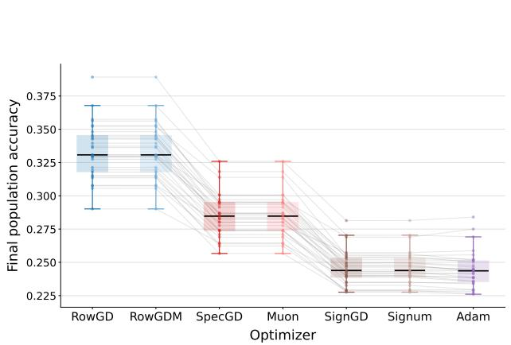

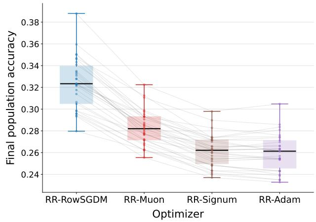  
Figure 3: Additional optimizer comparisons on the baseline synthetic model. Left: The deterministic comparison in Figure 2 (left), augmented with Signum. Right: Random-reshufling comparison of RR-RowSGDM, RR-Muon, RR-Signum, and RR-Adam with batch size $b = 1$ . Points are paired seeds and gray lines connect methods evaluated on the same dataset.

## H Additional Experiments and Experimental Details

## H.1 Synthetic Experiments: Setup and Additional Results

Setup. The main-text experiment in Figure 2 (left) uses $k = 6 0$ classes and dimension $d = 2 0$ . For each class i, we draw $\mu _ { i } \sim \mathcal { N } ( \mathbf { 0 } , I _ { d } / d )$ , draw the number of training examples independently and uniformly from $\{ 1 , \ldots , 5 \}$ , and generate $x _ { i , r } ^ { \mathrm { t r } } = \mu _ { i } + 0 . 2 2 3 6 \varepsilon _ { i , r } ^ { \mathrm { t r } }$ and $x _ { i , r } ^ { \mathrm { t e } } = \mu _ { i } + 2 . 2 3 6 1 \varepsilon _ { i , r } ^ { \mathrm { t e } }$ , where all residual vectors are independent $\mathcal { N } ( \mathbf { 0 } , I _ { d } / d )$ . Test-class proportions are drawn independently from $\mathrm { D i r i c h l e t } ( \mathbf { 1 } _ { k } )$ , and each of the 30 paired seeds uses 120,000 evaluation examples. All methods within a seed use the same training and evaluation data.

Optimization and learning-rate selection. We train a bias-free multiclass linear classifier from $W _ { 0 } = \mathbf { 0 }$ with cross-entropy for 20,000 updates in float64 and use $\eta _ { t } = \eta _ { 0 } ( t + 1 ) ^ { - 1 / 2 }$ . For every optimizer and seed, we sweep the common efective-Frobenius coeficients $c \in \{ 0 . 0 3 , 0 . 1 , 0 . 3 , 1 , 3 , 1 0 , 3 0 \}$ , setting $\eta _ { 0 } = c / \lVert \Delta _ { 0 } \rVert _ { \mathrm { F } } .$ and select c by maximum final evaluation accuracy, with ties broken by lower training loss and then smaller c. Because the same evaluation sample is used for learning-rate selection and reporting, these results are comparisons under the stated discrete sweep rather than untouched-test estimates; some RowGD and RowGDM runs select the lower endpoint of the grid.

Additional deterministic and stochastic comparisons. Figure 3 complements the six-optimizer deterministic comparison in Figure 2 (left) in two ways. The left panel adds Signum to give the full deterministic comparison among RowGD, RowGDM, SpecGD, Muon, SignGD, Signum, and Adam, while the right panel compares the corresponding random-reshufling methods RR-RowSGDM, RR-Muon, RR-Signum, and RR-Adam. RowGDM, Muon, and Signum use momentum $\beta = 0 . 9 ;$ SpecGD and Muon use the exact compact-SVD polar factor; and Adam uses $( \beta _ { 1 } , \beta _ { 2 } ) = ( 0 . 9 , 0 . 9 9 9 )$ ) without bias correction or a numericalstability constant. For random reshufling, we use batch size b = 1, draw an independent permutation of the finite training set at each epoch, use momentum $\beta = 0 . 9 9$ for RR-RowSGDM, RR-Muon, and RR-Signum, and use $( \beta _ { 1 } , \beta _ { 2 } ) = ( 0 . 9 9 , 0 . 9 9 9 )$ for RR-Adam. The deterministic panel preserves the Row-over-Spectral and Row-over-coordinate-wise ordering of the main-text experiment, and RR-RowSGDM likewise outperforms all three random-reshufling comparators on every paired seed. RR-Adam is included as an empirical comparator; our theoretical stochastic Adam comparison is formulated through AdamProxy.

Auxiliary geometries. Figure 4 supplements the main-text optimizer comparison with three reference methods that are not part of our theoretical ordering. Frobenius-normalized GD uses $\Delta _ { t } = G _ { t } / \| G _ { t } \| _ { \mathrm { F } }$

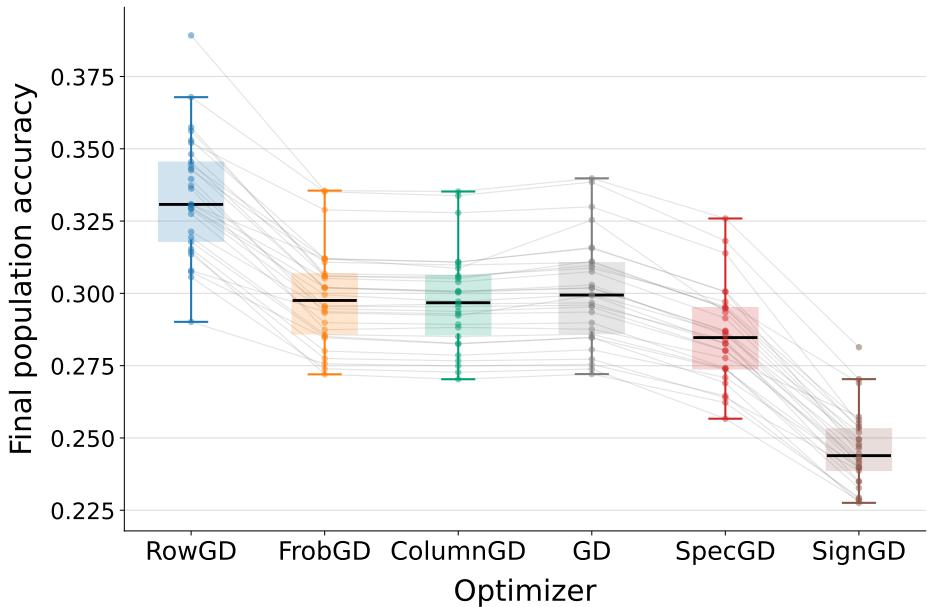  
Figure 4: Auxiliary optimization geometries. RowGD, FrobGD, ColumnGD, ordinary GD, SpecGD, and SignGD on the same 30 paired baseline datasets, where FrobGD denotes Frobenius-normalized GD.

ColumnGD independently normalizes each column of $G _ { t }$ in Euclidean norm, and ordinary GD uses $\Delta _ { t } = G _ { t }$ The figure uses FrobGD as an abbreviation for Frobenius-normalized GD. These methods provide additional finite-dimensional context rather than additional theoretical comparators.

Robustness of the deterministic ordering. To test whether the ordering in Figure 2 (left) depends on the particular baseline configuration, we repeat the same six-optimizer comparison under eleven one-factorat-a-time variations. We vary the training-noise coeficient from 0.2236 to 0.0447 or 0.4472, the test-noise coeficient from 2.2361 to 1.3416 or 3.1305, the test-class proportions from Dirichlet $\left( \mathbf { 1 } _ { k } \right)$ to balanced classes or Dirichlet(0.31k), the number of training examples per class to exactly one or five, the problem size to $( k , d ) = ( 3 0 , 2 0 )$ or (120, 40), and the class-mean distribution from Gaussian to uniform on the unit sphere. In all Gaussian-noise settings, the residual vectors are drawn from $\mathcal { N } ( \mathbf { 0 } , I _ { d } / d )$ ; in the (120, 40) setting, the training- and test-noise coeficients are 0.3162 and 3.1623, respectively. Each setting uses 30 paired seeds and the same training and learning-rate protocol as the main-text experiment. Across all settings, RowGD and RowGDM have the two highest mean accuracies; each outperforms SignGD and Adam on every paired seed, and each outperforms SpecGD and Muon on all 30 seeds except in the one- and five-training-example settings, where the Row methods win 29 of 30 comparisons. Figures 5–7 show that the main-text ordering is stable across these changes.

Anisotropic synthetic experiments. We also test the anisotropic predictions of Section 4. Unless otherwise noted, the training and evaluation protocol is the same as in the baseline synthetic experiment above. Figure 8 shows a representative independent-orientation setting with power-law exponents $s _ { \mu } = 0 . 5$ and $s _ { \Sigma } = 2 ;$ across six such settings, RowGD and RowGDM outperform SpecGD, Muon, SignGD, and Adam on all 30/30 paired seeds in every setting, with conservative mean advantages between 2.82 and 5.73 percentage points. Figure 9 illustrates the coordinate-aligned reversal and recovery phenomenon from Proposition 4.5: in the diagonal setting, RowGDM outperforms Adam on all 30/30 seeds at $\lambda = 0 . 2 5$ , Adam outperforms RowGDM on all 30/30 seeds at $\lambda = 1$ , and applying the same Haar rotation restores the RowGDM-over-Adam ordering on all 30/30 seeds. The coordinate-aligned reversal-and-recovery experiments use $1 0 ^ { 6 }$ training steps to reduce sensitivity to finite-time transients.

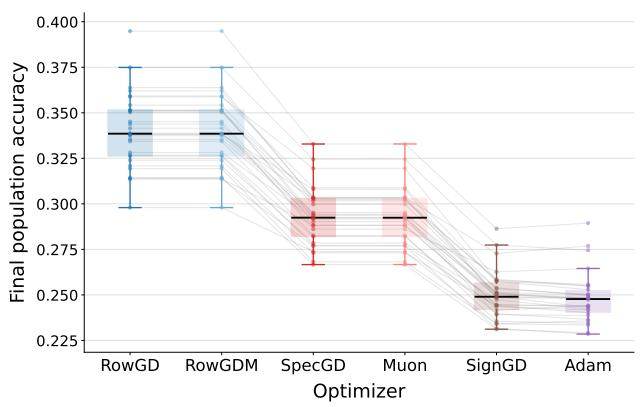

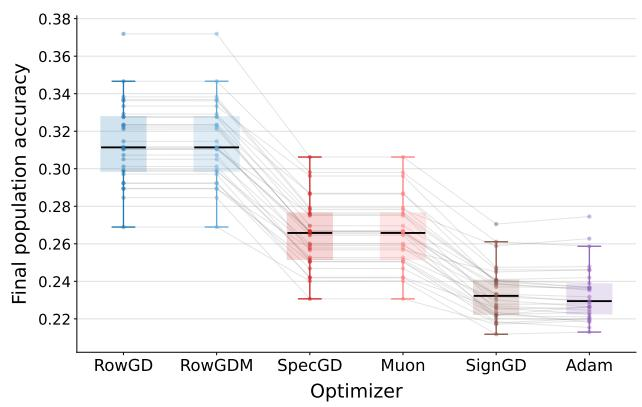

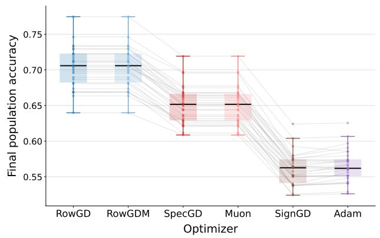

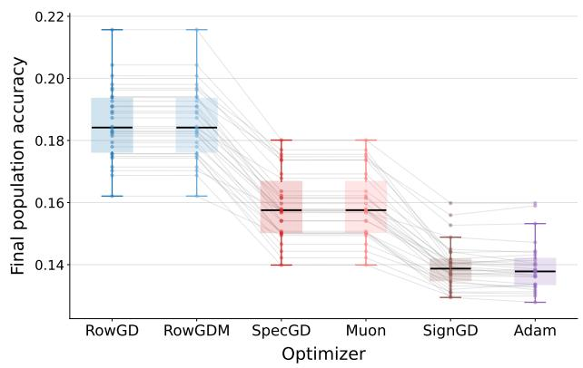  
Figure 5: Robustness to training and test noise. Top: training-noise coeficient 0.0447 (left) and 0.4472 (right), compared with 0.2236 in Figure 2 (left). Bottom: test-noise coeficient 1.3416 (left) and 3.1305 (right), compared with 2.2361 in the main-text setting. In all cases, the residual vectors are drawn from $\mathcal { N } ( \mathbf { 0 } , I _ { d } / d )$

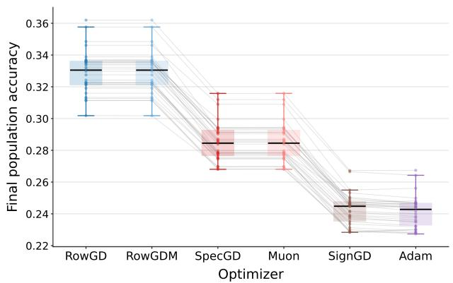

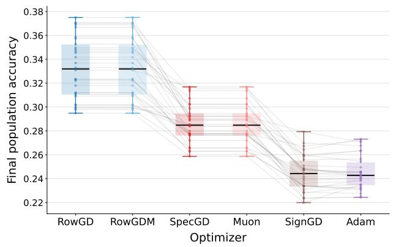

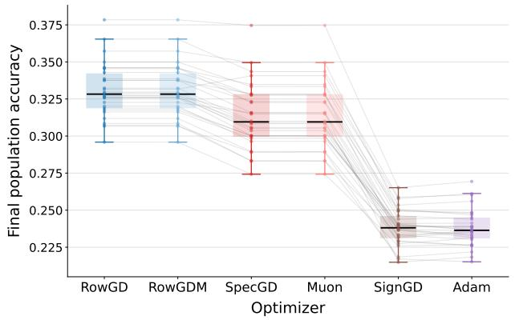

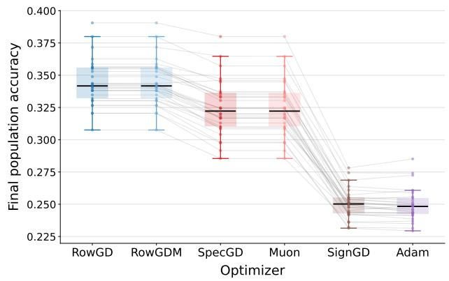  
Figure 6: Robustness to class proportions and training sample count. Top: balanced test classes (left) and Dirichlet $\left( 0 . 3 \mathbf { 1 } _ { k } \right)$ test proportions (right), compared with Dirichlet $\left( \mathbf { 1 } _ { k } \right)$ in Figure 2 (left). Bottom: exactly one (left) and five (right) training examples per class, compared with independent counts drawn uniformly from $\{ 1 , \ldots , 5 \}$ in the main-text setting.

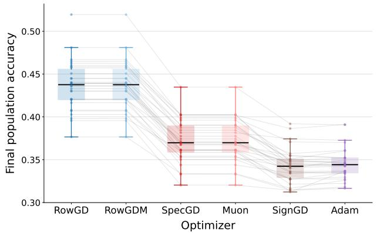

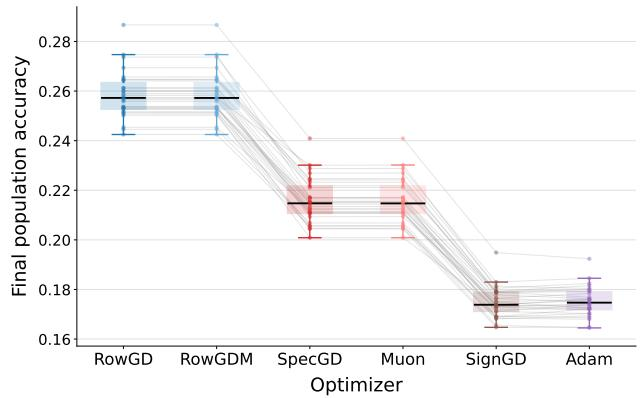

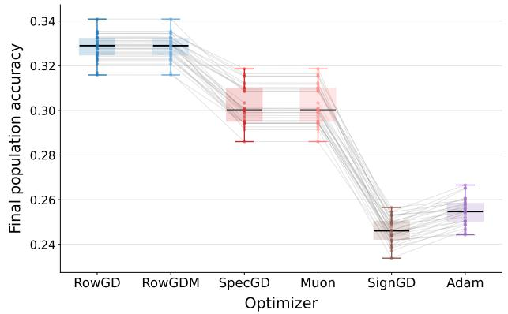  
Figure 7: Robustness to problem size and class-mean distribution. Top: $( k , d ) = ( 3 0 , 2 0 )$ (left) and (120, 40) (right), compared with (60, 20) in Figure 2 (left). Bottom: class means drawn independently and uniformly from the unit sphere instead of from $\mathcal { N } ( \mathbf { 0 } , I _ { d } / d )$

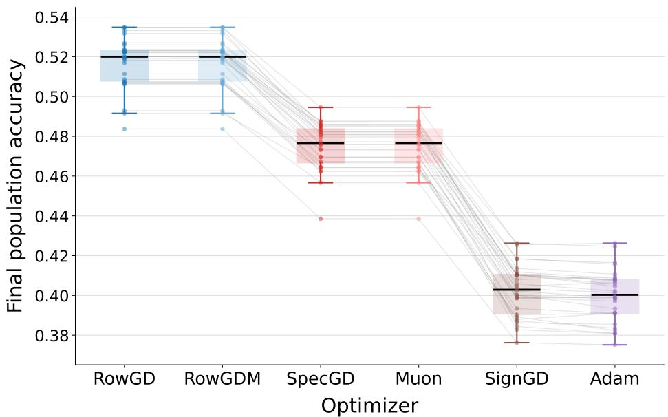  
Figure 8: Independent-orientation anisotropic experiment. Representative setting with $s _ { \mu } = 0 . 5$ and $s _ { \Sigma } = 2 .$ , where RowGD and RowGDM outperform SpecGD, Muon, SignGD, and Adam on all 30 paired seeds.

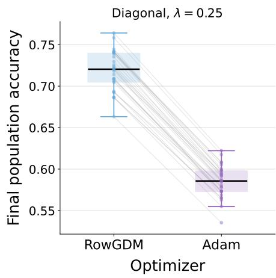

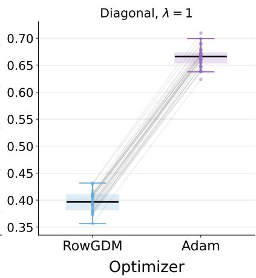

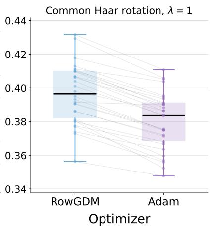  
Figure 9: Coordinate-aligned reversal and recovery. RowGDM outperforms Adam at $\lambda = 0 . 2 5 .$ , Adam outperforms RowGDM at $\lambda = 1$ , and the RowGDM-over-Adam ordering is restored after applying the same Haar rotation.

## H.2 Language Model Experiment

Model and starting checkpoint. We use a LLaMA-60M causal language model with 58.07M parameters exactly, consisting of 8 transformer layers with hidden size 512, intermediate size 1376, 8 attention heads, and vocabulary size 32,000. The starting checkpoint is obtained by training the full model from scratch on C4 for 11,000 updates with global batch size 512, sequence length 256, a peak learning rate of 0.005, cosine decay, and 1,100 warmup steps. This pretraining uses a hybrid optimizer: Muon is applied to the two-dimensional attention and MLP projection matrices, while AdamW is used for the token embedding, language-model head, and one-dimensional parameters. The resulting checkpoint has validation perplexity 28.23501. For the last-layer experiment, we freeze the entire model body, discard the pretrained output-head weights, zero-initialize the 32,000 × 512 output head, and train only this 16,384,000-parameter matrix.

Last-layer training horizon. The main experiment trains the zero-initialized output head for 22,000 updates in bfloat16 using distributed data parallel training on two NVIDIA RTX A6000 GPUs, with global batch size 512, sequence length 256, a cosine learning-rate schedule with 1,100 warmup steps, and zero weight decay and gradient clipping. An 11,000-update last-layer run processes 1.10B non-padding training tokens, or approximately 18.9 tokens per total model parameter, close to the conventional 20-tokens-per-parameter Chinchilla reference; the 22,000-update horizon approximately doubles this token budget to 2.20B tokens. We use the longer horizon to examine a later-training regime in which transient optimization efects are reduced and the trajectories may be closer to the limiting-direction behavior studied theoretically, without assuming that directional convergence has occurred by 22,000 updates. The Chinchilla comparison is only a token-budget reference, since the model body is frozen and only the output head is optimized in this experiment.

Horizon check. We also run a separate 11,000-update comparison with its own cosine schedule ending at 11,000 steps and learning rates selected independently at that horizon. The selected learning rates are 0.00625 for RowSGDM, 0.0045 for Muon, and 0.005 for Adam, yielding final monitoring-set perplexities 28.5871, 28.6373, and 28.5914, respectively. Thus, RowSGDM is already numerically best at approximately the Chinchilla token-budget reference, although its advantage over Adam is only 0.0152% in this single-seed comparison. The 22,000-step experiment therefore probes whether the qualitative ordering persists and becomes clearer at a later training horizon rather than relying on the 11,000-step diference alone.

Data and evaluation. We use the Hugging Face allenai/c4 dataset in streaming mode and tokenize with t5-base, truncating and padding sequences to length 256. For each training seed, RowSGDM, Muon, and Adam receive the same shufled stream and batch sequence. This streaming shufle is not the epoch-wise permutation of a fixed finite dataset used by the random-reshufling optimizers in Section 2. The validation trajectory in Figure 2 (right) is obtained from a monitoring set evaluated every 1,000 updates and containing 7,625,745 valid next-token targets. Final evaluation uses a separate set of 237,723 C4 validation documents containing 46,186,882 valid targets and having zero document-hash overlap with the monitoring set. The held-out set is not used for learning-rate selection, early stopping, or checkpoint selection. NLL is averaged over the exact number of valid non-padding shifted targets, and perplexity is its exponential.

Optimizers and learning rates. RowSGDM uses momentum 0.9, row-wise RMS normalization, multiplier 0.2, and numerical stabilizer $\epsilon = 1 0 ^ { - 8 }$ . Muon uses momentum 0.95, five Newton–Schulz iterations, multiplier 0.2, and zero weight decay. Adam uses $( \beta _ { 1 } , \beta _ { 2 } ) = ( 0 . 9 , 0 . 9 5 ) , \epsilon = 1 0 ^ { - 8 }$ , and zero weight decay. These implementations are practical counterparts of the RowSGDM, exact-SVD Muon, and zerostability-constant Adam considered in our theory. For the 22,000-step experiment, learning rates are selected using the monitoring set: we sweep {0.004, 0.005, 0.006, 0.007} for RowSGDM and Adam and {0.0025, 0.003, 0.0035, 0.004, 0.0045, 0.005, 0.0055, 0.006} for Muon, selecting 0.005, 0.005, and 0.004, respectively.

Boundary-alignment diagnostic. We additionally test whether the performance ordering is accompanied by the boundary geometry predicted by our analysis. For each valid held-out next-token position, let $h _ { t } \in \mathbb { R } ^ { 5 1 2 }$ denote the frozen hidden representation immediately before the output head and let $y _ { t }$ denote its next-token class. For class $i ,$ we estimate $\begin{array} { r } { \widehat { \mu } _ { i } = n _ { i } ^ { - 1 } \sum _ { t : y _ { t } = i } h _ { t } } \end{array}$ and retain the 5,093 classes with $n _ { i } \ge 1 0 0 0$ . We uniformly sample a fixed set $\mathcal { P }$ of 1,000,000 unordered class pairs and use the same pairs for every optimizer and seed. For a trained output head with rows $\boldsymbol { w _ { i } ^ { \intercal } }$ , define

<table><tr><td>Optimizer</td><td>NLL ↓</td><td>PPL ↓</td><td> $\widehat { D } _ { \mathrm { a v g - b d r y } } \downarrow$ </td><td> $\widehat { C } _ { \mathrm { b d r y } } \uparrow$ </td></tr><tr><td>RowSGDM</td><td> $\mathbf { 3 . 3 5 5 0 3 \pm 0 . 0 0 0 0 5 }$ </td><td> $\mathbf { 2 8 . 6 4 6 6 \pm 0 . 0 0 1 3 }$ </td><td> $\mathbf { 1 . 1 3 1 9 4 } \pm \mathbf { 0 . 0 0 0 0 4 }$ </td><td> $\mathbf { 0 . 3 5 6 5 2 \pm 0 . 0 0 0 0 5 }$ </td></tr><tr><td>Muon</td><td> $3 . 3 5 6 9 9 \pm 0 . 0 0 0 0 4$ </td><td> $2 8 . 7 0 2 7 \pm 0 . 0 0 1 2$ </td><td> $1 . 1 3 8 0 7 \pm 0 . 0 0 0 0 6$ </td><td> $0 . 3 5 0 1 8 \pm 0 . 0 0 0 0 7$ </td></tr><tr><td>Adam</td><td> $3 . 3 5 7 5 9 \pm 0 . 0 0 0 0 2$ </td><td> $2 8 . 7 1 9 9 \pm 0 . 0 0 0 6$ </td><td> $1 . 1 3 3 5 0 \pm 0 . 0 0 0 0 8$ </td><td> $0 . 3 5 4 8 1 \pm 0 . 0 0 0 0 9$ </td></tr></table>

Table 1: Held-out performance and empirical boundary alignment for last-layer-only LLaMA training. Values are mean ± sample standard deviation across five paired training seeds.

$$
\widehat { u } _ { i j } ^ { W } : = \frac { w _ { i } - w _ { j } } { \| w _ { i } - w _ { j } \| _ { 2 } } , \qquad \widehat { u } _ { i j } ^ { \mu } : = \frac { \widehat { \mu } _ { i } - \widehat { \mu } _ { j } } { \| \widehat { \mu } _ { i } - \widehat { \mu } _ { j } \| _ { 2 } } ,
$$

and measure

$$
\hat { D } _ { \mathrm { a v g - b d r y } } ( W ) : = \frac { 1 } { | \mathcal { P } | } \sum _ { \{ i , j \} \in \mathcal { P } } \| \widehat { u } _ { i j } ^ { W } - \widehat { u } _ { i j } ^ { \mu } \| _ { 2 } , \qquad \widehat { C } _ { \mathrm { b d r y } } ( W ) : = \frac { 1 } { | \mathcal { P } | } \sum _ { \{ i , j \} \in \mathcal { P } } \langle \widehat { u } _ { i j } ^ { W } , \widehat { u } _ { i j } ^ { \mu } \rangle .
$$

Lower $\widehat { D } _ { \mathrm { a v g - b d r y } }$ and higher $\widehat { C } _ { \mathrm { b d r y } }$ indicate closer alignment between learned classifier boundaries and empirical class-mean diferences.

Results. Consistent with the final validation-perplexity ordering in Figure 2 (right), RowSGDM achieves lower held-out NLL and perplexity than both Muon and Adam on each of the five paired seeds. RowSGDM also has the smallest boundary discrepancy and the largest boundary cosine on every seed, so its performance advantage is accompanied by closer alignment between learned classifier boundaries and empirical class-mean diferences. Table 1 summarizes the five-seed held-out results.

The mean paired RowSGDM-minus-Muon NLL diference is −0.001957, with a descriptive 95% Student-t interval $[ - 0 . 0 0 2 0 5 8 , - 0 . 0 0 1 8 5 7 ]$ , and the RowSGDM-minus-Adam diference is −0.002555, with interval $[ - 0 . 0 0 2 6 2 1 , - 0 . 0 0 2 4 8 9 ]$ . The mean reductions in $\widehat { D } _ { \mathrm { a v g - b d r y } }$ are 0.006137 relative to Muon and 0.001558 relative to Adam. Together, the validation, held-out, and boundary-alignment results are consistent with the qualitative ordering and geometric mechanism predicted by our theory.

LLaMA-130M experiment. We additionally repeat the last-layer comparison on a separately C4- pretrained LLaMA-130M backbone, whose actual parameter count is 134.1M, with 12 transformer layers and hidden size 768. The tokenizer, sequence length, global batch size, evaluation sets, optimizer definitions, and five paired seeds are the same as above. We train the zero-initialized $3 2 , 0 0 0 \times 7 6 8$ output head for 55,000 updates, with each selected run processing approximately 5.47B valid next-token targets, and a common full-horizon learning-rate sweep selects 0.002828 for all three optimizers. RowSGDM attains the lowest held-out perplexity on every seed, with five-seed mean ± sample standard deviation $2 2 . 3 7 9 7 \pm 0 . 0 0 1 4$ compared with $2 2 . 4 0 9 6 \pm 0 . 0 0 3 0$ for Muon and $2 2 . 4 1 5 3 { \pm } 0 . 0 0 1 0$ for Adam. RowSGDM also yields the smallest boundary discrepancy on every seed, with mean $\widehat { D } _ { \mathrm { a v g - b d r y } } = 1 . 1 9 0 5 1$ , compared with 1.19664 for Adam and 1.20028 for Muon, providing a larger-model check of the same qualitative advantage.

## H.3 Spectral Exponents for Language Model Representation

We empirically examine whether a fitted class-mean spectral exponent below one can occur in language-model representations, as in the regime $s _ { \mu } < 1$ of Theorem 4.2. We also measure class-conditional within-class covariance spectral exponents as descriptive statistics of within-class anisotropy. These measurements are finite-dimensional spectral summaries and are not intended as a direct test of the full probabilistic model underlying the theorem.

Table 2: Full-rank pointwise-OLS spectral exponents at the three final checkpoints. K is the number of observed classes used for the class-mean covariance, and $K _ { \Sigma }$ is the number of reliable classes used for the within-class covariance summary.
<table><tr><td>Model</td><td>K</td><td> $\widehat { s } _ { \mu }$ </td><td> $K { \mathfrak { x } }$ </td><td>Mean  $\widehat { s } _ { \Sigma , i }$ </td><td>Median</td><td>Max</td></tr><tr><td>OLMoE-1B-7B-0125</td><td>47,190</td><td>0.957735</td><td>218</td><td>0.987339</td><td>0.973537</td><td>1.374366</td></tr><tr><td>Qwen3-30B-A3B</td><td>72,577</td><td>0.932780</td><td>120</td><td>1.057924</td><td>1.045483</td><td>1.258163</td></tr><tr><td>AMUSE-720M</td><td>49,348</td><td>0.985366</td><td>211</td><td>1.054793</td><td>1.045965</td><td>1.402045</td></tr></table>

Experimental setup. We analyze final pre-head representations from OLMoE-1B-7B-0125 (Muennighof et al., 2025), Qwen3-30B-A3B (Yang et al., 2025), and AMUSE-720M (Kim et al., 2026b), all with hidden dimension d = 2048. For each model, we collect exactly 20,000,000 valid same-document next-token positions from the English validation split of C4. At a valid position, let $h _ { i t } \in \mathbb { R } ^ { d }$ denote the final normalized hidden representation when the next-token class is i, and let $n _ { i }$ be the number of observed positions from class i. We define the empirical class mean by

$$
\widehat { \mu } _ { i } : = \frac { 1 } { n _ { i } } \sum _ { t = 1 } ^ { n _ { i } } h _ { i t } .
$$

Class-mean spectral exponent. Our primary mean-spectrum analysis assigns equal weight to every observed next-token class. Let

$$
\begin{array} { r } { \mathcal { T } _ { \mu } : = \{ i : n _ { i } \geq 1 \} , \qquad K : = | \mathcal { T } _ { \mu } | , } \end{array}
$$

and define

$$
\widehat { \bar { \mu } } : = \frac { 1 } { K } \sum _ { i \in \mathcal { T } _ { \mu } } \widehat { \mu } _ { i } , \qquad \widehat { \Gamma } : = \frac { 1 } { K } \sum _ { i \in \mathcal { T } _ { \mu } } ( \widehat { \mu } _ { i } - \widehat { \bar { \mu } } ) ( \widehat { \mu } _ { i } - \widehat { \bar { \mu } } ) ^ { \top } .
$$

Thus $\widehat { \Gamma }$ is class balanced rather than token-frequency weighted; in particular, every observed class contributes one empirical class mean. If $\widehat { \lambda } _ { 1 } ^ { \mu } \geq \cdot \cdot \cdot \geq \widehat { \lambda } _ { 2 0 4 8 } ^ { \mu } > 0$ are the eigenvalues of $\widehat { \Gamma } ,$ we estimate the mean exponent by the unweighted pointwise OLS fit

$$
\log \widehat { \lambda } _ { r } ^ { \mu } = a - \widehat { s } _ { \mu } \log r + \varepsilon _ { r } , \qquad r = 1 , \ldots , 2 0 4 8 .
$$

Each integer rank therefore contributes one regression observation; the fit is not log binned or rank weighted.

Within-class covariance spectral exponents. For classes with suficiently many observations, we form the within-class sample covariance

$$
\widehat { \Sigma } _ { i } : = \frac { 1 } { n _ { i } - 1 } \sum _ { t = 1 } ^ { n _ { i } } ( h _ { i t } - \widehat { \mu } _ { i } ) ( h _ { i t } - \widehat { \mu } _ { i } ) ^ { \top }
$$

and fit

$$
\log \widehat { \lambda } _ { i , r } ^ { \Sigma } = a _ { i } - \widehat { s } _ { \Sigma , i } \log r + e _ { i , r } , \qquad r = 1 , \ldots , 2 0 4 8 .
$$

The reliable-class threshold is $n _ { i } \ge 8 1 9 2$ for OLMoE and AMUSE and $n _ { i } \geq 1 6 3 8 4$ for Qwen3. This leaves 218, 211, and 120 classes with reliable within-class covariance estimates, respectively.

Results. For the three final checkpoints examined here, the primary class-mean point estimates in Table 2 all satisfy $\widehat { s } _ { \mu } < 1 : 0 . 9 5 7 7 3 5$ for OLMoE, 0.932780 for Qwen3, and 0.985366 for AMUSE. The within-class covariance exponents are more heterogeneous and can exceed one, as reflected by the maxima in the table.

OLMoE across annealing. We additionally apply the $\widehat { s } _ { \mu }$ estimator to six published OLMoE snapshots spanning 0–101B added annealing tokens. The resulting estimates are 0.956727, 0.957792, 0.956569, 0.956530, 0.958359, and 0.957735. Thus, every sampled estimate is below one, the total range is only 0.001830, and there is no monotone trend across the sampled snapshots.