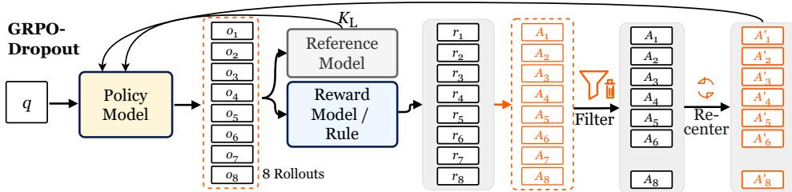
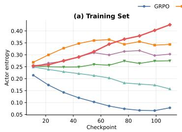
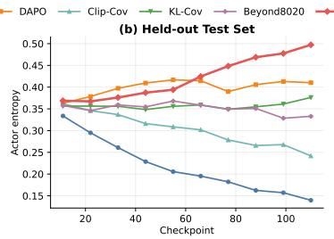
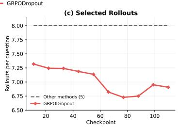

# GRPODROPOUT: LESS IS MORE FOR ONLINE REIN-FORCEMENT LEARNING ROLLOUTS

Hexuan Deng<sup>1,</sup> <sup>2†</sup> Zihao Yan<sup>1†</sup> Xuebo Liu<sup>1∗</sup> Shuo Nie<sup>1</sup> Yue Wang<sup>2,3</sup> Chen Wang<sup>2</sup> Zhaohua Zhang Tianwen Jiang Qiuyong Xiao Jihong Zhang Min Zhang<sup>1</sup> <sup>1</sup> Institute of Computing and Intelligence, Harbin Institute of Technology (Shenzhen) <sup>2</sup> Beijing Zhongguancun Academy <sup>3</sup> XinzhuAI

## ABSTRACT

Reinforcement learning (RL) methods such as GRPO substantially improve large language model reasoning but often suffer from policy entropy collapse: the loss of sampling diversity weakens exploration and limits further improvement. Existing methods address this issue either through algorithm-level interventions, such as reward modification and entropy/KL regularization, or through tokenlevel reweighting. We investigate a complementary perspective: entropy collapse can also be mitigated by changing which generated rollouts contribute to policy updates. Under the same sampling budget, not all rollouts contribute positively to an update, and selectively excluding some can improve learning. To address this, we propose GRPODROPOUT: before the standard update, we use a simple strategy that selectively removes a small number of high-probability positive-advantage rollouts and recenters the retained advantages. To motivate this design, we develop a rollout-level theoretical analysis that guides method design and threshold selection. The method changes only rollout usage, and adds negligible computational overhead. Experiments show higher accuracy than original GRPO and higher actor entropy while using fewer rollout samples for updates, illustrating “less is more.” This work provides insight into RL rollout usage: removing some rollouts can improve performance. Code is available at https://github.com/hexuandeng/GRPODropout/.

## 1 INTRODUCTION

Online RL substantially improves the reasoning ability of large language models (Shao et al., 2024; Yu et al., 2025). However, these methods often suffer from policy entropy collapse during training, reducing sampling diversity and weakening exploration of alternative reasoning paths (Cui et al., 2025; Jin et al., 2026). Because online RL relies on newly sampled rollouts for subsequent updates, this reduced diversity can limit opportunities to discover new solutions and improve further (Yue et al., 2025). This highlights a fundamental challenge in RL: the exploration–exploitation tradeoff (Auer et al., 2002).

To address this problem, existing approaches follow two routes. The first modifies the RL algorithm through rewards or advantages (Hao et al., 2025; Jin et al., 2026), clipping bounds (Yu et al., 2025; Park et al., 2025), or temperature and sampling control (Wang et al., 2025a). The second focuses on data usage at the token level, targeting high-entropy tokens and critical branching points for masking or reweighting (Du et al., 2025; Cui et al., 2025; Wang et al., 2025b), branching (Li et al., 2025; Zhao et al., 2026), or calibration (Yang et al., 2026). These methods exploit differences in token importance to mitigate entropy collapse. Here, we argue that changing rollout usage alone can mitigate entropy collapse. However, existing work still offers limited theoretical and methodological guidance for selecting complete rollouts to balance exploration and exploitation.

To bridge this gap, we propose GRPODROPOUT, which selectively removes rollouts to improve performance, mitigate entropy collapse, and preserve exploration in the trained model. Specifically, under our rollout-level theoretical analysis, we find that high-probability positive rollouts and low-probability negative rollouts can both reduce policy entropy, with the former having a more pronounced effect. Intuitively, high-probability positive rollouts are already well represented under the current policy; further reinforcement may provide limited additional information while accelerating entropy collapse. We therefore selectively remove these rollouts and recenter the retained advantages using old-policy probability weights to correct the imbalance introduced by deletion. Across three models and ten benchmarks, the average score improves over original GRPO by 1.55 percentage points. Despite using 12.1% fewer retained rollouts in policy updates on average in groups with nonzero advantages, training and held-out actor entropy are 446.1% and 256.0% higher than original GRPO, respectively, at the end of training, demonstrating better results with fewer update rollouts. Our contributions are:

• A rollout-level analysis of data importance. We extend the theoretical analysis to the rollout level to motivate our approach, and use experiments to further characterize which rollouts can reduce policy entropy, providing insight into how rollouts are used during RL training.

• Rollout filtering and recentering. We design a data-selection algorithm to filter potentially harmful rollouts and recenter retained advantages to correct the imbalance introduced by deletion.

• Empirical evidence across model sizes. We evaluate accuracy and entropy across three model sizes under reduced update-level rollout usage.

## 2 RELATED WORK

Token-level entropy interventions. One line of work stabilizes policy entropy by identifying less informative tokens and attenuating their updates. UloRL (Du et al., 2025) identifies high-probability tokens in successful rollouts as already well learned and masks them when policy entropy falls below a target. RSI-S (Lv et al., 2026) extends this idea by normalizing sampled-token surprisal by local entropy. Cui et al. (2025) analyze first-order entropy changes and use this analysis to motivate Clip-Cov and KL-Cov, which clip or penalize updates on high-covariance tokens. Wang et al. (2025b) show that updating only the 20% highest-entropy tokens can match or outperform full-token training. Later methods identify critical branching points to construct more diverse training data. CURE (Li et al., 2025) and ROSE (Zhao et al., 2026) branch at positions where likely next tokens are semantically distinct and train on the resulting trees using segment-level advantages. ERPO (Yu et al., 2026) detects Critical Decision Pivots using group-normalized entropy and combines entropy gating, reasoning progress, and final outcomes into token-level advantages. PAEC (Yang et al., 2026) combines normalized entropy with top-two competition to construct a detached soft position mask. STARE (Luo et al., 2026) derives an advantage–surprisal four-quadrant structure from first-order entropy variation and uses target-entropy feedback to regulate high-surprisal tokens. ICT (Feng et al., 2026) selects positions whose full next-token distributions exhibit large Jensen–Shannon di vergences, capturing both high- and low-entropy forks.

These token-level interventions leave open how entropy contributions can guide the selective removal of complete rollouts sampled for each prompt. We address this gap through rollout-level entropy analysis and principled rollout selection, as unmasked tokens may still reinforce existing paths and limit exploration (Du et al., 2025; Zhu et al., 2025).

Entropy-aware reinforcement learning algorithms. Another line addresses entropy collapse by modifying the training signal or optimization rule. One group modifies rewards or advantages. STEER (Hao et al., 2025) estimates the first-order entropy change induced by each token update and downweights updates that sharply decrease or increase entropy. Jin et al. (2026) identify positive-advantage tokens as the main source of entropy reduction and reweight them according to the training stage or current entropy. HAPO (He et al., 2026) reallocates advantages toward highentropy positions through capacity-guided credit assignment. Papo (Zhang et al., 2026) predicts the update direction from the advantage sign, sampled-token probability, and local distribution, and regulates opposing entropy polarities by training phase. A second group modifies the optimization rule directly. DAPO (Yu et al., 2025) introduces Clip-Higher to relax the upper importance-ratio bound. Clip-Low/High (Park et al., 2025) show the underlying optimizer bias: lower clipping tends to increase entropy, whereas upper clipping decreases it. SCOPE-RL (Wang et al., 2025a) uses temperature-adaptive positive samples and an auxiliary regularizer to control policy entropy.

These methods mitigate entropy collapse through algorithmic changes to rewards, advantages, clipping, or regularization. We find that data-level interventions alone can also mitigate entropy collapse, through rollout selection and advantage recentering while preserving the RL objective form.

## 3 METHOD

We find that not all rollouts benefit model training and demonstrate that removing a subset of the data can improve performance. We therefore propose GRPODROPOUT, as illustrated in Figure 1. Each subsection presents a local theoretical analysis to motivate the corresponding design choice, while experiments evaluate the complete method. Section 3.2 develops rollout-level first-order entropy analysis and candidate deletion; Section 3.3 motivates positive-only deletion through a conditional comparison; Section 3.4 analyzes deletion-induced drift of zero-advantage sequences, derives recentering, and presents the full procedure.

## 3.1 PRELIMINARIES

Problem Formulation. A rollout is a complete output sequence generated by the policy for a given prompt. For a fixed prompt x, let $\pi _ { \mathrm { o l d } }$ denote the policy before the policy update, and let $\mathbf { \bar { y } } _ { x } = \{ \mathbf { y } _ { i } \}$ i be the set of all possible complete output sequences generated from x under $\pi _ { \mathrm { o l d } }$ . For this fixed prompt, its Shannon entropy is $\begin{array} { r } { H ( \pi _ { \mathrm { o l d } } ) = - \sum _ { { \bf y } _ { i } \in \mathcal { Y } _ { x } } \pi _ { \mathrm { o l d } } ( { \bf y } _ { i } ~ \vert ~ x ) \log \pi _ { \mathrm { o l d } } ( { \bf y } _ { i } ~ \vert ~ x ) } \end{array}$ . We seek to optimize task return while mitigating policy entropy collapse and preserving exploration. For policy updates, we independently sample a training group of $G$ complete rollouts from this space according to the old policy: $\mathbf { y } ^ { ( 1 ) } , \ldots , \mathbf { y } ^ { ( \bar { G } ) } \overset { \mathrm { i . i . d . } } { \sim } \pi _ { \mathrm { o l d } } ( \cdot \mathbf { \xi } | \overset { \bullet } { x } )$ . Here i indexes the space of complete output sequences, whereas $g \in \{ 1 , \ldots , G \}$ indexes the sampled group. Rollout g is $\mathbf { y } ^ { ( g ) } = ( y _ { 1 } ^ { ( g ) } , \dots , y _ { T _ { g } } ^ { ( \bar { g } ) } )$ with length $T _ { g }$ , giving sequence probability $\begin{array} { r } { \pi _ { \mathrm { o l d } } ( \mathbf { y } ^ { ( g ) } \mid x ) = \prod _ { t = 1 } ^ { T _ { g } } \pi _ { \mathrm { o l d } } ( y _ { t } ^ { ( g ) } \mid x , \mathbf { y } _ { < t } ^ { ( g ) } ) } \end{array}$

Policy optimization. Let $\pi _ { \theta }$ be the policy to optimize, with parameters θ. Given a rollout reward $R ( x , \mathbf { y } ) , \operatorname { l e t } A ( x , \mathbf { y } )$ denote advantage relative to a baseline $b ( x ) = \bar { R } ( x , * ) , { \mathrm { e . g . , } } R ( x , \mathbf { y } ) - b ( x )$ Using the old policy for sampling, we write the advantage objective with reference-policy regularization (Stiennon et al., 2020; Ouyang et al., 2022) and its sampled surrogate as

$$
\begin{array} { r l r } {  { \operatorname* { m a x } _ { \theta } \Big \{ \mathbb { E } _ { { \bf y } \sim \pi _ { \mathrm { o l d } } ( \cdot \vert x ) } \Big [ \frac { \pi _ { \theta } ( { \bf y } \mid x ) } { \pi _ { \mathrm { o l d } } ( { \bf y } \mid x ) } A ( x , { \bf y } ) \Big ] - \beta \mathrm { K L } \big ( \pi _ { \theta } ( \cdot \vert x ) \| \pi _ { \mathrm { r e f } } ( \cdot \vert x ) \big ) \Big \} } } \\ & { \sim } & { \operatorname* { m a x } _ { \theta } \Big \{ \frac { 1 } { G } \sum _ { q = 1 } ^ { G } A ^ { ( g ) } \frac { \pi _ { \theta } ( { \bf y } ^ { ( g ) } \mid x ) } { \pi _ { \mathrm { o l d } } ( { \bf y } ^ { ( g ) } \mid x ) } - \beta \mathrm { K L } \big ( \pi _ { \theta } ( \cdot \vert x ) \| \pi _ { \mathrm { r e f } } ( \cdot \vert x ) \big ) \Big \} . } \end{array}\tag{1}
$$

Here $\pi _ { \mathrm { r e f } }$ is a fixed reference policy, $\beta ~ \geq ~ 0$ is its regularization coefficient, and $\mathrm { K L }$ denotes Kullback–Leibler divergence. The probability-ratio identity assumes that the candidate policy is supported within the old policy and the advantage expectation exists. The arrow denotes Monte Carlo approximation using sampled group of rollouts and advantages $A ^ { ( g ) }$

## 3.2 ROLLOUT-LEVEL ENTROPY EFFECT AND CANDIDATE DELETION

In this subsection, we analyze which rollouts decrease policy entropy under a local update model.   
Motivated by this analysis and intuition, we design a filtering rule to mitigate entropy collapse.

Theoretical motivation: rollout updates and entropy collapse. Reward optimization can improve return while increasing the risk of entropy collapse and loss of exploration. To identify which rollouts decrease entropy, we first characterize each rollout’s first-order entropy contribution and then give the criterion for the overall entropy change.

To extend token-level entropy analysis to complete rollouts, we analyze a local KL-proximal policy update following Abdolmaleki et al. (2018). With the sampled group and its advantages fixed, let $\pi ^ { ( \eta ) }$ be the updated policy at step size η, with $\pi ^ { ( 0 ) } = \pi _ { \mathrm { o l d } }$ . Under this model, we obtain the following results:

Proposition 1 (First-order entropy contribution of a single rollout). Fix a prompt x and adopt the local update model and assumptions in Appendix A.1. Let $s _ { g } = - \log \pi _ { \mathrm { o l d } } ( \mathbf { y } ^ { ( g ) } \mid x )$ be the surprisal of sampled rollout g under the old policy. Its additive first-order entropy contribution to the wholegroup update is

  
Figure 1: GRPODropout procedure. Filter removes only selected positive-advantage rollouts; Recenter applies probability-weighted advantage recentering. Other GRPO updates are unchanged.

$$
h _ { g } = \frac { A ^ { ( g ) } } { G } \big ( s _ { g } - H ( \pi _ { \mathrm { o l d } } ) \big ) .\tag{2}
$$

Proposition 2 (Entropy derivative from sampled rollouts). Under the setting of Proposition 1, assume $\textstyle \sum _ { g = 1 } ^ { G } A ^ { ( g ) } = 0$ . Using the surprisals $s _ { g }$ defined above, let ${ \bar { s } } = G ^ { - 1 } \sum _ { g = 1 } ^ { G } s _ { g }$ . For the fixed sampled group, the proximal update has entropy derivative

$$
\left. { \frac { d { \cal H } ( \pi ^ { ( \eta ) } ) } { d \eta } } \right| _ { \eta = 0 } = \mathrm { C o v } _ { g = 1 } ^ { G } \bigl ( { \cal A } ^ { ( g ) } , s _ { g } \bigr ) = { \frac { 1 } { G } } \sum _ { g = 1 } ^ { G } { \cal A } ^ { ( g ) } \bigl ( s _ { g } - \bar { s } \bigr ) .\tag{3}
$$

The proofs are in Appendix A.1. Proposition 1 shows that a positive-advantage rollout with $s _ { g } ~ < ~ H ( \pi _ { \mathrm { o l d } } )$ (relatively high probability) and a negative-advantage rollout with $s _ { g } \ > \ H ( \pi _ { \mathrm { o l d } } )$ (relatively low probability) both have negative first-order entropy contributions. Conversely, lowprobability positives and high-probability negatives contribute to entropy increase. Intuitively, further reinforcing already likely positive-advantage rollouts or suppressing already unlikely negativeadvantage rollouts may offer limited gains in reasoning ability. Repeatedly prioritizing such updates may instead accelerate entropy collapse and weaken exploration.

Proposition 2 shows that the proximal update decreases entropy to first order when rollout advantages and log-probabilities are positively correlated, which is often indeed tend to be positively correlated in original models (Kadavath et al., 2022; Zenn & Geiping, 2026), providing an intuitive explanation for entropy collapse during reward optimization. Further, during RL training, by further increasing the likelihood of positive-advantage rollouts and decreasing that of negative-advantage ones, reward optimization can further reinforce this positive association and intensify entropy reduction over training.

Method: candidate filtering. Based on the preceding analysis, we design a rollout-selection method that uses Proposition 1 to identify candidates with negative estimated entropy contributions and Proposition 2 to set the deletion threshold. Specifically, we reuse $h _ { g }$ from Eq. (2), estimating $H ( \pi _ { \mathrm { o l d } } )$ by the Monte Carlo mean s¯ of the original sampled group. In the filtering rule below, $h _ { g }$ denotes the contribution computed with this substitution. Using Proposition 2, we employ a greedy algorithm to select the largest retained set that ensures the estimated entropy does not decrease:

$$
\begin{array} { r } { \mathcal { T } _ { \mathrm { k e e p } } \in \arg \operatorname* { m a x } _ { \boldsymbol { \mathcal { T } } \subseteq \{ 1 , \dots , G \} } | \boldsymbol { \mathcal { T } } | \quad \mathrm { s . t . } \quad \mathrm { C o v } _ { g = 1 } ^ { G } \big ( A ^ { ( g ) } \mathbf { 1 } \{ g \in \mathcal { T } \} , s _ { g } \big ) \geq 0 . } \end{array}\tag{4}
$$

Here $\mathcal { T } _ { \mathrm { k e e p } }$ is the set of rollout indices selected for retention. The covariance is evaluated over the original G rollouts, with the indicator setting advantages of the deleted rollouts to zero. To solve this argmax, we start with all rollouts and greedily remove those with the most negative estimated contributions, until the constraint in Eq. (4) is satisfied. In practice, we length-normalize log-probabilities for both filtering and recentering to avoid direct length bias.

## 3.3 DELETING ONLY POSITIVE-ADVANTAGE ROLLOUTS

Section 3.2 shows that both high-probability positive-advantage and low-probability negativeadvantage rollouts can decrease entropy. That result, however, uses a KL-proximal update whose logit coordinates contain old-policy-dependent scaling. Under ordinary gradient updates with a shared learning rate, their entropy contributions generally differ even when their $h _ { g }$ values are equal. To compare these two classes under the latter update, we additionally analyze one gradient-ascent step on independent sequence logits at the starting point.

Theoretical motivation: conditional entropy effects of positive and negative rollouts. For comparison, we consider gradient updates of logits $z _ { i }$ and explicitly require the same learning rate for every logit coordinate. With $\begin{array} { r } { { \bf \bar { \Psi } } { L } ( z ) = G ^ { - 1 } \sum _ { a } A ^ { ( g ) } } \end{array}$ log[softmax ${ \bigl ( } z { \bigr ) } ] _ { i ( g ) }$ , where $i ( g )$ is the sequence-space index of sampled rollout g, the update is:

$$
z _ { i } ( \alpha ) = z _ { i } + \alpha { \frac { \partial L ( z ) } { \partial z _ { i } } } , \qquad \alpha > 0 .\tag{5}
$$

Here $\alpha$ is the learning rate shared by all logit coordinates: it is the multiplier of each coordinate’s gradient that is shared, not the logit or probability change of every sequence. Under this relatively more realistic assumption of a shared learning rate, we obtain the following result.

Proposition 3 (Greater Entropy Impact of Positive-Advantage Rollouts). In the independent-logit model above, assume $\sum _ { g } { \cal A } ^ { \bar { ( g ) } } \ = \ 0$ . Here $h _ { g }$ denotes rollout $g ^ { \prime } s$ additive first-order entropy contribution under the KL-proximal update in Proposition $^ { l , }$ and $h _ { g } ^ { \mathrm { S G D } }$ denotes its corresponding contribution under the logit gradient update above. Consider sampled rollouts $\mathbf { y } _ { + }$ and $\mathbf { y } _ { - }$ with advantages $A _ { \pm }$ and surprisals $s _ { \pm } ~ = ~ - \log \pi _ { \mathrm { o l d } } ( \mathbf { y } _ { \pm } ~ \mid ~ x )$ . Suppose $A _ { + } ~ > ~ 0 ~ > ~ A _ { - }$ and $s _ { + } < H ( \pi _ { \mathrm { o l d } } ) < s _ { - } .$ If their entropy contributions in Proposition 1 are equal, $h _ { + } = h _ { - } < 0 ,$ then the high-probability rollout contributes more to entropy decrease to first order in a single logit gradient update:

$$
\frac { | h _ { + } ^ { \mathrm { S G D } } | } { | h _ { - } ^ { \mathrm { S G D } } | } = \frac { \pi _ { \mathrm { o l d } } ( \mathbf { y } _ { + } \mid x ) } { \pi _ { \mathrm { o l d } } ( \mathbf { y } _ { - } \mid x ) } = \exp ( s _ { - } - s _ { + } ) > 1 .\tag{6}
$$

Thus, even when the two rollouts have equal entropy contributions in Proposition 1, the highprobability positive-advantage rollout makes a larger first-order contribution to entropy reduction in a single logit update, strengthening the tendency toward entropy collapse (see Appendix ${ \tt A . 2 }$ for the proof). This conditional comparison provides additional motivation for preferentially filtering high-probability positive-advantage candidates.

Method: final deletion rule. Based on the above analysis, considering that deleting data itself can negatively reduce data informativeness and potentially degrade accuracy to some extent, we aim to minimize perturbations to the original training process and preserve the original algorithm and data distribution as much as possible. Guided by the preceding theory, we therefore delete only positiveadvantage rollouts while retaining negative-advantage ones. Starting from the retained set $\mathcal { T } _ { \mathrm { k e e p } }$ in Section 3.2, we restore any excluded rollouts with nonpositive advantages:

$$
{ \mathcal { T } } _ { \mathrm { k e e p } } \gets { \mathcal { T } } _ { \mathrm { k e e p } } \cup \{ g \in \{ 1 , \dots , G \} : A ^ { ( g ) } \leq 0 \} .\tag{7}
$$

## 3.4 RECENTERING AFTER DELETION AND THE FULL PROCEDURE

Selective deletion changes the composition of retained samples, may make their distribution depart from the old policy, and disrupts the original centering of group advantages. This motivates recentering the retained advantages after deletion.

Theoretical motivation: normalization drift after deletion. Generalization can legitimately increase the probability of unsampled solutions similar to rewarded rollouts. Beyond generalization, a normalization offset that does not depend on similarity can also change the probabil ities of unsampled paths, which is what we aim to avoid. However, unrecentered advantages and the resulting perturbed distribution tend to exacerbate this issue. To isolate it, we assume i.i.d. sampling of the original rollout group for a fixed prompt and, conditional on the realized group and retained $\operatorname { s e t } .$ analyze an auxiliary distribution-space update without transfer through shared parameters. Using the retained set $\mathcal { T } _ { \mathrm { k e e p } } ,$ define the accumulated post-deletion advantage as $\begin{array} { r } { \tilde { A } _ { i } ^ { \mathrm { k e e p } } = \sum _ { g \in \mathbb { Z } _ { \mathrm { k e e p } } } A ^ { ( g ) } \mathbf { 1 } \{ \mathbf { y } _ { i } = \mathbf { y } ^ { ( g ) } \} } \end{array}$ . We then obtain the following result:

Proposition 4 (Invariance condition for zero-advantage sequences). Fix a prompt x and a realized group of rollouts sampled i.i.d. from $\pi _ { \mathrm { o l d } } ( \cdot \mid x )$ . Let $U = \{ i : \pi _ { \mathrm { o l d } } ( \mathbf { y } _ { i } \mid x ) > 0 , \tilde { A } _ { i } ^ { \mathrm { k e e p } } = 0 \}$ be the set of unsampled and other zero-advantage paths in the old-policy support. Evaluate $\pi _ { \theta }$ along the auxiliary retained-sample proximal update specified in Appendix A.3, with θ varying with η and $\pi _ { \theta } = \pi _ { \mathrm { o l d } } a t \eta = 0 .$ . For every ${ \bf { \bar { \rho } } } _ { i \in U }$

$$
\left. \frac { d } { d \eta } \log \pi _ { \theta } ( \mathbf { y } _ { i } \mid x ) \right| _ { \eta = 0 } = - \mathbb { E } _ { \pi _ { \mathrm { o l d } } } [ \tilde { A } ^ { \mathrm { k e e p } } ] .\tag{8}
$$

This proposition shows that all zero-advantage paths share the same first-order log-probability shift: regardless of their quality, their probabilities decrease when the old-policy-weighted mean advantage is positive and increase when it is negative. This shift expresses no preference for more promising paths, and its first-order strength is determined by $| \mathbb { E } _ { \pi _ { \mathrm { o l d } } } [ \tilde { A } ^ { \mathrm { k e e p } } ] |$ . Deletion changes the retained score and its old-policy-weighted mean, making such unwarranted probability increases and decreases more pronounced, thereby leading to training instability. The proof is in Appendix A.3.

Method: probability-weighted recentering. Based on the above analysis, we recenter a nonempty retained set as follows. Recomputing $\tilde { A } ^ { \mathrm { k e e p } }$ with the recentered advantages yields a zero old-policy-weighted mean and cancels the first-order normalization shift in the proximal model of Proposition 4:

$$
b _ { \mathrm { k e e p } } = \frac { \sum _ { g \in \mathcal { Z } _ { \mathrm { k e e p } } } e ^ { - s _ { g } } A ^ { ( g ) } } { \sum _ { g \in \mathcal { Z } _ { \mathrm { k e e p } } } e ^ { - s _ { g } } } , \qquad \bar { A } _ { \mathrm { k e e p } } ^ { ( g ) } = A ^ { ( g ) } - b _ { \mathrm { k e e p } } , \quad g \in \mathcal { Z } _ { \mathrm { k e e p } } .\tag{9}
$$

This local analysis motivates the recentering rule; its effectiveness in training is evaluated empirically in Section 4.2. Note that this probability weighting is introduced precisely because our data deletion is biased, which violates the i.i.d. assumption.

GRPODropout procedure. Based on the above theory and analysis, we present the full GRPO-DROPOUT procedure. To minimize changes to the original training process, we use the selected rollouts and recentered advantages in the original loss, preserving its formulation. The procedure reuses existing rewards and log-probabilities and requires no value network, adding negligible computational overhead for filtering and recentering.

## GRPODropout

```latex
Input: prompt $x ,$ old policy $\pi _ { \mathrm { o l d } } .$ , sample count $G ,$ and the original RL loss.
1. Sample $G$ rollouts and compute rewards, native advantages $A ^ { ( g ) }$ , and old-policy rollout
surprisals $s _ { g } ;$ set advantages to zero if the reward standard deviation is zero.
2. Estimate $\dot { H } ( \pi _ { \mathrm { o l d } } )$ by ${ \bar { s } } ,$ compute and fix $h _ { g }$ using Eq. $( 2 )$ , then solve Eq. (4) by removing
the most negative estimated contributions first to obtain $\mathcal { T } _ { \mathrm { k e e p } } .$
3. Apply Eq. (7) to restore excluded rollouts with nonpositive native advantages to $\begin{array} { r } { \mathcal { T } _ { \mathrm { k e e p } } . } \end{array}$
4. For the retained set, compute and subtract $b _ { \mathrm { k e e p } }$ using Eq. (9) to recentered advantages.
5. Update the policy using the original RL loss on retained rollouts.
```

## 4 EXPERIMENTS

We compare GRPODROPOUT, original GRPO, and other entropy-aware baselines across three model sizes (1.7B, 4B, and 8B), trained on mathematics with matched prompts. Evaluation spans ten benchmarks covering mathematical reasoning and general QA, with the latter assessing generalization beyond mathematics. Given their small test sets, AMC23/AIME24/AIME25/HMMT25 use Mean@32; the others use Mean@1. Full settings, baselines, and metric conventions appear in Appendix B.1.

## 4.1 MAIN RESULTS

GRPODropout targets rollouts that may reduce policy entropy. Under the same rollout sampling budget, we assess whether using fewer retained rollouts in policy updates can preserve or improve performance over original GRPO. Table 1 reports results on three model sizes: selective deletion with recentering improves average accuracy over GRPO by 1.55 percentage points on average. These results support our data-usage insight that using all sampled rollouts is not always the most effective training strategy, and that selectively removing a subset can instead yield better performance. GRPODropout also exceeds KL-Cov, the strongest entropy-aware baseline by average score, by 0.11 points on average. Finally, our method is orthogonal in design to these optimization methods, offering both a data-selection insight and a complementary strategy for mitigating entropy collapse.

Table 1: Main results on three backbones. Avg. averages ten benchmarks; Base denotes the untrained backbone. Bold marks the best result within each backbone block.
<table><tr><td rowspan="2">Method</td><td colspan="7">Mathematical reasoning</td><td colspan="3">General QA</td><td rowspan="2">Avg.</td></tr><tr><td>GSM8k Math500</td><td></td><td>AMC23 Olympiad AIME24</td><td></td><td></td><td>AIME25 HMMT25</td><td></td><td>ARC-C MMLUP SGPQA</td><td></td><td></td></tr><tr><td>Base</td><td>89.92</td><td>80.60</td><td>59.92</td><td>42.96</td><td>22.08</td><td>21.04</td><td>11.46</td><td>87.37</td><td>57.01</td><td>29.28</td><td>50.16</td></tr><tr><td>GRPO</td><td>90.60</td><td>84.00</td><td>72.27</td><td>51.56</td><td>28.54</td><td>23.44</td><td>14.06</td><td>87.80</td><td>57.91</td><td>31.07</td><td>54.13</td></tr><tr><td>DAPO</td><td>88.86</td><td>85.20</td><td>72.27</td><td>52.00</td><td>33.75</td><td>26.15</td><td>15.21</td><td>87.63</td><td>55.62</td><td>29.70</td><td>54.64</td></tr><tr><td>w-.7B Clip-Cov</td><td>82.34</td><td>77.20</td><td>53.91</td><td>36.15</td><td>11.56</td><td>12.71</td><td>5.21</td><td>87.37</td><td>55.19</td><td>28.26</td><td>44.99</td></tr><tr><td>KL-Cov</td><td>90.07</td><td>86.40</td><td>70.39</td><td>50.07</td><td>31.67</td><td>25.73</td><td>14.79</td><td>88.31</td><td>56.60</td><td>29.68</td><td>54.37</td></tr><tr><td>Beyond8020</td><td>89.01</td><td>84.00</td><td>72.19</td><td>50.22</td><td>29.48</td><td>25.00</td><td>18.02</td><td>86.69</td><td>56.03</td><td>29.78</td><td>54.04</td></tr><tr><td>GRPODropout</td><td>90.83</td><td>85.60</td><td>75.55</td><td>52.15</td><td>31.46</td><td>25.62</td><td>15.83</td><td>86.35</td><td>56.64</td><td>30.02</td><td>55.01</td></tr><tr><td>Base</td><td>94.77</td><td>85.40</td><td>72.50</td><td>47.41</td><td>37.92</td><td>26.25</td><td>14.27</td><td>94.20</td><td>69.19</td><td>39.85</td><td>58.18</td></tr><tr><td>GRPO Ow-4B</td><td>94.77</td><td>91.80</td><td>89.45</td><td>58.37</td><td>42.60</td><td>33.23</td><td>18.96</td><td>94.11</td><td>68.35</td><td>38.64</td><td>63.03</td></tr><tr><td>DAPO</td><td>94.47</td><td>89.80</td><td>86.72</td><td>57.48</td><td>42.40</td><td>36.88</td><td>19.06</td><td>94.11</td><td>67.48</td><td>38.52</td><td>62.69</td></tr><tr><td>Clip-Cov</td><td>94.54</td><td>92.00</td><td>86.33</td><td>59.41</td><td>54.06</td><td>41.56</td><td>27.08</td><td>94.45</td><td>69.32</td><td>40.79</td><td>65.95</td></tr><tr><td>KL-Cov</td><td>94.92</td><td>92.00</td><td>87.89</td><td>59.11</td><td>54.79</td><td>40.83</td><td>27.60</td><td>94.03</td><td>69.27</td><td>40.83</td><td>66.13</td></tr><tr><td>Beyond8020</td><td>94.39</td><td>91.60</td><td>89.92</td><td>60.00</td><td>51.88</td><td>41.25</td><td>23.65</td><td>94.54</td><td>68.21</td><td>39.39</td><td>65.48</td></tr><tr><td>GRPODropout</td><td>94.77</td><td>91.80</td><td>88.28</td><td>58.96</td><td>51.98</td><td>43.02</td><td>25.94</td><td>94.11</td><td>69.35</td><td>40.25</td><td>65.85</td></tr><tr><td>Base</td><td>95.45</td><td>82.80</td><td>67.50</td><td>46.07</td><td>37.40</td><td>24.69</td><td>11.98</td><td>95.90</td><td>73.14</td><td>43.61</td><td>57.85</td></tr><tr><td>GRPO</td><td>95.30</td><td>91.20</td><td>85.86</td><td>59.11</td><td>53.54</td><td>38.44</td><td>24.38</td><td>95.73</td><td>74.22</td><td>45.54</td><td>66.33</td></tr><tr><td>Ow-8B DAPO</td><td>95.53</td><td>92.20</td><td>90.31</td><td>61.33</td><td>52.40</td><td>38.85</td><td>21.25</td><td>95.65</td><td>72.39</td><td>43.75</td><td>66.37</td></tr><tr><td>Clip-Cov</td><td>95.38</td><td>91.20</td><td>84.77</td><td>60.44</td><td>54.90</td><td>42.08</td><td>27.60</td><td>95.56</td><td>73.76</td><td>45.05</td><td>67.07</td></tr><tr><td>KL-Cov</td><td>95.75</td><td>93.20</td><td>86.72</td><td>61.33</td><td>54.17</td><td>40.31</td><td>27.50</td><td>95.48</td><td>73.81</td><td>44.88</td><td>67.32</td></tr><tr><td>Beyond8020</td><td>95.45</td><td>92.20</td><td>87.58</td><td>60.59</td><td>57.29</td><td>39.06</td><td>24.69</td><td>95.99</td><td>73.23</td><td>44.57</td><td>67.07</td></tr><tr><td>GRPODropout</td><td>95.53</td><td>92.20</td><td>87.66</td><td>60.74</td><td>55.31</td><td>42.81</td><td>25.21</td><td>94.97</td><td>73.50</td><td>44.99</td><td>67.29</td></tr></table>





  
Figure 2: Qwen3-4B actor entropy and rollout usage across checkpoints. (a–b) Token-mean entropy on training DAPO-17K and held-out MMLU-Pro (MMLUP); (c) mean update rollouts per question in training batches, excluding all-zero-advantage groups. The other five methods use 8 rollouts at every recorded checkpoint (gray dashed line). Curves connect raw observations without smoothing.

Removing few rollouts substantially mitigates entropy collapse. We seek to preserve performance and exploration with minimal changes to training. Because sequence-level entropy is strongly affected by response length, we follow prior work (Cui et al., 2025) and report token-level conditional entropy averaged over valid response tokens. We measure this entropy $\begin{array} { r } { \mathrm { ~ a s ~ - \sum _ { \boldsymbol { v } } \# } \boldsymbol { \mathbf { \rho } } _ { \boldsymbol { v } } \mathrm { ~ \textbar ~ { ~ } ~ } } \end{array}$ $x , \mathbf { y } _ { < t } ) \log \pi _ { \theta } ( v ~ \mid ~ x , \mathbf { y } _ { < t } )$ , where v ranges over the vocabulary. Figure 2 tracks this metric for Qwen3-4B on DAPO-17K and held-out MMLU-Pro. While GRPO exhibits entropy collapse, GRPODropout achieves 446.1% and 256.0% higher entropy, respectively, at the end of training. Across the ten recorded checkpoints, excluding all-zero-advantage groups, it retains 7.03 rollouts per question for the update—12.1% fewer than GRPO’s baseline of eight. Notably, compared to Beyond8020, which masks out 80% of tokens, our method removes a mere 12.1% of the data while achieving comparable or even superior policy entropy and performance, demonstrating the efficacy and value of rollout-level deletion.

Table 2: Qwen3-1.7B and Qwen3-4B ablations of positive- and negative-advantage rollouts, advantage recentering, and old-policy probability weighting of the mean. $\checkmark / \times \colon$ enabled/disabled; –: not applicable. Avg. Ent reports benchmark-average actor entropy.
<table><tr><td colspan="2"></td><td colspan="2">Deletion Advantages</td><td colspan="8">Mathematical reasoning</td><td colspan="2">General QA</td><td rowspan="2"></td><td rowspan="2">Avg. Avg. Ent</td></tr><tr><td></td><td></td><td></td><td>Pos. Neg. Center P-wt. GSM8k Math500 AMC23 Olympiad AIME24 AIME25 HMMT25 ARC-C MMLUP SGPQA</td><td></td><td></td><td></td><td></td><td></td><td></td><td></td><td></td><td></td><td></td></tr><tr><td colspan="10">Qwen3-1.7B</td><td></td><td></td><td></td><td></td><td></td><td></td></tr><tr><td>×</td><td>X</td><td></td><td>一</td><td>90.60</td><td>84.00</td><td>72.27</td><td>51.56</td><td>28.54</td><td>23.44</td><td>14.06</td><td>87.80</td><td>57.91</td><td>31.07</td><td>54.13</td><td>0.0503</td></tr><tr><td>√</td><td>√</td><td></td><td>√</td><td>90.30</td><td>86.80</td><td>70.47</td><td>49.04</td><td>30.94 24.90 0.10</td><td></td><td>13.75</td><td>87.71</td><td>56.53</td><td>29.77</td><td>54.02</td><td>0.2025</td></tr><tr><td>√ √</td><td>X X</td><td></td><td>X</td><td>77.33</td><td>39.00</td><td>10.70</td><td>8.74</td><td>0.00</td><td>22.40</td><td>0.00</td><td>87.12</td><td>44.04</td><td>21.09</td><td>28.81</td><td>0.3282</td></tr><tr><td>√</td><td>X</td><td>√</td><td>X √</td><td>89.76 90.83</td><td>85.00 85.60</td><td>65.31 75.55</td><td>46.67 52.15</td><td>27.29</td><td></td><td>11.46</td><td>87.88</td><td>56.64</td><td>29.44</td><td>52.19</td><td>0.2239</td></tr><tr><td></td><td></td><td></td><td></td><td></td><td></td><td></td><td>31.46</td><td>25.62</td><td></td><td>15.83</td><td>86.35</td><td>56.64</td><td>30.02</td><td>55.01</td><td>0.1739</td></tr><tr><td colspan="10">Qwen3-4B</td><td colspan="7"></td></tr><tr><td>X</td><td>X</td><td>一</td><td>一</td><td>94.77</td><td>91.80</td><td>89.45</td><td>58.37</td><td>42.60</td><td>33.23</td><td>18.96</td><td>94.11</td><td>68.35</td><td>38.64</td><td>63.03</td><td>0.0528</td></tr><tr><td>√</td><td>√ √</td><td>√ √</td><td>√</td><td>94.77</td><td>91.00</td><td>87.03</td><td>58.22</td><td>51.46</td><td>41.25</td><td>25.00</td><td>93.34</td><td>69.09</td><td>40.10</td><td>65.13</td><td>0.2425</td></tr><tr><td>X</td><td></td><td>X</td><td>√</td><td>94.54</td><td>91.40</td><td>87.97</td><td>59.26</td><td>51.04</td><td>41.88</td><td>23.44</td><td>94.28</td><td>68.80</td><td>40.43</td><td>65.30</td><td>0.2043</td></tr><tr><td>√</td><td>X</td><td></td><td>X</td><td>0.38</td><td>0.20</td><td>2.19</td><td>0.00</td><td>0.00</td><td>0.00</td><td>0.00</td><td>88.57</td><td>42.35</td><td>26.34</td><td>16.00</td><td>0.0200</td></tr><tr><td>V</td><td>X</td><td>√</td><td>X</td><td>94.62</td><td>92.20</td><td>89.30</td><td>58.22</td><td>52.81</td><td>42.08</td><td>25.10</td><td>93.94</td><td>69.48</td><td>40.44</td><td>65.82</td><td>0.2174</td></tr><tr><td>√</td><td>X</td><td>√</td><td>√</td><td>94.77</td><td>91.80</td><td>88.28</td><td>58.96</td><td>51.98</td><td>43.02</td><td>25.94</td><td>94.11</td><td>69.35</td><td>40.25</td><td>65.85</td><td>0.2140</td></tr></table>

## 4.2 ABLATION STUDIES

Our method has two main components: rollout deletion and advantage recentering. We ablate the effects of deleting positive-advantage (Pos.) and negative-advantage (Neg.) rollouts, enabling recentering (Center), and using probability weighting during recentering (P-wt.). Specifically, with Center/P-wt. set to $\checkmark / \checkmark$ , we subtract the probability-weighted mean advantage as in Eq. (9); with $\checkmark / \times$ , we subtract the equal-weight mean of retained advantages; with $\times / \times$ , no recentering is performed. The first row of each model block reports original GRPO without rollout deletion. Table 2 reports results on Qwen3-1.7B and Qwen3-4B.

Deleting only positive-advantage rollouts performs best. With probability-weighted recentering fixed, we compare deleting positive- and/or negative-advantage candidates. Deletion generally increases entropy and improves final accuracy in most settings, while the magnitude of the accuracy gain depends on the deletion pattern and recentering scheme. Deleting both positive and negative candidates yields the largest entropy gain but incurs a slight accuracy loss, showing that data removal can sacrifice performance and supporting our motivation to delete as little data as possible. Deleting only positive candidates achieves higher entropy and accuracy than deleting only negative candidates, consistent with our theoretical result that positive-advantage rollouts have a greater effect on entropy reduction.

Recentering is necessary. With deletion restricted to positive-advantage candidates, removing recentering causes severe performance degradation and training collapse, demonstrating the importance of recentering in the tested deletion configurations. We further introduce probability weighting to calibrate the retained advantages under the old-policy measure. On Qwen3-4B, probability weighting has little effect, improving the average score by only 0.03 points over equal-weight recentering. Its benefit is more pronounced on Qwen3-1.7B, where removing the weighting lowers the average score by 2.82 points, suggesting that probability weighting can sometimes improve training stability.

## 4.3 MORE PRECISE EXPLORATION AND MORE DIVERSE REASONING PATHS

The full GRPODropout method increases entropy while largely preserving or improving average accuracy across the three model sizes. We further examine the value of this retained entropy from two perspectives: exploration precision, to assess accuracy preservation; and reasoning-path diversity, to evaluate the preservation of exploration capacity.

Metrics. We first assess how accurately model sampling produces correct solutions while limiting repeated incorrect final answers. We compare all methods on Qwen3-4B across AMC23, AIME24, AIME25, and HMMT25, sampling 32 rollouts per question. Pass@32 is computed per question within each benchmark and then averaged equally across AMC23, AIME24, AIME25, and

Table 3: Qwen3-4B solution coverage, wrong-answer dispersion, and reasoning diversity. Definitions are in Section 4.3. Bold marks the best and underline marks the second-best in each column.
<table><tr><td rowspan="2">Method</td><td colspan="3">Correctness</td><td colspan="4">Path diversity</td><td rowspan="2">Entropy ↑</td><td rowspan="2">Overall mean rank ↓</td></tr><tr><td>pass@32 ↑</td><td> $W _ { \geq 8 } \downarrow$ </td><td> $W _ { < 8 } \downarrow$ </td><td> $\mathrm { D i s t . } _ { \geq 8 } \uparrow$ </td><td> $\mathrm { D i s t . } _ { < 8 } \uparrow$ </td><td>Vendi≥8 ↑</td><td> $\mathrm { \Delta V e n d i _ { < 8 } \uparrow }$ </td></tr><tr><td>GRPO</td><td>63.54</td><td>1.1846</td><td>7.6216</td><td>0.1063</td><td>0.1641</td><td>1.8311</td><td>2.4194</td><td>0.0448</td><td>5.63</td></tr><tr><td>DAPO</td><td>69.38</td><td>1.6154</td><td>8.0811</td><td>0.1150</td><td>0.1798</td><td>1.9080</td><td>2.6013</td><td>0.1796</td><td>3.88</td></tr><tr><td>Clip-Cov</td><td>76.88</td><td>0.7692</td><td>5.2162</td><td>0.1139</td><td>0.2141</td><td>1.9041</td><td>2.9851</td><td>0.0900</td><td>2.63</td></tr><tr><td>KL-Cov</td><td>72.71</td><td>0.4615</td><td>3.0000</td><td>0.1134</td><td>0.2014</td><td>1.8930</td><td>2.8510</td><td>0.1509</td><td>3.25</td></tr><tr><td>Beyond8020</td><td>73.54</td><td>1.1231</td><td>7.8378</td><td>0.1142</td><td>0.1726</td><td>1.9037</td><td>2.5252</td><td>0.1671</td><td>4.00</td></tr><tr><td>GRPODropout</td><td>75.21</td><td>0.4923</td><td>4.2432</td><td>0.1151</td><td>0.2090</td><td>1.9114</td><td>2.8992</td><td>0.2291</td><td>1.63</td></tr></table>

HMMT25. For Table 3, Entropy is token-mean actor entropy over valid response tokens at the final checkpoint, averaged equally across the four benchmarks. Inspired by the answer-consistency perspective of Wang et al. (2022), we define answer-string dispersion W as the number of distinct nonempty final-answer strings among a question’s incorrect responses. W measures answer-string dispersion among incorrect final answers and can reveal recurring answer patterns. To distinguish relatively easier and harder questions, we use a fixed cross-method partition: a question enters the ≥ 8 subset only if every one of the six systems has at least eight correct responses, and enters the < 8 subset only if every system has fewer than eight. We average W within each subset.

We next assess whether models approach the same problem through diverse reasoning paths. To this end, we use GLM-5.2 to summarize each response’s reasoning path in three to five sentences, excluding abandoned reasoning, and then encode the summaries with bge-m3 (Chen et al., 2024). Following Kirk et al. (2023); Chen et al. (2026), Summary distance measures the mean pairwise cosine distance between summary embeddings for the same question, reflecting semantic separation. Following Friedman & Dieng (2023); Encheng et al. (2026), Vendi measures effective diversity as the exponential of the entropy of the eigenvalues of the Gram matrix normalized by the number of summaries, accounting for similarity and repetition. Higher values indicate greater diversity. Here, W measures diversity among incorrect final answers, whereas Summary distance and Vendi measure diversity in the summarized reasoning paths, including paths that may lead to the same final answer. Full prompt and run settings are given in Appendix B.2.

A favorable trade-off between correctness and diversity. The results show that our method achieves the best or second-best reported mean on all eight metrics and ranks first among the six systems, with an overall mean rank of 1.63 under equal weighting. In particular, our method attains the highest reasoning-path diversity on the ≥ 8 subset and the highest actor entropy while achieving lower W than all baselines except KL-Cov. Compared with GRPO, higher solution coverage and actor entropy accompany fewer distinct incorrect answers and higher values on all four path-diversity measures, demonstrating that our improvement in Pass@1 accuracy does not come at the expense of Pass@32 or the model’s exploratory capability, but rather enhances them simultaneously. Notably, although DAPO exhibits relatively high entropy and reasoning-path diversity on the ≥ 8 subset, this does not translate into the highest Pass@32, indicating that it sacrifices accuracy for exploratory diversity. Correspondingly, our method maximally preserves exploration accuracy—namely, higher Pass@1 and Pass@32, and fewer distinct incorrect answers—while fully maintaining the path diversity and entropy of correct answers, ensuring no loss of the model’s exploratory capability and achieving a simultaneous preservation of accuracy and entropy.

## 5 CONCLUSION

We find that some high-probability positive rollouts can hinder training in reinforcement learning algorithms such as GRPO. Removing these rollouts improves performance and mitigates entropy col lapse. Based on this finding, we propose GRPODropout, which selectively removes high-probability positive rollouts and recenters the retained advantages to stabilize training, while leaving the original RL loss unchanged. We further extend the theoretical analysis of entropy dynamics from tokens to complete rollouts, providing theoretical motivation for our rollout-deletion strategy. Extensive experiments across three model scales and ten benchmarks demonstrate that GRPODropout outperforms the original GRPO while using fewer retained rollouts in policy updates.

Limitations. First, GRPODropout does not outperform the strongest baseline at every model scale. It is worth pointing out that we do not merely provide an entropy collapse mitigation method; rather, our work includes the insight that reinforcing some rollouts—even correct ones—can be counterproductive, which also possesses clear value. Second, given the complexity of RL training, our theory itself cannot fully explain our method. In fact, the primary role of the theory is to serve as motivation for method design, acting as the initial starting point. The final method is validated through its advantages over the original GRPO and the ablation study results. Finally, GRPODropout relies on within-prompt differences in advantages and probabilities across multiple rollouts. It therefore does not directly apply to single-rollout training, while its effectiveness with very small groups remains to be evaluated.

## REFERENCES

Abbas Abdolmaleki, Jost Tobias Springenberg, Yuval Tassa, Remi Munos, Nicolas Heess, and Mar- ´ tin A. Riedmiller. Maximum a posteriori policy optimisation. CoRR, abs/1806.06920, 2018. URL http://arxiv.org/abs/1806.06920.

Peter Auer, Nicolo Cesa-Bianchi, and Paul Fischer. Finite-time analysis of the multiarmed bandit\` problem. Mach. Learn., 47(2-3):235–256, 2002. doi: 10.1023/A:1013689704352. URL https: //doi.org/10.1023/A:1013689704352.

Jianlyu Chen, Shitao Xiao, Peitian Zhang, Kun Luo, Defu Lian, and Zheng Liu. M3-embedding: Multi-linguality, multi-functionality, multi-granularity text embeddings through self-knowledge distillation. In Lun-Wei Ku, Andre Martins, and Vivek Srikumar (eds.), Findings of the Association for Computational Linguistics, ACL 2024, Bangkok, Thailand and virtual meeting, August 11-16, 2024, volume ACL 2024 of Findings of ACL, pp. 2318–2335. Association for Computational Linguistics, 2024. doi: 10.18653/V1/2024.FINDINGS-ACL.137. URL https://doi.org/10.18653/v1/2024.findings-acl.137.

Xiwen Chen, Wenhui Zhu, Peijie Qiu, Xuanzhao Dong, Hao Wang, Haiyu Wu, Huayu Li, Aris Sotiras, Yalin Wang, and Abolfazl Razi. DRA-GRPO: your GRPO needs to know diverse reasoning paths for mathematical reasoning. In Maria Liakata, Viviane P. Moreira, Jiajun Zhang, and David Jurgens (eds.), Findings of the Association for Computational Linguistics, ACL 2026, San Diego, California, United States, July 2-7, 2026, pp. 13995–14019. Association for Computational Linguistics, 2026. doi: 10.18653/V1/2026.FINDINGS-ACL.685. URL https://doi.org/10.18653/v1/2026.findings-acl.685.

Peter Clark, Isaac Cowhey, Oren Etzioni, Tushar Khot, Ashish Sabharwal, Carissa Schoenick, and Oyvind Tafjord. Think you have solved question answering? try arc, the AI2 reasoning challenge. CoRR, abs/1803.05457, 2018. URL http://arxiv.org/abs/1803.05457.

Karl Cobbe, Vineet Kosaraju, Mohammad Bavarian, Mark Chen, Heewoo Jun, Lukasz Kaiser, Matthias Plappert, Jerry Tworek, Jacob Hilton, Reiichiro Nakano, Christopher Hesse, and John Schulman. Training verifiers to solve math word problems. CoRR, abs/2110.14168, 2021. URL https://arxiv.org/abs/2110.14168.

Ganqu Cui, Yuchen Zhang, Jiacheng Chen, Lifan Yuan, Zhi Wang, Yuxin Zuo, Haozhan Li, Yuchen Fan, Huayu Chen, Weize Chen, Zhiyuan Liu, Hao Peng, Lei Bai, Wanli Ouyang, Yu Cheng, Bowen Zhou, and Ning Ding. The entropy mechanism of reinforcement learning for reasoning language models. CoRR, abs/2505.22617, 2025. doi: 10.48550/ARXIV.2505.22617. URL https://doi.org/10.48550/arXiv.2505.22617.

Dong Du, Shulin Liu, Tao Yang, Shaohua Chen, and Yang Li. Ulorl:an ultra-long output reinforcement learning approach for advancing large language models’ reasoning abilities. CoRR, abs/2507.19766, 2025. doi: 10.48550/ARXIV.2507.19766. URL https://doi.org/10.4 8550/arXiv.2507.19766.

Cui Encheng, Shaowen Peng, Kazuhiro Ito, Jinsha Xu, Shohei Hisada, Shoko Wakamiya, and Eiji Aramaki. Single-agent generation surpasses multi-agent systems in semantic diversity. In Maria Liakata, Viviane P. Moreira, Jiajun Zhang, and David Jurgens (eds.), Findings of the Association for Computational Linguistics, ACL 2026, San Diego, California, United States, July 2-7, 2026,

pp. 37993–38008. Association for Computational Linguistics, 2026. doi: 10.18653/V1/2026.FIN DINGS-ACL.1894. URL https://doi.org/10.18653/v1/2026.findings-acl.1 894.

Xuanzhi Feng, Zhengyang Li, Zeyu Liu, Haoxi Li, Yuming Jiang, Bing Guo, Jingcai Guo, Jie Zhang, and Song Guo. Beyond entropy: Learning from token-level distributional deviations for LLM reasoning. CoRR, abs/2606.19771, 2026. doi: 10.48550/ARXIV.2606.19771. URL https://doi.org/10.48550/arXiv.2606.19771.

Dan Friedman and Adji Bousso Dieng. The vendi score: A diversity evaluation metric for machine learning. Trans. Mach. Learn. Res., 2023, 2023. URL https://openreview.net/forum ?id=g97OHbQyk1.

Zhezheng Hao, Hong Wang, Haoyang Liu, Jian Luo, Jiarui Yu, Hande Dong, Qiang Lin, Can Wang, and Jiawei Chen. Rethinking entropy interventions in RLVR: an entropy change perspective. CoRR, abs/2510.10150, 2025. doi: 10.48550/ARXIV.2510.10150. URL https://doi.org/ 10.48550/arXiv.2510.10150.

Chaoqun He, Renjie Luo, Yuzhuo Bai, Shengding Hu, Zhen Leng Thai, Junhao Shen, Jinyi Hu, Xu Han, Yujie Huang, Yuxiang Zhang, Jie Liu, Lei Qi, Zhiyuan Liu, and Maosong Sun. Olympiadbench: A challenging benchmark for promoting AGI with olympiad-level bilingual multimodal scientific problems. CoRR, abs/2402.14008, 2024. doi: 10.48550/ARXIV.2402. 14008. URL https://doi.org/10.48550/arXiv.2402.14008.

Yuhang He, Haodong Wu, Siyi Liu, Hongyu Ge, Hange Zhou, Keyi Wu, Zhuo Zheng, Qihong Lin, Zixin Zhong, and Yongqi Zhang. Rethinking token-level credit assignment in RLVR: A polarityentropy analysis. CoRR, abs/2604.11056, 2026. doi: 10.48550/ARXIV.2604.11056. URL https://doi.org/10.48550/arXiv.2604.11056.

Renren Jin, Pengzhi Gao, Yuqi Ren, Zhuowen Han, Tongxuan Zhang, Wuwei Huang, Wei Liu, Jian Luan, and Deyi Xiong. Revisiting entropy in reinforcement learning for large reasoning models. In Maria Liakata, Viviane P. Moreira, Jiajun Zhang, and David Jurgens (eds.), Findings of the Associationfor Computational Linguistics, ACL 2026, San Diego, California, United States, July 2-7, 2026, pp. 25300–25322. Association for Computational Linguistics, 2026. doi: 10.18653/V 1/2026.FINDINGS-ACL.1266. URL https://doi.org/10.18653/v1/2026.findi ngs-acl.1266.

Saurav Kadavath, Tom Conerly, Amanda Askell, Tom Henighan, Dawn Drain, Ethan Perez, Nicholas Schiefer, Zac Hatfield-Dodds, Nova DasSarma, Eli Tran-Johnson, Scott Johnston, Sheer El Showk, Andy Jones, Nelson Elhage, Tristan Hume, Anna Chen, Yuntao Bai, Sam Bowman, Stanislav Fort, Deep Ganguli, Danny Hernandez, Josh Jacobson, Jackson Kernion, Shauna Kravec, Liane Lovitt, Kamal Ndousse, Catherine Olsson, Sam Ringer, Dario Amodei, Tom Brown, Jack Clark, Nicholas Joseph, Ben Mann, Sam McCandlish, Chris Olah, and Jared Kaplan. Language models (mostly) know what they know. CoRR, abs/2207.05221, 2022. doi: 10.48550/ARXIV.2207.05221. URL https://doi.org/10.48550/arXiv.2207.05 221.

Robert Kirk, Ishita Mediratta, Christoforos Nalmpantis, Jelena Luketina, Eric Hambro, Edward Grefenstette, and Roberta Raileanu. Understanding the effects of RLHF on LLM generalisation and diversity. CoRR, abs/2310.06452, 2023. doi: 10.48550/ARXIV.2310.06452. URL https: //doi.org/10.48550/arXiv.2310.06452.

Qingbin Li, Rongkun Xue, Jie Wang, Ming Zhou, Zhi Li, Xiaofeng Ji, Yongqi Wang, Miao Liu, Zheming Yang, Minghui Qiu, and Jing Yang. CURE: critical-token-guided re-concatenation for entropy-collapse prevention. CoRR, abs/2508.11016, 2025. doi: 10.48550/ARXIV.2508.11016. URL https://doi.org/10.48550/arXiv.2508.11016.

Hunter Lightman, Vineet Kosaraju, Yura Burda, Harri Edwards, Bowen Baker, Teddy Lee, Jan Leike, John Schulman, Ilya Sutskever, and Karl Cobbe. Let’s verify step by step. CoRR, abs/2305.20050, 2023. doi: 10.48550/ARXIV.2305.20050. URL https://doi.org/ 10.48550/arXiv.2305.20050.

Haipeng Luo, Qingfeng Sun, Songli Wu, Can Xu, Wenfeng Deng, Han Hu, and Yansong Tang. STARE: surprisal-guided token-level advantage reweighting for policy entropy stability. CoRR, abs/2606.19236, 2026. doi: 10.48550/ARXIV.2606.19236. URL https://doi.org/10.4 8550/arXiv.2606.19236.

Outongyi Lv, Yanzhao Zheng, Yuanwei Zhang, Zhenghao Huang, Xingjun Wang, Baohua Dong, Hangcheng Zhu, and Yingda Chen. Which tokens matter? adaptive token selection for RLVR with the relative surprisal index. CoRR, abs/2606.31575, 2026. doi: 10.48550/ARXIV.2606.31575. URL https://doi.org/10.48550/arXiv.2606.31575.

Long Ouyang, Jeff Wu, Xu Jiang, Diogo Almeida, Carroll L. Wainwright, Pamela Mishkin, Chong Zhang, Sandhini Agarwal, Katarina Slama, Alex Ray, John Schulman, Jacob Hilton, Fraser Kelton, Luke Miller, Maddie Simens, Amanda Askell, Peter Welinder, Paul F. Christiano, Jan Leike, and Ryan Lowe. Training language models to follow instructions with human feedback. CoRR, abs/2203.02155, 2022. doi: 10.48550/ARXIV.2203.02155. URL https://doi.org/10.48550/arXiv.2203.02155.

Jaesung R. Park, Junsu Kim, Gyeongman Kim, Jinyoung Jo, Sean Choi, Jaewoong Cho, and Ernest K. Ryu. Clip-low increases entropy and clip-high decreases entropy in reinforcement learning of large language models. CoRR, abs/2509.26114, 2025. doi: 10.48550/ARXIV.2509.26114. URL https://doi.org/10.48550/arXiv.2509.26114.

Zhihong Shao, Peiyi Wang, Qihao Zhu, Runxin Xu, Junxiao Song, Mingchuan Zhang, Y. K. Li, Y. Wu, and Daya Guo. Deepseekmath: Pushing the limits of mathematical reasoning in open language models. CoRR, abs/2402.03300, 2024. doi: 10.48550/ARXIV.2402.03300. URL https://doi.org/10.48550/arXiv.2402.03300.

Nisan Stiennon, Long Ouyang, Jeff Wu, Daniel M. Ziegler, Ryan Lowe, Chelsea Voss, Alec Radford, Dario Amodei, and Paul F. Christiano. Learning to summarize from human feedback. CoRR, abs/2009.01325, 2020. URL https://arxiv.org/abs/2009.01325.

Richard S. Sutton, David A. McAllester, Satinder Singh, and Yishay Mansour. Policy gradient methods for reinforcement learning with function approximation. In Sara A. Solla, Todd K. Leen, and Klaus-Robert Muller (eds.), ¨ Advances in Neural Information Processing Systems 12, [NIPS Conference, Denver, Colorado, USA, November 29 - December 4, 1999], pp. 1057–1063. The MIT Press, 1999. URL http://papers.nips.cc/paper/1713-policy-gradien t-methods-for-reinforcement-learning-with-function-approximati on.

M-A-P Team, Xinrun Du, Yifan Yao, Kaijing Ma, Bingli Wang, Tianyu Zheng, Kang Zhu, Minghao Liu, Yiming Liang, Xiaolong Jin, Zhenlin Wei, Chujie Zheng, Kaixing Deng, Shuyue Guo, Shian Jia, Sichao Jiang, Yiyan Liao, Rui Li, Qinrui Li, Sirun Li, Yizhi Li, Yunwen Li, Dehua Ma, Yuansheng Ni, Haoran Que, Qiyao Wang, Zhoufutu Wen, Siwei Wu, Tianshun Xing, Ming Xu, Zhenzhu Yang, Zekun Moore Wang, Junting Zhou, Yuelin Bai, Xingyuan Bu, Chenglin Cai, Liang Chen, Yifan Chen, Chengtuo Cheng, Tianhao Cheng, Keyi Ding, Siming Huang, Yun Huang, Yaoru Li, Yizhe Li, Zhaoqun Li, Tianhao Liang, Chengdong Lin, Hongquan Lin, Yinghao Ma, Zhongyuan Peng, Zifan Peng, Qige Qi, Shi Qiu, Xingwei Qu, Yizhou Tan, Zili Wang, Chenqing Wang, Hao Wang, Yiya Wang, Yubo Wang, Jiajun Xu, Kexin Yang, Ruibin Yuan, Yuanhao Yue, Tianyang Zhan, Chun Zhang, Jingyang Zhang, Xiyue Zhang, Xingjian Zhang, Yue Zhang, Yongchi Zhao, Xiangyu Zheng, Chenghua Zhong, Yang Gao, Zhoujun Li, Dayiheng Liu, Qian Liu, Tianyu Liu, Shiwen Ni, Junran Peng, Yujia Qin, Wenbo Su, Guoyin Wang, Shi Wang, Jian Yang, Min Yang, Meng Cao, Xiang Yue, Zhaoxiang Zhang, Wangchunshu Zhou, Jiaheng Liu, Qunshu Lin, Wenhao Huang, and Ge Zhang. Supergpqa: Scaling llm evaluation across 285 graduate disciplines, 2025. URL https://arxiv.org/abs/2502.14739.

Qwen Team. Qwen3 technical report. CoRR, abs/2505.09388, 2025. doi: 10.48550/ARXIV.2505. 09388. URL https://doi.org/10.48550/arXiv.2505.09388.

Chen Wang, Zhaochun Li, Jionghao Bai, Yuzhi Zhang, Shisheng Cui, Zhou Zhao, and Yue Wang. Arbitrary entropy policy optimization: Entropy is controllable in reinforcement finetuning. CoRR, abs/2510.08141, 2025a. doi: 10.48550/ARXIV.2510.08141. URL https: //doi.org/10.48550/arXiv.2510.08141.

Shenzhi Wang, Le Yu, Chang Gao, Chujie Zheng, Shixuan Liu, Rui Lu, Kai Dang, Xionghui Chen, Jianxin Yang, Zhenru Zhang, Yuqiong Liu, An Yang, Andrew Zhao, Yang Yue, Shiji Song, Bowen Yu, Gao Huang, and Junyang Lin. Beyond the 80/20 rule: High-entropy minority tokens drive effective reinforcement learning for LLM reasoning. CoRR, abs/2506.01939, 2025b. doi: 10.485 50/ARXIV.2506.01939. URL https://doi.org/10.48550/arXiv.2506.01939.

Xuezhi Wang, Jason Wei, Dale Schuurmans, Quoc V. Le, Ed H. Chi, and Denny Zhou. Selfconsistency improves chain of thought reasoning in language models. CoRR, abs/2203.11171, 2022. doi: 10.48550/ARXIV.2203.11171. URL https://doi.org/10.48550/arXiv.2 203.11171.

Yubo Wang, Xueguang Ma, Ge Zhang, Yuansheng Ni, Abhranil Chandra, Shiguang Guo, Weiming Ren, Aaran Arulraj, Xuan He, Ziyan Jiang, Tianle Li, Max Ku, Kai Wang, Alex Zhuang, Rongqi Fan, Xiang Yue, and Wenhu Chen. Mmlu-pro: A more robust and challenging multi-task language understanding benchmark. CoRR, abs/2406.01574, 2024. doi: 10.48550/ARXIV.2406.01574. URL https://doi.org/10.48550/arXiv.2406.01574.

Ronald J. Williams. Simple statistical gradient-following algorithms for connectionist reinforcement learning. Mach. Learn., 8:229–256, 1992. doi: 10.1007/BF00992696. URL https://doi. org/10.1007/BF00992696.

Shumeng Yang, Yisu Liu, Jiayi Zheng, Zhaohui Yang, and Linjing Li. PAEC: position-aware entropy calibration for LLM reasoning in RLVR. CoRR, abs/2606.08543, 2026. doi: 10.48550/ARXIV.2 606.08543. URL https://doi.org/10.48550/arXiv.2606.08543.

Qiying Yu, Zheng Zhang, Ruofei Zhu, Yufeng Yuan, Xiaochen Zuo, Yu Yue, Tiantian Fan, Gaohong Liu, Lingjun Liu, Xin Liu, Haibin Lin, Zhiqi Lin, Bole Ma, Guangming Sheng, Yuxuan Tong, Chi Zhang, Mofan Zhang, Wang Zhang, Hang Zhu, Jinhua Zhu, Jiaze Chen, Jiangjie Chen, Chengyi Wang, Hongli Yu, Weinan Dai, Yuxuan Song, Xiangpeng Wei, Hao Zhou, Jingjing Liu, Wei-Ying Ma, Ya-Qin Zhang, Lin Yan, Mu Qiao, Yonghui Wu, and Mingxuan Wang. DAPO: an opensource LLM reinforcement learning system at scale. CoRR, abs/2503.14476, 2025. doi: 10.485 50/ARXIV.2503.14476. URL https://doi.org/10.48550/arXiv.2503.14476.

Song Yu, Li Li, Wenwen Zhao, and Zhisheng Yang. ERPO: token-level entropy-regulated policy optimization for large reasoning models. CoRR, abs/2603.28204, 2026. doi: 10.48550/ARXIV.2 603.28204. URL https://doi.org/10.48550/arXiv.2603.28204.

Yang Yue, Zhiqi Chen, Rui Lu, Andrew Zhao, Zhaokai Wang, Yang Yue, Shiji Song, and Gao Huang. Does reinforcement learning really incentivize reasoning capacity in llms beyond the base model? CoRR, abs/2504.13837, 2025. doi: 10.48550/ARXIV.2504.13837. URL https: //doi.org/10.48550/arXiv.2504.13837.

Johannes Zenn and Jonas Geiping. When are likely answers right? on sequence probability and correctness in llms. CoRR, abs/2606.27359, 2026. doi: 10.48550/ARXIV.2606.27359. URL https://doi.org/10.48550/arXiv.2606.27359.

Jiazheng Zhang, Ziche Fu, Junrui Shen, Yunbin Zhao, Yunke Zhang, Zhiheng Xi, Long Ma, Chenxin An, Zhihao Zhang, Shichun Liu, Dingwei Zhu, Shihan Dou, Shaofan Liu, Han Li, Wiggin Zhou, Aiden Adams, Tao Gui, Fei Huang, Qi Zhang, and Xuanjing Huang. Entropy polarity in reinforcement fine-tuning: Direction, asymmetry, and control. CoRR, abs/2605.11775, 2026. doi: 10.48550/ARXIV.2605.11775. URL https://doi.org/10.48550/arXiv.2605.11 775.

Ziqi Zhao, Zhaochun Ren, Jiahong Zou, Liu Yang, Zhiwei Xu, Xuri Ge, Zhumin Chen, Xinyu Ma, Daiting Shi, Shuaiqiang Wang, Dawei Yin, and Xin Xin. Reinforced efficient reasoning via semantically diverse exploration. CoRR, abs/2601.05053, 2026. doi: 10.48550/ARXIV.2601.05 053. URL https://doi.org/10.48550/arXiv.2601.05053.

Chujie Zheng, Shixuan Liu, Mingze Li, Xiong-Hui Chen, Bowen Yu, Chang Gao, Kai Dang, Yuqiong Liu, Rui Men, An Yang, Jingren Zhou, and Junyang Lin. Group sequence policy optimization. CoRR, abs/2507.18071, 2025. doi: 10.48550/ARXIV.2507.18071. URL https://doi.org/10.48550/arXiv.2507.18071.

Xinyu Zhu, Mengzhou Xia, Zhepei Wei, Wei-Lin Chen, Danqi Chen, and Yu Meng. The surprising effectiveness of negative reinforcement in LLM reasoning. CoRR, abs/2506.01347, 2025. doi: 10.48550/ARXIV.2506.01347. URL https://doi.org/10.48550/arXiv.2506.01 347.

## A SUPPLEMENTARY MATERIAL

## A.1 PROOFS OF PROPOSITION 1 AND PROPOSITION 2

Local update approximation. To extend token-level entropy analysis to complete rollouts, we adopt a distribution-space KL-proximal policy-improvement model following Abdolmaleki et al. (2018). For a candidate policy $\pi ( \cdot \mid x )$ , we define its proximal update as

$$
L _ { A } ( \boldsymbol { \pi } ) = \frac { 1 } { G } \sum _ { g = 1 } ^ { G } A ^ { ( g ) } \frac { \pi ( \mathbf { y } ^ { ( g ) } \mid x ) } { \pi _ { \mathrm { o l d } } ( \mathbf { y } ^ { ( g ) } \mid x ) } , \quad \boldsymbol { \pi } ^ { ( \boldsymbol { \eta } ) } = \arg \operatorname* { m a x } _ { \boldsymbol { \pi } \in \Delta _ { \mathrm { o l d } } } \Big \{ L _ { A } ( \boldsymbol { \pi } ) - \frac { 1 } { \eta } \mathrm { K L } \big ( \boldsymbol { \pi } \mid \big | \boldsymbol { \pi } _ { \mathrm { o l d } } \big ) \Big \} .\tag{A.1}
$$

Here $\eta > 0$ controls the size of the proximal update, and $\Delta _ { \mathrm { o l d } }$ contains normalized distributions over complete sequences supported on $\{ \mathbf { y } _ { i } : \pi _ { \mathrm { o l d } } ( \mathbf { y } _ { i } \mid x ) > 0 \}$ . Eq. (A.1) specifies an idealized update directly over sequence distributions. Its old-policy KL penalty specifies the update geometry, while the KL regularizer relative to the reference policy is omitted. We analyze the update around $\eta = 0 ,$ , taking $\pi ^ { ( 0 ) } = \pi \mathrm { o l d }$ , with the sampled group and its finite advantages held fixed. We assume $H ( \pi _ { \mathrm { o l d } } ) < \infty$ and use rollout advantages without length normalization. We derive the sequencescore representation and closed-form update below.

Notation for the proofs. For the fixed prompt $x ,$ we use the shorthand $p ( \mathbf { y } ) = \pi _ { \mathrm { o l d } } ( \mathbf { y } \mid x )$ and $q ( \mathbf { y } ) = \pi ( \mathbf { y } \mid x )$ for the old and candidate policies, with $p _ { i } = p ( \mathbf { y } _ { i } )$ and $q _ { i } = q ( \mathbf { y } _ { i } )$ . The proximal policies are written $q _ { i } ^ { ( \eta ) } \ = \ \pi ^ { ( \eta ) } ( \mathbf { y } _ { i } \mid x )$ and $q _ { \mathrm { k e e p } , i } ^ { ( \eta ) } \ = \ \pi _ { \theta } ( \mathbf { y } _ { i } \mid x )$ , where in the latter case $\theta$ varies with $\eta$ along the retained-sample proximal update. These abbreviations are used only in this appendix.

Sampling-aligned sequence score. With the sampled group and its advantages fixed, express the sampled surrogate in sequence space using

$$
\tilde { A } _ { i } = \frac { 1 } { G p _ { i } } \sum _ { g = 1 } ^ { G } A ^ { ( g ) } { \bf 1 } \{ { \bf y } _ { i } = { \bf y } ^ { ( g ) } \} , \qquad p _ { i } > 0 .\tag{A.2}
$$

Here $\mathbf { 1 } \{ \cdot \}$ is the indicator function, and sums over sequence indices are restricted to the old-policy support. Repeated samples of the same sequence contribute additively, while a sequence not sampled in the current group has $\tilde { A } _ { i } = 0$ and receives no direct update signal. Indeed,

$$
\sum _ { i } q _ { i } { \tilde { A } } _ { i } = \sum _ { i } q _ { i } { \frac { 1 } { G p _ { i } } } \sum _ { g = 1 } ^ { G } A ^ { ( g ) } \mathbf { 1 } \big \{ \mathbf { y } _ { i } = \mathbf { y } ^ { ( g ) } \big \} = { \frac { 1 } { G } } \sum _ { g = 1 } ^ { G } A ^ { ( g ) } { \frac { q \big ( \mathbf { y } ^ { ( g ) } \big ) } { p \big ( \mathbf { y } ^ { ( g ) } \big ) } } = L _ { A } ( q ) .
$$

Intuitively, ${ \tilde { A } } _ { i }$ measures the marginal value of assigning probability to sequence $\mathbf { y } _ { i } \mathbf { : }$ transferring a small probability mass $\delta$ from $\mathbf { y } _ { j }$ to $\mathbf { y } _ { i }$ changes $L _ { A }$ by $\delta ( { \tilde { A } } _ { i } - { \tilde { A } } _ { j } )$ . Consequently, at the starting point, $\begin{array} { r } { \nabla _ { \theta } L _ { A } = G ^ { - 1 } \sum _ { g } A ^ { ( g ) } \nabla _ { \theta } \log \pi _ { \theta } ( \mathbf { y } ^ { ( g ) } \mid x ) \vert _ { \theta = \theta _ { \mathrm { o l d } } } ; } \end{array}$ the old policy and denominator are held fixed. Omitting $1 / p _ { i }$ from Eq. $( \mathsf { A } . 2 )$ would change the coefficient of sample $g$ to $e ^ { - s _ { g } } A ^ { ( g ) } / G$ which cannot generally be corrected by one global learning rate. The inverse-probability factor is needed only for the mathematical correspondence and is not explicitly computed by the algorithm; its difference from a direct logit update is analyzed in Appendix $\mathsf { A } . 2 .$

Setup and regularity conditions. Fix a prompt x and consider only the positive-probability support of the old policy, $\{ \mathbf { y } _ { i } : p _ { i } > 0 \}$ . Assume that this set is finite or countable, $H ( p ) < \infty$ , the sample count $G$ is finite, and every advantage $A ^ { ( g ) }$ is a finite real number; samples and advantages are fixed throughout the update. Since the score in Eq. (A.2) can be nonzero only on finitely many sampled rollouts and each has $p _ { i } > 0$ , the empirical score is bounded. Therefore $\begin{array} { r } { Z ( \eta ) = \sum _ { i } p _ { i } e ^ { \eta \tilde { A } _ { i } } } \end{array}$ exists and is positive for every finite $\eta .$ . In a neighborhood of zero, $q _ { i } ^ { ( \eta ) } / p _ { i }$ and its derivative with respect to $\eta$ are uniformly bounded, and each summand of the entropy derivative is dominated by a constant multiple of $p _ { i } ( 1 + | \log p _ { i } | )$ . Interchanging differentiation and summation below is consequently valid. This argument is conditional on a fixed finite sampled group and does not mistake a finite first moment for exponential integrability of an arbitrary unbounded score. Taking a further expectation over prompts requires the corresponding additional integrability conditions.

Closed-form KL-proximal update. The stationarity condition for Eq. (A.1) under normalization gives $q _ { i } \propto p _ { i } \exp ( \eta \ddot { A } _ { i } )$ . Normalizing over the old-policy support yields

$$
\pi ^ { ( \eta ) } ( \mathbf { y } _ { i } \mid x ) = \frac { \pi _ { \mathrm { o l d } } ( \mathbf { y } _ { i } \mid x ) \exp ( \eta \tilde { A } _ { i } ) } { \sum _ { j } \pi _ { \mathrm { o l d } } ( \mathbf { y } _ { j } \mid x ) \exp ( \eta \tilde { A } _ { j } ) } .\tag{A.3a}
$$

The updated policy converges to $\pi _ { \mathrm { o l d } }$ as $\eta  0 ^ { + }$ , so we extend the update continuously to $\pi ^ { ( 0 ) } =$ $\pi _ { \mathrm { o l d } }$ . Equivalently, using the shorthand defined above,

$$
q _ { i } ^ { ( \eta ) } = \frac { p _ { i } \exp ( \eta \tilde { A } _ { i } ) } { Z ( \eta ) } , \qquad Z ( \eta ) = \sum _ { i } p _ { j } \exp ( \eta \tilde { A } _ { j } ) .\tag{A.3b}
$$

To verify that this is the unique global optimizer rather than merely a stationary point, observe that for every $q \in \Delta _ { \mathrm { o l d } }$

$$
\sum _ { i } q _ { i } { \tilde { A } } _ { i } - { \frac { 1 } { \eta } } \mathrm { K L } ( q \| p ) = { \frac { 1 } { \eta } } \log Z ( \eta ) - { \frac { 1 } { \eta } } \mathrm { K L } ( q \| q ^ { ( \eta ) } ) .
$$

By nonnegativity of KL, the right-hand side is maximized exactly at $q = q ^ { ( \eta ) }$ ; a distribution with $\mathrm { K L } ( q \| p ) = \infty$ cannot improve the objective. This argument applies to finite and countable supports.

Taking logs of Eq. (A.3b) and differentiating yields

$$
\frac { 1 } { q _ { i } ^ { ( \eta ) } } \frac { d q _ { i } ^ { ( \eta ) } } { d \eta } = \tilde { A } _ { i } - \frac { Z ^ { \prime } ( \eta ) } { Z ( \eta ) } = \tilde { A } _ { i } - \mathbb { E } _ { q ^ { ( \eta ) } } [ \tilde { A } ] .
$$

Hence

$$
\frac { d q _ { i } ^ { ( \eta ) } } { d \eta } = q _ { i } ^ { ( \eta ) } \left( \tilde { A } _ { i } - \mathbb { E } _ { q ^ { ( \eta ) } } [ \tilde { A } ] \right) .\tag{A.4}
$$

At $\eta = 0 , q _ { i } ^ { ( 0 ) } = p _ { i }$ , and therefore

$$
\left. \frac { d q _ { i } ^ { ( \eta ) } } { d \eta } \right| _ { \eta = 0 } = p _ { i } \left( \tilde { A } _ { i } - \mathbb { E } _ { p } [ \tilde { A } ] \right) .\tag{A.5}
$$

Differentiating $\begin{array} { r } { H ( q ^ { ( \eta ) } ) = - \sum _ { i } q _ { i } ^ { ( \eta ) } } \end{array}$ log $q _ { i } ^ { ( \eta ) }$ gives

$$
\frac { d H ( q ^ { ( \eta ) } ) } { d \eta } = - \sum _ { i } \frac { d q _ { i } ^ { ( \eta ) } } { d \eta } \left( 1 + \log q _ { i } ^ { ( \eta ) } \right) .
$$

Because $\begin{array} { r } { \sum _ { i } q _ { i } ^ { ( \eta ) } = 1 } \end{array}$ , we have $\textstyle \sum _ { i } d q _ { i } ^ { ( \eta ) } / d \eta = 0$ , so the constant term vanishes. Therefore,

$$
\frac { d H ( q ^ { ( \eta ) } ) } { d \eta } = - \sum _ { i } \frac { d q _ { i } ^ { ( \eta ) } } { d \eta } \log q _ { i } ^ { ( \eta ) } .
$$

Substituting $\eta = 0$ and Eq. (A.5) gives

$$
\frac { d H ( q ^ { ( \eta ) } ) } { d \eta } \bigg \vert _ { \eta = 0 } = - \sum _ { i } p _ { i } \left( \tilde { A } _ { i } - \mathbb { E } _ { p } [ \tilde { A } ] \right) \log p _ { i } = - \mathrm { C o v } _ { p } ( \tilde { A } , \log p ) .\tag{A.6}
$$

This is the entropy derivative of the reward-driven KL-proximal update specified by Eq. (A.1); it does not apply to an arbitrary online-RL parameter update.

Proposition 1: per-sample contribution. For each sampled index $^ { g , }$ define the score component $a _ { i } ^ { [ g ] } = A ^ { ( g ) } \mathbf { 1 } \{ \mathbf { y } _ { i } = \mathbf { y } ^ { ( g ) } \} / ( G p _ { i } )$ , so that $\begin{array} { r } { \tilde { A } _ { i } = \sum _ { g } a _ { i } ^ { [ g ] } } \end{array}$ . Since

$$
\mathbb { E } _ { p } [ a ^ { [ g ] } ] = \frac { A ^ { ( g ) } } { G } , \qquad \mathbb { E } _ { p } [ a ^ { [ g ] } \log p ] = - \frac { A ^ { ( g ) } } { G } s _ { g } , \qquad \mathbb { E } _ { p } [ \log p ] = - H ( p ) ,
$$

and Eq. (A.6) is linear in its score argument,

$$
h _ { g } = - \mathrm { C o v } _ { p } ( a ^ { [ g ] } , \log p ) = \frac { A ^ { ( g ) } } { G } \big ( s _ { g } - H ( p ) \big ) .\tag{A.7}
$$

This proves Eq. (2). Throughout, g denotes a sampled index and i an index in the complete-sequence space. This additive decomposition includes the normalization-induced changes of other sequences, not only the entropy term of rollout g itself. Its sign is determined by $A ^ { ( g ) } ( s _ { g } - H ( p ) )$ : a relatively high-probability positive-advantage rollout and a relatively low-probability negative-advantage rollout decrease entropy; the reverse combinations increase it. The contribution is zero if $A ^ { ( g ) } = 0$ or $s _ { g } = H ( p )$

Proposition 2: group entropy derivative. Summing Eq. (A.7) over sampled indices gives the entropy derivative of $q ^ { ( \eta ) }$ at $\eta \ : = \ : 0$ . Under the zero-sum condition of Proposition 2, $\mathbb { E } _ { p } [ \tilde { A } ] =$ $\begin{array} { r } { G ^ { - 1 } \sum _ { g } A ^ { ( g ) } = 0 } \end{array}$ , so

$$
\begin{array} { l } { { \displaystyle \left. \frac { d { \cal H } ( q ^ { ( \eta ) } ) } { d \eta } \right. _ { \eta = 0 } = \sum _ { g } h _ { g } = \frac { 1 } { G } \sum _ { g } A ^ { ( g ) } s _ { g } } \ ~ } \\ { { \displaystyle ~ = \frac { 1 } { G } \sum _ { g } A ^ { ( g ) } ( s _ { g } - \bar { s } ) = \mathrm { C o v } _ { g = 1 } ^ { G } \left( A ^ { ( g ) } , s _ { g } \right) } . } \end{array}\tag{A.8}
$$

This proves Eq. (3), using the same $s _ { g }$ and s¯ as in the main text. Thus a negative empirical covariance means that the KL-proximal update driven by this fixed sampled group decreases entropy at the starting point, while a positive value means that it increases entropy. When the covariance is zero, only the first-order term vanishes; finite-step entropy change is undetermined. Eq. (A.8) is exact conditional on the current samples and weights, not an entropy guarantee for a neural-network update.

Monte Carlo evaluation and greedy selection. For the sequence-level criterion, we estimate H(p) by the sample mean s¯ of the existing G rollouts and substitute it into Eq. (2). Each $\begin{array} { r } { s _ { g } = - \sum _ { t = 1 } ^ { T _ { g } } \log \pi _ { \mathrm { o l d } } ( y _ { t } ^ { ( g ) } \mid x , \mathbf { y } _ { < t } ^ { ( g ) } ) } \end{array}$ sums negative old-policy log-probabilities over valid response tokens; the length-normalized implementation is described below.

The covariance in Eq. (4) is computed over the original G rollouts. Since $\begin{array} { r } { \sum _ { g = 1 } ^ { G } ( s _ { g } - \bar { s } ) = 0 . } \end{array}$ centering the masked advantages leaves

$$
\begin{array} { r } { \mathrm { C o v } _ { g = 1 } ^ { G } \left( A ^ { ( g ) } \mathbf { 1 } \{ g \in \mathcal { T } \} , s _ { g } \right) = \displaystyle \frac { 1 } { G } \sum _ { g \in \mathcal { T } } A ^ { ( g ) } ( s _ { g } - \bar { s } ) } \\ { = \displaystyle \sum _ { g \in \mathcal { T } } h _ { g } \vert _ { H ( p ) \to \bar { s } } . } \end{array}
$$

Thus the covariance constraint is exactly equivalent to a nonnegative sum of the remaining MC contributions. Recomputing the covariance on the retained subset would generally change the criterion because its mean surprisal need not equal s¯.

For the greedy-selection argument, use $h _ { g }$ with the MC substitution specified in Section 3.2. Start with all G rollout indices. If their total contribution is negative, remove negative contributions in ascending order until the retained sum is nonnegative. Among sets with the same number of removals, removing the most negative contributions produces the largest retained sum, while removing nonnegative contributions cannot help. Thus the first feasible set uses the fewest removals and retains the most rollouts, solving Eq. (4). Removing all negative contributions leaves a nonnegative sum, so a feasible retained set exists. ${ \mathrm { I f } } \sum _ { g = 1 } ^ { G } h _ { g } \geq 0$ , retaining all G rollouts is optimal. This establishes maximum-cardinality optimality for the fixed MC contributions.

Length normalization in implementation. To avoid direct length bias from summing token logprobabilities, the implementation uses the length-normalized surprisal $s _ { g } ^ { \mathrm { l e n } } = s _ { g } / T _ { g }$ for both filtering and recentering, with $T _ { g }$ counting valid response tokens. Filtering uses the original-group mean of $s _ { g } ^ { \mathrm { l e n } }$ , and recentering uses weights proportional to $\exp ( - s _ { q } ^ { \mathrm { l e n } } ) = \pi _ { \mathrm { o l d } } ( \mathbf { y } ^ { ( g ) } \mid x ) ^ { 1 / T _ { g } }$ , computed by a softmax over retained rollouts. Thus responses with equal mean token log-probability receive equal recentering weights regardless of length. These normalized quantities are implementation proxies: their group mean is a filtering baseline rather than a complete-sequence entropy estimate, and the implemented zero-mean condition is defined by these weights. The theoretical results retain full sequence probabilities as their analysis model.

General objective and probability-ratio surrogate. Eq. (A.1) specifies a distribution-space KLproximal geometry for analyzing the sampled reward update. Its penalty $\eta ^ { - 1 } \mathrm { K L } ( q \| p )$ limits change relative to the old policy, whereas the reference penalty $\beta \mathrm { K L } ( q \bar { | | } \pi _ { \mathrm { r e f } } )$ in the original RL objective penalizes deviation from a fixed reference model. The generalized step size η and reference-KL coefficient $\beta$ serve different purposes; the proximal model analyzes the reward contribution separately from clipping, length weights, and reference regularization. For the reward term, subtracting a fixed baseline that depends only on x does not change the expected policy gradient (Williams, 1992; Sutton et al., 1999). For any fixed advantage function $A ( x , \mathbf { y } )$ , if the relevant expectation exists and the support of $q$ is contained in that of p, the probability-ratio identity gives

$$
\sum _ { i } q _ { i } A ( x , \mathbf { y } _ { i } ) = \sum _ { i } p _ { i } { \frac { q _ { i } } { p _ { i } } } A ( x , \mathbf { y } _ { i } ) = \mathbb { E } _ { i \sim p } \left[ { \frac { q _ { i } } { p _ { i } } } A ( x , \mathbf { y } _ { i } ) \right] .
$$

Taking $A ^ { ( g ) } = A ( x , \mathbf { y } ^ { ( g ) } )$ gives a sampled estimator of this expectation. More generally, an algorithm can construct advantage estimates from the full sampled group, in which case we directly define the empirical surrogate conditional on the current samples:

$$
\begin{array} { c } { { \displaystyle { L _ { A } ( \boldsymbol { q } ) = \frac { 1 } { G } \sum _ { g = 1 } ^ { G } A ^ { ( g ) } \frac { q ( \mathbf { y } ^ { ( g ) } ) } { p ( \mathbf { y } ^ { ( g ) } ) } } , } } \\ { { \displaystyle {  \nabla _ { \theta } L _ { A } ( \pi _ { \theta } ( \cdot \mid x ) ) \vert _ { \theta = \theta _ { \mathrm { o l d } } } = \frac { 1 } { G } \sum _ { g = 1 } ^ { G } A ^ { ( g ) }  \nabla _ { \theta } \log \pi _ { \theta } ( \mathbf { y } ^ { ( g ) } \mid x )  _ { \theta = \theta _ { \mathrm { o l d } } } . } } } \end{array}
$$

The key condition for extending the local surrogate is therefore that the algorithm’s reward gradient at the starting point can be expressed in this rollout-level weighted form. Group-dependent advantage estimates are generally correlated with the current rollout, so the probability-ratio identity alone does not make this an unbiased estimator of the original expected-return gradient.

Sequence-level policy gradients. When a complete generated sequence is treated as one action, the REINFORCE sampled gradient corresponds to $A ^ { ( g ) } = R ( x , \mathbf { y } ^ { ( g ) } ) – b ( x )$ for a fixed prompt-level baseline $b ( x )$ . An actor–critic update that treats the sequence as one action and holds its advantage fixed while differentiating has the same form. This correspondence concerns the reward gradient and excludes gradients from additional regularizers.

Group-relative policy optimization. For outcome-supervised GRPO (Shao et al., 2024) and GSPO (Zheng et al., 2025), define the native group-relative advantage by

$$
A ^ { ( g ) } = \frac { R ( x , { \bf y } ^ { ( g ) } ) - \bar { R } } { \sigma _ { R } } , \qquad \bar { R } = \frac { 1 } { G } \sum _ { g = 1 } ^ { G } R ( x , { \bf y } ^ { ( g ) } ) , \qquad \sigma _ { R } = \left[ \frac { 1 } { \bar { G } } \sum _ { g = 1 } ^ { G } ( R ( x , { \bf y } ^ { ( g ) } ) - \bar { R } ) ^ { 2 } \right] ^ { 1 / 2 } .
$$

If $\sigma _ { R } = 0$ , all advantages are defined as zero, so $\begin{array} { r } { \sum _ { g } A ^ { ( g ) } = 0 } \end{array}$ always holds. Under outcome supervision, every token within a rollout shares $A ^ { ( g ) }$ . Original GRPO averages the token loss within each rollout, whereas GSPO uses the length-normalized sequence probability ratio $[ q ( \mathbf { y } ^ { ( g ) } ) / p ( \mathbf { y } ^ { ( g ) } ) ] ^ { 1 / T _ { g } }$ Ignoring the reference KL and differentiating at $\theta = \theta _ { \mathrm { o l d } }$ with clipping inactive, both correspond to replacing $A ^ { ( g ) }$ in $L _ { A }$ by $A ^ { ( g ) } / T _ { g }$ . If GRPO sums token losses rather than averaging within each rollout, it corresponds to $L _ { A }$ without length normalization. These correspondences match parameter gradients only at the starting point and do not make the clipped objectives or their off-starting-point gradients identical.

## A.2 PROOF OF PROPOSITION 3

Independent-logit update and entropy derivative. Restrict the complete-sequence space to be finite, associate each sequence with an independent parameter $z _ { i } ,$ , and let $p = \operatorname { s o f t m a x } ( z )$ . Fix a sampled group with zero-sum advantages $\begin{array} { r } { \sum _ { g } A ^ { ( g ) } = 0 } \end{array}$ and perform ordinary gradient ascent on $\begin{array} { r } { L ( z ) = G ^ { - 1 } \sum _ { q } A ^ { ( g ) } \log p ( \mathbf { y } ^ { ( g ) } ) \ \mathfrak { b } \mathbf { y } \ z ( \alpha ) \ \stackrel { \sim } { = } \ z + \alpha \nabla _ { z } L ( z ) } \end{array}$ , using the same learning rate α for every coordinate. The gradient with respect to each logit and the corresponding entropy derivative are

$$
\begin{array} { c } { { \displaystyle \frac { \partial { \cal L } } { \partial z _ { i } } = \frac { 1 } { G } \sum _ { g } A ^ { ( g ) } \big ( { \bf 1 } \{ { \bf y } _ { i } = { \bf y } ^ { ( g ) } \} - p _ { i } \big ) = \frac { 1 } { G } \sum _ { g } A ^ { ( g ) } { \bf 1 } \{ { \bf y } _ { i } = { \bf y } ^ { ( g ) } \} , } } \\ { { \displaystyle \frac { \partial { \cal H } ( p ) } { \partial z _ { i } } = p _ { i } ( - \log p _ { i } - { \cal H } ( p ) ) . } } \end{array}\tag{A.9}
$$

Therefore

$$
\frac { d H ( \mathrm { s o f t m a x } ( z ( \alpha ) ) ) } { d \alpha } \bigg \vert _ { \alpha = 0 } = \sum _ { i } \frac { \partial H ( p ) } { \partial z _ { i } } \frac { \partial L } { \partial z _ { i } } = \sum _ { g } \underbrace { e ^ { - s _ { g } } A ^ { ( g ) } } _ { h _ { g } ^ { \mathrm { S G D } } } ( s _ { g } - H ( p ) ) .\tag{A.10}
$$

Finite-dimensional smoothness also gives H(softmax $\begin{array} { r } { ( z ( \alpha ) ) ) - H ( p ) = \alpha \sum _ { g } h _ { g } ^ { \mathrm { S G D } } + O ( \alpha ^ { 2 } ) } \end{array}$ . The probability factor $e ^ { - s _ { g } }$ arises from the entropy gradient with respect to logits, not from weighting a sampled rollout a second time. If $\sum _ { g } \bar { \cal A } ^ { ( \bar { g } ) } \ \ne \ 0 ,$ , Eq. (A.10) acquires the additional term $- \left( G ^ { - 1 } \sum _ { q } A ^ { ( g ) } \right) \sum _ { i } p _ { i } ^ { 2 } ( - \log p _ { i } - H ( p ) )$ . The contribution $h _ { g } ^ { \mathrm { S G D } }$ is therefore an additive attribution within a zero-sum whole-group update, not the complete entropy derivative obtained by training one rollout in isolation; it also cannot be reused automatically after deletion or length weighting.

Conditional dominance of a high-probability positive rollout. Assume $A _ { + } > 0 > A _ { - } , s _ { + } <$ $H ( p ) < s _ { - }$ , and equal entropy contributions $h _ { + } = h _ { - } < 0$ in Proposition 1. By Eq. (2), this equality is equivalent to $A _ { + } ( \bar { H } ( p ) - s _ { + } ) = | A _ { - } | ( s _ { - } - H ( p ) ) > 0$ . By Eq. (A.10), both rollouts decrease entropy, and their contribution magnitudes satisfy

$$
\frac { | h _ { + } ^ { \mathrm { S G D } } | } { | h _ { - } ^ { \mathrm { S G D } } | } = \frac { e ^ { - s _ { + } } A _ { + } ( H ( p ) - s _ { + } ) } { e ^ { - s _ { - } } | A _ { - } | \big ( s _ { - } - H ( p ) \big ) } = e ^ { s _ { - } - s _ { + } } > 1 .\tag{A.11}
$$

This proves Eq. (6). The comparison concerns two rollouts whose entropy-decrease magnitudes before probability weighting are equal; it neither requires equal absolute advantages nor says that every positive-advantage rollout is more influential than every negative one.

Scale difference from the KL-proximal update. For the same sampled group with $\begin{array} { r } { \sum _ { g } A ^ { ( g ) } = 0 } \end{array}$ Eq. (A.2) satisfies $\tilde { A } _ { i } = p _ { i } ^ { - 1 } \partial L / \partial z _ { i }$ . Eq. (A.3a) can therefore be written $q ^ { ( \eta ) } =$ softmax $\langle ( z + \eta \tilde { A } )$ The two logit-coordinate changes are

$$
\Delta z _ { i } ^ { \mathrm { K L } } = \frac { \eta } { p _ { i } } \frac { \partial L } { \partial z _ { i } } , \qquad \Delta z _ { i } ^ { \mathrm { S G D } } = \alpha \frac { \partial L } { \partial z _ { i } } .\tag{A.12}
$$

These are logit representatives of the corresponding distributions; adding the same constant to every coordinate does not change softmax. Section 3.2 also uses one global parameter η, but relative to the ordinary logit gradient its effective scale is $\eta / p _ { i }$ , whereas Section 3.3 uses the shared gradient multiplier α. The inverse-probability factor in the former cancels the $p _ { i }$ in the entropy gradient; the latter retains that probability factor. This is a difference between update rules, not a difference between having and not having a step size, and it does not make the independent-logit model more accurate than the KL-proximal model.

Scope of the conclusion. Proposition 3 is a first-order comparison under independent logits, zerosum whole-group advantages, and the stated equal-magnitude condition. It is not a direct consequence of the KL-proximal update in Section 3.2 and does not establish positive-sample dominance for arbitrary finite steps or actual neural-network updates. It supplies additional motivation for the final positive-advantage filter. The maximum-cardinality property of Eq. (4) applies only to the initial retained set with fixed original-group scores; the filtering in Eq. (7) and recentering in Eq. (9) do not inherit its threshold constraint or any global optimality claim. These results are rigorous within their stated local models and guide method design, while the experiments in Sections 4.1 and 4.2 evaluate the complete method. They do not guarantee entropy preservation under shared-parameter AdamW updates.

## A.3 PROOF OF PROPOSITION 4

First-order change of zero-advantage sequences. With the native advantages fixed and satisfying $\begin{array} { l c l } { { \sum _ { q = 1 } ^ { G } A ^ { ( g ) } } } & { { = } } & { { 0 } } \end{array}$ , deleting a nonempty set D of positive-advantage rollouts leaves $\begin{array} { r } { \sum _ { g \in \mathcal { Z } _ { \mathrm { k e e p } } } \overset { \sim } { A } ^ { ( g ) } = - \sum _ { g \in \mathcal { D } } A ^ { ( g ) } < 0 , } \end{array}$ . Retention depends on rollout content and within-group comparisons, so the retained samples cannot generally be treated as fresh i.i.d. draws from $p .$ These changes motivate reconsidering the advantage baseline after selection, but do not by themselves determine the probability weights.

Fix a prompt x, a realized group of rollouts sampled i.i.d. from p, a nonempty retained set $\mathcal { T } _ { \mathrm { k e e p } }$ and a bounded post-deletion advantage $\tilde { A } _ { i } ^ { \mathrm { k e e p } }$ . To isolate normalization effects, assume the local update $q _ { \mathrm { k e e p } , i } ^ { ( \eta ) } = p _ { i } \exp ( \eta \tilde { A } _ { i } ^ { \mathrm { k e e p } } ) / Z _ { \mathrm { k e e p } } ( \eta )$ , where $\begin{array} { r } { Z _ { \mathrm { k e e p } } ( \eta ) = \sum _ { j } p _ { j } \exp ( \eta \tilde { A } _ { j } ^ { \mathrm { k e e p } } ) } \end{array}$ . This has the same KL-proximal form as Appendix ${ \mathrm { A . 1 } }$ , but uses the accumulated retained advantages as its score rather than the sampling-aligned score in Eq. (A.2). The distribution-space update couples paths only through its normalizing denominator and contains no shared-parameter effects. Let $U = \{ i :$ $p _ { i } > 0 , \tilde { A } _ { i } ^ { \mathrm { k e e p } } = 0 \}$ . The set $U$ contains sequences that receive no retained signal and may also include sampled sequences whose recentered advantage is zero or whose signals cancel; it must not be identified with the set of unsampled sequences. Under this update, $q _ { \mathrm { k e e p } , i } ^ { ( \eta ) } = p _ { i } / Z _ { \mathrm { k e e p } } ( \eta )$ for $\textit { i } \in \textit { U }$ . For $\textit { i } \in \textit { U }$ , the unnormalized weight remains $p _ { i } ,$ while normalization multiplies all such probabilities by the same factor $1 / Z _ { \mathrm { k e e p } } ( \eta )$ . Equivalently, every zero-advantage path receives the same additive log-probability offset $- \log Z _ { \mathrm { k e e p } } ( \eta )$ , regardless of its similarity to the trained rollouts, and probability ratios between zero-advantage paths remain unchanged. In particular, any two paths $i , j \in U$ satisfy $q _ { \mathrm { k e e p } , i } ^ { ( \eta ) } / q _ { \mathrm { k e e p } , j } ^ { ( \eta ) } = p _ { i } / p _ { j } \colon$ : normalization cannot preferentially favor the one more similar to a rewarded rollout. The i.i.d. assumption concerns the original sampling group. The derivation is conditional on the realized group and retained set and does not require the retained samples to remain i.i.d.; excluding transfer through shared parameters is a separate assumption of the local update model. Using $Z _ { \mathrm { k e e p } } ( 0 ) = 1$ and $Z _ { \mathrm { k e e p } } ^ { \prime } ( 0 ) = \mathbb { E } _ { p } [ \tilde { A } ^ { \mathrm { k e e p } } ]$ gives

$$
\left. \frac { d q _ { \mathrm { k e e p } , i } ^ { ( \eta ) } } { d \eta } \right| _ { 0 } = - p _ { i } \mathbb { E } _ { p } [ \tilde { A } ^ { \mathrm { k e e p } } ] , \qquad \left. \frac { d \log q _ { \mathrm { k e e p } , i } ^ { ( \eta ) } } { d \eta } \right| _ { 0 } = - \mathbb { E } _ { p } [ \tilde { A } ^ { \mathrm { k e e p } } ] , \quad i \in U .\tag{A.13}
$$

This proves Eq. (8). $\mathrm { A t } \eta = 0$ , the identical log-probability derivatives imply equal relative changes across zero-advantage paths, while their absolute changes are scaled by $p _ { i }$ . When $U$ is nonempty, every sequence in it has zero first-order probability change if and only if $\mathbb { E } _ { p } [ \tilde { A } ^ { \mathrm { k e e p } } ] = 0$ . If $U$ is empty, there are no such sequences and one cannot infer a zero mean from a condition on an empty set. The result does not imply finite-step invariance: for a nontrivial post-deletion advantage with zero mean, typically $Z _ { \mathrm { k e e p } } ( \eta ) > 1$ for $\eta > 0$ , so zero-advantage sequences can still change at second and higher orders. Normalization here occurs only over the response space of a fixed prompt and does not prove cross-prompt or OOD invariance after a shared-network update.

Subset entropy and global entropy attribution. Let $\begin{array} { r } { H _ { U } ( q ) = - \sum _ { i \in U } q _ { i } \log q _ { i } } \end{array}$ be the unnormalized entropy of the subset U. Eq. (A.13) yields

$$
\frac { d H _ { U } ( q _ { \mathrm { k e e p } } ^ { ( \eta ) } ) } { d \eta } \Bigg | _ { 0 } = \mathbb { E } _ { p } [ \tilde { A } ^ { \mathrm { k e e p } } ] \bigl ( \sum _ { i \in U } p _ { i } - H _ { U } ( p ) \bigr ) , \qquad - \sum _ { i \in U } q _ { \mathrm { k e e p } , i } ^ { \prime } ( 0 ) \log p _ { i } = - \mathbb { E } _ { p } [ \tilde { A } ^ { \mathrm { k e e p } } ] H _ { U } ( p ) .\tag{A.14}
$$

The left expression is the derivative of the unnormalized subset entropy itself. The right expression is the contribution assigned to $U$ after the constant term has been canceled globally using $\sum _ { i } q _ { \mathrm { k e e p } , i } ^ { \prime } ( 0 ) = 0$ . They must not be conflated, and the sign of $\mathbb { E } _ { p } [ \tilde { A } ^ { \mathrm { k e e p } } ]$ alone does not determine the direction of global entropy. The general global expression remains $- \mathrm { C o v } _ { p } ( \tilde { A } ^ { \mathrm { k e e p } }$ , log p) and reduces to the empirical covariance in Eq. (3) only for the original zero-sum score specified in Appendix A.1.

Which zero-mean condition probability-weighted recentering satisfies. For the nonempty retained set in Eq. (9), replacing the native advantages in the accumulated post-deletion advantage by the recentered advantages gives

$$
\tilde { A } _ { i } ^ { \mathrm { k e e p } } = \sum _ { g \in \mathcal { Z } _ { \mathrm { k e e p } } } \bar { A } _ { \mathrm { k e e p } } ^ { ( g ) } { \bf 1 } \{ { \bf y } _ { i } = { \bf y } ^ { ( g ) } \} , \qquad { \mathbb { E } } _ { p } [ \tilde { A } ^ { \mathrm { k e e p } } ] = \sum _ { g \in \mathcal { Z } _ { \mathrm { k e e p } } } e ^ { - s _ { g } } \bar { A } _ { \mathrm { k e e p } } ^ { ( g ) } = 0 .\tag{A.15}
$$

The last equality follows directly from $\begin{array} { r l r } { \bar { A } _ { \mathrm { k e e p } } ^ { ( g ) } } & { { } = } & { A ^ { ( g ) } - b _ { \mathrm { k e e p } } } \end{array}$ and $\begin{array} { r l r l } { b _ { \mathrm { k e e p } } } & { { } = } & { } \end{array}$ $\begin{array} { r } { \sum _ { g \in \mathcal { Z } _ { \mathrm { k e e p } } } e ^ { - s _ { g } } A ^ { ( g ) } / \sum _ { g \in \mathcal { Z } _ { \mathrm { k e e p } } } e ^ { - s _ { g } } } \end{array}$ . Eq. (9) therefore eliminates the first-order normalization drift of zero-advantage sequences in the KL-proximal model driven by this particular post-deletion advantage. The probability weights arise from the old-policy expectation in Eq. (A.13): Eq. (9) imposes this weighted zero-mean condition on the retained score without assuming that it held before deletion. Subtracting a common baseline preserves pairwise differences between retained advantages; the weights calibrate the retained score rather than reconstruct the original sampling distribution through importance weighting. Advantage contributions are accumulated by sampled index; when sequences repeat, the denominator $\sum _ { g \in \mathcal { T } _ { \mathrm { k e e p } } } ^ { } e ^ { - s _ { g } }$ counts each sampled occurrence and need not equal the probability mass of the distinct retained sequences.

## B EXPERIMENTAL DETAILS

## B.1 EXPERIMENTAL SETUP

Training settings. We conduct experiments on Qwen3-1.7B, Qwen3-4B, and Qwen3-8B (Team, 2025), using DAPO-17K mathematics data (Yu et al., 2025) for reinforcement learning. All model sizes use the same training configuration and are trained for one epoch. Each training batch contains 128 prompts with eight rollouts per prompt, totaling 1,024 candidate rollouts before selection. The maximum prompt and response lengths are 2,048 and 8,192 tokens, respectively, and overlong prompts are filtered. Rollouts are sampled with vLLM at temperature 1.0 and top-p 1.0. Original GRPO uses all eight rollouts; GRPODropout removes selected rollouts and recenters the retained advantages before updating the policy. We use AdamW with learning rate $1 0 ^ { - 6 }$ and weight decay 0.01, a clipping width of 0.2, and a policy loss averaged over valid response tokens. The original GRPO baseline uses no additional entropy bonus or reference-policy KL regularization.

Baselines. We use original GRPO (Shao et al., 2024) as the base control and compare representative methods from the two categories discussed in Related Work. The first category selects or masks token-level training signals: Beyond8020 (Wang et al., 2025b) optimizes only the approximately 20% highest-entropy tokens, while Clip-Cov (Cui et al., 2025) masks updates for a subset of high-covariance tokens. The second category modifies the RL objective or update rule: KL-Cov (Cui et al., 2025) applies KL constraints to selected high-covariance tokens, while DAPO (Yu et al., 2025) uses Clip-Higher to relax the upper clipping bound and facilitate exploration of low-probability actions. These baselines cover token-level data usage, regularization, and clipping, allowing us to compare complete-rollout selection with different strategies for mitigating entropy collapse. GRPO-Dropout operates on data usage, applying the original RL loss to retained rollouts with recentered advantages while preserving its objective form.

Evaluation settings. We evaluate on ten benchmarks: GSM8K (Cobbe et al., 2021), MATH-500 (Lightman et al., 2023), OlympiadBench (He et al., 2024), AMC23, AIME24, AIME25, and HMMT25 for mathematical reasoning, and ARC-C (Clark et al., 2018), MMLU-Pro (Wang et al., 2024), and SuperGPQA (Team et al., 2025) for general question answering. The latter evaluates generalization beyond the mathematics training domain. All evaluations use a maximum generation length of 8,192 tokens, temperature 0.6, top-p 0.95, top-k 20, and a fixed random seed. GSM8K, MATH-500, OlympiadBench, and the three QA benchmarks use one sampled response per question and report Mean@1. For the smaller AMC23, AIME24, AIME25, and HMMT25 test sets, we sample 32 responses per question through repeated single-response requests and report Mean@32, averaging correctness over the 32 responses and then over questions. Mathematical prompts request step-by-step reasoning and a final answer in \boxed{}. QA prompts request a final option letter, which is extracted, case-normalized, and compared with the reference label. Avg. is the unweighted mean accuracy across all ten benchmarks.

## B.2 DIVERSITY-ANALYSIS PROTOCOL

This subsection records the protocol used to compute the path-diversity columns in Table 3. The analysis covers 130 unique questions in AMC23 (40), AIME24 (30), AIME25 (30), and HMMT25 (30), with 32 sampled responses per question and system. Pass@32 is computed per question within each benchmark and then averaged equally across AMC23, AIME24, AIME25, and HMMT25. The Entropy column uses token-mean actor entropy over valid response tokens at the final checkpoint, averaged equally across the four benchmarks. All path-diversity aggregates are unweighted means over questions.

Question partition and answer dispersion. Let $c _ { m , q }$ be the number of correct responses among the 32 rollouts for method m on question q. We define the common high-correctness set as

$$
\mathcal { Q } _ { \geq 8 } = \bigcap _ { m } \{ q : c _ { m , q } \geq 8 \} , \qquad | \mathcal { Q } _ { \geq 8 } | = 6 5 ,
$$

and the common low-correctness set as

$$
\mathcal { Q } _ { < 8 } = \bigcap _ { m } \{ q : c _ { m , q } < 8 \} , \qquad | \mathcal { Q } _ { < 8 } | = 3 7 .
$$

Thus the threshold is based on the original rollout correctness counts, and the same question sets are used for every method. The remaining 28 questions have mixed membership across systems and are not used in the two split columns. For each method and question, we compute

$$
W _ { m , q } = | \{ { \mathrm { s t r i p } } ( a _ { i } ) : r _ { i } = 0 , { \mathrm { s t r i p } } ( a _ { i } ) \neq \emptyset \} | ,
$$

where $a _ { i }$ is the extracted final answer and $r _ { i }$ is its correctness indicator. W measures answer-string dispersion among incorrect final answers and can reveal recurring answer patterns.

Summary generation and embedding. For each rollout, the summarizer receives the original question and the full generated response after removing explicit <think> tags. We use the model GLM-5.2, temperature 0, with thinking disabled. The summarizer is instructed to retain only the reasoning path that actually leads to the final boxed answer, place abandoned ideas in a separate list, and return strict JSON. Its exact prompt is:

GLM-5.2 SUMMARIZER PROMPT   
You compress ONE chain-of-thought solution to a math problem.   
The trace is a stream-of-consciousness: the solver often floats several ideas,   
tries some, abandons most, and finally carries ONE line of reasoning through to   
the boxed answer. Your job is to separate the two:   
- FINAL PATH: the reasoning that was ACTUALLY carried through to produce the   
final (boxed) answer. This is the solution's real solving path. Identify it by   
looking at how the last, answer-producing derivation actually went -- NOT by   
what was merely proposed earlier.   
ATTEMPTED: ideas that were floated, tried, then dropped / not used for the   
final answer. Record each briefly with why it was abandoned.   
Be faithful. Do NOT invent steps. If the solver kept switching, the FINAL PATH   
is the one whose result equals the boxed answer at the very end.   
Output STRICT JSON only:   
{   
"final\_path": {   
"summary": "<3-5 sentences: the actual path that yielded the answer>",   
"method": "<short tag: main machinery, e.g. cartesian-algebra / polar-form / calculus   
,→ / geometric-series-identity>",   
"angle": "<short tag: the entry point / first decisive framing that led to the   
,→ answer>",   
"key\_trick": "<short tag: the crucial simplification/insight used, or 'none'>"   
},   
"attempted": [   
{"idea": "<short: an approach that was tried>", "why\_abandoned": "<short>"}   
]   
}  
The returned summary is encoded with the local $\mathtt { b g e - m 3 }$ checkpoint with L2 normalizations, and float32 arithmetic. For each question, Summary distance is the mean pairwise cosine distance over all 32 summary embeddings. Vendi is computed from the eigenvalues of the symmetrized Gram matrix divided by 32 as $\mathrm { e x p } ( \ - \textstyle { \ - } \sum _ { j } \lambda _ { j } \log \lambda _ { j } )$ . Both measures therefore use all 32 summaries, including correct and incorrect responses.