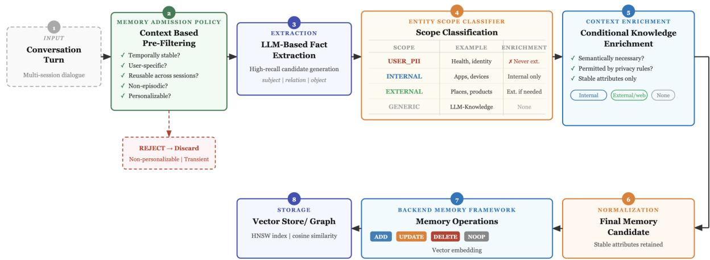

# Gated Memory: Admission-Controlled Memory Formation for Conversational AI

Preeti Saraswat† Divya Neelagiri∗ Ajay Manoj∗ Samsung Research America, Mountain View, CA {p.saraswat, d.neelagiri, ajay.manoj}@samsung.com

## Abstract

Personalized conversational AI relies on long term memory systems that extract facts from user utterances and stores them in persistent vector stores. Despite substantial progress in retrieval, deduplication, and lifecycle manage ment, the formation stage,the moment a fact is first written to storage has received almost no principled attention. We identify this as the binding constraint on memory quality in pro duction deployed systems. Critical contextual signals such as the distinction between a per manent user attribute and a transient situation, exist only in the original utterance and are irre versibly lost the moment extraction produces a subject-relation-object triple. No downstream process can recover them. We propose Gated Memory, a lightweight, modular formation framework that interposes two decision check points between conversation and storage: an ad mission gate that evaluates every candidate fact against the full utterance context before extrac tion runs, and a conditional enrichment stage that grounds admitted facts through an entity scope taxonomy with privacy constraints. The gate evaluates only the current exchange while using prior turns as read-only reference context, and produces a structured formation record: admitted content is decomposed into atomic facts, each categorized, tagged with provenance (directly stated versus inferred), scoped to its condition of applicability, and grounded in re solved time and place, subject to a constraint that no entity absent from the context may be asserted. On the LoCoMo-10 long-term mem ory benchmark with atypical emotional density in utterance data, Gated Memory achieves an overall +2.6% relative improvement in LLM judge accuracy over a strong baseline with identical retrieval and generation, establishing for mation quality as a measurable constraint with direct implications for actual production mem ory systems that might be polluted with a lot of irrelevant context.

## 1 Introduction

Long-term memory in conversational AI is fundamentally a write problem. The decisions made at the moment of storage,what to commit and in what form,determine the ceiling of every subsequent interaction. Systems such as MemGPT Packer et al. (2023), mem0 Chhikara et al. (2025), and A-MEM Xu et al. (2025) have invested heavily in post-storage operations: retrieval-augmented generation Lewis et al. (2020), deduplication, lifecycle management, and episodic/semantic categorization Tulving (1987). These contributions are genuine, but they share an unexamined assumption: that facts entering the store are worth storing.

This assumption fails in a structurally interesting way. When a user says “I drove an SUV last weekend ,the only rental they had,” any extraction model produces (User, drives, SUV) ,semantically identical to the triple for a vehicle the user actually owns. The signal that separates them, the word rental, exists once in the original utterance. Once extraction discards the utterance and retains only the triple, the ownership signal is permanently gone. Better retrieval cannot distinguish two identical triples,better generation cannot reason correctly over contradictory ground truth,pruning can only remove a stale entry long after it has shaped responses across multiple sessions.

This is a formation problem. The evidence for the correct decision ceases to exist downstream. The right intervention is at the only moment it is possible: before extraction, while the full utterance is intact.

We introduce Gated Memory, a modular, admission-controlled formation layer interposed between conversation and storage. Our contributions are:

• We identify formation as a structurally distinct, previously unaddressed failure point in long-term memory, characterizing three failure modes: reactive admission, absent enrichment, and irrecoverable loss of context.

• We propose an utterance-level admission gate that evaluates candidate facts against the full original utterance before extraction ,the only viable point of intervention. The gate operates over a current-versus-reference decomposition of the dialogue: only the current exchange is a source of new facts, while prior turns serve as read-only context for reference resolution, preventing the re-emission of previously stored facts.

• We formalize formation as structured extraction rather than binaryfiltering: admitted content is decomposed into one or more atomic facts (multiintent splitting), each assigned one or more of six formation categories, a provenance label distinguishing directly stated from inferred facts, and a conditional scope recording when the fact applies.

• We introduce a four-class entity scope taxonomy (USER\_PII, INTERNAL, EXTERNAL, GENERIC) governing conditional enrichment with privacy guarantees, together with deictic grounding of relative temporal and spatial references at formation time.

• We enforce a grounding constraint that forbids the assertion of any entity or relation not present in the evaluated window, eliminating a class of fabrication errors that extraction otherwise introduces, and we preserve the language of the user utterance in the stored fact.

• We demonstrate a +2.6% relative improvement in LLM-judge accuracy on LoCoMo-10 Maharana et al. (2024) with zero changes to retrieval, generation, or evaluation, isolating the contribution of formation quality.

## 2 The Memory Formation Problem

Formation errors are undetectable downstream. All major memory frameworks share a common pipeline: extract subject-relation-object triples, resolve conflicts via lifecycle reasoning (ADD/UPDATE/DELETE/NOOP), and commit to a vector store. The implicit contract is that extraction errors will be caught by downstream deduplication or pruning. This contract fails in two ways. First, many formation errors are undetectable, a rental vehicle and an owned vehicle produce nonconflicting, non-duplicate triples there is nothing for deduplication to flag. Second, detectable errors persist across multiple sessions before pruning fires, actively shaping system responses in the interim. Beyond transient facts, semantically vacuous content pollutes the retrieval pool. The following entries were produced by an existing framework on LoCoMo:

“Life has been ok, taking care of things”

“Has favorite memories”

“Appreciates little moments”

“Has been busy with the project”

These entries pass deduplication (they are unique), survive pruning (they carry no expiration signal), and occupy top-k retrieval slots on virtually every life-related query. The system is not malfunctioning ,it simply has no gate.

Admission must precede extraction. Modern systems address formation quality through lifecycle reasoning: an LLM evaluates each extracted fact against the existing store and decides whether to add, update, delete, or ignore it as existing fact. This is valuable for store consistency, but it solves a different problem. Lifecycle reasoning asks whether a fact conflicts with stored knowledge,admission control asks whether a fact deserves to be stored at all ,whether it is temporally stable, user-specific, and reusable. More critically, lifecycle reasoning operates on the extracted triple, not the original utterance. By the time it runs, the context is already gone. Admission must precede extraction. This is the architectural insight that all existing systems miss.

The same argument applies beyond the admit/reject decision. Whether a fact is directly asserted or merely implied in passing, whether an utterance carries one storable proposition or several, and which antecedent an unbound reference should resolve to, are all properties of the original utterance that are erased the moment extraction produces a triple. A system that reasons only over triples cannot recover them, and a system that reconsumes the entire dialogue history on every turn compounds the problem: it re-emits facts it has already stored and resolves references against stale antecedents, fabricating entities the current turn never introduced. Correct formation therefore requires not only admitting the right facts, but categorizing them, attributing their provenance, and scoping their evaluation to the current exchange,all before extraction discards the evidence.

The enrichment gap. Even well-admitted facts are stored as raw extraction strings with no semantic grounding. “User drives Car-X” cannot answer queries about fuel infrastructure or type of car. Enrichment done once at formation for stable facts is amortized across every future retrieval,enrichment deferred permanently leaves facts shallower than they need to be. This problem also interacts with privacy. Uniform enrichment risks sending personal information to external services without consent, while zero enrichment forfeits semantic depth. The correct solution is conditional enrichment governed by scope classification at formation time.

## 3 Gated Memory

Gated Memory is a drop-in formation layer that sits between conversation and any existing memory backend, decomposing into three sequential stages: admission, scope classification, and conditional enrichment (Figure 1). All three stages operate over a current-versus-reference view of the dialogue, described next.

Stage 0: Current–Reference Decomposition. A naive formation layer that consumes the entire visible dialogue history on every turn re-evaluates, and therefore re-emits, facts it has already committed: the same attribute is written on every subsequent turn in which it remains visible, and unbound references in the history are resolved against the wrong antecedent, fabricating entities that the current turn never mentioned. Gated Memory eliminates this class of error by partitioning the input into a current exchange ,the single user utterance and its system response that formation must evaluate,and a reference history of prior turns that is context-only: it is available for pronoun and deixis resolution but is never itself a source of new facts. Concretely, extraction is scoped to the current exchange, while the reference history is supplied to the admission prompt solely to bind references (“he,” “there,” “that one”) to their antecedents. This decomposition is what makes formation idempotent across turns: a fact is formed once, when its evidence first appears, and is not re-formed merely because it remains contextually visible. In practice the dialogue is processed as overlapping rolling windows over the current exchange, with a small turn overlap that supplies the local antecedents required for reference resolution without expanding the set of turns treated as fact sources.

Stage 1: Utterance-Level Admission. Every candidate fact is evaluated by a structured LLM prompt against the complete original utterance ,not the extracted triple. This is the load-bearing design choice that operates before extraction and retains ownership context that no downstream component can recover. A candidate is admitted if it satisfies at least one criterion: (1) it encodes a personalization relation (preference, habit, ownership, role, or stable affiliation),(2) it encodes a semi-stable user attribute (health, employment, location, or major life event),or (3) it exhibits cross-session reusability ,it would materially improve relevance of a future response. A candidate is rejected if it encodes a transient state, a generic emotional reaction, or vague non-factual content. The following contrasts illustrate why utterance-level evaluation is necessary ,each pair produces identical extracted triples:

[REJECT] “I drove a Jeepfor the road trip that I rented ;” transient,context lost at extraction

[ADMIT] “I’ve had my Jeep Wrangler for three years.” stable ownership

[REJECT] “I might switch to Android next year.” hedged,no commitment

[ADMIT] “I’m switching to Android next month.” definitive,stable preference

The admission policy outputs a structured JSON object containing the admit/reject decision, entity based ontology mapping, scope classification, and enrichment flag. Every decision is logged and auditable.

Multi-intent decomposition. A single admitted utterance frequently carries more than one storable proposition, and committing it as one entangled string degrades both retrieval precision and later conflict resolution. Formation therefore decomposes an admitted exchange into one or more atomic facts, each evaluated and categorized independently. For example, “gift ideasfor my son” yields both a persona fact (the user has a son) and a procedural fact (the user searched for gift ideas); “find a hotel with an onsen, and remember I’m vegetarian” yields a scoped preference and a durable persona attribute. Decomposition is performed at formation, while the utterance is intact, because the boundaries between propositions,and the reference resolution each requires, are themselves part of the context that extraction would otherwise discard.

Formation categories. Each atomic fact is assigned one or more of six categories that determine how the backend should treat it: persona (identity, relationships, durable attributes), preference (likes, dislikes, dietary and interaction constraints), event (experienced episodes, carrying temporal and participant metadata), procedural (deviceor application-level actions the user performed), user\_rule (explicit instructions on assistant behavior), and error\_learning (corrections to prior assistant understanding). Categories are not mutually exclusive: a fact that aids retrieval under more than one is multi-labeled rather than forced into a single class. The categorization is produced jointly with admission so that it, too, is conditioned on the full utterance rather than on the extracted triple.

  
Figure 1: The Gated Memory pipeline. Every candidate fact passes through an utterance-level admission gate. Admitted facts are scope-classified and conditionally enriched before being passed to the memory backend.

Provenance. Every fact carries a provenance label distinguishing a directly stated attribute, one the user asserts as the point of the utterance (“I have a son”), from an inferred one, extracted from a reference made in passing (“gift ideas for my son” implies, but does not assert, that the user has a son). This distinction, like ownership versus rental, exists only in the original utterance and is unrecoverable downstream. It governs how confidently the backend may treat a fact: directly stated attributes are candidates for durable semantic storage, whereas inferred attributes are retained provisionally, pending corroboration. Under explicit user instruction to remember, all resulting facts are marked directly stated.

Grounding. Formation is constrained to assert only what the evaluated window supports. The policy may not introduce a specific entity or relation absent from the current exchange and its reference context; an unbound reference is resolved to the most specific accurate antecedent, or, failing that, to a generic form, rather than to an invented one. For instance, a window containing only “he is seven” with no antecedent naming a child yields the user’s child is seven, not a fabricated son. This grounding constraint converts a silent failure mode of triple extraction,confident assertion of unsupported entities,into a bounded, auditable decision. Formation also preserves the language of the source utterance, so that a fact stated in one language is stored in that language rather than silently translated.

Table 1: Entity scope taxonomy and enrichment policy with privacy constraints.
<table><tr><td>Scope</td><td>Covers</td><td>Enrichment policy</td></tr><tr><td>USER_PII</td><td>Health, nances, contacts</td><td>identity, fi- No enrichment.</td></tr><tr><td>INTERNAL</td><td>data</td><td>Devices, apps, platform Internal metadata only,no ex- ternal calls</td></tr><tr><td>EXTERNAL</td><td>entities</td><td>Products, places, public External grounding when se- mantically necessary</td></tr><tr><td>GENERIC</td><td>LLM-resolvable facts</td><td>Parametric knowledge or none</td></tr></table>

Stage 2: Entity Scope Classification. Every admitted fact is assigned to exactly one of four scopes (Table 1), produced jointly with the admission decision and privacy constraint classification.

Stage 3: Conditional Enrichment. A fact is enriched only when two conditions are jointly satisfied: enrichment would improve its semantic utility for future queries, and the assigned scope permits the required knowledge source. For EXTERNAL entities, a single stored fact can support a broad class of downstream queries. For example:

“Planning a trip with BMW edrive” → (Type:ElectricVehicle, ChargingRange:“300 miles”)

Deictic grounding. Beyond entity-level enrichment, formation resolves relative temporal and spatial references against the metadata of the current exchange. Expressions such as “next week,” “tomorrow,” or “tonight” are grounded to absolute dates using the utterance timestamp, and place deixis such as “here” or “there” is resolved to a concrete location using the request context, subject to the same scope-based privacy policy that governs external enrichment. Grounding relative references at formation is, like entity enrichment, a one-time cost amortized across every future retrieval: a fact whose temporal anchor is resolved once remains interpretable indefinitely, whereas a fact storing “next week” verbatim becomes meaningless the moment the utterance’s temporal origin is lost.

After enrichment, facts are normalized. Volatile session-specific context is stripped and only stable attributes are committed. Normalized, enriched facts are passed to the memory backend, which handles deduplication, conflict resolution, embedding, and persistence. Gated Memory governs what reaches the backend, it does not replace it. Retrieval and generation are entirely unchanged.

## 4 Experiments

## 4.1 Dataset

We evaluate on LoCoMo-10, a benchmark of ten multi-session dialogues averaging ∼300 turns each, with 1,540 questions across four categories: Single-Hop, Multi-Hop, Temporal, and Open Domain. Category 5 (adversarial) is excluded.

## 4.2 Baseline and experimental design

Our baseline is mem0 framework with a fixed configuration of Qdrant vector store, an open-source 8B instruction-tuned LLM and a fixed answer generation prompt. The only experimental variable is the presence of the Gated Memory formation layer, directly isolating formation quality from all other system components. Gated Memory is designed as a production formation layer. The baseline thus represents a complete ablation of the formation layer. Disentangling the individual contributions of admission and enrichment is left as future work.

Table 2: LLM-judge accuracy (%) on LoCoMo-10. Retrieval, generation, and evaluation are identical across both conditions.
<table><tr><td>System</td><td>S-Hop</td><td>M-Hop</td><td>0-Dom</td><td>Temp</td><td>Overall</td></tr><tr><td>memory baseline</td><td>49.6</td><td>50.0</td><td>48.3</td><td>57.6</td><td>50.6</td></tr><tr><td>Gated Memory</td><td>51.8</td><td>47.9</td><td>49.9</td><td>58.6</td><td>51.9</td></tr><tr><td>Rel Error. ∆</td><td>+4.4%</td><td>-4.2%</td><td>+3.3%</td><td>+1.7%</td><td>+2.6%</td></tr></table>

## 4.3 Metric

We report LLM-judge accuracy. An independent evaluator scores each answer as correct or incorrect against ground truth, with lenient matching for paraphrasing and partial answers.

## 4.4 Admission statistics

The gate processed 5,882 utterances across ten conversations, admitting 5,527 (94.0%) and rejecting 355 (6.0%). Rejections consisted primarily of vague emotional expressions, procedural turns, and transient situational references.

## 5 Results and Discussion

Table 2 reports results. Gated Memory improves overall accuracy by +2.6% relative with the formation layer as the sole experimental variable, directly attributing the gain to formation quality.

Single-Hop and Open Domain. The largest gains appear on Single-Hop (+4.4%) and Open Domain (+3.3%). Single-Hop performance is directly sensitive to retrieval noise: removing low-signal entries reduces competition for top-k slots, improving precision over the matched retrieval pool. Open Domain additionally benefits from conditional enrichment ,an EV entry augmented with enriched context supports a broad class of queries that the raw extraction string cannot address, and the +3.3% gain quantifies this effect.

Temporal. The +1.7% gain on Temporal questions is consistent with the admission policy’s preference for temporally stable facts over episodic states. Facts encoding persistent preferences, and semantic relevance are admitted,transient situational references are rejected.

Multi-Hop regression. Multi-Hop exhibits a −4.2% regression. Compositional reasoning is sensitive to both precision and recall. The admission policy, optimized for individual fact utility, occasionally prunes interdependent nodes. This is a precision-recall tradeoff inherent to independent fact evaluation, not an artifact of our specific threshold, and motivates chain-aware admission that models inter-fact dependencies at formation time as the primary direction for future work.

Formation quality as a binding constraint. With retrieval, generation, and evaluation held constant, a +2.6% overall gain from changing only what enters the memory store especially for a emotionally dense dataset demonstrates that formation quality is a binding constraint on downstream task performance. In actual production environments with high volume of irrelevant context this gating framework could be much more beneficial.

## 6 Related Work

Persistent memory is a very critical component for AI systems Timoneda and Vera (2025); He et al. (2026). Long-term memory architectures for conversational AI have focused mostly on post-formation concerns Zhong et al. (2024); Liu et al. (2023). MemGPT Packer et al. (2023) introduces hierarchical memory management with OS-inspired paging while mem0 Chhikara et al. (2025) provides production lifecycle management including deduplication and conflict resolution. A-MEM Xu et al. (2025) proposes Zettelkasteninspired dynamic interconnection while ReadAgent Lee et al. (2024) addresses long-context limits through gist-based compression. Zep Rasmussen et al. (2025) uses Graphiti, a temporallyaware knowledge graph engine to dynamically synthesizes both unstructured and structured data while maintaining historical relationships. None of this frameworks addresses the formation qual ity. Prior Works on retrieval-augmented generation Lewis et al. (2020) and knowledge conflict Shi et al. (2023) has also established that retrieval noise degrades generation quality. Our results extend this causal chain: formation noise → retrieval noise → generation degradation. Classic work on memory decay Tulving (1987); Baddeley (2000) addresses when facts should be removed,we address whether they should even be admitted. The episodic–semantic distinction Tulving (1987) is typically applied post hoc, as a categorization of already-stored content; we instead determine category, provenance, and applicability scope at formation, while the utterance is intact, because the signals that separate a directly stated attribute from one inferred in passing, or an episodic event from a durable persona attribute, are properties of the original utterance rather than of the extracted triple. Prior lifecycle-oriented systems Packer et al. (2023); Chhikara et al. (2025) operate on extracted triples and cannot recover these signals; the grounding constraint we impose,asserting only entities present in the evaluated context,further addresses a fabrication failure mode of triple extraction that downstream deduplication, which only detects conflicts and duplicates, cannot catch. Privacy research at the training and inference level Carlini et al. (2021) motivates but does not address risks introduced by enrichment,our entity scope taxonomy and its policy based enrichment fills this gap.

## 7 Conclusion

We introduced Gated Memory, a formation framework that addresses an unexamined failure point in long-term conversational memory. By placing an utterance-level admission gate at the moment a fact is first written to storage and a privacy-aware enrichment stage before extraction, this framework preserves contextual signals irreversibly lost under existing approaches for better memory formation. A +2.6% relative improvement on LoCoMo-10 with no changes to retrieval, generation, or evaluation establishes formation quality as a measurable constraint on memory performance, though a −4.2% regression on Multi-Hop reasoning reveals a precision-recall tradeoff that chain-aware, inter-fact-dependent admission policies should resolve. In production settings, the gate’s filtering of vacuous content directly reduces storage costs, retrieval latency, and hallucination risk at scale. Domain-adaptive thresholds and knowledge-graph grounding remain natural extensions of future work. The richness of what a personalized assistant can do is bounded by the quality of what it chooses to remember.

## Limitations

The admission gate’s effectiveness depends on the quality of the underlying LLM prompt. Adversarial or ambiguous utterances may be misclassified at formation time. Unlike downstream deduplication, formation errors are undetectable after the fact is formed. The evaluation is conducted on LoCoMo-10 with atypical emotional density in utterance data. Hence generalization across domains, languages, and task-oriented deployments need to be demonstrated empirically. The 6.0% rejection rate is a conservative lower bound and taskoriented deployments are expected to exhibit substantially higher filtering rates that needs to be analyzed further. The Multi-Hop regression (−4.2%) reveals a precision-recall tradeoff inherent to independent fact evaluation,chain-aware admission that models inter-fact dependencies remains future work. Finally, the enrichment stage introduces external knowledge calls for EXTERNAL-scoped facts, adding latency and potential staleness risk for timesensitive information that needs to be addressed by only including stable facts for enrichment.

## References

Alan Baddeley. 2000. The episodic buffer: a new component of working memory? Trends in cognitive sciences, 4(11):417–423.

Nicholas Carlini, Florian Tramer, Eric Wallace, Matthew Jagielski, Ariel Herbert-Voss, Katherine Lee, Adam Roberts, Tom Brown, Dawn Song, Ulfar Erlingsson, and 1 others. 2021. Extracting training data from large language models. In 30th USENIX security symposium (USENIX Security 21), pages 2633–2650.

Prateek Chhikara, Dev Khant, Saket Aryan, Taranjeet Singh, and Deshraj Yadav. 2025. Mem0: Building production-ready ai agents with scalable long-term memory. arXiv preprint arXiv:2504.19413.

Zihong He, Weizhe Lin, Hao Zheng, Fan Zhang, Matt W. Jones, Laurence Aitchison, Xuhai Xu, Miao Liu, Hai-Ning Liang, Per Ola Kristensson, and Junxiao Shen. 2026. Human-inspired perspectives: A survey on ai long-term memory. Proceedings ofthe IEEE, 114(3):484–515.

Kuang-Huei Lee, Xinyun Chen, Hiroki Furuta, John Canny, and Ian Fischer. 2024. A human-inspired reading agent with gist memory of very long contexts. arXiv preprint arXiv:2402.09727.

Patrick Lewis, Ethan Perez, Aleksandra Piktus, Fabio Petroni, Vladimir Karpukhin, Naman Goyal, Heinrich Küttler, Mike Lewis, Wen-tau Yih, Tim Rocktäschel, and 1 others. 2020. Retrieval-augmented generation for knowledge-intensive nlp tasks. Advances in neural information processing systems, 33:9459– 9474.

Lei Liu, Xiaoyan Yang, Yue Shen, Binbin Hu, Zhiqiang Zhang, Jinjie Gu, and Guannan Zhang. 2023. Thinkin-memory: Recalling and post-thinking enable llms with long-term memory. arXiv preprint arXiv:2311.08719.

Adyasha Maharana, Dong-Ho Lee, Sergey Tulyakov, Mohit Bansal, Francesco Barbieri, and Yuwei Fang. 2024. Evaluating very long-term conversational memory of llm agents. In Proceedings of the 62nd

Annual Meeting ofthe Associationfor Computational Linguistics (Volume 1: Long Papers), pages 13851– 13870.

Charles Packer, Sarah Wooders, Kevin Lin, Vivian Fang, Shishir G Patil, Ion Stoica, and Joseph E Gonzalez. 2023. Memgpt: Towards llms as operating systems. arXiv preprint arXiv:2310.08560.

Preston Rasmussen, Pavlo Paliychuk, Travis Beauvais, Jack Ryan, and Daniel Chalef. 2025. Zep: a temporal knowledge graph architecture for agent memory. arXiv preprint arXiv:2501.13956.

Freda Shi, Xinyun Chen, Kanishka Misra, Nathan Scales, David Dohan, Ed H Chi, Nathanael Schärli, and Denny Zhou. 2023. Large language models can be easily distracted by irrelevant context. In International Conference on Machine Learning, pages 31210–31227. PMLR.

Joan C Timoneda and Sebastián Vallejo Vera. 2025. Memory is all you need: Testing how model memory affects llm performance in annotation tasks. arXiv preprint arXiv:2503.04874.

Endel Tulving. 1987. Multiple memory systems and consciousness. Human neurobiology, 6(2):67–80.

Wujiang Xu, Zujie Liang, Kai Mei, Hang Gao, Juntao Tan, and Yongfeng Zhang. 2025. A-mem: Agentic memory for llm agents. arXiv preprint arXiv:2502.12110.

Wanjun Zhong, Lianghong Guo, Qiqi Gao, He Ye, and Yanlin Wang. 2024. Memorybank: Enhancing large language models with long-term memory. In Proceedings ofthe AAAI Conference on Artificial Intelligence, volume 38, pages 19724–19731.