# MPGE: A Multi-Perspective Graph Explainer for Molecular Classification Explanation

Mahtab Sarvmaili

Dalhousie University

Halifax, Nova Scotia, Canada

Graph neural networks (GNNs) predict molecular properties from chemical graph data, but predictive accuracy does not explain how graph information supports an individual decision. A compact prediction-preserving rationale does not necessarily reveal which changes reverse the decision or which modifications the model tolerates. We propose the Multi-Perspective Graph Explainer (MPGE), unifying factual support, counterfactual sensitivity, and exemplar tolerance for a frozen classifier. The factual view, originally termed prototype (PT), seeks a compact retained edge set with the same label and required confidence. Counterfactual (CF) explanations seek bounded prediction-changing deletions; exemplar (EXE) explanations seek non-trivial bounded deletions that preserve the label and confidence. A shared constrained formulation connects prediction behavior, compactness, and edit cost, while separate objectives generate the three views. Our graph-classification extension of CF-GNNExplainer learns symmetric edge rankings and verifies discrete candidates, recording unsuccessful searches. A separate BBBP fragment backend returns RDKit-sanitized molecules. We evaluate the primary GCN implementation on MUTAG, Mutagenicity, AIDS, COX2 MD, and BBBP using semantic coverage, conditional quality, stability, and runtime. Successful factual masks retained 8.6%–15.5% of input edges on average across datasets; bounded counterfactual coverage was 4.8–67.6% and exemplar preservation coverage was 98.9–100.0%. Exploratory controls reveal the influence of hard projection and retained node information. Quantitative comparisons and molecular visualizations characterize model support, sensitivity, and tolerance without treating them as validated chemical mechanisms.

Keywords—graph neural networks, explainable artificial intelligence, counterfactual explanations, exemplar explanations, molecular property prediction

## I. Introduction

Molecular property prediction connects chemical structure to outcomes such as mutagenicity, biological activity, and blood–brain barrier penetration. Graph neural networks (GNNs) provide a natural representation-learning approach to these tasks by processing atom features and their structural relationships [1]. Predictive performance alone, however, does not reveal which information supports an individual model decision. Explanations can help inspect that decision and formulate structural hypotheses, although model-faithfulness evidence must be distinguished from validated chemical knowledge [2].

Understanding a molecular prediction requires more than identifying one compact rationale. Factual explainers seek a subset of graph information that supports the current prediction [3], [4]. Such a subset can be suficient without identifying the changes needed to reverse the decision. Counterfactual explainers instead search for prediction-changing perturbations [5], [6]. A successful counterfactual identifies sensitivity to a particular edit, but does not characterize which other changes the model tolerates. These distinctions motivate three complementary questions about the same query: what supports the prediction, what changes it, and what can change while the prediction is preserved?

We address these questions through factual, counterfactual (CF), and exemplar (EXE) explanations. The factual view seeks a compact retained edge set that preserves the query label and required confidence. This view was originally termed prototype (PT) in our study; we use factual in the formal definition and experiments because it explains an individual query rather than a class-level prototype. The counterfactual view seeks a bounded deletion that changes the predicted property class. The exemplar view seeks a non-trivially modified query that retains its label and a prescribed fraction of its confidence. Here, an exemplar is a generated query variant, not a representative training example. A positive edit requirement excludes the unchanged query, while the budget restricts the permitted deletions. Its same-outcome-under-change condition is related to the neighborhood and prediction relations of Explanation Sets [7]. Together, the views describe prediction support, sensitivity, and tolerance within the chosen intervention space; they do not certify a chemical mechanism or robustness to arbitrary modifications.

We propose the Multi-Perspective Graph Explainer (MPGE), which unifies these three views through a constrained formu- lation and a common explanation interface. Their objectives connect prediction preservation or change with compactness and edit cost. Prior work already couples factual and counterfactual reasoning [8], [6]; our focus is to include the prediction-preserving edited query and evaluate all three views under explicit output constraints. The structural implementation, MPGX-CF, extends the CF-GNNExplainer architecture to graph classification [5]. It shares a frozen predictor across perspectives but optimizes a separate symmetric edge mask for each. A ranked hard-mask search checks the actual returned graph and records a failure when no searched candidate meets the requested constraints. A separate BBBP fragment-search backend returns RDKit-sanitized molecules, distinguishing chemical representability from the structural feasibility of an edge mask.

The contributions are:

• a three-view formulation connecting compact factual support, bounded counterfactual change, and non-trivial

exemplar preservation;

• a graph-classification extension of CF-GNNExplainer with view-specific objectives, discrete feasibility checks, and explicit search-failure reporting;

• a chemistry-aware fragment-search instantiation that eval- uates the three views in a separately sanitized molecular candidate space; and

• a multi-dataset evaluation that separates semantic coverage, conditional quality, and mask stability, with exploratory controls for discretization, retained node information, and edit budgets.

We evaluate the primary GCN implementation on four TU molecular graph benchmarks—MUTAG, Mutagenicity, AIDS, and COX2 MD—and the scafold-held-out BBBP dataset. Quantitative comparisons assess the three views using compatible baselines, while visualizations show how their retained and removed structures answer the diferent explanation questions. The following sections position the framework in the literature, define its objectives and search procedures, and present the evaluation together with the limits of molecular interpretation.

## II. Related Work

## A. Factual graph explanations

GNNExplainer learns compact structural and feature masks that preserve information about a model prediction [3]. PGEx plainer amortizes mask generation over multiple inputs and also includes size and entropy regularization [4]. These approaches motivate our diferentiable edge ranking, but our evaluation treats the final hard subgraph, rather than its continuous surrogate, as the explanatory object.

## B. Counterfactual and coupled reasoning

CF-GNNExplainer freezes a trained GNN and learns a symmetric adjacency sparsification mask, retaining the best discrete deletion candidate that changes a node prediction [5]. We adapt this separation between predictor and perturbation parameters to graph classification. RCExplainer learns common decision logic and seeks complementary conditions on a selected subgraph and its remainder [6]. ${ \dot { \mathrm { C F } } } ^ { 2 }$ directly couples factual suficiency and counterfactual necessity through a sparse relaxed mask [8]. These approaches establish coupled reason ing as an important precedent; our formulation additionally specifies a bounded, non-trivially edited query that preserves the prediction. Recent work formalizes post-generation graph- counterfactual minimization, proves its computational hardness, and proposes a bounded local search [9]. Our ranked-prefix scan is more restricted; it audits feasibility along one learned edge order and does not supply a global minimality guarantee.

CLEAR learns a generative graph-level counterfactual model, while D4Explainer uses discrete denoising difusion for distribution-aware counterfactual and model-level explanations [10], [11]. Their distribution objectives address a diferent question from whether a discrete graph changes a prediction. MPGE’s hard checks establish the latter; its separate fragment backend adds sanitation, not a learned molecular-manifold constraint.

## C. Molecular and distribution-aware explanations

Molecular counterfactual methods make this domain con- straint concrete. MEG trains a reinforcement-learning generator over valid molecular actions, whereas MMACE searches model- agnostically through SELFIES mutations [12], [13]. More recent counterfactual masking replaces removed substruc- tures with generatively completed fragments to reduce out- of-distribution evaluation artifacts [14]. ICExplainer likewise uses a learned graph distribution, and ATEX-CF (ICLR 2026) expands node-level counterfactual search to both edge additions and deletions [15], [16]. Our deletion-only fragment search explores a restricted candidate family. It instantiates all three views under one frozen predictor without claiming the broader generation capabilities of these methods.

Recent work also changes the explanatory object or its optimization space. MAGE generates model-level graph ex- planations using motifs, including molecular examples [17]. IDEA aligns instance-level explanations in a prototypical representation space rather than only matching graph labels [18]. Neither a class-level generated motif nor a latent prototype is equivalent to the compact query-specific factual mask termed PT in the original version of our study. This distinction matters because prediction preservation alone does not identify a unique explanatory structure.

## D. Exemplars and evaluation

The same-outcome-under-change perspective motivates the invariance constraint used by EXE. Explanation Sets formalize several example-based views within a common neighborhood and prediction relation [7]. We adapt that structure to a generated subgraph and require a positive edit cost, preventing the original graph from being returned as its own exemplar. This definition is stated explicitly because other explainability work may use exemplar for a representative observed case rather than a transformed query.

GraphFramEx separates explanation user needs and combines necessity and suficiency evidence [19]. Other systematic analyses show that faithfulness does not imply stability [20], and explanation masks can be fragile to small perturbations [21]. We consequently report semantic success, coverage, size or edit cost, stability, and runtime separately instead of collapsing them into one unqualified accuracy score. Recent work additionally constructs degenerate GNN explanations that standard faithfulness metrics can miss [22]. Although that analysis targets self-explainable GNNs rather than our post-hoc setting, it motivates interpreting favorable fidelity together with structure and stability diagnostics rather than as a complete explanation-quality certificate. Accordingly, MPGE is positioned as a query-level, three-view formulation with explicit hard-output evaluation, not as the first combination of explanation perspectives or a distribution-certified molecular generator.

## III. Problem Formulation

Let $G = ( V , E , X )$ be an attributed undirected graph and let a trained, frozen binary classifier � return a logit. Define

$$
p ( G ) = \sigma ( f ( G ) ) , \qquad y ( G ) = \mathbb { I } [ p ( G ) \geq 0 . 5 ] .\tag{1}
$$

For the query graph �, fix $y ~ = ~ y ( G )$ and define, for any candidate �, $p _ { y } ( H ) = p ( H )$ if $y = 1$ and $p _ { y } ( H ) = 1 - p ( H )$ otherwise. Thus $p _ { y }$ always refers to the original query class, even after a flip. An edit set Δ induces $T ( G , \Delta )$ . Structural candidates have $H = ( V , E _ { H } , X )$ with $E _ { H } \subseteq E$ ; molecular can- didates are generated connected fragments. Structural validity requires symmetric deletion of existing edges with unchanged nodes and features. Molecular validity additionally requires the fragment-generation and RDKit sanitation checks. Neither predicate establishes distributional plausibility or a physical property. The evaluated structural queries have $M = \left| E \right| \geq 1$

Let $A _ { F } ( H )$ be a backend-specific factual size, �(Δ) the edit cost, and $\mathcal { D } _ { B }$ the permitted bounded edits. Structurally, $A _ { F } ( H ) = \vert E _ { H } \vert , C ( \Delta ) = \vert E \backslash E _ { H } \vert ,$ , and $\mathcal { D } _ { B } = \{ \Delta : 1 \leq C ( \Delta ) \leq$ $B \}$ . The fragment backend uses retained heavy atoms for $A _ { F }$ deletion steps for �, and an additional removed-heavy-atom fraction limit in $\mathcal { D } _ { B }$

## A. Factual explanation

A factual explanation is a compact retained graph $S _ { F } \subseteq G$ For the structural backend, $S _ { F } = ( V , E _ { F } , X )$ retains every query node and feature and selects only $E _ { F } \subseteq E ;$ its compactness is therefore edge compactness. The chemistry-aware backend instead returns a sanitized connected fragment under the same prediction constraint but a diferent size cost:

$$
\begin{array} { r l } { \underset { S _ { F } } { \operatorname* { m i n } } } & { A _ { F } ( S _ { F } ) } \\ { \mathrm { s . t . } } & { y ( S _ { F } ) = y , } \\ & { p _ { y } ( S _ { F } ) \geq \tau _ { F } , } \\ & { S _ { F } \in { \cal S } _ { F } ( G ) , \quad \mathrm { V a l i d } ( S _ { F } ) = 1 . } \end{array}\tag{2}
$$

Here $S _ { F } ( G )$ contains non-empty retained-edge graphs for the structural backend and generated connected fragments with at least two atoms for the molecular backend. The former excludes a zero-edge output but retains all node information. It also contains the full query, so factual feasibility is expected for a valid non-empty structural query; compactness, rather than coverage alone, distinguishes factual outputs. The confidence thresholds are relative to the unmasked prediction, $\tau _ { F } = \tau _ { E } =$ $\rho p _ { y } ( G )$ , with $\rho$ fixed before test evaluation.

## B. Counterfactual explanation

A counterfactual is a minimum-cost valid intervention that changes the decision:

$$
\begin{array} { r l } { \underset { \Delta _ { C } } { \operatorname* { m i n } } } & { C ( \Delta _ { C } ) } \\ { \mathrm { s . t . } } & { y ( T ( G , \Delta _ { C } ) ) \neq y , \quad \Delta _ { C } \in \mathcal { D } _ { B } , } \\ & { \mathrm { V a l i d } ( T ( G , \Delta _ { C } ) ) = 1 . } \end{array}\tag{3}
$$

If � is a keep mask, the deletion cost is proportional to $\| 1 { - } m \| _ { 1 }$ , not $\Vert m \Vert _ { 1 }$ 1. This direction is essential: penalizing the keep mask would reward deleting more edges.

## C. Exemplar explanation

An exemplar is a non-trivial, bounded change under which the decision and a minimum confidence are preserved:

$$
\begin{array} { r l } { \underset { \Delta _ { E } } { \operatorname* { m a x } } } & { U ( G , T ( G , \Delta _ { E } ) ) } \\ { \mathrm { s . t . } } & { y ( T ( G , \Delta _ { E } ) ) = y , } \\ & { p _ { \mathrm { y } } ( T ( G , \Delta _ { E } ) ) \geq \tau _ { E } , } \\ & { \Delta _ { E } \in \mathcal { D } _ { B } , } \\ & { \mathrm { V a l i d } ( T ( G , \Delta _ { E } ) ) = 1 . } \end{array}\tag{4}
$$

Here � measures a specified structural diference from the query. Positive cost excludes a no-op and the budget restricts the edit family; neither guarantees meaningfulness to a domain expert. We use removed-edge fraction for masks and one minus Morgan-fingerprint similarity for molecular fragments. Factual and exemplar views share a prediction-preservation condition but optimize diferent quantities under diferent candidate constraints. The implementation searches restricted families and does not certify global optima.

## IV. MPGE Framework and MPGX-CF Architecture

## A. Frozen predictor and perturbation generator

Let $f _ { W }$ be the trained graph classifier and let $g _ { P }$ be its perturbation counterpart. As in CF-GNNExplainer [5], �� uses the frozen weights $W$ of $f _ { W }$ and learns only structural gates $P .$ The predictor is in evaluation mode: dropout is disabled and BatchNorm running statistics are fixed. Our implementation assigns one logit $z _ { e }$ to each of the � unique undirected edges and mirrors $m _ { e } = \sigma ( z _ { e } )$ onto both directed message- passing entries. Consequently, ${ \widetilde { A } } = A \odot m$ is symmetric, cannot introduce a non-edge, and does not gate the self-messages added by the GCN. The GCN normalization is recomputed on $\widetilde { A } + I$ during every forward pass. This is the graph-classification analogue of the CF-GNNExplainer generating model, rather than a second predictor trained from data.

The gate logits are initialized as $z _ { e } = 1 + \epsilon _ { e } ,$ , with $\epsilon _ { e } \sim$ $N ( 0 , 0 . 0 1 ^ { 2 } )$ , giving initial soft weights near $\sigma ( 1 )$ rather than unit weights. Let $q _ { y } ( m )$ denote the probability assigned by $g _ { P }$ to the query class under the soft mask, $\begin{array} { r } { \overline { { m } } = M ^ { - 1 } \sum _ { e } m _ { e } } \end{array}$ , and $H ( m )$ denote mean binary entropy. We optimize a separate � for each requested view; sharing the predictor does not imply sharing an explanation mask.

## B. Perspective-specific objectives

The factual relaxation is

$$
L _ { F } = \lambda _ { p } \left[ \tau _ { F } - q _ { y } ( m ) \right] _ { + } + \beta _ { 1 } \overline { { { m } } } + \beta _ { 2 } \overline { { { m ^ { 2 } } } } ,\tag{5}
$$

where $\overline { { m } }$ is the mean retained mass. The counterfactual relax- ation reverses the decision condition and penalizes removed rather than retained mass:

$$
L _ { C } = \lambda _ { p } \left[ q _ { y } \left( m \right) - 0 . 4 9 \right] _ { + } + \beta _ { 1 } \overline { { { \left( 1 - m \right) } } } + \beta _ { 2 } \overline { { { \left( 1 - m \right) } } } ^ { 2 } .\tag{6}
$$

The exemplar relaxation preserves confidence while encourag- ing a non-trivial deletion up to budget $b \colon$

$$
\begin{array} { r } { L _ { E } = \lambda _ { p } \left[ \tau _ { E } - q _ { y } ( m ) \right] _ { + } - \beta _ { 1 } \overline { { ( 1 - m ) } } } \\ { + \lambda _ { b } [ \overline { { ( 1 - m ) } } - b ] _ { + } ^ { 2 } + \beta _ { 2 } H ( m ) . } \end{array}\tag{7}
$$

Algorithm 1 Multi-Perspective CF-GNN Explanation for Graph   
Classification   
Require: graph $\overbrace { G = ( V , E , X ) }$ with $M = | E | \geq 1 ;$ logit predictor $f _ { W } ;$ view   
$\dot { \nu } \in \{ \check { F } , \check { C } , E \} ; \rho ;$ fraction $^ { b ; }$ absolute cap $B _ { \operatorname* { m a x } } ; \beta _ { 1 } , \beta _ { 2 } , \lambda _ { p }$ , ��; steps   
�; learning rate $\eta ;$ seed �   
Ensure: hard explanation $G _ { \nu }$ or an explicit failure   
1: set predictor to evaluation mode; freeze every parameter in $W$   
$2 \colon y \in y ( G ) ; \tau \gets \rho p _ { y } ( G )$   
3: � ← min $\{ M , B _ { \mathrm { m a x } } ,$ , max(1, ⌊�� ⌋ ) }   
4: create one logit $z _ { e }$ for every unique undirected edge $e \in E$   
5: initialize $z$ from seed �   
6: for $t = 1 , \ldots , K$ do   
7: $m \gets \sigma ( z ) ;$ mirror � onto both edge directions   
8: $q _ { \mathrm { y } } \gets p _ { \mathrm { y } }$ (� ⊙ �) using $\sigma ( f _ { W } ( \cdot ) )$   
9: update � by Adam to minimize $L _ { \nu } ( q _ { y } , m )$   
10: end for   
11: � $ \sigma ( z )$ after the final update   
12: if $\nu = F$ then   
13: order edges by decreasing $m _ { e }$   
14: C ← retained-edge prefixes from smallest to largest   
15: $G _ { \nu } \gets$ first $H \in { \bar { C } }$ with $y ( H ) = y$ and $p _ { \mathrm { y } } ( H ) \ge \tau$   
16: else if $\nu = C$ then   
17: order edges by increasing $m _ { e }$   
18: C ← deletion prefixes of size $1 , \ldots , B$   
19: $G _ { \nu } \gets$ first $H \in C$ with $y ( H ) \neq y$   
20: else   
21: order edges by increasing $m _ { e }$   
22: $c $ deletion refixes of size $1 , \ldots , B$   
23: $G _ { \nu } \gets H \in \bar { C }$ with the largest deletion prefix and $y ( H ) = y$ and   
$p _ { \mathrm { y } } ( H ) \ge \tau$   
24: end if   
25: if no candidate satisfies the hard constraints then   
26: return Failure with the violated constraint   
27: end if   
28: return $G _ { \nu } ,$ its hard mask, probabilities, edits, and provenance

Here $[ a ] _ { + } = \operatorname* { m a x } ( a , 0 )$ , � is the soft edit-fraction limit, and $\lambda _ { p } = \lambda _ { b } = 8$ in the locked configuration. The counterfactual surrogate targets original-class probability below 0.49; actual hard success uses the classifier’s 0.5 decision rule. The factual quadratic term averages squared gates, whereas the counterfactual term squares the mean edited mass; the exemplar term is entropy regularization, not an elastic-net penalty. These losses are diferentiable surrogates, not the final explanations. After optimization, the algorithm orders the unique undirected gates and evaluates hard masks in ranked order. It selects the smallest suficient factual mask, the first prediction-changing deletion set, or the largest in-budget confidence-preserving exemplar deletion set. If no hard candidate satisfies its definition, the method returns a failure. This avoids the soft–hard mismatch that can arise when the optimized mask is thresholded. This deterministic feasibility audit extends CF-GNNExplainer’s best- candidate tracking to all three perspectives. These selections are extremal only within the ranked candidate sequence; neither the edge-mask scan nor the bounded fragment beam proves a global optimum of Eqs. (2)–(4).

Candidates are symmetric deletions of existing undirected edges, satisfying structural validity by construction. Algo- rithm 1 specifies the proposed structural graph-classification extension of CF-GNNExplainer, not the fragment backend or the baselines. It optimizes only unique-edge gates and uses gradient descent through Adam; it does not optimize dense non-edge entries or update the predictor. Most importantly, the returned object is selected by an explicit hard feasibility scan rather than by thresholding a soft mask and assuming that its semantics survive discretization. A failure means that no searched candidate was feasible, not that no explanation exists in the full edit space.

The structural backend masks edges but retains the full node set. The GCN also adds a self-loop at every node. Consequently, a one-edge factual mask can still use every node’s features through self-messages and should be interpreted as an edge- suficiency result, not as a two-node induced subgraph or a chemically complete fragment. We therefore report retained edges together with isolated nodes and connected components, and reserve molecular-fragment language for the chemistry aware backend below.

## C. Chemistry-aware fragment search

Arbitrary deletion masks can leave atom sets that do not describe a useful molecule. For molecular graphs with SMILES provenance, we therefore implement a second search space. At each step the method cuts a non-ring single bond, retains a connected component, restores implicit hydrogens through canonicalization, and accepts the candidate only if RDKit sanitization succeeds. Duplicate canonical SMILES are removed.

The search advances for at most three deletion steps. At each depth, at most 100 distinct candidates are retained, ordered by decreasing heavy-atom count and then canonical SMILES. Every retained fragment has at least two atoms; the unchanged query is not generated. Factual selection minimizes retained heavy atoms, breaking ties by fewer steps and greater query similarity. Counterfactual selection minimizes deletion steps, then removed heavy atoms, then prefers greater similarity. Exemplar selection maximizes fingerprint distance, breaking ties by more steps and fewer retained heavy atoms. Only counterfactual and exemplar candidates are restricted to removal of at most 35% of the query’s heavy atoms. Morgan fingerprints use radius two and the recorded RDKit default bit-vector settings.

Sanitization checks representability and valence consistency [23]; it does not establish synthetic accessibility, likely occur-rence, or a physically changed property. This backend adds chemical checks but is not a learned in-distribution generator.

## D. Predictive model

The primary classifier is a three-layer GCN [24]. With $\bar { A } =$ $A + I$ and $\begin{array} { r } { \bar { D } _ { i i } = \sum _ { j } \bar { A } _ { i j } , } \end{array}$ , a layer is

$$
Z ^ { ( \ell + 1 ) } = \bar { D } ^ { - 1 / 2 } \bar { A } \bar { D } ^ { - 1 / 2 } H ^ { ( \ell ) } W ^ { ( \ell ) } + a ^ { ( \ell ) } ,\tag{8}
$$

where $a ^ { ( \ell ) }$ is a bias. Each convolution is followed by Batch- Norm, ReLU, and training-only dropout. Node representations are sum-pooled and passed to a linear binary-logit head; sigmoid obtains probabilities. Categorical node embeddings are summed column-wise; continuous node features use a linear encoder. The primary GCN consumes node features and topology, not edge labels or distance attributes. The GINE configuration used in validation sensitivity checks additionally encodes edge features; it is not a completed held out architectural robustness study.

## V. Experimental Protocol

## A. Research questions and evaluation scope

We organize the evaluation around five questions. RQ1 measures whether each hard output satisfies its factual, coun terfactual, or exemplar definition. RQ2 evaluates compactness, faithfulness, and edit cost conditional on success while retaining failures in the coverage denominator. RQ3 tests whether the views select diferent structures on jointly successful cases. RQ4 measures repeatability across explainer seeds and sensitivity to the representation and edit budget. RQ5 tests how much counterfactual coverage changes when rankings learned by diferent objectives receive the same hard-prefix projection. This replay does not isolate every diference in optimization or training budget.

## B. Datasets, features, and splits

Table I summarizes the five evaluated datasets.

MUTAG and Mutagenicity concern mutagenicity classifica- tion [25], [26]; AIDS provides a molecular activity classification benchmark through the IAM repository [27]. COX2 MD derives from COX2 activity data [28] and its distance-graph construction [29]: after removing explicit hydrogens, complete graphs carry interatomic-distance attributes and bond-type labels, including a no-bond category. Removing a COX2 MD graph edge is consequently not necessarily removing a chem- ical bond. We load all four from the oficial TU archives [30] and preserve source indices, categorical node and edge labels, and continuous attributes. Continuous attributes are standardized using training-fold statistics only. Stored edge labels and attributes are available to the GINE validation configuration but not consumed by the primary GCN. They are not explanation annotations; consequently, we do not report edge-mask accuracy on these datasets. For each TU dataset, one deterministic stratified ten-fold partition is created with master seed 20260911. In outer fold �, fold � is test, fold (� + 1) mod 10 is validation, and the remaining folds are training. Every graph is therefore tested exactly once per predictor seed.

Predictor metrics use all ten outer folds. Explanation gener- ation is complete for all ten folds of MUTAG, Mutagenicity, and COX2 MD and for folds 0–7 of AIDS; the latter contains 1,600 distinct held-out graphs per predictor seed. The reporting configuration excludes the incomplete AIDS fold 8 as a whole and the unstarted fold 9, independent of their outcomes. BBBP uses its single locked scafold test set. Thus every explanation table and plot uses only complete dataset–fold–predictor cells, with all attempted graphs and failed explanations retained inside those cells.

BBBP is loaded from the processed MoleculeNet/PyG collection [1], [31]. We record the source row, canonical SMILES, Bemis–Murcko scafold, label, and any additional loader rejection. Table I counts accepted graphs, not rejected or upstream-filtered source molecules. A deterministic stratified- group split groups equal scafold strings, including empty strings for acyclic molecules. It selects test and validation folds closest to the target sizes and overall class balance, yielding approximately 80%, 10%, and 10% training, validation, and test partitions with zero scafold overlap. Dataset manifests contain SHA-256 hashes of all available raw and processed files, feature schemas, graph identifiers, and split membership.

## C. Predictors and eligibility

The frozen predictor is a three-layer GCN, with 64 hidden units per layer, BatchNorm, ReLU, dropout 0.2, sum pooling, and a binary logit head. Training uses Adam, class-weighted binary cross-entropy with the positive weight estimated from the training partition, learning rate $1 0 ^ { - 3 }$ , weight decay $1 0 ^ { - 4 }$ batch size 64, at most 200 epochs, and early stopping after 30 epochs without improvement in validation log loss. Model seeds are 11, 29, and 47.

We report test AUROC, AUPRC, balanced accuracy, F1, Brier score, expected calibration error, log loss, and the selected epoch before reporting any explanation result. All predictions in the locked explanation population are eligible for model- faithfulness analysis because the target is the frozen model’s prediction. The displayed dataset-level dagger is assigned when the mean balanced accuracy is below 0.55 or mean AUROC below 0.60. It cautions against application-utility interpretation; explanation eligibility is not conditioned on predictive correctness.

## D. Hyperparameter selection and budgets

No test graph participates in selection. We use at most 24 deterministically selected, class-balanced validation graphs per fold with predictor seed 11 and explainer seed 101 to evaluate the complete grid $\beta _ { 1 } ~ \in ~ \{ 0 . 1 , 0 . 0 0 1 , 0 . 0 0 0 1 \}$ and $\beta _ { 2 } \in \{ 0 . 1 , 0 . 0 1 , 0 . 0 0 1 \}$ for each perspective. For factual and counterfactual views, $\beta _ { 1 }$ and $\beta _ { 2 }$ both regularize retained mass for factuals and edited mass for counterfactuals; for exemplars they control the edit reward and binarization penalty. One global configuration per perspective is selected lexicographically by: (i) maximum hard-constraint success, (ii) minimum retained fraction for factuals, minimum edit count for counterfactuals, or maximum feasible edit fraction for exemplars, (iii) maximum retained query-class confidence, and (iv) minimum runtime. Dataset-level validation means are macro-averaged so Muta- genicity does not dominate smaller domains. We additionally evaluate edit-fraction budgets 0.05, 0.10, 0.20, 0.30, and 0.35. The default hard budget is $B = \operatorname* { m i n } \{ | E | , 8 , \operatorname* { m a x } ( 1 , \lfloor 0 . 3 5 | E | \rfloor ) \}$ and $\rho = 0 . 8$ . The minimum-one clamp applies to non-empty structural graphs, relaxing the fractional limit when a graph is too small to admit one deletion. Explainer seeds are 101, 211, and 307. The MPGX-CF gate optimizer runs for 200 steps with Adam at learning rate 0.03. CF2 follows the oficial 500-step, 0.05 learning-rate graph configuration. PGExplainer is trained within each training partition for 20 epochs at learning rate 0.003; this training time is excluded from per-query explanation timings.

TABLE I  
Datasets and locked evaluation protocol. |� | counts each undirected edge once. N:L and E:L give node/edge categorical-label cardinalities; N:A and E:A give continuous-attribute dimensions. BBBP uses MoleculeNet atom/bond categorical features. GT denotes a documented edge-level explanation mask; none of these five datasets provides one. Features describe stored data, not all inputs used by GCN. AIDS explanation reporting uses folds 0–7; predictor reporting uses all ten folds.
<table><tr><td>Dataset</td><td>N</td><td>Pos.</td><td>|V|</td><td>|E|</td><td>Features</td><td>Split</td><td>GT</td></tr><tr><td>MUTAG</td><td>188</td><td>0.66</td><td> $1 7 . 9 \pm 4 . 6$ </td><td> $1 9 . 8 \pm 5 . 7$ </td><td>N:L7; E:L4</td><td>Stratified 10-Fold</td><td>no</td></tr><tr><td>Mutagenicity</td><td>4337</td><td>0.45</td><td> $3 0 . 3 \pm 2 0 . 1$ </td><td> $3 0 . 8 \pm 1 6 . 8$ </td><td>N:L14; E:L3</td><td>Stratified 10-Fold</td><td>no</td></tr><tr><td>AIDS</td><td>2000</td><td>0.80</td><td> $1 5 . 7 \pm 1 3 . 7$ </td><td> $1 6 . 2 \pm 1 5 . 0$ </td><td>N:L38; N:A4; E:L3</td><td>Stratified 10-Fold</td><td>no</td></tr><tr><td>COX2_MD</td><td>303</td><td>0.49</td><td> $2 6 . 3 \pm 2 . 5$ </td><td> $3 3 5 . 1 \pm 6 5 . 3$ </td><td>N:L7; E:L5; E:A1</td><td>Stratified 10-Fold</td><td>no</td></tr><tr><td>BBBP</td><td>2039</td><td>0.77</td><td> $2 4 . 1 \pm 1 0 . 6$ </td><td> $2 6 . 0 \pm 1 1 . 7$ </td><td>Atom/Bond Categorical</td><td>Scaffold 80/10/10</td><td>no</td></tr></table>

## E. Comparison methods

All compatible methods use the same predictor checkpoints, graph identifiers, splits, and output-feasibility criteria, but their native discretization rules difer. GNNExplainer and fold trained PGExplainer are factual baselines [3], [4]. A graph-classification adaptation of CF-GNNExplainer is evaluated only for counterfactual search [5]. It uses the published negative-NLL prediction term while the thresholded label remains unchanged, plus $\beta ~ = ~ 0 . 5$ times the diferentiable deletion distance. Following the authors’ released run commands, its symmetric gates are optimized for 500 SGD steps at learning rate 0.1 with Nesterov momentum 0.9; the best hard, in-budget flip is retained. $\mathrm { C F } ^ { 2 }$ uses the authors’ joint $L _ { 1 } + \lambda [ \alpha L _ { f } + ( 1 - \alpha ) L _ { c } ]$ objective, initialization, 0.5 mask threshold, and published graph defaults $( \lambda = 1 0 0 0 , \alpha = 0 . 6 , \gamma = 0 . 5 ) ;$ ; the same learned mask is evaluated as a factual subgraph and its complement for necessity [8]. A one-edge-deletion greedy ranking is the exemplar control. Matched random rankings are evaluated for all three perspectives.

To assess this discretization confound, we replay stored counterfactual rankings through one identical hard-prefix search on a deterministic, class-balanced subset of 24 held-out graphs per dataset (12 per original predicted class), with all three GCN seeds and explainer seed 101. The subset contains only graph IDs with complete records for all compared rankings. We also evaluate the proposed soft mask at a fixed 0.5 threshold, and test both a node-feature-only zero-edge input and an induced- node version of each selected factual explanation. These are exploratory controls, not a replacement for the locked full- population experiment.

For BBBP, we additionally report a separate sanitized fragment-deletion search. RDKit validity establishes graph representability, not synthesizability, and these chemistry- aware results are not pooled with the structural edge-mask comparison.

## F. Outcomes and statistical analysis

Semantic success is the hard label/confidence predicate of the requested view. Factual quality uses retained-edge fraction and comprehensiveness, $p _ { y } ( G ) - p _ { y } ( G \setminus E _ { F } )$ , where the complement retains all query nodes. Counterfactual quality uses deleted-edge count and original-class probability drop, $p _ { \mathrm { y } } ( G ) - p _ { \mathrm { y } } ( H )$ . Exemplar quality uses deleted-edge fraction and retained-confidence ratio, $p _ { \mathrm { y } } ( H ) / p _ { \mathrm { y } } ( G )$ . Structural edits are deletion-only; no edge-addition outcome or geometric boundary-distance estimate is inferred. Components and iso- lated nodes are counted on the full retained node set without predictor-added self-loops. Probability-shift diagnostics use $| p ( H ) - p ( G ) |$ |. Centrality diagnostics are root-mean-square nodewise changes in NetworkX-normalized betweenness and unnormalized harmonic centrality, not chemical importance scores.

Stability averages pairwise Jaccard similarity across suc- cessful explainer repetitions for the same graph–model pair, using retained edges for factuals and deleted edges for other views. Units with fewer than two successful repetitions supply no stability value. Cross-perspective Jaccard overlap compares factual retained edges with counterfactual or exemplar deleted edges on complete successful triplets. Runtime is wall time per query and view, including failures, and is distinct from the sum across views. Timing depends on implementation and hardware; it is not a universal complexity comparison.

Failed searches remain in the denominator and retain a machine-readable reason. Explainer repetitions are averaged within each graph–model pair. Main-text continuous outcomes are reported as mean ± standard deviation over these anal ysis units, while success is reported as a percentage of all attempts, including failed searches. Descriptive intervals in the supplementary metric records use 10,000 hierarchical bootstrap resamples over fold, model seed, and graph as applicable; new timing intervals use the same hierarchy. Paired efect intervals instead resample unique held-out graphs after averaging their repeated predictor-seed diferences. Method tests use these paired graph-level diferences on shared examples, Wilcoxon signed-rank tests, and Holm correction within each dataset– perspective–metric family. Datasets are separate domains; no micro-average across datasets is used. Shared fitted models induce dependence among held-out graphs, so intervals and paired tests are descriptive of the evaluated population, not guarantees of generalization to new training samples.

## G. Qualitative selection and reproducibility

The overview prefers complete successful MPGX-CF triplets selected by minimum distance to dataset medians of mean edit count and mean retained query-class probability. If none exist, it retains cases with the most successful views before applying the same rule. This deterministic illustration rule is not a claim of prospective preregistration. The appendices provide enlarged views and a failure audit. TU panels display documented categorical labels and are not described as sanitized molecules. Every panel is regenerated from its graph ID and hard mask and records fold, predictor seed, explainer seed, probabilities, edit count, and failure status.

The reported experiment is staged as predictor training, validation-only selection, locked test explanation, and artifact generation. Runs are resumable by dataset, fold, architecture, predictor seed, explainer seed, graph, method, perspective, budget, and protocol hash. The local reproducibility package records the resolved configuration, environment, source com- mit (or SHA-256 source hashes when commit metadata are unavailable), checkpoints, histories, split manifests, failures, and long-form CSV/Parquet output. All dependencies are installed in project-local UV environments. The arXiv source archive contains the manuscript, rendered tables and figures, a claim audit, supplementary metric summaries, and compact provenance CSVs, but not the large raw experiment directory; a public accession for the latter has not been assigned.

## VI. Results and Discussion

## A. Predictor performance and calibration

Predictive results establish the context for the explanation study. A dagger marks a dataset-level mean that triggers the weak-predictor rule; its explanations characterize the frozen model, not established application utility.

Held-out GCN AUROC ranged from $0 . 5 6 1 \pm 0 . 1 3 3$ on COX2 MD to $0 . 9 8 5 \pm 0 . 0 1 5$ on AIDS. The prespecified weak-predictor rule flagged COX2 MD; its explanation results characterize that frozen model rather than application utility.

## B. Semantic coverage and conditional quality (RQ1–RQ2)

Table IV reports all three proposed explanations for every dataset. Success uses all attempted graph–model–explainer units as its denominator; the remaining quantities are conditional on success and are therefore never interpreted without coverage.

Across datasets, hard factual coverage was 100.0% and successful factuals retained 0.09–0.16 of input edges. Counter factual flip coverage was 4.8–67.6%; successful flips removed 2.59–4.68 edges on average, depending on the dataset. Exemplar preservation coverage was 98.9–100.0%; successful exemplars edited 0.02–0.29 of edges while retaining 1.00–1.05 of the query-class confidence. These conditional ranges are interpreted only together with their coverage denominators.

Factual coverage must be read in light of the candidate family: its full-graph prefix reproduces the query prediction. Complete coverage is therefore expected, not evidence that the learned ranking is uniquely informative. Compactness and comprehensiveness characterize the smaller returned mask. Counterfactual and exemplar searches instead require a positive, bounded edit and may have no successful candidate. High exemplar coverage consequently indicates prediction-preserving edits in this space, not general model robustness or stable attribution.

a) Interpreting factual sparsity.: The factual projection deliberately scans retained-edge prefixes from one edge upward and accepts the first mask that preserves the label and at least $0 . 8 p _ { y } ( G )$ . Validation selection then prefers the smallest retained fraction among successful configurations. Very sparse factual masks are therefore an expected consequence of the stated edge-suficiency objective when node features and selfloops dominate; they are not, by themselves, evidence of a small connected mechanism. Table XIII reports isolated nodes and components, including nodes absent from retained-edge incidence. The enlarged panels keep these nodes visible in grey rather than silently displaying an induced subgraph.

The method-appropriate factual, counterfactual, and exemplar native-output comparisons are reported separately in Tables V– VII; an empty method–view combination is never manufactured by reinterpreting another algorithm’s output. Because the coun- terfactual discretizers difer, these native-output comparisons are descriptive, not an attribution of a coverage diference to the learned loss.

The exemplar control is particularly informative: a simple greedy deletion ranking matches or exceeds the proposed method’s preservation coverage and edited fraction on these datasets (Table VII). The three-view contribution is therefore a common semantic and audit protocol, not evidence that the learned exemplar ranking is superior to this control.

## C. Complementarity and repeatability (RQ3–RQ4)

Table XV compares factual retained edges with the deletions returned by the other views on complete successful triplets. Mean factual–counterfactual overlap exceeds factual–exemplar overlap in each dataset. This is consistent with distinct roles for decision-changing and prediction-preserving deletions, but their difering sizes and the successful-triplet restriction afect Jaccard values. It does not establish independent explanations or distinct biochemical mechanisms.

Prediction preservation is not mask repeatability. Mean seed- level Jaccard stability ranges across datasets from 0.06–0.42 for factual retained sets, 0.31–0.94 for counterfactual deletions, and 0.02–0.24 for exemplar deletions. These stability values are conditional on having at least two successful repetitions, not on all attempted searches. In particular, the low factual and exemplar repeatability means that multiple edge sets can satisfy similar prediction constraints. These outputs are alternative audits of one classifier, not uniquely recovered structural truth. Conditional centrality changes and per-view runtime are reported in the appendix; runtime includes failed searches and should be interpreted in the recorded execution environment.

## D. Exploratory projection and representation controls (RQ4– RQ5)

Table IX re-evaluates stored counterfactual rankings on the same 24 held-out graph IDs per dataset with three predictor seeds (72 graph–model units per dataset). Every method receives the same ranked deletion-prefix scan and the same eight-edge and 35%-of-edges caps. In this controlled subset, the same learned scores can yield substantially diferent coverage when their hardening procedure changes. On the common- projection BBBP subset, $\mathrm { C F } ^ { 2 }$ coverage changes from 2.8% to $6 3 . 9 \% ,$ compared with 65.3% for the proposed ranking. CF- GNNExplainer changes from 1.4% to 54.2%. On AIDS, CF2 and the proposed ranking both reach 6.9%. The native-output gap therefore cannot be assigned solely to the learned objective. The proposed 0.5-threshold ablation and detailed protocol are reported in Appendix C.

TABLE II  
Primary GCN out-of-fold or scaffold-held-out predictive performance. Values are mean ± standard deviation over outer-fold/model-seed runs.
<table><tr><td>Dataset</td><td>Architecture</td><td>Balanced accuracy</td><td>AUROC</td><td>AUPRC</td><td>F1</td></tr><tr><td>AIDS</td><td>GCN</td><td> $0 . 9 7 1 \pm 0 . 0 1 4$ </td><td> $0 . 9 8 5 \pm 0 . 0 1 5$ </td><td> $0 . 9 9 1 \pm 0 . 0 1 2$ </td><td> $0 . 9 8 9 \pm 0 . 0 0 5$ </td></tr><tr><td>BBBP</td><td>GCN</td><td> $0 . 6 9 8 \pm 0 . 0 1 4$ </td><td> $0 . 7 9 7 \pm 0 . 0 1 0$ </td><td> $0 . 9 4 2 \pm 0 . 0 0 8$ </td><td> $0 . 9 0 7 \pm 0 . 0 0 8$ </td></tr><tr><td>COX2_MD{†</td><td>GCN</td><td> $0 . 5 1 9 \pm 0 . 0 6 9$ </td><td> $0 . 5 6 1 \pm 0 . 1 3 3$ </td><td> $0 . 5 8 6 \pm 0 . 0 9 9$ </td><td> $0 . 5 2 2 \pm 0 . 1 8 1$ </td></tr><tr><td>MUTAG</td><td>GCN</td><td> $0 . 6 8 8 \pm 0 . 1 6 0$ </td><td> $0 . 8 3 6 \pm 0 . 1 0 2$ </td><td> $0 . 9 2 9 \pm 0 . 0 4 3$ </td><td> $0 . 8 3 5 \pm 0 . 0 6 2$ </td></tr><tr><td>Mutagenicity</td><td>GCN</td><td> $0 . 7 8 1 \pm 0 . 0 2 4$ </td><td> $0 . 8 5 6 \pm 0 . 0 2 2$ </td><td> $0 . 8 1 9 \pm 0 . 0 2 9$ </td><td> $0 . 7 5 7 \pm 0 . 0 2 7$ </td></tr></table>

TABLE III

Predictive calibration and selected training epoch; mean ± standard deviation over the same outer-fold/model-seed runs.
<table><tr><td>Dataset</td><td>Architecture</td><td>Brier</td><td>ECE</td><td>Log loss</td><td>Best epoch</td></tr><tr><td>AIDS</td><td>GCN</td><td> $0 . 0 1 5 \pm 0 . 0 0 6$ </td><td> $0 . 0 2 3 \pm 0 . 0 0 7$ </td><td> $0 . 0 7 7 \pm 0 . 0 5 0$ </td><td>37.8</td></tr><tr><td>BBBP</td><td>GCN</td><td> $0 . 1 2 2 \pm 0 . 0 0 5$ </td><td> $0 . 0 9 4 \pm 0 . 0 1 0$ </td><td> $0 . 4 6 6 \pm 0 . 0 3 5$ </td><td>10.3</td></tr><tr><td>COX2_MD</td><td>GCN</td><td> $0 . 2 8 5 \pm 0 . 0 6 5$ </td><td> $0 . 2 0 4 \pm 0 . 1 2 7$ </td><td> $0 . 8 6 5 \pm 0 . 3 8 2$ </td><td>6.9</td></tr><tr><td>MUTAG</td><td>GCN</td><td> $0 . 1 6 2 \pm 0 . 0 4 5$ </td><td> $0 . 2 0 4 \pm 0 . 0 4 6$ </td><td> $0 . 4 9 4 \pm 0 . 1 1 4$ </td><td>51.2</td></tr><tr><td>Mutagenicity</td><td>GCN</td><td> $0 . 1 5 3 \pm 0 . 0 1 2$ </td><td> $0 . 0 5 2 \pm 0 . 0 1 2$ </td><td> $0 . 4 9 4 \pm 0 . 0 5 3$ </td><td>86.8</td></tr></table>

TABLE IV

Primary GCN multi-perspective explanations on all five datasets. Success is the percentage of all attempts; continuous outcomes are mean ± standard deviation after averaging explainer repetitions within each graph–model pair. Comp. denotes comprehensiveness and $\Delta p _ { y }$ is the drop in the original-class probability.
<table><tr><td></td><td colspan="3">Factual</td><td colspan="3">Counterfactual</td><td colspan="3">Exemplar</td></tr><tr><td>Dataset</td><td>Success</td><td>Retained</td><td> $\mathrm { C o m p . }$ </td><td>Success</td><td>Edits</td><td> $\Delta p _ { y }$ </td><td>Success</td><td>Edited</td><td>Retained py ratio</td></tr><tr><td>MUTAG</td><td>100.0%</td><td> $0 . 1 0 5 \pm 0 . 1 3 1$ </td><td> $0 . 1 2 0 \pm 0 . 2 2 0$ </td><td>67.6%</td><td> $2 . 5 9 \pm 1 . 5 7$ </td><td> $0 . 4 3 6 \pm 0 . 1 9 2$ </td><td>98.9%</td><td> $0 . 2 7 9 \pm 0 . 0 4 8$ </td><td> $1 . 0 4 1 \pm 0 . 1 6 1$ </td></tr><tr><td>Mutagenicity</td><td>100.0%</td><td> $0 . 1 5 5 \pm 0 . 2 0 3$ </td><td> $0 . 1 4 2 \pm 0 . 2 4 1$ </td><td>63.7%</td><td> $2 . 8 5 \pm 1 . 9 1$ </td><td> $0 . 3 1 5 \pm 0 . 1 5 5$ </td><td>99.0%</td><td> $0 . 2 4 6 \pm 0 . 0 6 8$ </td><td> $1 . 0 4 6 \pm 0 . 1 2 9$ </td></tr><tr><td>AIDS</td><td>100.0%</td><td> $0 . 1 0 3 \pm 0 . 0 7 9$ </td><td> $0 . 0 1 9 \pm 0 . 1 1 3$ </td><td>4.8%</td><td> $3 . 4 8 \pm 2 . 1 0$ </td><td> $0 . 4 1 9 \pm 0 . 1 6 5$ </td><td>100.0%</td><td> $0 . 2 8 5 \pm 0 . 0 5 9$ </td><td> $1 . 0 0 2 \pm 0 . 0 4 0$ </td></tr><tr><td>COX2_MD</td><td>100.0%</td><td> $0 . 0 9 2 \pm 0 . 2 1 8$ </td><td> $0 . 0 4 8 \pm 0 . 1 7 3$ </td><td>5.5%</td><td> $4 . 6 8 \pm 2 . 3 3$ </td><td> $0 . 0 9 9 \pm 0 . 1 1 4$ </td><td>100.0%</td><td> $0 . 0 2 5 \pm 0 . 0 0 5$ </td><td> $0 . 9 9 8 \pm 0 . 0 2 8$ </td></tr><tr><td>BBBP</td><td>100.0%</td><td> $0 . 0 8 6 \pm 0 . 0 9 3$ </td><td> $0 . 0 9 0 \pm 0 . 1 6 3$ </td><td>54.6%</td><td> $3 . 6 5 \pm 2 . 2 4$ </td><td> $0 . 3 8 2 \pm 0 . 1 4 6$ </td><td>99.7%</td><td> $0 . 2 7 7 \pm 0 . 0 5 2$ </td><td> $1 . 0 0 8 \pm 0 . 0 9 4$ </td></tr></table>

backend. Full values appear in Appendix C.

The low counterfactual coverage on AIDS and COX2 MD is not a universal failure rate of graph counterfactual search: it is tied to this frozen predictor and deletion budget. On the same selected units, increasing the absolute cap from 8 to 32 while retaining the fractional cap changes COX2 MD coverage from 9.7% to 23.6%; AIDS remains at 6.9%. This is a budget sensitivity result, not a redefinition of the primary outcome. COX2 MD predictor AUROC is also weak, so these explanations are useful for auditing that model, not for chemical conclusions.

Figure 1 presents semantic coverage before conditional quality. Figure 4 then reports the structural and probabilistic outcomes of successful explanations with standard-deviation error bars. This order prevents a method with low coverage from appearing strong merely because its unsuccessful cases were removed.

The factual null further distinguishes edge suficiency from a molecular fragment. The zero-edge input, which keeps node features and predictor self-loops, satisfies the factual label/confidence predicate for 48.6%–91.7% of selected graph– model units across datasets. With only nodes incident to the selected factual edges retained, suficiency is 37.5%–61.1%. The latter intervention changes the model input and does not itself produce a validated molecular fragment. These observations support the full-node interpretation of the mask

The appendix statistical tables contain conditional compact- ness, stability, structural diagnostics, runtime, cross-perspective overlap, paired efect estimates, and Holm-adjusted � values. No analogous attribution accuracy is reported for TU edge labels because they encode input categories, not explanation annotations.

## E. Qualitative successes and failures

Figure 2 presents all three explanation views for all five datasets. It is generated by the deterministic median rule. Red dashed edges are excluded from the returned graph and retained edges are green. When no complete successful triplet exists, the afected panel is marked as a failure rather than removing the dataset row. The appendices also provide one full-width strip per dataset in the visual style of the primary BBBP case study, with the same locked cases and provenance.

Figure 3 reports a primary-test BBBP chemistry-aware case. Unlike the edge-mask panels above, every returned object is an RDKit-sanitized retained fragment. Its factual criterion minimizes retained heavy atoms rather than retained edges.

TABLE V  
Factual native-output comparisons. Success includes failures; quality is conditional on success and uses graph–model means ± standard deviation after averaging explainer repetitions.
<table><tr><td>Dataset</td><td>Method</td><td>Success</td><td>Retained</td><td>Comp.</td></tr><tr><td>MUTAG</td><td>MPGX-CF</td><td>100.0%</td><td> $0 . 1 0 5 \pm 0 . 1 3 1$ </td><td>0.120 ± 0.220</td></tr><tr><td>MUTAG</td><td>GNNExplainer</td><td>100.0%</td><td> $0 . 1 6 0 \pm 0 . 2 1 0$ </td><td> $0 . 1 0 3 \pm 0 . 2 1 3$ </td></tr><tr><td>MUTAG</td><td>PGExplainer</td><td>100.0%</td><td> $0 . 2 1 9 \pm 0 . 2 8 0$ </td><td> $0 . 1 1 2 \pm 0 . 2 4 3$ </td></tr><tr><td>MUTAG</td><td> $\mathrm { C F } ^ { 2 }$  reimplementation</td><td>96.8%</td><td> $0 . 4 4 5 \pm 0 . 1 5 4$ </td><td> $0 . 5 1 9 \pm 0 . 3 5 5$ </td></tr><tr><td>MUTAG</td><td>Random</td><td>100.0%</td><td> $0 . 1 8 3 \pm 0 . 2 2 2$ </td><td>0.114 ± 0.220</td></tr><tr><td>Mutagenicity</td><td>MPGX-CF</td><td>100.0%</td><td> $0 . 1 5 5 \pm 0 . 2 0 3$ </td><td>0.142 ± 0.241</td></tr><tr><td>Mutagenicity</td><td>GNNExplainer</td><td>100.0%</td><td>0.209 ± 0.262</td><td>0.118 ± 0.226</td></tr><tr><td>Mutagenicity</td><td>PGExplainer</td><td>100.0%</td><td>0.266 ± 0.331</td><td>0.140 ± 0.247</td></tr><tr><td>Mutagenicity</td><td> $\mathrm { C F } ^ { 2 }$  reimplementation</td><td>96.8%</td><td>0.579 ± 0.153</td><td>0.417 ± 0.283</td></tr><tr><td>Mutagenicity</td><td>Random</td><td>100.0%</td><td> $0 . 2 2 9 \pm 0 . 2 8 1$ </td><td>0.103 ± 0.214</td></tr><tr><td>AIDS</td><td>MPGX-CF</td><td>100.0%</td><td>0.103 ± 0.079</td><td>0.019 ± 0.113</td></tr><tr><td>AIDS</td><td>GNNExplainer</td><td>100.0%</td><td> $0 . 1 1 2 \pm 0 . 1 1 2$ </td><td>0.018 ± 0.109</td></tr><tr><td>AIDS</td><td>PGExplainer</td><td>100.0%</td><td> $0 . 1 1 1 \pm 0 . 1 1 5$ </td><td>0.014 ± 0.103</td></tr><tr><td>AIDS</td><td>CF2 reimplementation</td><td>61.7%</td><td> $0 . 4 0 5 \pm 0 . 1 8 6$ </td><td>0.094 ± 0.212</td></tr><tr><td>AIDS</td><td>Random</td><td>100.0%</td><td> $0 . 1 1 3 \pm 0 . 1 1 8$ </td><td>0.017 ± 0.106</td></tr><tr><td>COX2 MD</td><td>MPGX-CF</td><td>100.0%</td><td> $0 . 0 9 2 \pm 0 . 2 1 8$ </td><td>0.048 ± 0.173</td></tr><tr><td>COX2 MD</td><td>GNNExplainer</td><td>100.0%</td><td> $0 . 1 1 5 \pm 0 . 2 4 8$ </td><td>0.057 ± 0.178</td></tr><tr><td>COX2 MD</td><td>PGExplainer</td><td>100.0%</td><td> $0 . 1 7 7 \pm 0 . 3 2 2$ </td><td>0.072 ± 0.206</td></tr><tr><td>COX2_MD</td><td> $\mathrm { C F } ^ { 2 }$  reimplementation</td><td>56.5%</td><td> $0 . 1 1 2 \pm 0 . 1 5 1$ </td><td>0.139 ± 0.264</td></tr><tr><td>COX2_MD</td><td>Random</td><td>100.0%</td><td> $0 . 0 8 5 \pm 0 . 1 9 2$ </td><td>0.031 ± 0.130</td></tr><tr><td>BBBP</td><td>MPGX-CF</td><td>100.0%</td><td> $0 . 0 8 6 \pm 0 . 0 9 3$ </td><td>0.090 ± 0.163</td></tr><tr><td>BBBP</td><td>GNNExplainer</td><td>100.0%</td><td> $0 . 1 4 5 \pm 0 . 1 6 9$ </td><td>0.071 ± 0.128</td></tr><tr><td>BBBP</td><td>PGExplainer</td><td>100.0%</td><td> $0 . 1 8 6 \pm 0 . 2 4 8$ </td><td>0.072 ± 0.141</td></tr><tr><td>BBBP</td><td>CF2 reimplementation</td><td>95.3%</td><td> $0 . 5 4 2 \pm 0 . 1 2 2$ </td><td> $0 . 5 2 1 \pm 0 . 2 6 9$ </td></tr><tr><td>BBBP</td><td>Random</td><td>100.0%</td><td> $0 . 1 8 2 \pm 0 . 2 1 0$ </td><td> $0 . 0 6 7 \pm 0 . 1 3 2$ </td></tr><tr><td></td><td></td><td></td><td></td><td></td></tr></table>

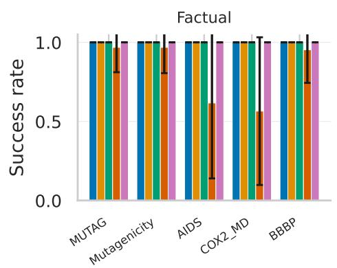

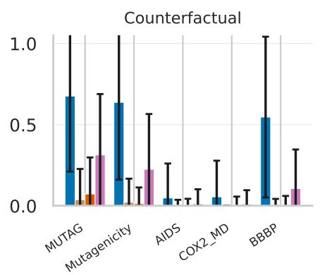

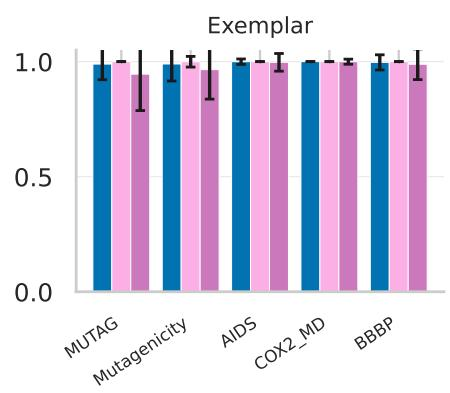  
Fig. 1. Hard-constraint coverage for compatible methods on all five datasets. Bars are means and error bars are standard deviations over graph–model analysis units after averaging explainer repetitions.

The case illustrates the three semantic outcomes; population- level coverage and quality remain in Table VIII. Sanitation makes this an analysis of representable molecular variants, not experimental evidence that the predicted property changes in a synthesized compound.

TABLE VI  
Counterfactual native-output comparisons under the locked budget. Success includes failures; quality is conditional on success. Native discretization and optimization procedures differ across methods.
<table><tr><td>Dataset</td><td>Method</td><td>Success</td><td>Edits</td><td> $\Delta p _ { y }$ </td></tr><tr><td>MUTAG</td><td>MPGX-CF</td><td>67.6%</td><td> $2 . 5 9 4 \pm 1 . 5 6 9$ </td><td> $0 . 4 3 6 \pm 0 . 1 9 2$ </td></tr><tr><td>MUTAG</td><td>CF-GNNExplainer</td><td>3.7%</td><td> $1 . 1 9 0 \pm 0 . 4 0 2$ </td><td> $0 . 3 9 8 \pm 0 . 1 1 8$ </td></tr><tr><td>MUTAG</td><td>CF2 reimplementation</td><td>7.2%</td><td> $5 . 8 5 4 \pm 1 . 6 6 3$ </td><td> $0 . 7 5 6 \pm 0 . 2 0 2$ </td></tr><tr><td>MUTAG</td><td>Random</td><td>31.3%</td><td> $3 . 4 5 2 \pm 1 . 9 1 0$ </td><td> $0 . 3 9 6 \pm 0 . 1 8 7$ </td></tr><tr><td>Mutagenicity</td><td>MPGX-CF</td><td>63.7%</td><td> $2 . 8 5 1 \pm 1 . 9 1 2$ </td><td> $0 . 3 1 5 \pm 0 . 1 5 5$ </td></tr><tr><td>Mutagenicity</td><td>CF-GNNExplainer</td><td>2.2%</td><td> $1 . 2 8 6 \pm 0 . 5 9 0$ </td><td> $0 . 3 3 5 \pm 0 . 1 2 7$ </td></tr><tr><td>Mutagenicity</td><td> $\mathrm { C F } ^ { 2 }$  reimplementation</td><td>1.3%</td><td> $5 . 2 8 1 \pm 2 . 0 9 8$ </td><td> $0 . 3 2 1 \pm 0 . 2 0 9$ </td></tr><tr><td>Mutagenicity</td><td>Random</td><td>22.5%</td><td> $3 . 5 6 8 \pm 1 . 9 3 7$ </td><td> $0 . 2 3 1 \pm 0 . 1 4 0$ </td></tr><tr><td>AIDS</td><td>MPGX-CF</td><td>4.8%</td><td> $3 . 4 7 5 \pm 2 . 1 0 0$ </td><td> $0 . 4 1 9 \pm 0 . 1 6 5$ </td></tr><tr><td>AIDS</td><td>CF-GNNExplainer</td><td>0.1%</td><td> $1 . 0 0 0 \pm 0 . 0 0 0$ </td><td> $0 . 3 8 0 \pm 0 . 0 9 0$ </td></tr><tr><td>AIDS</td><td>CF² reimplementation</td><td>0.2%</td><td> $4 . 3 0 0 \pm 1 . 9 2 5$ </td><td> $0 . 4 0 8 \pm 0 . 2 6 8$ </td></tr><tr><td>AIDS</td><td>Random</td><td>1.2%</td><td> $3 . 6 2 8 \pm 2 . 1 4 6$ </td><td> $0 . 3 3 0 \pm 0 . 1 7 3$ </td></tr><tr><td>COX2_MD</td><td>MPGX-CF</td><td>5.5%</td><td> $4 . 6 7 9 \pm 2 . 3 2 8$ </td><td> $0 . 0 9 9 \pm 0 . 1 1 4$ </td></tr><tr><td>COX2_MD</td><td>CF-GNNExplainer</td><td>0.0%</td><td></td><td></td></tr><tr><td>COX2_MD</td><td> $\mathrm { C F } ^ { 2 }$  reimplementation</td><td>0.3%</td><td> $6 . 6 6 7 \pm 0 . 4 7 1$ </td><td> $0 . 0 4 1 \pm 0 . 0 5 2$ </td></tr><tr><td>COX2_MD</td><td>Random</td><td>1.0%</td><td> $5 . 6 7 8 \pm 1 . 9 3 4$ </td><td> $0 . 0 6 0 \pm 0 . 0 5 9$ </td></tr><tr><td>BBBP</td><td>MPGX-CF</td><td>54.6%</td><td> $3 . 6 4 7 \pm 2 . 2 4 4$ </td><td> $0 . 3 8 2 \pm 0 . 1 4 6$ </td></tr><tr><td>BBBP</td><td>CF-GNNExplainer</td><td>0.2%</td><td> $1 . 0 0 0 \pm 0 . 0 0 0$ </td><td> $0 . 3 6 9 \pm 0 . 0 0 0$ </td></tr><tr><td>BBBP</td><td>CF2 reimplementation</td><td>0.5%</td><td> $6 . 2 5 0 \pm 1 . 2 5 5$ </td><td> $0 . 4 6 6 \pm 0 . 2 4 2$ </td></tr><tr><td>BBBP</td><td>Random</td><td>10.6%</td><td> $3 . 9 5 1 \pm 2 . 0 5 4$ </td><td> $0 . 2 3 8 \pm 0 . 1 3 1$ </td></tr></table>

TABLE VII  
Exemplar comparisons. Coverage requires a non-trivial prediction-preserving edit; conditional quality uses the same aggregation as Table IV.
<table><tr><td>Dataset</td><td>Method</td><td>Success</td><td>Edited</td><td>Retained  $p _ { y }$  ratio</td></tr><tr><td>MUTAG</td><td>MPGX-CF</td><td>98.9%</td><td> $0 . 2 7 9 \pm 0 . 0 4 8$ </td><td> $1 . 0 4 1 \pm 0 . 1 6 1$ </td></tr><tr><td>MUTAG</td><td>Greedy control</td><td>100.0%</td><td> $0 . 3 0 5 \pm 0 . 0 2 6$ </td><td> $1 . 1 6 9 \pm 0 . 2 3 2$ </td></tr><tr><td>MUTAG</td><td>Random</td><td>94.6%</td><td> $0 . 2 6 8 \pm 0 . 0 6 0$ </td><td> $1 . 0 2 3 \pm 0 . 1 4 5$ </td></tr><tr><td>Mutagenicity</td><td>MPGX-CF</td><td>99.0%</td><td> $0 . 2 4 6 \pm 0 . 0 6 8$ </td><td> $1 . 0 4 6 \pm 0 . 1 2 9$ </td></tr><tr><td>Mutagenicity</td><td>Greedy control</td><td>99.9%</td><td> $0 . 2 5 7 \pm 0 . 0 6 9$ </td><td> $1 . 1 9 1 \pm 0 . 2 1 1$ </td></tr><tr><td>Mutagenicity</td><td>Random</td><td>96.5%</td><td> $0 . 2 3 1 \pm 0 . 0 7 4$ </td><td> $1 . 0 2 7 \pm 0 . 1 2 7$ </td></tr><tr><td>AIDS</td><td>MPGX-CF</td><td>100.0%</td><td> $0 . 2 8 5 \pm 0 . 0 5 9$ </td><td> $1 . 0 0 2 \pm 0 . 0 4 0$ </td></tr><tr><td>AIDS</td><td>Greedy control</td><td>100.0%</td><td> $0 . 2 8 7 \pm 0 . 0 5 8$ </td><td> $1 . 0 2 1 \pm 0 . 0 6 5$ </td></tr><tr><td>AIDS</td><td>Random</td><td>99.7%</td><td> $0 . 2 8 5 \pm 0 . 0 5 9$ </td><td> $1 . 0 0 3 \pm 0 . 0 4 0$ </td></tr><tr><td>COX2 MD</td><td>MPGX-CF</td><td>100.0%</td><td> $0 . 0 2 5 \pm 0 . 0 0 5$ </td><td> $0 . 9 9 8 \pm 0 . 0 2 8$ </td></tr><tr><td>COX2 MD</td><td>Greedy control</td><td>100.0%</td><td> $0 . 0 2 5 \pm 0 . 0 0 5$ </td><td> $1 . 0 1 8 \pm 0 . 0 5 9$ </td></tr><tr><td>COX2_MD</td><td>Random</td><td>100.0%</td><td> $0 . 0 2 5 \pm 0 . 0 0 5$ </td><td> $0 . 9 9 8 \pm 0 . 0 2 7$ </td></tr><tr><td>BBBP</td><td>MPGX-CF</td><td>99.7%</td><td> $0 . 2 7 7 \pm 0 . 0 5 2$ </td><td> $1 . 0 0 8 \pm 0 . 0 9 4$ </td></tr><tr><td>BBBP</td><td>Greedy control</td><td>100.0%</td><td> $0 . 2 8 6 \pm 0 . 0 5 2$ </td><td> $1 . 1 3 7 \pm 0 . 1 8 6$ </td></tr><tr><td>BBBP</td><td>Random</td><td>98.9%</td><td> $0 . 2 6 8 \pm 0 . 0 5 9$ </td><td> $0 . 9 9 8 \pm 0 . 0 8 4$ </td></tr></table>

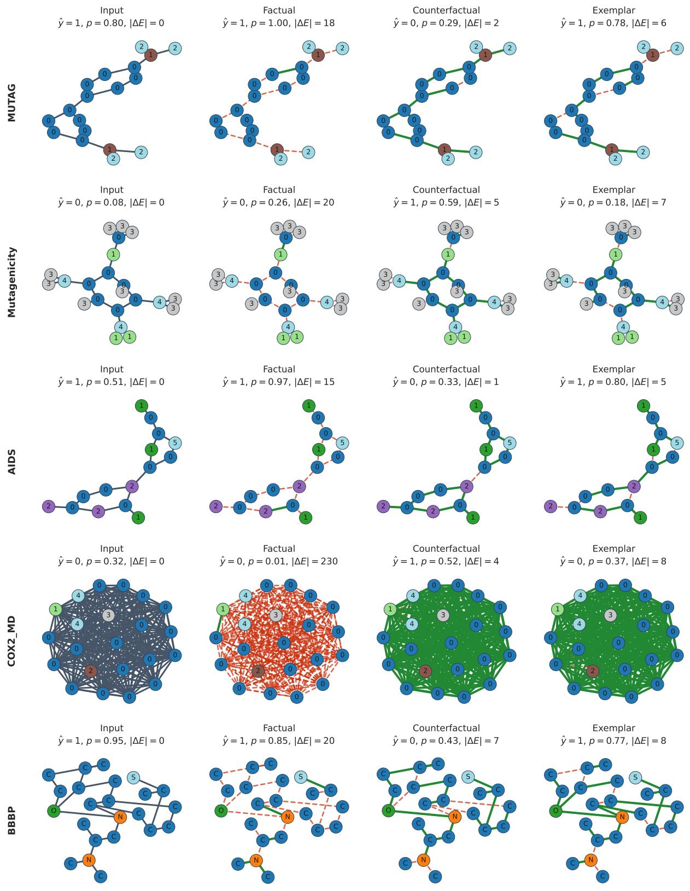  
Fig. 2. Input, factual, counterfactual, and exemplar panels for MUTAG, Mutagenicity, AIDS, COX2 MD, and BBBP. A common graph and fixed layout are used within each row; panels print class-1 probability, label, and deleted unique-edge count. TU graphs are categorical renderings, not reconstructed or sanitized molecules. Unavailable rows remain visible rather than being silently omitted; the primary chemistry-aware BBBP case is shown separately in Fig. 3. Selections are MUTAG: mutag-000074, fold 5, model seed 29, explainer seed 101; Mutagenicity: mutagenicity-003801, fold 7, model seed 47, explainer seed 211; AIDS: aids-001512, fold 0, model seed 11, explainer seed 101; COX2 MD: cox2 md-000133, fold 3, model seed 29, explainer seed 307; BBBP: bbbp-001663, fold 0, model seed 47, explainer seed 307.

Median-similarity complete fragment set: bbbp-001204, model seed 11

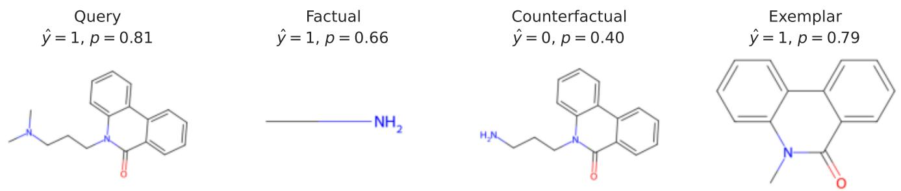  
Fig. 3. Primary-test chemistry-aware BBBP fragment explanations. The factual and exemplar fragments preserve the query decision, whereas the counterfactual fragment reverses it. Probabilities printed in the panels are the frozen GCN’s class-1 probabilities. Graph bbbp-001204, scafold-held-out BBBP test set, GCN predictor seed 11 and fragment-search seed ${ \bf { \bar { \rho } } } _ { 0 } ,$ selected by median counterfactual Tanimoto similarity among complete successful fragment triplets in the primary run.

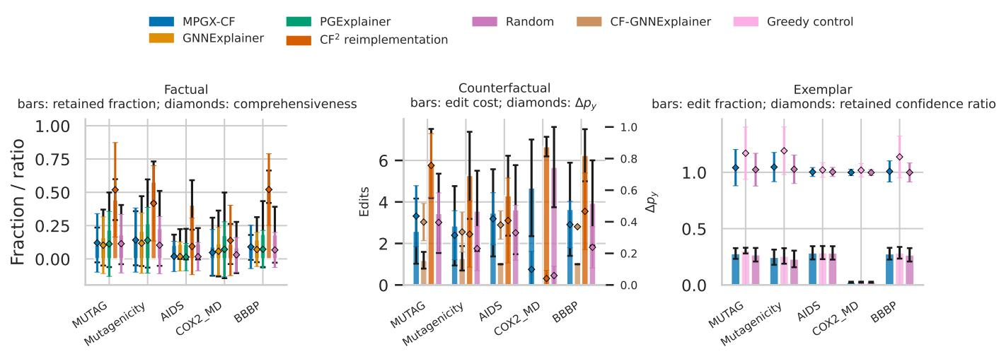  
Fi . 4. Conditional ualit of successful factual, counterfactual, and exem lar ex lanations. Structural size and rediction behavior are shown to ether becaus neither alone establishes semantic validity. Diamonds share the fractional axis except in the counterfactual panel, where they use the right-hand probability-dro axis.

## VII. Limitations and Responsible Use

a) Model and representation dependence.: MPGE ex-plains a trained classifier, not a causal chemical mechanism. A factual mask can preserve a prediction through node features and self-messages without identifying a compact molecular fragment. COX2 MD also uses complete distance graphs whose edge attributes are not consumed by the primary GCN. Weak predictive performance, calibration errors, and altered- input distributions limit chemical interpretation [2], [11].

b) Search and evaluation scope.: Ranked prefixes and fragment beams explore restricted deletion families; success verifies a returned candidate, whereas failure is not proof of global infeasibility. Seed-dependent masks can satisfy similar constraints, and prediction preservation does not certify robust attribution [20], [21]. Quality comparisons are conditional on success, native methods have diferent discretizers and optimization budgets, and the exploratory controls cover a selected subset. The primary study has three GCN seeds, eight completed AIDS explanation folds, and one BBBP scafold split. GINE validation checks do not establish held-out architectural robustness or performance on new training samples.

c) Chemical and human validity.: RDKit sanitation establishes representability, not synthesizability, stability, safety, or experimentally changed activity [23]. The fragment backend cannot search atom or bond additions and does not enforce a learned molecular distribution. Expert-chemist evaluation and experimental property validation remain necessary before claiming medicinal-chemistry utility [2]. The figures support model inspection and hypothesis generation, not chemical intervention recommendations.

d) Independent reproducibility.: The upload provides generated artifacts, metric summaries, and compact claim and case provenance. The absence of a public row-level record and checkpoint accession still limits independent reruns; local completeness should not be equated with a public reproducibility release.

## VIII. Conclusion

MPGE connects three questions about one molecular graph prediction: what information supports it, what bounded dele- tion changes it, and what non-trivial deletion preserves it. View-specific objectives and hard-output checks make these questions operational in a graph-classification extension of CF- GNNExplainer, with a separate sanitized-fragment instantiation for BBBP. The evaluated GCNs yielded 4.8–67.6% bounded counterfactual coverage and 98.9–100.0% non-trivial exemplar coverage across the five datasets, illustrating why semantic coverage and conditional quality must be reported separately. Factual compactness is informative only under the documented full-node mask semantics, and high preservation coverage does not imply stable masks. The exploratory controls further show that discretization, retained features, and edit budgets materially shape the evidence. The resulting framework supports trans- parent multi-perspective model auditing; establishing broader architectural, chemical, or human utility remains a separate validation task.

## Appendix A Chemistry-Aware BBBP Fragment Analysis

The fragment backend cuts only non-ring single bonds, canonicalizes each retained component, restores implicit hydrogens, and accepts only candidates that pass RDKit sanitization. Its search space and edit unit difer from the edge-mask backend, so these results are reported separately rather than pooled with the structural comparison. Failures remain in the coverage denominator; conditional rows summarize only returned sanitized molecules. Tanimoto similarity uses radius-two Morgan fingerprints, and retained confidence is relative to the unmodified query.

The primary-test qualitative fragment triplet appears once, in Fig. 3. It is kept separate from the structural edge-mask strip because sanitization, fragment retention, and atom removal define a diferent intervention space.

TABLE VIII  
GCN chemistry-aware fragment search on the scaffold-held-out BBBP test set. Success is percentage-only over all attempts, including failures; OTHER VALUES ARE CONDITIONAL MEANS + STANDARD DEVIATION OVER GRAPH–MODEL UNITS. FRAGMENT FACTUAL SIZE IS RETAINED HEAVY ATOMS. NOT RETAINED edges.
<table><tr><td>View</td><td>Success</td><td>Steps</td><td>Atoms removed</td><td>Tanimoto</td><td>Retained  $p _ { y }$  ratio</td><td>Candidates</td></tr><tr><td>Factual</td><td>97.7%</td><td> $1 . 7 1 \pm 0 . 7 0$ </td><td> $1 9 . 9 1 \pm 8 . 7 9$ </td><td> $0 . 1 0 \pm 0 . 1 1$ </td><td> $0 . 9 2 \pm 0 . 1 2$ </td><td> $5 6 . 9 8 \pm 5 9 . 7 5$ </td></tr><tr><td>Counterfactual</td><td>27.4%</td><td> $1 . 4 0 \pm 0 . 6 1$ </td><td> $3 . 2 2 \pm 2 . 6 6$ </td><td> $0 . 6 2 \pm 0 . 1 4$ </td><td> $0 . 5 6 \pm 0 . 1 5$ </td><td> $7 3 . 9 6 \pm 6 6 . 9 7$ </td></tr><tr><td>Exemplar</td><td>96.4%</td><td> $2 . 1 9 \pm 0 . 7 8$ </td><td> $6 . 6 3 \pm 2 . 6 0$ </td><td> $0 . 3 5 \pm 0 . 1 2$ </td><td> $1 . 0 0 \pm 0 . 1 4$ </td><td> $5 7 . 5 4 \pm 5 9 . 9 5$ </td></tr></table>

## Appendix B

## Validation-Only Selection

The complete 3 × 3 perspective-specific regularization grid is evaluated independently for each perspective on deterministic class-balanced validation subsets. The GCN grid sets the primary test configuration; GINE validation results are displayed as an architectural validation sensitivity check, not a completed GINE held-out explanation comparison. The factual and counterfactual losses use size/quadratic penalties; the exemplar uses an edit reward and entropy penalty. Test graphs never participate in selection.

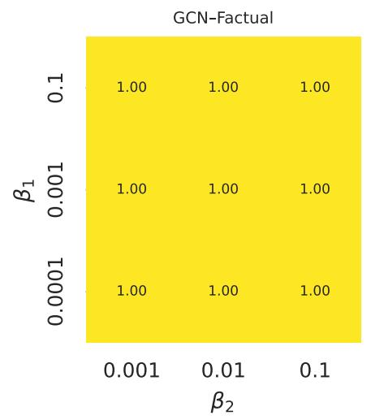

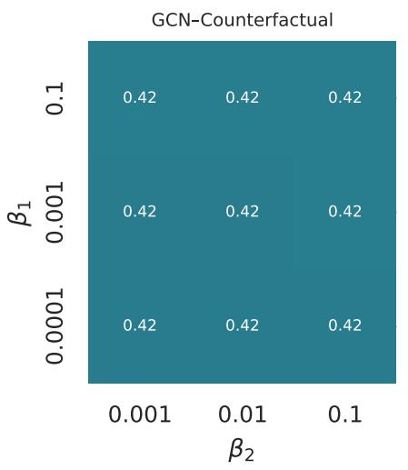

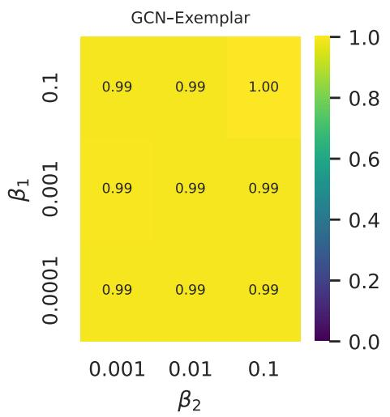

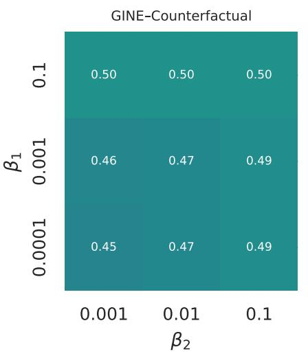

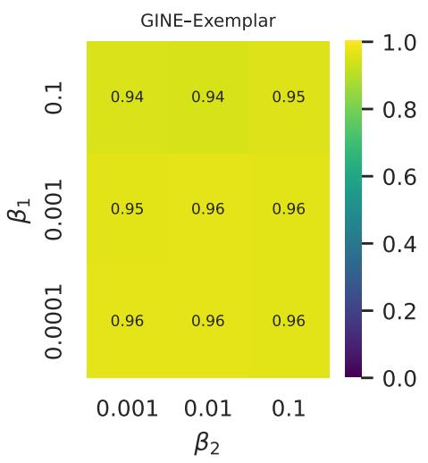  
Fig. 5. Macro-averaged hard-constraint success over the complete GCN and GINE validation grids. Failed searches remain in every denominator.

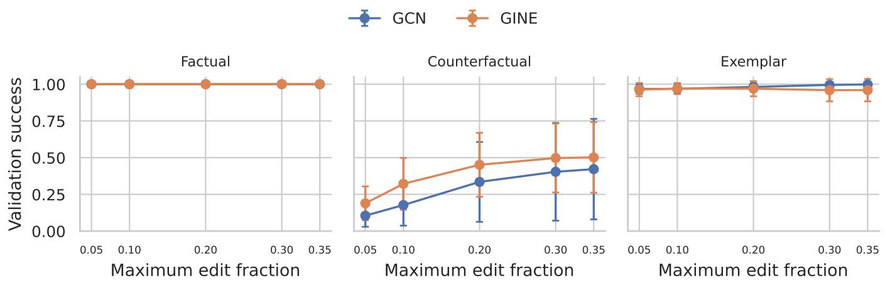  
Fig. 6. Validation coverage as the permitted edit fraction changes. Error bars show variation across dataset-level means.

## Appendix C

## Exploratory Held-Out Controls

The control population contains 24 graph IDs per dataset, selected with fixed seed 20261007 by predicted-class balance from complete counterfactual-ranking records. All selected graphs belong to their outer-fold test set or BBBP scafold test set. Three frozen GCN checkpoints and one explainer seed (101) yield 72 graph–model units per dataset. The common projection scans deletion prefixes of stored edge rankings and evaluates ever hard candidate with the same checkpoint. This controls the discretization rule but does not equate optimization budgets, objectives, or training procedures. It is exploratory and is not used to revise validation-selected hyperparameters.

TABLE IX  
Exploratory counterfactual control on a class-balanced held-out subset: native hard output versus identical ranked-prefix projection of each method’s stored scores. Percentages include failures; 72 graph–model units represent 24 graph IDs and three predictor seeds per dataset.
<table><tr><td>Dataset</td><td>Ranking</td><td>Units</td><td>Native</td><td>Common projection</td></tr><tr><td>MUTAG</td><td>MPGX-CF</td><td>72</td><td>54.2%</td><td>54.2%</td></tr><tr><td>MUTAG</td><td>CF-GNNExplainer</td><td>72</td><td>5.6%</td><td>41.7%</td></tr><tr><td>MUTAG</td><td>CF²</td><td>72</td><td>4.2%</td><td>51.4%</td></tr><tr><td>MUTAG</td><td>Random</td><td>72</td><td>26.4%</td><td>26.4%</td></tr><tr><td>Mutagenicity</td><td>MPGX-CF</td><td>72</td><td>63.9%</td><td>63.9%</td></tr><tr><td>Mutagenicity</td><td>CF-GNNExplainer</td><td>72</td><td>1.4%</td><td>51.4%</td></tr><tr><td>Mutagenicity</td><td>CF2</td><td>72</td><td>2.8%</td><td>59.7%</td></tr><tr><td>Mutagenicity</td><td>Random</td><td>72</td><td>19.4%</td><td>19.4%</td></tr><tr><td>AIDS</td><td>MPGX-CF</td><td>72</td><td>6.9%</td><td>6.9%</td></tr><tr><td>AIDS</td><td>CF-GNNExplainer</td><td>72</td><td>0.0%</td><td>5.6%</td></tr><tr><td>AIDS</td><td>CF2</td><td>72</td><td>0.0%</td><td>6.9%</td></tr><tr><td>AIDS</td><td>Random</td><td>72</td><td>1.4%</td><td>1.4%</td></tr><tr><td>COX2 MD</td><td>MPGX-CF</td><td>72</td><td>9.7%</td><td>9.7%</td></tr><tr><td>COX2 MD</td><td>CF-GNNExplainer</td><td>72</td><td>0.0%</td><td>8.3%</td></tr><tr><td>COX2_MD</td><td>CF2</td><td>72</td><td>1.4%</td><td>6.9%</td></tr><tr><td>COX2_MD</td><td>Random</td><td>72</td><td>1.4%</td><td>1.4%</td></tr><tr><td>BBBP</td><td>MPGX-CF</td><td>72</td><td>65.3%</td><td>65.3%</td></tr><tr><td>BBBP</td><td>CF-GNNExplainer</td><td>72</td><td>1.4%</td><td>54.2%</td></tr><tr><td>BBBP</td><td>CF²</td><td>72</td><td>2.8%</td><td>63.9%</td></tr><tr><td>BBBP</td><td>Random</td><td>72</td><td>11.1%</td><td>11.1%</td></tr></table>

The proposed soft mask itself flips far less often if a fixed 0.5 threshold is used in place of ranked-prefix search (Table X). Thus the search/projection mechanism is a major part of the implemented method, not a negligible post-processing detail.

TABLE X  
Proposed counterfactual ranking: fixed threshold versus hard-prefix search on the same selected held-out units.
<table><tr><td>Dataset</td><td>Units</td><td>Proposed 0.5 threshold</td><td>Proposed ranked prefix</td></tr><tr><td>MUTAG</td><td>72</td><td>16.7%</td><td>54.2%</td></tr><tr><td>Mutagenicity</td><td>72</td><td>9.7%</td><td>63.9%</td></tr><tr><td>AIDS</td><td>72</td><td>1.4%</td><td>6.9%</td></tr><tr><td>COX2_MD</td><td>72</td><td>0.0%</td><td>9.7%</td></tr><tr><td>BBBP</td><td>72</td><td>15.3%</td><td>65.3%</td></tr></table>

TABLE XI  
Factual null and induced-node controls. The no-edge input retains all query nodes, features, and predictor self-loops; the induced input retains only nodes incident to the proposed factual edges. Percentages use all 72 graph–model units per dataset.
<table><tr><td>Dataset</td><td>Graphs</td><td>Units</td><td>No-edge feasible</td><td>Induced factual feasible</td></tr><tr><td>MUTAG</td><td>24</td><td>72</td><td>73.6%</td><td>37.5%</td></tr><tr><td>Mutagenicity</td><td>24</td><td>72</td><td>56.9%</td><td>55.6%</td></tr><tr><td>AIDS</td><td>24</td><td>72</td><td>91.7%</td><td>61.1%</td></tr><tr><td>COX2_MD</td><td>24</td><td>72</td><td>69.4%</td><td>56.9%</td></tr><tr><td>BBBP</td><td>24</td><td>72</td><td>48.6%</td><td>38.9%</td></tr></table>

The eight-edge hard cap allows a small edit fraction in dense COX2 MD graphs. Table XII keeps the same learned rankings and 35% relative bud et while chan in onl the absolute ca from 8 to 32. Covera e increases on COX2 MD, whereas AIDS remains unchanged. The latter observation alone does not identify which model or search constraint prevents additional flips.

This is a sensitivity analysis, not a redefinition of the locked primary outcome. The full row-level records, selected graph IDs, and selection rule are in reviewer\_controls.

TABLE XII  
Exploratory hard-budget sensitivity under a common projection on the same class-balanced held-out subset.
<table><tr><td>Dataset</td><td>Ranking</td><td>Units</td><td> $\mathrm { C a p } \ 8$ </td><td> $\mathrm { C a p } \ 3 2$ </td></tr><tr><td>AIDS</td><td>MPGX-CF</td><td>72</td><td>6.9%</td><td>6.9%</td></tr><tr><td>AIDS</td><td>CF-GNNExplainer</td><td>72</td><td>5.6%</td><td>5.6%</td></tr><tr><td>AIDS</td><td>CF²</td><td>72</td><td>6.9%</td><td>6.9%</td></tr><tr><td>AIDS</td><td>Random</td><td>72</td><td>1.4%</td><td>1.4%</td></tr><tr><td>COX2_MD</td><td>MPGX-CF</td><td>72</td><td>9.7%</td><td>23.6%</td></tr><tr><td>COX2_MD</td><td>CF-GNNExplainer</td><td>72</td><td>8.3%</td><td>22.2%</td></tr><tr><td>COX2_MD</td><td>CF2</td><td>72</td><td>6.9%</td><td>22.2%</td></tr><tr><td> $\mathrm { C O X } 2 _ { - } ^ { - } \mathrm { M D }$ </td><td>Random</td><td>72</td><td>1.4%</td><td>5.6%</td></tr></table>

## Appendix D

## Statistical Tables

For each continuous metric, explainer repetitions are first averaged within a graph–model pair. Descriptive intervals use 10,000 hierarchical bootstrap resamples. For paired method efects, repeated predictor-seed diferences are averaged within each held-out graph before a graph-level bootstrap and Wilcoxon signed-rank test. Thus a graph, not a graph– model pair, is the resampling and test unit; shared fitted models can still induce dependence. Holm adjustment is performed within each dataset–architecture–perspective–outcome family. The local analysis also records graph count, model-seed count, and failure denominator. Dataset domains are never micro-averaged. The machine-readable sources are model\_summary.parquet, explanation\_summary.parquet, and paired\_method\_comparisons.parquet. The upload’s manuscript\_metric\_summary.csv includes estimates, descriptive intervals, observation counts, analysis-unit counts, and success conditioning. Hierarchical interval centers weight folds and predictor seeds equally, while descriptive means weight available graph–model units equally; these estimands need not coincide when fold sizes or successful populations difer.

TABLE XIII  
Proposed GCN per-view runtime and connectivity. Runtime is unconditional wall time in seconds, including failed searches; components and isolated nodes are conditional on hard success, with predictor self-loops excluded. Values are mean ± standard deviation after averaging explainer seeds within graph–model units. Units counts timing units, not independent training replications. Runtime intervals are descriptive hierarchical 95% bootstrap intervals; hardware and implementation limit timing comparisons.
<table><tr><td>Dataset</td><td>View</td><td>Runtime (s)</td><td>Runtime 95%CI</td><td>Components</td><td>Isolated nodes</td><td>Units</td></tr><tr><td>MUTAG</td><td>Factual</td><td> $0 . 5 4 \pm 0 . 0 4$ </td><td>[0.53,0.56]</td><td> $1 5 . 9 9 \pm 4 . 9 5$ </td><td> $1 4 . 6 4 \pm 5 . 1 2$ </td><td>564</td></tr><tr><td>MUTAG</td><td>Counterfactual</td><td> $0 . 5 5 \pm 0 . 0 4$ </td><td>[0.54,0.55]</td><td> $2 . 0 0 \pm 1 . 0 0$ </td><td> $0 . 5 2 \pm 0 . 7 9$ </td><td>564</td></tr><tr><td>MUTAG</td><td>Exemplar</td><td> $0 . 5 7 \pm 0 . 0 4$ </td><td>[0.56,0.58]</td><td> $4 . 0 2 \pm 1 . 0 8$ </td><td> $1 . 4 6 \pm 0 . 7 8$ </td><td>564</td></tr><tr><td>Mutagenicity</td><td>Factual</td><td> $0 . 5 8 \pm 0 . 2 2$ </td><td>[0.51,0.68]</td><td> $2 6 . 0 2 \pm 1 9 . 5 6$ </td><td> $2 3 . 5 2 \pm 1 9 . 5 8$ </td><td>13011</td></tr><tr><td>Mutagenicity</td><td>Counterfactual</td><td> $0 . 5 6 \pm 0 . 1 6$ </td><td>[0.51,0.64]</td><td> $3 . 5 7 \pm 6 . 1 4$ </td><td> $1 . 7 9 \pm 6 . 0 4$ </td><td>13011</td></tr><tr><td>Mutagenicity</td><td>Exemplar</td><td> $0 . 5 8 \pm 0 . 1 6$ </td><td>[0.52,0.65]</td><td> $6 . 7 9 \pm 9 . 1 0$ </td><td> $3 . 9 2 \pm 8 . 9 9$ </td><td>13011</td></tr><tr><td>AIDS</td><td>Factual</td><td> $0 . 5 5 \pm 0 . 1 7$ </td><td>[0.49,0.64]</td><td> $1 4 . 4 5 \pm 1 3 . 6 9$ </td><td> $1 3 . 3 5 \pm 1 3 . 7 1$ </td><td>4800</td></tr><tr><td>AIDS</td><td>Counterfactual</td><td> $0 . 5 4 \pm 0 . 1 5$ </td><td>[0.49,0.62]</td><td> $3 . 3 1 \pm 1 . 6 4$ </td><td> $1 . 0 8 \pm 1 . 0 7$ </td><td>4800</td></tr><tr><td>AIDS</td><td>Exemplar</td><td> $0 . 5 6 \pm 0 . 1 4$ </td><td>[0.50,0.63]</td><td> $3 . 7 9 \pm 1 . 5 4$ </td><td> $1 . 5 1 \pm 0 . 9 9$ </td><td>4800</td></tr><tr><td>COX2_MD</td><td>Factual</td><td> $0 . 6 3 \pm 0 . 1 6$ </td><td>[0.58,0.69]</td><td> $1 9 . 7 8 \pm 9 . 6 4$ </td><td> $1 8 . 6 1 \pm 9 . 8 2$ </td><td>909</td></tr><tr><td>COX2~MD</td><td>Counterfactual</td><td> $0 . 5 9 \pm 0 . 0 7$ </td><td>[0.56, 0.63]</td><td> $1 . 0 0 \pm 0 . 0 0$ </td><td> $0 . 0 0 \pm 0 . 0 0$ </td><td>909</td></tr><tr><td>COX2_MD</td><td>Exemplar</td><td> $0 . 6 1 \pm 0 . 0 7$ </td><td>[0.58,0.65]</td><td> $1 . 0 0 \pm 0 . 0 0$ </td><td> $0 . 0 0 \pm 0 . 0 0$ </td><td>909</td></tr><tr><td>BBBP</td><td>Factual</td><td> $0 . 5 0 \pm 0 . 0 3$ </td><td>[0.49,0.50]</td><td> $2 3 . 3 5 \pm 8 . 7 3$ </td><td> $2 1 . 6 3 \pm 8 . 9 4$ </td><td>609</td></tr><tr><td>BBBP</td><td>Counterfactual</td><td> $0 . 5 0 \pm 0 . 0 3$ </td><td>[0.50,0.51]</td><td> $3 . 3 1 \pm 1 . 5 1$ </td><td> $1 . 2 4 \pm 1 . 1 1$ </td><td>609</td></tr><tr><td>BBBP</td><td>Exemplar</td><td> $0 . 5 2 \pm 0 . 0 3$ </td><td>[0.51,0.53]</td><td> $5 . 5 7 \pm 1 . 0 4$ </td><td> $2 . 0 7 \pm 0 . 8 6$ </td><td>609</td></tr></table>

TABLE XIV  
Structural and probability diagnostics for the proposed method. Continuous metrics are conditional on hard success; stability is computed across explainer seeds within the same graph–model unit.
<table><tr><td>Dataset</td><td>View</td><td>Present</td><td>Removed</td><td>Removed frac.</td><td>|∆p|</td><td>∆ betw.</td><td>∆ harmonic</td><td>Stability</td></tr><tr><td>MUTAG</td><td>Factual</td><td>1.98 ± 2.71</td><td> $1 7 . 8 2 \pm 6 . 0 5$ </td><td> $0 . 9 0 \pm 0 . 1 3$ </td><td> $0 . 0 8 \pm 0 . 0 9$ </td><td> $0 . 2 2 \pm 0 . 0 4$ </td><td> $6 . 2 7 \pm 1 . 2 5$ </td><td> $0 . 2 5 \pm 0 . 3 5$ </td></tr><tr><td>MUTAG</td><td>Counterfactual</td><td> $1 7 . 3 3 \pm 5 . 2 2$ </td><td>2.59 ± 1.57</td><td>0.13 ± 0.07</td><td> $0 . 4 4 \pm 0 . 1 9$ </td><td> $0 . 1 2 \pm 0 . 0 5$ </td><td>1.68 ± 0.97</td><td> $0 . 7 4 \pm 0 . 2 9$ </td></tr><tr><td>MUTAG</td><td>Exemplar</td><td> $1 4 . 2 7 \pm 4 . 3 3$ </td><td> $5 . 5 2 \pm 1 . 7 5$ </td><td> $0 . 2 8 \pm 0 . 0 5$ </td><td> $0 . 0 8 \pm 0 . 0 8$ </td><td> $0 . 1 6 \pm 0 . 0 4$ </td><td> $3 . 3 3 \pm 0 . 7 8$ </td><td> $0 . 1 9 \pm 0 . 1 3$ </td></tr><tr><td>Mutagenicity</td><td>Factual</td><td> $4 . 3 3 \pm 6 . 9 7$ </td><td> $2 6 . 4 4 \pm 1 6 . 2 5$ </td><td> $0 . 8 4 \pm 0 . 2 0$ </td><td>0.12 ± 0.10</td><td> $0 . 2 1 \pm 0 . 0 5$ </td><td> $7 . 9 2 \pm 2 . 5 0$ </td><td> $0 . 4 2 \pm 0 . 3 8$ </td></tr><tr><td>Mutagenicity</td><td>Counterfactual</td><td> $2 6 . 1 3 \pm 1 5 . 0 8$ </td><td> $2 . 8 5 \pm 1 . 9 1 $ </td><td> $0 . 1 1 \pm 0 . 0 7$ </td><td> $0 . 3 1 \pm 0 . 1 6$ </td><td> $0 . 1 0 \pm 0 . 0 6$ </td><td> $2 . 4 4 \pm 1 . 2 8$ </td><td> $0 . 7 4 \pm 0 . 3 0$ </td></tr><tr><td>Mutagenicity</td><td>Exemplar</td><td> $2 4 . 1 1 \pm 1 5 . 7 9$ </td><td> $6 . 6 9 \pm 1 . 8 3$ </td><td> $0 . 2 5 \pm 0 . 0 7$ </td><td> $0 . 0 8 \pm 0 . 0 6$ </td><td> $0 . 1 6 \pm 0 . 0 6$ </td><td> $4 . 3 3 \pm 0 . 9 8$ </td><td> $0 . 1 7 \pm 0 . 1 3$ </td></tr><tr><td>AIDS</td><td>Factual</td><td> $1 . 2 4 \pm 1 . 3 5$ </td><td> $1 4 . 9 6 \pm 1 5 . 0 3$ </td><td> $0 . 9 0 \pm 0 . 0 8$ </td><td> $0 . 0 2 \pm 0 . 0 5$ </td><td> $0 . 2 7 \pm 0 . 0 7$ </td><td> $5 . 1 3 \pm 1 . 8 8$ </td><td> $0 . 0 6 \pm 0 . 1 9$ </td></tr><tr><td>AIDS AIDS</td><td>Counterfactual</td><td> $1 4 . 4 5 \pm 4 . 5 3$ </td><td> $3 . 4 8 \pm 2 . 1 0$ </td><td> $0 . 1 9 \pm 0 . 0 9$ </td><td> $0 . 4 2 \pm 0 . 1 6$ </td><td> $0 . 1 7 \pm 0 . 0 7$ </td><td> $2 . 5 7 \pm 1 . 2 4$ </td><td> $0 . 9 4 \pm 0 . 1 4$ </td></tr><tr><td></td><td>Exemplar</td><td> $1 2 . 2 3 \pm 1 3 . 4 5$ </td><td> $3 . 9 7 \pm 1 . 9 8 $ </td><td> $0 . 2 9 \pm 0 . 0 6$ </td><td> $0 . 0 1 \pm 0 . 0 3$ </td><td> $0 . 2 0 \pm 0 . 0 7$ </td><td> $2 . 7 1 \pm 0 . 8 7$ </td><td> $0 . 2 4 \pm 0 . 1 0$ </td></tr><tr><td> $\mathbf { C O X 2 _ { - } M D }$ </td><td>Factual</td><td> $3 0 . 9 9 \pm 7 5 . 2 5$ </td><td> $3 0 4 . 1 4 \pm 9 6 . 0 2$ </td><td> $0 . 9 1 \pm 0 . 2 2$ </td><td> $0 . 0 7 \pm 0 . 0 7$ </td><td> $0 . 0 1 \pm 0 . 0 3$ </td><td> $2 1 . 9 3 \pm 6 . 9 8$ </td><td> $0 . 0 8 \pm 0 . 2 2$ </td></tr><tr><td> $\mathrm { C O X } 2 _ { - } ^ { - } \mathrm { M D }$ </td><td>Counterfactual</td><td> $3 1 3 . 6 8 \pm 5 1 . 2 2$ </td><td> $4 . 6 8 \pm 2 . 3 3$ </td><td> $0 . 0 2 \pm 0 . 0 1$ </td><td> $0 . 1 0 \pm 0 . 1 1$ </td><td> $0 . 0 0 \pm 0 . 0 0$ </td><td> $0 . 4 4 \pm 0 . 1 9$ </td><td> $0 . 3 1 \pm 0 . 2 8$ </td></tr><tr><td> $\mathrm { C O X } 2 _ { - } ^ { - } \mathrm { M D }$ </td><td>Exemplar</td><td> $3 2 7 . 1 5 \pm 6 5 . 2 2$ </td><td> $7 . 9 7 \pm 0 . 3 4$ </td><td> $0 . 0 2 \pm 0 . 0 0$ </td><td> $0 . 0 1 \pm 0 . 0 2$ </td><td> $0 . 0 0 \pm 0 . 0 0$ </td><td> $0 . 4 7 \pm 0 . 0 4$ </td><td> $0 . 0 2 \pm 0 . 0 1$ </td></tr><tr><td>BBBP</td><td>Factual</td><td> $2 . 1 9 \pm 2 . 3 5$ </td><td> $2 5 . 7 0 \pm 9 . 6 4$ </td><td> $0 . 9 1 \pm 0 . 0 9$ </td><td> $0 . 0 8 \pm 0 . 0 7$ </td><td> $0 . 2 3 \pm 0 . 0 3$ </td><td> $7 . 3 0 \pm 1 . 3 1$ </td><td> $0 . 3 8 \pm 0 . 3 5$ </td></tr><tr><td>BBBP</td><td>Counterfactual</td><td> $2 3 . 6 3 \pm 9 . 0 2$ </td><td> $3 . 6 5 \pm 2 . 2 4$ </td><td> $0 . 1 4 \pm 0 . 0 8$ </td><td> $0 . 3 8 \pm 0 . 1 5$ </td><td> $0 . 1 4 \pm 0 . 0 6$ </td><td> $2 . 6 1 \pm 1 . 2 2$ </td><td> $0 . 8 6 \pm 0 . 2 1$ </td></tr><tr><td>BBBP</td><td>Exemplar</td><td> $2 0 . 5 4 \pm 8 . 8 5$ </td><td> $7 . 3 5 \pm 1 . 1 9$ </td><td> $0 . 2 8 \pm 0 . 0 5$ </td><td> $0 . 0 5 \pm 0 . 0 5$ </td><td> $0 . 1 9 \pm 0 . 0 4$ </td><td> $4 . 0 6 \pm 0 . 5 6$ </td><td> $0 . 1 6 \pm 0 . 0 6$ </td></tr></table>

TABLE XV

Cross-perspective overlap for the proposed method. Overlap is the Jaccard similarity between factual retained edges and the edges deleted by the counterfactual (CF) or exemplar view. Contrast is CF minus exemplar overlap. Values are mean ± standard deviation after averaging explainer seeds within graph–model units on complete successful triplets. Counts and intervals are in the supplementary metric records.
<table><tr><td>Dataset</td><td>Factual–CF overlap</td><td>Factual-exemplar overlap</td><td>Contrast</td></tr><tr><td>MUTAG</td><td> $0 . 0 9 5 \pm 0 . 1 8 7$ </td><td> $0 . 0 1 7 \pm 0 . 0 4 8$ </td><td> $0 . 0 7 8 \pm 0 . 1 7 7$ </td></tr><tr><td>Mutagenicity</td><td> $0 . 1 5 0 \pm 0 . 2 1 2$ </td><td> $0 . 0 3 6 \pm 0 . 0 6 5$ </td><td> $0 . 1 1 4 \pm 0 . 2 1 4$ </td></tr><tr><td>AIDS</td><td> $0 . 2 5 9 \pm 0 . 2 1 1$ </td><td> $0 . 0 7 5 \pm 0 . 0 8 3$ </td><td> $0 . 1 8 4 \pm 0 . 2 0 4$ </td></tr><tr><td>COX2_MD</td><td> $0 . 0 1 4 \pm 0 . 0 2 9$ </td><td> $0 . 0 0 5 \pm 0 . 0 0 8$ </td><td> $0 . 0 0 9 \pm 0 . 0 3 0$ </td></tr><tr><td>BBBP</td><td> $0 . 1 7 7 \pm 0 . 2 1 0$ </td><td> $0 . 0 2 6 \pm 0 . 0 4 8$ </td><td> $0 . 1 5 1 \pm 0 . 1 9 9$ </td></tr></table>

The following tables report paired proposed-minus-baseline efects. Explainer seeds and predictor seeds are averaged within graph before inference; brackets are graph-level 95% bootstrap intervals and multiplicity is controlled by Holm adjustment within each dataset, architecture, perspective, and outcome family. Coverage efects use every graph. Quality efects require both methods to return a valid explanation and can therefore have very small � when a baseline rarely succeeds; these conditiona efects are not population-wide quality comparisons. Values printed as $p < 1 0 ^ { - 3 0 0 }$ reflect numerical underflow, not an exactly zero probability.

TABLE XVI  
Paired factual effects against compatible baselines.
<table><tr><td>Dataset</td><td>Baseline</td><td>Coverage difference</td><td>Holm p</td><td>Comprehensiveness difference</td><td>Holm p</td></tr><tr><td>MUTAG</td><td>GNNExplainer</td><td>0.000 [0.000, 0.000]; n = 188</td><td>1</td><td>0.018 [0.006, 0.029]; n = 188</td><td>0.00729</td></tr><tr><td>MUTAG</td><td>PGExplainer</td><td>0.000 [0.000, 0.000]; n = 188</td><td>1</td><td> $0 . 0 0 8 [ - 0 . 0 0 8 , 0 . 0 2 4 ] ; n = 1 8 8$ </td><td>1</td></tr><tr><td>MUTAG</td><td>CF2 reimplementation</td><td>0.032 [0.018, 0.048]; n = 188</td><td>0.000139</td><td> $- 0 . 4 0 0 \ [ - 0 . 4 4 5 , \ - 0 . 3 5 7 ] ; n = 1 8 8$ </td><td>8.57e-31</td></tr><tr><td>MUTAG</td><td>Random</td><td>0.000 [0.000, 0.000]; n = 188</td><td>1</td><td> $0 . 0 0 6 \ \lvert \cdot 0 . 0 0 5 , 0 . 0 1 8 \rvert ; n = 1 8 8$ </td><td>1</td></tr><tr><td>Mutagenicity</td><td>GNNExplainer</td><td>0.000 [0.000, 0.000]; n = 4337</td><td>1</td><td>0.024 [0.022, 0.026]; n = 4337</td><td>4.79e-69</td></tr><tr><td>Mutagenicity</td><td>PGExplainer</td><td>0.000 [0.000, 0.000]; n = 4337</td><td>1</td><td>0.002 [-0.001, 0.005]; n = 4337</td><td> $0 . 4 5 6$ </td></tr><tr><td>Mutagenicity</td><td>CF2 reimplementation</td><td>0.032 [0.028, 0.035]; n = 4337</td><td> $4 . 4 9 \mathrm { e } \mathrm { - } 7 2$ </td><td>−0.275 [-0.282, -0.268]; n = 4314</td><td> $< 1 0 ^ { - 3 0 0 }$ </td></tr><tr><td>Mutagenicity</td><td>Random</td><td>0.000 [0.000, 0.000]; n = 4337</td><td>1</td><td>0.038 [0.036, 0.041]; n = 4337</td><td> $4 . 3 1 \mathrm { e } \mathrm { - } 1 5 0$ </td></tr><tr><td>AIDS</td><td>GNNExplainer</td><td>0.000 [0.000, 0.000]; n = 1600</td><td>1</td><td> $\begin{array} { c } { { 0 . 0 0 1 [ - 0 . 0 0 0 , 0 . 0 0 2 ] ; n = 1 6 0 0 } } \\ { { 0 . 0 0 5 [ 0 . 0 0 3 , 0 . 0 0 6 ] ; n = 1 6 0 0 } } \end{array}$ </td><td>0.064</td></tr><tr><td>AIDS</td><td>PGExplainer</td><td>0.000 [0.000, 0.000]; n = 1600</td><td>1</td><td></td><td> $9 . 3 1 \mathrm { e } \mathrm { - } 1 9$ </td></tr><tr><td>AIDS</td><td>CF2 reimplementation</td><td>0.383 [0.362, 0.405]; n = 1600</td><td> $4 . 0 2 \mathrm { e } \mathrm { - } 1 3 9$ </td><td> $\begin{array} { c } { { - 0 . 0 6 0 \ [ - 0 . 0 6 8 , - 0 . 0 5 3 ] ; n = 1 1 6 4 } } \\ { { 0 . 0 0 2 \ [ 0 . 0 0 1 , 0 . 0 0 3 ] ; n = 1 6 0 0 } } \end{array}$ </td><td>1.55e-163</td></tr><tr><td>AIDS</td><td>Random</td><td>0.000 [0.000,  $0 . 0 0 0 \mathrm { l } ; n = 1 6 0 0$ </td><td>1</td><td></td><td>8.61e-06</td></tr><tr><td>COX2 MD</td><td>GNNExplainer</td><td>0.000 [0.000, 0.000]; n = 303</td><td>1</td><td> $\begin{array} { c } { { - 0 . 0 1 0 \ [ - 0 . 0 1 9 , - 0 . 0 0 1 ] ; n = 3 0 3 } } \\ { { - 0 . 0 2 4 \ [ - 0 . 0 3 4 , - 0 . 0 1 5 ] ; n = 3 0 3 } } \end{array}$ </td><td>0.00577</td></tr><tr><td>COX2⁻MD</td><td>PGExplainer</td><td>0.000 [0.000, 0.000]; n = 303</td><td>1</td><td></td><td>8.05e-07</td></tr><tr><td> $\mathbf { C O X } 2 \mathbf { \beta } \mathbf { M D }$ </td><td>CF2 reimplementation</td><td>0.435 [0.407, 0.462]; n = 303</td><td> $2 . 4 1 \mathrm { e } { - 4 6 }$ </td><td> $- 0 . 1 2 5 \ [ - 0 . 1 5 0 , - 0 . 1 0 1 ] ; n = 2 9 7$ </td><td>3.99e-42</td></tr><tr><td> $\mathrm { C O X } 2 _ { - } ^ { - } \mathrm { M D }$ </td><td>Random</td><td>0.000 [0.000, 0.000]; n = 303</td><td>1</td><td> $0 . 0 1 7 [ 0 . 0 1 0 , 0 . 0 2 5 ] ; n = 3 0 3$ </td><td>0.00577</td></tr><tr><td>BBBP</td><td>GNNExplainer</td><td>0.000 [0.000, 0.000]; n = 203</td><td>1</td><td> $\begin{array} { c } { 0 . 0 2 0 \ [ 0 . 0 1 2 , 0 . 0 2 8 ] ; n = 2 0 3 } \\ { 0 . 0 1 8 \ [ 0 . 0 1 0 , 0 . 0 2 6 ] ; n = 2 0 3 } \end{array}$ </td><td>0.000235</td></tr><tr><td>BBBP</td><td>PGExplainer</td><td>0.000 [0.000, 0.000]; n = 203</td><td>1</td><td></td><td>0.000104</td></tr><tr><td>BBBP</td><td>CF2 reimplementation</td><td>0.047 [0.025, 0.073]; n = 203</td><td> $0 . 0 0 0 6 5 9$ </td><td> $- 0 . 4 2 6 \ [ - 0 . 4 5 6 , \ - 0 . 3 9 7 ] ; n = 1 9 9$ </td><td>8.77e-34</td></tr><tr><td>BBBP</td><td>Random</td><td>0.000 [0.000, 0.000]; n = 203</td><td>1</td><td> $0 . 0 2 3 \ [ 0 . 0 1 5 , 0 . 0 3 2 ] ; n = 2 0 3$ </td><td>2.32e-05</td></tr></table>

TABLE XVII  
Paired counterfactual effects against compatible baselines.
<table><tr><td>Dataset</td><td>Baseline</td><td>Coverage difference</td><td>Holm p</td><td>Removed-edge difference</td><td>Holm p</td></tr><tr><td>MUTAG</td><td>CF-GNNExplainer</td><td>0.638 [0.580, 0.694]; n = 188</td><td>2.08e-26</td><td> $- 0 . 1 4 1 \ [ - 0 . 3 9 2 , 0 . 0 8 8 ] ; n = 1 7$ </td><td>0.256</td></tr><tr><td>MUTAG</td><td>CF2 reimplementation</td><td> $0 . 6 0 3 \ [ 0 . 5 4 6 , 0 . 6 6 0 ] ; n = 1 8 8$ </td><td>8.94e-26</td><td> $- 3 . 3 7 0 \ [ - 3 . 8 5 1 , \ - 2 . 8 7 6 ] ; n = 4 7$ </td><td>1.39e-08</td></tr><tr><td>MUTAG</td><td>Random</td><td> $0 . 3 6 3 \ \tilde { [ 0 . 3 2 0 , 0 . 4 0 6 ] } ; n = 1 8 8$ </td><td>2.79e-24</td><td> $- 1 . 2 9 9 \ [ - 1 . 5 3 0 , - 1 . 0 7 3 ] ; n = 1 2 1$ </td><td>2.45e-16</td></tr><tr><td>Mutagenicity</td><td>CF-GNNExplainer</td><td>0.615 [0.603, 0.628]; n = 4337</td><td> $< 1 0 ^ { - 3 0 0 }$ </td><td> $- 0 . 1 3 0 \ [ - 0 . 1 9 1 , - 0 . 0 7 0 ] ; n = 2 3 9$ </td><td>6.06e-06</td></tr><tr><td>Mutagenicity</td><td>CF2 reimplementation</td><td>0.624 [0.612, 0.637]; n = 4337</td><td> $< 1 0 ^ { - 3 0 0 }$ </td><td> $- 3 . 5 8 1 \ [ - 3 . 8 8 9 , \ - 3 . 2 7 5 ] ; n = 1 8 4$ </td><td>6.76e-29</td></tr><tr><td>Mutagenicity</td><td>Random</td><td>0.412 [0.402, 0.423]; n = 4337</td><td> $< 1 0 ^ { - 3 0 0 }$ </td><td> $- 1 . 6 9 4 \ [ - 1 . 7 6 1 , - 1 . 6 2 6 ] ; n = 1 9 8 4$ </td><td>8.45e-263</td></tr><tr><td>AIDS</td><td>CF-GNNExplainer</td><td>0.046 [0.038, 0.055]; n = 1600</td><td>1.27e-21</td><td> $0 . 0 0 0 \ [ 0 . 0 0 0 , 0 . 0 0 0 ] ; n = 4$ </td><td>1</td></tr><tr><td>AIDS</td><td>CF2 reimplementation</td><td>0.045 [0.037, 0.054]; n = 1600</td><td>1.27e-21</td><td> $- 1 . 6 2 5 \ [ - 2 . 2 5 0 , - 1 . 0 0 0 ] ; n = 1 2$ </td><td>0.00781</td></tr><tr><td>AIDS</td><td>Random</td><td>0.036 [0.029, 0.043]; n = 1600</td><td>1.57e-21</td><td> $- 1 . 3 8 0 \ [ - 1 . 7 7 5 , \ : - 1 . 0 0 3 ] ; n = 5 1$ </td><td>7.19e-07</td></tr><tr><td>COX2 MD</td><td>CF-GNNExplainer</td><td>0.055 [0.040, 0.070]; n = 303</td><td>4.76e-10</td><td></td><td></td></tr><tr><td>COX2 MD</td><td>CF2 reimplementation</td><td>0.051 [0.038, 0.066]; n = 303</td><td>6.26e-10</td><td> $- 2 . 9 1 7 \ [ - 5 . 0 0 0 , - 0 . 8 3 3 ] ; n = 4$ </td><td>0.125</td></tr><tr><td> $\mathrm { C O X } 2 _ { - } ^ { - } \mathrm { M D }$ </td><td>Random</td><td>0.045 [0.032, 0.059]; n = 303</td><td>8.95e-10</td><td> $- 2 . 7 4 2 \ [ - 3 . 8 9 4 , - 1 . 7 1 2 ] ; n = 1 1$ </td><td>0.00391</td></tr><tr><td>BBBP</td><td>CF-GNNExplainer</td><td> $0 . 5 4 5 [ 0 . 4 9 0 , 0 . 6 0 0 ] ; n = 2 0 3$ </td><td>3.01e-26</td><td> $0 . 0 0 0 \ [ 0 . 0 0 0 , 0 . 0 0 0 ] ; n = 1$ </td><td>1</td></tr><tr><td>BBBP</td><td>CF2 reimplementation</td><td> $0 . 5 4 1 \ [ 0 . 4 8 6 , 0 . 5 9 7 ] ; n = 2 0 3$ </td><td>3.33e-26</td><td> $- 3 . 5 0 0 \ [ - 4 . 6 0 0 , \cdot 2 . 1 0 0 ] ; n = 5$ </td><td>0.125</td></tr><tr><td>BBBP</td><td>Random</td><td> $0 . 4 4 1 \ \mathrm { [ 0 . 3 9 5 , 0 . 4 8 7 ] } ; n = 2 0 3$ </td><td>3.8e-26</td><td> $- 2 . 1 8 5 \ [ - 2 . 5 9 1 , - 1 . 7 9 7 ] ; n = 6 3$ </td><td>1.04e-10</td></tr></table>

TABLE XVIII  
Paired exemplar effects against compatible baselines.
<table><tr><td>Dataset</td><td>Baseline</td><td>Coverage difference</td><td>Holm p</td><td>Edit-fraction difference</td><td>Holm p</td></tr><tr><td>MUTAG</td><td>Greedy control</td><td> $- 0 . 0 1 1 \ [ - 0 . 0 1 7 , \ - 0 . 0 0 5 ] ; n = 1 8 8$ </td><td>0.000941</td><td> $- 0 . 0 2 6 \ [ - 0 . 0 3 0 , - 0 . 0 2 1 ] ; n = 1 8 8$ </td><td>1.6e-19</td></tr><tr><td>MUTAG</td><td>Random</td><td> $0 . 0 4 4 \ \mathrm { [ 0 . 0 3 0 , 0 . 0 5 9 ] } ; n = 1 8 8$ </td><td>1.35e-07</td><td>0.011 [0.005, 0.017]; n = 188</td><td>0.000736</td></tr><tr><td>Mutagenicity</td><td>Greedy control</td><td></td><td>1.15e-42</td><td></td><td>9.02e-236</td></tr><tr><td>Mutagenicity</td><td>Random</td><td> $\begin{array} { c } { { - 0 . 0 1 0 \ [ - 0 . 0 1 1 , \ - 0 . 0 0 8 ] ; n = 4 3 3 7 } } \\ { { 0 . 0 2 5 \ [ 0 . 0 2 2 , 0 . 0 2 7 ] ; n = 4 3 3 7 } } \end{array}$ </td><td>8.28e-74</td><td> $\begin{array} { c } { { - 0 . 0 1 1 \ [ - 0 . 0 1 2 , - 0 . 0 1 0 ] ; n = 4 3 3 7 } } \\ { { 0 . 0 1 5 \ [ 0 . 0 1 4 , 0 . 0 1 6 ] ; n = 4 3 3 5 } } \end{array}$ </td><td>1.99e-157</td></tr><tr><td>AIDS</td><td>Greedy control</td><td></td><td>0.102</td><td> $\begin{array} { c } { { - 0 . 0 0 2 \ [ - 0 . 0 0 2 , - 0 . 0 0 1 ] ; n = 1 6 0 0 } } \\ { { 0 . 0 0 1 \ [ 0 . 0 0 0 , 0 . 0 0 1 ] ; n = 1 6 0 0 } } \end{array}$ </td><td>7.09e-13</td></tr><tr><td>AIDS</td><td>Random</td><td> $\begin{array} { c } { { - 0 . 0 0 0 \ [ - 0 . 0 0 1 , 0 . 0 0 0 ] ; n = 1 6 0 0 } } \\ { { 0 . 0 0 3 \ [ 0 . 0 0 2 , 0 . 0 0 4 ] ; n = 1 6 0 0 } } \end{array}$ </td><td>0.000112</td><td></td><td>0.0013</td></tr><tr><td>COX2 MD</td><td>Greedy control</td><td> $\begin{array} { c } { 0 . 0 0 0 \ [ 0 . 0 0 0 , 0 . 0 0 0 ] ; n = 3 0 3 } \\ { 0 . 0 0 0 \ [ 0 . 0 0 0 , 0 . 0 0 1 ] ; n = 3 0 3 } \end{array}$ </td><td>1</td><td> $\begin{array} { c } { { - 0 . 0 0 0 \ [ - 0 . 0 0 0 , 0 . 0 0 0 ] ; n = 3 0 3 } } \\ { { 0 . 0 0 0 \ [ - 0 . 0 0 0 , 0 . 0 0 0 ] ; n = 3 0 3 } } \end{array}$ </td><td>0.0682</td></tr><tr><td>COX2_MD</td><td>Random</td><td></td><td>0.635</td><td></td><td>0.145</td></tr><tr><td>BBBP</td><td>Greedy control</td><td> $\begin{array} { c } { { - 0 . 0 0 3 ~ [ - 0 . 0 0 6 , - 0 . 0 0 1 ] ; n = 2 0 3 } } \\ { { 0 . 0 0 8 ~ [ 0 . 0 0 3 , 0 . 0 1 4 ] ; n = 2 0 3 } } \end{array}$ </td><td>0.0198</td><td> $- 0 . 0 0 8 \ [ - 0 . 0 1 1 , \ - 0 . 0 0 6 ] ; n = 2 0 3$ </td><td>8.74e-14</td></tr><tr><td>BBBP</td><td>Random</td><td></td><td>0.0198</td><td> $0 . 0 1 0 [ 0 . 0 0 6 , 0 . 0 1 4 ] ; n = 2 0 3$ </td><td>2.05e-07</td></tr></table>

## Appendix E

## Expanded Per-Dataset Explanations

Figures 7–11 enlarge the five rows of the main qualitative overview. Each strip uses one query graph and presents the factual, counterfactual, and exemplar outputs in the same left-to-right grammar as the primary BBBP fragment example. All evaluated query nodes remain visible; grey nodes have no retained incident edge but their features are still supplied to the predictor. Red dashed edges are removed and green edges retained. COX2 MD is a dense distance graph, so retained context is faint and the comparatively few removed edges are red and dashed. TU node labels denote dataset categories, not inferred chemical elements. The BBBP stri uses RDKit coordinates for its recorded SMILES but remains an ed e-mask ex lanation; it is distinct from the separately reported sanitized fragment search. The exact primary sanitized-fragment rendering is shown in Fig. 3.

## MUTAG categorical graph: mutag-000074, fold 5, model seed 29, explainer seed 101

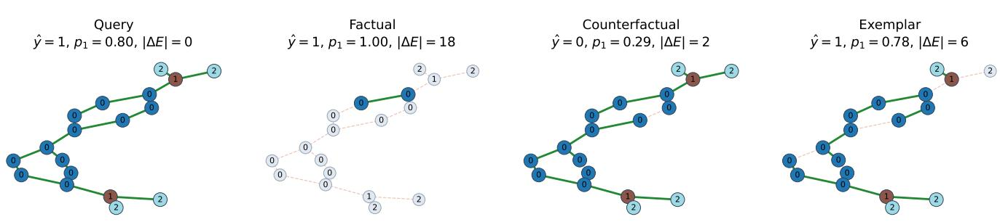  
Fig. 7. Expanded MUTAG query, factual, counterfactual, and exemplar case.

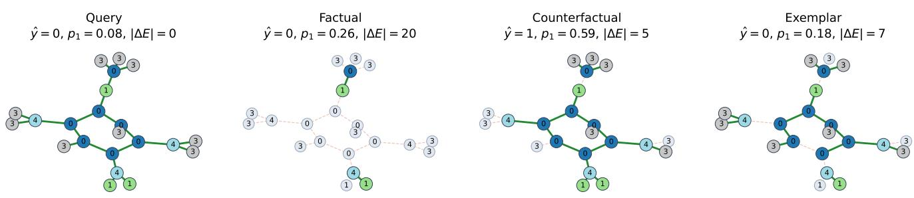  
Fig. 8. Expanded Mutagenicity query, factual, counterfactual, and exemplar case.

AIDS categorical graph: aids-001512, fold 0, model seed 11, explainer seed 101  
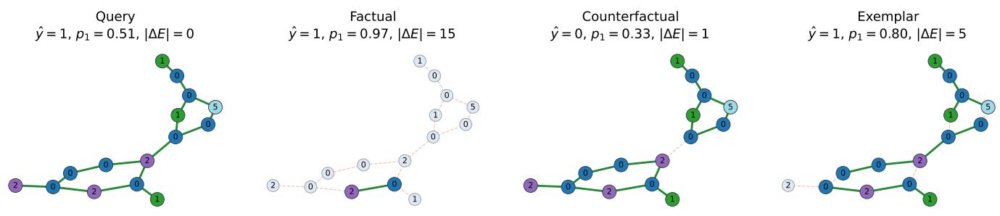  
Fig. 9. Expanded AIDS query, factual, counterfactual, and exemplar case.

COX2\_MD categorical graph: cox2\_md-000133, fold 3, model seed 29, explainer seed 307  
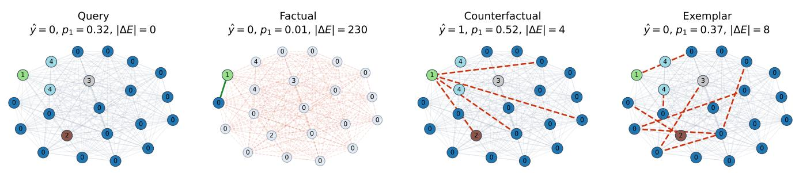  
Fi . 10. Ex anded COX2 MD uer factual counterfactual and exem lar case. The li ht com lete- ra h context and red dashed edits revent the dense input from obscuring the selected changes.

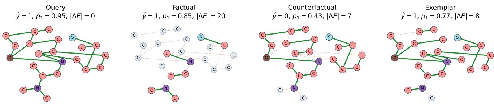  
Fig. 11. Expanded BBBP query, factual, counterfactual, and exemplar edge-mask case using RDKit coordinates.

## Appendix F Reproducibility and Failure Records

Every record is keyed by dataset, fold, architecture, predictor seed, explainer seed, graph ID, method, perspective, budget, and protocol hash. Atomic shards permit interrupted or parallel execution without silently overwriting completed cells. A failed explanation remains a row with its violated constraint and runtime. The claim-to-artifact map in the result root links historical generated artifacts to their sources. The submission-specific manuscript\_claim\_to\_artifact\_map.csv instead lists only referenced artifacts, their source records, and SHA-256 hashes, excluding unused pilot BBBP and D4 groups. The primary BBBP selection CSV and revised full-node panel manifest retain figure provenance. A separate claim\_support\_audit.csv records the scientific claim checks.

TABLE XIX  
Failure audit for the primary GCN and proposed method. Failure rate is the percentage of all attempts; the final column counts the most common machine-readable reason.
<table><tr><td>Dataset</td><td>View</td><td>Failure rate</td><td>Most common reason</td><td>Count</td></tr><tr><td>MUTAG</td><td>Factual</td><td>0.0%</td><td>一</td><td></td></tr><tr><td>MUTAG</td><td>Counterfactual</td><td>32.4%</td><td>No Flip Within 8 Edits</td><td>173</td></tr><tr><td>MUTAG</td><td>Exemplar</td><td>1.1%</td><td>No Nontrivial Preserving Edit Within 3 Edits</td><td>9</td></tr><tr><td>Mutagenicity</td><td>Factual</td><td>0.0%</td><td></td><td></td></tr><tr><td>Mutagenicity</td><td>Counterfactual</td><td>36.3%</td><td>No Flip Within 8 Edits</td><td>10406</td></tr><tr><td>Mutagenicity</td><td>Exemplar</td><td>1.0%</td><td>No Nontrivial Preserving Edit Within 8 Edits</td><td>95</td></tr><tr><td>AIDS</td><td>Factual</td><td>0.0%</td><td></td><td></td></tr><tr><td>AIDS</td><td>Counterfactual</td><td>95.2%</td><td>No Flip Within 3 Edits</td><td>5811</td></tr><tr><td>AIDS</td><td>Exemplar</td><td>0.0%</td><td>No Nontrivial Preserving Edit Within 4 Edits</td><td>3</td></tr><tr><td>COX2 MD</td><td>Factual</td><td>0.0%</td><td></td><td></td></tr><tr><td>COX2 MD</td><td>Counterfactual</td><td>94.5%</td><td>No Flip Within 8 Edits</td><td>2578</td></tr><tr><td>COX2 MD</td><td>Exemplar</td><td>0.0%</td><td></td><td></td></tr><tr><td>BBBP</td><td>Factual</td><td>0.0%</td><td></td><td></td></tr><tr><td>BBBP</td><td>Counterfactual</td><td>45.4%</td><td>No Flip Within 8 Edits</td><td>664</td></tr><tr><td>BBBP</td><td>Exemplar</td><td>0.3%</td><td>No Nontrivial Preserving Edit Within 3 Edits</td><td>2</td></tr></table>

[1] Z. Wu, B. Ramsundar, E. N. Feinberg, J. Gomes, C. Geniesse, A. S. Pappu, K. Leswing, and V. Pande, “MoleculeNet: A benchmark for molecular machine learning,” Chemical Science, vol. 9, no. 2, pp. 513–530, 2018.

[2] J. Rao, S. Zheng, Y. Lu, and Y. Yang, “Quantitative evaluation of explainable graph neural networks for molecular property prediction,” Patterns, vol. 3, no. 12, p. 100628, 2022.

[3] Z. Ying, D. Bourgeois, J. You, M. Zitnik, and J. Leskovec, “GNNExplainer: Generating explanations for graph neural networks,” in Advances in Neural Information Processing Systems, vol. 32, 2019.

[4] D. Luo, W. Cheng, D. Xu, W. Yu, B. Zong, H. Chen, and X. Zhang, “Parameterized explainer for graph neural network,” in Advances in Neural Information Processing Systems, vol. 33, 2020, pp. 19 620–19 631.

[5] A. Lucic, M. A. ter Hoeve, G. Tolomei, M. de Rijke, and F. Silvestri, “CF-GNNExplainer: Counterfactual explanations for graph neural networks,” in Proceedings of the 25th International Conference on Artificial Intelligence and Statistics, ser. Proceedings of Machine Learning Research, vol. 151, 2022, pp. 4499–4511.

[6] M. Bajaj, L. Chu, Z. Y. Xue, J. Pei, L. Wang, P. C.-H. Lam, and Y. Zhang, “Robust counterfactual explanations on graph neural networks,” in Advances in Neural Information Processing Systems, vol. 34, 2021, pp. 5644–5655.

[7] R. R. Fernandez, I. M. de Diego, J. M. Moguerza, and F. Herrera, “Explanation sets: A general framework for machine learning explainability,” ´ Information Sciences, vol. 617, pp. 464–481, 2022.

[8] J. Tan, S. Geng, Z. Fu, Y. Ge, S. Xu, Y. Li, and Y. Zhang, “Learning and evaluating graph neural network explanations based on counterfactual and factual reasoning,” in Proceedings of the ACM Web Conference 2022, 2022, pp. 1018–1027.

[9] R. Garc´ıa, M. A. Prado-Romero, F. Gullo, and G. Stilo, “On the minimization of graph counterfactual explanations: Theory and a local bounded search algorithm,” Machine Learning, vol. 115, 2026, article 224.

[10] J. Ma, R. Guo, S. Mishra, A. Zhang, and J. Li, “CLEAR: Generative counterfactual explanations on graphs,” in Advances in Neural Information Processing Systems, vol. 35, 2022.

[11] J. Chen, S. Wu, A. Gupta, and R. Ying, “D4Explainer: In-distribution explanations of graph neural network via discrete denoising difusion,” in Advances in Neural Information Processing Systems, vol. 36, 2023.

[12] D. Numeroso and D. Bacciu, “MEG: Generating molecular counterfactual explanations for deep graph networks,” in 2021 International Joint Conference on Neural Networks, 2021, pp. 1–8.

[13] G. P. Wellawatte, A. Seshadri, and A. D. White, “Model agnostic generation of counterfactual explanations for molecules,” Chemical Science, vol. 13, pp. 3697–3705, 2022.

[14] L. Janisiow, M. Kocha´ nczyk, B. M. Zieli´ nski, and T. Danel, “Enhancing chemical explainability through counterfactual masking,” in´ Proceedings of the AAAI Conference on Artificial Intelligence, vol. 40, no. 26, 2026, pp. 22 155–22 163.

[15] L. Chen, C. He, J. Cheng, C. Li, and Q. Guan, “Generating in-distribution counterfactual explanation for graph neural networks,” in Proceedings of the AAAI Conference on Artificial Intelligence, vol. 40, no. 24, 2026, pp. 20 208–20 216.

[16] Y. Zhang, S. B. Yang, A. Khan, and C. G. Akcora, “ATEX-CF: Attack-informed counterfactual explanations for graph neural networks,” in International Conference on Learning Representations, 2026. [Online]. Available: https://proceedings.iclr.cc/paper files/paper/2026/file/ bfa008dc8caca6ebf5a047004c1c9758-Paper-Conference.pdf

[17] Z. Yu and H. Gao, “MAGE: Model-level graph neural networks explanations via motif-based graph generation,” in International Conference on Learning Representations, 2025. [Online]. Available: htt s:// roceedin s.iclr.cc/ a er files/ a er/2025/file/7749f9c0d5f109231be21e910a3ced2-Pa er-Conference. pdf

[18] J. Yin, S. Wang, Z. Luo, P. Huo, H. Yan, H. Miao, C. Li, S. Pan, and C. Zhang, “Paradigm shift of GNN explainer from label space to prototypical representation space,” in International Conference on Learning Representations, 2026. [Online]. Available: https://proceedings.iclr.cc/paper files/paper/2026/file/170a27d35cd6b191b9dd477f4eca4634-Paper-Conference.pdf

[19] K. Amara, Z. Ying, Z. Zhang, Z. Han, Y. Zhao, Y. Shan, U. Brandes, S. Schemm, and C. Zhang, “GraphFramEx: Towards systematic evaluation of explainability methods for graph neural networks,” in Proceedings of the First Learning on Graphs Conference, ser. Proceedings of Machine Learning Research, vol. 198, 2022, pp. 44:1–44:23.

[20] C. Agarwal, M. Zitnik, and H. Lakkaraju, “Probing GNN explainers: A rigorous theoretical and empirical analysis of GNN explanation methods,” in Proceedings of the 25th International Conference on Artificial Intelligence and Statistics, ser. Proceedings of Machine Learning Research, vol. 151, 2022, pp. 8969–8996.

[21] J. Li, M. Pang, Y. Dong, J. Jia, and B. Wang, “Graph neural network explanations are fragile,” in Proceedings of the 41st International Conference on Machine Learning, ser. Proceedings of Machine Learning Research, vol. 235, 2024, pp. 28 551–28 567.

[22] S. Azzolin, S. Teso, B. Lepri, A. Passerini, and S. Malhotra, “GNN explanations that do not explain and how to find them,” in International Conference on Learning Representations, 2026.

[23] RDKit contributors, “The RDKit book: Molecular sanitization,” Oficial software documentation, accessed October 7, 2026. [Online]. Available: https://www.rdkit.org/docs/RDKit Book.html

[24] T. N. Kipf and M. Welling, “Semi-supervised classification with graph convolutional networks,” in International Conference on Learning Representations, 2017.

[25] A. K. Debnath, R. L. Lopez de Compadre, G. Debnath, A. J. Shusterman, and C. Hansch, “Structure–activity relationship of mutagenic aromatic and heteroaromatic nitro compounds: Correlation with molecular orbital energies and hydrophobicity,” Journal of Medicinal Chemistry, vol. 34, no. 2, pp. 786–797, 1991.

[26] J. Kazius, R. McGuire, and R. Bursi, “Derivation and validation of toxicophores for mutagenicity prediction,” Journal of Medicinal Chemistry, vol. 48, no. 1, pp. 312–320, 2005.

[27] K. Riesen and H. Bunke, “IAM graph database repository for graph based pattern recognition and machine learning,” in Joint IAPR International Workshop on Structural, Syntactic, and Statistical Pattern Recognition, 2008, pp. 287–297.

[28] J. J. Sutherland, L. A. O’Brien, and D. F. Weaver, “Spline-fitting with a genetic algorithm: A method for developing classification structure–activity relationships,” Journal of Chemical Information and Computer Sciences, vol. 43, no. 6, pp. 1906–1915, 2003.

[29] N. Kriege and P. Mutzel, “Subgraph matching kernels for attributed graphs,” in Proceedings of the 29th International Conference on Machine Learning, 2012, pp. 291–298. [Online]. Available: https://icml.cc/2012/papers/542.pdf

[30] C. Morris, N. M. Kriege, F. Bause, K. Kersting, P. Mutzel, and M. Neumann, “TUDataset: A collection of benchmark datasets for learning with graphs,” arXiv preprint arXiv:2007.08663, 2020.

[31] I. F. Martins, A. L. Teixeira, L. Pinheiro, and A. O. Falcao, “A bayesian approach to in silico blood–brain barrier penetration modeling,” Journal of Chemical Information and Modeling, vol. 52, no. 6, pp. 1686–1697, 2012.