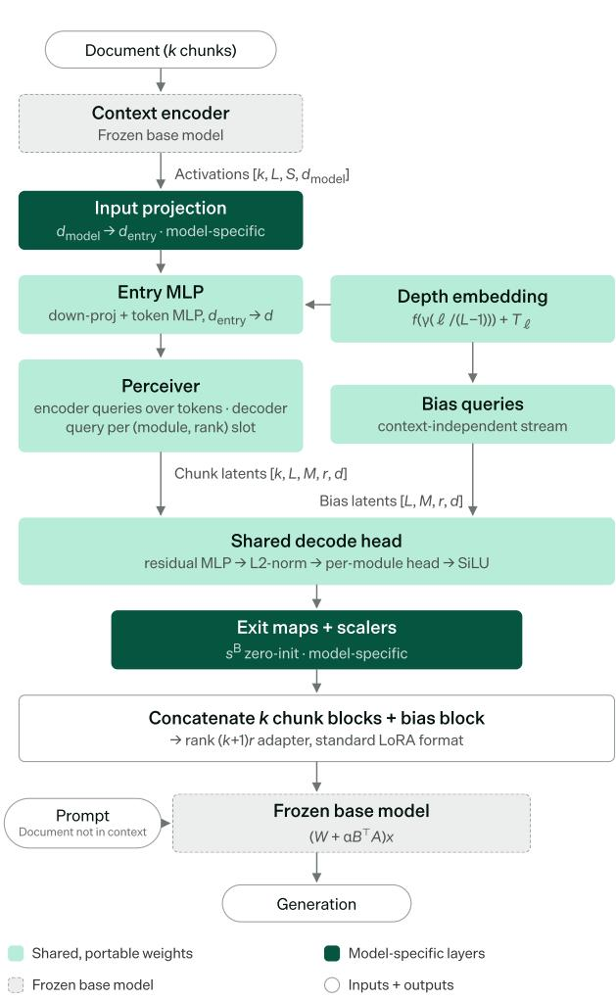
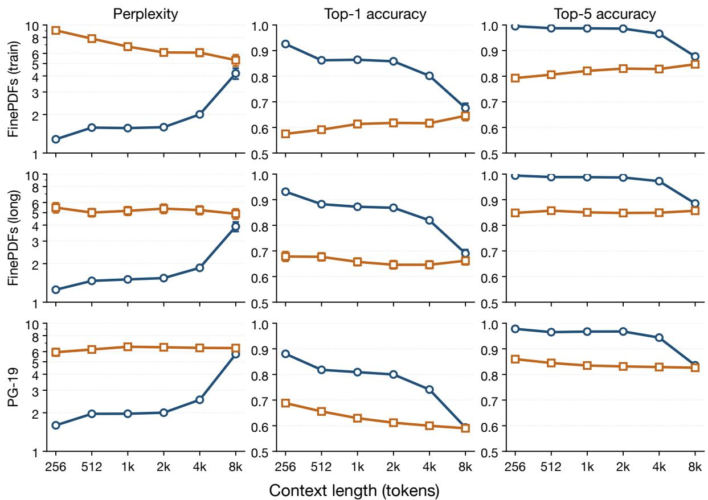
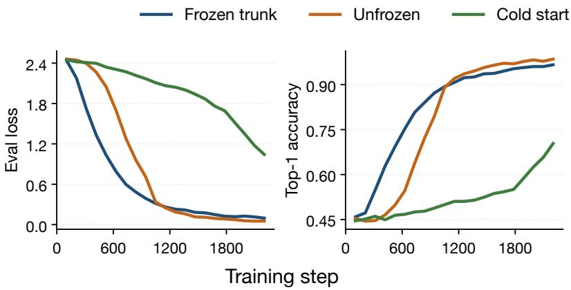

# Internalizer: Portable Context-to-Parameter Mapping for Very Large Language Models

Peter A. Devine, Nick Ryan, Benjamin Sirb, Alex Chiocchi

Interval

{peter.devine, nick.ryan, ben, alex}@ai-interval.com

## Abstract

Hypernetworks that map a context directly to a LoRA adapter let a large language model carry that context in its weights, but prior work has demonstrated them only on base models of up to 14 billion parameters.

We present the Internalizer, a state-of-the-art, portable Context-to-Parameter Mapping hypernetwork that generates document-specific LoRA adapters for the frozen 284B-parameter DeepSeek v4 Flash, a target twenty times larger than in any previous work. Most of its parameters live in a model-agnostic trunk with only thin entry and exit layers per base model, so it trains cheaply against small models before being ported to the large one.

On unseen documents of up to 4096 tokens, the generated adapters reach 84.9% top-1 and 97.8% top-5 teacher-forced accuracy against 63.4% and 83.5% for the base model, with nothing in the context window but a three-word instruction.

Once the hypernetwork is trained, a single forward pass turns any document into an adapter for such a model, which could be served alone for speed or alongside the document in the window to raise accuracy further.

## 1 Introduction

Large Language Models (LLMs) have become widely used in commercial and informationtechnology pipelines (Bick et al., 2024), largely because they offer higher accuracy and lower cost than human labour in many areas (Gilardi et al., 2023).

However, these advantages do not extend to all tasks, as for many use cases LLM inference remains too expensive (Zhou et al., 2024), or model accuracy too low (Huang et al., 2025), to justify deployment.

Three major causes of high cost and low accuracy are bloated context windows (Jiang et al., 2023), the inefficiency of in-context learning (Brown et al., 2020; Mu et al., 2023), and the impracticality of per-task training (Hu et al., 2022).

Commercial tasks often fill the context window with task-relevant information, raising the latency, and thus the cost, of inference, while the "lost-inthe-middle" phenomenon erodes accuracy as context length grows (Liu et al., 2024).

In-context learning of complex tasks requires task explanations and worked examples in the window, and often long chain-of-thought traces before an output, driving up cost further.

Fine-tuning primes a model for a specific task, but it is too expensive and slow for all but the most important repeated tasks (Han et al., 2024). Even then, the resulting task adapter knows nothing of the particular input it will be used on.

To tackle these three challenges, previous work has proposed Context-to-Parameter Mapping, a hypernetwork framework that generates a contextspecific LoRA adapter for a given task (Gao et al., 2026). The context can be a document, a code file, a set of table schemas, an image, or any other tokenizable LLM input. The hypernetwork converts this context into a LoRA adapter, and at inference time the model input, a user question, command, or instruction relating to that context, produces the model output as in ordinary LLM use.

The adapter is computed once per context and can be pre-generated and cached, effectively internalizing the context within the LLM. Since the hypernetwork is meta-learned, this adaptation is cheap and near-instant even for very large language models, in contrast to per-task fine-tuning. The adapter can then be served in two ways. In a speed mode it replaces the context in the window, reducing inference time and cost, or in an accuracy mode the context stays in the window and the adapter is served alongside it, which is the setting we expect to matter most in practice.

Accuracy improves because the adapters are not only specialised for a given task (e.g. document

  
Figure 1: System architecture, with the shared trunk in light green and the thin model-specific entry and exit layers in dark green.

QA, code generation, table traversal, image QA) but also carry knowledge of the specific context they will be used on. This is, in effect, a superset of standard LoRA training, with the adapter conditioned on the context as well as the task. Previous work has shown that such adapters can outperform in-context use of the very context they were generated from (Yu et al., 2026), and an adapter served alongside that context has both sources to draw on.

However, Context-to-Parameter Mapping has only ever been demonstrated on small models and academic benchmarks, and no prior work has targeted a language model beyond 14 billion parameters. This limits its applicability to commercial tasks, which often require the accuracy of far larger models.

We present the Internalizer, a state-of-the-art, portable Context-to-Parameter Mapping hypernetwork that scales to LLMs with hundreds of billions of parameters. Its largely model-agnostic architecture allows the hypernetwork to be re-used across LLMs, massively reducing re-training cost, and enables application to much larger language models than was previously feasible.

Four main design choices carry this result. Oversized entry and exit projections decouple the trunk’s representational capacity from any target model’s hidden width. Adapter slots are restricted to the gated MLP projections that virtually every modern backbone shares, which is what lets one trunk serve many base models. An error-gated loss focuses training on the hard tokens, such as names and numbers, that downstream tasks depend on. Finally, a strategy we call reverse distillation does the bulk of the learning cheaply against small base models before porting to the expensive target.

In our experiments, we internalize documents up to 4096 tokens long into a 284B-parameter model (DeepSeek v4 Flash 0731 (DeepSeek-AI, 2026)) at 84.9% top-1 teacher-forced accuracy against 63.4% for the base model, demonstrating that this approach is tractable even for some of the largest stateof-the-art LLMs. This is a target model twenty times larger than in any previous research (Muhtar et al., 2024), which to our knowledge makes the Internalizer the state-of-the-art hypernetwork for context internalization.

This makes Context-to-Parameter Mapping much more practically useful. At the scale of prior work, models are small enough that their accuracy often falls short of commercial requirements, so a context-specific adapter has little to build on. At the scale of state-of-the-art models the base accuracy is high enough that a further gain is worth having, and training an individual LoRA per task or context grows more expensive with model size, exactly where a single hypernetwork forward pass replaces it. The training cost is paid once, and from then on any document, schema, or code file becomes a context-informed LoRA adapter on demand, whether served alone in speed mode or in accuracy mode alongside the context it was generated from. The Internalizer is fully model-agnostic, and we aim to apply it to improve accuracy, and where the context can be dropped to reduce inference cost, across a variety of real-world use cases.

This paper sets out our architecture, pre-training strategy, and vision for how this technology can be used.

## 2 Related work

Context-to-Parameter Mapping (Gao et al., 2026) trains a hypernetwork (Ha et al., 2016) to convert a context directly into a weight update for a frozen LLM, so that the context no longer needs to occupy the context window.

Two early systems realised this idea in late 2024. GenerativeAdapter (Chen et al., 2025) reads the frozen model’s hidden states as context arrives and accumulates them into a LoRA adapter, internalizing documents, demonstrations, and user conversations at a fraction of the cost of prompting. StreamAdapter (Muhtar et al., 2024) instead compresses the KV cache of tokens evicted from the context window, matching or beating in-context learning with far fewer demonstrations and reaching the largest target LLM to date, the 14B Phi-3-Medium (Abdin et al., 2024). Both, however, pack the context into an adapter of fixed capacity however long it grows (ours gains rank with every additional chunk), and neither hypernetwork can be reused with another base model.

Doc-to-LoRA (D2L) (Charakorn et al., 2026) subsequently reworked the architecture of the hypernetwork itself, basing it on a Perceiver encoder that compresses each chunk of base-model activations into latents that decode to a LoRA block. Blocks concatenate along the rank dimension so that adapter capacity grows with context length rather than staying fixed, and training minimises the KL divergence to the base model’s own contextconditioned responses. We adopt this chunked Perceiver design as our starting point. However, D2L’s self-distillation objective means a weak teacher controls what is internalized, its document-QA training data narrows it to that one task, each new base model requires retraining from scratch, and it was only demonstrated on 2–7B targets.

Work in 2026 then specialised and diagnosed the approach. LatentSkill (Yu et al., 2026) internalized SKILL.md files, the skill documents that agent frameworks otherwise paste into the prompt at every step, outperforming in-context use of the same files. It serves only this one task, however, and targets a single 8B backbone.

SADA (Gao et al., 2026) then investigated why mapped models fail, identifying hidden-state collapse, where incorrect answers coincide with deeplayer divergence from the full-context oracle. Its ablations, showing that supervision quality drives internalization fidelity and that accuracy rises monotonically with LoRA rank, independently motivate two of our choices, ground-truth teacher-forced supervision and context-proportional rank. It too, however, trains one hypernetwork per base model and evaluates only 1.5–7B backbones.

Closest to our portability goal, PorTAL (Geist, 2026) showed that a task adaptation can be learned once and moved cheaply across base models. A shared decoder core generates per-layer LoRA from a base-agnostic task latent, and porting to an unseen model refits only a thin per-base alignment, recovering ∼98% of a from-scratch LoRA’s lift. This independently validates the factorisation we rely on, a large shared core behind thin per-model maps. Each task, however, is a single learned latent with no context input, so every new task requires its own training run rather than a forward pass, the adapter carries the task but nothing of the input it is applied to, and its bases span only 1.7–8B parameters.

Our training strategy also inverts the usual direction of knowledge distillation (Hinton et al., 2015), which transfers capability from a large, expensive teacher into a small student. Small-to-large transfer has precedent in other settings (Burns et al., 2023) and the term reverse distillation itself appears in anomaly detection, where a student reconstructs its teacher’s representations in the reverse direction (Deng and Li, 2022). No work, however, warms up a hypernetwork on small base models before porting it to a much larger one. To our knowledge this inversion is novel for context-toparameter mapping, and we call the strategy reverse distillation, in deliberate contrast to the conventional direction.

Previous work has provided a promising mechanism for internalizing context within model parameters, but two constraints remain. Every contextinternalizing hypernetwork is bound to the single base model it was trained on, and no target LLM has exceeded ∼14B parameters. The Internalizer addresses both by placing its heavy computation in a shared, model-agnostic trunk with thin permodel entry and exit layers (≲10% of parameters), making porting cheap, and by internalizing contexts into a 284B-parameter target (DeepSeek-AI, 2026), twenty times the scale of prior work and the regime where base accuracy is high enough for a context-specific adapter to be commercially useful. In target scale and in portability, the Internalizer therefore advances the state of the art for this class of hypernetwork.

## 3 Architecture

This section describes the architecture of the Internalizer hypernetwork and the design decisions behind it.

At a high level, the Internalizer is a network that generates a LoRA adapter for a base LLM. Given a context, it reads the per-layer activations produced by running that context through a frozen base model, and produces an adapter that folds its content into the weights of every layer. The base model itself is never modified or fine-tuned as the Internalizer does all the work of turning context into weights. Most of its parameters are shared independently of base models, with only thin input and output layers being model-specific, so the same hypernetwork can be ported to new models cheaply. This architecture is illustrated in Fig 1.

The Internalizer has six main parts.

• A hidden state input adapter. Projects the base model’s per-layer activations into the trunk’s shared latent space.

• A depth embedding. A smooth encoding of each layer’s relative depth, shared across base models.

• A perceiver. Compresses each (layer, chunk)’s variable-length token sequence into a fixed set of latent vectors.

• Bias queries. A second stream that generates the context-independent part of the adapter.

• A shared decode head. Turns each latent vector into the A and B rows of one LoRA rank slot.

• A combine step. Concatenates chunk and bias blocks along the rank axis into one standard LoRA adapter.

## 3.1 A hidden state input adapter

We want the hypernetwork to be as model-agnostic as possible, yet every base model has its own hidden size. The input adapter therefore takes each model’s per-layer token activations and projects them into a fixed-size latent space that the rest of the hypernetwork operates in. We do this in two steps: a small model-specific projection first maps the activations up into an intentionally large intermediate space (called the entry size, 8192 in our system), and a shared, portable projection then compresses them down to the latent size (1536), the width every later stage of the trunk operates at. Because the entry size is larger than any model’s hidden size, the model-specific step is not forced to discard information. All of the difficult, lossy compression can instead be done by shared weights that are reused across base models. This oversized intermediate state is an important part of the architecture. It decouples the trunk’s representational capacity from the hidden width of any particular base model, so the same trunk can serve targets of any size, and the decode head below mirrors the same principle at the exit. Small MLPs with non-linearities add expressivity, and a depth signal is added to each token so later stages know which layer it came from. For a token activation h from layer ℓ we compute

$$
\begin{array} { r l } & { x = W _ { \mathrm { d o w n } } \ \mathrm { S i L U } \big ( W _ { \mathrm { p r o j } } \ \mathrm { r m s n o r m } ( h ) \big ) + e _ { \ell } , } \\ & { z = x + \mathrm { M L P } \big ( \mathrm { r m s n o r m } ( x ) \big ) , } \end{array}\tag{1}
$$

where $d _ { \mathrm { m o d e l } }$ is the base model’s hidden size, d is the trunk’s latent size, $W _ { \mathrm { p r o j } } \in \mathbb { R } ^ { d _ { \mathrm { e n t r y } } \times d _ { \mathrm { m o d e l } } }$ is the model-specific up-projection, $W _ { \mathrm { d o w n } } \in \mathbb { R } ^ { d \times d _ { \epsilon } }$ ntry and the residual token MLP are shared, and $e _ { \ell }$ is the depth embedding below. The adapted tokens z are what the perceiver attends over.

## 3.2 A depth embedding

The hypernetwork generates a different weight update for every layer of the base model, so it needs to know which layer it is working on. Rather than using the raw layer index, we encode each layer’s relative depth, how far through the model it sits, from 0 to 1. This way, a 24-layer model and a 93- layer model use the same embedding in the same way, which is essential for sharing the hypernetwork across models. The embedding is smooth, cheap to compute, and independent of the context. It is computed as

$$
\begin{array} { c } { { e _ { \ell } = f \big ( \gamma ( t _ { \ell } ) \big ) + { \cal T } _ { \ell } , ~ t _ { \ell } = \displaystyle \frac { \ell } { L - 1 } , } } \\ { { \gamma ( t ) = \big [ \sin ( 2 ^ { k } \pi t ) , \cos ( 2 ^ { k } \pi t ) \big ] _ { k = 0 } ^ { F - 1 } , } } \end{array}\tag{2}
$$

where ℓ is the layer index, L is the base model’s number of layers, $t _ { \ell }$ is the resulting relative depth, γ maps it to Fourier features at $F { = } 8$ frequencies, $f$ is a small shared MLP over those features, and $T$ is a zero-initialised model-specific per-layer table that absorbs each model’s absolute layer quirks. The smooth part $f ( \gamma ( t _ { \ell } ) )$ is what is shared across base models.

## 3.3 A perceiver

Contexts vary in length, but the adapter we generate must always have the same shape, and the perceiver resolves this mismatch. A fixed set of learned queries (256 in our system) attends over each chunk’s tokens, distilling however many tokens there are into that fixed number of latent vectors. A decoder stage then cross-attends over these with one query per (module, rank) slot of a single chunk’s rank-r block, the same queries being reused for every chunk,

$$
\begin{array} { r l } & { { Z _ { \ell , c } } = \mathrm { E n c } \left( Q _ { \mathrm { e n c } } , \ : z _ { \ell , c } \right) , } \\ & { { U _ { \ell , c } } = \mathrm { D e c } \left( Q _ { \mathrm { d e c } } , \ : Z _ { \ell , c } \right) \in \mathbb { R } ^ { M r \times d } , } \end{array}\tag{3}
$$

where $z _ { \ell , c }$ are the adapted tokens of chunk c at layer ℓ from the input adapter, $Q \mathrm { e n c }$ and $Q _ { \mathrm { d e c } }$ are the learned queries of the two stages, Enc is blocks of cross-attention (queries over the chunk’s tokens) interleaved with self-attention (nine blocks in our system, each pairing one cross-attention layer with one self-attention layer), and Dec is one cross-attention block. The output $U _ { \ell , c }$ holds one latent vector per slot, with M the number of target modules and $r { = } 1 6$ the per-chunk LoRA rank (48 decoder queries in total), and is handed to the decode head below. Each (layer, chunk) group is compressed independently, which lets chunks be processed in parallel and recombined freely later. The perceiver is also where we deliberately put most of the hypernetwork’s parameters. Its size is chosen so that the model-specific parts never exceed roughly 10% of the whole system, which is what makes the hypernetwork portable.

## 3.4 Bias queries

Some of what the adapter needs to express has nothing to do with the context but is instead a general correction that every adapter should carry. If each chunk had to encode this shared component, it would be duplicated k times when a context’s k chunks are combined, growing with chunk count and making chunks hard to compose. Instead, a second stream of learned queries generates this context-independent component once, as its own block that is always appended to the adapter. Chunk blocks then stay purely context-specific and can be freely combined. The bias latents are built directly from the queries and depth signal, with no tokens or attention involved,

$$
u _ { \ell , ( m , \rho ) } ^ { \mathrm { b i a s } } = q _ { ( m , \rho ) } + f \bigl ( \gamma ( t _ { \ell } ) \bigr ) + T _ { \ell } ^ { \mathrm { b i a s } } ,\tag{4}
$$

where $q _ { ( m , \rho ) }$ is a learned query for module m and rank slot $\rho , f$ and $\gamma$ are the shared depth encoding of the depth embedding above, and $T ^ { \mathrm { b i a s } }$ is this stream’s own zero-initialised model-specific per-layer table. These latents are decoded by the same head as the chunk latents. The bias stream is not task-invariant, as we expect it to carry taskdependent content that should not scale with chunk count, and only the tiny $T ^ { \mathrm { b i a s } }$ table is specific to a base model.

## 3.5 A shared decode head

The decode head turns the latent vectors (from both the chunk stream and the bias stream) into actual LoRA weight rows. Each vector becomes one rank slot of the adapter. Mirroring the input adapter, decoding happens at an intentionally large intermediate size (called the exit size, 2048 in our system). The expressive, non-linear work is done there by shared weights, and only thin final projections into each model’s specific weight shapes are modelspecific. For a latent u (a row of $U _ { \ell , c }$ from the chunk stream, or a bias latent $u ^ { \mathrm { b i a s } } )$ , module $m .$ layer ℓ, and rank slot $\rho ,$ the head computes

$$
\begin{array} { r } { \hat { u } = \frac { g ( u ) } { \Vert g ( u ) \Vert _ { 2 } } , \qquad [ a \Vert b ] = W ^ { ( m ) } \hat { u } , } \\ { A _ { \ell , \rho } = s _ { m , \ell , \rho } ^ { A } E _ { d _ { \mathrm { i n } } } \mathrm { S i L U } ( a ) , \qquad } \\ { B _ { \ell , \rho } = s _ { m , \ell , \rho } ^ { B } E _ { d _ { \mathrm { o u t } } } \mathrm { S i L U } ( b ) , \qquad } \end{array}\tag{5}
$$

where g is a shared pre-head residual MLP (a single residual block in our system), $W ^ { ( m ) } \in \mathbb { R } ^ { 2 d _ { \mathrm { e x i t } } \times d }$ is the shared per-module head whose output splits into the halves a and $b ,$ and the $E \in \mathbb { R } ^ { d _ { \mathrm { i n / o u t } } \times d _ { \mathrm { e x i t } } }$ are the model-specific exit maps (one per distinct row dimension, shared across modules and A/B sides). The rows $A _ { \ell , \rho }$ and $B _ { \ell , \rho }$ fill rank slot $\rho$ of the adapter at layer ℓ. The $s ^ { A } , \ddot { s } ^ { B }$ are per-layer, perslot scalers, with the chunk and bias streams each carrying their own tables. The $s ^ { B }$ of both streams are initialised to zero, so at the start of training the generated update is exactly zero, the base model behaves as if unmodified, and training begins from a known-good starting point.

## 3.6 A combine step

Finally, the pieces are assembled into one adapter per context. The blocks from its k chunks and the bias block are simply concatenated, giving an adapter of rank $r ( k { + } 1 )$ in standard LoRA format.

Per module and layer,

$$
\begin{array} { r l } & { A = \big [ A ^ { ( 1 ) } ; ~ . . . ; ~ A ^ { ( k ) } ; ~ A ^ { \mathrm { b i a s } } \big ] \in \mathbb { R } ^ { r ( k + 1 ) \times d _ { \mathrm { i n } } } , } \\ & { B ~ \mathrm { l i k e w i s e } , ~ \Delta W = \alpha B ^ { \top } A , } \end{array}\tag{6}
$$

so the modulated layer computes $( W + \Delta W )$ x on its input x, where $A ^ { ( c ) }$ and $B ^ { ( c ) }$ are the decoded blocks of chunk $c , A ^ { \mathrm { b i a s } }$ and $B ^ { \mathrm { b i a s } }$ come from the bias stream, and α is a fixed scalar hyperparameter. Note that α multiplies the update directly rather than through the $\alpha /$ rank convention of standard LoRA implementations, so the update’s scale does not shrink as chunks are added, requiring setting its scaling to match at inference. Because chunks are encoded independently and the shared component lives in the bias block, combining requires nothing more than concatenation. We have found this a useful way to scale context length. Each extra chunk of the context adds its own parameters to the adapter, so internalizing more tokens naturally means a slightly larger adapter.

## 3.7 Targeted modules

We target the three MLP projections of every layer, up, gate, and down (M=3), where D2L (Charakorn et al., 2026) targeted only the down projections. We target no attention modules. Attention configurations vary widely across models, while virtually every modern backbone shares the same gated-MLP structure, so restricting the slots to the MLP is what lets the same hypernetwork port across base models. On our smaller dense models these slots are simply each layer’s up\_proj, gate\_proj, and down\_proj. On DeepSeek v4 Flash, a Mixtureof-Experts model, we place them on the sharedexpert MLP of every layer. Routed experts are packed tensors that each see only a sparse subset of tokens, whereas the shared experts run for every token, making them the natural dense analogue of a standard MLP. Targeting all three projections rather than the down projection alone also gives each layer three times the adapter surface. This is a small change from prior work with larger consequences, as it is much of what lets the Internalizer target larger and more structurally varied backbones while unlocking more fine-tuning capacity downstream.

In summary: the Internalizer reads a context through the frozen base model, compresses each (layer, chunk) of activations into per-slot latents, decodes these, together with a generated contextindependent bias block, into LoRA rows, and concatenates the blocks into one standard adapter. All of the heavy computation lives in shared, modelagnostic weights, and only thin entry and exit layers touch any particular base model.

The next section describes how this system is trained end-to-end so that the adapters it generates actually internalize their contexts.

## 4 Pre-training

We currently train the Internalizer in a single generalised pre-training phase, deferring task-specific fine-tuning to later work. Pre-training teaches the hypernetwork one thing, to encode as much of a context as possible into the adapter. Which tokens of a context matter is task-dependent, and at pre-training time there is no task, so we treat every token as worth internalizing. A subsequent fine-tuning phase can then teach the system to overweight the tokens a task cares about (e.g. facts, names, figures) and to disregard the rest, starting from an adapter that already carries them all.

Pre-training is organised as a curriculum of short training stages, each a single epoch over a fresh slice of the corpus, with the document length cap raised as the curriculum progresses. We first train the shared trunk from scratch against a roster of small base models over twelve stages, then port the warmed hypernetwork to DeepSeek v4 Flash over a further four. The task, data recipe, and objective described below are common to every stage. Two ideas carry this section, an error-gated loss that focuses gradient on the tokens not yet internalized, and a reverse distillation schedule that does the bulk of the learning against cheap small models. The last two subsections describe the two phases of the curriculum in turn.

## 4.1 The regurgitation task

Our pre-training task is regurgitation, in which the base model must reproduce a document verbatim given only the adapter generated from it. Each training sample is a (context, input, output) triplet in which the context and the output are both the document, and the input is the fixed instruction “Reproduce the document.”. The instruction is one constant string across the entire corpus, so it carries no information about any particular document, and everything the model reproduces must flow through the generated adapter. This fixed input is a pre-training device only and is replaced by real task inputs at fine-tuning time.

## 4.2 Data

Documents come from the finepdfs corpus $( \mathrm { K y } .$ dlícek et al.ˇ , 2025), filtered to English documents with a language-identification confidence above 0.9. A small fraction of documents is held out for validation, and each training stage draws on fresh corpus shards disjoint from every earlier stage. Each document is truncated to the stage’s length cap and split into near-equal contiguous chunks of at most 512 tokens. Every chunk is wrapped in the base model’s user-turn chat template, so the encoder reads it on-distribution, and is prefixed with a position tag [doc\_id:chunk\_idx] carrying a per-document identifier and the chunk’s index, so each per-chunk LoRA block has information of which part of which document it encodes. We include these tags because we expect chunk attribution, knowing which document and position a piece of internalized content came from, to be a critical capability for downstream fine-tuning tasks such as citation and multi-document use. The tags are therefore not a training-only device and are kept in place at evaluation and inference time too.

## 4.3 Training loop

Each step runs the architecture of Section 3 end to end. The frozen base model encodes the tagged chunks, and the hypernetwork maps the resulting per-layer activations to one rank-16 LoRA block per chunk. These blocks are concatenated along the rank axis with the generated bias block, and the assembled adapter is installed in the same frozen base model. The modulated model then processes the sample formatted as a chat, with the instruction as the user turn and the document as the assistant turn. Supervision is teacher-forced nexttoken cross-entropy computed over the assistant span only. The instruction and chat scaffolding are masked out of the loss. The gradient flows through the base model’s frozen weights and the assembled adapter back into the hypernetwork, whose weights are the only ones ever updated. All stages use a constant learning rate, between $1 0 ^ { - 5 } \mathrm { a n d } 4 \times 1 0 ^ { - 5 }$ depending on the stage.

## 4.4 Error-gated loss

Tokens are not equally hard to internalize, as common, predictable tokens are absorbed quickly while the hardest ones, such as names and numbers, are often exactly those a downstream task depends on. Because easy tokens vastly outnumber hard ones, plain cross-entropy spends most of its gradient mass polishing tokens the adapter has already internalized. We therefore add an error-gated term. With L the mean cross-entropy over the output span and $\mathcal { L } _ { \mathrm { e r r } }$ the same loss masked to tokens where the modulated model’s argmax prediction is wrong, we train on

$$
\mathcal { L } _ { \mathrm { t r a i n } } = \mathcal { L } + \lambda \mathcal { L } _ { \mathrm { e r r } } ,\tag{7}
$$

so tokens not yet internalized receive $( 1 + \lambda ) \times$ the baseline gradient weight while learned tokens keep weight 1. Training on the gated term alone proved unstable, so the plain cross-entropy is kept as an anchor. We introduce the term partway through pre-training and use λ between 0.2 (early stages) and 1.5 (the final DeepSeek v4 Flash stages). Validation loss is always reported ungated, so it stays comparable across stages.

## 4.5 Warm-starting on small models

The early gradient steps of the hypernetwork do not require an expensive base model, so we use a strategy we call reverse distillation, named in contrast to conventional distillation, which transfers capability from a large model into a small one. Here the hypernetwork does the bulk of its learning cheaply against small base models before being applied to a much larger one. Exploiting the trunk’s portability, we run the early stages of pretraining against a roster of five small open models of 1–3B parameters (Qwen3.5-2B, Gemma 4 E2B, MiniCPM5-1B, Nanbeige4.1-3B, and Granite-4.1- 3B) sharing the single trunk, with micro-steps cycling the members in lockstep so that every optimizer step blends gradients from all of them. The twelve stages of this phase ratchet the document cap from 64 tokens up to 4096, and with it the chunk count from one to eight, alternating cheap single-model stages that train only the trunk against frozen adapters with full-roster stages that train everything. The stage boundaries were chosen ad hoc as training progressed, and the schedule could likely be simplified. The warm start itself, rather than the precise schedule, is what carries the result. A trunk pre-trained this way converges far faster when ported to a large model than a hypernetwork trained against that model from scratch, as shown in Section 6.3. This substantially reduces training cost. Each step against DeepSeek v4 Flash is far slower than a step against the roster of small models, so the large model still dominates the absolute GPU hours of pre-training, but the warm start frontloads the coarse learning onto cheap models and leaves only finer-grained refinement to the expensive one, reducing the cost of training to the point where training on state-of-the-art LLMs becomes feasible.

## 4.6 Porting to DeepSeek v4 Flash

We then port the warmed hypernetwork to DeepSeek v4 Flash 0731 (284B parameters). The model is released as an fp8 checkpoint, which our bf16 training stack cannot load directly, so we dequantize it to bf16 offline before training. The porting stages, on the same data recipe, cold-start the new model-specific entry and exit layers against the frozen trunk on 512-token single-chunk documents, continue them on 4096-token chunked documents with the trunk still frozen, and finally train everything unfrozen. This porting phase ran on 64 H200 GPUs (8 nodes of 8, DeepSpeed ZeRO-3) for roughly three days.

## 5 Evaluation Method

Pre-training aims to make the generated adapter carry the content of its context document, so our evaluation measures how much of a document can be recovered from the generated adapter alone.

We take three test sets of plain-text documents and truncate each document to a range of context lengths. For every document and length, our final trained Internalizer generates an adapter, which is applied to DeepSeek v4 Flash 0731. We measure how accurately the modulated model reproduces each document from the adapter alone, and compare against the unmodified base model’s plain language modelling of the same tokens.

This evaluation quantifies the extent to which context is internalized into adapters at each context length.

The remainder of this section describes the test datasets, the adapter generation method, and the evaluation metrics and procedure.

## 5.1 Data

We evaluate on three document sets.

FinePDFs (train distribution) is 100 documents drawn from an eng\_Latn test-split shard of finepdfs (Kydlícek et al.ˇ , 2025) that no training stage touched, under the same language filter as pre-training.

FinePDFs (long) draws from the same shard but keeps only documents that reach 16384 tokens, of which the shard yielded 32.

PG-19 is the 100 PG-19 test books (Rae et al., 2020), out-of-domain public-domain narrative prose rather than text extracted from PDFs, unseen by every training stage.

Each document is evaluated at seven length buckets of 256, 512, 1024, 2048, 4096, 8192 and 16384 tokens. A document is truncated to the largest bucket it reaches and evaluated at every bucket at or below it, so the same document contributes a point at each length. The long buckets of the FinePDFs train distribution therefore thin out as the training length distribution does, and the document counts in Table 1 reflect that.

In total this is 232 documents and 1294 (document, length) evaluations.

## 5.2 Adapter generation

Adapters are generated exactly as in training. A document is truncated to the target length, then chunked, tagged, and encoded as in Section 4, and our final trained hypernetwork maps this to one rank-16 block per chunk, giving a standard LoRA adapter of rank 16(k+1) once the bias block is appended.

## 5.3 Metrics and control

We score each document in the regurgitation format of Section 4, teacher-forced over the assistant span. We evaluate these adapters using the following metrics.

• Perplexity (PPL). The exponential of the mean teacher-forced next-token cross-entropy over the document span. Cross-entropy is the pre-training objective itself, and its exponential reads as the effective number of tokens the model is choosing between at each position, so this measures internalization on the scale the hypernetwork was optimised for while staying interpretable.

• Top-1 accuracy. The fraction of tokens whose argmax prediction matches the true token. It is the closest teacher-forced proxy for how much of the document a greedy decode would reproduce verbatim.

• Top-5 accuracy. The fraction of tokens whose true token is among the five highestprobability predictions. Crediting near-misses distinguishes tokens the adapter carries but narrowly misranks from tokens it failed to internalize at all.

<table><tr><td colspan="3"></td><td colspan="2">Perplexity</td><td colspan="2">Top-1 (%)</td><td colspan="2">Top-5 (%)</td></tr><tr><td>Length</td><td>Docs</td><td>Rank</td><td>Adapter</td><td>Base</td><td>Adapter</td><td>Base</td><td>Adapter</td><td>Base</td></tr><tr><td colspan="9">FinePDFs (train distribution)</td></tr><tr><td>256</td><td>100</td><td>32</td><td>1.27</td><td>7.85</td><td>92.6</td><td>57.5</td><td>99.5</td><td>79.3</td></tr><tr><td>512</td><td>87</td><td>32</td><td>1.55</td><td>6.89</td><td>86.2</td><td>59.1</td><td>98.7</td><td>80.6</td></tr><tr><td>1024</td><td>67</td><td>48</td><td>1.55</td><td>5.99</td><td>86.4</td><td>61.3</td><td>98.7</td><td>82.1</td></tr><tr><td>2048</td><td>49</td><td>80</td><td>1.58</td><td>5.58</td><td>85.8</td><td>61.8</td><td>98.6</td><td>83.0</td></tr><tr><td>4096</td><td>41</td><td>144</td><td>1.97</td><td>5.58</td><td>80.2</td><td>61.7</td><td>96.6</td><td>82.8</td></tr><tr><td>8192†</td><td>24</td><td>272</td><td>3.82</td><td>4.81</td><td>67.6</td><td>64.5</td><td>87.7</td><td>84.7</td></tr><tr><td>16384†</td><td>17</td><td>528</td><td>2724</td><td>4.62</td><td>24.6</td><td>65.4</td><td>38.2</td><td>85.0</td></tr><tr><td colspan="9">FinePDFs (long)</td></tr><tr><td>256</td><td>32</td><td>32</td><td>1.25</td><td>4.85</td><td>93.1</td><td>67.8</td><td>99.4</td><td>84.9</td></tr><tr><td>512</td><td>32</td><td>32</td><td>1.45</td><td>4.66</td><td>88.3</td><td>67.7</td><td>98.8</td><td>85.7</td></tr><tr><td>1024</td><td>32</td><td>48</td><td>1.49</td><td>4.76</td><td>87.3</td><td>65.7</td><td>98.8</td><td>85.1</td></tr><tr><td>2048</td><td>32</td><td>80</td><td>1.52</td><td>4.85</td><td>86.9</td><td>64.6</td><td>98.7</td><td>84.8</td></tr><tr><td>4096</td><td>32</td><td>144</td><td>1.82</td><td>4.81</td><td>82.0</td><td>64.6</td><td>97.2</td><td>84.9</td></tr><tr><td>8192†</td><td>32</td><td>272</td><td>3.56</td><td>4.44</td><td>69.0</td><td>66.2</td><td>88.5</td><td>85.7</td></tr><tr><td>16384†</td><td>32</td><td>528</td><td>2276</td><td>4.10</td><td>25.4</td><td>67.6</td><td>39.3</td><td>86.4</td></tr><tr><td colspan="9">PG-19</td></tr><tr><td>256</td><td>100</td><td>32</td><td>1.58</td><td>5.05</td><td>88.0</td><td>68.8</td><td>97.8</td><td>86.0</td></tr><tr><td>512</td><td>100</td><td>32</td><td>1.93</td><td>5.58</td><td>81.8</td><td>65.6</td><td>96.5</td><td>84.5</td></tr><tr><td>1024</td><td>100</td><td>48</td><td>1.93</td><td>5.93</td><td>80.9</td><td>62.9</td><td>96.7</td><td>83.5</td></tr><tr><td>2048</td><td>100</td><td>80</td><td>1.97</td><td>5.99</td><td>80.0</td><td>61.2</td><td>96.8</td><td>83.1</td></tr><tr><td>4096</td><td>99</td><td>144</td><td>2.48</td><td>5.99</td><td>74.1</td><td>60.0</td><td>94.4</td><td>82.9</td></tr><tr><td>8192†</td><td>95</td><td>272</td><td>5.53</td><td>6.05</td><td>59.3</td><td>59.0</td><td>83.6</td><td>82.6</td></tr><tr><td>16384†</td><td>91</td><td>528</td><td>1978</td><td>5.81</td><td>22.0</td><td>59.2</td><td>37.4</td><td>83.0</td></tr></table>

Table 1: Document reconstruction by document set and context length, comparing Adapter-only regurgitation against the unmodified base model. Rank is the adapter’s combined LoRA rank, 16(k+1) for k chunks. Accuracies are means over the row’s documents, perplexity is the exponential of the mean per-document cross-entropy, and the better value is in bold. †Beyond the 4096-token, eight-chunk training cap, so the hypernetwork generates adapters at chunk counts it never saw in training.

The control is the same document scored by the unmodified base model as plain language modelling, with no adapter and no chat template, just the raw document tokens.1 Both settings are teacher-forced, so the only difference between them is whether the document was internalized. Base-model accuracy is how much of a document a 284B-parameter model can predict having never seen it, and any margin above that line is content the adapter carried into the weights rather than content the model could have guessed.

## 6 Results

Our results show that the hypernetwork internalizes documents accurately at the lengths it was trained on, but this does not generalize to longer ones. Table 1 gives the full numbers and Figure 2 the trends.

## 6.1 Within the trained length

Within the trained regime of documents up to 4096 tokens and eight chunks, the hypernetwork internalizes nearly all of each document’s content into the adapter. Macro-averaged over the five buckets up to that length and the three document sets, the adapter reaches 84.9% top-1 and 97.8% top-5 accuracy against 63.4% and 83.5% for the base model, at a perplexity of 1.7 against 5.6. Under teacher forcing, the vast majority of tokens in a document the model has never seen are predicted correctly from the adapter weights alone, with nothing in the context window but a three-word instruction.

Base-model accuracy is largely flat in length on all three sets, while adapter accuracy varies with it. The margin between the two therefore reflects how much of the document reached the adapter rather than how predictable the text is.

Internalization accuracy is also only weakly affected by document length within this regime. From 256 to 2048 tokens, an eightfold increase in content, top-1 accuracy falls by only six points on FinePDFs (long). The adapter’s rank grows with the chunk count, so its capacity scales with the amount of content it must store. The first clear drop in accuracy appears at 4096 tokens, where the chunk count reaches the training cap.

  
Figure 2: Adapter versus base model across context lengths, one document set per row. FinePDFs (train distribution) covers 100 unique documents (24–100 per context length, 368 evaluations), FinePDFs (long) holds the same 32 documents at every context length (192 evaluations), and PG-19, an out-of-domain set, covers 100 unique documents (95–100 per context length, 594 evaluations). Error bars show the standard error of the mean. The 16384-token bucket is omitted, as its adapter perplexities would dominate the axis. It is discussed in Section 6.2.

PG-19 shows the lowest internalization accuracy throughout, at 81.0% macro top-1 up to 4096 tokens against 86.2% and 87.5% for the two FinePDFs sets. Its text is not intrinsically less predictable, as the base model actually scores slightly higher on PG-19, so the gap is in internalization rather than in the text. Narrative prose has none of the layout regularity of extracted PDF text and is out of domain for every training stage. The adapter’s margin over the base model narrows accordingly, from 25.9 points on the FinePDFs train distribution to 17.3 on PG-19.

## 6.2 Beyond the trained length

The last two rows of each block in Table 1 are extrapolation. At 8192 and 16384 tokens the hypernetwork must produce 16 and 32 chunks against a maximum of 8 in training, with combined ranks of 272 and 528 rather than 144.

At 8192 tokens adapter accuracy has fallen back to roughly the base model’s level, with top-1 margins of 0.3 to 3.1 points across the three sets, so little of the document is reaching the adapter. At 16384 tokens adapter accuracy drops well below the base model’s, to 22–25% top-1, with perplexities in the thousands, indicating significant divergence, which is why we omit the bucket from the figures.

Internalization accuracy outside the trained length range is therefore low. Within that range of up to about 4096 tokens per adapter, a single hypernetwork forward pass yields roughly 22 points of top-1 accuracy over the 284B-parameter base model on documents it has never seen, with the adapter as the model’s only source of the document.

That knowledge is delivered as weights, generated in one pass and reusable across every query, to a model of a class whose accuracy is already high enough for real deployment. Our aim is an accuracy mode that adds that knowledge on top of the context held in the model’s context window, rather than only a speed mode that replaces it, so that the adapter raises accuracy above what in-context learning or standard LoRA training alone achieves.

## 6.3 Portability

Finally, we run a small experiment to isolate how much of the ported hypernetwork’s performance comes from the shared trunk rather than from the thin model-specific entry and exit layers, and with it to measure the value of reverse distillation. The experiment uses 64-token single-chunk documents, where training is cheap enough to repeat. We first pre-train a hypernetwork from a cold start against the five-model small roster of Section 4, which is fast, and keep its shared trunk. We then train three hypernetworks against DeepSeek v4 Flash on the same data.

• Frozen trunk. The warmed trunk is kept frozen and only cold-started entry and exit layers for DeepSeek v4 Flash are trained.

• Unfrozen. The warmed trunk and cold-started entry and exit layers are all trained.

• Cold start. The entire hypernetwork is trained from scratch against DeepSeek v4 Flash.

Figure 3 shows evaluation loss and top-1 accuracy over the course of training. Both warm-started runs pass 90% top-1 accuracy within the training budget, while the cold start does not reach above 75% at the same step count and is still improving slowly. The frozen-trunk run gains accuracy in the fewest steps, since its only trainable weights are the thin per-model maps, and the fully unfrozen run finishes marginally ahead of it.

The two warm-started curves cross at roughly step 1000. Our reading is that freezing the trunk helps early because it forces all gradient into the randomly initialised per-model maps, which must first reach a plausibly trained state, and then becomes a brake because those thin maps have far less capacity than the trunk. The effect may also be specific to this cheap 64-token setting. At the 4096-token scale of the main porting run, a short frozen phase made little difference to loss and we moved to unfrozen training quickly, though that may simply reflect the scale of that run.

That a frozen trunk trained only against 1–3B models can be fitted to a 284B-parameter model through thin entry and exit layers alone shows that most of the ported performance comes from the shared trunk. This is the evidence behind our reverse distillation strategy, in which the bulk of the learning happens quickly and cheaply against small models and the expensive training against the large model only has to fit the thin model-specific layers.

## 7 Future work

This work pre-trains the Internalizer and evaluates it on reconstruction. We plan to build on it in the following directions.

• Task finetuning. Reconstruction measures how much of a document reaches the adapter, but it is not itself an application. The next step is to keep the same training loop and swap the reconstruction prompt for real questions, instructions, and answers from tasks such as question answering over documents and tables, code generation against an internalized repository, and instruction following grounded in internalized manuals and policies. Every such finetune branches cheaply from the same pre-trained hypernetwork.

• Full-context finetuning. Internalization pretraining removes the context from the window, but finetuning need not. We plan to finetune with the same context both fed to the hypernetwork and kept in the window. The adapter then no longer stands in for the context. It becomes a context-conditioned specialization of the task, learning the task itself while adjusting to the sub-type of task the context implies. This is a superset of standard LoRA training, where the adapter learns the task from a large corpus, as a LoRA would, and additionally fits itself to each specific context, combining generalization with specialization.

• Longer context lengths. Our results show that internalization accuracy does not extend beyond the trained length range, so a longer useful range has to be trained for rather than expected from extrapolation. We plan to raise the training cap well beyond eight chunks and measure how accuracy and training cost scale with it.

  
Figure 3: Evaluation loss and top-1 accuracy while porting to DeepSeek v4 Flash. The trunk-frozen and fully unfrozen runs start from the warmed shared trunk, while the cold-start run trains its hypernetwork from scratch.

• Transfer to other and larger models. Prior work suggests that model representations become more aligned as models grow (Huh et al., 2024), at least in their local neighborhood structure (Gröger et al., 2026). We therefore expect the trunk trained against DeepSeek v4 Flash to port to other large models at a much lower cost compared to training them from scratch, just as the small-roster trunk ported to DeepSeek v4 Flash. The natural targets are trillion-parameter models such as Qwen3.8- 2.4T-A95B and Kimi K3, where the savings from reverse distillation are largest.

• Harness-specific training. Deployed models run inside a harness of tools, prompting conventions, and output formats. Finetuning the Internalizer against a specific harness would let its adapters absorb those conventions, and this is the route we expect commercial applications to take.

• Self-improvement of adapters through reflection. Because an adapter is a cheap function of its context, a deployed adapter can be improved without any weight training. During down-time, a strong but slow model could review the adapter’s mistakes or mine real user interactions, append what it learns to the context, and regenerate the adapter, yielding a smarter adapter without the cost or instability of actual training. Deployment then becomes a hybrid mode, serving with the current adapter while reflective refinement improves

the next one offline.

• N-gram embedding targets. The Qwen 3.8 Next architecture (Qwen Team, 2026) adds ngram embedding tables that can be offloaded out of GPU memory. Generating adapter components that target this embedding space, or a task-relevant subset of it, could pair internalization with that offloading for further inference savings.

## 8 Conclusion

We presented the Internalizer, a state-of-the-art, portable Context-to-Parameter Mapping hypernetwork that converts a document into a LoRA adapter for a frozen base model. Its trunk is shared across base models, with only thin entry and exit layers specific to each, and its target is DeepSeek v4 Flash at 284B parameters, twenty times larger than any prior target in this area.

Pre-trained on a regurgitation task, the hypernetwork internalizes unseen documents of up to 4096 tokens at 84.9% top-1 and 97.8% top-5 teacherforced accuracy, roughly 22 points of top-1 over the base model, with nothing in the context window.

These results point to task-specific context becoming something a state-of-the-art model computes once as a LoRA and keeps. Such adapters were previously available only to small models, whose base accuracy left little to build on. At this scale the base accuracy is high enough for real deployment, and the adapter can lift it further, alone in a speed mode or alongside the context in the window in an accuracy mode. In either mode the adapter is conditioned on the context itself and carries both information of the task and the context, which a standard LoRA adapter cannot.

Documents, schemas, or codebases can be internalized ahead of time into compact adapters, swapped in per request, and reused across queries, and the portable trunk lets this machinery follow base-model upgrades at the cost of refitting the thin entry and exit layers.

We do not present these findings as a finished model, but as a pre-trained basis on which to build. The immediate next step is to finetune it against real tasks and measure the accuracy its adapters add in deployment.

## Contributions

Peter Devine was the lead researcher on this project, having co-created the concept, designed and run the experiments and evaluations, and written this paper. Nick Ryan and Ben Sirb both consulted on this work, gave input to research direction, and reviewed various drafts of this paper before release. Alex Chiocchi supervised this work, co-created the concept, consulted on its direction, and also reviewed this paper before release.

## References

Marah Abdin et al. 2024. Phi-3 technical report: A highly capable language model locally on your phone. arXiv preprint arXiv:2404.14219.

Alexander Bick, Adam Blandin, and David J. Deming. 2024. The rapid adoption of generative AI. Working Paper 32966, National Bureau of Economic Research.

Tom Brown, Benjamin Mann, Nick Ryder, Melanie Subbiah, Jared D. Kaplan, Prafulla Dhariwal, Arvind Neelakantan, Pranav Shyam, Girish Sastry, Amanda Askell, et al. 2020. Language models are few-shot learners. In Advances in Neural Information Process ing Systems, volume 33, pages 1877–1901.

Collin Burns, Pavel Izmailov, Jan Hendrik Kirchner, Bowen Baker, Leo Gao, Leopold Aschenbrenner, Yining Chen, Adrien Ecoffet, Manas Joglekar, Jan Leike, Ilya Sutskever, and Jeff Wu. 2023. Weak-to-strong generalization: Eliciting strong capabilities with weak supervision. arXiv preprint arXiv:2312.09390.

Rujikorn Charakorn, Edoardo Cetin, Shinnosuke Uesaka, and Robert Tjarko Lange. 2026. Doc-to-loRA: Learning to instantly internalize contexts. In Fortythird International Conference on Machine Learning.

Tong Chen, Hao Fang, Patrick Xia, Xiaodong Liu, Benjamin Van Durme, Luke Zettlemoyer, Jianfeng Gao,

and Hao Cheng. 2025. Generative adapter: Contextualizing language models in parameters with a single forward pass. arXiv preprint arXiv:2411.05877.

DeepSeek-AI. 2026. DeepSeek-V4 technical report. arXiv preprint arXiv:2606.19348.

Hanqiu Deng and Xingyu Li. 2022. Anomaly detection via reverse distillation from one-class embedding. In Proceedings ofthe IEEE/CVF Conference on Computer Vision and Pattern Recognition (CVPR).

Wenhao Gao, Tianlong Wang, Wei Jia, Linhao Zhang, Aiwei Liu, Miao Fan, and Zhou Xiao. 2026. Sada: Bridging in-context learning and fine-tuning via statealigned distillation adapters. In Proceedings of the 64th Annual Meeting of the Association for Computational Linguistics (Volume 1: Long Papers), pages 22847–22862.

Ben Geist. 2026. PorTAL: Portable task adaptation for LoRA. https://labs.ramp.com/research/ portal-portable-task-adaptation/.

Fabrizio Gilardi, Meysam Alizadeh, and Maël Kubli. 2023. ChatGPT outperforms crowd workers for text-annotation tasks. Proceedings of the National Academy ofSciences, 120(30):e2305016120.

Fabian Gröger, Shuo Wen, and Maria Brbic. 2026. Re-´ visiting the platonic representation hypothesis: An aristotelian view. arXiv preprint arXiv:2602.14486.

David Ha, Andrew M. Dai, and Quoc V. Le. 2016. Hypernetworks. arXiv preprint arXiv:1609.09106.

Zeyu Han, Chao Gao, Jinyang Liu, Jeff Zhang, and Sai Qian Zhang. 2024. Parameter-efficient finetuning for large models: A comprehensive survey. arXiv preprint arXiv:2403.14608.

Geoffrey Hinton, Oriol Vinyals, and Jeff Dean. 2015. Distilling the knowledge in a neural network. arXiv preprint arXiv:1503.02531.

Edward J. Hu, Yelong Shen, Phillip Wallis, Zeyuan Allen-Zhu, Yuanzhi Li, Shean Wang, Lu Wang, and Weizhu Chen. 2022. LoRA: Low-rank adaptation of large language models. In International Conference on Learning Representations.

Lei Huang, Weijiang Yu, Weitao Ma, Weihong Zhong, Zhangyin Feng, Haotian Wang, Qianglong Chen, Weihua Peng, Xiaocheng Feng, Bing Qin, and Ting Liu. 2025. A survey on hallucination in large language models: Principles, taxonomy, challenges, and open questions. ACM Transactions on Information Systems, 43(2):1–55.

Minyoung Huh, Brian Cheung, Tongzhou Wang, and Phillip Isola. 2024. The platonic representation hypothesis. arXiv preprint arXiv:2405.07987.

Huiqiang Jiang, Qianhui Wu, Chin-Yew Lin, Yuqing Yang, and Lili Qiu. 2023. LLMLingua: Compressing prompts for accelerated inference of large language

models. In Proceedings ofthe 2023 Conference on Empirical Methods in Natural Language Processing, pages 13358–13376.

Hynek Kydlícek, Guilherme Penedo, and Leandro vonˇ Werra. 2025. Finepdfs. https://huggingface.co/ datasets/HuggingFaceFW/finepdfs.

Nelson F. Liu, Kevin Lin, John Hewitt, Ashwin Paranjape, Michele Bevilacqua, Fabio Petroni, and Percy Liang. 2024. Lost in the middle: How language models use long contexts. Transactions ofthe Association for Computational Linguistics, 12:157–173.

Jesse Mu, Xiang Lisa Li, and Noah Goodman. 2023. Learning to compress prompts with gist tokens. In Advances in Neural Information Processing Systems, volume 36.

Dilxat Muhtar, Yelong Shen, Yaming Yang, Xiaodong Liu, Yadong Lu, Jianfeng Liu, Yuefeng Zhan, Hao Sun, Weiwei Deng, Feng Sun, Xueliang Zhang, Jianfeng Gao, Weizhu Chen, and Qi Zhang. 2024. Streamadapter: Efficient test time adaptation from contextual streams. arXiv preprint arXiv:2411.09289.

Qwen Team. 2026. On the design of Qwen3.8- Next architecture: Evaluation, efficiency, and training stability. https://github.com/QwenLM/Qwen3. 8-Flash-Next/blob/main/tech\_report.pdf.

Jack W. Rae, Anna Potapenko, Siddhant M. Jayakumar, Chloe Hillier, and Timothy P. Lillicrap. 2020. Compressive transformers for long-range sequence modelling. In International Conference on Learning Representations.

Aofan Yu, Chenyu Zhou, Tianyi Xu, Zihan Guo, Rong Shan, Zhihui Fu, Jun Wang, Weiwen Liu, Yong Yu, Weinan Zhang, and Jianghao Lin. 2026. LatentSkill: From in-context textual skills to inweight latent skills for LLM agents. arXiv preprint arXiv:2606.06087.

Zixuan Zhou, Xuefei Ning, Ke Hong, Tianyu Fu, Jiaming Xu, Shiyao Li, Yuming Lou, Luning Wang, Zhihang Yuan, Xiuhong Li, Shengen Yan, Guohao Dai, Xiao-Ping Zhang, Yuhan Dong, and Yu Wang. 2024. A survey on efficient inference for large language models. arXiv preprint arXiv:2404.14294.