# JUST WEATHER SCORING: EFFICIENT END-TO-END NOWCASTING WITH DISTRIBUTIONAL DIFFUSION

Jannik Wiese<sup>∗</sup> Johannes Schusterbauer<sup>∗</sup> Tommaso Martorella Bjorn Ommer¨

CompVis @ LMU Munich, Munich Center for Machine Learning (MCML)

## ABSTRACT

Generative diffusion models are well-suited for probabilistic precipitation nowcasting, but existing approaches often rely on separately trained compression or deterministic forecasting components and remain costly at inference due to iterative denoising. We introduce Just Weather Scoring (JWS), a single-stage, end-toend diffusion model which addresses both issues by forecasting directly in radar space and enabling few-step generation. Radar-space modeling greatly simplifies training and inference and eliminates uncertainty arising from lossy compression. JWS combines Masked Asynchronous Diffusion, a timestep-sampling scheme that preserves clean context while adapting diffusion training to highdimensional spatio-temporal data, with a simple scoring-rule objective that aligns training with probabilistic forecasting and unlocks few-step generation. On the SEVIR and MeteoNet benchmarks, JWS achieves state-of-the-art probabilistic forecasting performance at reduced training and inference cost. Even our smallest model remains competitive using substantially fewer parameters and more than 17× faster inference.

Code: https://github.com/CompVis/jws

Project page: https://compvis.github.io/jws

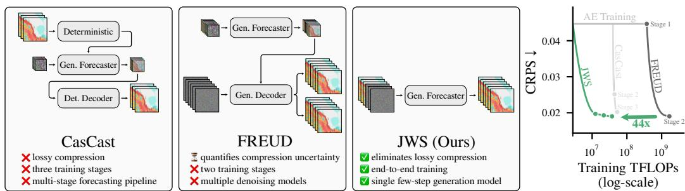  
Figure 1: Nowcasting made easy. We introduce JWS, an end-to-end, data-space nowcasting model, greatly simplifying training and inference while being 44× more efficient to train than the state-ofthe-art FREUD model at comparable CRPS.

## 1 INTRODUCTION

Short-term, high-resolution precipitation nowcasting is essential for applications ranging from renewable energy planning (Sperati et al., 2016; Wu et al., 2018) to emergency response (Salio et al., 2025). Useful nowcasts must resolve spatial details, update rapidly, and quantify uncertainty arising from chaotic dynamics and limited observability (Ravuri et al., 2021). Compared to numerical weather prediction, machine learning offers faster inference and learns directly from data. Yet, re gression averages plausible forecasts and thus produces increasingly blurry forecasts as uncertainty grows. Generative models instead sample plausible precipitation from the conditional distribution, enabling sharp individual forecasts and ensemble-based uncertainty quantification. Reliable probabilistic forecasting requires representing the full range of possibilities rather than concentrating on a few outcomes. Therefore, diffusion models are a natural fit due to their distributional coverage.

However, many diffusion-based nowcasting approaches rely on multi-stage training pipelines. Inspired by image generation (Rombach et al., 2022), latent space methods first train a compression model and learn denoising of forecasts only on compressed representations to reduce cost (Gao et al., 2023; Leinonen et al., 2023). Other approaches use a deterministic forecast to condition generation (Gong et al., 2024) or define a residual prediction task (Yu et al., 2024), resulting in up to three components. Beyond training complexity, these components introduce uncertainty and biases. While visually minor imperfections are acceptable in image synthesis, small errors in precipitation intensity and location can have a consequential impact. FREUD (Schusterbauer et al., 2026b) partially addresses this concern by modeling uncertainty from lossy compression with a generative decoder. Nevertheless, it retains a separate compression stage, and quantification of compression uncertainty requires ensembling many reconstructions per forecast, leading to multiplicative cost.

Therefore, prior work leaves the central challenge unresolved: how to build a simple, uncertaintyaware nowcasting model that makes efficient use of training and inference compute. We introduce Just Weather Scoring (JWS), an end-to-end generative model that avoids additional stages and operates directly on uncompressed data. We enable forecasting with a single transformer that is parametrized to predict clean radar maps (Li & He, 2025) and downsamples only by patchification. Our single-stage approach is more efficient and capable than pipelines with multiple trained components. Further, we introduce Masked Asynchronous Diffusion (MAD), preserving clean conditioning while sampling correlated, framewise noise levels for predicted timesteps, aligning training with forecasting. Thus, by training with MAD, JWS supports flexible conditioning. Spatiotemporal resolution-aware timestep sampling in MAD adapts corruption levels to uncompressed radar data.

As iterative denoising remains costly, we aim to reduce sampling steps. Flow Map methods (Boffi et al., 2025a) reduce denoising steps by directly learning the integration over diffusion time. However, canonical approaches (Geng et al., 2025; Frans et al., 2025; Boffi et al., 2025b) incur substantial overhead to construct training targets. Functional Generative Networks (FGNs) (Alet et al., 2025) use scoring-rule supervision to directly optimize probabilistic forecasts but introduce stochasticity only by noise injection into deterministic predictors, potentially limiting distributional coverage.

We seek to combine scoring-rule supervision with diffusion model coverage. Distributional Diffusion Models (DDM) (De Bortoli et al., 2025) replace vector field regression with scoring-rule supervision, training denoising models to represent the conditional posterior through ensembles of vector fields. With a conditional posterior, reverse transitions recover the data distribution even on a coarse time grid, enabling few-step inference (De Bortoli et al., 2025). However, balancing fewand many-step generation previously required careful tuning of interdependent variables. We propose simple Distributional Diffusion Models (sDDM), which are trained with a hyperparameter-free objective, linearly interpolating distributional CRPS and squared error.

With MAD and sDDM, JWS generates radar sequences directly in pixel space, eliminating additional pipeline stages and allocating computation entirely to generative forecasting. Our key insight is that standard transformers can support efficient end-to-end nowcasting by combining task-specific timestep sampling with distributional supervision. This yields simple and efficient training and inference with superior probabilistic forecasting, without lossy compression or deterministic priors.

Our contributions are as follows:

• End-to-end training: JWS is trained directly on sensor data without separately trained compression or deterministic forecasting stages, simplifying training and inference.

• Nowcasting-centric recipe: Masked Asynchronous Diffusion aligns conditioning observed during training and inference while preserving test-time flexibility.

• Simple distributional objective: simple Distributional Diffusion Models are trained with a hyperparameter-free objective, improving forecasting and enabling few-step sampling.

• Efficient nowcasting: Taken together, these components enable even our smallest model to achieve competitive nowcasting with approximately 17× fewer parameters than FlowCast and substantially lower inference cost than prior methods.

## 2 RELATED WORK

An extended Related Work section is found in Appendix Sec. D.

Precipitation nowcasting. Nowcasting refers to short-term, high-resolution forecasting. As rapid updates are typically required, numerical weather prediction systems (NWP) are unsuitable for precipitation nowcasting (Shi et al., 2015; Leinonen et al., 2023; Ravuri et al., 2021). Machine learning offers faster inference (Shi et al., 2015; Agrawal et al., 2019; Wang et al., 2017; Gao et al., 2022b). Yet, training with regression objectives yields blurry forecasts under uncertainty, thus the field shifted towards generative nowcasting methods (Ravuri et al., 2021; Zhang et al., 2023; Leinonen et al., 2023; Gao et al., 2023). Initially, generative adversarial networks were used (Good fellow et al., 2014; Ravuri et al., 2021; Zhang et al., 2023; Ji et al., 2022), yet adversarial training can induce mode collapse (Kossale et al., 2022). Therefore, diffusion-based nowcasting has become popular due to strong mode coverage and a principled mathematical foundation (Ho et al., 2020; Dhariwal & Nichol, 2021; Lipman et al., 2023). To reduce denoising complexity, two-stage latent diffusion methods are commonly used (Leinonen et al., 2023; Gao et al., 2023; Gong et al., 2024; Ribeiro & Pucer, 2026; Schusterbauer et al., 2026b) or generation is conditioned on deterministic priors (Yu et al., 2024; Gong et al., 2024; Zhu et al., 2026). Yet, FREUD (Schusterbauer et al., 2026b) finds these priors reduce distributional coverage, and inherently lossy compression induces additional uncertainty. They ensemble generative reconstructions, introducing computational overhead and maintaining separately trained stages. Alet et al. (2025) propose to directly supervise ensembles and predict multiple forecasts by perturbing parameters through noise injection. Yet, all stochasticity must be captured by the noise vector, thereby potentially limiting coverage. We instead propose to train end-to-end radar-space nowcasting, eliminating compression stages completely while retaining diffusion model coverage.

Pixel-space modeling. Latent diffusion (Rombach et al., 2022) enables high-resolution image (Esser et al., 2024) and video (Ho et al., 2022) generation. Perceptual (Zhang et al., 2018) and adversarial (Goodfellow et al., 2014) losses typically encourage losing mostly imperceptible details. However, the importance of small-scale variations in nowcasting limits applicability. Previously, ar chitecture adaptations for pixel-space generation were explored (Hoogeboom et al., 2023; Yu et al., 2025; Crowson et al., 2024). Recently, Li & He (2025) showed that standard transformers are indeed suitable. However, pixel-space nowcasting is especially challenging due to high data dimensionality. While RainDiff (Nguyen et al., 2025b) and PixelFlowCast (Zhu et al., 2026) perform pixel-space nowcasting, they rely on specialized architectures or only model residuals of deterministic forecasts. In comparison, we use standard transformers for end-to-end precipitation nowcasting.

Few-step sampling. Iterative denoising remains a bottleneck of diffusion. Distillation (Salimans & Ho, 2022; Sauer et al., 2023; Song et al., 2023; Yin et al., 2024b) drastically reduces latency, but requires two-stage training. Flow Maps (Boffi et al., 2025a) directly integrate larger steps. However, prominent MeanFlows (Geng et al., 2025) induce substantial training overhead, while Shortcut models (Frans et al., 2025) invest compute to produce self-bootstrapped targets. Alternatively, Distributional Diffusion Models (DDM) (De Bortoli et al., 2025) train denoising models with ensembles and scoring rule supervision, enabling few-step inference. Moreover, distributional supervision aligns with probabilistic forecasting (Alet et al., 2025). To scale DDM training, improved Distributional Diffusion Models (iDDM) (Martorella et al., 2026) expand the ensemble only for final layers. Yet, their loss relies on tuning interdependent parameters. We replace iDDM’s tuned parameter schedules with a simple interpolation between CRPS and squared error, achieving better nowcasting results without additional loss hyperparameters.

## 3 METHOD

## 3.1 PRELIMINARIES

Precipitation nowcasting. Given C radar observations $\mathbf { x } ^ { 1 : C }$ , with $\mathbf { x } ^ { t } \in \mathbb { R } ^ { H \times W }$ at time t, the goal of probabilistic precipitation nowcasting is to model the distribution $p ( \mathbf { x } ^ { C + 1 : C + L } \mid \mathbf { x } ^ { 1 : C } )$ of the next L precipitation frames. At inference, we sample multiple sequences to form a forecast ensemble, keeping the observed past fixed.

Spatio-temporal diffusion. Diffusion models learn to transform samples from a simple prior distribution into samples from the data distribution through denoising (Ho et al., 2020; Albergo et al., 2023; Lipman et al., 2023). In our setting, each sample is a complete radar sequence x $\mathbf { \Psi } _ { 1 } \in \mathbb { R } ^ { \breve { T } \times H \times W }$ of length $T = C + L$ Given a clean sequence $\mathbf { x } _ { 1 } ~ \sim ~ p _ { \mathrm { d a t a } }$ and independent Gaussian noise $\mathbf { x } _ { 0 } \sim \mathcal { N } ( 0 , \mathbf { I } )$ , we use a linear interpolant to construct noisy sequences at diffusion time $\tau \in [ 0 , 1 ] ;$

$$
\begin{array} { r } { \mathbf { x } _ { \tau } = \tau \mathbf { x } _ { 1 } + ( 1 - \tau ) \mathbf { x } _ { 0 } , \qquad \mathrm { w i t h } \quad \tau \sim p ( \tau ) . } \end{array}\tag{1}
$$

Here $\tau \in [ 0 , 1 ]$ controls corruption from noise $( \tau = 0 )$ to clean data $( \tau = 1 )$ and differs from the frame index t. The linear path has velocity $\mathbf { v } = \mathbf { x } _ { 1 } - \mathbf { x } _ { 0 } . ~ \mathrm { A }$ Flow Matching (Lipman et al., 2023) model $\mathbf { v } _ { \theta }$ is trained to predict this velocity by minimizing the squared error

$$
\begin{array} { r } { \mathcal { L } _ { \mathrm { F M } } = \mathbb { E } _ { \mathbf { x } _ { 0 } , \mathbf { x } _ { 1 } , \tau } \left[ \| \mathbf { v } - \mathbf { v } _ { \theta } ( \mathbf { x } _ { \tau } , \tau ) \| _ { 2 } ^ { 2 } \right] . } \end{array}\tag{2}
$$

At inference, we initialize a Gaussian noise sequence and numerically integrate the learned ODE $d \mathbf { x } _ { \tau } / d \tau = \mathbf { v } _ { \theta } ( \mathbf { x } _ { \tau } , \tau )$ from $\tau = 0 \mathrm { t o } \tau = 1$ The resulting sample follows the model distribution p , approximating p (Lipman et al., 2023). Sampling independent conditional forecasts enables ensemble-based uncertainty estimation. As ensemble size increases, sample variance converges to the learned predictive variance, which approximates aleatoric uncertainty (Chan et al., 2024).

Standard sequence diffusion uses a single diffusion time shared across frames. Hence, it corrupts all frames to the same degree. More generally, framewise corruption can be described by $\begin{array} { r l } { \tau } & { { } = } \end{array}$ $( \tau ^ { 1 } , \dots , \tau ^ { T } )$ , with $\mathbf { x } _ { \tau } ^ { t } = \bar { \tau ^ { t } } \mathbf { x } _ { 1 } ^ { t } + ( 1 - \bar { \tau ^ { t } } ) \mathbf { x } _ { 0 } ^ { t }$ . This accommodates clean context $( \tau ^ { t } = 1 )$ alongside noisy frames $( \tau ^ { t } < 1 )$ , whose diffusion times may be shared or vary across the sequence.

## 3.2 PIXEL-SPACE NOWCASTING

We aim to perform spatiotemporal diffusion directly on sensor data, generating radar fields in a single stage $( \mathrm { F i g . ~ 1 ) }$ . Eliminating latent compression avoids the associated uncertainty from lossy compression, devoting the inference budget to ensembling forecasts (Fig. 2). To support highdimensional diffusion, we adapt conditioning, prediction targets, and training-timestep sampling.

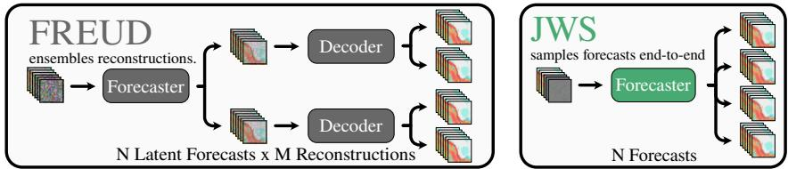  
Figure 2: Forecast ensembles in pixel space. Left: FREUD (Schusterbauer et al., 2026b) samples multiple reconstructions per forecast to represent reconstruction uncertainty. Right: JWS directly samples radar forecasts with a single model, removing the decoding stage.

Conditioning on observations. Forecasting inherently depends on available past observations. While training only for predicting $L$ frames given $C$ context frames is the trivial solution, more flexible conditioning is needed in practice (Schusterbauer et al., 2026b). Therefore, we first sample $k \sim \mathcal { U } ( 1 , k _ { \operatorname* { m a x } } ) , k _ { \operatorname* { m a x } } \leq T$ and then sample a set C of $k = | \mathcal { C } |$ frame indices randomly without replacement. The corresponding frames are used to form clean context. Therefore, $\tau ^ { t } = \dot { 1 } , \forall t \in \mathcal { C }$ With probability $p _ { U }$ we train for unconditional generation and set ${ \mathcal { C } } = \emptyset$ . For all frames that are not in the conditioning set, we sample individual diffusion times from a distribution $p ( \tau )$ . Thus $\tau ^ { t } \sim p ( \tau ) , \forall t \notin \mathcal { C }$ . At inference, this permits forecasting by conditioning on past observations $( { \mathcal { C } } = \{ 1 , . . . , C \} )$ , infilling by excluding missing frames from ${ \mathcal { C } } ,$ and conditioning on corrupted data by setting $\tau ^ { t } \neq \mathrm { { 1 } }$ to express confidence in individual frames.

Timestep sampling. Sampling the remaining timesteps $\tau ^ { t } , \forall t \notin \mathcal { C }$ independently would distribute them widely across different noise levels. Similar to Wewer et al. (2025) and Schusterbauer et al. (2026a) we find superior performance by concentrating them around a shared sequence-level center τ¯ while retaining variation across frames (Fig. 3a). We therefore sample centers uniformly $\bar { \tau } \sim$ $\mathcal { U } ( 0 , 1 )$ , and draw framewise timesteps as:

$$
\tilde { \tau } ^ { t } \sim \mathcal { N } ( \bar { \tau } , s _ { \bar { \tau } } ^ { 2 } ) , \qquad s _ { \bar { \tau } } = \operatorname* { m i n } \biggl \{ \sigma , \frac { \bar { \tau } } { 2 } , \frac { 1 - \bar { \tau } } { 2 } \biggr \} , \qquad t \notin \mathcal { C } .\tag{3}
$$

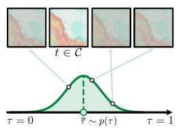  
(a) τ sampling.

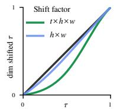  
(b) Timestep shift.

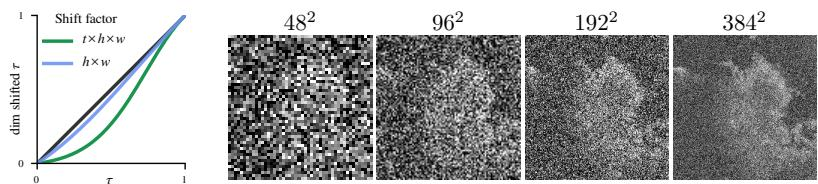  
(c) Radar corruption at τ = 0.4 without timestep shifting.  
Figure 3: Training corruption. (a) Framewise τ is sampled around a shared sequence-level center τ¯, retaining variation across frames while keeping context frames clean. (b) Dimensionality-aware timestep shifting increases corruption for larger spatiotemporal inputs. (c) Higher-resolution radar fields retain more structure at fixed corruption $( \tau = 0 . 4 )$ , motivating stronger noise.

Draws outside [0, 1] are replaced by uniform draws from $[ 0 , \bar { \tau } ] \mathbf { o r } \left[ \bar { \tau } , 1 \right]$ respectively. Note that setting $\sigma = 0$ recovers shared-timestep Random Masking Video Diffusion (RaMViD) (Hoppe et al., 2022)¨ used by FREUD (Schusterbauer et al., 2026b). Additionally, setting $p _ { U } = 1$ and replacing Eq. (3) with an independent uniform distribution recovers Diffusion Forcing (Chen et al., 2024). Setting $\sigma > 0$ and $p _ { U } ~ < ~ 1$ retains asynchronous denoising as in Diffusion Forcing and preserves clean context. We call our generalized scheme Masked Asynchronous Diffusion (MAD).

Dimensionality-aware corruption. As observed by Chen (2023) and Hoogeboom et al. (2023), higher-resolution inputs retain more structure at the same diffusion time τ (Fig. 3c). Stronger corruption is therefore needed at higher resolutions to maintain comparable denoising difficulty.

Prior work on pixel-space generative models (Li & He, 2025) samples diffusion timesteps from a logit-normal distribution $( \tau = \mathrm { s i g m o i d } ( u )$ , with $u \sim \mathcal N ( \mu , \sigma _ { \mathrm { L N } } ^ { 2 } ) )$ and scales the noise amplitude proportionally to the image side length relative to a $2 5 6 ^ { 2 } { \sf p x }$ reference. We instead seek a timestep sampling scheme that explicitly accounts for both spatial and temporal resolution.

We therefore extend resolution-dependent timestep shifting (Esser et al., 2024) to the full sequence dimensionality $D = T H W ( \mathrm { F i g . ~ } \bar { 3 } \mathrm { b } )$ ), relative to a reference base resolution $D _ { 0 } = T _ { 0 } H _ { 0 } W _ { 0 } ;$

$$
r ( \tilde { \tau } ^ { t } ) = \left( \frac { D _ { 0 } } { D } \right) ^ { ( 1 - \tilde { \tau } ^ { t } ) / 2 } , \qquad \tau ^ { t } = \frac { r ( \tilde { \tau } ^ { t } ) \tilde { \tau } ^ { t } } { 1 - \tilde { \tau } ^ { t } + r ( \tilde { \tau } ^ { t } ) \tilde { \tau } ^ { t } } .\tag{4}
$$

For $D > D _ { 0 }$ , this shifts intermediate towards noise, with vanishing correction towards clean data.

In summary, we first sample a sequence-level center $\bar { \tau } \sim \mathcal { U } ( 0 , 1 )$ , and then draw framewise timesteps $\tilde { \tau } ^ { t }$ according to Eq. (3). We then apply dimensionality-aware shifting to obtain the final timesteps $\tau ^ { t }$ . This preserves both endpoints $( \tau = 0 \mathrm { a n d } \tau = 1 )$ , leaving clean context unchanged. We find that this approach outperforms rescaled logit-normal sampling for spatiotemporal forecasting.

Prediction target. As discussed by Li & He (2025), under the manifold assumption, clean data has low-dimensional structure, unlike noise and velocity targets. This makes it easier to predict with limited network capacity in high-dimensional pixel space. Since prediction and loss parameterizations can be chosen independently, following Li & He (2025), we predict the clean sequence $\hat { \mathbf { x } } _ { 1 } = f _ { \theta } ( \mathbf { x } _ { \tau } , \tau )$ and compute the velocity-space loss (Eq. (2)) through the conversion:

$$
\mathbf { v } _ { \theta } ^ { t } = \frac { \hat { \mathbf { x } } _ { 1 } ^ { t } - \mathbf { x } _ { \tau } ^ { t } } { 1 - \tau ^ { t } } , \qquad t \notin \mathcal { C } , \quad \tau ^ { t } < 1 .\tag{5}
$$

While our method works with standard transformers, patch size imposes a trade-off between spatial detail and computational cost. Hierarchical models address this trade-off by preserving high-resolution features while moving expensive processing to lower resolutions. We therefore use an HDiT-style (Crowson et al., 2024) backbone (Fig. 4), with spatial attention in high-resolution layers and factorized spafltiotemporal attention only in the lower-resolution bottleneck after an additional downsampling step.

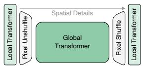  
Figure 4: HDiT backbone.

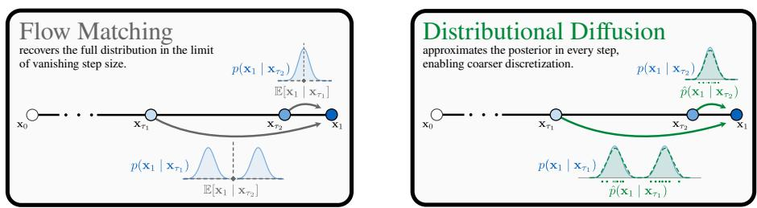

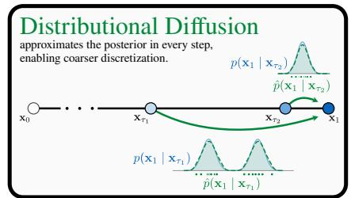  
Figure 5: Distributional Diffusion Models. Distributional Diffusion Models (De Bortoli et al., 2025) learn the posterior distribution, enabling sampling with coarser diffusion time discretization.

## 3.3 SIMPLE DISTRIBUTIONAL DIFFUSION

Flow matching models trained with Eq. (2) approximate the conditional mean velocity $\mathbf { v } ^ { \star } = \mathbb { E } [ \mathbf { x } _ { 1 } -$ $\mathbf { x } _ { 0 } \mid \mathbf { x } _ { \tau } , \tau ]$ . In the limit of vanishing step size, integrating this field recovers the data distribution. However, this no longer holds under coarse discretization with few denoising steps (De Bortoli et al., 2025) (Fig. 5). Instead, Distributional Diffusion Models (DDMs) (De Bortoli et al., 2025) learn the conditional posterior velocity $p ( \mathbf { v } | \mathbf { x } _ { \tau } , \tau )$ . For distributional supervision, a scoring rule over an ensemble replaces squared error regression. To produce an ensemble prediction during training, the model receives auxiliary noise $\xi \sim \mathcal { N } ( 0 , \mathbf { I } )$

For each fixed $\left( \mathbf { x } _ { \tau } , \tau \right)$ , drawing $M \geq 2$ independent auxiliary noise samples produces a population of predictions (particles), $V = \{ \mathbf { v } _ { i } \} _ { i = 1 } ^ { M }$ , where $\mathbf { v } _ { i } = \mathbf { v } _ { \theta } ( \mathbf { x } _ { \tau } , \tau , \xi _ { i } )$ . In our model, these velocities are obtained from stochastic clean-data predictions through Eq. (5).

From energy scores to a simple objective. For the particle population V and target velocity v, the generalized energy score (De Bortoli et al., 2025) loss is

$$
{ \mathcal { L } } _ { \lambda , \beta } = \underbrace { { \frac { 1 } { M } } \sum _ { i } \| \mathbf { v } - \mathbf { v } _ { i } \| _ { 2 } ^ { \beta } } _ { \mathrm { c o n f i n e m e n t } } - { \frac { \lambda } { 2 } } \underbrace { { \frac { 1 } { M ( M - 1 ) } } \sum _ { i \neq j } \| \mathbf { v } _ { i } - \mathbf { v } _ { j } \| _ { 2 } ^ { \beta } } _ { \mathrm { i n t e r a c t i o n } } .\tag{6}
$$

The confinement term encourages agreement with the target, while the interaction term promotes diversity. The parameters $\lambda \in [ 0 , 1 ]$ and $\beta \in ( 0 , 2 ]$ control interaction strength and the distance exponent, respectively. For $\lambda = 1$ and $0 < \beta < \bar { 2 } ,$ the score is strictly proper: its expectation is uniquely minimized by the target posterior. Setting $( \lambda , \beta ) = ( 0 , 2 )$ recovers squared-error loss. iDDM (Martorella et al., 2026) extends DDM by varying λ and $\beta$ with diffusion time to favor distributional supervision at high noise levels and regression near clean data.

We aim to build a simplified distributional objective that does not require λ and β schedule tuning. Further, radar-space prediction enables the direct use of CRPS, the proper scoring rule for scalar predictive distributions commonly used in evaluation of probabilistic forecasting methods. We therefore linearly interpolate two fixed losses:

$$
\boxed { \mathcal { L } _ { \mathrm { s i m p l e } } ( \tau ^ { t } ) = ( 1 - \tau ^ { t } ) \mathrm { C R P S } + \tau ^ { t } \mathrm { M S E } . }\tag{7}
$$

CRPS supervises scalar conditional marginals at each pixel, while particlewise MSE favors conditional means. The timestep-dependent interpolation transitions from marginal distributional supervision towards regression as the model approaches clean data. This is consistent with the observation that the conditional distribution becomes increasingly concentrated as $\tau  1$ (Biroli et al., 2024; Martorella et al., 2026). Thus, our objective for simple Distributional Diffusion Models (sDDM) is an easy-to-use drop-in replacement for squared error supervision which achieves superior performance to Flow Matching and iDDM in few- and many-step settings. We show the full training in Algorithm 1.

Efficient training and sampling. Standard flow matching can be viewed as single-particle training: each noisy input produces one prediction. Computing the interaction term requires $M \geq 2$ predictions for the same input. Following iDDM (Martorella et al., 2026), we avoid repeating the full network computation by sharing early transformer layer computations, then making M copies. To construct the particles, we concatenate independent auxiliary noise $\xi _ { i }$ to each copy along the token feature dimension, after modulating the noise with a learned τ -dependent gate. The remaining transformer layers process each particle separately. At inference, we use standard Euler sampling and keep context frames fixed throughout the denoising process.

Table 1: τ-sampling. Uniform p(τ) with $T \times \bar { H } \times W$ shift achieves superior performance.  
Table 2: Paradigm. We compare MAD to RaMViD and Diffusion Forcing.
<table><tr><td>T-sampling</td><td>CRPS↓</td><td>CSI ↑</td><td>RI↓</td></tr><tr><td>LN</td><td>0.0232</td><td>0.3081</td><td>0.3100</td></tr><tr><td>LN, noise ×1.5</td><td>0.0211</td><td>0.3698</td><td>0.8575</td></tr><tr><td> $\mathcal { U } , \dot { H } \times W$ </td><td>0.0210</td><td>0.3285</td><td>0.1109</td></tr><tr><td> $\mathcal { U } , T \times H \times W$ </td><td>0.0203</td><td>0.34670.1066</td><td></td></tr></table>

<table><tr><td>Paradigm</td><td>CRPS↓</td><td>CSI ↑</td><td>RI↓</td></tr><tr><td>Forcing</td><td>0.0317</td><td>0.2280</td><td>0.5301</td></tr><tr><td>RaMViD</td><td>0.0203</td><td>0.3467</td><td>0.1066</td></tr><tr><td>MAD uniform</td><td>0.0230</td><td>0.3380</td><td>0.2870</td></tr><tr><td> $\mathbf { M A D } \sigma = 0 . 1$ </td><td>0.0205</td><td>0.3545</td><td>0.0938</td></tr></table>

Table 3: Architecture. Hierarchical models with factorized attention outperform JiT.
<table><tr><td>Model B-scale</td><td>CRPS↓</td><td>CSI↑</td><td>ms/NFE↓</td></tr><tr><td>JiT</td><td>0.0193</td><td>0.3782</td><td>6.55</td></tr><tr><td>Fact. JiT</td><td>0.0195</td><td>0.3804</td><td>4.76</td></tr><tr><td>Hierarch.</td><td>0.0186</td><td>0.3895</td><td>6.05</td></tr><tr><td>Fact. Hierarch.</td><td>0.0182</td><td>0.4275</td><td>5.80</td></tr></table>

Table 4: Training objective. Distributional training (De Bortoli et al., 2025) enables few-step inference, but CRPS-only degrades at high NFE. sDDM outperforms iDDM (Martorella et al., 2026).

(a) CRPS ↓
<table><tr><td colspan="4">Method 5NFE 10 NFE 50 NFE</td></tr><tr><td>MSE</td><td>0.0208</td><td>0.0197</td><td>0.0188</td></tr><tr><td>CRPS</td><td>0.0182</td><td>0.0183</td><td>0.0189</td></tr><tr><td>iDDM</td><td>0.0188</td><td>0.0185</td><td>0.0183</td></tr><tr><td>sDDM</td><td>0.0183</td><td>0.0182</td><td>0.0178</td></tr><tr><td></td><td></td><td></td><td></td></tr></table>

(b) CSI ↑
<table><tr><td colspan="4">Method 5NFE 10 NFE 50 NFE</td></tr><tr><td>MSE</td><td>0.3654</td><td>0.3752</td><td>0.4004</td></tr><tr><td>CRPS</td><td>0.4177</td><td>0.4170</td><td>0.4114</td></tr><tr><td>iDDM</td><td>0.4088</td><td>0.4109</td><td>0.4104</td></tr><tr><td>sDDM</td><td>0.4219</td><td>0.4219</td><td>0.4116</td></tr></table>

## 4 EXPERIMENTS

We use SEVIR (Veillette et al., 2020) and MeteoNet (Larvor et al., 2020) to evaluate our method. After ablating model components on the SEVIR (Veillette et al., 2020) benchmark, we show generalization to the MeteoNet (Larvor et al., 2020) data. Following standard evaluation (Gong et al., 2024; Schusterbauer et al., 2026b), we report Continuous Ranked Probability Score (CRPS), Structural Similarity Index (SSIM), Heidke Skill Score (HSS), and Critical Success Index (CSI) over 6 thresholds. Additionally, we compute rank histograms and reliability index (RI) (Delle Monache et al., 2006; Wilks, 2019) for calibration. We use 50 sampling steps and evaluate 512 samples for ablations. Metric and evaluation details are found in Appendix Sec. C. Implementation details for our method and training procedure are found in Appendix Sec. A.

## 4.1 BUILDING JWS

The following experiments progressively build towards JWS starting from a naive pixel-space image diffusion baseline (Li & He, 2025). We use small models (24M params) unless noted otherwise. Additional ablations of hyperparameters (e.g., patch size, ensemble expansion, and training steps) are found in Appendix Sec. B.

Diffusion timestep sampling. Tab. 1 compares different $p ( \tau )$ for training. We follow Schusterbauer et al. (2026b) and instantiate MAD with $\sigma = 0$ recovering RaMViD (Hoppe et al., 2022).¨ Default Logit-normal sampling (LN) fails, LN with noise scaling achieves the best CSI, yet rescaled uniform achieves superior CRPS and RI. We therefore use rescaled Uniform sampling. In Tab. 2, MAD instantiations with $p _ { U } < 1$ , which preserve clean conditioning, outperform naive Diffusion Forcing. Setting $\sigma = 0 . 1 , \mathrm { i . e . }$ , sampling correlated timesteps for predicted frames, achieves strong performance while maintaining flexibility.

Architecture. Tab. 3 shows that MAD enables effective pixel-space nowcasting with standard transformers, i.e. without specialized architectural modifications. Hierarchical models further improve performance, while factorized spatiotemporal attention reduces computational cost.

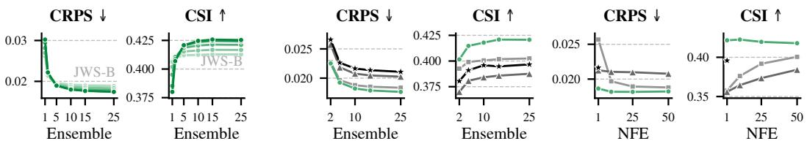  
NFE: 1 2 5 10 25 50  
JWS-S FM-S Shortcut-S FGN  
Figure 6: Inference time scaling. Left: JWS scales with ensemble size and NFEs. Right: JWS outperforms Flow Matching, Shortcut models, and FGN in matched comparisons using a single NFE.

Table 5: SOTA nowcasting on SEVIR. JWS achieves superior CRPS, SSIM, HSS, and RI on SEVIR. † model trained at 128<sup>2</sup> for better results. ⋆ metric computed with our pipeline.
<table><tr><td></td><td>Method</td><td>Stages</td><td>Param</td><td>CRPS↓</td><td>SSIM↑</td><td>HSS↑</td><td>CSI↑</td><td>RI*↓</td></tr><tr><td rowspan="4">Detesic</td><td>ConvLSTM (Shi et al., 2015) (NeurIPS 15)</td><td>1</td><td>14M</td><td>0.0264</td><td>0.7749</td><td>0.5232</td><td>0.4102</td><td></td></tr><tr><td>PredRNN (Wang et al., 2017) (TPAMI &#x27;22)</td><td>1</td><td>47M</td><td>0.0271</td><td>0.7497</td><td>0.5192</td><td>0.4045</td><td></td></tr><tr><td>PhyDNet (Guen &amp; Thome, 2020) (CVPR &#x27;20)</td><td>1</td><td>14M</td><td>0.0253</td><td>0.7649</td><td>0.5311</td><td>0.4198</td><td></td></tr><tr><td>SimVP (Gao et al., 2022a) (CVPR &#x27;22)</td><td>1</td><td>16M</td><td>0.0259</td><td>0.7772</td><td>0.5280</td><td>0.4153</td><td>一</td></tr><tr><td rowspan="5">Geuritve</td><td>EarthFormer (Gao et al., 2022b) (NeurIPS &#x27;22)</td><td>1</td><td>9M</td><td>0.0251</td><td>0.7756</td><td>0.5411</td><td>0.4310</td><td>一</td></tr><tr><td>NowcastNet (Zhang et al., 2023) (Nature &#x27;23)</td><td>1</td><td>35M</td><td>0.0283</td><td>0.5696</td><td>0.5365</td><td>0.4152</td><td>一</td></tr><tr><td>PreDiff† (Gao et al., 2023) (NeurIPS &#x27;23)</td><td>2</td><td>105M</td><td>0.0202</td><td>0.7648</td><td>0.4914</td><td>0.3875</td><td></td></tr><tr><td>CasCast (Gong et al., 2024) (ICML &#x27;24)</td><td>3</td><td>402M</td><td>0.0202</td><td>0.7797</td><td>0.5602</td><td>0.4401</td><td>0.3124</td></tr><tr><td>FlowCast (Ribeiro &amp; Pucer, 2026) (ICLR &#x27;26)</td><td>2</td><td>160M</td><td>0.0182</td><td></td><td>0.5863</td><td>0.4651</td><td>0.6835</td></tr><tr><td></td><td>FREUD (Schusterbauer et al., 2026b) (CVPR &#x27;26)</td><td>2</td><td>521M</td><td>0.0190</td><td>0.7841</td><td>0.5011</td><td>0.3864</td><td>0.1355</td></tr><tr><td></td><td>JWS-T/32 (ours)</td><td>1</td><td>9M</td><td>0.0184</td><td>0.8016</td><td>0.5132</td><td>0.3948</td><td>0.0949</td></tr><tr><td></td><td>JWS-S/32 (ours)</td><td>1</td><td>24M</td><td>0.0178</td><td>0.8057</td><td>0.5327</td><td>0.4116</td><td>0.0966</td></tr><tr><td></td><td>JWS-B/32 (ours)</td><td>1</td><td>94M</td><td>0.0176</td><td>0.8092</td><td>0.5408</td><td>0.4180</td><td>0.0956</td></tr><tr><td></td><td>JWS-L/32 (ours)</td><td>1</td><td>340M</td><td>0.0175</td><td>0.8122</td><td>0.5428</td><td>0.4183</td><td>0.1908</td></tr><tr><td>with CFG = 1.5</td><td></td><td>1</td><td>340M</td><td>0.0177</td><td>0.8023</td><td>0.5894</td><td>0.4581</td><td>0.1815</td></tr></table>

Distributional objective. Tab. 4 compares squared error, CRPS, iDDM, and sDDM objectives. sDDM achieves strong performance for low and high NFE settings, while default squared-error Flow Matching requires many iterations and training only with CRPS deteriorates for high NFE. Fig. 6 highlights inference time scaling. Further, JWS outperforms alternative methods even with a single function evaluation. In summary, sDDM achieves strong results with limited compute and scalability to larger inference budgets.

## 4.2 SYSTEM-LEVEL WEATHER NOWCASTING

SOTA nowcasting. In Tab. 5 JWS achieves better CRPS, SSIM, and RI on SEVIR than previous methods without classifier-free guidance (CFG). Using guidance, we additionally achieve superior HSS and perform second-best on CSI. We achieve state-of-the-art with a simplified, efficient pipeline. JWS-T performs competitively with much larger models and enables probabilistic nowcasting with a small footprint. Fig. 7 qualitatively shows sharp realistic forecasts over lead time. Additional qualitative comparisons are found in Appendix Sec. E.2. Tab. 6 evaluates JWS on MeteoNet. JWS achieves the best reported CRPS and SSIM. Guidance further improves HSS and CSI, achieving the best reported scores for these metrics. The 9M parameter JWS-T model outperforms previous methods in CRPS. Fig. 8 shows that even with 50 NFE JWS provides forecasts faster than CasCast or FREUD. One-step JWS-B produces a 10-member ensemble forecast in less than a second and performs competitively with CasCast and FREUD models. Appendix Sec. E.4 qualitatively shows that JWS produces strong forecasts with single- or few-step sampling.

Zero-shot deterministic conditioning. Our training paradigm enables conditioning on deterministic forecasts, similar to CasCast (Gong et al., 2024), but without requiring such priors during training. Following Schusterbauer et al. (2026b), we initialize denoising from noised EarthFormer (Gao et al., 2022b) predictions. Hereby, the noising timestep τ controls the strength of the deterministic prior: larger τ preserves more of the forecast, while smaller τ replaces it increasingly with noise and thus gives the generative model more freedom to deviate from it. As shown in Fig. 9, weak deterministic priors improve CSI and HSS up to $\tau = 0 . 2 .$ , but any deterministic conditioning consistently deteriorates calibration.

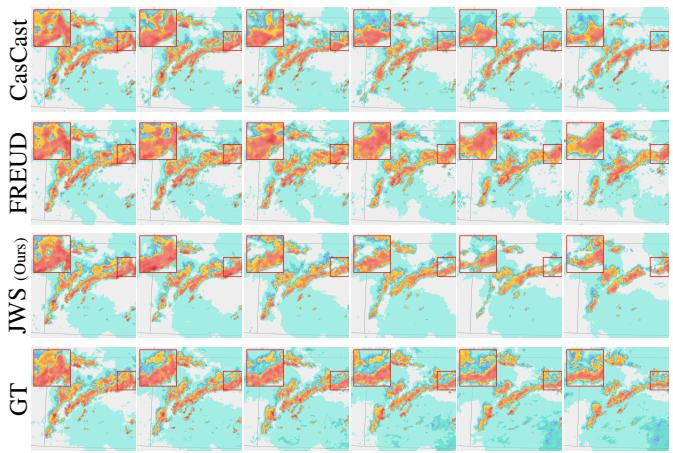

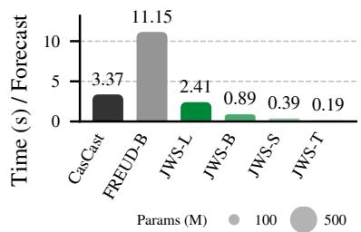

Figure 7: Qualitative forecast comparison. JWS produces sharp forecasts that align with the ground truth and remains more realistic over leadtime than FREUD and CasCast.  
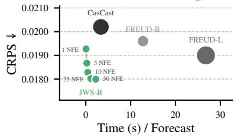  
Figure 8: Latency. JWS enables faster inference at matched (20) NFE and strong few-step results.

Table 6: MeteoNet nowcasting. JWS achieves state-of-the-art nowcasting on MeteoNet. JWS-T outperforms 40× larger models in CRPS. ⋆ metric computed with our pipeline.
<table><tr><td colspan="2">Method</td><td>Stages</td><td>Param</td><td>CRPS↓</td><td>SSIM↑</td><td>HSS↑</td><td>CSI↑</td><td> $\mathbf { R } \mathbf { I } ^ { \star } \downarrow$ </td></tr><tr><td>D.</td><td>EarthFormer (Gao et al., 2022b) ) (NeurIPS &#x27;22)</td><td>1</td><td>9M</td><td>0.0224</td><td></td><td></td><td>0.2831</td><td></td></tr><tr><td></td><td>NowcastNet (Zhang et al., 2023) (Nature &#x27;23)</td><td>1</td><td>35M</td><td>0.0277</td><td></td><td></td><td>0.2955</td><td></td></tr><tr><td></td><td>PreDiff (Gao et al., 2023) (NeurIPS 23)</td><td>2</td><td>105M</td><td>0.0197</td><td></td><td></td><td>0.2546</td><td></td></tr><tr><td>Genrive</td><td>CasCast (Gong et al., 2024) (ICML 24)</td><td>3</td><td>402M</td><td>0.0180</td><td></td><td></td><td>0.3156</td><td></td></tr><tr><td></td><td>FREUD (Schusterbauer et al., 2026b) (CVPR &#x27;26)</td><td>2</td><td>521M</td><td>0.0193</td><td>0.7312</td><td>0.2082</td><td>0.1417</td><td></td></tr><tr><td></td><td>JWS-T/32 (ours)</td><td>1</td><td>9M</td><td>0.0143</td><td>0.7887</td><td>0.4026</td><td>0.2851</td><td>0.2376</td></tr><tr><td></td><td>JWS-S/32 (ours)</td><td>1</td><td>24M</td><td>0.0141</td><td>0.7917</td><td>0.4079</td><td>0.2891</td><td>0.3100</td></tr><tr><td></td><td>JWS-B/32 (ours)</td><td>1</td><td>94M</td><td>0.0144</td><td>0.7967</td><td>0.4206</td><td>0.2955</td><td>0.3858</td></tr><tr><td></td><td>JWS-L/32 (ours)</td><td>1</td><td>340M</td><td>0.0138</td><td>0.7974</td><td>0.4186</td><td>0.2959</td><td>0.0773</td></tr><tr><td></td><td> $\downarrow \mathrm { w i t h } \mathrm { C F G } = 1 . 5$ </td><td>1</td><td>340M</td><td>0.0141</td><td>0.7904</td><td>0.4816</td><td>0.3448</td><td>0.5719</td></tr></table>

Beyond global prior strength, MAD allows assigning different diffusion timesteps to individual frames, enabling time-dependent confidence in the deterministic forecast. Using small JWS models, Fig. 21 shows that cleaner priors for early frames and noisier priors for later frames improve CRPS, reliability, and CSI compared to uniform prior strength. The RaMViD baseline, which does not support such framewise confidence, underperforms particularly in calibration.

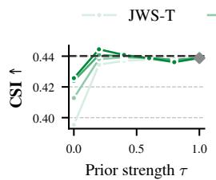

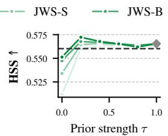

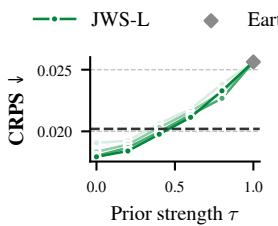

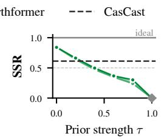  
Figure 9: Deterministic conditioning. Conditioning on a deterministic forecast as explored by CasCast (Gong et al., 2024) improves CSI and HSS, but consistently degrades calibration.

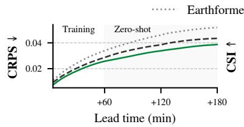

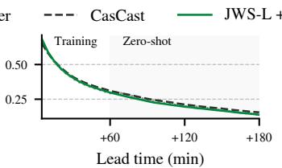

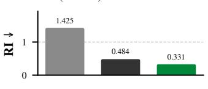

Figure 10: Zero-shot evaluation on SEVIR-Long. JWS shows superior zero-shot extrapolation performance to 180 min into the future (36 frames), while also better calibrated.  
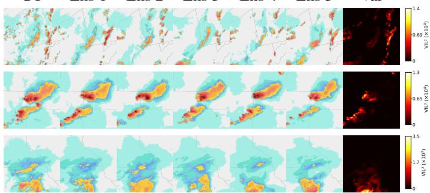  
Figure 11: Qualitative forecast ensemble. At +60 min ensemble variance is aligned with precipitation intensity.

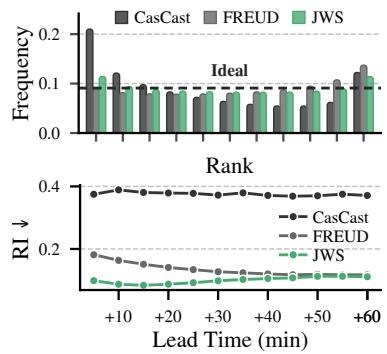  
Figure 12: Calibration. JWS produces flatter rank histograms.

Zero-shot sequence-length extrapolation. We evaluate zero-shot lead-time extrapolation, extending forecasts from 12 to 36 predicted frames without additional training. To enable a fair comparison with CasCast (Gong et al., 2024), which relies on deterministic conditioning and to stabilize forecasts beyond the training horizon, we leverage our training paradigm’s ability to condition on deterministic priors at inference time. Similar to CasCast, we condition on EarthFormer (Gao et al., 2022b) predictions. Fig. 10 shows that JWS achieves superior CRPS and calibration (RI) while remaining competitive in CSI. Moreover, JWS substantially improves over the deterministic Earth-Former prior, demonstrating the benefit of generative refinement for long-horizon forecasting.

Calibrated uncertainty estimates. In Fig. 12 JWS rank histograms are flatter than for FREUD and CasCast. Calibration remains superior over lead time. In Fig. 11 ensembles at +60 min maintain accurate global structure, with local variability. Heatmaps reveal uncertainty in high precipitation regions, aligned with chaotic dynamics. Appendix Sec. E.3 shows more qualitative ensembles.

## 5 CONCLUSION

Precipitation nowcasting requires rapid updates and calibrated uncertainty. We present JWS, a simple end-to-end generative nowcasting method. JWS does not rely on compression models. Thus, ensembling quantifies uncertainty directly in radar-space. Training with a distributional objective unlocks few-step sampling at inference time, drastically reducing latency. Our approach achieves state-of-the-art probabilistic nowcasting performance on the SEVIR and MeteoNet benchmarks. Our approach is scalable with respect to the model size and the available computational budget at inference time, while efficient settings perform competitively. By greatly simplifying training and inference, we hope that JWS can be easily adopted by meteorological practitioners.

## ACKNOWLEDGMENTS

We thank Ming Gui and Ulrich Prestel for providing helpful feedback on an early draft of the paper and Owen Vincent for continuous technical support. This project has been supported by the bidt project KLIMA-MEMES, the Horizon Europe project ELLIOT (GA No. 101214398), the project “GeniusRobot” (01IS24083) funded by the Federal Ministry of Research, Technology and Space (BMFTR), the BMWE ZIM-project (No. KK5785001LO4) “conIDitional LoRA”, and the German Federal Ministry for Economic Affairs and Energy within the project “NXT GEN AI METHODS - Generative Methoden fur Perzeption, Pr ¨ adiktion und Planung”. The authors gratefully acknowl- ¨ edge the Gauss Center for Supercomputing for providing compute through the NIC on JUWEL-S/JUPITER at JSC and the HPC resources supplied by the NHR@FAU Erlangen.

## AI USE STATEMENT

In this work, we used generative AI tools to design and provide feedback on the methodology and experiments, as well as to assist with implementing methods. We have not used generative AI tools to help develop theoretical or conceptual frameworks, formulate mathematical claims, provide critical ingredients for proving mathematical claims, propose or refine hypotheses, assist with translation, cleaning, and reformatting datasets, support qualitative and thematic data analysis, or interpret results. Synthetic data generation and assistance in writing proofs are not applicable to this work. Additionally, we used generative AI tools to create or modify scientific figures, develop and edit software code, summarize existing literature, brainstorm, source and search for information, edit the research paper for readability, and identify relevant literature. We have reviewed all AI-assisted work. Methodology, experiments, and brainstorming results were discussed among at least two researchers. LLM-generated code was verified and tested. The LLM-assisted literature search was followed up by a manual literature review and verification of the summaries by at least two researchers. Finally, AI-generated figures were manually verified and improved. Figures were discussed with at least two researchers to ensure correctness and clarity. We take responsibility for the final content of this work, including text, claims, or artifacts produced with generative AI.

## REPRODUCIBILITY STATEMENT

JWS is trained using publicly available datasets (Veillette et al., 2020; Larvor et al., 2020). We detail training in Appendix A and data processing in Appendix C.3. JWS is a simple method that works with standard transformers (Tab. 3) requiring only minimal modifications (Sec. 3). Additionally, we detail hyperparameter settings in the Appendix in Tab. 7. We build upon existing evaluation pipelines from Gong et al. (2024) and Schusterbauer et al. (2026b) and detail evaluation protocols and metrics in Appendix Sec. C. Therefore, JWS is easy to reproduce from scratch. However, we additionally release code, model checkpoints, and evaluation pipelines.

## REFERENCES

Shreya Agrawal, Luke Barrington, Carla Bromberg, John Burge, Cenk Gazen, and Jason Hickey. Machine learning for precipitation nowcasting from radar images. arXiv preprint arXiv:1912.12132, 2019.

Michael S Albergo, Nicholas M Boffi, and Eric Vanden-Eijnden. Stochastic interpolants: A unifying framework for flows and diffusions. arXiv preprint arXiv:2303.08797, 2023.

Ferran Alet, Ilan Price, Andrew El-Kadi, Dominic Masters, Stratis Markou, Tom R. Andersson, Jacklynn Stott, Remi Lam, Matthew Willson, Alvaro Sanchez-Gonzalez, and Peter Battaglia. Skillful joint probabilistic weather forecasting from marginals, 2025.

Giulio Biroli, Tony Bonnaire, Valentin de Bortoli, and Marc Mezard. Dynamical regimes of diffu-´ sion models, 2024.

Nicholas M. Boffi, Michael S. Albergo, and Eric Vanden-Eijnden. Flow map matching with stochastic interpolants: A mathematical framework for consistency models, 2025a.

Nicholas M. Boffi, Michael S. Albergo, and Eric Vanden-Eijnden. How to build a consistency model: Learning flow maps via self-distillation, 2025b.

Matthew A. Chan, Maria J. Molina, and Christopher A. Metzler. Hyper-Diffusion: Estimating Epistemic and Aleatoric Uncertainty with a Single Model, February 2024.

Boyuan Chen, Diego Marti Monso, Yilun Du, Max Simchowitz, Russ Tedrake, and Vincent Sitzmann. Diffusion Forcing: Next-token prediction meets full-sequence diffusion, December 2024.

Shengchao Chen, Guodong Long, Jing Jiang, Dikai Liu, and Chengqi Zhang. Foundation Models for Weather and Climate Data Understanding: A Comprehensive Survey, December 2023.

Shoufa Chen, Chongjian Ge, Shilong Zhang, Peize Sun, and Ping Luo. Pixelflow: Pixel-space generative models with flow, 2025.

Ting Chen. On the importance of noise scheduling for diffusion models. arXiv preprint arXiv:2301.10972, 2023.

Ting Chen and Lala Li. Fit: Far-reaching interleaved transformers, 2023.

Zhennan Chen, Junwei Zhu, Xu Chen, Jiangning Zhang, Xiaobin Hu, Hanzhen Zhao, Chengjie Wang, Jian Yang, and Ying Tai. Dip: Taming diffusion models in pixel space, 2026.

P. Cheung and H.Y. Yeung. Application of optical-flow technique to significant convection nowcast for terminal areas in Hong Kong. In The 3rd WMO International Symposium on Nowcasting and Very Short-Range Forecastin, Rio de Janeiro, Brazil, 2012. WMO.

Katherine Crowson, Stefan Andreas Baumann, Alex Birch, Tanishq Mathew Abraham, Daniel Z. Kaplan, and Enrico Shippole. Scalable High-Resolution Pixel-Space Image Synthesis with Hourglass Diffusion Transformers. In Proceedings of the 41st International Conference on Machine Learning, pp. 9550–9575. PMLR, 2024.

Valentin De Bortoli, Alexandre Galashov, J Swaroop Guntupalli, Guangyao Zhou, Kevin Patrick Murphy, Arthur Gretton, and Arnaud Doucet. Distributional diffusion models with scoring rules. In Forty-second International Conference on Machine Learning, 2025. URL https: //openreview.net/forum?id=N82967FcVK.

Luca Delle Monache, Joshua P. Hacker, Yongmei Zhou, Xingxiu Deng, and Roland B. Stull. Probabilistic aspects of meteorological and ozone regional ensemble forecasts. Journal of Geophysi cal Research: Atmospheres, 111(D24):2005JD006917, December 2006. ISSN 0148-0227. doi: 10.1029/2005JD006917.

Prafulla Dhariwal and Alexander Nichol. Diffusion models beat gans on image synthesis. Advances in Neural Information Processing Systems, 34:8780–8794, 2021.

Alexey Dosovitskiy, Lucas Beyer, Alexander Kolesnikov, Dirk Weissenborn, Xiaohua Zhai, Thomas Unterthiner, Mostafa Dehghani, Matthias Minderer, G Heigold, S Gelly, et al. An image is worth 16x16 words: Transformers for image recognition at scale. In ICLR, 2020.

Lasse Espeholt, Shreya Agrawal, Casper Sønderby, Manoj Kumar, Jonathan Heek, Carla Bromberg, Cenk Gazen, Rob Carver, Marcin Andrychowicz, Jason Hickey, et al. Deep learning for twelve hour precipitation forecasts. Nature communications, 13(1):5145, 2022.

Patrick Esser, Sumith Kulal, Andreas Blattmann, Rahim Entezari, Jonas Muller, Harry Saini, Yam¨ Levi, Dominik Lorenz, Axel Sauer, Frederic Boesel, et al. Scaling rectified flow transformers for high-resolution image synthesis. In ICML, 2024.

Kevin Frans, Danijar Hafner, Sergey Levine, and Pieter Abbeel. One step diffusion via shortcut models, 2025.

Rohit Gandikota and David Bau. Distilling diversity and control in diffusion models, 2025.

Zhangyang Gao, Cheng Tan, Lirong Wu, and Stan Z Li. Simvp: Simpler yet better video prediction. In Proceedings of the IEEE/CVF Conference on Computer Vision and Pattern Recognition, pp. 3170–3180, 2022a.

Zhihan Gao, Xingjian Shi, Hao Wang, Yi Zhu, Yuyang Bernie Wang, Mu Li, and Dit-Yan Yeung. Earthformer: Exploring space-time transformers for earth system forecasting. Advances in Neural Information Processing Systems, 35:25390–25403, 2022b.

Zhihan Gao, Xingjian Shi, Boran Han, Hao Wang, Xiaoyong Jin, Danielle Maddix, Yi Zhu, Mu Li, and Yuyang (Bernie) Wang. Prediff: Precipitation nowcasting with latent diffusion models. In A. Oh, T. Naumann, A. Globerson, K. Saenko, M. Hardt, and S. Levine (eds.), Advances in Neural Information Processing Systems, volume 36, pp. 78621–78656. Curran Associates, Inc., 2023. URL https://proceedings.neurips.cc/paper\_files/paper/2023/ file/f82ba6a6b981fbbecf5f2ee5de7db39c-Paper-Conference.pdf.

Zhengyang Geng, Mingyang Deng, Xingjian Bai, J. Zico Kolter, and Kaiming He. Mean flows for one-step generative modeling, 2025.

Zhengyang Geng, Yiyang Lu, Zongze Wu, Eli Shechtman, J. Zico Kolter, and Kaiming He. Improved mean flows: On the challenges of fastforward generative models, 2026.

Urs Germann and Isztar Zawadzki. Scale-Dependence of the Predictability of Precipitation from Continental Radar Images. Part I: Description of the Methodology. Monthly Weather Review, 130 (12):2859–2873, December 2002. ISSN 1520-0493, 0027-0644. doi: 10.1175/1520-0493(2002) 130⟨2859:SDOTPO⟩2.0.CO;2.

Tilmann Gneiting and Adrian E. Raftery. Strictly proper scoring rules, prediction, and estimation. Journal ofthe American statistical Association, 102(477):359–378, 2007. ISBN: 0162-1459.

Junchao Gong, Lei Bai, Peng Ye, Wanghan Xu, Na Liu, Jianhua Dai, Xiaokang Yang, and Wanli Ouyang. CasCast: Skillful high-resolution precipitation nowcasting via cascaded modelling. In Proceedings of the 41st International Conference on Machine Learning, volume 235 of ICML’24, pp. 15809–15822, Vienna, Austria, 2024. JMLR.org.

Ian Goodfellow, Jean Pouget-Abadie, Mehdi Mirza, Bing Xu, David Warde-Farley, Sherjil Ozair, Aaron Courville, and Yoshua Bengio. Generative adversarial nets. In Z. Ghahramani, M. Welling, C. Cortes, N. Lawrence, and K.Q. Weinberger (eds.), Advances in Neural Information Processing Systems, volume 27. Curran Associates, Inc., 2014. URL https://proceedings.neurips.cc/paper/2014/file/ 5ca3e9b122f61f8f06494c97b1afccf3-Paper.pdf.

Vincent Le Guen and Nicolas Thome. Disentangling physical dynamics from unknown factors for unsupervised video prediction. In Proceedings ofthe IEEE/CVF Conference on Computer Vision and Pattern Recognition, pp. 11474–11484, 2020.

Yi Guo, Wei Wang, Zhihang Yuan, Rong Cao, Kuan Chen, Zhengyang Chen, Yuanyuan Huo, Yang Zhang, Yuping Wang, Shouda Liu, and Yuxuan Wang. SplitMeanFlow: Interval Splitting Consistency in Few-Step Generative Modeling, July 2025. URL http://arxiv.org/abs/2507. 16884. arXiv:2507.16884 [cs] version: 1.

Ali Hassani, Steven Walton, Jiachen Li, Shen Li, and Humphrey Shi. Neighborhood Attention Transformer. In Proceedings of the IEEE/CVF Conference on Computer Vision and Pattern Recognition, pp. 6185–6194, 2023.

Yingqing He, Tianyu Yang, Yong Zhang, Ying Shan, and Qifeng Chen. Latent Video Diffusion Models for High-Fidelity Long Video Generation, March 2023.

Byeongho Heo, Song Park, Dongyoon Han, and Sangdoo Yun. Rotary Position Embedding for Vision Transformer, 2024.

Jonathan Ho and Tim Salimans. Classifier-Free Diffusion Guidance, 2022.

Jonathan Ho, Ajay Jain, and Pieter Abbeel. Denoising diffusion probabilistic models. Advances in Neural Information Processing Systems, 33:6840–6851, 2020.

Jonathan Ho, Tim Salimans, Alexey Gritsenko, William Chan, Mohammad Norouzi, and David J Fleet. Video diffusion models. arXiv preprint arXiv:2204.03458, 2022.

Jordan Hoffmann, Sebastian Borgeaud, Arthur Mensch, Elena Buchatskaya, Trevor Cai, Eliza Rutherford, Diego de Las Casas, Lisa Anne Hendricks, Johannes Welbl, Aidan Clark, et al. Training compute-optimal large language models. arXiv preprint arXiv:2203.15556, 2022.

Emiel Hoogeboom, Jonathan Heek, and Tim Salimans. simple diffusion: End-to-end diffusion for high resolution images. arXiv preprint arXiv:2301.11093, 2023.

Emiel Hoogeboom, Thomas Mensink, Jonathan Heek, Kay Lamerigts, Ruiqi Gao, and Tim Sali mans. Simpler diffusion (sid2): 1.5 fid on imagenet512 with pixel-space diffusion, 2025.

Tobias Hoppe, Arash Mehrjou, Stefan Bauer, Didrik Nielsen, and Andrea Dittadi. Diffusion models¨ for video prediction and infilling. arXiv preprint arXiv:2206.07696, 2022.

Yuhao Huang, Shih-Hsin Wang, Andrea L. Bertozzi, and Bao Wang. Rmflow: Refined mean flow by a noise-injection step for multimodal generation, 2026.

Junhwa Hur and Stefan Roth. Iterative Residual Refinement for Joint Optical Flow and Occlusion Estimation, 2019.

Allan Jabri, David J. Fleet, and Ting Chen. Scalable adaptive computation for iterative generation. In Proceedings of the 40th International Conference on Machine Learning, pp. 14569–14589. PMLR, 2023.

Yan Ji, Bing Gong, Michael Langguth, Amirpasha Mozaffari, and Xiefei Zhi. Clgan: A gan-based video prediction model for precipitation nowcasting. EGUsphere, pp. 1–23, 2022.

Youssef Kossale, Mohammed Airaj, and Aziz Darouichi. Mode Collapse in Generative Adversarial Networks: An Overview. In 2022 8th International Conference on Optimization and Applications (ICOA), pp. 1–6, October 2022. doi: 10.1109/ICOA55659.2022.9934291.

Gwennaelle Larvor, L¨ ea Berthomier, Vincent Chabot, Brice Le Pape, Bruno Pradel, and Lior´ Perez. Meteonet, an open reference weather dataset by meteo-france. URL https://meteonet.umrcnrm.fr/, 2020.

Jussi Leinonen, Ulrich Hamann, Daniele Nerini, Urs Germann, and Gabriele Franch. Latent diffusion models for generative precipitation nowcasting with accurate uncertainty quantification. arXiv preprint arXiv:2304.12891, 2023.

Tianhong Li and Kaiming He. Back to basics: Let denoising generative models denoise, 2025.

Yaron Lipman, Ricky TQ Chen, Heli Ben-Hamu, Maximilian Nickel, and Matthew Le. Flow matching for generative modeling. In ICLR, 2023.

Hong-Bin Liu and Ickjai Lee. MPL-GAN: Toward Realistic Meteorological Predictive Learning Using Conditional GAN. IEEE Access, 8:93179–93186, 2020. ISSN 2169-3536. doi: 10.1109/ ACCESS.2020.2995187.

Xingchao Liu, Chengyue Gong, and Qiang Liu. Flow Straight and Fast: Learning to Generate and Transfer Data with Rectified Flow, 2022.

Ilya Loshchilov and Frank Hutter. Decoupled Weight Decay Regularization, 2019.

Yiyang Lu, Susie Lu, Qiao Sun, Hanhong Zhao, Zhicheng Jiang, Xianbang Wang, Tianhong Li, Zhengyang Geng, and Kaiming He. One-step latent-free image generation with pixel mean flows, 2026.

Nanye Ma, Mark Goldstein, Michael S. Albergo, Nicholas M. Boffi, Eric Vanden-Eijnden, and Saining Xie. SiT: Exploring Flow and Diffusion-based Generative Models with Scalable Interpolant Transformers, 2024.

Tommaso Martorella, Alexandre Galashov, Felix Krause, Stefan Andreas Baumann, Valentin De Bortoli, Arthur Gretton, and Bjorn Ommer. Improved distributional diffusion models.¨ arXiv preprint arXiv:2609.37147, 2026.

Anh Nguyen, Viet Nguyen, Duc Vu, Trung Dao, Chi Tran, Toan Tran, and Anh Tran. Improved training technique for shortcut models, 2025a.

Thao Nguyen, Jiaqi Ma, Fahad Shahbaz Khan, Souhaib Ben Taieb, and Salman Khan. Raindiff: End-to-end precipitation nowcasting via token-wise attention diffusion, 2025b.

NOAA / National Centers For Environmental Information. NOAA Storm Events Database, 2020.

Dohyun Park, Changhoon Song, Tengyuan Chang, Yoo-Geun Ham, and Youngjoon Hong. Diffusion-based refinement for kilometer-scale probabilistic precipitation nowcasting, 2026a.

Joonhyeong Park, Giung Nam, Hyungi Lee, Kyunghyun Cho, Byoungwoo Park, and Juho Lee. Proper scoring rule-based diffusion for probabilistic weather forecasting, 2026b.

Jaideep Pathak, Shashank Subramanian, Peter Harrington, Sanjeev Raja, Ashesh Chattopadhyay, Morteza Mardani, Thorsten Kurth, David Hall, Zongyi Li, Kamyar Azizzadenesheli, Pedram Hassanzadeh, Karthik Kashinath, and Animashree Anandkumar. FourCastNet: A Global Datadriven High-resolution Weather Model using Adaptive Fourier Neural Operators, February 2022.

William Peebles and Saining Xie. Scalable Diffusion Models with Transformers, 2023.

Ilan Price, Alvaro Sanchez-Gonzalez, Ferran Alet, Tom R. Andersson, Andrew El-Kadi, Dominic Masters, Timo Ewalds, Jacklynn Stott, Shakir Mohamed, Peter Battaglia, Remi Lam, and Matthew Willson. GenCast: Diffusion-based ensemble forecasting for medium-range weather, May 2024.

Suman Ravuri, Karel Lenc, Matthew Willson, Dmitry Kangin, Remi Lam, Piotr Mirowski, Megan Fitzsimons, Maria Athanassiadou, Sheleem Kashem, Sam Madge, et al. Skilful precipitation nowcasting using deep generative models of radar. Nature, 597(7878):672–677, 2021.

Bernardo Perrone Ribeiro and Jana Faganeli Pucer. Flowcast: Advancing precipitation nowcasting with conditional flow matching, 2026.

Robin Rombach, Andreas Blattmann, Dominik Lorenz, Patrick Esser, and Bjorn Ommer. High-¨ resolution image synthesis with latent diffusion models. In Proceedings ofthe IEEE/CVF conference on computer vision and pattern recognition, pp. 10684–10695, 2022.

Olaf Ronneberger, Philipp Fischer, and Thomas Brox. U-Net: Convolutional Networks for Biomedical Image Segmentation. In Nassir Navab, Joachim Hornegger, William M. Wells, and Alejandro F. Frangi (eds.), Medical Image Computing and Computer-Assisted Intervention – MICCAI 2015, volume 9351, pp. 234–241. Springer International Publishing, Cham, 2015. ISBN 978-3- 319-24573-7 978-3-319-24574-4. doi: 10.1007/978-3-319-24574-4 28.

Hidetomo Sakaino. Spatio-Temporal Image Pattern Prediction Method Based on a Physical Model With Time-Varying Optical Flow. IEEE Transactions on Geoscience and Remote Sensing, 51(5): 3023–3036, May 2013. ISSN 1558-0644. doi: 10.1109/TGRS.2012.2212201.

Tim Salimans and Jonathan Ho. Progressive distillation for fast sampling of diffusion models, 2022.

Paola Salio, Luciana Stoll, Daniela D’Amen, Estelle De Coning, Hellen Msemo, Franziska Schmid, Solfrid Agersten, Anders Sivle, Andre Simon, and Maria Julia Chasco. Nowcasting and early´ warning systems across wmo regions associations: A pre-ew4all assessment. Bulletin of the American Meteorological Society, 106(12):E2490–E2508, 2025. ISSN 0003-0007, 1520-0477. doi: 10.1175/BAMS-D-24-0267.1.

Axel Sauer, Dominik Lorenz, Andreas Blattmann, and Robin Rombach. Adversarial diffusion distillation, 2023.

Johannes Schusterbauer, Ming Gui, Yusong Li, Pingchuan Ma, Felix Krause, and Bjorn Ommer. De- ¨ noising, fast and slow: Difficulty-aware adaptive sampling for image generation. In Proceedings of the IEEE/CVF Conference on Computer Vision and Pattern Recognition, 2026a.

Johannes Schusterbauer, Jannik Wiese, Nick Stracke, Timy Phan, and Bjorn Ommer. Probabilis-¨ tic precipitation nowcasting with rectified flow transformers. In Proceedings of the IEEE/CVF Conference on Computer Vision and Pattern Recognition, 2026b.

Noam Shazeer. GLU Variants Improve Transformer, February 2020. URL http://arxiv.org/ abs/2002.05202. arXiv:2002.05202 [cs].

Lei She, Chenghong Zhang, Xin Man, and Jie Shao. LLMDiff: Diffusion model using frozen llm transformers for precipitation nowcasting. Sensors, 24(18):6049, January 2024. ISSN 1424-8220. doi: 10.3390/s24186049.

Xingjian Shi, Zhourong Chen, Hao Wang, Dit-Yan Yeung, Wai-Kin Wong, and Wang-chun Woo. Convolutional lstm network: A machine learning approach for precipitation nowcasting. Advances in neural information processing systems, 28, 2015.

Xingjian Shi, Zhihan Gao, Leonard Lausen, Hao Wang, Dit-Yan Yeung, Wai-kin Wong, and Wangchun Woo. Deep learning for precipitation nowcasting: A benchmark and a new model. Advances in neural information processing systems, 30, 2017.

Casper Kaae Sønderby, Lasse Espeholt, Jonathan Heek, Mostafa Dehghani, Avital Oliver, Tim Salimans, Shreya Agrawal, Jason Hickey, and Nal Kalchbrenner. Metnet: A neural weather model for precipitation forecasting. arXiv preprint arXiv:2003.12140, 2020.

Changhoon Song, Teng Yuan Chang, and Youngjoon Hong. Extreme weather nowcasting via local precipitation pattern prediction, 2026.

Jiaming Song, Chenlin Meng, and Stefano Ermon. Denoising diffusion implicit models. arXiv preprint arXiv:2010.02502, 2020.

Yang Song, Prafulla Dhariwal, Mark Chen, and Ilya Sutskever. Consistency models, 2023.

Simone Sperati, Stefano Alessandrini, and Luca Delle Monache. An application of the ECMWF Ensemble Prediction System for short-term solar power forecasting. Solar Energy, 133:437–450, August 2016. ISSN 0038-092X. doi: 10.1016/j.solener.2016.04.016. URL https://www. sciencedirect.com/science/article/pii/S0038092X1630041X.

Jianlin Su, Yu Lu, Shengfeng Pan, Ahmed Murtadha, Bo Wen, and Yunfeng Liu. RoFormer: Enhanced Transformer with Rotary Position Embedding, 2023.

Mark Veillette, Siddharth Samsi, and Chris Mattioli. SEVIR : A Storm Event Imagery Dataset for Deep Learning Applications in Radar and Satellite Meteorology. In Advances in Neural Information Processing Systems, volume 33, pp. 22009–22019. Curran Associates, Inc., 2020.

Shuai Wang, Ziteng Gao, Chenhui Zhu, Weilin Huang, and Limin Wang. Pixnerd: Pixel neural field diffusion, 2025.

Yunbo Wang, Mingsheng Long, Jianmin Wang, Zhifeng Gao, and Philip S Yu. Predrnn: Recurrent neural networks for predictive learning using spatiotemporal lstms. Advances in neural information processing systems, 30, 2017.

Christopher Wewer, Bart Pogodzinski, Bernt Schiele, and Jan Eric Lenssen. Spatial reasoning with denoising models, 2025.

D. S. Wilks. Indices of Rank Histogram Flatness and Their Sampling Properties. Monthly Weather Review, 147(2):763–769, February 2019. ISSN 0027-0644, 1520-0493. doi: 10.1175/ MWR-D-18-0369.1.

Wang-chun Woo and Wai-kin Wong. Operational Application of Optical Flow Techniques to Radar-Based Rainfall Nowcasting. Atmosphere, 8(3):48, February 2017. ISSN 2073-4433. doi: 10. 3390/atmos8030048.

Yuan-Kang Wu, Po-En Su, Ting-Yi Wu, Jing-Shan Hong, and Mohammad Yusri Hassan. Probabilistic Wind-Power Forecasting Using Weather Ensemble Models. IEEE Transactions on Industry Applications, 54(6):5609–5620, November 2018. ISSN 0093-9994, 1939-9367. doi: 10.1109/TIA.2018.2858183.

Jingjing Xu, Xu Sun, Zhiyuan Zhang, Guangxiang Zhao, and Junyang Lin. Understanding and improving layer normalization, 2019.

Tianwei Yin, Michael Gharbi, Taesung Park, Richard Zhang, Eli Shechtman, Fredo Durand, and¨ William T. Freeman. Improved distribution matching distillation for fast image synthesis, 2024a.

Tianwei Yin, Michael Gharbi, Richard Zhang, Eli Shechtman, Fredo Durand, William T. Freeman,¨ and Taesung Park. One-step diffusion with distribution matching distillation, 2024b.

Demin Yu, Xutao Li, Yunming Ye, Baoquan Zhang, Chuyao Luo, Kuai Dai, Rui Wang, and Xunlai Chen. DiffCast: A Unified Framework via Residual Diffusion for Precipitation Nowcasting. In Proceedings of the IEEE/CVF Conference on Computer Vision and Pattern Recognition, pp. 27758–27767, 2024.

Yongsheng Yu, Wei Xiong, Weili Nie, Yichen Sheng, Shiqiu Liu, and Jiebo Luo. Pixeldit: Pixel diffusion transformers for image generation, 2025.

Biao Zhang and Rico Sennrich. Root Mean Square Layer Normalization. In Advances in Neural Information Processing Systems, volume 32. Curran Associates, Inc., 2019. URL https://papers.nips.cc/paper\_files/paper/2019/hash/ 1e8a19426224ca89e83cef47f1e7f53b-Abstract.html.

Richard Zhang, Phillip Isola, Alexei A Efros, Eli Shechtman, and Oliver Wang. The unreasonable effectiveness of deep features as a perceptual metric. In CVPR, 2018.

Yuchen Zhang, Mingsheng Long, Kaiyuan Chen, Lanxiang Xing, Ronghua Jin, Michael I Jordan, and Jianmin Wang. Skilful nowcasting of extreme precipitation with nowcastnet. Nature, 619 (7970):526–532, 2023.

Linqi Zhou, Stefano Ermon, and Jiaming Song. Inductive moment matching, 2025.

Yufeng Zhu, Chunlei Shi, Yongchao Feng, and Dan Niu. Pixelflowcast: Latent-free precipitation nowcasting via pixel mean flows, 2026.

## SUPPLEMENTARY MATERIALS

## A IMPLEMENTATION DETAILS

## We summarize architecture and training hyperparameters in Tab. 7.

Table 7: Hyperparameters. Settings of training runs for JWS across model size.
<table><tr><td>Parameter</td><td>JWS-T</td><td>JWS-S</td><td>JWS-B</td><td>JWS-L</td></tr><tr><td>Parameters (M)</td><td>9</td><td>24</td><td>94</td><td>340</td></tr><tr><td>High-resolution layers (down &amp; up)</td><td>2</td><td>2</td><td>2</td><td>2</td></tr><tr><td>Bottleneck</td><td>6</td><td>8</td><td>8</td><td>20</td></tr><tr><td>High resolution hidden dimension</td><td>192</td><td>256</td><td>512</td><td>768</td></tr><tr><td>Bottleneck hidden dimension</td><td>256</td><td>384</td><td>768</td><td>1024</td></tr><tr><td>Attention heads (HiRes/Bottleneck)</td><td>3/4</td><td>4/6</td><td>8/12</td><td>12/16</td></tr><tr><td>Normalization</td><td></td><td></td><td>RMSNorm (Zhang &amp; Sennrich, 2019)</td><td></td></tr><tr><td>FFN expansion factor</td><td colspan="4">3×</td></tr><tr><td>Activations</td><td colspan="4">SwiGLU (Shazeer, 2020)</td></tr><tr><td>Positional embeddings</td><td colspan="4">3D Axial RoPE (Su et al., 2023; Heo et al., 2024)</td></tr><tr><td>Diffusion time mapping dimension</td><td colspan="4">128 128 384</td></tr><tr><td>Diffusion time mapping depth</td><td colspan="4">2 2 2</td></tr><tr><td>Diffusion time conditioning</td><td colspan="4">AdaNorm (Peebles &amp; Xie, 2023; Xu et al., 2019)</td></tr><tr><td>Input patch size (T × H × W)</td><td colspan="4"> $1 \times 1 6 \times 1 6$ </td></tr><tr><td>Total bottleneck patch size (T × H × W) High resolution attention window (T × H × W)</td><td colspan="4"> $1 \times 3 2 \times 3 2$   $1 \times 5 \times 5$ </td></tr><tr><td></td><td colspan="4">0.1</td></tr><tr><td>Tbar σ Tbar sampling</td><td colspan="4">Uniform + T × H × W shift</td></tr><tr><td>Maximum conditioning frames kmax</td><td colspan="4">13</td></tr><tr><td>Unconditional probability pU</td><td colspan="4">0.25</td></tr><tr><td>Training particles 3</td><td colspan="4">3 3</td></tr><tr><td>Expansion before layer</td><td colspan="4">8 10 10</td></tr><tr><td>ξ embedding dimension</td><td colspan="4">256</td></tr><tr><td>ξ conditioning</td><td colspan="4">Timestep-gated residual concatenation (Martorella et al., 2026)</td></tr><tr><td>Training frame resolution</td><td colspan="4">384 × 384</td></tr><tr><td>Training sequence length</td><td colspan="4">25</td></tr><tr><td>SEVIR training sequences</td><td colspan="4">402,500 (16,100 events × 25 windows)</td></tr><tr><td></td><td colspan="4">AdamW (Loshchilov &amp; Hutter, 2019)</td></tr><tr><td>Optimizer</td><td colspan="4">(0.9,0.999)</td></tr><tr><td>AdamW (β1, β2) Learning rate</td><td colspan="4">10⁻⁴</td></tr><tr><td>Learning-rate schedule</td><td colspan="4">Constant with 1,000 warmup steps</td></tr><tr><td>EMA decay</td><td colspan="4">0.9999</td></tr><tr><td>Precision</td><td colspan="4">BF16 mixed precision</td></tr><tr><td></td><td colspan="4">128</td></tr><tr><td>Global Batch size</td><td colspan="4">8 8</td></tr><tr><td>Training GPUs</td><td colspan="4">8 300k</td></tr><tr><td>Training steps</td><td colspan="4">300k</td></tr><tr><td></td><td>N/A</td><td colspan="3">200k 100k on 1282 +finetuning</td></tr><tr><td>Training schedule</td><td>N/A</td><td colspan="3">N/A</td></tr></table>

Architecture. We build JWS using standard Llama-style Transformers. Model variants across scales differ only in the number of layers and their hidden dimensionality, resulting in four model sizes ranging from 9M to 340M parameters. All hierarchical models use an initial patchification of 1×16×16 matching Li & He (2025). We follow Schusterbauer et al. (2026b) and use neighborhood attention (Hassani et al., 2023) for the high-resolution transformer layers, restricting attention to a 5 × 5 region within each frame. All models use two high resolution layers before down- and two layers after upsampling (four in total). The remaining layers are applied after additional $1 \times 2 \times 2$ patchification (1 × 32 × 32 in total). Bottleneck layers attend to the full spatiotemporal grid but use interleaved factorized attention, interleaving only-spatial and only-temporal attention blocks. All models use Adaptive RMSNorm (Zhang & Sennrich, 2019; Peebles & Xie, 2023; Xu et al., 2019)

## Algorithm 1 JWS training step

```julia
# x1: data of shape (bs, f, h, w, c)
# t: per-frame diffusion timesteps (Eq. 3), conditioning frames t=1
# K: number of particles during training
# net: model returning K predictions per batch element
# timestep dimensions broadcast implicitly
# shift framewise timesteps (Eq. 4)
s = (256<sub>**</sub>2 / (f <sub>*</sub> h <sub>*</sub> w)) <sub>**</sub> ((1 - t) / 2)
t = s <sub>*</sub> t / (1 - t + s <sub>*</sub> t)
# interpolate between noise and clean data (Eq. 1)
x0 = randn_like(x1)
xt = t <sub>*</sub> x1 + (1 - t) <sub>*</sub> x0
# predict an ensemble in pixel space
x1_pred = net(xt, t) # (bs, K, f, h, w, c)
# convert predictions and target to velocity space (Eq. 5)
v = (x1 - xt) / (1 - t)
v_pred = (x1_pred - xt[:, None]) / (1 - t)
# confinement term: attract predictions to the target (Eq. 6)
error = v_pred - v[:, None]
confinement = mean(abs(error), dim=1)
# interaction term: encourage ensemble diversity (Eq. 6)
i, j = upper_triangle_indices(K, exclude_diagonal=True)
pairs = abs(v_pred[:, i] - v_pred[:, j])
interaction = sum(pairs, dim=1) / K<sub>**</sub>2
# compute L_simple (Eq. 7)
crps = confinement - interaction
mse = mean(error<sub>**</sub>2, dim=1)
loss = (1 - t) <sub>*</sub> crps + t <sub>*</sub> mse
```

for normalization and diffusion-time conditioning. Further, all models use SwiGLU (Shazeer, 2020) activations and 3D Axial Rotary Positional Embeddings (Su et al., 2023; Heo et al., 2024).

All variants expand the ensemble for distributional training before the last bottleneck layer. All following layers (bottleneck and high-resolution) receive noise conditioning. The auxiliary noise ξ is sampled with dimensionality 256 and concatenated to the residual stream after modulation by a diffusion time-dependent gate following (Martorella et al., 2026). Fig. 13 shows the ξ-conditioning schematically for a simple transformer model.

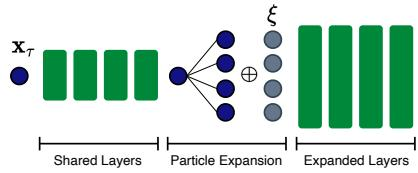  
Figure 13: ξ conditioning.

Training. During training, we sample τ¯ uniformly and draw framewise timesteps using $( \mathrm { E q } . 3 )$ with standard deviation cap $\sigma = 0 . 1$ . We then apply dimensionality-aware shifting using the full spatiotemporal resolution $\bar { \boldsymbol { T } } \times \boldsymbol { H } \times \boldsymbol { W }$ . We sample a maximum of 13 clean conditioning frames during training and use fully unconditional training with ${ \mathcal { C } } = \emptyset$ with probability $p _ { U } = 0 . 2 5$ , enabling classifier-free guidance (Ho & Salimans, 2022) at inference time.

We train with $2 5 \times 3 8 4 \times 3 8 4$ sequences from the SEVIR (Veillette et al., 2020) dataset $( 2 4 ~ \times$ 400 × 400 for MeteoNet). Exhaustive subsequence sampling following Schusterbauer et al. (2026b) yields 402,500 total training sequences (259,656 for MeteoNet). JWS-T and JWS-S are trained for 300k iterations using the AdamW (Loshchilov & Hutter, 2019) optimizer $( \mathrm { l r } = 1 0 ^ { - 4 }$ , betas = (0.9, 0.999)) and a global batch size of 128. Due to overfitting on small data we train JWS-B only for 200k iteration and train JWS-L only for 100k iterations after initializing from a checkpoint pretrained on smaller crops. We provide further information on overfitting and show scalability with more data in Sec. B. We use Exponential Moving Average (EMA) weights to stabilize training. For MeteoNet training we resize frames to 384×384 resolution to use the matching model configurations across datasets, while restoring 400×400 for metric calculation via bilinear upsampling. The sDDM loss is calculated following Algorithm 1.

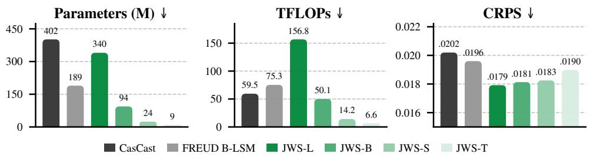  
Figure 14: FLOPs vs. Performance. Our JWS-B, JWS-S, and JWS-T models are significantly more compute and parameter efficient while achieving superior nowcasting performance.

Inference. During inference, we integrate the ODE using standard Euler updates. We keep the auxiliary noise ξ fixed for the denoising trajectory. Further, we do not use particle expansion and instead mirror prior work (Leinonen et al., 2023; Gao et al., 2023; Ribeiro & Pucer, 2026; Schusterbauer et al., 2026b) and sample different noises x<sub>0</sub> to ensemble forecasts. We use 50 NFE by default.

## B ADDITIONAL ABLATIONS

FLOP comparison. In addition to wall clock results in Fig. 8, Fig. 14 shows model capacity and inference FLOPs in relation to resulting CRPS. For the configurations shown, our smallest model requires 6.6 TFLOPs compared with CasCast’s 59.5 TFLOPs, an approximately ninefold reduction. Our models achieve superior CRPS with substantially lower parameter count and computational cost. Note that JWS-L requires more inference FLOPs than CasCast but is faster in wall clock time, highlighting the benefit of reduced pipeline overhead.

Performance over lead time. In addition to Fig. 10, we also evaluate performance over lead time for the in-domain setting. Fig. 15 shows our model achieves superior CRPS and SSIM throughout the entire forecast horizon with advantages increasing for longer forecasts. HSS remains superior to FREUD (Schusterbauer et al., 2026b) and is competitive with CasCast (Gong et al., 2024) which relies on deterministic priors and classifier-free guidance to improve localization-centric metrics.

FlowCast calibration comparison. Complementing the comparison with CasCast (Gong et al., 2024) and FREUD (Schusterbauer et al., 2026b) in Fig. 12, Fig. 16 compares JWS and Flow-Cast (Ribeiro & Pucer, 2026) for calibration. FlowCast exhibits a substantially stronger U-shaped rank histogram, indicating greater overconfidence. Its reliability further deteriorates as lead time increases, with worse CRPS at longer horizons. In contrast, JWS-B maintains better calibration and outperforms FlowCast on CRPS at the more challenging long-lead times. These results demonstrate that JWS provides more reliable probabilistic forecasts, particularly as forecast uncertainty increases with lead time.

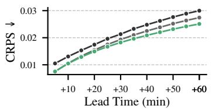

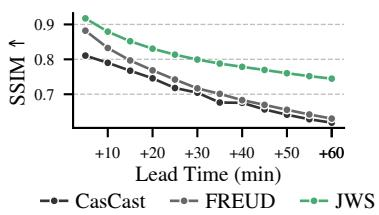

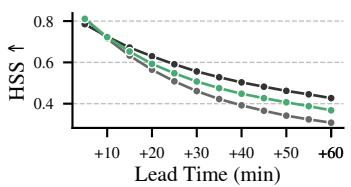  
Figure 15: Performance over lead time. JWS-B outperforms CasCast and FREUD across the entire lead time range for CRPS and SSIM, while achieving competitive performance for HSS.

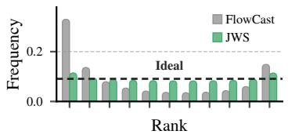

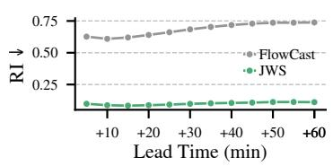

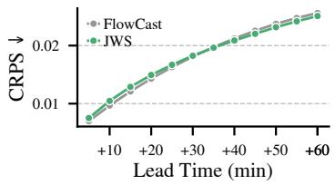  
Figure 16: Calibration compared to FlowCast. FlowCast (Ribeiro & Pucer, 2026) shows substantially stronger overconfidence than JWS especially for long lead time.

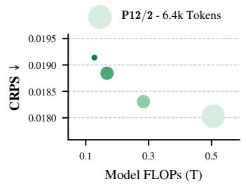

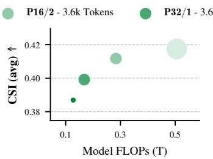

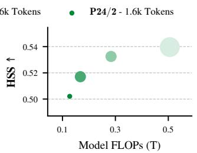  
Figure 17: Patch Size Ablation. Varying patch sizes at both hierarchy levels changes the token count and thus increases FLOPs. More tokens/FLOPs improve CRPS, CSI, and HSS.

Patch size. Reducing the patch size at either hierarchy level increases the number of processed tokens. Fig. 17 shows a clear scaling trend. Processing more tokens results in superior forecasts.

Scalability. Tabs. 5 and 6 show that JWS scales effectively with model capacity. However, the gains diminish for JWS-L, as shown in Fig. 18. We attribute this saturation to the limited diversity of the training data: although exhaustive subsequence sampling yields approximately 400k training sequences, these originate from only 16k distinct SEVIR weather events (Veillette et al., 2020). We therefore hypothesize that further scaling requires increasing training data alongside model capacity, consistent with findings on compute-optimal scaling in large language models (Hoffmann et al., 2022). To test this hypothesis, we increase training data diversity through random cropping and compare training on 50% and 100% of SEVIR events. We extract $1 9 2 ^ { 2 }$ crops to preserve most of the spatial context and resize to $1 2 8 ^ { 2 }$ for computational efficiency. As shown in Fig. 20, JWS-L exhibits substantially stronger overfitting than JWS-B when trained only on half of the available events. In comparison, using the full augmented dataset eliminates overfitting. In this setting, JWS consistently benefits from increased model capacity. This supports our hypothesis that data availability limits model scaling. For our main results on the full resolution data, we partially address this limitation by pretraining JWS-L at $1 2 8 ^ { 2 }$ resolution for 100k steps, which further reduces training cost, and then finetune at full resolution. As shown in Fig. 19, training from scratch at full

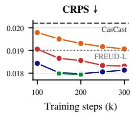

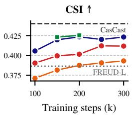

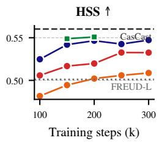

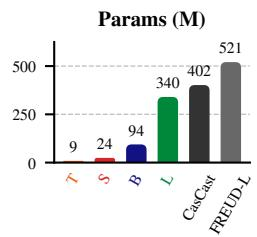  
Figure 18: Model scalability. Our smallest JWS-T model already outperforms FREUD LSM-L (Schusterbauer et al., 2026b). With increased model scale, our model shows superior results.

From scratch at $3 8 4 ^ { 2 }$ Pretrain at $1 2 8 ^ { 2 }$ until 100k, then finetune at 384<sup>2</sup>

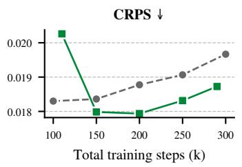

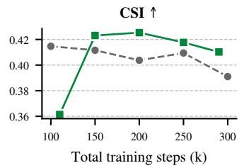

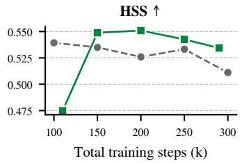  
Figure 19: Overfitting. Training large (L) models directly on full resolution data leads to strong overfitting. Pretraining on downsampled data first mitigates this issue and preserves scalability.

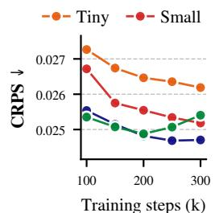

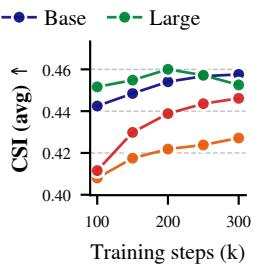  
(a) 50% Data

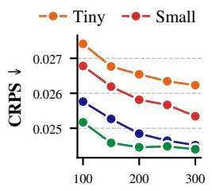

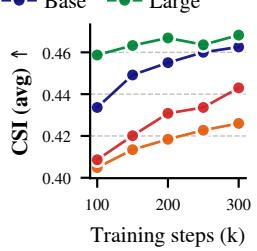  
(b) 100% Data  
Figure 20: Data scaling. JWS-L overfits on reduced training data, while increased data diversity shows stable training and clearer gains from model scaling.

resolution steadily deteriorates validation performance, whereas pretraining followed by finetuning substantially improves performance and mitigates overfitting.

Sampler. Fig. 22 compares different integration methods across inference budgets. We evaluate standard Euler sampling, the distributional sampler by De Bortoli et al. (2025), Heun sampling, and SDE integration following the protocol of Ma et al. (2024). We find strong performance with standard Euler, outperforming Heun and SDE across all metrics and budgets. The distributional sampler achieves superior SSIM and HSS, indicating superior sharpness, but underperforms Euler in CRPS evaluation. We use Euler for simplicity.

Number of Training Particles. Using larger training ensembles (more particles) increases computational cost. Yet, Fig. 23 does not reveal a scaling trend. While six training particles achieve superior few-step performance, the model performs worse for high NFE. The four-particle model underperforms compared to using three particles.

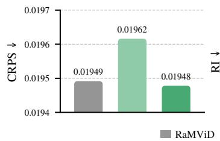

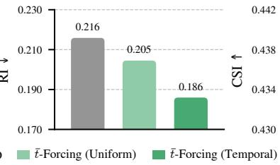

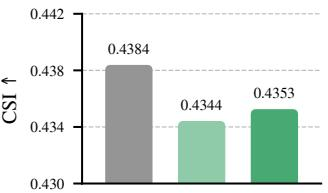  
Figure 21: Confidence-aware priors. Using cleaner deterministic priors for early frames and noisier priors for later frames improves CRPS, calibration, and CSI over uniform prior strength, improving forecast calibration at longer lead times.

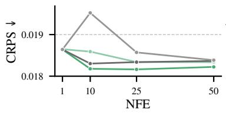

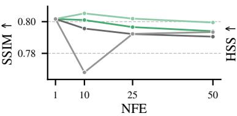  
Euler DDM Heun SDE

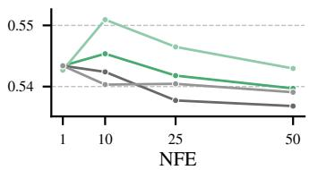

Figure 22: Different solvers. Standard Euler sampling outperforms Heun and SDE integration. While DDM sampling achieves superior HSS and SSIM, Euler performs best for CRPS.  
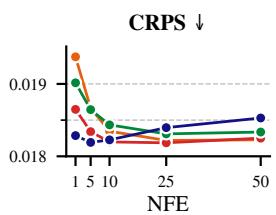


  
Num. Training Particles  
2 3 4 6

  
Figure 23: Training particles. Increasing training particles does not improve performance.

Expansion layer. Earlier expansion of the ensemble increases computational cost during training. Matching Martorella et al. (2026), Fig. 24 does not show improved performance by expanding earlier. Instead, ensemble expansion at the last bottleneck layer seems to provide superior performance.

Additionally, we conducted an ablation on downsampled 128 px<sup>2</sup> SEVIR data with an S-scale hierarchical model. Fig. 25 shows heatmaps for the full expansion layer × training particles grid. Again, there is no consistent impact of more particles or earlier expansion on final performance.

Auxiliary conditioning. On the 128 px<sup>2</sup> SEVIR data, Tab. 8 evaluates different mechanisms for ξ injection. We compare concatenation, addition, repeated addition in every layer, and residual concatenation (Martorella et al., 2026). Matching iDDM, concatenation to the residual stream is superior. Additionally, we test keeping final layers clean, which deteriorates performance.

τ¯ spread. Tab. 9 compares different spread values σ for MAD sampling. σ = 0.1 outperforms other spread values, including uniform timesteps and uncorrelated timesteps.

Loss reweighting and data filtering. Previous work (Gong et al., 2024) filters MeteoNet and trains only on sequences with observed precipitation. In addition to “all data” we test (with small JiT models): filtering, binary loss weighting, downweighting dry pixels based on their frequency in the sample, and power-law loss weighting. However, Tab. 10 and Tab. 11 show that neither filtering nor reweighting improves overall performance, while all such interventions deteriorate CRPS. We therefore require no dataset filtering or loss reweighting and train directly on the full training dataset with equally weighted samples and pixels.


  
Expansion Layer

  
7 10 11 12  
Figure 24: Expansion layer. Expanding the ensemble earlier does not yield improved performance.

  
(a) Throughput.

  
(b) 5 NFE.

  
(c) 50 NFE.  
Figure 25: Small-scale verification. We again find no gain using more particles or earlier expansion.

Table 8: Conditioning path. Concatenating noise to the residual stream is best.
<table><tr><td>ξ conditioning</td><td>CRPS↓</td><td>HSS ↑</td><td>CSI-M ↑</td></tr><tr><td>Single concatenation</td><td>0.0236</td><td>0.4021</td><td>0.3023</td></tr><tr><td>Residual concatenation</td><td>0.0217</td><td>0.4351</td><td>0.3295</td></tr><tr><td>Residual concatenation + 2 clean</td><td>0.0276</td><td>0.3895</td><td>0.2916</td></tr><tr><td>Single addition</td><td>0.0238</td><td>0.4176</td><td>0.3125</td></tr><tr><td>Repeated addition</td><td>0.0243</td><td>0.4010</td><td>0.3028</td></tr><tr><td>Repeated addition + 2 clean</td><td>0.0245</td><td>0.4118</td><td>0.3081</td></tr></table>

Table 9: Tbar σ ablation. Setting $\sigma \ : = \ : 0 . 1$ achieves the best result.
<table><tr><td>σ</td><td>CRPS↓</td><td>HSS ↑</td><td>CSI-M ↑</td></tr><tr><td>0 (RaMViD (Höppe et al., 2022))</td><td>0.01940</td><td>0.4740</td><td>0.3638</td></tr><tr><td>0.05</td><td>0.01921</td><td>0.5072</td><td>0.3889</td></tr><tr><td>0.1</td><td>0.01895</td><td>0.5154</td><td>0.3965</td></tr><tr><td>0.2</td><td>0.01940</td><td>0.4886</td><td>0.3750</td></tr><tr><td>X (RaMViD Forcing)</td><td>0.02771</td><td>0.3875</td><td>0.2826</td></tr></table>

Table 10: Reweighting SEVIR. Data filtering and loss weighting have minimal impact.
<table><tr><td>Method</td><td>CRPS↓ SSIM↑</td><td>HSS ↑</td><td>CSI-M ↑</td><td>RI↓</td></tr><tr><td>Baseline</td><td>0.02003 0.7653</td><td>0.5034</td><td>0.3869</td><td>0.0993</td></tr><tr><td>Filtering</td><td>0.02086 0.7416</td><td>0.5087</td><td>0.3908</td><td>0.0712</td></tr><tr><td>Power law</td><td>0.02016 0.7680</td><td>0.4691</td><td>0.3587</td><td>0.1077</td></tr><tr><td>Binary</td><td>0.02015 0.7669</td><td>0.4773</td><td>0.3652</td><td>0.0928</td></tr></table>

Table 11: Reweighting MeteoNet. Reweighting and resampling increase CRPS.
<table><tr><td>Method</td><td>CRPS ↓ SSIM↑</td><td>HSS ↑</td><td>CSI-M ↑</td><td>RI↓</td></tr><tr><td>Baseline</td><td>0.01552 0.7407</td><td>0.3942</td><td>0.2787</td><td>0.3640</td></tr><tr><td>Filtering</td><td>0.01586 0.7307</td><td>0.4107</td><td>0.2920</td><td>0.4302</td></tr><tr><td>Power law</td><td>0.01557 0.7353</td><td>0.4062</td><td>0.2885</td><td>0.3918</td></tr><tr><td>Binary</td><td>0.01554 0.7386</td><td>0.3997</td><td>0.2838</td><td>0.3625</td></tr></table>

## C METRICS AND EVALUATION PROTOCOL

To enable better interpretability of our results, we summarize metrics and the evaluation protocol below.

## C.1 METRIC DEFINITIONS

We use the metrics implemented by Schusterbauer et al. (2026b) which adopts the evaluation by Gong et al. (2024).

CRPS. CRPS is a proper scoring rule for univariate regression that generalizes the Mean Absolute Error to probabilistic tasks (Gneiting & Raftery, 2007). For observed value x, cumulative forecast distribution $F ( y )$ , and ensemble members $\left\{ f _ { 1 } , . . . , f _ { N } \right\}$ CRPS is defined as

$$
\begin{array} { r l } {  { C R P S ( F , x ) = \int _ { - \infty } ^ { \infty } ( F ( y ) - \mathbf { 1 } _ { y \geq x } ) ^ { 2 } \mathrm { d } y } } \\ & { = \mathbb { E } _ { X \sim F } [ | | X - x | ] - \frac { 1 } { 2 } \mathbb { E } _ { X , X ^ { \prime } \sim F } [ | X - X ^ { \prime } | ] } \\ & { \approx \frac { 1 } { N } \displaystyle \sum _ { i = 1 } ^ { N } | f _ { i } - x | - \frac { 1 } { 2 N ^ { 2 } } \displaystyle \sum _ { i = 1 } ^ { N } \displaystyle \sum _ { j = 1 } ^ { N } | f _ { i } - f _ { j } | . } \end{array}
$$

The first term pushes the expectation to the ground truth, while the second term encourages spread.

SSIM. The Structural Similarity Index Measure is used to measure structural similarity between ground truth and mean forecasts. For single-channel data SSIM is defined as

$$
\mathrm { S S I M } ( x , y ) = \frac { ( 2 \mu _ { x } \mu _ { y } + C _ { 1 } ) ( 2 \sigma _ { x y } + C _ { 2 } ) } { ( \mu _ { x } ^ { 2 } + \mu _ { y } ^ { 2 } + C _ { 1 } ) ( \sigma _ { x } ^ { 2 } + \sigma _ { y } ^ { 2 } + C _ { 2 } ) } ,
$$

where x is the ground truth and $y$ is the prediction, $\mu _ { x }$ and $\mu _ { y }$ are the average intensities, $\sigma _ { x } ^ { 2 }$ and $\sigma _ { y } ^ { 2 }$ are the variances of intensities, $\sigma _ { x y }$ is the covariance between the images and $C _ { 1 }$ and $C _ { 2 }$ are two small constants. Following standard practice, SSIM is calculated by averaging sliding window results and using Gaussian weighting to calculate mean and variance values.

HSS. Heidke Skill Score (HSS) is computed on a per-pixel basis to identify positional accuracy. Using a user-defined threshold, true positives (TP), false positives (FP), false negatives (FN), and true negatives (TN) are first calculated based on binarized ground truth and forecasted precipitation. Then HSS is computed as

$$
H S S = \frac { 2 ( T P \cdot T N - F P \cdot F N ) } { ( T P + F N ) ( F N + T N ) + ( T P + F P ) ( F P + T N ) } .\tag{8}
$$

Following prior work we average HSS over six thresholds (16, 74, 133, 160, 181, 219) to obtain the final value. Intuitively, HSS indicates improvement over random chance, where 0 indicates no improvement and 1 corresponds to perfect prediction.

CSI. The Critical Success Index (CSI) or Threat Score quantifies the proportion of correctly predicted events excluding true negatives. Therefore, it remains useful when non-events dominate the data as in precipitation forecasting. After the same binarization as for HSS, CSI is given by

$$
C S I = \frac { T P } { T P + F P + F N } .\tag{9}
$$

The reported CSI is averaged over the same thresholds as HSS.

RI. To compute the reliability index (RI) we first compute rank histograms by inserting observed pixel values into a sorted list of ensemble predictions and counting the rank. Therefore, for an N-member ensemble, the rank histogram shows N + 1 possible ranks, resolving ties by random sampling. RI then measures the deviation of the resulting relative frequencies $( p _ { r } )$ from a uniform distribution as

$$
\mathrm { R I } = \sum _ { r = 0 } ^ { N } \left| p _ { r } - \frac { 1 } { N + 1 } \right| .\tag{10}
$$

Thus, lower values indicate closer agreement with uniform rank distribution, i.e. superior calibration.

SSR. Spread-Skill Ratio (SSR) compares the ensemble spread with root mean squared error. SSR is computed as

$$
\mathrm { S S R } = \frac { \sqrt { \sigma ^ { 2 } } } { \sqrt { ( \bar { f } - x ) ^ { 2 } } } ,\tag{11}
$$

where $\begin{array} { r } { \bar { f } = N ^ { - 1 } \sum _ { i = 1 } ^ { N } f _ { i } } \end{array}$ is the ensemble mean, $\begin{array} { r } { \sigma ^ { 2 } = ( N - 1 ) ^ { - 1 } \sum _ { i = 1 } ^ { N } ( f _ { i } - \bar { f } ) ^ { 2 } } \end{array}$ is the sample variance. A calibrated ensemble forecast should have high variance when uncertain and therefore most wrong. Thus, calibration is indicated by SSR close to 1.

## C.2 EVALUATION PROTOCOL

Unless indicated otherwise we use 50 network evaluations for our method and compare all approaches using 10 ensemble members. Experiments are mainly conducted on the SEVIR dataset (Veillette et al., 2020) using the train-test split provided by Gong et al. (2024). We use the full test set to establish state-of-the-art in Tab. 5 and Tab. 6. However, following prior work (Schusterbauer et al., 2026b; Ribeiro & Pucer, 2026) we use a subset of 512 samples for plots and ablation experiments due to computational constraints. Tab. 12 shows that 512 sample evaluation closely matches results with more samples and exhibits low inter-seed variance. All evaluations are carried out on 4 Nvidia GH200 GPUs using parallelization across samples for speedup, while latency is computed with a single GPU.

Table 12: Metric sensitivity. Results report mean ± standard deviation across eight evaluation seeds. Mean results are close to large evaluation runs even for small sample sizes.
<table><tr><td>Num. Samples</td><td> $\mathbf { C R P S } \downarrow$ </td><td>SSIM↑</td><td>HSS ↑</td><td>CSI↑</td><td>RI↓</td></tr><tr><td>64</td><td> $0 . 0 2 5 9 \pm 0 . 0 0 2 5$ </td><td> $0 . 6 3 7 4 \pm 0 . 0 1 4 3$ </td><td> $0 . 3 3 7 9 \pm 0 . 0 1 1 5$ </td><td> $0 . 2 5 2 9 \pm 0 . 0 0 9 3$ </td><td> $0 . 0 6 1 5 \pm 0 . 0 1 8 3$ </td></tr><tr><td>128</td><td> $0 . 0 2 5 7 \pm 0 . 0 0 1 3$ </td><td> $0 . 6 3 7 2 \pm 0 . 0 1 2 3$ </td><td> $0 . 3 3 8 4 \pm 0 . 0 1 0 2$ </td><td> $0 . 2 5 2 7 \pm 0 . 0 0 7 8$ </td><td> $0 . 0 5 6 2 \pm 0 . 0 1 0 6$ </td></tr><tr><td>256</td><td> $0 . 0 2 5 7 \pm 0 . 0 0 0 8$ </td><td> $0 . 6 3 6 3 \pm 0 . 0 0 6 5$ </td><td> $0 . 3 3 6 5 \pm 0 . 0 0 7 7$ </td><td> $0 . 2 5 1 5 \pm 0 . 0 0 5 4$ </td><td> $0 . 0 5 5 8 \pm 0 . 0 0 6 4$ </td></tr><tr><td>512</td><td> $0 . 0 2 6 0 \pm 0 . 0 0 0 5$ </td><td> $0 . 6 3 3 1 \pm 0 . 0 0 5 0$ </td><td> $0 . 3 3 7 1 \pm 0 . 0 0 5 5$ </td><td> $0 . 2 5 2 1 \pm 0 . 0 0 3 9$ </td><td> $0 . 0 5 7 3 \pm 0 . 0 0 3 9$ </td></tr><tr><td>1024</td><td> $0 . 0 2 6 0 \pm 0 . 0 0 0 4$ </td><td> $0 . 6 3 2 2 \pm 0 . 0 0 2 8$ </td><td> $0 . 3 3 6 3 \pm 0 . 0 0 3 3$ </td><td> $0 . 2 5 1 1 \pm 0 . 0 0 2 7$ </td><td> $0 . 0 5 8 1 \pm 0 . 0 0 2 0$ </td></tr></table>

For baselines we use the results reported in the literature (Gong et al., 2024; Schusterbauer et al., 2026b; Ribeiro & Pucer, 2026) after verifying reproducibility with our pipeline where possible. Metrics that were previously not reported are recomputed using available checkpoints if trained weights are provided by the authors.

## C.3 DATASETS

SEVIR. Our main evaluations are carried out using the SEVIR (Veillette et al., 2020) dataset. SEVIR contains 20,393 weather events of which 20% correspond to known extreme weather events from the NOAA Storm Event Database (NOAA / National Centers For Environmental Information, 2020). The remaining 80% were randomly chosen while oversampling high precipitation. SEVIR is collected from 2017–2019 over the continental United States region. Each sample covers a 384 km× 384 km area for 4 h with 1 km spatial and 5 min temporal resolution. Precipitation is indicated by the NEXRAD Vertically Integrated Liquid product (VIL).

We use the train-test split provided by Gong et al. (2024) and follow Schusterbauer et al. (2026b) in joining the validation set into training and sampling exhaustive subsequences to increase training data size. Following prior work, we use 65 min (13 frames) conditioning to predict 60 min (12 frames) future precipitation unless noted otherwise. We follow the standard preprocessing (Veillette et al., 2020) and keep non-linear VIL encoding to [0, 255] which we normalize further to [−1, 1] for training following Schusterbauer et al. (2026b). To ensure comparability (Gong et al., 2024; Gao et al., 2022b; She et al., 2024; Schusterbauer et al., 2026b; Ribeiro & Pucer, 2026), we use H = W = 384, C = 13, L = 12, and $T = C + L = 2 5$ unless specified otherwise.

MeteoNet. The MeteoNet benchmark (Larvor et al., 2020) includes observations over fixed regions in northwestern and southeastern France from 2016–2018. Radar measurements are provided in 5 min intervals with ≈ 1 km<sup>2</sup> resolution. Following Gong et al. (2024), we use the old radar reflectivity product and extract the top-left $4 0 0 \times 4 0 0$ grid cells of the southeastern region. Again, we combine training and validation periods and exhaustively sample subsequences for training, while testing on the same data as prior work (Gong et al., 2024; Schusterbauer et al., 2026b). Following Gong et al. (2024) we use 24-frame subsequences and predict the next 12 frames given a 12- frame context. We normalize the reflectivity values from [0, 70] to [−1, 1] for training. To enable using the same JWS architecture as for SEVIR, we bilinearly resize to 384 × 384 for model processing, but keep metric computation at the native resolution. To compute HSS and CSI we use thresholds of [19, 25, 35, 40, 47] dBZ (Gong et al., 2024).

## D EXTENDED RELATED WORK

We expand on the related works presented in Sec. 2 to provide additional context on existing methods and our advances upon these.

## D.1 MACHINE LEARNING FOR NOWCASTING

Weather nowcasting refers to short-term, high-resolution forecasting over lead times ranging from one to twelve hours. Typically nowcasting operates on ≤ 5 km spatial grids with ≤ 10 min temporal resolution. Physics-based numerical weather prediction is computationally expensive, and therefore not well-suited for applications that require rapid updates (Shi et al., 2015; 2017; Sønderby et al., 2020; Leinonen et al., 2023; Ravuri et al., 2021; Chen et al., 2023). Early research used optical flow based forecasts (Woo & Wong, 2017; Cheung & Yeung, 2012; Germann & Zawadzki, 2002; Sakaino, 2013) for rapid-update tasks, however these approaches cannot model rain onset or dissipation (Hur & Roth, 2019; Shi et al., 2015). Therefore, machine learning methods based on convolutional neural networks (Shi et al., 2015; Agrawal et al., 2019), recurrent neural networks (Wang et al., 2017), or transformers (Gao et al., 2022a;b) have been developed. These approaches use patterns in observed past context to regress future weather states. While machine learning methods also begin to dominate medium- and long-range forecasting (Sønderby et al., 2020; Espeholt et al., 2022; Pathak et al., 2022; Price et al., 2024; Alet et al., 2025), they are especially important in nowcasting due to their significantly reduced inference time.

However, weather dynamics are inherently chaotic and unpredictable (Ravuri et al., 2021) requiring probabilistic forecasting under partially observable initial conditions. Yet, deterministic regression models lack robust uncertainty quantification and average possibilities leading to increasingly blurry forecasts over lead time. Alet et al. (2025) proposed Functional Generative Networks (FGNs) for medium-range forecasting, training a deterministic model to predict an ensemble of forecasts directly by optimizing an ensemble scoring function. However, they restrict the variability of forecasts to be encoded in a low-dimensional noise vector. Local variability in nowcasting is typically higher than variance in medium-range forecasting limiting the applicability of this approach compared to diffusion models due to reduced distributional coverage. Therefore, FGNs still become increasingly blurry in our experiments (Appendix E.2).

Therefore, researchers employed generative adversarial (Ravuri et al., 2021; Zhang et al., 2023; Liu & Lee, 2020) and generative diffusion (Leinonen et al., 2023; Gao et al., 2023; Ribeiro & Pucer, 2026) methods, trained to produce a sample from the conditional distribution of predictions rather than to regress the mean. As adversarial approaches are prone to mode collapse (Kossale et al., 2022) and, thus, fail to capture the full posterior distribution, diffusion-based nowcasting has be come the de facto standard approach. Early diffusion-based precipitation nowcasting approaches sampled future evolution based only on prior observations (Leinonen et al., 2023; Gao et al., 2023). However, later papers argued conditioning the model on a deterministic forecast (Gong et al., 2024) or sampling only the residual between a deterministic forecast and the ground truth (Yu et al., 2024) enables superior forecasting. Similarly, Park et al. (2026a) build upon the deterministic exPreCast model (Song et al., 2026) by using a diffusion model to model only small scale variability and enable ensembling of stochastic elements. However, FREUD (Schusterbauer et al., 2026b) argues conditioning on a deterministic forecast biases the generation and thus limits uncertainty quantification. Compounding evidence by Ribeiro & Pucer (2026) supports the claim that training a sufficiently capable diffusion model suffices for accurate forecasting and superior calibration.

An additional downside is that most diffusion-based nowcasting methods (Leinonen et al., 2023; Gao et al., 2023; Gong et al., 2024; Ribeiro & Pucer, 2026; Schusterbauer et al., 2026b) operate in a compressed latent space to enable faster sampling. However, compression is inherently lossy and thus induces additional uncertainty about reconstructions. Schusterbauer et al. (2026b) propose to quantify this uncertainty using generative reconstructions. However, this means for each latent ensemble member a full ensemble of reconstructions has to be constructed to quantify all uncertainty, inducing a significant computational overhead. Some previous works instead tackle pixel-space nowcasting using specialized architectures (Nguyen et al., 2025b) or by only modeling residuals from a deterministic forecast (Yu et al., 2024; Zhu et al., 2026) which still requires a two-stage design and biases forecasts. In comparison, JWS enables pixel space nowcasting with a standard, scalable architecture and with a single end-to-end model, simplifying training and inference.

## D.2 PIXEL-SPACE DIFFUSION

Initial works in diffusion-based image generation applied iterative denoising in pixel-space (Dhariwal & Nichol, 2021; Ho et al., 2020). Yet, computational costs made these models difficult to scale and deploy. Latent diffusion (Rombach et al., 2022) proposed to first compress perceptual information into a low-dimensional latent and then apply the diffusion process only in this compact latent space. This enabled high-resolution image generation on consumer hardware and training video generation models with academic resources (He et al., 2023).

However, the complexity of training multiple stages motivated the authors of simple diffu sion (Hoogeboom et al., 2023) to develop an architecture for direct pixel-space diffusion modeling by adapting the noise schedule and downsampling early in the UNet (Ronneberger et al., 2015) backbone to concentrate capacity in the bottleneck. Further improvements (Hoogeboom et al., 2025) identify reducing skip connections as a pathway to further enhance scalability. Through this mod ification, improved loss weighting, and preferring scaling the number of processed patches over increasing the model capacity they achieve strong pixel-space generation performance.

Alternatives like PixelFlow (Chen et al., 2025) propose to modify the denoising process itself to enable pixel-space modeling. Chen et al. (2025) propose to schedule the image resolution over the denoising trajectory, progressively moving from noisy low resolution images to clean high resolution images during sampling. Thus, their approach saves compute on high-frequency details while these are masked by noise. Wang et al. (2025), on the other hand, enable high-resolution image synthesis by predicting patch-specific neural-field weights, with the resulting fields mapping noisy pixel values and spatial coordinates to pixel-wise velocities. This concentrates expensive transformer computation on low-resolution patches while using lightweight neural fields for pixel-leve prediction, avoiding the cost of processing each pixel as a separate transformer token.

Alternatively, both PixelDiT (Yu et al., 2025) and DiP (Chen et al., 2026) propose combining a large transformer for global structure with local refinement modules to enable pixel-space high resolution image generation. Other alternative architectures such as RIN (Jabri et al., 2023) and FIT (Chen & Li, 2023) enable high-resolution pixel-space modeling by reducing computational complexity of expensive self-attention. RIN (Jabri et al., 2023) concentrates computation on a compact set of latent tokens that exchange information with pixel-space data tokens through cross-attention, reusing latent representations across denoising steps. Chen & Li (2023) propose interleaving local attention within groups of data tokens with global attention over a smaller subset of tokens.

However, Li & He (2025) show that standard Vision Transformer architectures (Dosovitskiy et al., 2020; Peebles & Xie, 2023) with a large patch size are capable of accurate pixel-space generation when adjusting timestep sampling during training and predicting clean visual information. They argue that under the manifold assumption clean data has lower intrinsic dimensionality than noise or noise-containing velocities, thus making clean data easier to compress by patchification. Similarly, HDiT (Crowson et al., 2024) presents a hierarchical transformer architecture that substantially reduces computational requirements in pixel-space modeling while maintaining the strong scalability of vision transformers. However, due to the additional temporal dimension, pixel-space generation of video or weather forecasting data is especially challenging and computationally demanding (Jabri et al., 2023). Closest to our work, FREUD (Schusterbauer et al., 2026b) uses a pixel-space HDiT to reconstruct precipitation fields from compressed latents. They show that a generative decoder modeling the full video sequence increases temporal consistency. However, the FREUD decoder receives strong framewise conditioning information and therefore operates efficiently with low model capacity and few-step inference. Instead, JWS learns end-to-end weather nowcasting directly in pixel-space. We use standard transformer architectures and denoising procedures, maintaining scalability and simplicity.

## D.3 FEW-STEP SAMPLING

Precipitation nowcasting requires rapid updates (Shi et al., 2015; Ravuri et al., 2021), which is at odds with the iterative nature of generative diffusion and flow models that tend to improve with more function evaluations. Reducing computational complexity and latency by reducing the number of sampling steps required to produce high-quality samples has been a focus of many researchers in recent years. Most prominently, researchers proposed methods to reduce the number of inference steps by modifying the denoising trajectory. DDIM (Song et al., 2020) defines an ODE path for trained diffusion models that can be traversed with larger steps. While Flow Matching methods (Lipman et al., 2023) explicitly define a straighter trajectory during training, which allows faster traversal (Liu et al., 2022). However, these methods typically still require about 20 network evaluations to produce high-quality samples.

Few-step distillation approaches first train a default diffusion model and then distill the model’s output into a few-step generative model using progressive MSE-based distillation (Salimans & Ho, 2022), adversarial objectives (Sauer et al., 2023), consistency objectives (Song et al., 2023), or distribution matching objectives (Yin et al., 2024b;a). However, distillation introduces additional training complexity by requiring a two-stage process. Additionally, previous research shows distillation often reduces the diversity of samples (Yin et al., 2024a; Gandikota & Bau, 2025), limiting applicability in domains where capturing the full distribution of potential outcomes is essential.

Consistency models (Song et al., 2023) can be used for distillation as well as for training from scratch. Their training objective puts them in the family of Flow Map models (Boffi et al., 2025a) which are trained to directly integrate the denoising trajectory between two diffusion timesteps. Flow maps can be grouped into three categories following Boffi et al. (2025b): First, Eulerian Flow Maps enforce that a change in the starting point should not change the outcome at the destination time. Second, progressive Flow Maps train models s.t. one large jump agrees with the composition of two smaller jumps. Finally, Lagrangian Flow Maps enforce that a change in the destination time corresponds to following the velocity field at the original destination.

MeanFlows (Geng et al., 2025) are the most prominent example of Eulerian Flow Maps, yet require an expensive Jacobian-vector product (JVP) operation to obtain the training target. While improved MeanFlows (Geng et al., 2026) stabilizes the training objective and PixelMeanFlow (Lu et al., 2026) combines improved MeanFlow with JiT (Li & He, 2025), they retain the expensive JVP computation. In comparison, SplitMeanFlow (Guo et al., 2025) eliminates the JVP computation and resembles Shortcut model (Frans et al., 2025) training. These methods fall in the category of progressive Flow Maps. Yet, they require multiple network evaluations during training to obtain self-bootstrapped targets, instead of training for superior distributional coverage. Lagrangian Self-Distillation (LSD) (Boffi et al., 2025b) is an example of the final Flow Map category. These approaches still require time differentiation through the network and additional velocity evaluation at the predicted endpoint to derive their target. Moreover, although Flow Map methods enable fewstep generation, there is compounding evidence (Huang et al., 2026; Nguyen et al., 2025a) that distributional coverage is sensitive to the training formulation, potentially increasing the difficulty of applying Flow Maps in domains where uncertainty is essential.

Distribution-level objectives offer a promising alternative. Inductive Moment Matching (IMM) (Zhou et al., 2025) constructs a Flow Map by learning mappings between noise levels through matching output distributions instead of individual samples with a maximum mean discrepancy objective. Improving simplicity, Distributional Diffusion Models (DDM) (De Bortoli et al., 2025) show that training a diffusion model to predict a distribution of outputs rather than the conditional mean by supervision with a proper scoring rule suffices to build strong few-step generative models. Distributional Diffusion Models are especially promising for weather forecasting applications as they directly train a generative model to produce an ensemble of outputs. However, DDMs require multiple passes through the full network to produce an ensemble of outputs during training and do not perform well for the many-step setting. Released only two weeks prior to our paper, Park et al. (2026b) propose a distributional diffusion model for medium-range weather forecasting with marginal CRPS supervision. However, they focus on one-step predictions and cannot scale to more NFEs, mirroring our experiments with only-CRPS supervision (Tab. 4). In contrast, improved Distributional Diffusion Models (iDDM) (Martorella et al., 2026) show that using a time-dependent interpolation between distributional and MSE objectives produces a model that performs well in few and many step inference. Additionally, combined with strong conditioning on auxiliary noise, late expansion of the ensemble for only a few final layers is sufficient to train a DDM, making training scalable.

PixelFlowCast (Zhu et al., 2026) built a pixel-space nowcasting method with a (Pixel-)MeanFlow objective (Lu et al., 2026; Geng et al., 2025). However, it only models the residual of a deterministic forecast. Further, due to the cost of MeanFlow training, their model was only trained for downsam pled data. We argue that Distributional Diffusion (De Bortoli et al., 2025; Martorella et al., 2026) is a natural fit for weather nowcasting and makes efficient nowcasting with standard transformer architectures (Li & He, 2025; Dosovitskiy et al., 2020; Crowson et al., 2024; Peebles & Xie, 2023; Ma et al., 2024) feasible without biasing generation (Schusterbauer et al., 2026b).

## E QUALITATIVE RESULTS

## E.1 QUALITATIVE FORECAST ENSEMBLES

  
Figure 26: Qualitative forecast. We show three ensemble members over the full 60 min lead time range. Zoom shows a high-precipitation region with high variability.

  
Figure 27: Qualitative forecast. Three ensemble members for a sample from the SEVIR dataset.

  
Figure 28: Qualitative forecast. Forecast steps in 10 min intervals for a sample from the SEVIR dataset.

  
Figure 29: Qualitative forecast. The zoom-in highlights high variability among ensemble members for a 60 min forecast.

## E.2 QUALITATIVE COMPARISONS

  
Figure 30: Qualitative comparison. Compared to FGN (Alet et al., 2025), CasCast (Gong et al., 2024), FlowCast (Ribeiro & Pucer, 2026), and FREUD (Schusterbauer et al., 2026b) JWS better captures local and global precipitation patterns. ⋆ model trained by us.

  
Figure 31: Qualitative comparison. FlowCast (Ribeiro & Pucer, 2026) and JWS capture localized high precipitation accurately. ⋆ model trained by us.

+10 min  
+20 min  
+30 min  
+40 min  
+50 min  
+60 min  
  
Figure 32: Qualitative comparison. JWS produces sharp forecasts that align with the ground truth and remains more realistic over leadtime than FREUD and CasCast.

  
Figure 33: Qualitative comparison. For low precipitation JWS is able to capture dynamics more accurately than FGN (Alet et al., 2025), CasCast (Gong et al., 2024), FlowCast (Ribeiro & Pucer, 2026), or FREUD (Schusterbauer et al., 2026b). ⋆ model trained by us.

  
Figure 34: Qualitative comparison. JWS produces sharper and more intricate precipitation patterns than prior work. ⋆ model trained by us.

## E.3 QUALITATIVE UNCERTAINTY

  
Figure 35: Ensemble variance. We show five ensemble members for samples from the SEVIR dataset at +60 min with complex precipitation patterns. Variance maps highlight localized uncer tainty in complex precipitation regions.

GT

E3

E1

## E.4 QUALITATIVE INFERENCE-TIME SCALING

  
Figure 36: Qualitative Inference-time scaling. At +60 min JWS produce accurate global structure with 1 NFE, 2 NFE resolves patch artifacts, and 10 NFE is close to the 50 NFE setting, with 50 NFE adding more local details and variability.

E1  
E3  
E5  
E2  
E4  
Mean  
GT  
  
Figure 37: Qualitative Inference-time scaling. JWS captures finer structures consistently with more function evaluations at +60 min lead time.

E1  
E3  
E4  
E5  
Mean  
GT  
  
Figure 38: Qualitative inference-time scaling. Results at +60 min lead time show that forecasts become blurry with few-step inference, while global structure is captured in all settings, and more sampling steps recover details.