# LAIR-Net: Leaky Alignment-Impulse Residual Networks for Tabular Regression

Project Page: lairnet.statml.in

Rahul Goswami1, 2

Aryan Bhambu3

Bittu Karmakar1

1Indian Institute of Technology Guwahati 2SAFIR, Sorbonne University Abu Dhabi 3Indian Institute of Technology Bombay

## Abstract

Deep randomized models fix hidden-layer parameters through random initialization and learn only closed-form readouts, typically adding depth by stacking random transformations without target-aware control of hidden-state evolution. We propose LAIR-Net, the Leaky Alignment-Impulse Residual Network, which mixes a shallow learned anchor into each hidden state through a leaky residual transition. We derive a depthuniform bound on input-perturbation sensitivity and use controlled simulations to attribute gains over a randomized baseline to the anchor rather than recursion or added capacity. Benefits emerge when a nonlinear target structure is learnable at the available noise level and diminish for nearly linear targets or dominant noise. Across 23 benchmark datasets, LAIR-Net achieves the best average rank among eight randomized networks and twelve conventional models, with relative performance associated with the same nonlinear-structure and noise quantities identified in simulation.

## 1 INTRODUCTION

Randomized neural networks reduce training cost by fixing randomly initialized hidden parameters and learning only the readout. Here Randomization concerned randomized networks, unlike randomized tree based algorithm(Geurts, Ernst, and Wehenkel, 2006; Giri and Goswami, 2026) as for example RVFL combines nonlinear random features with a direct inputoutput connection and estimates output weights by least-squares or ridge regression (Igelnik and Pao,

1995; Malik et al., 2023; Pao, Park, and Sobajic, 1994). Deep RVFL stacks randomized layers, while edRVFL aggregates separate readouts across depths (Shi et al., 2021). Skip-connected variants reuse earlier hidden representations through concatenation (Hu et al., 2022), increasing efective input width without directly regulating transitions between consecutive states. Consequently, perturbation sensitivity depends on the realized random mappings and activation function.

We propose the Leaky Alignment-Impulse Residual Randomized Network (LAIR-Net) for tabular regression. A shallow supervised network supplies a targetaware alignment anchor. At each depth, a leaky resid ual update blends the preceding state with a new random transformation, and an alignment impulse mixes this state with the anchor. Inspired by leaky reservoir updates (Jaeger et al., 2007), this construction combines state persistence with supervised alignment while retaining fixed hidden width and closed-form layerwise ridge readouts. The alignment network is trained separately before constructing the randomized hierarchy.

Conditional on fixed random weights, we establish finite-depth boundedness under bounded inputs, anchors and realized weights, a Lipschitz activation, and convex mixing coeficients. An efective propagation factor below one additionally yields depth-uniform boundedness and geometric attenuation of initial-state diferences for trajectories sharing the same input, anchor and weights. We also bound deviation from the anchor under bounded layerwise mismatch and establish readout uniqueness for a positive ridge parameter. These results characterize recursion stability.

Across 23 regression datasets and 18 competing methods, LAIR-Net achieves the lowest average MSE rank (4.22, compared with 6.70 for the next-best multilayer perceptron), with all pairwise Wilcoxon comparisons significant after Holm adjustment $\left( p < 0 . 0 5 \right)$

The main contributions are: (i) a fixed-width randomized architecture combining leaky state transitions, target-aware alignment, and layerwise ridge readouts; (ii) a conditional stability analysis covering boundedness, contraction, anchor deviation, and readout uniqueness; and (iii) controlled perturbation experiments and predictive evaluation against 18 baselines on 23 regression datasets.

The remainder of the article is organized as follows. Sections 2-4 present related work, the method, and theory. Sections 5 and 6 report benchmarks and simulations. The article ends with conclusions, limitations, and future work in Section 7.

## 2 RELATED WORK

Research on deep randomized neural networks has mainly focused on increasing representational depth while retaining fixed hidden transformations and inexpensive readout estimation. Deep RVFL architectures construct successive randomized representations across multiple hidden layers (Shi et al., 2021). Ensemble variants additionally fit readouts at diferent depths and combine their predictions. This design allows information from several levels of the randomized hierarchy to contribute to the final prediction. The main emphasis of these models is therefore on representation construction and layerwise aggregation.

A related direction introduces additional connections between non-adjacent hidden layers. Skip-connected edRVFL supplies selected earlier hidden representations to deeper layers (Hu et al., 2022). The additional pathways preserve lower-layer information and reduce exclusive dependence on the immediately preceding state. This approach addresses feature reuse by expanding the information available to later layers. It does not directly constrain the change between consecutive hidden states. In the formulation considered in this work, retaining earlier states also enlarges the efective layer input and the associated readout representation.

Residual connections address a related problem in fully trained neural networks by adding identity pathways between successive transformations. Their purpose is to preserve information and improve optimization in deep architectures. A residual pathway, however, does not by itself determine how strongly a new transformation should replace the previous representation. The distinction is relevant for randomized networks because the hidden transformations are fixed after initialization. The state evolution is therefore governed directly by the realized random mappings.

Explicit control of state evolution has been studied in reservoir computing. Leaky-integrator updates combine a newly generated state with the preceding state through a leakage parameter (Jaeger et al., 2007). The leakage parameter regulates the rate of state change and provides persistence across successive updates. This mechanism controls local state evolution, but it does not provide a supervised reference derived from the prediction target.

The distinction between persistence and supervision motivates the design considered in this paper. Existing deep and skip-connected RVFL formulations determine how representations are generated and reused across depth (Hu et al., 2022; Shi et al., 2021). Leaky state updates determine how quickly a state changes (Jaeger et al., 2007). These mechanisms do not, in the formulations considered here, combine controlled state transition with repeated guidance from a target-aware representation.

The proposed LAIR-Net addresses this gap by separating the two roles. The leaky residual update controls the contribution of the new randomized representation relative to the preceding hidden state. The alignment impulse introduces a supervised anchor at every depth. The resulting recursion therefore regulates both the rate of hidden-state evolution and its relation to a target-aware reference. This difers from skipconnected feature reuse because the proposed mechanism modifies the hidden-state update itself rather than only enlarging the set of representations supplied to a later layer.

## 3 PROPOSED METHOD

This section presents the LAIR-Net architecture. The model first constructs a sequence of hidden states and then maps the representation at each depth to a prediction. The hidden-state construction consists of three components. A shallow learned alignment network provides a target-aware reference representation. A leaky residual transition controls the contri bution of the newly generated randomised representation relative to the previous hidden state. An alignment impulse then combines the resulting state with the learned reference. A ridge readout is fitted at each depth, and the layerwise predictions are aggregated to obtain the final output.

Let $\mathbfcal { D } \ = \ ( \mathbf { x } _ { i } , y _ { i } ) _ { i = 1 } ^ { N }$ denote a supervised regression dataset, where $\mathbf { x } _ { i } ~ \in ~ \mathbb { R } ^ { d }$ and $y _ { i } ~ \in ~ \mathbb R$ . The stacked input matrix is denoted by $\mathbf { X } \in \mathbb { R } ^ { N \times d }$ and the target vector by $\mathbf { y } \in \mathbb { R } ^ { N }$ . Following the RVFL formulation, the readout retains direct access to the observed inputs through the bias-augmented matrix

$$
\mathbf { A } = [ \mathbf { 1 } , \mathbf { X } ] \in \mathbb { R } ^ { N \times ( d + 1 ) } ,
$$

where $\mathbf { 1 } \in \mathbb { R } ^ { N \times 1 }$ denotes the all-ones vector. The hid den width is denoted by m, and the number of randomised layers is denoted by L.

## 3.1 Building the hidden state

The hidden transformations in a deep randomised network are generated independently of the target and remain fixed after initialisation (Shi et al., 2021). The randomised hierarchy can therefore construct multiple nonlinear representations, but the hidden transformations themselves are not selected using y. In LAIR-Net, a compact supervised representation is learned before the randomised hierarchy is constructed. This representation is not used as the final prediction. Instead, it provides a common target-aware reference for the hidden states generated at diferent depths.

The reference representation is obtained from a shallow learned alignment network (SLAN). The hidden activations of the SLAN define the alignment anchor

$$
\mathbf { S } = \psi \left( \mathbf { X } \mathbf { W } ^ { \mathrm { s } } + \mathbf { 1 } ( \mathbf { b } ^ { \mathrm { s } } ) ^ { \top } \right) , \qquad \mathbf { S } \in \mathbb { R } ^ { N \times m } ,\tag{1}
$$

where $\mathbf { W ^ { s } } \in \mathbb { R } ^ { d \times m }$ denotes the hidden-weight matrix, $\mathbf { b } ^ { \mathrm { s } } \in \mathbb { R } ^ { m }$ denotes the hidden bias vector, and $\psi ( \cdot )$ denotes the activation function. The width of S matches the width of the randomized hidden states. The anchor can therefore be combined directly with each hidden state without requiring an additional projection.

The trainable parameters of the SLAN are collected in $\Theta ^ { \mathrm { s } } = \{ \mathbf { W } ^ { \mathrm { s } } , \mathbf { b } ^ { \mathrm { s } } , \mathbf { v } ^ { \mathrm { s } } , c ^ { \mathrm { s } } \}$ . For an input $\mathbf { x } ,$ the scalar output of the shallow module is

$$
f _ { \Theta ^ { \mathrm { s } } } ( \mathbf { x } ) = ( \mathbf { v ^ { \mathrm { s } } } ) ^ { \top } \boldsymbol { \psi } \left( ( \mathbf { W ^ { \mathrm { s } } } ) ^ { \top } \mathbf { x } + \mathbf { b ^ { \mathrm { s } } } \right) + c ^ { \mathrm { s } } .
$$

The SLAN parameters are estimated by minimizing the regularised squared-error objective

$$
\operatorname* { m i n } _ { \Theta ^ { \mathrm { s } } } \frac { 1 } { 2 N } \sum _ { i = 1 } ^ { N } \left( f _ { \Theta ^ { \mathrm { s } } } ( \mathbf { x } _ { i } ) - y _ { i } \right) ^ { 2 } + \frac { \lambda _ { \mathrm { s } } } { 2 N } \left\| \Theta ^ { \mathrm { s } } \right\| _ { 2 } ^ { 2 } ,\tag{2}
$$

where $\lambda _ { \mathrm { s } } ~ > ~ 0$ controls the regularisation of the shallow module. We optimize (2) using L-BFGS (Liu and Nocedal, 1989). After optimization, the scalar output of the SLAN is not used in the final LAIR-Net prediction. Only the hidden representation S in (1) is retained. The same anchor is supplied to every randomized layer and therefore provides a fixed supervised reference throughout the depth-wise recursion.

After the anchor has been obtained, the randomized hierarchy is initialized as

$$
\mathbf { H } ^ { ( 0 ) } = \mathbf { 0 } \in \mathbb { R } ^ { N \times m } .
$$

For layer $\ell \in { 1 , \ldots , L } ,$ the efective layer input contains the bias, the original input variables, and the hidden state propagated from the preceding layer. It is defined as

$$
\mathbf { Z } ^ { ( \ell ) } = [ \mathbf { 1 } , \mathbf { H } ^ { ( \ell - 1 ) } \mathbf { X } ] \in \mathbb { R } ^ { N \times ( 1 + m + d ) } .\tag{3}
$$

Including X at every depth ensures that each randomized transformation retains direct access to the observed covariates rather than depending only on the propagated hidden state. Only the immediately preceding hidden state is included. The dimension of $\mathbf { Z } ^ { ( \ell ) }$ therefore remains fixed as the depth increases.

The randomized response at depth ℓ is computed as

$$
\widetilde { \mathbf { H } } ^ { \left( \ell \right) } = g \left( \mathbf { Z } ^ { \left( \ell \right) } \mathbf { W } ^ { \left( \ell \right) } \right) ,\tag{4}
$$

where $\mathbf { W } ^ { ( \ell ) } \in \mathbb { R } ^ { ( 1 + m + d ) \times m }$ is sampled once and then held fixed. The activation function $g ( \cdot )$ is applied elementwise. Equation (4) therefore produces a new nonlinear randomized representation at every depth without optimizing the corresponding hidden weights.

Directly replacing $\mathbf { H } ^ { ( \ell - 1 ) }$ with $\widetilde { \mathbf { H } } ^ { ( \ell ) }$ would make the estate transition depend entirely on the newly generated random transformation. LAIR-Net instead retains part of the previous hidden state through a leaky update. Leaky state updates have been used in reservoir computing to regulate the contribution of newly generated and previously retained states (Jaeger et al., 2007; Lukoševičius and Jaeger, 2009). Following this principle, we define the leaky residual transition as

$$
{ \bf U } ^ { ( \ell ) } = \gamma \widetilde { \bf H } ^ { ( \ell ) } + ( 1 - \gamma ) { \bf H } ^ { ( \ell - 1 ) } , \qquad 0 \leq \gamma \leq 1 .\tag{5}
$$

The leakage coeficient γ controls the relative contribution of the current randomized response and the previous hidden state. A value close to one gives greater weight to $\widetilde { \mathbf { H } } ^ { \left( \ell \right) }$ . A value close to zero retains a larger econtribution from $\mathbf { H } ^ { ( \ell - 1 ) }$ . The leaky transition, therefore, controls the balance between the introduction of new randomized information and the retention of the preceding state.

Because (5) is a convex combination, the leaky state satisfies

$$
\left. \mathbf { U } ^ { \left( \ell \right) } \right. _ { 2 } \leq \gamma \left. \widetilde { \mathbf { H } } ^ { \left( \ell \right) } \right. _ { 2 } + \left( 1 - \gamma \right) \left. \mathbf { H } ^ { \left( \ell - 1 \right) } \right. _ { 2 } ,
$$

and consequently

$$
\left. \mathbf { U } ^ { ( \ell ) } \right. _ { 2 } \leq \operatorname* { m a x } \left\{ \left. \widetilde { \mathbf { H } } ^ { ( \ell ) } \right. _ { 2 } , \left. \mathbf { H } ^ { ( \ell - 1 ) } \right. _ { 2 } \right\} .
$$

The leaky transition regulates the movement between consecutive hidden states, but it does not provide a supervised reference for the resulting representation. The alignment anchor learned in (1) is introduced for this purpose. At every depth, the leaky state is combined with the fixed target-aware representation through the alignment impulse

$$
\mathbf { H } ^ { ( \ell ) } = ( 1 - \alpha ) \mathbf { U } ^ { ( \ell ) } + \alpha \mathbf { S } , \qquad 0 \leq \alpha \leq 1 .\tag{6}
$$

The alignment coeficient α controls the contribution of the target-aware anchor. When $\alpha = 0 .$ , the hiddenstate recursion reduces to the leaky randomised hierarchy in (5). When $\alpha = 1$ , every hidden state is equal to S, and the layer-specific randomised contribution disappears. Intermediate values retain contributions from both the randomised hierarchy and the supervised anchor.

The leakage coeficient and the alignment coeficient therefore regulate diferent parts of the hidden-state construction. The coeficient $\gamma$ controls the balance between the new randomised response and the state inherited from the preceding depth. The coeficient α controls the subsequent balance between the leaky state and the target-aware anchor. Combining (5) and (6) gives

$$
\mathbf { H } ^ { ( \ell ) } = \left( 1 - \alpha \right) \left[ \gamma \widetilde { \mathbf { H } } ^ { ( \ell ) } + \left( 1 - \gamma \right) \mathbf { H } ^ { ( \ell - 1 ) } \right] + \alpha \mathbf { S } .
$$

The hidden state at each depth therefore combines information from the current randomised transformation, the representation propagated from the preceding layer, and the fixed target-aware anchor. The same anchor is retained across depth, whereas each layer uses its own fixed random transformation.

Figure 1 summarises the hidden-state construction at one depth. The same sequence of random transformation, leaky transition, and alignment impulse is repeated for $\ell = 1 , \ldots , L$ . The resulting hidden states share the same target-aware reference while retaining layer-specific randomised components.

## 3.2 From hidden states to a prediction

The hidden-state recursion produces a distinct representation at every depth. Using only the final hidden state would discard the representations obtained at earlier depths. LAIR-Net therefore follows the ensemble deep RVFL principle and fits a separate readout at each layer (Shi et al., 2021). The resulting predictions provide multiple depth-dependent views of the same regression problem.

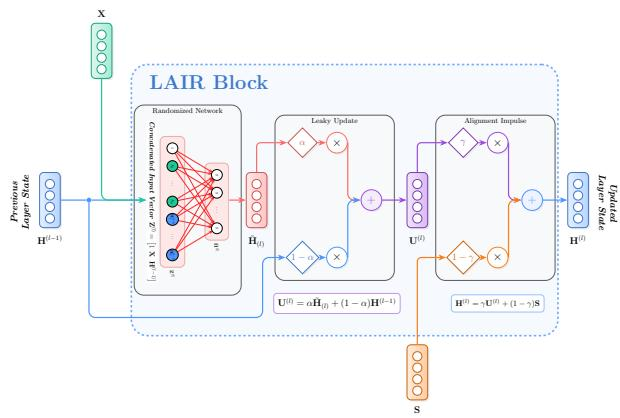  
Figure 1: A single LAIR-Net block. The layer input contains the bias, the observed inputs, and the previous hidden state. A fixed random transformation produces $\widetilde { \mathbf { H } } ^ { \left( \ell \right) }$ . The leaky transition combines this repreesentation with $\mathbf { H } ^ { ( \ell - 1 ) }$ using γ. The alignment impulse then combines the resulting state with S using α.

At depth $\ell ,$ the readout design matrix is formed by concatenating the bias-augmented input with the current hidden state

$$
{ \bf D } ^ { ( \ell ) } = [ { \bf A } , { \bf H } ^ { ( \ell ) } ] \in \mathbb { R } ^ { N \times ( d + 1 + m ) } .\tag{7}
$$

The original covariates therefore remain directly avail able to every readout. Only the current hidden state is appended to A, so the width of $\mathbf { D } ^ { ( \ell ) }$ remains equal to $d + 1 + m$ for every ℓ.

The output weights at each depth are estimated using ridge regression (Hoerl and Kennard, 1970). The corresponding closed-form solution is

$$
\begin{array} { r } { \pmb { \beta } ^ { ( \ell ) } = \left( ( \mathbf { D } ^ { ( \ell ) } ) ^ { \top } \mathbf { D } ^ { ( \ell ) } + \lambda \mathbf { I } _ { d + 1 + m } \right) ^ { - 1 } ( \mathbf { D } ^ { ( \ell ) } ) ^ { \top } \mathbf { y } , } \end{array}\tag{8}
$$

where $\lambda > 0$ denotes the ridge regularisation parame ter. The corresponding layerwise prediction is

$$
\widehat { \mathbf { y } } ^ { ( \ell ) } = \mathbf { D } ^ { ( \ell ) } \beta ^ { ( \ell ) } .
$$

The random hidden weights $\mathbf { W } ^ { ( \ell ) }$ are not optimised. After the SLAN has been fitted, the output weights associated with each randomised layer are therefore obtained through the closed-form ridge solution in (8).

The L readouts produce predictions from diferent depths of the randomised hierarchy. The final prediction is obtained as

$$
\widehat { \mathbf { y } } = \mathcal { A } \left( \widehat { \mathbf { y } } ^ { ( 1 ) } , \ldots , \widehat { \mathbf { y } } ^ { ( L ) } \right) ,\tag{9}
$$

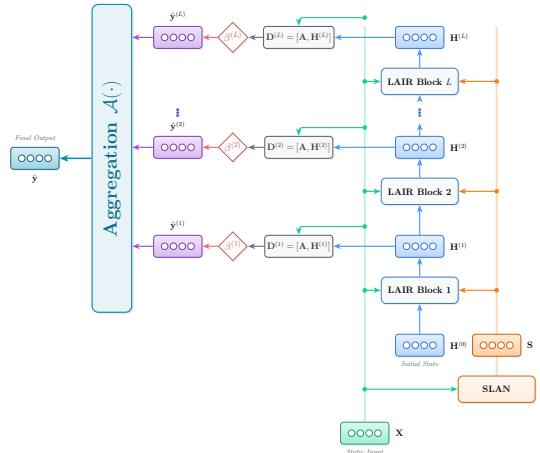  
Figure 2: The LAIR-Net architecture. The SLAN produces the anchor S, which is supplied to every randomized layer. Each LAIR-Net block applies a fixed random transformation, a leaky transition, and an align ment impulse. A ridge readout is fitted at every depth, and the resulting layerwise predictions are combined using .

where $\boldsymbol { \mathcal { A } } ( \cdot )$ denotes elementwise aggregation. In the experiments, we use the elementwise median. The median limits the influence of a minority of layerwise predictions that difer substantially from the remaining outputs. The corresponding prediction-level robustness property is discussed in Section 4.

Figure 2 shows the complete LAIR-Net architecture. The SLAN is fitted once to obtain the alignment anchor. The random hidden transformations are then sampled and fixed. Each hidden state is constructed using the randomized response in (4), the leaky transition in (5), and the alignment impulse in (6). The resulting hidden state is combined with the biasaugmented input through (7), and the corresponding readout weights are obtained using (8). Finally, the layerwise predictions are combined using (9).

## 4 THEORETICAL ANALYSIS

We theoretically analyze the propagation of the hidden state under leaky transitions and an alignment impulse. The results are established conditionally on a fixed realization of the random weights, consistent with the prediction setting in which these weights are sampled once and subsequently remain unchanged. Under this conditioning, the analysis is deterministic, and the corresponding proofs are provided in $\mathrm { A p \mathrm { - } }$ pendix B.

The construction of Section 3 acts on each sample independently until the readout is fitted, so it is enough to analyze the recursion for a single input $\mathbf { x } \in \mathbb { R } ^ { d }$ with anchor $\mathbf { s } \in \mathbb { R } ^ { m }$ . Writing $\mathbf { z } ^ { ( \ell ) } = [ 1 , \mathbf { h } ^ { ( \ell - 1 ) } , \mathbf { x } ]$ , the recursion is

$$
\begin{array} { r } { \widetilde { \mathbf { h } } ^ { ( \ell ) } = g \Big ( ( \mathbf { W } ^ { ( \ell ) } ) ^ { \top } \mathbf { z } ^ { ( \ell ) } \Big ) , ~ } \\ { \mathbf { u } ^ { ( \ell ) } = \gamma \widetilde { \mathbf { h } } ^ { ( \ell ) } + ( 1 - \gamma ) \mathbf { h } ^ { ( \ell - 1 ) } , ~ } \\ { \mathbf { h } ^ { ( \ell ) } = ( 1 - \alpha ) \mathbf { u } ^ { ( \ell ) } + \alpha \mathbf { s } , ~ \mathbf { h } ^ { ( 0 ) } = \mathbf { 0 } . } \end{array}
$$

Assumption 4.1 (Bounded input and anchor). There exist $B _ { x } > 0$ and $B _ { s } > 0$ with $\| \mathbf { x } \| _ { 2 } \leq B _ { x }$ and $\| \mathbf { s } \| _ { 2 } \leq$ $B _ { s }$ for every sample considered.

Assumption 4.2 (Lipschitz activation). The activation g is applied elementwise and is Lipschitz with constant $L _ { g } > 0$

Assumption 4.3 (Convex mixing and regularised readout). The coeficients satisfy $0 ~ \leq ~ \gamma ~ \leq ~ 1$ and $0 \leq \alpha \leq 1$ , and the ridge parameter satisfies $\lambda > 0$

Assumption 4.1 describes the operating regime of the experiments after preprocessing, where inputs are standardised and the anchor is a bounded activation of a fitted network. It is required only for the boundedstate result of Theorem 4.6; the input-perturbation result of Theorem 4.4 bounds a diference and does not use it. Assumption 4.2 covers the rectified linear and hyperbolic tangent activations used here, both with $L _ { g } = 1$ . Assumption 4.3 restates the design of Equations (5) and (6).

Partition the random matrix of layer j by the blocks of $\mathbf { z } ^ { ( j ) }$ , so that $\mathbf { W _ { h } ^ { ( j ) } } \in \mathbb { R } ^ { m \times m }$ acts on the hidden state and $\mathbf { W } _ { \mathbf { x } } ^ { ( j ) } \in \mathbb { R } ^ { d \times m }$ acts on the input. Because the results below iterate a single factor across depth, the constants are taken uniformly over the realised stack,

$$
c _ { 1 } = L _ { g } \operatorname* { m a x } _ { 1 \leq j \leq L } \left\| \mathbf { W } _ { \mathrm { h } } ^ { ( j ) } \right\| _ { 2 } , \qquad c _ { \mathrm { x } } = L _ { g } \operatorname* { m a x } _ { 1 \leq j \leq L } \left\| \mathbf { W } _ { \mathrm { x } } ^ { ( j ) } \right\| _ { 2 } ,\tag{10}
$$

and the efective propagation factor is

$$
\rho = ( 1 - \alpha ) \big ( \gamma c _ { 1 } + 1 - \gamma \big ) .\tag{11}
$$

The bounded-state result additionally needs the bias row, because the layer input carries a constant entry that does not cancel when a norm rather than a diference is bounded. Writing $\mathbf { W } _ { 0 \mathbf { x } } ^ { ( j ) }$ for the rows of $\mathbf { W } ^ { ( j ) }$ acting on [1, x], we set

$$
c _ { 0 } = L _ { g } \operatorname* { m a x } _ { 1 \leq j \leq L } \left. \mathbf { W } _ { 0 \mathrm { x } } ^ { ( j ) } \right. _ { 2 } \sqrt { 1 + B _ { x } ^ { 2 } } .\tag{12}
$$

All three maxima are finite for any finite depth and any realisation, so (10) and (12) are well defined. The state

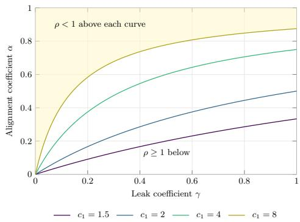

Figure 3: The region in which the propagation factor of (11) is below one, for four values of the state gain $c _ { 1 } .$ . The condition holds above each curve. Shading marks the region for $c _ { 1 } = 8$ , the most demanding case shown. The curves are the identity $\rho = ( 1 - \alpha ) ( 1 +$ $\gamma ( c _ { 1 } - 1 ) )$ rather than a measured quantity, so the figure describes the scope of Theorem 4.4 and not the behaviour of any fitted model.

gain uses the norm of the state block alone, because a diference between two hidden states enters the next layer only through that block. Using the norm of the whole random matrix would also be valid but looser, and the looseness matters because the conclusions be low are conditional on $\rho < 1$

That condition is a statement about the coeficients and the realised state gain, so it can be read of directly. Rearranging $( 1 1 ) , \rho < 1$ holds exactly when $\alpha > \gamma ( c _ { 1 } - 1 ) / \big ( 1 + \gamma ( c _ { 1 } - 1 ) \big )$ . Figure 3 draws that boundary. The alignment coeficient is what buys the condition, and the larger the state gain, the more of it is required.

The question the architecture is designed around is how a small change in the input is transmitted through depth. The following statement answers it directly, and it is the quantity measured in Section 6.

Theorem 4.4 (Input-perturbation sensitivity). Let Assumptions $4 . 2 \substack { - 4 . 9 }$ hold. Consider two inputs x and x¯ with corresponding anchors s and s¯, propagated through the same realization of the random weights from the common initial state $\bar { h ^ { ( 0 ) } } = \bar { h } ^ { ( 0 ) } = 0$ . Define $\Delta h ^ { ( \ell ) } = h ^ { ( \ell ) } - \bar { h } ^ { ( \ell ) } , \Delta x = x - \bar { x } , \Delta s = s - \bar { s }$ . Let $\rho =$ $( 1 - \alpha ) ( \gamma c _ { 1 } + 1 - \gamma )$ and $\delta = ( 1 - \alpha ) \gamma c _ { x } \| \Delta x \| _ { 2 } + \alpha \| \Delta s \| _ { 2 } .$ Then, for every layer $1 \le \ell \le L$

$$
\begin{array} { r } { \| \Delta h ^ { ( \ell ) } \| _ { 2 } \leq \rho \| \Delta h ^ { ( \ell - 1 ) } \| _ { 2 } + \delta . } \end{array}
$$

Consequently,

$$
\| \Delta h ^ { ( \ell ) } \| _ { 2 } \leq \left\{ { \begin{array} { l l } { \displaystyle \delta { \frac { 1 - \rho ^ { \ell } } { 1 - \rho } } , } & { \rho \neq 1 , } \\ { \displaystyle \ell \delta , } & { \rho = 1 . } \end{array} } \right.
$$

In particular, if $\rho < 1$ , then

$$
\| \Delta h ^ { ( \ell ) } \| _ { 2 } \le \frac { \delta } { 1 - \rho } , \qquad 1 \le \ell \le L ,
$$

so the bound is uniform over the network depth. If, in addition, the alignment mapping $x \mapsto s ( x )$ is $L _ { S ^ { - } }$ Lipschitz, then $\delta \leq [ ( 1 - \alpha ) \gamma c _ { x } + \alpha L _ { S } ] \| \Delta x \| _ { 2 }$

Theorem 4.4 separates the two ways a perturbation reaches the hidden state. The term in $c _ { \mathrm { x } }$ is the direct path through the residual input of Equation (3), and the term in α is the path through the anchor. Neither is amplified across depth once $\rho < 1$ , because the recursion then contracts what it has already accumu lated faster than the new contribution arrives.

The same bound covers the no-alignment, no-leak setting. Putting $\alpha = 0$ and $\gamma = 1$ gives $\rho = c _ { 1 }$ , and when this factor exceeds one the right-hand side grows with ℓ instead of remaining flat. This describes the scope of the bound rather than the behaviour of any particular trajectory, and Section 6 measures the realised sensitivity in both settings.

Corollary 4.5 (Hidden-state incremental stability). Consider two trajectories propagated through the same realization of the random weights with the same input x and the same anchor s, but with possibly diferent initial states $h ^ { ( 0 ) }$ and $\bar { h } ^ { ( 0 ) }$ . Then, for every layer $1 \leq$ $\ell \leq L$

$$
\left\| \Delta \mathbf { h } ^ { ( \ell ) } \right\| _ { 2 } \leq \rho ^ { \ell } \left\| \Delta \mathbf { h } ^ { ( 0 ) } \right\| _ { 2 } .
$$

In particular, if $\rho < 1$ , the hidden-state perturbation decays geometrically with depth.

Corollary 4.5 considers the homogeneous stateperturbation recursion. It is stated for completeness, as it isolates the contraction mechanism in the hiddenstate dynamics. This comparison is not encountered in the implemented algorithm, where the initial hidden state is fixed at the zero vector for every input. The inhomogeneous perturbation bound in Theorem 4.4 is the result directly relevant to the input-sensitivity experiments reported here.

The same recursion answers a second question. A bound on a diference says nothing about the size of the state itself, and an unbounded state would make the readout ill-conditioned, however well perturbations behaved.

Theorem 4.6 (Bounded hidden state). Let Assumptions $\it 4 . 1 \mathrm { - } 4 . 3$ hold and suppose that $g ( 0 ) = 0$ . For a fixed realization of the random weights, let $b \ =$ $( 1 - \alpha ) \gamma c _ { 0 } + \alpha B _ { s }$ . Then, for every layer $1 \leq \ell \leq L _ { \mathrm { : } }$

$$
\| h ^ { ( \ell ) } \| _ { 2 } \leq \rho \| h ^ { ( \ell - 1 ) } \| _ { 2 } + b .
$$

Since $h ^ { ( 0 ) } = 0$ , it follows that

$$
\| h ^ { ( \ell ) } \| _ { 2 } \leq \left\{ { b } \frac { 1 - \rho ^ { \ell } } { 1 - \rho } , \quad \rho \neq 1 , \right.
$$

In particular, if $\rho < 1$ , then

$$
\| h ^ { ( \ell ) } \| _ { 2 } \le \frac { b } { 1 - \rho } , \qquad 1 \le \ell \le L ,
$$

So the hidden state is uniformly bounded over layers $1 \le \ell \le L$

Proposition 4.7 (Layerwise readout). $F o r \lambda > 0$ and any finite $\mathbf { D } ^ { ( \ell ) }$ , the ridge objective $\left\| \mathbf { D } ^ { ( \ell ) } \beta ^ { ( \ell ) } - \mathbf { y } \right\| _ { 2 } ^ { 2 } +$ $\lambda \left\| \beta ^ { ( \ell ) } \right\| _ { 2 } ^ { 2 }$ is strictly convex and Equation (8) is its unique minimiser.

Proposition 4.7 is the standard ridge argument and is included because LAIR-Net fits one such readout at every depth. It is a property of the estimator rather than of the architecture.

One component remains, which acts after the readouts rather than inside the recursion. Aggregating across depth is what makes the model an ensemble, and it is worth being precise about what that does and does not buy.

Proposition 4.8 (Aggregation). Let $\varepsilon ^ { ( 1 ) } , \dots , \varepsilon ^ { ( L ) }$ denote the layerwise prediction errors. Define the meanaggregated error by $\begin{array} { r } { \bar { \varepsilon } = \frac { 1 } { L } \sum _ { \ell = 1 } ^ { L } \varepsilon ^ { ( \ell ) } } \end{array}$ . Then $\mathrm { V a r } ( \bar { \varepsilon } ) =$ $\begin{array} { r } { \frac { 1 } { L ^ { 2 } } \sum _ { i = 1 } ^ { L } \sum _ { j = 1 } ^ { L } } \end{array}$ Cov $\left( \varepsilon ^ { ( i ) } , \varepsilon ^ { ( j ) } \right)$ . If the layerwise errors are uncorrelated in pairs and have a common variance $\sigma ^ { 2 }$ , then $\begin{array} { r } { \mathrm { V a r } ( \bar { \varepsilon } ) = \frac { \sigma ^ { 2 } } { L } } \end{array}$ . For the median aggregate, consider a fixed realization of the layerwise errors. If more than half of the layerwise errors satisfy $| \varepsilon ^ { ( \ell ) } | \le \dot { \tau }$ , then the median-aggregated error satisfies $| \varepsilon _ { \mathrm { m e d } } | \leq \tau$

The first part of Proposition 4.8 states a condition rather than a property of LAIR-Net. The alignment impulse pulls every layer towards the same anchor, so layerwise errors are correlated by construction and the variance reduction available in practice is smaller than $L ^ { - 1 }$

## 5 EXPERIMENTS

This section reports what LAIR-Net does on real data. We compare it twice, once against the randomizednetwork family it belongs to and once against conventional models that fit every parameter by iterative optimization. These are separate questions. The first asks whether the alignment anchor improves on the randomized recursion it is added to. The second asks whether the resulting model is competitive outside that family at all. The experiment protocol, dataset details, and extended results are given in Appendix C

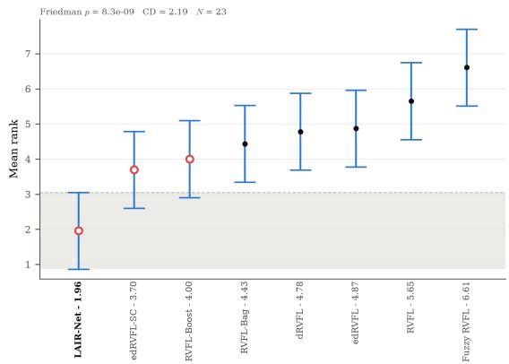  
Figure 4: Nemenyi comparison within the randomizednetwork family. Each point is a mean rank with its interval, and the shaded band marks the region not separated from the best-ranked model at the 0.05 level, with CD = 2.19 over 23 datasets. Lower is better.

## 5.1 Comparison with randomized networks

Table 1 reports the comparison of record. The baselines are RVFL, dRVFL, edRVFL, edRVFL-SC, Fuzzy RVFL, and bagged and boosted RVFL. LAIR-Net attains the lowest mean error on 13 of the 23 datasets and an average rank of 1.96 of eight models. Every baseline is rejected against it after Holm correction, with the largest adjusted p-value 0.0045.

Figure 4 shows where that ranking is and is not decisive. The critical diference separates LAIR-Net from five of the seven baselines, namely bagged RVFL, dRVFL, edRVFL, RVFL, and Fuzzy RVFL. It does not separate LAIR-Net from edRVFL-SC or from boosted ${ \mathrm { R V F L } } ,$ whose intervals overlap the band.

## 6 SIMULATION STUDY

We vary the nonlinear share of a regression target and its noise level independently to test when the alignment anchor improves on a randomized baseline. With 1000 training and 1000 test samples per seed, the edRVFL-to-LAIR-Net test-error ratio rises as nonlinear signal strengthens and falls as noise increases. At the fixed alignment coeficient $\alpha = 0 . 5 \mathrm { { ; } }$ LAIR-Net overtakes edRVFL in the low-noise setting once nonlinear structure is present, while it does not overtake edRVFL within the tested nonlinear-share grid at the highest noise level. The complete data-generating process, grid, and confidence intervals are reported in Appendix A.

Table 1: Test mean squared error against the randomized-network family, mean standard deviation over ten folds. Lower is better and the best entry in each row is in bold. The final rows give the average rank within this family and the Holm-adjusted Wilcoxon signed-rank p-value against LAIR-Net.
<table><tr><td>Dataset</td><td>RVFL</td><td>dRVFL</td><td>edRVFL</td><td>edRVFL-SC</td><td> $\mathrm { F u z z y ~ R V F L }$ </td><td>RVFL-Bag</td><td>RVFL-Boost</td><td>LAIR-Net</td></tr><tr><td>Airfoil</td><td> $7 . 9 4 3 \pm 2 . 3 4 2$ </td><td> $4 . 1 2 8 \pm 1 . 0 6 0$ </td><td> $5 . 5 8 9 \pm 1 . 3 9 7$ </td><td> $3 . 3 9 1 \pm 0 . 9 5 2$ </td><td> $1 7 . 5 5 3 \pm 3 . 6 1 3$ </td><td> $1 0 . 3 1 5 \pm 1 . 5 7 4$ </td><td> $6 . 7 1 6 \pm 1 . 4 6 2$ </td><td> $\mathbf { 2 . 2 0 8 \ : \pm { \ : 0 . 4 8 5 } }$ </td></tr><tr><td>Auto MPG</td><td> $7 . 3 6 8 \pm 1 . 9 3 6$ </td><td> $7 . 0 9 6 \pm 1 . 8 8 5$ </td><td> $7 . 6 1 3 \pm 1 . 8 8 6$ </td><td> $7 . 4 0 7 \pm 2 . 5 3 7$ </td><td> $8 . 5 2 0 \pm 2 . 1 3 8$ </td><td> $7 . 1 6 0 \pm 2 . 1 0 7$ </td><td> $6 . 9 7 5 \pm 1 . 6 6 2$ </td><td> $\mathbf { 6 . 9 1 9 \ : \pm { \ : 2 . 0 7 4 } }$ </td></tr><tr><td>Autos</td><td> $0 . 0 2 0 \pm \ : 0 . 0 0 6$ </td><td> $0 . 0 2 1 \pm 0 . 0 0 5$ </td><td> $0 . 0 1 9 \pm \ : 0 . 0 0 6$ </td><td> $0 . 0 1 9 \pm 0 . 0 0 6$ </td><td> $0 . 0 2 5 \pm 0 . 0 0 7$ </td><td> $\mathbf { 0 . 0 1 7 \Psi \pm 0 . 0 0 7 }$ </td><td> $0 . 0 2 0 \pm \ : 0 . 0 0 8$ </td><td> $0 . 0 2 1 \pm 0 . 0 1 0$ </td></tr><tr><td>Breast Cancer</td><td> $\mathbf { 8 6 9 . 5 5 6 \ : \pm { \ : 3 1 0 . 9 7 4 } }$ </td><td> $8 9 6 . 2 9 6 \pm 2 9 1 . 2 0 1$ </td><td> $9 1 7 . 9 6 1 \pm 2 6 8 . 3 7 3$ </td><td> $9 0 1 . 0 5 0 \pm 3 1 7 . 5 7 3$ </td><td> $8 7 7 . 5 8 2 \pm 2 7 9 . 7 7 5$ </td><td> $8 9 6 . 6 6 0 \pm 2 9 0 . 4 9 5$ </td><td> $9 0 8 . 8 0 3 \pm 3 0 7 . 6 5 3$ </td><td> $8 7 1 . 5 8 0 \pm 2 6 5 . 2 9 3$ </td></tr><tr><td>Challenger</td><td> $0 . 4 9 5 \pm 0 . 4 7 0$ </td><td> $0 . 4 6 6 \pm 0 . 4 9 0$ </td><td> $0 . 9 7 5 \pm 1 . 1 6 0$ </td><td> $0 . 5 1 0 \pm 0 . 5 4 3$ </td><td> $0 . 4 1 8 \pm 0 . 4 3 3$ </td><td> $0 . 4 8 0 \pm 0 . 4 1 5$ </td><td> $\mathbf { 0 . 3 2 9 \ : \pm { \ : 0 . 2 5 2 } }$ </td><td> $0 . 3 8 9 \pm 0 . 4 4 8$ </td></tr><tr><td>Concrete</td><td> $5 6 . 7 0 8 \pm 1 0 . 8 4 1$ </td><td> $5 6 . 4 8 0 \pm 1 1 . 0 8 2$ </td><td> $4 8 . 8 5 0 \pm 9 . 6 2 9$ </td><td> $5 0 . 2 0 8 \pm 1 1 . 8 0 8$ </td><td> $9 2 . 9 9 4 \pm 1 3 . 4 5 8$ </td><td> $5 5 . 5 3 1 \pm 1 1 . 5 6 4$ </td><td> $5 4 . 7 1 8 \pm 1 1 . 4 9 2$ </td><td> $\mathbf { 4 0 . 1 9 9 \ : \pm { \ : 1 0 . 8 8 3 } }$ </td></tr><tr><td>Concrete Slump</td><td> $1 7 . 4 9 7 \pm 1 1 . 0 9 3$ </td><td> $2 6 . 7 7 0 \pm 2 8 . 2 3 0$ </td><td> $1 8 . 6 9 9 \pm 1 2 . 4 5 6$ </td><td> $1 2 . 7 5 2 \pm 9 . 8 6 6$ </td><td> $5 3 . 2 0 2 \pm 4 1 . 1 2 6$ </td><td> $4 2 5 . 7 5 7 \pm 1 6 9 . 5 8 8$ </td><td> $1 3 . 7 0 0 \pm 1 3 . 1 0 3$ </td><td> $\mathbf { 1 1 . 1 7 0 \ : \pm { \ : 1 0 . 2 4 6 } }$ </td></tr><tr><td>Energy</td><td> $0 . 2 6 4 \pm 0 . 1 0 1$ </td><td> $0 . 2 2 4 \pm 0 . 0 6 5$ </td><td> $0 . 2 7 8 \pm 0 . 1 1 2$ </td><td> $0 . 2 1 0 \pm 0 . 0 6 8$ </td><td> $8 . 1 0 5 \pm 2 . 1 6 1$ </td><td> $0 . 4 0 1 \pm 0 . 1 0 5$ </td><td> $0 . 2 3 2 \pm 0 . 0 6 2$ </td><td> $\mathbf { 0 . 1 6 3 \ \pm { \ : 0 . 0 4 5 } }$ </td></tr><tr><td>Fertility</td><td> $0 . 0 3 4 \pm 0 . 0 1 5$ </td><td> $0 . 0 4 2 \pm 0 . 0 2 4$ </td><td> $\mathbf { 0 . 0 3 0 \ : \pm { \ : 0 . 0 1 3 } }$ </td><td> $0 . 0 3 6 \pm 0 . 0 1 4$ </td><td> $0 . 0 3 2 \pm 0 . 0 1 5$ </td><td> $0 . 0 3 5 \pm 0 . 0 1 7$ </td><td> $0 . 0 3 6 \pm 0 . 0 2 1$ </td><td> $0 . 0 3 3 \pm 0 . 0 1 9$ </td></tr><tr><td>Forest Fires</td><td> $2 . 0 8 4 \pm 0 . 5 9 9$ </td><td> $2 . 0 7 4 \pm 0 . 5 7 2$ </td><td> $2 . 0 8 9 \pm \ : 0 . 5 7 0$ </td><td> $2 . 0 7 4 \pm 0 . 5 6 6$ </td><td> $2 . 0 9 5 \pm 0 . 5 6 6$ </td><td> $\mathbf { 1 . 9 4 8 \ : \pm { \ : 0 . 4 7 1 } }$ </td><td> $2 . 0 6 2 \pm 0 . 5 8 3$ </td><td>2.073 ± 0.582</td></tr><tr><td>Gas</td><td> $2 . 9 3 \mathrm { { e 3 } \pm 9 . 2 8 \mathrm { { e 3 } } }$ </td><td> $2 0 . 3 5 8 \pm 6 3 . 4 4 0$ </td><td> $1 . 8 6 \mathrm { { e 3 } \pm 5 . 9 0 \mathrm { { e 3 } } }$ </td><td> $\mathbf { 0 . 3 1 4 \ \pm 0 . 6 8 4 }$ </td><td> $1 8 1 . 4 0 8 \pm 5 7 3 . 1 2 3$ </td><td> $1 . 3 6 \mathrm { { e 3 } \pm 4 . 2 9 \mathrm { { e 3 } } }$ </td><td> $5 2 . 6 4 5 \pm 1 6 4 . 8 0 3$ </td><td>8.752 ± 27.367</td></tr><tr><td>Housing</td><td> $1 2 . 6 0 6 \pm 9 . 3 0 8$ </td><td> $1 1 . 5 1 4 \pm 8 . 6 4 7$ </td><td> $1 1 . 9 8 3 \pm 1 1 . 3 0 2$ </td><td> $\mathbf { 1 0 . 1 0 9 \ : \pm 9 . 4 5 6 }$ </td><td> $2 1 . 7 8 8 \pm 9 . 8 7 6$ </td><td> $1 0 . 1 5 8 \pm 8 . 8 5 3$ </td><td> $1 1 . 4 6 8 \pm 9 . 4 3 2$ </td><td>10.706 ± 8.377</td></tr><tr><td>Machine CPU</td><td> $0 . 1 6 1 \pm 0 . 0 3 7$ </td><td> $0 . 1 8 0 \pm \mathrm { { 0 . 0 8 8 } }$ </td><td> $0 . 1 7 5 \pm 0 . 0 5 1$ </td><td> $0 . 1 6 2 \pm 0 . 0 4 8$ </td><td> $0 . 1 9 1 \pm 0 . 0 5 7$ </td><td> $0 . 1 6 5 \pm 0 . 0 4 3$ </td><td> $0 . 1 5 2 \pm 0 . 0 3 9$ </td><td>0.146 ± 0.034</td></tr><tr><td>Parkinsons</td><td> $8 3 . 8 8 0 \pm 5 . 1 4 1$ </td><td> $5 8 . 5 5 7 \pm 1 7 . 4 2 0$ </td><td> $7 8 . 3 2 0 \pm 7 . 8 8 6$ </td><td> $5 5 . 3 7 8 \pm 2 0 . 0 5 8$ </td><td> $8 3 . 2 3 5 \pm 3 . 5 1 5$ </td><td> $5 4 . 7 9 2 \pm 3 . 8 6 9$ </td><td> $9 3 . 3 9 2 \pm 8 . 4 4 3$ </td><td>24.092 ± 17.750</td></tr><tr><td>Pendulum</td><td> $3 . 2 8 2 \pm 1 . 6 1 0$ </td><td> $2 . 7 8 0 \pm 1 . 2 3 0$ </td><td> $2 . 5 9 5 \pm 1 . 0 3 7$ </td><td> $2 . 4 6 7 \pm 1 . 0 6 0$ </td><td> $7 . 3 9 3 \pm 3 . 4 9 8$ </td><td> $2 . 2 6 9 \pm 1 . 1 8 3$ </td><td> $2 . 7 9 8 \pm 1 . 8 0 9$ </td><td>1.681 ± 0.963</td></tr><tr><td>PumaDyn-32nm</td><td> $1 . 0 0 1 \pm 0 . 0 6 6$ </td><td> $0 . 9 8 7 \pm 0 . 0 6 2$ </td><td> $0 . 9 9 3 \pm 0 . 0 6 7$ </td><td> $0 . 9 5 4 \pm 0 . 0 6 0$ </td><td> $1 . 0 0 4 \pm 0 . 0 6 6$ </td><td> $0 . 9 4 7 \pm 0 . 0 6 2$ </td><td> $0 . 9 8 7 \pm 0 . 0 6 4$ </td><td>0.052 ± 0.004</td></tr><tr><td>Servo</td><td> $0 . 0 9 5 \pm 0 . 0 5 6$ </td><td> $0 . 1 0 2 \pm 0 . 0 5 1$ </td><td> $0 . 0 9 2 \pm \ : 0 . 0 4 4$ </td><td> $0 . 1 0 3 \pm 0 . 0 5 1$ </td><td> $0 . 2 1 9 \pm \ : 0 . 0 8 8$ </td><td> $0 . 1 5 3 \pm 0 . 0 6 0$ </td><td> $0 . 0 9 5 \pm \ : 0 . 0 5 1$ </td><td> $\mathbf { 0 . 0 8 6 \ : \pm { \ : 0 . 0 4 7 } }$ </td></tr><tr><td>SkillCraft</td><td> $0 . 0 7 0 \pm \ : 0 . 0 1 9$ </td><td> $0 . 0 6 4 \pm 0 . 0 0 8$ </td><td> $0 . 0 6 7 \pm \ : 0 . 0 1 3$ </td><td> $0 . 0 7 5 \pm 0 . 0 3 4$ </td><td> $0 . 0 7 2 \pm 0 . 0 2 6$ </td><td> $0 . 0 6 3 \pm 0 . 0 0 9$ </td><td> $\mathbf { 0 . 0 6 3 \ \pm { \ : 0 . 0 0 9 } }$ </td><td> $0 . 0 6 6 \pm 0 . 0 1 1$ </td></tr><tr><td>SML</td><td> $1 . 2 1 9 \pm 0 . 1 0 6$ </td><td> $0 . 2 4 6 \pm 0 . 0 5 2$ </td><td> $0 . 9 0 7 \pm 0 . 0 5 0$ </td><td> $0 . 3 5 6 \pm 0 . 0 2 2$ </td><td> $2 . 0 4 4 \pm 0 . 1 3 8$ </td><td> $0 . 8 8 5 \pm \mathbf { 0 . 1 0 1 }$ </td><td> $0 . 7 3 6 \pm 0 . 0 4 0$ </td><td> $\mathbf { 0 . 1 1 7 \ : \pm { \ : 0 . 0 2 3 } }$ </td></tr><tr><td>Solar</td><td> $0 . 6 2 7 \pm 0 . 3 4 4$ </td><td> $0 . 6 2 5 \pm 0 . 3 4 2$ </td><td> $0 . 6 1 4 \pm 0 . 3 3 5$ </td><td> $0 . 6 1 9 \pm 0 . 3 4 4$ </td><td> $0 . 6 2 4 \pm 0 . 3 5 8$ </td><td> $\mathbf { 0 . 6 1 2 \ \pm { \ : 0 . 3 4 5 } }$ </td><td> $0 . 6 2 1 \pm 0 . 3 4 8$ </td><td> $0 . 6 2 2 \pm 0 . 3 4 8$ </td></tr><tr><td>Stock</td><td> $2 . 6 3 \mathrm { e } { - } 5 \pm 4 . 8 4 \mathrm { e } { - } 6$ </td><td> $2 . 6 8 \mathrm { e } { - 5 } \pm 5 . 0 5 \mathrm { e } { - 6 }$ </td><td> $2 . 5 9 \mathrm { e } \mathrm { - } 5 \pm 5 . 3 4 \mathrm { e } \mathrm { - } 6$ </td><td> $2 . 5 9 \mathrm { e } \mathrm { - } 5 \pm 5 . 7 6 \mathrm { e } \mathrm { - } 6$ </td><td> $\mathbf { 2 . 5 3 e { - } 5 \\\pm 4 . 9 1 e { - } 6 }$ </td><td> $2 . 8 4 \mathrm { e } { - 5 } \pm 4 . 9 2 \mathrm { e } { - 6 }$ </td><td> $2 . 5 8 \mathrm { e } { - 5 } \pm 4 . 9 0 \mathrm { e } { - 6 }$ </td><td> $2 . 5 6 \mathrm { e } { - } 5 \pm 3 . 8 8 \mathrm { e } { - } 6$ </td></tr><tr><td>Wine Quality</td><td> $0 . 2 7 2 \pm 0 . 0 3 1$ </td><td> $0 . 2 5 1 \pm 0 . 0 3 7$ </td><td> $0 . 2 4 0 \pm \ : 0 . 0 3 2$ </td><td> $0 . 2 2 5 \pm 0 . 0 3 6$ </td><td> $0 . 3 3 0 \pm 0 . 0 6 0$ </td><td> $0 . 2 5 1 \pm 0 . 0 4 0$ </td><td> $0 . 2 3 6 \pm 0 . 0 3 2$ </td><td> $\mathbf { 0 . 2 1 8 \ : \pm { \ : 0 . 0 3 8 } }$ </td></tr><tr><td>Yacht</td><td> $0 . 0 3 6 \pm 0 . 0 6 9$ </td><td> $0 . 0 2 4 \pm 0 . 0 3 6$ </td><td> $0 . 0 2 9 \pm \ : 0 . 0 4 9$ </td><td> $0 . 0 2 4 \pm 0 . 0 4 0$ </td><td> $0 . 1 4 1 \pm 0 . 1 4 2$ </td><td> $0 . 0 7 3 \pm \ : 0 . 0 6 4$ </td><td> $0 . 0 3 2 \pm 0 . 0 4 3$ </td><td> $\mathbf { 0 . 0 2 0 \ : \pm { \ : 0 . 0 3 2 } }$ </td></tr><tr><td>Average rank</td><td>5.65</td><td>4.78</td><td>4.87</td><td>3.70</td><td>6.61</td><td>4.43</td><td>4.00</td><td>1.96</td></tr><tr><td>Holm-adjusted p</td><td>0.0014</td><td>0.0003</td><td>0.0007</td><td>0.0045</td><td>0.0003</td><td>0.0045</td><td>0.0029</td><td></td></tr></table>

Removing only the supervised anchor leaves a residual and leaky recursion whose error difers from edRVFL by at most 3.7% across the fifteen tested cells. The anchor accounts for almost all of the observed gain; capacity and untrained-anchor controls do not close that gap in the high-signal regime. Selecting α on a validation split gives test error within 1.8% of the best value on the grid in every cell and reduces the cells where LAIR-Net loses to edRVFL from nine of fifteen with the fixed coeficient to one of fifteen. At 250 training samples, the direction persists, but only the low-noise gains remain clearly separated. Appendix D gives the ablations and Appendix A sensitivity analyses.

over every baseline; Nemenyi tests separate it from five randomized and six conventional baselines. Controlled experiments attribute most of the improvement to the alignment anchor, whose benefit depends on the learnable nonlinear structure and diminishes for nearly linear targets or dominant noise, consistent with associations observed across benchmark datasets. Validationbased selection of the alignment coeficient reduces underperformance against the randomized baseline from nine of fifteen simulation settings to one. Limitations include smaller gains with limited samples, unresolved behavior in high-dimensional mixed-feature settings, vulnerability to out-of-range inputs, and several-fold higher training cost than edRVFL due to anchor fitting. Theorem 4.4 applies only under $\rho ~ < ~ 1$ and characterizes propagation across depth rather than explaining empirical performance. Although the direction of the nonlinear-structure efect is stable across tested capacities, its crossover threshold is not. Future work should estimate the anchor’s advantage over the randomized ensemble directly to guide alignment strength and remove the corresponding search hyperparameter.

Across the 23 benchmark datasets, a proxy for the reward from nonlinearity has a rank correlation of 0.598 $( p = 0 . 0 0 3 )$ with LAIR-Net’s log error ratio against the best randomized baseline; a noise proxy has a correlation of +0.425 (p = 0.043). These are observational associations across datasets, consistent with the controlled study rather than causal evidence. The proxy definitions, plot, and outlier analysis appear in Appendix A.

## 7 CONCLUSION

## REFERENCES

LAIR-Net combines a learned target-aware alignment anchor with leaky residual transitions while retaining closed-form readouts and fixed hidden width across depth. It achieves the best average ranks among eight randomized models (1.96) and twelve conventional models (3.26), with Holm-adjusted tests favoring it

Akbilgic, O., H. Bozdogan, and M. E. Balaban (2014a). A novel hybrid RBF neural networks model as a forecaster.

– (2014b). A novel hybrid RBF neural networks model as a forecaster.

Bergstra, J., R. Bardenet, Y. Bengio, and B. Kégl (2011). “Algorithms for hyper-parameter optimization”. In: Advances in neural information processing systems 24.

Bradshaw, G. L. and D. Shaw (1992). Forecasting solar flares: Experts and artificial systems.

Brooks, T. F., D. S. Pope, and M. A. Marcolini (1989). Airfoil self-noise and prediction.

Cortez, P., A. Cerdeira, F. Almeida, T. Matos, and J. Reis (2009). Modeling wine preferences by data mining from physicochemical properties.

Cortez, P. and A. Morais (2007). A data mining approach to predict forest fires using meteorological data.

DELVE (1996). Pumadyn family of datasets. https: //www.cs.toronto.edu/\~delve/data/pumadyn/ desc.html. University of Toronto.

Demšar, J. (2006). “Statistical comparisons of classifiers over multiple data sets”. In: Journal of Machine learning research 7.Jan, pp. 1–30.

Draper, D. (1995). Assessment and propagation of model uncertainty.

Ein-Dor, P. and J. Feldmesser (1987). Attributes of the performance of central processing units: A relative performance prediction model.

Evans, T. (2021). UCI datasets. https : / / github . com/treforevans/uci\_datasets.

Garcia, S. and F. Herrera (2008). “An Extension on" Statistical Comparisons of Classifiers over Multiple Data Sets" for all Pairwise Comparisons.” In: Journal of machine learning research 9.12.

Gerritsma, J., R. Onnink, and A. Versluis (1981). Geometry, resistance and stability of the delft systematic yacht hull series.

Geurts, P., D. Ernst, and L. Wehenkel (2006). “Extremely randomized trees”. In: Machine Learning 63.1, pp. 3–42. doi: 10.1007/s10994-006-6226-1.

Gil, D., J. L. Girela, J. De Juan, M. J. Gomez-Torres, and M. Johnsson (2012). Predicting seminal quality with artificial intelligence methods.

Giri, V. K. and R. Goswami (2026). “Moving average randomized tree”. In: Machine Learning 115.1, pp. 1–32. doi: 10.1007/s10994-025-06978-9.

Grinsztajn, L., E. Oyallon, and G. Varoquaux (2022). “Why do tree-based models still outperform deep learning on typical tabular data?” In: Advances in neural information processing systems 35, pp. 507– 520.

Harrison Jr, D. and D. L. Rubinfeld (1978). “Hedonic housing prices and the demand for clean air”. In: Journal of environmental economics and management 5.1, pp. 81–102.

Hoerl, A. E. and R. W. Kennard (1970). “Ridge regression: Biased estimation for nonorthogonal problems”. In: Technometrics 12.1, pp. 55–67.

Hu, M., J. H. Chion, P. N. Suganthan, and R. K. Katuwal (2022). “Ensemble deep random vector functional link neural network for regression”. In: IEEE Transactions on Systems, Man, and Cybernetics: Systems 53.5, pp. 2604–2615.

Igelnik, B. and Y.-H. Pao (1995). “Stochastic choice of basis functions in adaptive function approximation and the functional-link net”. In: IEEE transactions on Neural Networks 6.6, pp. 1320–1329.

Jaeger, H., M. Lukoševičius, D. Popovici, and U. Siewert (2007). “Optimization and applications of echo state networks with leaky-integrator neurons”. In: Neural networks 20.3, pp. 335–352.

Kibler, D., D. W. Aha, and M. K. Albert (1989). Instance-based prediction of real-valued attributes.

Liu, D. C. and J. Nocedal (1989). “On the limited memory BFGS method for large scale optimization”. In: Mathematical programming 45.1, pp. 503–528.

Lukoševičius, M. and H. Jaeger (2009). “Reservoir computing approaches to recurrent neural network training”. In: Computer science review 3.3, pp. 127– 149.

Malik, A. K., R. Gao, M. Ganaie, M. Tanveer, and P. N. Suganthan (2023). “Random vector functional link network: Recent developments, applications, and future directions”. In: Applied Soft Computing 143, p. 110377.

Pao, Y.-H., G.-H. Park, and D. J. Sobajic (1994). “Learning and generalization characteristics of the random vector functional-link net”. In: Neurocomputing 6.2, pp. 163–180.

Quinlan, J. R. (1993a). Combining instance-based and model-based learning.

– (1993b). Combining instance-based and model-based learning.

Schumacher, T., M. Strohmaier, and F. Lemmerich (2025). A comparative evaluation of quantification methods.

Shi, Q., R. Katuwal, P. N. Suganthan, and M. Tanveer (2021). “Random vector functional link neural network based ensemble deep learning”. In: Pattern Recognition 117, p. 107978.

Shwartz-Ziv, R. and A. Armon (2022). “Tabular data: Deep learning is not all you need”. In: Information fusion 81, pp. 84–90.

Street, W. N., O. L. Mangasarian, and W. H. Wolberg (1995). An inductive learning approach to prognostic prediction.

Tsanas, A., M. Little, P. McSharry, and L. Ramig (2009). Accurate telemonitoring of Parkinson’s disease progression by non-invasive speech tests.

Tsanas, A. and A. Xifara (2012). Accurate quantitative estimation of energy performance of residential buildings using statistical machine learning tools.

Yang, Z., A. Wilson, A. Smola, and L. Song (2015). “A la carte–learning fast kernels”. In: Artificial Intelligence and Statistics. PMLR, pp. 1098–1106.

Yeh, I.-C. (1998). Modeling of strength of highperformance concrete using artificial neural networks.

Yeh, I.-C. (2007). Modeling slump flow of concrete using second-order regressions and artificial neural networks.

Zamora-Martinez, F., P. Romeu, P. Botella-Rocamora, and J. Pardo (2014). On-line learning of indoor temperature forecasting models towards energy eficiency.

## A SIMULATION STUDY

The benchmark comparison in Section 5 reports where LAIR-Net performs well, but it does not identify the data-generating reason, because a real dataset does not come with a knob for the property the architecture is meant to exploit. This section supplies that knob. We construct a data-generating process in which the amount of nonlinear structure and the noise level are set independently, and we use it to answer three questions. Under which conditions does a diference from a randomized baseline appear, which component of the architecture produces it, and does the resulting account carry over to real data.

Covariates are drawn in three blocks, $d = 3 0$ in total, comprising ten informative Gaussian variables $\mathbf { C } ,$ ten redundant variables formed as noisy linear images of $\mathbf { C } ,$ and ten pure-noise variables. The response combines a linear and a nonlinear component,

$$
y = \sqrt { 1 - \kappa } \mathcal { L } ( \mathbf { C } ) + \sqrt { \kappa } \mathcal { G } ( \mathbf { C } ) + \sigma \epsilon , \qquad \epsilon \sim \mathcal { N } ( 0 , 1 ) ,\tag{13}
$$

where $\mathcal { L }$ is linear in C and combines quadratic, interaction and trigonometric terms. Both components are standardised to unit variance, so κ is the nonlinear share of the signal variance and σ fixes the noise leve independently of $\kappa .$ The realised nonlinear share tracks the requested value closely, taking the values 0.000, 0.261, 0.526, 0.783 and 1.000 for $\kappa \in \{ 0 , 0 . 2 5 , 0 . 5 , 0 . 7 5 , 1 \}$ .

Equation (13) isolates the property at issue. Increasing κ adds structure that a linear readout on the raw inputs does not represent exactly, while holding the number of variables, their correlation structure and the noise level fixed. Every comparison below uses $N = 1 0 0 0$ training and 1000 test samples, ten seeds, and matched hidden width, depth, activation, input scale and ridge penalty across all models. Hyperparameters are fixed rather than tuned, so that a diference between two arms can only come from the component that difers between them.

Baselines are drawn from the randomized family alone, namely RVFL, dRVFL, edRVFL and edRVFL-SC. A cel is reported as a win or a loss only when the 95% bootstrap confidence interval of the median mean-squared-error ratio across seeds excludes one, and crossovers are therefore reported as regions rather than thresholds.

## A.1 Where the advantage appears

Figure 5 and Table 2 report the ratio of edRVFL to LAIR-Net test error with the alignment coeficient held at $\alpha = 0 . 5$ . The ratio increases monotonically with κ at every noise level and decreases with σ at every nonlinear share, and the figure shows where each curve meets one, which is the quantity the rest of this section is about.

Table 2: Median ratio of edRVFL to LAIR-Net test mean squared error over ten seeds, with $\alpha = 0 . 5$ fixed. A ratio above one favours $\mathrm { L A I R - N e t }$ . Rows vary the nonlinear share κ of Equation (13); columns vary the noise level σ.
<table><tr><td>κ</td><td> $\sigma = 0 . 1$ </td><td> $\sigma = 0 . 5$ </td><td> $\sigma = 1 . 0$ </td></tr><tr><td>0.00</td><td>0.852</td><td>0.614</td><td>0.591</td></tr><tr><td>0.25</td><td>2.106</td><td>0.751</td><td>0.625</td></tr><tr><td>0.50</td><td>2.522</td><td>0.875</td><td>0.661</td></tr><tr><td>0.75</td><td>2.639</td><td>1.005</td><td>0.693</td></tr><tr><td>1.00</td><td>2.991</td><td>1.122</td><td>0.729</td></tr></table>

The crossover from loss to gain occurs for $\kappa \in ( 0 , 0 . 2 5 ]$ at $\sigma = 0 . 1$ and for $\kappa \in ( 0 . 5 , 1 . 0 ]$ at $\sigma = 0 . 5$ , and does not occur within $\kappa \leq 1$ at $\sigma = 1 . 0$ . LAIR-Net therefore helps when the target has nonlinear structure that is learnable at the available noise level, and the randomized baselines are preferable when the target is close to linear or when noise dominates. An independent reimplementation of the design agreed to within three per cent on every entry of Table 2.

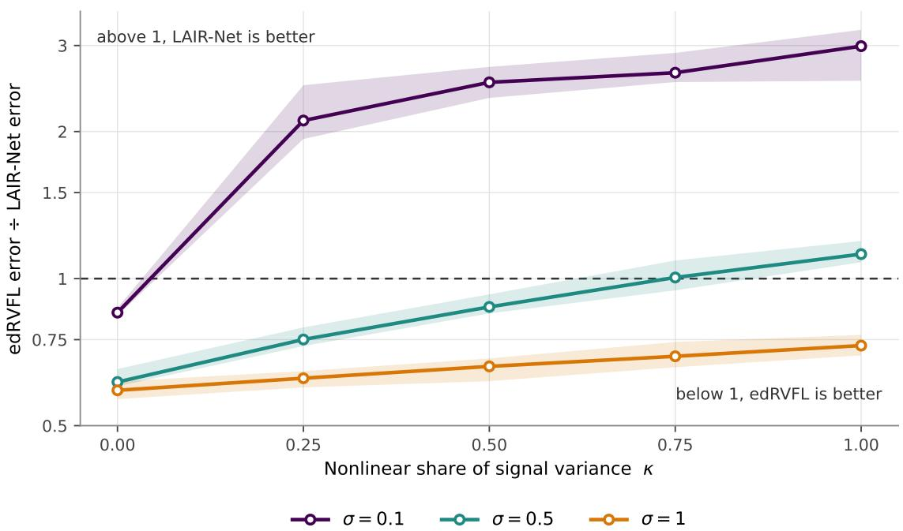  
Figure 5: Where the advantage appears. Each curve is the median ratio of edRVFL to LAIR-Net test error over ten seeds at one noise level, with the alignment coeficient fixed at $\alpha = 0 . 5$ , and the band is a 95% percentile bootstrap over those seeds. The dashed line at one is the crossover. $\mathrm { A t } ~ \sigma = 0 . 1$ 1 the curve crosses between $\kappa = 0$ and $\kappa = 0 . 2 5$ , at $\sigma = 0 . 5$ it reaches one only at $\kappa = 0 . 7 5$ , and at $\sigma = 1 . 0$ it does not cross within the grid.

## A.2 Which component produces the diference

The comparison in Table 2 varies three things at once, since LAIR-Net difers from edRVFL in the residual layer input, the leaky transition and the alignment impulse. Inserting an arm with $\alpha = 0$ , which retains the recursion and removes only the anchor, separates them.

The architecture term lies between 1.002 and 1.037 across all fifteen cells, so the recursion without an anchor difers from edRVFL by at most 3.7%. The anchor term reproduces the pattern of Table 2, reaching 2.889 at $\kappa = 1 . 0 , \sigma = 0 . 1$ . The alignment anchor accounts for essentially all of the diference, and the randomized recursion on its own accounts for little of it.

We may reasonably object that the anchor is a trained network, so the gain could reflect additional trained capacity rather than alignment. Two controls address this. Giving the randomized baselines up to eight times LAIR-Net’s hidden width leaves the best of them at 3.111 times LAIR-Net’s error in the high-signal cell, and repeating that sweep over six ridge penalties with the penalty selected on the test set, which is an advantage the baseline would not have in practice, leaves it at 3.084. Extra capacity does not close the gap in this regime. A third control replaces the trained anchor with an untrained network of identical width and distribution, which removes the target information while retaining the shrinkage the mixing step applies. That arm buys nothing at any sample size tested, so the contribution is target-aware information rather than generic shrinkage.

The results above hold α fixed, and the value that is best depends on κ and σ, neither of which is observable on a real dataset. The practical question is therefore whether the model’s own validation signal selects a suitable α without being told the regime.

Selecting α from a six-point grid on a validation split recovers the best available setting almost exactly. The ratio of the selected model’s error to the best in the grid lies between 1.000 and 1.018 across all cells, and the rank correlation between the selected and the best α is 0.838. Figure 8 shows both quantities directly.

The selected value falls from 0.5 where the anchor is informative to 0 on a purely linear target. Under the interval criterion, fixing $\alpha = 0 . 5$ loses in nine of fifteen cells with a worst case of 0.591, whereas selecting it loses in one cell, by 1.1%, on the purely linear high-signal problem. The mechanism degrades gracefully. Where the anchor helps it is used, and where it does not it is switched of.

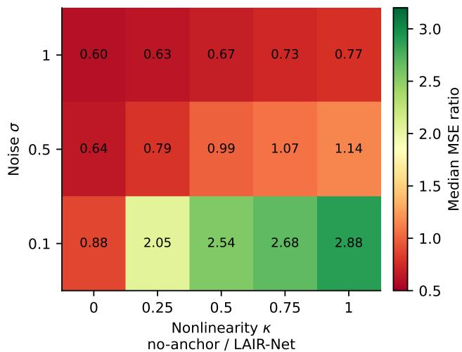

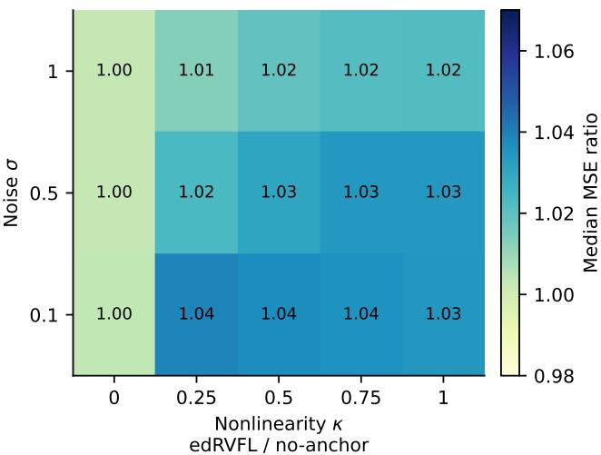  
Figure 6: Decomposition of the edRVFL-to-LAIR-Net error ratio across the $( \kappa , \sigma )$ grid. The architecture term compares edRVFL with an $\alpha = 0$ arm that keeps the residual layer input and the leaky transition; the anchor term compares that arm with the full model. Values above one favour the model on the right of each comparison.

At $N = 2 5 0$ the same qualitative pattern holds, with the selected model remaining close to the best available setting and the best setting still ahead of edRVFL in every cell, but efect sizes shrink and the low-noise advantage is the only part that remains clearly separated. Figure 9 reports the detail.

The grid above uses one setting of hidden width, input scale and ridge penalty. Repeating it at a narrower setting and a wider one leaves the ordering unchanged. The error ratio is non-decreasing in κ at every noise level for all three settings, and the high-signal crossover remains within $\kappa \in ( 0 , 0 . 2 5 ]$ . The crossover at $\sigma = 0 . 5$ moves, appearing within $\kappa \in ( 0 . 2 5 , 0 . 5 ]$ at the wider setting and not appearing at all at the narrower one. The qualitative account is therefore stable across these settings while the exact crossover location is not, and we report the former as the finding and the latter as a caveat.

## A.3 Does the account transfer to real data

The account so far is built on simulated data, where both axes are set by us. The test that matters is whether it describes the benchmark results of Section 5, where neither axis is observable. Both have computable proxies. We estimate the reward for nonlinearity as $\widehat { \kappa } = \log ( \mathrm { M S E _ { l i n e a r } / M S E _ { b e s t } } )$ and the noise floor as $\widehat { \sigma } = \mathrm { M S E } _ { \mathrm { b e s t } } / \mathrm { V a r } ( y )$ b busing only error values already computed for that section, with no additional fitting. If the mechanism transfers, LAIR-Net should do relatively better on datasets with large κ and small ${ \widehat { \sigma } } .$ . The outcome variable is the ratio of b bLAIR-Net’s error to that of the best randomized baseline on the same dataset.

The association predicted by the simulation is present. The rank correlation between $\widehat { \kappa }$ and the log error ratio $\mathrm { i s } - 0 . 5 9 8 \ ( p = 0 . 0 0 3 )$ b, so datasets that reward nonlinearity are associated with better relative performance, and the correlation with σ is $+ 0 . 4 2 5 \ ( p = 0 . 0 4 3 )$ , so noisier datasets are associated with worse relative performance. bSplitting at the median of ${ \widehat { \kappa } } ,$ LAIR-Net improves on the best randomized baseline on ten of eleven datasets above bthe median and on three of twelve below it.

These are observational associations across datasets, not causal statements. The proxies are computed from the same error values that enter the outcome, and many dataset properties covary with nonlinearity, so the result should be read as evidence that the simulation’s account is consistent with the benchmark behaviour rather than as a demonstration that nonlinear structure causes the improvement.

One dataset does not follow the pattern. On gas, κ is large but LAIR-Net performs poorly in both absolute and brelative terms. Inspecting the folds shows a test sample whose value on one feature lies far outside the training range for that feature, which afects every model fitted on standardised inputs and afects those with unbounded extrapolation most. We identify it as an out-of-support case rather than an instance of the mechanism above, and we note that excluding it strengthens both correlations, to 0.826 and +0.554 respectively. We report the correlations with gas included as the headline values and the excluding-gas values as a sensitivity check, rather than the reverse.

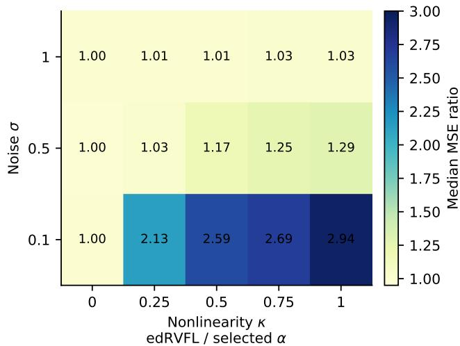

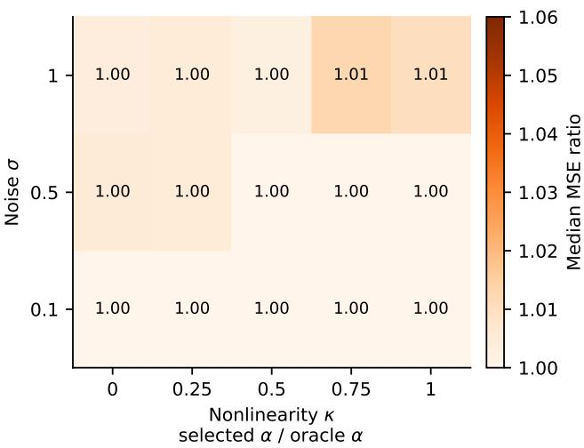  
Figure 7: Efect of selecting α on a held-out validation split, with all other hyperparameters fixed. Left, the edRVFL-to-LAIR-Net error ratio with α selected; right, the ratio of the selected model’s error to that of the best α in the grid. A ratio near one on the right indicates that validation recovered the best available setting.

## B PROOFS

Throughout, $\mathbf { z } ^ { ( \ell ) } = [ 1 , \mathbf { h } ^ { ( \ell - 1 ) } , \mathbf { x } ]$ and $\mathbf { W } ^ { ( \ell ) }$ is partitioned row-wise into the bias row, the state block $\mathbf { W } _ { \mathrm { h } } ^ { ( \ell ) }$ and the input block $\mathbf { W } _ { \mathbf { x } } ^ { ( \ell ) }$ , so that

$$
( \mathbf { W } ^ { ( \ell ) } ) ^ { \top } \mathbf { z } ^ { ( \ell ) } = ( \mathbf { W } _ { 0 \mathbf { x } } ^ { ( \ell ) } ) ^ { \top } [ 1 , \mathbf { x } ] + ( \mathbf { W } _ { \mathrm { h } } ^ { ( \ell ) } ) ^ { \top } \mathbf { h } ^ { ( \ell - 1 ) } .
$$

The constants $c _ { 1 } , \ : c _ { \mathrm { x } }$ and $c _ { 0 }$ are the depth-uniform quantities of Equations (10) and (12), so a bound involving them holds at every layer with the same value and may be iterated across depth.

## Proof of Theorem 4.4

Let the two trajectories be generated from x and x¯ with anchors s and s¯ under the same realization of the random weights. Since the bias component is identical for both trajectories, the layer inputs satisfy

$$
z ^ { ( \ell ) } - \bar { z } ^ { ( \ell ) } = [ 0 , \Delta h ^ { ( \ell - 1 ) } , \Delta x ] .
$$

Hence,

$$
( W ^ { ( \ell ) } ) ^ { \top } \left( z ^ { ( \ell ) } - \bar { z } ^ { ( \ell ) } \right) = ( W _ { h } ^ { ( \ell ) } ) ^ { \top } \Delta h ^ { ( \ell - 1 ) } + ( W _ { x } ^ { ( \ell ) } ) ^ { \top } \Delta x .
$$

By the Lipschitz property of $^ { g , }$ the triangle inequality, and the definitions of $c _ { 1 }$ and $c _ { x }$ ,

$$
\begin{array} { r l } & { \| \Delta \widetilde { h } ^ { ( \ell ) } \| _ { 2 } \leq L _ { g } \left\| ( W _ { h } ^ { ( \ell ) } ) ^ { \top } \Delta h ^ { ( \ell - 1 ) } + ( W _ { x } ^ { ( \ell ) } ) ^ { \top } \Delta x \right\| _ { 2 } } \\ & { \qquad \leq c _ { 1 } \| \Delta h ^ { ( \ell - 1 ) } \| _ { 2 } + c _ { x } \| \Delta x \| _ { 2 } . } \end{array}
$$

The leaky update gives $\Delta u ^ { ( \ell ) } = \gamma \Delta \widetilde { h } ^ { ( \ell ) } + ( 1 - \gamma ) \Delta h ^ { ( \ell - 1 ) }$ , and therefore

$$
\| \Delta u ^ { ( \ell ) } \| _ { 2 } \leq ( \gamma c _ { 1 } + 1 - \gamma ) \| \Delta h ^ { ( \ell - 1 ) } \| _ { 2 } + \gamma c _ { x } \| \Delta x \| _ { 2 } .
$$

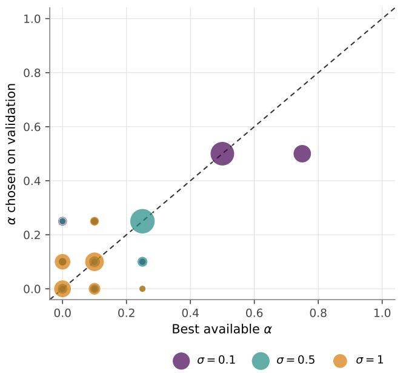

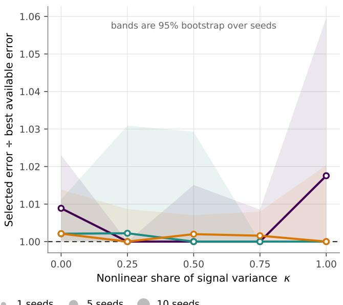  
Figure 8: What validation selection of α recovers, and what it costs. Left, the selected α against the best available one, with marker area proportional to the number of seeds landing on that pair and the dashed line marking exact agreement. Right, the ratio of the selected model’s error to the error at the best available α, by nonlinear share, with 95% percentile bootstrap bands over seeds. Points on the dashed line on the right lose nothing by selecting.

The alignment step satisfies $\Delta h ^ { ( \ell ) } = ( 1 - \alpha ) \Delta u ^ { ( \ell ) } + \alpha \Delta s .$ . Consequently,

$$
\begin{array} { r } { \| \Delta h ^ { ( \ell ) } \| _ { 2 } \leq ( 1 - \alpha ) ( \gamma c _ { 1 } + 1 - \gamma ) \| \Delta h ^ { ( \ell - 1 ) } \| _ { 2 } + ( 1 - \alpha ) \gamma c _ { x } \| \Delta x \| _ { 2 } + \alpha \| \Delta s \| _ { 2 } . } \end{array}
$$

Thus, $\| \Delta h ^ { ( \ell ) } \| _ { 2 } \leq \rho \| \Delta h ^ { ( \ell - 1 ) } \| _ { 2 } + \delta$ , where $\rho = ( 1 - \alpha ) ( \gamma c _ { 1 } + 1 - \gamma )$ and $\delta = ( 1 - \alpha ) \gamma c _ { x } \| \Delta x \| _ { 2 } + \alpha \| \Delta s \| _ { 2 }$ Since $\Delta h ^ { ( 0 ) } = 0$ , iterating the recursion yields $\begin{array} { r } { \| \Delta h ^ { ( \ell ) } \| _ { 2 } \leq \delta \sum _ { k = 0 } ^ { \ell - 1 } \rho ^ { k } } \end{array}$ . Therefore,

$$
\| \Delta h ^ { ( \ell ) } \| _ { 2 } \leq \left\{ { \begin{array} { l l } { \displaystyle \delta { \frac { 1 - \rho ^ { \ell } } { 1 - \rho } } , } & { \rho \neq 1 , } \\ { \displaystyle \ell \delta , } & { \rho = 1 . } \end{array} } \right.
$$

When $\begin{array} { r } { \rho < 1 , \| \Delta h ^ { ( \ell ) } \| _ { 2 } \leq \frac { \delta } { 1 - \rho } } \end{array}$ , which is uniform over $1 \le \ell \le L$

Finally, if the alignment mapping $x \mapsto s ( x )$ is $L _ { S } { \mathrm { - L i p s c h i t z } } ,$ then $\| \Delta s \| _ { 2 } \leq L _ { S } \| \Delta x \| _ { 2 }$ , and hence

$$
\delta \leq [ ( 1 - \alpha ) \gamma c _ { x } + \alpha L _ { S } ] \| \Delta x \| _ { 2 } .
$$

This completes the proof.

## Proof of Corollary 4.5

Since the two trajectories share the same input and the same anchor, $\Delta \mathbf { x } = \mathbf { 0 } , \Delta \mathbf { s } = \mathbf { 0 }$ , and hence $\delta = 0$ Therefore, the recursion of the one-step diference derived in the proof of Theorem 4.4 reduces to

$$
\left\| \Delta \mathbf { h } ^ { ( \ell ) } \right\| _ { 2 } \leq \rho \left\| \Delta \mathbf { h } ^ { ( \ell - 1 ) } \right\| _ { 2 } .
$$

Iterating this inequality from the initial perturbation gives

$$
\left\| \Delta \mathbf { h } ^ { ( \ell ) } \right\| _ { 2 } \leq \rho ^ { \ell } \left\| \Delta \mathbf { h } ^ { ( 0 ) } \right\| _ { 2 } , \qquad 1 \leq \ell \leq L .
$$

When $\rho < 1$ , the perturbation therefore decays geometrically with depth.

edRVFL / selected , n=250

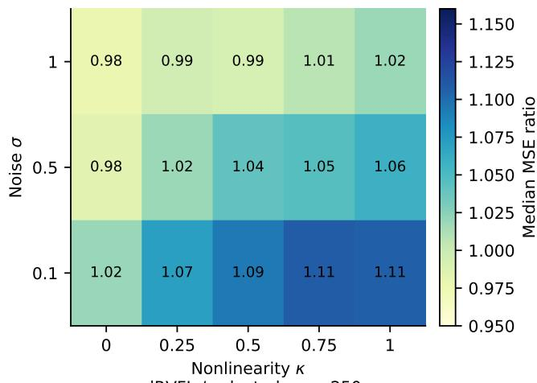

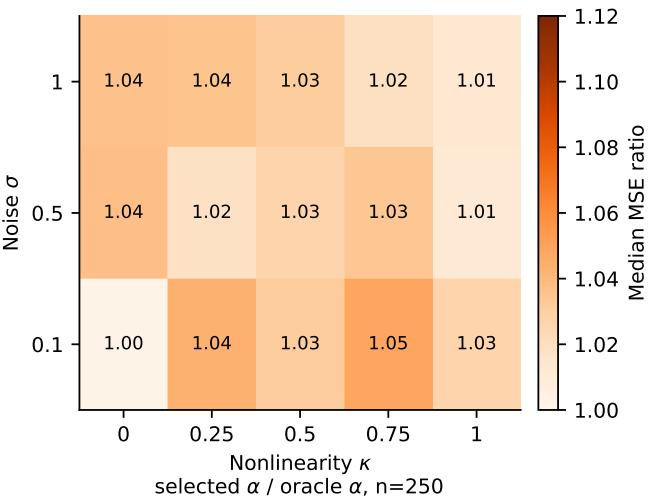  
Figure 9: Alignment selection at $N = 2 5 0$ . Left, the error of the selected α relative to the best in the grid; right, the $\mathrm { e d R V F L  – t o – L A I R – N e t }$ ratio at the best α. Efect sizes are smaller than at $N = 1 0 0 0$ and the low-noise cells retain the clearest separation.

## Proof of Theorem 4.6

For a fixed realization of the random weights, write $z ^ { ( \ell ) } = [ 1 , h ^ { ( \ell - 1 ) } , x ]$ . Since $g ( 0 ) = 0$ and g is $L _ { g } { \mathrm { - L i p s c h i t z } } .$ $\| g ( a ) \| _ { 2 } = \| g ( a ) - g ( 0 ) \| _ { 2 } \leq L _ { g } \| a \| _ { 2 }$ . Hence

$$
\begin{array} { r } { \| \widetilde { h } ^ { ( \ell ) } \| _ { 2 } \le L _ { g } \left\| ( W ^ { ( \ell ) } ) ^ { \top } z ^ { ( \ell ) } \right\| _ { 2 } \le L _ { g } \left( \| ( W _ { 0 x } ^ { ( \ell ) } ) ^ { \top } [ 1 , x ] \| _ { 2 } + \| ( W _ { h } ^ { ( \ell ) } ) ^ { \top } h ^ { ( \ell - 1 ) } \| _ { 2 } \right) . } \end{array}
$$

By Assumption 4.1, $\| [ 1 , x ] \| _ { 2 } = \sqrt { 1 + \| x \| _ { 2 } ^ { 2 } } \leq \sqrt { 1 + B _ { x } ^ { 2 } }$ . Therefore, by the definitions of $c _ { 0 }$ and $c _ { 1 }$ ,

$$
\| \widetilde { h } ^ { ( \ell ) } \| _ { 2 } \leq c _ { 0 } + c _ { 1 } \| h ^ { ( \ell - 1 ) } \| _ { 2 } .
$$

Using the leaky update, $u ^ { ( \ell ) } = \gamma \widetilde { h } ^ { ( \ell ) } + ( 1 - \gamma ) h ^ { ( \ell - 1 ) }$ , we obtain $\| u ^ { ( \ell ) } \| _ { 2 } \le \gamma c _ { 0 } + ( \gamma c _ { 1 } + 1 - \gamma ) \| h ^ { ( \ell - 1 ) } \| _ { 2 }$ . The alignment step gives $h ^ { ( \ell ) } = ( 1 - \alpha ) u ^ { ( \ell ) } + \stackrel { . } { \alpha } s$ . Since $\| s \| _ { 2 } \leq B _ { s }$ ，

$$
\begin{array} { r l } & { \| h ^ { ( \ell ) } \| _ { 2 } \leq ( 1 - \alpha ) \| u ^ { ( \ell ) } \| _ { 2 } + \alpha \| s \| _ { 2 } } \\ & { \qquad \leq ( 1 - \alpha ) \gamma c _ { 0 } + ( 1 - \alpha ) ( \gamma c _ { 1 } + 1 - \gamma ) \| h ^ { ( \ell - 1 ) } \| _ { 2 } + \alpha B _ { s } . } \end{array}
$$

Thus $\| h ^ { ( \ell ) } \| _ { 2 } \leq \rho \| h ^ { ( \ell - 1 ) } \| _ { 2 } + b .$ , where $\rho = ( 1 - \alpha ) ( \gamma c _ { 1 } + 1 - \gamma )$ and $b = ( 1 - \alpha ) \gamma c _ { 0 } + \alpha B _ { s }$ Since $h ^ { ( 0 ) } = 0$ , iterating the recursion yields

$$
\| h ^ { ( \ell ) } \| _ { 2 } \leq b \sum _ { k = 0 } ^ { \ell - 1 } \rho ^ { k } .
$$

Therefore,

$$
\| h ^ { ( \ell ) } \| _ { 2 } \leq \left\{ { b } \frac { 1 - \rho ^ { \ell } } { 1 - \rho } , \rho \neq 1 , \right.
$$

If $\rho < 1$ , then

$$
\| h ^ { ( \ell ) } \| _ { 2 } \le \frac { b } { 1 - \rho } , \qquad 1 \le \ell \le L .
$$

Thus the hidden state is uniformly bounded over the layers.

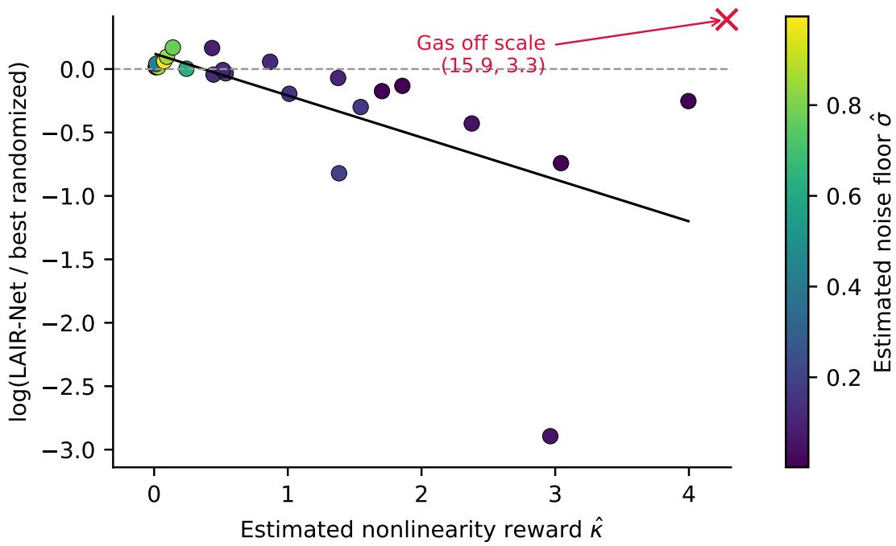  
Benchmarks Excluding gas fit Gas (off scale)

Figure 10: Relative performance of LAIR-Net against the best randomized baseline on each benchmark dataset, plotted against the nonlinearity proxy ${ \widehat { \kappa } } .$ The vertical axis is $\log ( \mathrm { M S E } _ { L A I R - N e t } / \mathrm { M S E } _ { \mathrm { b e s t ~ r a n d o m i z e d } } )$ , so points bbelow the horizontal line at zero favour LAIR-Net. The gas dataset is marked as an of-scale point and is discussed in the text.

## Proof of Proposition 4.7

Let $d _ { \mathrm { r } } = d + 1 + m$ for the readout dimension and consider

$$
J ( { \boldsymbol { \beta } } ^ { ( \ell ) } ) = \left\| \mathbf { D } ^ { ( \ell ) } { \boldsymbol { \beta } } ^ { ( \ell ) } - \mathbf { y } \right\| _ { 2 } ^ { 2 } + \lambda \left\| { \boldsymbol { \beta } } ^ { ( \ell ) } \right\| _ { 2 } ^ { 2 } .
$$

Its Hessian is $2 \big [ ( \mathbf { D } ^ { ( \ell ) } ) ^ { \top } \mathbf { D } ^ { ( \ell ) } + \lambda \mathbf { I } _ { d _ { \mathrm { r } } } \big ]$ . The first term is positive semidefinite and $\lambda > 0$ by Assumption 4.3, so the Hessian is positive definite and J is strictly convex with a unique stationary point. Setting the gradient to zero gives the normal equations

$$
\Big [ ( \mathbf { D } ^ { ( \ell ) } ) ^ { \top } \mathbf { D } ^ { ( \ell ) } + \lambda \mathbf { I } _ { d _ { \mathrm { r } } } \Big ] \pmb { \beta } ^ { ( \ell ) } = ( \mathbf { D } ^ { ( \ell ) } ) ^ { \top } \mathbf { y } ,
$$

whose coeficient matrix is invertible, yielding Equation (8).

## Proof of Proposition 4.8

For the mean aggregate, $\begin{array} { r } { \bar { \varepsilon } = \frac { 1 } { L } \sum _ { \ell = 1 } ^ { L } \varepsilon ^ { ( \ell ) } } \end{array}$ . Therefore, by bilinearity of covariance,

$$
\begin{array} { r l } & { \mathrm { V a r } ( \bar { \varepsilon } ) = \mathrm { V a r } \left( \displaystyle \frac { 1 } { L } \sum _ { \ell = 1 } ^ { L } \varepsilon ^ { ( \ell ) } \right) } \\ & { \qquad = \displaystyle \frac { 1 } { L ^ { 2 } } \sum _ { i = 1 } ^ { L } \sum _ { j = 1 } ^ { L } \mathrm { C o v } \left( \varepsilon ^ { ( i ) } , \varepsilon ^ { ( j ) } \right) . } \end{array}
$$

If the errors are pairwise uncorrelated and have common variance $\sigma ^ { 2 }$ , then all of-diagonal covariance terms vanish, giving $\begin{array} { r } { \mathrm { V a r } ( \bar { \varepsilon } ) = \frac { 1 } { L ^ { 2 } } \sum _ { \ell = 1 } ^ { L } \sigma ^ { 2 } = \frac { \sigma ^ { 2 } } { L } } \end{array}$

For the median, suppose that more than half of the realized errors satisfy $| \varepsilon ^ { ( \ell ) } | \leq \tau$ . Then more than half of the errors lie in the interval $[ - \tau , \tau ]$ . Hence, fewer than half lie strictly above τ and fewer than half lie strictly below τ. Therefore, the median cannot be outside this interval, and $| \varepsilon _ { \mathrm { m e d } } | \leq \tau$ □

## C EXPERIMENTAL SECTION CONTINUED

## C.1 Protocol

We use 23 public regression datasets, listed with their sources in C.2. Each dataset is evaluated over ten folds. Within a fold, inputs and targets are standardised using training statistics only, the model is fitted on the training split, and predictions are returned to the original target scale before the test mean squared error is computed.

Hyperparameters are selected per dataset and fold by Tree-structured Parzen Estimator search (Bergstra et al., 2011), minimising cross-validated error on the training split. The search space is given in E. Depth is fixed at $L = 2 0$ for all deep randomized models, and median aggregation is used throughout.

Both comparisons use the same tests. Average ranks are computed within the family, and each baseline is tested against LAIR-Net by a Wilcoxon signed-rank test over the 23 datasets with Holm correction for multiplicity, following the protocol recommended for comparisons over multiple datasets (Demšar, 2006) with the correction of Garcia and Herrera (2008). The accompanying figures show the Nemenyi post-hoc comparison, drawn against the best-ranked model, in which a model whose interval overlaps the shaded band is not separated from it at the 0.05 level. Testing within a family rather than across all models at once is deliberate, and it is what gives these tests power where it matters. Pooling all nineteen models raises the critical diference to 5.84. At that width the test separates LAIR-Net from nine of the eighteen baselines, every one of them in the weaker half of the field, and from none of the nine ranked immediately below it. It therefore answers a question about the bottom of the field rather than about the competitors this paper is arguing with.

## C.2 Datasets

The real-data benchmark uses the preprocessed regression files and fixed splits from the uci\_datasets package. Dataset provenance is reported separately from the package source because the package defines the exact experimental files, whereas the dataset source identifies the data origin. Table 3 therefore records the local key, local shape, and provenance target for each dataset. Several local shapes difer from the raw source description because the benchmark uses encoded, filtered, or selected-target versions of the data.

The Boston Housing dataset is retained because it is part of the fixed benchmark suite, but it is a legacy dataset and should be interpreted with that context. The gas-sensor row is also treated cautiously. The raw UCI source is a classification drift dataset, while the benchmark uses a preprocessed regression subset from the package. The pendulum row remains tied to the benchmark lineage and package source unless an authoritative original generator is identified.

## C.3 Comparison with conventional models

The second comparison places LAIR-Net against a multilayer perceptron, a decision tree, a random forest, AdaBoost, gradient boosting, support vector regression, k-nearest neighbors, and linear, ridge, lasso, and elasticnet regression. Per-dataset errors for this family are in C, and the search ranges, together with the fixed settings that constrain these baselines, are in E.

LAIR-Net obtains the best average rank in this family as well, 3.26 of twelve models, ahead of the multilayer perceptron at 3.87 and the random forest at 4.96. Every baseline is rejected after Holm correction, with the largest adjusted p-value 0.0389.

Figure 11 is the more cautious of the two. The wider critical diference, 3.47 against twelve models rather than 2.19 against eight, separates LAIR-Net from six of the eleven baselines and leaves it unseparated from the multilayer perceptron, the random forest, support vector regression, gradient boosting and k-nearest neighbours, even though it outranks all five, and the pairwise tests reject them. What this comparison supports is that LAIR-Net is competitive outside its own family on these datasets, not that it displaces the methods in it. That distinction matters on the tabular data, where carefully tuned classical methods remain competitive with deep architectures (Grinsztajn, Oyallon, and Varoquaux, 2022; Shwartz-Ziv and Armon, 2022).

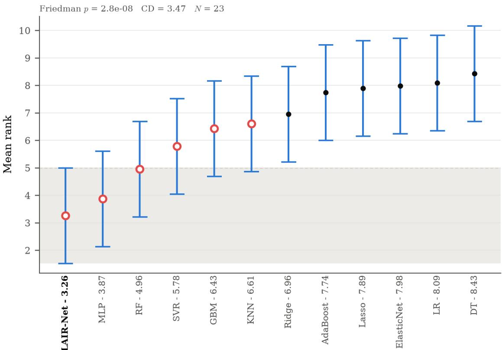  
Figure 11: Nemenyi comparison against conventional models, drawn as in Figure 4, with $\mathrm { C D } = 3 . 4 7$ over 23 datasets. Lower is better.

Section 5 reports the comparison against conventional models through its average ranks, its Holm-adjusted tests and Figure 11. Table 4 gives the per-dataset errors behind those summaries. Search ranges for these models are in Table 8, and the fixed settings that constrain them are stated alongside it.

## D ABLATION AND MECHANISM-VARIANT STUDY

This study compares the complete LAIR-Net construction with six controlled variants. Three variants remove or replace the supervised alignment impulse, one changes the initial state, and two change the random-weight and readout mechanisms. The last two are therefore mechanism variants rather than strict ablations. This distinction matters: a performance diference involving those models cannot be attributed to a single removed component.

## D.1 Reference configuration: LAIR-Net

All comparisons begin with the same input-recursive residual construction. At depth ℓ, the random feature block receives the bias, the original input, and the preceding hidden state, as defined in (3). It generates $\widetilde { \mathbf { H } } ^ { \left( \ell \right) }$ through (4), after which the leaky state is

$$
\mathbf { U } ^ { ( \ell ) } = \gamma \widetilde { \mathbf { H } } ^ { ( \ell ) } + ( 1 - \gamma ) \mathbf { H } ^ { ( \ell - 1 ) } .\tag{14}
$$

The complete LAIR-Net model starts from $\mathbf { H } ^ { ( 0 ) } = \mathbf { 0 }$ and injects the target-aware SLAN anchor at every depth:

$$
\mathbf { H } ^ { ( \ell ) } = ( 1 - \alpha ) \mathbf { U } ^ { ( \ell ) } + \alpha \mathbf { S } .\tag{15}
$$

Its hidden weights are sampled independently from a scaled uniform distribution and then fixed. Each layer uses the standard ridge readout in (8), and the final prediction is the elementwise median of the layerwise predictions. Consequently, a variant difers from LAIR-Net only in the components stated below; input recursion, layerwise readouts, and median aggregation remain unchanged unless explicitly noted.

## D.2 Alignment ablations

LAIR-NoAlign: removal of supervised alignment. This is the strict no-alignment ablation. The SLAN is not fitted, no anchor is constructed, and α is efectively zero. The state update is simply

$$
\mathbf { H } ^ { ( \ell ) } = \mathbf { U } ^ { ( \ell ) } , \qquad \mathbf { H } ^ { ( 0 ) } = \mathbf { 0 } .\tag{16}
$$

The comparison with LAIR-Net isolates the contribution of the target-aware alignment pathway while retaining the leaky residual recursion, direct input access at every depth, the same type of random hidden weights, layerwise ridge readouts, and median aggregation. It therefore asks whether leakage and input recursion alone are suficient, or whether repeatedly returning the state towards a supervised representation improves cross-dataset consistency.

LAIR-Random-Impulse: target-independent fixed impulse. This variant replaces the supervised anchor with a random feature map. A single random matrix ${ \bf W } _ { \mathrm { c } }$ is sampled before the depth-wise recursion and used to construct

$$
\begin{array} { r } { \mathbf { C } = g ( \mathbf { A } \mathbf { W } _ { \mathrm { c } } ) . } \end{array}\tag{17}
$$

The same matrix C is injected at every layer:

$$
\mathbf { H } ^ { ( \ell ) } = ( 1 - \alpha ) \mathbf { U } ^ { ( \ell ) } + \alpha \mathbf { C } , \qquad \mathbf { H } ^ { ( 0 ) } = \mathbf { 0 } .\tag{18}
$$

The word “fixed” refers to depth: C is recomputed from each sample’s covariates but does not change from one randomised layer to the next. Unlike S, it is independent of the response values and receives no supervised training. The comparison with LAIR-Net separates the efect of having a persistent reference from the efect of making that reference target-aware.

LAIR-BestState: data-selected recurrent impulse. This variant removes the SLAN and uses an earlier hidden state as the impulse. After fitting the readout at each layer, the implementation evaluates its training leave-one-out cross-validation (LOOCV) error. The hidden state with the smallest LOOCV error observed so far is retained as $\mathbf { H } _ { \mathrm { b e s t } }$ . For layers after the first, the update is

$$
\begin{array} { r } { \mathbf { H } ^ { ( \ell ) } = ( 1 - \alpha ) \mathbf { U } ^ { ( \ell ) } + \alpha \mathbf { H } _ { \mathrm { b e s t } } ^ { ( \ell - 1 ) } . } \end{array}\tag{19}
$$

No previous state exists at the first layer, so the implementation uses $\mathbf { U } ^ { ( 1 ) }$ as the impulse and obtains $\mathbf { H } ^ { ( 1 ) } = \mathbf { U } ^ { ( 1 ) }$ During prediction, the sequence of best-state updates is replayed from the indices selected on the training data; test targets are never used. This comparison asks whether adaptive reuse of a previously successful random state can replace the external target-aware reference supplied by the SLAN.

## D.3 Initial-state and orthogonal-weight variants

LAIR-SLANInit (SLAN-initialised LAIR) This model difers from LAIR-Net only in the initial condition:

$$
\mathbf { H } ^ { ( 0 ) } = \mathbf { S } .\tag{20}
$$

For every $\ell \geq 1 ,$ , it still applies the complete update in (15); hence, the SLAN anchor is both the initial state and a repeated alignment impulse. Because all subsequent alignment impulses are retained, the comparison between LAIR-Net and LAIR-SLANInit isolates the initial condition, not the value of repeated alignment.

LAIR-Ortho (orthogonal random transformations) This variant retains the SLAN, starts from ${ \bf H } ^ { ( 0 ) } = { \bf S }$ and injects S at every depth using (15). Its principal additional change is the construction of each random hiddenweight matrix. A square Gaussian matrix is factorised by QR decomposition, an appropriately sized block of its orthogonal factor is retained, and that block is multiplied by the input-scale hyperparameter. In contrast, LAIR-Net samples independent uniform entries.

The layer input remains $[ \mathbf { 1 } , \mathbf { X } , \mathbf { H } ^ { ( \ell - 1 ) } ]$ in both models. Thus, input recursion is a shared property and should not be presented as the distinguishing feature of LAIR-Ortho. Standard ridge readouts and median aggregation are also retained. Since this model changes both the initial state and the random-weight geometry, its comparison with LAIR-Net does not isolate orthogonality alone; it evaluates the combined orthogonal, SLAN-initialised configuration.

LAIR-OrthoBMA: orthogonal model with LOOCV-weighted aggregation. This variant uses the same orthogonal hidden weights, SLAN initialisation, repeated alignment impulse, and input-recursive layer construction as LAIR-Ortho. It then changes both readout regularisation and prediction aggregation. For a design matrix $\mathbf { D } ^ { ( \ell ) } = [ \mathbf { 1 } , \mathbf { X } , \mathbf { H } ^ { ( \ell ) } ]$ , the bias and original-input coeficients receive penalty $\lambda _ { \mathrm { x } } = r \lambda$ , whereas the hidden-state coeficients receive $\lambda _ { \mathrm { h } } = \lambda$ . The ratio r is tuned separately.

Let $e _ { \ell }$ denote the training LOOCV error of the layer-ℓ readout and let $s _ { e }$ denote the standard deviation of the negative LOOCV scores. The aggregation weights are

$$
\omega _ { \ell } = \frac { \exp [ - e _ { \ell } / ( s _ { e } \tau ) ] } { \sum _ { j = 1 } ^ { L } \exp [ - e _ { j } / ( s _ { e } \tau ) ] } , \qquad \widehat { \mathbf { y } } = \sum _ { \ell = 1 } ^ { L } \omega _ { \ell } \widehat { \mathbf { y } } ^ { ( \ell ) } ,\tag{21}
$$

where $\tau > 0$ is a temperature hyperparameter. Lower-LOOCV-error layers therefore receive greater weight, whereas LAIR-Net and LAIR-Ortho use an unweighted elementwise median. The comparison between LAIR-Ortho and LAIR-OrthoBMA evaluates the joint efect of dual-penalty ridge estimation and LOOCV-weighted aggregation; it cannot distinguish those two changes from each other.

## D.4 Results within the variant family

Table 6 reports the average rank and number of per-dataset wins for each model within the variant family. The two measures capture complementary aspects of performance. LAIR-Net achieves the lowest average rank of 2.565, indicating the strongest overall performance across the benchmark suite. In contrast, LAIR-SLANInit records the largest number of dataset wins and the second-lowest average rank. Thus, although the SLANinitialised configuration performs best on more individual datasets, the zero-initialised LAIR-Net configuration is more consistently competitive across the full suite.

Most datasets where LAIR-Net is not the best-performing model remain close to the best variant. The gassensor dataset is the exception: LAIR-Net ranks second within the variant family but has a much larger MSE than LAIR-SLANInit. This dataset is already treated separately in the real-data analysis, where its first-layer standardisation behaviour is atypical. It should therefore be interpreted as evidence that the initial condition can matter strongly on a particular dataset, rather than as evidence against repeated alignment: both models inject the same SLAN anchor at every depth.

Taken together, the results support three bounded conclusions. First, the complete LAIR-Net configuration has the best average rank in this comparison. Second, replacing the supervised anchor by a target-independent random impulse or by a running-best hidden state does not reproduce that average-rank performance. Third, changing the initial state to S increases the number of dataset wins but reduces average-rank consistency. The orthogonal variants remain competitive, but because they alter multiple mechanisms they should be interpreted as alternative configurations rather than evidence for or against any single LAIR-Net component.

## E BAYESIAN OPTIMISATION AND SEARCH SPACE

Validation error is an expensive black-box function of the hyperparameter vector, so hyperparameters are selected by the tree-structured Parzen estimator (Bergstra et al., 2011) rather than by grid or random search. Instead of modelling the objective directly, the estimator models the distribution of hyperparameters associated with good and with poor observed values, and proposes the configuration that maximises the ratio of the two densities. This suits a search space that mixes continuous, integer and categorical parameters, which is the case here.

For each dataset and outer fold, the search minimises five-fold cross-validated mean squared error on the training split. Inputs and targets are standardised using training-fold statistics only. Predictions are returned to the original scale before the error is computed. The configuration with the lowest objective is then refitted on the full training split before the held-out test error is recorded. The test split is not used at any point in the search.

## E.1 Searched hyperparameters

Tables 7 and 8 list the searched ranges for the two comparison families. Continuous ranges written log are sampled uniformly in the logarithm, which is appropriate for scale parameters spanning several orders of magnitude.

The conventional models of Table 4 are searched by the same estimator, over the same number of trials, under the same nested protocol. Their ranges are given in Table 8.

The following are held fixed rather than searched, so that models are compared at matched depth and matched aggregation. The number of layers is L = 20 for all deep randomized models, including dRVFL, edRVFL, edRVFL-SC and LAIR-Net. Layerwise predictions are combined by the median. The alignment network is optimised by L-BFGS (Liu and Nocedal, 1989) with an iteration cap of 2000, and its activation is matched to the activation of the randomized layers rather than searched separately. The random seed for weight generation is fixed across models within a fold, so that a diference between two models is not a diference in draws.

Three fixed settings on the conventional side are worth stating plainly, because each of them constrains a baseline. The random forest, AdaBoost and gradient boosting all use 20 estimators, which is modest for those methods and is not searched. Support vector regression is capped at 1000 iterations. Ridge and lasso use their internal cross-validated variants rather than entering the outer search. A reader should read the conventional comparison with those limits in view, and we would expect the tree ensembles in particular to improve with more estimators.

The ranges above are those implemented in the accompanying code, and the study reported in Section 5 uses them without modification. Two consequences are worth recording for anyone reproducing the results. First, the lower end of the ridge range reaches 10−8, so configurations near that end can produce fitted readouts that are sensitive to the linear algebra implementation. Second, the alignment network’s L-BFGS run reaches its iteration cap on some datasets, so the anchor is the parameter vector at that point rather than a converged optimum. These details can afect exact reproduction of individual numbers and should therefore be reported with the search protocol.

Table 3: Dataset provenance targets for the benchmark suite. The local shape is the shape used by the preprocessed benchmark files.
<table><tr><td>Dataset</td><td>Acronym</td><td>N</td><td>d</td><td>Provenance note</td></tr><tr><td>Airfoil Self-Noise</td><td>Airfoil</td><td>1503</td><td>5</td><td>(Brooks, Pope, and Marcol- ini, 1989)</td></tr><tr><td>Auto MPG</td><td>Auto MPG</td><td>392</td><td>7</td><td>(Quinlan, 1993a); local</td></tr><tr><td>Automobile</td><td>Autos</td><td>159</td><td>25</td><td>rows reflect preprocessing (Kibler, Aha, and Albert, 1989); local shape reflects</td></tr><tr><td>Breast Cancer Prognostic</td><td>Breast Cancer</td><td>194</td><td>33</td><td>encoding (Street, Mangasarian, and</td></tr><tr><td>Challenger O-Ring</td><td>Challenger</td><td>23</td><td>4</td><td>Wolberg, 1995) (Draper, 1995)</td></tr><tr><td>Concrete Strength</td><td>Concrete</td><td>1030</td><td>8</td><td>(Yeh, 1998)</td></tr><tr><td>Concrete Slump</td><td>Concrete Slump</td><td>103</td><td>7</td><td>(Yeh, 2007); selected target</td></tr><tr><td>Energy Efficiency</td><td>Energy</td><td>768</td><td>8</td><td>(Tsanas and Xifara, 2012)</td></tr><tr><td>Fertility</td><td>Fertility</td><td>100</td><td>9</td><td>(Gil et al., 2012)</td></tr><tr><td>Forest Fires</td><td>Forest Fires</td><td>517</td><td>12</td><td>(Cortez and Morais, 2007)</td></tr><tr><td>Gas Sensor Array Drift</td><td>Gas</td><td>2565</td><td>128</td><td>(Akbilgic, Bozdogan, and Balaban, 2014a); regression</td></tr><tr><td>Boston Housing</td><td>Housing</td><td>506</td><td>13</td><td>subset (Harrison Jr and Rubinfeld,</td></tr><tr><td>Computer Hardware</td><td>Machine CPU</td><td>209</td><td>7</td><td>1978); legacy dataset caveat (Ein-Dor and Feldmesser, 1987); preprocessed target</td></tr><tr><td>Parkinsons Telemonitoring</td><td>Parkinsons</td><td>5875</td><td>20</td><td>and features (Tsanas, Little, et al., 2009)</td></tr><tr><td>Pendulum</td><td>Pendulum</td><td>630</td><td>9</td><td>(Evans, 2021; Yang et al.,</td></tr><tr><td>PumaDyn-32nm</td><td>PumaDyn-32nm</td><td>8192</td><td>32</td><td>2015) (DELVE, 1996)</td></tr><tr><td>Servo</td><td>Servo</td><td>167</td><td>4</td><td>(Quinlan, 1993b)</td></tr><tr><td>SkillCraft1</td><td>Skillcraft</td><td>3338</td><td>19</td><td>(Schumacher, Strohmaier, and Lemmerich, 2025)</td></tr><tr><td>SML2010</td><td>SML</td><td>4137</td><td>26</td><td>(Zamora-Martinez et al.,</td></tr><tr><td>Solar Flare</td><td>Solar</td><td>1066</td><td>10</td><td>2014) (Bradshaw and Shaw, 1992); corrected subset</td></tr><tr><td>Istanbul Stock Exchange</td><td>Stock</td><td>536</td><td>11</td><td>(Akbilgic, Bozdogan, and Balaban, 2014b); local fea-</td></tr><tr><td>Wine Quality</td><td>Wine</td><td>1599</td><td>11</td><td>cessing (Cortez, Cerdeira, et al., 2009); red-wine subset</td></tr><tr><td>Yacht Hydrodynamics</td><td>Yacht</td><td>308</td><td>6</td><td>(Gerritsma, Onnink, and Versluis, 1981)</td></tr></table>

Table 4: Test mean squared error against conventional neural, tree-based, kernel, instance-based and linear models, mean standard deviation over ten folds. Lower is better and the best entry in each row is in bold. The final rows give the average rank within this family and the Holm-adjusted Wilcoxon signed-rank p-value against LAIR-Net.
<table><tr><td>Dataset</td><td>MLP</td><td>DT</td><td>RF</td><td>AdaBoost</td><td>GBM</td><td>SVR</td><td>KNN</td><td>LR</td><td>Ridge</td><td>Lasso</td><td>ElasticNet</td><td>LAIR-Net</td></tr><tr><td>Airfoil</td><td> $5 . 3 1 5 \pm 1 . 5 1 2$ </td><td> $1 0 . 7 0 5 \pm 2 . 4 5 7$ </td><td> $7 . 5 0 1 \pm 1 . 8 9 6$ </td><td> $2 1 . 3 3 7 \pm 4 . 1 7 9$ </td><td>16.551 ± 2.630</td><td> $9 . 1 9 2 \pm 1 . 9 1 6$ </td><td> $3 . 8 6 8 \pm 0 . 7 8 6$ </td><td> $2 3 . 3 7 8 \pm 5 . 5 3 4$ </td><td> $2 3 . 3 7 8 \pm 5 . 5 3 2$ </td><td> $2 3 . 3 7 8 \pm 5 . 5 3 2$ </td><td> $2 3 . 3 7 5 \pm 5 . 5 3 0$ </td><td>2.208 ± 0.485</td></tr><tr><td>Auto MPG</td><td> $7 . 4 8 3 \pm 1 . 5 1 4$ </td><td> $1 2 . 5 6 0 \pm 2 . 4 6 8$ </td><td> $8 . 5 3 8 \pm 2 . 7 5 7$ </td><td> $1 1 . 2 0 7 \pm { \mathrm { 3 . 3 3 9 } }$ </td><td> $9 . 8 2 5 \pm 2 . 3 7 7$ </td><td> $\mathbf { 6 . 7 3 4 \ : \pm { \ : 1 . 9 7 5 } }$ </td><td> $7 . 8 8 0 \pm 2 . 7 0 0$ </td><td>11.266 ± 2.480</td><td> $1 1 . 2 5 2 \pm 2 . 4 5 3$ </td><td> $1 1 . 3 9 9 \pm 2 . 6 1 9$ </td><td> $1 1 . 4 0 0 \pm 2 . 5 2 5$ </td><td>6.919 ± 2.074</td></tr><tr><td>Autos</td><td> $0 . 0 2 7 \pm \ : 0 . 0 1 3$ </td><td> $0 . 0 3 4 \pm 0 . 0 1 1$ </td><td> $0 . 0 2 9 \pm \ : 0 . 0 1 5$ </td><td> $0 . 0 3 1 \pm 0 . 0 1 5$ </td><td> $0 . 0 2 7 \pm \mathrm { 0 . 0 1 s }$ </td><td> $0 . 0 2 8 \pm 0 . 0 1 0$ </td><td> $0 . 0 3 1 \pm 0 . 0 2 2$ </td><td>0.027 ± 0.010</td><td> $0 . 0 2 4 \pm 0 . 0 0 7$ </td><td>0.027 ± 0.013</td><td> $0 . 0 2 7 \pm \mathrm { 0 . 0 1 2 }$ </td><td>0.021 ± 0.010</td></tr><tr><td>Breast Cancer</td><td> $9 3 9 . 1 9 7 \pm 3 3 3 . 4 9 9$ </td><td>1.06e3 ± 253.065</td><td> $8 3 2 . 3 2 5 \pm 2 0 8 . 4 3 1$ </td><td> $8 3 9 . 9 0 5 \pm 2 2 9 . 3 3 9$ </td><td>741.678 ± 162.746</td><td> $9 1 1 . 2 0 5 \pm 2 9 0 . 3 4 8$ </td><td>1.02e3 ± 236.385</td><td> $9 4 4 . 9 5 8 \pm 3 6 4 . 4 7 6$ </td><td> $8 9 6 . 2 6 3 \pm 3 0 8 . 5 8 0$ </td><td> $9 1 4 . 5 0 6 \pm 2 7 6 . 3 4 2$ </td><td> $8 7 4 . 4 1 8 \pm 2 5 7 . 0 6 2$ </td><td>871.580 ± 265.293</td></tr><tr><td>Challenger</td><td> $0 . 3 7 5 \pm 0 . 4 3 6$ </td><td> $0 . 4 0 7 \pm 0 . 3 6 5$ </td><td> $0 . 4 0 7 \pm 0 . 3 7 0$ </td><td> $0 . 4 8 0 \pm 0 . 5 5 6$ </td><td> $0 . 4 1 5 \pm 0 . 3 5 8$ </td><td> $\mathbf { 0 . 3 1 7 \Pi _ { \pm } ^ { } 0 . 3 1 4 }$ </td><td> $0 . 4 2 8 \pm 0 . 3 9 7$ </td><td> $0 . 3 6 5 \pm 0 . 4 0 8$ </td><td> $0 . 3 5 9 \pm 0 . 3 9 1$ </td><td> $0 . 4 1 4 \pm 0 . 4 5 1$ </td><td> $0 . 3 9 5 \pm 0 . 4 3 2$ </td><td>0.389 ± 0.448</td></tr><tr><td>Concrete</td><td> $4 3 . 6 7 4 \pm 1 2 . 9 1 5$ </td><td>74.354 ± 26.260</td><td> $4 6 . 6 4 2 \pm 9 . 9 2 2$ </td><td>79.306 ± 15.171</td><td> $6 5 . 1 1 1 \pm 1 0 . 0 0 4$ </td><td>42.791 ± 9.954</td><td> $5 8 . 8 2 2 \pm 1 1 . 0 5 4$ </td><td> $1 1 0 . 4 6 8 \pm 1 2 . 5 1 5$ </td><td>110.461 ± 12.455</td><td>110.905 ± 11.686</td><td> $1 1 0 . 9 6 2 \pm 1 1 . 7 0 9$ </td><td>40.199 ± 10.883</td></tr><tr><td>Concrete Slump</td><td> $7 6 . 8 4 9 \pm 4 6 . 4 1 1$ </td><td> $3 . 6 9 \mathrm { { e 3 } \pm 1 . 2 6 \mathrm { { e 3 } } }$ </td><td>2.27e3 ± 782.759</td><td> $2 . 1 6 \mathrm { { e 3 } \pm 1 . 1 4 \mathrm { { e 3 } } }$ </td><td> $2 . 6 4 \mathrm { e 3 \pm 1 . 4 2 \mathrm { e 3 } }$ </td><td> $6 6 . 2 6 1 \pm 3 3 . 4 9 2$ </td><td> $2 . 8 2 \mathrm { { e 3 } \pm 1 . 4 5 \mathrm { { e 3 } } }$ </td><td> $6 3 . 7 5 4 \pm 4 0 . 8 9 3$ </td><td> $6 3 . 7 0 3 \pm 4 2 . 1 6 0$ </td><td> $7 1 . 2 6 6 \pm 5 0 . 2 6 3$ </td><td> $7 1 . 8 1 5 \pm 5 0 . 0 8 5$ </td><td>11.170 ± 10.246</td></tr><tr><td>Energy</td><td> $0 . 3 9 7 \pm 0 . 1 3 8$ </td><td> $1 . 0 2 4 \pm 0 . 7 4 9$ </td><td> $1 . 0 5 5 \pm 0 . 7 3 0$ </td><td> $5 . 1 0 7 \pm 1 . 6 8 1$ </td><td> $4 . 5 6 5 \pm 0 . 9 1 4$ </td><td> $3 . 1 7 7 \pm 0 . 8 1 3$ </td><td> $4 . 2 7 3 \pm 1 . 1 8 7$ </td><td> $8 . 1 7 2 \pm 1 . 8 6 1$ </td><td> $8 . 7 3 0 \pm 1 . 8 9 9$ </td><td> $8 . 7 4 8 \pm 1 . 9 0 9$ </td><td>8.735 ± 1.900</td><td>0.163 ± 0.045</td></tr><tr><td>Fertility</td><td> $0 . 0 3 3 \pm \ : 0 . 0 1 6$ </td><td>0.032 ± 0.020</td><td>0.029 ± 0.018</td><td> $0 . 0 3 2 \pm 0 . 0 2 2$ </td><td>0.031 ± 0.016</td><td> $0 . 0 3 6 \pm \ : 0 . 0 1 8$ </td><td> $0 . 0 3 4 \pm 0 . 0 1 2$ </td><td> $0 . 0 3 2 \pm 0 . 0 1 3$ </td><td>0.032 ± 0.013</td><td>0.031 ± 0.012</td><td>0.032 ± 0.013</td><td>0.033 ± 0.019</td></tr><tr><td>Forest Fires</td><td>1.943 ± 0.442</td><td> $2 . 0 0 5 \pm 0 . 4 3 3$ </td><td> $1 . 9 6 6 \pm 0 . 4 4 8$ </td><td> $1 . 9 9 0 \pm 0 . 5 0 7$ </td><td> $1 . 9 8 2 \pm { \ : 0 . 4 9 0 }$ </td><td> $\begin{array} { l } { { 0 . 0 3 6 \pm 0 . 0 1 8 } } \\ { { \mathrm { ~ \ e ~ } _ { 1 } \sigma 1 } } \end{array}$ </td><td> $1 . 9 8 5 \pm 0 . 4 4 1$ </td><td> $2 . 0 9 4 \pm 0 . 6 2 5$ </td><td> $2 . 0 8 8 \pm 0 . 6 1 4$ </td><td> $1 . 9 9 0 \pm 0 . 4 5 7$ </td><td>1.991 ± 0.456</td><td>2.073 ± 0.582</td></tr><tr><td>Gas</td><td> $0 . 0 4 2 \pm \ : 0 . 0 2 9$ </td><td> $0 . 0 5 4 \pm 0 . 0 4 1$ </td><td></td><td> $0 . 0 9 7 \pm 0 . 0 2 6$ </td><td> $0 . 0 6 6 \pm 0 . 0 1 9$ </td><td> $1 . 9 6 1 \pm 0 . 4 2 1$   $0 . 0 6 6 \pm 0 . 0 5 9$ </td><td></td><td> $1 . 0 4 \mathrm { e 5 \pm 3 . 2 9 \mathrm { e 5 } }$ </td><td> $3 1 7 . 5 9 7 \pm 1 . 0 0 \mathrm { e 3 }$ </td><td> $0 . 4 8 3 \pm 0 . 9 0 8$ </td><td>0.358 ± 0.406</td><td></td></tr><tr><td>Housing</td><td>12.249 ± 8.279</td><td>20.344 ± 15.080</td><td> $0 . 0 3 4 \pm 0 . 0 2 0$  16.036 ± 12.688</td><td></td><td>16.246 ± 11.726</td><td></td><td> $\mathbf { 0 . 0 2 5 \Pi _ { \pm } 0 . 0 2 5 }$   $1 5 . 9 4 5 \pm 1 4 . 2 7 7$ </td><td> $2 4 . 0 7 2 \pm 1 0 . 9 2 7$ </td><td> $2 4 . 2 1 6 \pm 1 1 . 1 4 4$ </td><td>24.057 ± 10.958</td><td>24.101 ± 10.973</td><td>8.752 ± 27.367 10.706 ± 8.377</td></tr><tr><td>Machine CPU</td><td></td><td> $0 . 2 7 6 \pm 0 . 0 9 4$ </td><td> $0 . 1 9 4 \pm 0 . 0 4 7$ </td><td> $2 0 . 0 7 7 \pm 1 3 . 6 4 0$  0.202 ± 0.055</td><td> $0 . 1 9 2 \pm 0 . 0 5 3$ </td><td> $1 1 . 3 7 0 \pm \mathrm { s . 4 5 2 }$   $0 . 2 4 2 \pm 0 . 0 7 2$ </td><td>0.181 ± 0.067</td><td>0.226 ± 0.048</td><td> $0 . 2 2 6 \pm 0 . 0 5 0$ </td><td> $0 . 2 2 6 \pm 0 . 0 4 6$ </td><td>0.227 ± 0.046</td><td>0.146 ± 0.034</td></tr><tr><td>Parkinsons</td><td> $0 . 1 8 1 \pm 0 . 0 4 0$   $7 8 . 7 9 5 \pm 2 3 . 1 7 0$ </td><td> $8 2 . 6 7 2 \pm 2 9 . 9 2 9$ </td><td> $4 5 . 0 0 5 \pm 2 0 . 3 6 1$ </td><td> $4 7 . 3 7 4 \pm 5 . 0 2 8$ </td><td> $6 1 . 0 4 1 \pm 1 5 . 7 5 3$ </td><td> $1 0 7 . 9 4 0 \pm 3 0 . 1 7 8$ </td><td> $2 7 . 9 8 0 \pm 2 . 5 8 5$ </td><td> $8 6 . 1 0 8 \pm 2 . 3 8 0$ </td><td> $8 6 . 0 2 2 \pm 2 . 3 2 8$ </td><td> $1 0 9 . 4 0 9 \pm 1 0 . 5 4 9$ </td><td>97.089 ± 1.883</td><td>24.092 ± 17.750</td></tr><tr><td>Pendulum</td><td> $2 . 3 9 3 \pm 1 . 4 3 8$ </td><td> $6 . 8 0 9 \pm 2 . 9 7 7$ </td><td></td><td> $8 . 2 7 7 \pm { \mathrm { 3 . 8 9 0 } }$ </td><td>6.158 ± 2.700</td><td> $3 . 9 1 0 \pm 2 . 7 2 9$ </td><td> $3 . 7 6 8 \pm 2 . 2 6 7$ </td><td> $7 . 4 9 5 \pm 2 . 8 7 5$ </td><td> $7 . 4 8 8 \pm 2 . 8 9 5$ </td><td> $7 . 4 5 8 \pm 2 . 9 4 8$ </td><td>7.471 ± 2.949</td><td>1.681 ± 0.963</td></tr><tr><td>PumaDyn-32nm</td><td>0.089 ± 0.006</td><td>0.135 ± 0.020</td><td> $5 . 3 9 9 \pm 2 . 3 9 4$  0.111 ± 0.009</td><td>0.816 ± 0.101</td><td>0.821 ± 0.142</td><td> $0 . 7 5 2 \pm 0 . 0 3 7$ </td><td> $0 . 9 5 0 \pm \mathrm { 0 . 0 6 8 }$ </td><td> $1 . 0 0 2 \pm 0 . 0 6 5$ </td><td>1.002 ± 0.065</td><td>0.995 ± 0.066</td><td>0.995 ± 0.066</td><td>0.052 ± 0.004</td></tr><tr><td>Servo</td><td> $\mathbf { 0 . 0 8 4 } \pm \mathbf { 0 . 0 5 4 }$ </td><td> $0 . 1 2 8 \pm 0 . 0 5 8$ </td><td> $0 . 1 5 3 \pm 0 . 0 6 6$ </td><td> $0 . 1 2 4 \pm 0 . 0 4 2$ </td><td> $0 . 1 2 7 \pm 0 . 0 5 8$ </td><td> $0 . 0 8 8 \pm 0 . 0 6 2$ </td><td> $0 . 0 9 0 \pm \infty$ </td><td> $0 . 3 3 3 \pm 0 . 1 2 7$ </td><td> $0 . 3 3 2 \pm 0 . 1 2 7$ </td><td> $0 . 3 3 2 \pm 0 . 1 2 7$ </td><td>0.333 ± 0.127</td><td>0.086 ± 0.047</td></tr><tr><td>SkillCraft</td><td> $\mathbf { 0 . 0 6 3 \ : \pm { \ : 0 . 0 0 9 } }$ </td><td> $0 . 0 7 7 \pm \mathrm { { 0 . 0 0 8 } }$ </td><td> $0 . 0 7 0 \pm \circ . 0 1 1$ </td><td> $0 . 0 7 8 \pm 0 . 0 1 0$ </td><td> $0 . 0 7 4 \pm \ : 0 . 0 0 9$ </td><td> $0 . 0 8 3 \pm 0 . 0 6 0$ </td><td> $0 . 0 7 6 \pm \infty$ </td><td> $0 . 0 6 4 \pm 0 . 0 0 9$ </td><td> $0 . 0 6 4 \pm 0 . 0 0 9$ </td><td> $0 . 0 6 4 \pm 0 . 0 0 9$ </td><td>0.064 ± 0.009</td><td>0.066 ± 0.011</td></tr><tr><td>SML</td><td>0.331 ± 0.074</td><td>0.936 ± 0.165</td><td>0.497 ± 0.065</td><td>4.480 ± 0.506</td><td>3.855 ± 0.350</td><td>0.585 ± 0.136</td><td>0.837 ± 0.125</td><td>2.358 ± 0.198</td><td>2.358 ± 0.198</td><td>2.402 ± 0.193</td><td>2.359 ± 0.196</td><td>0.117 ± 0.023</td></tr><tr><td>Solar</td><td> $0 . 6 2 3 \pm 0 . 3 5 3$ </td><td> $0 . 6 3 7 \pm 0 . 3 6 3$ </td><td> $0 . 6 0 4 \pm 0 . 3 5 2$ </td><td> $0 . 6 2 0 \pm 0 . 3 6 2$ </td><td> $\mathbf { 0 . 5 9 9 \_ 0 . 3 5 2 }$ </td><td> $0 . 6 9 7 \pm 0 . 4 0 2$ </td><td> $0 . 6 2 2 \pm 0 . 3 4 1$ </td><td> $0 . 6 1 7 \pm 0 . 3 4 2$ </td><td> $0 . 6 1 7 \pm 0 . 3 4 3$ </td><td> $0 . 6 1 6 \pm 0 . 3 4 6$ </td><td>0.616 ± 0.347</td><td>0.622 ± 0.348</td></tr><tr><td>Stock</td><td> $2 . 5 7 \mathrm { e } { - } 5 \pm 5 . 0 9 \mathrm { e } { - } 6$ </td><td> $5 . 4 2 \mathrm { e } \mathrm { - } 5 \pm 1 . 5 2 \mathrm { e - } 5$ </td><td> $3 . 8 1 \mathrm { e } { - 5 } \pm 1 . 2 2 \mathrm { e } { - 5 }$ </td><td> $3 . 9 5 \mathrm { e } \mathrm { - } 5 \pm 1 . 0 9 \mathrm { e } \mathrm { - } 5$ </td><td> $4 . 4 1 \mathrm { e } \mathrm { - } 5 \pm 1 . 4 2 \mathrm { e } \mathrm { - } 5$ </td><td> $2 . 5 7 \mathrm { e } { - } 5 \pm 4 . 8 5 \mathrm { e } { - } 6$ </td><td> $8 . 7 0 \mathrm { { e } } \mathrm { { - } } 5 \pm 1 . 9 6 \mathrm { { e } } \mathrm { { - } } 5$ </td><td> $\mathbf { 2 . 5 3 e { - 5 } \div 5 . 0 3 e { - 6 } }$ </td><td> $\mathbf { 2 . 5 3 e { - 5 } \div 5 . 0 1 e { - 6 } }$ </td><td> $\mathbf { 2 . 5 3 e { - 5 } \div 4 . 9 5 e { - 6 } }$ </td><td> $2 . 5 3 \mathrm { e } { - } 5 \pm 4 . 9 8 \mathrm { e } { - } 6$ </td><td>2.56e-5 ± 3.88e-6</td></tr><tr><td>Wine Quality</td><td>0.234 ± 0.038</td><td>0.426 ± 0.083</td><td> $0 . 3 1 3 \pm 0 . 0 7 9$ </td><td> $0 . 5 2 7 \pm \ : 0 . 0 7 5$ </td><td>0.449 ± 0.070</td><td> $0 . 2 4 8 \pm \ : 0 . 0 4 3$ </td><td> $0 . 3 0 9 \pm 0 . 0 5 3$ </td><td>0.357 ± 0.047</td><td> $0 . 3 5 7 \pm 0 . 0 4 7$ </td><td>0.357 ± 0.047</td><td>0.357 ± 0.047</td><td>0.218 ± 0.038</td></tr><tr><td>Yacht</td><td> $0 . 0 7 5 \pm \ : 0 . 0 7 0$ </td><td> $0 . 2 1 6 \pm 0 . 1 5 9$ </td><td> $0 . 1 2 5 \pm \ : 0 . 0 8 7$ </td><td>0.104 ± 0.061</td><td> $0 . 2 5 7 \pm 0 . 1 9 1$ </td><td> $0 . 1 0 7 \pm 0 . 0 9 3$ </td><td> $0 . 2 5 8 \pm 0 . 2 1 7$ </td><td> $0 . 1 0 4 \pm 0 . 0 9 4$ </td><td>0.104 ± 0.094</td><td> $0 . 1 0 4 \pm 0 . 0 9 4$ </td><td> $0 . 1 0 4 \pm 0 . 0 9 3$ </td><td>0.020 ± 0.032</td></tr><tr><td></td><td></td><td></td><td></td><td></td><td></td><td></td><td></td><td></td><td></td><td></td><td></td><td></td></tr><tr><td>Average rank Holm-adjusted p</td><td>3.87 0.0389</td><td>8.43 0.0078</td><td>4.96 0.0389</td><td>7.74 0.0389</td><td>6.43 0.0389</td><td>5.78 0.0389</td><td>6.61 0.0078</td><td>8.09 0.0027</td><td>6.96 0.0028</td><td>7.87 0.0115</td><td>7.96 0.0115</td><td>3.26</td></tr></table>

Table 5: Average rank and paired Wilcoxon signed-rank tests against LAIR-Net with all nineteen models pooled, over the 23 datasets. Lower rank is better. p-values are Holm-adjusted over the eighteen comparisons. Ranks here are not comparable with the within-family tables, since each model is ranked against a diferent set.
<table><tr><td>Model</td><td>Avg. rank</td><td>p</td><td>PHolm</td></tr><tr><td>LAIR-Net</td><td>4.22</td><td></td><td></td></tr><tr><td>MLP</td><td>6.70</td><td>0.0078</td><td>0.0389</td></tr><tr><td>edRVFL-SC</td><td>7.17</td><td>0.0037</td><td>0.0221</td></tr><tr><td>RVFL-Boost</td><td>7.35</td><td>0.0010</td><td>0.0106</td></tr><tr><td>RVFL-Bag</td><td>8.00</td><td>0.0022</td><td>0.0157</td></tr><tr><td>edRVFL</td><td>8.35</td><td>0.0001</td><td>0.0022</td></tr><tr><td>dRVFL</td><td>8.52</td><td> $< 1 0 ^ { - 4 }$ </td><td>0.0008</td></tr><tr><td>RF</td><td>8.57</td><td>0.0217</td><td>0.0389</td></tr><tr><td>SVR</td><td>9.48</td><td>0.0078</td><td>0.0389</td></tr><tr><td>RVFL</td><td>9.87</td><td>0.0004</td><td>0.0046</td></tr><tr><td>GBM</td><td>10.91</td><td>0.0132</td><td>0.0389</td></tr><tr><td>KNN</td><td>10.91</td><td>0.0010</td><td>0.0106</td></tr><tr><td>Ridge</td><td>12.09</td><td>0.0003</td><td>0.0039</td></tr><tr><td>Fuzzy RVFL</td><td>12.39</td><td> $< 1 0 ^ { - 4 }$ </td><td>0.0008</td></tr><tr><td>AdaBoost</td><td>12.43</td><td>0.0085</td><td>0.0389</td></tr><tr><td>ElasticNet</td><td>12.83</td><td>0.0018</td><td>0.0148</td></tr><tr><td>Lasso</td><td>12.91</td><td>0.0016</td><td>0.0148</td></tr><tr><td>DT</td><td>13.57</td><td>0.0009</td><td>0.0104</td></tr><tr><td>LR</td><td>13.70</td><td>0.0002</td><td>0.0037</td></tr></table>

Table 6: Average ranks and per-dataset wins within the variant family. Lower average rank and higher win count are better.
<table><tr><td>Model</td><td>Average rank</td><td>Dataset wins</td></tr><tr><td>LAIR-Net</td><td>2.565</td><td>3</td></tr><tr><td>LAIR-SLANInit</td><td>3.043</td><td>7</td></tr><tr><td>LAIR-Ortho</td><td>3.783</td><td>4</td></tr><tr><td>LAIR-OrthoBMA</td><td>3.913</td><td>4</td></tr><tr><td>LAIR-NoAlign</td><td>4.652</td><td>3</td></tr><tr><td>LAIR-BestState</td><td>4.696</td><td>2</td></tr><tr><td>LAIR-Random-Impulse</td><td>5.348</td><td>0</td></tr></table>

Table 7: Hyperparameter search spaces for the randomized models.
<table><tr><td>Hyperparameter</td><td>Search space</td></tr><tr><td>Shared by all randomized models, including LAIR-Net</td><td></td></tr><tr><td> $m$ </td><td> $\{ 1 0 , 2 0 , \ldots , 2 0 0 \}$ </td></tr><tr><td>Input scale</td><td> $\mathcal { U } ( 0 , 1 )$ </td></tr><tr><td> $\lambda$ </td><td> $\log { \mathcal { U } ( 1 0 ^ { - 8 } , 1 0 ^ { 2 } ) }$ </td></tr><tr><td>Activation</td><td> $\{ \mathrm { R e L U } , \mathrm { t a n h } \}$ </td></tr><tr><td> $L A I R – N e t – s p e c i f i c$ </td><td></td></tr><tr><td> $\gamma$ </td><td>u(0,1)</td></tr><tr><td> $\alpha$ </td><td>U(0,1)</td></tr><tr><td> $\lambda _ { \mathrm { s } }$ </td><td> $\log \dot { \mathcal { U } } ( 1 0 ^ { - 8 } , 1 0 ^ { 2 } )$ </td></tr><tr><td>Fuzzy RVFL-specific</td><td></td></tr><tr><td>Number of rules</td><td> $\{ 2 0 , 2 1 , . . . , 4 0 \}$ </td></tr></table>

Table 8: Hyperparameter search space for the conventional models. Ridge and lasso regression are fitted by their own internal cross-validation over the regularisation path rather than by the outer search, and linear regression has no hyperparameter, so none of the three enters this table.
<table><tr><td>Model</td><td>Parameter</td><td>Range</td></tr><tr><td rowspan="4">MLP</td><td>hidden units</td><td>{8, 16, 32, 64}</td></tr><tr><td>activation</td><td>{identity, logistic, tanh, ReLU}</td></tr><tr><td>learning-rate schedule</td><td>{constant, invscaling, adaptive}</td></tr><tr><td>initial learning rate</td><td> $\{ 1 0 ^ { - 1 } , 1 0 ^ { - 2 } , 1 0 ^ { - 3 } , 1 \bar { 0 } ^ { - 4 } \}$ </td></tr><tr><td rowspan="4">Decision tree</td><td>criterion</td><td>{squared, absolute, Friedman}</td></tr><tr><td>splitter</td><td>{best, random}</td></tr><tr><td>min. samples per leaf</td><td> $\{ 8 , 3 2 , 6 4 , 9 6 , \dot { 1 2 } 8 \}$ </td></tr><tr><td>max. features</td><td> $\{ 0 . 2 , 0 . 4 , 0 . 8 , \sqrt { \cdot } , \mathrm { { l o g } _ { 2 } \} }$ </td></tr><tr><td rowspan="2">Random forest</td><td>min. samples per leaf</td><td> $\{ 8 , 3 2 , 6 4 , 9 6 , 1 2 8 \}$ </td></tr><tr><td>max. features</td><td> $\{ 0 . 2 , 0 . 4 , 0 . 8 , \sqrt { \cdot } , \log _ { 2 } \}$ </td></tr><tr><td rowspan="2">AdaBoost</td><td>learning rate</td><td> $\{ 1 0 ^ { - 1 } , 1 0 ^ { - 2 } , 1 0 ^ { - 3 } \}$ </td></tr><tr><td>loss</td><td>{linear, square, exponential}</td></tr><tr><td rowspan="2">Gradient boosting</td><td>learning rate min. samples per leaf</td><td> $\{ 1 0 ^ { - 1 } , 1 0 ^ { - 2 } , 1 0 ^ { - 3 } \}$ </td></tr><tr><td>max. features</td><td>{8, 32, 128}  $\{ 0 . 2 , 0 . 4 , \bar { 0 . 8 } , \sqrt { \cdot } , \log _ { 2 } \}$ </td></tr><tr><td rowspan="4">SVR</td><td> $C$ </td><td>U(0.01, 3)</td></tr><tr><td>€</td><td>U(0.1, 1)</td></tr><tr><td>kernel</td><td>{linear, polynomial, RBF}</td></tr><tr><td>polynomial degree</td><td>{1, 2, 3, 4, 5}</td></tr><tr><td rowspan="2">k-nearest neighbours</td><td>k</td><td> $\{ 1 , 2 , \ldots , 5 0 \}$ </td></tr><tr><td>weighting</td><td>{uniform, distance}</td></tr><tr><td rowspan="2">Elastic net</td><td></td><td></td></tr><tr><td>α  $\ell _ { 1 }$  ratio</td><td>U(0,3) u(0, 1)</td></tr></table>