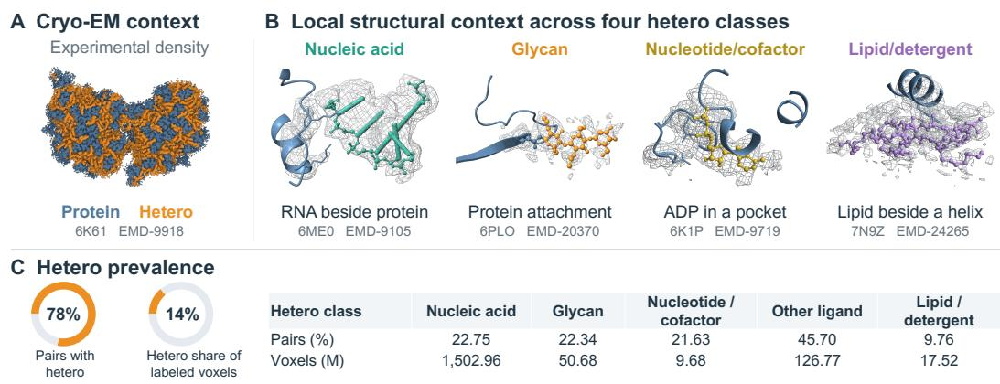
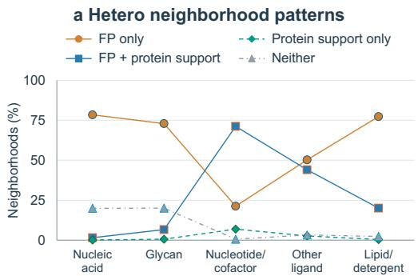
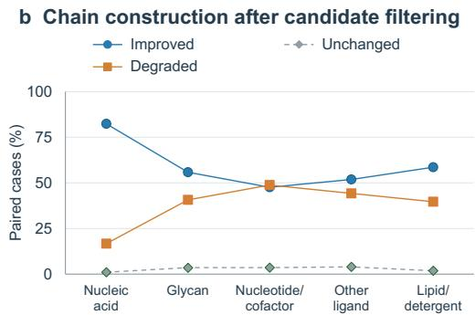
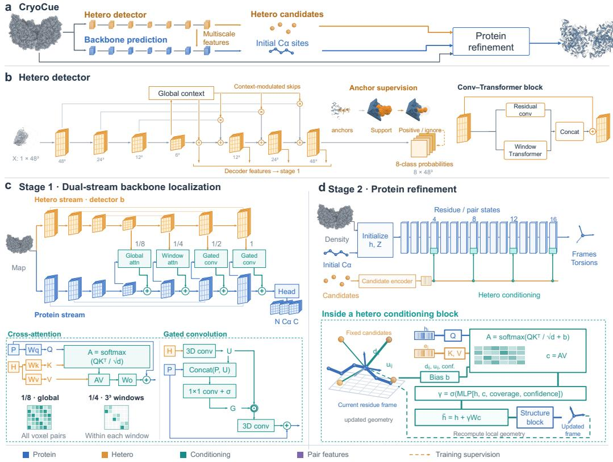
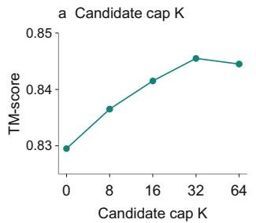
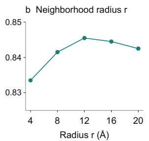
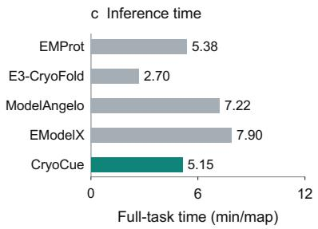
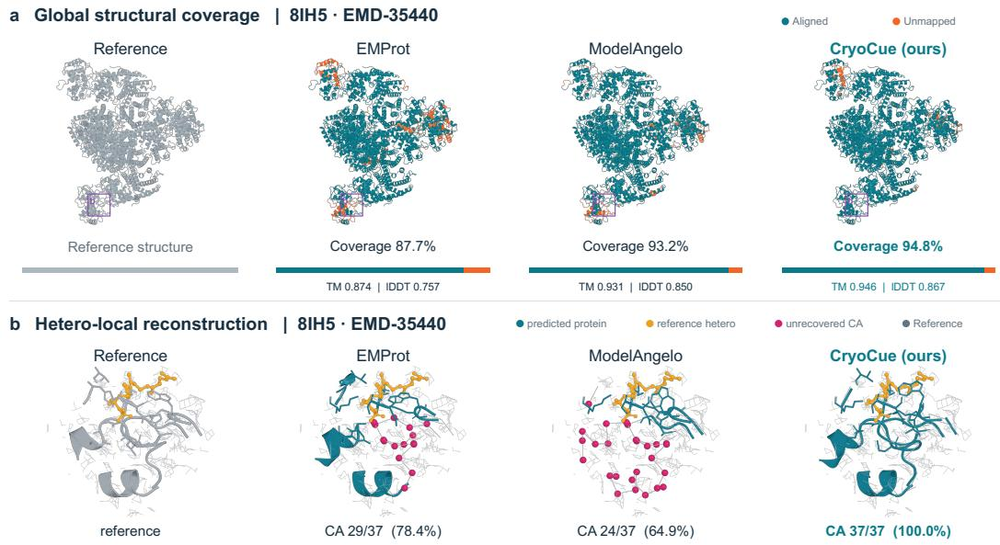

# LEARNING FROM HETERO DENSITY FOR CRYO-EM PROTEIN RECONSTRUCTION

Xu Han1,2,3 Chaozhuo Li4 Xiaowei Yuan5 Yuancheng Sun3 Kang Liu1,2,3 Qiwei Ye3,\*

1University of Chinese Academy of Sciences, Beijing, China 2Key Laboratory of Complex Systems Cognition and Decision, Institute of Automation, Chinese Academy of Sciences, Beijing, China 3Beijing Academy of Artificial Intelligence, Beijing, China 4Beijing University of Posts and Telecommunications, Beijing, China 5Ant Group, China Corresponding author: qiwei.ye@baai.ac.cn

## ABSTRACT

Reconstructing protein structures from cryo-electron microscopy (cryo-EM) maps is essential for understanding macromolecular assemblies. Although learning based methods have improved protein reconstruction, information from hetero components remains underused. Our analysis finds both false predictions and reference protein sites near hetero components; filtering nearby candidates can improve or impair chain construction. We introduce CRYOCUE, a framework that uses hetero information to guide protein reconstruction. An anchor-supervised detector learns hetero representations across five component classes. Multiscale hetero features guide backbone localization, while predicted hetero candidates condition structure refinement through their class, confidence, and frame-relative geometry. Experiments show that CRYOCUE improves backbone localization near hetero components and achieves more accurate protein structure reconstruction.

## 1 INTRODUCTION

Cryo-electron microscopy (cryo-EM) is an important technique for determining the structures of proteins and protein complexes (The wwPDB Consortium, 2024). The resulting three-dimensional density maps are interpreted to reconstruct protein structures. The general paradigm consists of backbone localization in the maps and structure modeling from the predicted atom positions (Terashi et al., 2024). Accurate protein structures reveal subunit interactions, ligand-binding sites, and distinct conformational states. These structural details help explain protein function and guide structure-based drug design (Su et al., 2026; Varga et al., 2025).

Learning-based methods have improved protein reconstruction from cryo-EM maps. DeepTracer and Cryo2Struct predict backbone atom locations and residue types from density (Pfab et al., 2021; Giri & Cheng, 2024). To guide residue assignment, ModelAngelo and EModelX incorporate protein sequences (Jamali et al., 2024; Chen et al., 2024). CryoAtom and EMProt use learned protein geometry to model relationships between residues (Su et al., 2026; Li et al., 2026c). These methods combine density evidence with protein-specific knowledge to improve reconstruction accuracy.

Training data remain limited because building reliable reference structures requires substantial time and expertise (Jamali et al., 2024). EMDB contains about 62,000 maps, but only a subset have corresponding structures (The wwPDB Consortium, 2024). Supervision for protein reconstruction mainly focuses on protein annotations (Giri et al., 2024), although the same maps also contain nucleic acids, glycans, cofactors, ligands, and lipids or detergents. We refer to these non-protein molecules as hetero components and their map signal as hetero density (Caspy et al., 2021). Figure 1A shows protein and hetero density within the same assembly (Zheng et al., 2019), while Fig. 1B illustrates contacts between proteins and several hetero classes. Together with the statistics in Fig. 1C, these examples show that hetero components are widespread across the analyzed maps.

The prevalence of hetero components raises an underexplored question: can hetero information be used to improve protein reconstruction? Hetero density can resemble protein density and create ambiguity during protein reconstruction. ModelAngelo, for example, learns to ignore cofactor density rather than build protein residues in these regions (Jamali et al., 2024). However, hetero components can also help interpret neighboring protein sites. N-linked glycans are covalently attached to asparagine side chains, linking their positions to specific protein sites (Emsley & Crispin, 2018). Figure 1B illustrates this attachment (Yu et al., 2021), alongside an interface between protein and RNA, an ADP binding pocket, and a lipid adjacent to a protein helix (Haack et al., 2019; Yan et al., 2019; Li et al., 2021). Existing work on nucleic acid reconstruction and component modeling shows that non-protein density can be interpreted computationally (Wang et al., 2023; Mostosi et al., 2020). These observations suggest that hetero components can both complicate protein localization and provide useful structural clues.

  
Figure 1: Hetero context in cryo-EM maps. A, Density assigned to protein and hetero using reference coordinates. B, Local contacts between protein and hetero components in reference structures; gray meshes show experimental density. C, Hetero prevalence and voxel counts across the sample dataset. M denotes million voxels.

To answer this question, we conduct a preliminary analysis of how hetero components affect backbone localization and chain construction (Section 2). A straightforward strategy is to treat hetero neighborhoods uniformly, for example by suppressing nearby candidate protein sites. However, the effect is mixed: filtering improves some cases but degrades others, even within the same hetero class. Our analysis shows that some hetero neighborhoods are dominated by false predictions, whereas others also contain nearby reference protein sites. This variation reflects the different structural contexts in which hetero components interact with proteins. These findings motivate using hetero information selectively, according to component type and local protein context.

Using hetero information presents two challenges. First, hetero components vary substantially in scale and geometry: nucleic acids form extended polymers, whereas ligands and membrane lipids can appear as compact bound molecules or elongated structures (Wang et al., 2023; Lawson et al., 2024; Solinc et al., 2025). Their density patterns therefore differ considerably across componentˇ classes and can lie close to protein density. Second, hetero information is not uniformly useful for protein reconstruction. Depending on the component class and local protein context, a hetero neighborhood may contain false protein predictions, reference protein sites, or both. The key challenge is therefore to exploit informative hetero cues without allowing misleading ones to interfere with protein reconstruction.

We propose CRYOCUE, a novel framework for cryo-EM protein reconstruction that adaptively exploits hetero information. CRYOCUE consists of two hetero-guided stages. First, an anchorsupervised detector represents diverse hetero components through representative sites and multiscale features. These multiscale features guide backbone localization despite the diverse scales and geometries of hetero components. Second, the predicted protein sites initialize structure refinement, where nearby hetero candidates are incorporated according to their class, confidence, and relative geometry. This adaptive conditioning allows the hetero contribution to vary as the protein structure evolves. Experiments show that CRYOCUE improves both backbone localization and final protein reconstruction, including hetero-associated regions.

## Our contributions are:

  
Figure 2: Analysis of protein candidates near hetero components. a, Patterns of false protein candidates and protein support near hetero components. b, Effects of candidate filtering on chain construction, shown as improved, degraded, or unchanged.

• We formulate and study the rarely explored problem of exploiting hetero information for cryo-EM protein reconstruction. Our analysis shows that hetero neighborhoods can contain both false protein predictions and nearby reference protein sites, so treating them uniformly can either help or harm reconstruction.

• We introduce CRYOCUE to address two key challenges: representing hetero components with diverse scales and geometries, and using hetero information selectively without disrupting protein reconstruction. The framework combines a unified hetero representation with adaptive conditioning throughout backbone localization and structure refinement.

• Experiments show that CRYOCUE improves both backbone localization and final protein reconstruction over protein-only baselines. The gains also extend to regions associated with hetero components.

## 2 PRELIMINARY ANALYSIS

Cryo-EM protein reconstruction generally consists of backbone localization followed by chain construction. To examine whether hetero components affect both phases, we conduct a preliminary analysis using Cryo2Struct, whose explicit candidate stage allows predicted protein sites to be inspected before chain construction (Giri & Cheng, 2024). We first examine protein candidates near hetero components to understand their effects on backbone localization. Then, we test whether filtering candidates in these regions improves or degrades chain construction. Appendix C gives the sampling procedure, protocols, and statistics.

Hetero effects on backbone localization. In the first stage of protein reconstruction, hetero components can either confuse or inform backbone localization. We examine protein candidates near annotated hetero components and their relationship to nearby protein support (Fig. 2a). Nucleic acids, glycans, and lipids or detergents are often associated with false candidates without protein support, indicating that their density can be mistaken for protein. In contrast, near nucleotides or cofactors, false candidates frequently coexist with protein support, while other ligands show a mixture of these patterns. These differences across hetero classes show that hetero density should not be treated as a uniform non-protein signal during backbone localization. Its contribution can instead vary with the hetero class and local protein context.

Hetero effects on chain construction. These mixed neighborhood patterns motivate us to test whether hetero components also affect chain construction. To test this effect, we filter protein candidates near annotated hetero components before chain construction while keeping the remaining inputs unchanged. Filtering often improves the reconstructed chains, particularly around nucleic acids, but degradations occur across all hetero classes (Fig. 2b). These mixed outcomes show that candidate filtering can remove misleading protein predictions but can also discard useful protein information. Together, these results show that hetero information has mixed effects across both stages, motivating different treatment across hetero classes based on nearby protein evidence.

  
Figure 3: Overview of CRYOCUE. a, Hetero-guided protein reconstruction. b, Anchor-supervised detection produces multiscale features and class predictions. c, Coarse attention and fine-scale gating condition backbone localization. d, Predicted hetero candidates condition refinement through their class, confidence, and geometry relative to evolving residue frames.

## 3 METHODOLOGY

Given a cryo-EM map and protein sequences, protein reconstruction proceeds in two stages: backbone localization followed by structure refinement (Fig. 3). CRYOCUE incorporates hetero information into both stages. An anchor-supervised detector provides multiscale hetero features for backbone localization and sparse hetero candidates for structure refinement. The first stage predicts initial protein sites through multiscale feature fusion, while the second refines these sites using frame-relative hetero conditioning. Protein sequences are introduced only during the final chain assembly.

## 3.1 ANCHOR-SUPERVISED HETERO REPRESENTATION

Hetero components vary substantially in size and shape, making uniform supervision difficult. We therefore use representative reference atoms as anchors to define localized targets (Fig. 3b). Voxels near an anchor are labeled positive only when their class matches the anchor, while other annotated hetero regions are ignored. This provides a consistent supervision target across diverse component geometries. Detailed anchor definitions and masking rules are given in Appendix B.4.

The hetero detector uses a 3D adaptation of SCUNet (Zhang et al., 2023). Its local blocks combine convolutional features with window-based Transformer features (Liu et al., 2021) to capture local density structure and surrounding context. At the coarsest scale, full self-attention further provides global context.

The prediction head distinguishes background, protein backbone, protein side chain, and five hetero classes: polymeric nucleic acid, glycan, nucleotide/cofactor, other ligand, and lipid/detergent. Includ ing the protein classes provides explicit supervision for distinguishing hetero from nearby protein density. The detector is trained with focal cross-entropy and foreground Dice loss (Lin et al., 2017; Milletari et al., 2016),

$$
\mathcal { L } _ { h } = \mathcal { L } _ { \mathrm { f o c a l } } + 0 . 5 \mathcal { L } _ { \mathrm { D i c e } } .\tag{1}
$$

Ignored voxels are excluded from both terms. Its multiscale features guide backbone localization, while predicted class probabilities are used to extract hetero candidates for structure refinement. Further architecture details are provided in Appendix D.1.

## 3.2 BACKBONE LOCALIZATION WITH HETERO FEATURES

The backbone predictor uses the same local 3D SCUNet architecture as the hetero detector with independent parameters. During localization, the two networks form parallel protein and hetero streams: the protein stream predicts backbone responses, while the fixed hetero stream provides features at matching resolutions. Coarse hetero features provide broader context for separating protein and hetero density, whereas fine features preserve local details for locating protein sites. We therefore use cross-attention at coarse resolutions and gated fusion at fine resolutions. At resolution s, protein feature $F _ { s } ^ { p }$ receives a hetero update $\Delta _ { s }$

Coarse context. At coarse resolutions, protein features query the corresponding hetero features:

$$
\Delta _ { s } = W _ { s } ^ { O } \mathrm { A t t n } _ { s } \left( Q _ { s } ( F _ { s } ^ { p } ) , K _ { s } ( F _ { s } ^ { h } ) , V _ { s } ( F _ { s } ^ { h } ) \right) , \qquad s \in \{ 8 , 4 \} .\tag{2}
$$

Protein features provide queries, while hetero features provide keys and values. Attention covers the full crop at the coarsest resolution and local windows at the next resolution. This allows each protein location to use hetero information beyond the same spatial position.

Fine-scale fusion. At finer resolutions, protein and hetero features are spatially aligned. We therefore use a gate to control the local hetero contribution:

$$
\begin{array} { r l } & { U _ { s } = \phi _ { s } ( F _ { s } ^ { h } ) , } \\ & { G _ { s } = \sigma ( g _ { s } ( [ F _ { s } ^ { p } ; U _ { s } ] ) ) , } \\ & { \Delta _ { s } = \psi _ { s } ( G _ { s } \odot U _ { s } ) , \qquad s \in \{ 2 , 1 \} . } \end{array}\tag{3}
$$

Here, $\phi _ { s }$ and $\psi _ { s }$ are convolutional projections, $g _ { s }$ predicts the gate, and $[ ; ] , \sigma$ , and ⊙ denote concatenation, sigmoid, and elementwise multiplication. Because the gate depends on both protein and hetero features, the hetero contribution can vary across spatial locations.

We train the backbone predictor while keeping the hetero detector fixed. Because background voxels greatly outnumber regions near backbone atoms, we balance the regression loss between the two groups for each backbone response:

$$
\mathcal { L } _ { \mathrm { v o x e l } } = \frac { 1 } { 3 } \sum _ { a } \sum _ { q \in \{ + , - \} } \frac { 1 } { 2 | \mathscr { V } _ { a } ^ { q } | } \sum _ { v \in \mathscr { V } _ { a } ^ { q } } \left| \frac { \widehat { A } _ { a } ( v ) - A _ { a } ( v ) } { 1 0 0 } \right| .\tag{4}
$$

Here, a indexes the three backbone response channels, and $\mathcal { V } _ { a } ^ { + }$ and $\mathcal { V } _ { a } ^ { - }$ denote atom-near and background voxels, respectively. The resulting predictions define initial protein sites for structure refinement, while a separate amino acid predictor provides residue-type scores for later sequence assignment. Detailed architecture and fusion settings are given in Appendix D.2.

## 3.3 STRUCTURE REFINEMENT WITH HETERO CANDIDATES

The second stage refines the initial protein sites into a protein structure. Its backbone is a three-track structure network with invariant point attention (IPA), jointly updating residue features, pair features, and local protein frames (Baek et al., 2021; Jumper et al., 2021; Li et al., 2026c). We inject hetero conditioning at selected structure blocks. As protein frames move and rotate during refinement, detected hetero candidates remain fixed in the map. We therefore represent each nearby candidate relative to the current protein frame and use this geometry to update protein features.

Candidate representation. Each hetero candidate has a fixed position, predicted class probabilities, and confidence. A shared encoder maps its class probabilities, confidence, and prediction uncertainty to an embedding $e _ { j }$ . For each initial protein site, we select a fixed neighborhood ${ \mathcal { N } } _ { i }$ of nearby candidates, whose positions and membership remain unchanged during refinement.

Frame-relative geometry. As a protein frame moves, its relation to the fixed hetero candidates changes. For protein frame $T _ { i } = ( R _ { i } , t _ { i } )$ and candidate position $y _ { j }$ , we compute

$$
d _ { i j } = \| y _ { j } - t _ { i } \| _ { 2 } , \qquad u _ { i j } = \frac { R _ { i } ^ { \top } ( y _ { j } - t _ { i } ) } { \operatorname* { m a x } ( d _ { i j } , \epsilon ) } .\tag{5}
$$

The distance $d _ { i j }$ and local direction $u _ { i j }$ are recomputed from the current frame at every conditioning step, keeping the hetero geometry aligned with the evolving protein structure.

Hetero conditioning. At each conditioning step, protein features query nearby hetero candidates, whose embeddings provide keys and values. For one attention head,

$$
\begin{array} { r l } & { \alpha _ { i j } = \mathrm { s o f t m a x } _ { j \in \mathcal { N } _ { i } } \left( \frac { q _ { i } ^ { \top } k _ { j } } { \sqrt { d _ { h } } } + b ( d _ { i j } , u _ { i j } , o _ { j } ) \right) , } \\ & { c _ { i } = \displaystyle \sum _ { j \in \mathcal { N } _ { i } } \alpha _ { i j } v _ { j } . } \end{array}\tag{6}
$$

The attention bias incorporates frame-relative geometry and candidate confidence, while the candidate embedding carries class information. After concatenating the attention heads, the resulting context $c _ { i } ^ { \mathrm { a l l } }$ updates each protein feature through a learned gate:

$$
\widetilde { h } _ { i } = h _ { i } + \gamma _ { i } P _ { O } ( c _ { i } ^ { \mathrm { a l l } } ) , \qquad ( H ^ { \prime } , Z ^ { \prime } , T ^ { \prime } ) = S ( \widetilde { H } , Z , T ) .\tag{7}
$$

Thus, hetero information contributes adaptively at each protein site. The candidate neighborhood remains fixed, while its geometry is recomputed as the protein structure evolves.

The refined frames and residue features are used to predict backbone geometry and torsions. They first define provisional chain fragments. Residue-type scores sampled at the refined protein sites form profiles for alignment to the input protein sequences. The resulting sequence assignments guide fragment assembly and final all-atom construction.

We train the structure network with backbone-coordinate and torsion supervision:

$$
\begin{array} { r l } & { \mathcal { L } _ { \mathrm { b a c k b o n e } } = \underset { ( i , a ) \in \mathcal { M } _ { \mathrm { b b } } } { \mathrm { m e a n } } \rho \big ( \| \widehat { \boldsymbol { x } } _ { i a } - \boldsymbol { x } _ { i a } \| _ { 2 } \big ) , } \\ & { \quad \mathcal { L } _ { \mathrm { t o r s i o n } } = \underset { ( i , k ) \in \mathcal { M } _ { \mathrm { t o r } } } { \mathrm { m e a n } } \operatorname* { m i n } \big ( \| \widehat { \boldsymbol { z } } _ { i k } - \boldsymbol { z } _ { i k } \| _ { 2 } ^ { 2 } , \| \widehat { \boldsymbol { z } } _ { i k } - \boldsymbol { z } _ { i k } ^ { \mathrm { a l t } } \| _ { 2 } ^ { 2 } \big ) , } \\ & { \mathcal { L } _ { \mathrm { s t r u c t u r e } } = \mathcal { L } _ { \mathrm { b a c k b o n e } } + 0 . 1 \mathcal { L } _ { \mathrm { t o r s i o n } } . } \end{array}\tag{8}
$$

Here, $\rho$ denotes the radial Huber loss for backbone coordinates, while $\widehat { z } _ { i k }$ is the normalized predicted torsion pair and $z _ { i k } ^ { \mathrm { a l t } }$ accounts for equivalent torsion representations. Appendix D.3 provides further details on the structure architecture, candidate encoding, loss definitions, and final assembly.

## 4 EXPERIMENTS

## 4.1 EXPERIMENTAL SETUP

Datasets and preprocessing. Following prior cryo-EM reconstruction work (Li et al., 2026c; Giri & Cheng, 2024), we collect single-particle map–structure pairs containing protein chains. We construct family-aware training, validation, and test splits and remove sequence-similar training pairs using MMseqs2. Maps are resampled, normalized, and processed as local density crops. Appendix B provides the complete dataset, preprocessing, and supervision protocol, while Appendix E describes training and optimization.

Baselines and evaluation metrics. We compare CRYOCUE with EMProt (Li et al., 2026c), E3- CryoFold (Wang et al., 2025), ModelAngelo (Jamali et al., 2024), and EModelX (Chen et al., 2024), using the inputs supported by each method. We evaluate global structure reconstruction, local geometry, density support, backbone localization, and recovery near hetero components using TMscore, Local Distance Difference Test (lDDT), coverage, Q-score, backbone precision, recall, and RMSD, together with hetero-local backbone and protein–hetero contact metrics. Appendix F provides the complete metric definitions, matching procedures, and aggregation protocol.

Table 1: Protein reconstruction performance. Results on the test set. Values are map-level means; bold indicates the best mean.
<table><tr><td rowspan="2">Method</td><td colspan="4">Structure reconstruction</td><td rowspan="2">Density support</td><td rowspan="2">Connectivity</td></tr><tr><td>TM-score ↑</td><td>IDDT↑</td><td>Coverage (%) ↑</td><td>RMSD (Å) ↓</td></tr><tr><td>EMProt</td><td>0.805</td><td>0.740</td><td>81.07</td><td>0.576</td><td>Q-score ↑ 0.604</td><td>Break rate (%) ↓ 1.20</td></tr><tr><td>E3-CryoFold</td><td>0.711</td><td>0.512</td><td>67.05</td><td>1.085</td><td>0.369</td><td>8.72</td></tr><tr><td>ModelAngelo</td><td>0.728</td><td>0.658</td><td>73.22</td><td>0.592</td><td>0.613</td><td>2.61</td></tr><tr><td>EModelX</td><td>0.805</td><td>0.687</td><td>82.43</td><td>0.842</td><td>0.447</td><td>6.96</td></tr><tr><td>CRYOCUE (ours)</td><td>0.846</td><td>0.789</td><td>85.02</td><td>0.571</td><td>0.593</td><td>0.69</td></tr></table>

Table 2: Backbone localization and protein–hetero contact. All scores are percentages; higher is better. Bold indicates the best mean among the compared methods.
<table><tr><td rowspan="2">Method</td><td colspan="2">Overall backbone</td><td colspan="2">Hetero neighborhood</td><td colspan="2">Protein-hetero contacts</td></tr><tr><td>CA precision ↑</td><td>CA recall ↑</td><td>CA precision ↑</td><td>CA recall ↑</td><td>Precision ↑</td><td>Recall ↑</td></tr><tr><td>EMProt</td><td>96.534</td><td>82.675</td><td>93.035</td><td>86.181</td><td>85.646</td><td>73.993</td></tr><tr><td>E3-CryoFold</td><td>86.013</td><td>79.818</td><td>71.638</td><td>76.606</td><td>67.762</td><td>59.699</td></tr><tr><td>ModelAngelo</td><td>93.688</td><td>81.225</td><td>97.511</td><td>84.937</td><td>87.765</td><td>73.145</td></tr><tr><td>EModelX</td><td>92.946</td><td>83.557</td><td>75.846</td><td>86.832</td><td>71.419</td><td>64.636</td></tr><tr><td>CRYOCUE (ours)</td><td>96.897</td><td>85.693</td><td>96.271</td><td>89.883</td><td>86.396</td><td>77.877</td></tr></table>

## 4.2 PROTEIN STRUCTURE RECONSTRUCTION

We first evaluate the reconstructed protein structures in Table 1. TM-score measures global structural agreement, lDDT reflects local backbone geometry, and coverage measures how much of the reference structure is recovered. CRYOCUE improves all three metrics, showing that the reconstructed structures are both more accurate and more complete.

The improvement also extends to chain continuity. The lower break rate indicates fewer missing connections between recovered protein sites, suggesting that the gain is not limited to localization but also leads to more continuous protein chains. This is consistent with our preliminary analysis, where hetero neighborhoods were shown to affect chain construction.

RMSD and Q-score show the boundary of this improvement. Because RMSD is computed only over successfully matched backbone positions, the smaller change suggests that the main benefit lies in recovering and organizing protein regions. The effect is more limited for coordinates that are already matched. Q-score does not improve in the same way, indicating that better structural reconstruction does not necessarily imply better density fit. Overall, hetero information mainly improves structure recovery and chain continuity, rather than producing large changes in matched-coordinate accuracy or density support.

## 4.3 BACKBONE LOCALIZATION NEAR HETERO COMPONENTS

We next examine backbone localization, with particular attention to regions near hetero components (Table 2). Precision reflects false protein predictions, while recall measures the recovery of reference protein sites. CRYOCUE achieves the highest overall precision and recall, showing that the additional recovery is not obtained by simply producing more predictions.

The advantage becomes more apparent near hetero components. CRYOCUE achieves the highest hetero-neighborhood recall, while maintaining high precision, indicating that more reference protein sites are recovered in these regions. The same trend appears in protein–hetero contacts: contact recall improves, while precision remains close to the strongest baseline. Together, these results show that the main gain lies in more complete recovery of hetero-associated protein structure.

Detailed hetero detection results are provided in Appendix G.1. Detection performance varies across component classes, with nucleic acids detected more reliably than several smaller or more diverse classes. Despite this variation, the predicted hetero context improves protein recovery near hetero components. Together with our preliminary analysis, these results suggest that hetero context remains useful despite uneven detection quality across component types.

Table 3: Ablation of hetero representation and conditioning. Variants isolate hetero fusion during backbone localization, anchor-based supervision, and dynamic frame-relative conditioning.
<table><tr><td rowspan="2">Method</td><td colspan="4">Structure reconstruction</td><td rowspan="2">Density</td><td>Connectivity</td></tr><tr><td>TM-score ↑</td><td>IDDT ↑ Coverage (%) ↑</td><td></td><td></td><td>RMSD (Å) ↓ Q-score ↑ Break rate (%) ↓</td></tr><tr><td>Protein-only</td><td>0.780</td><td>0.711</td><td>77.44</td><td>0.609</td><td>0.602</td><td>1.54</td></tr><tr><td>Backbone fusion only</td><td>0.819</td><td>0.760</td><td>82.53</td><td>0.588</td><td>0.622</td><td>1.06</td></tr><tr><td>Full w/o anchor supervision</td><td>0.747</td><td>0.692</td><td>75.80</td><td>0.715</td><td>0.545</td><td>1.78</td></tr><tr><td>Full w/ fixed hetero geometry</td><td>0.840</td><td>0.782</td><td>84.54</td><td>0.573</td><td>0.596</td><td>0.75</td></tr><tr><td>Full model</td><td>0.846</td><td>0.789</td><td>85.02</td><td>0.571</td><td>0.593</td><td>0.69</td></tr></table>

  
Figure 4: Hyperparameter sensitivity and inference efficiency. Left: TM-score under different candidate caps K and neighborhood radii $r ,$ with the other hyperparameter fixed. Right: end-to-end inference time across methods.

## 4.4 ABLATION OF HETERO REPRESENTATION AND CONDITIONING

We ablate the main components of hetero conditioning in Table 3. All hetero information is predicted from the cryo-EM map, while protein sequences are used only during final chain construction and remain unchanged across variants. Using hetero features only during backbone localization already improves structure reconstruction and chain continuity over the protein-only model. Adding hetero conditioning during structure refinement brings further gains, showing that hetero information contributes at both stages.

Importantly, simply expanding hetero supervision is not always beneficial. Removing anchor supervi sion degrades the structural metrics even below the protein-only variant. This result agrees with our preliminary analysis: hetero regions can contain both useful protein context and misleading signals. Anchor supervision is therefore important for localizing informative hetero cues rather than treating all hetero density as equally useful.

Dynamic geometry provides an additional gain during structure refinement. Using fixed hetero geometry already performs strongly, but recomputing the frame-relative geometry as the protein structure evolves consistently improves reconstruction. This supports modeling the changing relation between fixed hetero candidates and evolving protein frames.

Q-score shows a different, also informative trend. The Backbone fusion only variant achieves the strongest density support, whereas the full model performs best on structure reconstruction and connectivity. Thus, better structural reconstruction does not necessarily require a higher density-fit score. The refinement stage mainly improves the recovery and organization of the protein structure. Overall, these ablations show that the benefit of hetero information depends not simply on adding more hetero signal, but on how it is supervised and conditioned on the protein.

  
Figure 5: Case study of global reconstruction and recovery near a hetero component. a, Global reconstruction of 8IH5 (EMD-35440) by EMProt, ModelAngelo, and CryoCue; the highlighted region is enlarged below. b, Reconstruction near the corresponding hetero component. Magenta markers indicate unrecovered reference protein sites.

## 4.5 HYPERPARAMETER SENSITIVITY AND EFFICIENCY

We first examine sensitivity to the amount of local hetero context (Figure 4). Increasing the candidate cap and neighborhood radius from small settings improves reconstruction, but the gains saturate and slightly decline as the context becomes larger. This non-monotonic trend suggests that useful hetero cues are primarily local and that more context is not always beneficial. Performance remains stable around the selected settings, indicating limited sensitivity to the exact hyperparameters.

We next compare end-to-end inference time with existing methods. CRYOCUE has a runtime close to EMProt and is faster than ModelAngelo and EModelX. Thus, the additional hetero detection and conditioning introduce only moderate overhead while retaining practical inference efficiency.

## 4.6 CASE STUDY

Figure 5 illustrates how the reconstruction improvement appears at both global and local scales. Globally, CRYOCUE recovers more of the reference structure while preserving its overall organization. In the highlighted hetero-associated region, the compared methods miss several reference protein sites, whereas CRYOCUE preserves the local protein trace. This example links improved recovery near a hetero component to the increase in structural coverage at the whole-protein level.

## 5 CONCLUSION

We show that hetero density can provide useful context for cryo-EM protein reconstruction, but its contribution depends on the local structural context. CRYOCUE exploits this information during backbone localization and structure refinement through anchor supervision and frame-relative conditioning. The results show improved structure recovery and chain continuity. The ablations further show the importance of anchor supervision and dynamic hetero conditioning.

The current approach still depends on the quality of hetero predictions, and its gains are clearer in structural recovery than in atom-level density fit. Protein sequences are currently introduced only during final chain construction. Improving hetero prediction and using sequence information earlier are natural directions for future work.

## AI USE STATEMENT

Generative AI tools were used to assist with manuscript organization, language editing, drafting, literature retrieval, research execution, and software development. This includes AI-assisted scripts and code used during the project. All AI-assisted text and code were reviewed, revised, and tested by the authors. The authors take full responsibility for the final manuscript, code, results, and scientific claims.

## ETHICS STATEMENT

This study uses publicly available cryo-EM maps and macromolecular structures. It does not involve human participants, private data, or personally identifiable information.

## REPRODUCIBILITY STATEMENT

The appendix provides details on dataset construction, supervision, model architectures, training, and evaluation protocols.

## REFERENCES

T Bertie Ansell, Wanling Song, Claire E Coupland, Loic Carrique, Robin A Corey, Anna L Duncan, C Keith Cassidy, Maxwell MG Geurts, Tim Rasmussen, Andrew B Ward, et al. Lipidens: simulation assisted interpretation of lipid densities in cryo-em structures of membrane proteins. Nature Communications, 14(1):7774, 2023.

Minkyung Baek, Frank DiMaio, Ivan Anishchenko, Justas Dauparas, Sergey Ovchinnikov, Gyu Rie Lee, Jue Wang, Qian Cong, Lisa N Kinch, R Dustin Schaeffer, et al. Accurate prediction of protein structures and interactions using a three-track neural network. Science, 373(6557):871–876, 2021.

Helen M Berman, John Westbrook, Zukang Feng, Gary Gilliland, Talapady N Bhat, Helge Weissig, Ilya N Shindyalov, and Philip E Bourne. The protein data bank. Nucleic acids research, 28(1): 235–242, 2000.

Alok Bharadwaj, Lotte Veerbeek, and Arjen Jakobi. Interactive segmentation of membrane and membrane-mimic densities in cryo-em maps. Biological Crystallography, 82(8), 2026.

Ido Caspy, Tom Schwartz, Vinzenz Bayro-Kaiser, Mariia Fadeeva, Amit Kessel, Nir Ben-Tal, and Nathan Nelson. Dimeric and high-resolution structures of chlamydomonas photosystem i from a temperature-sensitive photosystem ii mutant. Communications Biology, 4(1):1380, 2021.

Sheng Chen, Sen Zhang, Xiaoyu Fang, Liang Lin, Huiying Zhao, and Yuedong Yang. Protein complex structure modeling by cross-modal alignment between cryo-em maps and protein sequences. Nature Communications, 15(1):8808, 2024.

Paul Emsley and Max Crispin. Structural analysis of glycoproteins: building n-linked glycans with coot. Biological Crystallography, 74(4):256–263, 2018.

Nabin Giri and Jianlin Cheng. De novo atomic protein structure modeling for cryoem density maps using 3d transformer and hmm. Nature Communications, 15(1):5511, 2024.

Nabin Giri, Liguo Wang, and Jianlin Cheng. Cryo2structdata: A large labeled cryo-em density map dataset for ai-based modeling of protein structures. Scientific Data, 11(1):458, 2024.

Daniel B Haack, Xiaodong Yan, Cheng Zhang, Jason Hingey, Dmitry Lyumkis, Timothy S Baker, and Navtej Toor. Cryo-em structures of a group ii intron reverse splicing into dna. Cell, 178(3): 612–623, 2019.

Kiarash Jamali, Lukas Kall, Rui Zhang, Alan Brown, Dari Kimanius, and Sjors HW Scheres.¨ Automated model building and protein identification in cryo-em maps. Nature, 628(8007):450– 457, 2024.

John Jumper, Richard Evans, Alexander Pritzel, Tim Green, Michael Figurnov, Olaf Ronneberger, Kathryn Tunyasuvunakool, Russ Bates, Augustin Zˇ ´ıdek, Anna Potapenko, et al. Highly accurate protein structure prediction with alphafold. nature, 596(7873):583–589, 2021.

Catherine L Lawson, Andriy Kryshtafovych, Grigore D Pintilie, Stephen K Burley, Jiˇr´ı Cern ˇ y,\` Vincent B Chen, Paul Emsley, Alberto Gobbi, Andrzej Joachimiak, Sigrid Noreng, et al. Outcomes of the emdataresource cryo-em ligand modeling challenge. Nature methods, 21(7):1340–1348, 2024.

Jiao Li, Long Han, Francesca Vallese, Ziqiao Ding, Sylvia K Choi, Sangjin Hong, Yanmei Luo, Bin Liu, Chun Kit Chan, Emad Tajkhorshid, et al. Cryo-em structures of escherichia coli cytochrome bo 3 reveal bound phospholipids and ubiquinone-8 in a dynamic substrate binding site. Proceedings ofthe National Academy ofSciences, 118(34):e2106750118, 2021.

Minzhang Li, Mingrui Li, Weichen Qin, Qihe Chen, Sixian Shen, Yuan Pei, Jiakai Zhang, and Jingyi Yu. Cryoace: An atom-centric framework for accurate and automated model building in cryo-em. arXiv preprint arXiv:2606.31332, 2026a.

Shu Li, Anika Jain, Yuki Kagaya, Joon Hong Park, and Daisuke Kihara. Direct detection and atomic modeling of ligands in cryo-em maps using deep learning. Biorxiv: the Preprint Server for Biology, 2026b.

Tao Li, Hong Cao, Jiahua He, and Sheng-You Huang. Automated detection and de novo structure modeling of nucleic acids from cryo-em maps. Nature Communications, 15(1):9367, 2024.

Tao Li, Jiahua He, Hong Cao, Yi Zhang, Ji Chen, Yi Xiao, and Sheng-You Huang. All-atom rna structure determination from cryo-em maps. Nature Biotechnology, 43(1):97–105, 2025.

Tao Li, Ji Chen, Hao Li, Hong Cao, and Sheng-You Huang. Emprot improves structure determination from cryo-em maps. Nature Structural & Molecular Biology, 33(2):341–350, 2026c.

Tsung-Yi Lin, Priya Goyal, Ross Girshick, Kaiming He, and Piotr Dollar. Focal loss for dense object ´ detection. In Proceedings of the IEEE international conference on computer vision, pp. 2980–2988, 2017.

Ze Liu, Yutong Lin, Yue Cao, Han Hu, Yixuan Wei, Zheng Zhang, Stephen Lin, and Baining Guo. Swin transformer: Hierarchical vision transformer using shifted windows. In 2021 IEEE/CVF international conference on computer vision (ICCV), pp. 9992–10002. Ieee, 2021.

Ilya Loshchilov and Frank Hutter. Decoupled weight decay regularization. arXiv preprint arXiv:1711.05101, 2017.

Valerio Mariani, Marco Biasini, Alessandro Barbato, and Torsten Schwede. lddt: a local superpositionfree score for comparing protein structures and models using distance difference tests. Bioinformatics, 29(21):2722–2728, 2013.

Fausto Milletari, Nassir Navab, and Seyed-Ahmad Ahmadi. V-net: Fully convolutional neural networks for volumetric medical image segmentation. In 2016fourth international conference on 3D vision (3DV), pp. 565–571. Ieee, 2016.

Philipp Mostosi, Hermann Schindelin, Philip Kollmannsberger, and Andrea Thorn. Haruspex: a neural network for the automatic identification of oligonucleotides and protein secondary structure in cryo-electron microscopy maps. Angewandte Chemie, 132(35):14898–14905, 2020.

Andrew Muenks, Samantha Zepeda, Guangfeng Zhou, David Veesler, and Frank DiMaio. Automatic and accurate ligand structure determination guided by cryo-electron microscopy maps. Nature Communications, 14(1):1164, 2023.

Jonas Pfab, Nhut Minh Phan, and Dong Si. Deeptracer for fast de novo cryo-em protein structure modeling and special studies on cov-related complexes. Proceedings of the National Academy of Sciences, 118(2):e2017525118, 2021.

Grigore Pintilie, Kaiming Zhang, Zhaoming Su, Shanshan Li, Michael F Schmid, and Wah Chiu. Measurement of atom resolvability in cryo-em maps with q-scores. Nature methods, 17(3):328–334, 2020.

Michael J Robertson, Gydo CP van Zundert, Kenneth Borrelli, and Georgios Skiniotis. Gemspot: a pipeline for robust modeling of ligands into cryo-em maps. Structure, 28(6):707–716, 2020.

Gasperˇ Solinc, Marija Srnko, Franci Merzel, Ana Crnkoviˇ c, Mirijam Kozorog, Marjetka Podobnik,´ and Gregor Anderluh. Cryo-em structures of a protein pore reveal a cluster of cholesterol molecules and diverse roles of membrane lipids. Nature communications, 16(1):2972, 2025.

Martin Steinegger and Johannes Soding. Mmseqs2 enables sensitive protein sequence searching for¨ the analysis of massive data sets. Nature biotechnology, 35(11):1026–1028, 2017.

Baoquan Su, Kun Huang, Zhenling Peng, Alexey Amunts, and Jianyi Yang. Cryoatom improves model building for cryo-em. Nature Structural & Molecular Biology, 33(2):351–361, 2026.

Aaron Sweeney, Thomas Mulvaney, Mauro Maiorca, and Maya Topf. Chemem: flexible docking of small molecules in cryo-em structures. Journal ofmedicinal chemistry, 67(1):199–212, 2024.

Genki Terashi, Xiao Wang, Devashish Prasad, Tsukasa Nakamura, and Daisuke Kihara. Deepmainmast: integrated protocol of protein structure modeling for cryo-em with deep learning and structure prediction. Nature methods, 21(1):122–131, 2024.

The wwPDB Consortium. Emdb—the electron microscopy data bank. Nucleic acids research, 52 (D1):D456–D465, 2024.

Balazs R Varga, Sarah M Bernhard, Amal El Daibani, Saheem A Zaidi, Jordy H Lam, Jhoan Aguilar, Kevin Appourchaux, Antonina L Nazarova, Alexa Kouvelis, Ryosuke Shinouchi, et al. Structureguided design of partial agonists at an opioid receptor. Nature communications, 16(1):2518, 2025.

Jue Wang, Cheng Tan, Zhangyang Gao, Guijun Zhang, Yang Zhang, and Stan Z Li. End-to-end cryo-em complex structure determination with high accuracy and ultra-fast speed. Nature Machine Intelligence, 7(7):1091–1103, 2025.

Xiao Wang, Eman Alnabati, Tunde W Aderinwale, Sai Raghavendra Maddhuri Venkata Subramaniya, Genki Terashi, and Daisuke Kihara. Detecting protein and dna/rna structures in cryo-em maps of intermediate resolution using deep learning. Nature communications, 12(1):2302, 2021.

Xiao Wang, Genki Terashi, and Daisuke Kihara. Cryoread: de novo structure modeling for nucleic acids in cryo-em maps using deep learning. Nature methods, 20(11):1739–1747, 2023.

Xiao Wang, Han Zhu, Genki Terashi, Manav Taluja, and Daisuke Kihara. Diffmodeler: large macromolecular structure modeling for cryo-em maps using a diffusion model. Nature methods, 21(12):2307–2317, 2024.

John D Westbrook, Chenghua Shao, Zukang Feng, Marina Zhuravleva, Sameer Velankar, and Jasmine Young. The chemical component dictionary: complete descriptions of constituent molecules in experimentally determined 3d macromolecules in the protein data bank. Bioinformatics, 31(8): 1274–1278, 2015.

Lijuan Yan, Hao Wu, Xuemei Li, Ning Gao, and Zhucheng Chen. Structures of the iswi–nucleosome complex reveal a conserved mechanism of chromatin remodeling. Nature structural & molecular biology, 26(4):258–266, 2019.

Jie Yu, Hongtao Zhu, Remigijus Lape, Timo Greiner, Juan Du, Wei Lu, Lucia Sivilotti, and Eric¨ Gouaux. Mechanism of gating and partial agonist action in the glycine receptor. Cell, 184(4): 957–968, 2021.

Chengxin Zhang, Morgan Shine, Anna Marie Pyle, and Yang Zhang. Us-align: universal structure alignments of proteins, nucleic acids, and macromolecular complexes. Nature methods, 19(9): 1109–1115, 2022.

Kai Zhang, Yawei Li, Jingyun Liang, Jiezhang Cao, Yulun Zhang, Hao Tang, Deng-Ping Fan, Radu Timofte, and Luc Van Gool. Practical blind image denoising via swin-conv-unet and data synthesis. Machine Intelligence Research, 20(6):822–836, 2023.

Lvqin Zheng, Yanbing Li, Xiying Li, Qinglu Zhong, Ningning Li, Kun Zhang, Yuebin Zhang, Huiying Chu, Chengying Ma, Guohui Li, et al. Structural and functional insights into the tetrameric photosystem i from heterocyst-forming cyanobacteria. Nature Plants, 5(10):1087–1097, 2019.

## A RELATED WORK

Cryo-EM protein reconstruction. Learning-based methods increasingly combine density evidence with chain construction, sequence information, and learned protein geometry. DeepTracer predicts backbone and residue information directly from density, while Cryo2Struct predicts backbone atom locations and amino acid types before tracing protein chains with a hidden Markov model (HMM) (Pfab et al., 2021; Giri & Cheng, 2024). ModelAngelo and EModelX further incorporate protein sequences to guide residue assignment (Jamali et al., 2024; Chen et al., 2024). Other methods introduce stronger structural priors: DeepMainmast and DiffModeler combine densityderived information with predicted protein structures, E3-CryoFold uses an SE(3)-equivariant graph network, and CryoAtom, EMProt, and CryoACE refine protein structures through learned geometric representations or structure-generation networks (Terashi et al., 2024; Wang et al., 2024; 2025; Su et al., 2026; Li et al., 2026c;a). These methods primarily improve reconstruction using proteinderived information. In contrast, we study whether hetero density can provide additional evidence for backbone localization and structure refinement.

Non-protein density modeling. Existing methods model specific types of non-protein density, often with component-specific priors. Haruspex and Emap2sec+ distinguish nucleic acid density from protein, while CryoREAD, EMRNA, and EM2NA reconstruct nucleic acid structures (Mostosi et al., 2020; Wang et al., 2021; 2023; Li et al., 2025; 2024). GemSpot, ChemEM, EMERALD, and recent learned methods fit, detect, or reconstruct small-molecule ligands (Robertson et al., 2020; Sweeney et al., 2024; Muenks et al., 2023; Li et al., 2026b). LipIDens and SURFER address lipid or membrane-associated density (Ansell et al., 2023; Bharadwaj et al., 2026). Rather than reconstructing individual hetero components as the primary target, we use predicted hetero information to guide protein reconstruction.

## B DATASET DETAILS

## B.1 DATA COLLECTION AND QUALITY CONTROL

Following the data-selection criteria of EMProt, and Cryo2Struct (Li et al., 2026c; Giri & Cheng, 2024), we collect cryo-EM maps from EMDB (The wwPDB Consortium, 2024) and fitted structures from the RCSB PDB (Berman et al., 2000). Each pair links a released primary map to a fitted structure through an official EMD–PDB association. We include pairs with and without annotated hetero components, subject to the eligibility criteria and quality checks in Table 4.

We canonicalize EMD–PDB associations, consolidate repeated EMDB entries across sources, and retain one eligible fitted structure per map. We exclude unresolved duplicate associations and pairs containing unknown or ambiguously classified components, rather than assigning these components to the other-ligand class. Split manifests record each selected map and fitted structure; all dataset sizes below count these pairs.

## B.2 DATASET SPLITS

We first randomly sample validation and test pairs, using MMseqs2-based protein-family assignments to maintain family diversity (Steinegger & Soding, 2017). We then compare every protein chain ¨ in each remaining training candidate against all protein chains in the validation and test sets. We exclude a candidate pair if any chain alignment satisfies

$$
\mathrm { i d e n t i t y } \geq 0 . 2 5 , \qquad \frac { \mathrm { a l i g n m e n t ~ l e n g t h } } { \operatorname* { m i n } ( \mathrm { q u e r y } \mathrm { l e n g t h } , \mathrm { t a r g e t } \mathrm { l e n g t h } ) } \geq 0 . 8 0 .\tag{9}
$$

Table 4: Data collection and quality control. These checks determine pair eligibility; local label validity is handled separately in Appendix B.4.
<table><tr><td>Step</td><td>Criteria</td></tr><tr><td>Database search</td><td>Single-particle cryo-EM maps in EMDB and electron-microscopy structures in RCSB, with reported resolution  $\leq 4 \mathrm { \AA } .$ </td></tr><tr><td>Pair eligibility</td><td>A released primary map, an official fitted EMD-PDB association, available map and coordinate files, and at least one protein chain.</td></tr><tr><td>Structure validation</td><td>Parseable required mmCIF fields and reliable component classification using the Chemical Component Dictionary (CCD) (Westbrook et al., 2015) and entity/polymer metadata. Pairs with unresolved classification conflicts are</td></tr><tr><td>Raw-map quality</td><td>excluded. Complete downloads; MRC dimensions and voxel spacing consistent with official metadata.</td></tr></table>

We use MMseqs $^ { ; 2 }$ easy-search, combining query-coverage and target-coverage searches with minimum identity 0.25, coverage 0.8, sensitivity 7.5, and at most 1,000,000 returned sequences. We also exclude training candidates whose map or coordinate files are identical to a validation or test file. The resulting dataset contains 18,420 pairs: 17,820 for training, 300 for validation, and 300 for testing (Table 5). We use validation data to select checkpoints and hyperparameters.

Table 5: Dataset split sizes and complete stride-16 crop-grid counts. Grid counts include emptydensity regions and boundary crops; they are not counts of independently sampled training examples.
<table><tr><td>Split or test subset</td><td>Pairs</td><td>Grid crops</td></tr><tr><td>Training</td><td>17,820</td><td>185,373,427</td></tr><tr><td>Validation</td><td>300</td><td>3,543,489</td></tr><tr><td>Test</td><td>300</td><td>2,029,806</td></tr></table>

## B.3 MAP PREPROCESSING

We place maps and fitted coordinates in a common physical frame before generating labels (Table 6).   
Map-level normalization ensures that overlapping crops contain the same density values.

Table 6: Map preprocessing for the detector and backbone network.
<table><tr><td>Step</td><td>Operation</td></tr><tr><td>Coordinate alignment</td><td>Use MRC axis order, header origin, and grid starts to express voxels and fitted coordinates in the same physical frame.</td></tr><tr><td>Resampling</td><td>Resample to isotropic 1 Å spacing using cubic convolution  $( a = - 0 . 5 )$  preserving map-coordinate alignment.</td></tr><tr><td>Normalization</td><td>Apply full-map quantile clipping and scaling, as defined below.</td></tr><tr><td>Input crops</td><td>Extract  $4 8 ^ { 3 }$  mpe crops at stride 16. Zero-pad positions outside the map and exclude them from supervision.</td></tr></table>

Let $q$ be the 99.999th percentile of the positive values in the resampled map V. We normalize the full map once:

$$
X = \frac { \mathrm { c l i p } ( V , 0 , q ) } { q + 1 0 ^ { - 6 } } .\tag{10}
$$

We compute normalization in float32 and store processed maps in float $^ { 1 6 , }$ without renormalizing individual crops. The detector is supervised on non-ignored voxels throughout the crop, and the backbone predictor on the central $1 6 ^ { 3 }$ region. Training sampling is described in Appendix E.

## B.4 LABEL CONSTRUCTION

Structural classes. The labels distinguish hetero sites from nearby protein and provide comparable supervision across component shapes. We derive them from the first model of each fitted structure using the fixed taxonomy applied during screening. We retain heavy atoms and resolve alternate conformations by occupancy; the taxonomy specification gives the complete atom-selection rules. The detector predicts background, protein backbone (N, Cα, C, O, and OXT), protein side chain (other retained protein atoms), and the five hetero classes in Table 7.

Table 7: Hetero class definitions and supervision anchors. Named anchors must be uniquely present in the corresponding residue or component.
<table><tr><td>Class</td><td>Definition</td><td>Anchor</td></tr><tr><td>Polymeric nucleic acid</td><td>Nucleotides assigned to nucleic acid polymers</td><td>C4&#x27; per nucleotide residue</td></tr><tr><td>Glycan</td><td>Sugar residues, including NAG, MAN, and FUC</td><td>C1 per sugar residue</td></tr><tr><td>Nucleotide/cofactor</td><td>Free nucleotides and nucleotide-derived cofactors, including NAD/NADH, FAD/FMN, and SAM/SAH</td><td>C4′</td></tr><tr><td>Other ligand</td><td>Other reliably classified non-polymer ligands</td><td>Representative heavy atom</td></tr><tr><td>Lipid/detergent</td><td>Classified lipid and detergent components</td><td>Representative heavy atom</td></tr></table>

Structural support. We assign each voxel to the class of its nearest retained heavy atom within 3 A. We ignore assignments when the nearest distances to two different classes differ by less than ˚ 0.25 A. Unassigned zero-density voxels and water-associated regions receive background labels;˚ positive density without assigned structural support is ignored. These rules govern supervision within retained pairs and leave the input density unchanged.

Anchor-based supervision. Anchors specify where to localize each component, while structural support determines which voxels can receive its label. We use named anchors for nucleotides and sugars. For other ligands and lipids/detergents, we select the retained heavy atom nearest the component’s heavy-atom centroid. For coordinates $A _ { j }$ , this anchor is

$$
a _ { j } = \underset { a \in \mathcal { A } _ { j } } { \arg \operatorname* { m i n } } ~ \sum _ { x \in \mathcal { A } _ { j } } \| a - x \| _ { 2 } ^ { 2 } .\tag{11}
$$

This criterion selects an actual atom, avoiding a centroid that may lie outside the molecule. Ties follow a deterministic atom order. Table 7 gives the other anchor definitions; missing or non-unique named atoms produce no anchor. Non-polymer components are eligible when their representative center lie inside the map and has same-class structural support within 4 A. A hetero voxel is positive only if it˚ lies within 3 A of an accepted anchor and its nearest anchor class agrees with its structural-support˚ class. Near-ties between anchor classes use the same 0.25 A tolerance. We ignore hetero support˚ outside accepted anchor targets, including components without an accepted anchor. This concentrates positive supervision around representative sites without labeling the rest of an annotated hetero component as background.

Backbone-atom targets. Targets have channel order $( N , { \mathrm { C A } } , C )$ . For atom type a with reference coordinate set $\mathcal { X } _ { a }$ , the response is

$$
A _ { a } ( v ) = \operatorname* { m a x } _ { x \in \mathcal { X } _ { a } } 1 0 0 \exp \left[ - \left( \frac { \pi } { 4 \mathring { \mathbb { A } } } \right) ^ { 2 } \lVert v - x \rVert _ { 2 } ^ { 2 } \right] ,\tag{12}
$$

with values below 0.25 set to zero. Targets are rendered online from sparse coordinates in the processed map frame.

## B.5 DATASET STATISTICS

Table 8 reports the number of pairs whose fitted structures contain each hetero class; classes can co-occur within a pair.

Table 8: Pair-level presence of the five hetero classes. A pair is counted once for each class present in its structural labels, so counts across classes are not additive.
<table><tr><td>Split or test subset</td><td>Polymeric nucleic acid</td><td>Glycan</td><td>Nucleotide/cofactor</td><td>Other ligand</td><td>Lipid/detergent</td></tr><tr><td>Training</td><td>4,040</td><td>3,983</td><td>3,859</td><td>8,161</td><td>1,743</td></tr><tr><td>Validation</td><td>104</td><td>31</td><td>68</td><td>99</td><td>17</td></tr><tr><td>Test</td><td>110</td><td>32</td><td>53</td><td>98</td><td>21</td></tr></table>

The masked structural-support census contains 484,570,312,002 training voxels (Table 9). Protein backbone and side-chain support together occupy 1.8063%, and the five hetero classes occupy 0.3451%. These counts describe structural support before anchor restriction; they do not represent the distribution of sampled training inputs. Appendix C reports full-map occupancy on the analysis subset.

Table 9: Class composition of the masked structural-support census in the training split, before anchor-target restriction.
<table><tr><td>Support class</td><td>Voxels</td><td>Share</td></tr><tr><td>Background</td><td>474,145,598,844</td><td>97.8487%</td></tr><tr><td>Protein backbone</td><td>3,256,567,203</td><td>0.6721%</td></tr><tr><td>Protein side chain</td><td>5,496,114,368</td><td>1.1342%</td></tr><tr><td>Polymeric nucleic acid</td><td>1,472,613,528</td><td>0.3039%</td></tr><tr><td>Glycan</td><td>50,586,134</td><td>0.01044%</td></tr><tr><td>Nucleotide/cofactor</td><td>9,619,500</td><td>0.00199%</td></tr><tr><td>Other ligand</td><td>121,915,485</td><td>0.02516%</td></tr><tr><td>Lipid/detergent</td><td>17,296,940</td><td>0.00357%</td></tr></table>

## C HETERO ANALYSIS

## C.1 ANALYSIS SUBSET AND HETERO STATISTICS

The preliminary analysis uses a random sample of approximately 10% of the available data, yielding 1,868 successfully processed map–structure pairs. Among them, 1,458 pairs (78.05%) contain nonzero hetero-labeled voxels, showing that hetero density is common across the analyzed maps despite its sparse voxel occupancy. Of these pairs, 1,362 have successful atom and amino acid predictions and are used for the candidate-neighborhood analysis. The candidate-removal experiments use the class-specific successful pairs defined below.

Table 10 summarizes full-map voxel occupancy and the proximity of non-protein residues to reference proteins. Voxel fractions are pooled over all processed map voxels. Among protein- and heteroassociated voxels, hetero voxels account for 14.06%.

The final three rows use a separate residue-level denominator of 176,963 non-water, non-protein residues retained by the historical parser, including ions and unknown residues. For each residue, $d _ { \mathrm { C A } }$ and $d _ { \mathrm { h e a v y } }$ denote the minimum distances from any retained non-hydrogen atom to a reference protein Cα atom and protein heavy atom, respectively. The three groups are mutually exclusive: residues close to a reference Cα, residues outside this range but close to another protein heavy atom, and the remaining residues. Protein is restricted to the 20 standard amino acids in ATOM records, and HOH, WAT, and DOD are excluded as water. Together, these statistics show that hetero-labeled voxels are sparse across the full map but occur in most analyzed pairs, while a substantial fraction of non-protein residues lie close to reference protein structure.

Table 10: Full-map statistics for the 1,868-pair preliminary-analysis subset. Voxel fractions are pooled over complete map grids. The final three rows summarize residue-level proximity for 176,963 non-water, non-protein residues retained by the historical parser and are not five-class prevalence estimates.
<table><tr><td>Quantity</td><td>Value</td></tr><tr><td>Analyzed map-structure pairs</td><td>1,868</td></tr><tr><td>Pairs with nonzero hetero-labeled voxels</td><td>1,458 (78.05%)</td></tr><tr><td>Protein-associated voxels / full grid</td><td>0.709909%</td></tr><tr><td>Hetero-associated voxels / full grid</td><td>0.116131%</td></tr><tr><td>Background voxels / full grid</td><td>99.173960%</td></tr><tr><td>Hetero / protein-plus-hetero voxels</td><td>14.06%</td></tr><tr><td>Residues with  $d \mathrm { C A } \leq 4 \mathring \mathrm { A }$ </td><td>17.1%</td></tr><tr><td>Residues with  $d _ { \mathrm { C A } } > 4 \mathring { \mathrm { A } } , d _ { \mathrm { h e a v y } } \le 3 \mathring { \mathrm { A } }$ </td><td>14.1%</td></tr><tr><td>Residues with  $d _ { \mathrm { C A } } > 4 \mathring { \mathrm { A } } , d _ { \mathrm { h e a v y } } > 3 \mathring { \mathrm { A } }$ </td><td>68.8%</td></tr></table>

## C.2 PROTEIN CANDIDATES NEAR HETERO COMPONENTS

Analysis groups and residue centers. For the preliminary analysis, each hetero residue is represented by the mean position of its retained non-hydrogen atoms. Polymeric nucleic acids and glycans are represented residue by residue rather than by a single center for the entire chain. These residue centers are used only for the neighborhood analysis and differ from the reference-atom anchors used to supervise CRYOCUE.

The analysis uses fixed residue-name groups. Nucleic acid includes A, C, G, U, DA, DC, DG, DT, and I; glycan includes NAG, MAN, BMA, FUC, GAL, GLC, SIA, NDG, BGC, and XYS; nucleotide/cofactor includes ATP, ADP, AMP, GTP, GDP, GNP, HEM, HEA, FAD, FMN, NAD, NAP, SAH, SAM, COA, and FES; and lipid/detergent includes LMT, POV, MC3, CLR, CHL, 3PE, PEE, PCF, BCR, CLA, DOP, and CDL. Other ligand contains the remaining residues after ions and unknown components (UNK and UNL) are excluded. This grouping is used only for the preliminary analysis. Unlike the CCD- and entity-based taxonomy used for training, it does not check polymer membership and may assign unlisted modified components to the other-ligand group.

Protein candidates and matching. We form candidate protein sites from points with Cα probability ≥ 0.5. Points are processed in descending probability order and greedily clustered within 2 A of˚ each seed; each point is assigned once, and the probability-weighted cluster center defines one candidate. Candidates are then matched to reference protein sites across the full map without structural alignment. Each candidate is associated with its nearest reference Cα, and candidate– reference pairs are considered in ascending distance order. A match is accepted when the distance is within 3 A and the reference site has not already been used. Accepted candidates are true positives˚ (TP), and the remaining candidates are false positives (FP); rejected candidates are not rematched to a second-nearest reference site. Reference protein sites are taken from Cα atoms of the 20 standard amino acids in ATOM records.

Neighborhood patterns. For each hetero residue center, we examine the surrounding 5 A neigh-˚ borhood and record FP presence and protein support independently. Protein support is present when the neighborhood contains either a TP candidate or a reference protein site, so a reference site missed by the predictor still provides support. These two indicators define four patterns: FP only, FP with protein support, protein support only, and neither (Table 11).

Neighborhoods can overlap. Each hetero residue contributes one neighborhood, and the same protein candidate may therefore occur in several neighborhoods. The FP and TP occurrence counts in Table 11 include these repeated neighborhood occurrences rather than unique candidates. A map–structure pair may likewise contribute to more than one hetero group.

The resulting patterns differ substantially across hetero groups. FP-only neighborhoods dominate around nucleic acids, glycans, and lipids or detergents, whereas nucleotide/cofactor neighborhoods most often contain both FP and protein support. Other ligands show a more balanced mixture of these patterns.

Table 11: Protein candidate patterns near hetero components in the 1,362 audited cases. Percentages are pooled over residue neighborhoods within each analysis group. Protein support includes either a TP candidate or a reference protein site. FP and TP occurrences allow the same candidate to appear in overlapping neighborhoods. Rounding may cause small departures from 100%.
<table><tr><td></td><td></td><td></td><td>FP</td><td>FP+ protein</td><td>Protein support</td><td></td><td>FP</td><td>TP</td></tr><tr><td>Class</td><td>Pairs</td><td>Residues</td><td>only</td><td>support</td><td>only</td><td>Neither</td><td>occurrences</td><td>occurrences</td></tr><tr><td>Nucleic acid</td><td>264</td><td>105,890</td><td>78.4%</td><td>1.5%</td><td>0.1%</td><td>19.9%</td><td>501,865</td><td>1,326</td></tr><tr><td>Glycan</td><td>396</td><td>14,330</td><td>72.9%</td><td>6.6%</td><td>0.6%</td><td>20.0%</td><td>68,320</td><td>910</td></tr><tr><td>Nucleotide/cofactor</td><td>273</td><td>1,172</td><td>21.2%</td><td>71.2%</td><td>6.9%</td><td>0.6%</td><td>6,881</td><td>1,143</td></tr><tr><td>Other ligand</td><td>751</td><td>7,114</td><td>50.2%</td><td>44.0%</td><td>2.6%</td><td>3.2%</td><td>42,118</td><td>4,021</td></tr><tr><td>Lipid/detergent</td><td>207</td><td>6,007</td><td>77.3%</td><td>20.0%</td><td>0.4%</td><td>2.3%</td><td>40,676</td><td>1,246</td></tr></table>

## C.3 CANDIDATE FILTERING AND CHAIN CONSTRUCTION

For each hetero group, we filter Cryo2Struct candidate states within $5 \textup { \AA }$ of the annotated residue centers before chain construction. These states follow the original HMM pipeline and are independent of the candidate clustering used in the neighborhood analysis above. The density map, atom and amino acid predictions, input sequences, and decoding settings remain fixed. After filtering, we rebuild the transition matrix using the retained states and their corresponding emission rows, then evaluate the reconstructed chains with the same matching protocol. This comparison isolates the effect of filtering protein candidates near hetero components on chain construction.

A class–map pair is included when the corresponding hetero group is present and both the original and filtered runs succeed. Runs contain at most 12,000 initial states and must retain enough states for the sequence observations both before and after filtering. Pairs are included even when no candidate state is removed, and successful processing of the other hetero groups is not required. Each group therefore has its own paired subset, and the subsets can overlap across maps.

Table 12: Effects of candidate filtering on chain construction for the hetero groups defined above. Win/loss reports the numbers of paired cases with increased or decreased Cα $\bar { \mathsf { F } } _ { 1 }$ at 3 A; paired˚ n includes unchanged cases. Net ∆TP is the total change in matched protein sites, and removed states/map is the mean number of filtered candidate states in each paired subset.
<table><tr><td colspan="4"></td><td rowspan="2">Removed states/map</td></tr><tr><td>Class</td><td>Paired n</td><td>Win/loss</td><td>Net ∆TP</td></tr><tr><td>Nucleic acid</td><td>102</td><td>84/17</td><td>+4,620</td><td>961</td></tr><tr><td>Glycan</td><td>172</td><td>96/70</td><td>+687</td><td>104</td></tr><tr><td>Nucleotide/cofactor</td><td>84</td><td>40/41</td><td>+200</td><td>34</td></tr><tr><td>Other ligand</td><td>357</td><td>185/158</td><td>+389</td><td>45</td></tr><tr><td>Lipid/detergent</td><td>111</td><td>65/44</td><td>+523</td><td>78</td></tr></table>

Candidate filtering produces both improvements and degradations in every hetero group (Table 12). The effect is most pronounced for nucleic acids, where most paired cases improve and the total number of matched protein sites increases substantially, but the remaining groups also show mixed outcomes. These results indicate that filtering can remove misleading protein candidates, while uniform filtering can also discard candidates that are useful for chain construction.

## D ARCHITECTURE DETAILS

## D.1 HETERO DETECTOR

The hetero detector consists of a local 3D SCUNet, a global Transformer at the coarsest scale, and an eight-class prediction head. Table 13 summarizes the feature dimensions for a $4 8 ^ { 3 }$ density crop.

Algorithm 1 summarizes the detector forward pass. The local backbone first produces features at four spatial scales. Global context is introduced at the coarsest scale and used to modulate the skip features before decoding. The resulting feature pyramid is also exposed to the backbone predictor.

Table 13: Architecture of the hetero detector. Spatial scales are downsampling factors relative to the input crop.
<table><tr><td>Stage</td><td>Feature shape</td><td>Operation</td></tr><tr><td>Input</td><td> $\boldsymbol { 1 \times 4 8 ^ { 3 } }$ </td><td>Normalized density</td></tr><tr><td>Scale 1</td><td> $3 2 \times 4 8 ^ { 3 }$ </td><td>Stem and local blocks</td></tr><tr><td>Scale 2</td><td> $6 4 \times 2 4 ^ { 3 }$ </td><td>Downsampling and local blocks</td></tr><tr><td>Scale 4</td><td> $1 2 8 \times 1 2 ^ { 3 }$ </td><td>Downsampling and local blocks</td></tr><tr><td>Scale 8</td><td> $2 5 6 \times 6 ^ { 3 }$ </td><td>Bottleneck</td></tr><tr><td>Global context</td><td> $3 8 4 \times 6 ^ { 3 }$ </td><td>10 Transformer blocks</td></tr><tr><td>Decoder</td><td> $\operatorname { S c a l e s } 8 \to 4 \to 2 \to 1$ </td><td>Upsampling with modulated skips</td></tr><tr><td>Refinement</td><td> $6 4 \times 4 8 ^ { 3 }$ </td><td>Conv3d, GroupNorm, SiLU</td></tr><tr><td>Prediction</td><td> $\mathrm { 8 \times 4 8 ^ { 3 } }$ </td><td>Voxel classification head</td></tr></table>

Algorithm 1 Forward pass of the hetero detector   
Require: Normalized density crop X; detector parameters $\theta _ { h }$   
Ensure: Class probabilities p and hetero features $\{ F _ { s } ^ { h } \} _ { s \in \{ 8 , 4 , 2 , 1 \} }$   
1: $S _ { 1 } \gets \hat { \mathrm { S t e m } _ { \theta _ { h } } } ( X )$   
$2 \colon S _ { 2 } \gets \mathrm { D o w n } _ { 2 } ^ { \cdot } ( S _ { 1 } ) ; S _ { 4 } \gets \mathrm { D o w n } _ { 4 } ( S _ { 2 } ) ; S _ { 8 } \gets \mathrm { D o w n } _ { 8 } ( S _ { 4 } )$   
3: $B  \mathrm { B o d y } ( \dot { S _ { 8 } } )$   
4: $( B ^ { g } , S _ { 4 } ^ { g } , \tilde { S _ { 2 } ^ { g } } , S _ { 1 } ^ { g } )$ ← GlobalContext $( B , S _ { 4 } , S _ { 2 } , S _ { 1 } )$   
5: ${ F _ { 8 } ^ { h } } \gets B ^ { g } + S _ { 8 }$   
6: $F _ { 4 } ^ { \natural } \gets \mathrm { D e c o d e } _ { 4 } ( F _ { 8 } ^ { h } ) + S _ { 4 } ^ { g }$   
7: $F _ { 2 } ^ { h }  \mathrm { D e c o d e } _ { 2 } ( F _ { 4 } ^ { h } ) + S _ { 2 } ^ { g }$   
8: $H _ { 1 }  \mathrm { D e c o d e } _ { 1 } ( F _ { 2 } ^ { h } ) + S _ { 1 } ^ { g }$   
9: $F _ { 1 } ^ { h } \gets \mathrm { R e f i n e } ( H _ { 1 } )$   
10: p ← softmax(Predict $\left( F _ { 1 } ^ { h } \right) )$   
11: return $p , \{ F _ { 8 } ^ { h } , F _ { 4 } ^ { h } , F _ { 2 } ^ { h } , F _ { 1 } ^ { h } \}$

The local backbone is a 3D adaptation of the SCUNet design (Zhang et al., 2023; Liu et al., 2021). It contains seven stages, with two Conv–Transformer blocks at each stage. Each block first projects and splits its channels into convolutional and Transformer branches. The convolutional branch applies two $3 ^ { 3 }$ convolutions with filter response normalization and a residual connection. The Transformer branch applies window self-attention followed by an MLP; both operations use pre-normalization and residual updates. The two branches are then concatenated, projected, and added back to the block input. Window attention uses $3 ^ { 3 }$ windows with head dimension 16, with regular and shifted windows alternating between successive blocks.

After the local bottleneck is computed, a global Transformer processes all spatial positions at the coarsest scale. The 256-channel bottleneck is projected to 384 channels, giving 216 tokens on the $6 ^ { 3 }$ grid. Ten Transformer blocks process these tokens with eight attention heads, three-dimensional rotary positional embeddings, and SwiGLU feed-forward layers. The resulting global context is added to the bottleneck and also modulates the skip features used during decoding.

Let B denote the local bottleneck, $C$ the global context, and $S _ { s }$ a skip feature at scale $s \in \{ 4 , 2 , 1 \}$ The global context is incorporated as

$$
\begin{array} { r l r } & { C = { \mathcal G } _ { h } ( W _ { \mathrm { i n } } B ) , } & { B ^ { \prime } = B + W _ { o } C , } \\ & { S _ { s } ^ { \prime } = S _ { s } \odot [ 1 + \operatorname { t a n h } ( G _ { s } ( \operatorname { U p } _ { s } C ) ) ] , } & { s \in \{ 4 , 2 , 1 \} . } \end{array}\tag{13}
$$

Here, $W _ { \mathrm { i n } }$ and $W _ { o }$ project the bottleneck into and out of the global Transformer. Up resizes the global context to the corresponding skip resolution, and $G _ { s }$ maps it to the skip feature dimension. The output projection and skip gates are zero initialized, so the global branch initially leaves the local backbone unchanged.

After decoding, a refinement layer maps the full-resolution feature from 32 to 64 channels. The prediction head outputs eight logits for background, protein backbone, protein side chain, polymeric nucleic acid, glycan, nucleotide/cofactor, other ligand, and lipid/detergent.

For backbone localization, we expose four detector features, denoted $F _ { s } ^ { h } . ~ F _ { 8 } ^ { h }$ is the context-updated coarse feature, $F _ { 4 } ^ { h }$ and $F _ { 2 } ^ { h }$ are decoder features at the corresponding scales, and $F _ { 1 } ^ { h }$ is the refined full-resolution feature.

The detector is trained with focal cross-entropy and foreground Dice loss. Let V denote the nonignored voxels, $y _ { v }$ the target class at voxel $v ,$ and $p _ { v c }$ the predicted probability for class c. The objective is

$$
\mathcal { L } _ { h } = - \frac { 1 } { | \mathcal { V } | } \sum _ { v \in \mathcal { V } } ( 1 - p _ { v , y _ { v } } ) ^ { 2 } \log p _ { v , y _ { v } } + 0 . 5 \mathcal { L } _ { \mathrm { D i c e } } ,\tag{14}
$$

where

$$
\mathcal { L } _ { \mathrm { D i c e } } = 1 - \frac { 1 } { | \mathcal { C } _ { + } | } \sum _ { c \in \mathcal { C } _ { + } } \frac { 2 \sum _ { v \in \mathcal { V } } p _ { v c } \mathbf { 1 } [ y _ { v } = c ] + \epsilon } { \sum _ { v \in \mathcal { V } } p _ { v c } + \sum _ { v \in \mathcal { V } } \mathbf { 1 } [ y _ { v } = c ] + \epsilon } .\tag{15}
$$

Here, $\mathcal { C } _ { + }$ contains the foreground classes present in the distributed batch, and $\epsilon = 1 0 ^ { - 6 }$ . The background class is excluded from the class average, while all non-ignored voxels, including background voxels, contribute to each foreground Dice denominator. Ignored voxels are excluded from both loss terms. When no foreground class is present, the Dice term is set to zero.

## D.2 BACKBONE PREDICTOR AND MULTISCALE FUSION

The backbone predictor follows the same local 3D SCUNet architecture as the hetero detector, but uses independent parameters. It predicts three backbone response maps and receives hetero features at scales $s \in \{ 8 , 4 , 2 , 1 \}$ }. At each scale, a hetero update $\Delta _ { s }$ is added to the protein feature,

$$
\widetilde { F } _ { s } ^ { p } = F _ { s } ^ { p } + \Delta _ { s } .\tag{16}
$$

Table 14 gives the feature dimensions and fusion operation at each scale.

Table 14: Multiscale hetero fusion in the backbone predictor. Shapes give channels and spatial dimensions for a $4 8 ^ { 3 }$ input crop.
<table><tr><td>Scale s</td><td>Protein  $F _ { s } ^ { p }$ </td><td>Hetero  $F _ { s } ^ { h }$ </td><td>Fusion</td></tr><tr><td>8</td><td> $2 5 6 \times 6 ^ { 3 }$ </td><td> $2 5 6 \times 6 ^ { 3 }$ </td><td>Global cross-attention</td></tr><tr><td>4</td><td> $1 2 8 \times 1 2 ^ { 3 }$ </td><td> $1 2 8 \times 1 2 ^ { 3 }$ </td><td>Window cross-attention</td></tr><tr><td>2</td><td> $6 4 \times 2 4 ^ { 3 }$ </td><td> $6 4 \times 2 4 ^ { 3 }$ </td><td>Gated convolution</td></tr><tr><td>1</td><td> $3 2 \times 4 8 ^ { 3 }$ </td><td> $6 4 \times 4 8 ^ { 3 }$ </td><td>Gated convolution</td></tr></table>

Coarse-scale cross-attention. At scales $^ 8$ and $^ { 4 , }$ protein features provide queries and hetero features provide keys and values. With $m _ { s }$ denoting the spatial validity mask,

$$
\begin{array} { r } { \Delta _ { s } = m _ { s } \odot W _ { s } ^ { O } \mathrm { A t t n } _ { s } \left( Q _ { s } ( F _ { s } ^ { p } ) , K _ { s } ( F _ { s } ^ { h } ) , V _ { s } ( F _ { s } ^ { h } ) \right) , \qquad s \in \{ 8 , 4 \} . } \end{array}\tag{17}
$$

Each projection applies layer normalization followed by a learned linear mapping. At scale $^ { 8 , }$ eight heads of dimension 32 attend over all 216 spatial tokens. At scale 4, eight heads of dimension 16 attend within non-overlapping $3 ^ { 3 }$ windows. Invalid keys are masked during attention, invalid query updates are zeroed, and coarse validity masks are obtained by max pooling the input mask.

Fine-scale gated fusion. At scales $^ 2$ and 1, the hetero feature is first projected to the protein feature dimension. A spatial gate predicted from both streams then controls its contribution:

$$
\begin{array} { r l } & { U _ { s } = \mathrm { S i L U } \left[ \mathrm { G N } _ { 8 } \left( \mathrm { C o n v } _ { 3 \times 3 \times 3 } ( F _ { s } ^ { h } ) \right) \right] , } \\ & { G _ { s } = \sigma ( \mathrm { C o n v } _ { 1 \times 1 \times 1 } ( [ F _ { s } ^ { p } ; U _ { s } ] ) ) , } \\ & { \Delta _ { s } = m _ { s } \odot \mathrm { C o n v } _ { 3 \times 3 \times 3 } ^ { \mathrm { o u t } } ( G _ { s } \odot U _ { s } ) , \qquad s \in \{ 2 , 1 \} . } \end{array}\tag{18}
$$

The projection preserves 64 channels at scale 2 and maps the 64-channel hetero feature to $^ { 3 2 }$ channels at scale 1. Attention output projections and the final residual convolutions are zero initialized, so the hetero fusion initially contributes no residual update.

The hetero detector remains fixed during backbone training, so gradients from the backbone predictor do not update the detector. The final fused protein feature is mapped to three continuous response maps ordered as $\mathrm { N } , \mathrm { C } \alpha ,$ and C.

Training objective. For response channel $a , \mathcal { V } _ { a } ^ { + }$ contains valid central-region voxels with target response $A _ { a } ( v ) > 2$ on the [0, 100] scale, and $\mathcal { V } _ { a } ^ { - }$ contains the remaining valid voxels. Equation 4 gives equal weight to these two groups and then averages equally over the three response channels. An empty group contributes zero; errors and valid counts are aggregated across devices before normalization.

Full-map backbone localization. We evaluate overlapping $4 8 ^ { 3 }$ crops at stride 16 and average their valid backbone responses at each map voxel. Responses are set to zero where the normalized input density is at or below $1 0 ^ { - 6 }$ . To extract initial protein sites, we threshold the averaged Cα response at 20 on the [0, 100] scale, followed by density-weighted mean-shift and peak merging. The mean-shift resolution parameter is $6 \mathrm { \AA } ,$ the maximum shift distance is 10 ${ \mathrm { \AA } } ,$ and peaks within 1.5 A are merged.˚

Amino acid type prediction. The amino acid predictor is an independent 3D SCUNet with a 20-class output head. It maps $4 8 ^ { 3 }$ density crops to voxel-wise residue-type probabilities. Training uses cross-entropy over voxels with valid amino acid labels:

$$
\mathcal { L } _ { \mathrm { A A } } = - \frac { 1 } { \vert \mathcal { V } _ { \mathrm { A A } } \vert } \sum _ { v \in \mathcal { V } _ { \mathrm { A A } } } \log p _ { v , y _ { v } ^ { a } } ^ { a } ,\tag{19}
$$

where ${ \mathcal { V } } _ { \mathrm { A A } }$ contains valid protein voxels, $y _ { v } ^ { a }$ is the reference residue type, and $p _ { v , y _ { v } ^ { a } } ^ { a }$ is its predicted probability. Residue labels are assigned from the nearest protein heavy atom within $2 \ \mathrm { \AA } ;$ voxels without a valid residue label are ignored.

During structure refinement, the predicted residue-type logits are sampled at the refined protein sites to form fragment profiles. Alignment of the input protein sequences to these profiles assigns residue identities and sequence positions for final assembly.

## D.3 STRUCTURE REFINEMENT WITH HETERO CANDIDATES

The structure stage takes the density map, initial protein sites, and hetero predictions from the detector. Hetero predictions are first converted into sparse candidates and encoded as fixed context for structure refinement.

Candidate extraction and encoding. Let $z _ { c } ( v )$ denote the detector logit for class $c ,$ and let $\mathcal { C } _ { h }$ contain the five hetero classes. We compute the total hetero confidence as

$$
\ell ( v ) = \mathrm { L S E } _ { c \in \mathcal { C } _ { h } } z _ { c } ( v ) - \mathrm { L S E } _ { c \not \in \mathcal { C } _ { h } } z _ { c } ( v ) , \qquad o ( v ) = \sigma ( \ell ( v ) ) ,\tag{20}
$$

where LSE denotes log-sum-exp. Candidates are $3 ^ { 3 }$ local maxima of $\ell ( v )$ . To avoid duplicates from overlapping crops, each voxel contributes candidates only through its assigned central crop region.

Candidate $j$ stores its position $y _ { j }$ , confidence $o _ { j } = o ( y _ { j } )$ , and conditional class probabilities

$$
\pi _ { j } = \operatorname { s o f t m a x } ( z _ { \mathcal { C } _ { h } } ( y _ { j } ) ) .\tag{21}
$$

Its input descriptor is

$$
\begin{array} { l } { { \displaystyle x _ { j } = [ \bar { \ell } _ { j } ; o _ { j } ; \pi _ { j } ; E _ { j } ; \operatorname* { m a x } _ { c } \pi _ { j c } ] } , } \\ { { \displaystyle \bar { \ell } _ { j } = \mathrm { c l i p } ( \ell _ { j } , - 1 2 , 1 2 ) / 1 2 } , } \\ { { \displaystyle E _ { j } = - \frac { 1 } { \log 5 } \sum _ { c } \pi _ { j c } \log \operatorname* { m a x } ( \pi _ { j c } , 1 0 ^ { - 8 } ) } , } \end{array}\tag{22}
$$

which combines class information, confidence, and prediction uncertainty. A shared encoder maps $x _ { j }$ to a 128-dimensional embedding $e _ { j }$

For each initial protein site i, we select up to 32 candidates within $1 2 \textup { \AA }$ , ranked by confidence, to form ${ \mathcal { N } } _ { i }$ . Candidate positions and neighborhood membership remain fixed throughout refinement.

Protein features and frames. The density initializer extracts local density around each protein site and between neighboring sites. Convolutional encoders produce 256-dimensional residue features $H ^ { 0 }$ and 128-dimensional pair features $Z ^ { 0 }$ . Each protein site also carries a rigid frame $T _ { i } = ( R _ { i } , t _ { i } )$

Sixteen three-track structure blocks jointly update residue features, pair features, and frames. The blocks combine residue attention, pair updates, and invariant point attention (IPA) (Jumper et al., 2021). Hetero conditioning is applied before blocks 4, 8, 12, and 16:

$$
( H ^ { \ell } , Z ^ { \ell } , T ^ { \ell } ) = \mathcal S _ { \ell } ( \widetilde { H } ^ { \ell - 1 } , Z ^ { \ell - 1 } , T ^ { \ell - 1 } ) , \qquad \ell = 1 , \dots , 1 6 ,\tag{23}
$$

where $\widetilde { H } = H$ at blocks without hetero conditioning.

Frame-relative hetero conditioning. Although hetero candidates remain fixed in the map, their relation to a protein site changes as its frame is updated. For frame $T _ { i } = ( R _ { i } , t _ { i } )$ and candidate $y _ { j }$ we compute

$$
d _ { i j } = \| y _ { j } - t _ { i } \| _ { 2 } , \qquad u _ { i j } = \frac { R _ { i } ^ { \top } ( y _ { j } - t _ { i } ) } { \operatorname* { m a x } ( d _ { i j } , 1 0 ^ { - 6 } ) } .\tag{24}
$$

These quantities are recomputed from the current frames at every conditioning step.

Distance is expanded with 16 Gaussian radial basis functions,

$$
r _ { m } ( d ) = \exp \left[ - \frac { 1 } { 2 } \left( \frac { d - 1 2 m / 1 5 } { 0 . 7 5 } \right) ^ { 2 } \right] , \qquad m = 0 , \ldots , 1 5 .\tag{25}
$$

The radial features, local direction, and log confidence are mapped to one additive bias per attention head.

Protein features provide queries, while candidate embeddings provide keys and values. For one attention head,

$$
\begin{array} { r l } & { \alpha _ { i j } = \mathrm { s o f t m a x } _ { j \in \mathcal { N } _ { i } } \left( \frac { q _ { i } ^ { \top } k _ { j } } { \sqrt { d _ { h } } } + b ( d _ { i j } , u _ { i j } , o _ { j } ) \right) , } \\ & { c _ { i } = \displaystyle \sum _ { j \in \mathcal { N } _ { i } } \alpha _ { i j } v _ { j } . } \end{array}\tag{26}
$$

Each conditioning module uses four heads of dimension 32. Invalid candidates are masked before attention normalization.

The head outputs are concatenated into $c _ { i } ^ { \mathrm { a l l } }$ . A gate then controls how much hetero context is added to each protein site:

$$
\begin{array} { r l } & { n _ { i } = | \mathcal { N } _ { i } | / 3 2 , \qquad o _ { i } ^ { \mathrm { m a x } } = \underset { j \in \mathcal { N } _ { i } } { \operatorname* { m a x } } o _ { j } , } \\ & { \gamma _ { i } = \sigma \big ( g ( [ \mathrm { L N } ( h _ { i } ) ; c _ { i } ^ { \mathrm { a l l } } ; n _ { i } ; o _ { i } ^ { \mathrm { m a x } } ] ) \big ) , } \\ & { \widetilde { h } _ { i } = h _ { i } + \gamma _ { i } P _ { O } ( c _ { i } ^ { \mathrm { a l l } } ) . } \end{array}\tag{27}
$$

The gate uses the protein feature, hetero context, neighborhood size, and maximum candidate confidence. $P _ { O }$ is zero initialized, so hetero conditioning starts from a zero residual. Sites without valid candidates receive no hetero update.

Torsions and sequence assignment. The final residue features predict torsions, while the refined frames define the backbone geometry. These predictions first form provisional chain fragments. Residue-type logits sampled at the refined protein sites provide fragment profiles for alignment to the input sequences. The resulting sequence assignments provide residue identities and positions for fragment assembly and final all-atom construction.

Training objective. The current structure model is trained with backbone-coordinate and torsion supervision only. For valid backbone atoms,

$$
\mathcal { L } _ { \mathrm { b a c k b o n e } } = \operatorname* { m e a n } _ { ( i , a ) \in \mathcal { M } _ { \mathrm { b b } } } \rho ( \| \widehat { \boldsymbol { x } } _ { i a } - \boldsymbol { x } _ { i a } \| _ { 2 } ) ,\tag{28}
$$

where $\rho$ is the radial Huber loss,

$$
\begin{array} { r } { \rho ( d ) = \left\{ \begin{array} { l l } { d ^ { 2 } / 2 , } & { d < 1 , } \\ { d - 1 / 2 , } & { d \geq 1 . } \end{array} \right. } \end{array}\tag{29}
$$

For valid torsions,

$$
\mathcal { L } _ { \mathrm { t o r s i o n } } = \operatorname* { m e a n } _ { ( i , k ) \in \mathcal { M } _ { \mathrm { t o r } } } \operatorname* { m i n } \left( \Vert \widehat { z } _ { i k } - z _ { i k } \Vert _ { 2 } ^ { 2 } , \Vert \widehat { z } _ { i k } - z _ { i k } ^ { \mathrm { a l t } } \Vert _ { 2 } ^ { 2 } \right) ,\tag{30}
$$

where $\widehat { z } _ { i k }$ is the normalized predicted sine–cosine pair and $z _ { i k } ^ { \mathrm { a l t } }$ represents an equivalent torsion target when one exists. The final objective is

$$
\mathcal { L } _ { \mathrm { s t r u c t u r e } } = \mathcal { L } _ { \mathrm { b a c k b o n e } } + 0 . 1 \mathcal { L } _ { \mathrm { t o r s i o n } } .\tag{31}
$$

## D.4 END-TO-END INFERENCE

Algorithm 2 summarizes the complete inference pipeline. The hetero detector D, backbone predictor $B ,$ and amino acid predictor A first process the density map. The resulting protein sites and hetero candidates are passed to the structure network for three rounds of refinement. Each round starts from the protein frames produced by the previous round, while the hetero candidates remain fixed in the map. Their geometry relative to the current protein frames is recomputed during each round.

Algorithm 2 Inference with CRYOCUE   
Require: Normalized map M, protein sequences $Q ;$ trained models ${ \overline { { D , B , A , S } } }$   
Ensure: Reconstructed protein structure $\hat { \boldsymbol { S } }$   
1: for $X \in \mathrm { C r o p s } _ { 4 8 , 1 6 } \mathrm { \hat { ( } } M \mathrm { ) }$ do   
2: $( p _ { X } , F _ { X } ^ { h } )  D ( X )$   
3: $R _ { X }  B ( 1 0 0 X , F _ { X } ^ { h } )$   
4: $X _ { a } \gets \mathrm { A A I n p u t } ( \dot { X } ) ; \Lambda _ { X } \gets A ( X _ { a } )$   
5: KX ← Candidates(pX)   
6: end for   
7: C ← ExtractSites(OverlapMean $\left( \left\{ R _ { X } \right\} \right)$   
8: ${ \mathcal { K } } \gets \bigcup _ { X } { \mathcal { K } } _ { X }$   
9: T(0) ← InitializeFrames(C)   
10: {ej} ← EncodeCandidates(K)   
11: N ← SelectNeighbors $( C _ { i } , \dot { \kappa } )$   
12: for $r = 1 , \ldots , 3$ do   
13: (T(r), U(r)) ← REFINE(M, T(r−1), K, {ej}, {Ni})   
14: end for   
15: $\smash { T \gets T ^ { ( 3 ) } ; U \gets U ^ { ( 3 ) } }$   
16: F ← Trace(T)   
17: $\Pi  \operatorname { P r o f l e s } ( \{ \Lambda x \} , T , \mathcal { F } )$   
18: $\mathcal { A }  \mathrm { H M M A l i g n } ( \dot { \Pi } , Q )$   
19: $( \mathcal { I } , a ) \gets \mathrm { A s s e m b l e P r u n e } ( \mathcal { F } , A , T )$   
20: Sb ← BuildAtoms(T[J ], U[J ], a)   
21: return $\widehat { S }$   
22: function REFINE $M , T ^ { 0 } , \mathcal { K } , \{ e _ { j } \} , \{ \mathcal { N } _ { i } \} )$   
23: $( H ^ { 0 } , Z ^ { 0 } ) $ InitializeFeatures $( \vec { M } , \vec { T } ^ { 0 } )$   
24: for $\ell = { 1 , \dots , 1 6 }$ do   
25: $\smash { \widetilde { H } \gets H ^ { \ell - 1 } }$   
26: $i \mathbf { f } \ \ell \in \{ 4 , 8 , 1 2 , 1 6 \}$ then   
27: G ← RelativeGeometry $( T ^ { \ell - 1 } , \mathcal { K } , \{ \mathcal { N } _ { i } \} )$   
28: He ← HeteroCondition $\cdot ( H ^ { \ell - 1 } , \{ e _ { j } \} , \mathcal { G } , \{ \mathcal { N } _ { i } \} )$   
29: end if   
30: $( \overleftarrow { H ^ { \ell } } , Z ^ { \ell } , T ^ { \ell } )  { \cal S } _ { \ell } ( \overleftarrow { H } , Z ^ { \ell - 1 } , T ^ { \ell - 1 } )$   
31: end for   
32: U ← TorsionHead $( H ^ { 1 6 } )$   
33: return $T ^ { 1 6 } , U$   
34: end function

$\mathrm { C r o p s } _ { 4 8 , 1 6 }$ extracts $4 8 ^ { 3 }$ crops at stride 16, and $X _ { a }$ denotes the density input prepared for the independently trained amino acid predictor. Candidate extraction uses the central crop region so that overlapping crops do not produce duplicate candidates. $\mathcal { F }$ denotes provisional chain fragments, Π their residue-type profiles, and a the residue identities assigned by sequence alignment.

## E TRAINING DETAILS

## E.1 TRAINING PROCEDURE

Training proceeds in four stages. We first train the hetero detector with anchor supervision. The detector is then fixed while the backbone predictor and multiscale fusion modules are trained for backbone localization. The amino acid predictor is trained independently from density and does not use hetero features. Finally, we train the structure network with predicted hetero candidates from the fixed detector.

Algorithm 3 summarizes the training procedure. All learnable models are trained from scratch without pretrained weights. Each model has its own parameters, optimizer, and training objective.

Algorithm 3 Staged training of CRYOCUE   
Require: Training data $\mathcal { D } ;$ model parameters $\theta _ { h } , \theta _ { b } , \theta _ { a } , \theta _ { s }$   
Ensure: Trained parameters $\theta _ { h } , \theta _ { b } , \theta _ { a } , \theta _ { s }$   
▷ Hetero representation   
1: for $t = 1 , \ldots , N _ { h }$ do   
2: $( X , Y _ { h } , m _ { h } ) \sim \mathcal { D } _ { h }$   
3: $( p , F ^ { h } )  D _ { \theta _ { h } } ( X )$   
4: $\dot { L } \gets \dot { \mathcal { L } } _ { h } ( p , Y _ { h } ; \dot { m } _ { h } )$   
5: $\theta _ { h } \gets \mathrm { S t e p } _ { h } ( \theta _ { h } , \nabla _ { \theta _ { h } } L )$   
6: end for   
7: $D _ { \theta _ { h } } \gets \mathrm { F r e e z e E v a l } ( D _ { \theta _ { h } } )$   
▷ Backbone localization   
8: for $t = 1 , \ldots , N _ { b }$ do   
9: $( X , Y _ { b } , m _ { b } ) \sim \mathcal { D } _ { b }$   
10: $( p , F ^ { h } )  D _ { \theta _ { h } } ( X )$   
11: $\widehat { Y } _ { b } \gets B _ { \theta _ { b } } ( 1 0 0 X , F ^ { h } )$   
12: $L \gets \mathcal { L } _ { \mathrm { v o x e l } } ( \widehat { Y } _ { b } , Y _ { b } ; m _ { b } )$   
13: $\theta _ { b } \gets \mathrm { S t e p } _ { b } ( \theta _ { b } , \nabla _ { \theta _ { b } } L )$   
14: end for   
15: $B _ { \theta _ { b } } \gets \mathrm { F r e e z e E v a l } ( B _ { \theta _ { b } } )$   
▷ Amino acid prediction   
16: for $t = 1 , \ldots , N _ { a }$ do   
17: $( X _ { a } , Y _ { a } , m _ { a } ) \sim \mathcal { D } _ { a }$   
18: $p ^ { a } \gets$ softmax $\left( A _ { \theta _ { a } } ( X _ { a } ) \right)$   
19: $\mathbf { \bar { \Phi } } L \gets \mathcal { L } _ { \mathrm { A A } } ( p ^ { a } , \dot { Y } _ { a } ; \mathbf { \bar { \mathstrut } } \mathbf { \dot { \mathstrut } } m _ { a } )$   
20: $\theta _ { a } \gets \mathrm { S t e p } _ { a } ( \bar { \theta } _ { a } , \nabla _ { \theta _ { a } } \bar { L } )$   
21: end for   
22: $A _ { \theta _ { a } }  \mathrm { F r e e z e E v a l } ( A _ { \theta _ { a } } )$   
▷ Structure refinement   
23: for $e = 1 , \ldots , E _ { s }$ do   
24: for $( M , T ^ { 0 } , { \ / } K , Y _ { s } ) \sim { \ / } D _ { s } ^ { ( e ) }$ do   
25: $\dot { ( T , U ) } \gets \dot { S } _ { \theta _ { s } } ( M , T ^ { 0 } , { \boldsymbol { \mathcal { K } } } )$   
26: $\bar { L } \gets \dot { \mathcal { L } } _ { \mathrm { s t r u c t u r e } } ( T , U ; Y _ { s } )$   
27: $\theta _ { s } \gets \mathrm { S t e p } _ { s } ( \theta _ { s } , \overleftarrow { \nabla _ { \theta _ { s } } L } )$   
28: end for   
29: end for   
30: return $( \theta _ { h } , \theta _ { b } , \theta _ { a } , \theta _ { s } )$

Here, $\mathcal { D } _ { h } , \mathcal { D } _ { b } .$ , and $\mathcal { D } _ { a }$ use the voxel-stage sampling described below. For structure training, $\mathcal { D } _ { s } ^ { ( e ) }$ contains the density map, initial protein frames, predicted hetero candidates, and reference structure targets for pass e.

## E.2 VOXEL-STAGE TRAINING

The hetero detector, backbone predictor, and amino acid predictor use $4 8 ^ { 3 }$ density crops. Training requests follow a 94/4/2 mixture of natural crops, hetero-positive crops, and protein-containing crops. The natural stream provides broad map coverage, while the other two streams increase exposure to hetero and protein regions. The hetero-positive stream also maintains coverage across the five hetero classes.

Density and supervision receive the same orientation-preserving cube rotation, selected from the 24 proper cube rotations. Reflections are not used. Detector supervision covers all valid positions in the $\dot { 4 } 8 ^ { 3 }$ crop. Backbone and amino acid supervision use the valid central $1 6 ^ { 3 }$ region.

The hetero detector, backbone predictor, and amino acid predictor are trained from scratch with independent parameters. Detector training jointly optimizes the local backbone, global context module, and prediction head. After detector training, its parameters are fixed while the backbone predictor and multiscale fusion modules are optimized for backbone localization.

The detector receives normalized density X, while the backbone predictor receives 100X. This scaling changes only the input amplitude and leaves the map coordinates unchanged.

Table 15 summarizes the optimization settings for the three voxel models.

Table 15: Optimization settings for the voxel-stage models. Learning rates are peak values and training duration is measured in optimizer updates.
<table><tr><td>Setting</td><td>Hetero detector</td><td>Backbone predictor</td><td>Amino acid predictor</td></tr><tr><td>GPUs</td><td>8</td><td>32</td><td>32</td></tr><tr><td>Per-device batch</td><td>32</td><td>16</td><td>16</td></tr><tr><td>Global batch size</td><td>256</td><td>512</td><td>512</td></tr><tr><td>Optimizer updates</td><td> $2 2 5 , 1 7 0$ </td><td>95,231</td><td>95,231</td></tr><tr><td>Learning rate</td><td> $1 0 ^ { - 4 }$ </td><td> $1 0 ^ { - 4 }$ </td><td> $1 0 ^ { - 4 }$ </td></tr><tr><td>Warmup updates</td><td>1,000</td><td>500</td><td>500</td></tr></table>

The voxel models use AdamW (Loshchilov & Hutter, 2017) with $\beta = ( 0 . 9 , 0 . 9 9 9 ) , \epsilon = 1 0 ^ { - 8 }$ and gradient clipping at norm 1.0. Learning rates use linear warmup followed by cosine decay. Weight decay is 0.01 for detector parameters and for the backbone trunk and fusion modules. Bias, normalization, and other one-dimensional parameters use no weight decay where applicable. The amino acid predictor uses the same learning-rate schedule as the backbone predictor but has no hetero-fusion parameter group.

The amino acid predictor has independent parameters and its own optimizer. It is trained from density only, using cross-entropy over valid residue type labels. Its predictions are not used for backbone localization or structure refinement; they are used later for sequence assignment and chain construction.

## E.3 STRUCTURE-STAGE TRAINING

Structure training uses perturbed reference backbone geometry to initialize the protein frames, providing a controlled denoising task for learning structure refinement. For each training case and epoch, we uniformly sample one reference residue as the center and take its 128 spatially nearest residues. Independent Gaussian noise with standard deviation 1 A is added to their reference˚ backbone coordinates before the initial frames are constructed. With probability 0.5, the frame rotations are replaced by random rotations while their translations are retained. The unperturbed reference structure provides the coordinate and torsion targets. This initialization is used only during training. At inference, structure refinement instead starts from the protein sites predicted by backbone localization.

Hetero information is predicted rather than taken from reference hetero annotations. The fixed detector provides the hetero candidates and their descriptors. For each initial protein frame, up to 32 candidates within 12 A are selected as described in Appendix D.3. Candidate positions and˚ neighborhood membership remain fixed during each forward pass, while their geometry is recomputed as the protein frames change.

The structure network is trained from scratch. The shared candidate encoder and four heteroconditioning modules are integrated with the three-track structure backbone described in Section 3.3. The structure backbone, torsion head, candidate encoder, and conditioning modules are optimized jointly. Training uses a single refinement forward pass without recycling.

The structure-training inventory contains 17,820 records. Training uses eight GPUs with one example per device and no gradient accumulation, giving a global batch size of 8. Network computation uses BF16, while frame composition and geometric loss computation use FP32.

We train for 24 epochs. Each epoch contains 2,228 optimizer updates, giving 53,472 updates in total. We use AdamW with $\beta = ( \bar { 0 . 9 } , 0 . 9 9 9 ) , \epsilon = 1 0 ^ { - 8 }$ , and gradient clipping at norm 1.0. The peak learning rate is $1 0 ^ { - 4 }$ for all trainable parameters. Matrix parameters use weight decay $1 0 ^ { - 4 } ;$ ; bias, normalization, and other one-dimensional parameters use no weight decay. The learning rate uses 200 warmup updates followed by cosine decay with a minimum learning-rate ratio of 0.1.

The structure objective contains only the backbone-coordinate and torsion losses defined in Section 3.3.

## F EVALUATION DETAILS

For each map, let $P = \{ { \bf p } _ { i } \} _ { i = 1 } ^ { N _ { P } }$ and $R = \{ \mathbf { r } _ { j } \} _ { j = 1 } ^ { N _ { R } }$ denote the predicted and reference protein Cα coordinates, respectively. Only protein residues recognized by the fixed scoring implementation are included.

TM-score. We use protein-only US-align to compare the reconstructed and reference structures (Zhang et al., 2022). The reported TM-score is normalized by the reference protein length. US-align returns a residue correspondence A and an optimized rigid transformation. The score is

$$
\mathrm { T M - s c o r e } = \frac { 1 } { N _ { R } } \sum _ { ( i , j ) \in \cal A } \frac { 1 } { 1 + \left( d _ { i j } ^ { \mathrm { a l i } } / d _ { 0 } ( N _ { R } ) \right) ^ { 2 } } ,\tag{32}
$$

where $d _ { i j } ^ { \mathrm { a l i } }$ is the Cα distance after structural alignment and $d _ { 0 } ( N _ { R } )$ is the default reference-lengthdependent distance scale used by US-align. We use the backend score reported with the predicted structure as Structure 1 and the reference structure as Structure 2 in complex alignment mode (-mm 1).

Local Distance Difference Test (lDDT). We use a Cα-only implementation of the local Distance Difference Test (lDDT) (Mariani et al., 2013). Let

$$
{ \mathcal { D } } = \left\{ ( j , k ) : j < k , \| { \bf r } _ { j } - { \bf r } _ { k } \| _ { 2 } < 1 5 \mathrm { \AA } \right\}\tag{33}
$$

contain all reference Cα pairs within $1 5 \mathrm { { \AA } } .$ For a reference residue $j ,$ let $a ( j )$ denote its corresponding predicted residue under the US-align correspondence. When both endpoints are mapped, their distance error is

$$
\Delta _ { j k } = \left| \| \mathbf { p } _ { a \left( j \right) } - \mathbf { p } _ { a \left( k \right) } \| _ { 2 } - \| \mathbf { r } _ { j } - \mathbf { r } _ { k } \| _ { 2 } \right| .\tag{34}
$$

We compute

$$
\mathrm { l D D T } = \frac { 1 } { 4 | \mathcal { D } | } \sum _ { ( j , k ) \in \mathcal { D } } \sum _ { t \in \{ 0 . 5 , 1 , 2 , 4 \} } \mathbf { 1 } [ a ( j ) , a ( k ) \mathrm { e x i s t } ] \mathbf { 1 } [ \Delta _ { j k } < t ] .\tag{35}
$$

Pairs with an unmapped endpoint contribute zero. Both intra-chain and inter-chain reference pairs are included. No additional coordinate superposition is applied after the US-align correspondence is established.

Coverage. Coverage measures the fraction of reference residues included in the US-align structural correspondence:

$$
\mathrm { C o v e r a g e } = 1 0 0 { \frac { | { \cal A } | } { N _ { R } } } .\tag{36}
$$

Coverage is determined by structural alignment and does not impose the $3 \textup { \AA }$ positional criterion used for backbone localization below. It therefore differs from backbone recall.

Backbone precision and recall. Backbone localization is evaluated directly in the original cryo-EM map coordinate frame using Cα coordinates. We enumerate all predicted–reference pairs within 3 A,˚ sort them by increasing distance, and greedily accept a pair when neither endpoint has been matched previously. This produces a one-to-one matching $\mathcal { M } _ { 3 }$ without structural superposition. Precision and recall are

$$
\mathrm { P r e c i s i o n } = 1 0 0 \frac { | \mathcal { M } _ { 3 } | } { N _ { P } } , \qquad \mathrm { R e c a l l } = 1 0 0 \frac { | \mathcal { M } _ { 3 } | } { N _ { R } } .\tag{37}
$$

The precision reported here is the position-based quantity previously referred to as backbone accuracy, while recall corresponds to backbone completeness. The matching is distance-ordered greedy matching rather than a maximum-cardinality or Hungarian assignment.

Backbone RMSD. RMSD measures coordinate error among the backbone sites accepted by $\mathcal { M } _ { 3 } \mathbf { : }$

$$
\mathrm { R M S D } = \left( \frac { 1 } { | \mathcal { M } _ { 3 } | } \sum _ { ( i , j ) \in \mathcal { M } _ { 3 } } \| \mathbf { p } _ { i } - \mathbf { r } _ { j } \| _ { 2 } ^ { 2 } \right) ^ { 1 / 2 } .\tag{38}
$$

No additional rigid-body fitting is performed. Unmatched sites are excluded, so RMSD measures localization error conditional on successful recovery rather than reconstruction completeness.

Backbone break rate. We construct reference and predicted backbone edge sets, $\mathcal { E } _ { R }$ and $\mathcal { E } _ { P }$ , from adjacent residues with consecutive residue identifiers in the same chain. Supported insertion-code transitions are included, and an edge is retained when the Cα distance lies between 2.5 and 4.5 A.˚ Let $m ( j )$ denote the predicted site matched to reference residue j under $\mathcal { M } _ { 3 }$ , and define

$$
{ \mathcal E } _ { R } ^ { \mathrm { r e c } } = \{ ( j , k ) \in { \mathcal E } _ { R } : m ( j ) , m ( k ) \mathrm { e x i s t } \} .\tag{39}
$$

The break rate is

$$
\begin{array} { r } { \mathrm { B r e a k ~ R a t e } = 1 0 0 \frac { \sum _ { ( j , k ) \in \mathcal E _ { R } ^ { \mathrm { r e c } } } \mathbf { 1 } \left[ ( m ( j ) , m ( k ) ) \not \in \mathcal E _ { P } \wedge ( m ( k ) , m ( j ) ) \not \in \mathcal E _ { P } \right] } { | \mathcal E _ { R } ^ { \mathrm { r e c } } | } . } \end{array}\tag{40}
$$

Thus, the metric evaluates missing backbone connections only when both reference endpoints have already been recovered. Edges with a missing endpoint are excluded from the denominator, and connectivity in either direction is accepted.

Q-score. Q-score measures how well reconstructed protein atoms are supported by the experimental cryo-EM density (Pintilie et al., 2020). For each atom $b ,$ the scoring backend samples map density values u around the atom and compares them with values $g _ { b \ell }$ from an ideal atom-centered Gaussian profile. Sampling uses radii from 0 to 2.0 A in 0.1 ˚ A increments with eight sampling positions per ˚ radius and Gaussian width $\sigma = 0 . 6 \mathrm { ~ \AA ~ }$

For map density $\rho ,$ the reference profile is

$$
g ( r ) = h \exp \left( - \frac { r ^ { 2 } } { 2 \sigma ^ { 2 } } \right) + b _ { 0 } ,\tag{41}
$$

where

$$
b _ { 0 } = \operatorname* { m a x } ( \overline { { \rho } } - \sigma _ { \rho } , \rho _ { \operatorname* { m i n } } ) , \qquad h = \operatorname* { m i n } ( \overline { { \rho } } + 1 0 \sigma _ { \rho } , \rho _ { \operatorname* { m a x } } ) - b _ { 0 } .\tag{42}
$$

The atomic Q-score is

$$
Q _ { b } = \frac { \sum _ { \ell } ( u _ { b \ell } - \overline { { u } } _ { b } ) ( g _ { b \ell } - \overline { { g } } _ { b } ) } { \sqrt { \sum _ { \ell } ( u _ { b \ell } - \overline { { u } } _ { b } ) ^ { 2 } \sum _ { \ell } ( g _ { b \ell } - \overline { { g } } _ { b } ) ^ { 2 } + \epsilon } } ,\tag{43}
$$

with $\epsilon = 1 0 ^ { - 6 }$ . We report the mean over finite Q-scores of recognized protein atoms:

$$
Q = \frac { 1 } { | \mathit { B } _ { \mathrm { p r o t } } ^ { \mathrm { f i n i t e } } | } \sum _ { \mathit { b } \in \mathit { B } _ { \mathrm { p r o t } } ^ { \mathrm { f i n i t e } } } Q _ { \mathit { b } } .\tag{44}
$$

This is an atom-level mean rather than a residue-weighted or Cα-only average. The frozen scoring implementation uses random seed 20260908.

Hetero-neighborhood localization. We evaluate backbone localization near fixed reference hetero components. Let H contain the reference heavy atoms from the five evaluated hetero classes: polymeric nucleic acid, glycan, nucleotide/cofactor, other ligand, and lipid/detergent. Waters and ions are excluded. Predicted and reference backbone sites within 4 A of hetero atoms are defined˚ separately:

$$
I _ { H } = \left\{ i : \operatorname* { m i n } _ { \mathbf { h } \in H } \| \mathbf { p } _ { i } - \mathbf { h } \| _ { 2 } \leq 4 \textup { \AA } \right\} , \qquad J _ { H } = \left\{ j : \operatorname* { m i n } _ { \mathbf { h } \in H } \| \mathbf { r } _ { j } - \mathbf { h } \| _ { 2 } \leq 4 \textup { \AA } \right\} .\tag{45}
$$

We reuse the global matching $\mathcal { M } _ { 3 }$ rather than recomputing matches within the hetero neighborhoods. The corresponding metrics are

$$
\mathrm { N e a r } \mathrm { P r e c i s i o n } = 1 0 0 \frac { | \{ ( i , j ) \in \mathcal { M } _ { 3 } : i \in I _ { H } \} | } { | I _ { H } | } ,\tag{46}
$$

$$
\mathrm { N e a r \ R e c a l l } = 1 0 0 \frac { | \{ ( i , j ) \in \mathcal { M } _ { 3 } : j \in J _ { H } \} | } { | J _ { H } | } .\tag{47}
$$

Only the indicated endpoint is required to lie in the hetero neighborhood, so the two numerators need not be identical. The previously reported near-unmatched fraction is 100% − Near Precision. Maps with an empty corresponding neighborhood have an undefined score.

Protein–hetero contacts. Protein–hetero contacts are defined using the same fixed reference hetero components. A protein residue and hetero object form a contact when their minimum heavy-atom distance is at most 4 A. Polymeric nucleic acids are represented by chain-level hetero objects, while˚ the other four hetero classes use individual labeled components.

Let $\mathcal { C } _ { R }$ denote the reference protein–hetero residue–object contacts. Predicted protein residues are mapped to their reference partners through the backbone matching $\mathcal { M } _ { 3 }$ , producing mapped predicted contacts $\tilde { \mathcal { C } } _ { P }$ . Unmatched predicted residues retain distinct identifiers outside the reference residue set, so their contacts remain false positives. We define

$$
\mathrm { T P } = | \widetilde { \mathcal { C } } _ { P } \cap \mathcal { C } _ { R } | , \qquad \mathrm { F P } = | \widetilde { \mathcal { C } } _ { P } \setminus \mathcal { C } _ { R } | , \qquad \mathrm { F N } = | \mathcal { C } _ { R } \setminus \widetilde { \mathcal { C } } _ { P } | .\tag{48}
$$

Contact precision and recall are

$$
{ \mathrm { C o n t a c t ~ P r e c i s i o n } } = 1 0 0 { \frac { \mathrm { T P } } { \mathrm { T P } + \mathrm { F P } } } , \qquad { \mathrm { C o n t a c t ~ R e c a l l } } = 1 0 0 { \frac { \mathrm { T P } } { \mathrm { T P } + \mathrm { F N } } } .\tag{49}
$$

Contacts are unique protein-residue–hetero-object pairs rather than counts of individual contacting atom pairs. Residue matching is geometric and does not require the predicted amino acid identity to be correct. Because hetero coordinates are fixed to the reference structure, these metrics evaluate the reconstructed protein environment around hetero components rather than hetero detection or hetero structure prediction.

## G ADDITIONAL RESULTS

## G.1 HETERO DETECTION RESULTS

The detector is designed to provide hetero context rather than to reconstruct complete hetero structures. Stage 1 uses its multiscale dense features, while Stage 2 uses sparse candidates whose contributions are controlled by confidence and learned gates. Therefore, partial but reliable hetero predictions can still provide useful information for protein reconstruction. This setting differs from many componentspecific approaches, which either focus on a single molecular family or assume additional information such as nucleic-acid sequences, candidate ligand identities, binding sites, or fitted protein structures (Mostosi et al., 2020; Wang et al., 2021; Li et al., 2025; 2024; Sweeney et al., 2024; Muenks et al., 2023; Ansell et al., 2023).

Table 16: Class-wise hetero detection performance. Precision, recall, and $\mathrm { F _ { 1 } }$ are reported for the five hetero classes.
<table><tr><td>Class</td><td>Precision (%)</td><td>Recall (%)</td><td> $\mathrm { F _ { 1 } }$  (%)</td></tr><tr><td>Nucleic acid</td><td>95.71</td><td>63.08</td><td>76.04</td></tr><tr><td>Glycan</td><td>45.33</td><td>15.20</td><td>22.77</td></tr><tr><td>Nucleotide/cofactor</td><td>80.76</td><td>16.10</td><td>26.85</td></tr><tr><td>Other ligand</td><td>51.52</td><td>46.90</td><td>49.10</td></tr><tr><td>Lipid/detergent</td><td>15.15</td><td>13.13</td><td>14.07</td></tr></table>