# LEARNING KILOMETER-SCALE WEATHER PREDIC-TION WITH GLOBAL-REGIONAL ALIGNMENT

Guowen Li1,∗, Yang Liu2,∗, Yujie Wang3, Qiuyan Sun1, Haoyuan Liang1, Juepeng Zheng3,4,†, Hong Cheng2, Haohuan Fu1,4

1Tsinghua University 2The Chinese University of Hong Kong 3Sun Yat-Sen University 4NSCC-SZ zhengjp8@mail.sysu.edu.cn ∗Equal contribution. †Corresponding author.

## ABSTRACT

Kilometer-scale regional weather forecasting is essential for local weather warnings and weather-sensitive decisions. Existing data-driven approaches often rely on numerical forecasts for large-scale guidance or require additional training of global forecasting components. Pretrained global weather models offer an efficient source of large-scale forecasts, motivating their reuse to guide highresolution regional prediction. However, this coupling requires aligning global and regional representations across different grids and integrating global guidance with local interactions to advance regional states. We propose ScaleCast, a regional forecasting framework that addresses these challenges through Global– Regional Alignment. Its Global–Regional Conversion module aligns joint global and regional representations with regional locations, while the Global–Regional Alignment and Dynamics block combines aligned guidance with regional neighborhood interactions. Experiments using ERA5 global analyses on a 0.25◦ grid and CERRA regional reanalysis at 5.5 km spacing demonstrate improved regional forecasts across surface and upper-air variables, with a single trained model supporting multiple global forecast drivers (i.e., Pangu-Weather, GraphCast, and HRES) without specific retraining. Fine-tuning on HRRR at 3 km spacing further demonstrates the framework’s adaptability to a different regional domain and spatial resolution. Windstorm case studies show improved cyclone positioning and core-pressure estimates, while comparisons with HadISD station observations show closer agreement with local temperature and humidity changes.

## 1 INTRODUCTION

Regional weather forecasting supports weather warnings and weather-sensitive decisions by predicting atmospheric conditions at spatial scales relevant to local impacts. For example, near-surface temperature forecasts inform assessments of local heat and cold risks, while mean sea level pressure forecasts help characterize the position and central pressure of extratropical cyclones. To generate high-resolution regional predictions, conventional limited-area numerical weather prediction (NWP) models typically use global forecasts to supply time-varying lateral boundary conditions, either directly or through a larger regional model (Tudor & Termonia, 2010). These boundary conditions represent the influence of the evolving atmosphere outside the regional domain. Initialized from a regional data assimilation system, regional models numerically integrate the governing atmospheric equations on a finer grid under the boundary constraints (Clark et al., 2016; Adamov et al., 2025). However, this workflow requires computationally demanding regional integration and depends on the availability of global forecasts to supply boundary conditions, creating trade-offs between spatial resolution, update frequency, and forecast delivery time (Pathak et al., 2026).

Recent data-driven methods offer efficient alternatives through two ways of incorporating largescale atmospheric information. The first uses external fields for regional reconstruction or state evolution. CorrDiff learns coarse-to-fine reconstruction from global reanalysis (Mardani et al., 2025), while graph-based models such as GraphLAM, Hi-LAM, and the regional version of Graph-EFM incorporate boundary information from regional NWP data (Oskarsson et al., 2023; 2024). More recent approaches use global forecasts directly such as Integrated Forecasting System (IFS) forecasts (Adamov et al., 2025) or Global Forecast System (GFS) synoptic fields (Pathak et al., 2026). Although these methods accelerate regional prediction, configurations driven by numerical forecasts still depend on upstream NWP outputs and their availability. The second develops global forecasting capabilities within the modeling pipeline. Bris combines global pretraining with refinement on a stretched grid (Nipen et al., 2026), whereas OneForecast connects its global and regional predictors through neural nesting (Gao et al., 2025). These designs support global–regional coupling but incur additional training costs for their global components.

Pretrained global weather models such as Pangu-Weather and GraphCast have demonstrated strong forecast skill and become readily available for practical forecasting applications, with substantially lower inference costs than conventional NWP systems (Bi et al., 2023; Lam et al., 2023). These advances provide an established source of efficient large-scale forecasts on which regional prediction systems can build. However, their coarse output grids do not directly resolve kilometer-scale regional detail. This motivates us to investigate how existing global weather models can support the development of data-driven regional forecasting: using their forecast trajectories as large-scale guidance while learning to predict the evolution of high-resolution regional states.

However, coupling pretrained global forecasts with high-resolution regional states presents two technical challenges. First, global–regional grid alignment. Global fields commonly use latitude–longitude grids, whereas regional fields often use uniformly spaced projected grids (Figure 1). Differences in sampling locations, spacing, and spatial scales complicate cross-grid fusion (Mousavi et al., 2026). Direct index-wise fusion can mismatch geographic locations, while geographic remapping alone does not establish prediction-relevant feature relationships. The challenge is to align global and regional representations for regional forecasting. Second, regional interaction under global guidance. After alignment, global guidance must be integrated with regional conditions to predict local evolution. For example, the temperature response to an approaching cold front

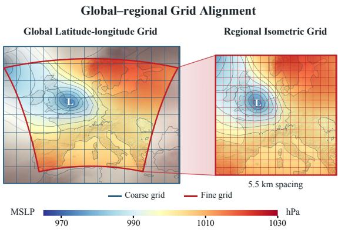  
Figure 1: Coarse global and finer regional projected grids. The two grids sample the same atmospheric system at different locations and spatial resolutions. The surrounding gray shading denotes the boundary region. Background colors indicate mean sea level pressure (MSLP).

depends on both the current local state and neighboring temperature and wind conditions (Xu et al., 2025; Abdi et al., 2026). The challenge is therefore to combine aligned global guidance, the current regional state, and its neighborhood into spatially coupled updates. Each step should advance the existing regional state, rather than reconstruct a fine-scale field from the global forecast.

We propose ScaleCast, a forecasting framework centered on Global–Regional Alignment. Its Global–Regional Alignment and Dynamics (GRAD) block integrates token alignment and updates to condition regional evolution on global guidance. Within GRAD, the Global–Regional Conversion (GRConv) module projects joint global–regional representations onto regional token positions. Residual pathways retain the regional state, enabling autoregressive updates guided by global forecasts. We train the framework using the European Centre for Medium-Range Weather Forecasts (ECMWF) Reanalysis v5 (ERA5) global analyses (Hersbach et al., 2020) and Copernicus European Regional Reanalysis (CERRA) (Ridal et al., 2024), whose native grid spacing is 5.5 km. Regional rollout experiments use Pangu-Weather, GraphCast, and the ECMWF high-resolution forecast (HRES) as global drivers and CERRA as the gridded verification reference. The results show lower errors across nine variables than the evaluated other forecasting baselines. Windstorm eval uation against the Hodges reference tracks in the C3S European windstorm dataset (Copernicus Climate Change Service, 2025) shows lower position errors in the examined case. Station comparisons with quality-controlled HadISD observations (Dunn et al., 2012; 2016) show closer agreement in temperature and relative humidity. Transfer experiments on High-Resolution Rapid Refresh (HRRR) (Dowell et al., 2022) further assess cross-dataset generalization. Our contributions are:

• We propose ScaleCast, a regional forecasting framework centered on Global–Regional Alignment. GRAD combines this alignment with attention and updates the regional state. Experiments on HRRR further show the framework’s transferability.

• Regional rollout evaluation demonstrates improved surface and upper-air forecasts through +30 h. Reuse with Pangu-Weather, GraphCast, and HRES improves on the corresponding global forecasts without driver-specific retraining and outperform CERRA NWP on all nine variables.

• We validate ScaleCast in real-world scenarios. The windstorm case shows lower cyclone-position errors and core-pressure bias, while station comparisons show closer agreement with observed temperature and humidity changes, demonstrating benefits beyond gridded verification.

## 2 RELATED WORK

Global weather forecasting. Global numerical weather prediction systems such as ECMWF-IFS integrate discretized atmospheric equations and parameterize unresolved processes, at substantial computational cost (Bauer et al., 2015). Learning-based alternatives approximate atmospheric evo lution with learned transition operators, enabling fast inference after training. Early graph-based forecasting (Keisler, 2022) and FourCastNet (Pathak et al., 2022) explored this approach through message passing and Fourier operators. Earth-aware transformers in Pangu-Weather (Bi et al., 2023) and multiscale graphs in GraphCast (Lam et al., 2023) subsequently achieved lower errors than operational IFS baselines across many evaluated variables and lead times. FengWu (Chen et al., 2025) and FuXi (Chen et al., 2023) use multivariable learning and cascaded forecast models, respectively, to extend useful medium-range prediction. Further developments include graph–transformer forecasting in AIFS (Lang et al., 2024), hybrid numerical–neural modeling in NeuralGCM (Kochkov et al., 2024), and large-scale pretraining in Aurora (Bodnar et al., 2025). Diffusion-based GenCast extends this progress to probabilistic forecasting, outperforming ECMWF’s ensemble system on most evaluated targets (Price et al., 2025). The demonstrated skill and low inference cost of pretrained global models motivate our use of their forecast fields as regional guidance, concentrating learning on regional prediction rather than retraining a global forecaster.

Regional weather forecasting. Numerical limited-area models couple regional dynamics to larger-scale forecasts through time-varying lateral boundary conditions (Warner et al., 1997). Learned regional forecasting develops three partly overlapping routes. Boundary-forced models use multiscale and probabilistic graph representations (Oskarsson et al., 2023; 2024), separate forcing encoders with optional interior overlap (Adamov et al., 2025), or boundary-conditioned regional networks (Xu et al., 2025; Larsson et al., 2025). A second route conditions regional updates on full-domain synoptic information, as in StormCast and HRRRCast (Pathak et al., 2026; Abdi et al., 2026); STCast further learns spatial alignment through attention with a geographic prior (Chen et al., 2026). A third route organizes global–regional exchange through neural nesting in OneForecast (Gao et al., 2025) or a globally connected, regionally refined grid in Bris (Nipen et al., 2026). The approaches differ in where external information enters and how the two spatial scales interact. ScaleCast uses GRConv to project concatenated global and regional tokens onto regional positions. GRAD then models input-dependent neighborhood interactions before a decoder predicts a regional state increment. In our experiments, our method achieves better performance than the baselines.

Regional post-processing and downscaling. Post-processing corrects forecast biases or calibrates predictive distributions against observations (Schulz & Lerch, 2022; Höhlein et al., 2024), whereas spatial downscaling learns coarse-to-fine relationships, including CNN-based climate downscaling (Baño-Medina et al., 2022), transformer-based reanalysis reconstruction (Pérez et al., 2024), and geography-aware super-resolution (Xu et al., 2026). Generative approaches model conditional fine-scale variability through adversarial learning (Harris et al., 2022) or diffusion, including ERA5–CERRA wind downscaling and CorrDiff’s regression–residual decomposition (Merizzi et al., 2024; Mardani et al., 2025). Temporal dependence and driver reuse are also studied: EnScale-t conditions on a preceding high-resolution state (Schillinger et al., 2026), while universal diffusion downscaling transfers a reanalysis-trained model across upstream forecasts (Molinaro et al., 2026). Our distinction therefore lies in the prediction operator, not simply the use of forecast inputs or temporal context. ScaleCast learns cross-grid feature coupling to predict an increment of the existing regional state, rather than a correction to an upstream forecast or a same-time coarse-to-fine reconstruction. At inference, ScaleCast uses forecasts from pretrained global weather models as boundary guidance for regional forecasting.

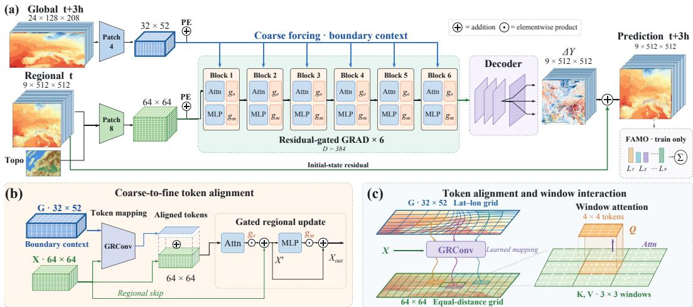  
Figure 2: ScaleCast framework during training. (a) Training pipeline from global analysis at $t + 3 \mathrm { ~ h ~ }$ , the regional state at t, and terrain to the regional prediction at $t + 3$ h through feature encoding, stacked GRAD blocks, and increment decoding. (b) A Global–Regional Alignment and Dynamics (GRAD) block from (a), combining GRConv alignment, regional attention, and gated updates. (c) Details of cross-grid token alignment and windowed attention within (b).

## 3 METHODOLOGY

Problem definition Limited-area forecasts require evolving large-scale conditions as well as a regional initial state (Warner et al., 1997). Hence, we study kilometer-scale regional weather forecasting under global forecast guidance. The regional atmospheric state is represented by $X _ { 0 } \in \mathbb { R } ^ { C _ { r } \times H _ { r } \times W _ { r } } ;$ , with static terrain features $S \in \mathbb { R } ^ { \breve { H } _ { r } \times W _ { r } }$ . The global initial state is denoted by $G _ { 0 } ^ { \smile } \in \mathbb { R } ^ { C _ { g } \times H _ { g } \times W _ { g } }$ . Here, $C _ { r }$ and $C _ { g }$ denote the numbers of regional and global variables respectively; $( H _ { r } , W _ { r } )$ and $( H _ { g } , W _ { g } )$ specify the regional and global grid dimensions. An existing global forecasting model M with frozen parameters Θ provides the global forecast trajectory. Our goal is to learn a regional forecasting model $\mathcal { F } _ { \theta }$

$$
\widehat { G } = \Bigl ( \widehat { G } _ { 3 } , \widehat { G } _ { 6 } , \ldots , \widehat { G } _ { T } \Bigr ) = { \mathcal { M } } _ { \Theta } ( G _ { 0 } ) ,\tag{1}
$$

$$
\widehat { X } = \left( \widehat { X } _ { 3 } , \widehat { X } _ { 6 } , \ldots , \widehat { X } _ { T } \right) = \mathcal { F } _ { \theta } \Big ( X _ { 0 } , S , \widehat { G } \Big ) ,\tag{2}
$$

where $\theta$ denotes the learnable parameters, $\widehat { X }$ and $\widehat { G }$ denote the sets of regional and global predicb btions, respectively. Regional predictions are generated autoregressively, using the global forecast at each step. In this work, we consider forecasts at 3-hour intervals up to 72 hours ahead $( T = 7 2 )$ .

Training. As shown in Figure 2(a), training uses the global state $G _ { t + 3 } ,$ together with the regional state $X _ { t }$ and terrain $S ,$ to predict the regional target $X _ { t + 3 }$ . Unlike inference, the global condition is an analysis field rather than a model-generated forecast. We use single-step supervision with a mean squared error for each regional variable v:

$$
\ell _ { v } ( t ) = \frac { 1 } { | \Omega _ { v } | } \sum _ { i \in \Omega _ { v } } \Big ( \widehat { X } _ { t + 3 , v , i } - X _ { t + 3 , v , i } \Big ) ^ { 2 } , \qquad \mathscr { L } = \sum _ { v \in \mathcal { V } _ { + } } q _ { v } \ell _ { v } .\tag{3}
$$

where $\Omega _ { v }$ contains the valid regional grid points for variable v, and tildes denote standardized values. The set $\nu _ { + }$ includes variables with nonempty $\Omega _ { v }$ , and the nonnegative weights $q _ { v }$ sum to one. We adapt FAMO (Liu et al., 2023) to adjust these weights according to loss progress. Masking and weight-update details are provided in Appendix A.5.

## 3.1 GLOBAL–REGIONAL TOKEN ALIGNMENT

Global forecasts provide large-scale context, but regional prediction requires this information to be expressed at regional locations (Adamov et al., 2025). In our setting, the global latitude–longitude grid and the regional projected grid differ in sampling locations and spacing. Their patch indices therefore do not define a one-to-one correspondence. As shown in Figure 2(b), we address this mismatch with GRConv, which maps joint global–regional features to regional token positions.

For a forecast step from $t \ \mathrm { t o } \ t + \Delta t$ , the inputs are the current regional state $\widehat { X } _ { t }$ , terrain $S ,$ and the global forecast $\widehat { G } _ { t + \Delta t }$ , with $\widehat { X } _ { 0 } = X _ { 0 }$ . Separate patch encoders $E _ { r }$ and $E _ { g }$ bproduce

$$
R = E _ { r } \Big ( [ \widehat { X } _ { t } , S ] \Big ) + P _ { r } \in \mathbb { R } ^ { N _ { r } \times d } , \qquad C = E _ { g } \Big ( \widehat { G } _ { t + \Delta t } \Big ) + P _ { g } \in \mathbb { R } ^ { N _ { g } \times d } ,\tag{4}
$$

where $[ \cdot , \cdot ]$ denotes channel-wise concatenation, treating terrain as an additional input channel. The encoders embed non-overlapping patches into a common feature width $d ,$ with $N _ { r }$ and $N _ { g }$ denoting the regional and global patch counts, respectively. Fixed two-dimensional sinusoidal encodings $P _ { r }$ and $P _ { g }$ identify patch positions within each grid. The global forecast $\widehat { G } _ { t + \Delta t }$ is encoded once, and its tokens $C$ are reused across layers within the same forecast step.

At layer $\ell ,$ let $R ^ { \ell }$ denote the regional tokens and $Z ^ { \ell } = \mathrm { L N } ( R ^ { \ell } )$ their normalized representation. GRConv concatenates $Z ^ { \ell }$ and $\check { C }$ and projects them onto the regional token positions:

$$
B ^ { \ell } = W _ { g } ^ { \ell } [ Z ^ { \ell } ; C ] + b _ { g } ^ { \ell } \mathbf { 1 } _ { d } ^ { \top } , \qquad U ^ { \ell } = Z ^ { \ell } + \mathrm { L N } _ { g } ^ { \ell } ( B ^ { \ell } ) .\tag{5}
$$

Here, $[ Z ^ { \ell } ; C ] \in \mathbb { R } ^ { ( N _ { r } + N _ { g } ) \times d }$ stacks the two token sequences, $W _ { g } ^ { \ell } \in \mathbb { R } ^ { N _ { r } \times ( N _ { r } + N _ { g } ) }$ contains the learned mapping weights, and $b _ { g } ^ { \ell } \in \mathbb { R } ^ { N _ { \tau } }$ is broadcast across features by the all-ones vector $\mathbf { 1 } _ { d } .$ Each row of $W _ { g } ^ { \ell }$ maps the joint tokens to one regional position. Adding the normalized projection to $Z ^ { \ell }$ preserves a direct regional feature path, yielding $U ^ { \ell } \in \mathbb { R } ^ { N _ { r } \times d }$ in the regional token layout. Forecast supervision learns position-specific token combinations aligned with the regional layout. Residual fusion retains regional features while providing global guidance.

## 3.2 REGIONAL INTERACTION AND STATE UPDATE

With global guidance incorporated into $U ^ { \ell }$ , regional prediction further requires modeling interactions between local conditions and their surroundings. GRAD uses input-dependent windowed at tention to combine these aligned features with the surrounding regional context. We partition $U ^ { \ell }$ into windows of $b ^ { 2 }$ tokens and denote the features in query window w by $U _ { w } ^ { \ell } \in \mathbb { R } ^ { b ^ { 2 } \times d }$ . The gathered key/value features are denoted by $U _ { \mathcal { N } ( w ) } ^ { \ell } \in \mathbb { R } ^ { 9 b ^ { 2 } \times d }$ . With H attention heads and $d _ { h } = d / H$ , head h computes:

$$
\begin{array} { r l } { Q _ { w , h } = U _ { w } ^ { \ell } W _ { Q , h } ^ { \ell } , \quad K _ { w , h } = U _ { \mathcal { N } ( w ) } ^ { \ell } W _ { K , h } ^ { \ell } + E _ { h } ^ { \ell } , \quad V _ { w , h } = U _ { \mathcal { N } ( w ) } ^ { \ell } W _ { V , h } ^ { \ell } , } & { } \\ & { O _ { w , h } = \mathrm { s o f t m a x } _ { \mathrm { k e y s } } \left( \frac { Q _ { w , h } K _ { w , h } ^ { \top } } { \sqrt { d _ { h } } } \right) V _ { w , h } . } \end{array}\tag{6}
$$

Here, $W _ { \boldsymbol { Q } , h } ^ { \ell } , W _ { K , h } ^ { \ell } , W _ { V , h } ^ { \ell } \in \mathbb { R } ^ { d \times d _ { h } }$ are learned projections, and $E _ { h } ^ { \ell } \in \mathbb { R } ^ { 9 b ^ { 2 } \times d _ { h } }$ encodes positional information for the keys. Scaled dot-product attention (Vaswani et al., 2017) normalizes each query over the gathered entries, yielding $O _ { w , h } \in \mathbb { R } ^ { b ^ { 2 } \times d _ { h } }$ . Concatenating heads, restoring the regional token order, and applying an output projection produces $A ^ { \ell } \in \mathbb { R } ^ { N _ { r } \times d }$ . Attention adaptively weights the surrounding fused features to update each regional query.

To incorporate the attention output $A ^ { \ell }$ while retaining the regional features $R ^ { \ell }$ , GRAD uses inputdependent, channel-wise gates for the attention and MLP residual branches (Laitenberger et al., 2026). We define $g _ { i } ^ { \ell } ( R ) \stackrel { \smile } { = } \sigma ( R W _ { i } ^ { \ell } + \mathbf { 1 } _ { N _ { r } } ( b _ { i } ^ { \ell } ) ^ { \top } )$ for $j \in \{ A , M \}$ , corresponding to the attention and MLP branches, respectively. The regional features are updated as:

$$
\begin{array} { r } { R ^ { \ell + 1 / 2 } = R ^ { \ell } + g _ { A } ^ { \ell } ( R ^ { \ell } ) \odot A ^ { \ell } , \quad R ^ { \ell + 1 } = R ^ { \ell + 1 / 2 } + g _ { M } ^ { \ell } ( R ^ { \ell + 1 / 2 } ) \odot M _ { \ell } \Big ( \mathrm { L N } ( R ^ { \ell + 1 / 2 } ) \Big ) . } \end{array}\tag{7}
$$

Here, $W _ { i } ^ { \ell } \in \mathbb { R } ^ { d \times d }$ and $b _ { i } ^ { \ell } \in \mathbb { R } ^ { d }$ are learned gate parameters, $\sigma$ is sigmoid, ⊙ denotes elementwise multiplication, and $\dot { M _ { \ell } }$ is a two-layer GELU MLP. Each gate controls the residual contribution at each position and feature channel while preserving the identity path. The MLP gate uses the attention-updated features $R ^ { \ell + 1 / 2 }$ , so its modulation reflects the preceding regional interaction.

Decoder. Predicting changes makes persistence an explicit reference, following residual parameterization (He et al., 2016). A shared upsampler and variable-specific heads decode $D _ { \theta }$ to the regional grid. With training statistics $\mu _ { r } , \sigma _ { r }$ , the standardized and physical predictions are:

$$
\widehat { X } _ { t + \Delta t } = \widehat { X } _ { t } + D _ { \theta } ( R ^ { L } ) , \qquad \widehat { X } _ { t + \Delta t } = \mu _ { r } + \sigma _ { r } \odot \widehat { X } _ { t + \Delta t } .\tag{8}
$$

b b b bThese variable-specific heads decode the shared representation using a common spatial upsampler.   
The decoder includes small variable-specific low-rank branches, detailed in Appendix A.4.

Table 1: Recursive regional forecast errors through +30 h. Pixel-pooled RMSE over ten 3-hour leads in 2022. Lower is better.
<table><tr><td rowspan="2">Method</td><td colspan="3">Surface RMSE↓</td><td colspan="6">Upper-air RMSE ↓</td></tr><tr><td>MSLP</td><td>T2m</td><td>RH2m</td><td>T500</td><td>T850</td><td>Z500</td><td>Z850</td><td>RH500</td><td>RH850</td></tr><tr><td>ECMWF-HRES</td><td>92.9</td><td>1.331</td><td></td><td>0.733</td><td>0.828</td><td>0.772</td><td>0.711</td><td>22.680</td><td>12.622</td></tr><tr><td>CERRA NWP</td><td>97.1</td><td>0.975</td><td>6.732</td><td>0.793</td><td>0.744</td><td>0.796</td><td>0.750</td><td>17.596</td><td>10.668</td></tr><tr><td>Pangu</td><td>93.9</td><td>1.461</td><td>一</td><td>0.725</td><td>0.840</td><td>0.775</td><td>0.685</td><td>一</td><td></td></tr><tr><td>GraphCast</td><td>91.8</td><td>1.431</td><td>一</td><td>0.695</td><td>0.784</td><td>0.733</td><td>0.671</td><td>一</td><td></td></tr><tr><td>ML-LAM</td><td>95.1</td><td>1.133</td><td>7.347</td><td>0.725</td><td>0.844</td><td>0.851</td><td>0.694</td><td>17.416</td><td>10.908</td></tr><tr><td>Hi-LAM</td><td>90.0</td><td>1.041</td><td>7.072</td><td>0.721</td><td>0.795</td><td>0.762</td><td>0.684</td><td>16.953</td><td>10.408</td></tr><tr><td>Graph-EFM</td><td>93.7</td><td>1.215</td><td>7.676</td><td>0.729</td><td>0.871</td><td>0.759</td><td>0.738</td><td>17.171</td><td>11.049</td></tr><tr><td>OneForecast-Reg</td><td>91.3</td><td>1.408</td><td></td><td>0.735</td><td>0.762</td><td>0.754</td><td>0.692</td><td></td><td></td></tr><tr><td>StormCast-Reg</td><td>90.5</td><td>1.004</td><td>6.691</td><td>0.713</td><td>0.760</td><td>0.735</td><td>0.668</td><td>16.622</td><td>9.905</td></tr><tr><td>SC + Pangu</td><td>89.9</td><td>0.958</td><td>6.734</td><td>0.700</td><td>0.748</td><td>0.735</td><td>0.653</td><td>16.629</td><td>9.908</td></tr><tr><td>SC + GraphCast</td><td>88.2</td><td>0.926</td><td>6.689</td><td>0.683</td><td>0.732</td><td>0.724</td><td>0.654</td><td>16.365</td><td>9.755</td></tr><tr><td>SC + HRES</td><td>89.8</td><td>0.942</td><td>6.626</td><td>0.698</td><td>0.745</td><td>0.729</td><td>0.673</td><td>16.792</td><td>10.145</td></tr></table>

## 4 EXPERIMENTS

## 4.1 EXPERIMENTAL SETUP

Datasets We construct a regional weather dataset integrating global atmospheric analyses, highresolution regional reanalyses, global forecasts, and station observations. ERA5 atmospheric states (Hersbach et al., 2020) are paired by valid time with CERRA regional targets (Ridal et al., 2024) at 3-hour intervals. The regional domain covers a European crop on a 512 × 512 grid at approximately 5.5 km spacing, with static topography provided on the same grid. We use 24 coarse atmospheric variables to predict nine regional variables, as summarized in Table 3. The available reanalysis archive spans 1985–2023. The current experiments use 2023 samples for one-step validation and all samples in 2022 for test. Finally, HadISD temperature and relative-humidity observations and the Hodges cyclone catalogue provide additional references for station evaluation. We also test cross-dataset generalization by transferring the model to HRRR.

Metrics We use Root Mean Square Error (RMSE), Mean Absolute Error (MAE), and signed Bias to assess gridded forecast accuracy against CERRA reanalysis, and Normalized Mean Square Error (nMSE) to compare multi-variable performance across model variants. Cyclone position error, central-pressure error, and track coverage assess storm prediction against the Hodges catalogue. Station RMSE and MAE evaluate local temperature and relative-humidity forecasts against HadISD observations. Metric definitions and verification procedures are provided in Appendix B.

Baselines We compare ScaleCast with the numerical forecasts from ECMWF-HRES and CERRA NWP, as well as the global data-driven models Pangu-Weather (Bi et al., 2023) and GraphCast (Lam et al., 2023). Global forecasts are spatially mapped to the regional grid for direct comparison. We further include ML-LAM (Oskarsson et al., 2023), Hi-LAM (Oskarsson et al., 2024), Graph-EFM (Oskarsson et al., 2024), OneForecast (Gao et al., 2025), and Storm Cast (Pathak et al., 2026) as regional forecasting baselines. Graph-EFM uses a four-member ensemble mean, while the other archived regional configurations use one member. We also evaluate ScaleCast with Pangu-Weather, GraphCast, and HRES as alternative global drivers, keeping the regional model weights and normalization fixed.

Implementation Our framework is implemented in PyTorch and trained for 100K steps on four NVIDIA A800 GPUs. We use the AdamW optimizer with a peak learning rate of $\bar { 1 } \times 1 0 ^ { - 4 }$ $( \beta _ { 1 } , \beta _ { 2 } ) = ( 0 . 9 , 0 . 9 9 9 )$ , and a weight decay of 0.05. The learning-rate schedule uses three warm-up epochs followed by cosine decay, with a minimum learning rate of $1 \times 1 0 ^ { - 6 }$ . The per-device batch size is two, with four gradient-accumulation steps, giving an effective batch size of 32. The model contains six GRAD blocks with a hidden dimension of 384 and eight attention heads. Sparse FAMO balances the variable-specific training objectives. During inference, the model predicts regional states at 3-hour intervals and feeds each prediction into the next step. The same checkpoint is applied to forecasts from Pangu-Weather, GraphCast, and ECMWF-HRES without driver-specific retraining. Additional implementation details are provided in Appendix A.1.

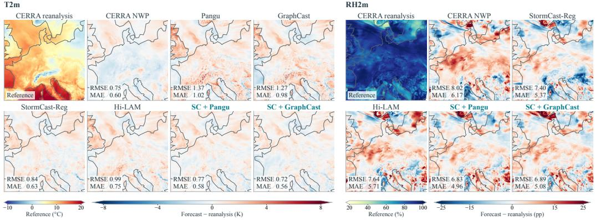  
Figure 3: Regional errors for two cases: T2m at +9 h from 16 November 2022, 00 UTC (left), and RH2m at +27 h from 5 April 2022, 00 UTC (right). CERRA shows absolute values; forecasts show deviations from CERRA. Pangu and GraphCast RH2m are unavailable and omitted.

## 4.2 OVERALL PERFORMANCE

Comparison with forecasting baselines We compare ScaleCast with numerical, global datadriven, and regional forecasting models on nine variables in Table 1. Results report pixel-pooled RMSE across ten leads through +30 h. More Results in Appendix C.1. We observe the following:

• With GraphCast, ScaleCast outperforms all non-ScaleCast baselines on nine variables. Compared with StormCast-Reg, it reduces T2m, T500, and T850 RMSE by approximately 7.8%, 4.2%, and 3.7%, respectively, improving temperature prediction near the surface and aloft.

• ScaleCast improves each global driver’s forecasts across all available variables, reducing T2m RMSE by 0.503, 0.505, and 0.389 K with Pangu-Weather, GraphCast, and HRES, respectively. These gains demonstrate added regional forecast skill beyond regridding global forecasts.

• With GraphCast, ScaleCast outperforms CERRA NWP on all nine variables, reducing MSLP and T500 RMSE by 8.9 Pa and 0.110 K, respectively. RH500 and RH850 RMSE also decrease by approximately 7.0% and 8.6%, showing gains across pressure, temperature, and humidity.

• Among the ScaleCast configurations, GraphCast guidance gives the lowest errors on seven variables, while HRES leads on RH2m and Pangu-Weather on Z850. With one shared checkpoint and no driver-specific retraining, ScaleCast improves on all three global drivers.

Regional visualization Figure 3 compares T2m and RH2m errors in two selected cases. ScaleCast reduces the widespread T2m warm biases in Pangu-Weather and GraphCast. With GraphCast, it achieves the lowest T2m RMSE of 0.72 K, improving on GraphCast and CERRA NWP by 0.55 and 0.03 K, respectively. For RH2m, ScaleCast reduces broad positive and localized negative biases; the Pangu-driven model achieves an RMSE of 6.83 percentage points, below CERRA NWP and StormCast. These case-specific gains indicate closer agreement with CERRA, although localized errors remain. Absolute fields are provided in Appendix C.1.4.

## 4.3 MODULE COMPARISONS AND ABLATIONS

Table 2 compares spatial alignment, attention variants, and decoder designs under the single-step validation setting. We observe the following:

• Our attention achieves the lowest errors in MSLP, geopotential height, and upper-air humidity. Gated attention performs best on T2m and T850, while cross-attention leads on T500. The proposed design therefore provides variable-specific advantages for alternative attention mechanisms.

• GRConv outperforms scale-and-terrain conditioning, Geo-nested coupling, and geographic remapping with fusion on all nine variables. These gains favor learned token alignment over geographic remapping and fusion.

• Shared decoding reduces T2m RMSE by 0.037 K relative to separate heads. Low-rank residual heads further improve six of nine variables over shared decoding. The resulting decoder also outperforms direct prediction on all nine variables, supporting the combined use of shared features, lightweight variable-specific heads, and residual prediction.

Table 2: Module ablations. Bold and underlined values indicate the best and second-best results.
<table><tr><td colspan="2">Design choices</td><td colspan="3">Surface RMSE</td><td colspan="6">Upper-air RMSE</td><td rowspan="2"> $( 1 0 ^ { - 2 } )$ </td></tr><tr><td>Type</td><td>Module</td><td>MSLP↓T2m↓RH2m↓T500↓T850↓Z500↓Z850↓RH500↓RH850↓nMSE↓ (Pa)</td><td>(K)</td><td>(pp)</td><td>(K)</td><td>(K)</td><td>(dam)</td><td>(dam)</td><td>(pp)</td><td>(pp)</td></tr><tr><td rowspan="4">Attention</td><td>Differential</td><td>41.1</td><td>0.724</td><td>5.203</td><td>0.379</td><td>0.459</td><td>0.477</td><td>0.341</td><td>7.489</td><td>6.105</td><td>2.733</td></tr><tr><td>Gated</td><td>36.7</td><td>0.705</td><td>5.226</td><td>0.338</td><td>0.427</td><td>0.429</td><td>0.309</td><td>7.420</td><td>5.931</td><td>2.713</td></tr><tr><td>Cross-attention</td><td>35.9</td><td>0.708</td><td>5.219</td><td>0.337</td><td>0.430</td><td>0.410</td><td>0.298</td><td>7.623</td><td>6.020</td><td>2.765</td></tr><tr><td>Our attention</td><td>34.6</td><td>0.710</td><td>5.233</td><td>0.346</td><td>0.428</td><td>0.409</td><td>0.291</td><td>7.396</td><td>5.893</td><td>2.702</td></tr><tr><td rowspan="4">Spatial</td><td>Scale + terrain</td><td>62.7</td><td>0.931</td><td>5.484</td><td>0.510</td><td>0.541</td><td>0.657</td><td>0.512</td><td>9.337</td><td>6.652</td><td>3.579</td></tr><tr><td>Geo-nested</td><td>41.6</td><td>0.761</td><td>5.318</td><td>0.392</td><td>0.465</td><td>0.486</td><td>0.350</td><td>8.242</td><td>6.279</td><td>3.033</td></tr><tr><td>Geo-remap + fusion</td><td>40.8</td><td>0.766</td><td>5.336</td><td>0.383</td><td>0.462</td><td>0.476</td><td>0.336</td><td>8.173</td><td>6.217</td><td>3.009</td></tr><tr><td>GRConv</td><td>37.9 0.742</td><td></td><td>5.294</td><td>0.361</td><td>0.447</td><td>0.461</td><td>0.302</td><td>7.835</td><td>6.023</td><td>2.872</td></tr><tr><td rowspan="4">Decoder</td><td>Direct prediction</td><td>51.7</td><td>0.835</td><td>5.443</td><td>0.463</td><td>0.554</td><td>0.652</td><td>0.408</td><td>8.959</td><td>7.190</td><td>3.546</td></tr><tr><td>Separate</td><td>41.6</td><td>0.761</td><td>5.318</td><td>0.392</td><td>0.465</td><td>0.486</td><td>0.350</td><td>8.242</td><td>6.279</td><td>3.033</td></tr><tr><td>Shared</td><td>38.0</td><td>0.724</td><td>5.260</td><td>0.375</td><td>0.451</td><td>0.454</td><td>0.320</td><td>8.317</td><td>6.264</td><td>2.996</td></tr><tr><td>Low-rank + res.</td><td>39.3</td><td>0.723</td><td>5.283</td><td>0.374</td><td>0.450</td><td>0.450</td><td>0.328</td><td>8.196</td><td>6.228</td><td>2.974</td></tr></table>

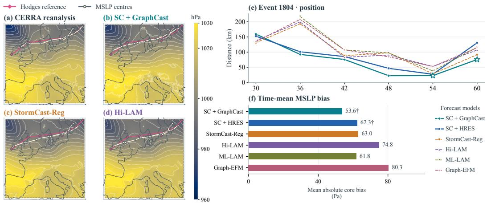  
Figure 4: Windstorm position and core-pressure diagnostics. (a–d) MSLP at +72 h and cyclone tracks. (e) Position errors for event 1804. (f) Time-mean absolute core-pressure bias relative to CERRA within 200 km of Hodges centres.

Additional comparisons of spatial training strategies and humidity objectives are provided in Appendix C.3.1. The effect of expanding coarse-input coverage is examined in Appendix C.3.2.

## 4.4 CASE STUDY

Extratropical cyclone tracking Figure 4 examines whether regional forecast gains extend to cyclone position and core pressure in a windstorm case. Although the models reproduce similar largescale pressure patterns, their cyclone tracks differ. For event 1804, GraphCast-driven ScaleCast yields the lowest position errors among the displayed forecasts from +36 to +60 h. The comparison shows that similar pressure patterns can accompany substantial differences in storm location, which ScaleCast captures more accurately in this event.

To assess pressure errors alongside track displacement, we compare the time-mean absolute core bias within 200 km of the Hodges centres over the same six verification times. GraphCast-driven ScaleCast achieves the lowest reported bias of 53.6 Pa, improving on StormCast-Reg and Hi-LAM by 9.4 and 21.2 Pa, respectively. Together, the track and pressure results demonstrate more accurate storm positioning and smaller core-pressure offsets relative to CERRA in this event, extending the evaluation beyond grid-averaged errors. Results for more events are provided in Appendix C.2.

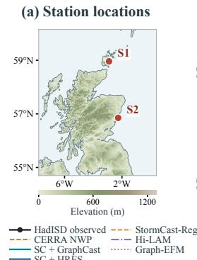

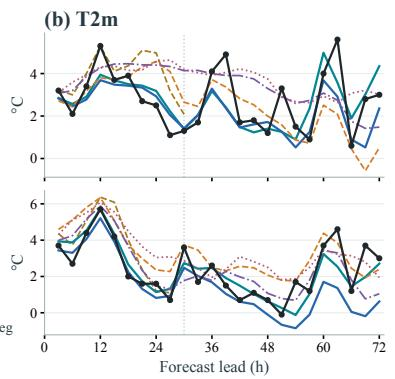

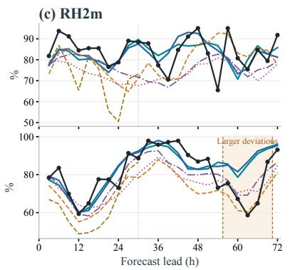

Figure 5: T2m and RH2m against HadISD stations. (a) Station locations and terrain. (b,c) T2m and RH2m forecasts against HadISD observations through +72 h at S1(top) and S2(bottom).  
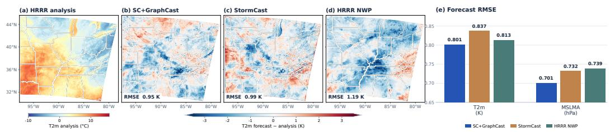  
Figure 6: Cross-dataset experiment results. (a) HRRR analysis of 2 m temperature. (b–d) Models forecasts minus the same analysis. (e) RMSE comparison for T2m and MSLMA.

Temperature and humidity at observed stations Figure 5 assesses whether improvements against gridded reanalysis translate into closer agreement with observed local weather. ScaleCast captures the broad cooling after the early temperature peak at both stations. At S2, it follows the ob served temperature decline more closely than StormCast-Reg and Graph-EFM during approximately +18 to +30 h. For RH2m, ScaleCast avoids the pronounced CERRA NWP dry bias near +24 h at S1 and better captures the high-humidity period from +30 to +42 h at S2. Agreement with these observed changes demonstrates benefits in local weather evolution. However, both configurations remain too humid during the sharp drying at S2 around +57–+69 h, indicating that capturing abrupt local transitions remains challenging. Spatial station-error maps are provided in Appendices C.2.2.

Cross-dataset evaluation on HRRR. We assess cross-dataset transfer by fine-tuning the CERRAtrained ScaleCast model on an HRRR subdomain. At +3 h, SC+GraphCast reduces T2m and MSLMA RMSE by 4.3% and 4.2% relative to StormCast, and by 1.5% and 5.1% relative to HRRR NWP, respectively. The signed-error maps illustrate the spatial differences among the forecasts. The gain over HRRR NWP is modest for T2m but more pronounced for MSLMA, indicating that transfer performance varies by variable. Because the learned models use ERA5 fields valid at the forecast time, this experiment assesses cross-dataset transfer rather than information-matched operational skill. Additional visualizations in Figure 18 of the Appendix.

## 5 CONCLUSION

We present ScaleCast for kilometer-scale regional forecasting through Global–Regional Alignment. GRConv maps joint global–regional tokens to regional positions, while GRAD combines this alignment with windowed attention and gated residual updates. Together with increment decoding, these modules integrate global guidance into the autoregressive evolution of an existing regional state. Trained on ERA5–CERRA pairs, the regional model is reused with Pangu-Weather, GraphCast, and HRES without driver-specific retraining. Evaluated 30-hour rollouts show improved surface and upper-air forecasts, with the GraphCast-driven configuration outperforming CERRA NWP on all nine variables. Component comparisons reveal useful design choices and variable-dependent trade offs. Windstorm and station case studies further demonstrate improvements in cyclone positioning, core pressure, and selected local temperature and humidity changes. Experiments on HRRR further demonstrate the framework’s cross-dataset transferability. Evaluation across additional regions and forecasting systems would help establish broader applicability. These results support using learned global–regional alignment to improve regional forecasts.

## AI USE STATEMENT

Generative AI tools were used to assist with manuscript drafting and polishing, consistency checks, literature discovery, implementation inspection, and the preparation of analysis code, figures, and LaTeX. AI-generated text was not treated as scientific evidence or cited as a source. The authors retain responsibility for verifying the cited literature and for the accuracy and integrity of the manuscript, including its methodology, empirical claims, numerical results, and references.

## ETHICS STATEMENT

ScaleCast is intended for research on regional weather forecasting. The study evaluates regional forecasts over Europe and examines cross-dataset transfer through fine-tuning on HRRR, with additional verification against station observations and windstorm reference tracks. Forecast errors and dependence on upstream global guidance should be considered before operational use, particularly for severe-weather warnings and other safety-critical decisions. The reported results do not constitute operational certification or replace established warning procedures.

## REPRODUCIBILITY STATEMENT

Sections 3 and 4 describe the forecasting formulation, model components, datasets, baselines, and experimental settings. Appendix A.1 specifies the reference architecture, with implementation and training details provided in the following subsections. Appendix B defines the atmospheric variables, error metrics, and aggregation procedures. Appendix C provides lead-dependent results, global-driver comparisons, station and windstorm diagnostics, and additional design comparisons. Data sources and baseline methods are identified through citations.

## REFERENCES

Daniel Abdi, Isidora Jankov, Paul Madden, Vanderlei Vargas, Timothy A Smith, Sergey Frolov, Montgomery Flora, and Corey Potvin. Hrrrcast: A data-driven emulator for regional weather forecasting at convection-allowing scales. Artificial Intelligence for the Earth Systems, 5(2):250061, 2026.

Simon Adamov, Joel Oskarsson, Leif Denby, Tomas Landelius, Kasper Hintz, Simon Christiansen, Irene Schicker, Carlos Osuna, Fredrik Lindsten, Oliver Fuhrer, et al. Building machine learning limited area models: Kilometer-scale weather forecasting in realistic settings. arXiv preprint arXiv:2504.09340, 2025.

Jorge Baño-Medina, Rodrigo Manzanas, Ezequiel Cimadevilla, Jesús Fernández, Jose González-Abad, Antonio Santiago Cofiño, and José Manuel Gutiérrez. Downscaling multi-model climate projection ensembles with deep learning (deepesd): contribution to cordex eur-44. Geoscientific Model Development Discussions, 2022:1–14, 2022.

Peter Bauer, Alan Thorpe, and Gilbert Brunet. The quiet revolution of numerical weather prediction. Nature, 525(7567):47–55, 2015.

Kaifeng Bi, Lingxi Xie, Hengheng Zhang, Xin Chen, Xiaotao Gu, and Qi Tian. Accurate mediumrange global weather forecasting with 3d neural networks. Nature, 619(7970):533–538, 2023.

Cristian Bodnar, Wessel P Bruinsma, Ana Lucic, Megan Stanley, Anna Allen, Johannes Brandstetter, Patrick Garvan, Maik Riechert, Jonathan A Weyn, Haiyu Dong, et al. A foundation model for the earth system. Nature, 641(8065):1180–1187, 2025.

Hao Chen, Tao Han, Jie Zhang, Song Guo, and Lei Bai. Stcast: Adaptive boundary alignment for global and regional weather forecasting. In Proceedings of the IEEE/CVF conference on computer vision and pattern recognition, pp. 20586–20596, 2026.

Kang Chen, Tao Han, Fenghua Ling, Junchao Gong, Lei Bai, Xinyu Wang, Jing-Jia Luo, Ben Fei, Wenlong Zhang, Xi Chen, et al. The operational medium-range deterministic weather forecasting

can be extended beyond a 10-day lead time. Communications Earth & Environment, 6(1):518, 2025.

Lei Chen, Xiaohui Zhong, Feng Zhang, Yuan Cheng, Yinghui Xu, Yuan Qi, and Hao Li. Fuxi: A cascade machine learning forecasting system for 15-day global weather forecast. npj climate and atmospheric science, 6(1):190, 2023.

Peter Clark, Nigel Roberts, Humphrey Lean, Susan P Ballard, and Cristina Charlton-Perez. Convection-permitting models: A step-change in rainfall forecasting. Meteorological Applications, 23(2):165–181, 2016.

Copernicus Climate Change Service. Windstorm tracks and footprints derived from reanalysis over europe between 1940 to present, 2025.

David C Dowell, Curtis R Alexander, Eric P James, Stephen S Weygandt, Stanley G Benjamin, Geoffrey S Manikin, Benjamin T Blake, John M Brown, Joseph B Olson, Ming Hu, et al. The high-resolution rapid refresh (hrrr): An hourly updating convection-allowing forecast model. part i: Motivation and system description. Weather and Forecasting, 37(8):1371–1395, 2022.

Robert JH Dunn, Kate M Willett, Peter W Thorne, Emma V Woolley, Imke Durre, Aiguo Dai, David E Parker, and RS Vose. Hadisd: A quality-controlled global synoptic report database for selected variables at long-term stations from 1973–2011. Climate of the Past, 8(5):1649–1679, 2012.

Robert JH Dunn, Kate M Willett, David E Parker, and Lorna Mitchell. Expanding hadisd: Qualitycontrolled, sub-daily station data from 1931. Geoscientific Instrumentation, Methods and Data Systems, 5(2):473–491, 2016.

Yuan Gao, Hao Wu, Ruiqi Shu, Huanshuo Dong, Fan Xu, Rui Ray Chen, Yibo Yan, Qingsong Wen, Xuming Hu, Kun Wang, et al. Oneforecast: a universal framework for global and regional weather forecasting. In Proceedings of the 42nd International Conference on Machine Learning, pp. 18658–18697, 2025.

Lucy Harris, Andrew TT McRae, Matthew Chantry, Peter D Dueben, and Tim N Palmer. A generative deep learning approach to stochastic downscaling of precipitation forecasts. Journal of Advances in Modeling Earth Systems, 14(10):e2022MS003120, 2022.

Kaiming He, Xiangyu Zhang, Shaoqing Ren, and Jian Sun. Deep residual learning for image recognition. In Proceedings of the IEEE conference on computer vision and pattern recognition, pp. 770–778, 2016.

Hans Hersbach, Bill Bell, Paul Berrisford, Shoji Hirahara, András Horányi, Joaquín Muñoz-Sabater, Julien Nicolas, Carole Peubey, Raluca Radu, Dinand Schepers, et al. The era5 global reanalysis. Quarterly journal ofthe royal meteorological society, 146(730):1999–2049, 2020.

Kevin Höhlein, Benedikt Schulz, Rüdiger Westermann, and Sebastian Lerch. Postprocessing of ensemble weather forecasts using permutation-invariant neural networks. Artificial Intelligence for the Earth Systems, 3(1):e230070, 2024.

Ryan Keisler. Forecasting global weather with graph neural networks. arXiv preprint arXiv:2202.07575, 2022.

Dmitrii Kochkov, Janni Yuval, Ian Langmore, Peter Norgaard, Jamie Smith, Griffin Mooers, Milan Klöwer, James Lottes, Stephan Rasp, Peter Düben, et al. Neural general circulation models for weather and climate. Nature, 632(8027):1060–1066, 2024.

Filipe Laitenberger, Dawid Kopiczko, Cees G Snoek, and Yuki Asano. What layers when: Learning to skip compute in llms with residual gates. In International Conference on Learning Represen tations, volume 2026, pp. 78161–78184, 2026.

Remi Lam, Alvaro Sanchez-Gonzalez, Matthew Willson, Peter Wirnsberger, Meire Fortunato, Ferran Alet, Suman Ravuri, Timo Ewalds, Zach Eaton-Rosen, Weihua Hu, et al. Learning skillful medium-range global weather forecasting. Science, 382(6677):1416–1421, 2023.

Simon Lang, Mihai Alexe, Matthew Chantry, Jesper Dramsch, Florian Pinault, Baudouin Raoult, Mariana CA Clare, Christian Lessig, Michael Maier-Gerber, Linus Magnusson, et al. Aifs– ecmwf’s data-driven forecasting system. arXiv preprint arXiv:2406.01465, 2024.

Erik Larsson, Joel Oskarsson, Tomas Landelius, and Fredrik Lindsten. Diffusion-lam: probabilistic limited area weather forecasting with diffusion. arXiv preprint arXiv:2502.07532, 2025.

Bo Liu, Yihao Feng, Peter Stone, and Qiang Liu. Famo: Fast adaptive multitask optimization. Advances in Neural Information Processing Systems, 36:57226–57243, 2023.

Morteza Mardani, Noah Brenowitz, Yair Cohen, Jaideep Pathak, Chieh-Yu Chen, Cheng-Chin Liu, Arash Vahdat, Mohammad Amin Nabian, Tao Ge, Akshay Subramaniam, et al. Residual corrective diffusion modeling for km-scale atmospheric downscaling. Communications Earth & Environment, 6(1):124, 2025.

Fabio Merizzi, Andrea Asperti, and Stefano Colamonaco. Wind speed super-resolution and validation: from era5 to cerra via diffusion models. Neural Computing and Applications, 36(34): 21899–21921, 2024.

Roberto Molinaro, Niall Siegenheim, Henry Martin, Mark Frey, Niels Poulsen, Philipp Seitz, and Marvin Vincent Gabler. Universal diffusion-based probabilistic downscaling. arXiv preprint arXiv:2602.11893, 2026.

Sepehr Mousavi, Shizheng Wen, Levi Lingsch, Maximilian Herde, Bogdan Raonic, and Siddhartha Mishra. Rigno: A graph-based framework for robust and accurate operator learning for pdes on arbitrary domains. Advances in Neural Information Processing Systems, 38:150039–150101, 2026.

Thomas Nils Nipen, Håvard Homleid Haugen, Magnus Sikora Ingstad, Even Marius Nordhagen, Aram Farhad Shafiq Salihi, Paulina Tedesco, Ivar Ambjørn Seierstad, Jørn Kristiansen, Simon Lang, Mihai Alexe, et al. Regional data-driven weather modeling with a global stretched grid. Artificial Intelligencefor the Earth Systems, 5(2):250001, 2026.

Joel Oskarsson, Tomas Landelius, and Fredrik Lindsten. Graph-based neural weather prediction for limited area modeling. arXiv preprint arXiv:2309.17370, 2023.

Joel Oskarsson, Tomas Landelius, Marc P Deisenroth, and Fredrik Lindsten. Probabilistic weather forecasting with hierarchical graph neural networks. Advances in Neural Information Processing Systems, 37:41577–41648, 2024.

Jaideep Pathak, Shashank Subramanian, Peter Harrington, Sanjeev Raja, Ashesh Chattopadhyay, Morteza Mardani, Thorsten Kurth, David Hall, Zongyi Li, Kamyar Azizzadenesheli, et al. Fourcastnet: A global data-driven high-resolution weather model using adaptive fourier neural operators. arXiv preprint arXiv:2202.11214, 2022.

Jaideep Pathak, Yair Cohen, Piyush Garg, Peter Harrington, Noah Brenowitz, Dale Durran, Morteza Mardani, Arash Vahdat, Shaoming Xu, Karthik Kashinath, et al. Kilometer-scale convectionallowing model emulation using generative diffusion modeling. Science Advances, 12(5): eadv0423, 2026.

Antonio Pérez, Mario Santa Cruz, Daniel San Martín, and José Manuel Gutiérrez. Transformer based super-resolution downscaling for regional reanalysis: Full domain vs tiling approaches. arXiv preprint arXiv:2410.12728, 2024.

Ilan Price, Alvaro Sanchez-Gonzalez, Ferran Alet, Tom R Andersson, Andrew El-Kadi, Dominic Masters, Timo Ewalds, Jacklynn Stott, Shakir Mohamed, Peter Battaglia, et al. Probabilistic weather forecasting with machine learning. Nature, 637(8044):84–90, 2025.

Martin Ridal, Eric Bazile, Patrick Le Moigne, Roger Randriamampianina, Semjon Schimanke, Ulf Andrae, Lars Berggren, Pierre Brousseau, Per Dahlgren, Lisette Edvinsson, et al. Cerra, the copernicus european regional reanalysis system. Quarterly Journal of the Royal Meteorological Society, 150(763):3385–3411, 2024.

Maybritt Schillinger, Maxim Samarin, Xinwei Shen, Reto Knutti, and Nicolai Meinshausen. Enscale: Temporally-consistent multivariate generative downscaling via proper scoring rules. Journal ofAdvances in Modeling Earth Systems, 18(8):e2025MS005593, 2026.

Benedikt Schulz and Sebastian Lerch. Machine learning methods for postprocessing ensemble forecasts of wind gusts: A systematic comparison. Monthly Weather Review, 150(1):235–257, 2022.

Martina Tudor and Piet Termonia. Alternative formulations for incorporating lateral boundary data into limited-area models. Monthly weather review, 138(7):2867–2882, 2010.

Ashish Vaswani, Noam Shazeer, Niki Parmar, Jakob Uszkoreit, Llion Jones, Aidan N Gomez, Łukasz Kaiser, and Illia Polosukhin. Attention is all you need. Advances in neural information processing systems, 30, 2017.

Thomas T Warner, Ralph A Peterson, and Russell E Treadon. A tutorial on lateral boundary conditions as a basic and potentially serious limitation to regional numerical weather prediction. Bulletin ofthe American Meteorological Society, 78(11):2599–2618, 1997.

Chang Xu, Gencer Sumbul, Li Mi, Robin Zbinden, and Devis Tuia. Geofar: Geography-informed frequency-aware super-resolution for climate data. In The Fourteenth International Conference on Learning Representations, 2026.

Pengbo Xu, Xiaogu Zheng, Tianyan Gao, Yu Wang, Junping Yin, Juan Zhang, Xuanze Zhang, San Luo, Zhonglei Wang, Zhimin Zhang, et al. An artificial intelligence-based limited area model for forecasting of surface meteorological variables. Communications Earth & Environment, 6(1): 372, 2025.

## A IMPLEMENTATION AND TRAINING DETAILS

## A.1 REFERENCE CONFIGURATION

The configured global input has 24 channels on a $1 2 8 \times 2 0 8$ grid, and the regional state has nine channels on a $5 1 2 \times 5 1 2$ grid. Patch sizes of four and eight yield $N _ { g } = 1$ ,664 and $N _ { r } = 4 { , } 0 9 6$ tokens, respectively. Six blocks use width $d = 3 8 4$ , eight heads $( d _ { h } = \bar { 4 } 8 )$ and MLP expansion four. Regional windows have $b = 4 .$ , giving a $1 6 \times 1 6$ window lattice. Independent strided convolutions embed the inputs. Fixed sine–cosine positional encodings represent patch indices, not geographic coordinates. Terrain is min–max scaled and concatenated only to the regional encoder input.

## A.2 HRRR TRANSFER SETUP.

We fine-tuned the validated ERA5-to-CERRA ScaleCast checkpoint on HRRR, replacing the terrain and reinitializing four output heads with different target definitions while retaining the backbone and five compatible heads. Each sample uses HRRR at t and ERA5 analysis at $t + 3$ h to predict HRRR at $t + 3$ h. The SC+GraphCast label in Figures 6 and 18 identifies the transferred regional model; its HRRR conditioning source is GraphCast. Full-model fine-tuning first used January– August 2022, then 2019–2021 and the same 2022 training period with a surface-weighted loss. September–October 2022 served for checkpoint selection and November–December for evaluation.

## A.3 TOKEN MAPPING, ORDERED GATHERING AND RESIDUAL PATHS

With tokens in rows, the kernel-size-one GRConv is exactly the affine map in Equation 5: its convolution channels are token positions, and its sequence coordinate is the feature coordinate. Layer-Norm acts on the last, feature dimension. The outer block first normalizes $R ^ { \ell } ;$ attention then adds a separately normalized GRConv result to this normalized regional input. The attention output is subsequently gated and added to the unnormalized outer residual $R ^ { \ell }$ . The MLP gate similarly reads the state after the attention residual, before the ML ${ \boldsymbol { P } } ^ { * } { \bf { s } }$ LayerNorm. These are distinct inner and outer residual paths. In this configuration, Q/K normalization, LayerScale and stochastic dropout are disabled. Both gate matrices start at zero with bias two, so the initial gate value is sigmoid $( 2 ) \simeq 0 . 8 8 1$ not a near-zero residual branch.

Regional window interaction. Figure 2(c) illustrates the flow from aligned tokens to windowed attention. The ordered gather $\mathcal { N } ( w )$ in Equation 6 specifies the key/value inputs. In the archived implementation, a query window $( i , j )$ lies on an $n _ { x } \ \times \ n _ { y }$ lattice with zero-based indices and $n _ { x } , n _ { y } \ge 2$ . The padding routine prepends both extra slices, giving the index map

$$
p _ { n } ( s ) = { \left\{ \begin{array} { l l } { n - 2 , } & { s = 0 , } \\ { 0 , } & { s = 1 , } \\ { s - 2 , } & { 2 \leq s \leq n + 1 . } \end{array} \right. }\tag{9}
$$

In order, the gathered windows are the query window $( i , j )$ followed by

$$
\bigl ( p _ { n _ { x } } ( i + a ) , p _ { n _ { y } } ( j + c ) \bigr ) , \qquad ( a , c ) \in \bigl [ ( 0 , 0 ) , ( 0 , 1 ) , ( 0 , 2 ) , ( 1 , 2 ) , ( 2 , 2 ) , ( 2 , 1 ) , ( 2 , 0 ) , ( 1 , 0 ) \bigr ] .\tag{10}
$$

Each gathered window contributes $b ^ { 2 }$ tokens in row-major order, yielding $9 b ^ { 2 }$ key/value entries. The ordered gather can repeat the query and is not uniformly centered. Figure 2(c) illustrates the interaction mechanism, while the equations here specify the archived indexing.

The learned positional tensor has shape $9 \times H \times d _ { h }$ . Its rows repeat along the key sequence as $\begin{array} { r } { E _ { h } [ s , : ] = e _ { h } [ . } \end{array}$ s mod $9 , \mathrel { : } ]$ for $s = 0 , \ldots , 9 b ^ { 2 } - 1$ , and are added to keys rather than attention logits or values. The term is thus indexed by key-sequence position, not by neighboring window. Attention outputs are restored to the regional token order.

## A.4 VARIABLE-SPECIFIC INCREMENT DECODER

Reshape $R ^ { L }$ to a patch field $F \in \mathbb { R } ^ { d \times h _ { r } \times w _ { r } }$ , where $( h _ { r } , w _ { r } )$ is the regional patch lattice. For regional patch size $p _ { r } .$ , the shared full-resolution features and variable increments are

$$
\begin{array} { r } { \begin{array} { r } { H _ { \mathrm { d e c } } = \mathrm { G E L U } ( \mathcal { U } ( F ) ) , } \\ { [ D _ { \theta } ( R ^ { L } ) ] _ { v } = \mathrm { C o n v } _ { 3 \times 3 } ^ { v } ( H _ { \mathrm { d e c } } ) + \eta \ \mathrm { P i x e l S h u f f e } _ { p _ { r } } ( \mathcal { B } _ { v } ( F ) ) . } \end{array} } \end{array}\tag{11}
$$

Here, U uses a transposed convolution with kernel size and stride $p _ { r } \ = \ 8 .$ , reducing the channel width from 384 to 192. Each variable-specific head applies a padded $3 \times 3$ convolution to produce one output channel. The low-rank branch $\boldsymbol { B } _ { v }$ uses two $1 \times 1$ convolutions with GELU between them, projecting $3 8 4 \to 8 \to p _ { r } ^ { 2 }$ channels before pixel shuffling, with gain $\eta = 0 . 1$ . Its final projection is zero-initialized, leaving the base decoder unchanged at initialization. The decoded increment is added to the standardized regional input (Equation 8).

## A.5 MASKED LEARNING AND THE ADAPTED FAMO CONTROLLER

The loss in Equation 3 pools squared errors and valid-target counts over the effective batch, including gradient accumulation and distributed workers. Let u count successful optimizer updates, $p _ { v }$ be a normalized static prior and $\xi _ { v }$ a controller logit. Denote by $\bar { \ell } _ { v , u - 1 }$ the lagged moving average available before update u, and normalize all expressions over its active set $\nu _ { + } ( u )$ . After warmup,

$$
z _ { v , u } = \frac { p _ { v } e ^ { \xi _ { v } } } { \sum _ { j \in \mathcal { V } _ { + } ( u ) } p _ { j } e ^ { \xi _ { j } } } , \quad q _ { v , u } = ( 1 - \lambda ) \frac { z _ { v , u } / ( \bar { \ell } _ { v , u - 1 } + \epsilon ) } { \sum _ { j \in \mathcal { V } _ { + } ( u ) } z _ { j , u } / ( \bar { \ell } _ { j , u - 1 } + \epsilon ) } + \lambda \frac { p _ { v } } { \sum _ { j \in \mathcal { V } _ { + } ( u ) } p _ { j } } .\tag{12}
$$

The implementation evaluates the inverse-loss normalization in log space. Equal priors are configured, but the resulting task coefficients need not be equal. The first 20 successful updates, or an active variable without a previous observation, use the renormalized prior alone. Here $\bar { \lambda } = 0 . 0 5$ and $\epsilon = 1 0 ^ { - 8 }$ . After a successful update, the pre-update loss initializes an unseen variable’s average; otherwise it updates it as $0 . 9 \bar { \ell } _ { v , u - 1 } + 0 . 1 \ell _ { v , u } ^ { \mathrm { { s } e f o r e } }$ . Inactive variables retain their previous state.

Every twentieth successful update, beginning at update 20, a no-gradient replay of the same effective batch measures the post-update loss. Following the loss-progress principle of FAMO (Liu et al., 2023), define

$$
\begin{array} { l } { \displaystyle \delta _ { v , u } = \mathrm { c l i p } \big [ \log ( \ell _ { v , u } ^ { \mathrm { b e f o r e } } + \epsilon ) - \log ( \ell _ { v , u } ^ { \mathrm { a f t e r } } + \epsilon ) , - 1 , 1 \big ] , } \\ { \displaystyle } \\ { \displaystyle g _ { v , u } = z _ { v , u } \left( \delta _ { v , u } - \sum _ { j } z _ { j , u } \delta _ { j , u } \right) + \gamma \xi _ { v } . } \end{array}\tag{13}
$$

Inactive entries have $\delta = 0$ and are not updated. Controller logits take an Adam step on g, with learning rate 0.025, $\gamma ~ = ~ 0 . 0 0 1$ , moments (0.9, 0.999), numerical epsilon $1 0 ^ { - 8 }$ and per-variable step counts. Post-update losses affect the progress signal, not the moving average. Sparse paired probes, lagged loss denominators, clipping, warmup and uniform mixing are this implementation’s adaptations; the original FAMO guarantees do not automatically apply. No variable-specific lower weight bounds or additional spectral/gradient losses are configured.

## B METRICS

## B.1 VARIABLE INVENTORY AND REPORTED FIELD ERRORS

For a common validity mask $m _ { n i v k }$ and physical forecast error $e _ { n i v k }$ for case n, grid cell i, variable $v ,$ and lead k, the reported per-lead pixel-pooled RMSE is

$$
\mathrm { R M S E } _ { v , k } = \sqrt { \frac { \sum _ { n , i } m _ { n i v k } e _ { n i v k } ^ { 2 } } { \sum _ { n , i } m _ { n i v k } } } .\tag{14}
$$

MAE substitutes $| e |$ and signed bias substitutes e in the same valid-pixel mean. Pooled scores across leads combine their squared errors and valid counts before taking the square root; they are not the unweighted average of ten lead-wise RMSE values. Valid grid cells receive equal weight in these gridded scores. MSLP RMSE is reported in Pa in both the forecast and module-comparison tables; pressure-field maps use hPa as indicated by their colour bars. Relative-humidity differences are in percentage points. Geopotential z and geopotential height $z / g _ { 0 }$ retain distinct labels, with $g _ { 0 } = \dot { 9 } . 8 0 6 6 5 \mathrm { ~ m s ^ { - 2 } }$ . No conversion from specific to relative humidity is made without pressure, temperature, and a declared saturation-vapor-pressure convention.

For the one-step module tables, the reported nMSE is the equal-variable mean of per-variable masked MSE in the training-standardized space:

$$
\mathrm { { n M S E } } = \frac { 1 } { | \mathcal { V } | } \sum _ { v \in \mathcal { V } } \frac { \sum _ { n , i } m _ { n i v } \left[ ( \widehat { Y } _ { n i v } - Y _ { n i v } ) / \sigma _ { v } \right] ^ { 2 } } { \sum _ { n , i } m _ { n i v } } ,\tag{15}
$$

Table 3: Atmospheric variables used by ScaleCast. Global atmospheric inputs contain 24 channels, while the regional state and prediction contain nine channels. Pressure levels are given in hPa, and physical units are listed before normalization.
<table><tr><td>Variable</td><td>Symbol</td><td>Level / height</td><td>Unit</td><td>Channels</td></tr><tr><td>Global atmospheric inputs</td><td colspan="4">24 channels</td></tr><tr><td>2-m temperature</td><td> $T _ { 2 \mathrm { m } }$ </td><td>2 m</td><td>K</td><td>1</td></tr><tr><td>Mean sea-level pressure</td><td> $\mathrm { M S L P }$ </td><td>Sea level</td><td> $\mathrm { P a }$ </td><td>1</td></tr><tr><td>10-m zonal wind</td><td> $u _ { 1 0 \mathrm { m } }$ </td><td>10 m</td><td> $\mathrm { m } \mathrm { s } ^ { - 1 }$ </td><td>1</td></tr><tr><td>10-m meridional wind</td><td> $v _ { 1 0 \mathrm { m } }$ </td><td>10 m</td><td> $\mathrm { m } \mathrm { s } ^ { - 1 }$ </td><td>1</td></tr><tr><td>Temperature</td><td> $T$ </td><td>50, 500, 850, 1000</td><td>K</td><td>4</td></tr><tr><td>Geopotential</td><td>z</td><td>50, 500, 850, 1000</td><td> $\mathrm { m ^ { 2 } s ^ { - 2 } }$ </td><td>4</td></tr><tr><td>Zonal wind</td><td>u</td><td>50, 500, 850, 1000</td><td> $\mathrm { m } \mathrm { s } ^ { - 1 }$ </td><td>4</td></tr><tr><td>Meridional wind</td><td>U</td><td>50, 500, 850, 1000</td><td> $\mathrm { m } \mathrm { s } ^ { - 1 }$ </td><td>4</td></tr><tr><td>Specific humidity</td><td>q</td><td>50, 500, 850, 1000</td><td> $\mathrm { k g } \mathrm { k g } ^ { - 1 }$ </td><td>4</td></tr><tr><td>Regional state and prediction</td><td colspan="4">9 channels</td></tr><tr><td>Mean sea-level pressure</td><td> $\mathrm { M S L P }$ </td><td>Sea level</td><td>Pa</td><td>1</td></tr><tr><td>2-m temperature</td><td> $T _ { 2 \mathrm { m } }$ </td><td>2 m</td><td>K</td><td>1</td></tr><tr><td>2-m relative humidity</td><td> $\mathrm { R H _ { 2 m } }$ </td><td>2 m</td><td>%</td><td>1</td></tr><tr><td>Temperature</td><td>T</td><td>500,850</td><td>K</td><td>2</td></tr><tr><td>Geopotential</td><td>z</td><td>500,850</td><td> $\mathrm { m ^ { 2 } s ^ { - 2 } }$ </td><td>2</td></tr><tr><td>Relative humidity</td><td>RH</td><td>500,850</td><td> $\%$ </td><td>2</td></tr></table>

where V contains the nine regional variables and $\sigma _ { v }$ is the stored training-set standard deviation. Tables display this dimensionless score in units of $1 0 ^ { - 2 }$ . The main-table replacement settings are specified in Appendix C.3. The supplementary training and coverage comparisons additionally vary objectives, checkpoint selection, or normalization, as described with their results.

## C SUPPLEMENTARY EXPERIMENTS AND CASE ANALYSES

## C.1 FORECAST TRAJECTORIES AND GLOBAL-DRIVER SENSITIVITY

The completed comparisons in this section use ten recursive forecast leads. They test how the frozen regional predictor responds to the global driver and how errors evolve with lead time. The absolutefield case at the end complements the error maps in the main text.

## C.1.1 FROZEN TRANSFER TO GRAPHCAST AND HRES FORCING

GraphCast and HRES reduce MSLP, T2m, and RH2m errors relative to Pangu-Weather, while upperair performance varies by variable. The comparison measures driver substitution without regional retraining, and Figure 7 shows how these differences evolve with forecast lead time.

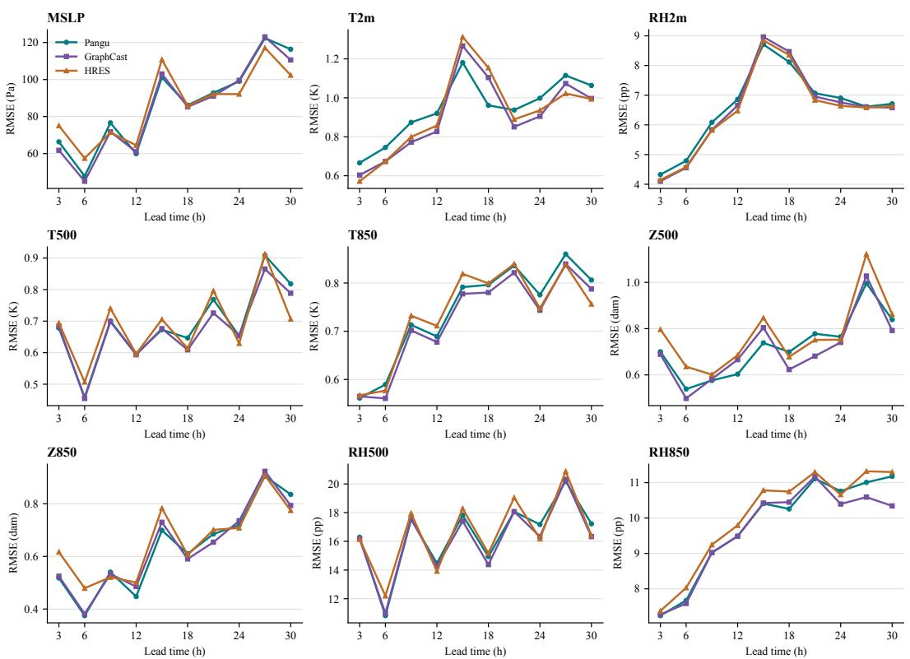  
Figure 7: Three-driver frozen-weight comparison. Per-lead pixel-pooled RMSE for the same regional checkpoint driven by Pangu, GraphCast, or HRES.

## C.1.2 FROZEN TRANSFER FROM PANGU TO GFS FORCING

We test whether the regional model can consume a global forecast source that was not used to produce its reported rollout results. The ScaleCast checkpoint, regional initialization, and ERA5- derived normalization are frozen, while the fixed-initialization Pangu trajectory is replaced by the corresponding 00 UTC GFS operational cycle. The archive contains the GFS f000 analysis and 12-hourly forecasts; these fields are linearly interpolated to the 3-hour regional-model steps. Table 4 shows that the frozen model remains numerically stable with GFS forcing but loses accuracy for all nine variables. The pooled increase ranges from 26.7% for RH850 to 98.6% for Z850. Figure 8 shows lead-dependent oscillation. Because the GFS archive has 12-hour rather than 6-hour native spacing, this test cannot separate driver distribution shift from temporal-interpolation effects. It demonstrates input compatibility, not driver invariance or the outcome of driver-specific retraining.

Table 4: Frozen-driver transfer through +30 h. Pixel-pooled RMSE over ten 3-hour lead times. ∆ is the relative change from Pangu to GFS forcing; lower is better.
<table><tr><td>Variable</td><td>Unit</td><td>ScaleCast + Pangu ↓</td><td>ScaleCast + GFS ↓</td><td>∆(%)</td></tr><tr><td>MSLP</td><td>Pa</td><td>89.9</td><td>171.3</td><td>+90.6</td></tr><tr><td>T2m</td><td>K</td><td>0.958</td><td>1.732</td><td>+80.9</td></tr><tr><td>RH2m</td><td>pp</td><td>6.737</td><td>8.727</td><td>+29.5</td></tr><tr><td>T500</td><td>K</td><td>0.700</td><td>1.088</td><td>+55.5</td></tr><tr><td>T850</td><td>K</td><td>0.748</td><td>1.043</td><td>+39.4</td></tr><tr><td>Z500</td><td>dam</td><td>0.735</td><td>1.395</td><td>+89.9</td></tr><tr><td>Z850</td><td>dam</td><td>0.653</td><td>1.297</td><td>+98.6</td></tr><tr><td>RH500</td><td>pp</td><td>16.629</td><td>22.520</td><td>+35.4</td></tr><tr><td>RH850</td><td>pp</td><td>9.908</td><td>12.553</td><td>+26.7</td></tr></table>

Frozen ScaleCast under alternative global forcing  
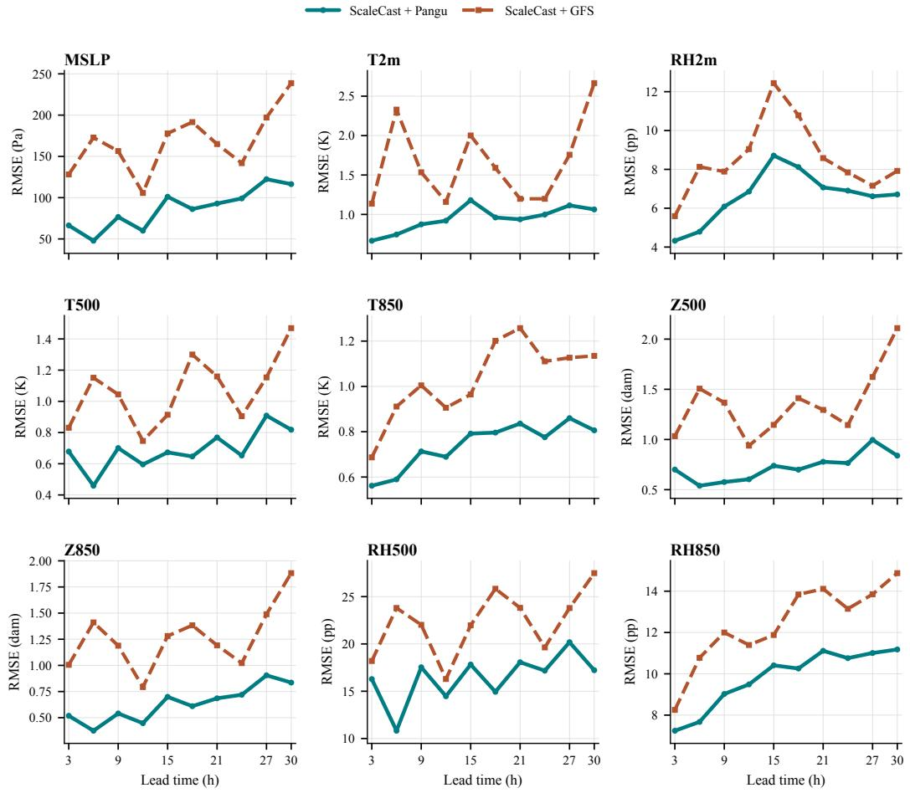  
Figure 8: Lead-dependent driver-shift test. RMSE of the frozen ScaleCast checkpoint under fixedinitialization Pangu and GFS forcing. CERRA analyses are used only for verification.

## C.1.3 COMPLETE 30-HOUR LEAD CURVES

Figure 9 reports the shared-Pangu regional-model subset and CERRA NWP from Table 1. Scale-Cast, Hi-LAM, and StormCast-Reg remain comparatively stable across the ten recursive steps. The humidity variables show substantial case-dependent oscillation, so pooled scalar scores should be interpreted together with these trajectories.

Recursive regional forecast error through +30 h  
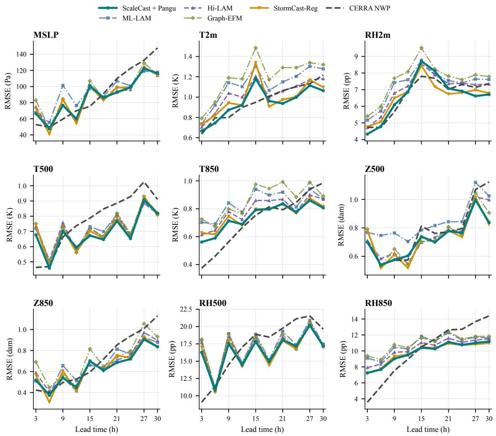  
Figure 9: Complete recursive forecast trajectories through +30 h. Pixel-pooled RMSE for the completed regional forecasting models, together with the same-cycle CERRA numerical forecast.

Table 1 summarizes squared-error sensitivity through pooled RMSE. Figures 10 report the corresponding per-lead mean absolute error (MAE). MAE reduces the influence of isolated large departures, while bias reveals directional drift that RMSE cannot identify.

Mean absolute error through +30 h

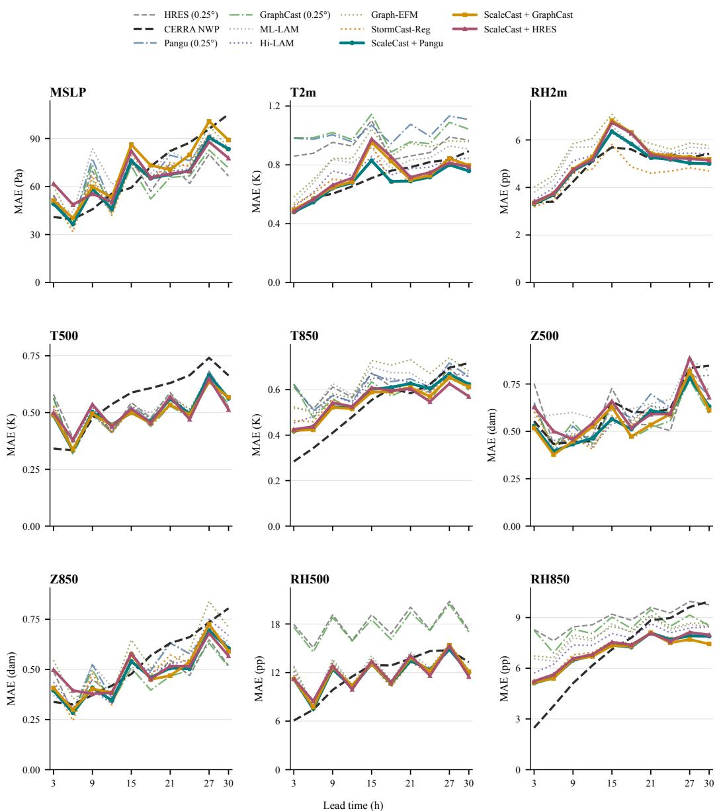  
Figure 10: Mean absolute error through +30 h. Per-lead pixel-pooled MAE for the methods in Table 1. Solid curves highlight the frozen ScaleCast driver variants; dashed and dotted curves show external, global, and regional comparison systems. Missing curves denote diagnostics unavailable from the source forecast.

## C.1.4 ABSOLUTE REGIONAL FORECAST FIELDS

Figure 11 provides the absolute fields underlying Figure 3.

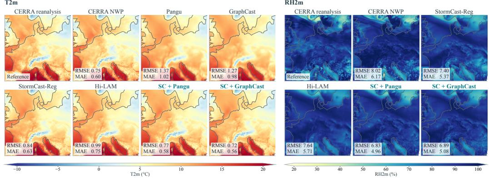  
Figure 11: Absolute fields for two cases: T2m from 16 November 2022, 00 UTC at +9 h (left), and RH2m from 5 April 2022, 00 UTC at +27 h (right). Each variable uses a shared colour scale across the reference and forecasts, in $^ \circ \mathrm { C }$ and $\% ,$ respectively. The square window and post-hoc case selection match Figure 3.

## C.2 WEATHER-SYSTEM AND STATION CASE STUDIES

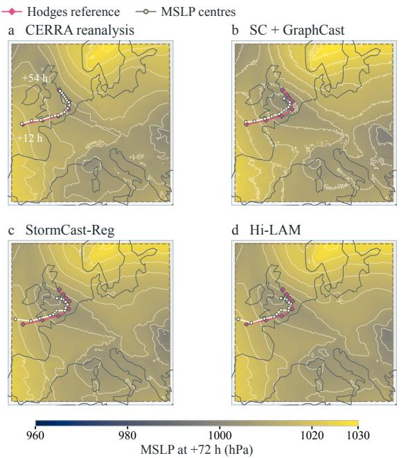

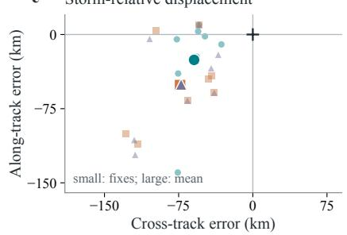

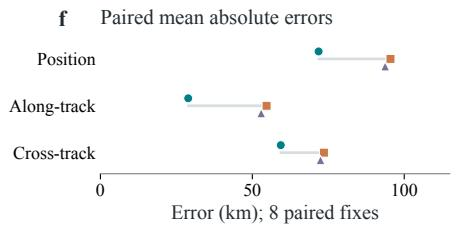  
SC + GraphCast  
StormCast-Reg  
Hi-LAM

Figure 12: November case and storm-relative displacement. Event 1812, initialized at 00 UTC on 16 November 2022. a–d, MSLP at +72 h and cumulative Hodges and independently tracked field centres. $\mathbf { e } ,$ Along- and cross-track displacement at eight shared fixes with equal kilometre scales; positive values indicate ahead of and right of reference motion. Large symbols mark means. f, Mean distance and mean absolute displacement components.

## C.2.1 WINDSTORM TRACKING ACROSS THE CANDIDATE EVENTS

Figure 4 reports the current event-1804 position and core-pressure comparison. Figures 13–15 retain archived diagnostics from four events in the forecast windows of 17 February, 5 April, and 16 November 2022 (00 UTC). Their event-1804 position values precede the main-text revision and are not used for its reported comparison. Figure 12 supplements the main case with event 1812 and its along- and cross-track displacement.

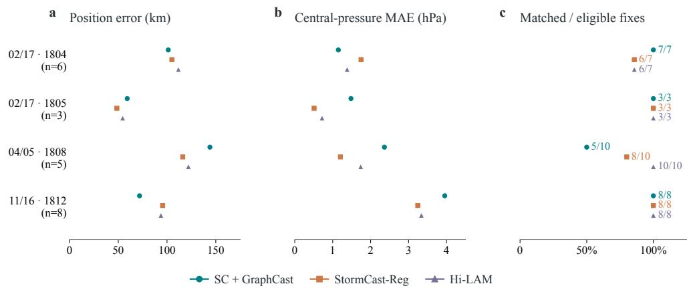  
All four events retained; paired errors and complete coverage are reported separately.

Figure 13: Archived four-event diagnostics. Paired errors use shared times (n); coverage uses all eligible fixes. Current event-1804 position results appear in Figure 4.  
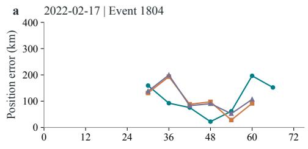

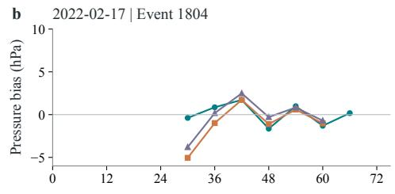

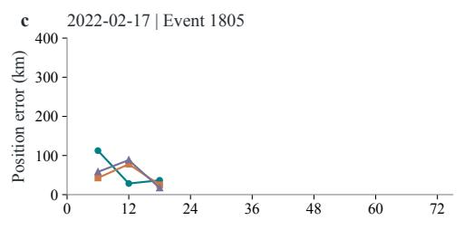

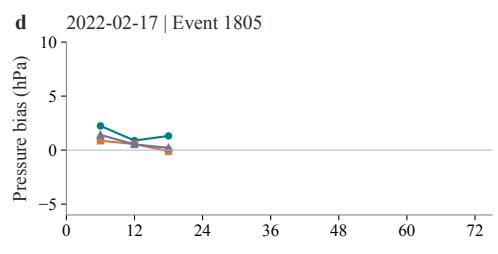

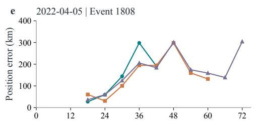

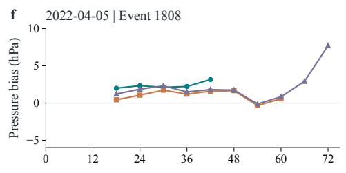

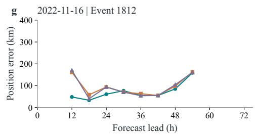

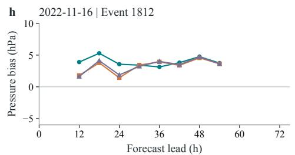  
SC + GraphCast StormCast-Reg Hi-LAM

Figure 14: Archived four-event lead curves. Left: position error. Right: signed central-pressure error. Current event-1804 position results appear in Figure 4.

Hodges reference MSLP centres

(c) StormCast-Reg  
(d) Hi-LAM  
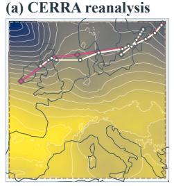

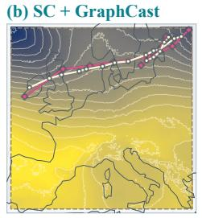

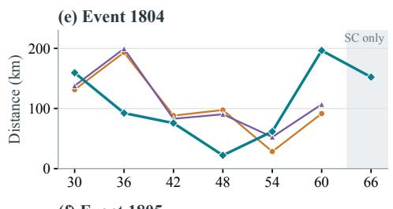

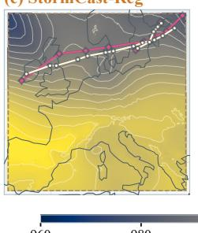

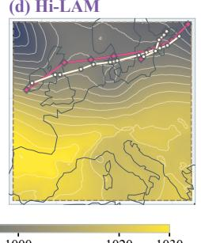

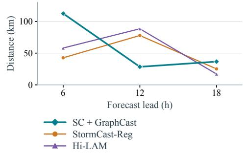  
Figure 15: Archived February tracking diagnostics. Initialization: 17 February 2022, 00 UTC. Maps show MSLP at +72 h and cumulative Hodges and field-derived tracks; the right panels show position errors for events 1804 and 1805. The event-1804 curve predates the current comparison in Figure 4. The shaded +66 h point is matched only by SC + GraphCast.

## C.2.2 SPATIAL STATION-ERROR DIAGNOSTICS

Figure 16 retains the spatial panels accompanying the station trajectories in Figure 5. All methods use the same valid station mask within each variable.

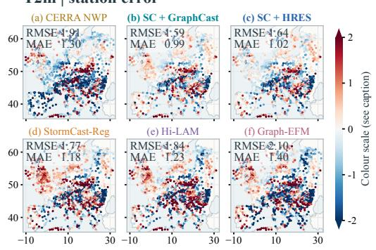

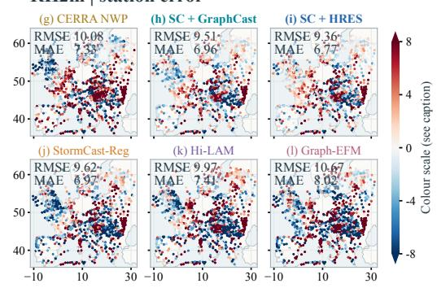  
Figure 16: Spatial temperature and humidity errors against HadISD. Initialization: 17 February 2022, 00 UTC; lead: +9 h. a–f, T2m errors at 1,626 common stations; g–l, RH2m errors at 1,140 common stations. Colours show forecast minus observed values.

## C.3 DESIGN AND TRAINING COMPARISONS

The following one-step studies examine whether training objectives and the geographical extent of the coarse input change validation error. They use target-time global analyses, whereas the main recursive comparison uses forecast trajectories. Their scores therefore support design diagnostics, not a direct ranking against the +30-hour results.

Main-table replacement settings. In Table 2, cross-attention replaces regional attention, not GR-Conv. Geo-remap + fusion and GRConv use the same regional backbone, training budget, and loss. Direct prediction removes only the increment output, while Shared and Separate differ only in their output heads, with the optimization unchanged.

## C.3.1 TRAINING STRATEGIES AND HUMIDITY OBJECTIVES

Table 5: Additional training comparisons. RMSE and normalized MSE on 2,919 validation samples from 2023 at +3 h, conditioned on target-time ERA5 analyses. Lower is better. Bold and underlined values indicate the best and second-best results within each block.
<table><tr><td colspan="2">Design choices</td><td colspan="3">Surface RMSE</td><td colspan="6">Upper-air RMSE</td><td rowspan="2">nMSE↓  $( 1 0 ^ { - 2 } )$ </td></tr><tr><td>Module</td><td>Training</td><td>MSLP↓ (Pa)</td><td>T2m↓ (K)</td><td>RH2m↓ (pp)</td><td>T500↓ (K)</td><td>T850 ↓ (K)</td><td>Z500↓ (dam)</td><td>Z850↓ (dam)</td><td>RH500↓ (pp)</td><td>RH850↓ (pp)</td></tr><tr><td colspan="2">Spatial training strategies</td><td></td><td></td><td></td><td></td><td></td><td></td><td></td><td></td><td></td><td></td></tr><tr><td>Scale + terrain</td><td>Grouped</td><td>40.8</td><td>0.766</td><td>5.336</td><td>0.383</td><td>0.462</td><td>0.476</td><td>0.336</td><td>8.173</td><td>6.217</td><td>3.009</td></tr><tr><td> $\mathrm { S c a l e } + \mathrm { t e r r a i n }$ </td><td>MS + grad.</td><td>43.4</td><td>0.779</td><td>5.366</td><td>0.383</td><td>0.464</td><td>0.500</td><td>0.357</td><td>8.189</td><td>6.225</td><td>3.038</td></tr><tr><td> $\mathrm { S c a l e + t e r r a i n ^ { 1 0 } }$ </td><td> $\mathrm { F A M O } + \mathrm { n o i s e }$ </td><td>55.8</td><td>0.782</td><td>5.253</td><td>0.428</td><td>0.489</td><td>0.626</td><td>0.469</td><td>9.009</td><td>6.644</td><td>3.305</td></tr><tr><td colspan="2">Humidity objectives</td><td></td><td></td><td></td><td></td><td></td><td></td><td></td><td></td><td></td><td></td></tr><tr><td>Low-rank + res.</td><td>FAMO</td><td>39.3</td><td>0.723</td><td>5.283</td><td>0.374</td><td>0.450</td><td>0.450</td><td>0.328</td><td>8.196</td><td>6.228</td><td>2.974</td></tr><tr><td>Low-rank + res. 14</td><td> $\mathrm { F A M O } + \mathrm { R H }$ </td><td>41.1</td><td>0.722</td><td>5.176</td><td>0.395</td><td>0.464</td><td>0.471</td><td>0.337</td><td>8.121</td><td>6.239</td><td>2.922</td></tr></table>

Table 5 compares selected configurations with a 128 × 128 coarse input on 2,919 validation samples from 2023 at +3 h. Each is conditioned on target-time ERA5 analyses.

Spatial training strategies. With the scale-and-terrain configuration, multiscale and gradient losses do not improve aggregate nMSE over grouped optimization: the displayed value rises from 3.009 to 3.038 in units of $1 { \bar { 0 } } ^ { - 2 }$ . The FAMO configuration with coarse-field perturbations lowers RH2m RMSE from 5.336 to 5.253 percentage points, but MSLP and Z500 errors rise from 40.8 to 55.8 Pa and 0.476 to 0.626 dam. The local humidity gain is therefore accompanied by losses in other fields, rather than an across-variable improvement.

Humidity objectives. Adding humidity objectives to FAMO lowers RH2m and RH500 RMSE from 5.283 to 5.176 and from 8.196 to 8.121 percentage points. Aggregate nMSE falls from 2.974 to 2.922 in units of $1 0 ^ { - 2 } .$ , while MSLP, upper-air temperature, and geopotential errors increase. These rows illustrate a multi-variable trade-off at the selected checkpoints. Training budgets differ, so they cannot isolate the causal effect of the objective alone.

## C.3.2 EXTENT OF THE GLOBAL INPUT

We compare $1 2 8 \times 1 2 8$ and 128×208 coarse inputs while holding the $5 1 2 \times 5 1 2$ regional grid fixed. Figure 17 shows that the smaller coarse domain already contains the entire regional domain; expansion adds surrounding atmospheric context rather than changing the predicted area or its resolution.

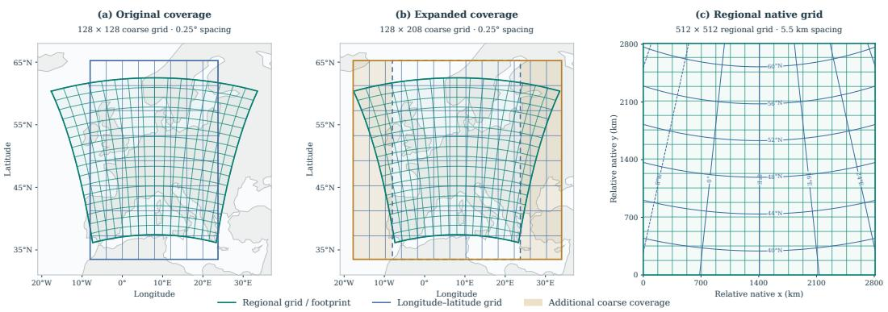  
Figure 17: Coarse and regional grids in different coordinate systems. (a,b) Actual footprints of the 128 × 128 and 128 × 208 coarse grids, with $0 . 2 5 ^ { \circ }$ angular spacing, overlaid on the $5 1 \bar { 2 } \times 5 1 2$ CERRA grid. Expansion covers the regional side areas outside the original coarse bounds; the dashed outline marks the original footprint. (c) The same regional grid in relative native coordinates, with approximately 5.5 km spacing and geographic coordinate contours. Grid lines are subsampled.

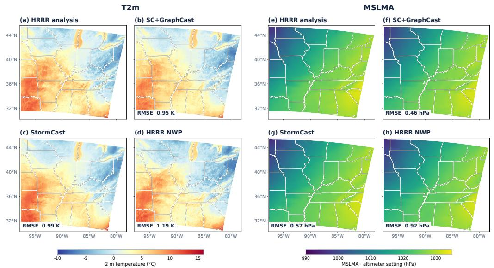  
Figure 18: HRRR analysis fields underlying the regional comparisons. Rows show 09 UTC on 2 and 28 December 2022; columns show T2m and MSLMA.