# Lapras: Latent Reasoning for Time Series Language Models

Yuliang Chen<sup>1</sup>, Yu Yvonne Wu<sup>1</sup>, Patrick Langer<sup>2,3,4</sup>, Arvind Pillai<sup>1</sup>, Sudarshan Regmi<sup>1</sup>, Martin Maritsch<sup>2,3</sup>, Juncheng Liu<sup>5</sup>, Robert Jakob<sup>2,3</sup>, Thomas Kaar<sup>2,3,4</sup>, Tess Z. Griffin<sup>1</sup>, Lisa Marsch<sup>1</sup>, Michael V. Heinz<sup>1</sup>, Nicholas C. Jacobson<sup>1</sup>, Andrew Campbell<sup>1</sup>

<sup>1</sup>Dartmouth College, <sup>2</sup>Aionic Labs, <sup>3</sup>Agentic Systems Lab, ETH Zurich, <sup>4</sup>Stanford University, <sup>5</sup>National University of Singapore

Time Series Language Models (TSLMs) ofer a promising path toward time series understanding by reasoning over temporal signals and producing natural language answers and explanations. A common approach is Chain-of-Thought (CoT), which generates step-by-step rationales describing relevant signal patterns and connecting them to final answers. Although these models learn from reference CoT traces during post-training, generating faithful descriptions of input time series at inference time remains challenging. The model is required to express high-dimensional and continuous temporal representations in discrete language tokens, which may lead to neglecting task-relevant patterns or describing them inaccurately. Because subsequent reasoning steps build on these descriptions, early errors can propagate through the reasoning chain, ultimately leading to incorrect answers accompanied by plausible explanations that are inconsistent with the input signal. To address this, we propose Lapras (Latent Post-trained Reasoning Across Series),<sup>1</sup> a post-training framework that equips TSLMs with latent reasoning. A model trained with Lapras reasons through a sequence of continuous thoughts in the joint time series–language space, producing text only for the final answer. It learns this through teacher-student self-distillation, where a teacher trained on CoT reference traces reasons explicitly through text. The student is trained to align its hidden states with the teacher’s at the answer stage, transferring the teacher’s reasoning ability into the student’s latent computation. We evaluate Lapras across four TSLM backbones on five diverse time series question answering benchmarks. Lapras improves average F1 by up to 10.79% over explicit CoT while generating 23.9× fewer tokens. Importantly, Lapras’s generated continuous thoughts can be decoded into readable reasoning traces through standard language decoding, preserving the capability to provide textual explanations. Together, these results highlight Lapras as a promising post-training paradigm for TSLMs that enables eficient and efective reasoning at inference while supporting interpretability.

Correspondence: yuliang.chen.gr@dartmouth.edu § Code: https://github.com/yuc0805/Lapras Hugging Face: https://huggingface.co/leochen085/Lapras

## 1 Introduction

Time Series Language Models (TSLMs) treat time series as a native modality for LLMs, enabling reasoning over sensor signals in natural language across domains ranging from wearable health to industrial monitoring (Xie et al., 2025; Wang et al., 2025b). To develop reasoning capability, existing works mainly elicit reasoning through Chain-of-Thought (CoT) supervised finetuning (SFT), a common post-training method that further finetunes pretrained models on reference CoT traces (Langer et al., 2026). After training, the model generates its own step-by-step rationale before producing the answer, providing a textual explanation that users can inspect against the underlying signal. For example, for the ECG question answering task, a TSLM can generate rationales describing observed waveforms such as an irregular R-R interval and explain how these are linked to a diagnostic answer like candidate arrhythmia (Xu et al., 2026).

However, learning from reference CoT traces during post-training does not ensure that models generate traces faithful to the input time series at inference (Turpin et al., 2023). Generating a CoT requires the model to express high-dimensional, continuous time series representations as discrete language tokens at each step. The resulting description may neglect temporal patterns or characterize them inaccurately. Because subsequent reasoning steps are predominantly conditioned on this description rather than on the original continuous representation, early omissions or errors can propagate and compound throughout the reasoning chain, ultimately leading to an incorrect answer (Zhang et al., 2023). For instance, for a TSR question over a temperature signal, a generated CoT trace may correctly identify an upward trend and a peak but overlook that the increase is temporary. Subsequent reasoning may then interpret this temporary increase as a sustained abnormal event and arrive at an incorrect operational decision, such as activating emergency backups when standard capacity is suficient (Figure 9). We term this limitation the verbalization bottleneck: generated textual descriptions may omit or misrepresent task-relevant temporal patterns, and these errors can propagate through subsequent reasoning. Our analysis in Section 3.1 provides empirical support for this bottleneck, showing that a substantial gap in answer accuracy emerges between predicted and reference CoT traces during signal description and persists through subsequent reasoning.

Recent latent reasoning frameworks ofer a potential way to address this bottleneck by reasoning in continuous hidden states rather than generating intermediate text (Hao et al., 2025; Shen et al., 2025). At each reasoning step, the model’s hidden state is passed directly as input to the next step, replacing the text tokens used in CoT. Although these methods have demonstrated promising results on text-based reasoning tasks, where both inputs and reasoning traces share the same discrete token space, their efectiveness for reasoning over the continuous time series representation space remains underexplored. Consequently, we ask: can TSLMs reason more efectively in a continuous latent space than through discrete tokens?

Motivated by this question, we propose Lapras (Latent Post-trained Reasoning Across Series), a post-training framework for latent reasoning in TSLMs. Specifically, we adopt the self-distillation framework (Shen et al., 2025), which lets the model learn from the reasoning signal in explicit CoT traces during training without having to verbalize numerical patterns as text at inference. When training with Lapras, the teacher processes the time series, question, and explicit CoT reference traces, while the student reasons over the same time series and question through continuous thoughts. The student learns to match the teacher’s hidden states at the answer position, without requiring each continuous thought to generate a textual reasoning step. At inference, the student performs intermediate reasoning in the joint time series–language space and generates text only for the final answer, mitigating the verbalization bottleneck by avoiding intermediate textua descriptions of the signal. Our experiments compare Lapras against existing reasoning approaches across diferent TSLM backbones and demonstrate that Lapras improves average answer accuracy over explicit CoT while substantially reducing token generation. In summary, our key contributions are:

• We identify and empirically characterize the verbalization bottleneck in TSLMs, showing that prediction inaccuracy for explicit CoT emerges during signal description and persists through reasoning chains (Section 3.1).

• To address this limitation, we propose Lapras, which adapts teacher-student self-distillation to post-train TSLMs for latent reasoning, letting the model learn from reference CoT while performing intermediate reasoning through continuous thoughts (Section 3.2).

• Across four TSLM backbones and five reasoning benchmarks, Lapras improves average F1 by up to 10.79% over CoT while substantially reducing the number of generated tokens. Qualitative analyses show that continuous thoughts of Lapras can be decoded into readable reasoning traces, retaining explanation capability (Section 5).

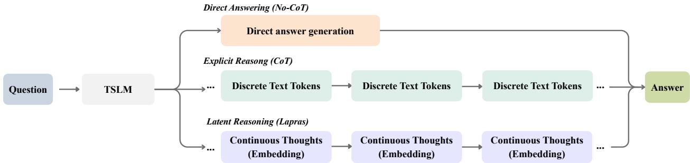  
Figure 1 Three reasoning paradigms for TSLMs. (i) Direct answering (No-CoT) maps the input directly to a textual answer without generating intermediate reasoning steps. (ii) Explicit reasoning (CoT) expresses intermediate reasoning as discrete text tokens and conditions on these steps to produce the answer. (iii) Latent reasoning (Lapras) performs intermediate reasoning through continuous thoughts in latent space and decodes text only for the final answer.

## 2 Related Work

Time Series Language Models. While Time Series Foundation Models (TSFMs) excel at forecasting and fixed-label classification, their rigid outputs preclude open-ended reasoning over sensor signals (Ansari et al., 2024; Das et al., 2024; Goswami et al., 2024; Luo et al., 2025). Recent works aim to bridge this gap, progressing from serializing raw data as text (Liu et al., 2023; Kim et al., 2024; Gruver et al., 2024) to encoding signals into continuous representations that the LLM processes directly (Xie et al., 2025; Langer et al., 2026; Chen et al., 2026). These models elicit reasoning via explicit CoT through supervised finetuning (Langer et al., 2026; Messica et al., 2026; Guan et al., 2026) or reinforcement learning (Messica et al., 2026; Guan et al., 2026). However, verbalizing intermediate rationales into discrete tokens may inflate inference latency (Wu et al., 2025) and risk hallucination due to excessive reliance on linguistic priors (Zhu et al., 2026). In contrast, Lapras conducts multi-step reasoning entirely within the model’s continuous latent space, sidestepping intermediate token generation while still decoding final answers into free-form text.

Implicit Chain-of-Thought Reasoning. Implicit reasoning methods replace discrete decoded tokens with continuous hidden states which are fed back as input embeddings, freeing models from enforcing textual coherence or committing prematurely to a single reasoning path (Gao et al., 2025; Hao et al., 2025). Rather than verbalizing steps, iCoT (Gao et al., 2025) progressively removes CoT tokens during training to internalize the reasoning process directly into model weights. COCONUT (Hao et al., 2025) preserves these intermediate positions by feeding the last-layer hidden state back as the next input embedding, which serves as a continuous thought. CODI (Shen et al., 2025) adopts these continuous thoughts and supervises them through self distillation against an explicit CoT teacher. While these methods do not yet consistently match explicit CoT in accuracy, eliminating intermediate token generation substantially reduces inference latency, establishing latent reasoning as a compelling alternative paradigm. In parallel, recent vision-language models interleave latent visual tokens with text tokens to manipulate visual evidence without generating explicit images (Asad et al., 2026; Li et al., 2025a; Wang et al., 2025a). However, unlike static image patches that carry independent semantic meaning, time series signals may require jointly interpreting transient local events (e.g., peaks) and global properties (e.g., periodicity and cross-channel dependencies) that are inherently dificult to express in natural language. Lapras, instead, reasons in a joint time series–language space, directly coupling temporal and spatial dynamics with semantic anticipation.

## 3 Method

## 3.1 Diagnosing the Verbalization Bottleneck

In time series question answering, a TSLM takes a time series and a question as input and generates a textual answer, either directly or through intermediate reasoning steps (Figure 1). Explicit CoT requires a TSLM to describe temporal evidence in language and condition subsequent reasoning on these descriptions. Inaccurate or incomplete descriptions may therefore afect the final answer (i.e., verbalization bottleneck). To investigate this issue, we examine how answer accuracy evolves as the model receives successive steps of predicted or reference CoT traces. Specifically, we investigate whether an accuracy gap emerges during signal description and whether subsequent reasoning closes this gap.

Setup. We adapt the early answering protocol from Lanham et al. (2023), which tests how a model’s final answer depends on its predicted CoT traces. We apply it to SLIP-1B finetuned with CoT-SFT. Specifically, we progressively truncate both predicted and reference reasoning traces one sentence (hereafter, a step) at a time, prompting the model for a final answer after each step to track accuracy. Based on manual inspection, we assign each sentence of the CoT to one of two stages: describe, where it summarizes the input signal in words, and reason, where it draws conclusions from the preceding description. These annotations allow us to examine when answer accuracy diverges between the two conditions and how the gap changes through subsequent reasoning.

Results and Implications. As shown in Figure 2, a substantial performance gap emerges in the describe stage, reaching ∆0.22 on TSR and ∆0.17 on Sleep. This gap persists through the final reason stage, where the predicted trace’s accuracy plateaus. More results are provided in Figure 10. These findings provide empirical support for the verbalization bottleneck where translating continuous time series into text during the describe stage discards task-relevant evidence, introducing errors that propagate through the reasoning chain. Moreover, this analysis ofers a possible explanation for why CoT-SFT struggles to outperform No-CoT baselines (Table 1). Ultimately, this motivates learning from reference rationales while reasoning in continuous space, eliminating the need to generate text descriptions at inference.

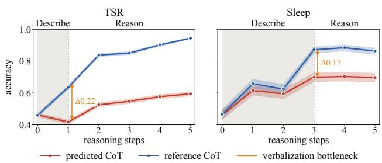  
Figure 2 Early answering with predicted and reference CoT. A substantial accuracy gap between predicted and reference traces is evident by the end of signal description and persists through subsequent reasoning. Mean and standard deviation are computed over the full test set of each benchmark.

## 3.2 Lapras

Overview. To address the verbalization bottleneck, we introduce Lapras (Latent Post-trained Reasoning Across Series), which reasons over the question and time series through continuous thoughts in latent space, decoding text only for the final answer. As shown in Figure 3, Lapras adopts a knowledge distillation framework (Caron et al., 2021; Shen et al., 2025). Here, a teacher network is trained on CoT reasoning traces, while a student network learns to match the teacher’s hidden states through latent reasoning. Both the student and teacher models share the same TSLM architecture and parameters. Formally, given a multivariate sensor series $X _ { s }$ and a text prompt $X _ { q }$ (comprising context and a question), a TSLM generates a textual answer $X _ { a }$ . We denote the time series representation by $H _ { s }$ and the prompt embeddings by $H _ { q } = \operatorname { e m b e d } ( X _ { q } )$ . The language model $f _ { \phi }$ conditions on both inputs, integrating $H _ { s }$ through the backbone’s existing architecture, and returns the last hidden state at the final position. The answer is decoded autoregressively as $X _ { a } \sim p _ { \phi } ( \cdot \mid H _ { s } , H _ { q } )$

Teacher-Student Self-distillation. The teacher and student share the same TSLM architecture but perform intermediate reasoning diferently. Given the time series and question, the teacher is trained with standard CoT-SFT: it processes the reference CoT trace and is trained with token-level cross-entropy over the traces and answers, $\mathcal { L } _ { \mathrm { C E } } ^ { \mathrm { t e a c h e r } }$ . The student instead generates continuous thoughts and is trained with cross-entropy over only the answer tokens, $\mathcal { L } _ { \mathrm { a n s } } ^ { \mathrm { s t u d e n t } }$ . To transfer information from the reference rationale to the student’s latent reasoning, we align the hidden states used to predict the first answer token.

Lapras introduces two learned markers, ⟨bot⟩ (begin-of-thought) and ⟨eot⟩ (end-of-thought), which delimit the latent reasoning process. Given a prompt $X _ { q }$ and a series $X _ { s } .$ , the student embeds both and appends

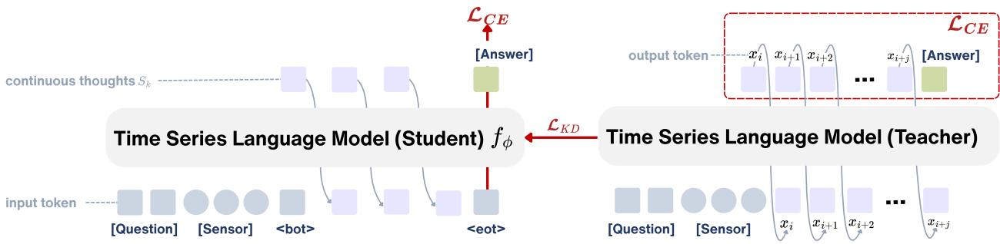  
Figure 3 Training framework of Lapras. The student (left) produces K continuous thoughts between ⟨bot⟩ and ⟨eot⟩, feeding each hidden state back as the next input embedding without emitting any token, and predicts the answer under $\mathcal { L } _ { \mathrm { a n s } } ^ { \mathrm { s t u d e n t } }$ . The teacher (right) writes a full CoT $( \mathrm { e . g . } , [ x _ { i } , x _ { i + 1 } , \dots , x _ { i + j } ] )$ and predicts the answer under $\mathcal { L } _ { \mathrm { C E } } ^ { \mathrm { t e a c h e r } }$ A distillation loss L aligns their hidden states at the anchor position (the first answer token). The teacher is discarded at inference.

⟨bot⟩, which puts it in latent mode,

$$
\begin{array} { l l } { { S _ { 0 } = [ H _ { q } , H _ { s } , \langle \mathrm { b o t } \rangle ] , } } & { { } } \\ { { z _ { k } = f _ { \phi } ( S _ { k - 1 } ) , } } & { { S _ { k } = [ S _ { k - 1 } ; \pi ( z _ { k } ) ] , } } \\ { { X _ { a } \sim p _ { \phi } ( \cdot \mid [ S _ { K } ; \langle \mathrm { e o t } \rangle ] ) , } } & { { } } \end{array}\tag{1}
$$

where π is a learned projection from the last hidden state back into the input embedding space and $k = 1 , \ldots , K$ . In latent mode the student never samples a token. Instead, after each forward pass, it extracts the last hidden state $z _ { k }$ at the final position and projects it back into the input embedding space via a small learned MLP π. The projected vector is then appended to the input sequence as if it were a new token embedding, and the model runs another forward pass. We refer to $z _ { 1 } , \dots , z _ { K }$ as continuous thoughts (Hao et al., 2025; Shen et al., 2025): intermediate reasoning representations that encode the model’s reasoning process without being decoded into language. After generating $K = 6$ continuous thoughts, the student returns to language mode at ⟨eot⟩ to decode the final answer $X _ { a }$ in language tokens. $X _ { a }$ is supervised with $\mathcal { L } _ { \mathrm { a n s } } ^ { \mathrm { s t u d e n t } }$ , the cross-entropy over the answer tokens.

Training & Inference. Student and teacher are trained jointly, and the distillation couples them at the anchor, the first answer token of each, where we align their hidden states over all layers,

$$
\mathcal { L } _ { \mathrm { K D } } = \frac { 1 } { M + 1 } \sum _ { \ell = 0 } ^ { M } \Big | \operatorname { s g } \big [ h _ { \mathrm { t e a c h e r } } ^ { \ell } \big ] - h _ { \mathrm { s t u d e n t } } ^ { \ell } \Big | ,\tag{2}
$$

where M is the number of transformer layers, $h ^ { \ell }$ is the hidden activation of the ℓ-th layer of the TSLM, and sg denotes the stop-gradient operation. Combining this term with the two cross entropies gives the full objective $\begin{array} { r } { \mathcal { L } = \mathcal { L } _ { \mathrm { a n s } } ^ { \mathrm { s t u d e n t } ^ { - } } + \lambda \mathcal { L } _ { \mathrm { K D } } + \beta \mathcal { L } _ { \mathrm { C E } } ^ { \mathrm { t e a c h e r } } } \end{array}$ , which supervises the student both on the answer it produces and on the state it passes through on the way to that answer. The distillation weight λ sets how strongly the student is pulled toward the teacher’s states relative to its own answer loss, and we set it to $\lambda = 1 0$ by default and adjust it per task as reported in Table 7. The teacher weight $\beta$ scales the teacher’s own cross entropy, and we keep it at $\beta = 1$ throughout.

During training, we apply a standard input regularizer that masks a fraction $\left( \rho { = } 0 . 3 \right)$ of the sensor patches (Das et al., 2024). Our ablation study shows that this improves performance by 1.80% on average (see Table 3). At inference, we discard the teacher branch and run only the student network (Figure 3, left) through the following steps. First, the student ingests the prompt $X _ { q }$ and sensor series $X _ { s }$ . Second, it performs K latent reasoning steps as described in Equation 1, emitting no intermediate tokens. Finally, after appending ⟨eot⟩, the student transitions back to language generation and decodes the final answer $X _ { a }$ conditioned on $\left[ S _ { K } ; \left. \mathrm { e o t } \right. \right]$

Table 1 Main Result. Accuracy and Macro-F1 (%) of five finetuning methods on four TSLMs across five reasoning tasks. Our method is shaded in green . Bold and underline denote the best and second-best per column within each model. ∆ reports the change in average relative to No-CoT.
<table><tr><td rowspan="2">Model</td><td rowspan="2">Finetune Method</td><td colspan="2">ECG</td><td colspan="2">Sleep</td><td colspan="2">HAR</td><td colspan="2">TSR</td><td colspan="2">Engine</td><td colspan="4">Avg.</td></tr><tr><td>Acc</td><td>F1</td><td>Acc</td><td>F1</td><td>Acc</td><td>F1</td><td>Acc</td><td>F1</td><td>Acc</td><td>F1</td><td></td><td>Acc ∆</td><td>F1</td><td>∆</td></tr><tr><td rowspan="6">ChatTS-7B</td><td>No-CoT</td><td>81.65</td><td>81.63</td><td>87.65</td><td>78.05</td><td>69.42</td><td>63.41</td><td>66.54</td><td>66.50</td><td>27.98</td><td>27.92</td><td>66.65</td><td></td><td>63.50</td><td></td></tr><tr><td>CoT</td><td>59.25</td><td>58.56</td><td>79.63</td><td>65.48</td><td>72.79</td><td>67.27</td><td>61.90</td><td>61.87</td><td>35.23</td><td>35.49</td><td>61.76</td><td>(-4.89)</td><td>57.73</td><td>(-5.77)</td></tr><tr><td>Latent Reasoning:</td><td></td><td></td><td></td><td></td><td></td><td></td><td></td><td></td><td></td><td></td><td></td><td></td><td></td><td></td></tr><tr><td>iCoT</td><td>76.83</td><td>76.76</td><td>87.00</td><td>78.54</td><td>73.74</td><td>69.55</td><td>67.20</td><td>67.16</td><td>33.68</td><td>32.81</td><td>67.69</td><td>(+1.04)</td><td>64.96</td><td>(+1.46)</td></tr><tr><td>COCONUT</td><td>84.45</td><td>84.41</td><td>86.67</td><td>77.31</td><td>73.52</td><td>68.36</td><td>65.58</td><td>65.56</td><td>36.27</td><td>35.24</td><td>69.30</td><td>(+2.65)</td><td>66.18</td><td>(+2.67)</td></tr><tr><td>Lapras (Ours)</td><td>85.23</td><td>85.17</td><td>88.19</td><td>79.49</td><td>77.43</td><td>73.53</td><td>69.32</td><td>69.32</td><td>35.75</td><td>35.10</td><td>71.18</td><td>(+4.54)</td><td>68.52</td><td>(+5.02)</td></tr><tr><td rowspan="6">OpenTSLM-1B</td><td>No-CoT</td><td>71.07</td><td>70.90</td><td>77.57</td><td>65.25</td><td>71.31</td><td>66.22</td><td>33.29</td><td>33.32</td><td>28.50</td><td>11.09</td><td>56.35</td><td></td><td>49.36</td><td></td></tr><tr><td>CoT</td><td>65.47</td><td>65.33</td><td>72.81</td><td>58.02</td><td>67.61</td><td>61.71</td><td>52.69</td><td>53.13</td><td>27.98</td><td>26.48</td><td>57.31</td><td>(+0.96)</td><td>52.93</td><td>(+3.58)</td></tr><tr><td>Latent Reasoning:</td><td></td><td></td><td></td><td></td><td></td><td></td><td></td><td></td><td></td><td></td><td></td><td></td><td></td><td></td></tr><tr><td>iCoT</td><td>72.94</td><td>72.78</td><td>77.57</td><td>65.22</td><td>69.98</td><td>65.40</td><td>51.10</td><td>51.08</td><td>26.94</td><td>24.20</td><td>59.71</td><td>(+3.36)</td><td>55.74</td><td>(+6.38)</td></tr><tr><td>COCONUT Lapras (Ours)</td><td>70.45 73.56</td><td>70.38</td><td>76.27 80.72</td><td>62.80</td><td>70.82</td><td>65.89</td><td>47.92</td><td>41.91</td><td>24.87</td><td>16.84</td><td>58.07</td><td>(+1.72)</td><td>51.56</td><td>(+2.21)</td></tr><tr><td></td><td></td><td>73.49</td><td></td><td>68.91</td><td>72.40</td><td>68.20</td><td>58.40</td><td>58.44</td><td>32.12</td><td>27.51</td><td>63.44</td><td>(+7.09)</td><td>59.31</td><td>(+9.95)</td></tr><tr><td rowspan="6">SLIP-1B</td><td>No-CoT</td><td>71.38</td><td>71.35</td><td>77.57</td><td>64.36</td><td>73.74</td><td>69.20</td><td>50.90</td><td>50.78</td><td>37.82</td><td>34.02</td><td>62.28</td><td></td><td>57.94</td><td></td></tr><tr><td>CoT</td><td>72.01</td><td>71.87</td><td>70.53</td><td>55.88</td><td>70.49</td><td>66.71</td><td>62.16</td><td>62.17</td><td>34.20</td><td>31.54</td><td>61.88</td><td>(-0.40)</td><td>57.63</td><td>(-0.31)</td></tr><tr><td>Latent Reasoning:</td><td></td><td></td><td></td><td></td><td></td><td></td><td></td><td></td><td></td><td></td><td></td><td></td><td></td><td></td></tr><tr><td>iCoT</td><td>81.03</td><td>80.96</td><td>77.36</td><td>62.76</td><td>72.70</td><td>68.71</td><td>61.58</td><td>61.58</td><td>22.28</td><td>13.26</td><td>62.99</td><td>(+0.71)</td><td>57.45</td><td>(-0.49)</td></tr><tr><td>COCONUT</td><td>79.32</td><td>79.24 82.64</td><td>77.25</td><td>62.79 66.31</td><td>72.54</td><td>68.76</td><td>50.27</td><td>50.27</td><td>28.50</td><td>11.09</td><td>61.58</td><td>(-0.71)</td><td>54.43</td><td>(-3.51)</td></tr><tr><td>Lapras (Ours)</td><td>82.74</td><td></td><td>78.12</td><td></td><td>74.84</td><td>70.75</td><td>67.32</td><td>67.30</td><td>38.86</td><td>26.49</td><td>68.38</td><td>(+6.09)</td><td>62.70</td><td>(+4.76)</td></tr><tr><td rowspan="6">ITFormer-0.5B</td><td>No-CoT CoT</td><td>52.57 50.70</td><td>48.43 50.27</td><td>62.41 53.09</td><td>35.35 29.81</td><td>67.28</td><td>59.23</td><td>48.90</td><td>47.22</td><td>35.23</td><td>32.19</td><td>53.28</td><td></td><td>44.48 44.15</td><td></td></tr><tr><td></td><td></td><td></td><td></td><td></td><td>64.47</td><td>56.06</td><td>48.90</td><td>48.89</td><td>35.75</td><td>35.73</td><td>50.58</td><td>(-2.70)</td><td></td><td>(-0.33)</td></tr><tr><td>Latent Reasoning:</td><td>50.86</td><td>37.75</td><td>45.40</td><td>12.49</td><td>66.40</td><td></td><td>55.98</td><td>55.98</td><td>26.94</td><td>26.17</td><td>49.12</td><td></td><td>38.30</td><td></td></tr><tr><td>iCoT COCONUT</td><td>51.48</td><td>34.55</td><td>45.50</td><td>12.51</td><td>67.54</td><td>59.09 55.92</td><td>47.39</td><td>42.41</td><td>31.61</td><td>31.03</td><td>48.70</td><td>(-4.16) (-4.57)</td><td>35.28</td><td>(-6.19) (-9.20)</td></tr><tr><td>Lapras (Ours)</td><td>53.81</td><td>49.29</td><td>63.06</td><td>36.95</td><td>67.32</td><td>59.09</td><td>49.51</td><td>48.34</td><td>35.75</td><td>26.46</td><td>53.89</td><td>(+0.61)</td><td>44.03</td><td>(-0.46)</td></tr><tr><td></td><td></td><td></td><td></td><td></td><td></td><td></td><td></td><td></td><td></td><td></td><td></td><td></td><td></td><td></td></tr></table>

## 4 Experiment

Datasets. We evaluate Lapras on five time series question answering tasks: ECG (Oh et al., 2026) (cardiological diagnosis), Engine (Wang et al., 2025b) (aero-engine fault diagnosis), HAR (Langer et al., 2026) (human activity recognition), Sleep (Langer et al., 2026) (sleep-stage classification), and TSR (Merrill et al., 2024) (counterfactual prediction).

To support explicit CoT post-training, we construct reference reasoning traces for each task. For ECG and Engine, we construct traces using predefined templates populated with their original annotated step labels and short answers. For HAR, Sleep, and TSR, we generate reference traces using Qwen3.5-27B, following Messica et al. (2026). Full details and per-dataset statistics are provided in Appendix A and Table 4.

Baselines. We compare Lapras against three classes of reasoning approaches. (i) No-CoT produces direct answers without generating reasoning traces. (ii) Explicit CoT generates step-by-step textual rationales before producing final answers, trained on reference reasoning traces. (iii) Latent reasoning includes two baselines: iCoT progressively removes CoT tokens during training so that the model learns to reason without explicit verbalization, and COCONUT progressively replaces textual steps with continuous hidden states through curriculum learning.

Backbones and Metrics. We evaluate all reasoning approaches across four TSLM backbones (ChatTS-7B, OpenTSLM-1B, SLIP-1B, and ITFormer-0.5B) on five reasoning tasks, where OpenTSLM-1B refers to its OpenTSLM-Flamingo variant (see Appendix C for the OpenTSLM-SoftPrompt variant). Backbone details are provided in Appendix B. For evaluation, we parse the predicted class label from each model’s generated output and compare it with the ground-truth label. We report accuracy and macro-F1 for each task.

## 5 Results and Discussion

## 5.1 Main Results

To evaluate the efectiveness of Lapras, we compare it with existing reasoning approaches on five sensor question answering datasets, where each task is formulated as multiple-choice classification over sensor time series. Table 1 reports accuracy and F1 for the five settings on four TSLM backbones ranging from 0.5B to 7B parameters. Generally, latent reasoning approaches improve performance compared with explicit CoT. In particular, Lapras achieves the highest average F1 on three of the four backbones. Compared with explicit CoT, Lapras improves F1 by 5.53% on average across the 20 backbone-dataset configurations, with the largest gain in average F1 of 10.79% on ChatTS-7B. We also note that Lapras achieves higher average F1 than both iCoT and COCONUT on every backbone. Its average F1 advantage over COCONUT is 6.78% across the four backbones, demonstrating the efectiveness of self-distillation compared to unconstrained continuous thought.

In addition, CoT underperforms No-CoT in average F1 on three of the four backbones, with an average drop of 2.14% on these backbones. This confirms the verbalization bottleneck identified in Section 3.1: forcing the model to describe fine-grained temporal patterns in text degrades the final answer F1. We further note that for ITFormer-0.5B, all reasoning methods including Lapras underperform No-CoT in average F1, suggesting that a 0.5B-parameter model cannot efectively learn from CoT supervision, consistent with findings by Li et al. (2025b). Taken together, Lapras consistently outperforms explicit CoT and existing latent reasoning methods across backbones and tasks, establishing it as a practical post-training reasoning paradigm for TSLMs.

## 5.2 Qualitative Analysis

Lapras’s continuous thoughts can be decoded into readable reasoning traces. An advantage of explicit CoT reasoning is that it expresses intermediate steps in natural language, allowing users to inspect the model’s reasoning trace. For example, predictions from models deployed in high-stakes settings such as clinical monitoring need human verification before being acted upon. In latent reasoning models, however, these steps are represented as continuous hidden states and are not directly readable. We therefore investigate whether Lapras retains the ability to provide human-readable reasoning traces despite performing its intermediate computation in latent space. Benefiting from the knowledge distillation of Lapras, which directly supervises the continuous thoughts, we show that the continuous thoughts can be decoded into human-readable reasoning traces through standard LM decoding with the shared LM head. Specifically, we greedily decode each position ⟨bot⟩, z<sub>1</sub>, . . . , z<sub>6</sub>, ⟨eot⟩ with the LM head. Figure 4 shows that the decoded steps contain global series descriptions, local segment descriptions, and inferences that lead to the answer, consistent with the reference reasoning trace. This suggests that readable traces can be retrieved post hoc from continuous thoughts, providing a way to audit the model’s latent reasoning. Appendix G reports additional cases.

Lapras mitigates the verbalization bottleneck by delaying answer commitment. We hypothesize that the verbalization bottleneck forces premature answer commitment at the first reasoning step, indicated by immediately assigning high probability to a single answer that remains unchanged with additional reasoning steps. Hence, mitigating this bottleneck should delay commitment, keeping probabilities balanced across multiple plausible answers early on before converging on the final answer. To evaluate this hypothesis, we track top-1 (most likely) and top-2 (two most likely) answer confidence across reasoning steps for Lapras and CoT, following Wang et al. (2025c). As shown in Figure 5, Lapras’s top-1 probability stays well below the combined top-2 probability mass, indicating that the model considers multiple answers before gradually shifting its probability toward the correct choice. In contrast, CoT commits immediately at the first reasoning step, assigning near-total probability mass to a single answer. Because subsequent steps cannot recover from early descriptive errors, CoT depends entirely on the accuracy of its initial verbalization. This supports our preliminary findings (Section 3.1) and the logit-lens analysis in Appendix E.

Lapras tends to allocate more attention to time series representations during reasoning. To investigate whether avoiding intermediate verbalization encourages greater attention to the continuous temporal representations, we compare the attention patterns of Lapras and explicit CoT on a representative TSR example using ChatTS-7B (Appendix F). Figure 8 and Table 8 show that, in this example, Lapras assigns a larger share of attention to the time series at all three inspected layers. The diference is largest at the first layer, where Lapras allocates 17.35% of its attention to time series tokens, compared with 3.39% for CoT. These observations are consistent with Lapras drawing more directly on the original temporal representations, while CoT may neglect temporal patterns during verbalization.

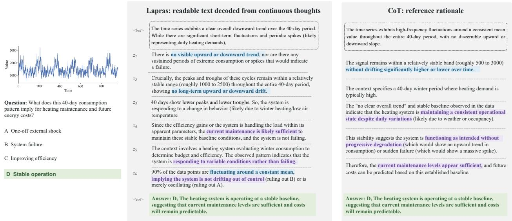  
Figure 4 Case study of decoded continuous thoughts of Lapras. Lapras’s continuous thoughts yield readable, task-relevant text whose content can be compared with the reference rationale. The decoded steps progress from a signal description of the series, through inferences built on it, to the final answer . Highlight colors match those in the figure.

## 5.3 Quantitative Analysis

Inference efficiency. In CoT, the model autoregressively decodes each reasoning step as text tokens, so inference cost scales linearly with the number of generated tokens. A typical CoT trace can span hundreds of tokens, whereas Lapras compresses the entire reasoning process into only K=6 continuous thoughts, generating text tokens only for the final answer. This results in 6.9 to 23.9× fewer generated tokens and 5.9 to 15.1× faster inference than CoT (Figure 6), while adding less than 8 ms overhead compared to No-CoT. This makes latent reasoning practical for latency-sensitive deployment settings such as real-time health monitoring, where predictions must arrive within strict time constraints.

## Number of continuous thoughts. Lapras emits a fixed number of continuous thoughts regard

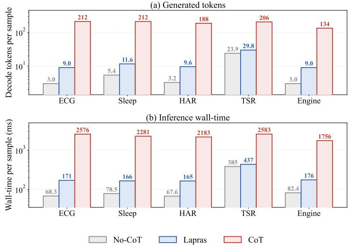  
Figure 6 Inference efficiency of the three reasoning methods. Generated tokens and wall-clock time per sample from SLIP-1B with one NVIDIA A6000.

less of the task. Understanding which tasks benefit from these thoughts helps identify where latent reasoning provides value. We test this by taking the model finetuned with K=6 and varying the number of generated continuous thoughts at inference. As Table 2 shows, using 6 continuous thoughts raises average accuracy from 64.82% to 68.38% compared to using a single continuous thought. Increasing to K=8 does not improve further, with average accuracy slightly declining to 68.07%, indicating that additional thoughts beyond the training configuration yield no benefit. The largest gains are on TSR (+12.46%) and Engine (+4.66%). ECG, Sleep, and HAR change by at most 1.09%. We attribute this to these tasks depending on local pattern recognition rather than on multi-step reasoning. This suggests that the benefit of continuous thoughts scales with the amount of multi-step inference a task requires after the time series has been encoded.

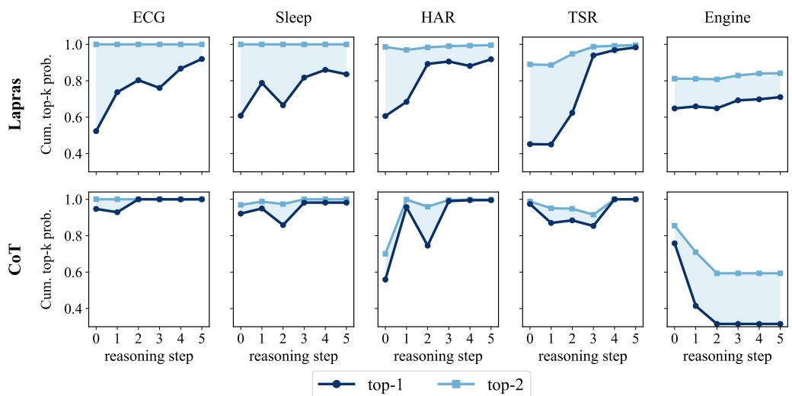  
Figure 5 Answer probability across reasoning steps on the SLIP-1B backbone for Lapras (top) and CoT (bottom), shown for one representative example per task. Curves show the cumulative probability of Answer in top-1 and Answer in top-2. Lapras keeps a second candidate alive well into the chain and commits near the end, whereas CoT tends to commit from the first step.

Table 2 Number of continuous thoughts. Answer accuracy (%) with SLIP-1B, varying only the number of continuous thoughts K. Default K=6 in green . ∆ reports the change in average relative to K=1.
<table><tr><td></td><td>ECG</td><td>Sleep</td><td>HAR</td><td>TSR</td><td>Engine</td><td>Avg.</td><td> $\Delta$ </td></tr><tr><td>K=1</td><td>81.65</td><td>78.22</td><td>75.18</td><td>54.86</td><td>34.20</td><td>64.82</td><td></td></tr><tr><td>K=3</td><td>81.65</td><td>77.36</td><td>75.05</td><td>64.44</td><td>33.16</td><td>66.33</td><td>(+1.51)</td></tr><tr><td>K=6</td><td>82.74</td><td>78.12</td><td>74.84</td><td>67.32</td><td>38.86</td><td>68.38</td><td>(+3.56)</td></tr><tr><td>K=8</td><td>82.43</td><td>77.36</td><td>74.85</td><td>67.39</td><td>38.34</td><td>68.07</td><td>(+3.25)</td></tr></table>

## 5.4 Ablation Studies

To understand which design choices contribute to Lapras’s performance, we ablate three components on SLIP-1B across all five tasks (Table 3): latent projection, which maps continuous thoughts back into the input embedding space for the next reasoning step; reasoning distillation, which enables the student to acquire the teacher’s reasoning ability without generating explicit CoT; and masking, which regularizes training.

Removing the latent projection π causes the largest drop, reducing average accuracy from 68.38% to 62.23% (−6.15%). This shows that learning a transformation between the hidden states produced by one reasoning step and the inputs consumed by the next is critical for efective latent reasoning. Removing distillation while retaining the latent reasoning steps reduces average accuracy to 64.34% (−4.04%). Without distillation, the continuous thoughts receive no supervision and the model is trained with only the final-answer cross-entropy loss, making it functionally equivalent to a No-CoT model with additional forward passes. The drop confirms that supervising the continuous thoughts through distillation is necessary for the model to learn efective latent representations. Finally, removing masking reduces average accuracy to 66.58% (−1.80%), suggesting it prevents the model from bypassing the latent reasoning steps.

Table 3 Lapras ablation experiments with the SLIP-1B backbone on the five reasoning benchmarks. We report answe accuracy (%). Default settings are marked in green .
<table><tr><td>Method</td><td>ECG</td><td>Sleep</td><td>HAR</td><td>TSR</td><td>Engine</td><td>Avg.</td><td>∆</td></tr><tr><td>Lapras (SLIP-1B) (Ours)</td><td>82.74</td><td>78.12</td><td>74.84</td><td>67.32</td><td>38.86</td><td>68.38</td><td></td></tr><tr><td>w/o projection π</td><td>80.87</td><td>77.68</td><td>73.60</td><td>50.00</td><td>29.02</td><td>62.23</td><td>(-6.15)</td></tr><tr><td>w/o reasoning distillation</td><td>78.54</td><td>77.25</td><td>74.45</td><td>56.23</td><td>35.23</td><td>64.34</td><td>(-4.04)</td></tr><tr><td>w/o mask</td><td>79.41</td><td>78.44</td><td>72.18</td><td>69.17</td><td>33.68</td><td>66.58</td><td>(-1.80)</td></tr></table>

## 6 Conclusion

Limitations and future work. Our work has several limitations. First, Lapras still relies on explicit CoT annotations for training as they are required by the teacher, restricting its use to settings where such data can be obtained or synthetically generated. Second, the number of latent reasoning steps is fixed at K = 6 regardless of task or input complexity. Learning to adaptively allocate computation per input, for instance through reinforcement learning over the number of continuous thoughts, is a natural extension. Third, on our smallest backbone (ITFormer-0.5B), all reasoning methods, including Lapras, underperform No-CoT in average F1, indicating that multi-step reasoning may require a minimum model capacity to be efective. Understanding how this capacity threshold interacts with model architecture and task complexity remains an open question.

Conclusion and broader impact. Our experiments show that finetuning TSLMs with explicit CoT reasoning does not consistently improve average F1 over finetuning with direct answers alone. We hypothesize that this is due to the verbalization bottleneck. Specifically, when a TSLM must verbalize a continuous time series before reasoning over it, subsequent reasoning steps are conditioned on incomplete or inaccurate textual descriptions rather than on the original signal, which degrades downstream performance. Lapras addresses this by performing reasoning in the model’s joint time series–language space instead of in text. Across four backbones from 0.5B to 7B parameters, we find that Lapras improves average F1 over CoT finetuning by up to 10.79% (ChatTS-7B), while reducing the number of generated tokens by up to 95.8%. Qualitative analyses further show that the continuous thoughts produced by Lapras can be decoded into readable textual traces through standard language decoding. More broadly, as TSLMs are increasingly applied to safety-critica domains such as clinical monitoring and industrial diagnostics, Lapras ofers a post-training paradigm that improves both reasoning accuracy and inference eficiency without sacrificing interpretability.

## AI use statement

In this work, we used generative AI tools to aid and polish writing, for retrieval and discovery (e.g., finding related work), and for generating synthetic datasets. We have reviewed all AI-assisted work. Specifically, all AI-polished text was manually reviewed and revised by the authors to ensure accuracy and faithful representation of our contributions. Retrieved references were verified against original sources, and all synthetic datasets were validated for correctness before use in experiments. We did not use generative AI tools for research ideation or execution, to draft sections of the paper, or to prove mathematical claims. We take responsibility for the final content of this work, including text, claims, and artifacts produced with the aid of generative AI.

## Acknowledgments

The authors acknowledge support for this research from Evergreen: AGenerativeAIandBehavioralSensingDigital Ecosystem to Promote Student Wellness and Flourishing. This work is made possible through philanthropic gifts to Dartmouth College dedicated to advancing AI-supported well-being and flourishing of college students.

## References

Jean-Baptiste Alayrac, Jef Donahue, Pauline Luc, Antoine Miech, Iain Barr, Yana Hasson, Karel Lenc, Arthur Mensch, Katie Millican, Malcolm Reynolds, Roman Ring, Eliza Rutherford, Serkan Cabi, Tengda Han, Zhitao Gong, Sina Samangooei, Marianne Monteiro, Jacob Menick, Sebastian Borgeaud, Andrew Brock, Aida Nematzadeh, Sahand Sharifzadeh, Mikolaj Binkowski, Ricardo Barreira, Oriol Vinyals, Andrew Zisserman, and Karen Simonyan. Flamingo: a visual language model for few-shot learning, 2022. https://arxiv.org/abs/2204.14198.

Abdul Fatir Ansari, Lorenzo Stella, Caner Turkmen, Xiyuan Zhang, Pedro Mercado, Huibin Shen, Oleksandr Shchur, Syama Sundar Rangapuram, Sebastian Pineda Arango, Shubham Kapoor, Jasper Zschiegner, Danielle C. Maddix, Hao Wang, Michael W. Mahoney, Kari Torkkola, Andrew Gordon Wilson, Michael Bohlke-Schneider, and Yuyang Wang. Chronos: Learning the language of time series, 2024. https://arxiv.org/abs/2403.07815.

Mohammad Asadi, Jack W. O’Sullivan, Fang Cao, Tahoura Nedaee, Kamyar Rajabalifardi, Fei-Fei Li, Ehsan Adeli, and Euan Ashley. Mirage: The illusion of visual understanding, 2026. https://arxiv.org/abs/2603.21687.

Mathilde Caron, Hugo Touvron, Ishan Misra, Hervé Jégou, Julien Mairal, Piotr Bojanowski, and Armand Joulin. Emerging properties in self-supervised vision transformers, 2021. https://arxiv.org/abs/2104.14294.

Liang Chen, Haozhe Zhao, Tianyu Liu, Shuai Bai, Junyang Lin, Chang Zhou, and Baobao Chang. An image is worth 1/2 tokens after layer 2: Plug-and-play inference acceleration for large vision-language models, 2024. https://arxiv.org/abs/2403.06764.

Yuliang Chen, Arvind Pillai, Yu Yvonne Wu, Tess Z. Grifin, Lisa Marsch, Michael V. Heinz, Nicholas C. Jacobson, and Andrew Campbell. Learning transferable sensor models via language-informed pretraining, 2026. https: //arxiv.org/abs/2603.11950.

Abhimanyu Das, Weihao Kong, Rajat Sen, and Yichen Zhou. A decoder-only foundation model for time-series forecasting, 2024. https://arxiv.org/abs/2310.10688.

Jingcheng Deng, Liang Pang, Zihao Wei, Shicheng Xu, Zenghao Duan, Kun Xu, Yang Song, Huawei Shen, and Xueq Cheng. Llm latent reasoning as chain of superposition, 2026. https://arxiv.org/abs/2510.15522.

Jun Gao, Yongqi Li, Ziqiang Cao, and Wenjie Li. Interleaved-modal chain-of-thought, 2025. https://arxiv.org/abs/ 2411.19488.

Mononito Goswami, Konrad Szafer, Arjun Choudhry, Yifu Cai, Shuo Li, and Artur Dubrawski. Moment: A family of open time-series foundation models, 2024. https://arxiv.org/abs/2402.03885.

Nate Gruver, Marc Finzi, Shikai Qiu, and Andrew Gordon Wilson. Large language models are zero-shot time series forecasters, 2024. https://arxiv.org/abs/2310.07820.

Tong Guan, Zijie Meng, Dianqi Li, Shiyu Wang, Chao-Han Huck Yang, Qingsong Wen, Zuozhu Liu, Sabato Marco Siniscalchi, Ming Jin, and Shirui Pan. Timeomni-1: Incentivizing complex reasoning with time series in large language models, 2026. https://arxiv.org/abs/2509.24803.

Shibo Hao, Sainbayar Sukhbaatar, DiJia Su, Xian Li, Zhiting Hu, Jason Weston, and Yuandong Tian. Training large language models to reason in a continuous latent space, 2025. https://arxiv.org/abs/2412.06769.

Yubin Kim, Xuhai Xu, Daniel McDuf, Cynthia Breazeal, and Hae Won Park. Health-llm: Large language models for health prediction via wearable sensor data, 2024. https://arxiv.org/abs/2401.06866.

Patrick Langer, Thomas Kaar, Max Rosenblattl, Maxwell A. Xu, Winnie Chow, Martin Maritsch, Robert Jakob, Ning Wang, Juncheng Liu, Aradhana Verma, Brian Han, Daniel Seung Kim, Henry Chubb, Scott Ceresnak, Aydin Zahedivash, Alexander Tarlochan Singh Sandhu, Fatima Rodriguez, Daniel McDuf, Elgar Fleisch, Oliver Aalami, Filipe Barata, and Paul Schmiedmayer. Opentslm: Time-series language models for reasoning over multivariate medical text- and time-series data, 2026. https://arxiv.org/abs/2510.02410.

Tamera Lanham, Anna Chen, Ansh Radhakrishnan, Benoit Steiner, Carson Denison, Danny Hernandez, Dustin Li, Esin Durmus, Evan Hubinger, Jackson Kernion, Kamil˙e Lukoši¯ut˙e, Karina Nguyen, Newton Cheng, Nicholas Joseph, Nicholas Schiefer, Oliver Rausch, Robin Larson, Sam McCandlish, Sandipan Kundu, Saurav Kadavath, Shannon Yang, Thomas Henighan, Timothy Maxwell, Timothy Telleen-Lawton, Tristan Hume, Zac Hatfield-Dodds, Jared Kaplan, Jan Brauner, Samuel R. Bowman, and Ethan Perez. Measuring faithfulness in chain-of-thought reasoning, 2023. https://arxiv.org/abs/2307.13702.

Bangzheng Li, Ximeng Sun, Jiang Liu, Ze Wang, Jialian Wu, Xiaodong Yu, Hao Chen, Emad Barsoum, Muhao Chen, and Zicheng Liu. Latent visual reasoning, 2025a. https://arxiv.org/abs/2509.24251.

Yuetai Li, Xiang Yue, Zhangchen Xu, Fengqing Jiang, Luyao Niu, Bill Yuchen Lin, Bhaskar Ramasubramanian, and Radha Poovendran. Small models struggle to learn from strong reasoners, 2025b. https://arxiv.org/abs/2502.12143.

Xin Liu, Daniel McDuf, Geza Kovacs, Isaac Galatzer-Levy, Jacob Sunshine, Jiening Zhan, Ming-Zher Poh, Shun Liao, Paolo Di Achille, and Shwetak Patel. Large language models are few-shot health learners, 2023. https: //arxiv.org/abs/2305.15525.

Yunfei Luo, Yuliang Chen, Asif Salekin, and Tauhidur Rahman. Toward foundation model for multivariate wearable sensing of physiological signals, 2025. https://arxiv.org/abs/2412.09758.

Mike A Merrill, Mingtian Tan, Vinayak Gupta, Thomas Hartvigsen, and Tim Althof. Language models still struggle to zero-shot reason about time series. In Yaser Al-Onaizan, Mohit Bansal, and Yun-Nung Chen, editors, Findings of the Association for Computational Linguistics: EMNLP 2024, pages 3512–3533, Miami, Florida, USA, November 2024. Association for Computational Linguistics. doi: 10.18653/v1/2024.findings-emnlp.201. https://aclanthology.org/2024.findings-emnlp.201/.

Shvat Messica, Jiawen Zhang, Kevin Li, Theodoros Tsiligkaridis, and Marinka Zitnik. Adaptive time series reasoning via segment selection, 2026. https://arxiv.org/abs/2602.18645.

Jungwoo Oh, Hyunseung Chung, Junhee Lee, Min-Gyu Kim, Hangyul Yoon, Ki Seong Lee, Youngchae Lee, Muhan Yeo, and Edward Choi. Ecg-reasoning-benchmark: A benchmark for evaluating clinical reasoning capabilities in ecg interpretation, 2026. https://arxiv.org/abs/2603.14326.

Zhenyi Shen, Hanqi Yan, Linhai Zhang, Zhanghao Hu, Yali Du, and Yulan He. Codi: Compressing chain-of-thought into continuous space via self-distillation, 2025. https://arxiv.org/abs/2502.21074.

Miles Turpin, Julian Michael, Ethan Perez, and Samuel R. Bowman. Language models don’t always say what they think: Unfaithful explanations in chain-of-thought prompting, 2023. https://arxiv.org/abs/2305.04388.

Qixun Wang, Yang Shi, Yifei Wang, Yuanxing Zhang, Pengfei Wan, Kun Gai, Xianghua Ying, and Yisen Wang. Monet: Reasoning in latent visual space beyond images and language, 2025a. https://arxiv.org/abs/2511.21395.

Yilin Wang, Peixuan Lei, Jie Song, Yuzhe Hao, Tao Chen, Yuxuan Zhang, Lei Jia, Yuanxiang Li, and Zhongyu Wei. Itformer: Bridging time series and natural language for multi-modal qa with large-scale multitask dataset, 2025b. https://arxiv.org/abs/2506.20093.

Zezhong Wang, Xingshan Zeng, Weiwen Liu, Yufei Wang, Liangyou Li, Yasheng Wang, Lifeng Shang, Xin Jiang, Qun Liu, and Kam-Fai Wong. Chain-of-probe: Examining the necessity and accuracy of cot step-by-step, 2025c. https://arxiv.org/abs/2406.16144.

Qiong Wu, Xiangcong Yang, Yiyi Zhou, Chenxin Fang, Baiyang Song, Xiaoshuai Sun, and Rongrong Ji. Grounded chain-of-thought for multimodal large language models, 2025. https://arxiv.org/abs/2503.12799.

Guangxuan Xiao, Yuandong Tian, Beidi Chen, Song Han, and Mike Lewis. Eficient streaming language models with attention sinks, 2024. https://arxiv.org/abs/2309.17453.

Zhe Xie, Zeyan Li, Xiao He, Longlong Xu, Xidao Wen, Tieying Zhang, Jianjun Chen, Rui Shi, and Dan Pei. Chatts: Aligning time series with llms via synthetic data for enhanced understanding and reasoning. Proceedings of the VLDB Endowment, 18(8):2385–2398, April 2025. ISSN 2150-8097. doi: 10.14778/3742728.3742735. http: //dx.doi.org/10.14778/3742728.3742735.

Maxwell A. Xu, Harish Haresamudram, Catherine W. Liu, Patrick Langer, Jathurshan Pradeepkumar, Wanting Mao, Sunita J. Ferns, Aradhana Verma, Jimeng Sun, Paul Schmiedmayer, Xin Liu, Daniel McDuf, Emily B. Fox, and James M. Rehg. How well do multimodal models reason on ecg signals?, 2026. https://arxiv.org/abs/2603.00312.

Muru Zhang, Ofir Press, William Merrill, Alisa Liu, and Noah A. Smith. How language model hallucinations can snowball, 2023. https://arxiv.org/abs/2305.13534.

Xiaoyu Zhu, Xinke Deng, Suresh Taddewadikar, Arnab Kumar Mondal, Zhongyu Jiang, Ian Fasel, and Joerg Liebelt. Beyond visual cot: Internalized visual thinking for proactive video reasoning, 2026. https://arxiv.org/abs/2608. 15869.

## Appendix

## A Dataset Details

We construct a reasoning trace for every task, since Lapras is trained by distilling one. The five tasks divide by how that trace is obtained: ECG and Engine carry certified, stage-wise ground-truth labels, so their traces are assembled deterministically from those labels; HAR, Sleep, and TSR do not, so their traces are distilled from a teacher model. In all cases the trace is used only to shape training and is never emitted at inference. Table 4 reports the split sizes, channel counts, series lengths, and answer format of each task.

ECG. The original ECG-Reasoning benchmark is multi-stage: each reasoning step is annotated separately and posed as an independent question. We reformat it into a single binary diagnosis question (e.g., presence vs. absence of atrial fibrillation) by concatenating the per-stage gold answers into one trace that proceeds from criterion selection, to finding identification, to ECG grounding, and finally to the diagnostic decision, which serves as the answer.

Engine. Engine is an aero-engine sensor dataset. We keep only the subset of samples that carry a certified severity label corresponding to each sensor channel, since only these samples support a verifiable ground-truth trace. From these certified labels the rationale is generated deterministically as a multi-step trace: a percomponent roll-call over the five rotating components, a severity read-of, and the maintenance implication that follows from the resulting (component, severity) pair.

HAR and Sleep. HAR and Sleep are a human activity recognition and a sleep stage classification task, respectively; both require reasoning over time series to answer questions about the underlying activity or sleep stage. Following Messica et al. (2026), we generate the supervised finetuning rationales through a distillation pipeline. We prompt Qwen3.5-27B to answer each question while conditioning it on rendered plots of the signal, the summary statistics, and the gold answer. The model is first asked to identify at most three contiguous segments that are essential for answering the question, and then to produce a step-by-step explanation that reaches the answer using only those segments and the statistics. For each segment, the rationale for selecting it is stated separately from the analysis of what the segment reveals, which keeps the segment selection decoupled from its interpretation. We transform the resulting responses into structured traces that interleave natural language reasoning with explicit segment-selection calls, then post-process them to check correctness and adherence to the template.

TSR. TSR is the counterfactual subset of the original TSR benchmark (Merrill et al., 2024), a multiple-choice reasoning task over mixed-domain real-world signals (e.g., residential solar generation or city temperature). Given a signal, the model must predict a real-world consequence or judgment whose correct answer flips with the signal’s qualitative behavior. Each item pairs an original series with its counterfactual counterpart; the two share the same question and answer choices but difer in the time series and in the correct answer, so the answer can only be determined by reading the series. As the dataset does not provide a reasoning rationale, we generate one with a distillation pipeline following Messica et al. (2026), as for HAR and Sleep.

Table 4 Overview of datasets.
<table><tr><td>Dataset</td><td>Train</td><td>Test</td><td>Channels</td><td>Len</td><td>Format</td></tr><tr><td>ECG (Oh et al., 2026)</td><td>5,800</td><td>643</td><td>12</td><td>1000</td><td>Binary (Yes/No)</td></tr><tr><td>HAR (Langer et al., 2026)</td><td>68,542</td><td>8,222</td><td>3</td><td>128</td><td>Multiple choice</td></tr><tr><td>Sleep (Langer et al., 2026)</td><td>7,413</td><td>923</td><td>1</td><td>1500</td><td>Multiple choice</td></tr><tr><td>TSR (Merrill et al., 2024)</td><td>22,566</td><td>4,094</td><td>1</td><td>128-1020</td><td>Multiple choice</td></tr><tr><td>Engine (Wang et al., 2025b)</td><td>2,305</td><td>193</td><td>33</td><td>600</td><td>Multiple choice</td></tr></table>

## B Backbone Architectures

Table 5 The four backbones along three design axes. $| H _ { s } |$ is the number of sensor tokens handed to the language model; C is the channel count, L the series length, and P the patch size of Table 7. Concat places $H _ { s }$ in the token sequence and reads it with self-attention; cross-attn keeps it outside and injects it through dedicated layers.
<table><tr><td>Backbone</td><td>LM</td><td>Sensor encoder</td><td>Connector</td><td> $| H _ { s } |$ </td><td>Fusion (depth)</td></tr><tr><td>ChatTS-7B</td><td>7B</td><td>per-patch MLP</td><td>none (native space)</td><td> $C [ L / P ]$ </td><td>concat (all layers)</td></tr><tr><td>ITFormer-0.5B</td><td>0.5B</td><td>PatchTST</td><td>question-cond. resampler 25</td><td></td><td>concat (all layers)</td></tr><tr><td>SLIP-1B</td><td>1B</td><td>language-pretrained</td><td>attention pooler</td><td>64</td><td>cross-attn (last 4)</td></tr><tr><td>OpenTSLM-1B</td><td>1B</td><td>PatchTST</td><td>Perceiver resampler</td><td>64</td><td>cross-attn (every layer)</td></tr></table>

All four backbones follow a common three-stage template. A pretrained language model $f _ { \phi }$ is extended to a second modality by an encoder $g _ { \psi }$ that maps the series $X _ { s }$ to features $Z _ { s } ,$ a connector $h _ { \omega }$ that maps these features into the language embedding space as $H _ { s } = h _ { \omega } ( Z _ { s } )$ , and a fusion mechanism that determines where inside $f _ { \phi }$ the sensor tokens are read. All four patch the input. A length-L, C-channel recording is divided into windows of $P$ timesteps, analogous to image patches. The backbones difer along three axes: the patch encoding, the sensor token count, and the fusion mechanism. Table 5 summarizes the four configurations.

Encoder. ChatTS (Xie et al., 2025) min-max normalizes each series, writes the scale and ofset into the prompt, and applies a five-layer MLP to each patch in isolation, so cross-time interaction occurs only inside the language model. ITFormer (Wang et al., 2025b) uses a PatchTST encoder, pretrained separately and frozen, that attends across the patches of a channel, so its features carry local temporal context. OpenTSLM (Langer et al., 2026) embeds each patch with a jointly trained 1D convolution, one channel at a time, and defers temporal mixing to the connector. SLIP (Chen et al., 2026) uses an encoder pretrained on large-scale sensor caption pairs with contrastive and captioning objectives, with a FlexMLP that adapts patch granularity to the sampling rate, so its features are aligned to language before QA finetuning.

Connector. ChatTS uses no connector. The MLP emits vectors in the language embedding space, and the patches of each series are inserted at the position where the series is named in the prompt. Every patch of every channel becomes one token, so $| H _ { s } | = C \lceil L / P \rceil$ grows with the channel count and the series length. Table 7 therefore uses a larger patch size on the 12-channel ECG and 33-channel Engine tasks, where $P = 8$ yields over a thousand sensor tokens and exceeds the memory available at the 7B scale. The other three backbones use a resampler, a fixed set of learned queries that cross-attend to the encoder features and return one token each. The token count is fixed by the architecture and independent of the series length, 25 for ITFormer and 64 for SLIP and OpenTSLM. ITFormer prepends 25 learnable instruct tokens to the question, refines them with self-attention, and uses them as queries that pool the encoder features across channels and then across timesteps, so the returned tokens depend on the instruction. SLIP and OpenTSLM use question-agnostic resamplers, a Perceiver resampler in OpenTSLM and caption queries pretrained with the encoder in SLIP. The 64 tokens are computed from the series alone, and the question interacts with them only when the text tokens cross-attend to $H _ { s }$ inside $f _ { \phi }$

Fusion. ChatTS and ITFormer concatenate the sensor tokens into the prompt, $H = f _ { \phi } ( [ H _ { q } ; H _ { s } ] )$ . The signal is read by self-attention at every layer, no parameters are added to the language model, and the two modalities share one attention budget. SLIP and OpenTSLM keep $H _ { s }$ outside the sequence and inject it through gated cross-attention layers interleaved into $f _ { \phi } , H = f _ { \phi } ( H _ { q } \mid H _ { s } )$ , following Flamingo (Alayrac et al., 2022). The sensor pathway has separate parameters and a separate attention budget, a tanh gate initialized at zero preserves the pretrained text behavior at initialization, and memory is constant in the series length. OpenTSLM injects at every layer. SLIP injects at the final four layers, so lower layers process the question as text alone.

Coverage. The four backbones span all three axes and language models from 0.5B to 7B parameters. Lapras modifies none of these components and changes only the tokens the language model emits between the prompt and the answer, so evaluating on all four separates its efect from any particular integration of the signal. The attention analysis of Appendix F requires a concatenation backbone, because $\lambda _ { \mathrm { t s } }$ is defined as a share of a single self-attention row and is measurable only when the sensor tokens are in the sequence; we use ChatTS-7B as a representative one. The latent loop of Equation 1, by contrast, applies to all four backbones. Each continuous thought $z _ { k }$ re-enters $f _ { \phi }$ as an input embedding and reads the signal through the fusion pathway of the backbone, whereas an explicit chain conditions increasingly on its own generated text.

## C Architecture Variant Discussion

We briefly explore whether the efect of the finetuning method changes across architecture families. OpenTSLM has released two controlled variants, OpenTSLM-Flamingo and OpenTSLM-SoftPrompt, which share the same 1B language model but difer in how the sensor tokens interact with it (Appendix B). This pair gives us an opportunity for a controlled experiment that isolates the fusion pathway while keeping all other factors fixed.

As shown in Table 6, OpenTSLM-SoftPrompt outperforms OpenTSLM-Flamingo in average accuracy under every finetuning method, though which variant leads on any given task varies without a consistent pattern. Lapras improves accuracy on both variants and narrows the gap between them from 3.57% under No-CoT to 0.67%, suggesting that latent reasoning reduces the model’s sensitivity to how sensor tokens are fused with the language backbone. Explicit chain-of-thought, by contrast, does not produce a clear benefit on either variant.

Overall, the gains from latent reasoning are consistent across both fusion pathways, and the choice between them matters less under Lapras than under No-CoT. However, whether this behavior holds for larger language backbones (e.g., 7B) remains open for future work.

Table 6 Effect of the fusion pathway. Accuracy and Macro-F1 (%) on the two OpenTSLM variants, which share a 1B language model and difer only in fusion. Ours in green ; bold and underline are best and second-best per column within a variant; ∆ is the change in average over No-CoT.
<table><tr><td></td><td></td><td colspan="2">ECG</td><td colspan="2">Sleep</td><td colspan="2">HAR</td><td colspan="2">TSR</td><td colspan="2">Engine</td><td colspan="4">Avg. ∆</td></tr><tr><td>Model</td><td>Finetune Method</td><td>Acc</td><td>F1</td><td>Acc</td><td>F1</td><td>Acc</td><td>F1</td><td>Acc</td><td>F1</td><td>Acc</td><td>F1</td><td>Acc</td><td></td><td>F1</td><td>∆</td></tr><tr><td rowspan="5">OpenTSLM-SoftPrompt</td><td>No-CoT</td><td>61.59</td><td>60.98</td><td>84.29</td><td>73.93</td><td>73.46</td><td>69.85</td><td>49.15</td><td>48.65</td><td>31.09</td><td>30.64</td><td>59.92</td><td></td><td>56.81</td><td></td></tr><tr><td>CoT</td><td>52.10</td><td>51.94</td><td>83.42</td><td>72.87</td><td>71.14</td><td>67.00</td><td>53.03</td><td>53.02</td><td>32.12</td><td>32.11</td><td>58.36</td><td>(-1.55)</td><td>55.39</td><td>(-1.42)</td></tr><tr><td>iCoT</td><td>63.76</td><td>63.62</td><td>84.07</td><td>72.10</td><td>72.55</td><td>69.34</td><td>54.86</td><td>54.85</td><td>26.42</td><td>18.03</td><td>60.33</td><td>(+0.41)</td><td>55.59</td><td>(-1.22)</td></tr><tr><td>COCONUT</td><td>65.16</td><td>64.48</td><td>83.42</td><td>71.25</td><td>74.18</td><td>71.18</td><td>56.74</td><td>56.50</td><td>34.72</td><td>33.83</td><td>62.84</td><td>(+2.93)</td><td>59.45</td><td>(+2.64)</td></tr><tr><td>Lapras (Ours)</td><td>65.16</td><td>64.80</td><td>85.81</td><td>75.62</td><td>74.25</td><td>70.94</td><td>58.04</td><td>58.00</td><td>37.31</td><td>36.08</td><td>64.11</td><td>(+4.20)</td><td>61.09</td><td>(+4.28)</td></tr><tr><td rowspan="5">OpenTSLM-Flamingo</td><td>No-CoT</td><td>71.07</td><td>70.90</td><td>77.57</td><td>65.25</td><td>71.31</td><td>66.22</td><td>33.29</td><td>33.32</td><td>28.50</td><td>11.09</td><td>56.35</td><td></td><td>49.36</td><td></td></tr><tr><td>CoT</td><td>65.47</td><td>65.33</td><td>72.81</td><td>58.02</td><td>67.61</td><td>61.71</td><td>52.69</td><td>53.13</td><td>27.98</td><td>26.48</td><td>57.31</td><td>(+0.96)</td><td>52.93</td><td>(+3.58)</td></tr><tr><td>iCoT</td><td>72.94</td><td>72.78</td><td>77.57</td><td>65.22</td><td>69.98</td><td>65.40</td><td>51.10</td><td>51.08</td><td>26.94</td><td>24.20</td><td>59.71</td><td>(+3.36)</td><td>55.74</td><td>(+6.38)</td></tr><tr><td>COCONUT</td><td>70.45</td><td>70.38</td><td>76.27</td><td>62.80</td><td>70.82</td><td>65.89</td><td>47.92</td><td>41.91</td><td>24.87</td><td>16.84</td><td>58.07</td><td>(+1.72)</td><td>51.56</td><td>(+2.21)</td></tr><tr><td>Lapras (Ours)</td><td>73.56</td><td>73.49</td><td>80.72</td><td>68.91</td><td>72.40</td><td>68.20</td><td>58.40</td><td>58.44</td><td>32.12</td><td>27.51</td><td>63.44</td><td>(+7.09)</td><td>59.31</td><td>(+9.95)</td></tr></table>

## D Implementation Details

Training configuration. All runs use LLaMA-Factory<sup>2</sup> with the AdamW optimizer, a cosine learning-rate schedule with warmup ratio 0.02, bf16 precision, DeepSpeed ZeRO-2, gradient clipping at 1.0, and an efective batch size of 128. In all settings, the TSLM is fully finetuned. The Lapras runs use the default configuration with the latent projector enabled, K = 6 continuous thoughts, and a mask ratio of 0.3 on patchified sensor streams during training (Section 3.2). Table 7 reports the settings that vary across backbones and tasks.

We start from the recommended hyperparameters of each backbone (Xie et al., 2025; Wang et al., 2025b; Langer et al., 2026; Chen et al., 2026) and make only the adjustments needed for the training loss to flatten. Within each backbone, the learning rate and weight decay are held fixed across all five finetuning methods. The only method-specific setting is the distillation weight λ of Lapras. We default to λ = 10 following

Table 7 Per-task hyperparameters for the four backbones and the OpenTSLM-SoftPrompt variant. One row covers all five finetuning methods, which share every setting except the distillation weight λ of Lapras.
<table><tr><td>Backbone</td><td>Dataset</td><td>Patch Size</td><td>Epochs</td><td>lr</td><td>wd</td><td>λ</td></tr><tr><td rowspan="5">ChatTS-7B</td><td>ECG</td><td>32</td><td>20</td><td>1e-5</td><td>1e-2</td><td>10</td></tr><tr><td>Sleep</td><td>8</td><td>20</td><td>1e-5</td><td>1e-2</td><td>10</td></tr><tr><td>HAR</td><td>8</td><td>4</td><td>1e-5</td><td>1e-2</td><td>10</td></tr><tr><td>TSR</td><td>8</td><td>4</td><td>1e-5</td><td>1e-2</td><td>1</td></tr><tr><td>Engine</td><td>50</td><td>5</td><td>1e-5</td><td>1e-2</td><td>20</td></tr><tr><td rowspan="5">SLIP-1B</td><td>ECG</td><td>32</td><td>20</td><td>5e-5</td><td>1e-2</td><td>10</td></tr><tr><td>Sleep</td><td>64</td><td>20</td><td>1e-4</td><td>1e-2</td><td>10</td></tr><tr><td>HAR</td><td>4</td><td>4</td><td>1e-4</td><td>1e-2</td><td>10</td></tr><tr><td>TSR</td><td>16/32</td><td>4</td><td>1e-4</td><td>1e-2</td><td>10</td></tr><tr><td>Engine</td><td>32</td><td>5</td><td>1e-5</td><td>1e-2</td><td>20</td></tr><tr><td rowspan="5">OpenTSLM-Flamingo</td><td>ECG</td><td>4</td><td>20</td><td>1e-4</td><td>1e-2</td><td>10</td></tr><tr><td>Sleep</td><td>4</td><td>20</td><td>1e-4</td><td>1e-2</td><td>1</td></tr><tr><td>HAR</td><td>4</td><td>4</td><td>1e-4</td><td>1e-2</td><td>1</td></tr><tr><td>TSR</td><td>4</td><td>4</td><td>1e-5</td><td>1e-2</td><td>10</td></tr><tr><td>Engine</td><td>4</td><td>5</td><td>1e-5</td><td>1e-2</td><td>10</td></tr><tr><td rowspan="5">OpenTSLM-SoftPrompt</td><td>ECG</td><td>100</td><td>20</td><td>1e-4</td><td>1e-2</td><td>10</td></tr><tr><td>Sleep</td><td>4</td><td>20</td><td>1e-4</td><td>1e-2</td><td>1</td></tr><tr><td>HAR</td><td>4</td><td>4</td><td>1e-4</td><td>1e-2</td><td>1</td></tr><tr><td>TSR</td><td>4</td><td>4</td><td>1e-5</td><td>1e-2</td><td>10</td></tr><tr><td>Engine</td><td>50</td><td>5</td><td>1e-5</td><td>1e-2</td><td>10</td></tr><tr><td rowspan="5">ITFormer-0.5B</td><td>ECG</td><td>60</td><td>20</td><td>1e-5</td><td>1e-2</td><td>10</td></tr><tr><td>Sleep</td><td>60</td><td>20</td><td>1e-5</td><td>1e-2</td><td>10</td></tr><tr><td>HAR</td><td>60</td><td>4</td><td>1e-5</td><td>1e-2</td><td>10</td></tr><tr><td>TSR</td><td>60</td><td>4</td><td>1e-5</td><td>1e-2</td><td>10</td></tr><tr><td>Engine</td><td>60</td><td>5</td><td>1e-5</td><td>1e-2</td><td>10</td></tr></table>

CODI (Shen et al., 2025) and adjust it within {1, 10, 20} so that the weighted distillation loss stays on the same order of magnitude as the student and teacher cross-entropy losses.

Patch sizes follow each backbone’s default. OpenTSLM-Flamingo, OpenTSLM-SoftPrompt, ChatTS, and ITFormer use fixed patch sizes of 4, 4, 8, and 60, respectively. We slightly adjust them for computational eficiency. For ChatTS, we increase the patch size on ECG and Engine to 32 and 50 to avoid memory overflow at the 7B scale. For OpenTSLM-SoftPrompt, we increase the patch size on the same two datasets to 100 and 50 so that its efective batch size matches that of OpenTSLM-Flamingo. SLIP uses an adaptive patch size per dataset, following its own recommendation.

For each dataset, the epoch count is shared across all backbones and all five finetuning methods, and we report the final checkpoint with no checkpoint selection, so no test-set information enters the schedule. Evaluation uses greedy decoding with at most 512 new tokens for every method. Each run uses 4×H200.

## E Per-Token Predictive Entropy via the Logit Lens

Setup. To characterize what a continuous thought encodes, we decode every intermediate state through the model’s own output head, following the logit-lens analysis of latent reasoning (Deng et al., 2026). A language model maps any hidden state $h _ { t }$ to a next-token distribution with the same unembedding it uses at the output layer, p<sub>t</sub> = softmax $( W _ { U } h _ { t } / \tau )$ , where $W _ { U } \in \mathbb { R } ^ { V \times d }$ is the (tied) language-model head, $V$ the vocabulary size, and $\tau > 0$ the temperature. We quantify how concentrated this distribution is with the Shannon entropy in bits, $\begin{array} { r } { H ( p _ { t } ) = - \sum _ { v = 1 } ^ { V } p _ { t } ( v ) \log _ { 2 } \bar { p _ { t } } ( v ) } \end{array}$ . A low $H ( p _ { t } )$ indicates that the state places nearly all probability mass on a single token, whereas a high $H ( p _ { t } )$ indicates that the state distributes mass across multiple candidate continuations and has not yet committed to one of them.

The readout is identical in both decoding modes, and only the input to $W _ { U }$ difers. In explicit decoding, $h _ { t }$ is computed after a discrete token has been embedded and fed back, so the arg max of $p _ { t }$ is the emitted token and the lens recovers a prediction the model has already committed $\mathrm { t o . }$ In latent decoding, the model emits no token during reasoning. Each continuous thought $z _ { k }$ is the last-layer hidden state, which is mapped through $\pi ( \cdot )$ and fed back as the input embedding for the next step. The distribution $p _ { z _ { k } } = \mathrm { s o f t m a x } ( W _ { U } z _ { k } / \tau )$ is therefore a diagnostic readout that indicates which vocabulary tokens the thought would favor if it were decoded at that step. Because the thought is never discretized, a single latent step can retain probability mass on several candidate tokens rather than on one. We summarize this spread by the efective number of candidate tokens per thought, $N _ { \mathrm { e f f } } = 2 ^ { \bar { H } }$ , where $\bar { H }$ is the mean of $H ( p _ { z _ { k } } )$ over the K thoughts. $N _ { \mathrm { e f f } }$ equals the number of equiprobable tokens whose entropy matches ${ \bar { H } } ,$ , and $N _ { \mathrm { e f f } } = 1$ corresponds to a deterministic prediction. For each example, we record $H ( p _ { t } )$ and the sorted top-k probabilities of $p _ { t }$ at every position, and we define the commitment point as the first answer token whose top-1 probability is at least 0.95.

```python
Algorithm 1 Logit-lens entropy readout for explicit and latent decoding.
import torch, torch.nn.functional as F
# W_U: LM head, tau: temperature, h: last-layer state at last position
def logit_lens(h, tau=1.0):
return F.softmax(W_U(h).float() / tau, dim=-1) # (V,)
def entropy_bits(p):
return -(p * p.clamp_min(1e-12).log2()).sum()
def record(h, tag): # log entropy, top-k, phase
p = logit_lens(h)
H_seq.append(entropy_bits(p)); heat.append(p.topk(30).values); phase.append(tag)
return p
def decode_answer(h): # greedy token decoding
for _ in range(max_new_tokens):
tok = record(h, "answer").argmax()
if tok == eos: break
h = step(embed(tok))[-1]
# ---- CoT ----
H_seq, heat, phase = [], [], []
decode_answer(encode(prompt)[-1])
# ---- latent reasoning ---
H_seq, heat, phase = [], [], []
h = encode(prompt + [bot])[-1]
for k in range(K):
record(h, "latent") # h is thought z_k
h = step(pi(h))[-1]
h = step(embed(eot))[-1] # end thinking
decode_answer(h)
# efective number of candidate tokens per continuous thought
H_lat = torch.stack([H for H, ph in zip(H_seq, phase) if ph == "latent"])
N_ef = 2 ** H_lat.mean()
# commitment point: first answer token with top-1 prob >= 0.95
commit = next((i for i, ph in enumerate(phase)
if ph == "answer" and heat[i][0] >= 0.95), None)
```

Result. Figure 7 compares CoT and latent reasoning on the same example. Under CoT (top), the readout has low entropy at nearly all of the 140 steps. Each emitted token is already committed when it is produced, so the model reaches the answer through a long sequence of near-deterministic steps. Under latent reasoning (bottom), the computation is concentrated in 6 continuous thoughts whose readouts spread probability over many vocabulary tokens $( N _ { \mathrm { e f f } } \approx 2 2 )$ , which indicates that each thought retains mass on several candidate continuations rather than committing to a single token. Entropy decreases after the first thought, and the distribution reaches the commitment point $( \mathrm { t o p } \mathrm { - } 1 \geq 0 . 9 5 )$ only at the first answer token. The continuous thoughts therefore do not reproduce a compressed version of the CoT trajectory, and instead follow an entropy profile that difers from explicit decoding.  
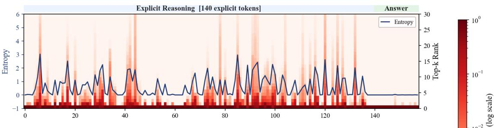

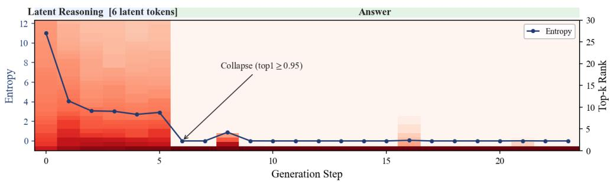  
Figure 7 Per-step logit-lens readout on one TSR example. At each step, we plot the next-token distribution read through the logit lens, with tokens ranked by probability and colored on a log scale, together with its entropy (blue). Top: under CoT the distribution is sharply peaked at nearly all of the 140 steps. Bottom: under latent reasoning the 6 continuous thoughts spread probability over many tokens $( N _ { \mathrm { e f f } } \approx 2 2 )$ , entropy decreases after the first thought, and the distribution reaches the commitment point $( \mathrm { t o p } \mathrm { - } 1 \geq 0 . 9 5 )$ only at the first answer token.

Table 8 Attention on the time series with ChatTS-7B. Allocation $\lambda _ { \mathrm { t s } } ~ ( \% )$ is the share of a reasoning token’s attention that lands on the time series tokens, at the first, middle, and last layers.
<table><tr><td>Layer</td><td>No-CoT</td><td>CoT</td><td>Lapras</td></tr><tr><td>0 (first)</td><td>2.95</td><td>3.39</td><td>17.35</td></tr><tr><td>21 (middle)</td><td>11.18</td><td>4.65</td><td>6.54</td></tr><tr><td>35 (last)</td><td>0.72</td><td>0.27</td><td>1.21</td></tr></table>

## F Attention on the Time Series

A model can score well on multiple-choice temporal QA by exploiting linguistic priors over the answer choices instead of reading the signal, and accuracy alone says little about which part of the prompt each format actually works over. To shed light on this, we investigate the attention weight distributions during generation.

Setting. We run the attention analysis in this section on ChatTS-7B, a concatenation backbone, since SLIP and OpenTSLM inject the series through cross-attention, where the allocation is not measurable. We take a representative TSR example and average $\lambda _ { \mathrm { t s } }$ over the reasoning-token queries of each format, namely the answer token for No-CoT, the chain-of-thought span for CoT, and the latents for latent reasoning.

Attention Maps. We visualize the model’s layer-wise log-scaled attention vectors following the protocol of Xiao et al. (2024). A row is a generated token and a column is a token it can look back at, so the maps are lower triangular. The time series column is brightest under latent reasoning at the input and fades in the later layers, so the signal is absorbed early and the deepest layers work over text. The reasoning column is wide in panel (b) and almost absent in panel (c), so the mass that leaves the time series column under CoT is the mass its own trace takes. Latent reasoning has no such trace to fall back on and therefore keeps the series in view through the depths where the computation happens.

Attention Allocation. To quantify the allocation, we follow Chen et al. (2024) and measure the total attention score one type of token receives in one layer. Let $\alpha _ { q j } ^ { ( \ell ) }$ be the post-softmax attention that a generated token q pays to a key j at layer ℓ, averaged over heads, and let $S$ be the set of time series tokens. The allocation of the series is

$$
\lambda _ { \mathrm { t s } } ^ { ( \ell ) } = \sum _ { j \in S , j < q } \alpha _ { q j } ^ { ( \ell ) } , \qquad \mathrm { w h e r e } \quad \sum _ { j \le q } \alpha _ { q j } ^ { ( \ell ) } = 1 .
$$

Since each row sums to one, $\lambda _ { \mathrm { t s } }$ is the fraction of a token’s attention budget that goes to the signal, and the rest goes to the other spans it can look back at.

As Table 8 shows, latent reasoning allocates the most attention to the time series in the early layers, where it has direct access to the series, and we read this as the model working out which part of the series matters given the context and the question. Once the series has been read, the later layers can move on to the high-level reasoning step, so the allocation drops. No-CoT behaves diferently and peaks in the middle layers. We hypothesize that the model leans on the text prior in the early layers and only looks back at the series once it has to commit to an answer. CoT is flat across depth and stays below the other two formats almost everywhere. We attribute this to the verbalization bottleneck (Figure 9), which Lapras is designed to avoid.

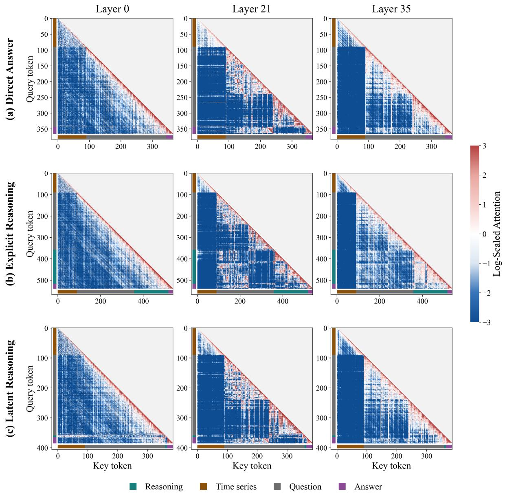  
Figure 8 Attention maps of ChatTS-7B on TSR at layers 0, 21, and 35 for (a) No-CoT, (b) explicit chain-of-thought, and (c) latent reasoning. Color gives attention relative to the uniform level, red above and blue below, and the bars on the two axes mark the time series, question, reasoning, and answer spans.

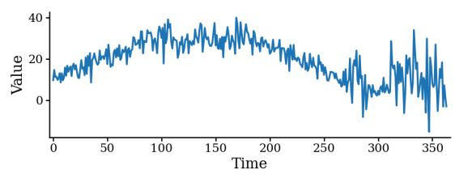

## G Additional Visualization

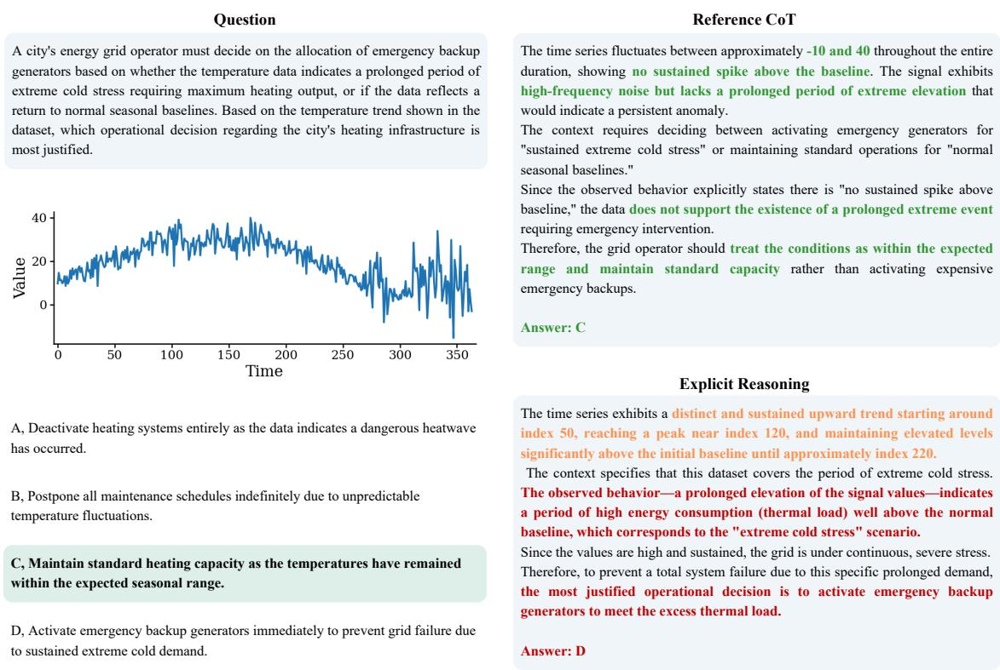  
Figure 9 Verbalization bottleneck in CoT reasoning. An operational decision over a temperature series with four choices. CoT (bottom right) runs a CoT trace that first verbalizes the signal as text, then reasons from that textual summary rather than the original representation, and reaches an incorrect final answer. Spans are colored grounded, correct but insuficient, and incorrect.

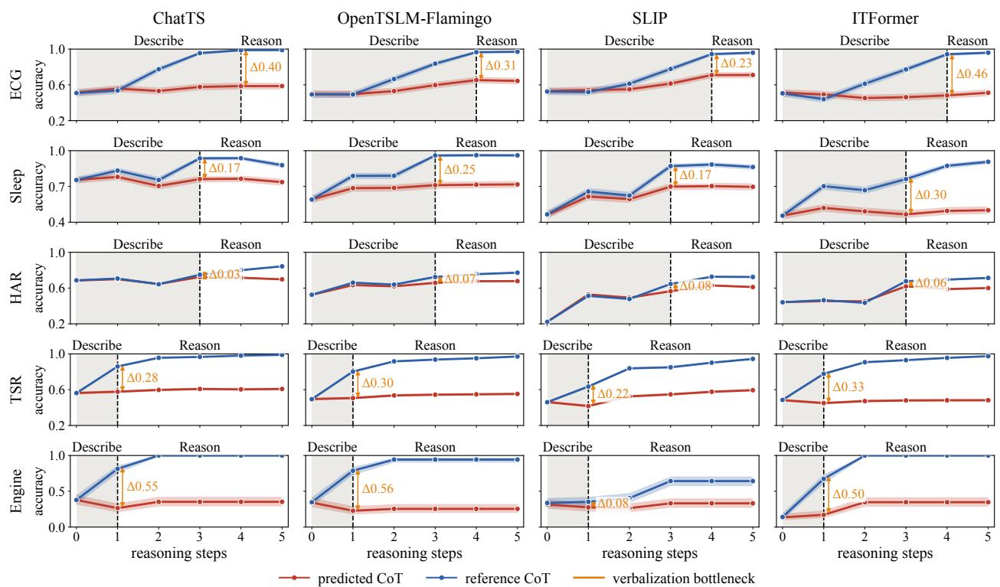  
Figure 10 Early-answering accuracy under predicted and reference CoT. Accuracy of a frozen CoT-SFT model answering from only the first k CoT sentences, using either its own predicted CoT or the reference annotation. The verbalization bottleneck ∆ is the accuracy diference between the two at the end of the describe stage. Shaded regions mark the describe and reason stages.

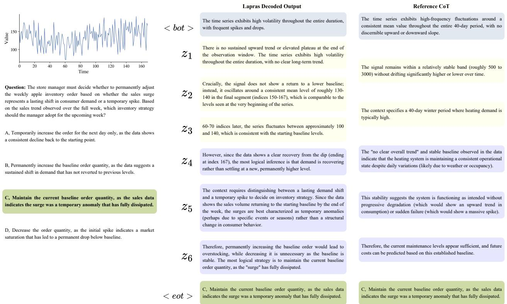  
Figure 11 Case study of Lapras’s interpretability, obtained by decoding each of the six continuous thoughts $z _ { 1 } , \dots ,$ z<sub>6</sub> into text and placing it beside the explicit chain. The decoded steps progress from a global description of the series, through local descriptions of individual segments, to inferences that combine them, and finally to the answer . Highlight colors match the box fills in the figure.