# Learning What to Trust in Multimodal Learning under Noisy Supervision

A PREPRINT

Jiashuo Zou Xiaobo Xia<sup>∗</sup> University of Science and Technology of China zjs3490581068@gmail.com xiaoboxia@ustc.edu.cn

## ABSTRACT

Multimodal classification processes and relates information from multiple modalities to achieve more accurate predictions. However, existing methods typically rely on high-quality ground-truth labels, which are difficult to obtain in real-world scenarios. While sample-selection methods for learning with noisy labels aim to identify correctly labeled examples from noisy data, traditional methods primarily focus on unimodal settings and fail to exploit multimodal information fully. This motivates us to build a more reliable noise detector in multimodal learning. To this end, we theoretically analyze the relationship between representation structure and noise detection capability. Based on this analysis, we propose REFINE, which is a multimodal label-noise detection framework that jointly uses fused and unimodal representations for label-noise detection. Specifically, REFINE constructs discriminative eigenvectors through discriminative analysis of the target and background classes and selects trusted representation spaces with better noise detection capability for each class. Within each trusted space, REFINE measures the alignment between each instance representation and the discriminative eigenvectors. It then combines the subsets selected from these spaces. The combined set provides cleaner supervision for updating the multimodal classifier, thereby reducing the influence of mislabeled examples during training and improving model generalization. Extensive experiments across diverse tasks demonstrate REFINE’s superiority compared to baseline methods. The source code will be publicly available.

## 1 Introduction

Humans perceive the world through a rich variety of multimodal signals, including visual, auditory, and textual in formation. Data from different modalities contain both shared semantics and modality-specific information [1, 2]. Inspired by this capability, multimodal learning aims to build models that can process and relate information from multiple modalities [3]. For classification, extensive research has explored cross-modal interactions and information fusion to exploit complementary cues from different modalities and improve classification performance [4, 5, 6, 7]. However, these methods typically rely on correct labels for supervision [8, 9]. Real-world data are typically annotated manually or collected through web crawling so that their labels may be easily corrupted in practice [10, 11], resulting in mislabeled data. Recent studies have shown that even a small amount of such corrupted data can hinder the generalization of deep neural networks owing to their strong memorization of noisy labels [12, 13, 14]. Hence, it become crucial to train more reliable multimodal classifiers under noisy supervision.

Sample selection offers a simple, effective, and readily extensible approach to handling noisy labels by identifying correctly labeled training examples and limiting the use of incorrect labels for supervision [15, 16, 12, 17, 18]. Unfortunately, existing sample-selection methods have primarily focused on unimodal settings. As illustrated in Fig. 1, a multimodal model provides both a fused representation space and multiple unimodal representation spaces, which offer additional cues for assessing label reliability. Relying solely on information obtained after modality fusion, such as losses and gradients, for selection may overlook modality-specific cues useful for assessing label reliability; vice versa. This motivates us to delve into a new problem: how can we build a more reliable label noise detector in multimodal learning? This problem encompasses two key objectives: 1) identifying multimodal information with better label-noise detection capability; 2) using this information to detect label noise more reliably.

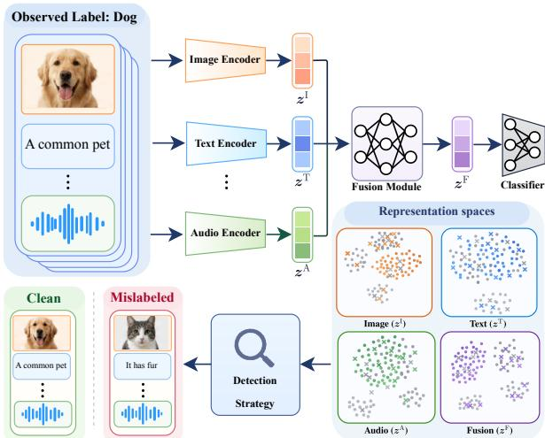  
Figure 1: The illustration of mislabeled data detection in multimodal learning. The model needs to identify information in multimodal data that is useful for assessing label reliability and use this information to distinguish correctly labeled examples from mislabeled examples.

In this work, we take representation-based sample-

selection methods [19, 12] as our starting point because they can naturally use both fused and unimodal representation spaces as sources of information for sample selection. We theoretically analyze the relationship between representation structure and label-noise detection capability and argue that a reliable basis for selection should reflect the discriminative information of the target class relative to other classes. Further analysis shows that the noise detection capabilities of different representation spaces vary across classes, motivating us to select better representation spaces for each class.

Based on this analysis, we propose a reliable multimodal noise detection framework named reliable sample filtering in multimodal learning (REFINE). The framework is supported by theoretical analysis and adaptively selects reliable examples without requiring predefined selection thresholds, noise-rate estimation, or additional clean examples. First, we perform discriminative analysis of the target and background classes in each representation space to construct discriminative eigenvectors. These eigenvectors emphasize target-class structure and reduce the influence of shared background. Next, using the projections of example representations onto these eigenvectors, we compare the fused space and all unimodal spaces pairwise. For each class, we select a set of trusted spaces based on their ability to distinguish the target class from the background classes. Finally, we apply label agreement in each trusted space, retaining an example only if its alignment score along its observed class’s discriminative eigenvector exceeds the corresponding scores for all other classes. We combine the examples retained by the trusted spaces to obtain the final selected subset. The resulting set provides more reliable supervision for training the multimodal classifier, mitigating the effect of mislabeled examples and improving generalization.

Contributions. Before delving into details, we summarize our contributions as follows:

• We study the problem of label-noise detection in multimodal learning. This problem concerns how to identify information in multimodal data that is useful for assessing label reliability and use it to build a more effective noise detection framework. The goal is to provide reliable supervision for multimodal classification under noisy supervision.

• We propose REFINE (reliable sample filtering in multimodal learning) as a method for multimodal noise detection that incorporates fused and unimodal representation spaces into a unified sample-selection process.

The method combines target–background discriminative analysis, trusted space selection, and label agreement to adaptively select reliable samples. It requires no predefined selection thresholds, noise-rate estimation, or additional clean examples. We also theoretically characterize the relationship between representation structure and label-noise detection capability, providing a theoretical basis for constructing discriminative selection criteria and determining trusted representation spaces.

• We conduct experiments on seven datasets covering different modality combinations. The results on all seven datasets demonstrate REFINE’s superior classification performance under multiple types of noise. Comprehensive analyses, including sample-selection quality evaluation, component ablations, and representationspace analysis, further validate the effectiveness and design rationale of REFINE. Experiments integrating REFINE with different learning-with-noisy-labels training paradigms also validate its ability to improve performance as a general plug-in sample-selection mechanism.

## 2 Related Work

## 2.1 Learning with Noisy Labels

Learning with noisy labels [20] aims to mitigate the influence of potentially incorrect observed labels on model training, and improve generalization performance [11, 21, 22]. Existing methods broadly include noise-tolerance losses or training regularization [23, 24, 25, 26, 27, 28, 29], noise-transition modeling [30, 31, 32, 33, 34], and label correction [35, 36, 37, 38], sample selection [18, 14, 39, 40, 41], and semi-supervised learning methods that regard unselected samples as unlabeled data [16, 42, 43, 44, 45]. In this work, we focus on sample selection because it can directly connect label reliability with learned representation structure, making it particularly suitable for exploiting multimodal representations.

Note that although these general methods of learning with noisy labels can, in principle, be applied to fused multimodal representations, such a direct transfer usually treats the fused representation as an ordinary single input and fails to fully exploit the complementary information across different representation spaces. Among sample-selection methods, FINE [12] estimates sample reliability from the latent structure within each observed class. However, it operates in a single representation space. In multimodal learning, both fused and unimodal representations are available, and their ability to distinguish clean from noisy samples may vary across classes. This motivates us to extend representation based sample selection to explicitly exploit and adaptively select among multimodal representation spaces.

## 2.2 Multimodal Representation Learning and Classification

Multimodal representation learning integrates heterogeneous information, e.g., images, text, audio, and video, to obtain more informative representations than those from a single modality [4, 5, 2, 46, 47, 48, 49]. According to the stage at which fusion occurs, existing multimodal classification methods can generally be categorized into paradigms such as feature-level fusion and decision-level fusion [4, 5]. This work focuses on the widely adopted feature-level fusion paradigm. Namely, different modalities are first encoded by their respective encoders, then projected into representation spaces with compatible dimensions, and combined into a fused representation before the classifier.

Recent studies have begun to address noisy supervision in multi-view and multimodal learning [50, 51]. More specifically, existing methods may rely on cross-view consistency and evidence aggregation [8], additional clean data [52], noise-transition modeling [53], or small-loss sample selection [54, 55]. However, these methods may assume that each modality is individually predictive, require additional clean supervision, or rely heavily on classifier predictions that can themselves be affected by label noise. In contrast, our method exploits both fused and unimodal representation spaces for reliable sample selection without requiring additional clean samples or prior knowledge of the noise rate.

## 3 Preliminaries

## 3.1 Problem Formulation

We consider a K-class multimodal classification problem with noisy labels. Given a multimodal dataset $\mathcal { D } =$ $\{ ( \pmb { x } _ { i } , \widetilde { y } _ { i } ) \} _ { i = 1 } ^ { N }$ containing $N$ examples, $\pmb { x } _ { i } = ( \pmb { x } _ { i } ^ { 1 } , \dots , \pmb { x } _ { i } ^ { M } )$ is an instance comprising M modalities, $\widetilde { y } _ { i } \in \{ 1 , \ldots , K \}$ is the observed label that may have been corrupted, and $y _ { i } \in \{ 1 , \ldots , K \}$ denotes the true class label. Our goal is to select a subset of examples from $\mathcal { D }$ with reliable observed labels and use this subset to train a more robust multimodal classifier.

We adopt feature-level fusion for multimodal representation learning. For the m-th modality, an encoder $h ^ { m }$ followed by a projection layer $f ^ { m }$ maps $\pmb { x } _ { i } ^ { m } \ \mathrm { t o } \ z _ { i } ^ { m } = f ^ { m } \big ( h ^ { m } ( \pmb { x } _ { i } ^ { m } ) \big )$ . The fusion module Φ aggregates the modality-specific representations into $\boldsymbol { z } _ { i } ^ { \mathrm { F } } = \Phi \left( \boldsymbol { z } _ { i } ^ { 1 } , \ldots , \boldsymbol { z } _ { i } ^ { M } \right)$ , and the classification head generates predictions solely from the fused representation $z _ { i } ^ { \mathrm { F } }$ . To jointly denote the fused and unimodal spaces, let

$$
\mathcal { R } = \{ \mathrm { F } , 1 , \dots , M \} , \qquad z _ { i } ^ { r } \in \mathbb { R } ^ { d ^ { r } } , \quad r \in \mathcal { R } .\tag{1}
$$

Here, $r = \mathrm { F }$ corresponds to the fused representation, $r = m$ to the m-th unimodal representation, and $d ^ { r }$ denotes the dimension of the corresponding representation space.

To analyze the sample-selection capability of different representation spaces, we consider a binary classification setting with true labels $y \in \{ - 1 , + 1 \}$ in the subsequent theoretical analysis. Without loss of generality, we focus on the set of examples whose observed label is $\widetilde y = + 1$ . To establish our theorems, we adopt the following reasonable assumptions, motivated by related work [12, 56, 57, 58].

Assumption 1. In any space $r \in \mathcal { R }$ , the representations of instances with true labels $y = + 1$ and $y = - 1$ follow $z ^ { r } \mid y = + 1 \sim \mathcal { N } ( v ^ { r } , \sigma ^ { 2 } I ) , z ^ { r } \mid y = - 1 \sim \mathcal { N } ( w ^ { r } , \sigma ^ { 2 } I )$ , respectively, where $\| \pmb { v } ^ { r } \| _ { 2 } = \| \pmb { w } ^ { r } \| _ { 2 } = 1$

Assumption 2. Label corruption depends only on the true label, and clean examples constitute a majority in both observed classes.

## 3.2 FINE for Learning with Noisy Labels: A Recap

FINE [12] assesses label reliability through the alignment between an instance representation and the leading eigenvector of its observed class. For the general K-class task, fix a space $r \in \mathcal { R }$ and define the class matrix

$$
\pmb { A } _ { k } ^ { r } = \frac { 1 } { N _ { k } } \sum _ { i : \widetilde { y } _ { i } = k } z _ { i } ^ { r } ( z _ { i } ^ { r } ) ^ { \top } \in \mathbb { R } ^ { d ^ { r } \times d ^ { r } } ,\tag{2}
$$

where $N _ { k }$ is the number of examples in observed class k. Let $\mathrm { T o p E i g }$ return a unit eigenvector associated with the largest eigenvalue. FINE computes the alignment score using

$$
\pmb { u } _ { k , \mathrm { F I N E } } ^ { r } = \mathrm { T o p E i g } ( \pmb { A } _ { k } ^ { r } ) , \qquad \pmb { s } _ { i } ^ { r } = \big [ ( \pmb { u } _ { k , \mathrm { F I N E } } ^ { r } ) ^ { \top } \pmb { z } _ { i } ^ { r } \big ] ^ { 2 } , \qquad \widetilde { y } _ { i } = k .\tag{3}
$$

FINE then fits a two-component Gaussian mixture model (GMM) [59] to the alignment scores within each observed class and selects the examples associated with the component having the larger mean as the clean subset. FINE performs this selection procedure in a single representation space, whereas multimodal models produce both fused and unimodal representations. When FINE is applied to this setting, the choice of representation remains an open question.

## 3.3 Limitations of FINE in Multimodal Formulation

We analyze how representations affect the sample-selection capability of FINE under the model in Section 3.1. Definition 1 (Class Angle). For the two unit mean directions ${ \pmb v } ^ { r }$ and $\pmb { w } ^ { r }$ in representation space r, define

$$
\begin{array} { r } { \theta ^ { r } = \angle ( { \boldsymbol w } ^ { r } , { \boldsymbol v } ^ { r } ) = \operatorname { a r c c o s } \big | ( { \boldsymbol v } ^ { r } ) ^ { \top } { \boldsymbol w } ^ { r } \big | \in [ 0 , \pi / 2 ] . } \end{array}\tag{4}
$$

This angle characterizes the geometric relationship between the two class mean directions.

Definition 2 (Alignment-Score Difference). For any unit direction u $\boldsymbol { \mathfrak { z } } \in \mathbb { R } ^ { d ^ { r } }$ in space $^ { r , }$ define

$$
\begin{array} { r } { \Delta ^ { r } ( { \pmb u } ) = \mathbb { E } _ { { \pmb z } ^ { r } \sim \mathcal { N } ( { \pmb v } ^ { r } , \sigma ^ { 2 } I ) } \big [ \langle { \pmb u } , { \pmb z } ^ { r } \rangle ^ { 2 } \big ] - \mathbb { E } _ { { \pmb z } ^ { r } \sim \mathcal { N } ( { \pmb w } ^ { r } , \sigma ^ { 2 } I ) } \big [ \langle { \pmb u } , { \pmb z } ^ { r } \rangle ^ { 2 } \big ] = ( { \pmb u } ^ { \top } { \pmb v } ^ { r } ) ^ { 2 } - ( { \pmb u } ^ { \top } { \pmb w } ^ { r } ) ^ { 2 } . } \end{array}\tag{5}
$$

Remark 1. $\Delta ^ { r } ( { \pmb u } )$ is the difference between the mean alignment scores of clean and mislabeled examples along direction u, and characterizes their separation along the same direction. We prove in the Appendix that this score difference is an important factor in deriving lower bounds on recall and precision, both of which increase with the score difference.

Theorem 1 (FINE Alignment-Score Differences Across Representation Spaces). Under the model in Section 3.1, the alignment-score difference produced by FINE in space $r \in \mathcal { R }$ is

$$
\Delta _ { \mathrm { F I N E } } ^ { r } : = \Delta ^ { r } ( u _ { \mathrm { F I N E } } ^ { r } ) = \frac { ( 1 - \tau ) \sin ^ { 2 } \theta ^ { r } } { \sqrt { ( 1 - \tau ) ^ { 2 } + 4 \tau \cos ^ { 2 } \theta ^ { r } } } ,\tag{6}
$$

where τ is the ratio of mislabeled to clean examples, $\displaystyle i . e . , \ \frac { \mathbb { P } ( y = - 1 | \widetilde { y } = + 1 ) } { \mathbb { P } ( y = + 1 | \widetilde { y } = + 1 ) }$ . For any fixed $\tau \in [ 0 , 1 )$ , $\Delta _ { \mathrm { F I N E } } ^ { r }$ is strictly increasing in $\theta ^ { r } \in [ 0 , \pi / 2 ] .$ . For any fixed $\theta ^ { r } \in ( 0 , \pi / 2 )$ , it is strictly decreasing in $\tau \in [ 0 , 1 )$ . In particular, because all representation spaces share the same τ , for any $r , s \in \mathcal { R }$

$$
\begin{array} { r } { \Delta _ { \mathrm { F I N E } } ^ { r } > \Delta _ { \mathrm { F I N E } } ^ { s } \quad \Longleftrightarrow \quad \theta ^ { r } > \theta ^ { s } . } \end{array}\tag{7}
$$

Remark 2. Theorem 1 demonstrates that, for the same observed class, a larger $\theta ^ { r }$ makes the mean alignment scores of clean and mislabeled examples easier to separate. Therefore, the relative advantages offused and unimodal spaces depend on the representation structure of the specific class, and no type of representation space can be presumed optimal for all classes. Based on this relationship, Section 4 enlarges the score difference in two complementary ways: by optimizing class directions within each space and selecting representations appropriate for each class across spaces.

## 4 Method

In this section, we formally propose REFINE, which uses fused and unimodal representations for reliable sample filtering. First, discriminative analysis of the target and background yields discriminative eigenvectors (abbreviated as DE) for each class. Next, trusted space selection (abbreviated as TSS) determines a set of trusted spaces for each class. Finally, label agreement (abbreviated as LA) selects examples, and the selected subsets from the trusted spaces are combined by taking their union. Fig. 2 presents the overall procedure. Technical details are provided below.

## 4.1 Discriminative Analysis

Note that the leading eigenvector of FINE [12] maximizes the mean alignment score of the target observed class without considering other classes. If other classes also have large alignment scores along the same vector, this eigenvector may primarily reflect structure shared across classes, weakening the separation between clean and mislabeled examples. Inspired by the target-background discriminative criterion of dPCA [60], we construct discriminative eigenvectors that align strongly with the target class and weakly with the background.

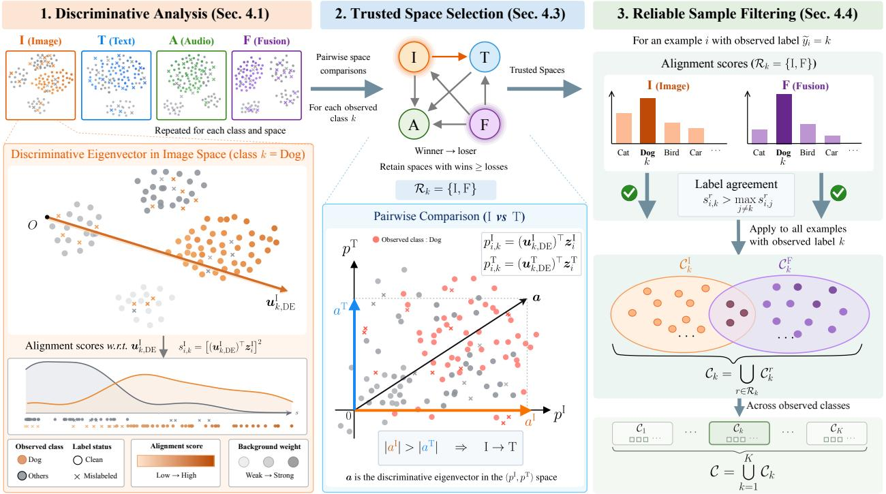  
Figure 2: The overall framework of the proposed REFINE. (Part 1) We construct discriminative eigenvectors for each class in the fused and unimodal spaces through discriminative analysis of the target and background. (Part 2) We select trusted spaces with stronger noise detection ability for each class through pairwise comparisons across spaces. (Part 3) We select reliable examples based on their alignment with the discriminative eigenvectors in each trusted space and take the union of the selected subsets.

Discriminative eigenvector. To focus on the background on directional components shared with the target class, we assign weights according to the alignment scores of non-target classes along the target’s leading direction. Specifically, for target observed class k in space r, we compute the mean alignment score of each non-target observed class $j \neq k$ along the target class’s FINE eigenvector:

$$
d _ { k j } ^ { r } = ( \pmb { u } _ { k , \mathrm { F I N E } } ^ { r } ) ^ { \top } \pmb { A } _ { j } ^ { r } \pmb { u } _ { k , \mathrm { F I N E } } ^ { r } , \qquad j \neq k .\tag{8}
$$

We normalize these scores into background weights and construct the weighted background matrix

$$
\gamma _ { k j } ^ { r } = \frac { d _ { k j } ^ { r } } { \sum _ { \ell \neq k } d _ { k \ell } ^ { r } } , \qquad B _ { k } ^ { r } = \sum _ { j \neq k } \gamma _ { k j } ^ { r } A _ { j } ^ { r } .\tag{9}
$$

Non-target classes with stronger alignment receive larger background weights. Afterward, the corresponding discriminative eigenvector is

$$
\pmb { u } _ { k , \mathrm { D E } } ^ { r } = \underset { \Vert \pmb { u } \Vert _ { 2 } = 1 } { \arg \operatorname* { m a x } } \frac { \pmb { u } ^ { \top } \pmb { A } _ { k } ^ { r } \pmb { u } } { \pmb { u } ^ { \top } ( \pmb { B } _ { k } ^ { r } + \epsilon \pmb { I } ) \pmb { u } } .\tag{10}
$$

DE maximizes the ratio of the target alignment score to the background alignment score. To address possible rank deficiency of the background matrix $B _ { k } ^ { r } ,$ , we add a positive constant $\epsilon > 0$ to its diagonal entries, following dPCA [60]. The alignment score of instance i for class k is then

$$
\begin{array} { r } { { s } _ { i , k } ^ { r } = \left[ \left( \pmb { u } _ { k , \mathrm { D E } } ^ { r } \right) ^ { \top } \pmb { z } _ { i } ^ { r } \right] ^ { 2 } . } \end{array}\tag{11}
$$

## 4.2 Theoretical Analysis of DE

We first analyze how DE changes the alignment-score difference under the model in Section 3.1, and then explain the geometric meaning of the background weights in the multiclass setting.

Theorem 2 (DE Enlarges the Alignment-Score Difference). Under the model in Section 3.1, $i f \epsilon = 0 ,$ , then

$$
\Delta _ { \mathrm { D E } } ^ { r } : = \Delta ^ { r } ( { \pmb u } _ { \mathrm { D E } } ^ { r } ) = \sin \theta ^ { r } \sqrt { 1 - \frac { \cos ^ { 2 } \theta ^ { r } } { ( 1 + 2 \sigma ^ { 2 } ) ^ { 2 } } } \geq \Delta _ { \mathrm { F I N E } } ^ { r } .\tag{12}
$$

The inequality is strict when $0 < \theta ^ { r } < \pi / 2 ,$ , and $\Delta _ { \mathrm { D E } } ^ { r } - \Delta _ { \mathrm { F I N E } } ^ { r }$ strictly increases with τ. For fixed $\sigma > 0 , \Delta _ { \mathrm { D E } } ^ { r }$ is strictly increasing in $\theta ^ { r } \in [ 0 , \pi / 2 ]$

Remark 3. Theorem 2 shows that incorporating background information increases the alignment-score difference between clean and mislabeled examples within the same space, and this advantage grows as contamination in the target observed class increases.

In multiclass settings, the background consists of multiple non-target classes. The following proposition explains how the background weights are assigned according to the geometry of the target class.

Proposition 3 (Angular Ordering of Background Weights). Fix target class k and space r. Suppose that each non target observed class satisfies $A _ { j } ^ { r } = v _ { j } ^ { r } ( v _ { j } ^ { r } ) ^ { \top } + \sigma ^ { 2 } I$ , where $\| \pmb { v } _ { j } ^ { r } \| _ { 2 } = 1$ and $\sigma > 0 . \mathit { L e t } \phi _ { k j } ^ { r } = \operatorname { a r c c o s } \lvert ( { \pmb u } _ { k , \mathrm { F I N E } } ^ { r } ) ^ { \top } { \pmb v } _ { j } ^ { r } \rvert$ For any j, $\ell \neq k ,$

$$
d _ { k j } ^ { r } = \sigma ^ { 2 } + \cos ^ { 2 } \phi _ { k j } ^ { r } , \qquad \phi _ { k j } ^ { r } < \phi _ { k \ell } ^ { r } \iff \gamma _ { k j } ^ { r } > \gamma _ { k \ell } ^ { r } .\tag{13}
$$

Remark 4. A smaller $\phi _ { k j } ^ { r }$ means that class $j$ has a larger alignment score along the target class’s leading direction and hence receives a larger weight in $B _ { k } ^ { r } .$ . This makes discriminative analysis focus more on background structure that overlaps with the target class.

## 4.3 Trusted Space Selection

Theorem 1 shows that fused and unimodal spaces differ in their ability to distinguish clean from noisy examples. At the same time, each space may contain information unavailable in other spaces. Relying on a single space for sample selection may lose this complementary information, whereas unconditionally trusting any space may allow a less discriminative space to influence the decision. Therefore, for each class, we aim to select a set of trusted representation spaces from the candidate set R, which contains the fused and unimodal spaces, accounting for both their complementarity and discriminative ability. To compare the discriminative ability of two distinct spaces $r , s \in \mathcal { R }$ for observed class $k ,$ we form a two-dimensional representation from the projections of the same instance onto their respective discriminative eigenvectors:

$$
p _ { i , k } ^ { r } = ( \pmb { u } _ { k , \mathrm { D E } } ^ { r } ) ^ { \top } \pmb { z } _ { i } ^ { r } , \qquad p _ { i , k } ^ { r , s } = \left[ p _ { i , k } ^ { r } \right] \in \mathbb { R } ^ { 2 } .\tag{14}
$$

We apply the discriminative analysis in Section 4.1 again in this two-dimensional space. Specifically, we construct the second-moment matrix of each observed class, $\begin{array} { r } { \pmb { C } _ { j , k } ^ { r , s } = \frac { 1 } { N _ { i } } \sum _ { i : \widetilde { y } _ { i } = j } \pmb { p } _ { i , k } ^ { r , s } ( \pmb { p } _ { i , k } ^ { r , s } ) ^ { \top } } \end{array}$ , where k specifies the class eigenvec tor used for projection and $j$ specifies the observed class of the examples used in the calculation. We take the leading eigenvector of the target matrix $C _ { k , k } ^ { r , s }$ and compute the background weights using Eq. (8) and $\operatorname { E q . } \ ( 9 )$ to obtain the weighted background $D _ { k } ^ { r , s }$ . The corresponding two-dimensional discriminative eigenvector is

$$
\pmb { a } _ { k } ^ { r , s } = \underset { \| \pmb { a } \| _ { 2 } = 1 } { \arg \operatorname* { m a x } } \frac { \pmb { a } ^ { \top } C _ { k , k } ^ { r , s } \pmb { a } } { \pmb { a } ^ { \top } ( \pmb { D } _ { k } ^ { r , s } + \epsilon \pmb { I } ) \pmb { a } } .\tag{15}
$$

For the current pair of spaces, write its coordinates as $\mathbf { \Delta } \mathbf { a } _ { k } ^ { r , s } \ : = \ : ( a _ { k } ^ { r } , a _ { k } ^ { s } ) ^ { \top }$ . These coordinates are the coefficients in the combined projection $a _ { k } ^ { r } p _ { i , k } ^ { r } + a _ { k } ^ { s } p _ { i , k } ^ { s } ;$ a larger magnitude assigns greater weight to the projection from the corresponding space. The following result relates this comparison to the alignment-score differences in the individual spaces.

Theorem 3 (Ordering of Coefficients and Alignment-Score Differences). Under the model in Section 3.1, $i f \epsilon = 0 ,$ then

$$
\begin{array} { r } { | a _ { k } ^ { r } | > | a _ { k } ^ { s } | \quad \iff \quad \Delta _ { \mathrm { D E } } ^ { r } > \Delta _ { \mathrm { D E } } ^ { s } \quad \iff \quad \theta ^ { r } > \theta ^ { s } . } \end{array}\tag{16}
$$

Remark 5. Theorem 3 shows that, in discriminative analysis of spaces, the space with the larger coefficient magnitude has a larger alignment-score difference, providing a basis for comparing the discriminative ability of the two spaces.

In practice, we compare all unordered pairs of spaces in R for each class. The space with the strictly larger coordinate magnitude records a win, and the other records a loss. Equal magnitudes count as neither a win nor a loss for either space. Let $W _ { k } ^ { r }$ and $L _ { k } ^ { r }$ denote the numbers of wins and losses, respectively, for space r on class k. The trusted space set is

$$
{ \mathcal { R } } _ { k } = \{ r \in { \mathcal { R } } : W _ { k } ^ { r } \geq L _ { k } ^ { r } \} .\tag{17}
$$

Each comparison without a tie contributes one win and one loss. Therefore, at least one space satisfies this condition. Fused and unimodal spaces follow the same selection rule, and the resulting combination of trusted spaces varies across classes.

## 4.4 Reliable Sample Filtering

Prior work fits a GMM to alignment scores within each observed class to distinguish clean from mislabeled examples. However, a relatively high score within the observed class does not imply that the instance is most closely aligned with that class. Assessing the reliability of an observed label therefore also requires considering its alignment scores for other classes.

Label agreement. We directly compute an instance’s alignment scores along the discriminative eigenvectors of all classes and retain the example when its observed class has the strictly highest score. The set of examples selected by space r from observed class k is

$$
\mathcal { C } _ { k } ^ { r } = \big \{ ( \boldsymbol { x } _ { i } , \widetilde { \boldsymbol { y } } _ { i } ) \in \mathcal { D } \mid \widetilde { \boldsymbol { y } } _ { i } = k , s _ { i , k } ^ { r } > \operatorname* { m a x } _ { j \neq k } s _ { i , j } ^ { r } \big \} .\tag{18}
$$

This criterion selects examples according to the support for their observed labels relative to other classes, eliminating classwise GMM fitting and its probability threshold. The final selected subset is the union of the subsets selected by the trusted spaces of each class:

$$
{ \mathcal { C } } = \bigcup _ { k = 1 } ^ { K } \bigcup _ { r \in { \mathcal { R } } _ { k } } { \mathcal { C } } _ { k } ^ { r } .\tag{19}
$$

An example is retained if it satisfies LA in at least one trusted space for its observed class. Different trusted spaces can select examples missed by one another, while TSS determines which spaces participate in the final decision for each class. Algorithm 1 summarizes the complete sample-selection procedure.

Algorithm 1 REFINE   
Input: Noisy multimodal dataset D, multimodal model, constant $\epsilon > 0 .$   
Output: Selected subset of examples C.   
1: Initialize $c  \varnothing .$   
2: Extract representations $\{ z _ { i } ^ { r } : i = 1 , \ldots , N , r \in \mathcal { R } \}$ for all instances using the multimodal model.   
3: for $k = 1 , \ldots , K$ do   
$/ ^ { * } ( l )$ Construct class DE in each space \*/   
4: for $r \in \mathcal { R }$ do   
5: Compute background weights and $B _ { k } ^ { r }$ by Eq. (8) and Eq. (9).   
6: Obtain u<sup>r</sup><sub>k,DE</sub> by Eq. (10).   
7: end for   
$/ ^ { * } ( 2 )$ Select trusted spacesfor each class \*/   
8: for all unordered pairs $\{ r , { \bar { s } } \} \subseteq { \mathcal { R } } , r \neq s$ do   
9: Construct two-dimensional representations $\{ p _ { i , k } ^ { r , s } \} _ { i = 1 } ^ { N }$ for all instances by Eq. (14).   
10: Solve Eq. (15) to obtain $\pmb { a } _ { k } ^ { r , s } = ( a _ { k } ^ { r } , a _ { k } ^ { s } ) ^ { \top }$   
11: Record a win for the space with the larger coordinate magnitude and a loss for the other.   
12: end for   
13: Form $\mathcal { R } _ { k }$ from spaces with at least as many wins as losses.   
14: end for   
$/ ^ { * } \left( 3 \right)$ Form the selected subset ofexamples \*/   
15: for $k = 1 , \ldots , K$ do   
16: for $r \in \mathcal { R } _ { k }$ do   
17: Compute $\boldsymbol { s } _ { i , j } ^ { r } = [ ( \boldsymbol { u } _ { j , \mathrm { D E } } ^ { r } ) ^ { \top } \boldsymbol { z } _ { i } ^ { r } ] ^ { 2 }$ for all $j = 1 , \ldots , K$ and all i with ${ \widetilde { y } } _ { i } = k .$   
18: Select examples to form $\dot { \mathcal { C } _ { k } ^ { r } } \operatorname { b y } \operatorname { E q } . \left( 1 8 \right)$   
19: end for   
20: end for   
21: Obtain C by taking the union in Eq. (19).

## 5 Experiments

In this section, we conduct experiments to address the following research question:

• RQ1: Does REFINE consistently improve multimodal classification under diverse label-noise conditions and training settings?

• RQ2: How do the proposed sample-selection components and representation-space selection contribute to the reliability of clean-sample selection?

• RQ3: Can REFINE serve as a general plug-in sample-selection mechanism across different learning-withnoisy-labels training paradigms?

## 5.1 Experimental Setup

Datasets. We use six multimodal datasets for the experiments on synthetic label noise, and one multimodal dataset for the experiments on realistic label noise. Note that these comprise four image-text datasets, a video-audio dataset, an audio-text dataset, and a text-video-audio dataset. For the synthetic experiments, we exploit UPMC-Food101 [61], N24News [62], NWPU-Captions [63], Rakuten France [64], VGGSound50 [7, 65], and MIntRec2.0 [66]. For the realistic one, we utilize BSD<sup>2</sup>, which includes a noisy training set and an expert-annotated clean test set. The key statistics of the datasets are provided in AppendixB.1.

Label noise generation. We consider four types of synthetic label noise. (1) Symmetric noise (abbreviated as Sym) [67]: each true label is randomly flipped to another class with equal probability. (2) Asymmetric noise (abbreviated as Asym) [68]: the labels of selected examples are replaced with designated related classes according to a predefined semantic confusion mapping (e.g., waffles→pancakes). (3) Full-modality instance-dependent noise (abbreviated as F-IDN) [8]: we follow TMNR by using the uncertainty of a full-modality evidential classifier to determine corruption propensity and class evidence to assign incorrect labels. (4) Partial-modality instance-dependent noise (abbreviated as P-IDN): to simulate annotators referring to only some modalities during annotation, we assign each instance a modality combination drawn uniformly from a candidate set comprising the full modality combination and all subsets obtained by omitting one modality. We then generate noisy labels following the F-IDN rules using an evidential classifier trained for the selected combination. All experiments on synthetic-noise datasets employ Sym. at a 50% noise level, Asym. at a 40% noise level, and F-IDN and P-IDN at both 40% and 50% noise levels.

Baselines. We compare the proposed method with advanced sample-selection strategies. The baselines are commonly used in previous work. (1) Standard supervised training: Standard directly minimizes cross-entropy over all noisy training examples. (2) Gradient-based selection: CRUST [69] dynamically selects representative subsets based on relationships among example gradients within each observed class. (3) Training-dynamic-based selection: AUM [70] selects reliable examples using the average logit margin over training and constructed threshold examples. L2D [71] uses a pretrained LSTM detector to estimate noise scores from the training trajectories of the predicted probabilities assigned to observed labels. DIST [72] updates per-example thresholds using an exponential moving average of the maximum predicted class probability and retains examples whose predicted probability for the observed label exceed the threshold. Moreover, DIST+CT [73] adds examples that pass an increasing confidence trend test to the set retained by DIST. (4) Representation-based selection: FINE [12] selects reliable examples using alignment scores between example representations and class-wise leading eigenvectors together with a two-component Gaussian mixture model.

All methods exploit a common multimodal classifier. By default, retained examples contribute equally to the crossentropy loss. FINE uses the fused representation by default. L2D uses the known noise rate to determine the number of retained examples whereas DIST uses its range to set hyperparameters. Our selection procedure does not require the noise rate.

Implementation details. We conducted all experiments using a GPU cluster, which includes NVIDIA TESLA A100 and NVIDIA RTX 4090 GPUs. PyTorch [74] is used. For the six synthetic-noise datasets, we use frozen DINOv2- Base [75], XLM-R-Base [76], WavLM-Base+ [77], and VideoMAEv2-Base [78] encoders. For BSD, we reused the CLAP audio and text representations provided by dataset providers. Besides, each modality representation obtained from an encoder is mapped to 256 dimensions by an independent projector comprising layer normalization, a linear mapping, and a GELU activation. The projected representations are concatenated and passed through a residual fusion module with a hidden dimension of 512 to obtain a 256-dimensional fused representation, followed by a linear classification head. We train the final classifier using AdamW [79], with an initial learning rate of $1 0 ^ { - 4 }$ , weight decay of $1 0 ^ { - 3 }$ , dropout of 0.3, and a batch size of 256. We used cosine learning rate decay updated at each optimization step. For our method, we fix the regularization parameter ϵ to 10<sup>-4</sup>, perform 10 warm-up epochs, and then apply REFINE based sample selection every five epochs. We run each method five times with different random seeds and report the mean values and standard deviations of results.

## 5.2 RQ1: Overall Effectiveness under Noisy Supervision

Experiments on synthetic noise. Table 1 reports classification results on six datasets under six noise settings. As can be seen, REFINE achieves the highest average accuracy on all datasets and outperforms competing methods in most settings, demonstrating consistent robustness across modality combinations and noise types. The advantage is particularly evident on MIntRec2.0, where existing selection methods do not improve over Standard on average, while REFINE remains effective despite the limited training set. Under P-IDN, REFINE also provides substantially larger gains over Standard than competing selectors, supporting the benefit of exploiting class-dependent information from multiple representation spaces.

Experiments on realistic noise. Table 2 shows that REFINE reports results on BSD. REFINE achieves the highest mean accuracy. Notably, FINE and REFINE are the only selection methods that outperform Standard, suggesting that

Table 1: Classification accuracy (%, mean±std.) of the proposed method and baseline methods on different datasets under different noise types and ratios. The “Noise” columns show the noise type and ratio, and the “Average” column reports the mean across the six noise settings. The best and second-best results are highlighted in boldface and underlined, respectively.
<table><tr><td rowspan=2 colspan=3>Dataset</td><td rowspan=2 colspan=1>Method</td><td rowspan=1 colspan=6>Noise</td><td rowspan=2 colspan=1>Average</td></tr><tr><td rowspan=1 colspan=6>Sym 50% Asym 40% F-IDN 40%F-IDN 50%P-IDN 40%P-IDN 50%</td></tr><tr><td rowspan=9 colspan=3>UPMC-Food101</td><td rowspan=3 colspan=1>StandardCRUSTAUM</td><td rowspan=1 colspan=2>82.75±0.3367.86±0.22</td><td rowspan=1 colspan=2>84.25 ±0.10 82.50±0.11</td><td rowspan=1 colspan=2>84.09 ± 0.0882.11 ± 0.07</td><td rowspan=1 colspan=1>80.59 ± 0.05</td></tr><tr><td rowspan=1 colspan=2>84.81±0.1681.93±0.23</td><td rowspan=1 colspan=1> $8 3 . 1 1 \pm 0 . 2 5$ </td><td rowspan=1 colspan=1>81.75±0.04</td><td rowspan=1 colspan=1>82.19±0.33</td><td rowspan=1 colspan=1>80.79±0.20</td><td rowspan=1 colspan=1>82.43±0.08</td></tr><tr><td rowspan=1 colspan=2>83.18±0.1266.08±0.56</td><td rowspan=1 colspan=1>83.80±0.13</td><td rowspan=1 colspan=1> $8 2 . 0 9 \pm 0 . 3 0$ </td><td rowspan=1 colspan=1>82.01 ± 0.23</td><td rowspan=1 colspan=1>79.80±0.22</td><td rowspan=1 colspan=1>79.49±0.15</td></tr><tr><td rowspan=2 colspan=1>L2D</td><td rowspan=2 colspan=2>84.49±0.2272.89±0.37</td><td rowspan=2 colspan=1> $\underline { { 8 5 . 7 5 \pm 0 . 2 1 } }$ </td><td rowspan=2 colspan=1> $8 4 . 0 6 \pm 0 . 1 1$ </td><td rowspan=2 colspan=1>85.46±0.22</td><td rowspan=2 colspan=1>83.83±0.35</td><td rowspan=2 colspan=1>82.75±0.07</td></tr><tr><td rowspan=2 colspan=1>DIST</td></tr><tr><td rowspan=1 colspan=2>85.56±0.2080.97±0.38</td><td rowspan=1 colspan=1>85.61±0.23</td><td rowspan=1 colspan=1>84.29±0.15</td><td rowspan=1 colspan=1>84.37±0.17</td><td rowspan=1 colspan=1>82.29±0.15</td><td rowspan=1 colspan=1>83.85±0.10</td></tr><tr><td rowspan=1 colspan=1>DIST+CT</td><td rowspan=1 colspan=2>85.56±0.2080.96±0.38</td><td rowspan=1 colspan=1>85.61±0.22</td><td rowspan=1 colspan=1>84.29 ± 0.11</td><td rowspan=1 colspan=1>84.37±0.17</td><td rowspan=1 colspan=1>82.31±0.12</td><td rowspan=1 colspan=1>83.85± 0.08</td></tr><tr><td rowspan=1 colspan=1>FINE</td><td rowspan=1 colspan=2>84.78±0.2569.08±0.56</td><td rowspan=1 colspan=1> $8 4 . 7 0 \pm 0 . 1 1$ </td><td rowspan=1 colspan=1> $8 3 . 5 7 \pm 0 . 1 5$ </td><td rowspan=1 colspan=2>83.04±0.1681.75±0.11</td><td rowspan=1 colspan=1>81.15±0.12</td></tr><tr><td rowspan=1 colspan=1>REFINE</td><td rowspan=1 colspan=2>86.63±0.2285.28 ± 0.34</td><td rowspan=1 colspan=1>86.85± 0.08</td><td rowspan=1 colspan=1>85.84 ± 0.13</td><td rowspan=1 colspan=1>86.41 ± 0.16</td><td rowspan=1 colspan=1>85.12±0.21</td><td rowspan=1 colspan=1>86.02 ± 0.05</td></tr><tr><td rowspan=8 colspan=3>MIntRec2.0</td><td rowspan=2 colspan=1>StandardCRUST</td><td rowspan=1 colspan=1>28.48±0.76</td><td rowspan=1 colspan=1>28.90±0.35</td><td rowspan=1 colspan=1>35.41 ± 0.73</td><td rowspan=1 colspan=1>34.87±0.75</td><td rowspan=1 colspan=1>35.93 ±0.72</td><td rowspan=1 colspan=1>34.34±0.94</td><td rowspan=1 colspan=1>32.99 ± 0.31</td></tr><tr><td rowspan=1 colspan=1>29.79±1.16</td><td rowspan=1 colspan=1>27.34±1.07</td><td rowspan=1 colspan=1>34.90±0.64</td><td rowspan=1 colspan=1>34.36±0.85</td><td rowspan=1 colspan=1>35.10±1.19</td><td rowspan=1 colspan=1>33.63±1.73</td><td rowspan=1 colspan=1>32.52±0.74</td></tr><tr><td rowspan=1 colspan=1></td><td rowspan=1 colspan=1>AUM</td><td rowspan=1 colspan=1>27.55±0.74</td><td rowspan=1 colspan=1>25.15±0.99</td><td rowspan=1 colspan=1>31.60±0.84</td><td rowspan=1 colspan=1>30.25±1.07</td><td rowspan=1 colspan=1>31.82±1.01</td><td rowspan=1 colspan=1>29.90±0.69</td><td rowspan=1 colspan=1>29.38±0.55</td></tr><tr><td rowspan=2 colspan=1>L2DDIST</td><td rowspan=1 colspan=1>27.75±1.32</td><td rowspan=1 colspan=1>25.50±0.88</td><td rowspan=1 colspan=1> $3 2 . 7 2 \pm 0 . 8 7$ </td><td rowspan=1 colspan=1>30.28±0.56</td><td rowspan=1 colspan=1>33.21±0.86</td><td rowspan=1 colspan=1>31.02±1.04</td><td rowspan=1 colspan=1>30.08±0.73</td></tr><tr><td rowspan=1 colspan=1>30.04±0.71</td><td rowspan=1 colspan=1>25.76±0.64</td><td rowspan=1 colspan=1>35.75±0.45</td><td rowspan=1 colspan=1>35.22±0.76</td><td rowspan=1 colspan=1>36.24±0.85</td><td rowspan=1 colspan=1>34.43±1.09</td><td rowspan=1 colspan=1>32.91 ± 0.42</td></tr><tr><td rowspan=1 colspan=1>DIST+CT</td><td rowspan=1 colspan=1>30.04±0.71</td><td rowspan=1 colspan=1>25.67±0.49</td><td rowspan=1 colspan=1>35.75±0.45</td><td rowspan=1 colspan=1>35.22±0.76</td><td rowspan=1 colspan=1>36.24±0.85</td><td rowspan=1 colspan=1>34.43± 1.09</td><td rowspan=1 colspan=1>32.89±0.43</td></tr><tr><td rowspan=1 colspan=1>FINE</td><td rowspan=1 colspan=1>29.73±1.11</td><td rowspan=1 colspan=1>25.95±0.70</td><td rowspan=1 colspan=1>33.77±1.15</td><td rowspan=1 colspan=1>33.24±1.39</td><td rowspan=1 colspan=1>34.57±0.40</td><td rowspan=1 colspan=1>32.14±0.60</td><td rowspan=1 colspan=1>31.57±0.53</td></tr><tr><td rowspan=1 colspan=1>REFINE</td><td rowspan=1 colspan=1>|31.92 ± 0.85</td><td rowspan=1 colspan=1>29.61 ± 1.09</td><td rowspan=1 colspan=1>36.54±1.34</td><td rowspan=1 colspan=1>35.70 ± 0.40</td><td rowspan=1 colspan=1>35.96±0.91</td><td rowspan=1 colspan=1>34.94±1.81</td><td rowspan=1 colspan=1>34.11 ± 0.78</td></tr><tr><td rowspan=8 colspan=3>NWPU-Captions</td><td rowspan=2 colspan=1>StandardCRUST</td><td rowspan=1 colspan=1>98.30±0.16</td><td rowspan=1 colspan=1>77.23±0.98</td><td rowspan=1 colspan=1>97.21 ± 0.17</td><td rowspan=1 colspan=1>95.01 ± 0.51</td><td rowspan=1 colspan=1>98.13 ±0.27</td><td rowspan=1 colspan=1>96.71 ± 0.49</td><td rowspan=1 colspan=1>93.77 ± 0.28</td></tr><tr><td rowspan=1 colspan=1>99.19±0.03</td><td rowspan=1 colspan=1>94.61±0.22</td><td rowspan=1 colspan=1>97.14±0.40</td><td rowspan=1 colspan=1>95.77±0.59</td><td rowspan=1 colspan=1>97.45±0.32</td><td rowspan=1 colspan=1>96.48±0.35</td><td rowspan=1 colspan=1>96.78±0.22</td></tr><tr><td rowspan=1 colspan=1>AUM</td><td rowspan=1 colspan=1>98.90±0.22</td><td rowspan=1 colspan=1>77.31±0.93</td><td rowspan=1 colspan=1>98.27±0.17</td><td rowspan=1 colspan=1>96.56±0.50</td><td rowspan=1 colspan=1>97.69±0.20</td><td rowspan=1 colspan=1>96.15±0.34</td><td rowspan=1 colspan=1>94.15±0.19</td></tr><tr><td rowspan=3 colspan=1>L2DDISTDIST+CT</td><td rowspan=1 colspan=1>98.63±0.14</td><td rowspan=1 colspan=1>83.30±2.38</td><td rowspan=1 colspan=1>98.39±0.17</td><td rowspan=1 colspan=1>97.14±0.50</td><td rowspan=1 colspan=1>98.48±0.35</td><td rowspan=1 colspan=1>97.71 ± 0.23</td><td rowspan=1 colspan=1>95.61±0.36</td></tr><tr><td rowspan=1 colspan=1>99.14±0.07</td><td rowspan=1 colspan=1>97.18±0.15</td><td rowspan=1 colspan=1>98.58±0.19</td><td rowspan=1 colspan=1>97.09±0.46</td><td rowspan=1 colspan=1>97.90±0.26</td><td rowspan=1 colspan=1>96.65±0.29</td><td rowspan=1 colspan=1>97.76±0.14</td></tr><tr><td rowspan=1 colspan=1>99.14±0.07</td><td rowspan=1 colspan=1>97.16±0.17</td><td rowspan=1 colspan=1>98.58±0.19</td><td rowspan=1 colspan=1>97.09 ±0.46</td><td rowspan=1 colspan=1>97.90±0.26</td><td rowspan=1 colspan=1>96.65±0.29</td><td rowspan=1 colspan=1>97.75±0.15</td></tr><tr><td rowspan=1 colspan=1>FINE</td><td rowspan=1 colspan=1>98.84±0.17</td><td rowspan=1 colspan=1>88.01 ±1.07</td><td rowspan=1 colspan=1>98.70±0.16</td><td rowspan=1 colspan=1>98.10±0.32</td><td rowspan=1 colspan=1>98.12±0.33</td><td rowspan=1 colspan=1>96.94±0.51</td><td rowspan=1 colspan=1>96.45±0.23</td></tr><tr><td rowspan=1 colspan=1>REFINE|</td><td rowspan=1 colspan=1>99.55 ± 0.10</td><td rowspan=1 colspan=1>98.39 ± 0.40</td><td rowspan=1 colspan=1>99.55 ± 0.11</td><td rowspan=1 colspan=1>99.37 ± 0.09</td><td rowspan=1 colspan=1>99.34 ± 0.15</td><td rowspan=1 colspan=1>99.12 ± 0.08</td><td rowspan=1 colspan=1>99.22 ± 0.08</td></tr><tr><td rowspan=8 colspan=3>VGGSound50</td><td rowspan=2 colspan=1>StandardCRUST</td><td rowspan=1 colspan=1>68.22 ± 1.05</td><td rowspan=1 colspan=1>57.76±1.22</td><td rowspan=1 colspan=1>68.98±0.35</td><td rowspan=1 colspan=1>67.58±0.50</td><td rowspan=1 colspan=1>69.04 ±0.53</td><td rowspan=1 colspan=1>67.41 ±0.92</td><td rowspan=1 colspan=1>66.50±0.44</td></tr><tr><td rowspan=1 colspan=1>69.72±0.52</td><td rowspan=1 colspan=1>59.78±2.53</td><td rowspan=1 colspan=1>69.79±0.93</td><td rowspan=1 colspan=1>68.80±1.14</td><td rowspan=1 colspan=1>69.71 ± 0.74</td><td rowspan=1 colspan=1>68.32±1.70</td><td rowspan=1 colspan=1>67.69±0.54</td></tr><tr><td rowspan=1 colspan=1>AUM</td><td rowspan=1 colspan=1>70.92±0.15</td><td rowspan=1 colspan=1>60.75±2.68</td><td rowspan=1 colspan=1>69.19±0.54</td><td rowspan=1 colspan=1>67.33±0.59</td><td rowspan=1 colspan=1>69.48±0.66</td><td rowspan=1 colspan=1>67.53±0.76</td><td rowspan=1 colspan=1>67.53±0.52</td></tr><tr><td rowspan=2 colspan=1>L2DDIST</td><td rowspan=1 colspan=1>68.16±0.63</td><td rowspan=1 colspan=1>60.50±1.55</td><td rowspan=1 colspan=1>68.64±0.77</td><td rowspan=1 colspan=1>66.54±0.46</td><td rowspan=1 colspan=1>68.48±0.87</td><td rowspan=1 colspan=1>66.43±1.07</td><td rowspan=1 colspan=1>66.46±0.17</td></tr><tr><td rowspan=1 colspan=1>70.07±0.46</td><td rowspan=1 colspan=1>64.58±0.78</td><td rowspan=1 colspan=1>69.49±0.16</td><td rowspan=1 colspan=1>67.11±0.69</td><td rowspan=1 colspan=1>69.46±0.58</td><td rowspan=1 colspan=1>67.81±0.84</td><td rowspan=1 colspan=1>68.09 ± 0.21</td></tr><tr><td rowspan=2 colspan=1>DIST+CTFINE</td><td rowspan=1 colspan=1>70.07±0.46</td><td rowspan=1 colspan=1>64.50±0.60</td><td rowspan=1 colspan=1>69.49±0.16</td><td rowspan=1 colspan=1>67.11±0.69</td><td rowspan=1 colspan=1>69.46±0.58</td><td rowspan=1 colspan=1>67.81±0.84</td><td rowspan=1 colspan=1>68.07±0.18</td></tr><tr><td rowspan=1 colspan=1>70.23±0.79</td><td rowspan=1 colspan=1>57.33±0.88</td><td rowspan=1 colspan=1>69.24±0.64</td><td rowspan=1 colspan=1>67.79±0.68</td><td rowspan=1 colspan=1>69.35±0.45</td><td rowspan=1 colspan=1>67.60±1.12</td><td rowspan=1 colspan=1>66.92±0.36</td></tr><tr><td rowspan=1 colspan=1>REFINE</td><td rowspan=1 colspan=1>71.29 ± 0.31</td><td rowspan=1 colspan=1>65.28 ± 0.83</td><td rowspan=1 colspan=1>69.87 ± 1.02</td><td rowspan=1 colspan=1>68.71 ± 0.95</td><td rowspan=1 colspan=1>70.72 ± 0.78</td><td rowspan=1 colspan=1>69.31 ± 0.62</td><td rowspan=1 colspan=1>69.20 ± 0.49</td></tr><tr><td rowspan=8 colspan=3>Rakuten France</td><td rowspan=1 colspan=1>Standard</td><td rowspan=1 colspan=1>73.24±0.11</td><td rowspan=1 colspan=1>62.51±0.65</td><td rowspan=1 colspan=1>73.54±0.42</td><td rowspan=1 colspan=1>70.66±0.14</td><td rowspan=1 colspan=1>73.74±0.05</td><td rowspan=1 colspan=1>71.49±0.44</td><td rowspan=1 colspan=1>70.86±0.18</td></tr><tr><td rowspan=1 colspan=1>CRUST</td><td rowspan=1 colspan=1>73.47±0.17</td><td rowspan=1 colspan=1>62.38±0.62</td><td rowspan=1 colspan=1>73.44±0.39</td><td rowspan=1 colspan=1>70.73± 0.09</td><td rowspan=1 colspan=1>73.70±0.11</td><td rowspan=1 colspan=1>71.49±0.46</td><td rowspan=1 colspan=1>70.87±0.20</td></tr><tr><td rowspan=1 colspan=1>AUM</td><td rowspan=1 colspan=1>75.11±0.41</td><td rowspan=1 colspan=1>66.20±0.88</td><td rowspan=1 colspan=1>74.41 ± 0.11</td><td rowspan=1 colspan=1>71.99±0.43</td><td rowspan=1 colspan=1>74.04±0.22</td><td rowspan=1 colspan=1>71.49±0.27</td><td rowspan=1 colspan=1>72.21 ± 0.20</td></tr><tr><td rowspan=2 colspan=1>L2DDIST</td><td rowspan=1 colspan=1>73.20±0.42</td><td rowspan=1 colspan=1>64.13±0.32</td><td rowspan=1 colspan=1>74.19±0.29</td><td rowspan=1 colspan=1>72.36±0.34</td><td rowspan=1 colspan=1>73.97±0.42</td><td rowspan=1 colspan=1>72.06±0.50</td><td rowspan=1 colspan=1>71.65±0.20</td></tr><tr><td rowspan=1 colspan=1>75.15±0.22</td><td rowspan=1 colspan=1>61.84±0.92</td><td rowspan=1 colspan=1>74.46±0.28</td><td rowspan=1 colspan=1>71.64±0.25</td><td rowspan=1 colspan=1>73.89±0.31</td><td rowspan=1 colspan=1>71.79±0.56</td><td rowspan=1 colspan=1>71.46±0.17</td></tr><tr><td rowspan=1 colspan=1>DIST+CT</td><td rowspan=1 colspan=1>75.12±0.52</td><td rowspan=1 colspan=1>61.84±0.91</td><td rowspan=1 colspan=1>74.48 ± 0.30</td><td rowspan=1 colspan=1>71.66±0.26</td><td rowspan=1 colspan=1>73.96±0.34</td><td rowspan=1 colspan=1>71.63±0.43</td><td rowspan=1 colspan=1>71.45±0.16</td></tr><tr><td rowspan=1 colspan=1>FINE</td><td rowspan=1 colspan=2>73.31±0.5963.83±0.67</td><td rowspan=1 colspan=1>73.44±0.39</td><td rowspan=1 colspan=1>70.73±0.09</td><td rowspan=1 colspan=1>73.70±0.11</td><td rowspan=1 colspan=1>71.54±0.49</td><td rowspan=1 colspan=1>71.09±0.17</td></tr><tr><td rowspan=1 colspan=1>REFINE</td><td rowspan=1 colspan=2>|74.69± 0.2566.75±1.67</td><td rowspan=1 colspan=1>74.36±0.15</td><td rowspan=1 colspan=1>72.72±0.24</td><td rowspan=1 colspan=1>74.05 ± 0.34</td><td rowspan=1 colspan=1>72.45 ± 0.96</td><td rowspan=1 colspan=1>72.50 ± 0.21</td></tr><tr><td rowspan=8 colspan=3>N24News</td><td rowspan=1 colspan=1>Standard</td><td rowspan=1 colspan=2>61.10±0.3049.56±0.96</td><td rowspan=1 colspan=1>63.37 ± 0.36</td><td rowspan=1 colspan=1>62.17±0.29</td><td rowspan=1 colspan=1>63.64±0.26</td><td rowspan=1 colspan=1>61.28±0.41</td><td rowspan=1 colspan=1>60.19±0.16</td></tr><tr><td rowspan=1 colspan=1>CRUST</td><td rowspan=1 colspan=1>63.68±0.34</td><td rowspan=1 colspan=1>55.84±0.30</td><td rowspan=1 colspan=1>63.68±0.45</td><td rowspan=1 colspan=1>62.95±0.32</td><td rowspan=1 colspan=1>63.85±0.42</td><td rowspan=1 colspan=1>62.31±0.57</td><td rowspan=1 colspan=1>62.05±0.17</td></tr><tr><td rowspan=1 colspan=1>AUM</td><td rowspan=1 colspan=1>63.06±0.48</td><td rowspan=1 colspan=1>53.01±0.46</td><td rowspan=1 colspan=1>63.80±0.40</td><td rowspan=1 colspan=1>62.57±0.28</td><td rowspan=1 colspan=1>63.52±0.41</td><td rowspan=1 colspan=1>61.74±0.28</td><td rowspan=1 colspan=1>61.28±0.19</td></tr><tr><td rowspan=1 colspan=2></td><td rowspan=2 colspan=1>L2DDIST</td><td rowspan=1 colspan=1>61.05±0.27</td><td rowspan=1 colspan=1>52.30±0.86</td><td rowspan=1 colspan=1>63.49±0.15</td><td rowspan=1 colspan=1>62.00±0.18</td><td rowspan=1 colspan=1>63.92±0.28</td><td rowspan=1 colspan=1>61.64±0.49</td><td rowspan=1 colspan=1>60.73± 0.27</td></tr><tr><td rowspan=1 colspan=2>63.09±0.5257.83±0.49</td><td rowspan=1 colspan=1>64.01 ±0.21</td><td rowspan=1 colspan=1>62.58±0.26</td><td rowspan=1 colspan=1>63.82±0.48</td><td rowspan=1 colspan=1>62.21±0.38</td><td rowspan=1 colspan=1>62.26±0.19</td></tr><tr><td rowspan=2 colspan=1>DIST+CTFINE</td><td rowspan=1 colspan=2>63.06±0.4957.82±0.45</td><td rowspan=1 colspan=1>64.00±0.20</td><td rowspan=1 colspan=1>62.58±0.26</td><td rowspan=1 colspan=1>63.82±0.49</td><td rowspan=1 colspan=1>62.22±0.36</td><td rowspan=1 colspan=1>62.25±0.18</td></tr><tr><td rowspan=1 colspan=2>61.81±0.4053.09±0.45</td><td rowspan=1 colspan=1>63.58±0.39</td><td rowspan=1 colspan=1>62.35±0.15</td><td rowspan=1 colspan=1>63.61±0.28</td><td rowspan=1 colspan=1>61.40±0.26</td><td rowspan=1 colspan=1>60.97±0.16</td></tr><tr><td rowspan=1 colspan=1>REFINE</td><td rowspan=1 colspan=6>|64.55 ± 0.5360.81 ± 0.3164.04±0.2863.07 ± 0.51 64.56 ±0.41 63.28 ± 0.23</td><td rowspan=1 colspan=1> $\overline { { { 6 3 . 3 8 \pm 0 . 2 7 } } }$ </td></tr></table>

representation-based selection is particularly useful when naturally occurring label errors are not reliably characterized by training dynamics alone [12].

Table 2: Classification accuracy $( \%$ , mean±std.) of the proposed method and baseline methods on the BSD dataset. L2D requires a known noise rate, which is unavailable under real-world label noise. The best and second-best results are highlighted in boldface and underlined, respectively.
<table><tr><td>Method</td><td>Standard</td><td>AUM</td><td>CRUST</td><td>L2D</td><td>DIST</td><td>DIST+CT</td><td>FINE</td><td>REFINE</td></tr><tr><td>Accuracy</td><td> $6 0 . 3 7 \pm 0 . 6 5$ </td><td> $5 8 . 9 0 \pm 0 . 7 3 $ </td><td> $5 8 . 7 0 \pm 0 . 7 1$ </td><td>一</td><td> $6 0 . 2 7 \pm 0 . 7 4$ </td><td> $6 0 . 2 8 \pm 0 . 7 2$ </td><td> $6 0 . 7 1 \pm 0 . 9 8 $ </td><td> ${ \bf 6 1 . 0 3 \pm 0 . 6 7 }$ </td></tr></table>

Table 3: Classification accuracy (%, mean±std.) with unfrozen encoders on UPMC-Food101 under different noise types and ratios. The best and second-best results are highlighted in boldface and underlined, respectively.
<table><tr><td rowspan="2">Method</td><td colspan="4">Noise</td></tr><tr><td>Sym 50%</td><td>Asym 40%</td><td> $\mathbf { F } { \mathbf { - } } \mathbf { I D N } \ 5 \mathbf { 0 } \%$ </td><td>P-IDN 50%</td></tr><tr><td>Standard</td><td> $8 7 . 5 4 \pm 0 . 2 0 $ </td><td> $7 3 . 7 7 \pm 1 . 0 6$ </td><td> $8 6 . 7 2 \pm 0 . 1 5$ </td><td> $8 6 . 0 5 \pm 0 . 2 5$ </td></tr><tr><td>CRUST</td><td> $8 8 . 4 1 \pm 0 . 1 8 $ </td><td> $8 1 . 9 2 \pm 0 . 7 9$ </td><td> $8 7 . 1 0 \pm 0 . 2 1$ </td><td> $8 6 . 3 6 \pm 0 . 1 4$ </td></tr><tr><td>AUM</td><td> $\underline { { 8 8 . 5 2 \pm 0 . 1 2 } }$ </td><td> $7 4 . 1 3 \pm 1 . 3 1$ </td><td> $8 7 . 0 2 \pm 0 . 2 1 $ </td><td> $8 6 . 0 9 \pm 0 . 2 8$ </td></tr><tr><td>L2D</td><td> $8 7 . 9 1 \pm 0 . 1 7$ </td><td> $8 0 . 3 9 \pm 0 . 6 6$ </td><td> $8 6 . 9 0 \pm 0 . 2 1 $ </td><td> $8 6 . 1 5 \pm 0 . 3 0$ </td></tr><tr><td>DIST</td><td> $8 7 . 5 3 \pm 0 . 1 0$ </td><td> $7 4 . 1 5 \pm 1 . 2 9$ </td><td> $8 6 . 7 3 \pm 0 . 1 6$ </td><td> $8 6 . 1 0 \pm 0 . 2 7$ </td></tr><tr><td>DIST+CT</td><td> $8 7 . 5 0 \pm 0 . 1 5$ </td><td> $7 4 . 1 2 \pm 1 . 3 0$ </td><td> $8 6 . 7 3 \pm 0 . 1 5$ </td><td> $8 5 . 9 6 \pm 0 . 4 2$ </td></tr><tr><td>FINE</td><td> $8 8 . 4 9 \pm 0 . 0 9$ </td><td> $7 4 . 1 3 \pm 1 . 2 8$ </td><td> $8 7 . 4 2 \pm 0 . 1 2 $ </td><td> $\underline { { 8 6 . 7 6 \pm 0 . 2 2 } }$ </td></tr><tr><td>REFINE</td><td> $\mathbf { 8 9 . 0 1 \pm 0 . 2 5 }$  </td><td> $\mathbf { 8 3 . 2 9 \pm 0 . 4 3 }$ </td><td> $\mathbf { 8 8 . 1 2 \pm 0 . 3 3 }$  </td><td> ${ \bf 8 7 . 5 6 \pm 0 . 1 3 }$ </td></tr></table>

Experiments with unfrozen encoders. On UPMC-Food101, we encode images and text using pretrained ResNet-50 [80] and BERT [81], respectively, and jointly fine-tune the encoders and classifier. All methods are trained for 30 epochs using AdamW, with learning rates of $1 0 ^ { - 6 }$ and $1 0 ^ { - 4 }$ for the encoders and classification head, respectively. Table 3 shows that REFINE achieves the highest accuracy under all four settings. This result demonstrates that our sample-selection method continues to improve multimodal classification when the encoders are fine-tuned during training.

## 5.3 RQ2: Selection Reliability and Mechanism Analysis

Sample-selection performance. To evaluate how effectively different methods identify correctly labeled examples, Table 4 compares their sample-selection performance on UPMC-Food101. REFINE achieves the highest selection F1 score under all four settings. Compared with FINE, it improves precision in each setting while maintaining high recall, indicating that our method reduces the inclusion of mislabeled examples while retaining correct supervision.

Training dynamics of sample selection. We evaluate sample-selection performance at each training epoch under asymmetric and instance-dependent noise, comparing REFINE with FINE and DIST. Fig. 3 shows that REFINE achieves a higher F1 score than both comparison methods at the first selection after warm-up and maintains this advantage throughout subsequent training.

Retention of hard clean examples. Correctly labeled examples with high losses are commonly regarded as hard clean examples and are prone to being excluded by small-loss selection [82]. On UPMC-Food101 under P-IDN 50%, we define the hard-clean subset as the correctly labeled examples whose losses exceed the median loss over the entire training set. Fig. 4(a) shows that this subset accounts for 11.04% of all correctly labeled examples. REFINE retain 55.93% of this subset, and 91.88% of the retained examples are supported by exactly one trusted space. Fig. 4(b) further shows that this single-space support comes primarily from the text and image spaces. This indicates that correct labels that are difficult for the current classifier to fit can still be identified using unimodal representations. Retaining these hard-clean examples preserves more useful supervision, thereby improving generalization performance [82, 58].

Component ablation. Table 5 progressively introduces LA, DE, and TSS into FINE. The results show clear cumulative gains overall, with LA and DE providing particularly large improvements under asymmetric noise. These results support the two central design choices: cross-class comparison for label agreement and the analysis of the target and background to estimate discriminative eigenvectors.

Table 4: Sample-selection precision (P), recall (R), and F1 score (%, mean±std.) with respect to correctly labeled samples on UPMC-Food101. The best F1 is highlighted in boldface.
<table><tr><td rowspan="2">Method</td><td colspan="2">Sym 50%</td><td colspan="4">Asym 40%</td><td colspan="3">F-IDN 50%</td><td colspan="3">P-IDN 50%</td></tr><tr><td>P</td><td>R</td><td>F1</td><td>P</td><td>R</td><td>F1</td><td>P</td><td>R</td><td>F1</td><td>P</td><td>R</td><td>F1</td></tr><tr><td>CRUST AUM</td><td></td><td>|93.76 ± 0.08 93.67 ± 0.09 93.72 ± 0.08 94.24 ± 0.2478.46 ± 0.20 85.63 ± 0.2185.68 ± 0.24 85.61 ± 0.23 85. 96.40 ± 0.74 90.50 ± 0.82 93.35 ± 0.10 60.62 ±0.09 91.79 ± 0.29 73.01 ± 0.06 82.36± 0.70 93.67 ± 0.4187.65 ± 0.25 78.39 ±0.56 93.50 ± 0.32 85.28 ± 0.20</td><td></td><td></td><td></td><td></td><td></td><td></td><td> $6 5 \pm 0 . 2 3 $ </td><td></td><td>84.85 ± 0.18 84.78 ± 0.17 84.81 ± 0.17</td><td></td></tr><tr><td>L2D</td><td>87.64 ± 0.25 87.63 ± 0.25 87.63 ± 0.25 66.40 ± 0.09 66.39 ± 0.09 66.40 ± 0.09 81.42 ± 0.09 81.42 ± 0.09 81.42 ± 0.09 82.40 ± 0.13 82.40 ± 0.13 82.40 ± 0.13</td><td></td><td></td><td></td><td></td><td></td><td></td><td></td><td></td><td></td><td></td><td></td></tr><tr><td>DIST DIST+CT|</td><td>94.80 ±0.11 95.98 ± 0.13 95.39± 0.07 93.22 ±0.3785.92 ± 0.30 89.42 ± 0.31 81.45 ± 0.17 97.04 ± 0.1588.56± 0.08 80.66 ±0.35 95.89 ± 0.12 87.61 ± 0.18 |94.80 ±0.11 95.98 ± 0.15 95.39± 0.07 93.16 ±0.3985.97± 0.34 89.42 ±0.33 81.49± 0.15 97.02 ±0.16 88.58 ± 0.0680.74± 0.38 95.88 ± 0.1187.66 ± 0.21</td><td></td><td></td><td></td><td></td><td></td><td></td><td></td><td></td><td></td><td></td><td></td></tr><tr><td>FINE</td><td></td><td></td><td></td><td></td><td></td><td></td><td></td><td></td><td></td><td></td><td></td><td></td></tr><tr><td></td><td></td><td>|84.61 ± 0.17 97.43 ± 0.23 90.57 ± 0.1163.18 ± 0.26 68.06 ± 0.23 65.53 ± 0.2074.96 ± 0.86 96.11 ± 0.2784.22 ± 0.50 72.24 ± 1.44 94.30 ± 0.6881.80 ± 0.81</td><td></td><td></td><td></td><td></td><td></td><td></td><td></td><td></td><td></td><td></td></tr><tr><td></td><td></td><td>REFINE|98.87 ±0.06 92.37 ±0.18 95.51 ±0.09 93.36 ±0.35 89.05 ±0.89 91.15±0.54 89.30±0.14 93.48 ±0.38 91.34±0.14 88.08 ±0.39 92.10±0.47 90.04±0.09</td><td></td><td></td><td></td><td></td><td></td><td></td><td></td><td></td><td></td><td></td></tr></table>

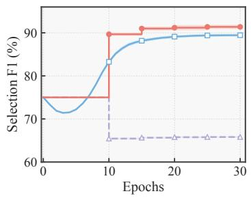

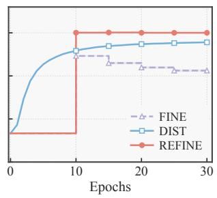  
(a) Asym 40%  
(b) P-IDN 50%  
Figure 3: Sample-selection F1 scores over training on UPMC-Food101 under Asym 40% and P-IDN 50%.

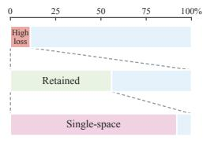  
(a)

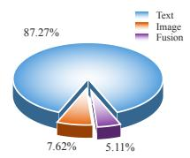  
(b)  
Figure 4: The first selection after 10 warm-up epochs on UPMC-Food101 under P-IDN 50%. (a) Retention and single-space support of highloss clean examples. (b) Sources of support for retained high-loss clean examples supported by exactly one trusted space.

Table 5: Component ablation results on three datasets. Except for TSS, all variants operate on the fused representation. The best result under each setting is highlighted in boldface.
<table><tr><td rowspan="2">Dataset</td><td colspan="4">Method</td><td colspan="3">Noise</td></tr><tr><td></td><td>FINE LA DE TSS</td><td></td><td></td><td>Sym 50% </td><td>Asym 40%F-IDN 50% P-IDN 50%</td><td></td></tr><tr><td rowspan="4">N24News</td><td>√</td><td>x</td><td>x</td><td>x</td><td> $6 1 . 8 1 \pm 0 . 4 0$ </td><td> $5 3 . 0 9 \pm 0 . 4 5$   $6 2 . 3 5 \pm 0 . 1 5$ </td><td> $6 1 . 4 0 \pm 0 . 2 6 $ </td></tr><tr><td>√</td><td>√</td><td>x</td><td>x</td><td> $6 3 . 1 5 \pm 0 . 3 9$ </td><td> $5 6 . 4 0 \pm 0 . 7 7$   $6 2 . 4 6 \pm 0 . 3 3$ </td><td> $6 2 . 7 2 \pm 0 . 7 7$ </td></tr><tr><td>√</td><td>√</td><td>√</td><td>x</td><td> $6 3 . 3 2 \pm 0 . 4 2$ </td><td> $5 8 . 4 5 \pm 0 . 8 0 $   $6 2 . 9 1 \pm 0 . 3 1 $ </td><td> $6 3 . 0 4 \pm 0 . 2 6$ </td></tr><tr><td>√</td><td>√</td><td>√</td><td>√</td><td>64.55 ± 0.53  ${ \bf 6 0 . 8 1 \pm 0 . 3 1 }$ </td><td> ${ \bf 6 3 . 0 7 \pm 0 . 5 1 }$ </td><td> ${ \bf 6 3 . 2 8 \pm 0 . 2 3 }$ </td></tr><tr><td rowspan="4">UPMC- Food101</td><td>√</td><td>x</td><td>x</td><td>x</td><td>84.78 ± 0.2569.08 ± 0.56</td><td> $8 3 . 5 7 \pm 0 . 1 5$ </td><td> $8 1 . 7 5 \pm 0 . 1 1$ </td></tr><tr><td>√</td><td>√</td><td>x</td><td>x</td><td>84.85±0.12 82</td><td> $. 0 4 \pm 0 . 1 5$   $8 3 . 4 7 \pm 0 . 1 6$ </td><td> $8 2 . 6 4 \pm 0 . 1 3$ </td></tr><tr><td>√</td><td>√</td><td>√</td><td>x</td><td>85.10 ± 0.12 83.23 ± 0.35</td><td> $8 3 . 7 9 \pm 0 . 5 2 $ </td><td> $8 2 . 8 9 \pm 0 . 6 2 $ </td></tr><tr><td>√</td><td>√</td><td>√</td><td>√</td><td>86.63 ± 0.22 85.28 ± 0.34</td><td> $\mathbf { 8 5 . 8 4 \pm 0 . 1 3 }$ </td><td> $\mathbf { 8 5 . 1 2 \pm 0 . 2 1 }$ </td></tr><tr><td rowspan="4">MIntRec2.0</td><td>√</td><td>x</td><td>x</td><td>x</td><td> $2 9 . 7 3 \pm 1 . 1 1$ </td><td> $2 5 . 9 5 \pm 0 . 7 0$ </td><td> $3 3 . 2 4 \pm 1 . 3 9$   $3 2 . 1 4 \pm 0 . 6 0$ </td></tr><tr><td>√</td><td>√</td><td>x</td><td>x</td><td>29.83±0.74  $2 6 . 3 3 \pm 1 . 2 8$ </td><td> $3 3 . 1 3 \pm 1 . 1 4$ </td><td> $3 2 . 1 5 \pm 1 . 3 0$ </td></tr><tr><td>√</td><td>√</td><td>√</td><td>x</td><td> $3 0 . 4 1 \pm 0 . 6 6$   $2 8 . 8 2 \pm 0 . 3 8 $ </td><td> $3 3 . 6 2 \pm 0 . 5 6$ </td><td> $3 2 . 8 5 \pm 0 . 9 4$ </td></tr><tr><td>√</td><td>√</td><td>√</td><td>√</td><td> ${ \bf 3 1 . 9 2 \pm 0 . 8 5 }$   $\mathbf { 2 9 . 6 1 \pm 1 . 0 9 }$ </td><td> $\mathbf { 3 5 . 7 0 \pm 0 . 4 0 }$ </td><td> ${ \bf 3 4 . 9 4 \pm 1 . 8 1 }$ </td></tr></table>

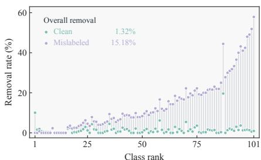  
Figure 5: Removal of clean and mislabeled examples from the set selected by ALL through trusted space selection on UPMC-Food101 under P-IDN 50%. The removal rates use the numbers of clean and mislabeled examples selected by ALL as their respective denominators. All 101 classes are shown, ordered by the difference between the removal rates for mislabeled and clean examples.

Trusted space selection. Table 6 compares individual spaces, their unrestricted union (abbreviated as ALL), and TSS. No single representation space is consistently best across datasets and noise settings, confirming that useful selection cues are class- and condition-dependent. Moreover, TSS consistently improves over ALL, showing that exploiting multimodal complementarity requires excluding unreliable spaces rather than simply aggregating all available evi dence. Fig. 5 further shows that, relative to ALL, TSS removes 15.18% of selected noisy examples while discarding only 1.32% of selected clean examples on UPMC-Food101 under P-IDN 50%. Fig. 6 shows that the most discriminative space combination also varies across classes, further supporting class-wise trusted-space selection.

Table 6: Representation-space comparison results on three datasets. Text, Image, Video, and Audio denote DE-based label agreement applied to the projected representation of the corresponding modality, whereas Fusion applies it to the fused representation. ALL independently selects examples in all available fused and unimodal spaces and takes their union, whereas TSS uses trusted space selection. The best result under each setting is highlighted in boldface.
<table><tr><td rowspan=1 colspan=1>Dataset</td><td rowspan=1 colspan=1>Space</td><td rowspan=1 colspan=1>NoiseSym 50%  $\mathbf { A s y m 4 0 \% }$  F-IDN50% P-IDN 50%</td></tr><tr><td rowspan=1 colspan=1>N24News</td><td rowspan=1 colspan=1>TextImageFusionALLTSS</td><td rowspan=1 colspan=1> $6 3 . 0 2 \pm 0 . 4 8$   $6 0 . 2 1 \pm 0 . 7 7$   $6 2 . 1 7 \pm 0 . 2 9$   $6 1 . 5 1 \pm 0 . 3 0$  $6 1 . 0 8 \pm 0 . 3 5$   $5 0 . 1 1 \pm 0 . 8 2$   $6 2 . 1 7 \pm 0 . 2 9$   $6 1 . 5 1 \pm 0 . 3 0$  $6 3 . 3 2 \pm 0 . 4 2$   $5 8 . 4 5 \pm 0 . 8 0 $   $6 2 . 9 1 \pm 0 . 3 1 $   $6 3 . 0 4 \pm 0 . 2 6$  $6 3 . 7 7 \pm 0 . 2 9$   $5 9 . 4 8 \pm 0 . 7 0 $   $6 2 . 5 1 \pm 0 . 5 6$   $6 2 . 2 3 \pm 0 . 3 0$  ${ \bf 6 4 . 5 5 \pm 0 . 5 3 }$  ${ \bf 6 0 . 8 1 \pm 0 . 3 1 }$   ${ \bf 6 3 . 0 7 \pm 0 . 5 1 }$   ${ \bf 6 3 . 2 8 \pm 0 . 2 3 }$ </td></tr><tr><td rowspan=3 colspan=1>UPMC-Food101</td><td rowspan=1 colspan=1>Text</td><td rowspan=1 colspan=1> $8 4 . 3 0 \pm 0 . 5 2 $  $8 2 . 5 3 \pm 0 . 6 8$   $8 3 . 7 9 \pm 0 . 3 1$   $8 3 . 4 2 \pm 0 . 3 8 $ </td></tr><tr><td rowspan=2 colspan=1>ImageFusionALLTSS</td><td rowspan=2 colspan=1> $8 0 . 6 3 \pm 0 . 2 4$   $7 4 . 6 1 \pm 3 . 6 4$   $8 1 . 5 8 \pm 0 . 0 9$   $8 0 . 5 6 \pm 0 . 2 7$  $8 5 . 1 0 \pm 0 . 1 2$   $8 3 . 2 3 \pm 0 . 3 5$               $8 2 . 8 9 \pm 0 . 6 2 $  $8 6 . 6 0 \pm 0 . 2 9$   $8 5 . 1 7 \pm 0 . 2 6$   $8 5 . 6 6 \pm 0 . 1 6$   $8 4 . 6 3 \pm 0 . 0 6$  $\mathbf { 8 6 . 6 3 \pm 0 . 2 2 }$  $\mathbf { 8 5 . 2 8 \pm 0 . 3 4 }$  $\mathbf { 8 5 . 8 4 \pm 0 . 1 3 }$   $\mathbf { 8 5 . 1 2 \pm 0 . 2 1 }$ </td></tr><tr><td rowspan=1 colspan=1>0.26 83.7 ± 0.</td></tr><tr><td rowspan=5 colspan=1>MIntRec2.0</td><td rowspan=1 colspan=1>Text</td><td rowspan=1 colspan=1> $3 0 . 9 3 \pm 1 . 5 1$   $2 7 . 9 8 \pm 1 . 4 0 $   $3 3 . 6 6 \pm 1 . 4 2$   $3 4 . 4 1 \pm 2 . 0 9$ </td></tr><tr><td rowspan=2 colspan=1>VideoAudioFusion</td><td rowspan=1 colspan=1> $2 6 . 7 0 { \scriptstyle \pm 0 . 8 3 }$   $2 6 . 3 2 \pm 0 . 4 3$   $3 1 . 5 7 \pm 0 . 7 0$   $3 1 . 8 5 \pm 1 . 3 0$ </td></tr><tr><td rowspan=2 colspan=1> $2 6 . 3 4 \pm 1 . 2 0$  $2 6 . 6 5 \pm 0 . 9 5$   $3 1 . 5 7 \pm 0 . 7 0$   $3 1 . 8 5 \pm 1 . 3 0$  $3 0 . 4 1 \pm 0 . 6 6$   $2 8 . 8 2 \pm 0 . 3 8 $   $3 3 . 6 2 \pm 0 . 5 6$   $3 2 . 8 5 \pm 0 . 9 4$  $3 1 . 1 2 \pm 1 . 3 1$   $2 9 . 4 0 \pm 0 . 5 6 $   $3 5 . 1 4 \pm 0 . 3 3$   $3 3 . 2 4 \pm 0 . 9 7$ </td></tr><tr><td rowspan=1 colspan=1>ALL</td></tr><tr><td rowspan=1 colspan=1>TSS</td><td rowspan=1 colspan=1> ${ \bf 3 1 . 9 2 \pm 0 . 8 5 }$  $\mathbf { 2 9 . 6 1 \pm 1 . 0 9 }$   $\mathbf { 3 5 . 7 0 \pm 0 . 4 0 }$   ${ \bf 3 4 . 9 4 \pm 1 . 8 1 }$ </td></tr></table>

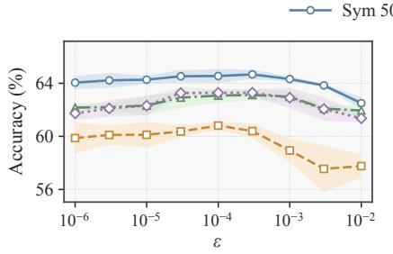  
(a) N24News

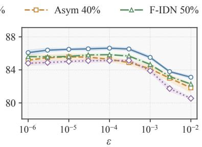  
(b) UPMC-Food101

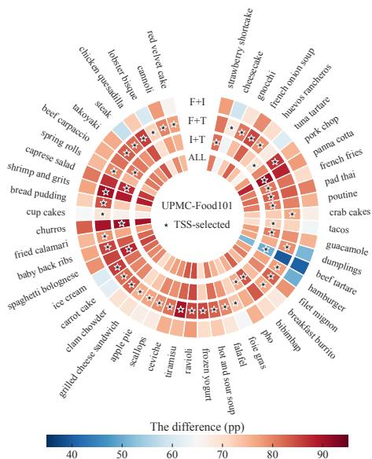  
Figure 6: Results for $5 0$ classes on UPMC-Food101 under P-IDN 50%. From outermost to innermost, the rings correspond to F+I, F+T, I+T, and ALL. Color indicates the difference between the retention rates for clean and mislabeled examples, in percentage points. Stars mark the combinations selected by TSS. F, I, and T denote the fused, image, and text spaces, respectively.

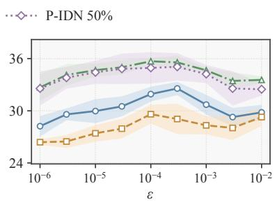  
(c) MIntRec2.0  
Figure 7: Sensitivity of classification accuracy (%) to the ridge parameter ϵ on three datasets.

Sensitivity analysis. We also analyze the sensitivity of our method to the hyperparameter ϵ. Fig. 7 shows classification performance as ϵ varies from $1 0 ^ { - 6 } ~ \mathrm { t o } ~ 1 0 ^ { - 2 }$ . In each setting, performance varies little. However, an excessively small ϵ provides insufficient regularization of the background matrix, whereas an excessively large ϵ increases the influence of the isotropic term, weakening the constraint imposed by the background on class directions.

## 5.4 RQ3: Generality across LNL Training Paradigms

Extension to Co-teaching. We replace the small-loss selection rule in Co-teaching [15] with REFINE while retaining its cross-update mechanism: one model selects training examples to update the other model. Fig. 8 shows that this replacement improves classification accuracy under all settings.

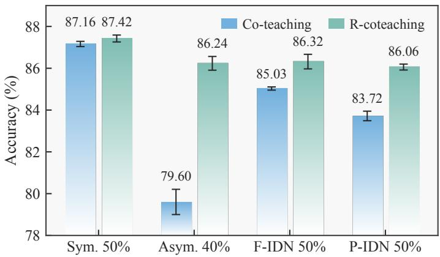  
Figure 8: Classification accuracy (%) of Co-teaching and Co-teaching combined with REFINE (i.e., R-Coteaching) on UPMC-Food101 under four noise settings.

Table 7: Test accuracy (%, mean±std.) of REFINE combined with FreeMatch (R-FreeMatch) and DSS+ (R-DSS+), compared with existing semi-supervised methods on UPMC-Food101 under different noise types and rates. The best and second-best results are highlighted in boldface and underlined, respectively.
<table><tr><td colspan="2">Method</td><td colspan="4">Noise</td></tr><tr><td colspan="2"></td><td>Sym 50%</td><td>Asym 40%</td><td>F-IDN 50%</td><td>P-IDN 50%</td></tr><tr><td rowspan="3">DivideMix</td><td>Best</td><td> $8 6 . 9 8 \pm 0 . 1 6$ </td><td> $7 5 . 3 6 \pm 0 . 4 6$ </td><td> $8 6 . 4 8 \pm 0 . 0 7$ </td><td> $8 6 . 4 1 \pm 0 . 1 2$ </td></tr><tr><td>Last</td><td> $8 6 . 9 7 \pm 0 . 1 7$ </td><td> $7 2 . 3 0 \pm 0 . 1 8$ </td><td> $8 6 . 4 4 \pm 0 . 0 6$ </td><td> $8 6 . 3 9 \pm 0 . 1 0$ </td></tr><tr><td>Best</td><td> $8 7 . 2 3 \pm 0 . 2 3 $ </td><td> $7 5 . 2 6 \pm 0 . 3 1$ </td><td> $8 6 . 4 9 \pm 0 . 1 1$ </td><td> $8 6 . 3 6 \pm 0 . 1 9$ </td></tr><tr><td rowspan="3">Mean Teacher ICT</td><td>Last</td><td> $8 7 . 2 3 \pm 0 . 2 3 $ </td><td> $7 1 . 3 2 \pm 0 . 4 1$ </td><td> $8 6 . 4 9 \pm 0 . 1 1$ </td><td> $8 6 . 3 6 \pm 0 . 1 9$ </td></tr><tr><td>Best</td><td> $8 7 . 0 9 \pm 0 . 2 1 $ </td><td> $7 5 . 3 0 \pm 0 . 3 7$ </td><td> $8 6 . 4 1 \pm 0 . 1 1$ </td><td> $8 6 . 2 1 \pm 0 . 1 3$ </td></tr><tr><td>Last</td><td> $8 7 . 0 9 \pm 0 . 2 1 $ </td><td> $7 1 . 4 7 \pm 0 . 2 5$ </td><td> $8 6 . 3 9 \pm 0 . 1 1$ </td><td> $8 6 . 2 1 \pm 0 . 1 2$ </td></tr><tr><td rowspan="3">CGMatch</td><td>Best</td><td> $8 8 . 3 2 \pm 0 . 1 9$ </td><td> $7 4 . 1 9 \pm 0 . 4 7$ </td><td> $8 7 . 7 7 \pm 0 . 0 9$ </td><td> $8 7 . 5 8 \pm 0 . 0 9$ </td></tr><tr><td>Last</td><td> $8 8 . 3 2 \pm 0 . 1 9$ </td><td> $6 7 . 0 9 \pm 0 . 6 0$ </td><td> $8 7 . 7 7 \pm 0 . 0 9$ </td><td> $8 7 . 5 8 \pm 0 . 0 9$ </td></tr><tr><td>Best</td><td> $8 8 . 3 7 \pm 0 . 2 1 $ </td><td> $7 3 . 2 2 \pm 0 . 1 9$ </td><td> $8 7 . 7 2 \pm 0 . 1 3$ </td><td> $8 7 . 5 9 \pm 0 . 0 9$ </td></tr><tr><td rowspan="3">FreeMatch DSS+</td><td>Last</td><td> $8 8 . 3 7 \pm 0 . 2 1 $ </td><td> $6 6 . 6 6 \pm 0 . 6 8$ </td><td> $8 7 . 7 1 \pm 0 . 1 3$ </td><td> $8 7 . 5 8 \pm 0 . 0 9$ </td></tr><tr><td>Best</td><td> $8 9 . 3 2 \pm 0 . 0 9$ </td><td> $\underline { { 8 7 . 7 5 \pm 0 . 8 6 } }$ </td><td> $8 9 . 1 2 \pm 0 . 0 7$ </td><td> $8 9 . 1 5 \pm 0 . 0 4 $ </td></tr><tr><td>Last</td><td> $8 9 . 3 2 \pm 0 . 0 9$ </td><td> $\underline { { 8 7 . 7 0 \pm 0 . 9 1 } }$ </td><td> $\underline { { 8 9 . 0 9 \pm 0 . 0 7 } }$ </td><td> $8 9 . 1 3 \pm 0 . 0 4 $ </td></tr><tr><td rowspan="2">R-FreeMatch</td><td>Best</td><td> $8 9 . 0 7 \pm 0 . 1 0$ </td><td> $8 7 . 0 8 \pm 0 . 9 5$ </td><td> $8 8 . 2 5 \pm 0 . 0 8 $ </td><td> $8 7 . 9 3 \pm 0 . 0 6$ </td></tr><tr><td>Last</td><td> $8 9 . 0 6 \pm 0 . 1 0$ </td><td> $8 6 . 9 7 \pm 0 . 9 0$ </td><td> $8 8 . 2 3 \pm 0 . 0 8 $ </td><td> $8 7 . 9 1 \pm 0 . 0 9$ </td></tr><tr><td rowspan="2">R-DSS+</td><td>Best</td><td> $\mathbf { 8 9 . 6 9 \pm 0 . 0 6 }$ </td><td> $\mathbf { 8 9 . 5 3 \pm 0 . 0 8 }$ </td><td> ${ \bf 8 9 . 3 0 \pm 0 . 1 1 }$ </td><td> $\mathbf { 8 9 . 2 7 \pm 0 . 1 3 }$ </td></tr><tr><td>Last</td><td> $\mathbf { 8 9 . 6 8 \pm 0 . 0 5 }$ </td><td> $\mathbf { 8 9 . 5 0 \pm 0 . 0 9 }$ </td><td> ${ \bf 8 9 . 2 9 \pm 0 . 1 1 }$ </td><td> $\mathbf { 8 9 . 2 4 \pm 0 . 1 4 }$ </td></tr></table>

Extension to semi-supervised learning. Sample selection can also partition training data into labeled and unlabeled subsets for semi-supervised learning. We integrate our algorithm into FreeMatch [83] and DSS+ [84], respectively, and compare with existing semi-supervised methods [16, 85, 86, 87]. Table 7 shows that both combinations achieve higher accuracy than their respective original methods, and R-DSS+ achieves the highest results under all settings. These results demonstrate that REFINE’s selections can support subsequent semi-supervised training.

Combination with noise-tolerance loss functions. Noise-robust losses mitigate the influence of incorrect labels on training by adjusting the optimization objective. We combine REFINE with different noise-robust losses [88, 23, 89] and use CE as a reference. Fig. 9 shows that incorporating REFINE increases the accuracy for every training objective, demonstrating that our selection method can accommodate different training objectives. Further comparison shows that combining REFINE with GCE or JAL-CE yields slightly higher accuracy than REFINE+CE under symmetric noise, but lower accuracy under asymmetric and both types of instance-dependent noise. We believe this is because the training loss alters the representations used for selection, which in turn affects the degree of support for correct and incorrect labels and changes how robust optimization and sample selection work together. How training objectives

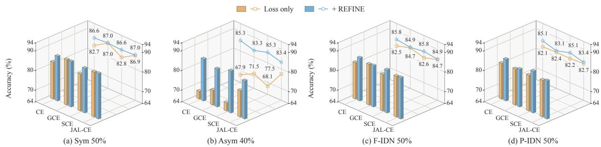  
85.8 <sub>85.1</sub><sup>85.8 85.15.8 85.1</sup>Figure 9: Classification accuracy (%) of different training losses with and without REFINE on UPMC-Food101 under 90 90 four noise settings.

80 80<sup>82.6</sup> <sup>84.7</sup> 80 80<sup>82.2</sup> 82.7 <sup>(%</sup> <sup>80</sup> <sup>8082.7</sup>c<sup>y</sup>  <sup>80</sup> <sup>8082.7</sup>c<sup>y</sup> affect representation discriminability and sample-selection quality under different noise conditions warrants further <sup>70</sup> <sub>A</sub><sup>c 70</sup> <sub>A</sub><sup>c</sup>investigation.

## <sub>(c)</sub> <sub>F-IDN</sub> <sub>5(c)</sub> <sub>F-IDN</sub>6 Conclusion

This work studies sample selection for multimodal learning under noisy supervision, focusing on which representation spaces to trust for identifying reliable training data. We show theoretically that fused and unimodal representations can differ in their clean-noisy separation ability across classes. Based on this insight, we develop REFINE, which constructs discriminative eigenvectors through analysis of the target and background, selects trusted representation spaces in a class-wise manner, and identifies reliable examples through label agreement. Extensive experiments across diverse datasets, noise settings, and training paradigms demonstrate consistent improvements in both sample-selection quality and classification performance. Overall, our results highlight the importance of explicitly determining what to trust and where to trust it in multimodal learning with noisy labels. Future work will extend this perspective toward more general forms of imperfect multimodal supervision, including partially corrupted, missing, and inconsistent modality-level signals. More broadly, we aim to develop a unified framework for trustworthy multimodal learning that jointly determines which examples, representation spaces, and supervision signals to be trusted under imperfect supervision.

## Appendix

A Theoretical Analysis 18   
A.1 Proof of Theorem 1 18   
A.2 Proof of Theorem 2 19   
A.3 Proof of Proposition 3 . 20   
A.4 Proof of Theorem 3 21   
A.5 Lower Bounds on Recall and Precision . 22   
A.6 Finite-Sample Estimation Error . 23   
B Implementation Details 25   
B.1 Datasets 25   
B.2 Baselines 26   
B.3 Details of Label Noise Generation 28   
B.4 Hyperparameter Settings 29   
B.5 Details of Sample-Selection Experiments 30   
B.6 Details of Semi-Supervised Experiments . 30   
B.7 Combination with Noise-Robust Loss Functions . 32   
C Additional Results 32   
D Reproducibility Statement 32

## A Theoretical Analysis

## A.1 Proof of Theorem 1

Recall. Under the model in Section 3.1, the alignment-score difference produced by FINE in space $r \in \mathcal { R }$ is

$$
\Delta _ { \mathrm { F I N E } } ^ { r } : = \Delta ^ { r } ( u _ { \mathrm { F I N E } } ^ { r } ) = \frac { ( 1 - \tau ) \sin ^ { 2 } \theta ^ { r } } { \sqrt { ( 1 - \tau ) ^ { 2 } + 4 \tau \cos ^ { 2 } \theta ^ { r } } } ,\tag{20}
$$

where $\tau$ is the ratio of mislabeled to clean examples, $\displaystyle i . e . , \ \frac { \mathbb { P } ( y = - 1 | \widetilde { y } = + 1 ) } { \mathbb { P } ( y = + 1 | \widetilde { y } = + 1 ) }$ . For any fixed $\tau \in [ 0 , 1 ) , \Delta _ { \mathrm { F I N E } } ^ { r }$ is strictly increasing in $\theta ^ { r } \in [ 0 , \pi / 2 ]$ . For any fixed $\theta ^ { r } \in ( 0 , \pi / 2 )$ , it is strictly decreasing in $\tau \in [ 0 , 1 )$ . In particular, all representation spaces share the same τ, so for any $r _ { 1 } , r _ { 2 } \in \mathcal { R }$

$$
\Delta _ { \mathrm { F I N E } } ^ { r _ { 1 } } > \Delta _ { \mathrm { F I N E } } ^ { r _ { 2 } } \quad \Longleftrightarrow \quad \theta ^ { r _ { 1 } } > \theta ^ { r _ { 2 } } .\tag{21}
$$

Proof. Within the observed class $\widetilde y = + 1$ , the probabilities of correctly labeled and mislabeled examples are $1 / ( 1 + \tau )$ and $\tau / ( 1 + \tau )$ , respectively. The class matrix in space r is therefore

$$
\begin{array} { l } { { \pmb A } _ { + } ^ { r } = \frac { \mathbb { E } [ { \pmb z } ^ { r } ( { \pmb z } ^ { r } ) ^ { \top } \mid y = + 1 ] + \tau \mathbb { E } [ { \pmb z } ^ { r } ( { \pmb z } ^ { r } ) ^ { \top } \mid y = - 1 ] } { 1 + \tau } } \\ { = \sigma ^ { 2 } { \pmb I } + \frac { { \pmb v } ^ { r } ( { \pmb v } ^ { r } ) ^ { \top } + \tau { \pmb w } ^ { r } ( { \pmb w } ^ { r } ) ^ { \top } } { 1 + \tau } . } \end{array}\tag{22}
$$

Its leading eigenvector is the same as that of $\pmb { v } ^ { r } ( \pmb { v } ^ { r } ) ^ { \top } + \tau \pmb { w } ^ { r } ( \pmb { w } ^ { r } ) ^ { \top }$ . Choose the signs of the directions so that their inner product is nonnegative. In orthonormal coordinates on the plane spanned by the mean directions, $\pmb { w } ^ { r }$ and $\pmb { v } ^ { r }$ have coordinates $( 1 , 0 ) ^ { \top }$ and (cos $\theta ^ { r }$ , sin $\theta ^ { r } ) ^ { \top }$ , respectively. The matrix restricted to this plane is

$$
\left[ \begin{array} { l l } { \cos ^ { 2 } \theta ^ { r } + \tau } & { \sin \theta ^ { r } \cos \theta ^ { r } } \\ { \sin \theta ^ { r } \cos \theta ^ { r } } & { \sin ^ { 2 } \theta ^ { r } } \end{array} \right] .\tag{23}
$$

The leading eigenvector $\pmb { u } _ { \mathrm { F I N E } } ^ { r }$ has coordinates $( \cos \varphi ^ { r } , \sin \varphi ^ { r } ) ^ { \top }$ on this plane. Its Rayleigh quotient can be written as

$$
\begin{array} { r l } & { ( { u } _ { \mathrm { F I N E } } ^ { r } ) ^ { \top } \big [ { v } ^ { r } ( { v } ^ { r } ) ^ { \top } + \tau { w } ^ { r } ( { w } ^ { r } ) ^ { \top } \big ] { u } _ { \mathrm { F I N E } } ^ { r } = \cos ^ { 2 } ( \theta ^ { r } - \varphi ^ { r } ) + \tau \cos ^ { 2 } \varphi ^ { r } } \\ & { \qquad = \displaystyle \frac { 1 + \tau } { 2 } + \frac { ( \tau + \cos 2 \theta ^ { r } ) \cos 2 \varphi ^ { r } + \sin 2 \theta ^ { r } \sin 2 \varphi ^ { r } } { 2 } . } \end{array}\tag{24}
$$

Since $( \cos 2 \varphi ^ { r } , \sin 2 \varphi ^ { r } ) ^ { \top }$ is a unit vector, the maximum is attained when it points in the same direction as $( \tau +$ cos $2 \theta ^ { r } , \sin 2 \theta ^ { r } ) ^ { \top }$ . Moreover,

$$
( \tau + \cos 2 \theta ^ { r } ) ^ { 2 } + \sin ^ { 2 } ( 2 \theta ^ { r } ) = ( 1 - \tau ) ^ { 2 } + 4 \tau \cos ^ { 2 } \theta ^ { r } ,\tag{25}
$$

and hence

$$
\cos 2 \varphi ^ { r } = { \frac { \tau + \cos 2 \theta ^ { r } } { \sqrt { ( 1 - \tau ) ^ { 2 } + 4 \tau \cos ^ { 2 } \theta ^ { r } } } } , \qquad \sin 2 \varphi ^ { r } = { \frac { \sin 2 \theta ^ { r } } { \sqrt { ( 1 - \tau ) ^ { 2 } + 4 \tau \cos ^ { 2 } \theta ^ { r } } } } .\tag{26}
$$

By the definition of the alignment-score difference,

$$
\begin{array} { r l } & { \Delta _ { \mathrm { F I N E } } ^ { r } = \left[ ( \pmb { u } _ { \mathrm { F I N E } } ^ { r } ) ^ { \top } \pmb { v } ^ { r } \right] ^ { 2 } - \left[ ( \pmb { u } _ { \mathrm { F I N E } } ^ { r } ) ^ { \top } \pmb { w } ^ { r } \right] ^ { 2 } } \\ & { \quad \quad \quad = \frac { ( 1 - \tau ) \sin ^ { 2 } \theta ^ { r } } { \sqrt { ( 1 - \tau ) ^ { 2 } + 4 \tau \cos ^ { 2 } \theta ^ { r } } } . } \end{array}\tag{27}
$$

Differentiating the closed-form expression gives

$$
\begin{array} { r l } & { \frac { \partial \Delta _ { \mathrm { F I N E } } ^ { r } } { \partial \theta ^ { r } } = \frac { 2 ( 1 - \tau ) ( 1 + \tau ^ { 2 } + 2 \tau \cos ^ { 2 } \theta ^ { r } ) \sin \theta ^ { r } \cos \theta ^ { r } } { [ ( 1 - \tau ) ^ { 2 } + 4 \tau \cos ^ { 2 } \theta ^ { r } ] ^ { 3 / 2 } } > 0 , } \\ & { \frac { \partial \Delta _ { \mathrm { F I N E } } ^ { r } } { \partial \tau } = - \frac { 2 ( 1 + \tau ) \sin ^ { 2 } \theta ^ { r } \cos ^ { 2 } \theta ^ { r } } { [ ( 1 - \tau ) ^ { 2 } + 4 \tau \cos ^ { 2 } \theta ^ { r } ] ^ { 3 / 2 } } < 0 , \qquad 0 < \theta ^ { r } < \pi / 2 . } \end{array}\tag{28}
$$

Continuity of the closed-form expression extends the angular monotonicity to the entire interval. All spaces use the same observed class and therefore share τ , which establishes the ordering across spaces. □

## A.2 Proof of Theorem 2

Recall. Under the model in Section $3 . 1 , \mathrm { i f } \epsilon = 0 .$ , then

$$
\Delta _ { \mathrm { D E } } ^ { r } : = \Delta ^ { r } ( { \pmb u } _ { \mathrm { D E } } ^ { r } ) = \sin \theta ^ { r } \sqrt { 1 - \frac { \cos ^ { 2 } \theta ^ { r } } { ( 1 + 2 \sigma ^ { 2 } ) ^ { 2 } } } \geq \Delta _ { \mathrm { F I N E } } ^ { r } .\tag{29}
$$

The inequality is strict when $0 < \theta ^ { r } < \pi / 2$ , and $\Delta _ { \mathrm { D E } } ^ { r } - \Delta _ { \mathrm { F I N E } } ^ { r }$ strictly increases with τ. For fixed $\sigma > 0 , \Delta _ { \mathrm { D E } } ^ { r }$ is strictly increasing in $\theta ^ { r } \in [ 0 , \pi / 2 ]$

Proof. Let $\tau _ { - } \in [ 0 , 1 )$ be the ratio of mislabeled to correctly labeled examples in the observed class $\widetilde y = - 1$ . In space $r ,$ choose an orthonormal basis along the angle bisectors of the mean directions such that

$$
\pmb { v } ^ { r } = \cos \frac { \theta ^ { r } } { 2 } \pmb { e } _ { 1 } ^ { r } + \sin \frac { \theta ^ { r } } { 2 } \pmb { e } _ { 2 } ^ { r } , \qquad \pmb { w } ^ { r } = \cos \frac { \theta ^ { r } } { 2 } \pmb { e } _ { 1 } ^ { r } - \sin \frac { \theta ^ { r } } { 2 } \pmb { e } _ { 2 } ^ { r } .\tag{30}
$$

The second-moment matrices of the two observed classes, restricted to this plane, are

$$
\begin{array} { l } { { A _ { + } ^ { r } = [ \displaystyle { \frac { \displaystyle { 1 - \tau } } { \displaystyle { 2 ( 1 + \tau ) } } } \sin \theta ^ { r } ] \ ~ , \nonumber } } \\ { { \displaystyle { \frac { \displaystyle { 1 - \tau } } { \displaystyle { 2 ( 1 + \tau ) } } } \sin \theta ^ { r } ~ \sigma ^ { 2 } + \sin ^ { 2 } ( \theta ^ { r } / 2 ) } } ] ,   \\ { { A _ { - } ^ { r } = [ \displaystyle { \sigma ^ { 2 } + \cos ^ { 2 } ( \theta ^ { r } / 2 ) } \quad - \displaystyle { \frac { \displaystyle { 1 - \tau _ { - } } } { \displaystyle { 2 ( 1 + \tau _ { - } ) } } } \sin \theta ^ { r } ] } ~ . }  \\ { { \displaystyle { - \frac { \displaystyle { 1 - \tau _ { - } } } { \displaystyle { 2 ( 1 + \tau _ { - } ) } } \sin \theta ^ { r } ~ \sigma ^ { 2 } + \sin ^ { 2 } ( \theta ^ { r } / 2 ) } } } \end{array}\tag{31}
$$

DE is obtained by solving for the eigenvector associated with the largest generalized eigenvalue, $A _ { + } ^ { r } { \pmb u } _ { \mathrm { D E } } ^ { r } \ =$ $\lambda _ { + } ^ { r } A _ { - } ^ { r } \pmb { u } _ { \mathrm { D E } } ^ { r }$ . Expanding this equation along the two basis directions gives

$$
\begin{array} { r l } & { \displaystyle ( 1 - \lambda _ { + } ^ { r } ) [ \sigma ^ { 2 } + \cos ^ { 2 } ( \theta ^ { r } / 2 ) ] [ ( e _ { 1 } ^ { r } ) ^ { \top } { \boldsymbol u } _ { \mathrm { D E } } ^ { r } ] + \left( \frac { 1 - \tau } { 1 + \tau } + \lambda _ { + } ^ { r } \frac { 1 - \tau _ { - } } { 1 + \tau _ { - } } \right) \frac { \sin \theta ^ { r } } { 2 } [ ( e _ { 2 } ^ { r } ) ^ { \top } { \boldsymbol u } _ { \mathrm { D E } } ^ { r } ] = 0 , } \\ & { \displaystyle \left( \frac { 1 - \tau } { 1 + \tau } + \lambda _ { + } ^ { r } \frac { 1 - \tau _ { - } } { 1 + \tau _ { - } } \right) \frac { \sin \theta ^ { r } } { 2 } [ ( e _ { 1 } ^ { r } ) ^ { \top } { \boldsymbol u } _ { \mathrm { D E } } ^ { r } ] + ( 1 - \lambda _ { + } ^ { r } ) [ \sigma ^ { 2 } + \sin ^ { 2 } ( \theta ^ { r } / 2 ) ] [ ( e _ { 2 } ^ { r } ) ^ { \top } { \boldsymbol u } _ { \mathrm { D E } } ^ { r } ] = 0 . } \end{array}\tag{32}
$$

Multiply the first equation by $[ \sigma ^ { 2 } + \sin ^ { 2 } ( \theta ^ { r } / 2 ) ] [ ( e _ { 2 } ^ { r } ) ^ { \top } { \pmb u } _ { \mathrm { D E } } ^ { r } ]$ and the second by $[ \sigma ^ { 2 } + \cos ^ { 2 } ( \theta ^ { r } / 2 ) ] [ ( e _ { 1 } ^ { r } ) ^ { \top } { \pmb u } _ { \mathrm { D E } } ^ { r } ]$ , and then subtract. Since $A _ { \pm } ^ { r } \succ 0$ , we have $\lambda _ { + } ^ { r } > 0$ . Together with $\tau , \tau _ { - } < 1$ , this yields

$$
\left[ \sigma ^ { 2 } + \sin ^ { 2 } ( \theta ^ { r } / 2 ) \right] \left[ ( e _ { 2 } ^ { r } ) ^ { \top } { \boldsymbol u } _ { \mathrm { D E } } ^ { r } \right] ^ { 2 } = \left[ \sigma ^ { 2 } + \cos ^ { 2 } ( \theta ^ { r } / 2 ) \right] \left[ ( e _ { 1 } ^ { r } ) ^ { \top } { \boldsymbol u } _ { \mathrm { D E } } ^ { r } \right] ^ { 2 } .\tag{33}
$$

Choose the maximizing direction whose coordinates have the same sign. Normalizing it to unit length gives

$$
u _ { \mathrm { D E } } ^ { r } = \frac { \sqrt { \sigma ^ { 2 } + \sin ^ { 2 } ( \theta ^ { r } / 2 ) } e _ { 1 } ^ { r } + \sqrt { \sigma ^ { 2 } + \cos ^ { 2 } ( \theta ^ { r } / 2 ) } e _ { 2 } ^ { r } } { \sqrt { 1 + 2 \sigma ^ { 2 } } } .\tag{34}
$$

Substituting into the definition of the alignment-score difference gives

$$
\Delta _ { \mathrm { D E } } ^ { r } = \frac { 2 \sin \theta ^ { r } \sqrt { \left[ \sigma ^ { 2 } + \sin ^ { 2 } ( \theta ^ { r } / 2 ) \right] \left[ \sigma ^ { 2 } + \cos ^ { 2 } ( \theta ^ { r } / 2 ) \right] } } { 1 + 2 \sigma ^ { 2 } }\tag{35}
$$

Moreover,

$$
( \Delta _ { \mathrm { D E } } ^ { r } ) ^ { 2 } - \sin ^ { 4 } \theta ^ { r } = \sin ^ { 2 } \theta ^ { r } \cos ^ { 2 } \theta ^ { r } \left[ 1 - ( 1 + 2 \sigma ^ { 2 } ) ^ { - 2 } \right] \ge 0 ,\tag{36}
$$

which, together with (20), implies

$$
\Delta _ { \mathrm { D E } } ^ { r } \geq \sin ^ { 2 } \theta ^ { r } \geq \frac { ( 1 - \tau ) \sin ^ { 2 } \theta ^ { r } } { \sqrt { ( 1 - \tau ) ^ { 2 } + 4 \tau \cos ^ { 2 } \theta ^ { r } } } = \Delta _ { \mathrm { F I N E } } ^ { r } .\tag{37}
$$

Finally,

$$
\frac { \partial ( \Delta _ { \mathrm { D E } } ^ { r } ) ^ { 2 } } { \partial \theta ^ { r } } = 2 \sin \theta ^ { r } \cos \theta ^ { r } \left[ 1 - \frac { \cos 2 \theta ^ { r } } { ( 1 + 2 \sigma ^ { 2 } ) ^ { 2 } } \right] > 0 , \qquad 0 < \theta ^ { r } < \pi / 2 .\tag{38}
$$

Thus, $\Delta _ { \mathrm { D E } } ^ { r }$ strictly increases with the class angle. Together with (28), this gives $\partial _ { \tau } \big ( \Delta _ { \mathrm { D E } } ^ { r } - \Delta _ { \mathrm { F I N E } } ^ { r } \big ) = - \partial _ { \tau } \Delta _ { \mathrm { F I N E } } ^ { r } >$ 0. □

## A.3 Proof of Proposition 3

Recall. Fix target class k and space r. Suppose that each non-target observed class satisfies $A _ { j } ^ { r } = v _ { j } ^ { r } ( v _ { j } ^ { r } ) ^ { \top } + \sigma ^ { 2 } I$ where $\| \pmb { v } _ { j } ^ { r } \| _ { 2 } = 1$ and $\sigma > 0 .$ . Let $\phi _ { k j } ^ { r } = \operatorname { a r c c o s } \lvert ( \boldsymbol { \boldsymbol { u } } _ { k , \mathrm { F I N E } } ^ { r } ) ^ { \top } \boldsymbol { v } _ { j } ^ { r } \rvert$ . For any $j , \ell \neq k$

$$
d _ { k j } ^ { r } = \sigma ^ { 2 } + \cos ^ { 2 } \phi _ { k j } ^ { r } , \qquad \phi _ { k j } ^ { r } < \phi _ { k \ell } ^ { r } \iff \gamma _ { k j } ^ { r } > \gamma _ { k \ell } ^ { r } .\tag{39}
$$

Proof. Since $\| \boldsymbol { u } _ { k , \mathrm { F I N E } } ^ { r } \| _ { 2 } = 1$

$$
\begin{array} { r l } & { d _ { k j } ^ { r } = ( \pmb { u } _ { k , \mathrm { F I N E } } ^ { r } ) ^ { \top } A _ { j } ^ { r } \pmb { u } _ { k , \mathrm { F I N E } } ^ { r } } \\ & { \quad \quad = \sigma ^ { 2 } + \left[ ( \pmb { u } _ { k , \mathrm { F I N E } } ^ { r } ) ^ { \top } \pmb { v } _ { j } ^ { r } \right] ^ { 2 } } \\ & { \quad \quad = \sigma ^ { 2 } + \cos ^ { 2 } \phi _ { k j } ^ { r } . } \end{array}\tag{40}
$$

$\cos ^ { 2 } \phi _ { k j } ^ { r }$ strictly decreases with $\phi _ { k j } ^ { r } \in [ 0 , \pi / 2 ]$ , and all weights share the positive denominator $\begin{array} { r } { \sum _ { j \neq k } d _ { k j } ^ { r } \geq ( K - } \end{array}$ $1 ) \sigma ^ { 2 } > 0$ . Therefore, $\phi _ { k j } ^ { r } < \phi _ { k \ell } ^ { r }$ is equivalent to $d _ { k j } ^ { r } > d _ { k \ell } ^ { r } ,$ and hence to $\gamma _ { k j } ^ { r } > \gamma _ { k \ell } ^ { r }$ □

## A.4 Proof of Theorem 3

Recall. Under the model in Section 3.1, if $\epsilon = 0 .$ , then

$$
\begin{array} { r } { | a _ { k } ^ { r } | > | a _ { k } ^ { s } | \quad \iff \quad \Delta _ { \mathrm { D E } } ^ { r } > \Delta _ { \mathrm { D E } } ^ { s } \quad \iff \quad \theta ^ { r } > \theta ^ { s } . } \end{array}\tag{41}
$$

Proof. Without loss of generality, assume $\theta ^ { r } > \theta ^ { s }$ . For $q \in \{ r , s \}$ , define the projection onto the DE direction used in the main text and its second moments under the two true classes as

$$
p _ { k } ^ { q } = ( \pmb { u } _ { k , \mathrm { D E } } ^ { q } ) ^ { \top } \pmb { z } ^ { q } , \qquad P _ { k } ^ { q } = \mathbb { E } [ ( p _ { k } ^ { q } ) ^ { 2 } \mid y = + 1 ] , \quad Q _ { k } ^ { q } = \mathbb { E } [ ( p _ { k } ^ { q } ) ^ { 2 } \mid y = - 1 ] .\tag{42}
$$

Using (34) and $P _ { k } ^ { q } - Q _ { k } ^ { q } = \Delta _ { \mathrm { D E } } ^ { q }$ , we obtain

$$
\begin{array} { r l } & { P _ { k } ^ { q } + Q _ { k } ^ { q } = 2 \sigma ^ { 2 } + [ ( \pmb { u } _ { k , \mathrm { D E } } ^ { q } ) ^ { \top } \pmb { v } ^ { q } ] ^ { 2 } + [ ( \pmb { u } _ { k , \mathrm { D E } } ^ { q } ) ^ { \top } \pmb { w } ^ { q } ] ^ { 2 } } \\ & { \qquad = \frac { \sin ^ { 2 } \theta ^ { q } + 4 \sigma ^ { 2 } ( 1 + \sigma ^ { 2 } ) } { 1 + 2 \sigma ^ { 2 } } , } \\ & { Q _ { k } ^ { q } = \frac { \sin ^ { 2 } \theta ^ { q } + 4 \sigma ^ { 2 } ( 1 + \sigma ^ { 2 } ) } { 2 ( 1 + 2 \sigma ^ { 2 } ) } - \frac { \Delta _ { \mathrm { D E } } ^ { q } } { 2 } . } \end{array}\tag{43}
$$

The first expression strictly increases with sin $\mathrm { 1 } ^ { 2 } \theta ^ { q } .$ . By (29), the second satisfies

$$
\frac { \mathrm { d } Q _ { k } ^ { q } } { \mathrm { d } ( \sin ^ { 2 } \theta ^ { q } ) } = \frac { 1 } { 2 ( 1 + 2 \sigma ^ { 2 } ) } \left[ 1 - \frac { \sin ^ { 2 } \theta ^ { q } + 2 \sigma ^ { 2 } ( 1 + \sigma ^ { 2 } ) } { \sqrt { \sin ^ { 2 } \theta ^ { q } [ \sin ^ { 2 } \theta ^ { q } + 4 \sigma ^ { 2 } ( 1 + \sigma ^ { 2 } ) ] } } \right] < 0 ,\tag{44}
$$

Therefore, $P _ { k } ^ { r } + Q _ { k } ^ { r } > P _ { k } ^ { s } + Q _ { k } ^ { s }$ and $Q _ { k } ^ { r } < Q _ { k } ^ { s }$ . For the two-dimensional projection $\pmb { p } _ { k } ^ { r , s } = ( p _ { k } ^ { r } , p _ { k } ^ { s } ) ^ { \top }$ defined in the main text, let

$$
P _ { k } ^ { r , s } = \mathbb { E } [ p _ { k } ^ { r , s } ( p _ { k } ^ { r , s } ) ^ { \top } \mid y = + 1 ] , \qquad Q _ { k } ^ { r , s } = \mathbb { E } [ p _ { k } ^ { r , s } ( p _ { k } ^ { r , s } ) ^ { \top } \mid y = - 1 ] .\tag{45}
$$

The target and background matrices satisfy

$$
{ \cal C } _ { k , k } ^ { r , s } = \frac { { \bf P } _ { k } ^ { r , s } + \tau { \bf Q } _ { k } ^ { r , s } } { 1 + \tau } , \qquad { \bf D } _ { k } ^ { r , s } = \frac { \tau _ { - } { \bf P } _ { k } ^ { r , s } + { \bf Q } _ { k } ^ { r , s } } { 1 + \tau _ { - } } .\tag{46}
$$

Let $\nu _ { k } ^ { q } = \mathbb { E } [ p _ { k } ^ { q } \mid y = - 1 ]$ . Then $Q _ { k } ^ { q } = \sigma ^ { 2 } + ( \nu _ { k } ^ { q } ) ^ { 2 }$ . The Cauchy–Schwarz inequality gives $\left| [ Q _ { k } ^ { r , s } ] _ { 1 2 } \right| \leq \sigma ^ { 2 } + | \nu _ { k } ^ { r } \nu _ { k } ^ { s } |$ Consequently,

$$
\begin{array} { r l } & { \operatorname* { d e t } Q _ { k } ^ { r , s } \geq [ \sigma ^ { 2 } + ( \nu _ { k } ^ { r } ) ^ { 2 } ] [ \sigma ^ { 2 } + ( \nu _ { k } ^ { s } ) ^ { 2 } ] - ( \sigma ^ { 2 } + | \nu _ { k } ^ { r } \nu _ { k } ^ { s } | ) ^ { 2 } } \\ & { \qquad = \sigma ^ { 2 } ( | \nu _ { k } ^ { r } | - | \nu _ { k } ^ { s } | ) ^ { 2 } > 0 . } \end{array}\tag{47}
$$

The strict inequality follows from $Q _ { k } ^ { r } < Q _ { k } ^ { s }$ . Therefore, $Q _ { k } ^ { r , s } \succ 0$ and $D _ { k } ^ { r , s } \succeq Q _ { k } ^ { r , s } / ( 1 + \tau _ { - } ) \succ 0 .$

Let $\lambda _ { k } ^ { r , s } \geq 0$ be the largest generalized eigenvalue of $( C _ { k , k } ^ { r , s } , D _ { k } ^ { r , s } )$ , with the corresponding Euclidean unit eigenvector $\pmb { a } _ { k } ^ { r , s } = ( a _ { k } ^ { r } , a _ { k } ^ { s } ) ^ { \top }$ defined in the main text. From (46),

$$
( 1 + \tau _ { - } ) { \cal D } _ { k } ^ { r , s } - \tau _ { - } ( 1 + \tau ) C _ { k , k } ^ { r , s } = ( 1 - \tau \tau _ { - } ) { \cal Q } _ { k } ^ { r , s } \succ 0 .\tag{48}
$$

Taking the quadratic form along $\pmb { a } _ { k } ^ { r , s }$ and using $C _ { k , k } ^ { r , s } \pmb { a } _ { k } ^ { r , s } = \lambda _ { k } ^ { r , s } D _ { k } ^ { r , s } \pmb { a } _ { k } ^ { r , s }$ yields

$$
[ ( 1 + \tau _ { - } ) - \tau _ { - } ( 1 + \tau ) \lambda _ { k } ^ { r , s } ] ( { \mathbf { } } a _ { k } ^ { r , s } ) ^ { \top } D _ { k } ^ { r , s } { \mathbf { } } a _ { k } ^ { r , s } = ( 1 - \tau \tau _ { - } ) ( { \mathbf { } } a _ { k } ^ { r , s } ) ^ { \top } Q _ { k } ^ { r , s } { \mathbf { } } a _ { k } ^ { r , s } > 0 .\tag{49}
$$

Since $D _ { k } ^ { r , s } \succ 0$ , dividing by the positive quadratic form and by $( 1 + \tau ) ( 1 + \tau _ { - } )$ gives

$$
\frac { 1 } { 1 + \tau } - \frac { \tau _ { - } \lambda _ { k } ^ { r , s } } { 1 + \tau _ { - } } > 0 .\tag{50}
$$

Define the residual matrix of the generalized eigenvalue problem as $G _ { k } ^ { r , s } = \lambda _ { k } ^ { r , s } D _ { k } ^ { r , s } - C _ { k , k } ^ { r , s }$ . The definition of the largest generalized eigenvalue gives $G _ { k } ^ { r , s } \succeq 0$ and $G _ { k } ^ { r , s } { \pmb { a } } _ { k } ^ { r , s } = { \pmb { 0 } }$ . Substituting (46) into the difference between its diagonal entries yields

$$
\begin{array} { r } { \left[ G _ { k } ^ { r , s } \right] _ { 2 2 } - \left[ G _ { k } ^ { r , s } \right] _ { 1 1 } = \left( \displaystyle \frac { 1 } { 1 + \tau } - \frac { \tau _ { - } \lambda _ { k } ^ { r , s } } { 1 + \tau _ { - } } \right) \left[ \left( P _ { k } ^ { r } + Q _ { k } ^ { r } \right) - \left( P _ { k } ^ { s } + Q _ { k } ^ { s } \right) \right] } \\ { - \left( \displaystyle \frac { 1 - \tau } { 1 + \tau } + \frac { ( 1 - \tau _ { - } ) \lambda _ { k } ^ { r , s } } { 1 + \tau _ { - } } \right) ( Q _ { k } ^ { r } - Q _ { k } ^ { s } ) > 0 . } \end{array}\tag{51}
$$

Thus, $G _ { k } ^ { r , s }$ is nonzero and has rank one, and its null space is spanned by $\pmb { a } _ { k } ^ { r , s }$ . It follows that

$$
\begin{array} { r } { \boldsymbol { G _ { k } ^ { r , s } } = \mathrm { t r } ( \boldsymbol { G _ { k } ^ { r , s } } ) \big [ \boldsymbol { I } - \boldsymbol { a } _ { k } ^ { r , s } ( \boldsymbol { a } _ { k } ^ { r , s } ) ^ { \top } \big ] , } \end{array}\tag{52}
$$

and therefore

$$
( a _ { k } ^ { r } ) ^ { 2 } - ( a _ { k } ^ { s } ) ^ { 2 } = \frac { \left[ G _ { k } ^ { r , s } \right] _ { 2 2 } - \left[ G _ { k } ^ { r , s } \right] _ { 1 1 } } { \operatorname { t r } G _ { k } ^ { r , s } } > 0 .\tag{53}
$$

Interchanging the two spaces gives the reverse ordering. Combining this result with the angular monotonicity in Theorem 2 establishes (41). □

## A.5 Lower Bounds on Recall and Precision

Here, we derive lower bounds on the recall and precision of the REFINE detector in each representation space and relate these bounds to the alignment-score difference.

Theorem 4. Under the binary model in the main text, let $\epsilon = 0 .$ . For the $L A$ selection rule in space r, the recall and precision within the target observed class $\widetilde y = + 1$ satisfy

$$
\begin{array} { r l } & { \mathrm { R e c a l l } ^ { r } \geq \frac { ( \Delta _ { \mathrm { D E } } ^ { r } ) ^ { 2 } } { ( \Delta _ { \mathrm { D E } } ^ { r } ) ^ { 2 } + 4 \sigma ^ { 2 } ( 1 + \sigma ^ { 2 } ) \left[ 1 - \frac { \cos ^ { 2 } \theta ^ { r } } { ( 1 + 2 \sigma ^ { 2 } ) ^ { 2 } } \right] } } \\ & { \quad \quad \quad = \frac { \sin ^ { 2 } \theta ^ { r } } { \sin ^ { 2 } \theta ^ { r } + 4 \sigma ^ { 2 } ( 1 + \sigma ^ { 2 } ) } , } \end{array}
$$

$$
\begin{array} { r l } & { \mathrm { P r e c i s i o n } ^ { r } \geq \frac { ( \Delta _ { \mathrm { D E } } ^ { r } ) ^ { 2 } } { ( \Delta _ { \mathrm { D E } } ^ { r } ) ^ { 2 } + 4 \tau \sigma ^ { 2 } ( 1 + \sigma ^ { 2 } ) \left[ 1 - \frac { \cos ^ { 2 } \theta ^ { r } } { ( 1 + 2 \sigma ^ { 2 } ) ^ { 2 } } \right] } } \\ & { \quad \quad \quad \quad \quad \quad \quad \quad \quad \quad \quad \quad \quad \quad \quad \quad \quad } \\ & { \quad \quad \quad \quad \quad \quad \quad \quad \quad \quad \quad \quad \quad \quad \quad \quad \quad \quad \quad \quad } \\ & { \quad \quad \quad \quad \quad \quad \quad \quad \quad \quad \quad \quad \quad \quad \quad \quad \quad \quad \quad \quad \quad } \end{array}\tag{54}
$$

Forfixed $\sigma > 0$ and $\tau > 0 ;$ , both lower bounds strictly increase with $\Delta _ { \mathrm { D E } } ^ { r }$

Proof. In space $r , \mathbf { \boldsymbol { u } } _ { + , \mathrm { D E } } ^ { r } = \mathbf { \boldsymbol { u } } _ { \mathrm { D E } } ^ { r }$ . Interchanging the target and background reverses the sign of the second basis coordinate in (34), yielding $\pmb { u } _ { - , \mathrm { D E } } ^ { r }$ . The label agreement (LA) retention event is therefore equivalent to $M ^ { r } > 0$

where

$$
\begin{array} { l } { { \displaystyle M ^ { r } = [ ( { \pmb u } _ { + , \mathrm { D E } } ^ { r } ) ^ { \top } z ^ { r } ] ^ { 2 } - [ ( { \pmb u } _ { - , \mathrm { D E } } ^ { r } ) ^ { \top } z ^ { r } ] ^ { 2 } } } \\ { { \displaystyle ~ = 2 \sqrt { 1 - \frac { \cos ^ { 2 } \theta ^ { r } } { ( 1 + 2 \sigma ^ { 2 } ) ^ { 2 } } } [ ( e _ { 1 } ^ { r } ) ^ { \top } z ^ { r } ] [ ( e _ { 2 } ^ { r } ) ^ { \top } z ^ { r } ] } . } \end{array}\tag{55}
$$

Together with (35), this gives

$$
\begin{array} { c } { { \mathbb { E } [ M ^ { r } \mid y = + 1 ] = \Delta _ { \mathrm { D E } } ^ { r } , \qquad \mathbb { E } [ M ^ { r } \mid y = - 1 ] = - \Delta _ { \mathrm { D E } } ^ { r } , } } \\ { { { } } } \\ { { { \displaystyle V ^ { r } : = \mathrm { V a r } ( M ^ { r } \mid y = \pm 1 ) = 4 \sigma ^ { 2 } ( 1 + \sigma ^ { 2 } ) \left[ 1 - \displaystyle \frac { \cos ^ { 2 } \theta ^ { r } } { ( 1 + 2 \sigma ^ { 2 } ) ^ { 2 } } \right] . \qquad } } } \end{array}\tag{56}
$$

Let $q _ { \mathrm { e r r } } ^ { r } = \mathbb { P } ( M ^ { r } > 0 \mid y = - 1 )$ denote the probability that a mislabeled example is retained. Rejecting a positiveclass example requires its margin to deviate downward from its mean by at least $\Delta _ { \mathrm { D E } } ^ { r } .$ . Cantelli’s inequality therefore gives

$$
\mathbb { P } ( M ^ { r } \le 0 \mid y = + 1 ) = \mathbb { P } ( M ^ { r } - \Delta _ { \mathrm { D E } } ^ { r } \le - \Delta _ { \mathrm { D E } } ^ { r } \mid y = + 1 ) \le \frac { V ^ { r } } { V ^ { r } + ( \Delta _ { \mathrm { D E } } ^ { r } ) ^ { 2 } } .\tag{57}
$$

Similarly, retaining a negative-class example requires its margin to deviate upward from its mean $- \Delta _ { \mathrm { D E } } ^ { r }$ by at least $\Delta _ { \mathrm { D E } } ^ { r }$ . Using the common variance $V ^ { r }$ of the two classes, we obtain

$$
\mathrm { R e c a l l } ^ { r } \geq \frac { ( \Delta _ { \mathrm { D E } } ^ { r } ) ^ { 2 } } { ( \Delta _ { \mathrm { D E } } ^ { r } ) ^ { 2 } + V ^ { r } } , \qquad q _ { \mathrm { e r r } } ^ { r } \leq \frac { V ^ { r } } { ( \Delta _ { \mathrm { D E } } ^ { r } ) ^ { 2 } + V ^ { r } } .\tag{58}
$$

By Bayes’ formula and (58),

$$
\mathrm { P r e c i s i o n } ^ { r } = \frac { \mathrm { R e c a l l } ^ { r } } { \mathrm { R e c a l l } ^ { r } + \tau q _ { \mathrm { e r r } } ^ { r } } \geq \frac { ( \Delta _ { \mathrm { D E } } ^ { r } ) ^ { 2 } } { ( \Delta _ { \mathrm { D E } } ^ { r } ) ^ { 2 } + \tau V ^ { r } } .\tag{59}
$$

Finally, (29) and the expression for $V ^ { r }$ give

$$
\frac { ( \Delta _ { \mathrm { D E } } ^ { r } ) ^ { 2 } } { V ^ { r } } = \frac { \sin ^ { 2 } \theta ^ { r } } { 4 \sigma ^ { 2 } ( 1 + \sigma ^ { 2 } ) } .\tag{60}
$$

This yields the two simplified lower bounds in (54). For fixed $\sigma > 0$ and $\tau > 0$ , both bounds strictly increase with $\sin ^ { 2 } \theta ^ { r }$ . Their monotonicity in the alignment-score difference then follows from Theorem 2. When $\tau = 0 .$ , both precision and its lower bound equal one. □

## A.6 Finite-Sample Estimation Error

This section analyzes the effect of finite-sample estimation on the class matrix and the DE direction of the positive class.

Theorem 5. Under the binary model in the main text, fix a space $r \in \mathcal { R } .$ . Suppose that the observed classes $\widetilde y = + 1$ and $\widetilde y = - 1$ contain $N _ { + }$ and $N _ { - }$ examples, respectively, and let $N _ { \operatorname* { m i n } } = \operatorname* { m i n } \{ N _ { + } , N _ { - } \}$ . There exists a constant $C > 0 ;$ , depending only on the population distribution in this space, such that thefollowing holds. For any $0 < \delta < 1$ when $N _ { \mathrm { m i n } }$ is sufficiently large and $\epsilon \geq 0$ is sufficiently small, conditional on $N _ { + } , N _ { - }$ , with probability at least $1 - \delta ,$

$$
\| \widehat { \pmb { A } } _ { + } ^ { r } - { \pmb { A } } _ { + } ^ { r } \| _ { 2 } \leq C \left[ \sqrt { \frac { d ^ { r } + \log ( 4 / \delta ) } { N _ { + } } } + \frac { d ^ { r } + \log ( 4 / \delta ) } { N _ { + } } \right] ,\tag{61}
$$

$$
\big \| \widehat { u } _ { \mathrm { D E } } ^ { r } ( \widehat { u } _ { \mathrm { D E } } ^ { r } ) ^ { \top } - u _ { \mathrm { D E } } ^ { r } ( u _ { \mathrm { D E } } ^ { r } ) ^ { \top } \big \| _ { 2 } \leq C \left[ \sqrt { \frac { d ^ { r } + \log ( 4 / \delta ) } { N _ { \operatorname* { m i n } } } } + \frac { d ^ { r } + \log ( 4 / \delta ) } { N _ { \operatorname* { m i n } } } + \epsilon \right] .\tag{62}
$$

Proof. Under the Gaussian mixture model in the main text, every unit projection has sub-Gaussian norm at most $C ( 1 + \sigma )$ , and its centered square is sub-exponential. Applying Bernstein’s inequality on a 1/4-net of the unit sphere gives

$$
\| \widehat { \pmb { A } } _ { + } ^ { r } - \pmb { A } _ { + } ^ { r } \| _ { 2 } \leq C ( 1 + \sigma ) ^ { 2 } \left[ \sqrt { \frac { d ^ { r } + \log ( 4 / \delta ) } { N _ { + } } } + \frac { d ^ { r } + \log ( 4 / \delta ) } { N _ { + } } \right] .\tag{63}
$$

These bounds hold simultaneously with probability at least $1 - \delta .$ Absorbing the fixed σ into the constant gives (61).   
The bound for $\| \hat { A } _ { - } ^ { r } - A _ { - } ^ { r } \| _ { 2 }$ follows analogously.

Since $B _ { + } ^ { r } = A _ { - } ^ { r }$ and $\widehat { B } _ { + } ^ { r } = \widehat { A } _ { - } ^ { r }$

$$
\lVert \widehat { B } _ { + } ^ { r } - B _ { + } ^ { r } \rVert _ { 2 } = \lVert \widehat { A } _ { - } ^ { r } - A _ { - } ^ { r } \rVert _ { 2 } .\tag{64}
$$

The model in the main text and the proof of Theorem 2 give $B _ { + } ^ { r } \succeq \sigma ^ { 2 } I$ and $\| A _ { + } ^ { r } \| _ { 2 } \le 1 + \sigma ^ { 2 }$ , with a simple largest generalized eigenvalue. Construct the population and empirical whitened matrices as

$$
T _ { + } ^ { r } = ( B _ { + } ^ { r } ) ^ { - 1 / 2 } A _ { + } ^ { r } ( B _ { + } ^ { r } ) ^ { - 1 / 2 } , \qquad \widehat { T } _ { + } ^ { r } = ( \widehat { B } _ { + } ^ { r } + \epsilon I ) ^ { - 1 / 2 } \widehat { A } _ { + } ^ { r } ( \widehat { B } _ { + } ^ { r } + \epsilon I ) ^ { - 1 / 2 } .\tag{65}
$$

When $\| \widehat { B } _ { + } ^ { r } - B _ { + } ^ { r } \| _ { 2 } + \epsilon \leq \sigma ^ { 2 } / 2$ , the smallest eigenvalue of the empirical denominator matrix is at least $\sigma ^ { 2 } / 2$ . The integral representation of the inverse square root and the resolvent identity give

$$
\| ( \widehat B _ { + } ^ { r } + \epsilon I ) ^ { - 1 / 2 } - ( B _ { + } ^ { r } ) ^ { - 1 / 2 } \| _ { 2 } \le \frac { \sqrt { 2 } } { \sigma ^ { 3 } } \left( \| \widehat B _ { + } ^ { r } - B _ { + } ^ { r } \| _ { 2 } + \epsilon \right) , \qquad \| ( \widehat B _ { + } ^ { r } + \epsilon I ) ^ { - 1 / 2 } \| _ { 2 } \le \frac { \sqrt { 2 } } { \sigma } .\tag{66}
$$

In $\widehat { \pmb { T } } _ { + } ^ { r } - \pmb { T } _ { + } ^ { r }$ , replace the numerator matrix and then the two inverse square root factors. Taking norms yields

$$
\| \widehat { T } _ { + } ^ { r } - T _ { + } ^ { r } \| _ { 2 } \leq \frac { 2 } { \sigma ^ { 2 } } \| \widehat { A } _ { + } ^ { r } - A _ { + } ^ { r } \| _ { 2 } + \frac { 4 ( 1 + \sigma ^ { 2 } ) } { \sigma ^ { 4 } } \left( \| \widehat { B } _ { + } ^ { r } - B _ { + } ^ { r } \| _ { 2 } + \epsilon \right) .\tag{67}
$$

Let $\pmb { q } _ { + } ^ { r }$ and $\widehat { \pmb { q } } _ { + } ^ { r }$ be the unit leading eigenvectors of $\mathbf { \delta } \mathbf { T } _ { + } ^ { r }$ and $\widehat { \pmb { T } } _ { + } ^ { r }$ , respectively. Choose the sign of the empirical eigenvector so that $( \widehat { \pmb q } _ { + } ^ { r } ) ^ { \top } \pmb q _ { + } ^ { r } \ge 0$ . The Davis–Kahan perturbation bound [90] gives

$$
\lVert \widehat { \pmb q } _ { + } - \pmb q _ { + } ^ { r } \rVert _ { 2 } \leq \frac { 2 \sqrt { 2 } \lVert \widehat { \pmb T } _ { + } ^ { r } - \pmb T _ { + } ^ { r } \rVert _ { 2 } } { \lambda _ { 1 } ( \pmb T _ { + } ^ { r } ) - \lambda _ { 2 } ( \pmb T _ { + } ^ { r } ) } .\tag{68}
$$

Mapping back from the whitened coordinates and normalizing to unit length gives $\begin{array} { r l r l } { \pmb { u } _ { \mathrm { D E } } ^ { r } } & { { } = } & { } & { { } } \end{array}$ $( B _ { + } ^ { r } ) ^ { - 1 / 2 } { \pmb q } _ { + } ^ { r } / \| ( { \pmb B } _ { + } ^ { r } ) ^ { - 1 / 2 } { \pmb q } _ { + } ^ { r } \| _ { 2 }$ , and analogously for the empirical direction. The inverse square root bound controls the error of this transformation. For unit vectors, the distance between their projection matrices is bounded by the distance between the sign-aligned vectors. Absorbing the fixed background condition number and eigengap into the constant, we obtain

$$
\big \| \widehat { \boldsymbol { u } } _ { \mathrm { D E } } ^ { r } ( \widehat { \boldsymbol { u } } _ { \mathrm { D E } } ^ { r } ) ^ { \top } - \boldsymbol { u } _ { \mathrm { D E } } ^ { r } ( \boldsymbol { u } _ { \mathrm { D E } } ^ { r } ) ^ { \top } \big \| _ { 2 } \leq C \left( \| \widehat { \boldsymbol { A } } _ { + } ^ { r } - \boldsymbol { A } _ { + } ^ { r } \| _ { 2 } + \| \widehat { \boldsymbol { B } } _ { + } ^ { r } - \boldsymbol { B } _ { + } ^ { r } \| _ { 2 } + \epsilon \right) .\tag{69}
$$

Finally, substituting (63)–(64) and using $N _ { \mathrm { m i n } }$ to control the estimation errors of both the target and background classes yields (62). □

## B Implementation Details

## B.1 Datasets

We conduct experiments on seven multimodal datasets. Their details are provided below.

• UPMC-Food101 [61] is a multimodal dataset for food recognition. It contains approximately 90,000 food images and their corresponding textual descriptions collected from websites, covering 101 food categories. We adopt the official training/test split [61] and then hold out 10% of the training set for validation. During partitioning, we exclude about 1,500 exact duplicate examples. In the main experiments, we use DINOv2- Base [75] and XLM-R-base [76] as the image and text encoders, respectively, obtaining a 768-dimensional feature vector for each modality.

• N24News [62] is a multimodal news classification dataset constructed from The New York Times. It contains approximately 60,000 news articles spanning 24 topics, each with text and an accompanying image. We use the headline and accompanying image as inputs and adopt the standard 8:1:1 training/validation/test split. We use DINOv2-Base and XLM-R-base as the image and text encoders, respectively, obtaining a 768-dimensional feature vector for each modality.

• NWPU-Captions [63] is a remote sensing image captioning dataset containing 31,500 images across 45 scene categories, with five textual descriptions per image. We use the scene category as the classification target and adopt the official split [63]. We use DINOv2-Base and XLM-R-base as the image and text encoders, respectively. For each image, we encode its five descriptions separately with XLM-R-base. We then take the equally weighted average of the five text vectors as the final text feature vector. Each modality is represented by a 768-dimensional feature vector.

• Rakuten France [64] is a product classification dataset from an e-commerce product classification challenge. It contains about 80,000 product records across 27 product categories. We use the product image and text comprising the product title and available description as inputs. We adopt the standard 8:1:1 training/validation/test split. We use DINOv2-Base and XLM-R-base as the image and text encoders, respectively, obtaining a 768-dimensional feature vector for each modality.

• VGGSound [65] is an audio-visual event dataset collected from YouTube. We use the 50-class subset released by Qin et al. in their IBML work [7], denoted as VGGSound50, which contains approximately 30,000 examples. Each example includes audio and video frames from the same video clip. We follow the IBML training/test split [7] and hold out 10% of the training set for validation. During partitioning, we exclude approximately 2,700 examples from categories outside the target task. We use WavLM-Base+ [77] as the audio encoder. We extract representations for all available video frames of each clip using DINOv2-Base. We then average these representations with equal weights to obtain the image representation. Each modality is represented by a 768-dimensional feature vector.

• MIntRec2.0 [66] is a multimodal intent recognition dataset containing approximately 15,000 utterances from the television series Superstore, The Big Bang Theory, and Friends. Each utterance includes text, audio, and video. We use the 9,304 in-scope utterances belonging to 30 known intent categories and exclude the 5,736 out-of-scope utterances. We adopt the official in-scope split [66]. We use XLM-R-base, WavLM-Base+, and VideoMAEv2-Base [78] as the text, audio, and video encoders, respectively, obtaining a 768-dimensional feature vector for each modality.

• BSD is constructed from two datasets officially provided for the DCASE 2026 Challenge,<sup>3</sup> BSD35k-CS and BSD10k-v1.2. Both are collected from Freesound and contain audio and textual descriptions, comprising about 35,000 and 10,000 examples, respectively. To align both datasets with 23 second-level categories of the Broad Sound Taxonomy, we remove approximately 2,000 examples belonging to BSD35k-CS’s five additional other categories. The labels in BSD35k-CS are assigned by the sound uploaders and contain naturally occurring label noise. We use this dataset as the training set. BSD10k-v1.2 provides expert-annotated and curated labels, and we use it as the clean test set. We reuse the precomputed CLAP [91] audio and text representations provided by the dataset providers, each of which is 512-dimensional.

## B.2 Baselines

This subsection introduces the baselines used in our experiments.

(1) Baselines in the sample-selection experiments. We integrate different sample-selection mechanisms into a common multimodal classifier and optimize the cross-entropy loss with equal weights on the retained training examples.

• Standard is a standard supervised training baseline that uses all noisy training examples. It directly minimizes the cross-entropy loss between model predictions and observed labels, providing a reference for classification performance without sample selection.

• CRUST [69] constructs a representative training subset based on relationships among the gradients of training examples. Its basic idea is to identify examples that represent the principal learning directions through similarities in gradient space, and to update the model on this subset. In our implementation, we use per-example classification gradients with respect to the fused representation.

• AUM [70] uses logit margins over the course of training to identify potentially mislabeled examples. For each training example, it computes the difference between the logit for the observed label and the largest logit among all other classes. This margin is then averaged over training. Persistently low values indicate weak model support for the observed label.

• L2D [71] detects mislabeled examples by learning from training dynamics. It forms a time series from the predicted probabilities assigned to the observed label across training epochs. This sequence is fed into a pretrained LSTM detector to obtain a label-noise score. We reuse a fixed detector pretrained on CIFAR-100 to score the probability trajectories of the target training examples. We determine the number of retained examples using the known noise rate.

• DIST [72] is the dynamic instance-specific thresholding mechanism for sample selection in DISC. It maintains a separate threshold for each training example, updated using an exponential moving average of that example’s maximum predicted class probability. We integrate this selection mechanism into the common classifier and set the decay coefficient for threshold updates according to the experimental noise setting.

• DIST+CT augments DIST with Confidence Tracking (CT) [73] to identify correctly labeled yet hard-to-learn examples. CT tracks the differences between the predicted probability of the observed label and that of each other class. It applies the Mann–Kendall test to determine whether these differences exhibit upward trends. Following the official setting [73], we take the union of the examples supported by CT and those retained by DIST.

• FINE [12] selects reliable examples based on the alignment between their representations and the principal direction within each class. It computes the Gram matrix of the representations within each class, and extracts the eigenvector associated with the largest eigenvalue. The squared projection of each representation onto this direction serves as its alignment score. A two-component GMM is then fitted within each class, and the posterior probability of the component with the higher mean is used for selection. By default, we use the fused representation immediately before the classification head.

(2) Co-teaching. We use Co-teaching to examine the applicability of REFINE to cross-selection and updates between networks.

• Co-teaching [15] simultaneously trains two separately initialized networks. Each network selects small-loss examples from the current minibatch according to its own training losses. The selected examples are then passed to the other network for parameter updates.

(3) Semi-supervised learning methods. The semi-supervised extension experiments compare the following six methods.

• DivideMix [16] formulates learning with noisy labels as semi-supervised learning. It estimates label reliability using a two-component mixture model of the loss distribution and partitions the training data into labeled and unlabeled subsets. Two networks are trained simultaneously, with each network providing the data partition for the other. During semi-supervised training, it combines observed labels with model predictions to refine the supervision targets for the labeled subset and generates pseudo-labels for the unlabeled subset. It uses both subsets through a modified MixMatch procedure.

• Mean Teacher [85] uses unlabeled data through prediction consistency between a teacher network and a student network. The student is updated by gradient-based optimization, whereas the teacher parameters are an exponential moving average of the student parameters. Given differently perturbed versions of the same input, the student learns to match the teacher’s prediction targets. This consistency objective is optimized jointly with the supervised loss on labeled data.

• ICT [86] extends consistency constraints to interpolations between unlabeled inputs. It linearly interpolates two unlabeled inputs and encourages the prediction at the interpolated input to match the interpolation of the predictions at the original inputs. A teacher model provides the target predictions. The interpolation consistency loss is optimized jointly with the supervised loss on labeled data, using unlabeled data to constrain how the prediction function varies between inputs.

• CGMatch [87] combines current prediction confidence with historical prediction stability to select unlabeled inputs for semi-supervised training. It uses Count-Gap to characterize a persistent prediction preference for a particular class. Using a dynamic confidence threshold and a Count-Gap threshold, CGMatch divides the unlabeled data into easy-to-learn, ambiguous, and hard-to-learn subsets. It applies cross-entropy to the easy-to-learn subset and generalized cross-entropy to the ambiguous subset.

• FreeMatch [83] adaptively adjusts pseudo-label selection thresholds according to the model’s learning status. It estimates a global threshold using an exponential moving average of prediction confidence, then constructs class-specific thresholds from class-wise prediction statistics. These thresholds dynamically adjust which pseudo-labels are used for training as learning progresses. FreeMatch also introduces self-adaptive class fairness regularization to encourage diverse predictions across classes.

• DSS+ [84] adjusts predicted probabilities using the marginal class distribution estimated during training. It then selects examples whose adjusted predictions agree with their observed labels. It also identifies candidate classes from temporal trends in predicted probabilities and excludes the competing terms associated with these classes from the supervised loss. DSS+ combines cross-selection between two networks with mixupbased consistency training using targets constructed from model predictions.

(4) Noise-tolerance loss functions. In the loss combination experiments, we use cross-entropy as a reference and examine the following three losses and their combinations with REFINE.

• GCE [88] introduces a tunable parameter to construct a family of losses connecting cross-entropy and mean absolute error. GCE approaches cross-entropy as this parameter approaches zero and is equivalent, up to a constant factor, to classification mean absolute error when the parameter equals 1. For intermediate values, GCE adjusts the contribution of examples with low predicted probabilities for their observed labels to parameter updates. This provides a trade-off between the learning ability of cross-entropy and the noise tolerance of mean absolute error.

• SCE [23] is a weighted combination of cross-entropy and reverse cross-entropy. The cross-entropy term increases the predicted probability of the observed label. The reverse cross-entropy term exchanges the roles of the prediction and label distributions in cross-entropy, providing an additional noise-tolerant constraint during optimization.

• JAL-CE [89] is a cross-entropy-based instance of Joint Asymmetric Loss. It combines Normalized Cross Entropy (NCE) with Asymmetric Mean Square Error (AMSE). NCE preserves the learning signal associated with the observed label, while AMSE serves as a passive loss that provides an additional constraint on the prediction distribution.

## B.3 Details of Label Noise Generation

For the six datasets used in the synthetic-noise experiments, we generate the following four types of label noise separately in the training and validation sets. Both splits use the same noise type and specified noise rate, while the test labels remain unchanged.

• Symmetric noise (Sym). At the specified noise rate, we select examples uniformly at random within each class. We then replace each selected label with a label chosen uniformly from the other classes.

• Asymmetric noise (Asym). To simulate annotation confusion between similar classes, we use the same within-class selection rule as Sym. We assign each selected example the label of a predefined related class. MIntRec2.0 uses a manually specified mapping between intent classes. For the other five datasets, we encode class descriptions with XLM-R and retrieve the top 10 candidate classes by cosine similarity, excluding the source class. We determine the mapping after filtering the candidates for semantic compatibility. Among the eligible candidate relationships, we prioritize covering more distinct target classes while reducing the number of source classes mapped to the same target. Each class maps to a class other than itself, and the mapping remains fixed across data splits, noise rates, and random seeds.

• Full-modality instance-dependent noise (F-IDN). Following the noise-generation procedure of TMNR [8], we first train a full-modality evidential classifier using the original reference labels. The classifier provides class evidence and predictive uncertainty for each example. We then select examples for label corruption based on their uncertainty, such that examples with higher uncertainty are more likely to be selected. For each selected example, we assign the label of the class with the highest evidence, excluding its original class. Evidence for training examples is obtained through five-fold out-of-fold prediction, whereas evidence for validation examples is generated by a classifier fitted on the entire training set.

• Partial-modality instance-dependent noise (P-IDN). To further simulate how noisy labels arise in multi modal data, we consider annotators who may refer to only some modalities rather than all modalities. We first assign each instance a modality combination with equal probability. The candidate set includes the full modality combination and all subsets obtained by omitting one modality. For bimodal data, the candidate comprise one bimodal combination and two unimodal combinations. For trimodal data, they comprise the full combination and three bimodal combinations. We then obtain the corresponding evidence and uncertainty from an evidential classifier trained for the assigned modality combination. We select examples for corruption and assign incorrect labels using the same rules as F-IDN.

```latex
Algorithm 2 Sample Selection with REFINE
Input: Multimodal model parameters θ, noisy training dataset D, number of classes K, regularization parameter $\varepsilon > 0 ,$ total
number of training epochs MaxEpoch, number of warm-up epochs WarmUpEpoch, selection interval SelectInterval.
Output: Model parameters θ.
1: θ ← WarmUp(D, θ, WarmUpEpoch).
2: t ← WarmUpEpoch.
3: while t < MaxEpoch do
4: Initialize the selected subset $c  \varnothing .$
5: Extract representations $\{ z _ { i } ^ { r } \} _ { i = 1 , \dots , N , r \in \mathcal { R } }$ for all training inputs using the current model.
6: for $k = 1 , \ldots , K$ do
7: for $r \in \mathcal { R }$ do
8: Compute the background weights and background matrix $B _ { k } ^ { r } .$
9: Solve for the discriminative eigenvector $u _ { k , \mathrm { D E } } ^ { r } .$
10: end for
11: for all unordered pairs $\{ r , s \} \subseteq \mathcal { R } , r \neq$ s do
12: Construct two-dimensional projection representations $\{ p _ { i , k } ^ { r , s } \} _ { i = 1 } ^ { N }$ for all training inputs.
13: Solve for the two-dimensional discriminative eigenvector $\mathbf { \Delta } \mathbf { a } _ { k } ^ { r , s } = ( a _ { k } ^ { r } , a _ { k } ^ { s } ) ^ { \top }$
14: Record a win for the space with the larger coefficient magnitude and a loss for the other, ties count as neither wins nor
losses.
15: end for
16: Retain spaces with at least as many wins as losses to form $\mathcal { R } _ { k }$
17: end for
18: for $k = 1 , \ldots , K$ do
19: for $r \in \mathcal { R } _ { k }$ do
20: For each example with observed label $k ,$ compute its alignment scores for all classes, $\begin{array} { r } { s _ { i , j } ^ { r } = [ ( \pmb { u } _ { j , \mathrm { D E } } ^ { r } ) ^ { \top } z _ { i } ^ { r } ] ^ { 2 } } \end{array}$
21: Retain examples satisfying $s _ { i , k } ^ { r } > \operatorname* { m a x } _ { j \neq k } s _ { i , j } ^ { r }$ to form $\bar { \boldsymbol { { \mathcal { C } } } } _ { k } ^ { r }$
22: end for
23: end for
24: $\begin{array} { r } { \mathscr { C } \gets \bigcup _ { k = 1 } ^ { K } \bigcup _ { r \in \mathscr { R } _ { k } } \mathscr { C } _ { k } ^ { r } . } \end{array}$
25: Continue training θ with cross-entropy loss on the examples in C and their observed labels through epoch
min(t + SelectInterval, MaxEpoch).
26: t ← min(t + SelectInterval, MaxEpoch).
27: end while
28: return θ.
```

The main experiments use Sym at a 50% noise rate, Asym at 40%, and both F-IDN and P-IDN at 40% and 50%. For each setting, we generate five sets of noisy labels using different random seeds. All compared methods use the same noisy labels for each dataset, noise setting, and random seed.

## B.4 Hyperparameter Settings

All methods use the same multimodal classifier and shared training settings. We train the final classifier for 30 epochs using AdamW [79], with an initial learning rate of $1 0 ^ { - 4 }$ , weight decay of $1 0 ^ { - 3 }$ , and a batch size of 256. The exponential decay rates for the first- and second-moment estimates in AdamW are set to 0.9 and 0.999, respectively. The learning rate is decayed to zero using a cosine schedule updated at each optimization step. We clip gradients to a maximum global norm of 1.0. The modality-specific projected representations and the fused representation are all 256-dimensional. The residual fusion module has a hidden dimension of $5 1 2 ,$ and the dropout probability is set to 0.3 in both the projectors and the fusion module. For our REFINE, we set the parameter ϵ to $1 0 ^ { - 4 }$

In the experiments with unfrozen encoders on UPMC-Food101, the learning rates for the pretrained encoders and the classification head are set to $1 0 ^ { - 6 }$ and $1 0 ^ { - 4 }$ , respectively. We jointly train them for 30 epochs using AdamW. All other settings are identical to those described above.

```latex
Algorithm 3 FreeMatch with REFINE
Input: Multimodal model parameters θ, noisy training dataset D, REFINE regularization parameter $\epsilon > 0 ,$ augmentation
operators $\alpha _ { \mathrm { w } } , \alpha _ { \mathrm { s } } ,$ loss weights $\lambda _ { \mathrm { u } } , \lambda _ { \mathrm { f } } ,$ , total number of training epochs MaxEpoch, number of warm-up epochs
WarmUpEpoch, selection interval SelectInterval.
Output: Model parameters θ.
1: θ ← WarmUp(D, θ, WarmUpEpoch).
2: Initialize FreeMatch’s thresholds and prediction statistics, and set t ← WarmUpEpoch.
3: while t < MaxEpoch do
4: C ← REFINE(D, θ, ϵ) (Algorithm 1).
5: Construct the labeled subset $\bar { \boldsymbol { \mathscr { X } } } \gets \boldsymbol { \mathscr { C } }$ and the unlabeled subset $\mathcal { U }  \{ \pmb { x } _ { i } : ( \pmb { x } _ { i } , \widetilde { \pmb { y } } _ { i } ) \in \mathcal { D } \setminus \mathcal { C } \}$
6: for e = t + 1, . . . , min(t + SelectInterval, MaxEpoch) do
7: for all minibatches $B _ { \ell } , B _ { \mathrm { u } }$ from X and U, respectively do
8: Compute the supervised cross-entropy loss ${ \dot { \mathcal { L } } } _ { \mathrm { s } }$ using the observed labels and weak-view predictions of $B _ { \ell } .$
9: For inputs in $B _ { \mathrm { u } } ^ { \mathrm { } } ,$ compute weak-view predictions $\mathbf { \sigma } \mathbf { q } _ { i }  p \mathbf { \sigma } ( \cdot \mid \alpha _ { \mathrm { w } } ( \mathbf { x } _ { i } ) )$ and generate pseudo-labels
ybi <sup>←</sup> arg max qi(k).
10: Update FreeMatch’s prediction statistics and class-specific self-adaptive thresholds τ(k) using $\left\{ q _ { i } \right\}$
11: Compute strong-view predictions $Q _ { i }  p _ { \pm } ( \cdot \mid \alpha _ { \mathrm { s } } ( \bar { \mathbf { x } } _ { i } ) )$
12: Use pseudo-labels satisfying $q _ { i } ( \widehat { y } _ { i } ) \geq \tau ( \widehat { y } _ { i } )$ to supervise the corresponding strong-view predictions, and compute ${ \mathcal { L } } _ { \mathrm { u } }$
as in FreeMatch.
13: Compute the self-adaptive class fairness regularization term ${ \mathcal { L } } _ { \mathrm { f } }$ as in FreeMatch.
14: $\mathcal { L } \gets \hat { \mathcal { L } } _ { \mathrm { s } } + \lambda _ { \mathrm { u } } \mathcal { L } _ { \mathrm { u } } + \hat { \lambda _ { \mathrm { f } } } \mathcal { L } _ { \mathrm { f } } ,$
15: Update model parameters θ using L.
16: end for
17: end for
18: t ← min(t + SelectInterval, MaxEpoch).
19: end while
20: return θ.
```

## Algorithm 4 GCE with REFINE

Input: Multimodal model parameters θ, noisy training dataset D, GCE parameter q, REFINE regularization parameter ϵ > 0,   
total number of training epochs MaxEpoch, number of warm-up epochs WarmUpEpoch, selection interval SelectInterval.   
Output: Model parameters θ.   
1: Warm up on all training examples in D with GCE loss for WarmUpEpoch epochs, updating θ.   
2: t ← WarmUpEpoch.   
3: while t < MaxEpoch do   
4: C ← REFINE(D, θ, ϵ) (Algorithm 1).   
5: Continue training θ with GCE loss on the examples in C and their observed labels through epoch   
min(t + SelectInterval, MaxEpoch).   
6: t ← min(t + SelectInterval, MaxEpoch).   
7: end while   
8: return θ.

## B.5 Details of Sample-Selection Experiments

We compare different sample-selection methods using the common multimodal classifier and shared training settings described above. For REFINE, we first use all noisy training examples for 10 warm-up epochs and then perform sample selection every five epochs, for a total of 30 training epochs. Algorithm 2 presents the complete procedure.

## B.6 Details of Semi-Supervised Experiments

Using the same multimodal classifier and training settings, we integrate our algorithm into FreeMatch [83] and DSS+ [84], respectively, and compare with existing semi-supervised methods. We use FreeMatch as an example to describe how REFINE is combined with semi-supervised learning. After warm-up, REFINE periodically partitions the noisy training dataset: the selected examples, together with their observed labels, form the labeled subset, and the remaining inputs form the unlabeled subset. FreeMatch then uses the labeled subset for supervised training and the unlabeled subset for pseudo-label learning, yielding the combined method R-FreeMatch.

Table 8: Macro-F1 (%, mean±std.) of the proposed method and baseline methods on different datasets under different noise types and ratios. The “Noise” columns show the noise type and ratio, and the “Average” column reports the mean across the six noise settings. The best and second-best results are highlighted in boldface and underlined, respectively.
<table><tr><td rowspan=2 colspan=4>Dataset</td><td rowspan=2 colspan=1>Method</td><td rowspan=1 colspan=6>Noise</td><td rowspan=2 colspan=1>Average</td></tr><tr><td rowspan=1 colspan=6>Sym 50%  Asym 40% F-IDN 40%F-IDN 50%P-IDN 40%P-IDN 50%</td></tr><tr><td rowspan=8 colspan=4>UPMC-Food101</td><td rowspan=2 colspan=1>StandardCRUST</td><td rowspan=1 colspan=4>82.63 ± 0.3467.76±0.2484.30 ±0.1082.62 ±0.10</td><td rowspan=1 colspan=2>84.39 ±0.1582.75±0.06</td><td rowspan=1 colspan=1>80.74 ± 0.05</td></tr><tr><td rowspan=1 colspan=1>84.71±0.17</td><td rowspan=1 colspan=1>81.93±0.23</td><td rowspan=1 colspan=1>83.11 ± 0.23</td><td rowspan=1 colspan=1>82.08±0.05</td><td rowspan=1 colspan=2>82.60±0.1981.74±0.18</td><td rowspan=1 colspan=1>82.69±0.05</td></tr><tr><td rowspan=1 colspan=1>AUM</td><td rowspan=1 colspan=1>83.04±0.12</td><td rowspan=1 colspan=1>65.89±0.59</td><td rowspan=1 colspan=1>83.73±0.14</td><td rowspan=1 colspan=1>82.06±0.29</td><td rowspan=1 colspan=1>82.08±0.27</td><td rowspan=1 colspan=1>80.14±0.16</td><td rowspan=1 colspan=1>79.49±0.14</td></tr><tr><td rowspan=2 colspan=1>L2DDIST</td><td rowspan=1 colspan=1>84.39±0.22</td><td rowspan=1 colspan=1>72.80±0.37</td><td rowspan=1 colspan=1>85.70±0.20</td><td rowspan=1 colspan=1>84.04±0.12</td><td rowspan=1 colspan=2>85.47±0.2083.90±0.32</td><td rowspan=1 colspan=1>82.72±0.06</td></tr><tr><td rowspan=1 colspan=1>85.45±0.22</td><td rowspan=1 colspan=1>80.78±0.38</td><td rowspan=1 colspan=1>85.54±0.22</td><td rowspan=1 colspan=1>84.23±0.16</td><td rowspan=1 colspan=2>84.37±0.18 82.40±0.13</td><td rowspan=1 colspan=1>83.80±0.11</td></tr><tr><td rowspan=1 colspan=1>DIST+CT</td><td rowspan=1 colspan=2>85.45±0.21 80.78±0.38</td><td rowspan=1 colspan=1>85.54±0.22</td><td rowspan=1 colspan=1>84.24±0.11</td><td rowspan=1 colspan=2>84.37±0.1882.42±0.12</td><td rowspan=1 colspan=1>83.80±0.09</td></tr><tr><td rowspan=1 colspan=1>FINE</td><td rowspan=1 colspan=2>84.69±0.2768.87±0.60</td><td rowspan=1 colspan=1>84.68±0.09</td><td rowspan=1 colspan=1>83.58±0.12</td><td rowspan=1 colspan=2>83.15±0.1681.94±0.13</td><td rowspan=1 colspan=1>81.15±0.13</td></tr><tr><td rowspan=1 colspan=1>REFINE</td><td rowspan=1 colspan=2>86.48 ± 0.2185.11 ± 0.34</td><td rowspan=1 colspan=1>86.70 ± 0.07</td><td rowspan=1 colspan=1>85.71 ± 0.13</td><td rowspan=1 colspan=2>86.28 ± 0.1485.00 ± 0.25</td><td rowspan=1 colspan=1>85.88 ± 0.05</td></tr><tr><td rowspan=8 colspan=4>MIntRec2.0</td><td rowspan=1 colspan=1>Standard</td><td rowspan=1 colspan=1>19.75±1.02</td><td rowspan=1 colspan=1>21.20 ± 0.57</td><td rowspan=1 colspan=1>25.49±0.29</td><td rowspan=1 colspan=1>24.53±0.86</td><td rowspan=1 colspan=1>24.60±0.87</td><td rowspan=1 colspan=1>22.39±1.62</td><td rowspan=1 colspan=1>22.99 ± 0.34</td></tr><tr><td rowspan=1 colspan=1>CRUST</td><td rowspan=1 colspan=1>18.91±0.92</td><td rowspan=1 colspan=1>18.62±2.10</td><td rowspan=1 colspan=1>24.37±0.70</td><td rowspan=1 colspan=1>23.74±1.27</td><td rowspan=1 colspan=1>23.16±1.29</td><td rowspan=1 colspan=1>20.83±2.08</td><td rowspan=1 colspan=1>21.60±0.81</td></tr><tr><td rowspan=1 colspan=1>AUM</td><td rowspan=1 colspan=1>13.98±0.97</td><td rowspan=1 colspan=1>13.98±0.36</td><td rowspan=1 colspan=1>17.59±0.57</td><td rowspan=1 colspan=1>17.00± 0.99</td><td rowspan=1 colspan=1>17.21 ± 1.02</td><td rowspan=1 colspan=1>15.50±0.98</td><td rowspan=1 colspan=1>15.88±0.56</td></tr><tr><td rowspan=2 colspan=1>L2DDIST</td><td rowspan=1 colspan=1>18.18±1.01</td><td rowspan=1 colspan=1>16.68±0.68</td><td rowspan=1 colspan=1>20.94±1.04</td><td rowspan=1 colspan=1>18.88±0.92</td><td rowspan=1 colspan=1>20.38±0.67</td><td rowspan=1 colspan=1>17.83±0.93</td><td rowspan=1 colspan=1>18.81±0.74</td></tr><tr><td rowspan=1 colspan=1>20.80±0.87</td><td rowspan=1 colspan=1>13.09±0.76</td><td rowspan=1 colspan=1>24.66±0.38</td><td rowspan=1 colspan=1>24.29±0.79</td><td rowspan=1 colspan=1>23.79±0.95</td><td rowspan=1 colspan=1>22.21±1.35</td><td rowspan=1 colspan=1>21.48±0.40</td></tr><tr><td rowspan=1 colspan=1>DIST+CT</td><td rowspan=1 colspan=1>20.80±0.87</td><td rowspan=1 colspan=1>13.04±0.70</td><td rowspan=1 colspan=1>24.66±0.38</td><td rowspan=1 colspan=1>24.29±0.79</td><td rowspan=1 colspan=1>23.79±0.95</td><td rowspan=1 colspan=1>22.21±1.35</td><td rowspan=1 colspan=1>21.47±0.41</td></tr><tr><td rowspan=1 colspan=1>FINE</td><td rowspan=1 colspan=1>20.31±0.97</td><td rowspan=1 colspan=1>18.50±1.20</td><td rowspan=1 colspan=1>23.81±2.27</td><td rowspan=1 colspan=1>24.04±0.78</td><td rowspan=1 colspan=1>24.08±0.31</td><td rowspan=1 colspan=1>19.86±0.74</td><td rowspan=1 colspan=1>21.77±0.47</td></tr><tr><td rowspan=1 colspan=1>REFINE</td><td rowspan=1 colspan=1>21.41±0.74</td><td rowspan=1 colspan=1>20.61±0.78</td><td rowspan=1 colspan=1>25.62±1.22</td><td rowspan=1 colspan=1>25.38 ±1.10</td><td rowspan=1 colspan=1>24.68 ± 0.49</td><td rowspan=1 colspan=1>23.10 ±1.83</td><td rowspan=1 colspan=1>23.47 ± 0.37</td></tr><tr><td rowspan=8 colspan=4>NWPU-Captions</td><td rowspan=1 colspan=1>Standard</td><td rowspan=1 colspan=1>98.30 ±0.16</td><td rowspan=1 colspan=1>77.75±0.85</td><td rowspan=1 colspan=1>97.23±0.17</td><td rowspan=1 colspan=1>95.12±0.47</td><td rowspan=1 colspan=1>98.12±0.27</td><td rowspan=1 colspan=1>96.71± 0.49</td><td rowspan=1 colspan=1>93.87 ± 0.25</td></tr><tr><td rowspan=1 colspan=1>CRUST</td><td rowspan=1 colspan=1>99.19±0.03</td><td rowspan=1 colspan=1>94.65±0.23</td><td rowspan=1 colspan=1>97.14±0.39</td><td rowspan=1 colspan=1>95.82±0.56</td><td rowspan=1 colspan=1>97.45±0.32</td><td rowspan=1 colspan=1>96.48±0.35</td><td rowspan=1 colspan=1>96.79±0.21</td></tr><tr><td rowspan=1 colspan=1>AUM</td><td rowspan=1 colspan=1>98.89±0.22</td><td rowspan=1 colspan=1>77.77±0.84</td><td rowspan=1 colspan=1>98.28±0.17</td><td rowspan=1 colspan=1>96.63±0.47</td><td rowspan=1 colspan=1>97.68±0.20</td><td rowspan=1 colspan=1>96.14±0.35</td><td rowspan=1 colspan=1>94.23±0.18</td></tr><tr><td rowspan=2 colspan=1>L2DDIST</td><td rowspan=1 colspan=1>98.63±0.14</td><td rowspan=1 colspan=1>83.56±2.30</td><td rowspan=1 colspan=1>98.39±0.17</td><td rowspan=1 colspan=1>97.15±0.50</td><td rowspan=1 colspan=1>98.48±0.35</td><td rowspan=1 colspan=1>97.71±0.24</td><td rowspan=1 colspan=1>95.65±0.35</td></tr><tr><td rowspan=1 colspan=1>99.14±0.06</td><td rowspan=1 colspan=1>97.18±0.15</td><td rowspan=1 colspan=1>98.58±0.19</td><td rowspan=1 colspan=1>97.11±0.44</td><td rowspan=1 colspan=1>97.89±0.27</td><td rowspan=1 colspan=1>96.65±0.29</td><td rowspan=1 colspan=1>97.76±0.14</td></tr><tr><td rowspan=1 colspan=1>DIST+CT</td><td rowspan=1 colspan=1>99.14±0.06</td><td rowspan=1 colspan=1>97.16±0.17</td><td rowspan=1 colspan=1>98.58±0.19</td><td rowspan=1 colspan=1>97.11±0.44</td><td rowspan=1 colspan=1>97.89±0.27</td><td rowspan=1 colspan=1>96.65±0.29</td><td rowspan=1 colspan=1>97.75±0.14</td></tr><tr><td rowspan=1 colspan=1>FINE</td><td rowspan=1 colspan=1>98.84±0.17</td><td rowspan=1 colspan=1>87.82±1.16</td><td rowspan=1 colspan=1>98.70±0.16</td><td rowspan=1 colspan=1>98.10±0.32</td><td rowspan=1 colspan=1>98.12±0.33</td><td rowspan=1 colspan=1>96.94±0.52</td><td rowspan=1 colspan=1>96.42±0.25</td></tr><tr><td rowspan=1 colspan=1>REFINE</td><td rowspan=1 colspan=1>|99.55 ± 0.10</td><td rowspan=1 colspan=1>98.39 ± 0.41</td><td rowspan=1 colspan=1>99.55 ± 0.11</td><td rowspan=1 colspan=1>99.37 ± 0.09</td><td rowspan=1 colspan=1>99.34 ± 0.15</td><td rowspan=1 colspan=1>99.12 ± 0.08</td><td rowspan=1 colspan=1>99.22 ± 0.08</td></tr><tr><td rowspan=8 colspan=4>VGGSound50</td><td rowspan=1 colspan=1>Standard</td><td rowspan=1 colspan=1>68.26±1.04</td><td rowspan=1 colspan=1>57.31 ±1.15</td><td rowspan=1 colspan=1>69.82±0.37</td><td rowspan=1 colspan=1>68.54±0.44</td><td rowspan=1 colspan=1>69.70±0.55</td><td rowspan=1 colspan=1>68.36±0.93</td><td rowspan=1 colspan=1>67.00 ± 0.49</td></tr><tr><td rowspan=1 colspan=1>CRUST</td><td rowspan=1 colspan=1>69.91 ± 0.49</td><td rowspan=1 colspan=1>59.60±2.73</td><td rowspan=1 colspan=1>70.70± 0.68</td><td rowspan=1 colspan=1>69.67 ± 0.98</td><td rowspan=1 colspan=1>70.44±0.67</td><td rowspan=1 colspan=1>69.16±1.58</td><td rowspan=1 colspan=1>68.25±0.58</td></tr><tr><td rowspan=1 colspan=1>AUM</td><td rowspan=1 colspan=1>70.86±0.16</td><td rowspan=1 colspan=1>60.45±2.46</td><td rowspan=1 colspan=1>69.66±0.54</td><td rowspan=1 colspan=1>67.98±0.60</td><td rowspan=1 colspan=1>69.91± 0.70</td><td rowspan=1 colspan=1>68.22±0.88</td><td rowspan=1 colspan=1>67.85±0.56</td></tr><tr><td rowspan=2 colspan=1>L2DDIST</td><td rowspan=1 colspan=1>68.25±0.75</td><td rowspan=1 colspan=1>60.34±1.58</td><td rowspan=1 colspan=1>69.28±0.62</td><td rowspan=1 colspan=1>67.26±0.59</td><td rowspan=1 colspan=1>69.02±0.97</td><td rowspan=1 colspan=1>67.08±1.15</td><td rowspan=1 colspan=1>66.87±0.19</td></tr><tr><td rowspan=1 colspan=1>69.94±0.44</td><td rowspan=1 colspan=1>63.78±0.95</td><td rowspan=1 colspan=1>70.07±0.28</td><td rowspan=1 colspan=1>67.74±0.80</td><td rowspan=1 colspan=1>69.75±0.56</td><td rowspan=1 colspan=1>68.45±0.90</td><td rowspan=1 colspan=1>68.29±0.32</td></tr><tr><td rowspan=1 colspan=1>DIST+CT</td><td rowspan=1 colspan=1>69.94±0.44</td><td rowspan=1 colspan=1>63.69±0.76</td><td rowspan=1 colspan=1>70.07±0.28</td><td rowspan=1 colspan=1>67.74±0.80</td><td rowspan=1 colspan=1>69.75±0.56</td><td rowspan=1 colspan=1>68.45±0.90</td><td rowspan=1 colspan=1>68.27±0.29</td></tr><tr><td rowspan=1 colspan=1>FINE</td><td rowspan=1 colspan=1>70.56±0.84</td><td rowspan=1 colspan=1>56.91±0.68</td><td rowspan=1 colspan=1>69.93±0.70</td><td rowspan=1 colspan=1>68.67±0.62</td><td rowspan=1 colspan=1>70.13±0.57</td><td rowspan=1 colspan=1>68.50±1.06</td><td rowspan=1 colspan=1>67.45±0.43</td></tr><tr><td rowspan=1 colspan=1>REFINE</td><td rowspan=1 colspan=1>71.06 ±0.50</td><td rowspan=1 colspan=1>64.67±1.03</td><td rowspan=1 colspan=1>69.97±0.68</td><td rowspan=1 colspan=1>69.01 ± 0.48</td><td rowspan=1 colspan=1>70.57 ± 0.80</td><td rowspan=1 colspan=1>69.40 ± 0.58</td><td rowspan=1 colspan=1>69.11 ± 0.38</td></tr><tr><td rowspan=8 colspan=4>Rakuten France</td><td rowspan=1 colspan=1>Standard</td><td rowspan=1 colspan=1>68.91 ±0.29</td><td rowspan=1 colspan=1>56.91 ± 1.08</td><td rowspan=1 colspan=1>69.18±0.70</td><td rowspan=1 colspan=1>66.15±0.22</td><td rowspan=1 colspan=1>70.64±0.21</td><td rowspan=1 colspan=1>68.24±0.28</td><td rowspan=1 colspan=1>66.67 ± 0.30</td></tr><tr><td rowspan=1 colspan=1>CRUST</td><td rowspan=1 colspan=1>69.11±0.35</td><td rowspan=1 colspan=1>58.24±1.11</td><td rowspan=1 colspan=1>69.00±0.58</td><td rowspan=1 colspan=1>66.19±0.23</td><td rowspan=1 colspan=1>70.58±0.27</td><td rowspan=1 colspan=1>68.40±0.42</td><td rowspan=1 colspan=1>66.92±0.17</td></tr><tr><td rowspan=1 colspan=1>AUM</td><td rowspan=1 colspan=1>71.36±0.59</td><td rowspan=1 colspan=1>60.77±0.65</td><td rowspan=1 colspan=1>70.69±0.32</td><td rowspan=1 colspan=1>67.80±0.42</td><td rowspan=1 colspan=1>70.93±0.53</td><td rowspan=1 colspan=1>68.26±0.31</td><td rowspan=1 colspan=1>68.30±0.12</td></tr><tr><td rowspan=1 colspan=3></td><td rowspan=1 colspan=1></td><td rowspan=1 colspan=1>L2D</td><td rowspan=1 colspan=1>69.11±0.53</td><td rowspan=1 colspan=1>59.18±0.41</td><td rowspan=1 colspan=1>70.07±0.46</td><td rowspan=1 colspan=1>67.92±0.63</td><td rowspan=1 colspan=1>70.55±0.75</td><td rowspan=1 colspan=1>68.80±0.57</td><td rowspan=1 colspan=1>67.61 ± 0.30</td></tr><tr><td rowspan=1 colspan=1>DIST</td><td rowspan=1 colspan=1>71.66 ± 0.27</td><td rowspan=1 colspan=1>56.50±0.66</td><td rowspan=1 colspan=1>70.73 ± 0.47</td><td rowspan=1 colspan=1>67.58±0.47</td><td rowspan=1 colspan=1>71.07 ± 0.23</td><td rowspan=1 colspan=1>69.08 ± 0.49</td><td rowspan=1 colspan=1>67.77±0.21</td></tr><tr><td rowspan=1 colspan=1>DIST+CT</td><td rowspan=1 colspan=1>71.61 ± 0.25</td><td rowspan=1 colspan=1>56.49±0.64</td><td rowspan=1 colspan=1>70.79 ± 0.50</td><td rowspan=1 colspan=1>67.59±0.48</td><td rowspan=1 colspan=1>71.15±0.32</td><td rowspan=1 colspan=1>68.95±0.46</td><td rowspan=1 colspan=1>67.76±0.21</td></tr><tr><td rowspan=1 colspan=1>FINE</td><td rowspan=1 colspan=1>69.29±0.63</td><td rowspan=1 colspan=1>57.85±0.33</td><td rowspan=1 colspan=1>69.00±0.58</td><td rowspan=1 colspan=1>66.19±0.23</td><td rowspan=1 colspan=1>70.58±0.27</td><td rowspan=1 colspan=1>68.37±0.43</td><td rowspan=1 colspan=1>66.88±0.18</td></tr><tr><td rowspan=1 colspan=1>REFINE</td><td rowspan=1 colspan=1>70.72±0.50</td><td rowspan=1 colspan=1>63.62 ± 0.63</td><td rowspan=1 colspan=1>70.32 ± 0.20</td><td rowspan=1 colspan=1>68.53 ± 0.23</td><td rowspan=1 colspan=1>70.60 ± 0.18</td><td rowspan=1 colspan=1>68.82±0.80</td><td rowspan=1 colspan=1>68.77 ± 0.23</td></tr><tr><td rowspan=9 colspan=4>N24News</td><td rowspan=1 colspan=1>Standard</td><td rowspan=1 colspan=1>57.14±0.48</td><td rowspan=1 colspan=1>47.44±0.80</td><td rowspan=1 colspan=1>60.73 ± 0.34</td><td rowspan=1 colspan=1>59.58±0.39</td><td rowspan=1 colspan=1>61.21 ± 0.30</td><td rowspan=1 colspan=1>59.21 ± 0.35</td><td rowspan=1 colspan=1>57.55±0.15</td></tr><tr><td rowspan=1 colspan=1>CRUST</td><td rowspan=1 colspan=1>59.68±0.29</td><td rowspan=1 colspan=1>53.16±0.44</td><td rowspan=1 colspan=1>61.34± 0.79</td><td rowspan=1 colspan=1>60.12±0.28</td><td rowspan=1 colspan=1>61.40±0.34</td><td rowspan=1 colspan=1>60.30±0.86</td><td rowspan=1 colspan=1>59.33 ± 0.41</td></tr><tr><td rowspan=1 colspan=2></td><td rowspan=1 colspan=1>AUM</td><td rowspan=1 colspan=1>58.75±0.60</td><td rowspan=1 colspan=1>49.60±0.21</td><td rowspan=1 colspan=1>60.57±0.33</td><td rowspan=1 colspan=1>59.33±0.50</td><td rowspan=1 colspan=1>60.40±0.65</td><td rowspan=1 colspan=1>58.55±0.50</td><td rowspan=1 colspan=1>57.87±0.16</td></tr><tr><td rowspan=2 colspan=2></td><td rowspan=2 colspan=1></td><td></td><td></td><td></td><td></td><td></td><td></td><td></td></tr><tr><td rowspan=1 colspan=1>L2D</td><td rowspan=1 colspan=1>56.89±0.15</td><td rowspan=1 colspan=1>49.71±0.83</td><td rowspan=1 colspan=1>60.14±0.32</td><td rowspan=1 colspan=1>58.68±0.35</td><td rowspan=1 colspan=1>60.76±0.21</td><td rowspan=1 colspan=1>58.72±0.47</td><td rowspan=1 colspan=1>57.48±0.20</td></tr><tr><td rowspan=1 colspan=1>DIST</td><td rowspan=1 colspan=1>59.50±0.51</td><td rowspan=1 colspan=1>53.16±0.33</td><td rowspan=1 colspan=1>61.34±0.52</td><td rowspan=1 colspan=1>59.82±0.45</td><td rowspan=1 colspan=1>60.92±0.53</td><td rowspan=1 colspan=1>59.83±0.30</td><td rowspan=1 colspan=1>59.10±0.21</td></tr><tr><td rowspan=1 colspan=1>DIST+CT</td><td rowspan=1 colspan=1>59.50±0.51</td><td rowspan=1 colspan=1>53.11±0.48</td><td rowspan=1 colspan=1>61.28±0.49</td><td rowspan=1 colspan=1>59.82±0.45</td><td rowspan=1 colspan=1>60.92±0.54</td><td rowspan=1 colspan=1>59.85±0.27</td><td rowspan=1 colspan=1>59.08±0.23</td></tr><tr><td rowspan=1 colspan=1>FINE</td><td rowspan=1 colspan=1>57.61±0.64</td><td rowspan=1 colspan=1>50.18±0.43</td><td rowspan=1 colspan=1>60.91± 0.59</td><td rowspan=1 colspan=1>59.80±0.25</td><td rowspan=1 colspan=2>61.23±0.21 59.18±0.26</td><td rowspan=1 colspan=1>58.15±0.16</td></tr><tr><td rowspan=1 colspan=1>REFINE</td><td rowspan=1 colspan=1>61.52±0.62</td><td rowspan=1 colspan=5>58.39±0.2461.20±0.43 60.21 ± 0.5461.42±0.57 60.35± 0.53</td><td rowspan=1 colspan=1>60.52±0.26</td></tr></table>

For each unlabeled input, we generate a pseudo-label from the prediction on its weakly augmented view. Pseudo-labels that pass FreeMatch’s self-adaptive thresholds are used to supervise predictions on the strongly augmented views. The training objective comprises the supervised loss ${ \mathcal { L } } _ { \mathrm { s } }$ on the labeled subset, the pseudo-label consistency loss ${ \mathcal { L } } _ { \mathrm { u } }$ on the unlabeled subset, and FreeMatch’s self-adaptive class fairness regularization term ${ \mathcal { L } } _ { \mathrm { f } }$ [83]. Algorithm 3 presents the complete procedure, where $\alpha _ { \mathrm { w } }$ and $\alpha _ { \mathrm { s } }$ denote weak and strong augmentation, respectively, and $p _ { \pmb \theta } ( \cdot  { \vert \textbf { \em x } ) }$ denotes the vector of class probabilities predicted by the model for input x.

## B.7 Combination with Noise-Robust Loss Functions

Using the same multimodal classifier and training settings, we compare the classification performance of GCE [88], SCE [23], and JAL-CE [89], each with and without REFINE. Taking GCE as an example, we first warm up the model on all noisy training examples using GCE. We then periodically apply REFINE and continue training with GCE on the selected examples and their observed labels. Algorithm 4 presents this procedure. SCE and JAL-CE follow the same combination procedure, with the corresponding loss used during both warm-up and subsequent training.

## C Additional Results

We report additional results for the experiments on synthetic noise in terms of Macro-F1. Table 8 presents the results on six datasets under six synthetic label-noise settings, using the same experimental setup as in the main text. Consistent with the accuracy results in the main text, REFINE achieves the highest average Macro-F1 on all six datasets.

## D Reproducibility Statement

We provide implementation details, involving illustrative algorithm in Appendix B.5. The source code will be publicly released for reproducibility.

## References

[1] Benoit Dufumier, Javiera Castillo Navarro, Devis Tuia, and Jean-Philippe Thiran. What to align in multimodal contrastive learning? In ICLR, pages 5408–5432, 2025.

[2] Yongshuo Zong, Oisin Mac Aodha, and Timothy M Hospedales. Self-supervised multimodal learning: A survey. IEEE Transactions on Pattern Analysis and Machine Intelligence, 47(7):5299–5318, 2024.

[3] Xiaohao Liu, Xiaobo Xia, See-Kiong Ng, and Tat-Seng Chua. Principled multimodal representation learning. IEEE Transactions on Pattern Analysis and Machine Intelligence, 48(8):9114–9128, 2026.

[4] Peng Xu, Xiatian Zhu, and David A. Clifton. Multimodal learning with transformers: A survey. IEEE Transactions on Pattern Analysis and Machine Intelligence, 45(10):12113–12132, 2023.

[5] Ye Zhu, Yu Wu, Nicu Sebe, and Yan Yan. Vision+ x: A survey on multimodal learning in the light of data. IEEE Transactions on Pattern Analysis and Machine Intelligence, 46(12):9102–9122, 2024.

[6] Arsha Nagrani, Shan Yang, Anurag Arnab, Aren Jansen, Cordelia Schmid, and Chen Sun. Attention bottlenecks for multimodal fusion. In NeurIPS, volume 34, pages 14200–14213, 2021.

[7] Yang Qin, Yanglin Feng, Yuan Sun, Dezhong Peng, Xi Peng, and Peng Hu. Deep information-balanced multi modal learning. IEEE Transactions on Pattern Analysis and Machine Intelligence, 48(8):9384–9396, 2026.

[8] Yilin Zhang, Cai Xu, Han Jiang, Ziyu Guan, Wei Zhao, Xiaofei He, and Murat Sensoy. Trusted multi-view learning under noisy supervision. IEEE Transactions on Pattern Analysis and Machine Intelligence, 48(9):10827– 10843, 2026.

[9] Zongbo Han, Changqing Zhang, Huazhu Fu, and Joey Tianyi Zhou. Trusted multi-view classification with dynamic evidential fusion. IEEE Transactions on Pattern Analysis and Machine Intelligence, 45(2):2551–2566, 2022.

[10] Jiaheng Wei, Zhaowei Zhu, Hao Cheng, Tongliang Liu, Gang Niu, and Yang Liu. Learning with noisy labels revisited: A study using real-world human annotations. arXiv preprint arXiv:2110.12088, 2021.

[11] Hwanjun Song, Minseok Kim, Dongmin Park, Yooju Shin, and Jae-Gil Lee. Learning from noisy labels with deep neural networks: A survey. IEEE Transactions on Neural Networks and Learning Systems, 34(11):8135– 8153, 2023.

[12] Taehyeon Kim, Jongwoo Ko, sangwook Cho, JinHwan Choi, and Se-Young Yun. Fine samples for learning with noisy labels. In NeurIPS, pages 24137–24149, 2021.

[13] Chiyuan Zhang, Samy Bengio, Moritz Hardt, Benjamin Recht, and Oriol Vinyals. Understanding deep learning (still) requires rethinking generalization. Communications ofthe ACM, 64(3):107–115, 2021.

[14] Hansi Yang, Quanming Yao, Bo Han, and James T Kwok. Searching to exploit memorization effect in deep learning with noisy labels. IEEE Transactions on Pattern Analysis and Machine Intelligence, 46(12):7833–7849, 2024.

[15] Bo Han, Quanming Yao, Xingrui Yu, Gang Niu, Miao Xu, Weihua Hu, Ivor Tsang, and Masashi Sugiyama. Co-teaching: Robust training of deep neural networks with extremely noisy labels. In NeurIPS, 2018.

[16] Junnan Li, Richard Socher, and Steven CH Hoi. Dividemix: Learning with noisy labels as semi-supervised learning. In ICLR, 2020.

[17] Yikai Wang, Yanwei Fu, and Xinwei Sun. Knockoffs-spr: Clean sample selection in learning with noisy labels. IEEE Transactions on Pattern Analysis and Machine Intelligence, 46(5):3242–3256, 2024.

[18] Suqin Yuan, Lei Feng, Bo Han, and Tongliang Liu. Enhancing sample selection against label noise by cutting mislabeled easy examples. In NeurIPS, pages 43942–43970, 2025.

[19] Zhaowei Zhu, Zihao Dong, and Yang Liu. Detecting corrupted labels without training a model to predict. In ICML, pages 27412–27427, 2022.

[20] Dana Angluin and Philip Laird. Learning from noisy examples. Machine Learning, 2(4):343–370, 1988.

[21] Bo Han, Quanming Yao, Tongliang Liu, Gang Niu, Ivor W Tsang, James T Kwok, and Masashi Sugiyama. A survey of label-noise representation learning: Past, present and future. arXiv preprint arXiv:2011.04406, 2020.

[22] Jialin Shi, Kailai Zhang, Chenyi Guo, Youquan Yang, Yali Xu, and Ji Wu. A survey of label-noise deep learning for medical image analysis. Medical Image Analysis, 95:103166, 2024.

[23] Yisen Wang, Xingjun Ma, Zaiyi Chen, Yuan Luo, Jinfeng Yi, and James Bailey. Symmetric cross entropy for robust learning with noisy labels. In ICCV, pages 322–330, 2019.

[24] Nan Zhou, Qing Deng, Wenjun Luo, Xiuyu Huang, Yuanhua Du, Badong Chen, and Witold Pedrycz. Correntropy meets cross-entropy: A robust loss against noisy labels. EAAI, 167:113830, 2026.

[25] Alvaro Gonzalez-Jimenez, Simone Lionetti, Philippe Gottfrois, Fabian Groger, Alexander Navarini, and Marc ¨ Pouly. Robust t-loss for medical image segmentation. Medical Image Analysis, page 103735, 2025.

[26] Xingjun Ma, Hanxun Huang, Yisen Wang, Simone Romano, Sarah Erfani, and James Bailey. Normalized loss functions for deep learning with noisy labels. In ICML, pages 6543–6553, 2020.

[27] Fengpeng Li, Kemou Li, Qizhou Wang, Bo Han, Jinyu Tian, and Jiantao Zhou. Rml++: Regroup median loss for combating label noise. International Journal ofComputer Vision, 133(9):6400–6421, 2025.

[28] Suqin Yuan, Runqi Lin, Felix Azian, Lei Feng, Bo Han, Gang Niu, Masashi Sugiyama, and Tongliang Liu. Instance-dependent early stopping for adaptive data pruning. IEEE Transactions on Pattern Analysis and Machine Intelligence, 2026.

[29] Wei Hu, Zhiyuan Li, and Dingli Yu. Simple and effective regularization methods for training on noisily labeled data with generalization guarantee. In ICLR, 2020.

[30] Xiaobo Xia, Tongliang Liu, Nannan Wang, Bo Han, Chen Gong, Gang Niu, and Masashi Sugiyama. Are anchor points really indispensable in label-noise learning? In NeurIPS, 2019.

[31] Shikun Li, Xiaobo Xia, Jiankang Deng, Shiming Ge, and Tongliang Liu. Transferring annotator-and instancedependent transition matrix for learning from crowds. IEEE Transactions on Pattern Analysis and Machine Intelligence, 46(11):7377–7391, 2024.

[32] Xiaoqing Guo, Jie Liu, Tongliang Liu, and Yixuan Yuan. Simt: Handling open-set noise for domain adaptive semantic segmentation. In CVPR, pages 7022–7031, 2022.

[33] Xiaobo Xia, Bo Han, Nannan Wang, Jiankang Deng, Jiatong Li, Yinian Mao, and Tongliang Liu. Extended T: Learning with mixed closed-set and open-set noisy labels. IEEE Transactions on Pattern Analysis and Machine Intelligence, 45(3):3047–3058, 2023.

[34] Zehui Liao, Shishuai Hu, Yutong Xie, and Yong Xia. Instance-dependent label distribution estimation for learning with label noise. International Journal ofComputer Vision, 133(5):2568–2580, 2025.

[35] Yuanpeng Tu, Boshen Zhang, Yuxi Li, Liang Liu, Jian Li, Yabiao Wang, Chengjie Wang, and Cai Rong Zhao. Learning from noisy labels with decoupled meta label purifier. In CVPR, pages 19934–19943, 2023.

[36] Songzhu Zheng, Pengxiang Wu, Aman Goswami, Mayank Goswami, Dimitris Metaxas, and Chao Chen. Errorbounded correction of noisy labels. In ICML, pages 11447–11457, 2020.

[37] Xuefeng Jiang, Sheng Sun, Jia Li, Jingjing Xue, Runhan Li, Zhiyuan Wu, Gang Xu, Yuwei Wang, and Min Liu. Tackling noisy clients in federated learning with end-to-end label correction. In CIKM, pages 1015–1026, 2024.

[38] Erik Englesson and Hossein Azizpour. Robust classification via regression for learning with noisy labels. In ICLR, volume 2024, pages 7143–7163, 2024.

[39] Xiaobo Xia, Pengqian Lu, Chen Gong, Bo Han, Jun Yu, and Tongliang Liu. Regularly truncated m-estimators for learning with noisy labels. IEEE Transactions on Pattern Analysis and Machine Intelligence, 46(5):3522–3536, 2024.

[40] Yazhou Yao, Zeren Sun, Chuanyi Zhang, Fumin Shen, Qi Wu, Jian Zhang, and Zhenmin Tang. Jo-src: A contrastive approach for combating noisy labels. In CVPR, pages 5188–5197, 2021.

[41] Chen Feng, Georgios Tzimiropoulos, and Ioannis Patras. Clipcleaner: Cleaning noisy labels with clip. In ACM MM, pages 876–885, 2024.

[42] Fahimeh Fooladgar, Minh Nguyen Nhat To, Parvin Mousavi, and Purang Abolmaesumi. Manifold dividemix: A semi-supervised contrastive learning framework for severe label noise. In CVPR Workshops, pages 4012–4021, 2024.

[43] Daehwan Kim, Kwangrok Ryoo, Hansang Cho, and Seungryong Kim. Splitnet: learnable clean-noisy label splitting for learning with noisy labels. International Journal ofComputer Vision, 133(2):549–566, 2025.

[44] Tong Wei, Jiang-Xin Shi, Min-Ling Zhang, and Yu-Feng Li. Robust long-tailed learning under label noise. Frontiers ofComputer Science, 20(1):2001321, 2026.

[45] Jiachang Liu, Yufei Wang, Dongyu He, Jiejie Zhou, and Zhifang Pan. Cpln: Consistent pseudo-label noise learning for semi-supervised medical image classification. Pattern Recognition, page 114270, 2026.

[46] Qi Zhang, Yifei Wang, and Yisen Wang. On the generalization of multi-modal contrastive learning. In ICML, pages 41677–41693, 2023.

[47] Giordano Cicchetti, Eleonora Grassucci, Luigi Sigillo, and Danilo Comminiello. Gramian multimodal represen tation learning and alignment. In ICLR, volume 2025, pages 42128–42149, 2025.

[48] Xiaohui Zhang, Jaehong Yoon, Mohit Bansal, and Huaxiu Yao. Multimodal representation learning by alternating unimodal adaptation. In CVPR, pages 27446–27456, 2024.

[49] Paul Pu Liang, Yiwei Lyu, Xiang Fan, Zetian Wu, Yun Cheng, Jason Wu, Leslie Chen, Peter Wu, Michelle A Lee, Yuke Zhu, et al. Multibench: Multiscale benchmarks for multimodal representation learning. In NeurIPS, 2021.

[50] NaiYao Liang, ZuYuan Yang, LingJiang Li, ZhenNi Li, and ShengLi Xie. Label-noise robust classification with multi-view learning. Science China Technological Sciences, 66(6):1841–1854, 2023.

[51] Shilin Xu, Yuan Sun, Xingfeng Li, Siyuan Duan, Zhenwen Ren, Zheng Liu, and Dezhong Peng. Noisy label calibration for multi-view classification. In AAAI, pages 21797–21805, 2025.

[52] Kai Jiang, Bin Cao, and Jing Fan. A robust framework for multimodal sentiment analysis with noisy labels generated from distributed data annotation. CMES-Computer Modeling in Engineering and Sciences, 139(3):2965– 2984, 2024.

[53] Yingxu Wang, Kunyu Zhang, Nan Yin, Yu Li, and Eran Segal. Molar: Learning multimodal molecular representations from noisy labels. arXiv preprint arXiv:2606.18390, 2026.

[54] Victoria Wu, Andrea Fung, Bahar Khodabakhshian, Baraa Abdelsamad, Hooman Vaseli, Neda Ahmadi, Jamie A. D. Goco, Michael Y. Tsang, Christina Luong, Purang Abolmaesumi, and Teresa S. M. Tsang. Multiasnet: multimodal label noise robust framework for the classification of aortic stenosis in echocardiography. IEEE Transactions on Medical Imaging, 45(2):799–810, 2025.

[55] Bo Liu, Lejian He, Yuchen Xie, Yuejia Xiang, Li Zhu, and Weiping Ding. Minjot: Multimodal infusion joint training for noise learning in text and multimodal classification problems. Information Fusion, 102:102071, 2024.

[56] Kimin Lee, Sukmin Yun, Kibok Lee, Honglak Lee, Bo Li, and Jinwoo Shin. Robust inference via generative classifiers for handling noisy labels. In ICML, pages 3763–3772, 2019.

[57] Nagarajan Natarajan, Inderjit S Dhillon, Pradeep K Ravikumar, and Ambuj Tewari. Learning with noisy labels. In NeurIPS, 2013.

[58] Xiaobo Xia, Bo Han, Yibing Zhan, Jun Yu, Mingming Gong, Chen Gong, and Tongliang Liu. Combating noisy labels with sample selection by mining high-discrepancy examples. In ICCV, pages 1833–1843, 2023.

[59] Geoffrey J McLachlan, Sharon X Lee, and Suren I Rathnayake. Finite mixture models. Annual Review of Statistics and Its Application, 6(1):355–378, 2019.

[60] Jia Chen, Gang Wang, and Georgios B. Giannakis. Nonlinear dimensionality reduction for discriminative analytics of multiple datasets. IEEE Transactions on Signal Processing, 67(3):740–752, 2019.

[61] Xin Wang, Devinder Kumar, Nicolas Thome, Matthieu Cord, and Frederic Precioso. Recipe recognition with large multimodal food dataset. In ICME Workshops, pages 1–6, 2015.

[62] Zhen Wang, Xu Shan, Xiangxie Zhang, and Jie Yang. N24news: A new dataset for multimodal news classification. In LREC, pages 6768–6775, 2022.

[63] Qimin Cheng, Haiyan Huang, Yuan Xu, Yuzhuo Zhou, Huanying Li, and Zhongyuan Wang. Nwpu-captions dataset and mlca-net for remote sensing image captioning. IEEE Transactions on Geoscience and Remote Sensing, 60:1–19, 2022.

[64] Hesam Amoualian, Parantapa Goswami, Pradipto Das, Pablo Montalvo, Laurent Ach, and Nathaniel R Dean. An e-commerce dataset in french for multi-modal product categorization and cross-modal retrieval. In ECIR, pages 18–31, 2021.

[65] Honglie Chen, Weidi Xie, Andrea Vedaldi, and Andrew Zisserman. Vggsound: A large-scale audio-visual dataset. In ICASSP, pages 721–725, 2020.

[66] Hanlei Zhang, Xin Wang, Hua Xu, Qianrui Zhou, Kai Gao, Jianhua Su, jinyue Zhao, Wenrui Li, and Yanting Chen. Mintrec2. 0: A large-scale benchmark dataset for multimodal intent recognition and out-of-scope detection in conversations. In ICLR, pages 46367–46393, 2024.

[67] Brendan Van Rooyen, Aditya Menon, and Robert C Williamson. Learning with symmetric label noise: The importance of being unhinged. In NeurIPS, 2015.

[68] Clayton Scott, Gilles Blanchard, and Gregory Handy. Classification with asymmetric label noise: Consistency and maximal denoising. In COLT, pages 489–511, 2013.

[69] Baharan Mirzasoleiman, Kaidi Cao, and Jure Leskovec. Coresets for robust training of deep neural networks against noisy labels. In NeurIPS, pages 11465–11477, 2020.

[70] Geoff Pleiss, Tianyi Zhang, Ethan Elenberg, and Kilian Q Weinberger. Identifying mislabeled data using the area under the margin ranking. In NeurIPS, pages 17044–17056, 2020.

[71] Qingrui Jia, Xuhong Li, Lei Yu, Jiang Bian, Penghao Zhao, Shupeng Li, Haoyi Xiong, and Dejing Dou. Learning from training dynamics: Identifying mislabeled data beyond manually designed features. In AAAI, pages 8041– 8049, 2023.

[72] Yifan Li, Hu Han, Shiguang Shan, and Xilin Chen. Disc: Learning from noisy labels via dynamic instance specific selection and correction. In CVPR, pages 24070–24079, 2023.

[73] Weiran Pan, Wei Wei, Feida Zhu, and Yong Deng. Enhanced sample selection with confidence tracking: Identi fying correctly labeled yet hard-to-learn samples in noisy data. In AAAI, pages 19795–19803, 2025.

[74] Adam Paszke, Sam Gross, Francisco Massa, Adam Lerer, James Bradbury, Gregory Chanan, Trevor Killeen, Zeming Lin, Natalia Gimelshein, Luca Antiga, et al. Pytorch: An imperative style, high-performance deep learning library. In NeurIPS, 2019.

[75] Maxime Oquab, Timothee Darcet, Th´ eo Moutakanni, Huy Vo, Marc Szafraniec, Vasil Khalidov, Pierre Fernan-´ dez, Daniel Haziza, Francisco Massa, Alaaeldin El-Nouby, et al. Dinov2: Learning robust visual features without supervision. arXiv preprint arXiv:2304.07193, 2023.

[76] Alexis Conneau, Kartikay Khandelwal, Naman Goyal, Vishrav Chaudhary, Guillaume Wenzek, Francisco Guzman, Edouard Grave, Myle Ott, Luke Zettlemoyer, and Veselin Stoyanov. Unsupervised cross-lingual repre-´ sentation learning at scale. In ACL, pages 8440–8451, 2020.

[77] Sanyuan Chen, Chengyi Wang, Zhengyang Chen, Yu Wu, Shujie Liu, Zhuo Chen, Jinyu Li, Naoyuki Kanda, Takuya Yoshioka, Xiong Xiao, Jian Wu, Long Zhou, Shuo Ren, Yanmin Qian, Yao Qian, Jian Wu, Michael Zeng, Xiangzhan Yu, and Furu Wei. Wavlm: Large-scale self-supervised pre-training for full stack speech processing. IEEE Journal ofSelected Topics in Signal Processing, 16(6):1505–1518, 2022.

[78] Limin Wang, Bingkun Huang, Zhiyu Zhao, Zhan Tong, Yinan He, Yi Wang, Yali Wang, and Yu Qiao. Videomae v2: Scaling video masked autoencoders with dual masking. In CVPR, pages 14549–14560, 2023.

[79] Ilya Loshchilov and Frank Hutter. Decoupled weight decay regularization. arXiv preprint arXiv:1711.05101, 2017.

[80] Kaiming He, Xiangyu Zhang, Shaoqing Ren, and Jian Sun. Deep residual learning for image recognition. In CVPR, pages 770–778, 2016.

[81] Jacob Devlin, Ming-Wei Chang, Kenton Lee, and Kristina Toutanova. Bert: Pre-training of deep bidirectional transformers for language understanding. In NAACL, pages 4171–4186, 2019.

[82] Suqin Yuan, Lei Feng, and Tongliang Liu. Late stopping: Avoiding confidently learning from mislabeled examples. In ICCV, pages 16033–16042, 2023.

[83] Yidong Wang, Hao Chen, Qiang Heng, Wenxin Hou, Yue Fan, Zhen Wu, Jindong Wang, Marios Savvides, Takahiro Shinozaki, Bhiksha Raj, et al. Freematch: Self-adaptive thresholding for semi-supervised learning. arXiv preprint arXiv:2205.07246, 2022.

[84] Weiran Pan, Wei Wei, and Wenfeng Xie. Debiased sample selection for learning with noisy labels. In CVPR, pages 32047–32057, 2026.

[85] Antti Tarvainen and Harri Valpola. Mean teachers are better role models: Weight-averaged consistency targets improve semi-supervised deep learning results. In NeurIPS, 2017.

[86] Vikas Verma, Kenji Kawaguchi, Alex Lamb, Juho Kannala, Arno Solin, Yoshua Bengio, and David Lopez-Paz. Interpolation consistency training for semi-supervised learning. Neural Networks, 145:90–106, 2022.

[87] Bo Cheng, Jueqing Lu, Yuan Tian, Haifeng Zhao, Yi Chang, and Lan Du. Cgmatch: A different perspective of semi-supervised learning. In CVPR, pages 15381–15391, 2025.

[88] Zhilu Zhang and Mert Sabuncu. Generalized cross entropy loss for training deep neural networks with noisy labels. In NeurIPS, 2018.

[89] Jialiang Wang, Xianming Liu, Xiong Zhou, Gangfeng Hu, Deming Zhai, Junjun Jiang, and Xiangyang Ji. Joint asymmetric loss for learning with noisy labels. In ICCV, pages 1947–1956, 2025.

[90] Yi Yu, Tengyao Wang, and Richard J Samworth. A useful variant of the davis–kahan theorem for statisticians. Biometrika, 102(2):315–323, 2015.

[91] Yusong Wu, Ke Chen, Tianyu Zhang, Yuchen Hui, Taylor Berg-Kirkpatrick, and Shlomo Dubnov. Large-scale contrastive language-audio pretraining with feature fusion and keyword-to-caption augmentation. In ICASSP, pages 1–5, 2023.