# Learning qBIC Resonances across Metasurface Families in Dielectric Fourier Space

Shuangteng Lei1,2,†, Li Yu1,2,†,\*, Tianxin Li1,2,\*, Wei Lu1,2,3,\*

1 State Key Laboratory of Infrared Physics, Shanghai Institute of Technical Physics, Chinese Academy of

Sciences, Shanghai 200083, China

2 University of Chinese Academy of Sciences, Beijing 100049, China

3 School of Physical Science and Technology, ShanghaiTech University, Shanghai 201210, China

†These authors contributed equally to this work: Shuangteng Lei and Li Yu.

\*Correspondence: Li Yu (yuli@mail.sitp.ac.cn), Tianxin Li (txli@mail.sitp.ac.cn) and Wei Lu

(luwei@mail.sitp.ac.cn).

## Abstract

Bound states in the continuum (BIC) metasurfaces are typically described by geometry-specific parameters, hindering cross-geometry comparison, while ultranarrow qBIC features are easily diluted in full-spectrum learning. Here, 2015 samples from seven dielectric metasurface families are mapped to a shared reciprocal-lattice grid, where two frozen low-order Fourier channels capture resonance shifts with mean within-branch R² values of 0.871–0.999. Field-level analysis of two representative branches further confirms that these shifts are consistent with the Maxwell– Fourier perturbation picture. A five-channel K-space backbone models the broadband spectrum, while a local complex K-space expert parameterizes the qBIC resonance through a differentiable Fano layer. The expert reduces resonance-position mean absolute error (MAE) from 3.2 to 0.95 nm and the resonance-depth error by 14-fold on a geometry-blocked test set. The same coordinate supports spectrum-to-structure reconstruction.

Neural-network surrogates now map resonant nanophotonic structures to their optical responses at a small fraction of the cost of full-wave simulation, and they are widely used for forward prediction and inverse design [1–5]. Two properties of these surrogates limit their reach. The input is usually the parameter vector of a single geometry family, such as a radius, a gap or a rotation angle, so models built for different families share no common coordinate. In addition, regression losses are dominated by the smooth spectral background, and neural networks learn low-frequency components of a target function first [6,7]; features that are narrow in wavelength are learned last and least accurately.

Both limitations are acute for photonic bound states in the continuum (BICs). A BIC is a localized eigenstate embedded in the radiation continuum [8,9]. Symmetry breaking or finite size can turn it into a quasi-BIC (qBIC) with finite radiative loss, observed as a Fano resonance that can be orders of magnitude narrower than the spectral window [10,11]. Such resonances underpin low-threshold lasing, molecular fingerprinting, biosensing and nonlinear optics [12–16]. For a qBIC with complex eigenfrequency, the real part determines the resonance position, the imaginary part determines the radiative linewidth and quality factor. BIC formation and radiative-loss control are well understood in terms of symmetry, interference and polarization topology [8,17,18], but the spectral position of a qBIC is still tuned through family-specific parameters. Learning schemes that weight the resonance or parameterize its lineshape have improved qBIC prediction [19,20], yet they have been demonstrated within one family or closely related structures.

The governing equations supply a structural coordinate that is shared across families. For a periodic medium written in a plane-wave basis, Maxwell’s equations couple Bloch harmonics G and G′ only through the Fourier coefficient εG−G′ of the permittivity [21–24]. Mode-expansion analyses have used this picture to explain radiation cancellation in photonic-crystal-slab BICs [25], and individual permittivity harmonics have been shown to control band flips, radiative coupling and diffraction [26–28]. Structures that share a lattice, origin and orientation can be written on the same reciprocal-lattice grid regardless of how they are parameterized in real space. Fourier representations are also common in scientific machine learning: Fourier neural operators learn global convolutions in a truncated spectral basis [29], and a current-diffusion model has linked metasurface topology to spatial-frequency dynamics [30]. Here we use the dielectric Fourier coefficients themselves as the coupling matrix elements of the periodic eigenproblem.

Here we use dielectric Fourier space as a common coordinate for analysing and learning qBICs in seven families of silicon metasurfaces (Fig. 1). First-order perturbation theory of the Maxwell–Bloch eigenproblem identifies two fixed low-order descriptors that track the resonance shift along continuous parameter branches, and field-overlap calculations for two branches reproduce the full-wave shifts. We then build a spectral model in which a Fourier-space backbone predicts the broadband response and a local complex-Fourier expert predicts the resonance centre, quality factor, depth and asymmetry, which a differentiable Fano layer converts into a lineshape. On a geometry-blocked test set, this reduces the resonance-position error from 3.2 to 0.95 nm. Finally, predicting Fourier coefficients instead of pixels improves spectrum-to-structure reconstruction. Physics thus fixes both ends of the model: the inputs are coupling matrix elements, the output layer is a resonance lineshape, and only the mapping between them is learned. Physicsinformed networks, by contrast, impose the governing equations through the loss [31,32].

## Results

## Dielectric Fourier coefficients as a shared structural coordinate

The seven families—Asymmetric Cross (AC), Asymmetric Disks (AD), Circular Split Ring (CSR), Disk with an Asymmetric Nanohole (DAN), Parallel Bars with an x-offset (PX), Stepped Rectangle (SR) and Twin Yawed Ellipses (TY) (Fig. 2a)—are silicon motifs on a square lattice of period 1,320 nm, adapted from published qBIC designs [18,33–38]. Each motif is controlled by two geometric parameters, $P _ { 1 }$ and $P _ { 2 } ,$ and all families share the lattice, coordinate origin and orientation, film thickness and normal-incidence excitation (Methods and Supplementary Tables S1 and S2). Scanning one parameter with the other fixed produces a continuous qBIC branch (Fig. 2c). The parameters themselves cannot be compared across families; a radius offset in AD has no counterpart in the rotation angle of TY. We therefore describe every unit cell by the centred two dimensional FFT of its permittivity, which places all 2,015 structures on one reciprocal-lattice grid (Fig. 2b). Unlike a far-field angular spectrum, these coefficients follow from the geometry alone and require no electromagnetic solution.

For an in-plane periodic structure, the permittivity is expanded as

$$
\varepsilon ( \mathbf { \boldsymbol { \mathsf { \rho } } } , z ) = \sum _ { \mathbf { \boldsymbol { \mathsf { q } } } } \varepsilon _ { \mathbf { \boldsymbol { \mathsf { q } } } } ( z ) e ^ { i \mathbf { \boldsymbol { \mathsf { q } } } \cdot \mathbf { \boldsymbol { \mathsf { \rho } } } } , \qquad \mathbf { \boldsymbol { \mathsf { \rho } } } \mathbf { \boldsymbol { \mathsf { \rho } } } \mathbf { \boldsymbol { \mathsf { \rho } } } \mathbf { \boldsymbol { \mathsf { \rho } } } \mathbf { \boldsymbol { \mathsf { \rho } } } \mathbf { \boldsymbol { \mathsf { \rho } } } \mathbf { \boldsymbol { \mathsf { \Lambda } } }\tag{1}
$$

where q runs over reciprocal-lattice vectors and the numerical FFT samples $\varepsilon _ { \mathbf { q } } .$ Expanding the Bloch field in plane-wave harmonics G and substituting into Maxwell’s equations gives [21,22]

$$
\mathbf { L } _ { \mathbf { G } } \mathbf { E } _ { \mathbf { G } } = \frac { \omega ^ { 2 } } { c ^ { 2 } } \sum _ { \mathbf { G } ^ { \prime } } \varepsilon _ { \mathbf { G } - \mathbf { G } ^ { \prime } } \mathbf { E } _ { \mathbf { G } ^ { \prime } } ,\tag{2}
$$

so that the dielectric part of the eigenvalue matrix is

$$
B _ { { \bf G } , { \bf G } ^ { \prime } } = \varepsilon _ { { \bf G } - { \bf G } ^ { \prime } } .\tag{3}
$$

A structural Fourier component $\varepsilon _ { \mathbf { q } }$ therefore couples every pair of harmonics whose wavevectors differ by ${ \bf q } .$ This is the photonic counterpart of the nearly-free-electron model, in which the Fourier component of the crystal potential couples plane waves separated by a reciprocal-lattice vector and sets the gap at the zone boundary [39]. A change in geometry alters these couplings and shifts the complex eigenfrequency of the mode.

For weak leakage the mode can be treated as approximately Hermitian. First-order perturbation of the generalized eigenproblem, with the in-plane integral transformed to Fourier space, gives the shift of the real eigenfrequency [40] (Supplementary Note 2)

$$
\varDelta \omega _ { i } \simeq - \frac { \omega _ { 0 } } { 2 T } \mathrm { R e } \sum _ { \mathbf { q } } \varDelta \varepsilon _ { i , \mathbf { q } } W _ { \mathbf { q } } ^ { ( r ) } ,\tag{4}
$$

where

$$
\begin{array} { r } { W _ { \mathbf { q } } ^ { ( r ) } = \displaystyle \sum _ { \mathbf { G } } \int \ d z \ \mathbf { E } _ { r , \mathbf { G } } ^ { * } ( z ) \cdot \mathbf { E } _ { r , \mathbf { G } - \mathbf { q } } ( z ) , \qquad T = \int d V \mathbf { E } _ { r } ^ { * } \cdot \varepsilon _ { r } \mathbf { E } _ { r } . } \end{array}\tag{5}
$$

$W _ { \mathbf { q } } ^ { ( r ) }$ is the overlap between harmonics of the reference mode r separated by q, and $T$ is the modal normalization. The resonance shift is thus a sum over structural wavevectors, each weighted by how strongly the mode populates harmonic pairs at that separation. Two caveats apply. Firstorder perturbation in �� is not exact when high-index-contrast boundaries move [40], so we use Eq. (4) to identify which wavevectors matter and test its trends numerically below, not as a quantitative predictor. In addition, $W _ { q }$ depends on the mode, so the same $\varDelta \varepsilon _ { q }$ can shift different families by different amounts or in opposite directions.

For the near-Γ qBICs studied here, most of the modal weight resides in low-order harmonics (quantified below), so $W _ { \mathbf { q } }$ is largest at small nonzero q. This motivates two levels of description: scalar descriptors that compress the low-order coefficients, introduced next, and a local $9 \times 9$ complex block, used by the resonance expert, that retains their relative amplitudes and phases.

## Frozen low-order Fourier channels capture the dominant resonance shift

To locate the wavevectors that carry the resonance shift, we trained two ExtraTrees regressors on the $6 7 \times 6 7$ Fourier pixels, one for resonance position and one for ln $\mathcal { Q } .$ Both importance maps concentrate near Γ and are approximately mirror-symmetric, with a directional preference that differs between families (Fig. 3d). These characteristics motivated two complementary lowdimensional descriptors: a localized near-Γ descriptor to capture the dominant low-order Fourier content, and a symmetry-aware anti-diagonal descriptor to retain the directional modulation evident in the importance maps. ExtraTrees served to locate candidate regions; from them we defined two scalar descriptors and kept their definitions unchanged for all families, scan directions and slices.

The first descriptor, $C _ { \Gamma }$ , averages the log-amplitude of the 48 nonzero harmonics in the central $7 \times 7$ block:

$$
C _ { T } = \frac { 1 } { 4 8 } \sum _ { | m | \leq 3 , | n | \leq 3 \atop ( m , n ) \neq ( 0 , 0 ) } \ln { ( 1 + | F _ { m n } | ) } .\tag{6}
$$

The second, $C _ { \mathrm { D } } ,$ the anti-diagonal low-order modulation power is defined as:

$$
C _ { D } = \sum _ { ( m , n ) \in \mathcal { D } } | F _ { m n } | ^ { 2 } , \qquad \mathcal { D } = ( 1 , - 1 ) , ( - 1 , 1 ) , ( 2 , - 2 ) , ( - 2 , 2 ) .\tag{7}
$$

Because the permittivity is real, its spectrum is Hermitian-symmetric $\left( \boldsymbol { F } _ { - m , - n } = \boldsymbol { F } ^ { * } { } _ { m n } \right)$ , and the four points in $\mathcal { D }$ carry two independent complex amplitudes. For each family we used the descriptor with the higher median within-branch $R ^ { 2 }$ : $C _ { \Gamma }$ for CSR and PX and $C _ { \mathrm { D } }$ for the other five (Supplementary Table S3).

Along the 17-point branches, the selected descriptor is linear in the resonance position, with mean within-branch $R ^ { 2 }$ of $0 . 9 8 4  – 0 . 9 9 9$ for AC, AD, CSR, DAN, SR and TY and 0.871 for PX (Figs. 2d and 3b,f; branch statistics in Supplementary Table S3). PX spans the widest parameter range, over which the harmonic content of the mode changes appreciably, and a single amplitudeonly scalar cannot follow such changes in $W _ { q }$ . Figure 3e overlays all families after each slice is affinely rescaled by its fitted offset and span. This rescaling removes the family-specific slopes, so the collapse onto $y = x$ reflects linearity within each branch, not a universal slope. The fits are insample and descriptive; out-of-sample prediction is evaluated with the neural models below.

The same descriptors describe ln $\mathcal { Q }$ less uniformly. Within-branch $R ^ { 2 }$ exceeds 0.8 for AC, CSR, DAN and TY but is 0.670, 0.765 and 0.381 for AD, PX and SR (Fig. 3c,f). This follows from the form of the radiative loss. With $Q = \omega _ { r } / \kappa$ and radiation-dominated loss, expanding the outgoing amplitudes to first order in $\Delta \varepsilon$ gives (Supplementary Note 2)

$$
\mathrm { l n } Q \simeq C - \mathrm { l n } \left[ \sum _ { \mu } \left| d _ { \mu , 0 } + \sum _ { \mathrm { q } } R _ { \mu \mathrm { q } } \varDelta \varepsilon _ { \mathrm { q } } \right| ^ { 2 } \right] .\tag{8}
$$

where $d _ { \mu , 0 }$ is the radiation amplitude of the reference state in open channel $\mu$ and $R _ { \mu \mathbf { q } }$ is the overlap of wavevector q with that channel. In contrast to Eq. (4), Eq. (8) contains a coherent sum within each channel. Squaring it produces cross terms between wavevectors, so Q depends on the relative phases of the Fourier coefficients as well as on their amplitudes. Amplitude-only scalars cannot capture this interference in general, and the full lineshape therefore calls for the complex local representation used below.

## Field-level Maxwell–Fourier validation

We evaluated the field-overlap response on two continuous qBIC branches. The TY branch represents $C _ { D }$ , the CSR branch represents $C _ { T }$ . For each branch, we select a reference state r and use its three-dimensional complex driven field at the reference resonance wavelength to construct the Fourier-harmonic overlap of that state. A two-dimensional $\tt X - y$ Fourier transform is then applied independently at each z layer:

$$
E _ { G } ( z ) = ( 1 / N ^ { 2 } ) F F T s h i f t { \big [ } F F T _ { x y } E ( x , y , z ) { \big ] }\tag{9}
$$

Integrating over z gives the modal weight of each harmonic,

$$
M _ { G } = \int d z \Sigma _ { \alpha = x , y , z } { \left| E _ { \alpha , G } ( z ) \right| } ^ { 2 }\tag{10}
$$

The central $7 \times 7$ block holds 93.3% (TY) and 93.2% (CSR) of the total modal weight (Fig. 4b), and the concentration persists along both branches (Supplementary Fig. S1).

The field-side Fourier harmonic overlaps $W _ { q }$ are calculated from Eq. (5). We further define

$$
S _ { i } = \mathrm { R e } \sum _ { { \bf q } } \varDelta \varepsilon _ { i , { \bf q } } W _ { { \bf q } } ^ { ( r ) } .\tag{11}
$$

Eq. (4) predicts that $S _ { i }$ is proportional to the resonance shift. Across the 17 states of each branch, $S _ { i }$ evaluated on the wavevectors of the corresponding descriptor is linear in the resonance shift Δλ, with $R ^ { 2 } = 0 . 9 9 6$ for TY and 0.995 for CSR (Fig. 4d). Other reference states give $R ^ { 2 } =$ 0.986–0.997 (Supplementary Fig. S2). For TY, the four $C _ { \mathrm { D } }$ wavevectors give a tighter linear relation than the full sum $( R ^ { 2 } = 0 . 9 8 6  – 0 . 9 9 6$ versus 0.959–0.968), indicating that at first order the remaining wavevectors add scatter rather than trend. The descriptors can therefore be read as compressions of the first-order Maxwell–Fourier response onto its dominant wavevectors. $R ^ { 2 }$ tests the linear trend; the absolute slope is affected by the approximations behind Eq. (4), and the driven fields do not give the outgoing-channel amplitudes needed to test Eq. (8).

## A local complex Fourier-space resonance expert reconstructs sharp qBIC resonances

Resonance positions follow low-order descriptors, but the full lineshape, and $\mathcal { Q }$ in particular, needs more information. It is also a poor target for conventional regression. If the spectral loss is the mean error over $N _ { \lambda }$ wavelength points,

$$
\mathcal { L } _ { \mathrm { s p e c } } = \frac { 1 } { N _ { \lambda } } \sum _ { i = 1 } ^ { N _ { \lambda } } \bigl | T ( \lambda _ { i } ) - \hat { T } ( \lambda _ { i } ) \bigr |\tag{12}
$$

a resonance only a few sampling points wide contributes little to the loss or its gradient, and a model can reach a low spectral error while missing the resonance.

We therefore split the spectrum into a broadband part and a resonance part (Fig. 1b). A background backbone, a multiscale convolutional encoder acting on the full input and on its central $3 3 \ \times \ 3 3$ region, predicts 32 principal-component (PCA) coefficients of the full transmission spectrum. It receives either the $6 7 \times 6 7$ real-space permittivity map (Real bg) or a five-channel Fourier tensor built from the complex coefficients $F _ { ( m n ) }$ (K bg),

$$
\mathbf { X } _ { K } = [ \mathrm { R e } F , \mathrm { I m } F , \mathrm { l o g } ( 1 + | F | ) , \mathrm { s i n } \phi , \mathrm { c o s } \phi ] , \qquad \phi = \mathrm { a r g } ( F ) .\tag{13}
$$

that is, the real and imaginary parts, the log-amplitude, and the phase encoded as sine and cosine to avoid the 2π discontinuity. A separate resonance expert receives only the central $5 \times 9 \times$ 9 block of this tensor. Its four outputs, the resonance centre ${ \lambda } _ { 0 } ,$ ln Q, depth d and Fano asymmetry $q _ { \mathrm { f } } ,$ enter a differentiable Fano layer [41] that adds the resonance to the backbone spectrum:

$$
\hat { T } ( \lambda ) = \hat { T } _ { \mathrm { b g } } ( \lambda ) + \Delta T _ { \mathrm { F a n o } } ( \lambda ; \lambda _ { 0 } , Q , d , q _ { f } )\tag{14}
$$

Because the Fano layer is differentiable, the spectral error propagates directly to the four resonance parameters, giving the narrow feature its own gradient path. No independent label exists for $q \mathrm { f } ,$ it is learned through the spectral loss with a weak prior towards zero (Supplementary Note 5). Crossing the two backbone inputs with the presence or absence of the expert gives four models, Real bg, K bg, Real + K peak and $\mathrm { K } + \mathrm { K }$ peak, that differ only in these two factors.

All models use the same strict split, in which source-grid geometry hashes and principal-scan parameter blocks are separated between training (1,556 samples), validation (238) and test (221) sets, and share the PCA basis, objective and evaluation protocol. At the $6 7 \times 6 7$ binary-mask resolution, 68 test masks coincide with a training mask; the split and mask-duplication counts are summarized in Supplementary Fig. S3.

Both background-only models follow the resonance shift along a continuous DAN slice but predict dips that are too broad and too shallow (Fig. 5a). Adding the expert brings the transmission minima onto the trajectory in the raw data. Over the test set and five random seeds, the expert lowers the resonance-position mean absolute error (MAE) from 3.000 to 0.998 nm on the realspace backbone and from 3.223 to 0.947 nm on the Fourier backbone, and reduces the minimumtransmission MAE by 91% and 93%, respectively (Table 1 and Fig. 5c). The ln Q MAE falls from 0.542 to 0.289 and from 0.673 to 0.295. With the expert in place, the two backbones perform almost identically, so the final resonance accuracy comes from the resonance branch, not from the backbone input (Supplementary Fig. S5). The gain is not uniform across families (Supplementary Fig. S4). It is large for AD, CSR, DAN, PX and SR. For AC and TY, the resonance features are comparatively broad and therefore easier for the background models to learn, with conventional predictions already reaching resonance-position errors on the order of 1 nm. Consequently, the additional resonance expert does not provide further improvement.

The backbone input mainly affects optimization. K bg reaches a training loss of 0.06 in 69.3% fewer epochs than Real bg and settles at a lower training loss (Fig. 5d), yet its test errors are not lower (Table 1). At this data size, the Fourier input makes the training objective easier to minimize without improving generalization. The background stage of the expert models behaves in the same way (69.7% fewer epochs).

To separate the contribution of the Fano-parameterized branch from that of its input, we kept the real-space backbone and the expert architecture fixed and changed only what the expert sees (single seed; Supplementary Fig. S6). The resonance-position MAE is 2.05 nm with the full realspace map as expert input, 1.98 nm with the full Fourier tensor, 2.69 nm with a central $9 \times 9$ realspace crop, 2.55 nm with the two scalars $C _ { \Gamma }$ and $C _ { \mathrm { D } } ,$ and 1.00 nm with the local $9 \times 9$ complex

Fourier block. The decrease in MAE from 3.00 nm for the background-only model to 1.00 nm with the local complex Fourier block reflects the joint benefit of the Fano-parameterized branch and its input. This block retains low-order amplitude and phase information from the whole unit cell, whereas a 9 × 9 real-space crop captures only a small region. The two scalars suffice for the resonance position along a branch but discard the phase and directional information that the lineshape requires. Additional surrogate-model comparisons and representative spectra are provided in Supplementary Figs. S7 and S8. Details of the FDTD, training and inference costs are provided in Supplementary Fig. S9.

## Fourier input as the output of inverse reconstruction

The shared coordinate can also serve as the output of an inverse model. A one-dimensional convolutional encoder maps a target BIC-band spectrum to the complex Fourier coefficients of the unit cell, from which an inverse FFT recovers the real-space structure (Methods). Family labels are used as auxiliary supervision during training and are not supplied at inference. We compare this Fourier route with direct decoding of the real-space mask and with joint supervision in both domains.

On the 221 test samples, the Fourier route reaches a mean foreground intersection-over-union (IoU) of 0.944, compared with 0.853 for direct real-space decoding; joint supervision gives 0.926 (Fig. 5b and Supplementary Fig. S10). On the 153 test masks with no pixel-identical counterpart in training, the corresponding values are 0.927, 0.816 and 0.920. The Fourier and joint routes are statistically indistinguishable (paired IoU difference +0.019; 95% bootstrap interval −0.004 to 0.039), and all inverse comparisons use a single seed. Predicting a compact set of low-order coefficients appears to regularize the output towards smooth, connected shapes and suppresses the fragmented artefacts of pixel-wise decoding (Supplementary Fig. S11)

## Discussion

The results assign three roles to one representation. As an input coordinate, dielectric Fourier space places geometrically unrelated motifs on a common grid on which the resonance shift of each branch is, to a good approximation, linear in a fixed low-order descriptor. As the input of a local expert, the complex low-order block carries the amplitude and phase information that the scalar descriptors discard and that the lineshape requires. As an output coordinate, it regularizes inverse reconstruction. In each role, the representation is useful because of its place in the Maxwell–Bloch eigenproblem, where $\mathbf { \varepsilon } _ { \mathbf { \varepsilon } } _ { \mathbf { \varepsilon } } _ { \mathbf { \varepsilon } } _ { \mathbf { \varepsilon } } _ { \mathbf { \varepsilon } } _ { \mathbf { \varepsilon } } _ { \mathbf { \varepsilon } } _ { \mathbf { \varepsilon } } _ { \mathbf { \varepsilon } } _ { \mathbf { \varepsilon } } _ { \mathbf { \varepsilon } } _ { \mathbf { \varepsilon } } _ { \mathbf { \varepsilon } } _ { \mathbf { \varepsilon } } _ { \mathbf { \varepsilon } } _ { \mathbf { \varepsilon } } _ { \mathbf { \varepsilon } } _ { \mathbf { \varepsilon } } _ { \mathbf { \varepsilon } } _ { \mathbf { \varepsilon } } _ { \mathbf { \varepsilon } } _ { \mathbf { \varepsilon } } _ { \mathbf { \varepsilon } } _ { \mathbf { \varepsilon } } _ { \mathbf { \varepsilon } } _ { \mathbf { \varepsilon } } _ { \mathbf { \varepsilon } } _ { \mathbf { \varepsilon } } _ { \mathbf { \varepsilon } } _ { \mathbf { \varepsilon } } _ { \mathbf { \varepsilon } } _ { \mathbf { \varepsilon } } _ { \mathbf { \varepsilon } } _ { \mathbf { \varepsilon } } _ { \mathbf { \varepsilon } } _ { \mathbf { \varepsilon } } _ { \mathbf { \varepsilon } } _ { \mathbf { \varepsilon } } _ { \mathbf { \varepsilon } } _ { \mathbf { \varepsilon } } _ { \mathbf { \varepsilon } } _ { \mathbf { \varepsilon } } _ { \mathbf { \varepsilon } } _ { \mathbf { \varepsilon } } _ { \mathbf { \varepsilon } } _ { \mathbf { \varepsilon } } _ { \mathbf { \varepsilon } } _ { \mathbf { \varepsilon \varepsilon } } _ { \mathbf { \varepsilon } } _ { \mathbf { \varepsilon \varepsilon } } _ { \mathbf { \varepsilon \varepsilon } _ { \varepsilon } } _ { \mathbf { \varepsilon \varepsilon } _ { \varepsilon \varepsilon } _ { \mathbf { \varepsilon } } _ { \mathbf \varepsilon } _ { \varepsilon \varepsilon } _ { \mathbf \varepsilon } _ { \varepsilon \varepsilon } _ { \varepsilon } _ { \mathbf \varepsilon } _ { \varepsilon \varepsilon } _ { \varepsilon } _ { \varepsilon \varepsilon } _ { \varepsilon \varepsilon } _ { \varepsilon \varepsilon } _ { \varepsilon } _ { \varepsilon \varepsilon } _ { \varepsilon \varepsilon } _ { \varepsilon \varepsilon } _ { \varepsilon \varepsilon } _ \varepsilon { \varepsilon } _ \varepsilon \varepsilon \varepsilon \varepsilon _ { \varepsilon } _ { \varepsilon \varepsilon \varepsilon } _ \varepsilon \varepsilon \varepsilon \varepsilon \varepsilon } _  \varepsilon \varepsilon $ couples Bloch harmonics.

The model architecture follows from the same physics. The resonance branch takes coupling matrix elements as input and returns the parameters of a pole-based lineshape of the kind given by temporal coupled-mode theory [41]; only the mapping between the two is learned. Physicsinformed networks add the governing equations to the loss [31,32], and Fourier neural operators use the Fourier basis to parameterize a learned operator [29]; here the constraint is carried by the representation and the output layer. The ablations support a joint improvement from the Fanoparameterized output and the local complex Fourier input. The Fourier backbone mainly accelerates optimization, without improving test accuracy at the present data size. We expect the same design, with physical coordinates at the input and an analytic lineshape at the output, to be applicable to other spectra dominated by isolated resonances, such as guided-mode and surfacelattice resonances, provided the resonance can be assigned to a known spectral window.

All structures share the same lattice, material, film thickness and normal-incidence excitation, allowing their dielectric Fourier coefficients to be compared under consistent physical conditions. Material differences can, in principle, be encoded through the permittivity distribution, with dispersion and loss included where relevant. All seven families appear in training, so the forward and inverse results establish joint learning within a known design space. Larger datasets with broader coverage of the relevant Fourier-coefficient space may support transfer to unseen families, which should be evaluated through leave-one-family-out (LOFO) tests. The perturbative analysis assumes weak leakage and small perturbations, and the field tests validate linear trends for two branches. The descriptors are empirical compressions for resonance position. Finally, different structures can produce similar spectra, and the inverse model returns one plausible structure rather than the set of admissible ones.

The dielectric Fourier representation and resonance expert could be further integrated with physics-informed optimization strategies to improve spectral accuracy and design efficiency while preserving the shared structural coordinate. More broadly, this framework provides a unified design space for resonant photonic structures, enabling the development of high-Q devices with tailored spectral responses. Such capabilities could support applications in selective light-matter interaction, weak-signal enhancement, compact spectral processing, quantum communication, optical signal detection, and integrated photonic chips.

<table><tr><td colspan="7">Table 1 | Summary of key metrics for the four models</td></tr><tr><td>Model</td><td>Spectral MAE</td><td>±8 nm MAE</td><td>Min-transmission MAE</td><td>Resonance- position MAE (nm)</td><td>ln(Q) MAE</td><td>Median spectral correlation R</td></tr><tr><td>Real bg</td><td>0.0329± 0.0011</td><td>0.0665± 0.0020</td><td>0.5870± 0.0341</td><td>2.9998± 0.0798</td><td>0.5415± 0.0426</td><td>0.2983± 0.0265</td></tr><tr><td>K bg</td><td>0.0375± 0.0063</td><td>0.0685± 0.0068</td><td>0.6617± 0.0490</td><td>3.2226± 0.3410</td><td>0.6728± 0.2260</td><td>0.2624± 0.0685</td></tr><tr><td>Real + K peak</td><td>0.0219± 0.0006</td><td>0.0448± 0.0023</td><td>0.0535± 0.0031</td><td>0.9981± 0.0594</td><td>0.2886± 0.0104</td><td>0.7377± 0.0622</td></tr><tr><td>K + K peak</td><td>0.0194± 0.0007</td><td>0.0454± 0.0022</td><td>0.0471± 0.0051</td><td>0.9473± 0.0653</td><td>0.2954± 0.0174</td><td>0.7148± 0.0322</td></tr></table>

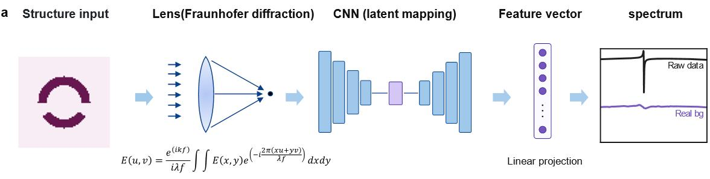

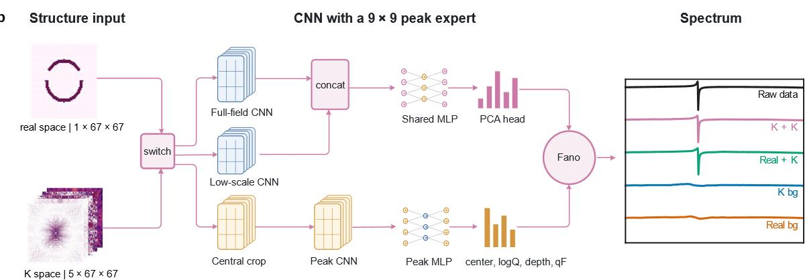  
Fig. 1 | Dielectric Fourier-space framework for qBIC spectral learning. a, Conventional route, in which a CNN maps the real-space permittivity map to the spectrum. Fraunhofer diffraction by a lens is shown as the familiar optical example of a Fourier transform. b, Model used in this work. The background backbone receives either the real-space map or the five-channel Fourier tensor (tested separately) and predicts the broadband spectrum through a PCA head. The optional resonance expert receives the central 9 × 9 Fourier block and predicts the resonance centre, ln Q, depth and Fano asymmetry, which a differentiable Fano layer adds to the backbone spectrum. Right, representative predictions of the four configurations.

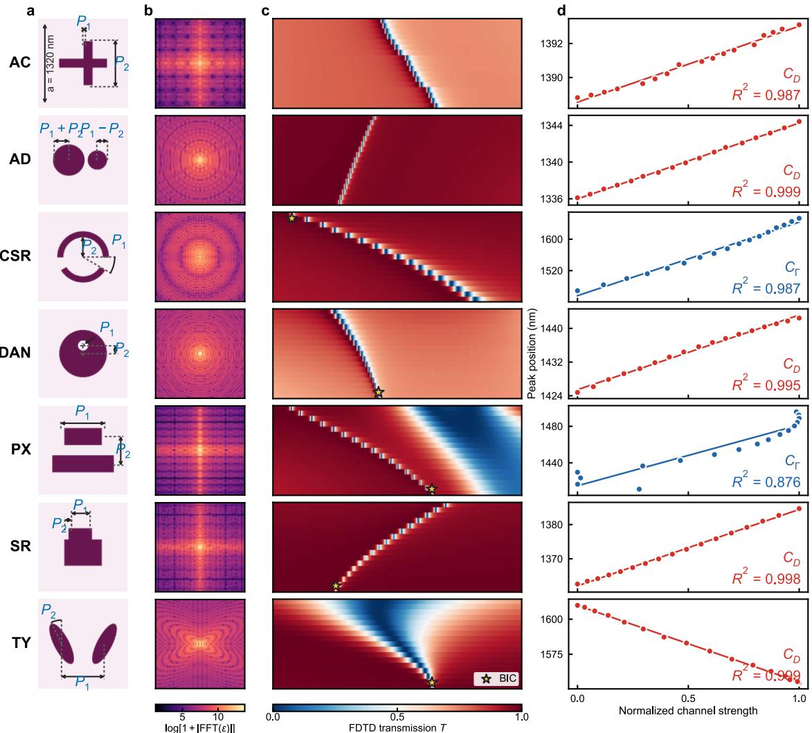  
Fig. 2 | Seven qBIC metasurface families on a shared Fourier grid. a, Unit cells and geometric parameters $P _ { 1 }$ and $P _ { 2 }$ (lattice period $a = 1 , 3 2 0 \ \mathrm { n m } )$ . b, Log-amplitude of the dielectric Fourier coefficients of representative structures. c, Raw transmission spectra along one parameter slice of each family (horizontal axis, wavelength; vertical axis, scanned parameter); stars mark the symmetry-protected BIC. d, Resonance position versus the normalized descriptor, $C _ { \Gamma }$ for CSR and PX and $C _ { \mathrm { D } }$ for the other families. Each slice contains 17 points; $R ^ { 2 }$ is given for the slice shown.

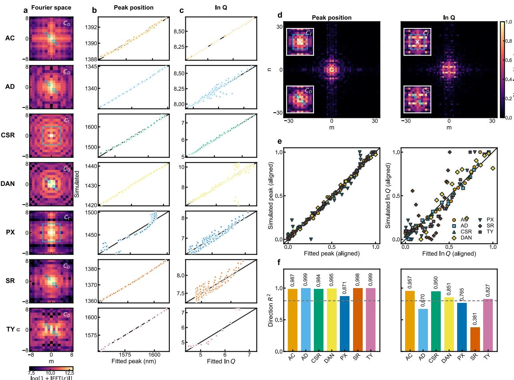  
Fig. 3 | Low-order Fourier descriptors of the qBIC resonance. a, Fourier maps of the seven families with the descriptor region outlined. $\mathsf { b } , \mathsf { c } ,$ Descriptor fits of resonance position (b) and ln Q (c) for all samples of each family. d, ExtraTrees importance maps for resonance position (left) and ln Q (right); insets mark the CΓ and CD regions. e, All families after per-slice affine alignment of fitted and simulated values. f, Mean within-branch $R ^ { 2 }$ for resonance position (left) and ln Q (right); dashed lines mark $R ^ { 2 } = 0 . 8 . \mathrm { A l l }$ fits are in-sample.

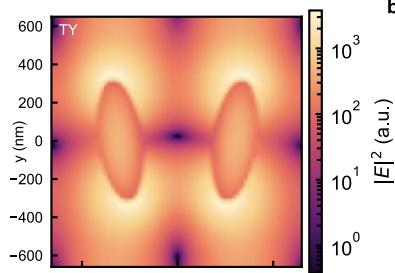

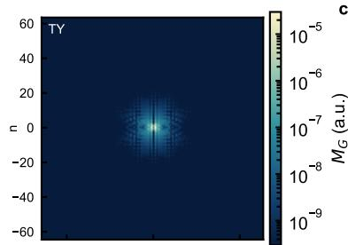

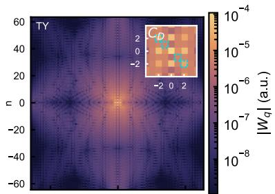

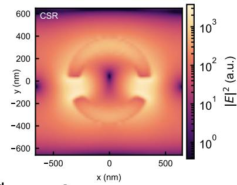

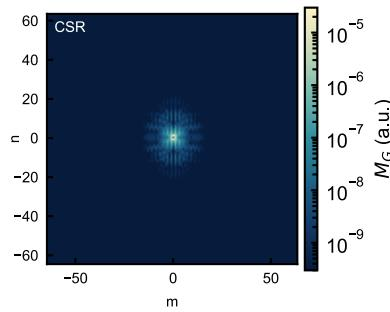

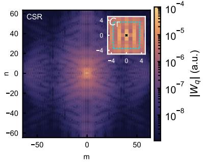

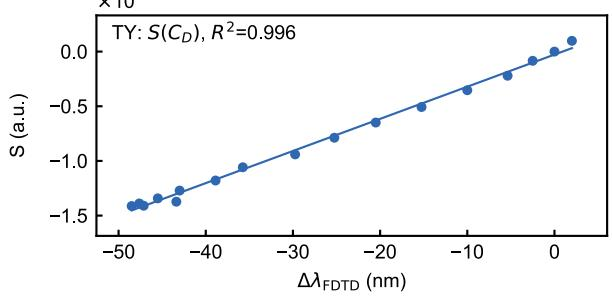

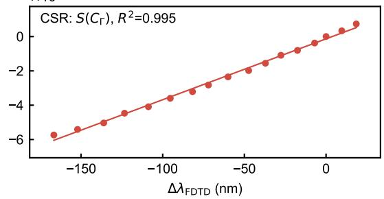  
Fig. 4 | Field-level test of the Maxwell–Fourier picture for the TY and CSR branches. a, Resonant $| \mathbf { E } | ^ { 2 }$ at the mid-plane of the silicon layer. b, Modal Fourier weight MG integrated over z. $\mathsf { c } , | W _ { \mathbf { q } } |$ of the reference mode; insets mark the four $C _ { \mathrm { D } }$ wavevectors (TY) and the non-DC central $7 \times 7$ block of $C _ { \Gamma }$ (CSR). d, Perturbative response $S$ versus the resonance shift $\Delta \lambda$ along each 17- state branch $( R ^ { 2 } = 0 . 9 9 6$ for TY and 0.995 for CSR).

a  
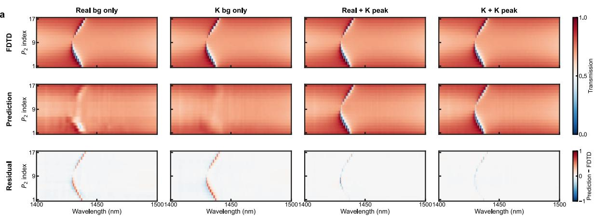  
b

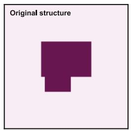

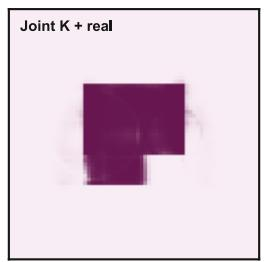

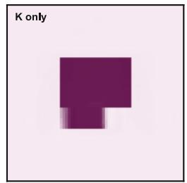

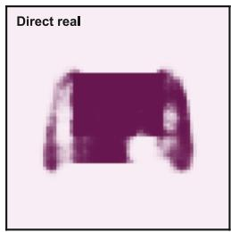

C  
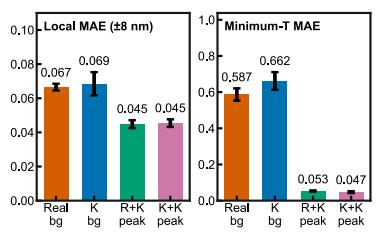

d  
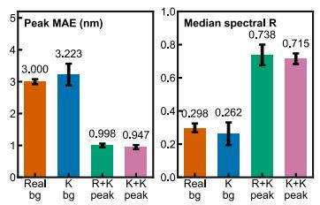

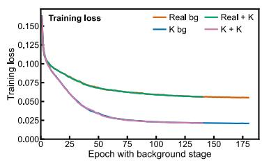  
Fig. 5 | Forward prediction with the resonance expert and inverse reconstruction. a, Raw spectra, predictions of the four models and residuals (prediction − FDTD) along a DAN slice $( P _ { 1 }$ index 10; $P _ { 2 }$ index 1–17). b, Test structure S05\_SR\_008 and its reconstructions by joint Fourier and real-space supervision, Fourier-only supervision and direct real-space decoding. ${ \mathrm { c } } , \pm 8$ nm local MAE, minimum-transmission MAE, resonance-position MAE and median spectral correlation of the four models on the 221 test samples $( \mathrm { m e a n } \pm \mathrm { s . d . }$ . over five seeds). d, Training loss of the background stage (mean ± s.d. over five seeds).

## References

[1] Peurifoy, J. et al. Nanophotonic particle simulation and inverse design using artificial ne ural networks. Sci. Adv. 4, eaar4206 (2018).

[2] Liu, Z., Zhu, D., Rodrigues, S. P., Lee, K.-T. & Cai, W. Generative model for the inver se design of metasurfaces. Nano Lett. 18, 6570–6576 (2018).

[3] Ma, W. et al. Deep learning for the design of photonic structures. Nat. Photon. 15, 77–9 0 (2021).

[4] Jiang, J., Chen, M. & Fan, J. A. Deep neural networks for the evaluation and design of photonic devices. Nat. Rev. Mater. 6, 679–700 (2021).

[5] Tang, Y. et al. Physics-informed recurrent neural network for time dynamics in optical r esonances. Nat. Comput. Sci. 2, 169–178 (2022).

[6] Rahaman, N. et al. On the spectral bias of neural networks. In Proc. 36th International Conference on Machine Learning vol. 97, 5301–5310 (PMLR, 2019).

[7] Tancik, M. et al. Fourier features let networks learn high frequency functions in low di mensional domains. Adv. Neural Inf. Process. Syst. 33, 7537–7547 (2020).

[8] Hsu, C. W., Zhen, B., Stone, A. D., Joannopoulos, J. D. & Soljačić, M. Bound states in the continuum. Nat. Rev. Mater. 1, 16048 (2016).

[9] Hsu, C. W. et al. Observation of trapped light within the radiation continuum. Nature 49 9, 188–191 (2013).

[10] Fano, U. Effects of configuration interaction on intensities and phase shifts. Phys. Rev. 124, 1866–1878 (1961).

[11] Limonov, M. F., Rybin, M. V., Poddubny, A. N. & Kivshar, Y. S. Fano resonances in p hotonics. Nat. Photon. 11, 543–554 (2017).

[12] Kodigala, A. et al. Lasing action from photonic bound states in continuum. Nature 541, 196–199 (2017).

[13] Tittl, A. et al. Imaging-based molecular barcoding with pixelated dielectric metasurfaces . Science 360, 1105–1109 (2018).

[14] Yesilkoy, F. et al. Ultrasensitive hyperspectral imaging and biodetection enabled by diel ectric metasurfaces. Nat. Photon. 13, 390–396 (2019).

[15] Liu, Z. et al. High-Q quasibound states in the continuum for nonlinear metasurfaces. P hys. Rev. Lett. 123, 253901 (2019).

[16] Kang, M., Liu, T., Chan, C. T. & Xiao, M. Applications of bound states in the continu um in photonics. Nat. Rev. Phys. 5, 659–678 (2023).

[17] Zhen, B., Hsu, C. W., Lu, L., Stone, A. D. & Soljačić, M. Topological nature of optica l bound states in the continuum. Phys. Rev. Lett. 113, 257401 (2014).

[18] Koshelev, K., Lepeshov, S., Liu, M., Bogdanov, A. & Kivshar, Y. Asymmetric metasurf aces with high-Q resonances governed by bound states in the continuum. Phys. Rev. Lett. 12 1, 193903 (2018).

[19] Ma, X. et al. Strategical deep learning for photonic bound states in the continuum. Las er Photon. Rev. 16, 2100658 (2022).

[20] Wang, L., Wang, W., Dong, Q., Wang, L. & Gao, L. Deep learning enabled inverse de sign of bound states in the continuum with ultrahigh Q factor. J. Opt. Soc. Am. B 41, A146 –A151 (2024).

[21] Joannopoulos, J. D., Johnson, S. G., Winn, J. N. & Meade, R. D. Photonic Crystals: Molding the Flow of Light 2nd edn (Princeton Univ. Press, 2008).

[22] Fan, S. & Joannopoulos, J. D. Analysis of guided resonances in photonic crystal slabs.

Phys. Rev. B 65, 235112 (2002).

[23] Moharam, M. G. & Gaylord, T. K. Rigorous coupled-wave analysis of planar-grating di ffraction. J. Opt. Soc. Am. 71, 811–818 (1981).

[24] Li, L. New formulation of the Fourier modal method for crossed surface-relief gratings. J. Opt. Soc. Am. A 14, 2758–2767 (1997).

[25] Gao, X. et al. Formation mechanism of guided resonances and bound states in the cont inuum in photonic crystal slabs. Sci. Rep. 6, 31908 (2016).

[26] Lee, S.-G. & Magnusson, R. Band flips and bound-state transitions in leaky-mode phot onic lattices. Phys. Rev. B 99, 045304 (2019).

[27] Lee, S.-G., Kim, S.-H. & Kee, C.-S. Metasurfaces with bound states in the continuum enabled by eliminating first Fourier harmonic component in lattice parameters. Phys. Rev. Le tt. 126, 013601 (2021).

[28] Lee, S.-G., Kim, S.-H. & Kee, C.-S. Fourier-component engineering to control light dif fraction beyond subwavelength limit. Nanophotonics 10, 3917–3925 (2021).

[29] Li, Z. et al. Fourier neural operator for parametric partial differential equations. In Proc . 9th International Conference on Learning Representations (ICLR, 2021).

[30] Li, E. et al. Current-diffusion model for metasurface structure discoveries with spatial-f requency dynamics. Nat. Mach. Intell. 8, 59–69 (2026).

[31] Raissi, M., Perdikaris, P. & Karniadakis, G. E. Physics-informed neural networks: a dee p learning framework for solving forward and inverse problems involving nonlinear partial d ifferential equations. J. Comput. Phys. 378, 686–707 (2019).

[32] Karniadakis, G. E. et al. Physics-informed machine learning. Nat. Rev. Phys. 3, 422–44 0 (2021).

[33] Wang, J. T., You, J. W. & Panoiu, N. C. Giant second-harmonic generation in monolay er MoS2 boosted by dual bound states in the continuum. Nanophotonics 13, 3437–3448 (202 4).

[34] van Loon, T. et al. Refractive index sensing using quasi-bound states in the continuum in silicon metasurfaces. Opt. Express 32, 14289–14299 (2024).

[35] Huang, Z. et al. Quasi-bound state in the continuum in a dielectric double-gap split-rin g metasurface structure with large split angles. Opt. Mater. Express 14, 1484–1498 (2024).

[36] Tuz, V. R. et al. High-quality trapped modes in all-dielectric metamaterials. Opt. Expres s 26, 2905–2916 (2018).

[37] Campione, S. et al. Broken symmetry dielectric resonators for high quality factor Fano metasurfaces. ACS Photonics 3, 2362–2367 (2016).

[38] Gölz, T. et al. Revealing mode formation in quasi-bound states in the continuum metas urfaces via near-field optical microscopy. Adv. Mater. 36, 2405978 (2024).

[39] Ashcroft, N. W. & Mermin, N. D. Solid State Physics (Holt, Rinehart and Winston, 19 76).

[40] Johnson, S. G. et al. Perturbation theory for Maxwell’s equations with shifting material boundaries. Phys. Rev. E 65, 066611 (2002).

[41] Fan, S., Suh, W. & Joannopoulos, J. D. Temporal coupled-mode theory for the Fano re sonance in optical resonators. J. Opt. Soc. Am. A 20, 569–572 (2003).

## Methods

## Full-wave simulation and dataset construction

Transmission spectra of the seven silicon metasurface families were computed with threedimensional finite-difference time-domain (FDTD) (Lumerical). Each family is a fixed unit-cell motif controlled by two geometric parameters, $P _ { 1 }$ and $P _ { 2 } .$ , sampled on a nominal $1 7 \times 1 7$ grid. The lattice period (1,320 nm), silicon thickness (250 nm), substrate index (1.4), excitation, boundary conditions and monitors are common to all families; only the in-plane permittivity distribution changes.

Periodic boundaries were applied in plane and perfectly matched layers along z, with a normally incident plane wave. Transmission was recorded at 2,001 wavelengths (Supplementary Table S2). The permittivity in the silicon layer, recorded by an index monitor, provides both the real-space input (resampled to $6 7 \times 6 7 )$ and the Fourier representation described below.

Several spectra contain more than one resonance or background dip. We therefore defined a target wavelength window for each family from the parameter-resolved spectra and tracked one continuous qBIC branch within it, extracting the resonance position, minimum transmission, linewidth and Q. Of the 2,023 simulated structures, eight (seven CSR and one DAN) were excluded because the target resonance could not be identified, leaving 2,015.

The strict split separates source-grid geometry hashes and principal-scan parameter blocks, giving 1,556 training, 238 validation and 221 test samples. It is fixed for all models (Supplementary Fig. S3).

## Low-order dielectric Fourier-channel analysis

The spatial mean was subtracted from each permittivity map before a two-dimensional FFT, and the zero-frequency component was shifted to the centre to give coefficients $F _ { m n }$ on the

reciprocal-lattice grid. Details of the Fourier-grid construction and cropping procedure are provided in Supplementary Note 3.

ExtraTrees regressors trained on the $6 7 \times 6 7$ Fourier pixels identified candidate low-order regions for resonance position and ln $\mathcal { Q } .$ From these regions we defined CΓ (Eq. (6)) and $C _ { \mathrm { D } }$ (Eq. (7)), whose definitions were then fixed for all families, scan directions and slices.

Each descriptor was regressed against resonance position and ln Q by ordinary least squares within each 17-point slice, with one parameter scanned and the other fixed. The reported R2 is the $R ^ { 2 }$ mean over the 17 slices of a family (Supplementary Note 3 and Supplementary Table S3).

## Physics-guided spectral learning

Four configurations were built: Real bg, K bg, Real + K peak and K + K peak. The backbone is a multiscale convolutional encoder (full input plus its central 33 × 33 region) that outputs 32 PCA coefficients of the spectrum. Its input is either the $1 \times 6 7 \times 6 7$ real-space map or the $5 \times 6 7$ $\times 6 7$ Fourier tensor of Eq. (13).

The expert models add a convolutional branch on the central $5 \times 9 \times 9$ Fourier block that predicts ${ \lambda } _ { 0 } ,$ ln $\mathcal { Q } ,$ d and $q \mathrm { f } ,$ a differentiable Fano layer converts these into a resonance term added to the backbone spectrum (Eq. (14)). Input statistics, target statistics and the PCA basis were fitted on the training set only.

Models were trained with AdamW, selected on the validation set and evaluated once on the test set; each configuration was run with five seeds. Hyperparameters and loss weights are listed in Supplementary Note 5.

Metrics are the full-window spectral MAE; local MAEs within ±8 nm and ±5 nm and $\mathbf { a } \pm 0 . 5$ nm core MAE, all centred on the labelled resonance and used for evaluation only; the resonanceposition and minimum-transmission MAEs; and the per-sample Pearson correlation between predicted and simulated spectra (Supplementary Figs. S4–S6).

## Spectrum-driven Fourier-space inverse reconstruction

The inverse model encodes the target BIC-band spectrum, together with the normalized wavelength, with a one-dimensional convolutional network and predicts both family probabilities and the complex Fourier coefficients of the unit cell.

Family labels provide auxiliary supervision during training; at inference, only the predicted probabilities are used. The Fourier target is the orthonormal real FFT of the binary mask logits (±4), standardized with training-set statistics (Supplementary Note 6).

The predicted coefficients are inverse-transformed and passed through a sigmoid to give a 67 × 67 foreground-probability map. We compare Fourier-only supervision, joint Fourier and realspace supervision, and direct real-space decoding (Supplementary Figs. S10 and S11).

## Data availability

The unit-cell permittivity maps, Fourier input tensors, raw BIC-window transmission spectra, dataset splits and model evaluation results used in this study are available at https://github.com/leishuangteng/FFTBIC-Core.

## Code availability

Code for Fourier descriptor analysis, forward spectral prediction, inverse geometry reconstruction and model evaluation is available at https://github.com/leishuangteng/FFTBIC-Core.

## Acknowledgements

This work was financially supported by Chinese Academy of Sciences (Grant Nos. XDB0580000.), National Natural Science Foundation of China (Grant Nos. 12393833, 12227901, U2241219, 12174416, 11991063.), and the Science and Technology Commission of Shanghai

Municipality (Grant No. 23JC1404100). The simulations and model training were performed on the robotic AI-Scientist platform of Chinese Academy of Sciences.

## Author contributions

L.Y., T.L., and W.L. conceived the project and designed experiments. S.L., and L.Y. performed the simulation data acquisition and model training. L.Y., and W.L. conducted the theoretical analysis. S.L., L.Y., T.L. and W.L. analysed the results. All authors contributed to interpretation of the results and the writing of the manuscript.

## Competing interests

The authors declare no competing interests.

## Supplementary Information

Learning qBIC Resonances across Metasurface Families in Dielectric Fourier Space This file contains Supplementary Notes 1–6, Supplementary Figs. S1–S11 and Supplementary Tables S1–S3. Unless stated otherwise, all analyses use the 2,015 valid samples and the fixed strict split of 1,556 training, 238 validation and 221 test samples.

Supplementary Note 1 | Dataset, simulation settings and continuous spectral branches The seven families (AC, AD, CSR, DAN, PX, SR and TY) were simulated on nominal $1 7 \times 1 7$ grids of the geometric parameters $P _ { 1 }$ and $P _ { 2 }$ . Eight structures were excluded because the target resonance could not be identified (seven CSR samples and DAN231), leaving 2,015. Table S1 lists the parameter definitions, ranges, target windows and split counts.

<table><tr><td colspan="10">Supplementary Table S1 | Geometric parameters, target windows and strict-split composition of the seven families.</td></tr><tr><td>Struc ture</td><td>P1</td><td> ${ \bf P } _ { 2 }$ </td><td>P1 range</td><td>P2 range</td><td>BIC window (nm)</td><td>Scan paramet er</td><td>Total</td><td>Train</td><td>Val</td><td>Test</td></tr><tr><td>AC</td><td>∆x</td><td>∆L</td><td>50–100 nm</td><td>0–100 nm</td><td>1380-1400</td><td> $\mathrm { P } _ { 2 }$ </td><td>289</td><td>238</td><td>17</td><td>34</td></tr><tr><td>AD</td><td>R0</td><td>∆R</td><td>180–194 nm</td><td>30–60 nm</td><td>1320-1380</td><td> $\mathrm { P _ { 1 } }$ </td><td>289</td><td>221</td><td>34</td><td>34</td></tr><tr><td>CSR</td><td>∆θ</td><td>Rin</td><td>3–30 deg</td><td>256–320 nm</td><td>1450-1700</td><td> $\mathrm { P } _ { 2 }$ </td><td>282</td><td>214</td><td>34</td><td>34</td></tr><tr><td>DAN</td><td>r_hole</td><td>∆x</td><td>50–100 nm</td><td>24–216 nm</td><td>1400-1500</td><td> $\mathrm { P _ { 1 } }$ </td><td>288</td><td>220</td><td>34</td><td>34</td></tr><tr><td>PX</td><td>d</td><td>∆p</td><td>360–440 nm</td><td>200–500 nm</td><td>1400-1550</td><td> $\mathrm { P } _ { 2 }$ </td><td>289</td><td>204</td><td>51</td><td>34</td></tr><tr><td>SR</td><td>∆a</td><td>∆b</td><td>262.5–425 nm</td><td>0–125 nm</td><td>1350-1400</td><td> $\mathrm { P } _ { 1 }$ </td><td>289</td><td>221</td><td>34</td><td>34</td></tr><tr><td>TY</td><td>d</td><td>θ</td><td>600–660 nm</td><td>5–50 deg</td><td>1450-1700</td><td> $\mathrm { P } _ { 2 }$ </td><td>289</td><td>238</td><td>34</td><td>17</td></tr></table>

Table S2 lists the common FDTD settings. $P _ { 2 }$ is scanned for AC, CSR, PX and $\mathrm { T Y , }$ and $P _ { 1 }$ for AD, DAN and SR; the other parameter is fixed within each branch. The same conventions apply to main-text Fig. 2.
<table><tr><td colspan="2">Supplementary Table S2 | Three-dimensional FDTD settings.</td></tr><tr><td colspan="2">Item Setting</td></tr><tr><td>Simulation model Simulationdomain</td><td>Three-dimensional Lumerical FDTD; identical modelling framework for all seven families.  $\mathbf { x } , \mathbf { y } \in [ - 0 . 6 6 , 0 . 6 6 ] \mu \mathrm { m } ; \mathrm { z } \in [ - 1 0 , 7 ]$  μm; periodic boundaries along x/y; eight-layer PML along</td></tr><tr><td>and boundaries Z. Materials</td><td>and Si (Silicon)–Palik; metasurface thickness, 250 nm; substrate refractive index,  ${ \mathfrak { n } } = 1 . 4 ;$  background</td></tr><tr><td>thickness Source</td><td>refractive index,  ${ \mathfrak { n } } = 1 . 0 .$  Normally incident periodic plane wave; wavelength range, 1,300–1,700 nm; polarization angle,</td></tr><tr><td>Mesh</td><td> $0 ^ { \circ } ;$  source plane,  $z = 3$  μm; Backward  $( { \mathrm { a l o n g - z } } ) ; \theta = \varphi = 0 ^ { \circ }$  Global auto non-uniform mesh; mesh accuracy = 2; local mesh,  $\mathrm { d } \mathbf { x } = \mathrm { d } \mathbf { y } = \mathrm { d } \mathbf { z } = 1 0$  nm; local range,</td></tr><tr><td>Time and termination Simulation time, 50 ps; auto-shutoff</td><td> $\mathrm { x , y } \in [ - 0 . 6 0 , 0 . 6 0 ]$  μm and  $z \in [ - 0 . 1 0 , 0 . 3 0 ] \mu \mathrm { m }$ </td></tr><tr><td></td><td> $\mathrm { \ m i n i m u m } = 1 \times 1 0 ^ { - 7 } ;$  stability factor = 0.99. Reflection monitor  $\mathrm { R } , z = + 4$  μm; transmission monitor T, z = -4 μm; dielectric/refractive-index</td></tr><tr><td>Monitors</td><td>monitor, z = 100 nm.</td></tr><tr><td>Spectral sampling</td><td>Uniform sampling of 2,001 points over the family-specific windows; the complete 2,001-point array is retained for every current input spectrum.</td></tr></table>

## Supplementary Note 2 | Compact Maxwell–Fourier derivation

For a unit cell of area $A _ { c e l l }$ , the in-plane dielectric expansion and its coefficient are

$$
\varepsilon ( \rho , z ) = \sum _ { q } \varepsilon _ { q } ( z ) e ^ { ( i q \cdot \rho ) } ,\tag{�1}
$$

$$
\varepsilon _ { q } ( z ) = { 1 / A _ { c e l l } } \int _ { A _ { c e l l } } \varepsilon ( \rho , z ) e ^ { ( - i q \cdot \rho ) } d ^ { 2 } \rho ,\tag{�2}
$$

Here $q = m b _ { 1 } + n b _ { 2 }$ is a reciprocal-lattice vector. Expanding the Bloch field in harmonics G gives the convolutional Maxwell equation below; $L _ { G }$ includes the z-dependent differential operator for a slab. Its dielectric coupling matrix is $B _ { G , G } , = \varepsilon _ { G - G } ,$

$$
L _ { G } E _ { G } = ( \omega ^ { 2 } / c ^ { 2 } ) \sum _ { G ^ { \prime } } \varepsilon _ { \left( G - G ^ { \prime } \right) } E _ { \left( G ^ { \prime } \right) } ,\tag{�3}
$$

Write � $E _ { R } \ = \ \Im B \ E _ { R }$ , with $\textstyle { \tilde { \lambda } } = { \tilde { \omega } } ^ { 2 } / c ^ { 2 }$ . At fixed A, first-order variation about reference state r and projection onto the left eigenfield $E _ { L }$ give

$$
\varDelta \tilde { \omega _ { i } } = - ( \tilde { \omega _ { r } } / 2 ) \big ( E _ { L } ^ { \dagger } \varDelta B _ { i } E _ { R } \big ) / \big ( E _ { L } ^ { \dagger } B _ { r } E _ { R } \big ) ,\tag{�4}
$$

The numerator can be grouped by wavevector transfer q. The common unit-cell area factor cancels against the normalization when the same Fourier convention is used in both:

$$
E _ { L } ^ { \dagger } \varDelta B _ { i } E _ { R } = \sum _ { q } \int d z \varDelta \varepsilon _ { ( i , q ) } ( z ) \sum _ { G } E _ { ( L , G ) } ^ { * } ( z ) \cdot E _ { ( R , G - q ) } ( z ) ,\tag{�5}
$$

For a perturbation uniform through the patterned thickness, the z integral defines $W _ { q } = \Sigma _ { \mathrm { G } } \int E _ { r , G } ^ { * }$ $E _ { r , G - q }$ dz over that region. Under weak leakage, $E _ { L } \approx E _ { R }$ and $\begin{array} { r } { T ~ = ~ \int ~ E _ { r } ^ { * } ~ \cdot ~ \varepsilon _ { r } ~ E _ { r } } \end{array}$ ��, giving the frequency and wavelength shifts

$$
\Delta \omega _ { ( r , i ) } \approx - \big ( \omega _ { 0 } / ( 2 T ) \big ) R e \left[ \sum _ { q } \varDelta \varepsilon _ { ( i , q ) } W _ { q } ^ { ( r ) } \right] ,\tag{�6}
$$

$$
\varDelta \lambda _ { i } \approx \bigl ( \lambda _ { 0 } / ( 2 T ) \bigr ) S _ { i } ,\tag{�7}
$$

Here $S _ { i } = R e \big [ \Sigma _ { \mathrm { q } } \varDelta \varepsilon _ { i , q } W _ { q } \big ]$ . If $\Delta \varepsilon$ depends on $\mathbf { Z } ,$ it must remain inside the integral in Eq. (S5). Strong leakage, dispersion, moving discontinuous boundaries or modal hybridization require the corresponding generalized normalization, boundary perturbation or multimode treatment; the field tests below establish branchwise trend agreement under the stated approximation. Low-order modal localization supports substantial overlap at small ${ \mathfrak { q } } ,$ but does not imply monotonic decay of $| W _ { q } |$ with |�|.

For structure-side descriptors, $F _ { m n }$ is the centered FFT of ε minus its spatial mean. The two fixed compressions exclude DC:

$$
C _ { \cal T } = 1 / 4 8 \sum _ { - 3 \leq m , n \leq 3 ; ( m , n ) \neq ( 0 , 0 ) } l n ( 1 + | { \cal F } _ { m n } | ) ,\tag{�8}
$$

$$
C _ { D } = \sum _ { ( m , n ) \in D } | F _ { m n } | ^ { 2 } , D = ( 1 , - 1 ) , ( - 1 , 1 ) , ( 2 , - 2 ) , ( - 2 , 2 ) ,\tag{�9}
$$

These descriptors omit the modal weights and cross-component phases. For $\tilde { \omega } = \omega _ { r } \ - \ i \gamma$ ， radiative Q instead depends on outgoing-channel amplitudes:

$$
Q = \omega _ { r } / \kappa = \omega _ { r } / ( 2 \gamma ) ,\tag{�10}
$$

$$
d _ { \mu } = d _ { ( \mu , 0 ) } + \sum _ { q } R _ { ( \mu q ) } \varDelta \varepsilon _ { q } + O ( \varDelta \varepsilon ^ { 2 } ) ,\tag{�11}
$$

$$
Q _ { ( r a d ) } \approx \omega _ { r } / \left( 2 \sum _ { \mu } \left| d _ { ( \mu , 0 ) } + \sum _ { q } R _ { ( \mu q ) } \Delta \varepsilon _ { q } \right| ^ { 2 } \right) ,\tag{�12}
$$

The index $\mu$ labels a normalized outgoing diffraction, polarization and propagation channel, and $R _ { \mu q }$ is its complex perturbative overlap. Coherent summation introduces the cross terms

$$
\left| \sum _ { q } a _ { q } \right| ^ { 2 } = \sum _ { q } \left| a _ { q } \right| ^ { 2 } + \sum _ { q \neq q ^ { \prime } } a _ { q } a _ { \left( q ^ { \prime } \right) } ^ { * } , a _ { q } = R _ { ( \mu q ) } \varDelta \varepsilon _ { q } ,\tag{�13}
$$

Thus �� $Q _ { r a d } \approx C - l n { \Sigma } _ { \mu } | d _ { ( \mu , 0 ) } + { \Sigma } _ { q } R _ { ( \mu q ) } { \cal { \Delta } } \varepsilon _ { q } | ^ { 2 }$ , corresponding to main-text Eq. (8). Amplitude-only $C _ { T }$ and $C _ { D }$ cannot recover this interference universally. The radiative expression assumes negligible absorption and other losses; spectral linewidth labels are not direct complex-eigenfrequency measurements. The central 9 × 9 complex input retains relative phases but does not explicitly supply $R _ { \mu q }$

## Supplementary Note 3 | Frozen channel assignment and branchwise validation

The scalar channels are computed from the centered, mean-subtracted $5 2 9 \times 5 2 9$ dielectric FFT. The forward network instead receives the central $6 7 \times 6 7$ Fourier crop, with a central $9 \times 9$ expert crop. Real-space network inputs are $6 7 \times 6 7$ dielectric maps. Cropping reciprocal coefficients and downsampling a real-space image are different operations.

For resonance position, each family compares the fixed $C _ { T }$ and $C _ { D }$ definitions along its formal scan direction. Selection ranks the median within-branch $R ^ { 2 }$ , then the mean $R ^ { 2 }$ , minimum $R ^ { 2 }$ and normalized weighted MAE. Ordinary least squares is fitted separately within each branch. These are descriptive in-dataset channel fits, not held-out spectral-network predictions. Table S3 records the peak assignment and the separate ln Q channel used in main-text Fig. 3; the latter is not a universal radiation-channel law.

Supplementary Table S3 | Per-family Fourier-channel assignments and branch statistics for resonance position and ln Q.
<table><tr><td>Family</td><td>Scan / fixed</td><td>N</td><td>Peak channel</td><td>Peak mean  $R ^ { 2 }$ </td><td>In Q channel</td><td>ln Q mean  $R ^ { 2 }$ </td></tr><tr><td>AC</td><td>P2 / P1</td><td>289</td><td> $C _ { D }$ </td><td>0.987</td><td> $C _ { D }$ </td><td>0.957</td></tr><tr><td>AD</td><td>P1 / P2</td><td>289</td><td> $C _ { D }$ </td><td>0.999</td><td> $C _ { T }$ </td><td>0.670</td></tr><tr><td>CSR</td><td>P2 /P1</td><td>282</td><td> $C _ { T }$ </td><td>0.984</td><td> $C _ { T }$ </td><td>0.950</td></tr><tr><td>DAN</td><td>P1 /P2</td><td>288</td><td> $C _ { D }$ </td><td>0.995</td><td> $C _ { D }$ </td><td>0.851</td></tr><tr><td>PX</td><td>P2 / P1</td><td>289</td><td> $C _ { T }$ </td><td>0.871</td><td> $C _ { D }$ </td><td>0.765</td></tr><tr><td>SR</td><td>P1 /P2</td><td>289</td><td> $C _ { D }$ </td><td>0.998</td><td> $C _ { D }$ </td><td>0.381</td></tr><tr><td>TY</td><td>P2 /P1</td><td>289</td><td> $C _ { D }$ </td><td>0.999</td><td> $C _ { T }$ </td><td>0.827</td></tr></table>

$R ^ { 2 }$ in Table S3 is the arithmetic mean of the 17 separate branch $R ^ { 2 }$ values in the selected direction. It is neither the median branch $R ^ { 2 }$ used for selection nor $R ^ { 2 }$ from one regression pooling raw points. The peak/ln Q channels are selected and reported separately.

## Supplementary Note 4 | Field-level validation and reference-state dependence

Complex driven fields at the reference resonance are used for TY2, TY4, TY8, CSR88, CSR90 and CSR93. An x–y FFT is performed independently at each z layer, and $| E _ { G } | ^ { 2 }$ is summed over vector components and integrated over z to obtain the modal weight $M _ { G }$ . This field quantity differs from the dielectric coefficient $F _ { m n }$ . Figure S1 extends the low-order localization shown in maintext Fig. 4b to all six reference states.

(a)  
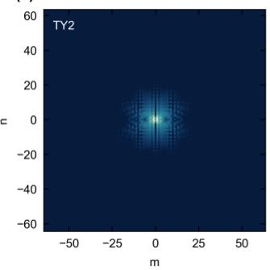

(b)  
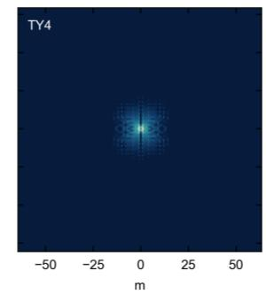

(c)  
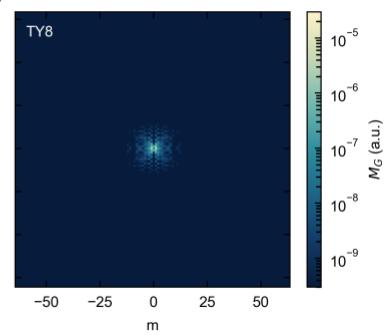

(d)  
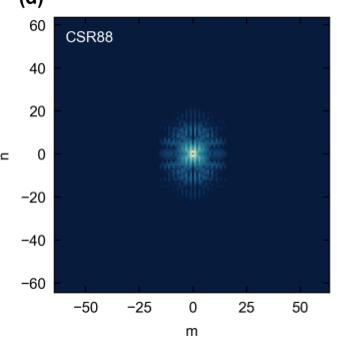

(e)  
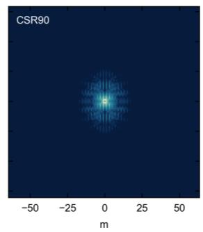

(f)  
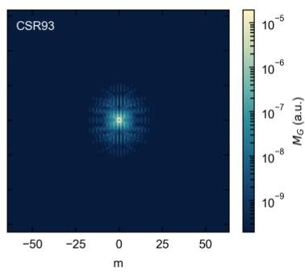  
Supplementary Fig. S1 | Modal Fourier weight $M _ { G }$ of the six reference states. The TY and CSR panels each share a logarithmic colour scale. Most of the weight lies in a finite low-order region near Γ, which supports substantial harmonic overlap at small nonzero q.

For each reference, the same 17-state branch is evaluated using the complete response $S _ { a l l }$ , the non-DC central $7 \times 7$ response $S _ { l o w }$ , and the directional $S _ { C _ { D } }$ for TY or $S _ { C _ { T } }$ for CSR. All S quantities retain complex $\Delta \varepsilon _ { q }$ and $W _ { q }$ weights; they are not the amplitude-only descriptors $C _ { T }$ and $C _ { D }$

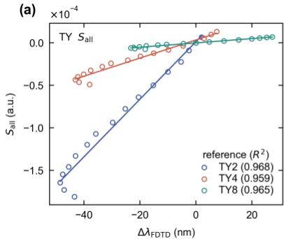

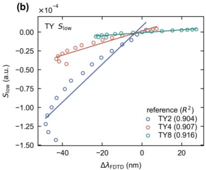

(c)  
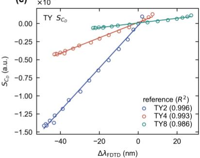

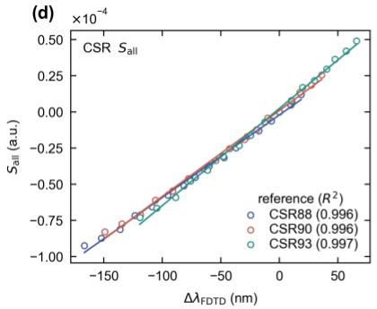

(e)  
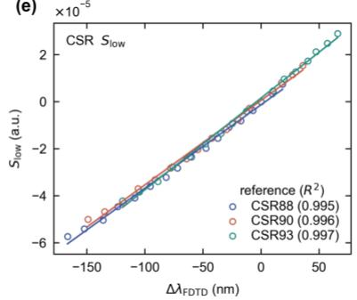

(f)  
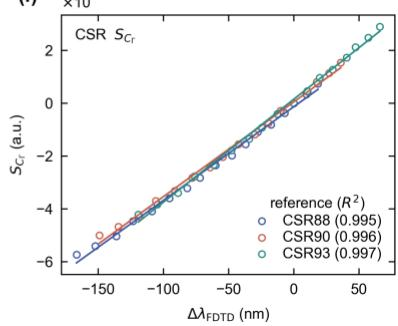  
Supplementary Fig. S2 | Partition of the field-overlap response. $\mathbf { a } { - } \mathbf { c } , S _ { \mathrm { a l l } } , S _ { \mathrm { l o w } }$ and $S _ { C D }$ for $\mathrm { T Y } ;$ d–f, $ { S _ { \mathrm { a l l } } } ,  { S _ { \mathrm { l o w } } }$ and $S _ { C \Gamma }$ for CSR. Values in parentheses are $R ^ { 2 }$ for each reference state; all panels use the same 17-state branch.  
For TY, $R ^ { 2 }$ is 0.959–0.968 for $S _ { a l l } , 0 . 9 0 4  – 0 . 9 1 6$ for $S _ { l o w }$ and 0.986–0.996 for $S _ { C _ { D } }$ . For CSR, $S _ { a l l }$ gives 0.996–0.997 and $S _ { l o w } = S _ { C _ { T } }$ gives 0.995–0.997. Main-text Fig. 4d uses TY2 with $S _ { C _ { D } }$ (0.996) and CSR88 with $S _ { C _ { I } }$ (0.995). $R ^ { 2 }$ measures linear trend agreement, not a captured fraction of frequency-shift energy. These driven-field tests support resonance-position trends; no normalized outgoing-channel projection is available here to validate $d _ { \mu } , \ R _ { \mu q }$ or radiative Q directly.

## Supplementary Note 5 | Forward learning, split boundaries and expert-input controls

All four configurations use the complete 2,001-point window spectra, including the narrow resonance. Both backbones encode the full $6 7 \times 6 7$ input and its central $3 3 \times 3 3$ region into 32 PCA coefficients. The Fourier input has five channels: real part, imaginary part, log-amplitude, and sine and cosine of the phase. The expert receives only the central $5 \times 9 \times 9$ block and predicts $\lambda _ { 0 } ,$ , ln $\mathcal { Q } ,$ depth and Fano asymmetry $q _ { \mathrm { f } } .$ Input statistics, family-dependent target statistics and the PCA basis were fitted on the training set only. Because no independent label exists for $q _ { \mathrm { f } } ,$ its target is set to zero, and it acts as a weakly regularized parameter learned through the spectral loss.

Training uses AdamW, batch size 40, weight decay $1 0 ^ { - 4 }$ and gradient-norm clipping at 2.0. ReduceLROnPlateau uses factor 0.65 and patience 18. Background-only training has maximum/minimum epochs 360/180, learning rate $8 \times 1 0 ^ { - 4 }$ and early-stopping patience 90. Expert background, peak and joint stages use maximum/minimum epochs 260/140, 360/180 and 420/220; learning rates $8 \times 1 0 ^ { - 4 }$ $7 \times 1 0 ^ { - 4 }$ and $1 . 5 \times 1 0 ^ { - 4 } ;$ and patience 70, 90 and 110. Five seeds, 20260717– 20260721, are evaluated after validation-based checkpoint selection.

The background-only objective combines spectrum L1, 0.35 times spectrum MSE, 0.08 times standardized PCA-coefficient MSE and 0.08 times the squared second spectral difference. Expert optimization combines weighted spectrum L1 and 0.45 times weighted MSE, first- and seconddifference errors weighted by 0.10 and 0.025, an output-range penalty weighted by 0.20, and standardized parameter supervision weighted by 1.0 during peak training or 0.80 during joint training. Local training weights use the labeled center; true center, $\mathrm { Q }$ and depth are not supplied at inference.

The strict split separates source-grid geometry hashes and principal-scan parameter blocks (1,556/238/221 samples). At the 67 × 67 binary-mask resolution, 68 test masks nevertheless coincide with a training mask, because distinct source geometries can round to the same mask. The other 153 form the no-training-repeat subset, which still belongs to the seven known families. Figure S3 summarizes this distinction; random-split counts are shown for reference only.

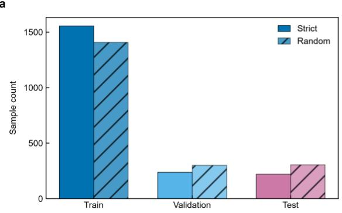

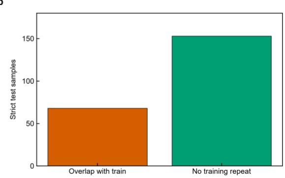  
Supplementary Fig. S3 | Strict split, random split, and geometric duplication. a, Training, validation, and test sample counts under the two splits. b, Partition of the strict test set into 68 samples whose binary geometries are exactly duplicated in the training set and 153 samples with nonduplicated geometries. Novel geometry denotes a test geometry not duplicated in training but still belonging to one of the seven known families and the current scan range.

The gain is not uniform across families (Fig. S4). The expert reduces the resonance-position error for AD, CSR, DAN, PX and SR. AC errors are already small and change little, and for TY the expert increases both the mean error and its spread across seeds.

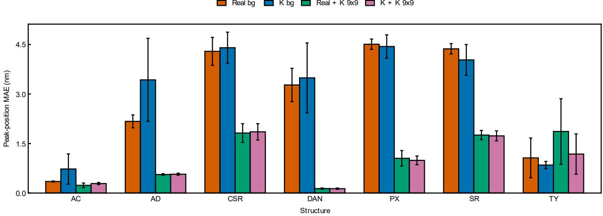  
Supplementary Fig. S4 | Family-resolved resonance-position MAE. Real bg, K bg, Real + K peak and K + K peak are compared for each family. Bars show five-seed means on the strict test set; error bars, s.d.

Complete-spectrum MAE averages absolute error over the target window. Local errors use $\pm 8$ or ±5 nm about the labeled center, and core error uses ±0.5 nm; these masks are evaluation definitions, not inference inputs. Minimum-transmission and resonance-position MAEs quantify the dip depth and position, while median spectral R summarizes samplewise Pearson correlation. Figure S5 adds ±5 nm and core metrics to main-text Table 1; bars summarize five seeds and error bars are sample standard deviations.

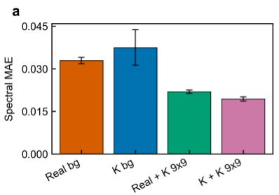

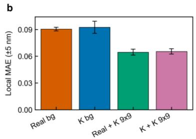

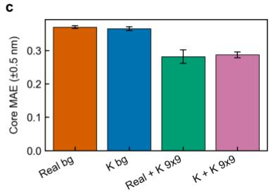

d  
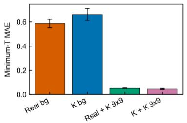

e  
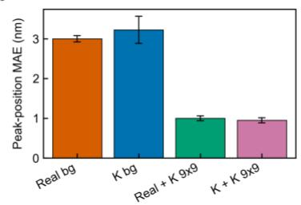

f  
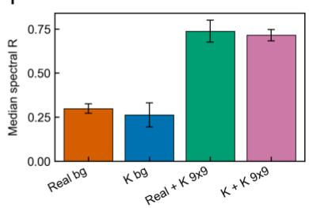  
Supplementary Fig. S5 | Five-seed test metrics for the four forward models under the strict split. a–f, Complete-spectrum MAE, ±5 nm local MAE, ±0.5 nm core MAE, minimumtransmission MAE, resonance-position MAE, and median spectral R, respectively. Bar heights are five-seed means, error bars are sample standard deviations, and the test set contains 221 samples.

The input ablation keeps the real-space backbone, split and seed (20260717) fixed and varies only the expert input: the central complex Fourier block (9 × 9), the full real-space map $( 6 7 \times 6 7 )$ , the full Fourier tensor $( 6 7 \times 6 7 )$ , a central $9 \times 9$ real-space crop and the scalar pair (CD, CΓ). The resonance-position MAEs are 0.996, 2.049, 1.979, 2.691 and 2.548 nm, and the minimumtransmission MAEs are 0.052, 0.136, 0.144, 0.327 and 0.235. This single-seed control distinguishes the representations but does not rank them statistically.

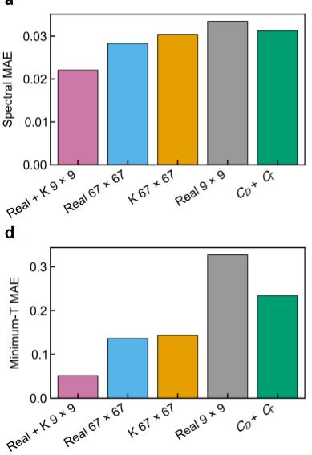

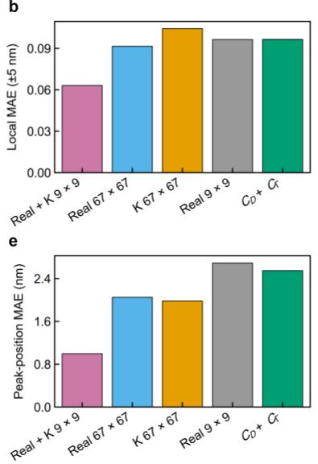

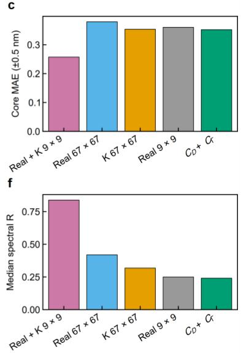  
Supplementary Fig. S6 | Expert-input ablation. The five inputs are the central 9 × 9 complex Fourier block $( \mathrm { R e a l } + \mathrm { K } 9 \times 9 )$ , the full real-space map (Real 67), the full Fourier tensor (K 67), a central 9 × 9 real-space crop (Real 9 × 9) and the scalar pair $C _ { \mathrm { D } } + C _ { \Gamma } . \mathrm { a - f } ,$ Complete-spectrum MAE, ±5 nm local MAE, ±0.5 nm core MAE, minimum-transmission MAE, resonance-position MAE and median spectral R. Single seed, strict split.

Additional surrogate-model controls use seed 20260717, the same strict split (1,556/238/221) and all 2,001 target points. Real-space ResNet and a two-dimensional Fourier neural operator (FNO) directly regress spectra; an adapted offline two-stage model regresses training-only PCA32 background coefficients and independently fitted single-resonance Fano parameters, followed by analytical synthesis. The latter is a Ma-style adaptation, rather than an exact reproduction of RIDL. All models receive the same family information.

a  
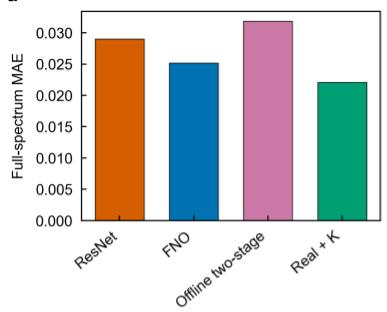

b  
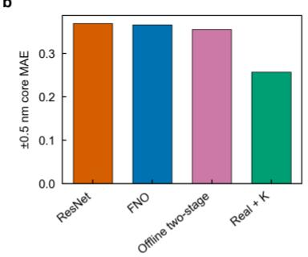

C  
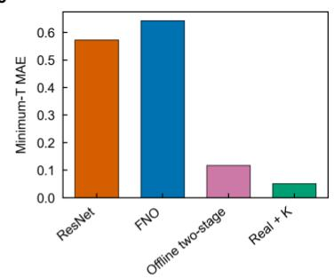

d  
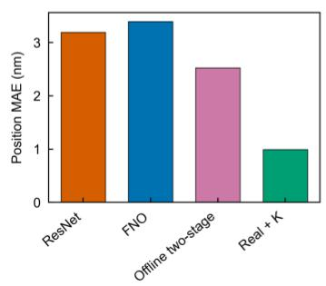

e  
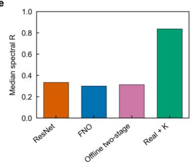

f  
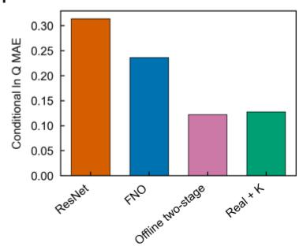  
Supplementary Fig. S7 | Additional surrogate-model comparison. a–f, Complete-spectrum MAE, ±0.5 nm core MAE, minimum-transmission MAE, resonance-position MAE, median spectral Pearson R and conditional ln Q MAE. All models use the same 221 strict-test samples and seed 20260717. The ln Q error is conditional on both spectra being resolvable; each model uses its respective resolvable intersection. Bars are single-seed results without uncertainty estimates.

  
Supplementary Fig. S8 | Representative offset spectra from the additional surrogate models. a–g, AC, AD, CSR, DAN, PX, SR and TY. Each family uses the middle sample after lexicographically sorting its strict-test sample IDs, independently of prediction error. Within each sample, all curves share the normalization (T − min T\_FDTD)/(max T\_FDTD − min T\_FDTD). From top to bottom, FDTD, Real + K, offline two-stage, FNO and ResNet are shifted vertically by 4.60, 3.45, 2.30, 1.15 and 0, respectively. Offsets are for display only; every curve retains all 2,001 wavelength points.

b  
d  
The 2,015 effective FDTD simulations consume 146,984.4 CPU·h in total, corresponding to 72.95 CPU·h and 2.28 wall-clock h per sample on 32 allocated CPU cores. GPU training times include validation and checkpoint overhead but exclude preprocessing. On an NVIDIA GeForce RTX 4050 Laptop GPU, prepared-input batch-one inference for $6 7 \times 6 7$ inputs requires 1.593–3.403 ms per sample, excluding geometry construction, FFT, disk I/O and model loading; transfer-inclusive timings are reported separately. CPU·h and GPU·h are reported independently rather than converted into a direct speedup.  

  
Supplementary Fig. S9 | FDTD, training and inference time. a, Median FDTD CPU resource cost per sample. b, Recorded training GPU time per run. c, Prepared-input, device-resident model inference at batch size one. d, Prepared-input transfer, inference and output transfer. The labels explicitly distinguish background-network inputs (Real or K, 529 × 529 or $6 7 \times 6 7 )$ from the Fourier peak-expert input $( \mathrm { K } , 9 \times 9 )$ . Background-only models have no peak expert. The $6 7 \times 6 7$ background branches show means across five seeds; the $5 2 9 \times 5 2 9$ background branches have one

recorded seed. No error bars are displayed.

## Supplementary Note 6 | Inverse reconstruction and its evaluation boundary

The inverse encoder receives the 2,001-point BIC spectrum and normalized wavelength. Sevenfamily labels provide auxiliary training supervision; only predicted class probabilities enter the decoder at inference. The target is a binary $6 7 \times 6 7$ material mask. In the Fourier routes, mask logits are +4 for foreground and −4 for background, transformed by orthonormal rFFT2 and standardized using training-only coefficient means and scales. The decoder predicts the complex coefficients, reverses this standardization and applies irFFT2, sigmoid and a 0.5 threshold. This target is the Fourier representation of mask logits, not the mean-subtracted physical dielectric coefficients used in channel analysis.

The direct-real objective is weighted binary cross-entropy + 0.75 Dice loss + 0.20 auxiliary class cross-entropy. Joint supervision adds 0.08 SmoothL1 loss on standardized Fourier coefficients. Konly uses SmoothL1 on these coefficients + 0.20 class cross-entropy, without real-space BCE or Dice. Training uses AdamW at $7 \times 1 0 ^ { - 4 }$ , weight decay $1 0 ^ { - 4 }$ , batch size 48, maximum 220 epochs and early-stopping patience 35; ReduceLROnPlateau uses factor 0.5 and patience 10. This inverse comparison is single-seed.

Figure S10 reports results for all 221 test samples and for the 153 masks absent from training. On the full test set, IoU is 0.944 (Fourier only), 0.926 (joint) and 0.853 (direct real), and probability MAE is 0.030, 0.015 and 0.027. On the no-training-repeat subset, IoU is 0.927, 0.920 and 0.816. IoU measures the thresholded contour, probability MAE the calibration of the unthresholded map, and exact-mask accuracy requires every pixel to match; the three are complementary. The nonzero exact-mask accuracy of the Fourier-only route comes from the duplicated masks (Fig. S10f).

  
Supplementary Fig. S10 | Test metrics for the three inverse-reconstruction routes. $\operatorname { a - f } ,$ Foreground IoU, Dice score, pixel accuracy, probability MAE, auxiliary structure-family accuracy, and exact-mask accuracy, respectively. Solid bars denote the complete test set (n = 221), and hatched bars denote the novel-geometry subset (n = 153).

# Target K + real joint K-only Direct real a AC + 十 + + b AD 0 0 0 d DAN e PX f SR 八 八 八

Supplementary Fig. S11 | Inverse reconstruction of representative test samples from the seven structure families. Each row corresponds to one family; columns compare the ground-truth dielectric distribution with K + real joint, K-only, and Direct real. Predicted maps show unthresholded foreground probabilities from 0 to 1.

The seven-family examples in Fig. S11 extend main-text Fig. 5b. Reconstruction is conditional on the paired dataset and known topology classes; spectral nonuniqueness and generalization to unseen topologies remain unresolved.