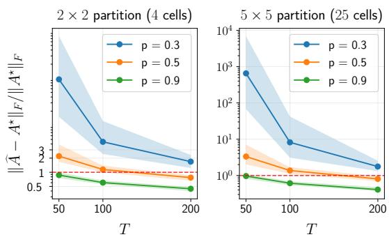
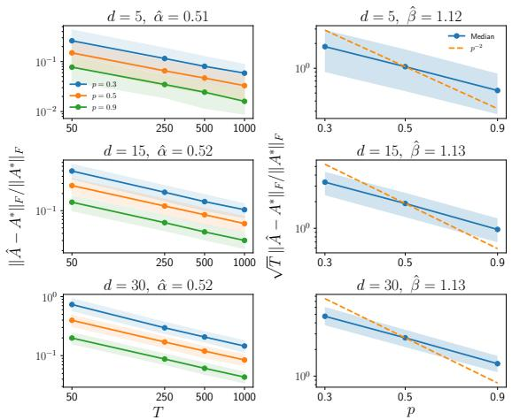
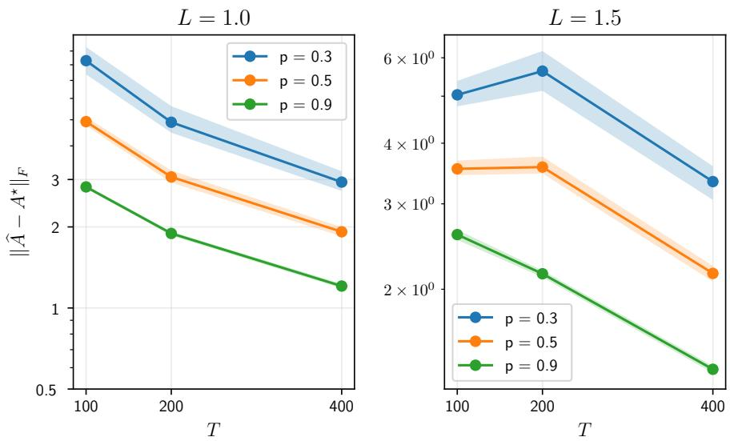

# Learning structured linear dynamical systems from missing observations

Aravinda K. Ruwanpathirana

Hemant Tyagi

Sunny G.W. Wang

Division of Mathematical Sciences, SPMS, NTU Singapore 637371 {aravinda.r, hemant.tyagi, sunny.wanggw}@ntu.edu.sg

## Abstract

We consider the problem of learning structured linear dynamical systems over convex sets K, where only a small subset of the observations are available at each time point. An estimator which minimizes a bias-corrected, potentially non-convex objective function is proposed. Non-asymptotic bounds are obtained for the statistical error, which depend on the local complexity of K, the trajectory length T, and the sub-sampling probability $p .$ Convergence of the projected gradient descent algorithm is also established. The general theory is applied to settings where (i) K is a subspace, (ii) K is the set of bi-isotonic matrices, and (iii) K is the set of matrices whose rows are formed by sampling Lipschitz functions. We show meaningful recovery of the transition matrix is possible for values of T much smaller than what is required in the unconstrained case, and for $p = o ( 1 )$ 1

## 1 INTRODUCTION

Consider the linear dynamical system¹ (LDS)

$$
x _ { t + 1 } = A ^ { * } x _ { t } + \eta _ { t + 1 } ; ~ t = 0 , \ldots , T - 1 ,\tag{1.1}
$$

where $( \eta _ { t } ) _ { t \geq 1 }$ are centered i.i.d subgaussian random variables (process noise), $x _ { 0 } = 0$ and $A ^ { * } \in \mathbb { R } ^ { n \times n }$ is the unknown system matrix. The problem of finite-time identification of $A ^ { * }$ given access to a single trajectory of states $( x _ { t } ) _ { t = 1 } ^ { T }$ from (1.1) has attracted considerable attention in recent years, mainly in part due to numerous applications arising in, $\mathrm { e . g . }$ , control systems theory and reinforcement learning, to name a few. A key difficulty in provably recovering $A ^ { * }$ is the dependencies between the observations $( x _ { t } ) _ { t = 1 } ^ { T }$ , which makes the theoretical analysis challenging.

When no structural assumptions are made on $A ^ { * }$ a recent like of work (Jedra and Proutiere, 2020; Sarkar and Rakhlin, 2019; Simchowitz et al., 2018; Shirani Faradonbeh et al., 2018) has analyzed the ordinary least-squares (OLS) estimator and derived nonasymptotic bounds (up to log factors) of $O ( 1 / \sqrt { T } )$ which hold with high probability (w.h.p) when $T$ is suitably large w.r.t n. The results hold under different stability assumptions on $A ^ { * }$ as measured via its spectral radius $\rho ( A ^ { * } )$ – this was shown for the strictly stable regime $\rho ( A ^ { * } ) < 1$ by Jedra and Proutiere (2020), and for the more challenging marginal stability regime $\rho ( A ^ { * } ) \leq 1$ by Sarkar and Rakhlin (2019); Simchowitz et al. (2019). The unstable regime $\rho ( A ^ { * } ) > 1$ has been relatively less studied, see $\mathrm { e . g . }$ , Sarkar and Rakhlin (2019); Shirani Faradonbeh et al. (2018).

A number of recent works have studied the setting where $A ^ { * }$ is structured (and strictly stable) under different structural assumptions, typically involving sparsity (Basu and Michailidis, 2015; Kock and Callot, 2015; Song and Bickel, 2011; Melnyk and Banerjee 2016), low-rankness (Wang and Tsay, 2023) and lowrank plus sparse structures (Lv et al., 2021; Basu et al., 2019). These works typically show recovery-bounds for $A ^ { * }$ with T having a much milder dependence on n than in the unstructured case. The recent work of Tyagi and Efimov (2024) considered a general setup where $A ^ { * }$ lies in a closed convex set $\kappa ,$ in the spirit of shapeconstrained regression (Chatterjee et al., 2015; Bellec, 2018; Neykov, 2019). Meaningful recovery of $A ^ { * }$ was shown when the local size of $\kappa$ at $A ^ { * }$ is “small”".

Our setting. The aforementioned works assume that $( x _ { t } ) _ { t = 1 } ^ { T }$ is fully observed, however in practice, we often have missing values in the data. This brings us to the setting of this paper: suppose some entries of $( x _ { t } ) _ { t \geq 1 }$ are missing, where the probability that the entry $\left( { x _ { t } } \right)$ i is observed is $p .$ A popular strategy in this scenario is to impute the missing entries by zero, leading to observations $( y _ { t } ) _ { t = 1 } ^ { T }$ , and then estimating $A ^ { * }$ using $( y _ { t } ) _ { t = 1 } ^ { T }$ . Results for provably estimating structured $A ^ { * }$ in this setting are relatively scarce in contrast to the full-information setting, and focus essentially on sparsity and low-rank assumptions (e.g., Rao et al. (2016); Dalle and Castro (2025); Jalali and Willett (2018)).

## 1.1 Our contributions

In this work, we consider the setting where $A ^ { * } \in \kappa$ where $\kappa$ is a general closed convex set. The estimator we consider amounts to solving a "bias-corrected" least squares problem under the constraint $\kappa ;$ see (2.1). The objective function is potentially non-convex, and is motivated from the works of Loh and Wainwright (2011); Jalali and Willett (2018).

1. For the solution $\widehat { A }$ of (2.1), we derive estimation error bounds in the Frobenius norm $\left\| \cdot \right\| _ { F }$ that hold w.h.p, and depend on the local complexity of the tangent cone of $\kappa$ at any $B \in { \mathcal { K } }$ . The local complexity is measured via Talagrand's $\gamma _ { 1 }$ and $\gamma _ { 2 }$ functionals (Talagrand, 2014); see Theorem 1.

2. We show in Theorem 2 that the iterates of the projected gradient descent (PGD) algorithm converge linearly (w.h.p) to $A ^ { * }$ − up to the statistical error obtained in Theorem 1.

3. The above results are instantiated for different choices of $\kappa ,$ namely: subspace, set of bi-isotonic matrices (bi-isotonic regression), and set of matrices whose rows are formed by sampling Lipschitz functions (Lipschitz regression)

Theorems 1 and 2 hold provided T and $p \in ( 0 , 1 ]$ are suitably large, and $A ^ { * }$ is strictly stable. As shown in the examples, these results do establish meaningful recovery of $A ^ { * }$ w.r.t $\left\| \cdot \right\| _ { F } ,$ when $T = o ( n ^ { 2 } )$ , and $p = o ( 1 )$ w.r.t T. Note that if $\bar { p } = 1$ , and $A ^ { * }$ is unstructured, then $T \gtrsim n ^ { 2 }$ is necessary to ensure $\| \widehat { A } - A ^ { * } \| _ { F }$ is small.

Our results for the aforementioned examples are new for learning structured LDSs from missing values – existing works in this setting focus primarily on sparsity and low-rank based structures (as noted earlier). In essence, we extend the results of Tyagi and Efimov (2024) to the setting of missing values.

## 1.2 Related work

High-dimensional regression with missing observations. In the setting of high-dimensional regression with (typically) independent samples, a number of works have studied the effect of missing data.

The seminal work of Loh and Wainwright (2011) considered sparse linear regression with missing or noisy covariates. They propose a bias-corrected lasso-type estimator with a potentially non-convex objective and show that PGD converges to the true parameters, up to the statistical error. Our estimator is motivated from their work. While their framework accommodates dependent covariates generated via a stationary LDS, this is different from our setting as rewriting (1.1) as a traditional linear model (by vectorizing $A ^ { * } )$ leads to a model with dependencies between the design matrix and noise (while Loh and Wainwright (2011) assume these to be independent). Addressing missingness in diverse regression settings, HMLasso estimates both the covariance matrix and coefficients for highly incomplete design matrices (Takada et al., 2019). Other approaches tackle missing responses via doubly robust high-dimensional M-estimation (Chakrabortty et al., 2019), and missing covariates in semi-supervised settings using Dantzig selectors (Risebrow and Berrett, 2026). Beyond linear models, sparse estimation has been adapted for nonlinear additive models via multiple imputation (Shimazu et al., 2025), and for simultaneous missingness in both predictors and responses using joint lasso penalties (Muroya et al., 2026).

Estimating structured LDSs with missing observations. A growing body of work has recently addressed the problem of estimating LDSs provably, under our Bernoulli sampling model (with zeroimputation). Rao et al. (2016, 2017a) explore covariance estimation to recover $A ^ { * }$ (assuming stationarity) under structural assumptions such as bandedness, sparsity, and low-rankness. Jalali and Willett (2018); Wong (2017) propose a bias-corrected (potentially non-convex) lasso-type estimator for estimating sparse $A ^ { * }$ , in the spirit of Loh and Wainwright (2011). They provide error rates for the global minimizer $\widehat { A }$ w.r.t $\left\| \cdot \right\| _ { F } ,$ and also address recovering the support of $A ^ { * }$ . But they do not show guarantees for solving for ${ \widehat { A } } .$ Dalle and Castro (2025) study the Dantzig selector assuming $A ^ { * }$ is sparse, and provide minimax optimal recovery bounds w.r.t the entry-wise max norm. All of these works assume strict stability of $A ^ { * }$

Other related works. Mark et al. (2019) consider autoregressive parameter estimation from missing data for discrete event streams; these concepts have also been applied to network topology inference from partial observations (Ioannidis et al., 2019; Ravazzi et al., 2021; Cirillo et al., 2021; Zaman et al., 2023). A related but distinct problem is system identification which seeks to estimate both $A ^ { * }$ , and the unknown observation matrix (which is unchanged over time) mapping states to outputs (e.g., (Tsiamis and Pappas, 2019; Sun and Wang, 2025; Lee and Zhang, 2020)). Zhang et al. (2026) propose an active sensor allocation strategy and provide explicit non-asymptotic error bounds for system-identification from multiple trajectories. Rao et al. (2017b) studied a setting where compressive linear measurements of the states are available at each time $t ,$ and provide fundamental limits for covariancebased estimation.

## 2 PROBLEM SETUP AND PRELIMINARIES

## 2.1 Notation

For a vector $x \in \mathbb { R } ^ { n }$ , let $\left. x \right. _ { p }$ denote the standard $\ell _ { p }$ norm. For any matrix $B \ \in \ \mathbb { R } ^ { n _ { 1 } \times n _ { 2 } } , \ \left. B \right. _ { 2 }$ (resp. $\left\| \boldsymbol B \right\| _ { F } )$ denotes the spectral (resp. Frobenius) norm of B. If $n _ { 1 } = n _ { 2 }$ then diag(B) keeps only the diagonal entries of B. Also, $\left. B , C \right. = \mathrm { T r } \left( B ^ { \top } C \right)$ denotes the inner product between B and C. The vector $\mathrm { v e c } ( B ) \in$ $\mathbb { R } ^ { n _ { 1 } n _ { 2 } }$ is obtained by stacking the columns of B. The symbols ⊗ and  denote the Kronecker and Hadamard products, respectively. For $n \times n$ matrices, we denote the unit Frobenius sphere by $\mathbb { S } _ { n }$ , the unit Frobenius ball by $B _ { n }$ , and the identity matrix by $I _ { n }$

Sets are denoted by calligraphic letters and for $s \subset$ Rn₁×n2 and $\begin{array} { r } {  { \boldsymbol { X } } \in \mathbb { R } ^ { n _ { 1 } \times n _ { 2 } } } \end{array}$ , we denote $\begin{array} { r l r } { S ~ - ~ X } & { { } : = } & { } \end{array}$ $\{ A - X : A \in S \}$ . For a closed convex set $\mathcal { C } \subset \mathbb { R } ^ { m \times n }$ and $\ b X \in \mathbb { R } ^ { m \times n }$ , we denote

$$
\Pi _ { { \mathcal { C } } } ( X ) : = \arg \operatorname* { m i n } _ { Y \in { \mathcal { C } } } \left\| Y - X \right\| _ { F } ^ { 2 } .
$$

to be the (orthogonal) projection of X onto C. Note that $\Pi _ { C } ( X )$ here is unique. Throughout, the values of symbols used to denote constants $( \mathrm { e . g . , } C , c , c _ { 1 }$ , etc.) may differ from line to line. For $a , b > 0 ;$ we write $a \lesssim b$ if there exists a constant C such that $a \leq C b$ If $a ~ \lesssim ~ b$ and $a \ \gtrsim \ b ,$ we write $a \ \asymp \ b .$ The subgaussian norm of a random variable X is defined as $\left\| \boldsymbol { X } \right\| _ { \psi _ { 2 } } : = \operatorname* { s u p } _ { l \geq 1 } l ^ { - 1 / 2 } \left( \mathbb { E } \left| \boldsymbol { X } \right| ^ { l } \right) ^ { 1 / l }$ , and we say that X is L-subgaussian $\mathrm { i f } \parallel \dot { X } \parallel _ { \psi _ { 2 } } \leq L$

## 2.2 Problem setup and estimator

We consider $( x _ { t } ) _ { t = 1 } ^ { T }$ to be generated via the VAR process in (1.1) where $A ^ { * } \in \kappa$ for a known closed convex set K. We assume that $( \eta _ { t } ) _ { t = 1 } ^ { T }$ are centered, i.i.d random variables where the entries of $\eta _ { t }$ are i.i.d, $L _ { - }$ subgaussian (for some constant $L )$ , and have unit variance. At each time $t = 1 , \dots , T$ we observe

$$
y _ { t } = P _ { t } x _ { t } { \mathrm { ~ w h e r e ~ } } ( P _ { t } ) _ { i i } \stackrel { \mathrm { ~ i . i . d ~ } } { \sim } B ( p ) { \mathrm { ~ f o r ~ } } i = 1 , \ldots , d .
$$

Here $( P _ { t } ) _ { t \geq 1 }$ are diagonal matrices and $B ( p )$ is the Bernoulli distribution with parameter $p \in ( 0 , 1 ]$ . The goal is to learn $A ^ { * }$ given $( y _ { t } , P _ { t } ) _ { t = 1 } ^ { T }$ and the set K.

Denote the stacked matrices

$$
X = \left[ x _ { 1 } \quad x _ { 2 } \quad . . . \quad x _ { T - 1 } \right] { \mathrm { ~ a n d ~ } } \tilde { X } = \left[ x _ { 2 } \quad x _ { 3 } \quad . . . \quad x _ { T } \right] ,
$$

and let $\tilde { E } = \left[ \eta _ { 2 } \quad \eta _ { 3 } \quad \ldots \quad \eta _ { T } \right]$ . (1.1) can then be written as $\tilde { X } = \bar { A } ^ { * } X + \tilde { E }$ . Now denoting

$$
\begin{array} { l l l l } { { Z = [ P _ { 1 } y _ { 1 }  } } & { { P _ { 2 } y _ { 2 } } } & { { \ldots } } & { { P _ { T - 1 } y _ { T - 1 } ] , } } \\ { { \tilde { Z } = [ P _ { 2 } y _ { 2 }  } } & { { P _ { 3 } y _ { 3 } } } & { { \ldots } } & { { P _ { T } y _ { T } ] , } } \end{array}
$$

and $D = \mathrm { d i a g } ^ { 1 / 2 } ( Z Z ^ { \top } )$ , we estimate $A ^ { * }$ via

$$
\widehat { A } \in \underset { A \in \mathcal { K } } { \mathrm { a r g m i n } } \underbrace { \left. \widetilde { Z } - A Z \right. _ { F } ^ { 2 } - ( 1 - p ) \left. A D \right. _ { F } ^ { 2 } } _ { = : g ( A ) } .\tag{2.1}
$$

Remark 1. We assume knowledge of p in (2.1) to establish the theoretical guarantees, akin to Jalali and Willett (2018); Loh and Wainwright (2011). In practice, when $p$ is unknown we can use a hyperparameter tuning approach by varying p and testing the recovered matrix on a downstream prediction task.

The objective function in (2.1) is derived in a similar manner as in Jalali and Willett (2018), except that we now have a general convex constraint K.

Lemma 1. $I f p > 0$ then

$$
\underset { A \in { \cal K } } { \mathrm { a r g m i n } } \ \mathbb { E } \left[ \boldsymbol { g } ( { \boldsymbol { A } } ) \right] = \underset { { \boldsymbol { A } } \in { \cal K } } { \mathrm { a r g m i n } } \ \mathbb { E } \left[ \left\| \tilde { \boldsymbol { X } } - { \boldsymbol { A } } \boldsymbol { X } \right\| _ { F } ^ { 2 } \right] .
$$

The proof is detailed in Appendix B and follows similar arguments outlined in Jalali and Willett (2018), which in turn were motivated by Loh and Wainwright (2012). Thus minimizing the population loss in (2.1) is equivalent to minimizing the population loss in the full-information setting.

Projected gradient descent. The objective $g ( \cdot )$ can be nonconvex, hence we consider solving it via projected gradient descent (PGD) as in Algorithm 1.

Algorithm 1 PGD for structured transition matrix   
Input: Initialization $A ^ { ( 0 ) }$ , step-size $\gamma > 0 .$ number of   
iterates K   
1: for k = 0 to K − 1 do   
2: $A ^ { ( k + 1 ) } = \Pi _ { \mathcal { K } } \left( A ^ { ( k ) } - \gamma \nabla g ( A ^ { ( k ) } ) \right)$   
3: end for   
4: return A(K)

## 2.3 Preliminaries

Talagrand's $\gamma _ { \alpha }$ functionals. We start with restating the Talagrand's $\gamma _ { \alpha }$ functionals (Talagrand, 2014). Definition 1 (Talagrand's $\gamma _ { \alpha }$ Functionals (Talagrand, 2014)). Let $( S , d )$ be a metric space. A sequence of subsets of ${ \cal S } , ( { \cal S } _ { r } ) _ { r \ge 0 } ,$ is an admissible sequence if $| S _ { 0 } | = 1$ and $| \bar { S } _ { r } | \leq ^ { - } 2 ^ { 2 ^ { r } }$ for all $r \geq 1$ . Then for any $0 < \alpha < \infty$ the $\gamma _ { \alpha }$ function of $( S , d )$ is defined as

$$
\gamma _ { \alpha } ( S , d ) : = \operatorname* { i n f } \operatorname* { s u p } _ { s \in S } \sum _ { r = 0 } ^ { \infty } 2 ^ { r / \alpha } d ( s , S _ { r } ) ,
$$

where the inf is over the admissible sequences of S. Definition 2 (Gaussian width). Given a set $s \subset$ $\mathbb { R } ^ { \times m }$ , the Gaussian width w(S) of S is given by

$$
w ( S ) : = \mathbb { E } \operatorname* { s u p } _ { s \in { \cal S } } \Big \langle G , s \Big \rangle ,
$$

where G has i.i.d. standard Gaussian entries.

By Talagrand's majorizing measure theorem (Talagrand, 2014, Theorem 2.4.1), it is well known that

$$
w ( S ) \asymp \gamma _ { 2 } ( S , \left. \cdot \right. _ { F } ) .
$$

In general, $\gamma _ { \alpha } ( S , d )$ can be bounded using metricentropy estimates of $( S , d )$ ; see Appendix A.

Tangent cone. Our results will depend on the tangent cone of the set K at $A ^ { * }$ (or an appropriate $B \in { \cal K } )$ see e.g., (Aubin and Frankowska, 2009, Prop. 4.2.1).

Definition 3 (Tangent cone). For a convex set K, the tangent cone of K at $A \in { \mathcal { K } }$ is defined as the set

$$
\begin{array} { r } { \mathcal { T } _ { \mathcal { K } , A } : = \mathrm { c l } \{ t ( B - A ) : t \geq 0 , B \in \mathcal { K } \} , } \end{array}
$$

where cl(·) denotes the closure operation.

Stability of $A ^ { * }$ . We will require that $A ^ { * }$ is strictly stable, i.e., its spectral radius satisfies $\rho ( A ^ { * } ) < 1$ . Our analysis makes use of the quantity (introduced in Jedra and Proutiere (2020))

$$
J ( A ^ { * } ) : = \sum _ { i = 0 } ^ { \infty } \big \| ( A ^ { * } ) ^ { i } \big \| _ { 2 } .
$$

If $\rho ( A ^ { * } ) < 1$ , then $J ( A ^ { * } )$ is bounded, although it may grow with the dimension n. Furthermore, if there exist $C > 0$ and $\kappa \in ( 0 , 1 )$ such that for all integers $t \geq 1$ $\left\| ( A ^ { * } ) ^ { t } \right\| _ { 2 } \leq C \kappa ^ { t }$ , then $\begin{array} { r } { J ( A ^ { * } ) \leq 1 + \frac { C \kappa } { 1 - \kappa } } \end{array}$ . This is also referred to as $( C , \kappa )$ -stability in the literature $( \mathrm { s e e ~ e . g . }$ 2 (Ziemann and Tu, 2022, Def. 7.2)). Our results will be meaningful when $J ( A ^ { * } )$ is “small", e.g., bounded by a constant, or grows mildly with dimension n.

## 2.4 Main result

Our first result is Theorem 1 which bounds $\left\| { \widehat { A } } - A ^ { * } \right\| _ { F }$ for any $A ^ { * } \in \kappa$ The proof is provided in Section Č. Let us denote $\tau _ { \kappa , B } \cap \mathbb { S } _ { n }$ by $\mathcal { C } _ { B }$ , and $\tau _ { \kappa , A ^ { * } } \cap \mathbb { S } _ { n }$ by $\mathcal { C } _ { A ^ { * } }$ The subgaussian-norm L of $( \eta _ { t , i } ) _ { t , i }$ will be treated as an absolute constant in what follows.

Theorem 1. There exist constants $c _ { 1 } , c _ { 2 } \ > \ 1$ such that for any $\delta \in ( 0 , 1 )$ and $B \in { \mathcal { K } }$ , if

$$
T \ge \frac { c _ { 1 } J ^ { 4 } ( A ^ { * } ) \operatorname* { m a x } \left\{ \gamma _ { 2 } ^ { 2 } ( \mathcal { C } _ { B } , \left. \cdot \right. _ { F } ) , \log ^ { 2 } \left( 1 / \delta \right) \right\} } { p ^ { 4 } } ,
$$

then it holds with probability at least $1 - \delta ,$

$$
\begin{array} { r l } & { \left\| \widehat { A } - A ^ { * } \right\| _ { F } \leq c _ { 2 } \bigg [ \frac { J ^ { 3 } \left( A ^ { * } \right) } { p ^ { 2 } } \bigg ( \frac { \gamma _ { 1 } \left( \mathcal { C } _ { B } , \left. \cdot \right. _ { 2 } \right) } { T } + \frac { \gamma _ { 2 } \left( \mathcal { C } _ { B } , \left. \cdot \right. _ { F } \right) } { \sqrt { T } } } \\ & { + \sqrt { \frac { \log \left( 1 / \delta \right) } { T } } \bigg ) + \frac { J ^ { 2 } \left( A ^ { * } \right) } { p } \big \| A ^ { * } - B \big \| _ { F } \bigg ] . } \end{array}
$$

In Theorem 1, we use a generic matrix $B \in { \mathcal { K } }$ . One potential choice is $B = A ^ { * }$ which removes the $\left\| A ^ { * } - B \right\| _ { F }$ term in Theorem 1. However, the terms $\gamma _ { \alpha } \left( \boldsymbol { C } _ { B } , \bar { d } \right)$ might be easier to bound for some $B \ne A ^ { * }$ where $\left\| \boldsymbol { A } ^ { * } - \boldsymbol { B } \right\| _ { F }$ is sufficiently small. This will be shown in Corollary 5.

Remark 2. When $p = 1$ , Theorem 1 reduces to (Tyagi and Emov, 2024, Theorem 1), up to a $J ( A ^ { * } )$ factor, and under slightly stronger conditions on $T$

Our second result shows that with PGD, we can find a solution that is close to $A ^ { * }$ up to a small additive error. The proof of Theorem 2 is provided in Section G.

Theorem 2. Suppose that the learning rate is $\gamma =$ $\frac { 1 } { 2 p ^ { 2 } T J ^ { 2 } ( A ^ { * } ) }$ . There exist constants $c , C , C _ { 1 } , C _ { 2 } > 1$ such that for any $B \in { \mathcal { K } }$ and $\delta \in ( 0 , 1 )$ , if

$$
\begin{array} { r l r } & { } & { T \geq \frac { C J ^ { 4 } \left( A ^ { * } \right) } { p ^ { 4 } } \left\{ \gamma _ { 2 } ^ { 2 } ( C _ { B } , \left. . \right. _ { F } ) + \log ^ { 2 } ( 1 / \delta ) \right\} } \\ & { } & { + \frac { C J ^ { 2 } \left( A ^ { * } \right) } { p ^ { 2 } } \left\{ \gamma _ { 1 } ( \mathcal { C } _ { B } , \left. . \right. _ { 2 } ) + \log ( 1 / \delta ) \right\} , } \end{array}\tag{2.2}
$$

then there exists $\textstyle \rho \leq 1 - { \frac { 1 } { c J ^ { 2 } ( A ^ { * } ) } }$ such that with probability at least $1 - \delta ,$ it holds for all $k = 0 , 1 , \ldots$ that

$$
\left\| \boldsymbol { A } ^ { ( k ) } - \boldsymbol { A } ^ { * } \right\| _ { F } \leq \rho ^ { k } \big \| \boldsymbol { A } ^ { ( 0 ) } - \boldsymbol { A } ^ { * } \big \| _ { F } + \frac { \varepsilon } { 1 - \rho } .\tag{2.3}
$$

Here ε is given by

$$
\begin{array} { l } { \displaystyle \varepsilon = \varepsilon _ { T } = \frac { C _ { 1 } J ( A ^ { * } ) } { p ^ { 2 } } \left[ \frac { \gamma _ { 1 } ( \mathcal { C } _ { B } , \left\| \cdot \right\| _ { 2 } ) } { T } + \frac { \gamma _ { 2 } ( \mathcal { C } _ { B } , \left\| \cdot \right\| _ { F } ) } { \sqrt { T } } \right. } \\ { \displaystyle \left. + \sqrt { \frac { \log ( 1 / \delta ) } { T } } \right] + \frac { C _ { 2 } \left\| A ^ { * } - B \right\| _ { F } } { p } . } \end{array}
$$

Since $( 1 - \rho ) ^ { - 1 } = O ( J ^ { 2 } ( A ^ { * } ) ) , \varepsilon / ( 1 - \rho )$ is of the same order as the statistical error in Theorem 1.

Remark 3. γ in Theorem 2 depends on $J ( A ^ { * } )$ which is an unknown parameter defined on A\*. In practice one can replace $J ( A ^ { * } )$ by a known upper bound ξ, with no change in the PGD convergence rates.

Remark 4. Theorems 1 and 2 are complementary. Theorem 1 gives statistical rates for the global minimizer of (2.1), while Theorem 2 shows that the iterates of PGD cluster in a small ball around $A ^ { * }$ . Using triangle inequality, clearly $\big \| \widehat { A } - A ^ { ( k ) } \big \| _ { F } \lesssim \varepsilon$ under (2.2).

Remark 5. In Theorem $1 , f o r a$ fixed levelδ, we have $\big \| \widehat { A } - A ^ { * } \big \| _ { F } = o ( 1 )$ even as $p = o ( 1 )$ , under the sufficient condition

$$
\begin{array} { l } { { J ^ { 3 / 2 } ( A ^ { * } ) \displaystyle \left( \sqrt { \frac { \gamma _ { 1 } ( \mathcal { C } _ { B } , \left\| . \right\| _ { 2 } ) } { T } } + \frac { \sqrt { \gamma _ { 2 } ( \mathcal { C } _ { B } , \left\| . \right\| _ { F } ) } } { T ^ { 1 / 4 } } \right. } } \\ { { \displaystyle \left. + \sqrt { \left\| A ^ { * } - B \right\| _ { F } } \right) = o ( p ) , \quad w i t h \quad p = o ( 1 ) . } } \end{array}\tag{2.4}
$$

For Theorem 2, $i f \left\| A ^ { ( 0 ) } - A ^ { * } \right\| _ { F } = O ( 1 ) , p =$ $o ( 1 )$ , and (2.4) holds, then $\begin{array} { r l r l } { \ddot { f } o r } & { { } k } & { = } & { { } k _ { T } } & { \gtrsim } \end{array}$ log $\left( 1 / ( \left. A ^ { * } - B \right. _ { F } + \varepsilon _ { T } ) \right)$ iterations, we have

$$
\left\| { \cal A } ^ { ( k _ { T } ) } - { \cal A } ^ { * } \right\| _ { F } = { \cal O } ( \left\| { \cal A } ^ { * } - { \cal B } \right\| _ { F } + \varepsilon _ { T } ) = o ( 1 ) .
$$

Remark 6. While Theorem 1 holds for general convex sets K, the bounds can be sub-optimal in some settings, such as $\mathcal { K } = \left\{ A \in \mathbb { R } ^ { n \times n } : \left\| \operatorname { v e c } ( A ) \right\| _ { 1 } \leq \left\| \operatorname { v e c } ( A ^ { * } ) \right\| _ { 1 } \right\}$ where A\* is k-sparse, as bounding $\gamma _ { 1 } i s$ challenging (as noted in Remark 3 of Tyagi and Emov (2024)) Achieving optimal guarantees in this setting requires specialized analysis exploiting the properties of $A ^ { * }$ and the $\ell _ { 1 } - b a l l .$

Remark 7. The proof of Theorem 2 follows a similar approach to (Lv et al., 2021, Theorem 1). While their result is stated for specific convex sets with a convex objective, the techniques used directly apply to general convex sets. We extend their ideas to establish convergence guarantees for PGD for the (potentially nonconvex) program (2.1).

## 3 PROOFS OF MAIN RESULTS

## 3.1 Proof sketch of Theorem 1

The proof essentially involves the following steps.

1. The starting point is the inequality $g ( \widehat { A } ) \leq g ( B )$

which holds since $B \in { \mathcal { K } }$ is feasible. This implies

$$
\left. \begin{array} { r l } & { \underbrace { \left\| \left( B - { \widehat { A } } \right) Z \right\| _ { F } ^ { 2 } - \left( 1 - p \right) \left\| \left( { \widehat { A } } - B \right) D \right\| _ { F } ^ { 2 } } _ { ( I ) } } \\ & { \leq 2 \Big \langle { \widehat { Z } } - A ^ { * } Z , ( { \widehat { A } } - B ) Z \Big \rangle } \\ & { \quad + 2 ( 1 - p ) \Big \langle A ^ { * } D , ( { \widehat { A } } - B ) D \Big \rangle } \\ & { \quad + 2 \big \| \big ( A ^ { * } - B \big ) Z \big \| _ { F } \big \| \big ( { \widehat { A } } - B \big ) Z \big \| _ { F } } \\ & { \quad + 2 \big ( 1 - p \big ) \big \| \big ( A ^ { * } - B \big ) D \big \| _ { F } \big \| \big ( { \widehat { A } } - B \big ) D \big \| _ { F } . } \end{array} \right\}\tag{II}
$$

See Lemma 4 and its proof.

## 2. In Lemma 5 we lower bound (I) as follows.

• Rewrite the individual terms in (I) as p.s.d quadratic forms $\eta ^ { \top } M \eta$ for appropriate matrices M, where the entries of η are formed by stacking $\eta _ { 1 } , \dots , \eta _ { T }$

• Conditioning on $( P _ { t } ) _ { t = 0 } ^ { T }$ and applying Theorem 3 (Krahmer et al., 2014, Theorem 3.1) on appropriately defined sets of matrices, the infimum and supremum of $\eta ^ { \intercal } M \eta$ over each set is bounded with high probability. The bounds incorporate Talagrand's $\gamma _ { 2 } ( \cdot , \cdot )$ (Talagrand, 2014) for appropriate sets of matrices. Combining individual terms, we get a lower bound for (I) depending on $( P _ { t } ) _ { t = 0 } ^ { T } .$

• Next, we convert terms depending on $( P _ { t } ) _ { t = 0 } ^ { T }$ to the form $q ^ { \top } M q$ (for appropriate matrices M) plus a linear term of the form $q ^ { \top } h$ (for an appropriate vector h), where q is a random vector depending on $( P _ { t } ) _ { t = 0 } ^ { T }$ . We then reapply Theorem 3 to uniformly control the quadratic terms over a set of matrices, and apply Theorem 5 (Wainwright, 2019, Chapter 3) to uniformly control the linear term.

• Combining each of these events where the desired bounds hold, and choosing T to be sufficiently large, we guarantee that (I) is strictly lower-bounded by $\begin{array} { r } { \frac { p ^ { 2 } T } { 2 } \left. \widehat { A } - B \right. _ { F } ^ { 2 } . } \end{array}$

3. We use Lemma 6 to upper bound (II) via a similar strategy to the proof of Lemma 5.

• We first condition on $( P _ { t } ) _ { t = 0 } ^ { T }$ and convert the terms in (II) to terms of the form $\eta ^ { \top } M \eta$ for appropriately defined matrices M.

• For (II), the matrices M appearing in the quadratics are no longer p.s.d. To handle this, we apply Theorem 4 (Dirksen, 2015) on an appropriate set of matrices to uniformly upper bound the quadratic terms over this set. Since the matrices are not p.s.d, the bound depends on both $\gamma _ { 1 } ( \cdot , \cdot )$ and $\gamma _ { 2 } ( \cdot , \cdot )$

• We next consider the terms dependent on $( P _ { t } ) _ { t = 0 } ^ { T }$ and write them in the form $q ^ { \top } M q$ and $q ^ { \top } h$ To obtain a uniform bound on these terms (over appropriate sets) we then use Theorem 4 on the quadratic terms and Theorem 5 (Wainwright, 2019, Chapter 3) on the linear terms.

Combining these two high-probability bounds and rearranging the terms yields the desired final bound. See Appendix C for details.

## 3.2 Proof sketch of Theorem 2

Let $H _ { B } ^ { ( k ) } = ( A ^ { ( k ) } - B ) / \| A ^ { ( k ) } - B \| _ { F } , \ H _ { B } ^ { * } = ( A ^ { * } - $ $B ) / \| A ^ { * } - B \| _ { F } ,$ and recall that $D = \mathrm { d i a g } ^ { 1 / 2 } ( Z Z ^ { \top } )$ $M = Z Z ^ { \top } - ( 1 - p ) D$ . After substituting the expression for the gradient, we obtain by Lemma 15,

$$
\begin{array} { r l } & { \big \| A ^ { ( k + 1 ) } - B \big \| _ { F } } \\ & { \leq \big \| A ^ { ( k ) } - B \big \| _ { F } \underset { V \in \mathcal C _ { B } } { \operatorname* { s u p } }  V , H _ { B } ^ { ( k ) } \big ( I - 2 \gamma \mathbb { E } [ M ] \big )  } \\ & { +  2 \gamma \big \| A ^ { ( k ) } - B \big \| _ { F } \underset { V \in \mathcal C _ { B } } { \operatorname* { s u p } }  V , H _ { B } ^ { ( k ) } ( \mathbb { E } [ M ] - M )   } \\ & { +  2 \gamma \underset { V \in \mathcal C _ { B } } { \operatorname* { s u p } } \{ \big \| V Z \big \| _ { F } \big \| ( A ^ { * } - B ) Z \big \| _ { F }  } \\ & { +  ( 1 - p ) \big \| V D \big \| _ { F } \big \| ( A ^ { * } - B ) D \big \| _ { F }  } \\ & {  +  V Z , \tilde { Z } - A ^ { * } Z  + ( 1 - p ) \Big \langle V D , A ^ { * } D \Big \rangle \} . } \end{array}
$$

1. The first term is bounded by Lemma 16, using the sub-multiplicativity of norms and bounding the minimum and maximum eigenvalues of $\mathbb { E } [ M ]$

2. The second term is bounded by Lemma 17. The idea is to rewrite it as the supremum of quadratic forms (involving independent sub-gaussian random variables) over a suitable set of matrices. This supremum is bounded using the concentration inequality in Theorem 4 (Dirksen, 2015).

3. The third term is controlled by Lemma 18, which follows from an appropriate identification of terms in (F.6). Equation (F.6) is obtained again from controlling the supremum of random quadratic forms using Theorem 4 (Dirksen, 2015).

Grouping terms together and ensuring that $\rho ~ < ~ 1$ (through the sufficient condition (2.2)), we obtain the desired statement by unrolling the recurrence relation before applying the triangle inequality twice.

## 4 COROLLARIES OF MAIN RESULTS

We now present corollaries of Theorems 1 and 2 for the settings where K is a subspace, or the set of bi-isotonic matrices. The setting of Lipschitz regression is treated in Appendix I due to space constraints.

## 4.1 d-dimensional subspace

Let ${ \mathcal { K } } \subset \mathbb { R } ^ { n \times n }$ be a d-dimensional subspace, hence for any $B \in { \mathcal { K } }$ we have $\mathcal { T } _ { \mathcal { K } , B } = \mathcal { K }$ . We obtain the following Corollary of Theorem 1.

Corollary 1. There exist constants $c _ { 1 } , c _ { 2 } > 1$ such that for any $\delta \in ( 0 , 1 )$ , i $\begin{array} { r } { f T \geq c _ { 1 } \frac { J ^ { 4 } \left( A ^ { * } \right) \operatorname* { m a x } \left\{ d , \log ^ { 2 } \left( 1 / \delta \right) \right\} } { n ^ { 4 } } } \end{array}$ it holds with probability at least $1 - \delta _ { i }$

$$
\left\| \widehat { A } - A ^ { * } \right\| _ { F } \leq c _ { 2 } \frac { J ^ { 3 } ( A ^ { * } ) } { p ^ { 2 } } \Bigg ( \frac { \sqrt { d } + \sqrt { \log \left( 1 / \delta \right) } } { \sqrt { T } } \Bigg ) .
$$

Proof of Corollary 1. Apply Theorem 1 with $B = A ^ { * }$ and the bounds $\gamma _ { 1 } ( { \mathcal { K } } \cap { \mathbb { S } } _ { n } , \left\| \cdot \right\| _ { 2 } ) \ \lesssim \ d$ and $\gamma _ { 2 } ( { \cal { K } } \cap$ $\mathbb { S } _ { n } , \left. \cdot \right. _ { F } ) \lesssim \sqrt { d } ;$ see e.g., Tyagi and Efimov (2024).

We next obtain the following Corollary of Theorem 2. Corollary 2. Suppose that $\begin{array} { r } { \gamma = \ \frac { 1 } { 2 p ^ { 2 } T J ^ { 2 } \left( A ^ { * } \right) } } \end{array}$ Then there exist constants $c , C _ { 1 } , C _ { 2 } > 1$ such that for any $\begin{array} { r } { \delta \in ( 0 , 1 ) , i f T \geq C _ { 1 } \frac { J ^ { 4 } \left( A ^ { * } \right) \left( d + \log ^ { 2 } \left( 1 / \delta \right) \right) } { \eta ^ { 4 } } } \end{array}$ , then with probability at least $1 - \delta _ { i }$ , it holds for all $k = 0 , 1 , \ldots ,$

$$
\left\| { A } ^ { ( k ) } - { A } ^ { * } \right\| _ { F } \leq \rho ^ { k } \big \| { A } ^ { ( 0 ) } - { A } ^ { * } \big \| _ { F } + \frac { \varepsilon } { 1 - \rho } ,
$$

where $\textstyle \rho \leq 1 - { \frac { 1 } { c J ^ { 2 } ( A ^ { * } ) } }$ and

$$
\varepsilon = C _ { 2 } \frac { J ( A ^ { * } ) } { p ^ { 2 } } \left[ \frac { \sqrt { d } + \sqrt { \log ( 1 / \delta ) } } { \sqrt { T } } \right] .
$$

Proof of Corollary 2. Use Theorem 2 with $B = A ^ { * }$ and bounds on $\gamma _ { 1 } , \gamma _ { 2 }$ from the proof of Corollary 1.

Remark 8. For $p = 1$ , Corollary 1 recovers the statement of (Tyagi and Eimov, 2024, Corollary 1) up to constants and a $J ^ { 2 } ( A ^ { * } )$ factor, and matches the error bound in (Zheng and Cheng, 2021, Theorem $\mathcal { 3 } ( i i i ) )$ up to an additional log(1/δ) term.

Remark 9. In Corollary 1, for a fxed level δ, we can have $\left\| \hat { A } - A ^ { * } \right\| _ { F } = o ( 1 )$ with $p = o ( 1 )$ , as long as

$$
J ^ { 3 / 2 } ( A ^ { * } ) d ^ { 1 / 4 } T ^ { - 1 / 4 } = o ( p ) .\tag{4.1}
$$

Moreover, $i f \left\| A ^ { ( 0 ) } - A ^ { * } \right\| _ { F } = O ( 1 ) , p = o ( 1 )$ , and (4.1) holds, then with $k \stackrel { \cdot \cdot } { = } k _ { T } \stackrel { } { \sim } \log ( 1 / \varepsilon _ { T } )$ iterations,

$$
\left\| A ^ { ( k _ { T } ) } - A ^ { * } \right\| _ { F } = O ( \varepsilon _ { T } ) = o ( 1 ) .
$$

Remark 10. When K is spanned by d orthonormal matrices, as considered in the experiments, the computational and space complexities of the projection step are $O ( n ^ { 2 } d )$ (due to computation of d inner products).

## 4.2 Bi-isotonic regression

Let K be the class of bi-isotonic matrices

$$
\begin{array} { r } { \mathcal { K } : = \left\{ A \in \mathbb { R } ^ { n \times n } : A _ { i j } \leq A _ { i + 1 , j } , A _ { i j } \leq A _ { i , j + 1 } \right\} . } \end{array}
$$

Corollary 3. There exist constants $c _ { 1 } , c _ { 2 } > 1$ such that for any $\delta \in ( 0 , 1 )$ , if

$$
T \geq c _ { 1 } \frac { J ^ { 4 } ( A ^ { * } ) \operatorname* { m a x } \left\{ k ( A ^ { * } ) \log ^ { 8 } ( n ) , \log ^ { 2 } ( 1 / \delta ) \right\} } { p ^ { 4 } } ,
$$

where $k ( A ^ { * } )$ is the minimum number of rectangular blocks for which $A ^ { * }$ is constant, then with probability at least $1 - \delta$ , it holds that

$$
\begin{array} { r l } & { \left\| \widehat { A } - A ^ { * } \right\| _ { F } \leq c _ { 2 } \frac { J ^ { 3 } ( A ^ { * } ) } { p ^ { 2 } } \Bigg ( \frac { n ^ { 3 / 4 } \sqrt { k ( A ^ { * } ) } \log ^ { 4 } ( n ) } { T } } \\ & { \qquad + \frac { \sqrt { k ( A ^ { * } ) } \log ^ { 4 } ( n ) + \sqrt { \log ( 1 / \delta ) } } { \sqrt { T } } \Bigg ) . } \end{array}
$$

Proof of Corollary 3. Substitute the bound on $\gamma _ { 1 } \left( \stackrel { \cdot } { C } _ { A ^ { * } } , \lVert . \rVert _ { 2 } \right)$ from Lemma 3, and on $\gamma _ { 2 } \left( \mathcal { C } _ { A ^ { * } } , \Vert . \Vert _ { F } \right)$ from Lemma 2, into Theorem 1 with $B = \dot { A } ^ { * }$

To bound $\gamma _ { 2 } \left( \mathcal { C } _ { A ^ { * } } , \Vert . \Vert _ { F } \right)$ , we first relate it to the statistical dimension of $\mathcal { T } _ { \mathcal { K } , A ^ { * } }$ through the Gaussian width, by (Amelunxen et al., 2014, Prop. 10.2) and Talagrand's majorizing measures theorem. Then, the statistical dimension is bounded using equation (4.4) of Chatterjee et al. (2018). To bound $\gamma _ { 1 } \left( { \mathcal { C } } _ { A } ^ { * } , \| . \| _ { 2 } \right)$ , we use the usual metric entropy bounds, splitting at a threshold r representing the fine and coarse scales. The statistical dimension bound is used for the coarse scale. At the fine scale, we rely on the sharp entropy number estimate in Hinrichs et al. (2017) to obtain a tighter metric entropy bound. □

The term $k ( A ^ { * } )$ captures the structure of the biisotonic cone, and in general, has the range $1 \ \leq$ $k ( A ^ { * } ) \leq n ^ { 2 }$ . In the worst case $k ( A ^ { * } ) = n ^ { 2 } ;$ we recover the same rate as in Corollary 1 with $d = n ^ { 2 }$ which is expected since $A ^ { * }$ has no additional structure to exploit. The interesting regime is $k ( A ^ { * } ) = o ( n ^ { 2 } )$ For example, when $k ( A ^ { * } ) = n \log ( n )$ , we obtain

$$
\begin{array} { r l } & { \left\| A ^ { * } - A \right\| _ { F } \lesssim \frac { J ^ { 3 } ( A ^ { * } ) } { p ^ { 2 } } \bigg \{ \frac { \sqrt { \log ( 1 / \delta ) } + \sqrt { n } \log ^ { 9 / 2 } ( n ) } { \sqrt { T } } } \\ & { \qquad + \frac { n ^ { 5 / 4 } \log ^ { 9 / 2 } ( n ) } { T } \bigg \} , } \end{array}
$$

as soon as

$$
\begin{array} { r l } & { T \gtrsim \frac { J ^ { 4 } ( A ^ { * } ) } { p ^ { 4 } } \left\{ n \log ^ { 9 } ( n ) + \log ^ { 2 } ( 1 / \delta ) \right\} } \\ & { + \frac { J ^ { 2 } ( A ^ { * } ) } { p ^ { 2 } } \left\{ n ^ { 5 / 4 } \log ^ { 9 / 4 } ( n ) + \log ( 1 / \delta ) \right\} . } \end{array}
$$

An interesting phase transition occurs above at $T \asymp$ $n ^ { 9 / 1 6 }$ . For $\hat { T } \ll n ^ { 9 / 1 6 }$ , we have $\gamma _ { 2 } ( \mathcal { C } _ { A ^ { \ast } } , \Vert . \Vert _ { F } ) \ll$ $\gamma _ { 1 } ( \mathcal { C } _ { A ^ { * } } , \| . \| _ { 2 } )$ , and the converse holds when $T \gg n ^ { 9 / 1 6 }$ Corollary 4. Suppose $\begin{array} { r } { \gamma = \frac { 1 } { 2 p ^ { 2 } T J ^ { 2 } \left( A ^ { * } \right) } } \end{array}$ . There exist constants $c , C _ { 1 } , C _ { 2 } > 1$ such that for any $\delta \in ( 0 , 1 )$ , if

$$
\begin{array} { r l } & { T \geq C _ { 1 } \frac { J ^ { 4 } \left( A ^ { * } \right) } { p ^ { 4 } } \left\{ k ( A ^ { * } ) \log ^ { 8 } ( n ) + \log ^ { 2 } ( 1 / \delta ) \right\} } \\ & { + C _ { 1 } \frac { J ^ { 2 } \left( A ^ { * } \right) } { p ^ { 2 } } \left\{ n ^ { 3 / 4 } \sqrt { k ( A ^ { * } ) } \log ^ { 4 } ( n ) + \log ( 1 / \delta ) \right\} , } \end{array}\tag{4.2}
$$

then with probability at least $1 - \delta$ , it holds for all $k =$ $0 , 1 , \ldots$ that

$$
\left\| \boldsymbol { A } ^ { ( k ) } - \boldsymbol { A } ^ { * } \right\| _ { F } \leq \rho ^ { k } \big \| \boldsymbol { A } ^ { ( 0 ) } - \boldsymbol { A } ^ { * } \big \| _ { F } + \frac { \varepsilon } { 1 - \rho } ,
$$

where $\textstyle \rho \leq 1 - { \frac { 1 } { c J ^ { 2 } ( A ^ { * } ) } }$ and

$$
\begin{array} { r } { \varepsilon = C _ { 2 } \frac { J ( A ^ { * } ) } { p ^ { 2 } } \Bigg ( \frac { n ^ { 3 / 4 } \sqrt { k ( A ^ { * } ) } \log ^ { 4 } ( n ) } { T } } \\ { + \frac { \sqrt { k ( A ^ { * } ) } \log ^ { 4 } ( n ) + \sqrt { \log ( 1 / \delta ) } } { \sqrt { T } } \Bigg ) . } \end{array}
$$

Proof of Corollary 4. Apply bounds on $\gamma _ { 1 } , \gamma _ { 2 }$ from Lemmas 3 and 2 into Theorem 2, and use $B = A ^ { * }$ . □

Remark 11. For a fixed level $\delta ,$ the condition for $\big \| \widehat { A } - A ^ { * } \big \| _ { F } = o ( 1 )$ with $p = o ( 1 )$ is

$$
J ^ { 3 / 2 } ( A ^ { * } ) k ^ { 1 / 4 } ( A ^ { * } ) \log ^ { 2 } ( n ) \operatorname* { m a x } \left\{ \frac { n ^ { 3 / 8 } } { \sqrt { T } } , \frac { 1 } { T ^ { 1 / 4 } } \right\} = o ( p ) .\tag{4.3}
$$

Moreover, $i f \left\| A ^ { ( 0 ) } - A ^ { * } \right\| _ { F } = O ( 1 ) , p = o ( 1 )$ , and (4.3) holds, then with $k = \stackrel { \triangledown } { k } _ { T } \stackrel { > } { \sim } \log ( 1 / \varepsilon _ { T } )$ iterations,

$$
\left\| A ^ { k _ { T } } - A ^ { * } \right\| _ { F } = O ( \varepsilon _ { T } ) = o ( 1 ) .
$$

Lemma 2. Consider the class of bi-isotonic matrices. There exists an constant $C > 0$ such that

$$
\gamma _ { 2 } ( \mathcal C _ { A ^ { \ast } } , \Vert . \Vert _ { F } ) \leq C \sqrt { k ( A ^ { \ast } ) } \log ^ { 4 } ( n ) .
$$

Lemma 3. For the class of bi-isotonic matrices, there exists an absolute constant $C > 0$ such that

$$
\gamma _ { 1 } \left( \mathcal { C } _ { A ^ { * } } , \left. . \right. _ { 2 } \right) \leq C n ^ { 3 / 4 } \sqrt { k ( A ^ { * } ) } \log ^ { 4 } ( n ) .
$$

Remark 12. The projection step for bi-isotonic matrices can be performed by Dykstra's projection algorithm (Boyle and Dykstra, 1986), with a computational complexity of $O ( n ^ { 2 } k )$ , where k is the number of iterations.

## 5 EXPERIMENTS

The numerical properties of the PGD algorithm are explored for the subspace and bi-isotonic examples, with results for Lipschitz regression deferred to Appendix I. Since we are interested in the regime where the objective function is non-convex, we fix $n = 1 0 0$ . All experiments were run on a 2025 Macbook Air with a 10 core M4 chip and 16GB of RAM.

## 5.1 Subspace

We consider $ \in [ 0 . 3 , 0 . 5 , 0 . 9 \} , \quad T \qquad \in \Bigl . $ {50, 250, 500, 1000}, $\begin{array} { c c l } { d } & { \in } & { \{ 5 , 1 5 , 3 0 \} } \end{array}$ , resulting in 36 configurations, each with 500 Monte Carlo replications. To generate linear subspaces for a fixed $d ,$ we first simulate a matrix $H \in \mathbb { R } ^ { n ^ { 2 } \times d }$ , with i.i.d standard Gaussian entries $H _ { i j }$ . A QR decomposition was then performed to obtain an orthonormal matrix $Q ,$ before reshaping each column into d orthonormal matrices $B _ { j } ~ \in ~ \mathbb { R } ^ { n \times n } , j ~ \in ~ \{ 1 , \dots , d \}$ The coefficients $\theta _ { j } \in \mathbf { \bar { \mathbb { R } } } ^ { d }$ associated to each $B _ { j }$ were simulated from a standard gaussian distribution with unit $\ell _ { 2 }$ norm. The transition matrices were formed by $\begin{array} { r } { A ^ { * } ~ = ~ \frac { 0 . 8 } { \left\| \sum _ { j = 1 } ^ { d } \theta _ { j } B _ { j } \right\| _ { 2 } } \sum _ { j = 1 } ^ { d } \theta _ { j } B _ { j } } \end{array}$ Seeds were set so that $A ^ { * } \mathrm { { s } }$ are fixed for each d.

For a linear subspace $\kappa ,$ the orthogonal projection onto K is available in closed form. The learning rate was chosen as in Theorem $^ { 2 , }$ where the $J ( A ^ { * } )$ term was computed numerically with a threshold $K = 5 0$ . The maximum iteration was set to 500, with the stopping rule given by $A ^ { ( k + 1 } ) { - } A ^ { ( k ) } < \zeta$ , for tolerance $\zeta = 1 0 ^ { - 8 }$ In the following, we denote the PGD output by Â.

To get a sense of the empirical exponents for $T$ and $p ,$ we perform a log-log regression, of the form $\log ( \Delta _ { r e l } ) = C - \alpha \log ( T ) - \beta \log ( p )$ , and is plotted in Figure 1. The left panel plots $T$ against $\Delta _ { r e l }$ , separately for each value of $p ,$ where the shaded bands represent the 5th to 95th quantile across the Monte carlo runs. The estimated exponent for $T$ is around 0.51, close to the theoretical rate of $T ^ { - 1 / 2 }$ . The right panel plots $\sqrt { T } \Delta _ { r e l }$ against $p .$ Since the values of $\sqrt { T } \Delta _ { r e l }$ were very close across the different values of $T _ { \cdot }$ we summarize them by the pooled median as seen by the blue line. The empirical exponent is around 1.1, smaller than the theoretical bound of $p ^ { - 2 }$

## 5.2 Bi-isotonic regression

To simulate a blockwise constant bi-isotonic matrix, we construct a disjoint partition $[ n ] \times [ n ] = \cup _ { a = 1 } ^ { k _ { r } } \cup _ { b = 1 } ^ { k _ { c } }$ $I _ { a } \times J _ { b } ,$ SO $A ^ { * }$ is constant on each rectangle $I _ { a } \times J _ { b }$ . To obtain this, a sub-matrix θ with $k _ { r } \times k _ { c }$ distinct entries is generated from a standard gaussian distribution, before imposing monotonicity by solving a constrained optimization problem. Finally, we set $A _ { i j } ^ { * } ~ = ~ \theta _ { \ell m } .$ whenever $i \in I _ { \ell } , j \in J _ { m }$ , and rescaling to obtain a spectral norm at most 0.8.

  
Figure 1: Log-log plots displaying the empirical rates of convergence (when K is a subspace).  
Figure 2: Relative Frobenius errors for bi-isotonic matrices.

We consider all combinations of $p \in \{ 0 . 3 , 0 . 5 , 0 . 9 \}$ ， $T \in \{ 5 0 , 1 0 0 , 2 0 0 \}$ , and $( k _ { r } , k _ { c } ) \in \{ ( 2 , 2 ) , ( 5 , 5 ) \}$ , with 200 replications in each configuration. The projection step was performed using Dykstra's projection algorithm, with the individual row and column projections computed using the isotonic\_regression solver from scipy. The tolerance for the projection step was set to $1 0 ^ { - \bar { 3 } }$ with 100 maximum iterations, whereas the tolerance for the stopping rule of the pgd algorithm was set to $\zeta = 5 \times 1 0 ^ { - 3 }$ , with 300 maximum iterations. Plots displaying the relative error can be seen in Figure 2. The line plots represent the median errors over the replications, with the shaded bands representing the 25th to the 75th quantile. A narrower range of quantiles was considered for the bands, since for small $T$ and $p ,$ the outliers were extremely large as expected, since there is insufficient data relative to the complexity of the class for reliable estimation.

## AI use statement

We have not used generative AI tools for any task pertaining to this paper, and the rest of the required disclosure tasks are not applicable to this work.

## Acknowledgements

This work was supported by a Nanyang Associate Professorship (NAP) grant from NTU Singapore.

## References

Amelunxen, D., Lotz, M., McCoy, M. B., and Tropp, J. A. (2014). Living on the edge: phase transitions in convex programs with random data. Inf. Inference, 3(3):224–294.

Aubin, J.-P. and Frankowska, H. (2009). Tangent Cones, pages 1–61. Birkhäuser Boston, Boston.

Basu, S., Li, X., and Michailidis, G. (2019). Low rank and structured modeling of high-dimensional vector autoregressions. Trans. Sig. Proc., 67(5):1207–1222.

Basu, S. and Michailidis, G. (2015). Regularized estimation in sparse high-dimensional time series models. The Annals of Statistics, 43(4):1535–1567.

Bellec, P. C. (2018). Sharp oracle inequalities for Least Squares estimators in shape restricted regression. The Annals of Statistics, 46(2):745 − 780.

Boyle, J. P. and Dykstra, R. L. (1986). A method for finding projections onto the intersection of convex sets in Hilbert spaces. In Advances in order restricted statistical inference (Iowa City, Iowa, 1985), volume 37 of Lect. Notes Stat., pages 28–47. Springer, Berlin.

Chakrabortty, A., Lu, J., Cai, T. T., and Li, H. (2019). High dimensional m-estimation with missing outcomes: A semi-parametric framework. arXiv: 1911.11345.

Chatterjee, S., Guntuboyina, A., and Sen, B. (2015). On risk bounds in isotonic and other shape restricted regression problems. The Annals of Statistics, 43(4):1774 − 1800.

Chatterjee, S., Guntuboyina, A., and Sen, B. (2018). On matrix estimation under monotonicity constraints. Bernoulli, 24(2):1072–1100.

Cirillo, M., Matta, V., and Sayed, A. H. (2021). Learning bollobás-riordan graphs under partial observability. In IEEE International Conference on Acoustics, Speech and Signal Processing (ICASSP), pages 5360–5364.

Dalle, G. and Castro, Y. D. (2025). Minimax estimation of partially-observed vector autoregressions. Electronic Journal of Statistics, 19(1):2364 – 2410.

Dirksen, S. (2015). Tail bounds via generic chaining. Electronic Journal of Probability, 20(none):1 − 29.

Hinrichs, A., Prochno, J., and Vybíral, J. (2017). Entropy numbers of embeddings of Schatten classes. J. Funct. Anal., 273(10):3241–3261.

Ioannidis, V. N., Shen, Y., and Giannakis, G. B. (2019). Semi-blind inference of topologies and dynamical processes over dynamic graphs. IEEE Transactions on Signal Processing, 67(9):2263–2274.

Jalali, A. and Willett, R. (2018). Sparse transition matrix estimation for sub-gaussian autoregressive processes with missing data. In 2018 Annual American Control Conference (ACC), pages 1881– 1886.

Jedra, Y. and Proutiere, A. (2020). Finite-time identification of stable linear systems optimality of the least-squares estimator. In 2020 59th IEEE Conference on Decision and Control (CDC), pages 996– 1001.

Kock, A. B. and Callot, L. (2015). Oracle inequalities for high dimensional vector autoregressions. Journal of Econometrics, 186(2):325–344.

Krahmer, F., Mendelson, S., and Rauhut, H. (2014). Suprema of chaos processes and the restricted isometry property. Communications on Pure and Applied Mathematics, 67(11):1877–1904.

Lee, H. and Zhang, C. (2020). Robust guarantees for learning an autoregressive filter. In Algorithmic Learning Theory, pages 490–517. PMLR.

Loh, P.-L. and Wainwright, M. J. (2011). Highdimensional regression with noisy and missing data: Provable guarantees with non-convexity. Advances in neural information processing systems, 24.

Loh, P.-L. and Wainwright, M. J. (2012). Highdimensional regression with noisy and missing data: Provable guarantees with nonconvexity. The Annals of Statistics, 40(3):1637 − 1664.

Lv, X., Cui, W., and Liu, Y. (2021). Linear convergence of gradient methods for estimating structured transition matrices in high-dimensional vector autoregressive models. In Advances in Neural Information Processing Systems, volume 34, pages 16751– 16763.

Mark, B., Raskutti, G., and Willett, R. (2019). Estimating network structure from incomplete event data. In Proceedings of the Twenty-Second International Conference on Artificial Intelligence and Statistics, volume 89 of Proceedings of Machine Learning Research, pages 2535–2544. PMLR.

Melnyk, I. and Banerjee, A. (2016). Estimating structured vector autoregressive models. In Proceedings of The 33rd International Conference on Machine Learning, pages 830–839.

Mordukhovich, B. and Nam, N. M. (2023). An easy path to convex analysis and applications. Synthesis Lectures on Mathematics and Statistics. Springer, Cham, second edition.

Muroya, S., Maeda, S., and Hirose, K. (2026). Sparse multivariate regression with missing values in both predictors and responses. Japanese Journal of Statistics and Data Science, 9(1):5–27.

Neykov, M. (2019). Gaussian regression with convex constraints. In Proceedings of the Twenty-Second International Conference on Artificial Intelligence and Statistics, volume 89, pages 31–38.

Rao, M., Javidi, T., Eldar, Y. C., and Goldsmith, A. (2017a). Estimation in autoregressive processes with partial observations. In 2017 IEEE International Conference on Acoustics, Speech and Signal Processing (ICASSP), pages 4212–4216.

Rao, M., Javidi, T., Eldar, Y. C., and Goldsmith, A. (2017b). Fundamental estimation limits in autoregressive processes with compressive measurements. In 2017 IEEE International Symposium on Information Theory (ISIT), pages 2895–2899.

Rao, M., Kipnis, A., Javidi, T., Eldar, Y. C., and Goldsmith, A. (2016). System identification from partial samples: Non-asymptotic analysis. In 2016 IEEE 55th Conference on Decision and Control (CDC), pages 2938–2944.

Ravazzi, C., Hojjatinia, S., Lagoa, C. M., and Dabbene, F. (2021). Ergodic opinion dynamics over networks: Learning influences from partial observations. IEEE Transactions on Automatic Control, 66(6):2709–2723.

Risebrow, B. M. and Berrett, T. B. (2026). Semisupervised linear regression with missing covariates. arXiv: 2602.13729.

Sarkar, T. and Rakhlin, A. (2019). Near optimal finite time identification of arbitrary linear dynamical systems. In Proceedings of the 36th International Conference on Machine Learning, ICML, volume 97, pages 5610–5618.

Shimazu, Y., Yamaguchi, T., Hoshina, I. A. J., and Matsui, H. (2025). Variable selection for additive models with missing data via multiple imputation. Behaviormetrika, 52(1):163–178.

Shirani Faradonbeh, M. K., Tewari, A., and Michailidis, G. (2018). Finite time identification in unstable linear systems. Automatica, 96:342–353.

Simchowitz, M., Boczar, R., and Recht, B. (2019). Learning linear dynamical systems with semiparametric least squares. In Proceedings of the Thirty-Second Conference on Learning Theory, volume 99, pages 2714–2802.

Simchowitz, M., Mania, H., Tu, S., Jordan, M. I., and Recht, B. (2018). Learning without mixing: Towards a sharp analysis of linear system identification. In Proceedings of the 31st Conference On Learning Theory, volume 75, pages 439–473.

Song, S. and Bickel, P. J. (2011). Large vector auto regressions. arXiv:1106.3915.

Sun, S. and Wang, X. (2025). Finite sample analysis of system poles for ho-kalman algorithm. arXiv: 2503.16331.

Takada, M., Fujisawa, H., and Nishikawa, T. (2019). Hmlasso: Lasso with high missing rate. In Proceedings of the Twenty-Eighth International Joint Conference on Artificial Intelligence, IJCAI-19, pages 3541-3547.

Talagrand, M. (2005). The generic chaining. Springer Monographs in Mathematics. Springer, Berlin, Germany, 2005 edition.

Talagrand, M. (2014). Upper and lower bounds for stochastic processes, volume 60. Springer.

Tsiamis, A. and Pappas, G. J. (2019). Finite sample analysis of stochastic system identification. In 2019 IEEE 58th Conference on Decision and Control (CDC), pages 3648–3654.

Tyagi, H. and Efimov, D. (2024). Learning linear dynamical systems under convex constraints. arxiv:2303.15121.

Vershynin, R. (2018). High-Dimensional Probability: An Introduction with Applications in Data Science. Number 47. Cambridge University Press.

Visick, G. (2000). A quantitative version of the observation that the hadamard product is a principal submatrix of the kronecker product. Linear Algebra and its Applications, 304(1):45–68.

Wainwright, M. J. (2019). High-Dimensional Statistics: A Non-Asymptotic Viewpoint. Cambridge Series in Statistical and Probabilistic Mathematics. Cambridge University Press.

Wang, D. and Tsay, R. S. (2023). Rate-optimal robust estimation of high-dimensional vector autoregressive models. The Annals of Statistics, 51(2):846 − 877.

Wong, K. C. (2017). Lasso Guarantees for Dependent Data. PhD thesis, The University of Michigan.

Zaman, B., Ramos, L. M. L., and Beferull-Lozano, B. (2023). Online joint topology identification and signal estimation from streams with missing data. arXiv:2012.05957.

Zhang, Y., Cansever, D., and Li, N. (2026). Provably efficient sensor allocation for unknown highdimensional systems with limited sensing. arXiv preprint arXiv:2605.16584.

Zheng, Y. and Cheng, G. (2021). Finite-time analysis of vector autoregressive models under linear restrictions. Biometrika, 108(2):469–489.

Ziemann, I. and Tu, S. (2022). Learning with little mixing. In Advances in Neural Information Processing Systems, volume 35, pages 4626–4637.

## Table of Contents (Appendix)

A Technical tools 13   
B Proof of Lemma 1 14   
C Proof of Theorem 1 15   
D Proof of Lemma 4 17   
E Proof of Lemma 5 18   
E.1 Proof of Claim 1 22   
E.2 Proof of Lemma 7 23   
E.3 Proof of Lemma 8 25   
E.4 Proof of Lemma 9 26   
E.5 Proof of Lemma 10 . 29   
E.6 Proof of Lemma 11 31   
F Proof of Lemma 6 34   
F.1 Proof of Claim 8 40   
F.2 Proof of Claim 9 42   
F.3 Proof of Lemma 12 42   
F.4 Proof of Lemma 13 . 44   
F.5 Proof of Lemma 14 . 45   
G Proof of Theorem 2 48   
H Proofs of corollaries and support lemmas 54   
H.1 Proof of Corollary 5 54   
H.2 Proof of Corollary 6 56   
H.3 Proof of Lemma 2 57   
H.4 Lemma 20 and its proof . 58   
H.5 Lemma 21 and its proof 58   
H.6 Proof of Lemma 3 59   
I Lipschitz regression 60   
I.1 Corollaries of Theorems 1 and 2 60   
I.2 Experiments 61

## A TECHNICAL TOOLS

Common terminology We use the $x , \eta ,$ and Γ to refer to the following. Let $x \ = \ \operatorname { v e c } ( X )$ and let $\eta \ : = \ :$ vec $\left( \left[ \eta _ { 1 } \quad \eta _ { 2 } \quad \ldots \quad \eta _ { T - 1 } \right] \right)$ . Let $\Gamma \in \mathbb { R } ^ { n ( T - 1 ) \times n ( T - 1 ) }$ be a matrix defined as,

$$
\Gamma = \left[ \begin{array} { c c c c c } { { I } } & { { 0 } } & { { 0 } } & { { \ldots } } & { { 0 } } \\ { { A ^ { * } } } & { { I } } & { { 0 } } & { { \ldots } } & { { 0 } } \\ { { \left( A ^ { * } \right) ^ { 2 } } } & { { A ^ { * } } } & { { I } } & { { \ldots } } & { { 0 } } \\ { { \vdots } } & { { \vdots } } & { { \vdots } } & { { \ldots } } & { { \vdots } } \\ { { \left( A ^ { * } \right) ^ { T - 2 } } } & { { \left( A ^ { * } \right) ^ { T - 3 } } } & { { \left( A ^ { * } \right) ^ { T - 4 } } } & { { \ldots } } & { { I } } \end{array} \right] .
$$

Note that $x = \Gamma \eta$ Furthermore, it can be shown that $\left\| \Gamma \right\| _ { 2 } \leq J ( A ^ { * } )$ (Jedra and Proutiere, 2020).

Properties of $\gamma _ { \alpha }$ Recall the definition of Talagrand's $\gamma _ { \alpha }$ functionals (Definition 1). They have the following useful properties.

1. For any two metrics $d _ { 1 } , d _ { 2 }$ such that $d _ { 1 } \leq c d _ { 2 }$ (where $c > 0 )$ , it holds that $\gamma _ { \alpha } ( S , d _ { 1 } ) \leq c \gamma _ { \alpha } ( S , d _ { 2 } )$

2. (Talagrand, 2005, Theorem 1.3.6) For $\widehat { S } \subseteq S , \gamma _ { \alpha } ( \widehat { S } , d ) \leq c _ { \alpha } \gamma _ { \alpha } ( S , d )$ where $c _ { \alpha } > 0$ is a constant depending only on α.

3. (Talagrand, 2005, Theorem 1.3.6) If the map $f : ( \mathcal V , d _ { 1 } ) \to ( \mathcal U , d _ { 2 } )$ is onto, and $d _ { 2 } \left( f ( x ) , f ( y ) \right) \leq M d _ { 1 } \left( x , y \right)$ for all $x , y \in \nu$ , then $\gamma _ { \alpha } ( { \mathcal { U } } , d _ { 2 } ) \leq c _ { \alpha } M \gamma _ { \alpha } ( { \mathcal { V } } , d _ { 1 } )$ where $c _ { \alpha } > 0$ is a constant depending only on α.

Properties 2 and 3 were stated in (Talagrand, 2005, Theorem 1.3.6) (with $c _ { \alpha } = 1 )$ for an alternative definition of the $\gamma _ { \alpha }$ functional (Talagrand, 2014, Definition 2.2.19) which is equivalent to Definition 2 up to a constant depending only on $\alpha ;$ see also (Talagrand, 2014, Section 2.3).

It is useful to note that $\gamma _ { \alpha } ( S , d )$ can be upper bounded using the metric-entropy of $( S , d )$ . Denoting $\mathcal { N } ( S , d , \epsilon )$ to be the covering number of S w.r.t $d ,$ for any $\epsilon > 0$ , it is well-known that for some constant $c _ { \alpha } > 0$ (depending only on α)

$$
\gamma _ { \alpha } ( S , d ) \leq c _ { \alpha } \int _ { 0 } ^ { \mathrm { d i a m } ( S ) } \log ^ { 1 / \alpha } \mathcal { N } ( S , d , \epsilon ) d \epsilon .
$$

This can be shown using (Talagrand, 2014, Corollary 2.3.2) and by adapting the arguments appearing after the proof of (Talagrand, 2014, Lemma 2.2.11) to general $\alpha > 0$

Concentration bounds. Given a set of matrices ${ \mathcal { M } } ,$ let,

$$
d _ { 2 } ( \mathcal { M } ) : = \operatorname* { s u p } _ { M \in \mathcal { M } } \left\| M \right\| _ { 2 } \mathrm { a n d } d _ { F } ( \mathcal { M } ) : = \operatorname* { s u p } _ { M \in \mathcal { M } } \left\| M \right\| _ { F } .
$$

The following theorem from Krahmer et al. (2014) provides a concentration bound for the suprema of second order subgaussian chaos processes involving positive semidefinite matrices.

Theorem 3 (Theorem 3.1 of Krahmer et al. (2014)). Let M be a set of matrices and ν be a vector with independent, zero-mean, L-subgaussian entries with variance 1. Let,

$$
\begin{array} { r l } & { F : = \gamma _ { 2 } \left( \mathcal { M } , \left. \cdot \right. _ { 2 } \right) \left[ \gamma _ { 2 } \left( \mathcal { M } , \left. \cdot \right. _ { 2 } \right) + d _ { F } ( \mathcal { M } ) \right] + d _ { F } ( \mathcal { M } ) d _ { 2 } ( \mathcal { M } ) , } \\ & { V : = d _ { 2 } ( \mathcal { M } ) \left[ \gamma _ { 2 } \left( \mathcal { M } , \left. \cdot \right. _ { 2 } \right) + d _ { F } ( \mathcal { M } ) \right] , \ a n d , \ U : = d _ { 2 } ^ { 2 } ( \mathcal { M } ) } \end{array}
$$

There exist constants $c _ { 1 } , c _ { 2 } > 0$ depending only on $L$ such that for any $t > 0$

$$
\mathbb { P } \left( \operatorname* { s u p } _ { M \in \mathcal { M } } \left| \left\| M \nu \right\| _ { 2 } ^ { 2 } - \mathbb { E } \left[ \left\| M \nu \right\| _ { 2 } ^ { 2 } \right] \right| \geq c _ { 1 } F + t \right) \leq 2 \exp \left( { - c _ { 2 } \operatorname* { m i n } \left\{ \frac { t ^ { 2 } } { V } , \frac { t } { U } \right\} } \right) .
$$

We will also use the following theorem derived from a set of results of Dirksen (2015) for bounding the suprema of general second order subgaussian chaos processes, where the matrices are not necessarily positive semidefinite. We refer the reader to Theorem 4 of Tyagi and Efimov (2024) for the theorem in its form stated here.

Theorem 4 (Dirksen (2015)). Let M be a set of matrices and ν be a vector with independent, zero-mean, 1-subgaussian entries. For $M \in { \mathcal { M } } ,$ let $\begin{array} { r } { C _ { M } ( \nu ) = \nu ^ { \top } M \nu - \mathbb { E } \left[ \nu ^ { \top } M \nu \right] } \end{array}$ . Then,

1. There exists a universal constant $c > 0$ such that for any $l \geq 1$

$$
\begin{array} { r } { \biggl ( \mathbb { E } \underset { M \in \mathcal { M } } { \operatorname* { s u p } } \left| C _ { M } ( \nu ) \right| ^ { l } \biggr ) ^ { 1 / l } \leq c \biggl ( \gamma _ { 1 } \left( \mathcal { M } , \left. \cdot \right. _ { 2 } \right) + \gamma _ { 2 } \left( \mathcal { M } , \left. \cdot \right. _ { F } \right) + \sqrt { l } d _ { F } ( \mathcal { M } ) + l d _ { 2 } ( \mathcal { M } ) \biggr ) . } \end{array}
$$

2. There exists a universal constant $c ^ { \prime } > 0$ such that for any $u \geq 1$

$$
\mathbb { P } \bigg ( \operatorname* { s u p } _ { M \in \mathcal { M } } | C _ { M } ( \nu ) | \geq L \bigg ) \leq e ^ { - u } .
$$

where

$$
L = c ^ { \prime } \Big ( \gamma _ { 1 } \left( \mathcal { M } , \lVert \cdot \rVert _ { 2 } \right) + \gamma _ { 2 } \left( \mathcal { M } , \lVert \cdot \rVert _ { F } \right) + \sqrt { u } d _ { F } ( \mathcal { M } ) + u d _ { 2 } ( \mathcal { M } ) \Big ) .
$$

We also use the following theorem from (Wainwright, 2019, Chapter 3) in our analysis.

Theorem 5 (Wainwright (2019)). Consider $X = ( X _ { 1 } , X _ { 2 } , \ldots , X _ { n } )$ independent random variables with $X _ { i } \in [ a , b ]$ almost surely. Let $f : \mathbb { R } ^ { n }  \mathbb { R }$ be convex and L-Lipschitz with respect to $\left\| \cdot \right\| _ { 2 }$ norm. Then $\forall t \geq 0$

$$
\mathbb { P } \left( | f ( X ) - \mathbb { E } f ( X ) | \ge t \right) \le 2 \exp \left( \frac { - t ^ { 2 } } { 2 L ^ { 2 } ( b - a ) ^ { 2 } } \right) .
$$

## B PROOF OF LEMMA 1

Proof. Let $\mathbb { E } _ { P } [ \cdot ]$ denote the expected value over $( P _ { t } ) _ { t = 1 } ^ { T }$ , conditioned on $( x _ { t } ) _ { t = 1 } ^ { T }$ . Consider,

$$
\left\| \widetilde { Z } - A Z \right\| _ { F } ^ { 2 } - ( 1 - p ) \left\| A \cdot \mathrm { d i a g } ^ { 1 / 2 } ( Z Z ^ { \top } ) \right\| _ { F } ^ { 2 } .
$$

We will use $g ( A ) = \left\| \widetilde Z - A Z \right\| _ { F } ^ { 2 } - ( 1 - p ) \left\| A \cdot \mathrm { d i a g } ^ { 1 / 2 } ( Z Z ^ { \top } ) \right\| _ { F } ^ { 2 }$ in the rest of the proof for ease of notation. Note that,

$$
{ \left\| { \widetilde { Z } } - A Z \right\| } _ { F } ^ { 2 } = { \left\| \widetilde { Z } \right\| } _ { F } ^ { 2 } + { \left\| A Z \right\| } _ { F } ^ { 2 } - 2 \Big \langle \widetilde { Z } , A Z \Big \rangle .
$$

Let us first consider $\mathbb { E } _ { P } \left[ \left. A Z \right. _ { F } ^ { 2 } \right]$ and $\mathbb { E } _ { P } \left[ \left. \widetilde { Z } , A Z \right. \right]$ . We have,

$$
\begin{array} { r l } & { \mathbb { E } _ { P } \left[ \left. A Z \right. _ { F } ^ { 2 } \right] = \mathbb { E } _ { P } \left[ \mathrm { T r } \left( Z Z ^ { \top } A ^ { \top } A \right) \right] = \mathrm { T r } \left( \mathbb { E } _ { P } \left[ Z Z ^ { \top } \right] A ^ { \top } A \right) } \\ & { \qquad = \mathrm { T r } \left( \mathbb { E } _ { P } \left[ \displaystyle \sum _ { t = 1 } ^ { T - 1 } P _ { t } y _ { t } y _ { t } ^ { \top } P _ { t } ^ { \top } \right] A ^ { \top } A \right) } \\ & { \qquad = \mathrm { T r } \left( \mathbb { E } _ { P } \left[ \displaystyle \sum _ { t = 1 } ^ { T - 1 } P _ { t } x _ { t } x _ { t } ^ { \top } P _ { t } ^ { \top } \right] A ^ { \top } A \right) . } \end{array}
$$

Since $( P _ { t } ) _ { i i } \sim B ( p )$ for all $t \in [ T ]$

$$
\mathbb { E } _ { P } \left[ \sum _ { t = 1 } ^ { T - 1 } P _ { t } x _ { t } x _ { t } ^ { \top } P _ { t } ^ { \top } \right] = \sum _ { t = 1 } ^ { T - 1 } S \odot \left( x _ { t } x _ { t } ^ { \top } \right) = S \odot \sum _ { t = 1 } ^ { T - 1 } \left( x _ { t } x _ { t } ^ { \top } \right) = S \odot ( X X ^ { \top } ) ,
$$

where $S = p ^ { 2 } \mathbf { 1 } \mathbf { 1 } ^ { \top } + p ( 1 - p ) I$ , where $\mathbf { 1 } = ( 1 , \ldots , 1 ) ^ { \top } \in \mathbb { R } ^ { n }$

Similarly for $\left. \widetilde { Z } , A Z \right.$ ，

$$
\mathbb { E } _ { P } \left[ \left. \widetilde { Z } , A Z \right. \right] = \operatorname { T r } \left( \mathbb { E } _ { P } \left[ \sum _ { t = 1 } ^ { T - 1 } P _ { t } x _ { t } x _ { t + 1 } ^ { \top } P _ { t + 1 } ^ { \top } \right] A \right) .
$$

Since $P _ { t }$ and $P _ { t + 1 }$ are independent,

$$
\mathbb { E } _ { P } \left[ \sum _ { t = 1 } ^ { T - 1 } P _ { t } x _ { t } x _ { t + 1 } ^ { \top } P _ { t + 1 } ^ { \top } \right] = \sum _ { t = 1 } ^ { T - 1 } p ^ { 2 } \left( x _ { t } x _ { t + 1 } ^ { \top } \right) = p ^ { 2 } X \widetilde { X } ^ { \top } .
$$

For simplicity, let $\mu = \mathbb { E } _ { P } \left[ \left. \widetilde { Z } \right. _ { F } ^ { 2 } \right]$ . Note that $\mu$ is independent of $A .$ Therefore,

$$
\begin{array} { r } { \mathbb { E } _ { P } \left[ \left. \widetilde { Z } - A Z \right. _ { F } ^ { 2 } \right] = \mu + \operatorname { T r } \left( \left\{ S \odot X X ^ { \top } \right\} A ^ { \top } A \right) - 2 p ^ { 2 } \operatorname { T r } \left( X \widetilde { X } ^ { \top } A \right) . } \end{array}
$$

Next consider, $\mathbb { E } _ { P } \left\lceil \left\| A \cdot \mathrm { d i a g } ^ { 1 / 2 } \left( Z Z ^ { \top } \right) \right\| _ { F } ^ { 2 } \right\rceil$ . Note that,

$$
\begin{array} { r l } { \mathbb { E } _ { P } \left[ \left\| A \cdot \mathrm { d i a g } ^ { 1 / 2 } \left( Z Z ^ { \top } \right) \right\| _ { F } ^ { 2 } \right] = \mathbb { E } _ { P } \left[ \mathrm { T r } \left( \mathrm { d i a g } ^ { 1 / 2 } \left( Z Z ^ { \top } \right) A ^ { \top } A \mathrm { d i a g } ^ { 1 / 2 } \left( Z Z ^ { \top } \right) \right) \right] } & { } \\ & { = \mathbb { E } _ { P } \left[ \mathrm { T r } \left( \mathrm { d i a g } \left( Z Z ^ { \top } \right) A ^ { \top } A \right) \right] } \\ & { = \mathrm { T r } \left( \mathbb { E } _ { P } \left[ \mathrm { d i a g } \left( Z Z ^ { \top } \right) \right] A ^ { \top } A \right) } \\ & { = p \mathrm { T r } \left( \mathrm { d i a g } \left( X X ^ { \top } \right) A ^ { \top } A \right) . } \end{array}
$$

Hence we obtain

$$
\begin{array} { r l } & { \mathbb { E } _ { P } \left[ g ( A ) \right] = \mathbb { E } _ { P } \left[ \left. \tilde { Z } - A Z \right. _ { F } ^ { 2 } \right] - ( 1 - p ) \mathbb { E } _ { P } \left[ \left. A \cdot \mathrm { d i a g } ^ { 1 / 2 } ( Z Z ^ { \top } ) \right. _ { F } ^ { 2 } \right] } \\ & { \qquad = \mu + \mathrm { T r } \left( S \odot X X ^ { \top } A ^ { \top } A \right) - 2 p ^ { 2 } \mathrm { T r } \left( X \tilde { X } ^ { \top } A \right) - ( 1 - p ) p \mathrm { T r } \left( \mathrm { d i a g } \left( X X ^ { \top } \right) A ^ { \top } A \right) } \\ & { \qquad = \mu + p ^ { 2 } \mathrm { T r } \left( X X ^ { \top } A ^ { \top } A \right) - 2 p ^ { 2 } \mathrm { T r } \left( X \tilde { X } ^ { \top } A \right) } \\ & { \qquad = \mu + p ^ { 2 } \left( \left. A X \right. _ { F } ^ { 2 } - 2 \Big \langle \tilde { X } , A X \Big \rangle + \left. \tilde { X } \right. _ { F } ^ { 2 } \right) - p ^ { 2 } \left. \tilde { X } \right. _ { F } ^ { 2 } } \\ & { \qquad = \mu ^ { \prime } + p ^ { 2 } \left. \tilde { X } - A X \right. _ { F } ^ { 2 } , } \end{array}
$$

where $\mu ^ { \prime } = \mu - p ^ { 2 } \big | \big | \widetilde { X } \big | \big | _ { F } ^ { 2 }$ (which does not depend on $A )$ . Therefore, we can see that,

$$
\begin{array} { r l } {  { \underset { A \in \mathcal { K } } { \mathrm { a r g m i n } } \{ \mathbb { E } _ { ( x _ { t } ) _ { t = 1 } ^ { T } } \mathbb { E } _ { P } [ g ( A ) ] \} = \underset { A \in \mathcal { K } } { \mathrm { a r g m i n } } \{ \mathbb { E } _ { ( x _ { t } ) _ { t = 1 } ^ { T } } \mu ^ { \prime } + p ^ { 2 } \mathbb { E } _ { ( x _ { t } ) _ { t = 1 } ^ { T } }  \widetilde { X } - A X  _ { F } ^ { 2 } \} } \ } & { } \\ & { = \underset { A \in \mathcal { K } } { \mathrm { a r g m i n } } \{ \mathbb { E } _ { ( x _ { t } ) _ { t = 1 } ^ { T } }  \widetilde { X } - A X  _ { F } ^ { 2 } \} } \\ & { = \underset { A \in \mathcal { K } } { \mathrm { a r g m i n } } \{ \mathbb { E } _ { ( x _ { t } ) _ { t = 1 } ^ { T } } \sum _ { t = 1 } ^ { T - 1 }  x _ { t + 1 } - A x _ { t }  _ { 2 } ^ { 2 } \} . } \end{array}
$$

## C PROOF OF THEOREM 1

Let us recall the matrices $\widetilde { Z }$ and $Z$ and the objective $g ( A ) : = \left\| \widetilde Z - A Z \right\| _ { F } ^ { 2 } - ( 1 - p ) \left\| A \mathrm { d i a g } ^ { 1 / 2 } ( Z Z ^ { \top } ) \right\| _ { F } ^ { 2 }$ defined in Section 2.2. For any $B \in { \mathcal { K } }$ and ${ \widehat { A } } \in { \mathcal { K } }$ which minimizes $g ( A )$ , we first observe the following relationship between $\widehat { A }$ and $B .$

Lemma 4. For any $B \in { \mathcal { K } }$ , the solution $\widehat { A } \in \kappa$ to $( 2 . 1 )$ satisies,

$$
\begin{array} { r l } { \big \| ( B - \widehat { A } ) Z \big \| _ { F } ^ { 2 } - ( 1 - p ) \big \| ( \widehat { A } - B ) D \big \| _ { F } ^ { 2 } \leq 2 \Big \langle \widetilde { Z } - A ^ { * } Z , ( \widehat { A } - B ) Z \Big \rangle + 2 \big \| ( A ^ { * } - B ) Z \big \| _ { F } \big \| ( \widehat { A } - B ) Z \big \| _ { F } } & { \quad { \scriptstyle ( \mathrm { C . 1 } } } \\ { + 2 ( 1 - p ) \Big \langle A ^ { * } D , ( \widehat { A } - B ) D \Big \rangle + 2 ( 1 - p ) \big \| ( A ^ { * } - B ) D \big \| _ { F } \big \| ( \widehat { A } - B ) D \big \| _ { F } . } & { } \end{array}
$$

where $D = \mathrm { d i a g } ^ { 1 / 2 } ( Z Z ^ { \top } )$

Proof Sketch. The proof of Lemma 4 follows from considering the optimality of $\widehat { A }$ and the feasibility of B, which implies $g ( \widehat { A } ) \leq g ( B )$ , and then rewriting and reordering some terms. The details are available in Appendix D.

Given Lemma 4, our goal is to control the left and right hand sides of the equation C.1. We first consider the left-hand-side of equation C.1, i.e. $\left\| ( B - \widehat { A } ) Z \right\| _ { F } ^ { 2 } - ( 1 - p ) \left\| ( \widehat { A } - B ) D \right\| _ { F } ^ { 2 } .$

Lemma 5. There exist constants $c _ { 1 } , C > 1$ such that for any $\delta \in ( 0 , 1 )$ it holds with probability at least $1 - \delta$

$$
\begin{array} { r l } & { \left\| ( B - \widehat { A } ) Z \right\| _ { F } ^ { 2 } - ( 1 - p ) \left\| ( \widehat { A } - B ) D \right\| _ { F } ^ { 2 } \geq \bigg [ p ^ { 2 } T - c _ { 1 } \bigg ( J ^ { 2 } ( A ^ { * } ) \bar { L } _ { 1 } + p ( 1 - p ) J ^ { 2 } ( A ^ { * } ) \bar { L } _ { 1 } } \\ & { \qquad + p J ( A ^ { * } ) \sqrt { T } \left( \gamma _ { 2 } ( \mathcal { C } _ { B } , \left\| \cdot \right\| _ { F } ) + \log ( 1 / \delta ) \right) \bigg ) \bigg ] \left\| \widehat { A } - B \right\| _ { F } ^ { 2 } } \end{array}
$$

where

$$
\begin{array} { r } { \bar { L } _ { 1 } = C \left( \gamma _ { 2 } ^ { 2 } ( \mathcal { C } _ { B } , \left. \cdot \right. _ { 2 } ) + \gamma _ { 2 } ( \mathcal { C } _ { B } , \left. \cdot \right. _ { 2 } ) \sqrt { T } + \sqrt { T } \log \left( 1 / \delta \right) \right) , } \end{array}
$$

and $D = \mathrm { d i a g } ^ { 1 / 2 } ( Z Z ^ { \top } )$

The complete proof is available in Appendix E. For the right-hand-side of (C.1), we establish the following upper bound.

Lemma 6. There exist constants $c _ { 1 } , C > 1$ such that for any $\delta \in ( 0 , 1 )$ it holds with probability at least $1 - \delta$ that,

$$
\begin{array} { r l } & { 2 \Big \langle \tilde { Z } - A ^ { * } Z , ( \widehat { A } - B ) Z \Big \rangle + 2 \big \| ( A ^ { * } - B ) Z \big \| _ { F } \big \| ( \widehat { A } - B ) Z \big \| _ { F } } \\ & { + 2 ( 1 - p ) \Big \langle A ^ { * } D , ( \widehat { A } - B ) D \Big \rangle + 2 ( 1 - p ) \big \| ( A ^ { * } - B ) D \big \| _ { F } \big \| ( \widehat { A } - B ) D \big \| _ { F } } \\ & { \leq c _ { 1 } \bigg ( J ^ { 3 } ( A ^ { * } ) \big \| \widehat { A } - B \big \| _ { F } \bigg ( \gamma _ { 1 } ( \mathcal { C } _ { B } , \big \| \cdot \big \| _ { 2 } ) + \gamma _ { 2 } ( \mathcal { C } _ { B } , \big \| \cdot \big \| _ { F } ) \sqrt { T } + \sqrt { T \log { ( 1 / \delta ) } } + \log ( 1 / \delta ) \bigg ) } \\ & { + J ^ { 2 } ( A ^ { * } ) \big \| \widehat { A } - B \big \| _ { F } \big \| \big | A ^ { * } - B \big \| _ { F } \bigg ( p T + \bar { L } _ { 1 } + p ( 1 - p ) ^ { 2 } \bar { L } _ { 1 } + p \sqrt { T } \bigg ( \gamma _ { 2 } ( \mathcal { C } _ { B } , \big \| \cdot \big \| _ { F } ) + \sqrt { \log ( 1 / \delta ) } \bigg ) \bigg ) \bigg ) . } \end{array}
$$

where $D = \mathrm { d i a g } ^ { 1 / 2 } ( Z Z ^ { \top } )$ , and,

$$
\begin{array} { r } { \bar { L } _ { 1 } = C \left( \gamma _ { 2 } ^ { 2 } ( \mathcal { C } _ { B } , \left. \cdot \right. _ { 2 } ) + \gamma _ { 2 } ( \mathcal { C } _ { B } , \left. \cdot \right. _ { 2 } ) \sqrt { T } + \sqrt { T } \log \left( 1 / \delta \right) \right) . } \end{array}
$$

The complete proof is available in Appendix F. Given Lemmas 5 and 6, we can now complete the proof of Theorem 1. Denote

$$
v = J ^ { 4 } ( A ^ { * } ) \operatorname* { m a x } \left\{ \gamma _ { 2 } ^ { 2 } ( \mathcal { C } _ { B } , \left. \cdot \right. _ { F } ) , \log ^ { 2 } \left( 1 / \delta \right) \right\}
$$

and let $T \geq { \frac { c } { p ^ { 4 } } } v$ for a sufficiently large constant c. Then, we can see that,

$$
\begin{array} { r l } & { p J ( A ^ { * } ) \sqrt { T } \left( \gamma _ { 2 } ( \mathcal { C } _ { B } , \left. \cdot \right. _ { F } ) + \log ( 1 / \delta ) \right) \leq p \sqrt { v T } \leq \frac { 1 } { c } p ^ { 3 } T , \mathrm { ~ a n d ~ } } \\ & { \bar { L } _ { 1 } = C \left( \gamma _ { 2 } ^ { 2 } ( \mathcal { C } _ { B } , \left. \cdot \right. _ { 2 } ) + \gamma _ { 2 } ( \mathcal { C } _ { B } , \left. \cdot \right. _ { 2 } ) \sqrt { T } + \sqrt { T } \log \left( 1 / \delta \right) \right) } \\ & { \quad \leq C \left( \gamma _ { 2 } ^ { 2 } ( \mathcal { C } _ { B } , \left. \cdot \right. _ { F } ) + \gamma _ { 2 } ( \mathcal { C } _ { B } , \left. \cdot \right. _ { F } ) \sqrt { T } + \sqrt { T } \log \left( 1 / \delta \right) \right) } \\ & { \quad \leq C ( v + 2 \sqrt { v T } ) \leq \frac { 3 C } { c } p ^ { 2 } T . } \end{array}
$$

Therefore for sufficiently large c we have,

$$
p ^ { 2 } T - c _ { 1 } \bigg ( \bar { L } _ { 1 } + p ( 1 - p ) \bar { L } _ { 1 } + p J ( A ^ { * } ) \sqrt { T } \bigg ( \gamma _ { 2 } ( \mathcal { C } _ { B } , \| \cdot \| _ { F } ) + \log ( 1 / \delta ) \bigg ) \bigg ) \geq \frac { p ^ { 2 } T } { 2 } .
$$

Hence, from Lemma 5, we obtain,

$$
\left\| { ( B - \widehat { A } ) Z } \right\| _ { F } ^ { 2 } - ( 1 - p ) \left\| { ( \widehat { A } - B ) \mathrm { d i a g } ^ { 1 / 2 } ( Z Z ^ { \top } ) } \right\| _ { F } ^ { 2 } \geq \frac { p ^ { 2 } T } { 2 } \big \| \widehat { A } - B \big \| _ { F } ^ { 2 } .
$$

Now combining this with Lemma 6, and using Lemma 4, we have,

$$
\begin{array} { r l } & { \frac { p ^ { 2 } T } { 2 } \| \widehat { A } - B \| _ { F } ^ { 2 } \leq c _ { 1 } \bigg ( J ^ { 3 } ( A ^ { * } ) \| \widehat { A } - B \| _ { F } \bigg ( \gamma _ { 1 } ( \mathcal { C } _ { B } , \| \cdot \| _ { 2 } ) + \gamma _ { 2 } ( \mathcal { C } _ { B } , \| \cdot \| _ { F } ) \sqrt { T } + \sqrt { T \log { ( 1 / \delta ) } } + \log ( 1 / \delta ) \bigg ) } \\ & { \qquad + J ^ { 2 } ( A ^ { * } ) \| \widehat { A } - B \| _ { F } \| A ^ { * } - B \| _ { F } \bigg ( p T + \bar { L } _ { 1 } + p ( 1 - p ) ^ { 2 } \bar { L } _ { 1 } + p \sqrt { T } \bigg ( \gamma _ { 2 } ( \mathcal { C } _ { B } , \| \cdot \| _ { F } ) + \sqrt { \log ( 1 / \delta ) } \bigg ) \bigg ) \bigg ) . } \end{array}\tag{C.2}
$$

where

$$
\bar { L } _ { 1 } = C \left( \gamma _ { 2 } ^ { 2 } ( \mathcal { C } _ { B } , 2 ) + \gamma _ { 2 } ( \mathcal { C } _ { B } , 2 ) \sqrt { T } + \sqrt { T } \log { ( 1 / \delta ) } \right)
$$

for constants $C , c _ { 1 } , c _ { 2 }$

Note that $T \geq \frac { c J ^ { 4 } ( A ^ { * } ) \operatorname* { m a x } \left\{ \gamma _ { 2 } ^ { 2 } ( \mathcal { C } _ { B } , \left. \cdot \right. _ { F } ) , \log ^ { 2 } ( 1 / \delta ) \right\} } { p ^ { 2 } }$ (for sufficiently large c), implies

$$
\begin{array} { r l } & { p T \geq C \left( \gamma _ { 2 } ^ { 2 } ( \mathcal C _ { B } , 2 ) + \gamma _ { 2 } ( \mathcal C _ { B } , 2 ) \sqrt { T } + \sqrt { T } \log \left( 1 / \delta \right) \right) = { { { \bar { L } } _ { 1 } } } , } \\ & { \mathrm { ~ a n d ~ } \ p T \geq p \sqrt { T } \bigg ( \gamma _ { 2 } ( \mathcal C _ { B } , \left. \cdot \right. _ { F } ) + \sqrt { \log ( 1 / \delta ) } \bigg ) . } \end{array}
$$

Therefore (C.2) shows that there exists a constant $c _ { 2 } > 1$ such that,

$$
\begin{array} { r l } & { \displaystyle \frac { p ^ { 2 } T } { 2 } \| \widehat { A } - B \| _ { F } ^ { 2 } \leq c _ { 2 } \bigg ( J ^ { 3 } ( A ^ { * } ) \| \widehat { A } - B \| _ { F } \bigg ( \gamma _ { 1 } ( \mathcal { C } _ { B } , \| \cdot \| _ { 2 } ) + \gamma _ { 2 } ( \mathcal { C } _ { B } , \| \cdot \| _ { F } ) \sqrt { T } + \sqrt { T \log { ( 1 / \delta ) } } + \log ( 1 / \delta ) \bigg ) } \\ & { \quad \quad \quad \quad \quad \quad + p J ^ { 2 } ( A ^ { * } ) \| \widehat { A } - B \| _ { F } \| A ^ { * } - B \| _ { F } T \bigg ) . } \end{array}
$$

Dividing both sides by $\frac { p ^ { 2 } T } { 2 } \left\| \widehat { A } - B \right\| _ { F }$ we get the desired result.

## D PROOF OF LEMMA 4

Proof. Consider the optimal solution $\widehat { A } \in \kappa$ that minimizes $g ( A )$ in (2.1), and any $B \in { \mathcal { K } }$ . Since B is feasible, hence

$$
\begin{array} { r } { \left\| \widetilde Z - \widehat A Z \right\| _ { F } ^ { 2 } - ( 1 - p ) \left\| \widehat A D \right\| _ { F } ^ { 2 } \leq \left\| \widetilde Z - B Z \right\| _ { F } ^ { 2 } - ( 1 - p ) \left\| B D \right\| _ { F } ^ { 2 } . } \end{array}\tag{D.1}
$$

Intercalating by B, the LHS of (D.1) can be written as

$$
\begin{array} { r l } & { \left\| \tilde { Z } - \widehat { A } Z \right\| _ { F } ^ { 2 } - ( 1 - p ) \left\| \widehat { A } D \right\| _ { F } ^ { 2 } = \left\| \tilde { Z } - B Z + ( B - \widehat { A } ) Z \right\| _ { F } ^ { 2 } - ( 1 - p ) \left\| B D + ( \widehat { A } - B ) D \right\| _ { F } ^ { 2 } } \\ & { = \Big ( \left\| \tilde { Z } - B Z \right\| _ { F } ^ { 2 } - ( 1 - p ) \left\| B D \right\| _ { F } ^ { 2 } \Big ) + \left\| ( B - \widehat { A } ) Z \right\| _ { F } ^ { 2 } + 2 \Big \langle \tilde { Z } - B Z , ( B - \widehat { A } ) Z \Big \rangle } \\ & { - \left( 1 - p \right) \left\| \big ( \widehat { A } - B ) D \right\| _ { F } ^ { 2 } - 2 ( 1 - p ) \Big \langle B D , ( \widehat { A } - B ) D \Big \rangle . } \end{array}
$$

Substituting the above into (D.1), and further intercalating by $A ^ { * }$ , we have

$$
\begin{array} { r l } & { \left\| { ( B - \widehat { A } ) Z } \right\| _ { F } ^ { 2 } - ( 1 - p ) } \\ & { \leq 2 \Big \langle \widetilde { Z } - A ^ { * } Z , ( \widehat { A } - B ) Z \Big \rangle + 2 ( 1 - p ) \Big \langle A ^ { * } D , ( \widehat { A } - B ) D \Big \rangle } \\ & { + 2 \Big \langle \left( A ^ { * } - B \right) Z , ( \widehat { A } - B ) Z \Big \rangle - 2 ( 1 - p ) \Big \langle \left( A ^ { * } - B \right) D , ( \widehat { A } - B ) D \Big \rangle . } \end{array}\tag{D.2}
$$

From the Cauchy-Schwartz inequality, we have

$$
\begin{array} { r } { \Big \langle \left( A ^ { * } - B \right) Z , ( \widehat { A } - B ) Z \Big \rangle \leq \left\| ( A ^ { * } - B ) Z \right\| _ { F } \left\| ( \widehat { A } - B ) Z \right\| _ { F } , } \\ { - \Big \langle \left( A ^ { * } - B \right) D , ( \widehat { A } - B ) D \Big \rangle \leq \left\| ( A ^ { * } - B ) D \right\| _ { F } \left\| ( \widehat { A } - B ) D \right\| _ { F } . } \end{array}
$$

Combining this with (D.2) yields

$$
\begin{array} { r l } & { \| { ( B - \widehat { A } ) Z } \| _ { F } ^ { 2 } - ( 1 - p ) \| { ( \widehat { A } - B ) D } \| _ { F } ^ { 2 } \leq 2 \Big \langle \widetilde { Z } - A ^ { * } Z , ( \widehat { A } - B ) Z \Big \rangle + 2 ( 1 - p ) \Big \langle A ^ { * } D , ( \widehat { A } - B ) D \Big \rangle } \\ & { +  2 ( 1 - p ) \| { ( A ^ { * } - B ) D } \| _ { F } \| { ( \widehat { A } - B ) D } \| _ { F } + 2 \| { ( A ^ { * } - B ) Z } \| _ { F } \| { ( \widehat { A } - B ) Z } \| _ { F } . } \end{array}
$$

□

## E PROOF OF LEMMA 5

Proof. In order to prove Lemma 5, we start by observing the following.

Claim 1. Let $\breve { P } = \left[ \begin{array} { c c c c } { P _ { 1 } } & { 0 } & { . . . } & { 0 } \\ { 0 } & { P _ { 2 } } & { . . . } & { 0 } \\ { . } & { . } & { . } & { . } \\ { 0 } & { 0 } & { . . . } & { P _ { T - 1 } } \end{array} \right]$ , and $\begin{array} { r } { \boldsymbol { \bar { A } } = \frac { \widehat { A } - \boldsymbol { B } } { \left\| \widehat { A } - \boldsymbol { B } \right\| _ { F } } . \ T h e n , } \end{array}$

$$
\begin{array} { r } { \left\| \left( \widehat { A } - B \right) Z \right\| _ { F } ^ { 2 } = \left\| \widehat { A } - B \right\| _ { F } ^ { 2 } \eta ^ { \top } \Gamma ^ { \top } \left( \check { P } \left( I _ { T - 1 } \otimes \left( \bar { A } ^ { \top } \bar { A } \right) \right) \check { P } \right) \Gamma \eta , } \end{array}
$$

and

$$
\big \| \Big ( \widehat { A } - B \Big ) \mathrm { d i a g } ^ { 1 / 2 } \big ( Z Z ^ { \top } \big ) \big \| _ { F } ^ { 2 } = \big \| \widehat { A } - B \big \| _ { F } ^ { 2 } \eta ^ { \top } \Gamma ^ { \top } \Big ( \breve { P } \big ( I _ { T - 1 } \otimes \mathrm { d i a g } \big ( \bar { A } ^ { \top } \bar { A } \big ) \big ) \Big ) \Gamma \eta .
$$

The proof of Claim 1 is deferred to Appendix E.1. Letting $\begin{array} { r } {  \boldsymbol { \bar { A } } = \frac { \boldsymbol { \widehat { A } } - \boldsymbol { B } } { \| \widehat { \boldsymbol { A } } - \boldsymbol { B } \| _ { F } } } \end{array}$ , Claim 1 implies,

$$
\begin{array} { r l } & { \left\| \bar { A } Z \right\| _ { F } ^ { 2 } = \eta ^ { \top } \Gamma ^ { \top } \left( \check { P } \left( I _ { T - 1 } \otimes \left( \bar { A } ^ { \top } \bar { A } \right) \right) \check { P } \right) \Gamma \eta = \left\| \left( \left( I _ { T - 1 } \otimes \bar { A } \right) \check { P } \right) \Gamma \eta \right\| _ { 2 } ^ { 2 } , } \\ & { \left\| \bar { A } \mathrm { d i a g } ^ { 1 / 2 } \left( Z Z ^ { \top } \right) \right\| _ { F } ^ { 2 } = \eta ^ { \top } \Gamma ^ { \top } \left( \check { P } \left( I _ { T - 1 } \otimes \mathrm { d i a g } \left( \bar { A } ^ { \top } \bar { A } \right) \right) \check { P } \right) \Gamma \eta = \left\| \left( I _ { T - 1 } \otimes \mathrm { d i a g } ^ { 1 / 2 } \left( \bar { A } ^ { \top } \bar { A } \right) \right) \check { P } \Gamma \eta \right\| _ { 2 } ^ { 2 } . } \end{array}
$$

Therefore, we can see that,

$$
\begin{array} { r l } & { \left\| { ( \widehat { A } - B ) Z } \right\| _ { F } ^ { 2 } - ( 1 - p ) \left\| { ( \widehat { A } - B ) \operatorname { d i a g } ^ { 1 / 2 } \left( Z Z ^ { \top } \right) } \right\| _ { F } ^ { 2 } } \\ & { = \left\| { \widehat { A } - B } \right\| _ { F } ^ { 2 } \left( \left\| { \bar { A } Z } \right\| _ { F } ^ { 2 } - ( 1 - p ) \left\| { \bar { A } \operatorname { d i a g } ^ { 1 / 2 } \left( Z Z ^ { \top } \right) } \right\| _ { F } ^ { 2 } \right) } \\ & { = \left\| { \widehat { A } - B } \right\| _ { F } ^ { 2 } \left( \left\| { \left( I _ { T - 1 } \otimes \bar { A } \right) \check { P } \Gamma \eta } \right\| _ { 2 } ^ { 2 } - ( 1 - p ) \left\| { \left( I _ { T - 1 } \otimes \operatorname { d i a g } ^ { 1 / 2 } \left( \bar { A } ^ { \top } \bar { A } \right) \right) \check { P } \Gamma \eta } \right\| _ { 2 } ^ { 2 } \right) . } \end{array}
$$

A lower bound on this can be achieved by first establishing a lower bound on $\left\| \left( I _ { T - 1 } \otimes \bar { A } \right) \breve { P } \Gamma \eta \right\| _ { 2 } ^ { 2 }$ and then an upper bound on $\begin{array} { r } { \left\| \left( I _ { T - 1 } \otimes \mathrm { d i a g } ^ { 1 / 2 } \left( \bar { A } ^ { \top } \bar { A } \right) \right) \breve { P } \Gamma \eta \right\| _ { 2 } ^ { 2 } . } \end{array}$ In the standard full-observation setting, this can be achieved through a careful application of Theorem 3 on the quadratics formed in Claim 1, since the entries of η are mean 0, variance 1 and subgaussian. However, in our setting, a direct application of Theorem 3 does not work as we have randomness over $( P _ { t } ) _ { t = 1 } ^ { T }$ as well as $\eta .$

Deriving bounds conditional on $( P _ { t } ) _ { t = 1 } ^ { T }$ . We start by stating two key lemmas that enable us to bound the $\left\| A Z \right\| _ { F } ^ { 2 } - ( 1 - p ) \left\| A \operatorname { d i a g } ^ { 1 / 2 } \left( Z Z ^ { \top } \right) \right\| _ { F } ^ { 2 }$ conditioned on $( P _ { t } ) _ { t = 1 } ^ { T }$

Lemma 7. Let ${ \mathcal { M } } _ { 1 } = \left\{ ( I _ { T - 1 } \otimes A ) { \check { P } } \Gamma : A \in { \mathcal { C } } _ { B } \right\}$ . There exist constants $\bar { c } _ { 1 } , \bar { C } _ { 2 } > 1$ , such that for any $\delta \in ( 0 , 1 )$ 2 conditional on $( P _ { t } ) _ { t = 1 } ^ { T }$ , it holds with probability at least $1 - \delta$ that

$$
\forall M _ { 1 } \in \mathcal { M } _ { 1 } : \ \left\| M _ { 1 } \eta \right\| _ { 2 } ^ { 2 } \in \left( \left\| M _ { 1 } \right\| _ { F } ^ { 2 } - \bar { c } _ { 1 } \left( \bar { F } _ { 1 } + \bar { V } _ { 1 } \log ( 1 / \delta ) \right) , \left\| M _ { 1 } \right\| _ { F } ^ { 2 } + \bar { c } _ { 1 } \left( \bar { F } _ { 1 } + \bar { V } _ { 1 } \log ( 1 / \delta ) \right) \right) ,
$$

where,

$$
\begin{array} { r l } & { \bar { F } _ { 1 } = \bar { C } _ { 2 } ^ { 2 } J ^ { 2 } ( A ^ { * } ) \left( \gamma _ { 2 } ^ { 2 } ( \mathcal { C } _ { B } , \left. \cdot \right. _ { 2 } ) + \gamma _ { 2 } ( \mathcal { C } _ { B } , \left. \cdot \right. _ { 2 } ) \sqrt { T } + \sqrt { T } \right) , \ a n d , } \\ & { \bar { V } _ { 1 } = \bar { C } _ { 2 } J ^ { 2 } ( A ^ { * } ) \left( \gamma _ { 2 } ( \mathcal { C } _ { B } , \left. \cdot \right. _ { 2 } ) + \sqrt { T } \right) . } \end{array}
$$

Lemma 8. Let ${ \mathcal { M } } _ { 2 } = \left\{ \left( I _ { T - 1 } \otimes \mathrm { d i a g } ^ { 1 / 2 } \left( A ^ { \top } A \right) \right) { \check { P } } \Gamma : A \in { \mathcal { C } } _ { B } \right\}$ . There exist constants $\bar { c } _ { 1 } , \bar { C } _ { 2 } > 1$ , such that for any $\delta \in ( 0 , 1 )$ , conditional on $( P _ { t } ) _ { t = 1 } ^ { T }$ , it holds with probability at least 1 − δ that

$$
\forall \ M _ { 2 } \in \mathcal { M } _ { 2 } : \ ( 1 - p ) \big | \big | M _ { 2 } \eta \big | \big | _ { 2 } ^ { 2 } \leq ( 1 - p ) \big | \big | M _ { 2 } \big | \big | _ { F } ^ { 2 } + \bar { c } _ { 1 } ( 1 - p ) \left( \bar { F } _ { 1 } + \bar { V } _ { 1 } \log ( 1 / \delta ) \right) ,
$$

where,

$$
\begin{array} { r l } & { \bar { F } _ { 1 } = \bar { C } _ { 2 } ^ { 2 } J ^ { 2 } ( A ^ { * } ) \left( \gamma _ { 2 } ^ { 2 } ( \mathcal { C } _ { B } , \left. \cdot \right. _ { 2 } ) + \gamma _ { 2 } ( \mathcal { C } _ { B } , \left. \cdot \right. _ { 2 } ) \sqrt { T } + \sqrt { T } \right) , a n d , } \\ & { \bar { V } _ { 1 } = \bar { C } _ { 2 } J ^ { 2 } ( A ^ { * } ) \left( \gamma _ { 2 } ( \mathcal { C } _ { B } , \left. \cdot \right. _ { 2 } ) + \sqrt { T } \right) . } \end{array}
$$

The proofs of Lemma 7 and Lemma 8 follow from an application of Theorem 3 on appropriately defined sets of matrices. The complete proofs are available in Appendix E.2 and Appendix E.3 respectively.

For any $\delta \in ( 0 , 1 )$ , denote the events

$$
\begin{array} { r l } & { \mathcal { E } _ { \mathrm { l a } } : = \Big \{ \forall M _ { 1 } \in \mathcal { M } _ { 1 } : \ \big \| M _ { 1 } \eta \big \| _ { 2 } ^ { 2 } \in \Big ( \big \| M _ { 1 } \big \| _ { P } ^ { 2 } - \bar { c } _ { 1 } \big ( \bar { F } _ { 1 } + \bar { V } _ { 1 } \log ( 1 / \delta ) \big ) , \big \| M _ { 1 } \big \| _ { P } ^ { 2 } + \bar { c } _ { 1 } \big ( \bar { F } _ { 1 } + \bar { V } _ { 1 } \log ( 1 / \delta ) \big ) \Big ) \Big \} , \ \mathrm { a n d } , } \\ & { \mathcal { E } _ { 2 a } : = \Big \{ \forall M _ { 2 } \in \mathcal { M } _ { 2 } : \ ( 1 - p ) \big \| M _ { 2 } \eta \big \| _ { 2 } ^ { 2 } \le ( 1 - p ) \big \| M _ { 2 } \big \| _ { P } ^ { 2 } + \bar { c } _ { 1 } ( 1 - p ) \big ( \bar { F } _ { 1 } + \bar { V } _ { 1 } \log ( 1 / \delta ) \big ) \Big \} . } \end{array}
$$

Lemmas 7 and 8 give us,

$$
\mathbb { P } \left( \mathcal { E } _ { 1 a } | ( P _ { t } ) _ { t = 1 } ^ { T } \right) \geq 1 - \delta \mathrm { ~ a n d ~ } \mathbb { P } \left( \mathcal { E } _ { 2 a } | ( P _ { t } ) _ { t = 1 } ^ { T } \right) \geq 1 - \delta .
$$

Let $\begin{array} { r } { \bar { A } = \frac { \widehat { A } - B } { \left. \widehat { A } - B \right. _ { F } } \in \mathcal { C } _ { B } } \end{array}$ and let $\bar { M } _ { 1 } = ( I _ { T - 1 } \otimes \bar { A } ) \breve { P } \Gamma \in \mathcal { M } _ { 1 }$ and $\bar { M } _ { 2 } = \left( I _ { T - 1 } \otimes \mathrm { d i a g } ^ { 1 / 2 } ( \bar { A } ^ { \top } \bar { A } ) \right) \breve { P } \Gamma \in \mathcal { M } _ { 2 }$ . Then on $\mathcal { E } _ { 1 a } \cap \ddot { \mathcal { E } } _ { 2 a }$ we have

$$
\begin{array} { r l } & { \left\| \bar { M } _ { 1 } \eta \right\| _ { 2 } ^ { 2 } - ( 1 - p ) \left\| \bar { M } _ { 2 } \eta \right\| _ { 2 } ^ { 2 } \geq \left\| \left( I _ { T - 1 } \otimes \bar { A } \right) \breve { P } \Gamma \right\| _ { F } ^ { 2 } - \bar { c } _ { 1 } \left( \bar { F } _ { 1 } + \bar { V } _ { 1 } \log ( 1 / \delta ) \right) } \\ & { \qquad - ( 1 - p ) \left\| \left( I _ { T - 1 } \otimes \mathrm { d i a g } ^ { 1 / 2 } ( \bar { A } ^ { \top } \bar { A } ) \right) \breve { P } \Gamma \right\| _ { F } ^ { 2 } - ( 1 - p ) \bar { c } _ { 1 } \left( \bar { F } _ { 1 } + \bar { V } _ { 1 } \log ( 1 / \delta ) \right) } \end{array}
$$

and letting $\overline { { \boldsymbol { P } } } = \breve { \boldsymbol { P } } - p \boldsymbol { I }$ , we obtain

$$
\begin{array} { r l } & { \left\| \bar { M } _ { 1 } \eta \right\| _ { 2 } ^ { 2 } - ( 1 - p ) \left\| \bar { M } _ { 2 } \eta \right\| _ { 2 } ^ { 2 } \geq \left\| \left( I _ { T - 1 } \otimes \bar { A } \right) \overline { { P } } \Gamma + p \left( I _ { T - 1 } \otimes \bar { A } \right) \Gamma \right\| _ { F } ^ { 2 } - c \left( \bar { F } _ { 1 } + \bar { V } _ { 1 } \log ( 1 / \delta ) \right) } \\ & { \qquad - ( 1 - p ) \| \left( I _ { T - 1 } \otimes \mathrm { d i a g } ^ { 1 / 2 } ( \bar { A } ^ { \top } \bar { A } ) \right) \overline { { P } } \Gamma + p \left( I _ { T - 1 } \otimes \mathrm { d i a g } ^ { 1 / 2 } ( \bar { A } ^ { \top } \bar { A } ) \right) \Gamma \| _ { F } ^ { 2 } , } \end{array}
$$

for some universal constant c. Expanding this gives us,

$$
\begin{array} { r l } & { \big \| \bar { M } _ { 1 } \eta \big \| _ { 2 } ^ { 2 } - ( 1 - p ) \big \| \bar { M } _ { 2 } \eta \big \| _ { 2 } ^ { 2 } } \\ & { \geq \big \| \big ( I _ { T - 1 } \otimes \bar { A } \big ) \overline { { P } } \Gamma \big \| _ { F } ^ { 2 } + p ^ { 2 } \big \| \big ( I _ { T - 1 } \otimes \bar { A } \big ) \Gamma \big \| _ { F } ^ { 2 } + 2 p \Big \langle \big ( I _ { T - 1 } \otimes \bar { A } \big ) \overline { { P } } \Gamma , \big ( I _ { T - 1 } \otimes \bar { A } \big ) \Gamma \Big \rangle } \\ & { - ( 1 - p ) \big \| \Big ( I _ { T - 1 } \otimes \mathrm { d i a g } ^ { 1 / 2 } \big ( \bar { A } ^ { \top } \bar { A } \big ) \Big ) \overline { { P } } \Gamma \big \| _ { F } ^ { 2 } - p ^ { 2 } \big ( 1 - p ) \big \| \Big ( I _ { T - 1 } \otimes \mathrm { d i a g } ^ { 1 / 2 } \big ( \bar { A } ^ { \top } \bar { A } \big ) \Big ) \Gamma \big \| _ { F } ^ { 2 } } \\ & { - 2 p \big ( 1 - p ) \Big \langle \Big ( I _ { T - 1 } \otimes \mathrm { d i a g } ^ { 1 / 2 } \big ( \bar { A } ^ { \top } \bar { A } \big ) \Big ) \overline { { P } } \Gamma , \Big ( I _ { T - 1 } \otimes \mathrm { d i a g } ^ { 1 / 2 } \big ( \bar { A } ^ { \top } \bar { A } \big ) \Big ) \Gamma \Big \rangle - c \big ( \bar { F } _ { 1 } + \bar { V } _ { 1 } \log ( 1 / \delta ) \big ) . } \end{array}\tag{E.1}
$$

Deriving bounds uniformly over all $A \in { \mathcal { C } } _ { B }$ . We now need to lower-bound the terms in the RHS of (E.1), uniformly over $A \in { \mathcal { C } } _ { B }$ . We start by defining a set of intermediate structures. Consider ${ \Gamma \Gamma ^ { \top } } \in \mathbb { R } ^ { n ( T - 1 ) \times n ( T - 1 ) }$ Let $G _ { 1 } , G _ { 2 } , \ldots , G _ { T - 1 } \in \mathbb { R } ^ { n \times n }$ be a set of matrices where $G _ { t }$ is the t-th block matrix on the diagonal of $\Gamma \Gamma ^ { \top }$ , i.e.,

$$
\begin{array} { r } { G _ { t } = \left[ \begin{array} { c c c c c } { ( \Gamma \Gamma ^ { \top } ) _ { ( t - 1 ) n + 1 , ( t - 1 ) n + 1 } } & { ( \Gamma \Gamma ^ { \top } ) _ { ( t - 1 ) n + 1 , ( t - 1 ) n + 2 } } & { \ldots } & { ( \Gamma \Gamma ^ { \top } ) _ { ( t - 1 ) n + 1 , t n } } \\ { ( \Gamma \Gamma ^ { \top } ) _ { ( t - 1 ) n + 2 , ( t - 1 ) n + 1 } } & { ( \Gamma \Gamma ^ { \top } ) _ { ( t - 1 ) n + 2 , ( t - 1 ) n + 2 } } & { \ldots } & { ( \Gamma \Gamma ^ { \top } ) _ { ( t - 1 ) n + 2 , t n } } \\ { \vdots } & { \vdots } & { \ddots } & { \vdots } \\ { ( \Gamma \Gamma ^ { \top } ) _ { t n , ( t - 1 ) n + 1 } } & { ( \Gamma \Gamma ^ { \top } ) _ { t n , ( t - 1 ) n + 2 } } & { \ldots } & { ( \Gamma \Gamma ^ { \top } ) _ { t n , t n } } \end{array} \right] . } \end{array}
$$

Let $G = { \mathrm { b l k d i a g } } ( \left[ G _ { 1 } \quad G _ { 2 } \quad \dots \quad G _ { T - 1 } \right] )$ . Also for all $t \in [ T - 1 ]$ , let $q _ { t } = \left[ \begin{array} { c } { \left( \overline { { P } } _ { t } \right) _ { 1 1 } } \\ { \left( \overline { { P } } _ { t } \right) _ { 2 2 } } \\ { \vdots } \\ { \left( \overline { { P } } _ { t } \right) _ { n n } } \end{array} \right] \in \mathbb { R } ^ { n }$ . Then for any $A \in { \mathcal { C } } _ { B }$

$$
\begin{array} { r l } & { \left\| \left( I _ { T - 1 } \otimes A \right) \overline { { P } } \Gamma \right\| _ { F } ^ { 2 } = \left. \overline { { P } } \left( I _ { T - 1 } \otimes \left( A ^ { \top } A \right) \right) \overline { { P } } , \Gamma \Gamma ^ { \top } \right. } \\ & { \qquad = \displaystyle \sum _ { t = 1 } ^ { T - 1 } \left. G _ { t } , \overline { { P } } _ { t } A ^ { \top } A \overline { { P } } _ { t } \right. } \\ & { \qquad = \displaystyle \sum _ { t = 1 } ^ { T - 1 } q _ { t } ^ { \top } \left( G _ { t } \odot A ^ { \top } A \right) q _ { t } } \\ & { \qquad = q ^ { \top } \left( G \odot \left( I _ { T - 1 } \otimes \left( A ^ { \top } A \right) \right) \right) q , } \end{array}
$$

where $q = \mathrm { v e c } \left( \left[ q _ { 1 } \quad q _ { 2 } \quad \ldots \quad q _ { T - 1 } \right] \right) \in \mathbb { R } ^ { n ( T - 1 ) }$ . Note that since $G _ { t }$ is positive semi-definite, by Schur Product Theorem, $\left( G _ { t } \odot A ^ { \top } A \right)$ is positive semi-definite for all $t \in [ T - 1 ]$ and therefore $\left( G \odot \left( I _ { T - 1 } \otimes \left( A ^ { \top } A \right) \right) \right)$ is positive semi-definite. A similar argument shows that,

$$
\begin{array} { r l } & { \left\| \left( I _ { T - 1 } \otimes \mathrm { d i a g } ^ { 1 / 2 } \left( A ^ { \top } A \right) \right) \overline { { P } } \Gamma \right\| _ { F } ^ { 2 } = \left. \overline { { P } } \left( I _ { T - 1 } \otimes \mathrm { d i a g } \left( A ^ { \top } A \right) \right) \overline { { P } } , \Gamma \Gamma ^ { \top } \right. } \\ & { \qquad = \displaystyle \sum _ { t = 1 } ^ { T - 1 } \left. G _ { t } , \overline { { P } } _ { t } \mathrm { d i a g } \left( A ^ { \top } A \right) \overline { { P } } _ { t } \right. } \\ & { \qquad = \displaystyle \sum _ { t = 1 } ^ { T - 1 } q _ { t } ^ { \top } \left( G _ { t } \odot \mathrm { d i a g } \left( A ^ { \top } A \right) \right) q _ { t } } \\ & { \qquad = q ^ { \top } \left( G \odot \left( I _ { T - 1 } \otimes \mathrm { d i a g } \left( A ^ { \top } A \right) \right) \right) q , } \end{array}
$$

where as before, $\left( G \odot \left( I _ { T - 1 } \otimes \mathrm { d i a g } \left( A ^ { \top } A \right) \right) \right)$ is a positive semi-definite matrix. Furthermore, we have,

$$
{ \Big \langle } \left( I _ { T - 1 } \otimes A \right) { \overline { { P } } } \Gamma , \left( I _ { T - 1 } \otimes A \right) \Gamma { \Big \rangle } = { \Big \langle } { \overline { { P } } } , \left( I _ { T - 1 } \otimes \left( A ^ { \top } A \right) \right) \Gamma \Gamma ^ { \top } { \Big \rangle } ,
$$

and,

$$
\bigg \langle \left( I _ { T - 1 } \otimes \mathrm { d i a g } ^ { 1 / 2 } \left( A ^ { \top } A \right) \right) \overline { { { P } } } \Gamma , \left( I _ { T - 1 } \otimes \mathrm { d i a g } ^ { 1 / 2 } \left( A ^ { \top } A \right) \right) \Gamma \bigg \rangle = \bigg \langle \overline { { { P } } } , \left( I _ { T - 1 } \otimes \mathrm { d i a g } \left( A ^ { \top } A \right) \right) \Gamma \Gamma ^ { \top } \bigg \rangle .
$$

Therefore,

$$
\begin{array} { r l } & { \left\| A Z \right\| _ { F } ^ { 2 } - ( 1 - p ) \left\| A \mathrm { d i a g } ^ { 1 / 2 } ( Z Z ^ { \top } ) \right\| _ { F } ^ { 2 } } \\ & { \geq q ^ { \top } \left( G \odot \left( I _ { T - 1 } \otimes \left( A ^ { \top } A \right) \right) \right) q - ( 1 - p ) q ^ { \top } \left( G \odot \left( I _ { T - 1 } \otimes \mathrm { d i a g } \left( A ^ { \top } A \right) \right) \right) q } \\ & { + p ^ { 2 } \big \| \big ( I _ { T - 1 } \otimes A \big ) \Gamma \big \| _ { F } ^ { 2 } - p ^ { 2 } ( 1 - p ) \big \| \Big ( I _ { T - 1 } \otimes \mathrm { d i a g } ^ { 1 / 2 } \left( A ^ { \top } A \right) \Big ) \Gamma \big \| _ { F } ^ { 2 } } \\ & { + 2 p \Big \langle \overline { { P } } , \big ( I _ { T - 1 } \otimes \left( A ^ { \top } A - ( 1 - p ) \mathrm { d i a g } \left( A ^ { \top } A \right) \right) \big ) \Gamma \Gamma ^ { \top } \Big \rangle - c _ { 1 } \bar { F } _ { 1 } - \bar { V } _ { 1 } \sqrt { U } . } \end{array}
$$

Now we need to uniformly bound,

1. $q ^ { \top } \left( G \odot \left( I _ { T - 1 } \otimes \left( A ^ { \top } A \right) \right) \right) q$

2. $( 1 - p ) q ^ { \top } \left( G \odot \left( I _ { T - 1 } \otimes \mathrm { d i a g } \left( A ^ { \top } A \right) \right) \right) q ,$ and,

$$
2 p \Big \langle \overline { { P } } , \big ( I _ { T - 1 } \otimes \big ( A ^ { \top } A - ( 1 - p ) \mathrm { d i a g } \left( A ^ { \top } A \right) \big ) \big ) \Gamma \Gamma ^ { \top } \Big \rangle ,
$$

over all $A \in { \mathcal { C } } _ { B }$ . We establish the following three lemmas which allows us to control each of the given three terms.

Lemma 9. There exist constants $\bar { c } _ { 2 } , \bar { C } _ { 2 } > 1$ , such that for any $\delta \in ( 0 , 1 )$ , with probability at least $1 - \delta _ { i }$ it holds for all $A \in { \mathcal { C } } _ { B }$

$$
q ^ { \top } \left( G \odot \left( I _ { T - 1 } \otimes \left( A ^ { \top } A \right) \right) \right) q \in p ( 1 - p ) \left( \left\| \left( G \odot \left( I _ { T - 1 } \otimes \left( A ^ { \top } A \right) \right) \right) ^ { 1 / 2 } \right\| _ { F } ^ { 2 } \pm { \bar { c } } _ { 2 } \left( { \bar { F } } _ { 1 } + { \bar { V } } _ { 1 } \log ( 1 / \delta ) \right) \right) ,
$$

where

$$
\bar { F } _ { 1 } = \bar { C } _ { 2 } ^ { 2 } J ^ { 2 } ( A ^ { * } ) \left( \gamma _ { 2 } ^ { 2 } ( \mathcal { C } _ { B } , \lVert \cdot \rVert _ { 2 } ) + \gamma _ { 2 } ( \mathcal { C } _ { B } , \lVert \cdot \rVert _ { 2 } ) \sqrt { T } + \sqrt { T } \right) , \bar { V } _ { 1 } = \bar { C } _ { 2 } J ^ { 2 } ( A ^ { * } ) \left( \gamma _ { 2 } ( \mathcal { C } _ { B } , \lVert \cdot \rVert _ { 2 } ) + \sqrt { T } \right) .
$$

Lemma 10. There exist constants $\bar { c } _ { 2 } , \bar { C } _ { 2 } > 1$ , such that for any $\delta \in ( 0 , 1 )$ , with probability at least $1 - \delta _ { ; }$ it holds for all $A \in { \mathcal { C } } _ { B }$ that

$$
\begin{array} { r } { q ^ { \top } \left( G \odot \left( I _ { T - 1 } \otimes \operatorname { d i a g } ( A ^ { \top } A ) \right) \right) q \leq p ( 1 - p ) \left( \big \| \left( G \odot \left( I _ { T - 1 } \otimes \operatorname { d i a g } ( A ^ { \top } A ) \right) \right) ^ { 1 / 2 } \big \| _ { F } ^ { 2 } + \bar { c } _ { 2 } \left( \bar { F } _ { 1 } + \bar { V } _ { 1 } \log ( 1 / \delta ) \right) \right) } \end{array}
$$

where

$$
\bar { F } _ { 1 } = \bar { C } _ { 2 } ^ { 2 } J ^ { 2 } ( A ^ { * } ) \left( \gamma _ { 2 } ^ { 2 } ( \mathcal { C } _ { B } , \lVert \cdot \rVert _ { 2 } ) + \gamma _ { 2 } ( \mathcal { C } _ { B } , \lVert \cdot \rVert _ { 2 } ) \sqrt { T } + \sqrt { T } \right) , \bar { V } _ { 1 } = \bar { C } _ { 2 } J ^ { 2 } ( A ^ { * } ) \left( \gamma _ { 2 } ( \mathcal { C } _ { B } , \lVert \cdot \rVert _ { 2 } ) + \sqrt { T } \right) .
$$

Lemma 11. There exist constants $\widetilde { c } _ { 1 } , \widetilde { c } _ { 2 } > 1$ such that for $\delta \in ( 0 , 1 )$ the following statements hold

1. With probability at least $1 - \delta ,$ for all $A \in { \mathcal { C } } _ { B }$

$$
\begin{array} { r } { 2 p \Big \langle \overline { { P } } , \big ( I _ { T - 1 } \otimes \big ( A ^ { \top } A - ( 1 - p ) \mathrm { d i a g } \big ( A ^ { \top } A \big ) \big ) \big ) \Gamma \Gamma ^ { \top } \Big \rangle \geq - \widetilde { c } _ { 1 } p J ( A ^ { * } ) \sqrt { T } \left( \gamma _ { 2 } \left( \mathcal { C } _ { B } , \big \Vert \cdot \big \Vert _ { F } \right) + \sqrt { \log ( 1 / \delta ) } \right) . } \end{array}
$$

2. With probability at least $1 - \delta ,$ for all $A \in { \mathcal { C } } _ { B }$

$$
\begin{array} { r } { 2 p \Big \langle \overline { { P } } , \big ( I _ { T - 1 } \otimes \big ( A ^ { \top } A \big ) \big ) \Gamma \Gamma ^ { \top } \Big \rangle \leq \widetilde { c } _ { 2 } p J ( A ^ { * } ) \sqrt { T } \left( \gamma _ { 2 } \left( \mathcal { C } _ { B } , \left. \cdot \right. _ { F } \right) + \sqrt { \log ( 1 / \delta ) } \right) , } \end{array}
$$

3. With probability at least $1 - \delta _ { i }$ for all $A \in { \mathcal { C } } _ { B }$

$$
\begin{array} { r } { 2 p ( 1 - p ) \Big \langle \overline { { P } } , \left( I _ { T - 1 } \otimes \operatorname { d i a g } \left( A ^ { \top } A \right) \right) \Pi \Gamma ^ { \top } \Big \rangle \leq \widetilde { c } _ { 2 } p ( 1 - p ) J ( A ^ { * } ) \sqrt { T } \left( \gamma _ { 2 } \left( \mathcal { C } _ { B } , \left. \cdot \right. _ { F } \right) + \sqrt { \log ( 1 / \delta ) } \right) . } \end{array}
$$

Proofs of Lemma 9 (deferred to Appendix E.4) and Lemma 10 (deferred to Appendix E.5) follow from applying Theorem 3 on appropriately defined sets of matrices. The proof of Lemma 11 (deferred to Appendix E.6) follows from applying Theorem 5.

Let us now denote for any $A \in { \mathcal { C } } _ { B }$

$$
{ \cal L } _ { 1 } = \left( \big \| \big ( G \odot \big ( I _ { T - 1 } \otimes ( A ^ { \top } A ) \big ) \big ) ^ { 1 / 2 } \big \| _ { F } ^ { 2 } \pm \bar { c } _ { 2 } \big ( \bar { F } _ { 1 } + \bar { V } _ { 1 } \log ( 1 / \delta ) \big ) \right) ,
$$

$$
L _ { 2 } = \Big ( \big \| \big ( G \odot \big ( I _ { T - 1 } \otimes \mathrm { d i a g } ( A ^ { \top } A ) \big ) \big ) ^ { 1 / 2 } \big \| _ { F } ^ { 2 } + \bar { c } _ { 2 } \left( \bar { F } _ { 1 } + \bar { V } _ { 1 } \log ( 1 / \delta ) \right) \Big ) \ \mathrm { a n d } ,
$$

$$
L _ { 3 } = \left( \gamma _ { 2 } \left( \mathcal { C } _ { B } , \left. \cdot \right. _ { F } \right) + \sqrt { \log ( 1 / \delta ) } \right) ,
$$

and for any $\delta \in ( 0 , 1 )$ the events

$$
\mathcal { E } _ { 1 b } : = \left\{ \forall A \in \mathcal { C } _ { B } : ~ q ^ { \top } \left( G \odot \left( I _ { T - 1 } \otimes ( A ^ { \top } A ) \right) \right) q \in p ( 1 - p ) L _ { 1 } \right\} ,
$$

$$
\mathcal { E } _ { 2 b } : = \left\{ \forall A \in \mathcal { C } _ { B } : ~ q ^ { \top } \left( G \odot \left( I _ { T - 1 } \otimes \mathrm { d i a g } ( A ^ { \top } A ) \right) \right) q \leq p ( 1 - p ) L _ { 2 } \right\} ,
$$

$$
\mathcal { E } _ { 3 b } : = \{ \forall A \in \mathcal { C } _ { B } : \ 2 p \middle \langle \overline { { P } } , ( I _ { T - 1 } \otimes ( A ^ { \top } A - ( 1 - p ) \operatorname { d i a g } ( A ^ { \top } A ) ) ) \Gamma \Gamma ^ { \top }  \geq - \widetilde c _ { 1 } p J ( A ^ { * } ) \sqrt { T } L _ { 3 } \} .
$$

Here $\tilde { c } _ { 1 } , \bar { c } _ { 2 } > 1$ are constants. As an implication of Lemmas 9, 10, and 11 we get $\mathbb { P } \left( \mathcal { E } _ { 1 b } \right) \ge 1 - \delta , \mathbb { P } \left( \mathcal { E } _ { 2 b } \right) \ge 1 - \delta$ and, IP $( \mathcal { E } _ { 3 b } ) \geq 1 - \delta$

Putting it all together. Consider the event $\mathcal { E } _ { f } = \mathcal { E } _ { 1 a } \cap \mathcal { E } _ { 2 a } \cap \mathcal { E } _ { 1 b } \cap \mathcal { E } _ { 2 b } \cap \mathcal { E } _ { 3 b }$ . We can see that under $\mathcal { E } _ { f }$ with probability at least 1 – 5δ,

$$
\begin{array} { r l } & { \| \bar { A } Z \| _ { F } ^ { 2 } - ( 1 - p ) \| \bar { A } \mathrm { d i a g } ^ { 1 / 2 } ( Z Z ^ { T } ) \| _ { F } ^ { 2 } } \\ & { \leq p ( 1 - p ) \mathrm { T r } ( G \odot ( I _ { T - 1 } \otimes ( \bar { A } ^ { \top } \bar { A } ) ) ) + p ^ { 2 } \big \| \big ( I _ { T - 1 } \otimes \bar { A } \big ) \Gamma \big \| _ { F } ^ { 2 } } \\ & { - p ( 1 - p ) ^ { 2 } \mathrm { T r } ( G \odot ( I _ { T - 1 } \otimes \mathrm { d i a g } ( \bar { A } ^ { \top } \bar { A } ) ) ) - p ^ { 2 } ( 1 - p ) \big \| \big ( I _ { T - 1 } \otimes \mathrm { d i a g } ^ { 1 / 2 } ( \bar { A } ^ { \top } \bar { A } ) ) \Gamma \big \| _ { F } ^ { 2 } } \\ & { - \bar { c } _ { 2 } p ( 1 - p ) \big ( \bar { F } _ { 1 } + \bar { V } _ { 1 } \log ( 1 / \delta ) \big ) - c _ { 2 } p J ( A ^ { * } ) \sqrt { T } ( \gamma _ { 2 } ( \mathcal { C } _ { \delta } , \| \cdot \| _ { F } ) + \log ( 1 / \delta ) \big ) - \bar { c } _ { 1 } ( \bar { F } _ { 1 } + \bar { V } _ { 1 } \log ( 1 / \delta ) ) } \\ & { = p ^ { 2 } \big \| \big ( I _ { T - 1 } \otimes \bar { A } \big ) \Gamma \big \| _ { F } ^ { 2 } } \\ &  - \bar { c } _ { 2 } p ( 1 - p ) \big ( \bar { F } _ { 1 } + \bar { V } _ { 1 } \log ( 1 / \delta ) \big ) - c _ { 3 } p J ( A ^ { * } ) \sqrt { T } ( \gamma _ { 2 } ( \mathcal { C } _ { \delta } , \| \cdot \| _ { F } ) + \sqrt { \log ( 1 / \delta ) } ) - \bar { c } _ { 1 } ( \bar { F } _  1 \end{array}
$$

for universal constants $\bar { c } _ { 1 } , \bar { c } _ { 2 } , c _ { 3 }$ , and, $\bar { C }$ where

$$
\bar { L } _ { 1 } = \bar { C } ^ { 2 } \left( \gamma _ { 2 } ^ { 2 } ( \mathcal { C } _ { B } , \left. \cdot \right. _ { 2 } ) + \gamma _ { 2 } ( \mathcal { C } _ { B } , \left. \cdot \right. _ { 2 } ) \sqrt { T } + \sqrt { T } \log \left( 1 / \delta \right) \right) .
$$

Multiplying both sides by $\big \| \widehat { A } - B \big \| _ { F } ^ { 2 }$ and suitably rescaling $\delta ,$ we get the desired result.

## E.1 Proof of Claim 1

Proof. First consider $\big \| \left( \widehat { A } - B \right) Z \big \| _ { F } ^ { 2 }$ . Note that $\operatorname { v e c } ( Z ) = { \check { P } } x = { \check { P } } \Gamma \eta$ Therefore,

$$
\begin{array} { r l } { \left\| \left( \widehat A - B \right) Z \right\| _ { F } ^ { 2 } = \left\| \widehat A - B \right\| _ { F } ^ { 2 } \left\| \bar { A } Z \right\| _ { F } ^ { 2 } } & { } \\ { = \left\| \widehat A - B \right\| _ { F } ^ { 2 } \mathrm { T r } \left( Z ^ { \top } \bar { A } ^ { \top } \bar { A } Z \right) } & { } \\ { = \left\| \widehat A - B \right\| _ { F } ^ { 2 } \displaystyle \sum _ { t = 1 } ^ { T - 1 } ( Z _ { : , t } ) ^ { \top } \bar { A } ^ { \top } \bar { A } Z _ { : , t } } & { } \\ { = \left\| \widehat A - B \right\| _ { F } ^ { 2 } \mathrm { v e c } ( Z ) ^ { \top } \left( I _ { T - 1 } \otimes \left( \bar { A } ^ { \top } \bar { A } \right) \right) \mathrm { v e c } ( Z ) } & { } \\ { = \left\| \widehat A - B \right\| _ { F } ^ { 2 } \eta ^ { \top } \Gamma ^ { \top } \check { P } \left( I _ { T - 1 } \otimes \left( \bar { A } ^ { \top } \bar { A } \right) \right) \check { P } \Gamma \eta . } \end{array}
$$

where $Z _ { : , t }$ is the t-th column of $Z .$

Similarly for $\begin{array} { r } { \big \| \Big ( \widehat { A } - B \Big ) \operatorname * { d i a g } ^ { 1 / 2 } \big ( Z Z ^ { \top } \big ) \big \| _ { F } ^ { 2 } , } \end{array}$ we get,

$$
\begin{array} { r l } { \{ ( \vec { z } - s ) \mathrm { d e t } _ { 1 } ^ { W ^ { \prime } } ( z ^ { \prime } ( z ^ { \prime } ) ) \} \| _ { L ^ { \infty } } ^ { \infty } } & { = \| \vec { z } - s \| _ { L ^ { \infty } } ^ { s } \{ \partial _ { z } \mathrm { i d t } s ^ { \prime } \partial _ { z } \mathrm { o r } \mathrm { o r } z ^ { \prime } \} \| _ { L ^ { \infty } } ^ { \infty } } \\ & { = \| \vec { z } - s \| _ { L ^ { \infty } } ^ { s } \{ \partial _ { z } \mathrm { i d t } \{ \partial _ { z } \mathrm { i d t } \{ \vec { z } ^ { \prime } \} \} } \\ & { = \| \vec { z } - s \| _ { L ^ { \infty } } ^ { s } \{ \partial _ { z } \mathrm { i d t } \{ \vec { z } ^ { \prime } \} \} \mathrm { i d } s \mathrm { s } \{ \partial _ { z } \mathrm { i d t } \{ \vec { z } ^ { \prime } \} \} } \\ &  = \| \vec { z } - s \| _ { L ^ { \infty } } ^ { s } \{ \partial _ { z } \mathrm { i d t } \{ \vec { z } ^ { \prime } \} \} \frac { \partial _ { z } ^ { \prime } } { \partial _ { z } ( \mathrm { i d t } \{ \vec { z } ^ { \prime } \} \} \partial _ { z } \mathrm { i d t } \mathrm { o r } \{ \vec { z } ^ { \prime } \} ) _ { \beta } } \\ & { = - \| \vec { z } - s \| _ { L ^ { \infty } } ^ { s } \{ \partial _ { z } \mathrm { i d t } s ^ { \prime } \partial _ { z } \mathrm { o r } z ^ { \prime } \} \mathrm { i n } } \\ &  = \| \vec { z } - s \| _ { L ^ { \infty } } ^ { s } \{ \partial _ { z } \mathrm { i d t } \{ \vec { z } ^ { \prime } \} \frac { \partial _ { z } ^ { \prime } }  \partial _ { z }  \end{array}
$$

□

## E.2 Proof of Lemma 7

Proof. Applying Theorem 3 gives us

$$
\mathbb { P } \left( \operatorname* { s u p } _ { M _ { 1 } \in \mathcal { M } _ { 1 } } \Big | \big \| M _ { 1 } \eta \big \| _ { 2 } ^ { 2 } - \mathbb { E } \left[ \big \| M _ { 1 } \eta \big \| _ { 2 } ^ { 2 } \Big | ( P _ { t } ) _ { t = 1 } ^ { T } \right] \Big | \geq c _ { 1 } F _ { 1 } + t \Big | ( P _ { t } ) _ { t = 1 } ^ { T } \right) \leq 2 \exp \left( - c _ { 2 } \operatorname* { m i n } \left\{ \frac { t ^ { 2 } } { V _ { 1 } ^ { 2 } } , \frac { t } { U _ { 1 } } \right\} \right) ,
$$

where

$$
\begin{array} { r l } & { F _ { 1 } = \gamma _ { 2 } ( \mathcal { M } _ { 1 } , \lVert \cdot \rVert _ { 2 } ) \left( \gamma _ { 2 } ( \mathcal { M } _ { 1 } , \lVert \cdot \rVert _ { 2 } ) + d _ { F } ( \mathcal { M } _ { 1 } ) \right) + d _ { F } ( \mathcal { M } _ { 1 } ) d _ { 2 } ( \mathcal { M } _ { 1 } ) , } \\ & { V _ { 1 } = d _ { 2 } ( \mathcal { M } _ { 1 } ) \left( \gamma _ { 2 } ( \mathcal { M } _ { 1 } , \lVert \cdot \rVert _ { 2 } ) + d _ { F } ( \mathcal { M } _ { 1 } ) \right) , ~ \mathrm { a n d } ~ U _ { 1 } = d _ { 2 } ( \mathcal { M } _ { 1 } ) ^ { 2 } . } \end{array}
$$

Also for $M _ { 1 } = \left( I _ { T - 1 } \otimes A \right) \breve { P } \Gamma \in \mathcal { M } _ { 1 }$ we have

$$
\begin{array} { r l } & { \mathbb { E } [  M _ { 1 } \eta  _ { 2 } ^ { 2 }  ( P _ { t } ) _ { t = 1 } ^ { T } ] =  M _ { 1 }  _ { F } ^ { 2 } \quad \mathrm { ( s i n c e ~ e n t r i e s ~ o f ~ } \eta \mathrm { ~ a r e ~ o f ~ z e r o ~ m e a n ~ a n d ~ u n i t ~ v a r i a n c e . ) } } \\ & { \qquad =  ( I _ { T - 1 } \otimes A ) \breve { P } \Gamma  _ { F } ^ { 2 } . } \end{array}
$$

The terms $F _ { 1 } , V _ { 1 }$ and $U _ { 1 }$ are dependent on $\mathcal { M } _ { 1 }$ instead of our tangent cone $\mathcal { C } _ { B }$ . In order to relate this to $\mathcal { C } _ { B }$ we first show that the mapping $( \boldsymbol { \mathscr { C } } _ { B } , \| \cdot \| _ { 2 } ) \mapsto ( \boldsymbol { \mathscr { M } } _ { 1 } , \| \cdot \| _ { 2 } )$ is Lipschitz.

Claim 2. The map $( \boldsymbol { \mathscr { C } } _ { B } , \| \cdot \| _ { 2 } ) \mapsto ( \boldsymbol { \mathscr { M } } _ { 1 } , \| \cdot \| _ { 2 } )$ is J(A\*)-Lipschitz a.s.

Since the map $( \boldsymbol { \mathscr { C } } _ { B } , \| \cdot \| _ { 2 } ) \mapsto ( \boldsymbol { \mathscr { M } } _ { 1 } , \| \cdot \| _ { 2 } )$ is also onto, hence Property 3 from Appendix A implies,

$$
\begin{array} { r } { \gamma _ { 2 } ( \mathcal { M } _ { 1 } , \left. \cdot \right. _ { 2 } ) \leq \bar { C } _ { 2 } J ( A ^ { * } ) \gamma _ { 2 } ( \mathcal { C } _ { B } , \left. \cdot \right. _ { 2 } ) , } \end{array}
$$

for a constant $\bar { C } _ { 2 } \geq 1$ . Also, it holds a.s that

$$
d _ { 2 } ( \mathcal { M } _ { 1 } ) = \operatorname* { s u p } _ { A \in \mathcal { C } _ { B } } \big \| \big ( I _ { T - 1 } \otimes A \big ) \check { P } \Gamma \big \| _ { 2 } \leq \operatorname* { s u p } _ { A \in \mathcal { C } _ { B } } \big \| \check { P } \big \| _ { 2 } \big \| \Gamma \big \| _ { 2 } \big \| A \big \| _ { 2 } \leq J ( A ^ { * } ) ,
$$

and,

$$
\begin{array} { r l } & { { d _ { F } ( \mathcal { M } _ { 1 } ) } = \displaystyle \operatorname* { s u p } _ { A \in \mathcal { C } _ { B } } \left\| { \left( I _ { T - 1 } \otimes A \right) \check { P } \Gamma } \right\| _ { F } \leq \displaystyle \operatorname* { s u p } _ { A \in \mathcal { C } _ { B } } \left\| \check { P } \right\| _ { 2 } \left\| \Gamma \right\| _ { 2 } \left\| { \left( I _ { T - 1 } \otimes A \right) } \right\| _ { F } } \\ & { \qquad \leq \displaystyle \operatorname* { s u p } _ { A \in \mathcal { C } _ { B } } J ( A ^ { * } ) \sqrt { T } \left\| A \right\| _ { F } \leq J ( A ^ { * } ) \sqrt { T } . } \end{array}
$$

Let $t = V _ { 1 } \sqrt { u }$ for $u \geq 1$ . Since $V _ { 1 } \geq U _ { 1 }$ this means,

$$
\mathbb { P } \left( \operatorname* { s u p } _ { M _ { 1 } \in { \cal { M } } _ { 1 } } \Big | \big \| M _ { 1 } \eta \big \| _ { 2 } ^ { 2 } - \mathbb { E } \left[ \big \| M _ { 1 } \eta \big \| _ { 2 } ^ { 2 } \Big | ( P _ { t } ) _ { t = 1 } ^ { T } \right] \Big | \geq c _ { 1 } F _ { 1 } + V _ { 1 } \sqrt { u } \Big | ( P _ { t } ) _ { t = 1 } ^ { T } \right) \leq 2 \exp ( - c _ { 2 } \sqrt { u } ) .
$$

Note that,

$$
\begin{array} { r l } & { F _ { 1 } = \gamma _ { 2 } ( \mathcal { M } _ { 1 } , \lVert \cdot \rVert _ { 2 } ) \left( \gamma _ { 2 } ( \mathcal { M } _ { 1 } , \lVert \cdot \rVert _ { 2 } ) + d _ { F } ( \mathcal { M } _ { 1 } ) \right) + d _ { F } ( \mathcal { M } _ { 1 } ) d _ { 2 } ( \mathcal { M } _ { 1 } ) } \\ & { \quad \le \bar { C } _ { 2 } J ( A ^ { * } ) \gamma _ { 2 } ( \mathcal { C } _ { B } , \lVert \cdot \rVert _ { 2 } ) \left( \bar { C } _ { 2 } J ( A ^ { * } ) \gamma _ { 2 } ( \mathcal { C } _ { B } , \lVert \cdot \rVert _ { 2 } ) + J ( A ^ { * } ) \sqrt { T } \right) + J ^ { 2 } ( A ^ { * } ) \sqrt { T } } \\ & { \quad \le \bar { C } _ { 2 } ^ { 2 } J ^ { 2 } ( A ^ { * } ) \left( \gamma _ { 2 } ^ { 2 } ( \mathcal { C } _ { B } , \lVert \cdot \rVert _ { 2 } ) + \gamma _ { 2 } ( \mathcal { C } _ { B } , \lVert \cdot \rVert _ { 2 } ) \sqrt { T } + \sqrt { T } \right) , } \end{array}
$$

and,

$$
\begin{array} { r l } & { V _ { 1 } = d _ { 2 } ( \mathcal { M } _ { 1 } ) \left( \gamma _ { 2 } ( \mathcal { M } _ { 1 } , \left. \cdot \right. _ { 2 } ) + d _ { F } ( \mathcal { M } _ { 1 } ) \right) } \\ & { \quad \leq J ( A ^ { * } ) \left( \bar { C } _ { 2 } J ( A ^ { * } ) \gamma _ { 2 } ( \mathcal { C } _ { B } , \left. \cdot \right. _ { 2 } ) + J ( A ^ { * } ) \sqrt { T } \right) } \\ & { \quad \leq \bar { C } _ { 2 } J ^ { 2 } ( A ^ { * } ) \left( \gamma _ { 2 } ( \mathcal { C } _ { B } , \left. \cdot \right. _ { 2 } ) + \sqrt { T } \right) . } \end{array}
$$

Denoting the respective upper bounds by

$$
\begin{array} { r l } & { { { \bar { F } } _ { 1 } } = { { \bar { C } } _ { 2 } ^ { 2 } } J ^ { 2 } ( { A ^ { * } } ) \left( { \gamma _ { 2 } ^ { 2 } } ( { { \mathcal { C } } _ { B } } , \left\| \cdot \right\| _ { 2 } ) + { \gamma _ { 2 } } ( { { \mathcal { C } } _ { B } } , \left\| \cdot \right\| _ { 2 } ) \sqrt { T } + \sqrt { T } \right) \mathrm { ~ a n d , } } \\ & { { { \bar { V } } _ { 1 } } = { { \bar { C } } _ { 2 } } J ^ { 2 } ( { A ^ { * } } ) \left( { \gamma _ { 2 } } ( { { \mathcal { C } } _ { B } } , \left\| \cdot \right\| _ { 2 } ) + \sqrt { T } \right) , } \end{array}\tag{E.2}
$$

(E.3)

we obtain,

$$
\mathbb { P } \left( \operatorname* { s u p } _ { M _ { 1 } \in { \cal { M } } _ { 1 } } \Big | \big \| M _ { 1 } \eta \big \| _ { 2 } ^ { 2 } - \mathbb { E } \left[ \big \| M _ { 1 } \eta \big \| _ { 2 } ^ { 2 } \Big | ( P _ { t } ) _ { t = 1 } ^ { T } \right] \Big | \geq c _ { 1 } \bar { F } _ { 1 } + \bar { V } _ { 1 } \sqrt { u } \Big | ( P _ { t } ) _ { t = 1 } ^ { T } \right) \leq 2 \exp ( - c _ { 2 } \sqrt { u } ) .
$$

Setting $u = c \log ^ { 2 } ( 1 / \delta )$ for a sufficiently large c (such that $\sqrt { c } c _ { 2 } \geq 1 )$ , we get that conditional on $( P _ { t } ) _ { t = 1 } ^ { T }$ , it holds with probability at least $1 - \delta$

$$
\forall M _ { 1 } \in \mathcal { M } _ { 1 } : \ \left\| M _ { 1 } \eta \right\| _ { 2 } ^ { 2 } \in \Big ( \left\| M _ { 1 } \right\| _ { F } ^ { 2 } \pm \bar { c } _ { 1 } \left( \bar { F } _ { 1 } + \bar { V } _ { 1 } \log ( 1 / \delta ) \right) \Big )
$$

where $\bar { c } _ { 1 }$ depends on $c _ { 1 } , c _ { 2 }$

Proof of Claim 2. Consider $A _ { 1 } , A _ { 2 } \quad \in \quad { \mathcal { C } } _ { B }$ and the corresponding terms $\left( I _ { T - 1 } \otimes A _ { 1 } \right) \breve { P } \Gamma \in \mathcal { M } _ { 1 }$ and, $\left( I _ { T - 1 } \otimes A _ { 2 } \right) \breve { P } \Gamma \in \mathcal { M } _ { 1 }$ . Note that,

$$
\begin{array} { r l } & { \left\| \left( I _ { T - 1 } \otimes A _ { 1 } \right) \breve { P } \Gamma - \left( I _ { T - 1 } \otimes A _ { 2 } \right) \breve { P } \Gamma \right\| _ { 2 } = \left\| \left( I _ { T - 1 } \otimes \left( A _ { 1 } - A _ { 2 } \right) \right) \breve { P } \Gamma \right\| _ { 2 } } \\ & { \qquad \leq \left\| \breve { P } \right\| _ { 2 } \left\| \Gamma \right\| _ { 2 } \left\| A _ { 1 } - A _ { 2 } \right\| _ { 2 } } \\ & { \qquad \leq J ( A ^ { * } ) \| A _ { 1 } - A _ { 2 } \| _ { 2 } , } \end{array}
$$

and therefore, the map $( \boldsymbol { \mathscr { C } } _ { B } , \left. \cdot \right. _ { 2 } ) \mapsto ( \boldsymbol { \mathscr { M } } _ { 1 } , \left. \cdot \right. _ { 2 } )$ is J(A\*)-Lipschitz.

## E.3 Proof of Lemma 8

Proof. Applying Theorem 3 gives,

$$
\mathbb { P } \left( \operatorname* { s u p } _ { M _ { 2 } \in \mathcal { M } _ { 2 } } \Big | \big \| M _ { 2 } \eta \big \| _ { 2 } ^ { 2 } - \mathbb { E } \left[ \big \| M _ { 2 } \eta \big \| _ { 2 } ^ { 2 } \Big | ( P _ { t } ) _ { t = 1 } ^ { T } \right] \Big | \geq c _ { 1 } F _ { 2 } + t \Big | \big ( P _ { t } ) _ { t = 1 } ^ { T } \right) \leq 2 \exp \left( { - c _ { 2 } \operatorname* { m i n } \left\{ \frac { t ^ { 2 } } { V _ { 2 } ^ { 2 } } , \frac { t } { U _ { 2 } } \right\} } \right) ,
$$

where

$$
\begin{array} { r l } & { F _ { 2 } = \gamma _ { 2 } ( \mathcal { M } _ { 2 } , \left. \cdot \right. _ { 2 } ) \left( \gamma _ { 2 } ( \mathcal { M } _ { 2 } , \left. \cdot \right. _ { 2 } ) + d _ { F } ( \mathcal { M } _ { 2 } ) \right) + d _ { F } ( \mathcal { M } _ { 2 } ) d _ { 2 } ( \mathcal { M } _ { 2 } ) , } \\ & { V _ { 2 } = d _ { 2 } ( \mathcal { M } _ { 2 } ) \left( \gamma _ { 2 } ( \mathcal { M } _ { 2 } , \left. \cdot \right. _ { 2 } ) + d _ { F } ( \mathcal { M } _ { 2 } ) \right) , \mathrm { ~ a n d ~ } U _ { 2 } = d _ { 2 } ( \mathcal { M } _ { 2 } ) ^ { 2 } . } \end{array}
$$

For $M _ { 2 } = \left( I _ { T - 1 } \otimes \mathrm { d i a g } ^ { 1 / 2 } \left( A ^ { \top } A \right) \right) \breve { P } \Gamma \in \mathcal { M } _ { 2 }$ , note that

$$
\begin{array} { r l } & { \mathbb { E } \left[ \left. M _ { 2 } \eta \right. _ { 2 } ^ { 2 } \middle | ( P _ { t } ) _ { t = 1 } ^ { T } \right] = \left. M _ { 2 } \right. _ { F } ^ { 2 } \quad \mathrm { ( S i n c e ~ e n t r i e s ~ o f ~ } \eta \mathrm { ~ a r e ~ o f ~ z e r o ~ m e a n ~ a n d ~ u n i t ~ v a r i a n c e . ) } } \\ & { \qquad = \left. \left( I _ { T - 1 } \otimes \operatorname { d i a g } ^ { 1 / 2 } \left( A ^ { \top } A \right) \right) \check { P } \Gamma \right. _ { F } ^ { 2 } . } \end{array}
$$

The factors $F _ { 2 } , V _ { 2 }$ and $U _ { 2 }$ depend on $\mathcal { M } _ { 2 }$ instead of $\mathcal { C } _ { B }$ . To relate this to $\mathcal { C } _ { B }$ we proceed similarly as before.   
Claim 3. The map $( \boldsymbol { \mathcal { C } } _ { B } , \lVert \cdot \rVert _ { 2 } ) \mapsto ( \boldsymbol { \mathcal { M } } _ { 2 } , \lVert \cdot \rVert _ { 2 } )$ is J(A\*)-Lipschitz a.s.

Since the map from $\left( \boldsymbol { \mathcal { C } } _ { B } , \left\| \cdot \right\| _ { 2 } \right) \mathrm { t o } \left( \boldsymbol { \mathcal { M } } _ { 2 } , \left\| \cdot \right\| _ { 2 } \right)$ is also onto, hence Property 3 from Appendix A implies,

$$
\begin{array} { r } { \gamma _ { 2 } ( \mathcal { M } _ { 2 } , \left. \cdot \right. _ { 2 } ) \leq \bar { C } _ { 2 } J ( A ^ { * } ) \gamma _ { 2 } ( \mathcal { C } _ { B } , \left. \cdot \right. _ { 2 } ) , } \end{array}
$$

for a constant $\bar { C } _ { 2 } \geq 1$ . Also, it holds a.s that

$$
\begin{array} { r l } & { d _ { 2 } ( \mathcal { M } _ { 2 } ) = \underset { A \in \mathcal { C } _ { B } } { \operatorname* { s u p } } \left. \left( I _ { T - 1 } \otimes \mathrm { d i a g } ^ { 1 / 2 } \left( A ^ { \top } A \right) \right) \check { P } \Gamma \right. _ { 2 } } \\ & { \qquad \leq \left. \check { P } \right. _ { 2 } \left. \Gamma \right. _ { 2 } \underset { A \in \mathcal { C } _ { B } } { \operatorname* { s u p } } \left. \mathrm { d i a g } ^ { 1 / 2 } \left( A ^ { \top } A \right) \right. _ { 2 } } \\ & { \qquad \leq J ( A ^ { * } ) , } \end{array}
$$

and,

$$
\begin{array} { r l } & { d _ { F } ( \mathcal { M } _ { 2 } ) = \underset { A \in \mathcal { C } _ { B } } { \operatorname* { s u p } } \left. \left( I _ { T - 1 } \otimes \mathrm { d i a g } ^ { 1 / 2 } \left( A ^ { \top } A \right) \right) \check { P } \Gamma \right. _ { F } } \\ & { \qquad \leq \left. \check { P } \right. _ { 2 } \left. \Gamma \right. _ { 2 } \underset { A \in \mathcal { C } _ { B } } { \operatorname* { s u p } } \left. \left( I _ { T - 1 } \otimes \mathrm { d i a g } ^ { 1 / 2 } \left( A ^ { \top } A \right) \right) \right. _ { F } } \\ & { \qquad \leq J ( A ^ { * } ) \sqrt { T } \underset { A \in \mathcal { C } _ { B } } { \operatorname* { s u p } } \left. \mathrm { d i a g } ^ { 1 / 2 } \left( A ^ { \top } A \right) \right. _ { F } } \\ & { \qquad \leq J ( A ^ { * } ) \sqrt { T } . } \end{array}
$$

Let $t = V _ { 2 } \sqrt { u }$ for $u \geq 1$ . Since $V _ { 2 } \geq U _ { 2 }$ this means,

$$
\mathbb { P } \left( \operatorname* { s u p } _ { M _ { 2 } \in { \cal { M } } _ { 2 } } \Big | \big \| M _ { 2 } \eta \big \| _ { 2 } ^ { 2 } - \mathbb { E } \left[ \big \| M _ { 2 } \eta \big \| _ { 2 } ^ { 2 } \Big | ( P _ { t } ) _ { t = 1 } ^ { T } \right] \Big | \geq c _ { 1 } F _ { 2 } + V _ { 2 } \sqrt { u } \Big | ( P _ { t } ) _ { t = 1 } ^ { T } \right) \leq 2 \exp ( - c _ { 2 } \sqrt { u } ) .
$$

Note that $F _ { 2 } , V _ { 2 }$ can be respectively bounded as

$$
\begin{array} { r l } & { F _ { 2 } = \gamma _ { 2 } ( M _ { 2 } , \left. \cdot \right. _ { 2 } ) \left( \gamma _ { 2 } ( M _ { 2 } , \left. \cdot \right. _ { 2 } ) + d _ { F } ( \mathcal { M } _ { 2 } ) \right) + d _ { F } ( \mathcal { M } _ { 2 } ) d _ { 2 } ( \mathcal { M } _ { 2 } ) } \\ & { \quad \leq \bar { C } _ { 2 } J ( A ^ { * } ) \gamma _ { 2 } ( \mathcal { C } _ { B } , \left. \cdot \right. _ { 2 } ) \left( \bar { C } _ { 2 } J ( A ^ { * } ) \gamma _ { 2 } ( \mathcal { C } _ { B } , \left. \cdot \right. _ { 2 } ) + J ( A ^ { * } ) \sqrt { T } \right) + J ^ { 2 } ( A ^ { * } ) \sqrt { T } } \\ & { \quad \leq \bar { C } _ { 2 } ^ { 2 } J ^ { 2 } ( A ^ { * } ) \left( \gamma _ { 2 } ^ { 2 } ( \mathcal { C } _ { B } , \left. \cdot \right. _ { 2 } ) + \gamma _ { 2 } ( \mathcal { C } _ { B } , \left. \cdot \right. _ { 2 } ) \sqrt { T } + \sqrt { T } \right) } \\ & { \quad = \bar { F } _ { 1 } , } \end{array}
$$

and,

$$
\begin{array} { r l } & { V _ { 2 } = d _ { 2 } ( \mathcal { M } _ { 2 } ) \left( \gamma _ { 2 } ( \mathcal { M } _ { 2 } , \left. \cdot \right. _ { 2 } ) + d _ { F } ( \mathcal { M } _ { 2 } ) \right) } \\ & { \quad \le J ( A ^ { * } ) \left( \bar { C } _ { 2 } J ( A ^ { * } ) \gamma _ { 2 } ( \mathcal { C } _ { B } , \left. \cdot \right. _ { 2 } ) + J ( A ^ { * } ) \sqrt { T } \right) } \\ & { \quad \le \bar { C } _ { 2 } J ^ { 2 } ( A ^ { * } ) \left( \gamma _ { 2 } ( \mathcal { C } _ { B } , \left. \cdot \right. _ { 2 } ) + \sqrt { T } \right) } \\ & { \quad = \bar { V } _ { 1 } . } \end{array}
$$

Then we obtain,

$$
\mathbb { P } \left( \operatorname* { s u p } _ { M _ { 2 } \in { \cal M } _ { 2 } } \Big | \big \| M _ { 2 } \eta \big \| _ { 2 } ^ { 2 } - \mathbb { E } \left[ \big \| M _ { 2 } \eta \big \| _ { 2 } ^ { 2 } \Big | ( P _ { t } ) _ { t = 1 } ^ { T } \right] \Big | \geq c _ { 1 } \bar { F } _ { 1 } + \bar { V } _ { 1 } \sqrt { u } \Big | ( P _ { t } ) _ { t = 1 } ^ { T } \right) \leq 2 \exp ( - c _ { 2 } \sqrt { u } ) .
$$

Setting $u = c \log ^ { 2 } ( 2 / \delta )$ (for sufficiently large c) we get that, conditional on $( P _ { t } ) _ { t = 1 } ^ { T }$ , it holds with probability at least $1 - \delta ,$

$$
\forall M _ { 2 } \in \mathcal { M } _ { 2 } : \ \left\| M _ { 2 } \eta \right\| _ { 2 } ^ { 2 } \leq \left\| M _ { 2 } \right\| _ { F } ^ { 2 } + \bar { c } _ { 1 } \left( \bar { F } _ { 1 } + \bar { V } _ { 1 } \log ( 1 / \delta ) \right) ,
$$

where $\bar { c } _ { 1 }$ depends on $c _ { 1 } , c _ { 2 }$

Proof of Claim 3. Consider $A _ { 1 } , A _ { 2 } \ \in \ C _ { B }$ and the corresponding $\left( I _ { T - 1 } \otimes \mathrm { d i a g } ^ { 1 / 2 } \left( A _ { 1 } ^ { \top } A _ { 1 } \right) \right) \breve { P } \Gamma \ \in \ \mathcal { M } _ { 2 }$ and $\left( I _ { T - 1 } \otimes \mathrm { d i a g } ^ { 1 / 2 } \left( A _ { 2 } ^ { \top } A _ { 2 } \right) \right) \breve { P } \Gamma \in \mathcal { M } _ { 2 }$ . Note that,

$$
\begin{array} { r l } & { \big \| \left( I _ { T - 1 } \otimes \mathrm { d i a g } ^ { 1 / 2 } \left( A _ { 1 } ^ { \top } A _ { 1 } \right) \right) \check { P } \Gamma - \left( I _ { T - 1 } \otimes \mathrm { d i a g } ^ { 1 / 2 } \left( A _ { 2 } ^ { \top } A _ { 2 } \right) \right) \check { P } \Gamma \big \| _ { 2 } } \\ & { = \big \| \left( I _ { T - 1 } \otimes \left( \mathrm { d i a g } ^ { 1 / 2 } \left( A _ { 1 } ^ { \top } A _ { 1 } \right) - \mathrm { d i a g } ^ { 1 / 2 } \left( A _ { 2 } ^ { \top } A _ { 2 } \right) \right) \right) \check { P } \Gamma \big \| _ { 2 } } \\ & { \leq \big \| \check { P } \big \| _ { 2 } \big \| \Gamma \big \| _ { 2 } \big \| \mathrm { d i a g } ^ { 1 / 2 } \left( A _ { 1 } ^ { \top } A _ { 1 } \right) - \mathrm { d i a g } ^ { 1 / 2 } \left( A _ { 2 } ^ { \top } A _ { 2 } \right) \big \| _ { 2 } } \\ & { \leq J ( A ^ { * } ) \big \| A _ { 1 } - A _ { 2 } \big \| _ { 2 } \quad \mathrm { a . s . } , } \end{array}
$$

and therefore, the map $( \boldsymbol { \mathscr { C } } _ { B } , \| \cdot \| _ { 2 } ) \mapsto ( \boldsymbol { \mathscr { M } } _ { 1 } , \| \cdot \| _ { 2 } )$ is $J ( A ^ { * } )$ -Lipschitz a.s.

Note that the last inequality comes from the fact that $\mathrm { d i a g } ^ { 1 / 2 } \left( A _ { 1 } ^ { \top } A _ { 1 } \right) - \mathrm { d i a g } ^ { 1 / 2 } \left( A _ { 2 } ^ { \top } A _ { 2 } \right)$ is diagonal and the i-th diagonal entry is $\left\| { ( A _ { 1 } ) } _ { : , i } \right\| _ { 2 } - \left\| { ( A _ { 2 } ) } _ { : , i } \right\| _ { 2 }$ (where $( A _ { 1 } ) _ { : , i } , ( A _ { 2 } ) _ { : , i }$ are the i-th columns of $A _ { 1 } , A _ { 2 } )$ ，

$$
\begin{array} { r l } & { \left\| \mathrm { d i a g } ^ { 1 / 2 } \left( A _ { 1 } ^ { \top } A _ { 1 } \right) - \mathrm { d i a g } ^ { 1 / 2 } \left( A _ { 2 } ^ { \top } A _ { 2 } \right) \right\| _ { 2 } \leq \underset { i \in [ n ] } { \operatorname* { m a x } } \left| \left\| \left( A _ { 1 } \right) _ { : , i } \right\| _ { 2 } - \left\| \left( A _ { 2 } \right) _ { : , i } \right\| _ { 2 } \right| } \\ & { \qquad \leq \underset { i \in [ n ] } { \operatorname* { m a x } } \left\| \left( A _ { 1 } \right) _ { : , i } - \left( A _ { 2 } \right) _ { : , i } \right\| _ { 2 } \leq \left\| A _ { 1 } - A _ { 2 } \right\| _ { 2 } . } \end{array}
$$

## E.4 Proof of Lemma 9

Proof. Given our goal of controlling $q ^ { \top } \left( G \odot \left( I _ { T - 1 } \otimes \left( A ^ { \top } A \right) \right) \right)$ q uniformly over all $A \in { \mathcal { C } } _ { B }$ , in order to apply Theorem 3, we need to first derive a matrix $\widetilde { M } _ { 3 }$ such that $\widetilde { M } _ { 3 } ^ { \top } \widetilde { M } _ { 3 } = G \odot \left( I _ { T - 1 } \otimes ( A ^ { \top } A ) \right)$ . However, since our matrix is a Hadamard product, the definition of $\widetilde { M } _ { 3 }$ is not directly apparent. We start by first deriving $\widetilde { M } _ { 3 }$ such that $\widetilde { M } _ { 3 } ^ { \top } \widetilde { M } _ { 3 } = G \odot \left( I _ { T - 1 } ^ { \top } \otimes ( A ^ { \top } A ) \right)$ . To do this we recall Theorem 1 of Visick (2000)

Remark 13 (Theorem 1 of Visick (2000)). Let $A , B \in \mathbb { R } ^ { n \times m }$ . Then,

$$
A \odot B = Q _ { n } ^ { \top } { \Big ( } A \otimes B { \Big ) } Q _ { m }
$$

where $\begin{array} { r l } { Q _ { n } ^ { \top } = \left[ \left( e _ { 1 } ^ { ( n ) } e _ { 1 } ^ { ( n ) ^ { \top } } \right) } & { \left( e _ { 2 } ^ { ( n ) } e _ { 2 } ^ { ( n ) ^ { \top } } \right) \quad \dots \quad \left( e _ { n } ^ { ( n ) } e _ { n } ^ { ( n ) ^ { \top } } \right) \right] ( e _ { i } ^ { ( n ) } } \end{array}$ is the i-th standard basis vector in Rn).

Using Remark 13, since G is p.s.d, we can see that,

$$
\begin{array} { r l } & { G \odot \left( I _ { T - 1 } \otimes ( A ^ { \top } A ) \right) = Q _ { n ( T - 1 ) } ^ { \top } \left( G \otimes \left( I _ { T - 1 } \otimes ( A ^ { \top } A ) \right) \right) Q _ { n ( T - 1 ) } } \\ & { \qquad = Q _ { n ( T - 1 ) } ^ { \top } \left( ( G ^ { 1 / 2 } G ^ { 1 / 2 } ) \otimes \left( \left( I _ { T - 1 } \otimes A ^ { \top } \right) ( I _ { T - 1 } \otimes A ) \right) \right) Q _ { n ( T - 1 ) } } \\ & { \qquad = Q _ { n ( T - 1 ) } ^ { \top } \left( \left( G ^ { 1 / 2 } \otimes \left( I _ { T - 1 } \otimes A ^ { \top } \right) \right) \left( G ^ { 1 / 2 } \otimes \left( I _ { T - 1 } \otimes A \right) \right) \right) Q _ { n ( T - 1 ) } } \\ & { \qquad = \widetilde M _ { 3 } ^ { \top } \widetilde M _ { 3 } , } \end{array}
$$

where $\widetilde { M } _ { 3 } = \left( G ^ { 1 / 2 } \otimes \left( I _ { T - 1 } \otimes A \right) \right) Q _ { n ( T - 1 ) }$

Let $\begin{array} { r } { \widetilde { q } = \frac { 1 } { \sqrt { p ( 1 - p ) } } q } \end{array}$ . It is easy to see that the variance of the entries of $\widetilde { q }$ is 1. Let

$$
\begin{array} { r } { \mathcal { M } _ { 3 } = \left\{ \left( G ^ { 1 / 2 } \otimes \left( I _ { T - 1 } \otimes A \right) \right) Q _ { n ( T - 1 ) } : A \in \mathcal { C } _ { B } \right\} . } \end{array}
$$

Applying Theorem 3 gives us,

$$
\mathbb { P } \left( \operatorname* { s u p } _ { M _ { 3 } \in \mathcal { M } _ { 3 } } \left| \left\| M _ { 3 } \widetilde { q } \right\| _ { 2 } ^ { 2 } - \mathbb { E } \left\| M _ { 3 } \widetilde { q } \right\| _ { 2 } ^ { 2 } \right| \geq c _ { 1 } F _ { 3 } + t \right) \leq 2 \exp \left( - c _ { 2 } \operatorname* { m i n } \left\{ \frac { t ^ { 2 } } { V _ { 3 } } , \frac { t } { U _ { 3 } } \right\} \right) ,
$$

where,

$$
\begin{array} { r l } & { F _ { 3 } = \gamma _ { 2 } ( \mathcal { M } _ { 3 } , \left. \cdot \right. _ { 2 } ) \left( \gamma _ { 2 } ( \mathcal { M } _ { 3 } , \left. \cdot \right. _ { 2 } ) + d _ { F } ( \mathcal { M } _ { 3 } ) \right) + d _ { F } ( \mathcal { M } _ { 3 } ) d _ { 2 } ( \mathcal { M } _ { 3 } ) , } \\ & { V _ { 3 } = d _ { 2 } ( \mathcal { M } _ { 3 } ) \left( \gamma _ { 2 } ( \mathcal { M } _ { 3 } , \left. \cdot \right. _ { 2 } ) + d _ { F } ( \mathcal { M } _ { 3 } ) \right) , \ \mathrm { a n d } \ U _ { 3 } = d _ { 2 } ( \mathcal { M } _ { 3 } ) ^ { 2 } . } \end{array}
$$

Note that, the factors $F _ { 3 } , V _ { 3 }$ and $U _ { 3 }$ are dependent on $\mathcal { M } _ { 3 }$ instead of $\mathcal { C } _ { B }$ . Proceeding as in the proof of Claim 3, we have the following.

Claim 4. The map $( \boldsymbol { \mathcal { C } } _ { B } , \lVert \cdot \rVert _ { 2 } ) \mapsto ( \boldsymbol { \mathcal { M } } _ { 3 } , \lVert \cdot \rVert _ { 2 } )$ is J(A\*)-Lipschitz.

Since the map from $\left( \boldsymbol { \mathcal { C } } _ { B } , \left\| \cdot \right\| _ { 2 } \right) \mathrm { t o } \left( \boldsymbol { \mathcal { M } } _ { 3 } , \left\| \cdot \right\| _ { 2 } \right)$ is Lipschitz and onto, Property 3 from Appendix A implies,

$$
\begin{array} { r } { \gamma _ { 2 } ( \mathcal { M } _ { 3 } , \left. \cdot \right. _ { 2 } ) \leq C J ( A ^ { * } ) \gamma _ { 2 } ( \mathcal { C } _ { B } , \left. \cdot \right. _ { 2 } ) , } \end{array}
$$

for some constant $C \geq 1$ . Using the definitions of $d _ { 2 } ( \cdot ) , d _ { F } ( \cdot )$ from Section A gives us,

$$
\begin{array} { l } { \displaystyle d _ { 2 } ( { \mathcal M } _ { 3 } ) = \underset { A \in \mathcal C _ { B } } { \operatorname* { s u p } } \left. \left( G ^ { 1 / 2 } \otimes \left( I _ { T - 1 } \otimes A \right) \right) Q _ { n ( T - 1 ) } \right. _ { 2 } } \\ { \displaystyle \quad \leq \underset { A \in \mathcal C _ { B } } { \operatorname* { s u p } } \left. \left( G ^ { 1 / 2 } \otimes \left( I _ { T - 1 } \otimes A \right) \right) \right. _ { 2 } } \\ { \displaystyle \quad \leq \left. G \right. _ { 2 } ^ { 1 / 2 } \underset { A \in \mathcal C _ { B } } { \operatorname* { s u p } } \left. A \right. _ { 2 } } \\ { \displaystyle \quad \leq J ( A ^ { * } ) , } \end{array}
$$

and,

$$
\begin{array} { r l } { d _ { 1 } \psi _ { 4 } } & { = ( \underbrace { \mathcal { M } _ { \mathrm { R } } ^ { \prime } } _ { \mathrm { A } ^ { \prime } } ( \mathcal { F } ^ { \prime \prime } \mathcal { G } _ { \mathrm { t } ^ { \prime } } ( \psi _ { t } , \psi _ { t } , \psi _ { t } ) ^ { \prime } \mathcal { G } _ { \mathrm { t } ^ { \prime } \mathrm { t } ^ { \prime } } ) ) ^ { \frac { 1 } { 2 } } } \\ & { = ( \underbrace { \mathcal { M } _ { \mathrm { R } } ^ { \prime } } _ { \mathrm { A } ^ { \prime } } ( \mathcal { F } ^ { \prime } \mathcal { G } _ { \mathrm { t } ^ { \prime } } ( \psi _ { t } , \psi _ { t } , \psi _ { t } ) ( \psi _ { t } , \psi _ { t } , \psi _ { t } ) ^ { \prime } ) ) ^ { \frac { 1 } { 2 } } } \\ & { = ( \underbrace { \mathcal { M } _ { \mathrm { R } } ^ { \prime } } _ { \mathrm { A } ^ { \prime } } \mathbb { E } ( \mathcal { G } _ { \mathrm { t } ^ { \prime } } ( \psi _ { t } , \psi _ { t } , \psi _ { t } ) ( \psi _ { t } , \psi _ { t } , \psi _ { t } ) ^ { \prime } ) ) ( \psi _ { t } ^ { \prime \prime } \mathcal { G } _ { \mathrm { t } ^ { \prime } } ( \psi _ { t } , \psi _ { t } , \psi _ { t } ) ) ^ { \frac { 1 } { 2 } } } \\ & { = ( \underbrace { \mathcal { M } _ { \mathrm { R } } ^ { \prime } } _ { \mathrm { A } ^ { \prime } } \mathbb { E } ( \mathcal { G } _ { \mathrm { T } } ( \psi _ { t } , \psi _ { t } , \psi _ { t } ) ( \psi _ { t } , \psi _ { t } ) ^ { \prime } ) ) ^ { \frac { 1 } { 2 } } } \\ &  = ( \underbrace  \mathcal { M } _ { \mathrm { R } } ^ { \prime }  \end{array}
$$

Let $t = V _ { 3 } \sqrt { u }$ for $u \geq 1$ . Since $V _ { 3 } \geq U _ { 3 }$ this means,

$$
\mathbb { P } \left( \operatorname* { s u p } _ { M _ { 3 } \in \mathcal { M } _ { 3 } } \left| \left\| M _ { 3 } \widetilde { q } \right\| _ { 2 } ^ { 2 } - \mathbb { E } \left\| M _ { 3 } \widetilde { q } \right\| _ { 2 } ^ { 2 } \right| \geq c _ { 1 } F _ { 3 } + V _ { 3 } \sqrt { u } \right) \leq 2 \exp ( - c _ { 2 } \sqrt { u } ) .
$$

Note that,

$$
\begin{array} { r l } & { F _ { 3 } = \gamma _ { 2 } ( M _ { 3 } , \left. \cdot \right. _ { 2 } ) \left( \gamma _ { 2 } ( M _ { 3 } , \left. \cdot \right. _ { 2 } ) + d _ { F } ( \mathcal { M } _ { 3 } ) \right) + d _ { F } ( \mathcal { M } _ { 3 } ) d _ { 2 } ( \mathcal { M } _ { 3 } ) } \\ & { \quad \leq \bar { C } _ { 2 } J ( A ^ { * } ) \gamma _ { 2 } ( \mathcal { C } _ { B } , \left. \cdot \right. _ { 2 } ) \left( \bar { C } _ { 2 } J ( A ^ { * } ) \gamma _ { 2 } ( \mathcal { C } _ { B } , \left. \cdot \right. _ { 2 } ) + J ( A ^ { * } ) \sqrt { T } \right) + J ^ { 2 } ( A ^ { * } ) \sqrt { T } } \\ & { \quad \leq \bar { C } _ { 2 } ^ { 2 } J ^ { 2 } ( A ^ { * } ) \left( \gamma _ { 2 } ^ { 2 } ( \mathcal { C } _ { B } , \left. \cdot \right. _ { 2 } ) + \gamma _ { 2 } ( \mathcal { C } _ { B } , \left. \cdot \right. _ { 2 } ) \sqrt { T } + \sqrt { T } \right) } \\ & { \quad = \bar { F } _ { 1 } , } \end{array}
$$

and,

$$
\begin{array} { r l } & { V _ { 3 } = d _ { 2 } ( \mathcal { M } _ { 3 } ) \left( \gamma _ { 2 } ( \mathcal { M } _ { 3 } , \left. \cdot \right. _ { 2 } ) + d _ { F } ( \mathcal { M } _ { 3 } ) \right) } \\ & { \quad \le J ( A ^ { * } ) \left( \bar { C } _ { 2 } J ( A ^ { * } ) \gamma _ { 2 } ( \mathcal { C } _ { B } , \left. \cdot \right. _ { 2 } ) + J ( A ^ { * } ) \sqrt { T } \right) } \\ & { \quad \le \bar { C } _ { 2 } J ^ { 2 } ( A ^ { * } ) \left( \gamma _ { 2 } ( \mathcal { C } _ { B } , \left. \cdot \right. _ { 2 } ) + \sqrt { T } \right) } \\ & { \quad = \bar { V } _ { 1 } . } \end{array}
$$

Then,

$$
\mathbb { P } \left( \operatorname* { s u p } _ { M _ { 3 } \in \mathcal { M } _ { 3 } } \left| \left\| M _ { 3 } \widetilde { q } \right\| _ { 2 } ^ { 2 } - \mathbb { E } \left\| M _ { 3 } \widetilde { q } \right\| _ { 2 } ^ { 2 } \right| \geq c _ { 1 } \bar { F } _ { 1 } + \bar { V } _ { 1 } \sqrt { u } \right) \leq 2 \exp ( - c _ { 2 } \sqrt { u } ) .
$$

Letting $u = c \log ^ { 2 } ( 2 / \delta )$ (for sufficiently large c) we have with probability at least $1 - \delta .$ that

$$
\begin{array} { r } { \forall M _ { 3 } \in \mathcal { M } _ { 3 } : \ \left\| M _ { 3 } \widetilde { q } \right\| _ { 2 } ^ { 2 } \in \Big ( \left\| M _ { 3 } \right\| _ { F } ^ { 2 } \pm \bar { c } _ { 2 } \left( \bar { F } _ { 1 } + \bar { V } _ { 1 } \log ( 1 / \delta ) \right) \Big ) , } \end{array}
$$

which completes the proof.

Proof of Claim 4. Consider $A _ { 1 } , A _ { 2 } \ \in \ C _ { B }$ and the corresponding $\left( G ^ { 1 / 2 } \otimes \left( I _ { T - 1 } \otimes A _ { 1 } \right) \right) Q _ { n ( T - 1 ) } \ \in \ \mathcal { M } _ { 3 }$ and $\left( G ^ { 1 / 2 } \otimes \left( I _ { T - 1 } \otimes A _ { 2 } \right) \right) Q _ { n ( T - 1 ) } \in \mathcal { M } _ { 3 }$ . Note that,

$$
\begin{array} { r l } & { \left\| \left( G ^ { 1 / 2 } \otimes \left( I _ { T - 1 } \otimes A _ { 1 } \right) \right) Q _ { n ( T - 1 ) } - \left( G ^ { 1 / 2 } \otimes \left( I _ { T - 1 } \otimes A _ { 2 } \right) \right) Q _ { n ( T - 1 ) } \right\| _ { 2 } } \\ & { \leq \left\| \left( G ^ { 1 / 2 } \otimes \left( I _ { T - 1 } \otimes A _ { 1 } \right) \right) - \left( G ^ { 1 / 2 } \otimes \left( I _ { T - 1 } \otimes A _ { 2 } \right) \right) \right\| _ { 2 } } \\ & { = \left\| \left( G ^ { 1 / 2 } \otimes \left( I _ { T - 1 } \otimes \left( A _ { 1 } - A _ { 2 } \right) \right) \right) \right\| _ { 2 } \leq \left\| G \right\| _ { 2 } ^ { 1 / 2 } \left\| A _ { 1 } - A _ { 2 } \right\| _ { 2 } . } \end{array}
$$

Since $\left\| G \right\| _ { 2 } = \operatorname* { m a x } _ { t } \left\| G _ { t } \right\| _ { 2 } \leq \left\| \Gamma \Gamma ^ { \top } \right\| _ { 2 } \leq J ^ { 2 } ( A ^ { * } )$ , we get,

$$
\big \| \left( G ^ { 1 / 2 } \otimes \left( I _ { T - 1 } \otimes A _ { 1 } \right) \right) Q _ { n ( T - 1 ) } - \left( G ^ { 1 / 2 } \otimes \left( I _ { T - 1 } \otimes A _ { 2 } \right) \right) Q _ { n ( T - 1 ) } \big \| _ { 2 } \leq J ( A ^ { * } ) \big \| A _ { 1 } - A _ { 2 } \big \| _ { 2 } .
$$

Therefore, the map $( \boldsymbol { \mathcal { C } } _ { B } , \lVert \cdot \rVert _ { 2 } ) \mapsto ( \boldsymbol { \mathcal { M } } _ { 3 } , \lVert \cdot \rVert _ { 2 } )$ is J(A\*)-Lipschitz.

## E.5 Proof of Lemma 10

Proof. Let $\begin{array} { r } { \widetilde { q } = \frac { 1 } { \sqrt { p ( 1 - p ) } } q } \end{array}$ . It is easy to see that the variance of the entries of $\widetilde { q }$ is 1. Let

$$
\begin{array} { r } { \mathcal { M } _ { 4 } = \left\{ \left( G \odot \left( I _ { T - 1 } \otimes \mathrm { d i a g } \left( A ^ { \top } A \right) \right) \right) ^ { 1 / 2 } : A \in \mathcal { C } _ { B } \right\} . } \end{array}
$$

Applying the Theorem 3 gives us

$$
\mathbb { P } \left( \operatorname* { s u p } _ { M _ { 4 } \in \mathcal { M } _ { 4 } } \left| \left\| M _ { 4 } \widetilde { q } \right\| _ { 2 } ^ { 2 } - \mathbb { E } \left\| M _ { 4 } \widetilde { q } \right\| _ { 2 } ^ { 2 } \right| \geq c _ { 1 } F _ { 4 } + t \right) \leq 2 \exp \left( { - c _ { 2 } \operatorname* { m i n } \left\{ \frac { t ^ { 2 } } { V _ { 4 } } , \frac { t } { U _ { 4 } } \right\} } \right) ,
$$

where,

$$
\begin{array} { r l } & { F _ { 4 } = \gamma _ { 2 } ( \mathcal { M } _ { 4 } , \lVert \cdot \rVert _ { 2 } ) \left( \gamma _ { 2 } ( \mathcal { M } _ { 4 } , \lVert \cdot \rVert _ { 2 } ) + d _ { F } ( \mathcal { M } _ { 4 } ) \right) + d _ { F } ( \mathcal { M } _ { 4 } ) d _ { 2 } ( \mathcal { M } _ { 4 } ) , } \\ & { V _ { 4 } = d _ { 2 } ( \mathcal { M } _ { 4 } ) \left( \gamma _ { 2 } ( \mathcal { M } _ { 4 } , \lVert \cdot \rVert _ { 2 } ) + d _ { F } ( \mathcal { M } _ { 4 } ) \right) , \ \mathrm { a n d } , \ U _ { 4 } = d _ { 2 } ( \mathcal { M } _ { 4 } ) ^ { 2 } . } \end{array}
$$

Proceeding as in the proof of Claim 2, we obtain the following claim.

Claim 5. The map $( \boldsymbol { \mathcal { C } } _ { B } , \lVert \cdot \rVert _ { 2 } ) \mapsto ( \mathbf { \mathcal { M } } _ { 4 } , \lVert \cdot \rVert _ { 2 } )$ is J(A\*)-Lipschitz.

Since the map from $\left( \boldsymbol { \mathcal { C } } _ { B } , \left\| \cdot \right\| _ { 2 } \right) \mathrm { t o } \left( \boldsymbol { \mathcal { M } } _ { 4 } , \left\| \cdot \right\| _ { 2 } \right)$ is Lipschitz and onto, Property 3 from Appendix A implies,

$$
\begin{array} { r } { \gamma _ { 2 } ( \mathcal { M } _ { 4 } , \left. \cdot \right. _ { 2 } ) \leq C J ( A ^ { * } ) \gamma _ { 2 } ( \mathcal { C } _ { B } , \left. \cdot \right. _ { 2 } ) , } \end{array}
$$

for some constant $C \geq 1$ . Using the definitions of $d _ { 2 } ( \cdot ) , d _ { F } ( \cdot )$ from Section A gives us,

$$
\begin{array} { r l } { d _ { 2 } ( M _ { 4 } ) = } & { \displaystyle \operatorname* { s u p } _ { A \in \mathcal { E } _ { B } } \big \| \big ( G \odot \big ( I _ { T - 1 } \otimes \mathrm { d i a g } \big ( A ^ { \top } A \big ) \big ) \big ) ^ { 1 / 2 } \big \| _ { 2 } } \\ & { = \displaystyle \operatorname* { s u p } _ { A \in \mathcal { E } _ { B } } \big \| \big ( \mathrm { d i a g } ( G ) \odot \big ( I _ { T - 1 } \otimes \mathrm { d i a g } \big ( A ^ { \top } A \big ) \big ) \big ) ^ { 1 / 2 } \big \| _ { 2 } } \\ & { = \displaystyle \operatorname* { s u p } _ { A \in \mathcal { E } _ { B } } \big \| \mathrm { d i a g } ^ { 1 / 2 } ( G ) \Big ( I _ { T - 1 } \otimes \mathrm { d i a g } ^ { 1 / 2 } \big ( A ^ { \top } A \big ) \Big ) \big \| _ { 2 } } \\ & { \leq \displaystyle \operatorname* { s u p } _ { A \in \mathcal { E } _ { B } } \big \| \mathrm { d i a g } ^ { 1 / 2 } ( G ) \big \| _ { 2 } \big \| \mathrm { d i a g } ^ { 1 / 2 } ( A ^ { \top } A ) \big \| } \\ & { = \displaystyle \operatorname* { s u p } _ { A \in \mathcal { E } _ { B } } \big \| \mathrm { d i a g } ( G ) \big \| _ { 2 } ^ { 1 / 2 } \big \| \mathrm { d i a g } ( A ^ { \top } A ) \big \| ^ { 1 / 2 } \leq \displaystyle \operatorname* { s u p } _ { A \in \mathcal { E } _ { B } } \big \| G \big \| _ { 2 } ^ { 1 / 2 } \big \| A ^ { \top } A \big \| _ { 2 } ^ { 1 / 2 } } \\ & { \leq \displaystyle \operatorname* { s u p } _ { A \in \mathcal { E } _ { B } } J \big ( A ^ { * } \big ) \big \| A \big \| _ { 2 } \leq J \big ( A ^ { * } \big ) } \end{array}
$$

and,

$$
\begin{array} { r l } { d \rho ( M _ { 1 } ) = } & { \left( \underset { \mathrm { M C B } } { \operatorname* { s u p } } \left\| \left( G \widehat { \otimes } \left( L \rho _ { 1 - 1 } \otimes \operatorname* { d i n } \{ A ^ { \prime } \widehat { A } \} \right) \right) ^ { M _ { 1 } ^ { \prime } } \right\| _ { F } ^ { 2 } \right) ^ { 1 / 2 } } \\ & { = \left( \underset { \mathrm { M C B } } { \operatorname* { s u p } } \ \mathrm { T i } \left( G \widehat { \otimes } \left( L \rho _ { 1 - 1 } \otimes \operatorname* { d i n } \{ A ^ { \prime } \widehat { A } \} \right) \right) \right) ^ { M _ { 1 } ^ { \prime } } } \\ & { = \left( \underset { \mathrm { M C B } } { \operatorname* { s u p } } \ \underset { \rho = - \infty } { \overset { \Sigma } { \sum } } \ \mathrm { T r } \left( G , \operatorname* { s u p } \{ A ^ { \prime } \widehat { A } ^ { \prime } \} \right) \right) ^ { M _ { 2 } ^ { \prime } } } \\ & { = \left( \underset { \mathrm { M C B } } { \operatorname* { s u p } } \ \underset { \rho = - \infty } { \overset { \Sigma \to } { \sum } } \ \left( G \widehat { \otimes } \left( A ^ { \prime } \widehat { A } \right) \right) \right) ^ { M _ { 2 } ^ { \prime } } } \\ & { = \left( \underset { \mathrm { M C B } } { \operatorname* { s u p } } \underset { \rho = - \infty } { \overset { \Sigma \to } { \sum } } \left( G \widehat { \otimes } \left( A ^ { \prime } \widehat { A } \right) \right) \right) ^ { M _ { 2 } ^ { \prime } } } \\ &  \leq \left( \underset { \mathrm { M C B } } { \operatorname* { s u p } } \underset { \rho = - \infty } { \overset { \Sigma \to } { \sum } } \frac { 1 } { \operatorname { s u p } } \underset { \rho = - \infty } { \overset { \Sigma \to } { \sum } } \left( | G \widehat { \otimes } \widehat { \otimes } | \underset { \mathrm { M } } { \overset { \prime } { \sum } } | ( A ^ { \prime } \widehat { A } ) \right) \right) ^  M _  2  \end{array}
$$

Let $t = V _ { 4 } \sqrt { u }$ for $u \geq 1$ . Since $V _ { 4 } \geq U _ { 4 }$ this means,

$$
\mathbb { P } ( \operatorname* { s u p } _ { M _ { 4 } \in \mathcal { M } _ { 4 } }   M _ { 4 } \widetilde { q }   _ { 2 } ^ { 2 } - \mathbb { E }  M _ { 4 } \widetilde { q }  _ { 2 } ^ { 2 }  \geq c _ { 1 } F _ { 4 } + V _ { 4 } \sqrt { u } ) \leq 2 \exp ( - c _ { 2 } \sqrt { u } ) .
$$

Note that,

$$
\begin{array} { r l } & { F _ { 4 } = \gamma _ { 2 } ( \mathcal { M } _ { 4 } , \left. \cdot \right. _ { 2 } ) \left( \gamma _ { 2 } ( \mathcal { M } _ { 4 } , \left. \cdot \right. _ { 2 } ) + d _ { F } ( \mathcal { M } _ { 4 } ) \right) + d _ { F } ( \mathcal { M } _ { 4 } ) d _ { 2 } ( \mathcal { M } _ { 4 } ) } \\ & { \quad \leq \bar { C } _ { 2 } J ( A ^ { * } ) \gamma _ { 2 } ( \mathcal { C } _ { B } , \left. \cdot \right. _ { 2 } ) \left( \bar { C } _ { 2 } J ( A ^ { * } ) \gamma _ { 2 } ( \mathcal { C } _ { B } , \left. \cdot \right. _ { 2 } ) + J ( A ^ { * } ) \sqrt { T } \right) + J ^ { 2 } ( A ^ { * } ) \sqrt { T } } \\ & { \quad \leq \bar { C } _ { 2 } ^ { 2 } J ^ { 2 } ( A ^ { * } ) \left( \gamma _ { 2 } ^ { 2 } ( \mathcal { C } _ { B } , \left. \cdot \right. _ { 2 } ) + \gamma _ { 2 } ( \mathcal { C } _ { B } , \left. \cdot \right. _ { 2 } ) \sqrt { T } + \sqrt { T } \right) } \\ & { \quad = \bar { F } _ { 1 } , } \end{array}
$$

and,

$$
\begin{array} { r l } & { V _ { 4 } = d _ { 2 } ( \mathcal { M } _ { 4 } ) \left( \gamma _ { 2 } ( \mathcal { M } _ { 4 } , \left. \cdot \right. _ { 2 } ) + d _ { F } ( \mathcal { M } _ { 4 } ) \right) } \\ & { \quad \le J ( A ^ { * } ) \left( \bar { C } _ { 2 } J ( A ^ { * } ) \gamma _ { 2 } ( \mathcal { C } _ { B } , \left. \cdot \right. _ { 2 } ) + J ( A ^ { * } ) \sqrt { T } \right) } \\ & { \quad \le \bar { C } _ { 2 } J ^ { 2 } ( A ^ { * } ) \left( \gamma _ { 2 } ( \mathcal { C } _ { B } , \left. \cdot \right. _ { 2 } ) + \sqrt { T } \right) } \\ & { \quad = \bar { V } _ { 1 } . } \end{array}
$$

Then we have,

$$
\mathbb { P } ( \operatorname* { s u p } _ { M _ { 4 } \in \mathcal { M } _ { 4 } }   M _ { 4 } \widetilde { q }   _ { 2 } ^ { 2 } - \mathbb { E }  M _ { 4 } \widetilde { q }  _ { 2 } ^ { 2 }  \geq c _ { 1 } \bar { F } _ { 1 } + \bar { V } _ { 1 } \sqrt { u } ) \leq 2 \exp ( - c _ { 2 } \sqrt { u } ) .
$$

Letting $u = c \log ^ { 2 } ( 2 / \delta )$ (for sufficiently large c) we have with probability at least $1 - \delta$ that

$$
\forall M _ { 4 } \in \mathcal { M } _ { 4 } : \ \left\| M _ { 4 } \tilde { q } \right\| _ { 2 } ^ { 2 } \leq \left\| M _ { 4 } \right\| _ { F } ^ { 2 } + \bar { c } _ { 2 } \left( \bar { F } _ { 1 } + \bar { V } _ { 1 } \log ( 1 / \delta ) \right) .
$$

This completes the proof.

Proof of Claim 5. Consider $A _ { 1 } , A _ { 2 } \ \in \ C _ { B }$ and the corresponding $\left( G \odot \left( I _ { T - 1 } \otimes \mathrm { d i a g } ( A _ { 1 } ^ { \top } A _ { 1 } ) \right) \right) ^ { 1 / 2 } \ \in \ { \mathcal { M } } _ { 4 }$ and

$$
\begin{array} { r l } & { \left( G \odot \left( I _ { T - 1 } \otimes \mathrm { d i a g } ( A _ { 2 } ^ { \top } A _ { 2 } ) \right) \right) ^ { 1 / 2 } \in { \mathcal { M } } _ { 4 } . \ \mathrm { N o t e ~ t h a t } , } \\ & { \qquad \left( G \odot \left( I _ { T - 1 } \otimes \mathrm { d i a g } \left( A _ { 1 } ^ { \top } A _ { 1 } \right) \right) \right) ^ { 1 / 2 } - \left( G \odot \left( I _ { T - 1 } \otimes \mathrm { d i a g } \left( A _ { 2 } ^ { \top } A _ { 2 } \right) \right) \right) ^ { 1 / 2 } } \\ & { \qquad = \left( \mathrm { d i a g } ( G ) \odot \left( I _ { T - 1 } \otimes \mathrm { d i a g } \left( A _ { 1 } ^ { \top } A _ { 1 } \right) \right) \right) ^ { 1 / 2 } - \left( \mathrm { d i a g } ( G ) \odot \left( I _ { T - 1 } \otimes \mathrm { d i a g } \left( A _ { 2 } ^ { \top } A _ { 2 } \right) \right) \right) ^ { 1 / 2 } } \\ & { \qquad = \mathrm { d i a g } ^ { 1 / 2 } ( G ) \left( I _ { T - 1 } \otimes \left( \mathrm { d i a g } ^ { 1 / 2 } \left( A _ { 1 } ^ { \top } A _ { 1 } \right) - \mathrm { d i a g } ^ { 1 / 2 } \left( A _ { 2 } ^ { \top } A _ { 2 } \right) \right) \right) . } \end{array}
$$

Therefore,

$$
\begin{array} { r l } & { \big \| \big ( G \odot \big ( I _ { T - 1 } \otimes \mathrm { d i a g } \left( A _ { 1 } ^ { \top } A _ { 1 } \right) \big ) \big ) ^ { 1 / 2 } - \big ( G \odot \big ( I _ { T - 1 } \otimes \mathrm { d i a g } \left( A _ { 2 } ^ { \top } A _ { 2 } \right) \big ) \big ) ^ { 1 / 2 } \big \| _ { 2 } } \\ & { \leq \big \| \mathrm { d i a g } ^ { 1 / 2 } ( G ) \left( I _ { T - 1 } \otimes \left( \mathrm { d i a g } ^ { 1 / 2 } \left( A _ { 1 } ^ { \top } A _ { 1 } \right) - \mathrm { d i a g } ^ { 1 / 2 } \left( A _ { 2 } ^ { \top } A _ { 2 } \right) \right) \right) \big \| _ { 2 } } \\ & { \leq \big \| \mathrm { d i a g } ^ { 1 / 2 } ( G ) \big \| _ { 2 } \big \| \mathrm { d i a g } ^ { 1 / 2 } \left( A _ { 1 } ^ { \top } A _ { 1 } \right) - \mathrm { d i a g } ^ { 1 / 2 } \left( A _ { 2 } ^ { \top } A _ { 2 } \right) \big \| _ { 2 } . } \end{array}
$$

Note that,

$$
\begin{array} { r l } & { \left\| \mathrm { d i a g } ^ { 1 / 2 } ( G ) \right\| _ { 2 } = \operatorname* { m a x } _ { i } \sqrt { G _ { i i } } = \left( \operatorname* { m a x } _ { i } G _ { i i } \right) ^ { 1 / 2 } } \\ & { \qquad = \left( \operatorname* { m a x } _ { i } \frac { e _ { i } ^ { \top } G e _ { i } } { e _ { i } ^ { \top } e _ { i } } \right) ^ { 1 / 2 } \ \left( \mathrm { W h e r e } \ e _ { i } \ \mathrm { i s ~ t h e } \ i \mathrm { - t h ~ s t a n d a r d ~ b a s i s ~ v e c t o r } \right) } \\ & { \qquad \leq \left\| G \right\| _ { 2 } ^ { 1 / 2 } \leq J ( A ^ { * } ) } \end{array}
$$

and,

$$
\begin{array} { r l } & { \left\| \mathrm { d i a g } ^ { 1 / 2 } \left( A _ { 1 } ^ { \top } A _ { 1 } \right) - \mathrm { d i a g } ^ { 1 / 2 } \left( A _ { 2 } ^ { \top } A _ { 2 } \right) \right\| _ { 2 } } \\ & { = \left\| \mathrm { d i a g } \left( \left[ \left\| \left( A _ { 1 } \right) _ { : , 1 } \right\| _ { 2 } \right. \right] \left\| \left( A _ { 1 } \right) _ { : , 2 } \right\| _ { 2 } \ldots \left. \left. \left\| \left( A _ { 1 } \right) _ { : , n } \right\| _ { 2 } \right] \right) - \mathrm { d i a g } \left( \left[ \left\| \left( A _ { 2 } \right) _ { : , 1 } \right\| _ { 2 } \right. \right\| \left( A _ { 2 } \right) _ { : , 2 } \right\| _ { 2 } \ldots \left. \left. \left. \left\| \left( A _ { 2 } \right) _ { : , n } \right\| _ { 2 } \right] \right) \right\| _ { 2 } } \\ & { = \operatorname* { m a x } _ { i } \left\| \left\| \left( A _ { 1 } \right) _ { : , i } \right\| _ { 2 } - \left\| \left( A _ { 2 } \right) _ { : , i } \right\| _ { 2 } \right| \leq \operatorname* { m a x } \left\| \left( A _ { 1 } \right) _ { : , i } - \left( A _ { 1 } \right) _ { : , i } \right\| _ { 2 } \leq \left\| A _ { 1 } - A _ { 2 } \right\| _ { 2 } } \end{array}
$$

where, $( A _ { 1 } ) _ { : , i } , ( A _ { 2 } ) _ { : , i }$ are the i-th columns of $A _ { 1 } , A _ { 2 }$ . Therefore,

$$
\begin{array} { r } { \big \| \big ( G \odot \big ( I _ { T - 1 } \otimes \mathrm { d i a g } \left( A _ { 1 } ^ { \top } A _ { 1 } \right) \big ) \big ) ^ { 1 / 2 } - \big ( G \odot \big ( I _ { T - 1 } \otimes \mathrm { d i a g } \left( A _ { 2 } ^ { \top } A _ { 2 } \right) \big ) \big ) ^ { 1 / 2 } \big \| _ { 2 } \leq J ( A ^ { * } ) \big \| A _ { 1 } - A _ { 2 } \big \| _ { 2 } . } \end{array}
$$

and therefore, the map $( \boldsymbol { \mathcal { C } } _ { B } , \lVert \cdot \rVert _ { 2 } ) \mapsto ( \boldsymbol { \mathcal { M } } _ { 3 } , \lVert \cdot \rVert _ { 2 } )$ is J(A\*)-Lipschitz.

## E.6 Proof of Lemma 11

Proof. Consider $2 p  { \left. { \overline { { P } } } , \left( I _ { T - 1 } \otimes \left( A ^ { \top } A \right) \right) \Gamma \Gamma ^ { \top } \right. }$ . Note that since $\overline { { P } }$ is a diagonal matrix,

$$
2 p { \Big \langle } { \overline { { P } } } , \left( I _ { T - 1 } \otimes \left( A ^ { \top } A \right) \right) \Gamma \Gamma ^ { \top } { \Big \rangle } = 2 p { \Big \langle } { \overline { { P } } } , \operatorname { d i a g } \left( \left( I _ { T - 1 } \otimes \left( A ^ { \top } A \right) \right) \Gamma \Gamma ^ { \top } \right) { \Big \rangle } .
$$

Given $G _ { 1 } , G _ { 2 } , \dots , G _ { T - 1 }$

$$
2 p \Big \langle \overline { { P } } , \mathrm { d i a g } \left( \left( I _ { T - 1 } \otimes \left( A ^ { \top } A \right) \right) \Gamma \Gamma ^ { \top } \right) \Big \rangle = 2 p \sum _ { t = 1 } ^ { T - 1 } \Big \langle P _ { t } , \mathrm { d i a g } \left( A ^ { \top } A G _ { t } \right) \Big \rangle = 2 p \sum _ { t = 1 } ^ { T - 1 } \Big \langle q _ { t } , r _ { t } ( A ) \Big \rangle ,
$$

where $r _ { t } ( A ) = \left[ \operatorname { d i a g } \left( A ^ { \top } A G _ { t } \right) _ { 1 1 } \right.$ diag $\left( A ^ { \top } A G _ { t } \right) _ { 2 2 } \quad \cdot \cdot \cdot$ diag $\left( A ^ { \top } A G _ { t } \right) _ { d d } ] ^ { \top }$ for all $t \in [ T - 1 ]$ . Denoting

$$
r ( A ) = \operatorname { v e c } \left( \left[ r _ { 1 } ( A ) \quad r _ { 2 } ( A ) \quad \ldots \quad r _ { T - 1 } ( A ) \right] \right) ,
$$

we get,

$$
2 p \Big \langle \overline { { P } } , \left( I _ { T - 1 } \otimes \left( A ^ { \top } A \right) \right) \Gamma \Gamma ^ { \top } \Big \rangle = 2 p \sum _ { t = 1 } ^ { T - 1 } \Big \langle q _ { t } , r _ { t } ( A ) \Big \rangle = 2 p \Big \langle q , r ( A ) \Big \rangle .
$$

Now consider $2 p ( 1 - p ) \Big \langle \overline { { P } } , \big ( I _ { T - 1 } \otimes \big ( \mathrm { d i a g } \left( A ^ { \top } A \right) \big ) \big ) \Gamma \Gamma ^ { \top } \Big \rangle$ . Note that,

$$
2 p ( 1 - p ) \Big \langle \overline { { P } } , \big ( I _ { T - 1 } \otimes \big ( \mathrm { d i a g } \left( A ^ { \top } A \right) \big ) \big ) \Pi \Gamma ^ { \top } \Big \rangle = 2 p ( 1 - p ) \Big \langle \overline { { P } } , \mathrm { d i a g } \left( \big ( I _ { T - 1 } \otimes \big ( \mathrm { d i a g } \left( A ^ { \top } A \right) \big ) \big ) \Gamma \Gamma ^ { \top } \right) \Big \rangle ,
$$

which gives,

$$
\begin{array} { r l r } {  { 2 p ( 1 - p ) \Big \langle \overline { { P } } , \mathrm { d i a g } ( ( I _ { T - 1 } \otimes ( \mathrm { d i a g } ( A ^ { \top } A ) ) ) \Gamma \Gamma ^ { \top } ) \Big \rangle = 2 p ( 1 - p ) \sum _ { t = 1 } ^ { T - 1 } \Big \langle P _ { t } , \mathrm { d i a g } ( \mathrm { d i a g } ( A ^ { \top } A ) G _ { t } ) \Big \rangle } } \\ & { } & \\ & { } & { = 2 p ( 1 - p ) \sum _ { t = 1 } ^ { T - 1 } \Big \langle q _ { t } , s _ { t } ( A ) \Big \rangle , } \end{array}
$$

where $s _ { t } ( A ) = [ \mathrm { d i a g } \left( \mathrm { d i a g } \left( A ^ { \top } A \right) G _ { t } \right) _ { 1 1 } \quad \cdot \cdot \cdot$ diag $( \operatorname { d i a g } ( A ^ { \top } A ) G _ { t } ) _ { d d } ] ^ { \top }$ for all $t \in [ T - 1 ]$ . Letting $s ( A ) =$ vec $\left( \left[ s _ { 1 } ( A ) \quad s _ { 2 } ( A ) \quad \ldots \quad s _ { T - 1 } ( A ) \right] \right)$ , we get,

$$
\begin{array} { r l } & { 2 p ( 1 - p ) \Big \langle \overline { { P } } , \left( I _ { T - 1 } \otimes \left( \mathrm { d i a g } \left( A ^ { \top } A \right) \right) \right) \Gamma \Gamma ^ { \top } \Big \rangle = 2 p ( 1 - p ) \overset { T - 1 } { t = 1 } \Big \langle q _ { t } , s _ { t } ( A ) \Big \rangle } \\ & { \qquad = 2 p ( 1 - p ) \Big \langle q , s ( A ) \Big \rangle . } \end{array}
$$

Let $\mathcal { R } = \{ r ( A ) : A \in \mathcal { C } _ { B } \}$ and $S = \{ s ( A ) : A \in { \mathcal { C } } _ { B } \}$ . Then,

$$
\begin{array} { r l r } { \ } & { 2 p \Big \langle \overline { { P } } , \big ( I _ { T - 1 } \otimes \big ( A ^ { \top } A - ( 1 - p ) \operatorname { d i a g } \big ( A ^ { \top } A \big ) \big ) \big ) \Gamma \Gamma ^ { \top } \Big \rangle } & { = 2 p \Big \langle q , r ( A ) \Big \rangle - 2 p ( 1 - p ) \Big \langle q , s ( A ) \Big \rangle } & \\ & { } & { \geq - 2 p \underset { r \in \mathcal { R } } { \operatorname* { s u p } } \Big \langle - q , r \Big \rangle - 2 p ( 1 - p ) \underset { s \in S } { \operatorname* { s u p } } \Big \langle q , s \Big \rangle . } \end{array}
$$

We can now upper bound $\textstyle \operatorname* { s u p } _ { r \in { \mathcal { R } } } \left. - q , r \right.$ . Note that $- q \in \mathbb { R } ^ { n ( T - 1 ) }$ has i.i.d, centered and bounded entries in $[ - 1 , 1 ]$ and therefore 1-subgaussian. Note that $\begin{array} { r } { g _ { 1 } ( x ) = \operatorname* { s u p } _ { r \in \mathcal { R } } \left. x , r \right. } \end{array}$ is convex and $J ( A ^ { * } ) { \sqrt { T } } \mathrm { - L i p s c h i t z ~ ( w . r . t }$ $\left\| \cdot \right\| _ { 2 } )$ . Convexity is a direct result of linearity and Lipschitz bounds come from that fact that $g _ { 1 } ( x ) - g _ { 1 } ( y ) \leq$ $\begin{array} { r } { \left\| { \boldsymbol x } - { \boldsymbol y } \right\| _ { 2 } \operatorname* { s u p } _ { r \in \mathcal { R } } \left\| { \boldsymbol r } \right\| _ { 2 } } \end{array}$ (since for any $r \in { \mathcal { R } } , \left\| r \right\| _ { 2 } ^ { 2 } \leq J ^ { 2 } ( A ^ { * } ) T )$

In order to bound $\textstyle \operatorname* { s u p } _ { r \in { \mathcal { R } } } \left. - q , r \right.$ , we use the following remark from Vershynin (2018):

Remark 14 (Remark 8.5.9 of Vershynin (2018)). If X is a 0-mean subgaussian vector with $\| X \| _ { \psi _ { 2 } } = K$ , then, $\begin{array} { r } { \mathbb { E } \operatorname* { s u p } _ { t \in \mathcal { S } } \left. X , t \right. \leq c K w ( S ) } \end{array}$ for any bounded set $S \subset \mathbb { R } ^ { n }$

Applying Remark 14 on R implies $\begin{array} { r } { \mathbb { E } \operatorname* { s u p } _ { r \in \mathcal { R } } \Big \langle - q , r \Big \rangle \leq c w ( \mathcal { R } ) } \end{array}$ and from Talagrand's majorizing measure theorem (Talagrand, 2014, Theorem 2.4.1),

$$
w ( \mathcal { R } ) \asymp \gamma _ { 2 } \left( \mathcal { R } , \left. \cdot \right. _ { 2 } \right) = \gamma _ { 2 } \left( \mathcal { R } _ { m a t } , \left. \cdot \right. _ { F } \right) ,
$$

where $\begin{array} { r } { \mathcal { R } _ { m a t } = \{ \mathrm { b l k d i a g } \left( \left[ \mathrm { d i a g } \left( ( A ^ { \top } A ) G _ { 1 } \right) \right. \right. \left. \left. \dots \quad \mathrm { d i a g } \left( ( A ^ { \top } A ) G _ { T - 1 } \right) \right] \right) : A \in \mathcal { C } _ { B } \} . } \end{array}$

Claim 6. The map $\left( \mathcal { C } _ { B } , \left. \cdot \right. _ { F } \right) \mapsto \left( \mathcal { R } _ { m a t } , \left. \cdot \right. _ { F } \right) \ i s \ 2 \sqrt { T } J ( A ^ { * } ) \ – L i p s c h i t z$

Since the map from $( \mathcal { C } _ { B } , \left. \cdot \right. _ { F } ) \mathrm { t o } \left( \mathcal { R } _ { m a t } , \left. \cdot \right. _ { F } \right)$ is Lipschitz and onto (it is easy to see this simply by definition); Property 3 from Appendix A implies,

$$
\begin{array} { r } { \gamma _ { 2 } \left( \mathcal { R } _ { m a t } , \lVert \cdot \rVert _ { F } \right) \leq C \sqrt { T } J ( A ^ { * } ) \gamma _ { 2 } \left( \mathcal { C } _ { B } , \lVert \cdot \rVert _ { F } \right) . } \end{array}
$$

Furthermore,

$$
\mathbb { P } \left( \left| \operatorname* { s u p } _ { r \in \mathcal { R } } \Big < - q , r \Big > - \mathbb { E } \operatorname* { s u p } _ { r \in \mathcal { R } } \Big < - q , r \Big > \right| \geq t \right) \leq 2 \exp \left( - \frac { t ^ { 2 } } { 8 T J ^ { 2 } ( A ^ { * } ) } \right) .
$$

Note that

$$
\mathbb { E } \operatorname* { s u p } _ { r \in \mathcal { R } } \Big \langle - q , r \Big \rangle = w ( \mathcal { R } ) = \gamma _ { 2 } \left( \mathcal { R } _ { m a t } , \big \lVert \cdot \big \rVert _ { F } \right) \leq C \sqrt { T } J ( A ^ { * } ) \gamma _ { 2 } \left( \mathcal { C } _ { B } , \big \lVert \cdot \big \rVert _ { F } \right) .
$$

Set $t = C \sqrt { T } J ( A ^ { * } ) \sqrt { \log ( 2 / \delta ) }$ and denote

$$
\mathcal { E } _ { 1 c } = \left\{ \operatorname* { s u p } _ { r \in R } \Big \langle - q , r \Big \rangle \leq C \sqrt { T } J ( A ^ { * } ) \left( \gamma _ { 2 } \left( \mathcal { C } _ { B } , \left. \cdot \right. _ { F } \right) + \sqrt { \log ( 2 / \delta ) } \right) \right\} .
$$

Then,

$$
\mathbb { P } \left( \mathcal { E } _ { 1 c } \right) \geq 1 - \delta .
$$

We can see that by following the same argument, we have with probability at least $1 - \delta .$

$$
\operatorname* { s u p } _ { r \in R } \left. q , r \right. \leq C \sqrt { T } J ( A ^ { * } ) \left( \gamma _ { 2 } \left( \mathcal C _ { B } , \left. \cdot \right. _ { F } \right) + \sqrt { \log ( 2 / \delta ) } \right) .
$$

Therefore, with probability at least $1 - \delta ,$

$$
\left. \overline { { P } } , \left( I _ { T - 1 } \otimes \left( A ^ { \top } A \right) \right) \Gamma \Gamma ^ { \top } \right. \leq C \sqrt { T } J ( A ^ { * } ) \left( \gamma _ { 2 } \left( \mathcal { C } _ { B } , \left. \cdot \right. _ { F } \right) + \sqrt { \log ( 1 / \delta ) } \right) .
$$

Next we can upper bound $\operatorname* { s u p } _ { s \in { \mathcal { S } } } \left. q , s \right.$ . Note that $q \in \mathbb { R } ^ { n ( T - 1 ) }$ has i.i.d, centered and bounded entries in $[ - 1 , 1 ]$ and therefore 1-subgaussian. We can see that $g _ { 2 } ( x ) = \operatorname* { s u p } _ { s \in { \mathcal { S } } } \left. x , s \right.$ is convex and also $J ( A ^ { * } ) { \sqrt { T } } { \mathrm { - L i p s c h i t z } } .$ This can be verified following the same arguments as for $g _ { 1 } ( x )$

Applying Remark 14 on S implies $\begin{array} { r } { \mathbb { E } \operatorname* { s u p } _ { s \in \mathcal { S } } \left. q , s \right. \le c w ( \mathcal { S } ) } \end{array}$ , hence from Talagrand's majorizing measure theorem (Talagrand, 2014, Theorem 2.4.1), we obtain

$$
w ( S ) \asymp \gamma _ { 2 } \left( S , \left. \cdot \right. _ { 2 } \right) = \gamma _ { 2 } \left( S _ { m a t } , \left. \cdot \right. _ { F } \right) ,
$$

where $\begin{array} { r } { S _ { m a t } = \left\{ \mathrm { b l k d i a g } \left( \left[ \mathrm { d i a g } \left( A ^ { \top } A \right) G _ { 1 } \right) \right. \right. } \end{array}$ . . . diag (diag(ATA)GT−1)]) : A ∈ CB}.

Claim 7. The map $( \mathcal { C } _ { B } , \Vert \cdot \Vert _ { F } ) \mapsto ( S _ { m a t } , \Vert \cdot \Vert _ { F } )$ is $2 { \sqrt { T } } J ( A ^ { * } )$ -Lipschitz.

Since the map from $\left( \boldsymbol { \mathcal { C } } _ { B } , \lVert \cdot \rVert _ { F } \right)$ to $( S _ { m a t } , \left\| \cdot \right\| _ { F } )$ is Lipschitz and onto (it is easy to see this simply by definition), Property 3 from Appendix A implies,

$$
\begin{array} { r } { \gamma _ { 2 } \left( S _ { m a t } , \left. \cdot \right. _ { F } \right) \leq C \sqrt { T } J ( A ^ { * } ) \gamma _ { 2 } \left( \mathcal { C } _ { B } , \left. \cdot \right. _ { F } \right) . } \end{array}
$$

Denote the event

$$
\mathcal { E } _ { 2 c } = \left\{ \underset { s \in \mathcal { S } } { \operatorname* { s u p } } \Big \langle q , s \Big \rangle \leq C \sqrt { T } J ( A ^ { * } ) \left( \gamma _ { 2 } \left( \mathcal { C } _ { B } , \left. \cdot \right. _ { F } \right) + \sqrt { \log ( 2 / \delta ) } \right) \right\} .
$$

Then similar to before,

$$
\mathbb { P } \left( \mathcal { E } _ { 2 c } \right) \ge 1 - \delta .
$$

Putting events $\mathcal { E } _ { 1 c } , \mathcal { E } _ { 2 c }$ together, we get that $\mathrm { w . p . }$ at least $1 - 2 \delta$ , it holds for all $A \in { \mathcal { C } } _ { B }$

$$
2 p \Big \langle q , r ( A ) \Big \rangle - 2 p ( 1 - p ) \Big \langle q , s ( A ) \Big \rangle \geq - c p J ( A ^ { * } ) \sqrt { T } \left( \gamma _ { 2 } \left( \mathcal { C } _ { B } , \lVert \cdot \rVert _ { F } \right) + \sqrt { \log ( 1 / \delta ) } \right) ,
$$

for a suitably large constant c.

Proof of Claim 6. Consider $A _ { 1 } , A _ { 2 } \in { \mathcal { C } } _ { B }$ and the corresponding $R _ { 1 } , R _ { 2 } \in \mathcal { R } _ { m a t }$ . Note that,

$$
\begin{array} { r l } & { \displaystyle \left\| R _ { 1 } - R _ { 2 } \right\| _ { F } ^ { 2 } = \sum _ { t = 1 } ^ { T } \left\| \mathrm { d i a g } \left( A _ { 1 } ^ { \top } A _ { 1 } G _ { t } \right) - \mathrm { d i a g } \left( A _ { 2 } ^ { \top } A _ { 2 } G _ { t } \right) \right\| _ { F } ^ { 2 } } \\ & { \qquad \leq \displaystyle \sum _ { t = 1 } ^ { T } \left\| A _ { 1 } ^ { \top } A _ { 1 } G _ { t } - A _ { 2 } ^ { \top } A _ { 2 } G _ { t } \right\| _ { F } ^ { 2 } } \\ & { \qquad \leq J ^ { 2 } ( A ^ { * } ) \displaystyle \sum _ { t = 1 } ^ { T - 1 } \left\| A _ { 1 } ^ { \top } A _ { 1 } - A _ { 2 } ^ { \top } A _ { 2 } \right\| _ { F } ^ { 2 } } \\ & { \qquad \leq 4 J ^ { 2 } ( A ^ { * } ) T \| A _ { 1 } - A _ { 2 } \| _ { F } ^ { 2 } . } \end{array}
$$

Therefore, the map $( \mathcal { C } _ { B } , \Vert \cdot \Vert _ { F } ) \mapsto ( \mathcal { R } _ { m a t } , \Vert \cdot \Vert _ { F } )$ is $2 { \sqrt { T } } J ( A ^ { * } ) -$ Lipschitz.

Proof of Claim 7. Consider $A _ { 1 } , A _ { 2 } \in { \mathcal { C } } _ { B }$ and the corresponding $S _ { 1 } , S _ { 2 } \in S _ { m a t }$ . Note that,

$$
\begin{array} { r l } & { \displaystyle \left\| S _ { 1 } - S _ { 2 } \right\| _ { F } ^ { 2 } = \sum _ { t = 1 } ^ { T } \left\| \mathrm { d i a g } \left( \mathrm { d i a g } \big ( A _ { 1 } ^ { \top } A _ { 1 } \big ) G _ { t } \right) - \mathrm { d i a g } \left( \mathrm { d i a g } \big ( A _ { 2 } ^ { \top } A _ { 2 } \big ) G _ { t } \right) \right\| _ { F } ^ { 2 } } \\ & { \displaystyle \qquad \leq \sum _ { t = 1 } ^ { T } \left\| \mathrm { d i a g } \big ( A _ { 1 } ^ { \top } A _ { 1 } \big ) G _ { t } - \mathrm { d i a g } \big ( A _ { 2 } ^ { \top } A _ { 2 } \big ) G _ { t } \right\| _ { F } ^ { 2 } } \\ & { \displaystyle \qquad \sum _ { t = 1 } ^ { T - 1 } \left\| A _ { 1 } ^ { \top } A _ { 1 } - A _ { 2 } ^ { \top } A _ { 2 } \right\| _ { F } ^ { 2 } } \\ & { \displaystyle \qquad \leq 4 J ^ { 2 } ( A ^ { * } ) T \big \| A _ { 1 } - A _ { 2 } \big \| _ { F } ^ { 2 } . } \end{array}
$$

Therefore, the map $( \mathcal { C } _ { B } , \Vert \cdot \Vert _ { F } ) \mapsto ( S _ { m a t } , \Vert \cdot \Vert _ { F } )$ is $2 { \sqrt { T } } J ( A ^ { * } )$ -Lipschitz.

## F PROOF OF LEMMA 6

Proof. In order to derive the bounds in Lemma 6, we need to bound the following three terms.

$$
\begin{array} { r } { 1 . \ 2 \Big \langle \widetilde { Z } - A ^ { * } Z , ( \widehat { A } - B ) Z \Big \rangle + 2 ( 1 - p ) \Big \langle A ^ { * } \mathrm { d i a g } ^ { 1 / 2 } ( Z Z ^ { \top } ) , ( \widehat { A } - B ) \mathrm { d i a g } ^ { 1 / 2 } ( Z Z ^ { \top } ) \Big \rangle \ , } \end{array}
$$

2. $2 \big \| \big ( A ^ { * } - B \big ) Z \big \| _ { F } \big \| \big ( \widehat { A } - B \big ) Z \big \| _ { F } ,$

$$
3 . \ 2 ( 1 - p ) \big \| ( A ^ { * } - B ) \mathrm { d i a g } ^ { 1 / 2 } ( Z Z ^ { \top } ) \big \| _ { F } \big \| ( \widehat { A } - B ) \mathrm { d i a g } ^ { 1 / 2 } ( Z Z ^ { \top } ) \big \| _ { F } .
$$

Let $\begin{array} { r } {  \boldsymbol { \bar { A } } = \frac { \boldsymbol { \widehat { A } } - \boldsymbol { B } } { | | \widehat { \boldsymbol { A } } - \boldsymbol { B } | | _ { F } } } \end{array}$ and $\begin{array} { r } { \widetilde { A } ^ { * } = \frac { A ^ { * } - B } { \left\| A ^ { * } - B \right\| _ { F } } } \end{array}$ . Since ${ \widehat { A } } , A ^ { * } \in { \mathcal { K } }$ , we have $\bar { A } , \widetilde { A } ^ { * } \in \mathcal { C } _ { B }$ . Therefore

$$
\begin{array} { r l } { 2 \big \| ( A ^ { * } - B ) Z \big \| _ { F } \big \| ( \widehat { A } - B ) Z \big \| _ { F } = 2 \big \| A ^ { * } - B \big \| _ { F } \big \| \widehat { A } - B \big \| _ { F } \big \| \widetilde { A } ^ { * } Z \big \| _ { F } \big \| \bar { A } Z \big \| _ { F } } & { } \\ { \leq 2 \big \| A ^ { * } - B \big \| _ { F } \big \| \widehat { A } - B \big \| _ { F } \underset { A \in \mathcal { C } _ { B } } { \operatorname* { s u p } } \big \| A Z \big \| _ { F } \underset { A \in \mathcal { C } _ { B } } { \operatorname* { s u p } } \big \| A Z \big \| _ { F } } & { } \\ { = 2 \big \| A ^ { * } - B \big \| _ { F } \big \| \widehat { A } - B \big \| _ { F } \underset { A \in \mathcal { C } _ { B } } { \operatorname* { s u p } } \big \| A Z \big \| _ { F } ^ { 2 } . } & { } \end{array}
$$

Similarly,

$$
\begin{array} { r l } & { 2 ( 1 - p ) \big \| ( A ^ { * } - B ) \mathrm { d i a g } ^ { 1 / 2 } ( Z Z ^ { \top } ) \big \| _ { F } \big \| ( \widehat { A } - B ) \mathrm { d i a g } ^ { 1 / 2 } ( Z Z ^ { \top } ) \big \| _ { F } } \\ & { = 2 ( 1 - p ) \big \| A ^ { * } - B \big \| _ { F } \big \| \widehat { A } - B \big \| _ { F } \big \| \widetilde { A } ^ { * } \mathrm { d i a g } ^ { 1 / 2 } ( Z Z ^ { \top } ) \big \| _ { F } \big \| \bar { A } \mathrm { d i a g } ^ { 1 / 2 } ( Z Z ^ { \top } ) \big \| _ { F } } \\ & { \leq 2 ( 1 - p ) \big \| A ^ { * } - B \big \| _ { F } \big \| \widehat { A } - B \big \| _ { F } \underset { A \in \mathcal { C } _ { B } } { \operatorname* { s u p } } \big \| A \mathrm { d i a g } ^ { 1 / 2 } ( Z Z ^ { \top } ) \big \| _ { F } ^ { 2 } . } \end{array}
$$

Recall Lemmas 7 and 8 from the proof of Lemma 5 and the definitions of $\breve { P }$ and ${ \overline { { P } } } . { \mathrm { ~ B y ~ } }$ Lemmas $7$ and $^ { 8 , }$ we have for any $A \in { \mathcal { C } } _ { B }$ , on the event $\mathcal { E } _ { 1 a } \cap \mathcal { E } _ { 2 a }$ ，

$$
\begin{array} { r l } & { \left\| A Z \right\| _ { F } ^ { 2 } \leq \left\| \left( I _ { T - 1 } \otimes A \right) \check { P } \Gamma \right\| _ { F } ^ { 2 } + \bar { c } _ { 1 } \left( \bar { F } _ { 1 } + \bar { V } _ { 1 } \log ( 1 / \delta ) \right) , \mathrm { ~ a n d } , } \\ & { ( 1 - p ) \big \| A \mathrm { d i a g } ^ { 1 / 2 } ( Z Z ^ { \top } ) \big \| _ { F } ^ { 2 } \leq ( 1 - p ) \big \| \big ( I _ { T - 1 } \otimes \mathrm { d i a g } ^ { 1 / 2 } ( A ^ { \top } A ) \big ) \check { P } \Gamma \big \| _ { F } ^ { 2 } + \bar { c } _ { 1 } ( 1 - p ) \left( \bar { F } _ { 1 } + \bar { V } _ { 1 } \log ( 1 / \delta ) \right) , } \end{array}
$$

where ${ \bar { F } } _ { 1 } , { \bar { V } } _ { 1 }$ are as in Lemmas 7 and 8. Following the same arguments as in the proof of Lemma $5 ,$

$$
\begin{array} { r l } & { \left\| A Z \right\| _ { F } ^ { 2 } \leq \left\| \left( I _ { T - 1 } \otimes A \right) \overline { { P } } \Gamma \right\| _ { F } ^ { 2 } + 2 p \Big \langle \left( I _ { T - 1 } \otimes A \right) \overline { { P } } \Gamma , \left( I _ { T - 1 } \otimes A \right) \Gamma \Big \rangle } \\ & { \qquad + p ^ { 2 } \big \| \big ( I _ { T - 1 } \otimes A \big ) \Gamma \big \| _ { F } ^ { 2 } + \bar { c } _ { 1 } \left( \bar { F } _ { 1 } + \bar { V } _ { 1 } \log ( 1 / \delta ) \right) , } \end{array}
$$

and

$$
\begin{array} { r l } & { ( 1 - p ) \big \| A \mathrm { d i a g } ^ { 1 / 2 } ( Z Z ^ { \top } ) \big \| _ { F } ^ { 2 } } \\ & { \leq ( 1 - p ) \big \| \Big ( I _ { T - 1 } \otimes \mathrm { d i a g } ^ { 1 / 2 } \left( A ^ { \top } A \right) \Big ) \overline { { P } } \Gamma \big \| _ { F } ^ { 2 } + p ^ { 2 } ( 1 - p ) \big \| \Big ( I _ { T - 1 } \otimes \mathrm { d i a g } ^ { 1 / 2 } \left( A ^ { \top } A \right) \Big ) \Gamma \big \| _ { F } ^ { 2 } } \\ & { + 2 p ( 1 - p ) \Big \langle \Big ( I _ { T - 1 } \otimes \mathrm { d i a g } ^ { 1 / 2 } \left( A ^ { \top } A \right) \Big ) \overline { { P } } \Gamma , \Big ( I _ { T - 1 } \otimes \mathrm { d i a g } ^ { 1 / 2 } \left( A ^ { \top } A \right) \Big ) \Gamma \Big \rangle + \bar { c } _ { 1 } \left( \bar { F } _ { 1 } + \bar { V } _ { 1 } \log ( 1 / \delta ) \right) . } \end{array}
$$

Using Lemmas 9, 10, and 11, under the event $\mathcal { E } _ { 1 b } \cap \mathcal { E } _ { 2 b } \cap \mathcal { E } _ { 2 c } \cap \mathcal { E } _ { 3 c }$ (see proofs of Lemmas 5 and 11), we have for all $A \in { \mathcal { C } } _ { B }$

$$
\begin{array} { r l } & { \left\| A Z \right\| _ { F } ^ { 2 } \leq p ( 1 - p ) \big \| \big ( G \odot ( I _ { T - 1 } \otimes ( A ^ { \top } A ) ) \big ) ^ { 1 / 2 } \big \| _ { F } ^ { 2 } + p ^ { 2 } \big \| \big ( I _ { T - 1 } \otimes A \big ) \Gamma \big \| _ { F } ^ { 2 } } \\ & { \qquad + c _ { 3 } p J ( A ^ { * } ) \sqrt { T } \left( \gamma _ { 2 } \left( \mathcal { C } _ { B } , \big \| \cdot \big \| _ { F } \right) + \sqrt { \log ( 1 / \delta ) } \right) } \\ & { \qquad + \bar { c } _ { 1 } \left( \bar { F } _ { 1 } + \bar { V } _ { 1 } \log ( 1 / \delta ) \right) + p ( 1 - p ) \bar { c } _ { 2 } \left( \bar { F } _ { 1 } + \bar { V } _ { 1 } \log ( 1 / \delta ) \right) , } \end{array}
$$

and,

$$
\begin{array} { r l } & { ( 1 - p ) \big \| A \mathrm { d i a g } ^ { 1 / 2 } ( Z Z ^ { \top } ) \big \| _ { F } ^ { 2 } } \\ & { \leq p ( 1 - p ) ^ { 2 } \big \| \big ( G \odot \big ( I _ { T - 1 } \otimes \mathrm { d i a g } ( A ^ { \top } A ) \big ) \big ) ^ { 1 / 2 } \big \| _ { F } ^ { 2 } + p ^ { 2 } ( 1 - p ) \big \| \Big ( I _ { T - 1 } \otimes \mathrm { d i a g } ^ { 1 / 2 } \big ( A ^ { \top } A \big ) \Big ) \boldsymbol { \Gamma } \big \| _ { F } ^ { 2 } } \\ & { + c _ { 3 } p ( 1 - p ) J ( A ^ { * } ) \sqrt { T } \left( \gamma _ { 2 } \left( \mathcal { C } _ { B } , \big \| \cdot \big \| _ { F } \right) + \sqrt { \log ( 1 / \delta ) } \right) } \\ & { + \bar { c } _ { 1 } \left( \bar { F } _ { 1 } + \bar { V } _ { 1 } \log ( 1 / \delta ) \right) + p ( 1 - p ) ^ { 2 } \bar { c } _ { 2 } \left( \bar { F } _ { 1 } + \bar { V } _ { 1 } \log ( 1 / \delta ) \right) , } \end{array}
$$

where $\bar { c } _ { 1 } , \bar { c } _ { 2 } .$ and, $c _ { 3 }$ are constants.

A simple calculation shows that

$$
\begin{array} { r l r l } & { \big \| \big ( G \odot ( I _ { T - 1 } \otimes ( A ^ { \top } A ) ) \big ) ^ { 1 / 2 } \big \| _ { F } ^ { 2 } \leq J ^ { 2 } ( A ^ { * } ) T , } & & { \qquad ( \mathrm { s e e ~ } d _ { F } ( \cdot ) \mathrm { ~ b o u n d s ~ i n ~ L e m m a ~ } 9 ) } \\ & { \big \| \big ( G \odot \big ( I _ { T - 1 } \otimes \mathrm { d i a g } ( A ^ { \top } A ) \big ) \big ) ^ { 1 / 2 } \big \| _ { F } ^ { 2 } \leq J ^ { 2 } ( A ^ { * } ) T , } & & { \qquad ( \mathrm { s e e ~ } d _ { F } ( \cdot ) \mathrm { ~ b o u n d s ~ i n ~ L e m m a ~ } 1 0 ) } \\ & { \big \| ( I _ { T - 1 } \otimes A ) \Gamma \big \| _ { F } ^ { 2 } \leq J ^ { 2 } ( A ^ { * } ) T , } & & { \mathrm { a n d } , } \\ & { \big \| \big ( I _ { T - 1 } \otimes \mathrm { d i a g } ^ { 1 / 2 } \big ( A ^ { \top } A \big ) \big ) \Gamma \big \| _ { F } ^ { 2 } \leq J ^ { 2 } ( A ^ { * } ) T . } \end{array}
$$

Therefore, we have

$$
\begin{array} { r l } & { \left\| A Z \right\| _ { F } ^ { 2 } \leq p J ^ { 2 } ( A ^ { * } ) T + \bar { c } _ { 1 } \left( \bar { F } _ { 1 } + \bar { V } _ { 1 } \log ( 1 / \delta ) \right) + p ( 1 - p ) \bar { c } _ { 2 } \left( \bar { F } _ { 1 } + \bar { V } _ { 1 } \log ( 1 / \delta ) \right) } \\ & { \qquad + c _ { 3 } p J ( A ^ { * } ) \sqrt { T } \left( \gamma _ { 2 } \left( \mathcal { C } _ { B } , \left\| \cdot \right\| _ { F } \right) + \sqrt { \log ( 1 / \delta ) } \right) , } \end{array}\tag{F.1}
$$

(F.2)

and

$$
\left( 1 - p \right) \left\| A \operatorname { d i a g } ^ { 1 / 2 } ( Z Z ^ { \top } ) \right\| _ { F } ^ { 2 }\tag{F.3}
$$

$$
\leq p ( 1 - p ) J ^ { 2 } ( A ^ { * } ) T + \bar { c } _ { 1 } \left( \bar { F } _ { 1 } + \bar { V } _ { 1 } \log ( 1 / \delta ) \right) + p ( 1 - p ) ^ { 2 } \bar { c } _ { 2 } \left( \bar { F } _ { 1 } + \bar { V } _ { 1 } \log ( 1 / \delta ) \right)\tag{F.4}
$$

$$
+ c _ { 3 } p ( 1 - p ) J ( A ^ { * } ) \sqrt { T } \left( \gamma _ { 2 } \left( \mathcal { C } _ { B } , \left. . \right. _ { F } \right) + \sqrt { \log ( 1 / \delta ) } \right) .\tag{F.5}
$$

It remains to bound $2 \Big \langle \widetilde { Z } - A ^ { * } Z , ( \widehat { A } - B ) Z \Big \rangle + 2 ( 1 - p ) \Big \langle A ^ { * } \mathrm { d i a g } ^ { 1 / 2 } ( Z Z ^ { \top } ) , ( \widehat { A } - B ) \mathrm { d i a g } ^ { 1 / 2 } ( Z Z ^ { \top } ) \Big \rangle$ . To do this, we first show that it can be written as quadratics of centered 1-subgaussian random variables, as seen in Claims 8 and 9.

Claim 8. Let $\bar { \eta } = \mathrm { v e c } ( \left[ \eta _ { 1 } \quad \eta _ { 2 } \quad \dots \quad \eta _ { T } \right] )$ , and

$$
\breve { P } = \left[ \begin{array} { l l l l } { P _ { 1 } } & { 0 } & { \ldots } & { 0 } \\ { 0 } & { P _ { 2 } } & { \ldots } & { 0 } \\ { \vdots } & { \vdots } & { \ldots } & { \vdots } \\ { 0 } & { 0 } & { \ldots } & { P _ { T - 1 } } \end{array} \right] , \mathscr { \widetilde { P } } = \left[ \begin{array} { l l l l } { P _ { 2 } } & { 0 } & { \ldots } & { 0 } \\ { 0 } & { P _ { 3 } } & { \ldots } & { 0 } \\ { \vdots } & { \vdots } & { \ldots } & { \vdots } \\ { 0 } & { 0 } & { \ldots } & { P _ { T } } \end{array} \right] , \ a n d \ \bar { A } = \frac { \widehat { A } - B } { \left\| \widehat { A } - B \right\| _ { F } } .
$$

Then, it holds that

$$
\begin{array} { r l } & { \left. \widetilde { Z } - A ^ { * } Z , \left( \widehat { A } - B \right) Z \right. } \\ & { \quad \quad = \left\| \widehat { A } - B \right\| _ { F } \bar { \eta } ^ { \intercal } \left( \left[ \Gamma ^ { \intercal } \left( \left( I _ { T - 1 } \otimes A ^ { * } ^ { \intercal } \right) \widetilde { P } - \check { P } ( I _ { T - 1 } \otimes A ^ { * } ^ { \intercal } ) \right) ( I _ { T - 1 } \otimes \bar { A } ) \check { P } \right) \Gamma } & { 0 \right] } \\ & { \quad \quad \quad \quad + \left[ \underset { \widetilde { P } ( I _ { T - 1 } \otimes \bar { A } ) \check { P } \Gamma } { \left( \left( I _ { T - 1 } \otimes \bar { A } \right) \check { P } \Gamma } & { 0 \right] } \right) \bar { \eta } . } \end{array}
$$

Claim 9. Let

$$
\check { P } = \left[ \begin{array} { c c c c } { P _ { 1 } } & { 0 } & { \ldots } & { 0 } \\ { 0 } & { P _ { 2 } } & { \ldots } & { 0 } \\ { \vdots } & { \vdots } & { \ldots } & { \vdots } \\ { 0 } & { 0 } & { \ldots } & { P _ { T - 1 } } \end{array} \right] , \quad a n d \bar { A } = \frac { \widehat { A } - B } { \left. \widehat { A } - B \right. _ { F } } .
$$

Then, it holds that

$$
\left. A ^ { * } \mathrm { d i a g } ^ { 1 / 2 } ( Z Z ^ { \top } ) , ( \widehat { A } - B ) \mathrm { d i a g } ^ { 1 / 2 } ( Z Z ^ { \top } ) \right. = \left\| \widehat { A } - B \right\| _ { F } \bar { \eta } ^ { \top } \left[ \Gamma ^ { \top } \widetilde { P } \left( I _ { T - 1 } \otimes \mathrm { d i a g } \left( \widehat { A } ^ { \top } A ^ { * } \right) \right) \Gamma \quad 0 \right] \bar { \eta } ,
$$

The proofs of Claims 8 and 9 are deferred to Appendixes F.1 and F.2.

We are now ready to bound the inner product terms with Claims 8 and 9. For any $A \in { \mathcal { C } } _ { B }$ , let

$$
R _ { 1 } ( A ) = \left[ \Gamma ^ { \top } \left( \left( ( I _ { T - 1 } \otimes A ^ { * ^ { \top } } ) \widetilde { P } - \check { P } ( I _ { T - 1 } \otimes A ^ { * ^ { \top } } ) \right) ( I _ { T - 1 } \otimes A ) \check { P } \right) \Gamma \quad 0 \right] ,
$$

$$
{ \cal R } _ { 2 } ( A ) = \left[ \intop _ { \tilde { P } ( I _ { T - 1 } \otimes A ) \breve { P } \Gamma } ^ { 0 } \lambda _ { \mathrm { { 0 } } } ^ { 0 } \right] , \mathrm { { a n d } }
$$

$$
R _ { 3 } ( A ) = ( 1 - p ) \left[ \begin{array} { c c } { { \Gamma ^ { \top } \breve { P } \left( I _ { T - 1 } \otimes \mathrm { d i a g } \left( A ^ { \top } A ^ { * } \right) \right) \Gamma } } & { { 0 } } \\ { { 0 } } & { { 0 } } \end{array} \right] .
$$

Then, we have

$$
\begin{array} { r l } & { \Bigl \langle \tilde { Z } - A ^ { * } Z , A Z \Bigr \rangle + ( 1 - p ) \Bigl \langle A ^ { * } \mathrm { d i a g } ^ { 1 / 2 } ( Z Z ^ { \top } ) , A \mathrm { d i a g } ^ { 1 / 2 } ( Z Z ^ { \top } ) \Bigr \rangle } \\ & { = \bar { \eta } ^ { \top } [ \Gamma ^ { \top } ( ( ( I _ { T - 1 } \otimes A ^ { * } ^ { \top } ) \tilde { P } - \check { P } ( I _ { T - 1 } \otimes A ^ { * } ^ { \top } ) ) ( I _ { T - 1 } \otimes A ) \check { P } ) \Gamma \begin{array} { c c } { 0 } \\ { 0 } \end{array} ] \bar { \eta } } \\ & { ~ + \eta ^ { \top } \Bigl ( [ \underset { \bar { P } ( I _ { T - 1 } \otimes A ) } { \mathstrut } \overset { 0 } { \overbrace { P } } ( 1 - p ) [ \Gamma ^ { \top } \check { P } ( I _ { T - 1 } \otimes \mathrm { d i a g } ( A ^ { \top } A ^ { * } ) ) \Gamma } & { 0 ] \Bigr ) \bar { \eta } } \\ & { ~ - \bar { \eta } ^ { \top } \Bigl ( R _ { 1 } ( A ) + R _ { 2 } ( A ) + R _ { 3 } ( A ) \Bigr ) \bar { \eta } , } \end{array}
$$

where $R _ { 1 } ( A ) , R _ { 2 } ( A )$ , and $R _ { 3 } ( A )$ are random matrices depending on the random variables $( P _ { t } ) _ { t = 1 } ^ { T }$ . Conditional on $( P _ { t } ) _ { t = 1 } ^ { T }$ , let

$$
{ \mathcal { R } } = \left\{ R _ { 1 } ( A ) + R _ { 2 } ( A ) + R _ { 3 } ( A ) : ~ A \in { \mathcal { C } } _ { B } \right\} .
$$

Then, we can show the following.

Lemma 12. Let ${ \mathcal { R } } = \{ R _ { 1 } ( A ) + R _ { 2 } ( A ) + R _ { 3 } ( A ) : ~ A \in { \mathcal { C } } _ { B } \}$ There exist constants $c , \bar { c } _ { 1 } , \bar { c } _ { 2 }$ such that for any $u > 0$ , conditional on $( P _ { t } ) _ { t = 1 } ^ { T }$ , with probability at least $1 - e ^ { - u }$

$$
\begin{array} { r l } & { \underset { R \in \mathcal { R } } { \operatorname* { s u p } } \left| \bar { \eta } ^ { \top } R \bar { \eta } \right| - \underset { R \in \mathcal { R } } { \operatorname* { s u p } } \left| \mathrm { T r } \left( R \right) \right| } \\ & { \leq c \left( ( 2 - p ) J ^ { 2 } ( A ^ { * } ) \big \| A ^ { * } \big \| _ { 2 } + J ( A ^ { * } ) \right) \bigg ( \bar { c } _ { 1 } \gamma _ { 1 } ( \mathcal { C } _ { B } , \big \| \cdot \big \| _ { 2 } ) + \bar { c } _ { 2 } \gamma _ { 2 } ( \mathcal { C } _ { B } , \big \| \cdot \big \| _ { F } ) \sqrt { T } + \sqrt { u } \sqrt { T } + u \bigg ) . } \end{array}
$$

The proof of Lemma 12 follows from observing that the entries of η are zero mean and L-subgaussian, and applying Theorem 4 (proof deferred to Appendix F.3).

For a suitably large constant $c > 1$ , let

$$
L _ { 1 } = c \left( ( 2 - p ) J ^ { 2 } ( A ^ { * } ) { \left\| A ^ { * } \right\| } _ { 2 } + J ( A ^ { * } ) \right) \bigg ( \bar { c } _ { 1 } \gamma _ { 1 } ( \mathcal { C } _ { B } , \left\| \cdot \right\| _ { 2 } ) + \bar { c } _ { 2 } \gamma _ { 2 } ( \mathcal { C } _ { B } , \left\| \cdot \right\| _ { F } ) \sqrt { T } + \sqrt { \log ( 1 / \delta ) } \sqrt { T } + \log ( 1 / \delta ) \bigg ) ,
$$

and denote the event

$$
\mathcal { E } _ { 1 d } = \left\{ \forall R \in \mathcal { R } : ~ \left| \bar { \eta } ^ { \top } R \bar { \eta } \right| \leq \operatorname* { s u p } _ { R \in \mathcal { R } } \left| \operatorname { T r } \left( R \right) \right| + L _ { 1 } \right\} .
$$

Setting $u = \log ( 1 / \delta )$ in Lemma 12 we can see that $\begin{array} { r } { \mathbb { P } \left( \mathcal { E } _ { 1 d } \vert ( P _ { t } ) _ { t = 1 } ^ { T } \right) \geq 1 - \delta . } \end{array}$

Now, consider $\begin{array} { r } { \operatorname* { s u p } _ { R \in \mathcal { R } } | \mathrm { T r } ( R ) | = \operatorname* { s u p } _ { A \in \mathcal { C } _ { B } } | \mathrm { T r } \left( R _ { 1 } ( A ) + R _ { 2 } ( A ) + R _ { 3 } ( A ) \right) | } \end{array}$ . Since $\operatorname { T r } ( R _ { 2 } ( A ) ) = 0$ for all $A \in { \mathcal { C } } _ { B }$ we have s $\begin{array} { r } { \operatorname* { s u p } _ { R \in \mathcal { R } } \left| \operatorname { T r } ( R ) \right| = \operatorname* { s u p } _ { A \in \mathcal { C } _ { B } } \left| \operatorname { T r } \left( R _ { 1 } ( A ) \right) + \operatorname { T r } \left( R _ { 3 } ( A ) \right) \right| } \end{array}$ . For any $A \in { \mathcal { C } } _ { B }$

$$
\begin{array} { r l } & { { \mathrm { T r } } \left( R _ { 1 } ( A ) \right) + { \mathrm { T r } } \left( R _ { 3 } ( A ) \right) = { \mathrm { T r } } \left( \Gamma ^ { \top } \left( \left( \left( I _ { T - 1 } \otimes A ^ { * } ^ { \top } \right) \widetilde { P } - \check { P } ( I _ { T - 1 } \otimes A ^ { * } ^ { \top } ) \right) \left( I _ { T - 1 } \otimes A \right) \breve { P } \right) \Gamma \right) } \\ & { \qquad + \left( 1 - p \right) { \mathrm { T r } } \left( \Gamma ^ { \top } \check { P } \left( I _ { T - 1 } \otimes \mathrm { d i a g } \left( A ^ { \top } A ^ { * } \right) \right) \Gamma \right) } \\ & { \qquad = { \mathrm { T r } } \left( \Gamma ^ { \top } \left( \left( I _ { T - 1 } \otimes A ^ { * } ^ { \top } \right) \widetilde { P } ( I _ { T - 1 } \otimes A ) \breve { P } \right) \Gamma \right) } \\ & { \qquad - { \mathrm { T r } } \left( \Gamma ^ { \top } \left( \check { P } \left( I _ { T - 1 } \otimes \left( A ^ { * } ^ { \top } A \right) \right) \check { P } \right) \Gamma \right) } \\ & { \qquad + \left( 1 - p \right) { \mathrm { T r } } \left( \Gamma ^ { \top } \check { P } \left( I _ { T - 1 } \otimes \mathrm { d i a g } \left( A ^ { \top } A ^ { * } \right) \right) \check { P } \Gamma \right) . } \end{array}
$$

Let $\overline { { P } } _ { 1 } = \check { P } - p I$ and $\overline { { P } } _ { 2 } = \widetilde { P } - p I$ . Then replacing $\breve { P } , \stackrel { \sim } { P }$ with $\overline { { P } } _ { 1 } + p I , \overline { { P } } _ { 2 } + p I$ respectively and expanding the terms gives us,

$$
\begin{array} { r l } & { \operatorname { T r } \left( R _ { 1 } ( A ) \right) + \operatorname { T r } \left( R _ { 3 } ( A ) \right) = \operatorname { T r } \left( \Gamma ^ { \top } \left( \left( I _ { T - 1 } \otimes A ^ { * \top } \right) \overline { { P } } _ { 2 } ( I _ { T - 1 } \otimes A ) \overline { { P } } _ { 1 } \right) \Gamma \right) - \operatorname { T r } \left( \Gamma ^ { \top } \left( \overline { { P } } _ { 1 } \left( I _ { T - 1 } \otimes \left( A ^ { * \top } A \right) \right) \overline { { P } } _ { 1 } \right) \Gamma \right) } \\ & { \quad \quad \quad \quad \quad \quad \quad \quad \quad \quad + \left( 1 - p \right) \operatorname { T r } \left( \Gamma ^ { \top } \overline { { P } } _ { 1 } \left( I _ { T - 1 } \otimes \operatorname { d i a g } \left( A ^ { \top } A ^ { * } \right) \right) \overline { { P } } _ { 1 } \Gamma \right) + p ^ { 2 } ( 1 - p ) \operatorname { T r } \left( \Gamma ^ { \top } \left( I _ { T - 1 } \otimes \operatorname { d i a g } \left( A ^ { \top } A ^ { * } \right) \right) \Gamma \right) } \\ & { \quad \quad \quad \quad \quad \quad \quad \quad \quad + p \operatorname { T r } \left( \Gamma ^ { \top } \left( \left( I _ { T - 1 } \otimes A ^ { * \top } \right) \overline { { P } } _ { 2 } ( I _ { T - 1 } \otimes A ) \right) \Gamma \right) + 2 p ( 1 - p ) \operatorname { T r } \left( \Gamma ^ { \top } \overline { { P } } _ { 1 } \left( I _ { T - 1 } \otimes \operatorname { d i a g } \left( A ^ { \top } A ^ { * } \right) \right) \Gamma \right) } \\ & { \quad \quad \quad \quad \quad - p \operatorname { T r } \left( \Gamma ^ { \top } \left( \overline { { P } } _ { 1 } \left( I _ { T - 1 } \otimes \left( A ^ { * \top } A \right) \right) \right) \Gamma \right) . } \end{array}
$$

Therefore, for any $A \in { \mathcal { C } } _ { B }$ , we have

$$
\begin{array} { r l } & { | \mathrm { T r } \left( R _ { 1 } ( A ) \right) + \mathrm { T r } \left( R _ { 3 } ( A ) \right) | \leq \bigg | \mathrm { T r } \left( \Gamma ^ { \top } \left( \left( I _ { T - 1 } \otimes A ^ { * ^ { \top } } \right) \overline { { P } } _ { 2 } ( I _ { T - 1 } \otimes A ) \overline { { P } } _ { 1 } \right) \Gamma \right) - \mathrm { T r } \left( \Gamma ^ { \top } \left( \overline { { P } } _ { 1 } \left( I _ { T - 1 } \otimes \left( A ^ { * ^ { \top } } A \right) \right) \overline { { P } } _ { 1 } \right) \Gamma \right) } \\ & { \qquad + \left( 1 - p \right) \mathrm { T r } \left( \Gamma ^ { \top } \overline { { P } } _ { 1 } \left( I _ { T - 1 } \otimes \mathrm { d i a g } \left( A ^ { \top } A ^ { * } \right) \right) \overline { { P } } _ { 1 } \Gamma \right) + p ^ { 2 } ( 1 - p ) \mathrm { T r } \left( \Gamma ^ { \top } \left( I _ { T - 1 } \otimes \mathrm { d i a g } \left( A ^ { \top } A ^ { * } \right) \right) \Gamma \right) \bigg | } \\ & { \qquad + \bigg | p \mathrm { T r } \left( \Gamma ^ { \top } \left( \left( I _ { T - 1 } \otimes A ^ { * ^ { \top } } \right) \overline { { P } } _ { 2 } ( I _ { T - 1 } \otimes A ) \right) \Gamma \right) + 2 p ( 1 - p ) \mathrm { T r } \left( \Gamma ^ { \top } \overline { { P } } _ { 1 } \left( I _ { T - 1 } \otimes \mathrm { d i a g } \left( A ^ { \top } A ^ { * } \right) \right) \Gamma \right) } \\ & { \qquad - p \mathrm { T r } \left( \Gamma ^ { \top } \left( \overline { { P } } _ { 1 } \left( I _ { T - 1 } \otimes \left( A ^ { * ^ { \top } } A \right) \right) \right) \Gamma \right) \bigg | . } \end{array}
$$

Let us define

$$
\begin{array} { r l } & { f _ { 1 } ( A ) = \operatorname { T r } ( \Gamma ^ { \top } ( ( I _ { T - 1 } \otimes A ^ { * } ) ^ { \top } ) \overline { { P } } _ { 2 } ( I _ { T - 1 } \otimes A ) \overline { { P } } _ { 1 } ) \Gamma ) - \operatorname { T r } ( \Gamma ^ { \top } ( \overline { { P } } _ { 1 } ( I _ { T - 1 } \otimes ( A ^ { * } ) ^ { \top } A ) ) \overline { { P } } _ { 1 } ) \Gamma ) } \\ & { \qquad + ( 1 - p ) \operatorname { T r } ( \Gamma ^ { \top } \overline { { P } } _ { 1 } ( I _ { T - 1 } \otimes \operatorname { d i a g } ( A ^ { \top } A ^ { * } ) ) \overline { { P } } _ { 1 } \Gamma ) . } \end{array}
$$

Then, we can see that for any $A \in { \mathcal { C } } _ { B }$

$$
\begin{array} { r l } & { \mathbb { E } f _ { 1 } ( A ) = \mathbb { E } \operatorname { T r } \left( \Gamma ^ { \top } \left( \left( I _ { T - 1 } \otimes A ^ { * \top } \right) \overline { { P } } _ { 2 } ( I _ { T - 1 } \otimes A ) \overline { { P } } _ { 1 } \right) \Gamma \right) - \mathbb { E } \operatorname { T r } \left( \Gamma ^ { \top } \left( \overline { { P } } _ { 1 } \left( I _ { T - 1 } \otimes \left( A ^ { * \top } A \right) \right) \overline { { P } } _ { 1 } \right) \Gamma \right) } \\ & { \qquad + ( 1 - p ) \mathbb { E } \operatorname { T r } \left( \Gamma ^ { \top } \overline { { P } } _ { 1 } \left( I _ { T - 1 } \otimes \operatorname { d i a g } \left( A ^ { \top } A ^ { * } \right) \right) \overline { { P } } _ { 1 } \Gamma \right) } \\ & { \qquad = - p ( 1 - p ) \operatorname { T r } \left( \Gamma ^ { \top } \left( I _ { T - 1 } \otimes \operatorname { d i a g } \left( A ^ { \top } A ^ { * } \right) \right) \Gamma \right) + p ( 1 - p ) ^ { 2 } \operatorname { T r } \left( \Gamma ^ { \top } \left( I _ { T - 1 } \otimes \operatorname { d i a g } \left( A ^ { \top } A ^ { * } \right) \right) \Gamma \right) } \\ & { \qquad = - p ^ { 2 } ( 1 - p ) \operatorname { T r } \left( \Gamma ^ { \top } \left( I _ { T - 1 } \otimes \operatorname { d i a g } \left( A ^ { \top } A ^ { * } \right) \right) \Gamma \right) . } \end{array}
$$

which implies,

$$
\begin{array} { r l } & { | f _ { 1 } ( A ) - \mathbb { E } f _ { 1 } ( A ) | = \left| { \mathrm { T r } } \left( \Gamma ^ { \top } \left( \left( I _ { T - 1 } \otimes A ^ { * ^ { \top } } \right) \overline { { P } } _ { 2 } ( I _ { T - 1 } \otimes A ) \overline { { P } } _ { 1 } \right) \Gamma \right) - { \mathrm { T r } } \left( \Gamma ^ { \top } \left( \overline { { P } } _ { 1 } \left( I _ { T - 1 } \otimes \left( A ^ { * ^ { \top } } A \right) \right) \overline { { P } } _ { 1 } \right) \Gamma \right) \right. } \\ & { \qquad \left. + \left( 1 - p \right) { \mathrm { T r } } \left( \Gamma ^ { \top } \overline { { P } } _ { 1 } \left( I _ { T - 1 } \otimes \operatorname { d i a g } \left( A ^ { \top } A ^ { * } \right) \right) \overline { { P } } _ { 1 } \Gamma \right) + p ^ { 2 } ( 1 - p ) { \mathrm { T r } } \left( \Gamma ^ { \top } \left( I _ { T - 1 } \otimes \operatorname { d i a g } \left( A ^ { \top } A ^ { * } \right) \right) \Gamma \right) \right| . } \end{array}
$$

Recall the definitions of q and G from the proof of Lemma 5. We can see that, following the parameterizations in the proof of Lemma 5 to show that,

$$
\begin{array} { r l } & { \mathrm { T r } \left( \Gamma ^ { \top } \left( \overline { { P } } _ { 1 } \left( I _ { T - 1 } \otimes \left( A ^ { * ^ { \top } } A \right) \right) \overline { { P } } _ { 1 } \right) \Gamma \right) = \left. \Gamma \Gamma ^ { \top } , \overline { { P } } _ { 1 } \left( I _ { T - 1 } \otimes \left( A ^ { * ^ { \top } } A \right) \right) \overline { { P } } _ { 1 } \right. } \\ & { \qquad = \displaystyle \sum _ { t = 1 } ^ { T - 1 } \left. G _ { t } , ( \overline { { P } } _ { 1 } ) _ { t } A ^ { * ^ { \top } } A ( \overline { { P } } _ { 1 } ) _ { t } \right. } \\ & { \qquad = \displaystyle \sum _ { t = 1 } ^ { T - 1 } q _ { t } ^ { \top } \left( G _ { t } \odot A ^ { * ^ { \top } } A \right) q _ { t } } \\ & { \qquad = q ^ { \top } \left( G \odot \left( I _ { T - 1 } \otimes \left( A ^ { * ^ { \top } } A \right) \right) \right) q , } \end{array}
$$

and,

$$
\begin{array} { l } { { \displaystyle \mathrm { T r } \left( \Gamma ^ { \top } \overline { { P } } _ { 1 } \left( I _ { T - 1 } \otimes \mathrm { d i a g } \left( A ^ { \top } A ^ { * } \right) \right) \overline { { P } } _ { 1 } \Gamma \right) = \left. \Gamma \Gamma ^ { \top } , \overline { { P } } _ { 1 } \left( I _ { T - 1 } \otimes \mathrm { d i a g } \left( A ^ { \top } A ^ { * } \right) \right) \overline { { P } } _ { 1 } \right. } } \\ { ~ } \\ { { \displaystyle = \sum _ { t = 1 } ^ { T - 1 } \left. G _ { t } , \left( \overline { { P } } _ { 1 } \right) _ { t } \mathrm { d i a g } \left( A ^ { \top } A ^ { * } \right) \left( \overline { { P } } _ { 1 } \right) _ { t } \right. } } \\ { { \displaystyle ~ = \sum _ { t = 1 } ^ { T - 1 } q _ { t } ^ { \top } \left( G _ { t } \odot \mathrm { d i a g } \left( A ^ { \top } A ^ { * } \right) \right) q _ { t } } } \\ { ~ } \\ { { \displaystyle = q ^ { \top } \left( G \odot \left( I _ { T - 1 } \otimes \mathrm { d i a g } \left( A ^ { \top } A ^ { * } \right) \right) \right) q . } } \end{array}
$$

Let $\widetilde { q } = \mathrm { v e c } \left( \left[ q _ { 2 } \quad q _ { 3 } \quad \ldots \quad q _ { T } \right] \right)$ . Then, we can also see that,

$$
\begin{array} { r l } & { \mathrm { T r } ( \Gamma ^ { \top } ( ( I _ { T - 1 } \otimes A ^ { * } ) ^ { \top } ) \overline { { P } } _ { 2 } ( I _ { T - 1 } \otimes A ) \overline { { P } } _ { 1 } ) \Gamma ) =  ( I _ { T - 1 } \otimes A ^ { * } ) \Gamma \Gamma ^ { \top } , \overline { { P } } _ { 2 } ( I _ { T - 1 } \otimes A ) \overline { { P } } _ { 1 }  } \\ & { \qquad = \displaystyle \sum _ { t = 1 } ^ { T - 1 }  A ^ { * } G _ { t } , ( \overline { { P } } _ { 2 } ) _ { t } A ( \overline { { P } } _ { 1 } ) _ { t }  } \\ & { \qquad = \displaystyle \sum _ { t = 1 } ^ { T - 1 } q _ { t + 1 } ^ { \top } ( ( A ^ { * } G _ { t } ) \odot A ) q _ { t } } \\ & { \qquad = \widetilde { q } ^ { \top } ( ( ( I _ { T - 1 } \otimes A ^ { * } ) G ) \odot ( I _ { T - 1 } \otimes A ) ) q . } \end{array}
$$

Now let $\bar { q } = \mathrm { v e c } \left( \left[ q _ { 1 } q _ { 2 } q _ { 3 } \dots q _ { T } \right] \right)$ , and,

$$
\begin{array} { r l } & { S _ { 1 } ( A ) = [ ( ( I _ { T - 1 } \otimes A ^ { * } n ( T - 1 ) } & { 0 _ { n \times n } } \\ & { \qquad \quad \quad \quad \quad \quad \quad \quad \quad \quad \quad \quad \quad \quad \quad \quad \quad \quad \quad } \\ & { S _ { 2 } ( A ) = ( 1 - p ) [ ^ { G } \odot ( I _ { T - 1 } \otimes \operatorname { d i a g } ( A ^ { \top } A ^ { * } ) ) \quad 0 _ { n ( T - 1 ) \times n } ] ,  } \\ & { \qquad \quad \quad \quad \quad \quad \quad \quad \quad \quad \quad \quad \quad  0 _ { n \times n } ( T - 1 ) } & { 0 _ { n \times n } } \\ & { S _ { 3 } ( A ) = - [ ^ { G } \odot ( I _ { T - 1 } \otimes ( { A ^ { * } } ^ { \top } A ) ) \quad 0 _ { n ( T - 1 ) \times n } ] . } \\ & { \qquad \quad \quad \quad \quad \quad 0 _ { n \times n } ( T - 1 ) } \end{array}
$$

Thus, for any $A \in { \mathcal { C } } _ { B } , f _ { 1 } ( A ) = { \bar { q } } ^ { \top } \left( S _ { 1 } ( A ) + S _ { 2 } ( A ) + S _ { 3 } ( A ) \right) { \bar { q } } .$ We can show the following Lemma.

Lemma 13. Let $S = \{ S _ { 1 } ( A ) + S _ { 2 } ( A ) + S _ { 3 } ( A ) : A \in \mathcal { C } _ { B } \}$ . There exist constants $\bar { c } _ { 1 } , \bar { c } _ { 2 }$ such that for any $u > 0$ with probability at least $1 - e ^ { - u }$

$$
\operatorname* { s u p } _ { S \in \mathcal { S } } \big | \bar { q } ^ { \top } S \bar { q } - \mathbb { E } \bar { q } ^ { \top } S \bar { q } \big | \leq \big ( ( 3 - p ) J ^ { 2 } ( A ^ { * } ) \big \| A ^ { * } \big \| _ { 2 } \big ) \left( \bar { c } _ { 1 } \gamma _ { 1 } ( \mathcal { C } _ { B } , \big \| \cdot \big \| _ { 2 } ) + \bar { c } _ { 2 } \gamma _ { 2 } ( \mathcal { C } _ { B } , \big \| \cdot \big \| _ { F } ) \sqrt { T } + u + \sqrt { u } \sqrt { T } \right) .
$$

The proof of Lemma 13 also follows from observing the entries of ī are zero mean and 1-subgaussian, and applying Theorem 4 (proof deferred to Appendix F.4). Setting $u = \log ( 1 / \delta )$ and denoting

$$
L _ { 2 } = \big ( ( 3 - p ) J ^ { 2 } ( A ^ { * } ) \big \| A ^ { * } \big \| _ { 2 } \big ) \Bigg ( \bar { c } _ { 1 } \gamma _ { 1 } ( \mathcal { C } _ { B } , \big \| \cdot \big \| _ { 2 } ) + \bar { c } _ { 2 } \gamma _ { 2 } ( \mathcal { C } _ { B } , \big \| \cdot \big \| _ { F } ) \sqrt { T } + \log ( 1 / \delta ) + \sqrt { \log ( 1 / \delta ) } \sqrt { T } \Bigg ) ,
$$

$$
\mathcal { E } _ { 2 d } = \left\{ \forall S \in  { \mathcal { S } } : ~ \left| \bar { q } ^ { \top } S \bar { q } - \mathbb { E } \bar { q } ^ { \top } S \bar { q } \right| \leq L _ { 2 } \right\} .
$$

we see that Lemma 13 implies $\mathbb { P } \left( \mathcal { E } _ { 2 d } \right) \ge 1 - \delta$

Now consider

$$
\begin{array} { r l } & { f _ { 2 } ( A ) = \bigg | p \operatorname { T r } ( \Gamma ^ { \top } ( ( I _ { T - 1 } \otimes A ^ { * }  { \top } ) \overline { { P } } _ { 2 } ( I _ { T - 1 } \otimes A ) ) \Gamma ) + 2 p ( 1 - p ) \operatorname { T r } ( \Gamma ^ { \top } \overline { { P } } _ { 1 } ( I _ { T - 1 } \otimes \operatorname { d i a g } ( A ^ { \top } A ^ { * } ) ) \Gamma ) } \\ & { \qquad - p \operatorname { T r } ( \Gamma ^ { \top } ( \overline { { P } } _ { 1 } ( I _ { T - 1 } \otimes ( A ^ { * }  { \top } A ) ) ) \Gamma ) \bigg | . } \end{array}
$$

We can bound $f _ { 2 } ( A )$ uniformly over $A \in { \mathcal { C } } _ { B }$ as follows.

Lemma 14. For any $\delta \in ( 0 , 1 )$ , with probability at least $1 - \delta .$ for any $A \in { \mathcal { C } } _ { B }$ 2

$$
\begin{array} { r } { f _ { 2 } ( A ) \le \mathit { \widetilde { c } p } ( 2 - p ) J ^ { 2 } ( A ^ { * } ) \| A ^ { * } \| _ { 2 } \sqrt { T } \left( \gamma _ { 2 } ( \mathcal { C } _ { B } , \| \cdot \| _ { F } ) + \sqrt { \log ( 1 / \delta ) } \right) . } \end{array}
$$

for some constant $\widetilde c > 1$

The proof of Lemma 14 follows from an application of Theorem 5. A detailed proof is available in Appendix F.5. Denoting

$$
\mathcal { E } _ { 3 d } = \left\{ \forall A \in \mathcal { C } _ { B } : \ f _ { 2 } ( A ) \leq \widetilde { c } p ( 2 - p ) J ^ { 2 } ( A ^ { * } ) \| A ^ { * } \| _ { 2 } \sqrt { T } \left( \gamma _ { 2 } ( \mathcal { C } _ { B } , \| \cdot \| _ { F } ) + \sqrt { \log ( 1 / \delta ) } \right) \right\} ,
$$

we can see that from Lemma 14, $\mathbb { P } \left( \mathcal { E } _ { 3 d } \right) \ge 1 - \delta .$

On the event $\mathcal { E } _ { 1 d } \cap \mathcal { E } _ { 2 d } \cap \mathcal { E } _ { 3 d }$ , we have for any $R \in \mathcal R$

$$
\begin{array} { r l } & { \bar { \eta } ^ { \top } R \bar { \eta } \leq c ( 2 - p ) J ^ { 2 } ( A ^ { * } ) \| A ^ { * } \| _ { 2 } \Big ( \bar { c } _ { 1 } \gamma _ { 1 } ( \mathcal { C } _ { B } , \| \cdot \| _ { 2 } ) + \bar { c } _ { 2 } \gamma _ { 2 } ( \mathcal { C } _ { B } , \| \cdot \| _ { F } ) \sqrt { T } + \sqrt { \log ( 1 / \delta ) } \sqrt { T } + \log ( 1 / \delta ) \Big ) } \\ & { \quad \quad \quad \quad + c J ( A ^ { * } ) \Big ( \bar { c } _ { 1 } \gamma _ { 1 } ( \mathcal { C } _ { B } , \| \cdot \| _ { 2 } ) + \bar { c } _ { 2 } \gamma _ { 2 } ( \mathcal { C } _ { B } , \| \cdot \| _ { F } ) \sqrt { T } + \sqrt { \log ( 1 / \delta ) } \sqrt { T } + \log ( 1 / \delta ) \Big ) } \\ & { \quad \quad \quad \quad + \left( ( 3 - p ) J ^ { 2 } ( A ^ { * } ) \| A ^ { * } \| _ { 2 } \right) \Big ( \bar { c } _ { 1 } \gamma _ { 1 } ( \mathcal { C } _ { B } , \| \cdot \| _ { 2 } ) + \bar { c } _ { 2 } \gamma _ { 2 } ( \mathcal { C } _ { B } , \| \cdot \| _ { F } ) \sqrt { T } + \log ( 1 / \delta ) + \sqrt { \log ( 1 / \delta ) } \sqrt { T } \Big ) } \\ & { \quad \quad \quad + \tilde { c } 2 p ( 2 - p ) J ^ { 2 } ( A ^ { * } ) \| A ^ { * } \| _ { 2 } \sqrt { T } \left( \gamma _ { 2 } ( \mathcal { C } _ { B } , \| \cdot \| _ { F } ) + \sqrt { \log ( 1 / \delta ) } \right) } \\ &  \quad \quad \quad \leq \tilde { c } \left( J ^ { 2 } ( A ^ { * } ) \| A ^ { * } \| _ { 2 } + J ( A ^ { * } ) \right) \Big ( \gamma _ { 1 } ( \mathcal { C } _ { B } , \| \cdot \| _ { 2 } ) + \gamma _ { 2 } ( \ \end{array}
$$

This implies,

$$
\begin{array} { r l } & { \Big \langle \widetilde { Z } - A ^ { * } Z , A Z \Big \rangle + ( 1 - p ) \Big \langle A ^ { * } \mathrm { d i a g } ^ { 1 / 2 } ( Z Z ^ { \top } ) , A \mathrm { d i a g } ^ { 1 / 2 } ( Z Z ^ { \top } ) \Big \rangle } \\ & { \le c _ { 1 } \big ( J ^ { 2 } ( A ^ { * } ) \big ) \big \| A ^ { * } \big \| _ { 2 } + J ( A ^ { * } ) \big ) \left( \gamma _ { 1 } ( \mathcal { C } _ { B } , \big \| \cdot \big \| _ { 2 } ) + \gamma _ { 2 } ( \mathcal { C } _ { B } , \big \| \cdot \big \| _ { F } ) \sqrt { T } + \sqrt { T \log ( 1 / \delta ) } + \log ( 1 / \delta ) \right) } \\ & { \le \widetilde { c } _ { 1 } J ^ { 3 } ( A ^ { * } ) \bigg ( \gamma _ { 1 } ( \mathcal { C } _ { B } , \big \| \cdot \big \| _ { 2 } ) + \gamma _ { 2 } ( \mathcal { C } _ { B } , \big \| \cdot \big \| _ { F } ) \sqrt { T } + \sqrt { T \log ( 1 / \delta ) } + \log ( 1 / \delta ) \bigg ) . } \end{array}\tag{F.6}
$$

for some constant $\widetilde { c } _ { 1 }$ (where the last inequality uses the fact that $J ( A ^ { * } ) \geq 1 + \left\| A ^ { * } \right\| _ { 2 } )$

Therefore with probability at least $1 - \delta$

$$
\begin{array} { r l } & { 2 \Big \langle \tilde { Z } - A ^ { * } Z , ( \widehat { A } - B ) Z \Big \rangle + 2 ( 1 - p ) \Big \langle A ^ { * } \mathrm { d i a g } ^ { 1 / 2 } ( Z Z ^ { \top } ) , ( \widehat { A } - B ) \mathrm { d i a g } ^ { 1 / 2 } ( Z Z ^ { \top } ) \Big \rangle } \\ & { + 2 ( 1 - p ) \big \| ( A ^ { * } - B ) \mathrm { d i a g } ^ { 1 / 2 } ( Z Z ^ { \top } ) \big \| _ { F } \big \| ( \widehat { A } - B ) \mathrm { d i a g } ^ { 1 / 2 } ( Z Z ^ { \top } ) \big \| _ { F } + 2 \big \| ( A ^ { * } - B ) Z \big \| _ { F } \big \| ( \widehat { A } - B ) Z \big \| _ { F } } \\ & { \leq c _ { 1 } J ^ { 3 } ( A ^ { * } ) \big \| \widehat { A } - B \big \| _ { F } \Big ( \gamma _ { 1 } ( \widehat { C } _ { B } , \big \| \cdot \big \| _ { 2 } ) + \gamma _ { 2 } ( \widehat { C } _ { B } , \big \| \cdot \big \| _ { F } ) \sqrt { T } + \sqrt { T \log \left( 1 / \delta \right) } + \log ( 1 / \delta ) \Big ) } \\ & { + c _ { 2 } J ^ { 2 } ( A ^ { * } ) \big \| \widehat { A } - B \big \| _ { F } \big \| A ^ { * } - B \big \| _ { F } \Big ( p T + \widehat { L } _ { 1 } + p ( 1 - p ) ^ { 2 } \bar { L } _ { 1 } + p \sqrt { T } \Big ( \gamma _ { 2 } \Big ( \widehat { C } _ { B } , \big \| \cdot \big \| _ { F } \Big ) + \sqrt { \log ( 1 / \delta ) } \Big ) \Big ) , } \end{array}
$$

where

$$
\begin{array} { r } { \bar { L } _ { 1 } = C \left( \gamma _ { 2 } ^ { 2 } ( \mathcal { C } _ { B } , \left. \cdot \right. _ { 2 } ) + \gamma _ { 2 } ( \mathcal { C } _ { B } , \left. \cdot \right. _ { 2 } ) \sqrt { T } + \sqrt { T } \log \left( 1 / \delta \right) \right) , } \end{array}
$$

and $C , c _ { 1 } , c _ { 2 }$ are constants.

## F.1 Proof of Claim 8

Proof. Since $x _ { t + 1 } = A ^ { * } x _ { t } + \eta _ { t + 1 }$ , and, $y _ { t } = P _ { t } x _ { t }$ , we can see that,

$$
\begin{array} { r l } & { \left( \widetilde { Z } - A ^ { * } Z \right) _ { t } = P _ { t + 1 } y _ { t + 1 } - A ^ { * } P _ { t } y _ { t } } \\ & { \qquad = P _ { t + 1 } x _ { t + 1 } - P _ { t } x _ { t } } \\ & { \qquad = \left( P _ { t + 1 } A ^ { * } - A ^ { * } P _ { t } \right) x _ { t } + P _ { t + 1 } \eta _ { t + 1 } . } \end{array}
$$

Let $\begin{array} { r l r } { R } & { { } \ } & { \stackrel { } { = } \ \stackrel { \left\lceil \left( P _ { 2 } A ^ { * } - A ^ { * } P _ { 1 } \right) x _ { 1 } \right. } \ \left( P _ { 3 } A ^ { * } - A ^ { * } P _ { 2 } \right) x _ { 2 } \quad \ldots \quad \left( P _ { T } A ^ { * } - A ^ { * } P _ { T - 1 } \right) x _ { T - 1 } \left| x _ { 1 } \right. } \end{array}$ and Eproj = $\left\lceil P _ { 2 } \eta _ { 2 } \quad P _ { 3 } \eta _ { 3 } \quad . . . \quad P _ { T } \eta _ { T } \right\rceil$ . Then we can see that, $\widetilde { Z } - A ^ { * } Z = R + E _ { p r o j }$

Note that $Z = \left[ P _ { 1 } x _ { 1 } \quad P _ { 2 } x _ { 2 } \quad \ldots \quad P _ { T - 1 } x _ { T - 1 } \right]$ . Therefore,

$$
\begin{array} { r l } & { \left. \widetilde { Z } - A ^ { * } Z , \left( \widehat { A } - B \right) Z \right. } \\ & { = \left. R , \left( \widehat { A } - B \right) Z \right. + \left. E _ { p r o j } , \left( \widehat { A } - B \right) Z \right. } \\ & { = \mathrm { T r } \left( \left( \widehat { A } - B \right) Z R ^ { \top } \right) + \mathrm { T r } \left( \left( \widehat { A } - B \right) Z E _ { p r o j } ^ { \top } \right) } \\ & { = \displaystyle \sum _ { t = 1 } ^ { T - 1 } \mathrm { T r } \left( \left( \widehat { A } - B \right) P _ { t } x _ { t } x _ { t } ^ { \top } ( A ^ { * } ^ { \top } P _ { t + 1 } - P _ { t } A ^ { * } ^ { \top } ) \right) + \displaystyle \sum _ { t = 1 } ^ { T - 1 } \mathrm { T r } \left( \left( \widehat { A } - B \right) P _ { t } x _ { t } \eta _ { t + 1 } ^ { \top } P _ { t + 1 } \right) } \\ & { = \displaystyle \sum _ { t = 1 } ^ { T - 1 } x _ { t } ^ { \top } ( A ^ { * } ^ { \top } P _ { t + 1 } - P _ { t } A ^ { * } ^ { \top } ) \left( \widehat { A } - B \right) P _ { t } x _ { t } + \displaystyle \sum _ { t = 1 } ^ { T - 1 } \eta _ { t + 1 } ^ { \top } P _ { t + 1 } \left( \widehat { A } - B \right) P _ { t } x _ { t } . } \end{array}
$$

We can use the definitions of the $x , \eta , \Gamma , { \widetilde P } .$ and ${ \check { P } } ,$ to show that for $\begin{array} { r } { \sum _ { t = 1 } ^ { T - 1 } \boldsymbol { x } _ { t } ^ { \top } \big ( \boldsymbol { A } ^ { * ^ { \top } } \boldsymbol { P } _ { t + 1 } - \boldsymbol { P } _ { t } \boldsymbol { A } ^ { * ^ { \top } } \big ) \left( \widehat { \boldsymbol { A } } - \boldsymbol { B } \right) \boldsymbol { P } _ { t } \boldsymbol { x } _ { t } } \end{array}$

$$
\sum _ { t = 1 } ^ { T - 1 } x _ { t } ^ { \top } ( A ^ { * ^ { \top } } P _ { t + 1 } - P _ { t } A ^ { * ^ { \top } } ) \left( { \widehat { A } } - B \right) P _ { t } x _ { t } = \left\| { \widehat { A } } - B \right\| _ { F } \sum _ { t = 1 } ^ { T - 1 } x _ { t } ^ { \top } ( A ^ { * ^ { \top } } P _ { t + 1 } - P _ { t } A ^ { * ^ { \top } } ) { \widehat { A } } P _ { t } x _ { t } .
$$

Note that,

$$
\begin{array} { r l } & { \begin{array} { r l } & { \displaystyle \sum _ { t = 1 } ^ { T - 1 } x _ { t } ^ { \top } \left( A ^ { * ^ { \top } } P _ { t + 1 } - P _ { t } A ^ { * \top } \right) A P _ { t } x _ { t } } \\ & { = x ^ { \top } \left[ \begin{array} { c c c c } { \left( A ^ { * ^ { \top } } P _ { 2 } - P _ { 1 } A ^ { * \top } \right) \bar { A } P _ { 1 } } & { 0 } & { \cdots } & { 0 } \\ { 0 } & { \left( A ^ { * ^ { \top } } P _ { 3 } - P _ { 2 } A ^ { * \top } \right) \bar { A } P _ { 2 } } & { \cdots } & { 0 } \\ { \vdots } & { \vdots } & { \ddots } & { \vdots } \\ { 0 } & { 0 } & { \cdots } & { \left( A ^ { * ^ { \top } } P _ { T } - P _ { T - 1 } A ^ { * \top } \right) A P _ { T - 1 } } \end{array} \right] x } \\ & { = x ^ { \top } \left( \left( \left( I _ { T - 1 } \otimes A ^ { * \top } \right) \bar { P } - \check { P } \left( I _ { T - 1 } \otimes A ^ { * \top } \right) \right) \left( I _ { T - 1 } \otimes \bar { A } \right) \bar { P } \right) x } \\ & { = \eta ^ { \top } \Gamma ^ { \top } \left( \left( \left( I _ { T - 1 } \otimes A ^ { * \top } \right) \tilde { P } - \check { P } \left( I _ { T - 1 } \otimes A ^ { * ^ { \top } } \right) \right) \left( I _ { T - 1 } \otimes \bar { A } \right) \check { P } \right) \mathsf { T } _ { \eta } } \end{array} } \end{array}
$$

and therefore,

$$
\begin{array} { r l } { \ } & { \displaystyle \sum _ { t = 1 } ^ { T - 1 } x _ { t } ^ { \top } { \left( A ^ { * } \right)} ^ { \top } P _ { t + 1 } - P _ { t } { A ^ { * } } ^ { \top }  \left( \widehat { A } - B \right) P _ { t } x _ { t } } \\ & { = \left\| \widehat { A } - B \right\| _ { F } \eta ^ { \top } \Gamma ^ { \top } \left( \left( \left( I _ { T - 1 } \otimes A ^ { * } \right) \widetilde { P } - \breve { P } \left( I _ { T - 1 } \otimes A ^ { * } ^ { \top } \right) \right) \left( I _ { T - 1 } \otimes \bar { A } \right) \breve { P } \right) \Gamma \eta } \\ & { = \left\| \widehat { A } - B \right\| _ { F } \bar { \eta } ^ { \top } \left[ \Gamma ^ { \top } \left( \left( \left( I _ { T - 1 } \otimes A ^ { * } ^ { \top } \right) \widetilde { P } - \breve { P } \left( I _ { T - 1 } \otimes A ^ { * } ^ { \top } \right) \right) \left( I _ { T - 1 } \otimes \bar { A } \right) \breve { P } \right) \Gamma \quad 0 \right] \bar { \eta } } \\ & { 0 } \end{array}
$$

Let $\widetilde { \eta } = \mathrm { v e c } \left( \left[ \eta _ { 2 } \quad \eta _ { 3 } \quad \dots \quad \eta _ { T } \right] \right)$ . Then,

$$
\begin{array} { l } { \displaystyle \sum _ { t = 1 } ^ { T - 1 } \eta _ { t + 1 } ^ { \top } P _ { t + 1 } ( \hat { A } - B ) P _ { t } x _ { t } = \| \hat { A } - B \| _ { F } \displaystyle \sum _ { t = 1 } ^ { T - 1 } \eta _ { t + 1 } ^ { \top } P _ { t + 1 } \bar { A } P _ { t } x _ { t } = \| \hat { A } - B \| _ { F } \tilde { \eta } ^ { \top } \widetilde { P } ( I _ { T - 1 } \otimes \bar { A } ) \check { P } x } \\ { = \| \hat { A } - B \| _ { F } \tilde { \eta } ^ { \top } \widetilde { P } ( I _ { T - 1 } \otimes \bar { A } ) \check { P } \Gamma \eta = \| \hat { A } - B \| _ { F } \bar { \eta } ^ { \top } [ \underset { \widetilde { P } ( I _ { T - 1 } \otimes \bar { A } ) \check { P } \Gamma } { (  \frac { 0 } { \tilde { P } ( I _ { T - 1 } \otimes \bar { A } ) \check { P } \Gamma }   }  0 ] \bar { \eta } . } \end{array}
$$

## F.2 Proof of Claim 9

Proof. Let $\begin{array} { r } { \bar { A } = \frac { \widehat { A } - B } { \left\| \widehat { A } - B \right\| _ { F } } } \end{array}$ . Note that,

$$
\begin{array} { r l } { \int _ { 0 } ^ { \infty } ( \sin ^ { 6 } 2 \pi ) ^ { 2 } \mathrm { d } \overline { { \mathcal { L } } } ( 1 , \Delta ) \mathrm { d } \overline { { \mathcal { L } } } ( \cdot , t ) } & { \mathrm { ~ } = \mathrm { ~ O ( : ~ ) ~ } \overline { { \mathcal { L } } } \mathrm { ~ O ~ } \mathrm { ~ B ~ } ^ { 7 } \mathrm { ~ a ~ n d ~ } \mathrm { Z } ^ { 7 } \mathrm { ~ l ~ a ~ n d ~ } } \\ & { \quad \quad - 1 \mathord { \left( \frac { 1 } { \omega } \right) } \mathrm { ~ E ~ H ~ } [ \Omega , \Delta ] \mathrm { ~ H ~ A ~ n d ~ Z ~ B ~ } } \\ & { \quad \quad - 1 : \mathrm { ~ a ~ n d ~ } \mathrm { ~ H ~ A ~ n d ~ Z ~ B ~ } } \\ & { \quad \quad - 1 : \mathrm { ~ a ~ n d ~ e ~ i n d ~ } \left( \sigma \mathrm { ~ H ~ e ~ } ^ { \mathcal { L } } \mathrm { ~ l ~ a ~ n d ~ W ~ Z ~ B ~ } \right) } \\ & { \quad \quad - 1 \mathord { \left( \frac { 1 } { \omega } \right) } \mathrm { ~ E ~ H ~ e ~ n d ~ e ~ i n d ~ } \left( \sigma \mathrm { ~ H ~ e ~ } ^ { \mathcal { L } } \mathrm { ~ l ~ a ~ n d ~ Z ~ B ~ } \right) } \\ & { \quad \quad - 1 : \mathrm { ~ a ~ n d ~ } \mathrm { ~ H ~ e ~ n d ~ } \left( \mathrm { ~ H ~ e ~ n d ~ Z ~ B ~ } \right) \mathrm { d } \mathrm { e t ~ e n d ~ } } \\ & { \quad \quad \quad \quad - 1 : \mathrm { ~ a ~ n d ~ } \mathrm { ~ H ~ e ~ n d ~ } \left( \mathrm { ~ H ~ e ~ n d ~ Z ~ B ~ } \right) \mathrm { d } \mathrm { e t ~ e n d ~ } } \\ & { \quad \quad \quad - 1 : \mathrm { ~ a ~ n d ~ } \mathrm { ~ H ~ e ~ n d ~ } \left( \mathrm { ~ H ~ e ~ n d ~ Z ~ B ~ } \right) \mathrm { d } \mathrm { e t ~ e n d ~ } } \\ &  \quad \quad \quad - 1 : \mathrm { ~ a ~ n d ~ } \mathrm { ~ H ~ e ~ n d ~ } \left( \mathrm { ~ H ~ e ~ n d ~ Z ~ B ~ } \right) \mathrm { d } \mathrm  e t ~ e n d ~ \end{array}
$$

## F.3 Proof of Lemma 12

Proof. Since η is zero mean and L-subgaussian, we can see that, $\begin{array} { r } { \eta _ { L } = \frac { \bar { \eta } } { L } } \end{array}$ is 1-subgaussian. Therefore, applying Theorem 4 on $\eta _ { L } ^ { \top } R \eta _ { L }$ we get that,

$$
\mathbb { P } \bigg ( \operatorname* { s u p } _ { R \in \mathbb { R } } \bigg | \eta _ { L } ^ { \top } R \eta _ { L } - \mathbb { E } \bigg [ \eta _ { L } ^ { \top } R \eta _ { L } \Big | ( P _ { t } ) _ { t = 1 } ^ { T } \bigg ] \bigg | \geq c ^ { \prime } \left( \gamma _ { 1 } ( \mathcal { R } , \| \cdot \| _ { 2 } ) + \gamma _ { 2 } ( \mathcal { R } , \| \cdot \| _ { F } ) \right) + \sqrt { u } d _ { F } ( \mathcal { R } ) + u d _ { 2 } ( \mathcal { R } ) \bigg | ( P _ { t } ) _ { t = 1 } ^ { T } \bigg ) \leq e ^ { - u } .
$$

Note that since each entry of η has unit variance, $\begin{array} { r } { \mathbb { E } \left[ \eta _ { L } ^ { \top } R \eta _ { L } \Big | ( P _ { t } ) _ { t = 1 } ^ { T } \right] = \frac { 1 } { L ^ { 2 } } \mathbb { E } \left[ \bar { \eta } ^ { \top } R \bar { \eta } \right] = \frac { 1 } { L ^ { 2 } } \operatorname { T r } ( R ) } \end{array}$ . Therefore, conditional on $( P _ { t } ) _ { t = 1 } ^ { T }$ , with probability at least $1 - e ^ { { \bar { - } } u }$

$$
\operatorname* { s u p } _ { R \in \mathcal { R } } \left| \eta _ { L } ^ { \top } R \eta _ { L } - \frac { 1 } { L ^ { 2 } } \operatorname { T r } \left( R \right) \right| \leq c ^ { \prime } \left( \gamma _ { 1 } ( \mathcal { R } , \left. \cdot \right. _ { 2 } ) + \gamma _ { 2 } ( \mathcal { R } , \left. \cdot \right. _ { F } ) \right) + \sqrt { u } d _ { F } ( \mathcal { R } ) + u d _ { 2 } ( \mathcal { R } ) .
$$

which implies

$$
\operatorname* { s u p } _ { R \in \mathcal { R } } \left| \bar { \eta } ^ { \top } R \bar { \eta } - \operatorname { T r } \left( R \right) \right| \leq c \left( c ^ { \prime } \left( \gamma _ { 1 } ( \mathcal { R } , \left. \cdot \right. _ { 2 } ) + \gamma _ { 2 } ( \mathcal { R } , \left. \cdot \right. _ { F } ) \right) + \sqrt { u } d _ { F } ( \mathcal { R } ) + u d _ { 2 } ( \mathcal { R } ) \right) .
$$

where c is a constant.

Similar to the proof of Lemma $7$ we next show that the maps $( \boldsymbol { \mathcal { C } } _ { B } , \lVert \cdot \rVert _ { 2 } ) \mapsto ( \boldsymbol { \mathcal { R } } , \lVert \cdot \rVert _ { 2 } )$ and $( \mathcal { C } _ { B } , \left. \cdot \right. _ { F } ) \mapsto ( \mathcal { R } , \left. \cdot \right. _ { F } )$ are Lipschitz.

Claim 10. The following statements hold $a . s .$

1. The map (CB,|·2) → (R,|·|₂) is ((2 − p)J2(A\*)|A\*|2 + J(A\*))-Lipschitz, and,

$$
\begin{array} { r } { \mathrm { ~ 2 . ~ } \ : \ : T h e \ m a p \ ( \mathcal C _ { B } , \left. \cdot \right. _ { F } ) \mapsto ( \mathcal { R } , \left. \cdot \right. _ { F } ) \ i s \ \left( ( 2 - p ) J ^ { 2 } ( A ^ { * } ) \left. A ^ { * } \right. _ { 2 } + J ( A ^ { * } ) \right) \sqrt { T } - L i p s c h i t z . } \end{array}
$$

Hence from Property 3 from Appendix A, we get

$$
\begin{array} { r l } & { \gamma _ { 1 } \left( \mathcal { R } , \left. \cdot \right. _ { 2 } \right) \leq c _ { 1 } \left( ( 2 - p ) J ^ { 2 } ( A ^ { * } ) \left. A ^ { * } \right. _ { 2 } + J ( A ^ { * } ) \right) \gamma _ { 1 } \left( \mathcal { C } _ { B } , \left. \cdot \right. _ { 2 } \right) , } \\ & { \gamma _ { 2 } \left( \mathcal { R } , \left. \cdot \right. _ { F } \right) \leq c _ { 1 } \left( ( 2 - p ) J ^ { 2 } ( A ^ { * } ) \left. A ^ { * } \right. _ { 2 } + J ( A ^ { * } ) \right) \sqrt { T } \gamma _ { 2 } \left( \mathcal { C } _ { B } , \left. \cdot \right. _ { F } \right) . } \end{array}
$$

We can also see that,

$$
\begin{array} { r l } & { { d _ { 2 } } ( \mathcal { R } ) = \underset { R \in \mathcal { R } } { \operatorname* { s u p } } \| R \| _ { 2 } = \underset { A \in \mathcal { C } _ { B } } { \operatorname* { s u p } } \| R _ { 1 } ( A ) + R _ { 2 } ( A ) + R _ { 3 } ( A ) \| _ { 2 } } \\ & { \quad \quad \quad \leq \underset { A \in \mathcal { C } _ { B } } { \operatorname* { s u p } } ( ( 2 - p ) J ^ { 2 } ( A ^ { * } ) \| A ^ { * } \| _ { 2 } + J ( A ^ { * } ) ) \| A \| _ { 2 } \mathrm { a . s } } \\ & { \quad \quad \quad \leq ( ( 2 - p ) J ^ { 2 } ( A ^ { * } ) \| A ^ { * } \| _ { 2 } + J ( A ^ { * } ) ) , \mathrm { a n d } , } \end{array}
$$

$$
\begin{array} { r l } & { \displaystyle \left. d _ { F } ( \mathcal { R } ) = \operatorname* { s u p } _ { R \in \mathcal { R } } \big | \big | R \big | \big | _ { F } = \operatorname* { s u p } _ { A \in \mathcal { C } _ { B } } \big | \big | R _ { 1 } ( A ) + R _ { 2 } ( A ) + R _ { 3 } ( A ) \big | \big | _ { F } \right. } \\ & { \quad \quad \leq \operatorname* { s u p } _ { A \in \mathcal { C } _ { B } } \big ( ( 2 - p ) J ^ { 2 } ( A ^ { * } ) \big | \big | A ^ { * } \big | \big | _ { 2 } + J ( A ^ { * } ) \big ) \sqrt { T } \big | \big | A \big | \big | _ { F } \quad \mathrm { a . s } } \\ & { \quad = \big ( ( 2 - p ) J ^ { 2 } ( A ^ { * } ) \big | \big | A ^ { * } \big | \big | _ { 2 } + J ( A ^ { * } ) \big ) \sqrt { T } . } \end{array}
$$

Therefore, conditional on $( P _ { t } ) _ { t = 1 } ^ { T }$ , with probability at least $1 - e ^ { - u }$ 2

$$
\begin{array} { r l } & { \underset { R \in \mathcal { R } } { \operatorname* { s u p } } \left| \bar { \eta } ^ { \top } R \bar { \eta } \right| - \underset { R \in \mathcal { R } } { \operatorname* { s u p } } \left| \mathrm { T r } \left( R \right) \right| \leq \underset { R \in \mathcal { R } } { \operatorname* { s u p } } \left| \bar { \eta } ^ { \top } R \bar { \eta } - \mathrm { T r } \left( R \right) \right| } \\ & { \leq c \left( ( 2 - p ) J ^ { 2 } ( A ^ { * } ) \big \| A ^ { * } \big \| _ { 2 } + J ( A ^ { * } ) \right) \bigg ( \bar { c } _ { 1 } \gamma _ { 1 } ( \mathcal { C } _ { B } , \big \| \cdot \big \| _ { 2 } ) + \bar { c } _ { 2 } \gamma _ { 2 } ( \mathcal { C } _ { B } , \big \| \cdot \big \| _ { F } ) \sqrt { T } + \sqrt { u } \sqrt { T } + u \bigg ) . } \end{array}
$$

Proof of Claim 10. Let $A _ { 1 } , A _ { 2 } \ \in \ { \mathcal { C } } _ { B }$ and $\tilde { R } _ { 1 } , \tilde { R } _ { 2 } \in \mathcal { R }$ be such that ${ \widetilde R } _ { 1 } = R _ { 1 } ( A _ { 1 } ) + R _ { 2 } ( A _ { 1 } ) + R _ { 3 } ( A _ { 1 } )$ and $\widetilde { R } _ { 2 } = R _ { 1 } ( A _ { 2 } ) + R _ { 2 } ( A _ { 2 } ) + R _ { 3 } ( A _ { 2 } )$ . Then,

$$
\begin{array} { r l } { \lVert \tilde { \mu } _ { 1 } - \tilde { \mu } _ { 2 } \rVert _ { L ^ { 2 } } = \lVert \mathcal { R } _ { 1 } ( A _ { 1 } ) + \mathcal { I } _ { 2 } ( \lambda _ { 1 } ) + \mathcal { R } _ { 2 } ( A _ { 1 } ) - \mathcal { R } _ { 1 } ( A _ { 2 } ) - \mathcal { R } _ { 2 } ( A _ { 2 } ) - \mathcal { R } _ { 4 } ( A _ { 2 } ) \rVert _ { 2 } } \\ & { \leq \lVert \mathcal { R } _ { 1 } ( A _ { 1 } ) - \mathcal { R } _ { 1 } ( A _ { 2 } ) \rVert _ { 2 } + \lVert \mathcal { R } _ { 2 } ( A _ { 1 } ) - \mathcal { R } _ { 2 } ( A _ { 2 } ) \rVert _ { 2 } \lVert - \lVert \mathcal { R } _ { 3 } ( A _ { 3 } ) - \mathcal { R } _ { 3 } ( A _ { 2 } ) \rVert _ { 2 } } \\ &  = \lVert \Gamma ^ { - \left( \left( \mathcal { R } _ { 1 } - \mathcal { S } _ { \delta } , \mathcal { X } ^ { - \top } \right) \tilde { P } - \tilde { P } ( \mathcal { R } _ { 1 - \mathcal { R } } , \mathcal { X } ^ { - \top } ) \right) ( \mathcal { R } _ { 1 - \mathcal { R } } ( A _ { 1 } - A _ { 2 } ) \mathcal { P } ) \Gamma \rVert _ { 2 } } \\ & { = \lVert \left[ \overline { { \mathcal { R } } } ( \iota _ { 2 } , \boldsymbol { \Phi } , \boldsymbol { X } ^ { - \top } ) \tilde { \Psi } , \ \quad 0 \right] \rVert _ { 2 } + \lVert \left[ \left( 1 - \rho \right) \Gamma ^ { \top } ( \mathcal { R } _ { 1 - \mathcal { R } } \mathcal { A } _ { 3 } ) - \mathcal { A } _ { 2 } \right] \Gamma \rVert _ { 2 } } \\ & { \leq \lVert \overline { { \mathcal { R } } } ( \iota _ { 2 } , \boldsymbol { \Phi } , \boldsymbol { X } ^ { - \top } ) \tilde { \Psi } - \rho ( \mathcal { R } _ { 2 - \mathcal { R } } \mathcal { A } ^ { - \top } ) \rVert _ { 2 } } \\ & \end{array}\tag{a.s}
$$

where $( A _ { 1 } - A _ { 2 } ) _ { : , i }$ and $( A ^ { * } ) _ { : , i }$ are the i-th columns of $A _ { 1 } \mathrm { ~ - ~ } A _ { 2 }$ and $A ^ { * }$ respectively. Therefore, the map $( \mathcal { C } _ { B } ,  \cdot  _ { 2 } ) \mapsto ( \mathcal { R } ,  \cdot  _ { 2 } ) \mathrm { { \ i s \ } } ( ( 2 - p ) J ^ { 2 } ( A ^ { * } )  A ^ { * }  _ { 2 } + J ( A ^ { * } ) )$ -Lipschitz a.s.

To show that $( \boldsymbol { \mathcal { C } } _ { B } , \lVert \cdot \rVert _ { F } ) \mapsto ( \boldsymbol { \mathcal { R } } , \lVert \cdot \rVert _ { F } )$ is Lipschitz, we can follow the same arguments as above.

$$
\begin{array} { r l } { \| \widetilde { \mathbf { E } } \| _ { 2 } ^ { \infty } \| _ { \mathcal { H } } = \frac { \| \nabla _ { x } \| \| _ { L ^ { 2 } } } { \nu } \| _ { L ^ { 2 } } \| _ { \mathcal { H } } = \frac { \| \nabla _ { x } \| \| _ { L ^ { 2 } } } { \nu } \| _ { L ^ { 2 } } \| _ { L ^ { 2 } } \psi _ { t } \| _ { L ^ { 2 } } \psi _ { t } \| _ { L ^ { 2 } } \psi _ { t } \| _ { L ^ { 2 } } \psi _ { t } \| _ { L ^ { 2 } } } \\ & { = \| \nabla _ { x } \| \psi _ { t } \| _ { L ^ { 2 } } ^ { 2 } \psi _ { t } \| _ { L ^ { 2 } } \| _ { L ^ { 2 } } \| \nabla _ { x } \| \psi _ { t } \| _ { L ^ { 2 } } \| _ { L ^ { 2 } } \| \nabla _ { x } \| \psi _ { t } \| _ { L ^ { 2 } } \| \psi _ { t } \| _ { L ^ { 2 } } \| _ { L ^ { 2 } } } \\ & { \quad + \| \nabla _ { x } \| \| _ { L ^ { 2 } } \| _ { L ^ { 2 } } \| \nabla _ { x } \| \psi _ { t } \| _ { L ^ { 2 } } \| _ { L ^ { 2 } } \| \psi _ { t } \| _ { L ^ { 2 } } \| _ { L ^ { 2 } } \| \psi _ { t } \| _ { L ^ { 2 } } \| \psi _ { t } \| _ { L ^ { 2 } } \| \psi _ { t } \| _ { L ^ { 2 } } \| \psi _ { t } \| _ { L ^ { 2 } } \| _ { L ^ { 2 } }  } \\ &  \quad + \| \nabla _ { x } \| \| _ { L ^ { 2 } } \| \psi _ { t } \| _ { L ^ { 2 } } \| _ { L ^ { 2 } } \| \psi _ { t } \| _ { L ^ { 2 } } \| \psi _ { t } \| _ { L ^ { 2 } } \| \psi _ { t } \| _ { L ^ { 2 } } \| \psi _ { t } \| _  L  \end{array}
$$

Therefore, the map $( \mathcal { C } _ { B } ,  \cdot  _ { F } ) \mapsto ( \mathcal { R } ,  \cdot  _ { F } ) \mathrm { { \ i s \ } } ( ( 2 - p ) J ^ { 2 } ( A ^ { * } )  A ^ { * }  _ { 2 } + J ( A ^ { * } ) ) \sqrt { T } \mathrm { { L i p s c h i t z \ a . s . } }$

## F.4 Proof of Lemma 13

Proof. Let $S = \{ S _ { 1 } ( A ) + S _ { 2 } ( A ) + S _ { 3 } ( A ) : A \in \mathcal { C } _ { B } \}$ . Since each $\bar { q } _ { i } \in [ - p , 1 - p ]$ for $i \in [ n T ]$ and centered, we can see that, entries of $\bar { q }$ are zero mean, 1-subgaussian. Therefore, we can apply Theorem 4 on $s$ to show that for any $u > 0$ , with probability $1 - e ^ { - u }$

$$
\operatorname* { s u p } _ { S \in { \mathcal { S } } } \big | \bar { q } ^ { \top } S \bar { q } - \mathbb { E } \bar { q } ^ { \top } S \bar { q } \big | \leq c ^ { \prime } \big ( \gamma _ { 1 } ( S , \left. \cdot \right. _ { 2 } ) + \gamma _ { 2 } ( S , \left. \cdot \right. _ { F } ) \big ) + u d _ { 2 } ( S ) + \sqrt { u } d _ { F } ( S ) .
$$

Similar to in the proof of Lemma $7$ we next show that $( \mathcal { C } _ { B } , \left. \cdot \right. _ { 2 } ) \mapsto ( S , \left. \cdot \right. _ { 2 } )$ and $( \mathcal { C } _ { B } , \left. \cdot \right. _ { F } ) \mapsto ( S , \left. \cdot \right. _ { F } )$ are Lipschitz.

Claim 11. The following statements hold

1. The map $( \mathcal { C } _ { B } , \left. \cdot \right. _ { 2 } ) \mapsto ( S , \left. \cdot \right. _ { 2 } ) \ i s \ ( 3 - p ) J ^ { 2 } ( A ^ { * } ) \left. A ^ { * } \right. _ { 2 } - L i p s c h i t z , \ a n d$ d.

2. The map $( \mathcal { C } _ { B } , \left. \cdot \right. _ { F } ) \mapsto ( S , \left. \cdot \right. _ { F } ) \ i s \ ( 3 - p ) J ^ { 2 } ( A ^ { * } ) \left. A ^ { * } \right. _ { 2 } \sqrt { T } . L i p s c h i t z$

Using Property 3 from Appendix A, we $\mathrm { g e t }$

$$
\begin{array} { r } { \gamma _ { 1 } \left( S , \left. \cdot \right. _ { 2 } \right) \leq \bar { c } _ { 1 } ( 3 - p ) J ^ { 2 } ( A ^ { * } ) \left. A ^ { * } \right. _ { 2 } \gamma _ { 1 } \left( \mathcal { C } _ { B } , \left. \cdot \right. _ { 2 } \right) , } \end{array}
$$

$$
\gamma _ { 2 } \left( S , \left. . \right. _ { F } \right) \leq \bar { c } _ { 2 } ( 3 - p ) J ^ { 2 } ( A ^ { * } ) \left. A ^ { * } \right. _ { 2 } \sqrt { T } \gamma _ { 2 } \left( \mathcal { C } _ { B } , \left. . \right. _ { F } \right) .
$$

We can also see that,

$$
\begin{array} { r l } & { \displaystyle   d _ { 2 } ( S ) = \underset { S \in S } { \operatorname* { s u p } } \| S \| _ { 2 } = \underset { A \in \mathcal { C } _ { B } } { \operatorname* { s u p } } \| S _ { 1 } ( A ) + S _ { 2 } ( A ) + S _ { 3 } ( A ) \| _ { 2 }  } \\ & { \qquad \leq ( 3 - p ) J ^ { 2 } ( A ^ { * } ) \big \| A ^ { * } \big \| _ { 2 } \underset { A \in \mathcal { C } _ { B } } { \operatorname* { s u p } } \| A \| _ { 2 } } \\ & { \qquad \leq ( 3 - p ) J ^ { 2 } ( A ^ { * } ) \big \| A ^ { * } \big \| _ { 2 } , } \\ { \mathrm { a n d } \ d _ { F } ( S ) = \underset { S \in S } { \operatorname* { s u p } } \| S \| _ { F } = \underset { A \in \mathcal { C } _ { B } } { \operatorname* { s u p } } \| S _ { 1 } ( A ) + S _ { 2 } ( A ) + S _ { 3 } ( A ) \| _ { F } } \\ & { \qquad \leq ( 3 - p ) J ^ { 2 } ( A ^ { * } ) \big \| A ^ { * } \big \| _ { 2 } \sqrt { T } \underset { A \in \mathcal { C } _ { B } } { \operatorname* { s u p } } \| A \| _ { F } } \\ & { \qquad = ( 3 - p ) J ^ { 2 } ( A ^ { * } ) \big \| A ^ { * } \big \| _ { 2 } \sqrt { T } . } \end{array}
$$

Therefore, with probability at least $1 - e ^ { - u }$

$$
\begin{array} { r l } & { \underset { S \in S } { \operatorname* { s u p } } \left| \bar { q } ^ { \top } S \bar { q } - \mathbb { E } \bar { q } ^ { \top } S \bar { q } \right| } \\ & { \leq ( 3 - p ) J ^ { 2 } ( A ^ { * } ) \big \| A ^ { * } \big \| _ { 2 } \bigg ( \bar { c } _ { 1 } \gamma _ { 1 } ( \mathcal { C } _ { B } , \big \| \cdot \big \| _ { 2 } ) + \bar { c } _ { 2 } \gamma _ { 2 } ( \mathcal { C } _ { B } , \big \| \cdot \big \| _ { F } ) \sqrt { T } + \sqrt { u } \sqrt { T } + u \bigg ) . } \end{array}
$$

Proof of Claim 11. Let $A _ { 1 } , A _ { 2 } \in { \mathcal { C } } _ { B } .$ and $\widetilde { S } _ { 1 } , \widetilde { S } _ { 2 } \in { \cal S }$ be such that $\widetilde { S } _ { 1 } = S _ { 1 } ( A _ { 1 } ) + S _ { 2 } ( A _ { 1 } ) + S _ { 3 } ( A _ { 1 } )$ and $\widetilde { S } _ { 2 } =$ $S _ { 1 } ( A _ { 2 } ) + S _ { 2 } ( A _ { 2 } ) + S _ { 3 } ( A _ { 2 } )$ . We will start with the map, $( \mathcal { C } _ { B } , \left. \cdot \right. _ { 2 } ) \mapsto ( S , \left. \cdot \right. _ { 2 } )$ . Note that,

$$
\begin{array} { r l } & { \big \| \widetilde { S } _ { 1 } - \widetilde { S } _ { 2 } \big \| _ { 2 } = \big \| S _ { 1 } ( A _ { 1 } ) + S _ { 2 } ( A _ { 1 } ) + S _ { 3 } ( A _ { 1 } ) - S _ { 1 } ( A _ { 2 } ) - S _ { 2 } ( A _ { 2 } ) - S _ { 3 } ( A _ { 2 } ) \big \| _ { 2 } } \\ & { \qquad \leq \big \| S _ { 1 } ( A _ { 1 } ) - S _ { 1 } ( A _ { 2 } ) \big \| _ { 2 } + \big \| S _ { 2 } ( A _ { 1 } ) - S _ { 2 } ( A _ { 2 } ) \big \| _ { 2 } + \big \| S _ { 3 } ( A _ { 1 } ) - S _ { 3 } ( A _ { 2 } ) \big \| _ { 2 } } \\ & { \qquad = \big \| ( ( I _ { T - 1 } \otimes A ^ { * } ) G ) \odot ( I _ { T - 1 } \otimes ( A _ { 1 } - A _ { 2 } ) ) \big \| _ { 2 } } \\ & { \qquad + \left( 1 - p \right) \big \| G \odot \big ( I _ { T - 1 } \otimes \mathrm { d i a g } \big ( ( A _ { 1 } - A _ { 2 } ) ^ { \top } A ^ { * } \big ) \big ) \big \| _ { 2 } + \big \| G \odot \Big ( I _ { T - 1 } \otimes \Big ( A ^ { * } ^ { \top } ( A _ { 1 } - A _ { 2 } ) \Big ) \Big ) \big \| _ { 2 } } \\ & { \qquad \leq \big \| ( I _ { T - 1 } \otimes A ^ { * } ) G \big \| _ { 2 } \big \| A _ { 1 } - A _ { 2 } \big \| _ { 2 } + ( 1 - p ) \big \| G \big \| _ { 2 } \big \| A ^ { * } \big \| _ { 2 } \big \| ( A _ { 1 } - A _ { 2 } \big \| _ { 2 } + \big \| G \big \| _ { 2 } \big \| A ^ { * } \big \| _ { 2 } \big \| A _ { 1 } - A _ { 2 } \big \| _ { 2 } } \\ &  \qquad \leq ( 3 - p ) J ^ { 2 } ( A ^ { * } ) \big \| A ^  \end{array}
$$

Therefore, the map $( \mathcal C _ { B } , \lVert \cdot \rVert _ { 2 } ) \mapsto ( S , \lVert \cdot \rVert _ { 2 } ) \mathrm { ~ i s ~ } ( 3 - p ) J ^ { 2 } ( A ^ { * } ) \lVert A ^ { * } \rVert _ { 2 } ^ { - 1 }$ Lipschitz.

Now consider the map, $( \mathcal { C } _ { B } , \left. \cdot \right. _ { F } ) \mapsto ( S , \left. \cdot \right. _ { F } )$ . We can see that,

$$
\begin{array} { r l } & { \left\| \widetilde { S } _ { 1 } - \widetilde { S } _ { 2 } \right\| _ { F } = \left\| S _ { 1 } ( A _ { 1 } ) + S _ { 2 } ( A _ { 1 } ) + S _ { 3 } ( A _ { 1 } ) - S _ { 1 } ( A _ { 2 } ) - S _ { 2 } ( A _ { 2 } ) - S _ { 3 } ( A _ { 2 } ) \right\| _ { F } } \\ & { \qquad \leq \left\| S _ { 1 } ( A _ { 1 } ) - S _ { 1 } ( A _ { 2 } ) \right\| _ { F } + \left\| S _ { 2 } ( A _ { 1 } ) - S _ { 2 } ( A _ { 2 } ) \right\| _ { F } + \left\| S _ { 3 } ( A _ { 1 } ) - S _ { 3 } ( A _ { 2 } ) \right\| _ { F } } \\ & { \qquad = \left\| ( ( I _ { T - 1 } \otimes A ^ { * } ) G ) \odot ( I _ { T - 1 } \otimes ( A _ { 1 } - A _ { 2 } ) ) \right\| _ { F } } \\ & { \qquad + ( 1 - p ) \left\| G \odot \left( I _ { T - 1 } \otimes \mathrm { d i a g } \left( ( A _ { 1 } - A _ { 2 } ) ^ { \top } A ^ { * } \right) \right) \right\| _ { F } + \left\| G \odot \left( I _ { T - 1 } \otimes \left( A ^ { * } ^ { \top } ( A _ { 1 } - A _ { 2 } ) \right) \right) \right\| _ { F } } \\ & { \qquad \leq \left( \left\| ( I _ { T - 1 } \otimes A ^ { * } ) G \right\| _ { 2 } + ( 1 - p ) \left\| G \right\| _ { 2 } \left\| A ^ { * } \right\| _ { 2 } + \left\| G \right\| _ { 2 } \left\| A ^ { * } \right\| _ { 2 } \right) \sqrt { T } \left\| A _ { 1 } - A _ { 2 } \right\| _ { F } } \\ & { \qquad \leq ( 3 - p ) J ^ { 2 } ( A ^ { * } ) \left\| A ^ { * } \right\| _ { 2 } \sqrt { T } \left\| ( A _ { 1 } - A _ { 2 } \right\| _ { F } . } \end{array}
$$

Therefore, the map $( \mathcal { C } _ { B } , \left. \cdot \right. _ { F } ) \mapsto ( S , \left. \cdot \right. _ { F } ) \mathrm { i s } ( 3 - p ) J ^ { 2 } ( A ^ { * } ) \left. A ^ { * } \right. _ { 2 } \sqrt { T } \mathrm { . L i p s c h i t z } .$

## F.5 Proof of Lemma 14

Proof. Consider

$$
\begin{array} { r l } & { f _ { 2 } ( A ) = | p \operatorname { T r } ( \Gamma ^ { \top } ( ( I _ { T - 1 } \otimes A ^ { * } ) \overline { { P } } _ { 2 } ( I _ { T - 1 } \otimes A ) ) \Gamma ) + 2 p ( 1 - p ) \operatorname { T r } ( \Gamma ^ { \top } \overline { { P } } _ { 1 } ( I _ { T - 1 } \otimes \operatorname { d i a g } ( A ^ { \top } A ^ { * } ) ) \Gamma )  } \\ & { \qquad - p \operatorname { T r } ( \Gamma ^ { \top } ( \overline { { P } } _ { 1 } ( I _ { T - 1 } \otimes ( A ^ { * } ) ^ { \top } A ) ) ) \Gamma ) | . } \end{array}
$$

Note that, using the properties of trace, we can rearrange the terms to $\mathrm { g e t }$

$$
\begin{array} { r l } & { f _ { 2 } ( A ) = \bigg | p \bigg \langle \big ( I _ { T - 1 } \otimes A ^ { * } \big ) \Gamma \Gamma ^ { \top } \big ( I _ { T - 1 } \otimes A ^ { \top } \big ) , \overline { { P } } _ { 2 } \bigg \rangle + 2 p \big ( 1 - p ) \bigg \langle \Gamma \Gamma ^ { \top } ( I _ { T - 1 } \otimes \mathrm { d i a g } ( A ^ { * }  { \top } A ) ) , \overline { { P } } _ { 1 } \bigg \rangle } \\ & { \qquad - p \bigg \langle \Gamma \Gamma ^ { \top } ( I _ { T - 1 } \otimes \big ( A ^ { \top } A ^ { * } \big ) ) , \overline { { P } } _ { 1 } \bigg \rangle \bigg | . } \end{array}
$$

For any $A \in { \mathcal { C } } _ { B }$ , let,

$$
\begin{array} { r l } & { H ( A ) = p [ \begin{array} { c c } { 0 _ { n \times n } } & { 0 _ { n \times n ( T - 1 ) } } \\ { 0 _ { n ( T - 1 ) \times n } } & { ( I _ { T - 1 } \otimes A ^ { * } ) \Gamma \Gamma ^ { \top } ( I _ { T - 1 } \otimes A ^ { \top } ) ] - p [ \Gamma \Gamma ^ { \top } ( I _ { T - 1 } \otimes ( A ^ { \top } A ^ { * } ) ) } & { 0 _ { n ( T - 1 ) \times n } ] } \\ { 0 _ { n \times n ( T - 1 ) } } & { 0 _ { n \times n } } \end{array} ] } \\ & { \qquad + \ 2 p ( 1 - p ) [ \Gamma \Gamma ^ { \top } ( I _ { T - 1 } \otimes \mathrm { d i a g } ( A ^ { * } { } ^ { \top } A ) ) } & { 0 _ { n ( T - 1 ) \times n } ] . } \\ & { \qquad 0 _ { n \times n ( T - 1 ) } } \end{array}
$$

Note that then for any $A \in { \mathcal { C } } _ { B }$ , we have $f _ { 2 } ( A ) = \left. H ( A ) , { \overline { { P } } } \right.$ where

$$
\overline { { P } } = \left[ \begin{array} { c c c c c } { P _ { 1 } } & { 0 } & { 0 } & { \ldots } & { 0 } \\ { 0 } & { P _ { 2 } } & { 0 } & { \ldots } & { 0 } \\ { \vdots } & { \vdots } & { \vdots } & { \ldots } & { \vdots } \\ { 0 } & { 0 } & { 0 } & { \ldots } & { P _ { T } } \end{array} \right] - p I .
$$

Since $\overline { { P } }$ is a diagonal matrix, the only entries that affect the trace are the diagonal entries of $H ( A )$ . Following a simple calculation, we can show that the matrix consisting of the diagonal entries of $H ( A )$ (denoted by $H _ { D } ( A ) )$ can be written as,

$$
 \begin{array} { r l } { \sigma ^ { 0 } \beta ^ { 0 } \beta ^ { 0 } \cdots \ } & { 0 } \\ { = ( { \begin{array} { l l l l l l l l l } { 0 } & { 0 } & { 0 } & { \cdots } & { 0 } & { 0 } & { 0 } & { 0 } \\ { 0 } & { \operatorname* { d i d e } _ { 1 } ( A ^ { \top } G _ { 1 } A ^ { \top } ) ^ { \top } } & { \cdots } & { 0 } & { 0 } & { 0 } \\ { \vdots } & { \vdots } & { \cdots } & { \vdots } & { \vdots } & { \vdots } & { \ddots } \\ { 0 } & { 0 } & { \cdots } & { \cdots } & { \operatorname* { d i d e } _ { 1 } ( A ^ { \top } G _ { 1 - 1 } A ^ { \top } ) ^ { \top } } \end{array} } ) } \\  = (  \begin{array} { l l l l l l l l l } { \operatorname* { d i d s } _ { 1 } ( A ^ { \top } A ^ { \top } A ^ { \top } ) } & { \cdots } & { \operatorname* { d i d e } _ { 1 } ( A ^ { \top } G _ { 1 - 1 } A ^ { \top } ) } & { 0 } & { \cdots } & { 0 } & { 0 } & { 0 } & { 0 } \\ { 0 } & { \operatorname* { d i d s } _ { 2 } ( A ^ { \top } A ^ { \top } A ^ { \top } ) } & { 0 } & { \operatorname* { d i d e } _ { 1 } ( A ^ { \top } A ^ { \top } ) } & { \cdots } & { 0 } & { 0 } & { 0 } \\ { \vdots } & { \vdots } & { \vdots } & { \ddots } & { \vdots } & { \vdots } & { \vdots } \\ { 0 } & { 0 } & { \vdots } & { \cdots } & { \operatorname* { d i d s } _ { ( A ^ { \top } - \operatorname* { d i d s } _ { ( A ^ { \top } A ^ { \top } ) ) } } } & { 0 } & { \cdots } & { 0 } & { 0 } \\ { 0 } & { 0 } & { \cdots } & { 0 } & { \cdots } &  \operatorname* { d i d s } _  ( A ^ { \top } - \operatorname* { d i d s } _  ( A ^ { \top } A ^  \end{array} \end{array}
$$

and $\left. H ( A ) , { \overline { { P } } } \right. = \left. H _ { D } ( A ) , { \overline { { P } } } \right.$ . Let $h ( A )$ be a vector such that $h ( A ) _ { i } = H _ { D } ( A ) _ { i i }$ . Then, we can also see that, $\left. H ( A ) , { \overline { { P } } } \right. = \left. h ( A ) , { \bar { q } } \right.$ . Now let,

$$
{ \mathcal { H } } = \left\{ h ( A ) : ~ A \in { \mathcal { C } } _ { B } \right\} , \quad { \mathrm { a n d } } \quad { \mathcal { H } } _ { m a t } = \left\{ H _ { D } ( A ) : ~ A \in { \mathcal { C } } _ { B } \right\} .
$$

Note that by definition, the map, $( \mathcal { H } , \| \cdot \| _ { 2 } ) \mapsto ( \mathcal { H } _ { m a t } , \| \cdot \| _ { F } )$ is a one-to-one and onto mapping. Therefore, we can see that $\gamma _ { 2 } ( \mathcal { H } , \left. \cdot \right. _ { 2 } ) = \gamma _ { 2 } ( \mathcal { H } _ { m a t } , \left. \cdot \right. _ { F } )$ . Also note that since each $q _ { i } \in [ - p , 1 - p ]$ and centered, we have a vector q with zero mean, 1-subgaussian entries. Applying the Remark 14 on H implies $\begin{array} { r } { \mathbb { E } \operatorname* { s u p } _ { h \in \mathcal { H } } \left. q , h \right. \le c w ( \mathcal { H } ) } \end{array}$ and from Talagrand's majorizing measure theorem (Talagrand, 2014, Theorem 2.4.1),

$$
w ( \mathcal { H } ) \asymp \gamma _ { 2 } \left( \mathcal { H } , \left. \cdot \right. _ { 2 } \right) = \gamma _ { 2 } \left( \mathcal { H } _ { m a t } , \left. \cdot \right. _ { F } \right) .
$$

Furthermore, letting $g ( x ) = \operatorname* { s u p } _ { h \in \mathcal { H } } \left. x , h \right.$ , we can see that,

$$
\begin{array} { r l } & { | ( \mathcal { E } ( z ) - \mathcal { G } ( z , \cdot , h ) ) | = | \displaystyle { \operatorname* { l i m p } _ { x \in \mathcal { X } _ { h } }  \mathbf { x } , \mathbf { i } , h  } - \operatorname* { s u p } _ { x \in \mathcal { X } _ { h } }  \mathbf { x } , \mathbf { a } , h  | } \\ & { \leq \operatorname* { s u p } _ { x \in \mathcal { X } _ { h } } | | | \mathcal { E } _ { 1 } ( z ) - z | | _ { 2 } } \\ & { \leq \frac { \mathcal { N } \Gamma } { \delta \alpha \epsilon } | | | \mathcal { D } _ { 1 } ( A ) | | _ { 2 } | \mathcal { D } _ { 1 } - z | _ { 2 } } \\ & { \leq \frac { \mathcal { N } \Gamma } { \delta \alpha \epsilon } ( | \mathcal { D } _ { 1 } ( A ) | | _ { 2 } | \mathcal { X } _ { 1 } ( A ^ { - 1 } \mathcal { A } _ { 1 } ^ { - 1 } \mathcal { A } _ { 1 } ^ { - 1 } ) | | _ { 1 } ^ { \mathcal { D } } ) } \\ & { \leq \frac { \mathcal { N } } { \delta \epsilon } ( \frac { \mathcal { N } - 1 } { \delta \alpha \epsilon } ( \mathcal { E } _ { 1 } ^ { - 1 } ) | \operatorname* { d i m p } _ { x \in \mathcal { X } _ { h } }  \mathbf { a } ^ { \mathcal { N } } , \mathbf { i } ^ { \mathcal { N } } | _ { 1 } ^ { - 1 }  | _ { 1 } ^ { \mathcal { D } } + 2 \alpha | ( 1 - \mathcal { D } _ { 1 } ^ { \beta - 1 } ) ( \displaystyle { \operatorname* { l i m p } _ { x \in \mathcal { X } _ { h } } ( A ^ { - 1 } \mathcal { A } _ { 1 } ^ { - 1 } \mathcal { A } _ { 1 } ^ { - 1 } ) } | _ { 1 } ^ { \mathcal { D } } ) } \\ &  = \rho ( \displaystyle  \operatorname* { s u p } _  x \in \mathcal  \end{array}
$$

Therefore, $g _ { 1 } ( x )$ $2 p ( 2 - p ) J ^ { 2 } ( A ^ { * } ) \big | \big | A ^ { * } \big | \big | _ { 2 } \sqrt { T } \big |$ Lipschitz with respect to $\left\| \cdot \right\| _ { 2 }$ Therefore, applying the Theorem 5 on $g ( q )$ gives us, for any $t > 0$

$$
\mathbb { P } \left( \left| \operatorname* { s u p } _ { h \in H } \left. q , h \right. - \mathbb { E } \operatorname* { s u p } _ { h \in H } \left. q , h \right. \right| \geq t \right) \leq 2 \exp \left( - \frac { t ^ { 2 } } { 8 p ^ { 2 } ( 2 - p ) ^ { 2 } J ^ { 4 } ( A ^ { * } ) \| A ^ { * } \| _ { 2 } ^ { 2 } T } \right) .
$$

Letting $t = c 2 p ( 2 - p ) J ^ { 2 } ( A ^ { * } ) \| A ^ { * } \| _ { \gamma } \sqrt { T } \sqrt { \log ( 1 / \delta ) } \mathrm { ~ ( f o r ~ } \delta > 0 )$ , we have,

$$
\mathbb { P } \left( \operatorname* { s u p } _ { h \in H } \left. q , h \right. \geq \mathbb { E } \operatorname* { s u p } _ { h \in H } \left. q , h \right. + c 2 p ( 2 - p ) J ^ { 2 } ( A ^ { * } ) \big \| A ^ { * } \big \| _ { 2 } \sqrt { T } \sqrt { \log ( 1 / \delta ) } \right) \leq 2 \exp \left( - c \log ( 1 / \delta ) \right) .
$$

and therefore, with probability at least $1 - \delta .$

$$
\begin{array} { r l } & { \displaystyle \operatorname* { s u p } _ { h \in H } \left. q , h \right. \leq \mathbb { E } \operatorname* { s u p } _ { h \in H } \left. q , h \right. + c p ( 2 - p ) J ^ { 2 } ( A ^ { * } ) \| A ^ { * } \| _ { 2 } \sqrt { T } \sqrt { \log ( 1 / \delta ) } } \\ & { \quad \quad \leq c \gamma _ { 2 } ( \mathcal { H } _ { m a t } , \| \cdot \| _ { F } ) + c p ( 2 - p ) J ^ { 2 } ( A ^ { * } ) \| A ^ { * } \| _ { 2 } \sqrt { T } \sqrt { \log ( 1 / \delta ) } . } \end{array}
$$

Now consider the map $( \mathcal { C } _ { B } , \left. \cdot \right. _ { F } ) \mapsto ( \mathcal { H } _ { m a t } , \left. \cdot \right. _ { F } )$ . We can see that this map is onto by definitions of H and $\mathcal { H } _ { m a t }$ . We next show that this map is Lipschitz as well.

Claim 12. The map $( \mathcal { C } _ { B } , \left. \cdot \right. _ { F } ) \mapsto ( \mathcal { H } _ { m a t } , \left. \cdot \right. _ { F } ) \ i s \ 2 p ( 2 - p ) J ^ { 2 } ( A ^ { * } ) \left. A ^ { * } \right. _ { 2 } \sqrt { T } - L i p s c h i t z .$

Using Claim 12, and the Property 3 from Appendix A, we can see that,

$$
\begin{array} { r } { \gamma _ { 2 } ( \mathcal { H } _ { m a t } , \left. \cdot \right. _ { F } ) \leq \bar { c } _ { 1 } p ( 2 - p ) J ^ { 2 } ( A ^ { * } ) \frac { \Vert A ^ { * } \Vert _ { 2 } \sqrt { T } \gamma _ { 2 } ( \mathcal { C } _ { B } , \left. \cdot \right. _ { F } ) } { \Vert A ^ { * } \Vert _ { 2 } \sqrt { T } \gamma _ { 2 } ( \mathcal { C } _ { B } , \left. \cdot \right. _ { F } ) } } \end{array}
$$

and therefore, with probability at least $1 - \delta$

$$
\operatorname* { s u p } _ { h \in H } \Big \langle q , h \Big \rangle \leq \widetilde { c } p ( 2 - p ) J ^ { 2 } ( A ^ { * } ) \big \| A ^ { * } \big \| _ { 2 } \sqrt { T } \left( \gamma _ { 2 } ( \mathcal { C } _ { B } , \big \Vert \cdot \big \Vert _ { F } ) + \sqrt { \log ( 1 / \delta ) } \right) .
$$

which implies with probability at least $1 - \delta .$ for any $A \in { \mathcal { C } } _ { B }$ 2

$$
\begin{array} { r l } & { \left| p \operatorname { T r } \left( \Gamma ^ { \top } \left( ( I _ { T - 1 } \otimes A ^ { * ^ { \top } } ) \overline { { P } } _ { 2 } ( I _ { T - 1 } \otimes A ) \right) \Gamma \right) + 2 p ( 1 - p ) \operatorname { T r } \left( \Gamma ^ { \top } \overline { { P } } _ { 1 } \left( I _ { T - 1 } \otimes \operatorname { d i a g } \left( A ^ { \top } A ^ { * } \right) \right) \Gamma \right) \right. } \\ & { \left. - p \operatorname { T r } \left( \Gamma ^ { \top } \left( \overline { { P } } _ { 1 } \left( I _ { T - 1 } \otimes \left( A ^ { * ^ { \top } } A \right) \right) \right) \Gamma \right) \right| } \\ & { \leq \tilde { c } p ( 2 - p ) J ^ { 2 } ( A ^ { * } ) \big \| A ^ { * } \big \| _ { 2 } \sqrt { T } \left( \gamma _ { 2 } ( \mathcal { C } _ { B } , \big \| \cdot \big \| _ { F } ) + \sqrt { \log ( 1 / \delta ) } \right) . } \end{array}
$$

for some constant č.

Proof of Claim 12. Let $A _ { 1 } , A _ { 2 } \in { \mathcal { C } } _ { B }$ and let $H _ { 1 } , H _ { 2 }$ , such that $H _ { 1 } = H _ { D } ( A _ { 1 } )$ and $H _ { 2 } = H _ { D } ( A _ { 2 } )$ . Then,

$$
\begin{array} { r l } & { \displaystyle \| H _ { 1 } - H _ { 2 } \| _ { r } } \\ & { = \| H _ { D } ( A _ { 1 } ) - H _ { D } ( A _ { 2 } ) \| _ { F } } \\ & { = \displaystyle \| H _ { D } ( A _ { 1 } - A _ { 2 } ) \| _ { F } \left( \mathrm { s i n e } H _ { D } ( A ) \mathrm { ~ i s ~ l n e a r } \right) } \\ & { \leq \displaystyle p \left( \displaystyle \sum _ { t = 1 } ^ { T - 1 } \| \mathrm { d i a g } ( A ^ { \ast } G _ { t } ( A _ { 1 } - A _ { 2 } ) ^ { \top } ) \| _ { F } ^ { 2 } \right) ^ { 1 / 2 } + 2 p ( 1 - p ) \left( \displaystyle \sum _ { t = 1 } ^ { T - 1 } \| \mathrm { d i a g } ( G _ { t } \mathrm { d i a g } ( A ^ { \ast \top } ( A _ { 1 } - A _ { 2 } ) ) ) \| _ { F } ^ { 2 } \right) ^ { 1 / 2 } } \\ & { + p \left( \displaystyle \sum _ { t = 1 } ^ { T - 1 } \| \mathrm { d i a g } ( G _ { t } ( A _ { 1 } - A _ { 2 } ) ^ { \top } A ^ { \ast } ) \| _ { F } ^ { 2 } \right) ^ { 1 / 2 } } \\ & { \leq p \| G \| _ { 2 } \| A ^ { \ast } \| _ { 2 } \sqrt { T } \| A _ { 1 } - A _ { 2 } \| _ { F } + 2 p ( 1 - p ) \| G \| _ { 2 } \| A ^ { \ast } \| _ { 2 } \sqrt { T } \| A _ { 1 } - A _ { 2 } \| _ { F } + p \| G \| _ { 2 } \| A ^ { \ast } \| _ { 2 } \sqrt { T } \| A _ { 1 } - A _ { 2 } \| _ { F } } \\ & { \leq 2 p ( 2 - p ) ^ { 2 } ( 4 ^ { \ast } ) \| A ^ { \ast } \| _ { 2 } \sqrt { T } \| A _ { 1 } - A _ { 2 } \| _ { F } . } \end{array}
$$

Therefore, the map $( \mathcal { C } _ { B } , \left. \cdot \right. _ { F } ) \mapsto ( \mathcal { H } _ { m a t } , \left. \cdot \right. _ { F } ) \mathrm { { \ i s \ 2 p ( 2 - \it p ) } } J ^ { 2 } ( A ^ { * } ) \left. A ^ { * } \right. _ { 2 } \sqrt { T } \mathrm { { L i p s c h i t z } } .$

## G PROOF OF THEOREM 2

By Lemmas 15 to 18, we obtain with probability at least $1 - \delta .$ for all $k = 0 , 1 , \ldots$

$$
\begin{array} { r l } & { \left\| A ^ { ( k + 1 } - B \right\| _ { F } \leq \left\| A ^ { ( k ) } - B \right\| _ { F } \left( 1 - \frac { 1 } { 2 \mathcal { J } ^ { 2 } ( A ^ { * } ) } + \frac { C } { p ^ { 2 } } \left\{ \frac { \gamma _ { 1 } ( C _ { B } , \left\| \cdot \right\| _ { 2 } ) } { T } + \frac { \gamma _ { 2 } ( C _ { B ^ { * } } \left\| \cdot \right\| _ { F } ) } { \sqrt { T } } + \frac { \log ( 1 / \delta ) } { T } + \sqrt { \frac { \log ( 1 / \delta ) } { T } } \right\} \right) } \\ & { \qquad + \left\| A ^ { * } - B \right\| _ { F } \left[ \frac { 2 - p } { p } + \frac { \left\{ \overline { { F } } _ { 1 } + \overline { { V } } _ { 1 } \log ( 1 / \delta ) \right\} \left\{ \overline { { c } } _ { 1 } + p ( 1 - p ) \overline { { c } } _ { 2 } \right\} } { p ^ { 2 } \mathcal { J } ^ { 2 } ( A ^ { * } ) T } + \frac { c _ { 3 } ( 2 - p ) \left\{ \gamma _ { 2 } ( C _ { B } , \left\| \cdot \right\| _ { F } ) + \sqrt { \log ( 1 / \delta ) } \right\} } { p ^ { \mathcal { J } } ( A ^ { * } ) \sqrt { T } } \right] } \\ & { \qquad + \frac { \mathcal { J } ( A ^ { * } ) } { p ^ { 2 } } \left[ \frac { \gamma _ { 1 } ( C _ { B } , \left\| \cdot \right\| _ { 2 } ) } { T } + \frac { \log ( 1 / \delta ) } { T } + \frac { \gamma _ { 2 } ( C _ { B } , \left\| \cdot \right\| _ { F } ) } { \sqrt { T } } + \sqrt { \frac { \log ( 1 / \delta ) } { T } } \right] , } \end{array}
$$

where, as in (E.2), we have

$$
\begin{array} { r l } & { \bar { F } _ { 1 } = \bar { C } _ { 2 } ^ { 2 } J ^ { 2 } ( A ^ { * } ) \left( \gamma _ { 2 } ^ { 2 } ( \mathcal { C } _ { B } , \left. \cdot \right. _ { 2 } ) + \gamma _ { 2 } ( \mathcal { C } _ { B } , \left. \cdot \right. _ { 2 } ) \sqrt { T } + \sqrt { T } \right) \ , } \\ & { \bar { V } _ { 1 } = \bar { C } _ { 2 } J ^ { 2 } ( A ^ { * } ) \left( \gamma _ { 2 } ( \mathcal { C } _ { B } , \left. \cdot \right. _ { 2 } ) + \sqrt { T } \right) . } \end{array}
$$

By simplifying the expressions associated to the term multiplying $\left\| A ^ { * } - B \right\| _ { F }$ above, which involves tedious calculations, we obtain

$$
\begin{array} { r l } & { \| A ^ { ( k + 1 ) } - B \| _ { F } \leq \| A ^ { ( k ) } - B \| _ { F } ( 1 - \frac { 1 } { 2 J ^ { 2 } ( A ^ { * } ) } + \frac { C } { p ^ { 2 } } \{ \frac { \gamma _ { 1 } ( C _ { B } ,  . \big \Vert _ { 2 } ) } { T } + \frac { \gamma _ { 2 } ( C _ { B } ,  . \big \Vert _ { F } ) } { \sqrt { T } } + \frac { \log ( 1 / \delta ) } { T } + \sqrt { \frac { \log ( 1 / \delta ) } { T } } \} ) } \\ & { \qquad + \| A ^ { * } - B \| _ { F } [ \frac { 2 } { p } + \frac { C ^ { \prime } } { p ^ { 2 } } ( \frac { \gamma _ { 2 } ^ { 2 } ( C _ { B } ,  . \big \Vert _ { F } ) } { T } + \frac { \gamma _ { 2 } ( C _ { B } ,  . \big \Vert _ { F } ) + 1 } { \sqrt { T } } + \{ \frac { \gamma _ { 2 } ( C _ { B } , \big \Vert . \big \Vert _ { F } ) + \sqrt { T } } { T } \} \log ( 1 / \delta ) ) } \\ & { \qquad + \frac { C ^ { \prime \prime } ( \gamma _ { 2 } ( C _ { B } ,  . \big \Vert _ { F } ) + \sqrt { \log ( 1 / \delta ) } ) } { p J ( A ^ { * } ) \sqrt { T } } ] } \\ & { \qquad + \frac { J ( A ^ { * } ) } { p ^ { 2 } } [ \frac { \gamma _ { 1 } ( C _ { B } ,  . \big \Vert _ { 2 } ) } { T } + \frac { \log ( 1 / \delta ) } { T } + \frac { \gamma _ { 2 } ( C _ { B } ,  . \big \Vert _ { F } ) } { \sqrt { T } } + \sqrt { \frac { \log ( 1 / \delta ) } { T } } ] . } \end{array}
$$

Thus, we obtain with probability at least 1 - δ, for all $k = 0 , 1 , \ldots$

$$
\begin{array} { r } { \left\| \boldsymbol { A } ^ { ( k + 1 ) } - \boldsymbol { B } \right\| _ { F } \leq \rho \big \| \boldsymbol { A } ^ { ( k ) } - \boldsymbol { B } \big \| _ { F } + \widetilde { \varepsilon } , } \end{array}
$$

with

$$
\rho = 1 - \frac { 1 } { 2 J ^ { 2 } ( A ^ { * } ) } + \frac { C } { p ^ { 2 } } \left\{ \frac { \gamma _ { 1 } ( \mathcal { C } _ { B } , \left. . \right. _ { 2 } ) } { T } + \frac { \gamma _ { 2 } ( \mathcal { C } _ { B } , \left. . \right. _ { F } ) } { \sqrt { T } } + \frac { \log ( 1 / \delta ) } { T } + \sqrt { \frac { \log ( 1 / \delta ) } { T } } \right\} ,
$$

and

$$
\begin{array} { r l } & { \widetilde { \varepsilon } = \displaystyle \frac { 2 } { p ^ { 2 } } + \frac { C ^ { \prime } } { p ^ { 2 } } \left( \frac { \gamma _ { 2 } ^ { 2 } \left( C _ { B } , \left. . \right. _ { F } \right) } { T } + \frac { \gamma _ { 2 } \left( C _ { B } , \left. . \right. _ { F } \right) + 1 } { \sqrt { T } } + \left\{ \frac { \gamma _ { 2 } \left( C _ { B } , \left. . \right. _ { F } \right) + \sqrt { T } } { T } \right\} \log ( 1 / \delta ) \right) + \frac { C ^ { \prime \prime } \left( \gamma _ { 2 } \left( C _ { B } , \left. . \right. _ { F } \right) + \sqrt { \log ( 1 / \delta ) } \right) } { p J \left( A ^ { * } \right) \sqrt { T } } } \\ & { \quad + \ \frac { J \left( A ^ { * } \right) } { p ^ { 2 } } \left[ \frac { \gamma _ { 1 } \left( C _ { B } , \left. . \right. _ { 2 } \right) } { T } + \frac { \log ( 1 / \delta ) } { T } + \frac { \gamma _ { 2 } \left( C _ { B } , \left. . \right. _ { F } \right) } { \sqrt { T } } + \sqrt { \frac { \log ( 1 / \delta ) } { T } } \right] . } \end{array}
$$

Under the sufficient condition

$$
T \geq \frac { C J ^ { 4 } ( A ^ { * } ) } { p ^ { 4 } } \left\{ \gamma _ { 2 } ^ { 2 } ( \mathcal C _ { B } , \left. . \right. _ { F } ) + \log ^ { 2 } ( 1 / \delta ) \right\} + \frac { C J ^ { 2 } ( A ^ { * } ) } { p ^ { 2 } } \left\{ \gamma _ { 1 } ( \mathcal C _ { B } , \left. . \right. _ { 2 } ) + \log ( 1 / \delta ) \right\} ,
$$

we have that $\rho < 1 - ( C J ^ { 2 } ( A ^ { * } ) ) ^ { - 1 }$ , for a constant $C \geq 1$

Now, by unrolling the recurrence relation, and using the finite geometric series formula, we obtain with probability at least $1 - \delta$ , for all $k = 0 , 1 , \ldots$

$$
\left\| { \cal A } ^ { ( k ) } - { \cal B } \right\| _ { F } \leq \rho ^ { k } \left\| { \cal A } ^ { ( 0 ) } - { \cal B } \right\| _ { F } + \frac { 1 - \rho ^ { k } } { 1 - \rho } \widetilde { \varepsilon } .
$$

By using the triangle inequality twice, and the inequality in the last display, we obtain with probability at least $1 - \delta .$ for all $k = 0 , 1 , \ldots$

$$
\begin{array} { r l } & { \left\| A ^ { ( k ) } - A ^ { * } \right\| _ { F } \leq \left\| A ^ { ( k ) } - B \right\| _ { F } + \left\| B - A ^ { * } \right\| _ { F } } \\ & { \qquad \leq \rho ^ { k } \big \| A ^ { ( 0 ) } - B \big \| _ { F } + \frac { 1 - \rho ^ { k } } { 1 - \rho } \varepsilon + \left\| B - A ^ { * } \right\| _ { F } } \\ & { \qquad \leq \rho ^ { k } \big \| A ^ { ( 0 ) } - A ^ { * } \big \| _ { F } + ( 1 + \rho ^ { k } ) \big \| A ^ { * } - B \big \| _ { F } + \frac { \widetilde { \varepsilon } } { 1 - \rho } . } \end{array}
$$

Under our sufficient condition on $T ,$ and simplifying the expression of $\widetilde { \varepsilon }$ in terms of dominating terms to get ε, we obtain the bound in the statement.

Lemma 15. For $p \in ( 0 , 1 ]$ , consider the objective function

$$
g ( A ) = \left\| \widetilde Z - A Z \right\| _ { F } ^ { 2 } - ( 1 - p ) \left\| A \mathrm { d i a g } ^ { 1 / 2 } ( Z Z ^ { \top } ) \right\| _ { F } ^ { 2 } .
$$

Recall the projected gradient descent $( P G D )$ algorithm

$$
A ^ { ( k + 1 ) } = \Pi _ { K } ( A ^ { ( k ) } - \gamma \nabla g ( A ^ { ( k ) } ) ) ,
$$

where $A ^ { ( k ) }$ is the k-th iteration of the algorithm computed from the data, $\gamma > 0$ is the learning rate, and $\Pi _ { K } ( . )$ is the orthogonal projection onto the set $\kappa$ Recall that

$$
D = \mathrm { d i a g } ^ { 1 / 2 } ( Z Z ^ { \top } ) , \quad M = Z Z ^ { \top } - ( 1 - p ) D , \quad \mathcal { C } _ { B } = \mathcal { T } _ { K , B } \cap \mathbb { S } _ { n } ,
$$

and denote the normalized directions as

$$
H _ { B } ^ { ( k ) } : = \frac { A ^ { ( k ) } - B } { \left\| A ^ { ( k ) } - B \right\| _ { F } } , \quad H _ { B } ^ { * } : = \frac { A ^ { * } - B } { \left\| A ^ { * } - B \right\| _ { F } } .
$$

It holds that

$$
\begin{array} { r l } & { \big \| A ^ { ( k + 1 ) } - B \big \| _ { F } \leq \big \| A ^ { ( k ) } - B \big \| _ { F } \underset { V \in \mathcal { C } _ { B } } { \operatorname* { s u p } } \left. V , H _ { B } ^ { ( k ) } ( I - 2 \gamma \mathbb { E } [ M ] \right. } \\ & { + 2 \gamma \big \| A ^ { ( k ) } - B \big \| _ { F } \underset { V \in \mathcal { C } _ { B } } { \operatorname* { s u p } } \left. V , H _ { B } ^ { ( k ) } ( \mathbb { E } [ M ] - M ) \right. } \\ & { + 2 \gamma \underset { V \in \mathcal { C } _ { B } } { \operatorname* { s u p } } \left\{ \big \| V Z \big \| _ { F } \big \| \big ( A ^ { * } - B ) Z \big \| _ { F } + ( 1 - p ) \big \| V D \big \| _ { F } \big \| ( A ^ { * } - B ) D \big \| _ { F } + \Big \langle V Z , \tilde { Z } - A ^ { * } Z \Big \rangle + ( 1 - p ) \Big \langle V D , A ^ { * } D \Big \rangle \right\} } \\ & { = : ( I ) + ( I I ) + ( I I I ) . } \end{array}
$$

Proof of Lemma 15. By Lemma 19, we have

$$
\begin{array} { r l } & { \left\| A ^ { ( k + 1 ) } - B \right\| _ { F } = \left\| \Pi _ { K } \left( A ^ { ( k ) } - \gamma \nabla g ( A ^ { ( k ) } ) \right) - B \right\| _ { F } } \\ & { \qquad \leq \displaystyle \operatorname* { s u p } _ { V \in \mathcal { C } _ { B } } \Big \langle V , A ^ { ( k ) } - \gamma \nabla g ( A ^ { ( k ) } ) - B \Big \rangle } \\ & { \qquad = \displaystyle \operatorname* { s u p } _ { V \in \mathcal { C } _ { B } } \Big \langle V , A ^ { ( k ) } - B - \gamma \left[ \nabla g ( A ^ { ( k ) } ) - \nabla g ( B ) \right] - \gamma [ \nabla g ( B ) - \nabla g ( A ^ { * } ) ] - \gamma \nabla g ( A ^ { * } ) \Big \rangle . } \end{array}
$$

The gradients above can be calculated explicitly as $\nabla g ( A ^ { ( k ) } ) - \nabla g ( B ) = 2 ( A ^ { ( k ) } - B ) M , \nabla g ( B ) - \nabla g ( A ^ { * } ) =$ $2 ( B - A ^ { * } ) M _ { ☉ }$ and $\nabla g ( A ^ { * } ) = 2 [ A ^ { * } M - \widetilde { Z } Z ^ { \top } ]$ . Substituting into the last display, we obtain

$$
\left\| A ^ { ( k + 1 ) } - B \right\| _ { F } \leq \operatorname* { s u p } _ { V \in \mathcal { C } _ { R } } \left\{ \left. V , ( A ^ { ( k ) } - B ) ( I - 2 \gamma M \right. + 2 \gamma \left. V , ( A ^ { * } - B ) M \right. - 2 \gamma \left. V , A ^ { * } M - \widetilde { Z } Z ^ { \top } \right. \right\}
$$

Intercalating by $\mathbb { E } [ M ]$ , we obtain

$$
\begin{array} { r l } & { \| A ^ { ( k + 1 ) } - B \| _ { F } \leq \underset { V \in \mathcal { C } _ { B } } { \operatorname* { s u p } }  V , ( A ^ { ( k ) } - B ) ( I - 2 \gamma \mathbb { E } [ M ] )  + 2 \gamma \underset { V \in \mathcal { C } _ { B } } { \operatorname* { s u p } }  V , ( A ^ { ( k ) } - B ) ( \mathbb { E } [ M ] - M )  } \\ & { + 2 \gamma \underset { V \in \mathcal { C } _ { B } } { \operatorname* { s u p } } \{  V , ( A ^ { * } - B ) Z Z ^ { \top }  - ( 1 - p ) \Big \langle V , ( A ^ { * } - B ) D D ^ { \top }  +  V , ( \tilde { Z } - A ^ { * } Z ) Z ^ { \top } + ( 1 - p ) A ^ { * } D D ^ { \top }  \} . } \end{array}
$$

Normalizing by $\big \| \boldsymbol A ^ { ( k ) } - \boldsymbol B \big \| _ { F } ,$ and using the cyclic properties of the trace, we have

$$
\begin{array} { r l } & { \left\| A ^ { ( k + 1 ) } - B \right\| _ { F } \leq \left\| A ^ { ( k ) } - B \right\| _ { F } \underset { V \in \mathcal { C } _ { B } } { \operatorname* { s u p } } \left. V , H _ { B } ^ { ( k ) } ( I _ { n } - 2 \gamma \mathbb { E } [ M ] ) \right. } \\ & { + 2 \gamma \left\| A ^ { ( k ) } - B \right\| _ { F } \underset { V \in \mathcal { C } _ { B } } { \operatorname* { s u p } } \left. V , H _ { B } ^ { ( k ) } ( \mathbb { E } [ M ] - M ) \right. } \\ & { + 2 \gamma \underset { V \in \mathcal { C } _ { B } } { \operatorname* { s u p } } \left\{ \Big \langle V Z , ( A ^ { * } - B ) Z \Big \rangle - ( 1 - p ) \Big \langle V D , ( A ^ { * } - B ) D \Big \rangle + \Big \langle V Z , \tilde { Z } - A ^ { * } Z \Big \rangle + ( 1 - p ) \Big \langle V D , A ^ { * } D \Big \rangle \right\} } \\ & { = : ( I ) + ( I I ) + ( I I A ) . } \end{array}
$$

For (IIA), we have by the Cauchy-Schwarz inequality,

$$
\begin{array} { r l } { ( I I A ) \leq 2 \gamma \underset { V \in \mathcal { C } _ { n } } { \operatorname* { s u p } } } & { \left. \left\| V Z \right\| _ { F } \left\| \left( A ^ { * } - B \right) Z \right\| _ { F } + ( 1 - p ) \left\| V D \right\| _ { F } \left\| \left( A ^ { * } - B \right) D \right\| _ { F } + \left. V Z , \widetilde { Z } - A ^ { * } Z \right. + ( 1 - p ) \left. V D , A ^ { * } P \right. \right. } \\ & { = : ( I I ) , } \end{array}
$$

and putting together $( I ) , ( I I )$ and (III) in the last display completes the proof.

Lemma 16. Suppose that the learning rate is chosen as

$$
\gamma = \frac { 1 } { 2 p ^ { 2 } T J ^ { 2 } ( A ^ { * } ) } .
$$

Then, it holds for all $k = 0 , 1 , 2 , . . .$ . that

$$
\operatorname* { s u p } _ { V \in \mathcal { C } _ { B } } \left. V , H _ { B } ^ { ( k ) } ( I - 2 \gamma \mathbb { E } [ M ] \right. _ { F } \leq \left( 1 - \frac { 1 } { 2 J ^ { 2 } ( A ^ { * } ) } \right) .
$$

Proof of Lemma 16. We first bound the maximum and minimum eigenvalues of $\mathbb { E } [ M ]$ , and use it to bound (I). In Lemma 1, the conditional expectation of M given $( P _ { 1 } , \dots , P _ { T } )$ was derived. $\mathrm { B y }$ the tower property, we have

$$
\mathbb { E } [ M ] = \mathbb { E } [ \mathbb { E } [ M \mid ( P _ { t } ) _ { t = 1 } ^ { T } ) ] ] = \mathbb { E } [ p ^ { 2 } X X ^ { \top } ] = p ^ { 2 } \mathbb { E } [ X X ^ { \top } ] .\tag{G.1}
$$

Denote $\eta = \mathrm { v e c } ( [ \eta _ { 1 } , \dots , \eta _ { T - 1 } ] )$ to be formed by column-wise vectorization, and

$$
\Gamma _ { t } = [ ( A ^ { * } ) ^ { t - 1 } , ( A ^ { * } ) ^ { t - 2 } , \ldots , I , 0 , \ldots 0 ] \in \mathbb { R } ^ { n \times n ( T - 1 ) } .
$$

Moreover, let $\Gamma = [ \Gamma _ { 1 } , \dots , \Gamma _ { T - 1 } ^ { \top } ]$ so that $X _ { t } = \Gamma _ { t } \eta$ . Since the entries of $\eta _ { t }$ are i.i.d centered random variables with unit variance, we have by expanding the outer product on the RHS of (G.1),

$$
\mathbb { E } [ M ] = p ^ { 2 } \mathbb { E } [ X X ^ { \top } ] = p ^ { 2 } \sum _ { t = 1 } ^ { T - 1 } \Gamma _ { t } \mathbb { E } [ \eta \eta ^ { \top } ] \Gamma _ { t } ^ { \top } = p ^ { 2 } \sum _ { t = 1 } ^ { T - 1 } \Gamma _ { t } \Gamma _ { t } ^ { \top } .
$$

By expanding the outer product involving $\Gamma _ { t } ,$ it is easy to see that $\Gamma _ { t } \Gamma _ { t } \succeq I$ . Then from the last display, we have by the symmetry, as soon as $T \geq 2$ of $\mathbb { E } [ M ]$

$$
\begin{array} { r } { \mathbb { E } [ M ] \succeq p ^ { 2 } ( T - 1 ) I _ { n } \implies \lambda _ { \operatorname* { m i n } } ( \mathbb { E } [ M ] ) \geq p ^ { 2 } ( T - 1 ) \geq p ^ { 2 } T / 2 . } \end{array}\tag{G.2}
$$

Moreover, by Weyl's inequality for the sum of symmetric matrices, we have

$$
\begin{array} { r l } {  { \lambda _ { \operatorname* { m a x } } ( \mathbb { E } [ M ] ) \le p ^ { 2 } \sum _ { t = 1 } ^ { T - 1 } \lambda _ { \operatorname* { m a x } } ( \Gamma _ { t } \Gamma _ { t } ^ { \top } ) = p ^ { 2 } \sum _ { t = 1 } ^ { T - 1 } \| \Gamma _ { t } \| _ { 2 } ^ { 2 } } } \\ & { \le p ^ { 2 } ( T - 1 ) \| \Gamma \| _ { 2 } ^ { 2 } \le p ^ { 2 } T J ^ { 2 } ( A ^ { * } ) . } \end{array}
$$

We now proceed to bound (I). Set the learning rate to $\gamma = ( 2 p ^ { 2 } T J ^ { 2 } ( A ^ { * } ) ) ^ { - 1 }$ , and fix $V \in \mathbb { S } _ { n }$ . By the Cauchy-Schwarz inequality, the submultiplicativity of matrix norms, and (G.2), we have for our choice of $\gamma$ that

$$
\begin{array} { r l } { \Big \langle V , H _ { B } ^ { ( k ) } ( I _ { n } - 2 \gamma \mathbb { E } [ M ] ) \Big \rangle \leq \big \| V \big \| _ { F } \big \| H _ { B } ^ { ( k ) } ( I _ { n } - 2 \gamma \mathbb { E } [ M ] ) \big \| _ { F } } & { } \\ { \leq \big \| H _ { B } ^ { ( k ) } \big \| _ { F } \big \| I _ { n } - 2 \gamma \mathbb { E } [ M ] \big \| _ { 2 } } & { } \\ { = \big \| I _ { n } - 2 \gamma \mathbb { E } [ M ] \big \| _ { 2 } } & { } \\ { \leq 1 - 2 \gamma \lambda _ { m i n } ( \mathbb { E } [ M ] ) = 1 - \frac { 1 } { 2 J ^ { 2 } ( A ^ { * } ) } , } \end{array}\tag{using (G.2)}
$$

which completes the proof.

Lemma 17. Suppose the learning rate is chosen as

$$
\gamma = \frac { 1 } { 2 p ^ { 2 } T J ^ { 2 } ( A ^ { * } ) } .
$$

Then for $\delta \in ( 0 , 1 )$ , it holds with probability at least $1 - \delta$ for all $k = 0 , 1 , 2 , . . .$ . that

$$
2 \gamma \operatorname* { s u p } _ { V \in \mathcal { C } _ { B } } \Big \langle V , H _ { B } ^ { ( k ) } ( \mathbb { E } [ M ] - M ) \Big \rangle \leq \frac { C } { p ^ { 2 } } \left( \frac { \gamma _ { 1 } ( \mathcal { C } _ { B } , \| \cdot \| _ { 2 } ) } { T } + \frac { \gamma _ { 2 } ( \mathcal { C } _ { B } , \| \cdot \| _ { F } ) } { \sqrt { T } } + \frac { \log ( 1 / \delta ) } { T } + \frac { \sqrt { \log ( 1 / \delta ) } } { \sqrt { T } } \right) .
$$

Proof of Lemma 17. Since $A ^ { ( k ) }$ and $B$ lies in the tangent cone, we have $H _ { B } ^ { ( k ) } \in \mathcal { C } _ { B }$ . Thus,

$$
\operatorname* { s u p } _ { V \in { \mathscr C } _ { B } } \Big \langle V , H _ { B } ^ { ( k ) } ( { \mathbb E } [ M ] - M ) \Big \rangle \le \operatorname* { s u p } _ { U , V \in { \mathscr C } _ { B } } \Big \langle U ^ { \top } V , { \mathbb E } [ M ] - M \Big \rangle ,
$$

where we recall that $M = Z Z ^ { \top } - ( 1 - p ) D D ^ { \top }$ . We will rewrite the RHS of the last display as a suitable quadratic form, before applying Theorem 4.

To this end, note that in the proof of Claim 1 in Appendix E.1, we have shown that

$$
\left. A ^ { \top } A , \mathrm { d i a g } ( Z Z ^ { \top } ) \right. = \eta ^ { \top } \Gamma ^ { \top } \check { P } ( I _ { T - 1 } \otimes \mathrm { d i a g } ( A ^ { \top } A ) ) \check { P } \Gamma \eta .
$$

In fact, the identity above holds for any $U , V \in \mathbb { R } ^ { n \times n }$ in place of $A ^ { \top }$ and A, noting that all the terms other than $A$ on the RHS in the last display do not depend on A. Thus, we have

$$
\left. U ^ { \top } V , D D ^ { \top } \right. = \left. U ^ { \top } V , \mathrm { d i a g } ( Z Z ^ { \top } ) \right. = \eta ^ { \top } \Gamma ^ { \top } \check { P } ( I _ { T - 1 } \otimes \mathrm { d i a g } ( U ^ { \top } V ) ) \check { P } \Gamma \eta
$$

Moreover, we have

$$
\left. U ^ { \top } V , Z Z ^ { \top } \right. = \mathrm { T r } ( Z ^ { \top } V ^ { \top } U Z ) = \mathrm { v e c } ( Z ^ { \top } ) \left( I _ { T - 1 } \otimes U ^ { \top } V \right) \mathrm { v e c } ( Z ) = \eta ^ { \top } \Gamma ^ { \top } \check { P } \left( I _ { T - 1 } \otimes U ^ { \top } V \right) \check { P } \Gamma \eta .
$$

Thus, we have

$$
\left. U ^ { \top } V , M \right. = \left. U ^ { \top } V , Z Z ^ { \top } - ( 1 - p ) D D ^ { \top } \right. = \eta ^ { \top } \Gamma ^ { \top } \check { P } \left( I _ { T - 1 } \otimes \left\{ U ^ { \top } V - ( 1 - p ) \mathop { \mathrm { d i a g } } ( U ^ { \top } V ) \right\} \right) P \Gamma \eta .
$$

Define the matrix valued-map

$$
R : \left\{ \begin{array} { l l } { \mathcal { C } _ { B } \times \mathcal { C } _ { B } \mapsto \mathbb { R } ^ { n ( T - 1 ) \times n ( T - 1 ) } , } \\ { ( U , V ) \mapsto R _ { U , V } , } \end{array} \right.
$$

where

$$
R _ { U , V } = \Gamma ^ { \top } \breve { P } \left( I _ { T - 1 } \otimes \left\{ U ^ { \top } V - ( 1 - p ) \mathrm { d i a g } ( U ^ { \top } V ) \right\} \right) P \Gamma ,
$$

and is surjective onto $\mathcal { R } : = \{ R _ { U , V } : U , V \in \mathcal { C } _ { B } \}$ by construction. Then applying Theorem 4, we have with probability at least $1 - \delta$

$$
\operatorname* { s u p } _ { w \in \mathcal { R } } \left| \eta ^ { \top } w \eta - \mathbb { E } [ \eta ^ { \top } w \eta ] \right| \leq C \left( \gamma _ { 1 } ( \mathcal { R } , \| \cdot \| _ { 2 } + \gamma _ { 2 } ( \mathcal { R } , \| \cdot \| _ { F } ) + \sqrt { \log ( 1 / \delta ) } d _ { F } ( \mathcal { R } ) + \log ( 1 / \delta ) d _ { 2 } ( \mathcal { R } ) \right) ,\tag{G.3}
$$

where $C > 0$ is some absolute constant. Note that although η is L-subgaussian, a rescaling allows one to obtain a 1-subgaussian random vector, which only affects the constants in the resulting bound above.

We now proceed to bound the terms on the RHS of (G.3). By the triangle inequality, and repeated applications of the sub-multiplicativity of norms, we have

$$
\begin{array} { r l } & { d _ { 2 } ( \mathcal { R } ) = \underset { w \in \mathcal { R } } { \operatorname* { s u p } } \left\| w \right\| _ { 2 } = \underset { U , V \in \mathcal { C } _ { B } } { \operatorname* { s u p } } \left\| \Gamma ^ { \top } \check { P } \left( I _ { T - 1 } \otimes \left\{ U ^ { \top } V - ( 1 - p ) \operatorname { d i a g } ( U ^ { \top } V ) \right\} \right) P \Gamma \right\| _ { 2 } } \\ & { \quad \quad \leq \underset { U , V \in \mathcal { C } _ { B } } { \operatorname* { s u p } } \left\| \Gamma \right\| _ { 2 } ^ { 2 } \left\| \check { P } \right\| _ { 2 } ^ { 2 } \left\| U ^ { \top } V - ( 1 - p ) \operatorname { d i a g } ( U ^ { \top } V ) \right\| _ { 2 } } \\ & { \quad \quad \leq J ^ { 2 } ( A ^ { * } ) \underset { U , V \in \mathcal { C } _ { B } } { \operatorname* { s u p } } \left( \left\| U ^ { \top } V \right\| _ { 2 } + ( 1 - p ) \left\| \operatorname { d i a g } ( U ^ { \top } V ) \right\| _ { 2 } \right) } \\ & { \quad \quad \leq J ^ { 2 } ( A ^ { * } ) ( 2 - p ) \underset { U , V \in \mathcal { C } _ { B } } { \operatorname* { s u p } } \left\| U ^ { \top } V \right\| _ { 2 } \leq 2 J ^ { 2 } ( A ^ { * } ) . } \end{array}
$$

On the other hand, by using the similar lines of arguments as above, we have

$$
\begin{array} { r l } & { d _ { F } ( \mathcal { R } ) = \underset { w \in \mathcal { R } } { \operatorname* { s u p } } \left. w \right. _ { F } = \underset { U , V \in \mathcal { C } _ { B } } { \operatorname* { s u p } } \left. \Gamma ^ { \top } \check { P } \left( I _ { T - 1 } \otimes \left\{ U ^ { \top } V - ( 1 - p ) \operatorname { d i a g } ( U ^ { \top } V ) \right\} \right) P \Gamma \right. _ { F } } \\ & { \qquad \leq \underset { U , V \in \mathcal { C } _ { B } } { \operatorname* { s u p } } \left. \Gamma \right. _ { 2 } ^ { 2 } \left. \check { P } \right. _ { 2 } ^ { 2 } \sqrt { T - 1 } \left( \left. U ^ { \top } V \right. _ { F } + ( 1 - p ) \left. \operatorname { d i a g } ( U ^ { \top } V \right. _ { F } ) \right. } \\ & { \qquad \leq 2 J ^ { 2 } ( A ^ { * } ) \sqrt { T } . } \end{array}
$$

It remains to suitably bound the $\gamma _ { 1 }$ and $\gamma _ { 2 }$ functionals of the image space by the $\gamma$ functionals of the domain. To this end, let $\mathcal { M } : = \left\{ ( U , V ) ^ { \top } : U , V \in \mathcal { C } _ { B } \right\}$ , and define the map $\Phi : { \mathcal { M } } \to { \mathcal { R } } .$ where $\Phi ( ( U , V ) ^ { \top } = R _ { U , V }$ SO Φ is similarly surjective onto R. Fix $( U _ { 1 } , V _ { 1 } ) ^ { \top } , ( U _ { 2 } , V _ { 2 } ) ^ { \top } \in \mathcal { M }$ . Then, again by the repeated application of the sub-multiplicity of norms and the triangle inequality, we obtain

$$
\begin{array} { r l } & { \| { R _ { U _ { 1 } , V _ { 1 } } - R _ { U _ { 2 } , V _ { 2 } } } \| _ { 2 } = \| { \Gamma ^ { \top } \check { P } ( { I _ { T - 1 } \otimes \{ { { ( U _ { 1 } ^ { \top } V _ { 1 } - U _ { 2 } ^ { \top } V _ { 2 } ) } - ( 1 - p ) \mathrm { d i a g } ( U _ { 1 } ^ { \top } V _ { 1 } - U _ { 2 } ^ { \top } V _ { 2 } ) } \} } ) P \Gamma } \| _ { 2 } } \\ & { \qquad \leq \| { \Gamma } \| _ { 2 } ^ { 2 } \| { \check { P } } \| _ { 2 } ^ { 2 } \| { { ( U _ { 1 } ^ { \top } V _ { 1 } - U _ { 2 } ^ { \top } V _ { 2 } ) } - ( 1 - p ) \mathrm { d i a g } ( U _ { 1 } ^ { \top } V _ { 1 } - U _ { 2 } ^ { \top } V _ { 2 } ) } \| _ { 2 } } \\ & { \qquad \leq 2 J ^ { 2 } ( A ^ { * } ) \| { U _ { 1 } ^ { \top } V _ { 1 } - U _ { 2 } ^ { \top } V _ { 2 } } \| _ { 2 } = 2 J ^ { 2 } ( A ^ { * } ) \| { U _ { 1 } ^ { \top } ( V _ { 1 } - V _ { 2 } ) } + { ( U _ { 1 } - U _ { 2 } ) ^ { \top } V _ { 2 } } \| _ { 2 } } \\ & { \qquad \leq 2 J ^ { 2 } ( A ^ { * } ) [ \| { U _ { 1 } ^ { \top } ( V _ { 1 } - V _ { 2 } ) } \| _ { 2 } + \| { ( U _ { 1 } - U _ { 2 } ) ^ { \top } V _ { 2 } } \| _ { 2 } ] } \\ &  \qquad \leq 2 J ^ { 2 } ( A ^ { * } ) [ \| { V _ { 1 } - V _ { 2 } } \| _ { 2 } + \| { U _ { 1 } - U _ { 2 } }  \end{array}
$$

so the map Φ is $4 J ^ { 2 } ( A ^ { * } )$ -Lipschitz with respect to the spectral norm. Employing similar arguments as before, we obtain

$$
\begin{array} { r } { \big \| R _ { U _ { 1 } , V _ { 1 } } - R _ { U _ { 2 } , V _ { 2 } } \big \| _ { F } \leq 4 J ^ { 2 } ( A ^ { * } ) \sqrt { T } \big \| ( U _ { 1 } V _ { 1 } ) ^ { \top } - ( U _ { 2 } , V _ { 2 } ) ^ { \top } \big \| _ { F } , } \end{array}
$$

and thus Φ is $4 J ^ { 2 } ( A ^ { * } ) { \sqrt { T } } .$ -Lipschitz with respect to the Frobenius norm. Thus, we have for some absolute constants C (which may differ from line to line)

$$
\begin{array} { r } { \gamma _ { 1 } ( \mathcal { R } , \left. . \right. _ { 2 } ) \le C J ^ { 2 } ( A ^ { * } ) \gamma _ { 1 } ( \mathcal { M } , \left. . \right. _ { 2 } ) \le \gamma _ { 1 } ( \mathcal { C } _ { B } , \left. . \right. _ { 2 } ) , } \end{array}
$$

and

$$
\gamma _ { 2 } ( \mathcal { R } , \lVert . \rVert _ { 2 } ) \leq C J ^ { 2 } ( A ^ { * } ) \sqrt { T } \gamma _ { 2 } ( \mathcal { M } , \lVert . \rVert _ { F } ) \leq C J ^ { 2 } ( A ^ { * } ) \sqrt { T } \gamma _ { 2 } ( \mathcal { C } _ { B } , \lVert . \rVert _ { F } )
$$

Gathering facts, we have with probability at least $1 - \delta .$

$$
\operatorname* { s u p } _ { w \in \mathcal { R } } \big | \eta ^ { \top } w \eta - \mathbb { E } [ \eta ^ { \top } w \eta ] \big | \leq C J ^ { 2 } ( A ^ { * } ) \left( \gamma _ { 1 } ( \mathcal { C } _ { B } , \big \| . \big \| _ { 2 } ) + \gamma _ { 2 } ( \mathcal { C } _ { B } , \big \| . \big \| _ { F } ) \sqrt { T } + \log ( 1 / \delta ) + \sqrt { T \log ( 1 / \delta ) } \right) ,
$$

which implies that by choosing the learning rate to be $\gamma = ( 2 p ^ { 2 } T J ^ { 2 } ( A ^ { * } ) ^ { - 1 }$ , we have with probability at least $1 - \delta$

$$
2 \gamma \operatorname* { s u p } _ { V \in \mathcal { C } _ { B } } \Big \langle V , H _ { B } ^ { ( k ) } ( \mathbb { E } [ M ] - M ) \Big \rangle \leq \frac { C } { p ^ { 2 } } \left( \frac { \gamma _ { 1 } ( \mathcal { C } _ { B } , \| \cdot \| _ { 2 } ) } { T } + \frac { \gamma _ { 2 } ( \mathcal { C } _ { B } , \| \cdot \| _ { F } ) } { \sqrt { T } } + \frac { \log ( 1 / \delta ) } { T } + \frac { \sqrt { \log ( 1 / \delta ) } } { \sqrt { T } } \right) ,
$$

completing the proof.

Lemma 18. There exist positive constants $C _ { 1 } , C _ { 2 }$ such that for $\delta \in ( 0 , 1 )$ , it holds with probability at least $1 - \delta$ that

$$
\begin{array} { r l } & { 2 \gamma \underset { V \in \mathcal { C } _ { B } } { \operatorname* { s u p } } \left. \left\| V Z \right\| _ { F } \left\| ( A ^ { * } - B ) Z \right\| _ { F } + ( 1 - p ) \left\| V D \right\| _ { F } \left\| ( A ^ { * } - B ) D \right\| _ { F } + \left. V Z , \widetilde { Z } - A ^ { * } Z \right. + ( 1 - p ) \left. V D , A ^ { * } D \right. \right. } \\ & { \leq \left[ \frac { 2 - p } { p } + \frac { \left. \overline { { F } } _ { 1 } + \overline { { V } } _ { 1 } \log ( 1 / \delta ) \right. \left. \widetilde { c } _ { 1 } + p ( 1 - p ) \overline { { c } } _ { 2 } \right. } { p ^ { 2 } J ^ { 2 } ( A ^ { * } ) T } + \frac { c _ { 3 } ( 2 - p ) \left. \gamma _ { 2 } ( \mathcal { C } _ { B } , \left. \cdot \right. _ { F } ) + \sqrt { \log ( 1 / \delta ) } \right. } { p J ( A ^ { * } ) \sqrt { T } } \right] \left\| A ^ { * } - B \right\| _ { F } } \\ & { + \frac { J ( A ^ { * } ) } { p ^ { 2 } } \left[ \frac { \gamma _ { 1 } ( \mathcal { C } _ { B } , \left. \cdot \right. _ { 2 } ) } { T } + \frac { \log ( 1 / \delta ) } { T } + \frac { \gamma _ { 2 } ( \mathcal { C } _ { B } , \left. \cdot \right. _ { F } ) } { \sqrt { T } } + \sqrt { \frac { \log ( 1 / \delta ) } { T } } \right] . } \end{array}
$$

Proof of Lemma 18. Notice that the inner product terms are analogous to the LHS (F.6) with V in place of A (which similarly lies in $\mathcal { C } _ { B } )$ . Notice that the RHS of (F.6) does not depend on A. Thus, we have

$$
\begin{array} { r l } & { \underset { V \in \mathcal { C } _ { B } } { \operatorname* { s u p } } \left. V Z , \widetilde { Z } - A ^ { * } Z \right. + ( 1 - p ) \Big \langle V D , A ^ { * } D \Big \rangle } \\ & { \le c _ { 1 } \left( J ^ { 2 } ( A ^ { * } ) \big \Vert A ^ { * } \big \Vert _ { 2 } + J ( A ^ { * } ) \right) \left( \gamma _ { 1 } ( \mathcal { C } _ { B } , \big \Vert \cdot \big \Vert _ { 2 } ) + \gamma _ { 2 } ( \mathcal { C } _ { B } , \big \Vert \cdot \big \Vert _ { F } ) \sqrt { T - 1 } + \sqrt { ( T - 1 ) \log \left( 1 / \delta \right) } + \log ( 1 / \delta ) \right) } \\ & { \le c _ { 1 } ^ { \prime } J ^ { 3 } ( A ^ { * } ) \left( \gamma _ { 1 } ( \mathcal { C } _ { B } , \big \Vert \cdot \big \Vert _ { 2 } ) + \gamma _ { 2 } ( \mathcal { C } _ { B } , \big \Vert \cdot \big \Vert _ { F } ) \sqrt { T } + \sqrt { T \log \left( 1 / \delta \right) } + \log ( 1 / \delta ) \right) } \\ & { = : \Psi _ { 0 } . } \end{array}
$$

On the other hand, $\| V Z \| _ { F }$ is analogous to (F.1), with V in place of A. Thus, we have

$$
\begin{array} { r l } & { \displaystyle \operatorname* { s u p } _ { V \in \mathcal { C } _ { B } } \left\| V Z \right\| _ { F } ^ { 2 } \leq p J ^ { 2 } ( A ^ { * } ) T + \left( \bar { F } _ { 1 } + \bar { V } _ { 1 } \log ( 1 / \delta ) \right) \left\{ \bar { c } _ { 1 } + p ( 1 - p ) \bar { c } _ { 2 } \right\} } \\ & { \quad \quad \quad \quad \quad + c _ { 3 } p J ( A ^ { * } ) \sqrt { T } \left( \gamma _ { 2 } \left( \mathcal { C } _ { B } , \left\| \cdot \right\| _ { F } \right) + \sqrt { \log ( 1 / \delta ) } \right) } \\ & { \quad \quad \quad = : \Psi _ { 1 } . } \end{array}
$$

Since $x \mapsto { \sqrt { x } }$ is monotone increasing and continuous over $x \ge 0$ , we have that

$$
\begin{array} { r l } & { \underset { V \in \mathcal { C } _ { B } } { \operatorname* { s u p } } \left. V Z \right. _ { F } \left. ( A ^ { * } - B ) Z \right. _ { F } = \left. ( A ^ { * } - B ) Z \right. _ { F } \underset { V \in \mathcal { C } _ { B } } { \operatorname* { s u p } } \left. V Z \right. _ { F } ^ { 2 } } \\ & { \qquad \leq \left. ( A ^ { * } - B ) Z \right. _ { F } \sqrt { \Psi _ { 1 } } } \\ & { \qquad \leq \sqrt { \Psi _ { 1 } } \left. A ^ { * } - B \right. _ { F } \underset { V \in \mathcal { C } _ { B } } { \operatorname* { s u p } } \left. V Z \right. _ { F } } \\ & { \qquad \leq \Psi _ { 1 } \left. A ^ { * } - B \right. _ { F } . } \end{array}
$$

Proceeding similarly as above, we have by (F.3)

$$
\begin{array} { r l } & { ( 1 - p ) \underset { V \in \mathcal { C } _ { B } } { \operatorname* { s u p } } \left. V D \right. _ { F } ^ { 2 } \leq p ( 1 - p ) J ^ { 2 } ( A ^ { * } ) T + \left\{ \bar { F } _ { 1 } + \bar { V } _ { 1 } \log ( 1 / \delta ) \right\} \left( \bar { c } _ { 1 } + p ( 1 - p ) ^ { 2 } \bar { c } _ { 2 } \right) } \\ & { \qquad + c _ { 3 } p ( 1 - p ) J ( A ^ { * } ) \sqrt { T } \left( \gamma _ { 2 } \left( \mathcal { C } _ { B } , \left. \cdot \right. _ { F } \right) + \sqrt { \log ( 1 / \delta ) } \right) } \\ & { \qquad = : \Psi _ { 2 } , } \end{array}
$$

which thus implies

$$
\begin{array} { r l } { ( 1 - p ) \underset { V \in \mathcal { C } _ { B } } { \operatorname* { s u p } } \left\| V D \right\| _ { F } \left\| ( A ^ { * } - B ) D \right\| _ { F } = \sqrt { 1 - p } \left\| ( A ^ { * } - B ) D \right\| _ { F } \sqrt { 1 - p } \sqrt { \underset { V \in \mathcal { C } _ { B } } { \operatorname* { s u p } } \left\| V D \right\| _ { F } ^ { 2 } } } & { } \\ { \ } & { \leq \sqrt { 1 - p } \left\| ( A ^ { * } - B ) D \right\| _ { F } \sqrt { \Psi _ { 2 } } } \\ { \ } & { \leq \sqrt { \Psi _ { 2 } } \left\| A ^ { * } - B \right\| _ { F } \sqrt { 1 - p } \underset { V \in \mathcal { C } _ { B } } { \operatorname* { s u p } } \left\| V D \right\| _ { F } } \\ { \ } & { \leq \Psi _ { 2 } \left\| A ^ { * } - B \right\| _ { F } . } \end{array}
$$

Collecting the $\Psi _ { 0 } , \Psi _ { 1 } , \Psi _ { 2 }$ bounds, grouping terms and substituting γ completes the proof.

Lemma 19. Let K be a closed convex set, and denote $\Pi _ { \mathcal { K } }$ to be the projection operator onto the set K. Then, it holds that

$$
\left\| \Pi _ { K } ( A ) - B \right\| _ { F } \leq \operatorname* { s u p } _ { V \in { \mathcal C } _ { B } } \Big \langle V , A - B \Big \rangle .
$$

Proof of Lemma 19. The proof of Lemma 19 proceeds analogously to the proof of Lemma 2 in Lv et al. (2021), which relies on the construction in Example 2.32 of Mordukhovich and Nam (2023). □

## H PROOFS OF COROLLARIES AND SUPPORT LEMMAS

## H.1 Proof of Corollary 5

From Lemma 4 of Tyagi and Efimov (2024), we can see that since $A ^ { * } \in { \mathcal { K } } , \exists B \in { \mathcal { K } }$ such that each row of B is formed by taking l + 1 affine pieces of slope ±L, and $\begin{array} { r } { | B _ { i , j } - B _ { i , j + 1 } | = \frac { L } { T } } \end{array}$ and $\begin{array} { r } { \left\| A ^ { * } - B \right\| _ { F } ^ { 2 } \leq \frac { 4 n ^ { 4 } L ^ { 2 } } { T ^ { 2 } l ^ { 2 } } } \end{array}$ . Following the proof of Corollary 4 of Tyagi and Efimov (2024), and letting $\begin{array} { r } { \alpha _ { n } = \sqrt { n ( l + 1 ) \log \left( \frac { e n } { l + 1 } \right) } } \end{array}$ , we can also see that,

$$
\gamma _ { 2 } \left( \mathcal { C } _ { B } , \left. \cdot \right. _ { F } \right) \leq \alpha _ { n } \quad \mathrm { a n d } \quad \gamma _ { 1 } \left( \mathcal { C } _ { B } , \left. \cdot \right. _ { 2 } \right) \leq n \alpha _ { n } \left[ \log \left( \frac { n } { \alpha _ { n } } \right) + 1 \right] .
$$

Then from Theorem 1 there exists $c _ { 1 } , c _ { 2 } > 0$ such that for any $\delta \in ( 0 , 1 )$ , if

$$
T \geq c _ { 1 } \frac { J ^ { 4 } ( A ^ { * } ) \operatorname* { m a x } \left\{ n ( l + 1 ) \log \left( \frac { e n } { l + 1 } \right) , \log ^ { 2 } \left( 1 / \delta \right) \right\} } { p ^ { 4 } } ,
$$

it holds with probability at least $1 - \delta$

$$
\left\| { \hat { A } } - A ^ { * } \right\| _ { F } \leq c _ { 2 } \bigg [ \frac { J ^ { 3 } ( A ^ { * } ) } { p ^ { 2 } } \bigg ( \frac { n \alpha _ { n } \left[ \log \left( \frac { n } { \alpha _ { n } } \right) + 1 \right] } { T } + \frac { \alpha _ { n } } { \sqrt { T } } + \sqrt { \frac { \log \left( 1 / \delta \right) } { T } } \bigg ) + J ^ { 2 } ( A ^ { * } ) \frac { 2 n ^ { 2 } L } { T l } \frac { 1 } { p } \bigg ] .
$$

Therefore, using the fact that $\alpha _ { n } \lesssim \sqrt { n l \log n }$ and $\begin{array} { r } { n \alpha _ { n } \left[ \log \left( \frac { n } { \alpha _ { n } } \right) + 1 \right] \ \stackrel { } { \sim } \ \sqrt { n ^ { 3 } l \log ^ { 3 } n } } \end{array}$ , there exist constants $c _ { 1 } ^ { \prime } , c _ { 2 } ^ { \prime } > 1$ such that for any $\delta \in ( 0 , 1 )$ ，

$$
T \geq c _ { 1 } ^ { \prime } \frac { J ^ { 4 } ( A ^ { * } ) \operatorname* { m a x } \left\{ n l \log n , \log ^ { 2 } \left( 1 / \delta \right) \right\} } { p ^ { 4 } } ,
$$

it holds with probability at least $1 - \delta$

$$
\big \| \hat { A } - A ^ { * } \big \| _ { F } \leq c _ { 2 } ^ { \prime } \bigg [ \frac { J ^ { 3 } ( A ^ { * } ) } { p ^ { 2 } } \bigg ( \frac { n ^ { 3 / 2 } \sqrt { l } \log ^ { 3 / 2 } n } { T } + \frac { n ^ { 1 / 2 } \sqrt { l } \log ^ { 1 / 2 } n } { \sqrt { T } } + \frac { \sqrt { \log \left( 1 / \delta \right) } } { \sqrt { T } } \bigg ) + \frac { J ^ { 2 } ( A ^ { * } ) n ^ { 2 } L } { T l } \bigg ] .
$$

Therefore we have,

$$
\big \| \hat { A } - A ^ { * } \big \| _ { F } \lesssim \frac { J ^ { 3 } ( A ^ { * } ) } { p ^ { 2 } } \operatorname* { m a x } \left\{ \frac { n ^ { 3 / 2 } \log ^ { 3 / 2 } n } { T } , \frac { n ^ { 1 / 2 } \log ^ { 1 / 2 } n } { \sqrt { T } } \right\} \sqrt { l } + \frac { J ^ { 2 } ( A ^ { * } ) n ^ { 2 } L } { p T } \frac { 1 } { l } + \frac { J ^ { 3 } ( A ^ { * } ) \sqrt { \log \left( 1 / \delta \right) } } { p ^ { 2 } \sqrt { T } } .
$$

We now choose l by balancing the first two terms.

$$
\frac { J ^ { 3 } ( A ^ { * } ) } { p ^ { 2 } } \operatorname* { m a x } \left\{ \frac { n ^ { 3 / 2 } \log ^ { 3 / 2 } n } { T } , \frac { n ^ { 1 / 2 } \log ^ { 1 / 2 } n } { \sqrt { T } } \right\} \sqrt { l } = \frac { J ^ { 2 } ( A ^ { * } ) n ^ { 2 } L } { p T } \frac { 1 } { l } .
$$

Using this and the fact that $l \geq 1$ , we $\mathrm { g e t }$

$$
l = \left[ \left( \frac { p n ^ { 2 } L } { J ( A ^ { * } ) T \operatorname* { m a x } \left\{ \frac { n ^ { 3 / 2 } \log ^ { 3 / 2 } n } { T } , \frac { n ^ { 1 / 2 } \log ^ { 1 / 2 } n } { \sqrt { T } } \right\} } \right) ^ { 2 / 3 } \right] = \left\lceil \frac { \frac { p ^ { 2 / 3 } n L ^ { 2 / 3 } } { T ^ { 1 / 3 } \log ^ { 1 / 3 } n } } { J ^ { 2 / 3 } ( A ^ { * } ) \operatorname* { m a x } \left\{ \frac { n ^ { 2 / 3 } \log ^ { 2 / 3 } n } { T ^ { 1 / 3 } } , 1 \right\} } \right\rceil .
$$

$$
\begin{array} { r } { \mathrm { L e t } ~ \nu = \frac { \frac { p ^ { 2 / 3 } n L ^ { 2 / 3 } } { T ^ { 1 / 3 } \log ^ { 1 / 3 } n } } { J ^ { 2 / 3 } ( A ^ { * } ) \operatorname* { m a x } \left\{ \frac { n ^ { 2 / 3 } \log ^ { 2 / 3 } n } { T ^ { 1 / 3 } } , 1 \right\} } \cdot \mathrm { { T h e n } } ~ l \leq \nu + 1 ~ \mathrm { a n d } ~ \frac { 1 } { l } \leq \frac { 1 } { \nu } . } \end{array}
$$

Since max $\{ a , b \} \asymp a + b .$ we can see that there exists a constant c such that for any $\delta \in ( 0 , 1 )$ , the sufficient condition, $\begin{array} { r } { T \geq c _ { 1 } ^ { \prime } \frac { J ^ { 4 } ( A ^ { * } ) \operatorname* { m a x } \left\{ n l \log n , \log ^ { 2 } ( 1 / \delta ) \right\} } { p ^ { 4 } } } \end{array}$ , is satisfied when,

$$
T \geq c \frac { J ^ { 4 } ( A ^ { * } ) \operatorname* { m a x } \bigg \{ n \log n + \frac { p ^ { 2 / 3 } n ^ { 2 } L ^ { 2 / 3 } \log ^ { 2 / 3 } n } { J ^ { 2 / 3 } ( A ^ { * } ) \left( n ^ { 2 / 3 } \log ^ { 2 / 3 } n + T ^ { 1 / 3 } \right) } , \log ^ { 2 } \left( 1 / \delta \right) \bigg \} } { p ^ { 4 } } .
$$

It is easy to verify that this holds whenever,

$$
T \gtrsim \frac { J ^ { 4 } ( A ^ { * } ) } { p ^ { 4 } } \operatorname* { m a x } \left\{ n \log n , \log ^ { 2 } \left( 1 / \delta \right) , \frac { p ^ { 2 / 3 } n ^ { 4 / 3 } L ^ { 2 / 3 } } { J ^ { 2 / 3 } ( A ^ { * } ) } , \frac { p ^ { 1 / 2 } n ^ { 3 / 2 } L ^ { 1 / 2 } \log ^ { 1 / 2 } n } { J ^ { 1 / 2 } ( A ^ { * } ) } \right\}
$$

Under the sufficient condition on $T ,$

$$
\begin{array} { r l } { \| { \mathcal { L } } - \mathcal { L } \| _ { \infty } ^ { 2 } \{ \frac { \partial ^ { 2 } ( x _ { \ell } ^ { \prime } ) } { \partial x _ { \ell } ^ { \prime } } \ln \omega ( x _ { \ell } ^ { \prime } ) \frac { \partial ^ { 2 } ( x _ { \ell } ^ { \prime } ) } { \partial x _ { \ell } ^ { \prime } } \ln \frac { ( x _ { \ell } ^ { \prime } ) ( x _ { \ell } ^ { \prime } ) } { \partial x _ { \ell } ^ { \prime } } \} _ { \infty } } & { \sqrt { \mathcal { L } } - \frac { \partial ^ { 2 } ( x _ { \ell } ^ { \prime } ) ( x _ { \ell } ^ { \prime } ) } { \partial x _ { \ell } ^ { \prime } } \ln \frac { ( x _ { \ell } ^ { \prime } ) } { \partial x _ { \ell } ^ { \prime } } \ln \frac { ( x _ { \ell } ^ { \prime } ) } { \partial x _ { \ell } ^ { \prime } } } \\ { \leq } &  \frac { \partial ^ { 2 } ( x _ { \ell } ^ { \prime } ) } { \partial x _ { \ell } ^ { \prime } } \ln ( x _ { \ell } ^ { \prime } ) \frac { \partial ^ { 2 } ( x _ { \ell } ^ { \prime } ) } { \partial x _ { \ell } ^ { \prime } } \frac { \partial ^ { 2 } ( x _ { \ell } ^ { \prime } ) } { \partial x _ { \ell } ^ { \prime } } \frac { \partial ^ { 2 } ( x _ { \ell } ^ { \prime } ) } { \partial x _ { \ell } ^ { \prime } } \Biggr \} ^ { \mathcal { L } } - \frac { \partial ^ { 2 } ( x _ { \ell } ^ { \prime } ) ( x _ { \ell } ^ { \prime } ) } { \partial x _ { \ell } ^ { \prime } } \frac { \partial ^ { 2 } ( x _ { \ell } ^ { \prime } ) } { \partial x _ { \ell } ^ { \prime } } \frac  \partial ^ { 2 } ( x _ { \ell } ^  \prime  \end{array}\tag{1}
$$

## H.2 Proof of Corollary 6

Recall from the proof of Corollary 5, the construction of B where each row of B is formed by taking $l + 1$ affine pieces, and $\begin{array} { r } { | B _ { i , j } - B _ { i , j + 1 } | = \frac { L } { T } } \end{array}$ and $\begin{array} { r } { \left\| A ^ { * } - B \right\| _ { F } ^ { 2 } \leq \frac { 4 n ^ { 4 } L ^ { 2 } } { T ^ { 2 } l ^ { 2 } } } \end{array}$ . We have observed that,

$$
\begin{array} { r } { \gamma _ { 2 } \left( \mathcal C _ { B } , \left. \cdot \right. _ { F } \right) \lesssim \sqrt { n l \log n } \quad \mathrm { a n d } \quad \gamma _ { 1 } \left( \mathcal C _ { B } , \left. \cdot \right. _ { 2 } \right) \lesssim \sqrt { n ^ { 3 } l \log ^ { 3 } n } . } \end{array}
$$

Now, letting $\begin{array} { r } { l = \left\lceil \frac { \frac { p ^ { 2 / 3 } n L ^ { 2 / 3 } } { T ^ { 1 / 3 } \log ^ { 1 / 3 } n } } { J ^ { 2 / 3 } ( A ^ { * } ) \operatorname* { m a x } \left\{ \frac { n ^ { 2 / 3 } \log ^ { 2 / 3 } n } { T ^ { 1 / 3 } } , 1 \right\} } \right\rceil } \end{array}$ , we will establish bounds for the factors used in Theorem 2. We start with the sufficient condition (2.2)

$$
T \geq \frac { C J ^ { 4 } ( A ^ { * } ) } { p ^ { 4 } } \left\{ \gamma _ { 2 } ^ { 2 } ( \mathcal C _ { B } , \Vert . \Vert _ { F } ) + \log ^ { 2 } ( 1 / \delta ) \right\} + \frac { C J ^ { 2 } ( A ^ { * } ) } { p ^ { 2 } } \left\{ \gamma _ { 1 } ( \mathcal C _ { B } , \Vert . \Vert _ { 2 } ) + \log ( 1 / \delta ) \right\} ,
$$

which is satisfied when,

$$
T \geq \frac { C J ^ { 4 } ( A ^ { * } ) } { p ^ { 4 } } \left\{ n l \log n + \log ^ { 2 } ( 1 / \delta ) \right\} + \frac { C J ^ { 2 } ( A ^ { * } ) } { p ^ { 2 } } \left\{ n ^ { 3 / 2 } \sqrt { l } \log ^ { 3 / 2 } n + \log ( 1 / \delta ) \right\} ,
$$

Note that $l \leq \nu + 1$ and $1 / l \le 1 / \nu$ where $\begin{array} { r } { \nu = \frac { \frac { p ^ { 2 / 3 } n L ^ { 2 / 3 } } { T ^ { 1 / 3 } \log ^ { 1 / 3 } n } } { J ^ { 2 / 3 } ( A ^ { * } ) \operatorname* { m a x } \left\{ \frac { n ^ { 2 / 3 } \log ^ { 2 / 3 } n } { T ^ { 1 / 3 } } , 1 \right\} } } \end{array}$ . This leads to,

$$
\begin{array} { r l } & { T \geq \frac { C J ^ { 4 } ( A ^ { * } ) } { p ^ { 4 } } \{ n \log n + n \log n ( \frac { \frac { p ^ { 2 / 3 } n L ^ { 2 / 3 } } { T ^ { 1 / 3 } \log ^ { 1 / 3 } n } } { J ^ { 2 / 3 } ( A ^ { * } ) \operatorname* { m a x } \{ \frac { n ^ { 2 / 3 } \log ^ { 2 / 3 } n } { T ^ { 1 / 3 } } , 1 \} } + \log ^ { 2 } ( 1 / \delta ) \} } \\ & { \quad + \frac { C J ^ { 2 } ( A ^ { * } ) } { p ^ { 2 } } \{ n ^ { 3 / 2 } \log ^ { 3 / 2 } n + n ^ { 3 / 2 } \log ^ { 3 / 2 } n ( \frac { \frac { p ^ { 1 / 3 } n ^ { 1 / 2 } L ^ { 1 / 3 } } { T ^ { 1 / 6 } \log ^ { 1 / 6 } n } } { J ^ { 1 / 3 } ( A ^ { * } ) \operatorname* { m a x } \{ \frac { n ^ { 1 / 3 } \log ^ { 1 / 3 } n } { T ^ { 1 / 6 } } , 1 \} } ) + \log ( 1 / \delta ) \} , } \end{array}
$$

which is satisfied when,

$$
\begin{array} { r l } & { T \geq C ^ { \prime } \frac { J ^ { 4 } \left( A ^ { * } \right) } { p ^ { 4 } } \operatorname* { m a x } \left\{ n \log n , \log ^ { 2 } \left( 1 / \delta \right) , \frac { p ^ { 2 / 3 } n ^ { 4 / 3 } L ^ { 2 / 3 } } { J ^ { 2 / 3 } \left( A ^ { * } \right) } , \frac { p ^ { 1 / 2 } n ^ { 3 / 2 } L ^ { 1 / 2 } \log ^ { 1 / 2 } n } { J ^ { 1 / 2 } \left( A ^ { * } \right) } \right\} } \\ & { \quad + C ^ { \prime } \frac { J ^ { 2 } \left( A ^ { * } \right) } { p ^ { 2 } } \operatorname* { m a x } \left\{ n ^ { 3 / 2 } \log ^ { 3 / 2 } n , \log \left( 1 / \delta \right) , \frac { p ^ { 1 / 3 } n ^ { 5 / 3 } L ^ { 1 / 3 } } { J ^ { 1 / 3 } \left( A ^ { * } \right) } , \frac { p ^ { 2 / 7 } n ^ { 1 2 / 7 } L ^ { 2 / 7 } \log ^ { 8 / 7 } n } { J ^ { 2 / 7 } \left( A ^ { * } \right) } \right\} } \end{array}\tag{H.2}
$$

Bounding ε. For the choice of T satisfying (H.2), we can see that,

$$
\begin{array} { l } { \displaystyle \varepsilon = \frac { C _ { 2 } } { p } \big \| A ^ { * } - B \big \| _ { F } + C _ { 1 } \frac { J \big ( A ^ { * } \big ) } { p ^ { 2 } } \left[ \frac { \gamma _ { 1 } \big ( \mathcal { C } _ { B } , \big \| . \big \| _ { 2 } \big ) } { T } + \frac { \log \left( 1 / \delta \right) } { T } + \frac { \gamma _ { 2 } \big ( \mathcal { C } _ { B } , \big \| . \big \| _ { F } \big ) } { \sqrt { T } } + \sqrt { \frac { \log \left( 1 / \delta \right) } { T } } \right] . } \\ { \leq \frac { C _ { 2 } n ^ { 2 } L } { p T l } + C _ { 1 } \frac { J \big ( A ^ { * } \big ) } { p ^ { 2 } } \left[ \frac { n ^ { 3 / 2 } \sqrt { l } \log ^ { 3 / 2 } n } { T } + \frac { \log \left( 1 / \delta \right) } { T } + \frac { n ^ { 1 / 2 } \sqrt { l } \log ^ { 1 / 2 } n } { \sqrt { T } } + \sqrt { \frac { \log \left( 1 / \delta \right) } { T } } \right] } \end{array}
$$

From (H.1) in the proof of Corollary 5,

$$
\begin{array} { r l } & { \frac { n ^ { 2 } L } { p T l } + \frac { J ( A ^ { * } ) } { p ^ { 2 } } \bigg [ \frac { n ^ { 3 / 2 } \sqrt { l } \log ^ { 3 / 2 } n } { T } + \frac { \log ( 1 / \delta ) } { T } + \frac { n ^ { 1 / 2 } \sqrt { l } \log ^ { 1 / 2 } n } { \sqrt { T } } + \sqrt { \frac { \log ( 1 / \delta ) } { T } } \bigg ] } \\ & { \leq \frac { J ( A ^ { * } ) } { p ^ { 2 } } \operatorname* { m a x } \left\{ \frac { n ^ { 3 / 2 } \log ^ { 3 / 2 } n } { T } , \frac { n ^ { 1 / 2 } \log ^ { 1 / 2 } n } { \sqrt { T } } \right\} } \\ & { + \frac { J ( A ^ { * } ) n L ^ { 1 / 3 } \log ^ { 1 / 3 } n } { p ^ { 2 } T ^ { 2 / 3 } } \operatorname* { m a x } \left\{ \frac { n ^ { 2 / 3 } \log ^ { 2 / 3 } n } { T ^ { 1 / 3 } } , 1 \right\} + \frac { J ( A ^ { * } ) \sqrt { \log ( 1 / \delta ) } } { p ^ { 2 } \sqrt { T } } } \end{array}
$$

which implies there exists a constant C such that,

$$
\varepsilon \leq C { \left( \frac { J ( A ^ { * } ) } { p ^ { 2 } } \operatorname* { m a x } \left\{ \frac { n ^ { 3 / 2 } \log ^ { 3 / 2 } n } { T } , \frac { n ^ { 1 / 2 } \log ^ { 1 / 2 } n } { \sqrt { T } } \right\} + \frac { J ( A ^ { * } ) n L ^ { 1 / 3 } \log ^ { 1 / 3 } n } { p ^ { 2 } T ^ { 2 / 3 } } \operatorname* { m a x } \left\{ \frac { n ^ { 2 / 3 } \log ^ { 2 / 3 } n } { T ^ { 1 / 3 } } , 1 \right\} + \frac { J ( A ^ { * } ) \sqrt { \log ( 1 / \delta ) } } { p ^ { 2 } \sqrt { T } } \right) }
$$

Deriving the final bounds. Let T be as given in (H.2). Then, Theorem 2 implies there exists $\textstyle \rho \leq 1 - { \frac { 1 } { c J ^ { 2 } ( A ^ { * } ) } }$ such that,

$$
\left\| A ^ { ( k ) } - A ^ { * } \right\| _ { F } \leq \rho ^ { k } \big \| A ^ { ( 0 ) } - A ^ { * } \big \| _ { F } + \frac { \varepsilon } { 1 - \rho }
$$

Let,

$$
\xi = C \bigg ( \frac { J ( A ^ { * } ) } { p ^ { 2 } } \operatorname* { m a x } \bigg \{ \frac { n ^ { 3 / 2 } \log ^ { 3 / 2 } n } { T } , \frac { n ^ { 1 / 2 } \log ^ { 1 / 2 } n } { \sqrt { T } } \bigg \} + \frac { J ( A ^ { * } ) n L ^ { 1 / 3 } \log ^ { 1 / 3 } n } { p ^ { 2 } T ^ { 2 / 3 } } \operatorname* { m a x } \bigg \{ \frac { n ^ { 2 / 3 } \log ^ { 2 / 3 } n } { T ^ { 1 / 3 } } , 1 \bigg \} + \frac { J ( A ^ { * } ) \sqrt { \log ( 1 / \delta ) } } { p ^ { 2 } \sqrt { T } } \bigg ) .
$$

Then,

$$
\left\| \boldsymbol { A } ^ { ( k ) } - \boldsymbol { A } ^ { * } \right\| _ { F } \leq \rho ^ { k } \bigl \| \boldsymbol { A } ^ { ( 0 ) } - \boldsymbol { A } ^ { * } \bigr \| _ { F } + \frac { \hat { \varepsilon } } { 1 - \rho } .
$$

## H.3 Proof of Lemma 2

For a matrix $\epsilon = ( \epsilon _ { i j } ) _ { 1 \leq i , j \leq n }$ whose entries are independent centered Gaussian random variables with variance $\sigma ^ { 2 } > 0$ , we denote $\Pi _ { C } ( \epsilon )$ to be the projection onto the closed convex cone C.

Since $\mathcal { T } _ { \mathcal { K } , A ^ { * } }$ is a closed convex cone, we have by equation (4.4) of Chatterjee et al. (2018),

$$
\begin{array} { r } { \mathbb { E } \bigl \| \Pi _ { \mathcal { T } _ { K , A ^ { * } } } ( \epsilon ) \bigr \| _ { F } ^ { 2 } \leq C k ( A ^ { * } ) \sigma ^ { 2 } \log ^ { 8 } ( n ) . } \end{array}
$$

Now, € can be written as $\epsilon = \sigma G .$ where $G = ( G _ { i j } ) \stackrel { i . i . d } { \sim } \mathcal { N } ( 0 , 1 )$ . Then since the projection operator onto a cone is positively homogeneous, we have by Proposition 2.4 of Amelunxen et al. (2014),

$$
\begin{array} { r } { \mathbb { E } \big \| \Pi _ { \mathcal { T } _ { K , A ^ { * } } } ( \epsilon ) \big \| _ { F } ^ { 2 } = \mathbb { E } \left[ \big \| \Pi _ { \mathcal { T } _ { K , A ^ { * } } } ( \sigma G ) \big \| _ { F } ^ { 2 } \right] = \sigma ^ { 2 } \mathbb { E } \left[ \big \| \Pi _ { \operatorname { v e c } ( \mathcal { T } _ { K , A ^ { * } } ) } ( \mathrm { v e c } ( G ) ) \big \| _ { 2 } ^ { 2 } \right] = \sigma ^ { 2 } \delta ( \mathrm { v e c } ( \mathcal { T } _ { K , A ^ { * } } ) ) , } \end{array}
$$

which implies that

$$
\delta ( \operatorname { v e c } ( { \mathcal { T } } _ { \mathcal { K } , A ^ { * } } ) ) \leq C k ( A ^ { * } ) \log ^ { 8 } ( n ) .\tag{H.3}
$$

Recall Talagrand's majorizing measures theorem (Talagrand, 2014, Theorem 2.4.1), which gives us

$$
\gamma _ { 2 } ( \mathcal { C } _ { A ^ { \ast } } , \Vert . \Vert _ { F } ) \asymp w ( \mathcal { C } _ { A ^ { \ast } } ) .
$$

Now, for ved $\mathfrak { z } ( \mathcal { T } _ { \mathcal { K } , A ^ { * } } ) = \left\{ \mathrm { v e c } ( H ) : H \in \mathcal { T } _ { \mathcal { K } , A ^ { * } } \right\} \subset \mathbb { R } ^ { n ^ { 2 } }$ , we have by Proposition 10.2 of Amelunxen et al. (2014)

$$
w ( \mathcal { C } _ { A ^ { * } } ) = \mathbb { E } \left[ \operatorname* { s u p } _ { H \in \mathcal { C } _ { A ^ { * } } } \left. G , H \right. \right] = \mathbb { E } \left[ \operatorname* { s u p } _ { h \in \mathrm { v e c } ( \mathcal { T } _ { K , A ^ { * } } ) \cap \mathbb { S } ^ { n ^ { 2 } } } \left. \mathrm { v e c } ( G ) , h \right. \right] \leq \sqrt { \delta ( \mathrm { v e c } ( \mathcal { T } _ { K , A ^ { * } } ) ) } ,\tag{H.4}
$$

which implies that

$$
\begin{array} { r } { \gamma _ { 2 } \left( \mathcal { C } _ { A ^ { * } } , \left. . \right. _ { F } \right) \lesssim \sqrt { \delta ( \mathrm { v e c } ( \mathcal { T } _ { \mathcal { K } , A ^ { * } } ) ) } \leq C \sqrt { k ( A ^ { * } ) } \log ^ { 4 } ( n ) . } \end{array}
$$

The proof is now complete.

## H.4 Lemma 20 and its proof

Lemma 20. For any $r , \epsilon > 0$ , it holds that

$$
\begin{array} { r } { \mathcal { N } \left( \mathcal { C } _ { A ^ { * } } , \left. . \right. _ { 2 } , \epsilon \right) \leq \mathcal { N } \left( \mathcal { C } _ { A ^ { * } } , \left. . \right. _ { F } , r \right) \times \mathcal { N } \left( r \mathcal { B } _ { n } , \left. . \right. _ { 2 } , \epsilon \right) . } \end{array}
$$

Proof of Lemma 20. Here and in the lemmas that follow, we will denote the Frobenius and spectral balls by $\boldsymbol { B } _ { F }$ (which is just $B _ { n } )$ and $B _ { 2 }$ respectively for added clarity.

We will use a double net argument, first to cover $C _ { A } .$ with Frobenius balls, then to cover each residual term with spectral balls. Take a r-net $\{ H _ { 1 } , \dots , H _ { M } \}$ with respect to the Frobenius norm, so that for every $H \in { \mathcal { C } } _ { A ^ { * } }$ there exists $H _ { j }$ among the centers $H _ { 1 } , \dots , H _ { M }$ such that $\left\| H - H _ { j } \right\| _ { F } \leq r$ . Denote the covering number of this net by $M : = \mathcal { N } ( \mathcal { C } _ { A ^ { * } } , \| . \| _ { F } , r )$ , and denote the residual term by $R : = H - H _ { j }$ . Then $\left\| \boldsymbol H - \boldsymbol H _ { j } \right\| _ { F } \leq r$ is equivalent to saying that $R \in r B _ { F }$

Now, cover $r B _ { F }$ with spectral balls, consisting of centers $E _ { 1 } , \dots , E _ { L }$ such that for any $R \in \mathop { r } { \cal B } _ { F }$ , there exists $E _ { \ell }$ such that $\begin{array} { r } { \left\| \boldsymbol { R } - \boldsymbol { E } _ { \ell } \right\| _ { 2 } \le \epsilon } \end{array}$ . Denote the covering number of this second net by $L : = \mathcal { N } \left( r \mathcal { B } _ { F } , \lVert . \rVert _ { 2 } , \epsilon \right)$ . By this construction, we have for every $H \in { \mathcal { C } } _ { A ^ { * } }$ , there exists $j \in \{ 1 , \dots , M \} , \ell \in \{ 1 , \dots , L \}$ (possibly depending on $j )$ such that

$$
\begin{array} { r } { \left\| ( H - H _ { j } ) - E _ { \ell } \right\| _ { 2 } = \left\| H - ( H _ { j } + E _ { \ell } ) \right\| _ { 2 } \leq \epsilon , } \end{array}
$$

which means that

$$
C _ { A ^ { * } } \subseteq \cup _ { j = 1 } ^ { M } \cup _ { \ell = 1 } ^ { L } \mathcal { B } _ { 2 } ( H _ { j } + E _ { \ell } , \epsilon ) .
$$

This implies that

$$
\mathcal { N } ( C _ { A ^ { \ast } } , \| . \| _ { 2 } , \epsilon ) \leq M L ,
$$

which completes the proof.

## H.5 Lemma 21 and its proof

Lemma 21. There exists a constant $C > 0$ such that for every $r > 0$ , it holds that

$$
\int _ { 0 } ^ { r } \log \mathcal { N } \left( r \mathcal { B } _ { n } , \left. . \right. _ { 2 } , \epsilon \right) d \epsilon \leq C r n ^ { 3 / 2 } .
$$

Proof of Lemma 21. It suffices to show that

$$
\int _ { 0 } ^ { 1 } \log \mathcal { N } \left( \mathcal { B } _ { F } , \left. . \right. _ { 2 } , \varepsilon \right) d \varepsilon \lesssim n ^ { 3 / 2 } ,
$$

since by a change-of-variable $\varepsilon = \epsilon / r$ , we have

$$
\int _ { 0 } ^ { r } \log \mathcal { N } ( r \mathcal { B } _ { F } , \big \| . \big \| _ { 2 } , \epsilon ) d \epsilon = \int _ { 0 } ^ { r } \log \mathcal { N } \left( \mathcal { B } _ { F } , \big \| . \big \| _ { 2 } , \frac { \epsilon } { r } \right) d \epsilon = r \int _ { 0 } ^ { 1 } \log \mathcal { N } ( \mathcal { B } _ { F } , \big \| . \big \| _ { 2 } , \varepsilon ) d \varepsilon .
$$

To this end, we will rely on a key entropy number estimate from Hinrichs et al. (2017). In order to make the connection clear, we will translate their results to our special case using their notation. Recall that for the Schatten norms, we have $\| . \| _ { S _ { \infty } } = \| . \| _ { 2 }$ and $\left\| . \right\| _ { S _ { 2 } } = \left\| . \right\| _ { F }$ . Then, in their notation, denote $\boldsymbol { S } _ { p } ^ { n } : = ( \mathbb { R } ^ { n \times n } , \left. . \right. _ { \boldsymbol { S } _ { v } } )$ and set $\begin{array} { r } { X = \mathcal { S } _ { 2 } ^ { n } = ( \mathbb { R } ^ { n \times n } , \left. . \right. _ { F } ) , Y = \mathcal { S } _ { \infty } ^ { n } = ( \mathbb { R } ^ { n \times n } , \left. . \right. _ { 2 } ) } \end{array}$ . Let $T : X  Y$ be the identity operator $T ( A ) = A$ The respective balls are given by

$$
\mathcal { B } _ { X } = \left\{ A \in \mathbb { R } ^ { n \times n } : \left\| A \right\| _ { F } \leq 1 \right\} = \mathcal { B } _ { F } , \quad \mathrm { a n d } \quad \mathcal { B } _ { Y } : = \left\{ A \in \mathbb { R } ^ { n \times n } : \left\| A \right\| _ { 2 } \leq 1 \right\} .
$$

The $j \mathrm { - t h }$ entropy number of the operator $T$ of our setup is given by

$$
e _ { j } ( T ) : = \operatorname* { i n f } { \biggl \{ } \varepsilon > 0 : T ( B _ { X } ) = \ B _ { F } \subseteq \cup _ { \ell = 1 } ^ { 2 ^ { j - 1 } } ( y _ { \ell } + \varepsilon B _ { Y } ) , { \mathrm { ~ f o r ~ s o m e ~ } } y _ { 1 } , \ldots , y _ { 2 ^ { j - 1 } } { \biggr \} } ,
$$

which is the smallest achievable radius given $2 ^ { j - 1 }$ spectral balls to cover the Frobenius ball. With our definition of $T , e _ { j } ( S _ { p } ^ { n }  S _ { q } ^ { n } ) = e _ { j } ( S _ { 2 } ^ { n } \hookrightarrow S _ { \infty } ^ { n } ) = e _ { j } ( T )$ . Using Theorem 1.1 of Hinrichs et al. (2017), we can reverse engineer the covering numbers at different scales ε.

In particular, the range $n \le j \le n ^ { 2 }$ corresponds to $n ^ { - 1 / 2 } \lesssim \varepsilon \lesssim 1$ . Moreover, within this range, setting $\varepsilon \asymp e _ { j } ( T ) \asymp \sqrt { n / j }$ which gives $j \asymp n / \varepsilon ^ { 2 }$ , SO $2 ^ { { \bar { C } } n / \varepsilon ^ { 2 } }$ balls suffice for a cover, so log $\mathcal { N } ( B _ { F } , \lVert . \rVert _ { 2 } , \varepsilon ) \asymp n / \varepsilon ^ { 2 }$

It remains to look at the case $j \geq n ^ { 2 }$ . In this regime, we have the range $0 \lesssim \varepsilon \lesssim n ^ { - 1 / 2 }$ , where $\varepsilon \asymp n ^ { - 1 / 2 } 2 ^ { - j / n ^ { 2 } }$ which gives $j ~ \asymp ~ n ^ { 2 } \log ( C / \varepsilon { \sqrt { n } } )$ , SO $2 ^ { c n ^ { 2 } \log ( C / \varepsilon { \sqrt { n } } ) }$ balls suffices as a cover. Thus, log $\mathcal { N } ( B _ { F } , \left. . \right. _ { 2 } , \varepsilon ) \ \asymp$ $n ^ { 2 } \log ( C / \varepsilon { \sqrt { n } } )$

Breaking the integral into two parts, we have

$$
\int _ { 0 } ^ { 1 } \log \mathcal { N } ( \mathcal { B } _ { F } , \left. . \right. _ { 2 } , \varepsilon ) d \varepsilon \lesssim \int _ { 0 } ^ { n ^ { - 1 / 2 } } n ^ { 2 } \log \left( \frac { C } { \varepsilon \sqrt { n } } \right) d \varepsilon + \int _ { n ^ { - 1 / 2 } } ^ { 1 } \frac { n } { \varepsilon ^ { 2 } } d \varepsilon = : I _ { 1 } + I _ { 2 } .
$$

Performing a change of variable with $u = \varepsilon \sqrt { n }$ , we obtain

$$
I _ { 1 } = n ^ { 3 / 2 } \int _ { 0 } ^ { 1 } \log \left( \frac { C } { u } \right) d u = n ^ { 3 / 2 } \left( 1 + \log ( C ) \right) .
$$

On the other hand, we have $I _ { 2 } = n ^ { 3 / 2 } - n$ , SO

$$
\int _ { 0 } ^ { 1 } \log \mathcal { N } \left( \mathcal { B } _ { F } , \left. . \right. _ { 2 } , \varepsilon \right) d \varepsilon \lesssim n ^ { 3 / 2 } ,
$$

as desired.

## H.6 Proof of Lemma 3

Since

$$
\mathcal { N } ( \mathcal { C } _ { A ^ { * } } , \| . \| _ { 2 } , 1 ) \leq \mathcal { N } ( \mathcal { C } _ { A ^ { * } } , \| . \| _ { F } , 1 ) = 1 ,
$$

the entropy integral of $\mathcal { C } _ { A } .$ with respect to $\left. . \right. _ { 2 }$ has upper limit 1. By Talagrand (2005), we have

$$
\gamma _ { 1 } \left( \mathcal { C } _ { A ^ { * } } , \lVert . \rVert _ { 2 } \right) \lesssim \int _ { 0 } ^ { 1 } \log \mathcal { N } \left( \mathcal { C } _ { A ^ { * } } , \lVert . \rVert _ { 2 } , \epsilon \right) d \epsilon = \int _ { 0 } ^ { r } \log \mathcal { N } ( \mathcal { C } _ { A ^ { * } } , \lVert . \rVert _ { 2 } , \epsilon ) d \epsilon + \int _ { r } ^ { 1 } \log \mathcal { N } ( \mathcal { C } _ { A ^ { * } } , \lVert . \rVert _ { 2 } , \epsilon ) d \epsilon .
$$

By Sudakov's minorization inequality and (H.4),

$$
\log \mathcal { N } \left( \mathcal { C } _ { A ^ { * } } , \left. . . \right. _ { F } , \epsilon \right) \lesssim \frac { \delta ( \mathrm { v e c } ( \mathcal T _ { K , A ^ { * } } ) ) } { \epsilon ^ { 2 } } \implies \int _ { r } ^ { 1 } \log \mathcal { N } \left( \mathcal { C } _ { A ^ { * } } , \left. . . \right. _ { 2 } , \epsilon \right) d \epsilon \lesssim \frac { \delta ( \mathrm { v e c } ( \mathcal T _ { K , A ^ { * } } ) ) } { r } .
$$

On the other hand, we have by Lemma 20,

$$
\int _ { 0 } ^ { r } \log \mathcal { N } ( \mathcal { C } _ { A ^ { * } } , \| . \| _ { 2 } , \epsilon ) d \epsilon \leq \int _ { 0 } ^ { r } \log \mathcal { N } \left( \mathcal { C } _ { A ^ { * } } , \| . \| _ { F } , r \right) d \epsilon + \int _ { 0 } ^ { r } \log \mathcal { N } \left( r B _ { F } , \| . \| _ { 2 } , \epsilon \right) d \epsilon .
$$

Again by (H.4), we have

$$
\int _ { 0 } ^ { r } \log \mathcal { N } \left( \mathcal { C } _ { A ^ { * } } , \left. . \right. _ { F } , r \right) d \epsilon \leq \frac { \delta ( \mathrm { v e c } ( \mathcal { T } _ { K , A ^ { * } } ) ) } { r } .
$$

Now, by Lemma 21, we obtain

$$
\int _ { 0 } ^ { r } \log \mathcal { N } \left( r B _ { F } , \left. . \right. _ { 2 } , \epsilon \right) d \epsilon \lesssim r n ^ { 3 / 2 } .
$$

Gathering facts, we have

$$
\begin{array} { r } { \gamma _ { 1 } \left( \mathcal { C } _ { A ^ { * } } , \lVert . \rVert _ { 2 } \right) \lesssim \frac { \delta \left( \mathrm { v e c } \left( \mathcal { T } _ { \mathcal { K } , A ^ { * } } \right) \right) } { r } + r n ^ { 3 / 2 } . } \end{array}
$$

Balancing the two terms, the optimal choice of $r$ is given by

$$
r ^ { * } = \sqrt { \delta ( \mathrm { v e c } ( { \mathcal T } _ { \mathcal K , A ^ { * } } ) ) } n ^ { - 3 / 4 } ,
$$

and substituting back, we obtain by (H.3)

$$
\begin{array} { r } { \gamma _ { 1 } \left( \mathcal { C } _ { A ^ { * } } , \lVert . \rVert _ { 2 } \right) \lesssim n ^ { 3 / 4 } \sqrt { \delta ( \mathrm { v e c } ( \mathcal { T } _ { K , A ^ { * } } ) ) } \lesssim n ^ { 3 / 4 } \sqrt { k ( A ^ { * } ) } \log ^ { 4 } ( n ) . } \end{array}
$$

The proof is now complete.

## I LIPSCHITZ REGRESSION

## I.1 Corollaries of Theorems 1 and 2

Following (Tyagi and Efimov, 2024, Example 4), consider the setting where $A ^ { * }$ is formed as follows: each row $i$ of $A ^ { * }$ is uniformly sampled from a L-Lipschitz function $f _ { i } : [ 0 , 1 ] \to \mathbb { R }$ with a step size of $1 / T$ . Denote

$$
\mathcal { K } = \left\{ A \in \mathbb { R } ^ { n \times n } : \left| A _ { i , j } - A _ { i , j + 1 } \right| \leq \frac { L } { T } , i \in [ n ] , j \in [ n - 1 ] \right\} .
$$

Corollary 5. There exist constants $c _ { 1 } , c _ { 2 } > 1$ such that for any $\delta \in ( 0 , 1 )$ $i f$

$$
T \geq c _ { 1 } \frac { J ^ { 4 } ( A ^ { * } ) } { p ^ { 4 } } \operatorname* { m a x } \bigg \{ n \log n , \log ^ { 2 } \left( 1 / \delta \right) , \frac { p ^ { 2 / 3 } n ^ { 4 / 3 } L ^ { 2 / 3 } } { J ^ { 2 / 3 } \left( A ^ { * } \right) } , \frac { p ^ { 1 / 2 } n ^ { 3 / 2 } L ^ { 1 / 2 } \log ^ { 1 / 2 } n } { J ^ { 1 / 2 } \left( A ^ { * } \right) } \bigg \} ,
$$

then it holds with probability at least $1 - \delta$ that

$$
\begin{array} { r l } & { \left\| \hat { A } - A ^ { * } \right\| _ { F } \leq c _ { 2 } \frac { J ^ { 3 } ( A ^ { * } ) } { p ^ { 2 } } \bigg ( \frac { n ^ { 3 / 2 } \log ^ { 3 / 2 } ( n ) } { T } + \frac { n ^ { 1 / 2 } \log ^ { 1 / 2 } ( n ) } { \sqrt { T } } } \\ & { \qquad + \frac { n L ^ { 1 / 3 } \log ^ { 1 / 3 } ( n ) } { T ^ { 2 / 3 } } \operatorname* { m a x } \bigg \{ \frac { ( n \log n ) ^ { 2 / 3 } } { T ^ { 1 / 3 } } , 1 \bigg \} + \frac { \sqrt { \log \left( 1 / \delta \right) } } { \sqrt { T } } \bigg ) . } \end{array}
$$

The proof closely mirrors that of (Tyagi and Efimov, 2024, Corollary 4). Using the $\gamma _ { 1 } ( \mathcal { C } _ { B } , \Vert \cdot \Vert _ { 2 } )$ and $\gamma _ { 2 } ( \mathcal { C } _ { B } , \Vert \cdot \Vert _ { F } )$ bounds derived in Tyagi and Efimov (2024), we show that there exists a $B \in { \mathcal { K } }$ close to ${ \bar { A } } ^ { * }$ , where each row of B is formed by taking l + 1 affine pieces whose slopes are equal to $\pm L$ and $\begin{array} { r } { | B _ { i , j } - B _ { i , j + 1 } | = \frac { L } { T } } \end{array}$ . Then using Theorem 1 and choosing l to balance the recovery and misspecification error, we get the desired bound. The details are in Appendix H.1

Remark 15. For $p = 1$ , we recover the statement of Corollary 4 of Tyagi and Eimov (2024) up to constants and $a \ J ( A ^ { * } )$ factor.

Corollary 6. Suppose that the learning rate is chosen as $\begin{array} { r } { \gamma = \frac { 1 } { 2 p ^ { 2 } T J ^ { 2 } \left( A ^ { * } \right) } } \end{array}$ . Then there exist constants $c , C , C ^ { \prime } > 1$ such that for any $\delta \in ( 0 , 1 )$ , if

$$
\begin{array} { r l } & { T \geq C ^ { \prime } \frac { J ^ { 4 } \left( A ^ { * } \right) } { p ^ { 4 } } \operatorname* { m a x } \left\{ n \log n , \log ^ { 2 } \left( 1 / \delta \right) , \frac { p ^ { 2 / 3 } n ^ { 4 / 3 } L ^ { 2 / 3 } } { J ^ { 2 / 3 } \left( A ^ { * } \right) } , \frac { p ^ { 1 / 2 } n ^ { 3 / 2 } L ^ { 1 / 2 } \log ^ { 1 / 2 } n } { J ^ { 1 / 2 } \left( A ^ { * } \right) } \right\} } \\ & { \quad + C ^ { \prime } \frac { J ^ { 2 } \left( A ^ { * } \right) } { p ^ { 2 } } \operatorname* { m a x } \left\{ n ^ { 3 / 2 } \log ^ { 3 / 2 } n , \log \left( 1 / \delta \right) , \frac { p ^ { 1 / 3 } n ^ { 5 / 3 } L ^ { 1 / 3 } } { J ^ { 1 / 3 } \left( A ^ { * } \right) } , \frac { p ^ { 2 / 7 } n ^ { 1 2 / 7 } L ^ { 2 / 7 } \log ^ { 8 / 7 } n } { J ^ { 2 / 7 } \left( A ^ { * } \right) } \right\} , } \end{array}
$$

then with probability at least $1 - \delta ,$ for all $k = 0 , 1 , \ldots$ , it holds that

$$
\left\| { \cal A } ^ { ( k ) } - { \cal A } ^ { * } \right\| _ { F } \leq \rho ^ { k } \left\| { \cal A } ^ { ( 0 ) } - { \cal A } ^ { * } \right\| _ { F } + \frac { \varepsilon } { 1 - \rho }
$$

where $\textstyle \rho \leq 1 - { \frac { 1 } { c J ^ { 2 } ( A ^ { * } ) } }$ and

$$
\varepsilon = C \frac { J ( A ^ { * } ) } { p ^ { 2 } } \Bigg ( \operatorname* { m a x } \Bigg \{ \frac { n ^ { 3 / 2 } \log ^ { 3 / 2 } n } { T } , \frac { n ^ { 1 / 2 } \log ^ { 1 / 2 } n } { \sqrt { T } } \Bigg \} + \frac { n ( L \log n ) ^ { 1 / 3 } } { T ^ { 2 / 3 } } \operatorname* { m a x } \Bigg \{ \frac { ( n \log n ) ^ { 2 / 3 } } { T ^ { 1 / 3 } } , 1 \Bigg \} + \frac { \sqrt { \log \left( 1 / \delta \right) } } { \sqrt { T } } \Bigg ) .
$$

The proof follows from using the choice of l (and therefore B) derived in Lemma $6 ,$ and applying Theorem $^ { 2 , }$ before deriving the appropriate bounds for $\rho , \varepsilon$ and T. The proof is outlined in Appendix H.2.

Remark 16. In Corollary 5, the sharp boundary for $\big \| \widehat { A } - A ^ { * } \big \| _ { F } = o ( 1 )$ when $p = o ( 1 )$ is a long and ugly expression. However, it is easy to see that for a fixed level δ, a sufficient scaling regime is

$$
J ^ { 3 / 2 } ( A ^ { * } ) \operatorname* { m a x } \left\{ 1 , L ^ { 1 / 6 } \frac { n ^ { 5 / 6 } \log ^ { 3 / 4 } ( n ) } { T ^ { 1 / 4 } } \right\} = o ( p ) ,\tag{I.1}
$$

with $p = o ( 1 )$ . Then, we have

$$
\operatorname* { l i m } _ { k \to \infty } \| A ^ { ( k ) } - A ^ { * } \| _ { F } \leq \frac { \varepsilon } { 1 - \rho } .
$$

Remark 17. For the projection step in Lipschitz regression, each row projection is a convex-quadratic program with n variables and $O ( n )$ linear constraints. This can be solved, $e . g .$ , using interior-point methods with an overall running time polynomial in n.

## I.2 Experiments

We sample from a piecewise linear function to construct the transition matrix $A ^ { * }$ . For $| r _ { i k } | \le 1$ , let $g _ { i } ( x ) =$ $L r _ { i k } .$ whenever $x \in [ k - 1 / T , k / T )$ , be a piecewise constant function. Define $\begin{array} { r } { f _ { i } ( x ) \ = \ a _ { i } + \int _ { 0 } ^ { x } g _ { i } ( u ) d u . } \end{array}$ SO $f _ { i } : [ 0 , ( n - 1 ) / T ] \to \mathbb { R } _ { + }$ is piecewise linear, and construct

$$
A _ { i j } ^ { * } = f _ { i } \left( \frac { j - 1 } { T } \right) = a _ { i } + \frac { L } { T } \sum _ { k = 1 } ^ { j - 1 } r _ { i k } .
$$

Since $| g _ { i } ( u ) | \le L , f _ { i }$ is L-Lipschitz by construction, so $A ^ { * }$ is row-wise Lipschitz. To control the similarities between rows, we define for any $\lambda \in ( 0 , 1 )$ 2

$$
r _ { i j } = \lambda z _ { i j } + ( 1 - \lambda ) q _ { j } ,
$$

where $z _ { i j } \stackrel { i . i . d } { \sim } \mathrm { U n i f } ( [ - 1 , 1 ] )$ and $q _ { j } \stackrel { i . i . d } { \sim } \mathrm { U n i f } ( [ - 1 , 1 ] ) , j = 1 , \ldots , n - 1$ . We set $\lambda = 0 . 3 .$ where the generated intercept $a = ( a _ { 1 } , \ldots , a _ { n } ) $ is a standard gaussian vector with unit norm scaled by $\alpha = 0 . 3$ . The spectral radius was imposed to be at most 0.8 by rejection sampling (i.e., keeping the first $A ^ { * }$ whose spectral radius was at most $0 . 8 )$ . The $A ^ { \ast } \mathrm { ^ { \circ } s }$ are fixed for each configuration, and only differs across configuration by their scaling $L / T$ to make them more comparable. We set $n = 1 0 0$ , and explore all combinations of $T \in \{ 1 0 0 , 2 0 0 , 4 0 0 \} , p \in \{ 0 . 3 , 0 . 5 , 0 . 9 \}$

  
Figure 3: Absolute Frobenius errors for row-wise Lipschitz matrices.

$L \in \{ 1 , 1 . 5 \}$ with 200 replications in each configuration. The projection and PGD tolerance were set to $1 0 ^ { - 4 }$ and $1 0 ^ { - 3 }$ respectively, with 350 maximum iterations. The projection step was performed by solving another constrained optimization problem using cvxpy, using the OSQP solver.

Median errors together with the 25th to 75th quantile bands can be seen in Figure 3. Since the norm can vary significantly between different trajectory lengths T, we report the absolute Frobenius norms instead of the relative ones. As expected, the results are worse whenever the Lipschitz constant is bigger, with the errors generally moving in the same direction as the trajectory lengths. For $L = 1 . 5$ , we see a small increase of errors when moving from $T = 1 0 0$ to $T = 2 0 0$ whenever $p \in \{ 0 . 3 , 0 . 5 \}$ . This can be attributed to the instability of the PGD at short trajectory lengths for this larger Lipschitz constant, since the maximum number of iterations were hit before convergence for these cases.