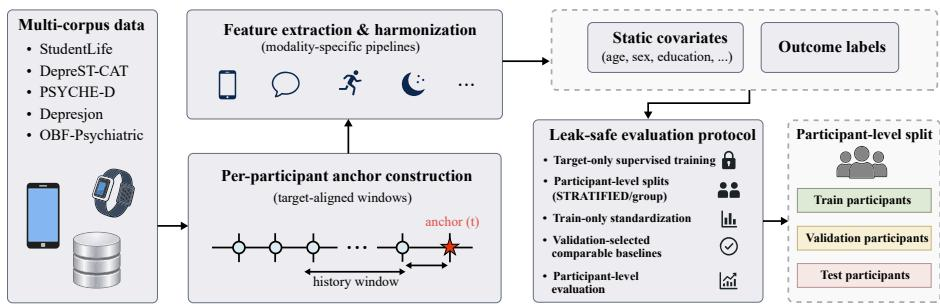
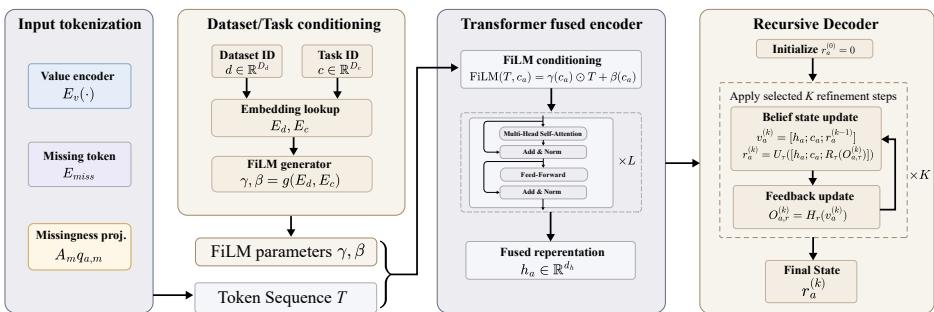
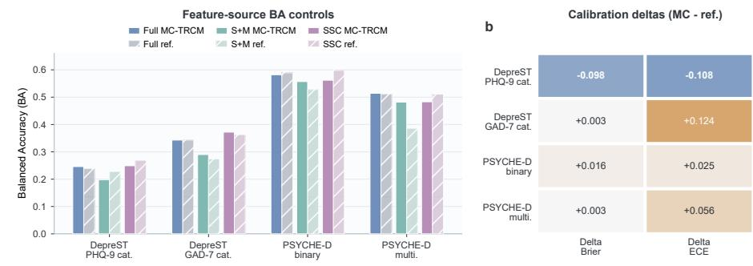

# MC-TRCM: Observation-Aware Recursive Fusion for Incomplete Mobile and Wearable Mental-Health Feature Views

Wentao Wang1,⋆, Lifeng Han1,⋆, Zining Ren2, Hengyu Zhong3, and Guangyu Zou1,⋆⋆

1 Dalian University of Technology, Dalian, China {shiyanxi1,2369787465}@mail.dlut.edu.cn, gyzou@dlut.edu.cn 2 The Hong Kong Polytechnic University, Hong Kong, China 25094416g@connect.polyu.hk 3 Southwest University, Chongqing, China hengyuzhong@email.swu.edu.cn

Abstract. Public mobile and wearable mental-health datasets often provide summarized feature tables rather than synchronized raw sensor streams. In these releases, each anchor corresponds to a survey or label time and may combine phone or wearable summaries, prior symptom scores, demographics, clinical variables, and source-availability indicators. We propose the Modality-Conditioned Temporal Recursive Context Model (MC-TRCM), which preserves each feature source as a separate token and incorporates missingness as part of the input context. Observed sources are encoded with values and missingness summaries, absent sources use learned absence tokens, dataset and task embeddings condition fusion, and a recursive prediction head refines each output over validation-selected steps. We evaluated MC-TRCM on six predefined endpoints from DepreST-CAT and Prediction of Severity Change-Depression (PSYCHE-D) using participant-level splits and validation-only model selection. MC-TRCM achieved the lowest mean absolute error on DepreST-CAT Patient Health Questionnaire-9 (PHQ-9) and Generalized Anxiety Disorder-7 (GAD-7) severity, improving over the best tabular reference by 0.181 and 0.217 scale points. Classification endpoints showed task-dependent behavior: MC-TRCM matched the best rounded GAD-7 category balanced accuracy, was numerically highest by 0.002 balancedaccuracy points on PSYCHE-D multiclass prediction, and remained close to the strongest references on PHQ-9 category and PSYCHE-D binary prediction. Ablations support Feature-wise Linear Modulation, absence tokens, missingness projections, and recursive refinement, while calibration and feature-source controls characterize endpoint behavior. Our code is available at https://github.com/Botwwt/MC-TRCM.

Keywords: Digital phenotyping · Incomplete multi-view learning Multimodal fusion · Representation learning · Depression assessment

⋆ Wentao Wang and Lifeng Han contributed equally to this work and share first authorship.

⋆⋆ Corresponding author.

## 1 Introduction

Depression assessment continues to depend on episodic self-report and clinical encounters. Symptom fluctuation, recall bias, gaps in clinical contact, and changing adherence can leave clinically important intervals partially observed. Mobile and wearable sensing can add behavioral context between assessments [7, 15, 1], but these data do not directly measure depression. They provide indirect proxies for sleep, activity, mobility, communication, and device interaction, and the absence of a proxy can itself be informative.

In reproducible public studies, the modeling problem is increasingly a feature-view rather than raw-stream setting. Public datasets such as StudentLife, DepreST-CAT, Prediction of Severity Change-Depression (PSYCHE-D), Depresjon, and OBF-Psychiatric usually release processed views rather than raw, synchronized sensor streams [23, 19, 16, 3, 10]. These views mix communication summaries, mobility statistics, sleep and activity aggregates, symptom history, demographic variables, clinical context, and availability indicators. A missing sleep window, communication record, or clinical field may reflect non-wear, study disengagement, hospitalization, privacy settings, or release constraints. The core modeling challenge is to learn jointly from recorded values, source identity, and the pattern of available and missing sources.

Existing solutions span regularized regression, gradient-boosted trees, Explainable Boosting Machine (EBM) models, multilayer perceptron (MLP) models, recurrent networks, and Transformer encoders [9, 5, 14, 17, 22]. These models are strong predictors, but flat concatenation treats mobility, communication, baseline symptoms, and missingness indicators as exchangeable columns. Conventional imputation, as commonly used in benchmark pipelines, replaces absent entries before modeling and thereby treats missingness primarily as a preprocessing artifact [8, 21]. A single fused representation may not transfer uniformly across labels: Patient Health Questionnaire-9 (PHQ-9) severity, Generalized Anxiety Disorder-7 (GAD-7) severity, and PHQ-change labels difer in scale and in the clinical question they encode. This distinction matters because depression- and anxiety-related symptoms are heterogeneous latent constructs, and released sensing features are indirect behavioral proxies rather than direct clinical measurements.

To address this setting, we propose the Modality-Conditioned Temporal Recursive Context Model (MC-TRCM). MC-TRCM treats each feature source as a token and conditions fusion on dataset and task identity. This design lets the encoder use both measured values and availability patterns without collapsing all sources into a single flat vector. Missingness and source availability enter through missingness-aware gates, learned absence tokens, and missingness projections. Feature-wise Linear Modulation (FiLM) uses dataset and task embeddings to adapt the representation to cohort-specific feature distributions and endpoint identity, such as DepreST-CAT communication summaries and PSYCHE-D wearable-derived change labels. Recursive decoding then refines each endpoint prediction over a shared task-conditioned representation of the anchor.

We evaluate MC-TRCM on six DepreST-CAT and PSYCHE-D severity and classification endpoints using participant-level splits. All model selection, early stopping, calibration, thresholding, class-bias correction, recursive-depth selection, and hyperparameter selection use training and validation data only. MC-TRCM achieves the lowest mean absolute error (MAE) on both DepreST-CAT severity endpoints among the evaluated models. Classification results are task-dependent, with rounded ties or small numerical diferences from the strongest references. Our contributions are as follows.

An observation-aware formulation and recursive architecture. We formulate incomplete public mental-health releases as feature-view learning problems where observed values, source identities, and availability patterns are modeled jointly through source tokens, missingness projections, datasetand task-conditioned FiLM, and recursive decoding.

– A leakage-controlled benchmark with explicit source accounting. We evaluate six predefined DepreST-CAT and PSYCHE-D tasks, covering 360 DepreST-CAT participants and 10,866 PSYCHE-D task rows, using participant-level splits, training-only preprocessing, and validation-only choices for model selection, calibration, thresholding, class-bias correction, recursive depth, and hyperparameters. The protocol also reports matched feature-source controls, separating sensor and missingness views from symptom, static, and clinical context.

– Numerical improvements and component evidence. MC-TRCM reduces MAE by 0.181 PHQ-9 points and 0.217 GAD-7 points relative to the strongest tabular references, matches the best rounded GAD-7 category BA, and is numerically highest on PSYCHE-D multiclass by 0.002 BA. Fiveseed ablations support the contributions of missingness modeling, FiLM conditioning, and recursive refinement.

## 2 Related Work

## 2.1 Digital Phenotyping Benchmarks, Metrics, and Calibration

Mobile and wearable depression-related studies complement questionnaires with activity, sleep, mobility, phone-use, and communication signals, but performance depends on cohort composition, label timing, feature construction, and validation design [13, 7, 15, 1]. The public benchmarks discussed above enable reproducible comparison through fixed or reconstructable feature views [23, 19, 16, 3, 10].

Metric choice should match the endpoint being modeled. Questionnaire severity requires an error measure that remains interpretable in scale points, whereas imbalanced category and change labels require class-balanced evaluation rather than raw accuracy. Calibration is also relevant because a correct class decision can still be assigned with unreliable confidence [4, 11]. These considerations motivate the MAE, balanced accuracy (BA), Brier score, and expected calibration error (ECE) protocol defined below, together with validation-only thresholding and calibration.

## 2.2 Generalization, Missingness, and Feature Views

Cross-study mobile sensing work shows that generalization can shift across cohorts, devices, years, and sensing protocols [2, 24]. This is important for mental-health benchmarks, where the observed data are indirect proxies and missingness may reflect both measurement and behavior. Zero and mean filling, KNN and SVD imputation, and MICE complete released matrices before modeling, which can obscure the distinction between an observed low value, a partially reliable source, and an unavailable source [8, 20, 21]. MC-TRCM keeps feature sources separate, represents availability patterns explicitly, and evaluates matched feature-source controls.

## 2.3 Tabular, Neural, and Conditioned Fusion Models

Prepared releases are often treated as tabular matrices, making regularized regression, XGBoost, LightGBM, and EBM strong references [9, 5, 14, 17]. Neural sequence and set encoders such as gated recurrent unit (GRU), long short-term memory (LSTM), and Transformer models provide flexible fusion [12, 6, 22]. Pub lic depression-related feature-view releases add a complementary requirement: modality, endpoint, and availability-pattern structure should be preserved even when raw streams are not released. FiLM conditioning shifts and scales representations with context [18], while PCGrad addresses task gradient conflict in multitask learning [25]. MC-TRCM combines these ideas by representing each source as a token, retaining modality absence as context, adapting fusion with dataset and task conditioning, and updating endpoint-specific task states recursively.

## 3 Methods

We formulate participant-level, endpoint-specific prediction from heterogeneous feature views and introduce MC-TRCM. The model addresses separate feature groups, informative missingness, and labels spanning symptom scores, categories, and changes. Figure 1 summarizes data construction and evaluation.

## 3.1 Problem Formulation

Let d denote a dataset, i a participant, a an anchor, τ an endpoint, and $m \in \mathcal { M } _ { d }$ a modality or feature source in the fixed released source set for dataset d. An anchor is a survey time, label time, or released processed row paired with features available at or before that anchor. For anchor a, endpoint τ has label $y _ { a , \tau }$ when available. Repeated anchors from the same participant are assigned to exactly one train, validation, or test split, so no participant contributes rows to multiple splits.

The model observes standardized modality values $\tilde { x } _ { a , m }$ , missingness summaries $q _ { a , m } ,$ and an observed indicator $s _ { a , m } \in \{ 0 , 1 \}$ . Here, $\tilde { x } _ { a , m }$ represents the released behavioral or contextual measurements for an observed feature source after training-split imputation and standardization, $^ { q _ { a , m } }$ summarizes column-level masks, missing ratios, recency proxies, or source-availability indicators, and $s _ { a , m }$ records whether the source is available at all for the anchor. The learning problem is multitask prediction over regression, binary, ordinal, and multiclass endpoints while respecting endpoint-specific label availability.

  
Fig. 1. Endpoint construction and evaluation protocol. Public cohorts are harmonized into modality-specific feature views, aligned to participant anchors, and evaluated with training-only preprocessing and validation-locked model selection.

## 3.2 Feature Views and Endpoints

We organize feature columns into five sources: sensor values, missingness, symptom context, static demographics, and clinical context. Sensor values include activity, sleep, communication, phone use, and mobility summaries when available. Missingness features include observed indicators, missing ratios, recency proxies, and modality masks. Symptom context includes temporally prior variables such as baseline PHQ-9 in PSYCHE-D or pre-study PHQ-9 in StudentLife. Static demographics include released age and sex variables. Clinical context includes prior treatment or baseline clinical variables when they are available before the modeled label. The primary benchmark contains six predefined endpoints: DepreST-CAT PHQ-9 severity, DepreST-CAT GAD-7 severity, DepreST-CAT PHQ-9 category, DepreST-CAT GAD-7 category, PSYCHE-D PHQ-change binary, and PSYCHE-D PHQ-change multiclass. DepreST-CAT uses 216, 72, and 72 participants for training, validation, and testing with 283 released features; PSYCHE-D uses 2405, 808, and 823 participants, plus 6494, 2119, and 2253 task rows across the same splits, with 325 features. StudentLife, Depresjon, and OBF-Psychiatric are auxiliary checks: StudentLife has 7 test participants, Depresjon has 11 status and 4 Montgomery-Asberg Depression Rating Scale (MADRS) test participants, and OBF-Psychiatric has 33 held-out participants for clinical-vs-control classification [10]. These auxiliary endpoints provide external checks rather than the primary basis for model ranking. For example, OBF-Psychiatric reaches BA = 1.000 for both MC-TRCM and LightGBM, so it mainly confirms that the task is saturated under this split. The locked primary metrics are MAE for continuous severity and BA for classification and ordinal endpoints; Brier score and ECE are used for calibration analyses. For ordinal endpoints, BA is class-balanced discrimination rather than ordered-error evaluation. Endpoint choices follow the original cohort framing [23, 19, 16, 3, 10].

  
Fig. 2. MC-TRCM architecture. Source tokens carry observed values, missingness context, and modality identity; FiLM-conditioned Transformer fusion and recursive decoding produce the endpoint-specific prediction.

## 3.3 MC-TRCM Architecture

The architecture in Figure 2 takes these anchored feature views as missingnessaware source tokens, conditions fusion on dataset and endpoint identity, and refines each prediction recursively.

Modality tokenization and missingness-aware gating. Public depression-related datasets release modular views whose measurement processes difer across communication, mobility, sleep, prior symptoms, demographics, and clinical context. MC-TRCM encodes each feature source as a tokenized view, so the fusion layer receives source objects rather than an unordered collection of columns.

For modality m, an encoder $E _ { m }$ maps standardized observed features into a shared token space, and a gate $G _ { m }$ controls how much of that observed-value representation should enter the token. The value encoder and gate are used when the source is observed:

$$
t _ { a , m } = \left\{ \begin{array} { l l } { \sigma ( G _ { m } ( [ \tilde { x } _ { a , m } ; q _ { a , m } ] ) ) \odot E _ { m } ( \tilde { x } _ { a , m } ) + A _ { m } q _ { a , m } + e _ { m } , } & { s _ { a , m } = 1 , } \\ { u _ { m } + A _ { m } q _ { a , m } + e _ { m } , } & { s _ { a , m } = 0 , } \end{array} \right.\tag{1}
$$

where $A _ { m } q _ { a , m }$ is a learned missingness projection, $e _ { m }$ is a source embedding, and $u _ { m }$ is a learned absence token. When $s _ { a , m } = 0$ , the value encoder and gate are not invoked; the token is formed from the learned absence token, the missingness summary, and the source identity. For partially missing observed sources, $\tilde { x } _ { a , m }$ is the vector after training-only imputation and standardization, while column-level masks, missing ratios, and recency proxies enter through $^ { q _ { a , m } }$

The key tensor dimensions are

$$
\begin{array} { r l } & { \tilde { x } _ { a , m } \in \mathbb { R } ^ { p _ { m } } , \quad q _ { a , m } \in \mathbb { R } ^ { r _ { m } } , \quad t _ { a , m } , u _ { m } , e _ { m } \in \mathbb { R } ^ { d _ { h } } , \quad r _ { a , \tau } ^ { ( k ) } \in \mathbb { R } ^ { d _ { r } } , } \\ & { \quad E _ { m } : \mathbb { R } ^ { p _ { m } } \to \mathbb { R } ^ { d _ { h } } , \quad G _ { m } : \mathbb { R } ^ { p _ { m } + r _ { m } } \to \mathbb { R } , \quad A _ { m } \in \mathbb { R } ^ { d _ { h } \times r _ { m } } . } \end{array}\tag{2}
$$

In the implementation, $G _ { m }$ outputs a scalar gate that is broadcast over the token dimension. This separation distinguishes observed values, reliability or availability patterns, and source identity without treating missingness as an imputation artifact.

FiLM dataset and task conditioning. Cross-dataset and cross-task heterogeneity is a central design constraint. DepreST-CAT communication summaries, PSYCHE-D processed wearable features, and actigraphy-based cohorts occupy diferent feature distributions and are paired with diferent labels. MC-TRCM uses dataset and task embeddings to make this heterogeneity explicit.

Dataset and task embeddings form a context vector

$$
c _ { a , \tau } = [ e _ { d ( a ) } ^ { d } ; e _ { \tau } ^ { \tau } ] .\tag{3}
$$

The reported configuration applies FiLM both before token fusion and after Transformer fusion, as selected on validation data and fixed before test evaluation:

$$
\mathrm { F i L M } _ { \ell } ( T , c _ { a , \tau } ) = \gamma _ { \ell } ( c _ { a , \tau } ) \odot T + \beta _ { \ell } ( c _ { a , \tau } ) .\tag{4}
$$

The source tokenization $T _ { a } = \{ t _ { a , m } : m \in \mathcal { M } _ { d } \}$ is shared, but FiLM-conditioned fusion and decoding are run separately for each observed anchor–task pair. The final model uses two Transformer blocks with hidden dimension $d _ { h } = 6 4$ , four attention heads, feed-forward dimension 160, dropout 0.1, and a projection to a 96-dimensional latent representation. Mean pooling includes observed-source tokens and learned absence tokens, excluding padding tokens introduced for cross-dataset alignment; thus the fused representation can use the availability pattern as input context. With $T _ { a , \tau } ^ { ( 2 ) }$ denoting the task-conditioned token sequence after the second block,

$$
h _ { a , \tau } = f _ { \boldsymbol { \theta } } ( T _ { a } , c _ { a , \tau } ) = W _ { h } \left( \frac { 1 } { | \mathcal { M } _ { d } | } \sum _ { m \in \mathcal { M } _ { d } } T _ { a , \tau , m } ^ { ( 2 ) } \right) .\tag{5}
$$

The rationale of FiLM is dynamic conditioning: $\gamma _ { \ell } ( c _ { a , \tau } )$ scales token dimensions and $\beta _ { \ell } ( c _ { a , \tau } )$ shifts them, allowing the same architecture to adjust its internal representation when the dataset or endpoint changes. Statistically, $e _ { d ( a ) } ^ { d }$ encodes the cohort and release protocol, while $e _ { \tau } ^ { \tau }$ encodes the clinical question being asked. The resulting representation $h _ { a , \tau }$ summarizes observed values, source identity, and missingness context conditioned on both dataset and task.

Recursive decoding. The decoder produces the task output over several refinement steps. At each step, it combines the task-conditioned fused representation, the task identity, and feedback from the previous prediction to update an internal decoder state. The final step gives the reported prediction. This difers from simply increasing encoder depth because recurrence is applied at the task head, passes the current endpoint estimate through $R _ { \tau }$ , and supervises intermediate states through the training objective.

For dataset $d ,$ recursive depth $K _ { d }$ is selected on validation data. The recursive decoder initializes $r _ { a , \tau } ^ { ( 0 ) } = \mathbf { 0 }$ . For $k = 1 , \dots , K _ { d } ,$

$$
v _ { a , \tau } ^ { ( k ) } = [ h _ { a , \tau } ; c _ { a , \tau } ; r _ { a , \tau } ^ { ( k - 1 ) } ] ,\tag{6}
$$

$$
o _ { a , \tau } ^ { ( k ) } = H _ { \tau } ( v _ { a , \tau } ^ { ( k ) } ) ,\tag{7}
$$

$$
r _ { a , \tau } ^ { ( k ) } = U _ { \tau } \Big ( [ h _ { a , \tau } ; c _ { a , \tau } ; R _ { \tau } ( o _ { a , \tau } ^ { ( k ) } ) ] \Big ) ,\tag{8}
$$

where $H _ { \tau }$ τ is a task head, $R _ { \tau } ( o ) = B _ { \tau } \phi _ { \tau } ( o )$ maps task outputs into a feedback space, and $U _ { \tau }$ updates the task-specific recursive state. We use $\phi _ { \tau } ( o )$ as the scalar prediction for regression, the probability or logit vector for binary endpoints, and the class-probability vector for ordinal or multiclass endpoints. The recursive state is an internal decoder variable used for prediction refinement rather than a clinically validated latent state. The selected refinement depth defines the final prediction, $\hat { y } _ { a , \tau } = o _ { a , \tau } ^ { ( K _ { d } ) } .$ $K _ { d }$ is selected from $\{ 1 , 2 , 4 , 6 , 8 \} ; K _ { d } = 1$ corresponds to a single-step decoder, while larger values allow iterative refinement when the validation evidence supports it.

For depth selection, each candidate K is scored on validation data within dataset d as $\begin{array} { r } { S _ { d } ( K ) = | \mathcal { T } _ { d } | ^ { - 1 } \sum _ { \tau \in \mathcal { T } _ { d } } s _ { d , \tau } ( K ) } \end{array}$ , where $s _ { d , \tau } ( K ) = 1 { \mathrm { - M A E } _ { d , \tau } ( K ) } / R _ { \tau }$ for severity endpoints and $s _ { d , \tau } \acute { ( } K ) = \mathrm { B A } _ { d , \tau } ( K )$ for classification or ordinal endpoints. Here $R _ { \tau }$ is the questionnaire range, 27 for PHQ-9 and 21 for GAD-7. The normalized severity score is used only for validation selection; final severity results are reported as raw MAE in questionnaire scale points.

## 3.4 Training Objective and Optimization

Within each dataset run, training accumulates losses over recursive steps using normalized increasing weights $\begin{array} { r } { \left. w _ { k } = k / \sum _ { \ell = 1 } ^ { K _ { d } } \ell \right. : } \end{array}$

$$
\mathcal { L } _ { \mathrm { t a s k } } = \frac { 1 } { | \mathcal { T } _ { B } | } \sum _ { \tau \in \mathcal { T } _ { B } } \left[ \exp ( - \lambda _ { \tau } ) \sum _ { k = 1 } ^ { K _ { d } } w _ { k } L _ { \tau } ^ { ( k ) } + \lambda _ { \tau } \right] ,\tag{9}
$$

where $\mathcal { T } _ { B }$ is the set of tasks observed in minibatch $B , \ \lambda _ { \tau }$ is a learned task uncertainty weight, and $L _ { \tau } ^ { ( k ) }$ is the endpoint-specific loss at recursive step k. The increasing recursive weights make later refinements more influential while still supervising intermediate states, which stabilizes training when early recursive predictions are coarse. Regression tasks compare Huber, MSE, and hybrid MAE Huber losses in validation search. Binary and multiclass tasks include classbalanced cross entropy, focal loss, and label-smoothing options when selected by validation. Ordinal tasks use ordinal decoding with validation-fitted class-bias adjustment for category prediction.

The shared encoder is trained across related but nonidentical clinical endpoints, producing gradient geometry in which PHQ-9 severity, GAD-7 severity, category prediction, and PHQ-change classification may emphasize diferent symptom dimensions. The selected full configuration includes PCGrad as the validation selected conflict-handling option. PCGrad projects a task gradient away from another task’s gradient when their inner product is negative [25]. Optimizer variants were explored during validation but are not used as primary architectural evidence. We train with AdamW, gradient clipping, modality dropout candidates, and early stopping on validation primary metrics.

## 3.5 Baselines, Calibration, and Metrics

The benchmark compares MC-TRCM with Elastic Net or logistic regression, LightGBM, XGBoost, EBM, MLP, GRU, LSTM, Transformer, and a shared encoder multitask MLP; null predictors are retained as sanity checks. EBM serves as a strong, high-capacity glass-box reference for clinically inspectable additive and pairwise tabular structure. Baselines use the same participantlevel splits, endpoint definitions, feature matrices, training-only preprocessing, and validation-only selection protocol. Elastic Net, logistic regression, and MLP baselines use median imputation followed by standardization fitted on the training split before model fitting. Tree-based and EBM references use validation-selected missing-value handling; whenever imputation is required, imputation parameters are fitted on the training split and applied unchanged to validation and test splits, with missingness indicators retained when available. Neural references are capacity-matched where possible, using the same input feature matrices and validation metric, so performance diferences are not primarily attributable to unmatched model capacity. The GRU, LSTM, and Transformer baselines use a fixed four-token sequence ordered as short, medium, long, and static feature views from the same released matrices; within each token, base features follow a fixed sorted column order, and these baselines remove dataset/task FiLM and recursive decoding. For each endpoint, tabular and neural reference families are selected by validation primary metric before test metrics are summarized.

Continuous severity endpoints report MAE, the mean absolute diference between predicted and observed PHQ-9, GAD-7, or MADRS scores; one MAE unit corresponds to one questionnaire scale point, and lower is better. Classification and ordinal endpoints report BA, the average of class-wise recalls; each class contributes equally under imbalance, and higher is better. Calibration analyses use Brier score and ECE. For binary endpoints, Brier score is $\begin{array} { r } { \frac { 1 } { N } \sum _ { i = 1 } ^ { N } ( p _ { i } - { y } _ { i } ) ^ { 2 } } \end{array}$ using the positive-class probability. For multiclass and ordinal endpoints, Brier score and ECE are

$$
\begin{array} { l } { \displaystyle \mathrm { B r i e r } = \frac { 1 } { N } \sum _ { i = 1 } ^ { N } \sum _ { c = 1 } ^ { C } ( p _ { i , c } - \mathbf { 1 } \{ y _ { i } = c \} ) ^ { 2 } , } \\ { \displaystyle \mathrm { E C E } = \sum _ { b = 1 } ^ { B } \frac { | I _ { b } | } { N } \left| \operatorname { a c c } ( I _ { b } ) - \operatorname { c o n f } ( I _ { b } ) \right| . } \end{array}\tag{10}
$$

ECE uses $B ~ = ~ 1 0$ equal-width confidence bins, with confidence defined as $\operatorname* { m a x } _ { c } p _ { i , c } .$ Binary thresholds, ordinal and multiclass class-bias corrections, and temperature scaling are fitted on validation data, excluding test labels. All models are evaluated over five seeds when applicable; deterministic fits with fixed post-processing report zero standard deviation. Continuous predictions and class probabilities are evaluated for each MC-TRCM seed before applying validation-fitted threshold or class-bias calibration.

## 3.6 Ablations and Robustness

Ablations remove one component at a time from the selected full model and are run for five seeds: no FiLM conditioning, no absence token, no missingness projection, no PCGrad, no task conditioning, and no recursive refinement. The noabsence-token variant removes $u _ { m } ,$ whereas the no-missingness-projection variant removes $A _ { m } q _ { a , m }$ . Optimizer variants are validation sensitivity checks rather than primary architectural ablations. Recursive-depth sensitivity, calibration comparisons, and matched feature-source controls interpret robustness across sensor values, missingness, symptom context, static demographics, clinical context, and combined views.

## 4 Experiments and Results

This section reports the six predefined endpoint metrics, feature-source accounting, calibration, recursive depth, and ablations. DepreST-CAT and PSYCHE-D define the primary benchmark because they provide the largest public endpoint set in this study. StudentLife, Depresjon, and OBF-Psychiatric are run in the same experimental suite as auxiliary checks. The results provide architecturelevel evidence under fair alignment while preserving transparent feature-source accounting.

## 4.1 Main Benchmark Results

Table 1 reports the pre-specified comparator families on the six core endpoint metrics after validation-selected hyperparameters and recursive depth. Baseline families, thresholding, class-bias correction, and calibration are frozen from training and validation data before test evaluation. The main result is that MC-TRCM is most clearly beneficial for continuous severity estimation. It reduces MAE by 0.181 PHQ-9 points and 0.217 GAD-7 points relative to the strongest tabular references, indicating that observation-aware source modeling is particularly useful when the target is symptom magnitude rather than a discrete category.

Classification results are more endpoint-dependent. MC-TRCM matches the best rounded GAD-7 category BA and is numerically highest on PSYCHE-D multiclass by 0.002 BA, but remains close to the strongest references on PHQ-9 category and PSYCHE-D binary prediction. Thus, the benchmark evidence supports MC-TRCM mainly as a stronger severity-estimation model, while categorical discrimination still depends on endpoint structure, class balance, and threshold behavior.

Table 2 reports auxiliary endpoints used as external checks rather than the primary basis for ranking. These results follow the same pattern: the largest gains occur on continuous severity tasks, including StudentLife PHQ-9 severity $( \mathrm { M A E ~ 3 . 8 1 2 \pm 0 . 3 0 2 ~ v s . ~ 4 . 9 1 6 \pm 0 . 2 2 9 } )$ and Depresjon MADRS severity (MAE 2.001 ± 0.622 vs. 2.493 ± 0.198). In contrast, OBF-Psychiatric reaches BA = 1.000 for both MC-TRCM and LightGBM, suggesting that this split is saturated and provides little discrimination among strong models.

Table 1. Main test performance across pre-specified comparator families (mean and standard deviation).
<table><tr><td>Model</td><td>PHQ-9 MAE↓</td><td>GAD-7 MAE↓</td><td>PHQ-9 BA↑</td><td>GAD-7 BA↑</td><td>Psy. bin. BA↑</td><td>Psy. multi. BA↑</td></tr><tr><td>Elastic Net</td><td>7.582 ± 0.000</td><td>6.791 ± 0.000</td><td>0.178 ± 0.000</td><td>0.245 ± 0.000</td><td>0.582 ± 0.001</td><td>0.499 ± 0.000</td></tr><tr><td>LightGBM</td><td>6.328 ± 0.090</td><td>5.297 ± 0.084</td><td>0.239 ± 0.043</td><td>0.343 ± 0.031</td><td>0.574 ± 0.004</td><td>0.488 ± 0.002</td></tr><tr><td>XGBoost</td><td>5.918 ± 0.066</td><td>5.318 ± 0.096</td><td>0.242 ± 0.024</td><td>0.297 ± 0.019</td><td>0.587 ± 0.005</td><td>0.505 ± 0.005</td></tr><tr><td>EBM</td><td>5.817 ± 0.085</td><td>5.028 ± 0.088</td><td>0.220 ± 0.050</td><td>0.308 ± 0.030</td><td>0.589 ± 0.007</td><td>0.512 ± 0.003</td></tr><tr><td>MLP</td><td>6.138 ± 0.100</td><td>5.449 ± 0.106</td><td>0.193 ± 0.041</td><td>0.278 ± 0.035</td><td>0.566 ± 0.003</td><td>0.463 ± 0.015</td></tr><tr><td>GRU</td><td>6.118 ± 0.031</td><td>5.364 ± 0.003</td><td>0.212 ± 0.040</td><td>0.250 ± 0.016</td><td>0.582 ± 0.004</td><td>0.509 ± 0.004</td></tr><tr><td>LSTM</td><td>6.229 ± 0.123</td><td>5.366 ± 0.009</td><td>0.252 ± 0.031</td><td>0.223 ± 0.027</td><td>0.575 ± 0.005</td><td>0.507 ± 0.004</td></tr><tr><td>Transformer</td><td>6.233 ± 0.172</td><td>5.415 ± 0.167</td><td>0.240 ± 0.032</td><td>0.223 ± 0.026</td><td>0.578 ± 0.011</td><td>0.497 ± 0.015</td></tr><tr><td>Multitask MLP</td><td>6.131 ± 0.107</td><td>5.354 ± 0.040</td><td>0.205 ± 0.046</td><td>0.272 ± 0.017</td><td>0.582 ± 0.007</td><td>0.500 ± 0.007</td></tr><tr><td>MC-TRCM</td><td>5.636 ± 0.035</td><td>4.811 ± 0.044</td><td>0.246 ± 0.041</td><td>0.343 ± 0.031</td><td>0.582 ± 0.011</td><td>0.514 ± 0.008</td></tr></table>

Note. Second line is SD over five seeds when stochasticity or validation-selected post-processing varies; deterministic fits with fixed post-processing report 0.000. Bold marks the best rounded value.

Table 2. Auxiliary dataset test results. These endpoints are outside the primary benchmark because held-out sets are small or saturated.
<table><tr><td>Dataset</td><td>Endpoint</td><td>Metric</td><td>Test n</td><td>MC-TRCM</td><td>Best ref.</td><td>Ref. value</td></tr><tr><td></td><td>StudentLife PHQ-9 severity</td><td>MAE↓</td><td>7</td><td>3.812 ± 0.302</td><td>Transformer</td><td>4.916 ± 0.229</td></tr><tr><td></td><td>StudentLife PHQ-9 category</td><td>BA↑</td><td>7</td><td>0.350 ± 0.152</td><td>XGBoost</td><td>0.250 ± 0.000</td></tr><tr><td>Depresjon</td><td>Depr. status</td><td>BA↑</td><td>11</td><td>0.911 ± 0.124 2.001</td><td>EBM</td><td>1.000 ± 0.000 2.493</td></tr><tr><td>Depresjon</td><td>MADRS severity</td><td>MAE↓</td><td>4</td><td>± 0.622</td><td>EBM</td><td>± 0.198 1.000</td></tr><tr><td>OBF</td><td>Clin. vs. Ctrl.</td><td>BA↑</td><td>33</td><td>1.000 ± 0.000</td><td>LightGBM</td><td>± 0.000</td></tr></table>

Note. Best ref. is the strongest validation-selected comparator. Clin. vs. Ctrl. denotes Clinical vs. control classification. Second line is SD over five seeds; bold marks the best rounded value.

## 4.2 Calibration and Recursive Depth

Figure 3 places the main benchmark results in context. Panel a shows that symptom, static, and clinical context carry substantial categorical signal: SSConly results are competitive with, and for DepreST-CAT PHQ-9 category slightly above, the full MC-TRCM result. Sensor and missingness views alone are weaker

Reference models: LightGBM for DepreST endpoints; EBM for PSYCHE-D endpoints. Negative values favor MC-TRCM

  
Fig. 3. Feature-source and calibration controls. a Balanced accuracy (BA) across featureview subsets. Symptom/static/clinical context provides strong categorical signal, while sensor and missingness views contribute endpoint-dependent information. b Calibration deltas (MC minus reference); negative values favor MC-TRCM. Abbreviations: S+M (sensor + missingness), SSC (symptom/static/clinical context), and ref. (matched tabular reference).

Table 3. Validation-selected recursive depth. Values are within-dataset validation selection scores used for recursive-depth tuning: severity endpoints contribute 1 − $\mathrm { M A E } / R _ { \tau }$ , and classification or ordinal endpoints contribute BA. Higher is better. Scores are not intended for comparison across datasets or as test metrics.
<table><tr><td>Dataset</td><td> $K = 1$ </td><td> $K = 2$ </td><td> $K = 4$ </td><td> $K = 6$ </td><td> $K = 8$ </td><td>Selected</td></tr><tr><td>DepreST-CAT</td><td>0.589</td><td>0.592</td><td>0.599</td><td>0.598</td><td>0.606</td><td>8</td></tr><tr><td>PSYCHE-D</td><td>0.548</td><td>0.552</td><td>0.563</td><td>0.555</td><td>0.553</td><td>4</td></tr></table>

on most endpoints, but the gap between S+M MC-TRCM and S+M references suggests that the proposed tokenization can extract more usable information from sparse observation patterns. Overall, the figure indicates that performance should not be attributed to passive sensing alone; released symptom and clinical context account for a meaningful share of the signal.

Panel b shows endpoint-specific calibration behavior. MC-TRCM improves probability reliability on DepreST-CAT PHQ-9 category prediction, reducing Brier score and ECE by 0.098 and 0.108 relative to LightGBM. While some references show better calibration, we prioritize MAE and BA for their direct measure of clinical discriminative power—areas where MC-TRCM already demonstrates strong performance.

Recursive depth is selected on validation data from $K \in \{ 1 , 2 , 4 , 6 , 8 \}$ using the method-defined validation score. Table 3 shows that DepreST-CAT selects $K _ { d } = 8$ , whereas PSYCHE-D peaks at $K _ { d } = 4$ and then declines. This nonmonotonic behavior suggests that recursive refinement is useful but should be validation-locked rather than fixed a priori.

## 4.3 Ablation Studies

Table 4 summarizes five-seed component ablations. The largest degradations come from removing FiLM and absence tokens, which increases severity MAE by 0.136 and 0.125, respectively, and also lowers category BA. This supports the main architectural claim that both context-conditioned fusion and explicit source absence are important for incomplete feature-view learning. Missingness projection and recursive refinement provide smaller but consistent gains, while PCGrad has only a minor efect in this protocol. Task conditioning mainly benefits severity estimation, with mixed average efects on categorical endpoints.

Table 4. Five-seed component ablations by metric family.
<table><tr><td>Variant</td><td>∆MAE (2 severity)</td><td>∆BA (4 category)</td></tr><tr><td>Full MC-TRCM</td><td>0.000</td><td>0.000</td></tr><tr><td>No FiLM</td><td>+0.136</td><td>-0.017</td></tr><tr><td>No absence token</td><td>+0.125</td><td>-0.012</td></tr><tr><td>No missingness projection</td><td>+0.041</td><td>-0.008</td></tr><tr><td>No PCGrad</td><td>+0.008</td><td>-0.003</td></tr><tr><td>No task conditioning</td><td>+0.067</td><td>+0.002</td></tr><tr><td>No recursive refinement</td><td>+0.046</td><td>-0.013</td></tr></table>

Note. Deltas are ablation minus Full; positive ∆MAE indicates larger error, and negative ∆BA indicates lower balanced accuracy.

## 5 Limitations and Future Work

This study identifies several deployment and generalization directions. First, calibration varies by endpoint. MC-TRCM improves calibration on DepreST-CAT PHQ-9 category prediction, while LightGBM has lower calibration error on GAD-7 category and EBM has lower Brier score and ECE on the two PSYCHE-D classification endpoints. These endpoint-level calibration patterns complement the discrimination results. Second, feature-source controls show that symptom and clinical context account for substantial signal in prepared public releases. This clarifies what passive sensing and missingness views add, rather than attributing performance to sensors alone.

Future work should extend MC-TRCM with uncertainty estimation, featuresource regularization, and domain adaptation across cohorts and release protocols. The current source-factorized tokenization can also be extended beyond preaggregated anchor summaries to process unaligned raw sensor time series when such streams are available.

## 6 Conclusion

MC-TRCM provides a structured observation-aware architecture for heterogeneous mobile and wearable mental-health feature views. Under validation-only selection, it achieves the lowest error on DepreST-CAT PHQ-9 and GAD-7 severity estimation and shows endpoint-specific classification behavior relative to strong tabular and neural references. Component ablations support the contributions of FiLM conditioning, missingness modeling, and recursive refinement, while feature-source accounting separates architecture efects from released symptom, static, and clinical context.

Disclosure of Interests. The authors have no competing interests to declare that are relevant to the content of this article.

## References

1. Abd-Alrazaq, A., AlSaad, R., Shuweihdi, F., Ahmed, A., Aziz, S., Sheikh, J.: Systematic review and meta-analysis of performance of wearable artificial intelligence in detecting and predicting depression. NPJ Digital Medicine 6(1), 84 (2023)

2. Adler, D.A., Wang, F., Mohr, D.C., Choudhury, T.: Machine learning for passive mental health symptom prediction: Generalization across diferent longitudinal mobile sensing studies. Plos one 17(4), e0266516 (2022)

3. Berle, J.O., Hauge, E.R., Oedegaard, K.J., Holsten, F., Fasmer, O.B.: Actigraphic registration of motor activity reveals a more structured behavioural pattern in schizophrenia than in major depression. BMC research notes 3(1), 149 (2010)

4. Brier, G.W.: Verification of forecasts expressed in terms of probability. Monthly Weather Review 78(1), 1–3 (1950)

5. Chen, T., Guestrin, C.: Xgboost: A scalable tree boosting system. In: Proceedings of the 22nd acm sigkdd international conference on knowledge discovery and data mining. pp. 785–794 (2016)

6. Cho, K., Van Merriënboer, B., Gulçehre, Ç., Bahdanau, D., Bougares, F., Schwenk, H., Bengio, Y.: Learning phrase representations using rnn encoder–decoder for statistical machine translation. In: Proceedings of the 2014 conference on empirical methods in natural language processing (EMNLP). pp. 1724–1734 (2014)

7. De Angel, V., Lewis, S., White, K., Oetzmann, C., Leightley, D., Oprea, E., Lavelle, G., Matcham, F., Pace, A., Mohr, D.C., et al.: Digital health tools for the passive monitoring of depression: a systematic review of methods. NPJ digital medicine 5(1), 3 (2022)

8. Donders, A.R.T., Van Der Heijden, G.J., Stijnen, T., Moons, K.G.: A gentle introduction to imputation of missing values. Journal of clinical epidemiology 59(10), 1087–1091 (2006)

9. Friedman, J.H., Hastie, T., Tibshirani, R.: Regularization paths for generalized linear models via coordinate descent. Journal of statistical software 33, 1–22 (2010)

10. Garcia-Ceja, E., Stautland, A., Riegler, M.A., Halvorsen, P., Hinojosa, S., Ochoa-Ruiz, G., Berle, J.O., Førland, W., Mjeldheim, K., Oedegaard, K.J., et al.: Obf psychiatric, a motor activity dataset of patients diagnosed with major depression, schizophrenia, and adhd. Scientific Data 12(1), 32 (2025)

11. Guo, C., Pleiss, G., Sun, Y., Weinberger, K.Q.: On calibration of modern neural networks. In: Proceedings of the 34th International Conference on Machine Learning. pp. 1321–1330. PMLR (2017)

12. Hochreiter, S., Schmidhuber, J.: Long short-term memory. Neural computation 9(8), 1735–1780 (1997)

13. Jacobson, N.C., Weingarden, H., Wilhelm, S.: Digital biomarkers of mood disorders and symptom change. NPJ digital medicine 2(1), 3 (2019)

14. Ke, G., Meng, Q., Finley, T., Wang, T., Chen, W., Ma, W., Ye, Q., Liu, T.Y.: LightGBM: A highly eficient gradient boosting decision tree. In: Advances in Neural Information Processing Systems. vol. 30 (2017)

15. Leaning, I.E., Ikani, N., Savage, H.S., Leow, A., Beckmann, C., Ruhé, H.G., Marquand, A.F.: From smartphone data to clinically relevant predictions: A systematic review of digital phenotyping methods in depression. Neuroscience & Biobehavioral Reviews 158, 105541 (2024)

16. Makhmutova, M., Kainkaryam, R., Ferreira, M., Min, J., Jaggi, M., Clay, I.: Predicting changes in depression severity using the psyche-d (prediction of severity change-depression) model involving person-generated health data: longitudinal case-control observational study. JMIR mHealth and uHealth 10(3), e34148 (2022)

17. Nori, H., Jenkins, S., Koch, P., Caruana, R.: Interpretml: A unified framework for machine learning interpretability. arXiv preprint arXiv:1909.09223 (2019)

18. Perez, E., Strub, F., De Vries, H., Dumoulin, V., Courville, A.: Film: Visua reasoning with a general conditioning layer. In: Proceedings of the AAAI conference on artificial intelligence. vol. 32 (2018)

19. Tlachac, M., Flores, R., Reisch, M., Houskeeper, K., Rundensteiner, E.A.: Deprestcat: Retrospective smartphone call and text logs collected during the covid-19 pandemic to screen for mental illnesses. Proceedings of the ACM on interactive, mobile, wearable and ubiquitous technologies 6(2), 1–32 (2022)

20. Troyanskaya, O., Cantor, M., Sherlock, G., Brown, P., Hastie, T., Tibshirani, R., Botstein, D., Altman, R.B.: Missing value estimation methods for dna microarrays. Bioinformatics 17(6), 520–525 (2001)

21. Van Buuren, S., Groothuis-Oudshoorn, K.: mice: Multivariate imputation by chained equations in r. Journal of statistical software 45, 1–67 (2011)

22. Vaswani, A., Shazeer, N., Parmar, N., Uszkoreit, J., Jones, L., Gomez, A.N., Kaiser, Ł., Polosukhin, I.: Attention is all you need. Advances in neural information processing systems 30 (2017)

23. Wang, R., Chen, F., Chen, Z., Li, T., Harari, G., Tignor, S., Zhou, X., Ben-Zeev, D., Campbell, A.T.: Studentlife: assessing mental health, academic performance and behavioral trends of college students using smartphones. In: Proceedings of the 2014 ACM international joint conference on pervasive and ubiquitous computing. pp. 3–14 (2014)

24. Xu, X., Liu, X., Zhang, H., Wang, W., Nepal, S., Sefidgar, Y., Seo, W., Kuehn, K.S., Huckins, J.F., Morris, M.E., et al.: Globem: Cross-dataset generalization of longitudinal human behavior modeling. Proceedings of the ACM on Interactive, Mobile, Wearable and Ubiquitous Technologies 6(4), 1–34 (2023)

25. Yu, T., Kumar, S., Gupta, A., Levine, S., Hausman, K., Finn, C.: Gradient surgery for multi-task learning. In: Advances in Neural Information Processing Systems. vol. 33, pp. 5824–5836 (2020)