# MEMENTO 3: Model-Based Recursive Self-Improvement through Reflective Rulebooks

Haoyu Zhao1 Zhengxu Yu2 Zhiyuan He2 Meng Fang3

Rasul Tutunov2 Haitham Bou-Ammar1,2 Weilin Luo2 Jun Wang1,†

1University College London 2Huawei Noah’s Ark Lab, UK 3University of Liverpool

Learning to act in unfamiliar environments requires agents to infer how the world works and revise that understanding as new evidence arrives. Yet limited observations can support multiple world models that explain past interactions but predict different outcomes in unseen states. We introduce MEMENTO 3, building on the Memento series to enable frozen LLM agents to continually learn explicit world models through external memory. The agent maintains a natural-language rulebook as persistent semantic memory, recording revisable hypotheses about environment dynamics while leaving unknown aspects underspecified. It compiles this rulebook into executable code for prediction and planning. Through a continual loop of observation, reflection, rule revision, compilation, and verification, the agent uses prediction errors to refine both the rulebook and its code. Updated code is accepted only when the LLM judges it faithful to the rulebook and cell-exact replay reproduces the observed transitions. We investigate this process as a model-based route to recursive self-improvement (RSI): the agent autonomously explores the environment, revises its world model, and uses verified updates to guide subsequent interaction and learning, while the underlying LLM remains fixed. A population extension maintains multiple world models in parallel, sharing interaction evidence and using their predictions to guide exploration. On ARC-AGI-3, the single-model agent clears every level of all 25 public games, achieves a mean Relative Human Action Efficiency (RHAE) of 100.0, and uses 44% of the human action count. In an Atari Pong case study, a learned feedback controller wins 21 : 0 in each of three evaluated episodes with different openings, without further LLM calls.

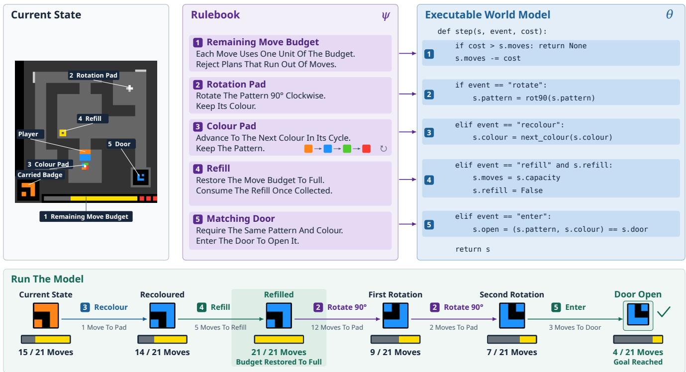  
Figure 1: From a rulebook to an executable world model. Numbered rules map to corresponding branches of a simplified transition function. A planner uses the model to predict a route that changes the badge’s pattern and colour, collects a refill, and reaches the matching door within the move budget.

## 1. Introduction

Recursive self-improvement aims to enable autonomous agents to acquire knowledge from experience and progressively improve their capabilities. An agent entering an unfamiliar environment must learn not only which actions are useful, but also what its actions do. It may initially know neither the environment’s objects and dynamics nor the criterion for success. A model-based agent learns a world model to predict the consequences of actions before executing them [6, 14, 35, 38]. Programs are attractive representations for such models, encoding state transitions and goal conditions as executable functions that a planner can query repeatedly. They support fast, inspectable simulation, while discrepancies between predicted and observed transitions provide concrete counterexamples to the current model. Recent code world models demonstrate the promise of learning such programs from interaction [7, 8, 30, 39].

Agreement with observed transitions, however, does not guarantee correct generalisation. A finite interaction history typically leaves a version space of programs that reproduce every observed transition but disagree on unobserved states [24]. When planning queries such states, the selected program must make predictions that the available evidence does not determine. For example, if every observed wall lies at column 7, the hypotheses “a box stops at a wall” and “a box stops at column 7” may explain the same trajectory while predicting different outcomes when a wall appears elsewhere. Replay can reject an inconsistent program, but cannot identify the correct rule among consistent alternatives. The agent therefore needs to maintain and revise its generalisation hypotheses as new evidence arrives.

Our Memento series [42, 48, 49] provides a complementary perspective on this problem by treating external memory, rather than model parameters, as the agent’s evolving learning state. Memento introduced continual adaptation through episodic memory, in which interaction outcomes are written into memory and retrieved to improve later decisions [48]. Memento 2 formalised this process as stateful reflective learning, interpreting memory writing as policy evaluation and memory reading as policy improvement [42]. Memento-Skills then extended the learning state from individual experiences to reusable procedural memory, allowing agents to construct and refine executable skills without updating the underlying LLM [49]. These works primarily improve the policy side of an agent by learning which decisions or procedures should be used. An unfamiliar interactive environment introduces the complementary problem of learning the model side: the rules that determine how the world behaves.

We introduce MEMENTO 3 as the model-based continuation of the Memento series. MEMENTO 3 extends reflective learning from policy and procedural memory to explicit world models. Its central design, which we call Code as Model, represents the agent’s evolving understanding of the environment through a natural-language rulebook and an executable realisation. The interaction history provides episodic evidence, while a natural-language rulebook serves as semantic memory, recording the agent’s current hypotheses about objects, actions, dynamics, and goals. The rulebook makes these hypotheses explicit so that later observations can be used to assess and revise them. Code is generated from the rulebook as its executable realisation for prediction and planning, as illustrated in Figure 1. The two representations serve complementary roles: the rulebook states the environment rules the agent believes, while execution fixes how those rules are applied. Together they form a persistent world-model hypothesis that can be inspected, tested, and revised throughout interaction.

This design lets us investigate a model-based route to recursive self-improvement (RSI). RSI describes an AI system autonomously designing and developing its own successor, with subsequent versions continuing this process [12]. Its recursive mechanism is a feedback loop in which the system uses its current capabilities to improve the components supporting its reasoning, planning, and learning [45]. In Code as Model, the persistent rulebook and its executable realisation are both objects of revision and tools for further learning. They guide subsequent planning and exploration, shaping the evidence the agent obtains for its next round of model revision. Their rules and predictions also provide a basis for diagnosing prediction errors. Through the reflective learning loop in Figure 2, the agent adopts verified updates to these components while the underlying LLM remains fixed.

Exact replay can leave several world-model hypotheses consistent with the same evidence. The LLM favours concise rulebooks and implementations, subject to rulebook fidelity and exact replay, as a practical minimum-description-length bias [28]. This preference does not eliminate uncertainty, and committing to one hypothesis may steer exploration away from evidence that would falsify it. We therefore extend the single-model setting to N world models maintained in parallel, each represented by a rulebook– executable pair and sharing the same interaction history. One member is sampled for each planning episode, and the resulting transitions are used to check all members. Different models can thus guide exploration while remaining consistent with shared evidence; N = 1 recovers the single-model setting.

We evaluate Code as Model on ARC-AGI-3 [1], where agents must infer unfamiliar game rules and goals under a human-derived action budget. The single-model agent clears every level of all 25 public games, reaches the Relative Human Action Efficiency ceiling with a mean RHAE of 100.0, and uses 44% of the corresponding human action count. Compared with Claude Opus 5 with the ARC Prize Standard harness [2], our agent achieves a 59.3-point higher mean RHAE. We also examine whether the learning mechanism can support feedback control in addition to discrete planning. In Atari Pong, the learned model supports a controller that wins 21 : 0 in three evaluated episodes with different openings, acting without further LLM calls.

## Contributions.

• We introduce MEMENTO 3, extending the Memento series to semantic world-model memory through Code as Model. A continual loop of observation, reflection, rule revision, compilation, and verification updates the rulebook and its executable realisation. The verified model guides subsequent interaction while the underlying LLM remains fixed.

• We extend this learning loop to multiple world models maintained in parallel. The models share interaction evidence for updating and verification, allowing different models to guide exploration.

• We evaluate MEMENTO 3 on ARC-AGI-3, including targeted comparisons of the rulebook and population extension. The single-model agent clears all 25 public games using 44% of the human action count. An Atari Pong case study further demonstrates a learned feedback controller that wins 21 : 0 in three evaluated episodes without LLM calls during execution.

## 2. Model-Based Recursive Self-Improvement

Learning a world model from interaction involves forming and revising hypotheses about an unfamiliar environment’s rules as new evidence arrives. In Code as Model, the agent records its current hypotheses in a natural-language rulebook and implements them in executable code for prediction and planning. Figure 2 summarises this continual learning loop: new observations drive revisions to the rulebook and executable, and the revised model guides subsequent interaction.

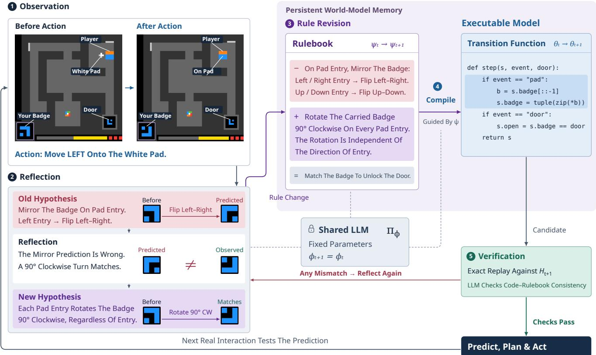  
Figure 2: Continual world-model learning with a frozen LLM. The agent follows a continual loop of observation, reflection, rule revision, compilation, and verification. In this example, an observed badge change contradicts a mirror hypothesis. Reflection yields a clockwise-rotation rule, which is recorded in the rulebook and compiled into code. Verification checks the executable against the interaction history and the rulebook. The accepted model then guides further interaction, producing evidence for the next revision. Here $H _ { t } , \psi _ { t }$ , and $\theta _ { t }$ denote the interaction record, rulebook, and executable after t real actions; $\pi _ { \phi }$ denotes the LLM’s output distribution with fixed parameters $\phi .$

## 2.1. Problem formulation

Environment and interaction record. In our setting, an agent aims to reach a goal within a limited action budget. It infers the environment’s transition rules and goal conditions through interaction. We model the agent’s interaction with this unknown environment $\mathcal { M }$ as a deterministic, goal-directed partially observable Markov decision process (POMDP) [16],

$$
\begin{array} { r l } & { \mathcal { M } = \langle S , A , \mathcal { O } , T , \rho , G \rangle , } \\ & { \quad T : S \times A \to S , \qquad \rho : S \to \mathcal { O } , \qquad G \subseteq \mathcal { S } . } \end{array}\tag{1}
$$

Here $s$ is the underlying state space, A the action space, and O the observation space; G is the unknown set of goal states. The unknown transition function $T$ acts on the complete environment state, whereas $\rho$ returns the observation available to the agent.

At interaction step t, the environment is in state $s _ { t } \in S$ . The agent receives observation $o _ { t } = \rho ( s _ { t } ) \in$ O and selects an action $a _ { t } \in A .$ . The agent observes the action interface and interaction feedback, but has no access to the environment source, transition rules, underlying environment state, or a natural-

language task description. The environment also reports goal completion, providing evidence about the goal without revealing its full specification. Direct evidence about the environment comes from these interactions; the agent may use prior knowledge to interpret it.

Let H denote the space of finite interaction records. For a single interaction trajectory, $H _ { t } \in \mathcal { H }$ denotes the action–observation history after t real actions:

$$
H _ { t } = ( o _ { 0 } , a _ { 0 } , o _ { 1 } , \ldots , a _ { t - 1 } , o _ { t } ) , \qquad o _ { i } = \rho ( s _ { i } ) .\tag{2}
$$

Here $H _ { i }$ denotes the interaction history up to and including observation $o _ { i }$ . Associated completion feedback is retained with this record and left implicit in the notation.

Belief over states and environment rules. The environment tuple M specifies how the world evolves, while a belief represents the agent’s uncertainty about its hidden state and unknown rules given the interaction history. We formulate learning and control in this unknown environment as a Bayes-adaptive POMDP [31]. Let M be a discrete family of candidate models $m = \left( T _ { m } , \rho _ { m } , G _ { m } \right)$ on common discrete state, action, and observation spaces. The true model $m ^ { \star } = ( T , \rho , G ) \in \mathfrak { M }$ is fixed but unknown. The augmented hidden state is therefore $\left( { { s _ { t } } , { m ^ { \star } } } \right)$ . Given a prior over the initial state and model, its belief is

$$
b _ { t } ( s , m ) = \operatorname* { P r } ( s _ { t } = s , m ^ { \star } = m \mid H _ { t } ) .\tag{3}
$$

Here $b _ { t }$ is a probability distribution over ${ \mathcal { S } } \times { \mathfrak { M } } ;$ its initial value conditions the prior on the initial feedback. The environment state $s _ { t }$ evolves under the true transition function $T _ { m ^ { \star } } = T$ . The model $m ^ { \star }$ remains fixed as the agent revises its hypotheses about the environment rules. For the belief equations, write $y _ { t } = \left( o _ { t } , c _ { t } \right)$ where $\bar { c _ { t } } = \mathbf { 1 } [ s _ { t } \in G _ { m ^ { \star } } ]$ is the reported completion signal retained in $H _ { t }$ . The indicator $\mathbf { 1 } [ \cdot ]$ equals one when its condition holds and zero otherwise.

World-model hypothesis and learning state. We adopt a model-based approach that learns an environment model from interaction and uses its predictions to select actions. In Code as Model, a frozen LLM proposes transition rules and goal conditions in a natural-language rulebook and compiles them into executable code. A planner queries the verified executable to search for action sequences predicted to reach a goal within the remaining budget. The agent follows the resulting plan, using discrepancies between predicted and observed outcomes to guide revisions to the rulebook and code.

Let Ψ be the space of finite natural-language rulebooks and Θ the space of executable world-model programs. The rulebook $\psi _ { t } ~ \in ~ \Psi$ serves as persistent semantic memory, recording the agent’s current hypotheses about entities, action semantics, dynamics, goals, and termination conditions. Its executable realisation $\theta _ { t } \in \Theta$ supplies a transition predictor and an inferred goal condition over its own internal state space. The persistent world-model hypothesis is the pair $h _ { t } = \left( \psi _ { t } , \theta _ { t } \right)$ . Together with the interaction record, it forms the agent’s external learning state

$$
Z _ { t } = ( H _ { t } , \psi _ { t } , \theta _ { t } ) .\tag{4}
$$

The interaction record $H _ { t }$ provides evidence, the rulebook ψt expresses hypotheses that generalise beyond that evidence, and the executable $\theta _ { t }$ implements those hypotheses for prediction, replay verification, and planning.

A useful rulebook states transferable environment rules with enough precision to constrain their implementation in code. For any rulebook $\psi \in \Psi$ , its denotation $\mathbb { I } \psi \mathbb { I } \subseteq \Theta$ is the set of programs that faithfully implement its stated hypotheses. A rulebook can leave unobserved mechanics unspecified, admitting multiple executable realisations. The rulebook carries rule-level reasoning and revision. An implementation correction may change $\theta _ { t }$ without changing ψt, whereas a change in the agent’s understanding of the environment must be recorded in $\psi _ { t }$ before it is compiled into code.

The agent learns by revising the rulebook and executable stored in $Z _ { t } ,$ while the underlying LLM remains fixed. Let $\pi _ { \phi }$ denote the conditional output distribution of an LLM with parameter vector $\phi .$ . At each interaction step t, its parameters $\phi _ { t }$ satisfy

$$
\phi _ { t + 1 } = \phi _ { t } = \phi .\tag{5}
$$

The LLM generates candidate rules and code from the interaction record and the current hypothesis. Its pretrained knowledge guides this search. A revision can change the proposed entities, internal state variables, transition rules, or goal conditions.

The evolving world model serves both as the object of revision and as a tool for further learning.

Definition 1 (Model-based recursive self-improvement). Model-based recursive self-improvement is a process in which an agent autonomously revises a persistent world-model hypothesis $h _ { t }$ to improve subsequent prediction and decision-making. The agent uses $h _ { t }$ to predict the consequences of candidate actions and guide planning and exploration. These predictions provide a basis for interpreting feedback and diagnosing errors. The agent uses the resulting evidence to construct a revised hypothesis $h _ { t + 1 } ,$ , which then guides subsequent interaction and further model revision.

Prediction through execution. To predict the consequences of actions, the executable $\theta \in \Theta$ specifies an internal state space ${ \widehat { S } } _ { \theta } ,$ an initialiser $\iota _ { \theta } ,$ , a transition predictor $f _ { \theta } ,$ , an observation function $\rho _ { \theta . }$ , and a goal set:

$$
\begin{array} { r l } & { \iota _ { \theta } : \mathcal { O } \to { \widehat S } _ { \theta } , \quad f _ { \theta } : { \widehat S } _ { \theta } \times \mathcal { A } \to { \widehat S } _ { \theta } , } \\ & { \rho _ { \theta } : { \widehat S } _ { \theta } \to \mathcal { O } , \widehat G _ { \theta } \subseteq { \widehat S } _ { \theta } . } \end{array}\tag{6}
$$

The set ${ \widehat { G } } _ { \theta }$ identifies internal states predicted to satisfy the goal. The agent uses completion feedback to infer the goal condition; $\rho _ { \theta }$ predicts the observations used for replay verification. For an accepted hypothesis $h = \left( \psi , \theta \right)$ , these functions and ${ \widehat { G } } _ { \theta }$ realise the rules in $\psi$ as a candidate environment model with internal state space $\widehat { S } _ { \theta }$

Let $\widehat { s } _ { i } ^ { \theta } \in \widehat { S } _ { \theta }$ denote the internal state after replaying the first i actions of a trajectory. Starting from its initial observation, replay gives

$$
\widehat { s } _ { 0 } ^ { \theta } = \iota _ { \theta } ( o _ { 0 } ) , \qquad \widehat { s } _ { i + 1 } ^ { \theta } = f _ { \theta } ( \widehat { s } _ { i } ^ { \theta } , a _ { i } ) , \qquad \widehat { s } _ { \theta } ( H _ { i } ) : = \widehat { s } _ { i } ^ { \theta } .\tag{7}
$$

The initialiser selects an internal state consistent with the initial observation. Replay advances that state through the recorded actions, retaining information that may not be visible in the latest observation. The reconstructed state is the candidate model’s estimate of the current environment state and supplies the starting point for prediction and planning. After replaying $H _ { i }$ and applying action $a _ { i } ,$ the program’s next-observation prediction is

$$
\widehat { o } _ { \theta } ( H _ { i } , a _ { i } ) = \rho _ { \theta } ( f _ { \theta } ( \widehat { s } _ { \theta } ( H _ { i } ) , a _ { i } ) ) .\tag{8}
$$

Syntactically different programs may therefore induce the same observable predictions.

Whenever the executable is revised, its internal state is reconstructed by replay under the revised program. For multiple trajectories, $H _ { t }$ denotes their accumulated record. Each trajectory is replayed from its own initial observation, and the consistency and verification conditions apply to every recorded transition within each trajectory. In this case, $\widehat { s } _ { \theta } ( H _ { t } )$ denotes the reconstructed state of the current trajectory.

Belief approximation for planning. The joint belief $b _ { t }$ defined in Eq. (3) describes uncertainty over the environment state and model given the interaction history. To approximate this belief for planning, the agent uses the frozen LLM to propose and revise rulebook–executable hypotheses from the interaction record. Verification tests their observation predictions against the evidence, and replay reconstructs their internal states. In the single-model case, the agent retains one accepted hypothesis $h _ { t } = \left( \psi _ { t } , \theta _ { t } \right)$ . Replaying the interaction history $H _ { t }$ under $\theta _ { t }$ reconstructs the current internal state $\widehat { s _ { \theta _ { t } } } ( H _ { t } )$ . The resulting point belief approximation is

$$
\widehat { b } _ { t } = \delta _ { ( h _ { t } , \widehat { s } _ { \theta _ { t } } ( H _ { t } ) ) } .\tag{9}
$$

Here $\delta$ denotes the point-mass distribution concentrated on the selected hypothesis and its reconstructed state in $\widehat { S } _ { \theta _ { t } }$ . The belief approximation $\widehat { b } _ { t }$ is a probability distribution that assigns probability one to this pair and zero to all other hypothesis–state pairs. The single-model planner evaluates action sequences under the selected hypothesis $h _ { t } ,$ starting from the reconstructed state $\widehat { s } _ { \theta _ { t } } ( H _ { t } )$ . The external learning state $Z _ { t }$ retains both $h _ { t }$ and the full history $H _ { t } ,$ , allowing the LLM to revisit the evidence when revising the hypothesis. Replay under an accepted revision reconstructs the current internal state and updates $\widehat { b } _ { t }$ Section 2.4 extends this point belief approximation to a population of model–state hypotheses.

Continual rulebook and executable world-model learning. Given black-box interaction access to $\mathcal { M } _ { \astrosun }$ a fixed LLM, and a budget of B real actions, construct an online update operator U for the rulebook and executable and a control operator P for action selection. The first pair $h _ { 0 }$ is constructed from the initial record $H _ { 0 } = \left( o _ { 0 } \right)$ . At each step, P uses the current learning state $Z _ { t }$ to select an action, and U uses the resulting evidence to update the stored pair:

$$
\begin{array} { r l } & { a _ { t } \sim P ( \cdot \mid Z _ { t } ) , } \\ & { s _ { t + 1 } = T ( s _ { t } , a _ { t } ) , \qquad o _ { t + 1 } = \rho ( s _ { t + 1 } ) , } \\ & { h _ { t + 1 } \sim U ( \cdot \mid H _ { t + 1 } , h _ { t } ) . } \end{array}\tag{10}
$$

Here $H _ { t + 1 }$ extends $H _ { t }$ with the new action–observation pair. The control operator plans using $\theta _ { t }$ and may select exploratory actions when no plan is available. The update operator retains the current pair, revises the rulebook and compiles it into code, or repairs the existing implementation. These operators may be randomised. A pair is adopted for planning only if its executable faithfully implements the rulebook and reproduces every recorded next observation when replaying the recorded actions:

$$
\theta _ { t } \in [ [ \psi _ { t } ] ] , \qquad \widehat { o } _ { \theta _ { t } } ( H _ { i } , a _ { i } ) = o _ { i + 1 } \quad \mathrm { f o r ~ a l l } i < t .\tag{11}
$$

Section 2.2 describes how these requirements are checked through an LLM assessment of rulebook fidelity and exact replay of recorded interactions.

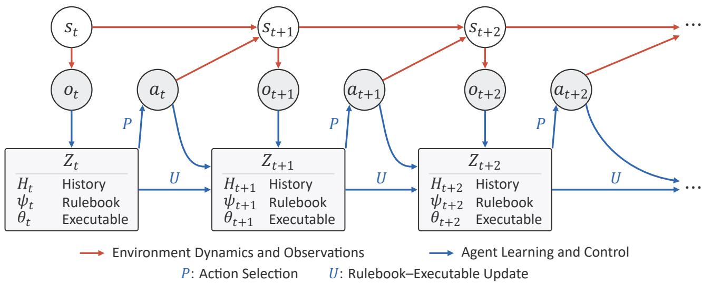  
Figure 3: A graphical model of recursive self-improvement in Code as Model. The underlying environment state $s _ { t }$ produces observation $o _ { t } ,$ , which enters the external learning state $Z _ { t } = \left( H _ { t } , \psi _ { t } , \theta _ { t } \right)$ . The agent selects $a _ { t }$ from $Z _ { t } ,$ , and the environment advances to $s _ { t + 1 }$ . The next observation $o _ { t + 1 } ,$ together with $Z _ { t }$ and ${ { a } _ { t } } ,$ determines the information available for updating $Z _ { t + 1 }$ . Rectangles contain the history, rulebook, and executable; white circles denote hidden states and grey circles observations and actions. P selects actions, and U updates the rulebook–executable pair. Ellipses indicate continued interaction. Completion feedback also enters the interaction history but is omitted from the diagram for clarity.

The objective is to reach a goal within the interaction budget. Let $\tau _ { G }$ be the first step at which the environment enters $G ,$ and define the success probability $p _ { B }$ and conditional interaction cost $c _ { B }$ by

$$
\begin{array} { r l } & { \tau _ { G } = \operatorname* { i n f } \{ t \geq 0 : s _ { t } \in G \} , \qquad p _ { B } = \operatorname* { P r } ( \tau _ { G } \leq B ) , } \\ & { c _ { B } = \mathbb { E } [ \tau _ { G } \mid \tau _ { G } \leq B ] \quad ( p _ { B } > 0 ) , } \end{array}\tag{12}
$$

with $\tau _ { G } = + \infty$ if no goal is reached. The primary objective is to maximise the probability $p _ { B }$ of reaching a goal within budget; among procedures with equal positive success probability, the secondary objective is to minimise the conditional action cost $c _ { B }$ [18, 40]. Probability and expectation are over the agent’s internal randomness for a fixed environment and initial state. Every real action, including exploration and failed attempts, counts towards the budget; model construction, simulated rollouts, and replay do not. The goal set and unit action costs specify this objective directly; no separate scalar reward function is required.

A finite record can admit several rulebook–executable pairs that agree on observed interactions but differ elsewhere. The current executable guides action selection and therefore influences the evidence the agent obtains next. This evidence can in turn trigger revisions to the rulebook and its implementation. Continual executable world-model learning thus couples model induction, exploration, and goal-directed planning. Figure 3 presents a graphical model of this coupling, showing how observations and actions connect the evolving environment state with the agent’s external learning state. Red arrows represent the environment dynamics T and observation function $\rho ;$ blue arrows represent history extension, updates to the rulebook–executable pair under $U ,$ and action selection under P.

## 2.2. Reflective rule revision, compilation, and verification

After action ${ { a } _ { t } } ,$ feedback $y _ { t + 1 }$ provides evidence about the current state and environment rules. The inference task is to update the joint belief in Eq. (3) using this evidence. For feedback $y = \left( o , c \right)$ , define the deterministic likelihood under model m as

$$
\ell _ { m } ( y \mid s ^ { \prime } ) = 1 [ o = \rho _ { m } ( s ^ { \prime } ) ] { \bf 1 } [ c = { \bf 1 } [ s ^ { \prime } \in G _ { m } ] ] .\tag{13}
$$

Let $p ( y \mid b , a )$ be the predictive probability of feedback y. The ideal Bayesian belief update is

$$
\begin{array} { l } { { \displaystyle p ( y \mid b , a ) = \sum _ { m , s } b ( s , m ) \ell _ { m } ( y \mid T _ { m } ( s , a ) ) , } } \\ { { \medskip b _ { t + 1 } ( s ^ { \prime } , m ) = \frac { \ell _ { m } \left( y _ { t + 1 } \mid s ^ { \prime } \right) \sum _ { s } \mathbf { 1 } \left[ s ^ { \prime } = T _ { m } \left( s , a _ { t } \right) \right] b _ { t } \left( s , m \right) } { p ( y _ { t + 1 } \mid b _ { t } , a _ { t } ) } . } } \end{array}\tag{14}
$$

The sums range over the discrete state and model spaces. The numerator first propagates each possible state through its candidate dynamics and then retains states and models compatible with the new feedback. The denominator normalises the result. For positive predictive probability, write the update as $b _ { t + 1 } = \tau ( b _ { t } , a _ { t } , y _ { t + 1 } )$

Code as Model approximates this inference by constructing and selecting rulebook–executable hypotheses from the interaction record. The frozen LLM expresses candidate rules in a rulebook and compiles them into a simulator with its own internal state representation. Replay tests the simulator’s observation predictions against the history and reconstructs its current internal state. An accepted rulebook– executable pair and its reconstructed state supply the belief approximation $\widehat { b } _ { t }$ used for planning.

Each interaction advances the external state through the five stages illustrated in Figure 2. Together, these stages implement the update operator U for the rulebook–executable pair $h _ { t } ,$ using the frozen LLM $\pi _ { \phi }$ to diagnose errors and revise rules or code. The proposed pair is checked against the two requirements in Eq. (11) before it is used for planning.

1. Observation. Executing $a _ { t }$ produces observation $o _ { t + 1 , }$ , which extends the available record as

$$
H _ { t + 1 } = H _ { t } \parallel ( a _ { t } , o _ { t + 1 } ) .\tag{15}
$$

Here ∥ appends the action–observation pair to the current trajectory in the record.

2. Reflection. Let D be the set of revision choices: retaining the current rulebook–executable pair $\left( \psi _ { t } , \theta _ { t } \right)$ , revising the rulebook and its executable realisation, or repairing the executable while retaining the rulebook. Given the updated interaction history and the current pair, the frozen LLM proposes a revision choice $d _ { t + 1 } \in \mathcal { D }$

$$
\mathcal { D } = \{ \mathsf { r e t a i n } , \mathsf { r e v i s e \_ r u l e b o o k } , \mathsf { r e p a i r \_ c o d e } \} , ~ d _ { t + 1 } \sim \pi _ { \phi } ( \cdot \mid H _ { t + 1 } , \psi _ { t } , \theta _ { t } ) .\tag{16}
$$

A prediction mismatch can arise from an incorrect environment rule or from code that fails to implement the intended rule.

3. Rule revision. Choosing to revise the rulebook invokes the frozen LLM’s revision operator $\Delta _ { \phi } ;$ otherwise the rulebook is retained. The proposed rulebook $\widetilde { \psi } _ { t + 1 }$ is

$$
\widetilde { \psi } _ { t + 1 } = \left\{ \begin{array} { l l } { \Delta _ { \phi } ( \psi _ { t } ; H _ { t + 1 } ) , } & { d _ { t + 1 } = \mathsf { r e v i s e \_ r u l e b o o k } , } \\ { \psi _ { t } , } & { \mathrm { o t h e r w i s e } . } \end{array} \right.\tag{17}
$$

The proposed rulebook constrains the next executable through $[ [ \widetilde { \psi } _ { t + 1 } ] ]$

## 4. Compilation.

When reflection requests rule revision or code repair, a rulebook-guided compiler $\mathcal { C } _ { \phi }$ proposes an executable realisation $\widetilde { \theta } _ { t + 1 }$ from the previous executable, the proposed rulebook, and the updated interaction record. We use ⊥ when no previous executable exists:

$$
\mathcal { C } _ { \phi } : ( \Theta \cup \{ \perp \} ) \times \Psi \times \mathcal { H } \xrightarrow { } \Theta , \qquad \widetilde { \theta } _ { t + 1 } \sim \mathcal { C } _ { \phi } ( \cdot  { | \ { \theta } _ { t } , \widetilde { \psi } _ { t + 1 } , H _ { t + 1 } } ) ,\tag{18}
$$

For $d _ { t + 1 } = \mathsf { r e t a i n } ,$ , set $\widetilde { \theta } _ { t + 1 } = \theta _ { t }$ and proceed directly to verification.

Each compiled program θ supplies a simulator for its candidate model. From an internal state $\widehat { s } \in \widehat { S } _ { \theta }$ and action $^ { a , }$ it generates

$$
\widehat { s } ^ { \prime } = f _ { \theta } ( \widehat { s } , a ) , \qquad \widehat { o } ^ { \prime } = \rho _ { \theta } ( \widehat { s } ^ { \prime } ) , \qquad \widehat { c } ^ { \prime } = { \bf 1 } [ \widehat { s } ^ { \prime } \in \widehat { G } _ { \theta } ] .\tag{19}
$$

Here $\widehat { c } ^ { \prime }$ is predicted goal completion.

5. Verification. Exact replay checks the observation-consistency requirement in $\operatorname { E q } .$ . (11). For a single trajectory, let verify $( \bar { \theta } ; \bar { H _ { t } } )$ indicate whether θ predicts every recorded next observation correctly, and let $\Theta _ { t }$ denote the set of programs that pass this check:

$$
\operatorname { v e r i f y } ( \theta ; H _ { t } ) = \prod _ { i < t } \mathbf { 1 } [ \widehat { \sigma } _ { \theta } ( H _ { i } , a _ { i } ) = o _ { i + 1 } ] , \qquad \Theta _ { t } = \{ \theta \in \Theta : \operatorname { v e r i f y } ( \theta ; H _ { t } ) = 1 \} .\tag{20}
$$

Let $\mathcal { V } _ { t }$ denote the admissible pairs whose executable both passes replay and faithfully implements its rulebook. The proposal is accepted only if it belongs to this set for the updated record:

$$
\mathcal { V } _ { t } = \{ ( \psi , \theta ) \in \Psi \times \Theta : \theta \in \Theta _ { t } \cap [ \psi ] \} , \qquad ( \widetilde { \psi } _ { t + 1 } , \widetilde { \theta } _ { t + 1 } ) \in \mathcal { V } _ { t + 1 } .\tag{21}
$$

On acceptance, the proposed pair becomes $h _ { t + 1 } = ( \psi _ { t + 1 } , \theta _ { t + 1 } )$ , giving $Z _ { t + 1 } = ( H _ { t + 1 } , \psi _ { t + 1 } , \theta _ { t + 1 } )$ for the next round of prediction and action selection. Otherwise, the agent returns to reflection, revision, and compilation until it produces an admissible pair.

Conditional on the recorded initial observations and actions and the program’s single initialisation, replay defines an observation likelihood $L _ { t } ^ { \mathrm { o b s } } ( h ) = \mathrm { v e r i f y } ( \theta ; H _ { t } )$ for $h = \left( \psi , \theta \right)$ . It removes hypotheses assigning zero likelihood to a recorded observation. Each new proposal is checked against the entire record, so a repair must explain earlier evidence as well as the latest discrepancy.

For deterministic executables that terminate, finite replay yields an exact pass-or-fail result: the recorded action sequences are executed, and each predicted next observation is compared with the corresponding recorded observation. Rulebook fidelity, $\theta \in \mathbb { [ } \psi \mathbb {] }$ , is a semantic condition and is assessed by the frozen LLM from the rulebook and source. Acceptance therefore combines an LLM assessment of semantic fidelity with an exact execution check; it is not based on language-model confidence alone. Selecting hypotheses based on language-model rankings can exclude correct candidates [43], which motivates grounding acceptance in execution wherever the consequences are observable.

In the single-model case, replay under the accepted executable reconstructs the current internal state. Together with the selected rulebook–executable pair, this state gives the updated point belief approximation

$$
h _ { t + 1 } \sim U ( \cdot \mid H _ { t + 1 } , h _ { t } ) , \qquad { \widehat b } _ { t + 1 } = \delta _ { ( h _ { t + 1 } , { \widehat s } _ { \theta _ { t + 1 } } ( H _ { t + 1 } ) ) } .\tag{22}
$$

## 2.3. Model selection and planning

Verification can leave multiple rulebook–executable pairs in the admissible set $\nu _ { t }$ . Selecting a working hypothesis completes the update operator $U ;$ the control operator P then uses that hypothesis to choose actions. In the single-model case, Code as Model uses the LLM to prefer a simpler explanation and implementation among the admissible pairs. We denote this LLM-guided revision and selection by SimplifyLLM.

Writing $\mathcal { L } ( \psi )$ for rulebook description length and ${ \mathcal { L } } ( \theta \mid \psi )$ for the description length of the executable given the rulebook, the idealised selection objective for $t \geq 1$ is

$$
\left( \psi _ { t } , \theta _ { t } \right) = \operatorname { S i m p l i f y } _ { \mathrm { L L M } } ( H _ { t } , \psi _ { t - 1 } , \theta _ { t - 1 } ) \approx \underset { ( \psi , \theta ) \in \mathcal { V } _ { t } } { \arg \operatorname* { m i n } } \big [ \mathcal { L } ( \psi ) + \mathcal { L } ( \theta \mid \psi ) \big ] .\tag{23}
$$

The objective favours the shortest combined description among admissible rulebook–executable pairs. To make its maximum a posteriori (MAP) interpretation explicit, assume a proper prior $\mu _ { 0 }$ over rulebookfaithful pairs with $\mu _ { 0 } ( \psi , \dot { \theta } ) \propto 2 ^ { - \mathcal { L } ( \psi ) - \mathcal { L } ( \theta | \psi ) }$ . Under the observation likelihood defined in verification, the posterior over rulebook–executable pairs is

$$
\mu _ { t } ( h ) = \frac { \mu _ { 0 } ( h ) L _ { t } ^ { \mathrm { o b s } } ( h ) } { \sum _ { \bar { h } } \mu _ { 0 } ( \bar { h } ) L _ { t } ^ { \mathrm { o b s } } ( \bar { h } ) } , \qquad h = ( \psi , \theta ) ,\tag{24}
$$

provided its normalising constant is positive. A shortest admissible pair maximises $\mu _ { t }$ . With the executable’s fixed initialiser, each hypothesis $h = \left( \psi , \theta \right)$ also determines the replayed state $\widehat { s } _ { \theta } ( H _ { t } )$ . The corresponding belief over hypotheses and their internal states is $\begin{array} { r } { \sum _ { h } \mu _ { t } ( h ) \delta _ { \left( h , \widehat { s } _ { \theta } ( H _ { t } ) \right) } } \end{array}$ . Selecting one pair and its reconstructed state for planning yields the point representation in Eq. (9).

The frozen LLM approximates the selection in Eq. (23) by proposing simpler environment rules and corresponding source. Each proposed simplification is checked again for rulebook fidelity and replay consistency.

Belief-space control and executable planning. The Bayesian counterpart of the success objective in Eq. (12) averages over the states and models in the joint belief of Eq. (3). Let $J _ { k } ( b )$ be the largest probability of reaching a goal within k remaining actions, for belief b. For this finite-horizon calculation, take completed states to be absorbing. Then

$$
\begin{array} { l } { { J _ { 0 } ( b ) = \displaystyle \sum _ { s , m } b ( s , m ) { \bf 1 } [ s \in G _ { m } ] , } } \\ { { J _ { k } ( b ) = \displaystyle \operatorname* { m a x } _ { a \in \mathcal { A } } \sum _ { y } p ( y \mid b , a ) J _ { k - 1 } ( \tau ( b , a , y ) ) , \qquad k \ge 1 . } } \end{array}\tag{25}
$$

The sum covers possible observation–completion pairs with positive predictive probability. A beliefbased controller selects a maximising action, with $k = B - t .$ . Conditional action cost breaks ties between policies with equal positive success probability.

Actions affect both the environment and the evidence available for subsequent decisions. In Eq. (25), each possible feedback y leads to an updated belief $\tau ( b , a , y )$ , on which future action choices depend. When competing rule hypotheses predict different outcomes for an action, the observed outcome can distinguish them and improve subsequent planning. An information-seeking action can therefore increase the probability of reaching a goal even when it makes little immediate progress. The continuation horizon $k - 1$ accounts for the action spent obtaining this evidence.

For control, the single-model agent uses the point belief $\widehat { b } _ { t }$ defined in Eq. (9). Conditional on this selected model and state, future transitions and observations are deterministic. Planning under this certainty-equivalent approximation reduces to finding a goal-reaching action sequence within the remaining budget.

An accepted executable induces the internal planning model $\widehat { \mathcal { M } } _ { \theta } = \langle \widehat { S } _ { \theta } , \mathcal { A } , f _ { \theta } , \widehat { G } _ { \theta } \rangle$ . For this deterministic model with unit action costs, define $V _ { \theta } ( x )$ as the length of a shortest finite path from $x \in \widehat { S } _ { \theta }$ to ${ \widehat { G } } _ { \theta }$ under $f _ { \theta , }$ , with $V _ { \theta } ( x ) = + \infty$ if no such path exists. A trajectory that never reaches the goal, including one trapped in a cycle under an improper policy, has infinite cost. These model-conditioned shortest-path costs satisfy

$$
V _ { \theta } ( x ) = { \left\{ \begin{array} { l l } { 0 , } & { x \in { \widehat { G } } _ { \theta } , } \\ { 1 + \operatorname* { m i n } _ { a \in { \mathcal { A } } } V _ { \theta } ( f _ { \theta } ( x , a ) ) , } & { { \mathrm { o t h e r w i s e . } } } \end{array} \right. }\tag{26}
$$

From a state with $0 < V _ { \theta } ( x ) < + \infty$ , repeatedly selecting a minimising action yields a finite goalreaching sequence $\mathsf { p l a n } _ { \theta } ( x )$ . Each action decreases $V _ { \theta }$ by one, so this sequence cannot cycle. At a predicted goal the plan is empty; if $V _ { \theta } ( x ) = + \infty$ , no goal-reaching plan is returned. Planning starts from $\widehat { s } _ { \theta } ( H _ { t } )$ the internal state reconstructed from the current trajectory. For a nonempty plan, the history-dependent policy $\pi _ { \theta }$ selects its first action:

$$
\begin{array} { r } { \pi _ { \theta } ( H _ { t } ) = \mathrm { f i r s t } ( \mathrm { p l a n } _ { \theta } ( \widehat { s } _ { \theta } ( H _ { t } ) ) ) . } \end{array}\tag{27}
$$

These costs and plans are conditional on the current executable model and its reconstructed state. The control operator $P$ uses $\pi _ { \theta }$ while following the plan; when no plan is available, it explores or requests model revision.

Under the selected deterministic hypothesis, a shortest path of at most $B - t$ actions predicts goal completion within budget at minimum action cost.

For exploration when no goal-reaching plan is available, the LLM uses the interaction history and unresolved rulebook hypotheses to choose an intermediate target, such as testing a mechanic, revealing an unseen region, or interacting with an unexplained object. An auxiliary planner searches the current executable for an action sequence reaching that target. Execution compares predicted and observed outcomes after each action and stops on a mismatch, returning the new evidence to reflection.

Both planned and exploratory actions produce new observations, extending the record in Eq. (15). This evidence tests the selected model’s predictions and enters the next reflective update in Eq. (22). The agent updates its own world-model components $\left( \psi _ { t } , \theta _ { t } \right)$ , which then guide subsequent action selection and reflection. This feedback loop underlies our model-based approach to RSI.

## 2.4. Population extension: from one to many

The single-model planning approximation in Eq. (9) commits to one explanation of the rules and current state. Other pairs in $\nu _ { t }$ can fit the same history while prescribing different plans. With the LLM as the proposal and revision operator, repeated runs can select different initial hypotheses, whose plans influence the evidence observed later. A plausible but incorrect model can remain self-confirming if its actions never expose its errors.

For a fixed executable θ, let $R ( \theta ) \subseteq { \mathcal { H } }$ be the histories reached while following its plan-induced policy $\pi _ { \theta } .$ . For the fixed true environment and initial state, let $o ^ { + } ( H , a )$ denote the next observation after history H and action a. Over histories where $\pi _ { \theta }$ is defined, set

$$
E ( \theta ) = \{ H : { \widehat \sigma } _ { \theta } ( H , \pi _ { \theta } ( H ) ) \neq o ^ { + } ( H , \pi _ { \theta } ( H ) ) \} .\tag{28}
$$

These are histories where the model makes an observable prediction error on its own selected action. During this policy’s execution, a model can remain unfalsified whenever

$$
E ( \theta ) \cap R ( \theta ) = \emptyset ,\tag{29}
$$

even if its predictions are wrong after other histories or actions. Rewriting the same hypothesis in language does not by itself remove this self-confirming behaviour.

Model-based reinforcement learning represents uncertainty in environment dynamics through probabilistic models or ensembles [6, 19]. Posterior sampling and related methods retain a sampled model or value function across an episode to support temporally coherent exploration [23, 26, 27].

Let $N \geq 1$ be the number of world-model hypotheses retained by the agent. We replace the single pair in $Z _ { t }$ with a population of admissible pairs,

$$
\Phi _ { t } = \{ ( \psi _ { t } ^ { i } , \theta _ { t } ^ { i } ) \} _ { i = 1 } ^ { N } \subseteq \mathcal { V } _ { t } .\tag{30}
$$

The resulting learning state consists of the shared record $H _ { t }$ and the population $\Phi _ { t }$ . The $N = 1$ case recovers the formulation above. For $N > 1$ , the system maintains N world models in parallel, each comprising a rulebook and its executable realisation. These models may encode different hypotheses about the same environment. They share $H _ { t }$ rather than interacting with separate environment copies.

Write $h _ { t } ^ { i } = ( \psi _ { t } ^ { i } , \theta _ { t } ^ { i } )$ for the ith retained hypothesis and $Z _ { t } ^ { ( N ) } = \left( H _ { t } , \Phi _ { t } \right)$ for the population learning state. The population induces an empirical belief approximation

$$
\widehat { b } _ { t } ^ { ( N ) } = \frac { 1 } { N } \sum _ { i = 1 } ^ { N } \delta _ { ( h _ { t } ^ { i } , \widehat { s } _ { \theta _ { t } ^ { i } } ( H _ { t } ) ) } .\tag{31}
$$

Each term pairs a rulebook–executable hypothesis with its reconstructed state in that executable’s own state space. The equal weights describe the empirical distribution over retained members; $N = 1$ recovers Eq. (9). For action selection, the rule below samples uniformly over distinct nonempty plans, giving retained alternatives opportunities to generate new evidence.

Every real interaction extends this common record. All members are checked against the same complete set of recorded trajectories. An executable is falsified when its prediction contradicts the new observation. Each affected pair then undergoes the reflective update of Section 2.2.

The population should preserve behavioural alternatives rather than syntactic variants of one program. At the shared history $H _ { t } ,$ each model reconstructs its own internal state. Models returning nonempty plans belong to the same class if those plans have identical action sequences:

$$
\theta \sim _ { H _ { t } } \theta ^ { \prime } \quad \Longleftrightarrow \quad \mathrm { p l a n } _ { \theta } ( \widehat { s } _ { \theta } ( H _ { t } ) ) = \mathrm { p l a n } _ { \theta ^ { \prime } } ( \widehat { s } _ { \theta ^ { \prime } } ( H _ { t } ) ) .\tag{32}
$$

Let $\widehat { \Phi } _ { t }$ denote the set of behavioural equivalence classes represented by population members with nonempty plans, and write [θ] for the class containing θ. When $\widehat \Phi _ { t } \neq \varnothing$ , the system samples one class

uniformly for each planning episode. A representative $\theta$ supplies the action sequence $\bar { a } _ { t : t + K - 1 }$ of length $K \geq 1 { : }$

$$
[ \theta ] \sim \mathrm { U n i f o r m } ( \widehat { \Phi } _ { t } ) , \qquad \bar { a } _ { t : t + K - 1 } = \mathrm { p l a n } _ { \theta } ( \widehat { s } _ { \theta } ( H _ { t } ) ) .\tag{33}
$$

If no member supplies a nonempty plan and the task is unfinished, the control operator explores or revises the models before sampling resumes. The selected member remains active and its sequence is followed until success, falsification, or replanning. Selecting different surviving models can expose the agent to different action sequences and hence different histories. The population is therefore designed to broaden model-guided exploration and reduce the dependence of an entire run on one early draw.

The population learning loop consists of three operations. PROPOSE uses the frozen LLM $\pi _ { \phi }$ to generate a rulebook and compile its executable; the resulting pair is retained only if it belongs to $\mathcal { V } _ { t }$ . REPAIR applies reflection, rule revision when required, compilation, and verification to every falsified member. PLAN/ACT uniformly samples a surviving behavioural class, executes the plan supplied by a representative executable, and adds each observed transition to the shared interaction record. In Code as Model, the rulebooks make each member’s rule hypotheses explicit, so differences in predictions and plans can be examined at the level of environment rules.

The observation-based posterior in Eq. (24) makes the remaining ambiguity explicit. Marginalising $\mu _ { 0 }$ and $\mu _ { t }$ over rulebooks gives the corresponding prior and posterior over executables, denoted $p ( \theta )$ and $p ( \theta \mid H _ { t } )$ . Conditional on the recorded initial observations and actions, every replay-consistent executable has unit observation likelihood. Thus, for any $\theta , \theta ^ { \prime } \in \Theta _ { t }$ with positive prior probability,

$$
\frac { p ( \theta \mid H _ { t } ) } { p ( \theta ^ { \prime } \mid H _ { t } ) } = \frac { p ( \theta ) } { p ( \theta ^ { \prime } ) } .\tag{34}
$$

The observed record removes contradicted models while preserving the prior odds among survivors.

## 3. Realisation on ARC-AGI-3

## 3.1. Environment and scoring

Definition 2 (ARC-AGI-3 game). We model an ARC-AGI-3 level as a deterministic, goal-directed POMDP of the form in Section 2,

$$
\mathcal { M } = \langle \mathcal { S } , \mathcal { A } , \mathcal { O } , T , \rho , G \rangle , \qquad s _ { t + 1 } = T ( s _ { t } , a _ { t } ) , \quad o _ { t } = \rho ( s _ { t } ) .\tag{35}
$$

The visual component of each observation is a $6 4 \times 6 4$ colour grid. In the final level of ls20, for example, fog of war masks regions outside the agent’s local view, so the current frame does not reveal the full environment state. Actions are drawn from the supplied key/click interface, with initially unknown semantics, and G contains the states that complete a level. The agent observes this interface and its own interaction history, but not the environment source or a language description of the game.

For a sequence of levels, completion is prioritised first and total interaction cost is compared among runs completing the same set of levels. For a game with L levels, let $h _ { \ell }$ and $a _ { \ell }$ denote the human and agent action counts on level $\ell ,$ and let C be the set of levels completed by the agent. ARC-AGI-3 scores

action efficiency by

$$
\begin{array} { r l } & { ~ e _ { \ell } = \operatorname* { m i n } \{ 1 . 1 5 , ( h _ { \ell } / a _ { \ell } ) ^ { 2 } \} , } \\ & { \mathrm { R H A E } = 1 0 0 \operatorname* { m i n } \left\{ \frac { \sum _ { \ell \in C } \ell } { \sum _ { \ell = 1 } ^ { L } \ell } , \frac { \sum _ { \ell = 1 } ^ { L } \ell e _ { \ell } } { \sum _ { \ell = 1 } ^ { L } \ell } \right\} , } \end{array}\tag{36}
$$

with $a _ { \ell } = \infty$ for an uncleared level. Model construction, local execution, and replay do not add to the action count. All actions sent to the environment count, including resets. Later levels can introduce new mechanics, so the agent must be able to revise its rulebook and executable throughout the game.

## 3.2. Rulebook and executable artefacts

We realise the abstract rulebook $\psi _ { t }$ as a Markdown file named world\_model.md. It records the agent’s current account of objects, action semantics, dynamics, goals, and unresolved alternatives in language. The executable $\theta _ { t }$ includes the Python module world\_model\_engine.py for internal state transitions, together with routines for state reconstruction, rendering, and checking goal completion. It predicts the complete next grid and whether a level has been completed. Figure 4 illustrates these artefacts through a concrete example, linking an observed transition to the corresponding rulebook entries and executable code.

The frozen LLM implements reflection, rule revision, and compilation by inspecting the accumulated frames and editing the rulebook and executable source. Its fidelity check compares the source with the rulebook. For replay, a new trajectory starts with the observation returned after each reset or level start. The initial observation $o _ { 0 }$ includes the starting grid and the level information returned by the interface. The verifier initialises the model with $\iota _ { \theta } \big ( o _ { 0 } \big )$ , then replays the recorded actions. Rendered predictions must match all $6 4 \times 6 4$ cells of every subsequent frame within the trajectory before the executable is made available to the planner. The planner searches the predicted dynamics from the reconstructed current model state for a route to the inferred goal and executes the resulting action sequence one action at a time. Execution stops at the first prediction mismatch so that the new counterexample can be incorporated before planning continues.

## 3.3. Continual operation

The general update in Section 2.2 runs throughout each game rather than only during initial model construction. The harness retains the full interaction record $H _ { t } ,$ including all trajectories, and invokes reflection whenever new evidence is available. The learned rulebook and executable persist across attempts and levels, allowing rules inferred earlier to guide prediction and planning as further mechanics are encountered. A rule-level change is written to the Markdown rulebook before the Python executable is refined. An implementation-only diagnosis leaves the rulebook intact and changes the Python module. Figure 5 provides a detailed example of rulebook revision across three versions, showing how new observations resolve an initial ambiguity and later overturn an earlier rule.

## 3.4. Git memory

Code as Model stores the agent’s model history in a Git repository. The rulebook and the modules compiled from it live as files in a single version-controlled workspace. After each iteration, the controller commits the workspace and tags the commit with the iteration number. Without version control, each revision destructively overwrites the rulebook or implementation it replaces. Here, every $\psi$ and every θ the run has held remains addressable, together with when it was written. The repository therefore records the agent’s learning trajectory, not just a snapshot of its latest state.

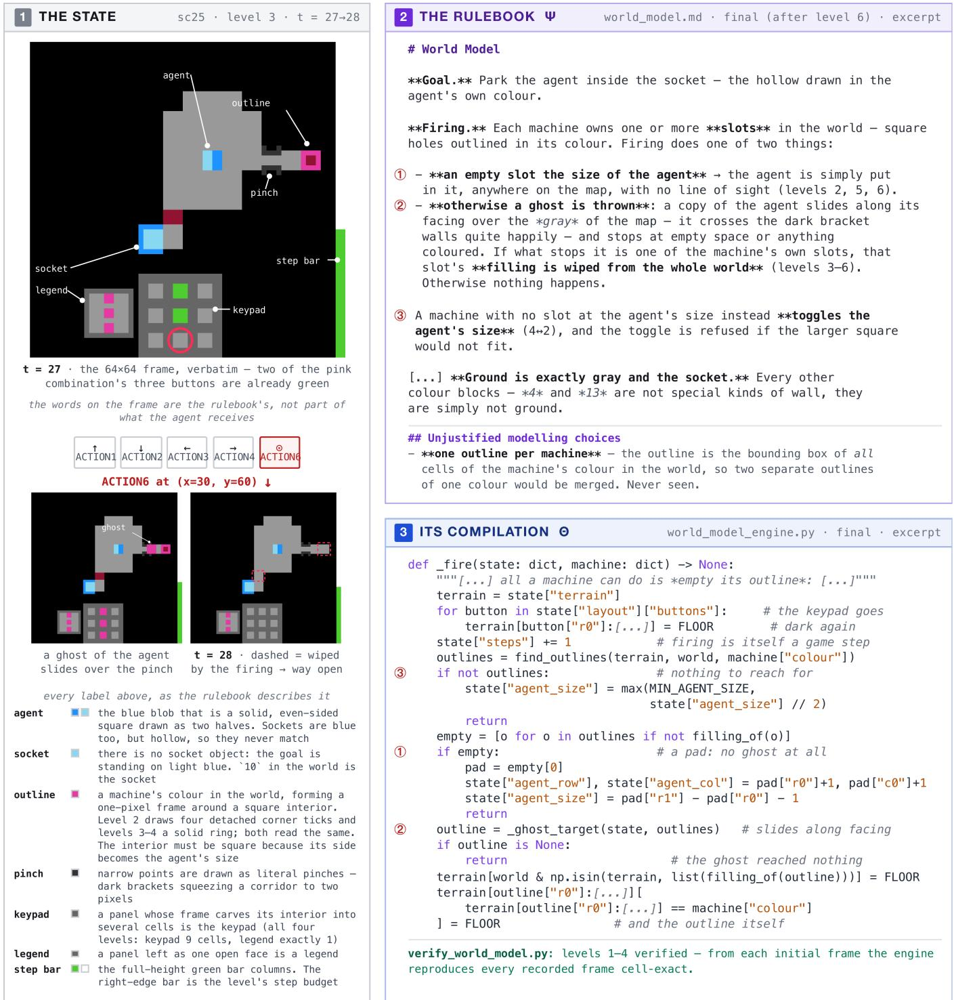  
Figure 4: An ARC-AGI-3 realisation of a rulebook and its executable. Left: an observed transition from game sc25. Upper right: the final rulebook in world\_model.md, whose names are also used to annotate the frame. Lower right: an excerpt from world\_model\_engine.py implementing the numbered rules. The executable is checked by cell-exact replay before it is used for planning.

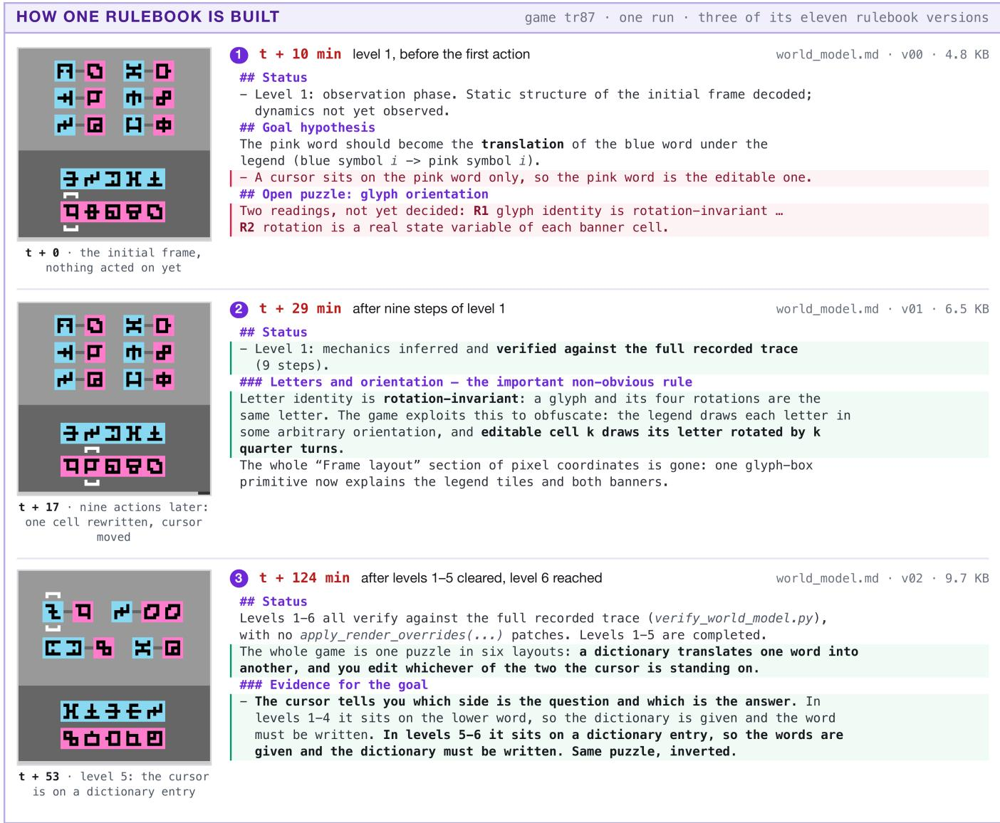  
Figure 5: Three of the eleven rulebook versions from one run on game tr87, each paired with the observation that prompted the revision. (1) Before the first action, the rulebook records two competing hypotheses about glyph orientation. (2) Interaction establishes rotation-invariant letter identity and replaces pixel coordinates with a glyph-box rule. (3) Evidence from later levels generalises and reverses the cursor rule. Red marks a claim retracted by a later version and green marks the statement that resolves it.

Crucially, this history is available to the agent itself. It can inspect earlier iterations, diff two versions of the rulebook or of a module, and recover their contents at any previous commit. The agent can therefore recall hypotheses it has already tested, examine the consequences of a past revision, or restore an executable that a later edit broke.

## 4. Experiments

Benchmark and setup. We evaluate on all 25 public ARC-AGI-3 games [1], shown in Figure 6. The task and its scoring rule are defined in Section 3.1. For each run, we count every action sent to the environment, including actions used in failed attempts and after the reset that follows. We report the RHAE of Eq. (36), for which higher is better and 100 is the ceiling. The agent observes only the action interface and cannot inspect the environment source.

We build our experimental harness using the baseline1 codebase [30] as a starting point and run it in Claude Code with Claude Opus 5 as the backbone model and reasoning effort set to extra-high. Every baseline is an entry on the ARC-AGI-3 community leaderboard that links to a paper: baseline1 [30], NOOA [13], OPINE-World [7], DreamTeam [33] and Continual Harness [17]. Every baseline number, including per-game RHAE, actions and levels cleared, comes from that system’s official ARC Prize scorecard, as does the human action baseline, so all columns are counted the same way.

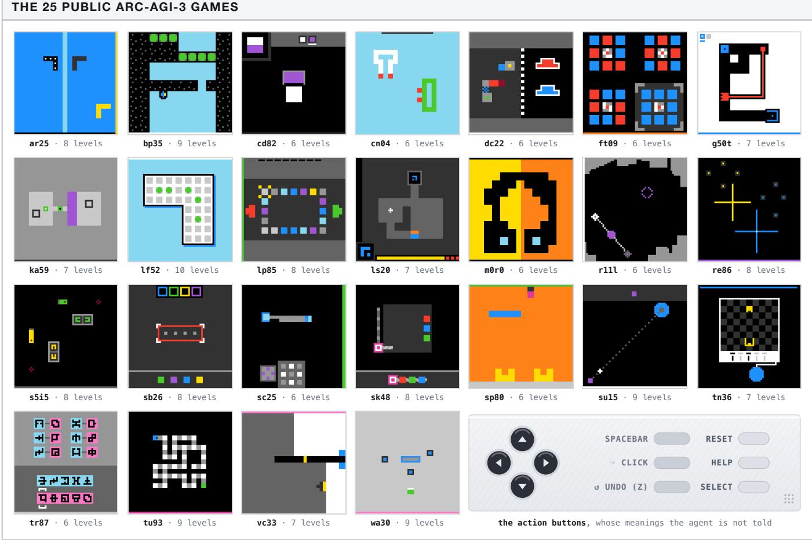  
Figure 6: The 25 public ARC-AGI-3 games.

Main result. Table 1 reports every game. CODE-AS-MODEL reaches the 100 ceiling on all 25 games, yielding a mean RHAE of 100.0. A ceiling score requires every level to be cleared and the level-weighted mean of $e _ { \ell }$ in Eq. (36) to be at least 1. Table 2 further shows that the total action count for every game is below its human baseline. Among the systems compared in Table 1, the closest is baseline1 at 99.0, which also clears every game; NOOA reaches 85.1 having cleared 19 of the 25 games, OPINE-World 78.4 with 20, DreamTeam 38.1 with 6, and Continual Harness 20.5 with 3.

Table 1: Per-game RHAE on the 25 public ARC-AGI-3 games. L is the number of levels in the game. RHAE is the level-weighted human-relative efficiency of Eq. (36). All baseline numbers come from the official ARC Prize scorecards.
<table><tr><td>Game</td><td>L</td><td>Continual Harness</td><td>Dream- Team</td><td>OPINE- World</td><td>NOOA</td><td>baseline1</td><td>Ours</td></tr><tr><td>ar25</td><td>8</td><td>17.4</td><td>100.0</td><td>100.0</td><td>100.0</td><td>100.0</td><td>100</td></tr><tr><td>bp35</td><td>9</td><td>1.1</td><td>0.8</td><td>2.5</td><td>46.2</td><td>100.0</td><td>100</td></tr><tr><td>cd82</td><td>6</td><td>0.0</td><td>79.0</td><td>100.0</td><td>100.0</td><td>100.0</td><td>100</td></tr><tr><td>cn04</td><td>6</td><td>46.4</td><td>0.0</td><td>100.0</td><td>100.0</td><td>100.0</td><td>100</td></tr><tr><td>dc22</td><td>6</td><td>18.2</td><td>0.0</td><td>82.4</td><td>64.7</td><td>100.0</td><td>100</td></tr><tr><td>ft09</td><td>6</td><td>70.1</td><td>100.0</td><td>100.0</td><td>100.0</td><td>100.0</td><td>100</td></tr><tr><td>g50t</td><td>7</td><td>10.7</td><td>2.9</td><td>61.6</td><td>65.3</td><td>100.0</td><td>100</td></tr><tr><td>ka59</td><td>7</td><td>38.6</td><td>59.7</td><td>62.5</td><td>100.0</td><td>100.0</td><td>100</td></tr><tr><td>1f52</td><td>10</td><td>0.2</td><td>10.9</td><td>4.2</td><td>27.3</td><td>100.0</td><td>100</td></tr><tr><td>1p85</td><td>8</td><td>100.0</td><td>100.0</td><td>100.0</td><td>100.0</td><td>100.0</td><td>100</td></tr><tr><td>1s20</td><td>7</td><td>3.6</td><td>14.7</td><td>71.2</td><td>37.4</td><td>100.0</td><td>100</td></tr><tr><td>m0r0</td><td>6</td><td>66.8</td><td>47.6</td><td>100.0</td><td>100.0</td><td>100.0</td><td>100</td></tr><tr><td>r111</td><td>6</td><td>4.8</td><td>47.6</td><td>100.0</td><td>100.0</td><td>100.0</td><td>100</td></tr><tr><td>re86</td><td>8</td><td>16.7</td><td>58.3</td><td>100.0</td><td>100.0</td><td>100.0</td><td>100</td></tr><tr><td>s5i5</td><td>8</td><td>0.0</td><td>38.2</td><td>27.1</td><td>100.0</td><td>100.0</td><td>100</td></tr><tr><td>sb26</td><td>8</td><td>0.0</td><td>94.0</td><td>89.8</td><td>100.0</td><td>100.0</td><td>100</td></tr><tr><td>sc25</td><td>6</td><td>0.0</td><td>36.1</td><td>84.0</td><td>83.5</td><td>84.2</td><td>100</td></tr><tr><td>sk48</td><td>8</td><td>1.1</td><td>6.9</td><td>21.3</td><td>72.5</td><td>100.0</td><td>100</td></tr><tr><td>sp80</td><td>6</td><td>47.6</td><td>0.1</td><td>100.0</td><td>79.2</td><td>100.0</td><td>100</td></tr><tr><td>su15</td><td>9</td><td>0.0</td><td>2.2</td><td>92.0</td><td>97.0</td><td>100.0</td><td>100</td></tr><tr><td>tn36</td><td>7</td><td>0.0</td><td>5.0</td><td>68.4</td><td>100.0</td><td>90.1</td><td>100</td></tr><tr><td>tr87</td><td>6</td><td>0.0</td><td>12.6</td><td>100.0</td><td>100.0</td><td>100.0</td><td>100</td></tr><tr><td>tu93</td><td>9</td><td>61.4</td><td>100.0</td><td>100.0</td><td>93.4</td><td>100.0</td><td>100</td></tr><tr><td>vc33</td><td>7</td><td>8.9</td><td>21.4</td><td>92.1</td><td>99.6</td><td>100.0</td><td>100</td></tr><tr><td>wa30</td><td>9</td><td>0.0</td><td>13.3</td><td>100.0</td><td>62.2</td><td>100.0</td><td>100</td></tr><tr><td>Mean, all 25</td><td>183</td><td>20.5</td><td>38.1</td><td>78.4</td><td>85.1</td><td>99.0</td><td>100.0</td></tr><tr><td>Games cleared</td><td></td><td>3</td><td>6</td><td>20</td><td>19</td><td>25</td><td>25</td></tr><tr><td>Levels cleared</td><td></td><td>64</td><td>98</td><td>160</td><td>170</td><td>183</td><td>183</td></tr></table>

Table 2 compares action counts. Our agent clears all 25 games in 7,518 actions, 0.44 of the human baseline (17,135). Per-game ratios range from 0.20 on m0r0 to 0.67 on lf52 (median 0.42). Among the systems in Table 2, baseline1 is the only other system to finish every game, using 8,347 actions (0.49 of the human budget). The other four leave games unfinished: OPINE-World leaves 5, NOOA 6, DreamTeam 19 and Continual Harness 22. Their totals (12,859, 11,697, 9,789 and 14,558) therefore reflect incomplete runs rather than solution costs

Ablations. To isolate the contribution of the natural-language rulebook, we remove it from the update loop. This leaves a code world model while keeping the harness, the replay verifier, the plan executor, the backbone and the reasoning effort byte-identical. Given the difficulty of ARC-AGI-3 tasks, each experimental run with Claude Code incurs substantial time and monetary cost. We therefore select one game from each of three difficulty bands defined by human actions per level. This normalisation separates the interaction difficulty of a level from the number of levels in a game. The selected games are ft09 at 35 actions per level for the easy band, ka59 at 104 for the medium band and cn04 at 132 for the hard band. Every run clears every level and reaches RHAE 100, so Table 3 compares the cost of convergence. Actions count scored environment interactions, while agent turns count agent iterations to completion and are unaffected by wall-clock delays.

Table 2: Per-game action counts. Results are from the same runs and scorecards as Table 1. The bar shows our count as a fraction of the human count, so a full track would indicate parity. A dagger marks a system that left at least one level of the game uncleared. Its count is therefore what the run spent rather than what solving the game requires. Totals marked with a dagger are not comparable as solution costs.
<table><tr><td></td><td></td><td>Continual Harness</td><td>Dream- Team</td><td>OPINE- World</td><td>NOOA</td><td>baseline1</td><td>Ours</td><td>Ours / Human</td></tr><tr><td>Game</td><td>Human</td><td></td><td></td><td></td><td></td><td></td><td></td><td></td></tr><tr><td>ar25</td><td>748</td><td>687+ 274+</td><td>479 647+</td><td>381 512+</td><td>274 623+</td><td>271 532</td><td>253 429</td><td>0.34 0.66</td></tr><tr><td>bp35</td><td>651 171</td><td>275+</td><td>282</td><td>161</td><td>115</td><td>93</td><td>82</td><td>0.48</td></tr><tr><td>cd82 cn04</td><td>789</td><td>1,792†</td><td>444+</td><td>264</td><td>441</td><td>201</td><td>201</td><td>0.25</td></tr><tr><td>dc22</td><td>1,228</td><td>1,097†</td><td>355+</td><td>1,485</td><td>841+</td><td>898</td><td>643</td><td>0.52</td></tr><tr><td>ft09</td><td>208</td><td>270</td><td>82</td><td>112</td><td>84</td><td>85</td><td>75</td><td>0.36</td></tr><tr><td>g50t</td><td>879</td><td>1,046+</td><td>395+</td><td>758</td><td>728</td><td>363</td><td>307</td><td>0.35</td></tr><tr><td>ka59</td><td>730</td><td>796+</td><td>510+</td><td>1,077+</td><td>449</td><td>362</td><td>341</td><td>0.47</td></tr><tr><td>1f52</td><td>1,339</td><td>950+</td><td>230+</td><td>594+</td><td>995+</td><td>767</td><td>894</td><td>0.67</td></tr><tr><td>1p85</td><td>388</td><td>344</td><td>120</td><td>110</td><td>114</td><td>90</td><td>95</td><td>0.24</td></tr><tr><td>1s20</td><td>776</td><td>634†</td><td>556†</td><td>959</td><td>1,130†</td><td>465</td><td>473</td><td>0.61</td></tr><tr><td>m0r0</td><td>1,107</td><td>1,705</td><td>367+</td><td>260</td><td>241</td><td>215</td><td>220</td><td>0.20</td></tr><tr><td>r111</td><td>233</td><td>178+</td><td>263+</td><td>128</td><td>87</td><td>97</td><td>75</td><td>0.32</td></tr><tr><td>re86</td><td>1,255</td><td>716+</td><td>540+</td><td>851</td><td>803</td><td>559</td><td>625</td><td>0.50</td></tr><tr><td>s5i5</td><td>638</td><td>100+</td><td>365+</td><td>639+</td><td>317</td><td>283</td><td>261</td><td>0.41</td></tr><tr><td>sb26</td><td>213</td><td>100+</td><td>210</td><td>215</td><td>128</td><td>140</td><td>124</td><td></td></tr><tr><td>sc25</td><td>350</td><td>180+</td><td>486+</td><td>257</td><td>488</td><td>619</td><td>173</td><td>0.58 0.49</td></tr><tr><td>sk48</td><td>1,070</td><td>1,215†</td><td>331+</td><td>596+</td><td>1,127†</td><td>419</td><td>407</td><td>0.38</td></tr><tr><td>sp80</td><td>518</td><td>587+</td><td>448+</td><td>370</td><td>444</td><td>193</td><td>144</td><td>0.28</td></tr><tr><td>su15</td><td>361</td><td>112+</td><td>558+</td><td>335</td><td>200</td><td>117</td><td>104</td><td>0.29</td></tr><tr><td>tn36</td><td>317</td><td>163†</td><td>509†</td><td>418</td><td>137</td><td></td><td></td><td></td></tr><tr><td>tr87</td><td>414</td><td>272+</td><td>528+</td><td>212</td><td>438</td><td>292 147</td><td>133</td><td>0.42</td></tr><tr><td>tu93</td><td>462</td><td>456+</td><td>260</td><td>272</td><td>229</td><td>201</td><td>148</td><td>0.36</td></tr><tr><td>vc33</td><td>447</td><td>254+</td><td>401+</td><td>427</td><td>263</td><td>293</td><td>208 204</td><td>0.45 0.46</td></tr><tr><td>wa30</td><td>1,843</td><td>355+</td><td>423+</td><td>1,466</td><td>1,001+</td><td>645</td><td>899</td><td>0.49</td></tr><tr><td>Total, all 25</td><td>17,135</td><td>14,558†</td><td>9,789†</td><td>12,859†</td><td>11,697†</td><td>8,347</td><td>7,518</td><td>0.44</td></tr></table>

In the reported runs, the rulebook variant uses fewer actions and fewer agent turns in every difficulty band. Across the three games, it uses 617 rather than 677 actions, a reduction of 9%, and 678 rather than 830 agent turns, a reduction of 18%. The reduction in actions is consistent across all three games, while the largest reductions in agent turns occur on ft09 and cn04. With task completion held constant, these results suggest that the persistent rulebook improves convergence to an effective executable model.

Population. Section 2.4 generalises Code as Model from one rulebook–executable pair to a population of N admissible pairs that share the interaction history. Under this population setting, the system samples one pair for each planning episode. This shared-history population is designed to reduce run-to-run variance in interactive model-based control by preventing a single stochastic initial model from determining the entire trajectory. The resulting interaction is used to evaluate all pairs, and any pair whose prediction conflicts with the observation is repaired. The main experiments use the single-pair setting (N = 1). To examine the population extension, we select wa30, which has the largest human action baseline among the 25 public games, and run it at N = 2. We hold the backbone, the reasoning effort and the harness fixed at their single-model settings, so only the number of retained pairs changes. During execution, a communication mechanism keeps both members synchronised. It informs them which member supplied the active plan, which actions were sent to the environment and what real transitions followed, so both members update from the same evidence.

Table 3: Ablating the rulebook, one game per difficulty band. Difficulty is the human action baseline divided by the level count.
<table><tr><td></td><td></td><td></td><td colspan="2">Actions</td><td colspan="2">Agent turns</td></tr><tr><td>Game</td><td>Band</td><td>Human actions per level</td><td>with rulebook</td><td>without rulebook</td><td>with rulebook</td><td>without rulebook</td></tr><tr><td>ft09</td><td>Easy</td><td>35</td><td>75</td><td>79</td><td>132</td><td>174</td></tr><tr><td>ka59</td><td>Medium</td><td>104</td><td>341</td><td>382</td><td>298</td><td>310</td></tr><tr><td>cn04</td><td>Hard</td><td>132</td><td>201</td><td>216</td><td>248</td><td>346</td></tr></table>

Table 4 reports the result. Both arms clear all nine levels and score RHAE 100 when replayed against the live server. Compared with the verified single-model trajectory, the population reduces the total from 899 to 597 scored actions and matches or improves per-level action efficiency on eight of the nine levels. The two world models begin with different hypotheses and converge as the shared interaction history resolves their disagreements. Together, these results suggest that maintaining a population can make world-model-guided exploration more action-efficient and less sensitive to any single initial hypothesis.

Table 4: Population extension, level by level on wa30.
<table><tr><td></td><td colspan="3"></td><td></td></tr><tr><td>Level</td><td>Human baseline</td><td>N=1</td><td>N=2 population</td><td>N=2 vs N=1</td></tr><tr><td>L1</td><td>71</td><td>42</td><td>26</td><td>0.62×</td></tr><tr><td>L2</td><td>119</td><td>60</td><td>58</td><td>0.97×</td></tr><tr><td>L3</td><td>183</td><td>98</td><td>76</td><td>0.78×</td></tr><tr><td>L4</td><td>98</td><td>84</td><td>50</td><td>0.60×</td></tr><tr><td>L5</td><td>368</td><td>245</td><td>106</td><td>0.43×</td></tr><tr><td>L6</td><td>68</td><td>54</td><td>46</td><td>0.85×</td></tr><tr><td>L7</td><td>79</td><td>49</td><td>36</td><td>0.73×</td></tr><tr><td>L8</td><td>442</td><td>130</td><td>138</td><td>1.06×</td></tr><tr><td>L9</td><td>415</td><td>137</td><td>61</td><td>0.45×</td></tr><tr><td>Total</td><td>1843</td><td>899</td><td>597</td><td>0.66×</td></tr><tr><td>RHAE</td><td></td><td>100</td><td>100</td><td></td></tr></table>

## 5. Case Study on Atari Pong

In ARC-AGI-3, the agent interacts with an unknown deterministic environment, where each level presents a discrete goal and performance is measured by action efficiency. The executable world model supports a planner that searches for a finite action sequence to complete the current level. This raises a broader question: can the same rulebook-based learning mechanism also support feedback control, where the agent repeatedly updates its decisions from new observations? We investigate this question in Atari Pong [3], a two-player adversarial setting in which the agent must model both the physical dynamics and the opponent’s behaviour. The agent controls one paddle and must anticipate how the ball and the opposing paddle will move.

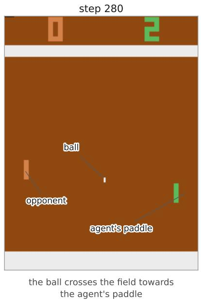

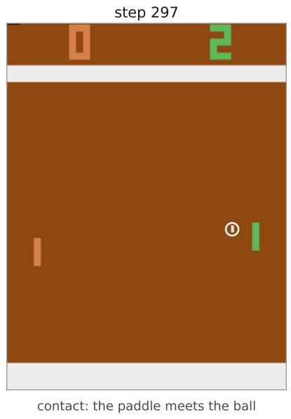

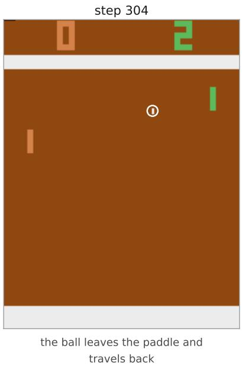  
Figure 7: How the Pong game works. The agent controls the right-hand paddle and the opponent controls the left-hand paddle. Each player moves its paddle up or down to intercept the ball and return it towards the other side, scoring a point when the opponent fails to return it. The three frames illustrate one return: the ball approaches the agent’s paddle, makes contact, and bounces back towards the opponent.

Setup. The agent learns Pong dynamics through interaction, revising its rulebook and executable as new evidence arrives. Figure 7 shows the game. Emulation uses the Arcade Learning Environment (ALE) [3] with frame-skip 4. For Pong, we replace the level-solving planner with a feedback policy that uses the learned executable world model to predict the consequences of candidate actions and selects the next action as new observations arrive.

Validation in this feedback-control setting combines replay diagnostics with evaluation of the learned controller. Discrepancies between predicted and observed ball trajectories, paddle motion, and bounce outcomes guide revisions to the rulebook and code. Full-frame replay retains residual rendering and paddle-motion errors. Before each action, the controller reconstructs its current state from recent frames and actions, fitting latent quantities such as ball velocity and the opponent’s movement phase under the learned dynamics. This updated state supplies the starting point for predicting action consequences.

During learning, we evaluate checkpoints of the learned controller in separate game episodes. The controller remains fixed during evaluation and requires no LLM calls. Exploration and revision continue until it achieves a 21 : 0 win, at which point learning stops.

Table 5: Pong score. Following the evaluation metric used in reinforcement learning experiments, episode score is defined as the agent’s points minus the opponent’s, ranging from −21 to +21. Our score is averaged over the three episodes shown in Figure 8, while the published baselines follow their respective evaluation protocols.
<table><tr><td>Method</td><td>Approach</td><td></td><td>Score Learning cost (frames)</td></tr><tr><td>GDI [11]</td><td>Model-free RL, data-distribution iteration</td><td>21</td><td> $2 . 0 \times 1 0 ^ { 8 }$ </td></tr><tr><td>LASER [34]</td><td>Model-free RL, actor-critic with replay</td><td>21</td><td> $2 . 0 \times 1 0 ^ { 8 }$ </td></tr><tr><td>IMPALA [9]</td><td>Model-free RL, distributed actor-critic</td><td>20.98</td><td> $2 . 0 \times 1 0 ^ { 8 }$ </td></tr><tr><td>Rainbow [15]</td><td>Model-free RL, distributional DQN with replay</td><td>20.9</td><td> $2 . 0 \times 1 0 ^ { 8 }$ </td></tr><tr><td>EfficientZero [46]</td><td>Model-based RL, latent dynamics and MCTS</td><td>20.1</td><td> $4 . 0 \times 1 0 ^ { 5 }$ </td></tr><tr><td>EfficientZero V2 [44]</td><td>Model-based RL, latent dynamics and tree search</td><td>20.8</td><td> $4 . 0 \times 1 0 ^ { 5 }$ </td></tr><tr><td>Human average</td><td>Human play</td><td>14.6</td><td></td></tr><tr><td>Same LLM, no world model</td><td>One LLM call per frame, memoryless</td><td>-19</td><td>0</td></tr><tr><td>Random</td><td>Uniform over the action set</td><td>-20.7</td><td></td></tr><tr><td>Code as Model</td><td>Language rulebook compiled to code</td><td>21</td><td> $9 . 5 \times 1 0 ^ { 3 }$ </td></tr></table>

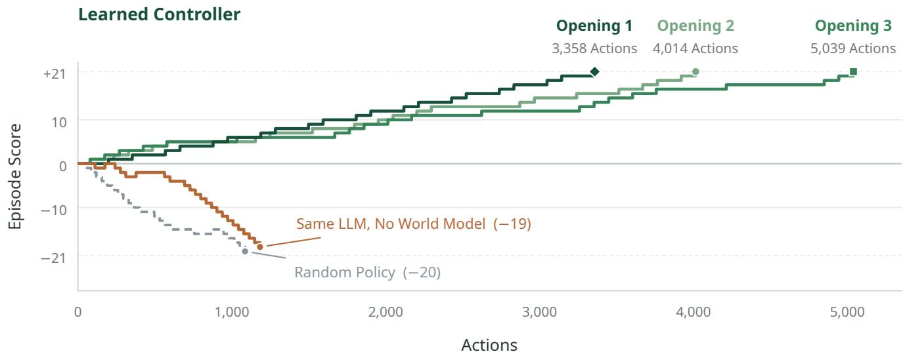  
Figure 8: Pong episode scores. The three green curves show the learned controller under three different openings. Each reaches +21 without conceding a point. The same LLM without a world model finishes with a score of −19, and the random-policy episode shown here finishes at −20. The horizontal axis counts actions taken within each episode.

Baselines. We compare our method with three types of baselines: a direct LLM agent with chain-ofthought reasoning, model-free reinforcement learning (RL) methods, and model-based RL methods (Table 5).

The direct LLM agent uses the same backbone, environment, and action interface but has no rulebook or executable world model. This baseline selects each action from the two most recent observations, with no persistent memory between calls. We also evaluate a uniformly random policy as a reference.

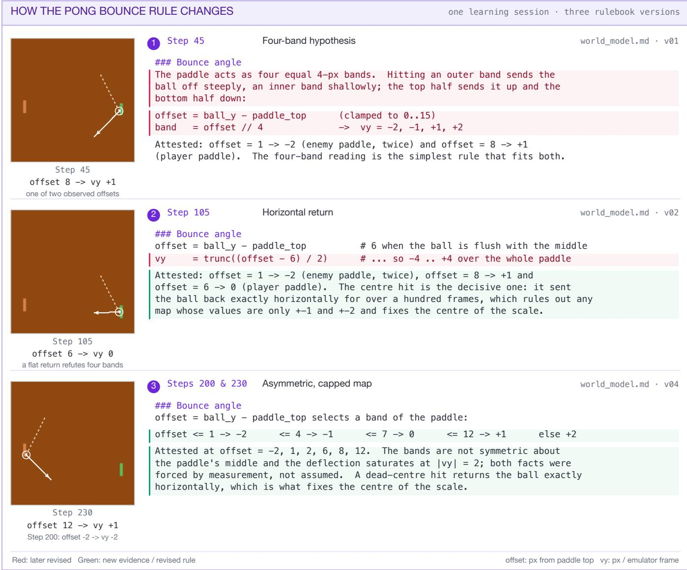  
Figure 9: Three rulebook versions from one Pong learning session show how observed ball returns drive two revisions of the bounce rule shared by both paddles. (1) The initial four-band hypothesis excludes horizontal returns. (2) A horizontal return from a centre hit refutes this hypothesis and prompts a centreddeflection formula that permits $v _ { y } = 0 .$ . (3) Further contacts reveal that the formula overestimates vertical return speeds, leading to an asymmetric band map with $| v _ { y } | \le 2$ . Contact offset is the ball’s top row minus the paddle’s top row; $v _ { y }$ denotes vertical velocity in pixels per emulator frame. Red marks claims revised later, and green marks new evidence or revised rules. Dashed white trails show recorded ball positions before contact, while solid white trails show positions after contact; step labels identify the supporting observations.

Among the model-free RL baselines, GDI [11] optimises both policy learning and the distribution of training data. LASER [34] is an off-policy actor–critic method with shared experience replay, while IMPALA [9] uses distributed actor–critic learning with V-trace correction. Rainbow [15] combines several improvements to the deep Q-network (DQN) algorithm. Their reported scores, alongside human and random-policy scores, are taken from Fan [10]. The model-based RL baselines, EfficientZero [46] and EfficientZero V2 [44], learn latent dynamics and use tree search for action selection, with a training budget of 100,000 actions, equivalent to 400,000 emulator frames.

Result. We evaluate the learned controller in three episodes, each with a different opening. It wins 21 : 0 in all three, achieving the maximum episode score of 21. Openings 1, 2 and 3 require 3,358, 4,014 and 5,039 actions, respectively. The LLM is used only during learning. During evaluation, the controller is held fixed, as is a trained reinforcement learning policy. Table 5 reports episode scores and learning costs for our controller and the baselines. Learning cost is measured in emulator frames. Figure 8 shows the score trajectories of the three controller episodes alongside those of the no-world-model and randompolicy baselines.

Our method achieves the maximum episode score of 21 at a learning cost of 9,504 emulator frames. The reported learning costs of the model-free and model-based baselines in Table 5 are approximately 2.1 × 104 and 42 times this cost, respectively. The rulebook and compiled code support learning from limited interaction by turning the frozen LLM’s hypotheses into an explicit world model that can be revised and reused for control. Drawing on pretrained knowledge, the LLM proposes objects, state variables, and dynamical relationships, which the rulebook records for testing against new observations. Figure 9 illustrates this process: a centre hit refutes the initial four-band bounce hypothesis and prompts a centreddeflection formula; further contacts lead to an asymmetric band map. Each revision updates the bounce rule for both paddles and changes its predictions at unobserved contact offsets. Compilation makes each revised rule available to the controller as an executable function. Combined with the learned ball and opponent dynamics, this function supports comparison of candidate return trajectories without testing each one in the environment. The model need not recover the dynamics of every possible state; it must be sufficiently accurate for the decisions required for successful control.

## 6. Related Work

World models and executable representations. World models support decision making by predicting the consequences of actions. Dyna combines real interaction with model-generated experience for planning and learning [38]. Neural world models support imagined rollouts, model-predictive control, and tree search [6, 14, 35], while Dynalang incorporates language as a predictive modality in a multimodal latent model [22]. These approaches encode learned dynamics in neural parameters and latent represen tations. Programs provide an alternative representation that exposes transitions as functions a planner can execute and test directly.

Language-guided program induction provides a foundation for constructing such models. Parsel combines natural-language decompositions with execution-based testing [47], and Hypothesis Search translates language hypotheses into programs verified on input-output examples [43]. For interactive environments, WorldCoder learns Python dynamics models and repairs them against observed counterexamples [39]; GIF-MCTS searches over candidate models through generation, improvement, and repair guided by descriptions, tests, and trajectories [8]. Code World Models for General Game Playing constructs transition, legality, and termination functions from rules and trajectories to support Monte Carlo tree search [21]. Code-as-World extends executable modelling to physical reasoning through a loop of program proposal, execution, rendering, and verification [41]. Together, these works establish languageguided construction and execution-based refinement as useful mechanisms for learning explicit models.

Several ARC-AGI-3 systems closely connect model construction, verification, and action selection. Rodionov’s baseline1 maintains, simplifies, and verifies a persistent Python model before planning through it [30]. Its subsequent component study finds exact verification consistently useful within the tested configurations, but does not find that requiring an executable model uniformly improves action performance [29]. OPINE-World maintains natural-language hypotheses, synthesises an object-centric executable, and uses ontology error to direct exploration; candidate programs must reproduce recorded transitions exactly [7]. Twin similarly gates model-based action on replay of the interaction history [37]. Tycho examines when an agent should construct, repair, use, or bypass an executable model, showing that better transition replay need not yield better decisions when objectives are misidentified or models are used inappropriately [20]. These results motivate examining how a learned model is maintained and used, alongside its predictive accuracy.

Language rules and reflective memory. Textual memory offers another way for frozen LLM agents to learn from interaction. Reflexion stores linguistic reflections on task feedback to improve later decisions [36]. AutoManual induces and organises environment rules into reusable manuals [4]. WALL-E updates and prunes symbolic rules by comparing predicted and observed trajectories, using those rules to align an LLM world model with its environment [50]. These approaches range from retaining advice about past decisions to maintaining explicit descriptions of environment behaviour, establishing language as an editable medium for both experience and rule knowledge.

The Memento series develops reflective memory from episodic adaptation [48] to stateful reflective learning, which links memory writing and reading to policy evaluation and improvement [42], and then to reusable executable skills [49]. Code as Model extends this progression to model-side semantic memory: a persistent rulebook and its executable realisation jointly represent a world-model hypothesis. Reflection can revise an environment rule or repair its implementation while retaining the rule. The LLM assesses code–rulebook fidelity, and replay checks the executable against recorded transitions. Language rules, executable artefacts, reflection, and replay are established components; we organise them around a persistent environment specification supporting both semantic revision and implementation repair.

Model uncertainty and exploration. Version spaces formalise the ambiguity left by finite evidence [24, 25], and minimum description length provides a simplicity preference among consistent hypotheses [28]. Model-based reinforcement learning represents uncertainty through probabilistic dynamics models or ensembles [6, 19]. Posterior sampling and related methods retain a sampled hypothesis or value function across an episode to support temporally coherent exploration [23, 26, 27]. Our population extension applies this principle by maintaining multiple world models in parallel. Each member pairs a rulebook with an executable, and all members are checked against shared interaction evidence. Sampling a member for planning allows different models to guide exploration. The population is a computational approximation to the remaining version space, rather than a calibrated Bayesian posterior; its purpose is to reduce dependence on a single early model construction.

Continual agent adaptation. Broader approaches to agent adaptation treat external software and workspaces as editable learning state. Workspace Optimization instantiates this view in DreamTeam, whose specialised agents build models, probe hypotheses, and plan [33]. Continual Harness supports reset-free revision of prompts, subagents, skills, and memory [17]. NOOA combines a Python objectoriented agent interface with persistent executable modules, prediction-error-driven refinement, and cross-level memory in ARC-AGI-3 [13]. Belief-Calibrated Optimization maintains a language world model of how evaluation responds to changes in an agent’s prompt and scaffolding [5]. Its model guides edits to the agent, whereas Code as Model predicts transitions within the environment to support planning and control. These models support complementary forms of agent improvement.

ARC-AGI-3 provides a shared setting for studying these approaches under unfamiliar rules and a human-derived action budget [1]. It also supports alternatives such as graph-based exploration, which records observed transitions and prioritises untested actions without a generative world model [32]. Tycho and Rodionov’s component study report saturation or near-saturation of the public set with stronger frontier models [20, 29]. Public-set completion alone therefore cannot isolate the contribution of a world model architecture. Comparisons must also account for model choice and reasoning budget, and examine action efficiency, repeated-run stability, and held-out evaluation.

## 7. Conclusion

We introduced MEMENTO 3, which extends reflective learning to explicit world models through Code as Model. The agent records environment hypotheses in a natural-language rulebook, compiles them into code for prediction and planning, and revises both through interaction while keeping the underlying LLM fixed. The population extension maintains multiple world models in parallel, each updated and verified against a shared interaction history. On ARC-AGI-3, the single-model agent clears every level of all 25 public games and reaches the RHAE ceiling, using 7,518 actions, or 44% of the human action count. In Atari Pong, the learned model supports a feedback controller that wins 21 : 0 in three evaluated episodes with different openings, without LLM calls during execution. By carrying verified model updates into subsequent planning and exploration, the agent uses what it has learned to shape the evidence for further revisions. This feedback is the model-based route to recursive self-improvement investigated in this work.

## References

[1] ARC Prize Foundation. ARC-AGI-3: A new challenge for frontier agentic intelligence. arXiv preprint arXiv:2603.24621, 2026.

[2] ARC Prize Foundation. Claude Opus 5: ARC-AGI results, 2026. URL https://arcprize.org/results/ anthropic-claude-opus-5. ARC-AGI-3 Public Demo: 25 environments, high reasoning effort. Accessed 2026- 10-01.

[3] Marc G. Bellemare, Yavar Naddaf, Joel Veness, and Michael Bowling. The arcade learning environment: An evaluation platform for general agents. Journal of Artificial Intelligence Research, 47:253–279, 2013.

[4] Minghao Chen, Yihang Li, Yanting Yang, Shiyu Yu, Binbin Lin, and Xiaofei He. AutoManual: Constructing instruction manuals by LLM agents via interactive environmental learning. In Advances in Neural Information Processing Systems (NeurIPS), 2024.

[5] Yuhan Chen, Zhihua Tian, Mahavir Dabas, Charith Peris, Rahul Gupta, Ming Jin, Feiyang Kang, Siyuan Zhang, Nan Wang, and Ruoxi Jia. Belief-calibrated optimization: An explicit world model for agentic optimization. arXiv preprint arXiv:2609.01861, 2026. URL https://arxiv.org/abs/2609.01861.

[6] Kurtland Chua, Roberto Calandra, Rowan McAllister, and Sergey Levine. Deep reinforcement learning in a handful of trials using probabilistic dynamics models. In Advances in Neural Information Processing Systems (NeurIPS), 2018.

[7] David Courtis, Wenhao Li, and Scott Sanner. OPINE-World: Programmatic world modeling with ontologyerror-prioritized interactive exploration for ARC-AGI-3. arXiv preprint arXiv:2607.01531, 2026.

[8] Nicola Dainese, Matteo Merler, Minttu Alakuijala, and Pekka Marttinen. Generating code world models with large language models guided by Monte Carlo tree search. In Advances in Neural Information Processing Systems (NeurIPS), 2024.

[9] Lasse Espeholt, Hubert Soyer, Remi Munos, Karen Simonyan, Volodymyr Mnih, Tom Ward, Yotam Doron, Vlad Firoiu, Tim Harley, Iain Dunning, Shane Legg, and Koray Kavukcuoglu. IMPALA: Scalable distributed deep-RL with importance weighted actor-learner architectures. In International Conference on Machine Learning, 2018.

[10] Jiajun Fan. A review for deep reinforcement learning in Atari: Benchmarks, challenges, and solutions. arXiv preprint arXiv:2112.04145, 2021. URL https://arxiv.org/abs/2112.04145.

[11] Jiajun Fan, Changnan Xiao, and Yue Huang. GDI: Rethinking what makes reinforcement learning different from supervised learning. arXiv preprint arXiv:2106.06232, 2021. URL https://arxiv.org/abs/2106.06232.

[12] Marina Favaro and Jack Clark. When AI builds itself. Anthropic Institute, 2026. URL https://www.anthropic. com/institute/recursive-self-improvement. Accessed 6 September 2026.

[13] Paul Furgale, Severin Klingler, James Nolan, Matt Staats, Gaia Di Lorenzo, Elisa Martinez Abad, Christian Schüller, Razvan Dinu, Alessio Devoto, Pascal Berard, Gal Kaplun, Elad Sarafian, Riccardo Roveri, Leon Derczynski, and Ricardo Silveira Cabral. NVIDIA-labs OO agents: Native Python object-oriented agents. arXiv preprint arXiv:2607.20709, 2026.

[14] David Ha and Jürgen Schmidhuber. World models. arXiv preprint arXiv:1803.10122, 2018.

[15] Matteo Hessel, Joseph Modayil, Hado van Hasselt, Tom Schaul, Georg Ostrovski, Will Dabney, Dan Horgan, Bilal Piot, Mohammad Azar, and David Silver. Rainbow: Combining improvements in deep reinforcement learning. In AAAI Conference on Artificial Intelligence, 2018.

[16] Leslie Pack Kaelbling, Michael L. Littman, and Anthony R. Cassandra. Planning and acting in partially observable stochastic domains. Artificial Intelligence, 101(1–2):99–134, 1998. doi: 10.1016/S0004-3702(98)00023-X.

[17] Seth Karten, Joel Zhang, Tersoo Upaa, Ruirong Feng, Wenzhe Li, Chengshuai Shi, Chi Jin, and Kiran Vodrahalli. Continual harness: Online adaptation for self-improving foundation agents. arXiv preprint arXiv:2605.09998, 2026. URL https://arxiv.org/abs/2605.09998.

[18] Andrey Kolobov, Mausam, and Daniel S. Weld. A theory of goal-oriented MDPs with dead ends. In Proceedings of the Twenty-Eighth Conference on Uncertainty in Artificial Intelligence, pages 438–447. AUAI Press, 2012. URL https://homes.cs.washington.edu/\~weld/papers/kolobov-uai12.pdf.

[19] Thanard Kurutach, Ignasi Clavera, Yan Duan, Aviv Tamar, and Pieter Abbeel. Model-ensemble trust-region policy optimization. In International Conference on Learning Representations (ICLR), 2018.

[20] Jens Lehmann, Andrei Aioanei, and Sahar Vahdati. Tycho: Active abstraction with programmatic world models for ARC-AGI-3. arXiv preprint arXiv:2607.28287, 2026. URL https://arxiv.org/abs/2607.28287.

[21] Wolfgang Lehrach, Daniel Hennes, Miguel Lazaro-Gredilla, Xinghua Lou, Carter Wendelken, Zun Li, Antoine Dedieu, Jordi Grau-Moya, Marc Lanctot, Atil Iscen, John Schultz, Marcus Chiam, Ian Gemp, Piotr Zielinski, Satinder Singh, and Kevin P. Murphy. Code world models for general game playing. arXiv preprint arXiv:2510.04542, 2025.

[22] Jessy Lin, Yuqing Du, Olivia Watkins, Danijar Hafner, Pieter Abbeel, Dan Klein, and Anca Dragan. Learning to model the world with language. In Proceedings of the 41st International Conference on Machine Learning, volume 235 of Proceedings of Machine Learning Research, pages 29992–30017, 2024.

[23] Xiuyuan Lu and Benjamin Van Roy. Ensemble sampling. In Advances in Neural Information Processing Systems (NeurIPS), 2017.

[24] Tom M. Mitchell. Version spaces: A candidate elimination approach to rule learning. In Proceedings of the Fifth International Joint Conference on Artificial Intelligence, pages 305–310, 1977.

[25] Tom M. Mitchell. Generalization as search. Artificial Intelligence, 18(2):203–226, 1982.

[26] Ian Osband, Daniel Russo, and Benjamin Van Roy. (More) efficient reinforcement learning via posterior sampling. In Advances in Neural Information Processing Systems (NeurIPS), 2013.

[27] Ian Osband, Charles Blundell, Alexander Pritzel, and Benjamin Van Roy. Deep exploration via bootstrapped DQN. In Advances in Neural Information Processing Systems (NeurIPS), 2016.

[28] Jorma Rissanen. Modeling by shortest data description. Automatica, 14(5):465–471, 1978. doi: 10.1016/ 0005-1098(78)90005-5.

[29] Sergey Rodionov. Do coding agents need executable world models, simplification, and verification to solve ARC-AGI-3? arXiv preprint arXiv:2607.15439, 2026. URL https://arxiv.org/abs/2607.15439.

[30] Sergey Rodionov. Executable world models for ARC-AGI-3 in the era of coding agents. arXiv preprint arXiv:2605.05138, 2026.

[31] Stéphane Ross, Brahim Chaib-draa, and Joelle Pineau. Bayes-Adaptive POMDPs. In Advances in Neural Infor mation Processing Systems, volume 20, 2007. URL https://papers.nips.cc/paper\_files/paper/2007/hash 3b3dbaf68507998acd6a5a5254ab2d76-Abstract.html.

[32] Evgenii Rudakov, Jonathan Shock, and Benjamin Ultan Cowley. Graph-based exploration for ARC-AGI-3 interactive reasoning tasks. arXiv preprint arXiv:2512.24156, 2025. URL https://arxiv.org/abs/2512.24156.

[33] Elad Sarafian, Gal Kaplun, Ron Banner, Daniel Soudry, and Boris Ginsburg. Workspace optimization: How to train your agent. arXiv preprint arXiv:2605.09650, 2026.

[34] Simon Schmitt, Matteo Hessel, and Karen Simonyan. Off-policy actor-critic with shared experience replay. In Proceedings of the 37th International Conference on Machine Learning, volume 119 of Proceedings of Machine Learning Research, pages 8545–8554, 2020. URL https://proceedings.mlr.press/v119/schmitt20a.html.

[35] Julian Schrittwieser, Ioannis Antonoglou, Thomas Hubert, Karen Simonyan, Laurent Sifre, Simon Schmitt, Arthur Guez, Edward Lockhart, Demis Hassabis, Thore Graepel, Timothy Lillicrap, and David Silver. Master ing Atari, Go, chess and shogi by planning with a learned model. Nature, 588:604–609, 2020.

[36] Noah Shinn, Federico Cassano, Ashwin Gopinath, Karthik Narasimhan, and Shunyu Yao. Reflexion: Language agents with verbal reinforcement learning. In Advances in Neural Information Processing Systems (NeurIPS), 2023.

[37] Alexy Skoutnev, Kirill Acharya, Gaston Longhitano, Madeleine Udell, Kevin Ellis, and Iddo Drori. Twin: Playing an unknown game with a test-time digital twin. arXiv preprint arXiv:2608.14490, 2026. URL https: //arxiv.org/abs/2608.14490.

[38] Richard S. Sutton. Dyna, an integrated architecture for learning, planning, and reacting. ACM SIGART Bulletin, 2(4):160–163, 1991.

[39] Hao Tang, Darren Key, and Kevin Ellis. WorldCoder, a model-based LLM agent: Building world models by writing code and interacting with the environment. In Advances in Neural Information Processing Systems (NeurIPS), 2024.

[40] Florent Teichteil-Königsbuch. Stochastic safest and shortest path problems. In Proceedings of the Twenty-Sixth AAAI Conference on Artificial Intelligence, pages 1825–1831, 2012. doi: 10.1609/aaai.v26i1.8367. URL https: //ojs.aaai.org/index.php/AAAI/article/view/8367.

[41] Hanyang Wang, Yimo Cai, Weiliang Chen, Jiawei Chi, Haowen Sun, Qiyu Dai, Yi-Hsin Hung, Xingzhuo Guo, Jinshan Ren, Runmao Yao, Ziwei Liu, Mingsheng Long, Yueqi Duan, Jun Gao, Jiangran Lyu, Fangfu Liu, and Jialong Wu. Code as worlds: Agentic discovery of executable world representations for physical reasoning. arXiv preprint arXiv:2608.27549, 2026. URL https://arxiv.org/abs/2608.27549.

[42] Jun Wang. Memento 2: Learning by stateful reflective memory. arXiv preprint arXiv:2512.22716, 2025.

[43] Ruocheng Wang, Eric Zelikman, Gabriel Poesia, Yewen Pu, Nick Haber, and Noah D. Goodman. Hypothesis search: Inductive reasoning with language models. In International Conference on Learning Representations (ICLR), 2024.

[44] Shengjie Wang, Shaohuai Liu, Weirui Ye, Jiacheng You, and Yang Gao. EfficientZero V2: Mastering discrete and continuous control with limited data. In Proceedings ofthe 41st International Conference on Machine Learning, volume 235 of Proceedings of Machine Learning Research, pages 51041–51062, 2024. URL https://proceedings. mlr.press/v235/wang24at.html.

[45] Lilian Weng. Harness engineering for self-improvement. Lil’Log, July 2026. URL https://lilianweng.github. io/posts/2026-07-04-harness/.

[46] Weirui Ye, Shaohuai Liu, Thanard Kurutach, Pieter Abbeel, and Yang Gao. Mastering Atari games with limited data. In Advances in Neural Information Processing Systems, volume 34, 2021. URL https://arxiv.org/abs/ 2111.00210v2.

[47] Eric Zelikman, Qian Huang, Gabriel Poesia, Noah D. Goodman, and Nick Haber. Parsel: Algorithmic reasoning with language models by composing decompositions. In Advances in Neural Information Processing Systems (NeurIPS), 2023.

[48] Huichi Zhou, Yihang Chen, Siyuan Guo, Xue Yan, Kin Hei Lee, Zihan Wang, Ka Yiu Lee, Guchun Zhang, Kun Shao, Linyi Yang, and Jun Wang. Memento: Fine-tuning LLM agents without fine-tuning LLMs. arXiv preprint arXiv:2508.16153, 2025.

[49] Huichi Zhou, Siyuan Guo, Anjie Liu, Zhongwei Yu, Ziqin Gong, Bowen Zhao, Zhixun Chen, Menglong Zhang, Yihang Chen, Jinsong Li, Runyu Yang, Qiangbin Liu, Xinlei Yu, Jianmin Zhou, Na Wang, Chunyang Sun, and Jun Wang. Memento-Skills: Let agents design agents. arXiv preprint arXiv:2603.18743, 2026.

[50] Siyu Zhou, Tianyi Zhou, Yijun Yang, Guodong Long, Deheng Ye, Jing Jiang, and Chengqi Zhang. WALL-E: World alignment by rule learning improves world model-based LLM agents. arXiv preprint arXiv:2410.07484, 2024.