# Marformer: A Transformer for Predicting Missing Data Distributions

Prabhav Singh<sup>∗</sup> School of Computing, College of Natural Sciences The University of Texas at Austin, Austin TX

Xiheng Tom Wang<sup>∗</sup> Department of Computer Science Johns Hopkins University, Baltimore MD

Haojun Shi<sup>∗</sup> Department of Computer Science Yale University, New Haven, CT

Jason Eisner Department of Computer Science Johns Hopkins University, Baltimore MD

prabhavs@cs.utexas.edu

xwang397@jh.edu

haojun.shi@yale.edu

jason@cs.jh.edu

## Abstract

Real decisions are made under incomplete information. If we observe only some of the random variables we need, we can predict the others. The conditional marginals over the missing variables are the key ingredient for computing Bayes risk and Value of Information (VOI), the expected gain from acquiring one more observation before deciding. We present the Marformer, a Transformer trained to directly predict conditional marginals given any set of observed values. Like BERT, which is trained to predict missing words from context, the Marformer constructs a hidden-vector representation for each distribution p(X<sub>i</sub>) and iteratively refines it through attention to other distributions $p ( X _ { j } )$ . Unlike generative approaches, the Marformer does not model the full joint distribution, requires no domain knowledge of the data-generating process, and makes all predictions in a single forward pass. We evaluate across three synthetic domains with missing data—Bayesian networks, discretized multivariate Gaussians, and structured annotation data. The Marformer can match or outperform classical missing-data methods, even when those methods are given the true model family and prior that generated the synthetic data. We also evaluate on a real annotation dataset, where the Marformer outperforms the evaluated baselines at the largest training size. In both cases, the Marformer is substantially faster than the evaluated generative baselines.

## 1 Introduction

Incomplete data is the rule, not the exception, in scientific and applied settings. A recommender system has a user’s opinions of only a few movies. A standardized testing agency has only a few graders’ opinions of each essay. The incomplete data may be acquired adaptively: A doctor does just enough tests to choose a treatment confidently. An engineer runs cheap simulations to decide which candidate molecules or hyperparameter settings are worthy of further measurements. An educational tester or job interviewer probes adaptively for strengths and weaknesses, using a limited budget. An evaluator of an AI system adaptively selects examples based on observed performance, using the results to predict performance on other examples (Li et al., 2024). In each case, the decision-maker needs not a point estimate of the missing values but a predictive distribution over them given the available evidence. With such distributions, one can quantify residual uncertainty, predict the risk of a possible action, or determine whether gathering more data before acting would be worth the cost.

In this paper we focus on marginal predictions. Our goal is to train a neural network that can predict the marginal distribution of any single missing value conditioned on any subset of the remaining values. We fit these conditional marginals directly by conditional maximum likelihood, a frequentist approach that requires no prior over the model parameters. As we explain in §2.2, such a model is directly useful for deciding among real-world actions and for choosing what additional information (missing values) to acquire before this decision. Our architecture is generic and ofers fast, amortized, trainable inference of all the individual missing values in parallel. We also point out in §2.2 that such a model can jointly impute multiple missing values, if needed, by sampling them sequentially. Thus, our (possibly incoherent) collection of conditional distributions contains as much information as a joint distribution—but in a form designed to support conditional inference.

The classical Expectation-Maximization approach proceeds in the opposite direction: from joint to conditional. It first obtains a joint distribution over all values by fitting a full generative model to the incomplete data, using the maximum likelihood principle (EM: Dempster et al., 1977) or the maximum a posteriori principle if a prior is available (MAP-EM: Gentle et al., 1996, §1.6.1). One then performs inference as needed to extract the desired conditional marginals from this joint distribution.

Unfortunately, EM or MAP-EM (i) requires domain expertise to specify the generative model family and any prior; (ii) can encounter local optima when fitting the model parameters; and (iii) may require intractable inference, necessitating variational or sampling-based approximations that can be slow or inaccurate.

A more sophisticated variant is Bayesian posterior imputation (Tanner et al., 1987; Gelfand & Smith, 1990), which integrates out the posterior uncertainty about the generative model’s parameters, typically by using MCMC to (approximately) sample them jointly with the missing values. The samples of the missing data can then be used to estimate the desired conditional marginal distributions.<sup>1</sup> Training (ii) is thus absorbed into inference (iii), whose MCMC will escape local optima if run long enough. However, training/inference is still expensive to do accurately, and model specification (i) is still challenging.

In short, these classical methods have serious practical weaknesses—as we will demonstrate experimentally. The model is commonly misspecified because the domain is poorly understood or challenging to model. Such violations of (i) can lead to inaccurate results. (ii) and (iii) mean that even a correctly specified model family may produce poor results. Finally, (iii) slows down training as well as runtime prediction. This is particularly burdensome for online training: e.g., if the model is used to guide the acquisition of missing observations (as we discuss in §2.2), it is natural to immediately use these to improve the model parameters, so training continues indefinitely.

This is why we propose to abandon the hypothesized generative model—even when it is correct!—and simply fit all the conditional marginals directly. For this we use a generic neural model with enough capacity to do the job (one can select the neural network’s size via cross-validation). Deep learning has been remarkably successful at fitting naturally occurring distributions. In contrast to the classical methods, training an overparameterized neural network does not adopt restrictive modeling assumptions,<sup>2</sup> may bring useful inductive bias of its own (Neyshabur et al., 2017), tends not to get trapped in bad local minima (Sun et al., 2020), and can be designed to directly predict the target distributions, making inference fast and end-to-end trainable.

To flesh out this program, we propose a specific neural architecture that we hope is suitable for many domains: a Marformer (Conditional Marginal Transformer). The architecture is illustrated in Figure 2. Its key properties are:

1. Observation of values. Each input to the Marformer specifies a set of random variables together with their values, some of which may be missing.

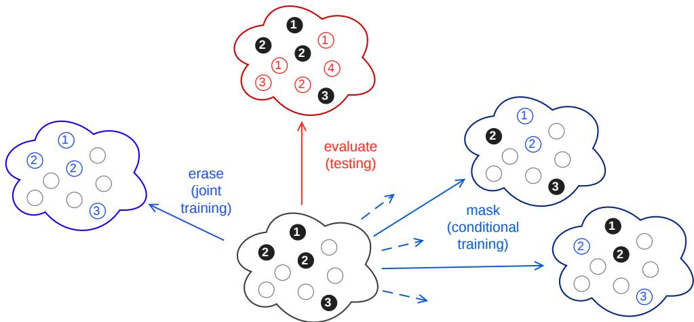  
Figure 1: The complete instance x at top reveals values only for attributes in r (black), where $( { \bf x } , { \bf r } ) \sim P ^ { * }$ Thus, our methods receive only the incomplete instance $\mathbf { x _ { r } }$ at bottom. In this example, $\mathbf { x _ { r } }$ is used both as a test instance and as a training instance (transductive learning). At test time, a model is evaluated (top) by its ability to predict individual missing values (red) from the observed values $\mathbf { x _ { r } }$ (black). It predicts a distribution for each red attribute and is rewarded if this distribution assigns high probability to the true value. At training time, the Marformer (right) trains to predict masked values (blue) from seen values $\mathbf { x _ { s } }$ (black). Many diferent masks s are used. In contrast, a classical generative model (left) trains to jointly predict all observed variables (blue) from nothing, using the missing variables (white) as latent variables.

2. Prediction of parameters. The Marformer outputs marginal distributions for all variables, conditioned on the observations in the input. More precisely, for each variable, it outputs a parameter vector that will be interpreted as specifying a predictive distribution over that variable’s domain.

3. Conditional log-likelihood maximization. The training objective is conditional log-likelihood. That ${ \mathrm { i s } } ,$ the predicted marginal over an unknown quantity should assign a high log-probability (or log-density) to its true value. This objective encourages predictions to match the true conditional distributions, which can subsequently be used to evaluate decisions under any task-specific loss (Gneiting & Raftery, 2005). We discuss empirical calibration in §6.6.

4. Amortized, single-pass inference. Once trained, the Marformer predicts all missing marginals simultaneously in a single forward pass, sharing computation across the entire set of missing values. Its architecture (Figures 2a and 2b) generalizes BERT (Devlin et al., 2019), which specifically predicts conditional marginals over all missing words in a natural-language sentence. As in BERT, each variable can attend to the evolving predictions of the other variables as their representations are transformed layer by layer.

5. End-to-end diferentiable training. Inference is fully defined by this forward pass. Thus, training the Marformer to maximize conditional log-likelihood is explicitly optimizing the parameters to make inference accurate (Stoyanov et al., 2011; Hershey et al., 2014). In contrast, classical approaches train a joint model without considering the errors that may later be introduced by approximate inference.

6. Support for relational domains. Many machine learning methods train and test on many partially observed samples that are assumed i.i.d. However, a relational task domain may have only a single partially observed sample with very many interrelated variables: the observed variables are observed only once, and the missing variables are never observed. Predicting the missing values is still possible, via shared parameters that model recurring relationships among variables. For joint modeling of relational domains, many suitable formalisms have been developed (Ginestet, 2010), although inference is generally expensive because it requires some form of message passing among the many variables. We extend the Marformer architecture (§3.1) to also handle such domains, using a relational attention mechanism (Shaw et al., 2018) whereby related variables know their relationships and can learn to attend to one another.

Now the obvious question: How can we train a Marformer? Specifically, to supervise the prediction of missing data, where do we acquire the true values? The self-supervised learning recipe (e.g., Devlin et al., 2019; He et al., 2021) randomly masks out some variables, and trains a model to predict their masked values. The traditional recipe starts with complete data, and often trains prediction only for its side efect of representation learning. In contrast, we start with incomplete data, and predicting missing values is our actual goal. Yet (like Du et al., 2023) we can follow the same masking recipe—randomly mask out some of the observed values and train the model to predict them from the remaining observed values (Figure 1). We hope that the Marformer model will generalize from predicting these masked values to predicting the originally missing values. As we show in §2.4, this is reasonable to expect provided that the originally missing variables are missing completely at random (MCAR) and we mask additional variables using a missing-at-random (MAR) mechanism. (We review missingness mechanisms in §2.3.)

Our main synthetic evaluations use MCAR data, for which this masking recipe has the justification given in §2.4. We also report exploratory MAR evaluations in $\ S \mathrm { A }$ , where that justification does not automatically apply, and evaluate on a naturally sparse real annotation dataset (§7.1), for which MCAR is an unverified assumption. In a sequel paper, we will generalize to training Marformers on MAR data—the same setting where EM works—using a more complex training recipe that is beyond the scope of the present paper.<sup>3</sup>

The present paper sufices to study the Marformer architecture itself, showing that it can successfully model many conditional distributions at once. It can learn from modestly sized datasets, and it generalizes well from predicting masked values at training time to predicting the actually missing values at test time. Most important, it is competitive with the classical approaches even when they know the true model and prior.

§2 motivates and formalizes the problem. §3 describes the architecture and training. $\ S \ S 4 - 6$ present experiments in three synthetic domains of increasing complexity. $\ S 7$ evaluates the method on real annotation data. $\ S 8$ discusses other related work, and $\ S 9$ discusses limitations and future directions.

## 2 Problem Setting

## 2.1 Notation for Attributes and Values

We assume that our training and test instances are i.i.d. samples from some unknown probability distribution $P ^ { * }$ . To describe an instance’s attributes, the underlying sample space is equipped with a collection $\{ X _ { i } \} _ { i \in \mathbf { i } }$ of random variables named by the elements i of the fixed index set i. Each random variable $X _ { i }$ has some domain $\mathcal { D } _ { i }$ . We write X for the entire random collection $\{ X _ { i } \} _ { i \in \mathbf { i } }$ , which has domain $\Pi _ { i \in \mathbf { i } } \mathcal { D } _ { i }$ . For example, if $\mathbf { i } = \{ 1 , 2 , 3 \}$ , then X can be identified with the random tuple $( X _ { 1 } , X _ { 2 } , X _ { 3 } )$ with values of the form $\mathbf { x } = ( x _ { 1 } , x _ { 2 } , x _ { 3 } ) \in \mathcal { D } _ { 1 } \times \mathcal { D } _ { 2 } \times \mathcal { D } _ { 3 }$

For x in the domain of X and $\mathbf { s } \subseteq \mathbf { i } .$ let $\mathbf { x _ { s } }$ denote the subcollection $\{ x _ { i } \} _ { i \in \mathbf { s } } .$ that is, a dictionary or function that maps each attribute $i \in { \bf s }$ to its value $x _ { i } .$ . (Note that one may recover s from $\mathbf { x _ { s } }$ as the domain of this map.) Applying this subscripting operation to $\mathbf { X }$ , we obtain the corresponding random subcollection $\mathbf { X _ { s } }$ with domain $\Pi _ { i \in \mathbf { s } } { \mathcal { D } } _ { i }$ . Note that $\mathbf { x _ { i } } = \mathbf { x _ { \rho } }$ and $\mathbf { X _ { i } } = \mathbf { X }$

By abuse of notation, even when x does not refer to any object, we may use $\mathbf { x _ { s } }$ to refer to a possible value of $\mathbf { X _ { s } }$ (and $x _ { i }$ to refer to a possible value of $X _ { i } )$ , implying that $\begin{array} { r } { \mathbf { x _ { s } } \in \prod _ { i \in \mathbf { s } } \mathcal { D } _ { i } } \end{array}$ (and $x _ { i } \in \mathcal { D } _ { i } )$ ).

## 2.2 Conditional Marginals and Their Uses

Our goal is to train a single Marformer to model all of the conditional marginal distributions $P ^ { * } ( X _ { i } \mid$ ${ \bf X _ { s } } = { \bf x _ { s } } )$ , where $\mathbf { s } \subsetneq \mathbf { i } , i \in \mathbf { i } \setminus \mathbf { s } .$ and $\begin{array} { r } { \mathbf { x _ { s } } \in \prod _ { j \in \mathbf { s } } \mathcal { D } _ { j } } \end{array}$ . The conditioning values $\mathbf { x _ { s } }$ are said to be seen and are provided to the Marformer in its input.<sup>4</sup>

Why? First, it is simple to extract a point prediction of a variable $X _ { i }$ from its conditional marginal. The Bayesoptimal prediction is the one with minimum expected loss (Bayes risk) given the observations $\mathbf { x _ { s } }$ so far:

$$
\hat { x _ { i } } = \underset { x _ { i } } { \operatorname { a r g m i n } } \sum _ { x _ { i } ^ { * } \in \mathcal { D } _ { i } } P ^ { * } ( X _ { i } = x _ { i } ^ { * } \mid \mathbf { X _ { s } } = \mathbf { x _ { s } } ) \cdot \log \left( x _ { i } \mid x _ { i } ^ { * } \right)\tag{1}
$$

Under $L _ { 2 }$ or $L _ { 1 }$ loss, for example, $\hat { x _ { i } }$ is the conditional mean or conditional median of $X _ { i }$

Marginal distributions predict only one variable at a time. Fortunately, once we can condition on arbitrary subsets of observations, we can chain these conditional marginal predictions to obtain conditional joint predictions as needed. The additional conditioning values in this chain may be hypothetical or sampled rather than observed. For example, for any distinct $j , k \notin { \bf s }$

$$
P ^ { * } ( X _ { j } = x _ { j } , X _ { k } = x _ { k } \mid \mathbf { X _ { s } } = \mathbf { x _ { s } } ) = P ^ { * } ( X _ { j } = x _ { j } \mid \mathbf { X _ { s } } = \mathbf { x _ { s } } ) \cdot P ^ { * } ( X _ { k } = x _ { k } \mid \mathbf { X _ { s } } = \mathbf { x _ { s } } , X _ { j } = x _ { j } )\tag{2}
$$

and we can drop in Marformer estimates of both factors. This generalizes autoregressive prediction, in a manner previously explored by orderless NADE (Uria et al., 2016) and XLNet (Yang et al., 2019). The generalization is important: because the Marformer specifies all conditional distributions, it is fast to evaluate the two factors of (2), or to sample $x _ { j }$ and then $x _ { k }$ from them. In contrast, under the autoregressive (“factored regression”) models widely used in the previous missing data literature (Lipsitz & Ibrahim, 1996; Enders, 2023), those operations would require expensive marginalization or importance reweighting, except when the fixed autoregressive order happens to include the specific factors that appear in (2).

Making a point prediction like (1) can be regarded as choosing an action. One can also use probabilities to evaluate real-world actions with task-specific losses. The application defines the available actions and their losses; the Marformer supplies the conditional predictions used to evaluate them. After observing ${ \mathbf { X _ { s } } } = { \mathbf { x _ { s } } } .$ , the distribution (2) sufices to choose among actions whose losses depend on the state of the world only through the state’s attributes $X _ { j }$ and $X _ { k }$ (and optionally ${ \bf X } _ { s } )$ . The Bayes risk of a possible action a is again its expected loss, now under the conditional joint distribution (2):

$$
\operatorname { r i s k } ( a \mid \mathbf { X } _ { s } = \mathbf { x } _ { s } ) = \sum _ { x _ { j } , x _ { k } } P ^ { * } ( X _ { j } = x _ { j } , X _ { k } = x _ { k } \mid \mathbf { X } _ { \mathbf { s } } = \mathbf { x } _ { \mathbf { s } } ) \cdot \log ( a \mid \mathbf { X } _ { s } = \mathbf { x } _ { s } , X _ { j } = x _ { j } , X _ { k } = x _ { k } )\tag{3}
$$

The Bayes-optimal action is $\hat { a } = \operatorname { a r g m i n } _ { a } \operatorname { r i s k } ( a \mid \mathbf { X _ { s } } = \mathbf { x _ { s } } )$ . For example, a doctor may wish to assess each candidate treatment a after observing symptoms $\mathbf { x _ { s } } .$ . Equation (3) does so by marginalizing over an unseen disease $X _ { j }$ and an unseen patient preference $X _ { k } .$ , both of which are imputed from $\mathbf { x _ { s } }$ using the Marformer. It may be convenient to approximate the expectation (3) by Monte Carlo, sampling $X _ { j }$ and $X _ { k }$ as mentioned above. The same samples can be reused to compute the Bayes risks of alternative candidate actions $a ^ { \prime }$

An important speedup is available here. Since the loss of a is a deterministic function of random variables such as $X _ { j }$ and $X _ { k }$ , it is a random variable itself. Suppose we call it $X _ { i } .$ . Then $\mathrm { r i s k } ( a \mid { \bf X } _ { s } = { \bf x } _ { s } )$ is the conditional expectation $\begin{array} { r } { \sum _ { x _ { i } } P ^ { * } ( X _ { i } = x _ { i } \ | \ \mathbf { X _ { s } } = \mathbf { x _ { s } } ) \cdot x _ { i } } \end{array}$ , as in equation (1). We can again drop in the Marformer’s estimate of the conditional marginal here—provided that we had the forethought to include $X _ { i }$ in the Marformer’s training, and provided that the Marformer can directly predict $X _ { i }$ as accurately as it estimates it via equations (2) and (3). Given that investment in training, this approach is much faster at prediction time. It no longer requires an expectation over many chained $( x _ { j } , x _ { k } )$ pairs. A single call to the Marformer is now enough to predict the Bayes risk of a and also, in parallel, other candidate actions $a ^ { \prime } .$

Is it worth gathering more information before choosing an action? Conditional marginals enable active feature acquisition (Saar-Tsechansky et al., 2009), which repeatedly chooses a next attribute to observe until further acquisition would no longer improve expected outcomes enough to justify its cost. The value of information (VOI) of observing $X _ { j }$ in the preceding example is the expected reduction in loss, considering how this new information changes the chosen action from aˆ to the possibly diferent $\hat { a } _ { x _ { j } }$ (Howard, 1965; 1966):

$$
\operatorname { V O I } ( X _ { j } \mid \mathbf { X _ { s } } = \mathbf { x _ { s } } ) = \sum _ { x _ { j } } P ^ { * } ( x _ { j } \mid \mathbf { X _ { s } } = \mathbf { x _ { s } } ) \cdot ( \operatorname { r i s k } ( { \hat { a } } \mid \mathbf { X _ { s } } , X _ { j } = x _ { j } ) - \operatorname { r i s k } ( { \hat { a } } _ { x _ { j } } \mid \mathbf { X _ { s } } , X _ { j } = x _ { j } ) )\tag{4}
$$

$$
{ \mathrm { ~ w h e r e ~ } } { \hat { a } } = \operatorname * { a r g m i n } _ { a } { \mathrm { ~ i s k } } ( a \mid \mathbf { X _ { s } } ) { \mathrm { ~ a n d ~ } } { \hat { a } } _ { x _ { j } } = \operatorname * { a r g m i n } _ { a } { \mathrm { ~ i s k } } ( a \mid \mathbf { X _ { s } } , X _ { j } = x _ { j } )\tag{5}
$$

This can be computed using exactly the same conditional marginals as in equation $( 3 ) . \ X _ { j }$ is worth observing if its VOI exceeds the corresponding cost of information (COI), that is, the expected cost of observing $X _ { j }$ (This cost is often a constant known in advance, but in general it is just another random variable for the Marformer to predict.) Heuristically, one may choose a next variable to observe by maximizing $\frac { \mathrm { V O I - C O I } } { \mathrm { e n e r } }$ CO (Saar-Tsechansky et al., 2009), which represents the immediate rate of return on investment $( \mathrm { R O I } ) . ^ { \mathrm { 5 } }$

In short, conditional marginals serve to guide decision-making about which action to take and which information to gather first.

In this paper, we focus on making conditional marginal estimation straightforward, fast, and accurate, using a generic model rather than a bespoke model for the domain. For this purpose we will assume fixed training and test distributions. In a sequel paper, we will attempt to train a policy for incrementally acquiring conditioning variables that usefully inform some downstream decision, along with training all conditional marginal distributions that the policy consults on the data that it gathers (Li & Oliva, 2020).

## 2.3 Predicting From Conditional Marginals on Incomplete Data

Often we must work with incompletely observed data—for example, whatever active feature acquisition has collected so far. To model incomplete datasets with stochastically missing attributes (Rubin, 1975; Little, 2021), the probability space from §2.1 is also equipped with a set-valued random variable R that specifies which attributes are observed (“revealed”). The other attributes are missing. Thus, an instance $( { \bf x } , { \bf r } ) \sim P ^ { * } ( { \bf X } , { \bf R } )$ has $\mathbf { r } \subseteq \mathbf { i }$ and gives rise to the observed instance $\mathbf { x _ { r } }$ that appears in training or test data. We refer to x as the complete instance. $P ^ { * } ( { \bf X } , { \bf R } )$ may be factored into the complete-data distribution $P ^ { * } ( \mathbf { X } )$ and the missingness mechanism $P ^ { * } ( \mathbf { R } \mid \mathbf { X } )$

Incomplete data methods can have subtle bugs. The rest of this section ensures correct prediction on incomplete test instances. The next section (§2.4) ensures asymptotically correct estimation from incomplete training instances. Some readers may prefer to skip this material on a first reading and proceed to $\ S 2 . 5$

Example: Let $\mathbf { i } = \{ 1 , 2 , 3 , 4 \}$ . If nature $( P ^ { * } )$ provides x and then chooses to reveal attributes $\mathbf { r } = \{ 2 , 4 \}$ then we observe the instance $\mathbf { x _ { r } } = \{ 2 \mapsto x _ { 2 } , 4 \mapsto x _ { 4 } \}$ . We then expect the missing value $x _ { 1 }$ to be distributed according to the conditional margina $P ^ { * } ( X _ { 1 } \mid \mathbf { X _ { R } } = \mathbf { x _ { r } } ) = P ^ { * } ( X _ { 1 } \mid \mathbf { R } = \{ 2 , 4 \} , X _ { 2 } = x _ { 2 } , X _ { 4 } = x _ { 4 } )$

The prediction in this test example takes care to condition on $\mathbf { R } = \mathbf { r } ,$ since the observation pattern r is itself observed and is potentially useful—the fact that $X _ { 1 }$ and $X _ { 3 }$ were stochastically missing may provide an additional clue about their values. In contrast, the subtly diferent notation $P ^ { * } ( X _ { 1 } \mid \mathbf { X _ { r } } = \mathbf { x _ { r } } )$ refers to the simpler distribution $P ^ { * } ( X _ { 1 } \mid X _ { 2 } = x _ { 2 } , X _ { 4 } = x _ { 4 } )$ , which is derived from only $P ^ { * } ( \mathbf { X } )$ , with no dependence on the missingness mechanism $P ^ { * } ( \mathbf { R } \mid \mathbf { X } )$ . This notation does not mention R: it treats r as a given constant, rather than as a realization of the random variable R.

In this paper, we train Marformer models $p _ { \theta }$ (as well as classical models) of this simpler distribution. Both distributions marginalize over the unmentioned variables $( X _ { 3 }$ in the example). They can be related through Bayes’ Theorem:

$$
{ \underset { \mathrm { p r e d i c i t i v e \ d i s t r i b u t i o n } } { \overset { P ^ { * } } { ( } } } ( X _ { i } = x _ { i } \mid \mathbf { X _ { R } } = \mathbf { x _ { r } } ) = P ^ { * } ( X _ { i } = x _ { i } \mid \mathbf { R } = \mathbf { r } , \mathbf { X _ { r } } = \mathbf { x _ { r } } ) \propto { \underset { \mathrm { m o d e l s t r i d i s t r i b u t i o n } } { \overset { P ^ { * } } { \underbrace { ( X _ { i } = x _ { i } \mid \mathbf { X _ { r } } = \mathbf { x _ { r } } ) } } } } \cdot { \underset { \mathrm { m i s s i n g u s s \ i h k e l i b u s d } } { \overset { P ^ { * } } { ( } } } = \mathbf { x } _ { r } \mid X _ { i } = x _ { i } , \mathbf { X _ { r } } = \mathbf { x _ { r } } )\tag{6}
$$

MNAR: In the general missing not at random (MNAR) case, predicting missing values requires not only our trained model but also knowledge of the missingness likelihood factor in (6). That factor cannot be learned from the observed instances alone (Molenberghs et al., 2008).

IMAR: However, the missingness likelihood factor can clearly be dropped if it is known to be constant with respect to $x _ { i }$ . Let us say that the missingness mechanism $P ^ { * } ( \mathbf { R } \mid \mathbf { X } )$ is individually missing at random (IMAR) if the probability of the specific observation pattern $\mathbf { R } = \mathbf { r }$ is independent of the individual missing value $x _ { i } .$ given the observed values: $P ^ { * } ( \mathbf { R } = \mathbf { r } \mid X _ { i } = x _ { i } , \mathbf { X _ { r } } = \mathbf { x _ { r } } ) = P ^ { * } ( \mathbf { R } = \mathbf { r } \mid \mathbf { X _ { r } } = \mathbf { x _ { r } } )$ , for all $\begin{array} { r } { \mathbf { r } \subseteq \mathbf { i } , \mathbf { x _ { r } } \in \prod _ { i \in \mathbf { r } } \mathcal { D } _ { j } } \end{array}$ , and $i \in { \bf i } \setminus { \bf r }$ . On the resulting incomplete instances $\mathbf { x _ { r } } .$ , the predictive distribution in equation (6) is always identical to the modeled distribution. So an IMAR mechanism is ignorable for our task $P ^ { * } ( X _ { i } = x _ { i } \mid \mathbf { X _ { R } } = \mathbf { x _ { r } } )$ of predicting an individual variable: the mechanism’s factor can always be dropped from equation (6) without knowing anything else about it. This is a new definition.

MAR: The traditional missing at random (MAR) property (Rubin, 1975; Seaman et al., 2013) strengthens IMAR to guarantee ignorability for the more dificult task $P ^ { * } ( \mathbf { X _ { i \setminus \tau } } \mid \mathbf { X _ { R } } = \mathbf { x _ { r } } )$ of predicting all missing variables jointly. Simply replace $X _ { i }$ with $\mathbf { X _ { i \backslash r } }$ throughout (6). The “modeled distribution” factor would now be defined by chaining as in equation (2). The missingness likelihood factor becomes $P ^ { * } ( \mathbf { R } = \mathbf { r } \mid \mathbf { X _ { i \setminus r } } =$ $\mathbf { x _ { i } } _ { \backslash \Gamma } , \mathbf { X _ { r } } = \mathbf { x _ { r } } )$ , and MAR states that it is always constant with respect to all of $\mathbf { x _ { i \setminus r } }$ , so that it can again be dropped. That is, given the observed values, the probability of the observation pattern $\mathbf { R } = \mathbf { r }$ does not depend on any function of the missing values $\mathbf { x _ { i } } _ { \mathbf { \nu \mathbf { r } } } \ ( \mathrm { e . g . }$ ., whether $x _ { 1 } = x _ { 2 } )$ . More concisely, MAR states that $P ^ { * } ( \mathbf { R } = \mathbf { r } \mid \mathbf { X } = \mathbf { x } ) = P ^ { * } ( \mathbf { R } = \mathbf { r } \mid \mathbf { X _ { r } } = \mathbf { x _ { r } } ) . ^ { 6 }$

Conveniently for our future applications, a dataset constructed by active feature acquisition is always $\mathrm { M A R . ^ { 7 } }$ The acquisition policy has no access to currently missing attributes, so the probability of observing attributes r and then stopping (that is, $P ^ { * } ( \mathbf { R } = \mathbf { r } \mid \mathbf { X } = \mathbf { x } ) )$ cannot depend on any still missing attributes.

MCAR: Stronger still is the missing completely at random property, $P ^ { * } ( \mathbf { R } = \mathbf { r } \mid \mathbf { X } = \mathbf { x } ) = P ^ { * } ( \mathbf { R } = \mathbf { r } )$ which states that the missingness pattern does not depend on x at all (not even on its observed part $\mathbf { x _ { r } } )$ Note that MCAR does not require i.i.d. missingness—it allows variables to be missing at diferent rates, and allows their missingness to be correlated, as long as the missingness pattern is selected without looking at x.

## 2.4 Training Conditional Marginals on Incomplete Data

We now discuss possible training strategies. In general, a conditional model $p _ { \pmb { \theta } } ( C \mid B )$ can be trained by conditional maximum likelihood estimation (CMLE):<sup>8</sup>

$$
\hat { \pmb { \theta } } = \underset { \pmb { \theta } } { \operatorname { a r g m a x } } \sum _ { b , c } \log p _ { \pmb { \theta } } ( c \mid b )\tag{7}
$$

where the sum is over i.i.d. draws from $P ( B , C ) \stackrel { \mathrm { d e f } } { = } P _ { 1 } ( B ) \cdot P _ { 2 } ( C \mid B )$ , known as training examples. This is essentially a way of fitting $p _ { \theta }$ to $P _ { 2 }$ . Even when $p _ { \theta }$ is misspecified, meaning that no θ yields the true $P _ { 2 }$ exactly, CMLE will still asymptotically minimize the following weighted average of divergences:<sup>9</sup>

$$
\underset { b \sim P _ { 1 } } { \mathbb { E } } \left[ \mathrm { K L } ( P _ { 2 } ( \cdot \mid b ) \parallel p _ { \pmb { \theta } } ( \cdot \mid b ) ) \right]\tag{8}
$$

In other words, CMLE asymptotically fits $p _ { \theta } ( C \mid b )$ to $P _ { 2 } ( C \mid b )$ for all b such that $P _ { 1 } ( b ) > 0$ . When no θ can do this exactly, CMLE favors fitting the distributions whose $P _ { 1 } ( b )$ is larger. It may also converge faster to those distributions, since they are better represented in the training data. For both reasons, one may wish to choose $P _ { 1 }$ to favor conditions b that are similar to the expected test-time queries $p _ { \pmb { \theta } } ( C \mid b )$

CMLE for conditional marginals. Recall from §2.2 that our goal is to fit a conditional model $p _ { \pmb { \theta } } ( c \vert \ b )$ to match $P ^ { * } ( X _ { i } = x _ { i } \mid \mathbf { X _ { s } } = \mathbf { x _ { s } } )$ . Since CMLE will match the conditional distributions $P _ { 2 }$ in the training examples, this means that the distribution of training examples needs to satisfy $P _ { 2 } ( x _ { i } \mid ( { \bf x _ { s } } , i ) ) = P ^ { * } ( X _ { i } =$ $x _ { i } \mid \mathbf { X _ { s } } = \mathbf { x _ { s } } )$ . In this setup, each training or test example $( b , c )$ will have the form $( ( \mathbf { x _ { s } } , i ) , x _ { i } )$ . The input b is an observation of $\mathbf { X _ { s } }$ paired with a target attribute $i \not \in { \mathbf { s } } ,$ and the target output c is the true value of $X _ { i }$

Training instances vs. training examples. Many training examples of the above form—single predictions—can be derived from a single observed training instance $\mathbf { x _ { r } } ,$ by masking out some of the observed attributes r and training the Marformer to predict them individually. Simply choose ${ \bf s } \subseteq { \bf r }$ and derive $| \mathbf { r } | - | \mathbf { s } |$ examples corresponding to $i \in { \bf r } \harpoonright$ s. All of these examples have the same Marformer input $\mathbf { x _ { s } } \ { \stackrel { \mathrm { d e f } } { = } } \ ( \mathbf { x _ { r } } ) _ { \mathbf { s } }$ , so conveniently, their terms in equation (7) can all be computed at once in a single forward pass.

Observability bias. Unfortunately, in the resulting distribution of training examples, $P _ { 2 }$ may not match the conditionals of $P ^ { * } ( \mathbf { X } )$ as required. The problem may arise even when the data are MAR and the masking mechanism is MCAR! Example: Let $\mathbf { i } = \{ 1 , 2 \}$ . Say $X _ { 1 } \in \{ 0 , 1 \}$ is always observed, but $X _ { 2 } \in \{ 0 , 1 \}$ is much more likely to be observed when $X _ { 1 } = 1$ than when $X _ { 1 } = 0$ . Like all dynamically acquired datasets, this dataset will be MAR. In particular, given $X _ { 1 } = x _ { 1 }$ , whether $X _ { 2 }$ is then observed $( 2 \in \mathbf { r } )$ is independent of $X _ { 2 } { \ ' }$ s value. This lets us safely learn $P ^ { * } ( X _ { 2 } \mid X _ { 1 } )$ by masking the observed $X _ { 2 }$ values (with some fixed probability) and learning to predict them. However, we cannot safely learn $P ^ { * } ( X _ { 1 } \mid X _ { 2 } )$ in the same way. Suppose the complete-data distribution assigns $( 0 , 0 ) , ( 0 , 1 ) , ( 1 , 0 ) , ( 1 , 1 )$ probabilities of $0 . 4 , 0 . 1 , 0 . 1 , 0 . 4$ respectively. Then $P ^ { * } ( X _ { 1 } = 0 \mid X _ { 2 } = 0 ) = 0 . 8$ , whereas unfortunately, few training examples with $X _ { 2 } = 0$ have $X _ { 1 } = 0$ . That is because such training examples are derived from instances in which $X _ { 2 }$ was observed at all, which tend to have $X _ { 1 } = 1$ due to the missingness mechanism.<sup>10</sup>

MNAR+MNAR: In the general case of MNAR training instances and an MNAR masking mechanism, we could correct for observability bias through inverse propensity weighting. For each condition $( \mathbf { x _ { s } } , i )$ , we would adjust the conditional distribution in masked training examples, $P ^ { * } ( X _ { i } \mid \mathbf { X _ { S } } = \mathbf { x _ { s } } )$ , to match the distribution we wish to model, $P ^ { * } ( X _ { i } \mid \mathbf { X _ { s } } = \mathbf { x _ { s } } )$ . The two distributions are related just as in equation (6), so weighting each masked training example by $1 / P ^ { * } ( \mathbf { S } = \mathbf { s } \mid X _ { i } = x _ { i } , \mathbf { X _ { s } } = \mathbf { x _ { s } } )$ corrects $P _ { 2 }$ (while distorting $P _ { 1 } )$ . Alas, we generally do not know that weighting factor, which depends in a complex way on both the missingness and masking mechanisms and on the complete-data distribution.

But suppose that weighting factor does not depend on $x _ { i }$ . In other words, suppose the combined missingness+masking mechanism is IMAR, yielding IMAR masked instances $\mathbf { X _ { S } }$ . Then the mechanism is ignorable, just as we saw beneath equation (6): the two distributions already match. In other words, we can avoid observability bias simply by obtaining IMAR masked instances. How can we accomplish that?

MAR+IMAR: Given MAR training instances, we saw above that even MCAR masking sufers from observability bias. However, we could impute missing variables like $X _ { 2 }$ to obtain complete instances. We can then mask the complete instances with any IMAR mechanism, which does not know what was originally missing $( \mathrm { i . e . , }$ , masking now chooses ${ \bf s } \subseteq { \bf i }$ and not $\mathbf { s } \subseteq \mathbf { r } )$ . This produces IMAR instances as needed. As we will show in a sequel paper, the imputation can be done by the Marformer itself, on an as-needed basis, with no further knowledge of the missingness mechanism. This is morally the same approach as Monte Carlo EM (Wei & Tanner, 1990), but it trains a collection of conditional distributions rather than a single generative model.

MCAR+IMAR: As the present paper focuses on proving out the Marformer architecture, we can be less concerned with its source of training examples. We accordingly simplify by requiring the training instances to be MCAR. In this special case, neither weighting nor imputation is necessary. Any IMAR masking mechanism for choosing ${ \textbf { s } } \subseteq { \textbf { r } }$ will produce IMAR masked instances, which yield training examples with the correct conditional distributions $P _ { 2 }$

To formalize this point: A masking mechanism is a conditional distribution $P ^ { * } ( \mathbf { S } \mid \mathbf { X _ { R } } = \mathbf { x _ { r } } )$ that is used to generate masked data from incomplete data. It is MAR if $P ^ { * } ( \mathbf { S = s } \mid \mathbf { X _ { R } = x _ { r } } ) = P ^ { * } ( \mathbf { S = s } \mid \mathbf { R = r } , \mathbf { X _ { s } = x _ { s } } )$ More weakly, it is IMAR if $P ^ { * } ( \mathbf { S } = \mathbf { s } \mid \mathbf { R } = \mathbf { r } , \mathbf { X } _ { \mathbf { s } } = \mathbf { x } _ { \mathbf { s } } , X _ { i } = x _ { i } ) = P ^ { * } ( \mathbf { S } = \mathbf { s } \mid \mathbf { R } = \mathbf { r } , \mathbf { X } _ { \mathbf { s } } = \mathbf { x } _ { \mathbf { s } } )$ (for all $\mathbf { r } \subseteq \mathbf { i } , \mathbf { s } \subseteq \mathbf { r } , \mathbf { x _ { s } } , i \in \mathbf { r } \setminus \mathbf { s } , x _ { i } )$ , meaning that the masking pattern does not depend on any individual masked value $\boldsymbol { x } _ { i } . ^ { 1 1 }$ The combined mechanism—MCAR missingness followed by IMAR masking—produces IMAR data as desired: $P ^ { * } ( \mathbf { S } = \mathbf { s } \mid \mathbf { X _ { s } } = \mathbf { x _ { s } } , X _ { i } = x _ { i } ) = P ^ { * } ( \mathbf { S } = \mathbf { s } \mid \mathbf { X _ { s } } = \mathbf { x _ { s } } )$ 12

In short, provided that the original incomplete training instances are MCAR, we can simply use IMAR masking to produce new IMAR instances, for which the supervision provided by the masked values is unbiased.

In terms of the discussion after equation (8), we have now satisfied the core requirement to match the data distribution’s conditionals $P _ { 2 }$ to the desired conditionals $P _ { 2 } ^ { * }$ , obtaining conditionally unbiased data. We do not need to also match $P _ { 1 }$ to the distribution $P _ { 1 } ^ { * }$ of test inputs—but doing so would give better results when $p _ { \pmb { \theta } }$ has insuficient capacity to fit $P _ { 2 }$ perfectly. Both $P _ { 1 }$ and $P _ { 1 } ^ { * }$ are over prediction queries $b = \left( \mathbf { x _ { s } } , i \right)$ . We again leave this problem to future work on deriving training examples.<sup>13</sup> In the experiments we describe below, $P _ { 1 }$ is already reasonably close to $P _ { 1 } ^ { * }$

Remark. The presentation in §§2.3–2.4 has assumed that both training and test instances are drawn from the same $P ^ { * }$ . Using the same complete-data distribution $P ^ { * } ( \mathbf { X } )$ is what ensures that the trained model $p _ { \theta }$ can be applied to test data, as in most machine learning. However, the missingness mechanisms $P ^ { * } ( \mathbf { R } \mid \mathbf { X } )$ do not really have to be the same—for example, training might include more complete instances $( \ S 7 . 1 )$ . The missingness mechanism on a training instance informs the masked-data training strategy (§2.4), while the missingness mechanism on a test instance plays the diferent role of informing prediction (§2.3 and equation (6)).<sup>14</sup>

## 2.5 Experimental Setup

Our experimental setup for this paper is diagrammed in Figure 1. The training examples and test examples that could be derived from a given instance $\mathbf { x _ { r } }$ are distinct. At training time, we would mask some of $\mathbf { x _ { r } } \mathbf { \ ' } _ { \mathrm { s } }$ observed attributes and train to predict them (predicting $x _ { i }$ from $\mathbf { x _ { s } }$ for all $i \in { \bf r } \setminus { \bf s } )$ . At test time, however, we would predict the actually missing attributes (predicting $x _ { i }$ from $\mathbf { x _ { r } }$ for all $i \in \mathbf { i } \setminus \mathbf { r } )$

Actually evaluating these test-time predictions requires knowing the complete instance x. Thus, the test set Test consists of $\mathbf { \Psi } ( \mathbf { x } , \mathbf { r } )$ pairs drawn i.i.d. from $P ^ { * } ( { \bf X } , { \bf R } )$ . We evaluate with log-loss, a proper scoring rule that rewards $p _ { \pmb { \theta } }$ for matching the true conditional distributions in test data (Gneiting & Raftery, 2005). Our

specific evaluation loss in this paper is

$$
\sum _ { ( \mathbf { x } , \mathbf { r } ) \in \mathsf { T e s t } } \sum _ { i \in \mathbf { i } \backslash \mathbf { r } } - \log p _ { \theta } ( x _ { i } \mid ( \mathbf { x _ { r } } , i ) )\tag{9}
$$

Note that equation (9) evaluates $p _ { \theta }$ only on its marginal predictions (not on chained joint predictions as in equation (2)). It assumes that the test instances are IMAR, so that it can ignore the missingness mechanism in equation (6) and simply make the predictions directly from $p _ { \theta }$

In efect, equation (9) converts the test instance (x, r) into $| \mathbf { i } | - | \mathbf { r } |$ test examples $( b , c ) = \left( ( \mathbf { x _ { r } } , i ) , x _ { i } \right)$ that will be individually evaluated by log-loss. It also weights all test examples equally. (An applied setting should evaluate instead on the test predictions that are useful for the application, changing the weighting $P _ { 1 } ^ { * } .$ ) Test instances with smaller |r| will generate more test examples and thus contribute more terms to equation (9). We report the result in units of nats per example, dividing the total loss (9) by the total number of examples $\scriptstyle \sum _ { ( \mathbf { x } , \mathbf { r } ) \in \mathsf { T e s t } } ( | \mathbf { i } | - | \mathbf { r } | )$

In settings where we know the true distribution $P ^ { * } ( \mathbf { X } )$ that governs $X _ { i } ,$ we can ignore $x _ { i }$ and more directly evaluate the marginal predictions by measuring their divergence from the true marginals, replacing (9) with

$$
\sum _ { ( \mathbf { x } , \mathbf { r } ) \in \mathsf { T e s t } } \sum _ { i \in \mathbf { i } \backslash \mathbf { r } } \underbrace { \mathrm { K L } ( P ^ { * } ( X _ { i } = \cdot \mid \mathbf { X _ { r } } = \mathbf { x _ { r } } ) \parallel p _ { \theta } ( \cdot \mid \mathbf { x _ { r } } ) ) } _ { \mathrm { e x p e c t a t i o n ~ o f ~ } ( - \log p _ { \theta } ) - ( - \log P ^ { * } ) \ge 0 }\tag{10}
$$

We train the model $p _ { \theta }$ using a training set Train of incomplete MCAR training instances $\mathbf { x _ { r } }$ together with an IMAR masking mechanism $P ^ { * } ( \mathbf { S } \mid \mathbf { x _ { r } } )$ . Following the discussion in §2.4, we may locally minimize the training objective

$$
\underset { \mathbf { x } _ { \mathbf { r } } \in \mathsf { T r a i n } } { \mathbb { E } } \left[ \underset { \mathbf { s } \sim P ^ { * } ( \mathbf { S } | \mathbf { x _ { r } } ) } { \mathbb { E } } \left[ \sum _ { i \in \mathbf { r } \backslash \mathbf { s } } - \log p _ { \theta } ( x _ { i } \mid \mathbf { x _ { s } } ) \right] \right]\tag{11}
$$

which stochastically converts a training instance $\mathbf { x _ { r } }$ into $| \mathbf { r } - \mathbf { s } |$ equally weighted training examples $( b , c ) =$ $( ( \mathbf { x _ { s } } , i ) , x _ { i } )$ for CMLE. We use a stochastic gradient method so that the instances $\mathbf { x _ { r } }$ along with their masking patterns s $\subseteq$ r can be sampled randomly during training, according to the expectations in equation (11). Equation (19) below adds regularization to this objective, and footnote 13 discussed possibilities for reweighting its various summands.

In our present experiments, we use a very simple masking mechanism: each $i \in \mathbf { r }$ has a 15% independent probability of being masked. As in BERT (Devlin et al., 2019), the 15% number is intended to be small enough that the masked training inputs $\mathbf { x _ { s } }$ are not distributed too diferently from the unmasked test inputs $\mathbf { x _ { r } } ,$ yet large enough that we obtain several training examples each time we sample an instance $\mathbf { x _ { r } } \in$ Train.

We will compare to classical generative modeling as discussed in §1. These methods have access to the same Train and Test sets and evaluate with the same equation (9). However, they do not convert the training instances $\mathbf { x _ { r } }$ into conditional training examples as in equation (11). Instead they fit a joint model $q _ { \phi }$ to maximize the joint log-posterior, which—when Train is MAR—is

$$
\left( \sum _ { \mathbf { x _ { r } } \in \mathsf { T r a i n } } \log q _ { \phi } ( \mathbf { x _ { r } } ) \right) + \log p _ { \mathsf { p r i o r } } ( \phi )\tag{12}
$$

plus an ignorable constant. Train is MCAR and therefore MAR in our present experiments.

Some of our experiments make the test inputs available at training time, which is known as transductive learning (Vapnik, 1998; Ouchi et al., 2019). More precisely, Train includes all incomplete test instances $\{ \mathbf { x _ { r } } : ( \mathbf { x } , \mathbf { r } ) \in \mathsf { T e s t } \}$ . These are only test inputs; of course, the desired test outputs $\mathbf { x _ { i \setminus r } }$ are not seen during training! Transductive Marformer training will mask the test inputs to obtain additional training examples. With this paper’s simple masking strategy, that works only if Test is MCAR (like the rest of Train), not just MAR.

The reason we train transductively is to compare fairly to Bayesian MCMC $( \ S 5 . 4 )$ , which is naturally transductive. The MCMC sampler operates on training and test data together, sampling from the joint posterior over parameters and missing values; making it non-transductive would be dificult and expensive.<sup>15</sup>

Many users of the Marformer might prefer to apply it in the usual non-transductive manner: train p<sub>θ</sub> with no advance knowledge of the test inputs, then run it on the stream of test inputs. Skipping the training on the test inputs ignores potentially useful information, but is much faster at test time than any transductive method. We evaluate this case as well and show that it has comparable accuracy at large training sizes.

## 3 A Neural Architecture for Conditional Marginal Prediction

## 3.1 Marformer Architecture

We now present our neural model $p _ { \pmb { \theta } } ( X _ { i } \mid \mathbf { X _ { s } } = \mathbf { x _ { s } } )$ . Given the observation $\mathbf { x _ { s } }$ (where s may be any subset of i), the Marformer predicts a conditional marginal distribution over $X _ { i } .$ for all attributes $i \in { \mathbf i }$ in parallel.

1. The first step of the forward pass is to encode the observed input $\mathbf { x _ { s } }$ as a collection of $| \mathbf { i } |$ vectors. This is analogous to how a text Transformer encodes a length-|i| input sentence (Vaswani et al., 2017) that may have missing tokens (Devlin et al., 2019) into |i| vectors. For each $i \in { \bf s } , x _ { i }$ denotes the observed value of $X _ { i }$ . For each $i \in { \bf i } \backslash \ : \mathbf { s }$ , let $x _ { i } = \top$ to indicate that the value of $X _ { i }$ is missing. In either case, the Marformer will encode the input fact $X _ { i } = x _ { i }$ into a vector $\mathbf { h } _ { i } ^ { ( 0 ) } \in \mathbb { R } ^ { d }$

2. For each attribute $\textit { i } \in \ \mathbf { i } ,$ , the Marformer now constructs a residual stream of vectors $\mathbf { h } _ { i } ^ { ( 1 ) } , \ldots , \mathbf { h } _ { i } ^ { ( L ) } \in \mathbb { R } ^ { d }$ . Each $\mathbf { h } _ { i } ^ { ( \ell ) }$ in this stream is computed from the entire preceding layer, meaning the collection of representations $\mathbf { h } ^ { ( \ell - 1 ) } = \{ \mathbf { h } _ { j } ^ { ( \ell - 1 ) } : j \in \mathbf { i } \}$ . The overall architecture is illustrated in Figure 2a. Again we follow the classical Transformer architecture (Figure 2b): $\mathbf { h } _ { i } ^ { ( \ell - 1 ) }$ attends to all vectors in $\mathbf { h } ^ { ( \ell - 1 ) }$ to compute a residual update, which is added to $\mathbf { h } _ { i } ^ { ( \ell - 1 ) }$ to yield the transformed representation $\mathbf { h } _ { i } ^ { ( \ell ) }$ . The exact formulas are given in equations (14) and (15).

3. For each $i \in { \bf i } ,$ , the top-layer representation $\mathbf { h } _ { i } ^ { ( L ) }$ now contains the parameters for the predicted conditional marginal $p _ { \pmb { \theta } } ( X _ { i } \mid \mathbf { X _ { s } } = \mathbf { x _ { s } } )$ . If $i \in { \bf s }$ , this distribution should simply place high probability on the original observation $X _ { i } = x _ { i }$ . Otherwise it should accurately predict the missing value.

Hyperparameters of the Marformer include the number of dimensions d and the number of layers $L _ { i }$ , as well as others described below. The training objective and optimization algorithm also have hyperparameters (§3.2), as does the masking mechanism (§2.5).

Parametric marginal distributions. To create a Marformer, one must also specify the type $\tau _ { i }$ of each random variable $X _ { i } . \mathrm { ~ A ~ }$ type can be reused across many attributes i. A type τ specifies

• a domain ${ \mathcal { D } } ,$ which is shared by all random variables of type τ ;

• a parametric family $p _ { \psi }$ of probability distributions over ${ \mathcal { D } } ,$ parameterized by $\psi \in \mathbb { R } ^ { d ^ { \prime } }$ for some $d ^ { \prime } \leq d ;$

• a layer-0 encoding function $e : ( \mathcal { D } \cup \{ \top \} )  \mathbb { R } ^ { d ^ { \prime } }$ , such that when $\psi = e ( x )$ , the distribution $p _ { \psi }$ places most of its mass on the value $x { \mathrm { ~ i f ~ } } x \in { \mathcal { D } }$ , or is essentially uniform if $x = \top$ ;

• optionally, a loss function that can be used to extract point predictions via equation (1).

The type $\tau$ has a learnable embedding $\mathbf { e } _ { \tau } \in \mathbb { R } ^ { d - d ^ { \prime } - 1 }$ , which is included in the Marformer’s parameters $\pmb { \theta . } ^ { 1 6 }$ To distinguish among multiple attributes of type τ , each such attribute i also has a learnable embedding $\mathbf { e } _ { i } \in \mathbb { R } ^ { d - d ^ { \prime } - 1 }$

Fix i and suppose $\tau _ { i } ~ = ~ \tau$ , the type that was just described. (For example, $d ^ { \prime }$ denotes its parameter dimensionality.) Then the layer-0 encoding of the input fact $X _ { i } = x _ { i }$ is constructed as the concatenation

$$
\mathbf { h } _ { i } ^ { ( 0 ) } = [ b _ { i } ; ( \mathbf { e } _ { \tau } + \mathbf { e } _ { i } ) ; \psi _ { i } ^ { ( 0 ) } ] \in \mathbb { R } ^ { d } \mathrm { ~ w h e r e ~ } b _ { i } = [ x _ { i } = \top ] \mathrm { ~ a n d ~ } \psi _ { i } ^ { ( 0 ) } = e ( x _ { i } ) \in \mathbb { R } ^ { d }\tag{13}
$$

The bit $b _ { i }$ indicates whether $X _ { i }$ is missing, and the subvector $\psi _ { i } ^ { ( 0 ) }$ represents its value $x _ { i } \in { \mathcal { D } } \cup \{ \top \}$ . Which variable is being bound to this value? That question is answered by the subvector $\mathbf { e } _ { \tau } + \mathbf { e } _ { i }$ , which serves as an embedding of $i ,$ precisely analogous to a learned positional embedding when encoding text (Gehring et al., 2017; Vaswani et al., 2017). Notice that the position dimensions are kept separate from the value dimensions, because the value dimensions are meant to be directly interpretable as parameters without any unembedding function (this seems to work better in practice).

In general, for each layer $\ell \in [ 0 , L ]$ , again let $\psi _ { i } ^ { ( \ell ) } \in \mathbb { R } ^ { d ^ { \prime } }$ represent the final $d ^ { \prime }$ elements of $\mathbf { h } _ { i } ^ { ( \ell ) }$ . We regard this as specifying parameters for $p _ { \psi }$ to yield a distribution $p _ { \psi _ { i } ^ { ( \ell ) } }$ over the value of $X _ { i }$ . At the final layer $L _ { \mathrm { { : } } }$ , the Marformer returns the distribution $ { p _ { \psi _ { i } ^ { ( L ) } } }$ over $\mathcal { D } _ { i }$ as its output marginal $p _ { \pmb { \theta } } ( X _ { i } \mid \mathbf { X _ { s } } = \mathbf { x _ { s } } )$ , for every $i \in { \mathbf { i } }$

For an observed attribute $i \in { \textbf { s } }$ , we expect that the residual stream will preserve the observed value, so $\psi _ { i } ^ { ( L ) } \approx \psi _ { i } ^ { ( 0 ) }$ . For a missing attribute $i \not \in { \mathbf { s } } ,$ we expect that as ℓ increases, the distribution will gradually sharpen from the uniform distribution at the input layer $\ell = 0$ to a useful predictive distribution at the output layer $\ell = L$ (as §E bears out empirically). The training objective (19) will encourage both of these behaviors.

Constructing the residual stream. At each layer $\ell \in [ 1 , L ]$ , each attribute has a single residual stream $\mathbf { h } _ { i } ^ { ( \ell ) } \in \mathbb { R } ^ { d }$ . The token representations are updated by a standard pre-norm Transformer block (Vaswani et al., 2017), consisting of multi-head self-attention followed by a ReLU feedforward module:

$$
\mathbf { h } _ { i } ^ { \prime ( \ell ) } = \mathbf { h } _ { i } ^ { ( \ell - 1 ) } + \mathrm { A t t e n t i o n } \Big ( \mathrm { L a y e r N o r m } ( \mathbf { h } ^ { ( \ell - 1 ) } ) \Big ) _ { i }\tag{14}
$$

$$
\mathbf { h } _ { i } ^ { ( \ell ) } = \mathbf { h } _ { \mathit { i } } ^ { \prime ( \ell ) } + \mathrm { F e e d F o r w a r d } \Big ( \mathrm { L a y e r N o r m } ( \mathbf { h } _ { \mathit { i } } ^ { \prime ( \ell ) } ) \Big )\tag{15}
$$

Layer normalization is applied to the full token representation, including its parameter subvector. Attention combines information across attributes, while the feedforward module acts separately on each attribute. Each sublayer adds its output to its input through the residual connection shown above. The resulting $\mathbf { h } _ { i } ^ { ( \ell ) }$ is passed directly to the next layer. The feature and parameter dimensions are subvectors of this single residual stream, and both can be updated by each sublayer. At the final layer, the predicted parameters $\hat { \psi } _ { i } = \psi _ { i } ^ { ( L ) }$ are read directly from the final $d ^ { \prime }$ dimensions of $\mathbf { h } _ { i } ^ { ( L ) }$

Each layer has its own attention, feedforward, and layer-normalization parameters. Hyperparameters include the number and dimensionality of attention heads, and the number and dimensionality of intermediate layers in the feedforward network. The attention operator uses the standard multi-head procedure, with the optional relational modification described next.

Relational attention. Sometimes one needs to predict an attribute i that was rarely or never observed. For example, the annotation task below (§6) has only a single instance with thousands of attributes i. Each variable $X _ { i }$ is observed at most once in this single instance—and the missing variables that we need to predict at test time were observed zero times. How do we generalize to $X _ { i }$ from other variables that we predicted during masked training? Clearly there was not enough training data to learn a useful attribute embedding $\mathbf { e } _ { i }$

In the annotation task, $X _ { i } \in \{ 1 , 2 , \ldots , C \}$ represents a judge’s rating of an item, so i might be a structure like {item: doc53, judge: alice, criterion: humor} that describes the annotation request. A reasonable first idea is to construct $\mathbf { e } _ { i }$ compositionally. We could augment the Marformer with a neural network that encodes the structure i into a vector $\mathbf { e } _ { i } ,$ so that related structures have related encodings. However, that would require designing this encoder. The approach might also fail. We would like the model to learn that alice and bob’s ratings of the same document are correlated, but it may be dificult to determine whether $\mathbf { e } _ { i }$ and $\mathbf { e } _ { j }$ encode ratings of the same document: the reason is that if doc53 and doc54 both appear only in test data, then the encoding network will not have had an opportunity to learn distinct parameters for them.

Instead, we provide a relational attention mechanism. When creating a Marformer, one may optionally specify relationships of the form $i \xrightarrow { \rho } j$ among the attributes, where $i , j \in \mathbf { i }$ and $\rho \in \mathcal R$ denotes the type of relation. Following Shaw et al. (2018, §3.1), we modify the attention mechanism so that i can learn to attend specifically to the attributes j such that $i \xrightarrow { \rho } j$ . Its residual stream can extract information from their residual streams.<sup>17</sup>

For the annotation experiments, we use learned relational key and value embeddings, following Shaw et al. (2018, §3.1) and extending its formulation to multiple relational types. Let $\mathcal { R } _ { i j }$ be the set of relation types linking i to $j$ . For attention head $h ,$ the score and output are

$$
e _ { i j } ^ { h } = \frac { ( \mathbf { q } _ { i } ^ { h } ) ^ { \top } ( \mathbf { k } _ { j } ^ { h } + \sum _ { \rho \in \mathcal { R } _ { i j } } \mathbf { a } _ { \rho } ^ { K , h } ) } { \sqrt { d _ { h } } } ,\tag{16}
$$

$$
\alpha _ { i j } ^ { h } = \mathrm { s o f t m a x } _ { j } ( e _ { i j } ^ { h } ) ,\tag{17}
$$

$$
\mathbf { z } _ { i } ^ { h } = \sum _ { j } \alpha _ { i j } ^ { h } ( \mathbf { v } _ { j } ^ { h } + \sum _ { \rho \in \mathcal { R } _ { i j } } \mathbf { a } _ { \rho } ^ { V , h } ) .\tag{18}
$$

Here $d _ { h }$ is the head dimension, and the query, key and value vectors are learned linear functions of the normalized residual streams. Each head uses its own slice of the relation embeddings $\mathbf { a } _ { \rho } ^ { V , h }$ and $\mathbf { a } _ { \rho } ^ { K , h }$ ; multiple relations between two tokens contribute additively. The key term modifies attention weights, while the value term supplies relation-specific information to the output. These are learned embeddings rather than fixed relation indicators. The key modification alone is not a claim of greater expressiveness than a linear relation readout; the value modification also changes the information aggregated by attention.

Relational attention allows prediction by analogy. To predict $X _ { i }$ at test time—even if it was never predicted at training time—the Marformer will know to consult $X _ { j }$ if the supervised training examples taught it to predict attributes $X _ { i ^ { \prime } }$ by consulting the variables $X _ { j ^ { \prime } }$ such that $i ^ { \prime } \xrightarrow { \rho } j ^ { \prime }$ . For example, if $s { \underline { { \circ } } } { \underline { { \ m e d \circ } } } c$ connects pairs of ratings on the same document, then the Marformer may have learned that such ratings are positively correlated.

Relational attention to and from entities. Relational attention also allows the Marformer to build up representations in its residual stream, without the use of a separate encoder. In the annotation example, one can encode the structural description of i through relations like $i { \xrightarrow { \mathrm { j u d g e } } }$ alice and $i \xrightarrow { \mathrm { i t e m } }$ doc53. This requires the entities such as alice and doc53 to be added as new attributes with their own residual streams. Technically, an entity is simply an attribute j whose domain $\mathcal { D } _ { j }$ consists of a single dummy value (which is considered to be observed and is never masked, i.e., $b _ { j } = 0 )$ . Predicting this value is trivial, so the entity’s residual stream contains no parameters $( d ^ { \prime } = 0 )$ . Instead the residual stream serves solely to build up a useful representation of the entity. For example, doc53’s representation might indicate that it is highly rated by children but adult judges have a wider range of opinions. Constructing a good representation of doc53 (at lower layers of the Marformer) lets attributes such as i usefully attend to doc53 (at higher layers) in order to predict how alice will rate it. Constructing such a representation requires the relation graph to also include inverse relations such as ${ \mathsf { d o c } } 5 3 \stackrel { \mathrm { i t e m } ^ { - 1 } } { \longrightarrow } i$ , so that the residual stream of doc53 can attend to all of its annotations.

Notice that the layer-0 embedding of $j = \mathsf { d o c } 5 3$ is determined by the type embedding $\mathbf { e } _ { \tau _ { j } }$ and the entity embedding $\mathbf { e } _ { j }$ . In this example, the type $\tau _ { j }$ would presumably record that j is a document entity (as distinct from a judge entity like alice). If this particular document entity $j = \mathsf { d o c } 5 3$ was frequently encountered in training data, then the entity embedding $\mathbf { e } _ { j }$ might learn idiosyncratic features of it. If j was rarely or never encountered, then $\mathbf { e } _ { j } \approx \mathbf { 0 }$ , and its residual stream will be built “from scratch” by examining its related attributes (e.g., ratings).

Pruning. When i is very large or infinite, it is possible to reduce computation by omitting some of the residual streams. In general, the streams to retain may depend on the input: the observation $\mathbf { x _ { s } }$ and the target attributes i that one wishes to predict. They could be chosen by a policy that has been hand-designed or trained to achieve a good speed-accuracy tradeof (Stoyanov & Eisner, 2012; Vieira & Eisner, 2017; Rao et al., 2021). The policy should retain residual streams for the target attributes; for all of the observed attributes $i \in { \bf s }$ that might provide relevant information about them; and for any latent attributes $i \in { \bf i } \backslash$ s that might also provide relevant information if reconstructed.

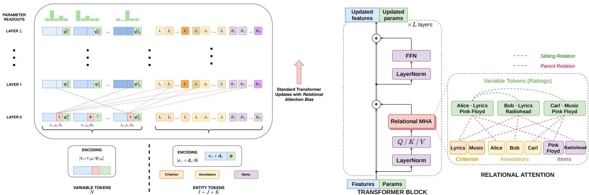  
(a) Full architecture. Variable tokens (left, N per instance) carry attribute observations; entity tokens (right) carry relational iden tity. Parameter distributions $\hat { \psi }$ are read from variable tokens at layer L. Not all inter-layer connections are shown.  
(b) Transformer block internals (left) and relational attention graph (right), illustrated for the annotation domain. Dashed red = parent edges; dashed green = sibling edges.  
Figure 2: Marformer architecture. The annotation domain (items, judges, criteria) is used as the running example, but the architecture supports any typed entity structure.

## 3.2 Marformer Training

Training the parameters θ was sketched in §2.5. In practice, we augment (11) with a copy regularizer and parameter regularization. Writing the latter as an $L _ { 2 }$ penalty gives the following objective, with coeficients $\lambda _ { \mathrm { c o p y } } \geq 0$ and $\lambda _ { L _ { 2 } } \geq 0 ;$

$$
\underset { \mathbf { x } _ { \mathrm { r } } \in \mathbb { T } \ b { \mathbf { r a i n } } } { \mathbb { E } } \left[ \underset { \mathbf { s } \sim P ^ { \ast } \left( \mathbf { S } \mid \mathbf { x } _ { \mathrm { r } } \right) } { \mathbb { E } } \left[ \sum _ { i \in \mathbf { r } \mid \mathbf { s } } - \log p \theta \left( x _ { i } \mid \mathbf { x _ { s } } \right) + \overbrace { \lambda _ { \mathrm { c o p y } } \sum _ { i \in \mathbf { s } } - \log p \theta \left( x _ { i } \mid \mathbf { x _ { s } } \right) } ^ { \mathrm { c o p y ~ r e g u l a r i z e r } } \right] \right] + \overbrace { \lambda _ { L _ { 2 } } \left\| \theta \right\| ^ { 2 } } ^ { L _ { 2 } \mathrm { ~ r e g u l a r i z e r } }\tag{19}
$$

Regularization. The optional $L _ { 2 }$ regularizer penalizes large parameter norms. In the annotation experiments, we instead use the decoupled weight decay of the standard AdamW optimizer.

The copy regularizer says that the Marformer should correctly predict observed values, not just masked values. BERT (Devlin et al., 2019) includes this trivial task to ensure that an observed word token’s encoding retains information about the word’s identity. Similarly, our equation (19) trains the residual stream for attribute i to provide a conditional distribution over $X _ { i }$ regardless of whether $X _ { i }$ was observed in the input $\mathbf { x _ { s } }$ or merely inferred from it. This homogeneous representation means that other residual streams have a standard location from which to obtain information about $X _ { i }$ 18

Potentially, one could also regularize through deep supervision (Lee et al., 2014; Al-Rfou et al., 2018). Recall that $p _ { \pmb { \theta } }$ in equation (19) makes use of marginal distributions $p _ { \psi _ { i } ^ { ( L ) } }$ from the top layer L of the Marformer. Deep supervision asks to also do well on this objective when $p _ { \psi _ { i } ^ { ( \ell ) } }$ is used instead, for lower layers ℓ. §E shows that learned probes can recover useful predictions from intermediate layers, although the raw parameter readout still benefits substantially from the final layers. Whether deep supervision improves training remains an open question.

Optimization algorithm. We optimize the conditional log-loss and copy term in equation (19) using AdamW (Loshchilov & Hutter, 2017). In the annotation experiments, regularization uses decoupled weight decay of 0.01.

Validation and early stopping. As usual, early stopping on a validation set is one way to prevent overfitting to the training examples. In our experiments, we found that this was only necessary in Domain 3 (§6), and we describe there how we carve of the validation set for that domain (§6.3).

Dropout. We use one more regularization trick, inspired roughly by Srivastava et al. (2014). Recall that each attribute i has an embedding $\mathbf { e } _ { i }$ . If the number of distinct attributes grows unboundedly with the size of Train, so does the number of parameters—making the Marformer nonparametric and at risk of overfitting. Specifically, attributes that are common in training data can overcome the $L _ { 2 }$ regularizer to learn useful idiosyncratic embeddings. Their very usefulness may sap the Marformer’s incentive to learn to handle uncommon attributes that lack such embeddings, such as entities that may be important in test data but appear rarely or never in training data. Smith et al. (2005) call this kind of problem weight undertraining.

Thus, for each attribute type $\tau ,$ we define a dropout rate $\delta _ { \tau } \in [ 0 , 1 ]$ for omitting the attribute-specific embedding $\mathbf { e } _ { i }$ during training. On such an update, prediction relies on the type embedding and relational evidence rather than the identity-specific deviation. In the annotation experiments, entity deviations are initialized to 0, while type embeddings are initialized from $\mathcal { N } ( 0 , 0 . 0 2 ^ { 2 } )$ . An entity whose deviation has never been trained is therefore represented by its type and relations. We use a fixed entity-dropout rate of 0.7 on the generalized axis and 0 on the other axis. This heuristic is shared by the synthetic and real annotation experiments. This encourages the model to use relational evidence even for entities encountered during training.

## 4 Domain 1: Graphical Models

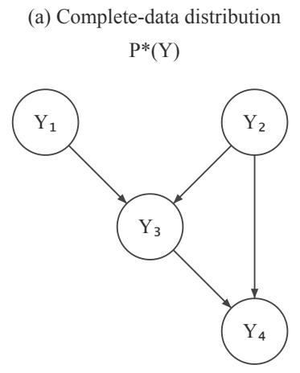

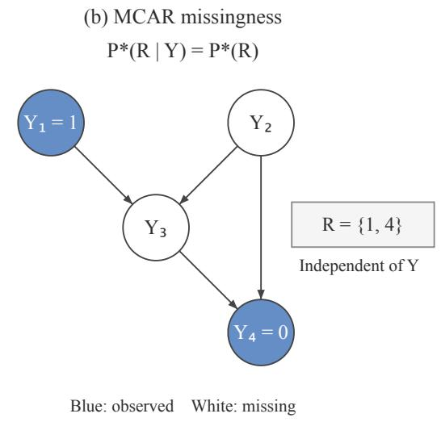  
Figure 3: Illustration of the complete-data distribution and MCAR missingness in Domain 1, using a four-variable example. (a) A Bayesian network over binary variables, with logistic conditional probabilities at each node. (b) An incomplete instance under MCAR: the observed index set R is independent of the complete data. Blue nodes show observed values; white nodes are missing. The variables labeled $Y _ { i }$ in the figure correspond to $X _ { i }$ in the text. The experiments use randomly generated networks with 10 variables.

To study the capabilities of the Marformer, we will evaluate its performance in three synthetic domains—all MCAR, but with diferent qualitative properties. In a synthetic domain, the data are generated from a known distribution $P ^ { * } ( { \bf X } , { \bf R } )$ . This facilitates controlled evaluation:

• We know the complete test-time instances x. Hence we can evaluate test-time log-loss and measure calibration.

• We know the true conditional marginals $P ^ { * } ( X _ { i } \mid \mathbf { X _ { R } } = \mathbf { x _ { r } } )$ . Hence we can measure their divergence from the conditional marginals predicted by $p _ { \pmb { \theta } }$

• We know how $P ^ { * }$ was constructed. Hence we can compare to classical methods for estimating $P ^ { * }$ , in their favorable setting when they are estimating the parameters of the correct distribution family, with full knowledge of the prior from which those parameters were drawn to obtain $P ^ { * }$

In this first section, $P ^ { * }$ is a Bayesian network (BN). The challenge here for the Marformer is to predict missing variables without knowing the conditional independence structure (Figure 3). In contrast, the classical methods do know that structure. The full domain specification is in Algorithm 1.

## 4.1 True Generative Distribution

The sample space has 10 binary attributes $\mathbf { i } = \left\{ 1 , 2 , \dots , 1 0 \right\}$ where $\left( \forall i \in \mathbf { i } \right) \mathcal { D } _ { i } = \{ 0 , 1 \}$ . The complete-data distribution $P ^ { * } ( \mathbf { X } )$ is given by a Bayesian network $q _ { \phi } ( \mathbf { X } ) = q _ { \phi } ( X _ { 1 } , \ldots , X _ { 1 0 } )$ with known parameters $\phi = \phi ^ { * }$ The structure of the distribution is specified by a directed acyclic graph (DAG) G with vertices i, and the conditional probability table (CPT) for each $X _ { i }$ has the form of a logistic regression model:

$$
q _ { \phi } ( \mathbf { X } = \mathbf { x } ) = \prod _ { i \in \mathbf { i } } q _ { \phi } ( X _ { i } = x _ { i } \mid \mathbf { X _ { p a } } ( i ) = \mathbf { x _ { p a } } ( i ) )\tag{20}
$$

$$
= \prod _ { i \in \mathbf { i } } \sigma ( ( 2 x _ { i } - 1 ) \cdot \mathbf { w } _ { i } ^ { T } \left[ 1 ; \mathbf { x } _ { \mathrm { p a } ( i ) } \right] )\tag{21}
$$

where $\mathrm { p a } ( i ) \subset \mathbf { i }$ denotes the set of parents of node i in $G ,$ , and $\mathbf { w } _ { i }$ is the parameter vector (part of $\phi )$ for the conditional distribution of $X _ { i }$ given the values of just those parents.

Selecting a particular distribution. To generate the structure of $q _ { \phi ^ { - } }$ —the DAG G—we include the edge $j  i$ (for $1 \leq j < i \leq 1 0 )$ with independent probability min $. ( 1 , c / ( i - 1 ) )$ ). We take $c = 5$ . Thus, each of $X _ { 1 } , \ldots , X _ { 5 }$ has all previous variables as parents, and each of $X _ { 6 } , \ldots , X _ { 1 0 }$ has an expected 5 of the previous variables as parents.

We then draw the parameters $\phi ^ { * }$ i.i.d. from $\mathcal { N } ( 0 , 1 . 5 )$ . These logistic regression parameters $\phi$ consist of one bias term per vertex plus one weight per edge, for a total of $\begin{array} { r } { \sum _ { i \in \mathbf { i } } ( 1 + | \mathrm { p a } ( i ) | ) } \end{array}$ parameters.

MCAR missingness mechanism. Our missingness mechanism $P ^ { * } ( \mathbf { R } \mid \mathbf { X } ) = P ^ { * } ( \mathbf { R } )$ reveals each variable $X _ { i }$ with i.i.d. probability of $1 / 2$ , in both training and test instances. We use this mechanism to produce both training and test instances in all experiments. Because it is MCAR, it is ignorable for all methods.

Inference under the true model. In our experiments, we compare the models’ predictions on test examples to the true conditional marginal distributions $q _ { \phi ^ { * } } ( X _ { i } \mid \mathbf { x _ { r } } )$ , which we compute with an exact variable elimination algorithm (Madsen & Jensen, 1999).

## 4.2 Datasets

We follow the experimental design in §2.5. Given $P ^ { * }$ :

• We generate the Test dataset by drawing M = 250 test instances $\mathbf { \rho } ( \mathbf { x } , \mathbf { r } )$ i.i.d. from $P ^ { * }$

• The corresponding Train dataset consists of n incomplete training instances $\mathbf { x _ { r } }$ drawn i.i.d. from the same $P ^ { * }$ . Our experiments in this domain are non-transductive, so Train does not include the Test instances. We experiment with Train datasets of diferent sizes $n \_ { \mathrm { ~ \scriptsize ~ \in ~ } }$

{10, 250, 500, 750, 1000, 1250, 1500, 1750, 2000}. Each Train dataset is a superset of the preceding one, for better comparability across sizes, but its model is trained independently.

We use these datasets to train and test the Marformer $p _ { \pmb { \theta } }$ and also the full joint model $q _ { \phi }$

We repeat our experiments 10 times, selecting a diferent distribution $( G , \phi ^ { * } )$ each time. This allows us to display 95% bootstrap confidence intervals for all lines on our graphs.

## 4.3 Marformer Configuration

In the terms of $\ S 3 . 1$ , we create random variables $X _ { i }$ for 10 attributes i, all with the same boolean type $\tau ,$ whose distribution family $p _ { \psi }$ over $\mathcal { D } = \{ 0 , 1 \}$ is parameterized by a single log-odds ratio (logit) $\psi \in \mathbb { R }$ , so that $d ^ { \prime } = 1$ and $p _ { \psi } ( 1 ) = \sigma ( \psi )$ . The input encoding uses three-dimensional vectors: $e ( \top ) = ( 1 , 0 , 0 ) , e ( 0 ) = ( 0 , 1 , 0 )$ and $e ( 1 ) = ( 0 , 0 , 1 )$ , where the first coordinate indicates missingness. We use no relational edges among the 10 attributes, but each attribute i has its own learnable embedding $\mathbf { e } _ { i }$

We compare three Marformer variants to assess architectural scaling: Tiny $( L = 2$ layers, $d = 3 2$ dimensions), Small $( L = 4 , d = 6 4 )$ , and Large $\left( L = 6 , d = 1 2 8 \right)$ . The Tiny, Small, and Large variants use 2, 4, and 8 attention heads, respectively.

To stochastically create training examples from an instance in Train, we use a simple masking mechanism (§2.4) that masks each observed variable with independent 0.15 probability. We train each Marformer as described in §3.2 to obtain a parameter estimate ${ \hat { \pmb { \theta } } } .$ We use AdamW with weight\_decay=0.01. Since all test attributes will be very familiar from training data, we do not use dropout, setting $\delta _ { \tau } = 0$

Each epoch is one shufled pass over Train in minibatches of 32. We clip gradients to a maximum norm of 1.0 and use ReduceLROnPlateau to halve the learning rate after 22 epochs without improvement in validation loss.

We run AdamW with learning rate 0.0001 for up to 100 epochs, diagnosing early convergence when all of the 10 most recent epochs failed to decrease training loss by at least 0.1%.

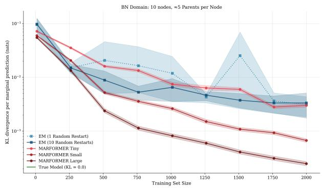  
(a) Domain 1 (BN)

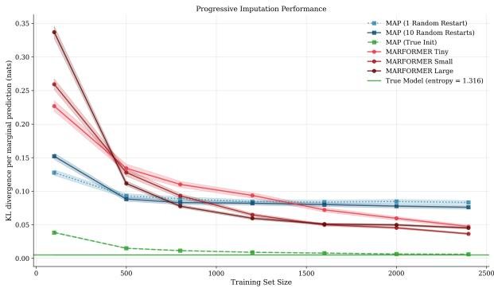  
(b) Domain 2 (Gaussian)  
Figure 4: Learning curves for Domains 1 and 2, showing KL divergence of the true marginals from the predicted marginals (equation (10)), averaged over 10 distributions $P ^ { * }$ . Shaded regions show 95% bootstrap confidence intervals. In Domain 1, the KL divergences are so small that they are displayed on a log scale. For measuring KL, the true probabilities are computed exactly in Domain 1, but are estimated in Domain 2 using Monte Carlo integration. That is why in Domain 2, the KL divergence between two copies of the true model $q _ { \phi ^ { * } }$ is measured as slightly positive rather than zero (horizontal green line): the estimated probabilities are slightly diferent in the two copies.

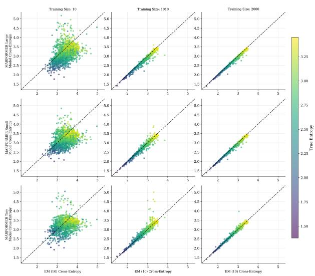  
(a) Domain 1

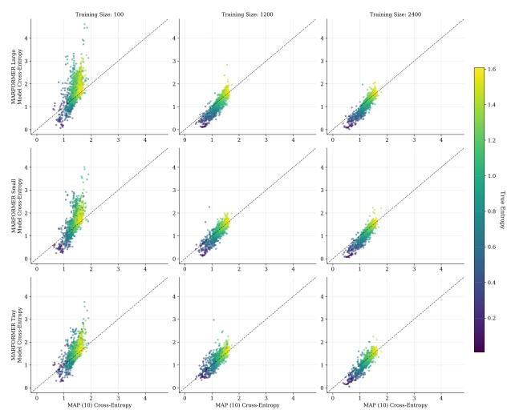  
(b) Domain 2  
Figure 5: Horizontal axis: Cross-entropy $\mathrm { H } ( P ^ { * } , q _ { \hat { \phi } } )$ achieved by the estimated joint model (MAP-EM in Domain 1, §4.4; direct MAP optimization in Domain 2, §5.4). Vertical axis: Cross-entropy $\mathrm { H } ( P ^ { * } , p _ { \hat { \theta } } )$ achieved by the estimated Marformer. Diferent rows evaluate diferent Marformer sizes; diferent columns evaluate diferent |Train| sizes. Each point corresponds to a single marginal prediction $P ^ { * } ( X _ { i } \mid \mathbf { x _ { r } } )$ on a test instance with $i \not \in { \bf r } ^ { ( m ) }$ , color-coded by the entropy $\mathrm { H } ( P ^ { * } )$ of the true marginal distribution (aleatoric uncertainty). Points below the diagonal are predictions on which Marformer is more accurate than the joint model. Brighter points have higher entropy, due to less informative conditions $\mathbf { x _ { r } } .$ , so they tend to have higher cross-entropy under both models. All graphs for the same domain use the same true generative distribution $P ^ { * }$

## 4.4 Joint Model Estimation

We compare to the classical approach of fitting a joint model of all the variables $X _ { i }$ . Joint modeling is given the true model family $q _ { \phi }$ (which includes $P ^ { * } = q _ { \phi ^ { * } } )$ and only needs to estimate ϕ. Specifically, joint modeling knows the true DAG G and the logistic regression parameterization of its $\mathrm { C P T s - a s }$ well as the true prior $\mathcal { N } ( 0 , 1 . 5 )$ over $\phi .$ The Marformer knows none of this.

As discussed in $\ S 1$ , we use the MAP-EM algorithm, which finds a parameter estimate $\hat { \phi }$ that locally maximizes equation (12). We halt when the objective changes by less than 0.1%, similar to the Marformer. MAP-EM is sensitive to initialization because the objective is non-convex. Thus, we allow 10 random restarts and take the $\hat { \phi }$ that achieves the best value of (12).

We then make exact marginal predictions from q<sub>ˆ</sub> , and compare them to the true marginals from $q _ { \hat { \phi } }$ $q _ { \phi ^ { * } }$

## 4.5 Experimental Results

Aggregate results are shown in Figure 4a. Larger Marformers reliably achieve lower KL divergence, which continues to decrease as |Train| increases. Traditional joint modeling does worse than all but the Tiny Marformer, despite its knowledge of the true model family and prior. Given that we use exact inference, the reason is presumably that MAP-EM sufers from the local maximum problem, as can be seen from the fact that 10 random restarts improves its average KL divergence to the truth. Even with 10 random restarts, it presumably does not find the actual MAP estimate of $\phi$

Figure 5a breaks down these KL divergences at three specific training sizes. We saw in Figure 4a that with only 10 training instances, neither approach is clearly better, but Figure 5a (column 1) further shows that they make diferent errors—the two methods can predict quite diferent probability distributions—and that there is a minority of outlier cases where the Marformer predictions are quite wrong. By 1010 training instances (column 2), when both methods achieve low KL (Figure 4a), the Large Marformer is more accurate than the joint model at most predictions. By 2000 training instances (column 3), the Small Marformer is as well.

Variant. Recall that the naive masking method of this paper is valid only when the training instances are MCAR (§2.4).<sup>19</sup> Out of curiosity, we also try the naive method in a setting that is MAR but not MCAR, even though the masked training examples will be biased, and find qualitatively similar results (§A).

## 4.6 Runtime

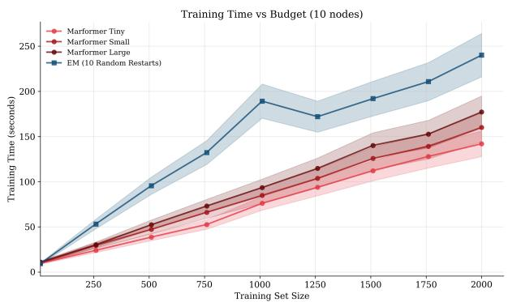  
(a) Training Time: Domain 1

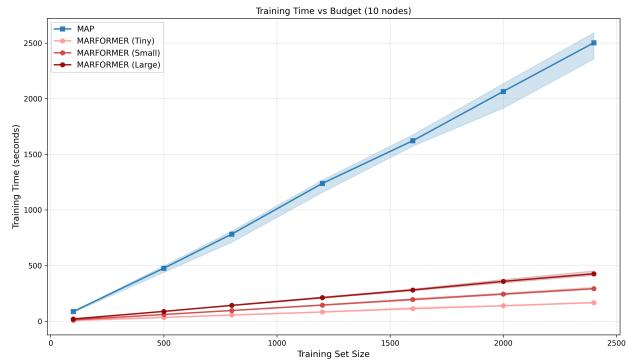  
(b) Training Time: Domain 2  
Figure 6: Training time (wall-clock seconds) on Domains 1 and 2 is essentially proportional to the training set size. Even for these small problems, Marformer is substantially faster to train. It is also faster at test time (not shown here), since inference requires only a single forward pass per test instance.

The classical approach of §4.4 is not always practical. Extracting the marginal distributions from $q _ { \hat { \phi } } \mathrm { . }$ , as well as performing the E step of MAP-EM, must marginalize over the missing variables $\mathbf { X _ { i \backslash r } }$ given $\mathbf { x _ { r } } .$ . This task is computationally intractable except for low-treewidth BNs (Cooper, 1990; Chandrasekaran et al., 2008). We were able to run these experiments only because the BNs are quite small.

Figure 6a shows that MAP-EM is slower than Marformer training even for these small Bayesian networks G, due to its need for random restarts. Furthermore, the runtime of known MAP-EM algorithms will blow up exponentially as G grows, since at the E-step they must solve the #P-complete problem of marginal inference (Roth, 1996). In practice, large BNs would be treated instead with approximate inference algorithms— introducing errors beyond those shown in Figure 4a.<sup>20</sup>

The Marformer is a fast feed-forward computation that can be trained to approximate marginal inference in BNs or other graphical models, as we originally proposed in Stoyanov et al. (2011). Its runtime grows only quadratically with G. Previously, Stuhlmüller et al. (2013) and Walecki et al. (2019) also proposed training a single feed-forward network to predict many conditional marginals. However, those papers were attempting to amortize inference in a known model: they assumed that complete training instances could be sampled from $P ^ { * }$ , whereas we aim to train on naturally occurring incomplete instances without access to $P ^ { * }$ They also did not use our Transformer architecture, which allows cross-attention among unboundedly many random variables (see §E and §6).

We caution that neither MAP-EM with approximate inference (using traditional polytime algorithms), nor the Marformer’s amortized approximate inference (using a polynomial-sized neural network), can come with any worst-case guarantees when $P ^ { * }$ is a BN, since marginal inference on general BNs is inapproximable (Roth, 1996).

## 5 Domain 2: Discretized Multivariate Gaussians

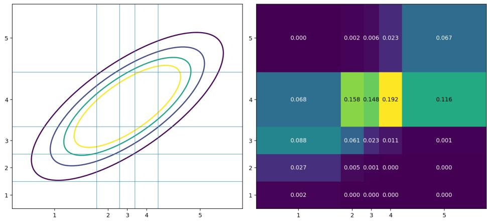  
Figure 7: Domain 2 begins with a joint Gaussian distribution over latent continuous variables Z (left), and discretizes their values into fixed but irregular bins, yielding a joint distribution over observable discrete variables X (right). The positive correlation of $( Z _ { 1 } , Z _ { 2 } )$ carries over to $( X _ { 1 } , X _ { 2 } )$ , but the probabilities in the grid at right are also afected by the bin widths. Our experiments use 10 variables of each type, not 2 as illustrated here.

The next domain is governed by correlated continuous random variables, which are discretized into ordinal ratings (Figure 7). This is a multivariate ordered probit model (not conditioned on any other regressors). Similar models are widely used for multidimensional graded (i.e., ordinal) responses in psychometrics.

The underlying continuous variables are never observed. The classical baseline method $( \ S 5 . 4 )$ knows the entire mechanism: it explicitly reconstructs the latent values of the continuous variables and estimates their covariances and the discretization thresholds (Bock & Aitkin, 1981). In contrast, our Marformer configuration (§5.3) does not explicitly model the continuous variables, and does not even know the order of the discrete categories $( \mathrm { e . g . }$ , that a 2 rating falls between 1 and 3 ratings). The Marformer must discover the underlying ordinal and correlational structure, despite the irregular discretization and the fact that some of the discrete values are missing.

## 5.1 True Generative Distribution

The sample space has 10 attributes $\mathbf { i } = \left\{ 1 , 2 , \dots , 1 0 \right\}$ where $( \forall i \in \mathbf { i } ) \mathcal { D } _ { i } = \{ 1 , 2 , . . . , 5 \}$ . The complete-data distribution $P ^ { * } ( \mathbf { X } )$ is given by a model $q _ { \phi } ( \mathbf { X } )$ with a latent variable $\mathbf { Z } \in \mathbb { R } ^ { 1 0 }$ and known parameters $\phi = \phi ^ { * }$

$$
q _ { \phi } ( \mathbf { X } = \mathbf { x } ) = \int _ { \mathbf { z } } q _ { \phi } ( \mathbf { Z } = \mathbf { z } , \mathbf { X } = \mathbf { x } ) d \mathbf { z }\tag{22}
$$

$$
= \int _ { \mathbf { z } } q _ { \phi } ( \mathbf { Z } = \mathbf { z } ) \prod _ { i \in \mathbf { i } } q _ { \phi } ( X _ { i } = x _ { i } \mid Z _ { i } = z _ { i } ) d \mathbf { z }\tag{23}
$$

$$
= \int _ { \mathbf { z } } q _ { \phi } ( \mathbf { Z } = \mathbf { z } ) \prod _ { i \in \mathbf { i } } [ t _ { i , x _ { i } - 1 } \leq z _ { i } < t _ { i , x _ { i } } ] d \mathbf { z }\tag{24}
$$

where $q _ { \phi } ( \mathbf { Z } )$ is a multivariate normal distribution $\mathcal { N } ( 0 , \Sigma )$ , and each threshold vector $\mathbf { t } _ { i }$ has elements $- \infty = t _ { i , 0 } < t _ { i , 1 } < \cdots < t _ { i , 5 } = \infty$ . This construction of $q _ { \phi } ( \mathbf { X } )$ is illustrated in Figure $7 .$

We construct the threshold vectors $\mathbf { t } _ { i }$ from underlying parameters $\mathbf { p } _ { i }$ . Note that the marginal distribution of $Z _ { i }$ is $\mathcal { N } ( 0 , \Sigma _ { i i } )$ . To partition it into roughly equal bins, we take $\mathbf { p } _ { i }$ to be a roughly uniform distribution over $\mathcal { D } _ { i } = \{ 1 , 2 , \dots , 5 \}$ and set $t _ { i , k } = \sqrt { \Sigma _ { i i } } \Phi ^ { - 1 } ( p _ { i } ( 1 ) + \cdot \cdot \cdot + p _ { i } ( k ) )$ where Φ is the standard normal CDF.

Thus, the model parameters $\phi$ specify the positive definite covariance matrix Σ and the distributions $\mathbf { p } _ { i }$

Selecting a particular distribution. To choose $\varphi ^ { * }$ , we sample $\mathbf { p } _ { i } \sim \mathrm { D i r i c h l e t } ( \frac { \alpha } { 5 } , \ldots , \frac { \alpha } { 5 } )$ , taking $\alpha = 2 . 0$ How about $\Sigma ?$ To impose a substantive conditional independence structure (as in $\ S 4 )$ , we make $\Sigma ^ { - 1 }$ sparse, corresponding to a simple path or cycle on the 10 variables.<sup>21</sup> For example, the path case yields a tridiagonal $\Sigma ^ { - 1 }$ . The joint modeling method is given the true sparsity pattern. The Marformer is not—it is not even told that there is a covariance matrix.

Specifically, we flip a fair coin to choose between the two sparsity patterns (path and cycle). We would then like to draw the symmetric positive definite $\Sigma ^ { - 1 }$ from the Wishart prior $W _ { 1 0 } ( I , \nu )$ , with scale matrix I and degrees of freedom $\nu ,$ conditioned on this sparsity pattern. For computational convenience, we impose the sparsity constraint only softly, downweighting the Wishart prior probability of $\Sigma ^ { - 1 }$ by $\begin{array} { r } { \prod _ { i j } \exp ( \beta _ { i j } | \Sigma _ { i j } ^ { - 1 } | ) } \end{array}$ We take $\beta _ { i j } = - 1 0 0$ for entries $i j$ that are supposed to be 0 and $\beta _ { i j } = 0$ otherwise. The mean absolute value of the entries intended to be zero is 0.0181. We sample $\Sigma ^ { - 1 }$ from this modified prior via Metropolis-Hastings (Robert, 2016). We initialize the chain at an unconstrained draw from the Wishart prior, and use the proposal $\widetilde { \Sigma ^ { - 1 } } = \Sigma ^ { - 1 } + { \textstyle \frac { 1 } { 2 } } ( Z + Z ^ { \top } )$ , where $Z$ has i.i.d. $\mathcal { N } ( 0 , 0 . 0 5 ^ { 2 } )$ entries. Proposals that are not positive definite (checked via a Cholesky decomposition) are rejected outright; remaining proposals are accepted with the usual Metropolis probability min $( 1 , \exp ( \log p ( \widetilde { \Sigma ^ { - 1 } } ) - \log p ( \Sigma ^ { - 1 } ) ) )$ ) under the penalized log-density above.

MCAR missingness mechanism. We apply the same simple mechanism as in §4.1.

Inference under the true model. To evaluate the accuracy of our models’ predictions, we compare to the true conditional marginal distributions $q _ { \phi ^ { * } } ( X _ { i } \mid \mathbf { x _ { r } } )$ , which we estimate using Gibbs sampling with a burn-in period of 250 and sample size 1000.

## 5.2 Datasets

We generate 100 instances for Test. Similar to §4.2, each Train dataset consists of n incomplete training instances, with $n \in \{ 1 0 0 , 5 0 0 , 8 0 0$ , 1200, 1600, 2000, 2400}.

We repeat our experiments 10 times, selecting a diferent distribution $P ^ { * }$ each time.

## 5.3 Marformer Configuration

We use the same set of hyperparameters, training procedures, and metrics as in $\ S 4 . 3$ . The one diference is that our variables are no longer boolean, but range over $\{ 1 , \ldots , 5 \}$ . We give them all the same type τ, which is parameterized by a logit vector $\psi \in \mathbb { R } ^ { 5 }$ , so that $p _ { \psi } = \operatorname { s o f t m a x } ( \psi )$ . Its encoding function $e : x \mapsto \psi$ maps $\top \mapsto ( 0 , 0 , 0 , 0 , 0 ) , 1 \mapsto ( 1 , 0 , 0 , 0 , 0 ) , 2 \mapsto ( 0 , 1 , 0 , 0 , 0 )$ , etc.

## 5.4 Joint Model Estimation

We train a MAP model as a domain-specific baseline to maximize the observed data likelihood plus prior probabilities of $\Sigma ^ { - 1 } , p$ . The domain model is parameterized by a Cholesky factor matrix L and bin probabilities $p ,$ where we use $L L ^ { T }$ to obtain $\Sigma ^ { - 1 }$ and directly use p to compute cumulative probability sums and real-valued bin boundaries.<sup>22</sup>

For the parameters’ prior probability, the model uses their prior distributions as defined in §5.1, with a Wishart prior plus soft sparsity constraints for $\Sigma ^ { - 1 }$ and a Dirichlet prior for $p .$ The likelihood given an observed instance is the probability of a rectangular region in Figure $7 { : }$ a single row, column or cell, depending on which variables $X _ { i }$ are observed. To calculate this integral given the current parameters, we implement Genz’s algorithm (Genz, 1992). Genz’s algorithm reparameterizes the multivariate Gaussian model into independent standard normals using Cholesky factors (transforming the integration domain to a parallelotope), further reparameterizes to transform the integration domain to a unit hypercube (changing the integrand), and then approximates the integral by Monte Carlo sampling from the hypercube. To obtain the gradient of the log-likelihood, we hold the samples fixed and use $\mathrm { P y }$ Torch to backpropagate through the reparameterization to the parameters.

We use stochastic gradient ascent to locally maximize the MAP objective equation (12), specifically using the AdamW optimizer with learning rate 0.01, until convergence $\left( \epsilon < 1 0 ^ { - 3 } \right)$ ). Again we allow 10 random restarts. We then use Gibbs sampling as in §5.1 to predict missing values on the test instances. To verify our implementation, we also try initializing training at the ground-truth parameters $\phi ^ { * }$ 23

## 5.5 Experimental Results

Figure 4b shows our main experimental results. With enough training data, all Marformer variants achieve significantly lower KL divergence than a joint model trained with MAP, particularly when the Marformer is large. With less training data, the MAP approach outperforms Marformer due to its incorporation of more domain knowledge. MAP again seems to get stuck in a local optimum, as demonstrated by the fact that it does much better when initialized with ground-truth parameters.

Per-prediction cross-entropy scatterplots in Figure 5b confirm that with enough training data, the Marformer–particularly when large—achieves lower cross-entropy than the joint model for the majority of marginal predictions, particularly on the lower-entropy marginals where there is a clearer right answer.

Variant. As in §4.5, running on MAR data gets qualitatively similar results (§A).

## 6 Annotation as a Domain

Annotation workflows exemplify the full challenge of conditional marginal prediction in a structured setting. A dataset of items must be evaluated by multiple judges on multiple criteria, but collecting every judge’s ratings of every item would be prohibitively expensive.<sup>24</sup> This section evaluates the Marformer in this setting.

## 6.1 True Generative Distribution

An annotation dataset involves I items. J judges, and K evaluation criteria.

We extend the variable indices introduced in §2.1 to allow structured variable names, where an index $a \in \mathbf { i }$ may itself be a tuple. In this domain, $\mathbf { i } = \{ 1 , 2 , \ldots , I \} \times \{ 1 , 2 , \ldots , J \} \times \{ 1 , 2 , \ldots , K \}$ , where each $( i , j , k ) \in \mathbf { i }$ indexes a rating variable $X _ { i j k }$ with $\mathcal { D } _ { i j k } = \{ 1 , \ldots , C \}$ . That variable $X _ { i j k }$ is the Likert score assigned to item i by judge j on criterion k.

The complete rating collection X forms a complete instance, which can equivalently be viewed as a tensor in $\{ 1 , \ldots , \bar { C } \} ^ { I \times J \times K }$ . In practice only a sparse subset of entries is observed, since collecting every annotation is prohibitively expensive.

This is naturally framed as 3D matrix completion (Candes & Recht, 2012; Keshavan et al., 2009). Classical collaborative filtering recovers a 2D user–item rating matrix. The additional criterion axis here introduces richer dependencies among ratings: for a fixed $( i , j )$ pair, ratings across criteria are jointly distributed, and for a fixed $( i , k )$ , ratings from diferent judges may exhibit systematic dependence.<sup>25</sup>

The complete-data distribution $P ^ { * } ( \mathbf { X } ) = q _ { \phi ^ { * } } ( \mathbf { X } )$ belongs to a latent-variable model family $q _ { \phi }$ that we call the Compositional Projection Model (CPM). Recall that $\mathbf { i } = \{ 1 , 2 , \dots , I \} \times \{ 1 , 2 , \dots , J \} \times \{ 1 , 2 , \dots , K \}$ where $X _ { i j k }$ denotes the rating variable indexed by $( i , j , k ) \in \mathbf { i }$ and $\mathcal { D } _ { i j k } = \{ 1 , \ldots , C \}$ . The CPM encodes three structural assumptions about annotation data: items can be represented in a latent semantic space, criteria correspond to diferent directions of evaluation in that space, and judges exhibit systematic but partially shared preferences.

Each item i has a latent embedding $\mathbf { e } _ { i } \in \mathbb { R } ^ { D }$ . Rather than assigning every judge an unrelated parameter vector for every criterion, the CPM represents each judge as a mixture over T latent judge prototypes.

For criterion k and prototype t, the prototype-conditioned preference vector is

$$
\sigma ( \mathbf { u } _ { k } + \mathbf { v } _ { t } + \mathbf { u } _ { k t } ) ,
$$

where $\sigma ( \cdot )$ is the sigmoid function applied elementwise.<sup>26</sup>

The three terms separate shared criterion efects, shared judge-prototype efects, and criterion–prototype interactions. The vectors $\mathbf { u } _ { k } , \mathbf { v } _ { t } , \mathbf { u } _ { k t } \in \mathbb { R } ^ { D }$ represent, respectively, the direction associated with criterion $k ,$ the general style of judgment associated with prototype t, and the deviation of prototype t on criterion $k .$

Each judge $j$ has mixture weights $\alpha _ { j }$ over the T judge prototypes. The efective preference vector for judge j on criterion k is

$$
\phi _ { j k } = \sum _ { t = 1 } ^ { T } \alpha _ { j t } \sigma ( \mathbf { u } _ { k } + \mathbf { v } _ { t } + \mathbf { u } _ { k t } ) .
$$

Given the item embedding $\mathbf { e } _ { i } ,$ , the latent score for $X _ { i j k }$ is

$$
z _ { i j k } = \phi _ { j k } ^ { \top } \mathbf { e } _ { i } .
$$

Thus, the score increases when the item embedding is aligned with the judge’s criterion-specific preference direction.

Selecting a particular distribution. To choose the particular parameters $\phi ^ { * }$ that define $P ^ { * } = q _ { \phi ^ { * } }$ , we sample the CPM parameters from an upper-level distribution. We use latent dimension $D = 3 2$ and $T = 3$ judge prototypes. Each item embedding is sampled as

$$
\mathbf { e } _ { i } \sim { \mathcal { N } } ( \mathbf { 0 } , \mathbf { I } _ { D } ) ,
$$

and the vectors $\mathbf { u } _ { k } , \mathbf { v } _ { t } .$ and ${ \bf { u } } _ { k t }$ are sampled from zero-mean Gaussian distributions. The interaction term ${ \bf { u } } _ { k t }$ is sampled at a smaller scale than the prototype term $\mathbf { v } _ { t } .$ , so that judge prototypes retain shared structure across criteria while still allowing criterion-specific variation. The corresponding scale parameters are drawn from half-normal distributions. Judge mixture weights are sampled as

$$
\begin{array} { r } { \pmb { \alpha } _ { j } \sim \mathrm { D i r i c h l e t } ( \mathbf { 1 } _ { T } ) . } \end{array}
$$

We set the hyperparameters of these upper-level distributions to posterior means obtained by fitting the CPM to LLM-Rubric data described in $\ S 7 . 1 ;$ the resulting numerical values are given in Table 1. The remaining parameters used to select $P ^ { * }$ are introduced below.

The observed variable $X _ { i j k }$ is generated from the latent score using a random-threshold ordinal model. For each judge–criterion pair $( j , k )$ , the CPM draws

$$
\pi _ { j k } \sim \operatorname { D i r i c h l e t } \left( { \frac { \kappa } { C } } , \ldots , { \frac { \kappa } { C } } \right) ,
$$

where $C = 4 .$ . The vector π controls how judge $\pi _ { j k }$ $j$ uses the $C$ rating categories for criterion k. Some judges may use high ratings more frequently on a given criterion, while others may use the scale more conservatively. We choose ordinal thresholds so that, marginalizing over item embeddings and measurement noise, the category frequencies for each $( j , k )$ follow $\pi _ { j k }$ . Since $\mathbf { e } _ { i } \sim \mathcal { N } ( \mathbf { 0 } , \mathbf { I } _ { D } )$

$$
z _ { i j k } = \mathbf { e } _ { i } ^ { \top } \phi _ { j k }
$$

is marginally Gaussian with variance $\| \phi _ { j k } \| _ { 2 } ^ { 2 }$ . After adding measurement noise $\epsilon _ { i j k } \sim \mathcal { N } ( 0 , \sigma _ { \mathrm { m e a s } } ^ { 2 } )$ , let

$$
s _ { j k } = \sqrt { \| \phi _ { j k } \| _ { 2 } ^ { 2 } + \sigma _ { \mathrm { m e a s } } ^ { 2 } } .
$$

Then $( z _ { i j k } + \epsilon _ { i j k } ) / s _ { j k }$ is marginally standard normal over random items. We therefore set

$$
\tau _ { j k , 1 } = - \infty , \qquad \tau _ { j k , c } = \Phi ^ { - 1 } \left( \sum _ { r = 1 } ^ { c - 1 } \pi _ { j k , r } \right) \quad ( c = 2 , \ldots , C ) , \qquad \tau _ { j k , C + 1 } = + \infty .
$$

Finally,

$$
X _ { i j k } = c \quad \Longleftrightarrow \quad \tau _ { j k , c } \leq \frac { z _ { i j k } + \epsilon _ { i j k } } { s _ { j k } } < \tau _ { j k , c + 1 } .
$$

The CPM is closely related to recent work on pluralistic reward modeling. In particular, Chen et al. (2024) represent each user as a mixture of prototypical users. Their Model B similarly constructs a context-dependent user representation and projects an output representation onto it to obtain a scalar reward. CPM uses this compositional structure for ordinal ratings rather than pairwise rankings: PAL’s prompts correspond roughly to our criteria, its users to our judges, and its outputs to our items.<sup>27</sup> More broadly, latent representations of people and alternatives have a long history in models of human judgment; for example, Coombs (1950) used one-dimensional latent positions to explain rankings of opinions by their similarity to a person’s own position.

## 6.2 Dataset Construction and Missingness

We generate synthetic annotation data from the complete-data distribution $P ^ { * } ( \mathbf { X } )$ defined in §6.1. In our experiments, there are up to I = 5000 items, with $J = 5 0$ and $K = 9$

MCAR missingness mechanism. We first form a sparse annotation design by selecting, independently for each item i, four judges uniformly at random without replacement, with all K criteria represented for each selected item–judge pair. A further MCAR mask partitions ratings in this design into observed context and hidden prediction targets. Ratings outside the design are not scored. Both stages select ratings independently of any values, so the resulting missingness mechanism is MCAR. As discussed in §2.4, this allows the Marformer to construct conditionally unbiased training examples by masking observed ratings.

Test data. Rather than evaluating on all missing variables as the number of items grows, we designate a fixed test corner. Let $\mathcal { T } _ { \mathrm { t e s t } } \subseteq [ I ]$ contain $I _ { \mathrm { t e s t } } = 1 0 0$ items, and let $\mathcal { I } _ { \mathrm { t e s t } } \subseteq [ J ]$ contain $J _ { \mathrm { t e s t } } = 1 0 \mathrm { j u d g e s }$ The test corner consists of the attributes

$$
\mathbf { i } _ { \mathrm { t e s t } } = { \mathcal { T } } _ { \mathrm { t e s t } } \times { \mathcal { I } } _ { \mathrm { t e s t } } \times [ K ] \subseteq \mathbf { i } .
$$

The dense test corner contains $1 0 0 \times 1 0 \times 9 = 9 0 0 0$ potential ratings. The sparse annotation design contains 639 of these ratings, covering 71 item–judge pairs on 56 of the 100 test items, with all 9 criteria per pair. Of these 639 ratings, 323 are observed context and 316 are hidden and scored. We evaluate only these 316 targets, keeping the set of test prediction problems fixed as the amount of training data increases.

Generalization settings. We vary the amount of available data along either the item or judge axis. In item generalization, predictions concern the fixed test items as more training items become available; in judge generalization, the analogous sweep is over judges. Most experiments are transductive: observed ratings of test entities are available during training as context, while their missing target ratings remain hidden. The non-transductive variant, denoted Marformer NT, excludes the test entities from training and uses their observed ratings only at prediction time. Test items or judges are therefore new entities in this variant.

The nominal sizes $I _ { \mathrm { t r a i n } }$ and $J _ { \mathrm { t r a i n } }$ count all available entities in the transductive setting, including test-block entities with observed context. In the non-transductive setting, they count training entities disjoint from the test block. The same nominal size therefore denotes diferent training partitions in the two protocols. The sweeps are described in §6.6.

## 6.3 Marformer Configuration for the Annotation Domain

We instantiate the Marformer on the structured index set $\mathbf { i } = \{ 1 , 2 , \ldots , I \} \times \{ 1 , 2 , \ldots , J \} \times \{ 1 , 2 , \ldots , K \}$ introduced above. As usual, there is one variable token for each $a \in \mathbf { i } .$ . For $a = ( i , j , k )$ , we additionally introduce entity tokens for item i, judge j, and criterion k, with relations

$$
a \xrightarrow { \mathrm { i t e m } } i , \qquad a \xrightarrow { \mathrm { j u d g e } } j , \qquad a \xrightarrow { \mathrm { c r i t e r i o n } } k ,
$$

together with their inverse relations as described in §3.1. Between rating variables, we use the relations

$$
a ^ { \mathsf { s a m e - i t e m } } a ^ { \prime } , \qquad a ^ { \mathsf { s a m e - j u d g e } } a ^ { \prime } , \qquad a ^ { \mathsf { s a m e - c r i t e r i o n } } a ^ { \prime } ,
$$

when the corresponding components of $a = ( i , j , k )$ and $a ^ { \prime } = ( i ^ { \prime } , j ^ { \prime } , k ^ { \prime } )$ are equal. These relations are symmetric and therefore do not require separate inverse relations.

In the terms of §3.1, all rating variables have the same categorical $\mathrm { t y p e } \ \tau ,$ whose distribution family $p _ { \psi }$ over $\mathcal { D } = \{ 1 , \ldots , C \}$ is parameterized by logits $\psi \in \mathbb { R } ^ { C }$ , so that $p _ { \psi } ( c ) = \mathrm { s o f t m a x } ( \psi ) _ { c }$ . Its encoding function maps an observed rating c to $e ( c ) = 2 0 \cdot { \bf 1 } _ { c }$ and $\textsf { T t o } e ( \top ) = \mathbf { 0 }$ . We use $C = 4 .$ . As in §3.1, the parameter stream additionally contains the wildcard bit, giving parameter-stream dimension $C + 1 = 5$

The feature-stream dimension is $^ { 7 5 , }$ giving total token dimension $d = 8 0$ . We use $L = 8$ Transformer layers, $H = 4$ attention heads, and a ReLU feedforward module of width $d _ { \mathrm { f f } } = 1 2 8$ with one hidden layer. Relational attention uses learned key and value embeddings as described in §3.1.

We train with AdamW, learning rate $2 \times 1 0 ^ { - 4 }$ and weight decay 0.01, with standard Transformer dropout 0.1. Each artificial mask selects $\left\lfloor 0 . 1 5 n _ { \mathrm { o b s } } \right\rfloor$ observed ratings uniformly without replacement, where $n _ { \mathrm { o b s } }$ is the number of observed ratings in the training input. We draw five refreshed masks per epoch. Masked and unmasked observed targets receive loss weights 15 and 1, respectively, corresponding to $\lambda _ { \mathrm { c o p y } } = 1 / 1 5$ under equation (19). Naturally missing ratings do not enter the training loss.

For synthetic annotation, we hold out a block containing 15% of the training entities on the generalized axis as the validation set. We search for the epoch budget over 2000 epochs, selecting the minimum of the five-point-smoothed validation-loss curve. We then merge the validation block back, refit on the full training partition for the selected number of epochs, and report the last checkpoint. The validation block is included in the stated training size. The smallest transductive settings have no training entities outside the test block from which to reserve validation data. They use the axis-median selected epoch budgets: 142 epochs at $I _ { \mathrm { t r a i n } } = 1 0 0$ and 126 at $J _ { \mathrm { t r a i n } } = 1 0$ . This exception does not apply to the non-transductive models at the same nominal sizes, which have separate training entities and their own validation blocks.

Entity-embedding dropout is 0.7 on the generalized axis and 0 on the other axis. Each forward pass uses at most 500 items during both training and evaluation. This cap stabilizes training and lets us scale to larger datasets within the same GPU memory budget.

## 6.4 Joint-Model Estimation with Stan

We compare the Marformer to a Bayesian joint-model estimator implemented in Stan. The correctly specified baseline is given the true CPM model family $q _ { \phi } ( \mathbf { X } )$ from §6.1, together with the same prior families and hyperparameters used to generate $P ^ { * }$ . It does not observe the realized parameters $\phi ^ { * }$ , which must instead be inferred from the observed ratings. We refer to this baseline as Stan Oracle: “oracle” means that the model family and priors are correctly specified, not that the true latent parameters are known.

Stan performs posterior inference over the CPM parameters and latent variables using Hamiltonian Monte Carlo (HMC). In particular, it infers the item embeddings, criterion and prototype vectors, criterion– prototype interactions, judge mixture weights, rating-threshold parameters, and global scale parameters from the incomplete annotation tensor. Because the missingness mechanism is MCAR (§6.2), it is ignorable for this inference.

For each posterior sample $\phi ^ { ( m ) }$ , the fitted CPM induces a categorical predictive distribution over the C Likert categories for each missing rating $X _ { i j k }$ using the ordinal-probit observation model from §6.1. We average these distributions over the M post-warmup HMC samples to approximate the posterior predictive marginal:

$$
q _ { \mathrm { S t a n } } ( X _ { i j k } = c \mid \check { \mathbf { x } } ) \approx \frac { 1 } { M } \sum _ { m = 1 } ^ { M } q _ { \phi ^ { ( m ) } } ( X _ { i j k } = c \mid \check { \mathbf { x } } ) .
$$

The explicit calculation of the category probabilities for each posterior sample is given in §C.1.

Thus, unlike a plug-in MAP estimator, Stan integrates over posterior uncertainty in the latent parameters when predicting a missing rating.

We run Stan with one chain, 300 warmup iterations and 500 post-warmup sampling iterations, adapt\_del $\mathtt { t a } \mathrm { = } 0 . 8 5$ , max\_treedepth=12, and random initialization. The sampler configuration is summarized in §C.

Misspecified CPM variants. The correctly specified Stan Oracle gives the joint-model approach privileged knowledge of the data-generating family. To study the efect of model misspecification, we also consider three restricted CPM variants.

Stan Misspec Proj removes judge-specific projection behavior. Rather than assigning each judge j separate mixture weights $\alpha _ { j }$ over the latent prototypes, the model uses a shared prototype mixture across judges. Judges may still difer in how they use the rating scale.

Stan Misspec Bin retains judge-specific projection behavior but removes judge-specific rating thresholds. For each criterion k, all judges share the same ordinal threshold parameters, rather than using a separate calibration for each (j, k) pair.

Stan Misspec Both applies both restrictions: judges share both their prototype mixture and their criterionspecific rating thresholds. The remaining criterion- and item-level latent structure is unchanged.

## 6.5 Other Baselines

In addition to the CPM-based Stan models, we compare against three simpler empirical baselines. All three estimate missing ratings directly from the observed annotation tensor, without assuming the latent structure of the CPM.

Pooled Unigram. The Pooled Unigram baseline predicts missing ratings using smoothed empirical conditional frequencies. A pooling rule $S \subseteq \{ i , j , k \}$ specifies which tensor indices distinguish the distributions: $S = \emptyset$ uses global rating frequencies, while $S = \{ j , k \}$ estimates a separate distribution for each criterion–judge pair, pooling across items. The reported baseline uses the latter fixed rule, with Laplace smoothing and backof to global frequencies for unseen judges. It provides a simple comparison for what can be achieved by pooling ratings along the criterion and judge axes.

Naive Bayes. The Naive Bayes baseline additionally conditions on observed ratings neighboring the target variable. For a missing target $X _ { i j k }$ and candidate category $c ,$ it uses

$$
p _ { \mathrm { N B } } ( X _ { i j k } = c \mid \vec { \mathbf { X } } ) \propto p ( c ) p _ { I } ( i \mid c ) p _ { J } ( j \mid c ) p _ { K } ( k \mid c ) \prod _ { \substack { X _ { i j k ^ { \prime } } \mathrm { ~ o b s e r v e d } } \atop X _ { i j k ^ { \prime } } \mathrm { ~ o b s e r v e d } } p _ { k ^ { \prime } , k } ( X _ { i j k ^ { \prime } } \mid c ) \prod _ { \substack { X _ { i j ^ { \prime } k } \mathrm { ~ o b s e r v e d } } \atop X _ { i j ^ { \prime } k } \mathrm { ~ o b s e r v e d } } p _ { \mathrm { e h g l } } ( X _ { i j ^ { \prime } k } \mid c ) .
$$

The first product captures correlations among criteria for the same judge–item pair: each ordered criterion pair $( k ^ { \prime } , k )$ has its own conditional distribution $p _ { k ^ { \prime } , k }$ . The second captures agreement across judges rating the same criterion–item pair. This factor is shared across judge identities, while judge-specific rating tendencies are represented separately by $p _ { J } ( j \mid c )$ . All categorical factors are estimated from the training data with smoothing, and the resulting scores are normalized over $c \in \{ 1 , \ldots , C \}$

Log-linear model. Finally, we use a discriminatively trained multiclass logistic regression model with features analogous to the factors in Naive Bayes. For each candidate category $c ,$ the model includes bias features for the target criterion, judge, and item. It also includes criterion-pair features $( k ^ { \prime } , k , X _ { i j k ^ { \prime } } , c )$ for observed ratings on other criteria of the same judge–item pair; equivalently, each ordered criterion pair $( k ^ { \prime } , k )$ has a learned $C \times C$ compatibility table. Cross-judge evidence is represented by a shared $C \times C$ compatibility table between an observed rating $X _ { i j ^ { \prime } k }$ and the candidate rating $c .$ Contributions from multiple observed neighbors add in log-space. Unlike Naive Bayes, this model makes no conditional-independence assumption: its feature weights are estimated jointly by regularized conditional maximum likelihood.

All three empirical baselines are transductive in our experiments: observed ratings in the test corner may be used when predicting its missing entries. We separately report a non-transductive Marformer variant, allowing us to evaluate whether the Marformer remains competitive when it is denied this transductive training advantage.

## 6.6 Experiments and Results

We evaluate conditional marginal prediction under the item- and judge-generalization settings defined in $\ S 6 . 2$ In both settings, predictions are evaluated on the missing ratings in the fixed test corner.

Metrics. We evaluate predictive distributions using log-loss and the quality of their induced point predictions using MBR- $L _ { 2 }$ (Figure 8). For a predicted categorical distribution $p ( X _ { i j k } = c \mid \check { \mathbf { x } } )$ , the Bayes-optimal prediction under squared error is its conditional mean,

$$
\hat { x } _ { i j k } = \sum _ { c = 1 } ^ { C } c \cdot p ( X _ { i j k } = c \mid \check { \mathbf { x } } ) ,
$$

and $\mathrm { M B R } { - } L _ { 2 }$ measures the resulting squared prediction error. We additionally evaluate probabilistic calibration using smooth expected calibration error (smECE; Figure 9).

Experimental sweep. For item generalization, we vary

$$
I _ { \tan } \in \{ 1 0 0 , 2 0 0 , \ldots , 1 0 0 0 \} \cup \{ 2 0 0 0 , 3 0 0 0 , 4 0 0 0 \} .
$$

At $I _ { \mathrm { t r a i n } } = 1 0 0$ , the available items consist only of the 100 test-corner items. Both Stan and the Marformer are evaluated up to $I _ { \mathrm { t r a i n } } = 4 0 0 0$ to compare their predictions as more data become available.

For judge generalization, we vary

$$
J _ { \mathrm { t r a i n } } \in \{ 1 0 , 1 5 , 2 0 , 2 5 , 3 0 , 3 5 , 4 0 , 4 5 , 5 0 \} .
$$

We evaluate the standard transductive Marformer and a non-transductive variant, denoted Marformer NT, which excludes whole test entities during training.

Empirical baselines are excluded from the main-text figures for clarity; full comparisons appear in $\ S \mathrm { C }$

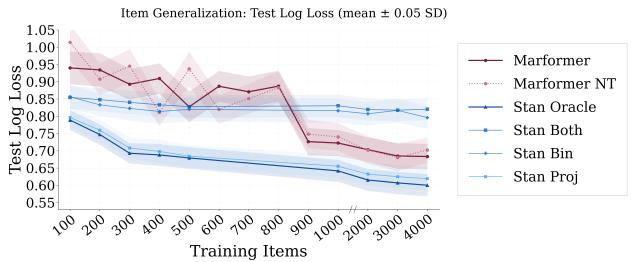  
(a) Log-loss: item generalization

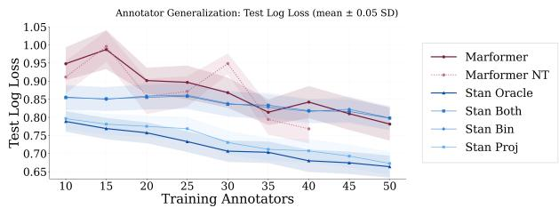  
(b) Log-loss: judge generalization

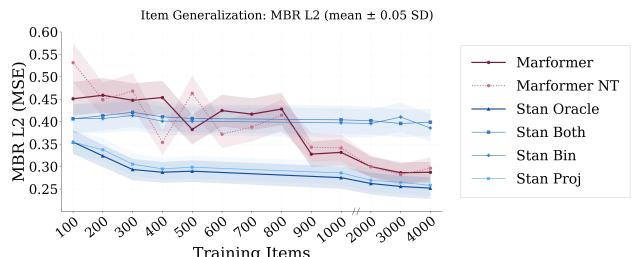  
(c) $\begin{array} { r l } { \mathrm { M B R } { - } L _ { 2 } { : } } & { { } } \end{array}$ item generalization

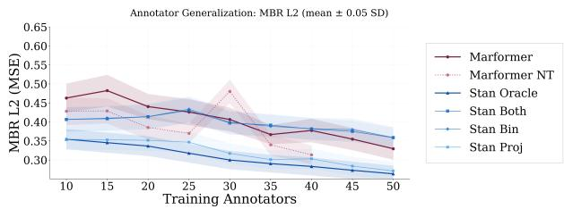  
(d) MBR-L<sub>2</sub>: judge generalization  
Figure 8: Log-loss (a)–(b) and $\mathrm { M B R } { - } L _ { 2 }$ (c)–(d) on missing ratings in the fixed test corner as the amount of training data increases. Item-generalization results extend to $I _ { \mathrm { t r a i n } } = 4 0 0 0$ for all models; in judge generalization, Marformer NT stops at $J _ { \mathrm { t r a i n } } = 4 0$ because test judges are excluded from training. Shaded bands show ± one bootstrap standard error of the mean, resampling items on the item axis and judges on the judge axis. Full comparisons including the empirical baselines are reported in §C.

Predictive performance. In item generalization, Figure 8(a) shows that log-loss improves overall as more training items become available, while a gap to the correctly specified Stan CPM remains. At $I _ { \mathrm { t r a i n } } = 4 0 0 0$ log-loss is 0.683 for the Marformer versus 0.600 for Stan. The non-transductive Marformer follows a similar overall trend. We do not interpret small diferences between individual training-size points as evidence of a systematic advantage for either Marformer variant. Stan is given the correct generative model family, whereas the Marformer learns the conditional structure from the observed ratings.

The corresponding $\mathrm { M B R } { - } L _ { 2 }$ results in Figure 8(c) show the same qualitative behavior for point prediction. As the number of training items increases, the conditional means produced by the Marformer improve overall, but remain less accurate than those obtained from the correctly specified joint model.

In judge generalization, Figure 8(b)–(d) shows that both the Marformer and the correctly specified Stan CPM improve overall as more training judges become available, with the Marformer remaining competitive throughout. The comparison with the misspecified Stan variants and empirical baselines is reported in full in §C.

Calibration. Because the goal is conditional marginal prediction, good point-prediction performance alone is insuficient: predicted probabilities should also reflect empirical frequencies. Figure 9 examines calibration at the largest available training sizes. In item generalization at $I _ { \mathrm { t r a i n } } = 4 0 0 0 .$ , smECE is 0.020 for the Marformer, 0.022 for Marformer NT, and 0.025 for the correctly specified Stan CPM. These estimates indicate calibration comparable to the oracle baseline at this training size. At smaller item-training sizes $( I _ { \mathrm { t r a i n } } = 2 0 0 – 5 0 0 )$ , the Marformer has higher smECE than Stan Oracle. The conditional log-loss objective in equation (7) rewards matching conditional distributions on artificially masked observations rather than only their most likely values. The layer-by-layer development of these predictions is examined in §E using logit and tuned lenses: learned readouts recover predictions close to the final model’s by layer 3, while the raw parameter coordinates continue to improve through the final layers.

Conditional predictions also support chained sampling and VOI-based acquisition (§2.2).

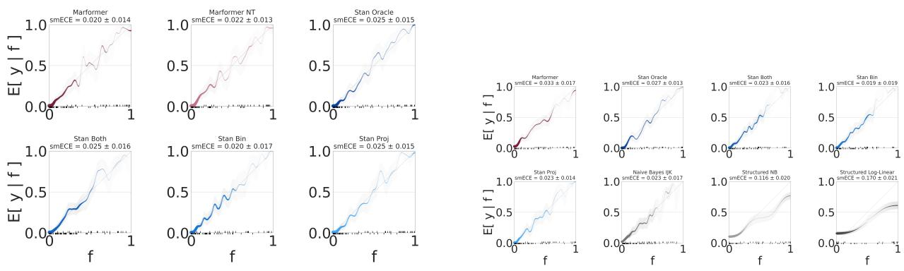  
(a) Item generalization $( I _ { \mathrm { t r a i n } } = 4 0 0 0 )$  
(b) Judge generalization $( J _ { \mathrm { t r a i n } } = 4 0 )$  
Figure 9: Calibration of predicted categorical probabilities against empirical frequencies at $I _ { \mathrm { t r a i n } } = 4 0 0 0$ and $J _ { \mathrm { t r a i n } } = 4 0$ , the largest training sizes with results for all models shown. Probabilities for all $C = 4$ Likert categories are pooled in the reliability calculation. The diagonal indicates perfect calibration; the displayed smECE widths are relplot’s reported calibration-error widths from 500 bootstrap resamples.

Computational cost. For synthetic annotation, we account for both validation-based epoch selection and the subsequent refit. The reported runs used a 2000-epoch search budget; for runtime accounting, we give a hypothetical cost estimate for ending the search 50 epochs after the selected epoch, then performing the measured refit. For selected epoch $e _ { * } .$ , measured full-search time $t _ { \mathrm { s e a r c h } }$ , and measured refit time $t _ { \mathrm { r e f i t } }$ , the estimate is

$$
\widehat { t } _ { \mathrm { t o t a l } } = \frac { e _ { * } + 5 0 } { 2 0 0 0 } t _ { \mathrm { s e a r c h } } + t _ { \mathrm { r e f i t } } .
$$

This estimate uses the recorded search and refit times and assumes approximately constant cost per epoch and that an earlier stopping rule would reach the selected epoch. A patience-50 rule could instead stop before a later validation minimum; this estimate therefore does not establish the cost of recovering the reported checkpoint. For transductive Marformer at $I _ { \mathrm { t r a i n } } = 4 0 0 0$ , the estimated total is 60.7 minutes (including 27.7 minutes for refitting), compared with about 757 minutes for Stan Oracle, a roughly 12× diference between this hypothetical estimate and the measured Stan cost. At $I _ { \mathrm { t r a i n } } = 5 0 0$ , the corresponding totals are 2.5 and about 52 minutes. On the judge axis, the Marformer totals are 1.6 minutes at $J _ { \mathrm { t r a i n } } = 4 0$ and 2.9 at 50; Stan takes about 55 minutes at 40. Runtime curves appear in Figure 16.

## 7 Applying Marformer to Real Annotation Data

Real annotation datasets difer from the synthetic setting in two important ways. Missingness follows a structured study-design protocol rather than the i.i.d. Bernoulli mechanism of Domains 1–2. Applying the masking justification requires the additional assumption that the retained human ratings are MCAR; we do not verify this assumption from the processed data.<sup>28</sup> Second, there is no known ground-truth generative distribution and hence no oracle model for comparison. We evaluate in a fully transductive setting and focus on generalization across items, with the full judge set fixed throughout.

Real annotation datasets also motivate a broader use of conditional marginal prediction: using abundant, inexpensive measurements to predict the outcomes of measurements that are costly to obtain. Here, for example, LLM ratings can be collected much more cheaply and densely than human ratings, so that observed LLM ratings may help predict the human ratings that were not collected. The same pattern appears in other domains. DataDecide (Magnusson et al., 2025), for example, studies whether inexpensive small-scale language-model training experiments can predict which pretraining choices will perform best at much more expensive scales. Sim-to-real methods similarly exploit inexpensive simulated experience to reduce the amount of costly real-world data required to train or evaluate robotic systems (Zhao et al.,

2020). Omnimodal Encoders (Harwath et al., 2026) consider an analogous problem in multimodal modeling: developing inexpensive intrinsic evaluations of encoders that predict their downstream performance after integration into a full multimodal model, without requiring every candidate encoder to be evaluated by training the full system. In each case, inexpensive observations are valuable insofar as they provide information about the outcomes of more expensive experiments; conditional marginal prediction provides a natural way to represent both the prediction and the remaining uncertainty.

The predicted marginals can also be propagated into approximate uncertainty about downstream population statistics. For example, suppose we wish to estimate the diference in mean human rating between two populations of items when some human ratings are missing. We can repeatedly impute missing ratings by chaining their predicted conditional marginals (equation (2)) and recompute the population diference, obtaining a distribution over the diference that reflects uncertainty about the unobserved ratings.

In addition to the Stan CPM and empirical baselines described in §6.4 and §6.5, we compare against two neural imputation methods adapted for categorical prediction. MIWAE (Mattei & Frellsen, 2019) trains a deep generative model via an importance-weighted ELBO over incomplete observations; we replace its reconstruction head with C-dimensional logits to produce Likert distributions. ReMasker (Du et al., 2023) applies masked autoencoding to tabular data, iteratively re-masking observed entries and training a Transformer to reconstruct them; we similarly adapt its output head to produce C logits. Both methods treat the data as a flat table without the entity-structured relational attention used by Marformer.

The Stan CPM baseline is fit here with weakly informative priors, allowing the observed data to determine the posterior rather than calibrating the priors to a known data-generating distribution as in the synthetic experiments.<sup>29</sup>

## 7.1 LLM-Rubric

Multi-judge datasets have been used to study subjective judgments in NLP, including disagreement among human judges (Chhun et al., 2022). We focus on LLM-Rubric (Hashemi et al., 2024), which combines sparse human judgments with dense LLM judgments on the same items. The dataset contains 225 conversations from a human–AI information-seeking task, each evaluated on $K = 9$ rubric dimensions, including naturalness, conciseness, and citation quality. Our annotation tensor includes $J = 2 5$ judges: 24 human judges and one LLM judge (GPT-4o-mini). Ratings use a $C = 4$ Likert scale; human ratings are hard labels, while the LLM provides a probability distribution over the four categories. Conversations have ratings from up to 3 of the 24 human judges and from the LLM. The human annotation tensor is therefore approximately $3 / 2 4 = 1 2 . 5 \%$ dense per criterion, while the LLM slice is fully observed.<sup>30</sup> We use a $1 7 5 / 2 5 / 2 5$ train/validation/test split over conversations and follow the item-generalization protocol of §6.2, varying $I _ { \mathrm { t r a i n } } \in \{ 1 0 , 2 0 , 3 0 , 4 0 , 5 0 , 7 5 , 1 0 0 , 1 2 5 , 1 5 0 , 1 7 5 \}$

For the 25 test conversations, we hide and score all 666 collected human ratings: 74 conversation–judge pairs across all 9 criteria. Of these conversations, 24 have ratings from three human judges and one has ratings from two. The 225 LLM rating distributions $( 2 5 \times 9 )$ remain visible as context and are not evaluation targets. Uncollected human ratings are not scored. No human rating from a test conversation is available as input or as a training target. In transductive training, test conversations enter the graph only through their LLM ratings; human supervision comes from the training split. The same test targets and observed context are used for all evaluated methods

Marformer Configuration We use the architecture and optimization hyperparameters described in §6.3, with item-embedding dropout $\delta _ { i } = 0 . 7$ and the following domain-specific details. For LLM ratings, the encoding function receives the full categorical distribution in place of a one-hot human rating, allowing the dense LLM slice to enter the graph as soft evidence. We train for 300 epochs and select the checkpoint with the lowest loss on the 25-conversation validation split, retaining that checkpoint without refitting. Each forward pass is restricted to 10 items during both training and evaluation.

The architecture accepts any subset of human and LLM ratings as context. The training masking mechanism determines which conditional prediction tasks receive supervision (§2.4). Structured masks can therefore target particular groups of ratings—for example, human ratings conditioned on LLM ratings—while using the same architecture. As with other masking schemes, their statistical justification depends on the missingness assumptions described in §2.4.

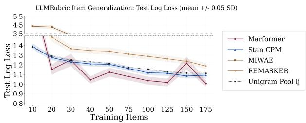  
(a) Log-Loss

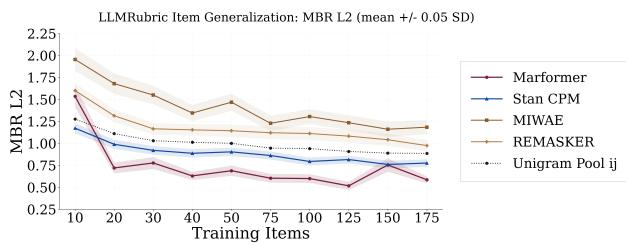  
(b) MBR-L2

Figure 10: Log-loss (a) and MBR-L2 (b) on the LLMRubric test set as a function of training items. Stan CPM is run with the HMC configuration described in §C. Bands are bootstrap standard errors of the mean, obtained by resampling conversations conditional on the fitted model and observed data realization. Runtime curves appear in §D.  
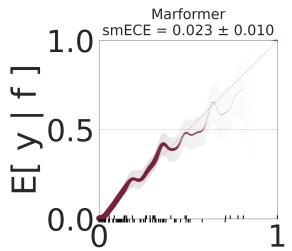

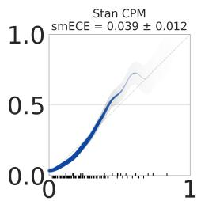

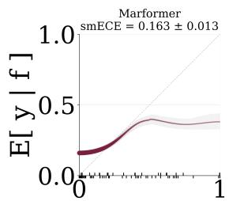

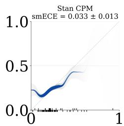

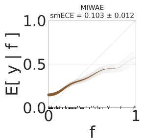

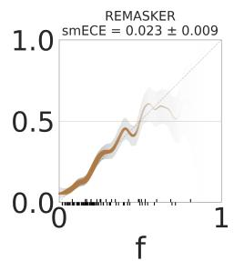  
(a) $I _ { \mathrm { t r a i n } } = 1 7 5$

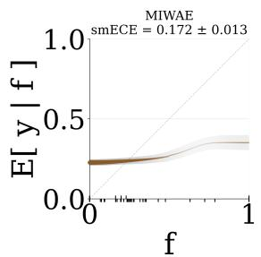

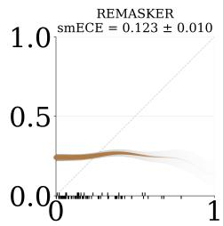  
(b) $I _ { \mathrm { t r a i n } } = 1 0$  
Figure 11: Calibration plots (predicted probability vs. empirical frequency) on LLMRubric at full and minimal training size. At $I _ { \mathrm { t r a i n } } = 1 7 5$ , Marformer is well-calibrated; at $I _ { \mathrm { t r a i n } } = 1 0$ , calibration degrades for all methods, with MIWAE and ReMasker exhibiting overconfident predictions at the scale extremes.

Figure 10(a) shows log-loss as a function of training size. At $I _ { \mathrm { t r a i n } } = 1 0$ , Stan CPM (1.39) and Pooled Unigram (1.38) lead Marformer (1.95). At $I _ { \mathrm { t r a i n } } = 5 0$ , Marformer has lower log-loss: 1.12 against 1.20 for Stan CPM. The Marformer improves overall, though non-monotonically, reaching 1.007 at $I _ { \mathrm { t r a i n } } = 1 7 5$ versus 1.093 for Stan CPM and 1.112 for Pooled Unigram. Unlike the synthetic setting, Stan CPM here has no privileged access to the correct generative family, and its early-data advantage is reversed at the largest training size. Figure 10(b) also favors Marformer on MBR-L2 at $I _ { \mathrm { t r a i n } } = 1 7 5$ : 0.59 versus 0.78 for Stan CPM. Figure 11 shows calibration at representative training sizes: at $I _ { \mathrm { t r a i n } } = 1 7 5$ , Marformer is well-calibrated; at $I _ { \mathrm { t r a i n } } = 1 0$ , it is less well-calibrated than Stan CPM. The recorded real-data training times at $I _ { \mathrm { t r a i n } } = 1 7 5$ are approximately 22 minutes for Marformer and 162 minutes for Stan CPM. The Marformer timing includes the 300-epoch training run and best-validation checkpoint selection, without refitting. Runtime curves appear in §D.

## 8 Other Related Work

Classical and generative methods. Early work on imputation is largely statistical or generative in nature. Classical approaches include multiple imputation by chained equations (MICE) (Buuren & Groothuis-Oudshoorn, 2011), nuclear-norm matrix completion (SoftImpute) (Mazumder et al., 2010), and nonparametric methods such as random-forest imputation (MissForest) (Stekhoven & Bühlmann, 2011). These remain widely used but often require model selection per dataset and struggle with heterogeneous data. Generative models attempt to overcome these limitations by modeling the joint distribution of features: GAIN (Yoon et al., 2018) and MisGAN (Li et al., 2019) rely on adversarial training, while HI-VAE (Nazabal et al., 2018), VAEAC (Ivanov et al., 2019), and MIWAE (Mattei & Frellsen, 2019) provide likelihood-based training and probabilistic imputations, with extensions for MNAR data in the case of Ipsen et al. (2020). These methods model distributions over missing values, while our work focuses on individual conditional marginals, which are directly aligned with downstream decision tasks.<sup>31</sup>

Transformers for tabular modeling. The success of the Transformer architecture (Vaswani et al., 2017) has motivated its application to tabular data. TabTransformer (Huang et al., 2020), FT-Transformer (Gorishniy et al., 2021), and SAINT (Somepalli et al., 2021) demonstrate that attention-based tokenization can outperform classical learners on supervised tasks. More recently, these architectures have been adapted for imputation. NAIM (Caruso et al., 2024) introduces feature-specific embeddings with masked self-attention to model conditional structure, while UnmaskingTrees (McCarter, 2025) ofers a competitive non-neural alternative via gradient-boosted “unmasking” steps. Our approach difers in that we work with structured variable names encoded through compositional entity embeddings, and evaluate on synthetic datasets with known distributions.

Masked Autoencoding. Masked autoencoding (MAE) (He et al., 2021) has emerged as a powerful selfsupervised training signal across domains, and its adaptation to imputation is natural. ReMasker (Du et al., 2023) extends MAE to tabular data by repeatedly re-masking observed entries during training and reconstructing them, showing strong results on benchmark datasets. Our work builds on this line but difers in key respects: we frame imputation as conditional marginal prediction rather than regression to observed entries, enabling uncertainty-aware downstream decisions; we introduce compositional entity embeddings to capture structured variables; and we use an encoder-only design without positional order. While ReMasker validates the potential of masked autoencoding for imputation, our approach extends it to a setting that supports conditional distribution prediction over structured variables.

Active feature acquisition. A related line of work trains agents to decide which features to observe before making a prediction (Saar-Tsechansky et al., 2009; Li & Oliva, 2020; Yin et al., 2020). These methods typically combine a classifier with a sequential acquisition policy optimizing a joint objective. Our contribution is orthogonal: we produce the calibrated conditional marginals that are a prerequisite for VOI computation, rather than the acquisition policy itself. Combining the Marformer with a VOI-based acquisition policy is a natural direction for future work.

Prior generative imputation methods represent distributions over missing values (Yoon et al., 2018; Mattei & Frellsen, 2019; Nazabal et al., 2018), while tabular methods typically operate on a fixed set of columns (Du et al., 2023; Caruso et al., 2024). MICE uses a collection of conditional models in an iterative imputation procedure (Buuren & Groothuis-Oudshoorn, 2011). Our approach directly predicts conditional marginals with shared neural parameters and relational structure among variables and entities.

## 9 Discussion and Limitations

We introduced the Marformer, a Transformer that directly predicts conditional marginal distributions over missing values. It replaces inference in a specified generative model with a single forward pass learned from incomplete training data. Across three synthetic domains with known ground truth, the Marformer can match or outperform methods with access to the correct generative family, although a gap remains to Stan Oracle in the synthetic annotation domain. On real data, the Marformer improves overall with training scale and outperforms the evaluated baselines at the largest training size, while running at a fraction of Stan’s cost.

The Marformer has three notable limitations. First, our justification for masked autoencoding assumes MCAR training instances. If missingness is informative, even in the weaker MAR sense, where observation depends on other observed values, artificially masked training examples need no longer represent the same conditional distribution as naturally missing ones, and learned conditional distributions may be systematically biased. Second, the Marformer predicts conditional marginals without enforcing their compatibility with a coherent joint distribution. Third, calibration matters for active learning: overconfident conditional predictions can lead to overconfident VOI estimates and suboptimal acquisition decisions. The layerwise analysis in §E illustrates how calibration develops through the model’s computation.

Deep models that predict output distributions, like p , sometimes overfit to the training examples, leading them to predict low-entropy distributions in general (Wong-Toi et al., 2024). Our experiments show that calibration can deteriorate with limited training data (see Figures 9 and 11). Overfitting may be reduced by our $L _ { 2 }$ regularization and early stopping, or by the fact that random masking generates exponentially many training examples. Still, the model could generalize poorly to test examples that are unlike any training examples. Consider MCAR bandit data, in which every instance has $\mathbf { r } = \{ 1 \}$ or $\mathbf { r } = \{ 2 \}$ . Half of the test examples ask to predict $X _ { 2 }$ from $X _ { 1 }$ , but there are no training examples of this form, only predicting $X _ { 2 }$ from ∅. Whether $X _ { 2 }$ depends on $X _ { 1 }$ cannot be resolved by the training data, but is wholly determined by the inductive bias of the learner. We would like to ensure that the model will yield a high-entropy predictive distribution on inputs where the prediction is underconstrained by the training data. If $L _ { 2 }$ regularization does not achieve this, it might help to add a second regularizer to equation (19) that explicitly rewards predictive entropy on held-out real or synthetic inputs from the test distribution $P _ { 1 } ^ { * }$ . Ensemble learning is another way to achieve this goal, by returning a mixture of plausible predictive distributions (e.g., Lakshminarayanan et al., 2017). In the example, we might be able to predict $X _ { 2 }$ with low entropy if we knew whether it was positively or negatively correlated with $X _ { 1 } .$ , but since we do not know, we take a mixture of many possibilities, which has high entropy.

## References

Rami Al-Rfou, Dokook Choe, Noah Constant, Mandy Guo, and Llion Jones. Character-level language modeling with deeper self-attention. In AAAI Conference on Artificial Intelligence, volume 33, pp. 3159– 3166. Association for the Advancement of Artificial Intelligence (AAAI), 2018. ISBN 978-1-57735-809-1.

Nora Belrose, Zach Furman, Logan Smith, Danny Halawi, Igor Ostrovsky, Lev McKinney, Stella Biderman, and Jacob Steinhardt. Eliciting latent predictions from transformers with the tuned lens, 2023.

Stefen Bickel, Michael Brückner, and Tobias Schefer. Discriminative learning under covariate shift. Journal of Machine Learning Research, 10, 2009. ISSN 1532-4435.

R. Darrell Bock and Murray Aitkin. Marginal maximum likelihood estimation of item parameters: Application of an EM algorithm. Psychometrika, 46(4):443–459, 1981.

Monica F. Bugallo, Victor Elvira, Luca Martino, David Luengo, Joaquin Miguez, and Petar M. Djuric. Adaptive importance sampling: The past, the present, and the future. IEEE Signal Processing Magazine, 34(4):60–79, 2017.

S. van Buuren and K. Groothuis-Oudshoorn. mice: Multivariate imputation by chained equations in R. Journal of Statistical Software, 45(3):1–67, 2011.

Emmanuel J. Candes and Benjamin Recht. Exact matrix completion via convex optimization, 2012.

Camillo Maria Caruso, Paolo Soda, and Valerio Guarrasi. Not another imputation method: A transformerbased model for missing values in tabular datasets, 2024.

Venkat Chandrasekaran, Nathan Srebro, and Prahladh Harsha. Complexity of inference in graphical models. In Conference on Uncertainty in Artificial Intelligence, volume R6, pp. 70–78, 2008. Reissued by PMLR on 09 October 2024.

Daiwei Chen, Yi Chen, Aniket Rege, and Ramya Korlakai Vinayak. PAL: Pluralistic alignment framework for learning from heterogeneous preferences. arXiv.org, 2024.

Cyril Chhun, Pierre Colombo, Fabian M. Suchanek, and Chlo’e Clavel. Of human criteria and automatic metrics: A benchmark of the evaluation of story generation. In Nicoletta Calzolari, Chu-Ren Huang, Hansaem Kim, James Pustejovsky, Leo Wanner, Key-Sun Choi, Pum-Mo Ryu, Hsin-Hsi Chen, Lucia Donatelli, Heng Ji, Sadao Kurohashi, Patrizia Paggio, Nianwen Xue, Seokhwan Kim, Younggyun Hahm, Zhong He, Tony Kyungil Lee, Enrico Santus, Francis Bond, and Seung-Hoon Na (eds.), International Conference on Computational Linguistics, 2022.

Clyde H. Coombs. Psychological scaling without a unit of measurement. Psychology Review, 57(3):145–158, 1950.

Gregory F. Cooper. The computational complexity of probabilistic inference using Bayesian belief networks. Artificial Intelligence, 42(2-3):393–405, 1990.

A. P. Dawid. Present position and potential developments: Some personal views: Statistical theory: The prequential approach. Journal of the Royal Statistical Society. Series A (General), 147(2):278, 1984.

A. P. Dempster, N. M. Laird, and D. B. Rubin. Maximum likelihood from incomplete data via the EM algorithm. Journal of the Royal Statistical Society. Series B (Methodological), 39(1):1–38, 1977. ISSN 00359246.

Jacob Devlin, Ming-Wei Chang, Kenton Lee, and Kristina Toutanova. BERT: Pre-training of deep bidirectional transformers for language understanding. In Jill Burstein, Christy Doran, and Thamar Solorio (eds.), Proceedings of the 2019 Conference of the North American Chapter of the Association for Computational Linguistics: Human Language Technologies, Volume 1 (Long and Short Papers), pp. 4171–4186. Association for Computational Linguistics, 2019.

Tianyu Du, Luca Melis, and Ting Wang. ReMasker: Imputing tabular data with masked autoencoding, 2023.

C. K. Enders. Missing data: An update on the state of the art. Psychological Methods, 30(2):322–339, 2023.

Jonas Gehring, Michael Auli, David Grangier, Denis Yarats, and Yann N. Dauphin. Convolutional sequence to sequence learning. In Proceedings of the 34th International Conference on Machine Learning, 2017.

A. E. Gelfand and A. F. M. Smith. Sampling-based approaches to calculating marginal densities. Journal of the American Statistical Association (JASA), 85:398–409, 1990.

J. Gentle, G. McLachlan, and T. Krishnan. The EM Algorithm and Extensions, volume 54. JSTOR, 1st edition, 1996.

Alan Genz. Numerical computation of multivariate normal probabilities. Journal of Computational and Graphical Statistics, 1(2):141–149, 1992. ISSN 10618600.

Cedric Ginestet. Introduction to Statistical Relational Learning, volume 173. Oxford University Press (OUP), 2010.

Tilmann Gneiting and Adrian E. Raftery. Strictly proper scoring rules, prediction, and estimation. Journal of the American Statistical Association, 102(477):359–378, 2005.

Yury Gorishniy, Ivan Rubachev, Valentin Khrulkov, and Artem Babenko. Revisiting deep learning models for tabular data, 2021.

David Harwath, Karen Livescu, Georg Heigold, and Shankar Kumar. Omnimodal encoders. Jsalt 2026 workshop proposal, Center for Language and Speech Processing, Johns Hopkins University, 2026.

Helia Hashemi, Jason Eisner, Corby Rosset, Benjamin Van Durme, and Chris Kedzie. LLM-rubric: A multidimensional, calibrated approach to automated evaluation of natural language texts. In Lun-We Ku, Andre Martins, and Vivek Srikumar (eds.), Annual Meeting of the Association for Computational Linguistics, pp. 13806–13834. Association for Computational Linguistics, 2024.

Kaiming He, Xinlei Chen, Saining Xie, Yanghao Li, Piotr Dollár, and Ross Girshick. Masked autoencoders are scalable vision learners, 2021.

John R. Hershey, Jonathan Le Roux, and Felix Weninger. Deep unfolding: Model-based inspiration of novel deep architectures. arXiv.org, 1409.2574, 2014.

Ronald A. Howard. Bayesian decision models for system engineering. IEEE Transactions on Systems Science and Cybernetics, 1(1):36–40, 1965.

Ronald A. Howard. Information value theory. IEEE Transactions on Systems Science and Cybernetics, 2(1): 22–26, 1966.

Xin Huang, Ashish Khetan, Milan Cvitkovic, and Zohar Karnin. TabTransformer: Tabular data modeling using contextual embeddings, 2020.

Niels Bruun Ipsen, Pierre-Alexandre Mattei, and Jes Frellsen. not-MIWAE: Deep generative modelling with missing not at random data, 2020.

Oleg Ivanov, Michael Figurnov, and Dmitry Vetrov. Variational autoencoder with arbitrary conditioning. In International Conference on Learning Representations, 2019.

Raghunandan H. Keshavan, Andrea Montanari, and Sewoong Oh. Matrix completion from a few entries, 2009.

Paul Kvam, Brani Vidakovic, and Seong joon Kim. Nonparametric Statistics with Applications to Science and Engineering with R. Wiley, 2nd edition, 2022.

Balaji Lakshminarayanan, Alexander Pritzel, and Charles Blundell. Simple and scalable predictive uncertainty estimation using deep ensembles. In Advances in Neural Information Processing Systems, volume 30, 2017.

Chen-Yu Lee, Saining Xie, Patrick Gallagher, Zhengyou Zhang, and Zhuowen Tu. Deeply-supervised nets. In International Conference on Artificial Intelligence and Statistics, volume 38 of Proceedings of Machine Learning Research, pp. 562–570, 09–12 May 2014.

Steven Cheng-Xian Li, Bo Jiang, and Benjamin Marlin. MisGAN: Learning from incomplete data with generative adversarial networks, 2019.

Yang Li and Junier Oliva. Active feature acquisition with generative surrogate models. In Marina Meila and Tong Zhang (eds.), International Conference on Machine Learning, volume 139 of Proceedings of Machine Learning Research, pp. 6450–6459. PMLR, 18–24 Jul 2020.

Yang Li, Jie Ma, Miguel Ballesteros, Yassine Benajiba, and Graham Horwood. Active evaluation acquisition for eficient LLM benchmarking, 2024.

Stuart R. Lipsitz and Joseph G. Ibrahim. A conditional model for incomplete covariates in parametric regression models. Biometrika, 83(4):916–922, 1996.

Roderick J. Little. Missing data assumptions. Annual Review of Statistics and Its Application, 8(Volume 8, 2021):89–107, 2021. ISSN 2326-831X.

Ilya Loshchilov and Frank Hutter. Decoupled weight decay regularization. In International Conference on Learning Representations, 2017.

Anders L. Madsen and Finn V. Jensen. LAZY propagation: A junction tree inference algorithm based on lazy evaluation. Artificial Intelligence, 113(1–2):203–245, 1999. ISSN 0004-3702.

Ian Magnusson, Akshita Bhagia, Luca Soldaini, Dustin Schwenk, Pete Walsh, Yan Elazar, Kyle Lo, Dirk Groeneveld, Iz Beltagy, Hannaneh Hajishirzi, et al. DataDecide: How to predict best pretraining data with small experiments. In Proceedings of the 42nd International Conference on Machine Learning, volume 267 of Proceedings of Machine Learning Research. PMLR, 2025.

Pierre-Alexandre Mattei and Jes Frellsen. MIWAE: Deep generative modelling and imputation of incomplete data, 2019.

Rahul Mazumder, Trevor Hastie, and Robert Tibshirani. Spectral regularization algorithms for learning large incomplete matrices. Journal of Machine Learning Research, 11(80):2287–2322, 2010.

Calvin McCarter. Unmasking trees for tabular data, 2025.

Geert Molenberghs, Caroline Beunckens, Cristina Sotto, and Michael G. Kenward. Every missingness not at random model has a missingness at random counterpart with equal fit. Journal of the Royal Statistical Society Series B: Statistical Methodology, 70(2):371–388, 2008.

Alfredo Nazabal, Pablo M. Olmos, Zoubin Ghahramani, and Isabel Valera. Handling incomplete heterogeneous data using VAEs, 2018.

Behnam Neyshabur, Srinadh Bhojanapalli, D. McAllester, and N. Srebro. Generalization in deep learning. In Philipp Grohs and Gitta Kutyniok (eds.), Neural Information Processing Systems, pp. 112—-148. Cambridge University Press, 2017.

Hiroki Ouchi, Jun Suzuki, and Kentaro Inui. Transductive learning of neural language models for syntactic and semantic analysis. In Kentaro Inui, Jing Jiang, Vincent Ng, and Xiaojun Wan (eds.), Proceedings of the 2019 Conference on Empirical Methods in Natural Language Processing and the 9th International Joint Conference on Natural Language Processing (EMNLP-IJCNLP), pp. 3663–3669. Association for Computational Linguistics, 2019.

Yongming Rao, Wenliang Zhao, Benlin Liu, Jiwen Lu, Jie Zhou, and Cho-Jui Hsieh. DynamicViT: Eficient vision transformers with dynamic token sparsification. In M. Ranzato, A. Beygelzimer, Y. Dauphin, P.S. Liang, and J. Wortman Vaughan (eds.), Neural Information Processing Systems, volume 34, pp. 13937–13949. Curran Associates, Inc., 2021.

Mengye Ren, Wenyuan Zeng, Bin Yang, and Raquel Urtasun. Learning to reweight examples for robust deep learning. In Jennifer Dy and Andreas Krause (eds.), International Conference on Machine Learning, volume 80 of Proceedings of Machine Learning Research, pp. 4334–4343. PMLR, 10–15 Jul 2018.

Christian P. Robert. The Metropolis-Hastings algorithm, 2016.

Dan Roth. On the hardness of approximate reasoning. Artificial Intelligence, 82(1-2):273–302, 1996.

Donald B. Rubin. Inference and missing data. Biometrika, 63(3):581–592, 1975.

Maytal Saar-Tsechansky, Prem Melville, and Foster Provost. Active feature-value acquisition. Management Sciences, 55(4):664–684, 2009.

Shaun Seaman, John Galati, Dan Jackson, and John Carlin. What is meant by “missing at random”? Statistical Science, 28(2):257–268, 2013.

Peter Shaw, Jakob Uszkoreit, and Ashish Vaswani. Self-attention with relative position representations. In North American Chapter of the Association for Computational Linguistics, pp. 464–468. Association for Computational Linguistics, 2018.

Jun Shu, Qi Xie, Lixuan Yi, Qian Zhao, Sanping Zhou, Zongben Xu, and Deyu Meng. Meta-Weight-Net: Learning an explicit mapping for sample weighting. In H. Wallach, H. Larochelle, A. Beygelzimer, F. d'Alché-Buc, E. Fox, and R. Garnett (eds.), Neural Information Processing Systems, volume 32. Curran Associates, Inc., 2019.

Andrew Smith, Trevor Cohn, and Miles Osborne. Logarithmic opinion pools for conditional random fields. In Annual Meeting of the Association for Computational Linguistics, pp. 18–25. Association for Computational Linguistics, June 2005.

Gowthami Somepalli, Micah Goldblum, Avi Schwarzschild, C. Bayan Bruss, and Tom Goldstein. SAINT: Improved neural networks for tabular data via row attention and contrastive pre-training, 2021.

Nitish Srivastava, Geofrey Hinton, Alex Krizhevsky, Ilya Sutskever, and Ruslan Salakhutdinov. Dropout: A simple way to prevent neural networks from overfitting. Journal of Machine Learning Research, 15: 1929–1958, 2014.

D. Stekhoven and P. Bühlmann. MissForest – non-parametric missing value imputation for mixed-type data. Bioinform., 28(1):112–118, 2011.

Veselin Stoyanov and Jason Eisner. Fast and accurate prediction via evidence-specific MRF structure. In ICML Workshop on Inferning: Interactions between Inference and Learning, 2012. 6 pages.

Veselin Stoyanov, Alexander Ropson, and Jason Eisner. Empirical risk minimization of graphical model parameters given approximate inference, decoding, and model structure. In Geofrey Gordon, David Dunson, and Miroslav Dudík (eds.), Proceedings of the Fourteenth International Conference on Artificial Intelligence and Statistics, volume 15 of Proceedings of Machine Learning Research, pp. 725–733, Fort Lauderdale, FL, USA, 11–13 Apr 2011. PMLR.

Andreas Stuhlmüller, Jacob Taylor, and Noah Goodman. Learning stochastic inverses. In Advances in Neural Information Processing Systems 26, pp. 3048–3056. 2013.

Ruoyu Sun, Dawei Li, Shiyu Liang, Tian Ding, and Rayadurgam Srikant. The global landscape of neural networks: An overview. IEEE Signal Processing Magazine, 37(5):95–108, 2020.

M. Tanner, W. Wong, A. Dempster, C. Morris, D. Rubin, and S. Haberman. The calculation of posterior distributions by data augmentation. Journal of the American Statistical Association, 82(398):528–540, 1987.

Benigno Uria, Marc-Alexandre Côté, Karol Gregor, Iain Murray, and Hugo Larochelle. Neural autoregressive distribution estimation. Journal of Machine Learning Research, 17(1):7184–7220, 2016.

Vladimir N. Vapnik. Statistical Learning Theory. John Wiley & Sons, 1998.

Ashish Vaswani, Noam Shazeer, Niki Parmar, Jakob Uszkoreit, Llion Jones, Aidan N. Gomez, Lukasz Kaiser, and Illia Polosukhin. Attention is all you need, 2017.

Tim Vieira and Jason Eisner. Learning to prune: Exploring the frontier of fast and accurate parsing. Transactions of the Association for Computational Linguistics, 5:263–278, 2017.

Robert Walecki, Kostis Gourgoulias, Adam Baker, Chris Hart, Chris Lucas, Max Zwiessele, Albert Buchard, Maria Lomeli, Yura Perov, and Saurabh Johri. Universal marginaliser for deep amortised inference for probabilistic programs, 2019.

G. C. G. Wei and M. A. Tanner. A Monte Carlo implementation of the EM algorithm and the poor man’s data augmentation algorithms. Journal of the American Statistical Association, 85(411):699–704, 1990.

Halbert White. Maximum likelihood estimation of misspecified models. Econometrica, 50(1):1, 1982. ISSN 00129682, 14680262.

Eliot Wong-Toi, Alex Boyd, Vincent Fortuin, and Stephan Mandt. Understanding pathologies of deep heteroskedastic regression. In Proceedings of the Fortieth Conference on Uncertainty in Artificial Intelligence, 2024.

Zhilin Yang, Zihang Dai, Yiming Yang, Jaime Carbonell, Russ R. Salakhutdinov, and Quoc V Le. XLNet: Generalized autoregressive pretraining for language understanding. In Neural Information Processing Systems, pp. 5753–5763. Curran Associates, Inc., 2019.

Haiyan Yin, Yingzhen Li, Sinno Jialin Pan, Cheng Zhang, and Sebastian Tschiatschek. Reinforcement learning with eficient active feature acquisition, 2020.

Jinsung Yoon, James Jordon, and Mihaela van der Schaar. GAIN: Missing data imputation using generative adversarial nets, 2018.

Wenshuai Zhao, Jorge Peña Queralta, and Tomi Westerlund. Sim-to-real transfer in deep reinforcement learning for robotics: A survey. In 2020 IEEE Symposium Series on Computational Intelligence (SSCI), pp. 737–744. IEEE, 2020.

## A Results in MAR Setting

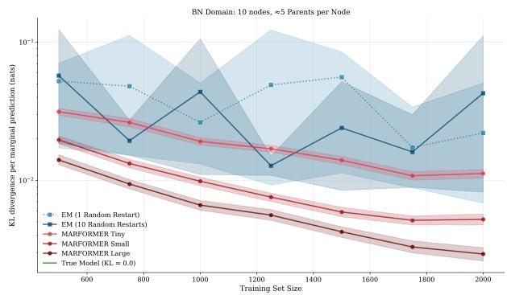  
(a) Domain 1 (BN): Sequential MAR

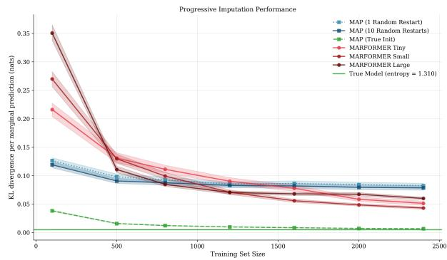  
(b) Domain 2 (Gaussian): Sequential MAR

Figure 12: Learning curves, similar to Figure 4 but where Train is MAR rather than MCAR. Despite the biased training examples, performance is qualitatively similar, though loss for all methods is higher in Domain 1.  
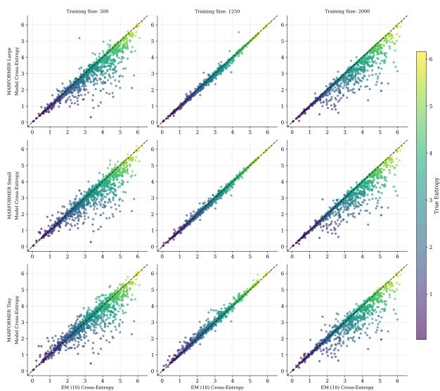  
(a) Domain 1 (Sequential MAR)

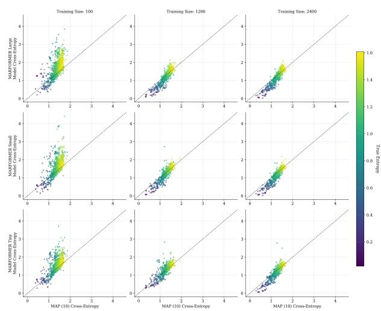  
(b) Domain 2 (MAR)  
Figure 13: Prediction-by-prediction comparison of two methods, similar to Figure 5 but where the models were trained on MAR rather than MCAR data.

We rerun the comparisons of §4.5 (Domain 1) using Train and Test datasets that are MAR but not MCAR. Training remains valid for MAP-EM, but the naive masking method that we use for Marformer training in this paper now produces biased examples.

Specifically, we use a sequential MAR missingness mechanism, which has the form

$$
P ^ { * } ( \mathbf { R } = \mathbf { r } \mid \mathbf { X } = \mathbf { x } ) = \prod _ { i \in \mathbf { i } } P ^ { * } ( R _ { i } = r _ { i } \mid \mathbf { R _ { p a } } _ { ( i ) } = \mathbf { r _ { p a } } _ { ( i ) } , \mathbf { X _ { p a } } _ { ( i ) \cap \mathbf { r } } = \mathbf { x _ { p a } } _ { ( i ) \cap \mathbf { r } } )\tag{25}
$$

Similarly to §4.1, each factor has the form of a logistic regression model. Here the model for factor i has two binary features for each $j \in \mathrm { p a } ( i )$ , indicating whether $x _ { j }$ is missing $( j \notin \mathbf { r } )$ and whether $x _ { j }$ is observed to be 1 $( j \in \mathbf { r }$ and $x _ { j } = 1 )$ . It also has a bias term. The $\begin{array} { r } { \sum _ { i \in \mathbf { i } } ( \mathbf { \bar { 1 } } + 2 | \mathrm { p a } ( i ) | ) } \end{array}$ parameters are drawn i.i.d. from $\mathcal { N } ( 0 , 1 )$ Owing to the symmetry of this construction, about half of the variables on any instance are missing, just as in the MCAR data of §4.2.

We similarly rerun the comparisons of §5.5 (Domain 2) under MAR missingness.

For Marformer training, we apply the same simple masking mechanism as in $\ S 4 . 3 ,$ in which each variable is masked with independent probability of 0.15.

Results are shown in Figures 12 and 13.

## B Domain Specifications

The following two domain algorithms provide complete specifications of the data-generating processes for Domains 1 and 2, summarizing the generative models, missingness mechanisms, and modeling setups described in §4.1 and §5.1. The color coding follows the structure of the algorithms: grey for given quantities (data source family), red for the data generation process, and blue for the modeling choices.

Algorithm 1 BN Domain: Data Source, Generation and Modeling   
Given   
1. Domain Family: DAGs with A binary attributes and target parent density c.   
2. Generate Multiple Data Sources: For each data source $k ,$ sample $G ^ { ( k ) } \sim \mathsf { D A G } ( [ 1 , \dots , A ] , c )$ and   
$\Psi ^ { ( k ) } = \{ \psi _ { a | \mathrm { p a } ( a ) } ^ { ( k ) } : a \in [ 1 , A ] \}$   
Data Generation (for each data source)   
1. $P ^ { * } ( \mathbf { X } , \mathbf { R } ) = P ^ { * } ( \mathbf { X } \mid \Psi ^ { ( k ) } , G ^ { ( k ) } ) \cdot P ^ { * } ( \mathbf { R } )$   
2. For $n \in [ 1 , N + M ] \colon X _ { a } ^ { ( n ) } \mid X _ { \mathrm { p a } ( a ) } ^ { ( n ) }$ ∼ Bernoull $\mathrm { i } ( \psi _ { a | \mathrm { p a } ( a ) } ^ { ( k ) } ) , R _ { a } ^ { ( n ) }$ ∼ Bernoulli(0.5)   
3. $\check { \mathbf { x } } ^ { ( n ) } = \{ X _ { a } ^ { ( n ) } : R _ { a } ^ { ( n ) } = 1 \}$ (Naturally Observed)   
4. Split: Training $\big ( \breve { \mathbf { x } } ^ { ( n ) } , \mathbf { r } ^ { ( n ) } \big )$ for $n \in [ 1 , N ]$ , Test $( \check { \mathbf { x } } ^ { ( m ) } , \mathbf { r } ^ { ( m ) } )$ for $m \in [ N + 1 , N + M ]$   
Modeling   
EM Baseline:   
1. Input: $\big ( \breve { \mathbf { x } } ^ { ( n ) } , \mathbf { r } ^ { ( n ) } \big )$ for $n \in [ 1 , N ]$   
2. EM algorithm with multiple restarts $\to q _ { \phi }$   
3. Evaluate: $q _ { \phi } ( X _ { a } \mid \check { \mathbf { x } } ^ { ( m ) } )$   
Marformer:   
1. Input: $\check { \mathbf { x } } ^ { ( n ) }$ for $n \in [ 1 , N ]$   
2. Artificial masking: $\check { \mathbf { x } } ^ { ( n ) }$ ∼ Masking $( \check { \mathbf { x } } ^ { ( n ) }$ , 0.15)   
3. Learn $p _ { \pmb { \theta } } ( \check { \mathbf { x } } ^ { ( n ) } \mid \check { \check { \mathbf { x } } } ^ { ( n ) } )$   
4. Evaluate: $p _ { \pmb { \theta } } ( X _ { a } \mid \check { \mathbf { x } } ^ { ( m ) } )$

## C Additional Results: Domain 3 (Synthetic)

## Stan HMC configuration

The predictive fits use one HMC chain, 300 warmup iterations and 500 post-warmup samples, adapt\_delta=0.85, max\_treedepth=12, and random initialization.

```latex
Algorithm 2 Discretized Multivariate Gaussian Domain: Data Source, Generation and Modeling
Given
1. Domain Family: Multivariate Gaussian distribution with A dimensions (attributes) and C bins
for each dimension.
2. Generate Multiple Data Sources: For each data source $k ,$ sample $\Sigma ^ { - 1 } ^ { ( k ) }$ from the softly con
strained Wishart prior $W _ { A } ( I , \nu )$ described in §5.1, and sample $\bar { \mathbf { p } } _ { a } ^ { ( k ) } \sim$ Dirichlet $( \alpha / C , \dots , \alpha / C )$
for each $a \in \{ 1 , \ldots , A \}$ . Set $\begin{array} { r } { q _ { a c } ^ { ( k ) } = \sum _ { r = 1 } ^ { c } p _ { a r } ^ { ( k ) } } \end{array}$ for $c \in \{ 1 , \ldots , C \}$
Data Generation (for each data source)
1. ${ \cal P } ^ { * } ( \mathbf { X } , \mathbf { R } ) = { \cal P } ^ { * } ( \mathbf { X } \mid \Sigma ^ { ( k ) } , p _ { a c } ^ { ( k ) } ) \cdot { \cal P } ^ { * } ( \mathbf { R } )$
2. For $n \in [ 1 , N + M ] \colon$
(a) $\mathbf { Z } ^ { ( n ) } \sim \mathcal { N } ( 0 , \Sigma ^ { ( k ) } )$
(b) Set $u _ { a } ^ { ( n ) } = \Phi ( Z _ { a } ^ { ( n ) } / \sqrt { \Sigma _ { a a } ^ { ( k ) } } )$ , where $\Phi$ is the standard normal CDF, and $X _ { a } ^ { ( n ) } = \operatorname* { m i n } \{ c \in$
$\{ 1 , \ldots , C \} : u _ { a } ^ { ( n ) } < q _ { a c } ^ { ( k ) } \}$
(c) $R _ { a } ^ { ( n ) } \sim$ Bernoulli(0.5)
3. $\check { \mathbf { x } } ^ { ( n ) } = \{ X _ { a } ^ { ( n ) } : R _ { a } ^ { ( n ) } = 1 \}$ (Naturally Observed)
4. Split: Training $\big ( \check { \mathbf { x } } ^ { ( n ) } , \mathbf { r } ^ { ( n ) } \big )$ for $n \in [ 1 , N ]$ , Test $( \check { \mathbf { x } } ^ { ( m ) } , \mathbf { r } ^ { ( m ) } )$ for $m \in [ N + 1 , N + M ]$
Modeling
MAP Baseline:
1. Input: $\big ( \breve { \mathbf { x } } ^ { ( n ) } , \mathbf { r } ^ { ( n ) } \big )$ for $n \in [ 1 , N ]$
2. MAP model with Genz’s Algorithm (Genz, 1992) evaluating the observed likelihood $\to q _ { \phi }$
3. Evaluate: $q _ { \phi } ( X _ { a } \mid \check { \mathbf { x } } ^ { ( m ) } )$
Marformer: Same as Algorithm 1
```

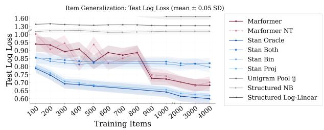  
(a) Item Generalization

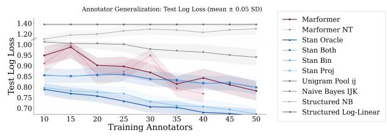  
(b) Judge Generalization  
Figure 14: Full log-loss curves including all baselines. Empirical baselines (Unigram Pool, Structured NB, Log-Linear) generally have higher log-loss than the Marformer and Stan variants at larger training sizes in both settings.

## C.1 Stan Posterior Predictive Calculation

For completeness, we give the calculation used to obtain the categorical predictive distribution from each posterior sample in the Stan CPM. For posterior sample $\phi ^ { ( m ) }$ , let $z _ { i j k } ^ { ( m ) } , \stackrel { \textstyle \cdot } { s } _ { j k } ^ { ( m ) } , \tau _ { j k , c } ^ { ( m ) }$ , and $\sigma _ { \mathrm { m e a s } } ^ { ( m ) }$ denote the corresponding latent score, normalization scale, ordinal thresholds, and measurement-noise parameter defined

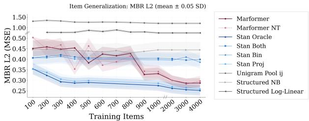  
(a) Item Generalization

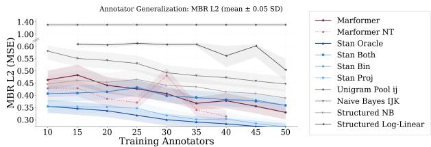  
(b) Judge Generalization  
Figure 15: Full MBR-L2 curves including all baselines. The empirical baselines generally have higher squared error than the Marformer and Stan variants at larger training sizes in both settings.

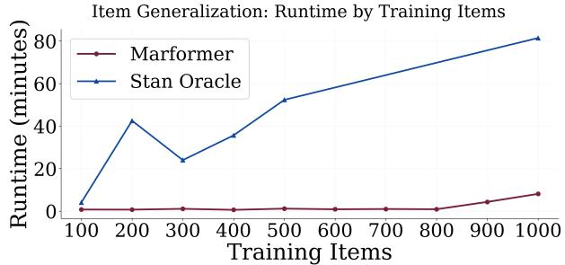  
(a) Item Generalization

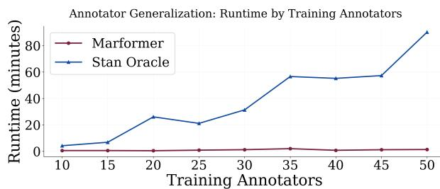  
(b) Judge Generalization  
Figure 16: Synthetic annotation runtime (minutes). Marformer costs are hypothetical estimates of a shortened validation search plus the measured refit, using the accounting in §6.6; Stan costs cover its measured HMC fit.

by the CPM in §6.1. The probability assigned to category c is

$$
q _ { \phi ^ { ( m ) } } ( X _ { i j k } = c | \check { \mathbf { x } } ) = \Phi \left( \frac { \tau _ { j k , c + 1 } ^ { ( m ) } - z _ { i j k } ^ { ( m ) } / s _ { j k } ^ { ( m ) } } { \sigma _ { \mathrm { m e a s } } ^ { ( m ) } / s _ { j k } ^ { ( m ) } } \right) - \Phi \left( \frac { \tau _ { j k , c } ^ { ( m ) } - z _ { i j k } ^ { ( m ) } / s _ { j k } ^ { ( m ) } } { \sigma _ { \mathrm { m e a s } } ^ { ( m ) } / s _ { j k } ^ { ( m ) } } \right) .
$$

Averaging these probabilities across posterior samples gives the posterior predictive marginal reported in the main text.

## D Additional Results: Domain 3 (Real Data)

## Stan CPM Posterior Hyperparameters

Table 1 reports the posterior marginal distributions of the five Stan CPM scale hyperparameters, inferred from the full LLMRubric training set $( I _ { \mathrm { t r a i n } } = 1 7 5 )$ with weakly informative priors. The relatively large posterior mean for $\sigma _ { v } ~ ( \approx 1 1 . 6 )$ compared to $\sigma _ { u } ~ ( \approx 2 . 1 )$ and $\sigma _ { \mathrm { u i t } }$ (≈1.2) indicates that prototype-level variation is the dominant source of judge-to-judge diferences, with criterion–prototype interactions at a much smaller scale. The small measurement noise $\sigma _ { \mathrm { m e a s } }$ (≈0.38) suggests that the ordinal thresholds capture most of the rating variability. These posterior distributions informed the prior scale choices for synthetic data generation in §6.1.

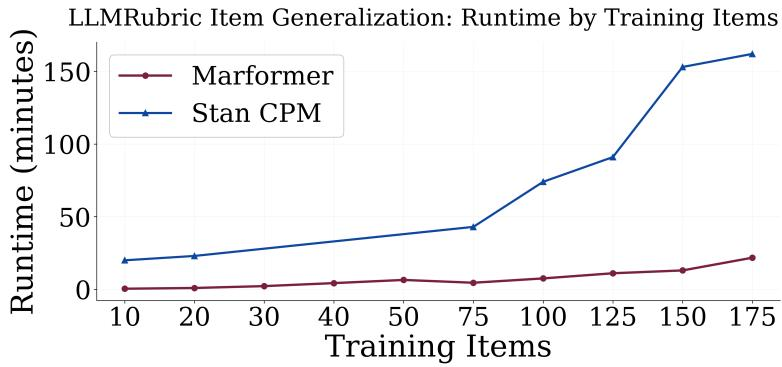  
Figure 17: Wall-clock runtime (minutes) for Marformer and Stan CPM on LLMRubric as a function of training items. Stan CPM is run with the HMC configuration described in $\ S \mathrm { C }$ . At $I _ { \mathrm { t r a i n } } = 1 7 5$ , the recorded training times are approximately 22 minutes for Marformer and 162 minutes for Stan CPM. The Marformer uses best-validation checkpoint selection without refitting.

Table 1: Posterior marginal summaries of Stan CPM scale hyperparameters estimated from LLMRubric $( I _ { \mathrm { t r a i n } } = 1 7 5$ , weakly informative priors). Mean, SD, and percentiles are computed from HMC posterior samples.
<table><tr><td>Parameter</td><td>Role</td><td>Mean</td><td>SD</td><td>5th %ile</td><td>Median</td><td>95th %ile</td></tr><tr><td> $\sigma _ { u }$ </td><td>Criterion vector scale</td><td>2.127</td><td>0.475</td><td>1.542</td><td>2.014</td><td>3.065</td></tr><tr><td> $\sigma _ { v }$ </td><td>Prototype vector scale</td><td>11.588</td><td>1.713</td><td>9.028</td><td>11.445</td><td>14.564</td></tr><tr><td> $\sigma _ { \mathrm { u i t } }$ </td><td>Criterion-prototype interaction scale</td><td>1.242</td><td>0.254</td><td>0.874</td><td>1.234</td><td>1.716</td></tr><tr><td> $\sigma _ { \mathrm { m e a s } }$ </td><td>Measurement noise</td><td>0.383</td><td>0.043</td><td>0.317</td><td>0.381</td><td>0.453</td></tr><tr><td> $\kappa$ </td><td>Rating scale concentration</td><td>5.201</td><td>0.417</td><td>4.563</td><td>5.186</td><td>5.958</td></tr></table>

## E Logit Lens Analysis

At each layer ℓ, the Marformer maintains a parameter slice $\psi _ { a } ^ { ( \ell ) }$ , which is read of at the final layer L as the predicted rating distribution. For missing ratings, this slice initially encodes a uniform distribution; attention layers then update it using the observed ratings. To examine how these predictions develop, we apply logit and tuned lenses (Belrose et al., 2023) to the transductive Domain 3 model trained at $I _ { \mathrm { t r a i n } } = 5 0 0$ with $L = 8$ layers. We evaluate all readouts on the same 316 missing ratings in the test corner used for the main item-generalization results, as detailed in §6.2.

We construct three readouts at each layer $\ell \in \{ 0 , \ldots , L \}$ . The Param Lens interprets the parameter slice directly, applying softmax to its $C = 4$ rating logits. The Tuned Param Lens instead learns an afine map from that slice to rating logits, minimizing KL divergence to the final model’s predicted distributions. This asks whether an intermediate representation can already recover those predictions through a learned readout. The Tuned 80d-Lens uses the same procedure on the full d = 80-dimensional residual stream, $\mathbf { h } _ { a } ^ { ( \ell ) } = [ \mathbf { f } _ { a } ^ { ( \ell ) } ; \psi _ { a } ^ { ( \ell ) } ]$ , to examine what the feature slice adds. The Marformer is frozen while separate probes are fitted for each layer. Probe inputs are standardized, and the probes are trained for 300 epochs with AdamW at learning rate $1 0 ^ { - 2 }$ on a held-out set of training-missing ratings. Their training targets are the final model’s distributions, not the true rating labels.

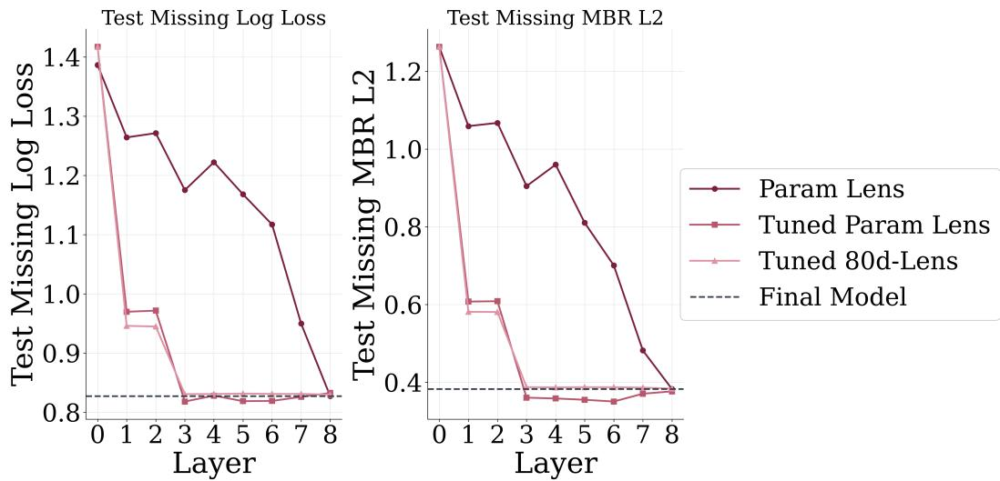  
Figure 18: Log-loss and MBR-L2 for three layerwise readout probes, evaluated on 316 missing test ratings at $I _ { \mathrm { t r a i n } } = 5 0 0$ . Layer 0 is the input representation before attention, and layer 8 is the final layer. The dashed line gives the final model’s performance; the raw Param Lens at layer 8 reproduces this output.

Figure 18 suggests that early layers aggregate evidence in the latent representations, while later layers gradually align this information with the parameter coordinates. After one attention layer, the Tuned 80d-Lens achieves log-loss 0.946, while the raw Param Lens remains at 1.264. The Tuned Param Lens achieves 0.970. Thus, useful predictions can already be read from the hidden state even though the raw parameter coordinates do not yet express them. The full-state probe has slightly lower loss than the parameter-only probe at this layer.

By layer 3, both tuned lenses have log-loss close to the final model’s 0.827. From layers 3–8, the Tuned 80d-Lens stays near 0.831, whereas the raw Param Lens improves overall but not monotonically. In particular, its log-loss falls from 1.117 at layer 6 to 0.950 at layer 7 and 0.827 at layer 8. The final two layers therefore make substantial contributions to the raw readout, even after a learned probe can recover predictions close to the final model’s. MBR-L2 shows the same broad pattern: the tuned readouts approach the final model early, while the raw readout continues to improve through later layers.

The two-stage improvement in the tuned readouts suggests a possible message-passing interpretation. One hypothesis is that the model performs two rounds of a learned message-passing procedure. Alternatively, the first attention layer may aggregate direct evidence from observed ratings, while subsequent layers incorporate indirect evidence relayed through intermediate representations, accounting for the further improvement by layer 3.

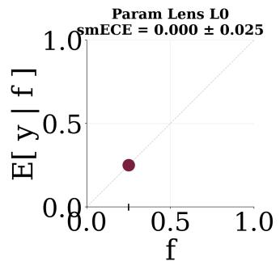

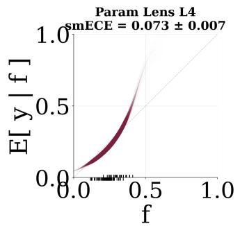

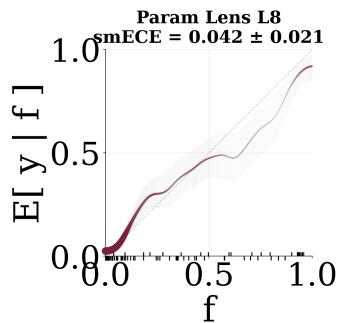

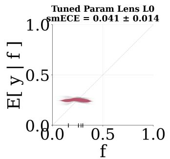

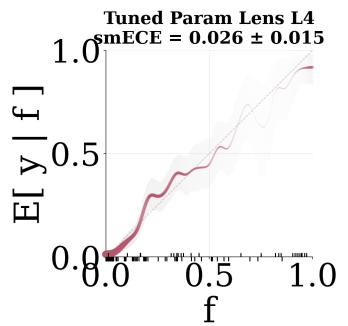

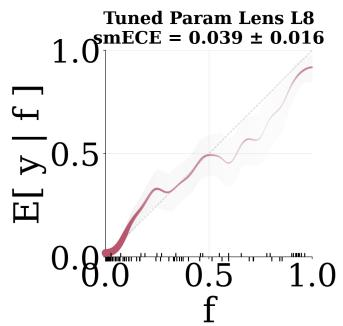

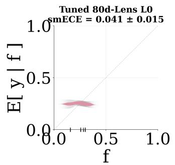


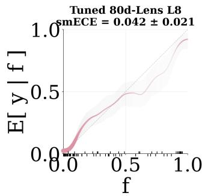  
Figure 19: Calibration diagrams for the three readouts (rows) at layers 0, 4 and 8 (columns), on the same 316 missing test ratings. Predicted probabilities for all four rating categories are pooled. The diagonal indicates perfect calibration; titles report smECE and relplot’s reported calibration-error width from 500 bootstrap resamples. The layer-0 Param Lens predicts 1/4 for every category due to the initialization.

Calibration also changes across depth, although all three readouts remain reasonably well calibrated (Figure 19). At layer 4, the raw Param Lens has smECE 0.073, compared with 0.026 for the Tuned Param Lens and 0.043 for the Tuned 80d-Lens. At the output, the raw Param Lens reaches 0.042. Its smECE is not monotone across layers: it ranges from 0.065 to 0.078 at layers 1–6, then falls to 0.063 at layer 7 and 0.042 at layer 8. As with log-loss, the last two layers improve the raw predictions. The uniform layer-0 readout has zero all-class smECE but log-loss ln 4, illustrating that calibration alone does not measure how informative a prediction is.

Together, these readouts show that predictions close to the final model’s can be recovered from intermediate representations, while the raw parameter slice requires further computation to express them. This is consistent with the Marformer learning an iterative refinement procedure (Stoyanov et al., 2011): early layers gather evidence, and later layers refine the distribution that is read of directly at the output.