# Memorization and Malign Generalization in Conditional Difusion Models with Random Features

Gwangho Kim Department of Computer Science Hanyang University, Seoul ggh1999@hanyang.ac.kr

Sungyoon Lee Department of Computer Science Hanyang University, Seoul sungyoonlee@hanyang.ac.kr

## Abstract

Conditional difusion models generate diverse, novel, and high-quality samples under prescribed conditions. However, theoretical understanding of their memorization and generalization remains limited, while recent works have characterized these behaviors primarily in unconditional settings. In this work, we analyze a random-feature conditional score model in the high-dimensional proportional limit, deriving asymptotic expressions for training and test losses. By decomposing the test loss, we show that in the overparameterized regime, increasing model width improves prediction of the condition-dependent mean while reducing within-condition prediction variance, a phenomenon we term “malign generalization.” Furthermore, analyzing the training loss reveals that more informative conditions lead to memorization of training samples at smaller widths. These theoretical findings are supported by experiments with U-Net architectures on realistic data.

## 1 Introduction

Difusion models (Sohl-Dickstein et al., 2015; Ho et al., 2020; Song et al., 2021b) have become a widely adopted paradigm for generative modeling across multiple modalities (Rombach et al., 2022; Zhang et al., 2023a; Ho et al., 2022; Hu et al., 2026). Conditional difusion models further enable generation under prescribed conditions, supporting applications in text-to-image synthesis (Saharia et al., 2022), molecule generation (Hoogeboom et al., 2022), protein design (Watson et al., 2023), PDE forecasting and data assimilation (Shysheya et al., 2024), and uncertainty quantification (Han et al., 2022).

Understanding how difusion models generalize beyond their training data is of considerable interest from both practical and theoretical perspectives. From a practical perspective, characterizing when memorization occurs and how to mitigate it is crucial for addressing privacy and copyright concerns (Carlini et al., 2023; Somepalli et al., 2023a,b; Webster, 2023; Wen et al., 2024; Kim and Lee, 2026). From a theoretical perspective, explaining such generalization is nontrivial because the minimizer of the empirical denoising score matching (DSM) objective over unrestricted score functions is the empirical score function (ESF):

$$
\begin{array} { r } { s _ { t } ^ { \mathrm { e m p } } ( x ) : = \nabla _ { x } \log p _ { t } ^ { \mathrm { e m p } } ( x ) , } \end{array}
$$

where $p _ { t } ^ { \mathrm { e m p } }$ is the forward-noised empirical distribution at difusion time t, with $p _ { 0 } ^ { \mathrm { e m p } } ( x ) \ : =$ $\textstyle { \frac { 1 } { n } } \sum _ { i = 1 } ^ { n } { \dot { \delta } } ( x - x _ { i } )$ for training samples $\{ x _ { i } \} _ { i = 1 } ^ { n }$ . The ideal reverse process driven by this score recovers the empirical data distribution and therefore reproduces training samples rather than generating novel ones (Pidstrigach, 2022). Recent studies have investigated mechanisms by which practical score estimators deviate from the ESF and nevertheless generate novel, high-quality samples (Scarvelis et al., 2025; Wu et al., 2025; Bonnaire et al., 2025; George et al., 2026; Kadkhodaie et al., 2024; Kamb and Ganguli, 2025; Niedoba et al., 2025; Lukoianov et al., 2025).

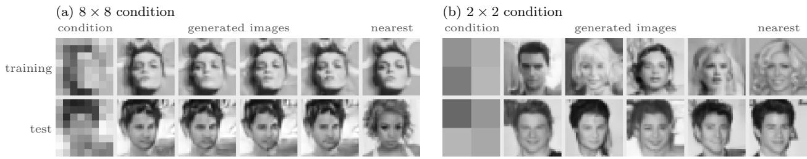  
Figure 1: CelebA super-resolution to $3 2 \times 3 2 ;$ each row shows a condition, four generated samples, and the training image nearest to any of them. Models in (a) and (b) are trained identically except for condition resolution. (a) With the informative $8 \times 8$ condition, samples for a training condition copy its training image, while samples for a test condition are novel and aligned with the condition but nearly identical (malign generalization). (b) With the weaker $2 \times 2$ condition, samples are diverse under both training and test conditions.

Despite this progress, memorization and generalization in conditional difusion models remain largely unexplored. Consider a training set $\mathcal { D } _ { n } = \{ ( x _ { i } , y _ { i } ) \} _ { i = 1 } ^ { n }$ of pairs drawn i.i.d. from a joint distribution $P _ { x y } .$ , where $y _ { i }$ is the condition paired with the sample $x _ { i }$ . Throughout this paper, we use the term conditional difusion model to refer to settings satisfying the following two properties:

• Each training condition $y _ { i }$ is distinct and paired with a single sample $x _ { i }$ . Accordingly, the empirical conditional distribution at $y _ { i }$ is $p _ { 0 } ^ { \mathrm { e m p } } ( x \mid y _ { i } ) = \delta ( x - x _ { i } )$ . After forward noising, its conditional ESF at difusion time t is

$$
s _ { t } ^ { \mathrm { e m p } } ( x , y _ { i } ) : = \nabla _ { x } \log p _ { t } ^ { \mathrm { e m p } } ( x \mid y _ { i } ) = - \frac { x - a _ { t } x _ { i } } { h _ { t } } ,
$$

with $a _ { t } , h _ { t }$ defined in (1). Consequently, at the training conditions, the training DSM loss is, up to the factor $h _ { t }$ , exactly the mean-squared error between the learned score and the conditional ESF.

• At test time, the model is evaluated at the conditions y of test pairs $( x , y )$ drawn i.i.d. from $P _ { x y }$ , so $y \notin \{ y _ { i } \} _ { i = 1 } ^ { n }$ and it should generalize to them.

Both properties hold almost surely for continuously distributed conditions, and approximately in many practical applications such as text-to-image generation. Standard class-conditional models satisfy neither property, since each class is shared by many training samples and only training conditions are used at test time. Consequently, prior work on unconditional difusion models or class-conditional models may not directly apply to the conditional setting considered here.

This raises two questions: (i) At test conditions, do overparameterized conditional models learn the conditional distribution, or only part of it? (ii) How does the information carried by the condition afect memorization of training samples paired with training conditions? Our contributions addressing them are as follows:

• Section 3.1 introduces a data model that is simple and tractable yet captures key phenomena of conditional difusion models in realistic settings.

• Section 4.1 derives asymptotically precise expressions for the test loss of a random-feature network (Rahimi and Recht, 2007) in the high-dimensional proportional regime, and its decomposition into conditional-mean and residual errors. Answering (i), in the overparameterized regime wider models predict the conditional mean more accurately while their prediction variance falls below that of the true denoiser, which we term malign generalization.

• Section 4.2 examines the training loss. Answering (ii), a more informative condition lowers it at every width, so memorization sets in at smaller widths.

• Section 5 shows both phenomena in full reverse-process generation with the random-feature model and with U-Nets on CelebA.

## 1.1 Related work

Distribution estimation. One line of theory bounds the sampling error given an $L ^ { 2 } .$ -accurate score (Lee et al., 2022; Chen et al., 2022; Lee et al., 2023; Benton et al., 2024); another bounds the score-estimation error itself, giving end-to-end rates for smooth densities and linear subspaces (Oko et al., 2023; Chen et al., 2023), later extended to nonlinear manifolds (Tang and Yang, 2024; Azangulov et al., 2024). Conditional counterparts cover reward-directed conditioning (Yuan et al., 2023), classifier-free guidance (Fu et al., 2024), manifold-supported data (Tang et al., 2024), and conditional transformers (Hu et al., 2025). These data models satisfy both properties in Section 1, but the results are non-asymptotic bounds or minimax rates at fixed dimension; they do not describe the proportional regime we study, nor the memorization that arises once capacity exceeds the sample size.

Memorization and generalization. A complementary line asks why trained networks depart from the ESF at all. Proposed mechanisms include smoothing of the empirical score (Scarvelis et al., 2025; Chen, 2026; Farghly et al., 2025), implicit regularization from large learning rates (Wu et al., 2025), and inductive biases of the network such as locality (Kadkhodaie et al., 2024; Kamb and Ganguli, 2025; Niedoba et al., 2025; Lukoianov et al., 2025). A second strand asks when the departure occurs, identifying transitions between memorization and generalization that are governed by sample size and model capacity (Zhang et al., 2023b; Buchanan et al., 2025; Ye et al., 2026), and bounding the generalization gap in terms of both (Li et al., 2023). Closest to our setting, George et al. (2026) derive precise learning curves for denoising score matching with random features in the proportional limit; George and Macris (2026) extend them to manifold data and Urfin et al. (2026) to an arbitrary finite number of noise samples per data point. Merger and Goldt (2025) analyze linear difusion models on Gaussian data with power-law covariance spectra. Bonnaire et al. (2025) and Latourelle-Vigeant et al. (2026) analyze the training dynamics of random-feature and kernel models, respectively, and show that finite training time acts as an implicit regularization that delays memorization. These results suggest that overfitting is not benign in difusion models, and Farghly et al. (2026) show that this holds in more general settings. All of these analyses are unconditional, so neither of the two properties in Section 1 holds. We extend the random-feature analysis of George et al. (2026) to conditional difusion models satisfying both properties.

## 2 Preliminaries

In this section, we briefly review difusion models and fix the notation used throughout the paper.

Difusion process. Let $P ( \cdot \mid y )$ denote the conditional distribution of $\boldsymbol { x } \in \mathbb { R } ^ { d _ { x } }$ given the condition $\boldsymbol { y } \in \mathbb { R } ^ { d _ { \boldsymbol { y } } }$ under $P _ { x y } .$ . Given $y ,$ the Ornstein–Uhlenbeck process $d X _ { t } ~ = ~ - X _ { t } d t + { \sqrt { 2 } } d B _ { t }$ with $X _ { 0 } \sim P ( \cdot \mid y )$ and a standard Wiener process $B _ { t }$ has conditional marginals $P _ { t } ( \cdot \mid y )$ , with densities $p _ { t } ( \cdot \mid y )$ , that converge to $\mathcal { N } ( 0 , I _ { d _ { x } } )$ as $t \to \infty$ . For a clean sample $x \sim P ( \cdot \mid y )$

$$
a _ { t } : = e ^ { - t } , \qquad h _ { t } : = 1 - e ^ { - 2 t } , \qquad x _ { t } ( \epsilon ) : = a _ { t } x + \sqrt { h _ { t } } \epsilon , \qquad \epsilon \sim \mathcal { N } ( 0 , I _ { d _ { x } } ) ,\tag{1}
$$

with ϵ independent of $( x , y )$ . New samples are generated by running, up to a large time $T ,$ the reverse-time process

$$
d \overline { { \boldsymbol X } } _ { t } = \big [ \overline { { \boldsymbol X } } _ { t } + 2 \boldsymbol \nabla \log p _ { T - t } ( \overline { { \boldsymbol X } } _ { t } \mid \boldsymbol y ) \big ] d t + \sqrt { 2 } d \bar { \boldsymbol B } _ { t }\tag{2}
$$

from $\overleftarrow { \boldsymbol { X } } _ { 0 } \sim \mathop { P _ { T } } ( \cdot \ | \ y )$ , where ${ \bar { B } } _ { t }$ is a standard Wiener process and the unknown conditional score ∇ log $p _ { t } ( \cdot \mid \boldsymbol { y } )$ is replaced by a network $s _ { \theta } ^ { t } ( x _ { t } , y )$ . By Tweedie’s formula, $\mathbb { E } [ x \mid x _ { t } , y ] =$ $\{ x _ { t } + h _ { t } \nabla \log p _ { t } ( x _ { t } \mid y ) \} / a _ { t }$ , so $s _ { \theta } ^ { t }$ induces the denoiser

$$
x _ { \theta } ^ { t } ( x _ { t } , y ) : = \frac { x _ { t } + h _ { t } s _ { \theta } ^ { t } ( x _ { t } , y ) } { a _ { t } } .\tag{3}
$$

Conditional score matching. Following prior work (Cui et al., 2024; George et al., 2026; Bonnaire et al., 2025), we study score learning at a fixed difusion time t, with a specific focus on the conditional setting. We do not consider learning the unconditional score with a null condition, as used in classifier-free guidance (Ho and Salimans, 2022).

Let $\mathcal { D } _ { n } = \{ ( x _ { i } , y _ { i } ) \} _ { i = 1 } ^ { n }$ consist of n i.i.d. data points $( x _ { i } , y _ { i } ) \sim P _ { x y }$ . Writing $x _ { i , t } ( \epsilon ) : = a _ { t } x _ { i } + \sqrt { h _ { t } } \epsilon ,$ the training loss for conditional difusion models is

$$
\mathcal { L } _ { \mathrm { t r a i n } } ^ { t } ( \theta ) : = \frac { 1 } { d _ { x } n } \sum _ { i = 1 } ^ { n } \mathbb { E } _ { \epsilon } \left\| \sqrt { h _ { t } } s _ { \theta } ^ { t } ( x _ { i , t } ( \epsilon ) , y _ { i } ) + \epsilon \right\| ^ { 2 } .
$$

Unlike in unconditional models, where the training objective difers from the empirical score error by additive constants, here the training loss is, up to the factor $h _ { t }$ , the mean-squared error with respect to the conditional ESF, the score of $P _ { t } ^ { \mathrm { e m p } } ( \cdot \mid y _ { i } ) = \mathcal { N } ( a _ { t } x _ { i } , h _ { t } I _ { d _ { x } } )$ , as noted in Section 1. Integrated over time, it bounds how far the generated distribution at the training conditions is from this empirical distribution. As in Song et al. (2021a), let $\widehat { P } _ { t } ( \cdot \mid y _ { i } )$ be the marginals of the backward process (2) with the learned score, started from $\widehat { P } _ { T } \approx P _ { T } ^ { \mathrm { e m p } }$ . Then, for $0 < t _ { 0 } < T$ and up to this mismatch at time $T ,$ Girsanov’s theorem (Oksendal, 2013) gives

$$
\frac { 1 } { n } \sum _ { i = 1 } ^ { n } \mathrm { K L } \bigl ( P _ { t _ { 0 } } ^ { \mathrm { e m p } } ( \cdot \mid y _ { i } ) \bigr | \bigr | \widehat { P } _ { t _ { 0 } } ( \cdot \mid y _ { i } ) \bigr ) \leq d _ { x } \int _ { t _ { 0 } } ^ { T } \frac { \mathcal { L } _ { \mathrm { t r a i n } } ^ { t } } { h _ { t } } d t ,
$$

and the total variation distance is bounded through Pinsker’s inequality. A small training loss along the reverse chain thus forces the samples for $y _ { i }$ towards $x _ { i }$ . We therefore use the training loss as a measure of memorization at the training conditions, and illustrate it at a fixed small $t ,$ since the weight $1 / h _ { t }$ makes small times dominate this bound.

Moreover, the forward process adds noise only to $x _ { i }$ , while $y _ { i }$ remains unchanged. This introduces a qualitative distinction from unconditional settings, especially given that difusion noise plays a central role in preventing benign overfitting (Farghly et al., 2026).

## 3 Problem setup

In this section, we describe our theoretical setting and define the quantities of interest analyzed in Section 4.

## 3.1 Data model

Let $U _ { \star } \in \mathbb { R } ^ { d _ { x } \times d _ { y } }$ have orthonormal columns, with $0 < d _ { y } \le d _ { x }$ , and put $\Pi : = U _ { \star } U _ { \star } ^ { \top }$ and $\Pi _ { \perp } : = I _ { d _ { x } } - \Pi$ For independent standard Gaussian vectors $\boldsymbol { y } \in \mathbb { R } ^ { d _ { y } }$ and $\xi \in \mathbb { R } ^ { d _ { x } }$ , consider

$$
x = B y + \Sigma ^ { 1 / 2 } \xi , \qquad B = c U _ { \star } , \qquad \Sigma = ( 1 - c ^ { 2 } ) \Pi + \Pi _ { \bot } , \qquad 0 \le c \le 1 .\tag{4}
$$

Thus, $x \mid y \sim \mathcal { N } ( c U _ { \star } y , \Sigma )$ , while the marginal distribution $x \sim \mathcal { N } ( 0 , I _ { d _ { x } } )$ remains unchanged regardless of c and $d _ { y }$ . The condition explains variance $c ^ { 2 }$ along each observed direction, in the range of Π, leaving residual variance $1 - c ^ { 2 }$ there and variance 1 on each unobserved direction, in its orthogonal complement. The parameter c controls the accuracy of the condition, whereas $\psi _ { y } : = \operatorname* { l i m } d _ { y } / d _ { x } \in ( 0 , 1 ]$ controls the fraction of observed directions. These are distinct ways to strengthen the condition at a fixed marginal of x.

Two special cases are standard inverse problems. At $d _ { y } = d _ { x }$ and $U _ { \star } = I$ , the isotropic model $B = c I , \Sigma = ( 1 - c ^ { 2 } ) I$ is Gaussian denoising: equivalently, $y = c x + \sqrt { 1 - c ^ { 2 } } \xi ^ { \prime }$ with $\xi ^ { \prime } \sim \mathcal { N } ( 0 , I _ { d _ { x } } )$ independent of x. $\mathrm { A t } ~ c = 1 , y = U _ { \star } ^ { \top }$ x is a noiseless observation of $d _ { y }$ orthonormal directions of $x ,$ an idealized model of super-resolution. We define the signal-to-noise ratio of the condition as the ratio of the variance of x it explains to the residual variance,

$$
\mathrm { S N R } ( \psi _ { y } , c ) : = \operatorname* { l i m } \frac { \mathrm { t r } ( B B ^ { \top } ) } { \mathrm { t r } \Sigma } = \frac { c ^ { 2 } \psi _ { y } } { 1 - c ^ { 2 } \psi _ { y } } ,\tag{5}
$$

so that $\mathrm { S N R } ( 1 , c ) = c ^ { 2 } / ( 1 - c ^ { 2 } )$ in Gaussian denoising and $\mathrm { S N R } ( \psi _ { y } , 1 ) = \psi _ { y } / ( 1 - \psi _ { y } )$ in superresolution. In the isotropic case we write SNR for $\operatorname { S N R } ( 1 , c )$

With $\eta _ { t } : = x _ { t } - a _ { t } .$ By and $\Sigma _ { t } : = a _ { t } ^ { 2 } \Sigma + h _ { t } I$ , the forward distribution is

$$
x _ { t } \mid y \sim { \mathcal { N } } ( a _ { t } B y , \Sigma _ { t } ) , \quad \nabla \log p _ { t } ( x _ { t } \mid y ) = - { \Sigma } _ { t } ^ { - 1 } \eta _ { t } .
$$

We fix $t > 0$ , so $\Sigma _ { t }$ is invertible even at $c = 1$ . Write $v _ { \Sigma , d } ^ { 2 } : = d _ { x } ^ { - 1 } \operatorname { t r } \Sigma = 1 - c ^ { 2 } d _ { y } / d _ { x }$ and $v _ { \Sigma } ^ { 2 } : = 1 - c ^ { 2 } \psi _ { y }$ for its limit.

## 3.2 Random-feature model

We approximate the conditional score with the two-layer random-feature model (Rahimi and Recht, 2007)

$$
s _ { A } ( x , y \mid W _ { 1 } , W _ { 2 } ) : = \frac { A } { \sqrt { p } } \varrho \left( \frac { W _ { 1 } x } { \sqrt { 2 d _ { x } } } + \frac { W _ { 2 } y } { \sqrt { 2 d _ { y } } } \right) .\tag{6}
$$

Here ϱ acts coordinatewise. The normalizations by $\sqrt { 2 d _ { x } }$ and $\sqrt { 2 d _ { y } }$ ensure that the preactivation has unit variance. The hidden weights $W _ { 1 } \in \mathbb { R } ^ { p \times d _ { x } }$ and $W _ { 2 } \in \dot { \mathbb { R } } ^ { p \times d _ { y } }$ have independent standard Gaussian entries, are drawn independently of the training sample, and remain fixed; only $A \in \mathbb { R } ^ { d _ { x } \times p }$ is trained. We work in the proportional high-dimensional limit $n / d _ { x }  \psi _ { n } , p / d _ { x }  \psi _ { p }$ , and $d _ { y } / d _ { x }  \psi _ { y }$ . At fixed t, we consider the minimizer of the ridge-regularized DSM loss:

$$
\mathcal { L } _ { \mathrm { r i d g e } } ^ { t } ( A ) : = \mathcal { L } _ { \mathrm { t r a i n } } ^ { t } ( A ) + \frac { h _ { t } \lambda } { d _ { x } p } \| A \| _ { F } ^ { 2 } , \quad \lambda > 0 .\tag{7}
$$

Activation assumption. For $z \sim \mathcal { N } ( 0 , 1 )$ , assume that $\varrho ( z )$ admits a Hermite expansion in $L ^ { 2 }$ . Following Bonnaire et al. (2025); George et al. (2026), we assume $\mathbb { E } _ { z } [ \varrho ( z ) ] = 0$ and define $\mu _ { 1 } : = \mathbb { E } _ { z } [ z \varrho ( z ) ]$

Proof techniques. Following the overall strategy of George et al. (2026), our analysis uses two main ingredients: the Gaussian equivalence principle (GEP) (Gerace et al., 2020; Goldt et al., 2022; Mei and Montanari, 2022) and the theory of linear pencils (Bodin, 2024). We use the GEP to replace the nonlinear functions of the training preactivations by their Gaussian equivalent (Appendix B.2). To evaluate the resulting resolvent traces, we construct a six-block linear pencil and apply (Bodin, 2024, Result 3.1). George et al. (2026) use a specialized instance of the same framework, whereas our conditional setting requires its general block formulation.

## 3.3 Quantities of interest

Let $\widehat { A } _ { \lambda }$ denote the minimizer of $\mathcal { L } _ { \mathrm { r i d g e } } ^ { t }$ . While optimization is performed on the regularized objective, we focus on the unregularized empirical DSM loss $\mathcal { L } _ { \mathrm { t r a i n } } ^ { t } ( \widehat { A } _ { \lambda } )$ alongside the test DSM loss:

$$
\mathcal { L } _ { \mathrm { t e s t } } ^ { t } ( A ) : = \frac { 1 } { d _ { x } } \mathbb { E } \left\| \sqrt { h _ { t } } s _ { A } ( x _ { t } ( \epsilon ) , y ) + \epsilon \right\| ^ { 2 } ,\tag{8}
$$

where the expectation is taken over the difusion noise ϵ and an independent test pair $( x , y ) \sim P _ { x y }$ To provide further insights into $\mathcal { L } _ { \mathrm { t e s t } } ^ { t } ( A )$ , we express it in terms of the denoiser $x _ { A } : = ( x _ { t } +$ $h _ { t } s _ { A } ( x _ { t } , y ) ) / a _ { t }$ induced by $s _ { A }$ via (3). Specifically, the test loss admits the orthogonal decomposition:

$$
\mathcal { L } _ { \mathrm { t e s t } } ^ { t } ( A ) = \frac { a _ { t } ^ { 2 } } { h _ { t } d _ { x } } \mathbb { E } \| x _ { A } - x \| ^ { 2 } = \frac { a _ { t } ^ { 2 } } { h _ { t } } \big \{ \mathrm { M E } ( A ) + \mathrm { R E } ( A ) \big \} ,
$$

where the conditional-mean error (ME) and residual error (RE) are defined as

$$
\operatorname { M E } ( A ) : = { \frac { 1 } { d _ { x } } } \mathbb { E } \left\| \mathbb { E } [ x _ { A } \mid y ] - B y \right\| ^ { 2 } ,\tag{9}
$$

$$
\operatorname { R E } ( A ) : = { \frac { 1 } { d _ { x } } } \mathbb { E } \left\| x _ { A } - \mathbb { E } [ x _ { A } \mid y ] - ( x - B y ) \right\| ^ { 2 } .\tag{10}
$$

Here, $\mathbb { E } [ x _ { A } \mid y ]$ denotes the conditional expectation of $x _ { A }$ over both ϵ and $x \sim P ( \cdot \mid y )$ at a fixed condition y. Intuitively, ME quantifies how accurately the denoiser captures the true conditional mean when averaged over within-condition variation, whereas RE evaluates how faithfully the sample-wise fluctuations of $x _ { A }$ match the true residual $x - B y$

To further understand the variability of the model under test conditions, we introduce the prediction variance:

$$
\operatorname { P V } ( A ) : = { \frac { 1 } { d _ { x } } } \mathbb { E } \left\| x _ { A } - \mathbb { E } [ x _ { A } \mid y ] \right\| ^ { 2 } .\tag{11}
$$

The residual error then expands as $\mathrm { R E } ( A ) = v _ { \Sigma , d } ^ { 2 } + \mathrm { P V } ( A ) - 2 \mathrm { R A } ( A )$ , where $\mathrm { R A } ( A ) : = d _ { x } ^ { - 1 } \mathbb { E } [ ( x -$ $B y ) ^ { \top } ( x _ { A } - B y ) ]$ represents the residual alignment.

Remark 3.1. Formally, ME and PV describe single-step denoising properties at a fixed time t rather than the full multi-step trajectories of the reverse process. Nevertheless, they conceptually capture the accuracy and within-condition diversity of generated samples, and their trends in width also appear in samples from the full reverse process (Section 5.1).

## 4 Main results

Section 4.1 derives the limits of the quantities in Section 3.3 and investigates the model’s behavior at test conditions in the overparameterized regime. Section 4.2 derives the training loss for large $\psi _ { p }$ and $\psi _ { n }$ to investigate the efect of the condition $( c , \psi _ { y } )$ on memorization.

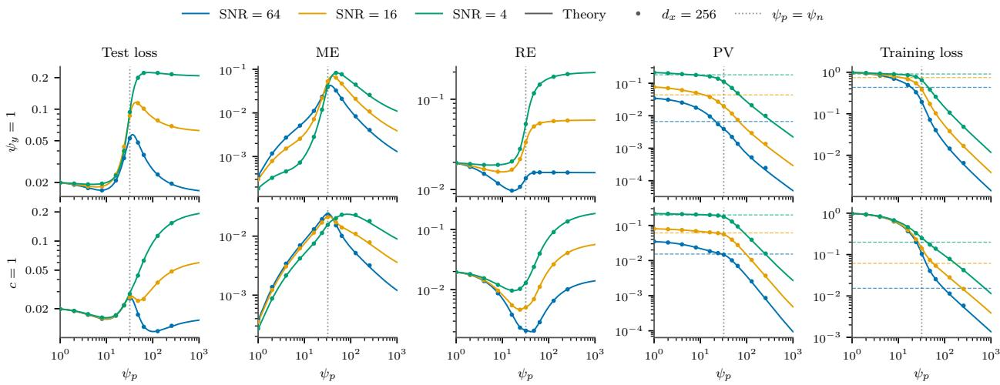  
Figure 2: Test loss $( h _ { t } / a _ { t } ^ { 2 } ) \mathcal { L } _ { \mathrm { t e s t } } ^ { t } = \mathrm { M E } + \mathrm { R E } .$ ME (9), RE (10), PV (11), and training loss $\mathcal { L } _ { \mathrm { t r a i n } } ^ { t }$ from Theorem 4.2 against width $\psi _ { p }$ for diferent SNRs (5) at $t = 0 . 0 1$ , ϱ = tanh, $\lambda = 1 0 ^ { - 5 }$ , and $\psi _ { n } = 3 2$ . Top: Gaussian denoising $( \psi _ { y } = 1 )$ , varying c so that $\mathrm { S N R } ( 1 , c ) \in \{ 4 , 1 6 , 6 4 \}$ . Bottom: super-resolution $( c = 1 )$ , varying $\psi _ { y }$ so that $\mathrm { S N R } ( \psi _ { y } , 1 ) \in \{ 4 , 1 6 , 6 4 \}$ . Dashed lines mark the PV and the training loss of the true denoiser $\mathbb { E } [ x \mid x _ { t } , y ]$ . Dots denote finite random-feature simulations at $d _ { x } = 2 5 6$ , averaged over five realizations; their min–max bars are smaller than the dots. Appendix F.2 shows them as heatmaps over the full range of SNR and for other $\psi _ { n }$

## 4.1 Test loss and malign generalization

We first describe the components that constitute the quantities in Section 3.3. Write $g : =$ $W _ { 1 } x _ { t } / \sqrt { 2 d _ { x } } + W _ { 2 } y / \sqrt { 2 d _ { y } } \in \mathbb { R } ^ { p }$ for the preactivation in (6), so that $\begin{array} { r } { s _ { \widehat { A } _ { \lambda } } = \frac { \widehat { A } _ { \lambda } } { \sqrt { p } } \varrho ( g ) } \end{array}$ . With $W _ { 1 }$ and $W _ { 2 }$ fixed, every entry of $g$ is asymptotically standard Gaussian over a test draw $( y , x _ { t } )$ . Splitting the activation entrywise into its first Hermite component and a remaining nonlinear term, $\varrho ( z ) = \mu _ { 1 } z + r ( z )$ , splits the score into $\begin{array} { r } { s _ { \widehat { A } _ { \lambda } } ^ { \mathrm { l i n } } : = \mu _ { 1 } \frac { \widehat { A } _ { \lambda } } { \sqrt { p } } g } \end{array}$ and $\begin{array} { r } { s _ { \widehat { A } _ { \lambda } } ^ { \mathrm { n l } } : = \frac { \widehat { A } _ { \lambda } } { \sqrt { p } } r ( g ) } \end{array}$ , and the denoiser $x _ { \widehat { A } _ { \lambda } } = ( x _ { t } + h _ { t } s _ { \widehat { A } _ { \lambda } } ) / a _ { t }$ into $x _ { \widehat { A } _ { \lambda } } ^ { \mathrm { l i n } } : = ( x _ { t } + h _ { t } s _ { \widehat { A } _ { \lambda } } ^ { \mathrm { l i n } } ) / a _ { t } = { \dot { G } } _ { x } x _ { t } + G _ { y } y$ and $\boldsymbol { x } _ { \widehat { A } _ { \lambda } } ^ { \mathrm { n l } } : = ( h _ { t } / a _ { t } ) \boldsymbol { s } _ { \widehat { A } _ { \lambda } } ^ { \mathrm { n l } }$ , where

$$
G _ { x } : = \nabla _ { x t } x _ { \widehat { A } _ { \lambda } } ^ { \mathrm { l i n } } = \frac { 1 } { a _ { t } } \Big ( I + h _ { t } \mu _ { 1 } \frac { \widehat { A } _ { \lambda } } { \sqrt { p } } \frac { W _ { 1 } } { \sqrt { 2 d _ { x } } } \Big ) , \qquad G _ { y } : = \nabla _ { y } x _ { \widehat { A } _ { \lambda } } ^ { \mathrm { l i n } } = \frac { h _ { t } \mu _ { 1 } } { a _ { t } } \frac { \widehat { A } _ { \lambda } } { \sqrt { p } } \frac { W _ { 2 } } { \sqrt { 2 d _ { y } } } .\tag{12}
$$

The linear component has conditional mean $\mathbb { E } [ x _ { \widehat { A } _ { \mathrm { : } } } ^ { \mathrm { l i n } } \ \mid \ y ] \ = \ \widehat { B } y$ with ${ \widehat B } : = a _ { t } G _ { x } B + G _ { y }$ . Let $z = z _ { y } + z _ { \eta }$ with independent $z _ { y } \sim \mathcal { N } ( 0 , 1 - \tau / 2 )$ and $z _ { \eta } \sim \mathcal { N } ( 0 , \tau / 2 )$ , the asymptotic parts of an entry of g determined by y and by $\eta _ { t } = x _ { t } - a _ { t } B y$ , where $\tau : = a _ { t } ^ { 2 } v _ { \Sigma } ^ { 2 } + h _ { t }$ . We set $v ^ { 2 } : = \mathbb { E } [ r ( z ) ^ { 2 } ]$ $v _ { y } ^ { 2 } : = \mathbb { E } _ { z _ { y } } \big [ \mathbb { E } _ { z _ { \eta } } [ r ( z _ { y } + z _ { \eta } ) ] ^ { 2 } \big ]$ , and $\bar { A } : = \widehat { A } _ { \lambda } / \sqrt { d _ { x } p }$ , the normalized second-layer weights, so that the weight norm is $\| \bar { A } \| _ { F } ^ { 2 } = \| \widehat { A } _ { \lambda } \| _ { F } ^ { 2 } / ( d _ { x } p )$

Lemma 4.1. With ≃ denoting equivalence in high dimensions, defined in Appendix $B ,$ the nonlinear component of the score satisfies

$$
\frac { 1 } { d _ { x } } \mathbb { E } \| s _ { \hat { A } _ { \lambda } } ^ { \mathrm { n l } } \| ^ { 2 } \simeq v ^ { 2 } \| \bar { A } \| _ { F } ^ { 2 } , \qquad \frac { 1 } { d _ { x } } \mathbb { E } \big \| \mathbb { E } [ s _ { \hat { A } _ { \lambda } } ^ { \mathrm { n l } } \mid y ] \big \| ^ { 2 } \simeq v _ { y } ^ { 2 } \| \bar { A } \| _ { F } ^ { 2 } ,
$$

and

$$
\begin{array} { l } { \displaystyle \mathrm { M E } ( \widehat { A } _ { \lambda } ) \simeq \frac { \| \widehat { B } - B \| _ { F } ^ { 2 } } { d _ { x } } + \frac { h _ { t } ^ { 2 } } { a _ { t } ^ { 2 } } v _ { y } ^ { 2 } \| \bar { A } \| _ { F } ^ { 2 } , } \\ { \displaystyle \mathrm { P V } ( \widehat { A } _ { \lambda } ) \simeq \frac { 1 } { d _ { x } } \mathrm { t r } \left( G _ { x } \Sigma _ { t } G _ { x } ^ { \top } \right) + \frac { h _ { t } ^ { 2 } } { a _ { t } ^ { 2 } } \left( v ^ { 2 } - v _ { y } ^ { 2 } \right) \| \bar { A } \| _ { F } ^ { 2 } , } \\ { \displaystyle \mathrm { R A } ( \widehat { A } _ { \lambda } ) \simeq \frac { a _ { t } } { d _ { x } } \mathrm { t r } \left( \Sigma G _ { x } \right) , } \\ { \displaystyle \mathcal { L } _ { \mathrm { t r a i n } } ^ { t } ( \widehat { A } _ { \lambda } ) \simeq \frac { a _ { t } } { d _ { x } } \mathrm { t r } G _ { x } - h _ { t } \lambda \| \bar { A } \| _ { F } ^ { 2 } . } \end{array}
$$

Both ME and PV thus consist of a part carried by the linear component of the denoiser and a part carried by its nonlinear component, proportional to $\| \bar { A } \| _ { F } ^ { 2 }$ : the conditional-mean energy $d _ { x } ^ { - 1 } \mathbb { E } \| \mathbb { E } [ x _ { \widehat { A } _ { \lambda } } ^ { \mathrm { n l } } \ | \ y ] \| ^ { 2 }$ in ME and the within-condition variance $d _ { x } ^ { - 1 } \mathbb { E } \Vert x _ { \widehat { A } _ { \lambda } } ^ { \mathrm { n l } } - \mathbb { E } [ x _ { \widehat { A } _ { \lambda } } ^ { \mathrm { n l } } \mid y ] \Vert ^ { 2 }$ in PV. The linear part of ME is the error of the conditional-mean map $\widehat { B }$ . Given $\boldsymbol { y } , \boldsymbol { x } _ { t } \sim \mathcal { N } ( \boldsymbol { a } _ { t } B \boldsymbol { y } , \Sigma _ { t } )$ , so the linear component $x _ { \widehat { A } _ { \lambda } } ^ { \operatorname* { l i n } } = G _ { x } x _ { t } + G _ { y } y$ has conditional covariance $G _ { x } \Sigma _ { t } G _ { x } ^ { \top }$ ; the linear part of PV is its normalized trace. Lemma 4.1 still involves the random quantities $G _ { x } , \widehat { B }$ , and $\| \bar { A } \| _ { F } ^ { 2 }$ ; Theorem 4.2 gives their deterministic limits.

Theorem 4.2 (Proportional limits). Under the data model (4), the activation assumption of Section 3.2, and the assumptions of Appendix $B ,$ fix $t > 0$ and $\lambda > 0$ . Let $\overline { { K } }$ and $\overline { { K } } _ { \Sigma }$ be the deterministic functions of $( \mathbf { q } , z )$ given by (B.63), defined through the solution of the fixed-point equations $\left( \mathrm { B . 6 1 } \right) - \left( \mathrm { B . 6 2 } \right)$ . Evaluate them and their derivatives at $( \mathbf { q } , z ) = ( \mathbf { 0 } , - \lambda )$ . Then the terms of Lemma 4.1 have the limits

$$
\operatorname * { l i m } \mathbb { E } [ \| \bar { A } \| _ { F } ^ { 2 } ] = \mu _ { 1 } ^ { 2 } \partial _ { z } \overline { { K } } ,
$$

$$
\begin{array} { r l } & { \quad \operatorname* { l i m } \mathbb { E } \Big [ \frac { \| \widehat { B } - B \| _ { F } ^ { 2 } } { d _ { x } } \Big ] = - \frac { h _ { t } ^ { 2 } \mu _ { 1 } ^ { 4 } } { a _ { t } ^ { 2 } } \partial _ { q _ { \mathrm { m } } } \overline { { K } } , } \\ & { \operatorname* { l i m } \mathbb { E } \Big [ \frac { 1 } { d _ { x } } \operatorname { t r } \big ( G _ { x } \Sigma _ { t } G _ { x } ^ { \top } \big ) \Big ] = v _ { \Sigma } ^ { 2 } + \frac { h _ { t } ^ { 2 } } { a _ { t } ^ { 2 } } - \frac { 2 h _ { t } ^ { 2 } \mu _ { 1 } ^ { 2 } } { a _ { t } ^ { 2 } } \overline { { K } } - 2 h _ { t } \mu _ { 1 } ^ { 2 } \overline { { K } } _ { \Sigma } - \frac { h _ { t } ^ { 2 } \mu _ { 1 } ^ { 4 } } { a _ { t } ^ { 2 } } \partial _ { q _ { \mathrm { r } } } \overline { { K } } , } \\ & { \quad \operatorname* { l i m } \mathbb { E } \Big [ \frac { a _ { t } } { d _ { x } } \operatorname { t r } \big ( \Sigma G _ { x } \big ) \Big ] = v _ { \Sigma } ^ { 2 } - h _ { t } \mu _ { 1 } ^ { 2 } \overline { { K } } _ { \Sigma } , } \\ & { \quad \quad \operatorname* { l i m } \mathbb { E } \Big [ \frac { a _ { t } } { d _ { x } } \operatorname { t r } G _ { x } \Big ] = 1 - h _ { t } \mu _ { 1 } ^ { 2 } \overline { { K } } . } \end{array}
$$

Consequently, the limits of ME, PV, and RA follow from Lemma $4 . 1 ,$ that of RE from these, and lim $\begin{array} { r } { \mathbb { E } \big [ \mathcal { L } _ { \mathrm { t e s t } } ^ { t } ( \widehat { A } _ { \lambda } ) \big ] = \frac { a _ { t } ^ { 2 } } { h _ { t } } \operatorname* { l i m } \mathbb { E } \big [ \mathrm { M E } ( \widehat { A } _ { \lambda } ) + \mathrm { R E } ( \widehat { A } _ { \lambda } ) \big ] } \end{array}$ . The limit of $\mathcal { L } _ { \mathrm { t r a i n } } ^ { t }$ likewise follows from Lemma 4.1.

Remark 4.3. We expect the above quantities to concentrate around their expectations in the proportional limit; as in George et al. (2026), a rigorous proof is beyond the scope of this work. Finite random-feature simulations at $d _ { x } = 2 5 6$ support this (Figure 2).

Figure 2 evaluates Theorem 4.2 across the two specializations in Section 3.1 at three values of $\mathrm { S N R } ( \psi _ { y } , c )$ ; the marginal distribution of x remains unchanged throughout. In terms of test loss, we observe peaks near $\psi _ { p } = \psi _ { n }$ at high SNR alongside double descent-like behavior analogous to standard regression (Belkin et al., 2019; Hastie et al., 2022; Mei and Montanari, 2022), and it is tempting to conclude that benign overfitting (Bartlett et al., 2020) can occur in conditional difusion models at high SNR. Indeed, the conditional-mean error (ME) appears to exhibit benign overfitting, decreasing even in the overparameterized regime. However, the residual error (RE) and prediction variance (PV) reveal a diferent picture. As $\psi _ { p }$ grows, the RE increases or plateaus, while the PV continues to decline well below that of the true denoiser, indicating that the model fails to capture the variation of x given $y .$ Thus, in the overparameterized regime, a wider model predicts the conditional mean more accurately while increasingly failing to capture the within-condition variance—a phenomenon we term malign generalization.

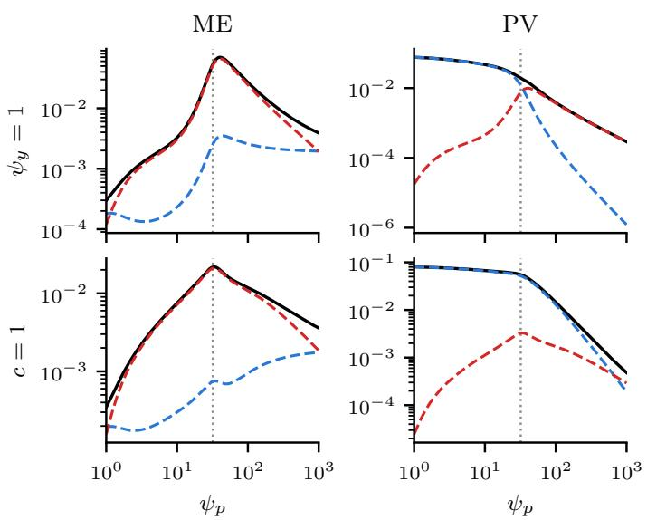  
Figure 3: ME and PV from Theorem 4.2 (black) split into the linear part (blue) and the nonlinear part (red) of Lemma 4.1, at SNR = 16 in the setting of Figure 2.

Mechanisms behind ME and PV. As in random-feature ridge regression (Mei and Montanari, 2022), the weight norm $\| \bar { A } \| _ { F } ^ { 2 }$ increases up to the interpolation threshold $\psi _ { p } \approx \psi _ { n }$ and decreases beyond it. By Lemma 4.1, the nonlinear parts of ME and PV are constant multiples of this norm and share its peak (Figure 3). Near the peak, the nonlinear part of ME exceeds its linear part by more than an order of magnitude, so the peak of ME and its shape around the peak come mostly from the nonlinear part. The linear part of ME does not vanish at large width: at fixed $\psi _ { n }$ , it converges to a positive limit of order $1 / \psi _ { n }$ (Proposition D.4). Unlike in ridgeless random-feature regression, the peak is smoothed even as $\lambda \to 0$ : averaging over the difusion noise acts as an implicit ridge that vanishes as $t \to 0$ , sharpening the peak at small t (Appendix F.2).

The decrease of PV has a diferent origin, specific to denoising. At a training input $x _ { i , t } ( \epsilon ) = a _ { t } x _ { i } +$ $\sqrt { h _ { t } } \epsilon .$ the target is the same clean sample $x _ { i }$ for every noise draw $\epsilon ,$ so the denoiser fits the training samples only by becoming insensitive to $x _ { t }$ near them: by Stein’s identity, $\mathcal { L } _ { \mathrm { t r a i n } } ^ { t } ( \widehat { A } _ { \lambda } ) + h _ { t } \lambda \| \bar { A } \| _ { F } ^ { 2 }$ is exactly the average of $a _ { t } d _ { x } ^ { - 1 } \operatorname { t r } \nabla _ { x _ { t } } x _ { \widehat { A } _ { \lambda } }$ over the training inputs (Lemma D.1). For a denoiser linear in $x _ { t }$ , this Jacobian is the same at every input, so a small training loss forces the same small Jacobian at test inputs and hence a small PV. While, for a general nonlinear denoiser, the Jacobian at the training inputs need not constrain that at test inputs, the linear component of our model carries this mechanism: by Lemma 4.1, the average Jacobian trace at the training inputs is asymptotically $a _ { t } d _ { x } ^ { - 1 }$ tr $G _ { x }$ , with the same $G _ { x }$ that sets the linear part of PV. As the width grows, the training loss decreases, and the linear part of PV falls below the PV of the true denoiser; beyond the interpolation threshold, the nonlinear part decreases as well, with the weight norm (Figure 3). The following proposition formalizes this as $\psi _ { p }  \infty$ at fixed $\psi _ { n }$

Proposition 4.4 $( \psi _ { p }  \infty$ with $\psi _ { n }$ fixed). Under the assumptions of Theorem $4 . 2 ,$ , suppose additionally that $s ^ { 2 } , \dot { v } _ { 0 } ^ { 2 } , \mu _ { 1 } ^ { 2 } > 0$ (Appendix B.2). Fix $\psi _ { n } , \lambda > 0$ , and let $\psi _ { p }  \infty$ after the proportional limit. Then $\mathcal { L } _ { \mathrm { t r a i n } } ^ { t } ( \widehat { A } _ { \lambda } ) \to 0$ and $\| \bar { A } \| _ { F } ^ { 2 }  0$ , so $\mathrm { P V } ( \widehat { A } _ { \lambda } ) \to 0$ and the nonlinear part of $\mathrm { M E } ( \widehat { A } _ { \lambda } )$ vanishes.

These limits reflect the two mechanisms above: fitting drives $G _ { x }$ to zero, and the vanishing weight norm removes the nonlinear part.

## 4.2 Training loss and memorization

The last column of Figure 2 evaluates the training loss of Theorem 4.2 and shows how strengthening the condition afects it. In both rows, the training loss decreases with $\psi _ { p }$ , and a higher SNR gives a lower loss at every width. Figure 15 in Appendix F.2 varies c and $\psi _ { y }$ jointly at fixed $\psi _ { p } / \psi _ { n }$ . To see the efect of c and $\psi _ { y }$ explicitly, we consider large $\psi _ { p }$ and $\psi _ { n }$

Proposition 4.5 (Training loss at large $\psi _ { p }$ and $\psi _ { n } )$ . Under the assumptions of Theorem $4 . 2 ,$ suppose additionally that $s ^ { 2 } , v _ { 0 } ^ { 2 } , \mu _ { 1 } ^ { 2 } > 0$ (Appendix $\it { B . 2 ) }$ , write $r = \psi _ { p } / \psi _ { n }$ , and let $\rho _ { \star } \in ( 0 , 1 )$ be the positive root of

$$
v _ { 0 } ^ { 2 } \rho _ { \star } ^ { 2 } + [ s ^ { 2 } + v _ { 0 } ^ { 2 } ( r - 1 ) ] \rho _ { \star } - s ^ { 2 } = 0 .
$$

Then, for $\psi _ { p } , \psi _ { n } \gg 1$ and $0 < \lambda \ll 1$ , uniformly in $r \in ( 0 , \infty )$

$$
\begin{array} { r l } & { \operatorname* { l i m } \mathbb { E } [ \mathcal { L } _ { \mathrm { t r a i n } } ^ { t } ( \widehat { A } _ { \lambda } ) ] = R _ { \mathrm { t r a i n } } ( r ) + O ( \psi _ { p } ^ { - 1 } + \psi _ { n } ^ { - 1 } + \lambda ) , } \\ & { \quad \quad \quad \quad \quad R _ { \mathrm { t r a i n } } ( r ) = \mathcal { M } \Bigl [ \frac { a _ { t } ^ { 2 } \rho _ { \star } \varsigma } { h _ { t } + a _ { t } ^ { 2 } \rho _ { \star } \varsigma } \Bigr ] , } \end{array}\tag{13}
$$

where $\mathcal { M } [ f ( \varsigma ) ] : = \psi _ { y } f ( 1 - c ^ { 2 } ) + ( 1 - \psi _ { y } ) f ( 1 )$ is the average of f over the eigenvalues $\varsigma \ o f \Sigma$ , the residual variances along the observed and unobserved directions.

Here $1 - \rho _ { \star }$ can be read as the fraction of training samples that the features fit, and $\rho _ { \star }$ depends on $r , t ,$ and the activation, but not on c or $\psi _ { y }$ (Appendix C.2).

Thus, for large $\psi _ { p }$ and $\psi _ { n } , R _ { \mathrm { t r a i n } }$ describes how the training loss depends on width and on the condition:

• Population-score training loss as $r \to 0 ^ { + }$ . As $r \to 0 ^ { + }$ , that is, for $\psi _ { n } \gg \psi _ { p } \gg 1 , \rho _ { \star } $ 1 and $R _ { \mathrm { t r a i n } }$ equals the training loss of the population score, $\mathcal { M } [ a _ { t } ^ { 2 } \varsigma / ( h _ { t } + a _ { t } ^ { 2 } \varsigma ) ]$ (dashed in Figure 2). This vanishes as $\mathrm { S N R }  \infty$ , where the population score both generalizes and memorizes.

• Full memorization as $r  \infty$ . Since $\rho _ { \star }$ decreases in $r , R _ { \mathrm { t r a i n } }$ decreases monotonically and vanishes as $r  \infty$ , that is, for $\psi _ { p } \gg \psi _ { n } \gg 1$

• Efect of the condition. The summand $a _ { t } ^ { 2 } \rho _ { \star } \varsigma / ( h _ { t } + a _ { t } ^ { 2 } \rho _ { \star } \varsigma )$ increases in $\rho _ { \star } \varsigma$ , and $\rho _ { \star }$ does not depend on c or $\psi _ { y }$ . For fixed $\psi _ { y }$ , increasing c lowers the residual variance $\varsigma = 1 - c ^ { 2 }$ of the observed directions, so $R _ { \mathrm { t r a i n } }$ decreases in c. For fixed $c > 0$ , increasing $\psi _ { y }$ turns unobserved directions, with $\varsigma = 1$ , into observed ones, with $\varsigma = 1 - c ^ { 2 } < 1$ , so $R _ { \mathrm { t r a i n } }$ decreases in $\psi _ { y }$ . Both hold at every r.

Remark 4.6. At $c = 1$ , the observed directions do not contribute, and $R _ { \mathrm { t r a i n } } = \left( 1 - \psi _ { y } \right) a _ { t } ^ { 2 } \rho _ { \star } / ( h _ { t } +$ $a _ { t } ^ { 2 } \rho _ { \star } )$ is proportional to the training loss of the population score, $( 1 - \psi _ { y } ) a _ { t } ^ { 2 } / ( h _ { t } + a _ { t } ^ { 2 } )$ , so that $R _ { \mathrm { t r a i n } } ( r ) / R _ { \mathrm { t r a i n } } ( 0 ^ { + } )$ does not depend on $\psi _ { y }$ . If memorization were measured relative to the population score, that is, as fitting only the part of $x _ { i }$ that the condition leaves unexplained, it would be the same at every $\mathrm { S N R } ( \psi _ { y } , 1 )$ . Replication, however, concerns the entire training image: prior works (Carlini et al., 2023; Somepalli et al., 2023b) define a sample as a copy when it is close to the full image xi, and the bound in Section 2 controls the distance to the empirical distribution itself. We therefore use the absolute training loss as the measure of memorization.

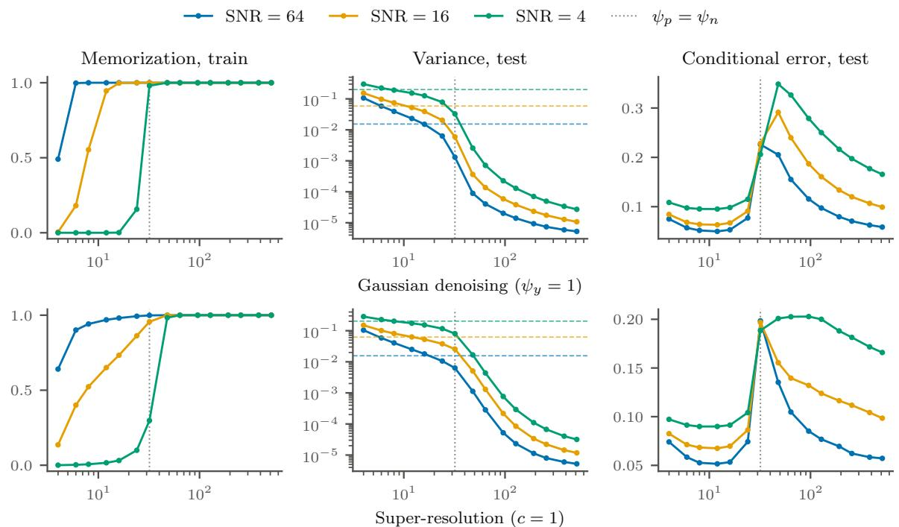  
Figure 4: Full reverse-process generation with random-feature models (setting of Figure 2, with $d _ { x } = 6 4 )$

## 5 Experiments

We evaluate samples from the full reverse process of the random-feature model (6) and a U-Net (Ronneberger et al., 2015) on $3 2 \times 3 2$ CelebA. Experimental details and qualitative examples are in Appendices E and F.

Metrics. Each metric corresponds to a quantity in Section 4. Memorization, the counterpart of the training loss in Section 4.2, is measured at training conditions: following Yoon et al. (2023), a sample xˆ generated for a training condition is considered memorized if $\| \hat { x } - x ^ { ( 1 ) } \| / \| \hat { x } - x ^ { ( 2 ) } \| < 1 / 3$ where $x ^ { ( 1 ) }$ and $x ^ { ( 2 ) }$ are its nearest and second-nearest training samples in the $L ^ { 2 }$ sense. Variance, the counterpart of PV (11), is the sample variance across the samples generated for one test condition, averaged over coordinates and conditions. The conditional error, the counterpart of ME (9), is the error of the mean of the samples for a test condition with respect to the true conditional mean; on CelebA, where the conditional mean is unknown, the original test image takes its place (Appendix E.3).

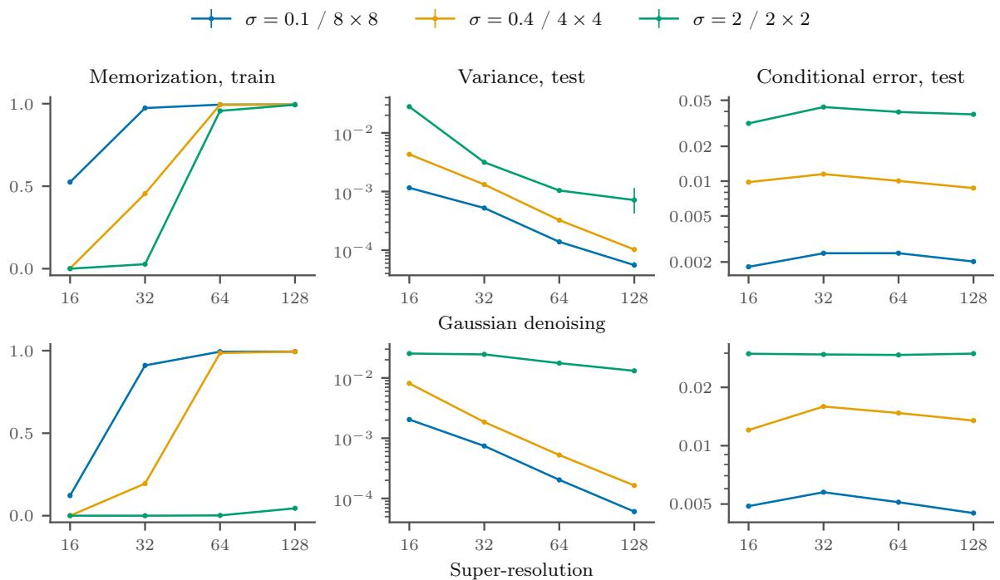  
Figure 5: Full reverse-process generation with U-Nets on $3 2 \times 3 2$ CelebA, against the width $W \in \{ 1 6 , 3 2 , 6 4 , 1 2 8 \}$ at $n = 3 2 7 6 8$ , every model trained for 200k steps. Markers are the mean and bars the min–max range over three seeds.

## 5.1 Random features on Gaussian data

We sample with the random-feature model (6), minimizing (7) at every step of the reverse chain, on the data of Section 3.1. Figure 4 shows that the trends of Section 4 appear in samples from the full reverse process: a higher SNR makes memorization set in at smaller widths; the variance falls below the true conditional variance $v _ { \Sigma } ^ { 2 }$ and keeps decreasing with width; and the conditional error peaks near $\psi _ { p } = \psi _ { n }$ and decreases beyond it. Wider models thus become more accurate but less diverse, the malign generalization of Section 4.1. At test conditions, by contrast, none of the samples is a copy of a training image in any setting.

## 5.2 Denoising and super-resolution on CelebA

We train U-Nets on grayscale $3 2 \times 3 2$ CelebA (Liu et al., 2015), with the condition as a second input channel. In Gaussian denoising the condition is $y = x + \sigma \xi$ with $\sigma \in \{ 0 . 1 , 0 . 4 , 2 \}$ ; in super-resolution it is the image average-pooled to $8 \times 8 , 4 \times 4$ or $2 \times 2$ . A larger σ weakens the condition as a smaller c does, and coarser pooling as a smaller $\psi _ { y }$ does.

Figure 5 shows the trends of Figure 4 in a U-Net: a stronger condition makes memorization set in at smaller widths, while the $2 \times 2$ condition is barely memorized up to $W = 1 2 8$ ; the variance falls with width; and the conditional error shows a mild peak near the onset of memorization and decreases beyond it (Appendix E.3 compares other error metrics), again the malign generalization of Section 4.1. As in Section 5.1, samples for test conditions are rarely copies of training images: averaged over seeds, their memorized fraction stays below 0.2% in every setting except the $2 \times 2$ condition at $W = 1 2 8 . ^ { 1 }$ Figure 1 illustrates these behaviors in super-resolution.

## 6 Conclusion

We introduced a tractable data model (4) for conditional difusion models and derived the proportional limits of the test loss, its decomposition, and the training loss of a random-feature model. At test conditions, wider overparameterized models achieve lower conditional error while their prediction variance keeps decreasing, which we term malign generalization; at training conditions, more informative conditions induce memorization at smaller widths. Full reverse-process generation with random features and U-Nets shows the same trends. Our results call for further investigation into memorization and generalization mechanisms specific to conditional difusion models.

Limitations and future work. First, the data model (4) assumes an isotropic marginal and a residual covariance with two distinct eigenvalues. Because the proof evaluates the traces separately on the eigenspaces of Σ, we expect our analysis to extend to residual covariances with finitely many distinct eigenvalues, with M still given by the normalized trace in (B.52). Extending the theory to anisotropic marginals and to non-Gaussian data remains an open problem.

Second, both our random-feature model and the U-Nets receive the condition y via concatenation with $x _ { t }$ . Practical models typically inject the condition through cross-attention or adaptive normalization (Rombach et al., 2022; Dhariwal and Nichol, 2021); investigating how these conditioning mechanisms influence memorization and generalization is an important direction for future work.

Third, as in George et al. (2026); Bonnaire et al. (2025); Urfin et al. (2026), the score is a random-feature model with a fixed first layer, trained separately at each time t, and we take the minimizer of the ridge-regularized loss. Our analysis therefore captures neither feature learning nor parameter sharing across times; we leave these as important directions for future work.

Fourth, we assume that the training pairs $( x _ { i } , y _ { i } )$ are drawn i.i.d. from $P _ { x y }$ . Large text-to-image training sets violate this assumption through sampling biases such as duplicated images and repeated or templated captions, and replication in these models has been linked to such duplication (Carlini et al., 2023; Webster, 2023). We do not address these cases; extending the analysis to several samples per condition is left for future work.

## References

Iskander Azangulov, George Deligiannidis, and Judith Rousseau. Convergence of difusion models under the manifold hypothesis in high-dimensions. arXiv preprint arXiv:2409.18804, 2024.

Peter L Bartlett, Philip M Long, Gábor Lugosi, and Alexander Tsigler. Benign overfitting in linear regression. Proceedings of the National Academy of Sciences, 117(48):30063–30070, 2020.

Mikhail Belkin, Daniel Hsu, Siyuan Ma, and Soumik Mandal. Reconciling modern machine-learning practice and the classical bias–variance trade-of. Proceedings of the National Academy of Sciences, 116(32):15849–15854, 2019.

Joe Benton, Valentin De Bortoli, Arnaud Doucet, and George Deligiannidis. Nearly d-linear convergence bounds for difusion models via stochastic localization. In International Conference on Learning Representations, volume 2024, pages 36916–36936, 2024.

Antoine Philippe Michel Bodin. Random matrix methods for high-dimensional machine learning models. PhD thesis, EPFL, 2024.

Tony Bonnaire, Raphaël Urfin, Giulio Biroli, and Marc Mézard. Why difusion models don’t memorize: The role of implicit dynamical regularization in training. In Advances in Neural Information Processing Systems, volume 38, Main Conference, pages 141266–141286, 2025.

Sam Buchanan, Druv Pai, Yi Ma, and Valentin De Bortoli. On the edge of memorization in difusion models. In Advances in Neural Information Processing Systems, volume 38, Main Conference, pages 96113–96157, 2025.

Nicolas Carlini, Jamie Hayes, Milad Nasr, Matthew Jagielski, Vikash Sehwag, Florian Tramer, Borja Balle, Daphne Ippolito, and Eric Wallace. Extracting training data from difusion models. In 32nd USENIX security symposium (USENIX Security 23), pages 5253–5270, 2023.

Minshuo Chen, Kaixuan Huang, Tuo Zhao, and Mengdi Wang. Score approximation, estimation and distribution recovery of difusion models on low-dimensional data. In International Conference on Machine Learning, pages 4672–4712. PMLR, 2023.

Sitan Chen, Sinho Chewi, Jerry Li, Yuanzhi Li, Adil Salim, and Anru R Zhang. Sampling is as easy as learning the score: theory for difusion models with minimal data assumptions. arXiv preprint arXiv:2209.11215, 2022.

Zhengdao Chen. On the interpolation efect of score smoothing in difusion models. In International Conference on Learning Representations, volume 2026, pages 69869–69902, 2026.

Hugo Cui, Florent Krzakala, Eric Vanden-Eijnden, and Lenka Zdeborová. Analysis of learning a flow-based generative model from limited sample complexity. In International Conference on Learning Representations, volume 2024, pages 51929–51955, 2024.

Prafulla Dhariwal and Alexander Nichol. Difusion models beat GANs on image synthesis. In Advances in Neural Information Processing Systems, volume 34, pages 8780–8794, 2021.

Tyler Farghly, Peter Potaptchik, Samuel Howard, George Deligiannidis, and Jakiw Pidstrigach. Difusion models and the manifold hypothesis: Log-domain smoothing is geometry adaptive. In Advances in Neural Information Processing Systems, volume 38, Main Conference, pages 122795–122840, 2025.

Tyler Farghly, Benjamin Dupuis, Alain Durmus, and Umut Simsekli. Benign overfitting does not occur in difusion models. arXiv preprint arXiv:2607.02671, 2026.

Hengyu Fu, Zhuoran Yang, Mengdi Wang, and Minshuo Chen. Unveil conditional difusion models with classifier-free guidance: A sharp statistical theory. arXiv preprint arXiv:2403.11968, 2024.

Anand Jerry George and Nicolas Macris. Asymptotic learning curves for difusion models with random features score and manifold data. arXiv preprint arXiv:2603.22962, 2026.

Anand Jerry George, Rodrigo Veiga, and Nicolas Macris. Denoising score matching with random features: Insights on difusion models from precise learning curves. Journal of Statistical Mechanics: Theory and Experiment, 2026(8):084009, 2026.

Federica Gerace, Bruno Loureiro, Florent Krzakala, Marc Mézard, and Lenka Zdeborová. Generalisation error in learning with random features and the hidden manifold model. In International Conference on Machine Learning, pages 3452–3462. PMLR, 2020.

Sebastian Goldt, Bruno Loureiro, Galen Reeves, Florent Krzakala, Marc Mézard, and Lenka Zdeborová. The gaussian equivalence of generative models for learning with shallow neural networks. In Mathematical and Scientific Machine Learning, pages 426–471. PMLR, 2022.

Xizewen Han, Huangjie Zheng, and Mingyuan Zhou. Card: Classification and regression difusion models. Advances in Neural Information Processing Systems, 35:18100–18115, 2022.

Trevor Hastie, Andrea Montanari, Saharon Rosset, and Ryan J Tibshirani. Surprises in highdimensional ridgeless least squares interpolation. Annals of statistics, 50(2):949, 2022.

Jonathan Ho and Tim Salimans. Classifier-free difusion guidance. arXiv preprint arXiv:2207.12598, 2022.

Jonathan Ho, Ajay Jain, and Pieter Abbeel. Denoising difusion probabilistic models. Advances in neural information processing systems, 33:6840–6851, 2020.

Jonathan Ho, Tim Salimans, Alexey Gritsenko, William Chan, Mohammad Norouzi, and David J Fleet. Video difusion models. Advances in neural information processing systems, 35:8633–8646, 2022.

Emiel Hoogeboom, Vıctor Garcia Satorras, Clément Vignac, and Max Welling. Equivariant difusion for molecule generation in 3d. In International conference on machine learning, pages 8867–8887. PMLR, 2022.

Jerry Yao-Chieh Hu, Weimin Wu, Yi-Chen Lee, Yu-Chao Huang, Minshuo Chen, and Han Liu. On statistical rates of conditional difusion transformers: Approximation, estimation and minimax optimality. In International Conference on Learning Representations, volume 2025, pages 12591– 12675, 2025.

Keya Hu, Linlu Qiu, Yiyang Lu, Hanhong Zhao, Tianhong Li, Yoon Kim, Jacob Andreas, and Kaiming He. Elf: Embedded language flows. arXiv preprint arXiv:2605.10938, 2026.

Zahra Kadkhodaie, Florentin Guth, Eero Simoncelli, and Stéphane Mallat. Generalization in difusion models arises from geometry-adaptive harmonic representations. In International Conference on Learning Representations, volume 2024, pages 46543–46567, 2024.

Mason Kamb and Surya Ganguli. An analytic theory of creativity in convolutional difusion models. In Aarti Singh, Maryam Fazel, Daniel Hsu, Simon Lacoste-Julien, Felix Berkenkamp, Tegan Maharaj, Kiri Wagstaf, and Jerry Zhu, editors, Proceedings of the 42nd International Conference on Machine Learning, volume 267 of Proceedings of Machine Learning Research, pages 28795–28831. PMLR, 13–19 Jul 2025.

Gwangho Kim and Sungyoon Lee. Localizing memorized regions in difusion models via coordinatewise curvature diferences. In Proceedings of the 43rd International Conference on Machine Learning, volume 306 of Proceedings of Machine Learning Research, pages 58304–58327. PMLR, 2026.

Hugo Latourelle-Vigeant, Sinho Chewi, Aram-Alexandre Pooladian, John Sous, and Theodor Misiakiewicz. Generalization, memorization, and overfitting for difusion models trained in the lazy high-dimensional regime. arXiv preprint arXiv:2608.23938, 2026.

Holden Lee, Jianfeng Lu, and Yixin Tan. Convergence for score-based generative modeling with polynomial complexity. Advances in Neural Information Processing Systems, 35:22870–22882, 2022.

Holden Lee, Jianfeng Lu, and Yixin Tan. Convergence of score-based generative modeling for general data distributions. In International Conference on Algorithmic Learning Theory, pages 946–985. PMLR, 2023.

Puheng Li, Zhong Li, Huishuai Zhang, and Jiang Bian. On the generalization properties of difusion models. Advances in Neural Information Processing Systems, 36:2097–2127, 2023.

Ziwei Liu, Ping Luo, Xiaogang Wang, and Xiaoou Tang. Deep learning face attributes in the wild. In Proceedings of the IEEE international conference on computer vision, pages 3730–3738, 2015.

Artem Lukoianov, Chenyang Yuan, Justin Solomon, and Vincent Sitzmann. Locality in image difusion models emerges from data statistics. In Advances in Neural Information Processing Systems, volume 38, Main Conference, pages 95121–95157, 2025.

Song Mei and Andrea Montanari. The generalization error of random features regression: Precise asymptotics and the double descent curve. Communications on Pure and Applied Mathematics, 75(4):667–766, 2022.

Claudia Merger and Sebastian Goldt. Generalization dynamics of linear difusion models. arXiv preprint arXiv:2505.24769, 2025.

Matthew Niedoba, Berend Zwartsenberg, Kevin Patrick Murphy, and Frank Wood. Towards a mechanistic explanation of difusion model generalization. In Aarti Singh, Maryam Fazel, Daniel Hsu, Simon Lacoste-Julien, Felix Berkenkamp, Tegan Maharaj, Kiri Wagstaf, and Jerry Zhu, editors, Proceedings of the 42nd International Conference on Machine Learning, volume 267 of Proceedings of Machine Learning Research, pages 46389–46411. PMLR, 13–19 Jul 2025.

Kazusato Oko, Shunta Akiyama, and Taiji Suzuki. Difusion models are minimax optimal distribution estimators. In International Conference on Machine Learning, pages 26517–26582. PMLR, 2023.

Bernt Oksendal. Stochastic diferential equations: an introduction with applications. Springer Science & Business Media, 2013.

Jakiw Pidstrigach. Score-based generative models detect manifolds. Advances in Neural Information Processing Systems, 35:35852–35865, 2022.

Ali Rahimi and Benjamin Recht. Random features for large-scale kernel machines. Advances in neural information processing systems, 20, 2007.

Robin Rombach, Andreas Blattmann, Dominik Lorenz, Patrick Esser, and Björn Ommer. Highresolution image synthesis with latent difusion models. In 2022 IEEE/CVF conference on computer vision and pattern recognition (CVPR), pages 10674–10685. ieee, 2022.

Olaf Ronneberger, Philipp Fischer, and Thomas Brox. U-net: Convolutional networks for biomedical image segmentation. In International Conference on Medical image computing and computerassisted intervention, pages 234–241. Springer, 2015.

Chitwan Saharia, William Chan, Saurabh Saxena, Lala Li, Jay Whang, Emily L Denton, Kamyar Ghasemipour, Raphael Gontijo Lopes, Burcu Karagol Ayan, Tim Salimans, et al. Photorealistic text-to-image difusion models with deep language understanding. Advances in neural information processing systems, 35:36479–36494, 2022.

Christopher Scarvelis, Haitz Sáez de Ocáriz Borde, and Justin Solomon. Closed-form difusion models. Transactions on Machine Learning Research, 2025. ISSN 2835-8856. URL https: //openreview.net/forum?id=JkMifr17wc.

Aliaksandra Shysheya, Cristiana Diaconu, Federico Bergamin, Paris Perdikaris, José Miguel Hernández-Lobato, Richard E. Turner, and Emile Mathieu. On conditional difusion models for pde simulations. In A. Globerson, L. Mackey, D. Belgrave, A. Fan, U. Paquet, J. Tomczak, and C. Zhang, editors, Advances in Neural Information Processing Systems, volume 37, pages 23246–23300. Curran Associates, Inc., 2024. doi: 10.52202/079017-0732.

Jascha Sohl-Dickstein, Eric Weiss, Niru Maheswaranathan, and Surya Ganguli. Deep unsupervised learning using nonequilibrium thermodynamics. In International conference on machine learning, pages 2256–2265. pmlr, 2015.

Gowthami Somepalli, Vasu Singla, Micah Goldblum, Jonas Geiping, and Tom Goldstein. Difusion art or digital forgery? investigating data replication in difusion models. In Proceedings of the IEEE/CVF conference on computer vision and pattern recognition, pages 6048–6058, 2023a.

Gowthami Somepalli, Vasu Singla, Micah Goldblum, Jonas Geiping, and Tom Goldstein. Understanding and mitigating copying in difusion models. In Thirty-seventh Conference on Neural Information Processing Systems, 2023b. URL https://openreview.net/forum?id=HtMXRGbUMt.

Yang Song, Conor Durkan, Iain Murray, and Stefano Ermon. Maximum likelihood training of score-based difusion models. Advances in neural information processing systems, 34:1415–1428, 2021a.

Yang Song, Jascha Sohl-Dickstein, Diederik P Kingma, Abhishek Kumar, Stefano Ermon, and Ben Poole. Score-based generative modeling through stochastic diferential equations. In International Conference on Learning Representations, 2021b. URL https://openreview.net/forum?id= PxTIG12RRHS.

Rong Tang and Yun Yang. Adaptivity of difusion models to manifold structures. In Sanjoy Dasgupta, Stephan Mandt, and Yingzhen Li, editors, Proceedings of The 27th International Conference on Artificial Intelligence and Statistics, volume 238 of Proceedings of Machine Learning Research, pages 1648–1656. PMLR, 02–04 May 2024.

Rong Tang, Lizhen Lin, and Yun Yang. Conditional difusion models are minimax-optimal and manifold-adaptive for conditional distribution estimation. arXiv preprint arXiv:2409.20124, 2024.

Raphaël Urfin, Tony Bonnaire, Giulio Biroli, and Marc Mézard. Double descent and malign overfitting in difusion models. arXiv preprint arXiv:2609.26392, 2026.

Joseph L Watson, David Juergens, Nathaniel R Bennett, Brian L Trippe, Jason Yim, Helen E Eisenach, Woody Ahern, Andrew J Borst, Robert J Ragotte, Lukas F Milles, et al. De novo design of protein structure and function with rfdifusion. Nature, 620(7976):1089–1100, 2023.

Ryan Webster. A reproducible extraction of training images from difusion models. arXiv preprint arXiv:2305.08694, 2023.

Yuxin Wen, Yuchen Liu, Chen Chen, and Lingjuan Lyu. Detecting, explaining, and mitigating memorization in difusion models. In The Twelfth International Conference on Learning Representations, 2024. URL https://openreview.net/forum?id=84n3UwkH7b.

Yu-Han Wu, Pierre Marion, Gérard Biau, and Claire Boyer. Taking a big step: Large learning rates in denoising score matching prevent memorization. arXiv preprint arXiv:2502.03435, 2025.

Zeqi Ye, Qijie Zhu, Molei Tao, and Minshuo Chen. Provable separations between memorization and generalization in difusion models. In The Fourteenth International Conference on Learning Representations, 2026.

TaeHo Yoon, Joo Young Choi, Sehyun Kwon, and Ernest K. Ryu. Difusion probabilistic models generalize when they fail to memorize. In ICML 2023 Workshop on Structured Probabilistic Inference & Generative Modeling, 2023. URL https://openreview.net/forum?id=shciCbSk9h.

Hui Yuan, Kaixuan Huang, Chengzhuo Ni, Minshuo Chen, and Mengdi Wang. Reward-directed conditional difusion: Provable distribution estimation and reward improvement. Advances in Neural Information Processing Systems, 36:60599–60635, 2023.

Chenshuang Zhang, Chaoning Zhang, Sheng Zheng, Mengchun Zhang, Maryam Qamar, Sung-Ho Bae, and In So Kweon. A survey on audio difusion models: Text to speech synthesis and enhancement in generative ai. arXiv preprint arXiv:2303.13336, 2023a.

Huijie Zhang, Jinfan Zhou, Yifu Lu, Minzhe Guo, Peng Wang, Liyue Shen, and Qing Qu. The emergence of reproducibility and generalizability in difusion models. arXiv preprint arXiv:2310.05264, 2023b.

## Appendix

## Contents

A Notation and conventions 20   
B Proofs of the decomposition and the proportional limits 20   
B.1 Exact finite-dimensional identities 22   
B.2 Proportional-limit reductions of the feature moments 24   
B.3 Decomposition of the test errors and the training loss (proof of Lemma $4 . 1 )$ 31   
B.4 Reduction to resolvent traces . 32   
B.5 Linearization and the perturbed resolvent 33   
B.6 Spectral reduction and the two-scalar fixed-point equations (proof of Theorem $4 . 2 )$ 37   
C Training loss at large $\psi _ { p }$ and $\psi _ { n }$ 40   
C.1 Training loss in the joint large-aspect-ratio limit (proof of Proposition $4 . 5 )$ 40   
C.2 The scalar $\rho$ 42   
D Training loss and the large-width limit at a fixed sample ratio 43   
D.1 Training loss and $G _ { x }$ 43   
D.2 Large width at a fixed sample ratio (proof of Proposition $4 { \cdot } 4 )$ 44   
E Experimental details 47   
E.1 Theory curves and finite simulations 47   
E.2 Random-feature sampler 47   
E.3 CelebA training and evaluation 47   
F Additional results 49   
F.1 Smaller training set 49   
F.2 Test and training losses over width and condition strength 50   
F.3 Additional CelebA samples 54   
G AI use statement 58

## A Notation and conventions

<table><tr><td>Symbol</td><td>Meaning</td></tr><tr><td> $d _ { x } , d _ { y } , n , p$ </td><td>Data dimension, condition dimension, sample size, and feature count. Limits of  $n / d _ { x } , p / d _ { x } ,$  and  $d _ { y } / d _ { x }$ </td></tr><tr><td> $\psi _ { n } , \psi _ { p } , \psi _ { y }$   $U _ { \star } , \Pi , \Pi _ { \perp }$ </td><td>Orthonormal condition embedding and the two projectors in the</td></tr><tr><td> $B , \Sigma$ </td><td>main-text model. Conditional-mean map and residual covariance in  $x = B y + \Sigma ^ { 1 / 2 } \xi .$ </td></tr><tr><td> $v _ { \Sigma , d } ^ { 2 } , v _ { \Sigma } ^ { 2 }$   $\Sigma _ { t } , \tau$ </td><td> $d _ { x } ^ { - 1 }$  tr Σ and its limit.  $a _ { t } ^ { 2 } \Sigma + h _ { t } I$  and its limiting normalized trace.</td></tr><tr><td> $\Sigma _ { x } , I _ { x }$ </td><td> $\mathrm { d i a g } ( \Sigma , 0 _ { d _ { y } } )$  and  $\mathrm { d i a g } ( I _ { d _ { x } } , 0 _ { d _ { y } } )$ </td></tr><tr><td> $W _ { 1 } , W _ { 2 } , W ^ { \oplus }$ </td><td>Independent Gaussian hidden weights and  $W ^ { \oplus } = \left[ W _ { 1 } \ W _ { 2 } \right]$ </td></tr><tr><td> $\kappa _ { d } , T , \Gamma$ </td><td>Condition scaling  $\sqrt { d _ { x } / d _ { y } } ,$  clean design map, and augmented noisy</td></tr><tr><td></td><td>covariance.</td></tr><tr><td> $\Lambda , \Gamma _ { \mathrm { r e s } }$   $\sigma _ { \ell , t } ^ { 2 } , \sigma _ { t } ^ { 2 } , \sigma _ { y , t } ^ { 2 }$ </td><td>Conditional-mean and diffused-residual parts of Γ. Clean, noisy, and condition-only preactivation variances.</td></tr><tr><td> $\mu _ { 1 } , v ^ { 2 } , v _ { 0 } ^ { 2 } , s ^ { 2 } , v _ { y } ^ { 2 }$ </td><td>Activation coefficients:  $\mu _ { 1 }$  is defined in Section 3.2, the others in</td></tr><tr><td></td><td>Appendix B.2.</td></tr><tr><td> $U , V ; \widetilde { U } , \widetilde { V } , \widetilde { V } _ { \xi } , \widetilde { V } _ { \eta }$ </td><td>Training and test feature moments in Lemmas B.1 and B.2.</td></tr><tr><td> $\widetilde { U } _ { y }$ </td><td>Second moment of conditional feature means (Lemma B.2).</td></tr><tr><td> $Q , \mathbf { q } , z$ </td><td>Ridge resolvent,  $\mathbf { q } = \left( q _ { \mathrm { m } } , q _ { \mathrm { r } } \right)$  in (B.33), and spectral parameter.</td></tr><tr><td></td><td></td></tr><tr><td> $K , K _ { \Sigma } ; \overline { { K } } , \overline { { K } } _ { \Sigma }$ </td><td>Unweighted and residual-weighted trace functions and their limits.</td></tr><tr><td> $m , \rho$ </td><td>Two scalars solving the fixed-point equations.</td></tr><tr><td> $\mathrm { M E , R E , P V , R A }$ </td><td>Conditional-mean error, residual error, prediction variance, and</td></tr><tr><td></td><td></td></tr><tr><td></td><td>residual alignment.</td></tr><tr><td></td><td></td></tr><tr><td></td><td></td></tr><tr><td></td><td></td></tr><tr><td></td><td></td></tr><tr><td></td><td></td></tr><tr><td></td><td></td></tr><tr><td> $G _ { x } , \widehat { B } , \Vert \bar { A } \Vert _ { F } ^ { 2 }$ </td><td></td></tr><tr><td></td><td>Jacobian in  $x _ { t }$  of the linear component, conditional-mean map, and</td></tr><tr><td></td><td></td></tr><tr><td></td><td></td></tr><tr><td></td><td></td></tr><tr><td></td><td></td></tr><tr><td></td><td></td></tr><tr><td></td><td></td></tr><tr><td></td><td>weight norm of the learned denoiser (Section 4.1).</td></tr><tr><td></td><td></td></tr><tr><td></td><td></td></tr><tr><td></td><td></td></tr><tr><td></td><td></td></tr><tr><td></td><td></td></tr><tr><td></td><td></td></tr><tr><td></td><td></td></tr><tr><td></td><td></td></tr><tr><td></td><td></td></tr><tr><td></td><td></td></tr><tr><td></td><td></td></tr><tr><td></td><td></td></tr><tr><td></td><td></td></tr><tr><td></td><td></td></tr><tr><td></td><td></td></tr><tr><td></td><td></td></tr><tr><td></td><td></td></tr><tr><td></td><td></td></tr><tr><td></td><td></td></tr></table>

## B Proofs of the decomposition and the proportional limits

This appendix proves Lemma 4.1 (Appendix B.3) and Theorem B.11, which restates Theorem 4.2 at fixed aspect ratios $\psi _ { p } , \psi _ { n } , \psi _ { y }$ and gives the functions $\overline { { K } }$ and $\overline { { K } } _ { \Sigma }$ explicitly. We work with the data model (4), so $\boldsymbol { B } = c \boldsymbol { U } _ { \star }$ and $\dot { \Sigma } = ( 1 - c ^ { 2 } ) \Pi + \Pi _ { \perp }$ . In particular,

$$
B B ^ { \top } = c ^ { 2 } \Pi , \qquad \Sigma ^ { 1 / 2 } = \sqrt { 1 - c ^ { 2 } } \Pi + \Pi _ { \bot } , \qquad v _ { \Sigma } ^ { 2 } = 1 - c ^ { 2 } \psi _ { y } .
$$

The cases $c = 0$ and $\psi _ { y } = 1$ are covered by combining equal blocks or omitting zero-weight blocks. $\mathrm { A t } ~ c = 1$ , Σ is singular but $\Sigma _ { t } \succeq h _ { t } I$ . The proof consists of the following steps: exact loss identities, Gaussian reductions, resolvent derivatives, linearization, and evaluation on the two subspaces.

Design matrices. Let $Y = [ y _ { 1 } \ \cdots \ y _ { n } ] , Z _ { x } = [ \xi _ { 1 } \ \cdots \ \xi _ { n } ]$ , and $X = B Y + \Sigma ^ { 1 / 2 } Z _ { x }$ . Set $d _ { \oplus } = d _ { x } + d _ { y }$ and $\kappa _ { d } = \sqrt { d _ { x } / d _ { y } }$ . The matrix $T$ constructs the clean inputs, and L contains their projections onto

the hidden weights:

$$
\begin{array} { l } { { W ^ { \oplus } : = [ W _ { 1 } ~ W _ { 2 } ] , ~ Z ^ { \oplus } : = [ Y ; Z _ { x } ] , } } \\ { { \ ~ { \cal T } : = \left[ { a _ { t } B ~ a _ { t } \Sigma ^ { 1 / 2 } } \right] , ~ { \cal T } Z ^ { \oplus } = [ a _ { t } X ; \kappa _ { d } Y ] , } } \\ { { \ ~ { \cal L } : = \displaystyle \frac { W ^ { \oplus } } { \sqrt { 2 d _ { x } } } { \cal T } Z ^ { \oplus } = \displaystyle \frac { a _ { t } W _ { 1 } X } { \sqrt { 2 d _ { x } } } + \displaystyle \frac { W _ { 2 } Y } { \sqrt { 2 d _ { y } } } . } } \end{array}\tag{B.1}
$$

Let $Z _ { 0 } \in \mathbb { R } ^ { d _ { x } \times n }$ have independent standard Gaussian entries, independently of the training sample and hidden weights. Adding difusion noise gives

$$
{ \frac { W ^ { \oplus } } { \sqrt { 2 d _ { x } } } } [ X _ { t } ( Z _ { 0 } ) ; \kappa _ { d } Y ] = L + \sqrt { h _ { t } } { \frac { W _ { 1 } } { \sqrt { 2 d _ { x } } } } Z _ { 0 } , \qquad X _ { t } ( Z _ { 0 } ) = a _ { t } X + \sqrt { h _ { t } } Z _ { 0 } .\tag{B.2}
$$

Covariance matrices. Write $I _ { x } : = \mathrm { d i a g } ( I _ { d _ { x } } , 0 _ { d _ { y } } )$ and $\Sigma _ { x } : = \mathrm { d i a g } ( \Sigma , 0 _ { d _ { y } } )$ . For a test draw, the conditional residual is

$$
\eta _ { t } = a _ { t } \Sigma ^ { 1 / 2 } \xi + \sqrt { h _ { t } } \epsilon \sim \mathcal { N } ( 0 , \Sigma _ { t } ) , \qquad \Sigma _ { t } = a _ { t } ^ { 2 } \Sigma + h _ { t } I .
$$

Its limiting normalized trace is

$$
\tau : = \operatorname* { l i m } \frac { 1 } { d _ { x } } \operatorname { t r } \Sigma _ { t } = a _ { t } ^ { 2 } v _ { \Sigma } ^ { 2 } + h _ { t } .\tag{B.3}
$$

The covariances of the noisy input, clean input, and conditional mean are, respectively,

$$
\begin{array} { r } { \Gamma : = \mathrm { C o v } ( [ x _ { t } ; \kappa _ { d } y ] ) = \left[ \begin{array} { c c } { a _ { t } ^ { 2 } ( B B ^ { \top } + \Sigma ) + h _ { t } I } & { a _ { t } \kappa _ { d } B } \\ { a _ { t } \kappa _ { d } B ^ { \top } } & { \kappa _ { d } ^ { 2 } I } \end{array} \right] , } \end{array}\tag{B.4}
$$

$$
\begin{array} { r } { T T ^ { \top } = \mathrm { C o v } ( [ a _ { t } x ; \kappa _ { d } y ] ) = \Gamma - h _ { t } I _ { x } , } \end{array}\tag{B.5}
$$

$$
\begin{array} { r } { \Lambda : = \operatorname { C o v } ( [ a _ { t } B y ; \kappa _ { d } y ] ) = \Gamma - h _ { t } I _ { x } - a _ { t } ^ { 2 } \Sigma _ { x } . } \end{array}\tag{B.6}
$$

Preactivation variances. For hidden-weight rows $w _ { 1 } ^ { \top } , w _ { 2 } ^ { \top }$ , the following variances hold the weights fixed; convergence is in probability over these weights. They correspond to an entry of $L ,$ its conditional mean given $y ,$ and the noisy preactivation, respectively:

$$
\operatorname { V a r } _ { x , y } \left( \frac { w _ { 1 } ^ { \top } a _ { t } x } { \sqrt { 2 d _ { x } } } + \frac { w _ { 2 } ^ { \top } y } { \sqrt { 2 d _ { y } } } \right) \xrightarrow { \mathbb { P } } \sigma _ { \ell , t } ^ { 2 } ,
$$

$$
\operatorname { V a r } _ { y } ( \frac { a _ { t } w _ { 1 } ^ { \top } B y } { \sqrt { 2 d _ { x } } } + \frac { w _ { 2 } ^ { \top } y } { \sqrt { 2 d _ { y } } } ) \stackrel { \mathbb { P } } {  } \sigma _ { y , t } ^ { 2 } ,
$$

$$
\operatorname { V a r } _ { x _ { t } , y } ( \frac { w _ { 1 } ^ { \top } x _ { t } } { \sqrt { 2 d _ { x } } } + \frac { w _ { 2 } ^ { \top } y } { \sqrt { 2 d _ { y } } } ) \stackrel { \mathbb { P } } {  } \sigma _ { t } ^ { 2 } .
$$

Gaussian weight concentration gives the deterministic limits

$$
\sigma _ { \ell , t } ^ { 2 } = \operatorname* { l i m } \frac { 1 } { 2 d _ { x } } \operatorname { t r } ( T T ^ { \top } ) = \frac { a _ { t } ^ { 2 } ( c ^ { 2 } \psi _ { y } + v _ { \Sigma } ^ { 2 } ) + 1 } { 2 } = \frac { a _ { t } ^ { 2 } + 1 } { 2 } ,
$$

$$
\sigma _ { y , t } ^ { 2 } = \operatorname* { l i m } \frac { 1 } { 2 d _ { x } } \operatorname { t r } \Lambda = \frac { a _ { t } ^ { 2 } c ^ { 2 } \psi _ { y } + 1 } { 2 } ,\tag{B.7}
$$

$$
\sigma _ { t } ^ { 2 } = \operatorname* { l i m } \frac { 1 } { 2 d _ { x } } \operatorname { t r } \Gamma = \sigma _ { \ell , t } ^ { 2 } + h _ { t } / 2 = \sigma _ { y , t } ^ { 2 } + \tau / 2 = 1 .
$$

The terms $a _ { t } ^ { 2 } c ^ { 2 } \psi _ { y } , ~ a _ { t } ^ { 2 } v _ { \Sigma } ^ { 2 }$ , and 1 are the limits of $d _ { x } ^ { - 1 } \mathbb { E } \| a _ { t } B y \| ^ { 2 } , ~ d _ { x } ^ { - 1 } \mathbb { E } \| a _ { t } \Sigma ^ { 1 / 2 } \xi \| ^ { 2 }$ , and $d _ { y } ^ { - 1 } \mathbb { E } \| y \| ^ { 2 }$ ， respectively, while $h _ { t }$ is the difusion-noise variance.

Assumptions. As in George et al. (2026); Bonnaire et al. (2025); Urfin et al. (2026), we apply the Gaussian equivalence principle (Gerace et al., 2020; Goldt et al., 2022; Mei and Montanari, 2022) to the nonlinear random-feature matrices in the loss calculations. For the resulting linear pencil, we assume that the inverse-block trace limits exist and satisfy the block deterministic-equivalent equation, including the finite block splittings used for K and $K _ { \Sigma }$ . Near $( \mathbf { q } , z ) = ( \mathbf { 0 } , - \lambda )$ , diferentiation in q and z is assumed to commute with the proportional limit. Expressions with negative components of q are understood by local analytic continuation from $q _ { \mathrm { m } } , q _ { \mathrm { r } } \ge 0$ . A rigorous treatment of these steps, along the lines of Mei and Montanari (2022), is beyond the scope of this work. Throughout, we use the limiting normalized expected traces of Bodin (2024, eq. (3.13)),

$$
\operatorname { T r } _ { d } [ A ] : = \operatorname* { l i m } { \frac { 1 } { d _ { x } } } \mathbb { E } \operatorname { t r } A , \qquad \operatorname { T r } _ { n } [ A ] : = \operatorname* { l i m } { \frac { 1 } { n } } \mathbb { E } \operatorname { t r } A ,\tag{B.8}
$$

with the limits taken in the proportional high-dimensional regime. For matrices, $M \simeq M ^ { \prime }$ means $\mathrm { T r } _ { d } [ X ( M - M ^ { \prime } ) Y ] = 0$ for the matrices $X , Y$ with which M appears below; for scalars, $X \simeq Y$ means lim $\mathbb { E } [ X - Y ] = 0$ . The equivalences of the test moments (Lemmas B.3–B.5) and of V (Lemma B.6) use only Mehler’s formula and the concentration of the Gaussian weights, and in fact hold in probability. We state all equivalences in the expected sense because the GEP for U and the deterministic equivalent of the linear pencil are used in that sense.

## B.1 Exact finite-dimensional identities

Lemma B.1 (Ridge minimizer and exact identities). For the training sample, define

$$
\begin{array} { r l } & { \boldsymbol { x } _ { i , t } ( \epsilon ) : = a _ { t } \boldsymbol { x } _ { i } + \sqrt { h _ { t } } \epsilon , } \\ & { \quad = \cfrac { 1 } { n } \displaystyle \sum _ { i = 1 } ^ { n } \mathbb { E } _ { \epsilon } \big [ \varrho \big ( \frac { W ^ { \oplus } } { \sqrt { 2 d _ { x } } } \big [ \boldsymbol { x } _ { i , t } ( \epsilon ) ; \kappa _ { d } \boldsymbol { y } _ { i } \big ] \big ) \varrho \big ( \frac { W ^ { \oplus } } { \sqrt { 2 d _ { x } } } \big [ \boldsymbol { x } _ { i , t } ( \epsilon ) ; \kappa _ { d } \boldsymbol { y } _ { i } \big ] \big ) ^ { \top } \big ] , } \\ & { \quad \boldsymbol { V } : = \cfrac { 1 } { n } \displaystyle \sum _ { i = 1 } ^ { n } \mathbb { E } _ { \epsilon } \big [ \varrho \big ( \frac { W ^ { \oplus } } { \sqrt { 2 d _ { x } } } \big [ \boldsymbol { x } _ { i , t } ( \epsilon ) ; \kappa _ { d } \boldsymbol { y } _ { i } \big ] \big ) \epsilon ^ { \top } \big ] . } \end{array}
$$

The unique minimizer of (7) is

$$
\frac { \widehat { A } _ { \lambda } } { \sqrt { p } } = - \frac { 1 } { \sqrt { h _ { t } } } { V } ^ { \top } ( U + \lambda I _ { p } ) ^ { - 1 } .\tag{B.9}
$$

Write $Q : = ( U + \lambda I _ { p } ) ^ { - 1 }$ . The normalized training loss is exactly

$$
\mathcal { L } _ { \mathrm { t r a i n } } ^ { t } ( \widehat { A } _ { \lambda } ) = 1 - \frac { 1 } { d _ { x } } \mathrm { t r } ( V ^ { \top } Q V ) - \frac { \lambda } { d _ { x } } \mathrm { t r } ( V ^ { \top } Q ^ { 2 } V ) .\tag{B.10}
$$

Since $\widehat { A } _ { \lambda } / \sqrt { p } = - h _ { t } ^ { - 1 / 2 } V ^ { \top } Q$ , the quantities of Section $\it 4 . 1$ are

$$
\begin{array} { r l r } {  { \| \hat { A } \| _ { F } ^ { 2 } = \frac { 1 } { h _ { t } d _ { x } } \operatorname { t r } \big ( V ^ { \top } Q ^ { 2 } V \big ) , } } & { } & { G _ { x } = \frac { 1 } { a _ { t } } \Big ( I - \sqrt { h _ { t } } \mu _ { 1 } V ^ { \top } Q \frac { W _ { 1 } } { \sqrt { 2 d _ { x } } } \Big ) , } \\ & { } & { \frac { \| \widehat { B } - B \| _ { F } ^ { 2 } } { d _ { x } } = \frac { h _ { t } \mu _ { 1 } ^ { 2 } } { a _ { t } ^ { 2 } d _ { x } } \operatorname { t r } \big ( V ^ { \top } Q \frac { W ^ { \oplus } } { \sqrt { 2 d _ { x } } } \Lambda \frac { ( W ^ { \oplus } ) ^ { \top } } { \sqrt { 2 d _ { x } } } Q V \big ) . } \end{array}\tag{B.11}
$$

Proof. Here U and V are the noise-averaged second moments of the training features. Expanding the original loss (7) gives

$$
\begin{array} { l } { \displaystyle \mathcal { L } _ { \mathrm { r i d g e } } ^ { t } ( A ) = \frac { 1 } { d _ { x } n } \sum _ { i = 1 } ^ { n } \mathbb { E } _ { \boldsymbol \epsilon } \left\| \sqrt { h _ { t } } \frac { A } { \sqrt { p } } \varrho ( \frac { W ^ { \oplus } } { \sqrt { 2 d _ { x } } } [ x _ { i , t } ( \boldsymbol { \epsilon } ) ; \kappa _ { d } y _ { i } ] ) + \boldsymbol { \epsilon } \right\| ^ { 2 } + \frac { h _ { t } \lambda } { d _ { x } p } \| A \| _ { F } ^ { 2 } } \\ { \displaystyle \quad \quad = \frac { h _ { t } } { d _ { x } p } \mathrm { t r } \big [ A ( U + \lambda I _ { p } ) A ^ { \top } \big ] + \frac { 2 \sqrt { h _ { t } } } { d _ { x } \sqrt { p } } \mathrm { t r } ( A V ) + 1 . } \end{array}\tag{B.12}
$$

Since $U \succeq 0$ and $\lambda > 0$ , one has $U + \lambda I _ { p } \succ 0$ , so this quadratic is strictly convex. Diferentiating (B.12) and setting the gradient to zero gives (B.9).

For the training loss, remove the ridge term from (B.12) and substitute (B.9) to obtain

$$
\begin{array} { r } { \mathcal { L } _ { \mathrm { t r a i n } } ^ { t } ( \widehat { A } _ { \lambda } ) = 1 - \displaystyle \frac { 2 } { d _ { x } } \mathrm { t r } ( V ^ { \top } Q V ) + \frac { 1 } { d _ { x } } \mathrm { t r } ( V ^ { \top } Q U Q V ) } \\ { = 1 - \displaystyle \frac { 1 } { d _ { x } } \mathrm { t r } ( V ^ { \top } Q V ) - \frac { \lambda } { d _ { x } } \mathrm { t r } ( V ^ { \top } Q ^ { 2 } V ) , } \end{array}
$$

where the second equality uses $Q U Q = Q - \lambda Q ^ { 2 }$ . This proves (B.10).

For (B.11), substitute (B.9) into $\| \bar { A } \| _ { F } ^ { 2 } = \| \widehat { A } _ { \lambda } \| _ { F } ^ { 2 } / ( d _ { x } p )$ , into $\begin{array} { r } { G _ { x } = a _ { t } ^ { - 1 } ( I + h _ { t } \mu _ { 1 } \frac { \widehat { A } _ { \lambda } } { \sqrt { p } } \frac { W _ { 1 } } { \sqrt { 2 d _ { x } } } ) } \end{array}$ , and into $\begin{array} { r } { \widehat { B } - B = ( h _ { t } \mu _ { 1 } / a _ { t } ) \frac { \widehat { A } _ { \lambda } } { \sqrt { p } } \frac { W ^ { \oplus } } { \sqrt { 2 d _ { x } } } T _ { y } } \end{array}$ with $T _ { y } : = [ a _ { t } B ; \kappa _ { d } I _ { d _ { y } } ]$ , which satisfies $T _ { y } T _ { y } ^ { \top } = \Lambda$ by (B.6).

Lemma B.2 (Exact test identities). Hold the training sample and the hidden weights fixed. With $\begin{array} { r } { \varphi = \varrho \big ( \frac { W ^ { \oplus } } { \sqrt { 2 d _ { x } } } [ x _ { t } ; \kappa _ { d } y ] \big ) } \end{array}$ , put

$$
\begin{array} { r } { \widetilde { U } = \mathbb { E } [ \varphi \varphi ^ { \top } ] , \qquad \widetilde { V } = \mathbb { E } [ \varphi \epsilon ^ { \top } ] , \qquad \widetilde { V } _ { \xi } = \mathbb { E } [ \varphi \xi ^ { \top } ] , \qquad \widetilde { V } _ { \eta } = \mathbb { E } [ \varphi \eta _ { t } ^ { \top } ] = a _ { t } \widetilde { V } _ { \xi } \Sigma ^ { 1 / 2 } + \sqrt { h _ { t } \widetilde { V } } . } \end{array}\tag{B.13}
$$

Also define

$$
\widetilde { U } _ { y } = \mathbb { E } [ \mathbb { E } [ \varphi \mid y ] \mathbb { E } [ \varphi \mid y ] ^ { \top } ] .\tag{B.14}
$$

By the conditional covariance identity,

$$
\widetilde { U } - \widetilde { U } _ { y } = \mathbb { E } \big [ \mathrm { C o v } ( \varphi \mid y ) \big ] .
$$

The exact denoiser identities are

$$
\begin{array} { r l } & { \mathrm { M E } ( \widehat { A } _ { \lambda } ) = \frac { h _ { t } } { a _ { t } ^ { 2 } d _ { x } } \mathrm { t r } ( V ^ { \top } Q \widetilde { U } _ { y } Q V ) , } \\ & { \mathrm { R A } ( \widehat { A } _ { \lambda } ) = v _ { \Sigma , d } ^ { 2 } - \frac { \sqrt { h _ { t } } } { a _ { t } d _ { x } } \mathrm { t r } ( V ^ { \top } Q \widetilde { V } _ { \xi } \Sigma ^ { 1 / 2 } ) , } \\ & { \mathrm { P V } ( \widehat { A } _ { \lambda } ) = \frac { 1 } { a _ { t } ^ { 2 } } \left[ \frac { 1 } { d _ { x } } \mathrm { t r } \Sigma _ { t } - \frac { 2 \sqrt { h _ { t } } } { d _ { x } } \mathrm { t r } ( V ^ { \top } Q \widetilde { V } _ { \eta } ) + \frac { h _ { t } } { d _ { x } } \mathrm { t r } ( V ^ { \top } Q ( \widetilde { U } - \widetilde { U } _ { y } ) Q V ) \right] , } \\ & { \mathrm { R E } ( \widehat { A } _ { \lambda } ) = v _ { \Sigma , d } ^ { 2 } + \mathrm { P V } ( \widehat { A } _ { \lambda } ) - 2 \mathrm { R A } ( \widehat { A } _ { \lambda } ) . } \end{array}\tag{B.15}
$$

Proof. By (B.9), $\boldsymbol { s } _ { \widehat { A } _ { \lambda } } = - h _ { t } ^ { - 1 / 2 } \boldsymbol { V } ^ { \top } \boldsymbol { Q } \boldsymbol { \varphi }$

Next, the denoiser definition and $\mathbb { E } [ \eta _ { t } \ | \ y ] = 0$ imply

$$
x _ { A } - B y = { \frac { \eta _ { t } + h _ { t } s _ { A } } { a _ { t } } } , \qquad \mathbb { E } [ x _ { A } - B y \mid y ] = { \frac { h _ { t } } { a _ { t } } } \mathbb { E } [ s _ { A } \mid y ] .
$$

Consequently,

$$
\operatorname { M E } ( A ) = { \frac { h _ { t } ^ { 2 } } { a _ { t } ^ { 2 } d _ { x } } } \mathbb { E } \left\| \mathbb { E } [ s _ { A } \mid y ] \right\| ^ { 2 } .
$$

Since $V ^ { \top } Q$ is fixed with respect to the test draw, (B.14) gives

$$
\begin{array} { r } { \frac { 1 } { d _ { x } } \mathbb { E } \left\| \mathbb { E } [ s _ { \widehat { A } _ { \lambda } } \mid y ] \right\| ^ { 2 } = \frac { 1 } { d _ { x } h _ { t } } \mathbb { E } \left\| V ^ { \top } Q \mathbb { E } [ \varphi \mid y ] \right\| ^ { 2 } } \\ { = \frac { 1 } { d _ { x } h _ { t } } \operatorname { t r } \left( V ^ { \top } Q \widetilde { U } _ { y } Q V \right) . } \end{array}
$$

This proves the ME identity in (B.15).

For PV, center the denoiser at its conditional mean:

$$
x _ { A } - \mathbb { E } [ x _ { A } \mid y ] = { \frac { \eta _ { t } + h _ { t } ( s _ { A } - \mathbb { E } [ s _ { A } \mid y ] ) } { a _ { t } } } .
$$

Using $\mathbb { E } \langle \eta _ { t } , \mathbb { E } [ s _ { A } \ | \ y ] \rangle = 0$ and $\mathbb { E } \| \eta _ { t } \| ^ { 2 } = \mathrm { t r } \Sigma _ { t } .$ , expansion of the squared norm yields

$$
\begin{array} { l } { \displaystyle \operatorname { P V } ( A ) = \frac { 1 } { a _ { t } ^ { 2 } } \Bigg [ \frac { 1 } { d _ { x } } \operatorname { t r } { \Sigma _ { t } } + \frac { 2 h _ { t } } { d _ { x } } \mathbb { E } [ s _ { A } ^ { \top } \eta _ { t } ] } \\ { \displaystyle \qquad + \frac { h _ { t } ^ { 2 } } { d _ { x } } \left( \mathbb { E } \| s _ { A } \| ^ { 2 } - \mathbb { E } \big \| \mathbb { E } [ s _ { A } \mid y ] \big \| ^ { 2 } \right) \Bigg ] . } \end{array}
$$

For the fitted score,

$$
\mathbb { E } [ s _ { \widehat { A } _ { \lambda } } ^ { \top } \eta _ { t } ] = - \frac { 1 } { \sqrt { h _ { t } } } \operatorname { t r } \big ( V ^ { \top } Q \widetilde { V } _ { \eta } \big ) .
$$

Substituting this and the two squared-norm trace identities above gives the PV formula in (B.15).

Taking the inner product of $x _ { A } - B y$ with $\Sigma ^ { 1 / 2 } \xi$ gives the RA identity. Finally the conditionalmean and centered terms are orthogonal in expectation, so $d _ { x } ^ { - 1 } \mathbb { E } \| x _ { A } - x \| ^ { 2 } = \mathrm { M E } + \mathrm { P V } + v _ { \Sigma , d } ^ { 2 } - 2 \mathrm { R A }$ This proves the RE formula and the decomposition in the main text. □

## B.2 Proportional-limit reductions of the feature moments

Throughout, $z , z ^ { \prime } \sim \mathcal { N } ( 0 , 1 )$ are independent, and $H _ { k }$ are the probabilists’ Hermite polynomials normalized by

$$
\begin{array} { r } { \mathbb { E } [ H _ { k } ( z ) H _ { \ell } ( z ) ] = k ! \delta _ { k \ell } . } \end{array}
$$

For $\sigma > 0 .$ ，

$$
{ \widehat { \mu } } _ { k } ( \sigma ) : = { \frac { 1 } { k ! } } \mathbb { E } [ \varrho ( \sigma z ) H _ { k } ( z ) ] , \qquad k \geq 0 ,
$$

so that $\begin{array} { r } { \varrho ( \sigma z ) = \sum _ { k > 0 } \widehat { \mu } _ { k } ( \sigma ) H _ { k } ( z ) } \end{array}$ in $L ^ { 2 }$ . Averaging over the difusion noise and the full conditional residual, respectively, define

$$
\begin{array} { r l } & { \varrho _ { 0 } ( u ) : = \mathbb { E } _ { z ^ { \prime } } [ \varrho ( u + \sqrt { h _ { t } / 2 } z ^ { \prime } ) ] , } \\ & { \varrho _ { \tau } ( u ) : = \mathbb { E } _ { z ^ { \prime } } [ \varrho ( u + \sqrt { \tau / 2 } z ^ { \prime } ) ] . } \end{array}
$$

Let $r ( u ) : = \varrho ( u ) - \mu _ { 1 } u .$ , and let $z _ { \ell } \sim \mathcal { N } ( 0 , \sigma _ { \ell , t } ^ { 2 } ) , z _ { \epsilon } \sim \mathcal { N } ( 0 , h _ { t } / 2 ) , z _ { y } \sim \mathcal { N } ( 0 , \sigma _ { y , t } ^ { 2 } )$ , and $z _ { \eta } \sim \mathcal { N } ( 0 , \tau / 2 )$ be independent. By $( \mathrm { B } . 7 ) , z _ { \ell } + z _ { \epsilon }$ and $z _ { y } + z _ { \eta }$ are standard Gaussian, split into the parts from the

clean input and the difusion noise, and from y and $\eta _ { t }$ , respectively. The deterministic coeficients used in Theorem 4.2 are

$$
v ^ { 2 } : = \mathbb { E } _ { z } \left[ r ( z ) ^ { 2 } \right] = \mathbb { E } _ { z } [ \varrho ( z ) ^ { 2 } ] - \mu _ { 1 } ^ { 2 } ,\tag{B.16}
$$

$$
v _ { 0 } ^ { 2 } : = \mathbb { E } _ { z _ { \ell } } \bigl [ \mathbb { E } _ { z _ { \ell } } \bigl [ r ( z _ { \ell } + z _ { \epsilon } ) \bigr ] ^ { 2 } \bigr ] = \mathbb { E } _ { z } \bigl [ \varrho _ { 0 } ( \sigma _ { \ell , t } z ) ^ { 2 } \bigr ] - \sigma _ { \ell , t } ^ { 2 } \mu _ { 1 } ^ { 2 } ,\tag{B.17}
$$

$$
v _ { y } ^ { 2 } : = \mathbb { E } _ { z _ { y } } \big [ \mathbb { E } _ { z _ { \eta } } [ r ( z _ { y } + z _ { \eta } ) ] ^ { 2 } \big ] = \mathbb { E } _ { z } \big [ \varrho _ { \tau } ( \sigma _ { y , t } z ) ^ { 2 } \big ] - \sigma _ { y , t } ^ { 2 } \mu _ { 1 } ^ { 2 } ,\tag{B.18}
$$

$$
s ^ { 2 } : = v ^ { 2 } - v _ { 0 } ^ { 2 } = \mathbb { E } _ { z } [ \varrho ( z ) ^ { 2 } ] - \mathbb { E } _ { z } [ \varrho _ { 0 } ( \sigma _ { \ell , t } z ) ^ { 2 } ] - \frac { h _ { t } \mu _ { 1 } ^ { 2 } } { 2 } .\tag{B.19}
$$

The second equalities in (B.17) and (B.18) use $\mathbb { E } _ { z _ { \epsilon } } [ \varrho ( z _ { \ell } + z _ { \epsilon } ) ] = \varrho _ { 0 } ( z _ { \ell } )$ and, by Stein’s identity, $\mathbb { E } [ z _ { \ell } \varrho _ { 0 } ( z _ { \ell } ) ] = \sigma _ { \ell , t } ^ { 2 } \mu _ { 1 }$ , and likewise for $( z _ { y } , z _ { \eta } )$ . The last equality in (B.19) uses $\sigma _ { t } ^ { 2 } - \sigma _ { \ell , t } ^ { 2 } = h _ { t } / 2$ . The coeficients $v ^ { 2 }$ and $v _ { y } ^ { 2 }$ are those of Section 4.1.

We now compute the test moments of Lemma B.2, which give Lemma 4.1 in Appendix B.3, and the training moments V and U of Theorem B.1, which enter Theorem B.11. We proceed entrywise: write the relevant pair as a bivariate standard Gaussian, apply Mehler’s formula, and retain the leading terms in the proportional limit, under the assumptions stated at the start of this appendix. The reduction of the nonlinear functions of $L$ in the training matrix U additionally uses the GEP, as in George et al. (2026).

For $\gamma \in ( - 1 , 1 )$ , let $\phi _ { \gamma }$ denote the bivariate standard Gaussian density with correlation $\gamma ,$

$$
\phi _ { \gamma } ( z _ { 0 } , z _ { 1 } ) : = \frac { 1 } { 2 \pi \sqrt { 1 - \gamma ^ { 2 } } } \exp \left( - \frac { z _ { 0 } ^ { 2 } + z _ { 1 } ^ { 2 } - 2 \gamma z _ { 0 } z _ { 1 } } { 2 ( 1 - \gamma ^ { 2 } ) } \right) .
$$

We write $\mathbb { E } _ { \phi , }$ for expectation over a pair $\left( z _ { 0 } , z _ { 1 } \right)$ with this density. For $( z _ { 0 } , z _ { 1 } ) \sim \phi _ { \gamma }$ , the Hermite expansion gives Mehler’s formula

$$
\mathbb { E } _ { \phi _ { \gamma } } [ f ( z _ { 0 } ) g ( z _ { 1 } ) ] = \sum _ { k \geq 0 } \frac { \gamma ^ { k } } { k ! } \mathbb { E } [ f ( z _ { 0 } ) H _ { k } ( z _ { 0 } ) ] \mathbb { E } [ g ( z _ { 1 } ) H _ { k } ( z _ { 1 } ) ] .
$$

Whenever one factor is linear, only the $k = 1$ summand remains.

Recall $\kappa _ { d } , W ^ { \oplus }$ , and Γ from (B.1) and (B.4). Every entry of $W ^ { \oplus }$ is standard Gaussian, and

$$
\mathrm { C o v } ( \frac { W ^ { \oplus } } { \sqrt { 2 d _ { x } } } \big [ x _ { t } ; \kappa _ { d } y \big ] \mid W _ { 1 } , W _ { 2 } ) = \frac { W ^ { \oplus } } { \sqrt { 2 d _ { x } } } \Gamma \frac { ( W ^ { \oplus } ) ^ { \top } } { \sqrt { 2 d _ { x } } } .\tag{B.20}
$$

By (B.7) and concentration of Gaussian quadratic forms, each marginal preactivation variance converges in probability to $\sigma _ { t } ^ { 2 }$ . Thus a marginal preactivation may be replaced by $\sigma _ { t } z$ at the order retained below.

## Test moments.

Lemma B.3 (High-dimensional equivalents of $\widetilde { V } , \widetilde { V } _ { \xi } , \widetilde { V } _ { \eta } )$ . Under the assumptions of this appendix,

$$
\widetilde V \simeq \sqrt { h _ { t } } \mu _ { 1 } \frac { W _ { 1 } } { \sqrt { 2 d _ { x } } } , \qquad \widetilde V _ { \xi } \simeq a _ { t } \mu _ { 1 } \frac { W _ { 1 } } { \sqrt { 2 d _ { x } } } \Sigma ^ { 1 / 2 } , \qquad \widetilde V _ { \eta } \simeq \mu _ { 1 } \frac { W _ { 1 } } { \sqrt { 2 d _ { x } } } \Sigma _ { t } .\tag{B.21}
$$

Proof. Condition on the hidden weights and write

$$
g _ { r } : = \big ( \frac { W ^ { \oplus } } { \sqrt { 2 d _ { x } } } [ x _ { t } ; \kappa _ { d } y ] \big ) _ { r } , \qquad \sigma _ { r } ^ { 2 } : = \big ( \frac { W ^ { \oplus } } { \sqrt { 2 d _ { x } } } \Gamma \frac { ( W ^ { \oplus } ) ^ { \top } } { \sqrt { 2 d _ { x } } } \big ) _ { r r } , \qquad \varphi _ { r } = \varrho ( g _ { r } ) .
$$

Since $x _ { t } = a _ { t } B y + a _ { t } \Sigma ^ { 1 / 2 } \xi + \sqrt { h _ { t } } \epsilon$ and $y , \xi ,$ , and ϵ are independent standard Gaussian vectors,

$$
\begin{array} { l l } { { \mathbb { E } [ g _ { r } \epsilon _ { j } ] = \sqrt { h _ { t } } \frac { ( W _ { 1 } ) _ { r j } } { \sqrt { 2 d _ { x } } } , } } & { { \qquad \gamma _ { r j } ^ { \epsilon } : = \frac { \mathbb { E } [ g _ { r } \epsilon _ { j } ] } { \sigma _ { r } } = \frac { \sqrt { h _ { t } } ( W _ { 1 } ) _ { r j } } { \sigma _ { r } \sqrt { 2 d _ { x } } } , } } \\ { { \mathbb { E } [ g _ { r } \xi _ { j } ] = a _ { t } \frac { ( W _ { 1 } \Sigma ^ { 1 / 2 } ) _ { r j } } { \sqrt { 2 d _ { x } } } , } } & { { \qquad \gamma _ { r j } ^ { \xi } : = \frac { \mathbb { E } [ g _ { r } \xi _ { j } ] } { \sigma _ { r } } = \frac { a _ { t } ( W _ { 1 } \Sigma ^ { 1 / 2 } ) _ { r j } } { \sigma _ { r } \sqrt { 2 d _ { x } } } . } } \end{array}
$$

Thus $( g _ { r } / \sigma _ { r } , \epsilon _ { j } )$ and $( g _ { r } / \sigma _ { r } , \xi _ { j } )$ are standard Gaussian pairs with correlations $\gamma _ { r j } ^ { \epsilon }$ and $\gamma _ { r j } ^ { \xi }$ . Applying Mehler’s formula to the first pair gives

$$
\begin{array} { r l } & { [ \widetilde { V } ] _ { r j } = \mathbb { E } [ \varrho ( g _ { r } ) \epsilon _ { j } ] = \mathbb { E } _ { \phi _ { \gamma _ { r j } ^ { \epsilon } } } [ \varrho ( \sigma _ { r } z _ { 0 } ) z _ { 1 } ] } \\ & { \qquad = \displaystyle \sum _ { k \geq 0 } \frac { ( \gamma _ { r j } ^ { \epsilon } ) ^ { k } } { k ! } \mathbb { E } [ \varrho ( \sigma _ { r } z _ { 0 } ) H _ { k } ( z _ { 0 } ) ] \mathbb { E } [ z _ { 1 } H _ { k } ( z _ { 1 } ) ] } \\ & { \qquad = \gamma _ { r j } ^ { \epsilon } \widehat { \mu } _ { 1 } ( \sigma _ { r } ) = \sqrt { h _ { t } } \frac { \widehat { \mu } _ { 1 } ( \sigma _ { r } ) } { \sigma _ { r } } \frac { ( W _ { 1 } ) _ { r j } } { \sqrt { 2 d _ { x } } } . } \end{array}
$$

Only $k = 1$ remains because $z _ { 1 } = H _ { 1 } ( z _ { 1 } )$ and Hermite orthogonality gives $\mathbb { E } [ z _ { 1 } H _ { k } ( z _ { 1 } ) ] = \mathbf { 1 } \{ k = 1 \}$ . For the second pair, the same expansion yields

$$
\begin{array} { l } { { [ \widetilde { V } \xi ] _ { r j } = \mathbb E [ \varrho ( g _ { r } ) \xi _ { j } ] = \mathbb E _ { \phi _ { \gamma _ { r j } ^ { \xi } } } [ \varrho ( \sigma _ { r } z _ { 0 } ) z _ { 1 } ] } } \\ { { \displaystyle \qquad = \sum _ { k \ge 0 } \frac { ( \gamma _ { r j } ^ { \xi } ) ^ { k } } { k ! } \mathbb E [ \varrho ( \sigma _ { r } z _ { 0 } ) H _ { k } ( z _ { 0 } ) ] \mathbb E [ z _ { 1 } H _ { k } ( z _ { 1 } ) ] } } \\ { { \displaystyle \qquad = \gamma _ { r j } ^ { \xi } \widehat \mu _ { 1 } ( \sigma _ { r } ) = a _ { t } \frac { \widehat \mu _ { 1 } ( \sigma _ { r } ) } { \sigma _ { r } } \frac { ( W _ { 1 } \Sigma ^ { 1 / 2 } ) _ { r j } } { \sqrt { 2 d _ { x } } } . } } \end{array}
$$

By the variance concentration following (B.20), $\sigma _ { r } ^ { 2 } \to \sigma _ { t } ^ { 2 }$ in probability. Since $\sigma \mapsto { \widehat { \mu } } _ { 1 } ( \sigma ) / \sigma$ is continuous, replacing $\widehat { \mu } _ { 1 } ( \sigma _ { r } ) / \sigma _ { r }$ by $\widehat { \mu } _ { 1 } ( \sigma _ { t } ) / \sigma _ { t } = \mu _ { 1 }$ gives

$$
\widetilde V \simeq \sqrt { h _ { t } } \mu _ { 1 } \frac { W _ { 1 } } { \sqrt { 2 d _ { x } } } , \qquad \widetilde V _ { \xi } \simeq a _ { t } \mu _ { 1 } \frac { W _ { 1 } } { \sqrt { 2 d _ { x } } } \Sigma ^ { 1 / 2 }
$$

in the normalized traces under consideration. Finally, (B.13) gives

$$
\begin{array} { l } { \widetilde { V } _ { \eta } = a _ { t } \widetilde { V } _ { \xi } \Sigma ^ { 1 / 2 } + \sqrt { h _ { t } } \widetilde { V } } \\ { \qquad \simeq a _ { t } ^ { 2 } \mu _ { 1 } \frac { W _ { 1 } } { \sqrt { 2 d _ { x } } } \Sigma + h _ { t } \mu _ { 1 } \frac { W _ { 1 } } { \sqrt { 2 d _ { x } } } = \mu _ { 1 } \frac { W _ { 1 } } { \sqrt { 2 d _ { x } } } \Sigma _ { t } . } \end{array}
$$

Lemma B.4 (High-dimensional equivalent of $\widetilde { U } )$ . In the proportional limit, $\widetilde { U }$ can be replaced by

$$
\mu _ { 1 } ^ { 2 } \frac { W ^ { \oplus } } { \sqrt { 2 d _ { x } } } \Gamma \frac { ( W ^ { \oplus } ) ^ { \top } } { \sqrt { 2 d _ { x } } } + v ^ { 2 } I _ { p } .\tag{B.22}
$$

Proof. For $r \neq s .$ , set

$$
\widetilde { \gamma } _ { r s } : = \frac { ( \frac { W ^ { \oplus } } { \sqrt { 2 d _ { x } } } \Gamma \frac { ( W ^ { \oplus } ) ^ { \top } } { \sqrt { 2 d _ { x } } } ) _ { r s } } { \sigma _ { t } ^ { 2 } } .
$$

Mehler’s formula gives

$$
\begin{array} { l l } { \displaystyle \widetilde { U } \Big ) _ { r s } = \mathbb { E } \Big [ e \Big ( \{ \frac { W ^ { \oplus } } { \sqrt { 2 d _ { s } } } [ \kappa _ { t } ; \kappa _ { d } y ] \} _ { r } \Big ) e \Big ( \Big ( \frac { W ^ { \oplus } } { \sqrt { 2 d _ { s } } } \Big ( \kappa _ { t } ; \kappa _ { d } y | \Big ) _ { s } \Big ) \Big ] } \\ { \displaystyle } & { = \mathbb { E } _ { \phi _ { \tau \sim \tau } } \Big [ e \big ( \sigma _ { t } \langle z _ { 1 } \rangle \big ) \rho \big ( \sigma _ { t } z _ { 1 } \big ) \Big ] } \\ { \displaystyle } & { = \sum _ { k \ge 0 } \frac { \gamma _ { r s } } { k ! } \mathbb { E } \big [ \theta ( \sigma \langle z _ { \tau s } | ) H _ { k } \langle z _ { 0 } \rangle \big ] \mathbb { E } [ \rho ( \sigma _ { t } z _ { 1 } ) H _ { k } \big ( z _ { 1 } \big ) \big ] } \\ { \displaystyle } & { = \sum _ { k \ge 0 } k ! \widetilde { \mu } _ { k } ( \sigma _ { t } ) ^ { 2 } \widetilde { \gamma } _ { \kappa s } ^ { k } } \\ { \displaystyle } & { = \mu _ { 1 } ^ { 2 } \big ( \frac { W ^ { \oplus } } { \sqrt { 2 d _ { s } } } \mathrm { ~ , ~ } \frac { \big ( W ^ { \ominus } \big ) ^ { T } } { \sqrt { 2 d _ { s } } } \big ) ^ { r _ { r s } } + O ( d _ { s } ^ { - 1 } ) } \\ { \displaystyle } & { = \big [ \mu _ { 1 } ^ { 2 } \frac { W ^ { \oplus } } { \sqrt { 2 d _ { s } } } \mathrm { , ~ } \frac { \big ( W ^ { \ominus } \big ) ^ { T } } { \sqrt { 2 d _ { s } } } \big ] _ { r s } + O ( d _ { s } ^ { - 1 } ) , \qquad r \ne s . } \end{array}
$$

For $r = s$

$$
\begin{array} { c } { { \displaystyle [ \widetilde { U } ] _ { r r } = \mathbb { E } \Bigg [ \varrho \Bigg ( \big ( \frac { W ^ { \oplus } } { \sqrt { 2 d _ { x } } } [ x _ { t } ; \kappa _ { d } y ] \big ) _ { r } \Bigg ) ^ { 2 } \Bigg ] } } \\ { { = \left\| \varrho ( \sigma _ { t } \cdot ) \right\| _ { 2 } ^ { 2 } , } } \\ { { \big [ \mu _ { 1 } ^ { 2 } \frac { W ^ { \oplus } } { \sqrt { 2 d _ { x } } } \Gamma \frac { ( W ^ { \oplus } ) ^ { \top } } { \sqrt { 2 d _ { x } } } \big ] _ { r r } = \mu _ { 1 } ^ { 2 } \sigma _ { t } ^ { 2 } . } } \end{array}
$$

Therefore

$$
\begin{array} { l } { \displaystyle \widetilde { U } = \mu _ { 1 } ^ { 2 } \frac { W ^ { \oplus } } { \sqrt { 2 d _ { x } } } \Gamma \frac { ( W ^ { \oplus } ) ^ { \top } } { \sqrt { 2 d _ { x } } } + \left( \left. \varrho ( \sigma _ { t } \cdot ) \right. _ { 2 } ^ { 2 } - \sigma _ { t } ^ { 2 } \mu _ { 1 } ^ { 2 } \right) I _ { p } } \\ { = \mu _ { 1 } ^ { 2 } \frac { W ^ { \oplus } } { \sqrt { 2 d _ { x } } } \Gamma \frac { ( W ^ { \oplus } ) ^ { \top } } { \sqrt { 2 d _ { x } } } + v ^ { 2 } I _ { p } . } \end{array}
$$

Lemma B.5 (High-dimensional equivalent of $\widetilde { U } _ { y } )$ ). Recall Λ from (B.6). In the proportional limit, $\widetilde { U } _ { y }$ can be replaced by

$$
\mu _ { 1 } ^ { 2 } \frac { W ^ { \oplus } } { \sqrt { 2 d _ { x } } } \Lambda \frac { ( W ^ { \oplus } ) ^ { \top } } { \sqrt { 2 d _ { x } } } + v _ { y } ^ { 2 } I _ { p } .\tag{B.23}
$$

Proof. Fix $W _ { 1 } , W _ { 2 }$ . By (B.14),

$$
\begin{array} { l } { \displaystyle \varphi _ { r } = \varrho ( ( \frac { W ^ { \oplus } } { \sqrt { 2 d _ { x } } } [ x _ { t } ; \kappa _ { d } y ] ) _ { r } ) , } \\ { \displaystyle [ \widetilde { U } _ { y } ] _ { r s } = \mathbb E _ { y } [ \mathbb E [ \varphi _ { r } \mid y , W _ { 1 } , W _ { 2 } ] \mathbb E [ \varphi _ { s } \mid y , W _ { 1 } , W _ { 2 } ] ] . } \end{array}
$$

To compute these conditional means, let $w _ { 1 r } ^ { \top } , w _ { 2 r } ^ { \top }$ denote the rth rows of $W _ { 1 } , W _ { 2 }$ . Since $\eta _ { t } ~ =$ $x _ { t } - a _ { t } B y \sim { \mathcal { N } } ( 0 , \Sigma _ { t } )$ is independent of $y .$

$$
( \frac { W ^ { \oplus } } { \sqrt { 2 d _ { x } } } [ x _ { t } ; \kappa _ { d } y ] ) _ { r } = \underbrace { \frac { a _ { t } w _ { 1 r } ^ { \top } B y } { \sqrt { 2 d _ { x } } } + \frac { w _ { 2 r } ^ { \top } y } { \sqrt { 2 d _ { y } } } } _ { = : g _ { r } ( y ) } + \frac { w _ { 1 r } ^ { \top } \eta _ { t } } { \sqrt { 2 d _ { x } } } ,
$$

$$
\left. \frac { w _ { 1 r } ^ { \top } \eta _ { t } } { \sqrt { 2 d _ { x } } } \right| y , W _ { 1 } , W _ { 2 } \sim \mathcal { N } ( 0 , \nu _ { r } ^ { 2 } ) , \qquad \nu _ { r } ^ { 2 } : = \frac { w _ { 1 r } ^ { \top } \Sigma _ { t } w _ { 1 r } } { 2 d _ { x } } .
$$

Over the Gaussian weights,

$$
\begin{array} { r l } & { \mathbb { E } _ { w _ { 1 r } } [ \nu _ { r } ^ { 2 } ] = \displaystyle \frac { \mathrm { t r } \Sigma _ { t } } { 2 d _ { x } } \longrightarrow \frac { \tau } { 2 } , } \\ & { \mathrm { V a r } _ { w _ { 1 r } } ( \nu _ { r } ^ { 2 } ) = \displaystyle \frac { \mathrm { t r } ( \Sigma _ { t } ^ { 2 } ) } { 2 d _ { x } ^ { 2 } } = O ( d _ { x } ^ { - 1 } ) , \qquad \nu _ { r } ^ { 2 } \stackrel { \mathbb { P } } {  } \frac { \tau } { 2 } . } \end{array}
$$

Using $\nu _ { r } ^ { 2 } \stackrel { \mathbb { P } } { \to } \tau / 2 .$

$$
\begin{array} { r l } & { \mathbb { E } [ \varrho ( ( \frac { W ^ { \oplus } } { \sqrt { 2 d _ { x } } } [ x _ { t } ; \kappa _ { d } y ] ) _ { r } ) \mid y , W _ { 1 } , W _ { 2 } ] = \mathbb { E } _ { z ^ { \prime } } [ \varrho ( g _ { r } ( y ) + \nu _ { r } z ^ { \prime } ) ] } \\ & { \qquad \simeq \mathbb { E } _ { z ^ { \prime } } [ \varrho ( g _ { r } ( y ) + \sqrt { \tau / 2 } z ^ { \prime } ) ] } \\ & { \qquad = \varrho _ { \tau } ( g _ { r } ( y ) ) . } \end{array}\tag{B.24}
$$

With $g ( y ) : = ( g _ { r } ( y ) ) _ { r = 1 } ^ { p }$ , (B.6) and (B.7) give

$$
\begin{array} { r l r } { \displaystyle { g ( y ) \mid W _ { 1 } , W _ { 2 } \sim \mathcal N ( 0 , \frac { W ^ { \oplus } } { \sqrt { 2 d _ { x } } } \Lambda \frac { ( W ^ { \oplus } ) ^ { \top } } { \sqrt { 2 d _ { x } } } ) , } } \\ { \displaystyle { ( \frac { W ^ { \oplus } } { \sqrt { 2 d _ { x } } } \Lambda \frac { ( W ^ { \oplus } ) ^ { \top } } { \sqrt { 2 d _ { x } } } ) _ { r r } \frac { \mathbb P } { \to } \sigma _ { y , t } ^ { 2 } , } } \\ { \displaystyle { \widetilde { \gamma } _ { r s } ^ { y } : = \frac { ( \frac { W ^ { \oplus } } { \sqrt { 2 d _ { x } } } \Lambda \frac { ( W ^ { \oplus } ) ^ { \top } } { \sqrt { 2 d _ { x } } } ) _ { r s } } { \sigma _ { y , t } ^ { 2 } } = O _ { \mathbb P } ( d _ { x } ^ { - 1 / 2 } ) , } } & { } & { ~ r \neq s . } \end{array}
$$

Define

$$
\widehat { \mu } _ { k } ^ { \tau } ( \sigma _ { y , t } ) : = \frac { 1 } { k ! } \mathbb { E } _ { z } [ \varrho _ { \tau } ( \sigma _ { y , t } z ) H _ { k } ( z ) ] .
$$

Since $\sigma _ { y , t } ^ { 2 } + \tau / 2 = \sigma _ { t } ^ { 2 } = 1$ , centering and Mehler’s formula yield

$$
\begin{array} { r l } & { \widehat { \mu } _ { 0 } ^ { \tau } ( \sigma _ { y , t } ) = \mathbb { E } [ \varrho ( \sigma _ { y , t } z + \sqrt { \tau / 2 } z ^ { \prime } ) ] = \mathbb { E } [ \varrho ( \sigma _ { t } z ) ] = 0 , } \\ & { \widehat { \mu } _ { 1 } ^ { \tau } ( \sigma _ { y , t } ) = \mathbb { E } [ z \varrho ( \sigma _ { y , t } z + \sqrt { \tau / 2 } z ^ { \prime } ) ] } \\ & { \qquad = \mathbb { E } _ { \phi _ { \sigma _ { y , t } / \sigma _ { t } } } [ z _ { 0 } \varrho ( \sigma _ { t } z _ { 1 } ) ] = \frac { \sigma _ { y , t } } { \sigma _ { t } } \widehat { \mu } _ { 1 } ( \sigma _ { t } ) = \sigma _ { y , t } \mu _ { 1 } . } \end{array}
$$

At the retained order, Mehler’s expansion for $r \neq s$ is

$$
\begin{array} { l } { { [ \widetilde { U } _ { y } ] _ { r s } \simeq \mathbb { E } _ { \phi _ { \widetilde { \gamma } _ { r s } } } [ \varrho _ { \tau } ( \sigma _ { y , t } z _ { 0 } ) \varrho _ { \tau } ( \sigma _ { y , t } z _ { 1 } ) ] } } \\ { { \ \qquad = \sum _ { k \geq 1 } k ! \widehat { \mu } _ { k } ^ { \tau } ( \sigma _ { y , t } ) ^ { 2 } ( \widetilde { \gamma } _ { r s } ^ { y } ) ^ { k } } } \\ { { \ \qquad = \mu _ { 1 } ^ { 2 } ( \displaystyle \frac { W ^ { \oplus } } { \sqrt { 2 d _ { x } } } \Lambda \frac { ( W ^ { \oplus } ) ^ { \top } } { \sqrt { 2 d _ { x } } } ) _ { r s } + { \cal O } _ { \mathbb { P } } ( d _ { x } ^ { - 1 } ) , } } \\ { { \ [ \widetilde { U } _ { y } ] _ { r r } \stackrel { \mathbb { P } } {  } \mathbb { E } _ { z } [ \varrho _ { \tau } ( \sigma _ { y , t } z ) ^ { 2 } ] = \sigma _ { y , t } ^ { 2 } \mu _ { 1 } ^ { 2 } + v _ { y } ^ { 2 } . } } \end{array}
$$

Consequently, with ≃ in the trace sense specified in this appendix,

$$
\begin{array} { l } { { \displaystyle \widetilde U _ { y } \simeq \mu _ { 1 } ^ { 2 } \frac { W ^ { \oplus } } { \sqrt { 2 d _ { x } } } \Lambda \frac { ( W ^ { \oplus } ) ^ { \top } } { \sqrt { 2 d _ { x } } } + \left( \mathbb { E } _ { z } [ \varrho _ { \tau } ( \sigma _ { y , t } z ) ^ { 2 } ] - \sigma _ { y , t } ^ { 2 } \mu _ { 1 } ^ { 2 } \right) I _ { p } } } \\ { { \displaystyle ~ = \mu _ { 1 } ^ { 2 } \frac { W ^ { \oplus } } { \sqrt { 2 d _ { x } } } \Lambda \frac { ( W ^ { \oplus } ) ^ { \top } } { \sqrt { 2 d _ { x } } } + v _ { y } ^ { 2 } I _ { p } . } } \end{array}
$$

Training moments. Recall the clean preactivation matrix L from (B.1).

Lemma B.6 (High-dimensional equivalent of V ). In the proportional limit, V can be replaced by

$$
\sqrt { h _ { t } } \mu _ { 1 } \frac { W _ { 1 } } { \sqrt { 2 d _ { x } } } .\tag{B.25}
$$

Proof. For the ℓth training sample, by the definition of V ,

$$
V = \frac { 1 } { n } \sum _ { \ell = 1 } ^ { n } V ^ { ( \ell ) } , \qquad V ^ { ( \ell ) } : = \mathbb { E } _ { \boldsymbol { \epsilon } } \big [ \varrho \big ( \frac { W ^ { \oplus } } { \sqrt { 2 d _ { x } } } \big [ x _ { \ell , t } ( \boldsymbol { \epsilon } ) ; \kappa _ { d } y _ { \ell } \big ] \big ) \boldsymbol { \epsilon } ^ { \top } \big ] .
$$

By (B.2), conditionally on $( x _ { \ell } , y _ { \ell } , W _ { 1 } , W _ { 2 } )$ , the shift $L _ { r \ell }$ is fixed and $\| w _ { 1 r } \| ^ { 2 } / d _ { x } = 1 + O _ { \mathbb { P } } ( { d _ { x } ^ { - 1 / 2 } } )$ Put

$$
\gamma _ { r j } : = \frac { ( W _ { 1 } ) _ { r j } } { \sqrt { d _ { x } } } .
$$

Then Mehler’s formula gives the consecutive equalities

$$
\begin{array} { l } { \displaystyle [ V ^ { ( \ell ) } ] _ { r j } = \big [ \mathbb { E } _ { \boldsymbol { \epsilon } } \big [ \varrho ( \frac { W ^ { \oplus } } { \sqrt { 2 d _ { \boldsymbol { x } } } } \big [ x _ { \ell , t } ( \boldsymbol { \epsilon } ) ; \kappa _ { d } \boldsymbol { y } _ { \ell } \big ] ) \boldsymbol { \epsilon } ^ { \top } \big ] \big ] _ { r j } } \\ { \displaystyle = \mathbb { E } _ { \boldsymbol { \epsilon } } \bigg [ \varrho \Big ( L _ { r \ell } + \sqrt { h _ { t } } \frac { w _ { \mathrm { T r } } ^ { \top } \boldsymbol { \epsilon } } { \sqrt { 2 d _ { \boldsymbol { x } } } } \Big ) \epsilon _ { j } \bigg ] } \\ { \displaystyle \qquad = \mathbb { E } _ { \phi _ { \tau , j } } \big [ \varrho ( L _ { r \ell } + \sqrt { h _ { t } / 2 } z _ { 0 } ) z _ { 1 } \big ] } \\ { \displaystyle \qquad = \sum _ { k \geq 0 } \frac { \gamma _ { r j } ^ { k } } { k ! } \mathbb { E } _ { z _ { 0 } } \big [ \varrho ( L _ { r \ell } + \sqrt { h _ { t } / 2 } z _ { 0 } ) H _ { k } ( z _ { 0 } ) \big ] \mathbb { E } _ { z _ { 1 } } \big [ z _ { 1 } H _ { k } ( z _ { 1 } ) \big ] } \\ { \displaystyle \qquad = \gamma _ { r j } g _ { 1 } ( L _ { r \ell } ) , } \end{array}
$$

where $\varrho _ { 1 } ( u ) : = \mathbb { E } _ { z ^ { \prime } } [ \varrho ( u + \sqrt { h _ { t } / 2 } z ^ { \prime } ) z ^ { \prime } ] \ :$ ; the final equality holds because only $k = 1$ survives. After averaging over the training samples,

$$
\begin{array} { r l } & { | V | _ { r ^ { 2 } } = \displaystyle \frac { 1 } { n } \sum _ { i = 1 } ^ { n } | V ^ { ( i ) } | _ { r ^ { 2 } } } \\ & { \quad = \displaystyle \gamma + \frac { 1 } { n } \sum _ { i = 1 } ^ { n } \varrho _ { i } ( L _ { \alpha } ) \Big \} } \\ & { \quad = \displaystyle \gamma _ { r \mathrm { d } } \mathbb { E } _ { [ \theta _ { i } ] } \Big ( \varrho _ { i \alpha } \xi \Big ) + { \cal O } ( \theta _ { \alpha } ^ { - 1 } ) } \\ & { \quad = \displaystyle \gamma _ { r \mathrm { d } } \mathbb { E } _ { \xi \mathrm { s } } [ \varrho ( \sigma _ { \alpha } \xi + \sqrt { h _ { i } \xi } 2 \xi ) ] \xi ] + { \cal O } ( \theta _ { \alpha } ^ { - 1 } ) } \\ & { \quad = \displaystyle \gamma _ { r \mathrm { d } } \mathbb { E } _ { \xi \mathrm { s } } [ \kappa _ { i \mathrm { d } } \xi ( \sigma _ { \alpha } \xi ) \xi ] + { \cal O } ( \theta _ { \alpha } ^ { - 1 } ) } \\ & { \quad \quad - \displaystyle \gamma _ { r \mathrm { d } } \sqrt { \Lambda _ { i } h _ { i } ^ { \mathrm { \alpha } } / 2 } \mu _ { \mathrm { d } } \xi ] + { \cal O } ( \theta _ { \alpha } ^ { - 1 } ) } \\ & { \quad = \displaystyle \sqrt { h _ { i } } \mu _ { \mathrm { d } } \frac { ( \mathbb { V } _ { 1 } ) \dot { \gamma } _ { i } } { \sqrt { 2 \xi } \xi } + { \cal O } ( \xi _ { \alpha } ^ { - 1 } ) } \\ & { \quad = \left[ \sqrt { h _ { i } } \mu _ { \mathrm { d } } \frac { \mathbb { V } _ { 1 } } { \sqrt { 2 \xi } \xi } \right] \xi + { \cal O } ( \xi _ { \alpha } ^ { - 1 } ) , } \end{array}
$$

Lemma B.7 (High-dimensional equivalent of $U )$ . Recall the clean preactivation matrix L from (B.1). For an independent standard Gaussian $\Omega \in \mathbb { R } ^ { p \times n }$ , set

$$
\mathcal { G } : = \mu _ { 1 } L + v _ { 0 } \Omega .\tag{B.26}
$$

Then $s ^ { 2 } \geq 0$ . In the proportional limit, U can be replaced by

$$
\frac { \mathcal { G G } ^ { \top } } { n } + h _ { t } \mu _ { 1 } ^ { 2 } \frac { W _ { 1 } } { \sqrt { 2 d _ { x } } } \frac { W _ { 1 } ^ { \top } } { \sqrt { 2 d _ { x } } } + s ^ { 2 } I _ { p } .\tag{B.27}
$$

Proof. For the ℓth training sample, set

$$
U ^ { ( \ell ) } : = \mathbb { E } _ { \boldsymbol { \epsilon } } \big [ \varrho \big ( \frac { W ^ { \oplus } } { \sqrt { 2 d _ { x } } } \big [ x _ { \ell , t } ( \boldsymbol { \epsilon } ) ; \kappa _ { d } y _ { \ell } \big ] \big ) \varrho \big ( \frac { W ^ { \oplus } } { \sqrt { 2 d _ { x } } } \big [ x _ { \ell , t } ( \boldsymbol { \epsilon } ) ; \kappa _ { d } y _ { \ell } \big ] \big ) ^ { \top } \big ] .
$$

Recall $\varrho _ { 1 }$ from the proof of Lemma B.6. Then $\begin{array} { r } { U = n ^ { - 1 } \sum _ { \ell = 1 } ^ { n } U ^ { ( \ell ) } } \end{array}$ . For $r \neq s$ , the row-norm concentration and the fact that the DSM noise enters only through the data block give the asymptotic correlation

$$
\gamma _ { r s } : = \frac { w _ { 1 r } ^ { \top } w _ { 1 s } } { d _ { x } } = 2 [ \frac { W _ { 1 } } { \sqrt { 2 d _ { x } } } \frac { W _ { 1 } ^ { \top } } { \sqrt { 2 d _ { x } } } ] _ { r s } .
$$

Using (B.2), Mehler’s formula therefore gives directly

$$
\begin{array} { r l } & { [ U ^ { ( \ell ) } ] _ { r s } = \mathbb { E } _ { \epsilon } \bigg [ \varrho \bigg ( L _ { r \ell } + \sqrt { h _ { t } } \frac { w _ { 1 r } ^ { \top } \epsilon } { \sqrt { 2 d _ { x } } } \bigg ) \varrho \bigg ( L _ { s \ell } + \sqrt { h _ { t } } \frac { w _ { 1 s } ^ { \top } \epsilon } { \sqrt { 2 d _ { x } } } \bigg ) \bigg ] } \\ & { \qquad = \mathbb { E } _ { \phi _ { \gamma s } } \big [ \varrho ( L _ { r \ell } + \sqrt { h _ { t } / 2 } z _ { 0 } ) \varrho ( L _ { s \ell } + \sqrt { h _ { t } / 2 } z _ { 1 } ) \big ] } \\ & { \qquad = \displaystyle \sum _ { k \geq 0 } \frac { \gamma _ { r s } ^ { k } } { k ! } \mathbb { E } _ { z _ { 0 } } \big [ \varrho ( L _ { r \ell } + \sqrt { h _ { t } / 2 } z _ { 0 } ) H _ { k } ( z _ { 0 } ) \big ] \mathbb { E } _ { z _ { 1 } } \big [ \varrho ( L _ { s \ell } + \sqrt { h _ { t } / 2 } z _ { 1 } ) H _ { k } ( z _ { 1 } ) \big ] } \\ & { \qquad = \varrho _ { 0 } ( L _ { r \ell } ) \varrho _ { 0 } ( L _ { s \ell } ) + \gamma _ { r s } \varrho _ { 1 } ( L _ { r \ell } ) \varrho _ { 1 } ( L _ { s \ell } ) + O ( d _ { x } ^ { - 1 } ) , } \end{array}
$$

where the $k \geq 2$ part is $O ( \gamma _ { r s } ^ { 2 } ) = O ( d _ { x } ^ { - 1 } )$ . Summing over the training samples,

$$
\begin{array} { r l } & { | U _ { i \setminus n } ^ { \prime } = \cfrac { 1 } { n } \cfrac { \sum _ { i = 1 } ^ { n } \zeta ^ { ( i ) } | x ^ { ( i ) } | } { x ^ { ( i ) } } } \\ &  \phantom { = } = \frac { 1 } { n } \cfrac { \sum _ { i = 1 } ^ { n } \zeta ^ { ( i ) } | x ^ { ( i ) } | }  \cfrac { \sum _ { i = 1 } ^ { n } \zeta ^ { ( i ) } | x ^ { ( i ) } | }  \cfrac { \sum _ { i = 1 } ^ { n } \zeta ^ { ( i ) } | x ^ { ( i ) } | }  \cfrac { \sum _ { i = 1 } ^ { n } \zeta ^ { ( i ) } | x ^ { ( i ) } | }  \cfrac { \sum _ { i = 1 } ^ { n } \zeta ^ { ( i ) } | x ^ { ( i ) } | x ^ { ( i ) } | }  \cfrac { \sum _ { i = 1 } ^ { n } \zeta ^ { ( i ) } | x ^ { ( i ) } | x ^ { ( i ) } | x ^ { ( i ) } }  \cfrac { \sum _ { i = 1 } ^ { n } \zeta ^ { ( i ) } | x ^ { ( i ) } | x ^ { ( i ) } }  \cfrac { \sum _ { i = 1 } ^ { n } \zeta ^ { ( i ) } | x ^ { ( i ) } }  \cfrac { \sum _ { i = 1 } ^ { n } \zeta ^ { ( i ) } | x ^ { ( i ) } }  \cfrac { \sum _ { i = 1 } ^ { n } \zeta ^ { ( i ) } | x ^ { ( i ) } }  \cfrac { \sum _ { i = 1 } ^ { n } \zeta ^ { ( i ) } | x ^ { ( i ) } }  \cfrac { \sum _ { i = 1 } ^ { n } \zeta ^ { ( i ) } | x ^ { ( i ) } }  \cfrac { \sum _ { i = 1 } ^ { n } \zeta ^ { ( i ) } | x ^ { ( i ) } }  \cfrac { \sum _ { i = 1 } ^ { n } \zeta ^ { ( i ) } | x ^ { ( i ) } }  \cfrac { \sum _ { i = 1 } ^ { n } \zeta ^ { ( i ) } | x ^ { ( i ) } }  \cfrac  \sum _ { i = 1 } ^ { n } \zeta ^  ( i \end{array}
$$

where the penultimate equality uses the Gaussian limit of the two clean preactivations.

For $r = s .$

$$
\begin{array} { l } { \displaystyle [ U ] _ { \mathrm { r e r } } = \frac { 1 } { n } \sum _ { i = 1 } ^ { n } [ U ^ { ( i ) } ] _ { \mathrm { r e r } } } \\ { \displaystyle \quad = \frac { 1 } { n } \sum _ { i = 1 } ^ { n } \mathbb { E } _ { \epsilon } \left[ \rho \left( L _ { \mathrm { r e t } } + \sqrt { h } \frac { w _ { \mathrm { l r } } ^ { \top } \epsilon } { \sqrt { 2 a _ { x } } } \right) ^ { 2 } \right] } \\ { \displaystyle \quad = \mathbb { E } _ { x , y , \epsilon } \left[ \rho \left( \frac { a _ { \mathrm { r e r } } \mathbb { T } _ { \mathrm { r } } ^ { x } x } { \sqrt { 2 a _ { x } } } + \frac { w _ { \mathrm { r e r } } ^ { \top } y } { \sqrt { 2 a _ { y } } } + \sqrt { h } \frac { w _ { \mathrm { l r } } ^ { \top } \epsilon } { \sqrt { 2 a _ { x } } } \right) ^ { 2 } \right] + O _ { \mathrm { r } } ( d _ { x } ^ { - 1 / 2 } ) } \\ { \displaystyle \quad = \mathbb { E } _ { \epsilon } \left[ \rho \Big ( \sqrt { \sigma _ { \epsilon , t } ^ { 2 } + h _ { t } / 2 } z \Big ) ^ { 2 } \right] + O _ { \mathbb { F } } ( d _ { x } ^ { - 1 / 2 } ) } \\ { \displaystyle \quad = \mathbb { I } \{ \sigma ( \epsilon _ { t } ) \} _ { 2 } ^ { 2 } + O _ { \mathbb { F } } ( d _ { x } ^ { - 1 / 2 } ) . } \end{array}
$$

Combining the of-diagonal and diagonal terms gives

$$
U \simeq \frac { \varrho _ { 0 } ( L ) \varrho _ { 0 } ( L ) ^ { \top } } { n } + h _ { t } \mu _ { 1 } ^ { 2 } \frac { W _ { 1 } } { \sqrt { 2 d _ { x } } } \frac { W _ { 1 } ^ { \top } } { \sqrt { 2 d _ { x } } } + s ^ { 2 } I _ { p } .\tag{B.28}
$$

Moreover, by (B.19),

$$
\begin{array} { r l } & { s ^ { 2 } = \left\| \varrho ( \sigma _ { t } \cdot ) \right\| _ { 2 } ^ { 2 } - \mathbb { E } _ { z } \left[ \varrho _ { 0 } ( \sigma _ { \ell , t } z ) ^ { 2 } \right] - \frac { h _ { t } \mu _ { 1 } ^ { 2 } } { 2 } } \\ & { \quad = \mathbb { E } _ { z , z ^ { \prime } } \bigg [ \bigg ( \varrho ( \sigma _ { \ell , t } z + \sqrt { h _ { t } / 2 } z ^ { \prime } ) - \varrho _ { 0 } ( \sigma _ { \ell , t } z ) - \sqrt { h _ { t } / 2 } \mu _ { 1 } z ^ { \prime } \bigg ) ^ { 2 } \bigg ] \geq 0 . } \end{array}
$$

Following George et al. (2026), we apply the Gaussian equivalence principle to the nonlinearity $\varrho _ { 0 } ( L )$ with $\begin{array} { r } { L = \frac { W \oplus } { \sqrt { 2 d _ { x } } } T Z ^ { \oplus } } \end{array}$ . Using $( \mathrm { B } . 1 7 ) , \varrho _ { 0 } ( L )$ can be replaced by its Gaussian equivalent $\mathcal { G } =$ $\mu _ { 1 } L + v _ { 0 } \Omega$ . Substituting this replacement into (B.28) gives (B.27). □

## B.3 Decomposition of the test errors and the training loss

We now prove Lemma 4.1. For ME, PV, and RA, the proof combines the exact test identities (B.15) with the test moments of Appendix B.2 and the exact expressions (B.11); it uses neither the equivalent of V nor that of U. For the training loss, it combines the exact training identity (B.10) with the equivalent of V. In both cases the resolvent $Q = ( U + \lambda I _ { p } ) ^ { - 1 }$ is kept as it is, so the GEP for U (Lemma B.7) is not used. We use the decomposition of Γ into the covariance of its conditional mean and that of its residual,

$$
\Gamma _ { \mathrm { r e s } } = h _ { t } I _ { x } + a _ { t } ^ { 2 } \Sigma _ { x } = \mathrm { d i a g } ( \Sigma _ { t } , 0 _ { d _ { y } } ) , \qquad \Lambda = \Gamma - \Gamma _ { \mathrm { r e s } } .
$$

Both matrices are positive semidefinite, and $\Gamma = \Lambda + \Gamma _ { \mathrm { r e s } }$

Proof of Lemma 4.1. Since $\begin{array} { r } { \mathbb E [ g g ^ { \top } ] = { \frac { W ^ { \oplus } } { \sqrt { 2 d _ { x } } } } \Gamma { \frac { ( W ^ { \oplus } ) ^ { \top } } { \sqrt { 2 d _ { x } } } } } \end{array}$ by (B.20) and, as each entry of g may be replaced by $z \sim \mathcal { N } ( 0 , 1 )$ with $\mathbb { E } [ z r ( z ) ] = 0 , ^ { \mathbf { \bar { \alpha } } } r ( \mathbf { \bar { \alpha } } { g } )$ is asymptotically orthogonal to g, Lemma B.4 gives $\begin{array} { r } { \mathbb { E } [ r ( g ) r ( g ) ^ { \top } ] \simeq \widetilde { U } - \mu _ { 1 } ^ { 2 } \frac { W ^ { \oplus } } { \sqrt { 2 d _ { r } } } \Gamma \frac { ( W ^ { \oplus } ) ^ { \top } } { \sqrt { 2 d _ { r } } } \simeq v ^ { 2 } I _ { p } } \end{array}$ . Likewise $\mathbb { E } [ { \boldsymbol { g } } \mid { \boldsymbol { y } } ]$ has covariance $\frac { W ^ { \oplus } } { \sqrt { 2 d _ { x } } } \Lambda \frac { ( W ^ { \oplus } ) ^ { \top } } { \sqrt { 2 d _ { x } } }$ , and Lemma B.5 gives $\mathbb { E } \big [ \mathbb { E } [ r ( g ) \bar { \mid } y ] \mathbb { E } [ r ( g ) \mid y ] ^ { \top } \big ] \simeq v _ { y } ^ { 2 } I _ { p }$ . Hence

$$
\frac { 1 } { d _ { x } } \mathbb { E } \| s _ { \hat { A } _ { \lambda } } ^ { \mathrm { n l } } \| ^ { 2 } = \frac { 1 } { d _ { x } p } \operatorname { t r } \big ( \widehat { A } _ { \lambda } \mathbb { E } [ r ( g ) r ( g ) ^ { \top } ] \widehat { A } _ { \lambda } ^ { \top } \big ) \simeq \frac { v ^ { 2 } } { d _ { x } p } \| \widehat { A } _ { \lambda } \| _ { F } ^ { 2 } = v ^ { 2 } \| \bar { A } \| _ { F } ^ { 2 } ,
$$

and in the same way $d _ { x } ^ { - 1 } \mathbb { E } \lVert \mathbb { E } [ s _ { \widehat { A } _ { \lambda } } ^ { \mathrm { n l } } \ | \ y ] \rVert ^ { 2 } \simeq { v _ { y } ^ { 2 } } \lVert \bar { A } \rVert _ { F } ^ { 2 }$ , which are the first two equivalences of Lemma 4.1. By Lemma B.5 and (B.11),

$$
\begin{array} { r l } & { \mathrm { M E } ( \widehat { A } _ { \lambda } ) = \frac { h _ { t } } { a _ { t } ^ { 2 } d _ { x } } \mathrm { t r } \left( V ^ { \top } Q \widetilde { U } _ { y } Q V \right) \simeq \frac { h _ { t } \mu _ { 1 } ^ { 2 } } { a _ { t } ^ { 2 } d _ { x } } \mathrm { t r } \left( V ^ { \top } Q \frac { W ^ { \oplus } } { \sqrt { 2 d _ { x } } } \Lambda \frac { ( W ^ { \oplus } ) ^ { \top } } { \sqrt { 2 d _ { x } } } Q V \right) + \frac { h _ { t } v _ { y } ^ { 2 } } { a _ { t } ^ { 2 } d _ { x } } \mathrm { t r } \left( V ^ { \top } Q ^ { 2 } V \right) } \\ & { \qquad = \frac { \| \widehat { B } - B \| _ { F } ^ { 2 } } { d _ { x } } + \frac { h _ { t } ^ { 2 } } { a _ { t } ^ { 2 } } v _ { y } ^ { 2 } \| \bar { A } \| _ { F } ^ { 2 } . } \end{array}
$$

By Lemmas B.3 and B.4, $\begin{array} { r } { \widetilde { V } _ { \xi } \simeq a _ { t } \mu _ { 1 } \frac { W _ { 1 } } { \sqrt { 2 d _ { x } } } \Sigma ^ { 1 / 2 } , \widetilde { V } _ { \eta } \simeq \mu _ { 1 } \frac { W _ { 1 } } { \sqrt { 2 d _ { x } } } \Sigma _ { t } } \end{array}$ , and $\begin{array} { r } { \widetilde { U } - \widetilde { U } _ { y } \simeq \mu _ { 1 } ^ { 2 } \frac { W _ { 1 } } { \sqrt { 2 d _ { x } } } \Sigma _ { t } \frac { W _ { 1 } ^ { \top } } { \sqrt { 2 d _ { x } } } + ( v ^ { 2 } - } \end{array}$ $v _ { y } ^ { 2 } ) I _ { p }$ , where we used $\begin{array} { r } { \frac { W ^ { \oplus } } { \sqrt { 2 d _ { x } } } \Gamma _ { \mathrm { r e s } } \frac { ( W ^ { \oplus } ) ^ { \top } } { \sqrt { 2 d _ { x } } } = \frac { W _ { 1 } } { \sqrt { 2 d _ { x } } } \Sigma _ { t } \frac { W _ { 1 } ^ { \top } } { \sqrt { 2 d _ { x } } } } \end{array}$ . Inserting these into Lemma B.2 and comparing with $G _ { x }$ in (B.11) gives

$$
\operatorname { R A } ( { \widehat { A } } _ { \lambda } ) \simeq v _ { \Sigma , d } ^ { 2 } - { \frac { { \sqrt { h _ { t } } } \mu _ { 1 } } { d _ { x } } } \operatorname { t r } \left( V ^ { \top } Q { \frac { W _ { 1 } } { \sqrt { 2 d _ { x } } } } \Sigma \right) = { \frac { a _ { t } } { d _ { x } } } \operatorname { t r } \left( \Sigma G _ { x } \right) ,
$$

$$
\begin{array} { l } { { \displaystyle { \mathrm { P V } ( \widehat { A } _ { \lambda } ) } \simeq \frac { 1 } { a _ { t } ^ { 2 } d _ { x } } \Big [ \mathrm { t r } \Sigma _ { t } - 2 \sqrt { h _ { t } } \mu _ { 1 } \mathrm { t r } \left( V ^ { \top } Q \frac { W _ { 1 } } { \sqrt { 2 d _ { x } } } \Sigma _ { t } \right) + h _ { t } \mu _ { 1 } ^ { 2 } \mathrm { t r } \left( V ^ { \top } Q \frac { W _ { 1 } } { \sqrt { 2 d _ { x } } } \Sigma _ { t } \frac { W _ { 1 } ^ { \top } } { \sqrt { 2 d _ { x } } } Q V \right) \Big ] } } \end{array}
$$

These are the equivalences for ME, PV, and RA. Finally, by (B.10) and (B.11),

$$
\mathcal { L } _ { \mathrm { t r a i n } } ^ { t } ( \widehat { A } _ { \lambda } ) + h _ { t } \lambda \| \bar { A } \| _ { F } ^ { 2 } = 1 - \frac { 1 } { d _ { x } } \mathrm { t r } \big ( { V } ^ { \top } Q V \big ) , \qquad \frac { a _ { t } } { d _ { x } } \mathrm { t r } G _ { x } = 1 - \frac { \sqrt { h _ { t } } \mu _ { 1 } } { d _ { x } } \mathrm { t r } \big ( { V } ^ { \top } Q \frac { W _ { 1 } } { \sqrt { 2 d _ { x } } } \big )
$$

exactly. Their diference is $\begin{array} { r } { d _ { x } ^ { - 1 } \operatorname { t r } \big ( V ^ { \top } Q ( \sqrt { h _ { t } } \mu _ { 1 } \frac { W _ { 1 } } { \sqrt { 2 d _ { x } } } - V ) \big ) } \end{array}$ , and Lemma B.6 gives the equivalence for $\mathcal { L } _ { \mathrm { t r a i n } } ^ { t } .$ □

For the true denoiser, $G _ { x } = a _ { t } \Sigma \Sigma _ { t } ^ { - 1 } , \widehat { B } = B$ , and there are no terms in $\| \bar { A } \| _ { F } ^ { 2 }$ .

## B.4 Reduction to resolvent traces

With $Q = ( U + \lambda I ) ^ { - 1 }$ , define

$$
E _ { 1 } = d _ { x } ^ { - 1 } \operatorname { t r } ( { \frac { W _ { 1 } ^ { \top } } { \sqrt { 2 d _ { x } } } } Q { \frac { W _ { 1 } } { \sqrt { 2 d _ { x } } } } ) ,
$$

$$
E _ { 3 } = d _ { x } ^ { - 1 } \mathrm { t r } ( \frac { W _ { 1 } ^ { \top } } { \sqrt { 2 d _ { x } } } Q ^ { 2 } \frac { W _ { 1 } } { \sqrt { 2 d _ { x } } } ) ,
$$

$$
\begin{array} { l } { { \displaystyle E _ { \Sigma } = d _ { x } ^ { - 1 } \mathrm { t r } ( \Sigma \frac { W _ { 1 } ^ { \top } } { \sqrt { 2 d _ { x } } } Q \frac { W _ { 1 } } { \sqrt { 2 d _ { x } } } ) } , } \\ { { \displaystyle E _ { \mathrm { m } } = d _ { x } ^ { - 1 } \mathrm { t r } ( \frac { W _ { 1 } ^ { \top } } { \sqrt { 2 d _ { x } } } Q \frac { W ^ { \oplus } } { \sqrt { 2 d _ { x } } } \Lambda \frac { ( W ^ { \oplus } ) ^ { \top } } { \sqrt { 2 d _ { x } } } Q \frac { W _ { 1 } } { \sqrt { 2 d _ { x } } } ) } , } \end{array}
$$

$$
E _ { \mathrm { r } } = d _ { x } ^ { - 1 } \operatorname { t r } ( \frac { W _ { 1 } ^ { \top } } { \sqrt { 2 d _ { x } } } Q \frac { W ^ { \oplus } } { \sqrt { 2 d _ { x } } } \Gamma _ { \mathrm { r e s } } \frac { ( W ^ { \oplus } ) ^ { \top } } { \sqrt { 2 d _ { x } } } Q \frac { W _ { 1 } } { \sqrt { 2 d _ { x } } } ) .
$$

By Lemma B.6, $\begin{array} { r } { V \simeq \sqrt { h _ { t } } \mu _ { 1 } \frac { W _ { 1 } } { \sqrt { 2 d _ { x } } } } \end{array}$ , so (B.10) and (B.11) give, in normalized expectation,

$$
\mathcal { L } _ { \mathrm { t r a i n } } ^ { t } \simeq 1 - h _ { t } \mu _ { 1 } ^ { 2 } E _ { 1 } - h _ { t } \lambda \mu _ { 1 } ^ { 2 } E _ { 3 } ,\tag{B.29}
$$

$$
\| \bar { A } \| _ { F } ^ { 2 } \simeq \mu _ { 1 } ^ { 2 } E _ { 3 } , \qquad \frac { \| \widehat { B } - B \| _ { F } ^ { 2 } } { d _ { x } } \simeq \frac { h _ { t } ^ { 2 } \mu _ { 1 } ^ { 4 } } { a _ { t } ^ { 2 } } E _ { \mathrm { m } } ,\tag{B.30}
$$

$$
G _ { x } \simeq \frac { 1 } { a _ { t } } \Big ( I - h _ { t } \mu _ { 1 } ^ { 2 } \frac { W _ { 1 } ^ { \top } } { \sqrt { 2 d _ { x } } } Q \frac { W _ { 1 } } { \sqrt { 2 d _ { x } } } \Big ) .\tag{B.31}
$$

Using $\Sigma _ { t } = a _ { t } ^ { 2 } \Sigma + h _ { t } I$ and $\begin{array} { r } { \frac { W ^ { \oplus } } { \sqrt { 2 d _ { x } } } \Gamma _ { \mathrm { r e s } } \frac { ( W ^ { \oplus } ) ^ { \top } } { \sqrt { 2 d _ { x } } } = \frac { W _ { 1 } } { \sqrt { 2 d _ { x } } } \Sigma _ { t } \frac { W _ { 1 } ^ { \top } } { \sqrt { 2 d _ { x } } } } \end{array}$ , (B.31) gives

$$
\begin{array} { r l r } & { } & { \displaystyle \frac { a _ { t } } { d _ { x } } \mathrm { t r } G _ { x } \simeq 1 - h _ { t } \mu _ { 1 } ^ { 2 } E _ { 1 } , \qquad \frac { a _ { t } } { d _ { x } } \mathrm { t r } ( \Sigma G _ { x } ) \simeq v _ { \Sigma , d } ^ { 2 } - h _ { t } \mu _ { 1 } ^ { 2 } E _ { \Sigma } , } \\ & { } & { \displaystyle \frac { 1 } { d _ { x } } \mathrm { t r } \left( G _ { x } \Sigma _ { t } G _ { x } ^ { \top } \right) \simeq \frac { 1 } { a _ { t } ^ { 2 } } \Big [ \frac { 1 } { d _ { x } } \mathrm { t r } \Sigma _ { t } - 2 h _ { t } \mu _ { 1 } ^ { 2 } \big ( h _ { t } E _ { 1 } + a _ { t } ^ { 2 } E _ { \Sigma } \big ) + h _ { t } ^ { 2 } \mu _ { 1 } ^ { 4 } E _ { \mathrm { r } } \Big ] . } \end{array}\tag{B.32}
$$

Thus $E _ { 1 }$ and $E _ { \Sigma }$ are traces of $G _ { x } , E _ { \mathrm { r } }$ its quadratic form in $\Sigma _ { t } , E _ { \mathrm { m } }$ the error of the conditional-mean map, and $E _ { 3 }$ the weight norm.

Lemma B.8 (Perturbed resolvent). Define $\mathbf { q } = \left( q _ { \mathrm { m } } , q _ { \mathrm { r } } \right)$ and

$$
U ( \mathbf { q } ) = U + q _ { \mathrm { m } } \frac { W ^ { \oplus } } { \sqrt { 2 d _ { x } } } \Lambda \frac { ( W ^ { \oplus } ) ^ { \top } } { \sqrt { 2 d _ { x } } } + q _ { \mathrm { r } } \frac { W ^ { \oplus } } { \sqrt { 2 d _ { x } } } \Gamma _ { \mathrm { r e s } } \frac { ( W ^ { \oplus } ) ^ { \top } } { \sqrt { 2 d _ { x } } } ,\tag{B.33}
$$

$$
R ( \mathbf { q } , z ) = ( U ( \mathbf { q } ) - z I _ { p } ) ^ { - 1 } ,\tag{B.34}
$$

$$
K ( \mathbf { q } , z ) = d _ { x } ^ { - 1 } \operatorname { t r } ( \frac { W _ { 1 } ^ { \top } } { \sqrt { 2 d _ { x } } } R \frac { W _ { 1 } } { \sqrt { 2 d _ { x } } } ) , \qquad K _ { \Sigma } ( \mathbf { q } , z ) = d _ { x } ^ { - 1 } \operatorname { t r } ( \Sigma \frac { W _ { 1 } ^ { \top } } { \sqrt { 2 d _ { x } } } R \frac { W _ { 1 } } { \sqrt { 2 d _ { x } } } ) .\tag{B.35}
$$

$A t \left( \mathbf { q } , z \right) = \left( \mathbf { 0 } , - \lambda \right)$ ,

$$
E _ { 1 } = K , \quad E _ { 3 } = \partial _ { z } K , \quad E _ { \mathrm { m } } = - \partial _ { q _ { \mathrm { m } } } K , \quad E _ { \mathrm { r } } = - \partial _ { q _ { \mathrm { r } } } K , \quad E _ { \Sigma } = K _ { \Sigma } .\tag{B.36}
$$

Proof. At $( \mathbf { q } , z ) = ( \mathbf { 0 } , - \lambda )$ , definitions (B.33) and (B.34) give $R ( \mathbf { 0 } , - \lambda ) = ( U + \lambda I _ { p } ) ^ { - 1 } = Q$ . The inverse diferentiation identity $\partial A ^ { - 1 } = - A ^ { - 1 } ( \partial A ) A ^ { - 1 }$ , applied to $A = U ( \mathbf { q } ) - z I _ { p }$ , with $H _ { \mathrm { m } } = \Lambda$ and $H _ { \mathrm { r } } = \Gamma _ { \mathrm { r e s } }$ , gives

$$
\partial _ { q _ { j } } R = - R \frac { W ^ { \oplus } } { \sqrt { 2 d _ { x } } } H _ { j } \frac { ( W ^ { \oplus } ) ^ { \top } } { \sqrt { 2 d _ { x } } } R , \qquad \partial _ { z } R = R ^ { 2 } , \qquad j \in \{ \mathrm { m } , \mathrm { r } \} .\tag{B.37}
$$

Inserting these derivatives into (B.35) and evaluating at $( \mathbf { q } , z ) \ = \ ( \mathbf { 0 } , - \lambda )$ gives (B.36) by the definitions of the normalized traces. □

Write the deterministic limits as

$$
\begin{array} { r } { \overline { { K } } = \operatorname* { l i m } \mathbb { E } K , \qquad \overline { { K } } _ { \Sigma } = \operatorname* { l i m } \mathbb { E } K _ { \Sigma } . } \end{array}\tag{B.38}
$$

## B.5 Linearization and the perturbed resolvent

Lemma B.9 (Deterministic equivalent of the perturbed resolvent). Set

$$
\mathcal { C } _ { 1 } ( \mathbf { q } ) : = h _ { t } \mu _ { 1 } ^ { 2 } I _ { x } + q _ { \mathrm { { m } } } \Lambda + q _ { \mathrm { { r } } } \Gamma _ { \mathrm { r e s } } ,\tag{B.39}
$$

and recall $\mathrm { T r } _ { n }$ from (B.8). For the scalars m and ρ defined in (B.51), set

$$
\begin{array} { l } { \displaystyle \mathcal { K } ^ { \oplus } ( \rho ; { \bf q } ) : = \mathcal { C } _ { 1 } ( { \bf q } ) + \rho \mu _ { 1 } ^ { 2 } T T ^ { \top } , \qquad \displaystyle \mathcal { A } : = I _ { d _ { \oplus } } + \frac { \psi _ { p } m } { 2 } K ^ { \oplus } ( \rho ; { \bf q } ) . } \end{array}
$$

Assume that the limits defining the normalized inverse-block traces below exist. Then the relevant nonnegative pair $( m , \rho )$ satisfies

$$
\frac { 1 } { m } = s ^ { 2 } - z + \frac { \psi _ { n } } { 2 } \mathrm { T r } _ { n } \big [ A ^ { - 1 } { \mathcal { K } } ^ { \oplus } \big ] + v _ { 0 } ^ { 2 } \rho ,\tag{B.40}
$$

$$
\frac { 1 } { \rho } = 1 + v _ { 0 } ^ { 2 } \frac { \psi _ { p } } { \psi _ { n } } m + \frac { \psi _ { p } m } { 2 } \mu _ { 1 } ^ { 2 } \mathrm { T r } _ { n } \big [ T ^ { \top } A ^ { - 1 } T \big ] ,\tag{B.41}
$$

and

$$
\overline { { { K } } } ( \mathbf { q } , z ) = \psi _ { n } \frac { \psi _ { p } m } { 2 } \operatorname { T r } _ { n } \left[ I _ { x } \boldsymbol { A } ^ { - 1 } \right] .\tag{B.42}
$$

Moreover,

$$
\overline { { { K } } } _ { \Sigma } = \psi _ { n } \frac { \psi _ { p } m } { 2 } \mathrm { T r } _ { n } [ \Sigma _ { x } \mathcal { A } ^ { - 1 } ] .\tag{B.43}
$$

Proof. Gaussian representation. Recall the design matrices $W ^ { \oplus } , Z ^ { \oplus }$ , and $T$ from (B.1) and the data-block projector $I _ { x }$ . The three random matrices $W ^ { \oplus } , \Omega$ , and $Z ^ { \oplus }$ are mutually independent with i.i.d. standard Gaussian entries and enter through the normalized Gaussian blocks $\frac { \dot { W } ^ { \oplus } } { \sqrt { 2 d _ { x } } } , \frac { v _ { 0 } \Omega } { \sqrt { n } }$ , and $\frac { Z ^ { \oplus } } { \sqrt { n } }$ . Then (B.1), (B.26), and (B.20) give

$$
\begin{array} { r l } & { \frac { \mathcal { G } } { \sqrt { n } } = \frac { \mu _ { 1 } L + \nu _ { 0 } \Omega } { \sqrt { n } } } \\ & { \qquad = \frac { \nu _ { 0 } \Omega } { \sqrt { n } } + \frac { \mu _ { 1 } } { \sqrt { n } } \frac { W ^ { \otimes } } { \sqrt { 2 d _ { x } } } \left[ \mu _ { d } X \right] } \\ & { \qquad = \frac { \nu _ { 0 } \Omega } { \sqrt { n } } + \frac { W ^ { \otimes } } { \sqrt { 2 d _ { x } } } \mu _ { d } T \frac { Z ^ { \otimes } } { \sqrt { n } } , } \\ & { R ( \mathfrak { q } , z ) ^ { - 1 } = U ( \mathfrak { q } ) - z P _ { p } } \\ & { \qquad = \frac { \mathcal { G } G ^ { 7 } } { n } + \frac { W ^ { \otimes } } { \sqrt { 2 d _ { x } } } \left( h _ { t } \mu _ { 1 } ^ { 2 } I _ { x } + q _ { m } \Lambda + q _ { r } \Gamma _ { \mathrm { r s } } \right) \frac { ( W ^ { \oplus } ) ^ { 7 } } { \sqrt { 2 d _ { x } } } + ( s ^ { 2 } - z ) I _ { p } } \\ & { \qquad = ( s ^ { 2 } - z ) I _ { p } + \frac { W ^ { \oplus } } { \sqrt { 2 d _ { x } } } c _ { 1 } ( \mathfrak { q } ) \frac { ( W \Theta ) ^ { 7 } } { \sqrt { 2 d _ { x } } } + \frac { \mathcal { G } G ^ { 7 } } { n } . } \end{array}\tag{B.44}
$$

Six-block linear pencil. Use the block order

$$
( N _ { 1 } , \dots , N _ { 6 } ) = ( p , d _ { \oplus } , d _ { \oplus } , n , d _ { \oplus } , d _ { \oplus } )
$$

and define

$$
\begin{array} { r } { L ^ { \mathrm { B } } ( \mathbf { q } , z ) : = \left[ \begin{array} { c c c c c c c } { ( s ^ { 2 } - z ) I _ { p } } & { \frac { W \oplus } { \sqrt { 2 d _ { x } } } } & { 0 } & { \frac { v _ { 0 } \Omega } { \sqrt { n } } } & { 0 } & { 0 } \\ { 0 } & { I } & { - \mathcal { C } _ { 1 } } & { 0 } & { - \mu _ { 1 } T } & { 0 } \\ { - \frac { ( W \oplus ) ^ { \top } } { \sqrt { 2 d _ { x } } } } & { 0 } & { I } & { 0 } & { 0 } & { 0 } \\ { - \frac { v _ { 0 } \Omega ^ { \top } } { \sqrt { n } } } & { 0 } & { 0 } & { I _ { n } } & { 0 } & { - \frac { ( Z \oplus ) ^ { \top } } { \sqrt { n } } } \\ { 0 } & { 0 } & { 0 } & { - \frac { Z \oplus } { \sqrt { n } } } & { I } & { 0 } \\ { 0 } & { 0 } & { - \mu _ { 1 } T ^ { \top } } & { 0 } & { 0 } & { I } \end{array} \right] . } \end{array}\tag{B.45}
$$

Every unlabelled identity in (B.45) has size $d _ { \oplus }$ . Each random block in (B.45) is an i.i.d. Gaussian matrix or its transpose; all products with $B$ and $\Sigma ^ { 1 / 2 }$ occur only in the deterministic part. Inverting $L ^ { \mathrm { B } } ( \mathbf q , z )$ gives

$$
\begin{array} { r l } & { \displaystyle \big [ L ^ { \mathrm { B } } ( { \bf q } , z ) ^ { - 1 } \big ] ^ { 1 1 } = R ( { \bf q } , z ) } \\ & { \displaystyle \big [ L ^ { \mathrm { B } } ( { \bf q } , z ) ^ { - 1 } \big ] ^ { 3 2 } = - \frac { ( W ^ { \oplus } ) ^ { \top } } { \sqrt { 2 d _ { x } } } R ( { \bf q } , z ) \frac { W ^ { \oplus } } { \sqrt { 2 d _ { x } } } , } \\ & { \displaystyle K ( { \bf q } , z ) = \frac { 1 } { d _ { x } } \mathrm { t r } \big ( \frac { W _ { 1 } ^ { \top } } { \sqrt { 2 d _ { x } } } R ( { \bf q } , z ) \frac { W _ { 1 } } { \sqrt { 2 d _ { x } } } \big ) = - \frac { 1 } { d _ { x } } \mathrm { t r } \Big ( I _ { x } \big [ L ^ { \mathrm { B } } ( { \bf q } , z ) ^ { - 1 } \big ] ^ { 3 2 } \Big ) , } \\ & { \displaystyle K _ { \Sigma } ( { \bf q } , z ) = \frac { 1 } { d _ { x } } \mathrm { t r } \big ( \Sigma \frac { W _ { 1 } ^ { \top } } { \sqrt { 2 d _ { x } } } R ( { \bf q } , z ) \frac { W _ { 1 } } { \sqrt { 2 d _ { x } } } \big ) = - \frac { 1 } { d _ { x } } \mathrm { t r } \Big ( \Sigma _ { x } \big [ L ^ { \mathrm { B } } ( { \bf q } , z ) ^ { - 1 } \big ] ^ { 3 2 } \Big ) . } \end{array}\tag{B.46}
$$

At the evaluation point, (B.44) and $s ^ { 2 } \geq 0$ give $R ( \mathbf { 0 } , - \lambda ) ^ { - 1 } \succeq ( s ^ { 2 } + \lambda ) I _ { p } \succeq \lambda I _ { p } .$ . For $q _ { \mathrm { m } } , q _ { \mathrm { r } } \ge 0$ standard Gaussian operator-norm bounds and the same block elimination give $\| L ^ { \mathrm { B } } ( \mathbf { q } , z ) ^ { - 1 } \| _ { \mathrm { o p } } =$ $O _ { \mathbb { P } } ( 1 )$ at the ridge evaluation point and on a one-sided neighborhood in ${ \bf q } ;$ the analytic continuation and expectation-level limits are assumed as specified above.

Block equation. Set $B ^ { \mathrm { B } } : = \mathbb { E } L ^ { \mathrm { B } }$ , the deterministic part of the pencil, and $M ^ { \mathrm { B } } : = L ^ { \mathrm { B } } - B ^ { \mathrm { B } }$ . Let

$$
\mathcal { Z } : = \{ 1 , \ldots , 6 \} , \qquad S : = \{ ( i , j ) \in \mathcal { I } ^ { 2 } : N _ { i } = N _ { j } \} ,
$$

and set $J _ { i j } : = \mathbf { 1 } \{ ( i , j ) \in S \}$ . For any conformal block matrix $H$

$$
\left[ ( J \otimes \mathrm { T r } _ { n } ) [ H ] \right] _ { i j } : = \left\{ \begin{array} { l l } { \mathrm { T r } _ { n } [ H ^ { i j } ] , } & { ( i , j ) \in S , } \\ { 0 , } & { ( i , j ) \not \in S . } \end{array} \right.
$$

Following (Bodin, 2024, (3.2)–(3.5)), define, for $( i , \ell ) , ( j , k ) \in S$

$$
\sigma _ { i j } ^ { k \ell } : = n \mathbb { E } \bigl [ ( M ^ { \mathrm { B } } ) _ { u v } ^ { i j } ( M ^ { \mathrm { B } } ) _ { v u } ^ { k \ell } \bigr ] , \qquad [ \eta ^ { \mathrm { B } } ( g ) ] _ { i \ell } : = \sum _ { ( j , k ) \in S } \sigma _ { i j } ^ { k \ell } g _ { j k } .
$$

The block version $( \eta ^ { \mathrm { B } } \otimes I ) ( g )$ equals $[ \eta ^ { \mathrm { B } } ( g ) ] _ { i \ell } I _ { N _ { i } }$ for $( i , \ell ) \in S$ and is zero otherwise. Set

$$
g _ { i j } : = \operatorname { T r } _ { n } \bigl [ [ ( L ^ { \mathrm { B } } ) ^ { - 1 } ] ^ { i j } \bigr ] , \qquad ( i , j ) \in S ,
$$

and $g _ { i j } = 0$ outside S. Under the assumptions above, (Bodin, 2024, Ch. 3, Result 3.1) gives

$$
g = ( J \otimes \mathrm { T r } _ { n } ) [ G ] , \qquad G : = \bigl ( \mathcal { B } ^ { \mathrm { B } } - ( \eta ^ { \mathrm { B } } \otimes I ) ( g ) \bigr ) ^ { - 1 } .\tag{B.47}
$$

The linear operator $\eta ^ { \mathrm { B } }$ . The random blocks are

<table><tr><td>primitive</td><td>blocks</td></tr><tr><td>W④ √2dx v0Ω</td><td>(1,2), (3, 1)</td></tr><tr><td>√n Z④</td><td>(1,4), (4, 1)</td></tr><tr><td> $\overline { { \sqrt { n } } }$ </td><td>(4,6), (5, 4).</td></tr></table>

The nonzero covariances are

$$
\begin{array} { l } { \displaystyle \sigma _ { 1 2 } ^ { 3 1 } = \sigma _ { 3 1 } ^ { 1 2 } = \displaystyle - \frac { \psi _ { n } } { 2 } , } \\ { \displaystyle \sigma _ { 1 4 } ^ { 4 1 } = \sigma _ { 4 1 } ^ { 1 4 } = - v _ { 0 } ^ { 2 } , } \\ { \displaystyle \sigma _ { 4 6 } ^ { 5 4 } = \sigma _ { 5 4 } ^ { 4 6 } = 1 , } \end{array}\tag{B.48}
$$

so that

$$
\eta ^ { \mathrm { B } } ( g ) = \left( \begin{array} { c c c c c c } { { - \frac { \psi _ { n } } { 2 } g _ { 2 3 } - v _ { 0 } ^ { 2 } g _ { 4 4 } } } & { { 0 } } & { { 0 } } & { { 0 } } & { { 0 } } & { { 0 } } \\ { { 0 } } & { { 0 } } & { { 0 } } & { { 0 } } & { { 0 } } & { { 0 } } \\ { { 0 } } & { { - \frac { \psi _ { n } } { 2 } g _ { 1 1 } } } & { { 0 } } & { { 0 } } & { { 0 } } & { { 0 } } \\ { { 0 } } & { { 0 } } & { { 0 } } & { { g _ { 6 5 } - v _ { 0 } ^ { 2 } g _ { 1 1 } } } & { { 0 } } & { { 0 } } \\ { { 0 } } & { { 0 } } & { { 0 } } & { { 0 } } & { { 0 } } & { { g _ { 4 4 } } } \\ { { 0 } } & { { 0 } } & { { 0 } } & { { 0 } } & { { 0 } } & { { 0 } } \end{array} \right) .\tag{B.49}
$$

Applying the block equation. Explicitly, inserting (B.49) into $B ^ { \mathrm { B } } - ( \eta ^ { \mathrm { B } } \otimes I ) ( g )$ gives

$$
\begin{array}{c} \begin{array} { r l r } {  { \mathcal { B } ^ { \mathrm { B } } - ( \eta ^ { \mathrm { B } } \otimes I ) ( g ) = } } \\ & { } & { [ ( s ^ { 2 } - z + \frac { \psi _ { n } } { 2 } g _ { 2 3 } + v _ { 0 } ^ { 2 } g _ { 4 4 } ) I _ { p } \quad 0 \quad \quad 0 \quad \quad \quad 0 \quad \quad \quad 0 \quad \quad 0 } \\ { \quad \quad \quad 0 \quad \quad \quad I \quad - \mathcal { C } _ { 1 } \quad \quad \quad 0 \quad \quad - \mu _ { 1 } T \quad 0 } \\ { \quad \quad \quad 0 \quad \quad \quad \frac { \psi _ { n } } { 2 } g _ { 1 1 } I \quad } & { \quad \quad 0 \quad \quad 0 \quad \quad 0 } \\ { \quad \quad 0 \quad \quad \quad 0 \quad \quad \quad 0 \quad \quad \quad ( 1 + v _ { 0 } ^ { 2 } g _ { 1 1 } - g _ { 6 5 } ) I _ { n } \quad 0 \quad \quad 0 } & { \quad } \\ { \quad \quad 0 \quad \quad \quad 0 \quad \quad \quad 0 \quad \quad \quad \quad 0 \quad \quad I \quad - g _ { 4 4 } I } \\ & { \quad \quad \quad 0 \quad \quad \quad \quad 0 \quad \quad \quad \quad 0 \quad \quad \quad 0 \quad \quad I } \end{array} ] ,  \end{array}\tag{B.50}
$$

Here the four entries carrying $g$ are the contributions $- [ \eta ^ { \mathrm { B } } ( g ) ] _ { i \ell }$ of (B.49), and every other entry is inherited from $B ^ { \mathrm { B } }$ . The first and fourth rows and columns of (B.50) meet only on the diagonal, so those two sectors decouple. Define

$$
\begin{array} { c c } { { m : = \big ( s ^ { 2 } - z + \frac { \psi _ { n } } { 2 } g _ { 2 3 } + v _ { 0 } ^ { 2 } g _ { 4 4 } \big ) ^ { - 1 } , } } & { { G ^ { 1 1 } = m I _ { p } , } } \\ { { } } & { { \rho : = \big ( 1 + v _ { 0 } ^ { 2 } g _ { 1 1 } - g _ { 6 5 } \big ) ^ { - 1 } , } } & { { G ^ { 4 4 } = \rho I _ { n } . } } \end{array}\tag{B.51}
$$

Consequently, $g _ { 1 1 } = ( \psi _ { p } / \psi _ { n } ) m$ and $g _ { 4 4 } = \rho .$ Equation (B.49) depends on $g$ only through $g _ { 1 1 } , \ g _ { 2 3 }$ $g _ { 4 4 }$ , and $g _ { 6 5 }$ . After substituting it into (B.47), taking the normalized traces of the $( 1 , 1 ) , ( 2 , 3 ) , ( 4 , 4 )$ and $( 6 , 5 )$ blocks gives four equations for these same four scalars; no other entry of $g$ is needed.

Block elimination. By (B.51), $\begin{array} { r } { { \frac { \psi _ { n } } { 2 } } g _ { 1 1 } = { \frac { \psi _ { p } m } { 2 } } } \end{array}$ and $g _ { 4 4 } = \rho$ . Hence the (2, 3, 5, 6) sector of (B.50) is

$$
\begin{array} { r } { \left[ \begin{array} { c c c c } { I } & { - \mathcal { C } _ { 1 } } & { - \mu _ { 1 } T } & { 0 } \\ { \frac { \psi _ { p } m } { 2 } I } & { I } & { 0 } & { 0 } \\ { 0 } & { 0 } & { I } & { - \rho I } \\ { 0 } & { - \mu _ { 1 } T ^ { \top } } & { 0 } & { I } \end{array} \right] . } \end{array}
$$

Using $\begin{array} { r } { K ^ { \oplus } = \mathcal { C } _ { 1 } + \rho \mu _ { 1 } ^ { 2 } T T ^ { \top } } \end{array}$ and $\begin{array} { r } { \mathcal { A } = I + \frac { \psi _ { p } m } { 2 } \mathcal { K } ^ { \oplus } } \end{array}$ , block elimination gives

$$
\begin{array} { l } { { \displaystyle { G ^ { 2 3 } = \big ( I + \frac { \psi _ { p } m } { 2 } K ^ { \oplus } \big ) ^ { - 1 } K ^ { \oplus } = \mathcal { A } ^ { - 1 } K ^ { \oplus } } , } } \\ { { \displaystyle { G ^ { 3 2 } = - \frac { \psi _ { p } m } { 2 } \big ( I + \frac { \psi _ { p } m } { 2 } K ^ { \oplus } \big ) ^ { - 1 } = - \frac { \psi _ { p } m } { 2 } \mathcal { A } ^ { - 1 } } , } } \\ { { \displaystyle { G ^ { 6 5 } = - \frac { \psi _ { p } m } { 2 } \mu _ { 1 } ^ { 2 } T ^ { \top } \big ( I + \frac { \psi _ { p } m } { 2 } K ^ { \oplus } \big ) ^ { - 1 } T } } } \\ { { \displaystyle { \quad = - \frac { \psi _ { p } m } { 2 } \mu _ { 1 } ^ { 2 } T ^ { \top } \mathcal { A } ^ { - 1 } T . } } } \end{array}
$$

Taking normalized traces gives

$$
\begin{array} { r l } { { } } & { { g _ { 2 3 } = \mathrm { T r } _ { n } \bigl [ \mathcal { A } ^ { - 1 } { \mathcal { K } } ^ { \oplus } \bigr ] , } } \\ { { } } & { { g _ { 6 5 } = - \frac { \psi _ { p } m } { 2 } \mu _ { 1 } ^ { 2 } \mathrm { T r } _ { n } \bigl [ T ^ { \top } { \mathcal { A } } ^ { - 1 } T \bigr ] . } } \end{array}
$$

Substituting these traces and $g _ { 1 1 } = ( \psi _ { p } / \psi _ { n } ) m , g _ { 4 4 } = \rho$ into (B.51) yields

$$
\frac { 1 } { m } = s ^ { 2 } - z + \frac { \psi _ { n } } { 2 } g _ { 2 3 } + v _ { 0 } ^ { 2 } g _ { 4 4 } = s ^ { 2 } - z + \frac { \psi _ { n } } { 2 } \mathrm { T r } _ { n } \big [ A ^ { - 1 } K ^ { \oplus } \big ] + v _ { 0 } ^ { 2 } \rho ,
$$

$$
\frac { 1 } { \rho } = 1 + v _ { 0 } ^ { 2 } g _ { 1 1 } - g _ { 6 5 } = 1 + v _ { 0 } ^ { 2 } \frac { \psi _ { p } } { \psi _ { n } } m + \frac { \psi _ { p } m } { 2 } \mu _ { 1 } ^ { 2 } \mathrm { T r } _ { n } \big [ T ^ { \top } A ^ { - 1 } T \big ] .
$$

$\overline { { K } }$ and $\overline { { K } } _ { \Sigma }$ . We first obtain the data-block trace. Split only blocks 2 and 3 of (B.45) into their $d _ { x ^ { - } }$ and $d _ { y }$ -dimensional components, and write $3 _ { x } , 2 _ { x }$ for the $d _ { x } .$ -dimensional parts. By (B.46),

$$
K ( \mathbf { q } , z ) = - \frac { 1 } { d _ { x } } \operatorname { t r } \big ( I _ { x } \big [ L ^ { \mathrm { B } } ( \mathbf { q } , z ) ^ { - 1 } \big ] ^ { 3 2 } \big ) = - \frac { n } { d _ { x } } \cdot \frac { 1 } { n } \operatorname { t r } \big ( \big [ L ^ { \mathrm { B } } ( \mathbf { q } , z ) ^ { - 1 } \big ] ^ { 3 _ { x } 2 _ { x } } \big ) .
$$

Since $N _ { 3 _ { x } } = N _ { 2 _ { x } } = d _ { x }$ , the pair $( 3 _ { x } , 2 _ { x } )$ belongs to the index set $S$ of the split pencil, so (Bodin, 2024, Ch. 3, Result 3.1) applies to this block directly. The entries of $\textstyle { \frac { W ^ { \oplus } } { \sqrt { 2 d _ { x } } } } = W ^ { \oplus } / { \sqrt { 2 d _ { x } } }$ have the same variance in the $W _ { 1 }$ and $W _ { 2 }$ columns, so each split block carries the covariance of (B.48), and the covariances between diferent column blocks vanish. Since $\mathrm { T r } _ { n }$ normalizes every block by $n _ { \mathrm { : } }$ $g _ { 2 3 } = g _ { 2 x } { 3 _ { x } } + g _ { 2 y } { 3 _ { y } }$ . Hence $( \eta ^ { \mathrm { B } } \otimes I ) ( g )$ of the split pencil is that of (B.49) with its blocks re-indexed, and the solution of (B.47) for the split pencil is G re-indexed; in particular, $G ^ { 3 _ { x } 2 _ { x } } = [ G ^ { 3 2 } ] _ { x x }$ . Taking expectations, $n / d _ { x }  \psi _ { n }$ , (B.47), and (B.38) therefore give

$$
\begin{array} { l } { { \displaystyle \overline { { { \cal K } } } ( { \bf q } , z ) = - \psi _ { n } \mathrm { T r } _ { n } \big [ G ^ { 3 _ { x } 2 _ { x } } \big ] = - \psi _ { n } \mathrm { T r } _ { n } \big [ I _ { x } G ^ { 3 2 } \big ] } \ ~ } \\ { { \displaystyle ~ = \psi _ { n } \frac { \psi _ { p } m } { 2 } \mathrm { T r } _ { n } \big [ I _ { x } A ^ { - 1 } \big ] } , } \end{array}
$$

where the last equality uses $\begin{array} { r } { G ^ { 3 2 } = - \frac { \psi _ { p } m } { 2 } \mathcal { A } ^ { - 1 } } \end{array}$ from the block elimination above.

For $K _ { \Sigma } .$ , change the data coordinates by an orthogonal $O \in \mathbb { R } ^ { d _ { x } \times d _ { x } }$ with $O ^ { \top } \Pi O = \mathrm { d i a g } ( I _ { d _ { u } } , 0 )$ This replaces $W _ { 1 }$ by $W _ { 1 } O _ { \cdot }$ , which has the same law by Gaussian rotational invariance, transforms the deterministic blocks accordingly, and leaves $K _ { \Sigma }$ unchanged; we may therefore assume $\boldsymbol { \Pi } = \mathrm { d i a g } ( I _ { d _ { y } } , 0 )$ Split the $d _ { x } – \mathrm { d i m e n s i o n a l }$ parts of blocks 2 and 3 further into the range of Π and its orthogonal complement. The corresponding column blocks of W1 again have equal entry variance and vanishing cross covariances, so, as for the $x / y$ split above, $( \eta ^ { \mathrm { B } } \otimes I ) ( g )$ of this split pencil is that of (B.49) re-indexed. The two inverse-block traces on the range of Π and on that of $\Pi _ { \perp }$ give the traces weighted by Π and $\Pi _ { \perp }$ . Multiplying the first by $1 - c ^ { 2 }$ and the second by 1, and summing, proves (B.43) because $\Sigma _ { x } = \mathrm { d i a g } \left( ( 1 - c ^ { 2 } ) \Pi + \Pi _ { \perp } , 0 _ { d _ { y } } \right)$ . If $d _ { y } = d _ { x }$ , only the first block is present. □

## B.6 Spectral reduction and the two-scalar fixed-point equations

For a function $f ,$ define

$$
\begin{array} { l } { \displaystyle { \mathcal { M } [ f ( \varsigma ) ] : = \operatorname* { l i m } \frac { 1 } { d _ { x } } \mathrm { t r } f ( \Sigma ) } } \\ { \displaystyle { = \psi _ { y } f ( 1 - c ^ { 2 } ) + ( 1 - \psi _ { y } ) f ( 1 ) . } } \end{array}\tag{B.52}
$$

Note that Σ has a fraction $\psi _ { y }$ of eigenvalues equal to $1 - c ^ { 2 }$ on the observed subspace range(Π) and a fraction $1 - \psi _ { y }$ equal to 1 on its orthogonal complement; thus, $\mathcal { M } [ f ( \varsigma ) ]$ represents the average of f over the spectrum of Σ.

Lemma B.10 (Spectral evaluation of the normalized traces). For the data model (4), take $\beta , \delta$ $\ell ( \varsigma )$ , and D(ς) as defined in Theorem B.11, and M from (B.52).

The normalized traces satisfy

$$
\mathrm { T r } _ { n } [ I _ { x } \mathcal { A } ^ { - 1 } ] = 2 \psi _ { n } ^ { - 1 } \mathcal { M } [ 1 / D ( \varsigma ) ] , \qquad \mathrm { T r } _ { n } [ \Sigma _ { x } \mathcal { A } ^ { - 1 } ] = 2 \psi _ { n } ^ { - 1 } \mathcal { M } [ \varsigma / D ( \varsigma ) ] ,\tag{B.53}
$$

$$
\mathrm { T r } _ { n } [ \boldsymbol { A } ^ { - 1 } \boldsymbol { K } ^ { \oplus } ] = \boldsymbol { \psi } _ { n } ^ { - 1 } \bigg ( \frac { \beta } { \delta } + 2 \boldsymbol { \mathcal { M } } \Big [ \frac { \ell ( \varsigma ) + a _ { t } ^ { 2 } \beta ( 1 - \varsigma ) / \delta ^ { 2 } } { D ( \varsigma ) } \Big ] \bigg ) ,\tag{B.54}
$$

$$
\mu _ { 1 } ^ { 2 } \mathrm { T r } _ { n } [ T ^ { \top } \mathcal { A } ^ { - 1 } T ] = \psi _ { n } ^ { - 1 } \Big ( \frac { \mu _ { 1 } ^ { 2 } } { \delta } + 2 a _ { t } ^ { 2 } \mu _ { 1 } ^ { 2 } \mathcal { M } \Big [ \frac { \varsigma + ( 1 - \varsigma ) / \delta ^ { 2 } } { D ( \varsigma ) } \Big ] \Big ) .\tag{B.55}
$$

Proof. By (B.39), (B.5), and the covariance decomposition in Appendix B.3,

$$
\begin{array} { r l } & { K ^ { \oplus } = \mathcal { C } _ { 1 } ( { \bf q } ) + \rho \mu _ { 1 } ^ { 2 } T T ^ { \top } } \\ & { \quad = h _ { t } \mu _ { 1 } ^ { 2 } I _ { x } + q _ { \mathrm { m } } \Lambda + q _ { \mathrm { r } } \Gamma _ { \mathrm { r e s } } + \rho \mu _ { 1 } ^ { 2 } ( \Lambda + \Gamma _ { \mathrm { r e s } } - h _ { t } I _ { x } ) } \\ & { \quad = h _ { t } \mu _ { 1 } ^ { 2 } ( 1 - \rho ) I _ { x } + \beta \Lambda + ( \mu _ { 1 } ^ { 2 } \rho + q _ { \mathrm { r } } ) \Gamma _ { \mathrm { r e s } } , \qquad \beta : = q _ { \mathrm { m } } + \mu _ { 1 } ^ { 2 } \rho , } \\ & { A = I _ { d _ { \oplus } } + \frac { \psi _ { p } m } { 2 } K ^ { \oplus } } \\ & { \quad = \left[ I _ { d _ { x } } + \frac { \psi _ { p } m } { 2 } \ell ( \Sigma ) + a _ { t } ^ { 2 } \frac { \psi _ { p } m } { 2 } \beta B B ^ { \top } \quad \quad \frac { \psi _ { p } m } { 2 } \kappa _ { d } a _ { t } \beta B \right. } \\ & { \quad \quad \left. ( 1 + \kappa _ { d } ^ { 2 } \frac { \psi _ { p } m } { 2 } \beta ) I _ { d _ { y } } \right] , } \end{array}
$$

where

$$
\ell ( \Sigma ) : = h _ { t } ( \mu _ { 1 } ^ { 2 } + q _ { \mathrm { r } } ) I _ { d _ { x } } + a _ { t } ^ { 2 } ( \mu _ { 1 } ^ { 2 } \rho + q _ { \mathrm { r } } ) \Sigma .
$$

Define

$$
\begin{array} { r l r } { \displaystyle { \delta _ { d } : = 1 + \kappa _ { d } ^ { 2 } \frac { \psi _ { p } m } { 2 } \beta , } } & { } & \\ { \Delta _ { x } ( \alpha , \zeta ) : = I _ { d _ { x } } + \frac { \psi _ { p } m } { 2 } \ell ( \Sigma ) + \alpha I _ { d _ { x } } + \zeta \Sigma + \frac { a _ { t } ^ { 2 } \psi _ { p } m \beta } { 2 \delta _ { d } } B B ^ { \top } , \qquad \Delta _ { x } : = \Delta _ { x } ( 0 , 0 ) . } & \end{array}
$$

Since $B B ^ { \top } = c ^ { 2 } \Pi = I _ { d _ { x } } - \Sigma$ , every matrix above is a function of Σ. In particular $\Delta _ { x } = D _ { d } ( \Sigma ) / 2$ where $D _ { d }$ is D with $\delta _ { d }$ in place of $\delta .$ . The matrix Σ has eigenvalue $1 - c ^ { 2 }$ with multiplicity $d _ { y }$ and eigenvalue 1 with multiplicity $d _ { x } - d _ { y }$ . Hence, with $\psi _ { y , d } : = d _ { y } / d _ { x }$

$$
\frac { 1 } { d _ { x } } \operatorname { t r } f ( \Sigma ) = \mathcal { M } _ { d } [ f ( \varsigma ) ] : = \psi _ { y , d } f ( 1 - c ^ { 2 } ) + ( 1 - \psi _ { y , d } ) f ( 1 ) .
$$

The Schur-complement identity gives

$$
\begin{array} { r l r } {  { \operatorname* { d e t } ( A + \alpha I _ { x } + \zeta \Sigma _ { x } ) = \delta _ { d } ^ { d y } \operatorname* { d e t } [ I _ { d _ { x } } + \frac { \psi _ { p } m } { 2 } \ell ( \Sigma ) + \alpha I _ { d _ { x } } + \zeta \Sigma + ( a _ { t } ^ { 2 } \frac { \psi _ { p } m } { 2 } \beta - \frac { a _ { t } ^ { 2 } \kappa _ { d } ^ { 2 } ( \psi _ { p } m ) ^ { 2 } \beta ^ { 2 } } { 4 \delta _ { d } } ) B B ^ { \top } ] } } \\ & { } & \\ & { } & { = \delta _ { d } ^ { d _ { y } } \operatorname* { d e t } \Delta _ { x } ( \alpha , \zeta ) . } \end{array}
$$

Consequently, Jacobi’s formula yields

$$
\begin{array} { l } { \displaystyle \frac 1 n \operatorname { t r } ( { \cal I } _ { x } \mathcal { A } ^ { - 1 } ) = \left. \frac 1 n \partial _ { \alpha } \log \operatorname* { d e t } ( A + \alpha { \cal I } _ { x } + \zeta \Sigma _ { x } ) \right. _ { \alpha = \zeta = 0 } } \\ { \displaystyle \quad = \left. \frac 1 n \operatorname { t r } \left( \Delta _ { x } ( \alpha , \zeta ) ^ { - 1 } \partial _ { \alpha } \Delta _ { x } ( \alpha , \zeta ) \right) \right. _ { \alpha = \zeta = 0 } = \frac { 2 d _ { x } } { n } \mathcal M _ { d } [ 1 / D _ { d } ( \zeta ) ] , } \\ { \displaystyle \frac 1 n \operatorname { t r } ( \Sigma _ { x } \mathcal { A } ^ { - 1 } ) = \left. \frac 1 n \partial _ { \zeta } \log \operatorname* { d e t } ( A + \alpha { \cal I } _ { x } + \zeta \Sigma _ { x } ) \right. _ { \alpha = \zeta = 0 } } \\ { \displaystyle \quad = \left. \frac 1 n \operatorname { t r } \left( \Delta _ { x } ( \alpha , \zeta ) ^ { - 1 } \partial _ { \zeta } \Delta _ { x } ( \alpha , \zeta ) \right) \right. _ { \alpha = \zeta = 0 } = \frac { 2 d _ { x } } { n } \mathcal M _ { d } [ \zeta / D _ { d } ( \zeta ) ] . } \end{array}
$$

Next, diferentiate det $\boldsymbol { \mathcal { A } } = \delta _ { d } ^ { d _ { y } }$ det $\Delta _ { x }$ with respect to $m ,$ holding ρ and q fixed. Since

$$
\partial _ { m } \delta _ { d } = \kappa _ { d } ^ { 2 } \psi _ { p } \beta / 2 , \qquad \partial _ { m } D _ { d } ( \varsigma ) = \psi _ { p } \ell ( \varsigma ) + \frac { a _ { t } ^ { 2 } \psi _ { p } \beta } { \delta _ { d } ^ { 2 } } ( 1 - \varsigma ) ,
$$

Jacobi’s formula and $d _ { y } \kappa _ { d } ^ { 2 } = d _ { x }$ give

$$
\begin{array} { r l } & { \frac { 1 } { n } \operatorname { t r } ( \mathcal { A } ^ { - 1 } \mathcal { K } ^ { \oplus } ) = \displaystyle \frac { 2 } { n \psi _ { p } } \operatorname { t r } ( \mathcal { A } ^ { - 1 } \partial _ { m } \mathcal { A } ) = \frac { 2 } { n \psi _ { p } } \partial _ { m } \log \operatorname* { d e t } \mathcal { A } } \\ & { \quad \quad \quad = \displaystyle \frac { 2 d _ { y } } { n \psi _ { p } } \frac { \partial _ { m } \delta _ { d } } { \delta _ { d } } + \frac { 2 } { n \psi _ { p } } \operatorname { t r } \bigl ( \Delta _ { x } ^ { - 1 } \partial _ { m } \Delta _ { x } \bigr ) } \\ & { \quad \quad \quad = \displaystyle \frac { d _ { x } } { n } \left( \frac { \beta } { \delta _ { d } } + 2 \mathcal { M } _ { d } \Bigl [ \frac { \ell ( \varsigma ) + a _ { t } ^ { 2 } \beta ( 1 - \varsigma ) / \delta _ { d } ^ { 2 } } { D _ { d } ( \varsigma ) } \Bigr ] \right) . } \end{array}
$$

Finally, diferentiate with respect to $\rho ,$ holding m and q fixed. Using $\partial _ { \rho } \ell ( \varsigma ) = a _ { t } ^ { 2 } \mu _ { 1 } ^ { 2 } \varsigma$ , we obtain

$$
\partial _ { \rho } \delta _ { d } = \kappa _ { d } ^ { 2 } \frac { \psi _ { p } m } { 2 } \mu _ { 1 } ^ { 2 } ,
$$

$$
\partial _ { \rho } D _ { d } ( \varsigma ) = a _ { t } ^ { 2 } \psi _ { p } m \mu _ { 1 } ^ { 2 } \Big ( \varsigma + \frac { 1 - \varsigma } { \delta _ { d } ^ { 2 } } \Big ) ,
$$

$$
\partial _ { \rho } \mathcal { A } = \frac { \psi _ { p } m } { 2 } \partial _ { \rho } \mathcal { K } ^ { \oplus } = \frac { \psi _ { p } m } { 2 } \mu _ { 1 } ^ { 2 } T T ^ { \top } .
$$

Cyclicity of the trace and Jacobi’s formula therefore give

$$
\begin{array} { r l } & { \displaystyle \frac { \psi _ { p } m } { 2 n } \mu _ { 1 } ^ { 2 } \mathrm { t r } ( T ^ { \top } \mathcal { A } ^ { - 1 } T ) = \frac { 1 } { n } \mathrm { t r } ( \mathcal { A } ^ { - 1 } \partial _ { \rho } \mathcal { A } ) = \frac { 1 } { n } \partial _ { \rho } \log \operatorname* { d e t } \mathcal { A } } \\ & { \qquad = \frac { d _ { y } } { n } \frac { \partial _ { \rho } \delta _ { d } } { \delta _ { d } } + \frac { 1 } { n } \mathrm { t r } \big ( \Delta _ { x } ^ { - 1 } \partial _ { \rho } \Delta _ { x } \big ) } \\ & { \qquad = \frac { d _ { x } } { n } \frac { \psi _ { p } m } { 2 } \left( \frac { \mu _ { 1 } ^ { 2 } } { \delta _ { d } } + 2 a _ { t } ^ { 2 } \mu _ { 1 } ^ { 2 } \mathcal { M } _ { d } \Big [ \frac { \varsigma + ( 1 - \varsigma ) / \delta _ { d } ^ { 2 } } { D _ { d } ( \varsigma ) } \Big ] \right) . } \end{array}
$$

As $\psi _ { y , d }  \psi _ { y }$ , we have $\delta _ { d }  \delta , D _ { d }  D$ , and $\mathcal { M } _ { d } \to \mathcal { M }$ . Taking limits in the trace identities above, using $d _ { x } / n \to 1 / \psi _ { n }$ and dividing the last identity by $\frac { \psi _ { p } m } { 2 }$ , proves (B.53)–(B.55). □

Theorem B.11 (Proportional training loss and denoiser decomposition). Under the data model (4), the activation assumption of Section 3, and the assumptions at the start of this appendix, fix $t > 0$ and $\lambda > 0$ , and let $n , p , d _ { x } , d _ { y }  \infty$ with $n / d _ { x }  \psi _ { n } > 0 , p / d _ { x }  \psi _ { p } > 0$ , and $d _ { y } / d _ { x } \to \psi _ { y } \in ( 0 , 1 ]$ The model has $B = c U _ { \star }$ and $\Sigma = ( 1 - c ^ { 2 } ) \Pi + \Pi _ { \perp }$ , where $\Pi = U _ { \star } U _ { \star } ^ { \top } , \Pi _ { \bot } = I - \Pi$ , and $0 \leq c \leq 1$ With the activation coeficients defined above and $\mathcal { M }$ from (B.52),

$$
v _ { \Sigma } ^ { 2 } = \mathcal { M } [ \varsigma ] = 1 - c ^ { 2 } \psi _ { y } .\tag{B.57}
$$

For $\mathbf { q } = \left( q _ { \mathrm { m } } , q _ { \mathrm { r } } \right)$ , define

$$
\beta = q _ { \mathrm { m } } + \mu _ { 1 } ^ { 2 } \rho , \qquad \delta = 1 + \frac { \psi _ { p } m \beta } { 2 \psi _ { y } } ,\tag{B.58}
$$

$$
\ell ( \varsigma ) = h _ { t } ( \mu _ { 1 } ^ { 2 } + q _ { \mathrm { r } } ) + a _ { t } ^ { 2 } ( \mu _ { 1 } ^ { 2 } \rho + q _ { \mathrm { r } } ) \varsigma ,\tag{B.59}
$$

$$
D ( \varsigma ) = 2 + \psi _ { p } m \ell ( \varsigma ) + \frac { a _ { t } ^ { 2 } \psi _ { p } m \beta ( 1 - \varsigma ) } { \delta } .\tag{B.60}
$$

Let $( m , \rho )$ be the solution, as a function of $( \mathbf { q } , z )$ near $( \mathbf { 0 } , - { \lambda } )$ , with $m > 0$ and $0 < \rho < 1$ at $( \mathbf { q } , z ) = ( \mathbf { 0 } , - \lambda )$ , of

$$
\frac { 1 } { m } = s ^ { 2 } - z + v _ { 0 } ^ { 2 } \rho + \frac { \beta } { 2 \delta } + \mathcal { M } \Big [ \frac { \ell ( \varsigma ) + a _ { t } ^ { 2 } \beta ( 1 - \varsigma ) / \delta ^ { 2 } } { D ( \varsigma ) } \Big ] ,\tag{B.61}
$$

$$
\frac { 1 } { \rho } = 1 + \frac { \psi _ { p } m } { \psi _ { n } } \left[ v _ { 0 } ^ { 2 } + \frac { \mu _ { 1 } ^ { 2 } } { 2 \delta } + a _ { t } ^ { 2 } \mu _ { 1 } ^ { 2 } \mathcal { M } \Big [ \frac { \varsigma + ( 1 - \varsigma ) / \delta ^ { 2 } } { D ( \varsigma ) } \Big ] \right] ,\tag{B.62}
$$

and define

$$
\overline { { K } } = \psi _ { p } m \mathcal { M } \Big [ \frac { 1 } { D ( \varsigma ) } \Big ] , \qquad \overline { { K } } _ { \Sigma } = \psi _ { p } m \mathcal { M } \Big [ \frac { \varsigma } { D ( \varsigma ) } \Big ] .\tag{B.63}
$$

Evaluate these functions and their derivatives at $( \mathbf { q } , z ) = ( \mathbf { 0 } , - \lambda )$ . Then the quantities of Section 4.1 converge in expectation to

$$
\begin{array} { r } { \operatorname* { l i m } \mathbb { E } [ \| \bar { A } \| _ { F } ^ { 2 } ] = \mu _ { 1 } ^ { 2 } \partial _ { z } \overline { { K } } , } \end{array}\tag{B.64}
$$

$$
\operatorname* { l i m } \mathbb { E } \Big [ \frac { \| \widehat { B } - B \| _ { F } ^ { 2 } } { d _ { x } } \Big ] = - \frac { h _ { t } ^ { 2 } \mu _ { 1 } ^ { 4 } } { a _ { t } ^ { 2 } } \partial _ { q _ { \mathrm { m } } } \overline { { K } } ,\tag{B.65}
$$

$$
\operatorname* { l i m } \mathbb { E } \Big [ \frac { 1 } { d _ { x } } \mathrm { t r } \left( G _ { x } \Sigma _ { t } G _ { x } ^ { \top } \right) \Big ] = v _ { \Sigma } ^ { 2 } + \frac { h _ { t } } { a _ { t } ^ { 2 } } - \frac { 2 h _ { t } ^ { 2 } \mu _ { 1 } ^ { 2 } } { a _ { t } ^ { 2 } } \overline { { K } } - 2 h _ { t } \mu _ { 1 } ^ { 2 } \overline { { K } } _ { \Sigma } - \frac { h _ { t } ^ { 2 } \mu _ { 1 } ^ { 4 } } { a _ { t } ^ { 2 } } \partial _ { q _ { \mathrm { r } } } \overline { { K } } ,\tag{B.66}
$$

$$
\operatorname* { l i m } \mathbb { E } \Big [ \frac { a _ { t } } { d _ { x } } \mathrm { t r } \big ( \Sigma G _ { x } \big ) \Big ] = v _ { \Sigma } ^ { 2 } - h _ { t } \mu _ { 1 } ^ { 2 } \overline { { K } } _ { \Sigma } ,\tag{B.67}
$$

$$
\operatorname* { l i m } \mathbb { E } \left[ { \frac { a _ { t } } { d _ { x } } } \operatorname { t r } G _ { x } \right] = 1 - h _ { t } \mu _ { 1 } ^ { 2 } { \overline { { K } } } .\tag{B.68}
$$

Consequently, by Lemma 4.1, the limits of ME, PV, RA, and $\mathcal { L } _ { \mathrm { t r a i n } } ^ { t } f o l l o w ;$ that of $\mathrm { R E } = v _ { \Sigma , d } ^ { 2 } + \mathrm { P V } -$ 2RA follows, and lim $\mathbb { E } [ \mathcal { L } _ { \mathrm { t e s t } } ^ { t } ( \widehat { A } _ { \lambda } ) ] = ( a _ { t } ^ { 2 } / h _ { t } )$ lim E $[ \mathrm { M E } ( \widehat { A } _ { \lambda } ) + \mathrm { R E } ( \widehat { A } _ { \lambda } ) ]$ . In particular, the training loss of the ridge minimizer $A _ { \lambda }$ converges to

$$
\operatorname* { l i m } \mathbb { E } [ \mathcal { L } _ { \mathrm { t r a i n } } ^ { t } ( \widehat { A } _ { \lambda } ) ] = 1 - h _ { t } \mu _ { 1 } ^ { 2 } \overline { { K } } - h _ { t } \lambda \mu _ { 1 } ^ { 2 } \partial _ { z } \overline { { K } } .\tag{B.69}
$$

Proportional-limit proof. Substitution of Lemma B.10 into (B.40)–(B.42) and (B.43) gives the fixedpoint equations (B.61)–(B.62) and the functions (B.63). By Lemma B.8, (B.38), and the assumed interchange of limits and derivatives in q and z, $E _ { 1 }  \overline { { K } } , E _ { \Sigma }  \overline { { K } } _ { \Sigma } , E _ { \mathrm { m } }  - \partial _ { q _ { \mathrm { m } } } \overline { { K } } , E _ { \mathrm { r } }  - \partial _ { q _ { \mathrm { r } } } \overline { { K } }$ and $E _ { 3 } \to \partial _ { z } \overline { { K } }$ in expectation. Inserting these limits into $( \mathrm { B } . 2 9 ) { - } ( \mathrm { B } . 3 2 )$ , with $d _ { x } ^ { - 1 } \operatorname { t r } \Sigma _ { t } \to a _ { t } ^ { 2 } v _ { \Sigma } ^ { 2 } + h _ { t }$ gives (B.64)–(B.69). This proves Theorem B.11, and hence Theorem 4.2. □

For numerical evaluation, we obtain $( m , \rho )$ by continuation in the ridge parameter from a large value of $\lambda ,$ and then compute the derivatives in q and z by implicit diferentiation at the solution.

## C Training loss at large $\psi _ { p }$ and $\psi _ { n }$

Throughout this section, fix $t > 0$ and $s ^ { 2 } , v _ { 0 } ^ { 2 } , \mu _ { 1 } ^ { 2 } > 0$ . The limits below are taken after the proportional limit of Theorem B.11.

## C.1 Training loss in the joint large-aspect-ratio limit

This subsection proves Proposition 4.5.

Proof of Proposition 4.5. Write $r = \psi _ { p } / \psi _ { n } , S = s ^ { 2 } + \lambda$ , and $\omega = \psi _ { p } ^ { - 1 } + \psi _ { n } ^ { - 1 }$ . We use M from (B.52). All error bounds below are uniform in $r > 0$ and $0 < \lambda \leq \lambda _ { 0 }$ for any fixed $\lambda _ { 0 } > 0$

Fixed-point bounds. At (q, z) = (0, −λ), (B.59) gives

$$
\ell ( \varsigma ) = \mu _ { 1 } ^ { 2 } ( h _ { t } + a _ { t } ^ { 2 } \rho \varsigma ) \geq \mu _ { 1 } ^ { 2 } h _ { t } > 0 .\tag{C.1}
$$

Positivity of $m$ and $\rho$ gives $\delta > 1$ by (B.58) and $0 < \rho < 1$ by (B.62). By (B.58), $0 \leq \beta / ( 2 \delta ) \leq$ $\psi _ { y } / ( \psi _ { p } m )$ . The averaged term in (B.61) is also nonnegative and is at most $( 1 + a _ { t } ^ { 2 } \psi _ { y } ) / ( \psi _ { p } m )$ . Thus both terms after $S + v _ { 0 } ^ { 2 } \rho$ in (B.61) are nonnegative and $O ( ( \psi _ { p } m ) ^ { - 1 } )$ . Multiplying (B.61) by m gives

$$
\frac { 1 - O ( \psi _ { p } ^ { - 1 } ) } { S + v _ { 0 } ^ { 2 } } \leq m \leq \frac { 1 } { S } .\tag{C.2}
$$

Thus $m$ is bounded above and away from zero. Equations (B.61)–(B.63) then reduce to

$$
\begin{array} { l } { \displaystyle \frac { 1 } { m } = S + v _ { 0 } ^ { 2 } \rho + O ( \psi _ { p } ^ { - 1 } ) , } \\ { \displaystyle 1 = \rho ( 1 + r v _ { 0 } ^ { 2 } m ) + O ( \psi _ { n } ^ { - 1 } ) , } \\ { \displaystyle \overline { K } = \mathcal { M } [ 1 / \ell ( \varsigma ) ] + O ( \psi _ { p } ^ { - 1 } ) . } \end{array}\tag{C.3}
$$

For the second line, multiply (B.62) by $\rho$ and use $\psi _ { p } m \mu _ { 1 } ^ { 2 } \rho / ( 2 \delta ) \leq \psi _ { y }$ and $D \geq \psi _ { p } m \mu _ { 1 } ^ { 2 } h _ { t }$ . For the third line, $0 \leq D - \psi _ { p } m \ell \leq 2 ( 1 + a _ { t } ^ { 2 } \psi _ { y } )$ in (B.60) gives $D / ( \psi _ { p } m ) = \ell + O ( \psi _ { p } ^ { - 1 } )$ ; taking reciprocals preserves this error bound by (C.1).

Quadratic equation. We keep $\rho$ for the full fixed-point value and write $\rho _ { \star }$ for the leading-order root below. Divide the second line of (C.3) by m and substitute the first line. Since $m$ is bounded away from zero and $0 < \rho < 1$ , this gives

$$
\begin{array} { r } { ( 1 - \rho ) ( S + v _ { 0 } ^ { 2 } \rho ) = r v _ { 0 } ^ { 2 } \rho + O ( \omega ) . } \end{array}
$$

Using $S = s ^ { 2 } + \lambda$ and rearranging, we obtain

$$
v _ { 0 } ^ { 2 } \rho ^ { 2 } + [ s ^ { 2 } + v _ { 0 } ^ { 2 } ( r - 1 ) ] \rho - s ^ { 2 } = O ( \omega + \lambda ) .\tag{C.4}
$$

The corresponding leading-order equation is

$$
v _ { 0 } ^ { 2 } \rho _ { \star } ^ { 2 } + [ s ^ { 2 } + v _ { 0 } ^ { 2 } ( r - 1 ) ] \rho _ { \star } - s ^ { 2 } = 0 .\tag{C.5}
$$

Its left-hand side is negative at $\rho _ { \star } = 0$ and equals $r v _ { 0 } ^ { 2 } > 0$ at $\rho _ { \star } = 1$ , so it has a unique root $\rho _ { \star } \in ( 0 , 1 )$

Subtracting (C.5) from (C.4) gives

$$
\left( \rho - \rho _ { \star } \right) \left[ v _ { 0 } ^ { 2 } ( \rho _ { \star } + \rho ) + s ^ { 2 } + v _ { 0 } ^ { 2 } ( r - 1 ) \right] = O ( \omega + \lambda ) .
$$

Dividing (C.5) by $\rho _ { \star } > 0$ yields

$$
v _ { 0 } ^ { 2 } \rho _ { \star } + s ^ { 2 } + v _ { 0 } ^ { 2 } ( r - 1 ) = \frac { s ^ { 2 } } { \rho _ { \star } } .
$$

Hence the bracket above equals $v _ { 0 } ^ { 2 } \rho + s ^ { 2 } / \rho _ { \star }$ , which is at least $s ^ { 2 }$ because $\rho > 0$ and $0 < \rho _ { \star } < 1$ Therefore,

$$
s ^ { 2 } | \rho - \rho _ { \star } | \leq \left| \left( \rho - \rho _ { \star } \right) \left( v _ { 0 } ^ { 2 } \rho + \frac { s ^ { 2 } } { \rho _ { \star } } \right) \right| = O ( \omega + \lambda ) .\tag{C.6}
$$

Thus $| \rho - \rho _ { \star } | = O ( \omega + \lambda )$ uniformly in $r > 0$

Training loss. The matrix in (B.27) is bounded below by $s ^ { 2 } I _ { p } ,$ , so (B.37) gives $0 \preceq \partial _ { z } R \preceq R / S$ at $z = - \lambda$ . Also, $D \geq \psi _ { p } m \mu _ { 1 } ^ { 2 } h _ { t }$ in (B.60) gives $\overline { { K } } \leq 1 / ( \mu _ { 1 } ^ { 2 } h _ { t } )$ . Applying the resolvent bound to the trace (B.35) and taking its limit yields

$$
0 \leq \partial _ { z } \overline { { K } } \leq \frac { \overline { { K } } } { S } \leq \frac { 1 } { S h _ { t } \mu _ { 1 } ^ { 2 } } .\tag{C.7}
$$

Thus the ridge term in (B.69) is $O ( \lambda )$ . By (C.1) and (C.6), replacing the full fixed-point value $\rho$ by $\rho _ { \star }$ in $\mathcal { M } [ 1 / \ell ( \varsigma ) ]$ changes its value by $O ( \omega + \lambda )$ . Substituting the last line of (C.3) and (C.7) into (B.69) therefore gives

$$
\operatorname* { l i m } \mathbb { E } [ \mathcal { L } _ { \mathrm { t r a i n } } ^ { t } ( \widehat { A } _ { \lambda } ) ] = R _ { \mathrm { t r a i n } } ( r ) + O ( \psi _ { p } ^ { - 1 } + \psi _ { n } ^ { - 1 } + \lambda ) ,\tag{C.8}
$$

$$
R _ { \mathrm { t r a i n } } ( \boldsymbol { r } ) = \mathcal { M } \Bigl [ \frac { a _ { t } ^ { 2 } \rho _ { \star } \varsigma } { h _ { t } + a _ { t } ^ { 2 } \rho _ { \star } \varsigma } \Bigr ] ,\tag{C.9}
$$

uniformly in $r > 0$ , where $\rho _ { \star }$ in (C.9) denotes the unique root of (C.5) in (0, 1). This proves Proposition 4.5.

## C.2 The scalar $\rho$

In the Gaussian-equivalent model of Lemma B.7, (B.44) separates the noise-averaged training features $\mathcal { G }$ from the remaining terms:

$$
R ( \mathbf { q } , z ) ^ { - 1 } = M ( \mathbf { q } , z ) + \frac { \mathcal { G } \mathcal { G } ^ { \top } } { n } , \qquad M ( \mathbf { q } , z ) : = ( s ^ { 2 } - z ) I _ { p } + \frac { W ^ { \oplus } } { \sqrt { 2 d _ { x } } } \mathcal { C } _ { 1 } ( \mathbf { q } ) \frac { ( W ^ { \oplus } ) ^ { \top } } { \sqrt { 2 d _ { x } } } .
$$

Solve $L ^ { \mathrm { B } } ( \mathbf { q } , z ) X = E _ { 4 }$ in (B.45), where $E _ { 4 }$ has $I _ { n }$ in the fourth block and zeros elsewhere, eliminating the third, fifth, sixth, second, and first block rows in turn. This gives

$$
\left[ L ^ { \mathrm { B } } ( \mathbf { q } , z ) ^ { - 1 } \right] ^ { 4 4 } = { \Big ( } I _ { n } + { \frac { 1 } { n } } { \mathcal { G } } ^ { \top } M ( \mathbf { q } , z ) ^ { - 1 } { \mathcal { G } } { \Big ) } ^ { - 1 } ,
$$

whose normalized trace has limit $\rho$ by (B.51). $\mathrm { A t } \ ( \mathbf { q } , z ) = ( \mathbf { 0 } , - \lambda )$ , where $R ( \mathbf { 0 } , - \lambda ) = Q$ and hence $Q ^ { - 1 } = M + \mathcal { G } \mathcal { G } ^ { \top } / n$ with $M : = M ( \mathbf { 0 } , - \lambda )$ , set $H : = n ^ { - 1 } \mathcal { G } ^ { \top } Q \mathcal { G } \in \mathbb { R } ^ { n \times n }$ . The Woodbury identity gives $I _ { n } - H = ( I _ { n } + n ^ { - 1 } \mathcal { G } ^ { \top } M ^ { - 1 } \mathcal { G } ) ^ { - 1 }$ , so

$$
\rho = \operatorname* { l i m } _ { n } \frac { 1 } { n } \operatorname { t r } ( I _ { n } - H ) = 1 - \operatorname* { l i m } \frac { 1 } { n } \operatorname { t r } H .\tag{C.10}
$$

By Lemma B.7, the term of (B.12) quadratic in A equals $\begin{array} { r } { \frac { h _ { t } } { d _ { x } p } \big [ \frac { 1 } { n } \| A \mathcal { G } \| _ { F } ^ { 2 } + \mathrm { t r } ( A M A ^ { \top } ) \big ] } \end{array}$ ; the other terms are linear in A or constant and do not afect the hat matrix. This is ridge regression with design matrix $\mathcal { G } ^ { \top } / \sqrt { n }$ , whose rows are the training samples, and the generalized (Tikhonov) penalty $\operatorname { t r } ( A M A ^ { \top } )$ , where M is the feature covariance induced by the DSM noise plus the ridge term; its hat matrix is H. If $\kappa _ { 1 } , \ldots , \kappa _ { n }$ are the eigenvalues of $n ^ { - 1 } \mathcal { G } ^ { \top } M ^ { - 1 } \mathcal { G }$ , then tr $\begin{array} { r } { H = \sum _ { j } \kappa _ { j } / ( 1 + \kappa _ { j } ) } \end{array}$ is the efective number of degrees of freedom of this regression. Thus $1 - \rho$ is the efective fraction of the n training samples fitted by the features, and $\rho$ is the fraction left unfitted.

For a linear activation, fitting is limited by the rank of the features: $v _ { 0 } = 0$ gives $\mathcal { G } = \mu _ { 1 } L ,$ , and L in (B.1) has rank at most $d _ { \oplus }$ , so tr $H < \operatorname { r a n k } { \mathcal { G } } \leq d _ { \oplus }$ and $1 - \rho \leq \operatorname* { l i m } d _ { \oplus } / n = ( 1 + \psi _ { y } ) / \psi _ { n }$ for every width. For $v _ { 0 } > 0$ , the component $v _ { 0 } \Omega$ gives each training sample its own direction, since $\Omega ^ { \top } \Omega / p$ is close to $I _ { n }$ for $p \gg n ;$ this is what allows $1 - \rho \to 1$ . Finally, the root $\rho _ { \star }$ of (C.5) depends only on $r ,$ $s ^ { 2 }$ , and $v _ { 0 } ^ { 2 }$ , so the condition enters $R _ { \mathrm { t r a i n } }$ only through $\varsigma ;$ as $s ^ { 2 } \to 0 , \rho _ { \star } \to ( 1 - r ) _ { + }$ .

## D Training loss and the large-width limit at a fixed sample ratio

This section relates the training loss to $G _ { x }$ (Appendix D.1) and proves the large-width limits at a fixed sample ratio (Appendix D.2). Throughout, fix $t > 0$ and $s ^ { 2 } , v _ { 0 } ^ { 2 } , \mu _ { 1 } ^ { 2 } > 0$ . Unless stated otherwise, the identities below are equivalences ≃ in the sense of Appendix B, obtained from the high-dimensional equivalents of Appendix B.2 as in (B.29)–(B.32), and an inequality between such quantities is an inequality between their limits lim E[ · ].

## D.1 Training loss and $G _ { x }$

This subsection relates the training loss to $G _ { x }$ and bounds the linear part of PV in Lemma 4.1 by it. Recall from (12) the Jacobian of the linear component $x _ { \widehat { A } _ { \lambda } } ^ { \mathrm { l i n } } = G _ { x } x _ { t } + G _ { y } y$ of the denoiser,

$$
G _ { x } = \nabla _ { x t } x _ { \hat { A } _ { \lambda } } ^ { \mathrm { l i n } } = { \frac { 1 } { a _ { t } } } { \Big ( } I + h _ { t } \mu _ { 1 } { \frac { \widehat A _ { \lambda } } { \sqrt { p } } } { \frac { W _ { 1 } } { \sqrt { 2 d _ { x } } } } { \Big ) } = { \frac { 1 } { a _ { t } } } { \Big ( } I - { \sqrt { h _ { t } } } \mu _ { 1 } V ^ { \top } Q { \frac { W _ { 1 } } { \sqrt { 2 d _ { x } } } } { \Big ) } ,
$$

where the last equality substitutes the minimizer (B.9), with V and Q as in Lemma B.1.

The following identity is exact at finite dimension.

Lemma D.1. Let $\varrho$ be Lipschitz, and write $x _ { A } = ( x _ { t } + h _ { t } s _ { A } ( x _ { t } , y ) ) / a _ { t }$ . Then

$$
\mathcal { L } _ { \mathrm { r i d g e } } ^ { t } ( \widehat { A } _ { \lambda } ) = \mathcal { L } _ { \mathrm { t r a i n } } ^ { t } ( \widehat { A } _ { \lambda } ) + h _ { t } \lambda \| \bar { A } \| _ { F } ^ { 2 } = \frac { a _ { t } } { d _ { x } n } \sum _ { i = 1 } ^ { n } \mathbb { E } _ { \epsilon } \operatorname { t r } \nabla _ { x _ { t } } x _ { \widehat { A } _ { \lambda } } \big ( x _ { i , t } ( \epsilon ) , y _ { i } \big ) .
$$

Proof. Write $\begin{array} { r } { \varphi _ { i } : = \varrho ( \frac { W ^ { \oplus } } { \sqrt { 2 d _ { x } } } [ x _ { i , t } ( \epsilon ) ; \kappa _ { d } y _ { i } ] ) } \end{array}$ , so that $s _ { A } ( x _ { i , t } ( \epsilon ) , y _ { i } ) = A \varphi _ { i } / \sqrt { p } .$ and set $s _ { i } : = \widehat { A } _ { \lambda } \varphi _ { i } / \sqrt { p }$ and $r _ { i } : = \sqrt { h _ { t } } s _ { i } + \epsilon$ . Since $\varphi _ { i }$ does not depend on A, diferentiating (7) gives

$$
\nabla \mathcal { L } _ { \mathrm { r i d g e } } ^ { t } ( A ) = \frac { 2 \sqrt { h _ { t } } } { d _ { x } n \sqrt { p } } \sum _ { i = 1 } ^ { n } \mathbb { E } _ { \epsilon } \Big [ \Big ( \sqrt { h _ { t } } \frac { A \varphi _ { i } } { \sqrt { p } } + \epsilon \Big ) \varphi _ { i } ^ { \top } \Big ] + \frac { 2 h _ { t } \lambda } { d _ { x } p } A .
$$

This vanishes at $A = \widehat { A } _ { \lambda }$ . Taking $\mathrm { t r } ( \widetilde { A } _ { \lambda } ^ { \top } \cdot )$ and using $\mathrm { t r } ( \widetilde { A } _ { \lambda } ^ { \top } r _ { i } \varphi _ { i } ^ { \top } ) / \sqrt { p } = r _ { i } ^ { \top } s _ { i }$ and $\| \widehat { A } _ { \lambda } \| _ { F } ^ { 2 } / ( d _ { x } p ) =$ $\| \bar { A } \| _ { F } ^ { 2 }$

$$
0 = \operatorname { t r } \big ( \widehat { A } _ { \lambda } ^ { \top } \nabla \mathcal { L } _ { \mathrm { r i d g e } } ^ { t } ( \widehat { A } _ { \lambda } ) \big ) = \frac { 2 } { d _ { x } n } \sum _ { i = 1 } ^ { n } \mathbb { E } _ { \epsilon } \big [ r _ { i } ^ { \top } \sqrt { h _ { t } } s _ { i } \big ] + 2 h _ { t } \lambda \| \bar { A } \| _ { F } ^ { 2 } .
$$

Since $\begin{array} { r } { \mathcal { L } _ { \mathrm { t r a i n } } ^ { t } ( \widehat { A } _ { \lambda } ) = \frac { 1 } { d _ { x } n } \sum _ { i = 1 } ^ { n } \mathbb { E } _ { \epsilon } \| r _ { i } \| ^ { 2 } } \end{array}$ , splitting $\| r _ { i } \| ^ { 2 } = r _ { i } ^ { \top } \sqrt { h _ { t } } s _ { i } + r _ { i } ^ { \top } \epsilon$ and using $\mathbb { E } _ { \epsilon } \| \epsilon \| ^ { 2 } = d _ { x }$ gives

$$
\mathcal { L } _ { \mathrm { t r a i n } } ^ { t } ( \widehat { A } _ { \lambda } ) + h _ { t } \lambda \| \bar { A } \| _ { F } ^ { 2 } = \frac { 1 } { d _ { x } n } \sum _ { i = 1 } ^ { n } \mathbb { E } _ { \epsilon } \big [ r _ { i } ^ { \top } \epsilon \big ] = 1 + \frac { \sqrt { h _ { t } } } { d _ { x } n } \sum _ { i = 1 } ^ { n } \mathbb { E } _ { \epsilon } \big [ s _ { i } ^ { \top } \epsilon \big ] .
$$

Since $x _ { i , t } ( \epsilon ) = a _ { t } x _ { i } + \sqrt { h _ { t } } \epsilon$ , one has $\nabla _ { \epsilon } s _ { i } = \sqrt { h _ { t } } \nabla _ { x _ { t } } s _ { \widehat { A } _ { \lambda } } ( x _ { i , t } ( \epsilon ) , y _ { i } )$ , so Stein’s identity gives

$$
\mathbb { E } _ { \epsilon } \big [ s _ { i } ^ { \top } \epsilon \big ] = \mathbb { E } _ { \epsilon } \mathrm { t r } \nabla _ { \epsilon } s _ { i } = \sqrt { h _ { t } } \mathbb { E } _ { \epsilon } \mathrm { t r } \nabla _ { x _ { t } } s _ { \widehat { A _ { \lambda } } } ( x _ { i , t } ( \epsilon ) , y _ { i } ) .
$$

Finally, $a _ { t } \nabla _ { x _ { t } } x _ { \widehat { A } _ { \lambda } } = I + h _ { t } \nabla _ { x _ { t } } s _ { \widehat { A } _ { \lambda } }$ and tr $I = d _ { x } ,$ so

$$
\mathcal { L } _ { \mathrm { t r a i n } } ^ { t } ( \widehat { A } _ { \lambda } ) + h _ { t } \lambda | | \bar { A } | | _ { F } ^ { 2 } = 1 + \frac { h _ { t } } { d _ { x } n } \sum _ { i = 1 } ^ { n } \mathbb { E } _ { \epsilon } \operatorname { t r } \nabla _ { x _ { t } s } \widehat { \mathcal { A } } _ { \lambda _ { x } } ( x _ { i , t } ( \epsilon ) , y _ { i } ) = \frac { a _ { t } } { d _ { x } n } \sum _ { i = 1 } ^ { n } \mathbb { E } _ { \epsilon } \operatorname { t r } \nabla _ { x _ { t } x } \widehat { \mathcal { A } } _ { \lambda _ { x } } ( x _ { i , t } ( \epsilon ) , y _ { i } ) . \ \boxed { \Omega }
$$

Lemma D.2 (Linear part of the prediction variance and training loss). In the proportional limit, with each quantity standing for its limit lim $\mathbb { E } [ \cdot ]$

$$
\frac { \lambda _ { \operatorname* { m i n } } ( \Sigma _ { t } ) } { a _ { t } ^ { 2 } } { \mathcal E } _ { \mathrm { r i d g e } } ^ { t } ( \widehat { A } _ { \lambda } ) ^ { 2 } \leq \frac { 1 } { d _ { x } } \mathrm { t r } \big ( G _ { x } \Sigma _ { t } G _ { x } ^ { \top } \big ) \leq \frac { { \mathcal E } _ { \mathrm { r i d g e } } ^ { t } ( \widehat { A } _ { \lambda } ) } { a _ { t } ^ { 2 } } , \qquad \mathrm { R A } \leq { \mathcal E } _ { \mathrm { r i d g e } } ^ { t } ( \widehat { A } _ { \lambda } ) .
$$

Proof. Substituting $\begin{array} { r } { V \simeq \sqrt { h _ { t } } \mu _ { 1 } \frac { W _ { 1 } } { \sqrt { 2 d _ { x } } } } \end{array}$ (Lemma B.6) into $G _ { x }$ gives (B.31), and replacing $U$ by its equivalent (B.27) turns $Q$ into

$$
\tilde { Q } : = \big ( P + h _ { t } \mu _ { 1 } ^ { 2 } \frac { W _ { 1 } } { \sqrt { 2 d _ { x } } } \frac { W _ { 1 } ^ { \top } } { \sqrt { 2 d _ { x } } } \big ) ^ { - 1 } , \qquad P : = \mathcal { G } \mathcal { G } ^ { \top } / n + ( s ^ { 2 } + \lambda ) I _ { p } \succ 0 ,
$$

with $\mathcal { G }$ from (B.26); this is the matrix written $Q$ in Appendix C.2. Thus $G _ { x }$ is equivalent to

$$
\tilde { G } _ { x } : = \frac { 1 } { a _ { t } } \Big ( I - h _ { t } \mu _ { 1 } ^ { 2 } \frac { W _ { 1 } ^ { \top } } { \sqrt { 2 d _ { x } } } \tilde { Q } \frac { W _ { 1 } } { \sqrt { 2 d _ { x } } } \Big ) .
$$

By the Woodbury identity,

$$
h _ { t } \mu _ { 1 } ^ { 2 } \frac { W _ { 1 } ^ { \top } } { \sqrt { 2 d _ { x } } } \tilde { Q } \frac { W _ { 1 } } { \sqrt { 2 d _ { x } } } = h _ { t } \mu _ { 1 } ^ { 2 } \frac { W _ { 1 } ^ { \top } } { \sqrt { 2 d _ { x } } } \big ( P + h _ { t } \mu _ { 1 } ^ { 2 } \frac { W _ { 1 } } { \sqrt { 2 d _ { x } } } \frac { W _ { 1 } ^ { \top } } { \sqrt { 2 d _ { x } } } \big ) ^ { - 1 } \frac { W _ { 1 } } { \sqrt { 2 d _ { x } } } = I - \big ( I + h _ { t } \mu _ { 1 } ^ { 2 } \frac { W _ { 1 } ^ { \top } } { \sqrt { 2 d _ { x } } } P ^ { - 1 } \frac { W _ { 1 } } { \sqrt { 2 d _ { x } } } \big ) ^ { - 1 } ,
$$

which lies between 0 and I since $\frac { W _ { 1 } ^ { \top } } { \sqrt { 2 d _ { x } } } P ^ { - 1 } \frac { W _ { 1 } } { \sqrt { 2 d _ { x } } } \succeq 0$ . Hence, exactly,

$$
0 \preceq \tilde { G } _ { x } \preceq a _ { t } ^ { - 1 } I .\tag{D.1}
$$

In Lemma 4.1, the linear part of PV, RA, and $\mathcal { L } _ { \mathrm { t r a i n } } ^ { t }$ involve $G _ { x }$ only through the normalized traces $d _ { x } ^ { - 1 } \operatorname { t r } G _ { x } , d _ { x } ^ { - 1 } \operatorname { t r } ( \Sigma G _ { x } )$ , and $d _ { x } ^ { - 1 } \operatorname { t r } ( G _ { x } \Sigma _ { t } G _ { x } ^ { \top } )$ , which are equivalent to the corresponding traces of $\dot { G } _ { x }$ , as in (B.32). Replace $G _ { x }$ by $\tilde { G } _ { x }$ in the traces. By Lemma 4.1, $d _ { x } ^ { - 1 } \operatorname { t r } \tilde { G } _ { x } \simeq \mathcal { L } _ { \mathrm { r i d g e } } ^ { t } ( \widehat { A } _ { \lambda } ) / a _ { t }$ , and by (D.1) the eigenvalues $g _ { j }$ of $\tilde { G } _ { x }$ lie in $[ 0 , a _ { t } ^ { - 1 } ]$ . Hence $\begin{array} { r } { d _ { x } ^ { - 1 } \sum _ { j } g _ { j } ^ { 2 } \leq a _ { t } ^ { - 1 } d _ { x } ^ { - 1 } \sum _ { j } g _ { j } } \end{array}$ and $d _ { x } ^ { - 1 } \textstyle \sum _ { j } g _ { j } ^ { 2 } \geq$ $( d _ { x } ^ { - 1 } \textstyle \sum _ { j } g _ { j } ) ^ { 2 }$ . The claim follows from $\lambda _ { \operatorname* { m i n } } ( \Sigma _ { t } ) \tilde { G } _ { x } \tilde { G } _ { x } ^ { \top } \preceq \tilde { G } _ { x } \Sigma _ { t } \tilde { G } _ { x } ^ { \top }$ in trace, $\| \Sigma _ { t } \| _ { \mathrm { o p } } \leq a _ { t } ^ { 2 } + h _ { t } = 1$ , and $\| \Sigma \| _ { \mathrm { o p } } \dot { \leq } 1$ □

## D.2 Large width at a fixed sample ratio

This subsection proves Proposition 4.4, in the following more detailed form.

Proposition D.3 (Large width at a fixed sample ratio). Fix $\psi _ { n } > 0 , \psi _ { y } \in ( 0 , 1 ] , c \in [ 0 , 1 ]$ , and $\lambda > 0 ,$ and let $\psi _ { p }  \infty$ . Then $\mathcal { L } _ { \mathrm { t r a i n } } ^ { t } \to 0$ and $\| \bar { A } \| _ { F } ^ { 2 } \to 0 ,$ so the nonlinear part of ME vanishes, and for the proportional-limit quantities of Theorem B.11,

$$
\mathrm { R A } \longrightarrow 0 , \qquad \mathrm { R E } \longrightarrow v _ { \Sigma } ^ { 2 } , \qquad \mathrm { P V } \longrightarrow 0 .\tag{D.2}
$$

Proof. Keep $\mathbf q = \mathbf 0$ and let $z \in [ - \lambda , - \lambda / 2 ]$ , so that $S : = s ^ { 2 } - z \geq s ^ { 2 } + \lambda / 2 > 0$ . The argument of (C.2) applies with this $S ,$ so m is bounded away from zero uniformly in $z ,$ and by (B.62)

$$
0 < \rho \leq \frac { \psi _ { n } } { \psi _ { p } m v _ { 0 } ^ { 2 } } = O ( \psi _ { p } ^ { - 1 } ) .
$$

The function $\overline { { K } }$ in (B.63) is

$$
\overline { { K } } = \mathcal { M } \Big [ \frac { 1 } { X } \Big ] , \qquad X : = \frac { 2 } { \psi _ { p } m } + \ell ( \varsigma ) + a _ { t } ^ { 2 } \frac { \beta } { \delta } ( 1 - \varsigma ) ,
$$

where $\ell ( \varsigma ) = \mu _ { 1 } ^ { 2 } ( h _ { t } + a _ { t } ^ { 2 } \rho \varsigma )$ and, by (B.58), $\beta / \delta = \mu _ { 1 } ^ { 2 } \rho / \delta \leq \mu _ { 1 } ^ { 2 } \rho$ . Since $\varsigma \in [ 0 , 1 ]$ , this gives $0 \leq X - h _ { t } \mu _ { 1 } ^ { 2 } \leq \bar { 2 } / ( \psi _ { p } m ) + a _ { t } ^ { 2 } \mu _ { 1 } ^ { 2 } \rho = O ( \psi _ { p } ^ { - 1 } )$ , and hence

$$
\left. \overline { { K } } ( z ) - \frac { 1 } { h _ { t } \mu _ { 1 } ^ { 2 } } \right. \leq \mathcal { M } \Bigl [ \frac { X - h _ { t } \mu _ { 1 } ^ { 2 } } { ( h _ { t } \mu _ { 1 } ^ { 2 } ) ^ { 2 } } \Bigr ] = O ( \psi _ { p } ^ { - 1 } )
$$

uniformly in $z \in [ - \lambda , - \lambda / 2 ]$ . In particular, $h _ { t } \mu _ { 1 } ^ { 2 } \overline { { K } } \to 1$ at $z = - \lambda$

Next, $U ~ \succeq ~ 0$ , so for $z ~ < ~ 0$ , (B.37) gives $\begin{array} { r } { \partial _ { z } K ~ = ~ d _ { x } ^ { - 1 } \mathrm { t r } ( \frac { W _ { 1 } ^ { \top } } { \sqrt { 2 d _ { x } } } R ^ { 2 } \frac { W _ { 1 } } { \sqrt { 2 d _ { x } } } ) ~ \geq ~ 0 } \end{array}$ and $\partial _ { z } ^ { 2 } K \ =$ $\begin{array} { r } { 2 d _ { x } ^ { - 1 } \operatorname { t r } ( \frac { W _ { 1 } ^ { \top } } { \sqrt { 2 d _ { x } } } R ^ { 3 } \frac { W _ { 1 } } { \sqrt { 2 d _ { x } } } ) \geq 0 } \end{array}$ . Thus $K ( \mathbf { 0 } , \cdot )$ is nondecreasing and convex on $( - \infty , 0 )$ , and so is its limit K. By convexity,

$$
0 \leq \partial _ { z } \overline { { K } } ( - \lambda ) \leq \frac { \overline { { K } } ( - \lambda / 2 ) - \overline { { K } } ( - \lambda ) } { \lambda / 2 } = O ( \psi _ { p } ^ { - 1 } ) .
$$

By (B.69) and (B.64), this gives $\mathcal { L } _ { \mathrm { t r a i n } } ^ { t } \to 0$ and $\| \bar { A } \| _ { F } ^ { 2 } \to 0$ . Hence $\mathcal { L } _ { \mathrm { r i d g e } } ^ { t } ( \widehat { A } _ { \lambda } )  0$ , and Lemma D.2 sends the linear part of PV and RA to zero, where $\mathrm { R A } \geq 0$ by (D.1). The nonlinear parts of PV and ME are multiples of $\| \bar { A } \| _ { F } ^ { 2 }$ by Lemma 4.1 and vanish, so $\mathrm { P V } \to 0$ , and $\mathrm { R E } = v _ { \Sigma } ^ { 2 } \mathrm { + P V - 2 R A } \to v _ { \Sigma } ^ { 2 }$ □

Proposition D.4 (Conditional-mean error at large width). In the setting of Proposition D.3, let $\delta _ { \infty } > 1$ be the root of $\psi _ { y } ( \delta - 1 ) ( 2 v _ { 0 } ^ { 2 } + \mu _ { 1 } ^ { 2 } / \delta ) = \mu _ { 1 } ^ { 2 } \psi _ { n }$ and $\kappa : = \psi _ { y } ( \delta _ { \infty } - 1 ) ^ { 2 } / ( \psi _ { n } \delta _ { \infty } ^ { 2 } )$ . Then

$$
\mathrm { M E \longrightarrow } \frac { \kappa v _ { \Sigma } ^ { 2 } + c ^ { 2 } \psi _ { y } / \delta _ { \infty } ^ { 2 } } { 1 - \kappa } = \frac { \psi _ { y } v _ { \Sigma } ^ { 2 } } { \psi _ { n } } + { \cal O } ( \psi _ { n } ^ { - 2 } ) \quad a s \psi _ { n }  \infty .\tag{D.3}
$$

Proof. Throughout, $\mathbf { q } = ( q _ { \mathrm { m } } , 0 ) , z = - \lambda$ , and derivatives in $q _ { \mathrm { m } }$ are taken at $q _ { \mathrm { m } } = 0$

Limiting equations. By Proposition D.3, the nonlinear part of ME vanishes, so by Theorem B.11 we need the limit of $- ( h _ { t } ^ { 2 } \mu _ { 1 } ^ { 4 } / a _ { t } ^ { 2 } ) \partial _ { q _ { \mathrm { m } } } \overline { { K } }$ . By (B.63) and (B.60),

$$
\overline { { { K } } } = { \mathcal { M } } \Big [ \frac { 1 } { X ( \varsigma ) } \Big ] , \qquad X ( \varsigma ) : = \frac { D ( \varsigma ) } { \psi _ { p } m } = \frac { 2 } { \psi _ { p } m } + \ell ( \varsigma ) + a _ { t } ^ { 2 } \frac { \beta } { \delta } ( 1 - \varsigma ) .
$$

Define

$$
{ \varepsilon } : = \frac { 1 } { { \psi } _ { p } m } , \qquad u : = \frac { \rho } { \varepsilon } = { \psi } _ { p } m \rho , \qquad \tilde { q } : = \frac { q _ { \mathrm { m } } } { \varepsilon } = { \psi } _ { p } m q _ { \mathrm { m } } .
$$

Then, by (B.58) and (B.59) at $q _ { \mathrm { r } } = 0$

$$
\beta = \varepsilon ( \tilde { q } + \mu _ { 1 } ^ { 2 } u ) , \qquad \delta = 1 + \frac { \tilde { q } + \mu _ { 1 } ^ { 2 } u } { 2 \psi _ { y } } , \qquad \ell ( \varsigma ) = h _ { t } \mu _ { 1 } ^ { 2 } + \varepsilon a _ { t } ^ { 2 } \mu _ { 1 } ^ { 2 } u \varsigma .
$$

Hence

$$
2 \psi _ { y } ( \delta - 1 ) = \tilde { q } + \mu _ { 1 } ^ { 2 } u ,\tag{D.4}
$$

$\beta / \delta = 2 \psi _ { y } \varepsilon ( 1 - 1 / \delta )$ , and

$$
X ( \varsigma ) = h _ { t } \mu _ { 1 } ^ { 2 } + \varepsilon Y ( \varsigma ) , \qquad Y ( \varsigma ) : = 2 + a _ { t } ^ { 2 } \mu _ { 1 } ^ { 2 } u \varsigma + 2 a _ { t } ^ { 2 } \psi _ { y } \Bigl ( 1 - \frac { 1 } { \delta } \Bigr ) ( 1 - \varsigma ) \ge 0 .
$$

Multiplying (B.62) by $\rho = \varepsilon u$ ，

$$
1 = \varepsilon u + \frac { u } { \psi _ { n } } \Big [ v _ { 0 } ^ { 2 } + \frac { \mu _ { 1 } ^ { 2 } } { 2 \delta } + T \Big ] , \qquad T : = a _ { t } ^ { 2 } \mu _ { 1 } ^ { 2 } \mathcal { M } \Big [ \frac { \varsigma + ( 1 - \varsigma ) / \delta ^ { 2 } } { D ( \varsigma ) } \Big ] .
$$

Here $u \leq \psi _ { n } / v _ { 0 } ^ { 2 }$ , and $T = O ( \varepsilon )$ since $D = X / \varepsilon \geq h _ { t } \mu _ { 1 } ^ { 2 } / \varepsilon$ . By (C.2), $\varepsilon  0$ as $\psi _ { p }  \infty$ , so the limiting equation is

$$
u \Big ( v _ { 0 } ^ { 2 } + \frac { \mu _ { 1 } ^ { 2 } } { 2 \delta } \Big ) = \psi _ { n } .\tag{D.5}
$$

The root $\delta _ { \infty } . { \mathrm { ~ A t ~ } } \tilde { q } = 0$ , substituting $\mu _ { 1 } ^ { 2 } u = 2 \psi _ { y } ( \delta - 1 )$ from (D.4) into (D.5) gives

$$
f ( \delta ) : = \psi _ { y } ( \delta - 1 ) \Big ( 2 v _ { 0 } ^ { 2 } + \frac { \mu _ { 1 } ^ { 2 } } { \delta } \Big ) = \mu _ { 1 } ^ { 2 } \psi _ { n } .
$$

Since $f ( 1 ) = 0$ and f is increasing, this has a unique root $\delta _ { \infty } > 1$

The derivative of K. In the new variables, every term on the right of (B.61) other than $s ^ { 2 } + \lambda$ is ε times a smooth function of $( u , \delta , \tilde { q } , \varepsilon )$ . Since $\partial _ { q _ { \mathrm { m } } } \tilde { q } = { 1 } / { \varepsilon }$ , this gives $\partial _ { q _ { \mathrm { m } } } m = O ( 1 )$ , so $\partial _ { q _ { \mathrm { m } } } \varepsilon = { \cal O } ( \varepsilon )$ and $\varepsilon \partial _ { q _ { \mathrm { m } } } Y = \partial _ { \tilde { q } } Y + O ( \varepsilon )$ . Hence

$$
\left. - \frac { h _ { t } ^ { 2 } \mu _ { 1 } ^ { 4 } } { a _ { t } ^ { 2 } } \partial _ { q _ { \mathrm { m } } } \overline { { K } } = \frac { h _ { t } ^ { 2 } \mu _ { 1 } ^ { 4 } } { a _ { t } ^ { 2 } } { \mathcal { M } } \Bigl [ \frac { ( \partial _ { q _ { \mathrm { m } } } \varepsilon ) Y + \varepsilon \partial _ { q _ { \mathrm { m } } } Y } { X ^ { 2 } } \Bigr ] \longrightarrow \frac { 1 } { a _ { t } ^ { 2 } } { \mathcal { M } } [ \partial _ { \tilde { q } } Y ] , \right.
$$

where, in the limit, u and δ in $Y$ are functions of $\tilde { q }$ through $\left( \mathrm { D } . 4 \right) { - } ( \mathrm { D } . 5 )$ , and all derivatives are evaluated at $\tilde { q } = 0$ , where $\delta = \delta _ { \infty }$

The derivatives of $\delta$ and u. Diferentiating (D.4) and (D.5) in ${ \tilde { q } } .$

$$
2 \psi _ { y } \partial _ { \tilde { q } } \delta = 1 + \mu _ { 1 } ^ { 2 } \partial _ { \tilde { q } } u , ~ \partial _ { \tilde { q } } u \Big ( v _ { 0 } ^ { 2 } + { \frac { \mu _ { 1 } ^ { 2 } } { 2 \delta } } \Big ) = { \frac { \mu _ { 1 } ^ { 2 } u } { 2 \delta ^ { 2 } } } \partial _ { \tilde { q } } \delta .
$$

In the second equation, replace $v _ { 0 } ^ { 2 } + \mu _ { 1 } ^ { 2 } / ( 2 \delta )$ by $\psi _ { n } / u$ using (D.5), and then $\mu _ { 1 } ^ { 2 } u$ by $2 \psi _ { y } ( \delta _ { \infty } - 1 )$ using (D.4):

$$
\mu _ { 1 } ^ { 2 } \partial _ { \tilde { q } } u = \frac { ( \mu _ { 1 } ^ { 2 } u ) ^ { 2 } } { 2 \psi _ { n } \delta _ { \infty } ^ { 2 } } \partial _ { \tilde { q } } \delta = \frac { 2 \psi _ { y } ^ { 2 } ( \delta _ { \infty } - 1 ) ^ { 2 } } { \psi _ { n } \delta _ { \infty } ^ { 2 } } \partial _ { \tilde { q } } \delta = 2 \psi _ { y } \kappa \partial _ { \tilde { q } } \delta .
$$

With the first equation, this gives

$$
2 \psi _ { y } \partial _ { \tilde { q } } \delta = \frac { 1 } { 1 - \kappa } , \qquad \mu _ { 1 } ^ { 2 } \partial _ { \tilde { q } } u = \frac { \kappa } { 1 - \kappa } .
$$

The limit. Diferentiating Y and using these derivatives,

$$
\partial _ { \tilde { q } } Y = a _ { t } ^ { 2 } \varsigma \mu _ { 1 } ^ { 2 } \partial _ { \tilde { q } } u + a _ { t } ^ { 2 } ( 1 - \varsigma ) \frac { 2 \psi _ { y } \partial _ { \tilde { q } } \delta } { \delta _ { \infty } ^ { 2 } } = \frac { a _ { t } ^ { 2 } } { 1 - \kappa } \Bigl ( \kappa \varsigma + \frac { 1 - \varsigma } { \delta _ { \infty } ^ { 2 } } \Bigr ) .
$$

Since $\mathcal { M } [ \varsigma ] = v _ { \Sigma } ^ { 2 }$ and $\mathcal { M } [ 1 - \varsigma ] = c ^ { 2 } \psi _ { y }$ by (B.57),

$$
\frac { 1 } { a _ { t } ^ { 2 } } \mathcal { M } [ \partial _ { \tilde { q } } Y ] = \frac { \kappa v _ { \Sigma } ^ { 2 } + c ^ { 2 } \psi _ { y } / \delta _ { \infty } ^ { 2 } } { 1 - \kappa } ,
$$

which is the first relation in (D.3).

Large ψn. Expanding $f ( \delta _ { \infty } ) = \mu _ { 1 } ^ { 2 } \psi _ { n }$ gives $\delta _ { \infty } = \mu _ { 1 } ^ { 2 } \psi _ { n } / ( 2 \psi _ { y } v _ { 0 } ^ { 2 } ) + O ( 1 )$ , so $1 / \delta _ { \infty } = { \cal O } ( \psi _ { n } ^ { - 1 } )$ and $\kappa = ( \psi _ { y } / \psi _ { n } ) ( 1 - 1 / \delta _ { \infty } ) ^ { 2 } = \psi _ { y } / \psi _ { n } + O ( \psi _ { n } ^ { - 2 } )$ . Hence

$$
\frac { \kappa v _ { \Sigma } ^ { 2 } + c ^ { 2 } \psi _ { y } / \delta _ { \infty } ^ { 2 } } { 1 - \kappa } = \Big ( \frac { \psi _ { y } v _ { \Sigma } ^ { 2 } } { \psi _ { n } } + O ( \psi _ { n } ^ { - 2 } ) \Big ) \big ( 1 + O ( \psi _ { n } ^ { - 1 } ) \big ) = \frac { \psi _ { y } v _ { \Sigma } ^ { 2 } } { \psi _ { n } } + O ( \psi _ { n } ^ { - 2 } ) .
$$

## E Experimental details

## E.1 Theory curves and finite simulations

The theory curves in Figure 2 use $\varrho ( u ) = \operatorname { t a n h } ( u )$ in the normalized model of Section 3.2, the activation of the generation experiment in Section 5.1.

The dots in Figure 2 are finite nonlinear RFNN simulations of the same model, with $n = 3 2 d _ { x }$ and the activation, difusion time and ridge parameter of the caption, and $d _ { x } = 2 5 6$ throughout. In the top row $d _ { y } = 2 5 6$ and $B = c I$ . In the bottom row $c = 1$ and $d _ { y } = 2 0 4$ , 240 and 252, so that $\psi _ { y } = 5 1 / 6 4$ $6 0 / 6 4$ and 63/64 as in the generation experiment of Section 5.1, and $\mathrm { S N R } ( \psi _ { y } , 1 ) = d _ { y } / ( d _ { x } { - } d _ { y } ) = 3 . 9 2$ 15 and 63; $U _ { \star }$ selects the first $d _ { y }$ coordinates, and the theory curves use the same $\psi _ { y } .$ . Each fit uses 512 training-noise draws per clean pair, and each test estimate uses 128 conditions with 256 independent draws per condition. Each dot is the mean over five independent realizations of the data, features and noise. Across ME, RE, PV, and the test loss, all widths and SNRs, the variance across realizations is at most $8 . 4 \times 1 0 ^ { - 7 }$ , attained by ME at a value of 0.083, and the relative standard deviation has median $0 . 4 \% ;$ for the training loss the variance is at most $2 . 4 \times 1 0 ^ { - 6 }$ . The min–max bars are smaller than the dots. The median relative deviation from Theorem 4.2 is below 3% for each of ME, RE, PV and ME + RE in both rows, where the simulations also reproduce the non-monotone residual error of super-resolution. The largest deviations are at the widest models, where PV is smallest: at $\psi _ { p } = 2 5 6$ the simulated PV exceeds Theorem 4.2 by up to 17%. These are finite-size corrections: at SNR 16 and $\psi _ { p } = 1 2 8$ in the top row, the simulated ME exceeds Theorem 4.2 by 6.0% and 3.2% at $d _ { x } = 1 2 8$ and 256, and PV by 9.6% and 5.1% (five realizations each), while RE stays within 0.5%; the excess halves when $d _ { x }$ doubles.

## E.2 Random-feature sampler

The data of Section 5.1 have $d _ { x } = 6 4$ and $n = 2 0 4 8$ , so $\psi _ { n } = 3 2$ as in Figure 2. Gaussian denoising uses $d _ { y } = 6 4$ , B = cI and $\mathrm { S N R } ( 1 , c ) \in \{ 4 , 1 6 , 6 4 \}$ ; super-resolution uses $c = 1$ and $d _ { y } = 5 1$ , 60 and 63, so that SN $\mathrm { R } ( \psi _ { y } , 1 ) = 3 . 9 2$ , 15 and 63. The marginal distribution of $x ,$ and hence of $x _ { t }$ at every time, is $\mathcal { N } ( 0 , I _ { d _ { x } } )$ throughout, so only the joint distribution with y changes along the sweep. The sweep starts at $\psi _ { p } = 4 ;$ at $\psi _ { p } = 2$ the sampler diverges. The second-layer weights A of Section 5.1 at each difusion time minimize the ridge-regularized denoising objective (7) with $\lambda = 1 0 ^ { - 5 }$ over 64 Monte Carlo noise draws per training pair, the setting closest to the noise expectation the theory takes (George et al., 2026). Sampling is the ordinary ancestral chain: 200 steps of the 1000-step linear schedule the CelebA models also use, run from the end of the schedule, with no clipping of the x estimate. The initial state is drawn from $\mathcal { N } ( 0 , I )$ , which is the exact marginal distribution of $x _ { t }$ at every time, without conditioning on $y .$ Each point in Figure 4 is one realization of the data, the features and the noise. The activation is tanh with the $1 / \sqrt { 2 }$ input normalization of Section 3.2. We evaluate 512 independent test conditions and all 2048 training conditions, with 128 generations per condition. Generated variance is the unbiased sample variance across these generations, averaged over conditions; no across-realization uncertainty bars are shown.

## E.3 CelebA training and evaluation

The images are $3 2 \times 3 2$ grayscale center crops of CelebA. The denoiser is a conditional ϵ-prediction U-Net of base width W with channel multipliers 1, 2, 4, two residual blocks per level in the encoder and three in the decoder, and attention on the two coarsest levels, as in the reference architecture (Bonnaire et al., 2025); the condition enters as a second input channel, nearest-upsampled to $3 2 \times 3 2$ in superresolution, and the parameter count grows as $W ^ { 2 }$ , while the architecture does not depend on the condition. Pixel intensities are in $[ 0 , 1 ]$ , the unit of $\sigma$ in denoising, and the noise of each training condition is drawn once and kept fixed. Unless stated otherwise, every model is trained for 200k steps on $n = 3 2 7 6 8$ images, with three seeds per setting. Training uses Adam with learning rate $3 \times 1 0 ^ { - 4 }$ and $\beta = ( 0 . 9 , 0 . 9 9 9 )$ ), batch 512 (microbatch 128), no weight decay, no EMA and no gradient clipping, and the linear 1000-step schedule with $\beta$ from $1 0 ^ { - 4 }$ to 0.02; sampling is the full 1000-step ancestral chain. The three seeds per setting change the training block, the initialization, the batch order and the sampling noise. Memorization is measured on 4096 generations for training conditions with the $d _ { 1 } / d _ { 2 } < 1 / 3$ criterion, and the variance on 128 test conditions with 16 draws each.

Conditional error. For a test condition y with original image $x ,$ let $\hat { x } ^ { ( 1 ) } , \ldots , \hat { x } ^ { ( K ) }$ be the samples generated for $y ,$ with mean x¯ and per-pixel sample variance $\hat { v } ,$ and let $\hat { \mu } _ { y }$ and $\hat { \Sigma } _ { y }$ be the mean and covariance of the generated distribution. The conditional mean $\mu _ { y } = \operatorname { \mathbb { E } } [ x \mid y ]$ is unknown for CelebA, so the conditional error compares $\bar { x }$ with $x$ instead:

$$
\mathbb { E } \| \bar { \boldsymbol { x } } - \boldsymbol { x } \| ^ { 2 } = \| \hat { \mu } _ { y } - \mu _ { y } \| ^ { 2 } + \operatorname { t r } \Sigma _ { y } + \frac { 1 } { K } \operatorname { t r } \hat { \Sigma } _ { y } ,
$$

where $\Sigma _ { y } = \operatorname { C o v } ( x \mid y )$ . The first term is the conditional-mean error, the counterpart of ME; the second depends only on the data, not on the model; and the third is the variance left in a mean of K samples. We use $K = 6 4$ draws for each of the 128 test conditions and report $d _ { x } ^ { - 1 } \| \bar { x } - x \| ^ { 2 }$ averaged over conditions.

Figures 6 and 7 compare this error with three others, at $n = 3 2 7 6 8$ and $n = 8 1 9 2$ . The per-sample error, the average of $d _ { x } ^ { - 1 } \lVert \hat { x } ^ { ( k ) } - x \rVert ^ { 2 }$ over the K samples, contains the whole variance tr $\hat { \Sigma } _ { y }$ instead of $\operatorname { t r } \hat { \Sigma } _ { y } / K$ , so it decreases with width as the samples for a test condition collapse. In super-resolution, the pooled error is the per-sample error between the pooled sample and the pooled original image, which measures only the directions that the condition observes; in denoising, where the condition covers every pixel, it would coincide with the per-sample error and is not shown. Removing the variance entirely gives the debiased error

$$
\frac { 1 } { K } \sum _ { k = 1 } ^ { K } \frac { \| \hat { x } ^ { ( k ) } - x \| ^ { 2 } } { d _ { x } } - \hat { v } = \frac { \| \bar { x } - x \| ^ { 2 } } { d _ { x } } - \frac { \hat { v } } { K } ,
$$

whose expectation is $d _ { x } ^ { - 1 } ( \| \hat { \mu } _ { y } - \mu _ { y } \| ^ { 2 } + \operatorname { t r } \Sigma _ { y } )$ . The conditional error and the debiased error nearly coincide, and for the conditions that are memorized both peak near the onset of memorization.

$$
+ \ \sigma = 0 . 1 \ / \ 8 \times 8 \ + \ \sigma = 0 . 4 \ / \ 4 \times 4 \ + \ \sigma = 2 \ / \ 2 \times 2
$$

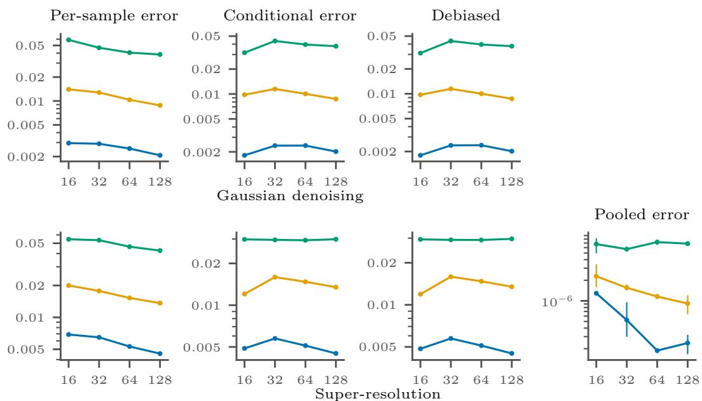  
Figure 6: Error metrics at test conditions on CelebA at $n = 3 2 7 6 8 .$ , as in Figure 5: the per-sample error, the conditional error of Figure 5 (the error of the mean of $K = 6 4$ samples), the debiased error, and the pooled error (super-resolution only). Markers are the mean and bars the min–max range over three seeds.

## F Additional results

## F.1 Smaller training set

Figure 7 repeats Figure 5 at $n = 8 1 9 2$ , a quarter of the training set; apart from n, the setting and the metrics are those of Appendix E.3. With fewer training images every transition moves to a smaller width, and the ordering by condition strength is unchanged. In Gaussian denoising the memorization fraction at $W = 1 6 ~ \mathrm { i s } ~ 0 . 9 9 , 0 . 6 9$ and 0.18 for $\sigma = 0 . 1$ , 0.4 and 2, against 0.52, 0.00 and 0.00 at $n = 3 2 7 6 8$ , and every condition memorizes from $W = 3 2 ~ \mathrm { o n }$ . In super-resolution the $8 \times 8$ and $4 \times 4$ conditions memorize from $W = 3 2 ~ \mathrm { o n }$ (0.96 and 0.45 at $W = 1 6 )$ , and the $2 \times 2$ condition reaches 0.75 at $W = 6 4$ and 1.00 at $W = 1 2 8$ . The within-condition variance falls with width in every row, by one to two orders of magnitude from $W = 1 6$ to $W = 1 2 8$ , except for $\sigma = 2$ where it levels of from $W = 6 4 ~ \mathrm { o n }$ , and for the $2 \times 2$ condition, where it falls about threefold. For the $2 \times 2$ condition, whose memorization completes only at $W = 1 2 8$ , the conditional error is still rising at the largest width considered, consistent with a peak near the onset of memorization.

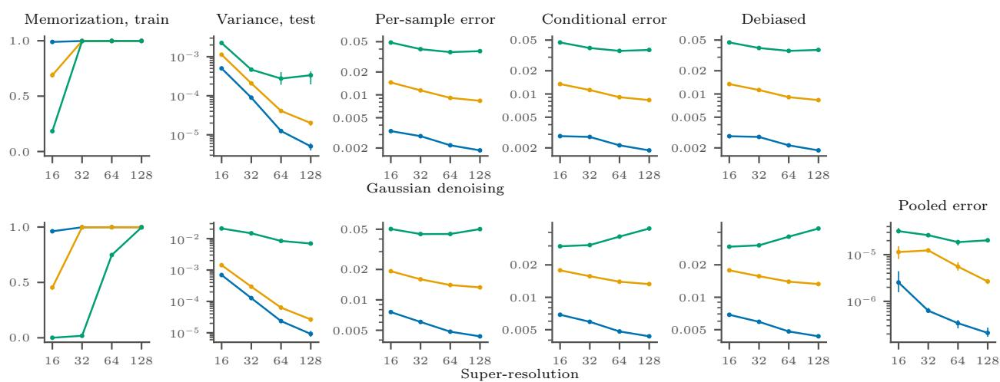  
Figure 7: Figure 5 at $n = 8 1 9 2$ , with the error metrics of Figure 6 in the last four columns: full reverse-process generation with U-Nets on $3 2 \times 3 2$ CelebA against the width $W \in \{ 1 6 , 3 2 , 6 4 , 1 2 8 \}$ every model trained for 200k steps. Markers are the mean and bars the min–max range over three seeds.

## F.2 Test and training losses over width and condition strength

Figures 8–11 evaluate Theorem 4.2 over the full range $1 0 ^ { - 1 } \le \mathrm { S N R } \le 1 0 ^ { 3 }$ of both specializations, at $t = 0 . 0 1 , \varrho ( u ) = \operatorname { t a n h } ( u ) , \lambda = 1 0 ^ { - 5 }$ and $\psi _ { n } \in \{ 8 , 3 2 , 6 4 , 2 5 6 \}$ . In each figure the top row is Gaussian denoising, $\psi _ { y } = 1$ , against $\operatorname { S N R } ( 1 , c )$ , and the bottom row is super-resolution, $c = 1$ against $\mathrm { S N R } ( \psi _ { y } , 1 )$ . The columns are those of Figure $2 ;$ the first three share a logarithmic color scale, the white dashed line is $\psi _ { p } = \psi _ { n }$ , and dotted lines are level sets. In every figure the training loss falls with width around $\psi _ { p } = \psi _ { n }$ , and its level sets move to smaller widths as the SNR grows.

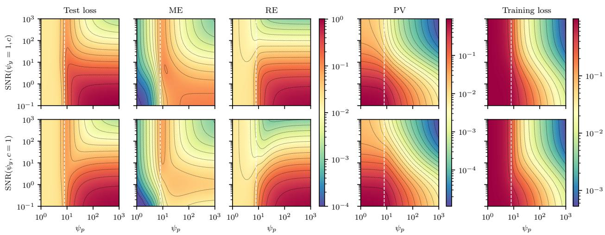  
Figure 8: Test loss $( h _ { t } / a _ { t } ^ { 2 } ) \mathcal { L } _ { \mathrm { t e s t } } ^ { t } = \mathrm { M E } + \mathrm { R E }$ , ME, RE, PV and $\mathcal { L } _ { \mathrm { t r a i n } } ^ { t }$ of Theorem 4.2 at $\psi _ { n } = 8 ;$ settings as in Appendix F.2.

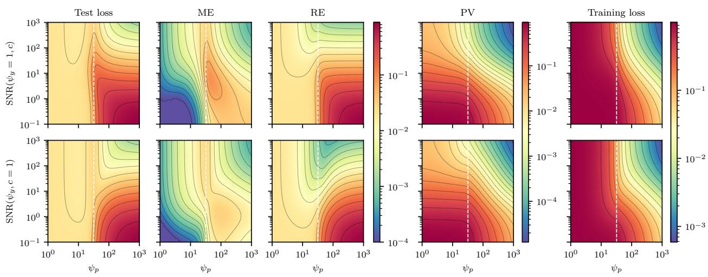  
Figure 9: Test loss $( h _ { t } / a _ { t } ^ { 2 } ) \mathcal { L } _ { \mathrm { t e s t } } ^ { t } = \mathrm { M E } + \mathrm { R E }$ , ME, RE, PV and $\mathcal { L } _ { \mathrm { t r a i n } } ^ { t }$ of Theorem 4.2 at $\psi _ { n } = 3 2$ , as in Figures 2 and 4; settings as in Appendix F.2.

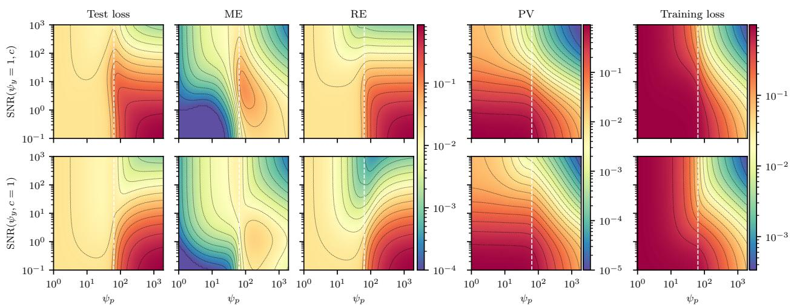  
Figure 10: Test loss $( h _ { t } / a _ { t } ^ { 2 } ) \mathcal { L } _ { \mathrm { t e s t } } ^ { t } = \mathrm { M E } + \mathrm { R E }$ , ME, RE, PV and $\mathcal { L } _ { \mathrm { t r a i n } } ^ { t }$ of Theorem 4.2 at $\psi _ { n } = 6 4$ settings as in Appendix F.2.

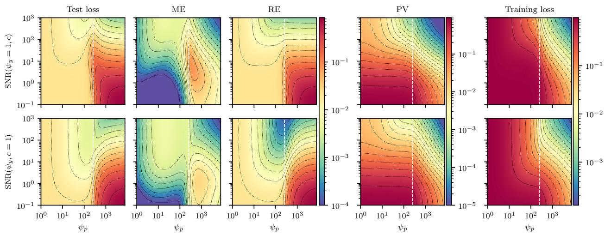  
Figure 11: Test loss $( h _ { t } / a _ { t } ^ { 2 } ) \mathcal { L } _ { \mathrm { t e s t } } ^ { t } = \mathrm { M E } + \mathrm { R E }$ , ME, RE, PV and $\mathcal { L } _ { \mathrm { t r a i n } } ^ { t }$ of Theorem 4.2 at $\psi _ { n } = 2 5 6 ;$ settings as in Appendix F.2.

Figures 12–14 repeat Figure 9 at $t \in \{ 0 . 0 0 1 , 0 . 1 , 1 \}$ . A smaller t sharpens the peak near $\psi _ { p } = \psi _ { n }$ and a larger t smooths it; at $t = 1$ the errors no longer peak there.  
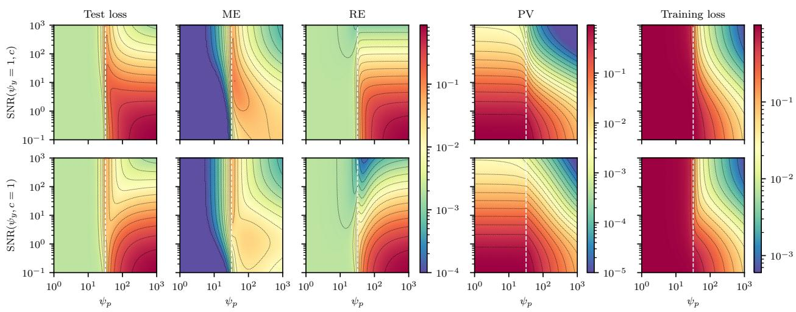  
Figure 12: As Figure 9 $\left( \psi _ { n } = 3 2 \right)$ at $t = 0 . 0 0 1$

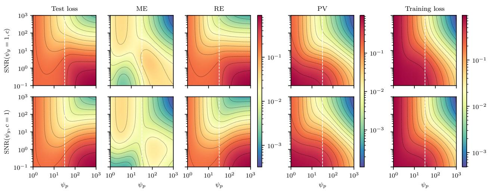  
Figure 13: As Figure 9 $\left( \psi _ { n } = 3 2 \right)$ at $t = 0 . 1$

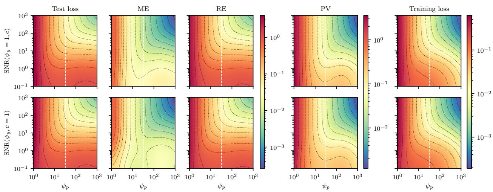  
Figure 14: As Figure $9 \ ( \psi _ { n } = 3 2 )$ at t = 1.

Figure 15 varies c and $\psi _ { y }$ jointly at $\psi _ { n } ~ = ~ 2 5 6$ and $\psi _ { p } / \psi _ { n } \in \{ 2 , 8 , 3 2 , 6 4 \}$ , with the other settings as above. Its axes are the SNRs of the two specializations, $\mathrm { S N R } ( 1 , c ) = c ^ { 2 } / ( 1 - c ^ { 2 } )$ and $\mathrm { S N R } ( \psi _ { y } , 1 ) = \psi _ { y } / ( 1 - \psi _ { y } )$ . At every width the training loss decreases in both c and $\psi _ { y }$ , but it becomes small only when both are large, that is, when $\mathrm { S N R } ( \psi _ { y } , c )$ is large, as in Proposition 4.5. It agrees with $R _ { \mathrm { t r a i n } } ( \psi _ { p } / \psi _ { n } )$ in (13) to within $2 \times 1 0 ^ { - 3 }$

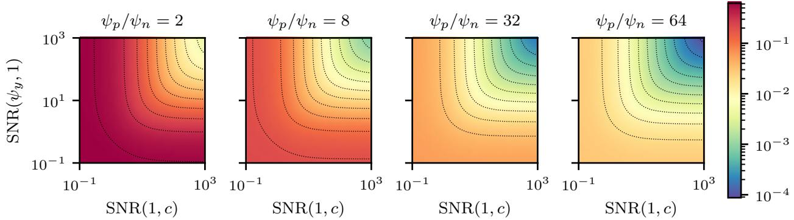  
Figure 15: Training loss $\mathcal { L } _ { \mathrm { t r a i n } } ^ { t }$ of Theorem 4.2 over $\operatorname { S N R } ( 1 , c )$ and $\mathrm { S N R } ( \psi _ { y } , 1 )$ for $\psi _ { p } / \psi _ { n } ~ \in$ $\{ 2 , 8 , 3 2 , 6 4 \}$ , at $\psi _ { n } = 2 5 6$ $t = 0 . 0 1$ $\varrho ( u ) = \operatorname { t a n h } ( u )$ and $\lambda = 1 0 ^ { - 5 }$ . The panels share a logarithmic color scale, and dotted lines are level sets.

## F.3 Additional CelebA samples

Figures 16–19 show samples at $n = 3 2 7 6 8$ , the setting of Figure 5, for the same six training and six test conditions in every figure. Figures 16 and 17 vary the condition at $W = 3 2$ , where 91%, 19% and 0% of the samples for training conditions are memorized for the $8 \times 8$ , 4 × 4 and $2 \times 2$ conditions, and 97%, 45% and 3% for $\sigma = 0 . 1$ , 0.4 and 2. Figures 18 and 19 vary the width $W \in \{ 1 6 , 3 2 , 6 4 \}$ with the strongest condition, the $8 \times 8$ condition and $\sigma = 0 . 1$ , where these fractions are 12%, 91% and 99%, and 52%, 97% and 99%. A memorized sample for a training condition is its source image, which is then also the nearest training image. Figure 1 uses $n = 8 1 9 2$ and $W = 1 6$

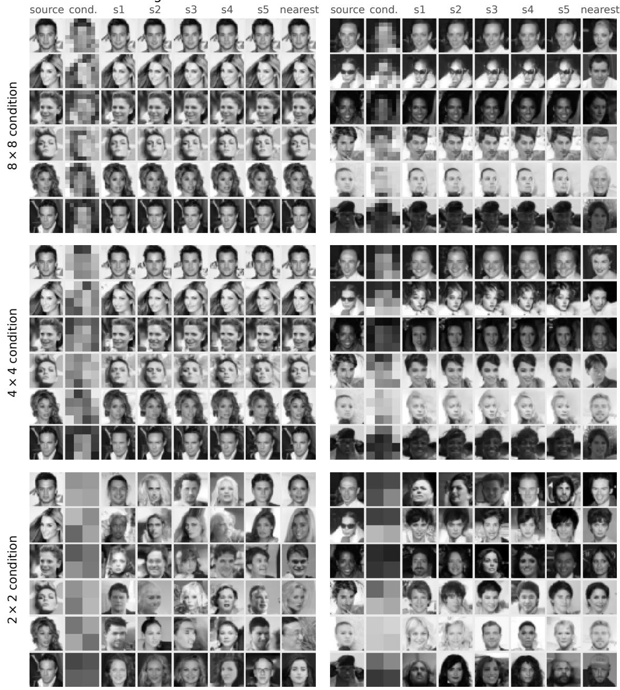  
Figure 16: Samples at $n = 3 2 7 6 8$ and $W = 3 2$ (200k steps) for super-resolution with the $8 \times 8 , 4 \times 4$ and $2 \times 2$ conditions. Each row is one condition: the source image, the condition made from it (nearest-upsampled), five samples generated from it, and the training image nearest to any of them. Left: training conditions; right: test conditions.

test conditions

training conditions

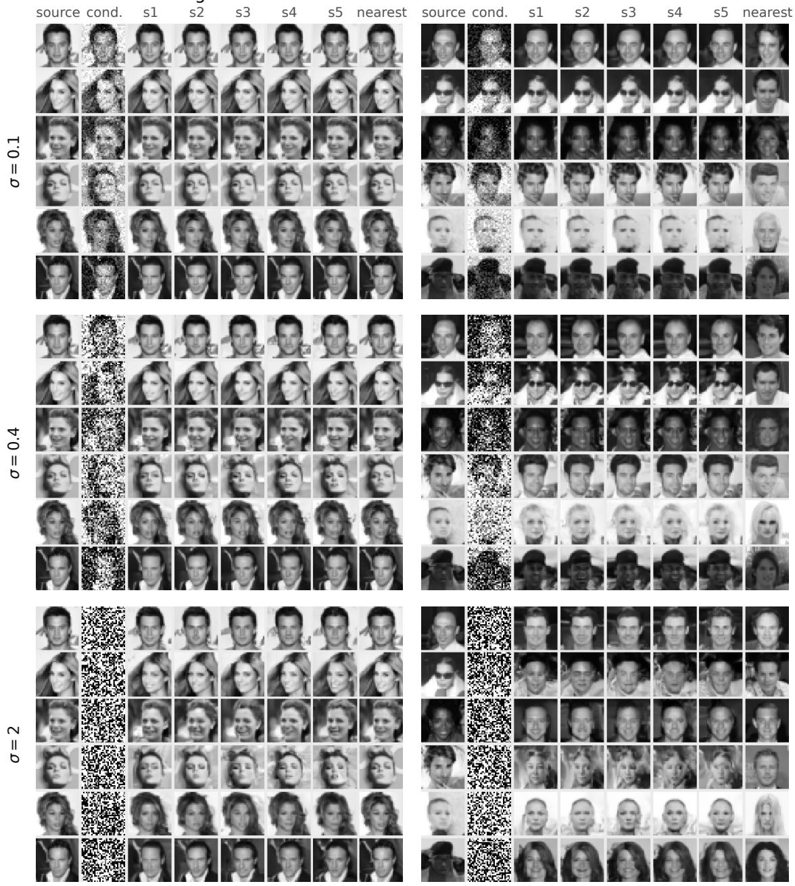  
Figure 17: Samples at $n = 3 2 7 6 8$ and W = 32 (200k steps) for Gaussian denoising with σ = 0.1, 0.4 and 2; the noisy condition is clipped to [0, 1] for display. Rows and columns as in Figure 16.

training conditions

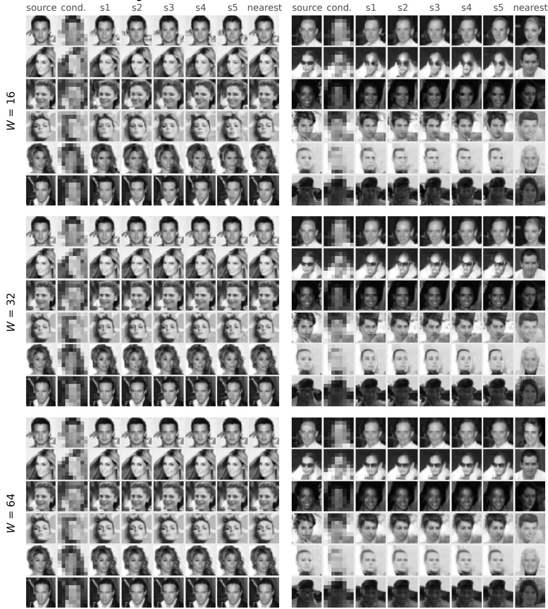  
Figure 18: Samples at n = 32768 for W = 16, 32 and 64 (200k steps) for super-resolution with the 8 × 8 condition. Rows and columns as in Figure 16.

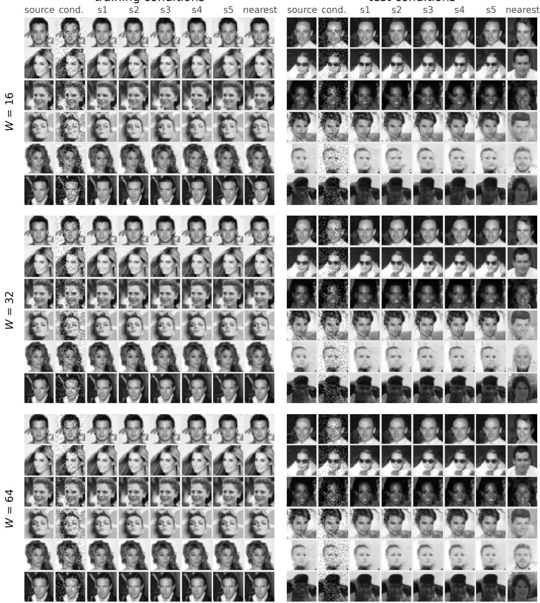  
Figure 19: Samples at $n = 3 2 7 6 8$ for $W = 1 6 .$ , 32 and 64 (200k steps) for Gaussian denoising with $\sigma = 0 . 1$ . Rows and columns as in Figure 16.

## G AI use statement

In this work, we used generative AI tools to assist in the writing of proofs, design and provide feedback on the experiments, implement methods, assist with translation, clean and reformat datasets, and interpret results. We have not used generative AI tools to formulate mathematical claims, to generate synthetic data sets, to help develop theoretical models or conceptual frameworks, to provide critical ingredients for proving mathematical claims, or to propose or refine hypotheses, and qualitative and thematic data analysis is not applicable to this work. Additionally, we used generative AI tools to create and modify scientific figures, to create and edit software code, and to edit the paper to improve readability. We have reviewed all AI-assisted work: the authors checked all AI-assisted derivations, proofs, and code. We take responsibility for the final content of this work, including text, claims, or artifacts produced with the aid of generative AI.