# Mid-Training Language Models on Raw Video

Jaedong Hwang1,2,∗, Xiaoqian Shen1,3,∗, Ernie Chang1, Changsheng Zhao1, Chong Zhou1, Saksham Suri1, Qi Qian1, Zechun Liu1, Lemeng Wu1, Qinsi Wang1,4,∗, Raghuraman Krishnamoorthi1, Wei Wen1

1Meta AI, 2Massachusetts Institute of Technology, 3KAUST, 4Duke University

∗Work done at Meta

Multimodal large language models learn mostly from paired image-text data or annotated video, and raw web video is rarely used to further train an existing language model. We study whether raw video, with no captions and no text loss, can serve as mid-training data for a pretrained language model. Frames are encoded into continuous visual tokens, and the language model learns to predict the next visual token. We mid-train Qwen3-1.7B on raw clips from YT-Temporal-1B and then apply the same image-text instruction tuning to it and to the model without mid-training, so that the two difer only in mid-training. The mid-trained model scores 2.9 points higher on average across four video benchmarks and 5.1 points higher across ten image benchmarks, spanning perception, document, and chart tasks. Text performance is preserved even though mid-training includes no text, with an average of 48.9 across 14 text benchmarks compared with 48.0 for the model without mid-training. Analyses across training show that the image and video gains emerge within 30% of training and plateau thereafter, varying by less than 0.5 points. Predicting captions fails to outperform next-visual-token prediction, demonstrating that video mid-training can remain purely self-supervised without the computational overhead or labeling noise of automated captioning.

Date: October 9, 2026 Correspondence: Wei Wen at wewen@meta.com Project Page: https://jd730.github.io/projects/RawVideoMidTraining

∞Meta

## 1 Introduction

Large language models (LLMs) have advanced rapidly across reasoning, coding, and knowledge-intensive tasks (Achiam et al., 2023; Brown et al., 2020; Gemma Team et al., 2025; Yang et al., 2025). These capabilities have been driven in large part by data scaling, with recent models trained on tens of trillions of tokens, well beyond compute-optimal allocations (Hofmann et al., 2022; Yang et al., 2025). However, training set growth already outpaces human text generation, and the stock of public human text is projected to be fully used in a decade (Villalobos et al., 2024). Scaling the text pretraining corpus, a central driver of progress under neural scaling laws (Kaplan et al., 2020; Hofmann et al., 2022), is therefore approaching fundamental limits. Repeated text yields diminishing returns beyond a few epochs (Muennighof et al., 2023), and recursive training on synthetic text degrades model quality (Shumailov et al., 2024). Sustaining scaling trends necessitates drawing upon non-text modalities.

Among non-text modalities, video is the largest source of data. Its stock is estimated at roughly 1350 trillion text-token equivalents, about 2.6 times the indexed web (Villalobos et al., 2024). Video also suits language model training, since its frames arrive in temporal order like tokens in text and show objects, actions, and scenes that text describes only indirectly. Yet current multimodal models use video mainly through text, pairing sampled frames with captions or question-answer annotations (An et al., 2026; Bai et al., 2025). Captioning web-scale video frame by frame is expensive, and the captions inherit the errors and omissions of the captioning model. This raises the question of whether a pretrained language model can learn from raw video directly, with no captions, by predicting the next visual token.

While world models trained on large-scale video show that predicting future observations, in pixel space or in a learned representation space, supports simulation, planning, and control (Assran et al., 2025; Bruce et al., 2024; NVIDIA, 2026), integrating raw video into language model pretraining remains challenging. Prior multimodal eforts either train unified transformers from scratch on text, image, and video tokens (Wang et al., 2026) or add latent future-frame prediction heads over curated video clips (Yang et al., 2026). Neither directly addresses the most practical regime for scaling, namely continued pretraining of an existing, pretrained LLM on raw web video.

In this work, we mid-train a pretrained language model on raw video with next-token prediction over visual tokens. Each frame is encoded by a pretrained vision encoder and projected into the language model’s embedding space, turning a clip into a continuous sequence of visual tokens. The language model learns to predict each next visual token from its hidden state, with no captions or discrete visual tokenizer.

We train Qwen3-1.7B (Yang et al., 2025) this way on 16-frame clips from YT-Temporal-1B (Zellers et al., 2022) and compare it with a baseline that receives the same instruction tuning without mid-training. Video mid-training raises the average over four video benchmarks by 2.9 points, with a 4.8-point gain on EgoSchema, and the average over ten image benchmarks by 5.1 points. Although mid-training includes no text, the mid-trained model preserves text performance, raising the average text score from 48.0 to 48.9 and keeping every knowledge and commonsense score within 1.4 points of the model without mid-training. Replacing the visual target with a caption of the next frame gives similar video and image scores but lowers the average text score by 1.5 points, and a caption of the current frame leaves the image average at 48.8, within 0.1 points of the baseline. Video mid-training therefore needs no frame-level captions.

Our primary contributions are as follows:

• We propose mid-training a pretrained language model on raw video by predicting the next visual token, which requires no captions or annotations.

• We show that video mid-training improves video understanding by 2.9 points on average (4.8 points on EgoSchema) and image understanding by 5.1 points, while maintaining baseline text performance despite using no text supervision.

• We demonstrate that video mid-training eliminates the need for expensive captioning pipelines, as predicting current- or next-frame captions provides no advantage over purely self-supervised next-visualtoken prediction.

## 2 Related Work

## 2.1 Learning from Video without Language

Self-supervised video models are trained by reconstructing masked spatiotemporal patches (Tong et al., 2022), autoregressively generating discrete visual tokens (Yan et al., 2021), or predicting representations in a latent feature space (Assran et al., 2023, 2025). When scaled to internet video, predictive objectives yield rich representations that support physical planning (Assran et al., 2025) as well as generative world models that simulate interactive environments (Bruce et al., 2024; NVIDIA, 2026). However, these models are trained strictly from scratch in the visual domain and typically incorporate language only post hoc through downstream probing or fine-tuning. In contrast, rather than training a standalone video backbone, our objective is to investigate what an already-competent language model acquires when trained directly on continuous visual streams.

## 2.2 Video as Training Data for Language Models

An emerging line of research explores video as pretraining data for language architectures. Tong et al. (2026) pretrain a transformer from scratch on a joint mixture of text and raw video, finding that adding video keeps text perplexity close to text-only pretraining, lower on in-distribution web text but higher on an out-ofdistribution corpus. However, their setup trains jointly from scratch with an explicit text language modeling loss. Similarly, Emu3 (Wang et al., 2026) pretrains a single transformer from scratch across interleaved discrete image, video, and text tokens. Cambrian-S (Yang et al., 2026) adds a latent frame prediction head to a vision-language model and trains it jointly with spatial instruction tuning on a curated video corpus. Other recent eforts cast diverse multimodal tasks as video frame prediction (Hudson et al., 2025) or train vision-language models to anticipate and describe future environmental states (Chen et al., 2025). Unlike these methods, we continue training an existing pretrained language model instead of training from scratch, and we use raw web video with no captions and no text loss. The model learns only to predict the next continuous visual token, so video extends its autoregressive pretraining rather than serving as a task format or an instruction-tuning signal.

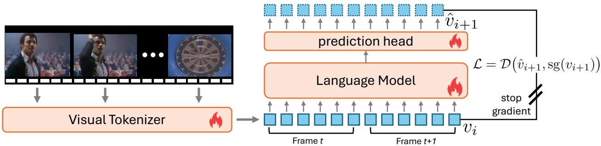  
Figure 1 Overview of continuous video mid-training. Ordered video frames $x _ { 1 : T }$ are encoded and projected into continuous token representations. Spatial patch grids are serialized with row-delimiter tokens and concatenated into a unified sequence V. A causal language model processes the continuous visual stream without captions or text supervision, and a prediction head $r _ { \omega }$ regresses the subsequent visual representation $v _ { i + 1 }$ from the hidden state $h _ { i }$ . A stop-gradient operator sg(·) is applied to the regression target so that gradients do not flow through it.

## 2.3 Vision-Language Models and Mid-Training Data

Standard vision-language models connect a pretrained vision encoder (Zhai et al., 2023) to a causal language model (Yang et al., 2025) via a learned projection layer, followed by supervised instruction tuning on multimodal data (Tong et al., 2024; Li et al., 2025). Under this conventional recipe, the language model encounters visual tokens primarily during instruction tuning, and video is reduced to a sparse subset of sampled frames. To bridge the gap between static image pretraining and downstream tasks, recent open models add a large-scale multimodal mid-training stage in which video is supervised mainly through synthesized clip captions (An et al., 2026; Bai et al., 2025). Our ablations show that next-frame captions give no gain over predicting continuous visual features directly (see Section 4.4). Bypassing caption generation lets video mid-training use large web collections such as YT-Temporal-1B (Zellers et al., 2022) without any annotation.

## 3 Next-Token Prediction on Visual Tokens

We formulate video mid-training as autoregressive next-token prediction over continuous visual representations, keeping the causal decoder-only architecture of the language model. Rather than quantizing video into discrete codebooks (Yan et al., 2021) or relying on generated text captions (An et al., 2026), our approach encodes raw video frames into continuous feature vectors that directly populate the input space of the language model backbone. The model is trained on this serialized visual stream via self-supervised feature regression, without paired captions or any language loss (see Figure 1). This enables seamless data scaling by bypassing the cost and complexity of manual annotation or synthetic pseudo-captioning pipelines.

Architecture. Given an ordered sequence of T video frames $\boldsymbol { x } _ { 1 : T } = [ x _ { 1 } , \dots , x _ { T } ]$ , a vision encoder $g _ { \phi }$ and projector $p _ { \psi }$ map each frame $x _ { t }$ into the language model’s hidden dimension d:

$$
z _ { t } = p _ { \psi } ( g _ { \phi } ( x _ { t } ) ) \in \mathbb { R } ^ { N \times d } ,\tag{1}
$$

where N denotes the number of visual tokens per frame. Each grid $z _ { t }$ is serialized in row-major order with a learned newline embedding $e _ { \mathrm { n l } } \in \mathbb { R } ^ { d }$ after every row, which keeps the two-dimensional layout recoverable from the flat sequence. The per-frame sequences are temporally concatenated into a unified continuous token stream $V = [ v _ { 1 } , \ldots , v _ { L } ] \in \mathbb { R } ^ { L \times d }$ , where L is the total sequence length including the newline embeddings. These embeddings are directly fed to the causal Transformer blocks of $f _ { \theta }$ in the language model.

Objective. Standard language model pretraining maximizes the log-likelihood of discrete token sequences under causal masking. For continuous visual representations where no discrete vocabulary exists, we frame next-token prediction as self-supervised feature regression in the embedding space (i.e., token space), similar to V-JEPA 2 (Assran et al., 2025), which regresses the embeddings of masked video regions. At each position $i \in \{ 1 , \ldots , L - 1 \}$ , the language model produces a contextual hidden state $h _ { i } = f _ { \theta } ( v _ { 1 : i } )$ conditioned strictly on the preceding visual context. A two-layer MLP prediction head $r _ { \omega } : \mathbb { R } ^ { d }  \mathbb { R } ^ { d }$ maps $h _ { i }$ to a predicted feature vector $\hat { v } _ { i + 1 } = r _ { \omega } ( h _ { i } )$ . The model minimizes the distance between the predicted representation and the ground-truth visual token $v _ { i + 1 }$ at every position whose next token is a visual patch,

$$
\mathcal { L } = \frac { 1 } { | L - 1 | } \sum _ { i = 1 } ^ { L - 1 } \mathcal { D } \big ( \hat { v } _ { i + 1 } , \mathrm { s g } ( v _ { i + 1 } ) \big ) ,\tag{2}
$$

where $\mathcal { D } ( u , v )$ and $\operatorname { s g } ( \cdot )$ denote a distance function and the stop-gradient operator. In this work, we use cosine distance $\begin{array} { r } { \begin{array} { r } { \mathcal { D } ( u , v ) = 1 - \frac { u ^ { \top } v } { \| u \| _ { 2 } \| v \| _ { 2 } } } \end{array} } \end{array}$ . Applying sg(·) to the target representation $v _ { i + 1 }$ keeps gradients from flowing through the target. This ensures that gradients propagate solely through the causal predictive pathway from the vision encoder to the prediction head $\bigl ( \phi , \psi , \theta , \omega \bigr )$ , while the subsequent visual feature acts as a fixed regression target during each optimization step. Under standard causal self-attention over the serialized sequence, this single objective unifies spatial next-patch modeling within frames and temporal prediction across frame boundaries. It adds only a small prediction head used during mid-training and requires no discrete codebook or language supervision.

## 4 Experiments

We first outline the experimental setup, then report downstream evaluations across video, image, and text benchmarks in Tables 1 to 3, and finally analyze cross-modal training dynamics and the mid-training objective through ablation experiments.

## 4.1 Experimental Details

## 4.1.1 Architecture

Following Cambrian-S (Yang et al., 2026), our model connects a pretrained vision encoder to a causal language model through a two-layer GELU (Hendrycks and Gimpel, 2016) MLP projector. We instantiate the visual backbone with SigLIP SO400M/14 at 384 × 384 resolution (Zhai et al., 2023) and the language model with Qwen3-1.7B (Yang et al., 2025). Visual patch tokens are projected directly into the 2,048-dimensional language embedding space. The auxiliary prediction head $r _ { \omega }$ used during mid-training is a lightweight two-layer GELU MLP with 2,048 hidden units.

## 4.1.2 Dataset

We draw mid-training video from YT-Temporal-1B (YT-1B) (Zellers et al., 2022), a collection of approximately 20 million public YouTube videos. After excluding videos that are no longer accessible online, our source pool comprises 17 million videos. Frames are sampled at 0.2 fps (one frame every five seconds). From videos containing between 16 and 63 sampled frames, we extract contiguous 16-frame clips starting at random temporal ofsets. The composed dataset contains 6.99M clips with 64.4B visual tokens in our implementation. For subsequent supervised fine-tuning, we incorporate LLaVA-OneVision-Data (Li et al., 2025) (3.9M images, 3.2B tokens).

## 4.1.3 Captioning Mid-Training Data for Baselines

For the caption baselines in Section 4.4, frames are captioned by Qwen3-VL-30B-A3B (Bai et al., 2025) in consecutive pairs with a progress-aware prompt adapted from Xue et al. (2025). The captioning model sees both frames of a pair together and writes one caption per frame that describes the action in that frame without referring to the other frame, so the two captions difer where the action has progressed. The caption of frame t is the target of current-caption prediction, and the caption of frame t+1 is the target of next-caption prediction from frame t.

System. You are a precise video-frame captioner. You are shown an ordered sequence of keyframes from a single video. Describe   
what is VISIBLE in each frame -- people, objects, actions, setting, camera. Never invent things that are not in the frame.   
User. Frame 1: <image> Frame 2: <image>   
These 2 frames are consecutive moments of one action, in order. Write one caption per frame. Requirements:   
(1) Ensure each frame’s description is specific to the corresponding frame, not referencing other frames (no ’continues’, ’now’,   
’still’, ’again’, ’then’, ’previous’, ’next’).   
(2) The description should focus on the specific action being performed, capturing the progression of the action. There is no need   
to comment on other elements, such as the background or unrelated objects.   
- 1-3 concrete sentences; keep every caption distinct.   
- Write a plain natural-language sentence for each frame. Do NOT output bounding boxes, coordinates, object labels, or detection   
JSON.   
- Output ONLY a JSON array of exactly 2 plain strings (one per frame, in order), e.g. ["caption 1", "caption 2", ...] -- no objects,   
no extra text.  
Figure 2 Captioning prompt for the caption baselines. Qwen3-VL-30B-A3B receives two consecutive frames and writes one caption per frame, following a prompt adapted from the progress-aware captioning of Xue et al. (2025). Each caption describes the action in its own frame without referring to the other frame, and each <image> is replaced by the visual tokens of that frame.

The system prompt instructs the model to describe only what is visible and never to invent content absent from the frames. The user turn presents the two frames in order and closes with the instruction reproduced in Figure 2.

## 4.1.4 Training

All model parameters $\left( \phi , \psi , \theta , \omega \right)$ are trained end-to-end for one epoch (27,300 steps) across 128 NVIDIA H100 GPUs. We train with an efective batch size of 256 clips and a context window of 16k tokens. We use AdamW (Loshchilov and Hutter, 2019) with a learning rate of 0.00001 for the language model and projector and 0.000002 for the vision encoder, with cosine decay and a 3% linear warmup. Following mid-training, we instruction-tune mid-trained models for one epoch on LLaVA-OneVision data (Li et al., 2025) using the same training parameters used in mid-training.

## 4.1.5 Benchmarks

We evaluate instruction-tuned models across video, static image, and text suites. Video understanding. We group the video benchmarks by the ability they test, namely long-form egocentric understanding with EgoSchema (Mangalam et al., 2023), general video question answering with NExT-QA (Xiao et al., 2021) and Video-MME (Fu et al., 2025), and fine-grained temporal reasoning with TempCompass (Liu et al., 2024b). Image understanding. We group the image benchmarks by task type, namely text-rich image understanding (Masry et al., 2022; Mathew et al., 2021, 2022; Singh et al., 2019), general perception and diagram understanding (Kembhavi et al., 2016; Liu et al., 2024a; Li et al., 2024), text recognition (Liu et al., 2024c), and visual reasoning (Chen et al., 2024; Lu et al., 2024b). Text understanding and reasoning. To measure how well the model retains its language ability, we evaluate commonsense reasoning and world knowledge (Bisk et al., 2020; Clark et al., 2018, 2019; Hendrycks et al., 2021a; Mihaylov et al., 2018; Sakaguchi et al., 2021; Sap et al., 2019; Zellers et al., 2019), mathematical, scientific, and multi-step reasoning (Cobbe et al., 2021; Hendrycks et al., 2021b; Lightman et al., 2024; Rein et al., 2024; Suzgun et al., 2023), and code generation (Austin et al., 2021).

## 4.1.6 Evaluation Protocol

Image and video benchmarks are evaluated via lmms-eval (Zhang et al., 2025), where multiple-choice questions are scored by option-letter log-likelihood and open-ended queries are decoded greedily. Multiple-choice and short-answer text benchmarks are evaluated zero-shot by ranking candidate-answer log-likelihoods. Free-form text benchmarks use greedy decoding with standard few-shot exemplars: eight for GSM8K, and three for MBPP and BBH. Finally, GPQA is evaluated via lighteval (Habib et al., 2023) in non-reasoning mode with an 8,192-token generation budget, a presence penalty of 1.5, and top-k = 20

Table 1 Efect of video mid-training on video benchmarks. No Mid-Training denotes the language model instructiontuned without video mid-training, and Video Mid-Training denotes the model mid-trained for one epoch (64.4B visual tokens) and then given the same instruction tuning. All scores are accuracies in percent, and the best value in each row is in bold.
<table><tr><td colspan="3">Benchmark No Mid-Training Video Mid-Training</td></tr><tr><td>Text-Rich Image Understanding</td><td></td><td></td></tr><tr><td>ChartQA</td><td>43.76</td><td>51.96</td></tr><tr><td>DocVQA</td><td>32.13</td><td>38.57</td></tr><tr><td>InfographicVQA</td><td>22.31</td><td>25.28</td></tr><tr><td>TextVQA</td><td>45.49</td><td>51.05</td></tr><tr><td>General Perception &amp; Diagrams</td><td></td><td></td></tr><tr><td>AI2D</td><td>66.39</td><td>72.51</td></tr><tr><td>MMBench</td><td>76.00</td><td>79.46</td></tr><tr><td>SEED-Bench</td><td>63.00</td><td>69.10</td></tr><tr><td colspan="3">Character Recognition</td></tr><tr><td>OCRBench</td><td>38.40</td><td>41.60</td></tr><tr><td colspan="3">Complex Visual Reasoning</td></tr><tr><td>MathVista</td><td>58.15</td><td>62.59</td></tr><tr><td>MMStar</td><td>41.60</td><td>45.93</td></tr><tr><td>Average</td><td>48.72</td><td></td></tr><tr><td></td><td></td><td>53.80</td></tr></table>

Table 2 Efect of video mid-training on image benchmarks. Columns follow Table 1. All scores are accuracies in percent, with OCRBench divided by ten, and the best value in each row is in bold.
<table><tr><td>Benchmark</td><td>No Mid-Training Video Mid-Training</td></tr><tr><td>NExT-QA</td><td>59.04 62.18</td></tr><tr><td>VideoMME</td><td>42.85 45.15</td></tr><tr><td>TempCompass</td><td>51.58 53.04</td></tr><tr><td>EgoSchema</td><td>45.20 50.00</td></tr><tr><td>Average</td><td>49.67 52.59</td></tr></table>

## 4.2 Video Mid-Training Improves Video and Image Understanding

Tables 1, 2, and 3 report downstream evaluation results across video, image, and text benchmarks, respectively. Compared with the model instruction-tuned without mid-training, our video mid-trained model improves every video benchmark (+2.9 points on average), with the largest gain of 4.8 points on EgoSchema. These representations transfer to static image perception, improving all ten image benchmarks (+5.1 points on average), with the largest gains on visually dense tasks such as ChartQA (+8.2 points), DocVQA (+6.4 points), and AI2D (+6.1 points).

On text benchmarks, multimodal instruction tuning lowers performance on mathematical and multi-step reasoning, dropping 23.5 points on GSM8K, 17.7 points on MATH500, and 15.0 points on BBH relative to the original Qwen3-1.7B, while leaving knowledge and commonsense benchmarks largely unafected. Prior vision-language models report the same loss and reduce it by mixing text-only data into training (Lu et al., 2024a), whereas our instruction-tuning set contains only image-text examples. The mid-trained model shows the same pattern with a smaller drop, 18.6 points on GSM8K, 16.5 points on MATH500, and 9.5 points on BBH. One possible reason is that mid-training has already adapted the language model to visual tokens, so instruction tuning needs to change it less.

Table 3 Efect of video mid-training on text benchmarks. Qwen3-1.7B is the language model before any multimodal training. All scores are accuracies in percent, and the best value in each row is in bold.
<table><tr><td>Benchmark</td><td colspan="3">Qwen3-1.7B No Mid-Training Video Mid-Training</td></tr><tr><td>Commonsense &amp; General Knowledge</td><td></td><td></td><td></td></tr><tr><td>OpenBookQA</td><td>25.99</td><td>26.79</td><td>26.59</td></tr><tr><td>WinoGrande</td><td>60.53</td><td>61.87</td><td>61.64</td></tr><tr><td>HellaSwag</td><td>45.18</td><td>45.26</td><td>45.68</td></tr><tr><td>SIQA</td><td>44.03</td><td>44.18</td><td>44.49</td></tr><tr><td>PIQA</td><td>71.47</td><td>72.34</td><td>72.17</td></tr><tr><td>ARC-Easy</td><td>71.58</td><td>73.31</td><td>73.61</td></tr><tr><td>ARC-Challenge</td><td>39.81</td><td>41.35</td><td>42.72</td></tr><tr><td>BoolQ</td><td>79.46</td><td>80.59</td><td>81.54</td></tr><tr><td>MMLU</td><td>62.35</td><td>61.16</td><td>60.75</td></tr><tr><td colspan="2">Mathematical &amp; Complex Reasoning</td><td></td><td></td></tr><tr><td>MATH500</td><td>45.63</td><td>27.98</td><td>29.17</td></tr><tr><td>GSM8K</td><td>73.41</td><td>49.92</td><td>54.77</td></tr><tr><td>BBH</td><td>38.89</td><td>23.92</td><td>29.40</td></tr><tr><td>GPQA</td><td>18.00</td><td>19.50</td><td>17.50</td></tr><tr><td colspan="2">Code Generation</td><td></td><td></td></tr><tr><td>MBPP</td><td>43.06</td><td>44.25</td><td>44.44</td></tr><tr><td>Average</td><td>51.38</td><td>48.03</td><td>48.89</td></tr></table>

## 4.3 Image and Video Gains Appear Early in Mid-Training

Figure 3 illustrates average video, image, and text performance across mid-training, evaluated at 0.3, 0.5, and 1.0 epochs. At each training stage, we perform supervised fine-tuning on LLaVA-OneVision-Data (Li et al., 2025) to evaluate downstream multimodal capabilities. Average image and video scores rise by 4.9 and 3.1 points within the first 0.3 epochs (19.5B visual tokens) and vary by less than 0.5 points over the remaining 0.7 epochs. The average text score stays within 0.9 points of the model without mid-training across all evaluated training steps.

Figure 4 breaks down individual benchmark trajectories. After full mid-training, the largest video gains are on long-form egocentric understanding (EgoSchema) and general video question answering (NExT-QA, VideoMME), while fine-grained temporal reasoning (TempCompass) improves by 1.5 points. Averaged by task type, the largest image gains at the end of mid-training are on text-rich image understanding (+5.8 points) and general perception and diagram understanding (+5.2 points), followed by visual reasoning (+4.4 points) and text recognition (+3.2 points). Across all evaluation intervals, scores on commonsense, knowledge, coding, and GPQA remain within 3 points of the baseline. In contrast, reasoning benchmarks (GSM8K, MATH500, BBH) fluctuate by up to 9 points.

## 4.4 Visual Next-Token Prediction Is Sufficient Without Annotations

Table 4 demonstrates that purely self-supervised visual next-token prediction is suficient for efective midtraining, matching or outperforming objectives that supervise with frame-level dense captions. We compare our approach against two caption-based targets, namely current-caption and next-caption prediction, where the continuous visual target is replaced by a text caption of the current or next frame (see Section 4.1.3).

Predicting next-frame captions yields no empirical advantage over predicting visual tokens directly. It yields similar video and image scores, but degrades language performance by 1.5 points. Even when controlling for training budget by comparing against our 0.5-epoch visual model (52.37 video, 53.76 image, 48.32 text), visual next-token prediction matches vision gains within 0.3 points while better preserving text capability. Current-caption prediction likewise fails to ofer a compelling alternative, falling 5.0 points behind visual tokens on image understanding and showing inconsistent transfer across tasks. These comparisons establish that raw visual token prediction is suficient on its own, allowing video mid-training to remain fully self-supervised

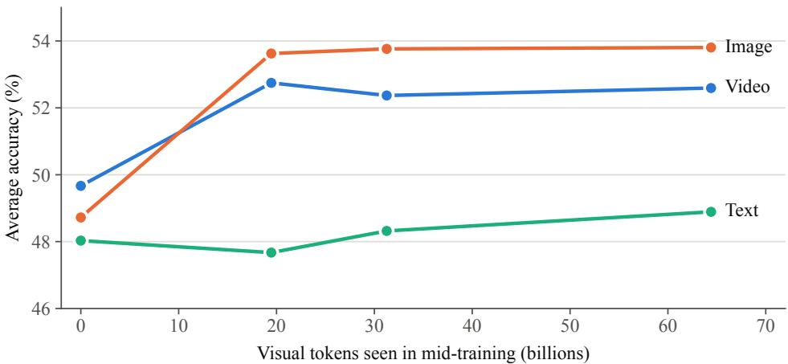  
Figure 3 Progress over mid-training. Each point corresponds to an intermediate mid-training checkpoint followed by identical instruction tuning (0.3, 0.5, and 1.0 epochs), plotted against cumulative visual tokens processed during mid-training. The point at zero represents the baseline instruction-tuned model without video mid-training. Figure 4 reports individual benchmark trajectories.

Table 4 Comparison of mid-training objectives on YT-1B. All models are instruction-tuned on LLaVA-OneVision-Data, and No mid-training is the same model instruction-tuned without mid-training. The best value in each column is in bold.
<table><tr><td>Objective</td><td>Video</td><td>Image</td><td>Text</td></tr><tr><td>No mid-training</td><td>49.67</td><td>48.72</td><td>48.03</td></tr><tr><td>Current caption</td><td>51.28</td><td>48.77</td><td>47.44</td></tr><tr><td>Next caption</td><td>52.51</td><td>53.54</td><td>47.40</td></tr><tr><td>Visual next token</td><td>52.59</td><td>53.80</td><td>48.89</td></tr></table>

while avoiding the computational overhead and label noise of caption generation.

## 5 Discussion

We propose autoregressive next-token prediction on raw web video as a mid-training objective without text supervision that bridges language pretraining and multimodal instruction tuning. Despite seeing only continuous video frames, the model gains 2.9 points on video-language and 5.1 points on image-language benchmarks, with the greatest improvements in text-rich image understanding and general perception. Predicting next-frame captions ofers no advantage over predicting raw visual tokens, demonstrating that video mid-training can remain entirely self-supervised without the expense or label noise of captioning pipelines.

Although mid-training has no text loss, the mid-trained model averages 48.9 on text benchmarks after instruction tuning, compared with 48.0 for the model without mid-training. Both models score below the original language model on GSM8K, MATH500, and BBH, and for the model without mid-training this drop comes from instruction tuning alone. While the mid-trained model degrades less, its 5.5-point margin on BBH is smaller than the 11.7-point discrepancy between instruction-tuning runs from the same initial state.

Downstream multimodal gains appear within the first 0.3 epochs, after which scores change by less than 0.5 points across the remainder of training. Whether denser temporal sampling or longer sequence horizons can yield further improvements remains an open question. In addition, determining whether these gains stem from temporal structure or simply from additional exposure to visual tokens requires future frame-shufling experiments. Evaluating these dynamics across larger language models will establish whether uncaptioned video mid-training can serve as a standard precursor to multimodal instruction tuning.

Video benchmarks  
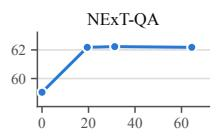

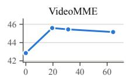

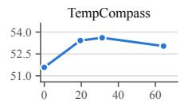

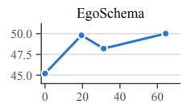

Image benchmarks  
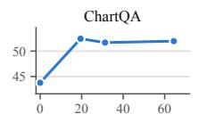

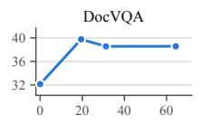

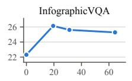

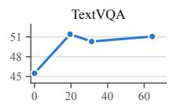

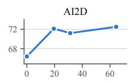

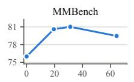

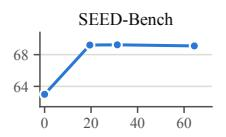

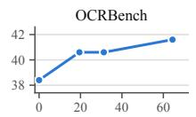

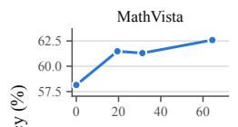

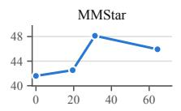  
Mid-training checkpoints Qwen3-1.7B, no multimodal training

Text benchmarks  
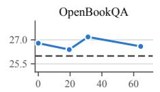

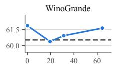

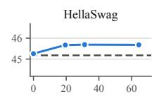

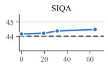

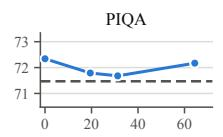

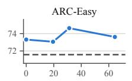

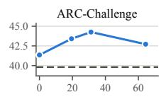

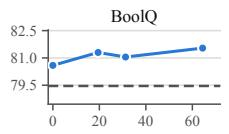

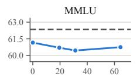

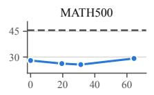

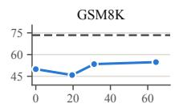

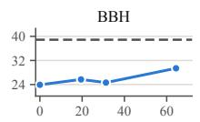

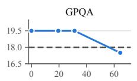

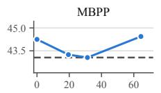  
Visual tokens seen in mid-training (billions)  
Figure 4 Performance trajectory across mid-training on each benchmark. Each point corresponds to an intermediate mid-training checkpoint after subsequent instruction tuning, plotted against cumulative visual tokens processed during mid-training. The point at zero represents the baseline model without mid-training. In text benchmark panels, the dashed line indicates the original Qwen3-1.7B before multimodal training.

## References

Josh Achiam, Steven Adler, Sandhini Agarwal, Lama Ahmad, Ilge Akkaya, Florencia Leoni Aleman, Diogo Almeida, Janko Altenschmidt, Sam Altman, Shyamal Anadkat, et al. GPT-4 technical report. arXiv preprint arXiv:2303.08774, 2023.

Xiang An, Yin Xie, Feilong Tang, Yunyao Yan, Huajie Tan, Didi Zhu, Changrui Chen, Xiuwei Zhao, Bin Qin, Kaicheng Yang, et al. LLaVA-OneVision-2: Towards next-generation perceptual intelligence. arXiv preprint arXiv:2605.25979, 2026.

Mahmoud Assran, Quentin Duval, Ishan Misra, Piotr Bojanowski, Pascal Vincent, Michael Rabbat, Yann LeCun, and Nicolas Ballas. Self-supervised learning from images with a joint-embedding predictive architecture. In CVPR, 2023.

Mido Assran, Adrien Bardes, David Fan, Quentin Garrido, Russell Howes, Mojtaba Komeili, Matthew Muckley, Ammar Rizvi, Claire Roberts, Koustuv Sinha, Artem Zholus, et al. V-JEPA 2: Self-supervised video models enable understanding, prediction and planning. arXiv preprint arXiv:2506.09985, 2025.

Jacob Austin, Augustus Odena, Maxwell Nye, Maarten Bosma, Henryk Michalewski, David Dohan, Ellen Jiang, Carrie Cai, Michael Terry, Quoc Le, and Charles Sutton. Program synthesis with large language models. arXiv preprint arXiv:2108.07732, 2021.

Shuai Bai, Yuxuan Cai, Ruizhe Chen, Keqin Chen, Xionghui Chen, Zesen Cheng, Lianghao Deng, Wei Ding, Chang Gao, Chunjiang Ge, et al. Qwen3-VL technical report. arXiv preprint arXiv:2511.21631, 2025.

Yonatan Bisk, Rowan Zellers, Ronan Le Bras, Jianfeng Gao, and Yejin Choi. PIQA: Reasoning about physical commonsense in natural language. In AAAI, 2020.

Tom Brown, Benjamin Mann, Nick Ryder, Melanie Subbiah, Jared D Kaplan, Prafulla Dhariwal, Arvind Neelakantan, Pranav Shyam, Girish Sastry, Amanda Askell, et al. Language models are few-shot learners. In NeurIPS, 2020.

Jake Bruce, Michael D Dennis, Ashley Edwards, Jack Parker-Holder, Yuge Shi, Edward Hughes, Matthew Lai, Aditi Mavalankar, Richie Steigerwald, Chris Apps, et al. Genie: Generative interactive environments. In ICML, 2024.

Delong Chen, Theo Moutakanni, Willy Chung, Yejin Bang, Ziwei Ji, Allen Bolourchi, and Pascale Fung. Planning with reasoning using vision language world model, 2025.

Lin Chen, Jinsong Li, Xiaoyi Dong, Pan Zhang, Yuhang Zang, Zehui Chen, Haodong Duan, Jiaqi Wang, Yu Qiao, Dahua Lin, and Feng Zhao. Are we on the right way for evaluating large vision-language models? In NeurIPS, 2024.

Christopher Clark, Kenton Lee, Ming-Wei Chang, Tom Kwiatkowski, Michael Collins, and Kristina Toutanova. BoolQ: Exploring the surprising dificulty of natural yes/no questions. In NAACL, 2019.

Peter Clark, Isaac Cowhey, Oren Etzioni, Tushar Khot, Ashish Sabharwal, Carissa Schoenick, and Oyvind Tafjord. Think you have solved question answering? try ARC, the AI2 reasoning challenge. arXiv preprint arXiv:1803.05457, 2018.

Karl Cobbe, Vineet Kosaraju, Mohammad Bavarian, Mark Chen, Heewoo Jun, Lukasz Kaiser, Matthias Plappert, Jerry Tworek, Jacob Hilton, Reiichiro Nakano, Christopher Hesse, and John Schulman. Training verifiers to solve math word problems. arXiv preprint arXiv:2110.14168, 2021.

Chaoyou Fu, Yuhan Dai, Yongdong Luo, et al. Video-MME: The first-ever comprehensive evaluation benchmark of multi-modal LLMs in video analysis. In CVPR, 2025.

Gemma Team, Aishwarya Kamath, Johan Ferret, Shreya Pathak, Nino Vieillard, Ramona Merhej, Sarah Perrin, Tatiana Matejovicova, Alexandre Ramé, Morgane Rivière, et al. Gemma 3 technical report. arXiv preprint arXiv:2503.19786, 2025.

Nathan Habib, Clémentine Fourrier, Hynek Kydlíček, Thomas Wolf, and Lewis Tunstall. LightEval: A lightweight framework for LLM evaluation, 2023. https://github.com/huggingface/lighteval.

Dan Hendrycks and Kevin Gimpel. Gaussian error linear units (GELUs). arXiv preprint arXiv:1606.08415, 2016.

Dan Hendrycks, Collin Burns, Steven Basart, Andy Zou, Mantas Mazeika, Dawn Song, and Jacob Steinhardt. Measuring massive multitask language understanding. In ICLR, 2021a.

Dan Hendrycks, Collin Burns, Saurav Kadavath, Akul Arora, Steven Basart, Eric Tang, Dawn Song, and Jacob Steinhardt. Measuring mathematical problem solving with the MATH dataset. In NeurIPS, 2021b.

Jordan Hofmann, Sebastian Borgeaud, Arthur Mensch, Elena Buchatskaya, Trevor Cai, Eliza Rutherford, Diego de Las Casas, Lisa Anne Hendricks, Johannes Welbl, Aidan Clark, et al. Training compute-optimal large language models. In NeurIPS, 2022.

G. Thomas Hudson, Dean Slack, Thomas Winterbottom, Jamie Sterling, Chenghao Xiao, Junjie Shentu, and Noura Al Moubayed. Everything is a video: Unifying modalities through next-frame prediction. In ICCV, 2025.

Jared Kaplan, Sam McCandlish, Tom Henighan, Tom B Brown, Benjamin Chess, Rewon Child, Scott Gray, Alec Radford, Jefrey Wu, and Dario Amodei. Scaling laws for neural language models. arXiv preprint arXiv:2001.08361, 2020.

Aniruddha Kembhavi, Mike Salvato, Eric Kolve, Minjoon Seo, Hannaneh Hajishirzi, and Ali Farhadi. A diagram is worth a dozen images. In ECCV, pages 235–251, 2016.

Bo Li, Yuanhan Zhang, Dong Guo, Renrui Zhang, Feng Li, Hao Zhang, Kaichen Zhang, Peiyuan Zhang, Yanwei Li, Ziwei Liu, and Chunyuan Li. LLaVA-OneVision: Easy visual task transfer. Transactions on Machine Learning Research, 2025.

Bohao Li, Yuying Ge, Yixiao Ge, Guangzhi Wang, Rui Wang, Ruimao Zhang, and Ying Shan. SEED-Bench: Benchmarking multimodal large language models. In CVPR, 2024.

Hunter Lightman, Vineet Kosaraju, Yuri Burda, Harrison Edwards, Bowen Baker, Teddy Lee, Jan Leike, John Schulman, Ilya Sutskever, and Karl Cobbe. Let’s verify step by step. In ICLR, 2024.

Yuan Liu, Haodong Duan, Yuanhan Zhang, Bo Li, Songyang Zhang, Wangbo Zhao, Yike Yuan, Jiaqi Wang, Conghui He, Ziwei Liu, Kai Chen, and Dahua Lin. MMBench: Is your multi-modal model an all-around player? In ECCV, 2024a.

Yuanxin Liu, Shicheng Li, Yi Liu, et al. TempCompass: Do video LLMs really understand videos? In Findings of ACL, 2024b.

Yuliang Liu, Zhang Li, Mingxin Huang, Biao Yang, Wenwen Yu, Chunyuan Li, Xu-Cheng Yin, Cheng-Lin Liu, Lianwen Jin, and Xiang Bai. OCRBench: On the hidden mystery of OCR in large multimodal models. Science China Information Sciences, 67(12):220102, 2024c.

Ilya Loshchilov and Frank Hutter. Decoupled weight decay regularization. In ICLR, 2019.

Haoyu Lu, Wen Liu, Bo Zhang, Bingxuan Wang, Kai Dong, Bo Liu, Jingxiang Sun, Tongzheng Ren, Zhuoshu Li, Hao Yang, et al. DeepSeek-VL: Towards real-world vision-language understanding. arXiv preprint arXiv:2403.05525, 2024a.

Pan Lu, Hritik Bansal, Tony Xia, Jiacheng Liu, Chunyuan Li, Hannaneh Hajishirzi, Hao Cheng, Kai-Wei Chang, Michel Galley, and Jianfeng Gao. MathVista: Evaluating mathematical reasoning of foundation models in visual contexts. In ICLR, 2024b.

Karttikeya Mangalam, Raiymbek Akshulakov, and Jitendra Malik. EgoSchema: A diagnostic benchmark for very long-form video language understanding. In NeurIPS, 2023.

Ahmed Masry, Do Xuan Long, Jia Qing Tan, Shafiq Joty, and Enamul Hoque. ChartQA: A benchmark for question answering about charts with visual and logical reasoning. In Findings of ACL, 2022.

Minesh Mathew, Dimosthenis Karatzas, and C. V. Jawahar. DocVQA: A dataset for VQA on document images. In WACV, 2021.

Minesh Mathew, Viraj Bagal, Rubèn Tito, Dimosthenis Karatzas, Ernest Valveny, and C. V. Jawahar. InfographicVQA. In WACV, 2022.

Todor Mihaylov, Peter Clark, Tushar Khot, and Ashish Sabharwal. Can a suit of armor conduct electricity? a new dataset for open book question answering. In EMNLP, 2018.

Niklas Muennighof, Alexander Rush, Boaz Barak, Teven Le Scao, Nouamane Tazi, Aleksandra Piktus, Sampo Pyysalo, Thomas Wolf, and Colin A Rafel. Scaling data-constrained language models. In NeurIPS, 2023.

NVIDIA. Cosmos 3: Omnimodal world models for physical AI. arXiv preprint arXiv:2606.02800, 2026.

David Rein, Betty Li Hou, Asa Cooper Stickland, Jackson Petty, Richard Yuanzhe Pang, Julien Dirani, Julian Michael, and Samuel R Bowman. GPQA: A graduate-level Google-proof Q&A benchmark. In COLM, 2024.

Keisuke Sakaguchi, Ronan Le Bras, Chandra Bhagavatula, and Yejin Choi. WinoGrande: An adversarial winograd schema challenge at scale. Communications of the ACM, 64(9):99–106, 2021.

Maarten Sap, Hannah Rashkin, Derek Chen, Ronan Le Bras, and Yejin Choi. Social IQa: Commonsense reasoning about social interactions. In EMNLP, 2019.

Ilia Shumailov, Zakhar Shumaylov, Yiren Zhao, Nicolas Papernot, Ross Anderson, and Yarin Gal. AI models collapse when trained on recursively generated data. Nature, 631(8022):755–759, 2024.

Amanpreet Singh, Vivek Natarajan, Meet Shah, Yu Jiang, Xinlei Chen, Dhruv Batra, Devi Parikh, and Marcus Rohrbach. Towards VQA models that can read. In CVPR, 2019.

Mirac Suzgun, Nathan Scales, Nathanael Schärli, Sebastian Gehrmann, Yi Tay, Hyung Won Chung, Aakanksha Chowdhery, Quoc Le, Ed H. Chi, Denny Zhou, and Jason Wei. Challenging BIG-Bench tasks and whether chain-of-thought can solve them. In Findings of ACL, 2023.

Shengbang Tong, Ellis Brown, Penghao Wu, Sanghyun Woo, Manoj Middepogu, Sai Charitha Akula, Jihan Yang, Shusheng Yang, Adithya Iyer, Xichen Pan, et al. Cambrian-1: A fully open, vision-centric exploration of multimodal LLMs. In NeurIPS, 2024.

Shengbang Tong, David Fan, John Nguyen, Ellis Brown, Gaoyue Zhou, Shengyi Qian, Boyang Zheng, Théophane Vallaeys, Junlin Han, Rob Fergus, et al. Beyond language modeling: An exploration of multimodal pretraining. In ICML, 2026.

Zhan Tong, Yibing Song, Jue Wang, and Limin Wang. VideoMAE: Masked autoencoders are data-eficient learners fo self-supervised video pre-training. In NeurIPS, 2022.

Pablo Villalobos, Anson Ho, Jaime Sevilla, Tamay Besiroglu, Lennart Heim, and Marius Hobbhahn. Position: Will we run out of data? Limits of LLM scaling based on human-generated data. In ICML, 2024.

Xinlong Wang, Yufeng Cui, Jinsheng Wang, Fan Zhang, Yueze Wang, Xiaosong Zhang, Zhengxiong Luo, Quan Sun, Zhen Li, Yuqi Wang, et al. Multimodal learning with next-token prediction for large multimodal models. Nature, 650(8101):327–333, 2026.

Junbin Xiao, Xindi Shang, Angela Yao, and Tat-Seng Chua. NExT-QA: Next phase of question-answering to explaining temporal actions. In CVPR, 2021.

Zihui Xue, Joungbin An, Xitong Yang, and Kristen Grauman. Progress-aware video frame captioning. In CVPR, 2025.

Wilson Yan, Yunzhi Zhang, Pieter Abbeel, and Aravind Srinivas. VideoGPT: Video generation using VQ-VAE and transformers. arXiv preprint arXiv:2104.10157, 2021.

An Yang, Anfeng Li, Baosong Yang, Beichen Zhang, Binyuan Hui, Bo Zheng, Bowen Yu, Chang Gao, Chengen Huang, Chenxu Lv, et al. Qwen3 technical report. arXiv preprint arXiv:2505.09388, 2025.

Shusheng Yang, Jihan Yang, Pinzhi Huang, Ellis Brown, Zihao Yang, Yue Yu, Shengbang Tong, Zihan Zheng, Yifan Xu, Muhan Wang, et al. Cambrian-S: Towards spatial supersensing in video. In ICLR, 2026.

Rowan Zellers, Ari Holtzman, Yonatan Bisk, Ali Farhadi, and Yejin Choi. HellaSwag: Can a machine really finish your sentence? In ACL, 2019.

Rowan Zellers, Jiasen Lu, Ximing Lu, Youngjae Yu, Yanpeng Zhao, Mohammadreza Salehi, Aditya Kusupati, Jack Hessel, Ali Farhadi, and Yejin Choi. MERLOT Reserve: Neural script knowledge through vision and language and sound. In CVPR, 2022.

Xiaohua Zhai, Basil Mustafa, Alexander Kolesnikov, and Lucas Beyer. Sigmoid loss for language image pre-training. In ICCV, 2023.

Kaichen Zhang, Bo Li, Peiyuan Zhang, Fanyi Pu, Joshua Adrian Cahyono, Kairui Hu, Shuai Liu, Yuanhan Zhang, Jingkang Yang, Chunyuan Li, and Ziwei Liu. LMMs-Eval: Reality check on the evaluation of large multimodal models. In Findings of NAACL, 2025.