# Minimax Gaussian Mechanisms for Continual Machine Unlearning

Qi Kuang Yin Xia

Department of Statistics and Data Science, Fudan University

## Abstract

Machine unlearning updates a trained model after specified training records are deleted. The goal is to match the result of exact retraining on the remaining data without repeating the full training procedure. This article develops Gaussian mechanisms for eficient Newton updates under sequential deletion requests. Using Gaussian diferential privacy (GDP) and its adaptive composition rule, we show that the full sequence of released models is statistically dificult to distinguish from matched exact retraining. To calibrate these mechanisms for empirical risk minimization, we derive upper bounds on the error of the Newton approximation relative to exact retraining and on how this error changes after each deletion batch. Independent Gaussian noise is calibrated using bounds on the full residual at each release, whereas Gaussian random walk noise uses smaller bounds on residual increments. These bounds yield allocations minimizing the worst-case maximum noise variance across releases under the resulting GDP certification constraints. With count-based bounds, the random walk asymptotically matches the worst-case variance of a single release at deletion cap M, while independent noise incurs an additional factor of order M. Set-based bounds can reduce the noise variances by using gradients and Hessians of the deleted records. For singleton deletion, we further show that count-based independent noise, count-based random walk noise, and set-based independent noise are minimax among fixed Gaussian covariances under their respective residual or increment bounds. With set-based bounds, allowing variances to adapt to deleted records can improve on every fixed covariance by a factor of order $( \log M ) ^ { 2 }$ on some data sequences. The residual and noise bounds also yield parameter and predictive consistency relative to exact retraining, uniformly over deletion policies. Simulations and a credit default data analysis evaluate bounds, noise variances, and estimation errors.

Keywords: adaptive deletion, diferential privacy, empirical risk minimization, Newton approximation, uniform consistency.

## 1 Introduction

After a model is deployed, some of its training records may need to be deleted. For example, individuals may request deletion of personal information, and data providers may withdraw copyrighted material. Records may also be deleted because they are poisoned, are associated with harmful model behavior, or are no longer relevant to the prediction task. Removing records from storage does not remove their influence from a trained model. Machine unlearning seeks to update the model as if those records had been omitted from training (Cao and Yang, 2015; Bourtoule et al., 2021).

Exact retraining on the remaining data provides the benchmark, but repeating the optimization after each request can be expensive. We study continual unlearning, where deletion requests arrive over time and updated models must remain available throughout the deletion process. Each request may remove a batch of records, and the system releases an updated model after each batch. To reduce the cost of these repeated optimizations, approximate unlearning updates reuse information from the original fit.

However, an approximate update may be easy to distinguish from the retrained estimator even when its parameter error is small. Guo et al. (2020) illustrate this distinction with a linear regression example: a coeficient is exactly zero when an observation is absent, whereas an approximate update can leave it small but nonzero. Its nonzero value can reveal that the observation was used in training despite a small parameter error. Certified unlearning therefore requires the unlearning and retraining output distributions to be dificult to distinguish. Adding noise to both outputs can help meet this requirement, at the cost of statistical accuracy.

For continual release, certification must cover the full sequence of released models, which we call the transcript. A guarantee for each model separately need not give the same guarantee for their joint distribution. We therefore compare the joint distributions of the unlearning and exact retraining sequences under the same deletion policy and noise rule. When requests depend on earlier releases, applying this policy to each procedure’s own history releases can produce diferent deletion paths. Gaussian diferential privacy (GDP) quantifies the distinguishability of these sequences and accounts for composition under such adaptive requests. Maintaining a fixed guarantee for the full sequence can therefore require more noise than certifying a single release.

We therefore study how dependence between the noise added at diferent releases can reduce the Gaussian noise needed to certify continual Newton updates and when the resulting mechanisms are optimal. For a cap of M deleted records, we compare their worst-case maximum noise variances across releases with the variance needed for a single release after M deletions.

To study this question, we develop two Gaussian noise mechanisms for the same Newton update. For each cumulative deletion set, this update takes one Newton step from the original full-data fit. Write $e _ { t }$ for its residual relative to the exact retrained estimator at release t. Independent noise, denoted IND, is calibrated to $e _ { t }$ at each release. A Gaussian random walk, denoted RW, retains the preceding noise and adds a fresh increment. At a common release history, the conditional mean gap between approximate unlearning and exact retraining is then $e _ { t } \mathrm { ~ - ~ } e _ { t - 1 }$ . Subtracting the residuals cancels shared terms in the Newton remainders and gives smaller bounds. With bounds based on deletion counts, RW has the same asymptotic worst-case variance as a single release, whereas IND requires a variance larger by a factor of order M.

## 1.1 Related work

Computational approaches to unlearning reduce the work required after deletion by changing how the original model is trained or stored. Cao and Yang (2015) express learning procedures through additive summaries that can be updated when records are removed. Ginart et al. (2019) study deletion algorithms that avoid retraining from scratch for selected learning problems. Bourtoule et al. (2021) partition training data and retain checkpoints so that deletion requires retraining only afected components. Stability under changes to training data (Chakraborty et al., 2026) provides another way to make deletion eficient. Ullah et al. (2021) use total variation stability and couplings to construct exact unlearning procedures for convex risk minimization. These methods make the original training procedure part of the design of an eficient deletion algorithm.

Local updates ofer another way to reduce computation after deletion. Methods based on gradients or Newton updates refine existing estimates in both statistical estimation (Han et al., 2022; Luo and Zhang, 2023) and unlearning (Guo et al., 2020; Pandey et al., 2026). For empirical risk minimization, such unlearning updates avoid solving the retained optimization problem from scratch. Guo et al. (2020) develop certified removal using a Newton update and control of the remaining optimization residual. Their (ϵ, δ) criterion compares unlearning with retraining without requiring the original learner to be diferentially private. Izzo et al. (2021) study eficient approximate deletion for linear and logistic models. Suriyakumar and Wilson (2022) use the infinitesimal jackknife to process sequential deletion requests without recomputing and inverting a Hessian at each step. Approximate cross-validation also avoids repeated empirical risk minimization refits (Luo et al., 2023).

Recent analyses establish accuracy and certification guarantees for unlearning using Newton updates with diferent numbers of steps and diferent noise distributions. Zou et al. (2025) analyze repeated Newton updates with Laplacian perturbations in high dimensions and identify settings where a single Newton step is insuficient. Pandey et al. (2026) introduce Gaussian certifiability and establish guarantees for one Newton step with Gaussian noise in a high-dimensional regime.

Other analyses address statistical accuracy, generalization, deletion capacity, and resource tradeofs. Sekhari et al. (2021) analyze unlearning with generalization guarantees and computational and storage constraints. Huang and Canonne (2023) give tight bounds on deletion capacity for unlearning based on diferential privacy. Allouah et al. (2025) study utility, time, and storage tradeofs, while Koloskova et al. (2025) give certified unlearning guarantees for neural networks through noisy fine-tuning. For squared loss, Xie et al. (2026) establish minimax estimation rates for the model parameter after deletion under restricted access to the remaining data.

For continual release, guarantees must also account for the number of deletion requests and how they are chosen. Neel et al. (2021) study gradient methods for convex models under sequences of updates, with cost per deletion that does not grow with the sequence length. When deletion requests depend on previously released models, guarantees must also account for this adaptivity. Gupta et al. (2021) give reductions from adaptive to nonadaptive unlearning guarantees, while Ullah and Arora (2023) relate unlearning to adaptive query release. More recently, Qiao et al. (2025) develop a Hessian-free method for certified online unlearning that uses stored statistics for each record to perform deletion updates through

vector addition.

Continued certification also requires a criterion for comparing distributions and a rule for composing guarantees across releases. Diferential privacy compares output laws for data sets that difer in one record (Dwork et al., 2006a,b; Mironov, 2017), with applications including private covariance estimation and regression (Li et al., 2024; Cai et al., 2026). The f-diferential privacy framework of Dong et al. (2022) describes distinguishability through the full tradeof between testing errors. Its Gaussian form, GDP, gives an explicit composition rule. Smith and Thakurta (2022) extend Gaussian composition to parameters chosen from preceding outputs, allowing per-release budgets to adapt to the release history.

We use this testing framework to compare the full sequences released by one-step Newton unlearning and exact retraining under the same deletion policy and noise rule. Working in fixed dimension, we bound the residuals of updates from the original fit and their increments uniformly over deletion sets below the cap. These bounds support noise calibration for arbitrary deletion batches, including those chosen using earlier releases.

## 1.2 Contributions

Within this framework, we study noise allocation, covariance optimality, and statistical consistency for Gaussian perturbations of Newton updates. The main contributions are as follows.

(1) We construct count-based and set-based bounds on the Newton approximation residual and its increments, valid simultaneously over all deletion sets below the cap with high probability. Conditional on the training data, count-based bounds depend on deletions only through their counts, while set-based bounds also use the deleted records’ gradients and Hessians. These bounds yield GDP certificates for the full sequences of models released by IND and RW.

(2) We derive variance allocations that minimize the worst-case maximum noise variance across releases under the respective certification constraints. RW’s worst-case variance has the same order as the corresponding single-release benchmark, whereas IND incurs an additional factor of order M. A computable RW allocation avoids combinatorial optimization over deletion sets, preserves the variance order of set-based RW, and requires no more noise than count-based RW along the same deletion path.

(3) For singleton deletion, we characterize Gaussian covariances that certify the residual classes defined by our bounds. Among mechanisms whose covariance is fixed before release, count-based and set-based IND are minimax under their respective residual bounds. Count-based RW is minimax using only the increment bounds and asymptotically minimax using both bounds. Set-based RW adapts its increment variances to the deleted sets and may lie outside the fixed covariance class. Under increment bounds, alone or together with residual bounds, its worst-case variance is at most a constant multiple of the fixed covariance optimum and can be smaller by a factor of order (log M)2.

(4) We establish parameter, prediction, and loss consistency relative to exact retraining, uniformly over deletion policies. The weaker suficient conditions for RW allow consistency to be established for larger deletion caps than those covered by the IND conditions. Simulations and a credit default data analysis show lower errors for RW than for IND under the same certification guarantee.

## 1.3 Organization

Section 2 introduces the certification criterion and mechanisms. Section 3 develops residual bounds and variance allocations. Section 4 studies variance comparisons, covariance optimality, and consistency. Section 5 presents numerical experiments, and Section 6 discusses limitations and further questions. The supplementary material contains the detailed bounds and proofs and further experimental and computational details.

## 2 Continual unlearning

## 2.1 Problem setup

We consider deletion requests that arrive sequentially, possibly in batches, and release an updated model after each batch. Let $D = \{ ( x _ { i } , y _ { i } ) \} _ { i = 1 } ^ { n } .$ , where $x _ { i } \in \mathbb { R } ^ { p }$ . Let ℓ be a loss function, and write $\ell _ { i } ( \beta ) = \ell ( y _ { i } , x _ { i } ^ { \top } \beta )$ for observation i, where $x _ { i } ^ { \top } \beta$ is the linear predictor. Let $\mathcal { P }$ be a regularizer and $\lambda > 0$ its regularization parameter. For a set $A \subseteq [ n ]$ of deleted indices, define the objective and estimator on the remaining data by

$$
L _ { A } ( \beta ) = \lambda \mathcal { P } ( \beta ) + \sum _ { i \notin A } \ell _ { i } ( \beta ) , \qquad { \widehat { \beta } } _ { A } = \arg \operatorname* { m i n } _ { \beta \in \mathbb { R } ^ { p } } L _ { A } ( \beta ) , \qquad { \widehat { \beta } } = { \widehat { \beta } } _ { \varnothing } .
$$

The original full-data estimator is ${ \widehat { \beta } } .$ Exact retraining recomputes ${ \widehat { \beta } } _ { A }$ on the remaining data, whereas approximate unlearning uses the one-step Newton update defined in Section 2.4. When comparing these procedures, unlearning refers to the approximate update.

Let $S _ { t }$ be the cumulative set of indices deleted at the tth unlearning release, and let T be the total number of releases under a deletion cap $1 \leq M \leq n .$ which may grow with $n .$ Then $\otimes = S _ { 0 } \subset S _ { 1 } \subset \cdots \subset S _ { T } , m _ { t } : = | S _ { t } |$ , with $m _ { 0 } = 0$ and $m _ { T } \le M$ . After release $t - 1$ , a deletion policy $\pi$ chooses the next deletion batch based on previous deletions and model releases. If the next batch would make the cumulative deletion count exceed M, the algorithm stops issuing unlearning releases and retrains exactly on the remaining data. Thus $T \leq M$ , but T need not be known in advance.

Our goal is to release accurate models using eficient Newton updates while controlling Gaussian noise variance under a fixed certification guarantee for the full sequence. The following subsections define this guarantee relative to exact retraining, the accuracy measures, and the release mechanisms.

## 2.2 Transcript certification

Exact retraining on the remaining data gives $\widehat { \beta } _ { S _ { t } }$ , the model obtained by training without the records in $S _ { t }$ . We use exact retraining as the reference for certification and require the

joint distributions of the unlearning and retraining releases to be statistically dificult to distinguish.

To quantify this indistinguishability, let $P$ and $Q$ denote the unlearning and retraining output laws, respectively. The $( \epsilon , \delta )$ -certified removal criterion of Guo et al. (2020) requires

$$
{ \cal P } ( E ) \le e ^ { \epsilon } { \cal Q } ( E ) + \delta , \qquad { \cal Q } ( E ) \le e ^ { \epsilon } { \cal P } ( E ) + \delta
$$

for every measurable event E. These inequalities limit how much the probability of an observable event can difer between the two procedures. The same inequalities define $( \epsilon , \delta ) $ diferential privacy (DP) when required for output distributions on every pair of neighboring data sets (Dwork et al., 2006a,b). By contrast, certified removal uses them to compare unlearning with exact retraining on the remaining data. This borrows a criterion for indistinguishability without requiring the original training algorithm to satisfy DP.

The f-DP framework generalizes (ϵ, δ)-DP by describing indistinguishability through the full tradeof between testing errors (Dong et al., 2022). Within this framework, GDP gives a single-parameter criterion with a direct statistical interpretation and a sharp composition rule. Pandey et al. (2026) use this criterion to define Gaussian certifiability for unlearning. We adopt it to measure indistinguishability from exact retraining for the full sequence of released models.

To express this criterion in terms of testing errors, consider $H _ { 0 }$ , under which an observation is drawn from $P ,$ versus $H _ { 1 }$ , under which it is drawn from Q. A measurable test $0 \leq \phi \leq 1$ gives the probability of rejecting $H _ { 0 }$ given the observation. Its type I and type II errors are $\mathbb { E } _ { P } \phi$ and $\mathbb { E } _ { Q } ( 1 - \phi )$ , respectively. The tradeof function is

$$
\begin{array} { r } { T ( P , Q ) ( \alpha ) = \underset { 0 \leq \phi \leq 1 : \mathbb { E } _ { P } \phi \leq \alpha } { \operatorname* { i n f } } \mathbb { E } _ { Q } ( 1 - \phi ) , \qquad 0 \leq \alpha \leq 1 . } \end{array}
$$

It gives the smallest type II error when the type I error is at most α. A higher curve means that the two laws are harder to distinguish.

To turn this curve into a certification criterion, we use a prescribed tradeof function $f$ as a benchmark and require ${ \mathcal { T } } ( P , Q ) ( \alpha ) \geq f ( \alpha ) , 0 \leq \alpha \leq 1$ . Thus ${ \mathcal { T } } ( P , Q )$ describes the actual testing dificulty, while $f$ specifies its required lower bound. This is the testing criterion used in f-DP, applied here to unlearning and exact retraining.

Gaussian certifiability uses the GDP benchmark $f = G _ { \mu }$ , where

$$
G _ { \mu } ( \alpha ) = \mathcal { T } ( N ( 0 , 1 ) , N ( \mu , 1 ) ) \left( \alpha \right) = \Phi \{ \Phi ^ { - 1 } ( 1 - \alpha ) - \mu \} ,
$$

and $\Phi$ is the standard normal distribution function. This is the tradeof for deciding, from one observation, whether it comes from $N ( 0 , 1 )$ or $N ( \mu , 1 )$ . Requiring $\mathcal { T } ( P , Q ) \geq G _ { \mu }$ makes P and $Q$ at least as hard to distinguish as this Gaussian pair. A smaller $\mu$ requires $P$ and $Q$ to be harder to distinguish.

We apply this Gaussian benchmark to the full sequences $Y ^ { \mathrm { u n } }$ and $Y ^ { \mathrm { r e } }$ of models released by unlearning and matched exact retraining, respectively. In the reference procedure, exact retrained estimators replace the Newton approximations, while the deletion policy and noise rule remain the same. Each procedure applies the policy to its own history, so their deletion paths may difer. The test uses the entire sequence of released models to distinguish unlearning from matched exact retraining. Conditional on the training data $D _ { : }$ , we require the Gaussian bound in both directions:

$$
\operatorname* { m i n } \{ { \mathcal { T } } ( { \mathcal { L } } ( Y ^ { \mathrm { r e } } \mid D ) , { \mathcal { L } } ( Y ^ { \mathrm { u n } } \mid D ) ) , { \mathcal { T } } ( { \mathcal { L } } ( Y ^ { \mathrm { u n } } \mid D ) , { \mathcal { L } } ( Y ^ { \mathrm { r e } } \mid D ) ) \} \geq G _ { \mu } .\tag{1}
$$

With high probability over the training data, this guarantee must hold simultaneously for all allowed deletion policies. We extend the Gaussian certifiability criterion of Pandey et al. (2026) to the full sequence of released models. An unlearning method is $( \delta _ { n } , \mu )$ -Gaussian certifiable for this sequence if some set ${ \mathcal { H } } _ { n }$ of training data sets satisfies $\mathbb { P } \{ D \in { \mathcal { H } } _ { n } \} \geq 1 - \delta _ { n }$ and (1) holds for every $D \in \mathcal { H } _ { n }$ and every allowed deletion policy $\pi .$

This guarantee for the full sequence can be established by composing conditional guarantees at successive releases. At each common history of deletion sets and model releases, suppose the conditional output laws of unlearning and retraining satisfy the GDP criterion with parameter $\mu _ { t }$ in both directions. Adaptive composition then gives (1) whenever $\textstyle \sum _ { t } \mu _ { t } ^ { 2 } \leq \mu ^ { 2 }$ along every allowed history, even when the $\mu _ { t }$ are chosen based on preceding releases (Dong et al., 2022; Smith and Thakurta, 2022).

## 2.3 Utility

The certification guarantee above compares the full sequences of unlearning and exact retraining releases under the same noise rule. Even when this guarantee holds, approximation error and added noise may reduce model accuracy. We therefore compare each noisy released model with the unperturbed exact retrained estimator on the same retained data.

Let $Y _ { t }$ denote the parameter vector released at step $t ,$ and let $\widehat { \beta } _ { S _ { t } }$ be the exact retrained estimator on the same retained data. For each release $t \leq T$ , set

$$
\mathcal { F } _ { t } = \sigma ( D , S _ { 1 } , \ldots , S _ { t } , Y _ { 1 } , \ldots , Y _ { t - 1 } ) .
$$

Conditioning on $\mathcal { F } _ { t }$ fixes the training data, the deletion sets through step $t ,$ and all preceding releases. The fresh noise at step t remains random. Let $( x _ { 0 } , y _ { 0 } )$ be an independent test observation from the same population as the training data. The conditional expectations below average over both this test observation and the fresh noise.

The prediction error measures the expected squared diference between the two models’ linear predictors on a new test observation:

$$
\mathrm { P r e d } _ { t } = \mathbb { E } \left[ \{ \boldsymbol { x } _ { 0 } ^ { \top } ( Y _ { t } - \widehat { \beta } _ { S _ { t } } ) \} ^ { 2 } \Big | \mathcal { F } _ { t } \right] .
$$

Following Pandey et al. (2026), define the generalization error divergence (GED) as the conditional expected absolute diference between their losses on the same test observation:

$$
\mathrm { G E D } _ { t } = \mathbb { E } \Big [ \Big | \ell ( y _ { 0 } , x _ { 0 } ^ { \top } Y _ { t } ) - \ell ( y _ { 0 } , x _ { 0 } ^ { \top } \widehat { \beta } _ { S _ { t } } ) \Big | \Big | \mathcal { F } _ { t } \Big ] \ .
$$

In addition to prediction and loss errors, we measure parameter error by $\| Y _ { t } - \widehat { \beta } _ { S _ { t } } \| _ { 2 }$ , using the realized release $Y _ { t }$

Consistency requires these errors to vanish as the training sample size n grows. Write $\mathbb { P } _ { \pi }$ for probability under deletion policy $\pi ,$ , including randomness in the training data and the release process. Prediction consistency means

$$
\operatorname* { s u p } _ { \pi } \mathbb { P } _ { \pi } \bigg ( \operatorname* { m a x } _ { t \leq T } \mathrm { P r e d } _ { t } > \epsilon \bigg ) \longrightarrow 0 \qquad \mathrm { f o r ~ e v e r y ~ } \epsilon > 0 .
$$

GED consistency means

$$
\operatorname* { s u p } _ { \pi } \mathbb { P } _ { \pi } \bigg ( \operatorname* { m a x } _ { t \leq T } \mathrm { G E D } _ { t } > \epsilon \bigg ) \longrightarrow 0 \qquad \mathrm { f o r ~ e v e r y ~ } \epsilon > 0 .
$$

Parameter consistency means

$$
\operatorname* { s u p } _ { \pi } \mathbb { P } _ { \pi } \bigg ( \operatorname* { m a x } _ { t \leq T } \| Y _ { t } - \widehat { \beta } _ { S _ { t } } \| _ { 2 } > \epsilon \bigg ) \longrightarrow 0 \qquad \mathrm { f o r ~ e v e r y ~ } \epsilon > 0 .
$$

The maximum over t requires accuracy throughout the deletion process. The supremum over $\pi$ makes each guarantee uniform over all allowed deletion policies, including those that choose requests using previously released models.

## 2.4 Gaussian release mechanisms

To construct the release mechanisms, we first approximate the retrained estimator by one Newton step from the original fit ${ \widehat { \beta } } .$ For a cumulative deletion set $A .$ , define

$$
\widetilde { \beta } _ { A } = \widehat { \beta } + \{ \nabla ^ { 2 } L _ { A } ( \widehat { \beta } ) \} ^ { - 1 } \sum _ { i \in A } \nabla \ell _ { i } ( \widehat { \beta } ) , \qquad e _ { A } = \widetilde { \beta } _ { A } - \widehat { \beta } _ { A } .\tag{2}
$$

The residual $e _ { A }$ measures the parameter error relative to exact retraining. Along a deletion sequence, write $e _ { t } : = e _ { S _ { t } }$ , with $e _ { 0 } = 0$

Starting each update from $\widehat { \beta }$ allows us to reuse derivatives evaluated at the original fit. A step from the preceding internal approximation may be more accurate, but requires recomputing derivatives on the retained data. For M singleton deletions, this increases Hessian evaluation and summation costs by a factor of order M (Supplementary Section S.5.1).

Additional Newton steps ofer another way to improve the approximation, at greater computational cost. Supplementary Section S.5.2 shows that their residuals can be made arbitrarily small. The same certification framework applies to these updates once suitable residual bounds and, for RW, increment bounds are available. We focus on one Newton step per release to limit computation, as it already sufices for the certification and consistency results established below.

We next add Gaussian noise to this approximation in two ways: independently at each release, or by accumulating Gaussian noise increments. Write $r _ { t }$ for a bound on $\| e _ { t } \| _ { 2 }$ and $d _ { t }$ for a bound on $\lVert e _ { t } - e _ { t - 1 } \rVert _ { 2 }$ , with $r$ standing for residual and d for diference. IND uses $r _ { t }$ to choose its noise variance, whereas RW uses $d _ { t }$ to choose its noise increment variance. The conditional comparisons below fix the same deletion sets and preceding releases in both procedures.

Specifically, IND releases

$$
Y _ { t } ^ { \mathrm { i n d } } = \widetilde { \beta } _ { S _ { t } } + \varepsilon _ { t } , \qquad \varepsilon _ { t } \mid \mathcal { F } _ { t } \sim N ( 0 , \tau _ { t } ^ { 2 } I _ { p } ) .
$$

The variance $\tau _ { t } ^ { 2 }$ is measurable with respect to $\mathcal { F } _ { t }$ . Conditional on $\mathcal { F } _ { t }$ , the approximate and matched exact releases have Gaussian distributions whose tradeof function is

$$
\begin{array} { r } { \mathcal { T } \Big ( N ( \widetilde { \beta } _ { S _ { t } } , \tau _ { t } ^ { 2 } I _ { p } ) , N ( \widehat { \beta } _ { S _ { t } } , \tau _ { t } ^ { 2 } I _ { p } ) \Big ) = G _ { \| e _ { t } \| _ { 2 } / \tau _ { t } } . } \end{array}
$$

The release is $\mu _ { t ^ { - } } \mathrm { G D P }$ if and only if $\| e _ { t } \| _ { 2 } / \tau _ { t } \le \mu _ { t }$ . We therefore seek an $\mathcal { F } _ { t } { \mathrm { - m e a s u r a b l e } }$ bound $\| e _ { t } \| _ { 2 } \leq r _ { t }$ . Once such a bound is available, setting $\tau _ { t } = r _ { t } / \mu _ { t }$ ensures that the release is $\mu _ { t ^ { - } } \mathrm { G D P }$

RW, by contrast, retains the preceding noise and releases

$$
Y _ { t } ^ { \mathrm { r w } } = \widetilde { \beta } _ { S _ { t } } + Z _ { t } , \qquad Z _ { t } = Z _ { t - 1 } + \xi _ { t } , \qquad \xi _ { t } \mid \mathcal { F } _ { t } \sim N ( 0 , \sigma _ { t } ^ { 2 } I _ { p } ) , \qquad Z _ { 0 } = 0 .
$$

The variance $\sigma _ { t } ^ { 2 }$ is measurable with respect to $\mathcal { F } _ { t }$ . Equivalently, $Y _ { t } ^ { \mathrm { r w } } = Y _ { t - 1 } ^ { \mathrm { r w } } + \widetilde { \beta } _ { S _ { t } } - \widetilde { \beta } _ { S _ { t - 1 } } + \xi _ { t }$ $Y _ { 0 } ^ { \mathrm { r w } } = { \widehat { \beta } } .$ . Write $y _ { t - 1 }$ for the preceding release value, with $y _ { 0 } = { \widehat { \beta } }$ . Conditional on $\mathcal { F } _ { t }$ , the approximate and matched exact release distributions are, respectively,

$$
N \Big ( y _ { t - 1 } + \widetilde { \beta } _ { S _ { t } } - \widetilde { \beta } _ { S _ { t - 1 } } , \sigma _ { t } ^ { 2 } I _ { p } \Big ) , \qquad N \Big ( y _ { t - 1 } + \widehat { \beta } _ { S _ { t } } - \widehat { \beta } _ { S _ { t - 1 } } , \sigma _ { t } ^ { 2 } I _ { p } \Big ) .
$$

The common term $y _ { t - 1 }$ cancels, so their mean diference is $e _ { t } - e _ { t - 1 }$ and their tradeof function is $G _ { \parallel e _ { t } - e _ { t - 1 } \parallel _ { 2 } / \sigma _ { t } }$ . The release is $\mu _ { t ^ { - } } \mathrm { G D P }$ if and only if $\| e _ { t } - e _ { t - 1 } \| _ { 2 } / \sigma _ { t } \leq \mu _ { t }$ . We therefore seek an $\mathcal { F } _ { t }$ -measurable bound $\| e _ { t } - e _ { t - 1 } \| _ { 2 } \leq d _ { t }$ . Setting $\sigma _ { t } = d _ { t } / \mu _ { t }$ then ensures that the release is $\mu _ { t ^ { - } } \mathrm { G D P }$

These conditional guarantees yield certification for the full sequence whenever $\begin{array} { r } { \sum _ { t = 1 } ^ { T } \mu _ { t } ^ { 2 } \le } \end{array}$ $\mu ^ { 2 }$ along every allowed history. In terms of the noise variances, suficient conditions are

$$
\sum _ { t = 1 } ^ { T } \frac { r _ { t } ^ { 2 } } { \tau _ { t } ^ { 2 } } \leq \mu ^ { 2 } , \qquad \sum _ { t = 1 } ^ { T } \frac { d _ { t } ^ { 2 } } { \sigma _ { t } ^ { 2 } } \leq \mu ^ { 2 } .\tag{3}
$$

A zero bound can be assigned zero variance and contributes zero to the corresponding sum. These inequalities give two steps for choosing the noise: construct valid bounds $r _ { t }$ and $d _ { t }$ , then choose variances that satisfy (3). Tighter bounds relax these constraints and can therefore reduce the required noise.

## 3 Residual bounds and transcript certification

The constraints in (3) require bounds on $\| e _ { t } \| _ { 2 }$ for IND and $\lVert e _ { t } - e _ { t - 1 } \rVert _ { 2 }$ for RW. We first construct two pairs of such bounds. Count-based bounds use only the number of deleted records, whereas set-based bounds also use information about the deleted records. For each mechanism and each pair of bounds, we then choose a variance allocation that minimizes the worst-case maximum noise variance across releases subject to these constraints. Together, the bounds and allocations certify the full sequence of released models.

## 3.1 Construction of residual bounds

To allow requests to depend on earlier releases, the bounds must hold simultaneously for every deletion set and transition allowed by the cap M. We establish these bounds under the assumptions below. The convexity, smoothness, polynomial growth, and tail conditions parallel those used by Pandey et al. (2026). We work with fixed p rather than their proportional high-dimensional scaling. Throughout, polylog(n) denotes a polynomial in log n.

Assumption 3.1. For every y, the nonnegative loss $\ell ( y , \cdot )$ is proper, convex, and three times diferentiable. The regularizer $\mathcal { P }$ is proper, strongly convex, and twice diferentiable. There exist constants $C , s > 0$ such that, for all $y , z \in \mathbb { R }$

$$
\begin{array} { r } { \operatorname* { m a x } \{ \ell ( y , z ) , | \partial _ { z } \ell ( y , z ) | , | \partial _ { z } ^ { 3 } \ell ( y , z ) | \} \leq C ( 1 + | y | ^ { s } + | z | ^ { s } ) . } \end{array}
$$

The regularization multiplier satisfies $\lambda = \Theta ( 1 )$ .

Strong convexity of $\mathcal { P }$ gives unique retained estimators and invertible retained Hessians. The polynomial growth condition allows unbounded losses and derivatives, as in squared loss, but excludes exponential growth.

Assumption 3.2. The observations $( x _ { i } , y _ { i } ) _ { i = 1 } ^ { n }$ are independent and identically distributed. Let $( x , y )$ have their common distribution. The feature vector x has mean zero and covariance Γ. There exist constants $C _ { X } , K _ { \mathrm { s g } } < \infty$ independent of n such that

$$
\| \Gamma \| _ { 2 } \leq C _ { X } , \qquad \| a ^ { \top } x \| _ { \psi _ { 2 } } \leq K _ { \mathrm { s g } } ( a ^ { \top } \Gamma a ) ^ { 1 / 2 } \quad \mathrm { f o r ~ e v e r y ~ } a \in \mathbb R ^ { p } .
$$

Here $\Vert Z \Vert _ { \psi _ { 2 } } : = \operatorname* { i n f } \{ t > 0 : \mathbb { E } \exp ( Z ^ { 2 } / t ^ { 2 } ) \leq 2 \}$ is the sub-Gaussian Orlicz norm. For a deterministic threshold $B _ { y } ( n ) = O ( \mathrm { p o l y l o g } ( n ) )$ , the response satisfies $n \mathbb { P } \{ | y | > B _ { y } ( n ) \} \to 0$ and s $\begin{array} { r } { \operatorname * { l p } _ { n } \mathbb { E } | y | ^ { 2 s } < \infty } \end{array}$ . The exponent s is from Assumption 3.1.

The sub-Gaussian feature condition excludes heavy-tailed feature distributions, while the response conditions allow, for example, Gaussian and exponential tails. Together with the growth condition, these assumptions provide uniform derivative bounds that control the Newton residuals and their increments.

Assumption 3.3. The population risk $\mathcal { R } ( \beta ) = \mathbb { E } \{ \ell ( y , x ^ { \top } \beta ) \}$ has a minimizer $\beta _ { 0 }$ . There is a fixed compact convex neighborhood $\mathcal { N } \subset \mathbb { R } ^ { p }$ of $\beta _ { 0 }$ such that, for some $c _ { 0 } > 0$

$$
\operatorname* { i n f } _ { \beta \in \mathcal { N } } \lambda _ { \mathrm { m i n } } \mathbb { E } \big [ \partial _ { z } ^ { 2 } \ell ( y , x ^ { \top } \beta ) x x ^ { \top } \big ] \geq c _ { 0 } .
$$

On the same neighborhood, the Hessian of P satisfies

$$
\| \nabla ^ { 2 } \mathcal { P } ( { \boldsymbol { \beta } } ) - \nabla ^ { 2 } \mathcal { P } ( { \boldsymbol { \beta } } ^ { \prime } ) \| _ { 2 } \leq C _ { \mathrm { r e g } } ( n ) \| { \boldsymbol { \beta } } - { \boldsymbol { \beta } } ^ { \prime } \| _ { 2 } , \qquad { \boldsymbol { \beta } } , { \boldsymbol { \beta } } ^ { \prime } \in \mathcal { N } ,
$$

where $C _ { \mathrm { r e g } } ( n ) = O ( \mathrm { p o l y l o g } ( n ) )$ .

The population curvature condition prevents the population loss from becoming nearly flat near $\beta _ { 0 }$ , which is needed for stable Newton updates after deletions. The condition on $\nabla ^ { 2 } \mathcal { P }$ limits the regularizer’s contribution to the Newton approximation error. For ridge regularization, $C _ { \mathrm { r e g } } ( n ) = 0$

Under these assumptions, we obtain two types of bounds on the Newton residual and its increments. The count-based bound $r ^ { \mathrm { c n t } } ( m )$ covers every deletion set of size $m ,$ and $d ^ { \mathrm { c n t } } ( k , m )$ covers every transition $A \subsetneq B$ with $| A | = k$ and $| B | = m$ . The set-based bounds $r ^ { \mathrm { s e t } } ( S )$ and $d ^ { \mathrm { s e t } } ( A , B )$ use information about the particular deletion set or transition. The superscripts cnt and set distinguish these two choices for both the residual bound $r _ { t }$ and the increment bound $d _ { t }$ . The following theorem establishes their validity on a common event whose probability tends to one.

Theorem 3.4. Under Assumptions $\it 3 . 1 - 3 . 3 ,$ , suppose $M = o \{ n / \mathrm { p o l y l o g } ( n ) \}$ . There exists an event ${ \mathcal { H } } _ { n }$ with $\mathbb { P } ( \mathcal { H } _ { n } ) \ge 1 - \delta _ { n }$ and $\delta _ { n } = o ( 1 )$ on which the following bounds hold simultaneously for every $S \subseteq [ n ]$ with $| S | \le M$ and every $A \subsetneq B \subseteq [ n ]$ with $| B | \le M$

$$
\| e _ { S } \| _ { 2 } \le r ^ { \mathrm { s e t } } ( S ) \le r ^ { \mathrm { c n t } } ( | S | ) , ~ \| e _ { B } - e _ { A } \| _ { 2 } \le d ^ { \mathrm { s e t } } ( A , B ) \le d ^ { \mathrm { c n t } } ( | A | , | B | ) .\tag{4}
$$

Here $r ^ { \mathrm { c n t } } , d ^ { \mathrm { c n t } } , r ^ { \mathrm { s e t } } ( S )$ , and $d ^ { \mathrm { s e t } } ( A , B )$ are defined in Supplementary Section S.1.2. The functions $r ^ { \mathrm { c n t } }$ and $d ^ { \mathrm { c n t } }$ satisfy

$$
r ^ { \mathrm { c u t } } ( m ) = O \left( \frac { m ^ { 2 } \mathrm { p o l y l o g } ( n ) } { n ^ { 2 } } \right) , \qquad d ^ { \mathrm { c u t } } ( k , m ) = O \left( \frac { ( m - k ) ( k + m ) \mathrm { p o l y l o g } ( n ) } { n ^ { 2 } } \right) .
$$

Because the bounds hold simultaneously over deletion sets and transitions, they remain valid when requests are chosen adaptively from earlier releases. The inequalities in (4) also show that the set-based bounds are no larger than the count-based bounds. Using information about the deleted records can therefore reduce the noise required for the same certification budget.

For a single-record deletion taking the cumulative count from $m - 1$ to $m _ { \colon }$ , the increment bound is at most of order $m \mathrm { p o l y l o g } ( n ) / n ^ { 2 }$ , whereas the residual bound is at most of order $m ^ { 2 } \mathrm { p o l y l o g } ( n ) / n ^ { 2 }$ . Since RW is calibrated to increments rather than residuals, this diference allows it to use less noise than IND.

To apply these bounds in (3), the count-based choice is $r _ { t } ~ = ~ r ^ { \mathrm { c n t } } ( m _ { t } )$ and $\begin{array} { r l } { { d _ { t } } } & { { } = } \end{array}$ $d ^ { \mathrm { { c n t } } } ( m _ { t - 1 } , m _ { t } )$ , whereas the set-based choice is $r _ { t } = r ^ { \mathrm { s e t } } ( S _ { t } )$ and $d _ { t } = d ^ { \mathrm { s e t } } ( S _ { t - 1 } , S _ { t } )$

## 3.2 GDP budget allocation

Using the bounds $r _ { t }$ and $d _ { t }$ above, we now allocate the GDP budget across releases. Setting $\tau _ { t } = r _ { t } / \mu _ { t }$ for IND and $\sigma _ { t } = d _ { t } / \mu _ { t }$ for RW ensures certification whenever $\begin{array} { r } { \sum _ { t = 1 } ^ { T } \mu _ { t } ^ { 2 } \le \mu ^ { 2 } } \end{array}$ To choose the budgets $\mu _ { t }$ for each release, we account for how noise accumulates in each mechanism.

IND and RW release $\widetilde { \beta } _ { S _ { t } } + \varepsilon _ { t }$ and $\widetilde { \beta } _ { S _ { t } } + Z _ { t }$ , respectively, where $\begin{array} { r } { Z _ { t } = \sum _ { s = 1 } ^ { t } \xi _ { s } } \end{array}$ . Here $\tau _ { t } ^ { 2 }$ is the variance per coordinate of the fresh IND noise, whereas $\sigma _ { t } ^ { 2 }$ is that of the fresh RW increment $\xi _ { t }$ . Conditional on $D$ , their noise covariances satisfy $\operatorname { C o v } ( \varepsilon _ { t } \mid D ) = \mathbb { E } [ \tau _ { t } ^ { 2 } \mid D ] I _ { p } ,$ $\begin{array} { r } { \operatorname { C o v } ( Z _ { t } \mid D ) = \operatorname { \mathbb { E } } \left[ \sum _ { s = 1 } ^ { t } \sigma _ { s } ^ { 2 } \mid D \right] I _ { p } } \end{array}$ . We therefore control the allocated variance for IND and the accumulated increment variance for RW along every allowed history. Their respective maxima across releases are $\operatorname* { m a x } _ { t \leq T } \tau _ { t } ^ { 2 }$ for IND and ma $\begin{array} { r } { \mathrm { x } _ { t \leq T } \sum _ { s = 1 } ^ { t } \sigma _ { s } ^ { 2 } = \bar { \sum _ { s = 1 } ^ { T } \sigma _ { s } ^ { 2 } } } \end{array}$ for RW.

Let C be the class of allowed deletion paths $P = ( S _ { 0 } , \ldots , S _ { T } )$ with $S _ { 0 } = \emptyset , S _ { t - 1 } \subsetneq S _ { t }$ , and $| S _ { T } | \le M$ . For each mechanism, we minimize the maximum noise variance across releases in the worst case over C. The respective objectives are

$$
\mathrm { I N D : } \quad \operatorname* { i n f } _ { \{ \tau _ { t } ^ { 2 } \in \mathcal { F } _ { t } \} } \operatorname* { s u p } _ { P \in \mathcal { C } } \operatorname* { m a x } _ { 1 \leq t \leq T } \tau _ { t } ^ { 2 } , \qquad \mathrm { R W : } \quad \operatorname* { i n f } _ { \{ \sigma _ { t } ^ { 2 } \in \mathcal { F } _ { t } \} } \operatorname* { s u p } _ { P \in \mathcal { C } } \operatorname* { m a x } _ { 1 \leq t \leq T } \sum _ { s = 1 } ^ { t } \sigma _ { s } ^ { 2 } ,\tag{5}
$$

subject to the corresponding certification constraint in (3) on every path. For allocations that depend on earlier releases, we take the worst case over those releases as well. Fix either choice $a \in \{ \mathrm { c n t } , \mathrm { s e t } \}$ , and let $r _ { t } , d _ { t }$ denote the corresponding residual and increment bounds.

Any allocation satisfying (3) obeys, on every allowed deletion path,

$$
\begin{array} { r l } & { \quad \displaystyle \sum _ { t = 1 } ^ { T } r _ { t } ^ { 2 } \leq \left( \operatorname* { m a x } _ { t \leq T } \tau _ { t } ^ { 2 } \right) \sum _ { t = 1 } ^ { T } \frac { r _ { t } ^ { 2 } } { \tau _ { t } ^ { 2 } } \leq \mu ^ { 2 } \operatorname* { m a x } _ { t \leq T } \tau _ { t } ^ { 2 } , } \\ & { \quad \left( \displaystyle \sum _ { t = 1 } ^ { T } d _ { t } \right) ^ { 2 } \leq \left( \displaystyle \sum _ { t = 1 } ^ { T } \frac { d _ { t } ^ { 2 } } { \sigma _ { t } ^ { 2 } } \right) \left( \displaystyle \sum _ { t = 1 } ^ { T } \sigma _ { t } ^ { 2 } \right) \leq \mu ^ { 2 } \sum _ { t = 1 } ^ { T } \sigma _ { t } ^ { 2 } . } \end{array}
$$

The first line uses the largest IND release variance, and the second follows from Cauchy– Schwarz. Hence the two variance objectives have lower bounds involving $\textstyle \sum _ { t } r _ { t } ^ { 2 }$ and $( \sum _ { t } d _ { t } ) ^ { 2 }$ respectively. Taking the maximum over allowed deletion paths leads to

$$
R ^ { a } : = \operatorname* { m a x } _ { P \in \mathcal { C } } \sum _ { t = 1 } ^ { T } r _ { t } ^ { 2 } , \qquad D ^ { a } : = \operatorname* { m a x } _ { P \in \mathcal { C } } \left( \sum _ { t = 1 } ^ { T } d _ { t } \right) ^ { 2 } .
$$

These quantities normalize the budgets below. The following proposition shows that the resulting allocations attain the corresponding lower bounds and therefore solve the two optimization problems.

Proposition 3.5. For either $a \in \{ \mathrm { c n t } , \mathrm { s e t } \}$ , the budget allocations

$$
\mathrm { I N D } : \quad \mu _ { t } ^ { 2 } = \mu ^ { 2 } \frac { r _ { t } ^ { 2 } } { R ^ { a } } , \quad \quad \mathrm { R W } : \quad \mu _ { t } ^ { 2 } = \mu ^ { 2 } \frac { d _ { t } } { \sqrt { D ^ { a } } }
$$

satisfy $\textstyle \sum _ { t = 1 } ^ { T } \mu _ { t } ^ { 2 } \leq \mu ^ { 2 }$ on every allowed deletion path. They attain the respective minimax values $R ^ { a } / \mu ^ { 2 }$ and $D ^ { a } / \mu ^ { 2 }$ for the objectives in (5) under the corresponding certification constraints in (3). If a normalizing constant is zero, the corresponding bounds vanish on every path, and that mechanism uses zero budgets and zero noise variances.

These budgets yield the variance choices $\tau _ { t } ^ { 2 } = R ^ { a } / \mu ^ { 2 }$ and $\sigma _ { t } ^ { 2 } = d _ { t } \sqrt { D ^ { a } } / \mu ^ { 2 }$ , respectively. The resulting variances for the two choices of bounds are summarized below.

$$
\begin{array} { r l }  \mathrm { ~ \frac { B o u n d s ~ u s e d } { C o u n t - b a s e d } ~ \left| ~ \begin{array} { l l l } { \mathrm { ~ I N D ~ v a r i a n c e } } & { } & { \mathrm { R W ~ n o i s e ~ i n c r e m e n t ~ v a r i a n c e } } \\ { ( \tau _ { t } ^ { \mathrm { c n t } } ) ^ { 2 } = R ^ { \mathrm { c n t } } / \mu ^ { 2 } } & { } & { ( \sigma _ { t } ^ { \mathrm { c n t } } ) ^ { 2 } = d ^ { \mathrm { c n t } } ( m _ { t - 1 } , m _ { t } ) \sqrt { D ^ { \mathrm { c n t } } } / \mu ^ { 2 } } \\ { \mathrm { ~ S e t - b a s e d } } & { } & { ( \tau _ { t } ^ { \mathrm { s e t } } ) ^ { 2 } = R ^ { \mathrm { s e t } } / \mu ^ { 2 } } \end{array} \right. } & { { } \mathrm { ~ ( } \sigma _ { t } ^ { \mathrm { s e t } } ) ^ { 2 } = d ^ { \mathrm { s e t } } ( S _ { t - 1 } , S _ { t } ) \sqrt { D ^ { \mathrm { s e t } } } / \mu ^ { 2 } . } \end{array}\tag{6}
$$

Combining the simultaneous bounds in Theorem 3.4 with the GDP budget constraint satisfied on every allowed path gives the following guarantee for the full sequence of released models.

Theorem 3.6. Under Assumptions ${ \mathcal { B } } . 1 { - } 3 . { \mathcal { B } } ,$ suppose $M = o \{ n / \mathrm { p o l y l o g } ( n ) \}$ . Both IND and RW with the corresponding variance allocations in (6) are $( \delta _ { n } , \mu ) \ – \ G a u s s i a n$ certifiable for the transcript, where $\delta _ { n } = o ( 1 )$ is the failure probability bound in Theorem $\it 3 . 4$

Implementing these allocations requires computing or bounding the path maxima. For count-based bounds, splitting batches into single-record requests adds nonnegative terms to the sum of squared residual bounds. It also cannot decrease the sum of increment bounds, because $\begin{array} { r } { d ^ { \mathrm { c n t } } ( k , m ) \leq \sum _ { i = k + 1 } ^ { m } d ^ { \mathrm { c n t } } ( j - 1 , j ) } \end{array}$ (Supplementary Section S.1.3.1). Hence both maxima are attained by the path $m _ { t } = t , T = M$ , giving

$$
R ^ { \mathrm { c n t } } = \sum _ { m = 1 } ^ { M } r ^ { \mathrm { c n t } } ( m ) ^ { 2 } , \qquad D ^ { \mathrm { c n t } } = \left( \sum _ { m = 1 } ^ { M } d ^ { \mathrm { c n t } } ( m - 1 , m ) \right) ^ { 2 } .
$$

For set-based bounds, computing $R ^ { \mathrm { s e t } }$ and $D ^ { \mathrm { s e t } }$ requires combinatorial optimization, which can be costly in practice. A natural alternative is to use the upper bounds $R ^ { \mathrm { s e t } } \leq R ^ { \mathrm { c n t } }$ and $D ^ { \mathrm { s e t } } \leq D ^ { \mathrm { c n t } }$ from (4). Using $R ^ { \mathrm { c n t } }$ for IND recovers its count-based allocation. For RW, replacing $D ^ { \mathrm { s e t } }$ with $D ^ { \mathrm { c n t } }$ still makes each increment variance proportional to $d ^ { \mathrm { s e t } } ( S _ { t - 1 } , S _ { t } )$ so the allocation remains set-dependent. The following corollary gives a computable bound $D ^ { \mathrm { c o m } }$ between $D ^ { \mathrm { s e t } }$ and $D ^ { \mathrm { c n t } }$ , which yields a practical allocation for RW.

Corollary 3.7. On ${ \mathcal { H } } _ { n }$ , the computable bound l Dcom $D ^ { \mathrm { c o m } }$ defined in Supplementary Section S.1.3 satisfies

$$
D ^ { \mathrm { s e t } } \leq D ^ { \mathrm { c o m } } \leq D ^ { \mathrm { c n t } } .
$$

The variance allocation

$$
( \sigma _ { t } ^ { \mathrm { c o m } } ) ^ { 2 } = \frac { d ^ { \mathrm { s e t } } ( S _ { t - 1 } , S _ { t } ) \sqrt { D ^ { \mathrm { c o m } } } } { \mu ^ { 2 } }
$$

makes $R W \left( \delta _ { n } , \mu \right)$ -Gaussian certifiable for the transcript. For the same deletions, each noise increment variance is no larger than with count-based bounds.

## 4 Eficiency and utility

The allocations in Proposition 3.5 minimize the worst-case maximum variance for IND and RW under their respective certification constraints. We first compare the resulting noise variances and then study optimality among Gaussian mechanisms with fixed covariance. Finally, we establish consistency relative to exact retraining.

## 4.1 Variance eficiency

For the allocations in Section 3, write the worst-case maximum noise variances across releases as

$$
V _ { \mathrm { i n d } } : = \operatorname* { s u p } _ { P \in \mathcal { C } } \operatorname* { m a x } _ { 1 \leq t \leq T } \tau _ { t } ^ { 2 } , \qquad V _ { \mathrm { r w } } : = \operatorname* { s u p } _ { P \in \mathcal { C } } \operatorname* { m a x } _ { 1 \leq t \leq T } \sum _ { s = 1 } ^ { t } \sigma _ { s } ^ { 2 } = \operatorname* { s u p } _ { P \in \mathcal { C } } \sum _ { t = 1 } ^ { T } \sigma _ { t } ^ { 2 } .
$$

Substituting the count-based and set-based allocations gives, respectively, $V _ { \mathrm { r w } } ^ { \mathrm { c n t } } = D ^ { \mathrm { c n t } } / \mu ^ { 2 }$ $V _ { \mathrm { i n d } } ^ { \mathrm { c n t } } = R ^ { \mathrm { c n t } } / \mu ^ { 2 } , V _ { \mathrm { r w } } ^ { \mathrm { s e t } } = D ^ { \mathrm { s e t } } / \mu ^ { 2 }$ , and $V _ { \mathrm { i n d } } ^ { \mathrm { s e t } } = R ^ { \mathrm { s e t } } / \mu ^ { 2 }$ . The computable RW allocation gives $V _ { \mathrm { r w } } ^ { \mathrm { c o m } } = \sqrt { D ^ { \mathrm { c o m } } D ^ { \mathrm { s e t } } } / \mu ^ { 2 }$

Theorem 4.1. Under Assumptions 3.1–3.3, suppose $M = o \{ n / \mathrm { p o l y l o g } ( n ) \}$ . The following ratios hold whenever their denominators are positive.

$$
\frac { V _ { \mathrm { r w } } ^ { \mathrm { c o m } } } { V _ { \mathrm { i n d } } ^ { \mathrm { c n t } } } \leq \frac { V _ { \mathrm { r w } } ^ { \mathrm { c n t } } } { V _ { \mathrm { i n d } } ^ { \mathrm { c n t } } } = \Theta ( M ^ { - 1 } ) .
$$

The set-based allocations and the computable RW satisfy

$$
\frac { V _ { \mathrm { r w } } ^ { \mathrm { s e t } } } { V _ { \mathrm { i n d } } ^ { \mathrm { s e t } } } = \Theta ( M ^ { - 1 } ) , \qquad \frac { V _ { \mathrm { r w } } ^ { \mathrm { c o m } } } { V _ { \mathrm { r w } } ^ { \mathrm { s e t } } } = O ( 1 ) .
$$

All bounds hold uniformly over $D \in \mathcal { H } _ { n }$

The theorem shows a variance reduction of order M from IND to RW under either pair of bounds. Computable RW preserves the variance order of the theoretical set-based RW allocation and requires no more variance than count-based RW.

A single release after M deletions provides a benchmark for the cost of intermediate releases under the same GDP budget. Consider a deletion set S of size M chosen before release. If we delete all its records at once and release only $\widetilde { \beta } _ { S } + \varepsilon$ , the count-based residual bound prescribes $V _ { \mathrm { s i n g l e } } : = r ^ { \mathrm { c n t } } ( M ) ^ { 2 } / \mu ^ { 2 } , \varepsilon \sim N ( 0 , V _ { \mathrm { s i n g l e } } I _ { p } )$ . On ${ \mathcal { H } } _ { n } ,$ this release is $\mu { \mathrm { - G D P } }$ relative to the matched exact release ${ \widehat \beta } _ { S } + \varepsilon$ . We compare this with the count-based continual mechanisms, where the same budget certifies the full sequence of released models.

Corollary 4.2. Under Assumptions 3.1–3.3, suppose $M = o \{ n / \mathrm { p o l y l o g } ( n ) \}$ . Whenever $V _ { \mathrm { s i n g l e } } > 0 , \ a s \ n  \infty$ 2

$$
\frac { V _ { \mathrm { r w } } ^ { \mathrm { c n t } } } { V _ { \mathrm { s i n g l e } } } = 1 + o ( 1 ) .
$$

If also $M \to \infty$ , then

$$
\frac { V _ { \mathrm { i n d } } ^ { \mathrm { c n t } } } { V _ { \mathrm { s i n g l e } } } = \{ 1 + o ( 1 ) \} \frac { M } { 5 } .
$$

Repeated releases can make approximate unlearning and exact retraining easier to distinguish. Under GDP composition, M releases each conditionally certified at $\mu { \mathrm { - G D P } }$ give a $\sqrt { M } \mu \mathrm { - G D P }$ guarantee for the full sequence (Dong et al., 2022). For example, assigning $\mu / { \sqrt { M } }$ to each IND release keeps the sequence at $\mu { \mathrm { - G D P } }$ but multiplies each noise variance by M relative to certifying that release alone. For the optimized count-based allocations, the corollary shows that, as $M \to \infty$ , IND has worst-case variance asymptotically $M / 5$ times the single-release variance, whereas RW has the same worst-case variance asymptotically. Thus RW avoids an additional factor of order M in this comparison.

Remark 4.3. Set-based and computable RW have worst-case variance of the same order as the largest set-based single-release variance below the cap. The theoretical set-based IND allocation requires a variance larger by a factor of order M. See Supplementary Section S.6.7 for details and proof.

## 4.2 Covariance optimality

The preceding results compare IND with RW after optimizing each allocation under its certification constraint. We next examine whether a diferent Gaussian covariance can use less noise under the same residual or increment bounds. For this comparison, we allow an arbitrary joint Gaussian covariance fixed before releases.

For the covariance comparison, each deletion request removes one observation. Let

$$
{ \mathcal { C } } _ { 1 } = \{ P = ( S _ { 0 } , \ldots , S _ { M } ) \in { \mathcal { C } } : | S _ { t } | = t , \ t = 0 , \ldots , M \}
$$

be the set of full singleton deletion paths. For the analysis, any sequence that stops after $T < M$ singleton deletions can be extended to M deletions without changing the first $T$ releases. Because discarding later releases cannot increase distinguishability, a certificate for the full sequence also covers these first $T$ releases. It therefore sufices to establish certification on $\mathcal { C } _ { 1 }$ . Throughout this subsection, path maxima and variance allocations are taken over this class.

Since every path in $\mathcal { C } _ { 1 }$ contains M releases, we represent the joint noise across releases by a positive definite covariance matrix $\Sigma _ { D } \in \mathbb { R } ^ { p M \times p M }$ . This matrix may depend on $D$ but is fixed before any releases. We generate noise $( Z _ { 1 } ^ { \top } , \ldots , Z _ { M } ^ { \top } ) ^ { \top } \mid D \sim N ( 0 , \Sigma _ { D } )$ . Release $Y _ { t } = \widetilde { \beta } _ { S _ { t } } + Z _ { t }$ . The matched retraining experiment uses the same Gaussian law and deletion policy.

In this comparison, a candidate covariance must certify the full sequence for all possible residuals satisfying the chosen bounds. Each choice specifies a residual vector for every allowed deletion set. We consider three cases: bounding each residual, bounding the increment in residual, and imposing both bounds together.

To define these classes, let ζ assign a possible residual vector to each allowed deletion set: $\zeta : \{ S \subseteq [ n ] : | S | \leq M \} \longrightarrow \mathbb { R } ^ { p } , \zeta ( \emptyset ) = 0$ . All sets below have size at most M. For such functions, given residual bounds $r ( S )$ and increment bounds $d ( A , B )$ , define

$$
\mathcal { U } _ { 0 } = \{ \zeta : \| \zeta ( S ) \| _ { 2 } \leq r ( S ) \ \mathrm { f o r ~ e v e r y } \ S \} ,
$$

$$
\mathcal { U } _ { \Delta } = \{ \zeta : \| \zeta ( B ) - \zeta ( A ) \| _ { 2 } \leq d ( A , B ) \mathrm { ~ f o r ~ e v e r y ~ } A \subset B , \ | B \setminus A | = 1 \} .
$$

The class $\mathcal { U } _ { 0 } \cap \mathcal { U } _ { \Delta }$ imposes both constraints. For count-based bounds, take $r ( S ) = r ^ { \mathrm { c n t } } ( | S | )$ and $d ( A , B ) = d ^ { \mathrm { c n t } } ( | A | , | B | )$ . For set-based bounds, take $r ( S ) = r ^ { \mathrm { s e t } } ( S )$ and $d ( A , B ) =$ $d ^ { \mathrm { s e t } } ( A , B )$

For a given $\zeta$ and $P = ( S _ { 0 } , \ldots , S _ { M } ) \in \mathcal { C } _ { 1 }$ , write $u _ { \zeta } ( P ) = ( \zeta ( S _ { 1 } ) ^ { \top } , \ldots , \zeta ( S _ { M } ) ^ { \top } ) ^ { \top } \in \mathbb { R } ^ { p M }$ for the vector of residuals along that path. The following theorem expresses certification of the full sequence as a quadratic constraint on this vector.

Theorem 4.4. For either pair of bounds and $\mathcal { U } \in \{ \mathcal { U } _ { 0 } , \mathcal { U } _ { \Delta } , \mathcal { U } _ { 0 } \cap \mathcal { U } _ { \Delta } \}$ , the fixed-covariance mechanism satisfies (1) for every $\zeta \in \mathcal { U }$ and every allowed deletion policy if and only if

$$
u _ { \zeta } ( P ) ^ { \top } \Sigma _ { D } ^ { - 1 } u _ { \zeta } ( P ) \leq \mu ^ { 2 } \qquad f o r \ a l l \ \zeta \in \mathcal { U } , \ P \in \mathcal { C } _ { 1 } .
$$

To optimize noise subject to this criterion, let $\ b { \Sigma } _ { D , t t } \in \mathbb { R } ^ { p \times p }$ denote the tth diagonal block of $\Sigma _ { D }$ , so $\Sigma _ { D , t t } = \operatorname { C o v } ( Z _ { t } \mid D )$ . The variance of the projected noise $v ^ { \top } Z _ { t }$ can difer across unit vectors v. We therefore measure noise at each release by the largest of these projection variances, max $\| v \| _ { 2 } { = } 1 \operatorname { V a r } ( v ^ { \top } Z _ { t } \mid D ) = \lambda _ { \operatorname* { m a x } } ( \Sigma _ { D , t t } )$ (Cai et al., 2010; Chen et al., 2021; Depersin and Lecué, 2022). For IND and count-based RW, this criterion equals $\tau _ { t } ^ { 2 }$ and $\textstyle \sum _ { s = 1 } ^ { t } \sigma _ { s } ^ { 2 }$ , respectively, recovering the variance measures used above. We minimize the maximum variance across releases over covariances satisfying the certificate:

$$
\mathfrak { N } _ { D } ( \mathcal { U } ) = \operatorname* { i n f } _ { \Sigma _ { D } \succ 0 } \left\{ \operatorname* { m a x } _ { t \leq M } \lambda _ { \operatorname* { m a x } } \big ( \Sigma _ { D , t t } \big ) : u _ { \zeta } ( P ) ^ { \top } \Sigma _ { D } ^ { - 1 } u _ { \zeta } ( P ) \leq \mu ^ { 2 } \mathrm { ~ f o r ~ a l l ~ } \zeta \in \mathcal { U } , \ P \in \mathcal { C } _ { 1 } \right\} .
$$

Under singleton deletion, count-based IND and RW, together with set-based IND, belong to the fixed covariance class: their covariance matrices can be specified before any releases. By contrast, set-based RW adjusts its noise increment variances to the deleted sets and therefore need not belong to this class. The following proposition gives the minimax values within the fixed covariance class and compares them with the worst-case variance of set-based RW.

Proposition 4.5. Under Assumptions 3.1–3.3, suppose $M = o \{ n / \mathrm { p o l y l o g } ( n ) \}$ . For every $D \in \mathcal { H } _ { n }$ , the following hold.

(i) Count-based bounds. The minimax values are

$$
\mathfrak { D } _ { D } ( \mathcal { U } _ { 0 } ) = R ^ { \mathrm { c n t } } / \mu ^ { 2 } , \qquad \mathfrak { V } _ { D } ( \mathcal { U } _ { \Delta } ) = D ^ { \mathrm { c n t } } / \mu ^ { 2 } .
$$

When positive, these values are attained by IND and RW, respectively. For the intersection, RW is asymptotically minimax:

$$
V _ { \mathrm { r w } } ^ { \mathrm { c n t } } = \{ 1 + o ( 1 ) \} \mathfrak { V } _ { D } ( \mathcal { U } _ { 0 } \cap \mathcal { U } _ { \Delta } ) .
$$

(ii) Set-based bounds. The residual constraint gives

$$
\mathfrak { V } _ { D } ( \mathcal { U } _ { 0 } ) = R ^ { \mathrm { s e t } } / \mu ^ { 2 } ,
$$

attained by IND when positive. For either $\mathcal { U } \in \{ \mathcal { U } _ { \Delta } , \mathcal { U } _ { 0 } \cap \mathcal { U } _ { \Delta } \}$ , there exists a constant $C _ { * } < \infty$ such that, for all suficiently large n,

$$
\frac { V _ { \mathrm { r w } } ^ { \mathrm { s e t } } } { C _ { \ast } } \leq \mathfrak { M } _ { D } ( \mathcal { U } ) \leq C _ { \ast } ( \log ( M + 1 ) ) ^ { 2 } V _ { \mathrm { r w } } ^ { \mathrm { s e t } } .
$$

There exist even $n  \infty , M = M _ { n }  \infty$ satisfying the stated cap, and data sets $D _ { n } \in \mathcal { H } _ { n }$ such that

$$
\mathfrak { N } _ { D _ { n } } ( \mathcal { U } ) = \Theta ( ( \log M ) ^ { 2 } ) V _ { \mathrm { r w } } ^ { \mathrm { s e t } }
$$

simultaneously for both choices of U.

Within the fixed covariance class, count-based and set-based IND are minimax under their respective residual bounds. Count-based RW is minimax under increment bounds and asymptotically minimax when both bounds are imposed. Set-based RW need not belong to this class because its increment variances can depend on the realized deleted sets. Under increment bounds, alone or with residual bounds, its worst-case variance is at most a constant multiple of the fixed covariance optimum. Supplementary Section S.6.9.3 constructs data sequences on which RW uses a factor of order $( \log M ) ^ { 2 }$ less variance than every certifying fixed covariance.

## 4.3 Utility

We now use the Newton approximation error bounds and the calibrated noise variances to establish consistency relative to the unperturbed exact retrained estimator. The next result gives parameter, prediction, and GED consistency for IND and RW, uniformly over deletion policies.

Theorem 4.6. Under Assumptions 3.1–3.3, suppose $M = o \{ n / \mathrm { p o l y l o g } ( n ) \}$ . For a fixed certification budget $\mu > 0$ , consider IND and RW with the variance allocations in (6). The following conditions sufice for consistency, uniformly over deletion policies:
<table><tr><td>Bounds used</td><td>Consistency</td><td>RW</td><td>IND</td></tr><tr><td></td><td>(i) Count-based Prediction, GED</td><td> $r ^ { \mathrm { c n t } } ( M ) \to 0$ </td><td> $r ^ { \mathrm { c n t } } ( M ) \sqrt { M } \to 0$ </td></tr><tr><td></td><td>Parameter</td><td></td><td> $r ^ { \mathrm { c n t } } ( M ) \to 0 \quad r ^ { \mathrm { c n t } } ( M ) \sqrt { M \log ( M + 1 ) } \to 0$ </td></tr><tr><td>(ii) Set-based</td><td>Prediction, GED</td><td> $D ^ { \mathrm { s e t } } \stackrel { p } {  } 0$ </td><td> $D ^ { \mathrm { s e t } } M \stackrel { p } {  } 0$ </td></tr><tr><td></td><td>Parameter</td><td> $D ^ { \mathrm { s e t } } \xrightarrow { p } 0$ </td><td> $D ^ { \mathrm { s e t } } M \log ( M + 1 ) \stackrel { p } { \to } 0$ </td></tr></table>

For computable RW, the RW conditions in (ii) apply with $D ^ { \mathrm { c o m } }$ in place of $D ^ { \mathrm { s e t } }$

The suficient conditions are weaker for RW than for IND, reflecting its lower calibrated noise variance. For IND, controlling the largest realized noise norm across releases introduces the additional logarithmic factor in the parameter consistency condition. A martingale maximal bound avoids this factor for RW, so the same condition sufices for parameter, prediction, and GED consistency.

The count-based conditions also sufice for the corresponding set-based allocations and for computable RW. Substituting $r ^ { \mathrm { c n t } } ( M ) = O \{ M ^ { 2 } \mathrm { p o l y l o g } ( n ) / n ^ { 2 } \}$ gives a simple suficient range for polynomial deletion caps $M = \Theta ( n ^ { \gamma } )$ : all three consistency conclusions hold for RW when $0 < \gamma < 1$ and for IND when $0 < \gamma < 4 / 5$ . Section 5.5 examines a deletion cap within the suficient range for RW but outside that for IND. In that experiment, the mean maximum errors decrease for RW and increase overall for IND over the sample sizes considered.

## 5 Numerical experiments

We now evaluate the methods numerically. We start with synthetic logistic regression experiments comparing count-based IND, count-based RW, and computable RW under fixed and adaptive deletion rules. We then apply the same methods to credit default data. Supplementary Section S.4.4 compares the running times of these methods with exact retraining.

## 5.1 Simulation setup

The synthetic experiments use a logistic regression model with $p = 4$ . A common coeficient vector $\beta ^ { \star }$ is drawn once, uniformly from the unit sphere, and held fixed across all experiments.

Each configuration uses 100 independent training samples generated with this coeficient vector. Within each sample, $x _ { 1 } , \ldots , x _ { n }$ are i.i.d. uniform on the unit sphere. The responses are then generated independently as $y _ { i } \mid x _ { i } , \beta ^ { \star }$ ∼ Bernoulli $\{ { 1 } / { [ 1 + \exp ( - x _ { i } ^ { \top } \beta ^ { \star } ) ] } \}$ . We fit ridge logistic regression to the generated data. After deleting the observations indexed by A, the exact retrained estimator minimizes

$$
L _ { A } ( \boldsymbol { \beta } ) = \sum _ { i \notin { A } } \left[ \log \{ 1 + \exp ( x _ { i } ^ { \top } \boldsymbol { \beta } ) \} - y _ { i } x _ { i } ^ { \top } \boldsymbol { \beta } \right] + \lambda \| \boldsymbol { \beta } \| _ { 2 } ^ { 2 } .
$$

We use $\lambda = 1$ and $\mu = 1$ throughout.

All three methods use the Newton approximation in (2). We compare the following combinations of noise mechanism and bounds:

• IND with count-based bounds. At each unlearning step, add noise with variance $\tau _ { t } ^ { 2 } = R ^ { \mathrm { c n t } } / \mu ^ { 2 }$

• RW with count-based bounds. At each unlearning step, add noise with increment variance $\sigma _ { t } ^ { 2 } = d ^ { \mathrm { c n t } } ( m _ { t - 1 } , m _ { t } ) \sqrt { D ^ { \mathrm { c n t } } } / \mu ^ { 2 }$

• RW with computable bounds. At each unlearning step, add noise with increment variance $\sigma _ { t } ^ { 2 } = d ^ { \mathrm { s e t } } ( S _ { t - 1 } , S _ { t } ) \sqrt { D ^ { \mathrm { c o m } } } / \mu ^ { 2 }$

To implement these allocations, we need numerical bounds on the derivative and curvature quantities in the assumptions. Their values need not be known in advance. For logistic regression, we construct valid bounds from the observed data and the known form of the loss. Supplementary Section S.2 lists the formulas used to compute these constants.

All experiments delete one observation at a time, so $m _ { t } = t$ and $T = M$ . In Sections 5.2 and 5.3, deletion orders are sampled uniformly without replacement and fixed before any releases. The three methods share the training data and deletion order. In Section $5 . 4 ,$ deletion requests are adaptive. Errors are evaluated relative to exact retraining on the remaining observations.

## 5.2 Residual bounds

We first compare the residuals and their increments with the bounds used for certification. This experiment uses 100 independent repetitions with $n = 1 0 , 0 0 0 , p = 4$ , and $M = 3 2$ under the data generation and random deletion rule above. At each deletion step, we compute $e _ { S _ { t } } = \widetilde { \beta } _ { S _ { t } } - \widehat { \beta } _ { S _ { t } }$ . Figure 1 compares $\| e _ { S _ { t } } \| _ { 2 }$ and $\| e _ { S _ { t } } - e _ { S _ { t - 1 } } \| _ { 2 }$ with their count-based and set-based bounds.

In both panels, the bounds lie above the observed errors, and the set-based bound is tighter than the count-based bound.

## 5.3 Variance and utility comparison

We next compare the noise variances obtained from the count-based bounds. The same 100 training samples as in Figure 1, with $n = 1 0 { , } 0 0 0$ and $p = 4$ , are reused across deletion caps

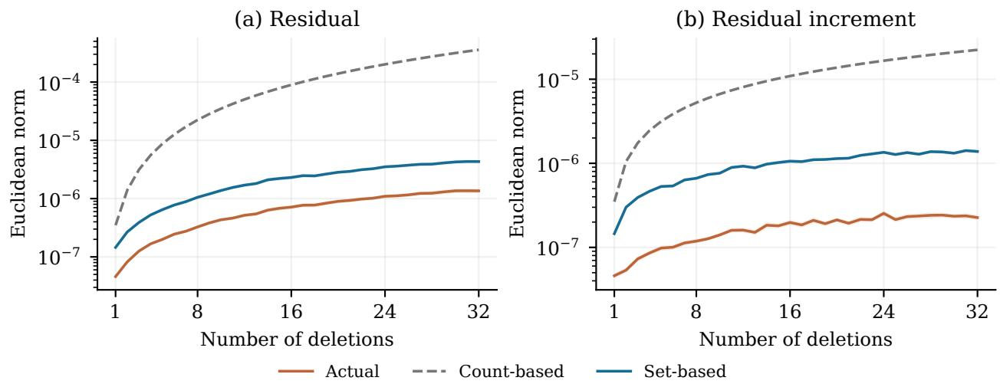  
Figure 1: Residuals, residual increments, and their bounds along the same deletion paths. Panel (a) compares $\| e _ { S _ { t } } \| _ { 2 } , \ r ^ { \mathrm { s e t } } ( S _ { t } )$ , and $r ^ { \mathrm { c n t } } ( m _ { t } )$ Panel (b) compares $\| e _ { S _ { t } } \mathrm { ~ - ~ } e _ { S _ { t - 1 } } \| _ { 2 }$ $d ^ { \mathrm { s e t } } ( S _ { t - 1 } , S _ { t } )$ , and $d ^ { \mathrm { { c n t } } } ( m _ { t - 1 } , m _ { t } )$ . Orange curves show observed norms, blue curves show set-based bounds, and dashed gray curves show count-based bounds. Curves are means over 100 independent repetitions. Bands show one standard error of the mean. Both vertical axes use a logarithmic scale. Here $n = 1 0 { , } 0 0 0$ and $M = 3 2$

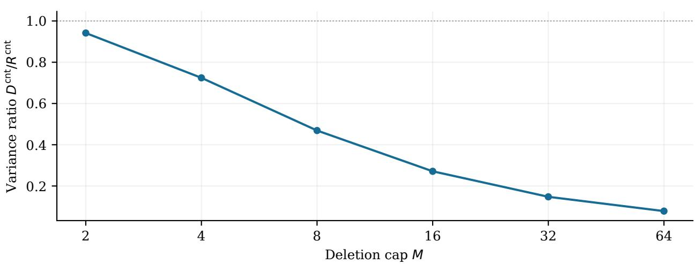  
Figure 2: Worst-case variance of count-based RW relative to count-based IND. The curve plots $D ^ { \mathrm { c n t } } / R ^ { \mathrm { c n t } }$ , averaged over 100 independent training samples with a common $\beta ^ { \star }$ and $n = 1 0 { , } 0 0 0$ . Error bars show one standard error of the mean but are largely hidden by the circular markers. The horizontal axis is logarithmic with base 2, and the vertical axis is linear.

$M \in \{ 2 , 4 , 8 , 1 6 , 3 2 , 6 4 \}$ . For each sample and cap, we compute the ratio of the worst-case noise variances $V _ { \mathrm { r w } } ^ { \mathrm { c n t } } / V _ { \mathrm { i n d } } ^ { \mathrm { c n t } } = D ^ { \mathrm { c n t } } / R ^ { \mathrm { c n t } }$

In Figure 2, the variance ratio remains below one and decreases as the deletion cap grows. Thus count-based RW uses less worst-case variance than count-based IND throughout this range, with a larger relative reduction at higher caps.

To examine how these variance diferences afect accuracy as the training sample grows, we take $n \in \{ 1 0 0 0 , 2 0 0 0 , 4 0 0 0 , 8 0 0 0 , 1 6 0 0 0 , 3 2 0 0 0 , 6 4 0 0 0 , 1 2 8 0 0 0 \}$ and $M _ { n } = \lfloor { \sqrt { n } } / 2 \rfloor$ . At each sample size, we generate 100 independent training samples with the same fixed $\beta ^ { \star }$ . For each sample, we draw a new deletion order uniformly without replacement and use it for all three methods. Figure 3 reports the means of the three maximum errors max $\operatorname { \widetilde { \mathbf { \Lambda } } } _ { t \leq M _ { n } } \| Y _ { t } - \widehat { \beta } _ { S _ { t } } \| _ { 2 }$ $\operatorname* { m a x } _ { t \leq M _ { n } } { \mathrm { P r e d } } _ { t }$ , and $\operatorname* { m a x } _ { t \leq M _ { n } } { \mathrm { G E D } } _ { t }$ . Each maximum is taken along a trajectory before averaging over repetitions. Supplementary Section S.4 gives the evaluation procedure.

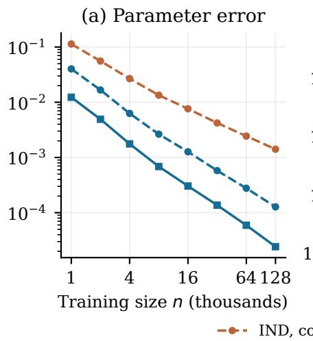

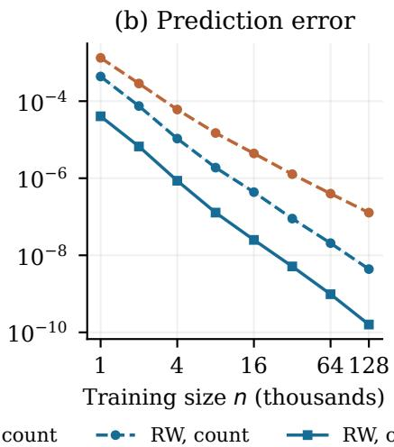

(c) GED  
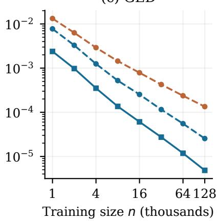  
Figure 3: Maximum parameter error, prediction error, and GED under random deletion, with $M _ { n } = \lfloor { \sqrt { n } } / 2 \rfloor$ and $\mu = 1$ . Colors distinguish IND and RW, and line styles distinguish the bounds used. Curves show means over 100 repetitions at each sample size. Bands show one standard error of the mean. Both axes are logarithmic.

All three mean maximum errors decrease with sample size for every method, consistent with the theoretical guarantees in this regime. Both RW allocations have lower errors than count-based IND, and computable RW has lower errors than count-based RW. The variance reductions are therefore accompanied by improved accuracy relative to exact retraining.

## 5.4 Adaptive deletion

The preceding comparison fixes the deletion order before any releases. We now allow requests to depend on earlier released models, using the same sample sizes, deletion caps, and training samples as in Figure 3. Before any releases, we sample $2 M _ { n } - 1$ distinct training indices uniformly without replacement. The first is deleted at release 1. The others form $M _ { n } - 1$ ordered candidate pairs, one for each subsequent release. Independently, we draw a unit vector v uniformly from the sphere.

At release $t \geq 2$ , we delete the first member of the current pair if $v ^ { \top } ( Y _ { t - 1 } - { \widehat { \beta } } ) \geq 0$ , and the second otherwise, where $\widehat { \beta }$ is the full-data fit. All three methods share the training data, candidate pairs, and projection vector v. Each method applies the rule to its own releases, so the realized deletion paths can difer. Each method runs one trajectory per repetition. Figure 4 reports the same three maximum errors, with each release compared against the exact retrained estimator for that method’s deletion set.

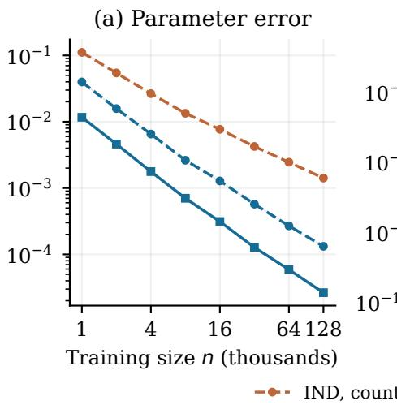

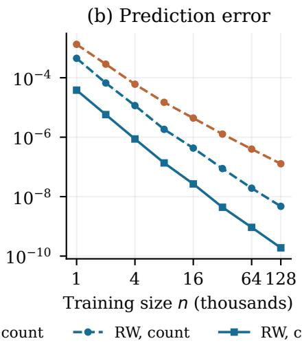

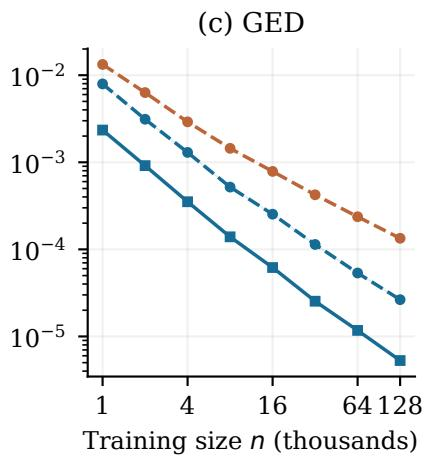  
Figure 4: Maximum parameter error, prediction error, and GED under adaptive deletion, with $M _ { n } = \lfloor { \sqrt { n } } / 2 \rfloor$ and $\mu = 1$ . Each method chooses deletions using its own preceding releases. Curves show means over 100 repetitions at each sample size. Bands show one standard error of the mean. Both axes are logarithmic.

Under this adaptive rule, the three mean maximum errors again decrease with sample size. The ordering of the methods is unchanged: both RW allocations have lower errors than count-based IND, and computable RW has lower errors than count-based RW.

## 5.5 An IND–RW separation

The preceding utility experiments use a deletion cap for which Theorem 4.6 gives consistency for both IND and RW. To examine the diference between their suficient conditions, we now compare count-based IND and RW with the cap $M _ { n } = \lfloor 0 . 0 5 n ^ { 9 / 1 0 } \rfloor$ , which grows more quickly with sample size. This rate lies within the suficient range established for RW but outside the range established for IND. We retain the same logistic model, fixed $\beta ^ { \star } , ~ p = 4$ , and $\lambda = \mu = 1$ . The sample sizes are n ∈ {2000, 4000, 8000, 16000, 32000, 64000, 128000}, with respective caps 46, 87, 162, 303, 567, 1058, 1974. Each configuration uses 100 independent training data sets and the fixed deletion order $1 , 2 , \ldots , M _ { n }$ . For each training sample, each method generates one release sequence along this common deletion order. As before, we report the three maximum errors, evaluated as described in Supplementary Section S.4.

Figure 5 shows diferent trends under this larger deletion cap. As n grows, all three mean maximum errors increase overall for count-based IND and decrease for count-based RW. The maximum noise variances follow the same respective trends, as shown in Figure 7 in Supplementary Section S.4.

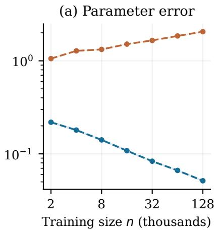

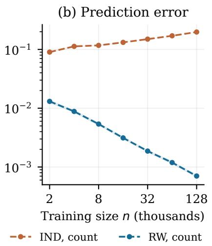

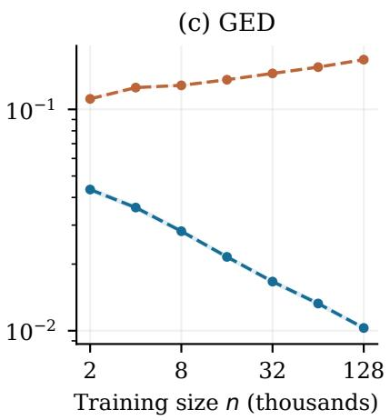  
Figure 5: Count-based IND and RW with $M _ { n } = \lfloor 0 . 0 5 n ^ { 9 / 1 0 } \rfloor$ and fixed deletion order. Panels show means of the three maximum errors over 100 repetitions. Bands show one standard error of the mean. Both axes are logarithmic.

## 5.6 Credit default data

We finally evaluate the methods on the Default of Credit Card Clients data set from the UCI Machine Learning Repository (Yeh, 2009), which contains 30,000 records with observed binary default outcomes. We select five predictors: credit limit, age, most recent repayment status, most recent bill amount, and most recent payment amount. Including an intercept gives $p = 6$ . We randomly divide the data into $n = 2 4 { , } 0 0 0$ training records and 6000 test records.

Before fitting the model, we transform the monetary predictors logarithmically, cap repayment status at 2, and center and standardize the five predictors using the training means and standard deviations. After adding an intercept, we divide all six coordinates by the largest row norm in the training sample. The same transformation is applied to the test data and held fixed during deletion. Supplementary Section S.4.1 specifies the transforms.

We fit ridge logistic regression with $\lambda = 1$ and evaluate accuracy relative to the same learning algorithm fitted to the retained data. The working logistic model may be misspecified. We compare count-based IND, count-based RW, and computable RW, all with certification parameter $\mu = 1$ and deletion cap $M = 1 6$

The data and training–test split remain fixed over 100 repetitions. In each repetition, we independently resample a uniform random deletion order and release noise. All methods share the deletion order. Exact retrained estimators are computed only for evaluation.

Figure 6 compares the three allocations along the same deletion sequences. As in the simulations, both RW allocations have lower parameter error, prediction error, and GED than count-based IND. Computable RW has the smallest errors throughout the evaluated sequence.

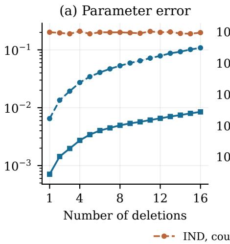

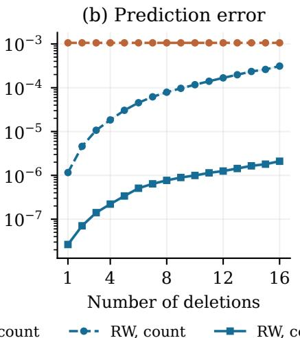

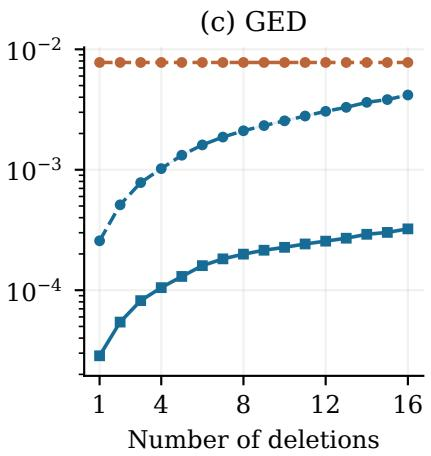  
Figure 6: Parameter error, prediction error, and GED for IND and RW on credit default data, with $n = 2 4 , 0 0 0 , p = 6 , M = 1 6$ , and $\lambda = \mu = 1$ . All errors are relative to exact retraining on the retained data. Prediction error and GED average over the test sample and fresh release noise, conditional on the current deletion set and preceding releases.

## 6 Discussion

We develop Gaussian mechanisms for continual certified unlearning under adaptive deletions. Calibrating RW to residual increments reduces the noise cost relative to calibrating IND to residual levels. With count-based bounds, RW asymptotically matches the worst-case variance of a single release at the deletion cap. The resulting bounds also give consistency relative to exact retraining, uniformly over deletion policies, under weaker suficient conditions for RW than for IND.

Our analysis assumes fixed dimension, smooth convex losses, and local population curvature. Extending the residual and increment bounds to high dimensions is one direction for future work. Our covariance minimax results concern mechanisms with covariance fixed before release. Characterizing the optimal variance when noise covariances can adapt to deleted records and preceding releases remains open.

## References

Youssef Allouah, Joshua Kazdan, Rachid Guerraoui, and Sanmi Koyejo. The utility and complexity of in-and out-of-distribution machine unlearning. In International Conference on Learning Representations, volume 2025, pages 2713–2738, 2025.

Lucas Bourtoule, Varun Chandrasekaran, Christopher A Choquette-Choo, Hengrui Jia, Adelin Travers, Baiwu Zhang, David Lie, and Nicolas Papernot. Machine unlearning. In 2021 IEEE symposium on security and privacy (SP), pages 141–159. IEEE, 2021.

T Tony Cai, Cun-Hui Zhang, and Harrison H Zhou. Optimal rates of convergence for covariance matrix estimation. 2010.

Zhanrui Cai, Sai Li, Xintao Xia, and Linjun Zhang. Diferentially private estimation and inference in high-dimensional regression with fdr control. Journal of Machine Learning Research, 27(81):1–54, 2026.

Yinzhi Cao and Junfeng Yang. Towards making systems forget with machine unlearning. In 2015 IEEE symposium on security and privacy, pages 463–480. IEEE, 2015.

Abhinav Chakraborty, Yuetian Luo, and Rina Foygel Barber. Stability and accuracy tradeofs in statistical estimation. arXiv preprint arXiv:2601.11701, 2026.

Yuxin Chen, Chen Cheng, and Jianqing Fan. Asymmetry helps: Eigenvalue and eigenvector analyses of asymmetrically perturbed low-rank matrices. Annals of statistics, 49(1):435, 2021.

Jules Depersin and Guillaume Lecué. Robust sub-gaussian estimation of a mean vector in nearly linear time. The Annals of Statistics, 50(1):511–536, 2022.

Jinshuo Dong, Aaron Roth, and Weijie J Su. Gaussian diferential privacy. Journal of the Royal Statistical Society: Series B (Statistical Methodology), 84(1):3–37, 2022.

Cynthia Dwork, Krishnaram Kenthapadi, Frank McSherry, Ilya Mironov, and Moni Naor. Our data, ourselves: Privacy via distributed noise generation. In Annual international conference on the theory and applications of cryptographic techniques, pages 486–503. Springer, 2006a.

Cynthia Dwork, Frank McSherry, Kobbi Nissim, and Adam Smith. Calibrating noise to sensitivity in private data analysis. In Theory of cryptography conference, pages 265–284. Springer, 2006b.

Antonio Ginart, Melody Guan, Gregory Valiant, and James Y Zou. Making ai forget you: Data deletion in machine learning. Advances in neural information processing systems, 32, 2019.

Chuan Guo, Tom Goldstein, Awni Hannun, and Laurens Van Der Maaten. Certified data removal from machine learning models. In Hal Daumé III and Aarti Singh, editors, Proceedings of the 37th International Conference on Machine Learning, volume 119 of Proceedings of Machine Learning Research, pages 3832–3842. PMLR, 13–18 Jul 2020. URL https://proceedings.mlr.press/v119/guo20c.html.

Varun Gupta, Christopher Jung, Seth Neel, Aaron Roth, Saeed Sharifi-Malvajerdi, and Chris Waites. Adaptive machine unlearning. Advances in Neural Information Processing Systems, 34:16319–16330, 2021.

Rungang Han, Rebecca Willett, and Anru R Zhang. An optimal statistical and computational framework for generalized tensor estimation. The Annals of Statistics, 50(1):1–29, 2022.

Yiyang Huang and Clément L Canonne. Tight bounds for machine unlearning via diferential privacy. arXiv preprint arXiv:2309.00886, 2023.

Zachary Izzo, Mary Anne Smart, Kamalika Chaudhuri, and James Zou. Approximate data deletion from machine learning models. In International conference on artificial intelligence and statistics, pages 2008–2016. PMLR, 2021.

Anastasia Koloskova, Youssef Allouah, Animesh Jha, Rachid Guerraoui, and Sanmi Koyejo. Certified unlearning for neural networks. arXiv preprint arXiv:2506.06985, 2025.

Jingyang Li, T Tony Cai, Dong Xia, and Anru R Zhang. Federated pca and estimation for spiked covariance matrices: Optimal rates and eficient algorithm. arXiv preprint arXiv:2411.15660, 2024.

Yuetian Luo and Anru R Zhang. Low-rank tensor estimation via riemannian gauss-newton: Statistical optimality and second-order convergence. Journal of Machine Learning Research, 24(381):1–48, 2023.

Yuetian Luo, Zhimei Ren, and Rina Barber. Iterative approximate cross-validation. In International Conference on Machine Learning, pages 23083–23102. PMLR, 2023.

Ilya Mironov. Rényi diferential privacy. In 2017 IEEE 30th computer security foundations symposium (CSF), pages 263–275. IEEE, 2017.

Seth Neel, Aaron Roth, and Saeed Sharifi-Malvajerdi. Descent-to-delete: Gradient-based methods for machine unlearning. In Algorithmic learning theory, pages 931–962. PMLR, 2021.

Aaradhya Pandey, Arnab Auddy, Haolin Zou, Arian Maleki, and Sanjeev Kulkarni. Gaussian certified unlearning in high dimensions: A hypothesis testing approach. In International Conference on Learning Representations, volume 2026, pages 123230–123267, 2026.

Xinbao Qiao, Meng Zhang, Ming Tang, and Ermin Wei. Hessian-free online certified unlearning. In International Conference on Learning Representations, volume 2025, pages 32675–32711, 2025.

Ayush Sekhari, Jayadev Acharya, Gautam Kamath, and Ananda Theertha Suresh. Remember what you want to forget: Algorithms for machine unlearning. Advances in Neural Information Processing Systems, 34:18075–18086, 2021.

Adam Smith and Abhradeep Thakurta. Fully adaptive composition for gaussian diferential privacy. arXiv preprint arXiv:2210.17520, 2022.

Vinith Suriyakumar and Ashia C Wilson. Algorithms that approximate data removal: New results and limitations. Advances in Neural Information Processing Systems, 35:18892– 18903, 2022.

Enayat Ullah and Raman Arora. From adaptive query release to machine unlearning. In International Conference on Machine Learning, pages 34642–34667. PMLR, 2023.

Enayat Ullah, Tung Mai, Anup Rao, Ryan A Rossi, and Raman Arora. Machine unlearning via algorithmic stability. In Conference on Learning Theory, pages 4126–4142. PMLR, 2021.

Jingyi Xie, Linjun Zhang, and Sai Li. Eficient machine unlearning with minimax optimality. arXiv preprint arXiv:2604.05669, 2026.

I-Cheng Yeh. Default of Credit Card Clients. UCI Machine Learning Repository, 2009. DOI: https://doi.org/10.24432/C55S3H.

Haolin Zou, Arnab Auddy, Yongchan Kwon, Kamiar Rahnama Rad, and Arian Maleki. Certified machine unlearning under high dimensional regime. Journal of Machine Learning Research, 26(308):1–58, 2025.

## Supplementary material

This supplement gives the residual and increment bounds used in the main article and the formulas used in the logistic regression experiments. It derives bounds for ridge logistic regression and provides details of the numerical experiments and comparisons of running times. It then examines how the starting point and number of Newton steps afect computation and approximation error. The final section provides proofs of the theoretical results in the main article and this supplement.

## S.1 Residual and variance bounds

We give the bounds on the Newton residual $e _ { S } = \widetilde { \beta } _ { S } - \widehat { \beta } _ { S }$ and its increments used to calibrate IND and RW, respectively. Because deletion sets may be chosen adaptively, these bounds must hold simultaneously over all sets below the cap. We first specify a common event on which the exact retrained estimators lie in a common neighborhood and the loss derivatives are controlled, then bound the residual levels and the changes along a deletion path. Finally, we bound the path maxima needed to compute the noise variances.

## S.1.1 Uniform event and localization

The following lemma provides the uniform bounds needed to control the Newton residuals and their increments. It places all exact retrained estimators in the common neighborhood $\mathcal { N }$ from Assumption 3.3, so the relevant Taylor expansions stay within that region. The Hessian lower bound controls the inverse Hessians, and the derivative bounds control the Taylor remainders. These properties hold on one high-probability event ${ \mathcal { H } } _ { n }$ for all deletion sets with $| A | \le M$ , so the same bounds apply to adaptive deletion requests. Here $G _ { n }$ and $B _ { n }$ bound individual gradients and Hessians. $C _ { \ell , n }$ and $C _ { L , n }$ control Hessian variation for an individual loss and a retained objective, respectively.

Lemma S.1.1. Under Assumptions 3.1–3.3, there are deterministic sequences $G _ { n } , B _ { n } , C _ { \ell , n } .$ $C _ { L , n }$ such that

$$
G _ { n } , B _ { n } , C _ { \ell , n } = O ( \mathrm { p o l y l o g } ( n ) ) , \qquad C _ { L , n } = O ( n \mathrm { p o l y l o g } ( n ) ) , \qquad C _ { L , n } \geq C _ { \ell , n } .
$$

For any cap satisfying $M = o ( n / \mathrm { p o l y l o g } ( n ) )$ , the constants satisfy $M C _ { \ell , n } / C _ { L , n } \to 0$ , with $0 / 0$ interpreted as zero, and there are an event ${ \mathcal { H } } _ { n }$ and a sequence $\kappa _ { n } \geq c _ { 0 } n / 4$ such that $\mathbb { P } ( \mathcal { H } _ { n } ) \ge 1 - \delta _ { n } , \delta _ { n } = o ( 1 )$ . On ${ \mathcal { H } } _ { n }$ , for every $| A | \leq M$ , every $i \leq n$ , and every $\beta \in \mathcal N$

$$
\begin{array} { r } { \nabla ^ { 2 } L _ { A } ( { \boldsymbol \beta } ) \succeq \kappa _ { n } I _ { p } , \qquad \| \nabla \ell _ { i } ( { \boldsymbol \beta } ) \| _ { 2 } \leq G _ { n } , \qquad \| \nabla ^ { 2 } \ell _ { i } ( { \boldsymbol \beta } ) \| _ { 2 } \leq B _ { n } . } \end{array}
$$

Moreover, for every $i \leq n ,$ , every $| A | \leq M$ , and all $\beta , \beta ^ { \prime } \in \mathcal { N }$

$$
\| \nabla ^ { 2 } \ell _ { i } ( \beta ) - \nabla ^ { 2 } \ell _ { i } ( \beta ^ { \prime } ) \| _ { 2 } \leq C _ { \ell , n } \| \beta - \beta ^ { \prime } \| _ { 2 } ,
$$

and

$$
\| \nabla ^ { 2 } L _ { A } ( \beta ) - \nabla ^ { 2 } L _ { A } ( \beta ^ { \prime } ) \| _ { 2 } \leq C _ { L , n } \| \beta - \beta ^ { \prime } \| _ { 2 } .
$$

The constants $C _ { \ell , n }$ and $C _ { L , n }$ are uniform over i and $A ,$ respectively, and ${ \widehat { \beta } } _ { A } \in { \mathcal { N } }$ for every $| A | \le M$ . Here ℓ and L refer to the individual loss $\ell _ { i }$ and the retained objective $L _ { A }$ respectively.

## S.1.2 Count-based and set-based bounds

On ${ \mathcal { H } } _ { n }$ , the following bounds control the residuals and their increments for all deletion sets below the cap.

Count-based residuals. For $0 \leq m \leq M$ , define

$$
r ^ { \mathrm { c n t } } ( m ) : = \frac { C _ { L , n } G _ { n } ^ { 2 } m ^ { 2 } } { 2 \kappa _ { n } ^ { 3 } } = O \left( \frac { m ^ { 2 } \mathrm { p o l y l o g } ( n ) } { n ^ { 2 } } \right) .
$$

Then $\| e _ { S } \| _ { 2 } \le r ^ { \mathrm { c n t } } ( | S | )$ for every $| S | \le M$

Set-based residuals. Let $\begin{array} { r } { g _ { S } = \sum _ { i \in S } \nabla \ell _ { i } ( \widehat { \beta } ) , \ H _ { S } = \nabla ^ { 2 } L _ { S } ( \widehat { \beta } ) } \end{array}$ , and $\rho _ { S } ~ = ~ \| g _ { S } \| _ { 2 } / \kappa _ { n }$ Define

$$
r ^ { \mathrm { s e t } } ( S ) : = \frac { C _ { L , n } } { 2 } \| H _ { S } ^ { - 1 } \| _ { 2 } \rho _ { S } ^ { 2 } .
$$

Then $\| e _ { S } \| _ { 2 } \leq r ^ { \mathrm { s e t } } ( S ) \leq r ^ { \mathrm { c n t } } ( | S | )$

Count-based increments. For $0 \leq k < m \leq M$ , define

$$
\begin{array} { l } { { d ^ { \mathrm { { c n t } } } ( k , m ) : = \displaystyle \frac { G _ { n } ^ { 2 } ( m - k ) } { 2 \kappa _ { n } ^ { 3 } } \left[ C _ { L , n } ( k + m ) + k ^ { 2 } \left( C _ { \ell , n } + \displaystyle \frac { B _ { n } C _ { L , n } } { \kappa _ { n } + ( m - k ) B _ { n } } \right) \right] } } \\ { { = O \left( \displaystyle \frac { ( m - k ) ( k + m ) \mathrm { p o l y l o g } ( n ) } { n ^ { 2 } } \right) . } } \end{array}
$$

Then $\| e _ { B } - e _ { A } \| _ { 2 } \leq d ^ { \mathrm { c n t } } ( k , m )$ for every $A \subsetneq B$ with $| A | = k$ and $| B | = m$

Set-based increments. For $A \subsetneq B$ and $q = | B \setminus A |$ , define

$$
\begin{array} { l } { { \displaystyle \delta _ { A , B } : = \frac { 1 } { \kappa _ { n } } \operatorname* { m i n } \left\{ q G _ { n } , \| g _ { B } - g _ { A } \| _ { 2 } + q B _ { n } \rho _ { A } \right\} , } } \\ { { \displaystyle U _ { A , B } : = \frac { \| H _ { B } ^ { - 1 } \| _ { 2 } } { 2 } \left[ C _ { L , n } ( \rho _ { A } + \rho _ { B } ) \delta _ { A , B } + q C _ { \ell , n } \rho _ { A } ^ { 2 } \right] + \frac { C _ { L , n } \rho _ { A } ^ { 2 } } { 2 } \| H _ { B } ^ { - 1 } ( H _ { A } - H _ { B } ) H _ { A } ^ { - 1 } \| _ { 2 } . } } \end{array}
$$

The increment bound is

$$
d ^ { \mathrm { s e t } } ( A , B ) : = \operatorname* { m i n } \{ U _ { A , B } , r ^ { \mathrm { s e t } } ( A ) + r ^ { \mathrm { s e t } } ( B ) \} ,
$$

which satisfies $\| e _ { B } - e _ { A } \| _ { 2 } \leq d ^ { \mathrm { s e t } } ( A , B ) \leq d ^ { \mathrm { c n t } } ( | A | , | B | )$

For $A \subsetneq B$ with $| B | \leq M$ , the set-based bounds satisfy

$$
d ^ { \mathrm { s e t } } ( \emptyset , B ) = r ^ { \mathrm { s e t } } ( B ) , \qquad | r ^ { \mathrm { s e t } } ( B ) - r ^ { \mathrm { s e t } } ( A ) | \leq d ^ { \mathrm { s e t } } ( A , B ) .\tag{7}
$$

These relations connect residual levels to increments in the variance and covariance comparisons. Write $r _ { * } ^ { \mathrm { s e t } } = \operatorname* { m a x } _ { | S | \leq M } r ^ { \mathrm { s e t } } ( S )$ for the largest residual bound. When $r _ { * } ^ { \mathrm { s e t } } > 0$ , a maximizing set $S _ { * }$ is nonempty, so the one-step path $( \varnothing , S _ { * } )$ is allowed and $d ^ { \mathrm { s e t } } ( \emptyset , S _ { * } ) = r _ { * } ^ { \mathrm { s e t } }$ by (7). Thus $r _ { * } ^ { \mathrm { s e t } } \leq \sqrt { D ^ { \mathrm { s e t } } }$ and $( r _ { * } ^ { \mathrm { s e t } } ) ^ { 2 } \leq R ^ { \mathrm { s e t } }$ . These inequalities also hold when $r _ { * } ^ { \mathrm { s e t } } = 0$ . The maximum defining $R ^ { \mathrm { s e t } }$ is attained by a full singleton deletion path, since splitting batches into single deletions and extending the path to M deletions only adds nonnegative terms to the sum.

## S.1.3 Computable variance bounds

The set-based variance allocations depend on the pathwise quantities

$$
\begin{array} { r l } & { R ^ { \mathrm { s e t } } = \underset { P = ( S _ { 0 } , \ldots , S _ { T } ) \in { \mathcal C } } { \operatorname* { m a x } } \sum _ { t = 1 } ^ { T } \left\{ r ^ { \mathrm { s e t } } ( S _ { t } ) \right\} ^ { 2 } , } \\ & { D ^ { \mathrm { s e t } } = \underset { P = ( S _ { 0 } , \ldots , S _ { T } ) \in { \mathcal C } } { \operatorname* { m a x } } \left\{ \sum _ { t = 1 } ^ { T } d ^ { \mathrm { s e t } } ( S _ { t - 1 } , S _ { t } ) \right\} ^ { 2 } } \end{array}
$$

for IND and RW, respectively. Since the set-based bounds depend on the identities of the deleted observations, evaluating either maximum directly requires optimization over deletion paths.

For IND, the count-based residual bound immediately gives

$$
R ^ { \mathrm { s e t } } \leq R ^ { \mathrm { c n t } } = \sum _ { m = 1 } ^ { M } \left\{ r ^ { \mathrm { c n t } } ( m ) \right\} ^ { 2 } .
$$

Using this upper bound in the set-based IND allocation gives exactly the count-based IND variance. We therefore do not introduce a computable set-based IND allocation.

For RW, however, replacing $D ^ { \mathrm { s e t } }$ with $D ^ { \mathrm { c n t } }$ still retains the set-dependent factor $d ^ { \mathrm { s e t } } ( S _ { t - 1 } , S _ { t } )$ in each increment variance. We also derive a computable upper bound on $D ^ { \mathrm { s e t } }$ from the gradients at the original fit. Taking the minimum of these two upper bounds gives $D ^ { \mathrm { c o m } }$ and can further reduce the noise variances. All results below hold on ${ \mathcal { H } } _ { n }$

## S.1.3.1 Count-based path maximum

We first compute the count-based benchmark $D ^ { \mathrm { c n t } }$ . For $0 \leq k < m \leq M$ , the count-based increment bound satisfies

$$
d ^ { \mathrm { c n t } } ( k , m ) \leq \sum _ { t = k + 1 } ^ { m } d ^ { \mathrm { c n t } } ( t - 1 , t ) .
$$

Indeed, $\begin{array} { r } { ( m - k ) k ^ { 2 } \leq \sum _ { t = k + 1 } ^ { m } ( t - 1 ) ^ { 2 } , 1 / ( \kappa _ { n } + ( m - k ) B _ { n } ) \leq 1 / ( \kappa _ { n } + B _ { n } ) } \end{array}$ , while the leading term involving $C _ { L , n } ( m ^ { 2 } - k ^ { 2 } )$ is additive over the intermediate deletion counts. Hence splitting a batch into singleton deletions cannot decrease the total count-based increment bound.

It follows that the largest path sum is attained by the full singleton path, and therefore

$$
\sqrt { D ^ { \mathrm { c n t } } } = \sum _ { m = 1 } ^ { M } d ^ { \mathrm { c n t } } ( m - 1 , m ) .
$$

## S.1.3.2 Computable bound for set-based RW

Direct evaluation of $D ^ { \mathrm { s e t } }$ requires maximizing the sum of set-based increment bounds over all deletion paths. We avoid this combinatorial optimization by using the fact that each observation can be deleted at most once.

Let $W _ { M }$ be the sum of the M largest values among $\{ \| \nabla \ell _ { i } ( \widehat { \beta } ) \| _ { 2 } : i = 1 , \ldots , n \}$ . Thus, for every deletion set $S$ with $\begin{array} { r } { | S | \le M , \sum _ { i \in S } \| \nabla \ell _ { i } ( \widehat \beta ) \| _ { 2 } \le W _ { M } } \end{array}$

If $C _ { L , n } = 0$ , then $C _ { \ell , n } = 0$ and all residual and increment bounds vanish, so no noise is required. We may therefore assume $C _ { L , n } > 0$ . Define $\alpha _ { n }$ and $\eta _ { n }$ by $\alpha _ { n } = C _ { L , n } / ( 2 \kappa _ { n } ^ { 3 } ) , \eta _ { n } =$ $M C _ { \ell , n } / C _ { L , n } + 3 M B _ { n } / \kappa _ { n }$ . Summing the set-based increment bound along an arbitrary deletion path and using that each deleted observation contributes at most once gives

$$
\sqrt { D ^ { \mathrm { s e t } } } \leq \alpha _ { n } W _ { M } ^ { 2 } ( 1 + \eta _ { n } ) .
$$

The proof is given in Supplementary Section S.6.4.

Combining this bound with $D ^ { \mathrm { s e t } } \leq D ^ { \mathrm { c n t } }$ , define

$$
{ \cal D } ^ { \mathrm { c o m } } = \operatorname * { m i n } \left\{ D ^ { \mathrm { c n t } } , \alpha _ { n } ^ { 2 } W _ { M } ^ { 4 } ( 1 + \eta _ { n } ) ^ { 2 } \right\} .
$$

Then $D ^ { \mathrm { s e t } } \leq D ^ { \mathrm { c o m } } \leq D ^ { \mathrm { c n t } }$ . The resulting computable RW allocation uses the realized setbased increment bound at each release,

$$
( \sigma _ { t } ^ { \mathrm { c o m } } ) ^ { 2 } = \frac { d ^ { \mathrm { s e t } } ( S _ { t - 1 } , S _ { t } ) \sqrt { D ^ { \mathrm { c o m } } } } { \mu ^ { 2 } } .
$$

Given the gradients at the original fit, $W _ { M }$ is obtained by sorting their norms, so $D ^ { \mathrm { c o m } }$ can be computed in O(n log n) operations.

## S.2 Logistic regression formulas used in the experiments

To implement the allocations in Section 5, we specialize the preceding bounds to ridge logistic regression with binary responses, $\| x _ { i } \| _ { 2 } \leq 1$ , and $\lambda > 0$ . We first locate a ball containing all exact retrained estimators, then bound the derivatives on that ball. Supplementary Section S.3 gives the full derivation and guarantees. At the full-data fit ${ \widehat { \beta } } ,$ compute

$$
\begin{array} { l l } { { \pi _ { i } = \{ 1 + \exp ( - { x _ { i } ^ { \top } } \widehat { \beta } ) \} ^ { - 1 } , } } & { { g _ { i } = ( \pi _ { i } - y _ { i } ) x _ { i } , } } \\ { { { } } } & { { { } } } \\ { { H _ { i } = \pi _ { i } ( 1 - \pi _ { i } ) x _ { i } x _ { i } ^ { \top } , } } & { { H _ { 0 } = 2 \lambda I _ { p } + \displaystyle \sum _ { i = 1 } ^ { n } H _ { i } . } } \end{array}
$$

Let $\| H \| _ { ( j ) }$ be the jth largest value of $\| H _ { i } \| _ { 2 }$ . Set $h _ { i } = \pi _ { i } ( 1 - \pi _ { i } ) x _ { i } ^ { \top } H _ { 0 } ^ { - 1 } x _ { i }$ , and let $h _ { ( j ) }$ be the jth largest $h _ { i }$

The bound $W _ { M }$ from Supplementary Section S.1.3 satisfies $\| \nabla L _ { A } ( \widehat { \beta } ) \| _ { 2 } \leq W _ { M }$ for every $| A | \leq M$ . For the Hessian bound $\nabla ^ { 2 } L _ { A } ( { \widehat { \beta } } ) \succeq \underline { { \alpha } } I _ { p }$ , compute

$$
\underline { { \alpha } } = \operatorname* { m a x } \Bigl \{ 2 \lambda , \lambda _ { \operatorname* { m i n } } ( H _ { 0 } ) - \sum _ { j = 1 } ^ { M } \| H \| _ { ( j ) } , \Bigl ( 1 - \sum _ { j = 1 } ^ { M } h _ { ( j ) } \Bigr ) \lambda _ { \operatorname* { m i n } } ( H _ { 0 } ) \Bigr \} .
$$

Omit the last candidate for $\underline { { \boldsymbol { \alpha } } }$ if $\textstyle \sum _ { j = 1 } ^ { M } h _ { ( j ) } \geq 1$ . Let $\rho$ be the unique nonnegative solution of $2 \lambda \rho + ( \underline { { \alpha } } - 2 \lambda ) ( 1 - e ^ { - \rho } ) = W _ { M }$ . The ball of radius $\rho$ around $\widehat { \beta }$ then contains ${ \widehat { \beta } } _ { A }$ for every $| A | \leq M$

On this ball, each linear predictor lies in an interval that we use to bound the loss derivatives. For each $i ,$ set $\bar { a } _ { i } = x _ { i } ^ { \top } \widehat { \beta } - \rho \| x _ { i } \| _ { 2 }$ and $b _ { i } = x _ { i } ^ { \top } \widehat { \beta } + \rho \| x _ { i } \| _ { 2 }$ . Write $\pi ( z ) =$ $\{ 1 + e ^ { - z } \} ^ { - 1 } , w ( z ) = \pi ( z ) \{ 1 - \pi ( z ) \}$ , and $m _ { i } = \operatorname* { m a x } _ { z \in [ a _ { i } , b _ { i } ] } | w ^ { \prime } ( z ) |$ . The maximum of $w$ is attained at the point of $[ a _ { i } , b _ { i } ]$ closest to zero. To compute $m _ { i } ,$ check the interval endpoints and any of $\pm \log ( 2 + { \sqrt { 3 } } )$ inside it. To account for feature directions in the retained Hessian, form $\begin{array} { r } { C _ { L } ^ { \mathrm { m a t } } \ = \ \| \sum _ { i = 1 } ^ { n } m _ { i } \| x _ { i } \| _ { 2 } x _ { i } x _ { i } ^ { \top } \| _ { 2 } } \end{array}$ . The constants used in the residual and increment bounds are

$$
\begin{array} { r l r } & { \frac { \kappa } { \underline { { \epsilon } } } = 2 \lambda + e ^ { - \rho } ( \underline { { \alpha } } - 2 \lambda ) , } & \\ & { G = \operatorname* { m a x } _ { i } \| x _ { i } \| _ { 2 } \operatorname* { m a x } \{ | \pi ( a _ { i } ) - y _ { i } | , | \pi ( b _ { i } ) - y _ { i } | \} , } & \\ & { B = \operatorname* { m a x } _ { i } \| x _ { i } \| _ { 2 } ^ { 2 } \operatorname* { m a x } _ { z \in [ a _ { i } , b _ { i } ] } w ( z ) , } & { C _ { \ell } = \operatorname* { m a x } _ { i } m _ { i } \| x _ { i } \| _ { 2 } ^ { 3 } , } \\ & { C _ { L } = \operatorname* { m i n } \{ n C _ { \ell } , \ \operatorname* { m a x } [ C _ { L } ^ { \operatorname* { m a t } } , \ M C _ { \ell } \log ( n + 1 ) ] \} . } & \end{array}
$$

This choice also ensures $M C _ { \ell } / C _ { L } \to 0$ when $M = o ( n )$ , with the ratio interpreted as zero if $C _ { \ell } = 0$ . Substitute $\left( \underline { { \kappa } } , G , B , C _ { \ell } , C _ { L } \right)$ for $( \kappa _ { n } , G _ { n } , B _ { n } , C _ { \ell , n } , C _ { L , n } )$ in the residual and increment bounds of Supplementary Section S.1.2 and the computable variance bound of Supplementary Section S.1.3. These bounds and the resulting $D ^ { \mathrm { c o m } }$ determine the noise variances used in the experiments.

## S.3 Derivation of the logistic regression bounds

For ridge logistic regression with binary responses, $\| x _ { i } \| _ { 2 } \leq 1$ , and $\lambda > 0$ , evaluating the bounds in Supplementary Section S.1 requires $\left( \underline { { \kappa } } , G , B , C _ { \ell } , C _ { L } \right)$ satisfying the following inequalities for every $| A | \leq M$ , every observation $i ,$ and every $\beta , \beta ^ { \prime }$ in a common ball around $\widehat { \beta }$ containing all retained fits:

$$
\begin{array} { c c } { \nabla ^ { 2 } L _ { A } ( \beta ) \succeq \underline { { \kappa } } I _ { p } , } & { \| \nabla ^ { 2 } \ell _ { i } ( \beta ) \| _ { 2 } \leq B , } \\ { \| \nabla \ell _ { i } ( \beta ) \| _ { 2 } \leq G , } & { \| \nabla ^ { 2 } \ell _ { i } ( \beta ) \| _ { 2 } \leq B , } \\ { \| \nabla ^ { 2 } \ell _ { i } ( \beta ) - \nabla ^ { 2 } \ell _ { i } ( \beta ^ { \prime } ) \| _ { 2 } \leq C _ { \ell } \| \beta - \beta ^ { \prime } \| _ { 2 } , } & \\ { \| \nabla ^ { 2 } L _ { A } ( \beta ) - \nabla ^ { 2 } L _ { A } ( \beta ^ { \prime } ) \| _ { 2 } \leq C _ { L } \| \beta - \beta ^ { \prime } \| _ { 2 } . } \end{array}\tag{8}
$$

The general theory establishes the existence of these constants but does not give computable values for a given dataset. For ridge logistic regression, we first find the common ball from the observed data and the full-data fit. We then compute the five constants on that ball.

## S.3.1 A common ball and a Hessian lower bound

We seek a radius $\rho$ such that $\| { \widehat { \beta } } _ { A } - { \widehat { \beta } } \| _ { 2 } \leq \rho$ for every $| A | \leq M$ . At the full-data fit, deletion changes both the gradient and the Hessian of the objective. Bounds on these changes, combined with the way the logistic Hessian varies away from ${ \widehat { \beta } } .$ , determine $\rho .$

Let $\pi _ { i } = \{ 1 + \exp ( - x _ { i } ^ { \top } { \widehat \beta } ) \} ^ { - 1 }$ . The gradients and Hessians at the original fit are $g _ { i } =$ $( \pi _ { i } - y _ { i } ) x _ { i }$ and $H _ { i } = \pi _ { i } ( 1 - \pi _ { i } ) x _ { i } x _ { i } ^ { \top }$ , with $\begin{array} { r } { H _ { 0 } = 2 \lambda I _ { p } + \sum _ { i = 1 } ^ { n } H _ { i } } \end{array}$ . For a deletion set $A _ { i }$ the fulldata first-order condition gives $\begin{array} { r } { \nabla L _ { A } ( \widehat { \beta } ) = - \sum _ { i \in A } g _ { i } } \end{array}$ , while $\begin{array} { r } { \nabla ^ { 2 } L _ { A } ( \widehat { \beta } ) = H _ { 0 } - \sum _ { i \in A } H _ { i } } \end{array}$ . For every $| A | \leq M$ , we have $\| \nabla L _ { A } ( \widehat { \beta } ) \| _ { 2 } \leq W _ { M }$ . We next compute $\underline { { \boldsymbol { \alpha } } }$ such that $\nabla ^ { 2 } L _ { A } ( { \widehat { \beta } } ) \succeq \underline { { \alpha } } I _ { p }$ for every $| A | \leq M$

To compute $\underline { { \alpha } } ,$ we bound $\| \sum _ { i \in A } H _ { i } \| _ { 2 }$ and $\begin{array} { r } { \operatorname* { s u p } _ { v \neq 0 } \frac { v ^ { \top } ( \sum _ { i \in A } H _ { i } ) v } { v ^ { \top } H _ { 0 } v } } \end{array}$ . Let $\| H \| _ { ( 1 ) } \ge \cdots \ge$ $\| H \| _ { ( n ) }$ be the decreasing rearrangement of $\{ \| H _ { i } \| _ { 2 } \} _ { i = 1 } ^ { n }$ . For the relative bound, the maximum fraction of the original curvature contributed by observation i over all directions is

$$
h _ { i } = \operatorname* { s u p } _ { v \neq 0 } \frac { v ^ { \top } H _ { i } v } { v ^ { \top } H _ { 0 } v } = \pi _ { i } ( 1 - \pi _ { i } ) x _ { i } ^ { \top } H _ { 0 } ^ { - 1 } x _ { i } .
$$

Let $h _ { ( 1 ) } \geq \cdots \geq h _ { ( n ) }$ be the decreasing rearrangement of $\{ h _ { i } \} _ { i = 1 } ^ { n }$ . Thus $\nabla ^ { 2 } L _ { A } ( { \widehat { \beta } } ) \succeq \underline { { \alpha } } I _ { p }$ for every $| A | \leq M$ , where

$$
\underline { { \alpha } } = \operatorname* { m a x } \left\{ 2 \lambda , \ \lambda _ { \operatorname* { m i n } } ( H _ { 0 } ) - \sum _ { j = 1 } ^ { M } \| H \| _ { ( j ) } , \ \left( 1 - \sum _ { j = 1 } ^ { M } h _ { ( j ) } \right) \lambda _ { \operatorname* { m i n } } ( H _ { 0 } ) \right\} ,
$$

where the last candidate is omitted if $\textstyle \sum _ { j = 1 } ^ { M } h _ { ( j ) } \geq 1$

By the triangle inequality and the definition of $W _ { M }$ in Supplementary Section S.1.3, $\begin{array} { r } { \| \nabla L _ { A } ( \widehat { \beta } ) \| _ { 2 } \leq \sum _ { i \in A } \| g _ { i } \| _ { 2 } \leq W _ { M } } \end{array}$ for every $| A | \leq M$

For $\| h \| _ { 2 } = r$ , the logistic Hessian satisfies $\nabla ^ { 2 } L _ { A } ( \widehat { \beta } + h ) \succeq \{ 2 \lambda + e ^ { - r } ( \underline { { \alpha } } - 2 \lambda ) \} I _ { p }$ . Integrating this lower bound to ${ \widehat { \beta } } _ { A }$ gives

$$
2 \lambda r _ { A } + ( \underline { { { \alpha } } } - 2 \lambda ) ( 1 - e ^ { - r _ { A } } ) \leq W _ { M } , \qquad r _ { A } = \| \widehat { \beta } _ { A } - \widehat { \beta } \| _ { 2 } .
$$

The equation $2 \lambda \rho + ( \underline { { { \alpha } } } - 2 \lambda ) ( 1 - e ^ { - \rho } ) = W _ { M }$ has a unique nonnegative root. The ball of radius $\rho$ around $\widehat { \beta }$ contains all retained fits. On this ball, the same Hessian bound gives

$$
\underline { { { \kappa } } } = 2 \lambda + e ^ { - \rho } ( \underline { { { \alpha } } } - 2 \lambda ) .
$$

Proposition S.3.1. Suppose $\| x _ { i } \| _ { 2 } \leq 1$ and $\lambda > 0$ . The values $\rho$ and $\underline { { \kappa } }$ defined above $s a t i s f y ,$ for every $| A | \leq M$ 2

$$
\| { \widehat { \beta } } _ { A } - { \widehat { \beta } } \| _ { 2 } \leq \rho ,
$$

and, simultaneously for every $| A | \leq M$ and $\| { \boldsymbol { \beta } } - { \widehat { \boldsymbol { \beta } } } \| _ { 2 } \leq \rho _ { : }$

$$
\nabla ^ { 2 } L _ { A } ( \beta ) \succeq \underline { { \kappa } } I _ { p } .
$$

## S.3.2 Derivative bounds on the localization ball

The common ball now gives a fixed interval for each predictor. For $\| \beta - \widehat { \beta } \| _ { 2 } \leq \rho , x _ { i } ^ { \top } \beta \in$ $[ a _ { i } , b _ { i } ]$ , where $a _ { i } = x _ { i } ^ { \top } \widehat { \beta } - \rho \| x _ { i } \| _ { 2 }$ and $b _ { i } = x _ { i } ^ { \top } \widehat { \beta } + \rho \| x _ { i } \| _ { 2 }$ . Write $\pi ( z ) = ( 1 + e ^ { - z } ) ^ { - 1 }$ and $w ( z ) = \pi ( z ) \{ 1 - \pi ( z ) \}$

The gradient is $\nabla \ell _ { i } ( \beta ) = \{ \pi ( x _ { i } ^ { \top } \beta ) - y _ { i } \} x _ { i }$ . Since $\pi$ is increasing, its norm is largest at an interval endpoint. Thus the gradient inequality in (8) holds with

$$
G = \operatorname* { m a x } _ { i } \| x _ { i } \| _ { 2 } \operatorname* { m a x } \{ | \pi ( a _ { i } ) - y _ { i } | , | \pi ( b _ { i } ) - y _ { i } | \} .
$$

The Hessian is $\nabla ^ { 2 } \ell _ { i } ( \beta ) = w ( x _ { i } ^ { \top } \beta ) x _ { i } x _ { i } ^ { \top }$ , so its norm is bounded by

$$
B = \operatorname* { m a x } _ { i } \| x _ { i } \| _ { 2 } ^ { 2 } \operatorname* { m a x } _ { z \in [ a _ { i } , b _ { i } ] } w ( z ) .
$$

The function $w ( z )$ is maximized at $z = 0$ and decreases as $| z |$ increases. Thus its maximum on $[ a _ { i } , b _ { i } ]$ is $w ( 0 ) = 1 / 4$ if the interval contains zero, and its value at the endpoint closest to zero otherwise.

To control the change in this Hessian, set $m _ { i } = \operatorname* { m a x } _ { z \in [ a _ { i } , b _ { i } ] } | w ^ { \prime } ( z ) |$ . For $\beta , \beta ^ { \prime }$ in the ball, the mean value theorem gives

$$
\begin{array} { r l } & { \| \nabla ^ { 2 } \ell _ { i } ( { \boldsymbol { \beta } } ) - \nabla ^ { 2 } \ell _ { i } ( { \boldsymbol { \beta } } ^ { \prime } ) \| _ { 2 } = | w ( x _ { i } ^ { \top } { \boldsymbol { \beta } } ) - w ( x _ { i } ^ { \top } { \boldsymbol { \beta } } ^ { \prime } ) | \| x _ { i } \| _ { 2 } ^ { 2 } } \\ & { \qquad \leq m _ { i } | x _ { i } ^ { \top } ( { \boldsymbol { \beta } } - { \boldsymbol { \beta } } ^ { \prime } ) | \| x _ { i } \| _ { 2 } ^ { 2 } } \\ & { \qquad \leq m _ { i } \| x _ { i } \| _ { 2 } ^ { 3 } \| { \boldsymbol { \beta } } - { \boldsymbol { \beta } } ^ { \prime } \| _ { 2 } . } \end{array}
$$

Thus we can take

$$
C _ { \ell } = \operatorname* { m a x } _ { i } m _ { i } \| x _ { i } \| _ { 2 } ^ { 3 } .
$$

To compute $m _ { i } ,$ check the two endpoints and any of $\pm \log ( 2 + { \sqrt { 3 } } )$ in the interval.

For the retained objective, summing the individual Hessian changes in matrix form gives the bound

$$
C _ { L } ^ { \mathrm { m a t } } = \left\| \sum _ { i = 1 } ^ { n } m _ { i } \| x _ { i } \| _ { 2 } x _ { i } x _ { i } ^ { \top } \right\| _ { 2 } .
$$

The variance comparison also requires $M C _ { \ell } / C _ { L } \to 0$ when $M = o ( n )$ . We therefore use the valid, possibly larger bound

$$
C _ { L } = \operatorname* { m i n } \left\{ n C _ { \ell } , \operatorname* { m a x } \left[ C _ { L } ^ { \mathrm { m a t } } , \{ \log ( n + 1 ) \} M C _ { \ell } \right] \right\} .
$$

Proposition S.3.2. For binary responses, $G , B , C _ { \ell } ,$ and $C _ { L }$ above satisfy their respective inequalities in (8). In particular, for every deletion set $| A | \le M$ and every $\beta , \beta ^ { \prime }$ in the localization ball,

$$
\| \nabla ^ { 2 } L _ { A } ( \beta ) - \nabla ^ { 2 } L _ { A } ( \beta ^ { \prime } ) \| _ { 2 } \le C _ { L } ^ { \mathrm { m a t } } \| \beta - \beta ^ { \prime } \| _ { 2 } \le C _ { L } \| \beta - \beta ^ { \prime } \| _ { 2 } .
$$

Moreover, $C _ { \ell } \leq C _ { L } ^ { \mathrm { m a t } } \leq C _ { L } \leq n C _ { \ell }$ and

$$
\frac { M C _ { \ell } } { C _ { L } } \leq \operatorname* { m a x } \bigg \{ \frac { M } { n } , \frac { 1 } { \log ( n + 1 ) } \bigg \} \longrightarrow 0 \quad i f M = o ( n ) ,
$$

where the ratio is zero when $C _ { \ell } = 0$

## S.4 Experiment details

## S.4.1 Credit data scaling and calibration

We first scale the credit predictors to satisfy the norm bound of Proposition S.3.1, then evaluate the conditional utility quantities using the held-out test sample. A fixed random permutation independent of the labels selects 24,000 training records and 6000 test records. The predictors are LIMIT\_BAL, AGE, PAY\_0, BILL\_AMT1, and PAY\_AMT1. We apply log u to $\mathrm { L I M I T \_ B A L } , \mathrm { s i g n } ( u ) \log ( 1 + | u | )$ to BILL\_AMT1, and $\log ( 1 + u )$ to PAY\_AMT1, and replace PAY\_0 by min(PAY\_0, 2). AGE is unchanged at this stage. Let $z _ { i } ~ \in { \mathbb { R } } ^ { 5 }$ contain the transformed predictors. For coordinate $j ,$ , let $\bar { z } _ { j }$ and $s _ { j }$ be its training mean and sample standard deviation, with denominator $n - 1$ . Set $\begin{array} { r } { \tilde { \mathcal { Z } } _ { i j } = ( \bar { z } _ { i j } - \bar { z } _ { j } ) / s _ { j } , a _ { i } = ( 1 , \tilde { z } _ { i } ^ { \top } ) ^ { \top } } \end{array}$ and $K = \mathrm { m a x } _ { i \in \mathrm { t r a i n i n g } } \| a _ { i } \| _ { 2 }$ . Both training and test features are $x _ { i } = a _ { i } / K$ , using the same training means, standard deviations, and $K$ . Every training row therefore satisfies $\| x _ { i } \| _ { 2 } \leq 1$ All preprocessing quantities remain fixed during deletion. The ridge penalty $\lambda \| \beta \| _ { 2 } ^ { 2 }$ includes the intercept, and exact retained retraining uses this same feature map and objective.

Parameter error uses each actual release. Prediction error and GED have the conditional definitions in Section 2, with the independent test distribution approximated by the empirical distribution of the 6000 test pairs. To integrate over the fresh release noise, write its conditional mean and scalar variance as follows. Let $a _ { t } = \widetilde { \beta } _ { S _ { t } }$ and $s _ { t } ^ { 2 } = \tau _ { t } ^ { 2 }$ for IND. For RW, let $a _ { t } = \widetilde { \beta } _ { S _ { t } } + Z _ { t - 1 }$ and $s _ { t } ^ { 2 } = \sigma _ { t } ^ { 2 }$ , where $Z _ { t - 1 }$ is the realized preceding noise. For each fixed test feature, Lemma S.6.1 gives

$$
\widehat { \mathrm { P r e d } } _ { t } = \frac { 1 } { 6 0 0 0 } \sum _ { j = 1 } ^ { 6 0 0 0 } \left[ \{ x _ { j } ^ { \top } ( a _ { t } - \widehat { \beta } _ { S _ { t } } ) \} ^ { 2 } + s _ { t } ^ { 2 } \| x _ { j } \| _ { 2 } ^ { 2 } \right] .
$$

For GED, we sample test pairs uniformly with replacement and draw independent standard normal scalars $\eta _ { j }$ . We average $| \ell ( y _ { j } , x _ { j } ^ { \top } a _ { t } + s _ { t } \Vert x _ { j } \Vert _ { 2 } \eta _ { j } ) - \ell ( y _ { j } , x _ { j } ^ { \top } \widehat { \beta } _ { S _ { t } } ) |$ |. These evaluation draws are separate from release noise and are shared across methods and release times. In particular, the realized preceding RW noise is held fixed. Only its fresh increment is averaged out.

## S.4.2 Three error terms

Figures 3 and 4 use n ∈ {1000, 2000, 4000, 8000, 16000, 32000, 64000, 128000} and $M _ { n } \ =$ $\lfloor { \sqrt { n } } / 2 \rfloor$ , giving caps 15, 22, 31, 44, 63, 89, 126, 178.

For each simulated deletion trajectory, we evaluate the three utility quantities used in Section 2.

The parameter error at release t is computed directly as $\| Y _ { t } - \widehat { \beta } _ { S _ { t } } \| _ { 2 }$

For prediction error, conditional on the realized history before release t, let $a _ { t } = \widetilde { \beta } _ { S _ { t } }$ and $s _ { t } ^ { 2 } = \tau _ { t } ^ { 2 }$ for IND, and let $a _ { t } = \widetilde { \beta } _ { S _ { t } } + Z _ { t - 1 }$ and $s _ { t } ^ { 2 } = \sigma _ { t } ^ { 2 }$ for RW. The synthetic features are uniformly distributed on the unit sphere. Their second moment matrix is $I _ { p } / p ;$ so Lemma S.6.1 gives

$$
\mathrm { P r e d } _ { t } = \frac { \| a _ { t } - \widehat { \beta } _ { S _ { t } } \| _ { 2 } ^ { 2 } } { p } + s _ { t } ^ { 2 } .
$$

For GED, we approximate the conditional expectation by Monte Carlo. We generate independent test observations $( x _ { j } , y _ { j } )$ from the data-generating model and independent $\eta _ { j } \sim$ $N ( 0 , 1 )$ , and compute

$$
\widehat { \mathrm { G E D } _ { t } } = \frac { 1 } { B } \sum _ { j = 1 } ^ { B } \left| \ell \big ( y _ { j } , x _ { j } ^ { \top } a _ { t } + s _ { t } \eta _ { j } \big ) - \ell \Big ( y _ { j } , x _ { j } ^ { \top } \widehat { \beta } _ { S _ { t } } \Big ) \right| .
$$

For each trajectory, we take the maximum of the parameter error, prediction error, and GED over all release times. The figures report the mean of these maxima over the simulation repetitions, with standard-error bands.

## S.4.3 Noise variances in the IND–RW example

Figure 7 gives the maximum noise variances for the experiment in Section 5.5. The mean maximum variance rises from 0.09014 to 0.1978 for IND and falls from 0.01095 to 0.0005564 for RW.

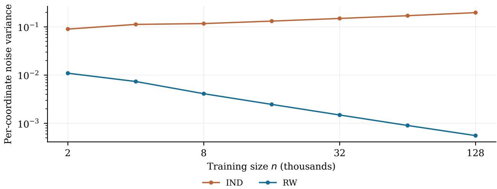  
Figure 7: Maximum noise variance for count-based IND and RW in the separation experiment, with $\mu = 1$ . Curves show means over 100 repetitions, and bands show one standard error.

## S.4.4 Running times

Tables 1–3 report median cumulative running times across 100 repetitions for the complete release sequences in the corresponding experiments. Times are in milliseconds. For countbased IND, count-based RW, and computable RW, the times include unlearning updates, computation of the bounds, variance calibration, and Gaussian noise sampling and addition. Exact retraining is initialized at the preceding retained fit. Its times include retraining only, without certification calibration or added noise.

In the evaluated settings, longer release sequences give larger relative time savings. For random deletion, the count-based methods are about 5 times faster than exact retraining at $M = 1 5$ and 56 times faster at $M = 1 7 8$ . Computable RW is about 1.9 and 38 times faster, respectively. In the IND–RW separation experiment, the count-based methods are about 9 times faster at $M = 4 6$ and 360 times faster at $M = 1 9 7 4$

## S.5 Newton update computation and extensions

We compare the computational costs of two starting points for one-step Newton updates and quantify the residual reduction from further Newton steps.

Table 1: Median cumulative running times (ms) for the settings of Figures 1, 3, and 6.
<table><tr><td>Setting</td><td>n</td><td>M</td><td>Count IND</td><td>Count RW</td><td>Computable RW</td><td>Retraining</td></tr><tr><td>Residual</td><td>10000</td><td>32</td><td>2.412</td><td>2.417</td><td>4.065</td><td>20.489</td></tr><tr><td>Random</td><td>1000</td><td>15</td><td>0.523</td><td>0.507</td><td>1.371</td><td>2.536</td></tr><tr><td>Random</td><td>2000</td><td>22</td><td>0.797</td><td>0.784</td><td>2.014</td><td>4.473</td></tr><tr><td>Random</td><td>4000</td><td>31</td><td>1.299</td><td>1.289</td><td>3.017</td><td>9.983</td></tr><tr><td>Random</td><td>8000</td><td>44</td><td>2.382</td><td>2.371</td><td>4.851</td><td>25.056</td></tr><tr><td>Random</td><td>16000</td><td>63</td><td>4.235</td><td>4.228</td><td>7.826</td><td>69.137</td></tr><tr><td>Random</td><td>32000</td><td>89</td><td>8.306</td><td>8.303</td><td>13.858</td><td>209.203</td></tr><tr><td>Random</td><td>64000</td><td>126</td><td>16.394</td><td>16.376</td><td>25.441</td><td>607.739</td></tr><tr><td>Random</td><td>128000</td><td>178</td><td>33.364</td><td>33.343</td><td>49.071</td><td>1853.179</td></tr><tr><td>Credit</td><td>24000</td><td>16</td><td>4.786</td><td>4.775</td><td>6.181</td><td>22.436</td></tr></table>

Table 2: Median cumulative running times (ms) for adaptive deletion in Figure 4.
<table><tr><td>n</td><td>M</td><td>Count IND</td><td>Count RW</td><td>Computable RW</td><td>Retraining</td></tr><tr><td>1000</td><td>15</td><td>0.517</td><td>0.507</td><td>1.346</td><td>2.506</td></tr><tr><td>2000</td><td>22</td><td>0.795</td><td>0.787</td><td>2.023</td><td>4.431</td></tr><tr><td>4000</td><td>31</td><td>1.300</td><td>1.284</td><td>2.990</td><td>9.820</td></tr><tr><td>8000</td><td>44</td><td>2.392</td><td>2.380</td><td>4.844</td><td>24.812</td></tr><tr><td>16000</td><td>63</td><td>4.250</td><td>4.236</td><td>7.891</td><td>68.018</td></tr><tr><td>32000</td><td>89</td><td>8.326</td><td>8.312</td><td>13.991</td><td>207.281</td></tr><tr><td>64000</td><td>126</td><td>16.402</td><td>16.390</td><td>25.472</td><td>605.442</td></tr><tr><td>128000</td><td>178</td><td>33.386</td><td>33.381</td><td>48.943</td><td>1837.089</td></tr></table>

Table 3: Median cumulative running times (ms) for the IND–RW separation experiment in Figure 5.
<table><tr><td>n M</td><td>Count IND Count RW</td></tr><tr><td>2000</td><td>Retraining 0.950</td></tr><tr><td>46 4000 87</td><td>0.944</td></tr><tr><td>1.781</td><td>1.796 24.252 79.766</td></tr><tr><td>8000 162 3.393 16000 303</td><td>3.436</td></tr><tr><td></td><td>6.143 6.229 273.181</td></tr><tr><td>32000 567 12.003</td><td>12.165 1149.982</td></tr><tr><td>64000 1058 23.969</td><td>24.178 4685.625</td></tr><tr><td></td><td>46.787 16958.835</td></tr><tr><td>128000 1974 46.153</td><td></td></tr></table>

## S.5.1 Computational comparison

To explain the computational choice in Section 2.4, we compare starting each Newton update from $\widehat { \beta }$ (fixed start) with starting from the preceding internal approximation (moving start). Both methods take one step per release and start from $\widehat { \beta }$ for the first release.

Consider M singleton deletions, with $M < n$ . For the first release, both updates form the retained Hessian at $\widehat { \beta }$ from $n - 1$ records. The fixed-start update can retain those contributions: each later deletion subtracts one Hessian, and each release adds one gradient of a deleted record to the cumulative gradient. The moving-start update instead evaluates and sums the derivatives of the remaining $n - t$ records at its new starting point in release $t \geq 2$ . The resulting counts are

<table><tr><td></td><td>Fixed start</td><td>Moving start</td></tr><tr><td>Hessian evaluations</td><td> $n - 1$ </td><td> $M n - M ( M + 1 ) / 2$ </td></tr><tr><td>Gradient evaluations</td><td>M</td><td> $( M - 1 ) n - M ( M + 1 ) / 2 + 2$ </td></tr><tr><td>Hessian additions</td><td> $n + M - 3$ </td><td> $M n - M ( M + 1 ) / 2 - M$ </td></tr><tr><td>Gradient additions</td><td> $M - 1$ </td><td> $( M - 1 ) n - M ( M + 1 ) / 2 - M + 2$ </td></tr></table>

For $p \times p$ Hessians, a matrix addition or subtraction costs $O ( p ^ { 2 } )$ , while a gradient addition costs $O ( p )$ . For the single-index loss in Assumption 3.1, forming a record’s Hessian and gradient costs $O ( p ^ { 2 } )$ and $O ( p )$ , respectively, if the scalar loss derivatives have constant evaluation cost. Thus the Hessian computation and summation in the moving-start update are of order M times those of the fixed-start update. This factor concerns Hessian work only. Both updates also require M linear solves, whose common cost is excluded from the table. Retaining all Hessian contributions from the first release uses $O ( n p ^ { 2 } )$ storage. Computing a contribution again when its record is deleted reduces this storage without changing the order of the fixed-start work.

## S.5.2 Further Newton steps

Additional Newton steps can reduce the residual at each release. To quantify this gain, fix a deletion set A with $| A | \leq M$ and set $b _ { A } ^ { ( 0 ) } = \widehat { \beta }$ and $b _ { A } ^ { ( j + 1 ) } = b _ { A } ^ { ( j ) } - \{ \nabla ^ { 2 } { \cal L } _ { A } ( b _ { A } ^ { ( j ) } ) \} ^ { - 1 } \nabla L _ { A } ( { \cal b } _ { A } ^ { ( j ) } )$ for $j \geq 0$ . Thus $b _ { A } ^ { ( 1 ) } = \widetilde { \beta } _ { A }$ and, on $\mathcal { H } _ { n } , \| b _ { A } ^ { ( 0 ) } - \widehat \beta _ { A } \| _ { 2 } \leq \rho _ { A }$ . If the ball of radius $\rho _ { A }$ around ${ \widehat { \beta } } _ { A }$ lies in N and $C _ { L , n } \rho _ { A } / ( 2 \kappa _ { n } ) < 1$ , then every iterate stays in the ball and

$$
\| b _ { A } ^ { ( K ) } - \widehat { \beta } _ { A } \| _ { 2 } \leq \left( \frac { C _ { L , n } } { 2 \kappa _ { n } } \right) ^ { 2 ^ { K } - 1 } \rho _ { A } ^ { 2 ^ { K } } , \qquad K \geq 0 .
$$

Indeed, for $e _ { j } = b _ { A } ^ { ( j ) } - \widehat { \beta } _ { A }$ , Taylor’s integral formula and the bounds on curvature and its Lipschitz constant give $\| e _ { j + 1 } \| _ { 2 } \le C _ { L , n } \| e _ { j } \| _ { 2 } ^ { 2 } / ( 2 \kappa _ { n } )$ on this ball. Induction proves the bound and keeps the iterates in the ball. Since $\rho _ { A } \leq | A | G _ { n } / \kappa _ { n }$ , the residual bound has order $O \{ ( | A | / n ) ^ { 2 ^ { K } }$ polylog(n)} for each fixed K and tends to zero as $K  \infty$ for fixed data under the stated condition. If $C _ { L , n } = 0$ , one step is exact.

We focus on one Newton step per release because it already sufices for the certification and consistency results established in this article. Further steps can reduce the approximation error but require additional derivative evaluations and linear solves.

## S.6 Technical proofs

This section provides proofs of the theoretical results in the main article and this supplement.

## S.6.1 Proof of Theorem 3.4

Proof. We first establish the common event in Lemma S.1.1. On this event, Taylor remainders give the residual bounds, and subtracting the remainder equations gives the increment bounds. Finally, we verify (7), which is used in the later path comparisons.

Uniform event and localization. To use the same Taylor bounds for all deletion sets, we need uniform derivative bounds on $\mathcal { N }$ and all retained estimators to lie in $\mathcal { N }$

Derivative bounds. The growth assumption controls the first and third predictor derivatives. The second derivative has the same growth bound: Taylor’s theorem applied to $\partial _ { z } \ell ( y , \cdot )$ gives

$$
| \partial _ { z } ^ { 2 } \ell ( y , z ) | \leq | \partial _ { z } \ell ( y , z + 1 ) | + | \partial _ { z } \ell ( y , z ) | + \frac { 1 } { 2 } \operatorname* { s u p } _ { u \in [ 0 , 1 ] } | \partial _ { z } ^ { 3 } \ell ( y , z + u ) | .
$$

Since $p$ is fixed, sub-Gaussian tails and the response tail condition give a deterministic $u _ { n } = O ( { \sqrt { \log n } } )$ such that the event

$$
\operatorname* { m a x } _ { i \leq n } \| x _ { i } \| _ { 2 } \leq u _ { n } , \qquad \operatorname* { m a x } _ { i \leq n } | y _ { i } | \leq B _ { y } ( n )
$$

has probability $1 - o ( 1 )$ by a union bound. On the event that both maxima are below these thresholds, compactness of $\mathcal { N }$ and the chain rule therefore give deterministic bounds $G _ { n } , B _ { n } , C _ { \ell , n } = O ( \mathrm { p o l y l o g } ( n ) )$ for the individual gradients, Hessians, and Hessian Lipschitz constants, respectively. Set $C _ { L , n } = n C _ { \ell , n } + \lambda C _ { \mathrm { r e g } } ( n )$ . This bounds the Hessian Lipschitz constant of every retained objective, and gives $C _ { L , n } = O ( n \mathrm { p o l y l o g } ( n ) ) , C _ { L , n } \geq C _ { \ell , n } .$ , and $M C _ { \ell , n } / C _ { L , n } \leq M / n  0$ , with $0 / 0$ interpreted as zero.

Curvature and localization. We next prove that, on a common event of probability $1 { - o ( 1 ) }$ for every $| A | \leq M$ ,

$$
\begin{array} { r } { \nabla ^ { 2 } L _ { A } ( \beta ) \succeq \kappa _ { n } I _ { p } \quad \mathrm { f o r ~ e v e r y ~ } \beta \in \mathcal { N } , \qquad \mathrm { a n d } \qquad \widehat { \beta } _ { A } \in \mathcal { N } . } \end{array}
$$

1. Population curvature. Assumption 3.3 gives

$$
\begin{array} { r } { \mathbb { E } \nabla ^ { 2 } \ell _ { i } ( \beta ) \succeq c _ { 0 } I _ { p } \qquad \mathrm { f o r ~ e v e r y ~ } \beta \in \mathcal { N } . } \end{array}
$$

2. Full-data curvature. To transfer this lower bound to the sample, we first prove

$$
\operatorname* { s u p } _ { \beta \in \mathcal { N } } \left\| \frac { 1 } { n } \sum _ { i = 1 } ^ { n } \nabla ^ { 2 } \ell _ { i } ( \beta ) - \mathbb { E } \nabla ^ { 2 } \ell _ { i } ( \beta ) \right\| _ { 2 } \xrightarrow { p } 0 .
$$

Whenever the supremum is at most $c _ { 0 } / 4$ , convexity of the regularizer and the population lower bound give, for every $\beta \in \mathcal N$

$$
\begin{array} { l } { \displaystyle \nabla ^ { 2 } L _ { \mathcal { O } } ( \beta ) = \sum _ { i = 1 } ^ { n } \nabla ^ { 2 } \ell _ { i } ( \beta ) + \lambda \nabla ^ { 2 } \mathcal { P } ( \beta ) } \\ { \displaystyle \succeq n \left( \mathbb { E } \nabla ^ { 2 } \ell _ { i } ( \beta ) - \frac { c _ { 0 } } { 4 } I _ { p } \right) \succeq \frac { c _ { 0 } n } { 2 } I _ { p } . } \end{array}
$$

To justify the uniform convergence, we use a finite net. To control the supremum, we also bound the Hessian variation between nearby points. By Assumption 3.1, the individual gradient and Hessian norms and Hessian Lipschitz constants on $\mathcal { N }$ are bounded by

$$
K _ { i } = C ( 1 + | y _ { i } | ^ { s } + \| x _ { i } \| _ { 2 } ^ { s } ) ( 1 + \| x _ { i } \| _ { 2 } ^ { 3 } ) .
$$

In particular, $\| \nabla ^ { 2 } \ell _ { i } ( \beta ) - \nabla ^ { 2 } \ell _ { i } ( \beta ^ { \prime } ) \| _ { 2 } \le K _ { i } \| \beta - \beta ^ { \prime } \| _ { 2 }$ for $\beta , \beta ^ { \prime } \in \mathcal { N }$ . The term involving both the response and the features satisfies

$$
\begin{array} { r } { \mathbb { E } \big [ | y _ { i } | ^ { 4 s / 3 } ( 1 + \| x _ { i } \| _ { 2 } ^ { 3 } ) ^ { 4 / 3 } \big ] \leq ( \mathbb { E } | y _ { i } | ^ { 2 s } ) ^ { 2 / 3 } \{ \mathbb { E } ( 1 + \| x _ { i } \| _ { 2 } ^ { 3 } ) ^ { 4 } \} ^ { 1 / 3 } . } \end{array}
$$

The response moment assumption and sub-Gaussian feature moments therefore give $\mathrm { s u p } _ { n } \mathbb { E } K _ { i } ^ { \bar { 4 } / 3 } < \infty$ . The remaining terms involve only feature moments.

Fix $\eta > 0$ and take a finite η-net $\mathcal { N } _ { \eta }$ of ${ \mathcal N }$ . The uniform $4 / 3$ moment bound gives the weak law at each net point. To extend it to all of $\mathcal { N }$ , the Hessian variation bound gives

$$
\begin{array} { r l } & { \underset { \beta \in \cal N } { \operatorname* { s u p } } \Bigg \| \frac { 1 } { n } \sum _ { i = 1 } ^ { n } \nabla ^ { 2 } \ell _ { i } ( \beta ) - \mathbb { E } \nabla ^ { 2 } \ell _ { i } ( \beta ) \Bigg \| _ { 2 } } \\ & { \quad \leq \underset { \beta ^ { \prime } \in \cal N _ { \eta } } { \operatorname* { m a x } } \Bigg \| \frac { 1 } { n } \sum _ { i = 1 } ^ { n } \nabla ^ { 2 } \ell _ { i } ( \beta ^ { \prime } ) - \mathbb { E } \nabla ^ { 2 } \ell _ { i } ( \beta ^ { \prime } ) \Bigg \| _ { 2 } + \eta \left( \frac { 1 } { n } \sum _ { i = 1 } ^ { n } K _ { i } + \mathbb { E } K _ { i } \right) . } \end{array}
$$

For fixed $\eta ,$ the maximum over the net converges to zero in probability, while n− $\begin{array} { r } { \mathbb { - 1 } \sum _ { i } K _ { i } = } \end{array}$ $O _ { p } ( 1 )$ by Markov’s inequality. Letting $n  \infty$ and then $\eta \downarrow 0$ proves the claimed uniform convergence.

3. Retained curvature. On the event that both observation maxima satisfy their bounds, $\begin{array} { r } { \sum _ { i \in A } \nabla ^ { 2 } \ell _ { i } ( \beta ) \preceq M B _ { n } I _ { p } } \end{array}$ and $M B _ { n } = o ( n )$ . Thus, whenever the full-data lower bound holds, for all suficiently large $n ,$ every $| A | \leq M$ , and every $\beta \in \mathcal N$

$$
\nabla ^ { 2 } L _ { A } ( \beta ) \succeq ( c _ { 0 } n / 2 - M B _ { n } ) I _ { p } \succeq \kappa _ { n } I _ { p } , \qquad \kappa _ { n } : = c _ { 0 } n / 4 .
$$

To prove that every retained estimator lies in ${ \mathcal { N } } .$ we compare $L _ { A } ( \beta _ { 0 } )$ with its values on the boundary of a ball contained in ${ \mathcal { N } } .$ . Choose a fixed $\rho _ { 0 } > 0$ with $\overline { { B } } ( \beta _ { 0 } , \rho _ { 0 } ) \subset \mathrm { i n t } ( \mathcal { N } )$ The bound $K _ { i }$ also justifies diferentiation under the expectation and the weak law for the gradient. Since $\beta _ { 0 }$ is an interior minimizer, $\mathbb { E } \nabla \ell _ { i } ( \beta _ { 0 } ) = \nabla \mathcal { R } ( \beta _ { 0 } ) = 0$ . Hence

$$
{ \frac { 1 } { n } } \nabla L _ { \mathcal { Q } } ( \beta _ { 0 } ) = { \frac { 1 } { n } } \sum _ { i = 1 } ^ { n } \nabla \ell _ { i } ( \beta _ { 0 } ) + { \frac { \lambda } { n } } \nabla \mathcal { P } ( \beta _ { 0 } ) \ { \xrightarrow { p } } \ 0 .
$$

Let ${ \mathcal { H } } _ { n }$ be the event on which the two bounds on the observation maxima above and the following inequalities hold:

$$
\operatorname* { s u p } _ { \beta \in { \cal N } } \left\| \frac { 1 } { n } \sum _ { i = 1 } ^ { n } \nabla ^ { 2 } \ell _ { i } ( \beta ) - \mathbb { E } \nabla ^ { 2 } \ell _ { i } ( \beta ) \right\| _ { 2 } \leq \frac { c _ { 0 } } { 4 } ,
$$

$$
\left. \frac { 1 } { n } \nabla L _ { \infty } ( \beta _ { 0 } ) \right. _ { 2 } \leq \frac { c _ { 0 } \rho _ { 0 } } { 3 2 } .
$$

Then $\delta _ { n } : = \mathbb { P } ( \mathcal { H } _ { n } ^ { c } ) = o ( 1 )$ , and the Hessian bounds above hold on ${ \mathcal { H } } _ { n }$ . Since $M G _ { n } = o ( n )$ ， on this event, for all suficiently large n and every $| A | \leq M$ 2

$$
\begin{array} { r } { \| \nabla L _ { A } ( \beta _ { 0 } ) \| _ { 2 } \leq \| \nabla L _ { \infty } ( \beta _ { 0 } ) \| _ { 2 } + M G _ { n } \leq c _ { 0 } n \rho _ { 0 } / 1 6 . } \end{array}
$$

For $\| h \| _ { 2 } = \rho _ { 0 }$ , Taylor’s theorem therefore gives

$$
L _ { A } ( \beta _ { 0 } + h ) - L _ { A } ( \beta _ { 0 } ) \ge - \frac { c _ { 0 } n \rho _ { 0 } ^ { 2 } } { 1 6 } + \frac { \kappa _ { n } \rho _ { 0 } ^ { 2 } } { 2 } > 0 .
$$

If a retained minimizer were on or outside this ball, the segment from $\beta _ { 0 }$ to that minimizer would meet its boundary at a point with objective value at most $L _ { A } ( \beta _ { 0 } )$ by convexity, contradicting the strict boundary inequality. Thus $\widehat { \beta } _ { A } \in B ( \beta _ { 0 } , \rho _ { 0 } ) \subset N$ for every $| A | \leq M$ including $A = \emptyset$ . This proves all conclusions of Lemma S.1.1 on one event for all deletion sets.

The four residual and increment bounds. Fix $D \in \mathcal { H } _ { n }$ from Lemma S.1.1. If $C _ { L , n } = 0$ 2 all remainders and bounds vanish. Otherwise the following argument applies.

Residual bounds. To bound $e _ { S }$ , write the retained first-order equation as a Taylor remainder at ${ \widehat { \beta } } .$ . Let $v _ { S } = \widehat { \beta } _ { S } - \widehat { \beta }$ . The segment from $\widehat { \beta }$ to ${ \widehat \beta } _ { S }$ lies in $\mathcal { N }$ by convexity. Since $\nabla L _ { S } ( \widehat { \beta } ) = - g _ { S }$ and $\nabla L _ { S } ( \dot { \beta } _ { S } ) = 0$ , the Hessian lower bound gives

$$
\begin{array} { r l r } {  { \kappa _ { n } \| v _ { S } \| _ { 2 } ^ { 2 } \leq \int _ { 0 } ^ { 1 } v _ { S } ^ { \top } \nabla ^ { 2 } L _ { S } ( \widehat { \beta } + t v _ { S } ) v _ { S } d t } } \\ & { } & { = v _ { S } ^ { \top } \{ \nabla L _ { S } ( \widehat { \beta } + v _ { S } ) - \nabla L _ { S } ( \widehat { \beta } ) \} = v _ { S } ^ { \top } g _ { S } \leq \| v _ { S } \| _ { 2 } \| g _ { S } \| _ { 2 } . } \end{array}
$$

Thus

$$
\| v _ { S } \| _ { 2 } \le \frac { \| g _ { S } \| _ { 2 } } { \kappa _ { n } } = \rho _ { S } .\tag{9}
$$

Define the gradient remainder $F _ { S } ( v ) = \nabla L _ { S } ( \widehat { \beta } + v ) - \nabla L _ { S } ( \widehat { \beta } ) - H _ { S } v$ . Taylor’s integral formula and the Hessian Lipschitz bound give

$$
F _ { S } ( v ) = \int _ { 0 } ^ { 1 } \{ \nabla ^ { 2 } L _ { S } ( \widehat { \beta } + u v ) - H _ { S } \} v d u ,
$$

and

$$
\| F _ { S } ( v _ { S } ) \| _ { 2 } \leq C _ { L , n } \| v _ { S } \| _ { 2 } ^ { 2 } \int _ { 0 } ^ { 1 } u d u \leq \frac { C _ { L , n } } { 2 } \rho _ { S } ^ { 2 } .\tag{10}
$$

The retained first-order equation is $0 = - g _ { S } + H _ { S } v _ { S } + F _ { S } ( v _ { S } )$ . Since $\widetilde { \beta } _ { S } = \widehat { \beta } + H _ { S } ^ { - 1 } g _ { S }$ 2 $e _ { S } = H _ { S } ^ { - 1 } g _ { S } - v _ { S } = H _ { S } ^ { - 1 } F _ { S } ( v _ { S } )$ . Thus

$$
\| e _ { S } \| _ { 2 } \leq r ^ { \mathrm { s e t } } ( S ) : = \frac { C _ { L , n } } { 2 } \| H _ { S } ^ { - 1 } \| _ { 2 } \rho _ { S } ^ { 2 } .
$$

Since $\rho _ { S } \leq | S | G _ { n } / \kappa _ { n }$ and $\| H _ { S } ^ { - 1 } \| _ { 2 } \leq 1 / \kappa _ { n }$

$$
\| e _ { S } \| _ { 2 } \leq r ^ { \mathrm { s e t } } ( S ) \leq \frac { C _ { L , n } } { 2 } \frac { 1 } { \kappa _ { n } } \left( \frac { | S | G _ { n } } { \kappa _ { n } } \right) ^ { 2 } = r ^ { \mathrm { c n t } } ( | S | ) : = \frac { C _ { L , n } G _ { n } ^ { 2 } | S | ^ { 2 } } { 2 \kappa _ { n } ^ { 3 } } .
$$

Set-based increments. Fix $A \subsetneq B$ and $q = | B \setminus A |$ . To bound $\| e _ { B } - e _ { A } \| _ { 2 }$ , we use the diference of the two remainder equations and the residual bounds. We first bound $\| v _ { B } - v _ { A } \| _ { 2 }$ to control the diference between the remainders at the two retained fits. Since $\nabla L _ { B } (  { \hat { \beta } } _ { B } ) = 0$ and $\begin{array} { r } { \nabla L _ { B } ( \widehat { \beta } _ { A } ) = - \sum _ { i \in B \setminus A } \nabla \ell _ { i } ( \widehat { \beta } _ { A } ) } \end{array}$ , the Hessian lower bound gives

$$
\begin{array} { r l } & { \displaystyle \kappa _ { n } \| v _ { B } - v _ { A } \| _ { 2 } ^ { 2 } \leq \int _ { 0 } ^ { 1 } ( v _ { B } - v _ { A } ) ^ { \top } \nabla ^ { 2 } L _ { B } \big ( \widehat { \beta } _ { A } + t ( v _ { B } - v _ { A } ) \big ) \big ( v _ { B } - v _ { A } \big ) d t } \\ & { \qquad = ( v _ { B } - v _ { A } ) ^ { \top } \{ \nabla L _ { B } ( \widehat { \beta } _ { B } ) - \nabla L _ { B } ( \widehat { \beta } _ { A } ) \} } \\ & { \qquad = ( v _ { B } - v _ { A } ) ^ { \top } \displaystyle \sum _ { i \in B \setminus A } \nabla \ell _ { i } ( \widehat { \beta } _ { A } ) } \\ & { \qquad \leq \| v _ { B } - v _ { A } \| _ { 2 } \Bigg \| _ { \widehat { \mu } \in B \setminus A } \nabla \ell _ { i } ( \widehat { \beta } _ { A } ) \Bigg \| _ { 2 } . } \end{array}
$$

The individual gradient bounds give $\begin{array} { r } { \| \sum _ { i \in B \backslash A } \nabla \ell _ { i } ( \widehat { \beta } _ { A } ) \| _ { 2 } \leq q G _ { n } } \end{array}$ . Expanding each gradient at $\widehat { \beta }$ also gives

$$
\sum _ { i \in B \setminus A } \nabla \ell _ { i } ( \widehat { \beta } _ { A } ) = g _ { B } - g _ { A } + \int _ { 0 } ^ { 1 } \sum _ { i \in B \setminus A } \nabla ^ { 2 } \ell _ { i } ( \widehat { \beta } + u v _ { A } ) v _ { A } d u
$$

whose norm is at most $\| g _ { B } - g _ { A } \| _ { 2 } + q B _ { n } \rho _ { A }$ . Taking the smaller of these two bounds yields

$$
\| v _ { B } - v _ { A } \| _ { 2 } \leq \delta _ { A , B } : = \frac { 1 } { \kappa _ { n } } \operatorname* { m i n } \{ q G _ { n } , \| g _ { B } - g _ { A } \| _ { 2 } + q B _ { n } \rho _ { A } \} .
$$

Subtracting $H _ { A } e _ { A } = F _ { A } ( v _ { A } )$ from $H _ { B } e _ { B } = F _ { B } ( v _ { B } )$ and adding and subtracting $F _ { B } ( v _ { A } )$ gives

$$
H _ { B } ( e _ { B } - e _ { A } ) = F _ { B } ( v _ { B } ) - F _ { B } ( v _ { A } ) - \{ F _ { A } ( v _ { A } ) - F _ { B } ( v _ { A } ) \} + ( H _ { A } - H _ { B } ) e _ { A } .\tag{11}
$$

We bound the three terms on the right separately.

To bound $\lVert F _ { B } ( v _ { B } ) - F _ { B } ( v _ { A } ) \rVert _ { 2 }$ , integrate $\nabla F _ { B } ( v ) = \nabla ^ { 2 } L _ { B } ( \widehat { \beta } + v ) - H _ { B }$ along $v =$ $( 1 - u ) v _ { A } + u v _ { B } , 0 \leq u \leq 1$ , to obtain

$$
F _ { B } ( v _ { B } ) - F _ { B } ( v _ { A } ) = \int _ { 0 } ^ { 1 } \nabla F _ { B } \big ( ( 1 - u ) v _ { A } + u v _ { B } \big ) ( v _ { B } - v _ { A } ) d u .
$$

On this segment, $\| v \| _ { 2 } \le ( 1 - u ) \rho _ { A } + u \rho _ { B }$ by (9). Since $H _ { B } = \nabla ^ { 2 } L _ { B } ( \widehat { \beta } )$ , the Hessian Lipschitz bound gives

$$
\begin{array} { r l } & { \| \nabla F _ { B } ( v ) \| _ { 2 } = \| \nabla ^ { 2 } L _ { B } ( \widehat \beta + v ) - \nabla ^ { 2 } L _ { B } ( \widehat \beta ) \| _ { 2 } } \\ & { \qquad \leq C _ { L , n } \| ( \widehat \beta + v ) - \widehat \beta \| _ { 2 } = C _ { L , n } \| v \| _ { 2 } . } \end{array}
$$

Thus

$$
\begin{array} { r l } & { \| F _ { B } ( v _ { B } ) - F _ { B } ( v _ { A } ) \| _ { 2 } \leq \| v _ { B } - v _ { A } \| _ { 2 } \displaystyle \int _ { 0 } ^ { 1 } \| \nabla F _ { B } ( ( 1 - u ) v _ { A } + u v _ { B } ) \| _ { 2 } d u } \\ & { \qquad \leq C _ { L , n } \| v _ { B } - v _ { A } \| _ { 2 } \displaystyle \int _ { 0 } ^ { 1 } \{ ( 1 - u ) \rho _ { A } + u \rho _ { B } \} d u } \\ & { \qquad \leq \displaystyle \frac { C _ { L , n } } { 2 } ( \rho _ { A } + \rho _ { B } ) \delta _ { A , B } . } \end{array}
$$

To bound $\lVert F _ { A } ( v _ { A } ) - F _ { B } ( v _ { A } ) \rVert _ { 2 }$ , use $\begin{array} { r } { L _ { A } - L _ { B } = \sum _ { i \in B \setminus A } \ell _ { i } } \end{array}$ to obtain

$$
\begin{array} { r l } & { \qquad F _ { A } ( v _ { A } ) - F _ { B } ( v _ { A } ) = \displaystyle \sum _ { i \in B \setminus A } \int _ { 0 } ^ { 1 } \{ \nabla ^ { 2 } \ell _ { i } ( \widehat { \beta } + u v _ { A } ) - \nabla ^ { 2 } \ell _ { i } ( \widehat { \beta } ) \} v _ { A } d u , } \\ & { \qquad | | F _ { A } ( v _ { A } ) - F _ { B } ( v _ { A } ) | | _ { 2 } \leq \displaystyle \frac { q C _ { \ell , n } } { 2 } \rho _ { A } ^ { 2 } . } \end{array}
$$

For the third term, $e _ { A } = H _ { A } ^ { - 1 } F _ { A } ( v _ { A } )$ and (10) with $S = A$ give

$$
\begin{array} { r l } & { \| H _ { B } ^ { - 1 } ( H _ { A } - H _ { B } ) e _ { A } \| _ { 2 } \leq \| H _ { B } ^ { - 1 } ( H _ { A } - H _ { B } ) H _ { A } ^ { - 1 } \| _ { 2 } \| F _ { A } ( v _ { A } ) \| _ { 2 } } \\ & { \qquad \leq \| H _ { B } ^ { - 1 } ( H _ { A } - H _ { B } ) H _ { A } ^ { - 1 } \| _ { 2 } \frac { C _ { L , n } } { 2 } \rho _ { A } ^ { 2 } . } \end{array}
$$

Multiplying (11) by $H _ { B } ^ { - 1 }$ and applying the triangle inequality yields $\| e _ { B } - e _ { A } \| _ { 2 } \leq U _ { A , B }$ where

$$
U _ { A , B } : = \| H _ { B } ^ { - 1 } \| _ { 2 } \frac { C _ { L , n } } { 2 } ( \rho _ { A } + \rho _ { B } ) \delta _ { A , B } + \| H _ { B } ^ { - 1 } \| _ { 2 } \frac { q C _ { \ell , n } } { 2 } \rho _ { A } ^ { 2 } + \| H _ { B } ^ { - 1 } ( H _ { A } - H _ { B } ) H _ { A } ^ { - 1 } \| _ { 2 } \frac { C _ { L , n } } { 2 } \rho _ { A } ^ { 2 } .
$$

The residual bounds also give

$$
\begin{array} { l } { \displaystyle \| e _ { B } - e _ { A } \| _ { 2 } \le \| e _ { A } \| _ { 2 } + \| e _ { B } \| _ { 2 } } \\ { \displaystyle \le \frac { C _ { L , n } } { 2 } \left( \| H _ { A } ^ { - 1 } \| _ { 2 } \rho _ { A } ^ { 2 } + \| H _ { B } ^ { - 1 } \| _ { 2 } \rho _ { B } ^ { 2 } \right) = r ^ { \mathrm { s e t } } ( A ) + r ^ { \mathrm { s e t } } ( B ) . } \end{array}
$$

Taking the smaller of these two bounds gives

$$
\| e _ { B } - e _ { A } \| _ { 2 } \leq d ^ { \mathrm { s e t } } ( A , B ) : = \operatorname* { m i n } \left\{ U _ { A , B } , \frac { C _ { L , n } } { 2 } \left( \| H _ { A } ^ { - 1 } \| _ { 2 } \rho _ { A } ^ { 2 } + \| H _ { B } ^ { - 1 } \| _ { 2 } \rho _ { B } ^ { 2 } \right) \right\} .
$$

Count-based increments. To replace the set-dependent quantities in $U _ { A , B }$ by deletion counts, we first bound $\| H _ { B } ^ { - 1 } - H _ { A } ^ { - 1 } \| _ { 2 }$ . Write $k = | A | , m = | B |$ , and $q = m - k$ . Convexity gives $H _ { B } \preceq H _ { A } \preceq H _ { B } + q B _ { n } I _ { p }$ . Monotonicity of the matrix inverse and $H _ { B } \succeq \kappa _ { n } I _ { p }$ imply

$$
\begin{array} { c } { { 0 \preceq H _ { B } ^ { - 1 } - H _ { A } ^ { - 1 } \preceq H _ { B } ^ { - 1 } - ( H _ { B } + q B _ { n } I _ { p } ) ^ { - 1 } , } } \\  { { \lfloor { H _ { B } ^ { - 1 } ( H _ { A } - H _ { B } ) H _ { A } ^ { - 1 } } \rfloor \rfloor _ { 2 } = \lfloor { \lfloor { H _ { B } ^ { - 1 } - H _ { A } ^ { - 1 } } \rfloor \rfloor _ { 2 } \leq \frac { q B _ { n } } { \kappa _ { n } ( \kappa _ { n } + q B _ { n } ) } . } } } \end{array}
$$

For the last inequality, diagonalizing $H _ { B }$ gives eigenvalues $q B _ { n } / \{ t ( t + q B _ { n } ) \}$ for $H _ { B } ^ { - 1 } - \left( H _ { B } + \right.$ $q B _ { n } I _ { p } ) ^ { - 1 }$ , with $t \geq \kappa _ { n }$ . This expression decreases with t, so its maximum is at most the displayed bound. Substitute this bound, $\| H _ { B } ^ { - 1 } \| _ { 2 } \le 1 / \kappa _ { n } , \rho _ { A } \le k G _ { n } / \kappa _ { n } , \rho _ { B } \le m G _ { n } / \kappa _ { n }$ , and $\delta _ { A , B } \leq q G _ { n } / \kappa _ { n }$ into $U _ { A , B }$ to obtain

$$
\begin{array} { r l } & { \| e _ { B } - e _ { A } \| _ { 2 } \leq d ^ { \mathrm { s e t } } ( A , B ) \leq U _ { A , B } } \\ & { \qquad \leq \frac { C _ { L , n } G _ { n } ^ { 2 } q ( k + m ) } { 2 \kappa _ { n } ^ { 3 } } + \frac { q C _ { \ell , n } k ^ { 2 } G _ { n } ^ { 2 } } { 2 \kappa _ { n } ^ { 3 } } + \frac { q B _ { n } C _ { L , n } k ^ { 2 } G _ { n } ^ { 2 } } { 2 \kappa _ { n } ^ { 3 } \left( \kappa _ { n } + q B _ { n } \right) } } \\ & { \qquad = d ^ { \mathrm { c n t } } ( k , m ) , } \end{array}
$$

where

$$
d ^ { \mathrm { c n t } } ( k , m ) : = \frac { G _ { n } ^ { 2 } ( m - k ) } { 2 \kappa _ { n } ^ { 3 } } \left[ C _ { L , n } ( k + m ) + k ^ { 2 } \left( C _ { \ell , n } + \frac { B _ { n } C _ { L , n } } { \kappa _ { n } + ( m - k ) B _ { n } } \right) \right] .
$$

Since $k ^ { 2 } \le M ( k + m )$

$$
\frac { k ^ { 2 } } { k + m } \left( \frac { C _ { \ell , n } } { C _ { L , n } } + \frac { B _ { n } } { \kappa _ { n } + ( m - k ) B _ { n } } \right) \leq \frac { M C _ { \ell , n } } { C _ { L , n } } + \frac { M B _ { n } } { \kappa _ { n } } = o ( 1 )
$$

by Lemma S.1.1 and the cap condition. Hence, uniformly over $0 \leq k < m \leq M$

$$
d ^ { \mathrm { c n t } } ( k , m ) = { \frac { C _ { L , n } G _ { n } ^ { 2 } ( m - k ) ( k + m ) } { 2 \kappa _ { n } ^ { 3 } } } \{ 1 + o ( 1 ) \} = O \left( { \frac { ( m - k ) ( k + m ) \mathrm { p o l y l o g } ( n ) } { n ^ { 2 } } } \right) .
$$

The same constant bounds give $r ^ { \mathrm { c n t } } ( m ) = O ( m ^ { 2 } \mathrm { p o l y l o g } ( n ) / n ^ { 2 } )$

Relations between residual and increment bounds. For $A = \emptyset , \rho _ { A } = 0$ and $\delta _ { A , B } =$ ρB, giving $d ^ { \mathrm { s e t } } ( \emptyset , B ) = r ^ { \mathrm { s e t } } ( B )$ To prove the second relation in (7), we bound $| \rho _ { B } ^ { 2 } - \rho _ { A } ^ { 2 } |$ and $\lVert H _ { B } ^ { - 1 } - \dot { H } _ { A } ^ { - 1 } \rVert _ { 2 }$ . Since $\left\| g _ { B } - g _ { A } \right\| _ { 2 } \leq q G _ { n }$ , the definition of $\delta _ { A , B }$ gives $| \rho _ { B } - \rho _ { A } | \ \leq$ $\lVert g _ { B } - g _ { A } \rVert _ { 2 } / \kappa _ { n } \leq \delta _ { A , B }$ . Hence $| \rho _ { B } ^ { 2 } - \bar { \rho } _ { A } ^ { 2 } | = ( \rho _ { A } + \rho _ { B } ) | \rho _ { B } - \rho _ { A } | \leq ( \rho _ { A } + \rho _ { B } ) \delta _ { A , B }$ . Since $\bar { H _ { B } ^ { - 1 } } - \bar { H _ { A } ^ { - 1 } } = \bar { H _ { B } ^ { - 1 } } ( \bar { H _ { A } } - \bar { H _ { B } } ) \bar { H _ { A } ^ { - 1 } }$

$$
\begin{array} { r l } & { | r ^ { \mathrm { s e t } } ( B ) - r ^ { \mathrm { s e t } } ( A ) | \leq \frac { C _ { L , n } } { 2 } \left[ \| H _ { B } ^ { - 1 } \| _ { 2 } | \rho _ { B } ^ { 2 } - \rho _ { A } ^ { 2 } | + \rho _ { A } ^ { 2 } \big | \| H _ { B } ^ { - 1 } \| _ { 2 } - \| H _ { A } ^ { - 1 } \| _ { 2 } \big | \right] } \\ & { \qquad \leq \frac { C _ { L , n } } { 2 } \left[ \| H _ { B } ^ { - 1 } \| _ { 2 } ( \rho _ { A } + \rho _ { B } ) \delta _ { A , B } + \rho _ { A } ^ { 2 } \| H _ { B } ^ { - 1 } ( H _ { A } - H _ { B } ) H _ { A } ^ { - 1 } \| _ { 2 } \right] } \\ & { \qquad \leq U _ { A , B } . } \end{array}
$$

Also $| r ^ { \mathrm { s e t } } ( B ) - r ^ { \mathrm { s e t } } ( A ) | \leq r ^ { \mathrm { s e t } } ( A ) + r ^ { \mathrm { s e t } } ( B )$ , proving the claimed inequality.

## S.6.2 Proof of Proposition 3.5

Proof. Fix D, M, and $a \in \{ \mathrm { c n t } , \mathrm { s e t } \}$ . Use the corresponding bounds $r _ { t } , d _ { t }$ and path maxima $R ^ { a } , D ^ { a }$ from the main text. For each mechanism, we check that the proposed allocation attains its claimed value, then bound every feasible allocation from below on each path. Maximizing these lower bounds over paths proves optimality. If the relevant path maximum is zero, all corresponding bounds vanish. Zero budgets and zero noise attain value zero. We therefore assume the relevant path maximum is positive in the calculations below.

IND. For the upper bound, the proposed budgets satisfy $\begin{array} { r } { \sum _ { t = 1 } ^ { T } \mu _ { t } ^ { 2 } = ( \mu ^ { 2 } / R ^ { a } ) \sum _ { t = 1 } ^ { T } r _ { t } ^ { 2 } \le \mu ^ { 2 } } \end{array}$ on every $P \in { \mathcal { C } }$ . The corresponding variance is $\tau _ { t } ^ { 2 } = R ^ { a } / \mu ^ { 2 }$ , so the largest variance on every path is $R ^ { a } / \mu ^ { 2 }$ . For the lower bound, consider any allocation satisfying the IND constraint in (3). On each path,

$$
\sum _ { t = 1 } ^ { T } r _ { t } ^ { 2 } \leq \left( \operatorname* { m a x } _ { 1 \leq t \leq T } \tau _ { t } ^ { 2 } \right) \sum _ { t = 1 } ^ { T } \frac { r _ { t } ^ { 2 } } { \tau _ { t } ^ { 2 } } \leq \mu ^ { 2 } \operatorname* { m a x } _ { 1 \leq t \leq T } \tau _ { t } ^ { 2 } .
$$

Taking the supremum over $P \in { \mathcal { C } }$ gives the lower bound $R ^ { a } / \mu ^ { 2 }$ , which the proposed budgets attain.

RW. For the upper bound, the proposed budgets satisfy $\begin{array} { r } { \sum _ { t = 1 } ^ { T } \mu _ { t } ^ { 2 } = ( \mu ^ { 2 } / \sqrt { D ^ { a } } ) \sum _ { t = 1 } ^ { T } d _ { t } \leq } \end{array}$ $\mu ^ { 2 }$ on every $P \in { \mathcal { C } }$ . They give $\sigma _ { t } ^ { 2 } = d _ { t } \sqrt { D ^ { a } } / \mu ^ { 2 }$ . Since the increment variances are nonnegative,

$$
\operatorname* { m a x } _ { 1 \leq t \leq T } \sum _ { s = 1 } ^ { t } \sigma _ { s } ^ { 2 } = \sum _ { t = 1 } ^ { T } \sigma _ { t } ^ { 2 } = \frac { \sqrt { D ^ { a } } } { \mu ^ { 2 } } \sum _ { t = 1 } ^ { T } d _ { t } \leq \frac { D ^ { a } } { \mu ^ { 2 } } ,
$$

with equality on a path maximizing $\textstyle \sum _ { t } d _ { t }$ . For the lower bound, consider any allocation satisfying the RW constraint in (3). Cauchy–Schwarz gives

$$
\left( \sum _ { t = 1 } ^ { T } d _ { t } \right) ^ { 2 } \leq \left( \sum _ { t = 1 } ^ { T } \frac { d _ { t } ^ { 2 } } { \sigma _ { t } ^ { 2 } } \right) \left( \sum _ { t = 1 } ^ { T } \sigma _ { t } ^ { 2 } \right) \leq \mu ^ { 2 } \sum _ { t = 1 } ^ { T } \sigma _ { t } ^ { 2 } .
$$

Thus its worst-case accumulated variance is at least $D ^ { a } / \mu ^ { 2 }$ , which the proposed budgets attain. Both arguments for the lower bounds hold for every realized history, so they also apply to the stated $\mathcal { F } _ { t }$ -measurable allocations. This proves the proposition for both choices of bounds. Terms with zero bounds contribute zero cost. □

The count-based residual maximum has the explicit form $\begin{array} { r } { R ^ { \mathrm { c n t } } = \sum _ { m = 1 } ^ { M } r ^ { \mathrm { c n t } } ( m ) ^ { 2 } ; } \end{array}$ : the positive counts on a path are distinct, and the full singleton path visits all of them. Supplementary Section S.1.3 shows that splitting batches into single-record deletions cannot decrease the sum of count-based increment bounds. Thus the full singleton path also attains the count-based increment maximum.

## S.6.3 Proof of Theorem 3.6

Proof. The result follows directly from Theorem 3.4, Proposition 3.5, and adaptive GDP composition. □

## S.6.4 Proof of Corollary 3.7

Proof. Fix $D \in \mathcal { H } _ { n }$ . If $C _ { L , n } = 0$ , all increment bounds vanish and no noise is needed. We therefore assume $C _ { L , n } > 0$ . We use $\begin{array} { r } { \| g _ { A } \| _ { 2 } \le \sum _ { i \in A } \| \nabla \ell _ { i } ( \widehat \beta ) \| _ { 2 } } \end{array}$ to bound $\textstyle \sum _ { t = 1 } ^ { T } d ^ { \mathrm { s e t } } ( S _ { t - 1 } , S _ { t } )$ along every allowed deletion path. The resulting leading term telescopes, while the remaining terms sum over at most M deleted records. Recall $\alpha _ { n } = C _ { L , n } / ( 2 \kappa _ { n } ^ { 3 } ) , \eta _ { n } = M C _ { \ell , n } / C _ { L , n } +$ $3 M B _ { n } / \kappa _ { n }$ , and $W _ { M }$ from Supplementary Section S.1.3. For a deletion set A, put $w _ { A } =$ $\begin{array} { r } { \sum _ { i \in A } \| \nabla \ell _ { i } ( \widehat { \beta } ) \| _ { 2 } } \end{array}$ . For an edge $A \subset B$ , let $q = | B \setminus A |$ . The bounds $\| H _ { A } ^ { - 1 } \| _ { 2 } , \| H _ { B } ^ { - 1 } \| _ { 2 } \leq 1 / \kappa _ { n }$ and $\| H _ { A } - H _ { B } \| _ { 2 } \leq q B _ { n }$ , together with $\delta _ { A , B } \leq ( \| g _ { B } - g _ { A } \| _ { 2 } + q B _ { n } \rho _ { A } ) / \kappa _ { n } , { \mathrm { g i v e } }$

$$
\begin{array} { r l } & { d ^ { \mathrm { s e t } } ( A , B ) \leq \alpha _ { n } \bigg [ ( \| g _ { A } \| _ { 2 } + \| g _ { B } \| _ { 2 } ) ( w _ { B } - w _ { A } ) } \\ & { \qquad + \frac { q B _ { n } } { \kappa _ { n } } ( \| g _ { A } \| _ { 2 } + \| g _ { B } \| _ { 2 } ) \| g _ { A } \| _ { 2 } + q \left( \frac { C _ { \ell , n } } { C _ { L , n } } + \frac { B _ { n } } { \kappa _ { n } } \right) \| g _ { A } \| _ { 2 } ^ { 2 } \bigg ] . } \end{array}
$$

Since $\| g _ { A } \| _ { 2 } \le w _ { A } \le W _ { M }$ , the first term is at most $( w _ { A } + w _ { B } ) ( w _ { B } - w _ { A } ) = w _ { B } ^ { 2 } - w _ { A } ^ { 2 }$ . Since $\| g _ { A } \| _ { 2 } , \| g _ { B } \| _ { 2 } \le W _ { M }$ , the other two terms satisfy

$$
\begin{array} { r l r } {  { \frac { q B _ { n } } { \kappa _ { n } } ( \| g _ { A } \| _ { 2 } + \| g _ { B } \| _ { 2 } ) \| g _ { A } \| _ { 2 } \leq \frac { 2 q B _ { n } } { \kappa _ { n } } W _ { M } ^ { 2 } , } } \\ & { } & { q ( \frac { C _ { \ell , n } } { C _ { L , n } } + \frac { B _ { n } } { \kappa _ { n } } ) \| g _ { A } \| _ { 2 } ^ { 2 } \leq q ( \frac { C _ { \ell , n } } { C _ { L , n } } + \frac { B _ { n } } { \kappa _ { n } } ) W _ { M } ^ { 2 } . } \end{array}
$$

Their sum is at most $q W _ { M } ^ { 2 } \{ C _ { \ell , n } / C _ { L , n } + 3 B _ { n } / \kappa _ { n } \}$ . Along a path $P = ( S _ { 0 } , \ldots , S _ { T } )$ , the first bound telescopes because $\begin{array} { r } { \sum _ { ( A , B ) \in P } \bigl ( w _ { B } ^ { 2 } - w _ { A } ^ { 2 } \bigr ) = w _ { S _ { T } } ^ { 2 } } \end{array}$ and $w _ { S _ { 0 } } = 0$ . Also $\sum _ { ( A , B ) \in P } q = | S _ { T } | \leq$ M. Hence

$$
\sum _ { ( A , B ) \in P } d ^ { \mathrm { s e t } } ( A , B ) \leq \alpha _ { n } \left[ w _ { S _ { T } } ^ { 2 } + M W _ { M } ^ { 2 } \left( \frac { C _ { \ell , n } } { C _ { L , n } } + \frac { 3 B _ { n } } { \kappa _ { n } } \right) \right] \leq \alpha _ { n } W _ { M } ^ { 2 } ( 1 + \eta _ { n } ) .
$$

Taking the maximum over all allowed paths gives

$$
\sqrt { D ^ { \mathrm { s e t } } } = \operatorname* { m a x } _ { P \in \mathcal { C } } \sum _ { ( A , B ) \in P } d ^ { \mathrm { s e t } } ( A , B ) \leq \alpha _ { n } W _ { M } ^ { 2 } ( 1 + \eta _ { n } ) .\tag{12}
$$

The transition comparison $d ^ { \mathrm { s e t } } ( A , B ) \leq d ^ { \mathrm { c n t } } ( | A | , | B | )$ also gives $D ^ { \mathrm { s e t } } \le D ^ { \mathrm { c n t } }$ . Taking the minimum of these two path bounds proves

$$
D ^ { \mathrm { s e t } } \leq D ^ { \mathrm { c o m } } \leq D ^ { \mathrm { c n t } } , \qquad \sqrt { D ^ { \mathrm { c o m } } } \leq \alpha _ { n } W _ { M } ^ { 2 } ( 1 + \eta _ { n } ) .
$$

If $D ^ { \mathrm { c o m } } = 0$ , all set-based increment bounds vanish on every path, so no noise is needed for transcript certification. We therefore assume $D ^ { \mathrm { c o m } } > 0$ . The proposed RW variances satisfy, on every allowed path,

$$
\sum _ { t = 1 } ^ { T } \frac { d ^ { \mathrm { s e t } } ( S _ { t - 1 } , S _ { t } ) ^ { 2 } } { ( \sigma _ { t } ^ { \mathrm { c o m } } ) ^ { 2 } } = \frac { \mu ^ { 2 } } { \sqrt { D ^ { \mathrm { c o m } } } } \sum _ { t = 1 } ^ { T } d ^ { \mathrm { s e t } } ( S _ { t - 1 } , S _ { t } ) \leq \mu ^ { 2 } \sqrt { \frac { D ^ { \mathrm { s e t } } } { D ^ { \mathrm { c o m } } } } \leq \mu ^ { 2 } .
$$

When $d ^ { \mathrm { s e t } } ( S _ { t - 1 } , S _ { t } ) = 0$ , the corresponding summand in the GDP budget is defined to be zero. Adaptive GDP composition, as used in the proof of Theorem 3.6, gives the same $( \delta _ { n } , \mu )$ transcript guarantee.

For the same deletions, (4) and $D ^ { \mathrm { c o m } } \leq D ^ { \mathrm { c n t } }$ give

$$
( \sigma _ { t } ^ { \mathrm { c o m } } ) ^ { 2 } = \frac { d ^ { \mathrm { s e t } } ( S _ { t - 1 } , S _ { t } ) \sqrt { D ^ { \mathrm { c o m } } } } { \mu ^ { 2 } } \leq \frac { d ^ { \mathrm { c n t } } ( m _ { t - 1 } , m _ { t } ) \sqrt { D ^ { \mathrm { c n t } } } } { \mu ^ { 2 } } = ( \sigma _ { t } ^ { \mathrm { c n t } } ) ^ { 2 } .
$$

Consequently, for every $\begin{array} { r } { u \leq T , \sum _ { t = 1 } ^ { u } ( \sigma _ { t } ^ { \mathrm { c o m } } ) ^ { 2 } \leq \sum _ { t = 1 } ^ { u } ( \sigma _ { t } ^ { \mathrm { c n t } } ) ^ { 2 } . } \end{array}$

## S.6.5 Proof of Theorem 4.1

Proof. We first evaluate $D ^ { \mathrm { c n t } } / R ^ { \mathrm { c n t } }$ from the explicit path maxima. We then bound $D ^ { \mathrm { s e t } } / R ^ { \mathrm { s e t } }$ by comparing both quantities with $W _ { M } ^ { 4 }$ . These bounds also give the comparison between computable and set-based RW.

Count-based bounds. The exact path maximum and the sum of fourth powers determine the variance ratio. If $R ^ { \mathrm { c n t } } = 0$ , all count-based bounds and variances vanish. The stated ratios have positive denominators. We therefore assume $R ^ { \mathrm { c n t } } > 0$ and write $a _ { n } = C _ { \ell , n } / C _ { L , n } +$ $B _ { n } / ( \kappa _ { n } + B _ { n } )$ The count-based residual bound in Supplementary Section S.1 gives $r ^ { \mathrm { c n t } } ( m ) =$ $r ^ { \mathrm { { c n t } } } ( 1 ) m ^ { 2 }$ . Substituting $k = m - 1$ into the count-based increment bound gives

$$
\begin{array} { l } { { d ^ { \mathrm { c n t } } ( m - 1 , m ) = \displaystyle \frac { G _ { n } ^ { 2 } } { 2 \kappa _ { n } ^ { 3 } } \left[ C _ { L , n } ( 2 m - 1 ) + ( m - 1 ) ^ { 2 } \left( C _ { \ell , n } + \frac { B _ { n } C _ { L , n } } { \kappa _ { n } + B _ { n } } \right) \right] } } \\ { { = r ^ { \mathrm { c n t } } ( 1 ) \{ 2 m - 1 + a _ { n } ( m - 1 ) ^ { 2 } \} . } } \end{array}
$$

The full singleton path attains both count-based maxima, as stated after Theorem 3.6. Supplementary Section S.1.3.1 proves this for the increment sum. Thus

$$
\begin{array} { l } { { \displaystyle \sqrt { D ^ { \mathrm { c n t } } } = \sum _ { m = 1 } ^ { M } d ^ { \mathrm { c n t } } ( m - 1 , m ) = r ^ { \mathrm { c n t } } ( 1 ) \left\{ M ^ { 2 } + \frac { a _ { n } M ( M - 1 ) ( 2 M - 1 ) } { 6 } \right\} , } } \\ { { \displaystyle R ^ { \mathrm { c n t } } = \sum _ { m = 1 } ^ { M } r ^ { \mathrm { c n t } } ( m ) ^ { 2 } = r ^ { \mathrm { c n t } } ( 1 ) ^ { 2 } \sum _ { m = 1 } ^ { M } m ^ { 4 } } } \end{array}
$$

Consequently,

$$
{ \frac { V _ { \mathrm { r w } } ^ { \mathrm { c n t } } } { V _ { \mathrm { i n d } } ^ { \mathrm { c n t } } } } = { \frac { D ^ { \mathrm { c n t } } } { R ^ { \mathrm { c n t } } } } = { \frac { \left\{ M ^ { 2 } + a _ { n } M ( M - 1 ) ( 2 M - 1 ) / 6 \right\} ^ { 2 } } { \sum _ { m = 1 } ^ { M } m ^ { 4 } } } .
$$

Lemma S.1.1 gives $M C _ { \ell , n } / C _ { L , n } \to 0 , \ : B _ { n } = O ( \mathrm { p o l y l o g } ( n ) )$ , and $\kappa _ { n } \geq c _ { 0 } n / 4$ . Since $M =$ $o \{ n / \mathrm { p o l y l o g } ( n ) \}$ ,

$$
0 \leq M a _ { n } = { \frac { M C _ { \ell , n } } { C _ { L , n } } } + { \frac { M B _ { n } } { \kappa _ { n } + B _ { n } } } \leq { \frac { M C _ { \ell , n } } { C _ { L , n } } } + { \frac { 4 M B _ { n } } { c _ { 0 } n } } \longrightarrow 0 .
$$

Since $( M - 1 ) ( 2 M - 1 ) / ( 6 M ) \leq M / 3$ and $M ^ { 5 } / 5 \le \sum _ { m = 1 } ^ { M } m ^ { 4 } \le M ^ { 5 } , D ^ { \mathrm { c n t } } / R ^ { \mathrm { c n t } } = \Theta ( M ^ { - 1 } )$ If $M  \infty .$ , substitute $\textstyle \sum _ { m = 1 } ^ { M } m ^ { 4 } = M ^ { 5 } \{ 1 + O ( M ^ { - 1 } ) \} / 5$ to obtain

$$
\frac { V _ { \mathrm { r w } } ^ { \mathrm { c o m } } } { V _ { \mathrm { i n d } } ^ { \mathrm { c n t } } } \leq \frac { V _ { \mathrm { r w } } ^ { \mathrm { c n t } } } { V _ { \mathrm { i n d } } ^ { \mathrm { c n t } } } = \frac { 5 + o ( 1 ) } { M } ,
$$

where the inequality follows from Corollary 3.7.

Set-based bounds. We bound $D ^ { \mathrm { s e t } }$ from above and $R ^ { \mathrm { s e t } }$ from below to show that $D ^ { \mathrm { s e t } } / R ^ { \mathrm { s e t } } = O ( M ^ { - 1 } )$ . The upper bound on $D ^ { \mathrm { s e t } }$ comes from summing score norms. To obtain a lower bound on $R ^ { \mathrm { s e t } }$ , we construct a deletion path with at least $M / 4$ sets satisfying $\begin{array} { r } { \| g _ { S _ { t } } \| _ { 2 } \geq \frac { 1 } { 2 } \operatorname* { m a x } _ { | S | \leq M } \| g _ { S } \| _ { 2 } } \end{array}$

To bound $D ^ { \mathrm { s e t } } / R ^ { \mathrm { s e t } }$ , assume $n \geq 2 M$ and $M \ \geq \ 2$ . We also assume $C _ { L , n } ~ > ~ 0$ and $\nabla \ell _ { i } ( \widehat { \beta } ) \neq 0$ for at least one i. Otherwise, $R ^ { \mathrm { s e t } } = D ^ { \mathrm { s e t } } = 0$ , which is the trivial case. To compare residual bounds with squared score norms, we use the ratio $\omega _ { n } = \lambda _ { \mathrm { m i n } } ( H _ { \otimes } ) / \kappa _ { n }$ Recall $\eta _ { n } = M C _ { \ell , n } / C _ { L , n } + 3 M B _ { n } / \kappa _ { n }$ . Let $\gamma _ { p } = \mathbb { E } | U _ { 1 } |$ , where $U$ is uniform on the unit sphere in $\mathbb { R } ^ { p }$ , with $\gamma _ { 1 } = 1$

Since $p$ is fixed, $\gamma _ { p }$ is a positive constant independent of n. We first prove the bound

$$
\frac { 1 } { M } \leq \frac { D ^ { \mathrm { s e t } } } { R ^ { \mathrm { s e t } } } \leq \frac { 1 0 2 4 \omega _ { n } ^ { 2 } ( 1 + \eta _ { n } ) ^ { 2 } } { \gamma _ { p } ^ { 4 } M } .
$$

Recall that $W _ { M }$ is the sum of the M largest values among $\{ \| \nabla \ell _ { i } ( \widehat { \beta } ) \| _ { 2 } : i = 1 , \ldots , n \}$ and $\alpha _ { n } = C _ { L , n } / ( 2 \kappa _ { n } ^ { 3 } )$ . The Hessian lower bound and $\nabla ^ { 2 } \ell _ { i } ( \widehat { \beta } ) \succeq 0$ give $\kappa _ { n } I _ { p } \preceq H _ { A } \preceq H _ { \emptyset }$ , so

$$
\frac { 1 } { \lambda _ { \operatorname* { m i n } } ( H _ { \varnothing } ) } \le \| H _ { A } ^ { - 1 } \| _ { 2 } = \frac { 1 } { \lambda _ { \operatorname* { m i n } } ( H _ { A } ) } \le \frac { 1 } { \kappa _ { n } } .
$$

Using

$$
r ^ { \mathrm { s e t } } ( A ) = \frac { C _ { L , n } } { 2 \kappa _ { n } ^ { 2 } } \| H _ { A } ^ { - 1 } \| _ { 2 } \| g _ { A } \| _ { 2 } ^ { 2 } = \alpha _ { n } \kappa _ { n } \| H _ { A } ^ { - 1 } \| _ { 2 } \| g _ { A } \| _ { 2 } ^ { 2 }
$$

and $\omega _ { n } = \lambda _ { \operatorname* { m i n } } ( H _ { \infty } ) / \kappa _ { n }$ gives

$$
\frac { \alpha _ { n } } { \omega _ { n } } \| g _ { A } \| _ { 2 } ^ { 2 } \leq r ^ { \mathrm { s e t } } ( A ) \leq \alpha _ { n } \| g _ { A } \| _ { 2 } ^ { 2 } .
$$

An upper bound for $D ^ { \mathrm { s e t } }$ . By (12), we have

$$
\sqrt { D ^ { \mathrm { s e t } } } \leq \alpha _ { n } W _ { M } ^ { 2 } ( 1 + \eta _ { n } ) .
$$

A lower bound for $R ^ { \mathrm { s e t } }$ . Let $s _ { * } : = \operatorname* { m a x } _ { | \boldsymbol { S } | \leq M } \| \boldsymbol { g } _ { \boldsymbol { S } } \| _ { 2 } .$ , and let J index the M largest values of $\| \nabla \ell _ { i } ( { \widehat { \boldsymbol { \beta } } } ) \| _ { 2 }$ . By rotational invariance, $U ^ { \top } a$ has the same distribution as $\| a \| _ { 2 } U _ { 1 }$ for every $a \in \mathbb { R } ^ { p }$ , so $\mathbb { E } _ { U } | U ^ { \top } a | = \gamma _ { p } \| a \| _ { 2 }$ . Hence

$$
\mathbb { E } _ { U } \sum _ { i \in J } | U ^ { \top } \nabla \ell _ { i } ( \widehat { \beta } ) | = \gamma _ { p } \sum _ { i \in J } \| \nabla \ell _ { i } ( \widehat { \beta } ) \| _ { 2 } = \gamma _ { p } W _ { M } .
$$

There is therefore a unit direction u satisfying $\begin{array} { r } { \sum _ { i \in J } | u ^ { \top } \nabla \ell _ { i } ( \widehat { \beta } ) | \geq \gamma _ { p } W _ { M } } \end{array}$ . Partition J by the sign of these projections and take S to be the group with the larger absolute projection sum. Since the projections in S have the same sign, $| \boldsymbol { u } ^ { \top } \boldsymbol { g } _ { S } | \ge \gamma _ { p } W _ { M } / 2$ . Using $| S | \le M$ gives

$$
\begin{array} { r } { s _ { \ast } \geq \| g _ { S } \| _ { 2 } \geq | u ^ { \top } g _ { S } | \geq \gamma _ { p } W _ { M } / 2 . } \end{array}
$$

Taking maxima in the residual lower bound gives

$$
\begin{array} { r l } & { r _ { * } ^ { \mathrm { s e t } } = \displaystyle \operatorname* { m a x } _ { | A | \leq M } r ^ { \mathrm { s e t } } ( A ) \geq \frac { \alpha _ { n } } { \omega _ { n } } \operatorname* { m a x } _ { | A | \leq M } \| g _ { A } \| _ { 2 } ^ { 2 } } \\ & { \quad \quad = \frac { \alpha _ { n } } { \omega _ { n } } s _ { * } ^ { 2 } \geq \frac { \alpha _ { n } \gamma _ { p } ^ { 2 } W _ { M } ^ { 2 } } { 4 \omega _ { n } } . } \end{array}
$$

Choose a set $S _ { * }$ satisfying $| S _ { * } | \le M$ and $\| g _ { S _ { * } } \| _ { 2 } = s _ { * }$ , and write $k = | S _ { * } |$ . Since $s _ { * } > 0$ set $u = g _ { S _ { * } } / s _ { * }$ . Then $\| u \| _ { 2 } = \| g _ { S _ { * } } \| _ { 2 } / s _ { * } = 1$ and $u ^ { \top } g _ { S _ { * } } = s _ { * }$ . For every $i \in S _ { * } , u ^ { \top } \nabla \ell _ { i } ( \widehat { \beta } ) \geq 0$ otherwise, removing i would give $\| g _ { S _ { * } \backslash \{ i \} } \| _ { 2 } \geq u ^ { \top } g _ { S _ { * } \backslash \{ i \} } = s _ { * } - u ^ { \top } \nabla \ell _ { i } ( \widehat { \beta } ) > s _ { * }$ , contradicting the definition of $s _ { * }$ . We construct a deletion path from $S _ { 0 } = \emptyset$ with at least $M / 4$ states satisfying $\| g _ { S _ { t } } \| _ { 2 } \geq s _ { * } / 2$

If $k \ge M / 2$ , order $S _ { * } = \{ i _ { 1 } , \ldots , i _ { k } \}$ by decreasing $u ^ { \top } \nabla \ell _ { i _ { j } } ( \widehat { \beta } )$ , and delete the records in that order, so $S _ { j } = \{ i _ { 1 } , . . . , i _ { j } \}$ for $1 \leq j \leq k$ . The first $j$ projections have average at least the average $s _ { * } / k$ over all k records. Hence

$$
u ^ { \top } g _ { S _ { j } } = \sum _ { \ell = 1 } ^ { j } u ^ { \top } \nabla \ell _ { i _ { \ell } } ( \widehat { \beta } ) \geq \frac { j } { k } s _ { * } \geq \frac { s _ { * } } { 2 } , \qquad \lceil k / 2 \rceil \leq j \leq k .
$$

There are $\lfloor k / 2 \rfloor + 1 \geq k / 2 \geq M / 4$ such states, all satisfying $\| g _ { S _ { j } } \| _ { 2 } \ge u ^ { \top } g _ { S _ { j } } \ge s _ { * } / 2$ . The path respects the cap because $| S _ { j } | \le k \le M$

If $k < M / 2$ , first delete the records in $S _ { * }$ one at a time in any order, so $S _ { k } = S _ { * }$ . We then append $L = \vert M / 2 \vert$ remaining records. Order the remaining records as $i _ { 1 } , \dots , i _ { n }$ −k so that $b _ { j } : = \boldsymbol { u } ^ { \intercal } \nabla \ell _ { i _ { j } } ( \widehat { \beta } )$ satisfies $b _ { 1 } \geq \cdot \cdot \cdot \geq b _ { n - k }$ , and append the first $L$ of them. Thus $S _ { k + \ell } = S _ { * } \cup \{ i _ { 1 } , . . . , i _ { \ell } \}$ for $1 \leq \ell \leq L .$ and all these sets have size at most $k + L \leq M$ . If $b _ { L } < - s _ { * } / M$ , then every $b _ { j }$ with $j \geq L$ is also below $- s _ { * } / M$ . Since $n \geq 2 M$ , there are at least $n - k - L + 1 \geq n - M + 1 \geq M$ such records. Choose $M$ of them as $C$ . Then $u ^ { \top } g _ { C } < - s _ { * }$ and $\| g _ { C } \| _ { 2 } \geq | u ^ { \top } g _ { C } | > s _ { * }$ , contradicting the definition of $s _ { * }$ . Therefore $b _ { j } \ge b _ { L } \ge - s _ { * } / M$ for $1 \le j \le L$ , and

$$
u ^ { \top } g _ { S _ { k + \ell } } = s _ { * } + \sum _ { j = 1 } ^ { \ell } b _ { j } \geq s _ { * } \left( 1 - \frac { \ell } { M } \right) \geq \frac { s _ { * } } { 2 } , \qquad 0 \leq \ell \leq L .
$$

These $L + 1 \ge M / 4$ states satisfy $\| g _ { S _ { k + \ell } } \| _ { 2 } \ge u ^ { \top } g _ { S _ { k + \ell } } \ge s _ { * } / 2 .$

For either constructed path $P = ( S _ { 0 } , \ldots , S _ { T } )$ , each state with $\| g _ { S _ { t } } \| _ { 2 } \geq s _ { * } / 2$ satisfies

$$
r ^ { \mathrm { s e t } } ( S _ { t } ) \geq \frac { \alpha _ { n } } { \omega _ { n } } \| g _ { S _ { t } } \| _ { 2 } ^ { 2 } \geq \frac { \alpha _ { n } s _ { * } ^ { 2 } } { 4 \omega _ { n } } .
$$

There are at least $M / 4$ such states, so

$$
R ^ { \mathrm { s e t } } \geq \sum _ { t = 1 } ^ { T } \{ r ^ { \mathrm { s e t } } ( S _ { t } ) \} ^ { 2 } \geq \frac { M } { 4 } \left( \frac { \alpha _ { n } s _ { * } ^ { 2 } } { 4 \omega _ { n } } \right) ^ { 2 } = \frac { \alpha _ { n } ^ { 2 } M s _ { * } ^ { 4 } } { 6 4 \omega _ { n } ^ { 2 } } .
$$

Using $s _ { * } \geq \gamma _ { p } W _ { M } / 2$ then gives

$$
R ^ { \mathrm { s e t } } \geq \frac { \alpha _ { n } ^ { 2 } M } { 6 4 \omega _ { n } ^ { 2 } } \left( \frac { \gamma _ { p } W _ { M } } { 2 } \right) ^ { 4 } = \frac { \alpha _ { n } ^ { 2 } \gamma _ { p } ^ { 4 } M W _ { M } ^ { 4 } } { 1 0 2 4 \omega _ { n } ^ { 2 } } .
$$

For the upper bound on $D ^ { \mathrm { s e t } } / R ^ { \mathrm { s e t } }$ , combine this inequality with $\sqrt { D ^ { \mathrm { s e t } } } \le \alpha _ { n } W _ { M } ^ { 2 } ( 1 + \eta _ { n } )$ to obtain

$$
\frac { D ^ { \mathrm { s e t } } } { R ^ { \mathrm { s e t } } } \leq \frac { \alpha _ { n } ^ { 2 } W _ { M } ^ { 4 } ( 1 + \eta _ { n } ) ^ { 2 } } { \alpha _ { n } ^ { 2 } \gamma _ { p } ^ { 4 } M W _ { M } ^ { 4 } / ( 1 0 2 4 \omega _ { n } ^ { 2 } ) } = \frac { 1 0 2 4 \omega _ { n } ^ { 2 } ( 1 + \eta _ { n } ) ^ { 2 } } { \gamma _ { p } ^ { 4 } M } .
$$

For the lower bound on $D ^ { \mathrm { s e t } } / R ^ { \mathrm { s e t } }$ , the identity $d ^ { \mathrm { s e t } } ( \emptyset , S ) = r ^ { \mathrm { s e t } } ( S )$ gives $\sqrt { D ^ { \mathrm { s e t } } } \geq r _ { * } ^ { \mathrm { s e t } }$ Also, $R ^ { \mathrm { s e t } } \leq M ( r _ { * } ^ { \mathrm { s e t } } ) ^ { 2 }$ , so

$$
\frac { D ^ { \mathrm { s e t } } } { R ^ { \mathrm { s e t } } } \geq \frac { ( r _ { * } ^ { \mathrm { s e t } } ) ^ { 2 } } { M ( r _ { * } ^ { \mathrm { s e t } } ) ^ { 2 } } = \frac { 1 } { M } .
$$

Thus

$$
\frac { 1 } { M } \leq \frac { D ^ { \mathrm { s e t } } } { R ^ { \mathrm { s e t } } } \leq \frac { 1 0 2 4 \omega _ { n } ^ { 2 } ( 1 + \eta _ { n } ) ^ { 2 } } { \gamma _ { p } ^ { 4 } M } .
$$

Uniformity on ${ \mathcal { H } } _ { n }$ . To use the finite-sample comparison in the theorem, it remains to show $\omega _ { n } = O ( 1 )$ and $\eta _ { n } = o ( 1 )$ . We first bound $\| H _ { \mathcal { O } } \| _ { 2 }$ . Assumptions 3.1–3.3 give

$$
\operatorname* { s u p } _ { \beta \in N } \| \mathbb { E } \nabla ^ { 2 } \ell _ { i } ( \beta ) \| _ { 2 } < \infty , \qquad \operatorname* { s u p } _ { \beta \in N } \| \nabla ^ { 2 } \mathcal { P } ( \beta ) \| _ { 2 } < \infty .
$$

On ${ \mathcal { H } } _ { n }$ , the sample Hessian difers from its expectation by at most $c _ { 0 } n / 4$ , as established in the proof of Lemma S.1.1. Since ${ \widehat { \beta } } \in { \mathcal { N } }$ and $\lambda = \Theta ( 1 )$ ,

$$
\| H _ { \mathcal { O } } \| _ { 2 } \leq n \left( \operatorname* { s u p } _ { \beta \in { \cal N } } \| \mathbb { E } \nabla ^ { 2 } \ell _ { i } ( \beta ) \| _ { 2 } + \frac { c _ { 0 } } { 4 } \right) + \lambda \operatorname* { s u p } _ { \beta \in { \cal N } } \| \nabla ^ { 2 } \mathcal { P } ( \beta ) \| _ { 2 } \leq C _ { H } n ,
$$

where $C _ { H }$ is independent of n. Since $\kappa _ { n } \geq c _ { 0 } n / 4$

$$
0 < \omega _ { n } \leq \frac { \| H _ { \varnothing } \| _ { 2 } } { \kappa _ { n } } \leq \frac { C _ { H } n } { c _ { 0 } n / 4 } = \frac { 4 C _ { H } } { c _ { 0 } } = O ( 1 ) .
$$

Recall

$$
\eta _ { n } = \frac { M C _ { \ell , n } } { C _ { L , n } } + \frac { 3 M B _ { n } } { \kappa _ { n } } .
$$

Lemma S.1.1 gives $M C _ { \ell , n } / C _ { L , n } ~ \to ~ 0$ and $B _ { n } \ = \ O ( \mathrm { p o l y l o g } ( n ) )$ . Together with $M \ =$ $o \{ n / \mathrm { p o l y l o g } ( n ) \}$ and $\kappa _ { n } \geq c _ { 0 } n / 4$ , these imply

$$
0 \leq \eta _ { n } \leq \frac { M C _ { \ell , n } } { C _ { L , n } } + \frac { 1 2 M B _ { n } } { c _ { 0 } n } \longrightarrow 0 .
$$

Substituting into the finite-sample ratio bounds gives

$$
\frac { V _ { \mathrm { r w } } ^ { \mathrm { s e t } } } { V _ { \mathrm { i n d } } ^ { \mathrm { s e t } } } = \frac { D ^ { \mathrm { s e t } } } { R ^ { \mathrm { s e t } } } = \Theta ( M ^ { - 1 } )
$$

uniformly on ${ \mathcal { H } } _ { n }$

Computable RW. If $D ^ { \mathrm { s e t } } = 0$ , both set-based and computable RW require zero noise. We therefore assume $D ^ { \mathrm { s e t } } > 0$ when comparing their ratio. The accumulated variance uses the realized increment bounds, so maximizing over deletion paths gives

$$
V _ { \mathrm { r w } } ^ { \mathrm { c o m } } = \frac { \sqrt { D ^ { \mathrm { c o m } } D ^ { \mathrm { s e t } } } } { \mu ^ { 2 } } \le \frac { D ^ { \mathrm { c o m } } } { \mu ^ { 2 } } .
$$

When $D ^ { \mathrm { s e t } } > 0$ , the bound proved in Section S.6.5 gives $\sqrt { D ^ { \mathrm { s e t } } } \ge \alpha _ { n } \gamma _ { p } ^ { 2 } W _ { M } ^ { 2 } / ( 4 \omega _ { n } )$ . Together with $D ^ { \mathrm { s e t } } \leq D ^ { \mathrm { c o m } }$ and $\sqrt { D ^ { \mathrm { c o m } } } \leq \alpha _ { n } W _ { M } ^ { 2 } ( 1 + \eta _ { n } )$ , this yields

$$
1 \leq \frac { V _ { \mathrm { r w } } ^ { \mathrm { c o m } } } { V _ { \mathrm { r w } } ^ { \mathrm { s e t } } } = \sqrt { \frac { D ^ { \mathrm { c o m } } } { D ^ { \mathrm { s e t } } } } \leq \frac { 4 \omega _ { n } ( 1 + \eta _ { n } ) } { \gamma _ { p } ^ { 2 } } .
$$

Since $\omega _ { n } = O ( 1 )$ and $\eta _ { n } = o ( 1 )$ uniformly on $\textstyle { \mathcal { H } } _ { n } .$ , and $p$ is fixed, $V _ { \mathrm { r w } } ^ { \mathrm { c o m } } / V _ { \mathrm { r w } } ^ { \mathrm { s e t } } = \Theta ( 1 )$

## S.6.6 Proof of Corollary 4.2

Proof. If $r ^ { \mathrm { c n t } } ( 1 ) = 0$ , all compared variances vanish and the ratios are not stated. We therefore assume $r ^ { \mathrm { c n t } } ( 1 ) > 0$ and retain $a _ { n }$ from that proof. Since $V _ { \mathrm { s i n g l e } } = r ^ { \mathrm { c n t } } ( 1 ) ^ { 2 } M ^ { 4 } / \mu ^ { 2 }$ the exact path maximum and IND sum give

$$
\frac { V _ { \mathrm { r w } } ^ { \mathrm { c n t } } } { V _ { \mathrm { s i n g l e } } } = \left( 1 + \frac { a _ { n } ( M - 1 ) ( 2 M - 1 ) } { 6 M } \right) ^ { 2 } , \qquad \frac { V _ { \mathrm { i n d } } ^ { \mathrm { c n t } } } { V _ { \mathrm { s i n g l e } } } = \frac { \sum _ { m = 1 } ^ { M } m ^ { 4 } } { M ^ { 4 } } .
$$

The cap condition gives ${ M a _ { n }  0 }$ , and $( M - 1 ) ( 2 M - 1 ) / ( 6 M ) \leq M / 3$ . Hence

$$
\frac { V _ { \mathrm { r w } } ^ { \mathrm { c o m } } } { V _ { \mathrm { s i n g l e } } } \leq \frac { V _ { \mathrm { r w } } ^ { \mathrm { c n t } } } { V _ { \mathrm { s i n g l e } } } = 1 + o ( 1 ) .
$$

If $M \to \infty$ , then $\begin{array} { r } { \sum _ { m = 1 } ^ { M } m ^ { 4 } = M ^ { 5 } \{ 1 + O ( M ^ { - 1 } ) \} / 5 , \mathrm { g i v i n g } \ V _ { \mathrm { i n d } } ^ { \mathrm { c n t } } / V _ { \mathrm { s i n g l e } } = ( M / 5 ) \{ 1 + o ( 1 ) \} } \end{array}$ .

## S.6.7 Proof of Remark 4.3

Write $V _ { \mathrm { s i n g l e , * } } ^ { \mathrm { s e t } } : = \operatorname* { m a x } _ { | \cal S | \leq M } r ^ { \mathrm { s e t } } ( { \cal S } ) ^ { 2 } / \mu ^ { 2 }$ for the single-release benchmark, where each deletion set is chosen before release. Under the assumptions of Corollary 4.2, we show that

$$
V _ { \mathrm { r w } } ^ { a } = \Theta \big ( V _ { \mathrm { s i n g l e } , * } ^ { \mathrm { s e t } } \big ) \quad ( a \in \{ \mathrm { s e t } , \mathrm { c o m } \} ) , \qquad V _ { \mathrm { i n d } } ^ { \mathrm { s e t } } = \Theta \big ( M V _ { \mathrm { s i n g l e } , * } ^ { \mathrm { s e t } } \big ) ,
$$

uniformly over $D \in \mathcal { H } _ { n }$

Proof. If $r _ { * } ^ { \mathrm { s e t } } = 0$ , all compared variances vanish. For the nonzero case with $M \geq 2$ , the proof in Section S.6.5 gives $\sqrt { D ^ { \mathrm { s e t } } } \le \alpha _ { n } W _ { M } ^ { 2 } ( 1 + \eta _ { n } )$ and $r _ { * } ^ { \mathrm { s e t } } \geq \alpha _ { n } \gamma _ { p } ^ { 2 } W _ { M } ^ { 2 } / ( 4 \omega _ { n } )$ , hence

$$
( r _ { * } ^ { \mathrm { s e t } } ) ^ { 2 } \leq D ^ { \mathrm { s e t } } \leq \left\{ \frac { 4 \omega _ { n } ( 1 + \eta _ { n } ) } { \gamma _ { p } ^ { 2 } } \right\} ^ { 2 } ( r _ { * } ^ { \mathrm { s e t } } ) ^ { 2 } .
$$

The uniformity argument in Section S.6.5 already established $\omega _ { n } = O ( 1 )$ and $\eta _ { n } ~ = ~ o ( 1 )$ uniformly on ${ \mathcal { H } } _ { n }$ . Since $p$ is fixed, $\gamma _ { p }$ is a positive constant independent of $n .$ . Thus the coefficient in the preceding comparison is uniformly bounded on ${ \mathcal { H } } _ { n }$ . Dividing by $\mu ^ { 2 }$ proves the claim for set-based RW. The result in Theorem 4.1 gives the same conclusion for computable RW. Finally, $V _ { \mathrm { i n d } } ^ { \mathrm { s e t } } = \Theta ( M V _ { \mathrm { r w } } ^ { \mathrm { s e t } } )$ proves the IND comparison. For $M = 1$ , both set-based path maxima equal $( r _ { * } ^ { \mathrm { s e t } } ) ^ { 2 }$ , and the computable comparison follows from Theorem 4.1. □

## S.6.8 Proof of Theorem 4.4

Proof. Suficiency. Condition on D and suppress its subscript on Σ. Gaussian conditioning uses $A _ { t } = \Sigma _ { t , < t } \Sigma _ { < t , < t } ^ { - 1 }$ and $C _ { t } = \Sigma _ { t t } - \Sigma _ { t , < t } \Sigma _ { < t , < t } ^ { - 1 } \Sigma _ { < t , t }$ . Fix $\zeta \in \mathcal { U }$ . Extend a realized prefix to $P \in { \mathcal { C } } _ { 1 }$ and write $u = u _ { \zeta } ( P )$ , with blocks $u _ { t } = \zeta ( S _ { t } )$ . Let $u _ { 1 : K } = ( \zeta ( S _ { 1 } ) ^ { \top } , \ldots , \zeta ( S _ { K } ) ^ { \top } ) ^ { \top }$ denote its first K blocks, and let $u _ { < t }$ denote its first t − 1 blocks. At a common history, the conditional mean diference is $u _ { t } - A _ { t } u _ { < t }$ and the covariance is $C _ { t }$ . For $t = 1$ , there are no preceding releases, so $A _ { t } u _ { < t } = 0$ and the conditional mean diference is $u _ { 1 }$ . Block Cholesky factorization gives, for every realized prefix,

$$
\sum _ { t \leq K } \{ u _ { t } - A _ { t } u _ { < t } \} ^ { \top } C _ { t } ^ { - 1 } \{ u _ { t } - A _ { t } u _ { < t } \} = u _ { 1 : K } ^ { \top } \Sigma _ { 1 : K , 1 : K } ^ { - 1 } u _ { 1 : K } .
$$

The Schur complement gives

$$
u _ { 1 : K } ^ { \top } \Sigma _ { 1 : K , 1 : K } ^ { - 1 } u _ { 1 : K } \leq u ^ { \top } \Sigma ^ { - 1 } u \leq \mu ^ { 2 } .
$$

This proves the pathwise Gaussian budget. Adaptive GDP composition, as used in Section S.6.3, establishes suficiency, including stopping.

Necessity. Fix $\zeta \in \mathcal { U }$ and a path $P \in { \mathcal { C } } _ { 1 }$ before releases, and write $u = u _ { \zeta } ( P )$ . The two transcript laws are Gaussians with mean gap u, so certification requires $u ^ { \top } \dot { \Sigma } ^ { - 1 } u \le \mu ^ { 2 }$ Taking all $\zeta \in \mathcal { U }$ and $P \in { \mathcal { C } } _ { 1 }$ gives the condition. □

## S.6.9 Proof of Proposition 4.5

We prove the claims in the order stated. For each upper bound, we give a covariance that certifies all allowed residual assignments and paths. For each lower bound, we choose allowed assignments that every feasible covariance must certify.

## S.6.9.1 Count-based bounds

Here $\begin{array} { r } { D ^ { \mathrm { c n t } } = \{ \sum _ { m = 1 } ^ { M } d ^ { \mathrm { c n t } } ( m - 1 , m ) \} ^ { 2 } } \end{array}$ . If $R ^ { \mathrm { c n t } } = 0$ , all residual and increment bounds vanish, so no noise is needed for certification. We henceforth assume $R ^ { \mathrm { c n t } } > 0$

We first prove that $\mathfrak { V } _ { D } ( \mathcal { U } _ { \Delta } ) \ : = \ : D ^ { \mathrm { c n t } } / \mu ^ { 2 }$ . For the upper bound, RW is feasible with noise increment variances $d ^ { \mathrm { c n t } } ( m - 1 , m ) \sqrt { D ^ { \mathrm { c n t } } } / \mu ^ { 2 }$ . So the largest marginal variance of this covariance is $D ^ { \mathrm { c n t } } / \mu ^ { 2 }$ , and hence $\mathfrak { V } _ { D } ( \mathcal { U } _ { \Delta } ) \le D ^ { \mathrm { c n t } } / \mu ^ { 2 }$

For the lower bound, fix a unit vector $w \in \mathbb { R } ^ { p }$ and define $\begin{array} { r } { \zeta ( S ) = \{ \sum _ { i = 1 } ^ { | S | } d ^ { \mathrm { c n t } } ( j - 1 , j ) \} w } \end{array}$ On a singleton edge from size $m - 1$ to $m _ { : }$ , its increment has norm $d ^ { \mathrm { c n t } } ( m ^ { \prime } - 1 , m )$ , so $\zeta \in \mathcal { U } _ { \Delta }$ Choose any $P = ( S _ { 0 } , \ldots , S _ { M } ) \in \mathcal { C } _ { 1 }$ . Its residual vector is $\boldsymbol { u } _ { \zeta } ( P ) = ( \zeta ( S _ { 1 } ) ^ { \top } , \dots , \zeta ( S _ { M } ) ^ { \top } ) ^ { \top }$ and $\| \zeta ( S _ { M } ) \| _ { 2 } ^ { 2 } = D ^ { \mathrm { c n t } }$ because all increments point in the same direction. For any feasible $\Sigma ,$ let $V = \operatorname* { m a x } _ { t \leq M } \lambda _ { \operatorname* { m a x } } ( \Sigma _ { t t } )$ . Certification of this assignment and path, followed by projection onto the last release, gives

$$
\mu ^ { 2 } \geq u _ { \zeta } ( P ) ^ { \top } \Sigma ^ { - 1 } u _ { \zeta } ( P ) \geq \zeta ( S _ { M } ) ^ { \top } \Sigma _ { M M } ^ { - 1 } \zeta ( S _ { M } ) \geq D ^ { \mathrm { c n t } } / V .
$$

Hence every feasible covariance has $V \geq D ^ { \mathrm { c n t } } / \mu ^ { 2 }$ , which implies $\mathfrak { V } _ { D } ( \mathcal { U } _ { \Delta } ) \geq D ^ { \mathrm { c n t } } / \mu ^ { 2 }$ . Together, the two inequalities give $\mathfrak { V } _ { D } ( \mathcal { U } _ { \Delta } ) = D ^ { \mathrm { c n t } } / \mu ^ { 2 }$

We next prove that $\mathfrak { V } _ { D } ( \mathcal { U } _ { 0 } ) = R ^ { \mathrm { c n t } } / \mu ^ { 2 }$ . For the upper bound, independent noise with covariance $( R ^ { \mathrm { c n t } } / \mu ^ { 2 } ) I _ { p M }$ certifies every assignment in $\mathcal { U } _ { 0 }$ , since $\begin{array} { r } { \sum _ { m } \| \zeta ( S _ { m } ) \| _ { 2 } ^ { 2 } \leq R ^ { \mathrm { c n t } } } \end{array}$ on every path. Thus $\mathfrak { V } _ { D } ( \mathcal { U } _ { 0 } ) \le R ^ { \mathrm { c n t } } / \mu ^ { 2 }$

For the lower bound, fix a unit vector w and any $P \in { \mathcal { C } } _ { 1 }$ . For each choice of signs $s _ { m } \in \{ - 1 , 1 \}$ , define $\zeta ( \emptyset ) = 0$ and $\zeta ( S ) = s _ { \left| S \right| } r ^ { \mathrm { c n t } } ( \left| S \right| ) w$ for $S \neq \emptyset$ . Every such assignment

belongs to $\mathcal { U } _ { 0 }$ and must be certified by any feasible $\Sigma .$ . Let $V = \operatorname* { m a x } _ { t \leq M } \lambda _ { \operatorname* { m a x } } ( \Sigma _ { t t } )$ . Averaging the certificate inequalities over all $2 ^ { \overset { \cdot } { M } }$ sign choices cancels the cross terms and gives

$$
\mu ^ { 2 } \geq \sum _ { m = 1 } ^ { M } r ^ { \mathrm { c n t } } ( m ) ^ { 2 } w ^ { \top } ( \Sigma ^ { - 1 } ) _ { m m } w .
$$

The Schur complement gives $( \Sigma ^ { - 1 } ) _ { m m } \succeq \Sigma _ { m m } ^ { - 1 }$ , while the definition of $V$ gives $\Sigma _ { m m } ^ { - 1 } \succeq V ^ { - 1 } I _ { p }$ Since $\| w \| _ { 2 } = 1 , \mu ^ { 2 } \geq R ^ { \mathrm { c n t } } / V$ . Thus $\mathfrak { V } _ { D } ( \mathcal { U } _ { 0 } ) \geq R ^ { \mathrm { c n t } } / \mu ^ { 2 }$ . The two bounds give the claimed equality.

We finally prove that $V _ { \mathrm { r w } } ^ { \mathrm { c n t } } = \{ 1 + o ( 1 ) \} \mathfrak { V } _ { D } ( \mathcal { U } _ { 0 } \cap \mathcal { U } _ { \Delta } )$ . For the upper bound, the inclusion $\mathcal { U } _ { 0 } \cap \mathcal { U } _ { \Delta } \subseteq \mathcal { U } _ { \Delta }$ gives $\mathfrak { V } _ { D } ( \mathcal { U } _ { 0 } \cap \mathcal { U } _ { \Delta } ) \le \mathfrak { V } _ { D } ( \mathcal { U } _ { \Delta } ) = D ^ { \mathrm { c n t } } / \mu ^ { 2 }$

For the lower bound, we need an assignment satisfying both constraints whose final residual is close to $\sqrt { D ^ { \mathrm { c n t } } }$ . We first compare the sum of the singleton increment bounds with the residual bound at each count. The definition of $d ^ { \mathrm { c n t } }$ gives

$$
d ^ { \mathrm { c n t } } ( j - 1 , j ) = r ^ { \mathrm { c n t } } ( 1 ) \left[ \left( 2 j - 1 \right) + \left( \frac { C _ { \ell , n } } { C _ { L , n } } + \frac { B _ { n } } { \kappa _ { n } + B _ { n } } \right) \left( j - 1 \right) ^ { 2 } \right] .
$$

The terms $r ^ { \mathrm { c n t } } ( 1 ) ( 2 j - 1 )$ sum to $r ^ { \mathrm { c n t } } ( m ) = m ^ { 2 } r ^ { \mathrm { c n t } } ( 1 )$ . For the remaining terms, $\sum _ { j = 1 } ^ { m } ( j -$ $1 ) ^ { 2 } \leq M m ^ { 2 }$ and $B _ { n } / ( \kappa _ { n } + B _ { n } ) \le B _ { n } / \kappa _ { n }$ . Recall that $\eta _ { n } = M C _ { \ell , n } / C _ { L , n } + 3 M B _ { n } / \kappa _ { n } = o ( 1 )$ uniformly on ${ \mathcal { H } } _ { n }$ . In particular, $M ( C _ { \ell , n } / C _ { L , n } + B _ { n } / \kappa _ { n } ) \leq \eta _ { n }$ . Thus, for $m \leq M$

$$
\begin{array} { r l } & { \displaystyle \sum _ { j = 1 } ^ { m } d ^ { \mathrm { c n t } } ( j - 1 , j ) = r ^ { \mathrm { c n t } } ( m ) + r ^ { \mathrm { c n t } } ( 1 ) \left( \frac { C _ { \ell , n } } { C _ { L , n } } + \frac { B _ { n } } { \kappa _ { n } + B _ { n } } \right) \displaystyle \sum _ { j = 1 } ^ { m } ( j - 1 ) ^ { 2 } } \\ & { \qquad \leq r ^ { \mathrm { c n t } } ( m ) \left[ 1 + M \left( \frac { C _ { \ell , n } } { C _ { L , n } } + \frac { B _ { n } } { \kappa _ { n } } \right) \right] } \\ & { \qquad \leq ( 1 + \eta _ { n } ) r ^ { \mathrm { c n t } } ( m ) . } \end{array}
$$

Fix a unit vector w and define $\zeta ( S ) = ( 1 + \eta _ { n } ) ^ { - 1 } \{ \sum _ { i = 1 } ^ { | S | } d ^ { \mathrm { c n t } } ( j - 1 , j ) \} w$ . For every S with $| S | = m$ , the displayed bound gives $\| \zeta ( S ) \| _ { 2 } \le r ^ { \mathrm { c n t } } ( \bar { m } ) , \mathrm { s o ~ } \zeta \in \mathcal { U } _ { 0 }$ . For any singleton edge $A \subset B$ with $| B | = m , \zeta ( B ) - \zeta ( A ) = d ^ { \mathrm { c n t } } ( m - 1 , m ) w / ( 1 + \eta _ { n } )$ . Its norm is at most $d ^ { \mathrm { c n t } } ( m - 1 , m )$ because $\eta _ { n } \ge 0 , \mathrm { s o } \ \zeta \in \mathcal { U } _ { \Delta }$ as well. Choose any $P = ( S _ { 0 } , \dots , S _ { M } ) \in \mathcal { C } _ { 1 }$ . Since $\begin{array} { r } { \sum _ { i = 1 } ^ { M } d ^ { \mathrm { c n t } } ( j - 1 , j ) = \sqrt { D ^ { \mathrm { c n t } } } } \end{array}$ , the final residual satisfies $\| \zeta ( S _ { M } ) \| _ { 2 } ^ { 2 } = D ^ { \mathrm { c n t } } / ( 1 + \eta _ { n } ) ^ { 2 }$ . For any feasible $\Sigma$ , let $V = \operatorname* { m a x } _ { t \leq M } \lambda _ { \operatorname* { m a x } } ( \Sigma _ { t t } )$ . Certification of this assignment and path, followed by projection onto the final release, gives

$$
\mu ^ { 2 } \geq u _ { \zeta } ( P ) ^ { \top } \Sigma ^ { - 1 } u _ { \zeta } ( P ) \geq \zeta ( S _ { M } ) ^ { \top } \Sigma _ { M M } ^ { - 1 } \zeta ( S _ { M } ) \geq \frac { D ^ { \mathrm { c n t } } } { ( 1 + \eta _ { n } ) ^ { 2 } V } .
$$

Thus every feasible covariance has $V \geq D ^ { \mathrm { c n t } } / \{ ( 1 + \eta _ { n } ) ^ { 2 } \mu ^ { 2 } \}$ . Taking the infimum over feasible covariances and using the upper bound gives

$$
\frac { V _ { \mathrm { r w } } ^ { \mathrm { c n t } } } { ( 1 + \eta _ { n } ) ^ { 2 } } \le \mathfrak { M } _ { D } ( \mathcal { U } _ { 0 } \cap \mathcal { U } _ { \Delta } ) \le \frac { D ^ { \mathrm { c n t } } } { \mu ^ { 2 } } = V _ { \mathrm { r w } } ^ { \mathrm { c n t } } .
$$

Since $\eta _ { n }  0$ uniformly on ${ \mathcal { H } } _ { n }$

$$
V _ { \mathrm { r w } } ^ { \mathrm { c n t } } = \{ 1 + o ( 1 ) \} \mathfrak { V } _ { D } ( \mathcal { U } _ { 0 } \cap \mathcal { U } _ { \Delta } ) .
$$

## S.6.9.2 Set-based bounds

Write $r _ { * } ^ { \mathrm { s e t } } = \operatorname* { m a x } _ { | S | \leq M } r ^ { \mathrm { s e t } } ( S )$ for the largest residual bound over allowed deletion sets. If $R ^ { \mathrm { s e t } } = 0$ , all residual and increment bounds vanish, so no noise is needed for certification. We henceforth assume $R ^ { \mathrm { s e t } } > 0$ . Then $D ^ { \mathrm { s e t } } > 0$ by $r _ { * } ^ { \mathrm { s e t } } \leq \sqrt { D ^ { \mathrm { s e t } } }$

We first prove that $\mathfrak { V } _ { D } ( \mathcal { U } _ { 0 } ) = R ^ { \mathrm { s e t } } / \mu ^ { 2 }$ . For the upper bound, independent noise with covariance $( R ^ { \mathrm { s e t } } / \mu ^ { 2 } ) I _ { p M }$ certifies every assignment in $\mathcal { U } _ { 0 }$ , since $\begin{array} { r } { \sum _ { t } \| \zeta ( S _ { t } ) \| _ { 2 } ^ { 2 } \leq R ^ { \mathrm { s e t } } } \end{array}$ on every path. Hence $\mathfrak { V } _ { D } ( \mathcal { U } _ { 0 } ) \le R ^ { \mathrm { s e t } } / \mu ^ { 2 }$

For the lower bound, choose a path $P \in { \mathcal { C } } _ { 1 }$ attaining $R ^ { \mathrm { s e t } }$ . Such a path exists because splitting batches into single deletions and extending the path to M deletions only adds nonnegative terms to the sum. Fix a unit vector w. For every choice of signs $s _ { t } \in \{ - 1 , 1 \}$ define $\zeta ( S _ { t } ) = s _ { t } r ^ { \mathrm { s e t } } ( S _ { t } )$ w on $P$ and set $\zeta = 0$ on all other deletion sets. Each assignment belongs to $\mathcal { U } _ { 0 }$ and must be certified by any feasible Σ. Let $V = \operatorname* { m a x } _ { t \leq M } \lambda _ { \operatorname* { m a x } } ( \Sigma _ { t t } )$ . Averaging the certificate inequalities over all $2 ^ { M }$ sign choices cancels the cross terms and gives

$$
\mu ^ { 2 } \geq \sum _ { t = 1 } ^ { M } r ^ { \mathrm { s e t } } ( S _ { t } ) ^ { 2 } w ^ { \top } ( \Sigma ^ { - 1 } ) _ { t t } w .
$$

The Schur complement gives $( \Sigma ^ { - 1 } ) _ { t t } \succeq \Sigma _ { t t } ^ { - 1 }$ , while the definition of V gives $\Sigma _ { t t } ^ { - 1 } \succeq V ^ { - 1 } I _ { p }$ Since $\| w \| _ { 2 } = 1 , \mu ^ { 2 } \geq R ^ { \mathrm { s e t } } / V$ . Thus $\mathfrak { V } _ { D } ( \mathcal { U } _ { 0 } ) \geq R ^ { \mathrm { s e t } } / \mu ^ { 2 }$ . The two bounds give the claimed equality.

For the remaining bounds, fix $\mathcal { U } \in \{ \mathcal { U } _ { \Delta } , \mathcal { U } _ { 0 } \cap \mathcal { U } _ { \Delta } \}$

For the upper bound $\mathfrak { D } _ { D } ( \mathcal { U } ) \le C _ { * } \log ^ { 2 } ( M + 1 ) V _ { \mathrm { r w } } ^ { \mathrm { s e t } }$ , we construct a covariance that certifies $\mathcal { U } _ { \Delta }$ and has small marginal variances. Let $K \in \mathbb { R } ^ { M \times M }$ be positive definite and set $\Sigma =$ $( D ^ { \mathrm { s e t } } / \mu ^ { 2 } ) ( K \otimes I _ { p } )$ . Here $K _ { t t }$ is a scalar, while the covariance block for release t is $\Sigma _ { t t } =$ $( D ^ { \mathrm { s e t } } / \mu ^ { 2 } ) K _ { t t } I _ { p }$ . Thus $\lambda _ { \operatorname* { m a x } } ( \Sigma _ { t t } ) = ( D ^ { \mathrm { s e t } } / \mu ^ { 2 } ) K _ { t t }$ , and controlling the largest marginal variance amounts to controlling max $K _ { t t }$

We next determine what K must satisfy for certification. For any $\zeta \in \mathcal { U } _ { \Delta }$ and $P =$ $( S _ { 0 } , \ldots , S _ { M } ) \in { \mathcal { C } } _ { 1 }$ , let $\Delta _ { j } = \zeta ( S _ { j } ) - \zeta ( S _ { j - 1 } )$ . Since $\begin{array} { r } { \zeta ( S _ { t } ) = \sum _ { i = 1 } ^ { t } \Delta _ { j } } \end{array}$ , the stacked residual vector is $\begin{array} { r } { u _ { \zeta } ( P ) = \sum _ { i = 1 } ^ { M } l _ { j } \otimes \Delta _ { j } } \end{array}$ , where $l _ { j } = ( { \bf 1 } _ { t \geq j } ) _ { t = 1 } ^ { M } . \mathrm { A s } \ \Sigma ^ { - 1 } = ( \mu ^ { 2 } / D ^ { \mathrm { s e t } } ) ( K ^ { - 1 } \otimes I _ { p } )$ , the certificate holds if $\| u _ { \zeta } ( P ) \| _ { K ^ { - 1 } \otimes I _ { p } } \leq \sqrt { D ^ { \mathrm { s e t } } }$ . Here $\| x \| _ { K ^ { - 1 } \otimes I _ { p } } ^ { 2 } = x ^ { \top } ( K ^ { - 1 } { \otimes } I _ { p } ) x$ . If $l _ { j } ^ { \top } K ^ { - 1 } l _ { j } \leq 1$ for every j, then

$$
\begin{array} { r l } & { \| u _ { \zeta } ( P ) \| _ { K ^ { - 1 } \otimes I _ { p } } = \left\| \displaystyle \sum _ { j = 1 } ^ { M } l _ { j } \otimes \Delta _ { j } \right\| _ { K ^ { - 1 } \otimes I _ { p } } \leq \displaystyle \sum _ { j = 1 } ^ { M } \| l _ { j } \otimes \Delta _ { j } \| _ { K ^ { - 1 } \otimes I _ { p } } } \\ & { \qquad = \displaystyle \sum _ { j = 1 } ^ { M } \sqrt { l _ { j } ^ { \top } K ^ { - 1 } l _ { j } } \| \Delta _ { j } \| _ { 2 } \leq \displaystyle \sum _ { j = 1 } ^ { M } d ^ { \mathrm { s e t } } ( S _ { j - 1 } , S _ { j } ) \leq \sqrt { D ^ { \mathrm { s e t } } } . } \end{array}
$$

It remains to construct K with this property and maxt $K _ { t t } = O ( \log ^ { 2 } ( M + 1 ) )$

Set $h = 1 + \lceil \log _ { 2 } M \rceil$ and $N = 2 ^ { h - 1 } \geq M$ . For $0 \leq k \leq h - 1$ and $0 \leq a < N / 2 ^ { k }$ , define

$$
I _ { k , a } = \{ a 2 ^ { k } + 1 , \ldots , ( a + 1 ) 2 ^ { k } \} .
$$

Use each $I _ { k , a }$ as a column index and set $A _ { t , I } = \mathbf { 1 } \{ t \in I \}$ for $1 \leq t \leq M$ . Distinct intervals remain distinct columns even if they agree on $\{ 1 , \ldots , M \}$ . Each row belongs to h intervals. Starting at $j ,$ , successively choose the largest $I _ { k , a }$ beginning at the next uncovered index. Their lengths strictly increase, so they partition $\{ j , \ldots , N \}$ into at most h intervals. Restricting to the first M coordinates expresses $l _ { j }$ as the sum of their columns of A. The intervals of length one give A full row rank, so $K = h A A ^ { \top }$ is positive definite. The row count gives $K _ { t t } = h ^ { 2 }$ . The column representation gives a vector c with entries in $\{ 0 , 1 \} , A c = l _ { j }$ and $\| c \| _ { 2 } ^ { 2 } \leq h$ . Since A has full row rank, its least norm solution to $A c = l _ { j }$ is $A ^ { \top } ( A A ^ { \top } ) ^ { - 1 } l _ { j }$ Hence

$$
l _ { j } ^ { \top } K ^ { - 1 } l _ { j } = \frac { 1 } { h } \operatorname* { m i n } _ { A c = l _ { j } } \| c \| _ { 2 } ^ { 2 } \leq 1 .
$$

Thus Σ certifies $\mathcal { U } _ { \Delta }$ , and hence also U. Its largest marginal variance is at most $h ^ { 2 } V _ { \mathrm { r w } } ^ { \mathrm { s e t } }$ , so

$$
\mathfrak { D } _ { D } ( \mathcal { U } ) \le h ^ { 2 } V _ { \mathrm { r w } } ^ { \mathrm { s e t } } \le C \log ^ { 2 } ( M + 1 ) V _ { \mathrm { r w } } ^ { \mathrm { s e t } }
$$

for a constant C.

For the lower bound $\mathfrak { V } _ { D } ( \mathcal { U } ) \geq V _ { \mathrm { r w } } ^ { \mathrm { s e t } } / C _ { * }$ , fix a unit vector w and define $\zeta ( S ) = r ^ { \mathrm { s e t } } ( S ) w$ Then $\zeta ( \emptyset ) = 0$ and $\| \zeta ( S ) \| _ { 2 } = r ^ { \mathrm { s e t } } ( S )$ for every S. For every singleton edge $A \subset B , ( 7 )$ gives $\| \zeta ( B ) - \zeta ( A ) \| _ { 2 } = | r ^ { \mathrm { s e t } } ( B ) - r ^ { \mathrm { s e t } } ( A ) | \leq d ^ { \mathrm { s e t } } ( A , B )$ . Hence $\zeta \in \mathcal { U } _ { 0 } \cap \mathcal { U } _ { \Delta } \subseteq \mathcal { U }$ . Choose a set $S _ { * }$ attaining $r _ { * } ^ { \mathrm { s e t } }$ and a full singleton path P through it at time $t _ { * } = | S _ { * } | \ge 1$ . For any feasible $\Sigma ,$ , let $V = \operatorname* { m a x } _ { t \leq M } \lambda _ { \operatorname* { m a x } } ( \Sigma _ { t t } )$ . The certificate, the Schur complement, and $\Sigma _ { t _ { * } t _ { * } } \preceq V I _ { p } { \mathrm { ~ g i v e } }$ respectively,

$$
\mu ^ { 2 } \geq u _ { \zeta } ( P ) ^ { \top } \Sigma ^ { - 1 } u _ { \zeta } ( P ) \geq \zeta ( S _ { * } ) ^ { \top } \Sigma _ { t _ { * } t _ { * } } ^ { - 1 } \zeta ( S _ { * } ) \geq ( r _ { * } ^ { \mathrm { s e t } } ) ^ { 2 } / V .
$$

Thus every feasible covariance has $V \geq ( r _ { * } ^ { \mathrm { s e t } } ) ^ { 2 } / \mu ^ { 2 }$ , so $\mathfrak { V } _ { D } ( \mathcal { U } ) \ge ( r _ { * } ^ { \mathrm { s e t } } ) ^ { 2 } / \mu ^ { 2 }$

If $M = 1$ , then $D ^ { \mathrm { s e t } } = ( r _ { * } ^ { \mathrm { s e t } } ) ^ { 2 }$ , so $\mathfrak { V } _ { D } ( \mathcal { U } ) \geq V _ { \mathrm { r w } } ^ { \mathrm { s e t } }$ . For $M \geq 2 .$ , the cap condition gives $n \geq 2 M$ for all suficiently large $n _ { : }$ , and $R ^ { \mathrm { s e t } } > 0$ implies $C _ { L , n } > 0$ and $W _ { M } > 0$ . Under these conditions, (12) gives $\sqrt { D ^ { \mathrm { s e t } } } \le \alpha _ { n } W _ { M } ^ { 2 } ( 1 + \eta _ { n } )$ , and Section S.6.5 gives $r _ { * } ^ { \mathrm { s e t } } \geq \alpha _ { n } \gamma _ { p } ^ { 2 } W _ { M } ^ { 2 } / ( 4 \omega _ { n } )$ Since $V _ { \mathrm { r w } } ^ { \mathrm { s e t } } = D ^ { \mathrm { s e t } } / \mu ^ { 2 }$ , these inequalities give

$$
\sqrt { D ^ { \mathrm { s e t } } } \leq \alpha _ { n } W _ { M } ^ { 2 } ( 1 + \eta _ { n } ) \leq \frac { 4 \omega _ { n } ( 1 + \eta _ { n } ) } { \gamma _ { p } ^ { 2 } } r _ { * } ^ { \mathrm { s e t } } ,
$$

$$
\mathfrak { N } _ { D } ( \mathcal { U } ) \geq \frac { ( r _ { * } ^ { \mathrm { s e t } } ) ^ { 2 } } { \mu ^ { 2 } } \geq \left\{ \frac { \gamma _ { p } ^ { 2 } } { 4 \omega _ { n } ( 1 + \eta _ { n } ) } \right\} ^ { 2 } V _ { \mathrm { r w } } ^ { \mathrm { s e t } } .
$$

Since $\begin{array} { r } { \operatorname* { s u p } _ { D \in \mathcal { H } _ { n } } \omega _ { n } = O ( 1 ) } \end{array}$ $\begin{array} { r } { \operatorname* { s u p } _ { D \in \mathcal { H } _ { n } } \eta _ { n } \ = \ o ( 1 ) } \end{array}$ , and $\gamma _ { p } ~ > ~ 0$ is fixed, there is $C _ { * } ~ < ~ \infty .$ independent of D and $n ,$ such that $\{ 4 \omega _ { n } ( 1 + \eta _ { n } ) / \gamma _ { p } ^ { 2 } \} ^ { 2 } \leq C _ { * }$ for all suficiently large n. Thus $\mathfrak { V } _ { D } ( \mathcal { U } ) \geq V _ { \mathrm { r w } } ^ { \mathrm { s e t } } / C _ { * }$ . Increasing $C _ { * }$ to cover the constant C above gives $V _ { \mathrm { r w } } ^ { \mathrm { s e t } } / C _ { * } \leq \mathfrak { V } _ { D } ( \mathcal { U } ) \leq$ $C _ { * } \log ^ { 2 } ( M + 1 ) V _ { \mathrm { r w } } ^ { \mathrm { s e t } }$

## S.6.9.3 A matching lower bound

We now prove that $\mathfrak { M } _ { D _ { n } } ( \mathcal { U } ) / V _ { \mathrm { r w } } ^ { \mathrm { s e t } } = \Theta ( \log ^ { 2 } M )$ for a sequence $D _ { n } \in \mathcal { H } _ { n }$ . The upper bound was proved above for ${ \mathcal { U } } \in \{ { \mathcal { U } } _ { \Delta } , { \mathcal { U } } _ { 0 } \cap { \mathcal { U } } _ { \Delta } \}$ . It remains to construct $D _ { n } \in \mathcal { H } _ { n }$ for which $\mathfrak { M } _ { D _ { n } } ( \mathcal { U } ) \geq c \log ^ { 2 } M V _ { \mathrm { r w } } ^ { \mathrm { s e t } }$ . Let $M \to \infty$ in the stated cap regime, so $M = o ( n )$

Fix $a > 0$ . We first construct data with ${ \widehat { \beta } } = 0$ and

$$
\nabla \ell _ { 1 } ( \widehat { \beta } ) = a , \qquad \nabla \ell _ { i } ( \widehat { \beta } ) = - \frac { a } { n - 1 } , \quad i \geq 2 .
$$

Thus deleting record 1 changes the gradient sum by $a ,$ while at most M other deletions change it by at most $M a / ( n - 1 )$

Take $p = 1 , \mathcal { P } ( \beta ) = \beta ^ { 2 }$ , and X uniform on $\{ - 1 , 1 \}$ . Fix $0 < \epsilon < 1 / 2$ . Let $Y$ be independent of X with a fixed symmetric distribution supported on $[ - a , a ]$ having positive mass at $0 , \pm a$ , and $\pm a / ( n - 1 )$ for every even n. Use

$$
\ell ( y , z ) = \frac { z ^ { 2 } } { 2 } + \epsilon ( z - \sin z ) - y z + \frac { y ^ { 2 } } { 2 ( 1 - \epsilon ) } .
$$

The individual Hessians vary with $\beta _ { i }$ , but their sine terms cancel between observations with opposite feature signs. Since $| z - \sin z | \leq z ^ { 2 } / 2 , \ell ( y , z ) \geq \{ ( 1 - \epsilon ) z - y \} ^ { 2 } / \{ 2 ( 1 - \epsilon ) \} \geq 0$ . Also $\begin{array} { r } { \partial _ { z } ^ { 2 } \ell ( y , z ) = 1 + \epsilon \sin z \geq 1 - \epsilon } \end{array}$ and $| \partial _ { z } ^ { 3 } \ell ( y , z ) | \le \epsilon$ . Thus the loss and sampling assumptions hold. The population risk $\mathcal { R } ( \beta ) = \mathbb { E } \{ \ell ( Y , X \beta ) \}$ satisfies $\mathcal { R } ^ { \prime } ( \beta ) = \beta$ and $\mathcal { R } ^ { \prime \prime } ( \beta ) = 1$ . Thus $\beta _ { 0 } = 0$ , and we take $\mathcal { N } = [ - 1 , 1 ]$ as the fixed compact convex neighborhood of $\beta _ { 0 }$ , with $c _ { 0 } = 1$

For even n, set $x _ { i } ~ = ~ 1$ for $~ i ~ \le ~ n / 2$ and $x _ { i } = - 1 ~ \mathrm { f o r } ~ i > n / 2$ with $y _ { 1 } ~ = ~ - a$ and $y _ { i } = a x _ { i } / ( n - 1 )$ for $i \geq 2$

To verify $D _ { n } \in \mathcal { H } _ { n }$ , recall that the event constructed in Section S.6.1 requires two observation bounds, a Hessian bound, and a gradient bound. For this distribution, take $u _ { n } = 1$ and $B _ { y } ( n ) = a$ The two observation bounds hold because $\operatorname { n a x } _ { i \leq n } \left| x _ { i } \right| = 1 = u _ { n }$ and $\begin{array} { r } { \operatorname* { m a x } _ { i \leq n } | y _ { i } | = a = B _ { y } ( n ) } \end{array}$ . Choose $\rho _ { 0 } = 1 / 2 , \mathrm { { s o } } \left[ - \rho _ { 0 } , \rho _ { 0 } \right] \subset \mathrm { { i n t } } ( \mathcal { N } )$ . Direct calculation gives the remaining two conditions:

$$
\begin{array} { r l r } {  { \operatorname* { s u p } _ { \beta \in \mathcal { N } } | \frac { 1 } { n } \sum _ { i = 1 } ^ { n } \nabla ^ { 2 } \ell _ { i } ( \beta ) - \mathbb { E } \nabla ^ { 2 } \ell _ { i } ( \beta ) | = 0 \le \frac { c _ { 0 } } { 4 } = \frac { 1 } { 4 } , } } \\ & { } & { \ | \frac { 1 } { n } \nabla L _ { \mathcal { O } } ( \beta _ { 0 } ) | = 0 \le \frac { c _ { 0 } \rho _ { 0 } } { 3 2 } = \frac { 1 } { 6 4 } . } \end{array}
$$

Hence $D _ { n } \in \mathcal { H } _ { n }$ . Strict convexity and $\nabla L _ { \varnothing } ( 0 ) = 0 { \mathrm { ~ g i v e ~ } } { \widehat { \beta } } = 0$ , with the individual gradients specified above.

On ${ \mathcal { N } } ,$ direct calculation gives $| \nabla \ell _ { i } ( \beta ) | \le G _ { n } : = 1 + 2 \epsilon + a$ and $| \nabla ^ { 2 } \ell _ { i } ( \beta ) | \le B _ { n } : = 1 + \epsilon$ The third derivative bound gives $C _ { \ell , n } : = \epsilon$ . Since the regularizer has constant Hessian, we take $C _ { L , n } : = n C _ { \ell , n } = n \epsilon$ . Finally, $\kappa _ { n } : = n / 4$ is valid because, for every $| A | \leq M$ and $\beta \in \mathcal N$

$$
\nabla ^ { 2 } L _ { A } ( \beta ) \ge ( n - M ) ( 1 - \epsilon ) + 2 \lambda \ge \kappa _ { n }
$$

for all suficiently large $n ,$ since $M = o ( n )$

To compute the RW variance on these data, we first evaluate the residual bounds. For every $| S | \le M$

$$
H _ { S } = n - | S | + 2 \lambda , \qquad g _ { S } = \left\{ \begin{array} { l l } { a \{ 1 - ( | S | - 1 ) / ( n - 1 ) \} , } & { 1 \in S , } \\ { - a | S | / ( n - 1 ) , } & { 1 \notin S . } \end{array} \right.
$$

Since $r ^ { \mathrm { s e t } } ( S ) = C _ { L , n } g _ { S } ^ { 2 } / ( 2 \kappa _ { n } ^ { 2 } H _ { S } )$ and $M = o ( n )$ n),

$$
r ^ { \mathrm { s e t } } ( S ) = \left\{ \begin{array} { l l } { r ^ { \mathrm { s e t } } ( \{ 1 \} ) \{ 1 + O ( M / n ) \} , } & { 1 \in S , } \\ { O \{ ( M / n ) ^ { 2 } r ^ { \mathrm { s e t } } ( \{ 1 \} ) \} , } & { 1 \notin S . } \end{array} \right.
$$

Here $r ^ { \mathrm { s e t } } ( \{ 1 \} ) = C _ { L , n } a ^ { 2 } / ( 2 \kappa _ { n } ^ { 2 } H _ { \{ 1 \} } ) = \Theta ( a ^ { 2 } / n ^ { 2 } )$

To bound $\sqrt { D ^ { \mathrm { s e t } } }$ , we bound the sum of $d ^ { \mathrm { s e t } } ( A , B )$ over all edges of a deletion path. We consider separately paths that delete record 1 and paths that do not.

Paths that delete record 1. Split the sum into the edges before that deletion, the edge deleting record 1, and the edges after it. Before record 1 is deleted, all deleted records have gradient norm $a / ( n - 1 )$ , and their norms sum to at most $M a / ( n - 1 )$ . The calculation in (12) therefore bounds the sum of $d ^ { \mathrm { s e t } } ( A , B )$ over these preceding edges by $\alpha _ { n } \{ M a / ( n -$ $1 ) \} ^ { 2 } ( 1 + \eta _ { n } ) = O \{ ( M / n ) ^ { 2 } r ^ { \mathrm { s e t } } ( \{ 1 \} ) \}$

For the edge $A \subsetneq B$ that deletes record 1, $d ^ { \mathrm { s e t } } ( A , B ) \leq r ^ { \mathrm { s e t } } ( A ) + r ^ { \mathrm { s e t } } ( B ) = r ^ { \mathrm { s e t } } ( \{ 1 \} ) \{ 1 + |$ $O ( M / n ) \}$

After record 1 has been deleted, an edge adding q records has $\| g _ { B } - g _ { A } \| _ { 2 } = q a / ( n - 1 )$ ， $\rho _ { A } , \rho _ { B } = O ( a / n ) , \delta _ { A , B } = O ( q a / n ^ { 2 } )$ , and $H _ { A } - H _ { B } = q$ . Each of the three terms in $U _ { A , B }$ is therefore $O ( q a ^ { 2 } / n ^ { 3 } ) = O \{ q r ^ { \mathrm { s e t } } ( \{ 1 \} ) / n \}$ . Since $d ^ { \mathrm { s e t } } ( A , B ) \leq U _ { A , B }$ and $\textstyle \sum q \leq M$ , the sum over these subsequent edges is $O \{ ( M / n ) r ^ { \mathrm { s e t } } ( \{ 1 \} ) \}$ . Adding the three bounds gives a total increment sum of at most $r ^ { \mathrm { s e t } } ( \{ 1 \} ) \{ 1 + O ( M / n ) \}$

Paths that do not delete record 1. All deleted records have gradient norm $a / ( n - 1 )$ , so their norms sum to at most $M a / ( n - 1 )$ over the entire path. The calculation in (12) bounds the total increment sum by

$$
\alpha _ { n } \{ M a / ( n - 1 ) \} ^ { 2 } ( 1 + \eta _ { n } ) = O \{ ( M / n ) ^ { 2 } r ^ { \mathrm { s e t } } ( \{ 1 \} ) \} = o \{ r ^ { \mathrm { s e t } } ( \{ 1 \} ) \} .
$$

Thus both cases give a total increment sum of at most $r ^ { \mathrm { s e t } } ( \{ 1 \} ) \{ 1 + O ( M / n ) \}$ . Taking the maximum over paths gives the upper bound below. A path starting with $\emptyset \subset \{ 1 \}$ gives the lower bound, since $d ^ { \mathrm { s e t } } ( \emptyset , \{ 1 \} ) = r ^ { \mathrm { s e t } } ( \{ 1 \} )$ :

$$
r ^ { \mathrm { s e t } } ( \{ 1 \} ) \leq \sqrt { D ^ { \mathrm { s e t } } } \leq r ^ { \mathrm { s e t } } ( \{ 1 \} ) \{ 1 + O ( M / n ) \} .
$$

Since $V _ { \mathrm { r w } } ^ { \mathrm { s e t } } = D ^ { \mathrm { s e t } } / \mu ^ { 2 }$ , we obtain

$$
V _ { \mathrm { r w } } ^ { \mathrm { s e t } } = { \frac { \{ r ^ { \mathrm { s e t } } ( \{ 1 \} ) \} ^ { 2 } } { \mu ^ { 2 } } } \{ 1 + O ( M / n ) \} .
$$

We next prove a lower bound for the largest marginal variance of any feasible fixed covariance. The same covariance must certify all possible deletion times of record 1. To obtain these constraints, define an assignment that is zero before that deletion and constant afterward:

$$
r _ { n } : = r ^ { \mathrm { s e t } } ( \{ 1 \} ) \left( 1 - { \frac { M } { n - 1 } } \right) ^ { 2 } , \qquad \zeta ( S ) : = r _ { n } { \bf 1 } _ { \{ 1 \in S \} } .
$$

The explicit formulas for $g _ { S }$ and $H _ { S }$ give $r ^ { \mathrm { s e t } } ( S ) \geq r _ { n }$ whenever $1 \in S$ . On a singleton edge adding record 1, $\rho _ { A } + \rho _ { B } = a / \kappa _ { n }$ and $\delta _ { A , B } \geq a / \kappa _ { n }$ . Thus $U _ { A , B } \geq r ^ { \mathrm { s e t } } ( \{ 1 \} ) \geq r _ { n }$ and $r ^ { \mathrm { s e t } } ( A ) + r ^ { \mathrm { s e t } } ( B ) \geq r _ { n } .$ , so $d ^ { \mathrm { s e t } } ( A , B ) \geq r _ { n }$ . On all other edges, ζ has zero increment. Hence $\zeta \in \mathcal { U } _ { 0 } \cap \mathcal { U } _ { \Delta }$

If record 1 is deleted at step j, the residual vector along that path is $u _ { \zeta } ( P ) = r _ { n } l _ { j }$ , where $l _ { j } = ( \mathbf { 1 } _ { t \geq j } ) _ { t = 1 } ^ { M } \in \mathbb { R } ^ { M }$ has $j - 1$ zeros followed by $M - j + 1$ ones. Every $j \in \{ 1 , \dots , M \}$ is possible, so the same feasible covariance Σ must satisfy

$$
r _ { n } ^ { 2 } l _ { j } ^ { \top } \Sigma ^ { - 1 } l _ { j } \leq \mu ^ { 2 } \qquad ( 1 \leq j \leq M ) .
$$

To turn these constraints into a lower bound on $V = { \mathrm { m a x } } _ { t \leq M } \Sigma _ { t t }$ , collect the vectors as columns of $L = ( l _ { 1 } , \dots , l _ { M } )$ , the lower triangular matrix of ones. Summing the preceding constraints gives

$$
\| \Sigma ^ { - 1 / 2 } L \| _ { F } ^ { 2 } = \sum _ { j = 1 } ^ { M } \| \Sigma ^ { - 1 / 2 } l _ { j } \| _ { 2 } ^ { 2 } = \sum _ { j = 1 } ^ { M } l _ { j } ^ { \top } \Sigma ^ { - 1 } l _ { j } \leq \frac { M \mu ^ { 2 } } { r _ { n } ^ { 2 } } .
$$

Since $\Sigma _ { t t } \leq V$ at every time $t ,$

$$
\| \Sigma ^ { 1 / 2 } \| _ { F } ^ { 2 } = \mathrm { t r } ( \Sigma ) = \sum _ { t = 1 } ^ { M } \Sigma _ { t t } \leq M V .
$$

Writing $\left. L \right.$ ∗ for the sum of its singular values and using $L = \Sigma ^ { 1 / 2 } ( \Sigma ^ { - 1 / 2 } L )$ , we obtain

$$
\| L \| _ { * } \leq \| \Sigma ^ { 1 / 2 } \| _ { F } \| \Sigma ^ { - 1 / 2 } L \| _ { F } \leq \sqrt { M V } \frac { \sqrt { M } \mu } { r _ { n } } = \frac { M \mu \sqrt { V } } { r _ { n } } .
$$

Thus

$$
V \geq \frac { r _ { n } ^ { 2 } } { \mu ^ { 2 } } \left( \frac { \| L \| _ { * } } { M } \right) ^ { 2 } .
$$

It remains to show $\| L \| _ { * } \ge M \log M / \pi$ . The inverse of L has ones on the diagonal and minus ones on the subdiagonal. Thus $( L ^ { - 1 } ) ^ { \top } L ^ { - 1 }$ is tridiagonal, with diagonal $( 2 , \ldots , 2 , 1 )$ and adjacent entries −1. Its eigenvalues give $s _ { j } ( L ) = [ 2 \sin \{ ( 2 j - 1 ) \pi / ( 4 M + 2 ) \} ] ^ { - 1 }$ for $1 \leq j \leq M$ . Using sin $x \leq x$ and $\begin{array} { r } { \sum _ { j = 1 } ^ { M } ( 2 j - 1 ) ^ { - 1 } \geq \frac { 1 } { 2 } \sum _ { j = 1 } ^ { M } j ^ { - 1 } \geq \frac { 1 } { 2 } \log M } \end{array}$

$$
\| L \| _ { * } = \sum _ { j = 1 } ^ { M } s _ { j } ( L ) \geq { \frac { 2 M + 1 } { \pi } } \sum _ { j = 1 } ^ { M } { \frac { 1 } { 2 j - 1 } } \geq { \frac { M \log M } { \pi } } .
$$

Since $r _ { n } = r ^ { \mathrm { s e t } } ( \{ 1 \} ) \{ 1 + O ( M / n ) \}$ , every feasible fixed covariance satisfies, for all suficiently large n,

$$
V \geq \frac { r _ { n } ^ { 2 } } { \mu ^ { 2 } } \left( \frac { \| L \| _ { * } } { M } \right) ^ { 2 } \geq \frac { \{ r ^ { \mathrm { s e t } } ( \{ 1 \} ) \} ^ { 2 } \log ^ { 2 } M } { 4 \pi ^ { 2 } \mu ^ { 2 } } .
$$

Taking the infimum over Σ and using $V _ { \mathrm { r w } } ^ { \mathrm { s e t } } \leq 2 \{ r ^ { \mathrm { s e t } } ( \{ 1 \} ) \} ^ { 2 } / \mu ^ { 2 }$ for all suficiently large n gives $\mathfrak { M } _ { D _ { n } } ( \mathcal { U } ) / V _ { \mathrm { r w } } ^ { \mathrm { s e t } } \geq \log ^ { 2 } M / ( 8 \pi ^ { 2 } )$ . The upper bound proved above gives $\mathfrak { U } _ { D _ { n } } ( \mathcal { U } ) / V _ { \mathrm { r w } } ^ { \mathrm { s e t } } =$ $O ( \log ^ { 2 } M )$ . Together with the lower bound, this proves

$$
\frac { \mathfrak { V } _ { D _ { n } } ( \mathcal { U } ) } { V _ { \mathrm { r w } } ^ { \mathrm { s e t } } } = \Theta ( \log ^ { 2 } M ) , \qquad \mathcal { U } \in \{ \mathcal { U } _ { \Delta } , \mathcal { U } _ { 0 } \cap \mathcal { U } _ { \Delta } \} .
$$

## S.6.10 Proof of Theorem 4.6

We first prove the conditional prediction identities used both in the experiments and in the consistency argument.

Lemma S.6.1. Conditional on $\mathcal { F } _ { t }$ , suppose the test feature is independent of the fresh release noise and has second moment matrix Γ. For IND and RW,

$$
\begin{array} { r l } & { \mathrm { P r e d } _ { t } ^ { \mathrm { i n d } } = e _ { S _ { t } } ^ { \top } \Gamma e _ { S _ { t } } + \mathrm { t r } ( \Gamma ) \tau _ { t } ^ { 2 } , } \\ & { \mathrm { P r e d } _ { t } ^ { \mathrm { r w } } = ( e _ { S _ { t } } + Z _ { t - 1 } ) ^ { \top } \Gamma ( e _ { S _ { t } } + Z _ { t - 1 } ) + \mathrm { t r } ( \Gamma ) \sigma _ { t } ^ { 2 } . } \end{array}\tag{13}
$$

Proof. Conditional on $\mathcal { F } _ { t }$ , write the parameter error as $b + \zeta$ , where b is fixed and $\zeta \sim$ $N ( 0 , v I _ { p } )$ is independent of the test feature. Its conditional mean is zero and its conditional second moment is $v I _ { p }$ . Thus

$$
\begin{array} { r l } & { \mathbb { E } \left[ \{ x _ { 0 } ^ { \top } ( b + \zeta ) \} ^ { 2 } \mid \mathcal { F } _ { t } , x _ { 0 } \right] = ( x _ { 0 } ^ { \top } b ) ^ { 2 } + 2 ( x _ { 0 } ^ { \top } b ) x _ { 0 } ^ { \top } \mathbb { E } ( \zeta \mid \mathcal { F } _ { t } , x _ { 0 } ) } \\ & { \quad \quad \quad + x _ { 0 } ^ { \top } \mathbb { E } ( \zeta \zeta ^ { \top } \mid \mathcal { F } _ { t } , x _ { 0 } ) x _ { 0 } } \\ & { \quad \quad \quad = ( x _ { 0 } ^ { \top } b ) ^ { 2 } + v \| x _ { 0 } \| _ { 2 } ^ { 2 } . } \end{array}
$$

Taking expectation with respect to the test distribution gives

$$
\begin{array} { r l } & { \mathbb { E } \big [ \{ x _ { 0 } ^ { \top } ( b + \zeta ) \} ^ { 2 } \mid \mathcal { F } _ { t } \big ] = b ^ { \top } \mathbb { E } ( x _ { 0 } x _ { 0 } ^ { \top } \mid \mathcal { F } _ { t } ) b + v \mathbb { E } ( \| x _ { 0 } \| _ { 2 } ^ { 2 } \mid \mathcal { F } _ { t } ) } \\ & { \qquad = b ^ { \top } \Gamma b + v \operatorname { t r } ( \Gamma ) . } \end{array}
$$

For IND, take $b = e _ { S _ { t } } , \zeta = \varepsilon _ { t } .$ and $v = \tau _ { t } ^ { 2 }$ . For RW, take $b = e _ { S _ { t } } + Z _ { t - 1 } , \zeta = \xi _ { t } .$ and $v = \sigma _ { t } ^ { 2 }$ Here $Z _ { 0 } = 0$ , and, for $t \geq 2 , Z _ { t - 1 } = Y _ { t - 1 } ^ { \mathrm { r w } } - \widetilde { \beta } _ { S _ { t - 1 } }$ is F -measurable. □

Proof of Theorem $4 . 6 .$ We first control the maximum parameter and prediction errors by the residual bounds and allocated variances. We then apply the conditions in the theorem and transfer prediction consistency to GED consistency. Throughout, condition on $D \in \mathcal { H } _ { n }$ Strict nesting gives $T \le M$ . After stopping, extend the sequence to M slots with zero RW increments. All bounds below hold for every allowed deletion policy.

Parameter and prediction errors. The released parameter errors satisfy

$$
Y _ { t } ^ { \mathrm { i n d } } - \widehat { \beta } _ { S _ { t } } = e _ { S _ { t } } + \varepsilon _ { t } , \qquad Y _ { t } ^ { \mathrm { r w } } - \widehat { \beta } _ { S _ { t } } = e _ { S _ { t } } + Z _ { t } , \quad Z _ { t } = \sum _ { s \leq t } \xi _ { s } .
$$

We use (13) for the prediction errors.

RW. To control the accumulated noise, use the fact that $Z _ { t }$ is a martingale. The accumulated variance is bounded by $V _ { \mathrm { r w } }$ on every path. Doob’s inequality and orthogonality of the increments give

$$
\mathbb { E } _ { \pi } \bigg [ \operatorname* { m a x } _ { t \leq T } \| Z _ { t } \| _ { 2 } ^ { 2 } \mid D \bigg ] \leq 4 \mathbb { E } _ { \pi } [ \| Z _ { M } \| _ { 2 } ^ { 2 } \mid D ] = 4 p \mathbb { E } _ { \pi } \bigg [ \sum _ { t \leq T } \sigma _ { t } ^ { 2 } \mid D \bigg ] \leq 4 p V _ { \mathrm { r w } } .
$$

For count-based RW, $\| e _ { S _ { t } } \| _ { 2 } ~ \le ~ r ^ { \mathrm { c n t } } ( M )$ and $\sigma _ { t } ^ { 2 } \leq V _ { \mathrm { r w } } ^ { \mathrm { c n t } }$ . For each release, the prediction identity and $\begin{array} { r } { \| a + b \| _ { 2 } ^ { 2 } \leq 2 \| a \| _ { 2 } ^ { 2 } + 2 \| b \| _ { 2 } ^ { 2 } } \end{array}$ give

$$
\begin{array} { r l } & { \mathrm { P r e d } _ { t } ^ { \mathrm { r w } } = \| \Gamma ^ { 1 / 2 } ( e _ { S _ { t } } + Z _ { t - 1 } ) \| _ { 2 } ^ { 2 } + \operatorname { t r } ( \Gamma ) \sigma _ { t } ^ { 2 } } \\ & { \qquad \leq 2 \| \Gamma ^ { 1 / 2 } e _ { S _ { t } } \| _ { 2 } ^ { 2 } + 2 \| \Gamma ^ { 1 / 2 } Z _ { t - 1 } \| _ { 2 } ^ { 2 } + \operatorname { t r } ( \Gamma ) \sigma _ { t } ^ { 2 } } \\ & { \qquad \leq 2 \| \Gamma \| _ { 2 } r ^ { \mathrm { c n t } } ( M ) ^ { 2 } + 2 \| \Gamma ^ { 1 / 2 } Z _ { t - 1 } \| _ { 2 } ^ { 2 } + \operatorname { t r } ( \Gamma ) V _ { \mathrm { r w } } ^ { \mathrm { c n t } } . } \end{array}
$$

Taking the maximum over releases and enlarging the noise maximum from $0 \leq t \leq T - 1$ to $0 \leq t \leq T$ yields

$$
\operatorname* { m a x } _ { t \leq T } \mathrm { P r e d } _ { t } ^ { \mathrm { r w } } \leq 2 \| \Gamma \| _ { 2 } r ^ { \mathrm { c n t } } ( M ) ^ { 2 } + 2 \operatorname* { m a x } _ { 0 \leq t \leq T } \| \Gamma ^ { 1 / 2 } Z _ { t } \| _ { 2 } ^ { 2 } + \mathrm { t r } ( \Gamma ) V _ { \mathrm { r w } } ^ { \mathrm { c n t } } .
$$

The transformed process $\Gamma ^ { 1 / 2 } Z _ { t }$ is also a martingale. Its increments remain orthogonal in conditional expectation given $D ,$ and $\mathbb { E } _ { \boldsymbol \pi } \big ( \| \Gamma ^ { 1 / 2 } \xi _ { t } \| _ { 2 } ^ { 2 } \mid \mathcal { F } _ { t } \big ) = \mathrm { t r } ( \Gamma ) \sigma _ { t } ^ { 2 }$ . Thus Doob’s inequality gives

$$
\begin{array} { r l } & { \mathbb { E } _ { \boldsymbol \pi } \biggl [ \underset { t \leq T } { \operatorname* { m a x } } \| \Gamma ^ { 1 / 2 } Z _ { t } \| _ { 2 } ^ { 2 } \mid D \biggr ] \leq 4 \mathbb { E } _ { \boldsymbol \pi } [ \| \Gamma ^ { 1 / 2 } Z _ { M } \| _ { 2 } ^ { 2 } \mid D ] } \\ & { \qquad = 4 \mathrm { t r } ( \Gamma ) \mathbb { E } _ { \boldsymbol \pi } \biggl [ \underset { t \leq T } { \sum } \sigma _ { t } ^ { 2 } \mid D \biggr ] } \\ & { \qquad \leq 4 \mathrm { t r } ( \Gamma ) V _ { \mathrm { r w } } ^ { \mathrm { c n t } } . } \end{array}
$$

Taking conditional expectation in the prediction bound therefore gives

$$
\mathbb { E } _ { \boldsymbol \pi } \left[ \operatorname* { m a x } _ { t \leq T } \operatorname* { P r e d } _ { t } ^ { \operatorname { r w } } \mid D \right] \leq 2 \| \Gamma \| _ { 2 } r ^ { \operatorname { c n t } } ( M ) ^ { 2 } + 9 \operatorname { t r } ( \Gamma ) V _ { \mathrm { r w } } ^ { \operatorname { c n t } } .
$$

For parameter error, use $Y _ { t } ^ { \mathrm { r w } } - \widehat { \beta } _ { S _ { t } } = e _ { S _ { t } } + Z _ { t }$ and the same squared norm inequality to obtain

$$
\operatorname* { m a x } _ { t \leq T } \| Y _ { t } ^ { \mathrm { r w } } - \widehat { \beta } _ { S _ { t } } \| _ { 2 } ^ { 2 } \leq 2 r ^ { \mathrm { c n t } } ( M ) ^ { 2 } + 2 \operatorname* { m a x } _ { t \leq T } \| Z _ { t } \| _ { 2 } ^ { 2 } .
$$

Taking conditional expectation and using the bound on $\mathbb { E } _ { \pi } [ \operatorname* { m a x } _ { t \leq T } \| Z _ { t } \| _ { 2 } ^ { 2 } \mid D ]$ gives

$$
\mathbb { E } _ { \boldsymbol \pi } \bigg [ \operatorname* { m a x } _ { t \leq T } \| Y _ { t } ^ { \mathrm { r w } } - \widehat { \beta } _ { S _ { t } } \| _ { 2 } ^ { 2 } \bigm | D \bigg ] \leq 2 r ^ { \mathrm { c n t } } ( M ) ^ { 2 } + 8 p V _ { \mathrm { r w } } ^ { \mathrm { c n t } } .
$$

For set-based and computable RW, the same bounds hold with $r _ { * } ^ { \mathrm { s e t } }$ in place of $r ^ { \mathrm { c n t } } ( M )$ and with $V _ { \mathrm { r w } } ^ { \mathrm { s e t } }$ or $V _ { \mathrm { r w } } ^ { \mathrm { c o m } }$ , respectively.

IND. Its noise variance $V _ { \mathrm { i n d } }$ is constant across releases conditional on $D$ . Generate M independent noise vectors $\varepsilon _ { 1 } , \ldots , \varepsilon _ { M } \sim N ( 0 , V _ { \mathrm { i n d } } I _ { p } )$ , and use $\varepsilon _ { t }$ at release t. Since $T \ \leq$ $M$ , max $1 \leq t \leq T \left\| \varepsilon _ { t } \right\| _ { 2 } \leq$ max1≤t≤M $\left\| \varepsilon _ { t } \right\| _ { 2 }$ , even when the stopping time $T$ depends on earlier releases. For $G _ { 1 } , \dots , G _ { M } \sim N ( 0 , I _ { p } )$ , Jensen’s inequality and $\mathbb { E } \exp ( \| G _ { j } \| _ { 2 } ^ { 2 } / 4 ) = 2 ^ { p / 2 }$ give

$$
\mathbb { E } \operatorname* { m a x } _ { j \leq M } \| G _ { j } \| _ { 2 } ^ { 2 } \leq 4 \mathbb { E } \log \sum _ { j = 1 } ^ { M } \exp ( \| G _ { j } \| _ { 2 } ^ { 2 } / 4 ) \leq 4 \log M + 2 p \log 2 .
$$

For count-based IND, it follows that

$$
\begin{array} { r l } & { \mathbb { E } _ { \boldsymbol \pi } \bigg [ \underset { t \leq T } { \operatorname* { m a x } } \| Y _ { t } ^ { \mathrm { i n d } } - \widehat { \beta } _ { S _ { t } } \| _ { 2 } ^ { 2 } \mid D \bigg ] \leq 2 r ^ { \operatorname { c n t } } ( M ) ^ { 2 } + ( 8 \log M + 4 p \log 2 ) V _ { \mathrm { i n d } } ^ { \operatorname { c n t } } , } \\ & { \qquad \quad \underset { t \leq T } { \operatorname* { m a x } } \mathrm { P r e d } _ { t } ^ { \mathrm { i n d } } \leq \| \Gamma \| _ { 2 } r ^ { \operatorname { c n t } } ( M ) ^ { 2 } + \operatorname { t r } ( \Gamma ) V _ { \mathrm { i n d } } ^ { \operatorname { c n t } } . } \end{array}
$$

The set-based bounds follow by replacing $r ^ { \mathrm { c n t } } ( M )$ with $r _ { * } ^ { \mathrm { s e t } }$ and $V _ { \mathrm { i n d } } ^ { \mathrm { c n t } }$ with $V _ { \mathrm { i n d } } ^ { \mathrm { s e t } }$ . Both error bounds remain valid when the noise variance is zero.

Consistency conditions. For each of RW and IND, let U denote either the maximum squared parameter error or the maximum prediction error, and let $Q _ { n } ( D )$ be its corresponding bound derived above. In each case, we have

$$
\begin{array} { r } { \mathbb { E } _ { \pi } [ U \mid D ] \leq Q _ { n } ( D ) \qquad ( D \in { \mathcal { H } } _ { n } ) } \end{array}
$$

for every allowed deletion policy π. To obtain consistency from these bounds, we first prove that

$$
Q _ { n } ( D ) ~ { \stackrel { p } { \to } } ~ 0 \quad \Longrightarrow \quad \operatorname* { s u p } _ { \pi } \mathbb { P } _ { \pi } ( U > \epsilon ) \longrightarrow 0 \qquad { \mathrm { f o r ~ e v e r y ~ } } \epsilon > 0 .
$$

For $\eta , \epsilon > 0$ , conditional Markov’s inequality gives

$$
\begin{array} { r l } & { \underset { \pi } { \operatorname* { s u p } } \mathbb { P } _ { \pi } ( U > \epsilon ) \leq \delta _ { n } + \mathbb { P } \{ D \in { \mathcal { H } } _ { n } , \ Q _ { n } ( D ) > \eta \} } \\ & { \quad \quad \quad + \underset { \pi } { \operatorname* { s u p } } \mathbb { E } \big [ \mathbf { 1 } _ { \{ D \in { \mathcal { H } } _ { n } , \ Q _ { n } ( D ) \leq \eta \} } \mathbb { P } _ { \pi } ( U > \epsilon \mid D ) \big ] } \\ & { \quad \quad \quad \leq \delta _ { n } + \mathbb { P } \{ D \in { \mathcal { H } } _ { n } , \ Q _ { n } ( D ) > \eta \} + \frac { \eta } { \epsilon } . } \end{array}
$$

If $Q _ { n } ( D ) \ { \overset { p } { \to } } \ 0$ on ${ \mathcal { H } } _ { n }$ , then $\mathbb { P } \{ D \in { \mathcal { H } } _ { n } , \ Q _ { n } ( D ) > \eta \} \to 0$ for every fixed $\eta > 0$ . Together with $\delta _ { n } \to 0$ , the preceding bound gives

$$
\operatorname* { l i m } _ { n \to \infty } \operatorname* { s u p } _ { \pi } \mathbb { P } _ { \pi } ( U > \epsilon ) \leq \frac { \eta } { \epsilon } .
$$

Letting $\eta \downarrow 0$ yields $\operatorname* { s u p } _ { \pi } \mathbb { P } _ { \pi } ( U > \epsilon ) \to 0$ for every $\epsilon > 0$

It remains to verify $Q _ { n } ( D ) \ { \overset { p } { \to } } \ 0$ for each of the four error bounds under the stated consistency conditions. For count-based allocations, Section S.6.5 gives uniformly on ${ \mathcal { H } } _ { n }$

$$
V _ { \mathrm { r w } } ^ { \mathrm { c n t } } = \frac { r ^ { \mathrm { c n t } } ( M ) ^ { 2 } \{ 1 + o ( 1 ) \} } { \mu ^ { 2 } } , \qquad V _ { \mathrm { i n d } } ^ { \mathrm { c n t } } = \frac { R ^ { \mathrm { c n t } } } { \mu ^ { 2 } } \le \frac { M r ^ { \mathrm { c n t } } ( M ) ^ { 2 } } { \mu ^ { 2 } } .
$$

Substituting these variance bounds into the error bounds above shows that $r ^ { \mathrm { c n t } } ( M ) \to 0$ sufices for RW parameter and prediction consistency. For IND, $r ^ { \mathrm { c n t } } ( M ) \sqrt { M } \to 0$ sufices for prediction consistency, and $r ^ { \mathrm { c n t } } ( M ) \sqrt { M \log ( M + 1 ) } \to 0$ sufices for parameter consistency.

For set-based allocations, (7) and the path maxima give

$$
\begin{array} { r l r } & { ( r _ { * } ^ { \mathrm { s e t } } ) ^ { 2 } \le D ^ { \mathrm { s e t } } , } & { V _ { \mathrm { r w } } ^ { \mathrm { s e t } } = D ^ { \mathrm { s e t } } / \mu ^ { 2 } , } \\ & { ~ R ^ { \mathrm { s e t } } \le M ( r _ { * } ^ { \mathrm { s e t } } ) ^ { 2 } \le M D ^ { \mathrm { s e t } } , } & { V _ { \mathrm { i n d } } ^ { \mathrm { s e t } } = R ^ { \mathrm { s e t } } / \mu ^ { 2 } . } \end{array}
$$

Substituting these relations into the same error bounds shows that $\mathit { D ^ { \mathrm { s e t } } } ~ \overset { p } { \to } ~ 0$ sufices for both RW errors. For IND, $M D ^ { \mathrm { s e t } } \stackrel { p } {  } 0$ sufices for prediction consistency, and $M \log ( M +$ $1 ) D ^ { \mathrm { s e t } } \xrightarrow { p } 0$ sufices for IND parameter consistency. Computable RW has $( r _ { * } ^ { \mathrm { s e t } } ) ^ { 2 } \leq D ^ { \mathrm { c o m } }$ and accumulated variance at most $D ^ { \mathrm { c o m } } / \mu ^ { 2 }$ , so the same RW argument applies when $D ^ { \mathrm { c o m } } \overset { p } { \to } 0$ The count-based conditions also cover the other allocations because their residual bounds, IND variances, and accumulated RW variances are no larger.

GED consistency. We prove

$$
\operatorname* { m a x } _ { t \leq T } \mathrm { G E D } _ { t } \leq C _ { G } \sqrt { \operatorname* { m a x } _ { t \leq T } \mathrm { P r e d } _ { t } } \left\{ 1 + ( \operatorname* { m a x } _ { t \leq T } \mathrm { P r e d } _ { t } ) ^ { s / 2 } \right\} ,
$$

where $C _ { G }$ is independent of $n , M , T$ and the deletion policy. The prediction consistency results then imply GED consistency.

Write $\Delta _ { t } = Y _ { t } - \widehat { \beta } _ { S _ { t } }$ . Expectations in this paragraph are conditional on $\mathcal { F } _ { t }$ . The mean value theorem and the derivative growth condition give

$$
\begin{array} { r l } & { \Bigl | \ell ( y _ { 0 } , x _ { 0 } ^ { \top } \widehat { \beta } _ { S _ { t } } + x _ { 0 } ^ { \top } \Delta _ { t } ) - \ell ( y _ { 0 } , x _ { 0 } ^ { \top } \widehat { \beta } _ { S _ { t } } ) \Bigr | } \\ & { \quad \leq C | x _ { 0 } ^ { \top } \Delta _ { t } | \{ 1 + | y _ { 0 } | ^ { s } + | x _ { 0 } ^ { \top } \widehat { \beta } _ { S _ { t } } | ^ { s } + | x _ { 0 } ^ { \top } \Delta _ { t } | ^ { s } \} . } \end{array}
$$

On $\mathcal { H } _ { n } .$ , all retained estimators lie in the fixed compact set ${ \mathcal { N } } .$ . Cauchy–Schwarz bounds the expectations of the first three terms by

$$
\begin{array} { r l } & { \mathbb E \Bigl [ | x _ { 0 } ^ { \top } \Delta _ { t } | \{ 1 + | y _ { 0 } | ^ { s } + | x _ { 0 } ^ { \top } \widehat \beta _ { S { t } } | ^ { s } \} | \mathcal F _ { t } \Bigr ] } \\ & { \quad \le \sqrt { \mathrm { P r e d } _ { t } } \left\{ 1 + ( \mathbb E | y _ { 0 } | ^ { 2 s } ) ^ { 1 / 2 } + \bigl ( \mathbb E | x _ { 0 } ^ { \top } \widehat \beta _ { S { t } } | ^ { 2 s } | \mathcal F _ { t } \bigr ) ^ { 1 / 2 } \right\} \le C \sqrt { \mathrm { P r e d } _ { t } } . } \end{array}
$$

The last inequality uses the response moment bound and the uniform feature moments on the fixed compact set ${ \mathcal N }$ . For the last term, independence of the test observation from $\Delta _ { t }$ and the sub-Gaussian feature condition imply

$$
\begin{array} { r } { \mathbb { E } | x _ { 0 } ^ { \top } \Delta _ { t } | ^ { s + 1 } \leq C \mathbb { E } ( \Delta _ { t } ^ { \top } \Gamma \Delta _ { t } ) ^ { ( s + 1 ) / 2 } \leq C \mathrm { P r e d } _ { t } ^ { ( s + 1 ) / 2 } . } \end{array}
$$

The second inequality follows from Jensen’s inequality when $0 < s < 1$ . For $s \geq 1$ , write $\Delta _ { t } ~ = ~ b + \zeta$ with $\zeta \sim N ( 0 , v I _ { p } )$ conditional on $\mathcal { F } _ { t }$ . Here $( b , v ) \ = \ ( e _ { S _ { t } } , \tau _ { t } ^ { 2 } )$ for IND and $( b , v ) = ( e _ { S _ { t } } + Z _ { t - 1 } , \sigma _ { t } ^ { 2 } )$ for RW. To bound the centered Gaussian part, write $\zeta = \sqrt { v } G$ with $G \sim N ( 0 , I _ { p } )$ . Since $\| \Gamma ^ { 1 / 2 } G \| _ { 2 } ^ { 2 } \leq \mathrm { t r } ( \Gamma ) \| G \| _ { 2 } ^ { 2 }$ and $p$ is fixed,

$$
\begin{array} { r } { \mathbb { E } ( \| \Gamma ^ { 1 / 2 } \zeta \| _ { 2 } ^ { s + 1 } \mid \mathcal { F } _ { t } ) \leq ( v \operatorname { t r } \Gamma ) ^ { ( s + 1 ) / 2 } \mathbb { E } \| G \| _ { 2 } ^ { s + 1 } \leq C ( v \operatorname { t r } \Gamma ) ^ { ( s + 1 ) / 2 } . } \end{array}
$$

The inequality $\lVert a + c \rVert _ { 2 } ^ { s + 1 } \leq 2 ^ { s } ( \lVert a \rVert _ { 2 } ^ { s + 1 } + \lVert c \rVert _ { 2 } ^ { s + 1 } )$ then gives

$$
\begin{array} { r l } & { \mathbb { E } ( \Delta _ { t } ^ { \top } \Gamma \Delta _ { t } ) ^ { ( s + 1 ) / 2 } \leq C \left\{ ( b ^ { \top } \Gamma b ) ^ { ( s + 1 ) / 2 } + ( v \operatorname { t r } \Gamma ) ^ { ( s + 1 ) / 2 } \right\} } \\ & { \qquad \leq C \{ b ^ { \top } \Gamma b + v \operatorname { t r } ( \Gamma ) \} ^ { ( s + 1 ) / 2 } = C \mathrm { P r e d } _ { t } ^ { ( s + 1 ) / 2 } . } \end{array}
$$

Combining the bounds and taking the maximum over $t \leq T$ proves the claimed inequality. For $M = \Theta ( n ^ { \gamma } )$ , the residual rate yields

$$
\begin{array} { c } { { r ^ { \mathrm { c n t } } ( M ) = O \{ n ^ { 2 \gamma - 2 } \mathrm { p o l y l o g } ( n ) \} , } } \\ { { { } } } \\ { { r ^ { \mathrm { c n t } } ( M ) \sqrt { M \log ( M + 1 ) } = O \{ n ^ { 5 \gamma / 2 - 2 } \mathrm { p o l y l o g } ( n ) \} . } } \end{array}
$$

These bounds give the deletion ranges stated after the theorem: $\gamma < 1$ for RW and $\gamma < 4 / 5$ for IND. □

## S.6.11 Proof of Proposition S.3.1

Proof. For every $| A | \leq M$ , we prove

$$
\begin{array} { r } { \| \widehat { \beta } _ { A } - \widehat { \beta } \| _ { 2 } \leq \rho , \qquad \mathrm { a n d } \qquad \nabla ^ { 2 } L _ { A } ( \beta ) \succeq \underline { { \kappa } } I _ { p } \quad \mathrm { f o r ~ a l l } \| \beta - \widehat { \beta } \| _ { 2 } \leq \rho . } \end{array}
$$

Bounds at ${ \widehat { \beta } } .$ Write $w ( z ) = \{ 1 + \exp ( - z ) \} ^ { - 1 } \{ 1 + \exp ( z ) \} ^ { - 1 }$ and recall the retained Hessian $\begin{array} { r } { H _ { A } = H _ { 0 } - \sum _ { i \in A } H _ { i } } \end{array}$ at the original fit. The ridge term gives $H _ { A } \succeq 2 \lambda I _ { p }$ . Weyl’s inequality also gives

$$
\lambda _ { \operatorname* { m i n } } ( H _ { A } ) \geq \lambda _ { \operatorname* { m i n } } ( H _ { 0 } ) - \sum _ { i \in A } \| H _ { i } \| _ { 2 } \geq \lambda _ { \operatorname* { m i n } } ( H _ { 0 } ) - \sum _ { j = 1 } ^ { M } \| H \| _ { ( j ) } .
$$

The definition $\begin{array} { r } { h _ { i } = \operatorname* { s u p } _ { v \neq 0 } v ^ { \top } H _ { i } v / ( v ^ { \top } H _ { 0 } v ) } \end{array}$ gives $H _ { i } \preceq h _ { i } H _ { 0 }$ . Thus

$$
\sum _ { i \in A } H _ { i } \preceq \Big ( \sum _ { i \in A } h _ { i } \Big ) H _ { 0 } \preceq \Big ( \sum _ { j = 1 } ^ { M } h _ { ( j ) } \Big ) H _ { 0 } .
$$

If $\textstyle \sum _ { j = 1 } ^ { M } h _ { ( j ) } < 1$ , it follows that

$$
H _ { A } \succeq \left( 1 - \sum _ { j = 1 } ^ { M } h _ { ( j ) } \right) H _ { 0 } \succeq \left( 1 - \sum _ { j = 1 } ^ { M } h _ { ( j ) } \right) \lambda _ { \mathrm { m i n } } ( H _ { 0 } ) I _ { p } .
$$

Taking the largest of the available lower bounds proves $H _ { A } \succeq \underline { { \alpha } } I _ { p }$ simultaneously for every $| A | \leq M$

The full-data first-order condition gives $\begin{array} { r } { \nabla L _ { A } ( \widehat { \beta } ) = - \sum _ { i \in A } g _ { i } } \end{array}$ . Since $W _ { M }$ is the sum of the M largest norms $\| g _ { i } \| _ { 2 }$ , the triangle inequality gives

$$
\left\| \sum _ { i \in A } g _ { i } \right\| _ { 2 } \leq \sum _ { i \in A } \| g _ { i } \| _ { 2 } \leq W _ { M } .
$$

Localization and curvature on the ball. The normalization $\| x _ { i } \| _ { 2 } ~ \le ~ 1$ lets us control the logistic weights by the parameter displacement. Since $| ( d / d z )$ log $w ( z ) \vert = \vert 1 - 2 \{ 1 +$ $\exp ( - z ) \} ^ { - 1 } | \leq 1$ , we have $w ( z + u ) \geq e ^ { - | u | } w ( z )$ . Since $| x _ { i } ^ { \top } h | \leq \| h \| _ { 2 } , \ w ( x _ { i } ^ { \top } \widehat { \beta } + x _ { i } ^ { \top } h ) \geq$ $e ^ { - \| h \| _ { 2 } } w ( x _ { i } ^ { \top } \widehat { \beta } )$ , and hence

$$
\nabla ^ { 2 } L _ { A } ( \widehat { \beta } + h ) \succeq 2 \lambda I _ { p } + e ^ { - \| h \| _ { 2 } } ( H _ { A } - 2 \lambda I _ { p } ) .
$$

To apply this inequality along the segment to ${ \widehat { \beta } } _ { A }$ , let $v _ { A } = \widehat { \beta } _ { A } - \widehat { \beta }$ and $r _ { A } = \| v _ { A } \| _ { 2 }$ . When $r _ { A } > 0$ , set $u _ { A } = v _ { A } / r _ { A }$ . The first order condition and the preceding weight inequality imply

$$
\begin{array} { r l } & { - u _ { A } ^ { \top } \nabla L _ { A } ( \widehat { \beta } ) = \displaystyle \int _ { 0 } ^ { r _ { A } } u _ { A } ^ { \top } \nabla ^ { 2 } L _ { A } ( \widehat { \beta } + s u _ { A } ) u _ { A } d s } \\ & { \qquad \quad \geq 2 \lambda r _ { A } + u _ { A } ^ { \top } ( H _ { A } - 2 \lambda I _ { p } ) u _ { A } \displaystyle \int _ { 0 } ^ { r _ { A } } e ^ { - s } d s } \\ & { \qquad \quad \geq 2 \lambda r _ { A } + ( \underline { { \alpha } } - 2 \lambda ) ( 1 - e ^ { - r _ { A } } ) . } \end{array}
$$

As a function of the radius, the last expression is zero at zero, diverges to infinity, and has derivative at least $2 \lambda > 0$ . Thus the equation defining $\rho$ has a unique nonnegative solution. Since $- u _ { A } ^ { \top } \nabla L _ { A } ( \widehat { \beta } ) \leq W _ { M }$

$$
2 \lambda r _ { A } + ( \underline { { { \alpha } } } - 2 \lambda ) ( 1 - e ^ { - r _ { A } } ) \leq W _ { M } = 2 \lambda \rho + ( \underline { { { \alpha } } } - 2 \lambda ) ( 1 - e ^ { - \rho } ) .
$$

Strict monotonicity gives $r _ { A } \le \rho$ . The same bound holds when $r _ { A } = 0$ . For every $\| h \| _ { 2 } \leq \rho$ the same weight inequality gives

$$
\nabla ^ { 2 } L _ { A } ( \widehat { \beta } + h ) \succeq \{ 2 \lambda + e ^ { - \rho } ( \underline { { \alpha } } - 2 \lambda ) \} I _ { p } = \underline { { \kappa } } I _ { p } .
$$

## S.6.12 Proof of Proposition S.3.2

Proof. The individual bounds follow from scalar derivatives on the predictor intervals. The gradient and Hessian are $\nabla \ell _ { i } ( \beta ) = \{ \pi ( x _ { i } ^ { \top } \beta ) - y _ { i } \} x _ { i }$ and $\nabla ^ { 2 } \ell _ { i } ( \beta ) = w ( x _ { i } ^ { \top } \beta ) x _ { i } x _ { i } ^ { \top }$ . Monotonicity of $\pi$ gives the gradient bound, and the Hessian bound follows directly. Along the segment between $\beta$ and $\beta ^ { \prime }$ , the predictor stays in $[ a _ { i } , b _ { i } ]$ , so integration gives

$$
| w ( x _ { i } ^ { \top } \beta ) - w ( x _ { i } ^ { \top } \beta ^ { \prime } ) | \leq m _ { i } \| x _ { i } \| _ { 2 } \| \beta - \beta ^ { \prime } \| _ { 2 } .
$$

Multiplication by $\| x _ { i } x _ { i } ^ { \top } \| _ { 2 } = \| x _ { i } \| _ { 2 } ^ { 2 }$ proves the individual Hessian Lipschitz bound.

For the retained objective, write $\begin{array} { r } { \nabla ^ { 2 } L _ { A } ( \beta ) - \nabla ^ { 2 } L _ { A } ( \beta ^ { \prime } ) = \sum _ { i \notin A } c _ { i } x _ { i } x _ { i } ^ { \top } } \end{array}$ , where $| c _ { i } | \leq$ $m _ { i } \| x _ { i } \| _ { 2 } \| \beta - \beta ^ { \prime } \| _ { 2 }$ . The ridge Hessian $2 \lambda I _ { p }$ is constant and cancels. Let $\begin{array} { r } { S _ { A } = \sum _ { i \notin A } m _ { i } \| x _ { i } \| _ { 2 } x _ { i } x _ { i } ^ { \top } } \end{array}$ . The coeficient bounds imply

$$
\begin{array} { r } { - \| \beta - \beta ^ { \prime } \| _ { 2 } S _ { A } \preceq \nabla ^ { 2 } L _ { A } ( \beta ) - \nabla ^ { 2 } L _ { A } ( \beta ^ { \prime } ) \preceq \| \beta - \beta ^ { \prime } \| _ { 2 } S _ { A } . } \end{array}
$$

Since $0 \preceq S _ { A } \preceq S _ { \emptyset }$ , this proves the uniform Lipschitz bound $\| S _ { \alpha } \| _ { 2 } = C _ { L } ^ { \mathrm { m a t } }$ . Each summand of $S _ { \mathcal { O } }$ has norm $m _ { i } \| \boldsymbol { x } _ { i } \| _ { 2 } ^ { 3 }$ . Positive semidefinite ordering and the triangle inequality therefore give $C _ { \ell } \leq C _ { L } ^ { \mathrm { m a t } } \leq n C _ { \ell }$ . Both terms in the minimum defining $C _ { L }$ are at least $C _ { L } ^ { \mathrm { m a t } }$ , so $C _ { L }$ is also valid and has the stated bounds. If $C _ { \ell } = 0$ , then $S _ { \mathcal { O } } = 0$ and $C _ { L } = 0$ , and all the Hessians are constant on the ball. Otherwise, $C _ { L } \geq$ min $\{ n C _ { \ell } , \log ( n + 1 ) M C _ { \ell } \}$ gives

$$
\frac { M C _ { \ell } } { C _ { L } } \leq \operatorname* { m a x } \{ \frac { M } { n } , \frac { 1 } { \log ( n + 1 ) } \}  0 \qquad \mathrm { w h e n ~ } M = o ( n ) .
$$