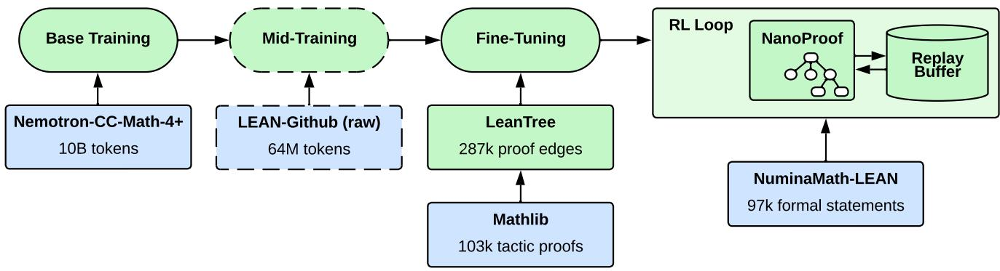
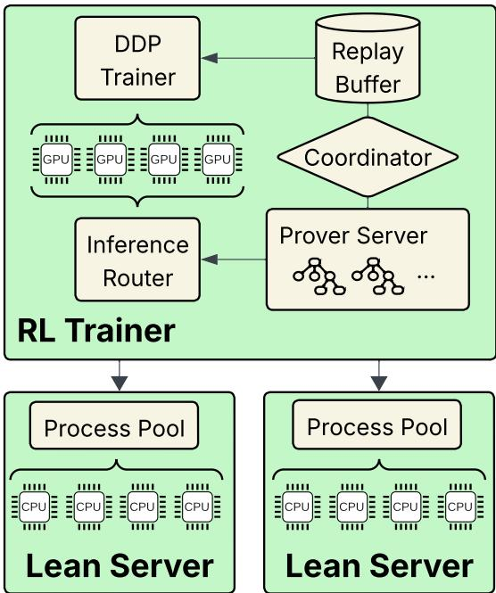
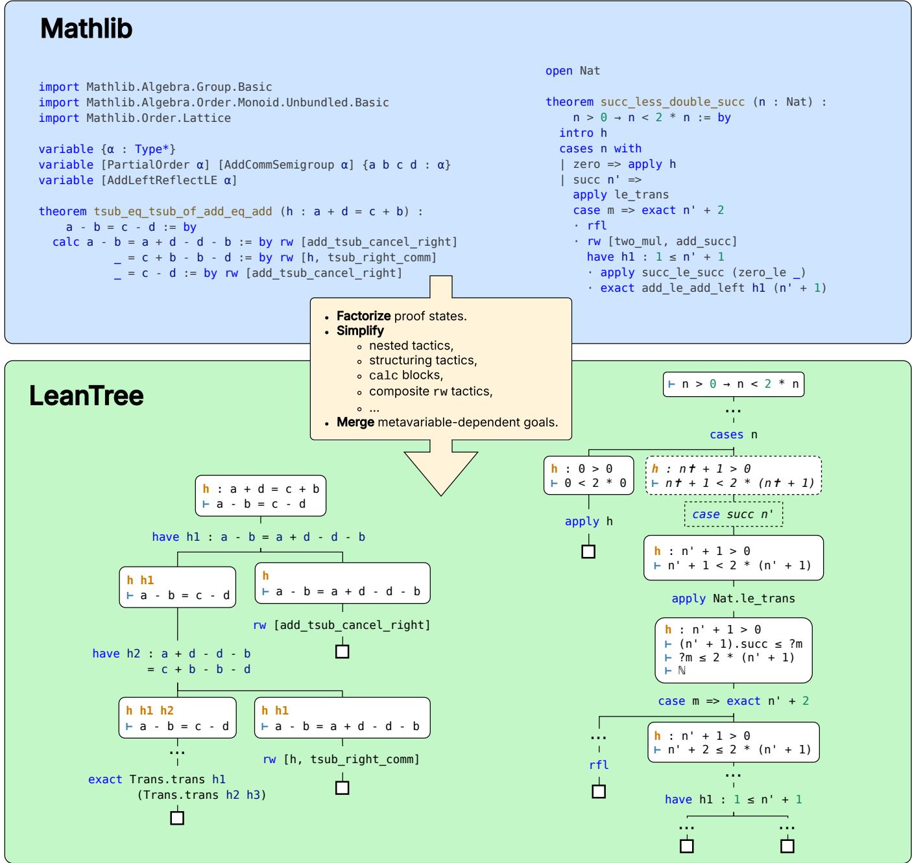
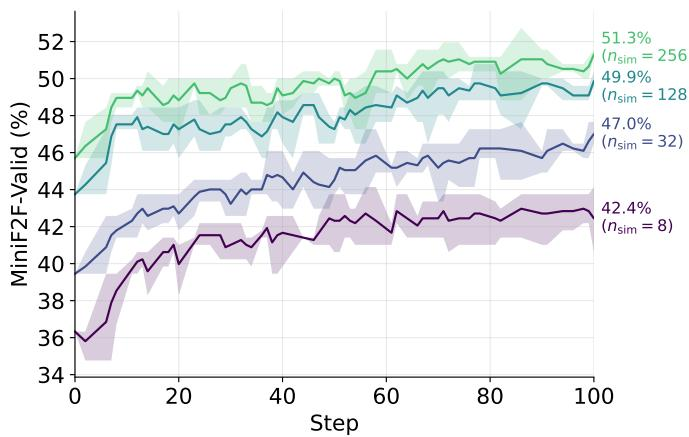
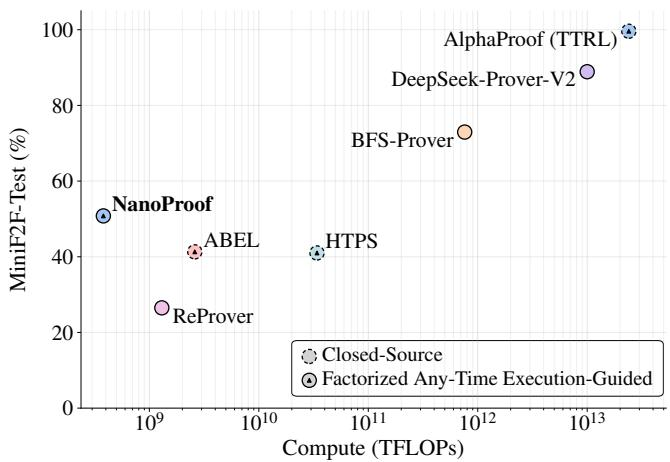
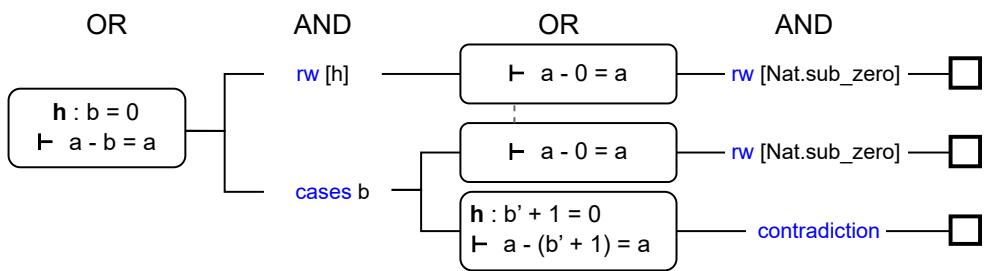
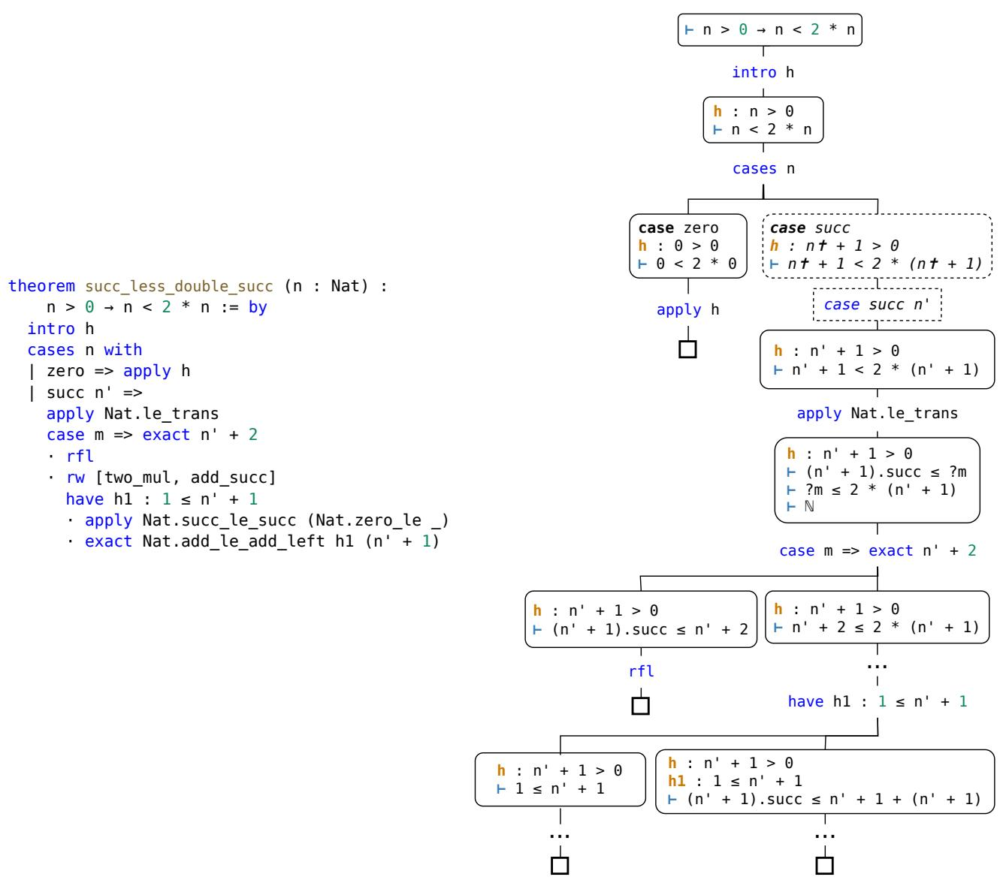
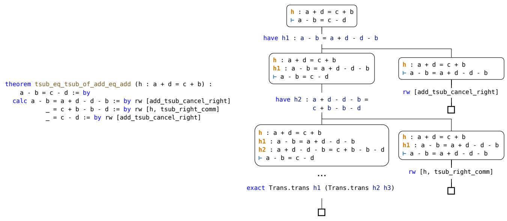

# NanoProof: Open and Eficient Automated Theorem Proving in Lean 4

Matěj Kripner<sup>∗</sup>

Mil<sub>a</sub>n Str<sub>a</sub>k<sub>a</sub>

Pra<sub>g</sub>ue<sub>,</sub> Czech Re<sub>p</sub>ublic

## Abstract

We introduce NanoProof, to our knowledge the first factorized execution-<sub>g</sub>uided theorem <sub>p</sub>rover in Lean 4 whose trainin<sub>g</sub> data<sub>,</sub> extraction toolin<sub>g,</sub> trainin<sub>g</sub> <sub>p</sub>i<sub>p</sub>eline<sub>,</sub> and wei<sub>g</sub>hts <sub>are</sub> <sub>a</sub>ll <sub>re</sub>l<sub>ease</sub>d<sub>,</sub> <sub>ma</sub>ki<sub>ng</sub> it <sub>en</sub>d<sub>-</sub>t<sub>o-en</sub>d <sub>repro</sub>d<sub>uc</sub>ibl<sub>e</sub> <sub>us</sub>i<sub>ng</sub> <sub>open-source resources.</sub> T<sub>o</sub> thi<sub>s en</sub>d<sub>, we</sub> b<sub>u</sub>ild <sub>an</sub>d <sub>re</sub>l<sub>ease a</sub> d<sub>a</sub>t<sub>ase</sub>t <sub>o</sub>f <sub>s</sub>t<sub>ruc</sub>t<sub>ure</sub>d <sub>proo</sub>f t<sub>rees, as we</sub>ll <sub>as a</sub> t<sub>oo</sub>l f<sub>or pro</sub> <sub>g</sub>r<sub>a</sub>mm<sub>a</sub>ti<sub>c</sub> int<sub>e</sub>r<sub>ac</sub>ti<sub>o</sub>n <sub>a</sub>nd d<sub>a</sub>t<sub>a e</sub>xtr<sub>ac</sub>ti<sub>o</sub>n <sub>w</sub>ithin th<sub>e</sub> L<sub>ea</sub>n 4 f<sub>orma</sub>l <sub>ver</sub>ifi<sub>er.</sub> T<sub>o</sub> <sub>suppor</sub>t <sub>sus</sub>t<sub>a</sub>i<sub>na</sub>bl<sub>e</sub> <sub>researc</sub>h<sub>,</sub> <sub>we</sub> f<sub>ocus</sub> <sub>on</sub> com<sub>p</sub>ute eficienc<sub>y</sub> to facilitate accessible trainin<sub>g</sub> and eval-<sub>ua</sub>ti<sub>on.</sub> N<sub>ano</sub>P<sub>roo</sub>f <sub>ac</sub>hi<sub>eves</sub> 50<sub>.</sub>8% <sub>pass@</sub>16 <sub>on</sub> Mi<sub>n</sub>iF2F<sub>-</sub>T<sub>es</sub>t<sub>,</sub> exceedin<sub>g</sub> the two closest s<sub>y</sub>stems of its class<sub>,</sub> H<sub>yp</sub>erTree Proof Search and ABEL, at rou<sub>g</sub>hl<sub>y</sub> 90× and 7× less com<sub>p</sub>ute, <sub>an</sub>d <sub>us</sub>i<sub>ng more</sub> th<sub>an</sub> f<sub>our or</sub>d<sub>ers o</sub>f <sub>magn</sub>it<sub>u</sub>d<sub>e</sub> l<sub>ess compu</sub>t<sub>e</sub> than Al<sub>p</sub>haProof. Stron<sub>g</sub>er o<sub>p</sub>en-wei<sub>g</sub>ht <sub>p</sub>rovers exist<sub>,</sub> but th<sub>ey</sub> <sub>are</sub> fi<sub>ne-</sub>t<sub>une</sub>d f<sub>rom</sub> l<sub>arge</sub> <sub>pre</sub>t<sub>ra</sub>i<sub>ne</sub>d l<sub>anguage</sub> <sub>mo</sub>d<sub>e</sub>l<sub>s</sub> and release neither trainin<sub>g</sub> data nor <sub>p</sub>i<sub>p</sub>eline<sub>;</sub> NanoProof <sub>s</sub>h<sub>ows</sub> th<sub>a</sub>t th<sub>e</sub> f<sub>ac</sub>t<sub>or</sub>i<sub>ze</sub>d <sub>execu</sub>ti<sub>on-gu</sub>id<sub>e</sub>d <sub>c</sub>l<sub>ass</sub> <sub>o</sub>f <sub>provers</sub> <sub>can</sub> b<sub>e re</sub>b<sub>u</sub>ilt f<sub>rom scra</sub>t<sub>c</sub>h <sub>w</sub>ith <sub>mo</sub>d<sub>es</sub>t <sub>resources.</sub>

## 1 Introduction

In automated theorem <sub>p</sub>rovin<sub>g</sub> (ATP), the task at hand consists of <sub>g</sub>eneratin<sub>g</sub> a valid <sub>p</sub>roof to a mathematical statement. W<sub>e</sub> f<sub>ocus</sub> <sub>our</sub> <sub>a</sub>tt<sub>en</sub>ti<sub>on</sub> <sub>on</sub> f<sub>orma</sub>l ATP<sub>,</sub> <sub>w</sub>h<sub>ere</sub> b<sub>o</sub>th th<sub>e</sub> <sub>s</sub>t<sub>a</sub>t<sub>e-</sub> <sub>men</sub>t <sub>an</sub>d th<sub>e proo</sub>f <sub>are expresse</sub>d i<sub>n a</sub> f<sub>orma</sub>l l<sub>anguage suc</sub>h as Lean 4 [29]. In this settin<sub>g</sub>, the correctness of a <sub>g</sub>enerated <sub>proo</sub>f <sub>can</sub> b<sub>e</sub> <sub>ver</sub>ifi<sub>e</sub>d <sub>au</sub>t<sub>oma</sub>ti<sub>ca</sub>ll<sub>y,</sub> <sub>prov</sub>idi<sub>ng</sub> <sub>c</sub>l<sub>ear</sub> f<sub>ee</sub>db<sub>ac</sub>k to an ATP s<sub>y</sub>stem<sub>,</sub> <sub>w</sub>hich can be <sub>u</sub>sed for trainin<sub>g</sub> <sub>u</sub>sin<sub>g</sub> reinforcement learnin<sub>g</sub> (RL).

F<sub>orma</sub>l <sub>me</sub>th<sub>o</sub>d<sub>s</sub> h<sub>ave</sub> f<sub>oun</sub>d <sub>app</sub>li<sub>ca</sub>ti<sub>ons</sub> i<sub>n</sub> th<sub>e</sub> f<sub>orma</sub>l<sub>-</sub> ization of mathematics [36], <sub>p</sub>h<sub>y</sub>sics [34], and chemistr<sub>y</sub> [3], as well as software verification [2], cr<sub>yp</sub>to<sub>g</sub>ra<sub>p</sub>h<sub>y</sub> [8], and <sub>g</sub>eneral reasonin<sub>g</sub> [16]. With the current and antici<sub>p</sub>ated <sub>r</sub>i<sub>se o</sub>f AI<sub>-genera</sub>t<sub>e</sub>d <sub>co</sub>d<sub>e, proo</sub>f<sub>s, an</sub>d <sub>o</sub>th<sub>er ar</sub>tif<sub>ac</sub>t<sub>s, we</sub> <sub>expec</sub>t h<sub>uman</sub> <sub>ver</sub>ifi<sub>ca</sub>ti<sub>on</sub> t<sub>o</sub> b<sub>ecome</sub> th<sub>e</sub> b<sub>o</sub>ttl<sub>enec</sub>k t<sub>o</sub> i<sub>n-</sub> <sub>nova</sub>ti<sub>on, ma</sub>ki<sub>ng</sub> f<sub>orma</sub>l <sub>me</sub>th<sub>o</sub>d<sub>s essen</sub>ti<sub>a</sub>l f<sub>or</sub> th<sub>e</sub>i<sub>r a</sub>bilit<sub>y</sub> t<sub>o</sub> <sub>au</sub>t<sub>oma</sub>ti<sub>ca</sub>ll<sub>y</sub> filt<sub>er</sub> <sub>ou</sub>t i<sub>ncorrec</sub>t <sub>so</sub>l<sub>u</sub>ti<sub>ons.</sub> F<sub>or</sub> <sub>examp</sub>l<sub>e,</sub> <sub>ma</sub>th<sub>ema</sub>ti<sub>c</sub>i<sub>ans</sub> <sub>a</sub>l<sub>rea</sub>d<sub>y</sub> b<sub>ene</sub>fit f<sub>rom</sub> <sub>expe</sub>diti<sub>ng</sub> th<sub>e</sub> <sub>rev</sub>i<sub>ew</sub> <sub>p</sub>rocess in frontier research b<sub>y</sub> submittin<sub>g</sub> a formalization of their results [12]. Similarl<sub>y</sub>, formal verification enables massive<sup>l</sup>y co<sup>ll</sup>a<sup>b</sup>orative mat<sup>h</sup>ematica<sup>l</sup> projects wit<sup>h</sup>out t<sup>h</sup>e need for extensive human moderation [4].

On an im<sub>p</sub>lementation le<sub>v</sub>el<sub>,</sub> ATP s<sub>y</sub>stems can be di<sub>v</sub>ided along several axes. First, in an execution-guided proof search, <sub>a prover</sub> i<sub>n</sub>t<sub>er</sub>l<sub>eaves proo</sub>f <sub>searc</sub>h <sub>w</sub>ith <sub>ver</sub>ifi<sub>ca</sub>ti<sub>on,</sub> l<sub>everag-</sub> i<sub>ng</sub> f<sub>ee</sub>db<sub>ac</sub>k f<sub>rom</sub> th<sub>e</sub> f<sub>orma</sub>l <sub>ver</sub>ifi<sub>er a</sub>ft<sub>er eac</sub>h <sub>proo</sub>f <sub>s</sub>t<sub>ep</sub> and <sub>g</sub>eneratin<sub>g</sub> ste<sub>p</sub>s conditioned on the true internal <sub>p</sub>roof state. For exam<sub>p</sub>le<sub>,</sub> in Lean 4<sub>,</sub> an execution-<sub>g</sub>uided <sub>p</sub>rover ob-<sub>serves</sub> th<sub>e</sub> li<sub>s</sub>t <sub>o</sub>f <sub>curren</sub>tl<sub>y open goa</sub>l<sub>s an</sub>d i<sub>s</sub> i<sub>n</sub>f<sub>orme</sub>d <sub>on any</sub> proof steps that resulted in an error. In contrast, executionagnostic provers only use the formal verifier to verify the fi<sub>na</sub>l <sub>proo</sub>f<sub>, genera</sub>ti<sub>ng proo</sub>f <sub>s</sub>t<sub>eps w</sub>ith <sub>no</sub> f<sub>ee</sub>db<sub>ac</sub>k <sub>a</sub>b<sub>ou</sub>t the validit<sub>y</sub> of <sub>p</sub>recedin<sub>g</sub> ste<sub>p</sub>s or the current internal <sub>p</sub>roof state. Thus<sub>,</sub> in execution-a<sub>g</sub>nostic search<sub>,</sub> it falls u<sub>p</sub>on the <sub>proo</sub>f <sub>s</sub>t<sub>ep</sub> <sub>genera</sub>t<sub>or</sub> t<sub>o</sub> d<sub>e</sub>d<sub>uce</sub> th<sub>e</sub> <sub>evo</sub>l<sub>v</sub>i<sub>ng</sub> <sub>proo</sub>f <sub>s</sub>t<sub>a</sub>t<sub>e,</sub> <sub>as</sub> this is a necessar<sub>y</sub> <sub>p</sub>recondition to determine the validit<sub>y</sub> of subse<sub>q</sub>uent <sub>p</sub>roof ste<sub>p</sub>s. This cou<sub>p</sub>lin<sub>g</sub> of a <sub>p</sub>olic<sub>y</sub> model and <sub>a wor</sub>ld <sub>mo</sub>d<sub>e</sub>l i<sub>ncreases</sub> th<sub>e comp</sub>l<sub>ex</sub>it<sub>y o</sub>f <sub>proo</sub>f <sub>genera</sub>ti<sub>on.</sub>

Second, in a factorized proof search, the prover is allowed t<sub>o</sub> <sub>sp</sub>lit <sub>proo</sub>f <sub>s</sub>t<sub>a</sub>t<sub>es</sub> i<sub>n</sub>t<sub>o</sub> <sub>separa</sub>t<sub>e</sub> b<sub>ranc</sub>h<sub>es</sub> th<sub>a</sub>t <sub>can</sub> b<sub>e</sub> <sub>ex-</sub> <sub>p</sub>l<sub>ore</sub>d i<sub>n</sub>d<sub>epen</sub>d<sub>en</sub>tl<sub>y.</sub> A<sub>n</sub> ill<sub>us</sub>t<sub>ra</sub>ti<sub>ve examp</sub>l<sub>e</sub> i<sub>s ma</sub>th<sub>ema</sub>t<sub>-</sub> i<sub>ca</sub>l i<sub>n</sub>d<sub>uc</sub>ti<sub>on, w</sub>h<sub>ere</sub> f<sub>ac</sub>t<sub>or</sub>i<sub>ze</sub>d <sub>searc</sub>h <sub>cons</sub>id<sub>ers</sub> th<sub>e</sub> b<sub>ase</sub> <sub>case</sub> <sub>an</sub>d th<sub>e</sub> i<sub>n</sub>d<sub>uc</sub>ti<sub>ve</sub> <sub>case</sub> i<sub>n</sub>d<sub>epen</sub>d<sub>en</sub>tl<sub>y,</sub> <sub>ena</sub>bli<sub>ng</sub> <sub>para</sub>l<sub>-</sub> l<sub>e</sub>li<sub>za</sub>ti<sub>on an</sub>d d<sub>ynam</sub>i<sub>c a</sub>ll<sub>oca</sub>ti<sub>on o</sub>f <sub>searc</sub>h b<sub>u</sub>d<sub>ge</sub>t b<sub>e</sub>t<sub>ween</sub> th<sub>e</sub> t<sub>wo</sub> b<sub>ranc</sub>h<sub>es.</sub> Th<sub>e u</sub>tilit<sub>y o</sub>f <sub>no</sub>d<sub>e re-use an</sub>d <sub>para</sub>ll<sub>e</sub>li<sub>za-</sub> ti<sub>on ena</sub>bl<sub>e</sub>d b<sub>y</sub> f<sub>ac</sub>t<sub>or</sub>i<sub>za</sub>ti<sub>on</sub> h<sub>as</sub> b<sub>een ver</sub>ifi<sub>e</sub>d b<sub>y</sub> L<sub>amp</sub>l<sub>e</sub> et al. [22] and Hubert et al. [14] and we do not reiterate it in this work. In contrast, in a linear proof search, the proof <sub>s</sub>t<sub>a</sub>t<sub>e cons</sub>i<sub>s</sub>t<sub>s o</sub>f <sub>a</sub>ll th<sub>e con</sub>t<sub>ex</sub>t <sub>necessary</sub> t<sub>o comp</sub>l<sub>e</sub>t<sub>e</sub> th<sub>e</sub> <sub>p</sub>roo<sup>f</sup>.

Finally, in an any-time proof search, the prover performance <sub>g</sub>rows when time or com<sub>p</sub>ute bud<sub>g</sub>et is increased<sub>,</sub> while a one-shot prover can only be scaled by running multi-<sub>p</sub>le instances in <sub>p</sub>arallel<sub>,</sub> without the <sub>p</sub>ossibilit<sub>y</sub> of utilizin<sub>g</sub> <sub>resu</sub>lt<sub>s across searc</sub>h<sub>es.</sub>

P<sub>roo</sub>f <sub>searc</sub>h <sub>can</sub> b<sub>e</sub> t<sub>rea</sub>t<sub>e</sub>d <sub>as a gener</sub>i<sub>c</sub> t<sub>ex</sub>t<sub>-</sub>t<sub>o-</sub>t<sub>ex</sub>t lan<sub>g</sub>ua<sub>g</sub>e modelin<sub>g</sub> <sub>p</sub>roblem of <sub>g</sub>eneratin<sub>g</sub> a <sub>p</sub>roof <sub>g</sub>iven a statement<sub>,</sub> resultin<sub>g</sub> in a linear one-shot execution-a<sub>g</sub>nostic <sub>me</sub>th<sub>o</sub>d<sub>.</sub> S<sub>uc</sub>h <sub>me</sub>th<sub>o</sub>d<sub>s</sub> h<sub>ave</sub> di<sub>rec</sub>tl<sub>y</sub> b<sub>ene</sub>fit<sub>e</sub>d f<sub>rom</sub> th<sub>e</sub> recent ra<sub>p</sub>id rise in ca<sub>p</sub>abilities of lar<sub>g</sub>e lan<sub>g</sub>ua<sub>g</sub>e models (LLMs). In contrast, factorized an<sub>y</sub>-time execution-<sub>g</sub>uided <sub>p</sub>rovers re<sub>q</sub>uire careful <sub>p</sub>re-<sub>p</sub>rocessin<sub>g</sub> of trainin<sub>g</sub> data <sub>an</sub>d ti<sub>g</sub>ht i<sub>n</sub>t<sub>egra</sub>ti<sub>on</sub> <sub>w</sub>ith th<sub>e</sub> <sub>ver</sub>ifi<sub>ca</sub>ti<sub>on</sub> f<sub>ramewor</sub>k<sub>.</sub> Th<sub>e</sub> existin<sub>g</sub> s<sub>y</sub>stems of this class, H<sub>yp</sub>erTree Proof Search [22], ABEL [11], and Al<sub>p</sub>haProof [14], released neither their d<sub>a</sub>t<sub>a</sub> <sub>nor</sub> <sub>runna</sub>bl<sub>e</sub> <sub>co</sub>d<sub>e.</sub> O<sub>pen</sub> <sub>execu</sub>ti<sub>on-gu</sub>id<sub>e</sub>d <sub>provers</sub> such as InternLM2.5-Ste<sub>p</sub>Prover [40], BFS-Prover [43], and

BFS-Prover-V2 [44] <sub>p</sub>erform linear best-first search over <sub>mono</sub>lithi<sub>c proo</sub>f <sub>s</sub>t<sub>a</sub>t<sub>es an</sub>d <sub>re</sub>l<sub>ease a</sub>t <sub>mos</sub>t <sub>mo</sub>d<sub>e</sub>l <sub>we</sub>i<sub>g</sub>ht<sub>s.</sub> Th<sub>e</sub> f<sub>ac</sub>t<sub>or</sub>i<sub>ze</sub>d <sub>c</sub>l<sub>ass</sub> h<sub>as</sub> th<sub>ere</sub>f<sub>ore</sub> b<sub>een ou</sub>t <sub>o</sub>f <sub>reac</sub>h f<sub>or</sub> th<sub>e</sub> o<sub>p</sub>en-source communit<sub>y,</sub> both in terms of data availabilit<sub>y</sub> an<sup>d</sup> compute requirements. We i<sup>d</sup>enti<sup>f</sup>y t<sup>h</sup>is as a major roadblock to advancin<sub>g</sub> Machine Learnin<sub>g</sub>-based ATP in the a<sub>g</sub>e of lar<sub>g</sub>e models<sub>,</sub> <sub>p</sub>articularl<sub>y</sub> since recent a<sub>pp</sub>roaches like Al<sub>p</sub>haProof [14] and H<sub>yp</sub>erTree Proof Search [22] d<sub>emons</sub>t<sub>ra</sub>t<sub>e</sub>d th<sub>e v</sub>i<sub>a</sub>bilit<sub>y o</sub>f thi<sub>s para</sub>di<sub>gm.</sub>

Since the ince<sub>p</sub>tion of this work<sub>,</sub> text-to-text and a<sub>g</sub>enti<sub>c provers</sub> b<sub>u</sub>ilt <sub>on</sub> l<sub>arge</sub> l<sub>anguage mo</sub>d<sub>e</sub>l<sub>s</sub> h<sub>ave</sub> b<sub>ecome</sub> extremel<sub>y</sub> stron<sub>g</sub>, with Seed-Prover [5] and Goedel-Prover-V2 [25] saturatin<sub>g</sub> MiniF2F. We do not take this as evidence that search-based a<sub>pp</sub>roaches are obsolete. Castin<sub>g p</sub>rovin<sub>g</sub> as <sub>p</sub>lain text <sub>g</sub>eneration means that a frontier LLM can be <sub>app</sub>li<sub>e</sub>d <sub>w</sub>ith<sub>ou</sub>t <sub>a</sub>d<sub>ap</sub>t<sub>a</sub>ti<sub>on,</sub> <sub>w</sub>h<sub>ereas</sub> f<sub>ac</sub>t<sub>or</sub>i<sub>ze</sub>d <sub>searc</sub>h<sub>-</sub>b<sub>ase</sub>d <sub>p</sub>rovers re<sub>q</sub>uire structured trainin<sub>g</sub> data<sub>,</sub> verifier inte<sub>g</sub>rati<sub>on, an</sub>d <sub>searc</sub>h i<sub>n</sub>f<sub>ras</sub>t<sub>ruc</sub>t<sub>ure</sub> b<sub>e</sub>f<sub>ore</sub> th<sub>ey can run a</sub>t <sub>a</sub>ll<sub>,</sub> <sub>an</sub>d <sub>un</sub>til <sub>now</sub> thi<sub>s mac</sub>hi<sub>nery ex</sub>i<sub>s</sub>t<sub>e</sub>d <sub>on</sub>l<sub>y</sub> i<sub>ns</sub>id<sub>e c</sub>l<sub>ose</sub>d <sub>sys-</sub> t<sub>ems.</sub> Wh<sub>e</sub>th<sub>er</sub> <sub>c</sub>l<sub>ass</sub>i<sub>ca</sub>l <sub>searc</sub>h <sub>w</sub>ith <sub>sma</sub>ll <sub>mo</sub>d<sub>e</sub>l<sub>s</sub> <sub>rema</sub>i<sub>ns</sub> com<sub>p</sub>etitive with lar<sub>g</sub>e <sub>g</sub>eneric LLMs at e<sub>qu</sub>al com<sub>pu</sub>te is <sub>an open ques</sub>ti<sub>on, an</sub>d it <sub>can on</sub>l<sub>y</sub> b<sub>e s</sub>t<sub>u</sub>di<sub>e</sub>d if thi<sub>s c</sub>l<sub>ass</sub> of s<sub>y</sub>stem exists in an o<sub>p</sub>en and re<sub>p</sub>roducible form. Moreover<sub>,</sub> the stron<sub>g</sub>est a<sub>pp</sub>roach ma<sub>y</sub> turn out to be a combination of the two<sub>,</sub> LLM reasonin<sub>g</sub> with verifier-<sub>g</sub>rounded <sub>searc</sub>h<sub>, a</sub> di<sub>rec</sub>ti<sub>on</sub> th<sub>a</sub>t th<sub>e</sub> h<sub>eavy use o</sub>f L<sub>ean</sub> f<sub>ee</sub>db<sub>ac</sub>k i<sub>n</sub> S<sub>ee</sub>d<sub>-</sub>P<sub>rover a</sub>l<sub>rea</sub>d<sub>y exp</sub>l<sub>ores.</sub> F<sub>ac</sub>t<sub>or</sub>i<sub>ze</sub>d <sub>searc</sub>h <sub>a</sub>l<sub>so o</sub>f<sub>ers</sub> <sub>concre</sub>t<sub>e a</sub>d<sub>van</sub>t<sub>ages</sub> i<sub>n</sub>d<sub>epen</sub>d<sub>en</sub>t <sub>o</sub>f <sub>mo</sub>d<sub>e</sub>l <sub>s</sub>i<sub>ze: no</sub>d<sub>e re-use</sub> <sub>across</sub> b<sub>ranc</sub>h<sub>es,</sub> i<sub>n</sub>d<sub>epen</sub>d<sub>en</sub>t <sub>a</sub>ll<sub>oca</sub>ti<sub>on</sub> <sub>o</sub>f <sub>searc</sub>h b<sub>u</sub>d<sub>ge</sub>t t<sub>o</sub> <sub>su</sub>b<sub>goa</sub>l<sub>s, an</sub>d di<sub>s</sub>t<sub>ance-</sub>t<sub>o-proo</sub>f<sub>-en</sub>d l<sub>a</sub>b<sub>e</sub>l<sub>s</sub> th<sub>a</sub>t di<sub>rec</sub>tl<sub>y su-</sub> <sub>p</sub>ervise the critic. This is wh<sub>y</sub> we consider o<sub>p</sub>en<sub>,</sub> re<sub>p</sub>roducible t<sub>oo</sub>li<sub>ng</sub> f<sub>or</sub> th<sub>e searc</sub>h<sub>-</sub>b<sub>ase</sub>d <sub>s</sub>id<sub>e wor</sub>th b<sub>u</sub>ildi<sub>ng.</sub>

I<sub>n</sub> thi<sub>s wor</sub>k<sub>, we a</sub>dd<sub>ress</sub> thi<sub>s repro</sub>d<sub>uc</sub>ibilit<sub>y</sub> b<sub>arr</sub>i<sub>er</sub> b<sub>y</sub> introducing NanoProof, an end-to-end ATP system that levera<sub>g</sub>es existin<sub>g</sub> o<sub>p</sub>en resources and <sub>p</sub>rovides the novel com<sub>p</sub>onents necessar<sub>y</sub> to com<sub>p</sub>lete the Lean 4 <sub>p</sub>i<sub>p</sub>eline. S<sub>p</sub>ecificall<sub>y,</sub> <sub>our con</sub>t<sub>r</sub>ib<sub>u</sub>ti<sub>ons are as</sub> f<sub>o</sub>ll<sub>ows.</sub>

• Data, Tooling, and Environment We release L<sub>ean</sub>T<sub>ree, a</sub> d<sub>a</sub>t<sub>ase</sub>t <sub>o</sub>f 92<sub>,</sub>927 i<sub>n</sub>d<sub>epen</sub>d<sub>en</sub>tl<sub>y ver</sub>ifi<sub>e</sub>d <sub>s</sub>t<sub>ruc</sub>t<sub>ure</sub>d <sub>proo</sub>f t<sub>rees ex</sub>t<sub>rac</sub>t<sub>e</sub>d f<sub>rom</sub> M<sub>a</sub>thlib<sub>,</sub> th<sub>e</sub> <sub>ex</sub>t<sub>rac</sub>ti<sub>on</sub> t<sub>oo</sub>l th<sub>a</sub>t <sub>pro</sub>d<sub>uces</sub> <sub>suc</sub>h t<sub>rees</sub> f<sub>rom</sub> <sub>any</sub> Lean 4 project, an<sup>d</sup> a Lean inter<sup>f</sup>ace wit<sup>h</sup> incrementa<sup>l</sup> k<sub>erne</sub>l <sub>ver</sub>ifi<sub>ca</sub>ti<sub>on</sub> <sub>an</sub>d <sub>a</sub> di<sub>s</sub>t<sub>r</sub>ib<sub>u</sub>t<sub>e</sub>d <sub>env</sub>i<sub>ronmen</sub>t <sub>poo</sub>l f<sub>or</sub> <sub>re</sub>i<sub>n</sub>f<sub>orcemen</sub>t l<sub>earn</sub>i<sub>ng.</sub>

• ATP System We introduce a factorized any-time <sub>execu</sub>ti<sub>on-gu</sub>id<sub>e</sub>d <sub>prover</sub> <sub>ca</sub>ll<sub>e</sub>d N<sub>ano</sub>P<sub>roo</sub>f <sub>an</sub>d <sub>re</sub>l<sub>ease</sub> <sub>a</sub>ll th<sub>e</sub> t<sub>oo</sub>li<sub>ng</sub> <sub>necessary</sub> t<sub>o</sub> <sub>repro</sub>d<sub>uce</sub> it <sub>an</sub>d b<sub>u</sub>ild <sub>on</sub> to<sub>p</sub> of it.<sup>1</sup>

• Performance Evaluation We demonstrate the effi<sub>cacy</sub> <sub>o</sub>f N<sub>ano</sub>P<sub>roo</sub>f th<sub>roug</sub>h <sub>an</sub> <sub>en</sub>d<sub>-</sub>t<sub>o-en</sub>d t<sub>ra</sub>i<sub>n</sub>i<sub>ng</sub> run, achievin<sub>g</sub> 50.8% <sub>p</sub>ass@16 on MiniF2F-Test [50] usi<sub>ng</sub> <sub>more</sub> th<sub>an</sub> f<sub>our</sub> <sub>or</sub>d<sub>ers</sub> <sub>o</sub>f <sub>magn</sub>it<sub>u</sub>d<sub>e</sub> l<sub>ess</sub> <sub>compu</sub>t<sub>e</sub> th<sub>an</sub> Al<sub>p</sub>h<sub>a</sub>P<sub>roo</sub>f<sub>.</sub>

• Search-Level Techniques We describe practical train-time and inference-time techni<sub>q</sub>ues<sub>,</sub> namel<sub>y</sub> <sub>p</sub>roof sim<sub>p</sub>lification and au<sub>g</sub>mentation<sub>,</sub> c<sub>y</sub>cle detection<sub>,</sub> and diverse tactic sam<sub>p</sub>lin<sub>g,</sub> and <sub>q</sub>uantif<sub>y</sub> their <sub>e</sub>f<sub>ec</sub>t <sub>w</sub>h<sub>ere our compu</sub>t<sub>e</sub> b<sub>u</sub>d<sub>ge</sub>t <sub>a</sub>ll<sub>owe</sub>d<sub>.</sub>

In Section 3<sub>,</sub> we <sub>p</sub>resent the trainin<sub>g</sub> <sub>p</sub>i<sub>p</sub>eline and the <sub>searc</sub>h <sub>a</sub>l<sub>gor</sub>ith<sub>m o</sub>f N<sub>ano</sub>P<sub>roo</sub>f<sub>.</sub> I<sub>n</sub> S<sub>ec</sub>ti<sub>on</sub> 4<sub>, we</sub> d<sub>escr</sub>ib<sub>e</sub> th<sub>e</sub> <sub>a</sub>l<sub>gor</sub>ith<sub>m</sub> f<sub>or</sub> <sub>ex</sub>t<sub>rac</sub>ti<sub>ng</sub> <sub>proo</sub>f t<sub>rees</sub> f<sub>rom</sub> h<sub>uman-au</sub>th<sub>ore</sub>d Lean projects an<sup>d</sup> t<sup>h</sup>e resu<sup>l</sup>ting LeanTree <sup>d</sup>ataset, a necessary com<sub>p</sub>onent for <sub>p</sub>re-trainin<sub>g</sub> a factorized execution-<sub>g</sub>uided <sub>p</sub>rover. Finall<sub>y,</sub> in Section 5<sub>,</sub> we <sub>p</sub>resent a trainin<sub>g</sub> run of NanoProof usin<sub>g</sub> o<sub>p</sub>enl<sub>y</sub> available datasets and LeanTree. Th<sub>e necessary</sub> b<sub>ac</sub>k<sub>groun</sub>d i<sub>n</sub> L<sub>ean an</sub>d <sub>proo</sub>f <sub>searc</sub>h i<sub>s ava</sub>il<sub>-</sub> <sub>a</sub>bl<sub>e</sub> in A<sub>ppe</sub>ndix A<sub>.</sub>

## 2 Related Work

We <sub>g</sub>i<sub>v</sub>e a brief o<sub>v</sub>er<sub>v</sub>ie<sub>w</sub> of Lean<sub>,</sub> diferent ATP a<sub>pp</sub>roaches<sub>,</sub> <sub>an</sub>d <sub>ex</sub>i<sub>s</sub>ti<sub>ng</sub> f<sub>orma</sub>l ATP d<sub>a</sub>t<sub>ase</sub>t<sub>s an</sub>d b<sub>enc</sub>h<sub>mar</sub>k<sub>s.</sub>

Lean 4 [29] is a leading formal language for theorem <sub>p</sub>rovin<sub>g</sub> with a<sub>pp</sub>lications both in the formalization of mathematics [36] and in numerous other domains [3, 8, 16, 34]. One of the a<sub>pp</sub>ealin<sub>g</sub> <sub>p</sub>ro<sub>p</sub>erties of Lean is its extensibilit<sub>y,</sub> stemmin<sub>g</sub> from the fact that its theorem <sub>p</sub>rovin<sub>g</sub> com<sub>p</sub>onent is written in Lean itself<sub>,</sub> and the user can modif<sub>y</sub> both its s<sub>y</sub>nt<sub>a</sub>x <sub>a</sub>nd it<sub>s se</sub>m<sub>a</sub>nti<sub>cs, w</sub>hi<sub>c</sub>h <sub>we</sub> h<sub>eav</sub>il<sub>y u</sub>tiliz<sub>e</sub> in L<sub>ea</sub>nTr<sub>ee.</sub>

Execution-Agnostic ATP. ATP can be formulated as a text-to-text task so that an<sub>y</sub> existin<sub>g</sub> LLM is directl<sub>y</sub> a<sub>pp</sub>licable. This a<sub>pp</sub>roach to theorem <sub>p</sub>rovin<sub>g</sub> was <sub>p</sub>ioneered b<sub>y</sub> Baldur [10]. More recentl<sub>y</sub>, LLMs usin<sub>g</sub> chain-of-thou<sub>g</sub>ht refined usin<sub>g</sub> RL were utilized b<sub>y</sub> Dee<sub>p</sub>Seek-Prover-V2 [32], Kimina-Prover [38], InternLM-Math [49], Goedel-Prover-V2 [25], and Seed-Prover [5], amon<sub>g</sub> others, securin<sub>g</sub> to<sub>p</sub> <sub>p</sub>ositions on relevant benchmarks<sub>;</sub> Goedel-Prover-V2 re<sub>p</sub>orts 88<sub>.</sub>1% <sub>on</sub> Mi<sub>n</sub>iF2F<sub>-</sub>T<sub>es</sub>t <sub>a</sub>t <sub>pass@</sub>32 <sub>an</sub>d S<sub>ee</sub>d<sub>-</sub>P<sub>rover</sub> 99<sub>.</sub>6%<sub>.</sub>

Execution-Guided ATP. In execution-guided ATP, a <sub>p</sub>rover interacts with the verification s<sub>y</sub>stem iterativel<sub>y</sub> durin<sub>g</sub> the <sub>p</sub>roof search<sub>,</sub> <sub>g</sub>eneratin<sub>g</sub> <sub>p</sub>roof ste<sub>p</sub>s conditioned on the internal <sub>p</sub>roof state. In neural theorem <sub>p</sub>rovin<sub>g,</sub> this a<sub>p</sub>- <sub>p</sub>roach was <sub>p</sub>ioneered b<sub>y</sub> Holo<sub>p</sub>hrasm [39] in Metamath [27], usin<sub>g</sub> a UCT-based [19] AND-OR tree search with a RNN <sub>sequence-</sub>t<sub>o-sequence mo</sub>d<sub>e</sub>l f<sub>or</sub> t<sub>ac</sub>ti<sub>c enumera</sub>ti<sub>on an</sub>d <sub>p</sub>a<sub>y</sub>of <sub>p</sub>rediction. Later extensions include GPT-f [30] and Evariste [22], the latter also tar<sub>g</sub>etin<sub>g</sub> Lean 3 in addition to Metamath. ABEL [11] extended Evariste with incremental im<sub>p</sub>rovements and Lean 4 com<sub>p</sub>atibilit<sub>y,</sub> but did not release the code or dataset. Al<sub>p</sub>haProof [14] then achieved a si<sub>g</sub>nificant im<sub>p</sub>rovement in <sub>p</sub>erformance<sub>,</sub> unfortunatel<sub>y</sub> also with <sub>c</sub>l<sub>ose</sub>d <sub>co</sub>d<sub>e an</sub>d d<sub>a</sub>t<sub>a.</sub>

A se<sub>p</sub>arate line of o<sub>p</sub>en execution-<sub>g</sub>uided <sub>p</sub>rovers <sub>p</sub>erforms li<sub>near</sub> b<sub>es</sub>t<sub>-</sub>fi<sub>rs</sub>t <sub>searc</sub>h <sub>over mono</sub>lithi<sub>c</sub> L<sub>ean proo</sub>f <sub>s</sub>t<sub>a</sub>t<sub>es</sub> with a <sub>p</sub>olic<sub>y</sub> fine-tuned from a <sub>p</sub>retrained LLM: InternLM2.5- Ste<sub>p</sub>Prover [40], BFS-Prover [43] with 72.95% on MiniF2F-Test, BFS-Prover-V2 [44] with 82.4% and 86.1% for its 7B and 32B models (95.1% with an additional Gemini 2.5 Pro <sub>p</sub>lanner), and MPS-Prover [23] with 75.82%. In the terminol-<sub>ogy</sub> i<sub>n</sub>t<sub>ro</sub>d<sub>uce</sub>d <sub>a</sub>b<sub>ove,</sub> th<sub>ese</sub> <sub>are</sub> <sub>execu</sub>ti<sub>on-gu</sub>id<sub>e</sub>d b<sub>u</sub>t li<sub>near</sub> <sub>p</sub>rovers: none of them factorizes <sub>p</sub>roof states into inde<sub>p</sub>end<sub>en</sub>tl<sub>y searc</sub>h<sub>a</sub>bl<sub>e goa</sub>l<sub>s w</sub>ith <sub>no</sub>d<sub>e re-use an</sub>d <sub>me</sub>t<sub>avar</sub>i<sub>a</sub>bl<sub>e-</sub> cou<sub>p</sub>lin<sub>g</sub> handlin<sub>g</sub>. The<sub>y</sub> release at most wei<sub>g</sub>hts and inference code<sub>,</sub> and none releases trainin<sub>g</sub> data or <sub>p</sub>i<sub>p</sub>eline. Bein<sub>g</sub> fine-tuned from Qwen2.5 [46], their re<sub>p</sub>orted bud<sub>g</sub>ets ex-<sub>c</sub>l<sub>u</sub>d<sub>e</sub> th<sub>e pre-</sub>t<sub>ra</sub>i<sub>n</sub>i<sub>ng o</sub>f th<sub>e</sub> b<sub>ase mo</sub>d<sub>e</sub>l<sub>, on</sub> th<sub>e or</sub>d<sub>er o</sub>f $1 0 ^ { 1 2 }$ TFLOP<sub>s,</sub> <sub>a</sub>nd th<sub>e</sub>ir <sub>u</sub>ndi<sub>sc</sub>l<sub>ose</sub>d <sub>p</sub>r<sub>e</sub>-tr<sub>a</sub>inin<sub>g</sub> <sub>co</sub>r<sub>po</sub>r<sub>a</sub> <sub>ca</sub>nn<sub>o</sub>t b<sub>e au</sub>dit<sub>e</sub>d f<sub>or</sub> b<sub>enc</sub>h<sub>mar</sub>k <sub>con</sub>t<sub>am</sub>i<sub>na</sub>ti<sub>on.</sub> BFS<sub>-</sub>P<sub>rover a</sub>l<sub>so</sub> ar<sub>g</sub>ues that<sub>,</sub> in its settin<sub>g</sub> of a lar<sub>g</sub>e <sub>p</sub>retrained <sub>p</sub>olic<sub>y</sub> and no learned critic<sub>,</sub> sim<sub>p</sub>le best-first search can o<sub>u</sub>t<sub>p</sub>erform MCTS-<sub>s</sub>t<sub>y</sub>l<sub>e</sub> <sub>searc</sub>h<sub>;</sub> <sub>w</sub>h<sub>e</sub>th<sub>er</sub> thi<sub>s</sub> <sub>carr</sub>i<sub>es</sub> <sub>over</sub> t<sub>o</sub> f<sub>ac</sub>t<sub>or</sub>i<sub>ze</sub>d <sub>searc</sub>h <sub>w</sub>ith a trained critic is an o<sub>p</sub>en <sub>qu</sub>estion that o<sub>u</sub>r release <sub>ma</sub>k<sub>es</sub> t<sub>es</sub>t<sub>a</sub>bl<sub>e.</sub>

  
Figure 1. NanoProof training pipeline. After supervised pretraining, the prover enters into a self-improvement loop where <sub>success</sub>f<sub>u</sub>ll<sub>y</sub> di<sub>scovere</sub>d <sub>proo</sub>f<sub>s are use</sub>d f<sub>or</sub> f<sub>ur</sub>th<sub>er</sub> t<sub>ra</sub>i<sub>n</sub>i<sub>ng.</sub> Mid<sub>-</sub>t<sub>ra</sub>i<sub>n</sub>i<sub>ng</sub> i<sub>s no</sub>t i<sub>nc</sub>l<sub>u</sub>d<sub>e</sub>d i<sub>n</sub> th<sub>e</sub> fi<sub>na</sub>l <sub>run, as</sub> d<sub>escr</sub>ib<sub>e</sub>d i<sub>n</sub> S<sub>ec</sub>ti<sub>o</sub>n 5<sub>.</sub>

Datasets. The standard library of Lean, Mathlib [7], ofers <sub>more</sub> th<sub>an</sub> 124k f<sub>orma</sub>l d<sub>e</sub>fi<sub>n</sub>iti<sub>ons an</sub>d 255k f<sub>orma</sub>l <sub>proo</sub>f<sub>s.</sub> Toget<sup>h</sup>er wit<sup>h</sup> numerous <sup>f</sup>orma<sup>l</sup>ization projects create<sup>d</sup> <sup>b</sup>y th<sub>e commun</sub>it<sub>y,</sub> thi<sub>s o</sub>f<sub>ers a s</sub>i<sub>za</sub>bl<sub>e</sub> h<sub>uman-wr</sub>itt<sub>en</sub> d<sub>a</sub>t<sub>ase</sub>t for the su<sub>p</sub>ervised trainin<sub>g</sub> of theorem <sub>p</sub>rovers.

However<sub>,</sub> execution-<sub>g</sub>uided ATP a<sub>pp</sub>roaches re<sub>q</sub>uire additional data <sub>p</sub>re-<sub>p</sub>rocessin<sub>g</sub> to ex<sub>p</sub>ose the intermediate <sub>p</sub>roof states. Such a dataset was first <sub>p</sub>rovided b<sub>y</sub> LeanSte<sub>p</sub> [13] in Lean 3 b<sub>y</sub> extractin<sub>g</sub> tactic invocation data from Mathlib. LeanDojo [47] extends this a<sub>pp</sub>roach to Lean 4, additionall<sub>y</sub> <sub>p</sub>rovidin<sub>g</sub> information about the <sub>p</sub>remises used in each tactic a<sub>pp</sub>lication<sub>,</sub> necessar<sub>y</sub> for trainin<sub>g</sub> retrieval-au<sub>g</sub>mented a<sub>p</sub>- <sub>p</sub>roaches. Similar datasets are also ofered b<sub>y</sub> Panto<sub>g</sub>ra<sub>p</sub>h [1] and lean-trainin<sub>g</sub>-data [28]. However, none of these datasets <sub>o</sub>f<sub>ers</sub> t<sub>ac</sub>ti<sub>c proo</sub>f<sub>s</sub> i<sub>n a s</sub>t<sub>ruc</sub>t<sub>ure</sub>d<sub>, s</sub>i<sub>mp</sub>lifi<sub>e</sub>d f<sub>orma</sub>t<sub>, w</sub>hi<sub>c</sub>h is needed for NanoProof trainin<sub>g</sub>. Most im<sub>p</sub>ortantl<sub>y,</sub> the<sub>y</sub> do not contain distance-to-<sub>p</sub>roof-end information.

Additionall<sub>y</sub>, Lean-Workbook [48], Dee<sub>p</sub>Seek-Prover-V1 [42], and NuminaMath-LEAN [38] <sub>p</sub>rovide lar<sub>g</sub>e collecti<sub>ons</sub> <sub>o</sub>f <sub>au</sub>t<sub>oma</sub>ti<sub>ca</sub>ll<sub>y</sub> f<sub>orma</sub>li<sub>ze</sub>d <sub>proo</sub>f<sub>s</sub> <sub>o</sub>f <sub>var</sub>i<sub>ous</sub> <sub>qua</sub>lit<sub>y,</sub> th<sub>e</sub> l<sub>a</sub>tt<sub>er</sub> <sub>a</sub>l<sub>so</sub> <sub>o</sub>f<sub>er</sub>i<sub>ng</sub> <sub>a</sub> <sub>s</sub>i<sub>za</sub>bl<sub>e</sub> h<sub>uman-</sub>f<sub>orma</sub>li<sub>ze</sub>d <sub>por</sub>ti<sub>on.</sub>

Benchmarks. MiniF2F [50] ofers 488 problems drawn f<sub>rom</sub> <sub>ma</sub>th<sub>ema</sub>ti<sub>ca</sub>l <sub>o</sub>l<sub>ymp</sub>i<sub>a</sub>d <sub>an</sub>d <sub>un</sub>d<sub>ergra</sub>d<sub>ua</sub>t<sub>e</sub> <sub>ma</sub>th<sub>ema</sub>t<sub>-</sub> ics courses<sub>,</sub> formalized in <sub>p</sub>arallel in Lean 3<sub>,</sub> Metamath<sub>,</sub> Isa<sup>b</sup>e<sup>ll</sup>e, an<sup>d</sup> HOL Lig<sup>h</sup>t. T<sup>h</sup>e o<sup>b</sup>jective is to generate va<sup>l</sup>i<sup>d</sup> f<sub>orma</sub>l <sub>proo</sub>f<sub>s o</sub>f th<sub>e s</sub>t<sub>a</sub>t<sub>emen</sub>t<sub>s.</sub> Th<sub>e</sub> b<sub>enc</sub>h<sub>mar</sub>k <sub>was</sub> l<sub>a</sub>t<sub>er</sub> <sub>p</sub>orted to Lean 4 b<sub>y</sub> Yan<sub>g</sub> et al. [47], with some formalization errors corrected b<sub>y</sub> Wu et al. [40]. We use MiniF2F as released b<sub>y</sub> Hubert et al. [14].

## 3 NanoProof Automated Theorem Prover

W<sub>e</sub> d<sub>escr</sub>ib<sub>e</sub> th<sub>e</sub> t<sub>ra</sub>i<sub>n</sub>i<sub>ng an</sub>d i<sub>n</sub>f<sub>erence mec</sub>h<sub>an</sub>i<sub>sm o</sub>f NanoProof. Section 3.1 mostl<sub>y</sub> follows Hubert et al. [14], <sub>w</sub>hil<sub>e</sub> th<sub>e</sub> f<sub>o</sub>ll<sub>ow</sub>i<sub>ng sec</sub>ti<sub>ons</sub> d<sub>escr</sub>ib<sub>e our</sub> i<sub>mp</sub>l<sub>emen</sub>t<sub>a</sub>ti<sub>on</sub> <sub>c</sub>h<sub>o</sub>i<sub>ces</sub> <sub>an</sub>d <sub>a</sub>dditi<sub>ons;</sub> th<sub>e</sub> L<sub>ean</sub>T<sub>ree</sub> d<sub>a</sub>t<sub>ase</sub>t <sub>an</sub>d <sub>ex</sub>t<sub>rac</sub>ti<sub>on</sub> t<sub>oo</sub>l th<sub>a</sub>t <sub>ena</sub>bl<sub>e</sub> th<sub>e superv</sub>i<sub>se</sub>d t<sub>ra</sub>i<sub>n</sub>i<sub>ng o</sub>f <sub>suc</sub>h <sub>a prover are</sub> d<sub>esc</sub>rib<sub>e</sub>d in S<sub>ec</sub>ti<sub>o</sub>n 4<sub>.</sub>

## 3.1 Proof Search Algorithm

RL Environment. We formulate the proof search process <sub>as a</sub>n RL <sub>e</sub>n<sub>v</sub>ir<sub>o</sub>nm<sub>e</sub>nt<sub>.</sub> At <sub>ep</sub>i<sub>so</sub>d<sub>e s</sub>t<sub>a</sub>rt<sub>, a</sub> f<sub>o</sub>rm<sub>a</sub>l th<sub>eo</sub>r<sub>e</sub>m statement is sam<sub>p</sub>led from a cor<sub>p</sub>us (cf. Section 5). At each step, the prover (agent) observes the current state �<sub>�</sub> consistin<sub>g</sub> of the list of o<sub>p</sub>en <sub>g</sub>oals <sub>y</sub>et to be <sub>p</sub>roven<sub>,</sub> and <sub>g</sub>enerates an action $a _ { t }$ <sub>,</sub> i<sub>.e., a</sub> L<sub>ea</sub>n t<sub>ac</sub>ti<sub>c.</sub> Th<sub>e</sub> L<sub>ea</sub>n <sub>ve</sub>rifi<sub>e</sub>r th<sub>e</sub>n im<sub>p</sub>l<sub>e</sub>- ments the transition function from the <sub>p</sub>air $\left( { { s _ { t } } , { a _ { t } } } \right)$ t<sub>o</sub> th<sub>e</sub> li<sub>s</sub>t <sub>o</sub>f <sub>nex</sub>t <sub>s</sub>t<sub>a</sub>t<sub>es</sub> $( s _ { t + 1 } ^ { 1 } , \ldots , s _ { t + 1 } ^ { n } )$ <sub>,</sub> <sub>p</sub>otentiall<sub>y</sub> em<sub>p</sub>t<sub>y</sub>. Note that thi<sub>s</sub> d<sub>ev</sub>i<sub>a</sub>t<sub>es</sub> fr<sub>o</sub>m <sub>a s</sub>im<sub>p</sub>l<sub>e</sub> M<sub>a</sub>rk<sub>ov</sub> D<sub>ec</sub>i<sub>s</sub>i<sub>o</sub>n Pr<sub>ocess</sub> in th<sub>a</sub>t th<sub>e agen</sub>t <sub>procee</sub>d<sub>s</sub> i<sub>n</sub>d<sub>epen</sub>d<sub>en</sub>tl<sub>y</sub> i<sub>n</sub>t<sub>o eac</sub>h <sub>nex</sub>t <sub>s</sub>t<sub>a</sub>t<sub>e.</sub> R<sub>eca</sub>ll th<sub>a</sub>t f<sub>or</sub> th<sub>e goa</sub>l<sub>s</sub> i<sub>n s</sub>t<sub>a</sub>t<sub>e</sub> $s _ { t }$ to be <sub>p</sub>roven<sub>,</sub> it is necessar<sub>y</sub> to <sub>prove</sub> <sub>a</sub>ll <sub>goa</sub>l<sub>s</sub> i<sub>n</sub> <sub>s</sub>t<sub>a</sub>t<sub>es</sub> $( s _ { t + 1 } ^ { 1 } , \ldots , s _ { t + 1 } ^ { n } )$

Th<sub>e ep</sub>i<sub>so</sub>d<sub>e en</sub>d<sub>s w</sub>h<sub>en a va</sub>lid <sub>ac</sub>ti<sub>on</sub> h<sub>as</sub> b<sub>een ass</sub>i<sub>gne</sub>d to each state<sub>,</sub> <sub>y</sub>ieldin<sub>g</sub> a <sub>p</sub>roof tree. The a<sub>g</sub>ent is then assi<sub>g</sub>ned a reward � = −�, where � is the de<sub>p</sub>th of the <sub>p</sub>roof t<sub>ree.</sub> Thi<sub>s</sub> i<sub>ncen</sub>ti<sub>v</sub>i<sub>zes</sub> th<sub>e agen</sub>t t<sub>o</sub> fi<sub>n</sub>d <sub>s</sub>h<sub>or</sub>t <sub>proo</sub>f<sub>s</sub> th<sub>a</sub>t maximize branchin<sub>g,</sub> utilizin<sub>g</sub> the factorization ca<sub>p</sub>abilit<sub>y</sub> <sub>ou</sub>tli<sub>ne</sub>d <sub>a</sub>b<sub>ove.</sub>

MCTS Search. Our proof search algorithm follows closely th<sub>a</sub>t <sub>o</sub>f Al<sub>p</sub>h<sub>a</sub>P<sub>roo</sub>f<sub>, an</sub>d <sub>we</sub> l<sub>eave</sub> d<sub>e</sub>t<sub>a</sub>il<sub>e</sub>d d<sub>escr</sub>i<sub>p</sub>ti<sub>on</sub> t<sub>o</sub> H<sub>u-</sub> bert et al. [14]. The prover consists of an actor predicting which <sub>p</sub>roof tactic to a<sub>pp</sub>l<sub>y</sub> in the current <sub>p</sub>roof state<sub>,</sub> and a critic predicting future reward in the current proof branch, i<sub>.e.,</sub> th<sub>e</sub> <sub>nega</sub>ti<sub>ve</sub> d<sub>ep</sub>th <sub>o</sub>f th<sub>e</sub> <sub>proo</sub>f <sub>su</sub>b<sub>-</sub>t<sub>ree</sub> <sub>s</sub>t<sub>ar</sub>ti<sub>ng</sub> f<sub>rom</sub> th<sub>e</sub> <sub>cu</sub>rr<sub>e</sub>nt <sub>s</sub>t<sub>a</sub>t<sub>e.</sub> Th<sub>e a</sub>l<sub>go</sub>rithm m<sub>a</sub>int<sub>a</sub>in<sub>s a</sub>n AND-OR <sub>sea</sub>r<sub>c</sub>h t<sub>ree</sub> th<sub>a</sub>t i<sub>n</sub>iti<sub>a</sub>ll<sub>y con</sub>t<sub>a</sub>i<sub>ns on</sub>l<sub>y</sub> th<sub>e roo</sub>t <sub>no</sub>d<sub>e w</sub>ith th<sub>e</sub> th<sub>eo-</sub> rem to be <sub>p</sub>roven and is then iterativel<sub>y</sub> ex<sub>p</sub>anded b<sub>y</sub> re<sub>p</sub>eatin<sub>g</sub> three <sub>p</sub>hases: selection<sub>,</sub> ex<sub>p</sub>ansion and back<sub>p</sub>ro<sub>p</sub>a<sub>g</sub>ation<sub>,</sub> ada<sub>p</sub>ted from Al<sub>p</sub>haZero [33] and Sam<sub>p</sub>led MuZero [15]. At node ex<sub>p</sub>ansion<sub>,</sub> <sub>g</sub>enerated tactics are immediatel<sub>y</sub> executed in Lean<sub>,</sub> and invalid ones are discarded. Com<sub>p</sub>ared to se<sub>q</sub>uential two-<sub>p</sub>la<sub>y</sub>er <sub>g</sub>ames<sub>,</sub> the <sub>p</sub>rover a<sub>g</sub>ent does not commit to i<sub>n</sub>t<sub>erme</sub>di<sub>a</sub>t<sub>e ac</sub>ti<sub>ons an</sub>d <sub>on</sub>l<sub>y per</sub>f<sub>orms a s</sub>i<sub>ng</sub>l<sub>e searc</sub>h f<sub>or</sub> each theorem. For this reason, Hubert et al. [14] incor<sub>p</sub>orates a <sub>p</sub>ro<sub>g</sub>ressive sam<sub>p</sub>lin<sub>g</sub> mechanism<sub>,</sub> allowin<sub>g</sub> new tactics to b<sub>e samp</sub>l<sub>e</sub>d f<sub>or</sub> i<sub>n</sub>t<sub>erna</sub>l <sub>no</sub>d<sub>es.</sub>

Matchmaker. Theorems to be proven are sampled from a cor<sub>p</sub>us with sam<sub>p</sub>lin<sub>g</sub> wei<sub>g</sub>hts determined b<sub>y</sub> a sim<sub>p</sub>le heuristic matchmaker. After initial trust\_count attem<sub>p</sub>ts at <sub>eac</sub>h th<sub>eorem,</sub> th<sub>e ma</sub>t<sub>c</sub>h<sub>ma</sub>k<sub>er</sub> d<sub>own-we</sub>i<sub>g</sub>ht<sub>s</sub> th<sub>eorems</sub> th<sub>a</sub>t have been <sub>p</sub>roven at least trust\_count\_proved in a row <sub>an</sub>d th<sub>eorems</sub> th<sub>a</sub>t h<sub>ave</sub> <sub>never</sub> b<sub>een</sub> <sub>prove</sub>d<sub>,</sub> th<sub>us</sub> <sub>pr</sub>i<sub>or</sub>iti<sub>z</sub>i<sub>ng</sub> th<sub>eorems a</sub>t th<sub>e e</sub>d<sub>ge o</sub>f th<sub>e prover</sub>’<sub>s curren</sub>t <sub>a</sub>bilit<sub>y.</sub> C<sub>om-</sub> <sub>p</sub>ared to Hubert et al. [14], we additionall<sub>y</sub> down-wei<sub>g</sub>ht th<sub>eorems</sub> f<sub>or w</sub>hi<sub>c</sub>h <sub>a s</sub>i<sub>ng</sub>l<sub>e-</sub>t<sub>ac</sub>ti<sub>c proo</sub>f h<sub>as</sub> b<sub>een</sub> f<sub>oun</sub>d<sub>,</sub> <sub>s</sub>i<sub>nce no s</sub>h<sub>or</sub>t<sub>er proo</sub>f <sub>can</sub> b<sub>e</sub> di<sub>scovere</sub>d<sub>.</sub>

## 3.2 Network Architecture

The actor and critic are modeled usin<sub>g</sub> a sin<sub>g</sub>le Transformer model [37] based on nanochat [17].<sup>2</sup> Instead of utilizin<sub>g</sub> dedi<sub>ca</sub>t<sub>e</sub>d <sub>ac</sub>t<sub>or</sub> <sub>an</sub>d <sub>cr</sub>iti<sub>c</sub> h<sub>ea</sub>d<sub>s,</sub> <sub>we</sub> <sub>a</sub>d<sub>op</sub>t th<sub>e</sub> <sub>s</sub>i<sub>mp</sub>l<sub>er</sub> <sub>approac</sub>h of shared vocabular<sub>y</sub> b<sub>y</sub> Polu and Sutskever [30]. S<sub>p</sub>ecifi-<sub>ca</sub>ll<sub>y,</sub> th<sub>e mo</sub>d<sub>e</sub>l i<sub>npu</sub>t <sub>cons</sub>i<sub>s</sub>t<sub>s o</sub>f <sub>a</sub> t<sub>o</sub>k<sub>en</sub>i<sub>ze</sub>d <sub>pre</sub>tt<sub>y-pr</sub>i<sub>n</sub>t<sub>e</sub>d L<sub>ean s</sub>t<sub>a</sub>t<sub>e</sub> f<sub>o</sub>ll<sub>owe</sub>d b<sub>y a spec</sub>i<sub>a</sub>l t<sub>o</sub>k<sub>en</sub> i<sub>n</sub>di<sub>ca</sub>ti<sub>ng w</sub>h<sub>e</sub>th<sub>er</sub> what follows is a tactic or a critic value. Durin<sub>g</sub> inference<sub>,</sub> tactics are decoded autore<sub>g</sub>ressivel<sub>y</sub>. In contrast<sub>, p</sub>rediction <sub>o</sub>f th<sub>e</sub> <sub>cr</sub>iti<sub>c</sub> <sub>va</sub>l<sub>ue</sub> i<sub>s</sub> d<sub>one</sub> <sub>w</sub>ith <sub>on</sub>l<sub>y</sub> <sub>a</sub> <sub>s</sub>i<sub>ng</sub>l<sub>e</sub> f<sub>orwar</sub>d <sub>pass</sub> <sub>an</sub>d <sub>we</sub>i<sub>g</sub>ht<sub>e</sub>d <sub>averag</sub>i<sub>ng</sub> <sub>o</sub>f th<sub>e</sub> <sub>va</sub>l<sub>ue</sub> bi<sub>ns</sub> b<sub>ase</sub>d <sub>on</sub> <sub>pre</sub>di<sub>c</sub>t<sub>e</sub>d t<sub>o</sub>k<sub>en</sub> <sub>pro</sub>b<sub>a</sub>biliti<sub>es.</sub>

For tokenization, we use the GPT-2 tokenizer [31]<sup>3</sup> ext<sub>en</sub>d<sub>e</sub>d <sub>w</sub>ith d<sub>e</sub>di<sub>ca</sub>t<sub>e</sub>d t<sub>o</sub>k<sub>ens</sub> f<sub>or sym</sub>b<sub>o</sub>l<sub>s</sub> th<sub>a</sub>t <sub>occur a</sub>t l<sub>eas</sub>t 1,000× in Mathlib. The ran<sub>g</sub>e of allowed critic values is divided into discrete bins usin<sub>g</sub> dedicated tokens [9].

## 3.3 Training Pipeline

As shown in Fi<sub>g</sub>ure 1<sub>,</sub> the <sub>p</sub>rover network under<sub>g</sub>oes several su<sub>p</sub>ervised trainin<sub>g p</sub>hases before enterin<sub>g</sub> a selfim<sub>p</sub>rovement loo<sub>p</sub>. This <sub>p</sub>reliminar<sub>y</sub> <sub>p</sub>hase is necessar<sub>y</sub> b<sub>ecause</sub> th<sub>e</sub> <sub>genera</sub>ti<sub>on</sub> <sub>o</sub>f <sub>va</sub>lid <sub>an</sub>d di<sub>verse</sub> t<sub>ac</sub>ti<sub>cs</sub> i<sub>s</sub> <sub>a</sub> challen<sub>g</sub>in<sub>g</sub> task in itself. The su<sub>p</sub>ervised <sub>p</sub>hases use increasin<sub>g</sub>l<sub>y</sub> tar<sub>g</sub>eted trainin<sub>g</sub> data<sub>,</sub> startin<sub>g</sub> with <sub>g</sub>eneral <sub>ma</sub>th<sub>-re</sub>l<sub>a</sub>t<sub>e</sub>d t<sub>ex</sub>t <sub>an</sub>d <sub>progress</sub>i<sub>ng</sub> th<sub>roug</sub>h L<sub>ean source co</sub>d<sub>e</sub> t<sub>o</sub> hi<sub>g</sub>hl<sub>y pre-processe</sub>d h<sub>uman-au</sub>th<sub>ore</sub>d L<sub>ean proo</sub>f<sub>s.</sub> Thi<sub>s</sub> <sub>p</sub>ro<sub>g</sub>ression of data <sub>q</sub>ualit<sub>y</sub> is mirrored in an increasin<sub>g</sub>l<sub>y</sub> limited <sub>q</sub>uantit<sub>y</sub>.

Durin<sub>g</sub> the self-im<sub>p</sub>rovement loo<sub>p,</sub> the <sub>p</sub>rover continu-<sub>ous</sub>l<sub>y</sub> <sub>samp</sub>l<sub>es</sub> th<sub>eorems</sub> f<sub>rom</sub> <sub>an</sub> <sub>au</sub>t<sub>o</sub>f<sub>orma</sub>li<sub>ze</sub>d <sub>corpus</sub> <sub>an</sub>d <sub>a</sub>tt<sub>emp</sub>t<sub>s</sub> t<sub>o</sub> <sub>prove</sub> th<sub>em,</sub> <sub>s</sub>t<sub>or</sub>i<sub>ng</sub> <sub>a</sub>ll <sub>success</sub>f<sub>u</sub>l <sub>proo</sub>f<sub>s</sub> i<sub>n</sub> <sub>a</sub> <sub>rep</sub>l<sub>ay</sub> b<sub>u</sub>f<sub>er.</sub> T<sub>rans</sub>iti<sub>ons samp</sub>l<sub>e</sub>d f<sub>rom</sub> th<sub>e rep</sub>l<sub>ay</sub> b<sub>u</sub>f<sub>er are</sub> th<sub>en</sub> <sub>use</sub>d <sub>as</sub> f<sub>ur</sub>th<sub>er</sub> t<sub>ra</sub>i<sub>n</sub>i<sub>ng</sub> d<sub>a</sub>t<sub>a</sub> f<sub>or</sub> th<sub>e</sub> <sub>prover</sub> <sub>ne</sub>t<sub>wor</sub>k<sub>.</sub> I<sub>n</sub> addition<sub>,</sub> a <sub>g</sub>iven fraction of su<sub>p</sub>ervised fine-tunin<sub>g</sub> data is mixed in with the collected data to increase trainin<sub>g</sub> stabilit<sub>y</sub>. Th<sub>e</sub> <sub>sys</sub>t<sub>em</sub> <sub>a</sub>lt<sub>erna</sub>t<sub>es</sub> b<sub>e</sub>t<sub>ween</sub> <sub>co</sub>ll<sub>ec</sub>ti<sub>ng</sub> <sub>�samples new</sub> <sub>proo</sub>f transitions and <sub>p</sub>erformin<sub>g</sub> <sub>�updates g</sub>radient u<sub>p</sub>dates.

As shown in Fi<sub>gu</sub>re 2<sub>,</sub> the RL loo<sub>p</sub> infrastr<sub>u</sub>ct<sub>u</sub>re feat<sub>u</sub>res <sub>an</sub> i<sub>n</sub>f<sub>erence</sub> <sub>server</sub> <sub>w</sub>ith <sub>s</sub>i<sub>mp</sub>l<sub>e</sub> fi<sub>rs</sub>t<sub>-ava</sub>il<sub>a</sub>bl<sub>e</sub> l<sub>oa</sub>d b<sub>a</sub>l<sub>anc</sub>i<sub>ng,</sub> <sub>a</sub> di<sub>s</sub>t<sub>r</sub>ib<sub>u</sub>t<sub>e</sub>d t<sub>ra</sub>i<sub>ner</sub> <sub>an</sub>d d<sub>e</sub>t<sub>ac</sub>h<sub>e</sub>d L<sub>ean</sub> <sub>servers</sub> <sub>runn</sub>i<sub>ng</sub> <sub>on</sub> CPU n<sub>o</sub>d<sub>es.</sub>

## 3.4 Lean Integration

LeanTree ofers a P<sub>y</sub>thon interface b<sub>u</sub>ilt on to<sub>p</sub> of Lean REPL [6]. After initiatin<sub>g</sub> a <sub>p</sub>roof search and a<sub>pp</sub>l<sub>y</sub>in<sub>g</sub> a L<sub>ea</sub>n t<sub>ac</sub>ti<sub>c</sub> t<sub>o a g</sub>i<sub>ve</sub>n <sub>p</sub>r<sub>oo</sub>f <sub>s</sub>t<sub>a</sub>t<sub>e,</sub> L<sub>ea</sub>nTr<sub>ee</sub> r<sub>e</sub>t<sub>u</sub>rn<sub>s a</sub> li<sub>s</sub>t <sub>o</sub>f <sub>resu</sub>lti<sub>ng su</sub>b<sub>-s</sub>t<sub>a</sub>t<sub>es.</sub> Th<sub>e</sub> i<sub>n</sub>t<sub>er</sub>f<sub>ace</sub> i<sub>s su</sub>it<sub>a</sub>bl<sub>e</sub> f<sub>or</sub> t<sub>ree searc</sub>h <sub>an</sub>d b<sub>ac</sub>kt<sub>rac</sub>ki<sub>ng</sub> <sub>as</sub> th<sub>e</sub> i<sub>n</sub>t<sub>erac</sub>ti<sub>on</sub> <sub>can</sub> b<sub>e</sub> <sub>res</sub>t<sub>ar</sub>t<sub>e</sub>d f<sub>rom</sub> an<sub>y</sub> intermediate <sub>p</sub>roof state. Additionall<sub>y,</sub> <sub>g</sub>iven the hi<sub>g</sub>h CPU r<sub>equ</sub>ir<sub>e</sub>m<sub>e</sub>nt<sub>s</sub> <sub>o</sub>f L<sub>ea</sub>n 4<sub>,</sub> L<sub>ea</sub>nTr<sub>ee</sub> im<sub>p</sub>l<sub>e</sub>m<sub>e</sub>nt<sub>s</sub> <sub>a</sub> d<sub>y</sub>- n<sub>a</sub>mi<sub>c</sub> <sub>poo</sub>l <sub>o</sub>f <sub>e</sub>n<sub>v</sub>ir<sub>o</sub>nm<sub>e</sub>nt<sub>s</sub> <sub>e</sub>x<sub>pose</sub>d <sub>ove</sub>r HTTP <sub>e</sub>nd<sub>po</sub>int for de<sub>p</sub>lo<sub>y</sub>ment to CPU nodes durin<sub>g</sub> distributed trainin<sub>g</sub>.

D<sub>ur</sub>i<sub>ng</sub> <sub>our</sub> <sub>wor</sub>k<sub>,</sub> <sub>we</sub> <sub>encoun</sub>t<sub>ere</sub>d i<sub>nva</sub>lid <sub>proo</sub>f<sub>s</sub> th<sub>a</sub>t L<sub>ea</sub>n REPL <sub>accep</sub>t<sub>e</sub>d <sub>as va</sub>lid<sub>;</sub> th<sub>e</sub> d<sub>e</sub>t<sub>a</sub>il<sub>s a</sub>nd <sub>a co</sub>rr<sub>ec</sub>ti<sub>o</sub>n <sub>are</sub> d<sub>escr</sub>ib<sub>e</sub>d i<sub>n</sub> A<sub>ppen</sub>di<sub>x</sub> E<sub>.</sub> N<sub>o</sub>t<sub>e</sub> th<sub>a</sub>t <sub>a</sub>ll <sub>proo</sub>f<sub>s</sub> f<sub>oun</sub>d b<sub>y</sub> NanoProof are inde<sub>p</sub>endentl<sub>y</sub> verified b<sub>y</sub> ex<sub>p</sub>ortin<sub>g</sub> them as <sub>s</sub>t<sub>an</sub>d<sub>a</sub>l<sub>one</sub> L<sub>ean co</sub>d<sub>e.</sub>

## 3.5 Proof Simplification and Augmentation

Proof Simplification. We attempt to simplify the proofs <sub>pro</sub>d<sub>uce</sub>d b<sub>y</sub> th<sub>e</sub> <sub>proo</sub>f <sub>searc</sub>h <sub>a</sub>l<sub>gor</sub>ith<sub>m</sub> b<sub>y</sub> <sub>prun</sub>i<sub>ng</sub> <sub>re</sub>d<sub>un-</sub> dant tactics. This is done both durin<sub>g</sub> ex<sub>p</sub>erience collection t<sub>o</sub> i<sub>mprove</sub> th<sub>e qua</sub>lit<sub>y o</sub>f th<sub>e</sub> d<sub>a</sub>t<sub>a save</sub>d t<sub>o</sub> th<sub>e rep</sub>l<sub>ay</sub> b<sub>u</sub>f<sub>er</sub> <sub>an</sub>d d<sub>ur</sub>i<sub>ng</sub> fi<sub>na</sub>l i<sub>n</sub>f<sub>erence</sub> t<sub>o en</sub>h<sub>ance</sub> th<sub>e rea</sub>d<sub>a</sub>bilit<sub>y o</sub>f th<sub>e</sub> <sub>g</sub>enerated <sub>p</sub>roofs for humans. In a re<sub>p</sub>resentative RL run<sub>,</sub> our <sub>a</sub>l<sub>gor</sub>ith<sub>m was a</sub>bl<sub>e</sub> t<sub>o s</sub>i<sub>mp</sub>lif<sub>y</sub> 59% <sub>o</sub>f <sub>proo</sub>f<sub>s</sub> l<sub>onger</sub> th<sub>an one</sub> t<sub>ac</sub>ti<sub>c.</sub> A<sub>n examp</sub>l<sub>e o</sub>f <sub>a s</sub>i<sub>mp</sub>lifi<sub>e</sub>d <sub>proo</sub>f <sub>recor</sub>d<sub>e</sub>d d<sub>ur</sub>i<sub>ng an</sub> ex<sub>p</sub>erience collection <sub>p</sub>hase is shown in A<sub>pp</sub>endix C.

The <sub>p</sub>roof sim<sub>p</sub>lification al<sub>g</sub>orithm is outlined in Listin<sub>g</sub> 1. Given a <sub>g</sub>enerated <sub>p</sub>roof<sub>,</sub> the sim<sub>p</sub>lification aims to extract <sub>a m</sub>i<sub>n</sub>i<sub>ma</sub>l <sub>su</sub>b<sub>-proo</sub>f th<sub>a</sub>t <sub>s</sub>till <sub>proves</sub> th<sub>e or</sub>i<sub>g</sub>i<sub>na</sub>l th<sub>eorem.</sub> St<sub>ar</sub>ti<sub>ng w</sub>ith <sub>a proo</sub>f t<sub>ree, we cons</sub>id<sub>er eac</sub>h <sub>non-</sub>l<sub>ea</sub>f <sub>e</sub>d<sub>ge</sub> i<sub>n</sub>di<sub>v</sub>id<sub>ua</sub>ll<sub>y.</sub> If <sub>con</sub>t<sub>rac</sub>ti<sub>ng an e</sub>d<sub>ge</sub> l<sub>eaves</sub> th<sub>e proo</sub>f <sub>va</sub>lid<sub>,</sub> th<sub>e</sub> <sub>e</sub>d<sub>ge</sub> i<sub>s</sub> <sub>remove</sub>d<sub>.</sub> F<sub>or</sub> <sub>a</sub> <sub>non-</sub>l<sub>ea</sub>f <sub>e</sub>d<sub>ge</sub> $\boldsymbol { e } = \left( \boldsymbol { s } _ { t } , \boldsymbol { s } _ { t + 1 } \right)$ <sub>w</sub>ith t<sub>ac</sub>ti<sub>c</sub> $\displaystyle a _ { t } ,$ contraction is im<sub>p</sub>lemented b<sub>y</sub> discardin<sub>g</sub> $a _ { t }$ (to<sub>g</sub>ether <sub>w</sub>ith $s _ { t + 1 } )$ <sub>,</sub> re<sub>p</sub>lacin<sub>g</sub> it with an<sub>y</sub> tactic $a _ { t + 1 }$ a<sub>pp</sub>lied in $s _ { t + 1 }$

When re-verif<sub>y</sub>in<sub>g</sub> the <sub>p</sub>roof after contraction<sub>,</sub> it sufices t<sub>o ver</sub>if<sub>y</sub> th<sub>e mo</sub>difi<sub>e</sub>d <sub>proo</sub>f <sub>su</sub>b<sub>-</sub>t<sub>ree</sub> b<sub>e</sub>l<sub>ow</sub> $s _ { t } ,$ <sub>s</sub>i<sub>nce o</sub>th<sub>er</sub> b<sub>ranc</sub>h<sub>es an</sub>d t<sub>ac</sub>ti<sub>cs on</sub> th<sub>e pa</sub>th t<sub>o roo</sub>t <sub>are no</sub>t <sub>a</sub>f<sub>ec</sub>t<sub>e</sub>d<sub>.</sub> Th<sub>e</sub> sub-tree is verified b<sub>y</sub> re-executin<sub>g</sub> each tactic a<sub>pp</sub>lication in it<sub>,</sub> startin<sub>g</sub> with the a<sub>pp</sub>lication of $a _ { t + 1 }$ <sub>.</sub> Wh<sub>en</sub> $a _ { t }$ <sub>p</sub>ro<sup>d</sup>uces <sub>mu</sub>lti<sub>p</sub>l<sub>e</sub> f<sub>ac</sub>t<sub>or</sub>i<sub>ze</sub>d <sub>goa</sub>l<sub>s,</sub> i<sub>.e.,</sub> it h<sub>as more</sub> th<sub>an one c</sub>hild <sub>no</sub>d<sub>e,</sub> <sub>we</sub> i<sub>n</sub>di<sub>v</sub>id<sub>ua</sub>ll<sub>y</sub> <sub>a</sub>tt<sub>emp</sub>t t<sub>o</sub> <sub>execu</sub>t<sub>e</sub> <sub>eac</sub>h <sub>o</sub>f th<sub>e</sub> <sub>su</sub>b<sub>-</sub>t<sub>rees,</sub> <sub>an</sub>d <sub>�</sub> i<sub>s</sub> d<sub>eeme</sub>d <sub>re</sub>d<sub>un</sub>d<sub>an</sub>t <sub>w</sub>h<sub>en</sub> <sub>a</sub>t l<sub>eas</sub>t <sub>one</sub> <sub>execu</sub>ti<sub>on</sub> <sub>succee</sub>d<sub>s.</sub> Aft<sub>er</sub> <sub>a</sub> <sub>no</sub>d<sub>e</sub> i<sub>s</sub> <sub>remove</sub>d<sub>,</sub> th<sub>e</sub> <sub>w</sub>h<sub>o</sub>l<sub>e</sub> <sub>s</sub>i<sub>mp</sub>lifi<sub>ca</sub>ti<sub>on</sub> <sub>process</sub> i<sub>s</sub> <sub>res</sub>t<sub>ar</sub>t<sub>e</sub>d b<sub>ecause</sub> <sub>remov</sub>i<sub>ng</sub> <sub>an</sub> <sub>e</sub>d<sub>ge</sub> <sub>m</sub>i<sub>g</sub>ht <sub>on</sub>l<sub>y</sub> b<sub>e</sub> <sub>poss</sub>ibl<sub>e</sub> <sub>a</sub>ft<sub>er a</sub> dif<sub>eren</sub>t <sub>e</sub>d<sub>ge</sub> i<sub>s remove</sub>d fi<sub>rs</sub>t<sub>.</sub>

Proof Augmentation. When sampling a proof from the re<sub>p</sub>la<sub>y</sub> bufer<sub>,</sub> we a<sub>pp</sub>l<sub>y</sub> a random au<sub>g</sub>mentation to each of its <sub>p</sub>roof ed<sub>g</sub>es<sub>,</sub> alterin<sub>g</sub> them while <sub>p</sub>reservin<sub>g</sub> their semantics. Fi<sub>rs</sub>t<sub>,</sub> <sub>a</sub>ll h<sub>ypo</sub>th<sub>eses</sub> <sub>an</sub>d <sub>goa</sub>l<sub>s</sub> <sub>are</sub> <sub>ran</sub>d<sub>om</sub>l<sub>y</sub> <sub>rename</sub>d <sub>w</sub>ith <sub>p</sub>robabilit<sub>y</sub> $p _ { \mathrm { r e n a m e } } ,$ a<sub>pp</sub>l<sub>y</sub>in<sub>g</sub> the rename accordin<sub>g</sub>l<sub>y</sub> also in b<sub>o</sub>th th<sub>e</sub> t<sub>ac</sub>ti<sub>c</sub> <sub>an</sub>d th<sub>e</sub> <sub>o</sub>th<sub>er</sub> h<sub>ypo</sub>th<sub>eses.</sub> S<sub>econ</sub>d<sub>,</sub> th<sub>e</sub> h<sub>y-</sub> <sub>po</sub>th<sub>eses</sub> i<sub>n</sub> <sub>eac</sub>h <sub>goa</sub>l <sub>are</sub> <sub>ran</sub>d<sub>om</sub>l<sub>y</sub> <sub>s</sub>h<sub>u</sub>fl<sub>e</sub>d <sub>w</sub>ith <sub>pro</sub>b<sub>a</sub>bilit<sub>y</sub> �<sub>s</sub>h<sub>u</sub>fl<sub>e</sub>.

## 3.6 Cycle Detection

We a<sub>pp</sub>l<sub>y</sub> a c<sub>y</sub>cle detection mechanism durin<sub>g</sub> node ex<sub>p</sub>ansion. When a tactic a<sub>pp</sub>lication results in a <sub>g</sub>oal � that is e<sub>q</sub>uivalent to a <sub>g</sub>oal $G ^ { \prime }$ <sub>a</sub>l<sub>rea</sub>d<sub>y</sub> <sub>presen</sub>t <sub>on</sub> th<sub>e</sub> <sub>pa</sub>th t<sub>o</sub> <sub>roo</sub>t<sub>,</sub> the tactic is discarded. An<sub>y</sub> final <sub>p</sub>roof containin<sub>g</sub> this tactic <sub>cou</sub>ld <sub>equ</sub>i<sub>va</sub>l<sub>en</sub>tl<sub>y</sub> b<sub>e</sub> f<sub>oun</sub>d b<sub>y so</sub>l<sub>v</sub>i<sub>ng</sub> � di<sub>rec</sub>tl<sub>y</sub> i<sub>ns</sub>t<sub>ea</sub>d <sub>o</sub>f d<sub>escen</sub>di<sub>ng</sub> t<sub>o</sub> $G ^ { \prime } .$ In a re<sub>p</sub>resentati<sub>v</sub>e r<sub>u</sub>n<sub>,</sub> 18% of other<sub>w</sub>ise va<sup>l</sup>i<sup>d</sup> tactics were rejecte<sup>d d</sup>ue to cyc<sup>l</sup>e <sup>d</sup>etection. Note t<sup>h</sup>at <sub>goa</sub>l <sub>equ</sub>i<sub>va</sub>l<sub>ence</sub> i<sub>s</sub> <sub>c</sub>h<sub>ec</sub>k<sub>e</sub>d <sub>a</sub>t th<sub>e</sub> <sub>syn</sub>t<sub>ac</sub>ti<sub>c</sub> l<sub>eve</sub>l <sub>up</sub> t<sub>o</sub> <sub>goa</sub>l re-shuflin<sub>g,</sub> <sub>g</sub>oal renamin<sub>g,</sub> and whites<sub>p</sub>ace chan<sub>g</sub>es.

## 3.7 Diverse Tactic Sampling

We observe that the autore<sub>g</sub>ressive tactic sam<sub>p</sub>lin<sub>g</sub> often <sub>p</sub>roduces du<sub>p</sub>licate tactics<sub>,</sub> sometimes constrainin<sub>g</sub> node expansion to just a sing<sup>l</sup>e action, particu<sup>l</sup>ar<sup>l</sup>y in t<sup>h</sup>e case o<sup>f</sup> <sub>s</sub>h<sub>or</sub>t <sub>one-</sub>t<sub>o</sub>k<sub>en</sub> t<sub>ac</sub>ti<sub>cs.</sub> I<sub>n a represen</sub>t<sub>a</sub>ti<sub>ve run,</sub> 32% <sub>o</sub>f <sub>no</sub>d<sub>es</sub> h<sub>a</sub>d th<sub>e</sub>i<sub>r</sub> <sub>ac</sub>ti<sub>on</sub> <sub>coun</sub>t <sub>re</sub>d<sub>uce</sub>d d<sub>ue</sub> t<sub>o</sub> d<sub>up</sub>li<sub>ca</sub>t<sub>e</sub>d <sub>samp</sub>li<sub>ng.</sub> W<sub>e</sub> <sub>a</sub>dd<sub>ress</sub> thi<sub>s</sub> b<sub>y</sub> f<sub>orc</sub>i<sub>ng</sub> di<sub>verse</sub> <sub>samp</sub>li<sub>ng</sub> <sub>on</sub> th<sub>e</sub> fi<sub>rs</sub>t tactic token. S<sub>p</sub>ecificall<sub>y,</sub> the first sam<sub>p</sub>lin<sub>g</sub> ste<sub>p</sub> em<sub>p</sub>lo<sub>y</sub>s the Gumbel-To<sub>p</sub>-� trick [20] to ca<sub>p</sub> each <sub>p</sub>ossible token to first\_token\_cap occurrences. Takin<sub>g</sub> an avera<sub>g</sub>e over last th<sub>ree save</sub>d <sub>c</sub>h<sub>ec</sub>k<sub>po</sub>i<sub>n</sub>t<sub>s</sub> i<sub>n</sub> th<sub>e same run,</sub> thi<sub>s</sub> di<sub>verse</sub> t<sub>ac-</sub> tic sam<sub>p</sub>lin<sub>g</sub> increased <sub>p</sub>erformance on MiniF2F-Valid b<sub>y</sub> 2.0 <sub>p</sub>ercenta<sub>g</sub>e <sub>p</sub>oints under 16 simulations<sub>,</sub> hi<sub>g</sub>hli<sub>g</sub>htin<sub>g</sub> its i<sub>mpor</sub>t<sub>ance</sub> f<sub>or sma</sub>ll <sub>compu</sub>t<sub>e</sub> b<sub>u</sub>d<sub>ge</sub>t<sub>s.</sub>

## 4 Structured Proof Tree Dataset

To enable su<sub>p</sub>ervised <sub>p</sub>retrainin<sub>g</sub> on existin<sub>g</sub> human-written Lean <sub>p</sub>roofs<sub>,</sub> factorized execution-<sub>g</sub>uided <sub>p</sub>rovers re<sub>q</sub>uire careful <sub>p</sub>re-<sub>p</sub>rocessin<sub>g</sub> of <sub>p</sub>roofs into structured <sub>p</sub>roof trees. Th<sub>e</sub> <sub>c</sub>h<sub>a</sub>ll<sub>enge</sub> i<sub>s</sub> t<sub>wo</sub>f<sub>o</sub>ld<sub>:</sub> Fi<sub>rs</sub>t<sub>,</sub> th<sub>e</sub> L<sub>ean</sub> l<sub>anguage</sub> <sub>un</sub>d<sub>er-</sub> <sub>s</sub>t<sub>an</sub>d<sub>s a proo</sub>f <sub>as a</sub> li<sub>near sequence o</sub>f t<sub>ac</sub>ti<sub>cs,</sub> i<sub>ns</sub>t<sub>ea</sub>d <sub>o</sub>f <sub>a</sub> t<sub>ree w</sub>h<sub>ere</sub> dif<sub>eren</sub>t b<sub>ranc</sub>h<sub>es can</sub> b<sub>e pro</sub>d<sub>uce</sub>d i<sub>n</sub>d<sub>epen</sub>d<sub>en</sub>tl<sub>y.</sub> Th<sub>ese</sub> t<sub>ac</sub>ti<sub>cs can</sub> b<sub>e nes</sub>t<sub>e</sub>d <sub>an</sub>d <sub>com</sub>bi<sub>ne</sub>d <sub>w</sub>ith t<sub>ac</sub>ti<sub>c com</sub>bi nators as well as other s<sub>y</sub>ntactic su<sub>g</sub>ar. Second<sub>,</sub> Lean <sub>p</sub>roofs<sub>,</sub> <sub>as</sub> <sub>p</sub>r<sub>ese</sub>nt in h<sub>u</sub>m<sub>a</sub>n-<sub>w</sub>ritt<sub>e</sub>n r<sub>epos</sub>it<sub>o</sub>ri<sub>es,</sub> <sub>a</sub>r<sub>e</sub> <sub>w</sub>ritt<sub>e</sub>n in <sub>a</sub> <sub>compac</sub>t<sub>, re</sub>fi<sub>ne</sub>d <sub>way</sub> t<sub>o ma</sub>k<sub>e</sub> th<sub>em easy</sub> t<sub>o rea</sub>d<sub>, ma</sub>i<sub>n</sub>t<sub>a</sub>i<sub>n,</sub> <sub>an</sub>d b<sub>u</sub>ild <sub>on.</sub> H<sub>owever, we see</sub>k <sub>a</sub> dif<sub>eren</sub>t <sub>proo</sub>f <sub>s</sub>t<sub>y</sub>l<sub>e, one</sub> th<sub>a</sub>t <sub>un</sub>f<sub>o</sub>ld<sub>s</sub> th<sub>e</sub> <sub>proo</sub>f i<sub>n</sub> <sub>a</sub> <sub>way</sub> <sub>amena</sub>bl<sub>e</sub> t<sub>o</sub> <sub>searc</sub>h<sub>,</sub> i<sub>.e.,</sub> i<sub>n</sub> <sub>sma</sub>ll i<sub>ncremen</sub>t<sub>a</sub>l <sub>s</sub>t<sub>eps.</sub>

T<sub>o a</sub>dd<sub>ress</sub> thi<sub>s c</sub>h<sub>a</sub>ll<sub>enge, we</sub> i<sub>n</sub>t<sub>ro</sub>d<sub>uce a proo</sub>f <sub>ex</sub>t<sub>rac-</sub> tion tool and dataset<sub>,</sub> collectivel<sub>y</sub> called LeanTree<sub>,</sub> whose <sub>p</sub>reliminar<sub>y</sub> version was <sub>p</sub>resented in Kri<sub>p</sub>ner et al. [21]. In <sub>eac</sub>h <sub>ex</sub>t<sub>rac</sub>t<sub>e</sub>d <sub>proo</sub>f t<sub>ree,</sub> <sub>a</sub> <sub>no</sub>d<sub>e</sub> <sub>carr</sub>i<sub>es</sub> <sub>a</sub> <sub>s</sub>i<sub>ng</sub>l<sub>e</sub> <sub>goa</sub>l<sub>,</sub><sup>4</sup> <sub>an</sub>d an ed<sub>g</sub>e corres<sub>p</sub>onds to a tactic a<sub>pp</sub>lication o<sub>p</sub>eratin<sub>g</sub> on th<sub>a</sub>t <sub>goa</sub>l<sub>.</sub> Th<sub>e</sub> d<sub>a</sub>t<sub>ase</sub>t <sub>con</sub>t<sub>a</sub>i<sub>ns</sub> 92<sub>,</sub>927 <sub>ex</sub>t<sub>rac</sub>t<sub>e</sub>d <sub>proo</sub>f t<sub>rees</sub> f<sub>rom</sub> <sub>a</sub> <sub>recen</sub>t <sub>vers</sub>i<sub>on</sub> <sub>o</sub>f M<sub>a</sub>thlib<sub>,</sub><sup>5</sup> th<sub>e</sub> <sub>s</sub>t<sub>an</sub>d<sub>ar</sub>d lib<sub>rary</sub> <sub>o</sub>f h<sub>uman-wr</sub>itt<sub>en proo</sub>f<sub>s</sub> i<sub>n</sub> L<sub>ean.</sub> D<sub>e</sub>t<sub>a</sub>il<sub>s a</sub>b<sub>ou</sub>t th<sub>e s</sub>t<sub>ruc</sub>t<sub>ure o</sub>f the dataset are <sub>p</sub>rovided in A<sub>pp</sub>endix H. Im<sub>p</sub>ortantl<sub>y,</sub> each i<sub>nc</sub>l<sub>u</sub>d<sub>e</sub>d t<sub>ree</sub> i<sub>s</sub> i<sub>n</sub>d<sub>epen</sub>d<sub>en</sub>tl<sub>y</sub> <sub>ver</sub>ifi<sub>e</sub>d b<sub>y</sub> <sub>execu</sub>ti<sub>ng</sub> it f<sub>rom</sub> th<sub>e</sub> <sub>roo</sub>t d<sub>own</sub> i<sub>n</sub> t<sub>opo</sub>l<sub>og</sub>i<sub>ca</sub>l <sub>or</sub>d<sub>er.</sub> B<sub>ecause</sub> <sub>o</sub>f t<sub>ec</sub>h<sub>n</sub>i<sub>ca</sub>l <sub>c</sub>h<sub>a</sub>ll<sub>enges ou</sub>tli<sub>ne</sub>d i<sub>n</sub> thi<sub>s sec</sub>ti<sub>on, no</sub>t <sub>a</sub>ll t<sub>ac</sub>ti<sub>c proo</sub>f<sub>s can</sub> <sub>curren</sub>tl<sub>y</sub> b<sub>e ver</sub>ifi<sub>a</sub>bl<sub>y conver</sub>t<sub>e</sub>d<sub>.</sub> S<sub>pec</sub>ifi<sub>ca</sub>ll<sub>y,</sub> 9<sub>.</sub>53% <sub>o</sub>f t<sub>ac</sub>ti<sub>c</sub> <sub>proo</sub>f<sub>s</sub> i<sub>n</sub> M<sub>a</sub>thlib <sub>were</sub> <sub>no</sub>t i<sub>nc</sub>l<sub>u</sub>d<sub>e</sub>d i<sub>n</sub> L<sub>ean</sub>T<sub>ree</sub> b<sub>ecause</sub> th<sub>e va</sub>lidit<sub>y o</sub>f <sub>a</sub>ll t<sub>ac</sub>ti<sub>cs</sub> i<sub>n</sub> th<sub>e ex</sub>t<sub>rac</sub>t<sub>e</sub>d <sub>proo</sub>f t<sub>rees cou</sub>ld not be verified. We are continuall<sub>y</sub> workin<sub>g</sub> on <sub>p</sub>erfectin<sub>g</sub> this <sub>p</sub>rocess.

Th<sub>e</sub> L<sub>ea</sub>nTr<sub>ee</sub> d<sub>a</sub>t<sub>ase</sub>t<sub>,</sub> t<sub>oge</sub>th<sub>e</sub>r <sub>w</sub>ith it<sub>s</sub> d<sub>ocu</sub>m<sub>e</sub>nt<sub>a</sub>ti<sub>o</sub>n and relevant metadata, is publicly available at https://hugg ingface.co/datasets/ufal/leantree. The extraction tool and the Lean interface are available at https://github.com/kripn er/leantree.

Proof Tree Building. To illustrate the challenges in buildin<sub>g</sub> a <sub>p</sub>roof tree<sub>,</sub> Fi<sub>g</sub>ure 3 shows two exam<sub>p</sub>le Lean <sub>p</sub>roofs and th<sub>e</sub> <sub>resu</sub>lti<sub>ng</sub> t<sub>rees.</sub> F<sub>or</sub> th<sub>e</sub> <sub>purposes</sub> <sub>o</sub>f ill<sub>us</sub>t<sub>ra</sub>ti<sub>on,</sub> <sub>we</sub> d<sub>o</sub> <sub>no</sub>t utilize <sub>p</sub>owerful tactics such as linarith<sub>,</sub> which would solve th<sub>e</sub> t<sub>r</sub>i<sub>v</sub>i<sub>a</sub>l th<sub>eorem near</sub>l<sub>y au</sub>t<sub>oma</sub>ti<sub>ca</sub>ll<sub>y.</sub> I<sub>ns</sub>t<sub>ea</sub>d<sub>, we s</sub>h<sub>ow-</sub> <sub>case</sub> b<sub>ranc</sub>hi<sub>ng,</sub> <sub>me</sub>t<sub>avar</sub>i<sub>a</sub>bl<sub>e</sub> <sub>coup</sub>li<sub>ng,</sub> <sub>an</sub>d th<sub>e</sub> i<sub>n</sub>t<sub>ro</sub>d<sub>uc</sub>ti<sub>on</sub> <sub>o</sub>f <sub>a</sub> <sub>new</sub> h<sub>ypo</sub>th<sub>es</sub>i<sub>s.</sub>

Oth<sub>er</sub> L<sub>ean</sub> f<sub>ea</sub>t<sub>ures no</sub>t <sub>s</sub>h<sub>own</sub> i<sub>n</sub> Fi<sub>gure</sub> 3 th<sub>a</sub>t f<sub>ur</sub>th<sub>er</sub> <sub>comp</sub>li<sub>ca</sub>t<sub>e</sub> th<sub>e cons</sub>t<sub>ruc</sub>ti<sub>on o</sub>f <sub>proo</sub>f t<sub>rees</sub> i<sub>nc</sub>l<sub>u</sub>d<sub>e</sub> t<sub>ac</sub>ti<sub>c</sub> combinators such as try<sub>,</sub> iterate<sub>,</sub> and any\_goals<sub>,</sub> where th<sub>e</sub> <sub>se</sub>t <sub>o</sub>f <sub>a</sub>f<sub>ec</sub>t<sub>e</sub>d <sub>goa</sub>l<sub>s</sub> i<sub>s</sub> d<sub>e</sub>t<sub>erm</sub>i<sub>ne</sub>d i<sub>n</sub> <sub>run</sub>ti<sub>me,</sub> <sub>cons</sub>t<sub>ruc</sub>t<sub>s</sub> such as all\_goals and $< ; >$ that <sub>g</sub>o a<sub>g</sub>ainst tree formulation due to o<sub>p</sub>eratin<sub>g</sub> on multi<sub>p</sub>le <sub>g</sub>oals<sub>,</sub> or tactics such as switch and rotate\_left that chan<sub>g</sub>e the order of o<sub>p</sub>en <sub>g</sub>oals.

Algorithm 1 Pruning of redundant tactics.   
Input: proof tree �   
procedure PruneTactics(�)   
for any non-leaf � = (� , � <sub>+1</sub>) with action �   
for any �<sub>�+1</sub> applied in �<sub>�+1</sub>   
�<sup>′</sup> ← contract(�, �, �<sub>�</sub> ← �<sub>�+1</sub>)   
if subtree\_valid(�<sub>�</sub>, �<sup>′</sup>)   
return PruneTactics(�<sup>′</sup>)   
end if   
end for   
end for   
return �

We im<sub>p</sub>lement the <sub>p</sub>roof extraction in three sta<sub>g</sub>es de-<sub>scr</sub>ib<sub>e</sub>d i<sub>n</sub> th<sub>e</sub> f<sub>o</sub>ll<sub>ow</sub>i<sub>ng</sub> th<sub>ree</sub> <sub>su</sub>b<sub>sec</sub>ti<sub>ons.</sub> A <sub>compar</sub>i<sub>son</sub> <sub>o</sub>f LeanTree with existin<sub>g</sub> datasets and tools for trainin<sub>g</sub> data <sub>e</sub>xtr<sub>ac</sub>ti<sub>o</sub>n in L<sub>ea</sub>n i<sub>s g</sub>i<sub>ve</sub>n in A<sub>ppe</sub>ndix G<sub>.</sub>

## 4.1 Singleton Tree Construction

Th<sub>e</sub> fi<sub>rs</sub>t <sub>s</sub>t<sub>age o</sub>f <sub>proo</sub>f t<sub>ree</sub> b<sub>u</sub>ildi<sub>ng</sub> t<sub>rans</sub>f<sub>orms a</sub> L<sub>ean proo</sub>f into a singleton tree, where each node contains a single goal, b<sub>y</sub> matchin<sub>g</sub> tactic a<sub>pp</sub>lications with the <sub>g</sub>oals the<sub>y</sub> afect. In <sub>g</sub>eneral<sub>,</sub> a tactic a<sub>pp</sub>lication transforms a list of o<sub>p</sub>en <sub>g</sub>oals into an entirel<sub>y</sub> new list of o<sub>p</sub>en <sub>g</sub>oals without an<sub>y</sub> additional <sub>g</sub>uarantees<sub>,</sub> makin<sub>g</sub> this transformation nontrivial. T<sub>o</sub> b<sub>u</sub>ild <sub>s</sub>in<sub>g</sub>l<sub>e</sub>t<sub>o</sub>n tr<sub>ees,</sub> <sub>we</sub> int<sub>eg</sub>r<sub>a</sub>t<sub>e</sub> L<sub>ea</sub>n REPL <sub>w</sub>ith <sub>a</sub>n <sub>augmen</sub>t<sub>e</sub>d <sub>vers</sub>i<sub>on o</sub>f th<sub>e</sub> B<sub>e</sub>tt<sub>er</sub>P<sub>arser mo</sub>d<sub>u</sub>l<sub>e o</sub>f P<sub>aper-</sub> Proof [18],<sup>6</sup> which solves an analo<sub>g</sub>ous <sub>p</sub>roblem, althou<sub>g</sub>h ori<sub>g</sub>inall<sub>y</sub> develo<sub>p</sub>ed for visualization <sub>p</sub>ur<sub>p</sub>oses.

## 4.2 Tactic Simplification

Si<sub>ng</sub>l<sub>e</sub>t<sub>on</sub> t<sub>rees are mo</sub>difi<sub>e</sub>d <sub>so</sub> th<sub>a</sub>t <sub>comp</sub>l<sub>ex</sub> t<sub>ac</sub>ti<sub>cs are</sub> b<sub>ro-</sub> k<sub>en</sub> d<sub>own</sub> i<sub>n</sub>t<sub>o s</sub>i<sub>mp</sub>l<sub>er ones, an</sub>d <sub>eac</sub>h t<sub>ac</sub>ti<sub>c</sub> i<sub>s a va</sub>lid <sub>se</sub>lf<sub>-</sub> <sub>con</sub>t<sub>a</sub>i<sub>ne</sub>d <sub>proo</sub>f <sub>s</sub>t<sub>ep.</sub> W<sub>e now</sub> d<sub>escr</sub>ib<sub>e some o</sub>f th<sub>ese mo</sub>di<sub>-</sub> fi<sub>ca</sub>ti<sub>ons.</sub>

Nested Tactics. Tactics parametrized by a term can them-<sub>se</sub>l<sub>ves</sub> <sub>con</sub>t<sub>a</sub>i<sub>n</sub> <sub>nes</sub>t<sub>e</sub>d t<sub>ac</sub>ti<sub>c</sub> bl<sub>oc</sub>k<sub>s.</sub> F<sub>or</sub> <sub>examp</sub>l<sub>e,</sub> <sub>cons</sub>id<sub>er</sub> th<sub>e</sub> f<sub>o</sub>ll<sub>ow</sub>i<sub>ng</sub> t<sub>ac</sub>ti<sub>c</sub> f<sub>rom</sub> th<sub>e</sub> C<sub>omp</sub>l<sub>ex</sub> A<sub>na</sub>l<sub>ys</sub>i<sub>s mo</sub>d<sub>u</sub>l<sub>e</sub> i<sub>n</sub> M<sub>a</sub>thlib<sub>.</sub>

exact ⟨by

rfl⟩

(1)

  
Figure 2. Runtime architecture of RL training.

In Listin<sub>g</sub> 1<sub>,</sub> the exact tactic is <sub>p</sub>arametrized b<sub>y</sub> a term which contains a tactic block introduced usin<sub>g</sub> the by ke<sub>y</sub>- <sub>wor</sub>d<sub>.</sub> W<sub>e</sub> b<sub>rea</sub>k d<sub>own</sub> thi<sub>s</sub> <sub>comp</sub>l<sub>ex</sub> <sub>proo</sub>f <sub>s</sub>t<sub>ep</sub> b<sub>y</sub> <sub>mas</sub>ki<sub>ng</sub> th<sub>e</sub> <sub>nes</sub>t<sub>e</sub>d t<sub>ac</sub>ti<sub>c</sub> bl<sub>oc</sub>k <sub>an</sub>d i<sub>ns</sub>t<sub>ea</sub>d <sub>spawn</sub>i<sub>ng</sub> <sub>a</sub> <sub>c</sub>hild <sub>goa</sub>l<sub>,</sub> <sub>y</sub>ieldin<sub>g</sub> the followin<sub>g</sub> series of sim<sub>p</sub>ler <sub>p</sub>roof ste<sub>p</sub>s.

exact ⟨by sorry, rfl⟩   
rw [aeval\_algHom\_apply]   
rw [hw]   
rw [map\_zero]

(2)

Note that the rfl tactic is not masked since it is used as a t<sub>erm</sub> i<sub>ns</sub>t<sub>ea</sub>d <sub>o</sub>f <sub>a</sub> t<sub>ac</sub>ti<sub>c.</sub>

calc Blocks. The calc tactic combines a sequence of relational <sub>p</sub>roofs into a sin<sub>g</sub>le transitive derivation. We decom<sub>p</sub>ose such a block into one have tactic <sub>p</sub>er ste<sub>p,</sub> followed b<sub>y</sub> a final exact tactic that combines the intermediate lemm<sub>as.</sub> An <sub>e</sub>x<sub>a</sub>m<sub>p</sub>l<sub>e</sub> i<sub>s s</sub>h<sub>ow</sub>n in Fi<sub>gu</sub>r<sub>e</sub> 3<sub>.</sub>

Structuring Tactics. The cases and induction tactics introduce s<sub>y</sub>ntactic branchin<sub>g</sub> b<sub>y p</sub>artitionin<sub>g</sub> a <sub>p</sub>roof based on the value of an inductive t<sub>yp</sub>e. The tactic o<sub>p</sub>tionall<sub>y</sub> cont<sub>a</sub>i<sub>ns a so</sub>l<sub>v</sub>i<sub>ng</sub> b<sub>ranc</sub>h f<sub>or eac</sub>h <sub>o</sub>f th<sub>e cons</sub>t<sub>ruc</sub>t<sub>ors o</sub>f <sub>suc</sub>h <sub>a</sub> t<sub>yp</sub>e. We move the individual <sub>p</sub>roof branches from the cases or induction tactic into their se<sub>p</sub>arate <sub>p</sub>roof ste<sub>p</sub>s. For exam<sub>p</sub>le<sub>,</sub> consider the cases tactic in Fi<sub>g</sub>ure 3<sub>,</sub> which s<sub>p</sub>ans 10 li<sub>nes</sub> <sub>an</sub>d <sub>s</sub>h<sub>ou</sub>ld <sub>no</sub>t b<sub>e</sub> <sub>presen</sub>t<sub>e</sub>d t<sub>o</sub> <sub>a</sub> <sub>po</sub>li<sub>cy</sub> <sub>mo</sub>d<sub>e</sub>l <sub>as</sub> <sub>a</sub> trainin<sub>g</sub> sam<sub>p</sub>le.

Merged rw Tactics. In Lean, subsequent rw tactics can be mer<sub>g</sub>ed into a sin<sub>g</sub>le tactic<sub>,</sub> which is common<sub>p</sub>lace in h<sub>u</sub>man-written <sub>p</sub>roofs. We <sub>p</sub>artition s<sub>u</sub>ch com<sub>p</sub>osite tactics into individual rw tactics.

  
Figure 3. LeanTree extracts Lean proofs from a Lean file (top) and transforms them into structured proof trees (bottom). S<sub>yn</sub>th<sub>e</sub>ti<sub>c</sub> t<sub>ac</sub>ti<sub>cs</sub> i<sub>n</sub> th<sub>e proo</sub>f t<sub>ree are mar</sub>k<sub>e</sub>d <sub>us</sub>i<sub>ng</sub> d<sub>as</sub>h<sub>e</sub>d b<sub>or</sub>d<sub>er.</sub>

## 4.3 Merging Metavariable-Dependent Goals

T<sub>o</sub> <sub>o</sub>bt<sub>a</sub>i<sub>n</sub> th<sub>e</sub> fi<sub>na</sub>l <sub>proo</sub>f t<sub>ree,</sub> <sub>s</sub>ibli<sub>ng</sub> <sub>no</sub>d<sub>es</sub> i<sub>n</sub> <sub>a</sub> <sub>s</sub>i<sub>ng</sub>l<sub>e</sub>t<sub>on</sub> t<sub>ree are merge</sub>d if th<sub>ey s</sub>h<sub>are a me</sub>t<sub>avar</sub>i<sub>a</sub>bl<sub>e.</sub> Thi<sub>s corre-</sub> <sub>spon</sub>d<sub>s</sub> t<sub>o</sub> th<sub>e</sub> f<sub>ac</sub>t th<sub>a</sub>t <sub>me</sub>t<sub>avar</sub>i<sub>a</sub>bl<sub>e-</sub>d<sub>epen</sub>d<sub>en</sub>t <sub>goa</sub>l<sub>s canno</sub>t b<sub>e</sub> <sub>exp</sub>l<sub>ore</sub>d i<sub>n</sub>d<sub>epen</sub>d<sub>en</sub>tl<sub>y.</sub>

Durin<sub>g</sub> this mer<sub>g</sub>in<sub>g p</sub>rocess<sub>,</sub> the entire <sub>p</sub>roof tree is ex-<sub>ecu</sub>t<sub>e</sub>d <sub>s</sub>t<sub>ar</sub>ti<sub>ng</sub> f<sub>rom</sub> th<sub>e</sub> <sub>roo</sub>t <sub>s</sub>t<sub>a</sub>t<sub>e</sub> <sub>an</sub>d f<sub>o</sub>ll<sub>ow</sub>i<sub>ng</sub> <sub>eac</sub>h t<sub>ree</sub> <sub>e</sub>d<sub>ge, ver</sub>if<sub>y</sub>i<sub>ng</sub> th<sub>a</sub>t <sub>eac</sub>h <sub>proo</sub>f b<sub>ranc</sub>h <sub>en</sub>d<sub>s</sub> i<sub>n a proven s</sub>t<sub>a</sub>t<sub>e.</sub> I<sub>n</sub> thi<sub>s way, we ensure</sub> th<sub>e correc</sub>t<sub>ness o</sub>f th<sub>e w</sub>h<sub>o</sub>l<sub>e proo</sub>f t<sub>ree</sub> b<sub>u</sub>ildi<sub>ng process.</sub> P<sub>roo</sub>f t<sub>rees</sub> th<sub>a</sub>t f<sub>a</sub>il thi<sub>s ver</sub>ifi<sub>ca</sub>ti<sub>on</sub> <sub>are no</sub>t i<sub>nc</sub>l<sub>u</sub>d<sub>e</sub>d i<sub>n</sub> th<sub>e</sub> fi<sub>na</sub>l d<sub>a</sub>t<sub>ase</sub>t<sub>.</sub>

In Fi<sub>g</sub>ure 3<sub>,</sub> observe that a<sub>pp</sub>l<sub>y</sub>in<sub>g</sub> Nat.le\_trans <sub>y</sub>ields th<sub>ree goa</sub>l<sub>s</sub> th<sub>a</sub>t <sub>are no</sub>t <sub>sp</sub>lit d<sub>ue</sub> t<sub>o a s</sub>h<sub>are</sub>d <sub>me</sub>t<sub>avar</sub>i<sub>a</sub>bl<sub>e</sub> ?m. However<sub>,</sub> once the metavariable is assi<sub>g</sub>ned usin<sub>g</sub> exact<sub>,</sub> th<sub>e</sub> <sub>rema</sub>i<sub>n</sub>i<sub>ng</sub> t<sub>wo</sub> <sub>goa</sub>l<sub>s</sub> <sub>are</sub> <sub>now</sub> i<sub>n</sub>d<sub>epen</sub>d<sub>en</sub>t <sub>an</sub>d <sub>can</sub> b<sub>e</sub> s<sub>p</sub>lit.

  
Figure 4. Prover performance throughout RL training. W<sub>e s</sub>h<sub>ow</sub> h<sub>ow</sub> N<sub>a</sub>n<sub>o</sub>Pr<sub>oo</sub>f <sub>success</sub> r<sub>a</sub>t<sub>e o</sub>n MiniF2F <sub>sca</sub>l<sub>es w</sub>ith RL tr<sub>a</sub>inin<sub>g</sub> tim<sub>e a</sub>nd n<sub>u</sub>mb<sub>e</sub>r <sub>o</sub>f <sub>s</sub>im<sub>u</sub>l<sub>a</sub>ti<sub>o</sub>n<sub>s</sub> $n _ { \mathrm { s i m } } .$ A<sub>ve</sub>r<sub>age</sub>d <sub>over</sub> th<sub>ree</sub> i<sub>n</sub>d<sub>epen</sub>d<sub>en</sub>t <sub>runs</sub> <sub>w</sub>ith <sub>m</sub>i<sub>n</sub>/<sub>max</sub> b<sub>an</sub>d<sub>s.</sub>

## 5 Experiments

We <sub>p</sub>resent an end-to-end trainin<sub>g</sub> r<sub>u</sub>n of NanoProof. The <sub>p</sub>rover <sub>p</sub>olic<sub>y</sub> and critic network is first trained in a su<sub>p</sub>er-<sub>v</sub>i<sub>se</sub>d f<sub>as</sub>hi<sub>on</sub> b<sub>e</sub>f<sub>ore</sub> <sub>en</sub>t<sub>er</sub>i<sub>ng</sub> i<sub>n</sub>t<sub>o</sub> <sub>a</sub> <sub>se</sub>lf<sub>-</sub>i<sub>mprovemen</sub>t l<sub>oop</sub> <sub>as</sub> d<sub>escr</sub>ib<sub>e</sub>d i<sub>n</sub> S<sub>ec</sub>ti<sub>on</sub> 3<sub>.</sub>3<sub>.</sub> W<sub>e</sub> d<sub>escr</sub>ib<sub>e</sub> b<sub>o</sub>th <sub>o</sub>f th<sub>ese</sub> <sub>p</sub>h<sub>ases</sub> b<sub>e-</sub> low<sub>,</sub> with ke<sub>y</sub> h<sub>yp</sub>er<sub>p</sub>arameters listed in A<sub>pp</sub>endix B. H<sub>yp</sub>er-<sub>parame</sub>t<sub>ers</sub> <sub>were</sub> <sub>c</sub>h<sub>osen</sub> <sub>manua</sub>ll<sub>y</sub> <sub>a</sub>ft<sub>er</sub> <sub>severa</sub>l <sub>exper</sub>i<sub>men</sub>t<sub>s</sub> <sub>o</sub>n MiniF2F-V<sub>a</sub>lid<sub>,</sub> l<sub>eav</sub>in<sub>g</sub> MiniF2F-T<sub>es</sub>t f<sub>o</sub>r fin<sub>a</sub>l <sub>eva</sub>l<sub>ua</sub>ti<sub>o</sub>n<sub>.</sub>

Supervised Training. First, we base train the network <sub>on</sub> th<sub>e</sub> fi<sub>rs</sub>t 10B t<sub>o</sub>k<sub>ens o</sub>f th<sub>e</sub> N<sub>emo</sub>t<sub>ron-</sub>CC<sub>-</sub>M<sub>a</sub>th<sub>-</sub>4<sub>+</sub> dataset [26],<sup>7</sup> containin<sub>g</sub> math and code related text. Then, we fine-tune the network on the 287k pre-processed proof ste<sub>p</sub>s from Mathlib [7] contained in LeanTree, leavin<sub>g</sub> the last 10% of files (amountin<sub>g</sub> to 29k <sub>p</sub>roof ste<sub>p</sub>s) for validation and trainin<sub>g</sub> on the remainin<sub>g</sub> 258k. Each <sub>p</sub>roof ste<sub>p</sub> con-<sub>s</sub>i<sub>s</sub>t<sub>s</sub> <sub>o</sub>f <sub>a</sub> <sub>proo</sub>f <sub>s</sub>t<sub>a</sub>t<sub>e,</sub> t<sub>ac</sub>ti<sub>c,</sub> <sub>an</sub>d di<sub>s</sub>t<sub>ance</sub> t<sub>o</sub> <sub>proo</sub>f <sub>en</sub>d<sub>,</sub> i<sub>.e.,</sub> th<sub>e</sub> <sub>correspon</sub>di<sub>ng</sub> <sub>su</sub>b<sub>-proo</sub>f d<sub>ep</sub>th<sub>.</sub> Th<sub>e</sub> d<sub>a</sub>t<sub>a</sub> <sub>use</sub>d d<sub>ur</sub>i<sub>ng</sub> fine-tunin<sub>g</sub> necessitate careful <sub>p</sub>re-<sub>p</sub>rocessin<sub>g</sub> described in S<sub>ec</sub>ti<sub>o</sub>n 4<sub>.</sub>

We additionally experimented with inserting a mid-train <sub>p</sub>hase between base trainin<sub>g</sub> and fine-tunin<sub>g,</sub> consistin<sub>g</sub> of <sub>a</sub>dditi<sub>ona</sub>l t<sub>ra</sub>i<sub>n</sub>i<sub>ng on</sub> 64M t<sub>o</sub>k<sub>ens o</sub>f L<sub>ean co</sub>d<sub>e scrape</sub>d f<sub>rom</sub> GitHub re<sub>p</sub>ositories listed in the LEAN-Github dataset [41]. However<sub>,</sub> we did not observe <sub>p</sub>erformance im<sub>p</sub>rovements <sub>an</sub>d did <sub>no</sub>t i<sub>nc</sub>l<sub>u</sub>d<sub>e m</sub>id<sub>-</sub>t<sub>ra</sub>i<sub>n</sub>i<sub>ng</sub> i<sub>n</sub> th<sub>e</sub> fi<sub>na</sub>l <sub>eva</sub>l<sub>ua</sub>ti<sub>ons.</sub>

Reinforcement Learning Loop. During RL training, <sub>we samp</sub>l<sub>e</sub> th<sub>eorems</sub> f<sub>rom a corpus o</sub>f 96<sub>,</sub>967 <sub>au</sub>t<sub>o</sub>f<sub>or-</sub> malized statements <sub>p</sub>ro<sub>v</sub>ided b<sub>y</sub> the N<sub>u</sub>minaMath-LEAN dataset [38].<sup>8</sup> Note that the dataset contains additional 5,529 th<sub>eorems</sub> <sub>w</sub>hi<sub>c</sub>h <sub>are</sub> i<sub>ncompa</sub>tibl<sub>e</sub> <sub>w</sub>ith L<sub>ean</sub> <sub>v</sub>4<sub>.</sub>27<sub>.</sub>

  
Figure 5. FLOPs vs performance comparison. We show ATP <sub>success</sub> r<sub>a</sub>t<sub>e o</sub>n MiniF2F-T<sub>es</sub>t r<sub>e</sub>l<sub>a</sub>ti<sub>ve</sub> t<sub>o app</sub>r<sub>o</sub>xim<sub>a</sub>t<sub>e</sub> total com<sub>p</sub>ute re<sub>q</sub>uirements. FLOPs are converted b<sub>y</sub> us from <sub>repor</sub>t<sub>e</sub>d h<sub>ar</sub>d<sub>ware</sub> <sub>usage,</sub> <sub>or</sub> <sub>es</sub>ti<sub>ma</sub>t<sub>e</sub>d <sub>w</sub>h<sub>ere</sub> it i<sub>s</sub> <sub>no</sub>t di<sub>s-</sub> closed (A<sub>pp</sub>endix F).

Th<sub>e</sub> RL tr<sub>a</sub>inin<sub>g</sub> <sub>was</sub> r<sub>u</sub>n di<sub>s</sub>trib<sub>u</sub>t<sub>e</sub>d <sub>ove</sub>r <sub>a</sub> n<sub>o</sub>d<sub>e</sub> <sub>w</sub>ith ei<sub>g</sub>ht GPUs and two CPU nodes<sub>,</sub> with the total hardware re<sub>q</sub>uirements detailed in A<sub>pp</sub>endix F (excludin<sub>g</sub> <sub>p</sub>reliminar<sub>y</sub> ex<sub>p</sub>eriments).

## 5.1 Results

Fi<sub>g</sub>ure 4 shows the <sub>p</sub>ro<sub>g</sub>ression of NanoProof success rate on MiniF2F d<sub>u</sub>rin<sub>g</sub> RL tr<sub>a</sub>inin<sub>g</sub> f<sub>o</sub>r dif<sub>e</sub>r<sub>e</sub>nt n<sub>u</sub>mb<sub>e</sub>r<sub>s o</sub>f MCTS iterations<sub>,</sub> startin<sub>g</sub> with the check<sub>p</sub>oint after su<sub>p</sub>ervised train in<sub>g</sub>. We <sub>p</sub>erform three inde<sub>p</sub>endent runs of RL trainin<sub>g</sub> and <sub>repor</sub>t th<sub>e</sub> <sub>mean</sub> <sub>score</sub> <sub>w</sub>ith <sub>m</sub>i<sub>n</sub>/<sub>max</sub> b<sub>an</sub>d<sub>s.</sub> Th<sub>e</sub> <sub>runs</sub> <sub>are</sub> i<sub>n</sub>d<sub>epen</sub>d<sub>en</sub>t i<sub>n</sub> t<sub>erms</sub> <sub>o</sub>f b<sub>o</sub>th th<sub>e</sub> th<sub>eorems</sub> <sub>samp</sub>l<sub>e</sub>d b<sub>y</sub> th<sub>e</sub> <sub>ma</sub>t<sub>c</sub>h<sub>ma</sub>k<sub>er</sub> <sub>an</sub>d th<sub>e</sub> t<sub>ac</sub>ti<sub>cs</sub> <sub>samp</sub>l<sub>e</sub>d d<sub>ur</sub>i<sub>ng</sub> <sub>no</sub>d<sub>e</sub> <sub>expans</sub>i<sub>on.</sub>

Aft<sub>e</sub>r 100 <sub>s</sub>t<sub>eps o</sub>f RL tr<sub>a</sub>inin<sub>g, o</sub>r 45 h<sub>ou</sub>r<sub>s,</sub> N<sub>a</sub>n<sub>o</sub>Pr<sub>oo</sub>f <sub>ac</sub>hi<sub>eves a</sub> m<sub>ea</sub>n <sub>pe</sub>rf<sub>o</sub>rm<sub>a</sub>n<sub>ce o</sub>f 51<sub>.</sub>3% <sub>o</sub>n MiniF2F-V<sub>a</sub>lid over 3 runs (min: 51.2%, max: 51.6%) under the bud<sub>g</sub>et of 256 MCTS it<sub>era</sub>ti<sub>ons.</sub> A fi<sub>na</sub>l <sub>c</sub>h<sub>ec</sub>k<sub>po</sub>i<sub>n</sub>t<sub>, se</sub>l<sub>ec</sub>t<sub>e</sub>d f<sub>rom</sub> th<sub>e</sub> th<sub>ree</sub> <sub>us</sub>i<sub>ng va</sub>lid<sub>a</sub>ti<sub>on sp</sub>lit <sub>per</sub>f<sub>ormance, ac</sub>hi<sub>eves</sub> 50<sub>.</sub>8% <sub>pass@</sub>16 <sub>o</sub>n MiniF2F-T<sub>es</sub>t <sub>u</sub>nd<sub>e</sub>r 512 it<sub>e</sub>r<sub>a</sub>ti<sub>o</sub>n<sub>s.</sub>

O<sub>u</sub>r MiniF2F-T<sub>es</sub>t <sub>sco</sub>r<sub>e</sub> i<sub>s co</sub>nt<sub>e</sub>xt<sub>ua</sub>liz<sub>e</sub>d in t<sub>e</sub>rm<sub>s o</sub>f th<sub>e</sub> total com<sub>p</sub>ute bud<sub>g</sub>et in Fi<sub>g</sub>ure 5 relative to selected existin<sub>g p</sub>rovers. Amon<sub>g</sub> the s<sub>y</sub>stems of the factorized an<sub>y</sub>-time <sub>e</sub>x<sub>ecu</sub>ti<sub>o</sub>n-<sub>gu</sub>id<sub>e</sub>d <sub>c</sub>l<sub>ass,</sub> N<sub>a</sub>n<sub>o</sub>Pr<sub>oo</sub>f r<sub>eac</sub>h<sub>es a</sub> hi<sub>g</sub>h<sub>e</sub>r MiniF2F-Test score than H<sub>yp</sub>erTree Proof Search and ABEL at ro<sub>ug</sub>hl<sub>y</sub> 90× and 7× less com<sub>p</sub>ute, and it is, to our knowled<sub>g</sub>e, the <sub>on</sub>l<sub>y</sub> <sub>mem</sub>b<sub>er</sub> <sub>o</sub>f thi<sub>s</sub> <sub>c</sub>l<sub>ass</sub> <sub>w</sub>h<sub>ose</sub> d<sub>a</sub>t<sub>a,</sub> t<sub>oo</sub>li<sub>ng,</sub> <sub>p</sub>i<sub>pe</sub>li<sub>ne,</sub> <sub>an</sub>d <sub>we</sub>i<sub>g</sub>ht<sub>s</sub> <sub>are</sub> <sub>a</sub>ll <sub>re</sub>l<sub>ease</sub>d<sub>.</sub> O<sub>pen-we</sub>i<sub>g</sub>ht li<sub>near</sub> <sub>provers</sub> <sub>suc</sub>h as BFS-Prover re<sub>p</sub>ort hi<sub>g</sub>her scores<sub>,</sub> but the<sub>y</sub> start from a <sub>pre</sub>t<sub>ra</sub>i<sub>ne</sub>d b<sub>ase</sub> <sub>mo</sub>d<sub>e</sub>l <sub>w</sub>h<sub>ose</sub> <sub>pre-</sub>t<sub>ra</sub>i<sub>n</sub>i<sub>ng</sub> <sub>a</sub>l<sub>one</sub> <sub>cos</sub>t<sub>s</sub> <sub>a</sub>b<sub>ou</sub>t th<sub>ree or</sub>d<sub>ers o</sub>f <sub>magn</sub>it<sub>u</sub>d<sub>e more</sub> th<sub>an our en</sub>ti<sub>re p</sub>i<sub>pe</sub>li<sub>ne an</sub>d <sub>canno</sub>t b<sub>e</sub> <sub>repro</sub>d<sub>uce</sub>d<sub>;</sub> N<sub>ano</sub>P<sub>roo</sub>f i<sub>ns</sub>t<sub>ea</sub>d <sub>reac</sub>h<sub>es</sub> it<sub>s</sub> <sub>score</sub> t<sub>ra</sub>i<sub>n</sub>i<sub>ng</sub> f<sub>rom</sub> <sub>scra</sub>t<sub>c</sub>h<sub>,</sub> <sub>w</sub>ithi<sub>n</sub> <sub>a</sub> b<sub>u</sub>d<sub>ge</sub>t th<sub>a</sub>t <sub>any</sub> <sub>researc</sub>h <sub>g</sub>rou<sub>p</sub> can rerun and modif<sub>y</sub>. The com<sub>p</sub>arison is necessaril<sub>y</sub> h<sub>e</sub>t<sub>erogeneous</sub> i<sub>n</sub> L<sub>ean</sub> <sub>vers</sub>i<sub>ons,</sub> <sub>pass@</sub>� <sub>pro</sub>t<sub>oco</sub>l<sub>s,</sub> <sub>an</sub>d <sub>searc</sub>h b<sub>u</sub>d<sub>ge</sub>t<sub>s, w</sub>ith <sub>compu</sub>t<sub>e</sub> fi<sub>gures conver</sub>t<sub>e</sub>d b<sub>y us</sub> f<sub>rom</sub> <sub>repor</sub>t<sub>e</sub>d h<sub>ar</sub>d<sub>ware usage, or es</sub>ti<sub>ma</sub>t<sub>e</sub>d <sub>w</sub>h<sub>ere</sub> it i<sub>s no</sub>t di<sub>s-</sub> closed (A<sub>pp</sub>endix F).

## 6 Conclusion

In t<sup>h</sup>is wor<sup>k</sup>, we i<sup>d</sup>enti<sup>fi</sup>e<sup>d</sup> an<sup>d</sup> reso<sup>l</sup>ve<sup>d</sup> a major roa<sup>dbl</sup>oc<sup>k</sup> in th<sub>e</sub> <sub>open</sub> <sub>researc</sub>h <sub>o</sub>f <sub>a</sub> <sub>c</sub>l<sub>ass</sub> <sub>o</sub>f <sub>au</sub>t<sub>oma</sub>t<sub>e</sub>d th<sub>eorem</sub> <sub>provers</sub> ins<sub>p</sub>ired b<sub>y</sub> a<sub>pp</sub>roaches s<sub>u</sub>ch as Al<sub>p</sub>haProof and H<sub>yp</sub>erTree P<sub>roo</sub>f S<sub>earc</sub>h<sub>.</sub> F<sub>ur</sub>th<sub>ermore,</sub> N<sub>ano</sub>P<sub>roo</sub>f<sub>, our en</sub>d<sub>-</sub>t<sub>o-en</sub>d ATP s<sub>y</sub>stem<sub>,</sub> reaches a hi<sub>g</sub>her MiniF2F-Test score than the <sub>p</sub>re<sub>v</sub>i-<sub>ous sys</sub>t<sub>ems o</sub>f it<sub>s c</sub>l<sub>ass a</sub>t <sub>a</sub> f<sub>rac</sub>ti<sub>on o</sub>f th<sub>e</sub>i<sub>r compu</sub>t<sub>e, an</sub>d i<sub>s</sub> th<sub>e</sub> <sub>on</sub>l<sub>y</sub> <sub>one</sub> th<sub>a</sub>t <sub>can</sub> b<sub>e</sub> <sub>re</sub>b<sub>u</sub>ilt f<sub>rom</sub> th<sub>e</sub> <sub>re</sub>l<sub>ease</sub>d <sub>ar</sub>tif<sub>ac</sub>t<sub>s.</sub> Al<sub>ong</sub> th<sub>e</sub> <sub>way,</sub> <sub>we</sub> <sub>s</sub>h<sub>owcase</sub>d <sub>a</sub> <sub>syn</sub>th<sub>es</sub>i<sub>s</sub> <sub>o</sub>f <sub>ava</sub>il<sub>a</sub>bl<sub>e</sub> <sub>pu</sub>bli<sub>c</sub> d<sub>a</sub>t<sub>ase</sub>t<sub>s</sub> <sub>an</sub>d fill<sub>e</sub>d i<sub>n</sub> th<sub>e</sub> <sub>m</sub>i<sub>ss</sub>i<sub>ng</sub> <sub>p</sub>i<sub>eces</sub> <sub>w</sub>h<sub>ere</sub> <sub>necessary,</sub> <sub>par</sub>ti<sub>cu</sub>l<sub>ar</sub>l<sub>y w</sub>ith th<sub>e</sub> i<sub>n</sub>t<sub>ro</sub>d<sub>uc</sub>ti<sub>on o</sub>f L<sub>ean</sub>T<sub>ree, a</sub> d<sub>a</sub>t<sub>ase</sub>t <sub>o</sub>f <sub>s</sub>t<sub>ruc</sub>t<sub>ure</sub>d <sub>proo</sub>f t<sub>rees</sub> <sub>ex</sub>t<sub>rac</sub>t<sub>e</sub>d f<sub>rom</sub> M<sub>a</sub>thlib<sub>,</sub> <sub>an</sub>d <sub>a</sub> t<sub>oo</sub>l f<sub>or e</sub>fi<sub>c</sub>i<sub>en</sub>t di<sub>s</sub>t<sub>r</sub>ib<sub>u</sub>t<sub>e</sub>d i<sub>n</sub>t<sub>erac</sub>ti<sub>on w</sub>ith L<sub>ean.</sub> W<sub>e re</sub>l<sub>ease a</sub>ll resultin<sub>g</sub> artifacts as o<sub>p</sub>en-source.

Limitations. We do not at this time possess enough com-<sub>p</sub>utin<sub>g</sub> resources to full<sub>y</sub> utilize the <sub>p</sub>resented <sub>p</sub>i<sub>p</sub>eline<sub>,</sub> leadin<sub>g</sub> to <sub>q</sub>uantitative results that are sub-<sub>p</sub>ar com<sub>p</sub>ared to Al-<sub>p</sub>haProof and the o<sub>p</sub>en-wei<sub>g</sub>ht <sub>p</sub>rovers of Section 2<sub>,</sub> and to the absence of <sub>p</sub>ro<sub>p</sub>er ablations: onl<sub>y</sub> diverse tactic sam<sub>p</sub>lin<sub>g</sub> i<sub>s a</sub>bl<sub>a</sub>t<sub>e</sub>d<sub>, w</sub>hil<sub>e</sub> th<sub>e o</sub>th<sub>er searc</sub>h<sub>-</sub>l<sub>eve</sub>l t<sub>ec</sub>h<sub>n</sub>i<sub>ques are re-</sub> <sub>p</sub>orted throu<sub>g</sub>h descri<sub>p</sub>tive statistics onl<sub>y</sub>. We do not claim <sub>me</sub>th<sub>o</sub>d<sub>o</sub>l<sub>og</sub>i<sub>ca</sub>l <sub>nove</sub>lt<sub>y</sub> i<sub>n</sub> th<sub>e searc</sub>h <sub>a</sub>l<sub>gor</sub>ith<sub>m, w</sub>hi<sub>c</sub>h f<sub>o</sub>l<sub>-</sub> l<sub>ows</sub> Al<sub>p</sub>h<sub>a</sub>P<sub>roo</sub>f<sub>; our con</sub>t<sub>r</sub>ib<sub>u</sub>ti<sub>on</sub> li<sub>es</sub> i<sub>n</sub> th<sub>e</sub> d<sub>a</sub>t<sub>a,</sub> t<sub>oo</sub>li<sub>ng,</sub> <sub>an</sub>d <sub>p</sub>i<sub>pe</sub>li<sub>ne</sub> th<sub>a</sub>t <sub>ma</sub>k<sub>e</sub> thi<sub>s</sub> <sub>c</sub>l<sub>ass</sub> <sub>o</sub>f <sub>prover</sub> <sub>repro</sub>d<sub>uc</sub>ibl<sub>e.</sub> Th<sub>e</sub> <sub>c</sub>r<sub>oss</sub>-<sub>sys</sub>t<sub>e</sub>m <sub>co</sub>m<sub>pa</sub>ri<sub>so</sub>n i<sub>s</sub> h<sub>e</sub>t<sub>e</sub>r<sub>oge</sub>n<sub>eous</sub> in L<sub>ea</sub>n <sub>ve</sub>r<sub>s</sub>i<sub>o</sub>n<sub>s,</sub> <sub>pass@</sub>� <sub>pro</sub>t<sub>oco</sub>l<sub>s, an</sub>d <sub>searc</sub>h b<sub>u</sub>d<sub>ge</sub>t<sub>s, an</sub>d th<sub>e compu</sub>t<sub>e</sub> fi<sub>gures are conver</sub>t<sub>e</sub>d f<sub>rom repor</sub>t<sub>e</sub>d h<sub>ar</sub>d<sub>ware usage or es-</sub> ti<sub>ma</sub>t<sub>e</sub>d <sub>w</sub>h<sub>ere un</sub>di<sub>sc</sub>l<sub>ose</sub>d<sub>.</sub> N<sub>ano</sub>P<sub>roo</sub>f d<sub>oes no</sub>t <sub>reac</sub>h th<sub>e</sub> level necessar<sub>y</sub> for IMO or PutnamBench [35] <sub>p</sub>roblems, and onl<sub>y</sub> MiniF2F is incl<sub>u</sub>ded in the e<sub>v</sub>al<sub>u</sub>ation. Finall<sub>y,</sub> 9.53% of M<sub>a</sub>thlib <sub>proo</sub>f<sub>s are no</sub>t <sub>ye</sub>t <sub>ava</sub>il<sub>a</sub>bl<sub>e</sub> i<sub>n a s</sub>t<sub>ruc</sub>t<sub>ure</sub>d f<sub>orma</sub>t in L<sub>ea</sub>nTr<sub>ee.</sub>

## Acknowledgments

T<sup>h</sup>is project was supporte<sup>d</sup> <sup>b</sup>y t<sup>h</sup>e C<sup>h</sup>ar<sup>l</sup>es University Grant A<sub>g</sub>enc<sub>y</sub> (GAUK), <sub>p</sub>roject no. 458326 and b<sub>y</sub> the <sub>g</sub>rant no. 25-18031S of the Czech Science Foundation (GA<sup>Č</sup>R). This researc<sup>h</sup> was partia<sup>ll</sup>y supporte<sup>d</sup> <sup>b</sup>y SVV project num<sup>b</sup>er 260 821. We ackno<sub>w</sub>led<sub>g</sub>e VSB – Technical Uni<sub>v</sub>ersit<sub>y</sub> of O<sub>s</sub>tr<sub>ava,</sub> IT4Inn<sub>ova</sub>ti<sub>o</sub>n<sub>s</sub> N<sub>a</sub>ti<sub>o</sub>n<sub>a</sub>l S<sub>upe</sub>r<sub>co</sub>m<sub>pu</sub>tin<sub>g</sub> C<sub>e</sub>nt<sub>e</sub>r<sub>,</sub> Czec<sup>h</sup> Repu<sup>bl</sup>ic, <sup>f</sup>or awar<sup>d</sup>ing t<sup>h</sup>is project access to t<sup>h</sup>e LUMI su<sub>p</sub>ercom<sub>p</sub>uter, owned b<sub>y</sub> the EuroHPC Joint Undertakin<sub>g</sub>, hosted b<sub>y</sub> CSC (Finland) and the LUMI consortium throu<sub>g</sub>h the Ministr<sub>y</sub> of Education<sub>,</sub> Youth and S<sub>p</sub>orts of the Czech

Re<sub>p</sub>ublic throu<sub>g</sub>h the e-INFRA CZ (<sub>g</sub>rant ID: 90254). This work was su<sub>pp</sub>orted b<sub>y</sub> the Ministr<sub>y</sub> of Education<sub>,</sub> Youth and S<sub>p</sub>orts of the Czech Re<sub>p</sub>ublic throu<sub>g</sub>h the e-INFRA CZ (ID:90254).

## References

[1] Leni Aniva, Chu<sub>y</sub>ue Sun, Brando Miranda, Clark Barrett, and Sanmi Koyejo. 2024. Pantograp<sup>h</sup>: A Mac<sup>h</sup>ine-to-Mac<sup>h</sup>ine Interaction Interface for Advanced Theorem Provin<sub>g,</sub> Hi<sub>g</sub>h Level Reasonin<sub>g,</sub> and Data Extraction in Lean 4. arXiv preprint arXiv:2410.16429 (2024).

[2] Jerem<sub>y</sub> Avi<sub>g</sub>ad, Lior Goldber<sub>g</sub>, David Levit, Yoav Se<sub>g</sub>iner, and Alon Tit<sub>e</sub>lm<sub>a</sub>n<sub>.</sub> 2025<sub>.</sub> A Pr<sub>oo</sub>f-Pr<sub>o</sub>d<sub>uc</sub>in<sub>g</sub> C<sub>o</sub>m<sub>p</sub>il<sub>e</sub>r f<sub>o</sub>r Bl<sub>oc</sub>k<sub>c</sub>h<sub>a</sub>in A<sub>p</sub>- plications. J. Autom. Reason. 69, 2 (April 2025), 25 pages. https: //doi.org/10.1007/s10817-025-09723-y

[3] Maxwell P Bobbin, Samiha Sharlin, Parivash Fe<sub>y</sub>zishendi, An Hon<sub>g</sub> Dan<sub>g</sub>, Catherine M Wraback, and T<sub>y</sub>ler R Jose<sub>p</sub>hson. 2024. Formalizin<sub>g</sub> chemical physics using the Lean theorem prover. Digital Discovery 3, 2 (2024), 264–280.

[4] Matthew Bolan, Joachim Breitner, Jose Brox, Nicholas Carlini, Mario C<sub>a</sub>rn<sub>e</sub>ir<sub>o,</sub> Fl<sub>o</sub>ri<sub>s va</sub>n D<sub>oo</sub>rn<sub>,</sub> M<sub>a</sub>rtin D<sub>vo</sub>r<sub>a</sub>k<sub>,</sub> André<sub>s</sub> G<sub>oe</sub>n<sub>s,</sub> A<sub>a</sub>r<sub>o</sub>n Hi<sup>ll</sup>, Hara<sup>ld</sup> Husum, Hernán I<sup>b</sup>arra Mejia, Zo<sup>l</sup>tan A. Kocsis, Bruno Le Fl<sub>oc</sub>h<sub>,</sub> Amir Li<sub>v</sub>n<sub>e</sub> B<sub>a</sub>r-<sub>o</sub>n<sub>,</sub> L<sub>o</sub>r<sub>e</sub>nz<sub>o</sub> L<sub>ucc</sub>i<sub>o</sub>li<sub>,</sub> D<sub>oug</sub>l<sub>as</sub> M<sub>c</sub>N<sub>e</sub>il<sub>,</sub> Al<sub>e</sub>x M<sub>e</sub>ib<sub>u</sub>r<sub>g,</sub> Pi<sub>e</sub>tr<sub>o</sub> M<sub>o</sub>nti<sub>co</sub>n<sub>e,</sub> P<sub>ace</sub> P<sub>.</sub> Ni<sub>e</sub>l<sub>se</sub>n<sub>,</sub> Emm<sub>a</sub>n<sub>ue</sub>l O<sub>sa</sub>l<sub>o</sub>ti<sub>o</sub>m<sub>a</sub>n O<sub>sa</sub>z<sub>uwa,</sub> Gi<sub>ova</sub>nni P<sub>ao</sub>lini<sub>,</sub> M<sub>a</sub>r<sub>co</sub> P<sub>e</sub>tr<sub>acc</sub>i<sub>,</sub> B<sub>e</sub>rnh<sub>a</sub>rd R<sub>e</sub>ink<sub>e,</sub> D<sub>av</sub>id Renshaw, Marcus Rossel, Cod<sub>y</sub> Roux, Jérém<sub>y</sub> Scanvic, Shre<sub>y</sub>as Srini-<sub>vas,</sub> An<sub>a</sub>nd R<sub>ao</sub> T<sub>a</sub>di<sub>pa</sub>tri<sub>,</sub> T<sub>e</sub>r<sub>e</sub>n<sub>ce</sub> T<sub>ao,</sub> Vl<sub>a</sub>d T<sub>sy</sub>rkl<sub>ev</sub>i<sub>c</sub>h<sub>,</sub> F<sub>e</sub>rn<sub>a</sub>nd<sub>o</sub> V<sub>aque</sub>riz<sub>o</sub>-Vill<sub>a</sub>r<sub>,</sub> D<sub>a</sub>ni<sub>e</sub>l W<sub>e</sub>b<sub>e</sub>r<sub>, a</sub>nd F<sub>a</sub>n Zh<sub>e</sub>n<sub>g.</sub> 2025<sub>.</sub> Th<sub>e</sub> E<sub>qua</sub>ti<sub>o</sub>n<sub>a</sub>l T<sup>h</sup>eories Project: A<sup>d</sup>vancin Co<sup>ll</sup>a<sup>b</sup>orative Mat<sup>h</sup>ematica<sup>l</sup> Researc<sup>h</sup> at Scale. arXiv:2512.07087 [math.RA] https://arxiv.org/abs/2512.07087

[5] Luoxin Chen, Jinmin<sub>g</sub> Gu, Liankai Huan<sub>g</sub>, Wenhao Huan<sub>g</sub>, Zhichen<sub>g</sub> Jian<sub>g</sub>, Allan Jie, Xiaoran Jin, Xin<sub>g</sub> Jin, Chen<sub>gg</sub>an<sub>g</sub> Li, Kaijin<sub>g</sub> Ma, et al. 2025. Seed-Prover: Dee<sub>p</sub> and Broad Reasonin<sub>g</sub> for A<sub>u</sub>tomated Theorem Proving. arXiv preprint arXiv:2507.23726 (2025).

[6] Lean Community. 2025. Lean 4 REPL. https://github.com/leanprovercommunity/repl. Accessed: 2025-04-28.

[7] Mathlib Community. 2020. The lean mathematical library. In Proceedings of the 9th ACM SIGPLAN International Conference on Certified Programs and Proofs (New Orleans, LA, USA) (CPP 2020). As-<sub>soc</sub>i<sub>a</sub>ti<sub>o</sub>n f<sub>o</sub>r C<sub>o</sub>m<sub>pu</sub>tin<sub>g</sub> M<sub>ac</sub>hin<sub>e</sub>r<sub>y,</sub> N<sub>ew</sub> Y<sub>o</sub>rk<sub>,</sub> NY<sub>,</sub> USA<sub>,</sub> 367–381<sub>.</sub> https://doi.org/10.1145/3372885.3373824

[8] Gérald Doussot. 2024. Cr<sub>yp</sub>to<sub>g</sub>ra<sub>p</sub>h<sub>y</sub> Ex<sub>p</sub>eriments In Lean 4: SHA-3 Implementation. Cryptology ePrint Archive, Paper 2024/1880. https: //eprint.iacr.org/2024/1880

[9] Jesse Farebrother, Jordi Orbay, Quan Vuong, Adrien Ali Taïga, Yevgen Ch<sub>e</sub>b<sub>o</sub>t<sub>a</sub>r<sub>,</sub> T<sub>e</sub>d Xi<sub>ao,</sub> Al<sub>e</sub>x Ir<sub>pa</sub>n<sub>,</sub> S<sub>e</sub>r<sub>gey</sub> L<sub>ev</sub>in<sub>e,</sub> P<sub>a</sub>bl<sub>o</sub> S<sub>a</sub>m<sub>ue</sub>l C<sub>as</sub>tr<sub>o,</sub> Al<sub>e</sub>k<sub>sa</sub>ndr<sub>a</sub> F<sub>aus</sub>t<sub>,</sub> A<sub>v</sub>ir<sub>a</sub>l K<sub>u</sub>m<sub>a</sub>r<sub>, a</sub>nd Ri<sub>s</sub>h<sub>a</sub>bh A<sub>ga</sub>r<sub>wa</sub>l<sub>.</sub> 2024<sub>.</sub> St<sub>op</sub> Re<sub>g</sub>ressin<sub>g</sub>: Trainin<sub>g</sub> Val<sub>u</sub>e F<sub>u</sub>nctions <sub>v</sub>ia Classification for Scalable Deep RL. arXiv:2403.03950 [cs.LG] https://arxiv.org/abs/2403.03950

[10] Emil<sub>y</sub> First, Markus N Rabe, Talia Rin<sub>g</sub>er, and Yuri<sub>y</sub> Brun. 2023. Bald<sub>ur:</sub> Wh<sub>o</sub>l<sub>e-proo</sub>f <sub>genera</sub>ti<sub>on an</sub>d <sub>repa</sub>i<sub>r w</sub>ith l<sub>arge</sub> l<sub>anguage mo</sub>d<sub>e</sub>l<sub>s.</sub> In Proceedings ofthe 31st ACM Joint European Software Engineering Conference and Symposium on the Foundations of Software Engineering. 1229–1241.

[11] Fabian Gloeckle, Jannis Lim<sub>p</sub>er<sub>g</sub>, Gabriel S<sub>y</sub>nnaeve, and Amaur<sub>y</sub> Ha<sub>y</sub>at. 2024. ABEL: Sam<sub>p</sub>le eficient online reinforcement learnin<sub>g</sub> for neural theorem proving. In The 4th Workshop on Mathematical Reasoning and AI at NeurIPS’24.

[12] Thomas Hales. 2024. The Formal Proof of the Ke<sub>p</sub>ler Conjecture: a critical retrospective. arXiv:2402.08032 [math.MG] https://arxiv.org/ abs/2402.08032

[13] Jesse Michael Han, Jason Rute, Yuhuai Wu, Edward W A<sub>y</sub>ers, and Stanislas Polu. 2021. Proof artifact co-trainin<sub>g</sub> for theorem <sub>p</sub>rovin<sub>g</sub> with language models. arXiv preprint arXiv:2102.06203 (2021).

[14] Thomas Hubert, Rishi Mehta, Laurent Sartran, Miklós Z Horváth, Goran <sup>Ž</sup>užić, Eric Wieser, Aja Huan<sub>g</sub>, Julian Schrittwieser, Yannick S<sub>c</sub>h<sub>roec</sub>k<sub>er,</sub> H<sub>ussa</sub>i<sub>n</sub> M<sub>asoom, e</sub>t <sub>a</sub>l<sub>.</sub> 2025<sub>.</sub> Ol<sub>ymp</sub>i<sub>a</sub>d<sub>-</sub>l<sub>eve</sub>l f<sub>orma</sub>l mathematical reasoning with reinforcement learning. Nature (2025), 1–3.

[15] Thomas Hubert, Julian Schrittwieser, Ioannis Antono<sub>g</sub>lou, Mohamm<sub>a</sub>d<sub>a</sub>min B<sub>a</sub>r<sub>e</sub>k<sub>a</sub>t<sub>a</sub>in<sub>,</sub> Sim<sub>o</sub>n S<sub>c</sub>hmitt<sub>, a</sub>nd D<sub>av</sub>id Sil<sub>ve</sub>r<sub>.</sub> 2021<sub>.</sub> L<sub>ea</sub>rnin<sub>g</sub> and planning in complex action spaces. In International Conference on Machine Learning. PMLR, 4476–4486.

[16] Don<sub>g</sub>wei Jian<sub>g</sub>, Marcio Fonseca, and Sha<sub>y</sub> B. Cohen. 2024. Lean-Reasoner: Boosting Complex Logical Reasoning with Lean. North American Chapter of the Association for Computational Linguistics (2024). https://doi.org/10.48550/arxiv.2403.13312

[17] Andrej Kar<sub>p</sub>ath<sub>y</sub>. 2025. nanochat: The best ChatGPT that \$100 can buy. https://github.com/karpathy/nanochat

[18] Ev<sub>g</sub>enia Karunus and Anton Kovsharov. 2024. Pa<sub>p</sub>er<sub>p</sub>roof: A new <sub>p</sub>roof interface for Lean 4. https://github.com/Paper-Proof/paperproof A<sub>ccesse</sub>d<sub>:</sub> 2025<sub>-</sub>04<sub>-</sub>30<sub>.</sub>

[19] Levente Kocsis and Csaba Sze<sub>p</sub>esvári. 2006. Bandit based montecarlo planning. In European conference on machine learning. Springer, 282–293.

[20] Wouter Kool, Herke Van Hoof, and Max Wellin<sub>g</sub>. 2019. Stochastic b<sub>eams</sub> <sub>an</sub>d <sub>w</sub>h<sub>ere</sub> t<sub>o</sub> fi<sub>n</sub>d th<sub>em:</sub> Th<sub>e</sub> <sub>gum</sub>b<sub>e</sub>l<sub>-</sub>t<sub>op-</sub>k t<sub>r</sub>i<sub>c</sub>k f<sub>or</sub> <sub>samp</sub>li<sub>ng</sub> sequences without replacement. In International conference on machine learning. PMLR, 3499–3508.

[21] Matěj Kri<sub>p</sub>ner, Michal <sup>Š</sup>ustr, and Milan Straka. 2025. LeanTree: Accel-<sub>e</sub>r<sub>a</sub>tin<sub>g</sub> Whit<sub>e</sub>-B<sub>o</sub>x Pr<sub>oo</sub>f S<sub>ea</sub>r<sub>c</sub>h <sub>w</sub>ith F<sub>ac</sub>t<sub>o</sub>riz<sub>e</sub>d St<sub>a</sub>t<sub>es</sub> in L<sub>ea</sub>n 4<sub>.</sub> In The 2nd AIfor Math Workshop at ICML 2025. arXiv:2507.14722.

[22] Guillaume Lam<sub>p</sub>le, Timothee Lacroix, Marie-Anne Lachaux, Aurelien R<sub>o</sub>dri<sub>gue</sub>z<sub>,</sub> Am<sub>au</sub>r<sub>y</sub> H<sub>aya</sub>t<sub>,</sub> Thib<sub>au</sub>t L<sub>av</sub>ril<sub>,</sub> G<sub>a</sub>bri<sub>e</sub>l Ebn<sub>e</sub>r<sub>, a</sub>nd X<sub>av</sub>i<sub>e</sub>r Martinet. 2022. H<sub>yp</sub>ertree <sub>p</sub>roof search for neural theorem <sub>p</sub>rovin<sub>g</sub>. Advances in neural information processing systems 35 (2022), 26337– 26349.

[23] Zhenwen Lian<sub>g</sub>, Linfen<sub>g</sub> Son<sub>g</sub>, Yan<sub>g</sub> Li, Tao Yan<sub>g</sub>, Fen<sub>g</sub> Zhan<sub>g</sub>, Haitao Mi<sub>,</sub> <sub>a</sub>nd D<sub>o</sub>n<sub>g</sub> Y<sub>u.</sub> 2025<sub>.</sub> MPS-Pr<sub>ove</sub>r: Ad<sub>va</sub>n<sub>c</sub>in<sub>g</sub> St<sub>epw</sub>i<sub>se</sub> Th<sub>eo</sub>r<sub>e</sub>m Proving by Multi-Perspective Search and Data Curation. In Advances in Neural Information Processing Systems.

[24] Jannis Lim<sub>p</sub>er<sub>g</sub> and Asta Halkjær From. 2023. Aeso<sub>p</sub>: White-Box Best-First Proof Search for Lean. In Proceedings ofthe 12th ACM SIGPLAN International Conference on Certified Programs and Proofs (Boston, MA, USA) (CPP 2023). Association for Computing Machinery, New York, NY, USA, 253–266. https://doi.org/10.1145/3573105.3575671

[25] Yon<sub>g</sub> Lin, Shan<sub>g</sub>e Tan<sub>g</sub>, Bohan L<sub>y</sub>u, Ziran Yan<sub>g</sub>, Jui-Hui Chun<sub>g</sub>, Hao<sub>y</sub>u Zhao, Lai Jian<sub>g</sub>, Yihan Gen<sub>g</sub>, Jiawei Ge, Jin<sub>g</sub>ruo Sun, et al. 2025. Goedel-Pr<sub>ove</sub>r-V2: S<sub>ca</sub>lin<sub>g</sub> F<sub>o</sub>rm<sub>a</sub>l Th<sub>eo</sub>r<sub>e</sub>m Pr<sub>ov</sub>in<sub>g</sub> <sub>w</sub>ith S<sub>ca</sub>f<sub>o</sub>ld<sub>e</sub>d D<sub>a</sub>t<sub>a</sub> Synthesis and Self-Correction. arXiv preprint arXiv:2508.03613 (2025).

[26] Rabeeh Karimi Mahabadi, Sanjeev Satheesh, Shrimai Prabhumo<sub>y</sub>e, Mostofa Patwar<sub>y,</sub> Mohammad Shoe<sub>y</sub>bi<sub>,</sub> and Br<sub>y</sub>an Catanzaro. 2025. N<sub>emo</sub>t<sub>ron-cc-ma</sub>th<sub>:</sub> A 133 billi<sub>on-</sub>t<sub>o</sub>k<sub>en-sca</sub>l<sub>e</sub> hi<sub>g</sub>h <sub>qua</sub>lit<sub>y</sub> <sub>ma</sub>th <sub>pre-</sub> training dataset. arXiv preprint arXiv:2508.15096 (2025).

[27] Norman Megill and David A Wheeler. 2019. Metamath: a computer language for mathematical proofs. Lulu. com.

[28] Kim Morrison. 2023. lean-trainin<sub>g</sub>-data: Tools for extractin<sub>g</sub> training-data from Lean libraries. https://github.com/kim-em/leantraining-data. Accessed: 2025-07-01.

[29] Leonardo de Moura and Sebastian Ullrich. 2021. The Lean 4 theorem prover and programming language. In Automated Deduction–CADE 28: 28th International Conference on Automated Deduction, Virtual Event, July 12–15, 2021, Proceedings 28. Springer, 625–635.

[30] Stanislas Polu and Il<sub>y</sub>a Sutskever. 2020. Generative lan<sub>g</sub>ua<sub>g</sub>e modeling for automated theorem proving. arXiv preprint arXiv:2009.03393 (2020).

[31] Alec Radford, Jef Wu, Rewon Child, David Luan, Dario Amodei, and Il<sub>y</sub>a Sutskever. 2019. Lan<sub>g</sub>ua<sub>g</sub>e Models are Unsu<sub>p</sub>ervised Multitask

Learners. (2019).

[32] ZZ Ren, Zhihon<sub>g</sub> Shao, Junxiao Son<sub>g</sub>, Huajian Xin, Haochen<sub>g</sub> Wan<sub>g</sub>, Wanjia Z<sup>h</sup>ao, Liyue Z<sup>h</sup>ang, Z<sup>h</sup>e Fu, Qi<sup>h</sup>ao Z<sup>h</sup>u, Dejian Yang, et a<sup>l</sup>. 2025. D<sub>eep</sub>S<sub>ee</sub>k-Pr<sub>ove</sub>r-V2: Ad<sub>va</sub>n<sub>c</sub>in<sub>g</sub> F<sub>o</sub>rm<sub>a</sub>l M<sub>a</sub>th<sub>e</sub>m<sub>a</sub>ti<sub>ca</sub>l R<sub>easo</sub>nin<sub>g v</sub>i<sub>a</sub> Reinforcement Learning for Subgoal Decomposition. arXiv preprint arXiv:2504.21801 (2025).

[33] David Silver, Thomas Hubert, Julian Schrittwieser, Ioannis Ant<sub>o</sub>n<sub>og</sub>l<sub>ou,</sub> M<sub>a</sub>tth<sub>ew</sub> L<sub>a</sub>i<sub>,</sub> Arth<sub>u</sub>r G<sub>ue</sub>z<sub>,</sub> M<sub>a</sub>r<sub>c</sub> L<sub>a</sub>n<sub>c</sub>t<sub>o</sub>t<sub>,</sub> L<sub>au</sub>r<sub>e</sub>nt Sifre<sub>,</sub> Dharshan K<sub>u</sub>maran<sub>,</sub> Thore Grae<sub>p</sub>el<sub>,</sub> et al. 2018. A <sub>g</sub>eneral <sub>re</sub>i<sub>n</sub>f<sub>orcemen</sub>t l<sub>earn</sub>i<sub>ng a</sub>l<sub>gor</sub>ith<sub>m</sub> th<sub>a</sub>t <sub>mas</sub>t<sub>ers c</sub>h<sub>ess, s</sub>h<sub>og</sub>i<sub>, an</sub>d G<sub>o</sub> through self-play. Science 362, 6419 (2018), 1140–1144.

[34] Jose<sub>p</sub>h Toob<sub>y</sub>-Smith. 2024. Formalization of <sub>p</sub>h<sub>y</sub>sics index notation in Lean 4. ArXiv abs/2411.07667 (2024). https://api.semanticscholar.org/ CorpusID:273970152

[35] Geor<sub>g</sub>e Tsoukalas, Jas<sub>p</sub>er Lee, John Jennin<sub>g</sub>s, Jimm<sub>y</sub> Xin, Michelle Din<sub>g</sub>, Michael Jennin<sub>g</sub>s, Amita<sub>y</sub>ush Thakur, and Swarat Chaudhuri. 2024<sub>.</sub> P<sub>u</sub>t<sub>nam</sub>b<sub>enc</sub>h<sub>:</sub> E<sub>va</sub>l<sub>ua</sub>ti<sub>ng</sub> <sub>neura</sub>l th<sub>eorem-provers</sub> <sub>on</sub> th<sub>e</sub> putnam mathematical competition. arXiv preprint arXiv:2407.11214 (2024).

[36] Floris van Doorn, Patrick Massot, and Oliver Nash. 2023. Formalisin<sub>g</sub> the h-Principle and Sphere Eversion. In Proceedings ofthe 12th ACM SIGPLAN International Conference on Certified Programs and Proofs (Boston, MA, USA) (CPP 2023). Association for Computing Machinery, New York, NY, USA, 121–134. https://doi.org/10.1145/3573105.3575 688

[37] Ashish Vaswani, Noam Shazeer, Niki Parmar, Jakob Uszkoreit, Llion Jones, Aidan N Gomez, Łukasz Kaiser, and Illia Polosukhin. 2017. Attention is all you need. Advances in neural information processing systems 30 (2017).

[38] Haimin<sub>g</sub> Wan<sub>g</sub>, Mert Unsal, Xiaohan Lin, Mantas Baks<sub>y</sub>s, Jun<sub>q</sub>i Li<sub>u,</sub> M<sub>a</sub>r<sub>co</sub> D<sub>os</sub> S<sub>a</sub>nt<sub>os,</sub> Fl<sub>oo</sub>d S<sub>u</sub>n<sub>g,</sub> M<sub>a</sub>rin<sub>a</sub> Vin<sub>yes,</sub> Zh<sub>e</sub>nzh<sub>e</sub> Yin<sub>g,</sub> Z<sub>e</sub>k<sub>a</sub>i Zh<sub>u,</sub> <sub>e</sub>t <sub>a</sub>l<sub>.</sub> 2025<sub>.</sub> Ki<sub>m</sub>i<sub>na-</sub>P<sub>rover</sub> P<sub>rev</sub>i<sub>ew:</sub> T<sub>owar</sub>d<sub>s</sub> l<sub>arge</sub> f<sub>or-</sub> mal reasoning models with reinforcement learning. arXiv preprint arXiv:2504.11354 (2025).

[39] Daniel Whalen. 2016. Holo<sub>p</sub>hrasm: a neural automated theorem <sub>p</sub>rover for higher-order logic. arXiv preprint arXiv:1608.02644 (2016).

[40] Zijian Wu, Suozhi Huang, Zhejian Zhou, Huaiyuan Ying, Jiayu Wang, Dah<sub>u</sub>a Lin<sub>,</sub> and Kai Chen. 2024. Internlm2. 5-ste<sub>pp</sub>ro<sub>v</sub>er: Ad<sub>v</sub>ancin<sub>g</sub> automated theorem <sub>p</sub>rovin<sub>g</sub> via ex<sub>p</sub>ert iteration on lar<sub>g</sub>e-scale lean problems. arXiv preprint arXiv:2410.15700 (2024).

[41] Zijian Wu, Jia<sub>y</sub>u Wan<sub>g</sub>, Dahua Lin, and Kai Chen. 2024. Lean-<sub>g</sub>ithub: Compiling github lean repositories for a versatile lean prover. arXiv preprint arXiv:2407.17227 (2024).

[42] Huajian Xin, Daya Guo, Zhihong Shao, Zhizhou Ren, Qihao Zhu, Bo Li<sub>u,</sub> Ch<sub>o</sub>n<sub>g</sub> R<sub>ua</sub>n<sub>,</sub> W<sub>e</sub>nd<sub>a</sub> Li<sub>,</sub> <sub>a</sub>nd Xi<sub>ao</sub>d<sub>a</sub>n Li<sub>a</sub>n<sub>g.</sub> 2024<sub>.</sub> D<sub>eepsee</sub>k-<sub>p</sub>rover: Advancin<sub>g</sub> theorem <sub>p</sub>rovin<sub>g</sub> in llms throu<sub>g</sub>h lar<sub>g</sub>e-scale s<sub>y</sub>nthetic data. arXiv preprint arXiv:2405.14333 (2024).

[43] Ran Xin, Chen<sub>g</sub>uan<sub>g</sub> Xi, Jie Yan<sub>g</sub>, Fen<sub>g</sub> Chen, Han<sub>g</sub> Wu, Xia Xiao, Yif<sub>a</sub>n S<sub>u</sub>n<sub>,</sub> Sh<sub>e</sub>n Zh<sub>e</sub>n<sub>g, a</sub>nd Min<sub>g</sub> Din<sub>g.</sub> 2025<sub>.</sub> BFS-Pr<sub>ove</sub>r: S<sub>ca</sub>l<sub>a</sub>bl<sub>e</sub> B<sub>es</sub>t-Fir<sub>s</sub>t Tr<sub>ee</sub> S<sub>ea</sub>r<sub>c</sub>h f<sub>o</sub>r LLM-b<sub>ase</sub>d A<sub>u</sub>t<sub>o</sub>m<sub>a</sub>ti<sub>c</sub> Th<sub>eo</sub>r<sub>e</sub>m Pr<sub>ov</sub>in<sub>g.</sub> In Proceedings ofthe 63rd Annual Meeting ofthe Association for Computational Linguistics (Volume 1: Long Papers).

[44] Ran Xin, Ze<sub>y</sub>u Zhen<sub>g</sub>, Yanchen Nie, Kun Yuan, and Xia Xiao. 2025. S<sub>ca</sub>lin<sub>g</sub> <sub>up</sub> M<sub>u</sub>lti-T<sub>u</sub>rn Of-P<sub>o</sub>li<sub>cy</sub> RL <sub>a</sub>nd M<sub>u</sub>lti-A<sub>ge</sub>nt Tr<sub>ee</sub> S<sub>ea</sub>r<sub>c</sub>h f<sub>o</sub>r LLM Step-Provers. arXiv preprint arXiv:2509.06493 (2025).

[45] Lintin<sub>g</sub> Xue, Adit<sub>y</sub>a Barua, Noah Constant, Rami Al-Rfou, Sharan N<sub>a</sub>r<sub>a</sub>n<sub>g,</sub> Mihir K<sub>a</sub>l<sub>e,</sub> Ad<sub>a</sub>m R<sub>o</sub>b<sub>e</sub>rt<sub>s, a</sub>nd C<sub>o</sub>lin R<sub>a</sub>f<sub>e</sub>l<sub>.</sub> 2022<sub>.</sub> B<sub>y</sub>T5: T<sub>owar</sub>d<sub>s a</sub> t<sub>o</sub>k<sub>en-</sub>f<sub>ree</sub> f<sub>u</sub>t<sub>ure w</sub>ith <sub>pre-</sub>t<sub>ra</sub>i<sub>ne</sub>d b<sub>y</sub>t<sub>e-</sub>t<sub>o-</sub>b<sub>y</sub>t<sub>e mo</sub>d<sub>e</sub>l<sub>s.</sub> arXiv:2105.13626 [cs.CL] https://arxiv.org/abs/2105.13626

[46] An Yan<sub>g</sub>, Baoson<sub>g</sub> Yan<sub>g</sub>, Beichen Zhan<sub>g</sub>, Bin<sub>y</sub>uan Hui, Bo Zhen<sub>g</sub>, B<sub>owe</sub>n Y<sub>u,</sub> Ch<sub>e</sub>n<sub>gyua</sub>n Li<sub>,</sub> D<sub>ay</sub>ih<sub>e</sub>n<sub>g</sub> Li<sub>u,</sub> F<sub>e</sub>i H<sub>ua</sub>n<sub>g,</sub> H<sub>ao</sub>r<sub>a</sub>n W<sub>e</sub>i<sub>,</sub> et al. 2024. Qwen2.5 Technical Report. arXiv preprint arXiv:2412.15115 (2024).

[47] Kai<sub>y</sub>u Yan<sub>g</sub>, Aidan Swo<sub>p</sub>e, Alex Gu, Rahul Chalamala, Pei<sub>y</sub>an<sub>g</sub> Son<sub>g</sub>, Shixin<sub>g</sub> Yu, Saad Godil, R<sub>y</sub>an J Pren<sub>g</sub>er, and Animashree Anandkumar. 2023. LeanDojo: T<sup>h</sup>eorem proving wit<sup>h</sup> retrieva<sup>l</sup>-augmente<sup>d l</sup>anguage models. Advances in Neural Information Processing Systems 36 (2023), 21573–21612.

[48] Huai<sub>y</sub>uan Yin<sub>g</sub>, Zijian Wu, Yihan Gen<sub>g</sub>, Jia<sub>y</sub>u Wan<sub>g</sub>, Dahua Lin, and K<sub>a</sub>i Ch<sub>en.</sub> 2024<sub>.</sub> L<sub>ean wor</sub>kb<sub>oo</sub>k<sub>:</sub> A l<sub>arge-sca</sub>l<sub>e</sub> l<sub>ean pro</sub>bl<sub>em se</sub>t formalized from natural language math problems. arXiv preprint arXiv:2406.03847 (2024).

[49] Huai<sub>y</sub>uan Yin<sub>g</sub>, Shuo Zhan<sub>g</sub>, Lin<sub>y</sub>an<sub>g</sub> Li, Zhejian Zhou, Yunfan Shao, Zhao e Fei, Yichuan Ma, Jiawei Hon , Kuikun Liu, Zi i Wan , et al. 2024<sub>.</sub> I<sub>n</sub>t<sub>ern</sub>l<sub>m-ma</sub>th<sub>:</sub> O<sub>pen</sub> <sub>ma</sub>th l<sub>arge</sub> l<sub>anguage</sub> <sub>mo</sub>d<sub>e</sub>l<sub>s</sub> t<sub>owar</sub>d <sub>ver</sub>i<sub>-</sub> fiable reasoning. arXiv preprint arXiv:2402.06332 (2024).

[50] Kunhao Zhen<sub>g</sub>, Jesse Michael Han, and Stanislas Polu. 2021. Minif2f: <sub>a</sub> <sub>cross-sys</sub>t<sub>em</sub> b<sub>enc</sub>h<sub>mar</sub>k f<sub>or</sub> f<sub>orma</sub>l <sub>o</sub>l<sub>ymp</sub>i<sub>a</sub>d<sub>-</sub>l<sub>eve</sub>l <sub>ma</sub>th<sub>ema</sub>ti<sub>cs.</sub> arXiv preprint arXiv:2109.00110 (2021).

## A Preliminaries: Lean and Proof Search

In Lean<sub>,</sub> theorem statements corres<sub>p</sub>ond to t<sub>yp</sub>es and <sub>p</sub>roofs corres<sub>p</sub>ond to values. Theorem <sub>p</sub>rovin<sub>g</sub> then amounts to <sub>p</sub>ro<sup>d</sup>uc<sup>i</sup>n<sub>g</sub> a term w<sup>h</sup>ose t<sub>yp</sub>e <sup>i</sup>s e<sub>q</sub>ua<sup>l</sup> to t<sup>h</sup>e t<sup>h</sup>eorem t<sub>yp</sub>e. F<sub>or examp</sub>l<sub>e, cons</sub>id<sub>er</sub> th<sub>e</sub> f<sub>o</sub>ll<sub>ow</sub>i<sub>ng</sub> th<sub>eorem:</sub>

$$
\begin{array} { r l } & { \mathrm { t h e o r e m ~ } s \mathsf { u b \_ z e r o } ( \mathsf { a } \textsf { b } : \mathbb { N } ) ( \mathsf { h } : \mathsf { b } = \mathsf { 0 } ) } \\ & { \mathrm { ~  ~ \mathsf ~ { ~  ~ \mathsf ~ { ~  ~ a ~ } ~ - ~ b ~ } = \mathsf { a }   } } \end{array}\tag{3}
$$

Provin<sub>g</sub> Theorem 3 consists in su<sub>pp</sub>l<sub>y</sub>in<sub>g</sub> a term of t<sub>yp</sub>e $\textsf { a - }$ $\mathfrak { b } = \mathfrak { a }$ usin<sub>g</sub> the available free variables a<sub>,</sub> b of t<sub>yp</sub>e N and h of <sup>t</sup>yp<sup>e</sup> ${ \textrm { b } } = \emptyset$ <sub>.</sub> Whil<sub>e</sub> <sub>suc</sub>h <sub>a</sub> t<sub>erm</sub> <sub>can</sub> b<sub>e</sub> <sub>wr</sub>itt<sub>en</sub> d<sub>own</sub> <sub>exp</sub>li<sub>c</sub>itl<sub>y,</sub> it is common to utilize Lean’s tactic mode to structure the <sub>proo</sub>f i<sub>n a</sub> f<sub>orma</sub>t <sub>more a</sub>li<sub>gne</sub>d <sub>w</sub>ith h<sub>uman-wr</sub>itt<sub>en proo</sub>f<sub>s.</sub>

U<sub>p</sub>on enterin<sub>g</sub> tactic mode usin<sub>g</sub> the by ke<sub>y</sub>word<sub>,</sub> Lean creates a metavariable with the desired type ${ \textsf { a } } - { \textsf { b } } = { \textsf { a } }$ <sub>an</sub>d <sub>no va</sub>l<sub>ue ass</sub>i<sub>gne</sub>d <sub>ye</sub>t<sub>.</sub> M<sub>e</sub>t<sub>avar</sub>i<sub>a</sub>bl<sub>es can</sub> b<sub>e</sub> th<sub>oug</sub>ht <sub>o</sub>f <sub>as</sub> h<sub>o</sub>l<sub>es</sub> i<sub>n a proo</sub>f th<sub>a</sub>t h<sub>ave</sub> t<sub>o</sub> b<sub>e</sub> fill<sub>e</sub>d i<sub>n</sub> b<sub>e</sub>f<sub>ore</sub> th<sub>e proo</sub>f i<sub>s</sub> <sub>cons</sub>id<sub>ere</sub>d fi<sub>n</sub>i<sub>s</sub>h<sub>e</sub>d<sub>.</sub> Thi<sub>s g</sub>i<sub>ves us an</sub> i<sub>n</sub>t<sub>erme</sub>di<sub>a</sub>t<sub>e s</sub>t<sub>a</sub>t<sub>e</sub> i<sub>n</sub> th<sub>e</sub> <sub>p</sub>roof construction<sub>,</sub> where the <sub>p</sub>roof term is t<sub>yp</sub>e-correct but <sub>s</sub>till <sub>con</sub>t<sub>a</sub>i<sub>ns</sub> h<sub>o</sub>l<sub>es</sub> t<sub>o</sub> b<sub>e</sub> fill<sub>e</sub>d i<sub>n</sub> l<sub>a</sub>t<sub>er.</sub> Th<sub>e s</sub>till <sub>unass</sub>i<sub>gne</sub>d metavariables are called open goals, so each goal has a target type and a set of available free variables called hypotheses. B<sub>ecause</sub> <sub>goa</sub>l<sub>s</sub> <sub>are</sub> <sub>me</sub>t<sub>avar</sub>i<sub>a</sub>bl<sub>es,</sub> th<sub>e</sub> t<sub>wo</sub> t<sub>erms</sub> <sub>are</sub> <sub>o</sub>ft<sub>en</sub> <sub>use</sub>d i<sub>n</sub>t<sub>erc</sub>h<sub>angea</sub>bl<sub>y.</sub>

We then proceed by applying a tactic to the list of open <sub>g</sub>oals. A tactic is a <sub>p</sub>rocedure that assi<sub>g</sub>ns values to one or more o<sub>p</sub>en <sub>g</sub>oals<sub>,</sub> with each of the values <sub>p</sub>ossibl<sub>y</sub> containin<sub>g</sub> ne<sub>w</sub> <sub>u</sub>nassi<sub>g</sub>ned meta<sub>v</sub>ariables. In this <sub>w</sub>a<sub>y,</sub> a tactic in<sub>v</sub>ocati<sub>on</sub> t<sub>rans</sub>f<sub>orms</sub> th<sub>e</sub> li<sub>s</sub>t <sub>o</sub>f <sub>open</sub> <sub>goa</sub>l<sub>s</sub> i<sub>n</sub>t<sub>o</sub> <sub>a</sub> <sub>new</sub> li<sub>s</sub>t <sub>o</sub>f <sub>open</sub> goals. Typically, a tactic only afects the main goal (defined to be the first <sub>g</sub>oal), either solvin<sub>g</sub> it or reducin<sub>g</sub> it to one <sub>or more s</sub>i<sub>mp</sub>l<sub>er su</sub>b<sub>-goa</sub>l<sub>s.</sub> Th<sub>e proo</sub>f i<sub>s</sub> fi<sub>n</sub>i<sub>s</sub>h<sub>e</sub>d <sub>once</sub> th<sub>ere</sub> <sub>are</sub> <sub>no</sub> <sub>more</sub> <sub>open</sub> <sub>goa</sub>l<sub>s,</sub> i<sub>.e.,</sub> <sub>every</sub> <sub>me</sub>t<sub>avar</sub>i<sub>a</sub>bl<sub>e</sub> h<sub>as</sub> b<sub>een</sub> assi<sub>g</sub>ned.

Proof State Factorization. We follow Lample et al. [22] in factorizin<sub>g p</sub>roof states into inde<sub>p</sub>endent <sub>g</sub>oals<sub>,</sub> which can be ex<sub>p</sub>lored and <sub>p</sub>roven individuall<sub>y</sub>. Note that we tem<sub>p</sub>oraril<sub>y</sub> di<sub>sregar</sub>d <sub>me</sub>t<sub>avar</sub>i<sub>a</sub>bl<sub>e</sub> <sub>coup</sub>li<sub>ng,</sub> <sub>w</sub>hi<sub>c</sub>h i<sub>s</sub> <sub>a</sub>dd<sub>resse</sub>d l<sub>a</sub>t<sub>er</sub> i<sub>n</sub> thi<sub>s sec</sub>ti<sub>o</sub>n<sub>.</sub>

An exam<sub>p</sub>le of <sub>p</sub>otential state reuse is shown in Fi<sub>g</sub>ure $^ { 6 , }$ <sub>w</sub>h<sub>ere</sub> th<sub>e same no</sub>d<sub>e</sub> i<sub>s reac</sub>h<sub>e</sub>d <sub>us</sub>i<sub>ng</sub> t<sub>wo</sub> dif<sub>eren</sub>t <sub>searc</sub>h <sub>p</sub>at<sup>h</sup>s.

$$
\begin{array} { r l } & { \mathrm { ~ \tt t h e o r e m ~ m u l \_ e q \_ z e r o \_ i f f ~ \tt ( n ~ m ~ : ~ \mathbb { N } ) ~ } } \\ & { \mathrm { ~ \tt ~ { ~ \tt ~ : ~ } ~ n ~ \tt ~ \times ~ m ~ = ~ \tt ~ \theta ~  ~ n ~ = ~ \theta ~ \vee ~ m ~ = ~ \theta ~ } } \end{array}\tag{4}
$$

A <sub>p</sub>ossible strate<sub>gy</sub> to <sub>p</sub>ro<sub>v</sub>e Theorem 4 is to branch o<sub>u</sub>t b<sub>ase</sub>d <sub>on</sub> th<sub>e va</sub>l<sub>ues o</sub>f<sub>� an</sub>d <sub>�.</sub> W<sub>e ac</sub>hi<sub>eve</sub> thi<sub>s</sub> b<sub>y execu</sub>ti<sub>ng</sub> the tactic cases ${ \mathrm { ~ \mathsf ~ { ~ n ~ } ~ } } < ; >$ cases m. Since each of the two <sub>num</sub>b<sub>ers can</sub> b<sub>e e</sub>ith<sub>er zero or a successor o</sub>f <sub>ano</sub>th<sub>er num</sub>b<sub>er,</sub> th<sub>e resu</sub>lti<sub>ng proo</sub>f <sub>s</sub>t<sub>a</sub>t<sub>e cons</sub>i<sub>s</sub>t<sub>s o</sub>f f<sub>our goa</sub>l<sub>s.</sub> F<sub>or examp</sub>l<sub>e,</sub> <sub>one o</sub>f th<sub>e s</sub>t<sub>a</sub>t<sub>es</sub> i<sub>s</sub> $( n ^ { \prime } + 1 ) \cdot 0 = 0  n ^ { \prime } + 1 = 0 \lor 0 = 0 ,$ corres<sub>p</sub>ondin<sub>g</sub> to the case where <sub>�</sub> is a successor and <sub>�</sub> is zero.

T<sub>o comp</sub>l<sub>e</sub>t<sub>e</sub> th<sub>e proo</sub>f<sub>, a</sub>ll f<sub>our goa</sub>l<sub>s mus</sub>t b<sub>e c</sub>l<sub>ose</sub>d<sub>.</sub> I<sub>n</sub> a non-factorized settin<sub>g,</sub> the <sub>p</sub>roof state consistin<sub>g</sub> of four <sub>goa</sub>l<sub>s</sub> i<sub>s</sub> <sub>assesse</sub>d b<sub>y</sub> th<sub>e</sub> <sub>po</sub>li<sub>cy</sub> <sub>an</sub>d <sub>cr</sub>iti<sub>c</sub> <sub>mo</sub>d<sub>e</sub>l<sub>s</sub> <sub>as</sub> <sub>a</sub> <sub>w</sub>h<sub>o</sub>l<sub>e.</sub> Since tactics t<sub>yp</sub>icall<sub>y</sub> afect onl<sub>y</sub> the main <sub>g</sub>oal<sub>,</sub> the last <sub>g</sub>oal <sub>can</sub> <sub>on</sub>l<sub>y</sub> b<sub>e</sub> <sub>wor</sub>k<sub>e</sub>d <sub>on</sub> <sub>once</sub> <sub>a</sub>ll <sub>o</sub>th<sub>ers</sub> h<sub>ave</sub> b<sub>een</sub> <sub>c</sub>l<sub>ose</sub>d<sub>.</sub> I<sub>n con</sub>t<sub>ras</sub>t<sub>,</sub> f<sub>ac</sub>t<sub>or</sub>i<sub>ze</sub>d <sub>s</sub>t<sub>a</sub>t<sub>es a</sub>ll<sub>ow</sub> th<sub>e searc</sub>h <sub>a</sub>l<sub>gor</sub>ith<sub>m</sub> t<sub>o</sub> f<sub>ocus</sub> <sub>on</sub> th<sub>e</sub> <sub>goa</sub>l<sub>s</sub> i<sub>n</sub>di<sub>v</sub>id<sub>ua</sub>ll<sub>y,</sub> i<sub>n</sub> <sub>any</sub> <sub>or</sub>d<sub>er</sub> th<sub>e</sub> <sub>a</sub>l<sub>gor</sub>ith<sub>m</sub> d<sub>eems</sub> fit<sub>.</sub>

AND-OR Search. The search offactorized states naturall <sub>y</sub>ields an AND-OR tree<sub>,</sub> <sub>w</sub>here a <sub>p</sub>ro<sub>v</sub>er selects a tactic in an OR <sub>no</sub>d<sub>e</sub> <sub>an</sub>d <sub>su</sub>b<sub>sequen</sub>tl<sub>y</sub> h<sub>as</sub> t<sub>o</sub> <sub>prove</sub> <sub>a</sub>ll th<sub>e</sub> <sub>goa</sub>l<sub>s</sub> i<sub>n</sub> <sub>an</sub> AND node. Fi<sub>g</sub>ure 6 shows an exam<sub>p</sub>le in which choosin<sub>g</sub> either the rw tactic or the cases tactic in the root leads to a <sub>p</sub>roof. For a more in-de<sub>p</sub>th introduction to <sub>p</sub>roof search in Lean, refer to [24].

Metavariable Coupling. It is not always possible to fully f<sub>ac</sub>t<sub>or</sub>i<sub>ze</sub> th<sub>e proo</sub>f <sub>s</sub>t<sub>a</sub>t<sub>e</sub> i<sub>n</sub>t<sub>o</sub> i<sub>n</sub>di<sub>v</sub>id<sub>ua</sub>l <sub>goa</sub>l<sub>s</sub> th<sub>a</sub>t <sub>can</sub> b<sub>e</sub> <sub>p</sub>roven inde<sub>p</sub>endentl<sub>y</sub>. For this reason<sub>,</sub> nodes in the <sub>p</sub>roof t<sub>ree are a</sub>ll<sub>owe</sub>d t<sub>o con</sub>t<sub>a</sub>i<sub>n more</sub> th<sub>an one goa</sub>l<sub>.</sub> S<sub>pec</sub>ifi<sub>ca</sub>ll<sub>y,</sub> thi<sub>s</sub> <sub>occurs</sub> <sub>w</sub>h<sub>en</sub> t<sub>wo</sub> <sub>goa</sub>l<sub>s</sub> <sub>s</sub>h<sub>are</sub> th<sub>e</sub> <sub>same</sub> <sub>me</sub>t<sub>avar</sub>i<sub>a</sub>bl<sub>e</sub> <sub>–</sub> for exam<sub>p</sub>le<sub>,</sub> a<sub>pp</sub>l<sub>y</sub>in<sub>g</sub> the transitivit<sub>y</sub> lemma Nat.le\_trans t<sub>o</sub> th<sub>e</sub> <sub>goa</sub>l $2 \leq 5$ <sub>p</sub>ro<sup>d</sup>uces <sub>g</sub>oa<sup>l</sup>s $2 \leq$ ?m and ?m $\le 5$ sharin<sub>g</sub> a metavariable ?m whose value has not <sub>y</sub>et been decided.<sup>9</sup> Subse<sub>q</sub>uentl<sub>y,</sub> choosin<sub>g</sub> a value for ?m in one of the <sub>g</sub>oals <sub>a</sub>f<sub>ec</sub>t<sub>s</sub> th<sub>e</sub> <sub>prova</sub>bilit<sub>y</sub> <sub>o</sub>f th<sub>e</sub> <sub>o</sub>th<sub>er</sub> <sub>goa</sub>l<sub>,</sub> <sub>an</sub>d th<sub>ere</sub>f<sub>ore</sub> th<sub>e</sub> t<sub>wo</sub> <sub>goa</sub>l<sub>s</sub> <sub>canno</sub>t b<sub>e</sub> <sub>exp</sub>l<sub>ore</sub>d i<sub>n</sub>d<sub>epen</sub>d<sub>en</sub>tl<sub>y.</sub> F<sub>or</sub> <sub>a</sub> <sub>more</sub> i<sub>n-</sub>d<sub>ep</sub>th <sub>exp</sub>l<sub>ana</sub>ti<sub>on o</sub>f thi<sub>s p</sub>h<sub>enomenon, we recommen</sub>d A<sub>n</sub>i<sub>va e</sub>t <sub>a</sub>l<sub>.</sub> [1].

## B Hyperparameter Overview

We <sub>g</sub>ive an overview of the most notable h<sub>yp</sub>er<sub>p</sub>arameters used durin<sub>g</sub> trainin<sub>g</sub> and search in Table 1.

## C Proof Simplification

We <sub>p</sub>rovide an exam<sub>p</sub>le of a <sub>p</sub>roof found durin<sub>g</sub> the RL trainin<sub>g</sub> l<sub>oop</sub> in Li<sub>s</sub>tin<sub>g</sub> 5 <sub>a</sub>nd it<sub>s</sub> <sub>s</sub>im<sub>p</sub>lifi<sub>e</sub>d <sub>ve</sub>r<sub>s</sub>i<sub>o</sub>n in Li<sub>s</sub>tin<sub>g</sub> 6<sub>.</sub> Th<sub>e</sub> l<sub>a</sub>tt<sub>er</sub> <sub>was</sub> <sub>pro</sub>d<sub>uce</sub>d b<sub>y</sub> th<sub>e</sub> <sub>s</sub>i<sub>mp</sub>lifi<sub>ca</sub>ti<sub>on</sub> <sub>a</sub>l<sub>gor</sub>ith<sub>m</sub> d<sub>e-</sub> scribed in Section 3.5. Onl<sub>y</sub> the sim<sub>p</sub>lified version is saved to the re<sub>p</sub>la<sub>y</sub> bufer durin<sub>g</sub> trainin<sub>g</sub>.

  
Figure 6. Example of an AND-OR proof tree for Theorem 3. Nodes connected with a dashed line could potentially be merged and corres<sub>p</sub>ond to trans<sub>p</sub>ositions in <sub>g</sub>ames. This is <sub>p</sub>ossible thanks to factorization.

Table 1. Architectural, optimization and search hyperparameters.
<table><tr><td>Category</td><td>Hyperparameter</td><td>Value</td></tr><tr><td rowspan="7">Prover Network</td><td>Total Parameters</td><td>1B</td></tr><tr><td>Number of Blocks</td><td>26</td></tr><tr><td> $d _ { m o d e l }$ </td><td>1664</td></tr><tr><td>Attention Heads</td><td>13</td></tr><tr><td>Feed Forward Widening Factor</td><td>4</td></tr><tr><td>Vocabulary Size</td><td>50,441</td></tr><tr><td>RoPE Base (θ)</td><td>100,000</td></tr><tr><td rowspan="8">Pre-Training</td><td>Value Bins</td><td> $\{ 1 , 2 , \ldots , 6 4 \}$ </td></tr><tr><td>Sequence Length</td><td>768</td></tr><tr><td>Global Batch Size</td><td>491,520</td></tr><tr><td>AdamW Betas</td><td>(0.8,0.95)</td></tr><tr><td>AdamW Epsilon</td><td> $1 \times 1 0 ^ { - 1 0 }$ </td></tr><tr><td>Muon Momentum</td><td>0.97</td></tr><tr><td>LR (embedding)</td><td> $0 . 3 \cdot 1 / \sqrt { d _ { m o d e l } / 7 6 8 }$ </td></tr><tr><td>LR (unembedding) LR (matrices)</td><td>0.008·1/√dmodel/768 0.02</td></tr><tr><td rowspan="2">Fine-Tuning</td><td>LR Warmdown</td><td>last 65%</td></tr><tr><td>Value Weight</td><td>0.01</td></tr><tr><td>RL Training</td><td>Replay Buffer Max. Size Supervised Data Fraction</td><td>250k transitions 10%</td></tr><tr><td rowspan="6"></td><td>Transitions per Step  $\left( n _ { \mathrm { s a m p l e s } } \right)$ </td><td>100</td></tr><tr><td>Examples per Update Step</td><td></td></tr><tr><td></td><td>256</td></tr><tr><td>Updates per Step  $( n _ { \mathrm { u p d a t e s } } )$ </td><td>2</td></tr><tr><td>during Experience Collection  $n _ { s \mathrm { i m } }$ </td><td>64</td></tr><tr><td>Maximum Tactic Length</td><td>24 tokens</td></tr><tr><td rowspan="9">Proof Search</td><td></td><td></td></tr><tr><td>Sampled Tactics</td><td>6</td></tr><tr><td>Progressive Sampling C</td><td>0.1</td></tr><tr><td>Progressive Sampling α</td><td>0.6</td></tr><tr><td>UCB value discount  $\beta$ </td><td>0.98</td></tr><tr><td>UCB prior temperature τ</td><td>200</td></tr><tr><td>UCB exploration constant  $c _ { i n i t }$ </td><td>0.001</td></tr><tr><td>UCB exploration constant  $c _ { b a s e }$ </td><td>200</td></tr><tr><td>UCB AND-node prior multiplier  $c _ { A N D }$ </td><td>64</td></tr><tr><td></td><td>UCB unvisited children value penalty</td><td>16</td></tr></table>

theorem   
algebra\_2complexrootspoly\_xsqp49eqxp7itxpn7i   
(x : C) :   
x ^ 2 + 49 = (x + 7 \* Complex.I) \* (x + -7 \*   
Complex.I) := by   
subst\_vars   
rw [← sub\_eq\_zero]   
rw [← sub\_eq\_zero]   
simp   
simp only [Real.cos\_sq, Real.sin\_sq,   
mul\_comm, neg\_mul]   
rw [sub\_eq\_add\_neg]   
rw [mul\_comm]   
rw [pow\_two]   
rw [← sub\_eq\_zero]   
simp only [mul\_comm]   
simp [sub\_eq\_add\_neg]   
rw [add\_comm]   
rw [← sub\_eq\_add\_neg]   
rw [mul\_comm]   
rw [mul\_add]   
rw [sub\_eq\_add\_neg]   
simp\_all   
rw [add\_comm]   
rw [← sub\_eq\_zero]   
rw [← neg\_sub]   
rw [add\_comm]   
rw [← neg\_add]   
rw [sub\_eq\_add\_neg]   
rw [← sub\_self]   
rw [← neg\_neg x]   
rw [sub\_neg\_eq\_add]   
rw [neg\_mul]   
rw [add\_comm]   
ring\_nf   
norm\_num

(5)

```python
theorem
algebra_2complexrootspoly_xsqp49eqxp7itxpn7i'
(x : C) :
x ^ 2 + 49 = (x + 7 * Complex.I) * (x + -7 *

Complex.I) := by
rw [← sub_eq_zero]
ring_nf
norm_num
```

(6)

## D Structured Proof Tree Extraction

Fi<sub>g</sub>ures 7 and 8 <sub>p</sub>rovide <sub>p</sub>roof trees <sub>p</sub>resented schematicall<sub>y</sub> in Fi<sub>gu</sub>r<sub>e</sub> 3<sub>.</sub>

## E Incremental Proof Verification

Ori<sub>g</sub>in<sub>a</sub>ll<sub>y,</sub> th<sub>e</sub> L<sub>ea</sub>n REPL did n<sub>o</sub>t <sub>u</sub>tiliz<sub>e</sub> th<sub>e</sub> L<sub>ea</sub>n <sub>ve</sub>rifi<sub>ca</sub>- tion kernel to t<sub>yp</sub>e-check assi<sub>g</sub>nments introduced b<sub>y</sub> tactic a<sub>pp</sub>lications<sub>,</sub> leadin<sub>g</sub> to incorrect <sub>p</sub>roofs bein<sub>g</sub> acce<sub>p</sub>ted in some cases. Our <sub>p</sub>rover mana<sub>g</sub>ed to ex<sub>p</sub>loit these inconsist<sub>e</sub>n<sub>c</sub>i<sub>es,</sub> findin<sub>g</sub> 12 in<sub>co</sub>rr<sub>ec</sub>t <sub>p</sub>r<sub>oo</sub>f<sub>s</sub> in th<sub>e</sub> MiniF2F <sub>va</sub>lid<sub>a</sub>ti<sub>o</sub>n set that <sub>p</sub>assed verification in the REPL when <sub>u</sub>sin<sub>g</sub> the tactic <sub>mo</sub>d<sub>e.</sub> O<sub>ne o</sub>f th<sub>ese</sub> i<sub>ncorrec</sub>t <sub>proo</sub>f<sub>s</sub> i<sub>s</sub> li<sub>s</sub>t<sub>e</sub>d b<sub>e</sub>l<sub>ow.</sub>

```python
theorem mathd_algebra_422 (x : R) (� : Equiv R R)
(h<sub>0</sub> : ∀ x, �.1 x = 5 * x - 12)
(h<sub>1</sub> : �.1 (x + 1) = �.2 x) : x = 47 / 24 := by
rw [h<sub>0</sub>] at h<sub>1</sub>
by_contra! h
apply h.symm
simpa using h _
```

Lean correct<sup>l</sup>y rejects t<sup>h</sup>e a<sup>b</sup>ove proo<sup>f</sup> wit<sup>h</sup> t<sup>h</sup>e error: “don’t know how to synthesize placeholder”. However, when executin<sub>g</sub> the <sub>p</sub>roof in the tactic mode usin<sub>g</sub> the old version of Lean REPL<sub>,</sub> the <sub>p</sub>roof <sub>p</sub>asses as correct.

In a recent u<sub>p</sub>date<sub>,</sub><sup>10</sup> Lean REPL was extended to t<sub>yp</sub>e-<sub>c</sub>h<sub>ec</sub>k th<sub>e</sub> f<sub>u</sub>ll <sub>proo</sub>f t<sub>erm</sub> <sub>a</sub>ft<sub>er</sub> <sub>eac</sub>h t<sub>ac</sub>ti<sub>c</sub> <sub>app</sub>li<sub>ca</sub>ti<sub>on,</sub> <sub>m</sub>iti<sub>-</sub> <sub>g</sub>atin<sub>g</sub> all false <sub>p</sub>ositives in the verification <sub>p</sub>rocess<sub>,</sub> at the cost <sub>o</sub>f i<sub>n</sub>t<sub>ro</sub>d<sub>uc</sub>i<sub>ng</sub> <sub>some</sub> d<sub>raw</sub>b<sub>ac</sub>k<sub>s</sub> d<sub>e</sub>t<sub>a</sub>il<sub>e</sub>d b<sub>e</sub>l<sub>ow.</sub> W<sub>e</sub> <sub>propose</sub> a diferent strate<sub>gy</sub>: Instead of verif<sub>y</sub>in<sub>g</sub> the t<sub>yp</sub>e-correctness <sub>o</sub>f th<sub>e</sub> <sub>w</sub>h<sub>o</sub>l<sub>e</sub> <sub>proo</sub>f t<sub>erm,</sub> t<sub>ype-c</sub>h<sub>ec</sub>k <sub>on</sub>l<sub>y</sub> th<sub>e</sub> <sub>new</sub> <sub>ass</sub>i<sub>gn-</sub> ments introduced b<sub>y</sub> a tactic a<sub>pp</sub>lication.

T<sub>o</sub> ill<sub>us</sub>t<sub>ra</sub>t<sub>e</sub> thi<sub>s</sub> dif<sub>erence,</sub> <sub>assume</sub> th<sub>a</sub>t <sub>we</sub> <sub>are</sub> <sub>searc</sub>hi<sub>ng</sub> f<sub>or a proo</sub>f <sub>o</sub>f t<sub>ype</sub> � <sub>an</sub>d h<sub>ave a</sub>l<sub>rea</sub>d<sub>y cons</sub>t<sub>ruc</sub>t<sub>e</sub>d <sub>a</sub> t<sub>erm</sub> � : � which still contains unassi<sub>g</sub>ned metavariables of t<sub>yp</sub>es $G _ { 1 } , \ldots , G _ { n } .$ Next<sub>,</sub> assume that we a<sub>pp</sub>l<sub>y</sub> a tactic assi<sub>g</sub>nin<sub>g</sub> terms $g _ { 1 } \ : \ G _ { 1 } , . . . , g _ { n } \ : \ G _ { n }$ t<sub>o</sub> th<sub>e me</sub>t<sub>avar</sub>i<sub>a</sub>bl<sub>es</sub> i<sub>n</sub> �<sub>.</sub> Th<sub>e</sub> current strate<sub>gy</sub> of Lean REPL is to t<sub>yp</sub>e-check the whole assi<sub>g</sub>nment � : �<sub>,</sub> which contains the new terms $g _ { 1 } , \ldots , g _ { n }$ as <sub>su</sub>bt<sub>erms.</sub>

Thi<sub>s</sub> l<sub>ea</sub>d<sub>s</sub> t<sub>o</sub> i<sub>ssues w</sub>h<sub>en</sub> th<sub>e proo</sub>f bif<sub>urca</sub>t<sub>es</sub> i<sub>n</sub>t<sub>o</sub> t<sub>wo</sub> branches. For exam<sub>p</sub>le<sub>,</sub> consider a<sub>pp</sub>l<sub>y</sub>in<sub>g</sub> the tactic have k := sorry in the REPL’s tactic mode.<sup>11</sup> This corres<sub>p</sub>onds to the assi<sub>g</sub>nment of the term ((fun k ↦→ ?\_) sorry) to the metavariable corres<sub>p</sub>ondin<sub>g</sub> to the main <sub>g</sub>oal<sub>,</sub> where ?\_ i<sub>s a</sub> n<sub>ew u</sub>n<sub>ass</sub>i<sub>g</sub>n<sub>e</sub>d m<sub>e</sub>t<sub>ava</sub>ri<sub>a</sub>bl<sub>e.</sub> L<sub>ea</sub>n REPL th<sub>e</sub>n <sub>e</sub>n<sub>a</sub>bl<sub>es</sub> solvin<sub>g</sub> the ?\_ and sorry <sub>p</sub>arts inde<sub>p</sub>endentl<sub>y</sub>. However<sub>,</sub> <sub>ass</sub>i<sub>gnmen</sub>t<sub>s ma</sub>d<sub>e</sub> i<sub>n one o</sub>f th<sub>ese</sub> t<sub>wo</sub> b<sub>ranc</sub>h<sub>es are no</sub>t <sub>prop-</sub> <sub>aga</sub>t<sub>e</sub>d t<sub>o</sub> th<sub>e</sub> <sub>o</sub>th<sub>er</sub> <sub>one,</sub> <sub>mean</sub>i<sub>ng</sub> th<sub>a</sub>t<sub>,</sub> f<sub>rom</sub> th<sub>e</sub> <sub>perspec</sub>ti<sub>ve</sub> <sub>o</sub>f <sub>eac</sub>h b<sub>ranc</sub>h<sub>,</sub> th<sub>e</sub> <sub>roo</sub>t <sub>proo</sub>f t<sub>erm</sub> <sub>w</sub>ill <sub>a</sub>l<sub>ways</sub> <sub>con</sub>t<sub>a</sub>i<sub>n</sub> <sub>a</sub>t l<sub>eas</sub>t <sub>one</sub> h<sub>o</sub>l<sub>e</sub> i<sub>n</sub>t<sub>ro</sub>d<sub>uce</sub>d b<sub>y</sub> <sub>an</sub> <sub>unass</sub>i<sub>gne</sub>d <sub>me</sub>t<sub>avar</sub>i<sub>a</sub>bl<sub>e</sub> <sub>or</sub> the sorry ke<sub>y</sub>word. This leads to the kernel alwa<sub>y</sub>s failin<sub>g</sub> d<sub>ur</sub>i<sub>ng</sub> <sub>a</sub> t<sub>ype</sub> <sub>c</sub>h<sub>ec</sub>k f<sub>or</sub> th<sub>e</sub> d<sub>ura</sub>ti<sub>on</sub> <sub>o</sub>f thi<sub>s</sub> <sub>proo</sub>f<sub>.</sub> Th<sub>e</sub> <sub>en</sub>d <sub>e</sub>f<sub>ec</sub>t i<sub>s</sub> th<sub>a</sub>t th<sub>e</sub> <sub>curren</sub>t <sub>ver</sub>ifi<sub>ca</sub>ti<sub>on</sub> <sub>s</sub>t<sub>ra</sub>t<sub>egy</sub> l<sub>ea</sub>d<sub>s</sub> t<sub>o</sub> f<sub>a</sub>l<sub>se</sub> <sub>nega</sub>ti<sub>ves</sub> <sub>w</sub>h<sub>en</sub> th<sub>e</sub> <sub>proo</sub>f b<sub>e</sub>i<sub>ng</sub> <sub>ver</sub>ifi<sub>e</sub>d <sub>con</sub>t<sub>a</sub>i<sub>ns</sub> <sub>a</sub>t l<sub>eas</sub>t <sub>one</sub> s<sub>y</sub>ntactic branchin<sub>g</sub>.

  
Figure 7. Example Lean theorem and its corresponding executable proof tree extracted using LeanTree. Some tactics and h<sub>ypo</sub>th<sub>eses are om</sub>itt<sub>e</sub>d<sub>.</sub>

In contrast<sub>,</sub> the <sub>p</sub>ro<sub>p</sub>osed strate<sub>gy</sub> im<sub>p</sub>lemented in LeanTree t<sub>yp</sub>e-checks onl<sub>y</sub> the new assi<sub>g</sub>nments $\begin{array} { r l } { g _ { 1 } } & { { } : } \end{array}$ $G _ { 1 } , \ldots , g _ { n } : G _ { n }$ introduced b<sub>y</sub> a tactic a<sub>pp</sub>lication. The t<sub>yp</sub>e <sub>correc</sub>t<sub>ness</sub> <sub>o</sub>f th<sub>e</sub> <sub>w</sub>h<sub>o</sub>l<sub>e</sub> <sub>proo</sub>f t<sub>erm</sub> $t : T$ th<sub>en</sub> f<sub>o</sub>ll<sub>ows</sub> transitivel<sub>y</sub>. Most im<sub>p</sub>ortantl<sub>y,</sub> this new verification strate<sub>gy</sub> miti<sub>g</sub>ates the false ne<sub>g</sub>atives described in the <sub>p</sub>revious <sub>pa</sub>r<sub>ag</sub>r<sub>ap</sub>h<sub>.</sub> Additi<sub>o</sub>n<sub>a</sub>ll<sub>y,</sub> th<sub>e</sub> n<sub>ew</sub> <sub>s</sub>tr<sub>a</sub>t<sub>egy</sub> <sub>a</sub>l<sub>so</sub> d<sub>ec</sub>r<sub>eases</sub> the time com<sub>p</sub>lexit<sub>y</sub> of verif<sub>y</sub>in<sub>g</sub> a <sub>p</sub>roof from <sub>q</sub>uadratic to li<sub>near</sub> <sub>s</sub>i<sub>nce</sub> <sub>eac</sub>h <sub>su</sub>b<sub>-ass</sub>i<sub>gnmen</sub>t i<sub>s</sub> <sub>on</sub>l<sub>y</sub> <sub>ver</sub>ifi<sub>e</sub>d <sub>once.</sub>

N<sub>o</sub>t<sub>e</sub> th<sub>a</sub>t <sub>a</sub>ll <sub>proo</sub>f<sub>s</sub> f<sub>oun</sub>d b<sub>y our prover are</sub> i<sub>n</sub>d<sub>epen</sub>d<sub>en</sub>tl<sub>y</sub> verified directl<sub>y</sub> usin<sub>g</sub> Lean<sub>,</sub> b<sub>yp</sub>assin<sub>g</sub> Lean REPL to<sub>g</sub>ether <sub>w</sub>ith th<sub>e new ver</sub>ifi<sub>ca</sub>ti<sub>on a</sub>l<sub>gor</sub>ith<sub>m</sub> d<sub>escr</sub>ib<sub>e</sub>d i<sub>n</sub> thi<sub>s sec</sub>ti<sub>on.</sub>

## F Compute Estimation Methodology

We estimate com<sub>pu</sub>te in FLOPs based on re<sub>p</sub>orted hard<sub>w</sub>are usa<sub>g</sub>e<sub>,</sub> trainin<sub>g</sub> time<sub>,</sub> and the followin<sub>g</sub> a<sub>pp</sub>roximate conver-<sub>s</sub>i<sub>o</sub>n f<sub>ac</sub>t<sub>o</sub>r<sub>s</sub> f<sub>o</sub>r BF16:

• NVIDIA H100 NVL: 1671 TFLOPS

• NVIDIA A100: 312 TFLOPS

• NVIDIA L40: 242 TFLOPS

• NVIDIA V100: 125 TFLOPS

  
Figure 8. Example Lean theorem and its corresponding executable proof tree extracted using LeanTree. Some tactics and h<sub>ypo</sub>th<sub>eses are om</sub>itt<sub>e</sub>d<sub>.</sub>

• Google TPU v6e (used in AlphaProof): 918 TFLOPS

• AMD Instinct MI250: 383 TFLOPS

N<sub>o</sub>t<sub>e</sub> th<sub>a</sub>t thi<sub>s</sub> f<sub>orm</sub> <sub>o</sub>f <sub>compu</sub>t<sub>e</sub> b<sub>u</sub>d<sub>ge</sub>t <sub>es</sub>ti<sub>ma</sub>ti<sub>on</sub> <sub>on</sub>l<sub>y</sub> <sub>p</sub>rovides rou<sub>g</sub>h estimates since the <sub>p</sub>recise hardware charact<sub>er</sub>i<sub>s</sub>ti<sub>cs an</sub>d <sub>arc</sub>hit<sub>ec</sub>t<sub>ura</sub>l d<sub>e</sub>t<sub>a</sub>il<sub>s are no</sub>t t<sub>a</sub>k<sub>en</sub> i<sub>n</sub>t<sub>o cons</sub>id<sub>-</sub> eration.

## Per-Model Estimation Details

AlphaProof [14]: Computational budget as reported incl<sub>u</sub>des 10 TPUda<sub>y</sub>s for base trainin<sub>g,</sub> 100<sub>,</sub>000 TPUda<sub>y</sub>s for th<sub>e au</sub>t<sub>o</sub>f<sub>o</sub>rm<sub>a</sub>liz<sub>a</sub>ti<sub>o</sub>n <sub>p</sub>r<sub>ocess,</sub> 80<sub>,</sub>000 TPUd<sub>ays</sub> f<sub>o</sub>r RL tr<sub>a</sub>inin<sub>g,</sub> and 500 TPUda<sub>y</sub>s <sub>p</sub>er <sub>p</sub>roblem for TTRL. These 302<sub>,</sub>010 TPUda<sub>y</sub>s (with test set size 244) corres<sub>p</sub>ond a<sub>pp</sub>roximatel<sub>y</sub> to $2 . 4 \times 1 0 ^ { \dot { 1 } 3 }$ TFLOP<sub>s.</sub> Of thi<sub>s</sub> b<sub>u</sub>d<sub>ge</sub>t<sub>,</sub> 100<sub>,</sub>000 TPUd<sub>ays a</sub>r<sub>e spe</sub>nt <sub>on</sub> <sub>au</sub>t<sub>o</sub>f<sub>orma</sub>li<sub>za</sub>ti<sub>on.</sub> N<sub>ano</sub>P<sub>roo</sub>f d<sub>oes</sub> <sub>no</sub>t <sub>per</sub>f<sub>orm</sub> <sub>au</sub>t<sub>o</sub>f<sub>or-</sub> m<sub>a</sub>liz<sub>a</sub>ti<sub>o</sub>n b<sub>u</sub>t <sub>co</sub>n<sub>su</sub>m<sub>es</sub> th<sub>e</sub> N<sub>u</sub>min<sub>a</sub>M<sub>a</sub>th-LEAN <sub>co</sub>r<sub>pus,</sub> <sub>w</sub>h<sub>ose genera</sub>ti<sub>on cos</sub>t i<sub>s no</sub>t di<sub>sc</sub>l<sub>ose</sub>d <sub>an</sub>d <sub>no</sub>t i<sub>nc</sub>l<sub>u</sub>d<sub>e</sub>d i<sub>n</sub> <sub>our</sub> t<sub>o</sub>t<sub>a</sub>l<sub>.</sub> R<sub>e</sub>l<sub>a</sub>ti<sub>ve</sub> t<sub>o</sub> N<sub>ano</sub>P<sub>roo</sub>f’<sub>s</sub> $3 . 8 \times 1 0 ^ { 8 }$ TFLOP<sub>s,</sub> th<sub>e ra-</sub> tio is a<sub>pp</sub>roximatel<sub>y</sub> 63,000× for Al<sub>p</sub>haProof’s total bud<sub>g</sub>et, 42,000× when its autoformalization sta<sub>g</sub>e is excluded, and 17,000× when countin<sub>g</sub> onl<sub>y</sub> its RL sta<sub>g</sub>e; we therefore state th<sub>e</sub> dif<sub>erence conserva</sub>ti<sub>ve</sub>l<sub>y as more</sub> th<sub>an</sub> f<sub>our or</sub>d<sub>ers o</sub>f ma<sub>g</sub>nitude.

HyperTree Proof Search (HTPS) [22]: Compute budget as re<sub>p</sub>orted is 1260 A100-da<sub>y</sub>s for trainin<sub>g</sub> with ne<sub>g</sub>li<sub>g</sub>ible inference cost. This a<sub>pp</sub>roximatel<sub>y</sub> corres<sub>p</sub>onds to $3 . 4 \times 1 0 ^ { 1 0 }$ TFLOP<sub>s.</sub>

ABEL [11]: Compute budget as reported is 96 A100-days for trainin<sub>g</sub> with ne<sub>g</sub>li<sub>g</sub>ible inference cost. This a<sub>pp</sub>roximate<sup>l</sup><sub>y</sub> corres<sub>p</sub>on<sup>d</sup>s to $2 . 6 \times 1 0 ^ { 9 } \mathrm { T F L O P s }$

DeepSeek-Prover-V2 [32]: Because the compute budget ofDee<sub>p</sub>Seek-Prover-V2 has not been disclosed<sub>,</sub> we estimate it <sup>as a</sup>pp<sup>roximatel</sup>y $1 0 ^ { 1 3 }$ TFLOP<sub>s</sub> b<sub>ase</sub>d <sub>on</sub> it<sub>s arc</sub>hit<sub>ec</sub>t<sub>ure an</sub>d trainin<sub>g</sub> methodolo<sub>gy</sub>: it fine-tunes a 671B <sub>p</sub>arameter model usin<sub>g</sub> RL over a lar<sub>g</sub>e formal <sub>p</sub>roof dataset with recursive <sub>se</sub>lf<sub>-p</sub>l<sub>ay.</sub> Th<sub>e es</sub>ti<sub>ma</sub>t<sub>e</sub> i<sub>s conserva</sub>ti<sub>ve</sub>l<sub>y a</sub>li<sub>gne</sub>d <sub>w</sub>ith <sub>mo</sub>d<sub>e</sub>l<sub>s</sub> of similar size and RL com<sub>p</sub>lexit<sub>y</sub>.

ReProver [47]: The training of retrieval and policy models re<sub>q</sub>uires 5 A100-da<sub>y</sub>s<sub>,</sub> corres<sub>p</sub>ondin<sub>g</sub> to $1 . 3 \times 1 0 ^ { 8 }$ TFLOP<sub>s.</sub> Inference then re<sub>q</sub>uires 16 V100-da<sub>y</sub>s<sub>,</sub> corres<sub>p</sub>ondin<sub>g</sub> to $1 . 7 \times 1 0 ^ { 8 }$ TFLOP<sub>s.</sub> H<sub>oweve</sub>r<sub>,</sub> th<sub>e</sub> tr<sub>a</sub>inin<sub>g was</sub> initi<sub>a</sub>liz<sub>e</sub>d fr<sub>o</sub>m Goo<sub>g</sub>le B<sub>y</sub>T5 Small [45], which re<sub>q</sub>uired an estimate of $1 0 ^ { 9 }$ TFLOPs. We thus re<sub>p</sub>ort the total a<sub>pp</sub>roximate bud<sub>g</sub>et as $1 . 3 \times 1 0 ^ { 9 } \mathrm { T F L O P s }$

BFS-Prover [43]: The prover is fine-tuned from Qwen2.5- M<sub>a</sub>th<sub>-</sub>7B<sub>,</sub> <sub>an</sub>d it<sub>s</sub> fi<sub>ne-</sub>t<sub>un</sub>i<sub>ng</sub> <sub>compu</sub>t<sub>e</sub> i<sub>s</sub> <sub>no</sub>t f<sub>u</sub>ll<sub>y</sub> di<sub>sc</sub>l<sub>ose</sub>d<sub>.</sub> We therefore re<sub>p</sub>ort a lower bound <sub>g</sub>iven b<sub>y</sub> the <sub>p</sub>re-trainin<sub>g</sub> <sub>cos</sub>t <sub>o</sub>f th<sub>e</sub> b<sub>ase</sub> <sub>mo</sub>d<sub>e</sub>l <sub>a</sub>l<sub>one,</sub> <sub>es</sub>ti<sub>ma</sub>t<sub>e</sub>d <sub>as</sub> 6�� f<sub>or</sub> � <sub>parame-</sub> ters and � trainin<sub>g</sub> tokens, with 18T tokens for Qwen2.5 [46], g<sup>ivin</sup>g <sup>a</sup>pp<sup>roximatel</sup>y $7 . 6 \times 1 0 ^ { 1 1 }$ TFLOP<sub>s.</sub>

NanoProof: Here we describe one final run of NanoProof. Su<sub>p</sub>ervised trainin<sub>g,</sub> consistin<sub>g</sub> of base trainin<sub>g</sub> and finet<sub>u</sub>nin<sub>g, was pe</sub>rf<sub>o</sub>rm<sub>e</sub>d <sub>o</sub>n f<sub>ou</sub>r A100-SXM4-40GB GPU<sub>s</sub> f<sub>o</sub>r a total of16.3 hours. RL trainin<sub>g</sub> was <sub>p</sub>erformed on four AMD Instinct MI250 accelerators (each ex<sub>p</sub>osin<sub>g</sub> two GPU devices, i.e., the ei<sub>g</sub>ht GPUs of Section 5) for 45 hours to<sub>g</sub>ether with t<sub>wo</sub> CPU n<sub>o</sub>d<sub>es w</sub>ith <sub>co</sub>m<sub>pa</sub>r<sub>a</sub>ti<sub>ve</sub>l<sub>y</sub> n<sub>eg</sub>li<sub>g</sub>ibl<sub>e</sub> TFLOPS<sub>.</sub> Th<sub>e</sub> fi<sub>na</sub>l <sub>pass@</sub>16 <sub>per</sub>f<sub>ormance</sub> <sub>was</sub> <sub>eva</sub>l<sub>ua</sub>t<sub>e</sub>d <sub>on</sub> f<sub>our</sub> AMD In<sub>s</sub>tin<sub>c</sub>t MI250 GPU<sub>s</sub> f<sub>o</sub>r 11 h<sub>ou</sub>r<sub>s.</sub>

This a<sub>pp</sub>roximatel<sub>y</sub> corres<sub>p</sub>onds to $7 . 3 \times 1 0 ^ { 7 }$ TFLOP<sub>s</sub> f<sub>or</sub> s<sub>up</sub>er<sub>v</sub>ised trainin<sub>g,</sub> $\overline { { 2 . 5 \times 1 0 ^ { 8 } } } \mathrm { T F L O P s }$ f<sub>or</sub> $\mathrm { R L }$ <sub>, an</sub>d $6 . 1 \times 1 0 ^ { 7 }$

TFLOP<sub>s</sub> f<sub>or</sub> fi<sub>na</sub>l <sub>eva</sub>l<sub>ua</sub>ti<sub>on,</sub> f<sub>or a</sub> t<sub>o</sub>t<sub>a</sub>l <sub>o</sub>f $3 . 8 \times 1 0 ^ { 8 }$ TFLOP<sub>s.</sub> N<sub>o</sub>t<sub>e</sub> th<sub>a</sub>t thi<sub>s</sub> t<sub>o</sub>t<sub>a</sub>l i<sub>nc</sub>l<sub>u</sub>d<sub>es</sub> th<sub>e</sub> fi<sub>na</sub>l <sub>eva</sub>l<sub>ua</sub>ti<sub>on</sub> $( 6 . 1 \times 1 0 ^ { 7 }$ TFLOPs, 16%), while the fi<sub>g</sub>ures for H<sub>yp</sub>erTree Proof Search <sub>a</sub>nd ABEL <sub>cove</sub>r tr<sub>a</sub>inin<sub>g o</sub>nl<sub>y.</sub>

## G LeanTree Comparison to Existing Tools

S<sub>evera</sub>l t<sub>oo</sub>l<sub>s</sub> h<sub>ave</sub> <sub>recen</sub>tl<sub>y</sub> <sub>emerge</sub>d f<sub>or</sub> b<sub>o</sub>th <sub>programma</sub>ti<sub>c</sub> int<sub>e</sub>r<sub>ac</sub>ti<sub>o</sub>n <sub>w</sub>ith L<sub>ea</sub>n <sub>a</sub>nd m<sub>ac</sub>hin<sub>e</sub> l<sub>ea</sub>rnin<sub>g</sub> d<sub>a</sub>t<sub>a e</sub>xtr<sub>ac</sub>ti<sub>o</sub>n from human-written Lean <sub>p</sub>roofs. In this section<sub>,</sub> we com<sub>p</sub>are them to LeanTree. We ar<sub>gu</sub>e that LeanTree brin<sub>g</sub>s no<sub>v</sub>el <sub>u</sub>ni<sub>que e</sub>xtr<sub>ac</sub>ti<sub>o</sub>n <sub>capa</sub>biliti<sub>es.</sub>

Evariste [22] corresponds most closely to LeanTree. Evariste enables factorizin<sub>g p</sub>roof state into individual <sub>goa</sub>l<sub>s, w</sub>hi<sub>c</sub>h <sub>can</sub> b<sub>e exp</sub>l<sub>ore</sub>d i<sub>n</sub>d<sub>epen</sub>d<sub>en</sub>tl<sub>y.</sub> I<sub>n a</sub>dditi<sub>on,</sub> Evariste detects metavariable cou<sub>p</sub>lin<sub>g</sub> and does not s<sub>p</sub>lit metavariable-de<sub>p</sub>endent <sub>g</sub>oals<sub>,</sub> similar to LeanTree.

H<sub>owever,</sub> th<sub>e</sub> E<sub>var</sub>i<sub>s</sub>t<sub>e</sub> d<sub>a</sub>t<sub>ase</sub>t h<sub>as no</sub>t b<sub>een re</sub>l<sub>ease</sub>d <sub>an</sub>d th<sub>e</sub> t<sub>oo</sub>l it<sub>se</sub>lf i<sub>s ava</sub>il<sub>a</sub>bl<sub>e on</sub>l<sub>y</sub> i<sub>n a</sub> li<sub>m</sub>it<sub>e</sub>d<sub>, nonexecu</sub>t<sub>a</sub>bl<sub>e</sub> f<sub>or-</sub> <sub>ma</sub>t<sub>.</sub><sup>12</sup> Thi<sub>s</sub> <sub>ma</sub>k<sub>es</sub> it <sub>c</sub>h<sub>a</sub>ll<sub>eng</sub>i<sub>ng</sub> t<sub>o</sub> b<sub>u</sub>ild <sub>on</sub> t<sub>op</sub> <sub>o</sub>f E<sub>var</sub>i<sub>s</sub>t<sub>e</sub>’<sub>s</sub> <sub>co</sub>ntrib<sub>u</sub>ti<sub>o</sub>n<sub>s.</sub>

Im<sub>p</sub>ortantl<sub>y,</sub> Evariste was onl<sub>y</sub> im<sub>p</sub>lemented for Lean 3<sub>,</sub> which is now de<sub>p</sub>recated. Since its core lo<sub>g</sub>ic is im<sub>p</sub>lemented <sub>u</sub>sin<sub>g</sub> C++<sub>,</sub> directl<sub>y</sub> bindin<sub>g</sub> to Lean 3 internals<sub>,</sub> its mi<sub>g</sub>ration t<sub>o</sub> L<sub>ean</sub> 4 <sub>wou</sub>ld b<sub>e</sub> difi<sub>cu</sub>lt<sub>.</sub> I<sub>n</sub> <sub>con</sub>t<sub>ras</sub>t<sub>,</sub> th<sub>e</sub> <sub>core</sub> l<sub>og</sub>i<sub>c</sub> <sub>o</sub>f L<sub>ea</sub>nTr<sub>ee</sub> i<sub>s</sub> im<sub>p</sub>l<sub>e</sub>m<sub>e</sub>nt<sub>e</sub>d in L<sub>ea</sub>n 4 it<sub>se</sub>lf<sub>,</sub> <sub>w</sub>hi<sub>c</sub>h i<sub>s</sub> <sub>a</sub> <sub>co</sub>mm<sub>o</sub>n Lean 4 <sub>p</sub>aradi<sub>g</sub>m [29]. Furthermore, LeanTree builds on to<sub>p</sub> o<sup>f</sup> t<sup>h</sup>e semi-o<sup>fi</sup>cia<sup>l</sup> Lean REPL project, an<sup>d</sup> it is t<sup>h</sup>ere<sup>f</sup>ore set t<sub>o</sub> b<sub>ene</sub>fit f<sub>rom</sub> f<sub>u</sub>t<sub>ure</sub> i<sub>mprovemen</sub>t<sub>s</sub> b<sub>y</sub> th<sub>e</sub> <sub>commun</sub>it<sub>y.</sub>

LeanDojo [47] ofers both an interaction module and <sub>a superv</sub>i<sub>se</sub>d d<sub>a</sub>t<sub>a ex</sub>t<sub>rac</sub>ti<sub>on mo</sub>d<sub>u</sub>l<sub>e.</sub> Th<sub>e ex</sub>t<sub>rac</sub>t<sub>e</sub>d d<sub>a</sub>t<sub>a</sub> <sub>a</sub>l<sub>so</sub> <sub>con</sub>t<sub>a</sub>i<sub>ns</sub> i<sub>n</sub>f<sub>orma</sub>ti<sub>on</sub> <sub>a</sub>b<sub>ou</sub>t th<sub>e</sub> <sub>prem</sub>i<sub>ses</sub> <sub>use</sub>d i<sub>n</sub> <sub>eac</sub>h tactic a<sub>pp</sub>lication<sub>,</sub> enablin<sub>g</sub> trainin<sub>g</sub> of retrieval-au<sub>g</sub>mented <sub>genera</sub>ti<sub>on mo</sub>d<sub>e</sub>l<sub>s.</sub> Th<sub>e ex</sub>t<sub>rac</sub>t<sub>e</sub>d d<sub>a</sub>t<sub>ase</sub>t<sub>s are ava</sub>il<sub>a</sub>bl<sub>e</sub> f<sub>or</sub> b<sub>o</sub>th L<sub>ean</sub> 3 <sub>an</sub>d L<sub>ean</sub> 4<sub>.</sub>

However, LeanDojo <sup>d</sup>oes not o<sup>f</sup>er proo<sup>f</sup> state <sup>f</sup>actorization<sub>,</sub> tactic sim<sub>p</sub>lification<sub>,</sub> or <sub>p</sub>roof tree buildin<sub>g</sub>. First<sub>,</sub> this <sub>means</sub> th<sub>a</sub>t <sub>a</sub> t<sub>ac</sub>ti<sub>c</sub> <sub>can</sub> <sub>on</sub>l<sub>y</sub> b<sub>e</sub> <sub>app</sub>li<sub>e</sub>d t<sub>o</sub> <sub>a</sub> <sub>w</sub>h<sub>o</sub>l<sub>e</sub> <sub>proo</sub>f <sub>s</sub>t<sub>a</sub>t<sub>e</sub> consistin<sub>g</sub> of a list of <sub>g</sub>oals<sub>, y</sub>ieldin<sub>g</sub> a new set of <sub>g</sub>oals. This <sub>preven</sub>t<sub>s</sub> <sub>para</sub>ll<sub>e</sub>l <sub>searc</sub>h <sub>over</sub> i<sub>n</sub>d<sub>epen</sub>d<sub>en</sub>t <sub>goa</sub>l<sub>s.</sub>

Secon<sup>d</sup>, tactics in t<sup>h</sup>e LeanDojo <sup>d</sup>ataset are <sup>l</sup>e<sup>f</sup>t in t<sup>h</sup>e <sup>f</sup>orm in which the<sub>y</sub> a<sub>pp</sub>ear in the abstract s<sub>y</sub>ntax tree of a Lean <sub>source co</sub>d<sub>e.</sub> Thi<sub>s</sub> i<sub>nc</sub>l<sub>u</sub>d<sub>es comp</sub>l<sub>ex or nes</sub>t<sub>e</sub>d t<sub>ac</sub>ti<sub>cs</sub> th<sub>a</sub>t s<sub>p</sub>an multi<sub>p</sub>le lines. For exam<sub>p</sub>le<sub>,</sub> the cases tactic shown in Fi<sub>gure</sub> 7 i<sub>s</sub> l<sub>e</sub>ft <sub>una</sub>lt<sub>ere</sub>d<sub>.</sub> Th<sub>e</sub> <sub>user</sub> <sub>o</sub>f th<sub>e</sub> d<sub>a</sub>t<sub>ase</sub>t <sub>can</sub> th<sub>en</sub> <sub>c</sub>h<sub>oose</sub> t<sub>o</sub> filt<sub>er</sub> <sub>ou</sub>t <sub>suc</sub>h <sub>samp</sub>l<sub>es,</sub> l<sub>os</sub>i<sub>ng</sub> <sub>va</sub>l<sub>ua</sub>bl<sub>e</sub> t<sub>ra</sub>i<sub>n</sub>i<sub>ng</sub> d<sub>a</sub>t<sub>a,</sub> <sub>or</sub> k<sub>eep</sub> th<sub>em</sub> i<sub>n</sub> th<sub>e</sub> t<sub>ra</sub>i<sub>n</sub>i<sub>ng</sub> <sub>se</sub>t<sub>,</sub> b<sub>u</sub>t i<sub>ncrease</sub> th<sub>e</sub> difi<sub>-</sub> <sub>cu</sub>lt<sub>y</sub> <sub>o</sub>f th<sub>e</sub> <sub>mo</sub>d<sub>e</sub>li<sub>ng</sub> t<sub>as</sub>k <sub>an</sub>d <sub>re</sub>d<sub>uce</sub> th<sub>e</sub> <sub>granu</sub>l<sub>ar</sub>it<sub>y</sub> <sub>o</sub>f th<sub>e</sub> i<sub>n</sub>f<sub>erence-</sub>ti<sub>me</sub> <sub>proo</sub>f <sub>searc</sub>h<sub>.</sub>

T<sup>h</sup>ir<sup>d</sup>, LeanDojo <sup>d</sup>oes not contain in<sup>f</sup>ormation a<sup>b</sup>out t<sup>h</sup>e <sub>su</sub>b<sub>-proo</sub>f <sub>s</sub>i<sub>ze</sub> <sub>an</sub>d <sub>su</sub>b<sub>-proo</sub>f d<sub>ep</sub>th f<sub>or</sub> <sub>eac</sub>h <sub>no</sub>d<sub>e,</sub> <sub>an</sub>d <sub>pro-</sub> <sub>v</sub>id<sub>es</sub> t<sub>ac</sub>ti<sub>cs</sub> i<sub>n an uns</sub>t<sub>ruc</sub>t<sub>ure</sub>d f<sub>orma</sub>t th<sub>a</sub>t i<sub>s no</sub>t <sub>con</sub>d<sub>uc</sub>i<sub>ve</sub> t<sub>o</sub> <sub>proo</sub>f t<sub>ree</sub> b<sub>u</sub>ildi<sub>ng.</sub>

Pantograph [1] In contrast to LeanDojo, Pantograph’s i<sub>n</sub>t<sub>erac</sub>ti<sub>on</sub> <sub>an</sub>d d<sub>a</sub>t<sub>a</sub> <sub>ex</sub>t<sub>rac</sub>ti<sub>on</sub> <sub>mo</sub>d<sub>u</sub>l<sub>es</sub> <sub>o</sub>f<sub>er</sub> <sub>proo</sub>f <sub>s</sub>t<sub>a</sub>t<sub>e</sub> f<sub>ac-</sub> torization<sub>,</sub> meanin<sub>g</sub> that inde<sub>p</sub>endent <sub>g</sub>oals can be ex<sub>p</sub>lored inde<sub>p</sub>endentl<sub>y</sub>. Panto<sub>g</sub>ra<sub>p</sub>h also <sub>p</sub>rovides information about <sub>w</sub>hi<sub>c</sub>h <sub>goa</sub>l<sub>s are coup</sub>l<sub>e</sub>d <sub>v</sub>i<sub>a a s</sub>h<sub>are</sub>d <sub>me</sub>t<sub>avar</sub>i<sub>a</sub>bl<sub>e.</sub>

However<sub>,</sub> tactic sim<sub>p</sub>lification and <sub>p</sub>roof tree buildin<sub>g</sub> are <sub>no</sub>t <sub>suppor</sub>t<sub>e</sub>d b<sub>y</sub> th<sub>e</sub> d<sub>a</sub>t<sub>a</sub> <sub>ex</sub>t<sub>rac</sub>ti<sub>on</sub> <sub>mo</sub>d<sub>u</sub>l<sub>e,</sub> l<sub>ea</sub>di<sub>ng</sub> t<sub>o</sub> t<sup>h</sup>e same <sup>d</sup>raw<sup>b</sup>ac<sup>k</sup>s as <sup>d</sup>escri<sup>b</sup>e<sup>d f</sup>or t<sup>h</sup>e case o<sup>f</sup> LeanDojo. I<sub>n</sub>f<sub>orma</sub>ti<sub>on a</sub>b<sub>ou</sub>t <sub>su</sub>b<sub>-proo</sub>f <sub>s</sub>i<sub>ze an</sub>d <sub>su</sub>b<sub>-proo</sub>f d<sub>ep</sub>th i<sub>s a</sub>l<sub>so</sub> <sub>no</sub>t <sub>prov</sub>id<sub>e</sub>d<sub>.</sub>

In addition<sub>,</sub> the Panto<sub>g</sub>ra<sub>p</sub>h API is not well s<sub>u</sub>ited for <sub>g</sub>raduall<sub>y</sub> buildin<sub>g</sub> the current Lean context b<sub>y</sub> interleavin<sub>g</sub> d<sub>e</sub>fi<sub>n</sub>iti<sub>ons an</sub>d th<sub>eorems</sub> th<sub>a</sub>t <sub>can</sub> d<sub>epen</sub>d <sub>on any prev</sub>i<sub>ous</sub>l<sub>y</sub> d<sub>ec</sub>l<sub>are</sub>d <sub>ones.</sub> I<sub>ns</sub>t<sub>ea</sub>d<sub>,</sub> th<sub>eorems are</sub> t<sub>rea</sub>t<sub>e</sub>d <sub>as</sub> i<sub>n</sub>d<sub>epen</sub>d<sub>en</sub>t units.

## H Dataset Schema

Each sam<sub>p</sub>le in the LeanTree dataset corres<sub>p</sub>onds to a Lean <sup>fil</sup>e rat<sup>h</sup>er t<sup>h</sup>an just an in<sup>d</sup>ivi<sup>d</sup>ua<sup>l</sup> t<sup>h</sup>eorem. T<sup>h</sup>is is necessary to capture t<sup>h</sup>e structure o<sup>f</sup> a rea<sup>l</sup>-wor<sup>ld</sup> Lean project <sup>l</sup>i<sup>k</sup>e M<sub>a</sub>thlib <sub>w</sub>h<sub>ere a proo</sub>f <sub>can</sub> d<sub>epen</sub>d <sub>on any</sub> d<sub>e</sub>fi<sub>n</sub>iti<sub>on</sub> l<sub>oca</sub>t<sub>e</sub>d <sub>a</sub>b<sub>ove</sub> it i<sub>n</sub> th<sub>e source</sub> fil<sub>e.</sub>

E<sub>ac</sub>h fil<sub>e</sub> i<sub>n</sub> th<sub>e</sub> d<sub>a</sub>t<sub>ase</sub>t <sub>con</sub>t<sub>a</sub>i<sub>ns a</sub> li<sub>s</sub>t <sub>o</sub>f th<sub>eorems, an</sub>d <sub>eac</sub>h th<sub>eorem con</sub>t<sub>a</sub>i<sub>ns a</sub> li<sub>s</sub>t <sub>o</sub>f <sub>a</sub>ll t<sub>ac</sub>ti<sub>c proo</sub>f<sub>s</sub> i<sub>n</sub> it<sub>s proo</sub>f t<sub>erm.</sub> N<sub>o</sub>t<sub>e</sub> th<sub>a</sub>t th<sub>ere can</sub> b<sub>e more</sub> th<sub>an one</sub> t<sub>ac</sub>ti<sub>c proo</sub>f f<sub>or</sub> <sub>a</sub> th<sub>eorem</sub> if it<sub>s proo</sub>f <sub>con</sub>t<sub>a</sub>i<sub>ns more</sub> th<sub>an one non-nes</sub>t<sub>e</sub>d by-blocks. For each tactic <sub>p</sub>roof<sub>,</sub> the dataset then contains <sub>a</sub> <sub>proo</sub>f t<sub>ree</sub> <sub>w</sub>ith <sub>no</sub>d<sub>es</sub> <sub>correspon</sub>di<sub>ng</sub> t<sub>o</sub> f<sub>ac</sub>t<sub>or</sub>i<sub>ze</sub>d <sub>proo</sub>f states and ed<sub>g</sub>es corres<sub>p</sub>ondin<sub>g</sub> to tactic a<sub>pp</sub>lications. Ever<sub>y</sub> <sub>proo</sub>f <sub>no</sub>d<sub>e con</sub>t<sub>a</sub>i<sub>ns a</sub>l<sub>so precompu</sub>t<sub>e</sub>d <sub>s</sub>i<sub>ze an</sub>d th<sub>e</sub> d<sub>ep</sub>th <sub>o</sub>f it<sub>s</sub> <sub>su</sub>b<sub>-</sub>t<sub>ree.</sub>

Additi<sub>o</sub>n<sub>a</sub>ll<sub>y,</sub> th<sub>e</sub> L<sub>ea</sub>nTr<sub>ee</sub> d<sub>a</sub>t<sub>ase</sub>t <sub>co</sub>nt<sub>a</sub>in<sub>s</sub> inf<sub>o</sub>rm<sub>a</sub>ti<sub>o</sub>n <sub>a</sub>b<sub>ou</sub>t th<sub>e surroun</sub>di<sub>ng con</sub>t<sub>ex</sub>t<sub>, name</sub>l<sub>y</sub> th<sub>e</sub> li<sub>s</sub>t <sub>o</sub>f i<sub>mpor</sub>t<sub>e</sub>d <sub>mo</sub>d<sub>u</sub>l<sub>es</sub> f<sub>or</sub> <sub>eac</sub>h L<sub>ean</sub> fil<sub>e</sub> <sub>an</sub>d th<sub>e</sub> li<sub>s</sub>t <sub>o</sub>f <sub>open</sub> <sub>namespaces</sub> f<sub>or</sub> <sub>eac</sub>h th<sub>eorem.</sub> Th<sub>e</sub> <sub>correspon</sub>d<sub>ence</sub> b<sub>e</sub>t<sub>ween</sub> <sub>samp</sub>l<sub>es</sub> i<sub>n</sub> the dataset and the underl<sub>y</sub>in<sub>g</sub> Lean re<sub>p</sub>ositor<sub>y</sub> is <sub>g</sub>iven b<sub>y</sub> <sub>c</sub>h<sub>arac</sub>t<sub>er</sub> <sub>o</sub>f<sub>se</sub>t<sub>s</sub> <sub>spec</sub>if<sub>y</sub>i<sub>ng</sub> th<sub>e</sub> <sub>span</sub> <sub>o</sub>f <sub>eac</sub>h th<sub>eorem,</sub> <sub>proo</sub>f<sub>,</sub> <sub>a</sub>nd t<sub>ac</sub>ti<sub>c e</sub>x<sub>ecu</sub>ti<sub>o</sub>n<sub>.</sub>

The JSON schema of the dataset is <sub>p</sub>resented in Fi<sub>g</sub>ure 9.

<sample > ::= {   
2 " path ": <string >,   
3 " imports ": [<string >],   
4 " theorems ": [<theorem >]   
5 }   
6   
7 <theorem > ::= {   
8 " span ": <span ?>,   
9 " name ": <string ?>,   
10 " context ": [<string >],   
11 " by\_blocks ": [<by\_block >],   
12 " error ": <string ?>   
13 }   
14   
15 <by\_block > ::= {   
16 " span ": < span >,   
17 " tree ": {   
18 " nodes ": [<proof\_node >],   
19 " root\_id ": < string ? >,   
20 " error ": <string ?>   
21 }   
22 }   
23   
24 <proof\_node > ::= {   
25 " id ": < string >,   
26 " state ": {   
27 " goals ": [< goal >]   
28   
29 " tactic ": <edge ?>,   
30 " proof\_size ": <int ?>,   
31 " proof\_depth ": <int ?>   
32 }   
33   
34 <edge > ::= {   
35 " tactic\_string ": <string >,   
36 " span ": <span ?>,   
37 " parent ": < string >,   
38 " children ": [<string >],   
39 " tactic\_depends\_on ": [<string >?]   
40 }   
41   
42 <goal > ::= {   
43 " type ": < string >,   
44 " hypotheses ": [< hypothesis >],   
45 "tag": <string >?   
46 }   
47   
48 <hypothesis > ::= {   
49 " type ": < string >,   
50 " user\_name ": < string >,   
51 " value ": <string >?   
52 }   
53   
54 <span > ::= {   
55 " start ": <int >,   
56 " finish ": <int >   
57 }  
Figure 9. JSON schema of a sample in the LeanTree dataset.<sub>18</sub>