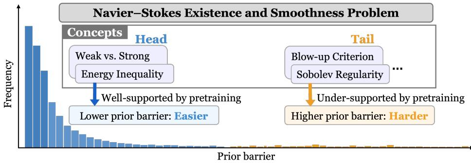
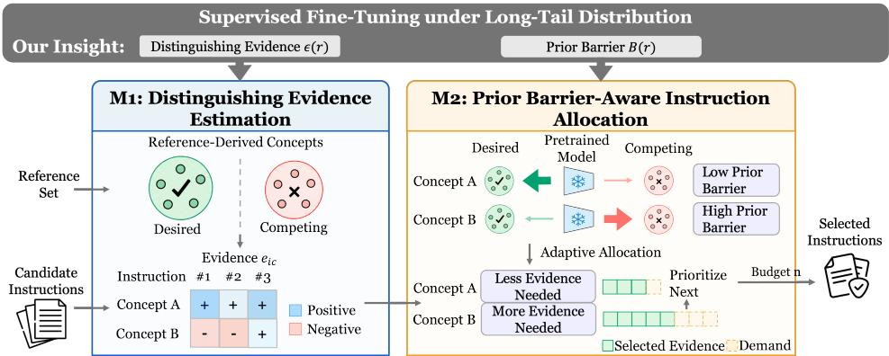
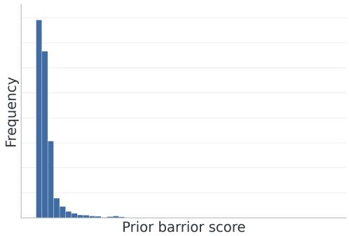
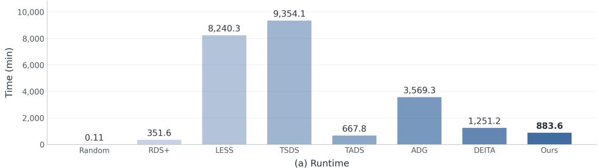
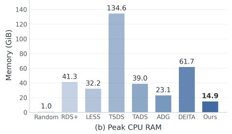
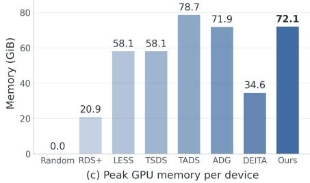
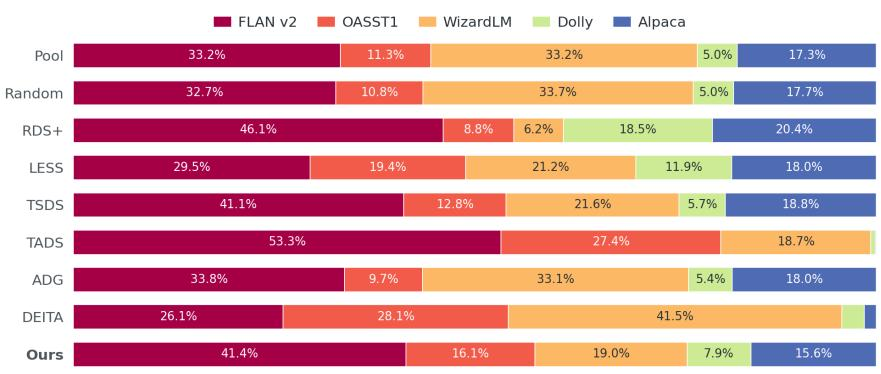
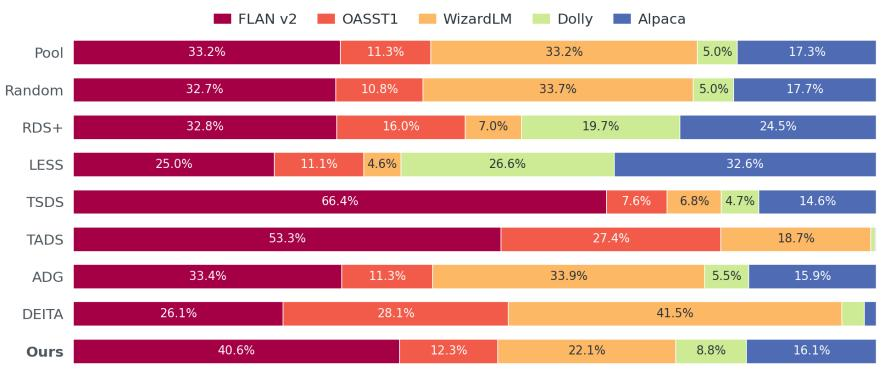

# OVERCOMING PRIOR BARRIERS: SUPERVISED FINE-TUNING UNDER LONG-TAIL DISTRIBUTION

Haohui Wang1, Jiahao Xu1, Wangzhi Zhan1, Tong Zeng2 Dongqi Fu3, Hong Li3, Swastik Roy2, Naren Ramakrishnan1 Chris North1, Jian Kang4, Yujun Yan5, Dawei Zhou1

1Virginia Tech 2Amazon 3Meta 4MBZUAI 5Dartmouth College

## ABSTRACT

Supervised fine-tuning (SFT) adapts pretrained large language models (LLMs) to downstream tasks, but the required concepts can receive substantially different levels of pretrained support. Frequent concepts are more likely to be well learned, whereas rare concepts may remain weakly represented. We introduce a novel notion named prior barrier to quantify how strongly the pretrained model supports competing concepts over the target concept. We observe that prior barriers follow a long-tail distribution, placing head and tail concepts at different starting points for SFT: head concepts face lower prior barriers, whereas tail concepts require additional instructions to overcome their higher prior barriers. Our theoretical analysis further derives a predictive risk bound for SFT under longtail prior barriers, explicitly characterizing how the prior barrier and accumulated SFT evidence jointly determine predictive performance. Motivated by this prior barrier-dependent demand, we propose PASS, an adaptive SFT instruction selection method that constructs reference-derived concepts and estimates the distinguishing evidence provided by each instruction, and adaptively allocates the selection budget toward concepts that remain insufficiently covered under the current selection. In this way, PASS jointly considers which instructions can provide useful evidence and where additional supervision is needed under a limited budget. Experiments show that our method consistently outperforms seven state-of-theart instruction selection methods on four backbone-budget settings. An ablation study further shows that PASS’s adaptive allocation consistently improves over uniform allocation.

## 1 INTRODUCTION

Supervised fine-tuning (SFT) is widely used to adapt pretrained large language models (LLMs) to downstream requirements such as mathematical reasoning, instruction following, factuality, and domain-specific behaviors (Ouyang et al., 2022; Zhou et al., 2023; Yue et al., 2023). In practice, the available instruction pool can be much larger than the amount of data that can be used for fine tuning, while candidate instructions can also vary substantially in quality, making data selection an important part of post-training (Xia et al., 2024). Given a downstream task and a large pool of candidate instructions, which examples should be selected under a limited SFT budget? Recent studies show that carefully selected subsets can match or outperform substantially larger SFT datasets (Zhou et al., 2023; Chen et al., 2024; Xia et al., 2024; Liu et al., 2024a), underscoring the importance of selecting valuable instructions under a limited SFT budget.

A central difficulty for effective SFT instruction selection is that the concepts required by the downstream task can receive substantially different levels of support from the pretrained model. Each task can involve a collection of concepts, ranging from common reasoning patterns and broadly observed instructions to rare knowledge and specialized behaviors. Frequently occurring concepts receive broader exposure during pretraining and are therefore more likely to receive strong support from the pretrained model, whereas rare concepts may remain weakly supported (Kandpal et al., 2023; Razeghi et al., 2022; Gekhman et al., 2024). We introduce a novel notion named prior barrier to quantify how strongly the pretrained model supports competing concepts over the target concept.

  
Figure 1: Illustration of the long-tail distribution of prior barriers using the Navier–Stokes existence and smoothness problem as an example.

Different prior barriers place target concepts at different starting points for SFT: a larger prior barrier indicates that more instructions is needed to achieve comparable performance. As illustrated in Figure 1, we observe a long-tail distribution in prior barriers, where head concepts face low prior barriers while tail concepts face high barriers, thus requiring more instructions. Under a limited SFT budget, effective selection should determine how to allocate instructions across concepts and which candidate instructions provide useful evidence for each concept (Chen et al., 2023; Dai et al., 2026).

These observations motivate two fundamental challenges: C1. Theoretical foundation. How does the SFT evidence overcome the prior barrier, and how does this determine the amount of instructions required to learn a target concept? C2. Computational framework. How can we develop a method that identifies which instructions in the candidate pool provide useful evidence for each concept while adaptively allocating a limited selection budget according to concept-level demand?

To address C1, we first characterize the role of the prior barrier in SFT. In the head case, the target concept already receives sufficient pretrained support. SFT can move toward the target with relatively limited evidence. In the tail case, the target concept faces a positive prior barrier, so the accumulated evidence must additionally overcome this disadvantage from pretraining. This interaction yields different instruction demands across concepts. We further derive a predictive risk bound that connects the demands to model performance by quantifying predictive risk in terms of the prior barrier and the distinguishing evidence provided by the selected instructions.

To address C2, we propose Prior-barrier Aware SFT Instruction Selection (PASS), an adaptive SFT instruction selection framework motivated by the prior barrier-dependent demand. It first constructs a reference-derived concept space and estimates concept-specific distinguishing evidence for each candidate instruction. PASS further estimates the prior barrier and existing pretrained support of each concept to characterize how strongly that concept calls for additional SFT instruction. It then adaptively allocates the selection budget toward concepts that remain under-represented. As a result, PASS jointly determines which candidate instructions provide useful evidence and where the limited SFT budget should be allocated. Our empirical results show that PASS outperforms seven state-ofthe-art instruction selection methods in all four backbone-budget settings. Ablation results further demonstrate the benefit of adaptively allocating the SFT budget according to prior barrier. The source code will be released upon publication.

## 2 PRELIMINARY

In this section, we introduce the background, including a Bayesian concept-space view of SFT, and give the formal problem definition.

Notations. We consider a concept space Θ, where each concept $\theta \in \Theta$ describes a possible input– response relation through a conditional distribution $P _ { \theta } ( y \mid x )$ . Here, x denotes an instruction input or query and y denotes the corresponding response. For example, for a mathematical reasoning concept, x may be a mathematical problem and y its correct solution. We denote the target concept required by the downstream task as $\theta ^ { \star }$ . Pretraining does not provide equal support for all concepts. We represent this pretrained support by a distribution $\pi ( \theta )$ over $\Theta ,$ where a larger $\pi ( \theta )$ indicates stronger pretrained support for concept θ. We interpret π as a prior distribution over concepts induced by pretraining. As a result, different target concepts can begin SFT from substantially different pretrained states.

Supervised fine-tuning. SFT adapts a pretrained language model to the downstream task using a set of supervised instruction input–response pairs. Given an SFT dataset $\mathcal { D } _ { n } = \{ ( x _ { i } , y _ { i } ) \} _ { i = 1 } ^ { n } ,$ where $x _ { i }$ is the i-th instruction input and $y _ { i }$ is its target response, SFT updates the pretrained model to increase the likelihood of the target responses conditioned on their inputs. For an autoregressive language model, this conditional probability factorizes as $\begin{array} { r } { P _ { \theta } ( y _ { i } \mid x _ { i } ) = \prod _ { t = 1 } ^ { T _ { i } } P _ { \theta } ( y _ { i , t } \mid x _ { i } , y _ { i , < t } ) } \end{array}$ where $T _ { i }$ is the number of tokens in response $y _ { i } , \ y _ { i , t }$ is the t-th token of $y _ { i }$ and $y _ { i , < t }$ denotes its preceding response tokens. Standard SFT therefore trains the model by minimizing the tokenlevel negative log-likelihood over the SFT dataset. We summarize the evidence provided by the SFT dataset for concept θ through its log-likelihood $\textstyle S _ { n } ( \theta ) = \sum _ { i = 1 } ^ { n }$ log $P _ { \theta } ( y _ { i } \mid x _ { i } )$ . We adopt a Bayesian concept-space view of ${ \mathrm { S F T } } ,$ where the pretrained distribution π serves as the prior and the supervised data update this prior through their likelihood. Let q denote a candidate distribution over the concept space Θ after observing the $\mathrm { S F T }$ dataset $\mathcal { D } _ { n }$ . We define $\mathcal { I } ( \boldsymbol { q } ) = - \mathbb { E } _ { \boldsymbol { \theta } \sim \boldsymbol { q } } \left[ S _ { n } ( \boldsymbol { \theta } ) \right] + D _ { \mathrm { K L } } ( \boldsymbol { q } \| \pi )$ The posterior distribution is defined as $q _ { n } ^ { \star } = \arg \operatorname* { m i n } _ { q } \mathcal { I } ( q )$ , which takes the Gibbs-posterior form $\begin{array} { r } { q _ { n } ^ { \star } ( \theta ) = \frac { e ^ { S _ { n } ( \theta ) } \pi ( \theta ) } { \int _ { \Theta } e ^ { S _ { n } ( u ) } \pi ( u ) \lambda ( d u ) } } \end{array}$ . Here, $q _ { n } ^ { \star } ( \theta )$ represents the updated support for concept $\theta ,$ obtained by updating the pretrained prior $\pi ( \theta )$ with the likelihood evidence from the SFT data through $S _ { n } ( \theta )$

Problem definition. Given a candidate SFT pool $\mathcal { D } = \{ ( x _ { i } , y _ { i } ) \} _ { i = 1 } ^ { N }$ , a selection budget $n ,$ and a reference set $\tau$ representing the desired behaviors in the downstream task with a long-tail distribution of prior barriers across concepts, our goal is to find a subset of instructions $\mathcal { D } _ { n } \subseteq \mathcal { D }$ with $| \mathcal { D } _ { n } | = n$ such that fine-tuning the pretrained model on $\mathcal { D } _ { n }$ achieves strong overall performance on the downstream task.

## 3 THEORETICAL ANALYSIS

In this section, we develop a theoretical analysis of how pretrained support and SFT evidence jointly shape predictive performance. First, we study posterior concentration around the target concept, showing how the prior barrier and distinguishing evidence together determine whether SFT can move the concept distribution toward the target. Second, we derive a predictive risk bound that connects posterior concentration to predictive performance and shows how the head–tail gap translates into different generalization guarantees.

Prior barrier. A pretrained model does not enter SFT from a neutral state: different concepts can receive substantially different levels of support from pretraining. This asymmetry is important because SFT adapts a pretrained model, where the target concept may compete with alternatives that are more strongly supported before fine-tuning begins. $\mathbf { A }$ key challenge is therefore to characterize this pretrained support relative to the target concept $\theta ^ { \star }$ and its competing concepts $\theta \in \Theta \setminus \{ \theta ^ { \star } \}$ . To this end, we consider concepts outside an r-neighborhood of the target concept $A _ { r } = \{ { \dot { \theta } } \in { \dot { \Theta } } : \| \theta - \theta ^ { \star } \| \geq r \}$ . If $\theta ^ { \star }$ already receives stronger support than all concepts in $A _ { r }$ , the target concept does not face a pretrained disadvantage. Otherwise, some competing concept receives stronger pretrained support than $\theta ^ { \star }$ , placing the target at an initial disadvantage before SFT begins. We characterize this relative pretrained disadvantage through the prior barrier.

Definition 1 (Prior barrier). The prior barrier at resolution r is $\begin{array} { r } { B ( r ) = \operatorname* { s u p } _ { \theta \in A _ { r } } \log { \frac { \pi ( \theta ) } { \pi ( \theta ^ { \star } ) } } } \end{array}$

The prior barrier $B ( r )$ compares the pretrained support of the target concept with its strongest competing concept. We observe that prior barriers exhibit a long-tail distribution across concepts, with many concepts facing relatively small barriers and few concepts facing substantially larger ones. For the analysis below, we refer to $B ( r ) \leq 0$ as the head case, where the target concept is at least as well supported as all concepts in $A _ { r }$ , and $B ( r ) > 0$ as the tail case, where at least one competing concept receives stronger pretrained support than the target concept.

Overcoming a positive prior barrier requires the SFT instructions to contain information that distinguishes the target concept from its competing concepts. The amount of useful information depends on the instruction distribution $P _ { X } { \mathrm { : } }$ : some instructions can clearly expose the difference between the target concept and an alternative concept, whereas others provide little distinguishing evidence. For a competing concept θ, define the expected evidence under $P _ { X }$ as

$$
\begin{array} { r } { K ( \theta ) = \mathbb { E } _ { \boldsymbol { x } \sim P _ { X } } \left[ \mathrm { K L } \left( P _ { \theta ^ { \star } } ( \cdot \mid \boldsymbol { x } ) \| P _ { \theta } ( \cdot \mid \boldsymbol { x } ) \right) \right] = \mathbb { E } \underset { \boldsymbol { y } \sim P _ { \theta ^ { \star } } ( \cdot \vert \boldsymbol { x } ) } { \mathbb { E } } \left[ \log P _ { \theta ^ { \star } } ( \boldsymbol { y } \mid \boldsymbol { x } ) - \log P _ { \theta } ( \boldsymbol { y } \mid \boldsymbol { x } ) \right] . } \end{array}\tag{1}
$$

Thus, a larger $K ( \theta )$ means that the observed instruction input–response pair drawn from the instruction distribution provides stronger expected evidence for separating the target concept from $\theta .$ Because SFT requires distinguishing the target from all concepts outside its neighborhood, we focus on the hardest competitor.

Definition 2 (Distinguishing Evidence). The distinguishing evidencefor the target concept at resolution r is $\epsilon ( r ) = \operatorname* { i n f } _ { \theta \in A _ { r } } K ( \theta )$

The target concept $\theta ^ { \star }$ is identifiable under the SFT instruction distribution $P _ { X }$ when $\epsilon ( r ) > 0$

Learning the target concept requires the posterior distribution after SFT to place little mass on the competing concepts in $A _ { r } ,$ that is, to make $q _ { n } ^ { \star } ( A _ { r } )$ small. The two central quantities governing it are $\bar { \boldsymbol B } ( \boldsymbol r )$ , which measures how much pretrained disadvantage must be overcome, and $n \epsilon ( r )$ , which measures how much distinguishing evidence SFT accumulates. As the number of SFT instructions increases, the accumulated evidence grows with $n \epsilon ( r )$ . Therefore, once this evidence is sufficient to overcome the pretrained disadvantage, the posterior can concentrate around the target concept.

Theorem 1 (Posterior Concentration). Fix $r > 0$ such that $A _ { r } \neq \varnothing$ and $\epsilon ( r ) > 0 $ , and let $m ( r ) > 0$ denote the normalized prior mass in a sufficiently small neighborhood of the target concept $\theta ^ { \star }$ Under the assumptions given in Appendix A.1, for any $\eta \in ( 0 , \bar { 1 } )$ $i f n \ge n _ { \mathrm { s e p } } ( r , \eta )$ where $n _ { \mathrm { s e p } } ( r , \eta )$ denotes the sample-size threshold, with probability at least $1 - \eta$ over the SFT dataset ${ \mathcal { D } } _ { n } ,$

$$
q _ { n } ^ { \star } ( A _ { r } ) \leq \operatorname* { m i n } \left\{ 1 , \frac { 1 } { m ( r ) } \exp \left( B ( r ) - \frac { n \epsilon ( r ) } { 8 } \right) \right\} .\tag{2}
$$

Proof. The proof is provided in Appendix ${ \tt A } . 2 $

Theorem 1 shows that, once the target concept is identifiable under the SFT distribution, sufficiently many SFT examples drive posterior mass away from competing concepts and toward the target concept. Since the prior barrier is fixed while the accumulated distinguishing evidence grows with $n ,$ the concentration error decreases exponentially as supervision increases. The amount of supervision required, however, differs between the head and tail cases.

Corollary 1 (Head–Tail Supervision Gap). Under the conditions of Theorem 1, let $\delta \in ( 0 , 1 )$ be a desired posterior error. The head case $\bar { B ( r ) } \le 0$ satisfies $q _ { n } ^ { \star } ( A _ { r } ) \leq \delta$ whenever

$$
n \geq \operatorname* { m a x } \left\{ \frac { 8 } { \epsilon ( r ) } \left( \log \frac { 1 } { m ( r ) \delta } \right) _ { + } , n _ { \mathrm { s e p } } ( r , \eta ) \right\} ,\tag{3}
$$

where $( a ) _ { + } = \operatorname* { m a x } \{ a , 0 \}$ }. The tail case $B ( r ) > 0$ satisfies $q _ { n } ^ { \star } ( A _ { r } ) \leq \delta$ whenever

$$
n \geq \operatorname* { m a x } \left\{ \frac { 8 } { \epsilon ( r ) } \left( B ( r ) + \log \frac { 1 } { m ( r ) \delta } \right) _ { + } , n _ { \mathrm { s e p } } ( r , \eta ) \right\} .\tag{4}
$$

Proof. The proof is provided in Appendix A.3.

The posterior concentration result explains when SFT places most of its concept-level support near the target concept. We now ask whether this concept-level concentration also leads to predictive performance. Define the posterior predictive distribution as $\begin{array} { r } { P _ { q _ { n } ^ { \star } } ( y ~ \mid ~ x ) ~ = ~ \int _ { \Theta } P _ { \theta } ( y ~ \mid } \end{array}$ $x ) q _ { n } ^ { \star } ( d \theta )$ , and measure its excess predictive log-loss relative to the target concept by $\mathcal { E } _ { n } ~ =$ $\mathbb { E } _ { x \sim P _ { X } } \left[ D _ { \mathrm { K L } } \left( P _ { \theta ^ { \star } } ( \cdot \mid x ) \lVert P _ { q _ { n } ^ { \star } } ( \cdot \mid x ) \right) \right]$ . We now establish how posterior concentration around the target concept translates into predictive performance for SFT.

  
Figure 2: The proposed prior-barrier aware SFT instruction selection (PASS) framework.

Theorem 2 (Predictive Risk Bound). Let $\begin{array} { r } { \alpha ( r ) = \mathbb { E } _ { x \sim P _ { X } } \left[ \operatorname* { s u p } _ { \| \theta - \theta ^ { \star } \| < r } D _ { \mathrm { K L } } \left( P _ { \theta ^ { \star } } ( \cdot \mid x ) \| P _ { \theta } ( \cdot \mid x ) \right) \right] } \end{array}$ denote the worst local predictive discrepancy within distance r of the target concept, and let $M _ { r } < \infty$ be a uniform upper bound on the predictive KL discrepancy for competing concepts in $A _ { r } .$ Under the assumptions stated in Appendix A.1, SFT dataset $\mathcal { D } _ { n }$ satisfies

$$
\mathcal { E } _ { n } \leq \alpha ( r ) + M _ { r } q _ { n } ^ { \star } ( A _ { r } ) .\tag{5}
$$

Consequently, under the conditions of Theorem 1, with probability at least $1 - \eta ,$

$$
\mathcal { E } _ { n } \leq \alpha ( r ) + M _ { r } \operatorname* { m i n } \left\{ \frac { 1 } { m ( r ) } \exp \left( B ( r ) - \frac { n \epsilon ( r ) } { 8 } \right) , 1 \right\} .\tag{6}
$$

Proof. The proof is provided in Appendix A.4.

□

Theorem 2 shows that predictive risk depends on two terms: how well concepts near the target concept approximate its predictions, and how much posterior mass remains on competing concepts. As SFT concentrates the posterior around the target concept, the contribution from competing concepts decreases, leading to a tighter predictive risk bound. In particular, if SFT achieves $q _ { n } ^ { \star } ( A _ { r } ) \leq \delta ,$ , then $\mathcal { E } _ { n } \leq \alpha ( r ) + M _ { r } \delta$ . Thus, a target concept in the head case can reach a given predictive risk with less supervision, while a target concept in the tail case must first accumulate additional evidence to overcome its positive prior barrier. As a result, the tail case generally requires more SFT instructions to reach the same level of predictive risk.

## 4 METHOD

Our theoretical analysis shows that achieving a small predictive risk requires SFT instructions to provide sufficient evidence for distinguishing the target concept from competing concepts. It further reveals different instruction requirements in the head and tail cases: a tail target concept requires additional instructions to overcome its positive prior barrier. These results motivate us to consider both how much distinguishing evidence each candidate instruction provides and how a fixed instruction budget should be allocated across target concepts with asymmetric pretrained support. In this section, we introduce PASS (shown in Figure 2), which consists of two major modules: M1. Distinguishing evidence estimation and M2. Prior barrier-aware instruction allocation. Accordingly, M1 constructs reference-derived concepts and estimates evidence for each candidate instruction by contrasting its support for the desired concept against relevant competing concepts. M2 uses the pretrained model to estimate the barrier and existing support of each concept, and incrementally allocates instructions according to both concept-level demand.

## 4.1 M1: DISTINGUISHING EVIDENCE ESTIMATION

Given a reference set T , we first construct a finite empirical discretization of the concept space Θ introduced in Section 2. We encode each reference instruction input x together with its target response y using the pretrained model $M _ { 0 }$ to extract a response representation $\boldsymbol { z } ( x , y ) \in \mathbb { R } ^ { d }$ . We hierarchically cluster these reference representations, recursively splitting clusters that do not satisfy a coherence criterion. We measure coherence by the concentration of cosine similarity between the representations in a cluster and their centroid, and stop splitting once each cluster is sufficiently coherent. The resulting clusters instantiate a finite set of target concepts $\Theta = \theta _ { 1 } , \hdots , \theta _ { C }$ , where $C$ is the number of concepts. Each concept θ therefore corresponds to a subset $\mathcal { T } _ { \theta } \subseteq \mathcal { T }$ of reference instructions that exhibit a coherent representation.

We represent the desired representation of concept θ by the normalized centroid of the representations in ${ \mathcal { T } } _ { \theta } { \mathrm { : } }$

$$
p _ { \theta } = \mathrm { N o r m } \left( \frac { 1 } { | \mathcal T _ { \theta } | } \sum _ { ( x , y ) \in \mathcal T _ { \theta } } z ( x , y ) \right) ,\tag{7}
$$

where $\begin{array} { r } { \mathrm { N o r m } ( v ) \ : = \ : \frac { v } { \| v \| _ { 2 } } } \end{array}$ . To construct competing representations, we keep the same instruction inputs in $\mathcal { T } _ { \theta }$ but replace their target responses with corresponding wrong responses, using available incorrect alternatives together with incorrect responses produced by $M _ { 0 }$ . These wrong responses may reflect multiple competing concepts for the same concept. For concept θ, let $\mathcal { W } _ { \theta k }$ denote the set of wrong response instructions corresponding to its k-th competing concept, with $k = 1 , \dots , K _ { \theta }$ where $K _ { \theta }$ denotes the number of competing concepts associated with target concept θ. We represent each competing representation by the normalized centroid:

$$
n _ { \theta k } = \mathrm { N o r m } \left( \frac { 1 } { | \mathcal { W } _ { \theta k } | } \sum _ { ( x , \tilde { y } ) \in \mathcal { W } _ { \theta k } } z ( x , \tilde { y } ) \right) , \qquad k = 1 , \ldots , K _ { \theta } ,\tag{8}
$$

where $\tilde { y }$ denotes a wrong response. The resulting set $\mathcal { N } _ { \theta } = \{ n _ { \theta 1 } , . . . , n _ { \theta K _ { \theta } } \}$ defines the competing representations of concept θ.

Our theoretical analysis suggests that a instruction may provide different distinguishing evidence for different concepts. We therefore evaluate candidate instruction $( x _ { i } , y _ { i } ) \in \mathcal { D }$ separately against every concept. Let $z _ { i } = z ( x _ { i } , y _ { i } )$ be the representation of the i-th instruction. For concept $\theta ,$ we measure its similarity to the desired representation and to the closest competing representation as

$$
s _ { \theta } ^ { + } ( z _ { i } ) = \mathrm { S i m } ( z _ { i } , p _ { \theta } ) , \qquad s _ { \theta } ^ { - } ( z _ { i } ) = \operatorname* { m a x } _ { v \in \mathcal { N } _ { \theta } } \mathrm { S i m } ( z _ { i } , v ) ,\tag{9}
$$

where Sim denotes cosine similarity. The difference $s _ { \theta } ^ { + } ( z _ { i } ) - s _ { \theta } ^ { - } ( z _ { i } )$ indicates whether the candidate favors the desired representation of concept θ over its strongest competitor. For directly comparable across concepts, we calibrate this difference using statistics estimated from the reference responses of each concept. We define the empirical distinguishing evidence as

$$
\epsilon _ { i \theta } = \mathrm { C a l i b } _ { \theta } \left( s _ { \theta } ^ { + } ( z _ { i } ) , s _ { \theta } ^ { - } ( z _ { i } ) \right) ,\tag{10}
$$

with Cali $\begin{array} { r } { \mathfrak { \mathrm { \Gamma } } _ { \mathfrak { \theta } } ( s ^ { + } , s ^ { - } ) = r _ { \theta } ( s ^ { + } , s ^ { - } ) \frac { s ^ { + } - s ^ { - } } { \sigma _ { \theta } } } \end{array}$ . Here, $r _ { \theta } ( s ^ { + } , s ^ { - } ) \in [ 0 , 1 ]$ is a relevance factor determined by the candidate’s affinity max $\{ s ^ { + } , s ^ { - } \}$ relative to the affinity observed for the reference responses of concept θ. It downweights candidates that are far from both the desired and competing representations while preserving candidates that are strongly aligned with either side. The scale $\sigma _ { \theta } > 0$ normalizes the similarity difference between $s _ { \theta } ^ { + }$ and $s _ { \theta } ^ { - }$ for concept θ, making evidence magnitudes comparable across concepts. Directly estimating the theoretical distinguishing evidence requires conditional response distributions, which are generally unavailable in practice. We therefore use the calibrated similarity margin as an empirical surrogate. A positive $\epsilon _ { i \theta }$ indicates that candidate i provides evidence in favor of the desired representation of concept $\theta ,$ whereas a negative value indicates stronger support for a competing concept. M1 outputs the evidence matrix $[ \epsilon _ { i \theta } ] \in \mathbb { R } ^ { N \times { C } }$ for the reference-derived concepts rather than collapsing each candidate into a single score.

## 4.2 M2: PRIOR BARRIER-AWARE INSTRUCTION ALLOCATION

M1 identifies how much distinguishing evidence each candidate can provide for different concepts, while the remaining question is how to allocate a fixed selection budget across concepts with different demands. Our theoretical analysis shows that a tail concept requires additional instructions to overcome its pretrained disadvantage. M2 therefore estimates concept-level demand from the prior barrier and incrementally allocates instructions as useful evidence is accumulated.

Since the theoretical prior barrier is not directly observable, we estimate it empirically from the pretrained model’s responses. We let the pretrained model $M _ { 0 }$ generate a response ${ \hat { y } } \sim M _ { 0 } ( \cdot \mid x )$ and obtain its representation $\hat { z } = z ( x , \hat { y } )$ for each instruction input in $\mathcal { T } _ { \theta }$ . The prior barrier of concept θ is estimated from the normalized difference between competing and desired representations,

$$
B _ { \theta } = \mathrm { A g g } _ { ( x , y ) \in \mathcal { T } _ { \theta } } \left[ \frac { s _ { \theta } ^ { - } \left( \hat { z } \right) - s _ { \theta } ^ { + } \left( \hat { z } \right) } { \sigma _ { \theta } } \right] ,\tag{11}
$$

where Agg denotes the aggregation over the reference instructions of concept $\theta .$

Complementary to this relative barrier, we separately estimate the absolute pretrained support for the target concept by measuring whether the generated response $\hat { y }$ lies sufficiently close to the desired representation $p _ { \theta } \colon$

$$
\gamma _ { \theta } = \frac { 1 } { | \mathcal { T } _ { \theta } | } \sum _ { ( x , y ) \in \mathcal { T } _ { \theta } } \operatorname { S u p p o r t } _ { \theta } \left( \operatorname { S i m } ( \hat { z } , p _ { \theta } ) \right) ,\tag{12}
$$

where $\mathrm { S u p p o r t } _ { \theta } ( \cdot ) \in [ 0 , 1 ]$ calibrates the similarity to $p _ { \theta }$ using the similarities observed from the target responses of concept θ. A larger $\gamma _ { \theta }$ indicates stronger pretrained support for the target concept.

A concept should receive more instruction when the pretrained model exhibits a higher prior barrier and weaker absolute target support. We therefore define its allocation weight as

$$
A _ { \theta } = \frac { \exp ( B _ { \theta } ) / \gamma _ { \theta } } { \sum _ { \theta ^ { \prime } \in \Theta } \exp ( B _ { \theta ^ { \prime } } ) / \gamma _ { \theta ^ { \prime } } } ,\tag{13}
$$

so that $\textstyle \sum _ { \theta \in \Theta } A _ { \theta } = 1$ . While $A _ { \theta }$ characterizes the relative instruction demand of each concept, the final selected subset should also account for how selected instructions contribute positive and negative distinguishing evidence, as well as the redundancy among their representations. We therefore define the selection objective by jointly modeling these three factors:

$$
F ( \pmb { S } ) = \sum _ { \theta \in \Theta } A _ { \theta } R _ { \theta } ^ { + } ( \pmb { S } ) - \lambda _ { h } \sum _ { \theta \in \Theta } A _ { \theta } R _ { \theta } ^ { - } ( \pmb { S } ) - \lambda _ { r } D ( \pmb { S } ) ,\tag{14}
$$

where $R _ { \theta } ^ { + }$ rewards positive distinguishing evidence for concept $\theta , R _ { \theta } ^ { - }$ penalizes negative distinguishing evidence for concept θ, D penalizes redundant selections, and $\lambda _ { h }$ and $\lambda _ { r }$ denote the weights of harm penalty and redundancy penalty.

For positive evidence, repeatedly selecting instructions for the same concept should yield diminishing returns. We therefore define $\begin{array} { r } { R _ { \theta } ^ { + } ( \mathcal { S } ) \stackrel { \smile } { = } 1 - \exp \left\{ - \beta _ { \theta } ^ { + } \sum _ { i \in \mathcal { S } } \epsilon _ { i \theta } ^ { + } \right\} } \end{array}$ , where $\epsilon _ { i \theta } ^ { + } \stackrel { \textstyle . } { = } ( \epsilon _ { i \theta } ) _ { + }$ . The coefficient $\beta _ { \theta } ^ { + } > 0$ controls how quickly the positive reward for concept θ saturates. Concepts with richer available evidence therefore saturate more slowly, while the marginal reward decreases as more positive evidence has already been selected.

For negative evidence, we define $\begin{array} { r } { R _ { \theta } ^ { - } ( \mathcal { S } ) = \sum _ { i \in \mathcal { S } } \left[ \exp \left\{ \beta ^ { - } \epsilon _ { i \theta } ^ { - } \right\} - 1 \right] } \end{array}$ , where $\epsilon _ { i \theta } ^ { - } = ( - \epsilon _ { i \theta } ) _ { + }$ , and $\beta ^ { - } > 0$ is an evidence scale shared across concepts for negative contributions. This term assigns a larger penalty to instructions that more strongly favor competing concepts.

Finally, we discourage selecting instructions that provide highly redundant information. We define $\begin{array} { r } { D (  { \mathcal { S } } ) \dot { = } \frac { 2 } { |  { \mathcal { S } } | ( |  { \mathcal { S } } | - 1 ) } \sum _ { i , j \in  { \mathcal { S } } }  { \operatorname { S i m } } ( z _ { i } , z _ { j } ) } \end{array}$ ,. This term encourages the selected subset to cover distinct regions of the response representation space.

We initialize $s = \emptyset$ and greedily select the instruction with the largest marginal gain,

$$
i ^ { \star } \in \arg \operatorname* { m a x } _ { i : ( x _ { i } , y _ { i } ) \in \mathcal { D } \backslash \mathcal { S } } \left[ F \big ( \mathcal { S } \cup \{ ( x _ { i } , y _ { i } ) \} \big ) - F ( \mathcal { S } ) \right] .\tag{15}
$$

After each selection, the selection objective is updated. The procedure stops when $| S | = n$ , yielding the subset used for SFT. Algorithm 1 in Appendix B summarizes the complete procedure.

## 5 EXPERIMENTS

In this section, we evaluate the performance of our method on four backbone-budget settings. PASS exhibits superior performance compared to various state-of-the-art baselines (Section 5.2). Further, through the ablation study (Section 5.3), we demonstrate the necessity of each component of PASS. We also report parameter analysis (Section 5.4), complexity sensitivity (Appendix C.2), and the composition of instructions selected by different instruction selection methods (Appendix C.3).

  
Figure 3: Long-tail distribution of prior barrier over the reference-derived concepts.

## 5.1 EXPERIMENT SETUP

Candidate pool and target tasks. The candidate pool contains 300,932 instruction–response examples drawn from five open instruction datasets: FLAN V2 (Longpre et al., 2023), OASST1 (Kopf¨ et al., 2023), WizardLM (Xu et al., 2024), Dolly (Conover et al., 2023) and Stanford Alpaca (Taori et al., 2023). To evaluate SFT instruction selection across concepts with long-tail prior barrier, we construct a downstream task spanning five capabilities: broad knowledge, multi-step reasoning, mathematics, truthfulness, and multilingual extractive QA. We form the reference set from examples covering these capabilities so that instruction selection is evaluated against the full range of target concepts. As shown in Figure 3, the prior barrier scores of the concepts in the reference set exhibit a long-tail distribution, providing a suitable setting for evaluating SFT under the long-tail distribution.

Backbones, budgets, and metrics. The main comparisons use Mistral-7B (Jiang et al., 2023) and Qwen2.5-7B (Qwen et al., 2024). We select $n \in \overline { { \{ 5 , 0 0 0 , 1 0 , 0 0 0 \} } }$ records, corresponding to approximately 1.66% and 3.32% of the original candidate pool. Within each backbone and budget, all selectors share the fine-tuning settings, the training recipe uses three epochs of LoRA (Hu et al., 2021). We report the overall performance on the downstream task (the macro-average of the five capability benchmark scores).

Baselines. We compare against Base (backbone without fine-tuning) and seven instruction selection methods, including RANDOM that samples uniformly; representation-based RDS+ (Ivison et al., 2025); gradient-based LESS (Xia et al., 2024); TSDS that uses optimal transport (Liu et al., 2024b); TADS that combines divisity selections by voting (Cheng et al., 2026); answer-divergence-based ADG (Li et al., 2026); and instance-quality filtering by DEITA (Liu et al., 2024a).

## 5.2 PERFORMANCE ANALYSIS

Table 1 shows that PASS consistently achieves the best overall performance across all four settings, indicating consistent gains across backbone choice and selection budget. In particular, on Mistral-7B, PASS reaches a score of 51.5 with 5,000 selected instructions, higher than every competing selector using twice the budget $( n = 1 0 , 0 0 0 )$ , where the strongest overall performance is 50.9. This result indicates that a better composition of the selected subset can compensate for a substantially smaller SFT budget. In contrast, other selection methods may identify individually relevant or highquality instructions, but they fail to adaptively cover all capabilities required for downstream tasks, resulting in poor overall performance. This is particularly evident on Qwen2.5-7B with $n = 1 0 { , } 0 0 0$ where RANDOM achieves an average score of 65.6, outperforming all other baselines. Taken together, these results support the motivation behind PASS: the key challenge is not only to identify useful individual instructions, but also to adaptively allocate budget based on the prior barrier.

## 5.3 ABLATION STUDY

We compare our budget-aware instruction allocation strategy with uniform instruction allocation. Under uniform variant, we allocate an equal budget of $n / 5$ separately to each of the five capabilities in the downstream task. Table 2 shows that budget-aware allocation consistently outperforms uniform allocation across both backbones and both selection budgets. On Mistral-7B, PASS improves the average score by 0.32 and 0.26 points at $n = 5 { , } 0 0 0$ and $n = 1 0 { , } 0 0 0 ,$ respectively. A similar trend is observed on Qwen2.5-7B, where the gains are 0.29 and 0.56 points. These results indicate that an equal per-capability assignment is suboptimal. In contrast, PASS adaptively allocates instructions according to the prior barrier, thereby making better use of the limited SFT budget.

Table 1: Overall downstream performance on Mistral-7B and Qwen2.5-7B at two selection budgets. The best and second-best results within each model and budget are shown in bold and underlined.
<table><tr><td></td><td colspan="2">Mistral-7B</td><td colspan="2">Qwen2.5-7B</td></tr><tr><td>Method</td><td>n = 5,000</td><td> $n = 1 0 { , } 0 0 0$ </td><td> $n = 5 { , } 0 0 0$ </td><td>n = 10,000</td></tr><tr><td>BASE (no SFT)</td><td>26.9</td><td>26.9</td><td>52.8</td><td>52.8</td></tr><tr><td>RANDOM</td><td>49.3</td><td>50.4</td><td>61.7</td><td>65.6</td></tr><tr><td>RDS+</td><td>49.9</td><td>50.3</td><td>64.3</td><td>63.4</td></tr><tr><td>LESS</td><td>47.7</td><td>50.3</td><td>60.3</td><td>59.9</td></tr><tr><td>TSDS</td><td>49.4</td><td>49.8</td><td>63.1</td><td>63.0</td></tr><tr><td>TADS</td><td>48.7</td><td>50.9</td><td>64.6</td><td>63.2</td></tr><tr><td>ADG</td><td>50.0</td><td>50.9</td><td>62.4</td><td>64.1</td></tr><tr><td>DEITA</td><td>50.6</td><td>48.9</td><td>60.7</td><td>62.8</td></tr><tr><td>PASS</td><td>51.5</td><td>51.8</td><td>64.8</td><td>65.6</td></tr></table>

Table 2: Budget-aware instruction allocation versus uniform instruction allocation. $\Delta _ { \mathrm { u n i } } = \mathrm { P A S S - }$ UNIFORM. Bold identifies the better results.

<table><tr><td></td><td colspan="3"> $n = 5 , 0 0 0$ </td><td colspan="3"> $n = 1 0 { , } 0 0 0$ </td></tr><tr><td>Backbone</td><td>PASS</td><td>UNIFORM</td><td> $\Delta _ { \mathrm { u n i } }$ </td><td>PASS</td><td>UNIFORM</td><td> $\Delta _ { \mathrm { u n i } }$ </td></tr><tr><td>Mistral-7B</td><td>51.46</td><td>51.14</td><td>+0.32</td><td>51.81</td><td>51.54</td><td>+0.26</td></tr><tr><td>Qwen2.5-7B</td><td>64.77</td><td>64.48</td><td>+0.29</td><td>65.60</td><td>65.03</td><td>+0.56</td></tr></table>

Table 3: Parameter sensitivity of PASS. $\Delta _ { \mathrm { d e f } }$ is the difference relative to the default setting.

<table><tr><td>Setting</td><td> $\lambda _ { h }$ </td><td> $\lambda _ { r }$ </td><td>Mean</td><td> $\Delta _ { \mathrm { d e f } }$ </td></tr><tr><td>Default</td><td>1.0</td><td>0.10</td><td>51.46</td><td>0.00</td></tr><tr><td>Weak harm penalty</td><td>0.5</td><td>0.10</td><td>51.56</td><td>+0.10</td></tr><tr><td>Strong harm penalty</td><td>2.0</td><td>0.10</td><td>50.54</td><td>-0.92</td></tr><tr><td>Weak redundancy penalty</td><td>1.0</td><td>0.05</td><td>50.96</td><td>-0.50</td></tr><tr><td>Strong redundancy penalty</td><td>1.0</td><td>0.20</td><td>52.21</td><td>+0.75</td></tr></table>

## 5.4 PARAMETER ANALYSIS

We study two hyperparameters of our method: (1) the harm coefficient $\lambda _ { h }$ weights the penalty on negative distinguishing evidence, and (2) the redundancy coefficient $\lambda _ { r }$ controls the penalty on redundant selections. Table 3 reports the overall performance under varying $\lambda _ { h }$ and $\lambda _ { r }$ using Mistral-7B with $n \ : = \ : 5 , 0 0 0$ selected instructions. The fluctuation of the performance is less than 2%, showing PASS is reliable and not sensitive to the hyperparameters over a wide range.

## 6 RELATED WORK

Instruction selection for supervised fine-tuning (SFT) has been studied from several perspectives, including instance quality, model-dependent utility, target-aware matching. Early work shows that small but carefully selected instruction sets can be highly effective (Zhou et al., 2023; Chen et al., 2024). Methods such as DEITA further combine response quality, instruction complexity, and embedding diversity to identify informative and non-redundant examples (Liu et al., 2024a). Other approaches make selection dependent on the model itself. For example, ADG measures the divergence among multiple generated answers to estimate instruction utility (Li et al., 2026), while related

methods use model difficulty, uncertainty, or response likelihood as selection signals (Li et al., 2024;   
Liu et al., 2024c; Zhang et al., 2025).

Recent work uses downstream references to identify instructions that are relevant to the target task. LESS estimates candidate influence through low-rank gradient similarity to reference examples (Xia et al., 2024); RDS+ retrieves candidates using pretrained representations (Ivison et al., 2025); TSDS aligns the selected subset with the target distribution through optimal transport (Liu et al., 2024b); and TADS uses LLM-inferred proxy labels to improve task-aware distribution matching (Cheng et al., 2026). These methods provide strong mechanisms for estimating whether an instruction is relevant to downstream requirements, but generally summarize candidate utility through similarity, influence, or distribution matching. Beyond candidate scoring, several methods consider how supervision should be distributed across skills or tasks. Skill-It adapts training mixtures according to skill dependencies (Chen et al., 2023), while MIG and BIDS dynamically prioritize informative or underrepresented targets (Chen et al., 2025; Dai et al., 2026). Our work complements these approaches by connecting instruction allocation to unequal pretrained support through prior barrier. It combines prior barrier with distinguishing evidence to adaptively allocate the SFT budget.

## 7 CONCLUSION

This work studies supervised fine-tuning under long-tail distributions, where different target concepts can receive substantially different levels of pretrained support. We introduce the prior barrier to characterize this difference, and observe that prior barriers exhibit a long-tail distribution. Our theoretical analysis shows that the prior barrier and instruction evidence jointly determine the number of instructions required during SFT: head concepts require relatively limited additional supervision, whereas tail concepts require more evidence to overcome their prior barriers. Guided by this analysis, we propose PASS, which estimates concept-specific distinguishing evidence and adaptively allocates a limited SFT budget according to the prior barrier. PASS achieves the best overall performance compared with seven instruction selection baselines in all four backbone-budget settings, while its adaptive allocation consistently improves over uniform allocation. These results show that effective SFT instruction selection should account for both the evidence provided by candidate instructions and the adaptive allocation based on the prior barrier.

## REFERENCES

Long Ouyang, Jeffrey Wu, Xu Jiang, Diogo Almeida, Carroll Wainwright, Pamela Mishkin, Chong Zhang, Sandhini Agarwal, Katarina Slama, Alex Ray, et al. Training language models to follow instructions with human feedback. In Advances in Neural Information Processing Systems, volume 35, 2022.

Chunting Zhou, Pengfei Liu, Puxin Xu, Srini Iyer, Jiao Sun, Yuning Mao, Xuezhe Ma, Avia Efrat, Ping Yu, Lili Yu, et al. LIMA: Less is more for alignment. In Advances in Neural Information Processing Systems, volume 36, 2023.

Xiang Yue, Xingwei Qu, Ge Zhang, Yao Fu, Wenhao Huang, Huan Sun, Yu Su, and Wenhu Chen. Mammoth: Building math generalist models through hybrid instruction tuning, 2023. URL https://arxiv.org/abs/2309.05653.

Mengzhou Xia, Sadhika Malladi, Suchin Gururangan, Sanjeev Arora, and Danqi Chen. LESS: Selecting influential data for targeted instruction tuning. In International Conference on Machine Learning, 2024.

Lichang Chen, Shiyang Li, Jun Yan, Hai Wang, Kalpa Gunaratna, Vikas Yadav, Zheng Tang, Vijay Srinivasan, Tianyi Zhou, Heng Huang, and Hongxia Jin. Alpagasus: Training a better alpaca with fewer data, 2024. URL https://arxiv.org/abs/2307.08701.

Wei Liu, Weihao Zeng, Keqing He, Yong Jiang, and Junxian He. What makes good data for alignment? a comprehensive study of automatic data selection in instruction tuning, 2024a. URL https://arxiv.org/abs/2312.15685.

Nikhil Kandpal, Haikang Deng, Adam Roberts, Eric Wallace, and Colin Raffel. Large language models struggle to learn long-tail knowledge. In Andreas Krause, Emma Brunskill, Kyunghyun Cho, Barbara Engelhardt, Sivan Sabato, and Jonathan Scarlett, editors, Proceedings of the 40th International Conference on Machine Learning, volume 202 of Proceedings of Machine Learning Research, pages 15696–15707. PMLR, 23–29 Jul 2023. URL https://proceedings. mlr.press/v202/kandpal23a.html.

Yasaman Razeghi, Robert L Logan IV, Matt Gardner, and Sameer Singh. Impact of pretraining term frequencies on few-shot numerical reasoning. In Yoav Goldberg, Zornitsa Kozareva, and Yue Zhang, editors, Findings of the Association for Computational Linguistics: EMNLP 2022, pages 840–854, Abu Dhabi, United Arab Emirates, December 2022. Association for Computational Linguistics. doi: 10.18653/v1/2022.findings-emnlp.59. URL https://aclanthology.org/ 2022.findings-emnlp.59/.

Zorik Gekhman, Gal Yona, Roee Aharoni, Matan Eyal, Amir Feder, Roi Reichart, and Jonathan Herzig. Does fine-tuning LLMs on new knowledge encourage hallucinations? In Yaser Al-Onaizan, Mohit Bansal, and Yun-Nung Chen, editors, Proceedings of the 2024 Conference on Empirical Methods in Natural Language Processing, pages 7765–7784, Miami, Florida, USA, November 2024. Association for Computational Linguistics. doi: 10.18653/v1/2024.emnlp-main. 444. URL https://aclanthology.org/2024.emnlp-main.444/.

Mayee F. Chen, Nicholas Roberts, Kush Bhatia, Jue Wang, Ce Zhang, Frederic Sala, and Christopher Re. Skill-it! a data-driven skills framework for understanding and training language models, 2023.´ URL https://arxiv.org/abs/2307.14430.

Qirun Dai, Dylan Zhang, Jiaqi W. Ma, and Hao Peng. Improving influence-based instruction tuning data selection for balanced learning of diverse capabilities, 2026. URL https://arxiv.org/ abs/2501.12147.

Shayne Longpre, Le Hou, Tu Vu, Albert Webson, Hyung Won Chung, Yi Tay, Denny Zhou, Quoc V Le, Barret Zoph, Jason Wei, and Adam Roberts. The flan collection: Designing data and methods for effective instruction tuning. In Andreas Krause, Emma Brunskill, Kyunghyun Cho, Barbara Engelhardt, Sivan Sabato, and Jonathan Scarlett, editors, Proceedings of the 40th International Conference on Machine Learning, volume 202 of Proceedings of Machine Learning Research, pages 22631–22648. PMLR, 23–29 Jul 2023. URL https://proceedings.mlr.press/ v202/longpre23a.html.

Andreas Kopf, Yannic Kilcher, Dimitri von R¨ utte, Sotiris Anagnostidis, Zhi Rui Tam, Keith¨ Stevens, Abdullah Barhoum, Duc Nguyen, Oliver Stanley, Richard Nagyfi, Shahul ES,´ Sameer Suri, David Glushkov, Arnav Dantuluri, Andrew Maguire, Christoph Schuhmann, Huu Nguyen, and Alexander Mattick. Openassistant conversations - democratizing large language model alignment. In A. Oh, T. Naumann, A. Globerson, K. Saenko, M. Hardt, and S. Levine, editors, Advances in Neural Information Processing Systems, volume 36, pages 47669–47681. Curran Associates, Inc., 2023. doi: 10.52202/075280-2064. URL https://proceedings.neurips.cc/paper\_files/paper/2023/file/ 949f0f8f32267d297c2d4e3ee10a2e7e-Paper-Datasets\_and\_Benchmarks. pdf.

Can Xu, Qingfeng Sun, Kai Zheng, Xiubo Geng, Pu Zhao, Jiazhan Feng, Chongyang Tao, Qingwei Lin, and Daxin Jiang. Wizardlm: Empowering large pre-trained language models to follow complex instructions. In B. Kim, Y. Yue, S. Chaudhuri, K. Fragkiadaki, M. Khan, and Y. Sun, editors, International Conference on Learning Representations, volume 2024, pages 30745–30766, 2024. URL https://proceedings.iclr.cc/paper\_files/paper/2024/file/ 82eec786fdfbbfa53450c5feb7d1ac92-Paper-Conference.pdf.

Mike Conover, Matt Hayes, Ankit Mathur, Jianwei Xie, Jun Wan, Sam Shah, Ali Ghodsi, Patrick Wendell, Matei Zaharia, and Reynold Xin. Free dolly: Introducing the world’s first truly open instruction-tuned llm, 2023. URL https://www.databricks.com/blog/2023/04/ 12/dolly-first-open-commercially-viable-instruction-tuned-llm.

Rohan Taori, Ishaan Gulrajani, Tianyi Zhang, Yann Dubois, Xuechen Li, Carlos Guestrin, Percy Liang, and Tatsunori B. Hashimoto. Stanford alpaca: An instruction-following llama model. https://github.com/tatsu-lab/stanford\_alpaca, 2023.

Albert Q. Jiang, Alexandre Sablayrolles, Arthur Mensch, Chris Bamford, Devendra Singh Chaplot, Diego de las Casas, Florian Bressand, Gianna Lengyel, Guillaume Lample, Lucile Saulnier, Lelio Renard Lavaud, Marie-Anne Lachaux, Pierre Stock, Teven Le Scao, Thibaut Lavril,´ Thomas Wang, Timothee Lacroix, and William El Sayed. Mistral 7b, 2023. URL´ https: //arxiv.org/abs/2310.06825.

Qwen, An Yang, Baosong Yang, Beichen Zhang, Binyuan Hui, et al. Qwen2.5 technical report, 2024. URL https://arxiv.org/abs/2412.15115.

Edward J. Hu, Yelong Shen, Phillip Wallis, Zeyuan Allen-Zhu, Yuanzhi Li, Shean Wang, Lu Wang, and Weizhu Chen. Lora: Low-rank adaptation of large language models, 2021. URL https: //arxiv.org/abs/2106.09685.

Hamish Ivison, Muru Zhang, Faeze Brahman, Pang Wei Koh, and Pradeep Dasigi. Large-scale data selection for instruction tuning, 2025. URL https://arxiv.org/abs/2503.01807. arXiv preprint arXiv:2503.01807.

Zifan Liu, Amin Karbasi, and Theodoros Rekatsinas. TSDS: Data selection for task-specific model finetuning. In Advances in Neural Information Processing Systems, volume 37, 2024b. URL https://openreview.net/forum?id=wjbTHLUSzU.

Hao Cheng, Rui Zhang, Ling Li, Na Di, Jiaheng Wei, Zhaowei Zhu, and Bo Han. Task-aware data selection via proxy-label enhanced distribution matching for LLM finetuning. In The Fourteenth International Conference on Learning Representations, 2026. URL https://openreview. net/forum?id=R40WoYbYab.

Bo Li, Mingda Wang, Shikun Zhang, and Wei Ye. Instruction data selection via answer divergence. In Proceedings of the 64th Annual Meeting of the Association for Computational Linguistics (Volume 1: Long Papers), pages 4684–4702, 2026.

Ming Li, Yong Zhang, Zhitao Li, Jiuhai Chen, Lichang Chen, Ning Cheng, Jianzong Wang, Tianyi Zhou, and Jing Xiao. From quantity to quality: Boosting LLM performance with self-guided data selection for instruction tuning. In Proceedings of the 2024 Conference of the North American Chapter ofthe Associationfor Computational Linguistics, 2024.

Liangxin Liu, Xuebo Liu, Derek F. Wong, Dongfang Li, Ziyi Wang, Baotian Hu, and Min Zhang. SelectIT: Selective instruction tuning for LLMs via uncertainty-aware self-reflection. In Advances in Neural Information Processing Systems, volume 37, 2024c. URL https://proceedings.neurips.cc/paper\_files/paper/2024/ hash/b130a5691815f550977e331f8bec08ae-Abstract-Conference.html.

Dylan Zhang, Qirun Dai, and Hao Peng. The best instruction-tuning data are those that fit. In Advances in Neural Information Processing Systems, volume 38, 2025. doi: 10.52202/085713-4717. URL https://proceedings.neurips.cc/paper\_files/paper/2025/hash/ cea04322465ad2f261f08e5b47ba9e7a-Abstract-Conference.html.

Yicheng Chen, Yining Li, Kai Hu, Zerun Ma, Haochen Ye, and Kai Chen. MIG: Automatic data selection for instruction tuning by maximizing information gain in semantic space. In Findings of the Association for Computational Linguistics: ACL 2025, pages 9902–9915. Association for Computational Linguistics, 2025. doi: 10.18653/v1/2025.findings-acl.515. URL https:// aclanthology.org/2025.findings-acl.515/.

Dan Hendrycks, Collin Burns, Steven Basart, Andy Zou, Mantas Mazeika, Dawn Song, and Jacob Steinhardt. Measuring massive multitask language understanding, 2021. URL https: //arxiv.org/abs/2009.03300.

Mirac Suzgun, Nathan Scales, Nathanael Scharli, Sebastian Gehrmann, Yi Tay, Hyung Won Chung,¨ Aakanksha Chowdhery, Quoc V Le, Ed H Chi, Denny Zhou, and Jason Wei. Challenging BIGbench tasks and whether chain-of-thought can solve them. In Findings of the Association for Computational Linguistics: ACL 2023, 2023.

Karl Cobbe, Vineet Kosaraju, Mohammad Bavarian, Mark Chen, Heewoo Jun, Lukasz Kaiser, Matthias Plappert, Jerry Tworek, Jacob Hilton, Reiichiro Nakano, Christopher Hesse, and John Schulman. Training verifiers to solve math word problems, 2021. URL https://arxiv. org/abs/2110.14168.

Stephanie Lin, Jacob Hilton, and Owain Evans. TruthfulQA: Measuring how models mimic human falsehoods. In Proceedings of the 60th Annual Meeting of the Association for Computational Linguistics, 2022.

Jonathan H. Clark, Eunsol Choi, Michael Collins, Dan Garrette, Tom Kwiatkowski, Vitaly Nikolaev, and Jennimaria Palomaki. TyDi QA: A benchmark for information-seeking question answering in typologically diverse languages. Transactions of the Association for Computational Linguistics, 8:454–470, 2020. doi: 10.1162/tacl a 00317. URL https://aclanthology.org/2020. tacl-1.30/.

## A DETAILS OF THEORETICAL ANALYSIS

## A.1 ASSUMPTIONS

We assume that the concept space $\Theta \subset \mathbb { R } ^ { d }$ is compact and is equipped with a Borel probability reference measure λ with full support. The prior has a strictly positive continuous density $\pi ( \theta )$ with respect to λ. The input and output spaces are standard Borel spaces. There exists a common σ-finite measure ν on the output space such that each $P _ { \theta } ( \cdot \mid x )$ admits a density, denoted by $P _ { \theta } ( y \mid x )$ ， with $( \theta , x , y ) \mapsto P _ { \theta } ( y \mid x )$ jointly measurable. Define $P ^ { \star } ( d x , d y ) = \dot { P } _ { X } ( d x ) P _ { \theta ^ { \star } } ( d y | \stackrel { . . } { x } )$ , and assume that the SFT examples are i.i.d. from $P ^ { \star }$ . Let $\ell _ { \theta } ( x , y ) \ : = \ : \log P _ { \theta } ( y \mid x )$ and ${ \mathrm { ~ \dot { ~ } { \cal S } } } _ { n } ( \theta ) ~ =$ $\scriptstyle \sum _ { i = 1 } ^ { n } \ell _ { \theta } ( x _ { i } , y _ { i } )$

Assumption 1. There exists a measurable set $\mathcal { Z } _ { 0 }$ of $\cdot _ { P ^ { \star } }$ -probability one such that, for every $( x , y ) \in$ $\mathcal { Z } _ { 0 }$

$$
\ell _ { \theta } ( x , y ) \in \mathbb { R } \quad f o r e \nu e r y \theta \in \Theta , \quad \operatorname* { s u p } _ { \theta \in \Theta } \ell _ { \theta } ( x , y ) < \infty .\tag{16}
$$

Assumption 2 (Bounded log-likelihood ratios). For a fixed $r > 0 ,$ , there exists $M _ { r } \in ( 0 , \infty )$ such that,for every $( x , y ) \in \mathcal { Z } _ { 0 }$ and every $\theta \in A _ { r }$ c

$$
| \ell _ { \theta } ( x , y ) - \ell _ { \theta ^ { \star } } ( x , y ) | \leq M _ { r } .\tag{17}
$$

Assumption 3. For afixed $r > 0 ,$ , there exists $L _ { r } \in ( 0 , \infty )$ such that, for every $( x , y ) \in \mathcal { Z } _ { 0 }$

$$
| \ell _ { \theta } ( x , y ) - \ell _ { \theta ^ { \prime } } ( x , y ) | \leq L _ { r } \| \theta - \theta ^ { \prime } \| , \qquad \quad \theta , \theta ^ { \prime } \in A _ { r } ,\tag{18}
$$

$$
| \ell _ { \theta } ( x , y ) - \ell _ { \theta ^ { \star } } ( x , y ) | \leq L _ { r } \| \theta - \theta ^ { \star } \| , \quad \quad \quad \quad \| \theta - \theta ^ { \star } \| < r / 2 .\tag{19}
$$

Assumption 4. The local approximation term $\alpha ( r )$ is finite, and the pointwise supremum used to define it is measurable.

For posterior concentration, define

$$
\rho _ { r } = \operatorname* { m i n } \left\{ \frac { r } { 2 } , \frac { \epsilon ( r ) } { 8 L _ { r } } \right\} , \quad U _ { r } = \{ \theta \in \Theta : \| \theta - \theta ^ { \star } \| < \rho _ { r } \} ,\tag{20}
$$

and let

$$
m ( r ) = \int _ { U _ { r } } \frac { \pi ( \theta ) } { \pi ( \theta ^ { \star } ) } \lambda ( d \theta ) .\tag{21}
$$

Because $\rho _ { r } > 0$ , λ has full support, and π is strictly positive and continuous, $m ( r ) > 0$

$$
\mathcal { N } _ { r } = \boldsymbol { N } \left( \boldsymbol { A } _ { r } , \frac { \boldsymbol { \epsilon } ( r ) } { 8 L _ { r } } , \| \cdot \| \right)\tag{22}
$$

be the covering number of $A _ { r }$ . Compactness of $A _ { r }$ implies $\mathcal { N } _ { r } < \infty$ . For $\eta \in ( 0 , 1 )$ , define

$$
n _ { \mathrm { s e p } } ( r , \eta ) = \frac { 8 M _ { r } ^ { 2 } } { \epsilon ( r ) ^ { 2 } } \log \left( \frac { N _ { r } } { \eta } \right) .\tag{23}
$$

Finally, let

$$
\Delta _ { n } ( \theta ) = S _ { n } ( \theta ) - S _ { n } ( \theta ^ { \star } ) .\tag{24}
$$

## A.2 PROOF OF THEOREM 1

Proof. We first establish a uniform empirical separation over $A _ { r }$ . For any fixed $\theta \in A _ { r }$ , define

$$
Z _ { i } ( \theta ) = \ell _ { \theta } ( x _ { i } , y _ { i } ) - \ell _ { \theta ^ { \star } } ( x _ { i } , y _ { i } ) .
$$

By Assumption 2, $Z _ { i } ( \theta ) \in [ - M _ { r } , M _ { r } ]$ , while the definition of $\epsilon ( r )$ gives

$$
\begin{array} { r } { \mathbb { E } Z _ { i } ( \theta ) = - K ( \theta ) \le - \epsilon ( r ) . } \end{array}
$$

Hence,

$$
\left\{ \Delta _ { n } ( \theta ) \geq - \frac { n \epsilon ( r ) } { 2 } \right\} \subseteq \left\{ \Delta _ { n } ( \theta ) - \mathbb { E } \Delta _ { n } ( \theta ) \geq \frac { n \epsilon ( r ) } { 2 } \right\} .
$$

Hoeffding’s inequality yields

$$
\mathrm { P r } \left\{ \Delta _ { n } ( \theta ) \geq - \frac { n \epsilon ( r ) } { 2 } \right\} \leq \exp \left( - \frac { n \epsilon ( r ) ^ { 2 } } { 8 M _ { r } ^ { 2 } } \right) .\tag{25}
$$

Choose a cover $\mathcal { C } _ { r } \subset A _ { 1 }$ r with $| { \mathcal { C } } _ { r } | = { \mathcal { N } } _ { r }$ and radius $\epsilon ( r ) / ( 8 L _ { r } )$ . By a union bound,

$$
\operatorname* { P r } \left\{ \exists \theta _ { c } \in \mathcal { C } _ { r } : \Delta _ { n } ( \theta _ { c } ) \geq - \frac { n \epsilon ( r ) } { 2 } \right\} \leq \mathcal { N } _ { r } \exp \left( - \frac { n \epsilon ( r ) ^ { 2 } } { 8 M _ { r } ^ { 2 } } \right) .
$$

When $\iota \geq n _ { \mathrm { s e p } } ( r , \eta )$ , the right-hand side is at most $\eta .$ On the complementary event, every $\theta \in A _ { r }$ has a center $\theta _ { c } \in { \mathcal { C } } _ { r }$ such that, by Assumption 3,

$$
| \Delta _ { n } ( \theta ) - \Delta _ { n } ( \theta _ { c } ) | \leq \sum _ { i = 1 } ^ { n } L _ { r } \| \theta - \theta _ { c } \| \leq \frac { n \epsilon ( r ) } { 8 } .
$$

Therefore, with probability at least $1 - \eta ,$

$$
\operatorname* { s u p } _ { \theta \in A _ { r } } \Delta _ { n } ( \theta ) \leq - \frac { 3 n \epsilon ( r ) } { 8 } \leq - \frac { n \epsilon ( r ) } { 4 } .\tag{26}
$$

On this event, the posterior mass of $A _ { r }$ can be written as

$$
q _ { n } ^ { \star } ( A _ { r } ) = \frac { \displaystyle \int _ { A _ { r } } \exp \bigl ( \Delta _ { n } ( \theta ) \bigr ) \frac { \pi ( \theta ) } { \pi ( \theta ^ { \star } ) } \lambda ( d \theta ) } { \displaystyle \int _ { \Theta } \exp \bigl ( \Delta _ { n } ( \theta ) \bigr ) \frac { \pi ( \theta ) } { \pi ( \theta ^ { \star } ) } \lambda ( d \theta ) } .\tag{27}
$$

For every $\theta \in A _ { r }$

$$
\log \frac { \pi ( \theta ) } { \pi ( \theta ^ { \star } ) } + \Delta _ { n } ( \theta ) \leq B ( r ) - \frac { n \epsilon ( r ) } { 4 } .
$$

Since $\lambda ( A _ { r } ) \leq 1$ , the numerator of 27 satisfies

$$
\int _ { A _ { r } } \exp \bigl ( \Delta _ { n } ( \theta ) \bigr ) \frac { \pi ( \theta ) } { \pi ( \theta ^ { \star } ) } \lambda ( d \theta ) \leq \exp \left( B ( r ) - \frac { n \epsilon ( r ) } { 4 } \right) .\tag{28}
$$

For every $\theta \in U _ { r }$ , Assumption 3 and the definition of $\rho _ { r }$ imply

$$
\Delta _ { n } ( \theta ) \geq - \sum _ { i = 1 } ^ { n } \left| \ell _ { \theta } ( x _ { i } , y _ { i } ) - \ell _ { \theta ^ { \star } } ( x _ { i } , y _ { i } ) \right| \geq - \frac { n \epsilon ( r ) } { 8 } .
$$

Restricting the denominator of 27 to $U _ { r }$ gives

$$
\int _ { \Theta } \exp \bigl ( \Delta _ { n } ( \theta ) \bigr ) \frac { \pi ( \theta ) } { \pi ( \theta ^ { \star } ) } \lambda ( d \theta ) \geq m ( r ) \exp \left( - \frac { n \epsilon ( r ) } { 8 } \right) .\tag{29}
$$

Combining 28 and 29,

$$
q _ { n } ^ { \star } ( A _ { r } ) \leq \frac { 1 } { m ( r ) } \exp \left( B ( r ) - \frac { n \epsilon ( r ) } { 8 } \right) .
$$

Together with $q _ { n } ^ { \star } ( A _ { r } ) \leq 1$ , we obtain

$$
q _ { n } ^ { \star } ( A _ { r } ) \leq \operatorname* { m i n } \left\{ 1 , \frac { 1 } { m ( r ) } \exp \left( B ( r ) - \frac { n \epsilon ( r ) } { 8 } \right) \right\} .
$$

This completes the proof.

## A.3 PROOF OF COROLLARY 1

Proof. In the head case, $B ( r ) \leq 0$ , so the posterior concentration bound becomes

$$
q _ { n } ^ { \star } ( A _ { r } ) \leq \operatorname* { m i n } \left\{ 1 , \frac { 1 } { m ( r ) } \exp \left( - \frac { n \epsilon ( r ) } { 8 } \right) \right\} .
$$

To guarantee $q _ { n } ^ { \star } ( A _ { r } ) \leq \delta$ , it is sufficient that

$$
\frac { 1 } { m ( r ) } \exp \left( - \frac { n \epsilon ( r ) } { 8 } \right) \leq \delta ,
$$

which gives

$$
n \geq \frac { 8 } { \epsilon ( r ) } \left( \log \frac { 1 } { m ( r ) \delta } \right) _ { + } .
$$

In the tail case, $B ( r ) > 0$ , and it is sufficient that

$$
\frac { 1 } { m ( r ) } \exp \left( B ( r ) - \frac { n \epsilon ( r ) } { 8 } \right) \leq \delta .
$$

Rearranging gives

$$
n \geq \frac { 8 } { \epsilon ( r ) } \left( B ( r ) + \log \frac { 1 } { m ( r ) \delta } \right) _ { + } .
$$

This completes the proof.

## A.4 PROOF OF THEOREM 2

Proof. Fix an SFT dataset $\mathcal { D } _ { n }$ . For $P _ { X }$ -almost every x, convexity of KL divergence in its second argument gives

$$
D _ { \mathrm { K L } } \left( P _ { \theta ^ { \star } } ( \cdot \mid x ) \| P _ { q _ { n } ^ { \star } } ( \cdot \mid x ) \right)\tag{30}
$$

$$
\leq \int _ { \Theta } D _ { \mathrm { K L } } \left( P _ { \theta ^ { \star } } ( \cdot \mid x ) \| P _ { \theta } ( \cdot \mid x ) \right) q _ { n } ^ { \star } ( d \theta ) .\tag{31}
$$

Splitting the integral over $\Theta \backslash A _ { i }$ r and $A _ { r } ,$ the contribution from $\Theta \setminus A _ { r }$ is bounded by the local approximation term $\alpha ( r )$ . For $\theta \in A _ { r }$ , Assumption 2 implies

$$
D _ { \mathrm { K L } } \left( P _ { \theta ^ { \star } } ( \cdot  { | \mathbf {  { x } } ) | } | P _ { \theta } ( \cdot  { | \mathbf {  { x } } ) } \right) = \mathbb { E } _ { { y } \sim { P } _ { \theta ^ { \star } } ( \cdot  { | \mathbf {  { x } } ) } } \left[ \ell _ { \theta ^ { \star } } (  { \boldsymbol { x } } , { y } ) - \ell _ { \theta } (  { \boldsymbol { x } } , { y } ) \right] \le M _ { r } .
$$

Taking expectation over x therefore gives

$$
\mathcal { E } _ { n } \leq \alpha ( r ) + M _ { r } q _ { n } ^ { \star } ( A _ { r } ) .
$$

Under the conditions of Theorem 1, with probability at least $1 - \eta$

$$
q _ { n } ^ { \star } ( A _ { r } ) \leq \operatorname* { m i n } \left\{ 1 , \frac { 1 } { m ( r ) } \exp \left( B ( r ) - \frac { n \epsilon ( r ) } { 8 } \right) \right\} .
$$

Substituting this bound yields

$$
\mathcal { E } _ { n } \leq \alpha ( r ) + M _ { r } \operatorname* { m i n } \left\{ 1 , \frac { 1 } { m ( r ) } \exp \left( B ( r ) - \frac { n \epsilon ( r ) } { 8 } \right) \right\} .
$$

This completes the proof.

Algorithm 1 PASS: Prior-barrier Aware SFT Instruction Selection   
Require: Candidate pool $\mathcal { D } ,$ reference set T, pretrained model $M _ { 0 } ,$ selection budget n   
Ensure: Selected subset $\mathcal { D } _ { n }$ with $| { \mathcal { D } } _ { n } | = n$   
M1: Distinguishing Evidence Estimation   
1: for all $( x , y ) \in \tau$ do   
2: Encode $( x , y )$ with $M _ { 0 }$ to obtain the response representation $z ( x , y )$   
3: end for   
4: Hierarchically cluster the reference representations using the coherence criterion   
5: Obtain target concepts $\Theta = \{ \theta _ { 1 } , \dots , \mathbf { \hat { \theta } } _ { C } \}$ and their reference subsets $\{ \mathcal { T } _ { \theta } \} _ { \theta \in \Theta }$   
6: for all $\theta \in \Theta$ do   
7: Compute the desired representation pθ from $\mathcal { T } _ { \theta }$   
8: Collect wrong-response instructions associated with θ   
9: Construct the competing representations $\mathcal { N } _ { \theta } = \{ n _ { \theta 1 } , . . . , n _ { \theta K _ { \theta } } \}$   
10: end for   
11: for all $( x _ { i } , y _ { i } ) \in \mathcal { D }$ do   
12: Encode $( x _ { i } , y _ { i } )$ to obtain $z _ { i } = z ( x _ { i } , y _ { i } )$   
13: for all $\partial \in \Theta \cdot$ do   
14: Compute $s _ { \theta } ^ { + } ( z _ { i } )$ and $s _ { \theta } ^ { - } ( z _ { i } )$ using Eq. 9   
15: Compute distinguishing evidence ϵiθ using Eq. 10   
16: end for   
17: end for   
18: Form the evidence matrix $[ \epsilon _ { i \theta } ] \in \mathbb { R } ^ { N \times C }$   
M2: Barrier-Aware Instruction Allocation   
19: for all $\theta \in \Theta$ do   
20: for all $( x , y ) \in \mathcal { T } _ { \theta }$ do   
21: Generate ${ \hat { y } } \sim M _ { 0 } ( \cdot \mid x )$ and obtain $\hat { z } = z ( x , \hat { y } )$   
22: end for   
23: Compute the prior barrier $B _ { \theta }$ using $\operatorname { E q . }$ 11   
24: Compute the existing target-concept support γθ using Eq. 12   
25: end for   
26: Compute the allocation weights $\{ A _ { \theta } \} _ { \theta \in \Theta }$ using Eq. 13   
27: Initialize $s \gets \emptyset$   
28: while $| S | <$ n do   
29: for all $\theta \in \Theta$ do   
30: Compute $R _ { \theta } ^ { + } ( s )$ and $R _ { \theta } ^ { - } ( S )$   
31: end for   
32: Compute the redundancy term $D ( S )$   
33: Evaluate the selection objective $\dot { F } ( \acute { S } )$ using Eq. 14   
34: Select $i ^ { \star }$ by the marginal-gain rule in Eq. 15   
35: ${ \mathcal { S } }  { \mathcal { S } } \cup \{ ( x _ { i ^ { \star } } , y _ { i ^ { \star } } ) \}$   
36: end while   
37: return $\mathcal { D } _ { n }  S$

## C DETAILS OF EXPERIMENTS

## C.1 IMPLEMENTATION DETAILS

We evaluate the five capabilities in the downstream task using MMLU (Hendrycks et al., 2021), BBH (Suzgun et al., 2023), GSM8K (Cobbe et al., 2021), TRUTHFULQA (Lin et al., 2022), and TYDIQA (Clark et al., 2020), respectively. Following prior work, each capability benchmark is partitioned into 20% reference data and 80% evaluation data. The reference partitions from all five benchmarks are combined into a single reference set $\tau$ representing the desired behaviors of the downstream task, while the remaining examples are used for evaluation. The resulting evaluation sets contain 11,250, 1,080, 200, 632, and 885 examples for MMLU, BBH, GSM8K, TRUTH-FULQA, and TYDIQA, respectively. All experiments are conducted on NVIDIA A100 GPUs with 80GB memory.

  
Figure 4: Runtime and memory consumption of all selection methods. (a) Total runtime in minutes. (b) Peak CPU memory. (c) Peak GPU memory per device.

## C.2 RUNTIME AND MEMORY CONSUMPTION

Figure 4 summarizes the total runtime and peak memory usage during instruction selection. As shown, LESS, TSDS, and ADG incur substantially higher running time, while our method requires considerably less time. Our method has the lowest CPU memory usage among the non-random selectors and comparable GPU memory usage.

## C.3 SELECTION COMPOSITION

Figures 5 and 6 compare the source distributions of the instructions selected under the 5,000 budget. Random selection largely preserves the original pool distribution, whereas PASS substantially reweights the source mixture. On both Mistral-7B and Qwen2.5-7B, PASS increases the proportions of FLAN V2, OASST1, and Dolly while reducing the proportion of WizardLM relative to the candidate pool. The selected distributions also vary across the two backbones, reflecting the modeldependent nature of the prior barrier and instruction evidence used by PASS. In contrast, several baselines exhibit much stronger concentration on a small number of sources, such as TADS and TSDS. These results suggest that PASS adapts the composition of the selected subset rather than simply preserving the source distribution or concentrating on a single source.

Figure 5: Distribution of instructions selected by Mistral-7B under the 5K selection budget.  
  
Figure 6: Distribution of instructions selected by Qwen2.5-7B under the 5K selection budget.