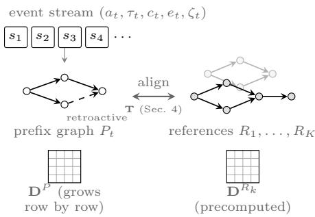
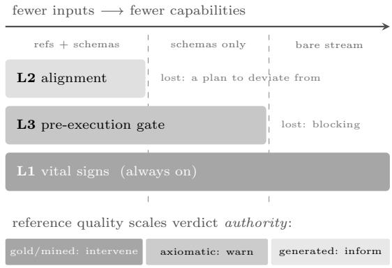
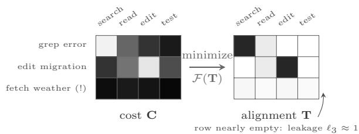

# OnTrack: Real-Time Monitoring and Intervention in LLM Agent Trajectories via Streaming Structure-Aware Optimal Transport

Babak Barazandeh<sup>∗</sup>, Connor Swanson, Chinmay Kulkarni, Nikhil Mungel

Cribl AI Research Lab

{bbarazandeh, cswanson, ckulkarni, nmungel}@cribl.io

## Abstract

Agents are deployed in a wide range of applications ranging from trip planners and stock trading to IT incident triage. In most of these applications, agents, by relying on the LLM, work autonomously with minimal rule-based safeguarding or no supervision, which results in cost and safety issues due to irreversible actions taken by agents. Recent works have tried to resolve these issues by either using another safeguard agent to monitor its behavior or doing a post-hoc evaluation of the logs. The first adds cost and latency to every step; the second delivers its verdict after the run, when the tokens are already burned and the damage done. To overcome this issue, we propose OnTrack, a streaming monitoring mechanism that, as the agent progresses in its task, compares its steps and the dependencies between them against recorded successful runs and alerts the user of potential issues or blocks the agent, taking about a millisecond per step. We study this problem in three regimes of decreasing access: ful reference access (where we have access to historical runs of the task or similar variants, as well as tool schemas), the intermediate regime of accessing only tool schemas, and the final case of no prior knowledge—just the steps as they are being generated by the agent. Naturally, the expectation of the monitoring capability of OnTrack is reduced as data access is reduced, ranging from the detection of any violation of the plans to the detection of loops, stalls, and repeated tool calls without new results. Finally, we evaluate the performance of our proposed solution using SWE-bench trajectories. Evaluating based on the first 8 steps, the proposed method ranked the failing trajectories below succeeding ones better than content similarity-based approaches (+0.057 AUROC). Additionally, by deploying an abort policy on top of it, we save ∼18% of the compute that would have been burned on agents heading to failure, and 83% of runs that were interrupted were actually heading to failure (5 out of every 6 aborts were correct).

## 1 Introduction

Agents are being deployed across diferent applications and industries. One of their advantages is the autonomy that they bring during execution. With minimal human interference, they can execute a given task. They can automatically plan a trip, make a reservation, and complete the payment. However, this autonomy, if unchecked, can cause a damaging impact from cost and safety aspects.

On the cost side, these agents are using significant resources for a single step in a task, but they could easily sufer from hallucinations, out-of-order tool calls, or infinite loops—all of which are costly due to the underlying LLM usage. From a safety perspective, these agents—unmonitored—can delete or modify a record by mistake or, as in recent incidents, break out of their sandbox environment and start hacking other systems as reported in the OpenAI–HuggingFace incident [1]. All these aspects require developing a monitoring system for agents.

The existing methods rely either on ofline (after-thefact) evaluations, where traces and logs are evaluated against a rule-based mechanism or language models are used as the judge (i.e., LLM-as-a-Judge [2]). However, by the time an issue is found, the run has already been paid for. Online safeguards, on the other hand, monitor agents’ execution using another agent. First, this method is costly and also adds latency to the execution due to an extra call to an LLM. On top of that, to reduce the cost, these safeguards are usually equipped with smaller models which struggle to detect the mistakes of the larger models, or a dedicated model is trained to score every step which renders the mechanism a black box [3]. Moreover, none of these methods look at the structure or the topology of the runs, i.e., which steps depend on which, even though that is where loops or out-of-order calls show up.

To overcome this issue, we propose a streaming monitoring mechanism called OnTrack. This approach models the agent’s progress toward completing the task as a directed acyclic graph (DAG) in which each step of the graph corresponds to one node and, if a step’s output is used in another step, there is an edge between them. As the run unfolds, the monitor compares this growing graph against reference solutions using optimal transport and flags potential issues in about a millisecond per step.

The references are optional, however—the monitor runs with whatever is available. With tool schemas alone, it still catches loops and stalls and blocks an irreversible action whose declared prerequisites are missing; with nothing but the event stream, loop and stall detection remain. Nothing is reconfigured across these regimes; parts of the monitor simply switch of as their inputs disappear.

Note that modeling agent task execution as a DAG and aligning it against reference solutions with optimal transport were already proposed in Otap [4]. However, their evaluation was a post hoc evaluation against complete references. Our contribution is making this alignment work on a live stream, which cannot be done by just re-running the batch method after each step due to the following structural challenges:

S1 (prefix vs. whole). Using a post hoc evaluation method in the middle of the trajectory will penalize the agent for every reference step it has not reached yet. So, the comparison punishes the agent for being early rather than being wrong—exactly the stage where the monitor most needs to stay quiet. Additionally, considering the portion of the reference that has been covered mid-stream is meaningless. For example, covering 10 of the 30 reference steps could be perfect progress if the agent is at step 10, and can be an indicator of a stuck agent if it is at step 80.

S2 (provisional structure). Edges are discovered later when a step (node) uses an output of another step. As a result, a new step immediately after just being generated can seem disconnected and might look like the agent is hallucinating. Judging new steps on their structure immediately can flood the system with lots of false positives. Note that extracting dependencies in post hoc evaluation is a dominant source of error [4], and it even gets harder in streaming when the monitor cannot look ahead.

Note: S1 is concerned about the steps not taken by the agent when comparing with reference, and S2 is concerned about the steps that the agent has taken but are not clear yet. As a simple example, the agent does a search at step 5, which at the moment the step looks disconnected. Ten steps later, the agent edits that searched file. That’s when the edge appears and the first step becomes clear.

S3 (compute budget). The evaluator must produce a verdict before the agent’s next tool call. Re-solving the full alignment from scratch at every step is unnecessary and, as the trajectory grows, quickly becomes infeasible.

S4 (decisions, not scores). Post hoc evaluation methods can output a score, and the operator can define a threshold to evaluate if the execution was successful or not. The streaming monitoring mechanism can’t. It instead outputs an action: continue, warn, or halt.

To better understand this, consider an agent at step 5 that takes one hallucinated step. This is one fifth of all steps, so this will result in the aggregated score going under the threshold, while if this happened at step 30, it might move the score slightly. As a result, the same score value means diferent things at diferent lengths. So, the score is informative, but it should not be used as a trigger and no fixed threshold can drive the decision. A streaming monitoring mechanism should focus on per-step signals whose meaning stays the same as the trajectory grows.

OnTrack addresses all four challenges. For S1, the monitor only expects the parts of the reference the agent could have reached so far, so an agent is never punished for being early (Sec. 4.2). For S2, a new step’s structural influence starts at zero and phases in as later steps use its output; edges discovered late are inserted into the graph in place (Sec. 4.4). For S3, instead of re-solving the alignment at every step, we take one warm-started iteration of the batch solver per event — about a millisecond per step — and run the solver to convergence only before acting on an intervention (Sec. 4.3). For S4, decisions come from per-step signals with a short grace window for new steps, never from the aggregate score (Sec. 4.5). At the end of the run, one final solve makes the monitor’s output identical to the batch evaluator’s — provided the dependencies discovered online match what batch extraction would find (Prop. 1).

## 2 Related Work

Trajectory evaluation. Evaluating an agent trajectory still means choosing between a cheap score and a detailed one. Outcome-only benchmarks [5, 6, 7] collapse a run to pass or fail, so the steps that produced the outcome never enter the score. Text metrics that match a trace against a reference (exact match, BLEU/ROUGE, embedding alignment [8]) do look inside the run, but they assume the task has one correct wording. A broken plan that resembles the reference can then rank above a valid plan written diferently, and [4] shows that this ranking can fall below chance. LLM-as-a-judge [2] and process reward models [3] score individual steps, so they are not stuck on a single reference. The cost is practical: a judge adds latency, cost, and run-to-run noise, and a reward model needs step-level annotation before it can be trained. These methods also wait until the run has finished. Observability platforms that sit on live trafic store detailed traces, but the checks they apply while a run is open are schema validation, token heuristics, and judges applied asynchronously to spans that have already closed. We are not aware of a deployed system that reasons about the structure of the execution graph while that graph is still growing.

Optimal transport. The solver is built from standard parts. Entropic regularization and Sinkhorn iterations [9] made optimal transport usable in practice. Unbalanced variants [10] relax exact conservation of mass, so mass that should not be matched can be discarded. Gromov– Wasserstein [11] compares relational structure, and its fused form [12] does the same for attributed graphs. Warm-started incremental Sinkhorn schemes already exist for problems that change slowly [13]. OnTrack uses that warm start. What changes between solves is more specific: the support grows by one row with each event, and the reference marginal moves as the agent progresses. That combination, as far as we know, is new.

Transport-based trajectory scoring. The closest prior work is Otap [4], which scores a completed trajectory after the fact by aligning attributed execution DAGs. We adopt its graph formalism and its node costs. Three findings from its ablations constrained the streaming design. The structure term is load-bearing. Restricting the method to a single reference costs 16.9 AUROC points. And the largest source of error is heuristic dependency extraction. From there, this paper asks a diferent question. Frontier masking, the streaming solver, provisionalstructure handling, the verdict engine, and the calibration finding have no counterpart in the batch setting, because a batch scorer only has to say how good a finished run was. OnTrack has to decide whether the run should be allowed to continue.

## 3 Problem Formulation

To formulate the agent behavior, consider how an agent tackles a problem. It generates a stream of steps in which, at each step it describes what it is doing, calls a tool with the required arguments, and receives its result. Steps here are not independent from one another; the artifact (a queried database, a tool result) produced at this step can be consumed as input to other steps down the road. As a result, this execution is not a flat sequence; it is a growing dependency graph. Importantly, these links are not always visible at the moment a step is taken. The importance of one step may only become clear when a later step uses its output. The following definition formalizes this trajectory.

Definition 1 (Streamed trajectory prefix). We define the agent’s execution procedure as a stream of events $s _ { 1 } , s _ { 2 } , \ldots ,$ where each event is a tuple consisting of $s _ { t } = ( a _ { t } , \tau _ { t } , c _ { t } , e _ { t } , \zeta _ { t } )$ . Here, $a _ { t }$ is the action the agent is taking, $\tau _ { t }$ is the tool identifier, $c _ { t }$ is the arguments it uses, $e _ { t }$ is the event’s generated artifact, and $\zeta _ { t }$ is the dependency metadata including parent indices and consumed/generated artifact identifiers, which both might be incomplete depending on the harness. The prefix graph $P _ { t } = ( V _ { t } , E _ { t } , \phi )$ has one node per event and contains all dependency edges known at time $t ,$ with $E _ { t }$ potentially gaining new edges between existing nodes at a later time (retroactive discovery), and $\phi$ assigns each node the embeddings of its text fields.

Note that the metadata at time $t , \zeta _ { t } ,$ , is harness-related and depends on its logs. Consider an example in which an agent is editing a config file at step 15 that was found during a search at step 5. The event itself is the same under any harness:

```textproto
event 15:
action: "edit the DB config to fix the timeout"
tool: edit
args: {file: "src/config.py", ...}
result: "file saved"
```

but $\zeta _ { 1 5 }$ comes in three grades, depending on the harness:

Full metadata. The harness declares dependencies outright (parents: [5], plus consumed/produced artifact identifiers); the edge (5, 15) is read of directly.

Partial metadata. No parents are declared, but the tool wrapper logs the objects it touched (consumed: ["src/config.py"]). The monitor maintains a ledger mapping each artifact identifier to the step that first surfaced it, so a lookup recovers step 5 and the same edge is inferred.

No metadata. The common case in practice, and the case of our evaluation corpus. The monitor manufactures $\zeta _ { t }$ itself: tool schemas or built-in rules specify where each tool’s artifacts appear in its arguments — here, the edit schema marks its file argument as consumed, yielding src/config.py — and the ledger lookup then proceeds exactly as in the partialmetadata case.

This extraction is deterministic string matching, not an LLM call — cheap and auditable — but it fails when a dependency leaves no matchable identifier. Suppose the agent instead ran sed -i ’s/timeout=5/timeout=30/’ \$(find . -name ’\*.py’ | head -1) while describing it as “fix the timeout setting we saw earlier”: the target file is resolved inside the shell at execution time and the reference to step 5 lives only in the agent’s context, so no harness, however faithful, records a traceable link. This is why $\zeta _ { t }$ is possibly incomplete by definition, and why Sec. 4.4 treats the graph as provisional.

Besides the agent’s own stream, the monitor may be given references: known-good executions of the same task

— recorded runs that solved it correctly, whether curated by hand or mined from past successes — represented in the same form as the stream. References are optional (see the regimes below). When they exist, they form a reference set $\mathcal { R } = \{ R _ { 1 } , . . . , R _ { K } \}$ , where reference $R _ { k }$ has $m _ { k }$ steps. For each reference, we precompute a structure matrix $\mathbf { D } ^ { R _ { k } }$ that records, for every pair of its steps, how far apart they sit in the dependency graph: the number of dependency hops from one to the other, normalized to [0, 1], with unconnected pairs maximally distant. This is the same construction used for post-hoc scoring in [4]; we default to unsigned distances (edge direction ignored), a choice revisited in Sec. 4.4. The prefix graph carries an analogous matrix $\mathbf { D } ^ { P }$ , grown row by row as events arrive. Figure 1 summarizes the setup.

  
Figure 1: The monitor’s inputs. Events arrive one at a time and grow the prefix graph $P _ { t }$ (dashed: a dependency discovered retroactively). References $R _ { 1 } , \ldots , R _ { K }$ are known-good executions in the same form. Each graph carries a matrix of pairwise dependency-hop distances $( \mathbf { D } ^ { P }$ grows row by row; $\mathbf { D } ^ { R _ { k } }$ is precomputed), and the alignment T of Sec. 4 matches the two sides step by step.

Information regimes. Orthogonal to the harness’s log quality — which determines how well the prefix graph can be built — is how much prior knowledge the monitor is given to compare that graph against. We consider three nested settings, ordered by how much the monitor is given, and its capabilities degrade explicitly across them. With references and tool schemas, everything below is available: structural alignment against the references, perstep leakage, and the pre-execution gate for irreversible actions. With schemas but no references, the monitor can still catch self-evident pathologies — loops, stalls, repeated calls that produce nothing new — and still block an irreversible action whose declared prerequisites are missing; what it loses is any notion of deviation from a plan, since there is no plan to deviate from. With neither, only the self-referential vital signs remain — the honest minimum, and still enough to flag the runaway-loop failure mode that dominates real cost overruns (Sec. 6.4). A fourth axis is reference quality: a hand-curated gold run, a mined past success, and a machine-generated sketch do not deserve equal trust, so the authority of a verdict is scaled by reference provenance (Sec. 4.6). Figure 2 summarizes both axes.

Notation. Throughout the paper, ϕ embeds text into unit vectors, $d _ { \mathrm { c o s } }$ is cosine distance, and $d _ { \mathrm { t o o l } } ( \tau , \tau ^ { \prime } )$ is a tool-substitution cost: zero for the same tool, growing toward one as a substitution becomes less plausible. For a coupling T, the row sums T1 give the mass each agent step placed and the column sums $\mathbf { T } ^ { \top } \mathbf { 1 }$ the mass each reference step received, where 1 is the allones vector. The generalized divergence of nonnegative vectors is $\begin{array} { r } { \mathrm { K L } ( a \parallel b ) = \sum _ { i } a _ { i } \log ( a _ { i } / b _ { i } ) - a _ { i } + b _ { i } } \end{array}$ (with $0 \log { 0 } = 0 ;$ annihilating a marginal entry $b _ { i }$ costs exactly $b _ { i } )$ , and the negative entropy of a nonnegative matrix is $\begin{array} { r } { H ( \mathbf { T } ) = \sum _ { i j } T _ { i j } ( \log T _ { i j } - 1 ) } \end{array}$ . Per-reference losses are aggregated by a soft-min with temperature $\tau _ { \mathrm { s m } } = 0 . 0 5$ (distinct from the tool identifier $\tau _ { t } )$ . Finally, ⟨·, ·⟩ denotes the Frobenius inner product, $[ x ] _ { + } = \operatorname* { m a x } ( x , 0 )$ , and $[ x ] _ { [ 0 , 1 ] }$ clips to the unit interval.

  
Figure 2: Information regimes. Each capability band runs for as long as its inputs exist and terminates when they are removed: without references there is no plan to deviate from (L2 ends); without schemas there is nothing to gate (L3 ends); the vital signs of L1 never turn of. Bands are stacked by how long they survive (bedrock at the bottom), not by layer number; L1–L3 are the monitor’s three layers, defined in the architecture paragraph in Sec. 4. The strip underneath shows the orthogonal quality axis: the richer the provenance of the references, the more authority a verdict carries (Sec. 4.6).

The streaming problem. At every event t, output (i) a diagnostic state (running score, per-node alignment, coverage), and (ii) a verdict v<sub>t</sub> ∈ {OK, EXPLORING, WARN, LOOP, STALLED, CAUSAL INVERSION, OFF TRACK, BLOCK}, subject to a per-event compute budget far below tool-call latency, such that at termination the evaluator produces the same output as a batch evaluator running the identical implemented procedure (Sec. 4.3) on the completed trajectory.

## 4 The OnTrack Evaluator

This section builds the monitor in two parts. We first recall the batch alignment that OnTrack inherits — the cost table and the objective — and the monitor’s three-layer architecture; we then develop the streaming components that answer the four challenges of the introduction: the mass semantics (Sec. 4.1), the frontier mask for S1 (Sec. 4.2), the streaming solver for S3 (Sec. 4.3), provisional-structure handling for S2 (Sec. 4.4), and the verdict engine for S4 (Sec. 4.5).

  
Figure 3: The two ingredients on a toy example: three agent steps against a four-step reference. In the cost table C, dark means implausible: “grep error” matches search cheaply, “edit migration” matches edit, and the hallucinated “fetch weather” is expensive against every reference step. Minimizing Eq. (2) yields the alignment T (dark = matched mass): the two valid steps place their mass on their counterparts, while the hallucinated step’s row stays nearly empty — the objective preferred paying the unmatched-mass penalty over forcing a bad match. That empty row is the leakage signal of Eq. (4).

Ingredients: the cost table and the alignment. Two matrices are the ingredients [4]. The first is a cost table C: entry $C _ { i j }$ prices how implausible it is that agent step i plays the role of reference step $j ,$ combining the similarity of their action descriptions, of their arguments, and of the tools they call:

$$
\begin{array} { r l } & { C _ { i j } = \alpha d _ { \mathrm { { c o s } } } ( \phi ( { a } _ { i } ) , \phi ( { a } _ { j } ^ { R } ) ) + \beta d _ { \mathrm { { c o s } } } ( \phi ( { c } _ { i } ) , \phi ( { c } _ { j } ^ { R } ) ) } \\ & { \phantom { x x x x x x x x x x x x x x x x x x x x x x x x x x x x x x x x x x x x x x x x x x x } } \\ & { \phantom { x x x x x x x x x x x x x x x x x x x x x } + \delta d _ { \mathrm { { t o o l } } } ( \tau _ { i } , \tau _ { j } ^ { R } ) , } \end{array}\tag{1}
$$

where the weights $\alpha , \beta , \delta$ trade of the three ingredients — we use (0.45, 0.20, 0.35) throughout, a setting that worked well across all our experiments and was never retuned; every component is normalized to [0, 1]. The second is the alignment itself, a nonnegative matrix T: entry $T _ { i j }$ says how much of agent step i is matched to reference step $j - \mathrm { a }$ soft, fractional correspondence rather than a hard one-to-one assignment. Each agent step carries mass $\mu _ { i }$ and each reference step mass $\nu _ { j } ;$ their values are a design decision with real consequences, settled in Sec. 4.1. Figure 3 illustrates both on a toy example: valid steps place their mass on their reference counterparts, while an anomalous step’s row stays empty — and that emptiness is the detection signal.

Objective. The alignment is chosen to balance four pressures: match cheaply (first term below); respect structure, so that steps far apart in the agent’s graph map to steps far apart in the reference (second term); remain free to leave an anomalous step unmatched, paying per unit of unmatched mass (the two KL terms); and stay slightly difuse, which is what makes fast solvers possible (the entropy term). Formally, the cost of a (prefix) graph against one reference is the minimum over $\mathbf { T } \geq 0$ of

$$
\begin{array} { l } { \displaystyle \mathcal { F } ( { \mathbf { T } } ) = \left( 1 - \theta \right) \left. { \mathbf { C } } , { \mathbf { T } } \right. + \frac { \theta } { 2 } \sum _ { i , k , j , l } { \left( D _ { i k } ^ { P } - D _ { j l } ^ { R } \right) } ^ { 2 } T _ { i j } T _ { k l } } \\ { \displaystyle + \lambda \mathrm { K L } ( { \mathbf { T 1 } } \parallel \mu ) + \lambda \mathrm { K L } ( { \mathbf { T } } ^ { \top } { \mathbf { 1 } } \parallel \nu ) + \varepsilon H ( { \mathbf { T } } ) , } \end{array}\tag{2}
$$

with structure weight $\theta = 0 . 3 5$ and $\varepsilon = 0 . 0 5$ throughout. The factor $\begin{array} { l } { { \frac { 1 } { 2 } } } \end{array}$ makes θ G of Eq. (8) the gradient of the quadratic term for symmetric D. The reported score soft-mins the per-reference diagnostic losses $\ell _ { k } ,$ $\begin{array} { r } { \tilde { \ell } = - \tau _ { \mathrm { s m } } \log \frac { 1 } { K } \sum _ { k } e ^ { - \ell _ { k } / \tau _ { \mathrm { s m } } } } \end{array}$ , and reports $s = \exp ( - [ \tilde { \ell } ] _ { + } ) ;$ the floor at zero is what places $s \in ( 0 , 1 ]$ , since the entropic term can make raw losses negative.

Architecture of the monitor. OnTrack separates signals by their prerequisites into three decoupled layers: L1 vital signs (reference-free intrinsic diagnostics: loop detection, information gain, stall) run always; L2 transport alignment (the streaming UFGW machinery, Secs. 4.1–4.5) requires references; L3 pre-execution policy gate (tool-contract prerequisite checks plus a one-row proposal alignment, Sec. 4.5) requires schemas and is the only synchronous component — it evaluates the proposed action before the tool executes, exclusively for irreversible calls, so worst-case added latency is confined to the rare actions that warrant it. L1 is not optimal transport and we do not present it as such; it is the honest degradation mode when no reference of any provenance exists.

## 4.1 Mass semantics on prefixes

Batch evaluation uses $\mu _ { i } = 1 / n , \nu _ { j } = 1 / m !$ both graphs are complete and both totals equal one. On a prefix this breaks: with $\mu _ { i } = 1 / t$ the partial trajectory carries total mass 1 against a frontier-masked ν whose total is a fraction of one (Sec. 4.2), so even a perfectly matched step leaks mass by construction. OnTrack instead assigns constant per-node agent mass

$$
\begin{array} { r } { \mu _ { i } \ = \ 1 / \bar { m } , \qquad \bar { m } = \frac { 1 } { K } \sum _ { k } m _ { k } , } \end{array}\tag{3}
$$

so one agent step carries the same nominal mass as an average reference step (exact for references of size m¯ ), the agent total grows as $t / \bar { m }$ , and the per-node normalized leakage

$$
\ell _ { i } ~ = ~ \Big [ 1 - \frac { 1 } { \mu _ { i } } \sum _ { j } T _ { i j } \Big ] _ { [ 0 , 1 ] }\tag{4}
$$

is a scale-free, calibrated trigger at every $t ;$ the clip to $[ 0 , 1 ]$ is part of the definition, since in unbalanced OT a row mass can exceed $\mu _ { i }$ (over-transported rows are treated as fully matched). Granularity diferences remain the soft coupling’s job exactly as in the batch setting. At termination the escalated solve may renormalize to $1 / n$ for exact batch comparability.

## 4.2 The prefix problem: frontier-masked marginals

Define reference-node coverage from the previous event’s coupling (the one-step lag resolves the circular dependency between mask and coupling):

$$
\mathrm { c o v } _ { t } ( j ) ~ = ~ { \frac { [ \mathbf { T } _ { t - 1 } ^ { \top } \mathbf { 1 } ] _ { j } } { \nu _ { j } } } , ~ j ~ s a t i s f i e d ~ \Longleftrightarrow ~ \mathrm { c o v } _ { t } ( j ) \geq \kappa .\tag{5}
$$

The active set and its lookahead are

$$
{ \mathcal { A } } _ { t } = \{ j : { \mathrm { e v e r y ~ r e f e r e n c e - p a r e n t ~ o f ~ } } j { \mathrm { ~ i s ~ s a t i s f i e d ~ } } \} ,
$$

$$
\mathcal { L } _ { t } = \mathrm { c h i l d r e n } ( \mathcal { A } _ { t } ) \setminus \mathcal { A } _ { t } ,\tag{6}
$$

with roots vacuously active, and the masked marginal is

$$
\nu _ { j } ^ { ( t ) } = \left\{ \begin{array} { l l } { \nu _ { j } } & { j \in \mathcal { A } _ { t } \cup \{ \mathrm { s a t i s f i e d } \} , } \\ { \beta _ { \mathrm { l o o k } } \nu _ { j } } & { j \in \mathcal { L } _ { t } , } \\ { \varepsilon _ { \nu } \nu _ { j } } & { \mathrm { o t h e r w i s e } , } \end{array} \right.\tag{7}
$$

with defaults $\kappa { = } 0 . 3 , ~ \beta _ { \mathrm { l o o k } } { = } 0 . 3 , ~ \varepsilon _ { \nu } { = } 0 . 0 1$ . Three consequences:

(a) Order-freedom where the DAG permits it. All members of the currently executable antichain of R are active simultaneously, so an agent that executes independent reference steps in any topological order is never penalized for order (Prop. 2).

(b) Precision and recall acquire stream semantics. Agent-side leakage $\left( \mathrm { E q . ~ \ 4 } \right)$ is the real-time signal — it means hallucination, digression, or prematurity now. Reference-side coverage $\begin{array} { r l } { \rho _ { t } } & { { } = } \end{array}$ $\begin{array} { r } { \sum _ { j } \operatorname* { m i n } ( \mathrm { c o v } _ { t } ( j ) , 1 ) \nu _ { j } \Big / \sum _ { j } \nu _ { j } } \end{array}$ is a progress meter; fulltrajectory recall is only computed at termination with the mask removed.

(c) Prematurity is detectable and disambiguable. A leaking step may still match an inactive (future) reference node under the unmasked cost. The verdict engine performs this secondary check and distinguishes: hallucinated (no match anywhere), premature-valid (matches a future node whose producers are satisfied — a legitimate jump beyond the frontier), and causal inversion (matches a future node whose producers are absent) — the streaming analogue of the causal-inversion perturbation studied in [4], detected at emission time, before the structure term could even observe the violation.

If the frontier stalls incorrectly (a covered step whose embedding similarity failed to reach κ), everything downstream appears premature; a persistent gap between masked and unmasked loss raises an internal FRON-TIER STALL flag that adaptively widens $\beta _ { \mathrm { l o o k } }$ before any user-facing verdict escalates.

## 4.3 Keeping the quadratic term: streaming conditional gradient

The batch ablations of [4] are unambiguous: at $\theta = 0$ the alignment degenerates into an unbalanced Wasserstein with below-chance inversion detection. A streaming variant that replaces the quadratic term with a row-wise linear proxy (comparing $\bar { \bf D } _ { i , : } ^ { P }$ to $\mathbf { D } _ { j , : } ^ { R }$ index-by-index) silently conditions on the identity alignment and re-imports the exact-order assumption the alignment exists to remove. OnTrack keeps the true objective by observing that the standard batch UFGW solver — conditional gradient (CG) — is already an iterative linearization scheme, and amortizing it: one warm-started CG iteration per event; the coupling tracks the moving optimum the way stochastic gradient descent tracks a drifting loss.

Per event t and reference k (superscripts dropped):

(1) Extend. Append row t to the node-cost matrix C of Eq. (1) (with cached reference embeddings) and row/column t to $\mathbf { D } ^ { P }$ ; pad the previous coupling $\tilde { \mathbf { T } } = [ \mathbf { T } _ { t - 1 } ; \mathbf { 0 } _ { 1 \times m } ]$ . Under the constant per-node mass of Eq. (3) no rescaling is required.

(2) Linearize the quadratic term at T<sup>˜</sup> via the squareloss decomposition [13]: with $p = \tilde { \mathbf { T } } \mathbf { 1 } , q = \tilde { \mathbf { T } } ^ { \top } \mathbf { 1 }$

$$
\mathbf { G } = ( \mathbf { D } ^ { P } ) ^ { \circ 2 } p \mathbf { 1 } _ { m } ^ { \top } + \mathbf { 1 } _ { t } q ^ { \top } \big ( ( \mathbf { D } ^ { R } ) ^ { \circ 2 } \big ) ^ { \top } - 2 \mathbf { D } ^ { P } \tilde { \mathbf { T } } ( \mathbf { D } ^ { R } ) ^ { \top } ,\tag{8}
$$

computed in $O ( t ^ { 2 } m + t m ^ { 2 } )$ . For symmetric distance matrices, θ G is the gradient of the $\frac { \theta } { 2 } \mathrm { - w e i g h }$ ted quadratic term of Eq. (2), so the linearized total cost $\mathbf { M } = ( 1 - \theta ) \mathbf { C } +$ θ G is exactly the local first-order model of the objective; the implementation additionally clips negative entries of G to zero, keeping the linearized cost — and hence the Gibbs kernel — bounded. Structural age weights (Sec. 4.4) scale row i of G by ω<sub>i</sub>(t).

(3) Solve the linearized unbalanced entropic OT with the total cost M from step (2), Gibbs kernel $\mathbf { K } \ = \ \exp ( - \mathbf { M } / \varepsilon )$ , masked marginal $\nu ^ { ( t ) }$ , and warmstarted duals $u  [ u _ { t - 1 } ; \mathrm { m e d } ( u _ { t - 1 } ) ] , v  v _ { t - 1 }$ , iterating with exponent $\eta = \lambda / ( \lambda + \varepsilon )$

$$
u  \Big ( \frac { \mu } { \mathbf { K } v } \Big ) ^ { \eta } , \qquad v  \Big ( \frac { \nu ^ { ( t ) } } { \mathbf { K } ^ { \top } u } \Big ) ^ { \eta } ,\tag{9}
$$

for $n _ { \mathrm { i n n e r } }$ iterations (default 5, tolerance-early-stopped); $\mathbf { T } _ { \mathrm { n e w } } = \mathrm { d i a g } ( u ) \mathbf { K } \mathrm { d i a g } ( v )$

(4) Average: $\mathbf { T }  ( 1 - \gamma ) \tilde { \mathbf { T } } + \gamma \mathbf { T } _ { \mathrm { n e w } }$ with fixed $\gamma = 0 . 7$ (a closed-form FGW line search is available but unnecessary at this scale).

(5) Two-tier escalation. The fast path above runs on every event. If and only if it raises a would-be intervention verdict, the evaluator escalates to a converged solve (≤10 outer CG, ≤50 inner Sinkhorn, cold tolerance) on the current prefix before the verdict is confirmed. No intervention is ever taken on a stale linearization, and the converged-solve cost is paid exactly when it is cheapest relative to the tool call about to be prevented.

Implementation notes: three distinct quantities. The paper handles three related but distinct objects, and we keep them separate throughout. (i) The exact objective, Eq. (2), defines the alignment problem and is what the theory refers to. (ii) The fast online optimizer deviates from it in two documented ways: the per-event linearization clips negative entries of the GW gradient to zero (keeping the Gibbs kernel bounded), and the diagnostic loss reported alongside verdicts approximates the two KL penalties by an $L _ { 1 }$ total-mass surrogate $\lambda \left( | \mathbf { 1 } ^ { \top } \mathbf { T 1 } - \mathbf { 1 } ^ { \top } \pmb { \mu } | + | \mathbf { 1 } ^ { \top } \mathbf { T } ^ { \top } \mathbf { 1 } - \mathbf { 1 } ^ { \top } \pmb { \nu } ^ { ( t ) } | \right)$ and clips the quadratic form at zero. (iii) The finalization path runs the same implemented solver (clipped gradient, surrogate diagnostic) with the mask removed and a converged schedule — it is not an exact minimization of Eq. (2), and Prop. 1 is stated accordingly, as equality with a batch evaluator running the same implementation. All verdict thresholds are calibrated directly on the implemented quantities, so the deviations afect interpretation of the loss scale, not the calibrated behavior.

## 4.4 Provisional structure

Retroactive edges. When event k consumes an artifact produced at step i, the evaluator inserts (i, k), repairs ancestor sets by a breadth-first pass over descendants of k (bitset representation, $O ( t ^ { 2 } / 6 4 )$ words worst case), and recomputes the afected rows of $\dot { \mathbf { D } } ^ { P }$ . The coupling is not recomputed retroactively; the next CG step absorbs the change — a further payof of the streaming-CG framing.

Age weights. A node’s structural row is untrustworthy while its artifacts are young. We set

$$
\omega _ { i } ( t ) = \mathrm { m i n } \big ( 1 , ~ ( t - t _ { i } ) / h _ { \mathrm { a g e } } \big ) , \qquad h _ { \mathrm { a g e } } = 3 ,\tag{10}
$$

clamped to $\omega _ { i } = 1$ the moment any artifact of i is consumed (its role is then evidenced, not assumed). Semantic and tool costs, which need no lookahead, apply immediately. The finalization path disables age weights entirely — batch evaluation uses the unweighted structure — so the final score cannot depend on emission ages.

Signed vs. unsigned. In the batch setting, signed and unsigned structural distances were found indistinguishable under artifact tracing [4], because tracing deletes an unsatisfiable edge rather than reversing it. Streaming inherits this; we default to unsigned magnitudes and note that causal inversions are caught earlier and more directly by the premature-step check of Sec. 4.2(c).

## 4.5 Signals, lifecycle, and verdicts

All triggers derive from per-event, per-node quantities (Table 1); the aggregate score is reported but never thresholded. A batch result of [4] — benign redundant leaves inflate the loss by $O ( r / n )$ with an explicit KL-destruction constant — becomes the streaming tolerance band separating cheap abandoned exploration from genuine oftrack mass.

Exploration lifecycle. A newly emitted node with $\ell _ { t } > \theta _ { \mathrm { l e a k } }$ enters EXPLORING with a grace TTL of g events (default 3). The flag clears if a later step consumes its artifact (branch validated) or a newly activated reference node absorbs it. On TTL expiry the unmasked secondary check classifies it: matches a future reference node with satisfied producers ⇒ premature-valid, clear; producers absent ⇒ CAUSAL INVERSION; matches nothing ⇒ unresolved orphan. When cumulative unresolvedexploration mass exceeds a budget B (default 25%), the verdict escalates to OFF TRACK. Dead-end branches that were abandoned after one or two steps land in ABAN-DONED: bounded cost, no alarm, by the tolerance band above.

<table><tr><td>Signal</td><td>Definition / role</td></tr><tr><td></td><td>node leakage lt Eq. (4) on the newest node; hallucina- tion / digression / prematurity, routed through disambiguation</td></tr><tr><td>match cost  $\bar { c } _ { t }$ </td><td> $\begin{array} { r l r } { \sum _ { j } T _ { t j } M _ { t j } / ( \sum _ { j } T _ { t j } + \epsilon _ { \mathrm { d e n } } ) ; } & { { } } & { } \end{array}$  “matched, but expensively&quot; (wrong tool on the right step); the  $\epsilon _ { \mathrm { d e n } }$  floor covers fully- destroyed rows (distinct from the en- tropic ε)</td></tr><tr><td>coverage veloc- ity</td><td> $\rho _ { t } ~ - ~ \rho _ { t - w } ;$  stall = activity without progress</td></tr><tr><td>loop score (L1)</td><td>near-duplicate predecessor (action, tool, arguments), with a retry exemption:</td></tr><tr><td>info gain (L1)</td><td>duplicates of an errored step are exempt up to  $r _ { \mathrm { m a x } }$  attempts  $\begin{array} { r } { \Delta I _ { t } = 1 - \operatorname* { m a x } _ { i < t } \cos ( \phi ( e _ { t } ) , \phi ( e _ { i } ) ) } \end{array}$  over effect embeddings; spinning = new calls,</td></tr><tr><td></td><td>no new state strategy switch the soft-min arg mink changes; benign once, oscillation warns</td></tr></table>

Table 1: Per-event signals. All are $O ( t )$ or free byproducts of the transport update.

L3 pre-execution policy gate. Tools are classified reversible / irreversible from schema annotations. The gate runs on the proposed action $\boldsymbol { q } _ { t } ~ = ~ ( a _ { t } , \tau _ { t } , c _ { t } )$ available before the tool executes, before any poststate artifact exists, and before row t enters the coupling. It clears an irreversible proposal only if (a) every artifact the schema requires exists in the live graph with a producing node, and, when references are present, (b) a one-row proposal alignment succeeds: the nearest reference node under the pre-execution attribute cost $\alpha d _ { \mathrm { c o s } } ( \phi ( a _ { t } ) , \phi ( a _ { j } ^ { R } ) ) + \delta d _ { \mathrm { t o o l } } ( \tau _ { t } , \tau _ { j } ^ { R } )$ , evaluated against the frontier recomputed from the current coupling $\mathbf { T } _ { t - 1 }$ inside the gate, is active or satisfied and its cost is below $\theta _ { \mathrm { { m a t c h } } } ;$ otherwise BLOCK. (Recomputing rather than reading the cached frontier matters: the cache is one event stale for a pre-execution check, and an earlier implementation that used it blocked valid calls — see the gate tests in Sec. 6.1.) No transport mass is required — the gate is a schema-plus-proposal check, which is what makes synchronous operation possible. It is a policy gate, not a soundness guarantee: its coverage is bounded by the schema annotations. Reversible actions are never blocked, preserving cheap exploration.

Input: event $s _ { t } ;$ state $\{ \mathbf { T } ^ { ( k ) } , u ^ { ( k ) } , v ^ { ( k ) } \} _ { k \leq K } , \mathbf { D } ^ { P }$ , lifecycle

1: if proposed action q<sub>t</sub> irreversible and L3 gate fails (schema + proposal alignment against the t−1 frontier) return BLOCK

2: admit $s _ { t } \colon$ parents from declared deps ∪ artifact consumption; update ancestors, $\mathbf { D } ^ { P }$ , age weights ω (Sec. 4.4)

$$
k = 1 \ldots K \colon
$$

4: extend $\mathbf { C } ^ { ( k ) }$ by row t; update frontier mask $\nu ^ { ( k , t ) }$ from $\mathbf { T } _ { t - 1 } ^ { ( k ) }$ (Eq. 7)

5: G ← GW gradient at padded $\mathbf { T } ^ { ( k ) }$ , rows scaled by ω (Eq. 8)

6: T<sub>new</sub> ← warm-started unbalanced Sinkhorn on $( 1 - \theta ) \mathbf { C } ^ { ( k ) } + \theta \mathbf { G }$ (Eq. 9)

7: $\mathbf { T } ^ { ( k ) }  ( 1 - \gamma ) \mathbf { T } _ { \mathrm { p a d } } ^ { ( k ) } + \gamma \mathbf { T } _ { \mathrm { n e w } }$

8: compute signals (Table 1) on best reference; run lifecycle + verdict engine (Sec. 4.5)

9: if verdict ∈ interventions: escalate — converged solve, recompute signals, re-verdict

10: return score (soft-min), coverage, leakage, verdict

Algorithm 1: OnTrack per-event fast path

## 4.6 Multi-reference streaming and reference regimes

Independent coupling states are maintained per reference and aggregated by temperature-controlled soft-min [4]; K is small (3–10) and cost is linear in K. The running arg min doubles as a live “which strategy is the agent following” diagnostic. Reference provenance scales verdict authority: gold and mined references (clustered successful production traces) enable interventions; axiomatic references built at runtime from tool produces/consumes contracts enable L3 and downgraded warnings; plannergenerated skeletons — which re-import the LLM-as-ajudge circularity — may inform but never trigger an automatic halt. With no reference at all, L2 is of and OnTrack degrades, explicitly, to L1 + L3.

## 5 Theoretical Properties

Proposition 1 (Anytime reduction to the implemented batch procedure). Let the stream terminate at $t = n ,$ let the online dependency graph equal the graph a batch evaluator would extract from the completed log, and let OnTrack perform one cold-started converged solve with the frontier mask removed and marginals renormalized to the batch convention. Then the finalization computation — the same deterministic implemented procedure (clipped GW linearization and surrogate diagnostic, Sec. 4.3; we say procedure rather than objective because a clipped gradient need not be the gradient of any objective), constraint set, parameters $( \theta , \lambda , \varepsilon )$ , references, node costs, initialization, and stopping schedule, with age weights disabled (batch convention) — is identical to a batch evaluator running the same released implementation on the completed trajectory, and the deterministic solver returns the same score.

Proof sketch. With the mask removed and marginals renormalized, every input to the solver coincides with the batch invocation, and a deterministic solver run from the same canonical initialization produces the same iterates. □

Remark 1. Three qualifications are inherent. The reduction is to the implemented procedure, not to an exact minimization of Eq. (2): the finalization path uses the same clipped gradient and surrogate diagnostic as the fast path, so equality with an exact-UFGW batch score would additionally require an unclipped, exact-KL final solve, which we do not currently perform. The UFGW objective is nonconvex, so even then the guarantee would concern the solver’s output, not a global optimum. And the reduction is conditional on online dependency extraction agreeing with the batch-extracted graph, which retroactive repair targets but cannot guarantee (Sec. 4.4). Finally, a definition: the empirical ≤ 0.013 figure (Sec. 6.1) is the end-of-stream discrepancy — the running fast-path diagnostic over the stream against the eventual finalization output. It is a consistency check across the whole run, not a per-prefix tracking gap; the proper tracking experiment (fast-path versus converged solve on the same prefix, mask, marginals, and references) is well-defined and left to the released artifact.

Proposition 2 (Relabeling invariance of the masked objective). Fix a covered sub-DAG, a mask $\nu ^ { ( t ) }$ , and structural weights that are order-independent (age weights matched across comparisons or disabled). Then the masked objective, and its exact minimizer set from a permutation-equivariant initialization, are invariant to graph-preserving relabelings of the prefix: the satisfied set, active set A, and masked marginal $\bar { \nu } ^ { ( t ) }$ are functions of the covered sub-DAG alone, and members of an executable antichain carry full mass simultaneously, so no order among them is preferred.

Proof sketch. Satisfied status depends on accumulated coupling mass to reference nodes, which — by the permutation invariance of the batch cost and structure constructions — depends only on the covered sub-DAG. A and $\nu ^ { ( t ) }$ are functions of the satisfied set alone (Eq. 7).

Remark 2. Full online serialization invariance is deliberately not claimed as a theorem: even under exact per-event optimization, two serializations that expose the same covered sub-DAG can assign diferent ages to its nodes (diferent age-weighted structural costs) and arrive with diferent warm-start couplings, both path-dependent. What holds by construction is the proposition above; what holds at termination is exact, because the finalization path disables age weights (batch convention, Sec. $4 { \cdot } 4 )$ and runs the cold-started procedure of Prop. 1, removing both sources of path dependence. Mid-stream serialization invariance is therefore an empirical property: Scenario B of Table 2, where a reordered run tracks and finalizes to the identical score, is its validation.

Proposition 3 (Streaming tolerance band). Let a redundant leaf step (no downstream dependencies, arbitrary attributes) be inserted at any position in the stream, and suppose the masked reference marginal $\nu ^ { ( t ) }$ and the existing prefix structure are unchanged by the insertion (the leaf neither satisfies a reference node nor adds edges among existing nodes). Under the constant per-node mass of Eq. (3), the increase in the optimal objective is at most $\lambda / { \bar { m } } ^ { \mathrm { ~ - ~ } }$ — the generalized-KL cost of annihilating the node’s mass $\mu = 1 / \bar { m } - s o$ the aggregate perturbation decays as $O ( 1 / t )$ relative to total transported mass; its node leakage ℓ lies in [0, 1] by definition $( E q . \ 4 )$ and attains 1 exactly when the node’s mass is fully destroyed.

Proof sketch. Extending the previous optimal coupling by an all-zero row for the inserted leaf is feasible: the linear and quadratic terms gain nothing from a zero row, the entropy contribution of zero entries vanishes, and the row-marginal penalty gains $\lambda \mathrm { K L } ( 0 \| 1 / \bar { m } ) = \lambda / \bar { m }$ under the generalized KL of Eq. (2). The new optimum is bounded above by this feasible point. Note this is an upper bound, not an identity: the optimizer may rearrange mass on existing rows, and the leaf may couple partially rather than be destroyed. The bound concerns the exact objective $\operatorname { E q . }$ (2); for the implemented $L _ { 1 }$ mass surrogate the same feasible-extension argument yields the same constant $\lambda / \bar { m }$ (a zero row shifts the total-mass gap by exactly $1 / \bar { m } )$ . This is the streaming counterpart of the redundant-leaf bound of [4] with $r = 1$ and constant node mass. □

Proposition 4 (Bounded influence of young structure). Under age weights (10), the direct structural cost of row i in the linearized objective is zero at its emission event, and at most the fraction $( t - t _ { i } ) / h _ { \mathrm { a g e } } < 1$ of its full magnitude for the following $h _ { \mathrm { a g e } }$ events — unless one of its artifacts is consumed earlier, in which case its structural row is exact along the evidenced edges and the discount is lifted. Node i’s coupling may still be indirectly afected through the shared Sinkhorn duals and column marginals; the bound governs the structural cost entries, not the full transport solution.

Proof sketch. Immediate from $\omega _ { i } ( t _ { i } ) = 0$ , the linear ramp of Eq. (10), and the row-scaling of Eq. (8); the clamp on consumption replaces an assumption by an observation. A hard zero-weight window of $h _ { \mathrm { a g e } }$ events would strengthen this to strict silence at the cost of delaying true structural detections by the same window; we prefer the linear ramp and note that in practice structural verdicts additionally require the grace-TTL of the exploration lifecycle (Sec. 4.5) to expire. □

<table><tr><td>Scenario</td><td></td><td>Expected</td><td>Fired</td><td>Lat. Layer</td><td></td></tr><tr><td></td><td>A clean in-order run</td><td>silence</td><td>silence √</td><td></td><td></td></tr><tr><td></td><td>B valid reordering</td><td>silence</td><td>silence √</td><td></td><td>L2</td></tr><tr><td></td><td>C strict loop (2-step cycle)</td><td>LOOP</td><td>LOOP</td><td>0</td><td>L1</td></tr><tr><td></td><td>D hallucination streak</td><td></td><td>OFF-TRK OFF-TRK</td><td>2</td><td>L2</td></tr><tr><td></td><td>E causal inversion</td><td>C-INV</td><td>C-INV</td><td>0</td><td>L2</td></tr><tr><td></td><td>F retry after tool error</td><td>silence</td><td>silence √</td><td></td><td>L1</td></tr><tr><td></td><td>G parallel branch (2 steps)</td><td>silence</td><td>silence √</td><td></td><td>L2</td></tr><tr><td></td><td>H irreversible w/o prereqs</td><td>BLOCK</td><td>BLOCK</td><td>0</td><td>L3</td></tr></table>

Table 2: Controlled fault-injection results (OFF-TRK = OFF TRACK, C-INV = CAUSAL INVERSION). Latency in events after anomaly onset (target $\leq 2 )$ ; the last column attributes each behavior to the responsible layer. Scenario B finalizes to the in-order score exactly $( 0 . 9 1 3 = 0 . 9 1 3 )$ , the empirical face of Prop. 2. In D, the two grace-window events preceding escalation surface as EXPLORING, not silence.

Complexity. Per event and reference: cost-row extension O(md); $\mathbf { D } ^ { P }$ update $O ( t \cdot \deg )$ amortized (bitset ancestors); GW gradient $O ( t ^ { 2 } m + t { \dot { m } } ^ { 2 } )$ ; each Sinkhorn iteration $O ( t m )$ . Memory: $\overset { \triangledown } { O } ( t ^ { 2 } + K t m + K m ^ { 2 } )$ numeric entries (the prefix structure matrix $\mathbf { D } ^ { P }$ , per-reference couplings, and reference structure matrices) plus the $O ( t ^ { 2 } )$ -bit ancestor representation. Measured on an Apple M5 Max core, the fast path runs at p50 0.85 ms $/ \mathrm { \ p 9 5 }$ 1.6 ms per event at t=m=40, K=3 (p50 0.5 / p95 0.7 ms at t=m=20; p50 1.6 / p95 3.9 ms at t=80); the escalated solve matches the batch-solve runtime (≈30 ms) and is invoked only ahead of interventions. For long horizons $( t \gtrsim 1 0 0 )$ , a natural extension is to collapse completed and fully consumed subgraphs into super-nodes, applying the hierarchical recursion of [4] online; we sketch this but do not implement or evaluate it.

## 6 Experiments

We evaluate OnTrack in two regimes: (i) controlled fault injection with ground truth by construction (Sec. 6.1), and (ii) streaming replay of 2,294 real SWE-agent trajectories from the sailplane/swe-agent-trajs dataset (Secs. 6.3–6.6). All code, configs, and result JSONs are released with the paper.

## 6.1 Controlled fault injection

A six-step reference task (search → {read log ∥ check schema} → edit → test → commit) with synthetic unit embeddings, paraphrase noise on valid steps, and eight injected scenarios covering both required detections and required silences.

<table><tr><td>Scenario</td><td></td><td>Expected Result</td></tr><tr><td></td><td>G-a valid irrev., prereqs + ref allow</td><td>allow√</td></tr><tr><td>G-b missing prereq artifact</td><td>block</td><td>block √</td></tr><tr><td>G-c schema-valid, no ref match policy</td><td></td><td>block (conserv.)</td></tr><tr><td>G-d no schema, no references</td><td>policy</td><td>allow (no check)</td></tr><tr><td>False blocks, valid irrev. calls</td><td></td><td>0/50 (95% bound ≈6%)</td></tr></table>

Table 3: L3 gate tests — a small validation suite, not a reliability claim. $\mathrm { G } \mathrm { - } \mathrm { c } / \mathrm { G } .$ -d record implemented policy: with references present the gate requires both the schema check and the proposal match, checked against the current best (lowest-loss) reference only (conservative); in the absence of both schemas and references the gate operates allow-by-default — an explicit deployment policy, not a safety guarantee.

We are explicit about attribution: loops (C) and retry exemptions (F) are handled by the reference-free L1 heuristics, and the irreversible-action gate (H) by L3 schema checks — neither exercises optimal transport. The transport layer is responsible for the leakage-driven hallucination escalation (D), the premature-step inversion check (E), the reordering silence and score equality (B), and the parallel-branch tolerance (G). Table 2: all eight scenarios behave as designed. Per-node leakage separates cleanly — injected hallucinated steps reach ℓ ≥ 0.66 while valid steps stay ≤ 0.24, comfortably bracketing $\theta _ { \mathrm { l e a k } } = 0 . 6$ . At K=3 references, m=40, t ≤ 40, the fast path measures p50 0.85 ms / p95 1.6 ms per event (Apple M5 Max core).

Gate scenarios — including the bug the tests caught. Scenario H shows only that an invalid irreversible action is blocked; a gate must also allow valid ones. Four dedicated gate tests (Table 3) check both directions, plus a false-block sweep over 50 benign runs ending in a valid irreversible call.

We report these tests with a disclosure that argues for their existence: G-a initially failed. The first gate implementation read the frontier cached at the start of the previous event — computed from $\mathbf { T } _ { t - 2 } ,$ , one event stale for a pre-execution proposal — and consequently blocked 50/50 valid irreversible calls while scenario H continued to pass (blocking an invalid call requires no frontier at all). The fix recomputes the frontier from the current coupling inside the gate; after it, G-a allows, Gb/H still block, the false-block rate is 0/50, and all prior results are unafected (the SWE-bench corpus contains no irreversible-annotated tools, so the gate never fires there). A block-only test suite would never have revealed this.

Component attribution on real traces. A reviewerrequested ablation (Table 4) runs the same fault types on real SWE-agent traces (40 benign resolved traces, 30 injected traces per fault, trace-level severe-flag detection):

<table><tr><td>Variant</td><td>Loop Halluc Invert </td><td>Stall FPR</td></tr><tr><td>Full system</td><td>30/30 12/30 12/30 30/30 13/40</td><td></td></tr><tr><td>True no-mask  $( \nu ^ { ( t ) } { = } \nu )$ </td><td>30/30 13/30 12/30 30/30 14/40</td><td></td></tr><tr><td>No GW (θ=0)</td><td>30/30 21/30 25/30 30/30 29/40</td><td></td></tr><tr><td>L1-only (no refs)</td><td>30/30 18/30 19/3030/30 31/40</td><td></td></tr><tr><td>Prereq-rule baseline</td><td>30/30 26/30 24/30 30/30 32/40</td><td></td></tr><tr><td colspan="3">Frozen frontier (κ=100) 30/30 30/30 26/30 30/30 38/40</td></tr></table>

Table 4: Component study on real SWE-agent traces at the shipped verdict thresholds, reported as raw counts (detected/injected per fault; false-positive traces over n=40 benign traces; trace-level ≥1-severe-flag criterion — the deployed abort policy thresholds flag density instead, Table 6, hence its far lower false-stop rate). Wilson 95% intervals at these sample sizes span roughly ±15 percentage points (e.g., 12/30 = 40% [24.6%, 57.7%]; 13/40 = 32.5% [20.1%, 48.0%]), so only the large contrasts are meaningful. “True no-mask” removes the frontier mask entirely; “frozen frontier” (κ=100, nothing ever satisfied) is a mis-set mask, included to show that a wrongly configured mask is worse than none.

Three readings are honest here, and we distinguish them. First, attribution: loops and stalls are carried entirely by the reference-free L1 heuristics — every variant, including the rule baseline, matches on them. Second, at the shipped threshold the quadratic structure term selects a lower-FPR operating point: removing the mask changes almost nothing $( 1 3 / 4 0 \to 1 4 / 4 0$ false-positive traces at essentially identical recall), while removing the GW term more than doubles the benign false-alarm count (29/40), to nearly the level of running no transport at all (L1-only 31/40, rule baseline 32/40). Third, the recall side remains an operating-point contrast, not a dominance result: at the shipped thresholds the full system sits at a conservative point (12/30 recall on hallucinations and inversions) while the no-GW and rule variants sit at high-recall, high-FPR points (21–26/30 recall at 29–32/40 FPR). Threshold sweeps with per-point counts and Wilson intervals (released with the code; n=120 benign, 100 per fault) quantify this: loop and stall AUPRC is 0.70–0.74 for every variant (base rate 0.45), while hallucination and inversion AUPRC sits at 0.44–0.47 — essentially the base rate — for all variants, i.e., the precision–recall curves are indistinguishable and only the shipped operating point difers. We therefore claim the FPR contrast at deployed thresholds, not curve-level dominance.

Scaled campaign. Beyond the eight unit scenarios, a randomized campaign (40 random-DAG tasks × 7 conditions, seeded) yields: loop recall 100% at detection latency 0; hallucination recall 100% at latency 2 (the grace window); causal-inversion recall 94.1% at latency 0 via the premature-step check; and 0 false interventions over 200 benign runs that include valid reorderings, retries, and parallel exploration (a one-sided 95% upper bound of 1.5% on the false-intervention rate). The end-ofstream discrepancy — the running fast-path diagnostic against the eventual finalization output, as defined in the remark after Prop. 1 — never exceeds 0.013 across the campaign (and is 0 after finalization); per-event runtime spans 0.2–1.6 ms.

## 6.2 SWE-bench setup

Dataset. The sailplane/swe-agent-trajs dataset contains 2,294 SWE-agent trajectories with tool-call logs, exit status, and instance cost; 2,288 parse into usable event streams (430 resolved, 1,858 unresolved) and 6 malformed trajectories are dropped. Each trace is streamed through OnTrack event-by-event; tool embeddings use all-MiniLM-L6-v2.

Instance-disjoint split. Traces are grouped by SWEbench instance ID. Instances are randomly partitioned (seed=42) into calibration (228 instances), reference (5), and evaluation (remaining). No instance appears in more than one partition, preventing information leakage through shared task structure. Reference instances are also excluded from evaluation.

Calibration. λ is selected on the calibration set only, by AUROC over a grid $\{ 0 . 0 1 , 0 . 0 5 , 0 . 1 , 0 . 2 , 0 . 3 , 0 . 5 , 1 . 0 \}$ ; the selected $\lambda = 0 . 3$ (calibration AUROC 0.743) is frozen for all subsequent experiments. The algorithm is otherwise frozen: observation embeddings enter monitoring signals only, never the transport cost $( \gamma _ { \mathrm { e f f } } = 0 ,$ cf. the negative result in Sec. 6.6), content divergence is massweighted, CG averaging is kept at its default $( \gamma = 0 . 7 ,$ Sec. 4.3), and no outcome-anchoring signals are used.

Baselines. The baseline pool, drawn on per-table as relevant: cosine similarity (mean reference–trace embedding distance), n steps (trace length), grep frac (fraction of search-tool calls), and Markov surprise (fraction of unique tool bigrams). Bootstrap 95% CIs (n = 1,000) are reported on headline numbers.

Evaluation protocol. The primary protocol, used for every headline number, is a single fixed held-out evaluation: all evaluation-partition traces with at least k steps, every method scored on exactly the same traces, and bootstrap 95% CIs (n=1,000) on AUROC and on the diference vs. cosine. Since this corpus has exactly one trace per instance (2,288 unique instances, 2,288 traces), instance-clustered and trace-level bootstrap coincide. AUROC orientation: the resolved class is positive; the OnTrack score s (higher = better aligned) is used directly, and each baseline is oriented so that higher predicts resolution (length- and flag-count-type signals negated). A secondary protocol — five seeds redrawing balanced ≈200-trace samples, with the partition, references, and λ fixed — is reported in Appendix A for robustness.

<table><tr><td>k ONTRACK LinUOT Cosine n_st. GED</td><td></td><td></td><td></td><td></td><td></td><td>) ∆ vs. cosine</td><td></td></tr><tr><td>5</td><td>.612</td><td>.595</td><td>.552</td><td>.622</td><td>.574</td><td>+.060 [.037, .083]</td><td></td></tr><tr><td>8</td><td>.631</td><td>.628</td><td>.574</td><td>.613</td><td>.576</td><td>+.057 [.033, .080]</td><td></td></tr><tr><td>10</td><td>.622</td><td>.614</td><td>.589</td><td>.598</td><td>.552</td><td></td><td>+.033 [.007, .057]</td></tr><tr><td>15</td><td>.635</td><td>.626</td><td>.633</td><td>.580</td><td>.551</td><td></td><td>+.002 [−.022, .027]</td></tr><tr><td>20</td><td>.648</td><td>.638</td><td>.646</td><td>.554</td><td>.566</td><td></td><td>+.001 [−.029, .031]</td></tr></table>

Table 5: Primary protocol: AUROC at partial trajectory (first k steps), every evaluation-partition trace with $\geq$ k steps $( N = 2 { , } 0 5 5$ at k=5 down to 1,405 at k=20), all methods scored on the same traces, instance-level bootstrap 95% CIs (n=1,000) on the OnTrack−cosine diference. The $\Delta$ CI excludes zero for $k \leq 1 0$

## 6.3 Early warning and cost savings

The headline experiment asks: can OnTrack identify failing traces early enough to save compute by aborting? Two sub-questions: (a) at what partial-trajectory length does process alignment outperform content similarity, and (b) can a practical abort policy keep false stops bounded?

Partial-trajectory discrimination. For each trace with $\geq k$ steps, we truncate to the first k steps and compute the OnTrack score, cosine similarity, and baselines. Table 5 reports AUROC for predicting resolved vs. unresolved at each checkpoint.

Table 5 is the primary evaluation. Baselines beyond those of Sec. 6.2: LinUOT is linear unbalanced OT (θ=0, no structure term); GED is a graph-edit-distance proxy (label-multiset distance plus edge overlap on the toollabeled dependency graph); a Laplace-smoothed trigram model and the prerequisite-rule detector from the component study are evaluated but weaker throughout (trigram declining from .596 to .538; rule at or below chance) and omitted from the table for space. Four observations. First, the ∆ CI excludes zero at $k \leq 1 0$ , and the advantage is gone by k=15, where cosine catches up (.633 vs. .635): the claim is an early-trajectory advantage, precisely the regime an in-flight monitor operates in. Second, at the earliest checkpoint trace length alone is the single best signal (n steps .622 at k=5); OnTrack leads every content- and structure-aware method there but not the length prior — its clearest regime is $k { = } 8 { \mathrm { - } } 1 0$ , after the length prior fades and before content accumulates. Third, LinUOT tracks OnTrack within 0.003–0.010 AUROC everywhere: the quadratic term contributes essentially nothing to ranking on this corpus, consistent with its role as a false-alarm suppressor rather than a ranker (Table 4); the mask-free variant is AUROC-identical to the full system, confirming the mask’s null ranking efect here as well. Fourth, the balanced multi-seed protocol (Appendix A) agrees in direction with somewhat larger deltas; we cite the primary protocol’s numbers everywhere.

Low-FPR operating points. At k=8, OnTrack achieves TPR 6.6% / 23.2% / 33.3% at FPR 1% / 5% / 10%, compared to cosine 1.5% / 9.6% / 20.7% and n steps 1.0% / 5.6% / 13.6%. The advantage is consistent across all three operating points.

<table><tr><td></td><td></td><td></td><td></td><td>Threshold True stop False stop Cost saved Prec. (dep.)</td></tr><tr><td>0.20</td><td>33.3%</td><td>29.3%</td><td>28.0%</td><td>83%</td></tr><tr><td>0.40</td><td>27.3%</td><td>26.7%</td><td>20.9%</td><td>81%</td></tr><tr><td>0.60</td><td>23.3%</td><td>20.7%</td><td>17.9%</td><td>83%</td></tr><tr><td>0.70</td><td>20.7%</td><td>19.3%</td><td>15.6%</td><td>82%</td></tr></table>

Table 6: Abort threshold sweep on severe flag density (n=150 per class, balanced). Precision is reported at the corpus base rate (81% of traces unresolved), which is the deployment-relevant figure; on the balanced sample it is necessarily near 50%.

Abort policy. A na¨ıve “abort at first flag” policy is useless: nearly every trace — resolved or not — emits at least one EXPLORING flag early on (false-stop rate 99%). We restrict to severe flags — LOOP, OFF TRACK, CAUSAL INVERSION, BLOCK, STALLED — and trigger abort only when the flag density in a rolling window of 6 steps exceeds a threshold.

At threshold 0.60 (Table 6), 23.3% of unresolved traces are stopped early at a 20.7% false-stop rate, yielding 17.9% cost savings on the unresolved population. On an earlier, independent draw of the profile sample the same threshold gave 25.3% true stops at 12.7% false stops and 17.0% savings: the savings figure is stable across trace mixes (≈17–18%), while the false-stop rate varies (13–21%) and should be validated on deployment trafic. Because the corpus base rate is heavily skewed toward failure (81% unresolved), the balanced-sample false-stop rates translate to ≈83% precision in deployment: five of six aborted runs would indeed have failed. One protocol disclosure: the full threshold sweep is reported, and 0.60 is an illustrative threshold selected for exposition after the sweep — not a recommended deployment setting, since it was not chosen on held-out data. What we claim is a candidate policy: ≈18% savings at ≈20% balanced false stops at the illustrated point, not production readiness. A deployment should fix its threshold on separate calibration trafic; the same applies to the fixed-FPR operating points reported in this paper, which are ROC read-outs on the evaluation sample rather than pre-registered thresholds.

Rival abort policies. We compare against four baselines on the same 150+150 profiles: step-cutof (abort when step count exceeds N), budget-cutof (abort when cumulative cost exceeds a fraction of the median resolvedtrace cost), cosine-cutof (abort when running cosine-toreference drops below a threshold), and a hybrid (flagdensity OR step-cutof). The honest finding is that the savings-vs-false-stop frontier alone does not select a winner. At a matched ≈20% false-stop rate, flagdensity (17.9%) and an interpolated step-cutof (≈16.5%) save comparable cost; at ≈29% false stops, blunt early policies save more (cosine-cutof 37.9%, budget-cutof 31.9%, vs. flag-density 28.0%), because savings track how early a policy fires and nothing fires earlier than a cutof that barely looks at the trace (cosine-cutof’s median abort is step 6, vs. 33–44 for flag density). The hybrid tracks the step-cutof frontier and adds nothing.

What separates the policies is operability, on two axes. First, threshold stability: cosine-cutof’s frontier is pathologically sensitive — moving its threshold from 0.40 to 0.55 swings the false-stop rate from 3.3% to 28% to 73% to 95%, so a miscalibration of 0.05 turns it from inert into a kill-everything switch — whereas flag density degrades gracefully across its entire range (29% to 19% false stops over thresholds 0.2–0.7). Second, actionability: a cutof emits a bare kill signal, while a severe-flag trigger fires with a verdict (LOOP at step t, STALLED since step t−w) that supports graduated responses — replan, inject guidance, escalate to a human — of which aborting is only the bluntest. We therefore present the abort experiment as evidence that the verdict stream supports a candidate operating policy that is reasonably stable on this corpus, not that it dominates the savings frontier. A full expected-utility analysis — pricing an aborted success at its completion cost plus lost outcome value rather than by its compute alone — is needed before any of these policies is production-ready, and is future work.

## 6.4 Process anomaly detection

Exit-status detection (L1-only). SWE-agent traces exit with cost limit exceeded (401 traces, combining exit cost and submitted (exit cost)) or clean submission (1,868); the remaining 19 traces carry other exit statuses (None or early exit) and are excluded from this binary comparison. We evaluate on a balanced 50+50 sample. This is a pure process anomaly: cost-limit traces are agents that ran out of budget, not agents that chose wrong actions. Table 7 shows that OnTrack score (0.979) and flags (0.977) dominate cosine (0.557) and statistically match n steps (0.978). We do not claim an edge over trace length here — at full-trace granularity, costlimit detection is essentially length, and a step counter is equally available online. The relevant distinction is when and how the signal is usable: a raw step count ofers no principled stopping rule mid-trace (any length cutof is a per-task guess), whereas the severe-flag density that drives Table 6 is a calibrated, task-agnostic trigger that identifies the loop/flounder behavior producing the cost overrun while budget remains to save.

At low FPR operating points (balanced 100+100 sample), OnTrack achieves TPR 37% / 81% / 92% at FPR 1% / 5% / 10%, matching n steps (33% / 82% / 92%) and far exceeding cosine (0% / 3% / 9%). The severe-flag density trigger (th=0.60) fires on 90% of cost-limit traces, at a median of 58.6% of the trace elapsed — i.e., with ≈41% of the eventual trajectory steps still ahead at detection. We report the step fraction rather than a dollar fraction because the dataset logs per-trace, not per-step, cost; the two coincide only under uniform per-step cost, and empirically the remaining-step fraction correlates only weakly and non-significantly with total per-trace cost (Pearson $r = - 0 . 1 9 , p = 0 . 0 6 )$ , so a dollar conversion is not licensed by the data.

<table><tr><td>Method</td><td>AUROC</td></tr><tr><td>ONTRACK score</td><td>0.979</td></tr><tr><td>ONTRACK flags</td><td>0.977</td></tr><tr><td>n_steps</td><td>0.978</td></tr><tr><td>Markov surprise</td><td>0.905</td></tr><tr><td>ONTRACK leak</td><td>0.958</td></tr><tr><td>Cosine</td><td>0.557</td></tr><tr><td>grep_frac</td><td>0.447</td></tr></table>

Table 7: Exit-status detection: cost-limit vs. clean submission (balanced 50+50 sample). OnTrack matches n steps; the value added is the calibrated mid-trace trigger (Table 6), not the full-trace AUROC.

In-distribution splice injection. To test structural sensitivity beyond outcome labels, we inject 3-step segments from real unresolved traces into resolved traces at random positions (60 pairs). Unlike out-of-distribution hallucinations (weather-API or infrastructure calls, which any embedding-distance method detects trivially), these donor steps use the same tool vocabulary as the host trace. The honest result is that such splices sit near the detection floor on this corpus: $\mathrm { A U C } ( \mathrm { s c o r e } ) = 0 . 5 4 6$ $\mathrm { A U C } ( \mathrm { f i a g s } ) = 0 . 5 4 0$ , cosine 0.516, and the per-trace leakage delta between spliced and clean versions is not significant $\left( p = 0 . 9 3 \right)$ . Every spliced trace raises at least one flag, but unspliced host traces of comparable length flag at nearly the same rate, so trace-level “detection rate” is not a meaningful metric here and we do not report it as one. Three real SWE-agent steps borrowed from another debugging session are, locally, a plausible continuation — separating them requires task-level semantics that a process monitor with task-generic references does not have. We report this as a characterization of the method’s floor on homogeneous real traces, in deliberate contrast to the controlled setting of Sec. 6.1 where injected anomalies violate the reference structure and are caught exactly.

Fault injection into real traces. Injecting the controlled fault types into real resolved traces, flag-based AUROC is strongest on loops (0.699) and stalls (0.646), where structural repetition is pronounced; in-distribution hallucinations (0.572) and inversions (0.496) are near the floor for the same reason as the splice experiment — on homogeneous 30-step debugging traces, a locally plausible wrong step is indistinguishable from exploration without task-level semantics. Loops and stalls are also precisely the fault modes that dominate real cost-limit failures (Table 7), which is why the abort policy of Table 6 works despite the per-fault AUROC floor on the harder categories.

<table><tr><td>Signal</td><td>AUROC</td></tr><tr><td>ONTRACK score</td><td>0.581</td></tr><tr><td>ONTRACK leak ONTRACK flags</td><td>0.550</td></tr><tr><td></td><td>0.577</td></tr><tr><td>Cosine</td><td>0.643</td></tr><tr><td>n_steps</td><td>0.576</td></tr><tr><td>Markov surprise Cost</td><td>0.573</td></tr><tr><td></td><td>0.575</td></tr><tr><td>grep_frac</td><td>0.525</td></tr></table>

Table 8: Resolved vs. unresolved (50+50 balanced), one row per trajectory-level signal. Bootstrap 95% CI: On-Track score [0.466, 0.689], cosine [0.531, 0.759] — overlapping.

## 6.5 The λ finding: relaxation strength is the detector

Our controlled validation initially failed on hallucination detection. In entropic unbalanced OT with exponent $\eta = \lambda / ( \lambda + \varepsilon )$ applied per scaling update, the decoupled single-cell fixed point of Eq. (2) — both marginals KLrelaxed — retains mass $t ^ { * } \propto \exp \bigl ( - M / ( 2 \lambda + \varepsilon ) \bigr )$ for a cell with cost M (set the derivative of $M t + \varepsilon t ( \log t - 1 ) +$ $\lambda t \log ( t / \mu _ { i } ) + \lambda t \log ( t / \nu _ { j } )$ to zero). This is a one-cell approximation — the full solution couples cells through the shared marginals — and we use it as a design heuristic, validated empirically via the λ sweep. With the batchevaluation default λ = 1 and node costs normalized to [0, 1], a hallucinated step with $M \approx 1$ retains a large fraction of its mass: the solver prefers transporting garbage over destroying it, and leakage-based diagnostics never fire. Online, where the marginals are the signal, $2 \lambda + \varepsilon$ acts as a soft cost threshold below which mass is destroyed rather than moved. The calibrated value falls below the batch default by roughly 3–10× across our two settings $- \lambda = 0 .$ 1 on the controlled tasks with synthetic embeddings, λ = 0.3 on SWE-bench with all-MiniLM-L6-v2 (Sec. 6.2) — and with it, clean separation emerges. The dependence on the embedding model confirms that λ must be recalibrated whenever the encoder (and hence the cost scale) changes.

## 6.6 Outcome correlation: a boundary study

OnTrack is a process monitor, not an outcome predictor. We report the correlation between OnTrack scores and the binary resolved/unresolved label to characterize the boundary of what process alignment can and cannot tell us.

On a balanced sample (50 resolved, 50 unresolved), no method reliably separates outcomes (Table 8): OnTrack reaches 0.581, cosine 0.643, with widely overlapping bootstrap CIs. Point estimates are unstable at this sample size — an independent draw of the evaluation sample yields OnTrack 0.666 vs. cosine 0.657, reversing the ordering — so the only conclusion the data support is that neither process alignment nor content similarity predicts patch correctness from the trajectory alone. This is the expected boundary: both resolved and unresolved SWEagent traces follow the same search→read→edit→test template, and the diference between success and failure lies in which line was edited, which no task-generic trajectory signal observes.

Length confound. When resolved/unresolved pairs are matched within ±3 steps (50 pairs, mean 30.6 steps in both classes), all trajectory-level signals collapse toward chance: OnTrack score 0.526, cosine 0.540, n steps 0.500 by construction. This confirms that the modest full-trajectory outcome correlation is largely mediated by trace length — unresolved traces are longer on average and that OnTrack score is length-sensitive by construction (more steps → more accumulated transport cost). We report this as a delimiter, not a defect: the monitor’s job (Secs. 6.3–6.4) is to catch the runaway-length failure mode early, and the length sensitivity is precisely the mechanism by which it does so.

Design insight: observations belong in signals, not in the cost. A natural extension is to make the transport cost efect-aware: blend an observation-alignment term into the node cost, $C _ { i j } ~ { + = } ~ \gamma _ { \mathrm { e f f } } d _ { \mathrm { c o s } } ( \phi ( e _ { i } ) , \phi ( e _ { j } ^ { R } ) )$ , so that a step that ran the right tool but produced the wrong result couples poorly. Empirically this is a negative result: at $\gamma _ { \mathrm { e f f } } = 0 . 3$ the coupling quality degrades across ablations (on a held-out tool-calling corpus, mean ablation AUROC drops from 0.825 to 0.715), because observations are high-variance — correct and incorrect executions of the same step both produce textually different outputs every time, so the efect term dilutes the action/tool signal that correctly drives the alignment. The same information is useful downstream of the coupling: a mass-weighted content-divergence signal (does the observation match what the reference saw at the coupled node?) contributes to struggling-agent detection without touching the transport. The shipped default is γ<sub>ef</sub> = 0, with content divergence reported as a monitoring signal.

## 7 Limitations and Future Work

Scope. Where a formal validity checker exists, use the checker; the oracle-study negative result of [4] delimits proximity metrics, ours included, to open-ended domains without verifiers. Outcome prediction. OnTrack does not predict whether an agent will succeed — it detects process anomalies that correlate with failure. The length-controlled AUROC (0.526, with cosine at 0.540 and every other trajectory signal similarly near chance) makes this boundary explicit for all task-generic signals, not only ours. In-distribution anomalies. Short splices of real steps from other tasks sit near the detection floor on homogeneous traces (Sec. 6.4); catching them requires task-level semantics (e.g., instancematched references or a verifier), which we consider the most important open direction. Extraction. Online dependency extraction remains the binding constraint, as in the post-hoc setting; age weights and retroactive repair manage the noise, they do not eliminate it. False stops. Even with flag-density thresholds, the illustrative operating point interrupts 13–21% of well-behaved traces depending on the trace mix (up to one in five at the pessimistic end, mitigated in deployment by the failureskewed base rate). Deployments must weigh the cost of premature termination against the savings from catching failures. Reference quality. The SWE-bench experiments use a small reference set (5 instances); larger and better-matched references may improve discrimination. Structure term on homogeneous traces. On SWEagent traces, which follow a narrow search–read–edit–test template, a checkpoint-level ablation at k=5 and k=10 (5 seeds) shows Full OnTrack exceeds the No-GW (θ=0) variant by only +0.009 and +0.001 respectively — within sampling noise. The quadratic structure term’s value is established in the controlled setting (Sec. 6.1) and is expected to emerge on structurally diverse corpora (heterogeneous tool vocabularies, branching workflows); on the homogeneous SWE-agent template it contributes little beyond the fused attribute cost. Theory. A formal bound on the streaming-CG tracking error in terms of per-event drift and CG contraction is open.

## 8 Conclusion

OnTrack shows that structure-aware optimal transport until now a post-hoc instrument — can run inside the agent loop and act in real time, without surrendering the properties that made it worth having. The quadratic structure term survives through amortized conditional gradient; the prefix problem is solved by frontier-masked marginals that keep order-freedom where the DAG permits it and convert agent-side mass leakage into a realtime signal; and every intervention rests on per-node transport marginals, escalated to a converged solve before action.

On 2,294 SWE-agent trajectories, OnTrack provides early-trajectory discrimination that outperforms cosine similarity where it matters most — the first ten steps (+0.057 AUROC at k=8 under the primary held-out protocol, instance-level bootstrap 95% CI [+0.033, +0.080], excluding zero through k=10) — and a candidate flagdensity abort policy stops roughly one in four failing runs, saving 17–18% of compute on the failed population at ≈83% deployment-adjusted precision. Rival stopping policies can match or exceed those savings at matched false-stop rates; what the verdict stream adds to the stopping frontier is graceful degradation under threshold miscalibration, an interpretable reason, and a graduated response rather than a bare kill signal. The component study clarifies what the transport machinery changes on real traces: not recall — L1 heuristics and even a prerequisite-rule baseline match or exceed it there — but the operating point: at shipped thresholds the quadratic structure term selects a point with less than half the benign false-alarm rate of every reference-free variant (13/40 vs. 29–32/40 benign traces flagged; removing the frontier mask instead shifts the count by one trace); establishing curve-level dominance remains open, and we do not claim generally superior detection precision. The precise summary of the real-trace evidence is this: on homogeneous SWE-agent traces, OnTrack provides a modest early advantage over content similarity, and its main structural contribution is selecting a lower-falsealarm operating point rather than improving ranking. On real traces, the demonstrated strengths are loops, stalls, deviation from a known reference structure, and schema-checkable prerequisite violations; we do not claim general in-the-wild detection of hallucinations or causal inversions, whose real-trace signal sits near the floor on homogeneous corpora. Cost-limit failures are detected at 0.979 AUROC, on par with trace length post hoc but available as a calibrated trigger mid-trace. We are equally transparent about the boundaries: on real, homogeneous traces, in-distribution splices sit near the detection floor, and no task-generic trajectory signal — ours or any baseline — predicts patch correctness once length is controlled. OnTrack is a process monitor, not an oracle, and we believe the distinction is worth drawing clearly.

## References

[1] Luciano Floridi. The emperor’s new exploit a cautionary tale about ai agents, and about the people who run them. Available at SSRN, 2026.

[2] Lianmin Zheng, Wei-Lin Chiang, Ying Sheng, Siyuan Zhuang, Zhanghao Wu, Yonghao Zhuang, Zi Lin, Zhuohan Li, Dacheng Li, Eric P. Xing, Hao Zhang, Joseph E. Gonzalez, and Ion Stoica. Judging LLM-as-a-judge with MT-Bench and Chatbot Arena. In Advances in Neural Information Processing Systems (NeurIPS), 2023.

[3] Hunter Lightman, Vineet Kosaraju, Yura Burda, Harri Edwards, Bowen Baker, Teddy Lee, Jan Leike, John Schulman, Ilya Sutskever, and Karl Cobbe. Let’s verify step by step. In International Conference on Learning Representations (ICLR), 2024.

[4] Babak Barazandeh, Subhabrata Majumdar, and George Michailidis. Otap: Structure-aware optimal transport for evaluating planning and execution in agent trajectories. arXiv preprint arXiv:2607.17082, 2026.

[5] Gr´egoire Mialon, Cl´ementine Fourrier, Thomas Wolf, Yann LeCun, and Thomas Scialom. GAIA: A benchmark for general AI assistants. In International Conference on Learning Representations (ICLR), 2024.

[6] Shuyan Zhou, Frank F. Xu, Hao Zhu, Xuhui Zhou, Robert Lo, Abishek Sridhar, Xianyi Cheng, Tianyue Ou, Yonatan Bisk, Daniel Fried, Uri Alon, and Graham Neubig. WebArena: A realistic web environment for building autonomous agents. In International Conference on Learning Representations (ICLR), 2024.

[7] Xiao Liu, Hao Yu, Hanchen Zhang, Yifan Xu, Xuanyu Lei, Hanyu Lai, Yu Gu, Hangliang Ding, Kaiwen Men, Kejuan Yang, Shudan Zhang, Xiang Deng, Aohan Zeng, Zhengxiao Du, Chenhui Zhang, Sheng Shen, Tianjun Zhang, Yu Su, Huan Sun, Minlie Huang, Yuxiao Dong, and Jie Tang. AgentBench: Evaluating LLMs as agents. In International Conference on Learning Representations (ICLR), 2024.

[8] Tianyi Zhang, Varsha Kishore, Felix Wu, Kilian Q. Weinberger, and Yoav Artzi. BERTScore: Evaluating text generation with BERT. In International Conference on Learning Representations (ICLR), 2020.

[9] Marco Cuturi. Sinkhorn distances: Lightspeed computation of optimal transport. In Advances in Neural Information Processing Systems (NeurIPS), 2013.

[10] L´ena¨ıc Chizat, Gabriel Peyr´e, Bernhard Schmitzer, and Fran¸cois-Xavier Vialard. Scaling algorithms for unbalanced optimal transport problems. Mathematics of Computation, 87:2563–2609, 2018.

[11] Facundo M´emoli. Gromov–Wasserstein distances and the metric approach to object matching. Foundations of Computational Mathematics, 11:417–487, 2011.

[12] Titouan Vayer, Nicolas Courty, Romain Tavenard, Laetitia Chapel, and R´emi Flamary. Optimal transport for structured data with application on graphs. In Proceedings of the 36th International Conference on Machine Learning (ICML), 2019.

[13] Gabriel Peyr´e and Marco Cuturi. Computational optimal transport. Foundations and Trends in Machine Learning, 11(5–6):355–607, 2019.

## A Balanced multi-seed evaluation

For robustness we repeat the partial-trajectory evaluation under a secondary protocol: five seeds, each redrawing a balanced ≈200-trace evaluation sample (the instance partition, reference set, and calibrated λ are fixed across seeds).

<table><tr><td>k</td><td>N</td><td> $\mathrm { O N T R A C K }$ </td><td>Cosine</td><td> $\Delta$ </td><td>Seeds+</td></tr><tr><td>5</td><td>200</td><td> $. 6 1 8 { \pm } . 0 4 7$ </td><td> $. 5 6 6 { \pm } . 0 5 7$ </td><td> $+ . 0 5 2 { \pm } . 0 4 5$ </td><td> $4 / 5$ </td></tr><tr><td>8</td><td>193</td><td> $. 6 4 9 { \pm } . 0 3 6 $ </td><td> $. 5 8 1 { \pm } . 0 3 2$ </td><td> $+ . 0 6 7 { \pm } . 0 2 8$ </td><td> $5 / 5$ </td></tr><tr><td>10</td><td>184</td><td> $. 6 4 9 { \pm } . 0 2 0 $ </td><td> $. 5 8 8 { \pm } . 0 2 2$ </td><td> $+ . 0 6 1 { \pm } . 0 2 2$ </td><td> $5 / 5$ </td></tr><tr><td>15</td><td>155</td><td> $. 6 5 6 { \pm } . 0 3 2$ </td><td> $. 6 2 9 { \pm } . 0 0 7$ </td><td> $+ . 0 2 7 { \scriptstyle \pm . 0 2 7 }$ </td><td> $4 / 5$ </td></tr><tr><td>20</td><td>128</td><td> $. 6 6 7 { \pm } . 0 1 0$ </td><td> $. 6 5 3 { \pm } . 0 2 2$ </td><td> $+ . 0 1 3 { \pm } . 0 2 2$ </td><td> $3 / 5$ </td></tr></table>

Table 9: Secondary (balanced multi-seed) protocol: mean ± std over 5 seeds; Seeds+ counts seeds with $\Delta > 0$ . Absolute AUROC runs a few points higher than the primary protocol (balanced samples over-weight the resolved class relative to the 81%-unresolved population) and the deltas are somewhat larger; the direction and the early-k concentration of the advantage agree with Table 5, whose numbers we cite throughout.