# One Block, Multiple Depths: Recurrent Vision Transformers with Depth-Programmed Experts

Adrian Bulat1,2 Yassine Ouali1 Georgios Tzimiropoulos1,3

1Samsung AI Cambridge 2Technical University of Iasi 3Queen Mary University of London

Abstract. In this work, we show that a single Transformer block, applied recurrently, can match the accuracy of a full-depth vision encoder at comparable inference FLOPs without intermediate feature distillation. reViT restores depth-specific transformations by representing the FFN at each recurrent depth as a convex combination of a small shared expert bank. A continuous normalized-depth coordinate programs this mixture, defining a resampleable trajectory through FFN parameter space. We evaluate this design in two regimes: supervised ImageNet-1k training and distillation from a DINOv2 teacher. Across both regimes, controlled adaptations identify weight-space merging as the strongest tested MoE family at a matching one-FFN budget, ahead of the token-dispatch and output-mixture alternatives. Trained from scratch, reViT-B/16 attains DeiT III accuracy with about 70% fewer stored parameters. An 8-experts model distilled using only the teacher’s output features retains nearly all of its DINOv2 teacher’s linear-probe accuracy and transfers across classification, segmentation, and depth prediction. Elastic-depth training allows one checkpoint (trained model) to operate at multiple tested depths by resampling the same normalized coordinate interval. For fixed-depth deployment, the recurrent block can be materialized as a conventional dense graph, removing online routing and merging without changing the one-FFN-per-depth compute but expanding deployment storage.

## 1 Introduction

Standard Vision Transformers (ViTs) process image tokens through a stack of L transformer blocks, each with its own parameters (Dosovitskiy et al., 2021). Although transformers develop distinct behaviors across depth (Ghiasi et al., 2022; Jawahar et al., 2019; Valeriani et al., 2023), ViTs exhibit greater representational similarity across layers than comparable CNNs (Raghu et al., 2021). This tension motivates our central question: can a ViT replace its depth-wise stack with a single recurrent block while retaining the depth-dependent computation needed for accuracy?

Residual and highway networks have long motivated an iterative view of depth (Gref et al., 2017), while Universal Transformers make weight reuse explicit by repeatedly applying a shared block (Dehghani et al., 2019). More recently, these ideas have been developed more extensively in language (Lan et al., 2020; Bae et al., 2025a; Tan et al., 2023; Csordás et al., 2024; Bae et al., 2025b). These results establish the promise of recurrent sharing in language, but leave open which expert formulations best preserve accuracy under full-depth sharing in vision.

For vision, mainstream ViTs are still built as fixed-depth stacks. Only recently, Jacobs et al. (2026) find that, across encoder families, the trained ViT blocks organize into a few contiguous computational phases separated by narrow transitions. Their Raptor model exploits this structure by replacing a depth-L stack with $k \ll L$ distinct blocks applied recurrently, recovering most of the original model’s performance with k=4. Raptor nevertheless leaves open the full-sharing case: its published distilled models retain several distinct blocks, align recurrent segments with intermediate teacher features, and still underperform compared to the network they approximate.

In this work, we take the remaining step with reViT, which reuses one Transformer module throughout the encoder (Fig. 1). We adapt diferentiable weight-space expert merging to full-depth recurrence and use normalized recurrent depth as its sole conditioning signal. At depth t, a small router maps $s _ { t } = t / ( L { - } 1 )$ to soft coeficients over an E-expert FFN bank. Their weighted combination produces one dense FFN that is applied to every token. Across depth, these mixtures trace a continuous path through FFN parameter space, replacing the independently learned FFNs of a standard stack. Changing L resamples the same path on a diferent grid, separating stored expert capacity from executed depth. Because the schedule is depth (but not image) dependent, a selected deployment depth can also be folded into a fixed sequence of dense FFNs before compilation, eliminating online routing and merging at the cost of materializing one FFN per depth. Under equal compute budget, our depth-programmed merge outperforms the tested token-dispatch and output-mixture alternatives (Csordás et al., 2024; Liu et al., 2024; Yang et al., 2025; Wang et al., 2025).

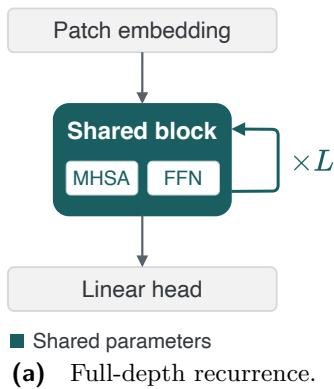

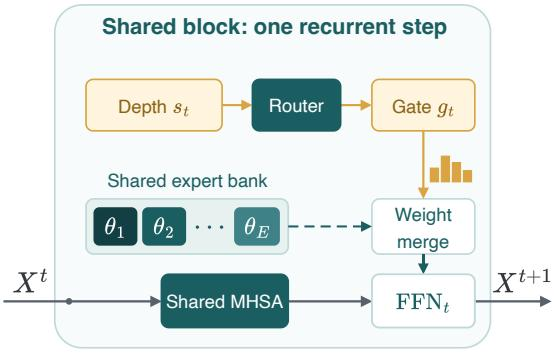  
(b) Depth-programmed experts.

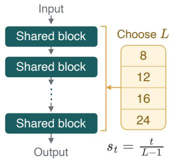  
(c) Elastic-depth inference.  
Figure 1 reViT overview. (a) One shared module runs for L steps. (b) At depth t, s softly mixes E expert parameter sets into one dense FFN shared by all tokens. (c) Selecting L resamples the depth program on a new grid. Teal marks shared parameters and amber marks depth and gating.

We evaluate reViT with supervised ImageNet-1k training or distillation from a frozen DINOv2 teacher. Trained from scratch, an E=4 reViT-B/16 matches DeiT III (Touvron et al., 2022) at near-matched inference FLOPs with 73% fewer parameters. Under DINOv2 distillation (Oquab et al., 2024), an E=8 model nearly matches the teacher’s ImageNet linear-probe accuracy.

## Our contributions are:

• A recurrent ViT with a continuous depth program: We present reViT, which replaces a ViT’s depth-wise stack with one recurrent Transformer module. A normalized depth coordinate programs a continuous trajectory through a shared FFN expert bank, recovering depth-specific computation while remaining competitive with full-depth ViTs.

• Comparison under a common recurrent setting: Using the same recurrent backbone, task loss, and base training recipe, we compare seven alternative MoE mechanisms. At the nominal compute budget of one dense FFN (per block), our depth-programmed merge outperforms the tested token-dispatch and output-mixture adaptations.

• Resampleable depth and fixed-depth export: One reViT checkpoint (trained model) supports multiple tested inference depths by resampling the normalized coordinate interval. For deployment, reViT can retain its compact dynamic graph or materialize the depth-specific FFNs at a fixed depth, trading compact storage for conventional dense execution.

• Analysis of the learned depth program: Our analysis shows that, under final-layer distillation alone, the router learns where the dominant expert changes and blends experts across each transition, and that the learned gate-expert assignment matters for teacher alignment. Increasing expert capacity improves coverage of the teacher’s layers, while larger backbones use fewer efective directions and gain less from additional experts.

## 2 Closely Related Work

Recurrent and adaptive depth: Universal Transformers reuse a transition across depth, optionally with adaptive computation time (Dehghani et al., 2019; Graves, 2016). ALBERT demonstrates the parameter savings of cross-layer sharing in language (Lan et al., 2020). In vision, Sliced Recursive Transformers and MiniViT share or multiplex weights primarily for compression (Shen et al., 2022; Zhang et al., 2022). Raptor uses k recurrent block templates and, under distillation, intermediate teacher features (Jacobs et al., 2026). Vision-MoR assigns a recursion depth to each patch, while Edge-RecViT combines a shared middle block with token-wise early exit (He et al., 2026; Li et al., 2026). Unlike these works, we target a diferent setting: one block is reused throughout the model, a global depth is selected at inference, and a shared expert bank provides diferent FFN weights at diferent depths. When applied, distillation uses only the teacher’s final-layer features.

Experts under recurrent sharing: Sparse MoEs conventionally dispatch tokens through a subset of expert FFNs (Shazeer et al., 2017). Representative FFN-MoE ViTs place token-routed expert banks inside otherwise untied stacks (Riquelme et al., 2021). Sparse Universal Transformer instead combines a fully shared universal layer with sparse token routing (Tan et al., 2023). MoEUT recurrently repeats a small group of distinct layers with token routed experts (Csordás et al., 2024) while Mixture-of-Recursions routes tokens over recursive depth (Bae et al., 2025b). Soft MoE forms diferentiable token-slot mixtures (Puigcerver et al., 2024). These methods primarily choose computation at token level. In contrast, reViT computes one gate from the normalized coordinate of each recurrent depth. The gate is shared across inputs and tokens, and expert parameters are merged before execution. Our comparisons test how this depth-programmed composition difers from token-dispatch and output-mixture mechanisms under full-depth recurrence.

Conditional parameterization and depth programming: Hypernetworks generate one module’s parameters from a conditioning signal and include designs based on learned layer codes (Ha et al., 2017). Our router is a constrained hypernetwork: it predicts E softmax coeficients over a learned bank of complete FFNs rather than emitting their parameters directly. CondConv, SMEAR, and Lory likewise synthesize mixtures of stored modules using gates driven by image dependent representations (Yang et al., 2019; Muqeeth et al., 2024; Zhong et al., 2024). We retain this parameter-composition mechanism but replace the image feature input with normalized recurrent depth as an explicit routing signal, allowing the same router to be evaluated on a recomputed coordinate grid when inference depth changes. FiLM provides a complementary form of conditioning through feature-wise afine modulation of activations (Perez et al., 2018), whereas reViT composes the complete FFN parameters used at each depth.

## 3 Method

The proposed reViT replaces the L independently parameterized blocks of a ViT with one recurrent pre-norm module comprising shared attention and normalization together with a depth-programmed FFN mixture (Fig. 1).

## 3.1 Recurrent block and depth-programmed experts

We form $X ^ { 0 } \in \mathbb { R } ^ { T \times d }$ by embedding the image patches, prepending a class token, and adding learned spatial positional embeddings (Dosovitskiy et al., 2021). For a recurrent depth of $L \geq 2$ , the step at depth t is assigned the normalized coordinate $s _ { t } ^ { ( L ) } = t / ( L - 1 )$ . The router maps this scalar coordinate to expert logits and mixture weights:

$$
\begin{array} { r } { z _ { t } = \psi \left( s _ { t } ^ { ( L ) } \right) , } \end{array}
$$

$$
\begin{array} { r } { \pmb { g } _ { t } = \mathrm { s o f t m a x } ( \pmb { z } _ { t } / \tau ) , \qquad \tau = 1 , } \end{array}\tag{1}
$$

where $t = 0 , \ldots , L - 1$ and $\psi : \mathbb { R } \to \mathbb { R } ^ { E }$ is a two-layer MLP. Because $\mathbf { \sigma } _ { \mathbf { \sigma } _ { \mathbf { \sigma } _ { \mathbf { \lambda } } } } \mathbf { \sigma } _ { \mathbf { \sigma } _ { \mathbf { \lambda } } } \mathbf { \sigma } _ { \mathbf { \lambda } _ { \mathbf { \lambda } } } \mathbf { \sigma } _ { \mathbf { \lambda } _ { \mathbf { \lambda } } } \mathbf { \sigma } _ { \mathbf { \lambda } _ { \mathbf { \lambda } } } \mathbf { \sigma } _ { \mathbf { \lambda } _ { \mathbf { \lambda } } }$ depends only on normalized depth, it is shared by every token and input evaluated at depth t. Further implementation details are in Appendix A.

The shared bank contains E dense FFNs, $\theta _ { e } ^ { \mathrm { f i n } } = ( W _ { 1 } ^ { e } , b _ { 1 } ^ { e } , W _ { 2 } ^ { e } , b _ { 2 } ^ { e } ) , e = 1 , \dots , E$ . Before the FFN executes, the gate merges both projections and biases:

$$
\bar { \theta } _ { t } ^ { \mathrm { { f i n } } } = \sum _ { e = 1 } ^ { E } g _ { t , e } \theta _ { e } ^ { \mathrm { { f i n } } } = ( \bar { W } _ { 1 , t } , \bar { b } _ { 1 , t } , \bar { W } _ { 2 , t } , \bar { b } _ { 2 , t } )\tag{2}
$$

$$
\mathrm { F F N } _ { t } ( \boldsymbol { u } ) = \bar { W } _ { 2 , t } \mathrm { G E L U } \big ( \bar { W } _ { 1 , t } \boldsymbol { u } + \bar { b } _ { 1 , t } \big ) + \bar { b } _ { 2 , t } .\tag{3}
$$

At each recurrent depth, the expert parameters are merged into a single FFN, which is then applied to all tokens.   
Only the merged FFN is evaluated, not the individual experts.

With the gate and merged FFN set by $s _ { t } ^ { ( L ) }$ , one recurrent step is:

$$
\begin{array} { r l } & { H ^ { t } = X ^ { t } + \mathrm { M H S A } \left( \mathrm { L N } _ { \mathrm { a t t n } } ( X ^ { t } ) \right) , } \\ & { X ^ { t + 1 } = H ^ { t } + \mathrm { F F N } _ { t } \left( \mathrm { L N } _ { \mathrm { f n } } ( H ^ { t } ) \right) . } \end{array}\tag{4}
$$

All recurrent steps share the attention, LayerNorms, router, and expert bank. A final LayerNorm and task head then consume $\hat { X ^ { L } }$

Our router takes the normalized coordinate $s _ { t } ^ { ( L ) }$ directly rather than assigning a learned embedding to each depth, as in static hypernetworks (Ha et al., 2017). Together, Eqs. 1-2 map any $s \in [ 0 , 1 ]$ to a merged FFN. A model of depth L evaluates this map at L evenly spaced points. Choosing a diferent L changes only the sampling grid, allowing the same learned depth program to be used without retraining. We evaluate this property in Section 4.4.

Because this map depends only on depth, the merged FFNs are the same for every image. Once L is chosen, they can be computed once and reused or inserted into a conventional fixed-depth graph with no routing or expert merging in the input path. The compact form stores $E$ expert FFNs, whereas the fixed graph stores the L merged FFNs directly. In both cases, each depth evaluates one dense FFN, so increasing E adds stored capacity without increasing dense FFN computation.

## 3.2 Training and elastic-depth inference

Task objective: Under supervised training, models use $\mathcal { L } _ { \mathrm { t a s k } } = \mathcal { L } _ { \mathrm { c l s } }$ , the same ImageNet classification objective as their untied baselines. For distillation, le $\pmb { Y } \in \mathbb { R } ^ { T \times d }$ be the frozen teacher’s final post-LayerNorm token tensor. We set ${ \mathcal { L } } _ { \mathrm { t a s k } } = { \mathcal { L } } _ { \mathrm { d i s t } }$ , where

$$
\mathcal { L } _ { \mathrm { d i s t } } = \frac { 1 } { T d } \left. \mathrm { L N } ( \mathbf { X } ^ { L } ) - \mathbf { Y } \right. _ { F } ^ { 2 } ,\tag{5}
$$

is ordinary elementwise mean squared error over all tokens. Unlike Jacobs et al. (2026), we do not use intermediate feature distillation.

Regularization: In order to encourage diversity and improve stability, for every $E > 1$ reViT model, we add three auxiliary losses: usage balance, router z-loss, and expert diversity. Let $\mathbf { \nabla } _ { \mathbf { \boldsymbol { g } } _ { t } }$ be the gate at recurrent depth t. The balance term is:

$$
\mathcal { L } _ { \mathrm { b a l } } = \frac { 1 } { L } \sum _ { t = 0 } ^ { L - 1 } \left[ 1 - \frac { H ( \pmb { g } _ { t } ) } { \log E } \right] ,\tag{6}
$$

where H denotes Shannon entropy. This term favors soft mixtures of experts. We also regularize the routing logits and expert parameters: the router z-loss $\mathcal { L } _ { z }$ controls logit scale by penalizing the squared log-sum-exp of the logits, while the expert-diversity loss ${ \mathcal { L } } _ { \mathrm { d i v } }$ encourages distinct expert weights by penalizing squared cosine similarity between their parameter vectors. These two losses are defined in Eqs. 8 and 9 in Appendix A. Coeficient sensitivity is reported in Appendix C. The full objective is:

$$
\begin{array} { r } { \mathcal { L } = \mathcal { L } _ { \mathrm { t a s k } } + \lambda _ { \mathrm { b a l } } \mathcal { L } _ { \mathrm { b a l } } + \lambda _ { z } \mathcal { L } _ { z } + \lambda _ { \mathrm { d i v } } \mathcal { L } _ { \mathrm { d i v } } . } \end{array}\tag{7}
$$

For $E = 1$ , all three expert-specific terms are omitted and the tied-block baseline uses $\mathcal { L } _ { \mathrm { t a s k } }$ alone.

Elastic-depth training: During elastic-depth training, standard per-image DropPath is applied to complete recurrent steps (Huang et al., 2016). A dropped step acts as the identity for all tokens in that image. The retained steps are re-numbered, and their coordinates are spread from 0 to 1. This exposes the router to multiple efective depths.

Elastic-depth inference: At inference, a global depth $L \geq 2$ is selected before execution, and the normalizeddepth grid is recomputed for its L steps. Changing L changes both the coordinate grid and the recurrence depth. Performance across the tested depths is reported in Section 4.4.

## 4 Experiments

We study three questions: whether one recurrent block can replace a deep ViT under supervised training and DINOv2 distillation, which expert-composition mechanisms remain efective under full-depth reuse, and whether a single checkpoint (trained model) can support multiple inference depths. We also vary the stored expert-bank size.

Table 1 ImageNet-1k training from scratch. All rows use the same recipe, and reViT values are means over three runs. Recurrent depths match the corresponding ViTs. k - counts distinct block templates and E - num. experts.
<table><tr><td>Scale</td><td>Method</td><td>k</td><td>E Params (M)</td><td>GFLOPs/image</td><td>Top-1 (%) ↑</td></tr><tr><td rowspan="3">S/16</td><td>DeiT III (Touvron et al., 2022)</td><td>12</td><td>22.1</td><td>8.5</td><td>79.9</td></tr><tr><td>Raptor (Jacobs et al., 2026)</td><td>4</td><td>7.9</td><td>8.5</td><td>78.0</td></tr><tr><td>reViT (ours)</td><td>1</td><td>4 6.1</td><td>8.6</td><td>78.2</td></tr><tr><td rowspan="3">B/16</td><td>DeiT III</td><td>12</td><td>86.6</td><td>33.9</td><td>82.8</td></tr><tr><td>Raptor</td><td>4</td><td></td><td>29.9 33.9</td><td>82.8</td></tr><tr><td>reViT (ours)</td><td>1</td><td>4 23.6</td><td>34.3</td><td>83.0</td></tr><tr><td rowspan="3">L/16</td><td>DeiT III</td><td>24</td><td>304.4 一</td><td>119.9</td><td>84.1</td></tr><tr><td>Raptor</td><td>4</td><td></td><td>52.4</td><td>119.9 83.7</td></tr><tr><td>reViT (ours)</td><td>1</td><td>4 40.9</td><td>121.5</td><td>83.8</td></tr></table>

## 4.1 Experimental setup

We consider two regimes: ImageNet-1k training from scratch and distillation from a frozen DINOv2 teacher, evaluated with frozen-backbone probes. All models were implemented in PyTorch. For additional implementation details see Appendix A.

Unless stated otherwise, the tables report checkpoints evaluated at their reference depth. Fig. 2 evaluates the distilled routing variants across inference depths. For the supervised comparison, reViT, DeiT III, and Raptor use the same data, base training recipe, recurrent depth, and near-matched inference FLOPs. The distilled comparison uses diferent objectives: reViT matches only final-layer teacher features, while Raptor was trained with intermediate features.

Supervised ImageNet-1k training: We train reViT-S, -B, and -L at their native ViT depths using a shortened DeiT III recipe (Touvron et al., 2022), sweeping E ∈ {1, 2, 3, 4, 8}. For E=1, the model reduces to a single Transformer block reused at every recurrent step. Distillation from DINOv2: For comparison with Jacobs et al. (2026), we distill a reViT-B/14 student from a frozen DINOv2-B/14 teacher (Oquab et al., 2024). The key diference is the supervision target: Raptor matches intermediate teacher features, whereas our loss compares only the final student and teacher features. We evaluate the frozen student using an ImageNet-1k linear classifier, an ADE20k linear segmentation head, and linear and two-layer MLP depth heads on NYUv2.

## 4.2 Can one recurrent block replace a deep ViT?

Supervised training: At near-matched inference FLOPs, Table 1 shows that the E=4 reViT models score 0.1–0.2 points above four-block Raptor across all scales. Relative to full-depth DeiT III, reViT-B/16 reaches 83.0% versus 82.8%, and reViT-L/16 reaches 83.8% versus 84.1% with roughly 7× fewer parameters. The S/16 gap is larger (78.2% versus 79.9%), but narrows with additional experts (Table 5). These results show that reViT’s shared module matches or closely approaches full-depth ViTs at larger scales and outperforms four-block Raptor at every scale.

Distillation and frozen transfer: Table 2 places our distilled models alongside Raptor and the DINOv2 teacher. At $E = k \in \{ 2 , 3 , 4 \}$ , reViT has better reported values on all four probes. These are reference comparisons rather than controlled ablations because the distillation objectives difer. The unmatched (no Raptor model for this case) E=8 model is compared only with its teacher.

## 4.3 Which MoE formulation suits a single recurrent block?

Using multiple FFN experts improves accuracy over a single shared FFN in both training regimes (Tables 2 and 5). We next ask a narrower question: which expert-composition mechanisms remain efective when adapted to a single Transformer block reused at every depth? We instantiate each mechanism in the same recurrent ViT, holding the data, backbone, recurrent depth, task objective, and base recipe fixed. The comparison measures compatibility with full-depth recurrence in a common testbed, rather than ranking the original systems in their native architectures.

Table 2 DINOv2 distillation and frozen-probe transfer. reViT values are means over three runs. reViT uses final-layer supervision and Raptor intermediate features. Raptor IN-1k and ADE20k values are published, while NYUv2 values are our checkpoint reevaluations. E=k aligns stored FFN count, but not training. The E=8 row is compared only with DINOv2-B/14.
<table><tr><td>Method</td><td>Config</td><td>IN-1k Top-1 %↑</td><td>ADE20k mIoU %↑</td><td>NYUv2 (lin) RMSE (m)↓</td><td>NYUv2 (MLP) RMSE (m) ↓</td></tr><tr><td>reViT (ours)</td><td>E=1</td><td>79.4</td><td>39.7</td><td>0.583</td><td>0.529</td></tr><tr><td>reViT (ours)</td><td>E=2</td><td>82.2</td><td>43.0</td><td>0.559</td><td>0.498</td></tr><tr><td>Raptor (Jacobs et al., 2026)</td><td>k=2</td><td>81.2</td><td>39.6</td><td>0.605</td><td>0.548</td></tr><tr><td>reViT (ours)</td><td>E=3</td><td>83.1</td><td>43.6</td><td>0.555</td><td>0.491</td></tr><tr><td>Raptor</td><td>k=3</td><td>83.0</td><td>43.0</td><td>0.567</td><td>0.506</td></tr><tr><td>reViT (ours)</td><td>E=4</td><td>83.5</td><td>44.6</td><td>0.552</td><td>0.491</td></tr><tr><td>Raptor</td><td>k=4</td><td>83.2</td><td>43.6</td><td>0.564</td><td>0.495</td></tr><tr><td>reViT (ours)</td><td>E=8</td><td>83.9</td><td>45.8</td><td>0.554</td><td>0.483</td></tr><tr><td rowspan="2">DINOv2 (Oquab et al., 2024)</td><td>S/14</td><td>80.9</td><td>44.6</td><td>0.590</td><td>0.527</td></tr><tr><td>B/14</td><td>84.5</td><td>47.5</td><td>0.567</td><td>0.486</td></tr></table>

Table 3 MoE formulations under single-block recurrence: supervised ImageNet-1k training. All methods use the same -S backbone, L=12, and base recipe, only the MoE mechanism changes. Higher-U settings also change expert count, activation count, and/or width.
<table><tr><td rowspan="2">Family Method</td><td rowspan="2"></td><td colspan="3">Top-1 (%) ↑ at nominal budget U</td></tr><tr><td>1× 1.5×</td><td>2×</td><td>4×</td></tr><tr><td>No MoE</td><td>reViT (E=1)</td><td>70.6</td><td></td><td></td></tr><tr><td rowspan="3">Weight merge</td><td>reViT (ours)</td><td>78.2</td><td></td><td></td></tr><tr><td>Lory (Zhong et al., 2024)</td><td>77.9</td><td></td><td></td></tr><tr><td>SMEAR (Muqeeth et al., 2024)</td><td>77.7</td><td></td><td></td></tr><tr><td rowspan="3">Token dispatch</td><td>DeepSeek-V3 (Liu et al., 2024)</td><td>70.6</td><td>71.3</td><td>72.4 76.5</td></tr><tr><td>Qwen3 (Yang et al., 2025)</td><td>68.6</td><td>71.0 72.5</td><td>74.0</td></tr><tr><td>MoEUT (Csordás et al., 2024)</td><td>67.8</td><td>71.4 72.8</td><td>77.6</td></tr><tr><td rowspan="2">Output mixture</td><td>ReMoE (Wang et al., 2025)</td><td>70.1</td><td>71.9 72.8</td><td>75.5</td></tr><tr><td>Soft-MoE (Puigcerver et al., 2024)</td><td>69.2</td><td>72.3 73.7</td><td>75.7</td></tr></table>

We compare the FFN computation used by each method per recurrent step, taking one standard dense FFN as the reference. The ratio U measures nominal FFN FLOPs relative to this reference: U=1 matches its computation, while U=4 uses four times as much. Methods with the same U may still difer in storage and end-to-end execution cost. At U=1, we ask which adaptation best recovers the accuracy lost through full-depth sharing without adding FFN computation. Weight-space merging evaluates one dense FFN regardless of E, so adding experts increases stored capacity while U remains unchanged. To obtain U>1 would require a wider merged FFN or multiple FFN evaluations, which scales dense computation rather than the expert bank itself. We therefore report weight-merge methods at U=1 and study E separately in Section 4.5.

Because the original methods are designed around diferent expert widths and activation patterns, increasing U requires method-specific changes. The higher-U configurations therefore test whether relaxing the one-FFN constraint closes the gap for each method, rather than tracing a common scaling curve. Appendix B reports expert-FFN storage and documents each adaptation.

Supervised training. At the primary U=1 budget, reViT reaches 78.2%, Lory 77.9%, and SMEAR 77.7%, while every other method falls between 67.8% and 70.6% (Table 3). Several alternatives narrow this gap at higher nominal budgets, with MoEUT reaching 77.6% at U=4.

Distillation. Distillation preserves the main U=1 result, although the relative strength of the baselines changes. At U=1, reViT has the best reported ImageNet, ADE20k, and linear-depth results, while SMEAR achieves

Depth-only gate (ours) Feature-only gate

Table 4 MoE formulations under single-block recurrence: DINOv2 distillation. All entries use the same -B backbone, L=12, and task loss. Each cell gives ${ \cal U } = 1 / { \cal U } = 4 .$ Additional results are shown in Appendix B (Table 9).
<table><tr><td>Family</td><td>Method</td><td colspan="2">IN-1k ↑</td><td colspan="2">ADE20k ↑</td><td colspan="2">NYUv2 lin. ↓</td><td colspan="2">NYUv2 MLP↓</td></tr><tr><td>No MoE</td><td>reViT (E=1)</td><td>79.4 / -</td><td></td><td>39.7 / -</td><td></td><td>0.583 / −</td><td></td><td>0.529 / -</td></tr><tr><td rowspan="2">Weight merge</td><td>reViT (E=4)</td><td>83.5 / –</td><td></td><td>44.6 / -</td><td></td><td>0.552 / –</td><td></td><td>0.491 / −</td></tr><tr><td>Lory (Zhong et al., 2024)</td><td>79.2 / -</td><td></td><td>39.9 / –</td><td></td><td>0.580 / –</td><td></td><td>0.531 / –</td></tr><tr><td rowspan="2">Token dispatch</td><td>SMEAR (Muqeeth et al., 2024)</td><td>83.4 / -</td><td></td><td>44.3 / -</td><td></td><td>0.553 /-</td><td></td><td>0.485 / –</td></tr><tr><td>DeepSeek-V3 (Liu et al., 2024)</td><td>74.4 / 76.6</td><td></td><td>36.6 / 39.9</td><td></td><td>0.654 / 0.607</td><td></td><td>0.582 / 0.539</td></tr><tr><td rowspan="2"></td><td>Qwen3 (Yang et al., 2025) MoEUT (Csordás et al., 2024)</td><td>- / 74.9 75.1 /</td><td>83.0</td><td></td><td>40.1</td><td>0.638</td><td></td><td>- / 0.550</td></tr><tr><td></td><td></td><td></td><td>35.0 / 43.5</td><td></td><td>0.694 / </td><td>0.558</td><td>0.608 / 0.501</td></tr><tr><td rowspan="2">Output mixture</td><td>ReMoE (Wang et al., 2025)</td><td>79.6</td><td>83.2</td><td>39.7</td><td>45.1</td><td>0.573</td><td>0.539</td><td>0.527 / 0.482</td></tr><tr><td>Soft-MoE (Puigcerver et al., 2024)</td><td>78.5</td><td>82.2</td><td>33.4 / 37.1</td><td></td><td>0.602</td><td>0.547</td><td>0.557 / 0.500</td></tr></table>

the lower MLP-head RMSE (0.485 versus 0.491) and otherwise remains close to reViT (Table 4). The reViT row is the E=4 model from Table 2. The Qwen3 run at U=1 did not converge to a usable solution. At U=4, ReMoE leads on all four tasks, although these higher-budget configurations also change the number or width of the active experts. Additional configurations are reported in Appendix B. Across both training regimes, the depth-programmed merge provides the strongest overall results at the primary U=1 budget, while other formulations become competitive when given greater active FFN capacity.

## 4.4 Depth-programmed experts enable elastic-depth inference

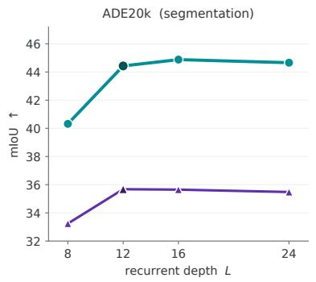

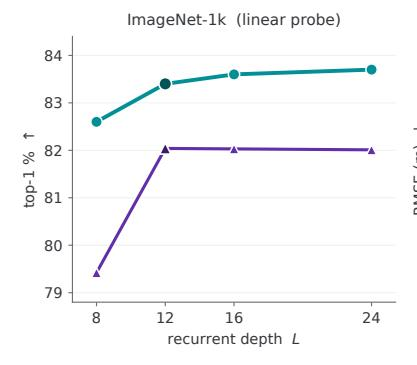

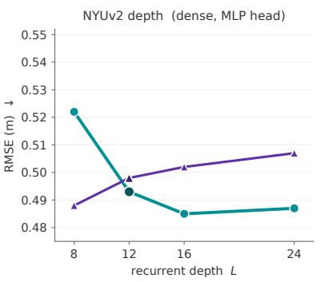  
Figure 2 Routing variants under elastic-depth training. Both variants use the same per-image depth-dropout protocol and are evaluated at $L \in \{ 8 , 1 2 , 1 6 , 2 4 \}$

Fig. 2 asks whether a single model can support multiple inference depths. We compare two distilled variants trained with the same per-image depth dropout: our depth-only gate and a SMEAR-style feature-only gate with no explicit depth signal. At L=12, the feature-only control reaches approximately 35.6 ADE20k mIoU. Our depth-only variant reaches 44.4 mIoU, 83.4% ImageNet linear-probe top-1, and 0.493 NYUv2 RMSE.

Our proposed variant improves on all three probes through L=16 and remains near its best at L=24. ADE20k rises from 40.3 mIoU at L=8 to 44.9 at L=16 and remains at 44.7 at L=24. NYUv2 RMSE improves from 0.522 to 0.485 and remains close at 0.487, while ImageNet top-1 increases from 82.6% to 83.7%. Beyond L=12, the feature-only control is nearly flat on ImageNet and ADE20k. It also worsens on NYUv2, from 0.498 at L=12 to 0.507 at L=24. Normalized-depth conditioning therefore preserves reference-depth performance during training and converts additional recurrent steps into gains through L=16.

Together with Section 4.3, these results show that weight-space merging is efective at the primary compute budget, while normalized-depth conditioning preserves accuracy across the tested depths and benefits from greater depth.

## 4.5 Number of experts

Expanding the merged expert bank consistently recovers accuracy lost under plain weight tying while retaining one dense FFN evaluation per step. From E=1 to E=8, ImageNet-1k top-1 increases by 9.6, 6.8, and 5.7 points for S/16, B/16, and $\mathrm { L } / 1 6 ,$ respectively (Table 5). The largest single improvement at every scale occurs from E=1 to E=2. Beyond E=4, additional capacity primarily benefits S/16.

Table 5 Efect of expert-bank size on ImageNet-1k. All models use supervised training.
<table><tr><td colspan="2"></td><td colspan="5">Number of experts E</td><td rowspan="2"> $\Delta _ { 1  8 }$ </td></tr><tr><td>Model</td><td>DeiT III</td><td>E=1</td><td>E=2</td><td>E=3</td><td>E=4</td><td> $E { = } 8$ </td></tr><tr><td>reViT-S/16</td><td>79.9</td><td>70.6</td><td>74.2</td><td>76.5</td><td>78.2</td><td>80.2</td><td>+9.6</td></tr><tr><td>reViT-B/16</td><td>82.8</td><td>76.4</td><td>81.9</td><td>82.5</td><td>83.0</td><td>83.2</td><td>+6.8</td></tr><tr><td> $\mathrm { r e V i T \mathrm { - L } / 1 6 }$ </td><td>84.1</td><td>78.3</td><td>83.0</td><td>83.5</td><td>83.8</td><td>84.0</td><td>+5.7</td></tr></table>

## 5 Analysis: what does the recurrent block learn?

We examine how training organizes the expert bank across depth and whether the learned assignment matters for the final representation. We then relate expert utilization to gains from larger banks across model scales. Section 5.1 analyzes distilled reViT-B/14, while Section 5.2 compares supervised S/16 and $\mathrm { L } / 1 6$ models. Appendix D provides the protocols, results, and expert-ablation controls.

## 5.1 How the router allocates experts over depth

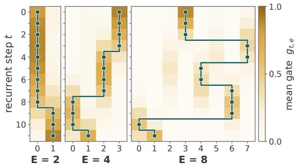

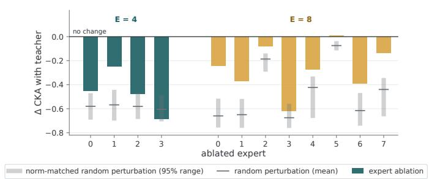  
Figure 3 Expert routing across recurrent depth. Gate weights $g _ { t , e }$ for distilled reViT-B/14 (L=12). The teal path marks the expert with the largest weight at each depth, showing how the dominant expert changes over the recurrence.  
Figure 4 Expert ablation against matched controls. Change in teacher CKA after ablating each expert. Gray ranges and ticks show the middle 95% and mean of 64 random gate perturbations matched in merged-weight displacement.

We first examine how each expert contributes across depth. In Fig. 3, the dominant expert changes only a few times, with each dominant expert occupying a contiguous depth interval. The gate remains a soft mixture, with overlapping expert weights around the transitions. The mixtures are visibly more difuse at E=8. No objective specifies these intervals or their boundaries. Their organization resembles Raptor’s predefined recurrent segments (Jacobs et al., 2026), but here the only teacher targets are the final-layer features. The continuous router also defines mixtures between the plotted depths, allowing the learned schedule to be sampled at a diferent inference depth.

We next measure how removing each expert afects the final representation. We set its gate weight to zero at every depth, renormalize the remaining weights, and measure the linear centered kernel alignment (CKA, Kornblith et al., 2019) between the student’s and teacher’s final features. The resulting CKA drop reflects both how much the merged weights change and where those changes occur in the recurrence, making it dificult to isolate the contribution of the deleted expert. Figure 4 compares each deletion with 64 random gate perturbations matched in their displacement of the merged FFN weights. Most deletions reduce teacher alignment, but less than random perturbations of the same size. Removing expert 5 at E=8 does not reduce CKA. The largest losses occur when deleting the earliest-used experts (Appendix D), so deletion sensitivity alone cannot separate an expert’s role from its position in the recurrence.

To test whether experts can exchange assignments, we permute the gate columns while keeping the expert bank fixed. This preserves every expert and the mixing coeficients at each depth, changing only which expert receives each coeficient. All 23 nonidentity permutations at $E { = } 4$ and all 64 tested permutations at $E { = } 8$ reduce teacher CKA (Appendix D). Thus, retaining the full bank is not suficient to preserve teacher alignment: the learned assignment of experts across depth also matters.

## 5.2 How fully is the expert bank used?

The benefit of a larger expert bank varies with model scale. Increasing E from four to eight improves $\mathrm { S } / 1 6$ by 2.0 ImageNet points but $\mathrm { L } / 1 6$ by only 0.2 (Table 5). We therefore ask whether the two models difer in how fully they utilize the available expert directions.

A diverse expert bank can still produce similar merged weights across depth if the router repeatedly selects similar mixtures. Fig. 5 therefore compares the expert bank, routing schedule, and merged weights. We stack the flattened expert projections $W _ { 1 } ^ { e }$ into $W _ { \mathrm { 1 , b a n k } } \in \mathbb { R } ^ { E \times P }$ , where $P = d _ { \mathrm { f f } } d _ { \mathrm { i } }$ , with model width d and FFN hidden width $d _ { \mathrm { f } }$ . The routing schedule forms $G \in \mathbb { R } ^ { L \times E }$ , with entries $G _ { t , e } = g _ { t , e }$ and one row per recurrent depth. The corresponding merged weights form $\boldsymbol { W } _ { \mathrm { 1 , t r a j } } = \boldsymbol { G } \boldsymbol { W } _ { \mathrm { 1 , b a n k } } \in \mathbb { R } ^ { L \times P }$ , whose rows are the flattened merged projections vec $( \bar { W } _ { 1 , t } ) ^ { \top }$ . Their efective ranks measure, respectively, the diversity available in the expert bank, the mixtures selected across depth, and the weights actually used by the recurrent block.

We compute efective rank as the exponential of the entropy of the normalized squared singular values $( \mathrm { A p - }$ pendix D). It approaches one when a single direction dominates and equals k when k nonzero singular values are equal. Because the diversity loss encourages the stored experts to difer, the gate and merged-weight ranks show whether that diversity is also expressed during execution. At $E { = } 8$ , the expert, gate, and merged-weight ranks are 7.7, 7.6, and 7.3 for $\mathrm { S / 1 6 } ,$ indicating that almost all available directions are realized. For $\mathrm { L } / 1 6$ , the corresponding ranks are 6.2, 5.2, and 4.0, indicating that its merged weights are concentrated in fewer directions. This matches the accuracy trend: $\mathrm { S } / 1 6$ gains more from a larger expert bank and makes broader use of its available weight directions across depth. The same pattern remains after removing the mean weight and gate vectors across depth (Appendix D).

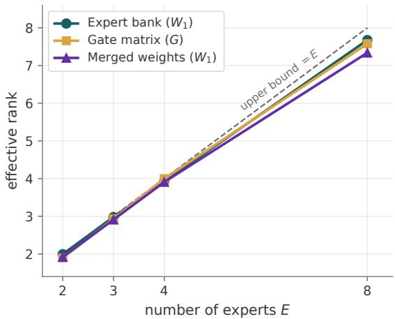  
(a) reViT-S/16 (L=12)

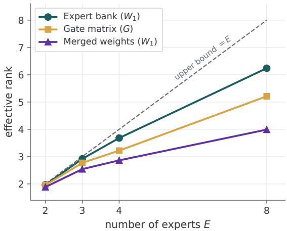  
(b) $\mathrm { r e V i T \mathrm { - L } / 1 6 }$ (L=24)  
Figure 5 Available, selected, and realized expert directions. Efective ranks of the stacked expert $W _ { 1 }$ matrices, gate weights across depth, and stacked merged $W _ { 1 }$ matrices.

## 6 Conclusion

reViT replaces a ViT’s depth-wise stack with one recurrent Transformer module. A continuous normalized-depth coordinate softly merges a shared expert bank into one FFN at each recurrent depth. This learned parameter trajectory recovers much of the accuracy lost under plain weight tying while retaining substantially fewer stored parameters than a full-depth ViT. At matched one-FFN compute, it outperforms the tested token-dispatch and output-mixture alternatives. Elastic-depth training allows the same trajectory to be sampled at multiple tested depths. For deployment, reViT can retain its compact dynamic graph or materialize the depth-specific FFNs at a fixed depth, trading compact storage for conventional dense execution.

## Appendix

## A Implementation, training, and evaluation details

## A.1 Model implementation

Router and expert bank: The routing computation is defined in Eq. 1. The router $\psi$ is a two-layer MLP with 16 hidden units and SiLU activation that maps one normalized-depth coordinate to E logits. Its output layer is zero-initialized, so all experts start with equal weight. It has no learned step embedding and fixes τ=1. The gate therefore depends only on normalized recurrent depth.

Each expert stores $W _ { 1 } ^ { e } \in \mathbb { R } ^ { d _ { \mathrm { H } } \times d } , b _ { 1 } ^ { e } \in \mathbb { R } ^ { d _ { \mathrm { H } } } , W _ { 2 } ^ { e } \in \mathbb { R } ^ { d \times d _ { \mathrm { H } } }$ , and $b _ { 2 } ^ { e } \in \mathbb { R } ^ { d }$ . Experts are initialized independently using the same initialization as a dense ViT FFN, with no additional variance correction for the merged weights

## A.2 Objectives and regularization

Auxiliary losses: In addition to the balance loss in Eq. 6, we use the router z-loss (Zoph et al., 2022). For router logits ${ \boldsymbol { z } } _ { t }$ at recurrent depth t:

$$
\mathcal { L } _ { z } = \frac { 1 } { L } \sum _ { t = 0 } ^ { L - 1 } \left( \log \sum _ { e = 1 } ^ { E } \exp z _ { t , e } \right) ^ { 2 } ,\tag{8}
$$

which controls logit scale during mixed-precision training. We also penalize similarity between expert parameters. Let $\begin{array} { r } { \pmb q _ { e } = \mathrm { v e c } ( \theta _ { e } ^ { \mathrm { f f n } } ) } \end{array}$ and define

$$
\mathcal { L } _ { \mathrm { d i v } } = \frac { 2 } { E ( E - 1 ) } \sum _ { 1 \leq e < e ^ { \prime } \leq E } \left( \frac { \pmb q _ { e } ^ { \top } \pmb q _ { e ^ { \prime } } } { \| \pmb q _ { e } \| _ { 2 } \| \pmb q _ { e ^ { \prime } } \| _ { 2 } } \right) ^ { 2 } .\tag{9}
$$

We use $\lambda _ { \mathrm { b a l } } { = } 1 0 ^ { - 2 } , \lambda _ { z } { = } 1 0 ^ { - 3 }$ , and $\lambda _ { \mathrm { d i v } } { = } 1 0 ^ { - 3 }$ for $E > 1$ . All three expert-specific terms are omitted for $E = 1$

Elastic-depth training. For Fig. 2, we use per-image depth dropout with rate 0.3. DropPath masks complete recurrent steps independently for each image, with one mask shared by all tokens. A dropped step acts as the identity. Retained steps are reindexed in execution order, and their normalized-depth coordinates are recomputed from the number retained.

## A.3 Training and evaluation protocols

Supervised ImageNet-1k training: We adopt the ImageNet-1k DeiT III recipe (Touvron et al., 2022) with a 300-epoch schedule. reViT, DeiT III, and Raptor (Jacobs et al., 2026) use the same data, augmentation, optimizer, and epoch schedule. Each recurrent model is unrolled to the depth of the standard ViT at its scale: L=12 steps for S/16 and B/16, and L=24 for $\mathrm { L } / 1 6$ . Table 6 gives the shared and scale-specific settings.

DINOv2 distillation: The fixed-depth distilled checkpoints use a single-stage schedule at L=12. Throughout training, a reViT-B/14 student is trained with Eq. 5 to match the final post-LayerNorm representation of a frozen DINOv2-B/14 teacher (Oquab et al., 2024). Unless stated otherwise, fixed-depth distillation uses the complete supervised B-scale optimization (see Table 6). Only the patch size and task objective difer. The variants in Fig. 2 subsequently undergo the elastic-depth training described above.

Table 6 Supervised ImageNet-1k configuration. The 300-epoch DeiT III base recipe is shared by all methods in Table 1. Columns give scale-specific reViT settings, including recurrence and auxiliary losses.
<table><tr><td></td><td>reViT-S/16 reViT-B/16</td><td>6 reViT-L/16</td></tr><tr><td colspan="3">Optimization and schedule Optimizer</td></tr><tr><td>Peak learning rate  $4 \times 1 0 ^ { - 3 }$ </td><td>AdamW  $3 \times 1 0 ^ { - 3 }$ </td><td> $3 \times 1 0 ^ { - 3 }$ </td></tr><tr><td>Effective batch size</td><td>2048</td><td></td></tr><tr><td>Schedule</td><td>cosine</td><td></td></tr><tr><td>Epochs</td><td>300</td><td></td></tr><tr><td>Warmup epochs</td><td> $5$ </td><td></td></tr><tr><td>Warmup learning rate</td><td> $1 0 ^ { - 6 }$ </td><td></td></tr><tr><td>Weight decay</td><td>0.05</td><td></td></tr><tr><td>Loss and augmentation</td><td></td><td></td></tr><tr><td>Loss</td><td>binary cross-entropy</td><td></td></tr><tr><td>Label smoothing</td><td>0.0</td><td></td></tr><tr><td>3-Augment</td><td>yes</td><td></td></tr><tr><td>Color jitter</td><td>0.3</td><td></td></tr><tr><td>Mixup / CutMix</td><td>0.8 / 1.0</td><td></td></tr><tr><td>Repeated augmentation</td><td>yes</td><td></td></tr><tr><td>Random erasing</td><td>0.0</td><td></td></tr><tr><td></td><td></td><td></td></tr><tr><td>Resolution</td><td></td><td></td></tr><tr><td>Training resolution</td><td>224</td><td></td></tr><tr><td>Evaluation resolution</td><td>224</td><td></td></tr><tr><td>Evaluation crop ratio</td><td>1.0</td><td></td></tr><tr><td>Recurrence and expert bank</td><td></td><td></td></tr><tr><td>Recurrent steps L</td><td>12</td><td>24</td></tr><tr><td>Experts E</td><td>4 (sweep: {1, 2, 3, 4, 8})</td><td></td></tr><tr><td>Usage balance  $\lambda _ { \mathrm { b a l } }$ </td><td> $1 0 ^ { - 2 }$ </td><td></td></tr><tr><td>Router z-loss  $\lambda _ { z }$ </td><td> $1 0 ^ { - 3 }$ </td><td></td></tr><tr><td></td><td></td><td></td></tr><tr><td>Expert diversity  $\lambda _ { \mathrm { d i v } }$ </td><td> $1 0 ^ { - 3 }$ </td><td></td></tr></table>

Frozen-backbone evaluation: The distilled encoder remains frozen for all downstream evaluations. We train an ImageNet-1k linear classifier, an ADE20k linear segmentation head, and linear and two-layer MLP depth heads on NYUv2. All frozen-backbone probes follow the optimization and evaluation protocol of Jacobs et al. (2026), applied identically to reViT and the re-evaluated Raptor checkpoints. The linear depth head measures information available to a linear readout, while the MLP measures what a shallow nonlinear decoder can recover.

Result provenance: All reViT results in Tables 1 and 2 are means over three independently trained runs. Downstream probes use fixed random seeds. All rows of Table 1 are our runs under the shared 300-epoch recipe. The reproduced DeiT III results match its published 300-epoch results. In Table 2, the Raptor ImageNet-1k and ADE20k values are published three-seed means (Jacobs et al., 2026). The NYUv2 values are our re-evaluations of its checkpoints using the same probes as reViT. Raptor uses intermediate teacher features, whereas reViT uses only final-layer features.

## A.4 Computational accounting

Training resources: We train each model on eight NVIDIA H100 GPUs. Depending on model scale, a complete training run takes roughly 1–2 days, or approximately 192–384 H100 GPU-hours.

## A.5 Measured inference latency

Table 7 reports compiled PyTorch inference for ViT-S models at 224×224 resolution in bfloat16 on one NVIDIA H100. Dynamic reViT uses a 3.6× smaller deployment graph and reduces total runtime memory by 48% at batch 1, while incurring a 13% latency overhead. At batch 64, the latency overhead rises to 39% and total memory is similar because batch-dependent allocations dominate. These measurements use the direct PyTorch implementation, which reconstructs the depth-specific weights using generic FP32 reductions without cross-input caching or a custom kernel. They therefore characterize the current implementation rather than an optimized deployment. When L is fixed, the input-independent merged weights can instead be precomputed, trading the compact runtime representation for conventional dense execution.

Table 7 Compiled H100 inference. ViT-S models at 224×224 resolution in bfloat16. Deployment parameters, latency, throughput, and total runtime memory are shown for batches 1 and 64.
<table><tr><td>Model</td><td></td><td>B1  / B64</td><td>Params (M) Latency (ms) Throughput (img/s) Memory (MiB) B1  / B64</td><td>B1 / B64</td></tr><tr><td>DeiT III-S/16</td><td>22.1</td><td>0.69 / 5.22</td><td>1,449 / 12,268</td><td>120.4 / 301.0</td></tr><tr><td>reViT-S/16 (dynamic)</td><td>6.1</td><td>0.78 / 7.26</td><td>1,282 / 8,814</td><td>63.1 / 292.4</td></tr></table>

## B MoE baseline adaptations

Table 3 compares methods using U, the nominal expert-FFN computation per step relative to a standard ViT FFN, whose hidden layer has four times the model width. Thus, U=1 matches the arithmetic of one dense FFN. Our primary comparison is at U=1. Matching U does not match parameter count, total FLOPs, or latency because the higher-budget variants can change the number, width, or activation pattern of their experts.

We write E for the number of stored experts, K for the number activated per token, and $K _ { \mathrm { s h } }$ for the number of always-active shared experts. The expert hidden ratio ehr is the expert width divided by the model width, with ehr=4 for a standard ViT FFN. Token-dispatch methods use $U { = } ( K { + } K _ { \mathrm { s h } } ) \mathrm { e h r } / 4$ . Output mixtures use $U { = } E \mathrm { e h r } / 4$ , and Soft-MoE uses $U { = } ( N _ { \mathrm { s l o t s } } / T _ { p } ) ( \mathrm { e h r } / 4 )$ , where $T _ { p }$ is the number of image patch tokens (196 for S/16 and 256 for B/14). For weight merging, U=ehr/4. We evaluate one merged FFN with ehr=4, so the weight-merge methods remain at U=1.

Expert parameter storage: At a fixed U, methods may store diferent numbers of experts at diferent widths. Table 8 therefore reports the expert-FFN parameter counts at the S and B model widths used in the supervised and distilled comparisons. For model width d and expert hidden ratio r, one expert contains $P _ { \mathrm { F F N } } ( d , r ) = 2 r d ^ { 2 } + ( r + 1 ) { \sf t }$ d parameters, including both projections and biases. We sum this quantity over all stored experts, including always-active shared experts. The counts exclude the recurrent backbone, routers, and Soft-MoE slot embeddings. The weight-merging methods store E=4 experts. Soft-MoE uses 49/64 slots per expert for S/16 and B/14, respectively, and E=4, 6, 8, 16 experts at U=1, 1.5, 2, 4.

Table 8 Stored expert-FFN parameters (millions). Each entry gives the S/B counts.
<table><tr><td>Method</td><td>U=1</td><td>U=1.5</td><td>U=2</td><td>U=4</td></tr><tr><td colspan="5">Weight merge</td></tr><tr><td>reViT (ours)</td><td>4.7/18.9</td><td></td><td></td><td>一</td></tr><tr><td>Lory</td><td>4.7/18.9</td><td></td><td></td><td>一</td></tr><tr><td>SMEAR</td><td>4.7/18.9</td><td></td><td></td><td></td></tr><tr><td colspan="5">Token dispatch</td></tr><tr><td>DeepSeek-V3 3.0/11.8</td><td></td><td>5.3/21.3</td><td>5.3/21.3</td><td>10.6/42.5</td></tr><tr><td>Qwen3</td><td>4.7/18.9</td><td>14.2/56.7</td><td>18.9/75.6</td><td>37.8/151.2</td></tr><tr><td>MoEUT</td><td>4.7/18.9</td><td>7.1/28.3</td><td>9.5/37.8</td><td>9.5/37.8</td></tr><tr><td colspan="5">Output mixture</td></tr><tr><td>ReMoE</td><td>1.2/4.7</td><td>1.8/7.1</td><td>2.4/9.4</td><td>4.7/18.9</td></tr><tr><td>Soft-MoE</td><td>4.7/18.9</td><td>7.1/28.3</td><td>9.5/37.8</td><td>18.9/75.6</td></tr></table>

Lory: Lory uses a linear softmax router to merge expert parameters. In the original model, the pooled representation of one token segment selects the FFN for the next segment, making routing causal (Zhong et al.,

Table 9 Complete distilled recurrent-MoE comparison. Full results underlying Table 4. All methods use the same B/14 recurrent backbone, L=12, and task loss. U counts nominal expert-FFN arithmetic relative to one standard dense FFN per step. These fixed-depth results are separate from the elastic-depth evaluation in Fig. 2. Higher-U settings also change the expert count, activation count, and/or width, as detailed below.
<table><tr><td colspan="4">Weight merge</td><td colspan="3">Token dispatch</td><td colspan="3">Output mixture</td></tr><tr><td></td><td>(D=) rVViT) rY</td><td>20024) ( h s aa</td><td>t a. bbeth SMEAR</td><td>(Di  a a2) Dep-3</td><td>)(Yas   25) wen3</td><td>e 2) Csordddss MEUT</td><td>a  RMOE</td><td></td><td> aii &#x27; SO-OE</td></tr><tr><td colspan="10">ImageNet-1k linear top-1 (%, ↑)</td></tr><tr><td>1×</td><td>83.5</td><td>79.2</td><td>83.4</td><td>74.4</td><td></td><td></td><td>75.1</td><td>79.6</td><td>78.5</td></tr><tr><td>1.5×</td><td></td><td></td><td></td><td>71.4</td><td></td><td>71.5</td><td>76.1</td><td>81.0</td><td>79.9</td></tr><tr><td>2×</td><td>一</td><td></td><td></td><td>75.9</td><td></td><td>73.6</td><td>75.2</td><td>81.5</td><td>80.7</td></tr><tr><td>4×</td><td></td><td></td><td></td><td>76.6</td><td></td><td>74.9</td><td>83.0</td><td>83.2</td><td>82.2</td></tr><tr><td colspan="10">ADE20k mIoU (%, ↑)</td></tr><tr><td>1×</td><td>44.6</td><td>39.9</td><td>44.3</td><td>36.6</td><td></td><td>35.0</td><td></td><td>39.7</td><td>33.4</td></tr><tr><td>1.5×</td><td></td><td></td><td></td><td>39.3</td><td>38.9</td><td></td><td>40.3</td><td>41.1</td><td>34.4</td></tr><tr><td>2×</td><td></td><td></td><td></td><td>38.1</td><td></td><td>38.9</td><td>41.3</td><td>42.1</td><td>36.3</td></tr><tr><td>4×</td><td></td><td></td><td></td><td>39.9</td><td></td><td>40.1</td><td>43.5</td><td>45.1</td><td>37.1</td></tr><tr><td colspan="10">NYUv2 RMSE, linear (m, ↓)</td></tr><tr><td>1×</td><td>0.552</td><td>0.580</td><td>0.553</td><td>0.654</td><td></td><td></td><td>0.694 0.603</td><td>0.573 0.556</td><td>0.602</td></tr><tr><td>1.5× 2×</td><td></td><td></td><td></td><td>0.607 0.651</td><td>0.669 0.679</td><td></td><td>0.746</td><td>0.557</td><td>0.586 0.583</td></tr><tr><td>4×</td><td></td><td></td><td></td><td>0.607</td><td>0.638</td><td></td><td>0.558</td><td>0.539</td><td>0.547</td></tr><tr><td>NYUv2 RMSE,</td><td></td><td>MLP </td><td></td><td></td><td></td><td></td><td></td><td></td><td></td></tr><tr><td colspan="10">(m, ↓)</td></tr><tr><td>1× 1.5×</td><td>0.491</td><td>0.531</td><td>0.485</td><td>0.582</td><td></td><td>0.608</td><td>0.527</td><td></td><td>0.557 0.541</td></tr><tr><td></td><td></td><td></td><td></td><td>0.545</td><td>0.593</td><td></td><td>0.545</td><td>0.509 0.503</td><td></td></tr><tr><td>2×</td><td></td><td></td><td></td><td>0.567</td><td>0.585</td><td></td><td>0.610</td><td></td><td>0.538</td></tr><tr><td>4×</td><td>一</td><td></td><td></td><td>0.539</td><td>0.550</td><td></td><td>0.501</td><td>0.482</td><td>0.500</td></tr></table>

2024). A ViT processes its image tokens in parallel and has no equivalent token segmentation. We therefore route across recurrent depth, using the pooled state from step t−1 to select the merged FFN at step t. Apart from this depth reinterpretation, the routing and merge are unchanged. We omit similarity-based document batching because it has no document-level analogue for individual images. Since the merge produces one FFN, increasing E changes stored capacity and adds parameter-synthesis arithmetic equal to an $O ( E / T )$ fraction of the dense FFN cost, but does not change U. Like reViT, Lory is evaluated only at U=1.

SMEAR: SMEAR merges adapter experts inside a frozen pretrained backbone, takes one routing decision per example, and deliberately omits load-balancing losses (Muqeeth et al., 2024). In our controlled comparison, the SMEAR row applies a content-conditioned softmax mixture to standard FFNs and uses no auxiliary losses. It therefore difers from reViT in its conditioning signal, not in the broader parameter-composition family. Table 4 reports the fixed-depth result. The corresponding feature-only control in Fig. 2 uses the same depth-dropout protocol as our depth-only variant. Its feature-conditioned gate is recomputed at every recurrent depth. At E=4 and 197 tokens, the merge costs about $E / T \approx 2 \%$ of the arithmetic required to apply the FFN to all tokens. Because adding experts does not change U, the only way to increase U in this adaptation is to widen the merged FFN.

DeepSeek-V3: We retain three components of DeepSeek-V3’s routing design: sigmoid afinities, one alwaysactive shared expert, and the auxiliary-loss-free bias balancer, which adds a per-expert bias to the afinity before top-K selection and never to the gate value (Liu et al., 2024; Wang et al., 2024). At U=1, our recurrent DeepSeek-V3 variant uses four routed experts with one active per token, plus one always-active shared expert, all at ehr=2. DeepSeek-V3 instead activates 8 of 256 much narrower routed experts at an expert hidden ratio near 0.29. For $U { > } 1$ , this variant jointly increases the routed- and shared-expert counts: $E { = } 8$ with $K { = } 2$ plus 1 shared at ehr=2, then $E { = } 1 6$ with K=6 plus 2 shared at ehr=1, then $E { = } 3 2$ with K=12 plus 4 shared at ehr=1. The U=2 and U=4 configurations keep the shared-to-routed ratio close to DeepSeekMoE’s 1:3 (Dai et al., 2024), while the U=1.5 configuration uses 1:2. DeepSeek-V3 instead keeps one shared expert at every scale. We omit V3’s sequence-level balance loss. We also omit its leading dense layers because a fully weight-tied encoder applies the same MoE block at all 12 steps and therefore cannot reserve only the early layers for dense computation.

Qwen3: Our adaptation retains Qwen3’s routing rule: softmax over all experts, top-K selection with renormalization, no shared expert, and the global-batch load-balancing loss with coeficient $1 0 ^ { - 3 }$ in the higher-budget configurations (Yang et al., 2025; Qiu et al., 2025). At U=1, it activates one of four experts with ehr=4. Under distillation, this configuration failed to converge to a usable solution, so we report no downstream results for it. Higher-budget configurations use ehr=1 and keep 12.5% of experts active: 6 of 48, 8 of 64, and 16 of 128. Qwen3 itself activates 8 of 128 experts (6.25%).

MoEUT: MoEUT typically activates about 16 narrow experts from a bank of hundreds and sums their outputs to approximate one wide FFN (Csordás et al., 2024). Our U=1 adaptation instead activates one of four standard FFN experts. Higher-budget variants activate 2 of 8 experts at ehr=3, 4 of 16 at ehr=2, and 16 of 32 at ehr=1. Only the U=4 configuration reaches the K=16 regime used by MoEUT. We retain dense attention and omit SwitchHead and peri-LayerNorm.

ReMoE: We retain ReMoE’s ReLU gates and sparsity controller, using target sparsity $1 - K / E { = } 0 . 7 5 , \lambda _ { 0 } { = } 1 0 ^ { - 8 }$ and α=1.2 (Wang et al., 2025). ReMoE uses dense FFN experts, while its fine-grained variant preserves active capacity by increasing the total and active expert counts from E, K to EG, KG. Our recurrent adaptation instead uses four experts with ehr=1, evaluates all four, and combines their outputs using ReMoE’s gates. This retains its routing rule but turns the layer into a dense output mixture. At higher budgets, ehr remains 1, while E increases to 6, 8, and 16. Because every expert is evaluated, U grows directly with E.

Soft-MoE: Our adaptation retains full-width slot experts and the $\ell _ { 2 }$ normalization of router input and router weights (Puigcerver et al., 2024). At U=1, S/16 uses 196 slots and B/14 uses 256, split across E=4 experts with 49 and 64 slots per expert, respectively. The original Soft-MoE ablation favors one slot per expert, but with four stored experts that setting would fall well below the matched U=1 budget. At U=1.5, 2, 4, S/16 uses 294, 392, and 784 slots, while B/14 uses 384, 512, and 1024. These exceed the respective patch counts and increase nominal computation while the input token count remains fixed. The original work also studies increasing the number of slots. The original model applies Soft-MoE only to the second half of its MLP blocks, whereas full weight tying makes every recurrent step a Soft-MoE step.

## B.1 Layer-wise LoRA baseline

Table 10 Depth-specific parameterizations on ImageNet-1k. Parameter counts refer to compact checkpoints. Online GFLOPs include parameter construction for reViT and low-rank updates for LoRA. Folded GFLOPs use 12 precomputed depth-specific dense weight sets. The reViT result is the mean of three runs. LoRA and DeiT III are single runs trained with the same supervised recipe.
<table><tr><td>Method</td><td>Compact params (M)</td><td>GFLOPs online / folded</td><td></td><td>Top-1 (%) ↑ Depth index</td></tr><tr><td>DeiT III-S/16</td><td>22.1</td><td>8.5 / 8.5</td><td></td><td>79.9 Block index</td></tr><tr><td>Tied  $\mathrm { V i T - } \dot { \mathrm { S } } / 1 6 + \mathrm { L o R A } , r { = } 6 4$ </td><td>7.3</td><td>10.4 / 8.5</td><td></td><td>77.6 Adapter index</td></tr><tr><td>reViT-S/16, E=4</td><td>6.1</td><td>8.6  / 8.5</td><td></td><td>78.2 Coordinate</td></tr></table>

In Table 10, we compare reViT with a recurrent ViT-S/16 using the layer-wise LoRA parameterization of Bae et al. (2025a). The model reuses one block for L=12 depths and adds an independent rank-64 update

$\pmb { W } _ { t } = \pmb { W } + \pmb { B } _ { t } \pmb { A } _ { t }$ to the fused QKV projection, attention output projection, and both FFN projections at each depth. The base weights, biases, and normalization parameters remain shared. We train the shared block and adapters jointly from random initialization using the 300-epoch supervised S/16 recipe in Table 6.

Layer-wise LoRA reaches 77.6% top-1, compared with 78.2% for reViT, while storing 7.3M rather than 6.1M compact parameters. At width d=384, its 12 adapter sets add $1 6 \times L r d = 4 . 7 2 \mathrm { M }$ parameters to the 2.53Mparameter shared model. Each adapter corresponds to one trained depth, so changing the number of recurrent steps requires a rule for selecting or interpolating adapters. reViT instead evaluates its continuous normalizeddepth program on the new grid, as tested in Fig. 2.

## C Regularization ablations

Router z-loss and balance loss: Table 11 varies the z-loss and usage-balance coeficients one at a time while holding the other at its default. Accuracy remains within 0.6 ImageNet-1k top-1 points of the default across all tested values, with the default giving the highest observed accuracy in both sweeps.

Table 11 Router-regularization sensitivity. Each panel varies one coeficient while the other remains at its default. Entries are changes in ImageNet-1k top-1 (percentage points) from $( \lambda _ { z } , \lambda _ { \mathrm { b a l } } ) { = } ( 1 0 ^ { - 3 } , 1 0 ^ { - 2 } )$ .  
(a) Router z-loss $\lambda _ { z }$  
(b) Usage-balance loss $\lambda _ { \mathrm { b a l } }$
<table><tr><td> $\lambda _ { z }$ </td><td>∆ top-1</td><td>λbal</td></tr><tr><td>0</td><td></td><td>-0.4</td></tr><tr><td> $1 0 ^ { - 4 }$ </td><td></td><td>-0.3</td></tr><tr><td> $1 0 ^ { - 3 }$  (default)</td><td></td><td>0.0</td></tr><tr><td> $1 0 ^ { - 2 }$ </td><td></td><td>-0.6</td></tr></table>

## D Additional representation and expert analyses

Common evaluation protocol: The self- and cross-CKA analyses in Figs. 7, 8, and 9 use a fixed subset of 1,000 ImageNet validation images selected with a fixed seed, bicubically resized to 256 and center-cropped to 224. The ablation and permutation analyses in Figs. 4, 10 use 256 images from the same validation set. For every model, we record the residual stream after the embedding and after each block or recurrent depth, before the final LayerNorm. We remove prefix tokens, average the patch-token representations, and compare the resulting features using linear CKA (Kornblith et al., 2019). The routing and rank analyses are computed directly from the learned router and expert weights and do not depend on evaluation images.

Efective-rank protocol: For Fig. 5, let $P = d _ { \mathrm { f f } } d .$ . We form $W _ { \mathrm { 1 , b a n k } } \in \mathbb { R } ^ { E \times P }$ by stacking the vectorized first-projection matrices, with row e equal to $\mathrm { v e c } ( \mathbf { W } _ { 1 } ^ { e } ) ^ { \top }$ . The gate matrix $G \in \mathbb { R } ^ { L \times E }$ has entries $G _ { t , e } = g _ { t , e }$ Stacking the corresponding merged projections across depth gives $W _ { \mathrm { 1 , t r a j } } = G W _ { \mathrm { 1 , b a n k } }$ . Therefore,

$$
\operatorname { r a n k } ( W _ { \mathrm { 1 , t r a j } } ) \leq \operatorname* { m i n } \{ \operatorname { r a n k } ( G ) , \operatorname { r a n k } ( W _ { \mathrm { 1 , b a n k } } ) \} \leq E .
$$

For each matrix, with singular values $\sigma _ { i } ,$ we use $p _ { i } = { \sigma _ { i } ^ { 2 } } / { \sum _ { j } \sigma _ { j } ^ { 2 } }$ and $\begin{array} { r } { r _ { \mathrm { e f f } } = \exp ( - \sum _ { i } p _ { i } \log p _ { i } ) } \end{array}$ (Roy and Vetterli, 2007).

To remove the component shared across depth, we define $\begin{array} { r } { \pmb { C } = \pmb { I } _ { L } - L ^ { - 1 } \pmb { 1 } \pmb { 1 } ^ { \top } } \end{array}$ and compute $G _ { c } = C G$ and $W _ { \mathrm { 1 , t r a j } , c } = { \cal C } W _ { \mathrm { 1 , t r a j } } = G _ { c } W _ { \mathrm { 1 , b a n k } }$ . Because every row of G sums to one, both centered matrices have rank at most $E - 1$

Banded self-similarity is a property of recurrence: Self-CKA describes the trajectory within each model (Fig. 7). DINOv2-B/14 has high similarity between neighboring layers that declines with depth separation, as previously observed in ViTs (Raghu et al., 2021). The same broad pattern appears in Raptor and both recurrent reViT models. In particular, the plain E=1 tied block remains banded despite having no expert bank. Recurrence alone therefore produces a noncollapsed depthwise trajectory, and this pattern should not be attributed to expert routing.

reViT-B/14, no experts  
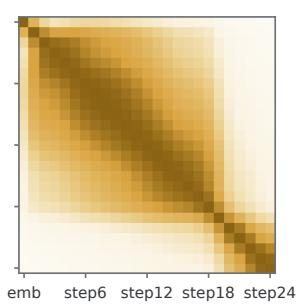  
DeiT III-L/16  
reViT-L/16 (Ours)

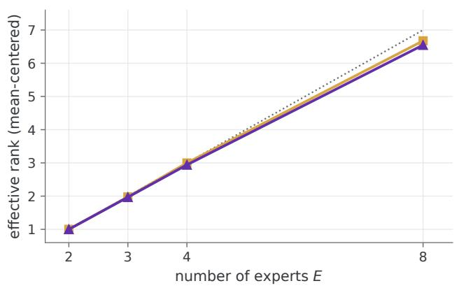  
upper bound = E − 1 Gate matrix (depth-centered) Merged weights (W1, depth-centered)

(a) reViT-S/16 (L=12)  
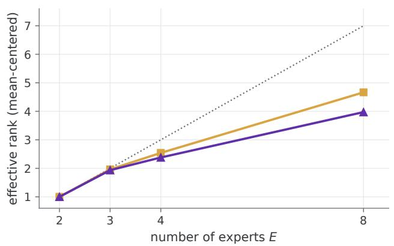  
upper bound = E − 1 Gate matrix (depth-centered) Merged weights (W1, depth-centered)

(b) reViT-L/16 (L=24)  
Figure 6 Depth-centered routing and merged-weight ranks. Centering removes the mean gate and merged W vectors across recurrent depth. The dashed line marks the resulting rank ceiling E − 1.  
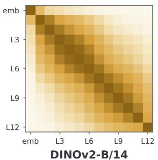

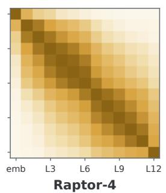

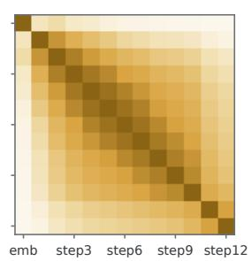

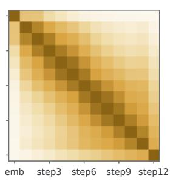  
Figure 7 Depthwise self-CKA after DINOv2 distillation. Linear CKA of mean-pooled patch-token residual states from the embedding through depth 12, computed over 1,000 ImageNet validation images, for DINOv2-B/14, Raptor-4, and distilled reViT-B/14 with $E \in \{ 1 , 8 \}$ and L=12. The E=1 model is a plain tied block without an expert bank.

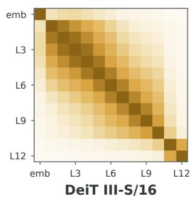

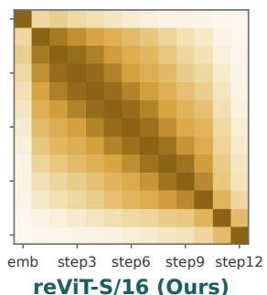

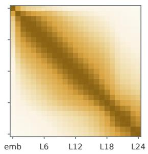  
Figure 8 Depthwise self-CKA after supervised ImageNet-1k training. Linear CKA of mean-pooled patch-token residual states over 1,000 validation images for DeiT III-S/16 and reViT-S/16 (12 blocks/steps), and DeiT III-L/16 and reViT-L/16 (24 blocks/steps). Dark near-diagonal bands indicate greater similarity between neighboring depths.

The banded structure also emerges under supervised training: Fig. 8 extends the analysis of Fig. 7 to the supervised regime, comparing our $\mathrm { S } / 1 6$ and $\mathrm { L } / 1 6$ models with DeiT III baselines (Touvron et al., 2022) of the same size. The same banded structure appears at both scales. For $\mathrm { L } / 1 6$ , the band of our model narrows visibly over the last quarter of the recurrence. We treat these self-CKA panels as descriptions of the recurrent trajectories rather than evidence for the expert mechanism.

Self-CKA describes the structure within each trajectory. We next use cross-model CKA to compare student steps with teacher layers.

Expert capacity improves alignment to the teacher’s depth progression: Within the recipe-matched reViT family, the maximum-CKA path approaches proportional teacher depth as the expert bank grows. Its $\rho / \mathrm { M A D }$ improves from 0.969/1.54 at $E { = } 1$ to $0 . 9 9 2 / 0 . 6 9$ at $E { = } 4$ and 0.999/0.23 at $E { = } 8$ (Fig. 9). The $E { = } 1$ path saturates at teacher layer 7, whereas $E { = } 8$ reaches layer 12. Excluding the embedding and final states preserves the ordering, with interior-step MAD values of 1.36, 0.55, and 0.27. Thus, additional expert capacity improves how evenly the recurrent trajectory covers teacher depth despite supervision only from the teacher’s final output features.

Raptor’s maximum-CKA path follows the proportional diagonal exactly. This is expected because its training objective directly supervises intermediate teacher layers (Jacobs et al., 2026). We therefore treat it as a reference for explicit intermediate alignment rather than a control for alignment emerging under output-only distillation.

Expert ablations are shaped by schedule position: We ablate one expert by setting its gate weight to zero at every depth, renormalizing the remaining weights, and leaving the checkpoint fixed. We report $\Delta \mathrm { C K A } = \mathrm { C K A } _ { \mathrm { a b l a t i o n } } - \mathrm { C K A } _ { \mathrm { i n t a c t } }$ , so negative values indicate worse teacher alignment. For each ablation, we draw 64 random gate perturbations matched to its Frobenius displacement in the merged FFN weights. Most expert ablations are less damaging than random changes of the same size (Fig. 4). At $E { = } 8$ , removing expert 5 changes CKA by +0.009, with no measurable adverse efect.

Raw ablation cost also depends on when an expert is used. The earliest-routed experts cause the largest losses (Fig. 10a).

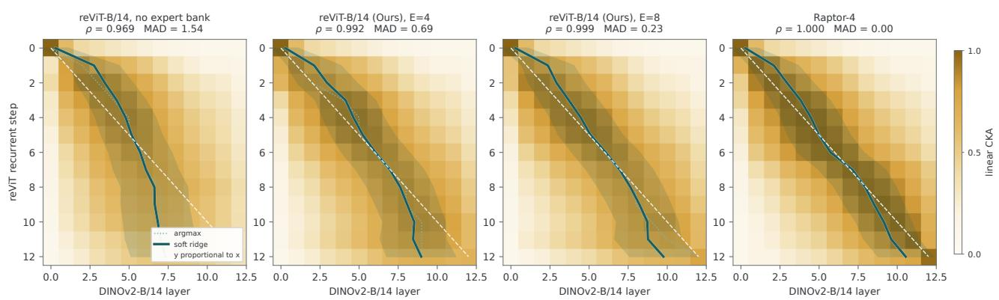  
Figure 9 Cross-CKA with DINOv2 across depth. Linear CKA between DINOv2-B/14 states (horizontal) and student states (vertical) for distilled reViT-B/14 with E ∈ {1, 4, 8} and Raptor-4, over the same 1,000-image subset as Figs. 7 and 8. Dotted lines mark the maximum-CKA teacher depth, and dashed lines mark proportional depth. ρ is the Spearman correlation between recurrent depth and the maximum-CKA teacher depth. MAD is that path’s mean absolute deviation from proportional depth in teacher-layer units. Solid lines and bands show the weighted mean ± one standard deviation using weights proportional to max(CKA, 0)4.

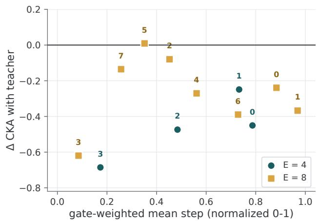  
(a) Ablation efect versus mean depth

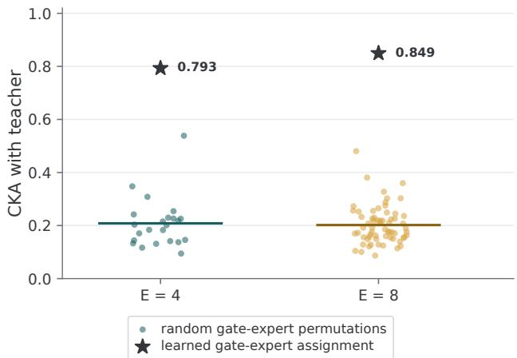  
(b) Gate–expert assignment permutation  
Figure 10 Schedule controls for expert ablation. (a) CKA change after ablation against each expert’s gate-weighted mean normalized depth. (b) Teacher CKA for the learned assignment (stars) and nonidentity permutations of gate columns across the fixed expert bank (dots). Horizontal lines show permutation means. We evaluate all 23 permutations for E=4 and 64 sampled permutations for E=8.

Ablation magnitude alone therefore does not establish an expert-specific role. We test the assignment directly by permuting complete gate columns across the fixed expert bank. This retains every expert and gate trajectory while changing only their pairing. Teacher CKA falls from 0.793 to 0.208 on average for E=4 and from 0.849 to 0.202 for E=8, and no tested permutation reaches the learned assignment (Fig. 10b).

## References

Sangmin Bae, Adam Fisch, Hrayr Harutyunyan, Ziwei Ji, Seungyeon Kim, and Tal Schuster. Relaxed recursive transformers: Efective parameter sharing with layer-wise lora. In International Conference on Learning Representations, 2025a. (pages 1, 14)

Sangmin Bae, Yujin Kim, Reza Bayat, Sungnyun Kim, Jiyoun Ha, Tal Schuster, Adam Fisch, Hrayr Harutyunyan, Ziwei Ji, Aaron Courville, and Se-Young Yun. Mixture-of-recursions: Learning dynamic recursive depths for adaptive token-level computation. Advances in Neural Information Processing Systems, 2025b. (pages 1, 3)

Róbert Csordás, Kazuki Irie, Jürgen Schmidhuber, Christopher Potts, and Christopher D Manning. Moeut: Mixture-of-experts universal transformers. Advances in Neural Information Processing Systems, 2024. (pages 1, 2, 3, 6, 7, 13, 14)

Damai Dai, Chengqi Deng, Chenggang Zhao, RX Xu, Huazuo Gao, Deli Chen, Jiashi Li, Wangding Zeng, Xingkai Yu, Yu Wu, et al. Deepseekmoe: Towards ultimate expert specialization in mixture-of-experts language models. In Proceedings of the 62nd annual meeting of the association for computational linguistics (volume 1: Long papers), 2024. (page 14)

Mostafa Dehghani, Stephan Gouws, Oriol Vinyals, Jakob Uszkoreit, and Łukasz Kaiser. Universal transformers. In International Conference on Learning Representations, 2019. (pages 1, 2)

Alexey Dosovitskiy, Lucas Beyer, Alexander Kolesnikov, Dirk Weissenborn, Xiaohua Zhai, Thomas Unterthiner, Mostafa Dehghani, Matthias Minderer, Georg Heigold, Sylvain Gelly, Jakob Uszkoreit, and Neil Houlsby. An image is worth 16x16 words: Transformers for image recognition at scale. In International Conference on Learning Representations, 2021. (pages 1, 3)

Amin Ghiasi, Hamid Kazemi, Eitan Borgnia, Steven Reich, Manli Shu, Micah Goldblum, Andrew Gordon Wilson, and Tom Goldstein. What do vision transformers learn? a visual exploration. arXiv preprint arXiv:2212.06727, 2022. (page 1)

Alex Graves. Adaptive computation time for recurrent neural networks. arXiv preprint arXiv:1603.08983, 2016. (page 2)

Klaus Gref, Rupesh Kumar Srivastava, and Jürgen Schmidhuber. Highway and residual networks learn unrolled iterative estimation. In International Conference on Learning Representations, 2017. (page 1)

David Ha, Andrew Dai, and Quoc V. Le. Hypernetworks. In International Conference on Learning Representations, 2017. (pages 3, 4)

Yunhong He, Zhengqing Yuan, Weixiang Sun, Yiyang Li, Yixin Liu, Yanfang Ye, and Lichao Sun. Vision-mor: Scaling vision transformer via patch-level mixture-of-recursions. In Proceedings of the AAAI Conference on Artificial Intelligence, 2026. (page 3)

Gao Huang, Yu Sun, Zhuang Liu, Daniel Sedra, and Kilian Q Weinberger. Deep networks with stochastic depth. In European conference on computer vision, 2016. (page 4)

Mozes Jacobs, Thomas Fel, Richard Hakim, Alessandra Brondetta, Demba Ba, and T Anderson Keller. Block recurrent dynamics in vision transformers. In International Conference on Learning Representations, 2026. (pages 1, 2, 4, 5, 6, 8, 10, 11, 17)

Ganesh Jawahar, Benoît Sagot, and Djamé Seddah. What does bert learn about the structure of language? In Proceedings of the 57th annual meeting of the association for computational linguistics, 2019. (page 1)

Simon Kornblith, Mohammad Norouzi, Honglak Lee, and Geofrey Hinton. Similarity of neural network representations revisited. In International conference on machine learning, 2019. (pages 8, 15)

Zhenzhong Lan, Mingda Chen, Sebastian Goodman, Kevin Gimpel, Piyush Sharma, and Radu Soricut. Albert: A lite bert for self-supervised learning of language representations. In International Conference on Learning Representations, 2020. (pages 1, 2)

YiZhou Li, Jinyi Xu, Mingyu Yin, and Xianyi Zhao. Edge-recvit: Eficient vision transformer via semantic-refined dynamic recursion. In Proceedings of the IEEE/CVF Conference on Computer Vision and Pattern Recognition, 2026. (page 3)

Aixin Liu, Bei Feng, Bing Xue, Bingxuan Wang, Bochao Wu, Chengda Lu, Chenggang Zhao, Chengqi Deng, Chenyu Zhang, Chong Ruan, et al. Deepseek-v3 technical report. arXiv preprint arXiv:2412.19437, 2024. (pages 2, 6, 7, 13, 14)

Mohammed Muqeeth, Haokun Liu, and Colin Rafel. Soft merging of experts with adaptive routing. Transactions on Machine Learning Research, 2024. (pages 3, 6, 7, 13)

Maxime Oquab, Timothée Darcet, Théo Moutakanni, Huy Vo, Marc Szafraniec, Vasil Khalidov, Pierre Fernandez, Daniel Haziza, Francisco Massa, Alaaeldin El-Nouby, et al. Dinov2: Learning robust visual features without supervision. Transactions on Machine Learning Research, 2024. (pages 2, 5, 6, 10)

Ethan Perez, Florian Strub, Harm De Vries, Vincent Dumoulin, and Aaron Courville. Film: Visual reasoning with a general conditioning layer. In Proceedings of the AAAI conference on artificial intelligence, 2018. (page 3)

Joan Puigcerver, Carlos Riquelme Ruiz, Basil Mustafa, and Neil Houlsby. From sparse to soft mixtures of experts. In International Conference on Learning Representations, 2024. (pages 3, 6, 7, 13, 14)

Zihan Qiu, Zeyu Huang, Bo Zheng, Kaiyue Wen, Zekun Wang, Rui Men, Ivan Titov, Dayiheng Liu, Jingren Zhou, and Junyang Lin. Demons in the detail: On implementing load balancing loss for training specialized mixture-of-expert models. In Proceedings of the 63rd Annual Meeting of the Association for Computational Linguistics (Volume 1: Long Papers), 2025. (page 14)

Maithra Raghu, Thomas Unterthiner, Simon Kornblith, Chiyuan Zhang, and Alexey Dosovitskiy. Do vision transformers see like convolutional neural networks? Advances in neural information processing systems, 2021. (pages 1, 15)

Carlos Riquelme, Joan Puigcerver, Basil Mustafa, Maxim Neumann, Rodolphe Jenatton, André Susano Pinto, Daniel Keysers, and Neil Houlsby. Scaling vision with sparse mixture of experts. Advances in neural information processing systems, 2021. (page 3)

Olivier Roy and Martin Vetterli. The efective rank: A measure of efective dimensionality. In European signal processing conference, 2007. (page 15)

Noam Shazeer, Azalia Mirhoseini, Krzysztof Maziarz, Andy Davis, Quoc Le, Geofrey Hinton, and Jef Dean. Outrageously large neural networks: The sparsely-gated mixture-of-experts layer. In International Conference on Learning Representations, 2017. (page 3)

Zhiqiang Shen, Zechun Liu, and Eric Xing. Sliced recursive transformer. In European Conference on Computer Vision, 2022. (page 2)

Shawn Tan, Yikang Shen, Zhenfang Chen, Aaron Courville, and Chuang Gan. Sparse universal transformer. In Proceedings of the 2023 Conference on Empirical Methods in Natural Language Processing, 2023. (pages 1, 3)

Hugo Touvron, Matthieu Cord, and Hervé Jégou. Deit iii: Revenge of the vit. In European Conference on Computer Vision, 2022. (pages 2, 5, 10, 17)

Lucrezia Valeriani, Diego Doimo, Francesca Cuturello, Alessandro Laio, Alessio Ansuini, and Alberto Cazzaniga. The geometry of hidden representations of large transformer models. Advances in Neural Information Processing Systems, 2023. (page 1)

Lean Wang, Huazuo Gao, Chenggang Zhao, Xu Sun, and Damai Dai. Auxiliary-loss-free load balancing strategy for mixture-of-experts. arXiv preprint arXiv:2408.15664, 2024. (page 14)

Ziteng Wang, Jun Zhu, and Jianfei Chen. Remoe: Fully diferentiable mixture-of-experts with relu routing. In International Conference on Learning Representations, 2025. (pages 2, 6, 7, 13, 14)

An Yang, Anfeng Li, Baosong Yang, Beichen Zhang, Binyuan Hui, Bo Zheng, Bowen Yu, Chang Gao, Chengen Huang, Chenxu Lv, et al. Qwen3 technical report. arXiv preprint arXiv:2505.09388, 2025. (pages 2, 6, 7, 13, 14)

Brandon Yang, Gabriel Bender, Quoc V Le, and Jiquan Ngiam. Condconv: Conditionally parameterized convolutions for eficient inference. Advances in neural information processing systems, 2019. (page 3)

Jinnian Zhang, Houwen Peng, Kan Wu, Mengchen Liu, Bin Xiao, Jianlong Fu, and Lu Yuan. Minivit: Compressing vision transformers with weight multiplexing. In Proceedings of the IEEE/CVF Conference on Computer Vision and Pattern Recognition (CVPR), 2022. (page 2)

Zexuan Zhong, Mengzhou Xia, Danqi Chen, and Mike Lewis. Lory: Fully diferentiable mixture-of-experts for autoregressive language model pre-training. In Conference on Language Modeling (COLM), 2024. (pages 3, 6, 7, 12, 13)

Barret Zoph, Irwan Bello, Sameer Kumar, Nan Du, Yanping Huang, Jef Dean, Noam Shazeer, and William Fedus. St-moe: Designing stable and transferable sparse expert models. arXiv preprint arXiv:2202.08906, 2022. (page 10)