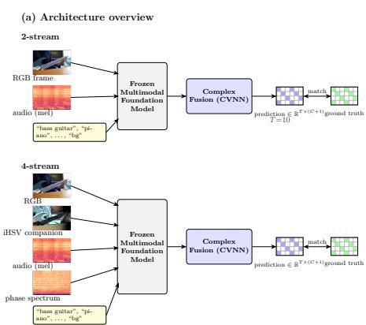
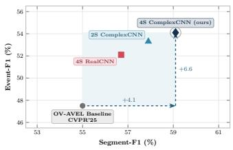
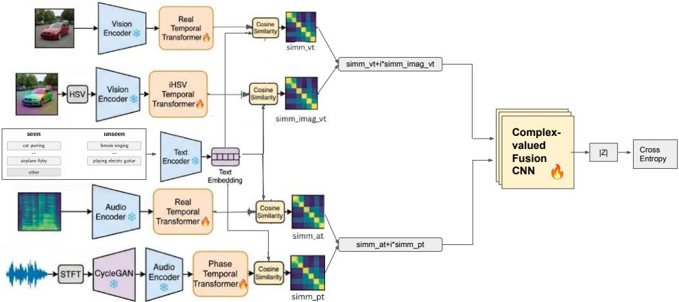
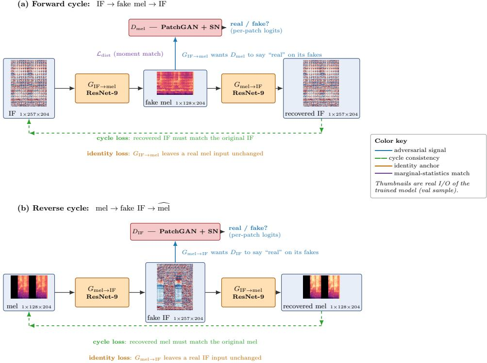
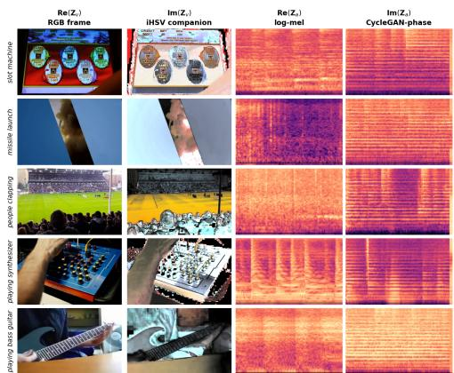
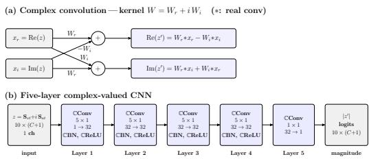
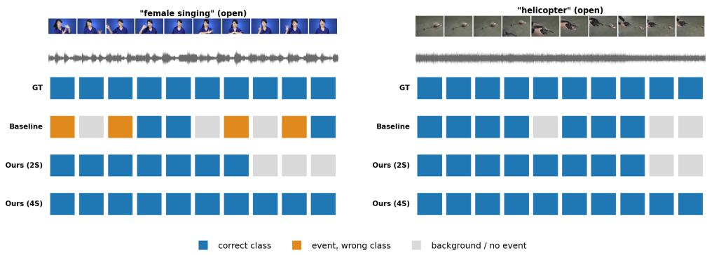

# Open-Vocabulary Audio-Visual Event Localization via Complex-Valued Fusion

Anirudh Praveen1   
anirudhp24@iitk.ac.in   
Koteswar Rao Jerripothula1   
kotesrj@iitk.ac.in   
2Pratik Joshi2   
pratik.joshi@dolby.com   
Aveen Dayal2   
caveen.dayal@dolby.com   
ONeela Sawant2   
8neela.sawant@dolby.com

1 IIT Kanpur Kanpur, India

2 Dolby Laboratories Bengaluru, India

## Abstract

Open-Vocabulary Audio-Visual Event Localization (OV-AVEL) labels each video segment with an event class, including classes that were never seen during training. The dominant pipeline uses a frozen multimodal foundation model (e.g. ImageBind) to embed the visual frame, the audio mel-spectrogram, and each candidate class name into a shared space, then computes two cosine similarities for each segment against each class: visual–text and audio–text. Existing methods then collapse this pair into a sin gle scalar score with a fixed rule (geometric mean, weighted average) before taking the argmax. Instead, we compute complex-valued similarities and learn their fusion using a complex-valued neural network (CVNN). Each modality’s standard representation becomes the real part of our pipeline, and a paired companion stream supplies the imaginary part. We use imaginary part of iHSV for visual modality and CycleGAN-translated phase spectrogram for audio modality as these companion streams. This results in two complex similarities, which are then fused. While the vision and audio encoders remain frozen, only the temporal-attention blocks and the fusion CVNN are trained. The four-stream complex architecture sets a new state of the art on both OV-AVEL benchmarks. On the open (unseen-class) split of OV-AVEBench we reach 66.5/59.1/54.1% Acc/Seg-F1/Event-F1 (+1.6/ + 4.1/ + 6.6 over the previously reported fine-tuned baseline), with consistent gains for seen classes as well. We also modify AVE dataset for this task and observe that our architecture reaches 60.7/51.9/50.4% Acc/Seg-F1/Event-F1, achieving state-of-the-art OV-AVEL results on it as well. We also propose a two-stream alternative, which also sees great improvements over the baseline. Code is available at https://github.com/AnirudhPraveen/Complex-Valued-OV-AVEL

## 1 Introduction

Audio-visual event localization (AVEL) labels each video second with the event class that is simultaneously audible and visible [23]. The closed-vocabulary formulation has been extensively studied via cross-modal fusion: attention-based networks [10, 25, 28], positivesample propagation [32], background suppression [27], and contrastive variants [1, 4, 6, 12]. A related thread targets generalized audio-visual zero-shot learning for whole-video classification into unseen categories [14, 15, 16, 18, 21]. Recent work pushes AVEL into open-set settings [30]; the strict open-vocabulary variant of Zhou et al. [34] goes further: test classes are never seen during training, and the model must produce segment-level labels by reasoning over text-defined categories at inference. The prevailing recipe uses a frozen audiovisual-text foundation model (ImageBind [5], LanguageBind [35], or CLIP/CLAP [22, 26]) to embed audio, video, and text into a shared space, then predicts the class with the highest combined cosine similarity—open-vocabulary by construction.

The bottleneck is fusion. For each segment and class c, frozen encoders yield two numbers: $\mathrm { s i m } _ { \nu t }$ [c] and $\sin _ { a t }$ [c]. Existing OV-AVEL pipelines combine these with a fixed scalar rule (weighted average or geometric mean) [34], collapsing the pair to a single value and discarding a degree of freedom that could otherwise vary across classes and segments.

(b) Unseen-category performance (OV-AVEBench)  
  
Figure 1: (a) 2- and 4-stream complexfusion pipelines. (b) Unseen-split Segment-F1 vs Event-F1 on OV-AVEBench; the 4- stream complex model improves the baseline by $+ 4 . 1 / + 6 . 6$

A related limitation: existing pipelines discard audio phase. The standard Image-Bind encoder consumes a log-mel spectrogram, discarding STFT phase—yet phase is a free by-product of the same Fourier transform and carries onset, harmonic, and transient cues that magnitude alone does not. We therefore (i) treat the visual–audio similarity pair as a complex value rather than collapsing it, and (ii) feed audio phase as a complementary, mel-shaped input to the same frozen encoder.

Our approach. Our architecture has two testable ingredients (Fig. 1; schematic in Fig. 2; details in Sec. 3).

(1) Complex-valued fusion: We replace the scalar geometric-mean fusion of [34] with a five-layer ComplexCNN [24] that treats visual–text and audio–text similarities as the real and imaginary parts of a complex input. This 2-stream fusion accounts for the bulk of the gain over the baseline; a parametermatched real CNN at the same stream count actually trails it, confirming the lift stems from the complex parameterisation rather than extra capacity (Tab. 5).

(2) Four-stream extension: Each modality is enriched with a paired companion—an

iHSV [29] transform on the visual side and a CycleGAN-translated phase spectrogram on the audio side—giving each modality its own complex (content + structure) pair, both fed to the same ComplexCNN. The auxiliary streams add a smaller, complementary gain on top of (1) (Tab. 5).

Contributions: 1. A complex-valued fusion network for OV-AVEL treating audio–text similarity as the imaginary part and visual–text similarity as the real part, fused by a five-layer

ComplexCNN. This 2-stream design yields the dominant gain over [34] (Tab. 5, Sec. 3). 2. A four-stream extension enriching each modality with a paired imaginary companion (iHSV visual, CycleGAN-phase audio), stacked as two complex channels into the same Complex-CNN, adding a further complementary gain (Tab. 5; Sec. 3.2–3.3).

Our core motivation is to explore complex-valued neural networks (CVNNs) or ComplexCNNs for multimodal fusion. CVNNs yield richer representations than real-valued networks, provided complex inputs are supplied. Two natural ways exist with audio-video data: (i) a separate complex channel per modality, or (ii) combining both modalities into one complex channel. The 4-stream approach uses option (i), yielding two complex-valued input channels. The 2-stream approach uses option (ii), packaging both modalities into a single complex channel—real for visual, imaginary for audio—giving a simpler, more efficient, and redundancy-reduced representation. The intuition is that audio information is directionally orthogonal to visual information, analogous to depth.

## 2 Related Work

Closed-set audio-visual event localization: Tian et al. [23] introduced the AVE benchmark and formulated AVEL as a fully-supervised, closed-vocabulary, per-segment classification problem in which each one-second segment is labelled with a single audio-visual event category or background. Follow-up work has primarily strengthened the cross-modal fusion: dual-modality attention modules (DAM [25], DMRN [10]), relation-aware crossmodal attention (CMRAN [28]), positive-sample propagation (PSP [32]), cross-modal background suppression (CMBS [27]), contrastive learning [1], event-specific preferences [4], CLIP-based temporal transformers [12], and co-guidance attention [6]; a unified multitask family also handles audio-visual video parsing (MM-Pyramid [31]) and segmentation [33]. All are closed-vocabulary: test categories must overlap with training categories, and the fusion step reduces audio and visual evidence to real-valued scalars or concatenations. Audio-visual zero-shot learning and open-set AVE: Generalized zero-shot learning (AV-GZSL) [14, 21] treats unseen classes at the video level, classifying a whole clip into a possibly unseen category by aligning audio-visual features with text, more recently via cross-modal attention [15, 16] and simpler distillation [18]. A closer setting is open-set AVE (OpenAVE [30]), which adds an “unknown” class for unseen categories but does not predict their specific labels. We address the strictly harder open-vocabulary variant, producing explicit segment-level labels for unseen classes. Open-vocabulary AVEL: Zhou et al. [34] introduced OV-AVEL by reusing the ImageBind [5] text encoder so the test vocabulary can include unseen classes. They report a training-free baseline (predict an event only when audio and visual independently rank the same class top-1) and afine-tuned baseline (a small real-valued temporal-attention head and fusion CNN on frozen ImageBind features); both combine a pair of scalar text similarities with a fixed rule before the argmax. We keep the open-vocabulary protocol but replace the scalar fusion with a complex-valued fusion of the visual–text and audio–text similarities (Sec. 1). Multimodal foundation models: Large-scale image–text contrastive pretraining (CLIP [22]) and its multi-modal extensions (ImageBind [5], LanguageBind [35], audio–text CLAP [26]) provide a shared embedding space, enabling open-vocabulary inference by construction: a new class name is encoded into the shared text space and compared against modality embeddings via cosine similarity. We use ImageBind as a frozen backbone like the OV-AVEL baseline [34]; our contribution is at the fusion rather than the representation stage. Complex-valued neural networks:

Complex-valued networks [24] are a parameter-tied form of real network in which weights $W = W _ { R } + i W _ { I }$ act on a complex input $x = x _ { R } + i x _ { I }$ through structured cross-channel mixing $W x = ( W _ { R } x _ { R } - W _ { I } x _ { I } ) + i ( W _ { R } x _ { I } + W _ { I } x _ { R } )$ . Used in MRI reconstruction, audio source separation, and other intrinsically complex signal-processing tasks, their use in open-vocabulary multimodal event localization is, to our knowledge, new. Phase information in audio: The STFT phase carries cues complementary to magnitude (onsets, harmonic locking, transient localization) [19, 20] but is hard for a magnitude-trained encoder to consume because of $2 \pi$ wrap-around. A common fix is the instantaneous-frequency (IF) derivative, smooth across the wrap and locally concentrated on harmonics and onsets [2, 3]; separately, CycleGANstyle unpaired translation has been applied to spectrogram-domain audio such as voice conversion [9, 36]. We combine these threads, not done before to our knowledge: an unpaired CycleGAN translates the IF spectrogram into the mel-magnitude manifold a frozen audio encoder expects, letting it ingest phase-derived input without retraining. Color spaces and visual structure: HSV decomposes a colour into a hue angle $H \in [ 0 , 2 \pi ]$ , saturation $S \in [ 0 , 1 ]$ and value $V \in [ 0 , 1 ]$ , the angular H being the natural visual analogue of audio phase. The synthetic iHSV imaginary companion of an RGB frame (an involutive flip of the HSV decomposition) was introduced by Yadav and Jerripothula [29] as the imaginary input to a fully complex-valued image classifier; we adopt it as the imaginary half of the visual stream.

## 3 Methodology

Our model takes a 10-second video sliced into $T { = } 1 0$ one-second segments and produces, for each segment, a label drawn from an unseen category set $\mathcal { C } = \{ c _ { 1 } , \ldots , c _ { C } , \mathbf { B } \mathbf { G } \}$ , where the test categories may be unseen at training and BG denotes non-event background. We keep the open-vocabulary protocol of Zhou et al. [34] (frozen foundation model, text-aligned cosine similarities, class-agnostic fusion) but replace the two-stream (RGB, mel) scalar pipeline with a complex-valued one. Sec. 3.1 fixes notation; Secs. 3.2–3.3 describe the four streams; Sec. 3.4 describes the complexcnn fusion; Sec. 3.5 specifies what is trainable. Fig. 2 gives a schematic overview.

## 3.1 Frozen backbone and notation

Each video is represented by a log-mel spectrogram $\mathbf { a } \in \mathbb { R } ^ { 1 \times 1 2 8 \times 2 0 4 }$ , T RGB frames $\mathbf { V } =$ $\{ \mathbf { v } _ { t } \} _ { t = 1 } ^ { T }$ with $\mathbf { v } _ { t } \in \mathbb { R } ^ { 3 \times 2 2 4 \times 2 2 \dot { 4 } }$ , and a text prompt set $\mathbf { T } = \{ \tau _ { 1 } , \dots , \tau _ { C + 1 } \}$ that includes a literal “Background” prompt. We use ImageBind ViT-H [5] as a frozen multimodal backbone with encoders $\mathcal { E } _ { a } , \mathcal { E } _ { \nu } , \mathcal { E } _ { t }$ that map every modality into a shared D=1024-dim space:

$$
\mathbf { f } _ { a } = \mathcal { E } _ { a } ( \mathbf { a } ) \in \mathbb { R } ^ { T \times D } , \quad \mathbf { f } _ { \nu } = \mathcal { E } _ { \nu } ( \mathbf { V } ) \in \mathbb { R } ^ { T \times D } , \quad \mathbf { f } _ { t } = \mathcal { E } _ { t } ( \mathbf { T } ) \in \mathbb { R } ^ { ( C + 1 ) \times D } .\tag{1}
$$

All three encoders remain frozen at training time. This is what gives the system its openvocabulary property: a previously unseen test class is classified simply by appending its name to T at inference.

## 3.2 Visual stream as a complex pair: RGB +i imaginary component of iHSV

We treat the visual modality as a single complex object: its real part is the standard RGB content view, and its imaginary part is a colour-structure companion derived from the imaginary part of iHSV [29]. Both views share the same frozen vision encoder ${ \mathcal E } _ { \nu }$ , so no new backbone parameters are introduced.

  
Figure 2: Four-stream complex-valued OV-AVEL architecture. Each modality forms a complex similarity tensor against the text prompts: $\mathbf { Z } _ { \nu } = \mathbf { S } _ { \nu t } + i \mathbf { S } _ { \nu t } ^ { \mathrm { I } }$ (RGB +i iHSV, via frozen ${ \mathcal E } _ { \nu } )$ and $\mathbf { Z } _ { a } = \mathbf { S } _ { a t } + i \mathbf { S } _ { p t }$ (mel +i CycleGAN-translated phase, via frozen ${ \mathcal { E } } _ { a }$ and frozen $G _ { \mathrm { I F }  \mathrm { m e l } } )$ . The two tensors are stacked as the two channels of a five-layer ComplexCNN whose output magnitude gives the per-segment class scores. Only the four temporal-attention heads $( \Phi _ { \nu } , \Phi _ { \nu } ^ { \mathrm { I } } , \Phi _ { a } , \Phi _ { \phi } )$ and the ComplexCNN are trained; the ImageBind encoders and the CycleGAN generator are frozen

Why a paired visual companion: The audio side of our architecture forms a complex pair naturally: mel magnitude is the real part, and CycleGAN-translated audio phase is the imaginary part (Sec. 3.3). For the ComplexCNN fusion to receive a symmetric, two-complexchannel input, the visual modality also needs a companion stream that plays the role of the imaginary part.

Real part: RGB content. Per-segment features $\mathbf { f } _ { \nu } = \mathcal { E } _ { \nu } ( \mathbf { V } )$ are refined by a one-layer temporal self-attention module $\Phi _ { \nu }$ that exchanges information across the T time steps, giving $\tilde { \mathbf { f } } _ { \nu } = \Phi _ { \nu } ( \mathbf { f } _ { \nu } )$ . A cosine similarity to the text features produces the real part of the visual channel:

$$
\mathbf { S } _ { \nu t } [ t , c ] = c o s s i m \big ( \tilde { \mathbf { f } } _ { \nu } [ t ] , \mathbf { f } _ { t } [ c ] \big ) , \qquad \mathbf { S } _ { \nu t } \in \mathbb { R } ^ { T \times ( C + 1 ) } .\tag{2}
$$

Imaginary part: iHSV colour-structure companion. Each RGB frame is converted to HSV with $H \in [ 0 , 2 \pi ]$ and $S , V \in [ 0 , 1 ]$ . We form the imaginary triplet

$$
\mathbf { i } ( \mathbf { v } _ { t } ) = { \big ( } V , S \sin H , S { \big ) } ,\tag{3}
$$

the natural counterpart of the real triplet (SH,ScosH,V) used in fully-complex HSV decompositions. Treating this triplet as a synthetic HSV image and converting it back to RGB yields a 3-channel tensor in which the cyclic part of the hue is preserved through sinH and the chromatic structure is preserved through S. We normalise the resulting image with the

ImageBind RGB statistics. The same frozen ${ \mathcal E } _ { \nu }$ ingests this companion image, after which a separate temporal attention $\Phi _ { \nu } ^ { \mathrm { I } }$ yields the imaginary part of the visual channel:

$$
\mathbf { S } _ { \nu t } ^ { \mathrm { I } } [ t , c ] = c o s s i m \big ( \Phi _ { \nu } ^ { \mathrm { I } } \big ( \mathcal { E } _ { \nu } ( \mathbf { i } ( \mathbf { V } ) ) \big ) [ t ] , \mathbf { f } _ { t } [ c ] \big ) .\tag{4}
$$

The visual stream thus emits one complex similarity tensor $\mathbf { Z } _ { \nu } = \mathbf { S } _ { \nu t } + i \mathbf { S } _ { \nu t } ^ { \mathrm { I } } \in \mathbb { C } ^ { T \times ( C + 1 ) }$

## 3.3 Audio stream as a complex pair: mel +i CycleGAN-phase

Symmetrically, we treat the audio modality as a single complex object: real part = logmel magnitude content, imaginary $p a r t = { \mathrm { p h a s e } }$ information translated into the same melcompatible domain so the frozen audio encoder ${ \mathcal { E } } _ { a }$ can ingest it.

Real part: mel magnitude. A one-layer temporal attention $\Phi _ { a }$ refines $\mathbf { f } _ { a } = \mathscr { E } _ { a } ( \mathbf { a } )$ into $\tilde { \mathbf { f } } _ { a }$ and produces similarities $\mathbf { S } _ { a t } [ t , c ] = c o s s i m ( \tilde { \mathbf { f } } _ { a } [ t ] , \mathbf { f } _ { t } [ c ] )$

## 3.3.1 Imaginary part: CycleGAN-translated phase.

The STFT phase carries onsets and transient cues complementary to magnitude, but is too noisy in its raw form to be consumed by a magnitude-trained encoder. We address this in two steps.

First, from the STFT phase $\phi \in [ - \pi , \pi ] ^ { 1 \times 2 5 7 \times 2 0 4 }$ we extract the instantaneous frequency $\operatorname { I F } [ f , t ] = ( \phi [ f , t ] - \phi [ f , t - 1 ] )$ mod $2 \pi - \pi$ . Second, we train an unpaired CycleGAN [36] with a generator $G _ { \mathrm { I F  m e l } } : \mathbb { R } ^ { \bar { 1 } \times 2 5 7 \times 2 0 4 }  \mathbb { R } ^ { 1 \times 1 2 8 \times 2 0 4 }$ and a companion $G _ { \mathrm { m e l \to I F } }$ , plus two PatchGAN [7] discriminators $D _ { \mathrm { m e l } }$ and $D _ { \mathrm { I F } }$ . The CycleGAN is trained offline and frozen before OV-AVEL training begins. Fig. 3 shows the two training cycles, the four loss terms, and example translated spectrograms.

Generator architecture: Each generator is a 9-residual-block ResNet in the style of Johnson et al. [8]: the standard CycleGAN backbone, with a $7 \times 7$ reflection-padded stem, two stride-2 downsampling convolutions, nine residual blocks, two transpose-convolution upsamplers, and a $7 \times 7$ output convolution with tanh; instance norm and ReLU throughout.

Training objectives: We adopt the generic two-domain CycleGAN notation of Zhu et al. [36]: domain A is IF and domain B is mel, $a \sim A$ and $b \sim B$ are unpaired samples (drawn from different clips), $G \equiv G _ { A  B } = G _ { \mathrm { I F  m e l } }$ , its reverse $G _ { B  A } = G _ { \mathrm { m e l  I F } }$ plays the role of F in Zhu et al., and $D _ { B } = D _ { \mathrm { m e l } }$ is the discriminator for the codomain of $G$ (symmetrically $D _ { A } = D _ { \mathrm { I F } } ) ; \mathbb { E } _ { a } , \mathbb { E } _ { b }$ denote expectations over the two domains. The generators are trained with four loss terms. The adversarial loss uses the LSGAN [13] formulation $( \ell _ { 2 }$ on discriminator outputs) for stability on spectrogram-shaped inputs:

$$
\begin{array} { r } { \mathcal { L } _ { \mathrm { a d v } } ( G , D _ { B } ) = \mathbb { E } _ { b } \left[ ( D _ { B } ( b ) - 1 ) ^ { 2 } \right] + \mathbb { E } _ { a } \left[ D _ { B } ( G ( a ) ) ^ { 2 } \right] , } \end{array}\tag{5}
$$

applied symmetrically for both directions. The cycle-consistency loss preserves enough in formation through the round trip that the input can be recovered:

$$
\mathcal { L } _ { \mathrm { c y c } } = \mathbb { E } [ \| G _ { B \to A } ( G _ { A \to B } ( a ) ) - a \| _ { 1 } ] + \mathbb { E } [ \| G _ { A \to B } ( G _ { B \to A } ( b ) ) - b \| _ { 1 } ] .\tag{6}
$$

The identity loss regularises each generator towards preserving its target domain. In the standard CycleGAN this term feeds a real target-domain sample directly to the generator,

(a) Forward cycle: IF fake mel IF

  
Figure 3: Unpaired CycleGAN translating the instantaneous-frequency (IF) phase spectrogram into the mel-magnitude domain expected by the frozen audio encoder. (a) forward and (b) reverse cycles, built from the two ResNet-9 generators $G _ { \mathrm { I F }  \mathrm { m e l } } .$ $G _ { \mathrm { m e l \to I F } }$ and PatchGAN discriminators $D _ { \mathrm { m e l } } , D _ { \mathrm { I F } }$ , trained with adversarial, cycle-consistency, identity, and distribution-matching $( { \mathcal { L } } _ { \mathrm { d i s t } } )$ losses. At OV-AVEL time only $G _ { \mathrm { I F }  \mathrm { m e l } }$ is used; the rest is training-time scaffolding.

which is possible because both domains share the same shape. Here the two domains have different frequency dimensions, so $G _ { \mathrm { I F }  \mathrm { m e l } }$ and $G _ { \mathrm { m e l \to I F } }$ cannot ingest a target-domain sample unchanged; we therefore adaptive-pool the input to the generator’s expected input shape first. The term thus asks each generator to recover the original target-domain sample from a resampled copy of itself: a softer constraint than a strict no-op, but one that still discourages spurious changes on in-domain inputs:

$$
\mathcal { L } _ { \mathrm { i d t } } = \mathbb { E } [ \left\| G _ { A \to B } ( \mathrm { p o o l } _ { A } ( b ) ) - b \right\| _ { 1 } ] + \mathbb { E } [ \left\| G _ { B \to A } ( \mathrm { p o o l } _ { B } ( a ) ) - a \right\| _ { 1 } ] .\tag{7}
$$

Finally, a distribution-matching loss on the IF mel direction adds an explicit constraint that the marginal statistics of mˆ $= G _ { \mathrm { I F }  \mathrm { m e l } }$ (IF) match those of real mel:

$$
\begin{array} { r } { \mathcal { L } _ { \mathrm { d i s t } } = \| \mu _ { f } ( \hat { \bf m } ) - \mu _ { f } ( { \bf m } ) \| _ { 1 } + \| \sigma _ { f } ( \hat { \bf m } ) - \sigma _ { f } ( { \bf m } ) \| _ { 1 } + \frac { 1 } { 2 } \big ( | \gamma - \hat { \gamma } | + | \kappa - \hat { \kappa } | \big ) , } \end{array}\tag{8}
$$

where $\mu _ { f } , \sigma _ { f }$ are per-frequency-bin mean/std and $\gamma , \kappa$ are global skewness and kurtosis after standardisation. The motivation for ${ \mathcal { L } } _ { \mathrm { d i s t } }$ is specific to our frozen-backbone setting: the translated mel mˆ is not an end in itself but is consumed by thefrozen audio encoder ${ \mathcal { E } } _ { a }$ , which cannot adapt to a shifted input distribution. The adversarial term alone, with a PatchGAN discriminator that judges only local patch realism, permits the global energy profile and dynamic range of mˆ to drift away from the real mel manifold on which ${ \mathcal { E } } _ { a }$ was pretrained; such drift pushes the frozen encoder off-distribution and degrades the extracted features. ${ \mathcal { L } } _ { \mathrm { d i s t } }$ anchors the per-bin marginal statistics of mˆ to those of real mel so that ${ \mathcal { E } } _ { a }$ receives inputs in the distribution it expects. The total generator objective combines all four:

$$
\begin{array} { r } { \mathcal { L } _ { G } = \mathcal { L } _ { \mathrm { a d v } } + \lambda _ { \mathrm { c y c } } \mathcal { L } _ { \mathrm { c y c } } + \lambda _ { \mathrm { i d t } } \mathcal { L } _ { \mathrm { i d t } } + \lambda _ { \mathrm { d i s t } } \mathcal { L } _ { \mathrm { d i s t } } , \qquad \lambda _ { \mathrm { c y c } } = 1 0 , \lambda _ { \mathrm { i d t } } = 2 , \lambda _ { \mathrm { d i s t } } = 2 . } \end{array}\tag{9}
$$

The discriminators are PatchGAN [7] networks (5 conv layers, 4 4 kernels, instance norm + LeakyReLU(0.2)), with spectral normalisation [17] on every conv and instance noise $( \sigma { = } 0 . 0 5 )$ added to the discriminator input only during training. Adversarial training uses one-sided label smoothing (real = 0.9), Adam with $\beta _ { 1 } { = } 0 . 5 , \beta _ { 2 } { = } 0 . 9 9 9$ , and a cosine LR schedule; the discriminator update is skipped whenever $\mathcal { L } _ { D } { \leq } 0 . 1$ , where $\mathcal { L } _ { D }$ is the discriminator loss, to keep D from dominating G. The settings split into two groups. Values that match standard CycleGAN practice [36] are kept at their canonical defaults: cycle weight $\lambda _ { \mathrm { c y c } } { = } 1 0$ , nine residual blocks per generator, base learning rate $2 \times 1 0 ^ { - 4 }$ and Adam $( \beta _ { 1 } , \beta _ { 2 } ) { = } ( 0 . 5 , 0 . 9 9 9 )$ The remaining values are set empirically, judged

  
Figure 4: The four input streams forming our two complex channels, shown for four event classes.

by the visual realism and per-frequency moment match of the translated mel on a held-out split rather than by any downstream metric: $\lambda _ { \mathrm { i d t } } { = } \lambda _ { \mathrm { d i s t } } { = } 2$ , a discriminator learning rate of $1 \times 1 0 ^ { - 4 }$ (deliberately below the generator’s, a two-timescale rule that stopped D from saturating early), batch size 16, and 200 epochs.

At OV-AVEL training time we use $\hat { \mathbf { a } } _ { \phi } = G _ { \mathrm { I F  m e l } } ( \mathrm { I F } ) , \mathbf { f } _ { \phi } = \mathcal { E } _ { a } ( \hat { \mathbf { a } } _ { \phi } )$ , then a temporal attention $\Phi _ { \phi }$ to produce similarities $\mathbf { S } _ { p t } [ t , c ] \stackrel { \cdot } { = } c o s s i m ( \Phi _ { \phi } ( \mathbf { f } _ { \phi } ) \big [ t \big ] , \mathbf { f } _ { t } [ c ] )$ . The audio stream emits one complex similarity tensor $\mathbf { Z } _ { a } = \mathbf { S } _ { a t } + i \mathbf { S } _ { p t } \in \mathbb { C } ^ { T \times ( C + 1 ) }$

## 3.4 ComplexCNN fusion

2-stream packaging: In the minimal variant we package the two scalar audio–visual similarities into a single complex channel

$$
\mathbf { Z } _ { 2 \mathrm { s } } = \mathbf { S } _ { \nu t } + i \mathbf { S } _ { a t } \in \mathbb { C } ^ { 1 \times T \times ( C + 1 ) } ,\tag{10}
$$

so that real and imaginary parts carry the visual–text and audio–text similarities respectively.   
No companion streams are used.

4-stream packaging: In the full variant the visual complex tensor $\mathbf { Z } _ { \nu }$ (Sec. 3.2) and the audio complex tensor $\mathbf { Z } _ { a }$ (Sec. 3.3) are stacked as the two channels of a complex-valued input $\mathbf { Z } \in \dot { \mathbb { C } } ^ { 2 \times T \times ( C + 1 ) }$ :

$$
{ \bf Z } ^ { ( 0 ) } = { \bf Z } _ { \nu } = { \bf S } _ { \nu t } + i { \bf S } _ { \nu t } ^ { \mathrm { I } } , \qquad { \bf Z } ^ { ( 1 ) } = { \bf Z } _ { a } = { \bf S } _ { a t } + i { \bf S } _ { p t } .\tag{11}
$$

This per-modality pairing makes the audio–visual symmetry explicit: each complex channel describes one modality through a content + structure pair, and cross-modal interaction is delegated to the convolutional kernels rather than baked into the channel layout.

Complex convolution: The fusion network is a five-layer ComplexCNN. Write the input to a layer as a complex feature map ${ \bf x } = { \bf x } _ { R } + i { \bf x } _ { I }$ , where $\mathbf { X } _ { R }$ and $\mathbf { X } _ { I }$ are its real and imaginary parts (for the first layer $\mathbf { x } = \mathbf { Z } ,$ , so $\mathbf { X } _ { R } , \mathbf { X } _ { I }$ are the stacked similarity tensors of Eq. (11); for deeper layers they are the preceding layer’s complex activation). The learnable kernel is itself complex, $\mathbf { W } = \mathbf { W } _ { R } + i \mathbf { W } _ { I }$ , with $\mathbf { W } _ { R } , \mathbf { W } _ { I }$ two real-valued convolution kernels of identical shape. The complex convolution $\mathbf { W } * \mathbf { x }$ then has real and imaginary parts [24]

$$
\mathrm { R e } ( \mathbf { W } * { \mathbf { x } } ) = \mathbf { W } _ { R } * { \mathbf { x } } _ { R } - \mathbf { W } _ { I } * { \mathbf { x } } _ { I } , \quad \mathrm { I m } ( \mathbf { W } * { \mathbf { x } } ) = \mathbf { W } _ { R } * { \mathbf { x } } _ { I } + \mathbf { W } _ { I } * { \mathbf { x } } _ { R } ,\tag{12}
$$

where denotes real 2-D convolution over the (time,class) grid. This is followed by per-part batch normalisation and a complex ReLU [24] (Fig. 5).

Unlike a real CNN, whose unconstrained $2 C {  } 2 C$ real mixing of the stacked $\left( { \bf x } _ { R } , { \bf x } _ { I } \right)$ would use four independent kernels $\left[ \begin{array} { l l } { \mathbf { W } _ { 1 1 } } & { \mathbf { W } _ { 1 2 } } \\ { \mathbf { W } _ { 2 1 } } & { \mathbf { W } _ { 2 2 } } \end{array} \right]$ : the complex layer ties this block to $\begin{array}{c} \big [  { \mathbf { W } } _ { R } \ { - } \mathbf { W } _ { I }  \\ { \mathbf { W } _ { I } \ \mathbf { W } _ { R } } \end{array} \big ]$ i.e. two free kernels reused (with a sign flip) across all four slots, forcing the real and imaginary halves to be mixed jointly at every layer. We stress that this is a constraint on how the two parts mix, not a parameter saving in our setting: a complex layer with C complex channels still carries twice the real weights of a real layer with C channels. We therefore compare against a

  
Figure 5: ComplexCNN fusion. (a) Complex conv: kernel $\mathbf { W } { = } \mathbf { W } _ { R } { + } i \mathbf { W } _ { I }$ ties real/imaginary mixing as $\big [  { \mathbf { W } } _ { R } \mathbf { \Sigma } _ { \mathbf { W } _ { R } } ^ { - \mathbf { W } _ { I } }  \big ]$ . (b) Five layers: $4 \times ( 5 \times 1 )$ convs $( 1 \to 3 2 { \overset { . } { \to } } 3 2 , \cdots$ $\mathbf { \dot { B } N + } \mathbf { R e L U } ) \ + \ 1 { \times } 1 \ ( 3 2 {  } 1 )$ magnitude scores.

real baseline widened to the same total parameter count (Tab. 5), isolating the effect of the structural prior from capacity. Layers 1–4 use temporal-only kernels of size $( k _ { t } , 1 ) = ( 5 , 1 )$ that mix information across time steps but never across class indices; the final layer is a $1 \times 1$ convolution that collapses the channel dimension. Restricting the kernels to be categoryagnostic is essential under the open-vocabulary protocol: a kernel with non-trivial extent along the class axis would tie its weights to the specific class index ordering seen during training. We then read out the magnitude of the complex output,

$$
\hat { \mathbf { Y } } = \left| { \mathrm { C o m p l e x C N N } } ( \mathbf { Z } ) \right| \in \mathbb { R } ^ { T \times ( C + 1 ) } ,\tag{13}
$$

and apply a min–max rescale along the class axis to obtain the per-segment class scores $\hat { \mathbf { P } } \in \mathbb { R } ^ { \hat { T } \times \hat { ( } C + 1 ) }$

## 3.5 Training objective and trainable parameters

Frozen modules: ImageBind $( \mathcal { E } _ { a } , \mathcal { E } _ { \nu } , \mathcal { E } _ { t } , \sim 1 . 2 \mathbf { B }$ params), and the CycleGAN generator $G _ { \mathrm { I F }  \mathrm { m e l } }$ ( 11M params, trained offline).

Trainable modules: The four temporal-attention modules $( \Phi _ { \nu } , \Phi _ { \nu } ^ { \mathrm { I } } , \Phi _ { a } , \Phi _ { \phi } )$ and the ComplexCNN are the trainable modules in the architecture. The two audio–visual temporal attentions inside ${ \mathcal { E } _ { \nu } } / { \mathcal { E } _ { a } }$ together account for  4.2M params; the iHSV and CycleGAN-phase temporal attentions add  2.1M each. The ComplexCNN itself adds only  33k params.

Loss: Per-segment cross-entropy against the segment-level label $y _ { t } \in \mathcal { C }$

$$
\mathcal { L } = - \frac { 1 } { T } \sum _ { t = 1 } ^ { T } \log \hat { \mathbf { P } } \big [ t , y _ { t } \big ] .\tag{14}
$$

At inference, $\hat { y } _ { t } = \arg \operatorname* { m a x } _ { c } \hat { \mathbf { P } } [ t , c ]$ . Unseen classes are introduced at test time by extending only the text prompt set T; no parameters are updated and no per-class head exists in the model.

For the loss we change only the input to the loss-estimation code of [34]: we take the magnitude of our complex-valued outputs, apply min–max normalisation, and pass the result to that code (PyTorch applies the softmax before computing the cross-entropy).

## 4 Experiments and Results

## 4.1 Datasets and Splits

OV-AVEBench [34] is an open-vocabulary AVEL benchmark with a fixed partition of 46 seen and 21 unseen categories plus a shared “other” (background) class. It has 24,800 tensecond clips (13,182/5,798/5,820 train/val/test) at one frame per second, so each clip carries T=10 frame-level labels and at most one event category. We report three test partitions: seen (1,664 clips), unseen (4,156 clips), and total (5,820 clips). AVE-OV re-casts the original AVE [23] benchmark (4,010 clips, 28 categories) into the same open-vocabulary setting, assigning 20 seen and 8 unseen categories (plus “other”). After dropping clips that do not fall under the assigned seen/unseen partition, the re-cast retains 3,675 clips: 2,945/329/401, train/val/test with the same T=10 structure and seen/unseen/total reporting. Roughly $6 \times$ smaller than OV-AVEBench and skewed toward human-action and instrument classes, it serves as an out-of-distribution stress test.

## 4.2 Evaluation Metrics

We follow the official OV-AVEL evaluation [34] and report three complementary metrics, all computed against the per-frame ground truth $y _ { t } \in \{ 0 , \ldots , C - 1 , C \}$ where 0 to $C - 1$ are the indices of the foreground classes and C is the background index.

Per-frame accuracy (Acc). $\begin{array} { r } { \mathrm { A c c } = \frac { 1 } { N \cdot T } \sum _ { n , t } \mathbb { 1 } [ \hat { y } _ { t } ^ { ( n ) } = y _ { t } ^ { ( n ) } ] } \end{array}$ , with N clips of length $T { = } 1 0$ . Acc averages every frame uniformly.

Segment-level F-score (Seg.): Per clip, frame-wise precision, recall, and $F _ { 1 }$ over the union $\{ 0 , \ldots , C \}$ , macro-averaged over clips. Sensitive to the balance between foreground recall and background precision.

Event-level F-score (Eve.): A predicted event is the maximal contiguous run of frames sharing the same non-background class, counted as a true positive if it overlaps the corresponding ground-truth event with $\mathrm { I o U } \geq 0 . 5$ and the predicted class matches. Macro-averaged over clips. This metric penalizes boundary jitter, label flicker, and class confusion simultaneously, and is the strictest.

## 4.3 Implementation

We build on frozen ImageBind-Huge encoders (ViT-H/14 vision, audio, text; 1.2 B params, none updated) [5]. Each of the four streams is refined by an identical single-layer Transformer self-attention block $( d _ { \mathrm { m o d e l } } = 1 0 2 4 .$ , 1 head, dropout 0.1), and the four text-aligned similarity tensors are min–max normalised along the class axis and fused as two complex channels by a 5-layer ComplexCNN $( k _ { t } = 5$ , CReLU, complex BN; 33 k params). We train with per-frame cross-entropy, Adam at $\mathrm { l r } { = } 5 \times 1 0 ^ { - 5 }$ , batch size 32, selecting the bestvalidation checkpoint by $\mathbf { ( A c c { + } S e g { + } E v e ) } / 3$ on the validation total split.

Inference cost, memory and latency for both variants against the fine-tuned baseline are reported in the supplementary material: the 2-stream adds negligible latency over the baseline, while the 4-stream adds roughly +135 ms.

## 4.4 Experimental Results

Table 1 compares our four-stream complex fusion against two baselines from the original OV-AVEL paper [34]: a training-free baseline combining frozen audio-visual similarities via $\sqrt { \mathrm { R e L U } ( s _ { \nu } \cdot s _ { a } ) }$ , and a fine-tuned baseline adding a real-valued temporal-attention head on the same frozen backbones (all numbers in %). On the strictest metric, Event-level F1, our architecture beats all prior work by a substantial margin. To confirm the gains are not specific to OV-AVEBench, Table 2 replicates the comparison on AVE-OV, a second openvocabulary benchmark re-cast from AVE (Sec. 4.1), with all models trained and evaluated within AVE-OV under one identical protocol. The ranking holds: the 4-stream complex model is best on all twelve cells. Against the fine-tuned baseline it gains $+ 8 . 9 / + 5 . 9 / + 8 . 4$ Avg on seen/unseen/total, with the largest per-metric jump on the strict Event-F1 (+12.6 seen, +9.6 unseen). As on OV-AVEBench, the two extra streams help most on the unseen split (+2.8 Avg vs. +0.3 on seen), and the training-free baseline collapses on this smaller prompt set (31.5 total Avg): the learned complex fusion is what carries open-vocabulary performance. For additional context, a comparison of our closed-set setup against the recent fully-supervised AVSGN (CVPR’25) [11] is provided in the supplementary material; even restricted to the closed-set regime, our architecture is competitive with this dedicated closedset method.

Fig. 6 shows qualitative per-segment predictions on two unseen-class OV-AVEBench clips for the baseline [34], 2-stream, and 4-stream fusion (blue = correct, orange = wrong class, grey = background). On “female singing” the baseline confuses the event with an acoustically similar class (orange) and drops several segments to background (grey); on “helicopter” it misses segments as background (grey). The 2-stream complex model recovers most segments and the 4-stream model is all-blue on both clips.

## 4.4.1 Cross-dataset transfer

Another type of open-vocabulary task could be cross-dataset transfer where we train the model on seen categories of one dataset and test on unseen categories of unseen dataset (text features are re-tokenised at inference; the class-agnostic fusion CNN needs no reshaping), reporting both directions in Tabs. 3–4. The 2-stream complex fusion keeps a positive margin over the fine-tuned baseline in both directions (+3.6/+8.5 Avg), while the 4-stream variant transfers unevenly: relative to the 2-stream variant it drops 4.8 Acc on OV AVE but gains +2.1 Acc on $\mathrm { \bf A V E } {  } \mathrm { \bf O V } .$

<table><tr><td></td><td colspan="4">Seen</td><td colspan="4">Unseen</td><td colspan="4">Total</td></tr><tr><td>Method</td><td>Acc</td><td>Seg</td><td>Eve</td><td>Avg</td><td>Acc</td><td>Seg</td><td>Eve</td><td>Avg</td><td>Acc</td><td>Seg</td><td>Eve</td><td>Avg</td></tr><tr><td>CMRA [[8]</td><td>65.2</td><td>58.8</td><td>54.3</td><td>59.4</td><td>36.0</td><td>31.0</td><td>26.3</td><td>31.1</td><td>44.3</td><td>38.9</td><td>34.3</td><td>39.2</td></tr><tr><td>AVE []</td><td>76.6</td><td>63.6</td><td>56.0</td><td>65.4</td><td>44.6</td><td>33.2</td><td>24.0</td><td>34.0</td><td>53.8</td><td>41.9</td><td>33.2</td><td>42.9</td></tr><tr><td>PSP []</td><td>75.4</td><td>66.8</td><td>61.0</td><td>67.7</td><td>33.7</td><td>28.2</td><td>24.2</td><td>28.7</td><td>45.6</td><td>39.3</td><td>34.7</td><td>39.9</td></tr><tr><td>MM-Pyramid []</td><td>76.5</td><td>66.9</td><td>62.3</td><td>68.6</td><td>36.8</td><td>29.0</td><td>23.8</td><td>29.9</td><td>48.4</td><td>40.2</td><td>35.2</td><td>41.2</td></tr><tr><td>Baseline []</td><td>72.5</td><td>61.8</td><td>54.5</td><td>62.9</td><td>64.9</td><td>55.0</td><td>47.5</td><td>55.8</td><td>67.1</td><td>56.9</td><td>49.5</td><td>57.8</td></tr><tr><td>Ours (2-stream + ComplexCNN)</td><td>72.8</td><td>65.1</td><td>61.0</td><td>66.3</td><td>65.3</td><td>57.9</td><td>53.3</td><td>58.8</td><td>67.4</td><td>59.9</td><td>55.5</td><td>60.9</td></tr><tr><td>Ours (4-stream + ComplexCNN)</td><td>74.9</td><td>67.4</td><td>63.6</td><td>68.6</td><td>66.5</td><td>59.1</td><td>54.1</td><td>59.9</td><td>68.2</td><td>61.1</td><td>57.0</td><td>62.1</td></tr></table>

Table 1: Results on OV-AVEBench (%). The best and second best results are highlighted in red and blue, respectively. The finetune-baseline and the previous works are from [34].
<table><tr><td></td><td colspan="4">Seen</td><td colspan="4">Unseen</td><td colspan="4">Total</td></tr><tr><td>Method</td><td>Acc</td><td>Seg</td><td>Eve</td><td>Avg</td><td>Acc</td><td>Seg</td><td>Eve</td><td>Avg</td><td>Acc</td><td>Seg</td><td>Eve</td><td>Avg</td></tr><tr><td>Training-free []</td><td>43.3</td><td>32.7</td><td>19.9</td><td>32.0</td><td>40.1</td><td>30.4</td><td>18.8</td><td>29.8</td><td>42.6</td><td>32.2</td><td>19.7</td><td>31.5</td></tr><tr><td>Fine-tuned baseline []</td><td>82.3</td><td>74.6</td><td>70.5</td><td>75.8</td><td>58.0</td><td>46.7</td><td>40.8</td><td>48.5</td><td>77.2</td><td>68.4</td><td>63.9</td><td>69.8</td></tr><tr><td>Ours (2-stream complex)</td><td>87.8</td><td>82.7</td><td>82.8</td><td>84.4</td><td>57.0</td><td>49.7</td><td>48.1</td><td>51.6</td><td>81.2</td><td>75.7</td><td>75.3</td><td>77.4</td></tr><tr><td>Ours (4-stream + ComplexCNN)</td><td>88.0</td><td>82.9</td><td>83.1</td><td>84.7</td><td>60.7</td><td>51.9</td><td>50.4</td><td>54.4</td><td>82.2</td><td>76.4</td><td>76.1</td><td>78.2</td></tr></table>

Table 2: Results on AVE-OV. All values in %. The same architecture wins on every split. On the unseen split, the 4-stream complex fusion improves the re-implemented fine-tuned baseline by $+ 2 . 7 / + 5 . 2 / + 9 . 6 / + 5 . 9$ points (Acc/Seg/Eve/Avg), and improves the 2-stream complex variant by $+ 3 . 7 / + 2 . 2 / + 2 . 3 / + 2 . 8$

## 4.5 Ablation Studies

We conduct two ablations studies. One to compare the performance of our Complex-valued CNN against a parameter matched Real-valued CNN. The other is to study the effect of the frozen CycleGAN in our 4-stream architecture and how it effects our performance.

We further ablate the real/imaginary channel assignment (swapping the two roles); the swap experiments confirm that our design choice (no swap) yields the best performance, and are reported in the supplementary material.

## 4.5.1 Ablation: ComplexCNN vs Real CNN fusion

To isolate the complex inductive bias, we compare ComplexCNN against a parameter-matched stacked RealCNN that consumes the same similarity tensors as real-valued channels (widened hidden channels match the parameter count). We vary one factor at a time: 2- vs. 4-stream input, Real vs. Complex fusion, under an identical training protocol. Tab. 5 reports the unseen categories, where generalisation is most sensitive to architectural choices.

Two findings. (i) Complex parameterisation is the dominant lever. Holding streams constant, real complex gives +7.9 Event-F1 at 2-stream and +2.0 at 4-stream on OV-AVEBench; on AVE-OV the gap is +15.9 at 2-stream and a tie at 4-stream Event-F1, with the complex variant still ahead on Acc/Avg. (ii) Auxiliary streams add a smaller, complementary gain: only the complex fusion exploits them. On top of the 2-stream complex model, adding iHSV + CycleGAN-phase lifts unseen Event-F1 by +0.8 on OV-AVEBench and +2.3 on AVE-OV. Under real fusion the same streams give a larger raw jump (+6.7 / +18.2 Event-F1) because the real baseline is so weak, yet on OV-AVEBench the 4-stream real model still trails the 2-stream complex one, confirming the two ingredients are complementary rather than substitutes.

Figure 6: Per-segment predictions on unseen-class videos. Two examples side-by-side; each panel shows the 10 video frames, the time-aligned audio envelope, and four rows: ground-truth labels, the OV-AVEL fine-tuned baseline [34] (geometric-mean fusion, trained temporal-attention heads), our 2-stream complex fusion, and our 4-stream complex fusion.
<table><tr><td>Method</td><td>Acc</td><td>Seg</td><td>Eve</td><td>Avg</td></tr><tr><td>Baseline []</td><td>46.1</td><td>34.1</td><td>25.0</td><td>35.1</td></tr><tr><td>Ours (2-stream complex)</td><td>46.8</td><td>35.6</td><td>33.8</td><td>38.7</td></tr><tr><td>Ours (4-stream + ComplexCNN)</td><td>42.0</td><td>34.4</td><td>34.3</td><td>36.9</td></tr></table>

Table 3: OV-AVEBench AVE-OV crossdataset transfer (%). Each row is a checkpoint trained on the seen categories of OV-AVEBench and evaluated zero-shot on the unseen categories of the AVE-OV test split.

<table><tr><td>Method</td><td>Acc</td><td>Seg</td><td>Eve</td><td>Avg</td></tr><tr><td>Baseline []</td><td>48.1</td><td>35.7</td><td>31.0</td><td>38.3</td></tr><tr><td>Ours (2-stream complex)</td><td>53.3</td><td>45.3</td><td>41.7</td><td>46.8</td></tr><tr><td>Ours (4-stream + ComplexCNN)</td><td>55.4</td><td>47.4</td><td>43.8</td><td>48.9</td></tr></table>

Table 4: AVE-OV OV-AVEBench crossdataset transfer (%). Each row is a checkpoint trained on the seen categories of AVE-OV and evaluated zero-shot on the unseen categories of the OV-AVEBench test split.

## 4.5.2 Ablation: CycleGAN-translated phase vs raw IF

The audio imaginary stream (Sec. 3.3) uses an unpaired CycleGAN to translate the instantaneousfrequency spectrogram into the mel manifold before passing it to the frozen audio encoder. To check whether this translation step matters, we replace it with the raw IF spectrogram and otherwise keep the architecture identical. Both runs share hyperparameters and the 4- stream complex-pair fusion; only the audio imaginary stream changes. Table 6 shows the results of how CycleGAN helps in the OV-AVEL task. Feeding the raw IF directly drops Event-F1 by 2.2/1.9 points on OV-AVEBench/AVE-OV, so the gain comes from the translation step, not from merely adding a phase-derived input: the frozen encoder, pretrained on mel statistics, cannot interpret off-manifold IF. Notably, the drop is largest on the strictest metric (Event-F1) while Accuracy barely moves and AVE-OV Seg-F1 is unchanged, indicating that the translated phase mainly sharpens event boundaries and class consistency rather than per-frame labelling. This is consistent with our design goal: the CycleGAN does not add new information so much as re-express the phase cues in the magnitude-mel domain the frozen encoder was trained on, so the otherwise-discarded onset and transient structure becomes usable. Note that the CycleGAN inherently preserves the audio phase information in the generated mel-spectrogram; otherwise it would not be able to reconstruct the phase back (the cycle-consistency loss).

<table><tr><td colspan="6">(a) OV-AVEBench</td><td colspan="6">(b) AVE-OV (20/8)</td></tr><tr><td>Configuration</td><td>Acc</td><td>Seg</td><td>Eve</td><td>Avg</td><td></td><td>Configuration</td><td>Acc</td><td>Seg</td><td>Eve</td><td>Avg</td></tr><tr><td>2-stream + RealCNN</td><td>61.1</td><td>52.0</td><td>45.4</td><td>52.8</td><td></td><td>2-stream + RealCNN</td><td>50.1</td><td>40.4</td><td>32.2</td><td>40.9</td></tr><tr><td>2-stream + ComplexCNN</td><td>65.3</td><td>57.9</td><td>53.3</td><td>58.8</td><td></td><td>2-stream + ComplexCNN</td><td>57.0</td><td>49.7</td><td>48.1</td><td>51.6</td></tr><tr><td>4-stream + RealCNN</td><td>64.3</td><td>56.7</td><td>52.1</td><td>57.7</td><td></td><td>4-stream + RealCNN</td><td>58.5</td><td>51.2</td><td>50.4</td><td>53.4</td></tr><tr><td>4-stream + ComplexCNN</td><td>66.5</td><td>59.1</td><td>54.1</td><td>59.9</td><td></td><td>4-stream + ComplexCNN</td><td>60.7</td><td>51.9</td><td>50.4</td><td>54.4</td></tr></table>

Table 5: Complex vs. real fusion at matched parameters (unseen categories).

(a) OV-AVEBench
<table><tr><td>Audio imag. stream</td><td>Acc</td><td>Seg</td><td>Eve</td></tr><tr><td>Raw IF CycleGAN</td><td>64.7 66.5</td><td>56.7 59.1</td><td>51.9 54.1</td></tr><tr><td>Δ</td><td>+1.8</td><td>+2.4</td><td>+2.2</td></tr></table>

(b) AVE-OV (20/8)
<table><tr><td>Audio imag. stream</td><td>Acc</td><td>Seg</td><td>Eve</td></tr><tr><td>Raw IF CycleGAN</td><td>60.0 60.7</td><td>51.9 51.9</td><td>48.5 50.4</td></tr><tr><td>Δ</td><td>+0.7</td><td>+0.0</td><td>+1.9</td></tr></table>

Table 6: CycleGAN-translated phase outperforms raw IF (unseen categories, 4-stream complex fusion; only the audio imaginary stream changes). CycleGAN improves every metric on (a) OV-AVEBench (+1.8/ + 2.4/ + 2.2 Acc/Seg/Eve) and Event-F1 on (b) AVE-OV (+1.9; Seg-F1 tied).

A backbone-generality check with a frozen LanguageBind backbone, where the same ranking holds, is provided in the supplementary material.

## 5 Conclusion

We propose two layered architectural contributions for OV-AVEL. First, a complex-valued fusion that processes the visual–text and audio–text similarities as the real and imaginary parts of a single complex value; the fusion is a five-layer Complex-valued CNN whose complex weights tie the cross-channel mixing into a structured block rather than an unconstrained real map — a constraint we evaluate against a parameter-matched real baseline. This 2- stream complex fusion alone produces the dominant gain over the previous work’s scalar geometric-mean fusion. Second, a four-stream extension that enriches each modality with a paired companion stream (iHSV for vision, CycleGAN-translated phase for audio) and feeds the resulting complex content–structure pairs to the same complexcnn; the auxiliary streams add a smaller and complementary gain on top of (1). On OV-AVEBench the full architecture improves the fine-tuned baseline by +6.6 Event-F1 on the unseen split (+1.6/ + 4.1 Acc/Seg); seen and total partitions move in the same direction (+9.1 and +7.5 Event-F1). The two contributions are isolated by separate ablations: the complex-vs-real breakdown (Tab. 5) shows complex fusion is the dominant lever (real complex at 2 streams: +7.9 Event-F1 OV-AVEBench, +15.9 AVE-OV) and the auxiliary streams add a smaller additive boost (adding iHSV + CycleGAN-phase to the 2-stream complex model: +0.8 / +2.3 Event-F1); at matched parameters complex over real fusion at 4 streams adds +2.2 Avg on OV-AVEBench and +1.0 on AVE-OV (unseen); and CycleGAN-translated phase adds +2.2 Event-F1 over raw IF (Tab. 6). Our 4-stream approach outperformed the 2-stream approach on both datasets. Only in one of the two cross-dataset transfer experiments, our 4-stream approach performed worse than 2-stream. This could be due to its complicated nature, as it might have over-fitted on the larger dataset it was trained on and ended up exhibiting lesser cross-dataset transfer capabilities.

## References

[1] Peijun Bao, Wenhan Yang, Boon Poh Ng, Meng Hwa Er, and Alex C. Kot. Crossmodal label contrastive learning for unsupervised audio-visual event localization. In AAAI Conference on Artificial Intelligence (AAAI), pages 215–222, 2023.

[2] Boualem Boashash. Estimating and interpreting the instantaneous frequency of a signal. I. Fundamentals. Proceedings ofthe IEEE, 80(4):520–538, 1992.

[3] Jesse Engel, Kumar Krishna Agrawal, Shuo Chen, Ishaan Gulrajani, Chris Donahue, and Adam Roberts. GANSynth: Adversarial neural audio synthesis. In International Conference on Learning Representations (ICLR), 2019.

[4] Shiping Ge, Zhiwei Jiang, Yafeng Yin, Cong Wang, Zifeng Cheng, and Qing Gu. Learning event-specific localization preferences for audio-visual event localization. In Proceedings ofthe ACM International Conference on Multimedia (MM), pages 3446– 3454, 2023.

[5] Rohit Girdhar, Alaaeldin El-Nouby, Zhuang Liu, Mannat Singh, Kalyan Vasudev Alwala, Armand Joulin, and Ishan Misra. ImageBind: One embedding space to bind them all. In Proceedings ofthe IEEE/CVF Conference on Computer Vision and Pattern Recognition (CVPR), 2023.

[6] Xiang He, Xiangxi Liu, Yang Li, Dongcheng Zhao, Guobin Shen, Qingqun Kong, Xin Yang, and Yi Zeng. CACE-Net: Co-guidance attention and contrastive enhancement for effective audio-visual event localization. In Proceedings ofthe 32nd ACM International Conference on Multimedia (MM), 2024.

[7] Phillip Isola, Jun-Yan Zhu, Tinghui Zhou, and Alexei A. Efros. Image-to-image translation with conditional adversarial networks. In Proceedings of the IEEE Conference on Computer Vision and Pattern Recognition (CVPR), pages 1125–1134, 2017.

[8] Justin Johnson, Alexandre Alahi, and Li Fei-Fei. Perceptual losses for real-time style transfer and super-resolution. In Proceedings of the European Conference on Computer Vision (ECCV), pages 694–711, 2016.

[9] Takuhiro Kaneko and Hirokazu Kameoka. Parallel-data-free voice conversion using cycle-consistent adversarial networks. In 26th European Signal Processing Conference (EUSIPCO), pages 2100–2104, 2018.

[10] Yan-Bo Lin, Yu-Jhe Li, and Yu-Chiang Frank Wang. Dual-modality seq2seq network for audio-visual event localization. In IEEE International Conference on Acoustics, Speech and Signal Processing (ICASSP), pages 2002–2006, 2019.

[11] Liang Liu, Shuaiyong Li, and Yongqiang Zhu. Audio-visual semantic graph network for audio-visual event localization. In CVPR, 2025.

[12] Tanvir Mahmud and Diana Marculescu. AVE-CLIP: Audioclip-based multi-window temporal transformer for audio visual event localization. In IEEE/CVF Winter Conference on Applications ofComputer Vision (WACV), pages 5158–5167, 2023.

[13] Xudong Mao, Qing Li, Haoran Xie, Raymond Y. K. Lau, Zhen Wang, and Stephen Paul Smolley. Least squares generative adversarial networks. In Proceedings of the IEEE International Conference on Computer Vision (ICCV), pages 2794–2802, 2017.

[14] Pratik Mazumder, Pravendra Singh, Kranti Kumar Parida, and Vinay P. Namboodiri. AVGZSLNet: Audio-visual generalized zero-shot learning by reconstructing label features from multi-modal embeddings. In IEEE/CVF Winter Conference on Applications ofComputer Vision (WACV), pages 3090–3099, 2021.

[15] Otniel-Bogdan Mercea, Thomas Hummel, A. Sophia Koepke, and Zeynep Akata. Temporal and cross-modal attention for audio-visual zero-shot learning. In European Conference on Computer Vision (ECCV), pages 488–505, 2022.

[16] Otniel-Bogdan Mercea, Lukas Riesch, A. Sophia Koepke, and Zeynep Akata. Audiovisual generalised zero-shot learning with cross-modal attention and language. In Proceedings of the IEEE/CVF Conference on Computer Vision and Pattern Recognition (CVPR), pages 10553–10563, 2022.

[17] Takeru Miyato, Toshiki Kataoka, Masanori Koyama, and Yuichi Yoshida. Spectral normalization for generative adversarial networks. In International Conference on Learning Representations (ICLR), 2018.

[18] Shentong Mo and Pedro Morgado. Audio-visual generalized zero-shot learning the easy way. In European Conference on Computer Vision (ECCV), 2024.

[19] Pejman Mowlaee, Josef Kulmer, Johannes Stahl, and Florian Mayer. Advances in phase-aware signal processing in speech communication. Speech Communication, 81: 1–29, 2016.

[20] Kuldip Paliwal, Kamil Wójcicki, and Benjamin Shannon. The importance of phase in speech enhancement. Speech Communication, 53(4):465–494, 2011.

[21] Kranti Kumar Parida, Neeraj Matiyali, Tanaya Guha, and Gaurav Sharma. Coordinated joint multimodal embeddings for generalized audio-visual zero-shot classification and retrieval of videos. In IEEE/CVF Winter Conference on Applications of Computer Vision (WACV), pages 3251–3260, 2020.

[22] Alec Radford, Jong Wook Kim, Chris Hallacy, Aditya Ramesh, Gabriel Goh, Sandhini Agarwal, Girish Sastry, Amanda Askell, Pamela Mishkin, Jack Clark, Gretchen Krueger, and Ilya Sutskever. Learning transferable visual models from natural language supervision. In International Conference on Machine Learning (ICML), pages 8748–8763, 2021.

[23] Yapeng Tian, Jing Shi, Bochen Li, Zhiyao Duan, and Chenliang Xu. Audio-visual event localization in unconstrained videos. In Proceedings of the European Conference on Computer Vision (ECCV), 2018.

[24] Chiheb Trabelsi, Olexa Bilaniuk, Ying Zhang, Dmitriy Serdyuk, Sandeep Subramanian, Joao Felipe Santos, Soroush Mehri, Negar Rostamzadeh, Yoshua Bengio, and Christopher J. Pal. Deep complex networks. In International Conference on Learning Representations (ICLR), 2018.

[25] Yu Wu, Linchao Zhu, Yan Yan, and Yi Yang. Dual attention matching for audiovisual event localization. In Proceedings of the IEEE/CVF International Conference on Computer Vision (ICCV), pages 6292–6300, 2019.

[26] Yusong Wu, Ke Chen, Tianyu Zhang, Yuchen Hui, Taylor Berg-Kirkpatrick, and Shlomo Dubnov. Large-scale contrastive language-audio pretraining with feature fusion and keyword-to-caption augmentation. In IEEE International Conference on Acoustics, Speech and Signal Processing (ICASSP), pages 1–5, 2023.

[27] Yan Xia and Zhou Zhao. Cross-modal background suppression for audio-visual event localization. In Proceedings of the IEEE/CVF Conference on Computer Vision and Pattern Recognition (CVPR), 2022.

[28] Haoming Xu, Runhao Zeng, Qingyao Wu, Mingkui Tan, and Chuang Gan. Crossmodal relation-aware networks for audio-visual event localization. In Proceedings of the 28th ACM International Conference on Multimedia (MM), 2020.

[29] Saurabh Yadav and Koteswar Rao Jerripothula. FCCNs: Fully complex-valued convolutional networks using complex-valued color model and loss function. In Proceedings ofthe IEEE/CVF International Conference on Computer Vision (ICCV), 2023.

[30] Jiale Yu, Baopeng Zhang, Zhu Teng, and Jianping Fan. OpenAVE: Moving towards open set audio-visual event localization. In Proceedings ofthe 32nd ACM International Conference on Multimedia (MM), pages 7503–7512, 2024.

[31] Jiashuo Yu, Ying Cheng, Rui-Wei Zhao, Rui Feng, and Yuejie Zhang. MM-Pyramid: Multimodal pyramid attentional network for audio-visual event localization and video parsing. In Proceedings of the ACM International Conference on Multimedia (MM), pages 6241–6249, 2022.

[32] Jinxing Zhou, Liang Zheng, Yiran Zhong, Shijie Hao, and Meng Wang. Positive sample propagation along the audio-visual event line. In Proceedings of the IEEE/CVF Conference on Computer Vision and Pattern Recognition (CVPR), 2021.

[33] Jinxing Zhou, Jianyuan Wang, Jiayi Zhang, Weixuan Sun, Jing Zhang, Stan Birchfield, Dan Guo, Lingpeng Kong, Meng Wang, and Yiran Zhong. Audio-visual segmentation. In European Conference on Computer Vision (ECCV), pages 386–403, 2022.

[34] Jinxing Zhou, Dan Guo, Ruohao Guo, Yuxin Mao, Jingjing Hu, Yiran Zhong, Xiaojun Chang, and Meng Wang. Towards open-vocabulary audio-visual event localization. In Proceedings ofthe IEEE/CVF Conference on Computer Vision and Pattern Recognition (CVPR), pages 8362–8371, 2025.

[35] Bin Zhu, Bin Lin, Munan Ning, Yang Yan, Jiaxi Cui, Hongfa Wang, Yatian Pang, Wenhao Jiang, Junwu Zhang, Zongwei Li, Wancai Zhang, Zhifeng Li, Wei Liu, and Li Yuan. LanguageBind: Extending video-language pretraining to N-modality by language-based semantic alignment. In International Conference on Learning Representations (ICLR), 2024.

[36] Jun-Yan Zhu, Taesung Park, Phillip Isola, and Alexei A. Efros. Unpaired image-toimage translation using cycle-consistent adversarial networks. In Proceedings of the IEEE International Conference on Computer Vision (ICCV), 2017.